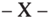

TOMO 322

Volumen 3

1999

## HOJA COMPLEMENTARIA

Hoja incorporada a los efectos de permitir la búsqueda por página dentro del Volumen.

## REPUBLICA ARGENTINA

FALLOS

DE LA

CORTE SUPREMA

DE

## JUSTICIA DE LA NACION

PUBLICACION ACARGO DE LA SECRETARIA DE JURISPRUDENCIA DEL TRIBUNAL

TOMO 322 -VOLUMEN 3

OCTUBRE - DICIEMBRE

LA LEY SAE. e 1. Tucumán 1471 (1050) Buenos Aires 1999

Copyright (c) 2000 by Corte Suprema de Justicia de la Nación Queda hecho el depósito que previene la ley 11.723. Impreso en la Argentina Printed in Argentina I.S.B.N. 950-9825-53-0

## ACUERDOS DE LA CORTE SUPREMA

## AÑO 1999

## OCTUBRE. DICIEMBRE

## CORTE SUPREMA. AUTORIDADES DE FERIA.

-Nº 27-

En Buenos Aires, a los 26 días del mes de octubre del año mil novecientos noventa y nueve, reunidos en la Sala de Acuerdos del Tribunal, los.señores Ministros que suscriben la presente,

Acordaron:

Designar como autoridades de feria del mes de enero del año 2000:

- 1º) Al doctor Enrique S. Petracchi -dellº aI31-, al doctor Adolfo R. Vázquez -del 1" a116y al doctor Guillermo A. F. López -del!7 al 31-, como jueces de feria.
- 2º) Al doctor Jorge Alberto Migliore -del 1º al 31y a la doctora María Cristina Alvarez de Magliano -del 17 al 31como secretarios del Tribunal.
- 3º) Establecer el horario de atención al público de lunes a viernes, desde las 7,30 hasta las 13,30 horas.
- 4º) El personal que preste funciones durante la feria judicial deberá acreditarlo mediante certificado otorgado por el señor secretario de feria.

Todo lo cual dispusieron y mandaron, ordenando que se comunicase y registrase en el libro correspondiente, por ante mí, que doy fe. -JULIO S. NAZARENOEDUARDO MOLINÉ O'CONNOR CARLOSS. FAY1' -AUGUSTOCÉSARBELLUSCIOENRIQUE SANTIAGO PETRACCIII\_ ANTONIOBOGGIANOGUSTAVOA. BOSSERTADOLFOROBERTOVAZQUEZNicolás Alfredo Reyes (Administrador General).

2288

## ACUERDOS DE LA CORTE SUPREMA .122

## JUZGADO FEDERAL DE ROSARIO NQl.

## INCORPORACION DE GRADUADOS DE LA CARRERA DE ABOGACIA.

## -Nº 28-

En Buenos Aires, a los dos días del mes de diciembre del año de mil novecientos noventa y nueve, reunidos en la sala de Acuerdos del Tribunal, los señores Ministros que suscriben la presente,

## Consideraron:

Que por acordada Nº 40/99 la Cámara Federal de Apelaciones de Rosario eleva a esta Corte la solicitud formulada por la señora juez a cargo del Juzgado Federal Nº 1de esa ciudad de autorización para el desempeño en ese tribunal de cinco graduados de la carrera de abogacía con los mayores promedios, por el termino máximo de un año y sin percepción de haberes, sin que ello implique ingreso en el Poder Judicial de la Nación ni derecho a ser designados en forma permanente o transitoria.

Que por acordada Nº 22/90, esta Corte estableció un programa de colaboración con las universidades nacionales y privadas consistente en permitir a los egresados con los más altos promedios de la carrera de abogacía desempeñarse en la Corte Suprema de Justicia en forma no remunerada, para realizar tareas de investigación, y fijó una serie de requisitos dirigidos a quienes se incorporaran al programa.

Que, además, por acordada 16/95 aprobó un régimen de pasantías solicitado por la Cámara Nacional de Apelaciones en lo Comercial, restringiéndolo al caso de los abogados graduados.

Que por acordadas 6/99 y 14/99 se resolvió acceder a una petición similar a la tratada.

Por ello y en virtud de las facultades conferidas por el arto 104 del R.J.N. y el arto 22 de la ley 4055,

## Acordaron:

Autorizar el desempeño en el Juzgado Federal de Rosario Nº 1, de cinco graduados de la carrera de abogacía con los mayores promedios, para que presten colaboración, al tiempo que se capacitarán, en las tareas de investigación del Tribunal, por el término máximo de un año y en forma ad honorem, y sin que ello implique ingreso al Poder Judicial de la Nación ni derecho a ser designado en forma permanente ni transitoria como agente del mismo.

Todo lo cual dispusieron y mandaron, ordenando que se comunicase y registrase en el libro correspondiente, por ante mí que doy fe. JULiO S. NAZARENOEDUARDO -MOLlNÉ O'CONNOR -..:..:.ARLOS C S. FAYT -AUGUSTO CÉSAR BELL\JSCIO GUSTAVOA. BOSSERTADOLF'O ROBERTO VAZQUEZ.

## DEJUSTICIA DELA NACION 322

## FERIADO JUDICIAL.

## ~Nº29-

En Buenos Aires, a los 9 días del mes de diciembre del año mil novecientos noventa y nueve, reunidos en la Sala de Acuerdos del Tribunal, los señores Ministros que suscriben la presente,

## Consideraron:

Que el día 10 de diciembre, asumirán en el Gobierno Nacional, las autoridades constitucionales recientemente electas,

## Acordaron:

Decretar feriado judicial el día 10 del corriente mes, para los tribunales nacionales y federales con asiento en la Capital Federal e interior, en las condiciones establecidas en arto 2º (R.J .N).

Todo lo cual dispusieron y mandaron, ordenando que se comunicase y registrase en el libro correspondiente, por ante mí, que doy fe. JULIO S. NAZARENO CARWS S. -FAYT AUGUSTOÉSAR BELLUSCIO ENRIQUE SANTIAGO ETRACCHI GUILLERMO . F. C -P -A LÓPEZ GUSTAVO. BOSSERT A ADOLFO ROBERTO VÁZQUEZ -Nicolás Alfredo Reyes (Administrador General).

CORTE SUPREMA. DESIGNACION DE SECRETARIO.

-Nº 30-

En Buenos Aires, a los 17 días del mes de Diciembre del año mil novecientos noventa y nueve, reunidos en la Sala de Acuerdos del Tribunal, los señores Ministros que suscriben la presente,

## Consideraron:

Que la experiencia recogida desde la vigencia de la resolución 97/99 demuestra que el doctor Esteban Jorge Canevari ha desempeñado satisfactoriamente las funciones asignadas a la Secretaría Especial creada por acordada 26/97, así como las que corresponden legal y reglamentariamente a la Secretaría Judicial Nro. 3.

Que la circunstancia puntualizada permite asignar la titularidad de la Secretaría Judicial Nº 3, sin perjuicio de lo dispuesto en la acordada 26/97 antes mencionada.

Por ello,

Acordaron:

- P) Designar Secretario de la Corte Suprema de Justicia de la Nación al doctor Esteban Jorge Canevari (D.N.L 13.530.385), para desempeñarse como titular de la Secretaría Judicial Nro. 3, quien conservará las funciones encomendadas por la acordada 26/97.
- 2º) Efectuar la siguiente supresión y creación de cargos, respectivamente, en la Corte Suprema de Justicia de la Nación

## -1 secretario letrado

## + un secretario

Todo lo cual dispusieron y mandaron, ordenando que se comunicase y registrase en el libro correspondiente, por ante mí, que doy fe. JULIO S. NAZARENO -EDUARDO MOLINÉ O'CONNOR -CARLOS S. FAYT-AUGUSTO CÉSAR BELLUSCIO -ANTONIO BOGGtANOGUILLERMO A. F. L(¡PEZ ~ ADOLFOROBERTOVÁZQUEZNicolás Alfredo Reyes (Administrador General).

## FERIADOS JUDICIALES DE NAVIDAD Y AÑo NUEVO.

## -N' 31-

En Buenos Aires, a los 21 días del mes de diciembre del año mil novecientos noventa y nueve, reunidos en la Sala de Acuerdos del Tribunal, los señores Ministros que suscriben la presente,

## Acordaron:

Decretar feriado judicial los días 24 y 31 del corriente mes, para los tribunales nacionales y federales con asiento en la capital e interior del país, en las condiciones establecidas en el arto 2º (R.J.N.).

Todo lo cual dispusieron y mandaron, ordenando que se comunicase y registrase en el libro correspondiente, por ante mí, que doy fe. -JULIO S. NAZARENOEDUARDO MOLINÉ O'CONNOR CARLOSS. FAYTAUGUSTOCÉSARBELLUSCIOENRIQUE SANTIAGO PETRACCHI ANTONIOBOGGIANO GUILLERMO A. F. LÓPEZ GUSTAVO A. BOSSERTADOLFO ROBERTOVÁZQUEZNicolás Alfredo Reyes (Administrador General).

## ACUERDOS DE LA CORTE SUPREMA 322

## DE JUSTICIA DE LA NACION 322

## FUNCIONARIOS Y EMPLEADOS JUDICIALES ..ASIGNACION DE "EX COMBATIENTES ISLAS MALVINAS"

## -Nº 32-

En Buenos Aires, a los 21 días del mes de diciembre del año mil novecientos noventa y nueve, reunidos en la Sala de Acuerdos del Tribunal, los Señores Ministros que suscriben la presente,

## Consideraron:

- 1º) Que este Tribunal-mediante acordada 40/93 del 2 de julio de mil novecientos noventa y tresdispuso la creación, entre otros beneficios, de un suplemento especial mensual denominado "Ex combatiente por la recuperación de las Islas Malvinas", equivalente al 10 % sobre el total remunerativo de los funcionarios y empleados que acrediten su condición de ex combatientes (cf. ley 23.109).
- 2º) Que por decreto 1244/98del 22 de octubre de 1998, el Poder Ejecutivo Nacional creó un beneficiomensual para el personal que acredite la condiciónde ex combatiente en las acciones bélicas desarrolladas en el teatro de operaciones del Atlántico Sur.
- 3º) Que los ex combatientes que se desempeñan en el Poder Judicial de la Nación solicitan la extensión del beneficio citado en el considerando anterior.
- 4º) Que en atención a que la causa que originó el suplemento es la participación de los ciudadanos en las acciones bélicas, no resulta equitativo que el cómputo se realice sobre un porcentaje del sueldo correspondiente a los cargos que ocupan, pues no se trata de otorgar el reconocimiento acorde con la jerarquía escalafonaria, sino de bonificar un hecho en el cual todos los agentes han tenido protagonismo.

Por ello,

## Acordaron:

- 1) Reemplazar -a partir de la liquidación de salarios del mes de enero del año 2000~ el suplemento instituido por el artículo 3º de la acordada Nº 40/93, por una asignación especial denominada "Ex Combatiente Islas Malvinas" que consistirá en el pago de una suma fija individual mensual de PESOS CUATROCIENTOS ($ 400) para los funcionarios y empleados que hayan acreditado o acrediten los recaudos indicados en los puntos 1º Y2º de la norma citada.
- 2) La asignación especial dispuesta en el artículo anterior, no sera considerada comobase de cálculo para ningún otro adicional, suplemento o bonificación ni estará sujeto a descuentos previsionales, asistenciales o de cualquier otro tipo.

2292

## ACUERDOS DE LA CORTE SUPREMA 322

Todo lo cual dispusieron y mandaron, ordenaron que se comunicase y registrase en el libro correspondiente, por ante mí que doy fe. JULIO S. NAZARENO -EDUARDO MOLINÉ O'CONNOR -CARLOS S. FAYT -ENRIQUE SANTIAGO PETRACCHI -GUSTAVO A. BOSSERT -GUILLERMO A. F. L6PEZ -ADOLFO ROBERTO V ÁZQUEZ Nicolás Alfredo Reyes (Administrador General).

## RESOLUCION DE LA CORTE SUPREMA

## AÑO 1999

## DICIEMBRE

## ETICA DE LA FUNCION PUBLICA

-N' 2196-

Buenos Aires, 28 de diciembre de 1999.

Vista la solicitud efectuada por la Asociación de Magistrados de la Justicia Nacional

## y Consideraron

Que el Congreso de la Nación ha sancionado la ley de Etica de la Función Pública -Nº 25.188-, ante cuya vigencia es conveniente que esta Corte, sin perjuicio de ejercer oportunamente las atribuciones que le asisten por mandato constitucional (art. 108 de la Ley Superior), despeje toda incertidumbre respecto del cumplimiento de las obligaciones que imponen los arts. 4º y 43, segundo párrafo, de dicho texto normativo, así como las eventuales responsabilidades disciplinarias a que podrían quedar expuestos los magistrados y funcionarios del Poder Judicial de la Nación (arts. SQ y 9 Q , ley citada).

Que, con tal comprensión, dada la naturaleza de la obligación establecida por el arto 4Q de la ley 25.188, que el plazo establecido en ésta disposición sólo corre durante los días hábiles y la analogía que guarda con la situación de los magistrados y funcionarios que se encuentran en funciones, corresponde concluir que en el cálculo del término fijado en el arto 44 de dicho texto normativo únicamente deben considerarse los días hábiles judiciales, por lo que vencerá el 16 de febrero del año 2000.

Por ello,

Se Resuelve:

Estáblecer que el plazo contemplado en el arto 44 de la ley 25.188 sólo corre durante los días hábiles judiciales, por lo que vencerá el 16 de febrero del año 2000. Regístrese y hágase saber. -JuLIO S. NAZARENO -EDUARDO MOLlNÉ O'CONNOR -CARLOS S. FAYT AUGUSTO CÉSAR BELUJSCIO -GUILLERMO A. F. L6PEZ -ADOLFO ROBERTO VÁZQUEZ Nicolás Alfredo Reyes (Administrador General).

## HOJA COMPLEMENTARIA

Hoja incorporada a los efectos de permitir la búsqueda por página dentro del Volumen.

DE JUSTICIA DE LA NACION

322

## FALLOS DE LA CORTE SUPREMA

## OCTUBRE

## COMPAÑIA SUDAMERICANA DE PESCA Y EXPORTACION S.A.I. Y C. V. MINISTERIO DE DEFENSA

DAÑOS Y PERJUICIOS: Determinación de la indemnización. Daño material.

Resulta inadmisible el agravio referente a que la decisión apelada había interpretado erróneamente que la demanda perseguía el resarcimiento del lucro cesante, pues de ella surge claramente que los perjuicios por los que se reclama deben considerarse incluidos dentro del concepto de lucro cesante.

DAÑOS Y PERJUICIOS: Determinación de la indemnización. Daño material.

Tratándose del reclamo de los daños derivados de la requisición de un buque por  el  Estado,  la  calificación,  efectuada  por  la  actora,  de  sus  reclamos  por 'pérdida de mercado' y 'pérdida por falta de actividad' como lucro cesante, resulta decisiva para la suerte contraria a su decisión (art. 37, ley 16.970).

RECURSO ORDINARIO DE APELACION: Tercera instancia. Generalidades.

A los efectos del recurso ordinario de apelación, la escueta reproducción, en forma parcial, de lo expuesto en la expresión de agravios presentada ante la alzada, no satisface la exigencia procesal de crítica concreta y razonada del fallo  recurrido.

DAÑOS Y PERJUICIOS: Responsabilidad del Estado. Generalidades.

Para que proceda la indemnización de los daños ocasionados en el cumplimiento de las funciones administrativas es imprescindible la concurrencia de dos presupuestos: que medie una privación o lesión al derecho de propiedad y que aquélla sea consecuencia directa e inmediata del obrar del Estado (Disidencia parcial de los Dres. Eduardo Moliné O'Connor, Augusto César Belluscio y  Antonio Boggiano).

DAÑOS Y PERJUICIOS: Determinación de la indemnización. Daño material.

Demostrada la relación directa entre el acto de requisición de un buque y el menoscabo causado en el patrimonio de la sociedad propietaria, corresponde

2295

indemnizar el rubro correspondiente a los gastos de alistamiento del nuevo navío (Disidencia parcial de los Dres. Eduardo Moliné O'Connor, Augusto César Belluscio y Antonio Boggiano).

## FALLO DE LA CORTE SUPREMA

Buenos Aires, 5 de octubre de 1999.

Vistos los autos: 'Compañía Sudamericana de Pesca y Exportación S.A.I. y C. c/ Estado Nacional - Ministerio de Defensa s/ daños y perjuicios'.

## Considerando:

- 1 ) Que la Sala III de la Cámara Nacional de Apelaciones en lo Civil ' y Comercial Federal confirmó la sentencia de la instancia anterior que había rechazado la demanda deducida por la Compañía Sudamericana de Pesca y Exportación S.A.I. y C. contra el Estado Nacional (Ministerio de Defensa - Estado Mayor General de la Armada).
- 2 ) Que contra dicho pronunciamiento, la actora interpuso el recurso ' ordinario que fue concedido y resulta formalmente procedente toda vez que se dirige contra una sentencia definitiva recaída en una causa en que la Nación reviste el carácter de parte y en tanto el valor reclamado supera el mínimo establecido por el art. 24, inc. 6, ap. a, del decreto-ley 1285/58 y sus modificaciones, actualizado por resolución 1360/91.
- 3 ) Que la Compañía Sudamericana de Pesca y Exportación S.A.I. y ' C. había promovido demanda por indemnización de daños y perjuicios contra el Estado Nacional por la pérdida total de su única unidad de pesca -el buque factoría 'Narwal'- hundido el 9 de mayo de 1982 en circunstancias de encontrarse al servicio de la Armada Nacional.

La actora reclamó la reparación del menoscabo causado por la 'pérdida de mercado' y por la 'pérdida por falta de actividad' originadas entre la puesta a disposición del buque para la demandante y la reanudación de las labores con el nuevo navío adquirido posteriormente. También pidió el pago de una indemnización por el monto no pagado por la compañía aseguradora, por la diferencia entre el valor del monto asegu-

rado y el precio del nuevo buque y los intereses por la demora en el pago de dicho seguro, el reintegro de las erogaciones efectuadas para la compra y el alistamiento del nuevo navío, y los perjuicios provocados por el pago tardío por la Subsecretaría de Pesca de los salarios, cargas sociales e indemnizaciones satisfechos a su personal durante el período en que la empresa debió cubrir esas prestaciones.

- 4 ) Que el juez de primera instancia consideró que el caso se encua-' draba en el supuesto de la indemnización de los daños provocados por la actividad lícita del Estado, que sólo eran susceptibles de ser reparados aquellos perjuicios que habían sido consecuencia directa e inmediata del obrar estatal, y que debía atenderse a lo establecido por el art. 37 de la ley 16.970, que niega la indemnización del lucro cesante en los supuestos de requisición de bienes.
- 5 ) Que, en consecuencia, dicho magistrado estimó que los rubros ' reclamados por pérdida por falta de actividad y pérdida de mercado configuraban un supuesto de lucro cesante que no podía ser indemnizado, que las diferencias originadas por el pago del seguro entre la demandante y su compañía aseguradora y los gastos de compra y alistamiento del nuevo buque no habían sido consecuencia directa e inmediata del accionar estatal, y que el reclamo por el pago tardío a los obreros y empleados de la actora no había sido comprobado en la causa ante la inexistencia de documentación que respaldara los dichos de la demandante al respecto.
- 6 ) Que la actora apeló la sentencia de primera instancia y adujo en ' el memorial de fs. 956/966 que su parte no había reclamado la cobertura de un lucro cesante, sino que pretendía la restitución del valor de la empresa en marcha que había sido suprimido de su patrimonio mediante el acto de la requisición adoptado por la demandada.

Asimismo, solicitó que la cámara revocara la sentencia recurrida respecto a los demás rubros desestimados, pues entendía que las diferencias con la compañía aseguradora respecto del cobro del seguro y los gastos de alistamiento del nuevo buque se habían originado en el accionar de la demandada, y que el pago tardío de salarios y cargas sociales surgía de un expediente incorporado como prueba a la causa en el cual obraba un peritaje que daba cuenta de tal circunstancia.

7 ) Que frente a esa apelación, el ' a quo confirmó la sentencia de la instancia anterior pues estimó que los rubros de pérdida por falta de

actividad y pérdida de mercado encuadraban en el concepto de lucro cesante, que no podía ser admitido de acuerdo con lo dispuesto por el art. 37 de la ley 16.970, que la diferencia por el valor del nuevo buque y la pérdida de intereses por el pago del seguro eran cuestiones surgidas con la compañía aseguradora que no consistían en daños derivados del accionar del Estado, y que el reclamo por el pago tardío de salarios, cargas sociales e indemnizaciones laborales no había recibido comprobación del peritaje contable de fs. 816/825.

La alzada destacó, además, que la existencia de un único navío de la demandante no era suficiente para modificar la calidad jurídica del daño como lucro cesante en relación a las invocadas pérdida por falta de actividad y pérdida de mercado y que, por otra parte, la apelante sólo había formulado una mera disconformidad en su expresión de agravios respecto de los demás rubros, que no podía aceptarse como crítica concreta y razonada del fallo apelado.

8 ) Que el recurrente se agravió a fs. 1014/1026 de la sentencia de ' cámara y solicitó, en primer lugar, la nulidad de ese fallo pues sostuvo que no es un acto judicial válido en los términos de los arts. 163, 169 y concordantes del Código Procesal Civil y Comercial de la Nación, toda vez que el a quo no ha efectuado el tratamiento de los agravios planteados por su parte contra el pronunciamiento de primera instancia.

También cuestionó la decisión de la alzada que -según su planteono consideró sus quejas respecto a que la requisición del barco le provocó pérdidas que fueron consecuencia directa e inmediata del accionar de la demandada que no eran susceptibles de ser encuadradas en el concepto de lucro cesante. En particular, hizo hincapié en la circunstancia de que el acto de requisición había implicado la desaparición del único activo físico que constituía su empresa como unidad productiva, lo cual había generado un perjuicio patrimonial en la organización empresaria que requería su resarcimiento mediante los conceptos de indemnización por pérdida por falta de actividad y por pérdida de mercado.

9 ) Que con respecto a la nulidad de la sentencia apelada, las quejas ' de la demandante no pueden prosperar, pues el fallo de alzada cuenta con argumentos propios y suficientes que le permitieron lograr la finalidad a la que estaba destinado (art. 34, inc. 4 , del Código Procesal Civil y Co-' mercial de la Nación) y lo ponen a cubierto de la impugnación intentada; máxime cuando el recurso de apelación comprende el de nulidad por defectos del pronunciamiento (Fallos: 312:1599).

10) Que, en cuanto al fondo del asunto, el recurrente se agravia por la circunstancia de que la cámara -al mantener la tesitura del juez de primera instancia- no tuvo en cuenta que la requisición del pesquero 'Narwal' por el Estado Nacional había importado la indisponibilidad de hecho de su única unidad productiva existente, de modo que en el transcurso del pleito no ha reclamado la cobertura de un lucro cesante sino que ha pretendido que se le restituya el valor de la 'empresa en marcha', que fue suprimido de su patrimonio mediante aquel acto estatal.

11) Que la actora había pedido en su demanda la compensación por la falta de actividad forzada desde la puesta en disposición del buque 'Narwal' -rubro que calculó en la suma de u$s 1.492.000, como habría de probar, según sostuvo, en la etapa procesal oportuna (ver fs. 5 vta., punto IV.2 y fs. 64, punto III.7.3.)- y el concepto calificado como 'pérdida de mercado', consistente en la ausencia de su participación en el mercado con motivo de la pérdida de aquel buque, a cuyo fin sujetó su pedido a las resultas de lo que se determinara en la pertinente prueba pericial (conf. fs. 64 vta., punto III.8 de la ampliación de demanda).

12)  Que,  pese  a  lo  señalado  en  la  expresión  de  agravios  de fs. 1014/1026, la parte actora había propuesto como punto del peritaje contable que el experto, basándose en los informes producidos por las entidades oficiadas en autos y con relación a las características y capacidad operativa del buque 'Narwal', estableciera el lucro cesante que había sufrido como consecuencia de la falta de actividad a que se había visto forzada desde el 22 de abril de 1982 hasta el 31 de diciembre de 1983 (ver fs. 823/824 vta., punto K).

13) Que, en consecuencia, resulta inadmisible el agravio referente a que el fallo de primera instancia había interpretado erróneamente el objeto de la indemnización perseguida por su parte en el juicio en el sentido de que era una pretensión dirigida a obtener el resarcimiento del lucro cesante (ver expresión de agravios de fs. 956/956 vta.), pues la prueba propuesta por su parte estaba inequívocamente destinada -tal como también entendió el a quo - a comprobar la existencia de dicha pérdida por falta de actividad en el carácter de lucro cesante y no como cálculo por el valor de la requisición de la 'empresa en marcha'.

14) Que, amén de lo expresado, la prueba producida en autos sólo ha informado de la existencia de una falta de ingresos durante el período mencionado pero de ningún modo ha quedado acreditada la requisición

de la empresa actora en sí, la cual ha seguido funcionando durante el lapso por el que se ha reclamado el reintegro por pérdida de ganancias, ha cobrado el seguro por la pérdida del buque 'Narwal' y ha adquirido otro navío con posterioridad para seguir el ejercicio de su actividad comercial pesquera.

15) Que, por otra parte, de los términos de la demanda y de las constancias de la prueba producida (ver Anexo IV de fs. 803), de la transcripción de los daños reclamados formulada en el alegato (ver puntos II e. y f. de fs.  919  vta./920  y  punto  V  4  de  fs.  921  vta.)  y  del  memorial  de fs. 956/966 surge claramente que los perjuicios que le habría ocasionado a la actora la interrupción de su campaña de pesca hasta la puesta en funcionamiento del nuevo buque como consecuencia de la afectación del navío 'Narwal' a la Armada Nacional, deben considerarse incluidos dentro del concepto de lucro cesante (conf. Fallos: 313:1500).

16) Que la calificación efectuada por la actora de sus reclamos por pérdida de mercado y pérdida por falta de actividad como lucro cesante resulta decisiva para la suerte contraria a su pretensión, pues el art. 37 de la ley 16.970 dispone que la indemnización en los casos de requisición de bienes no incluirá el lucro cesante, sin que de autos surja que el demandante haya invocado la inconstitucionalidad de tal norma o demostrado su falta de aplicación al sub examine .

- 17) Que no empece a esta solución la circunstancia de que la demandada haya abonado parcialmente el lucro cesante -como sostiene la apelante-, pues, tal como lo establece el art. 723 del Código Civil y lo había señalado el juez de primera instancia en su sentencia (fs. 932), si el acto de reconocimiento de deuda agrava la prestación original o la modifica en perjuicio del deudor, debe estarse al título primordial, que en el caso resulta ser un acto de requisición en los términos de la ley 16.970 (conf. fallo de fs. 929/934 que se encuentra firme al respecto).
- 18) Que el apelante insiste en su memorial de fs. 1014/1026 en el mantenimiento de la totalidad de sus pretensiones, pues, según entiende, el a quo no ha tratado los agravios que había introducido contra la sentencia de primera instancia.
- 19) Que el juez interviniente en la causa había señalado que los daños reclamados por la actora consistentes en la diferencia entre el monto asegurado y la suma efectivamente percibida y los intereses por el

cumplimiento tardío de esa prestación por parte de la aseguradora no podían ser catalogados como daños derivados del accionar directo e inmediato del Estado Nacional, y en particular, había destacado que las cláusulas del seguro respectivo eran ajenas a la demandada, de modo que todo lo atinente a la extensión de la cobertura así como a la forma y tiempo en que se habían verificado los pagos respectivos no tenía relación con el obrar imputable al autor de la requisición.

20) Que la apelante formuló su disconformidad con la posición adoptada al respecto en la sentencia de primera instancia (ver fs. 964 vta./ 965), planteo que fue considerado por la alzada, que señaló que los reclamos de la demandante por la diferencia entre lo cobrado en concepto de seguro y el precio del nuevo buque comprado y la pérdida de intereses por el cumplimiento tardío en el pago del seguro no se derivaban del accionar del Estado, que había sido completamente ajeno al contrato de seguro celebrado por la actora.

Frente a ello, la expresión de agravios del recurso ordinario deducido contra la decisión del a quo sólo menciona, en forma abreviada, su planteo efectuado en el anterior memorial para destacar la supuesta omisión de tratamiento del tribunal al respecto (ver fs. 1025, punto LL, y último párrafo de fs. 1025 vta.), lo cual importa una falta de crítica concreta a la sentencia del a quo que había considerado expresamente esa queja (ver fs. 993 vta., considerando 4 ) y la había desestimado como fundamento ' de la demanda de indemnización de daños reclamada por la actora.

21) Que, del mismo modo, debe ser rechazado el cuestionamiento efectuado en el memorial de fs. 1014/1026 respecto a que la cámara omitió el tratamiento del agravio referente al saldo pendiente de cobro del seguro, ya que el fallo recurrido -a pesar de lo afirmado por la apelanteconsideró ese aspecto de la controversia al juzgar que dicho memorial no había importado una crítica concreta y razonada del fallo de primera instancia (conf. considerando III de fs. 993 vta. y art. 265 del Código Procesal Civil y Comercial de la Nación).

22) Que, asimismo, el magistrado de primera instancia había señalado que el concepto reclamado como 'pérdida por pago tardío de salarios, cargas sociales y sumas convenidas como indemnización' no había podido ser acreditado en la prueba pericial contable de fs. 816/825, a la vez que formuló diversas consideraciones en torno a la falta de acreditación del perjuicio reclamado en la demanda.

Frente a ello, la expresión de agravios de fs. 956/966 sólo hizo alusión a la existencia de un peritaje realizado en la causa 'Gómez, Juan A. c/ Cía. Sudamericana de Pesca y Exportación S.A. y otro', sin hacerse cargo del hecho de que el juez había examinado esas actuaciones para concluir que las registraciones invocadas por la recurrente carecían de la documentación respaldatoria correspondiente y, además, no evidenciaban la existencia de débito alguno.

23) Que tampoco puede prosperar el agravio relativo al rubro gastos de alistamiento del nuevo pesquero porque el apelante escuetamente se ha limitado a reproducir en forma parcial lo expuesto en la expresión de agravios presentada ante la alzada, lo cual no satisface la exigencia procesal de crítica concreta y razonada del fallo recurrido (Fallos: 288:108 y 307:2216).

Por ello, se confirma la sentencia apelada. Con costas a la recurrente vencida (art. 68 del Código Procesal Civil y Comercial de la Nación). Notifíquese y devuélvase.

JULIO S. NAZARENO - EDUARDO MOLINÉ O'CONNOR ( en disidencia )  -CARLOS S. FAYT - AUGUSTO CÉSAR BELLUSCIO ( en disidencia ) - ANTONIO BOGGIANO ( en  disidencia )  -  GUILLERMO A. F. LÓPEZ - GUSTAVO A. BOSSERT - ADOLFO ROBERTO VÁZQUEZ.

DISIDENCIA PARCIAL DEL SEÑOR VICEPRESIDENTE DOCTOR DON EDUARDO MOLINÉ O'CONNOR Y DE LOS SEÑORES MINISTROS DOCTORES DON AUGUSTO CÉSAR BELLUSCIO Y DON ANTONIO BOGGIANO

## Considerando:

Que los infrascriptos coinciden con los considerandos 1  a 22 del voto ' de la mayoría.

23) Que, en cambio, distinta suerte corre el agravio por los gastos de alistamiento del nuevo pesquero; rubro sobre el cual -a diferencia de los restantes agravios- la cámara omitió pronunciarse expresamente por considerar que la apelante no había efectuado una crítica concreta y razonada de la sentencia de primera instancia, a pesar de que -como resulta de fs. 965- la demandante había cuestionado el criterio del

juez de grado con sustento en que la demandada era responsable de los gastos necesarios para poner en condiciones de navegabilidad el nuevo pesquero.

- 24) Que ello conduce al examen de los agravios que la actora formuló respecto del pronunciamiento de primera instancia (Fallos: 311:2385) y, en  consecuencia,  a  considerar  la  eventual  admisibilidad  de  tal cuestionamiento en el presente recurso ordinario.
- 25) Que, en este sentido, esta Corte ha señalado que para que proceda la indemnización de los daños ocasionados en el cumplimiento de las funciones administrativas es imprescindible la concurrencia de dos presupuestos: que medie una privación o lesión al derecho de propiedad y que aquélla sea consecuencia directa e inmediata del obrar del Estado (Fallos: 310:2824).
- 26) Que las constancias de la causa demuestran que el acto de requisición de la demandada y la posterior pérdida del buque 'Narwal' tuvieron como obvia consecuencia directa e inmediata la desaparición de elementos que se encontraban en ese navío, pérdida que hizo necesaria la realización de diversas erogaciones en el nuevo buque para ubicarlo en una situación similar a la que se hallaba el bien perdido durante el conflicto bélico.
- 27) Que no obsta a lo expresado el hecho de que tales elementos faltaran en el buque adquirido por la actora, toda vez que los gastos efectuados oportunamente eran imprescindibles para poner a aquél en condiciones de navegabilidad y para reparar el daño emergente causado por el acto de requisición, lo cual fue reconocido expresamente por la demandada que dispuso adoptar 'las medidas tendientes a posibilitar la obtención de la capacidad exigida por la autoridad naviera pertinente, que permitiera a la empresa hacer navegar y operar en tareas de pesca a la unidad de reemplazo' (ver fs. 149 del expediente agregado N  536). '

28) Que, por consiguiente, la actora ha demostrado la relación directa entre el acto de la requisición y el menoscabo causado en el patrimonio de la sociedad por lo que corresponde declarar la procedencia del rubro correspondiente a los gastos de alistamiento del nuevo navío hasta la suma de $ 186.677,80 que resulta del carácter del agravio planteado a fs. 965 y del peritaje de fs. 764/765 que no ha sido observado por la demandada, más intereses a la tasa del 6 % anual a computar desde mayo de 1982 hasta el 31 de marzo de 1991. Con posterioridad a esta

fecha, se devengarán los intereses que correspondan, según la legislación que resulte aplicable.

Por ello, se revoca la sentencia apelada y, en consecuencia, se hace lugar a la demanda -en forma parcial- con el alcance y limitaciones que resultan de los considerandos 24 a 28 del presente pronunciamiento. Con costas en los términos del art. 71 del Código Procesal Civil y Comercial de la Nación en todas las instancias. Notifíquese y devuélvase.

EDUARDO MOLINÉ O'CONNOR - AUGUSTO CÉSAR BELLUSCIO - ANTONIO BOGGIANO.

## PASADENA S.A. V. ADMINISTRACION NACIONAL DE ADUANAS

RECURSO ORDINARIO DE APELACION: Tercera instancia. Juicios en que la Nación es parte.

Es formalmente admisible el recurso ordinario de apelación deducido contra el  pronunciamiento que admitió la prescripción y rechazó la demanda de daños y perjuicios por la demora ilegítima atribuida a la Aduana en el trámite de nacionalización de una máquina, toda vez que se dirige contra una sentencia definitiva, dictada en una causa en que la Nación es parte, y el monto disputado en último término supera el mínimo establecido por el art. 24, inc. 6, ap. a, del decreto-ley 1285/58 y la resolución 1360/91 de la Corte Suprema.

## RECURSO DE APELACION.

El tribunal de apelación tiene, con respecto a las pretensiones y oposiciones oportunamente introducidas, la misma competencia que corresponde al juez de primera instancia, por lo que nada obsta que, al considerar los extremos fácticos de la causa a fin de establecer el punto de partida del plazo de prescripción, la cámara haya asignado relevancia a la disposición aduanera cuyo dictado había sido invocado por la recurrente en el escrito de demanda.

DAÑOS Y PERJUICIOS: Responsabilidad del Estado. Casos varios.

Corresponde confirmar la sentencia que, al admitir la prescripción, rechazó la demanda de daños y perjuicios por la demora ilegítima atribuida a la Aduana en el trámite de nacionalización de una máquina, si la suspensión que -por incumplimiento del pago de servicios- inhabilitaba a la actora para solicitar desti-

naciones aduaneras no fue cuestionada en sede administrativa ni judicial, sino que la deuda fue cancelada, por lo que sólo un requerimiento posterior hubiera podido considerarse como una eficaz constitución en mora.

## FALLO PLENARIO.

Es insustancial el agravio relativo a que el a  quo se  habría  apartado  de  lo dispuesto en el art. 303 del Código Procesal Civil y Comercial de la Nación, si la doctrina legal fijada en el fallo plenario invocado por el apelante presupone que el deudor ha sido eficazmente constituido en mora, lo que no ocurre en el caso en que la conducta ilegítima atribuida a la administración no se verificaba cuando fue cursada la carta documento en que pretende apoyarse la actora.

## FALLO DE LA CORTE SUPREMA

Buenos Aires, 5 de octubre de 1999.

Vistos los autos: 'Pasadena S.A. c/ Administración Nacional de Aduanas s/ aduana'.

## Considerando:

1 ) Que la Sala I de la Cámara Nacional de Apelaciones en lo Conten-' cioso Administrativo Federal, al desestimar los agravios de la actora, confirmó la sentencia de la instancia anterior que admitió la defensa de prescripción opuesta por el representante del organismo estatal y, en consecuencia, rechazó la demanda enderezada a obtener una indemnización por los daños y perjuicios que le habría ocasionado a Pasadena S.A. la demora ilegítima atribuida a la Aduana de Rosario en el trámite de nacionalización de una máquina de inyección para moldeo de material plástico importada por ella.

2 ) Que el tribunal de alzada afirmó que en el ' sub examine es de aplicación el plazo bienal de prescripción establecido por el art. 4037 del Código Civil. Consideró que mientras la actora estuvo suspendida en el Registro de Importadores y Exportadores a raíz de la disposición 28/89 -emitida por el administrador de la Aduana de Rosario el 11 de diciembre de 1989- mal podía imputarse una conducta ilegítima a la aduana. Sentado lo que antecede, expresó que ya sea que la indebida demora que se atribuye al organismo estatal se hubiera verificado a partir del 19 de diciembre de ese año -cuando cesó esa suspensión al

pagarse los cargos que la motivaron- o el día 26 del mismo mes -cuando fue rechazado un pedido de destinación de importación para consumo al que luego en octubre de 1992 se le dio curso- o el 5 de febrero de 1990 -fecha en que se notificó ese rechazo- el plazo de prescripción se encontraba cumplido con exceso al momento en que se inició la demanda 'sin que se haya alegado la posterior ocurrencia de alguna causal suspensiva o interruptiva de su curso' (fs. 698).

3 ) Que, en virtud del razonamiento precedentemente reseñado, la ' cámara juzgó inconducente examinar los eventuales efectos que, en orden a lo establecido por el art. 3986 del Código Civil, podrían ser atribuidos a la carta documento que la actora cursó a la Aduana de Rosario el 7 de diciembre de 1989 y a la solicitud de destinación efectuada el 11 de ese mes, en la medida en que la ilegítima demora de esa repartición en tramitar el despacho -si la hubo- no pudo sino iniciarse con posterioridad a tales actos.

4 ) Que, contra lo así resuelto, la actora interpuso el recurso ordina-' rio de apelación que fue concedido a fs. 719, y es formalmente admisible toda vez que se dirige contra una sentencia definitiva, dictada en una causa en que la Nación es parte, y el monto disputado en último término supera el mínimo establecido por el art. 24, inc. 6 , apartado a, del decre-' to-ley 1285/58 y la resolución 1360/91 de esta Corte. A fs. 731/744 vta. obra el memorial de agravios, que fue contestado por la demandada a fs. 748/755 vta.

5 ) Que los principales agravios de la apelante pueden resumirse del ' siguiente modo: a) la cámara falló ultra petita en cuanto consideró los efectos de la suspensión dispuesta el 11 de diciembre de 1989, pues ese extremo no había sido considerado por el juez de primera instancia, no fue alegado ante la alzada por ninguna de las partes ni tomado en cuenta por la demandada al oponer la defensa de prescripción; b) cuando se cursó la carta documento por la que se constituyó en mora a la Aduana no regía suspensión alguna que impidiera tramitar destinaciones aduaneras ya que la primera -la originada en el acuerdo preventivo- había caducado un día antes, y la segunda sólo operó a partir del día 11; c) la sentencia es arbitraria porque omitió considerar el argumento de su parte consistente en que dicha carta documento suspendió el cómputo de la prescripción de acuerdo con lo establecido por el art. 3986, párrafo segundo, del Código Civil, y según la doctrina plenaria fijada por la cámara en la causa 'González, Aníbal c/ Gobierno Nacional', a tenor de la cual 'si la demanda se interpone luego de haber transcurrido el

plazo de un año desde la constitución en mora del deudor, previsto por el art. 3986 CC, la suspensión de la prescripción durante ese lapso mantiene su efecto'; d) no dio explicación válida para apartarse de la obligatoriedad de los fallos plenarios de conformidad con el art. 303 del Código Procesal Civil y Comercial de la Nación; e) el a quo tomó en cuenta la suspensión de Pasadena S.A. en el Registro de Importadores y Exportadores a partir del 11 de diciembre de 1989 y le atribuyó, en su concepto, efectos retroactivos sin dar ninguna importancia al hecho que la constitución en mora de la demandada operó con anterioridad mediante la intimación efectuada por carta documento del 7 de diciembre de 1989.

6 ) Que el primero de tales agravios debe ser desestimado pues la ' cámara se limitó a rechazar la apelación deducida por la actora, de manera que no ha excedido el marco de sus atribuciones en el ámbito de conocimiento que le es propio (arts. 271 in fine y 277 del Código Procesal Civil y Comercial de la Nación; confr. Fallos: 315:865, considerando 5 ). ' Asimismo cabe recordar que esta Corte ha señalado que el tribunal de apelación tiene, con respecto a las pretensiones y oposiciones oportunamente introducidas, la misma competencia que corresponde al juez de primera instancia (Fallos: 308:821; 312:2096, entre otros). Consecuentemente, nada obsta que al considerar los extremos fácticos de la causa a fin de establecer el dies a quo del plazo de prescripción, la cámara haya asignado relevancia a la disposición 28/89 de la Aduana de Rosario, pues el dictado de ella había sido invocado por la misma actora tanto en el escrito de demanda (fs. 74/75) como al producir su alegato (fs. 624 vta./ 625).

7 ) Que la pretensión de la actora, según fue expuesta en el escrito de ' demanda, se funda en la premisa de que, a partir del 6 de diciembre de 1989, cuando, por haber sido homologado el acuerdo preventivo, cesó la suspensión en el Registro de Importadores y Exportadores que pesaba sobre dicha empresa -en los términos del inc. d del apartado 1 del art. 97 del Código Aduanero- la máquina importada estuvo en condiciones de ser despachada a plaza, por lo que fue ilegítima la conducta de la Aduana de Rosario en tanto sólo dio curso al despacho el 17 de octubre de 1990.

8 ) Que al día siguiente de la homologación del acuerdo, dirigió ' una carta documento al administrador de la Aduana de Rosario, en la que se quejó porque había sido negada la recepción de la solicitud del despacho a plaza de la maquinaria importada, señaló que ello contravenía una orden judicial, que con la homologación del acuerdo había

caducado la suspensión de Pasadena en el Registro de Importadores y Exportadores en los términos de la norma antes citada, lo que tornaba inexplicable la actitud de privarla de su derecho a obtener el despacho a plaza. Por tales motivos, imputó responsabilidad al organismo aduanero y a los funcionarios intervinientes por los daños y perjuicios que provocase la conducta asumida y constituyó 'formalmente en mora a esa Administración' (fs. 43).

9 ) Que cuatro días más tarde -de los cuales sólo dos fueron hábiles-' el administrador de la Aduana de Rosario dictó la resolución 28/89 por la que suspendió a Pasadena S.A. 'por incumplimiento en el pago de los servicios extraordinarios' (fs. 57). Como bien lo señaló la cámara, esa nueva suspensión -que inhabilitaba a la actora para solicitar destinaciones aduaneras (art. 92, inc. 1 , y concordantes de la ley 22.415)- no fue cues-' tionada en sede administrativa ni judicial, sino que, por el contrario, la actora canceló la deuda que motivó dicha suspensión el 19 de diciembre de 1989 para obtener su levantamiento según lo dispuesto por el inc. f del art. 97 de la citada ley.

10) Que, en tales condiciones, en la hipótesis de que se entendiera que la segunda parte del art. 3986 del Código Civil fuese aplicable a casos de la naturaleza del sub examine , correspondería concluir que a la carta del 7 de diciembre de 1989 no podrían serle atribuidos los efectos previstos en dicha norma ya que la demora ilegítima endilgada a la Aduana como fundamento de la acción de daños y perjuicios no pudo haberse verificado antes del 19 de diciembre de 1989, cuando, con el pago del cargo adeudado, fue removido el impedimento legal derivado de la disposición 28/89. De tal manera, sólo un requerimiento posterior a esa fecha podría eventualmente haber sido considerado como una eficaz constitución en mora.

11) Que, por lo demás, es evidente que la existencia de un lapso de dos días hábiles -el 7 y el 8 de diciembre de 1989- entre el cese de la suspensión originada en el concurso preventivo de la actora y el comienzo de la motivada en una deuda aduanera impaga, durante el cual no se dio curso a la solicitud de despacho de la maquinaria, carece de entidad como para modificar la conclusión expuesta ya que -al margen de que lo breve de ese lapso descarta tal posibilidad- el consentimiento de la demandante respecto del acto administrativo que dispuso la nueva suspensión impide calificar de ilegítima a la conducta observada hasta entonces por la aduana.

12) Que a lo expresado cabe agregar que el apelante no ha refutado la afirmación de la cámara en cuanto a que 'no se ha alegado la posterior ocurrencia de alguna causal suspensiva o interruptiva' del curso de la prescripción.

- 13) Que, por otra parte, es inexacta la afirmación del apelante en cuanto a que la cámara omitió considerar los argumentos de su parte respecto de que el curso de la prescripción se suspendió en los términos del art. 3986 -segunda parte- del Código Civil. En efecto, tal como surge del relato efectuado (ver considerando 2 ) el ' a quo , sobre la base de un razonamiento análogo al precedentemente expuesto, rechazó expresamente ese agravio.
- 14) Que la doctrina legal fijada en el fallo plenario invocado por el apelante presupone que el deudor ha sido eficazmente constituido en mora, circunstancia que no se observa en el sub lite , pues la pretensión deducida en estos autos se funda en una conducta ilegítima atribuida a la administración -en los términos expuestos en el escrito de demanda- que, como surge de lo establecido en los anteriores considerandos, no se verificaba el 7 de diciembre de 1989 cuando fue cursada la carta documento en que pretende apoyarse la actora. Consecuentemente, el agravio relativo a que el a quo se habría apartado de lo dispuesto en el art. 303 del Código Procesal Civil y Comercial de la Nación es insustancial.

Por ello, se confirma la sentencia apelada. Con costas. Notifíquese y devuélvase.

JULIO S. NAZARENO - EDUARDO MOLINÉ O'CONNOR - AUGUSTO CÉSAR BELLUSCIO - ANTONIO BOGGIANO - GUSTAVO A. BOSSERT - ADOLFO ROBERTO VÁZQUEZ.

NESTOR DANIEL BATUT Y OTROS V. CAJA NACIONAL DE AHORRO Y SEGURO

RECURSO EXTRAORDINARIO: Requisitos propios. Sentencia definitiva. Concepto y generalidades.

Es admisible el recurso extraordinario deducido contra el rechazo de la tercería de dominio promovido por el Banco Caja de Ahorro SA., alegando la propiedad

de los fondos embargados en la ejecución de honorarios contra la ex-Caja Nacional de Ahorro y Seguro, pues el fallo ocasiona un gravamen de imposible reparación ulterior, en tanto emerge de lo resuelto en él la atribución de responsabilidad a la actora por la deuda.

## RECURSO EXTRAORDINARIO: Requisitos propios. Resolución contraria.

Es admisible el recurso extraordinario deducido contra el rechazo de la tercería de dominio promovido por el Banco Caja de Ahorro SA., alegando la propiedad de los fondos embargados en la ejecución de honorarios contra la ex-Caja Nacional de Ahorro y Seguro, pues el fallo contiene una resolución contraria a  las  normas de derecho federal invocadas (ley 24.155, y decretos 2514/91 y 2715/93).

## PRIVATIZACION.

Las nuevas sociedades creadas mediante el decreto 2715/93, lo fueron a partir de  la  escisión  de  la  Caja  Nacional  de  Ahorro  y  Seguro,  lo  que  obsta  a  la posibilidad de sostener que sean ellas sucesoras de ésta.

## PRIVATIZACION.

Del sistema establecido por el decreto 2715/93 resulta que en todos los casos media garantía estatal por el pago de las deudas no transferidas, lo que elimina el  riesgo  de  que  puedan  ser  afectados  legítimos  derechos  de  terceros,  y resta justificación a la afirmación de no resultar admisible el traspaso de los activos sin una correlativa transferencia de las obligaciones.

## PRIVATIZACION.

La resolución que dispuso la asignación de los activos que integrarían el patrimonio de las nuevas sociedades creadas a partir de la escisión de la Caja Nacional de Ahorro y Seguro, constituye título suficiente para justificar el derecho de propiedad sobre los fondos embargados y presupuestos de procedencia de la tercería intentada.

## PRIVATIZACION.

Debe rechazarse, por prescindir de un acto cuya regularidad y eficacia no ha sido atacada -la resolución que asignó el inmueble a la entidad creada a partir de la escisión de la Caja Nacional de Ahorro y Seguro-, la afirmación referida a que el domicilio en el que se había practicado el embargo era un domicilio compartido.

## PRIVATIZACION.

Debe considerarse probada la posesión de los bienes muebles (art. 2412 del Código Civil) en virtud de la ocupación del inmueble por parte de la entidad creada a partir de la escisión de la Caja Nacional de Ahorro y Seguro, aun cuando careciera del derecho real de dominio.

## PRIVATIZACION.

Si  el  oficial  encargado  de  trabar  el  embargo  cuestionado  fue  atendido  por  el gerente de la entidad creada a partir de la escisión de la Caja Nacional de Ahorro y Seguro, que se encontraba en el lugar, debe concluirse que el inmueble se encontraba ocupado por la tercerista al momento de practicarse la diligencia.

## PRIVATIZACION.

Aun cuando el proceso de privatización haya quedado regido por el derecho público, de ello no puede derivarse la ausencia de tutela de los legítimos derechos de los acreedores, pues ello se opone a la legislación vigente en su integridad y a la Constitución por encima de la ley (Disidencia del Dr. Antonio Boggiano).

## CONSTITUCION NACIONAL: Principios generales.

La Constitución Nacional es fuente primaria del derecho público, por lo que la mayoría de sus instituciones encuentran su directo fundamento en los principios que emanan del articulado de la Carta Magna, entre ellos, el derecho de propiedad (Disidencia del Dr. Antonio Boggiano).

## PRIVATIZACION.

La circunstancia de que el inc. 12 del art. 15 de la ley 23.696 faculte al Poder Ejecutivo a disponer que el Estado asuma el pasivo de la empresa a privatizar no puede traducirse, sin más, en la liberación de la responsabilidad de quien sucede a ella como titular de un patrimonio especial -que engloba activos y pasivos-, ya que el deudor primitivo sólo puede ser liberado a través de un declaración expresa del acreedor en tal sentido (art. 814 del Código Civil) (Disidencia del Dr. Antonio Boggiano).

## PRIVATIZACION.

Las normas contenidas en la ley 24.155, y en los decretos 2514/91 y 2715/93 no pueden determinar la inaplicabilidad de disposiciones precisas del Código Civil

-cuya vigencia en derecho público es innegable por integración del ordenamiento jurídico- (Disidencia del Dr. Antonio Boggiano).

## BUENA FE.

El  principio  cardinal  de  la  buena  fe  no  puede  resultar  ajeno  al  ámbito  del derecho público, pues éste, en el marco general del ordenamiento jurídico, debe establecer reglas que garanticen la tutela del acreedor (Disidencia del Dr. Antonio Boggiano).

## PRINCIPIO DE LEGALIDAD.

El Estado se halla sometido al principio de legalidad, que se vería vulnerado si se  desconociese la garantía del crédito a favor de terceros acreedores (Disidencia del Dr. Antonio Boggiano).

## FALLO DE LA CORTE SUPREMA

Buenos Aires, 5 de octubre de 1999.

Vistos los autos: 'Batut, Néstor Daniel y otros c/ Caja Nacional de Ahorro y Seguro s/ incidente de tercería de dominio'.

## Considerando:

- 1 ) Que contra la sentencia de la Cámara Federal de Apelaciones de ' Paraná que, al confirmar la de primera instancia, rechazó la tercería de dominio promovida en autos, el vencido dedujo recurso extraordinario que fue concedido a fs. 100.
- 2 ) Que el aludido recurso resulta procedente toda vez que el fallo ' apelado -además de ocasionar un gravamen de imposible reparación ulterior, en tanto emerge de lo resuelto en él la atribución de responsabilidad a la actora por la deuda que se pretende ejecutar-, contiene una resolución contraria a las normas de derecho federal en las que la recurrente funda su derecho y que fueron oportunamente invocadas por su parte.
- 3 ) Que, en autos, el Banco Caja de Ahorro S.A. promovió tercería de ' dominio alegando la propiedad de los fondos embargados en la ejecu-

ción de los honorarios regulados al doctor Batut por su actuación en los autos 'Batut, Néstor Daniel y otros c/ Caja Nacional de Ahorro y Seguro s/ sumario'. En tal sentido, adujo que, como consecuencia de la privatización de la aludida Caja -demandada en dichos autos y única obligada al pago-, no podía considerarse que esos fondos le pertenecieran, ni tampoco correspondía responsabilizar a su parte por la deuda allí reclamada, dado que ella no había asumido el pasivo que pesaba sobre la entidad privatizada.

4 ) Que, tras ponderar que la tercerista no había demostrado ser la ' propietaria del inmueble en el que se practicó la diligencia de embargo, el sentenciante consideró que ella compartía con la Caja Nacional de Ahorro y Seguro el mismo domicilio, lo que obstaba a su posibilidad de invocar en su favor la presunción contenida en el art. 2412 del Código Civil. De otro lado, destacó la '...evidente continuación entre la antigua Caja...' y la recurrente, considerando que '...en resguardo de legítimos derechos no [podía] admitirse sólo el traspaso de los derechos y no de las obligaciones cuando resulta patente... la prosecución de una respecto de la otra...'. De tal modo, y después de ponderar que la deficiente redacción de la resolución 256/94 autorizaba a sostener que también los incidentes de ejecución notificados después del 1  de enero de 1994 debían considerarse ' 'transferidos', concluyó que la presente tercería no podía prosperar.

5 ) Que la recurrente se agravia en razón de que, según sostiene, los ' fondos embargados en autos son de su exclusiva propiedad, por lo que la sentencia impugnada, al rechazar la tercería promovida por su parte, consagra una violación de la garantía constitucional respectiva. En tal sentido, aduce que las obligaciones en cuya tutela se procedió al embargo, pesan sobre la Caja Nacional de Ahorro y Seguro, con la que su parte no tiene ninguna vinculación. Asimismo, aduce que el aludido pronunciamiento resulta arbitrario al haberse fallado en él con prescindencia de claras normas legales, como son las contenidas en la ley 24.155, el decreto 2514/91 y el decreto 2715/93.

6 ) Que, dada la naturaleza de los argumentos desarrollados por la ' cámara, resulta necesario analizar primero la responsabilidad que, por la deuda reclamada, parece haber atribuido el tribunal a la recurrente, al concluir del modo en que lo hizo respecto de la citada resolución 256/94 y al ponderar la calidad de 'continuadora' de la C.N.A.S. que a aquélla asignó, toda vez que, de ser exacta dicha argumentación, resultaría abstracto pronunciarse con referencia a la cuestionada propiedad del dinero embargado.

7 ) Que la ley 23.696 declaró 'en estado de emergencia' la presta-' ción de los servicios públicos, la ejecución de los contratos a cargo del sector público y la situación económico-financiera de la administración pública centralizada y descentralizada, entidades autárquicas, empresas del Estado y otros entes en los cuales aquél tuviese cualquier tipo de participación (art. 1 ). El legislador concibió como reme-' dio para superar tal emergencia -además de otros mecanismos-, la privatización de ciertas empresas que hasta entonces pertenecían en forma total o parcial al Estado Nacional (art. 8 ). Dicha ley facultó al ' Poder Ejecutivo a proceder a la aludida privatización y dispuso que 'en el decreto de ejecución de esta facultad se establecerán, en cada caso, las alternativas, los procedimientos y modalidades que se seguirán' (art. 11).

De manera particular, al referirse a tales 'alternativas de procedimiento', tendientes a cumplir 'los objetivos y fines de la ley' (art. 15), el legislador facultó expresamente al Poder Ejecutivo a disponer que 'el Estado Nacional asuma el pasivo total o parcial de la empresa a privatizar, a efectos de facilitar o mejorar las condiciones de la contratación' (inc. 12), y asimismo lo autorizó a 'llevar a cabo cualquier tipo de acto jurídico o procedimiento necesario o conveniente' para cumplir con aquellos objetivos (inc. 13).

8 ) Que, en lo que atañe en particular a la privatización de la Caja ' Nacional de Ahorro y Seguro que culminó con la adjudicación de una de sus áreas a la recurrente, se dictó el decreto 2715/93, en el cual, en cuanto aquí interesa, se delegó en el Ministerio de Economía y Obras y Servicios Públicos la facultad de definir los activos y pasivos de la C.N.A.S. que se destinarían a componer el patrimonio de las sociedades creadas en ese mismo decreto (art. 7, inc. b). Posteriormente, el referido ministerio dictó la resolución N  256/94 en la que fueron asignados a dichas socieda-' des los activos y pasivos allí determinados, estableciéndose como principio -en materia de juicios en trámite- que les serían transferidos aquellos cuyas demandas fueran notificadas luego del 1  de enero de ' 1994.

9 ) Que de la interpretación sistemática de las aludidas normas se ' deriva la conclusión de que las nuevas sociedades creadas mediante el decreto 2715/93, lo fueron a partir de la escisión de la Caja Nacional de Ahorro y Seguro, lo que obsta a la posibilidad de sostener que sean ellas sucesoras de ésta con los alcances que a tal 'continuidad' ha atri-

buido el a quo . En tal sentido, ha sido claro el designio legal de dotarlas de un patrimonio que, en materia de activos, estuviera compuesto por los que en cada caso determinara la autoridad de aplicación, e idéntica solución fue adoptada en lo concerniente a los pasivos, con la particularidad -en este último aspecto-, de haber sido consagrado como principio que, salvo que mediara esa expresa transferencia de pasivos a alguna de las nuevas entidades, ellos debían considerarse asumidos por el Estado Nacional a través de la Caja Nacional de Ahorro y Seguro (art. 8, decreto 2715/93).

10) Que, en consecuencia, de dicho sistema resulta que en todos los casos media garantía estatal por el pago de las deudas no transferidas, lo que elimina el riesgo -señalado en la sentencia- de que puedan ser afectados legítimos derechos de terceros, como asimismo, resta justificación a la afirmación -también contenida en ella- de no resultar admisible el traspaso de los activos sin una correlativa transferencia de las obligaciones.

11) Que, en tales condiciones, queda sin sustento la responsabilidad que en el pronunciamiento parece haberse atribuido a la recurrente por el pago de la deuda reclamada, desde que en autos ni siquiera se ha invocado que esa deuda involucre un pasivo transferido a aquélla. No obsta a ello la interpretación efectuada en la sentencia con referencia a lo dispuesto en el art. 8 de la resolución 256/94 pues, cualquiera sea el alcance de esa norma, y aun cuando se admita que en materia de juicios en trámite ha sido establecida una solución genérica -consistente en atribuirlos a uno u otro sujeto en función de la fecha de notificación de la demanda-, lo cierto es que, a los efectos de juzgar su aplicación al caso, no pudo el a quo ponderar la fecha en que se notificó la ejecución en la que se trabó el embargo, sino aquella en la que se anotició de la demanda entablada en el juicio principal, so pena de correr el riesgo de alterar la responsabilidad derivada de la condena allí dictada, como ocurriría si un sujeto distinto al condenado en costas hubiera de atender los honorarios que motivaron el aludido embargo.

12) Que, sentado ello, corresponde resolver lo concerniente a la titularidad del dinero embargado, en tanto presupuesto de procedencia de la tercería intentada. En tal sentido, cabe comenzar por señalar que, contrariamente a lo sostenido en la sentencia, debe admitirse que la pretensora ha demostrado contar con el título y el modo invocados al demandar, suficientes para justificar su derecho de propiedad sobre tales fondos.

13) Que, en efecto, dado que -como ha quedado expuesto- mediante la citada resolución 256/94 se procedió a la asignación de los activos que integrarían el patrimonio de las nuevas sociedades, y en ella fueron transferidos a la recurrente los préstamos, depósitos, saldos en cuentas y demás activos resultantes de las operaciones allí descriptas, es claro que la citada resolución sirve de título al derecho reclamado. Dentro de ese marco, y habida cuenta de que, según puede presumirse de la documentación que comprueba el 'arqueo de transferencia' acompañada a fs. 7/8, dicha resolución fue ejecutada, también debe admitirse acreditado el 'modo' invocado, sin que obste a tal conclusión la genérica negativa formulada por el demandado al contestar (fs. 48), desde que su parte no alegó la falsedad de dicha documentación.

14) Que no obsta a ello lo expuesto en la sentencia con referencia al domicilio en el que se practicó el embargo. Al respecto, cabe destacar que a fs. 24/26 obra copia de la resolución 0671-I-93 de la intervención de la Caja Nacional de Ahorro y Seguro que asignó el aludido inmueble a la Caja de Seguros de Vida S.A. De ese modo, lo expresado por el sentenciante con referencia a que se trataba de un domicilio compartido, importó prescindir de un elemento que, como la propia manifestación formulada en acto cuya regularidad y eficacia no ha sido atacada -mediando oposición del demandado a la producción de prueba informativa, ver fs. 47 vta.-, resulta de óptima relevancia para demostrar que el inmueble que antes correspondía a la C.N.A.S. había dejado de pertenecerle, por lo que, no alegado que hubiera sido efectuada en favor de ésta alguna reserva a resultas de la cual pudiera ella seguir ocupándolo, no se advierte la razón -fáctica ni jurídica- que pudo conducir al a quo a concluir que ambas entidades lo compartían.

15) Que tampoco empece a la solución adelantada lo argumentado en torno al art. 2505 del Código Civil. Ello es así en razón de que ningún derecho sobre el aludido inmueble -que exija determinar la oponibilidad a terceros del dominio de ese bien- se disputan las partes, sino que la controversia radica en determinar a quién corresponde la propiedad de los bienes muebles en él situados. A tales efectos, y dado lo dispuesto en el art. 2412 del mismo ordenamiento, debía la tercerista demostrar la posesión de los referidos bienes, prueba que debe entenderse producida por la ocupación del inmueble en las condiciones invocadas, aun cuando careciera ella del derecho real de dominio que el sentenciante parece haber concebido como el único título idóneo para permitir fundar en él la aludida posesión de los muebles.

16) Que, por lo demás, y si bien las normas que han otorgado a la actora derecho a la transferencia de ese inmueble no demuestran per se la situación de hecho de cuya determinación se trata -posesión de los bienes embargados-, lo cierto es que ésta también debe entenderse acreditada mediante el acta de fs. 6 vta., de la que se desprende que el oficial encargado de trabar el embargo cuestionado fue atendido por el gerente de la actora que se hallaba en dicho domicilio, con lo que no puede sino concluirse que el inmueble respectivo se encontraba ocupado por ésta al momento de practicarse la diligencia, conclusión que -frente a la ausencia de toda prueba en contrario de la que resulte una ocupación compartida-, lleva a concluir en la procedencia de la tercería deducida.

Por lo expuesto, se declara procedente el recurso articulado y se revoca la sentencia apelada. Con costas (art. 68 del Código Procesal Civil y Comercial de la Nación). Notifíquese y remítase.

EDUARDO MOLINÉ O'CONNOR - CARLOS S. FAYT - AUGUSTO CÉSAR BELLUSCIO - ANTONIO BOGGIANO ( en disidencia ) - GUSTAVO A. BOSSERT ADOLFO ROBERTO VÁZQUEZ.

DISIDENCIA DEL SEÑOR MINISTRO DOCTOR DON ANTONIO BOGGIANO

## Considerando:

1 ) Que la sentencia de la Cámara Federal de Apelaciones de Paraná, ' al confirmar la de primera instancia, rechazó la tercería de dominio promovida en autos. Contra tal pronunciamiento se interpuso el recurso extraordinario que fue concedido a fs. 100.

- 2 ) Que el recurso extraordinario resulta formalmente procedente ' toda vez que la sentencia apelada -además de ocasionar un gravamen de imposible reparación ulterior, en tanto emerge de lo resuelto en él la atribución de responsabilidad a la actora por la deuda que se pretende ejecutar- contiene una resolución contraria a las normas de derecho federal en las que la recurrente funda su derecho y que fueron oportunamente invocadas por su parte.

3 ) Que, en autos, el Banco Caja de Ahorro S.A. promovió tercería ' de dominio alegando la propiedad de los fondos embargados en la eje-

cución de los honorarios regulados al doctor Batut por su actuación en los autos 'Batut, Néstor Daniel y otros c/ Caja Nacional de Ahorro y Seguro s/ sumario'. En tal sentido sostuvo que, como consecuencia de la privatización de la aludida Caja -demandada en dichos autos y única obligada al pago-, no podía considerarse que esos fondos le pertenecieran, ni tampoco correspondía responsabilizar a su parte por la deuda allí reclamada, dado que ella no había asumido el pasivo que pesaba sobre la entidad privatizada.

4 ) Que, después de ponderar que la tercerista no había demostrado ' ser la propietaria del inmueble en el que se practicó la diligencia de embargo, la cámara consideró que ella compartía con la Caja Nacional de Ahorro y Seguro el mismo domicilio, lo que obstaba a su posibilidad de invocar en su favor la presunción contenida en el art. 2412 del Código Civil. Por otro lado, señaló la '...evidente continuación entre la antigua Caja...' y la recurrente, considerando que '...en resguardo de legítimos derechos no [podía] admitirse sólo el traspaso de los derechos y no de las obligaciones cuando resultaba patente... la prosecución de una respecto de la otra...'. De tal modo, y después de ponderar que la deficiente redacción de la resolución 256/94 autorizaba a sostener que también los incidentes de ejecución notificados después del 1  de enero de 1994 debían ' considerarse 'transferidos', concluyó que la presente tercería no podía prosperar.

5 ) Que la recurrente se agravia en razón de que, según sostiene, los ' fondos embargados en autos son de su exclusiva propiedad, por lo que la sentencia impugnada, al rechazar la tercería promovida por su parte, consagra una violación de la garantía constitucional respectiva. En tal sentido, aduce que las obligaciones en cuya tutela se procedió al embargo, pesan sobre la Caja Nacional de Ahorro y Seguro demandada en autos, no obstante lo cual se le embargaron bienes propios extendiendo de tal modo la condena a una entidad ajena al pleito. Señala, asimismo que el pronunciamiento resulta arbitrario pues se ha fallado con prescindencia de las constancias de la causa y de claras disposiciones legales,  como  son  las  contenidas  en  las  normas  relativas  a  la privatización de la Caja Nacional de Ahorro y Seguro que culminó con la adjudicación de una de sus áreas a su parte.

6 ) Que, en atención a los argumentos desarrollados por la cámara, ' resulta necesario examinar en primer término la responsabilidad que, por la deuda reclamada atribuyó el tribunal a la recurrente, al ponde-

rar la calidad de 'continuadora' de la C.N.A.S. que a aquélla asignó, toda vez que, de ser exacta dicha argumentación, resultaría abstracto pronunciarse con referencia a la cuestionada propiedad del dinero embargado.

7 ) Que la ley 23.696 declaró en estado de emergencia a la prestación ' de los servicios públicos, a la ejecución de los contratos a cargo del sector público, a la situación económico-financiera de la administración pública centralizada y descentralizada, a las entidades autárquicas, a las empresas del Estado, y a otros entes en los que aquél tuviese participación (confr. art. 1 ). El legislador concibió como remedio para superar tal ' emergencia -además de otros mecanismos- la privatización de ciertas empresas que hasta entonces pertenecían en forma total o parcial al Estado Nacional (art. 8 ). La ley facultó al Poder Ejecutivo a proceder a ' la privatización de aquéllas y dispuso que 'en el decreto de ejecución de esta facultad se establecerán, en cada caso, las alternativas, los procedimientos y modalidades que se seguirán' (art. 11). El legislador, al referirse a tales 'alternativas de procedimiento', tendientes a cumplir 'los objetivos y fines de esta ley' (art. 15), facultó al Poder Ejecutivo a disponer que 'el Estado Nacional asuma el pasivo total o parcial de la empresa a privatizar, a efectos de facilitar o mejorar las condiciones de la contratación' (inc. 12), y asimismo lo autorizó a 'llevar a cabo cualquier tipo de acto jurídico o procedimiento necesario o conveniente' para cumplir con aquellos objetivos (art. 13).

8 ) Que, con relación a la privatización de la Caja Nacional de Ahorro ' y Seguro (dispuesta por el decreto 2514/91 y ratificado por ley 24.155), que culminó con la adjudicación de una de sus áreas a la recurrente, se dictó el decreto 2715/93, en el cual, en cuanto aquí interesa, se delegó en el Ministerio de Economía y Obras y Servicios Públicos la facultad de definir los activos y pasivos de la C.N.A.S. que se destinarían a componer el patrimonio de las sociedades creadas en ese mismo decreto (art. 7, inc. b). Asimismo, se estableció que el Estado Nacional asumiría a través de la Caja Nacional de Ahorro y Seguro en forma exclusiva cualquier activo o pasivo no transferido en forma expresa. Posteriormente dicho ministerio dictó la resolución 256 en la que fueron asignados a dichas sociedades los activos y pasivos allí determinados, estableciéndose como principio -en materia de juicios en trámite-, que les serían transferidos aquellos cuyas demandas fueran notificadas luego del 1 ' de enero de 1994. La citada resolución dispuso, asimismo, la determinación de las obligaciones por las que debía responder la entidad en

liquidación, las cuales -según lo prevé el decreto 2715/93 citado- quedaban virtualmente a cargo del Estado Nacional.

9 ) Que, en lo que al tema se refiere, es preciso recordar que la recu-' rrente  sostiene  que,  de  acuerdo  al  marco  normativo  que  rigió  la privatización de la Caja Nacional de Ahorro y Seguro, el Banco Caja de Ahorro Sociedad Anónima continúa las operaciones originales de aquélla, no obstante lo cual -afirma- no le han sido transferidas las deudas y obligaciones, por lo que no pueden embargarse bienes de propiedad de su mandante por obligaciones de la ex Caja.

10) Que aun cuando el proceso de privatización haya quedado regido por el derecho público, de ello no puede derivarse la ausencia de tutela de los legítimos derechos de los acreedores, pues ello se opone a la legislación vigente en su integridad y la Constitución por encima de la ley. No debe olvidarse que la Constitución Nacional es fuente primaria del derecho público, por lo que la mayoría de sus instituciones encuentran su directo fundamento en los principios que emanan del articulado de la Carta Magna, entre ellos el derecho de propiedad (art. 17 de la C.N.).

11) Que, en efecto, la circunstancia que el inc. 12 del art. 15 de la ley 23.696 faculte al Poder Ejecutivo a disponer que el Estado asuma el pasivo de la empresa a privatizar no puede traducirse, sin más, en la liberación de la responsabilidad de quien sucede a ella como titular de un patrimonio especial -que engloba activos y pasivos-; en cuanto al deudor primitivo sólo puede ser liberado a través de una declaración expresa del acreedor en tal sentido, conforme al principio general establecido en el art. 814 del Código Civil, pues los efectos de la norma citada en primer término son asimilables, en principio, a los que resultan de una delegación imperfecta.

12) Que, en el caso del Banco Caja de Ahorro S.A. se constituyó su patrimonio con una universalidad de hecho, escindida parcialmente de la que antes había pertenecido al ente estatal y sucedió a éste en el área que le fue asignada como continuadora de las operaciones originales de la Caja de Ahorro y Seguro. Por ello, una interpretación armónica e integral del ordenamiento jurídico lleva a considerar que el complejo normativo invocado por el recurrente a su favor, no puede traer aparejada la inaplicabilidad de disposiciones precisas del Código Civil -cuya vigencia en derecho público es innegable por integración del ordenamiento jurídico-, por lo que nada obsta a que, de acuerdo con la regla ut supra

expuesta, el acreedor -cuyo crédito subsiste intacto- pueda proceder al embargo de los bienes transferidos. Ello sin perjuicio del derecho de la nueva sociedad constituida a ejercer una acción de regreso contra el Estado Nacional, a través de la Caja Nacional de Ahorro y Seguro (art. 8  del decreto 2715/93). '

13) Que, ello es así pues, el principio cardinal de la buena fe no puede resultar ajeno al ámbito del derecho público. Este, en el marco general del ordenamiento jurídico, debe establecer reglas que garanticen la tutela del acreedor. Es conveniente recordar que el Estado se halla sometido al principio de legalidad, que se vería vulnerado si se desconociese la garantía del crédito a favor de terceros acreedores.

14) Que, por la forma en que se resuelve, resulta innecesario el tratamiento de los restantes agravios.

Por ello, se hace lugar al recurso extraordinario y se confirma la sentencia. Con costas. Notifíquese y devuélvase.

ANTONIO BOGGIANO.

JORGE EDUARDO CRIADO V. MINISTERIO DE ECONOMIA

RECURSO EXTRAORDINARIO: Requisitos propios. Cuestión federal. Cuestiones federales simples. Interpretación de las leyes federales. Leyes federales en general.

Es formalmente admisible el recurso extraordinario si se ha controvertido la interpretación de normas federales -arts. 45 y 46 de la ley 23.410, art. 4 , del ' decreto  2192/86  y  art.  113  de  la  ley  11.683-  y  la  sentencia  ha  resuelto  la cuestión planteada en contra de la inteligencia de dichas normas en la que el recurrente basó su pretensión.

IMPUESTO: Interpretación de normas impositivas.

El espíritu del art. 113 de la ley 11.683 (t.o. 1998) es el de acrecentar e incentivar el  celo  del  personal  encargado  de  la  recaudación  tributaria  nacional,  en  la protección y consecución de los intereses del Fisco Nacional, mediante una participación de sus agentes, en forma directamente proporcional a la recaudación que se logre.

## LEY: Interpretación y aplicación.

La primera regla de interpretación de las leyes es dar pleno efecto a la intención  del  legislador,  y  la  primera  fuente  para  determinar  esa  voluntad  es  la letra de la ley.

## LEY: Interpretación y aplicación.

Es propio de la tarea judicial indagar sobre el espíritu de las leyes más allá que guiarse por el rigor de las palabras en que ellas están concebidas.

## LEY: Interpretación y aplicación.

Debe indagarse el verdadero sentido y alcance de la ley, mediante un examen atento y profundo de sus términos que consulte la realidad del precepto y la voluntad del legislador, pues sea cual fuere la naturaleza de la norma, no hay método de interpretación mejor que el que tiene primordialmente en cuenta la finalidad de aquélla.

## IMPUESTO: Interpretación de normas impositivas.

Sin perjuicio de apreciar la vaguedad que puedan poseer los vocablos 'recaudación' y 'percepción', y la confusión que puede haber entre ambos en su sentido técnico, el propósito de la norma apunta a que el fondo de estímulo se conforme con el porcentaje de la recaudación establecido por la ley 23.013, tomando como base el monto total de lo efectivamente ingresado a la DGI., con independencia de que el ingreso de dinero se haya realizado en efectivo, o mediante cheque, giro o valor postal o bancario, o mediante las compensaciones tributarias admitidas por la ley de rito de la materia.

## IMPUESTO: Interpretación de normas impositivas.

Para la constitución del fondo de estímulo, se deberán tomar en consideración los tributos que efectivamente haya recaudado la DGI., mediante la actuación de sus agentes, ya sea en procedimientos voluntarios por parte de los contribuyentes, o merced a procedimientos de inspección y verificación e inclusive a través de los procedimientos de apremio para hacer efectivo el crédito fiscal.

## IMPUESTO: Interpretación de normas impositivas.

Al momento de la sanción de la ley 23.410, o al de su publicación en el Boletín Oficial, las sumas adeudadas por YPF. a la DGI. en concepto de impuestos a los combustibles eran una expectativa de recaudación por parte del Fisco Nacional, dado que no se había realizado ingreso alguno por dichos montos, por lo que resulta patente la ausencia de todo acto recaudatorio.

## IMPUESTO: Interpretación de normas impositivas.

Corresponde confirmar la sentencia que rechazó la demanda tendiente a obtener el cobro de diferencias correspondientes al fondo de estímulo, pues el dictado de la ley 23.410 -a los efectos del art. 113 de la ley 11.683- no determinó la existencia de recaudación ni de actividad alguna por parte de la DGI. y de sus agentes.

## IMPUESTO: Principios generales.

La medida político financiera tomada por el Congreso Nacional en los arts. 45 y  46  de  la  ley  23.410  implicó  la  falta  de  recaudación  del  tributo  sobre  los combustibles y lubricantes vendidos por YPF.

## DICTAMEN DE LA PROCURADORA FISCAL

## Suprema Corte:

- I -

Jorge Eduardo Criado, quien desempeñó funciones en la Secretaría de Hacienda entre el 23 de diciembre de 1982 y el 31 de marzo de 1987, interpuso demanda contra el Estado Nacional (Ministerio de Economía y Obras y Servicios Públicos), con el objeto de obtener el cobro de diferencias correspondientes al Fondo de Estímulo del mes de octubre de 1986, y su incidencia en el cálculo de haberes posteriores, conforme al art. 4 ' del decreto 2.192/86, como asimismo los demás adicionales que pudieran corresponder. Pidió que, como paso previo, se reconozcan y declaren recaudados en dicho mes, los montos correspondientes al impuesto sobre los combustibles pagados por YPF por compensación (arts. 45 y 46 de la ley 23.410), y la remisión de una suma equivalente a los sesenta centésimos de aquéllos, a la cuenta de fondo estímulo de la DGI.

Señaló que el art. 113 de la ley 11.683 (t.o. en 1978 y sus modificaciones) establecía el régimen de fondo de estímulo para el personal de la DGI y para el que revistiera con carácter permanente en los servicios centralizados de las jurisdicciones presupuestarias 50 (Ministerio de Economía) y 52 (Secretaría de Estado de Hacienda), y ordenaba la

acreditación en él del 0,60% del importe de los gravámenes cuya recaudación esté a cargo de la primera.

Expresó que el Estado Nacional consideró que el pago por compensación realizado por YPF en razón del impuesto a los combustibles no constituyó una operación de pago de impuestos y, por ello, negó la distribución reclamada.

Agregó que la ley 22.974 implicó una norma marco que, con el fin de recomponer la situación patrimonial de YPF, reguló los aportes irrevocables de capital efectuados por la Nación, que no fueron ficticios, sino reales, en valores dinerarios efectivos. Así, la ley 23.410, en sus arts. 45 y 46, efectuó una compensación entre dos deudas efectivas, reales, líquidas y exigibles: por un lado, la deuda de YPF hacia el Estado Nacional por impuestos a los combustibles por sus ventas realizadas, y, por el otro, la deuda de éste resultante del compromiso de realizar un aporte irrevocable de capital dentro del régimen de la ley 22.974, recibido instantáneamente cuando YPF pagaba su deuda externa. Ambas deudas coexistieron y, al ser recíprocas, se cancelaron ipso facto por compensación (arg. art. 818 Código Civil).

Añadió que la ley 11.683 no requiere un 'ingreso efectivo' para que la obligación tributaria se considere cancelada, puesto que admite el pago mediante cheque o por compensación. Y que el término 'percepción' utilizado en el art. 2  de la ley no puede reducirse al significado del ingreso ' efectivo, frente a situaciones donde el pago se tiene por realizado sin la existencia de dicho ingreso. Citó en su apoyo, además, el art. 18 de la ley del Impuesto a las Ganancias, en cuanto define el concepto económico de 'pago'.

- II -

A fs. 66/72, el Estado Nacional contestó la demanda negando adeudar suma alguna, y solicitó su rechazo.

Expresó que no puede computarse en el Fondo de Estímulo una recaudación impositiva pendiente, y menos aún para el caso en que una ley del Congreso disponga un destino distinto para los fondos a ingresar al Fisco.

Ratificó las atribuciones del Congreso para disponer que YPF descontara, de la suma adeudada en concepto del impuesto a los combustibles, otra igual para atender servicios y gastos de su deuda externa, como un aporte irrevocable de fondos, por parte del Estado Nacional (ley 22.974), que mal puede considerarse que hayan ingresado al Tesoro Nacional, ni que hayan sido efectivamente percibidas por el Fisco, agregando que, del análisis de los arts. 45 y 46 de la ley 23.410, no surge que la DGI haya percibido los gravámenes cuya imputación porcentual se persigue.

Añadió que la interpretación de las normas aplicables al caso conduce a concluir que sólo la existencia cierta y definida del recurso en las cuentas de la Tesorería posibilitaba su transferencia y el posterior pago de los haberes del personal beneficiario.

A fs. 125/127, la Cámara Nacional de Apelaciones en lo Contencioso Administrativo Federal (Sala III) confirmó la sentencia de primera instancia, que oportunamente rechazó la demanda.

Indicó, en primer término, concordantemente con lo sostenido por la Procuración del Tesoro en el dictamen N  145/95, que los conceptos 're-' caudación' y 'percepción' utilizados en el art. 113 de la ley 11.683, para definir el denominado 'fondo de estímulo', no son equivalentes. Agregó que la autorización a YPF para no ingresar al Tesoro Nacional sumas iguales a los pagos que realizara en concepto de servicios y gastos de su deuda financiera externa durante el ejercicio de 1986, fue dispuesta  por  la  ley  de  Presupuesto  de  ese  año,  de  igual  jerarquía  que  la ley 11.683, de tal forma que se trata de una materia propia del derecho presupuestario y de una decisión política financiera del órgano constitucionalmente competente para ello (art. 45 de la ley 23.410). Al igual que la decisión de considerar compensadas las deudas impositivas de YPF con un aporte de capital de igual monto dado por la Nación a la empresa (art. 46 de la ley 23.410).

Por otra parte, señaló que el art. 113 de la ley de procedimientos tributarios, al disponer la constitución del fondo de estímulo, sólo puede entenderse formándolo con las sumas que hayan representado un ingreso efectivo. Si el legislador hubiese utilizado únicamente el tér-

mino 'percepción', podría, en todo caso, resultar admisible la interpretación del recurrente.

A mayor abundamiento, señaló que la compensación en materia tributaria debe involucrar dos deudas de dicha naturaleza, cosa que no ocurre en la especie. Y que además, no se reunían los requisitos para la compensación del art. 818 del Código Civil, dado que no había deudas recíprocas entre YPF y el Estado Nacional.

- IV -

Disconforme, el actor interpuso el remedio federal a fs. 130/134. Adujo que existía una violación a su derecho de propiedad, al privárselo de sumas contenidas en el denominado 'fondo de estímulo' (art. 113 de la ley 11.683) puesto que es erróneo interpretar que sólo existe recaudación cuando el dinero se incorpora físicamente al Tesoro Nacional.

Sostuvo que el mismo dinero que debía ser ingresado a la DGI, por razones de política presupuestaria, fue destinado al pago de la deuda externa. Y así, el pago por compensación tributaria dispuesto por la ley 23.410, tuvo por efecto -a su entender- que la DGI recaudara efectivamente los tributos correspondientes a la deuda que YPF mantenía con ella. Y que de no haber sido así, 'mal podía la DGI haber dado por cancelada la deuda sin cumplir su función de ente recaudador del Estado'.

- V -

En mi opinión, el recurso interpuesto resulta formalmente admisible, dado que, conforme requiere el art. 14, inc. 3  de la ley 48, existe ' cuestión federal, por controvertirse la interpretación de normas de ese carácter y en tanto la sentencia apelada ha resuelto la cuestión en contra de la inteligencia de dichas normas en la que el recurrente basó su pretensión.

Con respecto al fondo del asunto, cabe indicar que el thema decidendum estriba en establecer si las sumas a las que hacen refe-

rencia los arts. 45 y 46 de la ley 23.410 deben o no ser tomadas para el cálculo del fondo de estímulo en el mes de octubre de 1986 y, a partir de diciembre de 1986, pasar a formar parte de la base para el cálculo del rubro adicional del artículo 4 , del decreto 2192/86. '

Para ello, considero que es menester comenzar por indagar el sentido y alcances de la norma contenida en el art. 113 de la ley 11.683.

El denominado 'fondo de estímulo' fue creado por el decreto 214/39 y confirmado por el art. 108 del decreto 14.341/46. El porcentaje de la recaudación que se afectó a tal destino, se aumentó luego, mediante el decreto 23.653/56 y, posteriormente, por ley 21.858 (art. 1 , punto 45). ' En 1983, fue reformado por la ley 23.013.

El régimen fue derogado por el decreto 2192/86 y puesto nuevamente en vigencia, bajo la denominación de 'cuenta de jerarquización', a través de la ley 23.760 (art. 77). Más recientemente, fue reformado por el decreto 618/97 y forma parte del texto ordenado de la ley 11.683 de 1998, en el art. 128.

El espíritu que anima esta norma, es el de acrecentar e incentivar el celo del personal encargado de la recaudación tributaria nacional, en la protección y consecución de los intereses que alberga el Fisco Nacional, mediante una participación de sus agentes, en forma directamente proporcional a la recaudación que se logre.

El texto vigente a la fecha del asunto sub examine es el dado por la ley 23.013, el cual hacía referencia, en su primer párrafo, a que el fondo de estímulo se conformaba con el 0,60% de la 'recaudación' de los gravámenes cuya 'percepción' efectuara la DGI. Y más adelante, agregaba que la Tesorería General de la Nación debía depositar mensualmente el importe del 0,60% del monto 'recaudado' por la Dirección General Impositiva , en ese fondo de estímulo (énfasis agregado).

Ha expresado el Tribunal que 'la primera regla de interpretación de las leyes es dar pleno efecto a la intención del legislador y la primera fuente para determinar esa voluntad es la letra de la ley' (Fallos: 308:1745; 312:1098; 313:254), pero ha puesto de relieve que, para la interpretación de la ley, 'es propio de la tarea judicial indagar sobre el espíritu de la leyes más que guiarse por el rigor de las pala-

bras en que ellas están concebidas' (Fallos: 308:1664). Además, debe indagarse el verdadero sentido y alcance de la ley, 'mediante un examen atento y profundo de sus términos que consulte la realidad del precepto y la voluntad del legislador, pues sea cual fuere la naturaleza de la norma, no hay método de interpretación mejor que el que tiene primordialmente en cuenta la finalidad de aquélla.' (Fallos: 308:1861).

Sin perjuicio de apreciar la vaguedad que puedan poseer los vocablos 'recaudación' y 'percepción', y la confusión que puede haber entre ambos en su sentido técnico, considero que el propósito de la norma apunta a que el fondo de estímulo se conforme con el porcentaje indicado, tomando como base el monto total de lo efectivamente ingresado a la DGI. Ello, con independencia de que el ingreso de dinero se haya realizado en efectivo, o 'mediante cheque, giro o valor postal o bancario' (conf. art. 23, ley 11.683, t.o. en 1998), o mediante las compensaciones tributarias admitidas por los arts. 27, 28 y 29 de la ley de rito de la materia.

Por ende, para la constitución del fondo de estímulo, se deberán tomar en consideración los tributos que efectivamente haya recaudado la DGI, mediante la actuación de sus agentes, ya sea en procedimientos voluntarios por parte de los contribuyentes (pago a través de autodeclaraciones), o merced a procedimientos de inspección y verificación (que pueden concluir en el procedimiento determinativo de oficio), e inclusive a través de los procedimientos de apremio para hacer efectivo el crédito fiscal.

- VII -

Corresponde ahora determinar si el monto conceptualmente cuestionado puede reputarse recaudado por la DGI, en el sentido que cabe atribuir a ese término en el art. 113 de la ley 11.683, para que pueda integrar el fondo de estímulo.

La llamada ley 22.974 estableció la asignación de un aporte irrevocable de capital de la Nación a la empresa Yacimientos Petrolíferos Fiscales, con el objeto de recomponer la situación patrimonial de dicha sociedad. Ese aporte, que fijaba en el art. 1 , se realizó durante ejercicios ' sucesivos.

Por su parte, la ley 23.410, de presupuesto general de recursos y gastos para el ejercicio de 1986, estableció en su art. 45 que se autorizaba a YPF a descontar, del impuesto a los combustibles que debía ingresar al Tesoro Nacional por las ventas correspondientes a ese año, los pagos que efectuara durante dicho ejercicio, como consecuencia de la atención de los servicios y gastos de su deuda financiera externa. Las sumas así descontadas fueron consideradas como 'aportes de capital, dentro de los términos de la disposición de facto 22.974 y su reglamentación'.

Paralelamente, en el art. 46, estableció que las deudas de carácter impositivo pendientes de cancelación que mantuviera YPF con el Tesoro Nacional al 31 de diciembre de 1985, 'se considerarán compensadas por un aporte de capital de igual monto de la Nación a dicha empresa dentro de los términos de la disposición de facto 22.974 y su reglamentación.'.

Estimo oportuno recordar -como lo hizo el a quo - que lo normado en dicha ley de presupuestos, dictada por el órgano que constitucionalmente tiene asignada la función (art. 75, incs. 7 y 8 de la Constitución Nacional), significó plasmar jurídicamente una decisión de tipo político, tomada en el ámbito de las finanzas públicas. Por otra parte, la actora no ha puesto en tela de juicio la constitucionalidad de las normas involucradas.

Ha expresado este Ministerio Público, en argumento que fuera compartido por V.E. en Fallos: 310:177, con referencia a exenciones o deducciones tributarias, que si bien se deja de percibir una parte del tributo, 'el fenómeno es consecuencia de una valoración del legislador en ejercicio de la fiscal police que ha considerado más útil, desde el punto de vista económico y social, la promoción de determinadas actividades, en comparación con el sacrificio materializado en la merma en la percepción de sus rentas impositivas.' (dictamen del ex-Procurador Fiscal, doctor José O. Casás, de fecha 26 de junio de 1986).

Al momento de la sanción de la ley 23.410 (30 de septiembre de 1986), o al de su publicación en el Boletín Oficial (9 de diciembre de 1986), las sumas adeudadas por YPF a la DGI en concepto de impuestos a los combustibles, eran, precisamente, una expectativa de recaudación por parte del Fisco Nacional, dado que no se había realizado ingreso alguno al Fisco por dichos montos. Resulta patente, entonces, la ausencia de

todo acto recaudatorio, por parte de la DGI, que afecte a las sumas mencionadas.

La letra del art. 45 de la ley 23.410 es clara en este sentido, puesto que indica que se autoriza a YPF a descontar , del impuesto a los combustibles que debe ingresar al Fisco Nacional por las ventas de 1986, los pagos que efectúe como consecuencia de la atención de su deuda financiera externa.

Y en el caso del art. 46, si bien con otros términos, ocurre una situación similar, en la cual no se advierte un ingreso de recaudación al erario público, a través de la DGI, ni actuación alguna de este organismo encaminada a dicho ingreso.

Por lo tanto, opino que se torna abstracto dilucidar la naturaleza jurídica que revistió la decisión del Congreso, es decir, si se trató de una compensación o de una condonación de la deuda tributaria de YPF, puesto que, a los efectos del art. 113 de la ley 11.683, es evidente que no ha existido ni recaudación, ni actividad alguna por parte de la DGI y de sus agentes.

A mayor abundamiento, aun cuando dilucidar ese punto resultara imprescindible, y a pesar de que se concluyera en que efectivamente hubo una compensación de deudas entre el Estado Nacional e YPF, cabe destacar que no se trató de una compensación de naturaleza tributaria, que implicara recaudación. Evidentemente, la operación no pudo enmarcarse en los arts. 34 y 35 de la ley 11.683 (t.o. en 1978, entonces vigente), puesto que los aportes irrevocables del Tesoro Nacional no tienen esa naturaleza tributaria. Ello, sin perjuicio de marcar que YPF no tuvo intervención alguna, ni realizó tampoco manifestación de voluntad, respecto de la operación legalmente ordenada.

La medida político financiera tomada por el Congreso Nacional en los arts. 45 y 46 de la ley 23.410 implicó, entre otras cosas, la falta de recaudación del tributo sobre los combustibles y lubricantes vendidos por YPF.

Razón por la cual, considero que dichas sumas no deben ser computadas a los fines del fondo de estímulo del art. 113 de la ley 11.683 (t.o. en 1978).

## - VIII -

Por lo expuesto, considero que debe hacerse lugar al recurso extraordinario deducido, y confirmar el pronunciamiento apelado. Buenos Aires, 6 de abril de 1999. Maria Graciela Reiriz .

## FALLO DE LA CORTE SUPREMA

Buenos Aires, 5 de octubre de 1999.

Vistos los autos: 'Criado, Jorge Eduardo c/ Ministerio de Economía s/ proceso de conocimiento'.

Considerando:

Que esta Corte hace suyos los términos del dictamen de la señora Procuradora Fiscal, al que cabe remitir por razones de brevedad.

Por ello, conforme a lo dictaminado por la señora Procuradora Fiscal, se declara procedente el recurso extraordinario y se confirma la sentencia apelada, con costas. Notifíquese y, oportunamente, devuélvase.

JULIO S. NAZARENO - EDUARDO MOLINÉ O'CONNOR - CARLOS S. FAYT AUGUSTO CÉSAR BELLUSCIO - ANTONIO BOGGIANO - GUILLERMO A. F. LÓPEZ - GUSTAVO A. BOSSERT - ADOLFO ROBERTO VÁZQUEZ.

EDENOR V. MUNICIPALIDAD DE GENERAL RODRIGUEZ

RECURSO EXTRAORDINARIO: Requisitos propios. Cuestión federal. Cuestiones federales simples. Interpretación de las leyes federales. Leyes federales en general.

Es formalmente procedente el recurso extraordinario si se halla en tela de juicio la inteligencia que cabe asignar al art. 75, incs. 13 y 18, de la Constitución Nacional y a otras normas federales (leyes 14.772, 15.336 y 24.065 y decreto 714/92) y lo resuelto ha sido contrario al derecho que en ellas funda la apelante.

## PROVINCIAS.

Es indudable la facultad de las provincias de darse leyes y ordenanzas de impuestos locales y, en general, todas las que juzguen conducentes a su bienestar y  prosperidad, sin más limitaciones que las enumeradas en el art. 126 de la Constitución Nacional.

## PROVINCIAS.

Los actos de las legislaturas locales conducentes a su bienestar y prosperidad no pueden ser invalidados sino en los casos en que la Constitución concede al Congreso Nacional, en términos expresos, un poder exclusivo, o en que el ejercicio de idénticos poderes ha sido expresamente prohibido a las provincias, o cuando hay una absoluta y directa incompatibilidad en el ejercicio de ellos por éstas últimas.

## ENERGIA ELECTRICA.

Según lo dispuesto por las leyes 14.772, 15.336 Y 24.065, la prestación del servicio público interconectado de generación, transporte y distribución interjurisdiccional de electricidad es de competencia nacional en razón de constituir el ejercicio del comercio y de promover a la prosperidad, el adelanto y el bienestar general del país.

IMPUESTO: Facultades impositivas de la Nación, provincias y municipalidades.

La jurisdicción  nacional  sobre  la  energía  eléctrica,  a  menos  que  contenga alguna exención acordada en virtud del art. 75, inc. 18, de la Constitución Nacional, es compatible con el ejercicio del poder de policía y de la potestad fiscal por parte de las provincias y de sus municipalidades, ya que es la regla -y no la excepción- la existencia de jurisdicciones compartidas entre el Estado Nacional y los estados locales.

IMPUESTO: Facultades impositivas de la Nación, provincias y municipalidades.

El ejercicio del poder de policía y de la potestad fiscal por parte de las autoridades locales no deben condicionar de tal modo la prestación del servicio que puedan obstruirlo o perturbarlo, directa o indirectamente.

## IMPUESTOS MUNICIPALES.

Corresponde revocar la sentencia que hizo lugar a la acción declarativa promovida con el objeto de que se declare que una municipalidad carece de facultades para exigir a la empresa prestataria del servicio público de electricidad el pago de la tasa de inspección, seguridad e higiene respecto de los locales comerciales

que aquella posee en el ejido de la comuna, pues tales tasas pertenecen inequívocamente al ámbito de facultades que, por su naturaleza, son propias de los municipios.

DICTAMEN DE LA PROCURADORA FISCAL

## Suprema Corte:

- I -

La Empresa Distribuidora Norte Sociedad Anónima -EDENOR S.A.inició una acción declarativa de certeza, en los términos del art. 322 del Código Procesal Civil y Comercial de la Nación, con el fin de que se declare que el Municipio de General Rodríguez carece de atribuciones para exigir la tasa por Seguridad e Higiene de los locales de propiedad de la actora ubicados dentro de su éjido.

Expresó que fue intimada al pago por la Municipalidad, mediante Acta de Notificación N  28385, del 27 de julio de 1995 (obrante a fs. 11), ' generándose una situación de incertidumbre respecto de los alcances de la jurisdicción federal a la que se encuentra sujeto el servicio público de distribución y comercialización de energía eléctrica del que ha resultado concesionaria, de acuerdo con el marco regulatorio de las leyes 14.772, 15.336, 24.065, y el decreto N  714/92. '

Desde su punto de vista, resulta inadmisible la pretensión de la Comuna, en ejercicio de sus poderes de policía y tributario, ya que invade la zona de reserva de la jurisdicción federal, e interfiere en la prestación del servicio que tiene a su cargo, encareciéndolo inadecuadamente. Por otra parte, la somete al peligro de una ejecución fiscal e, incluso, a la eventual clausura de los locales en caso de no pagar el tributo reclamado.

Expuso que pagó la contribución única prevista en el art. 34 del Contrato de Concesión, consistente en un gravamen del seis (6) por ciento de las entradas brutas -netas de impuestos percibidos por cuenta de terceros- recaudadas en el municipio, en beneficio de éste, y que, de tener que abonar la tasa reclamada, habría superposición de tributos, amén de la interferencia antes indicada.

Señaló que, si bien la prestación de sus servicios se debe desarrollar respetando los poderes locales en todo lo que sea compatible con la jurisdicción técnica y económica que corresponde al Estado Nacional, en el caso, el ejercicio de las mencionadas competencias municipales produce una perturbación en el servicio, en forma directa. Resalta que, de conformidad con las normas indicadas, el decreto 714/92 buscó la unificación de los regímenes tributarios locales aplicables a la empresa, con el objeto de mantener la unidad tarifaria en todos los municipios en que el servicio es prestado, razón por la cual las normas locales que, de alguna forma, perturben, obstaculicen, frustren o entorpezcan la prestación del servicio público, resultarán inaplicables a su representada.

Por otro lado, alegó que sus locales comerciales están afectados de manera directa a la distribución y comercialización de energía eléctrica. En ellos se realizan actividades tales como atención al público por sus reclamos, denuncias, reintegros, pagos, contrataciones, guardia permanente todo el día. Funcionan en ellos las oficinas técnicas, las subestaciones y cámaras transformadoras, los depósitos de materiales y herramientas, etc.

Indicó que es el Ente Nacional Regulador de la Electricidad -ENRE-, creado por la ley 24.065, quien posee las facultades de fiscalización y control de tales locales (art. 56). Asimismo, el Reglamento de Suministro, aprobado por Resolución de la Secretaría de Energía N  168/92, en ' su art. 4, inc. k), referido a la atención al público, regula el horario mínimo y uniforme de atención, el número y dispersión de locales en cada jurisdicción, los servicios de atención de llamadas telefónicas para reclamos, etc. En este sentido, puntualizó que el ENRE inspecciona frecuentemente sus locales comerciales, custodia el cumplimiento estricto de la normativa citada y labra las correspondientes actas de constatación. Por tal servicio, la actora le abona una tasa de inspección y control, conforme con los arts. 66 y 67 de la ley 24.065.

En cambio, a su juicio el municipio no presta ningún servicio de esa naturaleza, por lo cual la tasa reclamada carece de causa.

- II -

La demandada contestó a fs. 87/95, afirmando que el Municipio le requirió el pago de la tasa que cuestiona la actora, toda vez que el art. 75 de la Ordenanza Fiscal N  1179/84 la establece, sin exceptuar a ' los locales destinados a la prestación de servicios públicos.

Sostuvo que la falta de pago del tributo derivaría en la determinación administrativa de la deuda y el subsiguiente cobro por la vía judicial de apremio, pero negó que pudiera dar lugar a medida alguna de clausura.

Asimismo, negó que su pretensión tributaria produzca un entorpecimiento, menoscabo o encarecimiento en la prestación del servicio, o que se vea afectada la jurisdicción nacional emergente de las normas que lo rigen.

Expuso que no hay superposición entre las funciones que desempeña el ENRE -relacionadas con la fiscalización de los aspectos eminentemente técnicos de la prestación del servicio público- y las que le caben al ente municipal, vinculadas con el ejercicio de la policía de la higiene, ornato, moralidad y buena vecindad; servicio por inspección que debe ser retribuido con la tasa cuestionada. Remarcó, para ello, la necesaria existencia institucional del régimen municipal en el marco de la Constitución Nacional y de la Constitución de la Provincia de Buenos Aires, que le concede facultades suficientes para llevar a cabo las tareas de su incumbencia.

Adujo que el tributo en crisis es una tasa compensatoria por un servicio perfectamente determinado por las ordenanzas municipales aplicables y que es competencia exclusiva del municipio, sin que pueda entenderse -como pretende la contraparte- que haya existido una transferencia de facultades hacia el ENRE, en lo que hace a esta materia.

Expresó que la contribución establecida en el art. 34 del Contrato de Concesión, debe ajustarse a las prescripciones de los arts. 19 y 21 del decreto N  714/92. Así, esa contribución única del seis por ciento se co-' rresponde con la exención de tasas que no son retributivas de servicio o mejoras de orden local, y que por ende inciden sobre el cumplimento del contrato. Estos tributos -sostuvo- están consignados expresa y taxativamente en los cinco incisos del último párrafo del citado art. 21.

A su criterio, la cuestión discutida estriba en determinar si la tasa se encuentra comprendida dentro del alcance de la exención consagrada en esa norma, toda vez que la misma no implica una invalidación absoluta de los tributos locales.

Concluyó que, de la exégesis de la norma invocada por la actora, no cabe sino inferir que la autoridad comunal está habilitada legal-

mente para percibir la tasa por Inspección de Seguridad e Higiene, ya que no se encuentra dentro de la materia imponible taxativamente sujeta a exención.

- III -

A fs. 168/172 vta., el Juez Federal de Mercedes hizo lugar a la acción declarativa deducida, luego de declararla formalmente procedente.

Para así decidir, tomó en consideración el marco normativo que rige el servicio público de distribución de electricidad de jurisdicción nacional (leyes 14.772, 15.336 y 24.065) que el Estado Nacional presta por intermedio de empresas concesionarias. Indicó que, del contrato de concesión de la actora, surge en forma clara el porcentual que corresponde aplicar sobre las entradas brutas de la empresa distribuidora, para ser abonado al Municipio en concepto de tributo único de carácter fiscal.

A su entender, la legislación nacional vigente excluye la aplicación de las ordenanzas municipales que prevén la tasa reclamada, sin que sea menester debatir sobre el límite del poder de policía municipal frente al nacional, dado que, en el aspecto tributario, la solución resulta evidente. No obstante, aclaró que las normas federales citadas no excluyen los poderes locales compatibles con ellas, en la medida en que no interfieran ni obstruyan los fines nacionales (art. 75, incs. 13, 14, 18 y 30 de la Constitución Nacional).

Por otra parte, señaló que las normas cuya aplicación se cuestiona en el sub lite no comprometen la existencia misma del municipio, ni violan el régimen municipal que garantiza la Carta Magna en sus arts. 1 , 5 , 10, 121, 122 y 123. ' '

En el marco reseñado, el sentenciante consideró que la tasa municipal en crisis carece de objeto, puesto que el Gobierno Federal asumió el poder de policía en la materia y estableció el porcentual que le corresponde cobrar, a la comuna demandada, respecto de los ingresos brutos de la empresa concesionaria.

A fs. 197/204, la Cámara Federal de Apelaciones de San Martín (Sala II), confirmó la sentencia, declarando improcedente la exigencia del pago de la pretendida tasa municipal.

Tras relatar los hechos de la causa, señaló que no se discute en autos que el servicio público de distribución de energía eléctrica a cargo de la actora es interjurisdiccional, sujeto a la regulación del Congreso de la Nación (arts. 75, inc. 13 y 126 de la Carta Magna) quien ha dictado el marco jurídico dentro del cual se desenvuelve la actividad (leyes 14.772, 15.336 y 24.065 y decreto 714/92).

Indicó que tales antecedentes normativos explicitan que el Estado Nacional ha retenido para sí el monopolio jurídico del transporte y entrega de la energía eléctrica (titularidad), sin perjuicio de que haya dejado la ejecución de esa actividad en manos de terceros, controlándola mediante un organismo por él creado -ENRE-, de alta especialización técnica, encargado de habilitar sus instalaciones y supervisar la prestación del servicio. Expresó que, sin embargo, la jurisdicción nacional no excluye el ejercicio del poder público local, en tanto éste no trabe el comercio aludido ni las atribuciones que son propias del gobierno federal.

Por ello -prosiguió- el problema estriba en el mantenimiento del equilibrio entre ambas esferas de poderes -nacional y local- y determinar, en el caso, si la pretensión tributaria de la demandada puede llevarse a cabo sin afectar en modo alguno la prestación del servicio público a cargo de la actora. Para ello, es menester analizar si el Municipio de General Rodríguez podría aplicar las medidas necesarias para controlar la seguridad e higiene en los locales comerciales existentes en esa jurisdicción, toda vez que 'quien tiene el deber de procurar un fin determinado, tiene asimismo el derecho de disponer de los medios necesarios para su logro efectivo' (Fallos: 295:394).

En ese sentido, reconoció que la ejecución fiscal sería la vía que el municipio debería transitar para el cobro compulsivo de la tasa cuestionada, así como para efectivizar las sanciones pecuniarias que eventualmente correspondieran. Pero -agregó- resulta evidente que el único recurso idóneo para superar un peligro vinculado con la falta de seguridad o de higiene en un inmueble, es la clausura del local. Precisamente, esa facultad es la que no puede reconocérsele al municipio, puesto que implicaría la perturbación del servicio prestado por Edenor S.A.

En ese marco, concluyó que, si el ejercicio de un poder de policía carece de los medios imprescindibles para ser eficaz, se diluye la exigibilidad de la tasa como contrapartida de la existencia de un efec-

tivo servicio comunal. Y como 'al cobro de una tasa debe corresponder siempre la concreta, efectiva e individualizada prestación de un servicio relativo a algo no menos individualizado -bien o acto- del contribuyente' (Fallos: 312:1575), en este caso, la misma carece de causa, y hasta de hecho imponible.

- V -

A fs. 209/216, la demandada interpuso recurso extraordinario, fundado en la presunta transgresión a sus derechos de propiedad, de defensa en juicio y del debido proceso (art. 17, 18, 28 y 33 de la Constitución Nacional) por el decisorio del a quo ; sentencia que no habría interpretado correctamente las disposiciones que reglan el sistema federal de gobierno y el régimen municipal, contenidas en los arts. 1 , 5, 31, 75 -incs. 13, ' 18, 30 y 32-, 121, 122 y 123. También sostiene la recurrente que se habría transgredido el esquema de compatibilidad de facultades nacionales y locales regulado por las leyes 14.772, 24.065, y el decreto 714/92.

Se agravia por la línea argumental desarrollada por el a quo , al sostener que, respecto al cobro compulsivo de la tasa municipal, existiría una imposibilidad jurídica de interferir en la prestación del servicio concesionado, a través de la clausura de locales. Expresa que este razonamiento es una afirmación dogmática, sorpresivamente introducida, de tipo presuntivo, dada la eventualidad de que tal extremo ocurra. En cambio, el a quo omite el tratamiento de las cuestiones sustanciales de constitucionalidad y de legitimidad de su pretensión fiscal que oportunamente planteara, en especial, el discernimiento del esquema de facultades compatibles instituido por la ley 14.772 y normas concordantes que, a la par que declaró de jurisdicción nacional el servicio de electricidad interconectado, reconoció en cierta medida la subsistencia de facultades tributarias locales.

Arguyó que un gravamen local no puede considerarse ilegítimo por el mero hecho de recaer sobre una actividad vinculada al comercio interjurisdiccional, en la medida que no exista interferencia, ni una expresa exención, toda vez que las exenciones no son de interpretación extensiva.

Indicó que la sentencia apelada omitió considerar cuestiones propuestas y conducentes para la resolución de la litis, en contraposición a la ga-

rantía contemplada en el art. 18 de la Constitución Nacional, apartándose de la doctrina sentada por la Corte Suprema en precedentes como la sentencia in re T.375.XXXI, 'Telefónica de Argentina S.A. c/ Municipalidad de Chascomús', publicada en Fallos: 320:619, donde, si bien en relación al servicio de telecomunicaciones, se descartó que existiera conflicto entre la tasa por inspección de seguridad e higiene y las disposiciones federales pertinentes.

En particular, señala que omitió examinar la alegada aplicación de los preceptos del decreto N  714/92, cuyo tratamiento resulta insoslaya-' ble, puesto que determina específicamente el alcance que cabe asignar a las exenciones tributarias en cuestión, y el alcance de las obligaciones fiscales que no configuran una interferencia directa e insalvable respecto del servicio interjurisdiccional prestado.

- VI -

El a quo , a fs. 228, concedió el recurso impetrado, por entender que existe cuestión federal, al estar en discusión la inteligencia de la ley 24.065 y demás normas federales vigentes que regulan la actividad de distribución y comercialización de energía eléctrica, y por haber sido lo decidido contrario a las pretensiones del municipio apelante (art. 14, inc. 3 , de la ley 48). '

- VII -

La Cámara a quo , superior tribunal de esta causa a los fines de la admisibilidad del recurso extraordinario federal, declaró improcedente el pago de la tasa por servicio de inspección e higiene, que pretendía el municipio demandado con base en el art. 75 de su Ordenanza Fiscal, al considerar que la norma local entraba en pugna con la normativa federal regulatoria del servicio de distribución de energía eléctrica (art. 12 de la ley 15.336 y arts. 19 a 21 del decreto 714/92).

Por ende, aprecio que no existe resolución contraria a un derecho federal, susceptible de revisión mediante el recurso extraordinario intentado, puesto que la sentencia recurrida declaró la invalidez de la norma local, pronunciándose en favor de la pretensión de la actora, que se basa precisamente en normas nacionales.

Ello es así, desde mi punto de vista, toda vez que, como tiene reiteradamente establecido el Tribunal, si la resolución apelada no desconoce validez a un acto de autoridad nacional, ni consagra la preeminencia de una ley local sobre otra de carácter nacional, sino precisamente lo opuesto, no existe en la causa resolución contraria a un derecho o privilegio federal alguno que autorice la procedencia del recurso extraordinario, como lo exige el art. 14 de la ley 48 (Fallos: 285:322; 287:73; 300:474, 866; 301:478; 302:998; 308:441; 311:96, 955; 312:2340, entre muchos otros).

- VIII -

Por lo expuesto, opino que el recurso extraordinario interpuesto resulta formalmente inadmisible. Buenos Aires, 7 de abril de 1999. María Graciela Reiriz .

## FALLO DE LA CORTE SUPREMA

Buenos Aires, 5 de octubre de 1999.

Vistos los autos: 'Edenor c/ Municipalidad de Gral. Rodríguez s/ acción declarativa - medida cautelar'.

Considerando:

1 ) Que la Sala II de la Cámara Federal de San Martín, al confir-' mar la sentencia de primera instancia, hizo lugar a la acción declarativa de certeza (art. 322 del Código Procesal Civil y Comercial de la Nación), promovida con el objeto de que se declare que la Municipalidad de General Rodríguez carece de facultades para exigir a la actora -empresa prestataria del servicio público de electricidad- el pago de la tasa de inspección, seguridad e higiene respecto de los locales comerciales que aquélla posee en el ejido de esa comuna.

2 ) Que el tribunal ' a quo , tras afirmar, con sustento en las leyes 14.772 y 24.065, que el Estado Nacional ha retenido para sí el monopolio jurídico del transporte y entrega de energía eléctrica, y que pertenece a la jurisdicción nacional lo concerniente al servicio público de electricidad interconectado, señaló que tal jurisdicción no excluye el ejercicio

del poder público local que no trabe el comercio interprovincial ni las atribuciones propias del gobierno federal. Sobre tal base, consideró -en lo esencial- que la pretensión del municipio no podría llevarse a cabo sin afectar la prestación del aludido servicio, pues 'el único recurso claramente idóneo para superar un peligro vinculado con la seguridad o provocado por la falta de higiene de un inmueble, es la clausura del local respectivo', temperamento éste que -añadió- 'depende de una facultad que no es posible otorgar a la demandada en el marco liminar de un poder local que no perturbe en modo alguno el comercio interjurisdiccional ni afecte las actividades públicas o privadas de interés nacional' desempeñadas por la actora (conf. fs. 202 vta./203).

3 ) Que, contra dicha decisión, el municipio dedujo el recurso ex-' traordinario que, contestado por la contraparte, fue concedido a fs. 228 y es formalmente procedente en cuanto se halla en tela de juicio la inteligencia que cabe asignar al art. 75 -incs. 13 y 18- de la Constitución Nacional y a otras normas federales (leyes 14.772, 15.336 y 24.065, y decreto 714/92), y lo resuelto por el a quo ha sido contrario al derecho que en ellas funda la apelante (confr. Fallos: 321:658, considerando 4 ). '

4 ) Que esta Corte ha señalado que 'es indudable la facultad de las ' provincias de darse leyes y ordenanzas de impuestos locales y, en general, todas las que juzguen conducentes a su bienestar y prosperidad, sin más limitaciones que las enumeradas en el artículo 108 (actual 126) de la Constitución Nacional' (Fallos: 7:373; 51:349; 114:282; 178:308 entre muchos otros). Asimismo ha expresado reiteradamente que tales actos de las legislaturas locales no pueden ser invalidados sino en los casos en que 'la Constitución concede al Congreso Nacional, en términos expresos, un poder exclusivo, o en que el ejercicio de idénticos poderes ha sido expresamente prohibido a las provincias, o cuando hay una absoluta y directa incompatibilidad en el ejercicio de ellos por éstas últimas' (Fallos: 3:131; 302:1181; 320:619, entre muchos otros).

5 ) Que, asimismo, según lo dispuesto por las leyes 14.772, 15.336 y ' 24.065 -en concordancia con el criterio establecido por este Tribunal- la prestación del servicio público interconectado de generación, transporte y distribución interjurisdiccional de electricidad es de competencia nacional en razón de constituir el ejercicio del comercio y de promover a la prosperidad, el adelanto y el bienestar general del país (Fallos: 295:338, especialmente considerando 6  y sus citas; 305:1847, voto de mayoría ' y su cita y considerandos 4 , 5  y 7  de la disidencia del juez Guastavino; ' ' ' 310:1567, considerandos 5  del voto de mayoría y 7  de la disidencia ' '

del juez Belluscio; conf., también, doctrina de Fallos: 292:26, considerandos 15 y 16 del voto de mayoría y 21 del voto concurrente).

6 ) Que la mencionada jurisdicción nacional -a menos que contenga ' alguna exención acordada en virtud de lo dispuesto por el art. 75, inc. 18, de la Constitución Nacional- es compatible con el ejercicio del poder de policía y de la potestad fiscal por parte de las provincias y de sus municipalidades, ya que es la regla -y no la excepción- la existencia de jurisdicciones compartidas entre el Estado Nacional y los estados locales (Fallos: 186:170; 271:186; 296:432). Sobre el particular, se ha señalado que '...uno y otro ejercicio (del poder de policía y de la potestad fiscal por parte de las autoridades locales) no deben condicionar de tal modo la prestación del servicio que puedan obstruirlo o perturbarlo, directa o indirectamente' (Fallos: 213:467 y su cita).

7 ) Que, sentado lo anterior, dada la índole de los tributos en discu-' sión (tasas en concepto de inspección de seguridad e higiene), resulta inequívoca su pertenencia al ámbito de facultades que, por su naturaleza, son propias de los municipios. Al respecto, esta Corte ha expresado, con cita de Joaquín V. González, entre otras en la causa de Fallos: 156:323, que 'el régimen municipal que los Constituyentes reconocieron como esencial base de la organización política argentina al consagrarlo como requisito de la autonomía provincial (art. 5 ), consiste en ' la Administración de aquellas materias que conciernen únicamente a los habitantes de un distrito o lugar particular sin que afecte directamente a la Nación en su conjunto y, por tanto, debe estar investido de la capacidad necesaria para fijar las normas de buena vecindad, ornato, higiene, vialidad, moralidad, etc. de la Comuna y del poder de preceptuar sanciones correccionales para las infracciones de las mismas...'.

- 8 ) Que, sobre las bases expuestas debe dilucidarse si las tasas de ' inspección de seguridad e higiene previstas por el art. 75 de la ordenanza fiscal 1179/84 -sentada ya su inequívoca pertenencia al ámbito de facultades propias de los municipios- constituyen, como lo afirma la actora y ha sido en sustancia admitido en la sentencia apelada, un indebido avance sobre un ámbito de naturaleza federal en los términos de la doctrina que resulta de los fallos anteriormente citados.
- 9 ) Que a tal fin cabe poner de relieve el criterio establecido en el ' art. 5  de la ley 14.772 -que determinó la jurisdicción nacional sobre ' los servicios públicos de electricidad de la Capital Federal y partidos de la Provincia de Buenos Aires, constituye la base de las disposicio-

nes posteriores sobre la materia y fue explícitamente confirmado en el posterior debate en el Congreso Nacional- en tanto dispone que la prestación del servicio eléctrico '...se desarrollará respetando los poderes locales en todo aquello que sea compatible con la jurisdicción técnica y económica que corresponde al Estado Nacional' (confr. también 'Diario de Sesiones de la Honorable Cámara de Diputados de la Nación', 1958, pág. 5605).

Esta norma reproduce, en esencia, los términos de la cláusula decimoquinta del 'Convenio Preliminar' suscripto por el Poder Ejecutivo Nacional y las compañías 'Argentina de Electricidad S.A.' y de 'Electricidad de la Provincia de Buenos Aires Limited' poco antes de la sanción de la ley recién citada -ratificado por el art. 3  de ésta- por el que se ' sientan las bases para la creación de lo que más tarde fue la empresa S.E.G.B.A. La referida cláusula, disponía que 'las obligaciones (...) se contraerán por la nueva sociedad sobre la base del más amplio respeto a los derechos y facultades de los municipios interesados, inclusive en el poder de policía, y en la extensión que sea compatible con la jurisdicción nacional que recae sobre los servicios'.

Finalmente, análogo criterio se refleja en el art. 12 de la ley 15.336 -por la que se estableció el Régimen de Energía Eléctrica y el Consejo Federal de Energía Eléctrica- en cuanto dispone que 'las obras e instalaciones de generación, transformación y transmisión de la energía eléctrica de jurisdicción nacional y la energía generada o transportada en las mismas no pueden ser gravadas con impuestos y contribuciones o sujetas a medidas de legislación local que restrinjan o dificulten su libre producción y circulación. No se comprenden en esta exención las tasas retributivas de servicios y mejoras de orden local'. Sobre el particular, debe puntualizarse que esta ley no ha sido derogada por la ley 24.065 (conf. arts. 89 y 90 de esta última), sino que, por el contrario, sus disposiciones se entienden complementarias de aquélla (conf. arts. 85 y 92), sin perjuicio de haber sido sustituidas algunas de sus normas, en aspectos que carecen de relevancia para la decisión de la presente causa.

10) Que, a la luz de las normas y reglas interpretativas hasta aquí mencionadas, cabe concluir que el alcance de los artículos relativos a la prestación del servicio eléctrico en lo concerniente al tema en disputa no da razón a lo pretendido por la actora. En efecto, de la lectura de los incs. a, k, l, m, o, r y s, del art. 56 de la ley 24.065 -invocados por la

empresa a fs. 221 y que precisan las 'funciones' y 'facultades' del Ente Nacional Regulador de la Electricidad- surge que aquéllos no procuran sino el cumplimiento de los objetivos señalados en el art. 2 ' de dicha ley, esto es, los atinentes a 'la política nacional en materia de abastecimiento, transporte y distribución de electricidad'; cuestiones éstas que, en lo esencial, y como se observa de las especificaciones allí expresadas, no se vinculan en modo alguno con las tasas municipales de 'seguridad' e 'higiene' sobre los locales comerciales.

11) Que, de igual manera, tampoco la previsión de las 'condiciones' que deben reunir los locales de atención al público de conformidad con lo determinado por el 'Reglamento de suministro de energía eléctrica para los servicios prestados por las empresas Edenor S.A. y Edesur S.A.' (publicado mediante resolución 168/92 de la Secretaría de Energía Eléctrica, invocada por la actora) revela la existencia de una potestad de la autoridad nacional que resulte incompatible con el ejercicio de las típicas facultades de la comuna respecto de los inmuebles ubicados en sus ejidos que se destinen a la atención al público. Al respecto basta señalar que dicho reglamento, en lo pertinente, se ciñe a exigir que las respectivas distribuidoras, en el ámbito geográfico de sus concesiones, posean 'locales apropiados para la atención al público en número y con la dispersión adecuada'; 'en un horario uniforme', y durante un 'mínimo de ocho horas diarias' que comprendan tanto la mañana como la tarde (conf. art. 4 , inc. k).

12) Que si bien el decreto 714/92 establece en su art. 19 que las empresas abonarán a los municipios, en los términos del aludido art. 5 ' de la ley 14.772, el 6% de las entradas brutas recaudadas por la venta de la energía eléctrica efectuada en cada una de dichas jurisdicciones en concepto de 'único impuesto y contribución, tanto de índole fiscal como en lo referente al uso del dominio público municipal', en su art. 21 expresa que dicho pago 'no exime' a las empresas de abonar 'las tasas retributivas de servicios o mejoras de orden local, tales como las que se enumeran a continuación a simple título enunciativo'. Entre ellas incluye (inc. b) las relativas al servicio de 'limpieza' y 'otros similares correspondientes a esas mismas propiedades', dentro de las cuales deben comprenderse las gabelas aquí discutidas.

13) Que esta política legislativa no es nueva, sino que se engarza con diversas disposiciones que gobernaron y gobiernan esta materia y con un dilatado conjunto de precedentes de esta Corte. Así, en relación

al primer aspecto, se ha señalado ya que el citado art. 12 de la ley 15.336, en su parte final, excluye categóricamente de las exenciones de índole federal que benefician a la prestación del servicio público de electricidad a 'las tasas retributivas por servicios y mejoras de orden local'. De idéntica manera, el art. 15 del decreto-ley 17.574/64 -disposición por la que se otorgó a Hidronor S.A. la concesión de la obra 'El ChocónCerros Colorados'- estableció en el último tramo del inciso 'b' que los amplios beneficios tributarios nacionales, provinciales y municipales deferidos a aquélla no abarcaban 'las tasas retributivas por servicios o mejoras de orden local'.

14) Que, por otra parte, corresponde desestimar de plano el argumento del a quo reseñado en la última parte del considerando 2 , ya que ' de tal modo, mediante un juicio fundado en una circunstancia meramente conjetural -como el eventual incumplimiento por parte de la empresa actora de sus obligaciones legales o una supuesta inobservancia de los reglamentos del municipio, y sus posibles consecuencias- se niega a la comuna el reconocimiento de una cuestión lógicamente anterior: su derecho a exigir la tasa de inspección, seguridad e higiene respecto de locales comerciales con asiento en su ámbito territorial.

15) Que, finalmente, procede señalar que el criterio expuesto en este pronunciamiento es concordante con el adoptado en un caso en que, si bien con relación a una empresa que cumple un servicio público distinto del desarrollado por la actora, se discutía una cuestión que guarda una notoria analogía con la debatida en este pleito (causa T.375.XXXI 'Telefónica de Argentina c/ Municipalidad de Chascomús', sentencia publicada en Fallos: 320:619).

Por ello, habiendo dictaminado la señora Procuradora Fiscal, se declara formalmente procedente el recurso extraordinario, se revoca la sentencia apelada y se rechaza la demanda (art. 16, segunda parte, de la ley 48). Con costas (arts. 68 y 279 del Código Procesal Civil y Comercial de la Nación). Notifíquese y devuélvase.

JULIO S. NAZARENO - EDUARDO MOLINÉ O'CONNOR - CARLOS S. FAYT AUGUSTO CÉSAR BELLUSCIO - ANTONIO BOGGIANO - GUILLERMO A. F. LÓPEZ - GUSTAVO A. BOSSERT - ADOLFO ROBERTO VÁZQUEZ.

## FALLOS DE LA CORTE SUPREMA 322

## LUFTHANSA LINEAS AEREAS ALEMANAS V. DIRECCION NACIONAL DE MIGRACIONES -DISP. DNM. 4783/96-

RECURSO EXTRAORDINARIO: Requisitos propios. Cuestión federal. Cuestiones federales simples. Interpretación de las leyes federales. Leyes federales en general.

Es formalmente admisible el recurso extraordinario si se ha puesto en tela de juicio  la  validez  de  una  norma  de  carácter  federal  -art.  62  de  la  ley  22.439 (texto  según  art.  4   de  la  ley  24.393)-  y  la  decisión  definitiva  del  superior ' tribunal es contraria a los derechos que el recurrente funda en la Constitución Nacional.

## CONSTITUCION NACIONAL: Derechos y garantías. Igualdad.

La garantía de igualdad no obsta a que el legislador contemple en forma distinta situaciones que considera diferentes, con tal que la discriminación no sea arbitraria ni importe ilegítima persecución o indebido privilegio de personas o de grupos de personas, aunque su fundamento sea opinable.

## CONSTITUCION NACIONAL: Derechos y garantías. Igualdad.

La garantía de igualdad ante la ley radica en consagrar un trato legal igualitario  a  quienes  se  hallan  en  una  razonable  igualdad  de  circunstancias,  y  el mayor o menor acierto o error, mérito o conveniencia de la solución adoptada por la autoridad administrativa, constituyen puntos sobre los cuales no cabe al Poder Judicial pronunciarse, en la medida en que el ejercicio de esas facultades discrecionales no se compruebe como irrazonable, inicuo o arbitrario.

## CONSTITUCION NACIONAL. Derechos y garantías. Igualdad.

Al establecer una multa equivalente al triple del valor del pasaje (arts. 55 y 62 de la ley 22.439, texto según ley 24.393), el legislador permite dar un trato razonablemente igualitario para todo aquel que infrinja el tipo legal, ya que hay una correspondencia adecuada entre los elementos que integran el tipo, en especial entre la distancia recorrida para realizar el transporte del pasajero sin la visa, el valor del pasaje -que se supone aumenta en forma directamente proporcional a la distancia- y, en consecuencia, con el monto de la multa aplicable.

## POLITICA CRIMINAL.

El objetivo de una buena política represiva no es sancionar sino cabalmente lo contrario, no sancionar, porque con la simple amenaza se logra el cumplimiento efectivo de las órdenes y prohibiciones cuando el aparato represivo oficial es activo y honesto.

## PENA.

Si no se ha demostrado la existencia de una inequidad manifiesta, o de un apartamiento írrito del principio de igualdad, el juicio referente a la proporcionalidad de la pena es de competencia exclusiva del legislador, sin que corresponda a los tribunales juzgar sobre el mismo.

## RAZONABILIDAD.

La fijación de la sanción pecuniaria en función del valor del pasaje no es irrazonable, ya que guarda relación directa con el hecho punible (transporte irregular de pasajeros).

## EXTRANJEROS.

Es facultad del gobierno federal fomentar y promover la inmigración y, asimismo, regular y condicionar la admisión de los extranjeros en la forma y medida en que, con arreglo a los preceptos constitucionales, lo requiera el bien común (Voto del Dr. Adolfo Roberto Vázquez).

## EXTRANJEROS.

Toda nación soberana tiene como poder inherente a su soberanía y esencial a su propia conservación, la facultad de admitir el ingreso de extranjeros a su territorio o de prohibirlo en los casos y bajo las condiciones que ella juzgue libremente prescribir (Voto del Dr. Adolfo Roberto Vázquez).

CONSTITUCION NACIONAL: Derechos y garantías. Generalidades.

Así como la Constitución Nacional confiere al Congreso la atribución de reglamentar los derechos, ella manda que sea ejercida razonablemente, de modo de no alterar ni desnaturalizar los derechos que somete a regulación (Voto del Dr. Adolfo Roberto Vázquez).

## CONSTITUCION NACIONAL. Derechos y garantías. Igualdad.

Al establecer una multa equivalente al triple del valor del pasaje (arts. 55 y 62 de  la  ley  22.439,  texto  según  ley  24.393),  no  se  configura  un  supuesto  de desigualdad ya que la ley exhibe una pauta claramente objetiva que indica que una transgresión determinada provoca el ejercicio de la potestad sancionatoria por la autoridad de migración, es decir, que hace a la conducta reprochada merecedora de una sanción (Voto del Dr. Adolfo Roberto Vázquez).

## MIGRACIONES.

El transporte de un pasajero extranjero, cualquiera sea la distancia recorrida desde el lugar de embarque, en condiciones que la ley reputa no reglamentarias,

constituye presupuesto suficiente, despojado de connotaciones subjetivas para la aplicación de la sanción prevista en los arts. 55 y 62 de la ley 22.439, texto según ley 24.393 (Voto del Dr. Adolfo Roberto Vázquez).

## MIGRACIONES.

El sustento de la multa impuesta -en los términos de los arts. 55 y 62 de la ley 22.439, texto según ley 24.393- por la Dirección de Migraciones no se encuentra conformado por un interés de imponer una sanción a la empresa transportadora que de modo general no cumpla con un conjunto de deberes a su cargo, sino que lo tiene en tanto esa falta de cumplimiento lleva aparejado un entorpecimiento a los objetivos propios de la ley y con ello, nada menos que un obstáculo a uno de los objetivos propuestos en la Constitución Nacional (Voto del Dr. Adolfo Roberto Vázquez).

## MIGRACIONES.

La circunstancia de que la determinación de la sanción impuesta en los términos de los arts. 55 y 62 de la ley 22.439 (texto según ley 24.393), se encuentre vinculada matemáticamente a la distancia del transporte, no es descalificable en sí misma, dado que la conducta reprochable no es totalmente ajena al trayecto, tanto desde la perspectiva de la compañía cuanto desde la del pasajero (Voto del Dr. Adolfo Roberto Vázquez).

RECURSO EXTRAORDINARIO: Requisitos formales. Introducción de la cuestión federal. Oportunidad. Planteamiento en el escrito de interposición del recurso extraordinario.

Si  la  crítica  sustentada  en  el  art.  49  de  la  ley  22.439  no  fue  propuesta  a  los jueces  de  la  causa,  su  introducción  en  el  recurso  extraordinario  resulta  el fruto de una reflexión tardía (Voto del Dr. Adolfo Roberto Vázquez).

DICTAMEN DEL PROCURADOR GENERAL

## Suprema Corte:

- I -

A fs. 1/3 Lufthansa Líneas Aéreas Alemanas interpuso el recurso de apelación previsto en el art. 54 de la ley 22.439, a fin de obtener que se revoque la disposición N  4783/97 de la Dirección Nacional de Mi-'

graciones que, en su parte resolutiva, dispuso aplicar una sanción de multa de ocho mil trescientos ochenta y dos pesos con ocho centavos ($ 8.382,08), en forma solidaria al comandante Klaus Mauermann y a la empresa Lufthansa S.A., por infracción al art. 55 de la ley citada.

Sostuvo que el hecho que se le imputa es el transporte aéreo de un pasajero de nacionalidad india, titular de un pasaporte válido sin visación consular, que ingresó a la Argentina proveniente de Frankfurt a fin de integrar la tripulación del buque 'Docegulf', surto en el puerto de Rosario, a cuyo efecto se le otorgó oportunamente el desembarco provisorio en nuestro país.

Expresó que, de acuerdo a los usos vigentes en la materia, los integrantes de la tripulación de los barcos de pasajeros o carga pueden ingresar al país al solo efecto de asumir sus funciones, razón por la cual los empleados de Lufthansa podían razonablemente entender que, en tales condiciones, el pasajero podía desembarcar en el lugar de destino como realmente ocurrió.

Afirmó que el art. 62 de la Ley General de Migraciones y de Fomento de la Inmigración (modificado por el art. 4  de la ley 24.393), ' transgrede el principio de igualdad (art. 16 de la Constitución Nacional), pues prevé que la multa a aplicar al transportista infractor, por conducir y transportar a pasajeros en condiciones no reglamentarias, es igual al triple de la tarifa del pasaje desde el punto de origen hasta el punto de destino en territorio nacional, tratando a situaciones idénticas con una sanción sustancialmente diferenciada según cual sea el punto de origen del pasajero.

Por último, dijo que la pena no guarda proporción con la magnitud de la falta, constituyendo un agravio a su derecho de propiedad.

A fs. 70/71, la Cámara Nacional de Apelaciones en lo Contencioso Administrativo Federal (Sala V) rechazó el recurso deducido. Para así resolver adujo que, al no existir controversia respecto de la configuración del presupuesto de hecho -ya que no puede atenderse el argumento exculpatorio del recurrente a la luz del Reglamento de Migración, que exige, para el caso del extranjero que arriba al país a fin de

integrarse a la tripulación de un medio de transporte internacional, la presentación del pasaporte o bien de la libreta profesional de embarque con la respectiva visación consular- resulta indiscutible la habilitación de la potestad punitiva de la autoridad competente.

En lo que atañe al supuesto desconocimiento del principio de igualdad ante la ley, sostuvo que no se da en el sub lite, pues si bien la infracción es la misma (embarcar y transportar personas sin la documentación correspondiente), las infracciones respecto de esas personas son tratadas igual cuando se embarca y transporta desde y hasta igual lugar, y lo son en forma diferente cuando son embarcadas y transportadas desde lugares dispares. Y agregó que, si la recurrente cobra distinto precio a esos pasajeros en distintas circunstancias, no resulta impropio que la norma distinga en cuanto al monto de las multas.

Por último, dijo que la recurrente no acreditó que la multa resulte desproporcionada, irrazonable o confiscatoria, ya que, a poco que se considere el monto en juego, el patrimonio de una empresa de aeronavegación como Lufthansa S.A. y la cantidad de pasajeros que transporta en sus vuelos, no se advierte que la autoridad de aplicación haya ejercido en forma arbitraria o ilegal sus facultades sancionatorias.

- III -

Contra tal pronunciamiento, la actora interpuso recurso extraordinario (fs. 75/78). Afirmó que la sentencia le causa agravio, toda vez que el a quo sostuvo que la graduación de la sanción sobre la base del valor del pasaje no transgrede el principio de igualdad y que ello carece de toda lógica, ya que se trata de la misma infracción -embarcar y transportar personas sin la documentación correspondiente- cualquiera sea el punto de origen del pasajero. En consecuencia, el importe del pasaje es un elemento absolutamente circunstancial y carente de toda incidencia para evaluar la gravedad de una infracción de las normas migratorias.

Manifestó también que la sentencia ni siquiera trató su argumento relativo a que la sanción, al desconocer los principios de razonabilidad y proporcionalidad con respecto a la infracción cometida, vulnera su derecho de propiedad, garantizado por la Constitución Nacional, a cuyo efecto aclaró que 'aquí no se trata si dicha multa resulta o no desproporcionada respecto del patrimonio de la persona sancionada'.

A mi modo de ver, el remedio federal intentado es formalmente admisible, en cuanto ha puesto en tela de juicio la validez de una norma de carácter federal -como violatoria de un principio constitucional- y la decisión definitiva del tribunal a quo es contraria a los derechos que en dicha cláusula constitucional funda el recurrente (art. 14, inc. 3, ley 48).

- V -

Con referencia al fondo del asunto, tal como quedó expuesto, es necesario analizar, en primer término, el agravio fundado en la supuesta violación del principio de igualdad, por el art. 62 de la ley 22.439, modificado por el art. 4 de la ley 24.393.

Al respecto, cabe recordar que, tal como ha sostenido reiteradamente V.E., 'la garantía de igualdad no obsta a que el legislador contemple en forma distinta situaciones que considera diferentes, con tal que la discriminación no sea arbitraria ni importe ilegítima persecución o indebido privilegio de personas o de grupos de personas, aunque su fundamento sea opinable' (Fallos: 315:839). En igual sentido, V.E. afirmó que 'la garantía de igualdad ante la ley radica en consagrar un trato legal igualitario a quienes se hallan en una razonable igualdad de circunstancias (Fallos: 270:374; 286:97; 300:1084, entre muchos otros), y el mayor o menor acierto o error, mérito o conveniencia de la solución adoptada por la autoridad administrativa, constituyen puntos sobre los cuales no cabe al Poder Judicial pronunciarse, en la medida en que el ejercicio de esas facultades discrecionales no se compruebe como irrazonable, inicuo o arbitrario' (Fallos: 316:2044).

Ello sentado, en orden a la solución del tema, cabe destacar, ante todo, que en el sub lite el supuesto de hecho (infracción) no consiste en el ingreso de un extranjero al país sin el cumplimiento de los requisitos legales o reglamentarios, tipificado en el Título IV de la Ley General de Migraciones ('De la legalidad o ilegalidad del ingreso o la permanencia'), tal como pretende el recurrente. Por el contrario, se trata de un tipo sancionatorio diferente, esto es, el hecho de conducirlo y transportarlo desde el lugar de embarque hasta nuestro país, sin la documentación correspondiente, conducta tipificada en el art. 55 del Capítulo I del Título VI de la misma ley ('De las obligaciones de los responsables de los medios de transporte internacional').

Dicha distinción de hechos punibles está basada, además, en sus diferentes objetos y sujetos responsables, ya que reprimen las conductas de los extranjeros ilegalmente ingresados en un caso, y las de las personas responsables de los medios de transporte internacional, en el otro.

El Legislador, al establecer una multa equivalente al triple del valor del pasaje (cf. arts. 55 y 62, de la ley 22.439, texto según ley 24.393), permite dar un trato razonablemente igualitario para todo aquel que infrinja el tipo legal. Así, para aquellas empresas que conducen pasajeros desde un mismo punto de embarque, cobrando un mismo precio por el pasaje, la sanción será idéntica. Y, para los casos en que el punto de embarque es diferente, la pena guarda una equivalencia razonable en proporción a la distancia del transporte realizado -presupuesto de hecho-, tomando en cuenta la diferencia de precio de los pasajes, que reflejan -entre otros elementos- los distintos trayectos recorridos. De esta forma, puede apreciarse que también hay siempre una correspondencia adecuada entre los diferentes elementos que integran el tipo, en especial entre la distancia recorrida para realizar el transporte del pasajero sin la visa, el valor del pasaje -que se supone aumenta en forma directamente proporcional a la distancia- y, en consecuencia, con el monto de la multa aplicable.

Por el contrario, si el monto de la multa para este tipo infraccional se estableciera en forma fija, tal como parece preconizar la postura sustentada por la actora, resultaría que -en el mejor de los supuestos- en unos casos el  monto de la pena pecuniaria podría resultar tachable de confiscatorio (en especial para el transporte desde distancias cortas), a la vez que desdeñable en otros (particularmente, en el supuesto de trayectos más largos), diluyéndose en este último caso, el objetivo disuasivo perseguido por el legislador al establecer la sanción, es decir, la ratio legis de la norma represiva.

Respecto de este último punto, cabe traer a colación que 'el objetivo de una buena política represiva no es sancionar sino cabalmente lo contrario, no sancionar, porque con la simple amenaza se logra el cumplimiento efectivo de las órdenes y prohibiciones cuando el aparato represivo oficial es activo y honesto' (Alejandro Nieto, Derecho Administrativo Sancionador, Ed. Tecnos, Madrid, 1994, p. 30).

Cabe tener presente también que, si no se ha demostrado la existencia de una inequidad manifiesta, o de un apartamiento írrito del prin-

cipio de igualdad, el juicio referente a la proporcionalidad de la pena, que se trasunta en la ley con carácter general, es de competencia exclusiva del legislador, sin que corresponda a los tribunales juzgar del mismo.

Por lo tanto, opino que, en el sub judice , se cumplió con el requisito de que las situaciones legales deben comprender a todos los supuestos en igualdad de circunstancias (las empresas que transporten pasajeros sin visa desde un mismo punto de embarque) y, además, la fijación de la sanción pecuniaria en función del valor del pasaje no es irrazonable, ya que guarda relación directa con el hecho punible (transporte irregular de pasajeros).

- VI -

Lo expuesto en el capítulo anterior deja sin andamiento lo expresado por la recurrente, en orden a que la aducida violación de su derecho de propiedad estaría configurada por una desproporción entre la infracción cometida y la multa, circunstancia a la cual, por lo demás, circunscribió con exclusividad su planteo, pues, como antes quedó expuesto, lejos de controvertir lo declarado por los jueces de la causa en torno a que dicha desproporción no se evidenciaba con relación al patrimonio de dicha parte, ella expresó que este último punto no se encontraba en discusión (ver fs. 78, segundo párrafo).

- VII -

Opino que, por los fundamentos expuestos, debe confirmarse la sentencia apelada en cuanto fue materia de recurso extraordinario. Buenos Aires, 15 de diciembre de 1998. Nicolás Eduardo Becerra .

## FALLO DE LA CORTE SUPREMA

Buenos Aires, 5 de octubre de 1999.

Vistos los autos: 'Lufthansa Líneas Aéreas Alemanas c/ Dirección Nacional de Migraciones -disp. DNM. 4783/96-.'

## Considerando:

Que los agravios del recurrente han sido debidamente tratados en el dictamen del señor Procurador General de la Nación, a cuyos fundamentos corresponde remitirse por razones de brevedad.

Por ello, se declara formalmente admisible el recurso extraordinario interpuesto a fs. 75/78 vta. y se confirma la sentencia apelada. Con costas al vencido (art. 68 del Código Procesal Civil y Comercial de la Nación). Notifíquese y devuélvase.

JULIO S. NAZARENO - EDUARDO MOLINÉ O'CONNOR - CARLOS S. FAYT AUGUSTO CÉSAR BELLUSCIO - ANTONIO BOGGIANO - GUILLERMO A. F. LÓPEZ - GUSTAVO A. BOSSERT - ADOLFO ROBERTO VÁZQUEZ ( según su voto ).

VOTO DEL SEÑOR MINISTRO DOCTOR DON ADOLFO ROBERTO VÁZQUEZ

## Considerando:

1 ) Que mediante la disposición 4783 del 7 de agosto de 1997, la Di-' rección Nacional de Migraciones impuso una multa ($ 8.382,08), con carácter solidario, a la empresa Lufthansa Líneas Aéreas Alemanas S.A. y al comandante Klaus Mauermann por haber autorizado, en el aeropuerto de Frankfurt, el embarque y transporte de un pasajero -al efecto de integrarse a la tripulación de un buque en el puerto de Rosario- sin la correspondiente visación consular que permitiera admitirlo en alguna de las categorías previstas en el Reglamento de Migraciones aprobado por el decreto 1023/94, en infracción al art. 55 de la ley 22.439. Dicho artículo hace responsables tanto al capitán, al comandante o al encargado de todo medio de transporte de personas para o desde la República, ya sea marítimo, fluvial, aéreo o terrestre, cuanto, solidariamente, a las compañías, empresas o agencias propietarias, explotadoras o consignatarias de un medio de transporte, de la conducción y transporte de pasajeros y tripulantes en condiciones reglamentarias.

Con arreglo al art. 62 de la ley (texto según el art. 4  de la ley 24.393), ' se calculó la multa en el triple del valor del pasaje para clase económica según la tarifa I.A.T.A. anual (ver la resolución a fs. 51 y el dictamen que la precedió a fs. 48/50).

2 ) Que Lufthansa recurrió la decisión, en los términos del art. 54 ' de la ley 22.439, ante la Cámara Nacional de Apelaciones en lo Contencioso Administrativo Federal.

Alegó la inconstitucionalidad de la ley 22.439 a partir de los argumentos que se enuncian a continuación: A) El desconocimiento del principio de igualdad ante la ley tutelado en la Constitución Nacional, configurado, de acuerdo con su razonamiento, en la previsión del art. 62 de la ley (texto según el art. 4  de la ley 24.393), que sanciona las infracciones ' al título VI y sus reglamentaciones con una multa 'cuyo monto ascenderá al triple de la tarifa, en el medio de transporte utilizado desde el punto de origen hasta el punto de destino en territorio nacional, al valor vigente en el momento del efectivo pago de la multa, no pudiendo ser inferior a un mil pesos'; B) La desproporción existente entre la magnitud de la falta y la sanción prevista para el infractor, con menoscabo de su derecho de propiedad.

3 ) Que la Sala V de la cámara rechazó el recurso (fs. 70/71 vta.). '

De modo preliminar, el a quo consideró probados los hechos que sirvieron de presupuesto a la sanción, por lo que, de ahí, dedujo que resultaba 'indiscutible la habilitación de la potestad punitiva de la autoridad competente'.

Seguidamente, desestimó la inconstitucionalidad con que la recurrente había tachado a la ley 22.439.

Juzgó que la ley no atenta contra el principio de igualdad, ya que en ella las infracciones son tratadas de igual manera cuando las personas son embarcadas y transportadas desde y hasta un mismo lugar. A lo que agregó que si la empresa cobra distintas tarifas según el lugar de embarque de los pasajeros, no resulta impropio que la norma formule distinciones relativas a la cuantificación de las multas 'cuando los montos en juego para el pasajero y para la compañía transportadora son diferentes'.

Desestimó la segunda crítica tras considerar que no había sido probado que la multa fuera irrazonable ni confiscatoria, lo cual, a la luz del monto en juego, el patrimonio de la compañía y la cantidad de pasajeros que usualmente transporta, impedía calificar como arbitrario o ilegal el ejercicio de la facultad sancionatoria de la Dirección Nacional de Migraciones.

- 4 ) Que contra ese pronunciamiento, Lufthansa interpuso recurso ' extraordinario (fs. 75/78 vta., replicado a fs. 82/84 vta.) que fue concedido (fs. 87), en el que aduce que la sentencia es arbitraria en la medida en que convalida la constitucionalidad de una norma legal que atenta contra el principio de igualdad y contra el derecho de propiedad, y desconoce lo dispuesto en el art. 49 de la ley 22.439.
- 5 ) Que el recurso es formalmente procedente en tanto se halla cues-' tionada la validez de una norma de carácter federal con el pretexto de ser repugnante a la Constitución Nacional, y la sentencia fue adversa a los derechos que el recurrente ha fundado en ella (art. 14, inc. 3, de la ley 48).
- 6 ) Que, a modo de consideración general, no parece sobreabundante ' recordar la facultad del gobierno federal, por un lado, para fomentar y promover la inmigración, y, por otro, para regular y condicionar la admisión de los extranjeros en la forma y medida en que, con arreglo a los preceptos constitucionales, lo requiera el bien común.

De los arts. 20 y 75, inc. 18, de la Constitución Nacional, examinados conjuntamente con el Preámbulo, emana no sólo la referida atribución sino la importancia que los constituyentes asignaron al rol de los extranjeros en la vida, desenvolvimiento, desarrollo y crecimiento del país -de lo cual la historia argentina da fiel testimonio-, a quienes llamaron a integrarse útilmente al país (Fallos: 312:1121, disidencia del juez Fayt, considerando 19), y que esta Corte ha tenido oportunidad de poner de relieve (Fallos: 321:1031 considerando 10, entre otros).

De otro lado, y al mismo tiempo, se acepta pacíficamente en el derecho internacional que toda Nación soberana tiene como poder inherente a su soberanía y esencial a su propia conservación, la facultad de admitir el ingreso de extranjeros a su territorio o de prohibirlo en los casos y bajo las condiciones que ella juzgue libremente prescribir (Fallos: 164:344).

No parece, pues, que la Ley Suprema, en principio, ampare al extranjero que logra ingresar al país eludiendo el cumplimiento de los requisitos exigidos por la ley de inmigración y su reglamentación.

- 7 ) Que con arreglo a tales atribuciones se sancionó la ley 22.439 ' -que derogó las leyes 817, 17.294, 17.357, 17.489, 17.894, 18.653 y los decretos-leyes 4805/63 y 5967/63-, cuya finalidad más relevante fue la

de 'aprehender todos los aspectos e institutos que hacen al proceso de las migraciones, la caracterización del extranjero, las distintas categorías en que puede operarse su ingreso y permanencia, los derechos y obligaciones del extranjero durante su permanencia, la posibilidad de desarrollar tareas lucrativas, con o sin relación de dependencia...', y fomentar la inmigración (confr. nota al Poder Ejecutivo acompañando el proyecto de ley).

8 ) Que en ese orden de ideas, la ley estatuye (en el título IV) las ' condiciones en las cuales los extranjeros deben ser considerados legal o ilegalmente ingresados al país, y habilita a la autoridad de migración para que ordene el abandono del territorio o la expulsión de un extranjero si verifica la ilegalidad de su ingreso o si ha cancelado la admisión o la autorización de residencia temporaria, transitoria o precaria (arts. 37 y 38); también contempla la facultad de la autoridad de migración para cancelar la residencia permanente de un extranjero y fijar en consecuencia el plazo en que él deberá abandonar el territorio nacional (art. 16).

Por otra parte, contiene diversas limitaciones y prohibiciones impuestas en materia laboral, respectivamente, a los extranjeros ingresados legal -de acuerdo con las distintas categorías- e ilegalmente, y distintas prohibiciones dirigidas a las personas -físicas o jurídicas- que quisieran proporcionarles trabajo u ocupación remunerada o alojamiento (arts. 26, 27, 28, 29, 30, 31 y 32).

En cuanto aquí más importa, el art. 62 -como se vio- sanciona las infracciones al título VI -que regula las obligaciones de los responsables de los medios de transporte internacional- y sus reglamentaciones con una multa 'cuyo monto ascenderá al triple de la tarifa, en el medio de transporte utilizado desde el punto de origen hasta el punto de destino en territorio nacional, al valor vigente en el momento del efectivo pago de la multa, no pudiendo ser inferior a un mil pesos' (texto según el art. 4 ' de la ley 24.393).

Puede advertirse fácilmente que las prescripciones enumeradas guardan estrecha vinculación a la luz de los propósitos trazados en la ley (reseñados en el considerando 7 ) y en la Constitución Nacional. '

9 ) Que así como la Constitución Nacional confiere al Congreso la ' atribución de reglamentar los derechos, ella manda que sea ejercida

razonablemente, de modo de no alterar ni desnaturalizar los derechos que somete a regulación (art. 28).

10) Que el primero de los argumentos que lleva al recurrente a descalificar el art. 62 de ley 22.439 (texto según el art. 4  de la ley ' 24.393) por inconstitucional, estriba en el desconocimiento del principio de igualdad ante la ley, tutelado en la Constitución Nacional, que surgiría de la habilitación que confiere para sancionar al transportista por el ingreso de un pasajero con el pasaporte válido pero sin visa consular, con una sanción de multa ocho veces mayor a la que tendría lugar si el pasajero fuese transportado desde un país limítrofe y 'sin que exista una razón objetiva basada en la norma violada que así lo justifique', es decir, basado únicamente en el valor del pasaje que, como elemento circunstancial, carece 'de toda incidencia para la evaluación de la gravedad de una infracción de normas migratorias' (fs. 76 vta. y 77).

11) Que en contra de las afirmaciones del apelante, no se configura un supuesto de desigualdad condenado por la Constitución y la jurisprudencia invariada de esta Corte, ya que la ley examinada exhibe una pauta claramente objetiva que indica que una transgresión determinada provoca el ejercicio de la potestad sancionatoria por la autoridad de migración, es decir, que hace a la conducta reprochada merecedora de una sanción. En efecto, el transporte de un pasajero extranjero, cualquiera sea la distancia recorrida desde el lugar de embarque, en condiciones que la ley reputa no reglamentarias, constituye presupuesto suficiente, despojado de connotaciones subjetivas -al menos en principio- para la aplicación de la sanción que aquí se controvierte.

12) Que sobre la finalidad disuasiva o preventiva -en orden a evitar ciertos comportamientos no permitidos- a que apuntan las políticas y los regímenes sancionatorios, ponderada en el dictamen del señor Procurador General, finalidad que es aceptada tanto por los doctrinarios que incluyen al llamado derecho penal administrativo dentro del derecho penal cuanto los que refieren a una disciplina autónoma de aquél, como sería el denominado derecho sancionatorio (conf., entre otros, Aftalión, Enrique R., Derecho Penal Administrativo, Arayú, 1955; y Nieto, Alejandro, Derecho Administrativo Sancionador, Tecnos, 1994), cabe formular una reflexión complementaria.

El sustento de la multa impuesta por la Dirección de Migraciones -autoridad de aplicación- no se encuentra conformado por un interés

en imponer una sanción a la empresa transportadora que de modo general no cumpla con un conjunto de deberes a su cargo, sino que lo tiene en tanto esa falta de cumplimiento lleva aparejado un entorpecimiento a los objetivos propios de la ley (reseñados en el considerando 7 ), y, con ello, nada menos que un obstáculo a uno de los objetivos ' propuestos en la Constitución Nacional (ver considerando 6 ). '

13) Que, por lo demás, la distancia no se proyecta -directamente- en la cuantificación de la multa de un modo caprichoso y antojadizo, sino que encuentra respaldo en, al menos, dos aspectos.

Expresado con otras palabras, la circunstancia de que la determinación de la sanción se encuentre vinculada matemáticamente -podría decirse- a la distancia del transporte no es descalificable en sí misma, dado que la conducta reprochable no es totalmente ajena al trayecto, tanto desde la perspectiva de la compañía cuanto desde la del pasajero.

Relativamente a la compañía, es claro que a medida que se incrementa la distancia recorrida se encarece el precio del pasaje (ello es así, sin perjuicio de que, de otro lado, mayor es también el impacto económico que origina la reconducción -a su costa- del pasajero a su país de origen o procedencia, o fuera del territorio de la República en el medio de transporte en que llegó, que, como carga pública, le asignan los arts. 57 y 61 de la ley 22.439).

Con respecto al pasajero, el mayor trayecto recorrido influye indudablemente en el perjuicio provocado por el pago por un boleto más oneroso y la inversión de un tiempo más prolongado que, después de todo, resultará inútil si se le impide el ingreso al país en los términos del art. 37 de la ley 22.439.

- 14) Que la presunta desproporcionalidad que existiría entre la entidad de la infracción y la magnitud de la sanción aplicada, con la consiguiente afectación del patrimonio de la empresa transportista, ha quedado rebatida por las consideraciones vertidas precedentemente.

15) Que únicamente quedaría por destacar, al sólo efecto de atender con mayor precisión la línea argumental expuesta por el apelante, que la crítica sustentada en el art. 49 de la ley 22.439, el cual, a criterio de aquél, contiene un criterio de razonabilidad y ponderación -en

la medida en que prescribe que la autoridad de aplicación debe graduar la multa acorde con la naturaleza de la infracción, la persona del infractor, sus antecedentes y la reincidencia en las infracciones a la ley o su reglamentación-, no fue propuesta a los jueces de la causa, por lo que su introducción en el recurso extraordinario resulta el fruto de una reflexión tardía.

Por ello, de conformidad con lo dictaminado por el señor Procurador General de la Nación, se declara formalmente procedente el recurso extraordinario y se confirma la sentencia apelada. Con costas. Notifíquese y devuélvase.

ADOLFO ROBERTO VÁZQUEZ.

## DAMAN SOCIEDAD ANONIMA

SENTENCIA: Principios generales.

Es condición de validez de las sentencias judiciales que éstas sean fundadas y constituyan derivación razonada del derecho vigente con aplicación a las circunstancias comprobadas de la causa.

## SANCIONES ADMINISTRATIVAS.

El decreto 493/95 ha establecido, con alcance general, la condonación de multas  y  demás  sanciones,  y  la  amplitud  de  los  términos  del  régimen  permite interpretar razonablemente que tal beneficio comprende asimismo a la sanción de clausura prevista en el art. 44 de la ley 11.683.

## SANCIONES ADMINISTRATIVAS.

Se encuentran reunidas las condiciones que hacen procedente la condonación (art.  1   del  decreto  493/95  y  art.  5 ,  párrafo  cuarto,  de  la  resolución  general ' ' 4065 de la DGI.) en el caso en que la actora fue sancionada por haberse comprobado que había empleado un método incorrecto para facturar y registrar sus operaciones y, ante la imposibilidad de retrotraer la operatoria realizada, es evidente que se trata de una infracción insusceptible de ser subsanada con posterioridad, máxime tratándose de un hecho anterior al 31 de julio de 1995.

322

## FALLO DE LA CORTE SUPREMA

Buenos Aires, 5 de octubre de 1999.

Vistos los autos: 'Recurso de hecho deducido por Daman Sociedad Anónima en la causa Daman Sociedad Anónima s/ amparo', para decidir sobre su procedencia.

Considerando:

- 1 ) Que la Sala A de la Cámara Nacional de Apelaciones en lo Penal ' Económico confirmó la decisión de la instancia anterior que había rechazado la acción de amparo promovida por la actora con el objeto de impedir, en virtud de la condonación establecida por el art. 1  del decreto ' 493/95, que se hiciese efectiva la sanción de clausura impuesta oportunamente por la Dirección General Impositiva y confirmada en la instancia judicial. El organismo recaudador dispuso aplicar a la actora dicha sanción -prevista en el art. 44 de la ley 11.683 (t.o. en 1978)- por considerar que aquélla había transgredido los deberes formales establecidos en los arts. 18 y 19 de la resolución general (D.G.I.) 3419.
- 2 ) Que contra lo así resuelto Daman S.A. dedujo el recurso extraor-' dinario cuya denegación dio origen a la queja en examen.
- 3 ) Que, con anterioridad, esta Corte -mediante sentencias del 24 de ' junio de 1997 y del 15 de octubre de 1998, obrantes a fs. 134/134 vta. y 309/310 vta.- dejó sin efecto dos fallos dictados por la misma sala en estos autos, que también habían rechazado el amparo. En su nuevo pronunciamiento -objeto de la apelación referida en el considerando anterior- el a quo , tras señalar que de acuerdo con lo resuelto por esta Corte le correspondía establecer 'si concurren en el caso las condiciones requeridas según el régimen instaurado por el decreto 493/95 para la procedencia de la condonación de sanciones prevista por el art. 1  de ' aquél', afirmó que ese beneficio 'supone la efectivización de pagos así como la presentación de declaraciones que tienen que constar en recibos y/o comprobantes documentados... y asentados en los registros de la repartición' (fs. 315). Sobre la base de tal premisa, desestimó una vez más el amparo porque el actor no aportó ninguna prueba que acreditase el cumplimiento de tales requisitos.
- 4 ) Que los agravios planteados por el apelante suscitan cuestión ' federal bastante para habilitar la vía intentada toda vez que es condi-

ción de validez de las sentencias judiciales que éstas sean fundadas y constituyan derivación razonada del derecho vigente con aplicación a las circunstancias comprobadas de la causa (Fallos: 306:391; 319:2264), requisito que no ha sido cumplido en el pronunciamiento apelado.

- 5 ) Que, en primer término, resulta oportuno recordar -tal como lo ' ha señalado reiteradamente el Tribunal y ha sido reconocido expresamente por los representantes del Fisco Nacional en numerosas causas traídas a conocimiento de esta Corte- que el decreto 493/95 ha establecido, con alcance general, la condonación de multas y demás sanciones (art. 1 ), y que la amplitud de los términos del mencionado régi-' men permite interpretar razonablemente que tal beneficio comprende asimismo a la sanción de clausura prevista por el art. 44 de la ley 11.683 (t.o. en 1978 y sus modif.) (conf. exptes. G.69.XXIX 'Giesso S.A. s/ ley 11.683', F.84.XXXI. 'Fisco Nacional c/ Juguetes Arimat S.R.L.' -ambos resueltos el 19 de noviembre de 1996-; A.597.XXXI. 'Asociación Mutual Mercantil Argentina c/ D.G.I. s/ apelación', del 18 de abril de 1997, y S.320.XXXIII 'Salvi, Horacio Norberto c/ D.G.I. s/ apelación de clausura', del 7 de octubre de 1997, entre muchos otros).
- 6 ) Que dicho régimen se complementó con la resolución general ' (D.G.I.) 4065, cuyo art. 5 , cuarto párrafo, estableció que 'cuando el de-' ber formal transgredido fuese, por su naturaleza, insusceptible de ser cumplimentado con posterioridad a la comisión de la infracción, la sanción quedará condonada de oficio, siempre que la falta haya sido cometida con anterioridad al 31 de julio de 1995'.
- 7 ) Que, sentado lo que antecede, debe advertirse que si bien es ' verdad que no obran en autos constancias documentales de que la actora se hubiese acogido al régimen del decreto 493/95 para cancelar por ese medio eventuales deudas tributarias o previsionales, la resolución administrativa que denegó la pretendida condonación de la clausura lo hizo por otros fundamentos y ninguna referencia efectuó respecto de tal circunstancia (conf. fs. 10), la que tampoco fue negada por el organismo recaudador al producir el informe prescripto por el art. 8  de la ' ley 16.986 (conf. fs. 149), todo lo cual demuestra la inconsistencia del único motivo tenido en cuenta por el a quo para rechazar la demanda.
- 8 ) Que, al respecto, cabe poner de relieve que el aludido acto admi-' nistrativo -que dio motivo a la acción de amparo- consideró improcedente la condonación por las siguientes razones: a) la resolución que dispuso la clausura había quedado firme en sede judicial, y b) es inapli-

cable el último párrafo del art. 5  de la resolución general 4065 porque ' se refiere a sanciones por incumplimiento de obligaciones sustanciales y no formales. En el informe de fs. 149 el organismo recaudador reiteró el primero de tales motivos, que fue adoptado por el a quo en su primera sentencia desestimatoria del amparo, y resultó finalmente descalificado por esta Corte en el pronunciamiento del 24 de junio de 1997.

9 ) Que el segundo argumento expresado por el organismo recau-' dador es manifiestamente inadecuado porque al originarse la sanción de clausura en un incumplimiento de los deberes formales del contribuyente es obvio que no resulta aplicable al caso el párrafo quinto del art. 5  del citado reglamento, sino el cuarto, que ha sido transcripto ' precedentemente, y que Daman S.A. invocó en apoyo de su pedido de que se condone la clausura tanto en sede administrativa (conf. fs. 11) como al deducir el amparo (conf. fs. 20 vta.), aspecto sobre el que corresponde que se expida esta Corte pues ésta es la tercera oportunidad en que es llamada a pronunciarse en la causa (art. 16, segunda parte, de la ley 48).

10) Que la actora fue sancionada por haber sido comprobado que en noviembre del año 1992 empleó un método incorrecto para facturar y registrar sus operaciones, derivado de que en su local de comercio los vendedores utilizaban simultáneamente cuatro talonarios (conf. copias de fs. 15/18). Dada la evidente imposibilidad de retrotraer la operatoria comercial realizada en ese lapso, es evidente que se trata de una infracción insusceptible de ser subsanada con posterioridad. Por otra parte, como surge de lo expuesto, el hecho es muy anterior al 31 de julio de 1995. De tal manera, se encuentran reunidas las condiciones que hacen procedente la condonación (art. 1  del decreto 493/95, y art. 5 , párrafo ' ' cuarto, de la resolución general 4065).

Por ello, se hace lugar a la queja, se declara procedente el recurso extraordinario, se deja sin efecto la sentencia apelada y se hace lugar a la acción de amparo promovida por la actora. Con costas. Agréguese la presentación directa al principal, notifíquese y devuélvase.

JULIO S. NAZARENO - EDUARDO MOLINÉ O'CONNOR - AUGUSTO CÉSAR BELLUSCIO - ENRIQUE SANTIAGO PETRACCHI - ANTONIO BOGGIANO GUSTAVO A. BOSSERT - ADOLFO ROBERTO VÁZQUEZ.

## FALLOS DE LA CORTE SUPREMA 322

## LUIS FISCHY V. EJERCITO ARGENTINO

RECURSO EXTRAORDINARIO: Requisitos formales. Interposición del recurso. Fundamento.

Es improcedente el recurso extraordinario -deducido contra el pronunciamiento que, al hacer lugar a la excepción de prescripción, rechazó la demanda tendiente al reconocimiento de que la enfermedad sufrida por el actor había sido producida por actos de servicio-, si no cumple con el requisito de fundamentación autónoma.

RECURSO EXTRAORDINARIO: Requisitos propios. Cuestiones no federales. Interpretación de normas locales de procedimientos. Casos varios.

Si  bien  los  agravios  contra  la  decisión  relativa  a  la  prescripción  de  la  acción remiten al examen de cuestiones fácticas y de derecho común y procesal, ajenas al  recurso  extraordinario,  éste  procede  cuando  el  tribunal  omite  el tratamiento de argumentos oportunamente propuestos y conducentes para la correcta solución del caso (Disidencia del Dr. Eduardo Moliné O'Connor).

RECURSO EXTRAORDINARIO: Requisitos propios. Cuestiones no federales. Sentencias  arbitrarias.  Procedencia  del  recurso.  Excesos  u  omisiones  en  el  pronunciamiento.

Es arbitrario el pronunciamiento que hizo lugar a la excepción de prescripción y rechazó la demanda, en tanto desconoció las alegaciones -que constituían un planteo serio dotado de aptitud suficiente para modificar el resultado del pleitoreferidas a la imprescriptibilidad de la inexistencia o nulidad absoluta del acto administrativo que había encuadrado la situación del recurrente en un supuesto de 'enfermedad no profesional' (Disidencia del Dr. Eduardo Moliné O'Connor).

## FALLO DE LA CORTE SUPREMA

Buenos Aires, 5 de octubre de 1999.

Vistos los autos: 'Recurso de hecho deducido por Luis Fischy en la causa Fischy, Luis c/ Estado Nacional - Ejército Argentino', para decidir sobre su procedencia.

## Considerando:

Que el recurso extraordinario, cuya denegación origina esta presentación directa, no cumple con el requisito de fundamentación autónoma.

Por ello, se desestima la queja. Notifíquese, devuélvanse los autos principales y, oportunamente, archívese.

JULIO S. NAZARENO - EDUARDO MOLINÉ O'CONNOR ( en disidencia )  -CARLOS S. FAYT - AUGUSTO CÉSAR BELLUSCIO - ENRIQUE SANTIAGO PETRACCHI - ANTONIO BOGGIANO - GUILLERMO A. F. LÓPEZ - GUSTAVO A. BOSSERT - ADOLFO ROBERTO VÁZQUEZ.

DISIDENCIA DEL SEÑOR VICEPRESIDENTE DOCTOR DON EDUARDO MOLINÉ O'CONNOR

## Considerando:

1 ) Que la Sala V de la Cámara Nacional de Apelaciones en lo Con-' tencioso Administrativo Federal confirmó la decisión de primera instancia que, al hacer lugar a la excepción de prescripción, rechazó la demanda tendiente a obtener -además de otras pretensiones accesorias-, que se declare que la enfermedad del actor que motivó su baja como agente secreto del Servicio de Inteligencia del Ejército, fue producida por 'actos de servicio'. Contra dicho pronunciamiento, el vencido interpuso el recurso extraordinario de fs. 227/235, cuya denegación (fs. 247/247 vta.), origina la presente queja.

- 2 ) Que en cuanto atañe a las críticas vinculadas con la desestima-' ción del hecho nuevo invocado por el apelante a fs. 34/35 vta., el remedio federal intentado resulta inadmisible (art. 280 del Código Procesal en lo Civil y Comercial de la Nación).

3 ) Que, por el contrario, los agravios dirigidos a cuestionar la de-' cisión relativa a la prescripción de la acción entablada -los cuales han sido expresados en términos que alcanzan a dar una adecuada fundamentación al recurso extraordinario (doc. Fallos: 307:1039)-, suscitan cuestión federal para su consideración en la vía intentada, pues aunque remiten al examen de cuestiones fácticas y de derecho común y procesal, ajenas -como regla y por su naturaleza a la instancia del art. 14 de la ley 48-, tal circunstancia no constituye óbice decisivo cuando, como sucede en el caso, el tribunal omitió el tratamiento de argumentos oportunamente propuestos y conducentes para la correcta so-

lución del caso (Fallos: 314:1514; 319:992, entre otros), lo cual se traduce en una decisión de fundamento sólo aparente, con grave menoscabo de los derechos constitucionales del recurrente.

- 4 ) Que, en efecto, en cuanto a lo que calificó como 'la cuestión de ' fondo', la alzada sostuvo que las quejas del demandante relativas a la aplicación del plazo de prescripción correspondiente a las nulidades relativas resultaban inatendibles. Al respecto, consideró que el agravio que se expresaba con invocado apoyo 'en la inexistencia del acto que [se] pretende impugnar, no puede prosperar habida cuenta que no [se] demuestra fundamento sólido alguno para viabilizar la teoría del acto inexistente, pues precisamente, [los] propios actos [del apelante] convalidan la existencia del acto administrativo' (fs. 221/223).
- 5 ) Que, sin embargo, más allá del ' nomen iuris dado por el actor a su pretensión principal, es de advertir que desde el escrito de inicio, la real sustancia de la petición de esa parte se asentó en la invalidez del acto administrativo que, al disponer su baja como 'agente secreto' del Servicio de Inteligencia del Ejército 'por razones de salud', declaró que la enfermedad que padecía 'no guardaba relación con los actos de servicio (fs. 7/13, v. esp. puntos I y V), postura que fue ratificada al contestar el traslado conferido respecto de la excepción opuesta por la contraria, ocasión en la cual, mediante expresa referencia a la ausencia de 'requisitos esenciales' en el acto atacado, se invocó, precisamente, la imprescriptibilidad de la acción entablada (fs. 34, punto II).

6 ) Que esta línea argumental fue mantenida y profundizada por el ' demandante en su alegato y al expresar agravios contra la sentencia de primera instancia.

Al respecto, en la primera de esas piezas, con apoyo en diversas constancias del expediente administrativo aportado por la demandada, particularmente individualizadas, se invocó la total ausencia de fundamentos, falsedad y manifiesta contradicción de la resolución que dispuso la baja del actor y declaró que su enfermedad no guardaba relación con los actos de servicio (v. esp. fs. 164 vta./167).

En tal sentido, el actor hizo especial hincapié en el informe donde expresamente se hace constar: '...el causante se encontraba en perfecto estado de salud al ingresar a la Fuerza. Asimismo informo que debido a las tareas especiales desarrolladas, realizó esfuerzo físico y estu-

vo bajo stress emocional' (v. fs. 28 -ex 4-, del expediente 011-0012/81, que el Tribunal tiene a la vista), pese al cual, con invocado apoyo en sus conclusiones -'...dado lo informado por la Repartición fs. 4...', se dice-, la demandada finaliza por encuadrar la situación del apelante en un supuesto de 'enfermedad no profesional' (ídem, fs. 30 -ex 6- y fs. 165 de las presentes actuaciones).

Por el otro lado, en el memorial aludido, el demandante sostuvo expresamente que 'si, eventualmente, pudiera asimilarse la inexistencia [del acto administrativo cuestionado] a la nulidad, dicha equiparación lo sería con respecto a la nulidad absoluta, la cual es imprescriptible' y que 'la sentenciante... ha supuesto que esta parte invocaba en la demanda una nulidad relativa sin que exista elemento alguno que permita sostener dicha postura' (fs. 191 vta.), criterios que fueron más adelante desarrollados, fundándoselos en citas de doctrina y en fallos judiciales, entre los cuales se incluyeron pronunciamientos dictados por este Tribunal (fs. 192 vta. y siguientes). Asimismo, al expresar su específico agravio por la falta de tratamiento de la cuestión en la sentencia de primera instancia, el actor volvió a pormenorizar los graves reproches que, a su criterio, merecería la actuación cumplida en sede administrativa con respecto a la determinación del origen de la enfermedad (fs. 193 vta. y siguientes).

7 ) Que tales alegaciones -respecto a las cuales la demandada tuvo ' oportunidad de ser oída y de plantear las defensas le asistían-, configuraban un planteo serio dotado de aptitud suficiente para modificar el resultado del pleito, pese a lo cual la alzada, más allá de las razones reseñadas en el considerando 4 de este pronunciamiento; ineficaces a los fines de dar adecuado fundamento a la conclusión alcanzada, se limitó a sostener sobre el punto, pues, de manera dogmática, que 'resulta correcto el decisorio de la sentenciante ajustando la pretensión del actor en las normas adecuadas, determinando que al no haber formulado en su demanda la nulidad absoluta del acto administrativo correspondía su encuadre en el ámbito de las nulidades relativas, sujetas al plazo de prescripción bienal' (fs. 222 vta./223), sin analizar la validez de ese juicio con relación a las particulares circunstancias de la causa, omisión que justifica la descalificación del fallo.

8 ) Que, de conformidad con lo expuesto, es de señalar que la cá-' mara ha efectuado una incorrecta aplicación de la doctrina de esta Corte recordada en el segundo párrafo del punto IV de su sentencia

2368

(fs. 222), ya que, precisamente, ha prescindido del examen de cuestiones oportunamente propuestas y no ha examinado elementos probatorios, susceptibles de incidir en una diversa decisión final de la controversia.

- 9 ) Que, en tales condiciones, procede hacer lugar al recurso extraor-' dinario respecto de los agravios señalados, pues ellos ponen de manifiesto el nexo directo e inmediato entre lo resuelto y las garantías constitucionales que se invocan como vulneradas (art. 15 de la ley 48 citada).

Por ello, se hace lugar a la queja, se declara procedente el recurso extraordinario y se deja sin efecto la sentencia con el alcance indicado. Con costas. Vuelvan los autos al tribunal de origen para que, por medio de quien corresponda, se dicte un nuevo pronunciamiento. Agréguese la queja al principal. Notifíquese y, oportunamente, remítase.

EDUARDO MOLINÉ O'CONNOR.

## PARTIDO JUSTICIALISTA DISTRITO CORRIENTES

RECURSO EXTRAORDINARIO: Requisitos comunes. Gravamen.

No existe gravamen que justifique la apertura del recurso extraordinario deducido contra el pronunciamiento que declaró que el candidato a senador nacional nominado por el partido recurrente no reunía los requisitos legales y estatutarios exigibles, si tal candidato fue admitido como miembro por el Senado de la Nación mediante una resolución que la Corte Suprema estimó irrevisable.

RECURSO EXTRAORDINARIO: Requisitos comunes. Subsistencia de los requisitos.

Corresponde atender a las circunstancias existentes al momento de la decisión, aunque sean sobrevinientes a la interposición del recurso extraordinario (Voto de los Dres. Carlos S. Fayt y Gustavo A. Bossert).

RECURSO EXTRAORDINARIO: Requisitos comunes. Gravamen.

El requisito del gravamen no subsiste cuando el transcurso del tiempo lo ha tornado inoperante, cuando ha desaparecido de hecho o cuando ha sido removi-

do el obstáculo legal en que se asentaba (Voto de los Dres. Carlos S. Fayt y Gustavo A. Bossert).

## ELECCIONES.

La realización periódica de elecciones surge de las previsiones de la Constitución Nacional, y es una disposición consustanciada con los principios del gobierno representativo y republicano que ella sostiene, por lo que es un evento recurrente cuya desaparición fáctica o pérdida de virtualidad no es imaginable mientras se mantenga la vigencia del orden instaurado en la Ley Fundamental (Voto de los Dres. Carlos S. Fayt y Gustavo A. Bossert).

## RECURSO EXTRAORDINARIO: Requisitos comunes. Gravamen.

Ante la probabilidad cierta de que el conflicto vinculado con los requisitos legales y estatutarios exigibles para la nominación de un candidato a senador nacional, se reitere en alguno de los estados que conforman la Nación, la decisión del Senado -que admitió como miembro del cuerpo al candidato- no priva de jurisdicción a la Corte Suprema (Voto de los Dres. Carlos S. Fayt y Gustavo A. Bossert).

## SENADORES.

La cláusula transitoria cuarta de la Constitución Nacional supone que la justicia electoral certifica el cumplimiento de las exigencias legales y estatutarias, los  partidos  políticos  o  alianzas  electorales  proponen  a  los  candidatos  y  las legislaturas locales designan (Voto de los Dres. Carlos S. Fayt y Gustavo A. Bossert).

## SENADORES.

De la invocada mora de la legislatura local no se puede seguir que haya perdido competencia para designar a los legisladores y, menos aún, que la adquiera un órgano que no la tiene -el Senado de la Nación- (Voto de los Dres. Fayt y Gustavo A. Bossert).

## SENADORES.

La facultad del senado de la Nación para ser 'juez de las elecciones, derechos y títulos  de  sus  miembros en cuanto a su validez', supone ineludiblemente, la previa actuación de la legislatura local (Voto de los Dres. Carlos S. Fayt y Gustavo A. Bossert).

## FALLO DE LA CORTE SUPREMA

Buenos Aires, 5 de octubre de 1999.

Vistos los autos: 'Recurso de hecho deducido por el Partido Justicialista de Corrientes en la causa Partido Justicialista distrito Corrientes s/ propone candidato a senador nacional (titular y suplente), pide certificación y comunicación a la Honorable Legislatura provincial', para decidir sobre su procedencia.

## Considerando:

Que por medio del recurso extraordinario -cuya denegación origina la presente queja- el apoderado del Partido Justicialista del distrito Corrientes cuestiona el pronunciamiento de la Cámara Nacional Electoral que, al declarar que la persona nominada por dicho partido como candidato a senador nacional no reunía los requisitos legales y estatutarios exigibles, dejó sin efecto lo decidido en sentido contrario por el juez de primera instancia.

Que toda vez que tal candidato fue admitido como miembro por el Senado de la Nación -e incorporado posteriormente- mediante una resolución que esta Corte estimó irrevisable judicialmente por no comportar un exceso de la competencia atribuida a dicha cámara por el art. 64 de la Constitución Nacional, ni exhibir un apartamiento palmario de lo previsto en la cláusula transitoria cuarta de la Ley Fundamental o de las leyes que reglamentan su ejercicio (conf. pronunciamiento del  24  de  noviembre  de  1998  en  la  causa  T.161.XXXIV, 'Tomasella Cima, Carlos L. c/ Estado Nacional - Congreso de la Nación (Cámara de Senadores) s/ acción de amparo') (*), no existe grava-

(*) Dicha sentencia dice así:

CARLOS L. TOMASELLA CIMA V. CONGRESO DE LA NACION (CAMARA DE SENADORES)

DICTAMEN DEL PROCURADOR GENERAL

Suprema Corte:

Carlos A. Tomasella Cima, invocando su condición de candidato titular a Senador Nacional por la Alianza Pacto Autonomista Liberal - Democráta Progresista (Distrito

men actual que justifique la apertura de la instancia extraordinaria. Máxime si en el auto denegatorio del remedio federal la cámara declaró que la cuestión que dio origen a la presente causa había quedado sin objeto y, por ende, resultaba abstracto todo pronunciamiento.

Por ello, se desestima la queja. Notifíquese y oportunamente archívese.

JULIO S. NAZARENO - EDUARDO MOLINÉ O'CONNOR - CARLOS S. FAYT ( según su voto )  -  ANTONIO  BOGGIANO  -  GUILLERMO A. F. LÓPEZ GUSTAVO A. BOSSERT ( según su voto ) - ADOLFO ROBERTO VÁZQUEZ.

Corrientes), para ocupar la banca que corresponde a la Provincia de Corrientes, por vencimiento del mandato del actual senador nacional doctor Juan Ramón Aguirre Lanari, promueve la presente acción de amparo contra el Estado Nacional -Congreso de la Nación - Cámara de Senadores-, con fundamento en el artículo 43 de la Constitución Nacional y en las disposiciones de la ley N  16.986, a fin de obtener la declaración ' de nulidad de la decisión adoptada por dicha Cámara el 5 de noviembre de 1998, por la cual se designó senador nacional -según dice, en forma irregular- al señor Tomás Rubén Pruyás, candidato propuesto por el Partido Justicialista.

Manifiesta que, en los autos en trámite por ante el Juzgado Federal Electoral de la Provincia de Corrientes, caratulados 'Partido Justicialista Dto. Corrientes / Propone Candidato a senador nacional (titular y suplente). Pide Certificación y Comunicación a la Honorable Legislatura Provincial', el magistrado interviniente resolvió certificar la habilidad electoral de los señores Tomás R. Pruyás y Matías E. Sanabria para ser candidatos a dichos cargos y ordenó efectuar la comunicación solicitada.

Asimismo señala que, con motivo de la apelación de dicho pronunciamiento efectuada por los apoderados de los partidos que conforman la Alianza, también fueron certificadas -por el referido juez federal- las condiciones legales y estatutarias requeridas para habilitar la candidatura del amparista.

Agrega, que la Cámara Nacional Electoral revocó el 2 de noviembre de 1998, el pronunciamiento citado, por no reunir los candidatos propuestos por el Partido Justicialista las condiciones legales y estatutarias requeridas en la normativa vigente (v. fs. 2/8) y dejó sin efecto la comunicación cursada por el a quo , a cuyo fin, a su vez, resolvió notificar el pronunciamiento de la Alzada tanto a la Legislatura de la Provincia como al Senado de la Nación.

Advierte además que, encontrándose pendiente de apelación ante la Cámara Nacional Electoral la decisión respecto de la habilidad electoral de los candidatos propuestos por el Partido Justicialista, fue convocada la Legislatura provincial -el 6 de octubre del corriente año- a los efectos de la elección del senador nacional. El Cuerpo no pudo cumplir dicho cometido por falta de quórum , al no presentarse a la sesión los partidos que impulsaban la candidatura del señor Pruyás.

## FALLOS DE LA CORTE SUPREMA 322

## VOTO DE LOS SEÑORES MINISTROS DOCTORES DON CARLOS S. FAYT Y DON GUSTAVO A. BOSSERT

## Considerando:

1 ) Que contra la sentencia de la Cámara Nacional Electoral que, ' al revocar la de la anterior instancia, dejó sin efecto 'la comunicación cursada... por la cual el señor juez de primera instancia hace saber al señor Presidente de la H. Legislatura de la Provincia de Corrientes que los ciudadanos Tomás Rubén Pruyás y Matías Eduardo Sanabria reúnen las exigencias legales y estatutarias para ser candidatos a Senador Nacional', el apoderado del Partido Justicialista de la Provincia

Continúa manifestando que, en ese estado, el Senado de la Nación, en la reunión del 5 de noviembre del corriente, decidió designar como senador nacional en el cargo vacante, al referido postulante del Partido Justicialista.

En definitiva, el amparista cuestiona la nominación así efectuada pues, a su entender, altera la esencia de la forma democrática de gobierno, al otorgar a  una fuerza minoritaria el beneficio de contar con dos senadores nacionales, en perjuicio de la fuerza política mayoritaria a nivel provincial; como así también, por arrogarse la facultad de designar a sus propios miembros, cuando ésta es una competencia privativa de las provincias y no delegada, todo lo cual resulta -según dice- violatorio de la Cláusula Transitoria Cuarta y de los artículos 1, 5, 6, 14, 36, 37, 38, 75 inciso 22 y 121 de la Constitución Nacional; del artículo 3  del Pacto Internacional de Derechos Civiles y ' Políticos; de los artículos 23, 25 y 29 de la Convención Americana sobre Derechos Humanos y del artículo 166 del Código Electoral Nacional.

En este contexto, V.E. me corre vista a fs. 26.

- II -

Cabe recordar, en principio, que V.E. ha reconocido la posibilidad de que la acción de amparo, de manera general, tramite en esta instancia, en la medida en que se verifiquen las hipótesis que surtan la competencia originaria, toda vez que, de otro modo, en tales ocasiones quedarían sin protección los derechos de las partes en los supuestos contemplados por el artículo 43 de la Constitución Nacional y por la ley 16.986 (doctrina de Fallos: 307:1379; 311:489, 810 y 2154; 312:640; 313:127 y 1062 y sentencia in re S.1119. XXXI. Originario 'Santiago del Estero, Provincia de c/ Gobierno Nacional s/ acción de amparo', del 12 de setiembre de 1996).

Sentado lo expuesto, entiendo que la cuestión radica en determinar si en el sub lite se dan los requisitos que habilitan la tramitación de esta acción de amparo en la instancia originaria del Tribunal.

La facultad de los particulares para acudir ante los jueces en tutela de los derechos que les asisten, no los autoriza a prescindir de las vías que determinan los artículos 116 y 117 de la Constitución Nacional y sus leyes reglamentarias para el ejercicio

de Corrientes interpuso el recurso extraordinario cuya denegación origina la presente queja.

2 ) Que, según relata, se presentó ante el juzgado de primera instan-' cia con competencia electoral en la Provincia de Corrientes 'requiriendo certificación del cumplimiento de las exigencias legales y estatutarias de la proclamación de sus candidatos titular y suplente para la elección de Senador Nacional, Sres. Tomás Rubén Pruyás y Matías Eduardo Sanabria, respectivamente, y su comunicación a la Legislatura Provincial, conforme a los términos previstos en la Cláusula Transitoria 4ta. de la Constitución Nacional'. Encontrando acreditados los requisitos dispuso librar oficio a la Legislatura pero -continuó- 'los apode-

de la competencia que aquélla otorga a la Corte (doctrina de Fallos: 155:356; 159:69; 182:195; 310:279, 970 y 2419; 311:175).

En su mérito, el Tribunal no puede asumir jurisdicción originaria y exclusiva sobre una causa, si el asunto no concierne a Embajadores, Ministros y Cónsules extranjeros, si no es parte una provincia y no se dan las circunstancias que legalmente la habilitan, según los artículos 1  de la ley 48, 2  de la ley 4055 y 24, inciso 1  del decreto-' ' ' ley 1285/58 (Fallos: 311:1762).

En el sub lite , a mi modo de ver, no se presenta ninguno de los supuestos consignados ut supra , toda vez que según se desprende de los términos de la demanda de fs. 14/25, a cuya exposición de los hechos se ha de atender de modo principal para determinar la competencia, según el artículo 4  del Código Procesal Civil y Comercial de la Nación, la ' acción de amparo intentada por el actor a fin de que se declare la nulidad de la referida resolución del Senado de la Nación, no constituye ninguno de los casos que, con arreglo a lo dispuesto por el constituyente, habilitan la instancia originaria de la Corte, toda vez que en ella la pretensión se dirige contra el Estado Nacional, a quien le corresponde el fuero federal, conforme al artículo 116 de la Constitución Nacional, citado por el propio amparista a fs. 21 vuelta.

Sobre el particular, tiene dicho desde antiguo el Tribunal que en el artículo 117 de la  Constitución Nacional se establecen de modo taxativo los casos en que la Corte ejercerá una competencia originaria exclusiva, la cual, por su raigambre, es insusceptible de ampliarse, restringirse o modificarse mediante normas legales (Fallos: 302:63 y sus citas; 308:2356; 310:1074; 311:872 y 1200; 312:640 y 1875; 313:575 y 936; 314:94 y 240; 315:1892; 316:965; entre muchos otros).

En consecuencia, opino que el presente amparo resulta ajeno a esta instancia.

No obstante lo expuesto, en la presentación posterior del amparista efectuada ante V.E. y remitida a esta Procuración General, que implica una ampliación de la demanda de amparo, se solicita la citación como tercero, en los términos del artículo

rados de la Alianza Pacto Autonomista - Liberal - Demócrata Progresista, Distrito Corrientes, juntamente con quienes son candidatos propuestos como candidatos titular y suplente a Senador Nacional por la misma Alianza, apelan fundadamente la disposición del juez electoral de certificar los candidatos del Partido Justicialista'.

3 ) Que la cámara consideró que los candidatos propuestos no re-' unían 'las 'condiciones estatutarias', en consonancia con los principios constitucionales y legales que rigen el funcionamiento democrático de los partidos políticos'. Recordó, también, que 'el H. Senado de la Nación es juez de las elecciones, derechos y títulos de sus miembros en cuanto a su validez (art. 64 C.N.). Tal atribución excluye que pueda

94 del Código Procesal Civil y Comercial de la Nación, de la Provincia de Corrientes, por entender que la decisión final que se adopte en la causa será oponible a dicho Estado local, ya sea porque convalide la designación, o bien porque desconozca la validez de la elección hecha por el Senado; en este último supuesto, con la consecuente obligación provincial de convocar a su Asamblea Legislativa y proceder a la elección pertinente.

Esta nueva circunstancia podría hacer variar la opinión vertida en el acápite II -si V.E. estimara procedente citar a la Provincia- por aplicación de la doctrina del Tribunal que asigna competencia originaria a los pleitos en que sean parte la Nación y alguna provincia, por ser ésta la única forma de conciliar lo preceptuado por el artículo 117 de la Ley Fundamental respecto de las provincias, con la prerrogativa que le asiste al Estado Nacional al fuero federal, sobre la base de lo dispuesto en el artículo 116 de la Constitución Nacional (Fallos: 305:441; 308:2054; 311:489 y 2725; 312:389 y 1875; 313:98 y  551  y  dictamen del 12 de junio de 1998, de este Ministerio Público, in  re G.196. XXXIV. Originario 'Guadalupe Hernández, Simón Fermín s/ acción de amparo'). En esta última causa, que tramita en instancia originaria por aplicación de la citada doctrina,  el  Tribunal  se  pronunció,  el  13  de  agosto  próximo  pasado,  requiriendo  -para tener por parte a la Provincia de Catamarca- que la representación fuera asumida por su Gobernador o por quien fuera designado su representante legal.

V.E. ha condicionado, en numerosos precedentes, la citación del Estado Nacional (o, en su caso, de las provincias) como tercero, en los términos del artículo 94 del Código Procesal Civil y Comercial de la Nación, a los supuestos en que la participación del citado resulte necesaria para la integración de la litis, por la presencia de una comunidad de controversia con las partes originarias, poniendo a cargo de quien la solicita la demostración de tales extremos (Fallos: 313:1053; 316:772; 318:2551).

Su incumplimiento -ha dicho el Tribunal- 'importaría tanto como dejar librado al resorte de los litigantes la determinación de la competencia originaria de la Corte, en la medida en que pudieren encontrar un mínimo punto de conexión que le permitiese vincular al Estado Nacional con las provincias (confr. S.372. XXIII 'Sandoval, Zulma Catalina c/ Chaco, Provincia del y otros s/ inconstitucionalidad', fallo del 27 de abril de 1993).

convertirse en órgano electoral, sustituyendo a las legislaturas en dicho cometido y erigiéndose en juez y parte'. Por último, como se dijo, dejó sin efecto la comunicación que se había dispuesto a la Honorable Asamblea Legislativa de la Provincia de Corrientes.

- 4 ) Que con posterioridad al dictado del fallo aquí recurrido el Se-' nado de la Nación dispuso incorporar al señor Pruyás como senador y a tal fin, le tomó el juramento de ley. Esta circunstancia, en el marco constitucional en que se desarrolla el conflicto traído ante esta Corte, no lo convierte -como se verá- en una cuestión abstracta que prive de jurisdicción al Tribunal.

En consecuencia, quedará dentro de las facultades de V.E., como juez de la causa, valorar si se cumplen en el sub examine los extremos señalados, a cuyo efecto estimo conveniente advertir que el presente amparo ha sido deducido por un particular, contra un Estado Nacional, y no de la provincia cuya citación se solicita, por lo cual no aparece nítida la calidad en que se pretende la intervención de la Provincia de Corrientes, no tratándose de un supuesto de intervención coactiva o necesaria (artículos 89 y 94 del Código Procesal Civil y Comercial de la Nación).

Por otra parte, es dable señalar que la intervención de terceros en el proceso de amparo, no prevista expresamente en la ley 16.986, 'debe efectivizarse restrictivamente, a fin de no entorpecer la marcha de este rápido y comprimido proceso' (Sagüés, Néstor Pedro, 'Derecho Procesal Constitucional. Acción de Amparo', 3ª ed., Astrea, Buenos Aires, 1991, V. 3, pág. 387; Rivas, Adolfo A., 'Amparo e intervención de terceros' (nota a fallo), en J.A. 1997 -IV- pp. 76/83, quien no considera viable el ingreso de un tercero para coadyuvar con la pretensión del amparista).

- IV -

Una nueva presentación del amparista, remitida por V.E. a esta Procuración General, agrega otros argumentos para justificar la intervención originaria del Tribunal en el sub lite , con base en la doctrina señalada in re D.104, XXIII, 'Dromi, José Roberto (Ministerio de Obras y Servicios Públicos de la Nación) s/ avocación en autos: 'Fontela, Moisés Eduardo c/ Estado Nacional'', sentencia del 6 de setiembre de 1990 (publicada en Fallos: 313:863).

Cabe advertir que la doctrina citada, ha sido elaborada por la Corte para justificar la admisibilidad de recursos extraordinarios '...superando ápices procesales frustratorios del control de constitucionalidad confiado a ella...', pero no para supuestos como el de autos, vinculado con la apertura de la instancia originaria del Tribunal, la cual, por su raigambre constitucional, es insusceptible de ampliarse, restringirse o modificarse mediante normas legales (cf. supra , acápite II y sus citas).

En consecuencia, la alegación de la gravedad institucional que realiza el presentante para fundar un salto de instancia aparece al menos prematura, toda vez que el presente amparo no ha sido radicado ante la Justicia Federal.

5 ) Que en el caso 'Ríos' (Fallos: 310:819) se recordó la jurispru-' dencia que impone atender a las circunstancias existentes al momento de la decisión, aunque sean sobrevinientes a la interposición del recurso extraordinario (considerando 3 ) y la que declara que el requi-' sito del gravamen no subsiste cuando el transcurso del tiempo lo ha tornado inoperante, cuando ha desaparecido de hecho o cuando ha sido removido el obstáculo legal en que se asentaba (considerando 5 ). ' Pero -en lo que es de esencial gravitación para el caso- se expresó que 'la realización periódica de elecciones de diputados nacionales surge de las previsiones de la Constitución Nacional, y es una disposición consustanciada con los principios del gobierno representativo y republicano que ella sostiene, por lo que es un evento recurrente cuya de-

La cuestión institucional que denuncia en el mismo escrito, en el sentido que '...La Asamblea Legislativa de la Provincia de Corrientes no puede, expresa o tácitamente, delegar su calidad de elector en el Senado de la Nación, ni éste aceptar semejante delegación sin alterar toda la esencia federal de nuestro sistema político...', en cuanto puede implicar que el presentante dirige ahora su pretensión de amparo contra un acto u omisión de la citada Provincia, debería ser valorada por V.E. para fundar su decisión de citarla o no como tercero.

- V -

En consecuencia, opino que el presente amparo no corresponde al conocimiento del Tribunal de manera originaria. Buenos Aires, 17 de noviembre de 1998. Nicolás Eduardo Becerra.

## FALLO DE LA CORTE SUPREMA

Buenos Aires, 24 de noviembre de 1998.

Autos y Vistos; Considerando:

Que la cuestión planteada resulta sustancialmente análoga a la resuelta por esta Corte en Fallos: 321:3236 y a las consideraciones allí dadas corresponde remitirse en razón de brevedad.

Por ello, se resuelve: No dar curso a la acción de amparo promovida. Notifíquese por cédula con habilitación de días y horas.

JULIO S. NAZARENO - EDUARDO MOLINÉ O'CONNOR - CARLOS S. FAYT ( en disidencia ) -AUGUSTO CÉSAR BELLUSCIO ( en disidencia ) - ENRIQUE SANTIAGO PETRACCHI ( en disidencia ) -ANTONIO BOGGIANO - GUILLERMO A. F. LÓPEZ - GUSTAVO A. BOSSERT ( en disidencia ) -ADOLFO ROBERTO VÁZQUEZ.

saparición fáctica o pérdida de virtualidad no es imaginable mientras se mantenga la vigencia del orden instaurado en la Ley Fundamental'. En estas condiciones, no obstaba a la decisión sustancial de la causa el hecho de que los comicios ya se hubiesen celebrado (considerandos 6  y 7  del voto de la mayoría y del voto concurrente). ' '

- 6 ) Que similar orientación ha sido seguida por la Suprema Corte ' de los Estados Unidos de Norteamérica que ha construido una larga serie de excepciones a la doctrina de las cuestiones abstractas, que le permiten desarrollar mejor su alto papel institucional (véase Hart and Wechsler's, The Federal Courts and the Federal System , 3ra. ed., New York, The Fundation Press, 1988, págs. 201 y sgtes. y Nowak, John E.

DISIDENCIA DE LOS SEÑORES MINISTROS DOCTORES DON CARLOS S. FAYT Y DON GUSTAVO A. BOSSERT

## Considerando:

1 ) Que este Tribunal tiene dicho que para que una provincia pueda ser tenida por ' parte y proceda, en consecuencia, la competencia originaria de la Corte, es necesario que ella participe nominalmente en el pleito -ya sea como actora, demandada o tercero - y sustancialmente, esto es, que tenga en el litigio un interés directo de tal manera que la sentencia que se dicte le resulte obligatoria (Fallos: 312:1277 y 1457; 315:2316, entre otros). El interés directo de la provincia debe surgir, en forma manifiesta, de la realidad jurídica, más allá de la voluntad de los litigantes en sus expresiones formales (Fallos: 307:2249; 314:405). Tal situación se configura en el sub lite donde se ha pedido la citación como tercero de la Provincia de Corrientes, cuyo interés en el pleito resulta de la trascendencia que reviste para una provincia la designación de la persona que la habrá de representar en el Senado de la Nación y, consecuentemente, de la importancia decisiva que tendrá la sentencia que se dicte en este proceso, por lo que, a la luz del derecho, se configura, sin espacio para la duda, un supuesto que autoriza la competencia prevista en el art. 117 de la Constitución Nacional, conforme a la doctrina mencionada.

- 2 ) Que Carlos L. Tomasella Cima promueve acción de amparo contra el Senado ' de la Nación solicitando se declare la nulidad de la decisión de la cámara del 5 de noviembre de 1998 por la cual eligió como senador nacional al señor Tomás Rubén Pruyás.

Señala que el Juzgado Federal Electoral de la Provincia de Corrientes había certificado las condiciones legales y estatuarias para ser senador nacional tanto de Tomás Rubén Pruyás y Matías Eduardo Sanabria como del actor. Recurrida la decisión de habilitar a los señores Pruyás y Sanabria, la Cámara Nacional Electoral la revocó el 2 de noviembre de 1998 comunicando lo decidido a la Legislatura de Corrientes y al Senado de la Nación.

y Rotunda, Ronald D., Constitutional Law , 4ta. ed., St. Paul, Minn., West Publishing, 1991, págs. 60 y sgtes.). Pero, especialmente en asuntos de naturaleza electoral, ha descartado el carácter moot , en cuanto entrañaban cuestiones susceptibles de reiterarse sin posibilidad de que, por el tiempo que normalmente insumen los trámites, pudiesen llegar a ser resueltos por la Corte en tiempo apropiado. En este sentido, son bien ilustrativas las palabras del Justice Douglas: 'Estamos plagados de casos electorales llegando aquí en la víspera de las elecciones con tan breve tiempo disponible que no tenemos los días necesarios para escuchar los oral arguments ni para la reflexión de los serios problemas que se nos presentan habitualmente' (véase su voto concurrente en 'Ely v. Klahr' 403 U. S. 108, la cita en págs. 120/121).

Indica que la consecuencia práctica subyacente del fallo fue dejar en pié únicamente la candidatura con que los afiliados a la Alianza Pacto Autonomista Liberal Demócrata Progresista (distrito Corrientes) lo había elegido.

Expresa que el Senado de la Nación en la madrugada del 5 de noviembre de 1998 designó senador a Tomás Rubén Pruyás a través del voto de la mayoría perteneciente al  mismo partido político que impulsa la candidatura del designado. La legislatura provincial, convocada para designar senador nacional para el día 6 de noviembre no se pronunció al respecto por falta de quorum ya que los legisladores pertenecientes al partido justicialista y al Frente Partido Nuevo no concurrieron a la sesión de la asamblea.

Manifiesta que la persona designada por el Senado de la Nación se encuentra inhabilitada por la sentencia de la Cámara Nacional Electoral y no ha sido elegida por la legislatura provincial en la forma que marca la Constitución Nacional.

Solicita  se  decrete  medida cautelar de no innovar y se ordene al Senado de la Nación que se abstenga de tomar juramento e incorporar en su seno al señor Tomás Rubén Pruyás como senador nacional en representación de la Provincia de Corrientes. Considera que de concretarse el riesgo que invoca se configuraría una flagrante ruptura del orden constitucional y democrático y hará pasibles a los senadores que convaliden esa violación, como también a quienes no impidieren legalmente su concreción, de la sanción establecida por el art. 29 de la Ley Fundamental para los infames traidores a la patria.

3 ) Que la cuestión planteada en el ' sub lite resulta sustancialmente análoga a la debatida en Fallos: 321:3236, a la cual corresponde remitir para evitar repeticiones innecesarias.

Por ello, oído el señor Procurador General de la Nación, se resuelve: 1) Declarar que esta causa es de la competencia originaria de esta Corte. 2) Imprimir a la presente el trámite del juicio de amparo. Líbrese oficio al Honorable Senado de la Nación (art. 8, ley 16.986). 3) En carácter de medida cautelar, hacer saber al Senado de la Nación que

7 ) Que sobre la base de lo expuesto y la probabilidad cierta de que ' el conflicto se reitere en alguno de los muchos estados que conforman la Nación, la decisión del Senado no priva de jurisdicción al Tribunal y, en consecuencia, corresponde atender a los agravios expuestos.

En este orden el recurrente expresó que 'la Legislatura de Corrientes por circunstancias ajenas a estos actuados y de pública notoriedad, no pudo cumplir con su cometido electoral que le atribuye la Cláusula Transitoria 4ta. de la C. N., dentro del plazo mínimo establecido por la misma norma en lo referido a que el período de elección debe circunscribirse a una anticipación no menor de sesenta días ni mayor de noventa días al momento que el senador deba asumir'. Dijo también que 'ante el Senado de la Nación se presentaron los apodera-

deberá abstenerse de tomar juramento al señor Tomás Rubén Pruyás hasta la resolución de la presente causa. Notifíquese con habilitación de días y horas.

CARLOS S. FAYT - GUSTAVO A. BOSSERT.

DISIDENCIA DEL SEÑOR MINISTRO DOCTOR DON AUGUSTO CÉSAR BELLUSCIO

## Considerando:

Que la cuestión planteada resulta sustancialmente análoga a la resuelta por esta Corte en Fallos: 321:3236 (voto del juez Belluscio) y a las consideraciones allí dadas corresponde remitirse en razón de brevedad.

Por ello, oído el señor Procurador General de la Nación, se resuelve: 1) Declarar que esta causa es de la competencia originaria de esta Corte. 2) Imprimir a la presente el trámite del juicio de amparo. Líbrese oficio al Honorable Senado de la Nación (art. 8 ley 16.986). 3) En carácter de medida cautelar, hacer saber al Senado de la Nación que deberá abstenerse de tomar juramento al señor Tomás Rubén Pruyás hasta la resolución de la presente causa. Notifíquese con habilitación de días y horas.

AUGUSTO CÉSAR BELLUSCIO.

DISIDENCIA DEL SEÑOR MINISTRO DOCTOR DON ENRIQUE SANTIAGO PETRACCHI

## Considerando:

Que la cuestión planteada resulta sustancialmente análoga a la resuelta por esta Corte en Fallos: 321:3236 (voto del juez Petracchi) y a las consideraciones allí dadas corresponde remitirse en razón de brevedad.

dos y candidatos de la Alianza Pacto Autonomista-Liberal y los del Partido Justicialista, exponiendo los fundamentos en que sostienen tener la mayor cantidad de miembros en la Legislatura Provincial y consecuente con ello que se designen a sus candidatos'. 'Tales circunstancias -continuó- determinaron por un lado la preclusión de la facultad de la Legislatura Provincial de 'elegir el Senador' por haber operado el vencimiento del plazo constitucional (10-10-98) y paralelo a tal preclusión la competencia de la Justicia Electoral Nacional para expedirse en definitiva sobre las certificaciones que debían ser comunicadas a la Legislatura'. 'En ese contexto -concluyó- el fallo impugnado es extemporáneo en tanto se ha operado el vencimiento del plazo en que la Legislatura debía cumplir su mandato constitucional y por lo tanto también la intervención de la Justicia Electoral Nacional'.

8 ) Que la tesis expuesta traduce un claro desconocimiento de los ' principios que reglan el sistema para la elección de los senadores. En efecto, la cláusula transitoria cuarta de la Constitución Nacional supone que la justicia electoral certifica el cumplimiento de las exigencias legales y estatutarias, los partidos políticos o alianzas electorales proponen a sus candidatos y las legislaturas locales los designan . Al referirse a la citada disposición transitoria, el miembro informante de la Convención Constituyente de 1994, manifestó: 'Simplemente, cabe señalar que en este régimen transitorio el órgano de designación de los senadores será el que lo ha sido históricamente desde 1853: Las legislaturas de cada provincia' (Obra de la Convención Nacional Constituyente 1994, tomo V, sesiones plenarias, pág. 4886). Y no otra cosa es la que disponen los arts. 165 y 166 de la ley 24.444 (Código Nacional Electoral).

9 ) Que de la invocada mora de la Legislatura no se puede seguir ' que haya perdido competencia para designar a los legisladores y, menos aún, que un órgano que no la tiene -el Senado de la Nación- la adquiera por la vía de la singular interpretación que propone el ape-

Por ello, oído el señor Procurador General de la Nación, se resuelve: 1) Declarar que esta causa es de la competencia originaria de esta Corte. 2) Imprimir a la presente el trámite del juicio de amparo. Líbrese oficio al Honorable Senado de la Nación (art. 8 ley 16.986). 3) En carácter de medida cautelar, hacer saber al Senado de la Nación que deberá abstenerse de tomar juramento al señor Tomás Rubén Pruyás hasta la resolución de la presente causa. Notifíquese con habilitación de días y horas.

lante. No obsta a ello la facultad de dicho cuerpo de ser 'juez de las elecciones, derechos y títulos de sus miembros en cuanto a su validez' ya que ello supone, ineludiblemente, la previa actuación de la Legislatura local que en el sub judice expresamente se reconoce que no ha existido (véase in re Fallos: 321:3236, en lo pertinente, disidencias de los jueces Fayt, Petracchi y Bossert.

10) Que lo expuesto autoriza a confirmar la decisión del a quo y a desechar los demás agravios del recurrente -esto es el cumplimiento o no de los requisitos estatutarios para la elección de los candidatospues su consideración, tal como están planteados en la especie, no modificaría la solución del caso.

Por ello, se rechaza la queja. Notifíquese y, oportunamente, archívese.

CARLOS S. FAYT - GUSTAVO A. BOSSERT.

## LUIS BRUNO RISTAGNO V. CORPORACION DEL MERCADO CENTRAL DE BUENOS AIRES

RECURSO EXTRAORDINARIO: Requisitos comunes. Gravamen.

El pago efectuado por la recurrente implica la renuncia del recurso sólo cuando ha sido realizado espontáneamente y sin reservas.

RECURSO EXTRAORDINARIO: Requisitos comunes. Gravamen.

No corresponde tener por desistido el recurso de hecho si la demandada no cumplió con la condena en forma espontánea sino que tuvo lugar a raíz de la intimación efectuada por el juez.

RECURSO EXTRAORDINARIO: Requisitos propios. Cuestiones no federales. Interpretación de normas y actos locales en general.

Deben rechazarse los agravios mediante los cuales se cuestiona la decisión de reincorporar al actor si no son suficientes para demostrar un caso de arbitrariedad que justifique la intervención de la Corte Suprema en materias que, según el art. 14 de la ley 48, son ajenas a su competencia extraordinaria.

RECURSO EXTRAORDINARIO: Requisitos propios. Cuestiones no federales. Sentencias arbitrarias. Procedencia del recurso. Falta de fundamentación suficiente.

Corresponde descalificar el pronunciamiento que reconoció los haberes por funciones no desempeñadas, si no se invocó norma alguna ni razones que justificaran tal condena.

## FALLO DE LA CORTE SUPREMA

Buenos Aires, 5 de octubre de 1999.

Vistos los autos: 'Recurso de hecho deducido por la demandada en la causa Ristagno, Luis Bruno c/ Corporación del Mercado Central de Buenos Aires', para decidir sobre su procedencia.

Considerando:

- 1 )  Que la Sala I de la Cámara Federal de Apelaciones de San ' Martín, al revocar la sentencia de la instancia anterior, declaró nulo el acto de exoneración y condenó a la Corporación del Mercado Central de Buenos Aires a reincorporar al actor a sus funciones y abonarle los salarios caídos desde el día de su separación hasta la fecha de la sentencia.
- 2 ) Que a fs. 124 el actor destacó que según surgía de la resolución ' 109 del 26 de noviembre de 1998, el directorio de la Corporación del Mercado Central de Buenos Aires había consentido la sentencia cuestionada en esta instancia, y que, por lo tanto, resultaba incoherente el mantenimiento del recurso de queja por parte de la demandada.
- 3 ) Que no corresponde tener por desistido el recurso de hecho. Esta ' Corte tiene dicho que el pago efectuado por la recurrente implica la renuncia del recurso sólo cuando ha sido realizado espontáneamente y sin reservas (Fallos: 297:40; 298:84; 302:1264, entre otros). En el supuesto de autos, la demandada no cumplió con la condena en forma espontánea, sino, como lo señala el actor, tuvo lugar a raíz de la intimación efectuada por el juez de primera instancia a fs. 608 de los autos principales.
- 4 ) Que, no obstante, los agravios mediante los cuales se cuestiona ' la decisión de reincorporar al actor no son suficientes para demostrar

un caso de arbitrariedad que justifique la intervención de esta Corte en materias que, según el art. 14 de la ley 48, son ajenas a su competencia extraordinaria.

- 5 ) Que, en cambio, corresponde admitir el reparo de la recurrente ' acerca del reconocimiento al actor de los haberes por funciones no desempeñadas, pues en este aspecto del pronunciamiento no se invoca norma alguna ni razones que justifiquen esa condena; lo que conduce a invalidar lo resuelto en los términos de la doctrina de esta Corte sobre arbitrariedad de sentencias (confr. Fallos: 313:62; 316:2922 y 319:2507, entre otros).

Por ello, se resuelve: a) Desestimar la presentación de fs. 124 del recurso de hecho. b) Hacer lugar a la queja, declarar parcialmente procedente el recurso extraordinario y dejar sin efecto la sentencia con el alcance indicado en el considerando 5 . Reintégrese el depósito de fs. 1. ' Vuelvan los autos al tribunal de origen a fin de que, por quien corresponda, se dicte un nuevo fallo. Notifíquese, agréguese la queja al principal y, remítanse.

EDUARDO MOLINÉ O'CONNOR - CARLOS S. FAYT - AUGUSTO CÉSAR BELLUSCIO - ENRIQUE SANTIAGO PETRACCHI - ANTONIO BOGGIANO GUILLERMO A. F. LÓPEZ - GUSTAVO A. BOSSERT - ADOLFO ROBERTO VÁZQUEZ.

## PAOLA CASSIA URSINI V. GLORIA GEDDES Y OTROS

RECURSO EXTRAORDINARIO: Principios generales.

Es inadmisible el recurso extraordinario deducido contra la sentencia que rechazó la indemnización de los daños y perjuicios sufridos como consecuencia de un acto discriminatorio (art. 280 del Código Procesal Civil y Comercial de la Nación).

RECURSO EXTRAORDINARIO: Requisitos propios. Cuestiones no federales. Sentencias arbitrarias. Procedencia del recurso. Valoración de circunstancias de hecho y prueba.

Es arbitraria la sentencia que al rechazar la indemnización de los daños y perjuicios sufridos como consecuencia de un acto discriminatorio efectuó un exa-

men meramente ritual de la prueba producida, obviando considerar que un enfoque global de las contestaciones de demanda y su confrontación con las constancias de la causa, revelaba que las explicaciones de los demandados acerca del despido de la actora eran contradictorias e incoherentes y no encontraban apoyo probatorio (Disidencia de los Dres. Eduardo Moliné O'Connor y Guillermo A. F. López).

## FALLO DE LA CORTE SUPREMA

Buenos Aires, 5 de octubre de 1999.

Vistos los autos: 'Recurso de hecho deducido por la actora en la causa Ursini, Paola Cassia c/ Geddes, Gloria y otros', para decidir sobre su procedencia.

## Considerando:

Que el recurso extraordinario, cuya denegación motivó la presente queja, es inadmisible (art. 280 del Código Procesal Civil y Comercial de la Nación).

Por ello, se desestima la queja. Hágase saber y, oportunamente, archívese, previa devolución de los autos principales.

EDUARDO MOLINÉ O'CONNOR ( en disidencia ) - CARLOS S. FAYT - AUGUSTO CÉSAR BELLUSCIO - ENRIQUE SANTIAGO PETRACCHI - ANTONIO BOGGIANO GUILLERMO A. F. LÓPEZ ( en disidencia ) - GUSTAVO A. BOSSERT.

DISIDENCIA DEL SEÑOR VICEPRESIDENTE DOCTOR DON EDUARDO MOLINÉ O'CONNOR Y DEL SEÑOR MINISTRO DOCTOR DON GUILLERMO A. F. LÓPEZ

## Considerando:

1 ) Que contra la sentencia dictada por la Sala I de la Cámara Nacio-' nal de Apelaciones del Trabajo que, al confirmar la de primera instancia,

rechazó la demanda promovida por la actora para obtener la indemnización de los daños y perjuicios sufridos como consecuencia de un acto discriminatorio, interpuso esa parte el recurso extraordinario cuya desestimación dio lugar a la presente queja.

- 2 ) Que, según expresa la actora, la cámara incurrió en arbitrarie-' dad en la valoración de la prueba y en la consideración de las cuestiones conducentes, defectos que le impidieron advertir que se había configurado el acto de discriminación en que sustenta su reclamo. Afirma que ello se tradujo en la afectación de sus derechos constitucionales, contemplados en los arts. 14 bis y 16 de la Ley Fundamental y reconocidos específicamente en la ley 23.592, a la que califica como de raigambre constitucional, en tanto refiere concretamente en su art. 1  a ' sus derechos y garantías. Por todo ello, solicita la descalificación del fallo como acto jurisdiccional.
- 3 ) Que, según relata la actora, se desempeñaba en forma habitual ' como modelo publicitaria, tarea que cumplía satisfactoriamente a pesar de faltarle un brazo desde su nacimiento, falencia que cubría con una prótesis de finalidad esencialmente estética.

La cuestión que motiva el litigio se suscitó durante la carrera de motonáutica denominada '1000 kilómetros del Delta Argentino', para la cual había sido contratada por la agencia de modelos de la señora Gloria Geddes, con la intervención de la agencia publicitaria Soundy Producciones S.A., para realizar la publicidad de Y.P.F.

Concluida la primera etapa de la carrera y después de haber sido saludada la actora por el presidente de la Nación y por el señor Daniel Scioli, recibió en forma sorpresiva la comunicación de que debía abandonar en forma inmediata su trabajo y retornar a Buenos Aires, decisión que -por diversas circunstancias y la falta de toda otra explicación razonable- atribuye a una discriminación fundada en sus características físicas.

- 4 ) Que el examen de los agravios vertidos en el remedio federal exige ' tener en cuenta la índole de la cuestión que motiva la demanda, ya que de otro modo no será factible comprobar si el a quo incurrió en la deficiente ponderación de la prueba que le imputa la actora, que le habría impedido percibir la existencia del acto discriminatorio.

5 ) Que, sobre el punto, asiste razón a la recurrente cuando señala ' que los actos de discriminación no son admitidos como tales por quie-

nes los practican. Por ello, la apreciación de la prueba debe ser guiada por criterios adecuados a la naturaleza de los hechos sometidos a juzgamiento.

6 ) Que, al respecto, la Suprema Corte de los Estados Unidos de ' Norteamérica ha establecido una línea jurisprudencial que resulta de utilidad para detectar, en un proceso judicial, la existencia de actos discriminatorios que se traducen en un despido, en el rechazo de un postulante a un trabajo u otras limitaciones, bajo razones formalmente admisibles, pero que encubren otros motivos que no son confesados.

Así, se ha señalado que el demandante tiene la carga de demostrar que existe, prima facie , un caso de discriminación. Para ello debe proporcionar evidencia de que reunía razonablemente los requisitos o condiciones exigibles para aspirar a determinado cargo o posición y que fue rechazado bajo circunstancias que permiten inferir la existencia de una ilegal discriminación. Frente a ese marco, el demandado asume la carga de demostrar que el actor fue despedido, no admitido o postergado, por razones legítimas y no discriminatorias. Ello exige dar razones concretas, claras y razonablemente específicas, que funden esa decisión y que permitan al tribunal concluir que, aun existiendo factores que podrían haber dado lugar a una ilegal discriminación, el empleador hubiese procedido exactamente de la misma manera en ausencia de esos ilegales motivos. En ese estado, se admite todavía que el demandante pruebe que la invocada por el empleador no fue la verdadera razón de la decisión y que fue víctima de una discriminación intencional ('Texas Department of Community Affairs v. Burdine', 450 U.S. 248, 101 S.ct. 1089, 67 L. Ed., 2d. 207 y sus citas).

7 ) Que en Fallos: 311:1602 (voto de los jueces Petracchi y Bacqué), ' esta Corte hizo aplicación de pautas que armonizan con las expuestas supra , al interpretar el art. 81 de la Ley de Contrato de Trabajo en cuanto establece para el principal la obligación de brindar igual trato a sus dependientes 'en identidad de situaciones'. Se dijo allí, frente a una alegada discriminación salarial, que: '...el tratamiento diferenciado, para no resultar lesivo de los derechos de la contraparte, debe justificarse en razones objetivas. Por lo mismo, cada una de las partes deberá probar el presupuesto de la norma que invoca como fundamento de su pretensión o excepción. El trabajador deberá acreditar sus 'circunstancias', y quien se excepciona aduciendo que la desigualdad obedece a la valoración de los méritos del dependiente o

a circunstancias de bien común, debe acreditar estas afirmaciones'. Luego, se ponderó lo dicho por el juez Powell en la sentencia de la Suprema Corte de los Estados Unidos de Norteamérica 'Mc. Donnell Douglas Corp. v. Green' (411 U.S. 792, 5 FEP 965-1973), en el sentido de que '...probados por el demandante los presupuestos legales, la carga de la prueba debe luego pasar al empleador quien deberá articular una causa legítima no discriminatoria de su conducta, para lo cual no es necesario detallar cada uno de los motivos que razonablemente pudo justificar su negativa a contratar'. Por último, se mencionó lo expresado por ese mismo tribunal en 'Furnco Construction Corp. v. Watters' (438 U.S. 567, 17 FEP 1062, 1978), en cuanto a que aquélla 'no intentó ser una regla inflexible, rígida, mecanizada o ritual, sino, en todo caso, una forma sensata y ordenada de evaluar la evidencia a la luz de la experiencia común tal como se sostiene en la crítica cuestión de la discriminación, porque se presume (por la experiencia) que por lo general las personas no se comportan de una manera arbitraria, sin mediar ninguna razón subyacente, especialmente en asuntos empresarios' (Fallos: 311:1602, pág. 1613, cit., considerando 7 ). '

8 ) Que, en el ' sub lite , el a quo ha efectuado un examen meramente ritual de la prueba producida, obviando considerar que, tal como lo afirma la recurrente, un enfoque global -y no parcial- de las contestaciones de demanda y su confrontación con las constancias de la causa, revela que las explicaciones de los demandados acerca del despido de la actora son contradictorias e incoherentes y no encuentran apoyo probatorio, de modo que cobra relevancia el factor discriminatorio como motivo del despido que, de otro modo, no encuentra justificación válida.

9 ) Que, en tal sentido, el ' a quo prescindió de ponderar las disímiles versiones de los hechos que dieron los codemandados al contestar la acción instaurada. En efecto: la titular de la agencia de modelos afirmó que había contratado a la actora con pleno conocimiento de sus características físicas, por lo cual aseveró que no hubo, en su accionar, discriminación alguna. Agregó que el despido se produjo en razón del inadecuado rol protagónico asumido por la demandante el primer día de la competencia, al haberse acercado al doctor Menen y al señor Scioli, comportamiento que no se ajustaba a las modalidades del evento. Añadió que posteriormente continuó ofreciéndole empleo, lo que habría ratificado la ausencia de motivos discriminatorios en la separación de la actora (fs. 102/105).

Por su parte, Y.P.F. admitió que su representante había advertido que a la actora le faltaba un brazo, lo cual no le pareció 'lo más indicado para la promoción prevista, atento el tipo de vestimenta a utilizar' (fs. 152 vta.). Pero añadió que esa circunstancia motivaba su preocupación, no por motivos estéticos sino por la seguridad de la promotora -debido a la cercanía del río-, por lo cual formuló una consulta al respecto a Gloria Geddes. Según Y.P.F., la nombrada habría manifestado no hallarse en conocimiento de ese problema físico. Agregó Y.P.F. que su parte fue por completo ajena tanto a la contratación de la actora como a su despido y que se limitó a acercarla hasta la terminal de ómnibus como un gesto de cortesía y para ahorrarle el taxímetro (fs. 153).

La codemandada Soundy Producciones admitió haber sido contratada para realizar la producción del evento, pero negó haber tenido relación laboral con la actora y afirmó no haber participado ni de su selección ni de su despido. Añadió que, por estar encargada del traslado del personal que participaba en el evento, y por orden del señor Vai -encargado del área de publicidad de Y.P.F.- 'procedió a trasladar a la Srita. Paola Cassia Ursini a la terminal de colectivos, conjuntamente con quien nos ordenó tal traslado' (fs. 91 vta.).

10) Que de lo expuesto resulta que el a quo no se hizo cargo de las contradicciones existentes entre las contestaciones de demanda de la titular de la agencia de modelos, señora Gloria Geddes, y de Y.P.F., precisamente en el punto que se vincula con la posible causal de discriminación, que es el previo conocimiento de las características físicas de la actora.

En ese orden de ideas, tampoco valoró adecuadamente la incoherencia que supone que, cuando el representante publicitario de Y.P.F. descubrió que la actora carecía de un brazo y, preocupado por su seguridad y su salud, habló del tema con la agencia que la habría contratado, ésta descubrió, a su vez, el indeseado protagonismo de la modelo y la despidió. El motivo alegado no encuentra apoyo en las constancias de la causa, ya que el señor Scioli declaró que el comportamiento de la actora fue 'normal' (fs. 541 vta.), en tanto el señor presidente de la Nación recordó haber mantenido un corto diálogo con la actora, durante el cual le dijo algunas palabras de aliento (fs. 522), lo que indica que la actitud de la demandante no sólo no causó molestias, sino que fue vista con simpatía por el señor Menem.

11) Que, en los términos descriptos, el despido de la actora se presenta visiblemente relacionado con una actitud discriminatoria, de la que habrían sido partícipes, al menos, los codemandados Y.P.F. y la titular de la agencia de modelos, señora Gloria Geddes.

En efecto, la modelo reunía, en principio, las condiciones exigibles para realizar la promoción para la que fue contratada; el cese de la relación laboral se vincula con la percepción de su problema físico, a la que se le atribuye una preocupación por su salud que no condice con el resultado desfavorable que se produce en forma inmediata y que, a su vez, se funda en razones no demostradas.

En ese marco, la pérdida del trabajo no puede ser interpretada como una protección para una persona que padece cierta desventaja física que, sin embargo, no le impide ni obstaculiza cumplir las tareas que le fueron asignadas.

Cabe recordar, en el punto, que la Suprema Corte de los Estados Unidos de Norteamérica admite la validez de discriminaciones fundadas en propósitos compensatorios, sólo si los miembros de la categoría en cuestión sufren desventajas relativas a esa condición, pero no las acepta si la categorización discriminatoria no los beneficia, o tiende en realidad a perpetuar esa supuesta condición desventajosa. Así, en 'Mississipi University for Women v. Hogan' (458 U.S. 718, 1982) ese tribunal admitió la demanda de un hombre que intentaba ser admitido en una escuela de enfermería reservada sólo para mujeres, porque entendió que esa restricción en realidad no era compensatoria de una desventaja relativa a las mujeres, sino que tendía a perpetuar el estereotipo que ve a la enfermería como un trabajo esencialmente femenino.

12) Que, desde la perspectiva expuesta, el recurso extraordinario ha de prosperar, pues aunque los agravios remiten al examen de cuestiones fácticas y de derecho común, ajenas -como regla y por su naturalezaal remedio federal, tal circunstancia no impide la apertura del recurso cuando, como acontece en el sub lite ,  el  tribunal valoró inadecuada mente la prueba y prescindió de dar a la controversia un tratamiento adecuado, de conformidad con la normativa aplicable. Ello se tradujo, en el caso, en la afectación de las garantías constitucionales que se dicen vulneradas, lo que impone la descalificación del fallo por aplicación de la conocida doctrina de esta Corte en materia de arbitrariedad de sentencias.

Por ello, se admite la queja, se hace lugar al recurso extraordinario deducido y se deja sin efecto el fallo. Vuelva al tribunal de origen a fin de que, por quien corresponda, se dicte nuevo pronunciamiento con arreglo a lo resuelto. Con costas. Notifíquese y remítase.

EDUARDO MOLINÉ O'CONNOR - GUILLERMO A. F. LÓPEZ.

## G. VILARIÑO FERREIROA V. GRAFICA HAM S.A.

JURISDICCION Y COMPETENCIA: Competencia ordinaria. Por la materia. Cuestiones civiles y comerciales. Quiebra. Fuero de atracción.

Es competente el juzgado comercial en el que tramita el concurso, para intervenir en la demanda promovida por ante un tribunal provincial de trabajo, en la que se reclaman diversos rubros derivados de la relación laboral que el accionante dijo haber mantenido con la concursada, pues al no haber concluido el trámite del juicio universal de la demandada, el acreedor debe recurrir a efectuar su reclamo, ante el magistrado a cargo del concurso.

DICTAMEN DEL PROCURADOR GENERAL

Suprema Corte:

- I -

La parte actora promovió demanda por ante el Tribunal del Trabajo N  2 de San Martín, Provincia de Buenos Aires (fs. 91/105), recla-' mando por diversos rubros derivados de la relación laboral que dijo haber tenido con Gráfica Ham S.A.

Corrido el traslado a la demandada, ésta interpuso excepción de incompetencia y contestó la demanda en subsidio. Adjuntó fotocopias de edictos publicados en el diario Clarín, de donde surge que, con fecha 20.5.96, se declaró la apertura de su concurso preventivo por ante el

Juzgado Nacional en lo Comercial N  10, Secretaría N  20, sito en la ' ' Capital Federal. Arguyó que, habiendo vencido, en el caso, el plazo del art. 32 de la ley 24.522, el eventual trámite de verificación deberá hacerse por vía de incidente, según lo dispone el art. 56 del citado cuerpo legal (fs. 113/117). Al contestar el traslado de la excepción, la parte actora impetró la declaración de inconstitucionalidad de la ley 24.522 (fs. 120/122).

Cuando no se había aún resuelto la excepción de incompetencia, la parte actora denunció como hecho nuevo que el acuerdo preventivo de la demandada fue homologado en el mes de junio de 1997. Invocó el art. 57 de la ley de concursos y quiebras y peticionó que, al haber la accionada recuperado la plena administración de sus bienes, correspondía que estas actuaciones tramiten en sede laboral (fs. 126/127). Posteriormente la actora alegó otro hecho nuevo, adjuntando constancia del diario Clarín del 18.5.98, de un edicto por el cual el juzgado del concurso de Gráfica Ham S.A. y de otras personas agrupadas había declarado concluido el tramite concursal.

El tribunal a quo hizo lugar a la excepción referida y dispuso remitir los autos al juzgado comercial del concurso. Alegó que, no obstante la conclusión del concurso preventivo, la causa debía ser remitida a dicho juzgado a efectos de su tramitación e invocó los artículos 21, incisos 1  y 5 , 32 y 132 de la L.C.Q. y un precedente de la Suprema ' ' Corte de la Provincia de Buenos Aires (fs. 141/142).

A su vez, el Juzgado Nacional en lo Comercial que conoce en el concurso de la demandada, estimó que no correspondía que estas actuaciones quedaran radicadas allí, en razón de haberse publicado los edictos conforme a lo previsto por el art. 59, 5  párrafo de la L.C.Q., por lo que no ' resultaba aplicable lo dispuesto por el art. 21 de ese cuerpo legal y las devolvió al tribunal remitente (fs. 162), quien mantuvo su postura y envió los autos al señor juez nacional, que dispuso elevarlos a V.E. a fin de que dirima el conflicto de competencia (fs. 172 y 175).

Al no existir un superior jerárquico común a los jueces en disidencia, corresponde que V.E. resuelva el conflicto negativo de competencia suscitado (art. 24, inc. 7 , decreto-ley 1285/58). '

De las constancias de la causa surge, según se expresa, que la empresa demandada se presentó en concurso preventivo de acreedores, habiendo el Juzgado Nacional en lo Comercial N  10, Secretaría N  20, ' ' homologado el acuerdo alcanzado en el mismo y publicado, con fecha 18.5.98 (v. fs. 138) un edicto que hacía saber la supuesta finalización de dicho trámite.

Al respecto, cabe señalar que existen diferencias entre el actual ordenamiento concursal y la anterior ley 19.551, en lo referente a la finalización del concurso preventivo y a las medidas judiciales a dictarse en su consecuencia. La ley 24.522 distingue, en este punto, dos etapas totalmente diferenciadas que no deben confundirse: la de 'conclusión del concurso', que se concreta mediante una resolución que se toma una vez cumplidas todas las medidas dispuestas para la ejecución del acuerdo (cifr. art. 53) y la de 'declaración del cumplimiento del acuerdo', que se dispone una vez cancelado todo el pasivo concursal, conforme a lo acordado con los acreedores.

Por tanto, la conclusión o finalización del concurso es un estado procesal que surge con posterioridad a la resolución de homologación del acuerdo y la declaración de cumplimento del mismo o, en su defecto, corresponderá el decreto de quiebra del concursado. No cabe confundir tal situación procesal con la conclusión del trámite para llegar al acuerdo, el que debe publicarse por edictos por el término de un día y tiene importantes efectos jurídicos, como el cese de la intervención de la sindicatura; la constitución del comité definitivo de acreedores que pasa a ejercer la función de controlador del cumplimiento del acuerdo; el cese, por otra parte, de las limitaciones en cuanto a la administración del patrimonio del concursado; pero se le mantiene la inhibición general de bienes aunque se permite que realice actos que exceden los límites impuestos por ella, a pedido del deudor, con previo traslado a los controladores del acuerdo y a criterio del juzgador.

La etapa siguiente comienza cuando han sido cumplidas todas las cláusulas fijadas en el acuerdo homologado, aun en relación a los acreedores que, como en el caso, deben verificar en forma tardía. En ella se libera al concursado de todas las limitaciones que todavía lo afectan; se le permite la libre administración y disposición de su patrimonio y habrá concluido todo el procedimiento concursal. Cesará definitivamente la actuación de los controladores del acuerdo y se emitirán las

comunicaciones necesarias a las distintas reparticiones públicas y privadas en las que se había inscripto la apertura del procedimiento. Todo ello ocurre luego de la declaración de cumplimiento del concurso, que debe ser peticionada por el deudor y resuelta por el juez, previa vista a los referidos controladores.

Ahora bien, de las constancias citadas de autos y fundamentalmente de las resoluciones del señor juez del concurso de la demandada, obrantes a fs. 162, 172 y 175, resulta que el procedimiento concursal se halla en la primera de las etapas referidas. En efecto, el edicto que obra a fs. 158 fue publicado en el diario Clarín del 18 de mayo de 1998, por lo que no han transcurrido los lapsos habituales para el cumplimiento de los acuerdos en concursos preventivos y el magistrado -en las resoluciones citadas- no hace referencia alguna al dictado de la 'declaración de cumplimiento del acuerdo' (art. 59, último párrafo, de la ley 24.522).

No es ocioso destacar que los efectos del acuerdo homologado se aplican también a los acreedores que no hubiesen solicitado verificación,  una  vez  que  hayan  sido  verificados  o  declarados  admisibles (art. 56, párrafo 'Verificación tardía', ley 24.522), que la acción para verificar prescribe a los dos años de la presentación en concurso y resulta evidente que ella no se ha dado en este caso, ya que si bien no hay constancia en autos de esa fecha, sí la hay sobre la fecha de declaración de apertura del concurso, que ocurrió apenas tres meses y medio antes de la interposición de la demanda en este juicio (v. fechas en el relato, supra ), la que; por tanto, suspendió el término de la prescripción.

Sin perjuicio de lo expuesto, es el del caso poner de resalto, respecto al planteo de inconstitucionalidad de la ley 24.522 efectuado por la actora, más allá que el Tribunal de Alzada y el de la instancia, lo desestimaron, y que el actor no siguió las vías recursivas consistiendo la decisión correspondiente. Debo recordar sin embargo que V.E. en el precedente 'Guillén', del 31 de diciembre de 1996, V.E. de conformidad con el dictamen del Procurador General, destacó que no existían objeciones a la citada ley, en orden a la violación del principio del juez natural y su aplicación retroactiva respecto del procedimiento aplicable a causas pendientes.

En tales condiciones corresponde que, al no haber concluido el trámite del juicio universal, el acreedor debe recurrir ante el magistrado a su cargo a efectuar su reclamo. Consecuentemente, la presente cau-

sa, resulta atraída por el concurso de la demandada conforme al art. 21 de la ley 24.522, por lo tanto opino que es competente para seguir conociendo en esta causa el Juzgado Nacional en lo Comercial N  10, ' Secretaría N  20. Buenos Aires, 29 de julio de 1999. ' Nicolás Eduardo Becerra .

## FALLO DE LA CORTE SUPREMA

Buenos Aires, 5 de octubre de 1999.

## Autos y Vistos:

De conformidad con lo dictaminado por el señor Procurador General, se declara que resulta competente para conocer en las actuaciones el Juzgado Nacional de Primera Instancia en lo Comercial N  10, al que ' se le remitirán. Hágase saber al Tribunal del Trabajo N  2 del Depar-' tamento Judicial de San Martín, Provincia de Buenos Aires.

EDUARDO MOLINÉ O'CONNOR - AUGUSTO CÉSAR BELLUSCIO - ENRIQUE SANTIAGO PETRACCHI - ANTONIO BOGGIANO - GUSTAVO A. BOSSERT ADOLFO ROBERTO VÁZQUEZ.

## NELIDA HAYDEE EANDI V. DOMINGO LORENZO AUAD

JURISDICCION Y COMPETENCIA: Competencia ordinaria. Por la materia. Cuestiones  civiles  y  comerciales.  Quiebra.  Fuero  de  atracción.

El fuero de atracción no atrae a las obligaciones de origen posterior al decreto de quiebra y sólo opera respecto de las obligaciones de causa o título anterior a su declaración.

JURISDICCION Y COMPETENCIA: Competencia ordinaria. Por la materia. Cuestiones civiles y comerciales. Quiebra. Fuero de atracción.

El fuero de atracción sólo opera respecto de las obligaciones de causa o título anterior a la declaración de quiebra, pero si razones de mejor administración de

322

justicia, celeridad o principios de economía procesal así lo aconsejan, puede operar con respecto a obligaciones de título posterior.

JURISDICCION Y COMPETENCIA: Competencia ordinaria. Por la materia. Cuestiones  civiles  y  comerciales.  Quiebra.  Fuero  de  atracción.

Si el fallido, por estar desapoderado, no pudo afectar, como lo hizo, el dominio de un inmueble de su propiedad que por omisión había quedado sin resguardo para su indisposición, con una garantía real de hipoteca, la consecuencia de la realización de actos de tal naturaleza es su ineficacia y las acciones a plantearse, deberán tramitar en el tribunal de la quiebra (arts. 109 y 119 de la ley 24.522).

JURISDICCION Y COMPETENCIA: Competencia ordinaria. Por la materia. Cuestiones civiles y comerciales. Quiebra. Fuero de atracción.

Si bien el inmueble objeto de ejecución hipotecaria, corresponde a una obligación contraída con posterioridad al decreto de quiebra, es de propiedad del fallido y configura parte de su activo, por lo queda sometido al trámite previsto en los arts. 203 y siguientes de la Ley de Concursos. Pero, para evitar intereses contrapuestos (tales como los del acreedor hipotecario y los de los acreedores de la quiebra) es conveniente que sea el tribunal que entiende en el juicio universal el competente para intervenir en la ejecución especial del bien o en la continuación del proceso hipotecario, si así lo dispone el juez del concurso.

DICTAMEN DEL PROCURADOR GENERAL

## Suprema Corte:

Los señores jueces a cargo, respectivamente del Juzgado Nacional en lo Civil N  46 y del Civil y Comercial N  10 del Departamento Judicial ' ' de Lomas de Zamora, Provincia de Buenos Aires, discrepan respecto de la radicación de la presente causa.

El juzgado nacional, remitió estas actuaciones de ejecución hipotecaria al tribunal provincial, en orden al principio de fuero de atracción que ejercen los juicios universales y en atención al estado de quiebra del demandado en autos.

Por su lado, el órgano local se opuso a la radicación en virtud de que la demanda corresponde a una obligación de origen posterior al

decreto de quiebra y a que el mencionado fuero de atracción, sólo opera respecto de las obligaciones de causa o título anterior a su declaración.

En tales condiciones se suscita una contienda de competencia negativa, que habrá de dirimir V.E., de conformidad con lo dispuesto por el artículo 24, inciso 7  del decreto-ley 1285/58, al no existir un tribunal ' superior de ambos órganos judiciales en conflicto.

En primer lugar, cabe poner de resalto que la cuestión suscitada no puede resolverse a partir de las razones que invocan los jueces en conflicto, en tanto les asiste parcialmente la razón a los mencionados tribunales, en tanto y en cuanto mediando un trámite de quiebra, todos los juicios de contenido patrimonial son atraídos y por otro, ello es factible sólo respecto de los créditos anteriores del fallido.

Mas cabe considerar en el caso las particulares circunstancias que rodean a la situación planteada, las que estimo motivan que la presente causa deba radicarse, para imprimir el trámite que corresponda, ante el tribunal donde se decretó la quiebra del demandado, con arreglo a principios de orden superior, cuales son el de seguridad jurídica, el interés general de los acreedores, y el cumplimiento de las normas de orden público que regulan el procedimiento concursal, cuya protección es función propia de este órgano resguardar.

Así lo pienso, en tanto se desprende de tales constancias que, por motivos que no es del caso aquí analizar, el bien que origina la ejecución hipotecaria de propiedad del fallido quedó en oportunidad de decretarse la quiebra, sin el correspondiente resguardo de medidas de aseguramiento o cautela tendientes a evitar su disposición, en tanto el estado de falencia produjo, como consecuencia inmediata, el desapoderamiento del fallido y, consecuentemente, no pudo éste afectar el dominio con una garantía real de hipoteca como lo hizo.

En tales condiciones, al haber estado el fallido impedido de hacerlo, la consecuencia de la realización de actos de tal naturaleza, es su ineficacia, y quedan sujetos a las acciones que, de plantearse, deberán tramitar ante el tribunal competente en la quiebra conforme a las disposiciones de los artículos 109 y 119 de la ley 24.522.

Por otra parte, desde que el bien objeto de realización en la presente acción, es de propiedad del fallido y configura parte de su activo, queda sometido al trámite de realización de bienes previsto en los artícu-

los 203 y siguientes de la ley concursal, lo que hace necesario, para evitar situaciones que afecten intereses contrapuestos (tales como el del acreedor hipotecario y el de los acreedores de la quiebra), que sea el tribunal que entiende en el juicio universal, el competente en la ejecución especial del bien o en la continuación del proceso hipotecario, si así lo dispone el juez del concurso.

Por todo ello, en aras de la custodia del principio de legalidad y de los intereses generales de la sociedad, en el caso representados en la persona de los acreedores del fallido, con el objeto de propender a una mejor administración de justicia, haciendo aplicación de los principios de economía y celeridad procesal, así como de seguridad jurídica, no mediando oposición de los interesados, tanto del actor en juicio como de los acreedores concursales, en virtud de la petición de la sindicatura, representante de los mismos en el proceso falencial, opino que V.E. debe dirimir el conflicto declarando que las presentes actuaciones deberán quedar radicadas para otorgarles el trámite que corresponda en derecho, ante el Juzgado en lo Civil y Comercial N  10 del Departa-' mento Judicial de Lomas de Zamora, Provincia de Buenos Aires. Buenos Aires, 29 de julio de 1999. Nicolás Eduardo Becerra .

## FALLO DE LA CORTE SUPREMA

Buenos Aires, 5 de octubre de 1999.

## Autos y Vistos:

De conformidad con lo dictaminado por el señor Procurador General, se declara que resulta competente para conocer en las actuaciones el Juzgado de Primera Instancia en lo Civil y Comercial N  10 del Departa-' mento Judicial de Lomas de Zamora, Provincia de Buenos Aires, al que se le remitirán. Hágase saber al Juzgado Nacional de Primera Instancia en lo Civil N  46. '

EDUARDO MOLINÉ O'CONNOR - AUGUSTO CÉSAR BELLUSCIO - ENRIQUE SANTIAGO PETRACCHI - ANTONIO BOGGIANO - ADOLFO ROBERTO VÁZQUEZ.

## FALLOS DE LA CORTE SUPREMA 322

## JOSE EDUARDO FREITAS HENRIQUES Y OTROS V. MINISTERIO DE DEFENSA

## RETIRO MILITAR

Para liquidar los adicionales establecidos en los decretos 2000/91, 628/92 y 2701/93, estos deberán ser incorporados al concepto 'haber mensual', en el cual también están incluidos los rubros determinados en la reglamentación de la ley 'sueldo' y 'reintegro de gastos por actividad de servicio' (art. 2401, inc. 1 ). '

## FALLO DE LA CORTE SUPREMA

Buenos Aires, 5 de octubre de 1999.

Vistos los autos: 'Freitas Henríques, José Eduardo y otros c/ Estado Nacional -Ministerio de Defensa- s/ personal militar y civil de las fuerzas armadas y de seguridad'.

Considerando:

Que la cuestión traída a conocimiento encuentra respuesta en lo resuelto por esta Corte en la causa F.226 XXXII 'Franco, Rubén Oscar y otros c/ Estado Nacional (Mrio. de Defensa) s/ personal militar y civil de las FF. AA. y de seguridad', decidida el 19 de agosto de 1999 (Fallos: 322:1868), a cuyos fundamentos corresponde remitirse por razones de brevedad.

Que resulta conveniente aclarar a fin de liquidar los adicionales establecidos en los decretos 2000/91, 628/92 y 2701/93, que estos deberán ser incorporados al concepto 'haber mensual' en el cual también están incluidos los rubros denominados en la reglamentación de la ley 'sueldo' y 'reintegro de gastos por actividad de servicio' (art. 2401, inc. 1 ). '

Por ello, se declara admisible el recurso extraordinario y se revoca parcialmente la sentencia apelada en atención a las consideraciones expresadas en el párrafo segundo. Costas por su orden (art. 71 del Código Procesal Civil y Comercial de la Nación). Notifíquese y, oportunamente, devuélvase.

JULIO S. NAZARENO - EDUARDO MOLINÉ O'CONNOR - GUILLERMO A. F. LÓPEZ - ENRIQUE SANTIAGO PETRACCHI - ADOLFO ROBERTO VÁZQUEZ.

## DE JUSTICIA DE LA NACION 322

## BEATRIZ LUCRECIA GRACIELA BLASSON V. EMBAJADA DE LA REPUBLICA ESLOVACA

RECURSO EXTRAORDINARIO: Requisitos propios. Sentencia definitiva. Resoluciones posteriores a la sentencia.

Es definitiva la sentencia que -por entender que los actos iure gestionis originados en la relación laboral que unía a las partes quedaban exentos de la inmunidad de jurisdicción- rechazó el pedido de levantamiento de embargo decretado sobre la cuenta corriente de una embajada, ya que puede frustrar inmediatamente el derecho federal invocado y causar perjuicios de imposible o tardía reparación ulterior, en tanto priva a la apelante de la inmunidad que dice gozar e implica la denegación del fuero federal.

## RECURSO EXTRAORDINARIO: Requisitos propios. Cuestión federal. Generalidades.

Es formalmente procedente el recurso extraordinario si está en juego la observancia del principio de inmunidad de ejecución de los estados extranjeros, la cual constituye un pilar básico del derecho internacional general y hace caso de Corte de trascendencia federal.

## INMUNIDAD DE EJECUCION.

No existe en nuestro país una norma de derecho interno que regule específicamente el conflicto de inmunidad de ejecución de los estados extranjeros.

## INMUNIDAD DE EJECUCION.

Ante la  falta  de  norma  de  derecho  interno  que  regule  específicamente  el conflicto  de  inmunidad de ejecución de los estados extranjeros, el caso debe ser  resuelto  según  las  normas  y  principios  del  derecho  internacional  que resulta incorporado al derecho argentino federal, pues el desconocimiento de las normas que rigen las relaciones diplomáticas internacionales no tendría otro desenlace que conducir al aislamiento de nuestro país en el concierto de las naciones.

## INMUNIDAD DE EJECUCION.

Las medidas ejecutorias contra bienes de un estado extranjero que implican el empleo de la fuerza pública del Estado del foro, afectan gravemente la soberanía e independencia del estado extranjero, por lo que no cabe, sin más, extender las soluciones sobre inmunidad de jurisdicción a los casos de inmunidad de ejecución.

2400

## INMUNIDAD DE EJECUCION.

La renuncia a la inmunidad de jurisdicción no implica la renuncia a la inmunidad de ejecución.

## INMUNIDAD DE EJECUCION.

A la luz de la práctica seguida por los estados no es posible afirmar la existencia de un riguroso paralelismo entre la inmunidad de jurisdicción y la inmunidad de  ejecución  como  norma  de  derecho  internacional  general,  pues  no  hay prueba de práctica uniforme ni convicción jurídica de su obligatoriedad.

## INMUNIDAD DE EJECUCION.

Corresponde revocar la sentencia y ordenar el levantamiento del embargo dispuesto, si la demandada no ha renunciado a la inmunidad de ejecución, ni se ha acreditado que la cuenta bancaria objeto de la medida tenga un destino diferente que el de solventar los gastos ordinarios de la embajada.

## INMUNIDAD DE EJECUCION.

Si bien las relaciones laborales destinadas al servicio de una misión diplomática ordinariamente son pagadas con fondos depositados en la cuenta de la embajada, no pueden ser satisfechas por la vía de apremio contra aquella cuenta que solventa las diarias expensas de la misión, pues el Estado receptor está obligado a acordar plenas facilidades para el cumplimiento de las funciones de la misión.

## INMUNIDAD DE EJECUCION.

Ante el delicado y embarazoso conflicto entre el derecho del trabajador a cobrar su salario de una embajada sobre la cuenta destinada normalmente a pagarlo y el  derecho de un Estado extranjero a la inmunidad de ejecuciones sobre esa misma cuenta, ha de darse preferencia de tal inmunidad, pese a que no haya sobre el caso inmunidad de jurisdicción.

## INMUNIDAD DE EJECUCION.

La prerrogativa de un Estado extranjero a la inmunidad de ejecuciones se funda en el derecho internacional necesario para garantizar las buenas relaciones con los estados extranjeros y las organizaciones internacionales.

## INMUNIDAD DE EJECUCION.

Las buenas relaciones diplomáticas habrán de preservarse a condición de que el Estado extranjero haga honor a las relaciones de justicia con quienes sufran sus inmunidades.

## INMUNIDAD DE EJECUCION.

Atendiendo a la peculiar naturaleza -laboral- del crédito, debe instarse al Ministerio de Relaciones Exteriores, Comercio Internacional y Culto para que adopte todas las medidas que el derecho internacional le ofrece en el ámbito de las relaciones diplomáticas, frente a la embajada demandada y al Estado al que representa, para posibilitar el cumplimiento de la sentencia dictada en la causa (Voto de los  Dres.  Julio  S.  Nazareno,  Enrique  Santiago  Petracchi, Guillermo A. F. López y Gustavo A. Bossert).

DICTAMEN DEL PROCURADOR GENERAL

## Suprema Corte:

- I -

La Sala III de la Cámara Nacional de Apelaciones del Trabajo, denegó el recurso extraordinario de la demandada (Embajada de la República Eslovaca) contra el fallo que confirmó la decisión de grado que desestimó el pedido de levantamiento de embargo preventivo sobre la cuenta corriente bancaria de la Embajada (v. fs. 18/26), con apoyo en que constituye función privativa de la Corte Suprema apreciar si la misma es arbitraria a los efectos de la apelación federal y en que no se da el caso del artículo 14 de la ley 48 (cfse. fs. 48).

Contra dicha decisión se alza en queja la accionada (v. fs. 32/35).

Ratifica en su presentación la índole arbitraria de la resolución atacada y la existencia de cuestión federal, al tiempo que aduce, con apoyo en lo antedicho, la falta de sustento de la denegatoria.

Reproduce, en lo sustantivo, los términos del principal.

- II -

En ocasión de deducir la presentación extraordinaria, la accionada sostuvo que la decisión en crisis, vulneró el principio de seguridad jurídica y la inviolabilidad de las inmunidades de que gozan los Estados extranjeros, como también los compromisos de reciprocidad entre

los Estados contratantes (arts. 75, inc., 22, de la Constitución Nacional; 22, inc. 3, 24/5, 30 y 32, inc. 4, Convención de Viena sobre Relaciones Diplomáticas; y 6 de la ley 24.488). Puso énfasis en que su parte nunca renunció -ni expresa ni tácitamente- a las inmunidades reconocidas por el derecho internacional.

Adujo, además, que devino arbitraria, por prescindir de las normas legales  nacionales  e  internacionales,  de  doctrina  y  jurisprudencia imperantes y de los dictámenes de la Procuración del Trabajo y Ministerio de Relaciones Exteriores agregados a la causa, sin que los fundamentos expuestos lo justificaran, faltando así igualmente a las reglas de la sana crítica racional.

Arguyó por último que, por regla, toda medida cautelar es de interpretación restrictiva, por constituir una excepción al principio de libre disponibilidad del patrimonio del deudor; exigencia que -enfatizóse acrece en casos como el de autos, en que rige, además, el principio de inviolabilidad de bienes e inmunidad de ejecución de los Estados Extranjeros (fs. 28/30).

- III -

En lo que aquí interesa, corresponde destacar que la actora, quien afirma haberse desempeñado como personal de maestranza y servicios para la Embajada de la República Eslovaca (CCT 160/75), reclamó diversos rubros laborales emergentes, en su mayor parte, del despido incausado.

Declarada la rebeldía de la accionada y comunicada más tarde su negativa a someterse a la jurisdicción de los tribunales argentinos, la actora gestionó el dictado de diversas medidas precautorias, las que condujeron, finalmente, a la traba de un embargo preventivo sobre una cuenta bancaria de la embajada.

Peticionado su levantamiento (fs. 11/2), ello dio lugar a la denegatoria cuya copia obra a fs. 9, la que apelada (fs. 13/5), motivó la decisión de la alzada laboral que se ataca por esta vía (fs. 18/26).

En lo sustantivo, se adujo en la ocasión, tras reproducir parte de la doctrina sentada por el Alto Cuerpo en el precedente 'Manauta' y lo dispuesto por los arts. 2, inc. d, y 6, ley 24.488, que en los supuestos

excluidos de la inmunidad de jurisdicción, es irrelevante que el Estado accionado no haya renunciado a un privilegio que no tiene, a menos -precisó el tribunal- que la ejecución de sentencia o la traba de la medida cautelar, requiera, a su vez, vulnerar alguna inmunidad conferida en orden a las funciones iure imperii .

Destacó, en tal sentido, que los fondos depositados en la cuenta objeto de embargo fueron enviados por el Estado Eslovaco para cubrir los gastos ordinarios de la embajada e incluyen el pago del personal de servicio y el cumplimiento, respecto de éste, de las normas laborales y previsionales del país receptor, de tal suerte que, de acuerdo a las propias afirmaciones de la parte, pueden entenderse afectados al tipo de obligaciones en que se inscriben las reclamadas. Invocó lo dispuesto por el artículo 33, inciso 3 , de la Convención de Viena de 1961. '

- IV -

Juzgo necesario señalar, previo a todo, que, si bien no fueron remitidos los autos principales, las constancias agregadas en este recurso directo permiten -a mi modo de ver- resolver la cuestión planteada.

- V -

En mi opinión, el recurso federal resulta formalmente admisible. Ello es así, puesto que se debaten en la causa los alcances y la inteligencia de previsiones de índole federal y la decisión ha sido contraria al derecho que en ellas fundó el apelante (art. 14, inc. 3, ley 48). Por otra parte, la naturaleza de la cuestión planteada -el reconocimiento del privilegio de inmunidad de ejecución de un Estado extranjero- concierne, también, a un principio de la ley de las naciones (v. doctrina de Fallos: 125:40), que por lo mismo, revela su inequívoco carácter federal y determina que su inteligencia deba ser establecida por el Alto Cuerpo. A ese respecto -debe destacarse- la Corte no se encuentra limitada por los argumentos de las partes ni por los aportados por el a quo , según la conocida doctrina de Fallos: 308:647; 312:2254, entre otros.

En cuanto a la definitividad del fallo apelado, V.E. ha sostenido, de manera reiterada, que a los fines dispuestos por el artículo 14 de la ley 48, sentencia definitiva no es sólo la que concluye el pleito, sino, también, aquella con consecuencias frustratorias respecto del derecho

federal invocado, por su tardía o imposible reparación ulterior (cfse. Fallos: 300:1273; 311:1414, 1835; 312:426, entre otros); criterio este último aplicable a la causa, habida cuenta que lo decidido impide de manera definitiva a la accionada hacer valer -de manera eficaz- la inmunidad que reclama.

- VI -

En cuanto al fondo del asunto, la cuestión en debate en la presente causa, relativa a la ejecutabilidad de sentencias firmes contra estados extranjeros, resulta, en mi criterio, substancialmente análoga a la examinada en ocasión de dictaminar los autos S.C. B.656. L. XXXIII, 'Bonacic-Kresic, Esteban c/ Embajada de la República Federal de Yugoslavia s/ despido', en el día de la fecha, a la que cabe remitir, en lo pertinente.

En esa oportunidad, se puso énfasis particularmente en la existencia de un cierto paralelismo entre los privilegios de inmunidad de jurisdicción y de ejecución, por el que, ausente el primero, se apreció como razonable que un Estado extranjero pudiera ser objeto de medidas tendientes a asegurar la ejecución de un resultado juzgado en contra suyo, so consecuencia -se dijo- de que tal resolutorio, despojado de lo que constituye la esencia misma de la jurisdicción, esto es, la posibilidad de que la sentencia pueda ser ejecutada en contra de la voluntad de la condenada, quede reducido a una mera declaración de deseos, extraña a la efectividad que requieren los derechos consagrados en nuestra Ley Fundamental (cfse. Fallos: 317:1880, voto del juez Fayt, considerando N  21 y su cita). '

Ello es así -se aclaró- sin perjuicio de las obvias limitaciones impuestas en la materia por la necesidad de garantizar el desempeño eficaz de las representaciones diplomáticas (v. Preámbulo de la Convención de Viena sobre Relaciones Diplomáticas de Viena de 1961 y art. 25 del citado convenio); particularmente, las derivadas del art. 22, apartado 3, y cctes., que prohíbe todo registro, requisa, embargo o medida de ejecución sobre los locales de la misión, su mobiliario y demás bienes situados en ellos, así como sobre los medios de transporte de la embajada (v. art. 6  de la ley 24.488); y de las que se desprenden ' -además- de la necesidad de no poner en situación de riesgo a la existencia misma del Estado en contra de quien se pronunció la decisión, argumento en el que, por regla, se apoya, finalmente, este privilegio.

En esa ocasión, sin embargo, y sin perjuicio de la explicitación del principio general, se dictaminó, en cuanto al fondo del asunto, en sentido contrario a la pretensión cautelar, toda vez que la misma se cernía sobre bienes alcanzados precisamente por las inmunidades del artículo 22, ap. 3 , Convención sobre Relaciones Diplomáticas de Viena de 1961; a ' saber: medios de transporte de la legación.

En la presente, empero, la medida precautoria se dirigió contra bienes de distinta naturaleza de los allí mencionados, como son los fondos de la Embajada de la República Eslovaca depositados en una cuenta corriente bancaria, destinados -como resulta de las propias presentaciones efectuadas por sus mandatarios- a '...cubrir los costos y gastos necesarios para el cumplimiento de los fines oficiales de la misma' (fs. 11) y/o '...los costos y gastos ordinarios de su desenvolvimiento...' (fs. 13); lo que fue particularmente meritado por el a quo que entendió incluidos entre los mismos el pago del personal de servicio y el cumplimiento, a su respecto, de las normas laborales y previsionales (v. fs. 25).

Dicha argumentación -debo destacarlo- no fue puntualmente contestada por la embajada, quien se limitó a invocar al respecto la vigencia del privilegio general. No alegó, evidenció ni probó, en tal sentido, que la medida cautelar afecte gravemente la actividad financiera de la misión a punto tal de comprometer el desempeño eficaz de sus funciones, conduciéndola a un estado de falencia patrimonial (cfse. Preámbulo de la Convención de Viena sobre Relaciones Diplomáticas de 1961) ni, ciertamente, que, en rigor, dichos fondos se encuentren comprendidos entre los bienes que enumera el artículo 22, apartado 3 , de dicho tra-' tado u otros igualmente alcanzados por la protección internacional.

A ello se agrega, que la argumentación de la alzada laboral transcripta en último término, dista de constituir -a mi modo de ver- un principio irrazonable de derecho; particularmente, en vista de que -con los resguardos y límites anticipados- se ciñe a un principio que, como se destaca en el escrito obrante a fs. 38/46, suele sugerirse como un criterio general en la materia, a saber: que la medida se concrete a la cosa que es objeto o causa del litigio.

Cabe añadir, por otra parte, en un contexto en el cual, amén de lo anterior, se halla ausente la posibilidad de compromiso de intereses soberanos comprendidos en los términos del par in parem non habet imperium y, en cambio, involucrada la efectividad de derechos consti-

tucionales como el protectorio, la defensa en juicio, igualdad procesal y debido proceso (v. el precitado 'Bonacic-Kresic...'), receptados, incluso, buena parte de ellos, internacionalmente, que -en mi parecerno puede sin más hacerse valer, en contra de quien, enfrentando, inclusive, la rebeldía de la contraria, intenta ejercitar su derecho a la jurisdicción, la usualmente dificultosa discriminación entre recursos que hacen al eficaz desempeño de las funciones de la representación -protegidos, por ende, por el derecho internacional- y los no alcanzados por tales principios protectorios. Ello, sin sacrificio -o al menos riesgo- de los derechos que el ordenamiento exige salvaguardar.

En tales condiciones, ausente -a mi entender- el empeño recursivo que en el caso las circunstancias imponían y dadas las razones que en su  ocasión  se  hicieran  explícitas  al  dictaminar  en  el  precedente 'Bonacic-Kresic...', al que se remite, estimo que corresponde hacer lugar a la queja, admitir formalmente la presentación extraordinaria y confirmar la sentencia en cuanto fue materia de recurso. Buenos Aires, 28 de diciembre de 1998. Nicolás Eduardo Becerra .

## FALLO DE LA CORTE SUPREMA

Buenos Aires, 6 de octubre de 1999.

Vistos los autos: 'Recurso de hecho deducido por la demandada en la causa Blasson, Beatriz Lucrecia Graciela c/ Embajada de la República Eslovaca', para decidir sobre su procedencia.

## Considerando:

1 ) Que la Sala III de la Cámara Nacional de Apelaciones del Tra-' bajo confirmó el fallo del juez de primera instancia que rechazó un pedido de levantamiento de embargo preventivo decretado sobre la cuenta corriente de la Embajada de la República Eslovaca, que interpuso el recurso extraordinario concedido. La cámara juzgó haber actos iure gestionis originados en la relación laboral que unía a las partes y que tales actos quedaban exentos de la inmunidad de jurisdicción de la demandada. Interpretó que era irrelevante el pedido de renuncia, en dichos supuestos, a menos que la ejecución se dirigiera contra algu-

no de los bienes contemplados como inviolables por la Convención de Viena de 1961, entre los que no consideró incluidos los fondos depositados en la cuenta corriente de la embajada. La sentencia apelada es definitiva por su índole y consecuencias, ya que puede frustrar inmediatamente el derecho federal invocado y causar perjuicios de imposible o tardía reparación ulterior, en tanto priva a la apelante de la inmunidad que dice gozar e implica la denegación del fuero federal. El recurso extraordinario es formalmente procedente pues la observancia del principio de inmunidad de ejecución de los estados extranjeros constituye un pilar básico del derecho internacional general y hace caso de Corte de trascendencia federal. Una cuestión jurídica de 'importancia internacional sobresaliente' (Alcom Ltd. v Republic of Colombia [1984] 2 All ER 6, 14).

2 ) Que no existe en nuestro país una norma de derecho interno que ' regule específicamente el conflicto de inmunidad de ejecución de los estados extranjeros suscitado en la causa. La ley 24.488 sólo regula la inmunidad de jurisdicción sin que exista ningún atisbo en su articulado que permita aplicarla por analogía a la inmunidad de ejecución, que a todas luces no ha sido contemplada en aquella ley. En tales condiciones, el caso deberá ser resuelto según las normas y principios del derecho internacional que resulta incorporado ipso iure al derecho argentino federal, pues el desconocimiento de las normas que rigen las relaciones diplomáticas internacionales no tendría otro desenlace que conducir al aislamiento de nuestro país en el concierto de las naciones (ver 'Manauta' Fallos: 317:1880).

3 ) Que la Convención de Viena sobre Relaciones Diplomáticas esta-' blece que: 'los locales de la misión, su mobiliario y demás bienes situados en ellos, así como los medios de transporte de la misión, no podrán ser objeto de ningún registro, requisa, embargo o medida de ejecución' (art. 22.3). Lo mismo dispone el art. 31.4 de la Convención de Viena sobre Relaciones Consulares de 1963.

4 ) Que las medidas ejecutorias contra bienes de un Estado ex-' tranjero que implican el empleo de la fuerza pública del Estado del foro, afectan gravemente la soberanía e independencia del Estado extranjero, por lo que no cabe, sin más, extender las soluciones sobre inmunidad de jurisdicción a los casos de inmunidad de ejecución (caso 'Manauta' Fallos: 317: 1880). La distinción entre la inmunidad de jurisdicción  y  la  inmunidad  de  ejecución  se  ha  hecho  en  distintos

ordenamientos jurídicos, habiéndose establecido que la renuncia a la inmunidad de jurisdicción no implica la renuncia a la inmunidad de ejecución (art. 32.4 de la Convención de Viena sobre Relaciones Diplomáticas de 1961; art. 23 Convención Europea sobre Inmunidad de los Estados 1972; sección 13(3) de la State Inmunity Act de 1978 del Reino Unido; Foreign Sovereign Inmunities Act de los Estados Unidos de 1976, parágrafos 1609-11; art. 18.2 del Proyecto de la Comisión de Derecho Internacional de las Naciones Unidas de 1991). En este orden de ideas, la sentencia del Tribunal Federal de Alemania del 13 de Diciembre de 1977 (BverfGE 46, págs. 342 y sgtes; v. también UN Materials pág. 297; International Law Reports pág. 146, pág. 150) juzgó que la adopción de la tesis de la inmunidad de jurisdicción restrictiva de los estados extranjeros, no implica necesariamente la inmunidad de ejecución a su respecto, pues las medidas ejecutorias interfieren contra los derechos soberanos del Estado extranjero de un modo mucho más grave y apremiante. Sin embargo, luego de un largo estudio comparativo llegó a la conclusión de que ninguna regla de derecho internacional público excluía totalmente la adopción por el Estado del foro de medidas ejecutorias contra bienes de un Estado extranjero. Consideró que en la práctica, numerosos estados admiten la ejecución forzada contra un Estado extranjero, pero con grandes restricciones: así Italia, Suiza, Bélgica, Países Bajos, Austria, Francia y Grecia, entre otros. Esas limitaciones se refieren a los bienes objeto de ejecución y a la posible afectación de las relaciones diplomáticas (pág. 395). Bien es verdad que los tribunales de algunos países han admitido la ejecución.  Aunque estos precedentes son minoritarios y escasos, puede recordarse una fundada sentencia belga en el caso Sociéte Commerciale de Belgique et L'État Heleénique, Clunet, 79 (1952) pág. 244. Una decisión  holandesa  en  el  caso  Societé  Europeénne  d'Etudes  et d'Enterprises v. Yugoeslavia, 1972 International Legal Materials, consideró que no existe norma alguna de derecho internacional que prohiba de modo absoluto toda ejecución de bienes de un Estado extranjero situados en el territorio de otro Estado. En Italia, se permite la ejecución con autorización del Ministerio de Justicia italiano. Y esta Corte ha admitido en el caso 'Perú, Gobierno de la República del v. S.I.F.A.R., Soc. Ind. Financ. Argentina S.A. s/ incumplimiento de contrato' (Fallos: 240:93) la ejecución de una sentencia de esta propia Corte por haber mediado conformidad expresa de la nación actora para el conocimiento de esta Corte en el juicio, conformidad que comprende los trámites necesarios para el cumplimiento del fallo del Tribunal, en la medida en que ellos sean compatibles con las normas y principios

del derecho de gentes. Agregó además que 'el solo requerimiento del pago de las mencionadas condenaciones, cumplido en la persona del representante legal del Estado actor y en el domicilio especial constituido por el mismo, en nada vulnera las inmunidades y prerrogativas de aquél y es, en cambio, conducente para la adecuada realización de la justicia entre las partes'. En virtud de ello, ordenó librar mandamiento de ejecución de sentencia 'en la forma y con el alcance de los considerandos' (sentencia que luce a fs. 544 de los autos que fueron requeridos del archivo ad efectum videndi , que lleva la firma de todos los jueces del Tribunal y fue registrada al Tomo 112, Folio 138, del libro de sentencias). Quedó pues claramente advertido por esta Corte que se autorizaba 'solo el requerimiento' de pago y no otra medida de ejecución, en un juicio iniciado por el Estado actor. Según se desprende de las actuaciones el Estado requerido en definitiva pagó extrajudicialmente (fs. 548/548 vta.). Es este el único caso en el que esta Corte se pronunció acerca de un problema muy singular de inmunidad de ejecución que no se invocó y en el que no medió efectivo embargo de ningún bien del Perú.

En las circunstancias del caso 'Perú, Gobierno de la República del v. S.I.F.A.R., Soc. Ind. Financ. Argentina S.A. s/ incumplimiento de contrato' (Fallos: 240:93), el Estado actor demandó ante esta Corte y fue reconvenido. Contestó la reconvención con tácita sumisión a la jurisdicción del Tribunal. Empero, no medió específica y separada renuncia a la inmunidad de ejecución, todo lo cual dio lugar al requerimiento antes relatado sin que pueda desprenderse de aquellas actuaciones el sometimiento del Estado actor a la ejecución forzosa sin su consentimiento especial. De aquí se desprende que el precedente examinado no puede verse en contradicción con la jurisprudencia extranjera que requiere una renuncia de la inmunidad de ejecución separada de la renuncia a la inmunidad de jurisdicción (ver Vennemann, en L'Inmunité de Jurisdiction et d'Execution des États, Bruselas, Lovaina 1971 págs. 119-180; sobre la práctica de los estados ver también Netherland's Yearbook of International Law, 10 -1979- págs. 3-289).

Considerando el panorama de la práctica jurisprudencial antes comparada cabe asignar especial relevancia a los fines de integrar el ordenamiento jurídico argentino a la Convención Europea sobre Inmunidad Estatal de 1972 que, según normas optativas de la convención, permite la ejecución contra la propiedad de un Estado para ejecutar una sentencia firme en procedimientos seguidos contra un Estado en

circunstancias en que la convención no reconoce inmunidad de jurisdicción, en tanto los procedimientos relacionados con una actividad comercial o industrial en la cual el Estado ha tomado parte como un particular y la propiedad en cuestión fue usada exclusivamente en relación con tal actividad (Cap. IV especialmente art. 26).

5 ) Que a la luz de la práctica actual seguida por los estados no es ' posible afirmar la existencia de un riguroso paralelismo entre la inmunidad de jurisdicción y la inmunidad de ejecución como norma de derecho internacional general, pues no hay prueba de práctica uniforme ni convicción jurídica de su obligatoriedad. En tal sentido, la Convención Europea sobre Inmunidad de los Estados de 1972 dispone: 'No se aplicarán medidas de embargo ni medida preventiva alguna a las propiedades de un Estado contratante situadas en el territorio de otro estado contratante, excepto en el caso de que dicho Estado hubiere otorgado consentimiento expreso por escrito en cada caso particular y en la medida en que así lo hiciera.' (art. 23). En el mismo orden de ideas, la State Inmunity Act de Gran Bretaña de 1978 establece una prohibición general respecto de las medidas ejecutorias contra bienes de un Estado extranjero dispuestas en un procedimiento judicial [sección 13 (2) (b)] y a continuación hace una excepción a la regla al permitir que tales medidas respecto de bienes utilizados con fines comerciales [art. 13 (4)]. Sin embargo, la aplicabilidad de esta norma queda restringida en la sección 13 (5), en virtud de la cual, el jefe de la misión diplomática extranjera o la persona que provisoriamente cumpla esas funciones debe expresar el consentimiento escrito y declarar que el bien que se pretende ejecutar no es de naturaleza comercial. Tal expresión está sujeta a prueba en contrario. La Foreign Sovereign Immunity Act de los Estados Unidos de 1976, reconoce la posibilidad de ejecutar aquellos bienes de un Estado extranjero que sean utilizados para actividades comerciales, pero establece dos condiciones conjuntas para su aplicación: a) que el Estado haya renunciado de manera explícita o implícita a la inmunidad de ejecución; b) que los bienes de naturaleza comercial sobre los que se pretende la ejecución estén destinados a la misma actividad que dio origen al litigio [parágrafos 1610(a)]. Igual línea de pensamiento sigue el proyecto elaborado por la Comisión de Derecho Internacional de las Naciones Unidas que establece que no podrán adoptarse medidas coercitivas sino cuando el Estado haya consentido ese tipo de medidas por acuerdo internacional, por convenio arbitral o contrato escrito, o por una declaración ante el tribunal; cuando el Estado haya designado o afectado bienes para la satisfacción de la

demanda objeto del proceso; cuando los bienes sean utilizados o estén destinados a ser utilizados para fines que no sean un servicio público no comercial, se encuentren en el territorio del Estado del foro y tengan relación con el objeto de la demanda. Aclara expresamente que el consentimiento al ejercicio de la jurisdicción no implica el consentimiento a la posibilidad de adoptar medidas ejecutorias para las cuáles será necesario el consentimiento separado (Parte IV, Capítulo II, art. 18, labor realizada en el 43  período de sesiones de la Asamblea General, ' 29 abril a 19 de julio de 1991).

6 ) Que la Cámara de los Lores, actuando como Supremo Tribunal ' del Reino Unido, en el caso 'Alcom v. Republic of Colombia', que guarda sustancial analogía con el presente, juzgó improcedente, invocando la seminal sentencia del tribunal constitucional alemán reseñado precedentemente, trabar medidas ejecutorias respecto de los fondos depositados en la cuenta corriente de un banco que se utilicen para el normal funcionamiento de una embajada. El tribunal no negó que tales sumas pudieran ser utilizadas también para fines comerciales pero impuso al acreedor la carga de demostrarlo [1984] 2 All ER 6, 14.

El 14 de marzo de 1984 la Corte de Casación francesa, en el caso 'Societé Eurodif v/ République islamique d'Iran', afirmó que la inmunidad de ejecución de la que goza un Estado extranjero es de principio, no obstante excepcionalmente puede ser excluida. En este sentido, juzgó que los bienes pertenecientes a un Estado extranjero se presumen bienes públicos y están protegidos por la inmunidad de ejecución hasta que el acreedor pruebe lo contrario. A tal fin no es suficiente que el bien esté afectado a una actividad privada, además se debe probar que la causa de la medida ejecutoria es la misma que ha dado origen al litigio (Cour de cassation (1re ch. civ.) 14 mars 1984 I.-Civ. 1re, 14 mars 1984, Rev. Crit.  1984.644,  note  Bischoff,  Clunet  1984.598,  note  Oppetit,  D. 1984.629, rapport Fabre, note J. Robert, J.C.P. 1984. II.20205, concl. Gulphe, note Synvet, Rev. arb. 1985.69, note Couchez).

Asimismo, el Tribunal Constitucional Español interpretó que 'son absolutamente inmunes a la ejecución, los bienes de las misiones diplomáticas y consulares, incluyendo las cuentas corrientes bancarias -según la práctica internacional-' (STC107/92, 292/94, 18/97).

7 ) Que, la recurrente cuestiona un embargo preventivo sobre los ' fondos de su cuenta corriente. Este supuesto no se encuentra específi-

camente contemplado por el art. 22.3 de la Convención de Viena de 1961 sobre Relaciones Diplomáticas, ni por el art. 31.4 de la Convención de Viena de 1963 sobre Relaciones Consulares. La demandada expresa que los fondos embargados le han sido asignados por el Estado eslovaco para cubrir los costos y gastos necesarios para el cumplimiento de los fines oficiales de la representación diplomática. Alega que no ha renunciado a la inmunidad de ejecución y que en virtud de lo dispuesto en el art. 32.4 de la Convención de Viena sobre Relaciones Diplomáticas es necesaria una nueva renuncia al respecto (fs. 326/ 327). Tal afirmación, denota que el Estado acreditante se ha negado expresamente a la posibilidad de ser sometido a medidas coercitivas.

8 ) Que, en las circunstancias del caso, no se ha acreditado que la ' cuenta bancaria objeto de embargo tenga un destino diferente del que afirma la República Eslovaca, esto es, el de solventar los gastos ordinarios de su embajada en el país. No se ha acreditado que esa cuenta haya sido abierta con específico destino a pagar obligaciones originadas en actividades iuris gestionis ni que lo fuera para el pago de obligaciones como las que han dado lugar al litigio, ni que hubiera sido destinada al depósito y extracción de fondos para pagar créditos documentarios o cualquier otro modo de financiamiento de actividades iure gestioni .

En el citado fallo de la Corte Constitucional de la República Federal de Alemania, se juzgó inadmisible la ejecución forzada de la propiedad de un Estado extranjero sin el consentimiento de éste, si aquella propiedad sirve a fines soberanos del Estado extranjero (ver UN Materials pág. 297; 65 International Law Reports págs. 146 y 150). Bien puede juzgarse que tal inmunidad es una derivación razonada de la inmunidad diplomática establecida por el art. 22 de la Convención de Viena, ya que mal puede concebirse una inmunidad sobre muebles o vehículos de una embajada sin concederla extensivamente a la cuenta bancaria destinada a su conservación y funcionamiento.

9 ) Que las relaciones laborales destinadas al servicio de una mi-' sión diplomática, si bien cabe entender que ordinariamente son pagadas con fondos depositados en la cuenta de la embajada, no pueden ser satisfechas por la vía de apremio contra aquella cuenta que solventa las diarias expensas de la misión, pues el Estado receptor está obligado a acordar plenas facilidades para el cumplimiento de las funciones de la misión (art. 25 de la Convención de Viena sobre Relaciones Diplomáticas).

El Tribunal Federal de Suiza también concedió inmunidad de embargo a los fondos destinados al servicio diplomático de un Estado extranjero en el caso Z v. Geneva Supervisory Authority for the Enforcement of Debts and Bankruptcy, 102 International Law Reports pág. 205 (1990). Tampoco aparecen en el caso circunstancias especiales que pudieren justificar la excepción a la inmunidad como por ejemplo que se trate de propiedad adquirida en violación del derecho internacional según prevé la sección 1610 de la Foreign Sovereign Immunities Act de 1976 de los Estados Unidos (ver también G. R. Delaume The Foreign Sovereign Immunity Act and Public Debt Litigation: Some Fifteen Years Later 88 American Yournal of International Law, 1994 págs. 257, 266. Según la enmienda de 1996 no se concederá inmunidad de ejecución en una acción por daños contra un Estado extranjero por lesiones o muerte causadas por violación de ciertos derechos humanos o actos terroristas.

10) Que ante el delicado y embarazoso conflicto entre el derecho del trabajador a cobrar su salario de una embajada sobre la cuenta destinada normalmente a pagarlo y el derecho de un Estado extranjero a la inmunidad de ejecuciones sobre esa misma cuenta, ha de darse preferencia a tal inmunidad, pese a que no haya sobre el caso inmunidad de jurisdicción (ver 'Manauta' Fallos: 317:1880), pues aquella prerrogativa se funda en el derecho internacional necesario para garantizar las buenas relaciones con los estados extranjeros y las organizaciones internacionales (art. 27 de la Constitución Nacional). Naturalmente las buenas relaciones diplomáticas habrán de preservarse a condición de que el Estado extranjero haga honor a las relaciones de justicia con quienes sufran sus inmunidades (art. 515 del Código Civil). La justicia misma ha de apremiar a ambas partes.

Por ello, oído el señor Procurador General, se declara admisible el recurso extraordinario, se revoca la sentencia apelada y se ordena el levantamiento del embargo preventivo dispuesto sobre la cuenta de la Embajada de la República Eslovaca en el Deustche Bank. Costas por su orden en atención a la índole de la cuestión debatida. Agréguese la queja al principal y reintégrese el depósito. Notifíquese y devuélvase.

JULIO S. NAZARENO ( según su voto )  - EDUARDO MOLINÉ O'CONNOR CARLOS S. FAYT - AUGUSTO CÉSAR BELLUSCIO - ENRIQUE SANTIAGO PETRACCHI ( según su voto ) - ANTONIO BOGGIANO - GUILLERMO A. F. LÓPEZ ( según su voto ) - GUSTAVO A. BOSSERT ( según su voto ) - ADOLFO ROBERTO VÁZQUEZ.

VOTO DEL SEÑOR PRESIDENTE DOCTOR DON JULIO S. NAZARENO Y DE LOS SEÑORES MINISTROS DOCTORES DON ENRIQUE SANTIAGO PETRACCHI, DON GUILLERMO A. F. LÓPEZ Y DON GUSTAVO A. BOSSERT

## Considerando:

1 ) Que la Sala III de la Cámara Nacional de Apelaciones del Trabajo ' confirmó la decisión del juez de primera instancia que rechazó un pedido de levantamiento de embargo preventivo decretado sobre una cuenta corriente bancaria de la Embajada de la República Eslovaca (fs. 346/ 354). Contra esta decisión la representación de dicha embajada interpuso recurso extraordinario (fs. 357/359) que fue contestado por la actora (fs. 362/370) y fue denegado por el a quo (fs. 372), lo que dio origen a la presente queja.

La cámara entendió, en lo sustancial, que podía disponerse el embargo sobre los fondos depositados en la aludida cuenta bancaria puesto que ésta no se hallaba incluida entre los bienes que contempla como inviolables la Convención de Viena sobre Relaciones Diplomáticas de 1961.

2 ) Que el recurso extraordinario es formalmente procedente por cuan-' to, en primer lugar, la decisión apelada es equiparable a sentencia definitiva por causar perjuicios de imposible o insuficiente reparación ulterior y, en segundo término, pues se configura una cuestión federal al estar en juego la inteligencia de normas convencionales y consuetudinarias del derecho internacional público relativas a la inmunidad de ejecución de una sentencia dictada contra un Estado extranjero (art. 14, inc. 3 , ' de la ley 48). Asimismo, la naturaleza de la mencionada cuestión hace, según la jurisprudencia del Tribunal, a un 'principio elemental de la ley de las naciones' (Fallos: 125:40), que revela no sólo su inequívoco carácter federal sino que determina que la inteligencia de aquél deba ser establecida por esta Corte.

3 ) Que los infrascriptos se remiten, en lo sustancial, a lo expresado ' en el voto de la mayoría en sus considerandos 3  a 9 , inclusive. ' '

4 ) Que si bien es cierto que el Estado Nacional debe garantizar las ' buenas relaciones con los estados extranjeros (art. 27 de la Constitución Nacional) no lo es menos que atenderse en el caso a la peculiar

naturaleza (laboral) del crédito cuya ejecución se pretende. Es por ello que, en la línea de lo resuelto en un caso similar por el Tribunal Constitucional de España (sentencia 18/1997 del 10 de febrero de 1997, B.O.E. N  63 del 14/3/97), debe instarse al Ministerio de Relaciones ' Exteriores, Comercio Internacional y Culto de nuestro país a que adopte todas las medidas que el derecho internacional le ofrece en el ámbito de las relaciones diplomáticas, frente a la embajada demandada y al Estado al que representa, para posibilitar el cumplimiento de la sentencia dictada en esta causa por el a quo .

Por ello, oído el señor Procurador General, se declara formalmente admisible el recurso extraordinario y se revoca la sentencia apelada. Ordénase el levantamiento del embargo preventivo trabado sobre la cuenta bancaria de la demandada y líbrese oficio al Ministerio de Relaciones Exteriores, Comercio Internacional y Culto a los fines indicados precedentemente. Costas por su orden en atención a la naturaleza de la cuestión debatida. Agréguese la queja al principal y reintégrese el depósito a la apelante. Notifíquese y, oportunamente, devuélvase.

JULIO S. NAZARENO - ENRIQUE SANTIAGO PETRACCHI - GUILLERMO A. F. LÓPEZ - GUSTAVO A. BOSSERT.

## TIBURCIO DE LA CARCOVA V. MUNICIPALIDAD DE LA CIUDAD DE BUENOS AIRES

RECURSO EXTRAORDINARIO: Requisitos propios. Cuestiones no federales. Sentencias arbitrarias. Procedencia del recurso. Falta de fundamentación suficiente.

Es arbitraria la sentencia que hizo lugar a la demanda promovida por el cobro de la sumas descontadas a un juez de faltas durante la vigencia del decreto 290/ 95, si en ella se interpretó de manera irrelevante un decreto local, resolviéndose el caso con un fundamento sólo aparente, mediante una afirmación dogmática que no constituye una derivación razonada del derecho vigente.

CONSTITUCION NACIONAL: Control de constitucionalidad. Principios generales.

Teniendo en cuenta la gravedad que encierra la declaración de inconstitucionalidad, su tratamiento por parte del juzgador debe ser claro y expreso ya

que, de otra forma, el acto carecería de la fundamentación mínima necesaria para ser considerado jurisdiccionalmente válido.

RECURSO EXTRAORDINARIO: Requisitos propios. Cuestiones no federales. Sentencias arbitrarias. Procedencia del recurso. Defectos en la fundamentación normativa.

Procede el recurso extraordinario cuando se configura un supuesto de arbitrariedad en la interpretación de las normas analizadas para dictar sentencia, ante la necesidad de asegurar que la función jurisdiccional se ejerza de conformidad con el derecho vigente.

DICTAMEN DEL PROCURADOR GENERAL

Suprema Corte:

- I -

A fs. 12/36 de los autos principales (a los que corresponderán las siguientes citas), Tiburcio de la Cárcova promovió demanda contra la Municipalidad de la Ciudad de Buenos Aires, con el objeto de lograr la restitución de las sumas descontadas de sus haberes, a partir del 1  de ' marzo de 1995, por aplicación de lo dispuesto por la Resolución N  983/95 ' de la Secretaría de Hacienda y Finanzas, con fundamento en el Decreto N  290/95 del Poder Ejecutivo Nacional. A fs. 42, circunscribió su re-' clamo hasta julio de 1996, fecha a partir de la cual dicho decreto se declaró inaplicable en el ámbito de la Ciudad de Buenos Aires, por decreto N  67 del Gobierno de la Ciudad Autónoma de Buenos Aires. '

Relató que, desde el 22 de enero de 1984, se desempeña como Juez de Primera Instancia, a cargo del Juzgado N  3 de la Justicia Munici-' pal de Faltas y que el 17 de marzo de 1995 se dictó la Resolución N 983/95, mediante la cual se dispuso reducir las retribuciones bru-' tas, totales, mensuales, normales, habituales, regulares y permanentes y el sueldo anual complementario, excluyendo las asignaciones familiares, del personal dependiente del Departamento Ejecutivo, Organos Autárquicos y Descentralizados de la Municipalidad de la Ciudad de Buenos Aires, incluido jueces de primera instancia, camaristas y Director General Administrativo de la Justicia Municipal de Faltas, de conformidad con lo dispuesto por los artículos 2  y 3  del decreto ' ' N 290/95 del Poder Ejecutivo Nacional. '

Manifestó que dichos descuentos son inconstitucionales porque afectan la garantía de intangibilidad de sus remuneraciones, consagrada en la ley N  19.987, modificada por la ley N  23.191 -que equipara los ' ' emolumentos de los jueces de faltas a los de los jueces nacionales de primera instancia y establece que no podrán ser disminuidos mientras permanezcan en sus funciones, salvo casos de medidas generales presupuestarias o monetarias dictadas por los poderes nacionales-, así como los derechos de igual remuneración por igual tarea, igualdad y propiedad, reconocidos por los artículos 14 bis, 16 y 17 de la Constitución Nacional.

Sostuvo que el decreto N  290/95 vulnera, también, el procedimiento ' establecido en la Norma Fundamental para el dictado de reglamentos de necesidad y urgencia y que es irrazonable en cuanto a su contenido, porque no respeta las condiciones establecidas por V.E. en Fallos: 313:1513, en el sentido de que la disposición de emergencia debe ser transitoria y razonable. Constituye, además, una ilegítima injerencia del Poder Ejecutivo Nacional en el ámbito de la Ciudad de Buenos Aires, en virtud de que la modificación de la Constitución Nacional de 1994 abrogó las facultades que el antiguo artículo 86, inciso 3  le otor-' gaba al Presidente de la Nación.

Señaló, por otra parte, que las normas de la Resolución N  983/95 y ' del decreto N  290/95 del Poder Ejecutivo Nacional, constituyen la crea-' ción ilegítima de una causal indirecta de remoción de los jueces de la Justicia Municipal de Faltas porque, al reducir sensiblemente sus remuneraciones, atentan contra la voluntad del legislador de crear un estado particular de estabilidad y de paz espiritual con relación a los emolumentos de tales jueces, acorde con la independencia que se corresponde con el principio republicano de división de poderes.

Por último, cuestionó la legitimidad de la Resolución 983/95 porque el  órgano  competente para adoptar la decisión allí contenida es el H. Concejo Deliberante del Municipio y no el señor Secretario de Hacienda y Finanzas del Departamento Ejecutivo.

A fs. 56/61, el Gobierno Autónomo de Buenos Aires contestó la demanda. Sostuvo la constitucionalidad de las medidas adoptadas por el

## Poder Ejecutivo Nacional y por la ex-Municipalidad de la Ciudad de Buenos Aires.

Argumentó que el decreto N  290/95 no tiene vicio alguno en el ' procedimiento, pues el Presidente de la Nación actuó de conformidad con las facultades del artículo 99, inc. 3  de la Constitución Nacional y, ' además, fue convalidado por la ley N  24.624, aprobatoria del presu-' puesto para el ejercicio de 1996.

Por otra parte, la inclusión de la ex-Municipalidad de la Ciudad de Buenos Aires en las previsiones del decreto N  290/95 no resultó ilegí-' tima porque, al momento de su dictado, la cláusula constitucional que establece la autonomía de la Ciudad de Buenos Aires no era operativa pues no se habían sancionado las normas que delimitaban el alcance de esa autonomía por parte del Congreso, ni el Estatuto Organizativo de la Ciudad y, hasta que ello no ocurriera, el Presidente de la Nación seguía siendo el Jefe inmediato de la Capital Federal.

En cuanto a la Resolución N  983/95, sostuvo que, al tener por objeto ' instrumentar en su ámbito el decreto N  290/95 y ser consecuencia de ' éste, caben las mismas conclusiones en relación a su constitucionalidad.

Finalmente, también descartó que se estuviera creando una causal de remoción indirecta para los jueces de faltas porque la reducción de salarios del actor se encuentra comprendida en la reglamentación de su estabilidad fijada por la ley N  19.987, ya que su art. 56 establece la ' igualdad de emolumentos 'salvo casos de medidas generales presupuestarias o monetarias, dictadas por los poderes nacionales'.

La señora jueza de primera instancia declaró la inconstitucionalidad del decreto N  290/95 del Poder Ejecutivo Nacional (ratificado por el ' art. 18, cuarto párrafo, de la ley N  24.624) y de la Resolución N  983/95; ' ' hizo lugar a la demanda y ordenó reintegrar al actor las sumas que le fueron descontadas de las remuneraciones mensuales y sueldos anuales complementarios, desde el 1  de marzo de 1995 hasta el 16 de agos-' to de 1996, fecha del dictado del decreto N  67/96 del Jefe de Gobierno ' de la Ciudad de Buenos Aires (fs. 79/89).

Para así resolver, sostuvo que, en el caso del decreto N  290/95, no ' pueden compararse sus fundamentos relativos a la 'situación financiera que atraviesa la Administración Pública Nacional' con 'el descalabro económico generalizado' al que se hizo alusión en el caso de Fallos: 313:1513 para justificar el dictado de reglamentos de necesidad y urgencia.

Asimismo, el citado decreto vulnera el derecho reconocido en el art. 14 bis de la Constitución Nacional porque, al disponer la reducción de retribuciones del personal del sector público, no ha modificado las condiciones de prestación de los agentes.

Por otra parte, el principio de igualdad también ha sido vulnerado, toda vez que, al dejarse sin efecto la remuneración hasta entonces otorgada a los jueces de faltas, se quebrantó la máxima de 'igual remuneración por igual tarea'.

Con respecto a la interpretación que cabe asignar al art. 56 de la Ley Orgánica Municipal N  19.987, indicó que el sueldo establecido constitu-' ye un derecho subjetivo del agente, dispuesto unilateralmente por el Estado pero aceptado por el actor. Entonces, es la garantía de la propiedad la que protege el derecho con arreglo a la ley al tiempo de adquisición, circunstancia que no puede ser modificada por norma posterior.

- IV -

Apelado el decisorio por la demandada, la Cámara Nacional de Apelaciones en lo Civil (Sala M), a fs. 121/122, lo confirmó en lo sustancial y modificó únicamente el plazo acordado para su cumplimiento.

Como único fundamento de su decisión, el a quo sostuvo: 'Toda vez que con la sanción del Decreto 67/96 -agregado a fs. 55- que declara inaplicable el Decreto 290/95 en el ámbito de la Ciudad Autónoma de Buenos Aires, el tema de la inconstitucionalidad de este último se ha juzgado ya en numerosos precedentes de esta Excma. Cámara Civil, se ha tornado abstracto, el recurso intentado por la quejosa deviene insustancial para revertir el acogimiento del reclamo del accionante, respecto del cual no se formula otra queja'.

Contra tal pronunciamiento, la demandada interpone el recurso extraordinario de fs. 124/132, cuya denegatoria por el a quo motiva esta presentación directa.

Alega que la sentencia es arbitraria, por constituir un claro apartamiento de la normativa aplicable al caso, no considerar argumentos conducentes para la resolución de la cuestión debatida y no constituir una derivación razonada del derecho vigente. Además, la arbitrariedad del pronunciamiento afecta el derecho a la jurisdicción (específicamente la defensa en juicio y el debido proceso adjetivo), el derecho de propiedad, el principio de división de poderes y las atribuciones propias y exclusivas de la Administración de la Ciudad de Buenos Aires (arts. 1 , ' 14, 17, 18, 75, 99, 129 y Disposiciones Transitorias Séptima y Decimoquinta de la Constitución Nacional).

Sostiene que el fallo no resuelve lo planteado acerca de la constitucionalidad del decreto N  290/95 del Poder Ejecutivo Nacional durante ' el tiempo de vigencia del mismo, sin tener en cuenta las normas legales en juego, desvirtuándolas en sus alcances y omitiendo sus propios términos, ya que, al declarar abstracta la cuestión, está otorgando alcances retroactivos al decreto N  67/96, pese a que el mismo rige a ' partir de la fecha de su publicación sin afectar las situaciones consolidadas.

También prescindió de la literalidad de la norma cuya constitucionalidad se cuestiona y omitió considerar argumentos conducentes para la resolución de la cuestión, los que fueron expuestos en el escrito de expresión de agravios contra la sentencia de primera instancia.

Cuestiona la sentencia tachándola de arbitraria, porque el sentenciante le otorgó efectos retroactivos al decreto N  67/96, cuando, en ' realidad, la declaración de inaplicabilidad no se funda en un juicio de constitucionalidad sobre el decreto N  290/95, sino en el nuevo ' status jurídico de la Ciudad de Buenos Aires. Ello surge, en opinión de la apelante, del propio texto del decreto N  67/96 que, en sus conside-' randos, sostiene que, con la asunción del Jefe de Gobierno de la Ciudad, ha tenido principio de ejecución operativa la cláusula establecida en el art. 129 de la Constitución Nacional.

En cuanto al derecho de propiedad, dice que se ve afectado porque la sentencia impone el pago de importantes sumas de dinero a quien

no resulta ser acreedor, toda vez que, en su momento, los haberes del actor fueron liquidados presupuestariamente y de conformidad con la legislación vigente.

Finalmente, el decisorio cuestionado también afecta severamente -a su entender- el principio de división de poderes, ínsito en la forma republicana de gobierno y en las atribuciones propias y exclusivas de la administración de la Ciudad de Buenos Aires, al imponérsele la aplicación de una normativa que no le estaba dirigida.

- VI -

Si bien V.E. ha sostenido que 'la doctrina de la arbitrariedad no tiene por objeto corregir fallos equivocados o que se consideren tales sino que atiende solamente a supuestos de excepción en los que, fallas de razonamiento lógico en que se sustenta la sentencia, o una manifiesta carencia de fundamentación normativa, impiden considerar el pronunciamiento apelado como un acto jurisdiccional válido' (Fallos: 304:279) y que su objeto no es abrir una tercera vía o instancia ordinaria para revisar las decisiones judiciales, entiendo que en el sub lite se configuran los supuestos de excepción requeridos por V.E. para revisar la sentencia en instancia extraordinaria.

En efecto, es mi parecer que asiste razón a la apelante en cuanto sostiene que la decisión del a quo significaría, en todo caso, otorgar efectos retroactivos al decreto N  67/96 del Jefe de Gobierno de la Ciu-' dad de Buenos Aires, si se tiene en cuenta que éste se limitó a disponer, mediante su art. 1 , 'a partir de la fecha del presente' no será ' aplicable en el ámbito de dicha Ciudad el decreto N  290/95. Esa cir-' cunstancia basta para concluir que no guarda relación directa y, por ende, que es irrelevante para resolver, como lo hizo el a quo , la presente causa, donde se pretende el cobro de las sumas descontadas al actor mientras duró la vigencia del decreto N  290/95, de tal forma que el ' decreto local constituye un límite temporal al reclamo del actor, pero nada dice, como se vio, acerca de la legitimidad o ilegitimidad de los descuentos practicados a sus haberes, ni mucho menos presta sustento, por sí solo, a la devolución de los importes respectivos.

La decisión recurrida reposa, así, en un fundamento que, desde mi punto de vista, es tan sólo aparente, al consistir en una afirmación dogmática que no constituye una derivación razonada del derecho vigente.

Cabe destacar que si bien en un precedente que guarda cierta analogía con el sub examine , V.E. declaró abstracta la cuestión acerca de la constitucionalidad del decreto N  290/95, precisamente a raíz del ' dictado del decreto N  67/96 del Jefe de Gobierno de la Ciudad de Bue-' nos Aires (conf. sentencia del 29 de abril de 1997, in re S.189, XXXII y S.179.XXXII, 'Sormani, Reinaldo Sergio c/Municipalidad de la Ciudad de Buenos Aires s/ amparo ley 16.986'), pienso que ello no es aplicable pues, a diferencia de lo que aquí sucede, en dicho proceso el actor requería el cese de los descuentos que se le venían efectuando a raíz del decreto aludido en primer término y, además, había renunciado a percibir los reintegros que se encontraban pendientes (ver considerando 3  ). '

- VII -

A mayor abundamiento, cabe señalar que de la sentencia recurrida no puede inferirse que el a quo haya confirmado la del Inferior por haber declarado con anterioridad la inconstitucionalidad del decreto N  290/95, porque simplemente se limita a señalar que el tema de la ' inconstitucionalidad del decreto se 'ha juzgado' -y no que se ha declarado - en numerosos precedentes que, por otra parte, no individualiza y, desde este aspecto, también es descalificable el decisorio, máxime teniendo en cuenta que, por la gravedad que encierra la declaración de inconstitucionalidad, su tratamiento por parte del juzgador debe ser claro y expreso ya que, de otra forma, tal como sucede en el caso, el acto carecería de la fundamentación mínima necesaria para ser considerado jurisdiccionalmente válido.

Ello es así, puesto que V.E. tiene reiteradamente dicho que la declaración de inconstitucionalidad de las leyes constituye un acto de suma gravedad institucional, que debe ser considerada como la ultima ratio del orden jurídico (conf. doctrina de Fallos: 260:153; 280:76; 294:383; 299:393; 302:457, 484 y 1149; 304:849 y 892; 307:1656; 311:395; 312:122, 435 y 1437, entre muchos otros).

## - VIII -

Finalmente, atento a los motivos expresados por el juzgador para declarar abstracto el planteo de inconstitucionalidad del decreto 290/95, pienso que la falta de tratamiento de ese punto en la sentencia no

puede interpretarse como una resolución contraria implícita al derecho federal invocado por la demandada, sino como el ejercicio posible de la facultad del juzgador de determinar las cuestiones comprendidas en la litis y el alcance de las pretensiones de las partes, aspectos irrevisables en la instancia regulada por el art. 14 de la ley 48 (conf. doctrina de Fallos: 303:586).

Empero es posible, como en el caso, apartarse de este último principio y admitir la procedencia del remedio federal, cuando se configure un supuesto de arbitrariedad en la interpretación de las normas de derecho público local -carácter que, dicho sea de paso, también debe asignarse al mencionado decreto 290/95 en virtud de la doctrina de Fallos: 302:1324 y 1421, entre otros- que se analizaron para arribar a dicha solución, ante la necesidad de asegurar que la función jurisdiccional se ejerza de conformidad con el derecho vigente (conf. Fallos: 303:1148 y 305:1794), dejando sin efecto la solución en crisis.

Opino, por tanto, que corresponde hacer lugar a la presente queja, dejar sin efecto el fallo apelado y devolver las actuaciones al tribunal de procedencia para que, por intermedio de la sala que corresponda, se dicte uno nuevo ajustado a derecho. Buenos Aires, 9 de abril de 1999. Nicolás Eduardo Becerra .

## FALLO DE LA CORTE SUPREMA

Buenos Aires, 14 de octubre de 1999.

Vistos los autos: 'Recurso de hecho deducido por la demandada en la causa De la Cárcova, Tiburcio c/ Municipalidad de la Ciudad de Buenos Aires', para decidir sobre su procedencia.

## Considerando:

Que esta Corte comparte los fundamentos y conclusiones del dictamen del señor Procurador General, cuyos términos se dan por reproducidos en razón de brevedad.

Por ello, se hace lugar a la queja y al recurso extraordinario interpuestos y se revoca la sentencia apelada. Con costas. Vuelvan los autos al tribunal de origen a fin de que, por quien corresponda, se dicte un nuevo pronunciamiento con arreglo al presente. Exímese a la recurrente de integrar el depósito cuyo pago se encuentra diferido de conformidad con lo prescripto por la acordada 47/91. Agréguese la queja al principal, notifíquese y remítase.

JULIO S. NAZARENO - EDUARDO MOLINÉ O'CONNOR - CARLOS S. FAYT AUGUSTO CÉSAR BELLUSCIO - ENRIQUE SANTIAGO PETRACCHI - ANTONIO BOGGIANO - GUILLERMO A. F. LÓPEZ - GUSTAVO A. BOSSERT - ADOLFO ROBERTO VÁZQUEZ.

## APODERADOS DE PARTIDOS: LIBERAL, TODOS POR LA ALIANZA, PACTO AUTONOMISTA LIBERAL Y DEMOCRATA PROGRESISTA

## RECURSO EXTRAORDINARIO: Gravedad institucional.

Ante la proximidad de la fecha de las elecciones nacionales, y la necesidad de preservar la jurisdicción del Tribunal mediante el dictado de una sentencia útil, la  Corte  debe pronunciarse sobre la admisibilidad del recurso extraordinario interpuesto por los apoderados de otros partidos contra el pronunciamiento que dispuso no oficializar la lista de candidatos de un partido político con fundamento en que las modificaciones efectuadas a la carta orgánica no habían sido sometidas a la aprobación de la justicia electoral ni publicadas en el Boletín Oficial.

RECURSO EXTRAORDINARIO: Requisitos propios. Cuestión federal. Cuestiones federales simples. Interpretación de la Constitución Nacional.

Lo atinente a la interpretación de los arts. 2, 5, 6 y 21 de la ley 23.298 y 38 de la Constitución Nacional constituye cuestión federal, a los fines del recurso extraordinario.

## PARTIDOS POLITICOS.

Los partidos políticos revisten la condición de auxiliares del Estado y son organizaciones de derecho público no estatal, necesarias para el desenvolvimiento de la democracia, que condicionan los aspectos más íntimos de la vida política nacional e, incluso, la acción de los poderes gubernamentales.

## PARTIDOS POLITICOS.

En virtud de la misión de auxiliares del Estado que compete a los partidos políticos se requiere que su constitución, autoridades y cuerpos orgánicos sean transparente expresión de representatividad, a la vez que una clara manifestación programática de las corrientes de opinión que fluyan en el seno de tales agrupaciones.

## PARTIDOS POLITICOS.

Al reglamentar los partidos políticos, el Estado cuida una de las piezas principales y mas sensibles de su complejo mecanismo vital.

## PARTIDOS POLITICOS.

Es función natural del Poder Judicial velar por la transparente expresión de representatividad de los partidos políticos, la cual incluye tanto el debido funcionamiento de los órganos partidarios como el de las interrelaciones de éstos.

## PARTIDOS POLITICOS.

El 'ámbito de reserva' de los partidos políticos ampara las opciones de eminente contenido político y encuentra una de sus formulaciones más claras en los arts. 1 ' y 21 de la ley 23.298, con lo que se garantiza la autodeterminación y gestión de éste especial tipo de asociaciones.

## PARTIDOS POLITICOS.

No corresponde admitir la impugnación efectuada por varias agrupaciones políticas con respecto al acto de otro partido de inequívoca naturaleza interna, ya que carecen de legitimación en la medida en que no han invocado que aquél acto afectara un derecho personal, concreto y particularizado de las pertinentes.

## PARTIDOS POLITICOS.

La mera invocación de tutelar el régimen democrático o el sistema representativo es notoriamente insuficiente en el caso en que varias agrupaciones políticas impugnaron un acto de otro partido político de inequívoca naturaleza interna, ya que tal función sólo es encomendada a los procuradores fiscales federales (arts. 57, primer párrafo, ley 23.298, y 120 de la Constitución Nacional).

## PARTIDOS POLITICOS.

En cuestiones vinculadas con las normas electorales partidarias, el art. 57 de la ley  23.298 preserva el principio de autodeterminación, al reconocer legitimación procesal a los afiliados cuando les hayan sido desconocido sus derechos.

## RECURSO EXTRAORDINARIO: Gravedad institucional.

La negativa a oficializar las candidaturas de un partido político reviste suma trascendencia institucional en tanto lleva a excluir de participar en el acto eleccionario a una agrupación política reconocida que, según el art. 2  de la ' ley 23.298, es una institución fundamental del sistema democrático, configurando un instrumento necesario para la formulación y realización de la política nacional y a la cual le incumbe la nominación de candidatos para cargos públicos electivos.

## PARTIDOS POLITICOS.

Si bien las modificaciones de la carta orgánica no están exentas de las atribuciones reconocidas al Poder Judicial en el art. 6 de la ley 23.298, la negativa a oficializar candidaturas con apoyo en que la elección se llevó a cabo en base a un procedimiento resultante de una modificación que no fue oportunamente comunicada al juzgado federal, configura una decisión inspirada en un ciego ritualismo que se desentiende de las consecuencias que genera y no puede ser constitucionalmente sostenida.

## PARTIDOS POLITICOS.

La atribución de los partidos políticos de nominar candidatos para cargos públicos electivos comprende la de designar ciudadanos no afiliados siempre que tal posibilidad estuviera admitida en sus cartas orgánicas (ley 23.298, art. 2 , ' párrafo), máxime si las elecciones de los candidatos por la asamblea general no están prohibidas por la ley citada (arts. 29 a 34).

## RECURSO EXTRAORDINARIO: Trámite.

La competencia de la Corte Suprema sólo se ve autorizada en el caso en que la apelación extraordinaria interpuesta ante el a quo hubiera sido concedida o, de ser denegada, se hubiese deducido la correspondiente queja (Disidencia de los Dres. Carlos S. Fayt, Augusto César Belluscio y Gustavo A. Bossert).

## RECURSO EXTRAORDINARIO: Gravedad institucional.

En el caso que la sentencia recurrida hizo lugar a la impugnación de los representantes de otras agrupaciones políticas con respecto al acto interno de otro

partido, no se dan ninguna de las circunstancias que puedan hacer aplicable la doctrina de la gravedad institucional (Disidencia del Dr. Enrique Santiago Petracchi).

DICTAMEN DEL PROCURADOR GENERAL

## Suprema Corte:

- I -

A fs. 10/16, Agustín Díaz Colodrero se presenta en forma directa ante V.E. e interpone recurso federal extraordinario de advocamiento directo (sic) contra la sentencia de la Cámara Nacional Electoral que, al confirmar la de primera instancia, resolvió no oficializar la lista de candidatos a Diputados Nacionales presentada por el Partido Nuevo, para las elecciones nacionales a realizarse el próximo 24 de octubre.

Si bien no explica ni funda el carácter en que ocurre ante el Tribunal, según surge de la lectura de la presentación, sería el primer candidato a Diputado Nacional por la citada agrupación política que, por la falta de oficialización señalada, no podrá competir en las elecciones.

Sostiene que la vía que intenta es procedente, por cuanto los efectos del fallo que cuestiona -que se encuentra recurrido- producirán un daño irreversible a sus derechos y una grave alteración institucional, que harán imposible su defensa y se transformarán en ilusorios, ante la proximidad de los comicios (veinte días, a la fecha de su presentación).

Afirma que la decisión de la Cámara, a la vez que lesiona gravemente y de forma irreparable sus derechos subjetivos, vulnera principios de raigambre constitucional cuyo tratamiento constituye materia federal, por encontrarse en discusión la supremacía de la Constitución Nacional, de los tratados internacionales y de las leyes dictadas en su consecuencia. Aduce también que el fallo es arbitrario.

Luego de relatar los antecedentes del caso, expresa los siguientes agravios: 1 ) que la sentencia no admitió la falta de legitimación sus-' tancial activa de los impugnantes, ya que el artículo 57 de la ley 23.298

no autoriza a ningún partido, ni afiliado o apoderado a inmiscuirse en las cuestiones internas de otro partido. Sostuvo, además, que ningún afiliado al Partido Nuevo impugnó las modificaciones a su Carta Orgánica, ni tampoco la elección efectuada en la Asamblea de los candidatos a Diputados Nacionales; 2 ) que la sentencia exhibe un exceso ' ritual manifiesto, al pretender que las reformas introducidas en al Carta Orgánica del Partido sean aprobadas por la justicia federal y publicadas en el Boletín Oficial de la Nación, lo cual no es requerido -a su entender- por la ley. Tal exigencia ritual viola lo dispuesto en los arts. 38 de la Constitución Nacional; 2  de la Ley Orgánica de los Par-' tidos Políticos N  23.298 y 23 de la Convención Americana Sobre Dere-' chos Humanos (Pacto de San José de Costa Rica) y 3 ) que la sentencia ' es arbitraria, por no ser una derivación razonada del derecho vigente, toda vez que no aplicó los arts. 60 y 61 del Código Nacional Electoral (según modificaciones introducidas por ley 24.444).

A fs. 20, V.E. me corre vista de las actuaciones.

- II -

Creo conveniente, en primer término, efectuar una breve reseña de las principales circunstancias que constituyen los antecedentes del caso.

Conforme surge de los autos: 'Apoderados Morante Serneguet, Rafael, por el Partido Liberal; Portel, Lucio A. y Cortinas, Ismael, por el Partido Autonomista y todos por la Alianza Pacto Autonomista Liberal - Partido Demócrata Progresista s/ impugnan candidaturas a cargos electivos nacionales', agregados sin acumular, a fs. 20, los apoderados de diversos partidos de la Provincia de Corrientes impugnaron ante el Juzgado Federal con competencia electoral de aquella provincia, la lista de candidatos a Diputados Nacionales que el Partido Nuevo presentó para las próximas elecciones, por no cumplir con las disposiciones de la Carta Orgánica de dicha agrupación política.

El juez federal con competencia electoral de Corrientes resolvió, a fs. 23/25 (las citas siguientes corresponden a los autos principales), no oficializar la lista, al considerar -de conformidad con la opinión del Procurador Fiscal Federal obrante a fs. 22- que no cumplía con las exigencias legales y estatutarias previstas al efecto, toda vez que los

candidatos fueron designados en una Asamblea General Extraordinaria celebrada el 15 de agosto del corriente, en la que se introdujeron reformas significativas a la Carta Orgánica partidaria -como la admisión de extrapartidarios para cubrir cargos electivos- que no fueron sometidas a la aprobación, como a su juicio corresponde, de la justicia federal electoral.

Dicho fallo, que fue apelado por el Partido Nuevo (fs. 36/45), resultó confirmado por la Cámara Nacional Electoral, el 30 de septiembre del corriente (fs. 101/106).

En su pronunciamiento, el a quo entendió, con fundamento en el artículo 38 de la Constitución Nacional y en la Ley Orgánica de los Partidos Políticos N  23.298 -norma que es de orden público- que, en ' el caso, el juez federal no pudo ejercer la función esencial de control que le corresponde respecto de las agrupaciones políticas, pues no consta en las actuaciones que las reformas introducidas en el Estatuto Partidario le hayan sido comunicadas, ni tampoco que fueran publicadas en el Boletín Oficial de la Nación y que resulta insuficiente, a tal fin, la publicación en el Boletín Oficial de la Provincia de Corrientes, por tratarse de un partido de distrito.

- III -

Disconforme con el fallo, el Partido Nuevo interpuso el recurso extraordinario de fs. 117/123, que fue contestado por la contraparte a fs. 158/162 y sobre cuya concesión o denegación el a quo todavía no se expidió, en virtud del requerimiento del expediente que, a causa de esta presentación directa, le formuló V.E.

- IV -

A fs. 111/113, el señor Agustín Díaz Colodrero, en su condición de ciudadano, abogado, senador provincial de la Provincia de Corrientes y candidato a diputado nacional en primer término por el Partido Nuevo, se presentó ante la Cámara Nacional Electoral y, al tiempo que interpuso  recurso  de  apelación  y  nulidad  contra  la  sentencia  de fs. 101/106, solicitó -como medida preventiva- que se oficialice en forma provisoria la lista de candidatos hasta tanto se resuelva definitivamente la cuestión planteada.

El 1  de octubre de 1999, dedujo recurso extraordinario contra el ' citado fallo -con argumentos sustancialmente idénticos a los que ahora expone- (fs. 117/123 y vta.) y el a quo , luego de intimarlo a la presentación de copias, confirió traslado a la contraparte (fs. 149 y 151) quien, a su vez, planteó recurso de reposición contra dicho auto, por entender que el presentante no es parte, ni puede serlo, en el expediente (fs. 156/157).

- V -

Ante todo, corresponde examinar la procedencia formal de la presentación efectuada por un tercero que no es parte en el proceso, que consiste, tal como se puso de manifiesto, en que V.E. se avoque al conocimiento del recurso extraordinario interpuesto, cuya concesión o denegación todavía no dispuso el a quo .

En primer término, debe dilucidarse la situación procesal del señor Díaz Colodrero, pues en principio sólo las partes se encuentran habilitadas para deducir el recurso del art. 14 de la ley 48. Sin embargo, 'la Corte, por vía de excepción, ha admitido la procedencia de recursos extraordinarios interpuestos por terceros desprovistos de la calidad de parte, cuando la sentencia dictada sin la intervención de ellos afecta sus legítimos intereses. La admisibilidad de la apelación sólo procede en caso de haberse cumplido los requisitos comunes del mencionado recurso, entre ellos el de que la sentencia cause gravamen irreparable' (conf. doctrina de Fallos: 242:396 y 306:1719), circunstancias que, a mi modo de ver, se configuran en el presente, atento a que las consecuencias que derivarían de mantenerse el fallo apelado, privarán al peticionario de ejercer su derecho a ser candidato por el partido político que lo propone, sin que haya podido ser escuchado. En tales condiciones,  es  mi  parecer  que,  si  en  virtud  de  la  citada  doctrina  podía considerárselo habilitado para interponer el recurso de art. 14 de la ley 48, también lo está para efectuar el pedido bajo examen directamente ante V.E.

Sin perjuicio de lo expuesto, cabe examinar si se configuran las otras circunstancias habilitantes para la intervención del Alto Tribunal.

En este sentido, es del caso recordar, por la similitud con la cuestión planteada en autos, el precedente de Fallos: 313:867. Se trataba ahí de una presentación directa ante la Corte sin que la Cámara del Fuero en donde tramitaban las actuaciones se hubiera expedido acerca de la apelación deducida. Luego de establecer que la regla, en lo que concierne al régimen procesal de la justicia federal, se encuentra establecida en el art. 6 de la ley 4055, V.E. expresó: '...cuando las cuestiones federales exhiben inequívocas y extraordinarias circunstancias de gravedad, y demuestran con total evidencia que la necesidad de su definitiva solución expedita es requisito para la efectiva y adecuada tutela del interés general, las importantes razones que fundan la citada exigencia del tribunal superior deben armonizarse con los requerimientos antes enunciados, para que el marco normativo que procura la eficiencia del Tribunal no conspire contra la eficiencia de su servicio de justicia al que, en rigor, debe tributar todo el ordenamiento procesal. Lo contrario importaría sostener que en las mismas normas tendientes a realzar la función jurisdiccional de la Corte, se halla la fuente que paraliza su intervención, precisamente en las causas en que podría ser requerida sin postergaciones y para los asuntos que le son propios. Ha de ser desechada, pues, toda inteligencia que, con base en el estricto apego a las formas procedimentales, termine produciendo la impotencia del propio órgano judicial a cuya mejor y más justa labor deben servir (doctrina de Fallos: 243:467, p. 476)'.

Es por ello que, en el citado precedente, con remisión a anteriores pronunciamientos, sostuvo que 'los aspectos meramente procesales del recurso extraordinario... no son necesariamente óbice al otorgamiento de la apelación, en los supuestos de existencia en la causa de interés institucional bastante al efecto' (cons. 6  del voto de la mayo-' ría).

Sin embargo, también se indicó enfáticamente que la doctrina que surge del precedente indicado 'no ha tenido..., desde luego, el propósito de arbitrar caminos procesales transitables por todo litigante que pretenda, sin más obtener una rápida definición de su litigio mediante un pronunciamiento del tribunal más alto de la República. Tampoco ha sido su objeto elaborar un medio adjetivo para superar las dificultades, angustias o trastornos, aún serios, que puedan producirse en el curso de un proceso hasta su definitivo juzgamiento, incluso cuando en ello esté interesada, directa o indirectamente, la Nación. Son esos riesgos que entraña todo pleito y que, por lo demás, no han escapado a

las previsiones del legislador, que ha establecido para su conjuro diversos instrumentos procesales. El fundamento concreto y preciso que sí ha sustentado al precedente, es el de proveer a una custodia expeditiva de los derechos federales, únicamente cuando se hallaren comprometidos, en términos de una rigurosa gravedad institucional y sí, sólo sí, el recurso extraordinario se exhibía como único medio eficaz para esa protección. Fuera de esos casos, ausentes dichas sustancias, cualquier intento de modificar el curso regular de los procesos, no merece sino el  más  terminante  rechazo  por  esta  Corte'  (Fallos: 313:1242, cons. 6 , del voto de la mayoría). '

Un criterio similar ha seguido este Ministerio Público, in re , 'Zulema Fátima Yoma', dictamen del 29 de julio de 1997, que fue compartido por el Tribunal (Fallos: 320:1641).

Ahora bien, considero que no debe perderse de vista que en el sub lite se discute la intervención de la Corte en cuestiones que se refieren al funcionamiento de los partidos políticos, respecto de los cuales la propia Constitución Nacional los califica de 'instituciones fundamentales del sistema democrático' (art. 38) y, en definitiva, de la posibilidad de presentar sus candidatos a elecciones nacionales y de elegir de la ciudadanía, circunstancias que imponen la obligación de examinar detenidamente el cumplimiento de los requisitos indispensables de procedencia formal de presentaciones como la que se intenta.

En materia de partidos políticos y cuestiones electorales, si bien es plenamente aplicable la doctrina indicada, la Corte también se ha encargado de delinear perfiles propios a su intervención. Así, en Fallos: 314:1757, donde se solicitaba que asuma el conocimiento de una causa en trámite ante un superior tribunal de justicia provincial, entendió que el concepto de privación de justicia puede ser referido a las circunstancias en que se lo invoca, en cuanto de ellas resulte que lo decidido y apelado prive al ejercicio del derecho en debate de toda utilidad razonable, pues si los tribunales pudieran dilatar sin término la decisión referente al caso controvertido, los derechos podrían quedar indefinidamente sin su debida aplicación, con grave e injustificado perjuicio de quienes los invocan y vulneración de la garantía de la defensa en juicio. Atento a ello, resolvió 'procedente urgir a dicho tribunal para que, sin dilación alguna, disponga las medidas que estime pertinentes con el fin de preservar el ejercicio eficaz de sus jurisdicción en la causa y, en su caso, de la que pudiera corresponder a esta Corte' (cons. 4 ). '

Por último, no es ocioso recordar que, en una situación análoga a la del sub examine , el Tribunal dispuso que la sustanciación del recurso extraordinario se realizara ante sus propios estrados (in re, B. 315, L.XXXII. PVA. 'Bousquet, Jorge Luis y García Tuñon, Jorge Eduardo s/ su solicitud de avocación en autos: 'Bousquet, Jorge Luis s/ solicita medida cautelar'. Expte. 503.495', del 24 de junio de 1996).

Es sobre la base de los criterios expuestos que corresponde examinar si se encuentran configurados los requisitos para la intervención del Tribunal.

Desde mi punto de vista, concurren las situaciones excepcionales de Fallos: 313:863. Por un lado, el caso reviste gravedad institucional, de acuerdo con los parámetros asignados por V.E., por encontrarse en discusión la posibilidad de un partido político de proponer sus candidatos y el ejercicio del derecho del presentante a competir en elecciones nacionales, para cuya realización restan menos de quince días -circunstancia demostrativa de la premura existente en su resolución-.

De los diversos criterios y alcances con que la jurisprudencia del Tribunal hizo uso de la pauta valorativa de la gravedad institucional como medio para admitir el recurso extraordinario, es posible reconocer, como principio, que se ha entendido aludir a aquellas situaciones que 'exceden el interés de las partes y atañen al de la comunidad' (Fallos: 286:257; 290:266; 306:480; 307:770, 919, entre otros), o que ponen en juego 'instituciones básicas de la Nación' (Fallos: 307:973), o la 'buena marcha de las instituciones' (Fallos: 300:417; 303:1034) o, inclusive, que la cuestión incide en la prestación de un servicio público o lo decidido puede afectar la percepción de la renta pública y, si bien tales expresiones no se hallan exentas de una zona de penumbra, que caracteriza tanto al lenguaje jurídico como a los naturales y que adolecen, así -actual o potencialmente- de vaguedad terminológica, cabe aceptar -en términos amplios- que la expresión gravedad institucional alude a las organizaciones fundamentales del Estado, Nación o Sociedad, que constituyen su basamento y que se verían afectadas o perturbadas en los supuestos en que se invoca. Igualmente, la Corte Suprema, para conservar nuestro sistema institucional y mantener la supremacía de la Constitución Nacional, se considera habilitada por el orden jurídico para seleccionar los problemas que por la trascendencia de los intereses que afectan no pueden escapar a su control constitucional mediante la alegación de obstáculos de índole formal o procesal. Al obrar de tal modo, la Corte actúa en cumplimiento de una alta ta-

rea de política judicial, impuesta por la firme defensa del orden constitucional y afirmada de tal modo como su más delicada e ineludible función jurisdiccional (cf. Barrancos y Vedia, Fernando N. 'Recurso Extraordinario y Gravedad Institucional', 2da. edición actualizada, Abeledo-Perrot, Buenos Aires, 1991, p. 231/235).

Por otro lado, se trata en el caso de la interpretación de diversas normas federales (Ley Orgánica de los Partidos Políticos N  23.298 y ' art. 38 de la Constitución Nacional) y el a quo , aun cuando todavía no se expidió sobre la concesión del recurso extraordinario interpuesto, ha resuelto en forma contraria a los derechos que los presentantes fundan en aquéllas, circunstancia prevista en el inc. 3 , del art. 14 de la ley 48. '

A ello se suma que, a diferencia de lo que sucedía en Fallos: 313:863, en el presente existe sentencia del superior tribunal de la causa y la contraparte, aunque se opuso a la intervención del presentante, contestó el traslado del recurso extraordinario interpuesto por los apoderados del Partido Nuevo. En tales condiciones, cuando sólo resta la concesión o denegación del remedio intentado, que en cualquier caso traerá el tema a conocimiento del Tribunal, entiendo que la gravedad que presenta la materia, sumado al exiguo tiempo restante para la realización de las elecciones, habilitan la instancia extraordinaria, máxime cuando en situaciones análogas V.E. adoptó medidas excepcionales para evitar la frustración del derecho invocado, por falta de definición en la oportunidad adecuada (conf. causa 'Bousquet', citada).

Bajo tales circunstancias, considero que la presentación directa de 'avocación' es formalmente admisible.

## - VII -

En cuanto al fondo del asunto, cabe hacer notar que, como quedó expuesto supra ,  la  cuestión en debate es de relevante importancia, pues implica la oficialización o no de una lista de candidatos a Diputados Nacionales y, por lo tanto, puede producirse un posible menoscabo del derecho del electorado a elegir a los candidatos propuestos por el partido, así como -en el caso del presentante- a competir en el citado carácter.

Por ello, no puede perderse de vista que en los procesos electorales concurren circunstancias especiales, producto de la gran movilidad so-

cial y política del cuerpo electoral, cuya vertiginosidad no siempre posibilita -a los partidos políticos- la observancia de los plazos previstos para el cumplimiento de requisitos formales.

En tales condiciones, sin perjuicio de la posibilidad que siempre asiste a V.E. de evaluar si la sentencia consagra un criterio extremadamente formalista, que desatiende la realidad política y el desenvolvimiento de las instituciones partidarias, es mi parecer que el fallo del a quo se ajusta al derecho aplicable.

Así lo pienso, toda vez que, por tratarse de una ley de orden público (art. 5  de la ley 23.298), que responde a un claro objetivo social y de ' interés general, su aplicación por parte de los magistrados -aun de oficio-, deviene obligatoria y, por ello, carece de relevancia la supuesta falta de legitimación de los impugnantes para invalidar la decisión, máxime cuando la ley 19.108 (con sus modificatorias) dispone que las acciones que nacen de la violación o incumplimiento de las normas de la Ley Orgánica de los Partidos Políticos podrán iniciarse, por denuncia de una agrupación política... o de oficio, por los jueces o por acción fiscal directa o como consecuencia de los sumarios preventivos sustanciados por las fuerzas de seguridad (art. 13, ap. I y II).

V.E. tiene dicho que 'el legislador, al disponer que es de orden público (art. 5 ) ha definido a la ley 23.298 como contenedora de un ' conjunto de principios de orden superior estrechamente vinculados a la  existencia y conservación de la organización social establecida y limitadora de la autonomía de la voluntad (Fallos: 316:2117, cons. 10 del voto del Dr. Carlos S. Fayt).

Por otro lado, el a quo , a partir de su interpretación amplia del art. 38 de la Constitución Nacional, también desestimó el planteo, sin que los agravios del presentante logren conmover sus fundamentos, de tal forma que aparecen sólo como discrepancias con dicha decisión.

En cuanto al agravio central del recurrente, esto es, que la ley no exige presentar ante el juez electoral las reformas que introduzca en su Carta Orgánica, a mi criterio, la sentencia resuelve la cuestión con adecuados argumentos, suficientemente fundados en una interpretación armónica y coherente de la ley 23.298. En efecto, cabe recordar que 'se debe dar pleno efecto a la intención del legislador, computando la totalidad de los preceptos, de manera que se compadezcan con el

ordenamiento jurídico restante' (Fallos: 316:2123) y, desde este punto de vista, es perfectamente razonable que la justicia federal electoral, que tiene que expedirse sobre la conformidad de la Carta Orgánica de los nuevos partidos con las disposiciones del ordenamiento jurídico, en especial la Constitución Nacional y la Ley Orgánica de los Partidos Políticos (conf. arts. 5  y 6  de la ley 23.298), además de otras muchas ' ' y variadas cuestiones que hacen al desenvolvimiento de los partidos políticos (v.g., a título meramente enunciativo, arts. 14, 28, 30, 32, 39, 47, 48, 52, 54), también tenga que verificar que esa compatibilidad se mantenga a lo largo de la vida de la institución política, aun -y especialmente- cuando modifique su estatuto orgánico.

Es que si '...se ha reconocido que los partidos políticos condicionan los aspectos más íntimos de la vida institucional política nacional e, incluso la acción de los poderes gubernamentales y que al reglamentarlos, el Estado cuida una de las piezas principales y más sensibles de su complejo mecanismo vital... resulta constitucionalmente válido el ejercicio del poder reglamentario al establecer controles gubernamentales, con el objeto de garantizar la pluralidad, la acción y el sometimiento de los partidos a las exigencias básicas del ordenamiento jurídico y su normalidad funcional' (Fallos: 312:2192, cons. 10 del voto mayoritario).

Así, la regulación sistémica de estas 'instituciones fundamentales del sistema democrático' (art. 38 C.N.), por cuyo crecimiento debe velar el Estado y la propia importancia de la Carta Orgánica -ley fundamental del partido en cuyo carácter rigen los poderes, los derechos y obligaciones partidarias y a la cual sus autoridades y afiliados deberán ajustar obligatoriamente su actuación (art. 21 de la ley 23.298)-, otorgan sustento a la interpretación formulada por el a quo .

Finalmente, por lo que llevo expuesto, entiendo que tampoco se vulneran los derechos consagrados en la Convención Americana sobre Derechos Humanos, pues es claro que éstos -al igual que los amparados en la Ley Fundamental- se gozan conforme a las leyes que rigen su ejercicio. Al respecto, V.E. reiteradamente ha señalado 'que los derechos consagrados en la Constitución Nacional no son absolutos sino susceptibles de razonable reglamentación (Fallos: 296:372; 300:67; 312:318), de modo tal que su ejercicio puede verse sujeto a las restricciones que derivan de la protección de otros derechos constitucionales o de otros bienes constitucionalmente protegidos' (Fallos: 319:1165).

## - VIII -

Opino, por lo tanto, que la presentación directa es formalmente admisible. Buenos Aires, 12 octubre de 1999. Nicolás Eduardo Becerra .

## FALLO DE LA CORTE SUPREMA

Buenos Aires, 14 de octubre de 1999.

Autos y Vistos; Considerando:

1 ) Que contra la sentencia de la Cámara Nacional Electoral que, al ' admitir la impugnación que habían deducido el Partido Liberal, el Partido Autonomista y la Alianza Pacto Autonomista Liberal-Partido Demócrata Progresista, resolvió no oficializar la lista de candidatos a diputados nacionales presentada por el Partido Nuevo del distrito Corrientes, esta agrupación dedujo el recurso extraordinario de fs. 126/147, que fue contestado a fs. 158/162.

En consideración a la proximidad de la fecha en que se celebrarán las elecciones nacionales y a la necesidad de preservar la jurisdicción del Tribunal mediante el dictado de una sentencia útil, corresponde que esta Corte se pronuncie sobre la admisibilidad del recurso extraordinario,  tal  como  concordemente lo dictamina el señor Procurador General de la Nación con apoyo en lo resuelto en un asunto substancialmente análogo (Fallos: 319:1123 y resolución del 24 de junio de 1996 dictada en dichas actuaciones).

2 ) Que el recurrente solicita la apertura del recurso extraordina-' rio por presentarse en el caso una cuestión federal típica, constituida por la interpretación de los arts. 2, 5, 6, y 21 de la ley 23.298, y 38 de la Constitución Nacional, persiguiendo la descalificación de lo decidido por haber desconocido la sentencia las normas en cuestión.

3 ) Que las agrupaciones políticas impugnantes tomaron interven-' ción en autos invocando la disposición contenida en el art. 38 de la Constitución Nacional que -sostienen- les faculta para proteger el régimen democrático y solicitar los correctivos y sanciones a quienes violen los principios del sistema representativo, republicano y federal.

Sobre la base de dicho interés legítimo, fundaron su pretensión en que los candidatos nominados por el Partido Nuevo -en miras a las próximas elecciones de diputados nacionales- no han sido elegidos respetando la carta orgánica en vigencia que rige los destinos de dicha agrupación. Sostienen que la nominación de dichas candidaturas es nula, pues la elección se llevó a cabo en base al procedimiento resultante de las modificaciones introducidas en el estatuto por una asamblea convocada al efecto, las cuales carecen de valor en la medida en que no fueron sometidas a la aprobación de la justicia electoral ni publicadas en el Boletín Oficial.

4 ) Que la Cámara Nacional Electoral confirmó el pronunciamien-' to de primara instancia que había dispuesto no oficializar la lista de candidatos del Partido Nuevo.

El tribunal a quo consideró que no era definitorio resolver sobre la legitimación de las impugnantes, pues el Código Electoral Nacional prevé que las acciones que nacen de la violación de las normas de la Ley Orgánica de los Partidos Políticos pueden iniciarse por denuncia de una agrupación política (art. 13, ap. I, de la ley 19.108), a lo que se agrega que dicho texto contempla la actuación de oficio y que las normas en juego son de orden público, condición que faculta el control judicial del modo indicado (ley 23.298, arts. 5 y 6).

Después de desarrollar los diversos controles a los cuales están sometidos los partidos políticos, la alzada destacó que aquéllos incluyen a las disposiciones introducidas por medio de una reforma en las respectivas cartas orgánicas con el mismo alcance con el cual habían sido examinadas cuando fue solicitado el reconocimiento de la agrupación, pues deben ser objetadas todas las disposiciones que sean incompatibles con los principios constitucionales y legales.

Con tal comprensión, la cámara juzgó que no correspondía oficializar la lista presentada por el Partido Nuevo, pues no resultaba de las actuaciones que las modificaciones a la carta orgánica por medio de las cuales se llevó a cabo la elección de los candidatos hayan sido comunicadas al juzgado federal electoral, además de que tales modificaciones no fueron publicadas en el Boletín Oficial de la Nación, siendo insuficiente a tal efecto la llevada a cabo en el medio oficial provincial por tratarse en el caso de un partido de distrito.

5 ) Que la adecuada solución del caso en función de los anteceden-' tes relacionados exige recordar conocidos principios, axiomáticos, que

este  Tribunal  ha  establecido  sobre  la  materia  controvertida  en  el sub lite .

En efecto, esta Corte ha señalado que los partidos políticos revisten la condición de auxiliares del Estado y son organizaciones de derecho público no estatal, necesarias para el desenvolvimiento de la democracia, que condicionan los aspectos más íntimos de la vida política nacional e, incluso, la acción de los poderes gubernamentales. En consecuencia, al reglamentarlos, el Estado cuida una de las piezas principales y más sensibles de su complejo mecanismo vital (Fallos: 312:2191).

De ahí, que en virtud de la aludida misión que compete a los partidos políticos, se requiere que su constitución, autoridades y cuerpos orgánicos sean transparente expresión de representatividad, a la vez que una clara manifestación programática de las corrientes de opinión que fluyan en el seno de tales agrupaciones (Fallos: 307:1774).

Consecuentemente, es función natural del Poder Judicial velar por aquella transparente expresión, que incluye tanto el debido funcionamiento de los órganos partidarios como el de las interrelaciones de éstos (Fallos: 310:456 y 311:1630), bien que tales atribuciones tienen límites para evaluar las decisiones de los partidos, cuyo 'ámbito de reserva' ampara las opciones de eminente contenido político y encuentra una de sus formulaciones más claras en los arts. 1 y 21 de la ley 23.298, con los que se garantiza la autodeterminación y gestión de este especial tipo de asociaciones.

6 ) Que es relevante puntualizar por su significativa trascendencia ' para la decisión de esta controversia, que en el caso varias agrupaciones políticas han impugnado un acto de otro partido político de inequívoca naturaleza interna de éste, planteo para el cual carecían de legitimación en la medida en que no han invocado que aquel acto afectara un derecho personal, concreto y particularizado de las pretendientes, pues la mera invocación de tutelar el régimen democrático o el sistema representativo es notoriamente insuficiente en la medida en que tal función sólo es encomendada a los procuradores fiscales federales (arts. 57, primer párrafo, ley 23.298, y 120 de la Constitución Nacional).

Al respecto, cabe subrayar que cuando el legislador consideró conveniente la intervención de las agrupaciones en cuestiones atinentes a otros partidos lo hizo en forma explícita, tal como sucede en el procedi-

miento para el reconocimiento de la personalidad, en que previó la actuación de otras agrupaciones facultándolas para formular observaciones con respecto a la falta de cumplimiento de las condiciones y requisitos exigidos por ley o a los derechos derivados del nombre partidario (art. 62). En cambio, en cuestiones vinculadas con las normas electorales partidarias, el art. 57 de la ley 23.298 preserva el mencionado principio de autodeterminación, al reconocer legitimación procesal a los afiliados cuando les hayan sido desconocidos sus derechos.

- 7 ) Que, por ello y más allá del trámite asignado a esta causa, la ' dilucidación del caso debe entenderse, ante la falta de afectación de los derechos o intereses legítimos de otras agrupaciones políticas, en el marco de una actuación de una mera denuncia -contemplada por el art. 13, apartado I, de la ley 19.108- con motivo de la violación de una norma de orden público perteneciente a la Ley Orgánica de los Partidos Políticos, comprensión que -por lo demás- parece ser la que implícitamente fue seguida por el magistrado de primera instancia y posteriormente confirmada por la cámara, pues el pronunciamiento se limitó a no oficializar la lista de candidatos presentada por el Partido Nuevo.
- 8 ) Que, con este alcance, el argumento sostenido por el tribunal ' a quo carece de entidad suficiente para fundar una decisión que, como la adoptada, reviste suma trascendencia institucional en la medida en que la negativa a oficializar las candidaturas nominadas lleva a excluir de participar en el próximo acto eleccionario a una agrupación política reconocida que, según el art. 38 de la Constitución Nacional y el art. 2 de la ley 23.298, es una institución fundamental del sistema democrático, configurando un instrumento necesario para la formulación y realización de la política nacional y a la cual le incumbe la nominación de candidatos para cargos públicos electivos.
- 9 ) Que, en efecto, si bien es cierto que las modificaciones de la ' carta orgánica -en tanto ésta constituye la ley fundamental del partido en cuyo carácter rigen los poderes, los derechos y obligaciones partidarias y a las cuales sus autoridades y afiliados deberán ajustar obligatoriamente su actuación- no están exentas de las atribuciones reconocidas al Poder Judicial en el art. 6 de la ley 23.298, la negativa a oficializar las candidaturas con apoyo en que la elección se llevó a cabo en base a un procedimiento resultante de una modificación que no fue oportunamente comunicada al juzgado federal, configura una decisión

inspirada en un ciego ritualismo que se desentiende de las consecuencias que genera y que, por ende, no puede ser constitucionalmente sostenida.

Ello es así, pues en trance de resolver una cuestión de consecuencias institucionales irreparables como es la exclusión del acto eleccionario de un partido político reconocido, el tribunal a  quo no  podía fundadamente sostener su decisión en un óbice formal como el puntualizado, pues inexcusablemente debió llevar a cabo el control -que destacó como imprescindible- acerca de si las modificaciones incorporadas a la carta orgánica eran compatibles, o no, con los postulados constitucionales y legales que deben respetar las agrupaciones de esta naturaleza.

Sobre este aspecto, adquiere singular relevancia la circunstancia de que las agrupaciones denunciantes, el Procurador Fiscal y los tribunales ordinarios, no han efectuado objeciones de ninguna naturaleza con respecto al contenido substancial de las reformas introducidas a la carta orgánica para la elección de los candidatos a diputados nacionales con fundamento en un posible apartamiento de los standards establecidos por la Constitución Nacional y por la ley reglamentaria, a lo que se agrega la afirmación del recurrente de que un procedimiento similar de elección habría sido seguido por las agrupaciones denunciantes, que no han desconocido esta circunstancia en sus presentaciones.

Finalmente, cabe subrayar que incumbe a los partidos políticos la nominación de candidatos para cargos públicos electivos, atribución que comprende la de designar a ciudadanos no afiliados siempre que tal posibilidad estuviera admitida en sus cartas orgánicas (ley 23.298, art. 2 , párrafo segundo), a lo que se agrega que las elecciones de los ' candidatos por la asamblea general no están prohibidas por la ley citada (arts. 29 a 34), por lo que la autorización de la reforma de la carta orgánica en cuestión se ajustaba a las disposiciones de la ley 23.298.

10) Que los principios establecidos por esta Corte -íntimamente relacionados con la vigencia del régimen representativo, de predominio de la verdad material en el proceso electoral y de regularidad en el funcionamiento de los partidos políticos-, persiguen una mayor eficacia del sistema orgánico interno de las agrupaciones, sobre la base del respeto irrestricto a la expresión de la voluntad soberana del partido.

En el caso, estos principios llevan a considerar la objeción que sostiene el pronunciamiento de la alzada como una inadmisible entronización de una forma carente de contenido substancial, máxime cuando las modificaciones de la carta orgánica en modo alguno afectan principios superiores y ningún afiliado ha invocado que lo decidido en dicha asamblea partidaria ni en la que se eligieron los candidatos nominados haya afectado un derecho propio o las garantías que asisten a las minorías partidarias.

Análogas consideraciones son extensivas a la publicación cuestionada por la alzada, frente a las constancias incorporadas a la causa concernientes a la difusión llevada a cabo en el Boletín Oficial de la Provincia de Corrientes y en un periódico de difusión masiva de dicho Estado, máxime cuando tampoco se ha demostrado que la deficiencia puntualizada hubiera afectado derechos de los afiliados en general ni de aquéllos convocados para participar en la asamblea que eligió a los candidatos cuya oficialización se pretende.

11) Que, en definitiva, la cámara no demuestra, y ni siquiera menciona, cuál o cuáles serían los vicios o violaciones legales que hubieran impedido conceder la autorización judicial de la reforma de la carta orgánica (ley 23.298, art. 1 , párrafo segundo, en cuanto a su gobierno pro-' pio, y art. 23), lo cual conduciría -de mantenerse la sentencia apelada- a establecer una invalidez por la invalidez misma, en nítido apartamiento del principio de defensa de los derechos en forma substancial, en el caso los de naturaleza partidaria, y contrariando el postulado de libre creación y ejercicio de las actividades de los partidos políticos.

Con particular referencia al criterio que debe presidir el examen de la regularidad de los actos internos de los partidos políticos, esta Corte ha establecido, para garantizar la pluralidad de concurrencia democrática -reconocida por el art. 38 de la Constitución Nacional y por el art. 23, inc. 1 , apartado b, de la Convención Americana sobre ' Derechos Humanos- y aventar todo atisbo de proscripción política, que el incumplimiento de recaudos formales debe ser sopesado en función de la real incidencia sobre la organización del partido, de la existencia de un perjuicio evidente y claro a los derechos y expectativas de los afiliados y de un daño para la vida democrática de los partidos, pues si no se verifican consecuencias de la naturaleza indicada no existe '...motivo jurídicamente válido para desarticular la organización par-

tidaria existente, decretando una nulidad por la nulidad misma' (Fallos: 307:1774).

Por ello, y oído el señor Procurador General, se declara procedente el recurso extraordinario, se revoca la sentencia apelada y, en los términos del art. 16 de la ley 48, se oficializa la lista de candidatos a diputados nacionales presentada por el Partido Nuevo, distrito de Corrientes. Notifíquese con carácter urgente y hágase saber, con igual carácter, al jugado federal con competencia electoral de Corrientes. Agréguese la presentación directa al principal y, oportunamente, remítase.

JULIO S. NAZARENO - EDUARDO MOLINÉ O'CONNOR - CARLOS S. FAYT ( en disidencia )  -  AUGUSTO CÉSAR BELLUSCIO ( en disidencia )  -  ENRIQUE SANTIAGO PETRACCHI ( en disidencia ) - ANTONIO BOGGIANO - GUILLERMO A. F. LÓPEZ - GUSTAVO A. BOSSERT ( en disidencia ) - ADOLFO ROBERTO VÁZQUEZ.

DISIDENCIA DE LOS SEÑORES MINISTROS DOCTORES DON CARLOS S. FAYT, DON AUGUSTO CÉSAR BELLUSCIO Y DON GUSTAVO A. BOSSERT

## Considerando:

Que la competencia de esta Corte, en supuestos como el de autos, sólo se ve autorizada en el caso de que la apelación extraordinaria interpuesta ante el a quo hubiera sido concedida o, de ser denegada, se hubiese deducido la correspondiente queja (Fallos: 319:1123, disidencia de los jueces Fayt, Belluscio y Bossert).

Que dicha situación no se configura en la especie, por lo que no corresponde que el Tribunal se avoque al tratamiento de las cuestiones planteadas.

Por ello, oído el señor Procurador General, se rechaza la presentación directa efectuada. Notifíquese y, oportunamente, archívese.

CARLOS S. FAYT - AUGUSTO CÉSAR BELLUSCIO - GUSTAVO A. BOSSERT.

## FALLOS DE LA CORTE SUPREMA 322

DISIDENCIA DEL SEÑOR MINISTRO DOCTOR DON ENRIQUE SANTIAGO PETRACCHI

Que en el sub examine no se dan ninguna de las circunstancias que puedan hacer aplicable la doctrina de Fallos: 313:863, considerandos 1  a 11 (causa 'Dromi', fallada el 6 de septiembre de 1990). '

Que, a mayor abundamiento y en cuanto al fondo del asunto, comparto lo expresado por el señor Procurador General en el capítulo VII de su dictamen (fs. 24 vta./25 vta.).

Por ello, oído el señor Procurador General, se rechaza la presentación directa. Notifíquese y, oportunamente, archívese.

ENRIQUE SANTIAGO PETRACCHI.

## IBERA S.A. DE INVERSIONES Y MANDATOS V. PROVINCIA DE CORRIENTES

JURISDICCION Y COMPETENCIA: Competencia federal. Competencia originaria de la Corte Suprema. Causas en que es parte una provincia. Causas civiles. Distinta vecindad.

El objeto de la jurisdicción originaria de la Corte en razón de la distinta vecindad de las partes litigantes con la provincia, no es otro que darles a los particulares garantías para sus reclamaciones, proporcionándoles jueces que se encuentren al abrigo de toda influencia y parcialidad.

JURISDICCION Y COMPETENCIA: Competencia federal. Competencia originaria de la Corte Suprema. Causas en que es parte una provincia. Causas civiles. Distinta vecindad.

La jurisdicción originaria de la Corte en razón de la distinta vecindad de las partes con la provincia, encuentra su límite en el respeto al principio constitucional que consagra la autonomía de los Estados provinciales, de manera de no perturbar su administración interna.

JURISDICCION Y COMPETENCIA: Competencia federal. Competencia originaria de la Corte Suprema. Causas en que es parte una provincia. Causas civiles. Distinta vecindad.

La competencia originaria de al Corte sólo procede cuando a la distinta vecindad de las partes litigantes con la provincia, se une el requisito de que el litigio asuma el carácter de 'causa civil'.

JURISDICCION Y COMPETENCIA: Competencia federal. Competencia originaria de la Corte Suprema. Causas en que es parte una provincia. Causas civiles. Causas regidas por el derecho común.

Es 'causa civil' aquella cuya decisión torna sustancialmente aplicables disposiciones del derecho común, entendido como tal el que se relaciona con el régimen de legislación contenido en la facultad del art. 75, inc. 12, de la Constitución Nacional.

JURISDICCION Y COMPETENCIA: Competencia federal. Competencia originaria de la Corte Suprema. Causas en que es parte una provincia. Causas civiles. Causas que versan sobre normas locales y actos de las autoridades provinciales regidas por aquéllas.

Quedan excluidos de la jurisdicción originaria de la Corte los casos que requieren para su solución la aplicación de normas de derecho público local, o el examen o revisión en sentido estricto de actos administrativos de las autoridades provinciales, o legislativas de carácter local.

JURISDICCION Y COMPETENCIA: Competencia federal. Competencia originaria de la Corte Suprema. Causas en que es parte una provincia. Causas civiles. Causas que versan sobre normas locales y actos de las autoridades provinciales regidas por aquéllas.

No es de la competencia originaria de la Corte lo atinente a la suspensión preventiva de la ejecución de las resoluciones en virtud de las cuales una provincia habría transmitido su paquete accionario en un banco de los inversores privados, pues es necesario el examen de los antecedentes de los que se ha hecho mérito para adoptar esa decisión a la luz de las leyes locales y de todas sus reglamentaciones, interpretándolas en su espíritu y en los efectos que la soberanía provincial ha querido darles.

JURISDICCION Y COMPETENCIA: Competencia federal. Competencia originaria de la Corte Suprema. Causas en que es parte una provincia. Generalidades.

A los efectos de que una provincia pueda ser tenida como parte y proceda, en consecuencia, la competencia originaria de la Corte, es necesario que ella participe nominal y sustancialmente en el pleito -ya sea como actora, demandada o

tercero- y tenga en el un interés directo, de tal manera que la sentencia que se dicte le resulte obligatoria (Disidencia del Dr. Eduardo Moliné O'Connor, Augusto César Belluscio y Antonio Boggiano).

JURISDICCION Y COMPETENCIA: Competencia federal. Competencia originaria de la Corte Suprema. Causas en que es parte una provincia. Generalidades.

La medida cautelar previa a la demanda que habrá de entablar el accionista de un banco, contra dicha entidad y contra una provincia es de la competencia originaria de la Corte, teniendo en cuenta que el tribunal conocerá originariamente en el proceso principal (Disidencia de los Dres. Eduardo Moliné O'Connor, Augusto César Belluscio y Antonio Boggiano).

DICTAMEN DE LA PROCURADORA FISCAL

## Suprema Corte

- I -

IBERA S.A. de Inversiones y Mandatos, invocando su condición de accionista del Banco de Corrientes S.A. y tener su domicilio en la Provincia del Chaco, promueve la presente medida cautelar autónoma, con fundamento en los artículos 230 a 232 del Código Procesal Civil y Comercial de la Nación y 252 de la ley N  19.550, con carácter previo a ' la demanda que habrá de entablar contra el citado Banco -que tiene su domicilio en la ciudad de Corrientes- y contra la Provincia de Corrientes, principal accionista de esa entidad, a fin de que se suspenda preventivamente la ejecución de resoluciones tomadas en Asambleas del Banco, las cuales la perjudican.

Manifiesta, que la futura demanda será promovida para que se declare la nulidad de esas decisiones que -según dice- fueron tomadas en violación de la ley y del estatuto en la Asamblea Ordinaria del 30 de octubre de 1998 y, consecuentemente con ello, se haga efectiva la responsabilidad civil contractual ilimitada y solidaria de la Provincia, con fundamento en normas de derecho común, por haberlas votado favorablemente.

Sostiene que tales resoluciones, aprobadas con la oposición de la actora, allanaron el camino para que la provincia demandada transmitiera la propiedad de su paquete accionario a inversores privados.

Esa operación, que en rigor vendría a ser la segunda privatización de la entidad crediticia, no merecería reparos como tal, si no fuera porque -según afirma- la mayoría de las acciones que la Provincia detenta desde abril de 1997, fueron irregularmente suscriptas e integradas y corresponden a un aumento de capital dispuesto en una Asamblea anterior, la Extraordinaria del 31 de enero de 1997.

Añade que las decisiones entonces tomadas, fueron cuestionadas por la actora también en esa oportunidad, por licuar su participación accionaria en el Banco, como así también la de otros accionistas minoritarios, convirtiendo a la Provincia de Corrientes en detentadora del dominio casi absoluto del capital y del poder de voto derivado de su tenencia. Tal impugnación se concretó en un proceso que tramita ante la justicia provincial, en el cual no se podrá disponer que la situación vuelva a su anterior estado, si se ejecutan previamente las decisiones tomadas en la Asamblea Ordinaria de 1998, de conformidad con lo que disponen los artículos 2412 y 2413 del Código Civil.

Por último, aduce que lo acordado en ambas Asambleas del Banco forma un todo, con decisiones tomadas e implementadas por el Directorio en el lapso entre ambos actos asamblearios, en concierto con la Provincia, que en su conjunto conducen a la desposesión, sin compensación, de los derechos patrimoniales de la actora como socia de la referida entidad financiera.

En este contexto, V.E. corre vista a este Ministerio Público, por la competencia, a fs. 45 vta.

- II -

En el sub lite , resulta de aplicación el art. 6  inc. 4  del Código Proce-' ' sal Civil y Comercial de la Nación, en cuanto determina -entre las reglas especiales de la competencia- que será juez competente en las medidas preliminares y precautorias, el que deba conocer en el proceso principal.

En consecuencia, la primera cuestión que debe dilucidarse es si la demanda que habrá de promoverse, corresponderá a la competencia originaria del Tribunal.

Al respecto, cabe recordar que, según una reiterada doctrina de la Corte, la competencia conferida por el artículo 117 de la Constitución Nacional y reglamentada por los arts. 1  de la ley 48 y 24, inciso 1  del ' ' decreto-ley 1285/58 procede, en los juicios en que una provincia es parte si, a la distinta vecindad de la contraria, se une el carácter civil de la materia en debate (Fallos: 269:270; 272:17; 294:217; 310:1074 y 313:548, entre muchos otros).

Asimismo, para que una provincia pueda ser tendida como parte, es necesario que ella participe nominal y sustancialmente en el pleito -ya sea como actora, demandada o tercero- y tenga en él un interés directo, de tal manera que la sentencia que se dicte le resulte obligatoria (Fallos: 311:879 y 1822; 312:1227 y 1457; 313:144; 314:508, entre muchos otros).

Por otra parte, se ha considerado causa civil a aquélla en la que su decisión torna sustancialmente aplicables disposiciones del derecho común, entendido como tal el que se relaciona con el régimen de legislación enunciado en el artículo 75, inciso 12 de la Constitución Nacional (Fallos: 310:1074; 311:1588, 1597 y 1791; 313:548; 314:810).

A mi modo de ver, prima facie y dentro del limitado marco cognoscitivo propio de la cuestión de competencia a resolver, los requisitos enunciados se encuentran cumplidos en autos, pues según se desprende de los términos de la presentación -a cuya exposición de los hechos se debe acudir de modo principal para determinar la competencia-, la Provincia de Corrientes será demandada por la actora, con fundamento en normas de derecho común, por los perjuicios que presuntamente le ha causado su participación como accionista en las referidas Asambleas del Banco y su actuación posterior a ellas, por lo que cabe asignar carácter civil a la materia del pleito.

En cuanto al requisito de la distinta vecindad entre las partes, que es esencial en estos supuestos (Fallos: 312:1875; 313:1016; entre otros), es dable señalar que, de considerar V.E. probada la vecindad de la actora en la Provincia del Chaco, con las constancias obrantes en el expediente (especialmente fs. 1), ese último recaudo también debe considerarse cumplido respecto de ambas demandadas.

Por todo ello, opino que el presente proceso cautelar corresponde a la competencia originaria del Tribunal. Buenos Aires, 19 de marzo de 1999. María Graciela Reiriz .

## FALLO DE LA CORTE SUPREMA

Buenos Aires, 14 de octubre de 1999.

Autos y Vistos; Considerando:

1 ) Que Iberá S.A. de Inversiones y Mandatos, invocando su condi-' ción de accionista del Banco de Corrientes S.A., promueve la presente medida cautelar autónoma con carácter previo a la demanda que habrá de entablar contra la referida entidad bancaria y contra la Provincia de Corrientes, principal accionista de aquélla, a fin de que se suspenda preventivamente la ejecución de las resoluciones adoptadas en diversas asambleas del banco codemandado; en virtud de las cuales se resolvió aprobar la decisión de transmitir la propiedad del paquete accionario perteneciente a la provincia a inversores privados (ver fs. 11). Según sostiene 'la operación que vendría a ser, en rigor, la segunda privatización del Banco, no merecía reparos como tal, si no fuera porque la mayoría de las acciones que la Provincia detenta desde abril de 1997 fueron irregularmente suscriptas e integradas, y corresponden a un aumento de capital dispuesto en una Asamblea anterior -la Extraordinaria del 31 de enero de 1997- cuyas decisiones también fueron impugnadas por mi parte en un proceso que tramita ante la justicia provincial y en el que aún no ha comenzado a recibirse la prueba' (fs. 11, punto III segundo párrafo).

Manifiesta que la futura demanda será promovida para que se declare la nulidad de esas decisiones que -según dice- fueron tomadas en violación de la ley y del estatuto de la asamblea ordinaria del 30 de octubre de 1998 y, como consecuencia de ello, para que se haga efectiva la responsabilidad civil contractual ilimitada y solidaria de la provincia por haberlas votado favorablemente.

2 ) Que la actora funda la competencia originaria del Tribunal en ' que se trataría de 'una contienda en la que una persona jurídica domiciliada en una provincia demanda a otra provincia por responsabilidad civil contractual', y con el propósito de justificar su radicación en esta instancia cita en su apoyo el precedente de Fallos: 286:198.

3 ) Que el objeto de la jurisdicción originaria de la Corte en razón ' de la distinta vecindad de las partes litigantes con la provincia, no es

otro que darles a los particulares garantías para sus reclamaciones, proporcionándoles jueces que se encuentren al abrigo de toda influencia y parcialidad. Mas ello encuentra su límite en el respeto al principio constitucional que consagra la autonomía de los estados provinciales,  de  manera  de  no  perturbar  su  administración interna (Fallos: 14:425).

4 ) Que por tal circunstancia se le reconoce el carácter de exclusiva ' e insusceptible de extenderse, tal como lo ha establecido una constante  jurisprudencia  del  Tribunal  (Fallos:  271:145;  280:176;  285:209; 302:63; entre muchos otros), y sólo procede en razón de las personas cuando a la condición de vecino de otra provincia se une el requisito de que el litigio asume el carácter de 'causa civil'; el que ha sido atribuido a los supuestos en los que la decisión a adoptar torna sustancialmente aplicables disposiciones del derecho común, entendido como tal el que se relaciona con el régimen de legislación contenido en la facultad del art. 75, inc. 12, de la Constitución Nacional.

Por el contrario, quedan excluidos de tal jurisdicción los casos que requieren para su solución la aplicación de normas de derecho público local, o el examen o revisión en sentido estricto de actos administrativos de las autoridades provinciales, o legislativos de carácter local (Fallos: 301:661; 310:1074, entre muchos otros). Así lo afirmó en Fallos: 187:436, donde sostuvo 'si bien por la naturaleza misma de la vinculación, le son aplicables los principios que rigen el seguro comercial, solamente lo serían como supletorias en las situaciones no previstas por la ley y decretos de referencia'.

5 ) Que tal situación es la que se configura en el ' sub examine , ya que aun cuando pudiese sostenerse que la situación planteada debe ser resuelta en el marco de las disposiciones comerciales que regulan la materia, resulta claro que el Tribunal debería examinar en primer término todas las disposiciones de orden local, resoluciones administrativas, leyes y decretos que han determinado que el Estado provincial haya resuelto desprenderse del paquete accionario al que se hace referencia en el escrito inicial.

En efecto, las decisiones adoptadas por el Gobierno de la Provincia de Corrientes, sobre la base de las cuales se ha dispuesto el desprendimiento que se cuestiona, se enrolan con cuestiones de política económica y financiera del Estado provincial, que exigirá hacer el examen de los antecedentes de los que se ha hecho mérito para adoptar esa

decisión a la luz de las leyes locales y de todas sus reglamentaciones, interpretándolas en su espíritu y en los efectos que la soberanía provincial ha querido darles, todo lo cual no es del resorte de esta Corte por la vía de la competencia originaria intentada (arg. Fallos: 310:1074).

6 ) Que los propios términos de la demanda imponen la solución ' antedicha si se tiene en cuenta que el pronunciamiento que se dicte exigirá examinar, entre otras cuestiones, los alcances, finalidades y efectos del decreto provincial 3865/98 por medio del cual la Provincia de Corrientes autorizó '...la cesión al Banco de Corrientes S.A. de los derechos creditorios de propiedad del Estado de la Provincia de Corrientes reglamentados por decreto N  1023/95 del Poder Ejecutivo ' Nacional cuyo valor nominal certificado al 10 de marzo de 1997 asciende a la suma de $ 19.740.400 con el destino específico de ser imputado a la integración del capital suscripto por el Estado y en las condiciones admitidas por el Banco Central de la República Argentina en su resolución N  478/97'. Así también todas las decisiones de orden ' local tendientes a llevar a cabo las 'medidas pertinentes y producir los actos necesarios que brindarán el marco jurídico requerido por los organismos internacionales de crédito y el Fondo Fiduciario para el Desarrollo  Provincial,  a  fin  de  obtener  la  asistencia  financiera  para viabilizar dicha privatización' (ver fs. 28).

Todo el planteo determina que se deba en primer término examinar la nulidad de los actos administrativos llevados a cabo por el Estado provincial, para sólo entonces abordar el tema atinente a la responsabilidad contractual que se le imputa a la demandada.

7 ) Que, por lo demás, la circunstancia de que se encuentren ac-' tualmente en trámite en la jurisdicción local dos procesos referentes uno a la impugnación de los actos y otro a las inscripciones de aumento de capital, ambos relacionados con el tema planteado en el sub lite , es suficientemente demostrativo de que las cuestiones propuestas no pueden ser resueltas en el ámbito pretendido sino en el de los jueces provinciales.

8 ) Que el respeto debido a las autonomías provinciales determina ' la incompetencia de esta Corte para intervenir en el proceso por la vía prevista en el art. 117 de la Constitución Nacional, sin perjuicio, claro está, de que las cuestiones federales que también pueda comprender este litigio sean susceptibles de adecuada tutela por la vía del recurso extraordinario previsto en el art. 14 de la ley 48.

Por ello, y oída la señora Procuradora Fiscal, se resuelve: Declarar que el presente no corresponde a la competencia originaria de esta Corte. Notifíquese.

JULIO S. NAZARENO - EDUARDO MOLINÉ O'CONNOR ( en disidencia )  -CARLOS S. FAYT - AUGUSTO CÉSAR BELLUSCIO ( en disidencia ) - ENRIQUE SANTIAGO PETRACCHI - ANTONIO BOGGIANO ( en disidencia ) - GUILLERMO A. F. LÓPEZ - GUSTAVO A. BOSSERT - ADOLFO ROBERTO VÁZQUEZ.

DISIDENCIA DEL SEÑOR VICEPRESIDENTE DOCTOR DON EDUARDO MOLINÉ O'CONNOR Y DE LOS SEÑORES MINISTROS DOCTORES DON AUGUSTO CÉSAR BELLUSCIO Y DON ANTONIO BOGGIANO

## Considerando:

Que el Tribunal comparte los argumentos y conclusiones expuestos a fs. 47/49 por la señora Procuradora Fiscal, a los que corresponde remitir a fin de evitar repeticiones innecesarias.

Por ello, se resuelve: Declarar la competencia de la Corte para conocer en esta causa por vía de su instancia originaria. Notifíquese.

EDUARDO MOLINÉ O'CONNOR - AUGUSTO CÉSAR BELLUSCIO - ANTONIO BOGGIANO.

EDUARDO MARIATEGUI V. PROVINCIA DE BUENOS AIRES Y OTROS

DAÑOS Y PERJUICIOS: Responsabilidad del Estado. Casos varios.

La responsabilidad del Estado que deriva de la conducta negligente atribuida al órgano judicial se debe considerar de naturaleza extracontractual.

PRESCRIPCION: Comienzo.

El término de la prescripción para interponer la acción originada en la responsabilidad extracontractual de la administración, ya se trate de una actividad

lícita o ilícita es de dos años y su punto de partida debe computarse a partir del momento en que el demandante tomó conocimiento de los daños que reclama.

PRESCRIPCION: Principios generales.

Las meras consideraciones de índole general relativas a la situación del país, atento  la  existencia  de  un  gobierno  de  facto,  no  resultan  suficientes  para acreditar dificultades que hubieran impedido temporalmente el ejercicio de la acción.

## FALLO DE LA CORTE SUPREMA

Buenos Aires, 14 de octubre de 1999.

Autos y Vistos; Considerando:

- 1 ) Que a fs. 2/12 Eduardo Mariategui inicia demanda contra el ' Estado Nacional, la Provincia de Buenos Aires y la Municipalidad de Mercedes por indemnización de daños y perjuicios, la que amplía a fs. 91/95.
- 2 ) Que a fs. 151 el Estado Nacional opone como de previo y especial ' pronunciamiento la defensa de prescripción, la que también es opuesta por el Estado local a fs. 164 y por la Municipalidad de Mercedes a fs. 126 pero como defensa de fondo.
- 3 ) Que a pesar de la poca claridad con que el actor expone los ' hechos en su presentación, se puede inferir, tal como lo aclara en el otrosí, que 'el objeto de esta demanda se encuentra determinado por la reparación de los daños ocasionados por la responsabilidad del Estado en la ineficiencia de su órgano de justicia' (ver fs. 11 vta.).
- 4 ) Que cabe destacar que la responsabilidad del Estado que deri-' va de la conducta negligente atribuida al órgano judicial se debe considerar de naturaleza extracontractual (Fallos: 307:821; 311:1220). Asimismo, este Tribunal ha resuelto en reiteradas oportunidades que el término de la prescripción para interponer la acción originada en la responsabilidad extracontractual de la administración, ya se trate de una actividad lícita o ilícita, es de dos años (Fallos: 300:143; 307:771; 310:1932; 317:1437) y que su punto de partida debe computarse a par-

tir del momento en que el demandante tomó conocimiento de los daños que reclama.

- 5 ) Que por aplicación de esta doctrina corresponde hacer lugar a la ' excepción opuesta. En efecto, resulta evidente que Mariategui tuvo pleno conocimiento de los daños que dice haber sufrido el 4 de octubre de 1977, fecha en la que se dictó sentencia en la causa B.46.065 'Mariategui, Eduardo c/ Municipalidad de Mercedes. Demanda Contencioso Administrativa', tramitada ante la Suprema Corte de Justicia de la Provincia de Buenos Aires. Sin perjuicio de ello, con fecha 18 de abril de 1978 firmó, con las reservas que expone, un convenio de pago con la codemandada Municipalidad de Mercedes, cuya homologación se efectuó el 4 de julio de 1978. Desde entonces hasta la iniciación de la presente demanda ha transcurrido con exceso el plazo previsto por el art. 4037 del Código Civil.

6 ) Que a mayor abundamiento, cabe señalar, que no es óbice para ' esta solución la toma de conocimiento de algunos de los hechos ilícitos que surgirían del testimonio prestado por el ex intendente de Mercedes el 31 de octubre de 1986 en los autos 'Cincunegui, Juan Bautista c/ Mariategui, Eduardo', ni tampoco la mención que el actor efectúa respecto de la existencia de un gobierno de facto en el momento en que ocurrieron los hechos, toda vez que no aporta ninguna prueba que acredite dificultades que le hayan impedido temporalmente el ejercicio de la acción, pues las meras consideraciones de índole general relativas a la situación del país no resultan suficientes para ello (Fallos: 311:1490); circunstancia que, por otra parte, cesó el 10 de diciembre de 1983. Es decir, que en uno u otro supuesto se había superado el plazo estipulado por la ya citada norma legal.

Por ello, se resuelve: Hacer lugar a la excepción de prescripción opuesta por el Estado Nacional, la Provincia de Buenos Aires y la Municipalidad de Mercedes. Con costas (art. 69, Código Procesal Civil y Comercial de la Nación). Notifíquese.

JULIO S. NAZARENO - EDUARDO MOLINÉ O'CONNOR - CARLOS S. FAYT AUGUSTO CÉSAR BELLUSCIO - ENRIQUE SANTIAGO PETRACCHI - ANTONIO BOGGIANO - GUILLERMO A. F. LÓPEZ - GUSTAVO A. BOSSERT - ADOLFO ROBERTO VÁZQUEZ.

## DE JUSTICIA DE LA NACION 322

## ANTONIO PEREZ V. PINFRUTA S.A.

JURISDICCION Y COMPETENCIA: Competencia ordinaria. Por la materia. Cuestiones  civiles  y  comerciales.  Quiebra.  Fuero  de  atracción.

Es competente el juez de la quiebra para resolver lo vinculado a la percepción de los créditos reconocidos al acreedor laboral por sentencia firme y consentida, pues el art. 21, inc. 5 , de la ley 24.522, se refiere a los supuestos en que no ' procediera el pronto pago de los créditos de causa laboral por estar controvertidos, y en el caso no hay controversia, sino un crédito líquido, se halla concluida la etapa de conocimiento y sólo resta ejecutar la sentencia.

JURISDICCION Y COMPETENCIA: Competencia ordinaria. Por la materia. Cuestiones  civiles  y  comerciales.  Quiebra.  Fuero  de  atracción.

La regla instituyente del fuero de atracción que ejerce el concurso (arts. 21, inc. 1  y 132 de la ley 24.522) importa una excepción a las reglas de la competencia ' y, como tal, sólo puede hacerse efectiva sobre los juicios que se hallen en trámite, y no sobre los que a la fecha de la apertura del concurso preventivo o declaración de quiebra ya hubieran concluido por sentencia firme (Disidencia del Dr. Eduardo Moliné O'Connor).

DICTAMEN DEL PROCURADOR GENERAL

## Suprema Corte:

La titular del Juzgado de Primera Instancia en lo Laboral de Posadas, Provincia de Misiones, en razón de haber concluido la etapa de conocimiento en este juicio y hallándose la demandada en estado de quiebra, se inhibió de seguir entendiendo en la causa, invocó lo estatuido en el Capítulo VI de la ley 24.522 y la remitió al Juzgado Nacional en lo Comercial N  17, Secretaría N  34, a los fines de la realiza-' ' ción de los créditos reconocidos en autos (fs. 249).

El señor juez a cargo del juzgado comercial referido no aceptó la remisión efectuada a los fines de la radicación de la causa y resolvió devolverla al juzgado provincial de origen. Arguyó que, si bien la ley 24.522 establece el fuero de atracción del concurso, aun respecto a las causas laborales en curso, también lo es que establece excepciones a tal desplazamiento de la competencia, una de las cuales se verifica en el sub lite , en que la acción promovida es un reclamo por accidente de

trabajo, que se funda en la legislación especial de la materia (art. 21, inc. 5 , ley 24.522). Por ello, la causa no resulta atraída por la quiebra ' o concurso de la demandada. Citó el precedente de V.E. in re 'Vilela, Juan E. c/ Empresa El Rápido S.A.T.A.' Comp. 707 L.XXXIII (fs. 253).

En tales condiciones, quedó suscitado un conflicto negativo de competencia de los que debe dirimir esa Corte, según lo dispone el art. 24, inc. 7 , del decreto-ley 1285/58, según texto de la ley 21.708, al no existir ' un superior jerárquico común a los magistrados en conflicto.

No resulta de aplicación a estos actuados, según estimo, el precedente invocado por el juez comercial. En efecto, si en ambas causas se demandó por un accidente de trabajo con fundamento en la ley especial  que  los  rige,  en  la  presente  no  se  la  envía  al  juez  del  proceso concursal para su trámite, sino para que el acreedor laboral pueda lograr la verificación y percepción de los créditos reconocidos en la sentencia definitiva dictada en este juicio, la que se encuentra firme y consentida (v. fs. 275 vta.). Vale señalar que el artículo 21, inciso 5  de ' la ley 24.522, se refiere a los supuestos en que 'no procediera el pronto pago de los créditos de causa laboral por estar controvertidos...' y en la presente causa ya no hay controversia, sino un crédito líquido, como se ha dicho, a favor del actor, por haber prosperado parcialmente la demanda. Por tanto, se halla concluida la etapa de conocimiento y sólo resta ejecutar la sentencia. Y el pronto pago de tal crédito se encuentra contemplado expresamente en el artículo 16, segundo apartado, de la ley 24.522, previa comprobación de sus importes por el síndico, el que deberá ser satisfecho prioritariamente con el resultado de la explotación.

Si bien no resulta necesaria, en mi opinión, la remisión completa de las actuaciones al juez de la quiebra, ya que bastaría con que el actor, por sí o por apoderado, presentara ante éste un testimonio de la sentencia con la certificación de que se halla firme, es conveniente, por razones  de  economía  procesal,  de  celeridad  y  atento  el  carácter alimentario del crédito, remitir sin más los obrados al señor juez ante quien tramita la quiebra o concurso de la demandada. Ello, en tanto ha concluido el procedimiento que impedía la remisión, por mandato del inc. 5  del art. 21 de la ley 24.522. '

En consecuencia y por lo dicho, opino que corresponde remitir esta causa el Juzgado Nacional en lo Comercial N  17, Secretaría N  34, a ' ' sus efectos. Buenos Aires, 26 de abril de 1999. Nicolás Eduardo Becerra .

## DE JUSTICIA DE LA NACION 322

## FALLO DE LA CORTE SUPREMA

Buenos Aires, 14 de octubre de 1999.

## Autos y Vistos:

De conformidad con lo dictaminado por el señor Procurador General, se declara que corresponde remitir las actuaciones al Juzgado Nacional de Primera Instancia en lo Comercial N  17. Hágase saber al Juz-' gado de Primera Instancia en lo Laboral N  4 de la Primera Circuns-' cripción Judicial de la Provincia de Misiones, con asiento en la ciudad de Posadas.

EDUARDO  MOLINÉ  O'CONNOR  ( en  disidencia )  -  AUGUSTO  CÉSAR BELLUSCIO  - ENRIQUE SANTIAGO PETRACCHI - ANTONIO BOGGIANO GUSTAVO A. BOSSERT - ADOLFO ROBERTO VÁZQUEZ.

DISIDENCIA DEL SEÑOR VICEPRESIDENTE DOCTOR DON EDUARDO MOLINÉ O'CONNOR

## Considerando:

- 1 ) Que la titular del Juzgado de Primera Instancia en lo Laboral ' de Posadas, Provincia de Misiones, se inhibió de seguir entendiendo en la presente causa y, con invocación de lo dispuesto en el capítulo VI de la ley 24.522, la remitió al Juzgado Nacional en lo Comercial N  17, ' Secretaría N  34 en el que tramita la quiebra de la demandada. '
- 2 ) Que, por su parte, y tras considerar que en la especie se confi-' guraba una de las excepciones al fuero de atracción que ejerce el concurso, el señor juez a cargo del referido juzgado nacional no aceptó la radicación de la causa y la devolvió al juzgado provincial de origen.
- 3 ) Que, en tales condiciones, se ha suscitado un conflicto negativo ' de competencia que debe dirimir esta Corte en razón de lo dispuesto en el art. 24, inc. 7 , del decreto-ley 1285/58, texto según la ley 21.708. '
- 4 ) Que la regla instituyente del fuero de atracción que ejerce el ' concurso (arts. 21, inc. 1  y 132 de la ley 24.522) importa una excep-'

ción a las reglas de la competencia. Como tal, sólo puede hacerse efectiva sobre los juicios que se hallen en trámite, y no sobre los que a la fecha de la apertura del concurso preventivo o declaración de quiebra ya hubieran concluido por sentencia firme.

5 ) Que esto último es lo que ha ocurrido en la especie, lo que de-' muestra la improcedencia de fundar en aquellas normas la remisión efectuada. No obsta a ello que la sentencia aquí dictada sólo pueda hacerse efectiva por la vía de la verificación de que se obtenga en ésta, habida cuenta de que, sin perjuicio de la posibilidad del juez concursal de solicitar a esos fines la remisión del expediente ad effectum videndi -medida que no importaría asumir la discutida competencia-, lo cierto es que ni siquiera hay constancias de que en el caso el interesado haya requerido la aludida verificación.

Por lo expuesto, y oído el señor Procurador General, se declara que corresponde remitir las actuaciones al Juzgado de Primera Instancia en lo Laboral N  4 de la Primera Circunscripción Judicial de la Provincia ' de Misiones, con asiento en la ciudad de Posadas. Hágase saber al Juzgado Nacional de Primera Instancia en lo Comercial N  17. '

EDUARDO MOLINÉ O'CONNOR.

## MARIA TERESA VILLAGRA

RECURSO EXTRAORDINARIO: Principios generales.

El recurso extraordinario contra la sentencia que declaró la invalidez constitucional de los arts. 49 y 53 de la ley 18.037 no justifica la apertura de la instancia del art. 14 de la ley 48 y resulta inadmisible con arreglo a lo dispuesto en el art. 280 del Código Procesal Civil y Comercial de la Nación.

## JUBILACION Y PENSION.

Si bien el beneficio fue obtenido por el sistema de coeficientes de la ley 18.037 no resulta admisible la objeción fundada en la evolución de los sueldos de los activos para determinar la movilidad de las prestaciones.

## DE JUSTICIA DE LA NACION 322

## RECURSO EXTRAORDINARIO: Resolución. Límites del pronunciamiento.

Al haber sido las leyes 24.463 y 23.928 sancionadas con posterioridad al fallo recurrido y a la interposición del recurso extraordinario por parte de la beneficiaria, lo concerniente a la vigencia de lo resuelto por el tribunal a quo con respecto al procedimiento para llevar a cabo la movilidad del haber con posterioridad al 1  de abril de 1991 es susceptible de ser articulado por el organismo ' previsional ante el juez en que se debe ejecutar el pronunciamiento.

RECURSO EXTRAORDINARIO: Resolución. Límites del pronunciamiento.

Son inadmisibles los planteos introducidos por la ANSeS con apoyo en las disposiciones de la ley 24.463 ya que lo resuelto por el tribunal a  quo fue consentido por el organismo previsional y no puede ser modificado en perjuicio del recurrente, cuya situación se encuentra amparada por los efectos de la cosa juzgada y configura un derecho adquirido que no es susceptible de alteración ni aun por leyes de orden público (Voto del Dr. Antonio Boggiano).

RECURSO EXTRAORDINARIO: Requisitos propios. Cuestión federal. Cuestiones federales complejas. Inconstitucionalidad de normas y actos nacionales.

Procede el recurso extraordinario si la cámara declaró la invalidez de los arts. 49 y 53 de la ley 18.037 por considerarlos contrarios a la Constitución Nacional y la decisión fue adversa al derecho que el apelante sustentó en los arts. 14 bis y  17  de  la  Constitución  Nacional  (Disidencias  de  los  Dres.  Augusto  César Belluscio, Enrique Santiago Petracchi y Gustavo A. Bossert y del Dr. Carlos S. Fayt).

## JUBILACION Y PENSION.

Entre los principios básicos a que se encuentra sometido el régimen de los haberes previsionales y su movilidad se destaca el de la razonable proporcionalidad que debe existir entre el haber de pasividad y el de actividad, habida cuenta de la naturaleza 'sustitutiva' que cabe reconocer al primero respecto del segundo y los fines perseguidos por el ordenamiento jurídico respectivo, de modo tal que el conveniente nivel de la prestación jubilatoria se considera alcanzado cuando el pasivo conserve una situación patrimonial equivalente a la que hubiera tenido de continuar trabajando (Disidencia de los Dres. Augusto César Belluscio, Enrique Santiago Petracchi y Gustavo A. Bossert).

CONSTITUCION NACIONAL: Derechos y garantías. Seguridad social.

El art. 14 bis de la Constitución Nacional consagra el derecho a obtener los beneficios de la seguridad social con carácter integral e irrenunciable y garantiza la movilidad de las jubilaciones y pensiones dejando abierta a una razonable

reglamentación la forma de hacerla efectiva (Disidencia de los Dres. Augusto César Belluscio, Enrique Santiago Petracchi y Gustavo A. Bossert).

## JUBILACION Y PENSION.

La ley 18.037 no garantizaba el contenido económico de la prestación según una relación de proporcionalidad directa e individual con la remuneración percibida por el beneficiario o el causante al cesar en la actividad pero sus disposiciones no ofrecían dudas acerca de que la determinación inicial del monto del  beneficio  se  hallaba  vinculada  con  un  promedio  de  salarios  devengados durante un período determinado, cuyos valores debían ser actualizados de acuerdo a un sistema destinado a reflejar en el haber las variaciones producidas en las remuneraciones de la generalidad de los activos (art. 49), pauta que también fue adoptada por la ley para hacer efectiva la movilidad (art. 53) (Disidencia de los Dres. Augusto César Belluscio, Enrique Santiago Petracchi y Gustavo A. Bossert).

## JUBILACION Y PENSION.

Corresponde prescindir del método de reajuste utilizado para determinar el haber inicial del beneficio previsional, si resulta de toda necesidad que la evaluación del tema se haga a la luz de las reglas legales vigentes al cese, actualizando los salarios tomados como base en función de las variaciones del nivel general de las remuneraciones (art. 49, ley 18.037 -t.o. 1976-), máxime cuando los coeficientes que había dictado la Secretaría de Seguridad Social fueron rectificados por resultar inadecuados y la solución concuerda con el principio de ley aplicable para la determinación del haber, mantenido por el art. 3 , inc. 1 , del ' ' decreto 525/95, que reglamenta la ley de solidaridad previsional (Disidencia de los  Dres.  Augusto César Belluscio, Enrique Santiago Petracchi y Gustavo A. Bossert).

## JUBILACION Y PENSION.

El uso de un sistema distinto del que prescribía el régimen legal aplicable -ley 18.037- posibilitó resultados notoriamente apartados de la realidad que se debía ponderar, pues el monto de la prestación así obtenida no saneaba en todos los casos el deterioro producido en el haber por aplicación de coeficientes administrativos defectuosos y en otros excedía en determinados períodos la remuneración que habría percibido el beneficiario de haber continuado en actividad (Disidencia de los Dres. Augusto César Belluscio, Enrique Santiago Petracchi y Gustavo A. Bossert).

## JUBILACION Y PENSION.

El procedimiento que establecía la ley 18.037 para ajustar las prestaciones previsionales presuponía una verificación permanente de la realidad salarial

en una amplísima gama de trabajadores en todo el país, cuyos resultados debía reflejar la encuesta que servía de base para elaborar el índice del nivel general  de  las  remuneraciones,  circunstancia  que  pone  de  manifiesto  la razonabilidad del sistema legal que, después de establecer un haber inicial actualizado de la jubilación o pensión, tenía en cuenta prácticamente la evolución de los ingresos en todo el país y prescindía de la evolución en concreto que hubiera podido tener cada rama de la actividad en particular (Disidencia de los Dres. Augusto César Belluscio, Enrique Santiago Petracchi y Gustavo A. Bossert).

## JUBILACION Y PENSION.

Con el procedimiento de la ley 18.037 el legislador había respondido de manera plausible el mandato contenido en el art. 14 bis de la Constitución Nacional, ya que a la par que respetaba el carácter sustitutivo de las prestaciones en esta materia, independizaba el salario de actividad de cada trabajador en particular como pauta necesaria o excluyente del reajuste de haberes, con lo cual lograba un sistema simplificado que no se desentendía de la realidad económica y permitía mantener una equilibrada adecuación entre los ingresos de los activos y pasivos (Disidencia de los Dres. Augusto César Belluscio, Enrique Santiago Petracchi y Gustavo A. Bossert).

## JUBILACION Y PENSION.

Corresponde volver al sistema adoptado por la ley 18.037, según las variaciones registradas en el nivel general de las remuneraciones, para actualizar el promedio mensual de los salarios tomados como base para determinar el haber inicial del beneficio (arts. 49 y 52) y aplicar la movilidad correspondiente mientras se mantuvo la vigencia del art. 53 de dicha ley (Disidencias de los Dres. Augusto César Belluscio, Enrique Santiago Petracchi y Gustavo A. Bossert y del Dr. Carlos S. Fayt).

## JUBILACION Y PENSION.

No constituye óbice para volver al sistema adoptado por la ley 18.037 lo establecido por el art. 7 , inc. 1, de la ley de solidaridad respecto a la movilidad de las ' prestaciones aplicable a lapsos anteriores a su promulgación ya que, sin perjuicio de que el índice de ajuste previsto en el inc. 1, ap. a, de la ley 24.463 coincide con el que prescribía el art. 53 de la ley 18.037, el caso se encuentra excluido de sus previsiones si el reajuste dispuesto por la cámara quedó firme y consentido para el organismo previsional que, inclusive, pagó las diferencias retroactivas y haberes mensuales posteriores de acuerdo al régimen de movilidad fijado por el a  quo (Disidencia  de  los  Dres.  Augusto  César  Belluscio,  Enrique  Santiago Petracchi y Gustavo A. Bossert).

## COSA JUZGADA.

El respeto a la cosa juzgada es uno de los pilares fundamentales sobre los que se asienta nuestro régimen constitucional y no es susceptible de alteraciones ni aun por vía de la invocación de leyes de orden público, porque la estabilidad de las decisiones jurisdiccionales tiene igual carácter y constituye un presupuesto ineludible de la seguridad jurídica, la autoridad de la sentencia debe ser inviolable tanto con respecto a la determinación imperativa del derecho sobre el cual requirió pronunciamiento judicial, cuanto en orden a la eficacia ejecutiva de este último (Disidencia de los Dres. Augusto César Belluscio, Enrique Santiago Petracchi y Gustavo A. Bossert).

## CONSTITUCION NACIONAL: Derechos y garantías. Seguridad social.

La Constitución Nacional prevé expresamente que las jubilaciones y pensiones sean móviles, pero no preconiza un único sistema para hacer efectiva la previsión constitucional, dejando abierta su elección a la prudencia legislativa, por lo que las modificaciones de un sistema de movilidad por otro no contrarían, sin más, el art. 14 bis de la Constitución Nacional, siempre que los términos de la nueva reglamentación no importen una alteración del derecho reconocido en la norma superior ni produzca lesión sustancial al patrimonio de sus titulares (arts. 14 bis, 17 y 28 de la Constitución Nacional) (Disidencia de los Dres. Augusto César Belluscio, Enrique Santiago Petracchi y Gustavo A. Bossert).

## JUBILACION Y PENSION.

Carecen de entidad para provocar un pronunciamiento las objeciones constitucionales formuladas contra la validez del art. 7 , inc. 2, de la ley 24.463, en ' cuanto establece que a partir de su vigencia 'todas las prestaciones de los sistemas públicos de previsión tendrán la movilidad que determine la ley de presupuesto' ya que más allá de que no se presenta gravamen actual para el recurrente, lo atinente al método empleado en la sistematización de los derechos es materia propia del legislador (Disidencia de los Dres. Augusto César Belluscio, Enrique Santiago Petracchi y Gustavo A. Bossert).

## JUBILACION Y PENSION.

Así como una nueva ley puede modificar las condiciones a que se encuentran sujetos los beneficios previsionales, de igual modo puede fijar pautas diferentes acerca de la forma de hacer efectiva la movilidad de las prestaciones, ya sea por vía de introducir reformas a la misma ley que los regula, o bien disponiendo en otra ley cómo habrá de concretarse el ejercicio del derecho, sin que la invocación de incertidumbre acerca del modo en que se concretará la movilidad en el futuro pueda justificar la pretensión de invalidar el art. 7 , inc. 2, de ' la ley 24.463, ya que no es sobre bases conjeturales como debe sustentarse un planteo de índole constitucional (Disidencia de los Dres. Augusto César Belluscio, Enrique Santiago Petracchi y Gustavo A. Bossert).

## JUBILACION Y PENSION.

En tanto se respete la condición básica que importa el carácter sustitutivo que tienen los haberes previsionales, el hecho de que el legislador admita un criterio u otro para reglamentar el derecho a la movilidad no justifica que la Corte adopte decisión sobre el punto, máxime cuando la referencia legal resulta una declaración que puede ser mantenida por las leyes posteriores o no serlo, de modo que deberá atenderse al futuro tratamiento legislativo para verificar si se ha ratificado el criterio y si se ha respetado la previsión constitucional en términos apropiados, pues sólo a partir de ese momento el recurrente podría deducir los reclamos a que se creyere con derecho (Disidencia de los Dres. Augusto César Belluscio, Enrique Santiago Petracchi y Gustavo A. Bossert).

## JUBILACION Y PENSION.

Al no existir motivo válido para resolver la pretensión del recurrente según otros parámetros que los establecidos por las leyes vigentes durante los lapsos a que se refiere el pedido de reajuste, la sola circunstancia de que el salario de actividad pudiera llevar a un resultado diferente no basta para soslayar la solución legal cuando no se verifica que la decisión final resulte confiscatoria o manifiestamente  desproporcionada  respecto  de  la  prestación  previsional (Disidencia de los Dres. Augusto César Belluscio, Enrique Santiago Petracchi y Gustavo A. Bossert).

## CONSTITUCION NACIONAL: Derechos y garantías. Seguridad social.

Por imperio de la Constitución Nacional el sistema previsional en la República Argentina se cimienta sobre la protección estatal, la movilidad de las prestaciones y la tutela de los derechos adquiridos y no ha de presumirse que cláusula alguna de nuestra Constitución esté pensada para no tener efecto ya que el sistema político adoptado y las garantías proclamadas en un estatuto, cuando no tienen práctica efectividad y realización ciertas, lejos de hacer la felicidad del pueblo, lo sumen en la desgracia y el oprobio (Disidencia del Dr. Carlos S. Fayt).

## DICTAMEN DEL PROCURADOR FISCAL

## Suprema Corte:

A tenor del contenido del auto por el que se me corre vista, la cuestión a dilucidar en estos autos es similar a la que tuvo ocasión de examinar el señor Procurador General de la Nación, Dr. Angel Nicolás

Agüero Iturbe, al emitir dictamen, con fecha 2 del corriente, en la causa A.915, L. XXIX. 'Acosta, Rosendo Alfredo s/ jubilación' (*).

En consecuencia, cabe extender al presente las consideraciones expuestas en esa oportunidad y, por ende, devolver las actuaciones al tribunal de origen a los fines explicitados en el último párrafo del mencionado dictamen. Buenos Aires, 27 de mayo de 1996. Felipe Daniel Obarrio .

## FALLO DE LA CORTE SUPREMA

Buenos Aires, 14 de octubre de 1999.

Vistos los autos: 'Recurso de hecho deducido por Villagra, María Teresa en la causa Villagra, María Teresa s/ pensión - reajuste', para decidir sobre su procedencia.

(*) Dicho dictamen dice así:

DICTAMEN DEL PROCURADOR GENERAL

Suprema Corte:

- I -

Surge de las actuaciones que el actor se presenta ante la Administración Nacional de la Seguridad Social solicitando la modificación de su haber jubilatorio. Desestimado su pedido, lo sostuvo ante la Cámara Nacional de Apelaciones de la Seguridad Social, por vía del art. 8 inc. a) de la ley 23.473.

Los jueces de la Sala III del mencionado Tribunal, a cuyo conocimiento arribó el expediente, luego de declarar la inconstitucionalidad de los arts. 49, 53 y 55 de la ley 18.037 (t.o. 1976), revocaron la resolución administrativa que no había hecho lugar a la solicitud del beneficiario.

En consecuencia de ello, ordenaron se le abonaran -por los períodos no alcanzados por la prescripción- las diferencias que surgieran de cotejar, por un lado, sus haberes calculados según las pautas de liquidación y reajuste que determinaron, y, por el otro, los que, como jubilado efectivamente percibió, en tanto consideraron que por su magnitud, aquéllas devinieron confiscatorias y, por ende, violatorias de la garantía constitucional que protege la propiedad.

## Considerando:

- 1 ) Que el recurso extraordinario, cuya denegación origina esta ' presentación directa, no justifica la apertura de la instancia del art. 14 de la ley 48 y, por ende, es inadmisible con arreglo a lo dispuesto en el art. 280 del Código Procesal Civil y Comercial de la Nación.
- 2 ) Que ' obiter dicta corresponde puntualizar que el agravio que, como de naturaleza federal, plantea la recurrente encuentra suficiente respuesta en el precedente de Fallos: 312:1153 (considerando 3 ), en ' el cual esta Corte destacó que, por haberse obtenido el beneficio por el sistema de coeficientes de la ley 18.037, no es admisible la objeción fundada en la evolución de los sueldos de los activos para determinar la movilidad de las prestaciones.
- 3 ) Que, con igual alcance, cabe subrayar que no obstan a la conclu-' sión alcanzada en el considerando 1  los planteos introducidos por la ' ANSeS con apoyo en las disposiciones de la ley 24.463 que invoca,

Establecieron, asimismo, que las eventuales diferencias debían incrementarse por depreciación monetaria con intereses hasta el 11.03.91 y a partir del 01.04.91., al capital retroactivo actualizado, excluidos los intereses devengados, adicionarle la tasa de interés prevista en el art. 10 del dec. 941/91. Dicho mecanismo, extendido a las diferencias mensuales a acumularse, debía aplicarse en lo sucesivo y en tanto continúe vigente el sistema invalidado, el que se declara no afectado por la ley 23.928 (fs. 26/29).

Contra lo así resuelto, interpone recurso extraordinario la Administración Nacional de la Seguridad Social, agraviada por la declaración de inconstitucionalidad posterior al 01.04.91 de los arts. 49, 53, y 55 de la ley 18.037, a la que considera en pugna con la ley federal 23.928. Estima que la distorsión inflacionaria de los coeficientes de corrección de haberes previsionales, invocada como fundamento del decisorio, perdió sustento tras el dictado de la ley de convertibilidad, la que al estabilizar las variables económicas -incluidos los salarios de los trabajadores activos- privó de justificativo a correcciones actuariales como la dispuesta. Agrega, además, que prohibida por esa ley toda indexación de deudas, devino arbitraria la interpretación de la sentenciadora por la que excluyó de su ámbito al mecanismo de movilidad de haberes de la ley 18.037, circunstancia que, potencialmente generalizable, adquiere relevancia institucional al romper el correlato presupuestario entre ingresos y egresos del sistema (fs. 34/36).

Concedido el recurso y radicada la causa ante la C.S.J.N., el titular del beneficio previsional, planteó como hecho nuevo el dictado del decreto 2302/94, peticionando la declaración de inconstitucionalidad de sus artículos (fs. 46/56 vta.), solicitud a la que se opuso la contraria (fs. 60/62).

pues por haber sido sancionados dicho texto y la ley 23.928 con posterioridad al fallo recurrido y a la interposición del recurso extraordinario por parte de la beneficiaria, lo concerniente a la vigencia de lo resuelto por el tribunal a quo con respecto al procedimiento para llevar a cabo la movilidad del haber con posterioridad al 1  de abril de 1991 es ' susceptible de ser articulado por el organismo previsional ante el juez en que se debe ejecutar el pronunciamiento.

Por ello, oído el señor Procurador Fiscal, se declara inadmisible el recurso de hecho. Notifíquese y, previa devolución de los autos principales, archívese.

JULIO S. NAZARENO - EDUARDO MOLINÉ O'CONNOR - CARLOS S. FAYT ( en disidencia )  -  AUGUSTO CÉSAR BELLUSCIO ( en disidencia )  -  ENRIQUE SANTIAGO PETRACCHI ( en disidencia )  -  ANTONIO  BOGGIANO ( según su voto ) - GUILLERMO A. F. LÓPEZ - GUSTAVO A. BOSSERT ( en disidencia ) -ADOLFO ROBERTO VÁZQUEZ ( según su voto ).

Con posterioridad a dichas actuaciones (fs. 65/73), también invocando la existencia de un hecho nuevo, pidió la declaración de inconstitucionalidad de los arts. 1, 2, 3, 4, 5, 7, 9, 10, 11 y 16 a 27 de la ley 24.643, por considerarlos contrarios a la vigencia del sistema republicano de gobierno, la división y equilibrio de los poderes del Estado, la supremacía de la Constitución y de los tratados con jerarquía constitucional (arts. 1, 31, 75 inc. 22, 23 y 24 CN) y expresos derechos y garantías constitucionales referidos a la vida, movilidad de jubilaciones y pensiones, su integralidad e irrenunciabilidad, igualdad, propiedad, defensa en juicio y debido proceso (arts. 14, 14 bis, 16, 17 y 18 C.N.). Corrido traslado de planteo y ley a la demandada, los evacuó a fs. 76/137, argumentando en favor de los fundamentos del dispositivo y de su aplicabilidad inmediata a la causa, razones contestadas por el peticionante a fs. 139/155.

Procede destacar, en consecuencia, que encontrándose impugnada por vía extraordinaria la declaración de inconstitucionalidad del sistema de movilidad de haberes de la ley 18.037, por el período posterior al 01.04.91, entraron en vigencia el decreto 2302/ 94, del 27.12.94, y la ley 24.643, del 30.03.95, ambos de contenido previsional. Por el primero se consagró una suspensión por ciento veinte días hábiles de los trámites administrativos y judiciales, iniciados y a iniciarse, contra la Administración Nacional de la Seguridad Social, y de toda movilidad en las prestaciones. Por la segunda, llamada de solidaridad previsional, se introdujo un conjunto de normas, tanto formales como sustanciales, modificatorias del sistema integrado de jubilaciones y pensiones y del procedimiento en materia de seguridad social.

## VOTO DEL SEÑOR MINISTRO DOCTOR DON ANTONIO BOGGIANO

## Considerando:

- 1 ) Que el recurso extraordinario, cuya denegación origina esta ' presentación directa, no justifica la apertura de la instancia del art. 14 de la ley 48 y, por ende, es inadmisible con arreglo a lo dispuesto en el art. 280 del Código Procesal Civil y Comercial de la Nación.
- 2 ) Que corresponde puntualizar que el agravio que, como de natu-' raleza federal, plantea la recurrente encuentra suficiente respuesta en el precedente de Fallos: 312:1153 (considerando 3 ), en el cual esta ' Corte destacó que, por haberse obtenido el beneficio por el sistema de coeficientes de la ley 18.037, no es admisible la objeción fundada en la evolución de los sueldos de los activos para determinar la movilidad de las prestaciones.

Transcurrido el período preceptuado en el decreto y derogado, finalmente, por la ley 24.643, resulta, en cualquier caso, abstracto un pronunciamiento sobre el mismo. No acontece igual, sin embargo, con la ley de solidaridad previsional, la que, según su tenor, resulta susceptible de aplicación retroactiva en aspectos vinculados con el objeto del recurso, como el mecanismo de movilidad, tope máximo de haberes, etc., opinión confirmada por los planteos de las partes, quienes, de hecho y expresamente, le reconocen tal virtualidad.

En condiciones como las apuntadas, sería ahora inútil un pronunciamiento sobre el  tema que posibilitó la apertura de la instancia excepcional de que se trata -constitucionalidad del sistema de movilidad de la ley 18.037 a partir de la 23.928desde que, sin perjuicio de lo que se estime a su respecto, no puede dejar de considerarse lo preceptuado por una ley posterior con pretensiones de vigencia retroactiva en la materia. En este sentido, debe recordarse que V.E. siempre ha sostenido que su fallo debe atender a las circunstancias existentes al momento de la decisión, aunque sean sobrevinientes a la interposición del recurso extraordinario (Fallos: 303:374, etc.).

- V -

En este estado, resulta necesario destacar que el actual planteo respecto de la ley 24.643 viene a constituir una nueva acción de inconstitucionalidad antes que el eventual complemento de la materia recursiva, circunstancia comprensible a poco que se advierte que la potencial retroactividad de la norma apresuró esta presentación en la instancia.

3 ) Que, con similar alcance, cabe afirmar que no obstan a la inad-' misibilidad del recurso señalada en el considerando 1  los planteos ' introducidos por la ANSeS con apoyo en las disposiciones de la ley 24.463 que invoca, pues lo resuelto por el tribunal a quo ha sido consentido por el organismo previsional y no puede ser modificado en perjuicio del recurrente, cuya situación se encuentra amparada por los efectos de la cosa juzgada y configura un derecho adquirido para la pensionada que no es susceptible de alteración ni aun por leyes de orden público, lo que ha de tenerse presente en la etapa procesal pertinente al cumplimiento de este fallo.

- 4 ) Que, concordemente, tampoco empece a la conclusión alcanza-' da las objeciones relativas al sistema de movilidad de los haberes posteriores a la entrada en vigencia de la ley 24.463, de acuerdo al criterio sentado en los votos concurrentes de Fallos: 319:3241, a cuyos fundamentos y conclusiones cabe remitir -en lo pertinente- por razones de brevedad.

Por ello, oído el señor Procurador Fiscal, se declara inadmisible el recurso de hecho. Notifíquese y, previa devolución de los autos principales, archívese.

## ANTONIO BOGGIANO.

Empero, cabe señalar que una decisión de V.E. sobre la constitucionalidad de un régimen como el indicado, conduciría a decidir sobre un dispositivo en relación al cual no existe decisión previa de un tribunal de mérito. Tal circunstancia convertiría a la Corte en juzgadora originaria respecto de una materia en relación a la cual no posee dicha habilitación formal (art. 117 CN), lo que la apartaría de su expresa y estricta función constitucional en el contexto impugnatorio, cual es la de examinar concretas aplicaciones de derecho federal realizadas por los jueces superiores de la causa en el marco de pronunciamientos definitivos. Más aún si se advierte que la vía de arribo a conocimiento por el Tribunal de la presente, no es la novedosa del art. 19 de la ley 24.643, sino la tradicional del art. 14 de la ley 48, por lo que, no siendo el recurso ordinario, las facultades del tribunal permanecen limitadas al marco extraordinario descrito en el párrafo anterior.

Finalmente, al carecer la Corte de competencia para pronunciarse sobre el último planteo presentado a su examen y, comportando su objeto una normativa con pretensiones de vigencia retroactiva respecto de cuestiones comprendidas en el contenido originario de la instancia, corresponde devolver la presente causa al tribunal de origen, el que deberá expedirse sobre los planteos acerca de la aplicabilidad del nuevo régimen a los haberes posteriores al 01.04.91, sin perjuicio de la apelación federal que oportunamente pudiere deducirse contra lo resuelto. Buenos Aires, 3 de mayo de 1996. Angel Nicolás Agüero Iturbe .

VOTO DEL SEÑOR MINISTRO DOCTOR DON ADOLFO ROBERTO VÁZQUEZ

## Considerando:

- 1 ) Que el recurso extraordinario, cuya denegación origina esta pre-' sentación directa, no justifica la apertura de la instancia del art. 14 de la ley 48 y, por ende, es inadmisible con arreglo a lo dispuesto en el art. 280 del Código Procesal Civil y Comercial de la Nación.
- 2 ) Que corresponde puntualizar que el agravio que, como de natu-' raleza federal, plantea la recurrente encuentra suficiente respuesta en el precedente de Fallos: 312:1153 (considerando 3 ), en el cual esta ' Corte destacó que, por haberse obtenido el beneficio por el sistema de coeficientes de la ley 18.037, no es admisible la objeción fundada en la evolución de los sueldos de los activos para determinar la movilidad de las prestaciones.
- 3 ) Que, con igual alcance, cabe subrayar que no obstan a la con-' clusión alcanzada en el considerando 1  los planteos introducidos por ' la ANSeS con apoyo en las disposiciones de la ley 24.463 que invoca, pues por haber sido sancionados dicho texto y la ley 23.928 con posterioridad al fallo recurrido y a la interposición del recurso extraordinario por la parte beneficiaria, lo concerniente a la vigencia de lo resuelto por el tribunal a quo con respecto al procedimiento para llevar a cabo la movilidad del haber después del 1  de abril de 1991 es suscep-' tible de ser articulado por el organismo previsional ante el juez en que se debe ejecutar el pronunciamiento, de conformidad con lo decidido por el Tribunal en Fallos: 319:3241, considerandos 29 del voto de la mayoría y 23 del voto concurrente del juez Vázquez.

Que esto es así habida cuenta de lo establecido por los arts. 8 y 13 de la ley 23.928 y sin que quepa entender que por ello se provoque afectación alguna de la cosa juzgada -cuya estabilidad no puede ser desconocida ni siquiera por normas de orden público, Fallos: 311:495-, pues en el caso no se trata de suprimir el derecho reconocido en la sentencia del a quo , sino de mantener su significación económica en términos acordes a un régimen jurídico que prohíbe la utilización de mecanismos de actualización monetaria o repotenciación de créditos dispuestos en sentencias judiciales.

Por ello, oído el señor Procurador Fiscal, se declara inadmisible el recurso de hecho. Notifíquese y, previa devolución de los autos principales, archívese.

ADOLFO ROBERTO VÁZQUEZ.

DISIDENCIA DE LOS SEÑORES MINISTROS DOCTORES DON AUGUSTO CÉSAR BELLUSCIO, DON ENRIQUE SANTIAGO PETRACCHI Y DON GUSTAVO A. BOSSERT

## Considerando:

1 ) Que la Sala VII de la Cámara Nacional de Apelaciones del Tra-' bajo declaró la inconstitucionalidad de los arts. 49 y 53 de la ley 18.037 en lo relativo al régimen de actualización de las remuneraciones computables para fijar el haber inicial y el reajuste de la pensión, a cuyo efecto dispuso una redeterminación del correspondiente al comienzo del beneficio de acuerdo a las variaciones registradas por los índices del salario del peón industrial de la Capital Federal elaborados por el INDEC, índice que también aplicó para fijar la movilidad desde los dos años anteriores al reclamo administrativo y para los períodos posteriores al fallo, siempre que los haberes reajustados según el procedimiento de la sentencia arrojaran una diferencia superior al 10% con relación al utilizado por el organismo previsional (fs. 95/95 vta. del expediente principal).

2 ) Que el recurso extraordinario deducido por la actora -cuya des-' estimación dio origen a la presente queja- es procedente pues la cámara ha declarado la invalidez de los arts. 49 y 53 de la ley 18.037 por considerarlos contrarios a la Constitución Nacional y la decisión ha sido adversa al derecho que el apelante ha sustentado en los arts. 14 bis y 17 de la norma superior, dado que para establecer el nuevo haber inicial y la movilidad jubilatoria el tribunal adoptó una pauta ajena al régimen legal que, por otra parte, no es idónea para reparar el agravio invocado y ha conducido a un resultado que desatiende la realidad económica y el carácter sustitutivo del salario que tiene la prestación previsional.

3 ) Que la cuestión referente a la procedencia de tratar en la ins-' tancia del art. 14 de la ley 48 los agravios relativos al método de ajuste

fijado por el a quo y a la incidencia de las disposiciones contenidas en la ley 24.463 sobre el tema de movilidad, es sustancialmente similar a la examinada y resuelta por el Tribunal en la causa 'Chocobar' (Fallos: 319:3241) votos de los jueces Belluscio, Petracchi y Bossert, a cuyas consideraciones cabe remitir, en lo pertinente, por razón de brevedad.

4 ) Que esta Corte ha señalado en dicho antecedente, además, los ' principios básicos a que se encuentra sometido el régimen de los haberes previsionales y su movilidad, destacando particularmente el de la razonable proporcionalidad que debe existir entre el haber de pasividad y el de actividad, habida cuenta de la naturaleza 'sustitutiva' que cabe reconocer al primero respecto del segundo y los fines perseguidos por el ordenamiento jurídico respectivo, de modo tal que el conveniente nivel de la prestación jubilatoria se considera alcanzado cuando el pasivo conserve una situación patrimonial equivalente a la que hubiera tenido de continuar trabajando (Fallos: 255:306; 263:400; 265:256; 267:196; 279: 389; 300:84; 304:1796; 305:2126; 306:1694; 307:1729; 308: 1217; 311:530).

5 ) Que el art. 14 bis de la Constitución Nacional consagra el dere-' cho a obtener los beneficios de la seguridad social con carácter integral e irrenunciable y garantiza la movilidad de las jubilaciones y pensiones dejando abierta a una razonable reglamentación la forma de hacerla efectiva, motivo por el cual el Tribunal ha rechazado enfáticamente las disposiciones que establecían un congelamiento absoluto de las  prestaciones por un término incierto (Fallos: 293:551; 295:674; 297:146) y las que pudieran alterar, modificar o herir de modo sustancial  su  contenido económico, aunque ha admitido paralelamente la validez de las leyes que introducían para el futuro quitas en los haberes por razones de interés general, siempre que dichas normas no fueran  confiscatorias  o  arbitrariamente  desproporcionadas  (Fallos: 266:279; 306:1694; 308:885, 915, 1788 y 1848; 310:991, 1955 y 2274; 311:515 y 1474; 312:1061 y 1987; 313:636).

6 ) Que, precisamente, por estar en juego una disposición de carác-' ter constitucional y con referencia concreta al deterioro de los haberes regidos por las normas aplicables al caso, la jurisprudencia ha aceptado -para supuestos concretos- que la aplicación del sistema de coeficientes previstos por los arts. 49 y 53 de la ley 18.037, llevaba a una solución contraria a dicho derecho y que el mecanismo subsidiario ideado por la cámara respectiva, consistente en la utilización del índice de

peón industrial en reemplazo de coeficientes desconocidos, insuficientes o tardíos, saneaba el deterioro derivado de una falencia en la ejecución de la norma cuya validez había sido reconocida en su origen y había devenido inconstitucional por su ineficacia posterior para hacer efectiva la aludida garantía de movilidad (Fallos: 308:1848; 310:2212; causa P.507.XXI 'Podetti, María Dorila s/ jubilación' fallada el 10 de septiembre de 1991).

7 ) Que las nuevas circunstancias fácticas y jurídicas existentes, ' particularmente a raíz de la sanción de la ley de convertibilidad -que veda expresamente la aplicación de mecanismos indexatorios desde su entrada en vigor (arts. 7, 8 y concs., ley 23.928)- y la publicación oficial de los índices a que se refieren los arts. 49 y 53 de la ley 18.037, hacen necesario verificar si el sistema ideado en la sentencia satisface el derecho reconocido por la norma superior durante el período en que se mantuvo vigente la ley 18.037 (art. 160, ley 24.241), habida cuenta de que la declaración de inconstitucionalidad formulada en el fallo y la sustitución de la pauta legal por el método establecido por el a quo , sólo pueden producir efectos en relación con el régimen jurídico que lo motivó.

8 ) Que ello lleva a señalar que la ley 18.037, bajo la cual se otorgó ' la pensión, no garantizaba el contenido económico de la prestación según una relación de proporcionalidad directa e individual con la remuneración percibida por el beneficiario o el causante al cesar en la actividad, de modo que resulta improcedente el agravio derivado de que el fallo no dispusiera el reajuste de haberes de acuerdo a los términos de esa comparación (Fallos: 312:1153), pero sus disposiciones no ofrecían dudas acerca de que la determinación inicial del monto del beneficio se hallaba vinculada con un promedio de salarios devengados durante un período determinado, cuyos valores debían ser actualizados de acuerdo a un sistema destinado a reflejar en el haber las variaciones producidas en las remuneraciones de la generalidad de los activos (art. 49), pauta que también fue adoptada por la ley para hacer efectiva la movilidad (art. 53).

9 ) Que, en efecto, el art. 49 de ese texto legal establecía que los ' salarios del trabajador considerados a los fines previsionales serían actualizados por los 'coeficientes' que, al 31 de diciembre de cada año, fijara la Secretaría de Seguridad Social 'en función de las variaciones del nivel general de las remuneraciones'; dicha actualización respondía a la finalidad de impedir que la pérdida del valor adquisitivo del

signo monetario se viera reflejada en el monto inicial de la prestación, objetivo que en este caso cobra relevancia desde que el beneficio fue determinado al año 1977 sobre la base de un promedio de sueldos devengados por el causante desde 1972 hasta 1976 (fs. 49/62 y 120).

10) Que el sistema de determinación del haber inicial pretendía 'otorgar al trabajador algo más que una simple pensión a la vejez relacionando el haber de jubilación o pensión con las remuneraciones percibidas durante un determinado período de su vida activa' y garantizar el mantenimiento de un nivel 'acorde con el que disfrutaba durante los últimos años de la relación laboral'. Ese mecanismo se completaba con un 'índice de corrección' previsto por la ley 21.451 para subsanar ciertas distorsiones que había puesto de manifiesto la aplicación del régimen legal (conf. mensajes enviados al Poder Ejecutivo acompañando los proyectos de los años 1968 y 1976, respectivamente).

11) Que, por otro lado, el sistema del art. 53 de la ley 18.037 -t.o. 1976- buscaba resguardar el derecho a la movilidad en forma 'permanente', mediante reajustes periódicos del beneficio que debía disponer la autoridad administrativa en un porcentaje 'equivalente' a las variaciones del nivel general de las remuneraciones, dentro de los sesenta días de producida una modificación mínima del 10% o de establecido un incremento general de las retribuciones, cualquiera fuere su porcentaje.

12) Que de ello se desprende que la información relativa a las modificaciones operadas en el nivel general de las remuneraciones constituía un requisito indispensable para practicar la determinación y movilidad de los haberes y, a ese fin, la ley 18.037 ordenaba realizar una 'encuesta permanente' a cargo de la secretaría 'ponderando las variaciones producidas en cada una de las actividades significativas, en relación al número de afiliados comprendidos en ellas' (art. 53), a la vez que disponía la publicación en el Boletín Oficial de los coeficientes e índices de corrección que se dictaran de acuerdo al procedimiento de los arts. 49 y 53.

13) Que, sin embargo, el mecanismo aplicado concretamente para determinar el haber inicial se apartó de la pauta fijada por la ley, pues los coeficientes e índices de corrección utilizados por la autoridad administrativa no reflejaron las oscilaciones producidas en el nivel general de las remuneraciones; y esta falta de adecuación a la norma vigente también se produjo al tiempo de practicarse los ajustes por movilidad,

ya que los incrementos dispuestos en los haberes no resultaron equivalentes a aquellas variaciones.

14) Que esas circunstancias han quedado puestas en evidencia tanto por la sanción de diversas resoluciones administrativas que importaron una rectificación de oficio de coeficientes anteriores que habían sido dictados sin ajustarse a la variación del nivel general de las remuneraciones (resoluciones 4/91 D.E. S.U.S.S, 28/92 S.S.S. especialmente arts. 2, 4, 8 y anexo; 37/92 S.S.S. y 33/92 M.T.S.S, entre otras), como por el conocimiento de los índices resultantes de la encuesta a que hace referencia el art. 53 de la ley 18.037 (véanse res. 249/91 M.T.S.S. y 'Previsión Social', revista del Sistema Unico de la Seguridad Social, números 8 y 9, octubre-diciembre de 1992 y enero-marzo de 1993).

15) Que la insuficiencia de los instrumentos utilizados por el organismo previsional para calcular los haberes, cuyas consecuencias en este caso no fueron posteriormente corregidas por aplicación de las resoluciones mencionadas en el considerando que antecede (fs. 120/129, 133 y 147/154), y la falta de publicación de los resultados de la encuesta de remuneraciones al tiempo de decidir las causas, han conducido a los tribunales a sustituir los instrumentos previstos en los arts. 49 y 53 de la ley 18.037 por otros parámetros destinados a hacer efectivas las disposiciones legales y la garantía del art. 14 bis de la Constitución Nacional.

16) Que en la causa 'Chocobar' ya mencionada, el tribunal señaló que la solución pretoriana arbitrada en las condiciones a que se ha hecho referencia, debía ser abandonada al presente desde que se contaba con los datos necesarios para resolver la cuestión dentro del marco legal aplicable (art. 53, ley 18.037), cuya vigencia no había quedado afectada por la ley de convertibilidad 23.928. Sin embargo, las particularidades procesales de ese caso imponían atenerse -con limitaciones- al índice utilizado por la cámara (véanse especialmente considerandos 16 a 26 y 38 a 40 del fallo citado).

17) Que las circunstancias del sub examine hacen aplicables aquellos fundamentos para prescindir del método de reajuste propuesto por el a quo ,  conclusión que cabe hacer extensiva al utilizado en el fallo para determinar el haber inicial del beneficio, pues resulta de toda necesidad que la evaluación de este tema se haga a la luz de las reglas legales vigentes al cese, actualizando los salarios tomados como base en función de las variaciones del nivel general de las remuneraciones (art. 49, ley 18.037 -t.o. 1976-), máxime cuando los coeficientes

que había dictado la Secretaría de Seguridad Social fueron rectificados por resultar inadecuados respecto de aquel índice (véase considerando 14) y la solución concuerda con el principio de ley aplicable para la determinación del haber, mantenido por el art. 3 , inc. 1, del decreto ' 525/95, que reglamenta la ley de solidaridad previsional.

18) Que, además, este Tribunal ha verificado que el uso de un sistema distinto del que prescribía el régimen legal aplicable posibilitó resultados notoriamente apartados de la realidad que se debía ponderar, pues el monto de la prestación así obtenida no saneaba en todos los casos el deterioro producido en el haber por aplicación de coeficientes administrativos defectuosos, supuesto que se ha comprobado también en esta causa (fs. 146/154), a la vez que, en otros, excedía en determinados períodos la remuneración que habría percibido el beneficiario de haber continuado en actividad, situación que ha debido ser atendida por la Corte dejando de lado o limitando la fórmula abstracta propuesta en el fallo (causas V.30.XXII 'Villanustre, Raúl Félix'; M.373.XXI 'Melo, Damián Nicolás'; L.3 y L.85.XXI 'Llanos, Carmen', falladas el 17 de diciembre de 1991, 25 de febrero de 1992 y 3 de marzo de 1992, respectivamente).

19) Que el procedimiento que establecía la ley 18.037 para ajustar las prestaciones previsionales presuponía una verificación permanente de la realidad salarial en una amplísima gama de trabajadores en todo el país, cuyos resultados debía reflejar la encuesta que servía de base para elaborar el índice del nivel general de las remuneraciones, circunstancia que pone de manifiesto la razonabilidad del sistema legal que, después de establecer un haber inicial actualizado de la jubilación o pensión, tenía en cuenta prácticamente la evolución de los ingresos en todo el país y prescindía de la evolución en concreto que hubiera podido tener cada rama de la actividad en particular.

20) Que mediante dicho modo de apreciar las variaciones de los sueldos de los trabajadores y de proyectarlas en materia jubilatoria, el legislador había respondido de manera plausible el mandato contenido en el art. 14 bis de la Constitución Nacional, pues a la par que respetaba el carácter sustitutivo de las prestaciones en esta materia, independizaba el salario de actividad de cada trabajador en particular como pauta necesaria o excluyente del reajuste de haberes, con lo cual lograba un sistema simplificado que no se desentendía de la realidad económica y permitía mantener una equilibrada adecuación entre los ingresos de los activos y pasivos.

21) Que es verdad que esta Corte ha tomado en consideración los salarios de actividad y los porcentajes legales para resolver acerca de ajustes de haberes cuando el mecanismo arbitrado por la alzada no saneaba la confiscatoriedad que producía en las prestaciones de jubilados y pensionados la adopción del índice del peón industrial, mas ello ha sido en razón de no contar con los datos exigidos por la pauta legal y ante la necesidad de dar remedio a los casos concretos que debía resolver, solución que no resulta al presente -frente al cambio de circunstancias- adecuada respuesta al problema planteado, sobre todo cuando la resolución del índice aplicable muestra una relación de proporcionalidad razonable y no se advierte menoscabo de índole constitucional que justifique invalidar la ley.

22) Que las consideraciones que anteceden y las demás expresadas en sentido concordante en la causa de referencia ('Chocobar') permiten concluir que corresponde volver al sistema adoptado por la ley 18.037, según las variaciones registradas en el nivel general de las remuneraciones, para actualizar el promedio mensual de los salarios tomados como base para determinar el haber inicial del beneficio (arts. 49 y 52) y aplicar la movilidad correspondiente mientras se mantuvo la vigencia del art. 53 de esa disposición legal.

23) Que no constituye óbice para ello lo establecido por el art. 7 , ' inc. 1, de la ley de solidaridad respecto a la movilidad de las prestaciones aplicable a lapsos anteriores a su promulgación pues, sin perjuicio del alcance que ha asignado el Tribunal a esa disposición legal en el precedente citado y de que el índice de ajuste previsto en el inc. 1, apartado a, de la ley 24.463 coincide con el que prescribía el art. 53 de la ley 18.037, lo cierto es que el presente caso, además, se encuentra excluido de sus previsiones desde que el reajuste dispuesto por la cámara ha quedado firme y consentido para el organismo previsional (fs. 103 y 112), que, inclusive, ha pagado las diferencias retroactivas y haberes mensuales posteriores de acuerdo al régimen de movilidad fijado por el a quo (fs. 120/129, 133, 147/154), de modo que en aquella medida constituye un derecho adquirido para la parte que se beneficia con el fallo, protegido por el art. 17 de la Constitución Nacional, y que no puede ser alterado por leyes posteriores.

24) Que, en tal sentido, la Corte Suprema ha destacado en forma reiterada que el respeto a la cosa juzgada es uno de los pilares fundamentales sobre los que se asienta nuestro régimen constitucional y no es susceptible de alteraciones ni aun por vía de la invocación de leyes

de orden público, porque la estabilidad de las decisiones jurisdiccionales tiene igual carácter y constituye un presupuesto ineludible de la seguridad jurídica; la autoridad de la sentencia debe ser inviolable tanto con respecto a la determinación imperativa del derecho sobre el cual requirió pronunciamiento judicial, cuanto en orden a la eficacia ejecutiva de este último (Fallos: 184:137; 209:303 y 405; 235:171 y 512; 243:306 y 467; 259:289; 266:167; 271:388; 307:1289 y 1709; 311:495, 651 y 2058; 312:122).

25) Que al quedar resueltas las cuestiones suscitadas respecto de la determinación del haber inicial y la movilidad aplicable según las prescripciones de la ley 18.037, corresponde examinar la índole de los planteos  relacionados  con  el  cambio  de  régimen  de  los  haberes previsionales dispuesto por la ley 24.463 para los períodos posteriores a su entrada en vigencia (B.O. 30/3/95, art. 7 , inc. 2, ley cit.), lapso a ' partir del cual no cabe extender los efectos del fallo referentes a un sistema de movilidad anterior.

26) Que sobre esta cuestión cabe reiterar que nuestra Ley Fundamental prevé expresamente que las jubilaciones y pensiones sean móviles, pero no preconiza un único sistema para hacer efectiva la previsión constitucional, dejando abierta su elección a la prudencia legislativa (Fallos: 293: 551; 295:674 y 694; 300:194; 306:1694), por lo que las modificaciones de un sistema de movilidad por otro no contrarían, sin más, el art. 14 bis de la Constitución Nacional, siempre que los términos de la nueva reglamentación no importen una alteración del derecho reconocido en la norma superior ni produzca lesión sustancial al patrimonio de sus titulares (arts. 14 bis, 17 y 28 de la Constitución Nacional).

27) Que lo expresado se inscribe, además, dentro de las amplias atribuciones legislativas reconocidas por la Constitución Nacional, reformada en el año 1994, para dar satisfacción a los derechos humanos, desde que corresponde al Congreso Nacional la facultad de 'legislar y promover medidas de acción positiva' que garanticen 'el pleno goce y ejercicio de los derechos reconocidos' por la Ley Fundamental y por los tratados internacionales vigentes sobre esa materia, y en particular respecto de los ancianos, entre otros sujetos amparados por la seguridad social (art. 75, inc. 23, Constitución Nacional).

28) Que, en esas condiciones, carecen de entidad para provocar un pronunciamiento en las presentes circunstancias las objeciones constitucionales formuladas contra la validez del art. 7 , inc. 2, de la ley ' 24.463, en cuanto establece que a partir de su vigencia 'todas las pres-

taciones de los sistemas públicos de previsión tendrán la movilidad que determine la ley de presupuesto', pues más allá de que no se presenta gravamen actual para el recurrente derivado de esa situación, lo atinente al método empleado en la sistematización de los derechos es materia propia del legislador.

29) Que, por otra parte, así como una nueva ley puede modificar las condiciones a que se encuentran sujetos los beneficios previsionales, de igual modo puede fijar pautas diferentes acerca de la forma de hacer efectiva la movilidad de las prestaciones, ya sea por vía de introducir reformas a la misma ley que los regula, o bien disponiendo en otra ley cómo habrá de concretarse el ejercicio del derecho, tal como sucede con la ley de solidaridad previsional en este aspecto, sin que la invocación de incertidumbre acerca del modo en que se concretará la movilidad en el futuro pueda justificar la pretensión de invalidar la disposición aludida, pues no es sobre bases conjeturales como debe sustentarse un planteo de índole constitucional.

30) Que el art. 7 , inc. 2, apartado segundo, de la referida ley dispo-' ne que en ningún caso la movilidad que establezca la ley de presupuesto 'podrá consistir en una determinada proporción entre el haber de retiro y las remuneraciones de los activos', norma que importa una directiva de futuro que se ha impuesto el legislador sobre el modo de reglar el derecho constitucional respectivo, pero no evidencia agravio alguno para el actor al tiempo de resolver el presente caso, más allá de que dicha pauta también era ajena al sistema de la ley 18.037, cuyo art. 53 preveía un régimen razonable que -como principio- daba adecuada satisfacción al  carácter  sustitutivo  que  tienen  los  haberes previsionales.

31) Que en tanto se respete la condición básica que importa dicho carácter sustitutivo, el hecho de que el legislador admita un criterio u otro para reglamentar el derecho a la movilidad no justifica que el Tribunal adopte al presente decisión sobre el punto, máxime cuando la referencia legal que aquí se cuestiona resulta una declaración que puede ser mantenida por las leyes posteriores o no serlo, de modo que deberá atenderse al futuro tratamiento legislativo para verificar si se ha ratificado el criterio enunciado y si se ha respetado la previsión constitucional en términos apropiados, pues sólo a partir de ese momento el actor podría deducir los reclamos a que se creyere con derecho.

32) Que, en suma, por no existir motivo válido para resolver la pretensión del apelante según otros parámetros que los establecidos

por las leyes vigentes durante los lapsos a que se refiere el pedido de reajuste, la sola circunstancia de que el salario de actividad pudiera llevar a un resultado diferente no basta para soslayar la solución legal cuando no se verifica que la decisión final resulte confiscatoria o manifiestamente desproporcionada respecto de la prestación previsional (Fallos: 305:1428, 2083, 2108, 2126 y 2129; 306:1154; 308:394), por lo que corresponde acoger el recurso en la forma y con el alcance que resulta de las consideraciones precedentes.

33) Que en cuanto a los temas restantes a que se refieren el actor y el organismo previsional en sus presentaciones ante el Tribunal (fs. 76/80, 86/96, y 63/75 y 85, respectivamente), no corresponde pronunciamiento alguno pues no se hallan vinculados de manera concreta a lo que debe ser objeto de resolución en el caso y tratan aspectos ajenos a la materia del remedio federal.

Por ello, y oído el señor Procurador Fiscal, se declara procedente el recurso extraordinario y, en los términos del art. 16 de la ley 48, se revoca la sentencia apelada con el alcance indicado. Agréguese la queja al expediente principal. Notifíquese y devuélvase.

AUGUSTO CÉSAR BELLUSCIO - ENRIQUE SANTIAGO PETRACCHI - GUSTAVO A. BOSSERT.

DISIDENCIA DEL SEÑOR MINISTRO DOCTOR DON CARLOS S. FAYT

## Considerando:

1 ) Que la Sala VII de la Cámara Nacional de Apelaciones del Tra-' bajo declaró la invalidez constitucional de los arts. 49 y 53 de la ley 18.037 'en lo que se refiere a los métodos de actualización mediante índices de las remuneraciones computables para fijar el haber inicial y para el ajuste' del haber de pensión. A tales fines, ordenó que se redeterminara el haber del comienzo del beneficio de acuerdo a las variaciones registradas por los índices del salario del peón industrial de la Capital Federal elaborados por el INDEC, índice que también aplicó para fijar la movilidad desde los dos años anteriores al reclamo efectuado ante el órgano administrativo y para los períodos posteriores al fallo, siempre que los haberes reajustados según el procedimiento de la sentencia arrojara una diferencia superior al 10% con relación

al utilizado por el organismo previsional. Contra dicho pronunciamiento, la actora dedujo la apelación federal, cuya denegación dio origen a la presente queja.

- 2 ) Que en autos se ha suscitado una cuestión federal típica que ' determina la admisibilidad del recurso, pues la cámara ha declarado la invalidez constitucional de los arts. 49 y 53 de la ley 18.037 y la decisión ha sido adversa al derecho que el apelante ha sustentado en los arts. 14 bis y 17 de la Constitución Nacional.
- 3 ) Que, en lo relativo a la procedencia del recurso extraordinario, en ' punto a los agravios relativos al método de ajuste fijado por el a quo y a la incidencia de las disposiciones de la denominada 'ley de solidaridad previsional' sobre el tema de movilidad, cabe remitir a las consideraciones pertinentes de la causa 'Chocobar' (Fallos: 319: 3241), voto del juez Fayt.
- 4 ) Que, al respecto, ha de precisarse que además de la declaración ' de invalidez constitucional efectuada en la mencionada causa, ha de ponderarse que los mecanismos de movilidad del art. 7, inc. 1 , de la ley ' 24.463 no son de aplicación en la especie. Ello es así, porque el reajuste dispuesto por la cámara ha quedado firme y ha sido consentido por el organismo previsional, quien -según constancias de la causa- ha pagado las diferencias retroactivas y haberes mensuales posteriores según el método de movilidad establecido por la cámara. Estas circunstancias tornan inalterable lo actuado, puesto que la cosa juzgada se encuentra íntimamente ligada a la seguridad jurídica, representa una exigencia vital del orden público, tiene jerarquía constitucional y es uno de los presupuestos del ordenamiento social, cuya ausencia o debilitamiento pondría en crisis la íntegra juridicidad del sistema (Fallos: 313:1297).

Por ello, el crédito reconocido por diferencias de haberes anteriores y posteriores al fallo mientras se mantuvo vigente el régimen legal que lo motivó, no es susceptible de alteración ni aun por vía de invocación de leyes de orden público, toda vez que la estabilidad de las sentencias, es también exigencia de orden público con jerarquía superior.

- 5 ) Que, sentado ello, corresponde concluir que en autos se encuen-' tra en debate el mecanismo de redeterminación del haber inicial y su posterior movilidad hasta el dictado de la ley 24.463. Al respecto, postula la actora que 'la remuneración actual para el cargo desempeñado', resulta 'el único parámetro en el caso para determinar la cuantía

del haber realmente sustitutivo del sueldo' (fs. 109). Por otra parte, el sistema legal -arts. 49 y 53 de la ley 18.037- no pondera esa realidad concreta sino que establece a esos fines y -básicamente- el sistema del nivel general de las remuneraciones, mecanismo que la cámara descartó con base constitucional para erigir uno pretoriano, que considera el denominado 'índice del peón industrial'.

6 ) Que, en primer término, cabe reiterar que por imperio de la ' Constitución Nacional, el sistema previsional en la República Argentina se cimenta sobre la protección estatal, la movilidad de las prestaciones y la tutela de los derechos adquiridos. Y no ha de presumirse que cláusula alguna de nuestra Constitución esté pensada para no tener efecto, 'y es de toda evidencia que no puede ser de otro modo, ya que el sistema político adoptado y las garantías proclamadas en un estatuto, cuando no tienen práctica efectividad y realización ciertas, lejos de hacer la felicidad del pueblo, lo sumen en la desgracia y el oprobio' (Fallos: 261:103, disidencia del juez Boffi Boggero).

7 ) Que si bien esta Corte ha considerado -a través de conocida juris-' prudencia- que la jubilación constituye una consecuencia de la remuneración que percibía el beneficiario como contraprestación de su actividad laboral una vez cesada ésta, a la par que estableció que el 'conveniente nivel' de la prestación jubilatoria se considera alcanzado cuando el pasivo conserve una situación patrimonial, 'proporcionada' a la que hubiera tenido de seguir en actividad, lo cierto es que la aplicación concreta de los arts. 49 y 53 de la ley 18.037 no tradujo la consagración real y efectiva de los principios sentados por el Tribunal.

Antes bien, se ha podido comprobar que tanto la determinación del haber inicial como la modificación periódica del monto de las prestaciones previsionales -que se realizaba mediante la aplicación de coeficientes e índices de corrección relacionados con el nivel general de las remuneraciones,  según  lo  establecido  en  las  normas  examinadas-  no receptaron adecuadamente las variaciones producidas.

En efecto, los coeficientes de actualización establecidos desde 1977 fueron estimados por los tribunales de grado inferiores a los índices del salario del peón industrial y al del costo de vida, lo que determinó -de manera virtualmente constante- la declaración de inconstitucionalidad de los arts. 49 y 53 de la ley 18.037 y la incorporación -como coeficiente de actualización- del índice de corrección del salario del peón industrial o un índice combinado del peón industrial y costo de vida.

Y esta Corte, en las causas 'Valles, Eleuterio Santiago' (Fallos: 310:2212) y G.108 XXI 'Gualdoni, Jorge Hambleto', sentencia del 13 de abril de 1989, entre muchos otros, convalidó la instrumentación de pautas extrañas al criterio de la ley, destacando que 'los cambios de circunstancias pueden hacer que la solución legal, correcta en su comienzo, se torne irrazonable'. Ponderó el Tribunal que el cumplimiento del mandato constitucional, si bien se dirige primordialmente al legislador, que es quien tiene la facultad de establecer criterios que se estimen  adecuados  a  la  realidad  para  determinar  los  haberes previsionales, 'atañe también a los restantes poderes públicos, los que deberán dentro de la órbita de su competencia, hacer prevalecer el espíritu de los constituyentes, dentro del marco que exigen las diversas formas de justicia' (confr. considerando 6  del precedente 'Valles'). ' En 'Gualdoni', si bien recreó esos mismos principios, advirtió que en el caso concreto, la fórmula pretoriana no cumplía su cometido, pues no saneaba el deterioro ocasionado en el haber jubilatorio: 'en los hechos, el sistema que propone sigue viciado de confiscatoriedad' (confr. considerando 5  de 'Gualdoni'). '

Esto significa que el Tribunal, como guardián de la Constitución y por consiguiente del mandato que asegura 'jubilaciones y pensiones móviles' indagó y resolvió las causas sometidas a su decisión considerando los diversos arbitrios que preservaran -en concreto- la efectiva consagración de tal garantía.

8 ) Que un examen de ya antiguos precedentes pone de evidencia tal ' aserto.

Así, en el caso 'Ponzo' (Fallos: 255:306) del 13 de mayo de 1963, el Tribunal consideró que el criterio de movilidad establecido entonces por el art. 2  de la ley 14.499 imponía que las exigencias de una conve-' niente adaptación de la prestación jubilatoria debían considerarse cumplidas, en principio, cuando a través de su haber actualizado, el jubilado conservara una situación patrimonial proporcionada a la que correspondería de haber continuado en actividad (Fallos: 255:306). En la sentencia dictada el 17 de marzo de 1965, en la causa 'Puchulú' (Fallos: 261:145) decidió, con arreglo a lo dispuesto en los arts. 2  de la ley ' 14.499 y 2 , inc. b, del decreto 11.732/60, que el reajuste del haber ' jubilatorio debía efectuarse sobre el sueldo actual y real del cargo que desempeñaba el afiliado, fijado por los convenios colectivos o por el presupuesto de la empresa. Resaltó el Tribunal que era el propósito de

la ley colocar al jubilado en la posición más acorde con su última remuneración actualizada, como consecuencia del fenómeno inflacionario que padecía la República. En el caso 'Alfieri' (Fallos: 268:52) del 14 de junio de 1967, reiteró esos principios, al señalar que la movilidad prevista para el beneficio estaba dada sobre la base de las modificaciones del sueldo asignado al cargo tenido en cuenta al otorgarse aquél.

En una etapa posterior, y llamado el Alto Tribunal a verificar la razonabilidad del sistema implementado por las leyes 18.037 y 18.038 en lo relativo a la movilidad de las prestaciones de pasiva, reconoció en la causa 'Baldini' la validez de esas normas, en tanto autorizaban al Poder Ejecutivo a fijar el haber máximo de las jubilaciones a otorgarse y a limitar implícitamente las movilidades comprendidas en el art. 51, que integraban el concepto amplio del haber jubilatorio (Fallos: 292:312).

En los autos 'Incarnato' (Fallos: 295:674) del 31 de agosto de 1976, resolvió que la sustitución del 82% del que gozaba el recurrente en virtud de la ley 14.473 por la que se jubiló, por el sistema de reajuste mediante coeficientes previsto por la ley 18.037 no era invalidable, en principio, como inconstitucional, pues si bien el art. 14 nuevo de la Ley Fundamental prescribe la movilidad de las prestaciones, no especifica, en cambio, el procedimiento que se deba seguir, dejando librado el punto al criterio legislativo. En la causa 'Ibáñez' (Fallos: 307: 2376) del 10 de diciembre de 1985, estableció que cuando un precepto frustra o desvirtúa los propósitos de la misma ley en que se encuentra inserto, de modo tal que llega inclusive a ponerse en colisión con enunciados de jerarquía constitucional o su aplicación torna ilusorios derechos por éstos consagrados, le es lícito al juzgador apartarse de tal precepto y dejarlo de aplicar a fin de asegurar la primacía de la Ley Fundamental, como medio de afianzar la justicia que está encargado de administrar. Asimismo, señaló que la latitud de facultades que se ha reconocido al legislador para organizar los sistemas jubilatorios y establecer las condiciones con sujeción a las cuales se acuerdan los beneficios derivados de aquéllos, debía entenderse condicionada a que esas facultades se ejerciten dentro de límites razonables, o sea de modo que no hieran de manera sustancial los derechos emergentes de la seguridad social, acordados a las personas comprendidas en los regímenes previsionales. En la causa 'Tallo' (Fallos: 308:615) del 22 de abril de 1986, reconoció que de las constancias de la causa surgía inequívocamente que el interesado tuvo razones valederas para impug-

nar los arts. 53 y 55 de la ley 18.037, en razón del menoscabo patrimonial sufrido en virtud de la aplicación de topes e índices que desconocían la realidad económica con la consiguiente pérdida de la naturaleza sustitutiva que deben conservar las prestaciones de pasividad.

9 ) Que, sentado lo expuesto, puede concluirse que cuando la Corte ' convalidó arbitrios como los establecidos por el a quo , lo hizo en razón de no contar con los datos exigidos por la pauta legal o bien porque éstos no reflejaban una movilidad que asegurara una justa proporcionalidad, según los principios antes enunciados.

Y en el caso concreto, como se reiteró en el precedente registrado en Fallos: 312:1153, la ley 18.037 no contempló -ni en su texto original ni en sus sucesivas reformas- la evolución particularizada de los sueldos de los activos para determinar la movilidad de las prestaciones, por lo que han de descartarse los agravios que proponen una movilidad simétrica a la situación remuneratoria individual. No ha sido esa la voluntad legislativa, lo que queda en evidencia si se recuerda que si bien la ley 14.499 tomaba como base la variación de cada remuneración singular, la ley 18.037 buscó 'la modificación del sistema de movilidad de los haberes de las prestaciones en función de coeficientes uniformes... establecer para todos los trabajadores en relación de dependencia un régimen común, equitativo y razonable, en reemplazo de las numerosas normas acumuladas a través de muchos años'; y al mismo tiempo,  fijar  'las  bases  para  que  el  país  cuente  con  un  régimen jubilatorio perfectamente viable y dimensionado de acuerdo a sus posibilidades, que pueda contribuir al bienestar de la población... fundado en la solidaridad de los trabajadores en beneficio de la clase pasiva' (confr. nota que acompañó el proyecto de la ley 18.037).

10) Que, en consecuencia, y dado que las actuales circunstancias imponen revertir una vez más el sistema fijado por la cámara, corresponde volver al sistema de los arts. 49 y 53 de la ley 18.037 hasta el dictado de la ley 24.463 -confr. 'Chocobar', ya citada, y con las prevenciones que surgen del considerando 19 de ese pronunciamiento, a cuyos fundamentos se remite en razón de brevedad-. En efecto, como quedó expresado en ese pleito, tanto la rectificación de oficio de coeficientes dictados con anterioridad, cuanto el conocimiento de los índices resultantes de la encuesta establecida por el art. 53 de la ley 18.037, no justifican al presente la solución pretoriana, que hoy se revela 'como una siembra a campo abierto, con fundamento sólo aparente en el prin-

cipio de razonablidad'. La vigencia del sistema legal que se establece no ha quedado -según lo expresado, asimismo, en la mencionada causa- afectada por la ley de convertibilidad.

Debe destacarse que las circunstancias procesales que en ese expediente tornaron imposible la operatividad de los arts. 49 y 53 de la ley 18.037 no concurren en la especie, por lo que habrá de aplicarse derechamente el régimen concebido por el legislador en estas normas, tanto en lo que concierne a lo relativo al promedio mensual de los salarios tomados como base para determinar el haber inicial como en lo atinente a la movilidad del haber.

- 11) Que, con relación a los mecanismos de movilidad posteriores a la entrada en vigencia de la ley de solidaridad previsional, y a los demás aspectos sostenidos por el actor y por el ANSeS en sus presentaciones de fs. 76/80; 86/ 96, y 63/75 y 85, corresponde remitir a las consideraciones de la causa 'Chocobar' citada, en razón de brevedad.

Por ello, y oído el señor Procurador Fiscal, se declara procedente el recurso extraordinario y se revoca la sentencia apelada con el alcance que surge de los considerandos precedentes. Agréguese la queja al principal. Notifíquese y remítase.

CARLOS S. FAYT.

HECTOR CARLOS SALGADO V. DIRECCION GENERAL IMPOSITIVA

RECURSO ORDINARIO DE APELACION: Tercera instancia. Juicios en que la Nación es parte.

Corresponde declarar la deserción de la apelación si el recurrente no presentó el memorial que prescribe el art. 280, segundo párrafo, del Código Procesal Civil y Comercial de la Nación.

RECURSO ORDINARIO DE APELACION: Tercera instancia. Juicios en que la Nación es parte.

Al ser la Corte Suprema el juez del recurso, corresponde examinar si el recurso ordinario deducido ha sido concedido debidamente.

RECURSO ORDINARIO DE APELACION: Tercera instancia. Juicios en que la Nación es parte.

Para que el recurso ordinario sea admisible se requiere que se haya demostrado que el valor disputado en último término -o sea aquél por el que se pretende la modificación de la condena o monto del agravio- exceda el mínimo legal.

RECURSO ORDINARIO DE APELACION: Tercera instancia. Juicios en que la Nación es parte.

En lo referente al  monto de los  emolumentos, la sustancia económica del recurso está representada por la diferencia entre la suma regulada y la menor que la parte estima que debió fijarse, o la diferencia entre el importe establecido por la cámara en tal concepto y aquel que a juicio del apelante debía fijarse.

RECURSO ORDINARIO DE APELACION: Tercera instancia. Juicios en que la Nación es parte.

El incumplimiento de la carga procesal de acreditar el monto del agravio trae aparejada la improcedencia formal de la apelación ante la Corte Suprema por ausencia de uno de los presupuestos esenciales de admisibilidad del recurso, sin que obste a ello el hecho de que la alzada lo haya concedido.

## FALLO DE LA CORTE SUPREMA

Buenos Aires, 19 de octubre de 1999.

Vistos los autos: 'Salgado, Héctor Carlos (TF 13768-I) c/ D.G.I.'

Considerando:

1 ) Que contra la sentencia de la Sala I de la Cámara de Apelaciones ' en lo Contencioso Administrativo Federal, que confirmó la regulación de honorarios efectuada por el Tribunal Fiscal de la Nación en favor del letrado apoderado de la actora, interpusieron el mencionado profesional y la parte demandada, los recursos ordinarios de apelación que fueron concedidos a fs. 520.

2 ) Que, según resulta de autos, el recurrente de fs. 505/506 no ' presentó el memorial que prescribe el art. 280, segundo párrafo, del Código Procesal Civil y Comercial de la Nación, por lo que corresponde

-en los términos de la norma citada- declarar la deserción de la apelación.

- 3 ) Que, al ser este Tribunal el juez del recurso, corresponde exami-' nar si el recurso ordinario deducido a fs. 502/503 por la demandada, ha sido concedido debidamente. En efecto, para que dicha impugnación sea admisible se requiere el cumplimiento de una serie de requisitos, entre ellos, que se haya demostrado que el valor disputado en último término -o sea aquél por el que se pretende la modificación de la condena o monto del agravio- exceda el mínimo legal (Fallos: 310:1505; 313:649; 314:129, entre otros).
- 4 ) Que, en el caso, la demandada se limitó a alegar, en el escrito de ' interposición del recurso que, atento al monto de los honorarios regulados, el valor disputado en último término supera el monto mínimo establecido en la ley 21.708, expresión que debe entenderse relativa en el apartado a, inc. 6 , del art. 24 del decreto-ley 1285/58. En reitera-' das oportunidades esta Corte ha resuelto que en lo referente al monto de los emolumentos, la sustancia económica del recurso está representada por la diferencia entre la suma regulada y la menor que la parte estima que debió fijarse; o la diferencia entre el importe establecido por la cámara en tal concepto y aquel que a juicio del apelante debía fijarse (Fallos: 313:649; 314:129).
- 5 ) Que, en orden a lo expuesto, la demandada no ha cumplido con ' la carga procesal de acreditar el monto del agravio pues -como se dijo supra - su planteo se limitó a invocar la suma total de los emolumentos regulados por la cámara. El incumplimiento de tal requisito trae aparejada la improcedencia formal de la apelación ante esta Corte por ausencia de uno de los presupuestos esenciales de admisibilidad del recurso, sin que obste a esta decisión el hecho de que la alzada lo haya concedido (Fallos: 314:1455).

Por ello, se resuelve: 1) declarar desierto el recurso ordinario interpuesto a fs. 505/506; 2) declarar inadmisible el recurso ordinario deducido a fs. 502/503; con costas. Notifíquese y remítase.

EDUARDO MOLINÉ O'CONNOR - CARLOS S. FAYT - AUGUSTO CÉSAR BELLUSCIO - ENRIQUE SANTIAGO PETRACCHI - ANTONIO BOGGIANO GUILLERMO A. F. LÓPEZ - GUSTAVO A. BOSSERT - ADOLFO ROBERTO VÁZQUEZ.

## FALLOS DE LA CORTE SUPREMA 322

## ENRIQUE HAROLDO GORRIARAN MERLO Y OTRA

RECURSO EXTRAORDINARIO: Requisitos formales. Interposición del recurso. Fundamento.

Si el objeto procesal de la causa ha comprometido intereses públicos de magnitud y afectado instituciones fundamentales y básicas de la Nación, cabe prescindir de los requisitos de admisibilidad formal, en especial el de la autonomía del recurso, cuando los agravios plantean de modo claro la ofensa constitucional que la decisión provoca.

RECURSO EXTRAORDINARIO: Requisitos formales. Interposición del recurso. Fundamento.

La Corte Suprema debe superar los ápices procesales frustratorios del control de constitucionalidad que le ha sido confiado, ya que de otro modo el apego a las formas procedimentales habría de producir la impotencia del propio órgano judicial a cuya mejor y más justa labor aquéllas deben servir.

CONSTITUCION NACIONAL: Constitucionalidad e inconstitucionalidad. Leyes nacionales.

La forma más adecuada para asegurar la garantía de la doble instancia en materia penal prevista en la Convención Americana sobre Derechos Humanos es declarar la invalidez constitucional de la limitación establecida en el art. 87 de la ley 23.077 en cuanto veda la admisibilidad de recurrir a la Cámara Nacional de Casación Penal de las sentencias condenatorias dictadas por los tribunales de acuerdo al procedimiento regulado por dicha normativa.

CONSTITUCION NACIONAL: Derechos y garantías. Defensa en juicio. Procedimiento y sentencia.

El  alcance  del  art.  8 ,  párrafo  2,  inc.  h,  de  la  Convención  Americana  sobre ' Derechos Humanos vinculado a la garantía del derecho a recurrir fue consagrado sólo en beneficio del inculpado y en tanto el Ministerio Público es un órgano del Estado y no el sujeto destinatario del beneficio, no se encuentra amparado por la norma con rango constitucional, sin que ello obste a que el legislador, si lo considera necesario, le conceda igual derecho.

CONSTITUCION NACIONAL: Derechos y garantías. Defensa en juicio. Procedimiento y sentencia.

El derecho a la doble instancia no reviste jerarquía constitucional.

CONSTITUCION NACIONAL: Derechos y garantías. Defensa en juicio. Procedimiento y sentencia.

Si  la  reforma  constitucional  de  1994  consagra  expresamente el  derecho  del inculpado de 'recurrir del fallo ante el juez o tribunal superior' (art. 8 , párrafo ' 2, inc. h) de la Convención Americana sobre Derechos Humanos) es voluntad del constituyente rodear a este sujeto de mayores garantías sin que sea posible concluir que esta diferencia vulnere la Carta Magna, ya que es una norma con jerarquía constitucional la que dispone tal tratamiento.

DICTAMEN DEL PROCURADOR GENERAL

Suprema Corte:

- I -

La Sala II de la Cámara Nacional de Casación Penal declinó su intervención para conocer tanto de los recursos de casación interpuestos por el fiscal y por la defensa de los procesados Ana María Sívori y Enrique Haroldo Gorriarán Merlo, como del recurso de inconstitucionalidad también deducido por ésta última, contra la sentencia que condenó a los nombrados por su participación en los hechos acaecidos el 23 y 24 de enero de 1989 en el Regimiento de Infantería Mecanizada N  3 de ' La Tablada (fs. 73).

Para arribar a esa conclusión, el a quo reiteró el criterio expuesto al resolver los planteos efectuados oportunamente por la asistencia técnica de los encausados, vinculados con la recusación de los miembros de la Sala I de la Cámara Federal de Apelaciones de San Martín y con el rechazo parcial, por este tribunal, de la prueba ofrecida por la defensa (v. causas Nros. 1278/97 y 1287/97, fs. 26/27 y 49/50, respectivamente, que corren por cuerda separada). En ambas oportunidades, se apoyó en el criterio sostenido por V.E. en los autos in re 'De Sagastizábal, Raúl H. y otro s/ inf. arts. 142, etc.' (Comp. N  62, XXVII), en ' los que se dejó establecido que la ley 23.077 conservaba su plena vigencia luego de la reforma introducida por la ley 23.984, y que las normas que regulaban el procedimiento permanecían intangibles. Por lo tanto, concluyó, conforme lo dispuesto en el artículo 87 de la citada ley especial, no le estaba permitido conocer de las impugnaciones deducidas contra la sentencia condenatoria dictada en este proceso.

Contra esa decisión, tanto el Fiscal General como los letrados defensores interpusieron sendos recursos extraordinarios, que fueron concedidos a fojas 133/134.

- II -

En su escrito de fojas 75/83, el doctor Raúl O. Pleé considera que en el fallo impugnado se ha realizado una errónea y arbitraria interpretación de la ley federal -art. 87, de la ley 23.077- con menoscabo de los derechos constitucionales de acceso a la jurisdicción y debido proceso adjetivo (art. 18 C.N.), así como también de lo dispuesto en el artículo 120 de la Norma Fundamental.

Propicia que se declare inaplicable la restricción contenida en aquella norma legal, conforme lo hizo en la presente causa la Cámara Federal de San Martín -Sala I- ante una presentación de la defensa de los imputados en ese sentido (confr. fs. 32/37 de la causa N  1278/97), con base en ' la doctrina sentada por V.E. en la causa 'Giroldi, Horacio D. y otro' (Fallos: 318:514).

Por otra parte, de la escueta presentación de los letrados de Sívori y Gorriarán Merlo (fs. 86/87), cabe deducir que su agravio se vincula con la necesidad de garantizar debidamente la doble instancia y una revisión judicial amplia en amparo de sus pretensiones.

Conforme lo señala el representante del Ministerio Público, si bien la Corte tiene establecido que las decisiones que declaran la improcedencia de los recursos interpuestos ante los tribunales de la causa no justifican, dada su naturaleza procesal, el otorgamiento de la apelación extraordinaria (Fallos: 302:1134; 307:474, 311:357 y 519, 313:77), también ha reconocido la excepción posible a ese principio cuando existe una apartamiento de las constancias del proceso o se realiza un examen de los requisitos que debe reunir la apelación con inusitado rigor formal que frustra una vía apta para el reconocimiento de los derechos, con menoscabo de la garantía constitucional de la defensa en juicio (Fallos: 312:1186; 313:215).

Considero que esto último es lo que se verifica en el sub judice , sin dejar de advertir la particularidad que se presenta en el caso con relación al aludido pronunciamiento de la Cámara Federal de San Martín ante un reclamo de la defensa, al declarar inaplicable la restricción prevista en el artículo 87 de la ley 23.077.

En efecto, si bien vinculado con una cuestión que difiere sustancialmente del thema decidendum por el que ahora se me corre vista, al dictaminar, el 31 de marzo de 1997, acerca del tribunal que debía resolver la recusación planteada por la defensa de los procesados contra los miembros de la Sala I de la Cámara Federal de San Martín (Competencias Nros. 48 y 129, XXXIII 'Gorriarán Merlo, Enrique s/recusación'), esta Procuración General advirtió sobre el carácter 'limitado y excepcional' de la vía impugnativa que, en armonía con el sistema procesal y la organización judicial entonces vigente, prevé el artículo 87 de la ley 23.077. Vale la pena destacar que, en esa oportunidad, tal aseveración tuvo lugar al pretender demostrar la imposibilidad de extender los limitados alcances de aquella norma legal a un aspecto procesal -recusación- no previsto en la citada ley especial.

Por lo tanto, entiendo que lo resuelto por V.E. en tal sentido no incide ni se vincula con la necesidad de determinar en esta instancia tal como se adelantó en el dictamen ut supra citado- si el recurso extraordinario contra la sentencia definitiva que prevé dicho precepto normativo garantiza la revisión judicial que prescribe el artículo 8, párrafo 2 , inciso h), de la Convención Americana sobre Derechos Hu-' manos, cuya jerarquía constitucional ha sido consagrada a partir de su incorporación en el artículo 75, inciso 22, de la Carta Magna.

Sentado ello, similares razones a las invocadas en su momento por la Sala I de la Cámara Federal de Apelaciones de San Martín, basadas en la doctrina establecida en Fallos: 318:514 (fs. 32/37, de la causa N ' 1278/97, que corre por cuerda) justifican, en mi opinión, la no aplicación al caso de lo dispuesto en el artículo 87 de la ley 23.077 y la consecuente habilitación de la Cámara Nacional de Casación Penal para conocer de los agravios que la sentencia condenatoria le causa a las partes.

Pero, sin perjuicio de los fundamentos vertidos en dicho precedente, a los que doy por reproducidos y me remito, en lo pertinente, en beneficio de la brevedad, se presenta en el sub lite , además de la parti-

cularidad mencionada anteriormente, una situación que, a mi juicio, adquiere especial connotación e impide apartarse del criterio expuesto por V.E. en dicho antecedente pues, de lo contrario, podría derivarse una presunta responsabilidad por parte del Estado frente a la comunidad internacional. Ello se encuentra directamente vinculado con la cita (apartado VI) que esta Procuración General hizo del Informe 17/94 de la Comisión Interamericana de Derechos Humanos, al dictaminar, el 1 de febrero de 1995, en la causa M. 820, XXIV 'Martini, Simón Antonio s/robo y atentado a la autoridad', cuyos fundamentos, cabe recordar, fueron mantenidos en ocasión de expedirse mi antecesor en el cargo en el caso 'Giroldi, Horacio D. y otros', por resultar sustancialmente análogas las cuestiones debatidas. Dicho informe alude a la situación de Guillermo Maqueda (caso 11.086), procesado en esta misma causa y juzgado también por el procedimiento previsto en la ley 23.077. Precisamente, en esa instancia, se concluyó que 'el recurso extraordinario no constituyó un instrumento efectivo para garantizar el derecho de recurrir el fallo ante juez o tribunal superior'.

Más recientemente y al tratar la situación de otros condenados en el mismo proceso, la Comisión Interamericana reiteró similar criterio en donde precisó, además, los requisitos que debía cumplir el recurso posible en cuanto a su amplitud.

No obstante la dudosa fundamentación que presenta el remedio federal deducido por la defensa, circunstancia que haría procedente su rechazo (Fallos: 303:374; 307:142 y 1873; 312:389; 314:1440 y 1626, entre muchos otros), considero que lo expuesto en el párrafo que antecede, y las particulares circunstancias de la causa, extremo que V.E. ha reconocido al pronunciarse sobre el tribunal que debía intervenir (G. 299, XXII, resuelta el 12 de noviembre de 1996), autorizan a soslayar esos óbices formales y admitir el conocimiento de los agravios articulados por las partes vinculados, esencialmente, con la privación de una adecuada revisión judicial.

- IV -

En consecuencia, soy de la opinión que corresponde dejar sin efecto la resolución apelada para que, por intermedio de quien corresponda, se dicte una nueva a fin de que la Cámara Nacional de Casación Penal trate los agravios invocados por el señor Fiscal de Cámara y por

la defensa, a fojas 1/25 y 26/56, respectivamente. Buenos Aires, 31 de marzo de 1999. Nicolás Eduardo Becerra .

## FALLO DE LA CORTE SUPREMA

Buenos Aires, 19 de octubre de 1999.

Vistos los autos: 'Gorriarán Merlo, Enrique Haroldo y Sívori, Ana María s/ casación e inconstitucionalidad'.

## Considerando:

1 ) Que la Sala II de la Cámara Nacional de Casación Penal resolvió ' declarar su incompetencia para conocer del recurso de casación planteado por el fiscal de cámara y de los recursos de casación e inconstitucionalidad promovidos por las defensas de Enrique Haroldo Gorriarán Merlo y Ana María Sívori, deducidos contra la sentencia condenatoria dictada por la Cámara Federal de Apelaciones de San Martín según el procedimiento de la ley 23.077. Contra dicha decisión los recurrentes presentaron recursos extraordinarios que fueron concedidos a fs. 29/30.

2 ) Que la cámara de casación consideró que en razón de lo dispuesto ' en el art. 87 de la ley 23.077, que rige el especial procedimiento en el sub lite , no le estaba permitido conocer de las impugnaciones deducidas contra la sentencia condenatoria dictada, pues ésta sólo resultaba recurrible ante esta Corte Suprema. A tal fin citó el precedente de este Tribunal en la Competencia N  62. XXVII. 'De Sagastizábal, Raúl H. y ' otros s/ infr. arts. 142, etc.' (Fallos: 317:1108), en el que se dejó establecido que la referida ley, conservaba plena vigencia pese a la reforma del régimen procesal penal general (ley 23.984) y que las normas que regulaban aquel procedimiento permanecían intangibles.

- 3 ) Que el breve escrito del recurso extraordinario de las defensas ' de los encartados no satisface la fundamentación autónoma que exige el art. 15 de la ley 48. Sin embargo, teniendo en cuenta lo expresado por esta Corte en el sub lite al resolver en el recurso de hecho 'Gorriarán Merlo, Enrique y otros' registrado en Fallos: 319:2720, en el sentido

de que el objeto procesal de la presente causa ha comprometido intereses públicos de magnitud y afectado instituciones fundamentales y básicas de la Nación, cabe prescindir de los requisitos de admisibilidad formal señalados desde antiguo por la jurisprudencia del Tribunal, en especial el de la autonomía del recurso, cuando, como acontece en el caso, los agravios traídos a la instancia plantean de modo claro la ofensa constitucional que la decisión provoca, esto es, la inconstitucionalidad del art. 87 de la ley 23.077 por violar la garantía de la doble instancia consagrada en la Convención Americana sobre Derechos Humanos.

Ello es así, pues el Tribunal debe superar los ápices procesales frustratorios del control de constitucionalidad que le ha sido confiado, ya que de otro modo el apego a las formas procedimentales habría de producir la impotencia del propio órgano judicial a cuya mejor y más justa labor aquéllas deben servir (doctrina de Fallos: 197:426; 243:467; 244:203; y 313:630).

4 ) Que en cuanto al fondo de la cuestión planteada resulta aplicable ' al caso, respecto de los condenados, la doctrina sentada por esta Corte en el precedente 'Giroldi' (Fallos: 318:514) a cuyos fundamentos cabe remitirse brevitatis causae , lo que determina que la forma más adecuada para asegurarles en estos autos la garantía de la doble instancia en materia penal prevista en la Convención Americana sobre Derechos Humanos, es declarar la invalidez constitucional de la limitación establecida en el art. 87 de la ley 23.077, en cuanto veda la admisibilidad de recurrir a la Cámara Nacional de Casación Penal de las sentencias condenatorias dictadas por los tribunales de acuerdo al procedimiento regulado por dicha normativa.

Esta conclusión, como es obvio, en nada contradice la doctrina de esta Corte señalada por el a quo y registrada en Fallos: 317:1108, en lo relativo a que permanece intangible el procedimiento especial regulado por la ley 23.077.

5 ) Que, por otra parte, el remedio federal deducido por el repre-' sentante del Ministerio Público con relación a la condena impuesta a la encartada Sívori debe ser desestimado, toda vez que resulta aplicable a su respecto lo resuelto por esta Corte in re : 'Arce, Jorge Daniel s/ recurso de casación', publicada en Fallos: 320:2145. En efecto, en dicho precedente, el Tribunal interpretó que el alcance del art. 8 , párra-' fo  2,  inc.  h,  de  la  Convención Americana sobre Derechos Humanos

vinculado a la garantía del derecho a recurrir fue consagrado sólo en beneficio del inculpado. En consecuencia, cabe concluir que en tanto el Ministerio Público es un órgano del Estado y no el sujeto destinatario del beneficio, no se encuentra amparado por la norma con rango constitucional, sin que ello obste a que el legislador, si lo considera necesario, le conceda igual derecho.

Además, como se dijo en ese precedente, debe recordarse que el derecho a la doble instancia no reviste jerarquía constitucional. En este aspecto, existe reiterada jurisprudencia de esta Corte que afirma que el adecuado respeto a la garantía del debido proceso sólo exige que el litigante sea oído con las formalidades legales y no depende del número de instancias que las leyes procesales, reglamentando esta garantía constitucional, establezcan según la naturaleza de las causas (confr. Fallos: 126:114; 127:167; 155:96; 223:430; 231:432; 289:95 y 298:252 entre otros). Esta regla ha quedado limitada por la reforma constitucional de 1994, que consagra expresamente el derecho del inculpado de 'recurrir del fallo ante el juez o tribunal superior' (confr. art. 8 , párrafo 2, inc. h, de la Convención Americana sobre Derechos ' Humanos). Por consiguiente, es voluntad del constituyente rodear a este sujeto de mayores garantías sin que sea posible concluir que esta diferencia vulnere la Carta Magna, pues es una norma con jerarquía constitucional la que dispone tal tratamiento.

Por ello, oído el señor Procurador General, se resuelve: 1 ) Decla-' rar procedente el recurso extraordinario interpuesto a fs. 86/87 respecto de los condenados y dejar sin efecto el pronunciamiento apelado. 2 ) Declarar procedente el recurso extraordinario promovido a fs. 75/ ' 83 por el Ministerio Público y confirmar a su respecto la sentencia impugnada. Hágase saber, y devuélvase al tribunal de origen, a fin de que, por quien corresponda, se dicte nuevo fallo conforme a lo resuelto en el presente.

JULIO S. NAZARENO - EDUARDO MOLINÉ O'CONNOR - CARLOS S. FAYT AUGUSTO CÉSAR BELLUSCIO - ENRIQUE SANTIAGO PETRACCHI - ANTONIO BOGGIANO - GUILLERMO A. F. LÓPEZ - GUSTAVO A. BOSSERT - ADOLFO ROBERTO VÁZQUEZ.

## LIDER COMPAÑIA DE SEGUROS S.A. V. DIRECCION GENERAL IMPOSITIVA

RECURSO EXTRAORDINARIO: Requisitos propios. Cuestiones no federales. Sentencias arbitrarias. Principios generales.

La circunstancia de que la Corte Suprema haya decidido en juicios distintos, en ejercicio de jurisdicción no emanada del art. 14 de la ley 48, lo referente a la imposición de costas sobre la base de un criterio distinto del seguido por el a quo ,  no  comporta  arbitrariedad  del  pronunciamiento  impugnado,  en  tanto éste -más allá de su acierto o error- se encuentra suficientemente fundado.

## FALLO DE LA CORTE SUPREMA

Buenos Aires, 19 de octubre de 1999.

Vistos los autos: 'Recurso de hecho deducido por la actora en la causa Líder Compañía Argentina de Seguros S.A. c/ Dirección General Impositiva (TF 14.687-I)', para decidir sobre su procedencia.

## Considerando:

Que el recurso extraordinario, cuya denegación origina esta queja, es inadmisible (art. 280 del Código Procesal Civil y Comercial de la Nación). Sin perjuicio de ello, cabe señalar que la circunstancia de que esta Corte haya decidido en juicios distintos, en ejercicio de jurisdicción no emanada del art. 14 de la ley 48, lo referente a la imposición de costas sobre la base de un criterio distinto del seguido por el a quo , no comporta arbitrariedad del pronunciamiento impugnado, en tanto éste -más allá de su acierto o de su error- se encuentra suficientemente fundado (conf. doctrina de Fallos: 263:48, 298; 300:984).

Por ello, se desestima el recurso de hecho planteado. Declárase perdido el depósito de fs. 1. Notifíquese y archívese.

EDUARDO MOLINÉ O'CONNOR - AUGUSTO CÉSAR BELLUSCIO - ENRIQUE SANTIAGO PETRACCHI - ANTONIO BOGGIANO - GUSTAVO A. BOSSERT ADOLFO ROBERTO VÁZQUEZ.

## PIAVE S.R.L.

## COPIAS.

El art. 120 del Código Procesal Civil y Comercial de la Nación, en tanto establece  que  deberán  adjuntarse  tantas  copias  como  partes  intervengan,  ha  de interpretarse razonablemente a partir de su razón de ser, que es asegurar a las partes interesadas el debido conocimiento de las cuestiones planteadas por la contraria.

RECURSO EXTRAORDINARIO: Requisitos propios. Cuestiones no federales. Sentencias arbitrarias. Procedencia del recurso. Exceso ritual manifiesto.

Es descalificable la decisión que -con fundamento en la omisión de cumplir la carga de agregar copias para el traslado previsto por el art. 257 del Código Procesal Civil y Comercial de la Nación- rechazó el recurso extraordinario interpuesto contra la denegatoria del recurso de inaplicabilidad de ley contra la sentencia que había dispuesto la remoción del síndico concursal, pues en el caso no existe parte interesada en contestar el traslado.

RECURSO EXTRAORDINARIO: Requisitos propios. Cuestiones no federales. Interpretación de normas locales de procedimientos. Doble instancia y recursos.

Si bien las cuestiones de naturaleza procesal relativas a la inadmisibilidad de recursos interpuestos ante los tribunales de la causa, resultan ajenas al recurso extraordinario, cabe hacer una excepción cuando se encuentran en tela de juicio principios superiores vinculados a la vigencia real y efectiva de la defensa en juicio.

RECURSO EXTRAORDINARIO: Requisitos propios. Sentencia definitiva. Concepto y generalidades.

Constituyen sentencias definitivas o equiparables a tales, las que deciden el fondo de la cuestión, o impiden todo debate sobre lo discutido, así como aquellas que impiden ejercer útilmente un derecho en la oportunidad procesal habilitada por la ley, así ocurre respecto de la decisión que aplicó al síndico la sanción máxima de remoción, en tanto carece de otra oportunidad para discutir la materia más adelante.

## RECURSO DE QUEJA: Trámite.

Si bien la queja contemplada en el art. 285 del Código Procesal Civil y Comercial de la Nación constituye un medio de impugnación sólo de decisiones que deniegan recursos deducidos para ante la Corte Suprema y no es idónea para

cuestionar otras decisiones, aun cuando se relacionen con el trámite de aquellos recursos, ello no implica negar eficacia a la presentación directa cuando, en razón de las particularidades del caso, importa frustrar por un exceso ritual una vía apta para obtener el reconocimiento del derecho invocado (Voto del Dr. Antonio Boggiano).

## RECURSO DE QUEJA: Principios generales.

En el caso en que se aplicó de oficio por el juez de primera instancia una sanción al síndico concursal no existe parte interesada en contestar el traslado previsto por el art. 257 del Código Procesal Civil y Comercial de la Nación, razón por la cual la omisión de acompañar copias no constituye fundamento válido para ordenar el desglose del escrito mediante el cual se interpuso el recurso extraordinario, lo cual importa su denegación implícita (Voto del Dr. Antonio Boggiano).

## RECURSO DE QUEJA: Trámite.

Como resulta del art. 285 del Código Procesal Civil y Comercial de la Nación, la queja en él contemplada constituye un medio de impugnación sólo de decisiones que deniegan recursos deducidos para ante la Corte Suprema y no es idónea para cuestionar otras decisiones, aun cuando se relacionen con el trámite de aquellos recursos (Disidencia de los Dres. Julio S. Nazareno y Eduardo Moliné O'Connor).

## RECURSO DE QUEJA: Trámite.

Frente a la ausencia de toda decisión denegatoria -expresa o implícita- del recurso  extraordinario,  la  queja  es  inadmisible  por  no  configurar  la  vía procesalmente apta para obtener la revisión del pronunciamiento impugnado (Disidencia de los Dres. Julio S. Nazareno y Eduardo Moliné O'Connor).

## DICTAMEN DEL PROCURADOR GENERAL

## Suprema Corte:

- I -

La Suprema Corte de Justicia de la Provincia de Buenos Aires tuvo por no presentado el recurso extraordinario interpuesto por el síndico del concurso preventivo de Piave S.R.L., en razón de que no acompañó copias para el traslado previsto por el art. 257 del Código Procesal Civil y Comercial de la Nación (fs. 54).

Contra dicha decisión, que implicó una denegatoria de la vía federal (v. doctrina de Fallos: 307:1016; 305:677), viene en queja el funcionario concursal.

- II -

Del examen de las actuaciones resulta que el recurso extraordinario fue interpuesto contra la decisión del Superior Tribunal provincial, que denegó un recurso de inaplicabilidad de ley contra la sentencia que dispuso la remoción del síndico concursal y su inhabilitación por cuatro años.

En dicha oportunidad, el tribunal intimó al recurrente para que acompañe copias de traslado según lo dispuesto por el art. 120 CPCC y, al no haberse atendido el requerimiento, notificado por ministerio de la ley, aplicó el apercibimiento previsto en la citada norma teniendo por no presentado el recurso (ver fs. 54 y 55).

A mi modo de ver, dicha decisión ha incurrido en un exceso ritual manifiesto.

He señalado ante una situación análoga (S.C.G. 155, L. XXXIV, dictamen del 20 de noviembre de 1998) que el art. 120 del Código Procesal Civil y Comercial, en tanto establece que deberán adjuntarse tantas copias como partes intervengan, ha de interpretarse razonablemente a partir de su razón de ser, que es asegurar a las partes interesadas el debido conocimiento de las cuestiones planteadas por la contraria.

En el caso, tratándose de una sanción aplicada al funcionario concursal cuyo control disciplinario ejerció el juez de primera instancia de oficio, no resulta de las constancias de autos que exista alguna parte interesada en contestar el traslado respectivo.

En ese contexto, la decisión que tuvo por decaído un acto de la trascendencia que tiene el recurso extraordinario, por no haberse cumplido la carga de agregar una copia del traslado que no tenía destinatario, carece de todo fundamento, e importa un menoscabo directo del derecho de defensa en juicio del apelante y, consecuentemente, de la verdad jurídica objetiva, cuya necesaria primacía es acorde con el adecuado servicio de justicia (ver, doctrina de Fallos: 299:208, consid. 4  y ' sus citas).

Como corolario, cabe hacer una excepción a la doctrina de la Corte que ha sostenido que cuestiones como la presente, de naturaleza procesal relativas a la inadmisibilidad de recursos interpuestos ante los tribunales de la causa, resultan ajenas al recurso extraordinario, desde que se encuentran en tela de juicio principios superiores vinculados a la vigencia real y efectiva de un derecho constitucional como es el de defensa en juicio.

Considero, en consecuencia, que corresponde hacer lugar a la queja dejando sin efecto la decisión recurrida.

- III -

Resta, pues, examinar si el recurso extraordinario deducido es formalmente procedente. Sostiene el recurrente que la decisión cuestionada ha hecho una irrazonable aplicación del derecho, al rechazar el recurso de inaplicabilidad de ley sobre la base de que la sentencia que dispuso la remoción del síndico no reviste carácter definitivo por tratarse de una cuestión incidental dentro de la quiebra (fs. 47).

Si bien -como ya señalé- V.E. tiene dicho de modo reiterado, que las cuestiones de derecho común y procesal, no son aptas para abrir el recurso extraordinario, al igual que las cuestiones que atañen al ejercicio de facultades y atribuciones propias de los Estados Provinciales, por tratarse de cuestiones de derecho público local las referidas a la admisión de los recursos previstos en dicha órbita, en el sub lite en mi parecer cabe apartarse de tal criterio y admitir el remedio excepcional.

Así lo pienso, en orden a que no se cuestiona en el caso el ejercicio de dichas facultades o atribuciones, sino la decisión que impide el acceso a la vía procesal, con fundamentos que se han tachado de arbitrarios y carentes de sustento legal, al señalar que la sentencia recurrida, carece del requisito de definitiva, exigible para acceder a la vía recursiva intentada.

En efecto, el tribunal apelado, no desestimó el recurso extraordinario local, con fundamentos en la interpretación de la normativa procesal, sino que apreció a la luz de la normativa concursal, la calidad de la sentencia y por ello no habilitó el planteo de inaplicabilidad inter-

puesto, es decir calificó a la sentencia como no definitiva, por no concurrir el presupuesto de dar fin al proceso principal, cual es el de la quiebra.

Es del caso poner de relieve, que V.E. tiene dicho que sentencia definitiva o equiparable a tal, es aquella que decide el fondo de la cuestión, o las que impiden todo debate sobre lo discutido, así como aquellas que impiden ejercer útilmente un derecho en la oportunidad procesal  habilitada  por  la  ley  (conf.  Fallos:  303:1040;  306:1312,  1670; 307:152, 282 y muchos otros), situación que se configura con toda nitidez en el supuesto de autos, no sólo por las características de la resolución que se impugna, ya que aplica al síndico la sanción máxima de remoción, sino porque éste carece de otra oportunidad para discutir la materia más adelante.

A mi modo de ver, el fundamento del fallo recurrido carece de razonabilidad y ello acarrea la calificación del acto jurisdiccional como inválido y la tacha de arbitrariedad en el decisorio, que habilitan la apertura del recurso extraordinario federal por violación a las previsiones del artículo 18 de la Constitución Nacional.

Por ello, opino que V.E. debe hacer lugar al recurso extraordinario, revocar el decisorio apelado y mandar se dicte nueva sentencia conforme a derecho. Buenos Aires, 31 de marzo de 1999. Nicolás Eduardo Becerra.

## FALLO DE LA CORTE SUPREMA

Buenos Aires, 19 de octubre de 1999.

Vistos los autos: 'Recurso de hecho deducido por Felipe Montero en la causa Piave S.R.L. s/ concurso preventivo', para decidir sobre su procedencia.

## Considerando:

Que esta Corte Suprema comparte los fundamentos y conclusiones del dictamen del señor Procurador General de la Nación, a los que cabe remitirse en razón de brevedad.

Por ello, de conformidad con lo dictaminado por el señor Procurador General, se hace lugar a la queja, se declara procedente el recurso extraordinario y se deja sin efecto la sentencia apelada (fs. 352, II cuerpo de los autos principales). Vuelvan los autos al tribunal de origen a fin de que, por medio de quien corresponda, proceda a dictar un nuevo fallo. Agréguese la queja al principal. Reintégrese el depósito de fs. 61. Notifíquese y remítanse.

JULIO S. NAZARENO ( en disidencia )  - EDUARDO MOLINÉ O'CONNOR ( en disidencia ) - CARLOS S. FAYT - AUGUSTO CÉSAR BELLUSCIO - ENRIQUE SANTIAGO PETRACCHI - ANTONIO BOGGIANO ( según su voto ) - GUILLERMO A. F. LÓPEZ - GUSTAVO A. BOSSERT - ADOLFO ROBERTO VÁZQUEZ.

VOTO DEL SEÑOR MINISTRO DOCTOR DON ANTONIO BOGGIANO

## Considerando:

1 ) Que contra la sentencia de la Suprema Corte de Justicia de la ' Provincia de Buenos Aires que, al declarar mal concedido el recurso de inaplicabilidad de ley, dejó firme el fallo que había confirmado la remoción del síndico, éste dedujo la apelación federal, cuyo escrito de interposición el tribunal ordenó desglosar con sustento en que el recurrente no acompañó en tiempo oportuno las copias necesarias para la sustanciación del mencionado remedio procesal. Este pronunciamiento motivó la presentación directa en examen.

2 ) Que este Tribunal ha establecido que como resulta del art. 285 ' del Código Procesal Civil y Comercial de la Nación, la queja en él contemplada constituye un medio de impugnación sólo de decisiones que deniegan recursos deducidos para ante esta Corte. No es idóneo, en cambio, para cuestionar otras decisiones, aun cuando se relacionen con el trámite de aquellos recursos (Fallos: 305:2058 y su cita; 322:1129; y causa V.159.XXXIV 'Villamor, Oscar Raúl c/ Caja Nacional de Previsión para el Personal del Estado y Servicios Públicos', fallada el 4 de mayo de 1999).

3 ) Que, sin embargo, no cabe construir sobre la base de la citada ' doctrina una regla abstracta que conduzca inevitablemente a negar eficacia a la presentación directa en las hipótesis señaladas cuando

ello, en razón de las particularidades del caso, importa frustrar por un exceso ritual una vía apta para obtener el reconocimiento del derecho invocado (Fallos: 303:1532).

- 4 ) Que tal situación se configura en la especie, ya que al haberse ' aplicado de oficio por el juez de primera instancia una sanción al funcionario concursal no se observa la existencia de parte interesada en contestar el traslado previsto por el art. 257 del Código Procesal Civil y Comercial de la Nación. En tales condiciones, la omisión de acompañar copias no constituye fundamento válido para ordenar el desglose del escrito mediante el cual se interpuso el recurso extraordinario, lo cual importa su denegación implícita (doctrina de Fallos: 307:1016 y sus citas).
- 5 ) Que, en lo demás, esta Corte comparte y hace suyos los funda-' mentos y conclusiones del dictamen del señor Procurador General de la Nación, a los que cabe remitirse en razón de brevedad.

Por ello, de conformidad con lo dictaminado por el señor Procurador General, se hace lugar a la queja, se declara procedente el recurso extraordinario y se deja sin efecto la sentencia apelada. Vuelvan los autos al tribunal de origen a fin de que, por quien corresponda, se dicte un nuevo fallo con arreglo al presente. Agréguese la queja al principal. Reintégrese el depósito de fs. 61. Notifíquese y, oportunamente, remítanse.

## ANTONIO BOGGIANO.

DISIDENCIA DEL SEÑOR PRESIDENTE DOCTOR DON JULIO S. NAZARENO Y DEL SEÑOR VICEPRESIDENTE DOCTOR DON EDUARDO MOLINÉ O'CONNOR

## Considerando:

1 ) Que contra la resolución dictada por la Suprema Corte de la ' Provincia de Buenos Aires que declaró mal concedido el recurso de inaplicabilidad de ley que había deducido el síndico, este funcionario interpuso para ante esta Corte el recurso extraordinario contemplado por el art. 14 de la ley 48, cuyo escrito el tribunal a quo ordenó desglosar porque el recurrente no había cumplido en tiempo oportuno con la carga de acompañar las copias exigidas -por el ordenamiento procesal- para la substanciación de dicho recurso.

Contra esta resolución del superior tribunal provincial, la vencida deduce esta presentación directa.

- 2 ) Que este Tribunal ha decidido en un asunto que guarda una ' substancial analogía con el ventilado en el sub lite que '...como resulta del art. 285 del Código Procesal Civil y Comercial de la Nación, la queja en él contemplada constituye un medio de impugnación sólo de decisiones que deniegan recursos deducidos para ante esta Corte. No es idóneo, en cambio, para cuestionar otras decisiones, aun cuando se relacionen con el trámite de aquellos recursos...' (Fallos: 305:2058, considerando 4 , y dictamen concorde del señor Procurador General). '
- 3 ) Que, con tal comprensión, frente a la ausencia de toda decisión ' denegatoria -expresa o implícita- del recurso extraordinario, la presente queja es inadmisible por no configurar la vía procesalmente apta para obtener la revisión del pronunciamiento impugnado (confr. causa S.72 XIX 'S.T.A.R.P. y H. c/ Dondero Hnos. y Cía. S.A.', resolución del 15 de julio de 1982); máxime cuando frente al distinto criterio sostenido en los precedentes invocados por el señor Procurador General, el Tribunal ha reiterado la solución aquí dispuesta en recientes pronunciamientos (Fallos 322:1169 y causa V.159 XXXIV 'Villamor, Oscar Raúl c/ Caja Nacional de Previsión para el Personal del Estado y Servicios Públicos', fallada el 4 de mayo de 1999).

Por ello y oído el señor Procurador General de la Nación, se desestima la queja. Notifíquese y, previa devolución de los autos principales, archívese.

JULIO S. NAZARENO - EDUARDO MOLINÉ O'CONNOR.

## RUBEN DARDO GOFMAN

JURISDICCION Y COMPETENCIA: Competencia ordinaria. Por la materia. Cuestiones civiles y comerciales. Quiebra. Domicilio del deudor.

De acuerdo al art. 3 , incs. 1  y 2  de la ley 24.522 corresponde mantener la ' ' ' competencia del juzgado que tiene a su cargo el juicio universal que primero se

decretó si es el que se halla en trámite más avanzado, si en dicho lugar al tiempo de encontrarse en estado de insolvencia el fallido mantenía su domicilio profesional, el de administración de sus negocios y con alto grado de probabilidad, el real y allí se encuentran las causas en trámite iniciadas en su contra.

JURISDICCION Y COMPETENCIA: Competencia ordinaria. Por la materia. Cuestiones civiles y comerciales. Quiebra. Domicilio del deudor.

No pudiendo existir dos procesos universales en trámite corresponde que, por motivos de seguridad jurídica, economía procesal y en beneficio de los derechos de los acreedores y de la propia defensa en juicio del fallido, el tribunal de la Provincia de Buenos Aires remita las actuaciones iniciadas con posterioridad para que se acumulen al proceso de quiebra en trámite ante el juzgado de la Provincia de Río Negro.

DICTAMEN DEL PROCURADOR GENERAL

## Suprema Corte:

Los señores jueces a cargo del Juzgado en lo Civil y Comercial N ' 19, de la ciudad de La Plata, Provincia de Buenos Aires, y del Juzgado de Primera Instancia en lo Civil, Comercial y de Minería, N  5 de la ' Segunda Circunscripción Judicial de la Provincia de Río Negro, con asiento en la ciudad de General Roca, discrepan en torno a la radicación de la quiebra de Don Rubén Dardo Gofman.

El titular del juzgado con jurisdicción en la ciudad de La Plata, solicitó a la juez a cargo del tribunal de Río Negro se desprendiera de las actuaciones de quiebra allí en trámite, en razón de haber decretado a su vez tal estado de falencia, dicha solicitud no fue admitida por esta última, quien, por ende, generó de tal modo el conflicto positivo de competencia, que viene en vista a esta Procuración General.

Toda vez que la disidencia se suscita entre juzgados de distinta jurisdicción territorial, corresponde que V.E. dirima la contienda, al no existir un tribunal superior común a ambos órganos judiciales en conflicto (artículo 24, inciso 7 , del decreto-ley 1285/58, texto según ley ' 21.708).

Cabe señalar que el Juzgado de la Provincia de Buenos Aires, solicitó la remisión de la causa con fundamento en lo dispuesto en el ar-

tículo 21, inciso 1  de la ley 24.522, y señaló, asimismo, que la quiebra ' en trámite ante su tribunal se decretó con fecha 2 de Noviembre de 1998.

Por su lado, la juez a cargo del tribunal de Río Negro, se opuso al envío, señalando que resultaba competente para entender en la quiebra que decretara con anterioridad, esto es el día 29 de Setiembre de 1998.

Se desprende, asimismo, de las constancias de los autos en trámite en la Provincia de Río Negro, que en fotocopia certificada, tengo a la vista, remitidas por la juez a cargo de la causa requerida, que el fallido ha reconocido que modificó su domicilio en dicha Provincia, en el año 1996, radicándose en la Ciudad de La Plata, para el ejercicio de su profesión de abogado, afirmación que acreditó con copia de su documento nacional de identidad, donde consta su radicación.

Surge también, de las constancias mencionadas, que el fallido tuvo su domicilio en la Provincia de Río Negro, que allí desempeñó su profesión de abogado, que también tenía allí su domicilio real, donde constituyó el procesal en causas en trámite en esa jurisdicción, que posee o poseía (cuestión a dilucidar por posibles transferencias) en esas jurisdicciones bienes inmuebles de explotación agropecuaria, que existen juicios de anterior tiempo a la modificación de su domicilio, de diversa naturaleza, tales como de desalojo, cobro de alquileres, cobro de pesos por expensas, cobro de pesos por servicios de provisión de agua y drenaje a predios rurales y juicio hipotecario incoados por el Banco de la Nación Argentina por garantías constituidas sobre tales inmuebles, todos ellos en trámite en esa provincia.

Cabe señalar igualmente que en la quiebra en sustanciación en la Provincia de Río Negro, (cuyo objeto se vincula con el estado de insolvencia ante el incumplimiento de obligaciones nacidas en las actuaciones procesales mencionadas) el fallido intentó, al tiempo de contestar la citación a dar explicaciones en el pedido de quiebra (iniciado en febrero de 1998), la declaración de incompetencia de dicha jurisdicción con fundamento en su ya mencionado cambio de domicilio a la Ciudad de La Plata, pretensión ésta que fue rechazada. También lo fue su posterior pedido de reposición del auto de quiebra, donde vuelve a plantear tal incompetencia, decisión en recurso ante tribunal de alzada.

No puedo además dejar de observar que en dicha quiebra, ya se ha designado síndico, se han publicado los edictos de citación a los acreedores, con anterioridad al decreto de quiebra en la Provincia de Buenos Aires, se han insinuado los acreedores a verificar sus créditos, se han tramitado las medidas cautelares ordenadas, entre ellas, la traba de embargo de bienes muebles, en el domicilio denunciado como procesal por el propio fallido, donde las personas presentes en el acto, (empleada doméstica) previa consulta con el hijo del fallido, según manifiestan, habilitaron el ingreso y reconocieron como tal el domicilio actual y la ausencia transitoria del deudor al momento de la diligencia (ver mandamiento de 108/109), que también se han decretado medidas cautelares de orden personal y de inhibición general de bienes ante los Registros de Propiedad Inmueble y de la Propiedad del Automotor, de donde surge la existencia de bienes inmuebles a su nombre que habrían sido transferidos y actuaciones judiciales de embargo e inhibición sobre los mismos, decretadas en otros procesos en trámite ante dicha jurisdicción.

En tales condiciones, de conformidad con lo dispuesto por el artículo 3 , incisos 1  y 2  de la ley 24.522 y teniendo en cuenta, conforme ' ' ' lo expuesto, que el juzgado de General Roca, Provincia de Río Negro es el tribunal que previno en el trámite de falencia del deudor; que este último, por el propio tiempo de su declaración y lo que se desprende de las constancias mencionadas, se halla en trámite más avanzado, que en dicho lugar al tiempo de encontrarse en estado de insolvencia, el fallido mantenía su domicilio profesional, el de administración de sus negocios y con alto grado de probabilidad, el real, y que allí se encuentran las causas en trámite iniciadas en su contra, estimo, que existen suficientes elementos de juicio, para mantener la competencia de la juez del tribunal de Río Negro, a cargo del juicio universal que primero se decretó.

Asimismo, no pudiendo existir dos procesos universales en trámite, y sin perjuicio de que la solicitud del señor juez requirente de la Ciudad de La Plata, no abundó en consideraciones en torno a las razones que lo llevan a afirmar su competencia, estimo que por motivos de seguridad jurídica, economía procesal, y en beneficio de los derechos de los acreedores y de la propia defensa en juicio del fallido, corresponde que V.E., en orden a las facultades que le confiere el artículo 24, inciso 7 , última parte del decreto-ley 1285/58, y atendiendo a las con-' sideraciones efectuadas precedentemente, declare asimismo que las actuaciones iniciadas con posterioridad ante el tribunal de la Provin-

cia de Buenos Aires, deben ser remitidas para acumularse al proceso de quiebra en trámite ante el Juzgado de Primera Instancia en lo Civil y Comercial y de Minería de la localidad de General Roca, de la Provincia de Río Negro. Buenos Aires, 31 de agosto de 1999. Nicolás Eduardo Becerra .

## FALLO DE LA CORTE SUPREMA

Buenos Aires, 19 de octubre de 1999.

## Autos y Vistos:

De conformidad con lo dictaminado por el señor Procurador General, se declara que resulta competente para seguir conociendo en las actuaciones el Juzgado de Primera Instancia en lo Civil, Comercial y de Minería N  5 de la Segunda Circunscripción Judicial de General ' Roca, Provincia de Río Negro, al que se le remitirán. Hágase saber al Juzgado de Primera Instancia en lo Civil y Comercial N  19 del Depar-' tamento Judicial de La Plata, Provincia de Buenos Aires, que deberá, asimismo, remitir al tribunal arriba mencionado la causa iniciada con posterioridad a la presente, caratulada 'Gofman, Rubén Dardo s/ quiebra' (expte. N  129.025), para ser acumulada a estos autos. '

EDUARDO MOLINÉ O'CONNOR - AUGUSTO CÉSAR BELLUSCIO - ENRIQUE SANTIAGO PETRACCHI - ANTONIO BOGGIANO - ADOLFO ROBERTO VÁZQUEZ.

ROSA EDGARDA CHOFFI V. CONSEJO NACIONAL DEL MENOR Y LA FAMILIA

JURISDICCION Y COMPETENCIA: Competencia federal. Por las personas. Nación.

Con arreglo a lo dispuesto por los arts. 116 de la Constitución Nacional y 2 , inc. ' 6  y 12 de la ley 48, es competente la justicia federal si se demandó a una enti-' dad nacional -el Consejo Nacional del Menor y la Familia-, cuestionándose en forma directa y central la actividad cumplida por sus agentes respecto de los menores cuya salvaguarda, inclusive en el marco de la normativa internacional, se persigue, sin perjuicio de las cuestiones fácticas emergentes vinculadas en general al derecho común y en particular a la problemática familiar.

## DE JUSTICIA DE LA NACION 322

## DICTAMEN DEL PROCURADOR FISCAL

## Suprema Corte:

- I -

El titular del Juzgado Federal de Primera Instancia en lo Civil, Comercial y Contencioso Administrativo N  1 de San Martín, Provin-' cia de Buenos Aires, se declaró incompetente para entender en las presentes actuaciones, por cuanto consideró en sentido concordante con lo dictaminado por el Fiscal Federal de esa jurisdicción, que la materia sobre la que trata -acción de amparo contra el Consejo Nacional del Menor- corresponde por su especialidad a los juzgados de familia provinciales (v. fs. 59).

Recibida la causa por el Tribunal de Familia N  1 del Departamen-' to Judicial de San Martín, Provincia de Buenos Aires, también declaró su incompetencia, sobre la base, de un lado, de interpretar que los fundamentos que tuvo en cuenta el Juzgado Federal excedieron la especial naturaleza del proceso; y de otro, porque la acción se dirigió contra un organismo dependiente de la Administración Pública Nacional, por lo cual la cuestión excedía la jurisdicción impuesta al tribunal por normas legales provinciales y nacionales que reseñó (v. fs. 64).

En tal situación quedó planteado un conflicto negativo de competencia que corresponde dirimir a V.E. en los términos del artículo 24, inciso 7 , del decreto-ley 1285/58. '

- II -

Procede señalar que el juicio fue iniciado por la actora en su carácter de titular del 'Pequeño Hogar' y guardadora de los menores Miriam Elizabeth Fernández, Mónica del Carmen Piñeyro, Pablo Javier Piñeyro, y Paola Isabel Piñeyro, todos ellos hijos de la sra. Nélida Piñeyro. La demandante -según indicó- accedió a la guarda de los menores mencionados, por derivación de la Dirección Nacional de Protección del Menor y la Familia, a fin de brindar el marco familiar adecuado para el buen desarrollo psicofísico de los niños, cubriendo sus necesidades materiales y espirituales, conforme surge de las actas de guarda agregadas en autos como prueba documental.

Ahora bien: mediante la presente acción de amparo la sra. Chioffi intenta que el organismo mencionado se abstenga de innovar respecto del grupo familiar, manteniéndolo con la familia de guarda, ello en virtud de que la Dirección se encuentra estudiando su egreso a fin de su reintegro a la madre biológica.

En ese contexto, y dentro del limitado marco cognoscitivo que tienen las cuestiones de competencia cabe señalar que la finalidad perseguida por la actora es, prima facie , la defensa, frente a la actividad desplegada por un organismo nacional, de los derechos de personas menores de edad sobre la base de principios emanados de la Convención de los Derechos del Niño, de jerarquía constitucional, conforme surge del artículo 75, inciso 22, de la Carta Fundamental.

Se sigue de allí entonces que en autos se demandó a una entidad nacional, cuestionándose en forma directa y central la actividad cumplida por sus agentes respecto de los menores cuya salvaguarda, inclusive en el marco de normativa internacional, se persigue. Resulta claro, por ende que, con arreglo a lo dispuesto por los artículos 116 de la Constitución Nacional, 2  inciso 6  y 12 de la ley 48, corresponde ' ' entender en la causa a la justicia federal -ante la cual fue promovida la acción- sin perjuicio de las cuestiones fácticas emergentes vinculadas en general al derecho común, y en particular a la problemática familiar (v. doct. de Fallos: 308:488, 655, 311:2659 entre otros).

Por ello, considero que V.E. debe dirimir el conflicto declarando que corresponde al Juzgado Federal de Primera Instancia N  1, del ' Departamento Judicial de San Martín, Provincia de Buenos Aires, continuar entendiendo en las presentes. Buenos Aires, 8 de septiembre de 1999. Felipe Daniel Obarrio .

## FALLO DE LA CORTE SUPREMA

Buenos Aires, 19 de octubre de 1999.

## Autos y Vistos:

De conformidad con lo dictaminado por el señor Procurador Fiscal, se declara que resulta competente para seguir conociendo en las ac-

tuaciones el Juzgado Federal de Primera Instancia en lo Civil, Comercial y Contencioso Administrativo N  1 de San Martín, al que se le ' remitirán. Hágase saber al Tribunal de Familia N  1 del Departamen-' to Judicial de San Martín, Provincia de Buenos Aires.

EDUARDO MOLINÉ O'CONNOR - AUGUSTO CÉSAR BELLUSCIO - ENRIQUE SANTIAGO PETRACCHI - ANTONIO BOGGIANO - GUSTAVO A. BOSSERT ADOLFO ROBERTO VÁZQUEZ.

## ARMANDO EMILIO MENCHINI Y OTRO

JURISDICCION Y COMPETENCIA: Competencia ordinaria. Por la materia. Cuestiones civiles y comerciales. Quiebra. Fuero de atracción.

Toda vez que en el trámite de verificación el crédito del acreedor hipotecario fue declarado inadmisible y quedó sujeto al procedimiento de revisión -art. 37 de la ley de concursos- y teniendo en cuenta que la ejecución de los bienes hipotecados haría fracasar la solución preventiva que inspira el espíritu de la ley mencionada y afectaría los intereses generales en juego, resulta competente el juez del concurso -y no el del acreedor individual- para dictar la medida cautelar de suspensión del trámite correspondientes a la ejecución hipotecaria.

DICTAMEN DEL PROCURADOR FISCAL

## Suprema Corte:

Los señores jueces a cargo del Juzgado Federal de Primera Instancia de la Provincia de San Luis y el de Primera Instancia, en lo Civil y Comercial N  1 de la misma jurisdicción territorial, discrepan respec-' to de las facultades, para el dictado de una medida cautelar de suspensión del procedimiento, en las actuaciones de ejecución hipotecaria promovidas contra los concursados en trámite ante el tribunal nacional.

El juzgado provincial, en virtud de su intervención en los autos de Concurso Preventivo de Menchini Armando Emilio y Menchini Jorge

Alberto, dictó la suspensión de la subasta decretada por el juez federal en las ejecuciones hipotecarias en trámite en el juzgado a su cargo, en orden a lo dispuesto por el artículo 24 de la ley 24.522. Con posterioridad, a pedido de la concursada y con la conformidad de la sindicatura, ordenó una nueva suspensión por el plazo de treinta días.

Comunicada la suspensión al juez federal, éste resistió su aplicación, al entender que la citada medida excedía las facultades del juez concursal e importaba una intromisión indebida en las propias atribuciones del juez requerido.

En tales condiciones se suscita una contienda jurisdiccional, que corresponde resolver a V.E., conforme a lo dispuesto por el artículo 24, inciso 7 , del decreto-ley 1285/58, texto según ley 21.708, al no existir ' un tribunal superior común a ambos órganos en conflicto.

Cabe advertir que la cuestión suscitada en el presente caso, no ha merecido una solución puntual por el legislador en la ley de concursos y produce, conforme se trasluce de la manifestación del juez requerido, una efectiva afectación de las facultades del tribunal que entiende en los procesos hipotecarios. Empero, las circunstancias especiales de la cuestión planteada obligan a realizar una interpretación extensiva y no literal de la normativa en juego, y acorde a los principios legales y procesales que sirven de pauta orientadora para resolver conflictos como el de autos.

En primer lugar cabe señalar que, según surge de las constancias acompañadas, las pretensiones esgrimidas por el acreedor hipotecario en la ineludible sujeción al trámite de verificación a que se ve sometido por la ley concursal, no han tenido un resultado favorable, en razón de haberse declarado inadmisible el crédito pretendido y quedar sujeto al procedimiento de revisión previsto en el artículo 37 de la ley de concursos.

En tales condiciones, conforme se sostuviera en anteriores precedentes, y frente a situaciones similares a la dada en el sub lite resulta prudente, a los fines de salvaguardar los intereses generales en juego en el trámite concursal, que se suspenda el procedimiento de subasta de los bienes hipotecados, los cuales, según ha manifestado el juez solicitante, conforman parte del activo que sostiene el mantenimiento

de la actividad de la concursada. Además, la realización de los bienes hipotecados traduciría una inevitable consecuencia de fracaso de la solución preventiva que inspira el espíritu de la ley concursal (conforme sentencia del 22 de mayo de 1997, que remite a fundamentos del dictamen de esta Procuración General, en autos 'Banco Macro S.A. c/ Transportes Automotores 12 de Octubre S.A.C. s/ejecución prendaria', Comp. N  16, L.XXXIII). '

Aparece, además, adecuada tal decisión cuando existen objeciones a la pretensión del acreedor individual que restan dilucidar en el procedimiento que prevé la ley de concursos (incidente de revisión) asimilable, a esos fines, al proceso de conocimiento, donde pueden discutirse circunstancias y plantearse defensas cuya interposición no son viables en un proceso de ejecución, y mediante el cual se obtendrá una decisión definitiva que puede llegar a afectar las consecuencias derivadas del procedimiento abreviado y formal que caracteriza la ejecución hipotecaria.

Por lo expuesto, opino que V.E. debe dirimir el presente conflicto jurisdiccional, admitiendo la facultad del juez a cargo del Juzgado en lo Civil y Comercial N  1 de la Provincia de San Luis, donde tramita el ' concurso preventivo de la demandada, para ordenar una ampliación del plazo de suspensión del trámite de la ejecución hipotecaria radicada ante el Juzgado Federal de dicha provincia. Buenos Aires, 16 de setiembre de 1999. Felipe Daniel Obarrio .

## FALLO DE LA CORTE SUPREMA

Buenos Aires, 19 de octubre de 1999.

## Autos y Vistos:

De conformidad con lo dictaminado por el señor Procurador Fiscal, y en orden a las consideraciones allí expuestas, a las que corresponde remitirse en razón de brevedad, se declara que en la causa sub examine el señor juez a cargo del Juzgado de Primera Instancia en lo Civil, Comercial y Minas N  1 de la ciudad de San Luis, Provincia del mismo ' nombre, se halla facultado para ordenar una ampliación del plazo de

suspensión del trámite correspondiente a la ejecución hipotecaria radicada ante el Juzgado Federal con sede en dicha provincia.

EDUARDO MOLINÉ O'CONNOR - AUGUSTO CÉSAR BELLUSCIO - ENRIQUE SANTIAGO PETRACCHI - ANTONIO BOGGIANO - ADOLFO ROBERTO VÁZQUEZ.

## PARTIDO NUEVO (DISTRITO CORRIENTES)

## CORTE SUPREMA.

Corresponde desestimar la presentación efectuada por un partido político, por la cual se impugnó el rechazo de la medida cautelar referida a la oficialización provisoria de las listas de candidatos, en tanto no configura una acción o recurso que, con arreglo a lo dispuesto en los arts. 116 y 117 de la Constitución Nacional, habilite la competencia ordinaria o extraordinaria de la Corte Suprema.

RECURSO EXTRAORDINARIO: Requisitos propios. Cuestiones no federales. Interpretación de normas y actos locales en general.

Lo atinente a la improcedencia del pedido de avocación a la Junta Electoral -estando el trámite impugnativo de las candidaturas ante el Juzgado Electoral de primera instancia- es una cuestión de naturaleza procesal y local, ajena a la competencia apelada del art. 14 de la ley 48 (Voto del Dr. Enrique Santiago Petracchi).

RECURSO EXTRAORDINARIO: Requisitos formales. Interposición del recurso. Ante quién debe interponerse.

El art. 257 del Código Procesal Civil y Comercial de la Nación es claro y preciso en cuanto dispone que el recurso extraordinario debe interponerse ante el tribunal que dictó la resolución que lo motiva, por lo que su deducción en los estrados de  la  Corte  es  notoriamente  improcedente  (Voto  del  Dr.  Enrique  Santiago Petracchi).

## CORTE SUPREMA.

El per saltum es sólo concebible en causas de la competencia federal (Voto del Dr. Enrique Santiago Petracchi).

## CORTE SUPREMA.

Debe desestimarse la impugnación del rechazo de la medida cautelar referida a la oficialización provisoria de las listas de candidatos de un partido político, en tanto no configura una acción o recurso que, con arreglo a lo dispuesto en los arts. 116 y 117 de la Constitución Nacional, habilite la competencia de la Corte Suprema, pues se trata de una cuestión de derecho público local vinculada con aspectos personales de los candidatos nominados por la recurrente, insusceptibles de ser decididas por el Tribunal en una instancia cautelar (Voto del Dr. Antonio Boggiano).

## FALLO DE LA CORTE SUPREMA

Buenos Aires, 21 de octubre de 1999.

Autos y Vistos; Considerando:

Que la presentación efectuada no configura una acción o recurso que, con arreglo a lo dispuesto en los arts. 116 y 117 de la Constitución Nacional, habilite la competencia ordinaria o extraordinaria de este Tribunal.

Por ello, se desestima la presentación interpuesta. Notifíquese y archívese.

JULIO S. NAZARENO - EDUARDO MOLINÉ O'CONNOR - CARLOS S. FAYT AUGUSTO CÉSAR BELLUSCIO - ENRIQUE SANTIAGO PETRACCHI ( según su voto ) - ANTONIO BOGGIANO ( según su voto ) - GUILLERMO A. F. LÓPEZ GUSTAVO A. BOSSERT - ADOLFO ROBERTO VÁZQUEZ.

VOTO DEL SEÑOR MINISTRO DOCTOR DON ENRIQUE SANTIAGO PETRACCHI

## Considerando:

1 ) Que el Partido Nuevo se presentó el 17 de octubre de 1999 ante ' la Junta Electoral Permanente de la Provincia de Corrientes pidiendo, con base en lo resuelto por esta Corte el 14 de octubre de 1999 en la causa A.712.XXXV, una medida cautelar : la oficialización provisoria

de las listas de candidatos del PANU a cargos provinciales y municipales.

- 2 ) Que la Junta Electoral Permanente provincial resolvió (el 18 ' de octubre de 1999) rechazar la medida cautelar solicitada. Se basó, en lo fundamental, en que el trámite impugnativo de esas candidaturas estaba en trámite ante el Juzgado Electoral de Primera Instancia de la provincia y que lo solicitado por el PANU equivalía a un pedido de avocación a la Junta Electoral Permanente que no podía progresar pues esta última sólo podía conocer en el tema por la vía recursiva de apelación, circunstancia que no se daba en el sub examine (conf. voto del ministro Pérez Chávez y voto del ministro Acosta). Este último hizo hincapié, además, en que la doble instancia es garantía constitucional de acuerdo a la Ley Fundamental de la provincia.
- 3 )  Que el PANU interpuso recurso extraordinario federal ante ' esta Corte el que debe ser desestimado por las siguientes razones:
- A) El tema central que fundó la decisión de la Junta Electoral Permanente (improcedencia de la avocación) es de naturaleza procesal y local, ajeno -por definición- a la competencia apelada del art. 14 de la ley 48.
- B) El art. 257 del Código Procesal Civil y Comercial de la Nación es claro y preciso en cuanto dispone que el recurso extraordinario debe interponerse ante el tribunal que dictó la resolución que lo motiva, por lo que su deducción en los estrados de la Corte es notoriamente improcedente (Fallos: 288:87; 301:459; 303:1347 y 310:803).
- C) Si la presentación ante esta Corte implicara una suerte de per saltum (al  prescindir de la interposición del recurso extraordinario ante el tribunal provincial y obviar, también, la necesidad de que aquél se pronuncie por la concesión o denegación del recurso), cabe recordar que el per saltum es sólo concebible en causas de la competencia federal  (Fallos:  313:863, considerando 10 y 313:1242, considerando 4 ), ' supuesto que no se da en la especie.

Por todo ello se desestima el recurso extraordinario. Notifíquese y, oportunamente, devuélvase.

ENRIQUE SANTIAGO PETRACCHI.

## VOTO DEL SEÑOR MINISTRO DOCTOR DON ANTONIO BOGGIANO

## Considerando:

Que la presentación efectuada no configura una acción o recurso que, con arreglo a lo dispuesto en los arts. 116 y 117 de la Constitución Nacional, habilite la competencia ordinaria o extraordinaria de este Tribunal; máxime cuando este asunto no guarda analogía con el examinado y decidido por el Tribunal en la causa A.712 XXXV 'Apoderados: Morante Serneguet, Rafael por Partido Liberal; Portel, Lucio A. y Cortinas, Ismael y Todos por la Alianza Pacto Autonomista Liberal Partido Demócrata Progresista s/ impugnan candidaturas a cargos electivos nacionales s/ su solicitud de avocamiento directo', sentencia del 14 de octubre de 1999 (Fallos 322:2424), pues en el sub lite se trata de una cuestión de derecho público local y se encuentran en cuestión aspectos personales concernientes a los candidatos nominados por la recurrente, las que no son susceptibles de ser decididas por esta Corte en una instancia cautelar.

Por ello, se desestima la presentación interpuesta. Notifíquese y archívese.

ANTONIO BOGGIANO.

## SECRETARIA DE DESARROLLO SOCIAL DE LA PRESIDENCIA DE LA NACION V. PROVINCIA DE SANTIAGO DEL ESTERO

JURISDICCION Y COMPETENCIA: Competencia federal. Competencia originaria de la Corte Suprema. Causas en que es parte una provincia. Generalidades.

Es de la competencia originaria de la Corte -art. 117 de la Constitución Nacional- la solicitud de que se dicte una medida cautelar de no innovar, previa a la acción de amparo, a fin de que el gobierno de la Provincia de Santiago del Estero se abstenga de efectuar procedimientos que impidan el cumplimiento de un programa nacional de alimentación para niños carenciados.

## MEDIDAS CAUTELARES.

Si bien por vía de principio las medidas cautelares no proceden respecto de actos administrativos o legislativos, habida cuenta de la presunción de validez que

## FALLOS DE LA CORTE SUPREMA 322

ostentan, tal doctrina debe ceder cuando se los impugna sobre bases prima facie verosímiles.

## MEDIDAS CAUTELARES.

Las medidas cautelares no exigen el examen de certeza sobre la existencia del derecho pretendido, sino sólo de su verosimilitud. Es más, el juicio de verdad en esta materia se encuentra en oposición a la finalidad del instituto cautelar, que no es otra cosa que atender a aquello que no excede del marco de lo hipotético, dentro del cual, asimismo, agota su virtualidad.

## MEDIDA DE NO INNOVAR.

Teniendo en cuenta que el accionar de la provincia, impide la ejecución de programas sociales instrumentados por el gobierno nacional, y que aparecen configurados los extremos exigidos por el art. 230 del Código Procesal, el gobierno de la Provincia de Santiago del Estero, deberá abstenerse de impedir y obstaculizar la aplicación en el territorio provincial del Programa Alimentario de Nutrición Infantil -PRANI- destinado a enfrentar situaciones económico sociales desfavorables de niños carenciados.

DICTAMEN DE LA PROCURADORA FISCAL

## Suprema Corte:

- I -

El Estado Nacional, Secretaría de Desarrollo Social de la Presidencia de la Nación, solicita a V.E. la concesión de una medida cautelar autónoma de no innovar, con carácter previo a la acción de amparo que habrá de entablar, con fundamento en el artículo 43 de la Constitución Nacional, contra la Provincia de Santiago del Estero, a fin de que dicho Estado local se abstenga de efectuar procedimientos que impidan el cumplimiento del Programa Alimentario Nutricional Infantil (PRANI), como así también de todas las acciones que ejecuta dicha Secretaría en el marco de la ayuda social a la población carenciada.

Manifiesta que, en cumplimiento de los objetivos fijados para el área de su competencia, el Poder Ejecutivo Nacional aprobó diferentes programas, entre ellos, el PRANI -consistente en la entrega mensual

de unidades que contienen alimentos- con el objeto de mejorar las condiciones de vida y el acceso a la alimentación adecuada y suficiente de los niños de dos a catorce años de edad de todas las provincias -con excepción de la Provincia de Buenos Aires y de la Ciudad Autónoma de Buenos Aires-, pertenecientes a hogares socio-económicamente desfavorables y con necesidades básicas insatisfechas.

Indica, asimismo, que para el logro del referido Programa adquirió la mercadería para las unidades a distribuir mediante licitación pública y que, previo a la recepción definitiva de tales productos, se efectúa un examen bromatológico de laboratorio para comprobar que cumplan con las normas del Código Alimentario Argentino.

Afirma que la Provincia, después de varios años de haber recibido las cajas alimentarias sin ningún tipo de cuestionamiento, por una orden emanada del Gobierno provincial que invoca razones burocráticas, ha comenzado a decomisar mercadería destinada a diversos comedores comunitarios, como los que sostienen la Parroquia Espíritu Santo y la Iglesia Pentecostal Misionera, y que también se ha secuestrado un número indeterminado de cajas PRANI entregadas en varias localidades y a diversas instituciones, procedimientos en los que actuó como autoridad de aplicación la Policía de la Provincia, acompañada de inspectores de la Dirección General de Rentas.

Sostiene, en consecuencia, que la actitud arbitraria de dicho Estado local, que impide la ejecución de programas sociales instrumentados por el Gobierno Nacional, viola los artículos 31 y 128 de la Constitución Nacional y atenta contra las previsiones de la Convención de los Derechos del Niño, especialmente los artículos 3 y 24.

En tales condiciones, entiende que tales hechos revisten gravedad institucional y fundamentan la concesión por V.E. de la medida cautelar peticionada, de conformidad con el artículo 230 del Código Procesal Civil y Comercial de la Nación.

En este contexto, V.E. corre vista a este Ministerio Público, por la competencia, a fs. 201 vuelta.

En el sub lite , resulta de aplicación el artículo 6  inciso 4  del Códi-' ' go Procesal Civil y Comercial de la Nación, en cuanto determina -entre

las reglas especiales de la competencia- que será juez competente en las medidas preliminares y precautorias, el que deba conocer en el proceso principal.

En consecuencia, la primera cuestión que debe dilucidarse es si la acción de amparo que habrá de promoverse, corresponderá a la competencia originaria del Tribunal.

A mi modo de ver, según se desprende de los términos de la medida cautelar solicitada, a la que cabe atender de modo principal para determinar la competencia (Fallos: 313:1242 y sus citas), dicha demanda deberá tramitar ante los estrados del Tribunal ratione personae, toda vez que esa es la única forma de conciliar lo preceptuado por el artículo 117 de la Ley Fundamental respecto de las provincias, con la prerrogativa jurisdiccional que le asiste a la Nación al fuero federal, sobre la base de lo dispuesto en el artículo 116 de la Constitución Nacional (conf. doctrina de Fallos: 305:441; 308:2054; 311:489 y 2725; 312:389 y 1875; 313:98 y 551; 314:647; 315:1232, entre muchos otros). Buenos Aires, 19 de octubre de 1999. María Graciela Reiriz .

## FALLO DE LA CORTE SUPREMA

Buenos Aires, 22 de octubre de 1999.

Autos y Vistos; Considerando:

1 ) Que como lo sostiene la señora Procuradora Fiscal en el dicta-' men que antecede, a cuyos fundamentos se remite el Tribunal para evitar repeticiones innecesarias, la presente solicitud corresponde a la competencia originaria de esta Corte prevista en el artículo 117 de la Constitución Nacional.

2 ) Que el Estado Nacional, por intermedio de la Secretaría de De-' sarrollo Social de la Presidencia de la Nación, solicita que se dicte una 'medida cautelar de no innovar, previa a la acción de amparo, a fin de que el gobierno de la Provincia de Santiago del Estero, se abstenga de efectuar procedimientos que impidan el cumplimiento de las acciones

del Programa Alimentario Nutricional Infantil -PRANI- como así también de todas las acciones ejecutadas por la Secretaría... en el marco de la ayuda social a la población carenciada' (fs. 196, punto II).

Relata que el Poder Ejecutivo Nacional aprobó diferentes programas asistenciales -entre ellos el PRANI- sobre la base de los cuales se persigue mejorar las condiciones de vida y el acceso a la alimentación adecuada y suficiente de niños de dos a catorce años de edad, pertenecientes a hogares que se encuentran en situaciones económico-sociales desfavorables y con necesidades básicas insatisfechas.

A ese fin se adquieren mercaderías y, previo examen bromatológico de laboratorio para comprobar que cumplan con las normas del Código Alimentario Argentino, se las distribuye en todas las provincias con excepción de la de Buenos Aires y de la Ciudad Autónoma de Buenos Aires.

Relata que desde la creación del programa la Provincia de Santiago del Estero ha recibido las cajas de alimentos contempladas en el Plan Alimentario Nutricional Infantil, mas en la actualidad, por órdenes emanadas del gobierno provincial, se encuentra virtualmente anulada la operatividad de los programas sociales ya que se han decomisado mercaderías destinadas a distintos comedores comunitarios, a cuyo efecto se argumentan razones burocráticas. De tal manera se han interrumpido canales de atención a las personas carenciadas beneficiarias del programa.

3 ) Que este Tribunal ha establecido que si bien por vía de princi-' pio medidas como las requeridas no proceden respecto de actos administrativos o legislativos habida cuenta de la presunción de validez que ostentan, tal doctrina debe ceder cuando se los impugna sobre bases prima facie verosímiles  (Fallos:  250:154;  251:336;  307:1702; 314:695; 322:2272; E. 46 XXXIII 'Empresa Distribuidora Sur Sociedad Anónima c/ Buenos Aires, Provincia de y otro s/ amparo', sentencia del 22 de mayo de 1997; A. 612 XXXV 'Alvarez, Raúl José c/ Santa Fe, Provincia de s/ acción declarativa', sentencia del 14 de octubre de 1999).

4 ) Que, asimismo, ha dicho en Fallos: 306:2060 'que como resulta ' de la naturaleza de las medidas cautelares, ellas no exigen el examen de la certeza sobre la existencia del derecho pretendido, sino sólo de su

verosimilitud. Es más, el juicio de verdad en esta materia se encuentra en oposición a la finalidad del instituto cautelar, que no es otra que atender a aquello que no excede del marco de lo hipotético, dentro del cual, asimismo, agota su virtualidad'.

En el presente caso resultan suficientemente acreditada la verosimilitud en el derecho y la configuración de los presupuestos establecidos en los incisos 1  y 2  del artículo 230 del Código Procesal Civil y ' ' Comercial de la Nación para acceder a la medida pedida.

5 ) Que el peligro en la demora se advierte en forma objetiva si se ' consideran los diversos efectos que podría provocar que se mantenga la situación que se denuncia. Al efecto es dable destacar que esta Corte, ante una situación si bien no idéntica similar a la presente, hizo lugar a la medida cautelar pedida y resaltó que 'sin perjuicio de juzgar, oportuna y acabadamente, sobre la controversia jurisdiccional que enfrenta las potestades nacionales y provinciales y examinar, en tal contexto, las normas dictadas por la Provincia de Santiago del Estero, es evidente a la luz de lo expuesto y de las constancias acompañadas, que la instrumentación de las medidas cuestionadas ha sido propuesta en términos tales que operan como un condicionamiento innecesario al cumplimiento del Plan Alimentario Nacional y pueden interferir en sus propósitos que... tiene por objeto enfrentar la crítica situación alimentaria de la población de más extrema pobreza' (Fallos: 307:702).

Por ello SE RESUELVE: Decretar la prohibición de innovar pedida a cuyo efecto corresponde hacer saber a la Provincia de Santiago del Estero que deberá abstenerse de impedir y obstaculizar la aplicación en el territorio provincial del Programa Alimentario Nutricional Infantil -PRANI-. Notifíquese al señor Gobernador de la Provincia de Santiago del Estero con habilitación de días y horas por intermedio del juzgado federal correspondiente, y por cédula a la casa de la provincia.

JULIO S. NAZARENO - EDUARDO MOLINÉ O'CONNOR - CARLOS S. FAYT AUGUSTO CÉSAR BELLUSCIO - ANTONIO BOGGIANO - GUILLERMO A. F. LÓPEZ - ADOLFO ROBERTO VÁZQUEZ.

## DE JUSTICIA DE LA NACION 322

## COOPERATIVA COOPERANDO DE TRABAJO LTDA. V. DIRECCION GENERAL IMPOSITIVA

RECURSO ORDINARIO DE APELACION: Tercera instancia. Generalidades.

Para la procedencia del recurso ordinario de apelación es necesario, entre otros requisitos, que el valor disputado en último término, sin sus accesorios -o sea sin que los intereses devengados puedan ser tenidos en consideración- sea superior a la suma fijada en el art. 24, inc. 6 , ap. a), del decreto-ley 1285/58, ' modificado por la ley 21.708 y resolución 1360/91 de la Corte Suprema.

RECURSO ORDINARIO DE APELACION: Tercera instancia. Generalidades.

Lo dispuesto por la ley 23.982 no altera el carácter accesorio que revisten los intereses, razón por la cual los que se han generado a partir de su vigencia no pueden ser tenidos en consideración para establecer el valor disputado en último término.

## INTERESES: Generalidades.

Las características que presentan los intereses contemplados en el art. 42 de la ley  11.683,  en  modo alguno privan a aquéllos de la naturaleza de obligación accesoria de la principal -consistente en el pago del tributo- cuyo origen tiene lugar, precisamente ante la falta de cumplimiento oportuno de esta última.

## FALLO DE LA CORTE SUPREMA

Buenos Aires, 26 de octubre de 1999.

Vistos los autos: 'Cooperativa Cooperando de Trabajo Ltda. (TF 14.203-I) c/ D.G.I.'.

## Considerando:

1 ) Que la Sala III de la Cámara Nacional de Apelaciones en lo ' Contencioso Administrativo Federal, al revocar parcialmente la sentencia del Tribunal Fiscal de la Nación, mantuvo la resolución de la Dirección General Impositiva en cuanto ésta determinó de oficio la

obligación de la actora en concepto del impuesto al valor agregado correspondiente a diciembre de 1990 a mayo de 1992, con su reajuste monetario e intereses resarcitorios, y la dejó sin efecto en lo referente a la aplicación de una multa en los términos del art. 45 de la ley 11.683 (t.o. en 1978 y sus modif.).

- 2 ) Que contra dicho pronunciamiento la parte actora dedujo el ' recurso ordinario de apelación (fs. 331/333) que fue concedido mediante el auto de fs. 339. El memorial de agravios obra a fs. 345/357, y su contestación a fs. 361/367 vta.
- 3 ) Que para la procedencia del recurso deducido es necesario, en-' tre otros requisitos, que el valor disputado en último término, sin sus accesorios, sea superior a la suma de $ 726.523,32 (conf. art. 24, inc. 6 , apartado a, del decreto-ley 1285/58, modificado por la ley 21.708 y ' resolución 1360/91 de esta Corte, publicada en Fallos: 314:989).
- 4 ) Que la expresión 'sin sus accesorios' determina que los intere-' ses devengados no pueden ser tenidos en consideración para establecer, a aquel efecto, el monto disputado (conf. Fallos: 300:1282), sin que exista razón alguna que determine que con respecto a los intereses generados a partir del 1  de abril de 1991 deba adoptarse un criterio ' distinto, pues el hecho que desde entonces no corresponda la actualización monetaria -conforme a lo dispuesto por la ley 23.928- no altera el carácter accesorio que revisten aquéllos (Fallos: 319:254 y causa C.1620.XXXI 'Cannon S.A.I.C. -T.F. 13.176-I- c/ D.G.I.', fallada el 10 de octubre de 1996).
- 5 ) Que las características que presentan los intereses contempla-' dos en el art. 42 de la ley 11.683 -destacadas en el voto mayoritario de Fallos: 308:283- en modo alguno privan a aquéllos de la naturaleza de obligación accesoria de la principal -consistente en el pago del tributo- cuyo origen tiene lugar, precisamente ante la falta de cumplimiento oportuno de esta última (conf. Fallos: 320:210).
- 6 ) Que, por lo tanto, el recurso deducido por la parte actora es ' improcedente ya que, según resulta del escrito de su interposición (fs. 331/333), el monto del impuesto en disputa, con la actualización liquidada, no supera el límite legal al que se ha hecho referencia pues asciende a $ 695.046,09, sin que -por las razones antes expuestas- corresponda computar los intereses allí indicados.

Por ello, se declara mal concedido el recurso ordinario de apelación, sin que corresponda imponer costas en esta instancia pues el Fisco Nacional no cuestionó la procedencia formal del mencionado recurso. Notifíquese y devuélvase.

JULIO S. NAZARENO - EDUARDO MOLINÉ O'CONNOR - AUGUSTO CÉSAR BELLUSCIO - ANTONIO BOGGIANO - GUILLERMO A. F. LÓPEZ - GUSTAVO A. BOSSERT - ADOLFO ROBERTO VÁZQUEZ.

## ARTURO JULIO MALLMANN Y OTRO V. MINISTERIO DEL INTERIOR

RECURSO ORDINARIO DE APELACION: Tercera instancia. Juicios en que la Nación es parte.

Es formalmente admisible el recurso ordinario de apelación, si se trata de una sentencia definitiva, dictada en causa en que la Nación es parte, y el valor disputado en último término supera el mínimo previsto por el art. 24, inc. 6, ap. a), del decreto-ley 1285/58, modificado por la ley 21.708 y resolución de la Corte 1.360/91, vigente al tiempo de su interposición.

## PRESCRIPCION: Comienzo.

Corresponde confirmar la sentencia que, al declarar prescripta la acción tendiente a responsabilizar al Estado por el actuar ilegítimo de sus órganos al efectuar allanamiento sin orden de autoridad competente y detener al actor sin causa adecuada, estableció que el plazo de dos años contemplado en el art. 4037 del Código Civil, debía ser contado a partir del cese de la detención por un lado y desde la fecha de la última subasta realizada en sede penal, por el otro.

## PRESCRIPCION: Comienzo.

Corresponde confirmar el pronunciamiento que, al declarar prescripta la acción de daños y perjuicios, estableció como punto de partida del curso de la prescripción el cese de la detención y la fecha de la última subasta realizada en sede penal, pues a igual conclusión cabría llegar si con un criterio más amplio a favor del recurrente -y ponderando la etapa institucional en que el procedimiento fue realizado- se computase el plazo a partir de la instalación del gobierno constitucional.

## PRESCRIPCION: Comienzo.

Con respecto al ' dies a quo ' del plazo de prescripción respecto de la pretensión de responsabilizar al Estado por un supuesto error judicial, debe tenerse en cuenta el momento a partir del cual la responsabilidad existe y ha nacido la consiguiente acción para hacerla valer, lo que, como regla general, acontece cuando sucede el hecho que origina la responsabilidad y, excepcionalmente, si el daño aparece después, la acción resarcitoria no nace hasta ese segundo momento, pues no hay resarcimiento si el daño es inexistente.

## DAÑOS Y PERJUICIOS: Responsabilidad del Estado. Casos varios.

Teniendo en cuenta que la ilegitimidad de la conducta dañosa, en los supuestos de ejercicio irregular de la función judicial, surge con el dictado de la sentencia definitiva que absuelve al procesado, antes de esa resolución, la presunción de que el procedimiento dañoso se ajusta a derecho impide que quede expedita la acción indemnizatoria.

## DAÑOS Y PERJUICIOS: Responsabilidad del Estado. Casos varios.

Cuando lo que se impugna son resoluciones o actos procesales anteriores al dictado de la sentencia definitiva y concluye absolviendo al procesado, esta resolución constituye un presupuesto para la procedencia de la acción por reparación del daño por el supuesto error judicial, pues mientras no se haya dictado no se ha removido la apariencia de licitud del hecho dañoso y, por lo tanto, la acción civil no ha nacido.

## PRESCRIPCION: Comienzo.

El plazo de prescripción para el caso de responsabilidad del Estado por supuesto error judicial, comenzó a correr desde que quedó firme la sentencia que sobreseyó definitivamente a los demandantes.

## JUECES.

El principio iura curia novit importa que los jueces no están vinculados por la calificación jurídica que las partes dan a sus pretensiones y que incluso pueden suplir el derecho mal invocado por aquéllas, pero esa facultad no se extiende a alterar las bases fácticas del litigio, ni la causa petendi , ni tampoco a la admisión de hechos o defensas no esgrimidas por las partes.

EXCEPCIONES: Clases. Falta de legitimación para obrar.

La excepción de falta de legitimación -art. 347, inc. 3, del Código Procesal Civil y  Comercial de la Nación- supone la ausencia de un requisito intrínseco de

admisibilidad de la pretensión y se puede hacer valer cuando alguna de las partes no es titular de la relación jurídica sustancial que fue motivo de la controversia.

## EXCEPCIONES: Clases. Falta de legitimación para obrar.

Corresponde hacer lugar a la excepción de falta de legitimación en el caso en que los actores reclamaron los daños patrimoniales sufridos personalmente -en la  medida de sus porcentajes accionarios- como consecuencia de la venta de bienes de un grupo económico, sin alegar ni demostrar que actuaban en calidad de representantes legales de aquél.

## SOCIEDADES COMERCIALES.

Las sociedades comerciales son personas jurídicas privadas a las que la ley les reconoce personalidad jurídica para ser titulares de derechos, para ejercerlos y para contraer obligaciones -por intermedio de sus representantes legales-, y cada una de ellas constituye un ente diferenciado de los socios que las integran (art. 2 de la ley 19.550).

## DAÑOS Y PERJUICIOS: Responsabilidad del Estado. Casos varios.

Corresponde rechazar el reclamo por indemnización del daño moral si en el caso no se configuraron los presupuestos necesarios para responsabilizar al Estado Nacional por su actuación ilegítima, toda vez que de la sentencia penal definitiva no surge la inocencia manifiesta del recurrente ni que los actos llevados a cabo por el juez penal hubiesen sido manifiestamente irregulares.

## DAÑOS Y PERJUICIOS: Responsabilidad del Estado. Casos varios.

Debe rechazarse la pretensión de responsabilizar al Estado Nacional por un supuesto error judicial si no existe un nexo de causalidad directa e inmediata entre el procedimiento liquidatorio -autorizado y controlado por el juez penal- y el daño moral alegado, máxime si fueron los imputados quienes propusieron las medidas cautelares que impugnan, e intervinieron en todo el procedimiento liquidatorio de los bienes sin manifestar, oportunamente, ningún tipo de disconformidad.

## PRESCRIPCION: Comienzo.

Con respecto al ' dies a quo ' del plazo de prescripción respecto de la pretensión de responsabilizar al Estado Nacional por un supuesto error judicial, la acción sólo queda expedita a partir de la absolución del procesado (Votos de los Dres. Julio S. Nazareno y Eduardo Moliné O'Connor y del Dr. Adolfo Roberto Vázquez).

## FALLOS DE LA CORTE SUPREMA 322

## DAÑOS Y PERJUICIOS: Responsabilidad del Estado. Casos varios.

Como principio el Estado sólo puede ser responsabilizado por error judicial en la medida en que el acto jurisdiccional que origina el daño sea declarado ilegítimo y dejado sin efecto, pues antes de ese momento el carácter de verdad legal que ostenta la sentencia pasada en autoridad de cosa juzgada impide, en tanto se mantenga, juzgar que hay error. Lo contrario importaría un atentado al orden social y a la seguridad jurídica, pues la acción de daños y perjuicios constituiría un recurso contra el pronunciamiento firme, no previsto ni admitido por la ley (Voto de los Dres. Julio S. Nazareno y Eduardo Moliné O'Connor).

## DAÑOS Y PERJUICIOS: Responsabilidad del Estado. Casos varios.

No corresponde reconocer los perjuicios supuestamente producidos en el procedimiento de liquidación de los bienes del grupo empresario -autorizado y controlado por el juez penal-, pues el pronunciamiento que decretó el sobreseimiento provisional no importó descalificar las medidas adoptadas en su momento en el curso del proceso respecto de tales bienes (Voto de los Dres. Julio S. Nazareno y Eduardo Moliné O'Connor).

## DAÑOS Y PERJUICIOS: Responsabilidad del Estado. Generalidades.

Los actos judiciales son ajenos por su naturaleza a la responsabilidad del Estado por su actividad lícita (Votos de los Dres. Julio S. Nazareno y Eduardo Moliné O'Connor y del Dr. Adolfo Roberto Vázquez).

## DAÑOS Y PERJUICIOS: Responsabilidad del Estado. Generalidades.

Cuando la actividad lícita del Estado, aunque inspirada en propósitos de interés colectivo, se constituye en causa eficiente de un perjuicio para los particulares cuyo derecho se sacrifica por aquel interés general- esos daños deben ser atendidos (Votos de los Dres. Julio S. Nazareno y Eduardo Moliné O'Connor y del Dr. Adolfo Roberto Vázquez).

## DAÑOS Y PERJUICIOS: Responsabilidad del Estado. Generalidades.

Con la responsabilidad del Estado por sus actos lícitos, a la vez que se asegura a las  ramas legislativa y ejecutiva la gerencia discrecional del bien común, se tutelan adecuadamente los derechos de quienes sufren algún perjuicio de medidas políticas, económicas o de otro tipo, ordenadas para cumplir objetivos gubernamentales que integran su zona de reserva (Votos de los Dres. Julio S. Nazareno y Eduardo Moliné O'Connor, de los Dres. Antonio Boggiano y Guillermo A.F. López y del Dr. Adolfo Vázquez).

## DAÑOS Y PERJUICIOS: Responsabilidad del Estado. Generalidades.

Las sentencias y demás actos judiciales no pueden generar responsabilidad del Estado por sus actos lícitos, ya que no se trata de decisiones de naturaleza polí-

tica para el cumplimiento de fines comunitarios, sino de actos que resuelven un conflicto en particular (Votos de los Dres. Julio S. Nazareno y Eduardo Moliné O'Connor y del Dr. Adolfo Roberto Vázquez).

## DAÑOS Y PERJUICIOS: Responsabilidad del Estado. Generalidades.

Los daños que puedan resultar del procedimiento empleado para dirimir una contienda, si no son producto del ejercicio irregular del servicio, deben ser soportados por los particulares, pues son el costo inevitable de una adecuada administración de justicia (Votos de los Dres. Julio S. Nazareno y Eduardo Moliné O'Connor, de los Dres. Antonio Boggiano y Guillermo A.F. López y del Dr. Adolfo Roberto Vázquez).

## DAÑOS Y PERJUICIOS: Responsabilidad del Estado. Generalidades.

Cuando lo que se impugna son resoluciones o actos procesales anteriores al dictado de la sentencia definitiva y ésta no es de condena sino que, por el contrario, concluye absolviendo al procesado, esta resolución constituye un presupuesto para la procedencia de la acción por reparación del daño por el supuesto error judicial, pues mientras no se haya dictado no se ha removido la apariencia de licitud del hecho dañoso y, por lo tanto, la acción civil no ha nacido (Voto de los Dres. Antonio Boggiano y Guillermo A. F. López).

## DAÑOS Y PERJUICIOS: Responsabilidad del Estado. Generalidades.

Los actos judiciales son ajenos por su naturaleza a la responsabilidad del Estado por su actividad lícita, ello se advierte a poco que se repare en el sentido y finalidad de dicho instituto del derecho administrativo y en las características de la actividad judicial (Voto de los Dres. Antonio Boggiano y Guillermo A. F. López).

## DAÑOS Y PERJUICIOS: Responsabilidad del Estado. Generalidades.

La responsabilidad del Estado por sus actos lícitos significa una distribución entre los miembros de la sociedad política, mediante la reparación que materializan sus órganos conductores, de los daños que los actos de gobierno legítimos pueden inferir a los particulares, siempre que se den los requisitos delineados por la Corte Suprema (Voto de los Dres. Antonio Boggiano y Guillermo A. F. López).

DAÑOS Y PERJUICIOS: Responsabilidad del Estado. Generalidades.

Si la contienda es dirimida por el juez respetando los hechos y el derecho vigente, la discrecionalidad en la elección de diversas alternativas posibles no puede

quedar condicionada por la atribución de obligaciones reparatorias para el Estado por los daños que se pudieren causar a las partes en ocasión de la tramitación del juicio (Voto de los Dres. Antonio Boggiano y Guillermo A. F. López).

## DAÑOS Y PERJUICIOS: Responsabilidad del Estado. Generalidades.

La responsabilidad por error judicial  a  propósito  del  decreto  de  medidas cautelares, sólo queda abierta cuando se demuestra la ilegitimidad de la medida de que se trate, lo que se dará únicamente cuando se revele como incuestionablemente infundada o arbitraria, pues es claro que ninguna responsabilidad estatal puede existir cuando elementos objetivos hubiesen llevado a los jueces al convencimiento de la necesidad de su dictado (Voto del Dr. Adolfo Roberto Vázquez).

## FALLO DE LA CORTE SUPREMA

Buenos Aires, 26 de octubre de 1999

Vistos los autos: 'Mallmann, Arturo Julio y otro c/ Estado Nacional (Ministerio del Interior) s/ proceso de conocimiento'.

## Considerando:

1 )  Que contra el pronunciamiento de la Sala IV de la Cámara ' Nacional de Apelaciones en lo Contencioso Administrativo Federal que, al confirmar el fallo de la instancia anterior, declaró prescripta la acción tendiente a obtener la indemnización de los daños y perjuicios producidos por el Estado Nacional -con sustento en el art. 4037 del Código Civil-, Arturo J. Mallmann interpuso el recurso ordinario de apelación que fue concedido a fs. 986/986 vta. y fundado a fs. 1000/ 1012. El Estado Nacional contestó el traslado del memorial a fs. 1015/ 1022.

2 ) Que el recurso ordinario de apelación es formalmente admisi-' ble, porque se trata de una sentencia definitiva, dictada en causa en que la Nación es parte, y el valor disputado en último término supera el mínimo previsto por el art. 24, inc. 6 , apartado a, del decreto-ley 1285/58, modificado por la ley 21.708 y resolución de la Corte 1360/91, vigente al tiempo de su interposición.

3 ) Que de los antecedentes de la causa penal N  22.705 'Mallmann, ' ' Arturo J. y Paz, Carlos A. s/ estafa' -y sus agregados- surge que el 29 de marzo de 1976 la sección Bancos y Teatros de la Policía Federal allanó las oficinas de la Financiera Pazmallmann y Cía. por supuestas infracciones cambiarias y detuvo a Mallmann, quien a partir del 30 de marzo de 1976 fue puesto a disposición del Poder Ejecutivo. Permaneció entonces detenido por 97 días en la cárcel de Villa Devoto. El 21 de abril del mismo año se elevaron las actuaciones al Juzgado de Primera Instancia en lo Criminal de Instrucción N  19, y se inició el proceso ' penal contra Paz y Mallmann por estafas reiteradas, el que concluyó el 17 de septiembre de 1984, después de ocho años, por sobreseimiento provisional -condicionado a los resultados del proceso de quiebra-, el cual fue confirmado por la cámara el 14 de diciembre de 1984 (fs. 1668, 1669/1669 vta. y 1688/1688 vta. respectivamente).

Al iniciar la instrucción el juez penal dispuso una medida de no innovar con respecto a los diversos bienes del grupo económico presuntamente involucrado. A fs. 441 del 'legajo de medidas cautelares Paz - Mallmann', y por petición expresa de uno de los querellantes, el a quo designó un veedor judicial para que controlara la actividad de las diversas firmas del grupo económico con fundamento en lo dispuesto por los arts. 222 y 224 del Código Procesal Civil y Comercial de la Nación. Los imputados presentaron al juez un acuerdo liquidatorio extrajudicial -con indicación de los bienes comprendidos y valores estimados y su imputación de pago a sus acreedores (fs. 688/691)- a fin de cancelar las deudas, y solicitaron autorización para realizar los diversos pagos (fs. 583/584). Con posterioridad Mallmann solicitó la ampliación de las funciones del veedor a fin de que interviniera personalmente en la liquidación (fs. 653/654), lo que fue aceptado por el magistrado previa información de que no se había iniciado concurso preventivo ni proceso de quiebra. Tal procedimiento liquidatorio se realizó hasta que el 8 de agosto de 1977 (fs. 116/139 del juego de copias de la causa 'Paz - Mallmann s/ quiebra', agregado por cuerda) el juez comercial notificó la declaración de quiebra de Pazmallmann S.A. y su extensión a los querellados y a las restantes sociedades integrantes del grupo económico (fs. 46/61 de los autos principales). Los fallidos fueron rehabilitados el 8 de febrero de 1988.

4 ) Que el 10 de diciembre de 1986 (fs. 119 de la presente causa) ' Mallmann y Paz iniciaron demanda de daños y perjuicios contra el Estado Nacional atribuyendo a sus órganos actuación irregular e ilegítima. Detallaron que los daños sufridos habían tenido por causa ge-

neradora el allanamiento que la Policía Federal había realizado en sus oficinas -sin orden previa- y la detención ilegal del señor Mallmann -sin causa alguna- como así también el irregular procedimiento realizado por el juez penal en la causa instruida contra ellos por estafa. Alegaron que tales actos, contrarios a las normas vigentes, les habían causado graves daños materiales y morales, tales como: 1 ) La corrida ' de acreedores, que trajo aparejado el estado falencial de las sociedades integrantes del holding Pazmallmann S.A.; 2 ) La liquidación -por ' medio del juez penal y comercial- de todos los bienes de propiedad de las diversas sociedades integrantes del grupo económico, en el que los demandantes eran los principales accionistas, a precios que no se compadecían con su valor real; 3 ) La calificación de su conducta como ' culpable y fraudulenta por haber privilegiado a algunos acreedores que habían percibido sus créditos en sede penal; 4 ) Los padecimientos ' espirituales sufridos por Mallmann al haber sido detenido ilegalmente, las angustias padecidas por aquél y por su socio por haber perdido todos los bienes materiales que habían adquirido en el transcurso de su vida y por no poder ejercer actividad profesional en razón de haber sido inhabilitados, como así también por haber sido rotulados como estafadores.

5 ) Que el tribunal ' a quo , para decidir como lo hizo, consideró que la acción de daños y perjuicios -tanto los producidos por el allanamiento y la detención irregular, como por la ilegítima liquidación de bienes realizada por el juez penal- había prescripto con anterioridad a la iniciación de la presente demanda, pues en el primer caso el cómputo del plazo de dos años había comenzado a correr desde el cese de la detención, que se había producido el 25 de junio de 1976, y en el segundo supuesto desde la fecha en que se había realizado el último remate en esa sede, es decir el 18 de julio de 1977. Además, juzgó que el plazo de prescripción no podía hacerse correr desde la fecha en que se había dictado el sobreseimiento penal, toda vez que los actores no habían impugnado el enjuiciamiento por estafa sino tan sólo un acto específico dispuesto por el juez en el transcurso del procedimiento. Finalmente, la cámara rechazó la petición de introducir en esa instancia la pretensión de responsabilizar al Estado Nacional en los términos del art. 1090 del Código Civil, ya que los presupuestos fácticos y la argumentación correspondiente para aplicar tal norma no habían integrado el objeto de la demanda.

6 ) Que el actor Mallmann, en el memorial en el que funda el re-' curso en examen, sostiene que el a quo ha resuelto de un modo inade-

cuado el comienzo del plazo de prescripción de la acción de daños y perjuicios, ya que tal acción habría nacido a partir de la resolución judicial  firme  que  pronunció  el  sobreseimiento  provisional,  el  cual desvinculó a las víctimas del delito de estafa y, en consecuencia, estableció la ilicitud de tales actos. Alega asimismo que, aun sin admitir ese planteo, tampoco podría considerarse que su acción ha prescripto, ya que su parte no estuvo legitimada para iniciar la presente demanda hasta el dictado de la resolución del juez de la quiebra que la rehabilitó, es decir, el 8 de febrero de 1988.

Por otra parte, sostiene que no resultan acertados los fundamentos dados por la cámara para desestimar el planteamiento referente a la aplicación al sub lite del art. 1090 del Código Civil, toda vez que el tribunal pudo, en virtud del principio iura curia novit , subsumir en esa norma legal los hechos planteados y debatidos. Finalmente aduce que resulta arbitrario considerar que los hechos generadores de los daños reclamados concluyeron en el mes de julio de 1977, al subastarse el último bien en sede penal, toda vez que, más allá de la fecha en que finalizó la actividad del Estado Nacional generadora del perjuicio, lo esencial era determinar si los actores procesados criminalmente estaban legitimados para impugnar un trámite de ese proceso penal llevado a cabo mediante un procedimiento arbitrario, ilegítimo y anormal.

7 ) Que los agravios que sustentan la apelación ordinaria en esta ' instancia se orientan exclusivamente a cuestionar la admisión por el a quo de la defensa de prescripción opuesta por el Estado Nacional, en cuanto estableció el punto de partida del curso de la prescripción desde el cese de la detención por un lado y desde la fecha de la última subasta realizada en sede penal, por el otro. Con tal alcance corresponde destacar que la pretensión de los actores responde -según la lectura del escrito de demanda- a un doble título o causa petendi : por un lado, el allanamiento realizado por la Policía Federal en la sede de sus oficinas y la privación de la libertad del señor Mallmann -a los que se les atribuye haber sido la causa eficiente de la corrida de acreedores que provocó el estado falencial de las empresas- y, por el otro, el procedimiento irregular llevado a cabo por el juez penal en la causa seguida por estafa, en cuanto importó -mediante el nombramiento de un veedor interventor- el desapoderamiento y posterior liquidación de gran parte de los bienes del grupo empresario a un precio vil. Es decir, la demanda de daños y perjuicios se sustentó en dos hechos diferentes, lo que está corroborado con el escrito de contestación de la excepción

de prescripción de fs. 146/153, al sostener los actores que '...la imposibilidad de considerar al allanamiento y detención como hechos generadores del largo proceso' penal para luego concluir que '...no se trata en el caso, de la evolución o agravación de un mismo daño, sino de hechos dañosos distintos'. De ahí que resulta adecuado lo resuelto por la cámara en tal sentido, sin que los agravios del recurrente logren desvirtuar lo decidido.

8 ) Que en razón de lo expuesto, corresponde señalar que la acción ' de daños y perjuicios por la responsabilidad del Estado derivada del actuar ilegítimo de sus órganos al efectuar allanamiento sin orden de autoridad competente y detener al señor Mallmann sin causa adecuada, ha prescripto. En efecto, el allanamiento fue llevado a cabo el 29 de marzo de 1976 y la detención cesó el 25 de junio de 1976, por lo que el plazo de dos años contemplado en el art. 4037 del Código Civil había transcurrido con exceso a la fecha de interposición de la presente demanda -10 de diciembre de 1986-. Ello es así, aun ponderando la etapa institucional en que el procedimiento fue realizado y el modo como se efectuó (doctrina de Fallos: 301:771). A igual conclusión cabría llegar si con un criterio más amplio a favor del recurrente se computase el plazo a partir de la instalación del gobierno constitucional (Fallos: 318:2133).

9 ) Que con respecto al ' dies a quo del plazo de prescripción respecto de la pretensión de responsabilizar al Estado Nacional por un supuesto error judicial, debe tenerse en cuenta el momento a partir del cual la responsabilidad existe y ha nacido la consiguiente acción para hacerla valer. Como regla general, ello acontece cuando sucede el hecho que origina la responsabilidad; y, excepcionalmente, si el daño aparece después, la acción resarcitoria no nace hasta ese segundo momento pues no hay resarcimiento si el daño es inexistente. Pero, en los supuestos de ejercicio irregular de la función jurisdiccional se requiere, además, remover la apariencia de licitud de ese hecho dañoso, pues si bien en general la ilicitud surge simultáneamente con la realización de aquél, ello no sucede en los casos como el de autos. En efecto, la ilegitimidad de la conducta dañosa surge en un tercer momento, que es el dictado de la sentencia definitiva que absuelve al procesado; antes de esa resolución, la presunción de que el procedimiento dañoso se ajusta a derecho impide que quede expedita la acción indemnizatoria.

10) Que en Fallos: 318:1990 -voto de los jueces Fayt, Belluscio y Petracchi- este Tribunal destacó que '...de corresponder resarcimien-

to por la prisión preventiva la acción únicamente habría podido quedar abierta a partir de la absolución del procesado...' al quedar firme la sentencia de primera instancia. La doctrina que surge de este precedente es aplicable al sub judice , aunque no se trate de un supuesto de prisión preventiva. En efecto, cuando lo que se impugna son resoluciones o actos procesales anteriores al dictado de la sentencia definitiva y ésta no es de condena sino que, por el contrario, concluye absolviendo al procesado, esta resolución constituye un presupuesto para la procedencia de la acción por reparación del daño por el supuesto error judicial, pues mientras no se haya dictado no se ha removido la apariencia de licitud del hecho dañoso y, por lo tanto, la acción civil no ha nacido.

11) Que con tal alcance le asiste razón al recurrente en cuanto a que el plazo de prescripción para este supuesto empezó a correr desde que quedó firme la sentencia que sobreseyó provisionalmente a los ahora actores, es decir, el 14 de diciembre de 1984, fecha en que la cámara confirmó el fallo de primera instancia, según surge del relato de los hechos realizado en el considerando 3 . Desde entonces hasta el ' momento en que se interpuso la presente demanda -10 de diciembre de 1986- no ha trascurrido el plazo de dos años que establece el art. 4037 del Código Civil, por lo que, en este aspecto, la acción del recurrente no ha prescripto.

12) Que en razón de lo expuesto, lo decidido por la cámara en cuanto a que el plazo de prescripción debe correr desde que se subastó el último bien en sede penal porque a partir de ese momento los actores habían tenido conocimiento del hecho dañoso que habían alegado en su demanda (liquidación de bienes realizada en sede penal), ha importado prescindir de un presupuesto esencial para la procedencia de la acción de reparación del daño causado por error judicial. En efecto, aun cuando los actores no impugnaron los actos investigativos llevados a cabo por el juez de instrucción para determinar la posible comisión del delito de estafa, lo cierto es que las medidas cautelares, que constituyeron el origen del daño, se decretaron en ese procedimiento en el que los supuestos damnificados fueron procesados por existir semiplena prueba de la comisión de ese delito. En tales circunstancias, para reclamar daños y perjuicios por aquellas medidas era necesario que, previamente, surgiese de una resolución judicial la inocencia de quienes habían sido procesados, además de otros requisitos que en esta oportunidad no viene al caso analizar.

13) Que, por otro lado, deben desestimarse los agravios vinculados con la aplicación al sub lite del art. 1090 del Código Civil, toda vez que lo decidido por la cámara se ajusta a las constancias de la causa, sin que las impugnaciones de la parte recurrente logren desvirtuar lo decidido. En efecto, de los términos de la demanda no surge ningún presupuesto fáctico que pueda ser subsumido en esa norma, por lo que desde ningún punto de vista sería de aplicación el principio iura curia novit , como pretende el apelante. Ello es así toda vez que tal adagio importa que los jueces no están vinculados por la calificación jurídica que las partes dan a sus pretensiones y que incluso pueden suplir el derecho mal invocado por aquéllas, pero esa facultad no se extiende a alterar las bases fácticas del litigio, ni la causa petendi , ni tampoco a la admisión de hechos o defensas no esgrimidas por las partes (Fallos: 300:1015, entre otros).

14) Que en función de lo expuesto, corresponde que este Tribunal decida las restantes defensas planteadas por el Estado apelado al contestar la demanda y que han sido mantenidas en esta instancia (fs. 1015/1022), pues al rechazarse la excepción de prescripción con respecto al supuesto error judicial aducido por la parte actora, se ha producido lo que la doctrina denomina reversión de la jurisdicción. A fs. 140 vta., el Estado Nacional opuso la excepción de falta de legitimación activa, fundándose en un doble orden de razones: 1.- La falta de legitimación sustancial de los actores Mallmann y Paz para reclamar la diferencia del valor de los bienes subastados que eran de propiedad de las diversas sociedades que integraron el grupo económico; 2.- La ausencia de legitimación procesal de los demandantes, pues al haberse declarado la quiebra de ellos y de todo el grupo económico el 17 de octubre de 1977, la presente demanda -de contenido patrimonial- debió haber sido interpuesta por el síndico (arts. 111 y 114 de la ley 19.551).

15) Que es necesario precisar, ante todo, que la excepción de falta de legitimación -art. 347, inc. 3, del Código Procesal Civil y Comercial de  la  Nación-  supone  la  ausencia  de  un  requisito  intrínseco  de admisibilidad de la pretensión y que ella se puede hacer valer cuando alguna de las partes no es titular de la relación jurídica sustancial que fue motivo de controversia (Fallos: 310:2943 y 317:1615, considerando 3 ).  En el ' sub lite ,  los  actores,  al  reclamar los daños patrimoniales sufridos personalmente -en la medida de sus porcentajes accionarioscomo consecuencia de la venta de los diversos bienes de propiedad de

las sociedades que componen el grupo económico Pazmallmann S.A. sin alegar ni demostrar que actuaban en calidad de representantes legales de aquéllas, han pretendido una legitimación activa que no tienen, por lo que corresponde -con el alcance que surge de este considerando- hacer lugar a la excepción opuesta por el demandado.

16) Que, en efecto, las sociedades comerciales son personas jurídicas privadas a las que la ley les reconoce personalidad jurídica para ser titulares de derechos, para ejercerlos y para contraer obligaciones -por intermedio de sus representantes legales-, y cada una de ellas constituye un ente diferenciado de los socios que las integran (art. 2 de la ley 19.550). De ahí que las diversas sociedades que conforman el holding Pazmallmann son las que hubiesen estado legitimadas sustancialmente para reclamar los supuestos perjuicios sufridos por la venta de los diversos bienes de su propiedad y no sus accionistas en virtud de un derecho propio.

17) Que la pretensión por indemnización del daño moral que los actores alegaron haber sufrido personalmente por las consecuencias nefastas que se habrían derivado de la actuación irregular de uno de los órganos del Estado Nacional (art. 1112 del Código Civil) resulta improcedente. En efecto, si bien es cierto que aquéllos estarían legitimados sustancial y procesalmente (art. 114 de la ley 19.551) para reclamar tal tipo de daño -pues tal pretensión está excluida del desapoderamiento, que importa la declaración de quiebra, según surge de los arts. 111 y 112, inc. 6 , de la ley citada-, no se han configurado en el ' sub lite los  presupuestos necesarios para responsabilizar al Estado Nacional por su actuación ilegítima. Ello es así toda vez que de la sentencia penal definitiva no surge la inocencia manifiesta del recurrente ni que los actos llevados a cabo por el juez penal hubiesen sido manifiestamente irregulares. Además, no existe un nexo de causalidad directa e inmediata entre el procedimiento liquidatorio -autorizado y controlado por el magistrado penal- y el daño moral alegado por el apelante.

18) Que ello es así pues de las constancias de la causa penal y del legajo de medidas cautelares surge que, en razón de la naturaleza del delito imputado a Mallmann y Paz y de la conducta que éstos habían desplegado hasta iniciarse la causa penal, resultaba imperioso para el a quo disponer determinadas medidas cautelares para evitar la disminución patrimonial de los imputados ante las eventuales responsabilidades que se debían asegurar. Además, surge de modo evidente que

los imputados fueron quienes propusieron las medidas cautelares que ahora impugnan, e intervinieron en todo el procedimiento liquidatorio de los bienes sin haber manifestado, oportunamente, ningún tipo de disconformidad.

Por ello, se confirma la sentencia apelada. Con costas (art. 68 del Código Procesal Civil y Comercial de la Nación). Notifíquese y devuélvase.

JULIO S. NAZARENO ( por su voto ) - EDUARDO MOLINÉ O'CONNOR ( por su voto ) - CARLOS S. FAYT - AUGUSTO CÉSAR BELLUSCIO - ENRIQUE SANTIAGO PETRACCHI - ANTONIO BOGGIANO ( por su voto ) - GUILLERMO A. F. LÓPEZ ( por su voto ) - GUSTAVO A. BOSSERT - ADOLFO ROBERTO VÁZQUEZ ( por su voto ).

VOTO DEL SEÑOR PRESIDENTE DOCTOR DON JULIO S. NAZARENO Y DEL SEÑOR VICEPRESIDENTE DOCTOR DON EDUARDO MOLINÉ O'CONNOR

## Considerando:

Que los infrascriptos coinciden con los considerandos 1  a 8  del ' ' voto de los jueces Fayt, Belluscio, Petracchi y Bossert.

9 ) Que con respecto al ' dies a quo del plazo de prescripción respecto de la pretensión de responsabilizar al Estado Nacional por un supuesto error judicial, corresponde estar al criterio sentado -en forma unánime- por esta Corte en Fallos: 318:1990, considerando 4 , con ' arreglo al cual la acción únicamente habría quedado expedita a partir de la absolución del procesado. Con tal alcance le asiste razón al recurrente en cuanto a que el plazo de prescripción en el sub lite empezó a correr desde que quedó firme la sentencia que sobreseyó provisionalmente a los ahora actores, es decir, el 14 de diciembre de 1984, fecha en que la cámara confirmó el fallo de primera instancia. Desde entonces hasta el momento en que se interpuso la presente demanda -10 de diciembre de 1986- no ha transcurrido el plazo de dos años que establece el art. 4037 del Código Civil, por lo que, en este aspecto, la acción del recurrente no ha prescripto.

10) Que en razón de lo expuesto, lo decidido por la cámara en cuanto a que el plazo de prescripción debe correr desde que se subastó el

último bien en sede penal porque a partir de ese momento los actores habían tenido conocimiento del hecho dañoso que habían alegado en su demanda (liquidación de bienes realizada en sede penal), ha importado prescindir de un presupuesto esencial para la procedencia de la acción de reparación del daño causado por error judicial. En efecto, aun cuando los actores no impugnaron los actos investigativos llevados a cabo por el juez de instrucción para determinar la posible comisión del delito de estafa, lo cierto es que las medidas cautelares, que constituyeron el origen del daño, se decretaron en ese procedimiento en el que los supuestos damnificados fueron procesados por existir semiplena prueba de la comisión de ese delito. En tales circunstancias, para reclamar daños y perjuicios por aquellas medidas era necesario que, previamente, surgiese de una resolución judicial la inocencia de quienes habían sido procesados, además de otros requisitos que en esta oportunidad no viene al caso analizar.

11) Que, por otro lado, deben desestimarse los agravios vinculados con la aplicación al sub lite del art. 1090 del Código Civil, toda vez que lo decidido por la cámara se ajusta a las constancias de la causa, sin que las impugnaciones de la parte recurrente logren desvirtuar lo decidido. En efecto, de los términos de la demanda no surge ningún presupuesto fáctico que pueda ser subsumido en esa norma, por lo que desde ningún punto de vista sería de aplicación el principio iura curia novit , como pretende el apelante. Ello es así toda vez que tal adagio importa que los jueces no están vinculados por la calificación jurídica que las partes dan a sus pretensiones y que incluso pueden suplir el derecho mal invocado por aquéllas, pero esa facultad no se extiende a alterar las bases fácticas del litigio, ni la causa petendi , ni tampoco a la admisión de hechos o defensas no esgrimidas por las partes (Fallos: 300:1015, entre otros).

12) Que en función de lo expuesto, corresponde que este Tribunal decida las restantes defensas planteadas por el Estado apelado al contestar la demanda y que han sido mantenidas en esta instancia (fs. 1015/1022), pues al rechazarse la excepción de prescripción con respecto al supuesto error judicial aducido por la parte actora, se ha producido lo que la doctrina denomina reversión de la jurisdicción. A fs. 140 vta., el Estado Nacional opuso la excepción de falta de legitimación activa, fundándose en un doble orden de razones: 1.- La falta de legitimación sustancial de los actores Mallmann y Paz para reclamar la diferencia del valor de los bienes subastados que eran de propiedad de las diversas sociedades que integraron el grupo económico; 2.- La

ausencia de legitimación procesal de los demandantes, pues al haberse declarado la quiebra de ellos y de todo el grupo económico el 17 de octubre de 1977, la presente demanda -de contenido patrimonial- debió haber sido interpuesta por el síndico (arts. 111 y 114 de la ley 19.551).

13) Que es necesario precisar, ante todo, que la excepción de falta de legitimación -art. 347, inc. 3, del Código Procesal Civil y Comercial de  la  Nación-  supone  la  ausencia  de  un  requisito  intrínseco  de admisibilidad de la pretensión y que ella se puede hacer valer cuando alguna de las partes no es titular de la relación jurídica sustancial que fue motivo de controversia (Fallos: 310:2943 y 317:1615, considerando 3 ).  En el ' sub lite ,  los  actores,  al  reclamar los daños patrimoniales sufridos personalmente -en la medida de sus porcentajes accionarioscomo consecuencia de la venta de los diversos bienes de propiedad de las sociedades que componen el grupo económico Pazmallmann S.A. sin alegar ni demostrar que actuaban en calidad de representantes legales de aquéllas, han pretendido una legitimación activa que no tienen, por lo que corresponde -con el alcance que surge de este considerando- hacer lugar a la excepción opuesta por el demandado.

14) Que, en efecto, las sociedades comerciales son personas jurídicas privadas a las que la ley les reconoce personalidad jurídica para ser titulares de derechos, para ejercerlos y para contraer obligaciones -por intermedio de sus representantes legales-, y cada una de ellas constituye un ente diferenciado de los socios que las integran (art. 2 de la ley 19.550). De ahí que las diversas sociedades que conforman el holding Pazmallmann son las que hubiesen estado legitimadas sustancialmente para reclamar los supuestos perjuicios sufridos por la venta de los diversos bienes de su propiedad y no sus accionistas en virtud de un derecho propio.

15) Que la pretensión por indemnización del daño moral que los actores alegaron haber sufrido personalmente por las consecuencias nefastas que se habrían derivado de la actuación irregular de uno de los órganos del Estado Nacional (art. 1112 del Código Civil) resulta improcedente. En efecto, si bien es cierto que aquéllos estarían legitimados sustancial y procesalmente (art. 114 de la ley 19.551) para reclamar tal tipo de daño -pues tal pretensión está excluida del desapoderamiento, que importa la declaración de quiebra, según surge de los arts. 111 y 112, inc. 6 , de la ley citada-, no se han configurado en el ' sub lite los  presupuestos necesarios para responsabilizar al Estado

Nacional por su actuación ilegítima. Ello es así pues como principio el Estado sólo puede ser responsabilizado por error judicial en la medida en que el acto jurisdiccional que origina el daño sea declarado ilegítimo y dejado sin efecto, pues antes de ese momento el carácter de verdad legal que ostenta la sentencia pasada en autoridad de cosa juzgada impide, en tanto se mantenga, juzgar que hay error. Lo contrario importaría un atentado al orden social y la seguridad jurídica, pues la acción de daños y perjuicios constituiría un recurso contra el pronunciamiento firme, no previsto ni admitido por la ley (Fallos: 311:1007; 318:1990).

16) Que no obsta a esta conclusión la circunstancia de que en el sub lite el actor no atribuya el perjuicio a la sentencia definitiva -que le fue favorable- sino al procedimiento de liquidación de los bienes del grupo empresario -autorizado y controlado por el juez penal-, ya que el pronunciamiento que decretó el sobreseimiento provisional, en función de nuevos elementos de convicción arrimados al juicio, no importó descalificar las medidas adoptadas en su momento en el curso del proceso respecto de los bienes del grupo empresario. En efecto, en los considerandos se expresa que a esta altura de la investigación media 'un estado de duda en cuanto a la comisión de los ilícitos que se investigan, que hace aconsejable adoptar una solución expectante en esta causa, a la espera de los resultados del recordado juicio de quiebra en sede comercial, y que en el futuro se aporten nuevos elementos de juicio que permitan esclarecer totalmente el hecho aquí ventilado' (fs. 39). De tal modo, de dicho fallo no surge la inocencia manifiesta del recurrente ni que los actos llevados a cabo por el juez penal hubiesen sido manifiestamente irregulares.

17) Que de las constancias de la causa penal y del legajo de medidas cautelares surge que, en razón de la naturaleza del delito imputado a Mallmann y Paz y de la conducta que éstos habían desplegado hasta iniciarse la causa penal, resultaba imperioso para el a quo disponer determinadas medidas cautelares para evitar la disminución patrimonial de los imputados ante eventuales responsabilidades que se debían asegurar. Asimismo, surge de modo evidente que los imputados fueron quienes propusieron las medidas cautelares que ahora impugnan, e intervinieron en todo el procedimiento de liquidación de los bienes sin haber manifestado, oportunamente, ningún tipo de disconformidad. Por lo demás, no existe nexo de causalidad directa e inmediata entre el procedimiento liquidatorio y el daño moral alegado por el apelante.

18) Que, a mayor abundamiento, corresponde destacar que tampoco podría responsabilizarse al Estado por su actividad lícita, pues los actos judiciales son ajenos por su naturaleza a este tipo de resarcimiento. La doctrina y la jurisprudencia, ante la ausencia de expresas disposiciones legales, han modelado la responsabilidad del Estado por actos lícitos como un modo de preservar adecuadamente las garantías constitucionales de la propiedad y la igualdad jurídica. Es que, como esta Corte ha sostenido, cuando esa actividad lícita, aunque inspirada en propósitos de interés colectivo, se constituye en causa eficiente de un perjuicio para los particulares -cuyo derecho se sacrifica por aquel interés general- esos daños deben ser atendidos (Fallos: 301:403; 305: 321; 306:1409; 312:1656). De tal manera, a la vez que se asegura a las ramas legislativa y ejecutiva la gerencia discrecional del bien común, se tutelan adecuadamente los derechos de quienes sufren algún perjuicio de medidas políticas, económicas o de otro tipo, ordenadas para cumplir objetivos gubernamentales que integran su zona de reserva (Fallos: 301:403). En cambio, como es notorio, dichos fundamentos no se observan en el caso de las sentencias y demás actos judiciales, que no pueden generar responsabilidad de tal índole, ya que no se trata de decisiones de naturaleza política para el cumplimiento de fines comunitarios, sino de actos que resuelven un conflicto en particular. Los daños que puedan resultar del procedimiento empleado para dirimir la  contienda, si no son producto del ejercicio irregular del servicio, deben ser soportados por los particulares, pues son el costo inevitable de  una  adecuada  administración  de  justicia  (Fallos:  317:1233; 318:1990).

Por ello, se confirma la sentencia apelada, con costas (art. 68 del Código Procesal Civil y Comercial de la Nación). Notifíquese y devuélvase.

JULIO S. NAZARENO - EDUARDO MOLINÉ O'CONNOR.

VOTO DE LOS SEÑORES MINISTROS DOCTORES DON ANTONIO BOGGIANO Y DON GUILLERMO A. F. LÓPEZ

## Considerando:

Que los infrascriptos coinciden con los considerando 1  al 9  del ' ' voto de los jueces Fayt, Belluscio, Petracchi y Bossert.

10) Que cuando lo que se impugna son resoluciones o actos procesales anteriores al dictado de la sentencia definitiva y ésta no es de condena sino que, por el contrario, concluye absolviendo al procesado, esta resolución constituye un presupuesto para la procedencia de la acción por reparación del daño por el supuesto error judicial, pues mientras no se haya dictado no se ha removido la apariencia de licitud del hecho dañoso y, por lo tanto, la acción civil no ha nacido.

11) Que con tal alcance le asiste razón al recurrente en cuanto a que el plazo de prescripción para este supuesto empezó a correr desde que quedó firme la sentencia que sobreseyó provisionalmente a los ahora actores, es decir, el 14 de diciembre de 1984, fecha en que la cámara confirmó el fallo de primera instancia, según surge del relato de los hechos realizado en el considerando 3 . Desde entonces hasta el ' momento en que se interpuso la presente demanda -10 de diciembre de 1986- no ha trascurrido el plazo de dos años que establece el art. 4037 del Código Civil, por lo que, en este aspecto, la acción del recurrente no ha prescripto.

12) Que en razón de lo expuesto, lo decidido por la cámara en cuanto a que el plazo de prescripción debe correr desde que se subastó el último bien en sede penal porque a partir de ese momento los actores habían tenido conocimiento del hecho dañoso que habían alegado en su demanda (liquidación de bienes realizada en sede penal), ha importado prescindir de un presupuesto esencial para la procedencia de la acción de reparación del daño causado por error judicial. En efecto, aun cuando los actores no impugnaron los actos investigativos llevados a cabo por el juez de instrucción para determinar la posible comisión del delito de estafa, lo cierto es que las medidas cautelares, que constituyeron el origen del daño, se decretaron en ese procedimiento en el que los supuestos damnificados fueron procesados por existir semiplena prueba de la comisión de ese delito. En tales circunstancias, para reclamar daños y perjuicios por aquellas medidas era necesario que, previamente, surgiese de una resolución judicial la inocencia de quienes habían sido procesados, además de otros requisitos que en esta oportunidad no viene al caso analizar.

13) Que, por otro lado, deben desestimarse los agravios vinculados con la aplicación al sub lite del art. 1090 del Código Civil, toda vez que lo decidido por la cámara se ajusta a las constancias de la causa, sin

que las impugnaciones de la parte recurrente logren desvirtuar lo decidido. En efecto, de los términos de la demanda no surge ningún presupuesto fáctico que pueda ser subsumido en esa norma, por lo que desde ningún punto de vista sería de aplicación el principio iura curia novit , como pretende el apelante. Ello es así toda vez que tal adagio importa que los jueces no están vinculados por la calificación jurídica que las partes dan a sus pretensiones y que incluso pueden suplir el derecho mal invocado por aquéllas, pero esa facultad no se extiende a alterar las bases fácticas del litigio, ni la causa petendi , ni tampoco a la admisión de hechos o defensas no esgrimidas por las partes (Fallos: 300:1015, entre otros).

14) Que en función de lo expuesto, corresponde que este Tribunal decida las restantes defensas planteadas por el Estado apelado al contestar la demanda y que han sido mantenidas en esta instancia (fs. 1015/1022), pues al rechazarse la excepción de prescripción con respecto al supuesto error judicial aducido por la parte actora, se ha producido lo que la doctrina denomina reversión de la jurisdicción. A fs. 140 vta., el Estado Nacional opuso la excepción de falta de legitimación activa, fundándose en un doble orden de razones: 1.- La falta de legitimación sustancial de los actores Mallmann y Paz para reclamar la diferencia del valor de los bienes subastados que eran de propiedad de las diversas sociedades que integraron el grupo económico; 2.- La ausencia de legitimación procesal de los demandantes, pues al haberse declarado la quiebra de ellos y de todo el grupo económico el 17 de octubre de 1977, la presente demanda -de contenido patrimonial- debió haber sido interpuesta por el síndico (arts. 111 y 114 de la ley 19.551).

15) Que es necesario precisar, ante todo, que la excepción de falta de legitimación -art. 347, inc. 3 , del Código Procesal Civil y Comercial de la Nación- supone la ausencia de un requisito intrínseco de admisibilidad de la pretensión y que ella se puede hacer valer cuando alguna de las partes no es titular de la relación jurídica sustancial que fue motivo de controversia (Fallos: 310:2943 y 317:1615, considerando 3 ). ' En el sub lite , los actores, al reclamar los daños patrimoniales sufridos personalmente -en la medida de sus porcentajes accionarios- como consecuencia de la venta de los diversos bienes de propiedad de las sociedades que componen el grupo económico Pazmallmann S.A. sin alegar ni demostrar que actuaban en calidad de representantes legales de aquéllas, han pretendido una legitimación activa que no tienen,

por lo que corresponde -con el alcance que surge de este considerando- hacer lugar a la excepción opuesta por el demandado.

16) Que, en efecto, las sociedades comerciales son personas jurídicas privadas a las que la ley les reconoce personalidad jurídica para ser titulares de derechos, para ejercerlos y para contraer obligaciones -por intermedio de sus representantes legales-, y cada una de ellas constituye un ente diferenciado de los socios que las integran (art. 2 de la ley 19.550). De ahí que las diversas sociedades que conforman el holding Pazmallmann son las que hubiesen estado legitimadas sustancialmente para reclamar los supuestos perjuicios sufridos por la venta de los diversos bienes de su propiedad y no sus accionistas en virtud de un derecho propio.

17) Que resta examinar la pretensión por indemnización del daño moral que los actores alegaron haber sufrido personalmente por las consecuencias nefastas que se habrían derivado de la actuación irregular de uno de los órganos del Estado Nacional (art. 1112 del Código Civil). Aquéllos estarían legitimados sustancial y procesalmente (art. 114 de la ley 19.551) para reclamar tal tipo de daño, pues tal pretensión está excluida del desapoderamiento, que importa la declaración de quiebra, según surge de los arts. 111 y 112, inc. 6 , de la ley citada. '

Al respecto, cabe recordar que los actos judiciales son ajenos por su naturaleza al ámbito de la responsabilidad estatal por su actividad lícita. Ello se advierte a poco que se repare en el sentido y finalidad de dicho instituto del derecho administrativo y en las características de la actividad judicial. En efecto, la doctrina y la jurisprudencia, ante la ausencia de expresas disposiciones legales, han modelado la responsabilidad del Estado por sus actos lícitos como un modo de preservar adecuadamente las garantías constitucionales de la propiedad y la igualdad jurídica. Significa una distribución entre los miembros de la sociedad política, mediante la reparación que materializan sus órganos conductores, de los daños que los actos de gobierno legítimos pueden inferir a los particulares, siempre que se den los requisitos delineados por este Tribunal (Fallos: 312:343 y 1656; 315: 1891). De tal manera, a la vez que se asegura a las ramas legislativa y ejecutiva la gerencia discrecional del bien común, se tutelan adecuadamente los derechos de quienes sufren algún sacrificio patrimonial con motivo de medidas políticas, económicas, o de otro tipo, ordenadas para cumplir objetivos gubernamentales que integran su zona de reserva (Fallos: 301:403). En cambio, como es notorio, dichos fundamentos no se obser-

van en el caso de las sentencias y demás actos judiciales. En la medida en que no importen un error inexcusable o dolo en la prestación del servicio de justicia, no pueden generar responsabilidad alguna, ya que no se trata de actividades políticas para el cumplimiento de fines comunitarios, sino de actos que resuelven un conflicto en particular. Si la contienda es dirimida por el juez respetando los hechos y el derecho vigente, la discrecionalidad en la elección de diversas alternativas posibles no puede quedar condicionada por la atribución de obligaciones reparatorias para el Estado por los daños que se pudieren causar a las partes en ocasión de la tramitación del juicio. Dichos daños, si alguna vez ocurrieron y en la medida en que no deriven de un ejercicio irregular del servicio prestado, deben ser soportados por los particulares, pues son el costo inevitable de una adecuada administración de justicia (Fallos: 318:1990; 321:1712 -voto de los jueces Boggiano y López-).

18) Que en la especie no se observa un supuesto de excepción en los términos de la doctrina citada en el considerando precedente que genere la obligación de reparar. Ello es así, toda vez que de la sentencia penal definitiva no surge la inocencia manifiesta del recurrente ni que los actos llevados a cabo por el juez penal hubiesen sido ostensiblemente irregulares. Además, no existe un nexo de causalidad directa e inmediata entre el procedimiento liquidatorio -autorizado y controlado por el magistrado penal- y el daño moral alegado por el apelante.

19) Que, en efecto de las constancias de la causa penal y del legajo de medidas cautelares surge que, en razón de la naturaleza del delito imputado a Mallmann y Paz y de la conducta que éstos habían desplegado hasta iniciarse la causa penal, resultaba imperioso para el a quo disponer determinadas medidas cautelares para evitar la disminución patrimonial de los imputados ante las eventuales responsabilidades que se debían asegurar. Además, surge de modo evidente que los imputados fueron quienes propusieron las medidas cautelares que ahora impugnan, e intervinieron en todo el procedimiento liquidatorio de los bienes sin haber manifestado, oportunamente, ningún tipo de disconformidad.

Por ello, se confirma la sentencia apelada. Con costas (art. 68 del Código Procesal Civil y Comercial de la Nación). Notifíquese y devuélvase.

ANTONIO BOGGIANO - GUILLERMO A. F. LÓPEZ.

VOTO DEL SEÑOR MINISTRO DOCTOR DON ADOLFO ROBERTO VÁZQUEZ

## Considerando:

Que el infrascripto coincide con los considerandos 1  a 8  del voto ' ' de los jueces Fayt, Belluscio, Petracchi y Bossert.

9 ) Que con respecto al ' dies a quo del plazo de prescripción respecto de la pretensión de responsabilizar al Estado Nacional por un supuesto error judicial, corresponde estar al criterio sentado -en forma unánime- por esta Corte en Fallos: 318:1990, considerando 4 , con ' arreglo al cual la acción únicamente habría quedado expedita a partir de la absolución del procesado. Con tal alcance le asiste razón al recurrente en cuanto a que el plazo de prescripción en el sub lite empezó a correr desde que quedó firme la sentencia que sobreseyó provisionalmente a los ahora actores, es decir, el 14 de diciembre de 1984, fecha en que la cámara confirmó el fallo de primera instancia. Desde entonces hasta el momento en que se interpuso la presente demanda -10 de diciembre de 1986- no ha transcurrido el plazo de dos años que establece el art. 4037 del Código Civil, por lo que, en este aspecto, la acción del recurrente no ha prescripto.

10) Que, por otro lado, deben desestimarse los agravios vinculados con la aplicación al sub lite del art. 1090 del Código Civil, toda vez que lo decidido por la cámara se ajusta a las constancias de la causa, sin que las impugnaciones de la parte recurrente logren desvirtuar lo decidido. En efecto, de los términos de la demanda no surge ningún presupuesto fáctico que pueda ser subsumido en esa norma, por lo que desde ningún punto de vista sería de aplicación el principio iura curia novit , como pretende el apelante. Ello es así toda vez que tal adagio importa que los jueces no están vinculados por la calificación jurídica que las partes dan a sus pretensiones y que incluso pueden suplir el derecho mal invocado por aquéllas, pero esa facultad no se extiende a alterar las bases fácticas del litigio, ni la causa petendi , ni tampoco a la admisión de hechos o defensas no esgrimidas por las partes (Fallos: 300:1015, entre otros).

11) Que en función de lo expuesto, corresponde que este Tribunal decida las restantes defensas planteadas por el Estado apelado al contestar la demanda y que han sido mantenidas en esta instancia (fs. 1015/1022), pues al rechazarse la excepción de prescripción con res-

pecto al supuesto error judicial aducido por la parte actora, se ha producido lo que la doctrina denomina reversión de la jurisdicción. A fs. 140 vta., el Estado Nacional opuso la excepción de falta de legitimación activa, fundándose en un doble orden de razones: 1.- La falta de legitimación sustancial de los actores Mallmann y Paz para reclamar la diferencia del valor de los bienes subastados que eran de propiedad de las diversas sociedades que integraron el grupo económico; 2.- La ausencia de legitimación procesal de los demandantes, pues al haberse declarado la quiebra de ellos y de todo el grupo económico el 17 de octubre de 1977, la presente demanda -de contenido patrimonial- debió haber sido interpuesta por el síndico.

12) Que es necesario precisar, ante todo, que la excepción de falta de legitimación -art. 347, inc. 3, del Código Procesal Civil y Comercial de  la  Nación-  supone  la  ausencia  de  un  requisito  intrínseco  de admisibilidad de la pretensión y que ella se puede hacer valer cuando alguna de las partes no es titular de la relación jurídica sustancial que fue motivo de controversia (Fallos: 310:2943 y 317:1615, considerando 3 ).  En el ' sub lite ,  los  actores,  al  reclamar los daños patrimoniales sufridos personalmente -en la medida de sus porcentajes accionarioscomo consecuencia de la venta de los diversos bienes de propiedad de las sociedades que componen el grupo económico Pazmallmann S.A. sin alegar ni demostrar que actuaban en calidad de representantes legales de aquéllas, han pretendido una legitimación activa que no tienen, por lo que corresponde -con el alcance que surge de este considerando- hacer lugar a la excepción opuesta por el demandado.

13) Que, en efecto, las sociedades comerciales son personas jurídicas privadas a las que la ley les reconoce personalidad jurídica para ser titulares de derechos, para ejercerlos y para contraer obligaciones -por intermedio de sus representantes legales-, y cada una de ellas constituye un ente diferenciado de los socios que las integran (art. 2 de la ley 19.550). De ahí que las diversas sociedades que conforman el holding Pazmallmann son las que hubiesen estado legitimadas sustancialmente para reclamar los supuestos perjuicios sufridos por la venta de los diversos bienes de su propiedad y no sus accionistas en virtud de un derecho propio.

14) Que la pretensión por indemnización del daño moral que los actores alegaron haber sufrido personalmente por las consecuencias nefastas que se habrían derivado de la actuación irregular de uno de los órganos del Estado Nacional resulta improcedente. En efecto, si

bien es cierto que aquéllos estarían legitimados sustancial y procesalmente para reclamar tal tipo de daño -pues dicha pretensión está excluida del desapoderamiento que importó la extensión de la quiebra social a los reclamantes-, no se han configurado en el sub lite los presupuestos necesarios para responsabilizar al Estado Nacional por su actuación ilegítima.

Que, sobre el particular, cabe destacar que si bien la responsabilidad por error judicial puede tener cabida a propósito del decreto de medidas cautelares, sin que para hacerla efectiva se requiera la previa remoción de cosa juzgada alguna, ya que ningún instituto cautelar tiene aptitud para alcanzar ese efecto, lo cierto es que cuando tales medidas han alcanzado firmeza, se nutren de una presunción de legitimidad -en el sentido de que han sido dictadas conforme a derechoque, por sí misma, al igual que ocurre con las sentencias de mérito, obsta a cualquier revisión ulterior acerca de su acierto o error, mucho más si ello se pretende intentar a través de la mera instauración de una acción que, sin tener por objeto principal la demostración de la ilegitimidad del dictado de la cautela, sólo pretende el resarcimiento de los perjuicios que se afirma causó su instrumentación. Consiguientemente, la posibilidad resarcitoria, sólo queda abierta cuando se demuestra la ilegitimidad de la medida cautelar de que se trata, lo que se dará únicamente cuando se revele como incuestionablemente infundada o arbitraria, pues es claro que ninguna responsabilidad estatal puede existir cuando elementos objetivos hubiesen llevado a los jueces al convencimiento de la necesidad de su dictado. En este último caso, no hay exceso de la potestad jurisdiccional del Estado, sino ejercicio regular de ella, siendo impensable cualquier acción de responsabilidad a su respecto (Fallos: 321:1712 doctrina de los considerandos 18 y 19 del voto del juez Vázquez).

Que, sentado lo anterior, debe ser destacado con referencia al sub lite que de las constancias de la causa penal y del legajo de medidas cautelares surge que, en razón de la naturaleza del delito imputado a Mallmann y Paz y de la conducta que éstos habían desplegado hasta iniciarse la causa penal, resultaba imperioso para el juez interviniente disponer medidas cautelares para evitar la disminución patrimonial de los imputados ante las eventuales responsabilidades que se debían asegurar. Además, surge de modo evidente que los imputados fueron quienes propusieron las medidas cautelares que ahora impugnan, e intervinieron en todo el procedimiento liquidatorio de los bienes sin haber manifestado, oportunamente, ningún tipo de disconformidad.

En tales condiciones, la pretensión resarcitoria de que se trata no puede prosperar, tanto más si por otro lado se pondera la falta de nexo de causalidad directa e inmediata entre el procedimiento liquidatorio -autorizado y controlado por el magistrado penal- y el daño moral invocado.

15) Que, a mayor abundamiento, corresponde destacar que tampoco podría responsabilizarse al Estado por su actividad lícita, pues los actos judiciales son ajenos por su naturaleza a este tipo de resarcimiento. La doctrina y la jurisprudencia, ante la ausencia de expresas disposiciones legales, han modelado la responsabilidad del Estado por actos lícitos como un modo de preservar adecuadamente las garantías constitucionales de la propiedad y la igualdad jurídica. Es que, como esta Corte ha sostenido, cuando esa actividad lícita, aunque inspirada en propósitos de interés colectivo, se constituye en causa eficiente de un perjuicio para los particulares -cuyo derecho se sacrifica por aquel interés  general  -esos  daños  deben  ser  atendidos  (Fallos:  301:403; 305:321; 306:1409; 312:1656). De tal manera, a la vez que se asegura a las ramas legislativa y ejecutiva la gerencia discrecional del bien común, se tutelan adecuadamente los derechos de quienes sufren algún perjuicio de medidas políticas, económicas o de otro tipo, ordenadas para cumplir objetivos gubernamentales que integran su zona de reserva (Fallos: 301:403). En cambio, como es notorio, dichos fundamentos no se observan en el caso de las sentencias y demás actos judiciales, que no pueden generar responsabilidad de tal índole, ya que no se trata de decisiones de naturaleza política para el cumplimiento de fines comunitarios, sino de actos que resuelven un conflicto en particular. Los daños que puedan resultar del procedimiento empleado para dirimir la contienda, si no son producto del ejercicio irregular del servicio, deben ser soportados por los particulares, pues son el costo inevitable de una adecuada administración de justicia (Fallos: 321:1712, cit., voto del juez Vázquez, considerando 23).

Por ello, se confirma la sentencia apelada. Con costas (art. 68 del Código Procesal Civil y Comercial de la Nación). Notifíquese y devuélvase.

ADOLFO ROBERTO VÁZQUEZ.

## DE JUSTICIA DE LA NACION

## SUDINTER S.A. V. ADMINISTRACION NACIONAL DE ADUANAS

RECURSO ORDINARIO DE APELACION: Tercera instancia. Juicios en que la Nación es parte.

Procede formalmente el recurso ordinario de apelación si la Nación es parte en el pleito y el monto discutido en último término supera el mínimo establecido por el art. 24, inc. 6, ap. a, del decreto-ley 1285/58 y la resolución 1360/91 de la Corte.

## DAÑOS Y PERJUICIOS: Responsabilidad del Estado. Casos varios.

Los argumentos tendientes a demostrar que la principal causa del deterioro de la  mercadería fue el prolongado lapso en que ésta permaneció en el depósito fiscal sólo traducen un tardío y estéril intento enderezado a suplir en las instancias de alzada la deficiente actividad probatoria que le cupo a la recurrente en la etapa inicial del pleito.

DAÑOS Y PERJUICIOS: Responsabilidad del Estado. Casos varios.

Si la Administración General de Puertos no aportó ningún elemento probatorio que pueda desvirtuar las afirmaciones del perito acerca de las deplorables condiciones de almacenamiento y su incidencia en el deterioro de los bienes, corresponde desestimar las objeciones formuladas al respecto.

## DAÑOS Y PERJUICIOS: Responsabilidad del Estado. Casos varios.

Si tras trece años de permanencia de los bienes en zona portuaria se concluyó en que la causa preponderante del deterioro fue el inadecuado almacenamiento y custodia de los efectos importados, resulta evidente la inconsistencia de los agravios referidos a que la Aduana no había adoptado alguna de las medidas previstas por los arts. 437, 438 y 439 del Código Aduanero -y por disposiciones similares de las Ordenanzas de Aduana- para los supuestos de mercadería susceptible de demérito.

DAÑOS Y PERJUICIOS: Responsabilidad del Estado. Casos varios.

Verificados los detrimentos, pérdidas o averías de los bienes, es regla fundamental de derecho que la Administración General de Puertos pruebe que no hubo culpa de su parte para eximirse de responsabilidad.

DAÑOS Y PERJUICIOS: Responsabilidad del Estado. Casos varios.

La exención de responsabilidad prevista en el art. 287, inc. 5, de las Ordenanzas de Aduana, debe interpretarse en forma restrictiva, recayendo sobre la beneficiaria la prueba de su diligencia y de la imposibilidad de eludir el acto dañoso.

2552

## COSTAS: Resultado del litigio.

Corresponde imponer las costas a la parte vencida si no concurren razones que justifiquen apartarse del principio establecido en el primer párrafo del art. 68 del Código Procesal Civil y Comercial de la Nación.

## COSTAS: Resultado del litigio.

Corresponde imponer las costas en el orden causado si se tiene en cuenta la complejidad de los hechos de la causa, las particularidades del caso y el resultado al que en definitiva se llega (arts. 68, segunda parte, y 279 del Código Procesal Civil y Comercial de la Nación) (Disidencia parcial de los Dres. Julio S. Nazareno, Gustavo A. Bossert y Adolfo Roberto Vázquez).

## FALLO DE LA CORTE SUPREMA

Buenos Aires, 26 de octubre de 1999.

Vistos los autos: 'Sudinter S.A. c/ Administración Nacional de Aduanas s/ demandas contra A.N.A.'.

## Considerando:

- 1 ) Que la Sala III de la Cámara Nacional de Apelaciones en lo ' Civil y Comercial Federal, al confirmar la sentencia de la instancia anterior,  rechazó la demanda promovida contra la Administración Nacional de Aduanas, y admitió parcialmente la entablada respecto de la Administración General de Puertos. La actora demandó a ambos entes estatales para obtener el resarcimiento de los daños derivados de deterioros y faltantes en mercadería -distintas partidas de caucho y látex de caucho natural- importada por ella durante los años 1974 y 1975, que permaneció detenida trece años en depósitos fiscales, a raíz de haberse tramitado respecto de ellas diversos procesos por contrabando que concluyeron con sobreseimiento definitivo por haberse operado la prescripción de la acción penal.
- 2 ) Que el juez de la primera instancia -sobre la base de los perita-' jes realizados- tuvo por probado que los bienes que la actora retiró de los depósitos fiscales habían sufrido una depreciación del 90%, y que el 80% del deterioro respondió a que el almacenamiento había sido efec-

tuado en condiciones inadecuadas. En menor medida -20%- atribuyó la pérdida de valor al largo tiempo transcurrido. Fijó la indemnización a cargo del Estado Nacional (Administración General de Puertos) en un importe equivalente al 80% del valor del peso total de la mercadería retirada de los depósitos de la A.G.P., más la suma correspondiente a la faltante (fs. 292 vta./293). Como se señaló, la cámara confirmó tal pronunciamiento. Sólo añadió que resultaba aplicable la ley 24.283, en virtud de la cual la condena no podría superar el valor de los bienes al momento del pago.

3 ) Que el tribunal de alzada expresó que la A.G.P. no había efec-' tuado en el momento procesal oportuno impugnaciones tendientes a desacreditar los informes técnicos relativos al estado de la mercadería, a las causas de su deterioro y a los porcentajes de la depreciación sufrida. Por lo tanto, juzgó que los agravios vertidos por esa empresa estatal 'sólo comportan una reflexión tardía y un vano y extemporáneo intento de paliar ante la Alzada la deficiente actividad probatoria desplegada por su parte...' (fs. 369 vta.). A mayor abundamiento, agregó -con cita de un precedente- que 'cuando el peritaje aparece fundado en principios técnicos y no existe otra prueba de parejo tenor que lo desvirtúe, la sana crítica aconseja frente a la imposibilidad de oponer argumentos científicos de mayor peso, aceptar las conclusiones de aquél...' (fs. 370).

4 ) Que asimismo la cámara desestimó los agravios de la A.G.P. en ' cuanto sostuvo que el juez de primera instancia omitió considerar debidamente la conducta de la Aduana. Sostuvo sobre el punto que, independientemente de no haberse acreditado negligencia en el obrar del organismo aduanero, no hay relación de causalidad entre la conducta procesal de éste y el perjuicio de la mercadería depositada en jurisdicción de la A.G.P. pues el deterioro se debió a la mala condición de almacenaje en un 80% y al transcurso del tiempo en un 20%.

5 ) Que, por otra parte, destacó la responsabilidad de la A.G.P. en ' su carácter de depositaria de la mercadería. Señaló que ella no ha logrado demostrar la existencia de ninguna causal de exoneración de su responsabilidad. Expresó que, por el contrario, del reconocimiento pericial resultó que no había asumido todos los recaudos necesarios para la custodia y conservación de la mercadería que se le había confiado. Puntualizó asimismo que quien alega el 'caso fortuito o fuerza mayor' debe probar los extremos que lo configuran; que la circunstan-

cia de que la zona portuaria cuente con vigilancia de la Prefectura Naval Argentina no salva la omisión de adecuada custodia que incumbe a la A.G.P., y que ésta tampoco había aportado prueba alguna que acreditase un obrar negligente de la actora.

6 ) Que contra tal sentencia, la Administración General de Puer-' tos interpuso el recurso ordinario de apelación que fue concedido a fs. 378, y que resulta formalmente procedente pues la Nación es parte en el pleito y el monto discutido en último término supera el mínimo establecido por el art. 24, inc. 6 , apartado a, del decreto-ley 1285/58 y la resolución 1360/91 de esta Corte. El memorial de agravios obra a fs. 384/400 vta. Fue respondido por el organismo aduanero a fs. 406/413, y por la actora a fs. 414/421.

- 7 ) Que la apelante insiste en sostener que la principal causa del ' deterioro de la mercadería fue el prolongado lapso en que ésta permaneció en el depósito fiscal. Cuestiona asimismo el grado de demérito que se atribuyó a los productos importados. En orden a ello alega -con cita de precedentes del Tribunal- que debe otorgarse primacía a la verdad jurídica objetiva por encima de la interpretación de normas procesales.
- 8 ) Que tales agravios no son atendibles ya que -como acertada-' mente lo señaló la sentencia de cámara- esa clase de argumentos sólo traducen un tardío y estéril intento enderezado a suplir en las instancias de alzada la deficiente actividad probatoria que le cupo a la apelante en la etapa inicial del pleito. Por lo demás, debe advertirse que las objeciones formuladas versan sobre cuestiones eminentemente técnicas y hechos de indudable complejidad, aspectos en los cuales, la ausencia de elementos probatorios que puedan contraponerse a las conclusiones del reconocimiento pericial de mercaderías sella la suerte del apelante.

9 ) Que, sin perjuicio de ello, cabe poner de relieve que en el infor-' me obrante a fs. 888/889 del expediente de reconocimiento de mercadería el perito reseñó las características que deben reunir los lugares donde se depositan materiales como los importados por la actora, en atención a las propiedades intrínsecas del caucho y del látex y a su naturaleza orgánica: debían, básicamente, ser secos, tener ventilación adecuada a fin de eliminar la humedad que favorece el desarrollo de hongos y moho, y mantenerse limpios. Tras ello señaló que en el caso

una gran mayoría de las partidas permanecieron en lugares con mínima circulación de aire, sucios y en sótanos que debieron ser desagotados para retirar los materiales porque estaban inundados. Sobre esa base, expresó que, en su criterio, la mala condición de almacenamiento tuvo 'mucha mayor incidencia' (fs. 888 vta.) en la merma de calidad que presentaban los distintos tipos de caucho y el látex que los años transcurridos desde su ingreso.

10) Que, en síntesis, habida cuenta de que ningún elemento probatorio ha aportado la A.G.P. que pueda desvirtuar las afirmaciones del perito acerca de las deplorables condiciones de almacenamiento (ver, por ejemplo, fs. 318 vta., 856, 866 y 867 del expediente de reconocimiento de mercadería), y su incidencia en el deterioro de los bienes, deben desestimarse -como ya ha sido señalado- las objeciones formuladas al respecto.

11) Que, sobre la base de tal conclusión, los agravios expuestos por la Administración General de Puertos dirigidos a hacer recaer la responsabilidad por la merma del valor de la mercadería sobre la Aduana -endilgando a ésta una conducta procesal negligente en los sumarios seguidos contra Sudinter S.A., que habría ocasionado la prolongación del depósito de los bienes- no son aptos para modificar la suerte del juicio. En efecto, la demanda promovida contra el organismo aduanero ha sido rechazada. La actora consintió esa decisión, al igual que el límite impuesto a su pretensión respecto de la Administración General de Puertos: el 80% del valor de los bienes. Esa proporción se estableció de acuerdo con la incidencia que se asignó al deficiente almacenamiento de la mercadería mientras estuvo en custodia de la A.G.P. como causa de la merma de su valor. Al transcurso del tiempo sólo le fue atribuido el 20% del deterioro, y por él no se responsabilizó a la administración portuaria. En tales condiciones, los mencionados agravios sólo podrían eventualmente perjudicar la situación de la Aduana frente a la actora -conclusión inadmisible pues ésta consintió el fallopero en ningún modo serían aptos para excluir o aminorar la responsabilidad que le fue atribuida a la A.G.P. por la deficiente guarda de la mercadería, en su carácter de responsable de los depósitos fiscales.

12) Que análogo razonamiento lleva a desestimar el agravio de la apelante en cuanto reprocha a la Aduana no haber adoptado alguna de las medidas previstas por los arts. 437, 438 y 439 del Código Aduanero -y por disposiciones similares de las Ordenanzas de Aduana-

para los supuestos de mercadería susceptible de demérito. En efecto, si tras trece años de permanencia de los bienes en zona portuaria se concluyó en que la causa preponderante del deterioro ha sido el inadecuado almacenamiento y custodia de los efectos importados, resulta evidente la inconsistencia de esa argumentación para eximir de responsabilidad al depositario.

13) Que, por otra parte, la apelante aduce que la Administración General de Puertos 'ha demostrado que los daños sufridos por la mercadería han sido para ella imprevisibles, inevitables y ajenos a su actuar'. Al respecto cabe señalar, en primer lugar, que en autos no han sido probadas tales circunstancias sino que, por el contrario, se acreditó que su actuación resultó manifiestamente inadecuada, ya que no adoptó los recaudos para una custodia eficaz de los bienes depositados. Por lo demás, lo decidido por el a quo es coincidente con la jurisprudencia de esta Corte que, al interpretar las normas de las Ordenanzas de Aduana, sostuvo que verificados los detrimentos, pérdidas o averías de los bienes, es regla fundamental de derecho que la Administración General de Puertos pruebe que no hubo culpa de su parte para eximirse de responsabilidad (Fallos: 292:21, cons. 7 y sus citas), y que la exención de responsabilidad prevista en el art. 287, inc. 5, de las citadas ordenanzas debe interpretarse en forma restrictiva, recayendo sobre la beneficiaria la prueba de su diligencia y de la imposibilidad de eludir el acto dañoso (Fallos: 302:442 y sus citas).

14) Que asimismo la A.G.P. aduce que ella no tenía forma de constatar que los bultos ingresados en los depósitos contenían caucho y látex de caucho natural ni que tales productos eran deteriorables por el mero transcurso del tiempo, y que ignoraba si requerían algún tipo especial de estibaje. En virtud de ello, afirma que la conducta de la actora ha sido culpable ya que nunca se hizo presente en los depósitos portuarios -pese a que las normas aduaneras la autorizaban a examinar la mercadería- a fin de verificar el estado de los bienes, su condición de almacenamiento, y solicitar en su caso que se tomasen los recaudos necesarios para su conservación.

Tales argumentos deben ser rechazados, pues de las fotografías incorporadas como prueba en el proceso resulta que el látex se encontraba en tambores que indicaban con caracteres bien visibles su contenido, y el caucho estaba acondicionado en fardos que permitían inferir el tipo de producto de que se trataba. Por lo demás, de las actuaciones

relativas al reconocimiento de la mercadería resulta que el almacenamiento fue efectuado en condiciones manifiestamente inadecuadas, lo que hace inexcusable la negligencia en que incurrió la administración portuaria, máxime si se considera que ha sido atribuida a esa deficiente guarda -y no a las características intrínsecas de los productos- la causa preponderante del deterioro sufrido por la mercadería. A ello cabe agregar que, al encontrarse ésta afectada a procesos por contrabando, no era factible para la actora obtener su entrega bajo el régimen de garantía (arts. 133 bis, apartado 5 , inc. a, de la Ley de Aduana y 458, inc. b, del Código Aduanero).

15) Que, por el contrario, cabe atender a la objeción formulada por la apelante en lo atinente a la cuantía de la condena respecto del valor de los bienes deteriorados. En efecto, si se ha establecido que la depreciación de ellos es equivalente al 90% de su valor, y la Administración General de Puertos debe responder por el daño cuya causa han sido las deficientes condiciones del almacenamiento -que se fijó en el 80%-, la conclusión que se impone es que la condena a dicho ente debe fijarse en el 72% del valor de aquéllos. Ello, obviamente, sin perjuicio de la aplicación de la ley 24.283, tal como lo ha dispuesto el a quo .

16) Que, por último, el Tribunal no puede soslayar que la misma empresa que promovió este juicio, en la causa 'Sudinter S.A.' (Fallos: 320:2365), intentó hacer valer las constancias obrantes en el expediente que inició ante el fuero civil y comercial federal en febrero de 1988, caratulado 'Sudamericana de Intercambio S.A. s/ reconocimiento de mercadería'. En el mencionado fallo se expresó -reseñando lo manifestado en aquella causa por Sudinter S.A.- que esas medidas preliminares habían sido solicitadas porque era intención de la empresa exigir judicialmente a la Administración Nacional de Aduanas y, en su caso, a la Administración General de Puertos, la indemnización de los perjuicios ocasionados por los faltantes y deterioros de la mercadería (confr. cons. 15 del fallo citado). Cabe poner de relieve que sobre la base de esas medidas preliminares fue promovido el presente juicio.

17) Que en la citada causa 'Sudinter S.A.' (Fallos: 320:2365), la actora indicó que en esa demanda -la que dio origen a estos autosperseguiría un resarcimiento similar al solicitado en aquel pleito, y aclaró que el nuevo reclamo no podía comprender a los despachos incluidos en él. A raíz de ello, el Tribunal, entre otras consideraciones, afirmó que lo expresado por la actora importaba admitir 'que ha sido indebida la solicitud de que se efectuase el reconocimiento de esa mer-

cadería [incluida en aquellos despachos] en otro juicio porque se sabía que a su respecto no se iba a iniciar la demanda en orden a la cual se requirió ese reconocimiento como medida preliminar' (cons. 16). Por lo tanto -en atención a las manifestaciones efectuadas por la empresa en ese pleito, y a la inteligencia que a ellas atribuyó el Tribunal- deberá en la etapa de liquidación excluirse la mercadería correspondiente a despachos de importación involucrados en la citada causa 'Sudinter S.A.' (Fallos: 320:2365).

18) Que en lo relativo a la imposición de las costas del pleito el Tribunal considera -en concordancia con el criterio adoptado sobre el punto por los jueces de las anteriores instancias- que no concurren razones que justifiquen apartarse del principio establecido en el primer párrafo del art. 68 del Código Procesal Civil y Comercial de la Nación. Las circunstancias puntualizadas en los considerandos que anteceden no obstan a tal conclusión pues, pese a ellas, es indudable que la apelante ha sido vencida en el aspecto sustancial de la controversia.

Por ello, se confirma parcialmente la sentencia apelada, la que se modifica en los términos expresados en los considerandos 15 a 17 de la presente. Con costas a la parte vencida. Notifíquese y devuélvase.

JULIO  S.  NAZARENO  ( en  disidencia  parcial )  -  EDUARDO  MOLINÉ O'CONNOR - CARLOS S. FAYT - AUGUSTO CÉSAR BELLUSCIO - ANTONIO BOGGIANO - GUILLERMO A. F. LÓPEZ - GUSTAVO A. BOSSERT ( en disidencia parcial ) - ADOLFO ROBERTO VÁZQUEZ ( en disidencia parcial ).

DISIDENCIA PARCIAL DEL SEÑOR PRESIDENTE DOCTOR DON JULIO S. NAZARENO Y DE LOS SEÑORES MINISTROS DOCTORES DON GUSTAVO A. BOSSERT Y DON ADOLFO ROBERTO VÁZQUEZ

Considerando:

Que los infrascriptos coinciden con los considerandos 1  a 17 del ' voto de la mayoría.

18) Que en lo relativo a la distribución de las costas -punto que ha sido objeto de específicos agravios por la apelante- el Tribunal consi-

dera que la complejidad de los hechos de la causa, las particularidades del caso y el resultado al que en definitiva se llega, conducen a imponerlas en el orden causado en todas las instancias (arts. 68, segunda parte, y 279 del Código Procesal Civil y Comercial de la Nación).

Por ello, se confirma parcialmente la sentencia apelada, la que se modifica en los términos expresados en los considerandos 15 a 17 de la presente. Las costas de todas las instancias se imponen en el orden causado. Notifíquese y devuélvase.

JULIO S. NAZARENO - GUSTAVO A. BOSSERT - ADOLFO ROBERTO VÁZQUEZ.

## MUNICIPALIDAD DE AVELLANEDA V. GAS DEL ESTADO S.A.

RECURSO EXTRAORDINARIO: Requisitos propios. Cuestión federal. Cuestiones federales simples. Interpretación de las leyes federales. Leyes federales en general.

El recurso extraordinario es formalmente admisible si se halla en tela de juicio la interpretación de una ley de carácter federal -ley 22.016- y lo resuelto por el superior tribunal de la causa ha sido contrario al derecho que el apelante fundó en ella.

RECURSO EXTRAORDINARIO: Requisitos propios. Sentencia definitiva. Resoluciones anteriores a la sentencia definitiva. Juicios de apremio y ejecutivo.

Es sentencia definitiva a los fines del art. 14 de la ley 48, la recaída en un proceso de ejecución fiscal, si la recurrente no dispone de otra oportunidad procesal para hacer valer sus derechos.

## LEY: Interpretación y aplicación.

La ley 22.016 sólo hace referencia -respecto de los sujetos que enuncia- a la derogación de exenciones tributarias creadas por 'leyes nacionales', sostener una interpretación contraria entrañaría 'convalidar una intromisión inadmisible, por parte del Gobierno Nacional, en las esferas privativas de las provincias -y  municipios-,  en  lo  que  hace  a  la  regulación  de  sus  propias  facultades tributarias'.

2560

## LEY: Interpretación y aplicación.

Corresponde confirmar la sentencia que rechazó la ejecución promovida por un municipio, en virtud de estimar derogado por la ley 22.016 el convenio de exención tributaria firmado -en ejercicio de facultades propias- con una empresa, por el uso y ocupación de espacios públicos, toda vez que la ley mencionada no es aplicable para derogar exenciones tributarias que tienen su origen en acuerdos como el mencionado.

RECURSO EXTRAORDINARIO: Resolución. Límites del pronunciamiento.

No corresponde que el Tribunal se expida, sobre la tacha de arbitrariedad formulada por el apelante, si ésta ha sido rechazada y no se dedujo queja por tal motivo.

DICTAMEN DEL PROCURADOR GENERAL

## Suprema Corte:

- I -

La Municipalidad de Avellaneda inició ejecutivo contra Gas del Estado Sociedad del Estado -en liquidación-, tendiente al cobro de la tasa por ocupación y uso del espacio público municipal, por los períodos comprendidos entre enero de 1986 y enero de 1991, ante el Juzgado Federal N  2 de La Plata. Fundó su derecho en lo normado por los ' artículos 192 y cc. de la constitución provincial, por la Ley Orgánica de las Municipalidades y por las ordenanzas fiscal e impositiva municipal 7455 (y sus modificatorias).

- II -

La demandada opuso las excepciones de incompetencia, inhabilidad de título, falta de legitimación pasiva y prescripción. Invocó la existencia de un convenio suscripto con la ejecutante el 10 de julio de 1969 (glosado en copia a fs. 14/18), ratificado por ordenanza 6327, del 3 de octubre de 1969, emanada del entonces Superior Gobierno de la Provincia de Buenos Aires y aprobado, a su vez, por decreto N  1087, ' del Poder Ejecutivo Nacional, el 7 de mayo de 1971.

Las partes convinieron el uso gratuito de todos los caminos, calles, plazas y demás lugares públicos y sus subsuelos, para la colocación de cañerías e instalaciones necesarias para la prestación del servicio (art. 4 ), y que sus bienes y actividades 'quedarán exentos de toda clase de ' gravámenes, impuestos y/o tasas de carácter municipal, presentes o futuros' (art. 18), con el objeto de facilitar la realización de las obras tendientes a la ampliación de la red de gas en el municipio.

Adujo la vigencia del referido convenio, que no fue denunciado por ninguna de las partes, razón por la cual está exenta del tributo reclamado y se torna manifiesta la inexistencia de la causa de la obligación.

- III -

Tras dirimirse la excepción de incompetencia territorial, y en lo que interesa a los fines del presente dictamen, a fs. 320/321, el Juzgado Nacional de Primera Instancia en lo Civil y Comercial Federal N ' 11 rechazó las excepciones de falta de legitimación pasiva y de inhabilidad de título, para lo cual expresó que ésta debe circunscribirse a las formas extrínsecas del título ejecutivo, sin que se verifiquen en el sub lite los supuestos de excepción a dicho principio. Por otra parte, hizo lugar, parcialmente, a la defensa de prescripción, en cuanto a los períodos 1/86 a 6/86 y mandó seguir adelante con la ejecución.

- IV -

A fs. 377/380, la Sala I de la Cámara Nacional de Apelaciones en lo Civil y Comercial Federal, revocó la sentencia de primera instancia e hizo lugar a la defensa de inhabilidad de título. Para así decidir, señaló que, si bien la evaluación acerca de la aptitud de un título sobre cuya base se pretende llevar adelante una ejecución debe, en principio, limitarse a las formas extrínsecas, sin que pueda discutirse la legitimidad de la causa, esta regla no es absoluta, pues cede cuando, como aquí acontece, existe la seria posibilidad de que la condena se funde en una deuda inexistente y tal circunstancia resulte manifiesta de las constancias de la causa. Expresó, entonces, que es menester tomar en consideración el convenio acompañado por la ejecutada, puesto que lo contrario implicaría una actitud de apartamiento de la realidad en la que los jueces no pueden incurrir.

Entendió que ese convenio no fue afectado por la sanción de la ley 22.016 pues ésta derogó todas las disposiciones de leyes nacionales -ya sean generales, especiales o estatutarias- que establezcan exenciones impositivas a favor de empresas y sociedades estatales y mixtas; pero nada dice de aquellos casos en los que el beneficio ha sido establecido en una convención libremente pactada por las partes.

Admitida la vigencia del convenio, cabe señalar, por otro lado, que la ejecutante tampoco intentó ejercer su potestad revocatoria, que asimismo posee en forma unilateral.

Establecido ello, expuso que los arts. 4  y 18 del convenio no dejan ' margen para la duda en el sentido de que, tanto el uso de los espacios del dominio público, como la actividad de la demandada, se encuentran exentos del pago del tributo reclamado, sin limitación temporal alguna, dado que el propio contrato no la contenía.

- V -

A fs. 414/469, la Municipalidad de Avellaneda interpuso recurso extraordinario, por considerar que la sentencia de fs. 377/380 es arbitraria. Asimismo, sostuvo que, por verse involucrada la renta pública del municipio actor, existe gravedad institucional.

Tras realizar un extenso relato de las actuaciones, expresó que la tasa cuya ejecución intenta no tiene fundamento en el convenio celebrado en 1969 con la demandada, 'sino en lo estipulado en primer lugar en la ley 22.016' (fs. 419 vta.), que ha derogado los privilegios generales y especiales que poseían las empresas estatales y que obliga a la demandada al pago de tributos nacionales, provinciales y/o municipales e invalidado en forma meridiana el convenio celebrado entre las partes en litigio (fs. 423 vta.).

Sostuvo que el convenio, debido al tiempo transcurrido desde su celebración y a que no tuvo principio de ejecución, ha perdido su vigencia por prescripción (cf. art. 4023 del Código Civil).

Por otra parte, criticó la sentencia de la Cámara en cuanto hizo lugar a la excepción de inhabilidad de título pues, a su entender, admitió la defensa basada en la inexistencia de la deuda, tras analizar su

causa, cuestión que no surgiría en forma manifiesta, sino que requeriría adentrarse en mayores demostraciones, lo que implica deformar la naturaleza sumaria del proceso, en desmedro de su derecho de defensa en juicio.

- VI -

A fs. 553/554, la Cámara a quo entendió que el recurso extraordinario deducido por la ejecutante resulta admisible, al encontrarse en juego la interpretación y alcances de la ley federal 22.016, pero no así en lo atinente a los agravios vinculados con la arbitrariedad atribuida a la sentencia, denegatoria a cuyo respecto no se dedujo la pertinente queja.

- VII -

Ha expresado el Tribunal que, si bien, en principio, las sentencias recaídas en los juicios ejecutivos no tienen carácter definitivo a los fines del remedio federal previsto en el art. 14 de la ley 48, debido a la posibilidad que tienen las partes de plantear nuevamente la cuestión, sea por parte del Fisco librando una nueva boleta de deuda, o del ejecutado, mediante la vía de la repetición (Fallos: 308:1230; 311:1724, entre otros), cabe hacer excepción a ello cuando el tema articulado fue decidido de forma tal que frustra todo replanteo ulterior a su respecto, en un juicio ordinario (Fallos: 308:489; 310:1597; 312:2140; 313:899; 317:1400).

Estimo que, en la presente litis, se encuentra configurado el extremo referido y que, por ende, la sentencia de fs. 377/380 puede ser equiparada a definitiva. Efectivamente, al haber hecho lugar el a quo a la defensa de inhabilidad de título, basada en la inexistencia de la causa obligacional, un nuevo juicio ejecutivo por parte de la actora podría ser repelido por la ejecutada con invocación de lo resuelto en autos, sin que pueda discutirse nuevamente el punto relacionado con la causa de la obligación.

En tales condiciones, a mi modo de ver, el recurso interpuesto es formalmente admisible, toda vez que se halla en tela de juicio la inte-

ligencia de una norma federal y que la decisión definitiva del superior tribunal de la causa es contraria al derecho que la apelante funda en ella (art. 14, inc. 3 , de la ley 48). '

Con respecto al fondo del asunto, opino que no asiste razón a la ejecutante, respecto de la interpretación que asigna a la ley 22.016, consistente en sostener -en lo que interesa al presente recurso extraordinario- que 'derogó' el contrato que la vinculaba con Gas del Estado, Sociedad del Estado, y por medio del cual se había obligado a no gravar las obras e instalaciones de la ejecutada, útiles para la prestación del servicio de distribución de gas natural (arts. 4  y 18 del ' referido convenio).

Por el contrario, estimo que el estudio de la mencionada ley 22.016 lleva a concluir que se ha limitado a derogar las exenciones de las cuales gozaban los sujetos descriptos en su art. 1 , establecidas por ' leyes nacionales (aunque involucraran, a su vez, tributos nacionales o locales, en virtud de la cláusula contenida en el inc. 18 in fine , del art. 75 de la Constitución Nacional).

En efecto, la ley bajo análisis no hace referencia, en momento alguno, en forma explícita ni razonablemente implícita, a que haya derogado beneficios tributarios establecidos en leyes locales -provinciales o municipales-, o a través de convenciones a las que las partes hubieran arribado en forma libre, de acuerdo con sus facultades para celebrar contratos. Por otro lado, sostener tal inteligencia implicaría convalidar una intromisión inadmisible, por parte del Gobierno Nacional, en las esferas privativas de las provincias -y municipios-, en lo que hace a la regulación de sus propias facultades tributarias.

Cabe destacar, también, que la sanción de la ley 22.016 no implicó restaurar los tributos locales -ni nacionales- sobre los sujetos abarcados, mientras no existiera norma que los gravara.

Opino, por ende, que el certificado de deuda con que se inicia la presente ejecución no puede considerarse hábil para abarcar una deuda que resulta a todas luces inexistente.

Estimo oportuno destacar, por lo demás, que los agravios de la recurrente contra lo declarado por el a quo en torno a que el convenio celebrado entre ambas partes el 10 de julio de 1969 es una norma vigente que tomó en consideración el interés público de los habitantes del municipio, no habiendo sido denunciada hasta ahora, remiten al análisis de temas de hecho y prueba y de derecho común, propios de los jueces de la causa y ajenos, en principio, a la vía del art. 14 de la ley 48, sin que se aprecie arbitrariedad en el decisorio (Fallos: 308:65, 1577; 310:2023; 311:1148, entre otros). Por otra parte, el recurso no fue concedido por arbitrariedad y no se dedujo, a su respecto, la pertinente queja, tal como se expuso supra en el acápite VI.

- XI -

Por lo expuesto, considero que corresponde confirmar la sentencia apelada en cuanto fue materia de recurso extraordinario. Buenos Aires, 4 de mayo de 1999. Nicolás Eduardo Becerra .

## FALLO DE LA CORTE SUPREMA

Buenos Aires, 26 de octubre de 1999.

Vistos los autos: 'Municipalidad de Avellaneda c/ Gas del Estado S.A. - en liquidación s/ ejecución fiscal'.

## Considerando:

1 ) Que la Sala I de la Cámara Nacional de Apelaciones en lo Civil ' y Comercial Federal, al revocar la sentencia de primera instancia, rechazó la ejecución promovida por la Municipalidad de Avellaneda con el objeto de obtener el cobro de la suma de $ 29.381.435,17 en concepto de 'derecho por el uso y ocupación de espacios públicos', correspondiente a los años 1986 a 1990, y el primer bimestre del año 1991.

2 ) Que el tribunal ' a quo expresó que si bien, como principio, la excepción de inhabilidad de título excluye el examen de la legitimidad

de la causa de la obligación, tal criterio cede 'cuando existe la seria posibilidad de que la condena se funde en una deuda inexistente y esta circunstancia resulte manifiesta de las constancias de la causa' (fs. 377 vta.). Juzgó que tal supuesto se presenta en el sub lite toda vez que el convenio suscripto entre la Municipalidad de Avellaneda y la empresa Gas del Estado el 10 de julio de 1969 (obrante a fs. 14/18) 'no deja margen para la duda en el sentido de que tanto el uso de los espacios del dominio público, como la actividad desarrollada por aquélla [la empresa] quedaban eximidos del pago de tributos de origen municipal' (fs. 379 vta.). Afirmó que el contrato se mantuvo vigente y que tal exención no tuvo límite temporal. En atención al origen contractual de ese beneficio fiscal, entendió -contrariamente a lo sostenido por la actora- que éste no fue derogado por la ley 22.016.

- 3 ) Que contra lo así resuelto, el municipio dedujo el recurso ex-' traordinario de fs. 414/469 que fue concedido por la cámara a fs. 553/554 en cuanto se puso en tela de juicio la interpretación de la ley 22.016. Con tal alcance, la apelación resulta formalmente admisible pues se trata de una ley de carácter federal y lo resuelto por el superior tribunal de la causa ha sido contrario al derecho que el apelante fundó en ella (art. 14, inc. 3  de la ley 48). Por lo demás, si bien la sentencia ' impugnada ha sido dictada en un proceso de ejecución fiscal, cabe hacer excepción a la regla que niega a las decisiones recaídas en tales procesos el carácter de definitivas a los fines del art. 14 de la ley 48, pues al haberse pronunciado el a quo sobre la causa de la obligación, la recurrente no dispondrá en el futuro de otra oportunidad procesal para hacer valer sus derechos (art. 553, párrafo cuarto, del Código Procesal Civil y Comercial de la Nación y doctrina de Fallos: 315:2555 y 2927, entre otros).
- 4 ) Que la apelante aduce que la citada ley 22.016 en la medida ' que derogó 'todas las disposiciones de leyes nacionales, ya sean generales, especiales o estatutarias, en cuanto eximen o permitan capitalizar el pago de tributos nacionales, provinciales y municipales (impuestos, tasas y contribuciones)' a, entre otras, las sociedades y empresas del Estado (art. 1), ha dejado sin efecto el aludido convenio -de fecha anterior a ella-, máxime por cuanto su art. 3  ordena que los entes ' comprendidos en esa ley '...estarán sujetos a la potestad tributaria provincial y municipal' (confr. esp. fs. 440 vta./444 y 448).
- 5 ) Que la interpretación efectuada por la actora es inadmisible, ' pues la ley 22.016 -aun cuando ha sido concebida en términos amplios

(confr. Fallos: 315:1169 y 320:162)- sólo hace referencia -respecto de los sujetos que enuncia- a la derogación de exenciones tributarias creadas por 'leyes nacionales', mas en modo alguno a las que tienen origen en convenios como el precedentemente mencionado. En tales condiciones, al ser la primera fuente de interpretación de las leyes su letra (Fallos: 312:1098; 313:254; 316:2561, 2695; 317:779, entre otros), no cabe, como regla general y cuando ésta es clara, efectuar una interpretación ajena a las conclusiones directamente derivadas de aquélla (confr. doctrina de Fallos: 218:56; 299:167).

6 ) Que, por lo demás, y como lo señala el señor Procurador Gene-' ral de la Nación en su dictamen, sostener una interpretación contraria entrañaría 'convalidar una intromisión inadmisible, por parte del Gobierno Nacional, en las esferas privativas de las provincias -y municipios-, en lo que hace a la regulación de sus propias facultades tributarias', ya que, en definitiva, las partes suscribieron el referido contrato en el ejercicio de facultades propias. Al respecto, debe ponderarse que ha sido la propia Municipalidad de Avellaneda quien, por medio de su intendente, con fecha 10 de julio de 1969, 'en uso de las atribuciones que resultan del pleno ejercicio de sus funciones' (fs. 14), suscribió con la empresa estatal el acuerdo (ratificado por ordenanza N  6327 del 3 de octubre de 1969 -fs. 22-) mediante el cual ' además de autorizar a esta última el '...uso gratuito de todos los caminos, calles, plazas y demás lugares públicos y de sus subsuelos, para la colocación de cañería y demás instalaciones necesarias para la prestación del servicio' (art. 4 ), determinó que 'los bienes y/o las ' actividades de la empresa quedan exentos de toda clase de gravámenes, impuestos y/o tasas de carácter municipal, presentes o futuros' (confr. fs. 14/18).

7 ) Que el criterio precedentemente expuesto resulta concordante ' con la uniforme aplicación efectuada por el Tribunal de la ley 22.016, ya que lo hizo en casos en que resultaron invalidadas, en virtud de ella, exenciones o privilegios otorgados a entes estatales no por convenios como el invocado en el sub examine ni por normas locales sino a través,  justamente, de 'leyes nacionales' (confr. Fallos: 305:1381; 306:1883; 308:726; 310:1567; 315:1169).

8 ) Que, por otra parte, ninguna relevancia tiene -a los efectos que ' interesan en la presente causa- que el convenio celebrado entre las partes el 10 de julio de 1969 haya sido aprobado por un decreto del

Poder Ejecutivo Nacional pues -además de no ser éste una ley de la Nación-, sólo podría relacionarse tal ratificación con las obligaciones asumidas en aquél por Gas del Estado -consistentes, básicamente, en la distribución de gas en el ejido de la Municipalidad de Avellaneda- y no con la exención otorgada por el ente comunal.

9 ) Que, finalmente, en cuanto a los agravios de la parte actora que ' remiten al examen de circunstancias de hecho y de derecho común y procesal -cuya apreciación es propia de los jueces de la causa y, en principio, ajena a la instancia del art. 14 de la ley 48- no corresponde que el Tribunal se expida, habida cuenta de que el a quo rechazó la tacha de arbitrariedad formulada por el apelante y éste no dedujo queja por tal motivo.

Por ello, y de conformidad con lo dictaminado por el señor Procurador General de la Nación, se declara formalmente procedente el recurso extraordinario, con el alcance señalado en el considerando 3 , y se confirma la sentencia apelada. Con costas. Notifíquese y de-' vuélvase.

JULIO S. NAZARENO - EDUARDO MOLINÉ O'CONNOR - AUGUSTO CÉSAR BELLUSCIO - ANTONIO BOGGIANO - GUILLERMO A. F. LÓPEZ - GUSTAVO A. BOSSERT - ADOLFO ROBERTO VÁZQUEZ.

COLEGIO DE BIOQUIMICOS DE LA PROVINCIA DE CORDOBA V. MINISTERIO DE ECONOMIA DE LA NACION

RECURSO EXTRAORDINARIO: Requisitos propios. Sentencia definitiva. Resoluciones anteriores a la sentencia definitiva. Medidas precautorias.

Debido al breve plazo en el que cabe presumir que se expedirá el a quo respecto de la cuestión de fondo, la medida cautelar decretada no ocasiona a la recurrente un agravio de entidad suficiente que justifique hacer excepción al principio según el cual las decisiones atinentes a tales medidas no son revisables por la vía del art. 14 de la ley 48, en razón de carecer de la calidad de sentencia definitiva.

## FALLO DE LA CORTE SUPREMA

Buenos Aires, 26 de octubre de 1999.

Vistos los autos: 'Recurso de hecho deducido por la Administración Federal de Ingresos Públicos - Dirección General Impositiva en la causa Colegio de Bioquímicos de la Provincia de Córdoba c/ Estado Nacional (Ministerio de Economía de la Nación)', para decidir sobre su procedencia.

## Considerando:

Que debido al breve plazo en el que cabe presumir que se expedirá el a quo respecto de la cuestión de fondo -atento a la naturaleza de la acción promovida y a las características de los planteos efectuados- la medida cautelar decretada no ocasiona a la apelante un agravio de entidad suficiente que justifique hacer excepción al principio según el cual las decisiones atinentes a tales medidas no son revisables por la vía del art. 14 de la ley 48, en razón de carecer de la calidad de sentencia definitiva (conf. Fallos: 318:814 -considerando 5 - y U.15.XXXIII. ' 'Unión de Trabajadores Gastronómicos de la República Argentina c/ Dirección General Impositiva', pronunciamiento del 2 de abril de 1998).

Por ello, se desestima la queja. Intímese a la recurrente para que, en el ejercicio financiero correspondiente, haga efectivo el depósito previsto en el art. 286 del Código Procesal Civil y Comercial de la Nación, de conformidad con lo prescripto en la acordada 47/91. Notifíquese, tómese nota por Mesa de Entradas y, oportunamente, archívese.

JULIO S. NAZARENO - EDUARDO MOLINÉ O'CONNOR - AUGUSTO CÉSAR BELLUSCIO - ENRIQUE SANTIAGO PETRACCHI - ANTONIO BOGGIANO GUSTAVO A. BOSSERT - ADOLFO ROBERTO VÁZQUEZ.

## EMILIA I. FRIEBOES DE BENCICH

RECURSO EXTRAORDINARIO: Principios generales.

El recurso extraordinario contra el pronunciamiento que modificó lo resuelto en primera instancia y convirtió en una alternativa discrecional para el adquirente

la actuación del escribano designado en la causa es inadmisible (art. 280 del Código Procesal Civil y Comercial de la Nación).

RECURSO EXTRAORDINARIO: Requisitos propios. Cuestiones no federales. Sentencias arbitrarias. Procedencia del recurso. Excesos u omisiones en el pronunciamiento.

Si la decisión del juez de primera instancia por la cual se designó al escribano a fin de intervenir en la celebración de la escritura traslativa de dominio del inmueble de la fallida se hallaba firme, la cámara no se encontraba habilitada para modificar lo resuelto, sin que obste a ello la existencia de las facultades de dirección del proceso que la ley otorga al juez de la quiebra (Disidencia de los Dres. Eduardo Moliné O'Connor, Carlos S. Fayt, Antonio Boggiano y Guillermo A. F. López).

RECURSO EXTRAORDINARIO: Requisitos propios. Cuestiones no federales. Sentencias arbitrarias. Procedencia del recurso. Excesos u omisiones en el pronunciamiento.

La facultad de expedirse oficiosamente en interés general sólo existe en favor del magistrado o tribunal que tiene jurisdicción para hacerlo, mientras que los poderes del tribunal de alzada se limitan a las cuestiones que le han sido propuestas mediante los recursos que lo habilitan al juzgamiento (Disidencia de los Dres. Eduardo Moliné O'Connor, Carlos S. Fayt, Antonio Boggiano y Guillermo A. F. López).

## FALLO DE LA CORTE SUPREMA

Buenos Aires, 26 de octubre de 1999.

Vistos los autos: 'Recurso de hecho deducido por Alejandro José Arias en la causa Frieboes de Bencich, Emilia I. s/ quiebra s/ incidente de enajenación', para decidir sobre su procedencia.

## Considerando:

Que el recurso extraordinario, cuya denegación origina esta queja, es inadmisible (art. 280 del Código Procesal Civil y Comercial de la Nación).

Por ello, se desestima la queja. Declárase perdido el depósito de fs. 69. Notifíquese y, oportunamente, archívese, previa devolución de los autos principales.

JULIO S. NAZARENO - EDUARDO MOLINÉ O'CONNOR ( en disidencia )  -CARLOS S. FAYT ( en disidencia ) - LUIS CÉSAR OTERO - ENRIQUE SANTIAGO PETRACCHI - ANTONIO BOGGIANO ( en disidencia ) - GUILLERMO A. F. LÓPEZ ( en disidencia ) - GUSTAVO A. BOSSERT - ADOLFO ROBERTO VÁZQUEZ.

DISIDENCIA DEL SEÑOR VICEPRESIDENTE DOCTOR DON EDUARDO MOLINÉ O'CONNOR Y DE LOS SEÑORES MINISTROS DOCTORES DON CARLOS S. FAYT, DON ANTONIO BOGGIANO Y DON GUILLERMO A. F. LÓPEZ

## Considerando:

- 1 ) Que contra el pronunciamiento de la Sala D de la Cámara Na-' cional de Apelaciones en lo Comercial, que oficiosamente modificó lo resuelto en primera instancia y convirtió en una alternativa discrecional para el adquirente la actuación del escribano designado en la causa, el profesional afectado interpuso el recurso extraordinario cuya denegación dio motivo a la presente queja.
- 2 ) Que para decidir como lo hizo, la cámara estimó que, por el ' carácter oneroso e imperativo de su actividad, había sido excesiva la imposición de un escribano para escriturar el inmueble a favor del comprador, ya que resultaba indiferente para el concurso confeccionar un título documental. Como consecuencia de tal razonamiento, calificó la formación de escritura pública como una oferta de utilización discrecional por parte del adquirente, quien podría, en reemplazo, solicitar un sencillo oficio judicial para registrar su dominio.
- 3 ) Que los agravios de la apelante suscitan cuestión federal para ' su consideración por la vía intentada, habida cuenta de que, no obstante referirse a temas de hecho y derecho común y procesal, ajenos -como regla y por su naturaleza a la instancia del art. 14 de la ley 48el a quo ha traspasado los límites de su jurisdicción con menoscabo del derecho de defensa en juicio (Fallos: 307:948; 312:1985, entre otros).
- 4 ) Que la decisión del juez de primera instancia por la cual se ' designó al escribano a fin de intervenir en la celebración de la escritu-

ra traslativa de dominio del inmueble de la fallida, se hallaba firme. Elevada la causa a conocimiento de la cámara por recursos que no alcanzaban a dicha decisión, el tribunal no se encontraba habilitado para modificar lo resuelto, sin que obste a tal conclusión la existencia de las facultades de dirección del proceso que la ley otorga al juez de la quiebra. Ello, porque es evidente que la facultad de expedirse oficiosamente en interés general sólo existe en favor del magistrado o tribunal que tiene jurisdicción para hacerlo, en tanto los poderes del tribunal de alzada se limitan a las cuestiones que le han sido propuestas mediante los recursos que lo habilitan al juzgamiento.

5 ) Que, en los términos descriptos, el pronunciamiento recurrido ' es producto de un exceso del a quo , que prescindió de los términos de los recursos que fijaban los alcances de la jurisdicción apelada, con grave lesión de los derechos constitucionales del debido proceso y defensa en juicio. Por lo expuesto, tal decisión no constituye una derivación razonada del derecho vigente con aplicación a las circunstancias del caso, a la vez que afecta en forma directa e inmediata las garantías constitucionales invocadas, de modo que corresponde admitir el recurso extraordinario deducido y descalificar el fallo apelado.

Por ello, se hace lugar a la queja, se declara procedente el recurso extraordinario y se deja sin efecto la sentencia con el alcance indicado. Con costas. Reintégrese el depósito. Agréguese la queja al principal y remítase.

EDUARDO MOLINÉ O'CONNOR - CARLOS S. FAYT - ANTONIO BOGGIANO GUILLERMO A. F. LÓPEZ.

## MARIA ROSA GANDULFO DE PINTO ESCALIER Y OTROS V. ADOLFO MARTIN GANDULFO

RECURSO EXTRAORDINARIO: Requisitos propios. Cuestiones no federales. Sentencias arbitrarias. Procedencia del recurso. Excesos u omisiones en el pronunciamiento.

Si bien los agravios dirigidos contra la sentencia que no hizo lugar al pago de daños e intereses durante el lapso que duró el juicio que determinó las pautas para fijar los valores que se debían colacionar, se vinculan con temas de derecho

común -ajenos como regla a la vía del art. 14 de la ley 48- resultan eficaces para su consideración en la instancia extraordinaria, si la sentencia apelada no ha dado un tratamiento adecuado a los mismos.

RECURSO EXTRAORDINARIO: Requisitos propios. Cuestiones no federales. Sentencias arbitrarias. Procedencia del recurso. Defectos en la fundamentación normativa.

Corresponde dejar sin efecto la sentencia que no hizo lugar al pago de los daños e intereses durante el lapso que duró el juicio que hizo lugar a la demanda de colación, atento que extender la negación de intereses cuando la deuda debe ser satisfecha en efectivo llevaría a poner en cabeza de los acreedores los efectos de la mora del coheredero, lo cual no es razonable y contraviene los principios que ponen a cargo del deudor la responsabilidad por los respectivos intereses (arts. 508, 509, 519, 622 y concs. del Código Civil).

DICTAMEN DEL PROCURADOR GENERAL

Suprema Corte:

- I -

La Sala D de la Cámara Nacional de Apelaciones en lo Civil, dictó un pronunciamiento único en tres procesos acumulados instaurados por las partes que se consideraron agraviadas por el traspaso de un establecimiento de campo ubicado en el Partido de Bartolomé Mitre, Provincia de Buenos Aires, que había efectuado el señor Adolfo Luis Gandulfo -fallecido en 1975- a favor de su hijo Adolfo Martín en perjuicio de las cuatro hijas reclamantes, mediante el uso de una sociedad ficticia que fundó en 1964 con el nombre de 'El Centenario Sociedad en Comandita por Acciones'. Las causas acumuladas son las siguientes:

1- Expte. 25.487/90, 'Gandulfo, Luisa Elira c/ Gandulfo de la Serna Adolfo Martín s/ restitución', en el cual una de las hijas reclamó la restitución de un paquete accionario de 3.500 acciones ordinarias de 'El Centenario S.C.A.', en su carácter de copropietaria del mismo.

2- Expte. 112.522/84 y 27.539/90, 'Gandulfo de Pinto Escalier María Rosa y otros c/ Gandulfo Adolfo Martín s/ simulación', en el cual tres de las hijas demandaron la nulidad por simulación en la constitución

de la sociedad mencionada, la restitución del campo a los herederos del causante y, subsidiariamente, para el caso de que se entienda que se trata de actos reales y no simulados, solicitan se condene al demandado a colacionar a la masa hereditaria los valores.

3- Expte. 176.752/85, 'Gandulfo de la Serna María Teresa y otros c/ Gandulfo, Adolfo Martín y otro s/ daños y perjuicios', en el que las actoras solicitaron se condene al demandado -su sucesión por fallecimiento de éste en el transcurso del proceso- por la entrega de los frutos del campo como poseedor de mala fe del inmueble, y subsidiariamente al pago de los daños e intereses, en los términos de los arts. 519 y 521 del Código Civil.

La Cámara a  quo ,  al  analizar  las  apelaciones  interpuestas  por ambas partes, resolvió a fs. 1115/1138, entre otras cuestiones: 1- modificar la sentencia apelada, declarando la inoponibilidad del aporte fraudulentamente realizado de la fracción de campo denominada 'El Centenario', ubicado en el Partido de Bartolomé Mitre (antes Arrecifes), Provincia de Buenos Aires, a 'El Centenario S.C.A.', en perjuicio de los herederos forzosos que reclamaron en autos la colación; 2- integrar en la hijuela de los accionantes el valor suficiente para cubrir la legítima de éstos en base al del referido predio.

Para así decidir, consideró acertada la sentencia del juez de grado, en cuanto a que, más allá de la calificación hecha por el actor para fundar su pretensión, de las circunstancias del caso particular surge que el propósito de los actores es que se condene al demandado a colacionar a la masa hereditaria los valores (el campo) que fueron dados en vida por el causante con el fin de beneficiar en exceso legal a aquél, puesto que siempre la simulación alegada por los terceros para impugnar el negocio o hacer prevalecer su causa real es instrumental y sirve a otra acción principal. Asimismo, consideró que nuestro Código adopta el régimen de colación ficticia ad valorem y no el sistema de la colación en especie, lo que significa que lo que debe traerse a la masa hereditaria es el valor del bien recibido, puesto que los bienes donados se consideran irrevocablemente transferidos en propiedad al donatario y, como consecuencia de ello, sus accesorios -frutos e intereses- se incorporan a su patrimonio. En este sentido, agregó -con cita de la nota del codificador y de destacada doctrina- que constituye un principio aceptado unánimemente, que los herederos no deben intereses y frutos sobre las cosas sujetas a colación, ni siquiera desde la apertura de la sucesión, pues lo que esta institución propone es mantener la

igualdad de capital de los herederos, pero no recae sobre rentas que normalmente se consumen.

- II -

Contra dicho pronunciamiento, las actoras interpusieron recurso de aclaratoria a fs. 1143/1145 y, posteriormente, el recurso previsto por el art. 14 de la ley 48, desistiendo parcialmente del segundo a fs. 1158 y manteniendo los agravios del Capítulo IV. Ante el rechazo del extraordinario a fs. 1166, presentaron la queja que viene a conocimiento de V.E.

En el escrito principal, sostiene que los temas que suscitan agravio de orden federal son: 1- que se mandó colacionar valores sólo hasta alcanzar el monto de las legítimas de las actoras o adherentes, esto es, que la donación encubierta se imputó a la porción disponible, creando así una notable mejora para la hijuela del donatario; y 2- que se desestimó el derecho al cobro de los daños e intereses que sobre las cantidades que se condenó a devolver, se devengaron desde la mora, producida con el traslado de la demanda de colación sin haber considerado el agravio respectivo de las acreedoras.

En relación al tema mencionado en primer término, puntualiza que la colación es el instrumento de protección de la igualdad entre los herederos, y no de la integridad de sus legítimas, agregando que la imputación de la donación a la porción disponible es, por el contrario, una alternativa que asegura la desigualdad entre los herederos al suponer la existencia de una mejora, la que sólo se admite, de manera excepcional, cuando el testador ordena la dispensa de colacionar a favor del donatario heredero forzoso. Asimismo, destaca que los actores no entablaron demanda de reducción, ni tampoco se discutió la posible existencia de una mejora, y que el juez de grado dictó sentencia mandando colacionar, sin reservas todo el valor del bien.

Sintetiza su postura al respecto, señalando que el pronunciamiento recurrido, al limitar la condena al monto de las legítimas de las actoras y reservar así una enorme mejora para el donatario, resulta arbitrario, al no constituir una derivación razonada del derecho vigente con arreglo a las constancias de la causa, por lo que debe ser anulado por la Corte Suprema como violatorio de las garantías de defensa,

congruencia y propiedad consagradas en los arts. 17, 18 y 31 de la Constitución Nacional.

En el Capítulo IV, se agravia de que la Cámara a quo haya omitido tratar el reclamo de condena al pago de daños e intereses, calculados sobre las cantidades de las que, en definitiva, resulte deudor Martín Gandulfo -o sus herederos- y devengados desde el momento en que por notificación de la demanda de colación, él habría quedado en mora de la restitución de valores. Aclara que la cuestión ya había sido propuesta al interponer el recurso de apelación, en el que se fundó la conculcación de derechos con base en los arts. 519, 622, 590 y 2438 del Código Civil, reclamando que, en virtud de lo dispuesto en los arts. 34 del Código Procesal y 31 de la Constitución Nacional, se admitiese la preeminencia de esas normas respecto de la condición extensiva atribuida a un comentario del codificador en la nota al art. 3477. Agrega que el juez de primera instancia, al resolver que el donatario se hace dueño de la cosa donada y entonces percibe los frutos para sí, trata otra cuestión. Con base en las notas del Codificador, colige que se refiere solamente a los intereses sobre la parte de la herencia que le corresponda al donatario, y no sobre aquélla que no le corresponda.

Con fundamento en la opinión de destacados autores, sostiene la procedencia de la condena al pago de intereses a que debe someterse el donatario moroso, tanto en el caso de una acción de colación como en el de una acción de reducción. En la inteligencia de que en el sub lite se trata de una donación que se ha ocultado bajo la apariencia de un acto oneroso para eludir la reducción y con el propósito de lesionar el derecho del legitimario, entiende que se debe considerar la posesión de mala fe y que, por lo tanto, el demandado debería restituir los frutos. Aclara que los intereses que se le reclaman a los demandados son exclusivamente los proporcionales a aquella parte del bien que excedía su legítima e incidía sobre las de sus hermanas.

En la presentación directa, la quejosa centra sus agravios en el rechazo que considera arbitrario acerca del reclamo de la entrega de los frutos del campo, y subsidiariamente, al pago de los daños e intereses. Comienza por relatar que en ambas instancias se acogió el reclamo de simulación, declarándose ilícito, simulado e inoponible a las actoras, el traspaso del dominio del bien raíz a la sociedad simulada, pero que, en lugar de ordenar el retorno del inmueble al patrimonio del causante, los jueces hicieron uso de la facultad de novar el derecho, y a la acción de simulación le adjudicaron el efecto de una colación, lo

que significa que los herederos del demandado y la sociedad fueron condenados a colacionar el valor actualizado del campo.

Por otro lado, aduce que el pago de los intereses irrogados por la mora incurrida desde la notificación de la demanda, fue desestimado en ambas instancias, con fundamento en el comentario que efectúa Vélez en la nota al art. 3477 del Código Civil, cuando declara al donatario como propietario de lo que le corresponde, estando por ello exento de devolver los frutos y los intereses. Al respecto, sostiene que la verdadera interpretación de esa nota es distinta, pues debe entenderse que el donatario no debe intereses sobre aquello que legítimamente pudo haber recibido, aun cuando de todos modos tenga que colacionarlo, aunque no devolverlo. Seguidamente, aduce que la conclusión de que un deudor moroso debiera estar eximido de pagar los daños e intereses que ponen a su cargo los arts. 519, 590, 622, 2438 y concordantes del Código Civil, es un 'hallazgo formidable', puesto que no sería suficiente fundamento la opinión deslizada en una nota, a la que no puede atribuírsele fuerza de ley al punto de derogar una institución como es el derecho al resarcimiento del daño producido por toda demora en el cumplimiento de una obligación.

- III -

En primer término, debo señalar que,  si  bien  la  resolución aclaratoria de fs. 1146 no fue objeto de expresa impugnación por la vía del recurso extraordinario federal, cabe tener por cumplido este requisito, toda vez que dicho decisorio no contiene nuevos argumentos distintos a los vertidos por el tribunal a quo en el pronunciamiento anterior de fs. 72/95 -que integra el mismo y es el que genera los agravios-, bastando, por lo tanto, la apelación ya articulada, tornándose innecesaria la deducción de un nuevo recurso federal contra la aclaratoria (Fallos: 313:896). Asimismo, la jurisdicción de V.E. se encuentra limitada a los agravios deducidos en el recurso extraordinario que fueron reiterados en la queja (Fallos: 308:1200), motivo por el cual sólo resulta admisible, a tenor de los propios dichos de la apelante, el estudio de aquéllos que se refieren a la desestimación en ambas instancias de los intereses moratorios.

Tras las observaciones precedentes, estimo que debe declararse la improcedencia del recurso, en virtud de que V.E. tiene dicho, de mane-

ra reiterada, que las decisiones judiciales no son factibles de ser revisadas por la vía excepcional del art. 14 de la ley 48, cuando las objeciones del recurrente suscitan el examen de cuestiones de hecho y de derecho común y procesal, que constituyen materia propia de los jueces de la causa, máxime cuando la sentencia se sustenta en argumentos no federales que, más allá de su acierto o error, resultan suficientes para excluir la tacha de arbitrariedad (Fallos: 308:986, entre otros). Además, la quejosa -a quien le corresponde poner en evidencia que el pronunciamiento de la alzada merece ser descalificado- tampoco ha demostrado en forma fehaciente que el mismo haya producido el menoscabo de garantías constitucionales.

Ello es así, toda vez que, según se desprende de los términos del recurso -los que no fueron reiterados en la presentación directa en desmedro del requisito de fundamentación autónoma-, los agravios del apelante se fundan en una discrepancia con el tribunal acerca de la interpretación que cabe asignar a las normas del Código Civil referidas a la colación de donaciones y a los daños e intereses que debe pagar el deudor moroso por el retraso en el cumplimiento de una obligación.

La naturaleza de estas cuestiones, impide su estudio en esta instancia extraordinaria, máxime si se advierte que las conclusiones a las que arribó el a  quo respecto  a  la  improcedencia  del  planteo  de  las actoras, basadas en que la colación configura una deuda de valor del donatario, con la finalidad de reconstituir el patrimonio relicto, por haber adoptado nuestro codificador el sistema de colación ficticia -que considera a los bienes donados irrevocablemente transferidos en propiedad al donatario, incorporándose asimismo los accesorios- son suficientes, más allá de su acierto o error, para brindar adecuado sustento al decisorio, e impiden así apreciar en el caso la conculcación de derechos invocada con fundamento en los artículos 519, 590, 622 y 2438 del Código Civil, 34 del Código Procesal Civil y Comercial de la Nación y 31 de la Constitución Nacional. En este orden de ideas, cabe señalar que del examen del decisorio impugnado no se verifica un manifiesto apartamiento de la solución legal prevista para el caso, toda vez que se hace cargo del sentido que inspira a las normas en juego, las cuales revelan que, en todo caso, la igualdad entre los herederos estaría protegida mediante la obligación de colacionar el valor de los bienes donados, operación contable sujeta a principios propios distintos a los que rigen la entrega de bienes o sumas de dinero.

Finalmente, cabe señalar que también debe desestimarse la supuesta falta de tratamiento por parte de la Cámara a quo de los agravios mencionados ut supra , pues aún cuando el apelante considere que la interpretación efectuada es errónea, la cuestión de los frutos e intereses de los bienes donados ha sido materia de análisis en el punto 3.8 de la sentencia (v. fs. 1137 y vta.), lo que excluye la violación a las garantías constitucionales invocadas (arts. 17, 18 y 31 de la Constitución Nacional).

Por todo lo expuesto, opino que V.E. debe desestimar la presente queja. Buenos Aires, 19 de marzo de 1999. Nicolás Eduardo Becerra .

## FALLO DE LA CORTE SUPREMA

Buenos Aires, 26 de octubre de 1999.

Vistos los autos: 'Recurso de hecho deducido por Carlos María Peltzer en la causa Gandulfo de Pinto Escalier, María Rosa y otros c/ Gandulfo, Adolfo Martín', para decidir sobre su procedencia.

## Considerando:

1 ) Que la cuestión planteada en esta causa ha quedado limitada a ' establecer si procede el pago de los daños e intereses durante el lapso que duró el juicio que hizo lugar a la demanda y determinó las pautas para fijar los valores que los demandados deben colacionar en la sucesión del causante, tema resuelto negativamente por la alzada sobre la base de lo expresado por el codificador en la nota al art. 3477 del Código Civil y de opiniones doctrinales coincidentes al respecto.

2 ) Que el ' a quo sostuvo, en efecto, que en nuestra legislación se había adoptado el sistema de la colación ad valorem y que los bienes donados se consideraban irrevocablemente transferidos al donatario con sus accesorios; que era un principio unánimemente aceptado que los herederos no debían los intereses y frutos de las cosas sujetas a colación, ni siquiera desde la apertura de la sucesión pues lo que este instituto proponía era mantener la igualdad de capital y no sobre las rentas que normalmente se consumen.

- 3 ) Que la apelante afirma que la solución en este aspecto es arbi-' traria y que no puede fundarse válidamente en la opinión deslizada por el codificador en una nota frente a lo dispuesto por los arts. 519, 622, 590 y 2438 y concordantes del Código Civil, que reconocen el derecho al resarcimiento del daño producido por la mora dolosa en el cumplimiento de la obligación, tema que no fue tratado en la sentencia a pesar de mediar un planteo expreso al respecto y de que se invocaron los arts. 34 del Código Procesal Civil y Comercial de la Nación y 31 de la Constitución Nacional.
- 4 ) Que también aduce que las citas que contiene el fallo se refie-' ren a la 'aplicación de otros principios' o no son incompatibles con el reclamo en examen, porque aquí no se han pedido intereses sobre la porción del valor correspondiente al demandado sino a sus coherederos, aspecto en el cual Fornieles sostiene que 'si la colación significase alguna reintegración es indudable que se deberían intereses desde el momento en que tuviera lugar, como lo resuelven casi todas las legislaciones', y Borda, que examina el punto con referencia a la acción de reducción, juzga indiscutible que los frutos deben devolverse sólo desde el día de la demanda, opinión que corrobora con citas de conocidos tratadistas franceses.
- 5 ) Que los agravios de la recurrente resultan eficaces para su con-' sideración en la instancia del art. 14 de la ley 48, pues no obstante vincularse con temas de derecho común, el a quo no ha dado un tratamiento adecuado a los agravios formulados por la actora.
- 6 ) Que ello es así por cuanto en el memorial respectivo la apelan-' te, sin discutir el principio aceptado por la doctrina nacional de que el donatario obligado a colacionar no debe intereses o frutos de lo que percibe, planteó concretamente su derecho a percibirlos sobre la parte del bien colacionable perteneciente a los coherederos a partir de la notificación de la demanda, como consecuencia de su mora y de la imputada calidad de poseedor de mala fe (punto II, fs. 1094 de los autos principales); mientras que el voto que funda la sentencia se limita a afirmar que los herederos no deben intereses y frutos sobre las cosas sujetas a colación, ni siquiera desde la apertura de la sucesión, guardando silencio sobre el derecho de percibirlos en el tiempo aludido por la recurrente, esto es, no por la mera apertura de la sucesión sino a partir de la mora (fs. 1137/1137 vta., íd.).

- 7 ) Que la decisión de ese punto exigía considerar si el derecho de ' exigir la colación y la obligación correlativa constituyen un crédito y una deuda en los términos del art. 496 del Código Civil, y si les es aplicable la regulación legal de la materia de las obligaciones.
- 8 ) Que ello revestía particular trascendencia en esta causa, en ' razón del inusualmente prolongado tiempo que demandó su tramitación, lo que impidió hacer efectiva la colación en una época más o menos próxima a la apertura de la sucesión, con el consiguiente perjuicio para los beneficiarios de aquélla, que aun recompuesto su capital quedarían privados de la posibilidad de obtener sus rentas durante un largo lapso.
- 9 ) Que, por otra parte, no cabe desatender la posibilidad de que ' los bienes de la herencia no alcancen para compensar la donación en la cuenta particionaria, caso en el cual el obligado a colacionar tendría que pagar la diferencia como si se tratase de una obligación de dar una suma de dinero, eventualidad ante la cual lo decidido por el a quo cierra definitivamente toda posible reparación. En ese caso, extender la negación de intereses cuando la deuda debe ser satisfecha en efectivo llevaría a poner en cabeza de los acreedores los efectos de la mora del coheredero, lo cual no es razonable y contraviene los principios que ponen a cargo del deudor la responsabilidad por los respectivos intereses (arts. 508, 509, 519, 622 y concs. del Código Civil).
- 10) Que con particular referencia al instituto de la colación, se ha sostenido que 'la prestación que constituye el objeto de la obligación, no es la entrega de una suma de dinero, sino el acto negativo de recibir menos bienes en el reparto de la herencia; y desde el punto de vista del acreedor el derecho de tomar de más el equivalente. Se convierte, no obstante, en una deuda pecuniaria, si la cuota de la persona obligada no alcanza para compensar el valor de la donación, o sea cuando recibió en vida más de lo que le tocaba en la sucesión, en cuyo caso tendrá que pagar en efectivo la diferencia' (Fornieles, Salvador 'Derecho de las sucesiones', Tomo I, N  304, pág. 279). '
- 11)  Que,  en  tales  condiciones,  aunque  la  idea  de  la  nota  del codificador es correcta, no ha considerado el caso de insuficiencia para compensar bienes en la cuenta particionaria, hecho que al tiempo de hacer efectiva la responsabilidad obliga a considerar la cuestión desde la perspectiva del derecho creditorio y hace viable evaluar los agravios

de la recurrente en la forma en que fueron propuestos pues ponen de manifiesto una clara lesión a las garantías superiores invocadas (art. 15, ley 48).

Por ello, oído el señor Procurador General, se declara procedente el recurso extraordinario y se deja sin efecto la sentencia apelada en cuanto fue materia de agravio. Con costas. Vuelvan los autos el tribunal de origen a fin de que, por medio de quien corresponda, proceda a dictar nuevo fallo con arreglo a lo expresado. Agréguese la queja al principal. Reintégrese el depósito. Notifíquese y remítase.

JULIO S. NAZARENO - EDUARDO MOLINÉ O'CONNOR - CARLOS S. FAYT AUGUSTO CÉSAR BELLUSCIO - ENRIQUE SANTIAGO PETRACCHI - ANTONIO BOGGIANO - GUILLERMO A. F. LÓPEZ - GUSTAVO A. BOSSERT - ADOLFO ROBERTO VÁZQUEZ.

## CARLOS ALBERTO GARCIA SACCONE V. CLAUDIA NORMA MANCINO

RECURSO DE QUEJA: Depósito previo.

Corresponde rechazar el recurso de reposición deducido contra la providencia que intimó al recurrente a cumplir con el depósito previsto en el art. 286 del Código Procesal Civil y Comercial de la Nación, ya que aún cuando existan pluralidad de quejas, la posible relación entre ellas no obsta a que se deba efectuar un depósito en cada uno de los recursos de hecho.

RECURSO DE QUEJA: Depósito previo.

La falta de ingreso del depósito en las quejas por denegación del recurso extraordinario no conduce a tenerlas por desistidas, debiéndose igualmente adoptar la decisión que corresponda respecto de la procedencia o no del recurso directo interpuesto (Disidencia del Dr. Adolfo Roberto Vázquez).

RECURSO DE QUEJA: Depósito previo.

El prevalerse de una garantía constitucional no puede ser óbice para burlar la ley que ha establecido el depósito previo en los recursos de queja por denegación del recurso extraordinario, y que, a no dudarlo, tiende más que a desalentar la

utilización indebida del mismo, a penalizar pecuniariamente a quien peticionó sin derecho poniendo en marcha una nueva instancia judicial y dilatando en el tiempo, si ese fuera el caso, el cumplimiento de su obligación (Disidencia del Dr. Adolfo Roberto Vázquez).

## FALLO DE LA CORTE SUPREMA

Buenos Aires, 26 de octubre de 1999.

Autos y Vistos; Considerando:

- 1 ) Que el apelante deduce recurso de reposición contra la provi-' dencia de fs. 40, mediante la cual se lo intimó a cumplir -dentro del plazo de cinco días- con el depósito previsto en el art. 286 del Código Procesal Civil y Comercial de la Nación (fs. 42).
- 2 ) Que en respaldo de su pedido, el recurrente aduce que la exis-' tencia de tantos incidentes como actores tiene el juicio, responde a una división artificial y forzada del tribunal a quo , que tuvo por objeto resguardar el derecho de defensa de los demandantes y que, ahora, no puede agravar, hasta imposibilitar, el ejercicio del suyo. En ese sentido, alega que no debería depositar en cada uno de los incidentes, sino que correspondería tener por satisfecha la exigencia del art. 286 del código procesal citado con el depósito correspondiente al expediente principal.
- 3 ) Que los argumentos del recurrente deben rechazarse, pues esta ' Corte tiene dicho que cuando existe pluralidad de quejas, la posible relación entre ellas no obsta a que se deba efectuar un depósito en cada uno de los recursos de hecho (Fallos: 285:235; 316:1024).

Por ello, se rechaza la petición intentada y se intima al apelante a que, dentro del plazo de cinco días, haga efectivo el depósito del art. 286 del Código Procesal Civil y Comercial de la Nación, bajo apercibimiento de desestimar el recurso sin más trámite. Notifíquese.

EDUARDO MOLINÉ O'CONNOR - AUGUSTO CÉSAR BELLUSCIO - ENRIQUE SANTIAGO PETRACCHI - ANTONIO BOGGIANO - GUSTAVO A. BOSSERT ADOLFO ROBERTO VÁZQUEZ ( en disidencia ).

DISIDENCIA DEL SEÑOR MINISTRO DOCTOR DON ADOLFO ROBERTO VÁZQUEZ

## Considerando:

- Que el infrascripto coincide con los considerandos 1  y 2  del voto ' ' de la mayoría.
- 3 )  Que esta Corte tiene dicho que cuando existe pluralidad de ' quejas, la posible relación entre ellas no obsta a que se deba efectuar un pago en cada uno de los recursos de hecho (Fallos: 285:235; 316:1024).
- 4 ) Que sin perjuicio de lo expuesto, cabe mencionar que la falta de ' ingreso de dicho depósito no conduce a tener por desistida la queja por denegatoria del recurso extraordinario, debiéndose igualmente adoptar la decisión que corresponda respecto de la procedencia o no del recurso directo interpuesto (confr. Fallos: 319:1389 y 2805, votos en disidencia del juez Vázquez).
- 5 ) Que ahora bien, el hecho de prevalerse de una garantía consti-' tucional incondicionada no puede ser óbice para burlar la ley que lo ha establecido y que, a no dudarlo, tiende más que a desalentar la utilización indebida del recurso de queja por denegatoria del recurso extraordinario, a penalizar pecuniariamente a quien peticionó sin derecho poniendo en marcha una nueva instancia judicial -con su consiguiente costo para la comunidad- y dilatando en el tiempo, si ese fuera el caso, el cumplimiento de su obligación.
- 6 ) Que no obstante ello, y atento que el voto de la mayoría no se ' expide sobre el fondo del asunto, procede diferir toda consideración del tema sustancial planteado en la queja.

Por ello, con el alcance indicado, se difiere el tratamiento del recurso de queja interpuesto. Siga la causa según su estado.

ADOLFO ROBERTO VÁZQUEZ.

## DE JUSTICIA DE LA NACION 322

## VICTOR HUGO HEREDIA V. ORIGENES A.F.J.P. S.A.

RECURSO EXTRAORDINARIO: Requisitos comunes. Gravamen.

Corresponde desestimar el recurso extraordinario si el recurrente adoptó una conducta procesalmente en pugna con la queja interpuesta, ya que al trabársele embargo depositó judicialmente el saldo sin pedir su indisponibilidad ni siquiera aludir al recurso en trámite, omisión que reiteró al consentir -sin requerir caución- el retiro de los fondos por la contraparte y su letrada y al abonar la tasa de justicia.

RECURSO EXTRAORDINARIO: Requisitos propios. Cuestiones no federales. Exclusión de las cuestiones de hecho. Reglas generales.

Suscitan cuestión federal los agravios planteados, no obstante referirse a cuestiones de naturaleza fáctica y procesal, si la sentencia ha prescindido de efectuar un tratamiento adecuado de la cuestión y se ha apartado del derecho vigente con aplicación a las circunstancias comprobadas de la causa (Disidencia del Dr. Antonio Boggiano).

## OFICIAL NOTIFICADOR.

El deber del oficial notificador sólo puede considerarse satisfecho mediante el oportuno requerimiento al receptor y la posterior incorporación en el acta, de los datos personales idóneos para determinar con quién fue practicada la diligencia (Disidencia del Dr. Antonio Boggiano).

CONSTITUCION NACIONAL: Derechos y garantías. Defensa en juicio. Principios generales.

La garantía de la defensa en juicio requiere que se otorgue al interesado ocasión adecuada para su audiencia y prueba, en la forma y con las solemnidades que establecen las leyes procesales (Disidencia del Dr. Antonio Boggiano).

RECURSO EXTRAORDINARIO: Requisitos propios. Cuestiones no federales. Sentencias arbitrarias. Procedencia del recurso. Defectos en la fundamentación normativa.

Corresponde dejar sin efecto la sentencia que desestimó el planteo de nulidad de la notificación de la demanda, sobre la base de apreciaciones contrarias al sentido y alcance de la norma aplicable produciendo un inadecuado tratamiento de la cuestión atinente al mandato impuesto a los oficiales notificadores, respecto de un acto de particular significación como era el impugnado en orden a la garantía de la defensa en juicio (Disidencia del Dr. Antonio Boggiano).

FALLOS DE LA CORTE SUPREMA

322

## FALLO DE LA CORTE SUPREMA

Buenos Aires, 26 de octubre de 1999.

Vistos los autos: 'Recurso de hecho deducido por la demandada en la causa Heredia, Víctor Hugo c/ Orígenes A.F.J.P. S.A.', para decidir sobre su procedencia.

## Considerando:

1 ) Que la Sala VII de la Cámara Nacional de Apelaciones del Tra-' bajo (fs. 150/153 de los autos principales, cuya foliatura será citada en adelante) confirmó el pronunciamiento de primera instancia que había desestimado el planteo de nulidad de la notificación de la demanda. Contra tal decisión, la parte vencida dedujo el recurso extraordinario (fs. 161/165 vta.) cuya denegación motivó la presentación directa en examen.

2 ) Que, según surge de los autos principales, una vez devueltos a ' primera instancia como consecuencia de la denegación por la cámara de la apelación federal, la actora determinó el monto del crédito de acuerdo con las pautas de la sentencia dictada con anterioridad al planteo de nulidad. De dicha liquidación se dio vista por cédula a la contraparte, bajo apercibimiento de quedar intimada a depositar el monto respectivo. Como la demandada prestó tácita conformidad, el juez transformó en definitivo el embargo -sobre sumas depositadas en una cuenta corriente bancaria- que había decretado a fs. 111, y ordenó el libramiento de un cheque a favor del actor por la suma afectada -que éste percibió-, medidas que fueron consentidas (confr. fs. 185 y 187).

3 ) Que, con posterioridad, el actor y su letrada pidieron un nuevo ' embargo sobre los bienes de la demandada para cobrar la diferencia entre el monto resultante de la liquidación aprobada y lo ya abonado (fs. 188). Sólo una vez decretado este segundo embargo, la ejecutada hizo saber al juez que había interpuesto un recurso de hecho ante esta Corte (fs. 191); no obstante ello, no formuló objeciones en relación con las medidas dictadas sino que, días después de trabarse dicho embargo, depositó judicialmente el saldo sin pedir su indisponibilidad ni siquiera aludir al recurso en trámite ante esta Corte, omisión que reiteró más tarde al consentir -sin requerir caución- el retiro de los fondos

por el actor y su letrada y al abonar la tasa de justicia (fs. 195, 197/199 vta. y 205).

- 4 ) Que esa conducta adoptada por la demandada constituye una ' actividad procesal en pugna con el recurso interpuesto ante esta sede. En efecto, según doctrina reiterada del Tribunal, el depósito en calidad de pago de las sumas adeudadas sin hacer reserva alguna de continuar el trámite de la queja importa una renuncia o desistimiento tácito del recurso, de conformidad con lo dispuesto por los arts. 873, 915 y 918 del Código Civil (Fallos: 297:40; 302:559; 304:1962; 310:924; 312:631 y 317:1154; entre muchos otros).

Por ello, se desestima la queja. Declárase perdido el depósito de fs. 1 del recurso de hecho. Notifíquese, devuélvanse los autos principales y, oportunamente, archívese.

JULIO S. NAZARENO - EDUARDO MOLINÉ O'CONNOR - CARLOS S. FAYT AUGUSTO CÉSAR BELLUSCIO - ANTONIO BOGGIANO ( en  disidencia )  -GUILLERMO A. F. LÓPEZ - GUSTAVO A. BOSSERT - ADOLFO ROBERTO VÁZQUEZ.

DISIDENCIA DEL SEÑOR MINISTRO DOCTOR DON ANTONIO BOGGIANO

## Considerando:

1 ) Que la Sala VII de la Cámara Nacional de Apelaciones del Tra-' bajo (fs. 150/153 de los autos principales, cuya foliatura será citada en adelante) confirmó el pronunciamiento de primera instancia que había desestimado el planteo de nulidad de la notificación de la demanda. Contra tal decisión, la parte vencida dedujo el recurso extraordinario (fs. 161/165 vta.) cuya denegación dio origen a esta queja.

2 ) Que el ' a quo destacó que la demandada no había desconocido que el domicilio en el cual se practicó la notificación cuestionada le perteneciese; y agregó que según el criterio de la sala esa notificación debía considerarse correctamente diligenciada, pues había sido recibida por una persona que dijo 'ser empleado' y con ello quedaba satisfecho el recaudo dispuesto por la acordada CSJN 9/90, dado que cuando esta última 'exige individualización no se refiere a que el oficial preci-

se nombre y apellido del receptor...sino que alude al carácter en virtud del cual esa persona dice 'ser de la casa' (por ejemplo: empleado, portero, encargado, etc.)'.

3 ) Que los agravios de la apelante suscitan cuestión federal bas-' tante para su consideración en esta instancia, pues no obstante referirse a cuestiones de naturaleza fáctica y procesal, tal circunstancia no constituye óbice decisivo para la apertura del recurso cuando el a quo ha prescindido de efectuar un tratamiento adecuado de la cuestión y se ha apartado del derecho vigente con aplicación a las circunstancias comprobadas de la causa (Fallos: 315:2650, entre otros).

4 ) Que dicha situación se presenta en el ' sub examine pues, al examinar los planteos llevados a su conocimiento, la cámara se apartó del texto inequívoco del art. 143 del Reglamento para la Organización y Funcionamiento de la Oficina de Notificaciones para la Justicia Nacional y Federal (texto según acordada CSJN 9/90), en cuanto obliga a los notificadores a efectuar, en todas las actas que labren, una manifestación 'clara y concreta' mediante la cual dejen expresa constancia 'de la persona con quien practican las diligencias'.

En efecto, a partir de dicho mandato, el a quo no pudo sostener válidamente que la tarea de 'individualizar' -que aquella norma prevé como deber específico de los oficiales- quedaba satisfecha con la sola constancia de que la notificación fue recibida por quien dijo 'ser empleado' de la destinataria. Precisamente, el ejemplo previsto en la citada disposición a efectos de evitar que dicha tarea sea cumplida ineficazmente ('No es suficiente la mención '...que dijo ser de la casa...''), es demostrativo de que la calificación genérica -susceptible de abarcar un número indeterminado de personas- consignada en el instrumento impugnado en autos, resultó manifiestamente insuficiente. Es obvio que el deber del oficial notificador sólo pudo considerarse satisfecho mediante el oportuno requerimiento al receptor y la posterior incorporación en el acta de los datos personales idóneos para determinar con quién fue practicada la diligencia.

5 ) Que, consecuentemente, la argumentación efectuada en el fallo ' sobre la base de apreciaciones contrarias al sentido y alcance de la norma aplicable, trasluce un inadecuado tratamiento de la cuestión atinente al mandato impuesto a los oficiales notificadores respecto de un acto de particular significación como es el impugnado -en tanto de su regularidad dependía la válida constitución de la relación procesal

y la efectiva vigencia del principio de bilateralidad- en orden a la garantía constitucional de la defensa en juicio, la cual requiere que se otorgue al interesado ocasión adecuada para su audiencia y prueba en la forma y con las solemnidades que establecen las leyes procesales (Fallos: 280:72; 283:88, 326; entre otros).

Por ello, se hace lugar a la queja y al recurso extraordinario interpuestos y se deja sin efecto la sentencia apelada. Con costas (art. 68 del Código Procesal Civil y Comercial de la Nación). Vuelvan los autos al tribunal anterior para que, según corresponda, se dicte un nuevo fallo con arreglo a derecho. Agréguese la queja al principal. Reintégrese el depósito de fs. 1 del recurso de hecho. Notifíquese y, oportunamente, remítase.

ANTONIO BOGGIANO.

## JALED OSMAN HADID V. NACION ARGENTINA

RECURSO EXTRAORDINARIO: Principios generales.

Es inadmisible el recurso extraordinario contra la sentencia que en una demanda por daños y perjuicios fijó los montos indemnizatorios para resarcir el daño moral y la pérdida de la 'chance' (art. 280 del Código Procesal Civil y Comercial de la Nación).

RECURSO EXTRAORDINARIO: Requisitos propios. Cuestiones no federales. Sentencias arbitrarias. Procedencia del recurso. Defectos en la fundamentación normativa.

No obstante que los agravios planteados cuestionando el importe establecido como reparación del daño emergente, remiten a la consideración de extremos de hecho y derecho común, ello no impide la apertura del remedio federal si la decisión apelada contiene serios defectos de fundamentación que determinan su invalidez a la luz de la doctrina de la arbitrariedad.

RECURSO EXTRAORDINARIO: Requisitos propios. Cuestiones no federales. Sentencias arbitrarias. Procedencia del recurso. Excesos u omisiones en el pronunciamiento.

Corresponde dejar sin efecto la sentencia que, mediante consideraciones genéricas que no daban respuesta a los agravios del recurrente, fijó la indemnización

2590

por el daño emergente, mediante un método improcedente, ignorando que, al fijarse  la  indemnización en una prestación única y actual, ello conduce a un enriquecimiento ilegítimo en beneficio de la víctima que lesiona el principio sentado en el art. 1083 del Código Civil.

## RECURSO EXTRAORDINARIO: Principios generales.

Es inadmisible el recurso extraordinario contra la sentencia que hizo lugar a la acción de daños y perjuicios y fijó la indemnización a favor del demandante (art. 280 del Código Procesal Civil y Comercial de la Nación) (Disidencia de los Dres. Augusto César Belluscio y Guillermo A. F. López).

## DICTAMEN DEL PROCURADOR FISCAL

Suprema Corte:

- I -

La Sala A de la Cámara Federal de Apelaciones de Mendoza, confirmó la sentencia del juez de grado, quien hizo lugar a la demanda incoada por el actor contra el Estado Nacional y lo condenó a pagar indemnización por los daños y perjuicios sufridos a raíz del accidente ocurrido durante el viaje de regreso de Río Cuarto, Provincia de Córdoba, por gestiones inherentes a su cargo y directamente encomendadas por la Dirección General Impositiva -Regional Mendoza-.

Para así decidir, el tribunal consideró que, conforme al estudio de la causa, surge que el actor, profesional contador, se desempeñaba a la época del accidente en la División Fiscalización Externa en la Dirección General Impositiva. Asimismo, apreció que se trata de un profesional de destacada trayectoria, acrecentada por su natural nivel intelectual y su denotado espíritu de capacitación y progreso profesional y material.

Luego de destacar la importancia que asumen en el caso los elementos probatorios y, particularmente, los peritajes médicos y psicológicos, efectuó un tratamiento por separado de los distintos rubros que componen el monto indemnizatorio a abonar al actor.

En primer lugar, entendió que la cantidad fijada como reparación del daño emergente, resulta razonable y prudente, pues exige una reparación integral, de conformidad con la grave incapacidad sufrida, fundamentalmente tomando en cuenta las circunstancias concernientes en orden a la afectación familiar, a la incidencia en la merma económica, y a las calidades personales del afectado (edad, profesión y situación laboral).

En cuanto a la pérdida de chance, también sostuvo que era correcto el cálculo efectuado por el magistrado interviniente, con base en que, de las probanzas incorporadas a la causa y valoradas eficientemente, se desprende que al tratarse de una persona joven, profesional, en carrera administrativa, resulta lógico presumir que vio frustrada en forma abrupta su posibilidad de mejorar y enriquecer su futuro, de acuerdo a una probabilidad cierta que se deduce razonablemente de su posición laboral al momento de sufrir el accidente. Agregó que la suma fijada se ajusta al principio de reparación integral, pues más allá de la crítica del apelante acerca de que no deben aplicarse fórmulas matemáticas, en el caso, la operación efectuada sólo es tomada como indicativa, realizándose una deducción en base a un informe pericial concreto y a la valoración de datos precisos, tales como las condiciones personales y profesionales del actor, y su posible proyección en el futuro.

Tampoco consideró atendible el argumento de que el actor se encuentra facultado a solicitar la jubilación por invalidez, ya que esta circunstancia no obsta a la prosecución de la acción iniciada ni al derecho que le corresponde a la indemnización por los daños que le haya ocasionado el accidente motivo de la demanda, siendo notorio que al faltar antigüedad o edad, el beneficio citado resulta inferior al que normalmente obtienen los que por edad y antigüedad pasan a revisar en la clase pasiva.

Respecto del monto indemnizatorio que se determinó en el rubro daño moral, estimó acertada la valoración efectuada de conformidad al criterio aceptado en forma constante por la jurisprudencia de ese tribunal y, asimismo, puso de resalto que en la especie se encuentra fehacientemente acreditado que el actor padece una 'situación de inseguridad, miedo y desazón que le han provocado un estado de aislamiento personal, familiar y profesional que difícilmente supere ante el desgraciado pronóstico de irrecuperabilidad en su salud física y mental'.

Por último, rechazó los agravios del apelante en cuanto a los intereses aplicados, a la solicitud de pluspetición formulada, a la imposición de costas y al porcentaje fijado para el cálculo de los honorarios de primera instancia.

- II -

Disconforme con dicho pronunciamiento, el representante en autos del Estado Nacional, dedujo la apelación extraordinaria del artículo 14 de la ley 48 (v. fs. 494/505), la que fue denegada (v. fs. 521/522) y dio origen a la presente queja.

En primer lugar, se dedica a fundar la procedencia formal del mismo con sustento en la doctrina de la arbitrariedad de sentencia, al entender que si bien se trata de cuestiones de naturaleza común y procesal,  el  decisorio  contiene  una  fundamentación  irrazonable  y autocontradictoria, originando una resolución del pleito contraria a los intereses de su representada. Asimismo, pone de resalto que se da en el caso el supuesto de 'gravedad institucional', puesto que se ha condenado al Estado Nacional a pagar una suma millonaria en concepto de daños y perjuicios por un accidente de tránsito, resultando de ello menoscabo al erario público, el que debe satisfacer las demandas de la comunidad en procura del bien común, fin último del Estado.

Seguidamente, se agravia pues -según sostiene- la sentencia apelada incurre en arbitrariedad por 'autocontradicción', ya que desestima la fijación del monto de condena en base a fórmulas matemáticas, para luego receptarlas en su totalidad al fijar el quantum indemnizatorio puntualizando que las toma como indicativas, y finalmente afirmando que resultan prudentes y razonables.

El mismo vicio le achaca a la regulación de honorarios del perito contador, por entender que la decisión, además de no fundarse en los principios de equidad y justicia que deben teñir todo pronunciamiento judicial, tampoco hizo lugar a la aplicación de la ley 24.432, norma que permite a los jueces apartarse de los montos porcentuales mínimos establecidos en los regímenes arancelarios nacionales o locales, cuando la naturaleza, tiempo, calidad o resultado de la tarea realizada indicaran que la aplicación estricta de los aranceles ocasionaría una desproporción entre el trabajo efectuado y la retribución que habría de corresponder.

Agrega que las sumas condenatorias fijadas en autos son absolutamente injustas por su exorbitancia, no se ajustan al principio reparador que impera en materia de derecho de daños, y que dada la sobrevaluación sólo lograrán enriquecer al damnificado.

El apelante admite que el actor padece daños psíquicos y físicos a causa del accidente ocurrido y que tiene derecho a una justa indemnización, pero pone de resalto que ella debe ser justa y equitativa y no sobrevaluada.

Por otro lado, aduce que debe tenerse presente que el actor, al encontrarse facultado para solicitar su jubilación por invalidez, percibiría una suma conforme a lo normado por la ley 24.241, lo que resulta de vital importancia para cuantificar la pérdida de chance y el daño emergente, sin recurrir a las mentadas fórmulas matemáticas, que desvirtúan totalmente -a su criterio- la realidad de los perjuicios efectivamente padecidos y pasibles de resarcimiento. En este orden de ideas, destaca que en ningún caso podrá computarse el total de las sumas dejadas de percibir como consecuencias dañosas, ya que éstas en gran medida se ven reparadas por lo que percibirá a través de sus haberes jubilatorios.

Analiza cada rubro indemnizatorio por separado - pérdida de chance, daño emergente y daño moral- a fin de demostrar que existió una arbitraria valoración de las pruebas, especialmente de la pericial contable, y que no obstante haber puesto de relieve los errores que contienen, han sido tomadas como base por el tribunal para confirmar la sentencia de primera instancia, otorgándose así al actor una indemnización que estima sobrevaluada.

Tras la reseña precedente, estimo que debe declararse la improcedencia del recurso, en virtud de que V.E. tiene dicho, de manera reiterada, que las decisiones judiciales no son factibles de ser revisadas por la vía excepcional del artículo 14 de la ley 48, cuando las objeciones del recurrente suscitan el examen de cuestiones de hecho y de derecho común y procesal, que constituyen materia propia de los jueces de la causa, máxime cuando la sentencia se sustenta en argumentos no federales que, más allá de acierto o error, resultan suficientes para ex-

cluir la tacha de arbitrariedad (Fallos: 308:986, entre otros), ni tampoco la quejosa -a quien le corresponde poner en evidencia que el pronunciamiento de la alzada merece ser descalificado- ha demostrado en forma fehaciente que el mismo haya producido menoscabo de garantías constitucionales.

Ello es así, toda vez que, según se desprende de los términos del recurso, los agravios del apelante sólo traducen una discrepancia con el tribunal a quo acerca de las pautas a seguir para determinar el monto de la condena por los daños y perjuicios cuya reparación se persigue, sin que se haya logrado demostrar un apartamiento de las reglas aplicables, ni la falta de fundamentación en los hechos que se consideran al efecto, o irrazonabilidad en las conclusiones (v. doctrina de Fallos: 303:509).

La naturaleza de estas cuestiones, a la que se suma que la parte recurrente no ha puesto en tela de juicio su responsabilidad en el hecho, impide su estudio en esta instancia extraordinaria. Cabe advertir sobre el particular, que las conclusiones a las que arribó el tribunal respecto a la improcedencia del planteo de la demandada, encuentran fundamento suficiente en las diversas constancias probatorias, tales como, de un lado, el dictamen pericial médico de fs. 302/314, del que surge una incapacidad real y efectiva del actor del 89,25%, a ese entonces, de 35 años de edad; y de otro, el peritaje contable que resume pormenorizadamente su desempeño y sucesivos ascensos en el organismo demandado (v. fs. 316/318), antecedentes que evidencian sus reales expectativas de superación en la actividad profesional -la que también le pudo haber reportado beneficios en el ámbito privado de actividad-. Tales antecedentes resultan sustento suficiente para brindar adecuado fundamento al decisorio en lo relativo a la reparación integral de los daños sufridos.

En este orden de ideas, cabe señalar que la determinación del quantum que corresponde abonar por los daños causados es, en sí misma, un problema de extrema complejidad que los tribunales resuelven de conformidad con pautas de equidad, prudencia y tomando como indicativas diversas fórmulas matemáticas, las que coadyuvan en ese objetivo. En la especie, se da razón explícita del mecanismo de cálculo utilizado para alcanzar los montos establecidos, por lo que debe descartarse que el resultado se aparta de la realidad, máxime cuando el tribunal ha puesto de resalto que no sólo parte de una determinación

meramente matemática, sino también de los mencionados elementos de juicio relevantes, tales como los reseñados relativos a la condición profesional del actor y su grado de incapacidad casi total debidamente acreditada -según indicó el a quo - con los informes periciales, circunstancia que torna inadmisible el agravio relativo a la eventual autocontradicción de la sentencia en estudio.

En cuanto al argumento vinculado a la posibilidad del actor de obtener una jubilación por incapacidad, no deja de ser de carácter meramente conjetural, desde que la demandada no ha demostrado que se haya otorgado efectivamente dicho beneficio al actor ni el monto que le correspondería, lo que impide efectuar cálculo alguno en referencia a su compensación con los montos de la condena.

Por otro lado, la invocación de gravedad institucional tampoco torna procedente el recurso en examen, ya que para hacer aplicación de dicha doctrina, el apelante debió demostrar que la sentencia de la Cámara a  quo perturba  la  prestación  de  servicios  públicos  (Fallos: 311:1724), o que se encuentran afectados principios de orden social vinculados con instituciones básicas del derecho que excedan del mero interés patrimonial individual de las partes (Fallos: 311:667). No resulta sustento bastante el argumento esgrimido por la quejosa en el sentido de que le produce un grave menoscabo al erario público el tener que pagar una suma millonaria en concepto de daños y perjuicios, puesto que aun cuando el Estado se ocupa de 'satisfacer las demandas de la comunidad en procura del bien común', tal circunstancia no permite eximirlo, como parte demandada en juicio, de la obligación de reparar integralmente el daño causado, especialmente cuando como ocurre en el sub lite -reitero- no se ha puesto en tela de juicio la responsabilidad del demandado en el evento dañoso.

Finalmente, el agravio referido a que la Cámara incurre en autocontradicción al fijar los honorarios del perito contador en un 4% del monto de condena, luego de afirmar que debían dejarse sin efecto las regulaciones que se habían realizado en base a porcentajes, considero que debe ser desestimado por prematuro, puesto que no surge de las constancias de autos que se haya efectuado una nueva regulación de los honorarios profesionales que se adecue al resultado del proceso -tal como lo dispone a fs. 486-, resolución que sólo podrá ser objeto de los recursos pertinentes luego de dictada y practicadas las correspondientes notificaciones.

Por todo lo expuesto, entiendo que corresponde rechazar la presente queja. Buenos Aires, 30 de abril de 1999. Felipe Daniel Obarrio .

## FALLO DE LA CORTE SUPREMA

Buenos Aires, 26 de octubre de 1999.

Vistos los autos: 'Recurso de hecho deducido por el Estado Nacional (Dirección General Impositiva) en la causa Hadid, Jaled Osman c/ Nación Argentina', para decidir sobre su procedencia.

Considerando:

- 1 ) Que contra la sentencia de la Sala A de la Cámara Federal de ' Apelaciones de Mendoza que confirmó la de la anterior instancia en cuanto había admitido la demanda y fijado la indemnización a favor del actor en la suma de $ 1.228.311 con más sus intereses, y dispuso la forma en que debían calcularse los honorarios del perito contador, la vencida dedujo recurso extraordinario que denegado dio origen a la presente queja.
- 2 ) Que los agravios relativos a los montos indemnizatorios fijados ' para resarcir el daño moral y la pérdida de la 'chance' son inadmisibles (art. 280 del Código Procesal Civil y Comercial de la Nación).
- 3 ) Que si bien las quejas dirigidas a cuestionar el importe estable-' cido como reparación del daño emergente -salarios que el actor no habrá de percibir como consecuencia de la invalidez resultante del accidente- remiten a la consideración de extremos de hecho y derecho común ajenos como regla al ámbito propio del remedio federal, cabe hacer excepción a dicho principio cuando -como en la especie- la decisión apelada contiene serios defectos de fundamentación que determinan su invalidez a la luz de la conocida doctrina de esta Corte en materia de sentencias arbitrarias.
- 4 ) Que en este sentido, el ' a quo se ha limitado a formular consideraciones genéricas que no dan respuesta a los concretos agravios de la parte demandada, tendientes a demostrar la improcedencia del método utilizado por el juez de primera instancia para fijar este aspecto de la indemnización, que consistió en multiplicar el último salario percibido por el actor por el número de años que le restaban para jubilarse al momento del accidente.

De este modo el a quo omitió toda consideración respecto de dos cuestiones relevantes a ese fin. La primera, que conforme resultaba del informe del perito contador, el actor continuó cobrando sus remuneraciones por un plazo que no fue tenido en cuenta a sus efectos. Se suma a ello que el pronunciamiento confirmado en el fallo apelado no ponderó los agravios del recurrente -coincidentes con la doctrina de esta Corte que resulta de Fallos: 316:157, considerando 7 - en orden a ' demostrar la improcedencia de sumar directamente cada uno de los importes que se devengarían como salarios por un período superior a los treinta años, ignorando que, al fijarse la indemnización en una prestación única y actual, ello conduce a un enriquecimiento ilegítimo en beneficio de la víctima que lesiona el principio sentado en el art. 1083 del Código Civil.

5 ) Que el resultado al que se arriba hace innecesario el tratamien-' to de los agravios relativos a la forma en que se fijaron los honorarios del perito contador, los que deberán ser adecuados al nuevo pronunciamiento que habrá de dictarse en cumplimiento del presente.

Por ello, y oído el señor Procurador Fiscal se declaran procedentes la queja y el recurso extraordinario y se deja sin efecto la sentencia apelada con el alcance que resulta de los considerandos que anteceden, con costas de esta instancia en el orden causado (art. 71 del Código Procesal Civil y Comercial de la Nación). Vuelvan los autos al tribunal de origen para que se dicte un nuevo pronunciamiento con arreglo al presente. Agréguese la queja al principal. Notifíquese y remítase.

JULIO S. NAZARENO - CARLOS S. FAYT - AUGUSTO CÉSAR BELLUSCIO ( en disidencia )  -  ANTONIO  BOGGIANO  -  GUILLERMO  A.  F.  LÓPEZ  ( en disidencia ) - GUSTAVO A. BOSSERT - ADOLFO ROBERTO VÁZQUEZ.

DISIDENCIA DEL LOS SEÑORES MINISTROS DOCTORES DON AUGUSTO CÉSAR BELLUSCIO Y DON GUILLERMO A. F. LÓPEZ

## Considerando:

Que el recurso extraordinario, cuya denegación origina la presente queja, es inadmisible (art. 280 del Código Procesal Civil y Comercial de la Nación).

Por ello, conforme con el dictamen del señor Procurador Fiscal, se desestima esta presentación directa. Intímese a la parte recurrente para que, en el ejercicio financiero correspondiente, haga efectivo el depósito previsto en el art. 286 del Código Procesal Civil y Comercial de la Nación, de conformidad con lo prescripto en la acordada 47/91. Notifíquese, tómese nota por Mesa de Entradas y, oportunamente, archívese.

AUGUSTO CÉSAR BELLUSCIO - GUILLERMO A. F. LÓPEZ.

AGUA Y ENERGIA SOCIEDAD DEL ESTADO V. PROVINCIA DE ENTRE RIOS

## ACCION DECLARATIVA.

Es admisible la acción declarativa (art. 322 del Código Procesal Civil y Comercial de la Nación) en tanto media un acto en ciernes cuyos efectos se procura precaver, y que se encuentra configurado por una resolución de la dirección provincial de rentas y la reserva expuesta en cuanto al derecho a iniciar una ejecución fiscal basada en aquella decisión.

IMPUESTO: Interpretación de normas impositivas.

El art. 12 de la ley 15.336 conserva su vigencia y no se vio afectado por los alcances de la ley 22.016.

## CONGRESO NACIONAL.

Lo atinente al régimen de la energía eléctrica se inscribe en un marco de regulación federal incorporado al concepto abarcativo que supone la interpretación del art. 75, inc. 13 de la Constitución Nacional.

IMPUESTO: Interpretación de normas impositivas.

La ley 24.065 no modificó ni derogó el art. 12 de la ley 15.336.

## INTERPRETACION DE LA CONSTITUCION.

La interpretación del texto constitucional en materia de facultades concurrentes debe efectuarse de modo que el ejercicio de la autoridad nacional y la provin-

cial se desenvuelvan armoniosamente, evitando interferencias o roces susceptibles de acrecentar los poderes del gobierno central en detrimento de las potestades provinciales y viceversa.

IMPUESTO: Facultades impositivas de la Nación, provincias y municipalidades.

Entre los derechos que constituyen la autonomía de las provincias, es primordial el de imponer contribuciones y percibirlas sin intervención alguna de autoridad extraña.

IMPUESTO: Interpretación de normas impositivas.

El art. 12 de la ley 15.336 no debe interpretarse como una exclusión absoluta de la potestad impositiva local y resulta compatible con la convicción de que, admitido el privilegio del gobierno nacional en su propio interés o beneficio, es obvio que pueda valerse de él en la forma que mejor satisfaga sus objetivos, reconociendo en su caso que aquella prerrogativa no lo contraría.

## ESTABLECIMIENTO DE UTILIDAD NACIONAL.

Es atribución del legislador determinar la existencia del fin nacional a cumplir, así como la elección de los medios y modos de satisfacerlo, entre los cuales puede considerar la adopción de exenciones tributarias.

## ESTABLECIMIENTO DE UTILIDAD NACIONAL.

La utilidad nacional asignada a una actividad no autoriza sin más a concluir que la Nación atraiga toda potestad de manera exclusiva o excluyente; la supresión de la jurisdicción provincial debe limitarse a los casos en que ese ejercicio interfiera con la satisfacción del propósito de interés público que la ley nacional reconozca o se torne incompatible a estos fines.

IMPUESTO: Interpretación de normas impositivas.

La ley 15.336 y sus modificatorias no consagraron una inmunidad impositiva absoluta, como surge de su art. 12.

## IMPUESTOS PROVINCIALES.

La empresa Agua y Energía Eléctrica Sociedad del Estado está obligada al pago del impuesto provincial a los ingresos brutos, en tanto no ha demostrado de qué manera tal pretensión impositiva local frustraría, por su incompatibilidad, el fin nacional.

2600

## PROVINCIAS.

Del Acuerdo de Saneamiento Definitivo celebrado entre el Estado Nacional y la provincia de Entre Ríos, en el marco de lo que dispone la ley 24.133, cabe concluir que toda otra deuda, ya sea que esté o no discutida, determinada o por determinar, que no estuviera contemplada en forma expresa, debe entenderse renunciada.

## DICTAMEN DEL PROCURADOR GENERAL

## Suprema Corte:

- I -

Se presenta a fs. 80/112 'Agua y Energía Eléctrica Sociedad del Estado en liquidación' -en adelante AyEE-, e inicia demanda contra la provincia de Entre Ríos en los términos del art. 322 del Código Procesal Civil y Comercial de la Nación, con el objeto de que se declare la improcedencia de la resolución N  2.222, del 15 de octubre de 1996, ' dictada por el Ministro de Obras y Servicios Públicos de dicha provincia, toda vez que no está obligada -a su juicio- al pago del impuesto a los ingresos brutos por la compra de la energía eléctrica que produce la Comisión Técnica Mixta de Salto Grande -en adelante CTM-, y su posterior venta al Mercado Mayorista Eléctrico -MEM, de ahora en más-, administrado por la Compañía Argentina del Mercado Mayorista Eléctrico S.A. -CAMMESA, a partir de ahora-.

Basa su pretensión, concretamente, en la exención de impuestos locales contenida en el art. 12 de la ley 15.336, y además, en que las provincias no pueden gravar establecimientos de utilidad nacional, cuando los tributos interfieren en el cumplimiento de sus fines (art. 75, inc. 30 de la Constitución Nacional).

Agrega que la accionada pretende gravar la energía eléctrica producida por una entidad binacional, por el mero hecho de atravesar su territorio, y por haberse asentado un ingreso meramente formal en los registros de AyEE, quien en realidad no percibe un solo centavo por la comercialización de esa energía, y ni siquiera tiene una oficina en dicha provincia.

Sostiene, en primer lugar, que la CTM es una entidad binacional, cuyos propietarios son los Estados Argentino y Uruguayo, siendo la función de AyEE actuar como mera intermediaria entre aquélla y el Estado Nacional en la operación de compraventa de energía, en la misma forma en que actúa la Administración Nacional de Usinas y Transmisiones -UTE- por la parte uruguaya. Ello resulta del capítulo IV, art. 37, del Convenio de Ejecución del Acuerdo de Interconexión Energética, aprobado por ley 23.390. Recalca que la participación de UTE y de AyEE en estas operaciones responde solamente a la necesidad de designar los sujetos que actúen en representación de los Estados miembros, y que los ingresos que obtiene por la venta de la energía generada en Salto Grande no son suyos sino de la Nación, conforme lo indica además la realidad económica.

Esta conclusión, agrega, se ve corroborada por los diferentes métodos adoptados para registrar la comercialización de la energía producida por la CTM perteneciente al Estado Argentino, desde que comenzó a generar Salto Grande hasta la fecha, donde AyEE meramente llevó el registro de las operaciones realizadas por el Estado Nacional, en cumplimiento del citado convenio, pero sin cobrar suma alguna en concepto de precio de la energía eléctrica vendida a CAMMESA, ni tampoco pagándola a la CTM.

Señala luego que la ley 15.336 (con el agregado de lo dispuesto por la ley 17.004, que declaró de jurisdicción nacional los servicios públicos de electricidad que presta el Estado por intermedio de AyEE), estableció un régimen especial, de carácter federal, para la actividad de generación, transporte y venta en bloque de energía eléctrica al mercado mayorista en todo el país, declarándolo exento de impuestos nacionales, provinciales y municipales, con base en las facultades del art. 75, inc. 30 de la Constitución Nacional.

Indica que, por sus características naturales, físicas y técnicas, ese servicio es de neto carácter federal, dado que tiene naturaleza interjurisdiccional y hasta internacional. Entre las características técnicas, resalta la necesidad de la uniformidad de las tarifas, fijadas unilateralmente por el Poder Ejecutivo o por otros organismos competentes.

Agrega que la ley 24.065 mantuvo este régimen especial referido a las exenciones tributarias para la generación, transporte y venta de

energía eléctrica en bloque al MEM, pues no modificó ni derogó el art. 12 de la ley 15.336. Con la privatización de muchas centrales productoras de energía, tanto hidroeléctricas como térmicas, como asimismo con la privatización del transporte de energía, la actividad de los prestadores dejó de constituir una función estatal, ya que las adjudicaciones recayeron en empresas comerciales con fines de lucro, quedando éstas sometidas a las potestades tributarias de las diversas provincias. Pero las actividades que quedaron en manos de entes o empresas estatales destinadas a cumplir fines de carácter público, mantuvieron las prerrogativas del régimen especial de la ley 15.336. Señala, en este sentido, el caso de CAMMESA, creada por el Estado Nacional para reemplazar a AyEE en la función de administración, transporte y venta en bloque de la energía eléctrica al MEM, quien está exenta de todo impuesto nacional, provincial y municipal, conforme al art.  13  del  decreto  1192/92.  La  ley  24.065,  en  su  art.  37,  reguló específicamente la retribución que pueden recibir las empresas de generación y transporte de propiedad total o mayoritariamente estatales, por la venta de energía, es decir, que no se les concedió la competencia para actuar comercialmente y obtener los beneficios económicos en el mercado, quedando además los excedentes que pudieran obtener afectados a integrar un fondo unificado, cuyo presupuesto aprueba anualmente el Congreso de la Nación y que es administrado por la Secretaría de Energía.

En este marco normativo, entiende la actora que cabe concluir que la energía producida, transportada o vendida en bloque al MEM por empresas de propiedad total o mayoritariamente estatales y la energía producida por los entes binacionales, no puede ser gravada con impuestos nacionales, provinciales o municipales, pues en la enumeración taxativa de sus respectivos ingresos y egresos no está prevista la incidencia impositiva.

A continuación, señala las particularidades que reviste la CTM, entidad binacional generadora de la energía eléctrica que se pretende gravar y que debe considerarse comprendida en los términos del art. 75, inc. 30 de la Constitución Nacional. Expresa que AyEE no es propietaria de dicha CTM, y que no realiza actividad lucrativa alguna en la provincia de Entre Ríos.

Puntualiza que la energía generada en Salto Grande no aprovecha una fuente provincial, sino nacional; que la casi totalidad de dicha

energía pasa, a través de la provincia de Entre Ríos, para incorporarse al circuito interconectado, sin que AyEE comercialice energía en territorio provincial entrerriano. Es obvio, entonces, que gravar con un impuesto dicha energía eléctrica generada para todo el país, por el mero hecho de pasar por la provincia de Entre Ríos, interfiere en el cumplimiento de los fines de utilidad nacional del establecimiento. En tal inteligencia, el impuesto cuyo cobro se pretende constituiría un verdadero derecho de tránsito, en violación del art. 11 de la Constitución Nacional. Ello así, puesto que AyEE no produce, ni transporta, ni distribuye energía eléctrica en la provincia de Entre Ríos. La energía generada en Salto Grande pasa por el territorio provincial para conectarse al Sistema Argentino de Interconexión -SADI, de ahora en másen la localidad de Santo Tomé, provincia de Santa Fe.

Por otra parte, recuerda que, por disposición del art. 43 de la ley 15.336, modificada por la ley 23.164, la Nación ha reconocido a las provincias en cuyos territorios se hallen presas hidroeléctricas, un porcentaje sobre el precio de venta en bloque de la energía eléctrica producida por tales centrales. No se trata de una regalía, sino de una compensación por la federalización de esos recursos. Como Salto Grande (al igual que Yacyretá) son emprendimientos binacionales que no se asientan totalmente sobre territorio provincial, dado el carácter internacional de los ríos aprovechados, el decreto 141/95 ha dispuesto la aplicación del art. 43 de la ley 15.336 a esos aprovechamientos, por entender que no estaban contemplados en forma inmediatamente operativa en dicha norma. Aclara finalmente que, sobre el 12% del valor de generación de Salto Grande, a la Provincia de Entre Ríos le corresponde el 70,236% de la suma resultante, mientras que el porcentaje restante pertenece a la provincia de Corrientes.

Señala que el art. 12 de la ley 15.336, a su entender, contiene una exención objetiva de tributos locales aplicable al caso, constituyendo una norma liberatoria que debe ser correctamente interpretada. Apoya sus conclusiones afirmando que la ley 22.016 no derogó el art. 12 de la ley 15.336 ni genérica ni específicamente, tratándose sólo de una derogación de exenciones concedidas en una multiplicidad de normas por razones subjetivas, y no en cuanto a la prestación de actividades objetivamente consideradas. Agrega que, aún prescindiendo de dicha exención, el impuesto pretendido por la provincia afecta el cumplimiento de los fines de utilidad nacional de Salto Grande, interfiriendo directa y significativamente en los costos operativos, en las regalías,

en el pago de compromisos de las deudas contraídas, en las inversiones en obras en ejecución, en la estabilización de los precios de la energía eléctrica y en la recuperación de la inversión. Todo ello, pues el precio que paga CAMMESA por la energía eléctrica supuestamente vendida por AyEE se destina íntegramente a los fines públicos previstos por la ley (conf. art. 37 de la ley 24.065).

Explica también que AyEE se ha desprendido de las centrales que poseía en la provincia de Entre Ríos, por lo cual, desde el año 1994, dejó de actuar allí. Por esta razón, el número de inscripción como contribuyente en el Convenio Multilateral que antiguamente utilizaba también en Entre Ríos por las actividades en que cesó, lo conserva pues efectúa prestaciones minoristas en las provincias de Tucumán, Santiago del Estero, Formosa y La Rioja, pagando el impuesto sobre los ingresos brutos, tal como también lo hizo en su momento en jurisdicción de la demandada, donde -aclara- nunca abonó suma alguna en ese concepto por la energía producida en Salto Grande.

Rebate, por último, algunos argumentos obrantes en las resoluciones de la Dirección General de Rentas. Indica que su inscripción como contribuyente en el Convenio Multilateral, y el número correspondiente, no implican que haya consentido la imposición en este caso particular, o su condición de contribuyente, sino que corresponde a las actividades minoristas por las cuales sí tributa en las jurisdicciones donde aún realiza actividades minoristas gravadas. Indica asimismo que la pretensión de gravar toda la energía proveniente de Salto Grande, implica sostener el absurdo argumento de que toda ella se comercializa y consume en la Provincia de Entre Ríos. Remarca que las resoluciones administrativas no han tomado en consideración que, debido al sistema normativo que la rige, AyEE no obtiene utilidad alguna por la realización de las operaciones vinculadas con la energía de Salto Grande, sino que opera como un mero representante del Estado Nacional, razón por la cual su actividad, además, encuadra en el marco de exención del art. 167 del Código Fiscal provincial.

En forma subsidiaria, cuestiona también el desconocimiento realizado respecto del Convenio de Saneamiento firmado entre la Provincia y la Nación el 29 de diciembre de 1992, en los términos de la ley 24.133, conforme el cual la primera no tendría derecho a reclamar suma alguna por el concepto discutido, con anterioridad al 31 de marzo de 1991. Sostiene que, al no hacerse reserva alguna por el concepto

reclamado, la renuncia al derecho y a la acción por deudas anteriores a la fecha indicada, conforme al art. 3  de la ley 24.133, es plenamente ' operativo.

A fs. 184/219 contesta la demanda el Fiscal de Estado de la Provincia de Entre Ríos, reconviniendo en los términos del art. 322 del Código de rito, la declaración de inconstitucionalidad del art. 13 del decreto N  1192/92 del Poder Ejecutivo Nacional. '

En lo pertinente, sostiene que AyEE está obligada a pagar el impuesto sobre los ingresos brutos, y que la resolución N  2.222/96 del ' Ministerio de Obras y Servicios Públicos provincial no es ni ilegítima ni inconstitucional. A su criterio, el art. 12 de la ley 15.336 ha sido derogado por los arts. 1  y 3  de la ley 22.016. Por otro lado, niega que ' ' el  impuesto reclamado interfiera con el fin de utilidad nacional de AyEE, siendo incuestionable la potestad tributaria provincial en los términos del art. 75 inc. 30 de la Carta Magna.

Advierte que el río Uruguay no es territorio federal, ni está federalizado, sino que es territorio y dominio originario de la provincia (conf. arts. 121 y 124 de la Constitución Nacional). Niega que el impuesto pretendido configure un derecho de paso, prohibido por los arts. 9 a 12 de la Ley Fundamental, sino que -a su entender- se trata de un gravamen aplicado a la comercialización de energía que efectúa AyEE, al comprar a la CTM en territorio entrerriano, y revenderla a CAMMESA en Buenos Aires, como a cualquiera otra actividad interjurisdiccional.

Indica que no es cierto que AyEE no cobre por la gestión realizada, puesto que el art. 37 de la ley 24.065 no impide que, por la afectación legal de fondos líquidos a un destino especial, puedan igualmente existir utilidades. Y que además, esos fondos afectados por la citada norma, son los que resultan después de pagar los costos operativos, los que desde luego incluyen los impuestos generales que gravan la actividad.

La reconvención que deduce contra el art. 13 del decreto 1192/92 se basa en que el mismo viola -a su juicio- el principio de legalidad en materia tributaria, establecido en los arts. 4, 17, 19, 52 y 75 inc. 2  de '

la Constitución Nacional, válido tanto para la imposición de cargas, como para el establecimiento de exenciones. Por lo tanto, CAMMESA no goza de una exención legalmente concedida.

Sostiene que no es cierto que se haya considerado que la participación de AyEE en la compra de energía eléctrica a la CTM sea del ciento por ciento, sino que, ante las negativas de la actora a los requerimientos de información cursados, no hubo más remedio que realizar la determinación de oficio sobre base presunta, agregando que todas las pruebas inducen a considerar que la totalidad de la energía comprada vuelve a ser revendida en territorio entrerriano.

Agrega que no es creíble que la comercialización realizada por AyEE se haga en representación del Estado Nacional, ya que registra las operaciones contables, paga sus costos operativos -entre los cuales deben computarse los tributos normales de la actividad- y, recién en una etapa final, remesa el remanente al fondo del art. 37 de la ley 24.065. Es decir, que si bien es obvio que conforme la legislación las utilidades finales son del Estado Nacional, los ingresos brutos son de AyEE. Puntualiza más adelante que el convenio ratificado por ley 23.390 no prohíbe que los Estados signatarios sean sujetos encargados de comercializar la energía generada y que, de su art. 37, no surge que AyEE actúe en representación del Estado.

Con respecto al convenio celebrado el 29 de diciembre de 1992 con la Nación, en el marco de las leyes 24.133, 24.154 y 23.982, sostiene que no es cierto que en él se haya renunciado a todos los reclamos no efectivizados al momento de firmarlo, y que su cláusula quinta, apartado c) detalla las deudas de empresas nacionales que se incluyen en la compensación, entre las cuales no figura la deuda de AyEE. Por ello, los créditos que se reclamaron con posterioridad, no quedaron alcanzados por aquella compensación y transacción.

Remarca que AyEE ha reconocido siempre su carácter de contribuyente del impuesto sobre los ingresos brutos y de inscripto en el régimen del Convenio Multilateral, en forma expresa. Por esa razón, sostiene, incurre en contradicción con sus propios actos, cuando pretende ahora desconocer su carácter de contribuyente.

Niega también que la realidad económica indique que la CTM vende actualmente a CAMMESA la energía eléctrica, o que AyEE no haya

pagado esa energía comprada, o que no haya recibido el precio por su venta como un ingreso en su patrimonio.

Con respecto a la derogación del art. 12 de la ley 15.336, indica que si  estuviera vigente, todo el sector privado eléctrico estaría exento, hecho que la propia demandante niega. Es más, agrega que AyEE es contribuyente por el impuesto sobre los ingresos brutos en las jurisdicciones en que desarrolla actividad minorista, a partir de la vigencia de la ley 22.016.

Indica que basta con que AyEE formalice la compra de la energía en territorio entrerriano, para que se configure el hecho imponible del tributo reclamado. Indica que no se grava la energía generada por Salto Grande, ni su paso físico por la provincia, sino la comercialización que de ella realiza AyEE, limitada a la porción atribuible a Entre Ríos conforme con el Convenio Multilateral. Niega que exista una interferencia con el fin de utilidad nacional del establecimiento, y sostiene que la mera incidencia económica del impuesto no puede considerarse como una interferencia con ese fin. Agrega que tampoco el SADI tiene exención impositiva alguna, pese a estar sujeto a jurisdicción federal.

Niega que se pretenda violar el art. 11 de la Constitución Nacional porque constituya un derecho de tránsito, pues se grava el ingreso bruto por la comercialización producida, la compra a la CTM para su reventa a CAMMESA, aparentemente en el propio territorio entrerriano.

En síntesis,  basa  su  pretensión  fiscal  en  sostener  la  potestad tributaria que conservan las provincias sobre los establecimientos de utilidad nacional, en que las exenciones impositivas por las actividades desarrolladas en dichos establecimientos deben ser establecidas por el Congreso Nacional, no existiendo a favor de AyEE ninguna exención impositiva vigente. Además, en que el art. 13 del decreto 1192/92 es  inconstitucional  por  violar  el  principio  de  legalidad  en  materia tributaria, y en que el art. 37 del Convenio aprobado por ley 23.390 no contiene ninguna calificación especial por la cual AyEE actúe en representación del Estado Nacional.

Conforme ha dictaminado ya esta Procuración General a fs. 114/ 115 vta., entiendo que la vía intentada del art. 322 del Código ritual

resulta procedente, por las razones que oportunamente se expusieron, a las que me remito brevitatis causae , y toda vez que se configuran los requisitos exigidos por reiterada doctrina de V.E. (conf. Fallos: 307:1379; 310:606; 316:2855 y 318:2374, entre otros).

En el considerando quinto del último de los precedentes citados, ese Alto Tribunal expresó que 'en la medida en que la cuestión no tenga un carácter simplemente consultivo ni importe una indagación meramente especulativa, sino que responda a un caso y busque precaver los efectos de un acto en ciernes -al que se atribuye ilegitimidad y lesión  al  régimen  constitucional  federal-  la  acción  declarativa  (...) constituye un recaudo apto para intentar que se eviten los eventuales perjuicios que se denuncian'.

Considero que en autos no se trata de una cuestión meramente consultiva, sino que se busca precaver los efectos de un 'acto en ciernes', el cual está configurado por el requerimiento administrativo de la Dirección Provincial de Rentas, contenido en la resolución N  2.222/ ' 96, con la expresa reserva de la demandada, de su derecho a iniciar la ejecución fiscal, con base en dicha resolución, cuando lo considere conveniente (cfr. fs. 211).

Por lo tanto, estimo que la acción preventiva intentada tiene suficiente fundamento para ser utilizada como vía procesal.

- IV -

La cuestión sub discussio estriba en determinar si AyEE debe o no pagar el impuesto local sobre los ingresos brutos, correspondiente a la operatoria vinculada con la energía eléctrica adquirida a la CTM de Salto Grande, y entregada a CAMMESA, administradora del mercado mayorista -o a los entes que antecedieron a ésta en dicha función- por los períodos comprendidos entre enero de 1989 y septiembre de 1995.

Para ello,  dadas  las  particulares  características  de  los  sujetos involucrados (AyEE y la Nación), resulta necesario comenzar por verificar si la provincia demandada tiene potestades tributarias para gravar, con el impuesto sobre los ingresos brutos, a la actora en el presente supuesto, en atención al debate suscitado en torno de la vigencia y alcances del art. 12 de la ley 15.336.

A todo evento, también será menester examinar la aplicación del convenio de compensación recíproca de deudas suscripto entre las partes, con fecha 29 de diciembre de 1992, en tanto podría tener efectos sobre una porción de la deuda discutida en autos.

- V -

La ley 24.065 ha modificado la regulación referente a la generación, transporte y distribución de la energía eléctrica a nivel nacional, enunciando, en sus arts. 89 y 90, las normas de la ley 15.336 que modifica  o  deroga,  respectivamente,  sin  que  se  mencione  entre  ellas  al art. 12.

A diferencia de lo expresado por la demandada, considero que es claro que esta norma no ha sido derogada por la ley 22.016, ni de manera expresa ni en forma implícita. Con posterioridad a la sanción de la ley 22.016, en causas planteadas ante V.E., se trató sobre la aplicación del art. 12 de la ley 15.336, sin entenderse que estuviera derogado (Fallos: 311:1972; 312:1870).

También esta Procuración General ha reputado vigente la norma en discusión, en oportunidad de dictaminar recientemente in re E.53, L.XXXII, 'Empresa Distribuidora Sur S.A. (EDESUR S.A.) c/ Buenos Aires, Provincia de s/ acción declarativa', con fecha 16 de julio de 1998.

Con carácter previo al análisis del sentido a atribuir a esta norma -sobre el que también discrepan las partes y acerca del cual me expido en el capítulo siguiente-, es preciso dilucidar el alcance de la derogación de exenciones tributarias de las que gozaban los sujetos comprendidos en el art. 1  de la ley 22.016, es decir, si la derogación de exencio-' nes gozadas por los sujetos comprendidos en sus arts. 1  y 3  es total, o ' ' si subsisten las exenciones denominadas 'objetivas', es decir, no motivadas en la mera persona del titular del beneficio, sino en particulares circunstancias externas, vinculadas con la naturaleza de la actividad o servicio público promovido con la exención legal.

Como expresara el Dr. Belluscio en Fallos: 310:1567, in re 'Hidroeléctrica Norpatagónica S.A. (Hidronor) v. Provincia del Neuquén' (voto en disidencia), '...la ley 22.016, derogatoria de disposiciones eximentes del pago de tributos nacionales, provinciales y municipales, consti-

tuye un ordenamiento de carácter subjetivo, pues sus normas tienden a privar de beneficios a cierta categoría de personas jurídicas, con prescindencia de la actividad desarrollada. Avala esta conclusión el hecho de que su artículo 1  no se apoya en hecho imponible alguno, lo cual es ' innecesario definir cuando se trata de ordenamientos de este tipo...', y que '...la exención tributaria dispuesta por el art. 12 de la ley 15.336 como la resultante del art. 15 del convenio anexo a la ley 17.574, es de naturaleza objetiva, toda vez que apunta a las actividades de la industria eléctrica destinadas a la generación, transformación, transmisión y distribución de la electricidad, y no a la índole de los sujetos autorizados a su explotación. Se refiere a hechos que, al realizarse, no generan obligaciones tributarias para ningún sujeto; por el contrario, si fuera subjetiva, debió haber excluido tales obligaciones para determinadas personas, sin excluir el posible nacimiento de la deuda a cargo de sujetos distintos.' (considerando 4 ). '

Esta inteligencia ha sido compartida ya por esta Procuración General al dictaminar, entre otras, en la causa T.201.XXVII 'Telefónica de Argentina S.A. c/ Municipalidad de General Pico s/ acción meramente declarativa', con fecha 3 de febrero de 1997.

Además, es la interpretación que torna compatible lo decidido por V.E. en la sentencia recaída en el precedente citado en el párrafo anterior, el día 27 de febrero de 1997 (Fallos: 320:162). En dicha causa se analizaba la aplicación del art. 39 de la ley 19.798, en cuanto establece la exención de ciertos gravámenes locales a las prestadoras de servicios de telecomunicaciones, y la Corte entendió que, pese a la amplitud interpretativa asignada a la ley 22.016, dado que la actora era una empresa privada, no podía reputarse alcanzada por el ámbito subjetivo de aplicación de la norma, puesto que no estaba comprendida en sus arts. 1  y 3 . Por esta razón, lógicamente, entendió que el art. 39 de ' ' la citada ley 19.978 no había sido derogado por la ley 22.016.

Esta conclusión referente a la ley 19.798 es analógicamente aplicable, en este caso, a la ley 15.336, puesto que son ambas normas reguladoras de una actividad pública a nivel federal, en forma general (las telecomunicaciones interprovinciales e internacionales, y la generación, transformación, transmisión y distribución de la energía eléctrica, respectivamente).

Por otra parte, señalar que el art. 39 de la ley 19.798 se encuentra vigente, y que la ley 22.016 no deroga exenciones de tributos locales,

que afectan e inciden en la prestación del servicio, cuando la prestadora del servicio es un sujeto privado, y simultáneamente sostener que sí las deroga cuando el sujeto es una empresa pública, aparece como un razonamiento prima facie violatorio del derecho de igualdad frente a las cargas públicas -art. 16 de la Carta Magna-, y, además, claramente contradictorio con la finalidad que inspiró el dictado de la propia ley 22.016.

Es asentado criterio hermenéutico que el alcance de las leyes tributarias debe establecerse mediante una razonable y discreta interpretación de los preceptos propios del régimen impositivo, computando la totalidad de las normas que la integran para que el propósito de la ley se cumpla (Fallos: 307:807; 311:2360, entre otros). Conforme se expresara en el Mensaje de Elevación del proyecto de la ley 22.016, con esta norma se buscó poner en un pie de igualdad a las empresas públicas con las privadas, dado que aquéllas gozaban de una serie de exenciones por el mero hecho de tener carácter estatal o público. Y la conclusión a la que se arribaría, para supuestos de aplicación del art. 39 de la ley 19.798 (o del art. 12 de la ley 15.336, en el presente), es que dichas exenciones están vigentes cuando la prestadora es un sujeto privado, pero están derogadas cuando la prestadora es un sujeto público, con lo cual se rompe la norma de la igualdad, y además se aparta de la finalidad expresa de la ley, pues en vez de conseguir ponerlas en un pie de igualdad y competitividad, se invierte la situación existente en detrimento, esta vez, de las empresas públicas.

Por lo tanto, es mi parecer que debe reputarse que el art. 12 de la ley 15.336 es norma vigente de nuestro ordenamiento, que establece una exención de tipo objetivo conforme la actividad que trata, impidiendo que a determinados supuestos de hecho incluidos en su definición, se apliquen las consecuencias normales consiguientes a la realización del hecho imponible, haciendo abstracción de las características personales de quien desarrolle la actividad de generación, transformación, transporte y distribución de energía eléctrica.

Respecto del alcance que cabe atribuir al art. 12 de la ley 15.336, ha tenido oportunidad esta Procuración General de opinar, en el citado dictamen in re 'Empresa Distribuidora Sur S.A. (Edesur S.A.) c/

Buenos Aires, provincia de s/ acción declarativa', donde se dijo que esta exención objetiva no exime a las empresas generadoras, transportadoras y/o distribuidoras de energía eléctrica de todo tributo local -inteligencia que pretende la actora-, sino sólo de aquellos que impliquen una restricción o una dificultad a su libre producción y circulación, es decir, al cumplimiento de sus fines .

Este sentido atribuido a la norma es compatible y homogéneo con la finalidad que inspiró la jurisprudencia de V.E. que se viera plasmada en la Reforma Constitucional de 1994, con la redacción dada al inc. 30 del art. 75 de la Constitución Nacional. Las provincias y los municipios conservan entonces sus poderes de imposición, en tanto y en cuanto no interfieran con el cumplimiento de los fines de utilidad nacional que animaron la legislación dictada.

En el sub examine entonces, la provincia demandada conservará sus potestades de imposición sobre las empresas que desarrollen tareas en el marco de las leyes 15.336 y 24.065, en tanto y en cuanto esos tributos no impliquen una restricción o una dificultad para la libre producción, transporte o circulación de energía eléctrica, es decir, en lo que atañe al sub lite , mientras no impliquen una dificultad o una restricción indebida para la actividad de AyEE, y del sistema federal de generación, transporte, transformación y distribución de energía eléctrica regulado por la ley 24.065 y demás normas federales concordantes.

De otro lado, y a mayor abundamiento, en cuanto a la alegación por parte de la actora de la existencia de un entorpecimiento en el desarrollo de sus actividades como parte de un establecimiento de utilidad nacional (conf. arg. art. 75, inc. 30 de la Constitución Nacional) corresponde indicar que, en cuestiones similares a las debatidas en el sub examine ,  ha  expresado la Corte que, si bien en la tarifa oficial fijada por el Estado Nacional no se ha previsto la incidencia del impuesto local sobre los ingresos brutos, ello no transforma su naturaleza de impuesto indirecto en uno de tipo directo; no implica, por sí, que se interfiera la actividad del establecimiento al extremo de obstaculizar la satisfacción de sus fines de utilidad nacional. A ello agregó que, por otra parte, la falta de previsión de la incidencia del tributo local en la tarifa fijada por la autoridad nacional, o del sujeto pasivo al determinar sus costos, no puede justificar un cercenamiento de las potestades tributarias provinciales (sentencia del 29 de noviembre de 1994,

in re Y.35.L.XXII, 'YPF c/ Municipalidad de Banda del Río Salí', con remisión al voto en disidencia del Dr. Belluscio en Fallos: 316:2206). Las provincias pueden establecer libremente impuestos sobre las actividades ejercidas dentro de su territorio, y sobre las cosas que forman parte de la riqueza general, como también determinar los modos de distribuirlos, sin más limitaciones que las que resulten de la Constitución Nacional, siendo sus facultades, dentro de estos límites, amplias y discrecionales (conf. Fallos: 95:327; 151:359; 154:104; 179:98; 210:500; 243:98; 265:15; 286:301; 298:341; 307:374, entre muchos otros).

Es mi parecer que esta opinión se inscribe dentro de la línea netamente federalista de interpretación constitucional que ha tenido el Tribunal, puesto que si bien ha expresado reiteradamente que nuestra Carta Magna ha querido hacer un solo país para un solo pueblo, fundando una unión indestructible, pero de Estados indestructibles, puesto que no habría Nación si cada provincia se condujera en lo económico como una potencia independiente (arg. Fallos: 179:9), ello ha sido siempre con la salvedad hecha de que 'No ha de considerarse como un solo territorio para un solo pueblo solamente con el objeto de oponer esa superior realidad institucional a las extralimitaciones posibles de la potestad fiscal de las provincias, que constituye algo así como la base de sustentación de las autonomías provinciales' (Fallos: 208:521). La función más importante de esa Corte -como lo ha dicho V.E.- 'consiste en interpretar la Constitución de modo que el ejercicio de la autoridad nacional y provincial se desenvuelvan armoniosamente, evitando interferencias o roces susceptibles de acrecentar los poderes del gobierno central en detrimento de las facultades provinciales y viceversa. Del logro de este equilibrio debe resultar la amalgama perfecta entre las tendencias unitaria y federal que Alberdi propiciara mediante la coexistencia de dos órdenes de gobiernos cuyos órganos actúan en órbitas distintas, debiendo encontrarse sólo para ayudarse pero nunca para destruirse' (Fallos: 186:170).

Bajo estas premisas, recientemente, en otro tema donde se presentó un conflicto similar, referido a las potestades tributarias locales, en relación con normas nacionales regulatorias de un servicio público, el Tribunal sostuvo, in re T.375, L.XXXI, 'Telefónica de Argentina S.A. c/ Municipalidad de Chascomús s/ acción meramente declarativa', sentencia del 18 de abril de 1997 (Fallos: 320:619), que 'como lo tiene dicho esta Corte desde antiguo, es indudable la facultad de las provincias de 'darse leyes y ordenanzas de impuestos locales ... y en general,

todas las que juzguen conducentes a su bienestar y prosperidad, sin más limitaciones que las enumeradas en el artículo 108 (actual 126) de la Constitución Nacional' (Fallos: 7:373, entre muchos otros), toda vez que, 'entre los derechos que constituyen la autonomía de las provincias, es primordial el de imponer contribuciones y percibirlas sin intervención alguna de autoridad extraña' (Fallos: 51:349; 114:282; 178:308, entre muchos otros).', expresando además que 'es lógico concluir, como lo ha hecho esta Corte desde sus orígenes mismos y de modo reiterado, que 'los actos de las legislaturas provinciales no pueden ser invalidados sino en los casos en que la Constitución concede al Congreso Nacional, en términos expresos, un poder exclusivo, o en que el ejercicio de idénticos poderes ha sido expresamente prohibido a las provincias, o cuando hay una absoluta y directa incompatibilidad en el ejercicio de ellos por éstas últimas' (Fallos: 3:131; 302:1181, entre muchos otros).'.

Arribado a este punto, cabe advertir que si bien la actora ha alegado la afectación de su actividad por el ejercicio del poder impositivo local, expresando que la impide o dificulta al extremo, estimo que no surge de autos la demostración cabal e indubitada de dicho aserto. Sin perjuicio de ello, es menester indicar que la resolución del punto presupone la evaluación de cuestiones de hecho y prueba, ajenas por su naturaleza al dictamen de este Ministerio Público Fiscal, limitado a emitir opinión sobre temas federales.

- VII -

Por otra parte y, con independencia de todo lo expresado, debe examinarse la inteligencia que cabe atribuir al 'Acuerdo de Saneamiento Definitivo de la Situación Financiera entre el Estado Nacional y la Provincia de Entre Ríos al 31-03-91', suscripto con fecha 29 de diciembre de 1992. Dicho acuerdo se enmarca, como reconocen ambas partes, en la ley 24.133, y las modificaciones introducidas por la ley 24.154, discrepando ellas únicamente en cuanto al alcance que cabe atribuir a las deudas no incluidas expresamente en el mismo.

Conforme su cláusula segunda, las partes renuncian tanto al derecho como a la acción derivada de deudas y de créditos existentes al 31 de marzo de 1991, que excedan lo expresado en este Acuerdo, los que deberán tomarse como definitivos y cancelatorios de cada uno de los respectivos conceptos.

Cabe considerar entonces que toda otra deuda (discutida o no, determinada o por determinar) que no estuviera contemplada en forma expresa en el Acuerdo, debe entenderse renunciada, tanto en cuanto al derecho como en cuanto a la acción. Conclusión que se desprende no sólo de su texto, sino también de otros elementos que se relacionan íntimamente con el origen del mismo.

En primer lugar, la finalidad que inspiró su celebración. La clara intención de realizar un 'saneamiento definitivo' de la situación financiera recíproca entre las provincias y el Estado Nacional, conforme el texto de la ley 24.133, y el contenido de la cláusula primera de este acuerdo. Si otro fuera el alcance otorgado a dicha cláusula, como lo pretende la Provincia en autos, el saneamiento no sería definitivo, sino meramente parcial, afectando parte de las deudas recíprocas.

Por otra parte, el art. 3  de la ley 24.133 expresa que 'Dicha renun-' cia deberá extenderse a todos los créditos y débitos , aún cuando hubiesen sido objeto de transacción, compensación, remisión, o en general sometidos a cualquier procedimiento de saneamiento, o no fueran considerados a efectos de establecer los saldos de cada provincia con el Estado nacional. Ello, salvo reserva expresa de cualquiera de las partes.' (énfasis añadido). Reserva expresa que la provincia de Entre Ríos no ha formulado respecto de la deuda cuya existencia aquí se discute.

Se concluye entonces que el reclamo del Estado provincial no podrá ser efectuado en relación con la deuda anterior al 31 de marzo de 1991, por haber renunciado éste al derecho y a la acción, dado que no está contemplada en forma expresa en el Acuerdo citado, ni excluida de la renuncia general formulada.

## - VIII -

Con respecto a la reconvención deducida por la demandada, solicitando la declaración de inconstitucionalidad del art. 13 del decreto 1192/92 del Poder Ejecutivo Nacional, en tanto establece una exención impositiva sin ley que lo respalde, en violación del principio de reserva de ley, al no discutirse en autos la aplicación de dicha norma, todo pronunciamiento acerca de su validez o invalidez configura un pronunciamiento en abstracto, sobre una norma no aplicable al caso.

Por lo expuesto en los capítulos VI a VIII del presente dictamen, opino  que  corresponde  hacer  lugar  parcialmente  a  la  demanda instaurada, en los términos expresados en el acápite VII, rechazándola  en  lo  restante,  toda  vez  que  V.E.  considere -concordando con la opinión de esta Procuración General vertida en los acápites V y VIque no se ha demostrado que el impuesto local impugnado interfiera con el servicio prestado por la actora. Buenos Aires, 18 de febrero de 1999. Nicolás Eduardo Becerra .

## FALLO DE LA CORTE SUPREMA

Buenos Aires, 26 de octubre de 1999.

Vistos los autos: 'Agua y Energía Sociedad del Estado en liquidación c/ Entre Ríos, Provincia de s/ acción declarativa', de los que

## Resulta:

I) A fs. 80/112 se presenta Agua y Energía Eléctrica, Sociedad del Estado en liquidación e inicia demanda contra la Provincia de Entre Ríos a fin de que se declare que no está obligada a tributar el impuesto a los ingresos brutos ni es deudora de suma alguna por dicho concepto o por multas, recargos o intereses por la compra de la energía eléctrica que produce la Comisión Técnica Mixta de Salto Grande y su venta al mercado mayorista eléctrico. Consecuentemente pide que se declare la improcedencia de la resolución 2222 dictada el 15 de octubre de 1996 por el ministro de Obras Públicas de esa provincia. Dice que no está obligada a tributar sobre la base de lo que dispone el art. 12 de la ley 15.336 que estableció expresamente la exención y porque las provincias no pueden gravar los establecimientos de utilidad nacional cuando los tributos interfieren en el cumplimiento de sus fines. Agrega que no obstante ello la demandada ha determinado una deuda sobre los ingresos  brutos  de  $  49.994.882,43  y  le  impuso  una  multa  de $ 25.934.170,40 que se reajustó luego a la suma de $ 59.721.848,03 en concepto de deuda e intereses. Hace consideraciones sobre la procedencia de su reclamo en sede originaria de esta Corte y justifica la

razón de la vía elegida. Relata asimismo los pasos seguidos en la determinación de la deuda y los fundamentos de la resolución 2222.

Posteriormente fundamenta su reclamo señalando las funciones de la Comisión Técnica Mixta y las características de la comercialización de la energía eléctrica como asimismo del régimen federal de la energía integrado legislativamente por la ley 15.336 y la ley 24.065. En lo que guarda relación con la cuestión debatida destaca que la última mantuvo el régimen especial y las exenciones consagradas en la primera 'porque la finalidad no se modificó y continúa vigente el art. 12 de la ley 15.336'.

Pasa luego a considerar las normas constitucionales, la ley y la jurisprudencia que considera aplicables al caso. Señala que el art. 75, inc. 30, de la Constitución Nacional atribuye competencia al Congreso para legislar sobre los establecimientos de utilidad nacional y sobre tal base dictó la ley 15.336 cuyas normas principales cita para afirmar su naturaleza federal. Entre ellas, menciona el art. 12 que, a su juicio, 'estableció una clara exención impositiva que incluye a todos los impuestos nacionales y locales'. Es ésta, expone, una clara exención objetiva de tributos establecida en una ley federal, no en razón de determinadas personas físicas o jurídicas sino teniendo en cuenta ciertos hechos o actos que el legislador estima dignos de beneficio. Por tal razón pretender gravar la energía eléctrica producida por Salto Grande interfiere en el cumplimiento de esos fines.

Aclara el rol de Agua y Energía en el negocio energético y afirma que aun prescindiendo de la exención del art. 12 de la ley 15.336 de aceptarse el gravamen cuestionado se interferiría directa y significativamente en los costos operativos, regalías, inversiones, etc. Todo impuesto que grave la venta de la energía afecta los fines federales perseguidos. Considera que la pretensión impositiva provincial contraría los derechos de tránsito reconocidos en el art. 11 de la Constitución Nacional y destaca que no realizó ninguna actividad en la Provincia de Entre Ríos. Cita jurisprudencia del Tribunal en apoyo de su postura y cuestiona el argumento de la demandada para justificar su actitud, que funda en su convicción de que la ley 22.016 ha derogado el art. 12 de la ley 15.336. En primer lugar, porque aquella norma se refiere a exenciones de naturaleza subjetiva y no a las que se basan en la actividad desarrollada con fines nacionales. Discute otros argumentos de la provincia, entre ellos los vinculados con la gravitación del

Convenio Multilateral y con la naturaleza de las funciones de Agua y Energía. Igualmente atribuye arbitrariedad al proceder de la contraria cuando desconoce los alcances del Convenio de Saneamiento que celebró con la Nación en los términos de la ley 24.133.

II) A fs. 184/219 se presenta la Provincia de Entre Ríos y reconviene por la inconstitucionalidad que atribuye al art. 13 del decreto 1192/92 del Poder Ejecutivo Nacional.

Defiende la validez de la resolución 2222/96 y sostiene que la actora está obligada a pagar el tributo sobre los ingresos brutos. Afirma que tal actividad impositiva no interfiere con el fin de utilidad nacional que cumple Agua y Energía y que el art. 12 de la ley 15.336 ha sido derogado por la ley 22.016 (arts. 1  y 3 ). ' '

Expone que el río Uruguay no es territorio nacional ni está federalizado sino que es propio de la provincia, así como su dominio, y niega que el gravamen actúe como un derecho de paso prohibido por los arts. 9 a 12 de la Constitución Nacional, sino que pesa sobre la comercialización de energía que realiza la actora al comprar a la Comisión Técnico Mixta en territorio provincial  para  revenderla  a CAMMESA en Buenos Aires.

Niega la afirmación de que Agua y Energía no cobra por esa gestión puesto que la ley 24.065 en su art. 37 no obsta a que por la afectación legal de fondos líquidos a un destino especial puedan existir utilidades. Esos fondos, por otro lado, son los que resultan después de pagados los costos operativos, los que incluyen, desde luego, los impuestos generales que gravan la utilidad.

En cuanto a la reconvención que plantea respecto del art. 13 del decreto 1192/92, la sustenta en que comporta la violación del principio de legalidad tributaria establecido por la Constitución Nacional en sus arts. 4, 17, 19, 52 y 75, inc. 2. Tal principio debe observarse -agregatanto en lo atinente a la imposición como en lo que respecta a la consagración de exenciones. Por lo tanto CAMMESA no goza de exención legal alguna.

Rechaza que se haya establecido que la participación de Agua y Energía en la compra de energía sea del ciento por ciento y explica que la determinación de oficio se hizo sobre base presunta en atención a

sus negativas frente a los requerimientos de información cursados. Todas las evidencias -aduce- indican que la totalidad de la energía adquirida es revendida en territorio entrerriano. También rechaza la afirmación de que la comercialización de energía se haga en representación del Estado Nacional ya que existen registros de las operaciones contables, paga sus costos operativos y sólo después de esto envía el remanente al fondo previsto en el art. 37 de la ley 24.065. Ello indica que si bien las utilidades finales corresponden al Estado Nacional, los ingresos brutos son de Agua y Energía. El convenio ratificado por la ley 23.390 no prohíbe que los estados signatarios sean sujetos encargados de comercializar la energía generada y, por lo demás, del art. 37 citado no surge que la empresa actora actúe en representación del Estado Nacional.

En otro orden de ideas afirma que la suscripción del convenio del 29 de diciembre de 1992 en el marco de las leyes 24.133, 24.154 y 23.982 no importó la renuncia a todos los reclamos no efectivizados hasta entonces, y que la cláusula quinta, ap. c, detalla las deudas de empresas nacionales que se incluyen en la compensación, entre las cuales no figuran las de la actora. Por lo tanto, los créditos reclamados posteriormente no quedaron alcanzados por esa compensación y transacción.

Agua y Energía -sostiene- ha reconocido invariablemente su condición de contribuyente del impuesto a los ingresos brutos, por lo que incurre ahora en contradicción al negar ese carácter. Indica que basta con que realice la compra de energía en territorio provincial para que se configure el hecho imponible. No se grava la energía generada por Salto Grande ni su paso físico por la provincia sino la comercialización que se realiza en la porción atribuible a Entre Ríos, lo que es conforme al Convenio Multilateral. Niega que su pretensión tributaria interfiera con el fin de utilidad nacional ya que su mera incidencia no asume esa condición. Rechaza asimismo la afirmación de que se viole el art. 11 de la Ley Fundamental y afirma que el art. 12 de la ley 15.336 ha sido derogado a partir de la vigencia de la ley 22.016.

Finalmente concluye en que ninguna exención dispuesta por el Congreso Nacional alcanza a Agua y Energía, que está sometida así a la potestad tributaria provincial sobre los establecimientos de utilidad nacional. Reitera su criterio acerca de la inconstitucionalidad del art. 13 del decreto 1192/92 y sostiene que el art. 37 de la ley 23.390 no

contiene calificación especial que haga suponer que la actora actúa en representación del Estado Nacional.

## Considerando:

1 ) Que este juicio es de la competencia originaria de la Corte Su-' prema de Justicia de la Nación (arts. 116 y 117 de la Constitución Nacional).

- 2 ) Que la demanda intentada por la vía de una acción declarativa ' resulta compatible con las exigencias contenidas en el art. 322 del Código Procesal Civil y Comercial de la Nación y el criterio jurisprudencial expuesto en Fallos: 307:1379; 310:606; 316:2855; 318:2374 (y otros) en tanto media un acto en ciernes cuyos efectos se procura precaver y que se encuentra configurado por la resolución 2222/96 de la Dirección Provincial de Rentas y la reserva expuesta a fs. 211 en cuanto al derecho a iniciar la ejecución fiscal basada en aquella decisión.
- 3 ) Que la demandada entiende que la ley 22.016 ha derogado el ' art. 12 de la 15.336 y que, por consiguiente, han quedado sin efecto las exenciones tributarias allí contenidas. En la sentencia dictada en la causa 'Telefónica de Argentina S.A.' (Fallos: 320:162), esta Corte ha precisado que el 'texto citado fija una política impositiva clara, dirigida a un conjunto específico de sujetos', por lo que constituye, como lo destaca el dictamen del señor Procurador General, un ordenamiento de carácter subjetivo que apunta a cierta categoría de personas jurídicas en el que no gravita la actividad desarrollada aspecto, en cambio, considerado en el art. 12 de la ley 15.336 que atiende a la naturaleza objetiva de las materias de la industria eléctrica comprensivas de todo lo vinculado a la generación, transformación, transmisión y distribución de la electricidad, con prescindencia de los sujetos autorizados a su explotación. Cabe concluir, por lo tanto, que el art. 12 de la ley 15.336 conserva su vigencia y no se vio afectado por los alcances de la ley 22.016.
- 4 ) Que, en otro orden de ideas, cabe señalar que una ya arraigada ' doctrina ha establecido que lo atinente al régimen de la energía eléctrica se inscribe en un marco de regulación federal incorporado al concepto abarcativo que supone la interpretación del art. 75, inc. 13, de la Constitución Nacional. En esa inteligencia -se dijo en la causa 'Hidroeléctrica El Chocón S.A.' (Fallos: 320:1302)- el Congreso dictó las le-

yes 15.336 y 24.065 por las que se planifica, se establecen pautas generales y se ordena la política energética. Con esa inteligencia es que debe resolverse si la pretensión impositiva provincial pone en crisis a ese régimen federal, advirtiendo que la ley 24.065, modificatoria en ciertos aspectos de su antecedente, la citada ley 15.336, no modificó ni derogó el art. 12 de ésta.

- 5 ) Que la actora funda sustancialmente su reclamo rechazando su ' sometimiento al impuesto local a los ingresos brutos en que 'así resulta del art. 12 de la ley 15.336 que establece expresamente la exención y las normas complementarias que rigen el sistema de generación de energía eléctrica por organismos nacionales' y en que 'las provincias no pueden gravar establecimientos de utilidad nacional cuando los tributos interfieren en el cumplimiento de sus fines (art. 75 inc. 30 de la Constitución Nacional)' (ver fs. 80 vta.).
- 6 ) Que para la comprensión cabal del régimen de exenciones debe ' recordarse que la interpretación del texto constitucional en materia de facultades concurrentes debe efectuarse de modo que el ejercicio de la autoridad nacional y la provincial se desenvuelvan armoniosamente evitando interferencias o roces susceptibles de acrecentar los poderes del gobierno central en detrimento de las potestades provinciales o viceversa. Del logro de ese objetivo depende -ha dicho el Tribunal en Fallos: 186:170 y otros posteriores- la coexistencia de dos órdenes de gobierno cuyos órganos actúan en órbitas distintas debiendo encontrarse sólo para ayudarse pero nunca para destruirse.
- 7 ) Que también se ha dicho que 'es indudable la facultad de las ' provincias de 'darse leyes y ordenanzas de impuestos locales... y en general, todas las que juzguen conducentes a su bienestar y prosperidad, sin más limitaciones que las enumeradas en el art. 108 (actual 126) de la Constitución' ...toda vez que 'entre los derechos que constituyen la autonomía de las provincias, es primordial el de imponer contribuciones y percibirlas sin intervención alguna de autoridad extraña'' (causa 'Telefónica de Argentina' -Fallos: 320:619, consid. 7 -). '

8 ) Que con relación al art. 12 de la ley 15.336 esta Corte ha seña-' lado que 'esa norma no debe interpretarse como una exclusión absoluta de la potestad impositiva local y resulta compatible con la convicción de que, admitido el privilegio del gobierno nacional en su propio interés o beneficio, es obvio que pueda valerse de él en la forma que

mejor satisfaga sus objetivos, reconociendo en su caso que aquella prerrogativa no lo contraría' (Fallos: 307:613). Ello es en definitiva el reconocimiento de la atribución del legislador de determinar la existencia del fin nacional, así como la elección y los medios y modos de satisfacerlo (Fallos: 306:1883 y sus citas), entre los cuales puede considerar la adopción de exenciones tributarias. Empero, debe recordarse que la utilidad nacional asignada a una actividad no autoriza sin más a concluir que la Nación atraiga toda potestad de manera exclusiva o excluyente; la supresión de la jurisdicción provincial debe limitarse a los casos en que ese ejercicio interfiera con la satisfacción del propósito de interés público que la ley nacional reconozca o se torne incompatible a estos fines (Fallos: 312:1870).

9 ) Que la ley 15.336 y sus modificatorias no consagraron una in-' munidad impositiva absoluta, como surge de su art. 12.

En efecto, aquella norma -indicadora del carácter objetivo de la exención que consagra- establece que 'las obras e instalaciones de generación, transformación y transmisión de la energía eléctrica de jurisdicción nacional y la energía generada o transportada en las mismas no pueden ser gravadas con impuestos y contribuciones, o sujetas a medidas de legislación local que restrinjan o dificulten su libre producción y circulación'. Tal criterio resulta, por otro lado, compatible con lo dispuesto por el art. 75, inc. 30, de la Constitución Nacional, que establece como facultad del Congreso legislar 'para el cumplimiento de los fines específicos de los establecimientos de utilidad nacional' aunque respetando 'el poder de policía e imposición' local 'en tanto no interfieran en el cumplimiento de aquellos fines'.

10) Que, excluida una inmunidad absoluta, cabe 'sólo entender que la ley remite a la consideración de circunstancias de hecho de las que ha de derivar el concepto jurídico con que habrá de decidirse si existe o no entre las leyes de referencia la incompatibilidad alegada' (Fallos: 137:212, consid. 9 ) y en ese sentido debe tenerse en cuenta ' que la actora no ha acreditado de qué manera la pretensión impositiva local frustraría por su incompatibilidad el fin nacional. Sólo se ha limitado a una interpretación dogmática de las normas en que basa su pretensión, lo que resulta insuficiente. Tal extremo resultaba de indispensable acreditación si se repara en la subsistencia de la aptitud impositiva local; por otro lado, consecuencia de facultades conservadas por la provincia que el propio art. 12 de la ley 15.336 reconoce.

11) Que en otro orden de ideas cabe considerar los alcances del Acuerdo de Saneamiento Definitivo celebrado entre el Estado Nacional y la Provincia de Entre Ríos con fecha 29 de diciembre de 1992 en el marco de lo que dispone la ley 24.133 y las modificaciones dispuestas en la ley 24.154, toda vez que las partes discrepan respecto de las deudas no incluidas expresamente. Para ello resultan de utilidad los argumentos vertidos en el dictamen del señor Procurador General.

Según la cláusula segunda de dicho acuerdo, las partes acordaron renunciar tanto al derecho como a las acciones derivadas de deudas y de créditos existentes al 31 de marzo de 1991 que excedan lo expresado en el acuerdo, los que deberán considerarse como montos definitivos y cancelatorios de cada uno de los respectivos conceptos. De tal texto, como de otros elementos de juicio vinculados a su origen, cabe concluir que toda otra deuda (ya sea que esté o no discutida, determinada o por determinar) que no estuviera contemplada en forma expresa debe entenderse renunciada. Tal postura se sustenta en la intención indubitada de llevar a cabo un saneamiento de carácter definitivo de la situación financiera existente entre el gobierno nacional y las provincias, tal como lo prevén la ley 24.133 y el contenido de la cláusula primera del acuerdo. Toda otra interpretación, como la que efectúa la provincia, privaría al convenio de su carácter definitivo (énfasis agregado) y lo tornaría parcial. Por otro lado, el art. 3  de la ley antes ' mencionada establece que la renuncia comprende 'a todos los créditos y débitos, aun cuando hubiesen sido objeto de transacción, compensación, remisión o en general sometidos a cualquier procedimiento de saneamiento o no fueran considerados a efectos de establecer los saldos de cada provincia con el Estado Nacional. Ello, salvo reserva expresa de cualquiera de las partes'.

En el caso, la demandada no ha formalizado reserva alguna, por lo que el reclamo que efectúa y cuya procedencia se reconoce, no podrá involucrar deudas anteriores al 31 de marzo de 1991 (Fallos: 321:1854 y sus citas).

12) Que en cuanto a la reconvención planteada con relación a la inconstitucionalidad del art. 13 del decreto 1192/ 92, al no discutirse su aplicación el tratamiento del tema deviene abstracto.

Por ello, y de conformidad con lo dictaminado por el señor Procurador General, se decide: I.- Hacer lugar parcialmente a la demanda seguida por Agua y Energía Eléctrica, Sociedad del Estado en liquida-

ción contra la Provincia de Entre Ríos y, en consecuencia, declarar la improcedencia de la resolución 2222/96 del Ministerio de Obras Públicas de esa provincia en cuanto comprenda deudas anteriores al 31 de marzo de 1991; y rechazarla en lo restante. Con costas por su orden (art. 71, Código Procesal Civil y Comercial de la Nación). II.- Declarar abstracto el planteo de inconstitucionalidad del art. 13 del decreto 1192/ 92  del  Poder  Ejecutivo  Nacional.  Notifíquese  y,  oportunamente, archívese.

JULIO S. NAZARENO - EDUARDO MOLINÉ O'CONNOR - AUGUSTO CÉSAR BELLUSCIO - ENRIQUE SANTIAGO PETRACCHI - ANTONIO BOGGIANO GUILLERMO A. F. LÓPEZ - GUSTAVO A. BOSSERT - ADOLFO ROBERTO VÁZQUEZ.

## EMPRESA DISTRIBUIDORA SUR S.A. (EDESUR S.A.) V. PROVINCIA DE BUENOS AIRES

## CONGRESO NACIONAL.

Lo atinente al régimen de la energía eléctrica se inscribe en un marco de regulación federal incorporado al concepto abarcativo que supone la interpretación del art. 75, inc. 13 de la Constitución Nacional.

## CONGRESO NACIONAL.

Es competencia del Congreso Nacional dictar la legislación destinada a planificar, establecer pautas generales y ordenar la política energética.

## CONGRESO NACIONAL.

La Nación, al regular la prestación del servicio público de electricidad en la Provincia de Buenos Aires, utiliza sus facultades constitucionales para 'proveer lo  conducente a la prosperidad del país, al adelanto y bienestar de todas las provincias', mediante 'leyes protectoras de estos fines' (conf. inc. 18 del art. 75 de la Constitución Nacional).

IMPUESTO: Facultades impositivas de la Nación, provincias y municipalidades.

El sistema de exenciones impositivas que la Nación establece para las empresas prestatarias del servicio público de electricidad en jurisdicción de la Provincia

de Buenos Aires, complementado con un régimen que, sin desconocer las facultades impositivas locales, las sujeta a un único impuesto o contribución, obedece al propósito de 'mantener la unidad tarifaria en todas las jurisdicciones territoriales a que corresponden los servicios públicos de que se trata' (considerandos del decreto 12.588/60).

IMPUESTO: Facultades impositivas de la Nación, provincias y municipalidades.

El  comportamiento  de  la  Nación  al  establecer  un  sistema  de  exenciones impositivas para las empresas prestatarias del servicio público de electricidad en jurisdicción de la Provincia de Buenos Aires es acorde al principio de que quien tiene el deber de procurar determinado fin tiene el derecho de disponer los medios para su logro efectivo.

## IMPUESTOS PROVINCIALES.

Las empresas prestatarias del servicio público de distribución y comercialización de energía eléctrica en la jurisdicción de la Provincia de Buenos Aires, se encuentran expresamente exentas de pagar a dicha provincia las patentes de los automotores afectados a la prestación del servicio público a su cargo (art. 21 del decreto 714/92).

## IMPUESTOS PROVINCIALES.

Las nuevas empresas nacidas de la privatización del servicio público de distribución y comercialización de energía eléctrica se encuentran exentas de abonar a la Provincia de Buenos Aires los impuestos provinciales sobre las propiedades inmuebles afectadas a las obras e instalaciones de generación, transformación y transmisión de energía, siendo que continúan vigentes respecto de ellas las exenciones impositivas que por el decreto 1247/62 pesaban sobre las propiedades inmuebles de SEGBA S.A..

IMPUESTO: Interpretación de normas impositivas.

Las normas que consagran exenciones impositivas no deben interpretarse con el sentido más restringido que el texto admite, sino, antes bien, en forma tal que el propósito de la ley se cumpla de acuerdo con los principios de una razonable y discreta  interpretación,  lo  que  vale  tanto  como  admitir  que  las  exenciones tributarias pueden resultar del indudable propósito de la norma y de su necesaria implicancia.

## ENERGIA ELECTRICA.

El Pacto federal para el Empleo, la Producción y el Crecimiento integra, conjuntamente con las leyes 15.336 y 24.065, el régimen federal de la energía.

2626

## FALLOS DE LA CORTE SUPREMA 322

CONSTITUCION NACIONAL: Constitucionalidad e inconstitucionalidad. Impuestos y contribuciones provinciales.

Al suscribir el Pacto Federal para el Empleo, la Producción y el Crecimiento, la Provincia de Buenos Aires, asumió la obligación de derogar de manera inmediata los impuestos provinciales específicos que graven la transferencia de energía eléctrica (art. I, ap. 2), la subsistencia de impuestos provinciales sobre los automotores y las propiedades inmuebles de las empresas prestatarias del servicio público, frustra el objeto y fin del tratado y deviene inconstitucional (art. 31 de la Constitución Nacional).

CONSTITUCION NACIONAL: Constitucionalidad e inconstitucionalidad. Impuestos y contribuciones provinciales.

Corresponde declarar la inconstitucionalidad del régimen mediante el cual la Provincia de Buenos Aires aplica y persigue el cobro de impuestos inmobiliarios y automotores sobre bienes inmuebles o vehículos de propiedad de una empresa prestataria del servicio público de electricidad, afectados a la prestación del servicio público a su cargo.

## COMERCIO.

El vocablo 'comercio' comprende, además del tráfico mercantil y la circulación de efectos visibles y tangibles para todo el territorio de la Nación, la conducción de personas y la transmisión por telégrafo, teléfono u otro medio, de ideas, órdenes y convenios (Disidencia de los Dres. Julio S. Nazareno y Adolfo Roberto Vázquez).

## CONGRESO NACIONAL.

El poder para regular el comercio es propio del Congreso Nacional, y su ejercicio le  corresponde de una manera tan completa como podría serlo en un país de régimen unitario (Disidencia de los Dres. Julio S. Nazareno y Adolfo Roberto Vázquez).

## CONGRESO NACIONAL.

El derecho de la Nación o del Congreso para reglamentar las comunicaciones entre las provincias es tan extenso y absoluto, que se convierte para el Congreso en el deber de vigilar que el intercambio entre los estados y la transmisión de ideas por cualquier clase de sistema no sea obstruida o estorbada de un modo innecesario por la legislación de los estados (Disidencia de los Dres. Julio S. Nazareno y Adolfo Roberto Vázquez).

## CONGRESO NACIONAL.

El establecimiento de la jurisdicción federal en lo relativo al servicio de energía eléctrica no encuentra fundamento expreso en el texto de la Constitución Nacional, pero surge de referencias claras aplicables a esta cuestión, como el art. 31, que establece la primacía de la legislación nacional sobre la local, y los incs. 13, 18 y 30 del art. 75, en cuanto a la regulación del comercio de las provincias entre sí,  y  al  dictado  de  leyes  de  beneficio  general  que  provean  lo  conducente  a  la prosperidad del país, y sobre las facultades del Congreso respecto de la Capital Federal (Disidencia de los Dres. Julio S. Nazareno y Adolfo Roberto Vázquez).

## CONGRESO NACIONAL.

En materia de competencias para regular el servicio de energía eléctrica, no cabe aceptar el criterio puramente territorial, pues esta única condición no sólo no faculta a ejercer esa potestad, sino que los Estados provinciales no pueden invocar la titularidad territorial para poner trabas de índole alguna a las actividades que, en su esencia, se vinculan al tráfico interprovincial e internacional (Disidencia de los Dres. Julio S. Nazareno y Adolfo Roberto Vázquez).

## INTERPRETACION DE LA CONSTITUCION.

La Constitución debe ser estudiada como un conjunto armónico dentro del cual cada una de sus disposiciones ha de interpretarse de acuerdo con el contenido de las demás (Disidencia de los Dres. Julio S. Nazareno y Adolfo Roberto Vázquez).

## INTERPRETACION DE LA CONSTITUCION.

Las normas constitucionales no deben ser interpretadas en forma aislada e inconexa, sino como partes de una estructura sistemática considerada en su totalidad (Disidencia de los Dres. Julio S. Nazareno y Adolfo Roberto Vázquez).

## INTERPRETACION DE LA CONSTITUCION.

La interpretación de la Constitución Nacional debe hacerse de manera que sus limitaciones no turben el eficaz ejercicio de los poderes del Estado para el cumplimiento de sus fines del modo más beneficioso para la comunidad (Disidencia de los Dres. Julio S. Nazareno y Adolfo Roberto Vázquez).

## ESTABLECIMIENTO DE UTILIDAD NACIONAL.

Las provincias, dada la posición que ocupan dentro del régimen constitucional, deben observar una conducta que no interfiera, ni directa ni indirectamente, la satisfacción de servicios de interés público nacional, y sus facultades, por importantes y respetables que sean, no justifican la prescindencia de la solidaridad

requerida por el destino común de los demás estados autónomos y de la Nación toda (Disidencia de los Dres. Julio S. Nazareno y Adolfo Roberto Vázquez).

## ESTABLECIMIENTO DE UTILIDAD NACIONAL.

Si bien todo aquello que involucre el peligro de limitar las autonomías provinciales ha de instrumentarse con la prudencia necesaria para evitar el cercenamiento de los poderes no delegados de las provincias, el ejercicio por parte de la Nación de su facultad de reglamentar el servicio eléctrico no puede ser enervado por aquéllas, so pena de convertir en ilusorios los propósitos y objetivos de la citada facultad que fincan en la necesidad de procurar eficazmente el bien común de la Nación toda (Disidencia de los Dres. Julio S. Nazareno y Adolfo Roberto Vázquez).

## CONGRESO NACIONAL.

La Nación tiene facultades suficientes, concedidas por la Constitución Nacional, para regular en la forma más completa y armónica que estime conveniente, el servicio público de distribución y comercialización de energía eléctrica en las zonas y bajo las condiciones razonables que determine, sujetándolo a la jurisdicción federal, con base en el armónico juego de los incs. 13, 18 y 30 del art. 75 de la  Constitución Nacional (Disidencia de los Dres. Julio S. Nazareno y Adolfo Roberto Vázquez).

IMPUESTO: Facultades impositivas de la Nación, provincias y municipalidades.

Las jurisdicciones locales, en cuyo territorio el servicio público federal de distribución de energía eléctrica se presta, no pierden por el hecho de la prestación sus facultades tributarias, pero éstas deberán ajustarse en su ejercicio de forma tal  que no dificulten, ni interfieran, ni impidan de manera alguna el normal desarrollo y gestión del servicio público (Disidencia de los Dres. Julio S. Nazareno y Adolfo Roberto Vázquez).

IMPUESTO: Facultades impositivas de la Nación, provincias y municipalidades.

La Nación, al regular el servicio público de electricidad en la Provincia de Buenos Aires, utilizando las facultades constitucionales que le acuerda el art. 75, inc. 18 de la Constitución Nacional, encauza las potestades tributarias provinciales, pero sólo en tanto y en cuanto éstas pudieran dificultar, interferir o impedir,  de  algún  modo, la adecuada prestación del servicio (Disidencia de los Dres. Julio S. Nazareno y Adolfo Roberto Vázquez).

IMPUESTO: Facultades impositivas de la Nación, provincias y municipalidades.

El Estado Nacional, al eximir a la actividad eléctrica federal de ciertos tributos locales y sustituirlos por un impuesto o contribución única, adecuado a los fines

de utilidad pública de su intervención, evita que las jurisdicciones locales sufran un radical despojo de sus potestades impositivas, o en la riqueza potencialmente imponible que exista dentro de sus respectivos territorios (Disidencia de los Dres. Julio S. Nazareno y Adolfo Roberto Vázquez).

## IMPUESTO: Interpretación de normas impositivas.

En materia de interpretación de las leyes impositivas se debe atender al fin con el que han sido dictadas, ya que es misión del intérprete indagar el verdadero sentido y alcance de la ley, mediante un examen atento y profundo de sus términos que consulte la realidad del precepto y la voluntad del legislador (Disidencia de los Dres. Julio S. Nazareno y Adolfo Roberto Vázquez).

## IMPUESTOS PROVINCIALES.

Ni la redacción ni el sentido del decreto 714/92, que regula la privatización y concesión de la actividad de distribución y comercialización de energía eléctrica que se encontraba a cargo de Servicios Eléctricos del Gran Buenos Aires S.A., permiten sostener que las empresas prestatarias del servicio se encuentren exentas de abonar a la Provincia de Buenos Aires los impuestos provinciales sobre la propiedad automotor y sobre la propiedad inmueble (Disidencia de los Dres. Julio S. Nazareno y Adolfo Roberto Vázquez).

## IMPUESTOS PROVINCIALES.

El decreto 714/92, al establecer que las nuevas empresas prestatarias del servicio público de distribución y comercialización de energía eléctrica en jurisdicción de la Provincia de Buenos Aires, abonarán a dicha provincia un único impuesto y contribución, desea evitar el pago de aquellos tributos locales que incidan específicamente sobre la actividad, tomando a ésta en forma expresa como objeto de imposición (Disidencia de los Dres. Julio S. Nazareno y Adolfo Roberto Vázquez).

## IMPUESTO: Principios generales.

Las empresas prestatarias del servicio público de distribución y comercialización de energía eléctrica en jurisdicción de la Provincia de Buenos Aires deben tributar todo tipo de gravamen nacional o local -cuyo hecho imponible realicen y del cual no se encuentren específicamente exentas-, debiendo solventar estas obligaciones tributarias con el producto de su actividad (Disidencia de los Dres. Julio S. Nazareno y Adolfo Roberto Vázquez).

## IMPUESTOS PROVINCIALES.

La actividad comercial de las empresas prestatarias del servicio público de distribución de energía eléctrica en jurisdicción de la Provincia de Buenos Aires, se

## 2630

encontraría ante una suerte de inmunidad fiscal -a nivel local- contraria al principio de igualdad ante las cargas públicas (art. 16 de la Constitución Nacional), si se interpretara que el impuesto único que establece el decreto 714/92 para dichas empresas, es sustitutivo de todo otro impuesto provincial y municipal (Disidencia de los Dres. Julio S. Nazareno y Adolfo Roberto Vázquez).

## IMPUESTOS PROVINCIALES.

La empresa prestataria del servicio de distribución y comercialización de energía eléctrica en jurisdicción de la Provincia de Buenos Aires, debe abonar los impuestos provinciales sobre los automotores y sobre la propiedad inmueble, pues ninguno de estos gravámenes tiene como objeto imponible específico la actividad desarrollada por la empresa, sino que inciden sobre un tipo de riqueza manifestada a través de la titularidad del dominio o de la posesión o la mera tenencia de un inmueble en territorio provincial, o un automotor radicado en dicha jurisdicción (Disidencia de los Dres. Julio S. Nazareno y Adolfo Roberto Vázquez).

## IMPUESTOS PROVINCIALES.

La empresa prestataria del servicio público de distribución y comercialización de energía eléctrica en jurisdicción de la Provincia de Buenos Aires debe abonar a dicha provincia los impuestos provinciales sobre los automotores y sobre la propiedad inmueble, en tanto no demostró, ni siquiera indiciariamente, la incidencia que estos gravámenes pudieron tener en la calidad del servicio público que presta, en su razonable ganancia, ni que lleven a un desarreglo en las tarifas que debe aplicar (Disidencia de los Dres. Julio S. Nazareno y Adolfo Roberto Vázquez).

## IMPUESTOS PROVINCIALES.

La imposición de tributos provinciales sobre los automotores y sobre la propiedad inmueble, a las empresas prestatarias del servicio público de distribución y comercialización de energía eléctrica en la Provincia de Buenos Aires, no es incompatible con la jurisdicción técnica y económica del servicio público, correspondiente al Estado Nacional (Disidencia de los Dres. Julio S. Nazareno y Adolfo Roberto Vázquez).

## PACTO FEDERAL PARA EL EMPLEO, LA PRODUCCION Y EL CRECIMIENTO.

El Pacto Federal para el Empleo, la Producción y el Crecimiento -ratificado por la ley 11.463 de la Provincia de Buenos Aires- en lo que hace al favorecimiento por la vía fiscal de ciertas actividades, se circunscribe a evitar que la distribución y comercialización de energía eléctrica pueda constituirse en objeto imponible de gravámenes que, en forma específica o directa, la reflejen normativamente como hechos imponibles (Disidencia de los Dres. Julio S. Nazareno y Adolfo Roberto Vázquez).

## PROVINCIAS.

Los actos de las legislaturas provinciales no pueden ser invalidados sino en los casos en que la Constitución concede al Congreso Nacional, en términos expresos, un poder exclusivo, o en que el ejercicio de idénticos poderes ha sido expresamente prohibido a las provincias o cuando hay una absoluta y directa incompatibilidad en el ejercicio de ellos por estas últimas (Disidencia de los Dres. Julio S. Nazareno y Adolfo Roberto Vázquez).

## DICTAMEN DEL PROCURADOR GENERAL

## Suprema Corte:

- I -

Tal como expresó esta Procuración General a fs. 234/235, Edesur S.A. promovió la presente acción declarativa de certeza, en los términos del art. 322 del Código Procesal Civil y Comercial de la Nación, contra la provincia de Buenos Aires -Dirección Provincial de Rentas-, con el objeto de que V.E. disipe el estado de incertidumbre en que se halla  sumida  su  relación  fiscal  con  la  provincia,  respecto  de  la tributación de los impuestos locales sobre la propiedad inmueble y sobre los automotores y, en su caso, declare ilegítima e inconstitucional la aplicación de tales tributos, que pretende efectuarle la demandada.

La demanda se fundó en el plexo de normas federales que regulan la privatización, concesión y provisión del servicio de distribución de energía eléctrica, constitutivo del marco jurídico de la concesión que le atribuyera la Nación para la prestación del servicio público de distribución y comercialización de energía eléctrica en una parte de la Capital Federal y en diez partidos de la Provincia de Buenos Aires (Gran Buenos Aires).

Señaló que, conforme con el art. 20 del decreto N  714/92 del Poder ' Ejecutivo Nacional, que dispuso su creación, tiene un régimen impositivo especial, es decir, respecto de los tributos que debe abonar a la provincia demandada y a los municipios de ésta donde desarrolla sus actividades, consistente en una contribución única del seis por mil y del seis por ciento, respectivamente, de sus entradas brutas -una vez deducidas las sumas correspondientes a los impuestos que perciba de

los usuarios por cuenta de terceros- obtenidas en la jurisdicción de que se trate. Asimismo, remarcó que este sistema especial es sustitutivo de cualquier tipo de obligación tributaria local, con excepción de las tasas retributivas por servicios, y de las contribuciones de mejoras (art. 21 del citado decreto).

Aclaró que este régimen de contribución local única por jurisdicción era el que disciplinaba con anterioridad el contrato de concesión de la empresa Segba S.A., aprobado por el decreto 1247/62.

Manifestó que, de acuerdo con estas normas, la demandada ha venido percibiendo pacíficamente la contribución mentada del seis (6) por mil. Pero que, a pesar de que este régimen especial impide a las autoridades locales imponer obligaciones tributarias que no sean las contempladas en el decreto 714/92, la Provincia de Buenos Aires intenta cobrarle los impuestos sobre la propiedad inmueble y sobre los automotores, no reconociendo la vigencia de la exención, al expresar, en respuesta a sus presentaciones, que el decreto nacional citado no cuenta con la adhesión legislativa local, por lo cual resultaría inoponible a la Provincia.

Edesur S.A. cuestionó esta conducta de la accionada, porque entiende que resulta contraria a lo previsto por las leyes federales que regulan la privatización, concesión y prestación del servicio público de distribución de energía eléctrica -el cual es resorte exclusivo de la autoridad nacional e implica una limitación a los poderes locales- como son las leyes 14.772, 15.336, 23.696 y 24.065, y los decretos nacionales 2.073/61, 1.105/89, 714/92 (modificado por los decretos 1.323/92, 1.398/ 92 y 1.507/92), violándose de esta forma los arts. 31 y 75, incs. 18, 19, 30 y 32 de la Constitución Nacional. Agregó que los citados tributos inciden en el cumplimiento del contrato de concesión, interfieren con él, y son incompatibles con la finalidad de interés público y de utilidad nacional del servicio prestado.

Sostuvo asimismo que, por imperativo de su objeto societario -art. 4  del Anexo II del decreto 714/92-, tanto los inmuebles como los auto-' motores que posee, en su totalidad, están exclusivamente afectados a su actividad específica como prestadora del servicio público.

Añadió que, para el hipotético caso de que V.E. no encontrase reunidos en autos los requisitos de admisibilidad de la acción declarativa, en forma subsidiaria ejerce una acción de condena tendiente a que se

declare la nulidad de las resoluciones de la Dirección Provincial de Rentas del 9 de mayo de 1995 y del 7 de marzo de 1996 que denegaron la solicitud de exención.

Por último, solicitó el dictado de una medida cautelar prohibitiva de innovar, con el objeto de que la demandada se abstenga de iniciar la ejecución forzada de los tributos reclamados.

- II -

De conformidad con el dictamen de este Ministerio Público, V.E. declaró a fs. 237/238, que la causa corresponde a su competencia originaria, a la vez que corrió traslado de la demanda y denegó la medida cautelar solicitada.

Si  bien  la  actora  interpuso  recurso  de  reposición  contra  dicha denegatoria a fs. 243/247, V.E. no hizo lugar al mismo (fs. 250/250 vta).

- III -

La Provincia de Buenos Aires contestó la demanda extemporáneamente, por lo cual, a petición de la actora, se ordenó el desglose del escrito para ser devuelto a su presentante (fs. 272 vta.).

Así las cosas, se declaró la cuestión de puro derecho, a fs. 277 vta. y se ordenó un nuevo traslado por su orden como medida para mejor proveer.

- IV -

Contestó el traslado, en primer lugar, la Provincia de Buenos Aires, a fs. 278/283, donde solicitó el rechazo de la demanda. Arguyó la improcedencia de la acción intentada en tanto contraría la cosa juzgada administrativa, y porque no se cumplen, en la especie, los requisitos exigibles para su admisibilidad.

Sostuvo que la provincia no fue parte en el contrato de concesión ni ha ratificado o adherido al régimen del decreto 714/92, cuya incons-

titucionalidad plantea, pues sostiene que en manera alguna puede éste cercenar facultades impositivas provinciales, que son originarias y que no han sido delegadas a la Nación.

Negó que el solo hecho de pagar los impuestos en discusión constituya interferencia alguna en el cumplimiento del contrato o en la prestación del servicio, sosteniendo que la generalidad del planteamiento de la actora es inatendible, puesto que encubre una solicitud de un privilegio indebido. Señaló que Edesur S.A. pretende que su actividad no  puede  asimilarse  al  ejercicio  del  comercio  o  industria,  cosa inatendible, a su juicio, máxime en el concierto de la privatización de servicios públicos, donde uno de sus objetivos fue el de lograr ingresos por cobro de impuestos. Reclamó así para la actora un trato idéntico al que se otorga a los demás ciudadanos, sobre la base del principio de igualdad ante las cargas públicas.

Indicó que la ley 14.772 resulta inaplicable para fundar un cercenamiento de derechos y facultades de la Provincia, tal como lo pretende la actora, puesto que en su art. 5  reconoció las facultades impositivas ' y el poder de policía provincial, el cual debe ser respetado en todo lo que sea compatible con la jurisdicción técnica y económica del Estado Nacional. Manifestó que, en cuanto al servicio público de distribución de energía eléctrica, la jurisdicción nacional que pudiera ejercerse sobre el mismo no implica que una empresa comercial pueda cercenar el poder impositivo local, ni que pueda reclamar para sí odiosos privilegios en cuanto al cumplimiento de sus obligaciones tributarias.

Señaló, por último, que la constitucionalidad de las normas impositivas locales que se objetan se funda en el juego armónico de los arts. 121, 122, 124, 125 y 75 incs. 18 y 30 de la Constitución Nacional, puesto que, si bien al Congreso corresponde el dictado de la legislación destinada a planificar y ordenar la política energética nacional, en cambio el poder jurisdiccional para regular todos los aspectos locales del servicio de electricidad compete a las provincias.

- V -

La actora contestó el traslado a fs. 284/294, rebatiendo los planteamientos de la demandada y reafirmando -en lo sustancial- el fundamento de su pretensión.

Estimo que la vía intentada es procedente, de acuerdo con el art. 322 del Código de forma, toda vez que se configuran los requisitos exigidos por reiterada doctrina de V.E. (Conf. Fallos: 307:1379; 310:606; 316:2855 y 318:2374, entre otros).

En el considerando quinto del último de los precedentes citados, ese Alto Tribunal expresó que 'en la medida en que la cuestión no tenga un carácter simplemente consultivo ni importe una indagación meramente especulativa, sino que responda a un caso y busque precaver los efectos de un acto en ciernes -al que se atribuye ilegitimidad y lesión al régimen constitucional federal- la acción declarativa (...) constituye un recaudo apto para intentar que se eviten los eventuales perjuicios que se denuncian'.

Considero que en autos no se trata de una cuestión meramente consultiva, sino que se busca precaver los efectos de un 'acto en ciernes', el cual está configurado por los requerimientos administrativos de la Dirección Provincial de Rentas, obrantes a fs. 239/240 y al que la actora 'atribuye ilegitimidad y lesión al régimen constitucional federal'. En ellos se intima a la demandante a regularizar su situación tributaria bajo los apercibimientos contenidos en el Código Fiscal local.

Por lo tanto, estimo que la acción preventiva intentada tiene suficiente fundamento para ser utilizada como vía procesal.

- VII -

Cabe señalar, de acuerdo con lo recordado en el dictamen de la suscripta in re 'Empresa Gutiérrez S.R.L. v. Provincia de Catamarca', acogido en el decisorio de V.E., (Fallos: 316:2865) que 'Siendo la norma del art. 75, inciso 13 de la Constitución Nacional, similar al art. I, Secc. VIII, cláusula 3ª de la de los Estados Unidos, el Tribunal ha aprovechado el vasto cuerpo de doctrina y jurisprudencia que ha elaborado -respecto de esta regla fundamental- la Suprema Corte Federal de aquella nación (Fallos: 19:236)'. Y toda vez que la 'cláusula comercial' otorga -en forma privativa- al Congreso Nacional la competencia para reglar el comercio entre las provincias y con los Estados extranjeros, cabe acudir a dicha fuente para interpretar los alcances del precepto.

En el famoso caso de 'Gibbons v. Ogden' (9 Wheat, I), en 1824, sentenció Marshall '...Comercio es, indudablemente, tráfico, pero es algo más: es intercambio, relación. Describe el intercambio comercial entre naciones, y entre partes de naciones, en todas sus ramas. El poder sobre el comercio, incluyendo la navegación, fue uno de los objetivos primarios por los cuales el pueblo de los Estados Unidos ha adoptado su gobierno'.

En la misma línea, V.E. desde Fallos: 154:104 ha sostenido invariablemente que 'El vocablo comercio usado por la Constitución Americana igual al de nuestro inciso 12 del artículo 67 (se refiere al texto anterior a la reforma de 1994), ha sido interpretado en el sentido de comprender, además del tráfico mercantil y la circulación de efectos visibles y tangibles para todo el territorio de la Nación, la conducción de personas y la transmisión por telégrafo, teléfono u otro medio, de ideas, órdenes y convenios (122, U.S., 347). El poder para regular el comercio así comprendido es la facultad para prescribir las reglas a las cuales aquél se encuentra sometido y su ejercicio corresponde al Congreso de la Nación de una manera tan completa como podría serlo en un país de régimen unitario . El derecho de la Nación o del Congreso para reglamentar las comunicaciones entre las provincias es tan extenso y absoluto, que se convierte para el Congreso en el deber de vigilar que el intercambio entre los estados y la transmisión de ideas por cualquier clase de sistema, desde el correo a caballo hasta la telefonía, no sea obstruida o estorbada de un modo innecesario por la legislación de los estados. (Cooley, 'Derecho Constitucional, Reglamentación del Comercio', pág. 60'), (énfasis agregado).

A su turno, en el dictamen emitido en la causa 'Hidroeléctrica El Chocón S.A. c/ Buenos Aires, provincia de s/ acción declarativa' (H.148, L.XXIX), del 28 de junio de 1996, expresó el por entonces Procurador General de la Nación que merecen ser destacadas las especiales características que posee la actividad de generación, transporte y consumo de energía eléctrica en la actualidad, cuando el servicio se presta a través del Sistema Argentino de Interconexión -SADI- (art. 35 de la ley 24.065).

A ello debe añadirse, conforme interesa al sub examine , lo referido a la especificidad de trato a brindar al territorio correspondiente a la Capital Federal y determinados partidos del Gran Buenos Aires (conf. art. 1  de la ley 14.772, arts. 3  y 6  de la ley 15.336, dec. 714/92 y ' ' ' demás normas concordantes), por la concentración de población y asi-

mismo de industrias, usuarios y consumidores de energía eléctrica. En el mensaje del Poder Ejecutivo al Congreso, acompañando el proyecto de la ley 14.772, se hacía mérito de las necesidades sociales y económicas crecientes de la zona afectada, las que fundamentaban la necesaria jurisdicción federal, dado que la magnitud del problema sobrepasaba las posibilidades de las autoridades locales -municipales-, y donde 'sólo el Estado Nacional, por su carácter, condiciones y especialidad, se encuentra en situación de resolver, sin demoras, el problema con la capacidad y conocimiento que el mismo exige.'.

El establecimiento de la jurisdicción federal en la materia, no encontraba fundamento expreso en el texto de la Constitución, pero sí surgía de referencias claras que permitían aplicarlas a esta cuestión trascendental, como el art. 31, que establece la primacía de la legislación nacional sobre la local, y los incs. 12, 16 y 27 del art. 67 -actuales incs. 13, 18 y 30 del art. 75 del Texto reformado en 1994-, en cuanto a la regulación del comercio de las provincias entre sí, y al dictado de leyes de beneficio general, que proveyeran lo conducente a la prosperidad del país, y sobre las facultades del Congreso respecto de la Capital Federal.

En materia de competencias para regular esas actividades no cabe aceptar el criterio puramente territorial, pues esta única condición no sólo no faculta a ejercer esa potestad, sino que es sabido que no pueden los Estados provinciales invocar la titularidad territorial para poner trabas de índole alguna a las actividades que, en su esencia, se vinculan al tráfico interprovincial e internacional. Las peculiaridades de la actividad, en cambio, aconsejan que sea la Nación la encargada de administrar el servicio de energía eléctrica, en el ámbito territorial de que se trata.

Es dable señalar, en este sentido, que la naturaleza de la electricidad hace que sea imposible impedir que trascienda los límites de una provincia a otra, o de una de éstas a la Capital Federal, con la consecuente fricción que se daría entre las jurisdicciones limítrofes que pretendiesen regular el servicio, y el peligro de un renacimiento de antiguas rencillas internas ya superadas.

Asimismo, no parece ocioso poner de resalto que, en el actual desarrollo del sistema eléctrico nacional, se torna aún más diáfana la regulación de la actividad en el marco competencial del art. 75 de la Constitución Nacional, no sólo con relación al referido inc. 13, que faculta al

Congreso a 'reglar el comercio con las naciones extranjeras, y de las provincias entre sí', sino también respecto del inc. 1 , 'Establecer los ' derechos de importación y exportación'; del 10 , 'crear o suprimir adua-' nas' y del 18  'proveer lo conducente a la prosperidad del país, ... pro-' moviendo ... la introducción y establecimiento de nuevas industrias ... por leyes protectoras de estos fines ...'.

La inteligencia de la cuestión suscitada, a la luz de los preceptos constitucionales que, según interpreto, asignan la potestad de reglamentar el servicio eléctrico a la autoridad nacional, parte de consagrados principios de hermenéutica aplicados por V.E., a partir de uno basal, cual es el que sostiene que la Constitución debe ser estudiada como un conjunto armónico dentro del cual cada una de sus disposiciones ha de interpretarse de acuerdo con el contenido de las demás (Fallos: 167:121; 190:571; 194:371; 240:311; 296:432) o, dicho de otro modo, que las normas constitucionales no deben ser interpretadas en forma aislada e inconexa, sino como partes de una estructura sistemática considerada en su totalidad. Así, ha dicho V.E. que 'la interpretación de la Constitución Nacional debe hacerse de manera que sus limitaciones no turben el eficaz ejercicio de los poderes del Estado para el cumplimiento de sus fines del modo más beneficioso para la comunidad' (Fallos: 277:147) y que 'las provincias, dada la posición que ocupan dentro del régimen constitucional, deben observar una conducta que no interfiera ni directa ni indirectamente, la satisfacción de servicios de interés público nacional. Las facultades de las provincias, por importantes y respetables que sean, no justifican la prescindencia de la solidaridad requerida por el destino común de los demás Estados autónomos y de la Nación toda (Fallos: 263:437; 257:159; 270:11, etc.) y que, como un ilustrativo ejemplo expresó en Fallos: 154:104, que 'el poder para regular el comercio ... corresponde al Congreso de la Nación de una manera tan completa como podría serlo en un país de régimen unitario'.

Este mismo criterio se reiteró en Fallos: 304:1186, donde se sostuvo que 'si bien es cierto que todo aquello que involucre el peligro de limitar las autonomías provinciales ha de instrumentarse con la prudencia necesaria para evitar el cercenamiento de los poderes no delegados de las provincias, no lo es menos que el ejercicio por parte de la Nación de las facultades referidas en el párrafo precedente no puede ser enervado por aquéllas, so pena de convertir en ilusorios los propósitos y objetivos de las citadas facultades que fincan en la necesidad de

procurar eficazmente el bien común de la Nación toda, en el que necesariamente se encuentran engarzadas y del cual participan las provincias'. A lo cual añadió, en el mismo precedente, que 'en este orden de ideas debe subrayarse que, conforme al principio de quien tiene el deber de procurar un determinado fin tiene el derecho de disponer de los medios necesarios para su logro efectivo y habida cuenta que los objetivos enunciados en el Preámbulo y los deberes-facultades establecidos en los supra citados incisos del art. 67 de la Constitución Nacional tienen razón de causa final y móvil principal del Gobierno Federal, no cabe sino concluir que éste no puede ser enervado en el ejercicio de esos poderes delegados' (la cita de la Constitución Nacional corresponde al texto anterior a la reforma de 1994).

Es indudable, entonces, que la Nación tiene facultades suficientes, concedidas por la Constitución Nacional para regular en la forma más completa y armónica que estime conveniente, el servicio público de distribución y comercialización de energía eléctrica en las zonas y bajo las condiciones razonables que determine, sujetándolo a la jurisdicción federal, con base en el armónico juego de los incs. 13, 18 y 30 del art. 75 de la Constitución Nacional.

## - VIII -

En autos, el thema decidedum se reduce a determinar los alcances de las exenciones contenidas -en la normativa reguladora del servicio federal de energía eléctrica, específicamente en los arts. 19, 20 y 21 del decreto 714/92-, en relación a las facultades tributarias originarias de los Estados provinciales.

Para su abordaje, en los términos en que se ha planteado la presente litis, estimo insoslayable el análisis del marco legal regulatorio del servicio de energía eléctrica y de los decretos que han reglamentado las exenciones discutidas. Resulta entonces obligado analizar la progresión en el tiempo de la normativa específica, para una acertada inteligencia del entuerto planteado.

La ley 14.772, en su art. 1 , declaró de jurisdicción nacional, y suje-' tos a las reglamentaciones que dictara el Poder Ejecutivo, los servicios

públicos de electricidad interconectados que se prestan en la Capital Federal y en varios partidos de la Provincia de Buenos Aires, estableciendo en el art. 5  que la prestación de estos servicios por parte de la ' sociedad concesionaria -creada por los arts. 3  y 4 -, como también ' ' por parte del Estado Nacional, 'se desarrollará respetando los poderes locales en todo aquello que sea compatible con la jurisdicción técnica y económica que corresponde al Estado nacional (...)'.

El fundamento de tales determinaciones se encuentra explicitado en el mensaje que acompañó el proyecto -citado en el capítulo precedente- indicando que solamente la Nación se encontraba en situación de poder resolver, sin dilación y con la capacidad requerida, el problema energético planteado. Cabe agregar que en el punto III del mensaje de marras -bajo el título de 'Respeto de los derechos locales'-, se indicó que el Poder Ejecutivo 'ha tenido muy en cuenta los derechos de los municipios interesados -en ese entonces las prestadoras del servicio de generación y distribución de energía eléctrica actuaban por lo común en ese nivel de gobierno-, tratando en todo momento de encontrar soluciones dentro de nuestro orden institucional, sobre la base del más amplio respeto a los derechos municipales', y se destacó que ello incluía 'lo relacionado con el poder de policía, en todo aquello que sea compatible con la jurisdicción y potestades nacionales que recaen sobre los servicios.'.

En este contexto, el art. 8  de la mencionada ley estableció la exen-' ción impositiva para los actos tendientes a la ejecución y realización del convenio que aprobaba, como asimismo para la constitución de la nueva sociedad, la fijación del capital social, el rescate de las obligaciones y acciones privadas y la venta y transmisión de los bienes al Estado nacional. Sin embargo, la misma norma aclaraba que 'Sin perjuicio de ello, las actividades de la nueva sociedad, como prestataria del servicio público, se ajustarán a las disposiciones impositivas en vigor o que se dicten en el futuro', sin hacer distinción alguna entre tributos nacionales, provinciales o municipales.

Las jurisdicciones locales, en cuyo territorio el servicio público federal de distribución de energía eléctrica se presta, no pierden por el hecho de la prestación sus facultades tributarias. Pero, conforme la idea de que imponer es reglar, deberán ajustarse estas potestades tributarias en su ejercicio, de forma tal que no dificulten, ni interfieran, ni impidan de manera alguna el normal desarrollo y gestión del

servicio público. Ante esta circunstancia, y en vista de una eficaz y normal prestación del servicio público de jurisdicción federal, es propio que el Estado Nacional regule la materia tributaria que compete a los poderes locales, conforme se halla autorizado por los incs. 18 y 30 del art. 75 de la Constitución Nacional (Fallos: 312:1870; entre muchos otros).

Lo propio ocurrió con la sanción de la ley 15.336, referida a las actividades de la industria eléctrica destinadas a la generación, transformación y transmisión, o a la distribución de la electricidad, en cuanto correspondieran a la jurisdicción nacional (art. 1 ). Califica como ser-' vicio público la distribución regular y continua de energía eléctrica para atender las necesidades de los usuarios y como actividades de interés general las de la industria eléctrica, destinadas total o parcialmente a abastecer de energía a un servicio público (art. 3 ). Declara de ' jurisdicción nacional la generación, transformación y transmisión de energía eléctrica en determinados supuestos (art. 6 ), entre los que se ' comprende el comercio de ésta entre la Capital Federal y una o más provincias, o correspondan a lugares sometidos a la legislación exclusiva del Congreso Nacional. Y, más recientemente, la ley 24.065, complementaria y modificatoria de la ley 15.336, con el mismo ámbito y autoridad de aplicación, reitera la calificación como servicio público del transporte y distribución de electricidad, conforme con su art. 1 . '

El art. 11, primer párrafo, de la citada ley 15.336 -texto según el art. 89 de la ley 24.065 -autoriza al Poder Ejecutivo, en el ámbito de la jurisdicción nacional definida en el art. 6  de la misma, a otorgar las ' concesiones, ejercer las funciones de policía y demás atribuciones inherentes al poder jurisdiccional. A su vez, el art. 12 establece que 'Las obras e instalaciones de generación, transformación y transmisión de la energía eléctrica de jurisdicción nacional y la energía generada o transportada en las mismas no pueden ser gravadas con impuestos y contribuciones, o sujetas a medidas de legislación local que restrinjan o dificulten su libre producción y circulación', aclarando finalmente que 'No se comprenden en esta exención las tasas retributivas por servicios y mejoras de orden local.'.

Cabe recordar que el decreto 12.558/60 ya había reglamentado los alcances de los arts. 1  y 5  de la ley 14.772 sobre la materia discutida ' ' en autos, indicando en sus considerandos que el art. 5  de la ley 'ha ' tenido en mira el respeto de los derechos de los municipios interesados

(...) y, a la vez, la necesidad de limitar prudencialmente los tributos fiscales de orden local que pudieran imponerse a las actividades de ambas prestatarias y que gravitarían sobre las tarifas de los servicios a su respectivo cargo', e indicaba más abajo que 'esta solución arbitrada por la ley 14.772 coincide con la adoptada con anterioridad por varias de las concesiones originariamente otorgadas a favor de las empresas antecesoras de aquéllas en la prestación de los mismos servicios, en el sentido de sujetarlas a un único impuesto o contribución representado por cierto porcentaje sobre sus ingresos brutos provenientes de la venta de energía eléctrica (...). Que es de manifiesta conveniencia unificar los regímenes tributarios de orden local, sometiéndolos a normas comunes, a efectos de mantener la unidad tarifaria en todas las jurisdicciones territoriales a que corresponden los servicios públicos de que se trata y evitando la diversidad de condiciones que sobre el particular imperan (...)'. Así, en el art. 1  de ese decreto se fijó ' el 6% de las entradas brutas de las empresas prestatarias del servicio de distribución de energía eléctrica, por la venta de corriente en la respectiva jurisdicción territorial, en concepto de 'único impuesto o gravamen municipal sobre los bienes y actividades de las referidas empresas, exceptuadas las tasas por retribución de servicios, no debiendo incluirse en las liquidaciones los ingresos provenientes de venta de energía eléctrica a los ferrocarriles y las entradas por corriente y servicios de alumbrado público.'.

Posteriormente, el decreto 1247/60, que aprobó el convenio entre el Poder Ejecutivo y SEGBA S.A., estableció en el art. 20, punto II, que 'De acuerdo con el art. 12 de la citada ley 15.336 quedan exentas de todo impuesto y contribución provincial y municipal, las obras e instalaciones de generación, transformación y transmisión a que se refiere este convenio, como asimismo la energía generada y transportada en las mismas, las cuales no podrán ser sujetas a medidas de legislación local que restrinjan o dificulten la libre producción o circulación de dicha energía.', agregando que 'En la exención impositiva precedente, quedan comprendidas las propiedades inmuebles de SEGBA S.A. afectadas a las obras e instalaciones de referencia como asimismo la ocupación del dominio público provincial y/o municipal de las mismas. No se comprenden en dicha exención las tasas retributivas por servicios o mejoras de orden local, las cuales estarán sujetas a lo dispuesto en la sección V de este artículo.'. Y más abajo, en el punto IV se estableció que SEGBA S.A. abonaría anualmente al Fisco de la Provincia de Buenos Aires, 'en concepto de único impuesto y contribución por

sus actividades como prestataria del servicio público de electricidad en jurisdicción de dicha Provincia, el 6‰ sobre sus entradas brutas recaudadas en esa jurisdicción por las ventas de energía eléctrica dentro de la misma, con las excepciones previstas en la sección III del presente artículo.'.

En líneas generales, puede apreciarse que la Nación, para la regulación del servicio público de electricidad en la zona tratada, ha utilizado sus facultades constitucionales para 'proveer lo conducente a la prosperidad del país, al adelanto y bienestar de todas las provincias', mediante 'leyes protectoras de estos fines' (conf. inc. 18, art. 75 de la Carta Magna), para encauzar las potestades tributarias provinciales, pero sólo en tanto y en cuanto éstas pudieran dificultar, interferir o impedir, de algún modo, la adecuada prestación del servicio. Así, en primer término, eximió a la actividad eléctrica federal de ciertos tributos locales -entonces vigentes- que la gravaban expresamente (v. gr. actividades lucrativas, derechos de edificación e inspección de obras nuevas o de ampliación, etc.), como asimismo del posible ejercicio, por parte de los Estados locales, de determinadas facultades tributarias o del gravamen sobre ciertos objetos imponibles correspondientes a las jurisdicciones locales (v. gr. gravar la producción, transformación, transporte o transmisión, distribución y/o venta de energía eléctrica, cualquiera sea el destino de ésta, el uso y ocupación del suelo, subsuelo y espacio aéreo, las instalaciones destinadas a la transformación, transmisión, distribución y suministro de energía eléctrica, etc.). En segundo lugar, se reafirmaron las facultades de que gozaban las provincias y  municipios para establecer tributos tales como contribuciones de mejoras por obras realizadas que beneficiaran al contribuyente, y en general tasas retributivas de servicios efectivamente prestados. Por último, el Estado Nacional creyó oportuno mitigar los efectos económicos negativos de su intervención sobre las potestades provinciales y municipales, mediante la atribución, a estas jurisdicciones locales, de un gravamen creado ad hoc por la Nación, bajo la premisa de la uniformidad interjurisdiccional por razones técnicas del servicio público en cuestión, a modo de compensación por la privación realizada.

Esta última modalidad de intervención del Estado Nacional, si bien no es de uso frecuente, resultaría -a mi modo de ver- jurídicamente admisible. Su objeto radica en evitar que las jurisdicciones locales puedan sufrir un radical despojo de sus potestades impositivas, o en la riqueza potencialmente imponible que exista dentro de sus respecti-

vos territorios. Se ha sustituido el producto de la potestad tributaria local por otro tributo creado por la Nación, adecuado a los fines de utilidad pública de su intervención. Por otra parte, la Nación tiene las facultades para establecer este tipo de tributos, conforme con el art. 4 ' y el inc. 2  del art. 75 de la Constitución Nacional, siendo una contri-' bución indirecta, dado que su traslación al usuario a través de la tarifa está jurídicamente autorizada en las normas.

Con el dictado del decreto 714/92, cuyo fundamento legal estriba tanto en el art. 5  de la ley 14.772, como en el art. 12 de la ley 15.336, ' el sistema descripto en el párrafo anterior se ha mantenido en sus rasgos caracterizadores.

Corresponde, a esta altura, examinar el contenido del decreto 714/92, en cuya inteligencia la actora sostiene que se encuentra eximida de la obligación de abonar los impuestos provinciales sobre la propiedad inmobiliaria y de automotores.

V.E. ha expresado, en pronunciamientos aplicables al caso, que en materia de interpretación de las leyes impositivas 'se debe atender al fin con el que han sido dictadas, criterio de hermenéutica que, con el alcance más amplio, ha sido reiterado por esta Corte al señalar que es misión del intérprete indagar el verdadero sentido y alcance de la ley, mediante un examen atento y profundo de sus términos que consulte la realidad del precepto y la voluntad del legislador, como así también que, cualquiera que sea la índole de la norma, no hay método de interpretación mejor que el que tiene primordialmente en cuenta la finalidad de aquélla (Fallos: 308:215, entre otros). Asimismo, ha dejado sentado que respecto de las normas que establecen exenciones, 'no deben interpretarse con el alcance más restringido que el texto admite, sino, antes bien, en forma tal que el propósito de la ley se cumpla de acuerdo con los principios de una razonable y discreta interpretación, lo que vale tanto como admitir que las exenciones tributarias pueden resultar del indudable propósito de la norma y de su necesaria implicancia (conf. Fallos: 296:253; 308:2554).

El art. 20 del decreto bajo examen establece que la actora abonará a la Provincia de Buenos Aires, en forma mensual, 'en concepto de

único impuesto y contribución, tanto de índole fiscal como en lo referente al uso del dominio público provincial, por sus actividades como prestatarias del servicio público de distribución y comercialización en jurisdicción de dicha provincia, el seis por mil (6‰) de sus entradas brutas, recaudadas por las ventas de energía eléctrica en esa jurisdicción'.

En mi opinión, ni la redacción de esta norma, ni principalmente su sentido, dentro del régimen del servicio público de que se trata, en especial el art. 12 de la ley 15.336 -concordante con los arts. 5  y 8  de ' ' la ley 14.772- permiten sostener sin más que exista una exención respecto del impuesto sobre la propiedad automotor o sobre la propiedad inmueble a favor de la actora.

Entiendo que el establecimiento de un 'único impuesto y contribución', que grava 'sus actividades como prestatarias del servicio público de distribución y comercialización' de energía eléctrica en jurisdicción de la provincia actora, consistente en una obligación de tributar un seis por mil, calculado sobre la base imponible normativamente determinada, implica un razonable reemplazo del objeto imponible, sobre tributos locales -existentes o no- que específicamente graven la actividad de distribución y comercialización de la energía eléctrica, sea en forma directa o indirecta. Es decir, que la Nación, en uso de sus facultades, adecua de esta forma, bajo las premisas ya vistas de la uniformidad tarifaria y la adecuada prestación del servicio público de electricidad, la posibilidad de la provincia de establecer cualquier gravamen, cuyo objeto imponible abarque 'sus actividades como prestataria del servicio público de distribución y comercialización'.

Con este alcance, el juego de las facultades nacionales de los artículos 9, 10, 11 y 12, y del art. 75, incs. 13, 18 y 30 de la Constitución Nacional, encuentra adecuado andamiento en las prescripciones del dec. 714/92, continuador del régimen de los anteriores decretos del Poder Ejecutivo 12.558/60 y 1247/60, sobre la base de los arts. 5  y 8 ' ' de la ley 14.772, arts. 11 y 12 de la ley 15.336, y ley 24.065. La inteligencia que le atribuye la actora, implicaría una desnaturalización del concierto alcanzado entre las potestades nacionales, y las facultades tributarias locales, puesto que todo tributo, en forma más o menos remota, en tanto significa e importa una detracción coactiva de riqueza del patrimonio de los particulares, alcanzará a las rentas que Edesur S.A. obtenga por su actividad como prestataria de un servicio público.

Y precisamente lo que se desea evitar, no es el pago de todo tributo local, sino sólo de aquellos que incidan específicamente sobre la actividad de distribución de la energía eléctrica, tomando a ésta en forma expresa como objeto de imposición.

Está claro que si la actora tiene por único y exclusivo objeto 'la prestación del servicio de distribución y comercialización de energía eléctrica dentro de la zona y en los términos del contrato de concesión que regula tal servicio público' (art. 4  del Estatuto, Anexo II del de-' creto 714/92), ésta será la principal -sino la única- fuente de ingresos para la empresa. Por otra parte, no cabe duda que deberá tributar todo tipo de gravamen -nacional o local- cuyo hecho imponible realice y del cual no se encuentre específicamente exenta, debiendo solventar estas obligaciones tributarias con el producto de su actividad, la que de esta forma remota, y en un sentido demasiado amplio del término, se ve 'alcanzada'.

Por el contrario, extremando la inteligencia que la actora pretende darle, resulta que su actividad comercial se encontraría ante una suerte de inmunidad fiscal -al menos a nivel local-, ajena a los lineamientos básicos del principio de igualdad ante las cargas públicas, que establece el art. 16 de la Constitución Nacional. Además, y en cuanto a este punto, cabe tomar en consideración que el art. 40 de la ley 24.065, referente a la regulación de las tarifas, prevé que las mismas 'Proveerán a los transportistas y distribuidores que operen en forma económica y prudente, la oportunidad de obtener ingresos suficientes para satisfacer los costos operativos razonables aplicables al servicio, impuestos ,  amortizaciones y una tasa de retorno determinada conforme lo dispuesto en el art. 41 de esta ley' (inc. a, énfasis agregado). De esta forma, resulta sencillo apreciar que la propia regulación legislativa prevé, en lo referente a la tarifa, que la empresa abonará impuestos, sin distinguir entre nacionales o locales.

Ninguno de los gravámenes discutidos en este juicio tiene como objeto imponible específico la actividad que desarrolla la actora, sino que inciden sobre un tipo de riqueza manifestada a través de la titularidad del dominio o de la posesión o la mera tenencia, de un inmueble en territorio provincial, o un automotor radicado en dicha jurisdicción. Y ello con independencia de que el contribuyente realice alguna actividad comercial o industrial. Es por ello que, en principio, no tienen incidencia directa alguna sobre el desarrollo del servicio público en

cuestión. El impuesto inmobiliario tiene por contribuyentes a los titulares de dominio, los usufructuarios y los poseedores a título de dueño de los inmuebles situados en la Provincia (art. 129 del Código Fiscal de la Provincia de Buenos Aires, texto ordenado en 1996). A su vez, el impuesto a los automotores grava a los propietarios de vehículos automotores radicados en la provincia (art. 191 del Código Fiscal de la Provincia de Buenos Aires, texto ordenado en 1996). En nada influye, respecto de la configuración del presupuesto de hecho de las respectivas obligaciones tributarias, la actividad de distribución y comercialización de energía eléctrica. Este hecho es irrelevante en ambos tributos, guiados por el principio de generalidad.

Si bien la actora ha alegado una afectación del servicio público debida a la incidencia de estos dos gravámenes, no ha intentado demostrar que así fuera. Efectivamente, no ha demostrado siquiera indiciariamente que incidan ni en su razonable ganancia, ni en la calidad del servicio público que presta, ni que lleven a un desarreglo en las tarifas que debe aplicar.

Por otra parte, la inteligencia que pretende la actora asignarle al decreto 714/92 llevaría sin más a concluir que este decreto habría excedido las pautas trazadas por las normas legales aplicables, por exceso en la reglamentación de las leyes, cuidadosas éstas en su significación constitucional, de los poderes inherentes e innegables de las jurisdicciones locales, entre ellos los impositivos. Dados los términos del art. 5  de la ley 14.772, opino que los tributos ahora discutidos no son ' incompatibles con la jurisdicción técnica y económica del servicio público, correspondiente al Estado Nacional. Y en los parámetros del art. 12 de la ley 15.336, es de mi parecer que dichos tributos no gravan ni las obras ni las instalaciones de generación, transformación y transmisión de energía eléctrica, ni la energía generada o transportada en las mismas, ni implican de por sí una medida que restrinja o dificulte su libre producción o circulación.

La solución normativa a la que se arriba, también se ve abonada por otros extremos coincidentes.

Por una parte, el Pacto Federal para el Empleo, la Producción y el Crecimiento -Pacto Fiscal II-, celebrado entre la Nación y varias jurisdicciones provinciales el 12 de agosto de 1992, ratificado por ley de la provincia de Buenos Aires N  11.463, del 24 de octubre de 1993, en ' su artículo 1 , inc. 2 , estableció la necesidad de derogar en forma in-' '

mediata 'los impuestos provinciales específicos que graven... energía eléctrica...' (énfasis agregado). Cualquiera sea la operatividad inmediata que pudieran tener sus normas, queda en evidencia que, dentro de los lineamientos políticos trazados por este pacto interjurisdiccional, en lo que hace al favorecimiento por la vía fiscal de ciertas actividades, entre ellas la que desarrolla la actora, se circunscribe a evitar que pueda constituirse en objeto imponible de gravámenes que en forma específica o directa la reflejen normativamente como hechos imponibles. En forma concomitante, debe recordarse que este Pacto Fiscal II fue ratificado por las autoridades nacionales mediante la ley 24.307 (art. 33) y el decreto 14/94 del Poder Ejecutivo.

Por otra parte, establecida la facultad de la Nación para regular la efectiva prestación del servicio federal de energía eléctrica, tal como se ha tratado en el capítulo VII del presente, respecto de las facultades que restan en poder de las jurisdicciones locales, no hay variación en cuanto a su interpretación. Los tributos bajo discusión son gravámenes establecidos por la jurisdicción provincial en uso de sus atribuciones originarias e indefinidas (arts. 75 inc. 2  y 121 de la Carta Magna). Las ' provincias conservan todo el poder no delegado por ellas al momento de constituirse la Nación, y como tiene expresado V.E. en reiterados precedentes, 'los actos de las legislaturas provinciales no pueden ser invalidados sino en los casos en que la Constitución concede al Congreso Nacional, en términos expresos, un poder exclusivo, o en que el ejercicio de idénticos poderes ha sido expresamente prohibido a las provincias, o cuando hay una absoluta y directa incompatibilidad en el ejercicio de ellos por éstas últimas (Fallos: 3:131; 302:1181, T.375.XXXI 'Telefónica de Argentina c/ Municipalidad de Chascomús s/ acción meramente declarativa', del 18/4/97, entre muchos otros).

Además, en el sub lite no se aprecia ni se ha demostrado una absoluta y directa incompatibilidad entre el ejercicio de los poderes tributarios de la provincia demandada, y la prestación del servicio público por parte de Edesur S.A., que haga notoria una interferencia real, por parte de las autoridades locales, en la jurisdicción federal ejercida por la Nación, extremo que eventualmente podría dar lugar a la invalidación de los tributos locales, conforme con el art. 12 de la ley 15.336, en tanto 'restrinjan o dificulten' la libre producción y circulación de la energía eléctrica.

Por último, cabe señalar que el decreto 714/92, si bien ha seguido en términos generales una solución adoptada con anterioridad, no ha

recogido los términos del decreto 1247/60, que eran más amplios, tomando en cuenta que en ese entonces la concesionaria era una empresa estatal (SEGBA S.A.).

Resta indicar que la solución propuesta, favorable a los intereses de la demandada, torna abstracto el tratamiento de la inconstitucionalidad del decreto 714/92 planteada por dicha parte.

- XI -

Por todo lo expuesto, opino que debe rechazarse la acción intentada. Buenos Aires, 16 de julio de 1998. María Graciela Reiriz .

## FALLO DE LA CORTE SUPREMA

Buenos Aires, 26 de octubre de 1999.

Vistos los autos: 'Empresa Distribuidora Sur S.A. (EDESUR S.A.) c/ Buenos Aires, Provincia de s/ acción declarativa', de los que:

Resulta:

I) A fs. 215/231 se presenta EDESUR S.A. e inicia una acción declarativa contra la Provincia de Buenos Aires a fin de que se disipe el estado de incertidumbre existente sobre si debe tributar los impuestos provinciales inmobiliario y de automotores y de que se declare ilegítima e inconstitucional la pretensión de la demandada en ese sentido.

Dice que es una sociedad anónima creada por el decreto 714/92 para la privatización de la actividad de distribución y comercialización de energía eléctrica que se encontraba a cargo de SEGBA S.A., cuya actividad se rige por las disposiciones del contrato de concesión y sus anexos. Ese decreto contiene un régimen impositivo especial en cuanto a los tributos provinciales y municipales al establecer contribuciones únicas en sustitución de cualquier tipo de obligación de naturaleza tributaria. Así, en cuanto al ámbito provincial, dispone en su art. 20 que EDESUR S.A. abonará mensualmente en concepto de único im-

puesto y contribución, tanto de índole fiscal como en lo referente al uso del dominio público provincial por sus actividades como prestataria del servicio de distribución y comercialización en jurisdicción de esa provincia, el seis por mil de sus entradas brutas recaudadas por las ventas de energía eléctrica.

El art. 21 dispone, por otro lado, que el pago de ese impuesto no exime a EDESUR S.A. del correspondiente a las tasas retributivas por servicios o mejoras de orden local, tales como contribuciones de mejoras correspondiente a sus propiedades, tasas de conservación, reparación y mejorado de la red vial, tasas por servicios sanitarios, etc. disponiendo en cambio ciertas excepciones allí enumeradas entre las que se encuentra la de las patentes de garage y rodado para los vehículos de su propiedad afectados a la prestación del servicio público. La provincia -agrega- ha venido percibiendo pacíficamente el impuesto del 6‰ antes indicado.

Hace referencia luego a la jurisdicción nacional del servicio de distribución prestado según lo dispone la ley 14.772 y lo ratifican en forma concordante la ley 15.336 y su complementaria, la ley 24.065. Esta última establece que solamente podrán desarrollar actividades de distribución las empresas a las que el Poder Ejecutivo haya otorgado una concesión y crea y reglamenta el Ente Nacional Regulador. A su vez, su art. 86 declara aplicables sus normas a quienes resulten adjudicatarios de concesiones de transporte o distribución como consecuencia del proceso de privatización de Servicios Eléctricos del Gran Buenos Aires. Por todo ello indica que se trata de un servicio de jurisdicción nacional.

Se refiere al objeto social de EDESUR S.A. y la afectación de la totalidad de sus activos a la prestación de un servicio público y destaca que la Dirección de Rentas provincial rechazó su invocación de las exenciones basándose en que el decreto 714/92 no contaba con la adhesión legislativa provincial, vulnera las potestades locales y es inoponible en territorio provincial.

Justifica la admisibilidad de la acción intentada y da los fundamentos de su reclamo sosteniendo que el régimen tributario especial impide que se impongan a EDESUR S.A. obligaciones que no sean las contempladas en el mencionado decreto. El carácter excluyente del supuesto se encuentra también establecido en el art. 34 del contrato

de concesión, en el cual se señala que los bienes, obras, actos, usos y ocupación de espacios, actividades, servicios, ingresos, tarifas y/o precios  estarán  exentos  de  impuestos,  tasas,  contribuciones  y  demás gravámenes provinciales y municipales que incidan o interfieran sobre el cumplimiento del contrato. De lo expuesto queda claro que el impuesto creado por el art. 20 del decreto 714/92 tiene dos características relevantes; la primera que se trata de un impuesto y contribución única, tanto de índole fiscal como en lo relativo a la ocupación del espacio público, y la segunda que se estableció en sustitución de los tributos provinciales.

Agrega que los impuestos inmobiliario y de automotores inciden, interfieren y son incompatibles con el cumplimiento del contrato de concesión y con la finalidad de interés público que supone un servicio sujeto a jurisdicción nacional por expresa disposición de las leyes 14.772, 15.336 y 24.065 y como tal comprendido en el art. 75, incs. 30 y 32 de la Constitución Nacional. Estas disposiciones constitucionales ya han sido interpretadas por la Corte Suprema en numerosos precedentes.

Recuerda que el régimen legal de SEGBA S.A. se desarrolló bajo el marco regulatorio de las leyes 14.772 y 15.336 ya citadas, y que con relación a la primera y con directa atinencia sobre el particular, el mensaje de elevación al Congreso destacó la necesidad de sujetar la prestación de los servicios eléctricos del Gran Buenos Aires a la jurisdicción nacional, aunque el art. 5 de la ley reconoció el respeto de los poderes locales en todo aquello que sea compatible con sus fines. Los alcances del convenio de concesión a SEGBA S.A. contenían normas similares a las que ahora rigen el marco legal de EDESUR S.A.

Con tales antecedentes, sostiene que esa jurisdicción nacional se explica por la necesidad de asegurar la unificación de un servicio en un área tan vasta y compleja que justificó un régimen impositivo especial como lo ha reconocido la jurisprudencia del Tribunal para situaciones análogas. La pretensión provincial menoscaba y es incompatible con esos propósitos y contraría los fines previstos en la Constitución.

Más adelante, insiste con el objeto y contenido de la jurisdicción nacional del servicio a su cargo y acerca del fundamento del sistema tributario de excepción que surge del decreto 12.588/60. Ello -dice- no implica el cercenamiento de las facultades locales puesto que el régi-

men legal en estudio ha sustituido múltiples imposiciones fiscales por un solo y único impuesto o contribución que concilia y respeta los poderes nacionales y provinciales.

Recuerda sobre el particular los alcances del llamado Pacto Federal Fiscal, por el cual las provincias se comprometen a derogar los impuestos provinciales específicos que graven la transferencia de energía eléctrica. Cita doctrina judicial sobre la jurisdicción en materia de servicios públicos.

II) A fs. 272 vta. se dispuso el desglose del escrito de contestación de demanda interpuesto extemporáneamente y a fs. 277 vta. se ordenó un nuevo traslado por su orden que fue contestado a fs. 278/283.

La Provincia de Buenos Aires sostuvo, en primer término, que la acción intentada era improcedente en tanto contraría la cosa juzgada administrativa y porque no se configuran los requisitos necesarios para su procedencia.

Dice que no fue parte en el contrato de concesión, y que no ha ratificado el régimen del decreto 714/92 ni se ha adherido a él, cuya inconstitucionalidad plantea, pues sostiene que en manera alguna puede cercenar facultades impositivas provinciales que son originarias y que no han sido delegadas a la Nación.

Niega que su derecho fiscal constituya interferencia alguna en el cumplimiento del contrato o en la prestación del servicio, sosteniendo que la generalidad del planteamiento de la actora es improcedente ya que tiende a encubrir un privilegio impositivo indebido. EDESUR S.A. -continúa- pretende que su actividad no puede asimilarse al ejercicio del comercio o la industria, lo que resulta inaceptable, máxime en el marco de privatización de los servicios públicos, uno de cuyos propósitos fue aumentar el ingreso de impuestos. Ello contraría, a su juicio, el principio de igualdad de las cargas públicas.

En ese sentido, indica que no puede admitirse un avasallamiento de las potestades provinciales so pretexto de los alcances de la ley 14.772, ya que en su art. 5  se reconocen las facultades impositivas y el ' poder de policía local, que deben ser respetados en todo lo que resulte compatible con la jurisdicción técnica y económica de la Nación. Por lo demás, las normas impositivas provinciales reconocen sustento en el

marco constitucional por medio de la interpretación armónica de los arts. 121, 122, 124, 125 y 75 incs. 18 y 30 puesto que aunque el Congreso esté habilitado a dictar las leyes destinadas a planificar y ordenar la política energética nacional, ello no importa cuestionar el poder jurisdiccional de las provincias para regular todos los alcances locales del servicio de electricidad.

Considerando:

- 1 ) Que este juicio es de la competencia originaria de la Corte Su-' prema (arts. 116 y 117 de la Constitución Nacional).
- 2 ) Que la demanda intentada por la vía de una acción declarativa ' resulta compatible con las exigencias del art. 322 del Código Procesal Civil y Comercial de la Nación y de la jurisprudencia del Tribunal (Fallos: 307:1379; 310:606; 316:2855; 318:2374 y otros) sin que, por otro lado, obsten a ella las reservas acerca de la vía administrativa local que expone la demandada (Fallos: 310:471, entre otros).
- 3 ) Que una ya arraigada doctrina ha establecido que lo atinente ' al régimen de la energía eléctrica se inscribe en un marco de regulación federal incorporado al concepto abarcativo que supone la interpretación del art. 75, inc. 13 de la Constitución. Así se lo recordó en Fallos: 320:1302 'En esa inteligencia' -se dijo entonces- 'el Congreso dictó las leyes 15.336 y 24.065 y así lo admite la propia demandada al reconocer que es competencia de aquél dictar la legislación destinada a planificar, establecer pautas generales y ordenar la política energética'. Esas facultades -continuaba el fallo- inspiran el régimen legal vigente y a 'la luz de tales principios es que debe resolverse si el régimen impositivo provincial, aplicado como lo hace la provincia demandada, pone en crisis ese régimen federal' (considerando 5 ). '
- 4 ) Que las finalidades de la legislación nacional energética han ' contemplado a lo largo de su evolución diversos sistemas de tratamiento impositivo, consagrando exenciones frente a la actividad fiscal local.

En el caso particular del decreto 714/92, resulta necesario recordar los antecedentes en la materia. La ley 14.772, que declaró la jurisdicción nacional de los servicios públicos de electricidad prestados en la Capital Federal y en varios partidos de la Provincia de Buenos Aires, estableció en su art. 5  que su prestación por parte de SEGBA S.A. ' -organismo creado al efecto (arts. 3  y 4 )- se llevaría a cabo respetan-' ' do los poderes locales en todo aquello que fuera compatible con la ju-

risdicción técnica y económica que corresponde al Estado Nacional (art. 5 ). En esa inteligencia, el art. 8 de la citada ley declaraba exentos de ' impuestos ciertos actos sin perjuicio de admitir que 'las actividades de la nueva sociedad, se ajustarán a las disposiciones impositivas en vigor o que se dicten en el futuro'.

Por su parte, la ley 15.336 reconoce, en el ámbito de la jurisdicción nacional que consagra, que las obras e instalaciones de generación, transformación y transmisión de energía eléctrica 'no pueden ser gravadas con impuestos y contribuciones, o sujetas a medidas de legislación local que restrinjan o dificulten su libre producción y circulación' con la limitación atinente a 'las tasas retributivas por servicios y mejoras de orden local' (art. 12).

Por su parte, sucesivos decretos como el 12.588/60 o el 1247/62 ratificaron estos conceptos. El primero, referido a la reglamentación de los arts. 1  y 5  de la ley 14.772, establecía en 'concepto de único ' ' impuesto o gravamen municipal sobre los bienes y actividades de las empresas en cuestión una participación del 6‰, sobre las ventas de corriente eléctrica. La decisión se fundó teniendo 'en mira el respeto de los derechos de los municipios interesados que pudieran imponerse a las actividades de ambas prestatarias y que gravitarían sobre las tarifas de los servicios públicos a su cargo'. Tal propósito obedecía a la conveniencia de 'unificar los regímenes tributarios de orden local'.

En cuanto al 1247/62, dictado en el marco específico del convenio entre el Poder Ejecutivo y SEGBA, recordó la exención prevista en el art. 12 de la ley 15.336 ya citado y agregó 'en la exención impositiva precedente,  quedan  comprendidas las propiedades inmuebles de SEGBA S.A. afectadas a las obras e instalaciones de referencia como asimismo la ocupación del dominio público provincial y/o municipal de las mismas'. No se involucraban en la franquicia las tasas retributivas por servicios o mejoras de orden local (art. 20, punto II del convenio). Más adelante, se estableció en el punto IV que SEGBA S.A. abonaría anualmente al Fisco de la Provincia de Buenos Aires 'en concepto de único impuesto y contribución por sus actividades como prestataria del servicio público de electricidad en jurisdicción de dicha Provincia el 6‰ sobre sus entradas brutas recaudadas en esa jurisdicción por las ventas de energía eléctrica dentro de la misma, con las excepciones previstas en la sección III del presente artículo'.

La enumeración de la legislación nacional indica que el Congreso ha ejercitado sus facultades sobre la materia de manera compatible

con los preceptos constitucionales que lo autorizan para 'proveer lo conducente a la prosperidad del país, al adelanto y bienestar de todas las provincias' mediante 'leyes protectoras de estos fines' (conf. inc. 18 del art. 75), al establecer un sistema de exenciones complementado con un régimen que, sin desconocer facultades impositivas provinciales, tiene alcances que obedecen, según los considerandos del decreto 12.588/60, al propósito 'de mantener la unidad tarifaria en todas las jurisdicciones territoriales a que corresponden los servicios públicos de que se trata'. Sería, en suma, un comportamiento acorde al principio sentado por el Tribunal en el sentido de que quien tiene el deber de procurar determinado fin tiene el derecho de disponer los medios para su logro efectivo (Fallos: 304:1186). Por lo demás, aquella decisión federal no fue cuestionada constitucionalmente por la demandada, que aplicó en forma regular el régimen fiscal estatuido.

5 ) Que en ese contexto cabe estudiar los alcances del decreto 714/92 ' en el que funda su pretensión la actora y que encuentra apoyo, según sus considerandos, en las atribuciones del gobierno nacional conferidas por las leyes 14.722, 15.336 y 24.065. La sujeción a este marco legal y, más específicamente, al régimen fiscal consagrado en la ley 14.722 y sus normas complementarias, se expone en los considerandos del decreto cuando recuerdan que el art. 5  de esa norma 'determina ' como criterio de relación entre el poder local y el nacional el respeto de aquél en todo lo que sea compatible con la jurisdicción técnica y económica que corresponde al Estado Nacional'. Sobre tal base 'así lo hizo dicho poder al dictar el decreto N  12.588 del 13 de octubre de 1960...' ' y por ello cabe reconocer...el porcentaje que sobre las entradas brutas del concesionario corresponde asignar...'.

Tal criterio encuentra sustento en el art. 20 del decreto en estudio, que dispone que las nuevas empresas nacidas de la privatización del servicio abonarán a la Provincia de Buenos Aires, 'en concepto de único impuesto y contribución, tanto de índole fiscal como en lo referente al uso del dominio público provincial, por sus actividades como prestatarias del servicio público de distribución y comercialización en jurisdicción de dicha provincia, el seis por mil (6‰) de sus entradas brutas recaudadas por las ventas de energía eléctrica en esa jurisdicción'. Tal régimen tributario se completa con lo dispuesto por el art. 21 que excluye 'las tasas retributivas por servicios o mejoras de orden local' que menciona a 'título enunciativo' siguiendo el criterio sistemático de las normas legales anteriores. A su vez, dicho texto establece que 'en cambio, por no ser tasas retributivas de servicios' EDESUR S.A.

está exenta del pago de gravámenes entre las cuales menciona específicamente las patentes de automotores afectados a la prestación del servicio público a su cargo.

6 ) Que a fin de considerar el caso de la contribución inmobiliaria ' debe tenerse en cuenta que el recordado decreto 1247/62 comprendió entre las exenciones impositivas las que pesaban sobre las propiedades inmuebles de SEGBA S.A. afectadas a las obras e instalaciones de generación, transformación y transmisión de energía, de lo que puede fácilmente colegirse que continúan vigentes para su sucesora a tenor de la remisión que al régimen fiscal anterior hace el decreto 714/92. Si se recuerda, como se afirma en el dictamen de la señora Procuradora Fiscal, que las normas que consagran exenciones 'no deben interpretarse con el sentido más restringido que el texto admite, sino, antes bien, en forma tal que el propósito de la ley se cumpla de acuerdo con los principios de una razonable y discreta interpretación, lo que vale tanto como admitir que las exenciones tributarias pueden resultar del indudable propósito de la norma y de su necesaria implicancia (conf. Fallos: 296:253; 308:2524)', parece necesario reconocer que cubren los tributos aquí cuestionados y que el legislador que antes admitió la franquicia ante un servicio estatal 'que no tiene fines de lucro' (ver considerandos del decreto), decidió extenderla a su sucesora comercial frente a un tributo considerado incompatible con los fines perseguidos.

Cabe señalar por último que en el caso A.95.XXX 'Asociación de Grandes Usuarios de Energía Eléctrica de la República Argentina (AGUEERA) c/ Buenos Aires, Provincia de y otro s/ acción declarativa de inconstitucionalidad', sentencia del 19 de agosto de 1999, esta Corte  ha tenido oportunidad de expedirse sobre los alcances del Pacto Federal aquí invocado por la actora en el sentido de que viene a integrar conjuntamente con las leyes 15.336 y 24.065 el régimen federal de la energía. Habida cuenta de que la provincia asumió al suscribirlo la obligación de derogar de manera inmediata los impuestos provinciales específicos que graven la transferencia de energía eléctrica (art. I, ap. 2) la subsistencia de los aquí impugnados entra en colisión con aquellas disposiciones, frustra el objeto y fin del tratado y deviene inconstitucional (art. 31 de la Constitución Nacional).

Todo lo expuesto impide admitir el agravio constitucional invocado por la provincia respecto del decreto 714/92 y conduce a la admisión de la demanda.

Por ello, y oída la señora Procuradora Fiscal, se decide: Hacer lugar a la demanda y declarar la inconstitucionalidad del régimen mediante el cual la Provincia de Buenos Aires aplica y persigue el cobro de los impuestos inmobiliarios y automotores sobre bienes inmuebles o vehículos de propiedad de EDESUR S.A. afectados a la prestación del servicio público a su cargo. Con costas (art. 68, Código Procesal Civil y Comercial de la Nación).

Teniendo en cuenta la labor desarrollada en el principal y de conformidad con lo dispuesto por los arts. 6 , incs. b, c y d; 9 , 13, 37 y 38 ' ' de la ley 21.839, modificada por la ley 24.432, se regulan los honorarios del doctor Manuel María Benites en la suma de veintitrés mil quinientos pesos ($ 23.500); los del doctor Alvaro Eduardo Estivariz en la de veintitrés mil quinientos pesos ($ 23.500) y los del doctor Orlando Constantino Guala en la de dieciocho mil ochocientos pesos ($ 18.800) por la dirección letrada y representación de la actora. Notifíquese y, oportunamente, archívese.

JULIO S. NAZARENO ( en disidencia )  -  EDUARDO MOLINÉ O'CONNOR AUGUSTO CÉSAR BELLUSCIO - ENRIQUE SANTIAGO PETRACCHI - ANTONIO BOGGIANO - GUILLERMO A. F. LÓPEZ - ADOLFO ROBERTO VÁZQUEZ ( en disidencia ).

DISIDENCIA DEL SEÑOR PRESIDENTE DOCTOR DON JULIO S. NAZARENO Y DEL SEÑOR MINISTRO DOCTOR DON ADOLFO ROBERTO VÁZQUEZ

## Considerando:

Que esta Corte comparte los fundamentos y conclusiones del dictamen de la señora Procuradora Fiscal, a los que se remite en razón de brevedad.

Por ello, y oída la señora Procuradora Fiscal, se decide rechazar la demanda. Con costas (art. 68 del Código Procesal Civil y Comercial de la Nación). Notifíquese y, oportunamente, archívese.

JULIO S. NAZARENO - ADOLFO ROBERTO VÁZQUEZ.

2658

## FALLOS DE LA CORTE SUPREMA 322

## CLAUDIA MARISA PEREZ V. PROVINCIA DE ENTRE RIOS Y OTRO

## DAÑOS Y PERJUICIOS: Principios generales.

La circunstancia de que una motocicleta circule por la izquierda de la mano, o sea por el carril reservado al tránsito rápido y cerca de la línea amarilla de advertencia, revela una conducta imprudente incompatible con la previsión que exige la conducción de un rodado de esas características.

DAÑOS Y PERJUICIOS: Determinación de la indemnización. Daño material.

Para determinar la incapacidad no cabe atenerse estrictamente a criterios matemáticos ni a los porcentajes estimados por los peritos médicos.

DAÑOS Y PERJUICIOS: Determinación de la indemnización. Generalidades.

Cuando la víctima resulta disminuida en sus aptitudes físicas o psíquicas de manera permanente, esta incapacidad debe ser objeto de reparación, al margen de que desempeñe o no una actividad productiva, pues la integridad física tiene por sí misma un valor indemnizable y su lesión afecta diversos aspectos de la personalidad que hacen al ámbito doméstico, social, cultural y deportivo con la consiguiente frustración del desarrollo pleno de la vida.

DAÑOS Y PERJUICIOS: Determinación de la indemnización. Generalidades.

El daño moral no tiene necesariamente que guardar relación con el daño material pues no se trata de un daño accesorio a éste.

## DAÑOS Y PERJUICIOS: Principios generales.

El conductor profesional de automotores está particularmente obligado a guiar con el máximo de atención y prudencia, y mantener el pleno dominio del rodado, a fin de poder afrontar las contingencias normales en el tránsito, entre las que se encuentra la abrupta detención de otro automotor (Voto de los Dres. Eduardo Moliné O'Connor y Gustavo A. Bossert).

## FALLO DE LA CORTE SUPREMA

Buenos Aires, 26 de octubre de 1999.

Vistos los autos: 'Pérez, Claudia Marisa c/ Entre Ríos, Provincia de y otro s/ daños y perjuicios', de los que,

## Resulta:

I) A fs. 12/32 se presenta Claudia Marisa Pérez por medio de apoderado e inicia demanda por daños y perjuicios contra la Provincia de Entre Ríos, Remigio Agustín Servín y/o quien resulte responsable.

Dice que el 20 de febrero de 1991, aproximadamente a las 19 horas y en circunstancias en que era transportada en una motocicleta conducida a escasa velocidad por Adrián Germán Feo por la avenida Calchaquí en dirección al cruce de Florencio Varela, al trasponer la intersección de esa arteria con la calle Triunvirato fue embestida por un colectivo marca Mercedes Benz patente E 110.997 de propiedad de la provincia demandada, el cual circulaba conducido por el codemandado Servín en dirección contraria e invadió la mano opuesta a su sentido de marcha.

Como consecuencia del impacto, la actora cayó al pavimento sufriendo severas lesiones que obligaron a su inmediata internación en el Hospital Zonal General de Agudos de Quilmes, donde se constató que padecía politraumatismos, traumatismo de cráneo con pérdida de conocimiento y otras lesiones, según indica el certificado médico agregado a fs. 6 de la causa penal que obra por cuerda.

Entiende que de los elementos de prueba reunidos en ese expediente resulta clara la responsabilidad del chofer del colectivo, quien, en una maniobra a todas luces imprudente, invadió la mano contraria -violando así las disposiciones de la ley 5800- y allí embistió a la motocicleta. Tal comportamiento es contrario a las obligaciones de un conductor profesional, al que cabe exigirle mayor prudencia en el ejercicio de sus funciones.

En cuanto a los daños, señala entre los materiales los gastos terapéuticos que demandó el tratamiento de las fracturas de hombro, del desplazamiento de la pelvis, del traumatismo de cráneo, de la fractura de la rodilla izquierda, y de los politraumatismos varios que describe. Esas lesiones la obligaron a someterse a una operación en la rodilla, toda vez que presentaba la rótula hundida y graves problemas de ligamentos, y a tratamiento kinesiológico desde el 24 de abril de 1991 hasta el día de iniciación de la demanda. Por las lesiones sufridas en la pelvis -agrega- tuvo que permanecer en cama alrededor de tres meses, sin poder levantarse para atender al menos sus necesidades fisio-

lógicas. Pide la indemnización de la vestimenta dañada, el reintegro de los gastos de movilidad, y los derivados de atenciones de enfermeras y mucamas, que estima en 1.800 pesos.

Asimismo reclama por las lesiones estéticas y la incapacidad producida por el accidente, que se manifiesta en las dificultades de movilidad de su brazo y en los efectos del desplazamiento de la pelvis que en el futuro le impedirán el alumbramiento de hijos en forma natural y le requerirán someterse a cesáreas. Todo ello se complementa con las secuelas psíquicas que originó el accidente y el daño moral. Estima los montos del daño estético y de la incapacidad sobreviniente -sin perjuicio de los que por razones de equidad y justicia correspondanen 25.000 y 30.000 pesos cada uno respectivamente. Y considera aplicable al daño moral una cifra igual a la última indicada.

Funda su derecho en los arts. 512, 901, 902, 1068, 1069, 1079, 1083, 1094, 1096, 1109, 1113 y concordantes del Código Civil.

II) A fs. 46/53 contesta la demanda Remigio Agustín Servín.

Opone, con carácter previo, la excepción de falta de personería fundada en que el doctor Néstor Arístides Galeazzi -que se presenta como apoderado de la actora sin invocar matrícula alguna ni colocar al pie de su firma el sello aclaratorio- carece, en tales circunstancias, de representación suficiente.

En cuanto al fondo del reclamo, el codemandado Servín efectúa una negativa general de los hechos invocados en la demanda; y sostiene que el único responsable del accidente es el conductor de la motocicleta -Adrián Germán Feo- quien circulaba a gran velocidad sobre la línea divisoria de las dos manos de la Avenida Calchaquí. Las circunstancias del tránsito -añade Servín- hicieron que él debiera frenar su vehículo, ante la brusca detención de otro que lo precedía, perteneciente a la línea 'Río de la Plata'. Fue en ese momento que resultó embestido, 'virtualmente rozado en la parte izquierda' por la motocicleta, cuyo conductor perdió el control de su manejo en razón de la velocidad a la que se desplazaba. Agrega que ni la actora ni Feo tomaron contacto físico con el vehículo de la provincia, el que no sufrió daño alguno.

Recuerda, por último, que la jurisprudencia ha destacado que los conductores de motocicletas deben adoptar precauciones particulares

ya que constituyen un medio de transporte que genera posibilidades de riesgos mayores.

III) A fs. 71/77 se presenta la provincia. Niega los hechos descriptos en la demanda aunque admite las circunstancias de día, hora, localidad y arteria denunciadas. Dice que el caso no difiere de otros en los cuales la imprudencia de los motociclistas ha contribuido a la producción de accidentes. La excesiva velocidad con que conducía, le impidió a Feo ver que delante de él el colectivo de la provincia asomó ligeramente su parte delantera sobre la línea amarilla divisoria, obligado a tal maniobra por la brusca frenada de un vehículo que lo precedía.

Sostiene que el conductor de su rodado fue sobreseído en sede penal, y destaca que ni el de la motocicleta ni su acompañante llevaban cascos. Recuerda que ambos vehículos son cosas riesgosas y reitera la falta de responsabilidad penal del codemandado.

Por otra parte, denuncia que el microómnibus conducido por Servín se encuentra asegurado en el Instituto Autárquico Provincial del Seguro de Entre Ríos, por lo que pide su citación en garantía en los términos del art. 118 de la ley 17.418.

IV) A fs. 80/81 vta. el doctor Néstor A. Galeazzi acompaña el poder general judicial otorgado a su favor, y declara que, como profesional con título habilitante, se encuentra inscripto -al tomo y folio que indica- en el Colegio Público de Abogados de Quilmes, Provincia de Buenos Aires, por transferencia de su antigua matrícula del colegio respectivo de La Plata; inscripción que considera suficiente para el ejercicio profesional, no obstante la falta de inscripción en el de la Capital Federal, en virtud de las disposiciones de los decretos 2284/91 y 2293/92.

## Considerando:

1 ) Que este juicio es de la competencia originaria de la Corte Su-' prema de Justicia de la Nación (arts. 116 y 117 de la Constitución Nacional).

2 ) Que, en primer lugar, corresponde destacar que la cuestión ati-' nente a la representación invocada por el doctor Néstor A. Galeazzi quedó consentida por el desistimiento, formulado a fs. 70, de la excep-

ción de falta de personería oportunamente opuesta. Sin perjuicio de ello, el problema ha sido subsanado con la ratificación formulada por la actora, a fs. 81 vta., reiterada a fs. 363/363 vta., de todas las actuaciones cumplidas por el profesional.

3 ) Que, en lo que respecta al fondo del asunto, los demandados no ' han podido demostrar, sino de manera parcial, la razón exculpatoria principal en que basaron su defensa consistente en atribuir a la gran velocidad con que se desplazaba la motocicleta en que era transportada la actora la causa del accidente. En efecto, ninguna actividad probatoria realizaron para acreditar tal extremo, y por otro lado, la secuencia del semáforo existente parece desechar tal posibilidad (ver fs. 167, 324 vta., 326, 328 vta.). Empero los antecedentes reunidos indican que el hecho obedeció a la concurrencia de las responsabilidades del conductor del vehículo propiedad de la provincia demandada y del conductor de la motocicleta.

4 ) Que no obstante las contradicciones que evidencian las decla-' raciones de los testigos ofrecidos por las partes, puede concluirse, en atención sustancialmente a las constancias de la causa penal que se tiene a la vista, que el codemandado Servín, conductor del vehículo perteneciente a la Provincia de Entre Ríos, debió efectuar una brusca maniobra para evitar la colisión con otro, cuya propiedad se atribuye a la empresa Río de la Plata, el que avanzó desde el carril derecho de los dos que presenta cada dirección de la Avenida Calchaquí y superó su marcha para frenar después de manera imprevista. Así lo afirma el citado Servín en su declaración indagatoria de fs. 93/94, donde amplía su anterior versión de los hechos obrante a fs. 60/61. En aquella oportunidad afirmó 'que no pudo guardar la distancia reglamentaria suficiente para evitar la colisión con el otro vehículo, es decir el micro de Río de la Plata, ya que éste apareció en escena sorpresivamente, cerrando el paso al ómnibus del dicente y clavando prácticamente sus frenos, lo que obligó al declarante a efectuar una brusca maniobra hacia el único lugar que podía realizarla, es decir hacia la izquierda, siendo inevitable rozar a la moto que venía en sentido contrario. Que desea dejar aclarado que fue la moto la que chocó al micro'.

Esta declaración ratifica lo expuesto en la versión anterior y se complementa con la manifestación de que los tripulantes de la motocicleta viajaban sin casco (fs. 61). Coinciden con esta descripción las declaraciones de las personas que viajaban en el micro, quienes son uná-

nimes en destacar la frenada imprevista ocasionada por la presencia de otro vehículo (ver fs. 14, 15, 16 y 17 de la causa penal, y 325, 326, 327, 328 y 330 de esta causa).

También parece suficientemente comprobado que la maniobra llevó al rodado del Estado provincial sobre la línea divisoria de ambas manos de la Avenida Calchaquí, ubicación que reconocen los testigos ver fs. 167/168- y lo admite la propia provincia en su contestación, en la cual expresa que asomó ligeramente su parte delantera sobre la línea amarilla.

Por otro lado, resulta igualmente demostrado que la motocicleta conducida por Feo se desplazaba por la izquierda de su mano, es decir, por el carril reservado al tránsito rápido (ver fs. 1 del expte. penal) y cerca de la línea amarilla de advertencia (ver fs. 14, 60/61). Esa conducta revela una imprudencia incompatible con la previsión que exige la conducción de un rodado de las características del utilizado -que lo expone a sufrir mayores riesgos de tránsito- y en la que, al parecer, solía incurrir Adrián Feo (ver declaración de su hermano a fs. 175).

Cabe señalar que las declaraciones de quienes viajaban en el microómnibus de la demandada, aunque resultan idóneas para comprobar su brusca frenada a causa de la aparición de aquel cuya propiedad se atribuye a la empresa Río de la Plata, no lo son para determinar las condiciones del accidente sufrido por la actora, por cuanto los testigos reconocieron en esta causa no haberlo presenciado (ver. fs. 327 vta., 329 vta., 331 vta.).

5 ) Que los antecedentes reseñados no alcanzan para exonerar de ' culpa a los demandados, en particular si se consideran las declaraciones de Miguel Servín, hijo y colaborador del conductor del vehículo, y las de los testigos Bertozzi y Pretto (ver fs. 12, 13 y 16 del proceso penal, y 323/325 y 328/329 del presente).

Así, dice Miguel Servín que alertó a su padre sobre el accionar del micro de la línea Río de la Plata y que fue entonces que aquél intentó la maniobra efectuada. Por su parte, tanto Bertozzi como Pretto destacan que fue el acompañante 'el que le grita' al conductor sobre el desplazamiento del rodado que los precedía. Ello evidencia que Servín no observó en el caso la previsión que le exigía su carácter de profesional. En efecto, no midió adecuadamente las posibilidades de riesgo

que generaba el desplazamiento del otro vehículo, al punto que su respuesta ante las circunstancias dadas sólo se originó en la advertencia de un tercero, lo que resulta incompatible con la necesaria atención que se debe prestar frente a las condiciones del tránsito, especialmente si se tiene en cuenta que el colectivo avanzaba por una avenida a una hora en la que hay gran circulación de vehículos (ver informe de fs. 1 del expte. penal). Ello revela la concurrencia de su responsabilidad en la producción del accidente.

6 ) Que sobre tales presupuestos deben considerarse los distintos ' reclamos de indemnización.

Según el informe del doctor Carlos Alfredo Rinaldi que corre de fs. 203 a 210, la actora, que cuenta en la actualidad con 30 años de edad, no ha trabajado nunca y tiene una hija de 6 años, sufrió como consecuencia del accidente una incapacidad del 44% de la total obrera (ver fs. 210) y las lesiones que allí se describen. Así en la rodilla izquierda se advierte una cicatriz medial, vertical, de características quirúrgicas de 13 cm. de longitud y asimismo una marcada hipotrofia del muslo y pierna izquierdos. La hemipelvis izquierda, a su vez, se observa más sobresalida que la derecha, hallándose más elevada la región glútea de ese lado (fs. 203 vta.). Todo ello como consecuencia de las fracturas sufridas, que produjeron la limitación de la movilidad de la rodilla, hipotrofia en todo el miembro inferior y la consolidación viciosa de la rotura de pelvis que reduce el anillo pelviano con el consecuente trastorno para el canal del parto y el desnivel de las caderas. Dichas secuelas le impiden caminar largas distancias, saltar, correr, ponerse en cuclillas o de rodillas, subir y bajar escaleras, todo lo cual la afecta para su vida civil como para un eventual ingreso al mercado laboral y le produce alteraciones estéticas (fs. 206 vta./ 207). Presenta asimismo un estado depresivo en el cual las consecuencias del accidente se proyectan sobre una personalidad de por sí propicia.

Destaca el experto que la operación de rótula y la fractura de la pelvis demandaron una internación de un mes y después reposo en hamaca ortopédica por tres meses. Por otro lado, debió practicársele una cesárea para el parto de su hija. Estima justificados los gastos reclamados en la demanda y señala que su estado hace conveniente un tratamiento psicoterapéutico durante dos años con una frecuencia de dos sesiones semanales en el primero y de una en el segundo (fs. 207 vta./208). Los demandados han impugnado las conclusiones del

informe con las razones que exponen en sus escritos de fs. 221/222 y 223/228.

7 )  Que en lo atinente a la determinación de la incapacidad, el ' Tribunal reitera su criterio en el sentido de que no cabe atenerse estrictamente a criterios matemáticos ni a los porcentajes estimados por los peritos médicos (Fallos: 308:1109; 312:2412; 318:1715, entre otros).

A su vez, si bien la actora no desarrollaba ni ha probado desarrollar en la actualidad función laboral alguna, debe recordarse que el Tribunal ha señalado que cuando la víctima resulta disminuida en sus aptitudes físicas o psíquicas de manera permanente, esta incapacidad debe ser objeto de reparación al margen de que desempeñe o no una actividad productiva, pues la integridad física tiene por sí misma un valor indemnizable y su lesión afecta diversos aspectos de la personalidad que hacen al ámbito doméstico, social, cultural y deportivo con la consiguiente  frustración  del  desarrollo  pleno  de  la  vida  (Fallos: 308:1109; 310:1826 y causas citadas).

A tenor de ello corresponde considerar la significación de las lesiones sufridas por la actora y fijar, habida cuenta de sus circunstancias personales ya descriptas, el monto de la indemnización. En tal sentido se establece la suma de 10.000 pesos en concepto de daño material y estético (art. 165 del Código Procesal Civil y Comercial de la Nación). En cuanto al daño moral, aunque no resulta admisible el reclamo de tal índole en los términos que ilustra el acápite B) de fs. 24, debe tenerse en cuenta su carácter resarcitorio, el que no tiene necesariamente que guardar relación con el daño material pues no se trata de un daño accesorio a éste (Fallos: 311:1018). Se fija su monto en 4.000 pesos. Por último, deben reconocerse los gastos efectuados, en atención a lo que surge del informe médico, que ascienden a 450 pesos (fs. 208 vta., punto 5), y los que demande el tratamiento psicoterapéutico aconsejado por el que se reconoce la suma de 2.000 pesos (art. 165 ya citado).

La condena podrá hacerse efectiva respecto de la citada en garantía (art. 118 de la ley 17.418).

Por ello, y lo dispuesto por los arts. 1109, 1113 y concordantes del Código Civil, se decide: Hacer lugar parcialmente a la demanda seguida por Claudia Marisa Pérez contra la Provincia de Entre Ríos y

Remigio Agustín Servín, condenándolos a pagar, dentro del plazo de treinta días, la suma de 16.450 pesos con más los intereses que se liquidarán a partir del 20 de febrero de 1991 hasta el 1  de abril de ese ' año a la tasa del 6% anual. Desde entonces y hasta el efectivo pago se devengarán los que correspondan según la legislación que resulte aplicable (Fallos: 316:165). La condena podrá hacerse efectiva respecto de la citada en garantía. Con costas (art. 68, Código Procesal Civil y Comercial de la Nación). Notifíquese.

JULIO S. NAZARENO - EDUARDO MOLINÉ O'CONNOR ( por su voto ) - CARLOS S. FAYT - AUGUSTO CÉSAR BELLUSCIO - ENRIQUE SANTIAGO PETRACCHI ANTONIO BOGGIANO - GUILLERMO A. F. LÓPEZ - GUSTAVO A. BOSSERT ( por su voto ) - ADOLFO ROBERTO VÁZQUEZ.

VOTO DEL SEÑOR VICEPRESIDENTE DOCTOR DON EDUARDO MOLINÉ O'CONNOR Y DEL SEÑOR MINISTRO DOCTOR DON GUSTAVO A. BOSSERT

## Considerando:

Que los infrascriptos coinciden con los considerandos 1  y 2  del ' ' voto de la mayoría.

3 ) Que, en lo que respecta al fondo del asunto, los demandados no ' han podido demostrar el planteo exculpatorio en que basaron su defensa, consistente en atribuir a la gran velocidad de la motocicleta en que era transportada la actora la causa del accidente. En efecto, ninguna actividad probatoria realizaron para acreditar tal extremo, y por otro lado, la secuencia del semáforo existente parece desechar tal posibilidad (ver fs. 167, 324 vta., 326, 328 vta.).

Por lo demás, cabe concluir que el impacto tuvo lugar en circunstancias en que el demandado había sobrepasado -por una contingencia del tránsito- la línea divisoria e invadido el carril -de sentido contrario- por donde circulaba la motocicleta, interponiéndose de ese modo en su trayectoria (conf. declaración testifical de Saggiorato de Rojas, fs. 52 de la causa penal; fs. 167, -a la 3a.- de estas actuaciones), situación verosímil a la luz de las reglas de la sana crítica (art. 386 del Código Procesal Civil y Comercial de la Nación) en tanto la colisión no

podría haberse producido si el vehículo de la demandada se hubiese detenido sobre la doble línea amarilla sin avanzar sobre el carril opuesto.

- 4 ) Que la causa alegada que habría motivado la maniobra efec-' tuada por el codemandado Servín -la brusca frenada de otro vehículo que lo precedía- no es relevante para exonerar de culpa a los demandados, en particular si se consideran las declaraciones de Miguel Servín, hijo y colaborador del conductor del vehículo provincial, y las de los testigos Bertozzi y Pretto (ver fs. 12, 13 y 16 de la causa penal, y 323/ 325 y 328/329 del presente). Así, dice Miguel Servín que alertó a su padre sobre el accionar del micro de la línea Río de la Plata y que fue entonces que aquél intentó la maniobra efectuada para evitar el impacto frontal. Por su parte, tanto Bertozzi como Pretto destacan que fue el acompañante 'el que grita' al conductor sobre el desplazamiento del rodado que los precedía.
- 5 ) Que ello revela que Remigio Servín no observó en el caso la ' previsión que le exigía su condición de profesional, particularmente obligado a guiar con el máximo de atención y prudencia, y mantener el pleno dominio del rodado (art. 902 del Código Civil, arts. 64, 85 y 86 del Código de Tránsito de la Provincia de Buenos Aires), a fin de poder afrontar las contingencias normales en el tránsito, entre las que se encuentra la abrupta detención de otro automotor. Las declaraciones testificales citadas evidencian pues que el codemandado no guiaba el vehículo con la debida atención al punto que su respuesta ante las circunstancias dadas sólo se originó en la advertencia de un tercero; a la vez que no guardaba una prudente distancia con el vehículo que lo precedía, recaudo elemental para prevenir maniobras sorpresivas de terceros.

6 ) Que sentada la responsabilidad exclusiva del demandado, de-' ben considerarse los distintos reclamos de indemnización.

Según el informe del doctor Carlos Alfredo Rinaldi que corre de fs. 203 a 210, la actora, que cuenta en la actualidad con 30 años de edad, no ha trabajado nunca y tiene una hija de 6 años, sufrió como consecuencia del accidente una incapacidad del 44% de la total obrera (ver fs. 210) y las lesiones que allí se describen. Así en la rodilla izquierda se advierte una cicatriz medial, vertical, de características quirúrgicas de 13 cm. de longitud y asimismo una marcada hipotrofia del muslo y pierna izquierdos. La hemipelvis izquierda, a su vez, se observa

más sobresalida que la derecha, hallándose más elevada la región glútea de ese lado (fs. 203 vta.). Todo ello como consecuencia de las fracturas sufridas, que produjeron la limitación de la movilidad de la rodilla, hipotrofia en todo el miembro inferior y la consolidación viciosa de la rotura de pelvis que reduce el anillo pelviano con el consecuente trastorno para el canal del parto y el desnivel de las caderas. Dichas secuelas le impiden caminar largas distancias, saltar, correr, ponerse en cuclillas o de rodillas, subir y bajar escaleras, todo lo cual la afecta para su vida civil como para un eventual ingreso al mercado laboral y le produce alteraciones estéticas (fs. 206 vta./ 207). Presenta asimismo un estado depresivo en el cual las consecuencias del accidente se proyectan sobre una personalidad de por sí propicia.

Destaca el experto que la operación de rótula y la fractura de la pelvis demandaron una internación de un mes y después reposo en hamaca ortopédica por tres meses. Por otro lado, debió practicársele una cesárea para el parto de su hija. Estima justificados los gastos reclamados en la demanda y señala que su estado hace conveniente un tratamiento psicoterapéutico durante dos años con una frecuencia de dos sesiones semanales en el primero y de una en el segundo (fs. 207 vta./208). Los demandados han impugnado las conclusiones del informe con las razones que exponen en sus escritos de fs. 221/222 y 223/228.

7 )  Que en lo atinente a la determinación de la incapacidad, el ' Tribunal reitera su criterio en el sentido de que no cabe atenerse estrictamente a criterios matemáticos ni a los porcentajes estimados por los peritos médicos (Fallos: 308:1109; 312:2412; 318:1715, entre otros).

A su vez, si bien la actora no desarrollaba ni ha probado desarrollar en la actualidad función laboral alguna, debe recordarse que el Tribunal ha señalado que cuando la víctima resulta disminuida en sus aptitudes físicas o psíquicas de manera permanente, esta incapacidad debe ser objeto de reparación al margen de que desempeñe o no una actividad productiva, pues la integridad física tiene por sí misma un valor indemnizable y su lesión afecta diversos aspectos de la personalidad que hacen al ámbito doméstico, social, cultural y deportivo con la consiguiente  frustración  del  desarrollo  pleno  de  la  vida  (Fallos: 308:1109; 310:1826 y causas citadas).

A tenor de ello corresponde considerar la significación de las lesiones sufridas por la actora y fijar, habida cuenta de sus circunstancias

personales ya descriptas, el monto de la indemnización. En tal sentido se establece la suma de 10.000 pesos en concepto de daño material y estético (art. 165 del Código Procesal Civil y Comercial de la Nación). En cuanto al daño moral, aunque no resulta admisible el reclamo de tal índole en los términos que ilustra el acápite B) de fs. 24, debe tenerse en cuenta su carácter resarcitorio, el que no tiene necesariamente que guardar relación con el daño material pues no se trata de un daño accesorio a éste (Fallos: 311:1018). Se fija su monto en 4.000 pesos. Por último, deben reconocerse los gastos efectuados, en atención a lo que surge del informe médico, que ascienden a 450 pesos (fs. 208 vta., punto 5), y los que demande el tratamiento psicoterapéutico aconsejado por el que se reconoce la suma de 2.000 pesos (art. 165 ya citado).

La condena podrá hacerse efectiva respecto de la citada en garantía (art. 118 de la ley 17.418).

Por ello, y lo dispuesto por los arts. 1109, 1113 y concordantes del Código Civil, se decide: Hacer lugar parcialmente a la demanda seguida por Claudia Marisa Pérez contra la Provincia de Entre Ríos y Remigio Agustín Servín, condenándolos a pagar, dentro del plazo de treinta días, la suma de 16.450 pesos con más los intereses que se liquidarán a partir del 20 de febrero de 1991 hasta el 1  de abril de ese ' año a la tasa del 6% anual. Desde entonces y hasta el efectivo pago se devengarán los que correspondan según la legislación que resulte aplicable (Fallos: 316:165). La condena podrá hacerse efectiva respecto de la citada en garantía. Con costas (art. 68, Código Procesal Civil y Comercial de la Nación). Notifíquese.

EDUARDO MOLINÉ O'CONNOR - GUSTAVO A. BOSSERT.

## JUZGADO COMERCIAL N  11 '

JURISDICCION Y COMPETENCIA: Competencia ordinaria. Por el territorio. Lugar del delito.

Si resulta afectada la administración de justicia nacional, corresponde investigar el hecho al tribunal ordinario con competencia en el lugar donde se produjo la afectación.

JURISDICCION Y COMPETENCIA: Competencia ordinaria. Por la materia. Cuestiones varias.

Es competente la justicia nacional en lo correccional si el hecho investigado -violación de una faja de clausura- importó la violación de una orden impartida por un juez comercial.

DICTAMEN DEL PROCURADOR FISCAL

## Suprema Corte:

Entre los titulares del Juzgado de Primera Instancia en lo Contravencional N  2 de la ciudad autónoma de Buenos Aires y del Juzgado ' Nacional de Primera Instancia en lo Correccional N  7, se suscitó la ' presente contienda negativa de competencia en el marco de una causa en la que se investiga la rotura de una faja de clausura del portón ubicado en Lisandro de la Torre y Eva Perón de esta ciudad, puesta por disposición del Juzgado Nacional de Primera Instancia en lo Comercial N  11 -Secretaría 28- de la Capital Federal. '

El magistrado local se inhibió para conocer en la causa, al entender que si bien es cierto que el Código Contravencional sanciona, a través de su artículo 47, la violación de clausura, no lo es menos que no existe posibilidad concursal alguna entre contravención y delito, resultando claro que la ruptura de la faja de clausura vulnera las previsiones del artículo 254 del Código Penal y que esta norma absorbe a aquélla (artículo 28 del código citado) (ver fojas 7 a 8).

Por su parte, la justicia nacional en lo correccional rechazó tal atribución con base en las siguientes consideraciones: las provincias delegaron en el gobierno nacional la facultad de legislar en materia penal, pero aun conservan la facultad de hacerlo en cuestiones contravencionales. Es en virtud de estas facultades que la legislatura de la ciudad de Buenos Aires dictó la ley 10 -Código de Convivencia Urbana-, que ha de ser entendido como ley en el sentido que a esta palabra dan las normas constitucionales antes referidas. En su artículo 47, prosigue, se prevé la conducta que se investiga en autos en forma específica. Y cuando la descripción fáctica puede ser abarcada tanto por una contravención como por una figura delictiva, debe aplicarse necesariamente el principio de la ley penal más benigna establecido en los ar-

tículos 2 del Código Penal, 9 del Pacto de San José de Costa Rica y 15 del Pacto Internacional de Derechos Civiles y Políticos (ver fojas 11 a 12).

El tribunal de origen insistió en su postura, agregando que la juez nacional parte de la equivocada concepción de que tanto el artículo 47 del Código Contravencional como el artículo 254 del Código Penal, sancionan una única conducta, cuando, en realidad, el tipo contravencional sólo requiere la violación de la clausura, y el tipo delictivo, la violación del sello impuesto para la conservación de la cosa (fojas 13 a 15).

Así trabada la contienda, y toda vez que no existe un tribunal superior común a los magistrados en conflicto, entiendo que V.E. es la llamada a decidir la cuestión, según lo prescripto por el artículo 24, inciso 7 , del decreto-ley 1285/58. '

La rotura de una faja de clausura colocada por disposición de un juez nacional de comercio en el portón de un inmueble, según lo describe el acta obrante a fojas 3 vuelta, permite encuadrar el hecho prima facie - en el artículo 254 del Código Penal, sin perjuicio de la posterior investigación sobre las otras circunstancias típicas que exige este delito, a saber: idoneidad de la faja para conformar un sello impuesto por la autoridad competente; finalidad de aseguramiento, conservación o identificación de las cosas; quebrantamiento material que implique también el de la seguridad de los bienes que se tuvo en miras resguardar y que el sello representa (Sebastián Soler, Derecho Penal Argentino, tomo V, páginas 200 y 201, Editorial Tea, edición 1996; Ricardo C. Núñez, Tratado de Derecho Penal, tomo VII, pág. 89, Editorial Lerner, y Carlos Creus, Derecho Penal, tomo 2, páginas 274 y 275, Editorial Astrea, año 1993).

Dilucidada esta cuestión, y toda vez que se trata de un sello impuesto por un juez nacional de comercio, corresponde aplicar la reiterada jurisprudencia del Tribunal en el sentido de que los delitos ejecutados en perjuicio de la administración de justicia ordinaria de la Capital no son de competencia de los tribunales federales (Fallos: 243:435; 244:159; 249:245; 252:109; 266:314; 283:278 y, especialmente, el antecedente publicado en 283:377, donde se analizó un caso sustancialmente análogo al presente).

Por ello, y sin que esta afirmación signifique abonar la tesitura desincriminante respecto de la falta, expuesta por el señor juez en lo

contravencional (ver artículos 75, inciso 12, 121, 122 y 125 de la Constitución Nacional y Manual de Derecho Penal de Ricardo C. Núñez, páginas 40 y 41, Marcos Lerner Editora, 1999), considero que debe entender en la investigación del hecho la señora juez nacional en lo correccional.  Buenos  Aires,  10  de  agosto  de  1999. Luis Santiago González Warcalde .

## FALLO DE LA CORTE SUPREMA

Buenos Aires, 26 de octubre de 1999.

Autos y Vistos; Considerando:

- 1 ) Que la presente contienda negativa de competencia se trabó ' entre los titulares del Juzgado de Primera Instancia en lo Contravencional N  2 de la Ciudad Autónoma de Buenos Aires y del Juzgado ' Nacional de Primera Instancia en lo Correccional N  7, en las actua-' ciones iniciadas a raíz de la violación de la faja de clausura dispuesta por el Juzgado Nacional en lo Comercial N  11, Secretaría N  28 de la ' ' Capital Federal, en el local sito en la intersección de las calles Lisandro de la Torre y Eva Perón de esta ciudad.
- 2 ) Que el magistrado contravencional declaró su incompetencia ' por entender que la figura del art. 254 del Código Penal absorbe a la prevista en el art. 47 del Código de Convivencia y remitió las actuaciones al aludido juzgado correccional (fs. 7/8) cuya magistrada no aceptó tal atribución estimando que correspondía que la conducta en cuestión sea tratada como una contravención por aplicación de la ley penal más benigna (fs. 11/12). Con la insistencia del magistrado contravencional quedó trabada la contienda (fs. 13/15).
- 3 ) Que es doctrina de este Tribunal que habiendo sido afectada la ' administración de justicia nacional, corresponde investigar el hecho al tribunal ordinario con competencia en el lugar donde se produjo la afectación (Fallos: 320:2778). En efecto, el hecho investigado importó la violación de una orden impartida por un juez comercial por lo que resulta competente la justicia nacional en lo correccional para conocer en la causa.

Por ello y de conformidad con lo dictaminado por el señor Procurador Fiscal, se declara que deberá seguir entendiendo en la causa en la que se originó el presente incidente el Juzgado de Primera Instancia en lo Correccional N  7 al que se le remitirá. Hágase saber al Juzgado ' de Primera Instancia en lo Contravencional N  2 de la Ciudad Autóno-' ma de Buenos Aires.

EDUARDO MOLINÉ O'CONNOR - AUGUSTO CÉSAR BELLUSCIO - ENRIQUE SANTIAGO PETRACCHI - GUILLERMO A. F. LÓPEZ - GUSTAVO A. BOSSERT ADOLFO ROBERTO VÁZQUEZ.

## HECTOR AQUERRETA V. ANSES

CONSTITUCION NACIONAL: Derechos y garantías. Defensa en juicio. Procedimiento y sentencia.

El hecho de que el letrado interviniente acredite la representación invocada una vez vencido el término legal, no puede jugar en contra del derecho previsional del beneficiario, atento a la amplitud de criterio con que corresponde evaluar las cuestiones formales en esta materia.

## RECURSO ORDINARIO DE APELACION: Seguridad social.

Corresponde revocar la sentencia que decretó la nulidad de todo lo actuado, por no haberse acreditado la personería, conforme el art. 48 del Código Procesal Civil  y  Comercial de la Nación, si se considera la confusa situación procesal creada por la sanción de las leyes 24.463 y 24.655, y que el poder fue presentado antes de que se declarara la nulidad, por lo que resulta una pauta de interpretación razonable atemperar el rigor de las normas procesales en beneficio de derechos de contenido alimentario que cuentan con tutela constitucional.

CONSTITUCION NACIONAL: Derechos y garantías. Defensa en juicio.

No resulta violatorio de garantía constitucional alguna el fallo que declaró la nulidad de todo lo actuado por no haberse acreditado la personería dentro del plazo del art. 48 del Código Procesal Civil y Comercial de la Nación, toda vez que el referido artículo impone el deber de acreditar en tiempo oportuno la representación invocada, circunstancia que fue cumplida una vez vencido en exceso el término de 40 días desde la presentación de la demanda (Disidencia de los Dres. Julio S. Nazareno, Augusto César Belluscio y Antonio Boggiano).

322

## RECURSO ORDINARIO DE APELACION: Seguridad social.

No altera la obligación de acreditar en tiempo oportuno la representación invocada en virtud del art. 48 del Código Procesal Civil y Comercial de la Nación, el hecho de que durante el transcurso del plazo respectivo, se haya sancionado la ley 24.655, dado que el Tribunal dispuso que las causas continuarán su tramitación en los tribunales ante los cuales estaban radicadas (acordada 45/96) (Disidencia de los Dres. Julio S. Nazareno, Augusto César Belluscio y Antonio Boggiano).

## FALLO DE LA CORTE SUPREMA

Buenos Aires, 26 de octubre de 1999.

Vistos los autos: 'Aquerreta, Héctor c/ ANSeS s/ reajustes por movilidad'.

## Considerando:

1 ) Que contra el pronunciamiento de la Sala I de la Cámara Fede-' ral de la Seguridad Social que confirmó la resolución del a quo que había decretado la nulidad de todo lo actuado en virtud de no haberse acreditado la personería dentro del término fijado por el art. 48 del Código Procesal Civil y Comercial de la Nación, el actor dedujo recurso ordinario a fs. 39 que, concedido a fs. 41, fue fundado a fs. 48/51 y debidamente sustanciado con la contraparte a fs. 57.

- 2 ) Que el recurso interpuesto resulta procedente pues se trata de ' una sentencia dictada por la Cámara Federal de la Seguridad Social y el art. 19 de la ley 24.463 contempla expresamente la vía intentada respecto de las decisiones definitivas emanadas de dicho tribunal.
- 3 ) Que sin perjuicio de la opinable conducta procesal de la letrada ' interviniente, que acreditó la representación que había invocado una vez vencido el término legal, cabe señalar que esta Corte ha resuelto en un caso sustancialmente análogo que deficiencias de esta índole no pueden jugar en contra del derecho previsional del beneficiario (doctrina de Fallos: 315:1314), atento a la amplitud de criterio con que corresponde evaluar las cuestiones formales en esta materia.

- 4 ) Que, por otra parte, no debe soslayarse la confusa situación ' procesal creada por la sanción de las leyes 24.463, que modificó el procedimiento anterior en el que los poderes otorgados ante la administración resultaban suficientes, y 24.655 que creó los juzgados de primera instancia de la seguridad social y dispuso el pase a dichos juzgados de las causas radicadas ante la jurisdicción contencioso administrativo federal, circunstancias que pudieron haber hecho cuando menos dudosa la eficacia de la carta poder administrativa -con la cual la profesional había representado al beneficiario en esa sede- para litigar en la vía judicial (fs. 18 y 48/51 de las actuaciones administrativas N  997-23064518-01). '
- 5 ) Que por tales razones y teniendo en cuenta que el poder fue ' presentado antes de que se declarara la nulidad, resulta una pauta de interpretación razonable atemperar el rigor de las normas procesales en beneficio de derechos de contenido alimentario que cuentan con tutela constitucional.

Por ello, se declara procedente el recurso ordinario de apelación y se revoca la sentencia apelada. Vuelvan los autos al tribunal de origen a  fin  de  que  continúe  el  trámite  ante  el  juzgado  que  corresponda. Notifíquese y remítase.

JULIO S. NAZARENO ( en disidencia )  -  EDUARDO MOLINÉ O'CONNOR CARLOS S. FAYT - AUGUSTO CÉSAR BELLUSCIO ( en disidencia ) - ENRIQUE SANTIAGO PETRACCHI - ANTONIO BOGGIANO ( en disidencia ) - GUILLERMO A. F. LÓPEZ - ADOLFO ROBERTO VÁZQUEZ.

DISIDENCIA DEL SEÑOR PRESIDENTE DOCTOR DON JULIO S. NAZARENO Y DE LOS SEÑORES MINISTROS DOCTORES DON AUGUSTO CÉSAR BELLUSCIO Y DON ANTONIO BOGGIANO

## Considerando:

Que los infrascriptos coinciden con los considerandos 1  y 2  del ' ' voto de la mayoría.

- 3 ) Que la profesional interviniente dedujo demanda contra el or-' ganismo previsional el 15 de mayo de 1996, oportunidad en que de-

nunció ser apoderada del actor conforme a un poder administrativo que había sido agregado a las actuaciones previsionales, y subsidiariamente invocó el art. 48 del Código Procesal Civil y Comercial de la Nación. El 2 de julio de ese año, el juez de grado resolvió -entre otras cuestiones- admitir la comparecencia a juicio de la presentante en los términos del aludido artículo ritual y el 21 de octubre de 1996 declaró la nulidad de todo lo actuado en virtud de que el poder para asuntos judiciales sólo había sido presentado el 18 de octubre.

- 4 ) Que no se advierte que el fallo de la alzada resulte violatorio de ' garantía constitucional alguna pues el referido art. 48 imponía el deber de acreditar en tiempo oportuno la representación invocada, circunstancia que fue cumplida una vez vencido en exceso el término de 40 días desde la presentación de la demanda.
- 5 ) Que no altera dicha situación el hecho de que durante el trans-' curso del plazo referido se haya sancionado la ley 24.655, dado que por acordada 45/96 esta Corte dispuso que las causas continuarán su tramitación en los tribunales ante los cuales estaban radicadas y tal decisión se hizo saber por ministerio ley a la gestora a fs. 18.

Por ello, se declara formalmente admisible el recurso ordinario de apelación y se confirma la sentencia apelada. Costas por su orden. Notifíquese y devuélvase.

JULIO S. NAZARENO - AUGUSTO CÉSAR BELLUSCIO - ANTONIO BOGGIANO.

## ELIDA CUTAIA V. ANSES

## JUBILACION Y PENSION.

Las pensiones se rigen por la ley aplicable a la fecha del deceso del causante.

LEY: Interpretación y aplicación.

Las leyes previsionales deben interpretarse conforme a la finalidad que persiguen, lo que impide fundamentar su inteligencia restrictiva, como también que el rigor de los razonamientos lógicos debe ceder ante la necesidad de que no se

desnaturalicen los fines que las inspiran, que no son otros que la cobertura de riesgos de subsistencia, ancianidad y protección integral de la familia.

## RECURSO ORDINARIO DE APELACION: Seguridad social.

Corresponde revocar la sentencia que confirmó la denegación de la rehabilitación de la pensión, si por circunstancias particulares de la recurrente, que justifican el acogimiento de los agravios planteados, resulta oportuno insistir en las pautas de hermenéutica que el Tribunal ha sustentado acerca de la comprensión de las disposiciones de la seguridad social, de manera que no se desnaturalicen los fines que las inspiran.

## FALLO DE LA CORTE SUPREMA

Buenos Aires, 26 de octubre de 1999.

Vistos los autos: 'Cutaia, Elida c/ ANSeS s/ pensiones'.

Considerando:

- 1 ) Que contra el pronunciamiento de la Sala III de la Cámara ' Federal de la Seguridad Social que confirmó la decisión administrativa que había denegado la rehabilitación de la pensión derivada del beneficio del que había gozado su padre y que luego había sido otorgada a su madre -fallecida el 13 de septiembre de 1981-, la actora dedujo recurso ordinario que fue concedido y resulta formalmente admisible (art. 19 de la ley 24.463).
- 2 ) Que la alzada fundó su decisión en que la peticionaria no se ' encontraba incapacitada a la muerte de su progenitor (6 de noviembre de 1970) y en que el dictamen de la Gerencia de Medicina Social que así lo había determinado no había sido objetado pues aquélla se había limitado a plantear la inconstitucionalidad de los arts. 38 y 42 de la ley 18.037 (t.o. 1976), que no resultaban lesivos de derechos reconocidos en la Ley Fundamental.
- 3 ) Que la actora se agravia de que el ' a quo haya omitido toda valoración respecto de la incidencia que podría tener en la solución del caso la aplicación de los arts. 37, 38 y 41, según la redacción vigente al

tiempo del deceso del causante, a pesar de que habían sido invocados por la recurrente en su apelación y de que, de haberse aplicado las normas correctas, se le habría concedido la prestación solicitada, pues la exigencia de encontrarse incapacitada a la fecha del fallecimiento del jubilado no estaba prevista en la ley ni se le asignaba carácter taxativo a la nómina de causahabientes incluida en el entonces art. 37, aspectos que sólo fueron contemplados a partir de las reformas introducidas en 1976 por la ley 21.451 (arts. 38 y 42, modificados por dicha norma).

- 4 ) Que, de tal modo, concluye que la solución del caso sobre la ' base de disposiciones no vigentes al momento de la muerte del progenitor condujo a resultados irrazonables al privarla de los ingresos con que hasta el fallecimiento de su madre había solventado sus necesidades, sin ponderar el 70% de incapacidad física que padecía ni la imposibilidad de ingresar en el mercado laboral derivada de su dedicación al cuidado de sus padres, a cuyo cargo estaba.
- 5 ) Que, dada la índole de los agravios planteados y habida cuenta ' de que las pensiones se rigen por la ley aplicable a la fecha del deceso del causante (Fallos: 229: 653; 232:657; 288:254 y 405; 291:350; 295:574, entre otros), corresponde examinar los alcances de las normas citadas de la ley 18.037 con anterioridad a las modificaciones introducidas por la ley 21.451, a la luz de la doctrina de la Corte en materia de interpretación de normas en esta materia.
- 6 ) Que, en tal sentido, cabe ponderar que más allá de las diferen-' cias apuntadas por la recurrente, es criterio reiterado de la Corte que las leyes previsionales deben interpretarse conforme a la finalidad que persiguen, lo que impide fundamentar su inteligencia restrictiva, como también que el rigor de los razonamientos lógicos debe ceder ante la necesidad de que no se desnaturalicen los fines que las inspiran, que no son otros que la cobertura de riesgos de subsistencia, ancianidad y protección integral de la familia (causa A.157.XXVIII 'Aguayo Melek, Susana c/ Instituto Municipal de Previsión Social' sentencia del 4 de mayo de 1995 y cita de dicho precedente y Fallos: 319:610).
- 7 ) Que, en consecuencia, frente a los argumentos de la apelante ' relacionados con sus circunstancias particulares, que dan cuenta no sólo del alto grado de incapacidad padecida (conf. dictámenes de fs. 57/ 58, 74 y 89) sino también de su condición de hija separada de hecho

por culpa de su esposo (fs. 63) sin actividad lucrativa alguna e imposibilitada de obtenerla; y que después de la muerte de su padre había continuado cuidando a su progenitora en su enfermedad -según lo señaló en su momento su propia madre, fs. 42/42 vta.-, resulta oportuno insistir en las pautas de hermenéutica que el Tribunal ha sustentado acerca de la comprensión de las disposiciones de la seguridad social, lo cual justifica el acogimiento de los agravios propuestos.

Por ello, se declara admisible el recurso ordinario, se revoca la sentencia apelada y se declara el derecho de la actora al amparo previsional. Notifíquese y devuélvase.

JULIO S. NAZARENO - EDUARDO MOLINÉ O'CONNOR - AUGUSTO CÉSAR BELLUSCIO - ENRIQUE SANTIAGO PETRACCHI - ANTONIO BOGGIANO GUILLERMO A. F. LÓPEZ - GUSTAVO A. BOSSERT - ADOLFO ROBERTO VÁZQUEZ.

## VICTOR HUGO DRYNDAK

## SUPERINTENDENCIA.

La intervención de la Corte por vía de avocación sólo procede cuando media manifiesta extralimitación o arbitrariedad o cuando razones de superintendencia general lo hacen pertinente.

## LEY: Interpretación y aplicación.

La inteligencia de las leyes debe practicarse teniendo en cuenta el contexto general y los fines que las informan y con ese objeto la labor del intérprete debe ajustarse a un examen atento y profundo de sus términos que consulte la racionalidad del precepto y la voluntad del legislador, extremos que no deben ser obviados por las posibles imperfecciones técnicas de la instrumentación legal, precisamente, para evitar la frustración de los objetivos de la norma.

## SUPERINTENDENCIA.

De acuerdo con una valoración objetiva, las faltas por 'razones particulares' deben ser tenidas en cuenta para efectuar el cómputo de la calificación del rubro 'asistencia' de un empleado judicial.

2680

## SUPERINTENDENCIA.

El Reglamento para la Justicia Nacional, no prevé la disminución de las calificaciones de un empleado judicial por motivos de enfermedad.

## RESOLUCION DE LA CORTE SUPREMA

Buenos Aires, 26 de octubre de 1999.

Visto el Expte. N  593/99 caratulado 'Dryndak, Víctor Hugo s/ so-' licita avocación (calificaciones)', y

## Considerando:

- 1) Que el escribiente auxiliar Víctor Hugo Dryndak del Juzgado Federal de Primera Instancia en lo Criminal y Correccional de Posadas solicitó la avocación de esta Corte con el fin de que se rectifique la calificación asignada en el ítem 'C' -asistencia-, correspondiente al año 1997.
- 2) Que el agente presentó recurso de reconsideración (ver fs. 2/3) y sostuvo que el motivo de la baja calificación (7,40 puntos) se debió a que durante el período de 1997 hizo uso de las seis inasistencias previstas por el art. 35 inc. c -'razones particulares-', y de licencias por enfermedad que le fueron otorgadas según lo previsto por el art. 22 de la acordada N  34/77, C.S.J.N. por padecer 'derrame pleural'. '

Que según surge de fs. 4 el juez rechazó el recurso y sostuvo que 'la discriminación de la puntuación obtenida por el agente obedece a las inasistencias a su lugar de trabajo aunque ellas se hayan producido por causas totalmente ajenas a su voluntad'. Posteriormente la cámara confirmó lo resuelto por el magistrado y agregó que 'las inasistencias no sólo fueron por enfermedad sino que a ellas deben agregarse las que incurrió por razones particulares'.

- 3) Que la intervención de esta Corte por vía de avocación sólo procede cuando media manifiesta extralimitación o arbitrariedad, o cuando razones de superintendencia general lo hacen pertinente (conf. Fallos 290:168; 300:387, 679; 303:413, 1318; 306:1620; 308:176; 310:2421; 313:149, 226;315:2515; entre muchos otros).

- 4) Que este Tribunal ha sostenido que 'la inteligencia de las leyes debe practicarse teniendo en cuenta el contexto general y los fines que las informan y a ese objeto la labor del interprete debe ajustarse a un examen atento y profundo de sus términos que consulte la racionalidad del precepto y la voluntad del legislador, extremos que no deben ser obviados por las posibles imperfecciones técnicas de la instrumentación legal, precisamente, para evitar la frustración de los objetivos de la norma' (Fallos 308:2246, 1839, 1862).
- 5) Que en consecuencia, de acuerdo con una valoración objetiva, las faltas por razones particulares deben ser tenidas en cuenta para efectuar el cómputo de la calificación, ya que el señor Dryndak en relación a los demás agentes concurrió con menos frecuencia a su lugar de trabajo. Pero las inasistencias por razones de enfermedad, previstas por el art. 22 de la acordada N  34/77 no deben ocasionar disminu-' ción en ese rubro. Ello, pues al no ser las ausencias voluntarias, la interpretación contraria representaría una sanción encubierta y perjudicaría al agente en su derecho al ascenso.
- 6) Que además, ni el reglamento de la Cámara Federal de Apelaciones de Posadas ni el Reglamento para la Justicia Nacional prevén la disminución de las calificaciones por motivos de enfermedad.

Por ello,

Se Resuelve:

Hacer lugar a la avocación solicitada por el señor Víctor Hugo Dryndak y ordenar la rectificación de la calificación que le fue asignada en el ítem 'c' -asistencia-, correspondiente al año 1997 por la Cámara Federal de Apelaciones de Posadas en su resolución N  97, regis-' trada el 30/03/99.

Regístrese, hágase saber y oportunamente archívese.

JULIO S. NAZARENO - EDUARDO MOLINÉ O'CONNOR - CARLOS S. FAYT GUILLERMO A. F. LÓPEZ - GUSTAVO A. BOSSERT.

## HOJA COMPLEMENTARIA

Hoja incorporada a los efectos de permitir la búsqueda por página dentro del Volumen.

## NOVIEMBRE

## CARLOS ALBERTO ROSA v. MINISTERIO DE JUSTICIA y OTRO

## RECURSO ORDINARIO DE APELACION: Tercera instancia. Generalidades.

Debe declararse la deserción del recurso ordinario de apelación, si el apelante no formula, como es imprescindible, una crítica concreta y'razonada de los fundamentos del tribunal apelado, desde que las razones expresadas en el memorial de agravios deben ser suficientes para refutar los argumentos de hecho y de derecho dados para arribar a la decisión impugnada.

## RECURSO ORDINARIO DE APELACION: Tercera instancia. Generalidades.

Si el apelante en."su memorial de agravios se limita a la mera reedición de objeciones formuladas en las instancias anteriores, no realizando una crítica concreta y razonada de los argumentos del tribunal apelado, la fundamentación del recurso es insuficiente y conduce a su deserción.

## RECURSO ORDINARIO DE APELACION: Tercera instancia. Generalidades.

Corresponde declarar desierto el recurso ordinario de apelación si resulta insuficientemente fundado al no haberse desvirtuado en forma razonada un argumento decisivo del fallo impugnado (art. 280, ap. 2 Q , del Código Procesal Civil y Comercial de la Nación). .

## EXCARCELACION.

Se podrá denegar la libertad caucionada habiendo transcurrido el plazo del arto 379, inc. 6º, del Código de Procedimientos en Materia Penal, si el juez presumiese fundadamente, de conformidad con tales pautas, que el procesado intentara eludir la acción de la justicia.

CONSTITUCION NACIONAL: Derechos y garantías. Defensa en juicio. Procedimiento y sentencia.

El beneficio excarcelatorio tiene reconocido el carácter de garantía constitucional, lo que exige que su limitación se adecue razonablemente al fin perseguido por la ley, y que las disposiciones que lo limiten sean valoradas por los jueces con idénticos criterios de razonabilidad, conciliando el derecho del individuo a no sufrir persecución injusta, con el interés general de no facilitar la impunidad del delincuente.

## FALLOS DE LA CORTE SUPREMA 322

## EXCARCELACION.

La idea de justicia impone que el derecho de la sociedad a defenderse contra el delito sea conjugado con el del individuo sometido a proceso, de manera que ninguno de ellos sea sacrificado en aras del otro, si ese límite es transgredido la medida preventiva se transforma en una pena, y el fin de seguridad en un innecesario rigor.

## EXCARCELACION.

Si el juez para denegar la excarcelación, no obstante que el procesado llevaba detenido más de dos años, fundó su resolución en concretas circuns~ tancias de la causa y en las normas procesales vigentes, su decisión no generó derecho indemniza torio.

## EXCARCELACION.

La denegación del beneficio de la excarcelación fundado en meras afirmaciones genéricas y dogmáticas, contradictorias con las concretas circunstancias de la causa, genera en quien se halla privado de la libertad el derecho a reclamar una indemnización.

## EXCARCELACION.

Para denegar la libertad provisional a un procesado aún no condenado, no bastan las fórmulas genéricas ni la sola referencia a la imposibilidad de gozar de una eventual condenación condicional, a la gravedad del delito imputado o a las características personales del procesado, sino que a fin de que la prolongación de la detención sea razonable, es necesario que los jueces penales precisen las diversas circunstancias del caso que permitirían hacer esas calificaciones.

## EXCARCELACION.

La ley sólo autoriza al juez a denegar la libertad, no obstante verificarse el supuesto del arto 379, inc. 6\1, del Códigode Procedimientos en Materia Penal, en el caso estrictamente delimitado por el arto 380 del mismo código.

## DETENCION DE PERSONAS.

Configura un supuesto de deficiente prestación del servicio de justicia el prolongar una medida de coacción personal, sin que los magistrados intervinientes hubiesen demostrado la necesidad imperiosa de su mantenimiento de conformidad con las normas legales aplicables al caso.

## DAÑOS Y PERJUICIOS: Determinación de la indemnización. Daño material.

La indemnización de perjuicios lleva implícita la realidad de éstos y, para su establecimiento judicial, se requiere la comprobación suficiente de tal realidad.

DAÑOS Y PERJUICIOS: Determinación de la indemnización. Daño moral.

La reparación del daño moral no tiene necesariamente que guardar relación con el daño material, por no tratarse de un daño accesorio de éste.

## EXCARCELACION.

La ley 24.390 establece, bajo las condiciones por ella previstas, plazos perel").toriosde detención que resultan de imperativo cumplimiento para los jueces (Voto de los Dres. Enrique Santiago Petracchi y Gustavo A. Bossert).

## EXCARCELACION.

En la contienda tendiente a obtener la indemniz.ación de los daños y perjuicios causados a raíz del auto de prisión preventiva, la razonabilidad del tiempo de detención debe ser valorada de conformidad con las pautas establecidas en las normas vigentes al tiempo de la tramitación de la causa penal (Voto de los Dres. Enrique Santiago Petracchi y Gustavo A. Bossert).

## DAÑOS Y PERJUICIOS: Responsabilidad del Estado. Casos varios.

El Estado sólo puede ser responsabilizado por error judicial en la medida en que el acto jurisdiccional que origina el daño sea declarado ilegítimo y dejado sin efecto, pues antes de ese momento el carácter de verdad legal que ostenta la sentencia pasada en autoridad -decosa juzgada impide, en tanto se mantenga, juzgar que hay error (Disidencia de los Dres. Eduardo Moliné O'Connor, Antonio Boggiano y Guiu'ermo A. F. López).

## DAÑOS Y PERJUICIOS: Responsabilidad del Estado. Casos varios.

Si la prisión preventiva, al momento de dictársela, sólo traducía la existencia de un estado de sospecha fundado en los elementos de juicio existentes en ese momento, no cabe admitir que por la vía resarcitoria se pretenda revisar el acierto o error de un pronunciamiento cautelar firme (Disidencia de los Dres. Eduardo Moliné O'Connor, Antonio Boggiano y Guillermo A. F. López).

## DAÑOS Y PERJUICIOS: Responsabilidad del Estado. Generalidades.

Las sentencias y demás actos judiciales, en la medida en que no importen un error inexcusable o dolo en la prestación del servicio de justicia, no pueden generar responsabilidad alguna del Estado, ya que no se trata de actividades políticas para el cumplimiento de fines comunitarios, sino de actos que resuelven un conflicto en particular (Disidencia de los Dres. Eduardo Moliné O'Cannor, Antonio Boggiano y Guillermo A. F. López).

## DAÑOS Y PERJUICIOS: Responsabilidad del Estado. Generalidades.

Los daños que se pudieran causar a las partes en ocasión de la tramitación del juicio, si alguna vez ocurrieran y en la medida en que no deriven de un ejercicio irregular del servicio prestarlo, deben ser soportados por los particulares, pues son el costoinevitable de una adecuarla administración de justicia (Disidencia de los Dres. Eduardo Moliné O'Connor,Antonio Boggianoy Guillermo A. F. López).

## EXCARCELACION.

La determinación del "plazo razonable" en el derecho interno argentino queda librada al criterio de los jueces, quienes deberán examinar y valorar las circunstancias concretas de los casos que se les presenten (arts. 379, inc. 62, 701 Y380 del Código de Procedimientos en Materia Penal) (Disidencia de los Dres. Eduardo Moliné O'Connor, Antonio Boggiano y Guillermo A. F. López).

RECURSO EXTRAORDINARIO: Requisitos propios. Cuestiones no federales. Sentencias arbitrarias. Principios generales.

Corresponde confirmar la sentencia que rechazó la demanda tendiente a obtener la indemnización de los daños y perjuicios causados a raíz de la prolongación por más de cuatro años de la prisión preventiva, si el afectado no hizo uso de los medios procesales que tenía a su alcance, para poner remedio a su detención, presu.ntamente injusta, en ese sentido, pese a los reiterados rechazos de la excarcelación no dedujo el recurso del arto 14 de la ley 48 (Disidencia de los Dres. Eduardo Moliné O'Connor, Antonio Boggiano y Guillermo A. F. López).

## FALLO DE LA CORTE SUPREMA

Buenos Aires, 1 Q de noviembre de 1999.

Vistos los autos: "Rosa, Carlos Alberto el Estado NacionalMinisterio de Justicia y otro "sI daños y perjuicios varios".

Considerando:

- 1º) Que contra el pronunciamiento de la Sala III de la Cámara Nacional de Apelaciones en lo Civil y Comercial Federal que, al revocar el faUo de la instancia anterior, rechazó la demanda tendiente a obtener la indemnización por el Estado Nacional de los daños y perjuicios causados a raiz del auto de prisión preventiva -y la prolongación de ésta por un periodo mayor de cuatro añosdictado en un procesopenal instruido al actor y que concluyópor sentencia absolutoria, el vencido interpuso el recurso ordinario de apelación que fue concedido'a fs. 230.
- 2º) Que el recurso interpuesto -según lo autoriza el arto 24, inc. 6º, apartado a, del decreto-ley 1285/58- resulta formalmente admisible puesto que se trata de una sentencia definitiva, dictada en una causa en que la Nación es parte, y el valor cuestionado a la fecha de su interposición excede el monto mínimo establecido por la norma citada, con las modificaciones introducidas por la ley 21.708 y la resolución de esta Corte 1360/91.
- 3º) Que de los antecedentes de la causa penal Nº 9273 "Peludero, Santiago Alberto; Rosa, Carlos Alberto y Raro, Ricardo Daniel si doble homicidio agravado por alevosía", surge que el 2 de mayo de 1986 el actor, en su carácter de agente de la Policía Federal Argentina, participó conjuntamente con otros dos compañeros en un operativo que tuvo como resultado la muerte de dos personas que momentos antes habían cometido un delito en un local comercial ubicado en el barrio de Belgrano. Tiempo después, a raíz de la denuncia de dos letrados -quienes manifestaron que los asaltantes habían sido fusilados después de haber sido reducidosse inició proceso penal contra los agentes de la policía que habían intervenido en el hecho y eUosfueron detenidos, y el 2 de enero de 1987 se decretó la prisión preventiva (fs. 592/609) por considerárselos prima {acie responsables del delito de doble homicidio agravado por alevosía, en calidad de coautores. En seis oportunidades la defensa del ahora recurrente solicitó su excarcelación, la que fue denegada tanto en primera como en segunda instancia. El 25 de enero de 1991 (ver fs. 1951) se concedió la excarcelación y el 29 de noviembre de ese mismo año el agente policial Carlos Alberto Rosa fue absuelto por el delito del que había sido acusado por estricta aplicación del beneficio de la duda que consagra el arto 13 del Código de Procedimientos en Materia Penal.

4Q ) Que firme aquella resolución, el agente policial absuelto inició la demanda que dio origen a estas actuaciones. Reclamó la reparación de los daños y perjuicios sufridos como consecuencia de haberse iniciado un proceso penal en su contra, producto de una denuncia maliciosa que determinó su detención y el dictado de una arbitraria e ilegítima prisión preventiva, comoasí también la ilegítima prolongación de ésta por más de cuatro años. Además, atribuyó una irregular actuación al agente fiscal, pues en virtud de los términos de su acusación no pudo obtener la excarcelación. Sustentó esa pretensión indemnizatoria en el arto 1112 del CódigoCivil y en la doctrina de la falta de servicio. Eljuez de primera instancia descartó que en el caso se pudiera responsabilizar al Estado por su actuación ilegítima, ya que el acto jurisdiccional que había producido el daño no había sido dejado sin efecto y declarado ilegítimo; por el contrario, consideró que la detención del actor a partir del segundo año de su prisión, al haber excedido un plazo prudencial, responsabilizaba al Estado por su actuar legítimo (fs. 155/163).

5Q ) Que al revocar el fallo de la instancia anterior, la cámara rechazó la demanda (fs. 224/226). El tribunal sustentó el fallo en la doctrina que sostiene que el mero hecho de que un procesado sea detenido y luego absuelto no determina de por sí la responsabilidad del Estado por sus actos legítimos y que sólo puede responsabilizarse a éste por error judicial en la medida en que el acto jurisdiccional que origina el daño sea declarado ilegítimo y dejado sin efecto, circunstancia que no se había producido en el caso habida cuenta de que tanto los autos de prisión preventiva como los que denegaron las excarcelaciones solicitadas fueron dictados por los jueces competentes y confirmados por la cámara. Concluyó, pues, que los actos cuestionados por el recurrente habían pasado en autoridad de cosa juzgada, por lo que su ilegitimidad no podía ventilarse por la presente causa.

Por otro lado, la cámara consideró que tampoco correspondía indemnizar al recurrente por la excesiva duración del juicio, ya que en el sub lite no se había producido una inadecuada prestación del servicio judicial -como en el caso del precedente citado por el juez de primera instanciasino que, por el contrario, la demora en la tramitación del proceso había obedecido a la complejidad de la causa y a las diversas medidas probatorias que se realizaron, y no a demoras irrazonables debidas a la inactividad judicial.

6 Q ) Que en su escrito de expresión de agravios el recurrente impugna el fallo sobre las siguientes bases: 1 Q) Que en los casos como el

sub examine no es necesaria la previa declaración de ilegalidad o ilegitimidad de la resolución que decretó la prisión preventiva ni de las resoluciones posteriores que denegaron la excarcelación, toda vez que basta con que tales actos jurisdiccionales se revelen como manifiestamente infundados y arbitrarios para que se conceda la indemnización, particularmente cuando su parte hizo uso, en diversas oportunidades, de las vías recursivas necesarias para que se dejara sin efecto esa medida precautoria sin haber obtenido durante más de cuatro años una respuesta positiva; 2') Que sobre la base de la exigencia de aquel requisito formal tanto el juez de primera instancia comolos de la segunda omitieron tratar y verificar la existencia del error judicial, consistente en haber dictado la prisión preventiva con sustento en un argumento -no haber existido enfrentamiento armadoque se contradecía con lo decidido en otra causa que habia concluido por sobreseimientodefinitivo, en el que había quedado firme la existencia de enfrentamiento; además, omitieron valorar determinadas pruebas -peritaje y testificalde las que surgía en forma evidente su falta total de responsabilidad en el delito que se le imputaba, comoasí también que las diversas resoluciones que habían denegado la excarcelación no tenían fundamento suficiente; 3º) Finalmente, que la cámara omitió valorar si el tiempo que duró la prisión preventiva fue irrazonable de conformidad con los arts. 379, inc. 6', y 701 del Código de Procedimientos en Materia Penal y el Pacto de San José de Costa Rica, pues se limitó a analizar el tiempo de duración del proceso.

7') Que la pretensión del actor responde -según la demandaa un doble título o causa petendi: por un lado el error judicial en que habrían incurrido el magistrado penal y sus auxiliares al haber dispuesto en su contra el procesamiento y la prisión preventiva, a los que se le atribuye haber sido la causa eficiente de la privación de su libertad durante aproximadamente cuatro años, lo que le impidió la continuación de su carrera policial y la realización de trabajos adicionales, y graves sufrimientos por tener que estar separado de su familia. Por el otro, la prolongación irrazonable de la privación efectiva de su libertad, particularmente a partir de los dos años (arts. 379, inc. 6' y 701 del Código de Procedimientos en Materia Penal), a la que se le atribuyen las mismas consecuencias dañosas de las expuestas precedentemente.

8') Que no obstante la admisibilidad formal antes puntualizada, el recurso intentado debe desestimarse en lo que atañe a la responsabilidad del Estado Nacional por el actuar ilegítimo del juez de ins-

trucción al disponer el procesamiento y la prisión preventiva, pues en su expresión de agravios el apelante no formula, como es imprescindible, una crítica concreta y razonada de los fundamentos desarrollados por el tribunal a qua, circunstancia que conduce a declarar la deserción del recurso (Fallos: 316:157 y 2568), desde que las razones expresadas en el memorial respectivo deben ser suficientes para refutar los argumentos de hecho y de derecho dados para arribar a la decisión impugnada (Fallos: 310:2929 y 316:157),máxime cuando en el caso la carencia apuntada se traduce en ausencia de tratamiento de algunos de aquellos fundamentos, en tanto la mera reedición de objeciones formuladas en instancias anteriores no suple las omisiones aludidas (Fallos: 307:2216, entre otros).

9º) Que tal defecto de fundamentación se advierte en tanto el memorial de agravios no alude mínimamente a la cuestión esencial que se decidió en el fallo apelado. En efecto, la cámara -€n lo que al caso interesaresolvió que sólo podía responsabilizarse al Estado por error judicial en la medida en que el acto jurisdiccional que originó el daño hubiese sido declarado ilegítimo y dejado sin efecto. Ante tal decisión el recurrente se limitó -sobre la base de una cita parcial de un precedente de esta Cortea considerar que tal requisito no era necesario pues bastaba que el dictado de la prisión preventiva hubiese sido manifiestamente arbitrario. En tales condiciones, al no haberse desvirtuado en forma razonada un argumento decisivo del fallo impugnado, corresponde aplicar el arto 280, apartado 2º, del Código Procesal Civil y Comercial de la Nación.

10) Que no obstante lo expuesto -y con el fin de garantizar debidamente el derecho de defensa enjuicio del recurrentecorresponde destacar que de las constancias de la causa penal surge que los actos procesales supuestamente irregulares se basaron en una apreciación razonada -relativa, obviamente, dada la etapa del proceso en que la medida cautelar se dictóde los elementos deljuicio existentes hasta ese momento y en las normas procesales vigentes (arts. 366 y 367 del Código de Procedimientos en Materia Penal) (ver fs. 592/609 de la causa penal).

- 11) Que, en efecto, los supuestos errores judiciales a los que hace referencia el apelante no se han configurado en el caso, pues el magistrado penal, ante la denuncia realizada por los particulares Parrilli y Baños, inició las investigaciones pertinentes -como era su obligación según surge del arto 169, primera parte, del código citadoy dispuso

la conversión de la detención en prisión preventiva. Atal fin consideró que la existencia del delito estaba justificada por una semiplena prueba y que había indicios suficientes para creerlo responsable de tal hecho. Además, tampoco se advierte que eljuez de instrucción haya incurrido en una contradicción entre lo decidido en la causa 28.394 "Pardal, Sergio Daniel; VignoloAguilar, José Hugo si robo"-agregado por cuerday la causa penal seguida contra Rosa por doble homicidio agravado por alevosía. En efecto, el reconocimiento de la existencia de enfrentamiento en la causa seguida con relación al robo -que concluyó por sobreseimiento definitivodata de varios meses antes y se había dejado a salvo que ello era así a esa altura de la investigación (fs. 129/130), por lo que no importaba un impedimento para que con posterioridad, y en relación a la causa seguida por la muerte de los malhechores -en razón de las nuevas pruebas producidasse dictara la prisión preventiva en virtud de la existencia de semiplena prueba de que no había habido un tiroteo.

12) Que, por lo demás, lo expuesto en los considerandos precedentes está plenamente corroborado por lo resuelto en la sentencia penal definitiva. En efecto, el juez absolvió de culpa y cargo al oficial Rosa con sustento en el arto 13 del Código de Procedimientos en Materia Penal, y destacó que si bien los controvertidos medios probatorios incorporados a esta causa no habían resultado idóneos para fundamentar, con la debida certeza, la responsabilidad penal de losjusticiables, aquéllos habían sido suficientes como para sustentar el auto de prisión preventiva yla continuación del procesohasta el final (ver fs. 1637/ 1693 vta. de la causa penal).

13) Que, por el contrario, en relación al tema referente a la excesiva prolongación de la privación de la libertad, el memorial satisface mínimamente las exigencias de una adecuada fundamentación pues, en lo sustancial, el recurrente ha demostrado que, en razón de las características particulares del sub lite, el mantenimiento de tal medida precautoria por un lapso mayor de cuatro años ha sido --excepcionalmentedescalificado por los magistrados penales intervinientes en el mismo proceso, por lo que corresponde considerar la fundabilidad de los agravios del recurrente en tal sentido, en el marco de la plenitud cognoscitiva de la Corte cuando interviene por esta vía.

14) Que el mantenimiento de esa medida cautelar por lo. dos primeros años de detención constituyó el producto del ejercicio regular del servicio de justicia, toda vez que no se advierte que los magistra-

dos penales intervinientes hayan incurrido en un manifiesto y palmario quebrantamiento de la ley aplicable. En efecto, en el auto de prisión preventiva se calificó provisoriamente el hecho como doble homicidio agravado por alevosía (arts. 45 y 80, inc. 2 del Código Penal), por lo que la primera solicitud de excarcelación (30 de diciembre de 1986) fue denegada en virtud de lo dispuesto por el arto 379, inc. 1, del Código de Procedimientos en Materia Penal. En octubre de 1987 fue nuevamente rechazada con igual fundamento jurídico. La petición realizada en los primeros días del mes de septiembre de 1988 se denegó en razón de que aún no había transcurrido el plazo de dos años de detención, sin que las circunstancias del caso hubiesen variado.

15) Que resta analizar si el tiempo de detención posterior al que estuvo sometido el procesado Rosa puede ser calificado de excesivo e irrazonable. En razón de las particularidades que este caso presenta, es necesario examinar concretamente las circunstancias fácticas y jurídicas involucradas en este supuesto. En efecto, en reiteradas oportunidades este Tribunal ha resuelto que las normas procesales referentes a la prisión preventiva y a la excarcelación -vigentes en la oportunidad en que se tramitó esta causano establecen un plazo máximo de detención, toda vez que el de dos años que surge del arto 379, inc. 6º, del Código de Procedimientos en Materia Penal debe ser valorado de conformidad conlas pautas restrictivas objetivas y subjetivas establecidas en forma taxativa por el arto 380 del código citado. De ahí que sólo se podría denegar la libertad caucionada, de haber transcurrido aquel plazo, en la medida en que el juez presumiese fundadamente, de conformidad con tales pautas, que el procesado intentaría eludir la acción de la justicia (conf.Fallos: 310:1476; 311:652; 312:772 y 314:85, entre otros).

16) Que ello es así toda vez que el carácter de garantía constitucional reconocido al beneficio excarcela torio -en virtud de la presunción de inocencia de quien aún no fue condenado (art. 18 de la Constitución Naciana!) y el derecho a la libertad físicaexige que su limitación se adecue razonablemente al fin perseguido por la ley (Fallos: 308:1631), y que las disposiciones que la limitan sean valoradas por los jueces con idénticos criterios de razonabilidad. Se trata, en definitiva, de conciliar el derecho del individuo a no sufrir persecución injusta con el interés general de no facilitar la impunidad del delincuente, pues la idea de justicia impone que el derecho de la sociedad a defenderse contra el delito sea conjugado con el del individuo

sometido a proceso, de manera que ninguno de ellos sea sacrificado en aras del otro (Fallos: 272:188 y 314:791). Cuando ese límite es transgredido, la medida preventiva -al importar un sacrificio excesivo del interés individualse transforma en una pena, y el fin de seguridad en un innecesario rigor.

17) Que de modo coincidente con el criterio expuesto se ha expedido la Comisión Interamericana de Derechos Humanos, en el informe sobre el caso 10.037 de la República Argentina, del 13 de abril de 1989 (E.D., 134-171). En efecto, al hacer referencia al concepto de plazo razonable de detención dijo que: "el inc. 6º del arto 379 está complementado y moderado por el arto 380 del propio Código, de suerte que la determinación del plazo razonable en el derecho interno argentino surge en cada caso de la consideración armoniosa de estas dos disposiciones, quedando librada esa consideración al criterio del juez que debe decidir en base a los parámetros que la ley le marca taxativamente para que los valore en forma conjunta ...", del concepto de plazo razonable pueden extraerse dos conceptos importantes: "primero, que no es posible establecer un criterio in abstracto de este plazo, sino que éste se fijará en cada caso vistas y valoradas las circunstancias del art.380 ...".

18) Que con tal alcance corresponde valorar las constancias de la causa penal, en especial el incidente de medida cautelar agregado por cuerda. El 22 de septiembre de 1988 los defensores del procesado solicitaron nuevamente el beneficio de la excarcelación con sustento en los arts. 379, inc. 6º, y 380 del código de forma (fs. 1855/1860), el que fue denegado en ambas instancias (fs. 1864 y 1873/1874). Los magistrados se fundaron especialmente en la naturaleza del delito imputado, en la calidad de la pena pedida por el fiscal -prisión perpetuay en las constancias probatorias producidas hasta esa oportunidad, pues ello bastaba para presumir que, si se dejaba en libertad al detenido, éste podría eludir la acción de la justicia. Además, consideraron que resultaba ajustada a derecho la acusación fiscal y que el dictado de la sentencia definitiva no iba a demorar mucho tiempo. De ello surge que lo decidido en esa oportunidad, no obstante que el procesado llevaba detenido más de dos años, estuvo debidamente justificado en las concretas circunstancias de la causa y en las normas procesales vigentes, por lo que no genera derecho indemnizatorio.

19) Que, por el contrario, a distinta conclusión corresponde llegar con respecto al mantenimiento de la privación de la libertad a partir

del 13 de julio de 1989 -fecha en que el procesado solicitó nuevamente la excarcelación por no haberse aún dictado el fallo definitivoy hasta el 29 de enero de 1991 -día en que aquél obtuvo su libertad provisoriapues la prolongación durante ese lapso de tal medida restrictiva se fundó en meras afirmaciones genéricas y dogmáticas -la pena pedida por el fiscal y la proximidad del dictado del fallo finalque se contradecían, en la etapa en que se encontraba el proceso, con las concretas circunstancias de la causa. En efecto, la sentencia definitiva, que absolvió a Rosa, fue dictada el 29 de noviembre de 1991, después de haber transcurrido más de dos años desde que por primera vez el magistrado había considerado que su dictado iba a serlo a la brevedad y, además, no surgia del expediente ninguna prueba que tuviese la idoneidad suficiente para presumir que a Rosa se le iba a dictar sentencia condenatoria y menos con la pena solicitada por el órgano acusatorio.

20) Que eljuez penal no tuvo en cuenta que aun cuando el tiempo de duración del proceso pudiese considerarse razonable en virtud de su complejidad y de la naturaleza del delito imputado, ello no justificaba de por sí el mantenimiento de una medida de tal gravedad pues, al faltar tan sólo la producción de una prueba -peritajeel magistrado penal tenia ya a su alcance pautas objetivas y subjetivas, según da cuenta el arto 380 del Código de Procedimientos en Materia Penal, para presumir, fundadamente, que Rosa no intentaría eludir la acción de la justicia. En efecto, aquél se había presentado espontáneamente al proceso, sus antecedentes personales y procesales eran muy buenos, no era reincidente, su familia tenía domicilio fijo en la localidad donde se tramitaba el proceso, y razonablemente se podía advertir, a esa altura del trámite, que la casi totalidad de los testigos que habían incriminado al acusado eran poco convincentes, en razón de la animosidad que los inspiraba. Tal afirmación resulta convalidada expresamente por los términos de la sentencia definitiva, particularmente en cuanto se destacó que había quedado acreditado que: "...los delincuentes tenían armas ... no hubo sustitución de armas ... no hubo detención previa y desarme de los ladrones ... hubo tiroteo, pues todas las armas fueron disparadas ..." (ver fs. 1637/1693).

21) Que en tal sentido esta Corte ha resuelto que, para denegar la líbertad provisional a un procesado aún no condenado, no bastan las fórmulas genéricas ní la sola referencia a la imposibilidad de gozar de una eventual condenación condicional, a la gravedad del delito imputado o a las características personales del procesado, sino que a fin de

que la prolongación de la detención sea razonable, es necesario que los jueces penales precisen las diversas circunstancias del caso que permitirían hacer esas calificaciones (Fallos: 307:549; 311:652 y 314:85, entre otros). La ley sólo autoriza al juez a denegar la libertad, no obstante verificarse el supuesto del arto 379, inc. 6º, del Código de Procedimientos en Materia Penal, en el caso estrictamente delimitado por el arto 380 del mismo código (Fallos: 312:772 y 314:791).

22) Que, además, al conceder la libertad provisional bajo caución real, la cámara se fundó en que las denegaciones anteriores, que habían sido fundadas en la inminencia del dictado del fallo definitivo, se habían frustrado por motivos totalmente ajenos al procesado, por lo que resultaba injustificado el mantenimiento de tal medida, particularmente cuando se había cumplido con exceso el plazo del arto 701 del Código de Procedimientos en Materia Penal y,por lo tanto, debía aplicarse el inc. 6º del arto 379 del mismo código. El tribunal agregó que por la gravedad de la pena solicitada por el fiscal, la comparecencia ante el tribunal debía garantizarse con caución real suficiente, la que fijó en A 50.000.000 (fs. 1951 y 1952 del incidente citado). Tal resolución -dictada por los mismos jueces que habían intervenido anteriormenteha importado el reconocimiento implícito de la inexistencia de razón suficiente para la prolongación de tal medida precautoria a partir del 13 de julio de 1989.

23) Que, en tales condiciones, le asiste razón al recurrente en cuanto se ha configurado un supuesto de deficiente prestación del servicio de justicia al haberse prolongado una medida de coacción personal durante un período de 1 año, 6 meses y 16 días sin que los magistrados penales intervinientes hubiesen demostrado la necesidad imperiosa de su mantenimiento de conformidad con las normas legales aplicables al caso (arts. 379, inc. 6º, y 380 del Código de Procedimientos en Materia Penal, y arto 7º, inc. 5º del Pacto de San José de Costa Rica).

24) Que en función del modo comoha sido decidida la controversia, corresponde recordar que con el fin de otorgar debida tutela a la garantía de la defensa enjuicio (art. 18de la Constitución Nacional), el tribunal de apelación tiene con respecto a las pretensiones y oposiciones oportunamente introducidas la misma competencia que corresponde al juez de primera instancia (Fallos: 308:821). De modo tal que, al resultar este pronunciamiento parcialmente revocatorio del de cámara, se han considerado los agravios que oportunamente fueron objeto de planteamiento en la precedente instancia de apelación (fs. 173/187 y

188/203) con respecto al fondo de la cuestión e igual metodología corresponde seguir en relación al quantum indemnizatorio. De ahí que se deben analizar los recursos que ambas partes interpusieron contra el fallo de primera instancia, en cuanto llega a una solución semejante fácticamente a la que esta Corte ha resuelto en los considerando s precedentes ..

25) Que, en tales condiciones, los ítems referentes al derecho a la carrera policial, a la exclusión del escalafón y a la disminución del derecho de pensión, no pueden prosperar -como surge implícitamente de lo decidido por el juez de primera instanciahabida cuenta de que no guardan relación de causalidad directa e inmediata con el período de tiempo que este Tribunal ha reconocido como excesivo. Además, debe tenerse en cuenta la imprecisión de la demanda en tal sentido y que, por otro lado, tales daños no se han configurado pues la ley 21.965 (arts. 52 y 79, inc. c) dispone que en caso de absolución del procesado, el tiempo en que haya revistado en servicio pasivo será computado para el ascenso y que la diferencia de haberes le será reintegrada totalmente.

26) Que, por su lado, el Estado Nacional se agravió en cuanto el magistrado de primera instancia había concedido la suma de $ 6.000 en concepto de trabajos adicionales que el policía había dejado de cumplir durante su detención excesiva. Este Tribunal considera que le asiste razón al recurrente, pues el actor no ha probado que en el período anterior a su detención hubiese realizado tales trabajos (art. 377 del Código Procesal Civil y Comercial de la Nación). La sola declaración de dos testigos al respecto no puede considerarse como demostrativa de la existencia de aquéllos, particularmente cuando no ha dado ningún tipo de precisión con respecto a esas supuestas tareas, tales como en qué consistían, en qué oportunidades se cumplían y cuánto se cobraba por su desempeño. En tal sentido, este Tribunal ha resuelto, en reiteradas oportunidades, que el concepto de indemnización de perjuicios lleva implícita la realidad de éstos y, para su establecimiento judicial, se requiere la comprobación suficiente de tal realidad (confr. Fallos: 307:169; 310:2929 y 314:147).

27) Que, finalmente, corresponde tratar el reclamo por daño moral sufrido por el demandante como consecuencia de haber estado privado ilegítimamente de su libertad física por el lapso de 1 año, 6 meses y 16 días. El juez de primera instancia lo fijó en la

suma de $ 85.000. Ello motivó que ambas partes impugnaran la suma fijada en tal concepto, una por baja y la otra por alta. En razón del carácter resarcitorio de este ítem, de la índole del hecho generador de la responsabilidad, de la entidad de los sufrimientos espirituales causados -tanto por haberse visto privado de la libertad como por no haber podido relacionarse espiritual y afectivamente con su esposa e hijos (ver prueba testifical de fs. 93, 93 vta. y 94)Yde que el reconocimiento de esta reparación no tiene necesariamente que guardar relación con el daño material, por no tratarse de un daño accesorio a éste (Fallos: 308:1109 y 316:2774), se considera ajustada a derecho y a las concretas circunstancias del caso la suma de ochenta y cinco mil pesos fijada por el magistrado de primera instancia.

Por ello, se declara desierto el recurso de apelación en los términos señalados en los considerandos 8º y 9º Yse revoca la sentencia apelada, condenando al demandado a pagar al actor la suma de ochenta y cinco mil pesos ($ 85.000), con más sus intereses del 6 % anual desde el día en que la detención se transformó en ilegítima y hasta el1 Q de abril de 1991.A partir de esa fecha se calcularán los intereses que correspondan según la legislación que resulte aplicable (Fallos: 316:165). Las costas se distribuyen, en todas las instancias, por su orden (art. 71 del CódigoProcesal Civil y Comercial de la Nación). Notifíquese y devuélvase.

EDUARDO MOLINE O'CONNOR (en disidencia) -CARLOS S. FAYT -AUGUSTO CESAR BELLUSCIO -ENRIQUE SANTIAGO PETRACCHI (por su voto) -ANTONIO BOGGIANO (en disidencia) -GUILLERMO A. F. LÓPEZ (en disidencia) -GUSTAVO A. BOSSERT (por su voto) -ADOLFO ROBERTO V ÁZQUEZ.

VOTO DE LOS SEÑORES MINISTROS DOCTORES DON ENRIQUE SANTIAGO PETRACCHI y DON GUSTAVO A. BOSSERT

## Considerando:

Que coincidimos con el voto de los jueces Fayt, Belluscio y Vázquez, que damos por reproducido y agregamos que, si bien la re-

seña jurisprudencial de los arts. 379 y 380 del Código de Procedimientos en Materia Penal-ley 2372-, y de la garantía a un plazo razonable de detención prevista en el arto 7', inc. 5', del Pacto de San José de Costa Rica (ver considerandos 15, 16 y 17 de dicho voto) no puede ser mantenida en el contexto de la ley 24.390, pues esta norma establece, bajo las condiciones por ella previstas, plazos perentorios de detención que resultan de imperativo cumplimiento para los jueces (voto del juez Bossert en Fallos: 320:2105) tales lineamientos innovadores por ella introducidos no resultan de aplicación al sub lite, pues esa norma ha sido promulgada con posterioridad a la tramitación de la causa penal que dio origen al presente reclamo indemnizatorio. Por ello tampoco resultan de aplicación las recomendaciones de la Comisión Interamericana de Derechos Humanos referentes a que si bien los estados no tienen la obligación de fijar un plazo para la privación de la libertad previa a la sentencia, esto no excluye la posibilidad de que se establezca una norma que determine un plazo general, más allá del cual la detención será considerada ilegítima prima facie independientemente de la naturaleza del delito que se impute al acusado o de la complejidad del caso (Comisión Interamericana de Derechos Humanos en el caso N' 11.245 Informe 12/96 del l' de marzo de 1996).

Consecuentemente la razonabilidad del tiempo de detención que motivó esta contienda es valorada de conformidad con las pautas establecidas en forma taxativa por el arto380 del Código de Procedimientos en Materia Penal, pues esa era la norma vigente al tiempo de su tramitación.

Por ello, se declara desierto el recurso de apelación en los términos señalados en los considerandos 8' y 9' del voto que antecede y se revoca la sentencia apelada, condenando al demandado a pagar al actor la suma de ochenta y cinco mil pesos ($ 85.000), con más sus intereses del 6 % anual desde el día en que la detención se transformó ilegítima y hasta el l' de abril de 1991. A partir de esa fecha se calcularán los intereses que correspondan según la legislación que resulte aplicable (Fallos: 316:165). Las costas se distribuyen, en todas las instancias, por su orden (art. 71 del Código Procesal Civil y Comercial de la Nación). Notifíquese y devuélvase.

ENRIQUE SANTIAGO PETRACCHI -GUSTAVO A. BOSSERT.

## DE JUSTICIA DE LA NACION 322

DISIDENCIA DEL SEÑOR VICEPRESIDENTE DOCTOR DON EDUARDO MOLINÉ O'CONNOR y DE LOS SENORES MINISTROS DOCTORES DON ANTONIO BOGGIANO y DON GUILLERMO A. F. LóPEZ

## Considerando:

Que los infrascriptos coinciden con los considerandos lOa 6° del voto de los jueces Fayt, Belluscio y Vázquez.

- 7°) Que cabe recordar que esta Corte ha establecido como principio que el Estado sólo puede ser responsabilizado por error judicial en la medida en que el acto jurisdiccional que origina el daño sea declarado ilegítimo y dejado sin efecto, pues antes de ese momento el carácter de verdad legal que ostenta la sentencia pasada en autoridad de cosa juzgada impide, en tanto se mantenga, juzgar que hay error. Lo contrario importaria un atentado contra el orden social y la seguridad jurídica, pues la acción de daños y perjuicios constituiría un recurso contra el pronunciamiento firme, no previsto ni admitido por la ley (Fallos: 311:1007).

8°)Que ello no obsta a que en el caso el actor no atribuya el perjuicio a la sentencia definitiva -que le fue favorable-, sino a la prisión preventiva dictada en el proceso, ya que la sentencia absolutoria pronunciada con sustento en el arto 13 del Código de Procedimientos en Materia Penal, no importó descalificar la medida cautelar adoptada en su momento respecto del procesado sobre la base de una "semiplena prueba" e indicios suficientes para creerlo responsable del hecho.

9°) Que tal medida provisoria sólo traducia la existencia de un estado de sospecha, fundado en los elementos dejuicio existentes hasta ese momento, de modo que no cabe admitir que por esta vía resarcitoria se pretenda revisar el acierto o error de un pronunciamiento cautelar firme.

- 10) Que, a mayor abundamiento, corresponde destacar que tampocopodría responsabilizarse al Estado por su actividad lícita, pues los actos judiciales son ajenos por su naturaleza a este tipo de resarcimiento. Ello se advierte a poco que se repare en el sentido y en la finalidad de dicho instituto de derecho administrativo y en las características de la actividad judicial. En efecto, la doctrina y lajurisprudencia, ante la ausencia de expresas disposiciones, han modelado la

responsabilidad del Estado por actos lícitos como un modo de preservar adecuadamente las garantias constitucionales de la propiedad y la igualdad jurídica. Significa una distribución entre los miembros de la sociedad política, mediante la reparación que materializan sus órganos conductores, de los daños que los actos de gobierno legítimos pueden inferir a los particulares, siempre que se den los requisitos delineados por este Tribunal (Fallos: 312:343 y 1656; 315:1892). De tal manera, a la vez que se asegura a las ramas legislativa y ejecutiva la gerencia discrecional del bien común, se tutelan adecuadamente los derechos de quienes sufren algún sacrificio patrimonial con motivo de medidas políticas, económicas, o de otro tipo, ordenadas para cumplir objetivos gubernamentales que integran su zona de reserva (Fallos: 301:403). En cambio, como es notorio, dichos fundamentos no se observan en el caso de las sentencias y demás actos judiciales. En la medida en que no importen un error inexcusable o dolo en la prestación del servicio de justicia, no pueden generar responsabilidad alguna, ya que no se trata de actividades políticas para el cumplimiento de fines comunitarios, sino de actos que resuelven un conflicto en particular. Si la contienda es dirimida por eljuez respetando los hechos y el derecho vigente, la discrecionalidad en la elección de las diversas alternativas posibles no puede quedar condicionada por la atribución de obligaciones reparatorias para el Estado por los daños que se pudieran causar a las partes en ocasión de la tramitación del juicio. Dichos daños, si alguna vez ocurrieran y en la medida en que no deriven de un ejercicio irregular del servicio prestado, deben ser soportados por los particulares, pues son el costo inevitable de una adecuada administración dejusticia (confr.Fallos: 317:1233; 318:1990, voto de los jueces Boggiano y López).

11) Que, sobre la base de tales principios, cabe señalar que no se advierte que concurra en la especie supuesto alguno que genere responsabilidad del Estado con arreglo a tratados internacionales, pues a tal efecto no resulta suficiente la invocación del arto 7º, inc. 5 de la Convención Americana sobre Derechos Humanos, en la medida en que la determinación del "plazo razonable" en el derecho interno argentino queda librada al criterio de los jueces, quienes deberán examinar y valorar las circunstancias concretas de los casos que se les presenten -arts. 379, inc. 6º, 701 Y380 del Código de Procedimientos en Materia Penal(Fallos: 318:2611; 319:1840). Si el afectado entendía que aquella valoración era irrazonable o arbitraria tenía a su alcance los medios procesales para poner remedio a su detención presuntamente injusta. En este sentido, corresponde destacar que pese a

los reiterados rechazos de la excarcelación, el actor no dedujo el recurso del arto 14 de la ley 48.

Por ello, se confirma la sentencia. Con costas. (art. 68 del Código Procesal Civil y Comercial de la Nación). Notifíquese y devuélvase.

EDUARDO MOLINÉ O'CONNOR -ANTONIO BOGGlANO -GUILLERMO A. F. LÓPEZ.

D. DE P. v., A. v. O., C. H.

RECURSO EXTRAORDINARIO: Requisitos propios. Cuestión federal. Cuestiones federales simples. Interpretación de la Constitución Nacional.

Es admisible el recurso extraordinario si se ha puesto en tela de juicio la validez de una norma del Código Civil por ser contraria a normas de la Constitución Nacional y de tratados internacionales de jerarquía constitucional, y la decisión ha sido adversa a los derechos que la apelante fundó en estas últimas (art. 14, inc. 3 2 , ley 48).

## TRATADOS INTERNACIONALES.

La consideración primordial del interés del niño que la Convención sobre los Derechos del Niño, impone a toda autoridad nacional en los asuntos concernientes a éstos, orienta y condiciona toda decisión de los tribunales de todas las instancias llamados al juzgamiento de los casos, incluyendo, obviamente, a la Corte.

## TRATADOS INTERNACIONALES.

Corresponde a la Corte, como órgano supremo de uno de los poderes del Gobierno Federal aplicar -en la medida de su jurisdicción~ los tratados internacionales a los que el país está vinculado, con la preeminencia que la Constitución les otorga.

## TRATADOS INTERNACIONALES.

Los tratados internacionales de protección de los derechos fundamentales del hombre, aun cuando no gozaban de jerarquía constitucional en octubre

de 1985, rango que adquirieron en 1994 ~art. 75, ine. 22, de la Constitución Nacionalobligaban internacionalmente al Estado Nacional y prevalecían sobre el derecho interno al tiempo de la promulgación de la ley 23.264, que introdujo notables reformas en materia de filiación, dando la redacción actual al arto 259 del Código Civil.

## FILIACION.

Cuentan con legitimación activa para promover la acción de impugnación de la paternidad matrimonial, no s610el marido -yen ciertos supuestos precisamente descriptos, sus herederossino también el hijo.

## FILIACION.

Al tiempo de la sanción de la ley 23.264, que mantiene la falta de legitima. ción de la madre para impugnar la paternidad presumida por la ley, los legisladores nacionales conocían los límites que imponían los tratados internacionales vigentes, en virtud de la preeminencia de la fuente convencional frente a la fuente interna.

## FILIACION.

De la discusión parlamentaria que precedió a la sanción de la ley 23.264 no surge preocupación alguna sobre el ejercicio de algún derecho propio de la mujer, sino sólo la conveniencia o inconveniencia de su eventual actuación en representación del hijo durante su minoridad.

## FILIACION.

La reforma de la ley 23.264 tuvo como consideración primordial el valor que apreció como el más beneficioso para el hijo, esto es, el conocimiento de su identidad biológica permitiéndole el desplazamiento, en todo tiempo, de una filiación no acorde con el lazo biológico, superando incluso los límites éticos.

## LEY. Interpretación y aplicación.

En principio no cabe presuponer la inconsecuencia o la imprevisión del legislador, pero ello no impide, no obstante, efectuar el control de constitucionalidad entre la norma de derecho interno precisamente aplicable al caso -arto 259 del Código Civilque no contempla la facultad impugnadora de la madre y las normas de fuente convencional que la recurrente invoca en su favor y que, a su juicio, tornarían discriminatoria la solución del código de fondo.

RECURSO EXTRAORDINARIO: Requisitos formales. Interposición del recurso. Fundamento.

La mera cita de las normas legales de los tratados internacionales que invoca la recurrente, sin un análisis razonado de los hechos de la causa y sin que ésta intente, ni siquiera mínimamente, fundamentar las razones por las cuales en el caso concreto se produciría una lesión directa a los derechos que a su favor se infieren de esos principios concebidos con alto grado de abstracción y de generalidad, no basta para constituir un agravio y, en este sentido, el recurso evidencia decisiva falta de fundamentación.

## TRATADOS INTERNACIONALES.

En el plano internacional el Estado argentino ha tomado el compromiso ~al ratificar la Convención Americana sobre Derechos Humanos~ de no introducir en su ordenamiento jurídico regulaciones discriminatorias referentes a la protección de la ley.

## CONSTITUCION NACIONAL: Derechos y garantías. Igualdad.

La garantía constitucional de la igualdad se opone a toda situación que trate a un grupo determinado con hostilidad y que lo excluya del goce de los derechos que se reconocen a otros en situaciones similares (art. 16 de la Constitución Nacional).

## CONSTITUCION NACIONAL: Derechos y garantías. Igualdad.

El principio de igualdad de todas las personas ante la ley no es otra cosa que el "derecho a que no se establezcan excepciones o privilegios que excluyan a unos de lo que se concede a otros en iguales circunstancias".

## ACTOS DISCRIMINATORIOS.

Notodo tratamiento jurídico diferente es propiamente discriminatorio, porque no toda distinción de trato puede considerarse ofensiva de la dignidad humana. Existen ciertas desigualdades de hecho que pueden traducirse en desigualdades justificadas de tratamiento jurídico, que expresen una proporcionada relación entre las diferencias objetivas y los fines de la norma.

## FILIACION.

La paternidad y la maternidad no son absolutamente iguales, y por ello el legislador puede contemplar razonables diferencias.

2704

## FILIAClON.

El arto 259 del Código Civil -que atribuye al marido y no a la mujer la acción de impugnación de la paternidadno se funda en un privilegio masculino sino que suministra al marido la vía legal para destruir una presunción legal -que no pesa, obviamente, sobre la mujer, puesto que su maternidad queda establecida por la prueba del nacimiento y la identidad del nacido (arto 242 del Código Civil)a fin de que el sujeto sobre quien opera la presunción tenga la posibilidad de desvirtuar que sea el padre del hijo de su esposa nacido dentro de los términos que fija la ley, desligándose así de las obligaciones de una paternidad que le es ajena.

## FILIAClON.

La presunción de paternidad legítima, que es uno de los pilares fundamentales en que se asienta el derecho de filiación matrimonial, no tiene su fundamento en la presunción de inocencia de la cual goza la mujer por su carácter de casada con relación al adulterio, -sino en el valor institucional de la familia legítima y en la conveniencia de dar emplazamiento inmediato al niño nacido durante el matrimonio.

## FILIACION.

Para regular los medios de protección de la institución familiar, surge la ampliación al hijo de la legitimación activa en la acción de impugnación de paternidad, consagrada por la reforma de la ley 23.264.

## DERECHOS HUMANOS.

La doctrina de la Corte Europea de Derechos Humanos indica que las autoridades de los Estados tienen un razonable margen de apreciación para adoptar la política legislativa que estimen apropiada para asegurar el res. peto a la vida familiar y permitir la formación de vínculos familiares per. fectos, dentro de un estándar medio de protección.

## FILIACION.

En el derecho vigente actualmente en la República, la negación de la legitimación activa de la madre en la acción de desconocimiento de la paternidad no produce efectos definitivos sobre la filiación impugnada, ya que dicha acción queda abierta al principal interesado, que es, precisamente, el hijo.

## FILIACION.

Corresponde confirmar la sentencia que hizo lugar a la excepción de falta de legitimación activa de la madre para deducir por derecho propio la ac-

ción de impugnación de paternidad matrimonial conforme al arto 259 del Código Civil.

## FlLIACION.

El art. 259 del Código Civil no incluye a la madre entre quienes pueden impugnar la paternidad extramatrimonial del marido (Disidencia de los Dres. Enrique Santiago Petracchi y Gustavo A. Bossert).

## TRATADOS INTERNACIONALES.

El arto 16 inc. d), de la Convención sobre la Eliminación de todas las Formas de Discriminación contra la Mujer establece específicamente que los estados partes asegurarán, en condiciones de igualdad entre hombres y mujeres, los mismos derechos y responsabilidades comoprogenitores, cualquiera que sea su estado civil, en materias relacionadas con sus hijos (Disidencia de los Dres. Enrique Santiago Petracchi y Gustavo A. Bossert).

## TRATADOS INTERNACIONALES.

El arto 16, inc. d), de la Convención sobre la Eliminación de todas las Formas de Discriminación contra la Mujer es una norma operativa (Disidencia de los Dres. Enrique Santiago Petracchi y Gustavo A. Bossert).

## TRATADOS INTERNACIONALES.

Las cláusulas de la Convención sobre la Eliminación de todas las Formas de Discriminación contra la Mujer gozan de la presunción de operatividad por encontrarse esta Convención entre los tratados humanitarios modernos (Disidencia de los Dres. Enrique Santiago Petracchi y Gustavo A. Bossert).

## TRATADOS INTERNACIONALES.

Las normas contenidas en los tratados internacionales sobre derechos humanos establecen derechos que -se presumepueden ser invocados, ejercidos y amparados sin el complemento de disposición legislativa alguna. Ello se funda en el deber de respetar los derechos del hombre, axioma central del Derecho Internacional de los Derechos Humanos (Disidencia de los Dres. Enrique Santiago Petracchi y Gustavo A. Bossert).

## TRATADOS INTERNACIONALES.

La violación de un tratado internacional puede acaecer tanto por el establecimiento de normas internas que prescriban una conducta manifies-

tamente contraria, cuanto por la omisión de establecer disposiciones que hagan posible su cumplimiento (Disidencia de los Dres. Enrique Santiago Petracchi y Gustavo A. Bossert).

## TRATADOS INTERNACIONALES.

La violación de un tratado internacional significaría el incumplimiento o repulsa del tratado, con las consecuencias perjudiciales que de ello pudieran derivarse (Disidencia de los Dres. Enrique Santiago Petracchi y Gustavo A. Bossert).

## TRATADOS INTERNACIONALES.

Entre las medidas necesarias en el orden jurídico interno para cumplir con el fin de la Convención sobre la Eliminación de todas las Formas de Discriminación sobre la Mujer, deben considerarse comprendidas las sentencias judiciales. En este sentido puede el Tribunal determinar las caracte~ rísticas con que ese derecho, ya concedido por la Convención, se ejercitará en el caso concreto (Disidencia de los Dres. Enrique Santiago Petracchi y Gustavo A. Bossert).

## FILIACION.

De acuerdo a la limitada legitimación conferida por el artículo 259 del CÓ. digo Civil, es evidente que la madre y el marido no encuentran asegurados sus derechos en condiciones de igualdad, pues la madre no puede impugnar la presunción de paternidad que la ley asigna a su marido, en tanto que éste puede impugnar tanto su paternidad comola maternidad de su mujer (Disidencia de los Dres. Enrique Santiago Petracchi-y Gustavo A. Bossert).

## CONSTITUCION NACIONAL: Derechos y garantías. Igualdad.

Son válidas las distinciones normativas para supuestos que se estimen di. ferentes, con tal que la discriminación no sea arbitraria ni importe una ilegítima persecución o indebido privilegio de personas o grupos de perso. nas, con la consecuencia de que se excluya a unos de los que se concede a otros en iguales circunstancias (Disidencia de los Dros. Enrique Santiago Petracchi y Gustavo A. Bossert).

## FILIACION.

Resulta arbitrario, por carencia de fundamento válido, y por tanto discri. minatorio, el no reconocimiento de la acción de impugnación a la madre, toda vez que la acción se justifica por pretender destruir la madre el vínculo con quien, considera, no es el verdadero padre de su hijo y poder así

establecer el vínculo con el padre biológico,circunstancia de particular trascendencia por la incidencia que ello tendrá en los múltiples y variados aspectos de la vida del hijo en los que se interrelacionan la voluntad y los actos de ambos progenitores (Disidencia de los Dres. Enrique Santiago Petracchi y Gustavo A. Bossert).

## FILIACION.

La ponderación hecha por el legislador en el arto 259 del Código Civil sobre 10 que resulta conveniente para mantener el sosiego y la certeza de los vínculos familiares, negando acción de impugnación de paternidad a la madre, representa una actitud discriminatoria contra quien tiene un interés jurídico para accionar, en el sentido de acomodamiento a las normas constitucionales de jerarquía superior (Disidencia de los Dres. Enrique Santiago Petracchi y Gustavo A. Bossert).

## FlLlACION.

La identidad y conveniencia del menor, protegidas por normas de convenciones internacionales de jerarquía constitucional, sólo hallan plena tutela a través del reconocimiento de la acción de impugnación de la paternidad a la madre, ya que puede ser ejercida aún antes de que el niño cuente con discernimiento para los actos lícitos (art. 921 del Código Civil) (Disidencia de los Dres. Enrique Santiago Petracchi y Gustavo A. Bossert).

## FILlACION. .

Negar la acción de impugnación de la paternidad a la madre implica sostener una ficción,ya que la acción del hijo solopodrá fundarse en el conocimiento de los hechos que la madre posee, dependiendo entonces tal acción de la decisión de la madre que proporciona los elementos para actuar (Disidencia de los Dres. Enrique Santiago Petracchi y Gustavo A. Bossert).

## FILlACION.

No es argumento válido para justificar la discriminación en que incurre el arto 259 del Código Civil, sostener que resulta inadmisible la invocación de la mujer de su propia torpeza, ya que al impugnar la paternidad del marido reconoce que cometió adulterio (Disidencia de los Dres. Enrique Santiago Petracchi y Gustavo A. Bossert).

## ADULTERIO.

Debe tenerse a la vista que el adulterio, como cualquier otra injuria, puede tener consecuencias en las relaciones personales de los cónyuges, incluida

la posibilidad del divorcio, pero no puede enervar el derecho de la mujer a la no discriminación y el derecho a la protección de la identidad del meDor contemplado en el arto 8º de la Convención sobre los Derechos del Niño (Disidencia de los Dres. Enrique Santiago Petracchi y Gustavo A. Bossert).

## FILIACION.

Diversos países de cultura afín a la nuestra, reconocen a la madre la acción de impugnación de la paternidad (Disidencia de los Dres. Enrique Santiago Petracchi y Gustavo A. Bossert).

## FILIACION.

Debe rechazarse la excepción de falta de legitimación activa de la madre para deducir por derecho propio la acción de impugnación de paternidad matrimonial prevista en el arto 259 del Código Civil.

RECURSO EXTRAORDINARIO: Requisitos propios. Cuestión federal. Generalidades.

Ante la existencia de cuestión federal, el tribunal no se encuentra limitado en su decisión por los argumentos de las partes o del a quo sino que le incumbe realizar una declaración sobre el punto disputado (Disidencia del Dr. Adolfo Roberto Vázquez).

## TRATADOS INTERNACIONALES.

El arto 3º de la Convención sobre los Derechos del Niño prescribe que "en todas las medidas concernientes a los niños que tomen las instituciones públicas o privadas del bienestar social, los tribunales, las autoridades ad~ ministrativas y los órganos legislativos, una consideración primordial a que se atenderá será el interés superior del niño" (Disidencia del Dr. Adolfo Roberto Vázquez).

## TRATADOS INTERNACIONALES.

El principio del interés superior del niño condiciona las decisiones de los tribu~ oales de todas las instancias llamadas al juzgamiento de los casos, incluyendo, obviamente, a la Corte (Disidencia del Dr. Adolfo Roberto Vázquez).

## TRATADOS INTERNACIONALES.

El artículo 259 del Código Civil contradice el arto 82 de la Convención sobre los Derechos del Niño que determina que "'los Estados partes se

comprometen a respetar el derecho del niño a preservar su identidad, incluidos la nacionalidad, el nombre y las relaciones familiares, de conformidad con la ley, sin injerencias ilícitas (Disidencia del Dr. Adolfo Roberto Vázquez).

## TRATADOS INTERNACIONALES.

El arto 7º de la Convención sobre los Derechos del Niño reconoce al niño el derecho -en la medida de lo posiblea conocer a sus padres y a ser cuidado por ellos (Disidencia del Dr. Adolfo Roberto Vázquez).

## FILIACION.

El sentido común indica que si la madre. decide iniciar la impugnación de la paternidad de su marido, es porque existe una ruptura en la comunidad de vida y un interés aún mayor que la impulsa a echar por tierra una ficción, al intentar dar al hUo su verdadero emplazamiento filial, es decir, lo que busca es resguardar el vínculo familiar real (Disidencia del Dr. Adolfo Roberto Vázquez).

## FILIACION.

Carece de sustento el argumento que niega a la madre la legitimación para impugnar la paternidad de su hijo porque traería aparejado el recono~ cimiento de su infidelidad, y nadie puede beneficiarse de una acción alegando su propia torpeza, pues el actuar de la madre no apunta a obtener un rédito personal sino a resguardar el real vínculo familiar de su hijo (Disidencia del Dr. Adolfo Roberto' Vázquez).

## TRATADOS INTERNACIONALES.

El arto 8º inc. d) de la Convención sobre la Eliminación de toda Forma de Discriminación contra la Mujer establece específicamente que los Estados partes aseguran, en condiciones de igualdad entre hombres y mujeres, los mismos derechos y responsabilidades comoprogenitores, cualquiera sea su estado civil, en materias relacionadas con sus hijos (Disidencia del Dr. Adolfo Roberto Vázquez).

## TRATADOS INTERNACIONALES.

El arto 18 inc. d) de la Convención sobre la Eliminación de toda forma de Discriminación contra la Mujer es una norma operativa (Disidencia del Dr. Adolfo Roberto Vázquez).

2710

## FALLOS DE LA CORTE SUPREMA 322

## CONSTITUCION NACIONAL: Derechos y garantías. Igualdad.

El arto 259 del Código Civil que sólo le da al marido la posibilidad de buscar la verdad y la obstaculiza a la madre, afecta la garantía de igualdad, dado que la filiación es una materia que atañe a los hijos (Disidencia del Dr. Adolfo Roberto Vázquez).

## TRATADOS INTERNACIONALES.

De acuerdo a la Convención para la Eliminación de toda Forma de Discriminación contra la Mujer, ambos progenitores deben tener y tienen iguales responsabilidades respecto a los hijos (Disidencia del Dr. Adolfo Roberto Vázquez).

## CONSTITUCION NACIONAL; Derechos y garantías. Igualdad.

El arto 259 del Código Civil al dar un trato diferenciado a los padres, pone de resalto la falta de reconocimiento de la norma respecto a que ellos ocupan el mismo lugar e idéntica posición en el ámbito familiar (Disidencia del Dr. Adolfo Roberto Vázquez).

DICTAMEN DEL PROCURADOR GENERAL

## Suprema Corte:

-1-

Contra la decisión de la Sala B de la Cámara Nacional de Apelaciones en lo Civil de fojas 292/294 que desestimó el planteo de inconstitucionalidad del artículo 259 del Código Civil y, consecuentemente desconoció legitimación a la esposa para impugnar la paternidad de un hijo matrimonial, ella interpuso el recurso extraordinario de fojas 297/304, el que fue concedido a fojas 314.

Se agravió pues según sostuvo el pronunciamiento del a qua niega preeminencia constitucional a tratados incorporados a la Carta Magna como son la Convención sobre Eliminación de toda forma de Discriminación contra la Mujer, la Declaración Universal de Derechos Humanos, la Convención sobre Derechos Humanos (Pacto de San

José de Costa Rica) y la Convención sobre los Derechos del Niño, tratados que según indica adquirieron jerarquía constitucional a partir de la última reforma del articulo 75 inciso 22 de nuestra Ley Fundamental, por lo que los derechos y garantías que ellos consagran deben entenderse de rango superior a lo legislado por el artículo 259 del Código Civil.

Puso de resalto, especialmente, que en el mencionado contexto deviene inconstitucional la exclusión de la mujer del ejercicio de este tipo de acciones. Destacó que la Convención sobre Eliminación de todas las Formas de Discriminación, aprobada por la Asamblea General de Naciones Unidas de 1979, reafirma la igualdad de los derechos de todas las personas, rechaza cualquier distinción por el sexo y enfatiza la obligación de garantizarle a la mujer igualdad en el goce de todos los derechos, en especial en lo relativo al ejercicio de prerrogativas como progenitoras, cualquiera sea su estado civil, en materias relacionadas con los hijos.

Agregó que su exclusión en el ejercicio de la acción prevista por el ya citado artículo 259, es un resabio de la antigua legislación, en la cual el hombre era dueño y señor en el manejo de los intereses de la familia, quedando la esposa sometida a esas potestades. La legislación actual mantiene -indicó-limitaciones discriminatorias como las referidas que -hoy-luego de la reforma constitucional resultan violatorias de los principios básicos de igualdad.

Consideró, asimismo, que en el mismo contexto, la Convención sobre Derechos Humanos, llamada Pacto de San José de Costa Rica contiene en sus artículos 1º, 17, 19 y 24 -que transcribiódisposiciones que respaldan su derecho.

Criticó asimismo al fallo de la anterior instancia, por una parte, pues no tuvo en cuenta que la recurrente no sólo impugnó la paternidad de su anterior esposo, sino también reclamó la paternidad extramatrimonial de quien es actualmente su legítimo marido y padre de otros dos hijos matrimoniales, hermanos biológicos del primero. Por otra, ya que si bien en un anterior pronunciamiento había sido desconocida la facultad de la esposa de incoar este tipo de acciones, se trató de un juicio en el que el reclamo se realizó en representación del menor, a diferencia del presente, en el que la madre acciona por su propio derecho, a partir de las nuevas prerrogativas que nacen desde la Reforma del texto constitucional.

Además, pues el argumento que sostiene que nadie puede alegar su propia torpeza, al relacionar la acción ejercida con el adulterio que se atribuye a la accionante no guarda relación -observócon el problema de filiación que se debate en este proceso, sino con la temática relativa al divorcio en el marco de la institución matrimonia!.

Finalmente, la consideración relativa a que la acción podrá ser ejercida por el menor cuando adquiera la madurez suficiente importa a su juicio, desconocer los intereses del menor, pues ellos deben ser satisfechos cuando la necesidad aparece y, en modo alguno, puede postergarse hasta una edad determinada, ya que en ese tiempo la solución puede ser tardía y el daño irreparable, con la consecuente violación a los intereses del niño, también protegídos por la Convención correspondiente.

-II-

Ami modo de ver el recurso intentado es procedente, atento a que se ha puesto en tela dejuicio la validez de una norma del Código Civil por ser contraria a normas de la Constitución Nacional y de tratados internacionales y la decisión ha sido adversa al derecho fundado en estas últimas. Lotrascendente del caso resulta manifiesto por hallarse en debate la interpretación de la Carta Fundamental y Pactos como el de San José de Costa Rica, la Convención de Eliminación de toda Forma de Discriminación contra la Mujer, la Declaración Universal de Derechos del Hombre y la Convención sobre los Derechos del Niño, en materia de igualdad de prerrogativas de la mujer, por lo que la solución que aquí se adopte, repercutirá no sólo en la comunidad nacional sino en la internacional, puesto que se encuentra en juego el cumplimiento de buena fe de obligaciones internacionales asumidas por la República Argentina. Por demás, tal comoloha indicado VE. y dado que dichos tratados apuntan a la salvaguarda de derechos humanos, cabe admitir a su respecto pautas de operatividad inmediata (v.sentencia del 7 de julio de 1992 Ekmekdjian Miguel A. el Sofovich).

Apartir de dicha premisa, creo propicio poner de resalto al Tribunal que la norma impugnada -artículo 259 del Código Civil t.o. ley 23.264sólo confiere legitimación para el ejercicio de la acción de

impugnación de paternidad al marido y al hijo matrimonial quedando la esposa y madre del descendiente, excluida de dicha enumeración.

Más allá que buena parte de calificada doctrina nacional haya coincidido en señalar que la madre del niño no está legitimada para impugnar la paternidad de su esposo desde que ello importaría reconocer su propio adulterio, en otras palabras, alegar su propia torpeza, soy de parecer que dicha tesitura -con la que concuerda el a quo-, trasunta un argumento meramente aparente vinculado a la doctrina de los propios actos, pero que en realidad vislumbra un criterio prejuicioso y -consecuentementediscriminatorio, respecto a la conveniencia y finalidad con la que la esposa y madre actuaría al pretender incoar este tipo de acciones. Y, en lo fáctico, omite la consideración de circunstancias concretas invocadas por la actora y que las constancias del expediente ratificarían, como es por ejemplo, que ha contraÍdo enlace con quien según indican las pruebas biogenéticas sería el padre biológico de su hijo, unión de la que además han nacido otros menores, hermanos del primero. O, además, que su primer esposo sufría de imposibilidades físicas que le impedían procrear.

Nodesconozco la presunción de paternidad legitima que consagra el artículo 243 del Código Civil, vinculada a la legitimidad comoestado de familia y a la presunción de paternidad del marido respecto del hijo dado a luz por su mujer, pero en la medida que doctrinaria y jurisprudencialmente se ha coincidido que dicha presunción no es iuris el de iure y consecuentemente es desvirtuable mediante prueba en contrario, no deja de resultar, a mi juicio, sugestivo que se niegue a la mujer la posibilidad que se reconoce al marido de así hacerlo. ¿O será que en realidad se pretende por esta vía sancionar a la esposa (con fundamento en una conducta sexual que su esposo entiende reprochable) negándole la posibilidad de esclarecer la identidad real de sus hijos, sanción de la que se ve excluido su marido quien sin haberse disuelto su vínculo marital, en similares circunstancias de relaciones concubinarias, podría reconocer hijos extramatrimoniales?

Además creo que, en este punto, asiste razón a la recurrente, desde que si alguna punición le corresponde, ella ha de vincularse con los efectos derivados del matrimonio y no con las relativas a las relaciones filiales de los hijos, con los subsiguientes efectos perniciosos que ello puede generar en personas menores de edad, no habilitadas dado su incapacidad a accionar personal y directamente.

Ahora bien, a los fines de una correcta solución del problema y de una adecuada interpretación de nuestra Ley Suprema, no debemos olvidar que la reforma constitucional de 1994 ha incorporado conjerarquía constitucional como complementarios de los derechos y garantías reconocidos por la primera parte de nuestra Constitución, los derechos consagrados en ciertos tratados internacionales (v. art. 75 inciso 22 de nuestra Carta Magna y sobre el particular sentencia del 27 de diciembre de 1996 "Chocobar Sixto d Caja Nacional de Previsión para el Personal del Estado y Servicios Públicos, considerando décimo primero y precedentes allí citados).

y en lo que aquí interesa merece destacarse la Convención sobre la eliminación de todas las formas de discriminación contra la mujer, que proclama en su artículo 1 Q, que la discriminación contra la mujer en cuanto niega o limita su igualdad de derechos con el hombre, es injusta y constituye una ofensa a la dignidad humana. Esta convención promueve la adopción de todas las medidas apropiadas a fin de abolir las leyes, costumbres, reglamentos y prácticas que constituyan una segregación en su contra y, para asegurar la protección jurídica adecuada de la igualdad de derechos del hombre y la mujer (art. 2º). Propicia asimismo la adopción de medidas que conduzcan de un lado, a la eliminación de los prejuicios y la abolición de prácticas consuetudinarias y de cualquier índole, que estén basadas en la idea de inferioridad de la mujer (art. 3'); y de otro, apropiadas para asegurarle igualdad de condiciones con el hombre y sin discriminación alguna (art. 4º primer párrafo). Consagra su igualdad de derechos en el campo civil y,en particular, respecto del ejercicio de su capacidad jurídica, poniéndose especialmente de relevancia, en general, la equivalencia en cuanto a la condición de marido y esposa, y en particular, respecto de derechos y deberes en lo tocante a los hijos (artículo 6 1. y 2.).

Asimismo la Convención Americana sobre Derechos Humanos, conocida comoPacto de San José de Costa Rica garantiza a las personas el pleno ejercicio de sus derechos sin discriminación alguna por motivos de sexo asegurando la igualdad de prerrogativas y la adecuada equivalencia de responsabilidades de los cónyuges en cuanto al matrimonio, durante el mismo y luego de su disolución. Finalmente consagra el principio que todas las personas son iguales ante la ley, y tienen derecho sin discriminación a igual protección (v. arts. 1 º, 17 y 24).

•

Es más la Declaración Universal de los Derechos Humanos incluye el derecho de toda persona de presentarse en condicionesde plena igualdad ante tribunales independientes y la facultad de hombres y mujeres de disfrutar de iguales prerrogativas en cuanto al matrimonio, durante el matrimonio y en caso de disolución del mismo (arts. 10 y 16).

También la Declaración Americana sobre Derechos y Deberes del Hombre dispone que todas las personas son iguales ante la ley y gozan de sus derechos sin distinción alguna por razón de su sexo (v.arto 2º).

Yen este marco de amplio reconocimiento a la mujer del ejercicio pleno de los mismos derechos que le competen al hombre, no puede desconocerse que la salvaguarda de dicho principio y el rechazo de toda distinción por razones de sexo, cuenta con similar respaldo en nuestra legislación interna en el sabio texto de nuestra Constitución Nacional, que en su artículo 16 establece que todos los habitantes son iguales ante la ley.

Interpretando el referido cuerpo de nuestra Carta Fundamental ha sostenido Joaquín V. González, que en su sentido más positivo, la igualdad de todas las personas ante la ley no es otra cosa que el derecho a que no se establezcan excepciones o privilegios que excluyan a unos de lo que se concede a otros en iguales circunstancias (v.Manual de la Constitución Argentina págína 126, número 107 Edición de Angel Estrada y Compañía ordenada por el Congreso de la Nación).

En este último aspecto es cierto, que según reiterada jurisprudencia del Tribunal la garantía constitucional de la igualdad no puede considerarse vulnerada si la norma legal en cuestión no fija distinciones irrazonables oinspiradas en fines de ilegítima persecución o indebido privilegío de personas, y que ese principio no impide que se contemplen en forma distinta situaciones que se consideran diferentes, en tanto la discriminación no responda a los enunciados que se mencionan "supra".

Sin embargo en la especie, resulta desde mi punto de vista, irrazonable coartar a la esposa, en las condiciones reseñadas uf supra, el ejercicio de la acción de impugnación de paternidad ya que, desde mi óptica, importa excluirla arbitrariamente de la práctica de sus deberes y derechos de madre; resulta insostenible que carezca de interés directo y personal en cuestiones como son las relativas a esclarecer la identidad real de sus hijos, aspecto que en definitiva tiene por objetivo asegurar el bienestar de la familia sobre la base de la certeza y

realidad de los vínculos del grupo familiar, cuyo alcance especifico en el punto VI de mi dictamen. No admitirlo así conduce, a mi juicio, a discriminar y excluir a la mujer, madre y esposa de su participación efectiva en un aspecto esencial de la vida familiar.

Véase que no se trata ni siquiera de reconocer la admisibilidad final de su pretensión, sino de permitirle por lo menos el ejercicio pleno en un proceso de sus derechos, ello sin perjuicio de lo que pueda en definitiva resolverse en cuanto al fondo del problema.

y es claro, entonces que la norma del artículo 259 del Código Civil que excluye a la cónyuge de la práctica de la acción de impugnación de paternidad, o bien la interpretación que sobre el particular de ella se formula, resulta contraria y violatoria de los principios de igualdad en todo ámbito entre hombres y mujeres; y limitativa de la equivalencia de condiciones para accionar en el marco matrimonial y postmatrimonial --&lt;)n especial relación a los derechos y deberes conloshijos-, que consagran los Tratados que menciono en el punto Iv; y en definitiva del derecho a la igualdad que garantiza el artículo 16 de la Constitución Naciona!.

-V-

Ya tuvo oportunidad de señalar el Tribunal en Fallos: 172:29 siguiendo a Ballot-Baupré que compete a los jueces adaptar el texto, -literal y humanamente-, de las leyes a las realidades y exigencias de la vida moderna, sin rezagarse a sostener obstinadamente el pensamiento histórico de los autores del código al consagrar talo cual solución. Es más, tuvo allí oportunidad V.E. de observar que el sentido de las normas no puede permanecer fuera de lo que son las corrientes y cambios profundos de la vida socia!' No podemos dejar de preocuparnos de interpretar las normas en armonía con las necesidades actuales y con las ideas ambientes o circundantes. Ya Ihering afirmaba que no son los hechos los que deben seguir al derecho sino el derecho a los hechos. Así en Fallos: 241:291 también sostuvo v.E. que las leyes no pueden ser interpretadas sólo históricamente sin consideración de las nuevas condiciones y necesidades de la comunidad, con visión de futuro.

Frente a tales antecedentes creo que las pautas que emanan del artículo 259 en cuestión, texto según ley 23.264 si bien constituyen un avance en la medida que permite, ahora, al hijo iniciar acciones a fin de determinar su vínculo biológico, mantiene en cuanto se refiere a la cónyu-

•

••

ge criterios ya superados, consecuencia de principios como el de la indisolubilidad del vínculo matrimonial-invalidados por la ley-, o bien caidos en desuso comopor ejemplo la autoridad marital absoluta; o, lisa y llanamente derogados en materia penal, como el concubinato, los que regían básicamente, en nuestros albores, todas las relaciones de familia.

Noolvidemos la evolución que desde sus orígenes ha sufrido nuestra ley en materia de equiparación de los derechos femeninos: ello así, no sólo se ha abolido el principio de incapacidad de hecho relativa de la mujer casada, sino que hoy se admite el ejercicio compartido de la patria potestad, la fijación de mutuo acuerdo del domicilio conyugal y el uso optativo del apellido de casada. Igualmente en materia penal -según ya indiquése suprimió la norma que incluía al adulterio como delito contra la honestidad, cuya tipificación perjudicaba en mayor medida a la mujer.

También fue la propia Corte, la que antes de la correspondiente reforma legislativa, estableció en su precedente "Sejean" la inconstitucionalidad de normas vinculadas al divorcio vincular que consideró superadas por la realidad de los tiempos, con fundamento en que es inadecuada una exégesis estática comoprincipio de interpretación de la Carta Magna y de sus leyes reglamentarias, que esté restringida por las circunstancias existentes al tiempo de su sanción; "las normas de la Constitución están destinadas a perdurar regulando la evolución de la vida nacional, a la que han de acompañar en la discreta y razonable interpretación de la intención de sus creadores (v.doctrina de Fallos: 308:2268).

Yen tales condiciones, en marcos legislativos que admiten el divorcio vincular y la celebración válida de otro matrimonio con el nacimiento posible o probable de nuevos hijos -como en los hechos se da en el caso en estudiopierde todo sustento lógicorazonable impedirle a la esposa "adúltera" -según decir de los sentencian tesya divorciada, el ejercicio de acciones como la aquí considerada, ya que más allá de las apreciaciones morales que este tipo de situaciones pueda merecer según el observador, prevalecen valores de rango superior como son la veracidad de la paternidad, y la protección de la minoridad (favor veritas y favor minoris), en los que se incardina la necesidad de salvaguardar la identidad e integrar al menor al grupo familiar al que realmente pertenece, aspectos al que la madre del niño no puede permanecer ajena, so pena de importar su apartamiento, una discriminación inadmisible violatoria de su derecho de igualdad.

No es plausible que una visión estática de la normativa jurídica referida a circunstancias y pautas de convivencia históricas, que se han ido superando en el transcurso del tiempo nos conduzca a excluir a la mujer de facultades, que en similares circunstancias se reconocen al marido y que en el ámbito de nuevas relaciones no sólo personales, sociales y culturales, legitimadas legislativamente, y aun científicas y biológicas, han perdido toda actualidad y vías de contacto con lo que es la versátil realidad cotidiana.

y cuando este tipo de soluciones podría asimismo constituirse en un impedimento para el esclarecer vínculos biológicos reales de personas incapaces, -tema a cuyo respectoya tuve oportunidad de dictaminar el24 de noviembre de 1977 en la queja O.28.XXXIII.,la invalidación de la sentencia impugnada, se impone al Tribunal.

-VI-

Creo propicio recordar que en ese mismo sentido se expidió la Corte Europea de Derechos Humanos en su sentencia del 27 de octubre de 1994, en autos "Kroon and Others vs. Netherlands" en los que en un problema similar al presente ese tribunal internacional dejó establecido que la noción de vida familiar no está exclusivamente limitada a las relaciones basadas en el matrimonio y puede alcanzar a otros vínculos familiares de facto en el que las partes vívenjuntas fuera del matrimonio. Agregó que un hijo nacido de una relación semejante es, ipso iure, parte de esa unidad familiar desde el momento mismo de su nacimiento. Se puso de resalto especialmente, que el respeto por la vida familiar exige que la realidad biológica y social prevalezcan sobre una presunción jurídica que, contradice los deseos de las personas afectadas. Concluye que restringir la acción de impugnación de paternidad al esposo importa desconocer a la madre y al padre biológicoel respeto de su vida familiar.

Asimismo nuestro máximo Tribunal ha salvaguardado la igualdad de situaciones propiciando la descalificación de aquellas soluciones que conduzcan a un trato discriminatorio de la mujer (v. entre otros sentencia del 8 de octubre de 1973, "Carballo María Isabel el Nación Argentina" y la publicada en Fallos: 308:359). Esta línea jurisprudencial, además, es coherente con las previsiones de la ley interna antidiscriminatoria 23.592 que considera actos u omisiones discriminatorios a todos aquellos que restrinjan el ejercicio de los dere-

chos y garantías fundamentales por motivos tales como la raza, religión, o sexo.

-VII-

Desde otra perspectiva, resulta a mi juicio inconducente el problema relativo a la oportunidad del planteo que formula la recurrente, ya que una consolidada tradición jurisprudencial de nuestra Corte descarta impedir el esclarecimiento de relevantes temas constitucionales y federales como el presente, por los eventuales ápices procesales que pudieran obstaculizarlos (v.Fallos: 260:204; 261:36; 262:168; 296:747 entre muchos otros).

Tampoco dejo de ver la gravedad que tiene la declaración de inconstitucionalidad de una ley,sin embargo comoya lo decía el Juez Ruges y lo reitera en su voto en la citada causa "Sejean"el Ministro Dr.Enrique Santiago Petracchi, sería imposible defender la primacía de la Constitución sin la facultad de invalidar las leyes que se le opongan.

Por todo ello, soy de opinión, que corresponde hacer lugar al recurso extraordinario interpuesto y declarar la inconstitucionalidad del arto 259 del Código Civil en tanto v.E. interprete que veda el ejercicio a la esposa de la acción de impugnación de paternidad y, revocar consecuentemente, la sentencia de la anterior instancia que desconoce a la actora legitimación para promover este tipo de procesos. Buenos Aires, 7 de Julio de 1998. Nicolás Eduardo Becerra.

## FALLODE LA CORTE SUPREMA

Buenos Aires, 1º de noviembre de 1999.

Vistos los autos: "D.de P.V.,A. el O., C.R. si impugnación de paternidad",

## Considerando:

1 º) Que la Cámara Nacional de Apelaciones en lo Civil, por su Sala B, confirmó lo resuelto en la instancia anterior en el sentido

de hacer lugar a la excepción de falta de legitimación activa de la madre para deducir por derecho propio la acción de impugnación de paternidad matrimonial conforme al arto 259 del Código Civil. Contra ese pronunciamiento, la actora vencida interpuso el recurso extraordinario federal, que fue concedido a fs. 314 en cuanto se cuestiona la inteligencia de tratados internacionales. Afs. 325/335 vta. tomó intervención el señor Defensor Oficial ante esta Corte y a fs. 337/341 vta. consta el dictamen del señor Procurador General.

2º) Que el tribunal a qua descartó que existiese incompatibilidad entre los principios y garantías consagrados en las convenciones internacionales invocadas por la actora en sustento de su acción, pues estimó que la disposición del arto 259 del Código Civil no constituía un privilegio masculino, resabio del antiguo régimen de autoridad marital, sino que era el medio legal para permitir desvirtuar la presunción legal de paternidad de los hijos del marido. La cámara reiteró el fundamento del fallo de la primera instancia, en el sentido de que la negativa a reconocer la legitimación de la madre se fundaba en la prohibición para la mujer de invocar su propia torpeza, solución legal que, a pesar de las críticas, fue mantenida tras la reforma plasmada por la ley 23.264. En suma, el a qua estimó que la norma no es discriminatoria en este punto por razones de sexo, sino que se trata de un problema de política legislativa, cuya solución legal no violenta derechos fundamentales del hijo, por cuanto él está legitimado para interponer la acción por derecho propio cuando adquiera suficiente madurez,

3º) Que la parte adora solicita la apertura del recurso extraordinario por estimar que la limitación contenida en el arto 259 del Código Civil, que no incluye a la madre del niño entre los legitimados activos para deducir la acción de impugnación de paternidad matrimonial, violenta -a su juicionormas contenidas en la Convención Americana sobre Derechos Humanos (arts. 1º, 17, inc. 4,19 y 24), en la Convención sobre la Eliminación de todas las Formas de Discriminación contra la Mujer (art. 16) y en la Convención sobre los Derechos del Niño (arts. 2º, 7º, 8º inc. 1, 12 inc. 1 y 18 inc. 1), que gozan, todas ellas, de supremacía frente al derecho interno. Aduce, asimismo, que el fundamento concerniente a la prohibición para la madre de promover una acción que importa reconocer su propio adulterio, no es invocable frente a la clara obligación de las autoridades de atender al interés superior del niño.

4º) Que el remedio federal es formalmente admisible pues se ha puesto en tela de juicio la validez de una norma del Código Civil por ser contraria a normas de la Constitución Nacional y de tratados internacionales de jerarquía constitucional, y la decisión ha sido adversa a los derechos que la apelante fundó en estas últimas (art. 14,inciso 3, ley 48).

5º) Que la consideración primordial del interés del niño, que la Convención sobre los Derechos del Niño -arto 3.1impone a toda autoridad nacional en los asuntos concernientes a los niños, orienta y condiciona toda decisión de los tribunales de todas las instancias llamados aljuzgamiento de los casos, incluyendo obviamente a esta Corte (Fallos: 318:1269, especialmente considerando 10),a la cual corresponde, como órgano supremo de uno de los poderes del Gobierno Federal, aplicar -en la medida de su jurisdicciónlos tratados internacionales a los que el país está vinculado, con la preeminencia que la Constitución les otorga.

6º) Que la recurrente invoca en sustento de su pretensión diversas normas contenidas en la Convención Americana sobre Derechos Humanos -Pacto de San José de Costa Rica, aprobado por ley 23.054 y ratificado por nuestro país el 5 de septiembre de 1984- y en la Convención sobre la Eliminación de todas las Formas de Discriminación contra la Mujer, aprobada por ley 23.179 y en vigor en la República Argentina a partir del 14 de agosto de 1985. Estos tratados internacionales de protección de los derechos fundamentales del hombre, aun cuando no gozaban de jerarquía constitucional en octubre de 1985 -rango que adquirieron al ser incluidos por los constituyentes de 1994 en el arto 75, inc. 22, de la Constitución Nacionalobligaban internacionalmente al Estado Nacional y prevalecían sobre el derecho interno al tiempo de la promulgación de la ley 23.264, que introdujo notables reformas en materia de filiación, dando la redacción actual al arto 259 del Código Civil. Según este texto, cuentan con legitimación activa para promover la acción de impugnación de la paternidad matrimonial, no sólo el marido -y, en ciertos supuestos precisamente descriptos, sus herederossino también el hijo.

7º) Que ello significa que al tiempo de la sanción de la ley 23.264, que mantiene la falta de legitimación de la madre para impugnar la paternidad presumida por la ley,los legisladores nacionales conocían los límites que imponían los tratados internacionales vigentes, en virtud de la preeminencia de la fuente convencional frente a la fuente

interna (doctrina de Fallos: 315:1492). De la discusión parlamentaria que precedió a la sanción de la ley 23.264 no surge preocupación alguna sobre el ejercicio de algún derecho propio de la mujer, sino sólo la conveniencia o inconveniencia de su eventual actuación en representación del hijo durante su minoridad. Es decir, la reforma legislativa tuvo como consideración primordial el valor que apreció como el más beneficioso para el hijo, esto es, el conocimiento de su identidad biológica permitiéndole el desplazamiento en todo tiempo de una filiación no acorde con el lazo biológico, superando incluso los límites éticos (conf. antecedentes parlamentarios de la ley 23.264, Cam. Dip. Nac. 1985, reunión 46, pág. 7578).

8º) Que si bien, en principio, no cabe presuponer la inconsecuencia o la imprevisión del legislador (doctrina de Fallos: 310:195; 312:1614, entre muchos otros), ello no impide, no obstante, efectuar el control de constitucionalidad entre la norma de derecho interno precisamente aplicable al caso, a saber, el arto 259 del Código Civil, que no contempla la facultad impugnadora de la madre, y las normas de fuente convencional que la recurrente invoca en su favor y que, a su juicio, tornarían discriminatoria la solución del código de fondo.

9º) Que, en este sentido, el escrito de interposición del recurso extraordinario contiene la enunciación de diversas normas del Pacto de San José de Costa Rica -arts. 1º, 17, inc. 4, 19 y 24atinentes al ejercicio de libertades y derechos, entre ellos, la obligación del estado de tomar medidas apropiadas para asegurar la igualdad de derechos y la adecuada equivalencia de responsabilidades de los cónyuges, el derecho del niño a la protección de su condición de menor y el derecho de toda persona a igual protección de la ley. La mera cita de normas legales sin un análisis razonado de los hechos de la causa y sin que la parte recurrente intente, ni siquiera mínimamente, fundamentar las razones por las cuales en el caso concreto se produciría una lesión directa a los derechos que a su favor se infieren de esos principios concebidos con alto grado de abstracción y de generalidad, no basta para constituir un agravio y, en este sentido, el recurso evidencia decisiva falta de fundamentación.

10) Que, no obstante, este Tribunal admite que en el plano internacional el Estado argentino ha tomado el compromiso -al ratificar la Convención Americana sobre Derechos Humanosde no introducir en su ordenamiento jurídico regulaciones discriminatorias referentes a la protección de la ley y que, por lo demás, la garantía constitucional

~

de la igualdad se opone a toda situación que trate a un grupo determinado con hostilidad y que lo excluya del goce de derechos que se reconocen a otros en situaciones similares (art. 16 de la Constitución Nacional).

11)Que en este orden de ideas, la recurrente se agravia pues estima configurada una flagrante violación al arto 16,párrafo primero, inc. d, de la Convención sobre la Eliminación de todas las Formas de Discriminación contra la Mujer, en relación con el derecho a la identidad, de raigambre constitucional, que se ha plasmado en el arto 8º, párrafos primero y segundo, de la Convención sobre los Derechos del Niño.

- 12) Que el citado inc. d del párrafo 1 del arto 16 de la convención aprobada por ley 23.179, establece: "1. Los Estados Partes adoptarán todas las medidas adecuadas para eliminar la discriminación contra la mujer en todos los asuntos relacionados con el matrimonio y las relaciones familiares y, en particular, asegurarán, en condiciones de igualdad entre hombres y mujeres: ... d) los mismos derechos y responsabilidades como progenitores, cualquiera que sea su estado civil, en materias relacionadas con sus hijos; en todos los casos, los intereses de los hijos serán la consideración primordial; ..,",La acción sub examine que la ley argentina atribuye al marido y no a la esposa y madre del niño, está evidentemente "relacionada"con el derecho del hijo a conocer su verdadera identidad, derecho que, si bien no es absoluto, goza de jerarquía constitucional.
- 13) Que el principio de igualdad de todas las personas ante la ley no es otra cosa que "el derecho a que no se establezcan excepciones o privilegios que excluyan a unos de lo que se concede a otros en iguales circunstancias" (González, Joaquín v., "Manual de la Constitución Argentina", Estrada Editores 1898, Nº 107, pág. 126). No todo tratamiento jurídico diferente es propiamente discriminatorio porque no toda distinción de trato puede considerarse ofensiva de la dignidad humana. Existen ciertas desigualdades de hecho que pueden traducirse en desigualdades justificadas de tratamiento jurídico, que expresen una proporcionada relación entre las diferencias objetivas y los fines de la norma (Corte Interamericana de Derechos Humanos, Opinión consultiva OC-4/84 del 19 de enero de 1984, Serie A, Nº 4, Capítulo IV,párrafos 56 a 58).

14) Que el Estado goza de un razonable margen de apreciación de las distinciones que, dentro de los parámetros mencionados, puede

legítímamente formular por imperatívos de bien común. En este orden de ideas, la paternidad y la maternidad no son absolutamente iguales y por ello, el legislador puede contemplar razonables diferencias. El arto 259 del Código Civil, que atribuye al marido y no a la mujer la acción de impugnación de la paternidad, no se funda en un privilegio masculino sino que suministra al marido la vía legal para destruir una presunción legal-que no pesa, obviamente, sobre la mujer, puesto que su maternidad queda establecida por la prueba del nacimiento y la identidad del nacido (art. 242 del Código Civil)- a fin de que el sujeto sobre quien opera la presunción tenga la posibilidad de desvirtuar que sea el padre del hijo de su esposa nacido dentro de los términos que fija la ley, desligándose así de las obligaciones de una paternidad que le es ajena.

15) Que la presunción de paternidad legítíma, que es uno de los pilares fundamentales en que se asienta el derecho de filiación matrimonial, no tiene su fundamento en la presunción de inocencia de la cual goza la mujer por su carácter de casada conrelación al adulterio, sino en el valor institucional de la familia legítima y en la conveniencia de dar emplazamiento inmediato al niño nacido durante el matrimonio. Los instrumentos internacionales de derechos humanos que se hallan en juego en esta causa contienen manifestaciones evidentes de la valoración de la familia constituida comorealidad indispensable al bien personal y al bien común (Pacto de San José de Costa Rica, arto 17, párrafos 1 y 2; Pacto Internacional de Derechos Económicos, Sociales y Culturales, arto 10.1;Pacto Internacional de Derechos Civiles y Polítícos, arto 23.1) y del margen de apreciación de las autoridades nacionales para regular los medios de protección de la institución familiar, protección que, indudablemente, debe mantener el equilibrio con la tutela de otros valores esenciales. De esta tensión entre el imperativo de asegurar el acceso al conocimiento del vínculo biológico y el de mantener el sosiego y la certeza en los vínculos familiares, conforme a la ponderación efectuada por el Poder Legislatívo de la Nación, surge la ampliación al hijo de la legitimación activa en la acción de impugnación de paternidad, consagrada por la reforma de la ley 23.264.

16) Que la doctrina del caso "Kroon and others v. The Netherlands", fallado el 27 de octubre de 1994 por la Corte Europea de Derechos Humanos, que cita el señor Procurador General en su dictamen -fs. 341-, corrobora la idea de que las autoridades de los Estados tíenen un razonable margen de apreciación para adoptar

la política legislativa que estimen apropiada para asegurar el respeto a la vida familiar y permitir la formación de vínculos familiares perfectos, dentro de un estándar medio de protección. En el citado caso, la Corte de Estrasburgo apoyó el criterio de la Comisión, en el sentido de que constituía una falta de respeto a la vida privada y familiar -y un incumplimiento por parte del Estado a sus obligaciones internacionalesla circunstancia de que el derecho holandés impidiese la impugnación de paternidad a toda persona distinta del marido de la madre. Esta limitación permite distinguir el caso citado a fs. 341, de la controversia sub examine, en que se halla en juego el arto 259 del Código Civil, que, como se ha dicho, atribuye legitimación activa, no sólo al marido sino, además, al hijo, y en todo tiempo.

17) Que una distinta composiciónde los valores en tensión podrá ser eventualmente consagrada por el Poder Legislativo de la Nación en ejercicio de su competencia propia, como lo han hecho, por ejemplo, ordenamientos legales vigentes en otros países, que no extienden a la madre la acción de impugnación de la paternidad -lo que resultaría absurdo a la luz de lo expresado en el precedente considerando 14sino que le confieren una acción diferente, configurados determinados requisitos (art. 318 del códigofrancés vigente). De lege lata, cabe concluir que el arto 259 del CódigoCivil satisface el juicio de compatibilidad constitucional puesto que no transgrede los derechos fundamentales invocados por la recurrente, sino que plasma una reglamentación posible de los valores en tensión, en concordancia con los derechos y garantías de jerarquía constitucional.

18) Que, por otra parte, en el derecho vigente actualmente en la República, la negación de legitimación activa de la madre en la acción de desconocimiento de la paternidad no produce efectos definitivos sobre la filiación impugnada, ya que dicha acción queda abierta al principal interesado, que es precisamente el hijo.

Por ello y oído el señor Defensor Oficial y el señor Procurador General, se confirma la sentencia de fs. 292/294vta. Con costas. Notifiquese y remítanse los autos.

JULIO S. NAZARENO -EDUARDO MOLINÉ O'CONNOR -CARLOS S. FAYTAUGUSTO CÉSAR BELLUSCIO -ENRIQUE SANTIAGO PETRACCHI (en disidencia) -ANTONIO BOGGIANO -GUSTAVO A. BOSSERT (en disidencia) -ADOLFO ROBERTO VÁZQUEZ (en disidencia).

DISIDENCIA DE LOS SEÑORES MINISTROS DOCTORES DON ENRIQUE SANTIAGO PETRACCHI y DON GUSTAVO A. BOSSERT

## Considerando:

1 º) Que la actora ha promovido demanda de impugnación de la paternidad matrimonial que ostenta su marido H. O. respecto de su hijo S., y ha reclamado, en representación de éste, el reconocimiento de la paternidad extramatrimonial de C.M. P. v., que según la actora es el verdadero padre del menor, y su actual marido, con quien ha tenido dos hijos, hermanos biológicos del menor S.

La Sala B de la Cámara Nacional de Apelaciones en lo Civil confirmó lo resuelto en la instancia anterior, en el sentido de hacer lugar a la excepción de falta de legitimación activa de la madre para deducir por derecho propio la acción de impugnación de paternidad matrimonial, conforme al arto 259 del Código Civil. Contra ese pronunciamiento la actora vencida interpuso el recurso extraordinario federal, que fue concedido a fs. 314, en cuanto se cuestiona la inteligencia de tratados internacionales. A fs. 325/335 vta. tomó intervención el señor defensor oficial ante esta Corte y a fs. 337/341 vta. consta el dictamen del señor Procurador General.

2º) Que el tribunal a qua descartó que existiese incompatibilidad entre los principios y garantías consagrados en las convenciones internacionales invocadas por la actora en sustento de su acción, pues estimó que la disposición del arto 259 del Código Civil no constituía un privilegio masculino, resabio del antiguo régimen de autoridad marital, sino que era el medio legal para permitir desvirtuar la presunción legal de paternidad de los hijos del marido. La cámara reiteró el fundamento del fallo de la primera instancia, en el sentido de que la negativa a reconocer la legitimación de la madre se fundaba en la prohibición para la mujer de invocar su propia torpeza, solución legal que, a pesar de las críticas, fue mantenida tras la reforma plasmada por la ley 23.264. En suma, el a qua estimó que, sobre el punto, la norma no es discriminatoria por razones de sexo, sino que, por razones de política legislativa, ofrece una solución que no violenta derechos fundamentales del hijo, por cuanto él está legitimado para interponer la acción por derecho propio cuando adquiera suficiente madurez.

3º) Que la parte actora solicita la apertura del recurso extraordinario por estimar que la limitación contenida en el arto 259 del Código Civil, que no incluye a la madre del niño entre los legitimados activos para deducir la acción de impugnación de paternidad matrimonial, conculca normas contenidas en la Convención Americana sobre Derechos Humanos (arts. 10, 17, inc. 4, 19 y 24), en la Convención sobre la Eliminación de todas las Formas de Discriminación contra la Mujer (art. 16)y en la Convención sobre los Derechos del Niño (arts. 2º, 7º, 8º, inc. 1,12, inc. 1 y 18, inc. 1),que gozan, todas ellas, de supremacia frente al derecho interno. Aduce, asimismo, que el fundamento concerniente a la prohibición para la madre de promover una acción que importa reconocer su propio adulterio, no es invocable frente a la clara obligación de las autoridades de atender al interés superior del niño.

4º) Que el remedio federal es formalmente admisible pues se ha puesto en tela de juicio la validez de una norma del Código Civil por ser contraria a normas de la Constitución Nacional y de tratados internacionales de jerarquía constitucional, y la decisión ha sido adversa a los derechos que la apelante fundó en estas últimas (art. 14, inc. 3, ley 48).

5º) Que la consideración primordial del interés del niño, que la Convención sobre los Derechos del Niño -arto 3.1impone a toda autoridad nacional en los asuntos concernientes a ellos, orienta y condiciona toda decisión de los tribunales de todas las instancias llamados al juzgamiento de los casos, incluyendo obviamente a esta Corte (Fallos: 318:1269, especialmente considerando 10), a la cual corresponde, como órgano supremo de uno de los poderes del Gobierno Federal, aplicar -en la medida de su jurisdicción-los tratados internacionales a los que el país está vinculado, con la preeminencia que la Constitución les otorga.

6º) Que el arto 259 del Código Civil no incluye a la madre entre quienes pueden impugnar la paternidad extramatrimonial de su marido, por lo cual, a raíz del recurso planteado, corresponde efectuar el control de constitucionalidad de dicha norma, cotejándola con las de fuente convencional que la recurrente invoca, que tienen jerarquía constitucional conforme al arto 75 de la Constitución Nacional.

7º) Que el arto 16, inc. d, de la Convención sobre la Eliminación de todas las Formas de Discriminación contra la Mujer establece especi-

ficamente que los estados partes asegurarán, en condiciones de igualdad entre hombres y mujeres los mismos derechos y responsabilidades como progenitores, cualquiera que sea su estado civil, en materias relacionadas con sus hijos.

Esta norma es inmediatamente operativa ante una situación de la realidad comola planteada en autos, sin necesidad de instituciones que deba establecer el Congreso (Fallos: 315:1492, considerando 20). Cabe tener en cuenta, además, que al encontrarse dicha convención entre los tratados humanitarios modernos sus cláusulas gozan de la presunción de operatividad. Las normas contenidas en los tratados internacionales sobre derechos humanos establecen derechos que -se presumepueden ser invocados, ejercidos y amparados sin el complemento de disposición legislativa alguna. Ello se funda en el deber de respetar los derechos del hombre, axioma central del Derecho Internacional de los Derechos Humanos (Fallos: 315:1492, disidencia de los jueces Petracchi y Moliné O'Connor, considerando 15).

Aun cuando el arto 259 del Código Civil no niega expresamente la legitimación de la mujer, este Tribunal ha señalado que la violación de un tratado internacional puede acaecer tanto por el establecimiento de normas internas que prescriban una conducta manifiestamente contraria, cuanto por la omisión de establecer disposiciones que hagan posible su cumplimiento. Ambas situaciones resultarían contradictorias con la previa ratificación internacional del tratado; dicho de otro modo, significarían el incumplimiento o repulsa del tratado, con las consecuencias perjudiciales que de ello pudieran derivarse (Fallos: 315:1492, considerando 16).

Esta Corte considera que entre las medidas necesarias en el ordenjuridico interno para cumplir el fin de la convención deben considerarse comprendidas las sentencias judiciales. En este sentido, puede el tribunal determinar las características con que ese derecho, ya concedido por la convención, se ejercitará en el caso concreto (Fallos: 315:1492, considerando 22).

8') Que la determinación de la filiación constituye para la madre una de las "materias relacionadas con sus hijos," a las que alude la convención, y es evidente que ella y su marido, de acuerdo a la limitada legitimación conferida por el citado arto 259, no encuentran asegurados sus derechos en condiciones de igualdad, pues la madre no puede impugnar la presunción de paternidad que la ley asigna a su mari-

do, en tanto que éste puede impugnar tanto su paternidad como la maternidad de su mujer.

- 9') Que es doctrina de esta Corte que son válidas las distinciones normativas para supuestos que se estimen diferentes, con tal que la discriminación no sea arbitraria ni importe una ilegítima persecución o indebido privilegio de personas o grupos de personas, con la consecuencia de que se excluya a unos de los que se concede a otros en iguales circunstancias.

Ala luz de esta doctrina no puede sino concluirse que resulta arbitrario, por carencia de fundamento válido, y por tanto discriminatorio, el no reconocimiento de la acción de impugnación a la.madre, en las condiciones planteadas en estos autos.

No es fundamento válido de dicha distinción sostener que la acción constituye el medio para impugnar la presunción de paternidad, que pesa sobre el marido y no alcanza a la mujer, ya que sin perjuicio de la individualidad del vínculo de filiación entre cada progenitor y el hijo, ambos vínculos establecen el núcleo básico familiar constituido por los padres y el hijo; de modo que el interés que justifica la acción de la madre para destruir el vínculo con quien, considera, no es el verdadero padre y poder así establecer el vínculo con el padre biológico, como pretende la actora, se funda en la trascendental incidencia que ello tendrá en el contenido existencial de su vínculo con su hijo, en los múltiples y variados aspectos de la vida del hijo en los que se interrelacionan la voluntad y los actos de ambos progenitores. Pretender escindir los dos vínculos de filiación, como si se tratara de entidades ajenas, desprovistas de interdependencia, para así negar interés legitimante a la madre actora, significa desconocer el aspecto básico, el más elemental, de la vida de familia.

Demanera que la ponderación hecha por el legislador en el arto 259 del Código Civil sobre lo que resulta conveniente para mantener el sosiego y la certeza en los vínculos familiares, negando acción de impugnación a la madre, representa una actitud discriminatoria contra quien tiene un interés jurídico para accionar, en el sentido de acomodamiento a las normas constitucionales de jerarquía superior.

10) Que la identidad y conveniencia del menor, protegidas por normas de las convenciones citadas, de jerarquía constitucional, sólo hallan plena tutela a través del reconocimiento de la acción a la ma-

dre, ya que puede ser ejercida aún antes de que el niño cuente con discernimiento para los actos lícitos (art. 921 del Código Civil), permitiéndose así la efectiva protección en todo tiempo de su identidad, lo que atiende, además, a su conveniencia, ya que el desarrollo de su personalidad, el uso del nombre que realmente le corresponde, su vida familiar, afectiva y social, obtienen incuestionable beneficio si sucede en la infancia la desvinculación con quien no es el padre biológico, posibilitándose así el establecimiento del vínculo con el verdadero padre, como pretende la actora.

11) Que, negar la acción a la madre implica sostener una ficción, ya que la acción del hijo normalmente sólo podrá fundarse en el conocimiento de los hechos que la madre posee, dependiendo entonces tal acción de la decisión de la madre que proporciona los elementos para actuar.

12) Que no es argumento válido para justificar la discriminación en que incurre el arto 259, sostener que resulta inadmisible la invocación de la mujer de su propia torpeza, ya que al impugnar la paternidad del marido reconoce que cometió adulterio. Sin perjuicio de recordar que, en determinados casos, el hijo pudo haber sido concebido antes del matrimonio, debe tenerse a la vista que el adulterio, como cualquier otra injuria, puede tener consecuencias en las relaciones personales de los cónyuges, incluida la posibilidad del divorcio,pero no puede enervar el derecho de la mujer a la no discriminación y el derecho a la protección de la identidad del menor contemplado en el arto 8º de la Convención sobre los Derechos del Niño.

13) Que diversos países de cultura jurídica afín a la nuestra reconocen a la madre la acción de impugnación aquí discutida; así, el arto 235 del Código Civil italiano, el arto 136 del Código Civil español, el arto 318 del Código Civil francés, aunque éste sólo admite que se promueva tras la muerte del marido o el divorcio y exige que se acumule la acción de legitimación de la madre y su nuevo marido, evitando así el disfavor en que se encuentra, en el derecho francés, el hijo adulterino en materia sucesoria.

Por ello, de conformidad con lo dictaminado por el señor defensor oficial y el señor Procurador General, se declara procedente el recurso extraordinario, se revoca la sentencia apelada y, en virtud de lo establecido por el arto 16, segunda parte, de la ley 48, se rechaza la excepción de falta de legitimación interpuesta por el demandado. Las

costas se imponen en el orden causado en atención a las dificultades juridicas de la cuestión debatida. Notifiquese y, oportunamente, devuélvase.

ENRIQUE SANTIAGO PETRACCHI -GUSTAVO A. BOSSERT.

DISIDENCIA DEL SEÑOR MINISTRO DOCTOR DON ADOLFO ROBERTO VÁZQUEZ

## Considerando:

1º) Que contra la sentencia de la Sala B de la Cámara Nacional de Apelaciones en lo Civil, confirmatoria de la de primera instancia que habia hecho lugar a la excepción de falta de legitimación activa de la madre para deducir por derecho propio la acción de impugnación de paternidad matrimonial prevista en el arto 259 del Código Civil, la actora vencida interpuso recurso extraordinario federal, que fue concedido a fs. 314.

Afs. 325/335 vta. tomó intervención el señor defensor oficial ante esta Corte y a fs. 337/341 vta. obra el dictamen del señor Procurador General.

2º) Que para arribar a ese resultado el a quo entendió que el arto 259 del Código Civil no se sustenta en un privilegio masculino sino que "se trata del medio que la ley suministra al esposo para desvirtuar la presunción legal de paternidad de los hijos de su cónyuge".

Asimismo, que la negativa contenida en el precepto legal referido se funda en la regla nemo auditur propriam turpitudinem allegans, ya que otorgarle acción a la madre implicaría invocar su propio adulterio. Al respecto señaló, que el dispositivo legal fue objeto de serias críticas pero mantenido tras la reforma de la ley 23.264 y que ello era demostrativo de que se trata de un problema de política legislativa cuya solución no afecta la igualdad que procura tutelar la Convención sobre la Eliminación de todas las Formas de Discriminación contra la Mujer, ni violenta derechos individuales del hijo pues él puede interponer la acción por derecho propio cuando adquiera suficiente madurez.

- 3º) Que el agravio fundamental que la apelante formula en su remedio federal consiste en que el arto 259 del Código Civil -al no incluir a la madre entre los que tienen legitimación activa para deducir la acción de la paternidad matrimonial-, vulnera normas con jerarquía constitucional tales comola Convención sobre la Eliminación de todas las Formas de Discriminación contra la Mujer, la Declaración Universal de Derechos Humanos y la Convención Americana sobre Derechos Humanos.

Argumenta además, que la norma mencionada priva a la madre de hacer efectivos los derechos directamente relacionados con el interés del hijo en franca violación a la Convenciónsobre los Derechos del Niño.

- 4º) Que el recurso extraordinario es formalmente admisible porque se ha puesto en tela de juicio la validez de una disposición del CódigoCivil por ser contraria a normas de la Constitución Nacional y de tratados internacionales de jerarquía constitucional, y la decisión ha sido adversa a los derechos que la apelante fundó en estas últimas (art. 14, inc. 3, ley 48).

Es preciso recordar que ante la existencia de cuestión federal, el Tribunal no se encuentra limitado en su decisión por los argumentos de las partes odel a qua sino que le incumbe realizar una declaratoria sobre el punto disputado (Fallos: 318:1269 y sus citas, entre muchos otros).

- 5º) Que el arto 3º de la Convención sobre los Derechos del Niño prescribe que: "en todas las medidas concernientes a los niños que tomen las instituciones públicas o privadas del bienestar social, los tribunales, las autoridades administrativas olos órganos legislativos, una consideración primordial a que se atenderá será el interés superior del niño".

Este principio -que no se reduce al ámbito de la tutela ya que tiene una aplicación mucho más ampliacondiciona las decisiones de los tribunales de todas las instancias llamados al juzgamiento de los casos, incluyendo obviamente a esta Corte (Fallos: 318:1269).

- 6º) Que de acuerdo a lo dicho en el considerando precedente, corresponde analizar si la omisión del arto 259 del Código Civil respecto a la posibilidad de la madre de impugnar la paternidad de su marido, va en desmedro del interés superior del hijo.

Cabe puntualizar previamente, que para elegir los criterios a seguir en dicho examen, debe recurrirse al marco ético y de valores que ofrece la Convención sobre los Derechos del Niño (confr. Fallos: 322:1349, voto del juez Vázquez).

7º) Que en tal sentido, se advierte que la norma ut supra citada contradice el arto 8º de la Convención sobre los Derechos del Niño que determina que "Los Estados Partes se comprometen a respetar el derecho del niño a preservar su identidad, incluidos la nacionalidad, el nombre y las relaciones familiares, de conformidad con la ley sin injerencias ilícitas" (parágrafo 1)y el arto 7º, que reconoce al niño el derecho "en la medida de lo posible, a conocer a sus padres y ser cuidado por ellos" (parágrafo 1).

Corresponde destacar, que el argumento doctrinario que sostiene que la omisión normativa se justifica porque se trata de uno de esos casos en los que el derecho a la identidad reconoce sus límites en pos de que no se lesione la unidad familiar, no rebate lo antes afirmado.

Ello es así, en tanto el sentido común indica que si la madre decide actuar es porque existe una ruptura en la comunidad de vida, y un interés aún mayor que la impulsa a echar por tierra una ficción, al intentar dar al hijo su verdadero emplazamiento filial. Es decir, que lo que busca es resguardar el real precitado vínculo familiar.

Por esa razón, también carece de sustento la explicación según la cual no se le da la legitimación activa a la mujer porque traería aparejado el reconocimiento de su infidelidad y nadie puede beneficiarse de una acción alegando su propia torpeza.

Repárese, en que -como ya se dijoel actuar de la madre apunta al hijo, no a la obtención de un rédito personal.

8º) Que por otro lado, cuadra mencionar que el arto 16, inc. d, de la Convención sobre la Eliminación de toda Forma de Discriminación contra la Mujer establece específicamente que los estados partes asegurarán, en condiciones de igualdad entre hombres y mujeres los mismos derechos y responsabilidades como progenitores, cualquiera sea su estado civil, en materias relacionadas con sus hijos.

Esta norma es operativa cuando puede actuar inmediatamente ante situaciones de la realidad tal como la planteada en autos, sin

necesidad de instituciones que deba establecer el Congreso (Fa1I0s:320:2948; 321:885, voto del juez Vázquez; 321:2314, disidencia del juez Vázquez, y sus citas con remisión a 315:1492, entre otros).

Además, no hay que perder de vista que el arto 259 del Código Civil no niega expresamente la legitimación de la mujer, pero este Tribunal ha dicho que la violación de un tratado internacional puede acaecer tanto por el establecimiento de normas internas que prescriban una conducta manifiestamente contraria, cuanto por la omisión de establecer disposiciones que hagan posible su cumplimiento (Fa1I0s:315:1492).

- 9º) Que lo antes expresado debe ponderarse a luz de la doctrina reiteradamente expuesta por esta Corte en punto a que el legislador puede establecer distinciones valederas en supuestos que estime diferentes, en tanto aquéllas no sean arbitrarias, es decir, que no obedezcan a propósitos de injusta persecución o indebido privilegio, sino a una objetiva razón de discriminación (Fallos: 321:3630).

Cuadra notar, que el arto 259 del Código Civil que sólo le da al marido la posibilidad de buscar la verdad y la obstaculiza a la madre, afecta la garantía de igualdad dado que la filiación es una materia que obviamente atañe a los hijos.Así pues, de acuerdo al instrumento internacional mencionado en el considerando precedente, ambos progenitores deben tener y tienen iguales responsabilidades respecto a ellos.

En tal sentido, un trato diferenciado deparado a los padres pone de resalto la falta de reconocimiento de la norma respecto a que ellos ocupan el mismo lugar e idéntica posición en el ámbito familiar.

- 10) Que por último resta decir que en el sub lite la acción de la madre tuvo lugar con posterioridad al surgimiento de una crisis matrimonial que afectó profundamente la vida familiar.

Asimismo, que de las condiciones en las que planteó la impugnación, se aprecia que el objetivo perseguido no es otro que clarificar definitivamente la verdadera identidad de su hijo a través de la concordancia entre el vínculo biológico y el jurídico.

Por ello, de conformidad con lo dictaminado por el señor defensor oficial y el señor Procurador General, se declara procedente el recurso extraordinario, se revoca la sentencia apelada y, en virtud de lo

establecido por el arto 16, segunda parte, de la ley 48, se rechaza la excepción de falta de legitimación interpuesta por el demandado. Las costas se imponen en el orden causado en atención a las dificultadas jurídicas de la cuestión debatida. Notifíquese y remítase.

ADOLFO ROBERTO VÁZQUEZ.

## JUAN CARLOS GALLARDO

## HABEAS CORPUS.

Si las circunstancias que el detenido puso en conocimiento del juez en la audiencia prevista por el arto 14 de la ley 23.098, en caso de verificarse, constituían claramente un agravamiento de las condiciones de detención en los términos del arto 3º, inc. 2 de dicha norma, el magistrado debió agotar en esa instancia y con la celeridad que requería la emergencia, las medidas necesarias para esclarecer la veracidad de los hechos denunciados.

## HABEAS CORPUS.

Con la extensión del procedimiento sumarísimo de habeas corpus a la protección de la dignidad y respeto a la persona, con los que debe cumplirse la privación de libertad, el legislador ha buscado establecer un medio legal adicional, rápido y eficaz, para resguardar el trato digno en las prisiones y para solucionar situaciones injustas que allí se planteen.

## HABEAS CORPUS.

Lo que caracteriza al habeas corpus es el objetivo de suministrar un recur. so expeditivo para la protección de los derechos en juego cuando fuere urgente modificar el agravamiento de las condiciones de detención, y cuando ello no aconteciere por cualquier razón, incluso la de morosidad judicial.

CONSTITUCION NACIONAL: Derechos y garantías. Generalidades.

El ingreso a una prisión no despoja al hombre de la protección de las leyes y, en primer lugar, de la Constitución Nacional y toda situación de priva-

ción de libertad impone al juez o funcionario que la autorice el deber de garantizar el cumplimiento de las normas constitucionales, los tratados internacionales ratificados por la República Argentina y los derechos del detenido no afectados por la medida de que se trate (art. 3º, ley 24.660 de Ejecución de la Pena Privativa de la Libertad).

## HABEAS CORPUS.

La dignidad humana de una persona sometida a privación de libertad se encuentra amparada no sólo por el arto 18 de la Constitución Nacional, sino también por tratados internacionales con jerarquía constitucional (art. 75, ine. 22, de la Carta Magna), tales como la Declaración Americana de los Derechos y Deberes del Hombre -arto XXV-, el Pacto Internacional de Derechos Civiles y Políticos -arto 10-, la Convención Americana sobre Derechos Humanos -arto 5-, y reconocida en documentos internacionales orientadores, como los "Principios Básicos para el Tratamiento de los reclusos", adoptados por la Asamblea General de las Naciones Unidas en su resolución 45/111 del 14 de diciembre de 1990 -principio 24 y las "Reglas Mínimas para el Tratamiento de los Reclusos", adoptadas por el Primer Congreso de las Naciones sobre Prevención del Delito y Tratamiento del Delincuente, resoluciones 663C y 2076 del Consejo Económico y Social -arts. 22 a 26-.

## HABEAS CORPUS.

Si bien el concepto de "tratos inhumanos o degradantes" exige una interpretación dinámica, histórica y geográficamente condicionada, pocas dudas pueden caber en cuanto a que en el estado cultural actual la omisión de prestar tratamiento médico a la persona detenida merece tal calificativo.

## HABEAS CORPUS.

Si bien las limitaciones injustificadas de la comunicación del detenido con el exterior constituyen por sí solas motivo suficiente para considerar inde. bidamente agravadas las condiciones de detención, si, además, lo que se había denunciado era la obstaculización por parte del personal penitenciario del contacto del detenido con su abogado, la entidad de la lesión a los derechos constitucionales del demandante exigía una ,reacción inmediata, que iba mas allá del mero hacer saber al defensor oficial la existencia de un pedido de audiencia.

## HABEAS CORPUS.

Corresponde dejar sin efecto la decisión que confirmó el pronunciamiento que rechazó in Jimine el recurso de habeas c~rpus si los magistrados intervinientes debieron verificar sin demora la existencia o no de los actps y omisiones de los funcionarios públicos denunciadas por el detenido en cuanto

podían constituir un agravamiento de las condiciones en que cumple su detención, sin perjuicio de la ulterior intervención del tribunal a cuya disposición se encuentra aquél.

## HABEAS CORPUS.

La limitación que surge del arto 3º, inc. 22 de la ley 23.098 impide la admi~ sión del habeas corpus cuando las leyes han previsto un proceso específico e idóneo para amparar los derechos restringidos y establecido el juez competente para cumplir con dicho trámite (Voto de los Dres. Julio S. Nazareno, Eduardo Moliné O'Connor y Adolfo Roberto Vázquez).

## HABEAS CORPUS.

Corresponde admitir la validez del empleo de las vías previstas en la ley 23.098 si se tienen en cuenta las especiales características del caso, en el cual se denuncia -entre otras cuestionesla interrupción de un tratamiento de rehabilitación de un drogadependiente y la falta de atención médica de un problema urológico padecido por el denunciante (Votode los Dres. Julio S. Nazareno, Eduardo Moliné O'Connor y Adolfo Roberto Vázquez).

## HABEAS CORPUS.

Aunque el alcance que deba tener en cada caso la investigación originada en un procedimiento de habeas corpus conduce a una cuestión en principio ajena a la instancia extraordinaria, corresponde que la Corte intervenga para resguardar la vigencia del instituto cuando la adopción de un criterio determinado puede llegar a frustrar su esencia (Voto de los Dres. Julio S. Nazareno, Eduardo Moliné O'Connor, y Adolfo Roberto Vázquez y de los Dres. Augusto César Belluscio y Guillermo A. F. López).

## HABEAS CORPUS.

Corresponde dejar sin efecto la sentencia que confirmó el rechazo in limine del recurso de habeas corpus si los jueces pudieron y debieron extremar la investigación, adoptando las medidas necesarias para esclarecer debidamente la veracidad y seriedad de los hechos denunciados, sin perjuicio de la ulterior intervención del tribunal a cuya disposición se encuentra el detenido (Voto de los Dres. Julio S. Nazareno, Eduardo Moliné O'Connor y Adolfo Roberto Vázquez y de los Dres. Augusto César Belluscio y Guillermo A. F. López),

## HABEAS CORPUS.

El habeas corpus instituido por el arto 3 2 , inc. 2, de la ley 23.098 fue previsto para corregir el agravamiento ilegítimo del modo y condiciones en que se

cumple la detención, es decir, para evitar mortificaciones que excedan las precauciones exigidas por la seguridad, sin perjuicio de "las facultarles pro~ pias del juez del proceso si lo hubiere" (Voto de los Dros. Augusto César Belluscio y Guillermo A. F. L6pez).

## HABEAS CORPUS.

La ley 24.660, de ejecución de la pena privativa de la libertad, concede al interno el derecho a la salud, y obliga a proporcionarle oportuna asistencia médica integral, no pudiendo ser interferida su accesibilidad a la consulta y a los tratamientos prescriptos, como así también, a comunicarse periódicamente en forma oral o escrita con su abogado, respetando la privacidad de esa comunicación sin otra restricción que la dispuesta por juez competente (arts. 143 y 158) (Voto de los Dres. Augusto César Belluscio y Guillermo A. F. López).

DICTAMEN DEL PROCURADOR GENERAL

Suprema Corte:

-1-

Afs. 3, el procesado Juan Carlos Gallardo, alojado en la Penitenciaria Provincial de Mendoza, interpuso acción de habeas corpus en su favor ante el Juzgado Federal Nº 3 de Mendoza.

En la audiencia de fs. 5, Gallardo relató, primeramente, que se hallaba detenido por infracción a la ley de estupefacientes y que había sido trasladado a pedido suyo desde la cárcel de encausados de San Rafael a la Penitenciaria Provincial de Mendoza, porque tenía un hermano detenido en ésta última. Luego explicó las razones que lo habían determinado a efectuar esta presentación. Manifestó, en primer lugar, que mientras que en la cárcel de San Rafael se le estaba brindando un tratamiento de rehabilitación, ahora no recibía ningún tipo de tratamiento. Expresó, además, que padecía un problema urológico y que, no obstante ello, tampoco se le proporcionaba ningún tipo de atención médica y se lo hacía dormir en el piso. Finalmente, refirió que en el penal se vivía un clima de tensión y que había solicitado audiencias con su defensor, el doctor Pintos, pero sus solicitudes nunca habían salido del establecimiento.

Afs. 6, el titular del Juzgado Federal NQ3 de la ciudad de Mendoza rechazó in limine el recurso interpuesto, por considerarlo manifiestamente improcedente a tenor de lo establecido en el arto 3 Q de la ley 23.098.

El Juez fundó su decisión en que no se daba en el caso ninguno de los motivos taxativamente previstos en el arto 3 Q de la mencionada ley, pues si bien el interno hacía referencia a reclamos atendibles, unos dependían del régimen penitenciario y otros debían ser tenidos en cuenta por el magistrado a disposición del cual se hallaba detenido, quien debía resolver si correspondía o no la realización del tratamiento de rehabilitación peticionado, y nada tenían que ver con el agravamiento de las condiciones de detención que habilita el recurso de habeas corpus.

En el mismo fallo, dispuso asimismo la extracción de fotocopias y su remisión al Juez del Juzgado Federal NQ1,a disposición del cual se hallaba Gallardo, y comunicar al Sr. Defensor Oficial el pedido de audiencia efectuado.

Elevadas las actuaciones en consulta, conforme lo establece el arto 10 de la ley 23.098, la Cámara Federal de Apelaciones de la ciudad de Mendoza confirmó a fs. 9 la resolución del juez de grado con fundamento en que la decisión era correcta en tanto se enmarcaba en la previsión legal reguladora de la materia y se sustentaba en fundamentos bastantes como para convalidarla.

Contra este pronunciamiento la doctora María Susana Balmaceda, Fiscal General ante la Cámara, dedujo recurso extraordinario de apelación con arreglo a lo establecido en el arto 7 Q de la ley 23.098.

Sostuvo la representante del Ministerio Público que lo expuesto por el accionante constituía sin duda una agravación ilegítima de las condiciones en las que cumplía su detención, subsumible en las previsiones del arto 3º, inc. 2º de la citada ley, y, asimismo, que la sentencia impugnada era arbitraria por carecer de fundamentos mínimos que la motivaran, puesto que la Cámara se había limitado a un mero control formal de lo actuado por el a qua sin averiguar, en ejercicio pleno de las facultades que le acuerda el procedimiento de consulta, si lo decidido por el juez se ajustaba realmente a las reglas constitucionales y legales aplicables al habeas corpus.

Aduce, por tanto, la señora fiscal que la sentencia vulnera doblemente el arto 18 de la Constitución Nacional, por desconocer las garantías expresamente consagradas allí que son objeto de tutela del habeas corpus, y, en tanto arbitraria, por menoscabar el derecho de defensa en juicio.

Al contestar el doctor Raúl A. Pinto, defensor oficial de Gallardo, el traslado respectivo, adhirió a los fundamentos expresados por la fiscalía y solicitó la concesión del recurso extraordinario, el que fue finalmente concedido por la Cámara de Apelaciones a fs. 16.

-Il-

Es doctrina de la Corte Suprema de la Nación que lo decidido acerca de los alcances que la Constitución y la ley le asignan al habeas corpus, comomedio para hacer efectivo el amparo otorgado por el arto 18 de la Carta Fundamental, suscita cuestión federal bastante para ser analizada en esta instancia extraordinaria (cí. Fallos: 302:772, 864, 1112; 306:448; 312:1082, entre muchos otros).

Asimismo, lo decidido por la Cámara constituye sentencia definitiva en los términos del arto 14 de la ley 48, a tenor de lo establecido en el arto 7º de la ley 23.098.

-III-

Respecto del fondo del asunto, desde ya adelantó mi opinión favorable al recurso extraordinario deducido.

Comobien lo señala la señora Fiscal General ante la Cámara, no cabe duda de que las situaciones denunciadas por el accionante constituyen ('prima faeie" claramente materia propia de la acción de habeas corpus en los términos del arto 3º, inciso 2º, de la ley 23.098, pues suponen la privación de derechos cuya restricción no surge de la ley ni se deriva tampoco de la naturaleza de la pena impuesta, y por el contrario gozan de reconocimiento expreso en los artículos 143 y 158 de la ley 24.660.

Coincido, asimismo, en que en tales condiciones se imponía por parte de los magistrados intervinientes adoptar los recaudos necesa-

rios para esclarecer debidamente la veracidad y seriedad de los hechos denunciados y, dado el caso, ordenar las primeras medidas tendientes a remediarlos, sin perjuicio de la ulterior intervención del tribunal a cuya disposición se encuentra Gallardo.

Es indudable que cuando está en juego la intangibilidad de garantías individuales de las personas sometidas a encierro, el sistema de administración de justicia penal se coloca por imperativo ético y normativo en situación de garantía y debe reaccionar con la máxima celeridad y eficiencia para detener la situación de riesgo.

-IV-

En efecto, la finalidad del habeas corpus correctivo consiste en que el magistrado ante quien se interpone haga cesar inmediatamente, sin perjuicio de la ulterior intervención del juez de ejecución o de la causa, los actos ti omisiones que importan un agravamiento ilegítimo de las condiciones de detención del beneficiario.

En este sentido, la Corte Suprema de la Nación ha expresado en reiteradajurisprudencia que el habeas corpus exige, en aras del logro de su finalidad, agotar con la premura del caso las medidas que razonablemente aconsejen las circunstancias para esclarecer debidamente los hechos denunciados y determinar si concurre efectivamente uno de los supuestos en los que la acción resulta procedente (Fallos: 300:457; 301:143, 1047; 302:772, 864, 964; 305:500; 306:551; 307:1039; 311:308; CSJN 4/6/91, entre muchos otros).

También en este orden de ideas ha afirmado, con relación a la acción en su modalidad clásica, que no cabe deferir a otro proceso la tutela de la libertad ambulatoria, para cuya expedita protección se ha instituido el habeas corpus, pues ello importaría contradecir el sentido de esta institución introduciendo dilaciones en su trámite (Fallos: 294:179; 302:772). Y es indudable, a mijuicio, que el mismo principio vale mutatis mutandis cuando se trata de su modalidad correctiva y se pretende diferir a otras instancias administrativas ojudiciales la tutela de los derechos consagrados en la última parte del artículo 18 de la Carta Magna; máxime cuando de la propia ley surge que la intervención del magistrado de habeas corpus lo será sin perjuicio de las facultades propias del juez de la causa.

Soy,por tanto, de la opinión de que corresponde revocar la sentencia de fs. 9, confirmatoria de la de fs. 6, que rechazó in limine la acción intentada apartándose de la interpretación que con base constitucional ha establecido la Corte, por lo que mantengo el recurso interpuesto por la señora fiscal general. Buenos Aires, 22 de febrero de 1999. Nicolás Eduardo Becerra.

## FALLODE LACORTE SUPREMA

Buenos Aires, 1Q de noviembre de 1999.

Vistos los autos: "Gallardo, Juan Carlos si habeas corpus".

Considerando:

1 Q) Que Juan Carlos Gallardo interpuso en su favor un recurso de habeas corpus. Según expuso ante el juez en la audiencia pertinente, fue trasladado de la cárcel de encausados de San Rafael a la penitenciaría provincial de Mendoza, a su pedido; en esta última unidad carcelaria le fue interrumpido el tratamiento de rehabilitación que estaba realizando, no recibe ningún tipo de atención médica, a pesar de que tiene un problema urológico, y se encuentra durmiendo en el piso. Asimismo, manifestó que solicitó audiencias con su defensor, pero que sus pedidos nunca salieron del penal.

2Q ) Que el juez de primera instancia a cargo del Juzgado Federal NQ 3 de Mendoza rechazó in limine el recurso de habeas corpus interpuesto, por considerarlo improcedente conforme las previsiones de la ley 23.098. Para resolver comolo hizo, estimó que la citada ley regula en forma taxativa los casos en que procede su aplicación y que si bien el interno de penitenciaría hace reclamos que resultan atendibles, ellos corresponden a la órbita del Servicio Penitenciario, en unos casos, o al juez de la causa, en otro, pero que "nada tienen que ver con el agravamiento de las condiciones de detención". La Cámara Federal de Mendaza, por su parte, juzgó correcta dicha decisión, "en tanto se enmarca en la previsión legal que rige la materia y se sustenta en fundamentos bastantes como para convalidarla", y confirmó la resolución elevada en consulta.

Contra este último pronunciamiento la fiscal general ante la cámara a qua interpuso recurso extraordinario, que fue concedido a fs. 16.

3 Q ) Que tal como señala el señor Procurador General en su dictamen, al que cabe remitirse por razones de brevedad, las circunstancias que Gallardo puso en conocimiento del juez en la audiencia prevista por el arto 14 de la ley 23.098, en caso de verificarse, constituían claramente un agravamiento de las condiciones de detención en los términos del arto 3 Q ,inc. 2, de la ley 23.098, y por lo tanto, materia propia de la acción de habeas corpus. En consecuencia, el magistrado debió agotar en esa instancia y con la celeridad que requería la emergencia, las medidas necesarias para esclarecer la veracidad de los hechos denunciados por el detenido (Fallos: 300:457; 301:143; 302:772; 306:448; 311:308, entre muchos otros).

4 Q ) Que con la extensión del procedimiento sumarísimo de habeas corpus a la protección de la dignidad y respeto a la persona, con los que debe cumplirse la privación de libertad, el legislador ha buscado establecer un medio legal adicional, rápido y eficaz, para resguardar el trato digno en las prisiones y para solucionar situaciones injustas que allí se planteen. La norma citada dispone que estos actos u omisiones constituyen materia de amparo "sin perjuicio de las facultades propias del juez" de la causa. Pues lo que caracteriza al instituto sub examine es el objetivo de suministrar un recurso expeditivo para la protección de los derechos en juego cuando fuere urgente modificar el agravamiento de las condiciones de detención, y cuando ello no aconteciere por cualquier razón, incluso, la de morosidad judicial. Por tanto, la circunstancia de que el magistrado interviniente haya ordenado remitir fotocopias de lo actuado al juez a cargo del Juzgado Federal NQ1 de Mendoza -a cuya disposición se encontraba Gallardoy comunicado al defensor oficial el pedido de audiencia, no lo eximía de su responsabilidad y de la obligación de actuar haciendo cesar de inmediato los actos u omisiones que pudieran importar un atentado al respeto a la dignidad humana.

5 Q ) Que una vez más el Tribunal se ve obligado a recordar que "El ingreso a una prisión (...) no despoja al hombre de la protección de las leyes y, en primer lugar, de la Constitución Nacional" (conf. Fallos: 318:1894, considerando 9 Q del voto de los jueces Fayt, Petracchi y Boggiano).Así, toda situación de privación de libertad impone aljuez o funcionario que la autorice el deber de garantizar el cumplimiento de las normas constitucionales, los tratados internacionales ratifica-

dos por la República Argentina y los derechos del detenido no afectados por la medida de que se trate (art. 3', ley 24.660 de "Ejecución de la Pena Privativa de la Libertad").

6') Que en el sub judice los hechos denunciados por el demandante comprometen la dignidad humana de una persona sometida a privación de libertad, amparada no sólo por el arto 18 de la Carta Magna, sino también por tratados internacionales con jerarquía constitucional (art. 75, inc. 22, Constitución Nacional), tales comola Declaración Americana de los Derechos y Deberes del Hombre -arto XXV-, el Pacto Internacional de Derechos Civiles y Políticos -arto 10-, la Convención Americana sobre Derechos Humanos -arto 5-, y reconocida en documentos internacionales orientadores, como los "Principios Básicos para el Tratamiento de los Reclusos", adoptados por la Asamblea General de las Naciones Unidas en su resolución 45/111 del 14 de diciembre de 1990 -principio 24-, y las "Reglas Mínimas para el Tratamiento de los Reclusos", adoptadas por el Primer Congreso de las Naciones Unidas sobre Prevención del Delito y Tratamiento del Delincuente, resoluciones 663C y 2076 del Consejo Económico y Social -arts. 22 a 26-.

7') Que la prohibición general de someter a una persona a tratos inhumanos o degradantes establecida por los textos internacionales mencionados tiene carácter absoluto, que no puede ser cancelada con ningún fundamento. Pero, además, su redacción no deja duda alguna con respecto a la estrecha vinculación que existe entre el riesgo de ser sometido a tales padecimientos y las situaciones de detención, y en cuanto al deber de lo estados de velar por que el encarcelamiento se cumpla en forma acorde con los derechos fundamentales.

8') Que la Corte Interamericana de Derechos Humanos ha sostenido en relación con las condiciones en que se cumple el encarcelamiento de una persona que "En los términos del artículo 5.2. de la Convención, toda persona privada de libertad tiene derecho a vivir en condiciones de detención compatibles con su dignidad personales y el Estado debe garantizarle el derecho a la vida y a la integridad personal" (C.I.D.H., caso "Neira Alegría y otros", sentencia del 19 de enero de 1995, Serie C, N' 20, párrafo 60).

9') Que si bien el concepto de "tratos inhumanos o degradantes" exige una interpretación dinámica, histórica y geográficamente condicionada, pocas dudas pueden caber en cuanto a que en el estado

cultural actual la omisión de prestar tratamiento médico a la persona detenida merece tal calificativo. Dada la innegable jerarquía del valor comprometido, esto es, la integridad personal, la cuestión se encuentra fuera de toda discusión. De todos modos, con relación al derecho a la salud de los presos, así como con respecto a su alcance, parece útil recordar aquí el contenido de las recomendaciones del Comité de Ministros del Consejo de Europa sobre los "aspectos éticos y organizativos de los cuidados de la salud en los medios penitenciarios", en tanto señala la necesidad de asegurar a los prisioneros los cuidados médicos necesarios y asegurarles el acceso a tratamiento médico [R(98) 7 a 8 de abril 1998] (conf.sumario del Bulletin d'information sur les droits de ¡'homme, NQ 43, marzo/julio 1998, pág. 45, publicado en Investigaciones, 1998, NQ 3, pág. 762). Asimismo, el Comité Europeo para la prevención de la tortura y las penas y tratos inhumanos o degradantes ha reafirmado recientemente el derecho de todo detenido a acceder a un abogado y a un médico ("7th General Report on th CPT's activities covering the period 1January to 31 December 1996), publicado el 22 de agosto de 1997, letra C, párrafo 30 y sgtes.).

10) Que, en tales condiciones, resulta francamente inexplicable que el a qua haya podido llegar, sin más ni más, a la conclusión de que la falta de tratamiento médico alegada por Gallardo no importa un "agravamiento de las condiciones de detención". Ello, en todo caso, sólo podría haber sido afirmado con referencia a las específicas condiciones de salud del detenido, que tornaran injustificada su solicitud, o bien por innecesaria, o bien por encontrarse debidamente satisfecha. Comoha señalado el Tribunal Constitucional alemán en su sentencia del 25 dejulio de 1994, frente a una petición de un detenido, los tribunales de grado tienen el deber de examinar las particularidades del planteo y resulta inadmisible aceptar la invocación por parte de la autoridad penitenciaria de imposibilidades genéricas o supuestos obstáculos de infraestructura (BVerfG,2BvR 807/94). Coincidentemente, la Comisión Europea de Derechos Humanos, en su dictamen en el caso "Hurtado el Suiza", expresó, por unanimidad, que la Confederación Suiza había violado el arto 3 Q , CEDH (prohibición de tratos inhumanos o degradantes), al no haber proporcionado al demandante tratamiento médico inmediato luego de su detención. Y agregó que para que no se viole dicha norma, en el instituto penitenciario debe ser posible el necesario tratamiento, o de lo contrario, se debe producir el traslado a un hospital (B 17.549/90, del8 de julio de 1993; el Tribunal Europeo de Derechos Humanos no se expidió sobre el fondo del asunto por haber arribado las partes a un acuerdo amigable).

11) Que idéntica gravedad reviste la afirmación de Gallardo con relación al incierto destino de sus pedidos de entrevistarse con su defensor. Las limitaciones injustificadas de la comunicación del detenido con el exterior constituyen por si solas motivo suficiente para considerar indebidamente agravadas las condiciones de detención (conf. doctrina de Fallos: 318:1894); pero si, además, lo que se había denunciado era la obstaculización por parte del personal penitenciario del contacto del detenido con su abogado, la entidad de la lesión a los derechos constitucionales del demandante exigía una reacción inmediata, que iba más allá del mero hacer saber al defensor oficial la existencia de un pedido de audiencia.

12)Que;por las razones expuestas, en el presente caso los magístrados intervinientes debieron verificar sin demora la existencia o no de los actos y omisiones de los funcionarios públicos denunciadas por Juan Carlos Gallardo en cuanto podían constituir un agravamiento de las condiciones en que se cumple su detención, sin perjuicio de la ulterior intervención del tribunal a cuya disposición se encuentra el detenido.

Por ello, y lo concordantemente dictaminado por el señor Procurador General, se declara procedente el recurso extraordinario y se deja sin efecto la sentencia apelada, sin que la presente signifique abrir juicio sobre el fondo de la cuestión debatida. Hágase saber y devuélvase a la Cámara Federal de Apelaciones de Mendoza a fin de que, por quien corresponde, se dicte nuevo pronunciamiento conforme a derecho.

JULIO S. NAZARENO (por su voto) EDUARDO MOLINÉ O'CONNOR (por su voto) CARLOS S. FATI -AUGUSTO CÉSAR BELLUSCIO (por su voto) ENRIQUE SANTIAGO PETRACCHI -ANTONIO BOGGIANO -GUILLERMO A. F. LÓPEZ (por su voto) GUSTAVO A. BOSSERT -ADOLFO ROBERTO V ÁZQUEZ (por su voto).

VOTO DEL SEÑOR PRESIDENTE DOCTOR DON JULIO S. NAZARENO, DEL SEÑOR VICEPRESIDENTE DOCTOR DON EDUARDO MOLINÉ O'CONNOR y DEL SEÑOR MINISTRO DOCTOR DON ADOLFO ROBERTO V ÁZQUEZ

## Considerando:

1 Q) Que Juan Carlos Gallardo dedujo en su favor habeas corpus; fundó su presentación en la audiencia de fs. 5 en la cual expresó que

se hallaba detenido por infracción a la ley de estupefacientes y que había sido trasladado a pedido suyo desde la cárcel de encausados de San Rafael a la Penitenciaría Provincial de Mendoza, pues tenía un hermano encarcelado en esta última. Manifestó que mientras en el correccional de San Rafael se le estaba suministrando un tratamiento de rehabilitación, ahora no recibía ningún tipo de cura. Asimismo, expuso que padecía un problema urológico y que, no obstante ello, tampoco se le proporcionaba atención médica alguna y se lo hacía dormir en el piso. Agregó que en el penal se vivía un clima de tensión y que solicitó audiencias con su defensor, pero sus peticiones nunca salieron del establecimiento.

- 2º) Que el juez de primera instancia desestimó la presentación por entender que los hechos relatados por Gallardo resultaban extraños a los supuestos taxativamente previstos en el arto 3º de la ley 23.098. La Cámara Federal de Apelaciones de Mendoza confirmó dicha denegación, al considerar que la decisión del juzgador era correcta toda vez que se enmarcaba en la previsión legal que rige la materia.

Contra ese pronunciamiento la fiscal general ante esa cámara interpuso el recurso extraordinario obrante a fs. 10/14, que fue concedido.

- 3º) Que la apelante tachó de arbitraria la sentencia recurrida por carecer de fundamentos mínimos que la motivaran, ya que el a qua se había limitado a un mero control formal de lo actuado y de las razones invocadas por el juez de primer grado -al rechazar in limine el habeas corpussin examinar, en el ejercicio pleno de las facultades que le acuerda el procedimiento de consulta, si lo fallado por el magistrado se conformaba verdaderamente a los preceptos constitucionales y legales aplicables a la institución referida. En ese sentido, se agTavia de lo resuelto por considerarlo violatorio del arto 3º, inc. 2º, de la ley 23.098, puesto que lo relatado por el actor constituía una agravación ilegítima de las condiciones en las que cumplía su detención y, en consecuencia, se conculcaba la garantía prevista en el arto 18, última parte, de la Constitución Nacional.
- 4º) Que toda vez que en el sub examine están en juego los alcances que la Constitución y la ley asignan al habeas corpus como medio para garantizar el amparo otorgado por el arto 18 de la Carta Fundamental, resulta procedente el recurso extraordinario y corresponde

examinar la cuestión federal debatida (Fallos: 302:772, 864 y 1112, entre muchos otros).

- 5º) Que en lo relativo al trámite que -en generalcorresponde asignar a las peticiones como las que dieron lugar a las presentes actuaciones cabe estar, en lo pertinente, a lo expresado en Fallos: 321:3498 (voto de los jueces Nazareno y Moliné O'Connor).
- 6º) Que, sin perjuicio de ello y teniendo en consideración las especiales características del presente caso, en el cual se denuncia -entre otras cuestiones-la interrupción de un tratamiento de rehabilitación de un drogadependiente y la falta de atención médica de un problema urológico padecido por el denunciante, cabe admitir la validez del empleo de las vías previstas en la ley 23.098.
- 7º) Que esta Corte tiene declarado que el procedimiento de habeas corpus exige que se agoten las diligencias tendientes a hacer efectivo su objeto.Aunque, en rigor, el alcance que deba tener en cada caso la investigación conduce a una cuestión en principio ajena a la instancia extraordinaria, corresponde que este Tribunal intervenga para resguardar la vigencia del instituto cuando la adopción de un criterio determinado puede llegar a frustrar su esencia (Fallos: 306:448; 311:302).
- 8º) Que, en el caso, dicho cometido consiste en determinar si existe un acto u omisión de funcionario o autoridad pública que agrave ilegítimamente la forma y condiciones en que se cumple la privación de la libertad. Ello es así en vista de que en el sub judice los jueces pudieron y debieron extremar la investigación, adoptando las medidas necesarias para esclarecer debidamente la veracidad y seriedad de los hechos denunciados, sin perjuicio de la ulterior intervención del tribunal a cuya disposición se encuentra el detenido.
- 9º) Que, por lo demás, el tribunal de la in.stancia anterior no ha dado fundamentos suficientes para apoyar la conclusión acerca de que la falta de una debida atención médica no implicó, por sí sola, agravamiento de las condiciones de privación de la libertad que exceda las precauciones exigidas por la seguridad.

Por ello, y de conformidad con lo dictaminado por el señor Procurador General, se declara procedente el recurso extraordinario y se

deja sin efecto la sentencia apelada, sin que la presente signifique abrir juicio sobre la cuestión de fondo debatida. Hágase saber y devuélvase a la Cámara Federal de Apelaciones de Mendoza con el fin de que, por quien corresponda, se dicte nuevo pronunciamiento (art. 16, primera parte, de la ley 48).

JULIO S. NAZARENO -EDUARDO MOLINÉ O'CONNOR -ADOLFO ROBERTO VÁZQUEZ.

VOTO DE LOS SEÑORES MINISTROS DOCTORES DON AUGUSTO CÉSAR BELLUSCIO y DON GUILLERMO A. F. LÓPEZ

## Considerando:

Que los infrascriptos coinciden con el voto de losjueces Nazareno, Moliné O'Connor y Vázquez, con exclusión de los considerandos 5º y 6º, que expresan en los siguientes términos:

- 5º) Que el habeas corpus instituido por el arto 3º, inc. 2º, de la ley 23.098, ha sido previsto para corregir el agravamiento ilegítimo del modo y condiciones en que se cumple la detención, es decir, para evitar mortificaciones que excedan las precauciones exigidas por la seguridad, sin perjuicio de "las facultades propias del juez del proceso si lo hubiere".
- 6º) Que cabe señalar que la ley 24.660, de ejecución de la pena privativa de la libertad, concede al interno el derecho a la salud, y obliga a proporcionarle oportuna asistencia médica integral, no pudiendo ser interferida su accesibilidad a la consulta y a los tratamientos prescriptos, como así también, a comunicarse periódicamente en forma oral o escrita con su abogado, respetando la privacidad de esa comunicación sin otra restricción que la dispuesta por el juez competente (arts. 143 y 158).

Por ello, y de conformidad con lo dictaminado por el señor Procurador General, se declara procedente el recurso extraordinario y se deja sin efecto la sentencia apelada, sin que la presente signifique abrir juicio sobre la cuestión de fondo debatida. Hágase saber y devuélvase a la Cámara Federal de Apelaciones de Mendoza con el fin

de que, por quien corresponda, se dicte nuevo pronunciamiento (art. 16, primera parte, de la ley 48).

AUGUSTO CÉSAR BELLUSCIO -GUILLERMO A. F. LÓPEZ.

## RUBEN FRANéISCO RIOS v. COMFER -DIRECCION NACIONAL DE TELECOMUNICACIONES-

RECURSO EXTRAORDINARIO: Requisitos propios. Cuestión federal. Cuestiones federales complejas. Inconstitucionalidad de normas y actos nacionales.

Es formalmente admisible el recurso extraordinario por cuanto se halla en juego la interpretación de nOTmas federales -decreto 1151/84 y 1357/89Y la decisión de la causa ha sido contraria a su validez constitucional en desmedro de las pretensiones de los apelantes Cart. 14, inc. 12 y 3 2 de la ley 48),

RECURSO EXTRAORDINARIO: Requisitos propios. Cuestión federal. Generalidades.

En la tarea de esclarecer la inteligencia de las normas federales, la Corte no está limitada por las posiciones de la cámara ni de los apelantes sino que le incumbe realizar una declaratoria sobre el punto disputado (art. 16 de la ley 48) según la interpretación que rectamente le otorga.

## RADIODIFUSION.

El decreto 1357/89, -que no propuso regularizar la situación creada en los servicios de radiodifusión por la proliferación de emisiones al margen de las disposiciones legalesno comprende la prestación de los servicios de radiodifusión por televisión.

## RADIODIFUSION.

Corresponde revocar la sentencia que declaró la inconstitucionalidad de los decretos 1151/84y 1357/89 e intimó al Poder Ejecutivo Nacional a proceder a la apertura de los concursos públicos, o en su defecto, asignar al demandante una frecuencia provisoria para operar su canal de televisión, si el actor no demostró que gozaba de una situación jurídicamente protegida que podía ser alterada con motivo de la suspensión dispuesta por el decreto 1151/84.

## RADIODIFUSION.

Corresponde revocar la sentencia que declaró la inconstitucionalidad de los decretos 1151/84 y 1357/89 e intimó al Poder Ejecutivo Nacional a proceder a la apertura de los concursos públicos, o en su defecto, asignar al deman~ dante una frecuencia provisoria para operar su canal de televisión, ya que la vigencia de dichos decretos no entrañaba ninguna consecuencia en la actividad que el actor decidió desarrollar, lo cual determina el carácter del reproche constitucional invocado.

## RADIODIFUSION.

El derecho a la utilización del espectro de frecuencias radioeléctricas como medio de expresión o comunicación, debe ser ejercido conforme a las leyes que 10reglamentan y dentro de los límites que imponga la naturaleza redu~ cicla del medio utilizado, los derechos de terceros y el interés público.

## RADIODIFUSION.

Corresponde rechazar la demanda iniciada a fin de que cesara la imposibi. lidad de acceder por vías legales a la adjudicación de una licencia para operar regularmente una estación de radiodifusión televisiva si el actor no demostró que se hubiesen superado las carencias técnicas señaladas en los considerandos del decreto 1357/84 y que se hubiesen satisfecho las condiciones sustanciales que hubiesen permitido el ejercicio ordenado del servicio de radiodifusión por televisión.

## FALLODE LA CORTE SUPREMA

Buenos Aires, 1º de noviembre de 1999.

Vistos los autos: "Ríos, Rubén Francisco cl Estado Nacional -COMFER - Dirección Nacional de Telecomunicaciones si ordinario -acción de inconstitucionalidad".

## Considerando:

- 1º) Que la sentencia de la Cámara Federal de Apelaciones de Paraná, al confirmar lo resuelto en la primera instancia, declaró la inconstitucionalidad de los decretos 1151/84 y 1357/89 e intimó al Poder

Ejecutivo Nacional a proceder en cierto plazo a la apertura de los concursos públicos reclamados por el actor 0, en su defecto, a asignar al demandante una frecuencia provisoria para operar su canal de televisión comunitaria en la ciudad de Paraná, hasta tanto se dictara la regulación pertinente. Contra ese pronunciamiento, la Comisión Nacional de Comunicaciones y el Comité Federal de Radiodifusión presentaron sendos recursos extraordinarios, que fueron rechazados por gravedad institucional y concedidos en tanto se halla enjuego la inteligencia de normas federales (fs. 284/284 vta.).

- 2 Q ) Que el actor, como propietario y responsable de un canal de televisión comunitario que ha funcionado sin licencia ni permiso provisorio en la ciudad de Paraná, Entre Ríos, promovió este juicio a fin de que cesara la imposibilidad de acceder por vías legales a la adjudicación de una licencia para operar regularmente su estación de radiodifusión televisiva. Su agravio constitucional, planteado en diversos términos y fundamentos, consistió en la lesión a su derecho a la libertad de expresión y a su derecho de trabajar y ejercer una industria lícita que se configuraría, a su juicio, por la prolongación indefinida de un estado de insuficiencia normativa e inactividad administrativa, con la consiguiente imposibilidad de.acceder a la adjudicación de una licencia.
- 3Q ) Que el tribunal a quo rechazó las defensas opuestas por la parte demandada y declaró la inconstitucionalidad de los decretos 1151/84 y 1357/89 en cuanto impedían al actor acceder al régimen de concursos destinados a la adjudicación de las licencias para la prestación de servicios de radiodifusión por televisión. La cámara sostuvo que las facultades políticas del Poder Ejecutivo Nacional debían ejercerse en el marco de la legalidad y que la frustración de las aspiraciones del actor -en tanto se habían realizado discriminaciones injustas-, configuraba una conducta violatoria de los derechos constitucionales invocados.
- 4º) Que ambos recursos extraordinarios son formalmente admisibles por cuanto se halla en juego la interpretación y aplicación de normas federales y la decisión de la causa ha sido contraria a su validez constitucional, en desmedro de las pretensiones de los apelantes (art. 14, incs. 1 Q Y3 Q , de la ley 48).

Cabe señalar que en la tarea de esclarecer la inteligencia de las normas federales, la Corte no está limitada por las posiciones de la

cámara ni de los apelantes, sino que le incumbe realizar una declaratoria sobre el punto disputado (art. 16 de la ley 48) según la interpretación que rectamente le otorga (doctrina de Fallos: 307:1457;319:1716, entre otros).

5º) Que las partes no han controvertido que es competencia del Poder Ejecutivo Nacional la administración de las frecuencias y la orientación, promoción y control de los servicios de radiodifusión (art. 3º de la ley 22.285), cuya prestación por particulares requiere licencia de la autoridad (ley 22.285, título IV;Fallos: 318:1409 considerando 4º). La adjudicación de las licencias debe ser hecha por el Poder Ejecutivo Nacional, mediante concurso público sustanciado por el Comité Federal de Radiodifusión, conforme a lo que establezca la reglamentación de la ley para las estaciones de radiodifusión sonora y de televisión, y por el Comité Federal de Radiodifusión, mediante adjudicación directa, en caso de servicios complementarios (art. 39 de la ley 22.285).

6º) Que el Poder Ejecutivo Nacional aprobó el plan nacional de radiodifusión por decreto 462/81 y facultó al Comité Federal de Radiodifusión a realizar todos los llamados a concurso público para la adjudicación de licencias para la prestación de los servicios según las especificaciones de dicho plan. En 1984 la aplicación del PLANARA fue suspendida mediante el decreto 1151/84, sin perjuicio del respeto a los derechos adquiridos por quienes hubiesen sido adjudicatarios de licencias otitulares de licencias renovadas (art. 1º del decreto citado). En estos autos, la parte demandada afirmó que la frecuencia que el actor comenzó a explotar en 1992 no se hallaba comprendida en el plan de radiodifusión (fs. 135). Ante esta negativa, pesaba sobre el actor la carga de demostrar que gozaba de una situaciónjurídicamente protegida que podía ser alterada con motivo de la suspensión dispuesta por el decreto 1151/84, circunstancia que no se ha verificado.

7º) Que el arto 65 de la ley 23.696 facultó al Poder Ejecutivo Nacional "a adoptar las medidas necesarias, hasta el dictado de una nueva ley de radiodifusión para regular el funcionamiento de aquellos medios que no se encuentran encuadrados en las disposiciones vigentes" al momento de su sanción. En virtud de ello, se dictó el decreto 1357/89 que propuso -según expresan sus considerandosregularizar la situación creada en los servicios de radiodifusión por la proliferación de emisiones efectuadas por estaciones que operaban al margen de las disposiciones legales aplicables.

8º) Que el arto 1º del decreto 1357/89 estableció que "el Comité Federal de Radiodifusión llamará a concurso público para adjudicar las licencias para los servicios de radiodifusión con modulación de frecuencia, con sujeción al Plan Técnico que apruebe el Poder Ejecutivo Nacional" y encomendó a la Secretaría de Comunicaciones la elaboración de dicho plan. Este decreto, que no comportó una convocatoria directa sino condicionada a la elaboración de un soporte técnico, y que organizó la apertura de un registro para individualizar a prestadores en forma precaria (arts. 4º y 5º del decreto 1357/89), no comprendió la prestación de los servicios que interesan al actor, sino solamente la radiodifusión con modulación de frecuencia.

En los considerandos de la norma que se examina, se expresa: "...es de hacer notar que la regulación de los servicios de modulación de amplitud y televisión. por sus propias características. deberá ser considerada en una próxima etapa. ya que se requiere que en forma previa se resuelvan cuestiones primordiales atinentes a la planificación nacional e internacional, a la disposición adecuada de bandas de frecuencia, al establecimiento de un régimen para zonas de frontera y polos de desarrollo y en general a las condiciones substantivas en las cuales deberán desarrollarse tales servicios" (el subrayado no está en el texto). De ello se desprende que lo regulado por el decreto 1357/89 no era atinente a la prestación de servicios de radiodifusión por televisión.

9º) Que las consideraciones precedentes permiten concluir que la vigencia de los decretos 1151/84y 1357/89no entrañaba ninguna consecuencia en la actividad que el actor decidió desarrollar, lo cual determina el carácter abstracto del reproche constitucional que dirige contra esas reglamentaciones. No obstante, corresponde examinar si resulta de autos que la falta de regulación específica de los servicios de radiodifusión por televisión, ha constituido una omisión lesiva de derechos que gozan de protección constitucional. Al respecto, debe destacarse que el derecho a la utilización del espectro de frecuencias radioeléctricas como medio de expresión ocomunicación, debe ser ejercidoconforme a las leyes que lo reglamentan y dentro de los límites que imponga la naturaleza reducida del medio utilizado, los derechos de terceros y el interés público.

10) Que las constancias de la causa no permiten considerar irrazonable o abusiva la conducta del Poder Ejecutivo Nacional o del Comité Federal de Radiodifusión. Ninguna prueba ha sido dirigida a demostrar que se hubiesen superado las carencias técnicas señaladas en los considerandos del decreto 1357/89 y que se hubiesen satisfecho

las condiciones sustanciales que hubiesen permitido el ejercicio ordenado del servicio de radiodifusión por televisión. El mero transcurso del tiempo no es prueba suficiente del abuso en el juicio de oportunidad que corresponde al Poder Ejecutivo Nacional en un ámbito de su exclusiva competencia (art. 3º de la ley 22.285).

Tampoco aparece fundado el reproche de trato discriminatorio. En efecto, el actor se ha limitado a enunciar decretos por los cuales se habrían adjudicado frecuencias en forma directa -conf. alegato a fs. 186/200-, sin aportar prueba alguna que permitiese comparar aquellas situaciones con la propia, ni siquiera desde el punto de vista de la viabilidad técnica. Ello no basta para fundar la violación de una garantía constitucional, pues la igualdad de todas las personas ante la ley no es otra cosa que el "derecho a que no se establezcan excepciones o privilegios que excluyan a unos de lo que se concede a otros en iguales circunstancias" (González Joaquín v., Manual de la Constitución Argentina, Estrada Editores 1898, Nº 107, pág. 126).

Por ello, se declaran procedentes los recursos extraordinarios concedidos a fs. 284/284 vta., se revoca la sentencia apelada y se rechaza la demanda (art. 16, segundo párrafo, ley 48). Con costas (art. 68 del Código Procesal Civil y Comercial de la Nación). Notifiquese y devuélvanse los autos.

JULIO S. NAZARENO -EDUARDO MOLINÉ O'CONNOR -CARLOS S. FAYTAUGUSTO CÉSAR BELLUSCIO -ENRIQUE SANTIAGO PETRACCHI -ANTONIO BOGGIANO -GUILLERMO A. F. L6PEZ -GUSTAVO A. BOSSERT -ADOLFO ROBERTO VÁZQUEZ.

O., S. A. v. O., C. H.

RECURSO EXTRAORDINARIO: Requisitos propios. Cuestiones no federales. Sen. tencias arbitrarias. Principios generales.

La doctrina de la arbitrariedad tiende a resguardar la garantía de la defensa en juicio y el debido proceso, y exige que las sentencias de los jueces sean fundadas y constituyan una derivación razonada del derecho vigente, con aplicación a las circunstancias comprobadas en la causa.

2756

## FALLOS DE LA CORTE SUPREMA 322

RECURSO EXTRAORDINARIO: Requisitos propios. Cuestiones no federales. Sentencias arbitrarias. Procedencia del recurso. Defectos en la consideración de extremos conducentes.

Es arbitraria la sentencia que resolvió que no existía demostración eviden~ te de las desmejoras graves que se producirían en la persona o en los derechos del niño -8 raíz de no entablarse la acción de impugnación de paternidadsi no tomó en consideración que, a la fecha de su pronunciamiento no se habían efectuado contactos personales con aquél que permitieran avalar la conclusión que el a qua esgrimía como fundamento.

## RECURSO EXTRAORDINARIO: Resolución. LímÜes del pronunciamiento.

Teniendo en cuenta el tiempo transcurrido desde la interposición del recur~ so extraordinario y puesto que es prioritario asegurar la protección de los derechos fundamentales del niño, la Corte debe resolver el fondo del asunto -legitimación activa del Ministerio Pupilar para deducir la acción de impugnación de paternidaden ejercicio de la facultad contemplada en la segunda parte del arto 16 de la ley 48.

RECURSO EXTRAORDINARIO: Requisitos comunes. Subsistencia de los requisitos.

Las sentencias de la Corte deben atender a las circunstancias existentes al momento de la decisión, aunque sean sobrevinientes a la interposición del recurso extraordinario.

## FILIACION.

Es relevante, a los efectos de dilucidar la legitimación activa del Ministerio Pupilar para deducir en representación de un menor la acción de impugna~ ción de paternidad, la presentación efectuada por éste y corroborada en la causa, de haber cumplido 14 años y tener su domicilio en la República Oriental del Uruguay.

## FILIACION.

De acuerdo al Tratado do Montevideo, las cuestiones sobre legitimidad de la filiación ajenas a la validez o nulidad del matrimonio, se rigen por la ley del domicilio conyugal en el momento del nacimiento del hijo, por lo que la acción de impugnación de paternidad matrimonial queda regida por el derecho argentino -pese a que el menor se domicilie en el Uruguay-, por ser la Argentina el país de nacimiento del niño.

## FILIACION.

En el derecho argentino, la acción de impugnación de la paternidad atribuida al hijo en el arto 259 del Código Civil, es de inherencia personal, lo cual determina que su ejercicio le corresponde de manera privativa.

## FILIACION.

Son insuficientes como expresión inequívoca de voluntad en el sentido de impugnar la paternidad legal, la expresión de la convicción personal del menor de ser hijo de quien invoca, y la manifestación del deseo de que los jueces le resuelvan el problema expuesta por el mismo en la queja.

## FILIACION.

Toda vez que el menor, en cuya representación el Ministerio Pupilar dedujo la acción de impugnación de paternidad, ha cumplido 14 anos, deberá dársele intervención para que ratifique o desista la acción instaurada en su nombre, sin perjuicio de la representación promiscua que deberá continuar ejerciendo dicho ministerio.

## FILIACION.

En el derecho argentino, resulta indudable la legitimación del menor adulto para ejercer la acción atribuida al hijo en el arto 259 del Código Civil (Votodel Dr. Gustavo A. Bossert y Adolfo Roberto Vázquez).

## FILIACION.

Debe considerarse que en su presentación el menor ha ratificado la demanda de impugnación de paternidad si no sólo senala su convicción de ser hijo de quien invoca y pide que la Corte resuelva en consecuencia, sino además, describe los múltiples problemas que le ocasiona el mantenimiento de un vínculo jurídico de filiación que no se corresponde con la realidad (Votode los Dres. Gustavo A. Bossert y Adolfo Roberto Vázquez).

## FILIACION.

Habiendo cumplido el niño 14 años, su interés, que debe tenerse presente por mandato constitucional, impide considerar abstracta la materia en debate en el recurso extraordinario con el consiguiente dispendio de la activi. dad jurisdiccional cumplida por el señor Asesor de Menores, por lo que corresponde declarar que la acción de impugnación de paternidad debe ser continuada por el menor con la asistencia del tutor designado y del Ministerio Pupilar conforme a la ley (Voto de los Dres. Gustavo A. Bossert y Adolfo Roberto Vázquez).

## DICTAMEN DEL PROCURADOR GENERAL

## Suprema Corte:

La Sala B de la Cámara Nacional deApelaciones en lo Civil, desestimó la apelación intentada contra la resolución de fs. 205. Consideró que la alegación de fs. 213/220 sólo trasunta la disconformidad del señor Asesor de Menores con la resolución de la Alzada, sin poner de manifiesto, empero, la existencia de agravios constitucionales. Puntualizó, asimismo, que dicho funcionario excedió lo peticionado en el anterior dictamen, en el que, tras estimar no acreditados los extremos de la acción, requirió que el Asesor de Menores de Primera Instancia ampliase los elementos demostrativos de la legitimación pretendida -pese a que, ajuicio de la Alzada, ella debe juzgarse al tiempo de impetrada la acción-lo que, a su vez, -adujotornó incierta y contradictoria la presentación. Por otro lado, señaló que las expresiones del señor Fiscal de fs. 232/233 -divergentes de las de fs. 213/ 220- por las que expuso su tesitura basada en el nuevo texto constitucional de que la interposición de acciones por el Ministerio Público constituye una cuestión privativa del Cuerpo, ajena a la decisiónjudicial, no trasuntan, ni siquiera en forma indiciaria, la articulación de un recurso extraordinario.

La minoría, por su parte, amparada en que el resolutorio se apartó del themma decidendi, limitado al mantenimiento ono del curador ad litem; en que la legitimación del Asesor de Menores, frente a la falta de controversia por la contraria, constituía un principio adquirido del que no cabía prescindir sin vulnerar la defensa en juicio; en que configuró arbitrariedad la anticipación dogmática de que se hallaban ausentes los elementos que fundamentaban la acción comopara justificar tt a priori"la apertura de la instancia, siendo que ello requería la producción de la prueba requerida en el escrito de inicio; y en que el derecho a obtener una auténtica filiación, apoyado en la Convención sobre Derechos del Niño, de jerarquía superior a las leyes (art. 75, inc. 22 de la C.N.), debe prevalecer sobre hipotéticas situaciones legalmente irreversibles, sin que resulte -a su juicioargumento valedero, que deba aguardarse a que el menor alcance la edad de catorce años; se pronunció en favor de la concesión del recurso (v. fs. 25/26 del cuaderno de queja).

Contra dicha resolución se alza en queja el señor Asesor de Menores e Incapaces ante las Cámaras Nacionales de Apelaciones en lo Civil y Comercial. Luego de reproducir, en lo substancial, los términos del recurso denegado, dice citando el dictamen del Fiscal de Cámara, que al haberse puesto en tela de juicio un interés institucional de orden superior -a saber: la necesidad de procurar una recta administración de justiciaresulta indispensable preservar el ejercicio funcional encomendado al Ministerio Público a fin de custodiar la defensa del ordenjuridico en su integridad; máxime -refieretras el dictado del arto 120, C.N., que instituyó a dicho Ministerio comoun órgano independiente, con autonomía funcional y encargado de la tutela de los intereses generales de la sociedad.

Siempre con cita del dictamen del Fi'scal ante la Alzada, califica de pococomprensible el resolutorio de la Sentenciadora, pues no obstante reconocer legitimación al Asesor de Menores para demandar, desestimó la acción intentada por éste con base en escuetas e infundadas consideraciones de oportunidad y conveniencia, en clara injerencia en la tarea específica del funcionario pupilar; circunstancia que -afirmacontraría la independencia y autonomía funcional del Ministerio Público, toda vez que, de aceptarse tal tesitura, ello supondría, a su ver, el acogimiento del gobierno por los jueces del criterio sobre el ejercicio de la acción pública, en reemplazo del de sus titulares.

Critica el argumento de la Sala relativo a la ausencia de antecedentes y al carácter novedoso de la tesis expuesta por el Señor Fiscal con base en el arto 120, CN, en tanto estima que ello no exime a los señores magistrados de considerarla, habida cuenta de la existencia de un imperativo legal en tal sentido, inherente a su cargo; así como también, el referido al segundo motivo esgrimido por el Fiscal, quien considera que debe modificarse la línea argumental para rebatir lo que se califica de arbitrario o contrario a derecho en el decisorio.

Reitera su parecer favorable a la existencia de agravios constitucionales, tanto en lo relativo a la garantía de debido proceso como al derecho a la identidad del menor (art. 8º, Convención sobre los Derechos del Niño; arto 75, inc. 22, C.N.).

Niega que existan diferencias entre lo dictaminado por el apelante antes del pronunciamiento de la Sala y lo expuesto después a pro-

pósito del recurso, cuando sostuvo que no procedía la designación de un tutor especial, atento a que la acción debía promoverla y continuarla el asesor de menores, dada la índole de la misma, y siempre que antes de correr el traslado, el citado funcionario hubiere completado la prueba de la necesidad del reclamo para el debido amparo del derecho a la identidad y estado de la familia del menor. Añade que la circunstancia de que la legitimación se juzgue al tiempo de la interposición de la acción, no obstaba a que la Sala fallara sobre la designación o no de un tutor especial. Ello es así, afirma, porque una mínima razón de prudencia judicial aconsejaba que el rechazo "in limine" de un caso tan singular como el de autos quedara en manos del magistrado de primera instancia; y porque si se evidenció necesario completar elementos de juicio, ello fue como consecuencia de que el señor Asesor pasaría a actuar solo, sin la intervención de un tutor especial, como se solicitara originariamente, lo que también debió concretarse por ante eljuez originario y no ante la Cámara (fs. 27/38 del cuademo de queja).

Dichas consideraciones, fueron compartidas por el Señor Defensor General de la Nación en su presentación de fs. 56/65, formalizada a raíz de la vista que le corriera ese Alto Cuerpo a fs. 40 vta. (v.,igualmente, fs. 44 y 55 vta.); oportunidad en que tras puntualizar la improcedencia de la denegatoria y autonomía de la queja, ratificó el parecer sustentado por el Ministerio Público Pupilar en orden a la existencia de agravios constitucionales, substancialmente fincados en los arts. 18 y 75, inc. 22, C.N.; 3, 8 Y12, Convención de los Derechos del Niño; y 8, 17 Y 25, Convención Americana de los Derechos Humanos; así como respecto de la índole arbitraria de la providencia impugnada.

-III-

En ocasión de deducir el recurso extraordinario, el Asesor de Menores ante la Alzada, tras fundamentar su legitimación para recurrir en lo dispuesto por los arts. 59, C.C.; 137, ley 1893 -texto según dec.-Iey 5286/57-; 120, CN y jurisprudencia del Alto Cuerpo; acusó que la Juzgadora se pronunció en forma abrupta e imprevista contra los derechos del menor, emitiendo -por mayoríaun pronunciamiento que no constituye derivación razonada del derecho vigente con arreglo a las constancias de la causa.

Adujo que el mismo resulta contradictorio, toda vez que -puntualizótras reconocer legitimación al ministerio pupilar para accionar

por filiación, la desestimó luego basado en que el remedio careció de la adhesión y mantenimiento del Asesor Pupilar ante la Alzada, prescindiendo así de la reserva efectuada por éste en orden a que debía proseguir el desarrollo de la acción con la sola participación del representante del ministerio público.

Añadió a ello su parecer de que las condiciones en que debió hallarse el proceso para su continuación, excede a la decisión de la Juzgadora, desde que para ello resulta necesario conocer la situación del menor y completar las probanzas relativas a la necesidad de intervención del representante pupilar; sin que circunstancia alguna haya podido justificar -frente a la falta de desistimiento de la demandaque se cerrara en forma definitiva la posibilidad de esclarecer la situación familiar del menor, dejando como única vía aguardar a que cumpla los catorce años y se promueva la actuación a su pedido.

Destacó que la Alzada, al señalar que la legitimación del asesor debe ceñirse a la demostración de los perjuicios que acarrearía para el menor la ausencia de ejercicio de la acción intentada -los que, manifestó, no advertir en las actuacionesno hizo sino ratificar la índole arbitraria de la providencia, toda vez que en ellas -a su verno existen elementos que permitan determinar el estado actual del niño, en tanto el propio tribunal no lo ha entrevistado ni ha permitido que el ministerio pupilar lo hiciera, contrariando lo dispuesto por el arto 12 de la Convención sobre los Derechos del Niño (ley 23.849 y arto 75, inc. 22, C.N.).

Insistió en su criterio de que aun cuando no se ha oído al interesado de manera directa, basta la opinión de su representante -el asesor de menoressobre sus necesidades, conforme ajurisprudencia actualizada de V.E. (sentencia del 14 de junio de 1995 en autos "w., E. el 0" M. G.", S.C. W.12.XXXI).

Acusó, además, que el resolutorio impugnado desestimó la legitimación del ministerio pupilar sobre la base del mero parecer subjetivo de los jueces, fincado en que "...la pasión parece afectar aquí a los padres, más que al menor..."lo que, a su ver, determina la ausencia de fundamentos en derecho de la decisión.

Puntualizó que el remedio intentado ataca lo que -en su criterioresulta equiparable a una providencia definitiva, en tanto imposibilita la continuación del proceso de impugnación de paternidad matri-

monial y de reclamación de filiación extramatrimonial, poniendo sorpresivamente en juego no sólo la filiación extramatrimonial del niño, sino también su derecho personalísimo a la identidad reconocido por el arto 8° de la Convención de los Derechos del Niño -de jerarquía constitucional-; destacando que si bien desistió del pedido de tutor especial -por considerar que correspondía que la acción fuera llevada adelante sólo por el propio asesoren todo tiempo mantuvo viva la pretensión de continuar el proceso en resguardo de la identidad familiar del niño.

Refirió, finalmente, que la Sala desestimó la pretensión, sin hacerse cargo -a su entenderde ninguno de los argumentos vertidos en orden a ese derecho del menor, lo cual implicó vulnerarla garantía del debido proceso, dando lugar a la causal de arbitrariedad.

-IV-

Afin de dilucidar la presente, resulta relevante, a mi modo de ver, destacar que la causa tuvo inicio a raíz de la presentación del Señor Asesor de Menores e Incapaces de la. Instancia por la cual demandó la impugnación de la paternidad matrimonial del Sr. C. H. O. sobre el menor S. A. O., al tiempo que accionó por reconocimiento de paternidad a favor de dicho menor en contra del Sr. C. M. P.V. solicitando, a efectos de la substanciación de la causa, la designación de un defensor ad litem.

Estimó allí, con sustento en constancias periciales a las que remite, que se hallaban verificados los presupuestos excepcionales que viabilizan la acción de impugnación de filiación matrimonial; ello, conforme a lo previsto por el arto 3° de la Convención de los Derechos del Niño, que ordena, respecto de toda medida atinente a los mismos, se atienda "al interés superior del menor" (fs. 1/6 y 8).

Acogido el pedido de designación de defensor especial (fs. 23), dicha providencia fue apelada por el accionado Sr. C. O. (v. fs. 4]), con sustento en que la cuestión fue resuelta con anterioridad, negativamente, por la Sala B de la Cámara Nacional de Apelaciones en lo Civil; pronunciamiento, refiere, por otra parte confirmado por la Corte Suprema de Justicia (v.fs. 111/125).

Habiendo dictaminado el Sr. Asesor de Menores ante la Alzada (v.fs. 174/182) e, igualmente, el Sr. Fiscal de Cámara (v.fs. 204), el Tri-

bunal actuante -por mayoríase pronunció a favor de una interpretación restrictiva respecto de la facultad procesal del señor Asesor de Menores de primer grado para deducir la presente acción de impugnación de paternidad (v.fs. 205/207).

Adujo para ello, que si bien, por principio, corresponde entender legítima la intervención del Ministerio Público Pupilar para deducir acciones de filiación, en la necesidad -sostuvode evitar que el menor, al arribar a su mayoría de edad, pudiere llegar a enfrentar situaciones legalmente irreversibles a consecuencia del ejercicio de la misma por los representantes promiscuos, consideró que procede apreciar con un criterio limitado dicha potestad, ceñido a la demostración evidente de que su no interposición causaría al menor desmejoras graves en su persona o en sus derechos.

Estimó que en ausencia -al menos evidentede dichas desmejoras -a lo que añadió, no advertir que eventualmente ellas pudieran superarse modificando la filiacióny dada la clarídad de la demanda y falta de aquiescencia del señor Asesor de Menores ante la Alzada respecto de la designación de un defensor especial, sólo procedía la revocatoria del proveído impugnado y el rechazo de la legitimación pretendida por el representante pupilar.

Apelada ante la instancia extraordinaria dicha decisión, dio lugar a las actuaciones posteriores que obran sintetizadas supra.

-v-

Previo a dictaminar, creo necesario poner de relieve que la cuestión en debate en esta instancia extraordinaria, no alcanza, a la fecha, . a la substancial relativa a la determinación del vínculo biológico del menor interesado, sino que versa sobre la razonabilidad en el sub lite del rechazo de la legitimación del Ministerio Público Pupilar para ejercitar la acción de impugnación de filiación matrimonial, intentada en el proceso.

Tampoco, a mi ver, se debate la aptitud in abstracto del representante promiscuo para introducir la cuestión, sino, si están justificadas, fáctica y jurídicamente, las apreciaciones de la Alzada relativas a la inexistencia, en el caso, de las condiciones a las que debe ceñirse el ejercicio de la acción y a su aptitud o eficacia para superar

eventuales desmejoras en la situación del menor, a lo que se agrega un cúmulo de cuestiones vinculadas a éstas, entre las que puede señalarse, el efecto de un decisorio previo sobre la materia o el alcance de las potestades de los jueces respecto del criterio de ejercicio de la acción pública por sus titulares promiscuos; amén de las constitucionales a que las precitadas den lugar.

Aclarado lo anterior, debo indicar que aun cuando las objeciones expuestas a este respecto, remiten al estudio de cuestiones de hecho, prueba y derecho procesal y común, ajenas por su naturaleza a la instancia del arto 14 de la ley 48, ello no impide a la Corte conocer de la apelación con fundamento en la doctrina de la arbitrariedad, toda vez que por esta vía se tiende a restaurar la garantía de la defensa en juicio y el debido proceso (v.Fallos: 304:1510 y precedentes allí citados).

Tal intervención es necesaria en el sub lite desde que el estudio de los antecedentes del caso que efectúa la Cámara no se ajusta a las reglas de la sana crítica. En efecto: por una parte, no resulta razonable su apreciación de que no se advierten desmejoras "evidentes" en los derechos o en la persona del menor. Ello es así, por dos motivos. Primero: por que no se entiende la razonabilidad de una exigencia como la introducida, en orden a que las desmejoras '~luzcan con evidencia", apriorísticamente, de las actuaciones -limitadas, por otra parte, a una demandamáxime, tras sostener la legitimidad de la intervención del Ministerio Pupilar, "ceñida a la demostración evidente de que no entablarla suscita al menor desmejoras graves en su persona oen sus derechos ..."; demostración que la propia Sala abortara con su rechazo. Segundo, por que siendo ello así, la apreciación del a quo relativa a la existencia o no de desmejoras, sólo resultaba compatible, de pretenderse debidamente fundada, con el adecuado examen previo de las probanzas a producirse en estos actuados, constancias que, como es obvio, son posteriores a las analizadas al pronunciarse sobre similar materia a fs. 135/6 del expediente 292.540 (Resolución Nº 36.251188).En esa oportunidad, la Juzgadora desestimó la pretensión formalizada por la madre del menor de designar a éste un defensor especial que 10patrocinara en un proceso de impugnación de paternidad, basada en la falta de legitimación de la progenitora para motorizar dicho reclamo; tras reconocer, empero, al representante promiscuo, pendiente la minoría de edad del interesado, aptitud procesal para iniciar la acción, haciendo mérito, en la instancia, para abstenerse de avanzar en orden a la impugnación de la paternidad,

de la opinión contraria del titular de la acción pública, quien consideró que no se encontraban dadas las condiciones que justificaban su promoción (fs. 115 y 136 del expediente citado).

De ello se desprende, no sólo la admisión por la Alzada de que la ponderación del interés en dicha actuación -pendiente la minoría de edad del interesadoconcernía al representante promiscuo -parecer a la fecha, contradicho por la resolución de fs. 205/7sino también la admisión implícita de la naturaleza no definitiva de la providencia, sujeta, por ende, a un posible reexamen de la situación; eventualidad igualmente dejada a salvo por esta Procuración General en su dictamen de fecha 22 de febrero de 1990 (Fallos: 313:1686/92), donde se enfatizó la índole esencialmente mutable de estas decisiones, de variar la situación fáctica habida al tiempo de su dictado, en tanto las mismas no causan estado; circunstancia que, por otra parte, autorizaría, asimismo, a descartar la alegación de cosa juzgada traída por el accionado y relativa al pronunciamiento de fs. 135/6, toda vez que a la luz de dicho decisorio, la propia alegación de la interesada requería de un despliegue probatorio que posibilitara analizar la subsistencia o no de las condiciones que condujeran al Sr. Asesor de Menores y a la alzada a estimar no dadas las condiciones que justificaban el ejercicio de la acción impugnatoria por el representante promiscuo.

La resolución de la sala de fs. 295/7, empero, con el efecto equiparable al de un virtual rechazo in [imine de la pretensión, le impidió al Ministerio Público acreditar la existencia de las desmejoras aludidas en el pronunciamiento de la alzada, contrariando, así, los propios términos de la anterior decisión y determinando la virtual irrevisabilidad de la situación del niño, hasta el momento en que él alcance su minoridad adulta (arts. 127 y 921, C.C.), con menoscabo de la evidente finalidad tuitiva perseguida por el legislador al prever la defensa apropiada de los derechos del menor, respaldada por la especial consideración que fuera conferida a la materia en tratados internacionales dejerarquía constitucional (art. 75,inc. 22, C.N.), tales como la Convención sobre los Derechos del Niño, donde se estableció el compromiso de los Estados de dar al menor oportunidad de ser escuchado en todo procedimiento judicial o administrativo que afecte al niño, ya sea directamente o por medio de un representante ti órgano apropiado, con arreglo a las normas de procedimiento de la ley nacional (v. S.C. Q.74.L.XXIX"Quintana, E. el Caja Nacional de Previsión de la Industria, Comercio y Actividades Civiles.

R.R." del 1Q dejulio de 1997); posibilidad que, bueno es destacarlo, le ha sido denegada al menor, en la especie, aun por la vía indirecta que puede implicar el análisis psicológico y vincular de su situación personal con respecto a la familia y su medio, igualmente, abortado por el decisorio.

Dichoproceder, además, resulta más reprochable aún, si a las constancias existentes en los numerosos obrados a que diera lugar la situación familiar del menor, particularmente las correspondientes a las últimas épocas en que el niño se aproxima a su minoridad adulta (ofrecidas comopruebas por el Asesor de Menores a fs. 6), se agrega, a fin de considerar la razonabilidad de la apreciación de la alzada, la estimación de las constancias agregadas a fs. 72/74 Y 83/90 del cuaderno de queja. Allí -y sin que ello involucre anticipar la valoración probatoria de ese material-, en consonancia con lo expuesto por el Señor Asesor Pupilar de grado (con cita de informes periciales), consta una comunicación cursada por el niño, donde expone su necesidad de que se esclarezca el problema de su filiación, particularmente por las dificultades que ello apareja a su desenvolvimiento escolar, donde es conocido en un contexto individual y familiar no coincidente con el de su nombre jurídico, situación corroborada por nota del instituto al que asiste (fs. 72/4 y 83); a lo que se agrega, la supresión del régimen de visitas en favor de O., donde se merituó, especialmente, la negativa del menor a ese contacto (v.fs. 89/90) y las conclusiones en el mismo sentido que emergen del informe psicológico que obra por cuerda.

Todoello se pronuncia por sí mismo en sentido contrario al proceder de la Juzgadora y particularmente, sobre la falta de razonabilidad de su afirmación dogmática relativa a la presunta ineptitud de la vía intentada por el Ministerio Pupilar para remediar las eventuales desmejoras provocadas por la situación del menor en su persona o derechos, toda vez que determinar su genuina filiación supondría poner fin a la situación de conflicto e incertidumbre que vive desde hace casi diez años.

Cabe preguntarse: ¿qué mayor "desmejora" puede sufrir un ser humano en su "persona y en sus derechos"que la falta de certeza respecto de su identidad? ¿Yen ese contexto de derechos manifiestos e inherentes a la personalidad -es más, de naturaleza personalísimapuede exigirse al afectado -o a sus representantessin incurrir en un abusivo rigor formal-atentatorio del debido proceso legal-la prueba

acabada respecto de los perjuicios sufridos? VE. ya ha tenido oportunidad de expedirse sobre el punto, según lo indico en el ítem VI.

Nada obsta a ello, a mi entender, que una parte de esas probanzas resulten posteriores al pronunciamiento de la Juzgadora, habida cuenta de su negativa a valorar toda constancia que no luzca con evidencia de la demanda y en atención a que VE. ha asentido a que su sentencia debe atender a las circunstancias existentes al momento de la decisión, aunque sean sobrevinientes a la interposición del recurso extraordinario (Fallos: 303:374).

Por otra parte, en materias como la presente, en que se encuentra implicada en la controversia de fondo, la situación fáctica y jurídica de una persona menor de edad, cuyo interés sustancial debe salvaguardar sustancialmente esta jurisdicción, resulta desaconsejable un excesivo apego a estimaciones de rigor formal, debiendo por el contrario, a mi juicio, ponderarse siempre "el interés superior del menor", según reza el arto 3º de la Convención de los Derechos del Niño, principio que constituye un instrumento técnico jurídico que provee una pauta objetiva para la resolución de estos conflictos, debiendo definirse la cuestión siempre en favor de lo que resulte de mayor beneficio para el menor. Desde esta perspectiva, resultan por demás inconducentes las apreciaciones procesales del a qua en orden a la configuración de un sostenimiento inadecuado por el Ministerio Pupilar del recurso ante la alzada.

A mi modo de ver, en circunstancias como la presente en que verosímilmente puede hallarse en crisis tanto la identidad estática del niño -su filiación biológicacomosu identidad dinámica -de quien se siente y desea ser hijo-, no corresponde, máxime sobre la base de meras apreciaciones dogmáticas comolas explicitadas en el proveído impugnado, que se cierre la puerta a la posibilidad de iniciar una indagación que permita despejar las dudas que se han razonablemente instalado respecto de la situación familiar del menor.

En tales condiciones, siempre a mi entender, el fallo no constituye, en los términos de la doctrina deVE. sobre arbitrariedad, una derivación razonada del derecho vigente con arreglo a las constancias de la causa, circunstancia que determina la existencia de una relación directa e inmediata entre lo resuelto y las garantías constitucionales citadas por el presentante relativas a la defensa en juicio y al debido proceso (Fallos: 303:1295; 313:1296; 316:2718).

Sin perjuicio de todo lo expuesto con apoyo en la doctrina de la arbitrariedad, cabe ahora advertir, por otra parte, que en autos se encuentra, primordialmente, en juego el derecho a la identidad del niño, que, comoVE. tiene dicho,poseejerarquía constitucional (arts. 33 y 75, incs. 22 y 23, Ley Fundamental), circunstancia que, por ende, obliga a reconocerle carácter federal a la materia debatida en autos y, en ese contexto, también por cierto desde esta principal y específica perspectiva debe habilitarse el recurso extraordinario intentado (S.C. R. Nº 91.L.XXIV- R.R. "H.G.S. y otro si apelación de medidas probatorias -causa Nº 197/90").

En efecto, mediante las acciones de impugnación de paternidad matrimonial y reclamación de filiación extramatrimonial por parte de quien ejerce la representación promiscua de un menor, se busca salvaguardar un derecho personalísimo que se encuentra no solamente en la base de lo que denominamos acciones de estado, sino en la personalidad misma del individuo; esto es, el derecho a la identidad. En otros términos: El derecho a ser uno mismo y no otro, a encontrarse sustentado sobre las raíces que dan razón al presente, a la luz del pasado, que permite vivir una historia única e irrepetible, lo que resulta esencial y de inestimable valor en las etapas de la vida en las cuales la personalidad se consolida y estructura y que, precisamente, por su carácter substancial, determina como dañosa cualquier restricción que impida su ejercicio (v.voto en disidencia del doctor Petracchi en Fallos: 313:1113).

En ese sentido, debe señalarse que la Convención sobre los Derechos del Niño, ratificada por ley 23.849, ha establecido el alcance de ese derecho al disponer que "el niño... tendrá derecho desde que nace ... en la medida de lo posible, a conocer a sus padres y a ser cuidado por ellos" y que "los estados partes velarán por la aplicación de estos derechos de conformidad con su legislación nacional y las obligaciones que hayan contraído en virtud de los instrumentos internacionales pertinentes en esa esfera ..,"(art. 7º); como así también que ellos "...se comprometen a respetar, el derecho del niño a preservar su identidad, incluidos la nacionalidad, el nombre y las relaciones familiares de conformidad con la ley" (art. 8º); prerrogativa, por otra parte, reconocida de manera expresa por V.E.en su sentencia de fecha 4 de diciembre de 1995, en autos "R.G.S. y otro si apelación de medidas probatorias -causa Nº 197/90" S.C.R.91.L.XXIV,R.R.; y anticipada en el voto

en disidencia de Fallos: 313:1113, ya citado, en que se sindicó el derecho a la identidad personal comouno de los derechos fundamentales comprendidos en el marco tutelar del arto 33 de la Constitución, agregando que "...el normal desarrollo psicofísico exige que no se trabe la obtención de respuesta a esos interrogantes vitales. La dignidad de la persona está en juego, porque es la específica verdad personal, es la cognición de aquello que se es realmente, lo que el sujeto naturalmente anhela poseer, como vía irreemplazable que le permita optar por un proyecto de vida, elegido desde la libertad."

En ese marco, V.E.ha establecido, asimismo, que los niños -a más de la especial atención que requieren de quienes están obligados a su cuidado, de losjueces y de la sociedad toda-, no pueden, sino, ser sujetos y nunca objetos de derechos de terceros (Fallos: 310:2214) asumiendo el mandato de privilegiar el interés del menor, tal como lo consagra el artículo 3º de la Convención precitada y se anticipara supra, cuando dispone que en todas las medidas a adoptar por tribunales y órganos públicos en general, concernientes a éstos, se atenderá siempre al "interés superior del niño", salvaguardando su derecho substancial a ser oído -por sí o sus representantes(art. 12, inc. 2º, Convención sobre los Derechos del Niño), conforme se enfatizara en el ítem V (v.S.C. Q.74.L.XXIX).

Finalmente, cabe señalar, además, como se destacó supra, que al involucrar la cuestión la inteligencia de tratados internacionales como la referida Convención sobre los Derechos del Niño (invocada en el sub lite desde la interposición de la demanda y ley suprema de la Nación, conforme el arto 31, C.N.), y suscitando, su interpretación, cuestión de trascendencia federal a los efectos de la vía extraordinaria (comoV.E.tuviera oportunidad de señalarlo en los precedentes de Fallos: 306:1312; 312:152; 315:1848 y sentencias en autos "w., E. M. el O., M. G., R.R." S.C. W.12.L.XXXI-14.06.95-; y en autos "Méndez Valles, Fernando el A. M. Pescio S.C.A. s/ ejecución de alquileres" S.C. M.354.L.XX1V -26.12.95-), sólo cabe concluir, a mi modo de ver, la procedencia de la vía invocada.

Opino, por lo expuesto, que procede hacer lugar a la queja, admitir el recurso extraordinario y revocar la sentencia apelada, en cuanto desestimó la legitimación del Asesor de Menores para deducir la demanda.

Sin perjuicio de ello, en orden a lo dispuesto por v.E. en el expediente administrativo Nº 10-23.669/97 (Resol. Nº 2658/97 del 25 de

",

/

septiembre de 1997) y a fin de evitar ulteriores nulidades -dado que compete a este Ministerio Público salvaguardar la validez de los actos procesalesse debería, si el Tribunal lo estima pertinente, dar intervención en la presentación directa al señor Defensor de Pobres, Incapaces y Ausentes ante la Corte Suprema de Justicia de la Nación. Buenos Aires, 24 de noviembre de 1997. Nicolás Eduardo Becerra.

## FALLODE LACORTE SUPREMA

Buenos Aires, 1º de noviembre de 1999.

Vistos los autos: "Recurso de hecho deducido por Alejandro C. Malina (Asesor de Menores e Incapaces de la Cámara Nacional de Apelaciones en lo Civil y Comercial de la Capital Federal) en la causa O., S. A. el O., C. H. ", para decidir sobre su procedencia.

## Considerando:

1º) Que la Sala B de la Cámara Nacional de Apelaciones en lo Civil, por mayoría, revocó la designación del tutor especial efectuada a fs. 23 por el magistrado de la primera instancia y negó la legitimación activa del Ministerio pupilar para deducir, en el caso concreto, la pretensión contenida en la demanda. Contra ese pronunciamiento, el Asesor de Menores ante la cámara interpuso el recurso extraordinario (fs. 213/220), que fue denegado mediante el auto de fs. 235; dando origen a la presente queja. El Procurador General de la Nación dictaminó a fs. 96/104 vta. del recurso de hecho, y a fs. 107/108 tuvo intervención el defensor ante este Tribunal.

2º) Que el tribunal a qua, en su fallo de fs.205/207, entendió que la pretensión de designar un tutor especial -formulada por el señor asesor de menores de la primera instancia y concedida por el juezno había sido mantenida por el señor Asesor de Menores ante la cámara y,por lo tanto, correspondía la revocación de lo decidido a fs. 23. Tras el dictamen de fs. 174/182 vta. y la vista de fs. 204, la cámara se pronunció en favor de una interpretación restrictiva respecto de la facultad del Ministerio Pupilar de deducir la acción de impugnación de paternidad sobre la base de la representación promiscua que le atri-

buía la ley y juzgó que no había "demostración evidente" de que, en el caso concreto, la no interposición de dicha acción causara al menor desmejoras graves en su persona o en sus derechos.

3º) Que a pesar del contenido del auto de fs. 23, el razonamiento y la conclusión del fallo apelado por el recurso extraordinario importa el rechazo de la demanda deducida por el asesor de menores, en ejercicio de la representación promiscua del menor S.A. O., lo cual satisface el requisito de sentencia definitiva a los fines del remedio federal intentado.

4º) Que el señor Asesor de Menores ante la alzada fundamenta su recurso extraordinario en el vicio de sentencia arbitraria, por estimar que el fallo impugnado es autocontradictorio puesto que si bien, como principio, admite la legitimación del Ministerio pupilar sobre la base del arto 59 del Código Civil, a continuación la niega con fundamentos dogmáticos. Ello entraña, a su juicio, un grave cercenamiento de la garantía de defensa del niño, quien se ve impedido de ser representado precisamente por la institución a la cual la Constitución y la ley le otorgan esa alta función tuitiva, con desmedro del derecho del menor -impúber en oportunidad de la interposición del recursode esclarecer su situación familiar en todo tiempo.

5º) Que el recurso extraordinario es formalmente admisible sobre la base de la doctrina de la arbitrariedad pues, no obstante tratarse de un tema eminentemente procesal y de derecho común, cual es la legitimación del representante promiscuo para deducir la acción de impugnación de paternidad de que se trata, por esta vía se tiende a resguardar la garantía de la defensa en juicio y el debido proceso, exigiendo que las sentencias de los jueces sean fundadas y constituyan derivación razonada del derecho vigente, con aplicación a las circunstancias comprobadas en la causa (Fallos: 297:100; 304:1510 considerando 4º y sus citas; 308:1075, entre otros), requisito que no se satisface en el sub examine.

6º) Que, en efecto, la cámara afirmó que no existía demostración evidente de las desmejoras graves que se producirían en la persona o en los derechos del niño -a raíz de la circunstancia de no entablar la acción-, sin tomar en consideración que, a la fecha de su pronunciamiento, no se habían efectuado contactos personales con el niño que permitiesen alcanzar la conclusión que el tribunal esgrimía como fundamento. Precisamente, en su dictamen de fs. 174/182 vta., el ase-

sor de menores había solicitado que se efectuasen los estudios pertinentes para conocer y evaluar la situación del menor. Sin disponer de esos informes, la aseveración del tribunal a qua carece de respaldo en las constancias de la causa y comporta una apreciación que prescinde de la realidad del niño.

7') Que en tales circunstancias, la decisión de fs. 205/207 debe ser descalificada sobre la base de la doctrina de la arbitrariedad. En atención al tiempo transcurrido desde la interposición del recurso extraordinario -el 5 de septiembre de 1995- y puesto que es prioritario asegurar la protección de los derechos fundamentales del niño, este Tribunal resolverá el fondo del asunto en ejercicio de la facultad contemplada en la segunda parte del arto 16 de la ley 48 (doctrina de Fallos: 316:180, entre otros).

8') Que este Tribunal debe atender a las circunstancias existentes al momento de su decisión, aun cuando sean sobrevinientes a la interposición del recurso extraordinario (doctrina de Fallos: 301:947, considerando 5'; 306:1781 y muchos otros). En este sentido, es relevante la presentación de S. el 4 de noviembre de 1998 en este recurso de queja, en la que manifiesta que ha cumplido los 14 años de edad el 21 de septiembre de 1998 -dato confirmado por la constancia de fs. 2 del expediente 288.670 del Juzgado Nacional de Primera Instancia en lo Civil N' 23- y que está domiciliado en la República Oriental del Uruguay, circunstancia corroborada por las constancias de fs. 73 y 83.

9') Que si bien al tiempo de su nacimiento y al tiempo de la promoción de este litigio, el niño se hallaba domiciliado en la República Argentina, es indudable que, por lo menos, a mediados de 1997 (conf. fs. 83 del recurso de queja; fs. 7 del informe técnico que consta como anexo) y al momento de presentarse por derecho propio en esta instancia (fs. 110 de la queja), el menor tiene su domicilio en la República Oriental del Uruguay. Dado que el derecho aplicable a la materia de este juicio no es disponible para las partes, es necesario que esta Corte defina el marco jurídico para el tratamiento del litigio, tomando como tiempo crítico -a los efectos de resguardar los derechos del niñoel de la presentación de S. en esta causa, una vez alcanzada la edad del pleno discernimiento para actos lícitos (art. 921 del Código Civil argentino). Es este sentido, su domicilio en el país vecino conlleVa a la aplicación del Tratado de Derecho Civil y Internacional de Montevideo de 1940, cuyo arto 21 dispone que "las cuestiones sobre legitimidad de la filiación ajenas a la validez o nulidad del matrimo-

nio, se rigen por la ley del domicilio conyugal en el momento del nacimiento del hijo". Por ello, la presente acción de impugnación de paternidad matrimonial queda regida por el derecho argentino, el cual es aplicable, asimismo, a la legitimación activa.

- 10) Que en el derecho argentino la acción atribuida al hijo en el arto 259 del Código Civil es de inherencia personal, lo cual determina que su ejercicio le corresponda de manera privativa. Ahora bien, en su presentación de fs. 110 de esta queja, S. expresa su convicción personal de ser hijo de C.P.V.y su deseo de que los jueces en esta instancia "resuelvan su problema", manifestaciones que son insuficientes comoexpresión inequívoca de voluntad en el sentido de impugnar la paternidad legal de C. H. O.
- 11) Que en estas particulares circunstancias, la consideración del interés del menor, que debe orientar el pronunciamiento del Tribunal en el caso concreto por mandato constitucional-art. 3º de la Conven. ción de los Derechos del Niño y arto 75, inc. 22 de la Constitución Nacional-, obsta a considerar abstracta la materia en debate en el recurso extraordinario, con el consiguiente dispendio de la actividadjurisdiccional cumplida por el señor Asesor de Menores. No obstante, corresponderá declarar que la acción debe ser continuada o desistida por el menor S., con la asistencia del Ministerio Pupilar conforme a la ley, en la instancia correspondiente.

Por ello, oído el señor Procurador General y el señor Defensor de Pobres, Incapaces y Ausentes ante la Corte, se resuelve hacer lugar a la queja del Asesor de Menores, declarar procedente el recurso extraordinario y revocar la sentencia de fs. 205/207. En uso de las atribuciones otorgadas por el arto 16, segundo párrafo, de la ley 48, se dispone que el señor juez de primera instancia deberá dar intervención al menor a fin de que ratifique la demanda establecida por el Ministerio Pupilar o la desista, sin perjuicio de la representación promiscua que deberá continuar ejerciendo dicho Ministerio. En atención a las dificultades jurídicas de la materia, las costas se imponen en el orden causado. Notifíquese y oportunamente, devuélvanse los autos.

JULIO S. NAZARENO -EDUARDO MOLINÉ O'CONNOR -CARLOS S. FAYT AUGUSTO CÉSAR BELLUSCIO -ENRIQUE SANTIAGO PETRACCHI -ANTONIO BOGGIANO -GUSTAVO A. BOSSERT (según su voto) ADOLFO ROBERTO VÁZQUEZ (según su voto).

## VOTO DE LOS SEÑORES MINISTROS DOCTORES DON GUSTAVO A. BOSSERT y DON ADOLFO ROBERTO V ÁZQUEZ

## Considerando:

Que los infrascriptos coinciden con los considerando s 1 Q a 9 Q del voto de la mayoría.

10) Que en el derecho argentino resulta indudable la legitimación del menor adulto para ejercer la acción atribuida al hijo en el arto 259 del Código Civil (arg. arto 285, Código Civil). Conforme a ello, S., en su presentación de fs. 110, ha ratificado la demanda, ya que no sólo señala su convicción de ser hijo de C. P.V.y pide a esta Corte que resuelva en consecuencia, sino que además describe los múltiples y muy graves problemas que le ocasiona el mantenimiento de un vínculo jurídico de filiación que no se corresponde con la realidad.

Los términos de ese escrito, expresados por quien ya a fs. 74 se había presentado ante el Asesor de Menores e Incapaces de Cámara para requerirle que "promueva la acción que estime para que se aclare el problema de filiación que tiene .. ,", resultan suficientes para considerar que el menor adulto no sólo ha ratificado la acción promovida sino que solicita una pronta resolución favorable a la pretensión esgrimida.

11)Que en estas particulares circunstancias, la consideración del interés del menor, que debe orientar el pronunciamiento del Tribunal en el caso concreto por mandato constitucional-arto 3Q de la Convención sobre los Derechos del Niño y arto 75,inc.22 de la Constitución Nacional-, obsta a considerar abstracta la materia en debate en el recurso extraordinario, con el consiguiente dispendio de la actividad jurisdiccional cumplida por el señor Asesor de Menores. De allí que corresponde declarar que la acción deberá ser continuada por el menor S., con la asistencia del tutor designado y del Ministerio Pupilar, conforme a la ley.

Por ello, oído el señor Procurador General y el señor Defensor de Pobres, Incapaces y Ausentes ante la Corte, se resuelve hacer lugar a la queja del Asesor de Menores, declarar procedente el recurso extraordinario y revocar la sentencia de fs. 205/207. En uso de las atribuciones otorgadas por el arto 16, segundo párrafo, de la ley 48, se dispone que la presente acción deberá ser continuada por el menor S. con la asistencia del tutor designado y del Ministerio pupilar canfor-

me a la ley. En atención a las dificultades jurídicas de la materia las costas se imponen en el orden causado. Notifíquese y devuélvase.

GUSTAVO A. BOSSERT -ADOLFO ROBERTO VAZQUEZ.

OBRA SOCIAL DE AGENTES DE PROPAGANDA MEDICA DE LA REPUBLICAARGENTINA v. LABORATORIO BOEHRINGER INGELHEIM S.A.

CONSTITUCION NACIONAL: Derechos y garantías. Defensa en juicio. Procedimiento y sentencia.

Es descalificable el pronunciamiento que -al declarar mal concedido el recurso con fundamento en que el valor no excedía el establecido por el arto 106 de la ley 18.345imposibilitó el examen de la apelación deducida contra el pronunciamiento que había declarado la inconstitucionalidad de la resolución conjunta de la ANSES y de la D.G.!. -por la cual dispusieron que la base imponible de los rubros correspondientes a la seguridad social no podía superar el monto máximo dispuesto en el arto 158, incs. 1 y 9, de la ley 24.241-, pues lo decidido excede lo estrictamente patrimonial e involucra lo atinente a las potestades reglamentarias de los organismos referidos.

RECURSO EXTRAORDINARIO: Requisitos propios. Cuestiones no federales. Interpretación de normas locales de procedimientos. Doble instancia y recursos.

Corresponde hacer excepción al principio de que lo atinente a la inadmisi. bilidad de los recursos interpuestos ante los superiores tribunales de la causa resulta ajeno al recurso extraordinario cuando se encuentran en tela de juicio principios e intereses superiores.

DICTAMEN DEL PROCURADOR GENERAL

Suprema Corte:

La Sala III de la Cámara Nacional de Apelaciones del Trabajo -con sustento en que constituye función privativa de la Corte Supre-

rna de Justicia de la Nación apreciar si una sentencia es arbitraria a los efectos de la instancia extraordinariadenegó los recursos interpuestos por la demandada (Laboratorio Boehringer Ingelheim S.A.) y el tercero citado (Dirección General Impositiva), por no ser el caso -dijodel artículo 14 de la L. 48 (v. fs. 190 del expediente principal).

Contra dicho pronunciamiento se alza en queja la demandada, por motivos que -en lo sustantivoreiteran las razones del principal (v.fs. 42/53 del cuaderno de queja).

-II-

En lo que aquí interesa, corresponde señalar que la Obra Social de Agentes de Propaganda Médica de la República Argentina, interpuso demanda contra el Laboratorio mencionado reclamando diferencias en concepto de aportes y contribuciones, las que se habrían originado en la aplicación de la resolución conjunta D.E. "N"Nº 138/94 de laANSES y 9/94 de la D.G.!., por la que los citados organismos dispusieron que la base imponible de esos rubros incluidos en la contribución unificada de la seguridad social, no podía superar el monto máximo dispuesto en los artículos 158, incs. 1, y 9 de la L. 24.241. A esos efectos, postuló la inconstitucionalidad de aquella previsión por juzgarla contraria a las disposiciones del artículo 18 de la Ley 23.660 y, por ende, un exceso reglamentario, en orden a lo previsto por los artículos 99, inciso 2º, y 31 de la Constitución Nacional (fs. 10/17 del principal).

Tras citar a la Dirección como tercero interesado -accediendo así a lo peticionado por la demandada-la titular del Juzgado Nacional de Primera Instancia del Trabajo Nº 33, acogió -a su turnola pretensión de la parte actora, declarando la invalidez del dispositivo objetado y condenando al pago de lo reclamado en la demanda (cfse. fs. 105/6).

Apelada la decisión (v.fs. 107/12y 113/22),la alzada -conteste con lo dictaminado por el ministerio público fiscaldeclaró mal concedidos los recursos, con fundamento en que el valor que se intentó cuestionar no excede el equivalente a cuatro veces el importe mensual del salario mínimo, vital y móvil vigente al momento de iniciar la demanda -arto 106 de la L. 18.345(v:fs. 139/40).

Contra dicha resolución, el Laboratorio Boehringer Ingelheim S.A. interpuso apelación federal (v.fs. 156/166 del principal).

## -III-

Adujo en su presentación -tras explayarse sobre el cumplimiento de los requisitos del remedioque la Sala omite apreciar que la previsión del arto 106 de la L. 18.345 apunta a la consideración del interés económico comprometido en la contienda, estableciendo que para asuntos que no exceden el monto fijado, la garantia que otorga el fallo del tribunal de primera instancia es suficiente. Empero, refirió, ello no alcanza a una declaración de invalidez constitucional como la presente, con un significado económico, social, institucional y tributario de incuestionable trascendencia, a la luz de la cual, opinó, la omisión de la alzada de pronunciarse sobre el fondo del asunto comportó un ritualismo excesivo, que, implícitamente, vino a confirmar la declaración de inconstitucionalidad de primera instancia.

Esta última decisión -añadióvulnera el derecho de propiedad y la garantia del debido proceso, desde que impone el pago de los aportes y contribuciones de la Ley 23.660 por sobre el límite establecido por la resolución en crisis, en contra de lo previsto por el arto 131 de la L.C.T.y por los procedimientos de recaudación establecidos por la D.G.I. (en particular, la resolución general NQ 3834/94).

Alegó, además, gravedad institucional, puesto que -sostuvoel fallo afecta a la comunidad, a las facultades reglamentarias del Ejecutivo, la recaudación de la renta fiscal y la buena marcha de las instituciones, amén de generar inseguridad jurídica en los contribuyentes, a los que impone el pago de contribuciones al margen de las leyes reglamentarias y con efecto retroactivo.

De su síntesis se desprende, asimismo, el criterio de que constituía deber insoslayable del sentenciador hacerse cargo de las disposiciones invocadas en la resolución (las que reseña) y desarrollar su proceso de interpretación como fundamento de la sentencia; en ausencia de lo cual, tildó de motivación aparente la sola cita de la L. 23.660 y de dogmáticas sus aseveraciones relativas al exceso reglamentario de los entes emisores. También su reproche inherente a la falta de tratamiento del agravio relativo a la omisión de planteo en sede administrativa de la cuestión federal (artículos 24, L. 19.549 y 8, L. 11.683).

Así las cosas, advierto que el análisis de la procedencia del recurso extraordinario conduce, en primer término, a establecer la naturaleza de las cuestiones planteadas por el recurrente ante la alzada.

En ese sentido, cabe señalar que, declarada la inconstitucionalidad de la resolución conjunta por el juzgado de primera instancia, en virtud de entenderla un ejercicio excesivo de las facultades reglamentarias de la Administración (artículo 99, inc. 2', de la Constitución Nacional), la raigambre federal de la cuestión ventilada se presenta -a mi modo de verindubitable; motivo por el cual, válido es señalarlo, de mantenerse el criterio de la alzada, quedaría definitivamente clausurada la posibilidad de revisión para el apelante de la cuestión constitucional, lo que, por cierto, podría significar la frustración, no susceptible de reparación ulterior, del derecho federal que aquella pretende e introdujo en su oportunidad.

-V-

En tales condiciones, opino que el pronunciamiento que declara mal concedido el recurso ante la alzada -y, por ende, imposibilita el examen de la apelación mediante la cual la accionada pretendía una decisión del superior sobre las cuestiones de orden federal aludidas precedentementesobre la base de que no se alcanza un monto mínimo establecido por una norma ritual, traduce un excesivo rigor formal que genera una restricción indebida del derecho a la defensa en juicio y de la garantía del debido proceso y, por tanto, permite descalificarlo como acto jurisdiccional válido.

Ello es así, particularmente si se considera que la problemática excede a la estrictamente patrimonial -a ésta última, en rigor, concierne sólo el decisorio de la alzadae involucra la discusión sobre los alcances de las potestades reglamentarias de los organismos implicados en el dictado de la resolución en crisis; discusión que, por sus eventuales efectos, va más allá de los meros intereses económicos de las partes en litigio, conforme lo señalan tanto el Laboratorio demandado comola D.G.!. (v.al respecto, su queja en autos S.C. O. 67, L. XXXIV).

Por tal motivo, considero que cabe hacer excepción a la doctrina de V.E. que ha sostenido que cuestiones como la presente, de índole

procesal, relativas a la inadmisibilidad de los recursos interpuestos ante los tribunales superiores de la causa, resultan ajenas al recurso extraordinario, desde que -lo reiterose encuentran en tela de juicio principios e intereses superiores, vinculados a la efectiva vigencia de derechos del tenor de los reseñados (doctrina de Fallos: 298:1l-y sus citasy 299:208, 268; 312:623; entre otros).

-V-

Por ello, opino que V.E. debe hacer lugar a la queja, declarar procedente el recurso extraordinario, revocar la sentencia apelada y disponer vuelvan los actuados al tribunal de origen para que, por quien corresponda, se dicte nueva sentencia con arreglo a lo expresado. Buenos Aires, 31 de marzo de 1999. Nicolás Eduardo Becerra.

## FALLODE LACORTE SUPREMA

Buenos Aires, 1Q de noviembre de 1999.

Vistos los autos: "Recursos de hecho deducidos por el Fisco Nacional (Dirección General Impositiva) en la causa O.67.XXXIV.y por la demandada en la causa O.70.XXXIV.",para decidir sobre su procedencia.

## Considerando:

Que esta Corte comparte los fundamentos y conclusiones del dictamen del señor Procurador General, a cuyos términos se remite en razón de brevedad.

Por ello, se hace lugar a las quejas, se declaran procedentes los recursos extraordinarios deducidos y se deja sin efecto la sentencia apelada. Con costas (art. 68 del Código Procesal Civil y Comercial de la Nación). Vuelvan los autos al tribunal de origen a fin de que, por quien corresponda, se dicte nuevo pronunciamiento con arreglo a lo expresado. Agréguense las quejas al principal, hágase saber y,oportu-

namente, remítanse. Reintégrese el depósito de fs. 1 de la queja 0.70. XXXIV y déjase sin efecto lo dispuesto a fs. 36 del recurso de hecho 0.67.XXXrv.

JULIO S. NAZARENO -EDUARDO MOLINÉ O'CONNOR -CARLOS S. FAYTAUGUSTO CÉSAR BELLUSCIO -ENRIQUE SANTIAGO PETRACCHI -ANTONIO BOGGIANO -GUILLERMO A. F. LÓPEZ -GUSTAVO A. BOSSERT -ADOLFO ROEERTO VÁZQUEZ.

## BODEGAS y VIÑEDOS RUBINO HNOS. S.A.C.I.F.A. v. PROVINCIA DE MENDOZA

## POLICIA DE VINOS.

Las restricciones al fraccionamiento de vinos -impuestas por la Provincia de Mendoza al dictar la ley 6059, que ratificó el "Tratado Interprovincial de Defensa de la Vitivinicultura y de los Consumidores"constituyen ellegítiIDO ejercicio de facultades concurrentes que la autorizan, con fundamento en los poderes de policía para la protección de la salubridad pública, a rcglamen"tar la actividad de ciertas industrias y facultades que sólo pueden ser reputadas en contradicción con las ejercidas por la autoridad nacional cuando median condiciones que las tornen inconciliables.

## FACULTADESCONCURRENTE&amp;

Las normas reglamentarias en materia de policía de vinos, establecidas por la ley 6059 de la Provincia de Mendoza, son compatibles con las adoptadas por el legislador nacional-ley 23.149-, en tanto obedecen a la necesidad de proteger la salud de los consumidores y al fomento y consolidación de la industria, 10 que se concilia m~diante un sistema de control cuyo cumplimiento debe ser rigurosamente observarlo.

## PODER DE POLICIA.

- El Estado está facultarlo para intervenir por vía de reglamentación en el ejercicio de ciertas actividades a efecto de restringirlo o encauzarlo en la medida en que lo exijan la defensa y el afianzamiento de la salud, la moral o el orden público.

## RAZONABILIDAD DE LA LEY.

El estudio de la razonabilidad de las leyes en punto a su validez constitucional no puede llevarse a cabo sino en el ámbito de las previsiones en ellas contenidas y en modo alguno sobre la base de lós resultados posibles de su aplicación, lo que importaría valorarlas en mérito a factores extraños a sus normas.

CONSTITUCION NACIONAL: Constitucionalidad e inconstitucionalidad. Leyes provinciales.

Debe rechazarse la invocada incompatibilidad entre la normativa de desregulación de la economía establecida por el decreto nacional 2284/91 y la ley 6059 de la Provincia de Mendoza, en tanto aquélla dejó a salvo las facultades de la autoridad nacional, coincidentes con las reconocidas en la legislación impugnada.

## DICTAMEN DE LA PROCURADORA FISCAL

## Suprema Corte:

-1-

Como quedó expuesto en el dictamen de fs. 76/76 vta., donde este Ministerio Público se pronunció por la competencia originaria de la Corte, la actora persigue la declaración de inconstitucionalidad de la Ley Nº 6059 de la Provincia de Mendoza, que ratificó el "Tratado Interprovincial de Defensa de la Vitivinicultura y de los Consumidores", celebrado entre ésta y la Provincia de San Juan.

Sostuvo que la norma que impugna viola la libertad de comercio, que consagran los artículos 14de la Constitución Nacional, 8º y 33 de la de Mendoza, siempre que su ejercicio "no se oponga a la moral, seguridad, salubridad pública, las leyes del país o derechos de terceros".

También adujo que resulta violatoria del principio de supremacía federal establecido en el arto 31 de la Constitución Nacional, pues se opone claramente a la desregulación de la economía dispuesta por el decreto 2284/91 que, en su arto 1º, deja sin efecto las restricciones a la oferta de bienes y servicio en todo el territorio nacional "...que distor-

sionen los precios del mercado evitando la interacción espontánea entre la oferta y la demanda ...".

En tal sentido, agregó que el Decreto 2284/91, al derogar la ley Nº 23.149 de envasamiento en origen, estableció una normativa con alcance de policía del vino y del comercio interprovincial, en ejercicio de una competencia exclusiva del Gobierno Nacional, según lo dispuesto por el arto 67 inc. 12 de la Constitución Nacional (texto anterior a la reforma de 1994).

A su entender, la ley impugnada vulnera el derecho de igualdad consagrado por el arto 16 de la Constitución Nacional y 7 de la Constitución Provincial; así comolos arts. 8º, 9º y 10 de la Ley Fundamental que garantiza la libre circulación de los bienes dentro del territorio de la República, prohibiendo las aduanas interiores.

En este último aspecto, la exigencia de fraccionar los vinos en envases o contenedores de hasta cinco litros le ocasiona un grave perjuicio económico -sostuvo-, toda vez que su producto se ve encarecido, debido a la prohibición del transporte de vino a granel de una provincia hacia otra.

Observó asimismo que, el método de transporte en envases, impone la necesidad de utilizar una mayor cantidad de fletes para transportar envases vacíos desde las plantas fraccionadoras de Tucumán y Santiago del Estero hacia la Provincia de Mendoza, para luego de su llenado, transportar el producto en un volumen mucho menor del que puede desplazarse a granel. Es decir que, ni aun utilizando el doble de medios de transporte, se alcanzaría a colocar en el mercado el mismo volumen que se colocaba antes de la vigencia de la ley 6059.

El daño que sufre la actora y en el que funda la legitimación para deducir el planteo de inconstitucionalidad, consiste así en un quebranto igual al exceso de fletes, puesto que para poner el producto al mismo precio al consumidor, deberá absorber el costo de transportes extra a que se ve obligado por la ley 6059 (c£ fs. 11).

-II-

La Provincia de Mendoza contestó el traslado de la demanda a fs. 37/39 vta. y lo amplió a fs. 41/44.

Sostuvo -en lo sustancialque la ley que la actora impugna por inconstitucional no constituye un acto legislativo en sentido "material" sino "formal",ya que el Poder Legislativo sólo se limitó a comprobar que el tratado interprovincial cumple con los principio del derecho público provincial y nacional; que fue suscripto en virtud de las facultades concurrentes establecidas por la Constitución Nacional en sus artículos 67, inciso 16 y 107 (texto anterior a la reforma del año 1994) -artículos 75, inciso 18 y 125 en su actual redacción-o Entendió, por ello, que la normativa impugnada -al consistir en las previsiones de un tratado interprovincialno es susceptible de cuestionamiento ante ninguna de las Cortes provinciales, por cuanto exceden la órbita jurisdiccional de cada Estado local.

Puso de manifiesto que el tratado interprovincial no vulnera la libertad de comercio garantizada por el artículo 14 de la Constitución Nacional toda vez que, en ejercicio del poder de policía que las provincias signatarias detentan, se reglamentó, por razones de salubridad pública, el ejercicio de la industria vitivinícola. Agregó que esta facultad encuentra sustento en los poderes concurrentes de las provincias con el Gobierno Federal.

Señaló, asimismo, a fs. 41/42, que la medida adoptada tuvo por fin resguardar la salubridad de los consumidores y el prestigio de la industria vitivinícola, debido a los efectos derivados de la adulteración vínica. Máxime cuando, como consecuencia del consumo de vino falsificado, se produjeron numerosos fallecimientos y lesiones en la Provincia de Buenos Aires, que, en todos los casos, provinieron del producto comercializado como "elaborado en origen", aunque de la zona productora (Mendoza y San Juan) salió a granel y fue fraccionado en los lugares de consumo.

Resaltó, por ello, la necesidad que existía al momento de la celebración del tratado, de reducir las posibilidades de adulteración del producto, a través de la exigencia del fraccionamiento en el lugar de origen.

Solicitó, por lo tanto, el rechazo de la demanda.

Producida la prueba respectiva y presentados los alegatos de la actora y la demandada, respectivamente, VE. me corre vista a fs. 212.

Si bien la parte actora cuestiona la validez de normas que a su entender, vulneran los principios constitucionales de igualdad, libertad de trabajo y de ejercer una industria lícita, entiendo que la restricción impuesta por la ley de Mendoza comporta el ejercicio de facultades concurrentes de las provincias para intervenir, por vía reglamentaria, en la actividad de ciertas industrias, con fundamento en los poderes de policía para la protección de la salubridad pública.

Cabe poner de resalto que, según tiene reiteradamente declarado V.E., el ejercicio -por las provinciasde estas facultades concurrentes, sólo puede considerarse incompatible con las ejercidas por las autoridades nacionales cuando, entre ambas, medie una repugnancia efectiva, de modo que el conflicto devenga inconciliable (conf. Fallos: 315:1013, entre otros).

A mi juicio, ello no ocurre con las normas impugnadas, pues el criterio de V.E., en casos análogos al sub examine, ha sido el de sostener que las normas reglamentarias en materia de policía de vinos -a nivel nacionaltienden a la necesaria protección de la salud de los consumidores y al fomento y consolidación de la industria respectiva, lo cual se concilia mediante un sistema de control cuyo cumplimiento debe ser estricto, porque de ellas depende la salud de los consumidores (Fallos: 306:1325; 311:1565 y 315:222, entre otros).

En el último de los precedentes recién citados, expresó el Tribunal que la ley 23.149, en cuanto prohíbe -en forma sustancialmente análoga al tratado interprovincial cuya inconstitucionalidad se plantea en el sub liteel fraccionamiento en determinados tipos de envases fuera de la zona de origen, "tiende a evitar posibles adulteraciones o manipulaciones del producto, como así también a mejorar la producción y calidad de los vinos, cuestión ésta que se vincula con la salud de los consumidores".

Agregó que, "a la luz de tales objetivos, la prohibición de fraccionar el vino en cierta clase de envases fuera de la zona de origen, no aparece como desproporcionada con la finalidad de policía perseguida; por el contrario, el Poder Legislativo ha ejercido sus facultades en forma razonable, y no absurda o arbitraria, pues se apoya en fines de utilidad común".

y concluyó, "que, en tales condiciones, y al no haberse demostrado que los medios arbitrados por la ley 23.149 no guardan relación con los propósitos perseguidos, ni que sean desproporcionados con respecto a éstos, no corresponde someter a juicio de los tribunales la oportunidad y conveniencia de las medidas tomadas o el acierto en la elección de los medio empleados", por cuanto "esta Corte no puede imponer su criterio de conveniencia o eficacia económica o social al del Congreso de la Nación para pronunciarse sobre la validez constitucional de las leyes" (conf. considerandos 5º, 6º y 8º de la sentencia citada).

-v-

Ami modo de ver, el presente caso debe resolverse por aplicación de dicha doctrina, toda vez que, como antes quedó expuesto, surge de los considerandos del Tratado interprovincial en cuestión, que fue celebrado con la finalidad de conjurar "maniobras de manipulación y/o adulteración de vinos, que han tenido lugar fuera de los centros de producción tradicionales, habiendo sido realizados por sujetos claramente diferenciados de la nobleza y lealtad con que los auténticos productores vitivinícolas construyeron el prestigio de la industria" y se funda, entre otros motivos, en que "lareconocida gravedad que han alcanzado los efectos perniciosos señalados demandan medidas inmediatas que cumplan la función, encuadrada en la policía de salubridad y economía, de asegurar la genuinidad del producto en las distintas modalidades de elaboración y comercialización, en miras a res .. guardar el interés general en una industria de nivel competitivo y en la protección del consumidor" (énfasis agregado; ver copia del instrumento a fs. 19/24).

Máxime cuando, desde mi punto de vista, tampoco en el sub lite ha demostrado la actora que los medios arbitrados por las provincias signatarias no guardan relación ni son desproporcionados respecto de los propósitos perseguidos, si se tiene en cuenta que, pese a reconocer "que los graves hechos de envenenamiento ocurridos en Buenos Aires en los meses de agosto y setiembre últimos fueron el marco de realidad en el que se firmó el tratado", se limitó a afirmar, por todo argumento enderezado a tal demostración, que los hechos desmienten que los valores aducidos "serían de mejor protección debido a la limitación territorial", pues "todavía está fresco en la memoria el caso de envenenamiento inmediato anterior ocurrido en la Provincia de San Juan.

Los vinos 'Mansero' y'Soy Cuyano' eran vinos envasados en origen, en la Provincia de San Juan, signataria del tratado comoes de conocimiento público y notorio" (ver escrito de demanda, fs. 11, último párrafo, y fs. 12, párrafos primero y segundo). En efecto, tiene declarado el Tribunal que el análisis de la razonabilidad de las leyes en punto a su validez constitucional no puede llevarse a cabo sino en el ámbito de las previsiones en ellas contenidas y de modo alguno sobre la base de los resultados posibles de su aplicación, lo que importaría valorarlas en mérito a factores extraños a sus normas (conf.Fallos: 299:45, entre otros).

-VI-

No empece a lo expuesto, en mi opinión, lo aducido por dicha parte en torno a que los arts. 1º y 2º del tratado "se encuentran en clara confrontación con la normativa de desregulación de la economía establecida por el Dec. 2284/91 en su arto 1º que, además derogó en forma expresa la ley de envasamiento en origen 23.149".

Ante todo, creo oportuno poner de resalto, en este aspecto, que únÍcamente serían de obligatoria aplicación, para las provincias, las normas contenidas en el citado decreto de desregulación económÍca en el caso de haber adherido a su régimen "en lo que a ellas les competa", de acu~rdo con la "invitación" que, a tal efecto, contiene el art.119.

Sin perjuicio de ello, pienso que no asiste razón a la actora cuando sostiene que la ley 23.149 fue expresamente derogada por aquél. Antes bien, se desprende tanto de los considerandos comode los arts. 53 y 54 del decreto 2284/91, ratificado por la ley Nº 24.307, que, al dÍctarlo, el Poder Ejecutivo Nacional estimó necesaria la desregulación total y libertad de plantación, reimplantación o modificación de viñe, dos, como así también la venta y despacho de vino, siendo consecuente la redefinición de las funciones del Instituto Nacional de Vitivinicultura y la limitación de las mismas al control de la genuinidad de los productos vitivinícolas, propósito este último que, en mi concepto, es francamente similar, por un lado, a los tenidos en cuenta por la Corte para rechazar el planteo de inconstitucionalidad de la ley 23.149 en el precedente supra citado y,por otro, al que inspiró la celebración del tratado del sub examine, según quedó expuesto.

Vale decir que, contrariamente a lo sostenido por la actora, de las potestades de control que tenía el Instituto Nacional de Vitivinicultura, las únicas que fueron dejadas expresamente en vigencia por el decreto 2284/91 son aquellas que resultan esencialmente similares a las que prevé la ley 23.149, de tal forma que no advierto una incompatibilidad manifiesta entre ambas normativas, que me lleve a concluir que ésta fue derogada por el decreto de desregulación.

- VII-

Lo hasta aquí expuesto es suficiente, en mi opinión, para rechazar el planteo de inconstitucionalidad deducido por la actora. Buenos Aires, 30 de noviembre de 1998. María Graciela Reiriz.

## FALLODE LACORTE SUPREMA

Buenos Aires, 1º de noviembre de 1999.

Vistos los autos: "Bodegas y Viñedos Rubino Hnos. S.A.C.I.F.A. el Mendoza, Provincia de sI acción de inconstitucionalidad", de los que

Resulta:

I) A fs. 10/15 Bodegas y Viñedos Rubino Hnos. inicia ante la Suprema Corte de Justicia de la Provincia de Mendoza una acción de inconstitucionalidad contra la ley 6059 de ese Estado en cuanto pone en vigencia los arts. 1º y 2º del Tratado Interprovincial de Defensa de la Vitivinicultura y de los Consumidores celebrado entre las Provincias de Mendoza y San Juan. Sostiene que, de esa manera, se crea una seria e injustificada limitación a la libertad de comercio que se traduce en un perjuicio económico concreto. Asimismo -agregaproduce el quebrantamiento del principio de igualdad. Los artículos impugnados resultan igualmente contrarios a materias federales como son el comercio interprovincial y el principio de supremacía del arto 31 de la Constitución Naciona!.

Dice que es una empresa domiciliada en la Provincia de Tucumán que posee plantas fraccionadoras de vinos en envases de 1000 cm' y

damajuanas de 5 litros en las provincias de Mendoza, Tucumán y Santiago del Estero y bodegas y viñedos en la primera de ellas. Es decir, es una empresa integrada que produce uva, elabora vino y vende en el mercado de destino que es el noroeste argentino.

La ley que cuestiona dispone la prohibición total de fraccionar vinos fuera del territorio del tratado, la que se hace efectiva en dos etapas: para el fraccionamiento en damajuanas de cinco litros, a partir del 1º de octubre de 1993, y para el fraccionamiento de envases de un litro, a partir del 31 de diciembre de 1994. La exigencia de que la salida o traslado de vinos deba producirse en envases contenedores de hasta cinco litros elimina la posibilidad de fraccionamiento de vinos de origen mendocino o sanjuanino en el lugar de concentración de los consumidores. Tales disposiciones -agregale impiden continuar con su industria en las condiciones actuales; en efecto, podría fraccionar en sus establecimientos del norte vinos de cualquier parte del mundo pero no de sus propios viñedos o bodegas y,pese a ser un productor de uvas, deberá comprar vinos a granel en otro lugar del país o del mundo o, de lo contrario, cerrar sus plantas con el consiguiente despido del personal. La exigencia legal-prosiguecausa, en su caso, un encarecimiento productivo que le provocará, de seguro, la pérdida de su mercado actual. Entiende que el daño sufrido consiste en un quebranto igual al exceso de fletes que debe abonar.

Entiende que de esa manera se vulnera la libertad de comercio que consagra el arto 14 de la Constitución Nacional y se viola el principio de su arto 31, pues se opone a las normas nacionales de desregulación. En ese sentido dice que el decreto 2284/91, al derogar la ley 23.149 de envasamiento de origen, estableció una normativa de alcances de policía del vino y del comercio interprovincial, en ejercicio de facultades nacionales (art. 67, inc. 12, hoy arto 75, inc. 13). La norma cuestionada afecta, asimismo, los arts. 8º, 9º, 10 y 16 de la Ley Fundamental.

II) A fs. 25/33 se presenta el fiscal de Estado de la Provincia de Mendoza. Sostiene que el acto jurídico impugnado no es una ley sino un tratado interprovincial no susceptible de ser cuestionado por la vía de la acción de inconstitucionalidad por no estar sometido al orden institucional de la Provincia de Mendoza. Ello implica que la parte actora carece de legitimación para demandarla sin hacerlo contra las otras provincias signatarias de ese acuerdo. En cuanto a sus alcances, niega que infrinja la libertad de comercio reconocida por la

Ley Fundamental sino que se limita a imponer restricciones basadas en el poder de policía sanitario que es propio de las provincias. Puntualiza los alcances del régimen de policía de vinos nacional y pide, finalmente, el rechazo de la demanda.

lII) A fs. 37/40 se presenta la Asesoria de Gobierno de la Provincia de Mendoza. Reproduce básicamente los fundamentos expuestos por el fiscal de Estado y sostiene que la ley que ratificó el tratado interprovincial no constituye un acto legislativo "material" sino "formal"ni se trata de un acto emanado del Poder Legislativo en ejercicio de las atribuciones constitucionales específicas. Por lo tanto, lo que impugna la actora es el tratado interprovincial cuya confirmación se encuentra prevista en los arts. 99, inc. 1º, y 128, inc. 6º de la Constitución provincial. Ese tratado -afirmano puede ser objeto de impugnación ante ninguna de las Cortes provinciales.

Por otro lado -continúael tratado no infringe la garantía constitucional del arto 16 ni conculca las atribuciones del Congreso Nacional para reglar el comercio interprovincial. Loactuado por las provincias es consecuencia del ejercicio de las facultades contenidas en el arto 107, hoy 125, de la Ley Fundamental, entre las cuales ocupa un lugar lo atinente a razones de salubridad pública vinculadas al ejercicio de la actividad industrial. Tampoco se advierten restricciones a la libertad de comercio, trabajo oindustria.

Afs. 41/44 amplía fundamentos. Explica que la medida adoptada tuvo el propósito de resguardar la salubridad de los consumidores y el prestigio de la industria vitivinícola frente a los casos de adulteración vínica. Recuerda en ese sentido las lesiones y muertes producidas por el consumo de productos comercializados como "elaborado en origen" aunque salidos de la zona productora a granel y fraccionados en los lugares de consumo. Las medidas adoptadas tendieron, precisamente, a reducir las posibilidades de adulteración del producto.

## Considerando:

1 º) Que este juicio es de la competencia originaria de la Corte Suprema tal como se decidió a fs. 77 (arts. 116 y 117 de la Constitución Nacional).

2º) Que, como lo destaca el dictamen de la señora Procuradora Fiscal, las restricciones impuestas por la provincia demandada lo han

sido en el legítimo ejercicio de facultades concurrentes que la autorizan, con fundamento en los poderes de policía para la protección de la salubridad pública, a reglamentar la actividad de ciertas industrias y facultades que sólo pueden ser reputadas en contradicción con las ejercidas por la autoridad nacional cuando median condiciones que las tornen inconciliables (Fallos: 315:1013 y otros).

- 3º) Que las medidas adoptadas por la demandada no asumen ese carácter. En efecto, las normas reglamentarias en materia de policía de vinos resultan compatibles con las adoptadas por el legislador nacional que obedecen a la necesidad de proteger la salud de los consumidores y al fomento y consolidación de la industria, lo que se concilia mediante un sistema de control cuyo cumplimiento debe ser rigurosamente observado (Fallos: 306:1325; 311:1565 y 315:222).
- 4º) Que en el último de los precedentes citados y con referencia expresa a la ley nacional 23.149, esta Corte ha dicho que ese texto legal, en cuanto prohibe el fraccionamiento de vinos en determinados tipos de envases fuera de la zona de origen, tiende a evitar posibles adulteraciones o manipulaciones del producto, como así tambien a mejorar la producción y calidad de los vinos, todo ello con el fin de proteger la salud de los consumidores (considerando 5º). Ese objetivo justificaba medidas como las adoptadas, que no aparecen desproporcionadas con la finalidad de policía perseguida sino por el contrario razonables y adecuadas a ese fin (considerando 6º).

5º) Que, asimismo y con respecto a la alegada violación de los preceptos constitucionales que garantizan el ejercicio del comercio o industria, el Tribunal recordó la facultad del Estado para intervenir por vía de reglamentación en el ejercicio de ciertas actividades a efecto de restringirlo o encauzarlo en la medida en que lo exijan la defensa y el afianzamiento de la salud, la moral o el orden público (considerando 7º). De manera tal-concluyóque "al no haberse demostrado que los medios arbitrados por la ley 23.149 no guardan relación con los propósitos perseguidos, ni que sean desproporcionados con respecto a estos, no corresponde someter a juicio de los tribunales la oportunidad y conveniencia de las medidas tomadas o el acierto en la elección de los medios empleados. Ello es así toda vez que esta Corte no puede imponer su criterio de conveniencia o eficacia económica o social para pronunciarse sobre la validez constitucional de las leyes" (considerando 8º).

6º) Que tal doctrina resulta aplicable al caso de autos por cuanto los propósitos del tratado interprovincial aplicado por la demandada se sustentan en iguales consideraciones a las expuestas por el Tribunal para acordar validez constitucional a las normas nacionales en la materia (en particular la ley 23.149). Asi lo demuestran los considerandos del instrumento agregado a fs. 19/24, en los que se destaca que su finalidad fue la de conjurar "maniobras de manipulación y/o adulteración de vinos, que han tenido lugar fuera de los centros de producción tradicionales, habiendo sido realizados por sujetos claramente diferenciados de la nobleza y lealtad con que los auténticos productores vitivinícolas construyeron el prestigio de la industria" y se funda, entre otros motivos, en que "lareconocida gravedad que han alcanzado los efectos perniciosos señalados demandan medidas inmediatas que cumplan la función, encuadrada en la policía de salubridad y economía, de asegurar la genuinidad del producto en las distintas modalidades de elaboración y comercialización, en miras a resguardar el interés general en una industria de nivel competitivo y en la protección del consumidor". Por lo demás, el cuestionamiento que se aduce respecto de la eficacia de medidas comolas propugnadas a la luz de acontecimientos que son del dominio público debidos a adulteración vínica no resulta aceptable si se recuerda que esta Corte ha dicho que el estudio de la razonabilidad de las leyes en punto a su validez constitucional "no puede llevarse a cabo sino en el ámbito de las previsiones en ellas contenidas y de modo alguno sobre la base de los resultados posibles de su aplicación, lo que importaría valorarlas en mérito a factores extraños a sus normas" (confr.Fallos: 299:45, entre otros).

7º) Que tampoco asiste razón a la demandante en lo que se refiere a la alegada confrontación entre lo dispuesto por los arts. 1º y 2º del tratado "conla normativa de desregulación de la economía establecida por el decreto 2284/91 en su arto 1º que, además, derogó en forma expresa la ley de envasamiento en origen 23.149".En efectoy tal comolo destaca el dictamen de la señora Procuradora Fiscal, la desregulación en la materia dejó a salvo las funciones del Instituto Nacional de Vitivinicultura, organismo nacional de aplicación, respecto del control de genuinidad del producto (énfasis agregado) a cuya preservación tendía la ley 23.149, cuya constitucionalidad sobre el punto ha sido -eomo se ha dicho- reconocida por elTribunal (ver en ese sentido, arto 54 del decreto citado). Por lo tanto, cabe concluir que la invocada incompatibilidad entre las normas desreguladoras y la ley citada es inexistente y que los alcances de aquéllas no alcanzan a las facultades de la autoridad nacional, coincidentes, como se ha visto, con las reconocidas en la legislación impugnada.

Por ello, y de conformidad con lo dictaminado por la señora Procuradora Fiscal, se decide: Rechazar la demanda. Con costas (art. 68, Código Procesal Civil y Comercial de la Nación).

Teniendo en cuenta la labor desarrollada en el principal y de acuerdo con lo dispuesto por los arts. 6º, incs. b, c y d; 9º, 37 Y 38 de la ley 21.839, se regulan los honorarios de los doctores Marcelo Daniel Moretti, Alejandro Pérez Hualde, Osvaldo R. Giardelli y Miguel C. Mayo, en conjunto, por la dirección letrada y representación de la parte actora en la suma de catorce mil pesos ($ 14.000) y los de los doctores Efraín 1. Quevedo Mendoza, César A. Mosso Giannini, Tomás A. Cata pano Copia y María Laura Fischer, en conjunto, por la dirección letrada y representación de la Provincia de Mendoza, en la suma de veintiún mil pesos ($ 21.000).

Por la tarea cumplida en el incidente resuelto a fs. 116, se fija la retribución de los doctores Osvaldo R. Giardelli y Miguel C. Mayo, en conjunto, en la suma de mil pesos ($ 1.000) (arts. 33, 39 y concordantes de la ley citada).

Asimismo, considerando la tarea cumplida por el perito enólogo José Calderone Yori, se regulan sus honorarios en la suma de tres mil quinientos pesos ($ 3.500). Notifíquese y, oportunamente, archívese.

JULIO S. NAZARENO -EDUARDO MOLINÉ O'CONNOR -CARLOS S. FAYTAUGUSTO CÉSAR BELLUSCIO -ENRIQUE SANTIAGO PETRACCHI -ANTONIO BOGGIANO (por su voto) -GUILLERMO A. F. LÓPEZ -ADOLFO ROBERTO VÁZQUEZ.

VOTO DEL SEÑOR MINISTRO DOCTOR DON ANTONIO BOGGIANO

## Considerando:

Que el infrascripto coincide con los fundamentos del voto de la mayoría.

Por ello, y de conformidad con lo dictaminado por la señora Procuradora Fiscal, se decide: Rechazar la demanda. Con costas (art. 68, Código Procesal Civil y Comercial de la Nación).

Teniendo en cuenta la labor desarrollada en el principal y de acuerdo con lo dispuesto por los arts. 6º, incs. b, c y d; 9º, 37 Y 38 de la ley 21.839, modificada por la ley 24.432, se regulan los honorarios de los doctores Marcelo Daniel Moretti, Alejandro Pérez Hualde, Osvaldo R. Giardelli y Miguel C.Mayo, en conjunto, por la dirección letrada y representación de la parte actora en la suma de catorce mil pesos ($ 14.000) y los de los doctores Efraín 1. Quevedo Mendoza, César A. Mosso Giannini, Tomás A. Catapano Copia y María Laura Fischer, en conjunto, por la dirección letrada y representación de la Provincia de Mendoza, en la suma de veintiún mil pesos ($ 21.000).

Por la tarea cumplida en el incidente resuelto a fs. 116, se fija la retribución de los doctores Osvaldo R. Giardelli y Miguel C. Mayo, en conjunto, en la suma de mil pesos ($ 1.000) (arts. 33,39 y concordantes de la ley citada).

Asimismo, considerando la tarea cumplida por el perito enólogo José Calderone Yori, se regulan sus honorarios en la suma de tres mil quinientos pesos ($ 3.500). Notifíquese y, oportunamente, archívese.

ANTONIO BOGGIANO.

## PROvINCIA DE CORDOBA v. NACION ARGENTINA

## MEDIDAS PARA MEJOR PROVEER.

En el caso en que una provincia solicita el dictado de una medida precautoria para que el Estado Nacional suspenda un proceso de licitación en ejecución, que podría producir alteraciones en el medio ambiente, corresponde citar a las partes a una audiencia y, como medida para mejor proveer, invitar a concurrir a dicha audiencia a los gobernadores de las otras provincias interesadas.

JURISDICCION y COMPETENCIA: Competencia federal. Competencia originaria de la Corte Suprema. Causas en que es parte una provincia. Causas que versan sobre cuestiones federales.

Es de la competencia originaria de la Corte la acción por la cual una provincia solicita el dictado de una medida precautoria para que el Estado

Nacional suspenda un proceso de licitación en ejecución, que podría produ~ cir alteraciones en el medio ambiente (arts. 116 y 117 de la Constitución Nacional) (Disidencia del Dr. Enrique Santiago Petracchi).

## MEDIDA DENO INNOVAR.

Si bien las medidas precautorias, por vía de principio, no proceden respecto de actos administrativos o legislativos habida cuenta de la presunción de validez que ostentan, tal doctrina debe ceder cuando se los impugna so. bre bases prima facie verosímiles (Disidencia del Dr. Enrique Santiago Petracchi).

## MEDIDAS CAUTELARES.

Las medidas cautelares no exigen de los magistrados el examen de la certeza sobre la existencia del derecho pretendido, sino sólo de su verosimilitud. Es más, el juicio de verdad en esta materia se encuentra en oposición a la finalidad del instituto cautelar, que no es otra cosa que atender a aquello que no excede del marco de lo hipotético, dentro del cual, asimismo, agota su virtualidad (Disidencia del Dr. Enrique Santiago Petracchi).

## MEDIDA DE NO INNOVAR.

Si de las normas legales especiales y convenios internacionales sus criptas por la Nación Argentina destinados a la protección del medio ambiente, surge la obligación de realizar estudios de impacto ambiental antes de la ejecución de obras públicas que podrían provocar una importante alteración en el ecosistema, corresponde, prima facie, considerar verosímil el derecho invocado y conceder la medida de no innovar solicitada, hasta tanto se determine, a través de estudios concluyentes y previos -que deberán ser supervisados por el Comité Técnico que el mismo convenio creasi la ejecución de la obra, desde ese punto de vista, es viable (Disidencia del Dr. Enrique Santiago Petracchi).

## FALLO DE LA CORTE SUPREMA

Buenos Aires, 1 Q de noviembre de 1999.

Citase a las partes a la audiencia del dia 11 de noviembre de 1999, a las 11 horas; y como medida para mejor proveer, invítase a concu-

rrir a los gobernadores de las provincias de Catamarca, La Rioja, Tucumán, Santiago del Estero y Santa Fe. Notifíquese.

JULIO S. NAZARENO -EDUARDO MOLlNÉ O'CONNOR -CARLOS S. FAYTAUGUSTO CÉSAR BELLUSCIO -ENRIQUE SANTIAGO PETRACCHI (en disidencia) -ANTONIO BOGGIANO -GUILLERMO A. F. L6PEZ -GUSTAVO A. BOSSERT -ADOLFO ROBERTO V ÁZQUEZ.

## DISIDENCIA DEL SEÑOR MINISTRO DOCTOR DON ENRIQUE SANTIAGO PETRACCHI

## Autos y Vistos; Considerando:

1 º) Que el fiscal de Estado de la Provincia de Córdoba, en representación del Estado provincial, deduce la demanda origen de estos autos, con fundamento en los arts. 41, 121 Y 124 de la Constitución Nacional, 8,11,38,65,66 Y68 de la Constitución provincial, en tratados internacionales sobre medio ambiente y en leyes especiales. La dirige contra el Estado Nacional a fin de obtener la declaración de inconstitucionalidad de los procesos licita torios convocados por el Poder Ejecutivo Nacional para contratar la construcción de dos acueductos, una estación de bombeo y una presa de embalse. Según sostiene, las obras públicas a realizarse provocarían una modificación del caudal del río Dulce, ocasionando una importante alteración del ecosistema de la laguna de Mar Chiquita, los bañados, humedales, y la flora y fauna de toda esa región situada en el territorio provincial.

Inicia la presente acción pues considera que los procesos licitatorios 4/98, 5/98 Y6/98 resultan violatorios de indiscutibles derechos de la provincia, como asimismo que se encuentran en pugna con la legislación nacional y provincial, y con diversos acuerdos internacionales que deben aplicarse en la materia. Expone que dichos procedimientos licitatorios también desconocen el trámite adecuado para lograr la construcción de un "Canal Federal", el que ha sido previsto y acordado entre la actora, el demandado, y los estados provinciales que pueden verse afectados por la realización de la obra. Entre tales trámites señala la afectación al Convenio Sistema Interprovincial Federal -llamado convenio SIF-, al acuerdo suscripto en la localidad de Frías

el 14 de abril de 1992, al "Convenio Canal Federal" del 2 de agosto de 1993, al Acta-Acuerdo del 14 de diciembre de 1994, y al convenio de la misma fecha suscripto entre la actora, el Consejo Federal de Inversiones y el Ministerio del Interior. Todos ellos preveían la realización de estudios y la elaboración de proyectos para una serie de obras hídricas, en los que las partes se comprometieron, entre otras cosas, a preservar el cauce y valle de inundación del río Dulce entre el dique Los Quiroga y la laguna de Mar Chiquita.

Pone de resalto que el actual proceso licitatorio contraría esos acuerdos de voluntades al desconocer aspectos sustanciales en ellos contemplados; entre los que cabría resaltar la necesaria participación de todos los estados interesados en la aprobación del anteproyecto definitivo, en tanto partes insustituibles en el proceso previo a su ejecución, y la modificación de presupuestos ineludibles para la realización de la obra, tal como el uso de excedentes hídricos y no de recursos hídricos para su derivación a las provincias de La Rioja y Catamarca. En este aspecto subraya que la afirmación que al respecto efectúa el Estado Nacional de que se hará uso de los excedentes es absolutamente dogmática, pues en la actualidad se desconoce si aquéllos existen en una medida compatible con la necesaria preservación del medio ambiente, y,concretamente, con la conservación del humedal laguna de Mar Chiquita.

Finalmente, impugna como inválido al decreto de necesidad y urgencia 21/99 dictado por el Poder Ejecutivo Nacional, por el cual se autoriza al jefe de gabinete de ministros a comprometer créditos presupuestarios de ejercicios futuros por la suma de 415 millones de pesos para la realización de obras a construirse mediante el "sistema llave en mano", en el que se ha soslayado la necesaria participación -así lo expresadel Congreso de la Nación.

2º) Que la cuestión planteada en tanto se suscita entre una provincia y la Nación misma es de la competencia originaria de la Corte Suprema (arts. 116 y 117 de la Constitución Nacional).

3º) Que la actora solicita el dictado de una medida precautoria consistente en que se ordene "la suspensión del proceso licitatorio Nros. 4/98, 5/98 y 6/98 del Estado Nacional, actualmente en curso de ejecución conformesurge de las actuaciones administrativas Nros. 1390/98,1391/98 y 1392/98, todas de la Secretaría de Recursos Naturales y Desarrollo Sustentable, de la Presidencia de la Nación, toda vez que esa actividad en ciernes del Estado Nacional, constituye una amenaza a la existen-

cia, alcance o modalidad de una relación jurídica o un derecho de base constitucional en trance de verse lesionado, que pueden producirle un perjuicio o lesión actual de difícil cuantificación e imposible reparación ulterior, dado el perjuicio inmediato y concreto que su aplicación podría provocar para los ecosistemas mencionados" (ver fs. 22).

- 4º) Que este Tribunal ha establecido que si bien por vía de principio medidas comolas requeridas no proceden respecto de actos administrativos o legislativos, habida cuenta de la presunción de validez que ostentan, tal doctrina debe ceder cuando se los impugna sobre bases prima facie verosímiles (Fallos: 250:154; 251:336; 307:1702 y 314:695).
- 5º) Que, asimismo, se ha expresado en Fallos: 306:2060 "que como resulta de la naturaleza de las medidas cautelares, ellas no exigen el examen de la certeza sobre la existencia del derecho pretendido, sino sólo de su verosimilitud. Es más, el juicio de verdad en esta materia se encuentra en oposición a la finalidad del instituto cautelar, que no es otra que atender a aquello que no excede del marco de lo hipotético, dentro del cual, asimismo, agota su virtualidad".

En el presente caso resultan suficientemente acreditadas la verosimilitud en el derecho y la configuración de los presupuestos establecidos en los incs. 1º Y2º del arto 230 del Código Procesal Civil y Comercial de la Nación para acceder a la medida pedida.

Así surge del arto 41 de la Constitución Nacional, las leyes 22.344, 22.421, arts. 2º y 3º, 23.918, arto 2º, 23.879, arts. 1º y 2º, 24.354, arto 2º, 24.375, arto 14, tratados firmados por la Nación y las provincias beneficiarias y eventualmente afectadas por la obra proyectada y convenciones internacionales suscriptas por la Nación Argentina destinadas a la protección del medio ambiente y la preservación de humedales comoes la laguna Mar Chiquita, entre ellas la "Convención Relativa a los Humedales de Importancia Internacional Especialmente como Hábitat de Aves Acuáticas", firmada en Ramsar, Irán, el 2 de febrero de 1971, modificada según Protocolo de París del 3 de diciembre de 1982, y las Enmiendas de Regina del 28 de mayo de 1987, y aprobada por nuestro país por la ley 23.919; normas legales y convencionales todas ellas de las que surgiría la necesidad de realizar estudios de impacto ambiental antes de la ejecución de una obra como la que da lugar a esta acción judicial, lo que conduce, prima faeie, a considerar verosímil el derecho invocado.

Respecto de los acuerdos firmados por la Nación y las provincias a que se hace referencia, a título de ejemplo cabe recordar lo establecido en el "Convenio Canal Federal". La Provincia de Córdoba, el Consejo Federal de Inversiones y el Ministerio del Interior suscribieron dicho convenio el 14 de diciembre de 1994 y por él se comprometieron a "ejecutar estudios complementarios al Proyecto Canal Federal, de acuerdo con las recomendaciones emanadas de la Dirección Superior del Convenio Sistema Interprovincial Federal -SIF en su reunión del 7 de diciembre de 1994".En esa oportunidad reconocieron (conforme surge del anexo correspondiente al convenio referido) que "la zona de Mar Chiquita constituye una de las áreas naturales a ser protegida... Esto lleva a la necesidad de ejercer severos controles en el mantenimiento del ecosistema allí constituido. El área involucra al sistema cerrado con la laguna más grande del país, e incluye las cuencas de aporte de los ríos Dulce, Primero y Segundo con una superficie total cercana a los 75.000 km', definiendo uno de los humedales más importantes del país". Asimismo señalaron que "...EI sistema de Mar Chiquita se encuentra actualmente incluido dentro de la Red Hemisférica de Reservas para aves playeras ... y constituye uno de los 23 sitios de América donde se tiene este tipo de desarrollo". También resaltaron que "la laguna de Mar Chiquita está saliendo de un ciclo húmedo durante el cual el cuerpo de agua puede disminuir, lo que se verá notablemente agravado si se extraen volúmenes importantes del río Dulce". En su mérito convinieron que se realizaría la "valoración del impacto ambiental de la región ... (y) se evaluarán las consecuencias y significación que tiene el trasvase de cuencas que se realizará con motivo de las obras que se ejecutarán".

Con ese acuerdo de voluntades no queda ninguna duda de que el Estado Nacional ha reconocido la ineludible necesidad de realizar estudios concluyentes y previos, que debían ser supervisados y aprobados por el Comité Técnico que el mismo convenio crea.

6º) Que el peligro de la demora en conceder la medida de no innovar se advierte en forma objetiva si se consideran los diversos efectos que podría provocar la concreción del proceso en vías de ejecución; entre ellos, su gravitación ambiental de imposible reparación ulterior. Para ilustrar sobre el aludido peligro en la demora,prima facie analizado, y sólo desde la perspectiva de la cautelar solicitada, debe destacarse que el Estado provincial actor agregó a autos un estudio de ''Valoración del Impacto Ambiental en la Región de Mar Chiquita y la Cuenca Mectada por el Canal Federal", elaborado en la Universidad

Nacional de Córdoba, de 633 fojas, del que surge que: a) el menor impacto ambiental se produciría si se extrajeran 5 m3 /s (en las condiciones estrictas que se indican a fs. 519 del informe); en cambio si, como lo indica la "información oficial disponible", se extrajeran 10 m3/s el proyecto no sería "ambientalmente factible" (fs. 520 del informe referido); b) si la extracción alcanzara a 60 m3 /s "los impactos ambientales son extremadamente severos, porque destruyen el ecosistema de la laguna de Mar Chiquita y los Bañados del río Dulce" (fs. 520); c) "...aún ante la situación más benigna ... hay un factor importante que es siempre impactado: los compromisos internacionales asumidos por el país que consideramos se lesionan con el proyecto. De este hecho el país podría tener que dar razones ante los foros internacionales ..." (fs. 519, segundo párrafo).

Todas esas reflexiones hacen aconsejable que, hasta tanto se dicte sentencia definitiva, se mantenga el estado anterior al llamado a licitación cuya constitucionalidad se pone en duda (arg. Fallos: 250:154 y 314:547).

Por ello, se resuelve: I. Cprrer traslado de la demanda interpuesta, la que se sustanciará por la vía del proceso ordinario, al Estado Nacional por el plazo de 60 días (art. 338 y concordantes del Código Procesal Civil y Comercial de la NaCión). n. Decretar la prohibición de innovar descripta, a cuyo efecto corresponde hacer saber al Poder Ejecutivo Nacional que deberá suspender los procesos licitatorios Nros. 4/98, 5/98 y 6/98. Notifíquese en la persona del Presidente de la Nación.

ENRIQUE SANTIAGO PETRACCHI.

PELCO S.A. v. SECRETARIA DE RECURSOS NATURALES y DESARROLLO SUSTENTABLE -PODER EJECUTIVO NACIONALy OTRO

JURISDICCION y COMPETENCIA: Competencia federal. Competencia originaria de la Corte Suprema. Generalidades.

La jurisdicción originaria de la Corte Suprema es in susceptible de ser ampliada o restringida.

2800

JURISDICCION y COMPETENCIA: Competencia federal. Competencia originaria de la Corte Suprema. Generalidades.

La pretensión del Estado Nacianal de citar como tercero a la Provincia de Buenos Aires, con sustento en que no ha podido expedir los manifiestos de transporte que le solicita una empresa transportadora, pues su emisión importaría una violación a normas constitucionales de dicha provincia, no es suficiente para que proceda la competencia originaria de la Corte, toda vez que el Estado provincial, no es parte interesada en la situación que se ha generado. .

## ACCION DECLARATIVA DE INCONSTITUCIONALIDAD.

La acción declarativa de inconstitucionalidad en el orden nacional puede ser instaurada directamente ante la Corte, cuando se dan los requisitos que determinen su intervención en la instancia originaria.

## ACCION DECLARATIVA DE INCONSTITUCIONALIDAD.

Si bien la Corte ha reconocido en el orden nacional la procedencia de la acción declarativa de inconstitucionalidad y en ese marco se ha expedido sobre la compatibilidad de las normas cuestionadas con las pertinentes de orden federal, para que dicha vía procesal sea admitida debe ser interpuesta como tal por quien se cree afectado por un acto del poder administrador, y resulta también una condición ineludible que se configuren los requisitos que determinan la intervención de la Corte en la instancia originaria, cual es que un Estado provincial sea parte adversa de quien efectúa el cuestionamiento.

## ACCION DECLARATIVA DE INCONSTITUCIONALIDAD.

No procede la acción declarativa de inconstitucionalidad, si la definición que el demandado pretende por una vía improcedente, tiene un carácter meramente consultivo, extraño a la pretensión esgrimida por el actor.

## FALLODE LA CORTE SUPREMA

Buenos Aires, 1º de noviembre de 1999.

## Autos y Vistos; Considerando:

1 º) Que a fs. 2/12 Pelco S.A. promueve acción de amparo en los términos del arto 43 de la Constitución Nacional contra el Poder Ejecutivo Nacional, Secretaría de Recursos Naturales y Desarrollo Sus-

tentable, a fin de que se lo condene a "autorizar los Manifiestos de Transporte previstos en los artículos 12 y 26 de la ley 24.051 que mi mandante y/o Generadores ubicados dentro de la jurisdicción nacional presenten en condiciones reglamentarias, a objeto de proceder al transporte, tratamiento y disposición final de residuos patogénicos concertados o que se concerten con Peleo S.A....". Relata que está habilitada para funcionar como transportista y operadora de residuos patogénicos, para lo cual cuenta con una planta de tratamiento en el partido de Tigre, pero que a pesar de ello la Secretaria de Recursos Naturales y Desarrollo Sustentable no ha otorgado los manifiestos referidos, situación que ha traído aparejado que diversas clínicas de la ciudad de Buenos Aires, a las que les da el servicio de trasladar y destruir sus residuos patogénicos, hayan rescindido intempestivamente los contratos que a ese fin habían suscripto con la actora.

2º) Que a fs. 54/63 se presenta el Estado Nacional, contesta el pedido de informes que le formuló la juez entonces interviniente en los términos del arto 8º de la ley 16.986 (ver fs. 39), y solicita la citación como tercero de la Provincia de Buenos Aires. A este efecto arguye que la situación denunciada se ha configurado comoconsecuencia de las disposiciones provinciales que regulan la materia y que, según su postura, le impiden otorgar los manifiestos de transporte a los que se ha hecho referencia en el considerando anterior. Aese fin expone que el arto 28 de la Constitución provincial "prohíbe el ingreso al territorio provincial de residuos tóxicos o radiactivos".

Si bien sostiene que la Secretaría de Recursos Naturales ')amás emitió acto administrativo alguno denegatorio de los manifiestos de transporte presuntamente pedidos por la actora", expone también que en "el marco de la conflictiva situación normativa planteada, ha intentado, a través de negociaciones con la Provincia de Buenos Aires, acercar una solución a la prohibición emanada del arto 28 de su Constitución. El mismo, constituye una barrera que un organismo nacional no puede desconocer, y expedir un manifiesto en abierta violación a dicha normativa implicaría violar una norma superior, ya que no podemos soslayar la jerarquía del artículo en debate. En todo caso, la actora debió plantear una acción de inconstitucionalidad, tendiente a que la propia provincia revierta dicha situación" (fs. 56).

La petición de que se cite como tercero a la Provincia de Buenos Aires, a pesar de la oposición formulada a fs. 68/73 por el amparista, fue aceptada por la juez interviniente a fs. 76.

- 3º) Que al presentarse a fs. 86 la Provincia de Buenos Aires planteó la incompetencia de la justicia en lo contenciosoadministrativo federal para seguir entendiendo en la causa en virtud de la disposición contenida en el arto 117 de la Constitución Nacional; y acto seguido cuestionó su participación en este proceso, a cuyo efecto sostuvo que "el acto ti omisión que da lugar a la presente acción es atribuible a la Nación, la Provincia no es titular de la relación jurídica en la que se sustenta la pretensión, y por tanto, no cabe tenerla comoparte sustancial en la litis, al tiempo que corresponde dejar sin efecto la citación de tercero". En su mérito solicitó en esa oportunidad que esta Corte se expida en ese sentido.
- 4º) Que, finalmente, a fs. 117/118 la Sala II de la Cámara Nacional en lo Contencioso Administrativo Federal confirmó la declaración de incompetencia del juez interviniente, sobre la base de la cual se estableció que la pretensión incumbía a la jurisdicción originaria de esta Corte Suprema de Justicia de la Nación según lo previsto en el arto 117 de la Constitución Nacional.
- 5º) Que, en el caso, si bien es cierto que al haberse dirigido la acción contra el Estado Nacional, y haberse admitido la citación en calidad de tercero de la Provincia de Buenos Aires, la única manera de conciliar las prerrogativas del primero al fuero federal y del Estado provincial a la competencia prevista en el arto 117 citado sería sustanciar la acción ante esta instancia originaria (Fallos: 305:441; 312:389; 313:98; 315:1232, entre muchos otros); también lo es que, ineludiblemente y antes de llegar en su caso a esa conclusión, se debe determinar si resulta pertinente la participación en la litis del Estado provincial en los términos en que ha sido resuelta. Ello es así en virtud de que soslayar ese paso, aceptando sin razón suficiente la intervención referida, podría traer aparejado que se alterase el principio constitucional según el cual la jurisdicción originaria es insusceptible de ser ampliada orestringida (Fallos: 270:78; 271:145; 280:176 y 203; 302:63; 316:772).
- 6º) Que, en ese orden de ideas, este Tribunal ha tenido oportunidad de establecer que seguir un temperamento distinto importaría tanto como"dejar librado al resorte de los litigantes la determinación de la jurisdicción originaria de esta Corte, en la medida en que pudiesen encontrar un mínimo punto de conexión que les permitiese vincular al Estado Nacional con las provincias" (Fallos: 316:772).

7º) Que en el caso no se advierte razón para que la Provincia de Buenos Aires deba intervenir en el proceso en la calidad prevista en el arto 94 del Código Procesal Civil y Comercial de la Nación. En efecto, la relación de los antecedentes y las afirmaciones efectuadas por la sociedad actora, demuestran, con suficiente evidencia, que la relación que da origen a este proceso está constituida por el vínculo existente entre la empresa actora y el Estado Nacional, que es quien se debe expedir con relación al otorgamiento de los "manifiestos de transporte" que aquélla le requiere para continuar con su actividad. El demandado podrá otorgarlos onegarlos sobre las bases que considere legales a ese efecto, y la justicia se expedirá sobre los actos que emita admitiendo orechazando este proceso de amparo; mas resulta claro que, sea cual fuere el proceder que aquél adopte, al presente el Estado provincial no es parte interesada en la situación que se ha generado. La pretensión de Peleo S.A. se funda en actos u omisiones propios de la Secretaría de Recursos Naturales y Desarrollo Sustentable y no en actos de la autoridad correspondiente del Estado provincial, y sólo persigue que se modifiquen las conductas del Estado Nacional a las que atribuye arbitrariedad e ilegitimidad manifiestas. Nose advierte entonces que se configure en el caso una característica esencial para admitir la participación de un tercero en el expediente, cual es la comunidad de controversia (Fallos: 310:937; 320:3004).

8º) Que no es óbice a lo expuesto que el Estado Nacional sostenga que se deben discutir las órbitas de competencia sobre la materia con la Provincia de Buenos Aires, pues no es el presente el marco adecuado a ese fin.

En efecto, si bien este Tribunal ha reconocido en el orden Nacionalla procedencia de la acción declarativa de inconstitucionalidad, y en ese marco se ha expedido sobre la compatibilidad de las normas cuestionadas con las pertinentes del orden federal, para que dicha vía procesal sea admitida debe ser interpuesta como tal por quien se cree afectado por un acto del poder administrador, y resulta también una condición ineludible que se configuren los requisitos que determinan la intervención de la Corte en instancia originaria, cual es que un Estado provincial sea parte adversa de quien efectúa el cuestionamiento (Fallos: 307:1379,2384; 308:1489; 310:142). Ninguno de los dos presupuestos se presentan en el sub examine. Nada cuestiona el actor con relación al actuar de la Provincia de Buenos Aires, y a los fines antedichos el Estado pro-

vincial no aparece comoparte adversa de aquél en tanto no integra la relación jurídica sobre la base de la cual se interpone el amparo (Fallos: 321:551).

92 ) Que, por lo demás, el Tribunal se ve obligado a precisar que, comobien lo sostiene el citado en su presentación de fs. 86, la "definición de las órbitas de competencia entre Nación y provincia no puede hacerse -de modo incidental y accesorio- ..." en el estrecho marco pretendido, por un doble orden de razones. En primer término, porque debe configurarse la existencia de un caso,entendido como tal el que busca precaver los efectos de un acto en ciernes al que se atribuye ilegitimidad y lesión al régimen constitucional federal (Fallos: 310:142, 606, 2812; 311:421, 2104, 2580; 312:1003; 316:2855; 318:2374; entre muchos otros), y,comoqueda expuesto, tal situación no se configura en el sub lite. En segundo término, ni siquiera se ha argüido que la provincia esté resuelta a poner en ejercicio el poder local que el Estado Nacional intenta cuestionarle por una vía inadecuada (arg. Fallos: 310:142). Es oportuno recordar que cuando los poderes de policía concurren, su ejercicio puede considerarse incompatible sólo cuando media una repugnancia efectiva entre una y otra facultad (Fallos: 137:212; 300:402), traducida en actos de los interesados.

De tal manera debe concluirse que la definición que el demandado pretende por una vía improcedente tiene en el sub examine un carácter meramente consultivo extraño a la pretensión esgrimida por el actor.

Por ello se resuelve: 1.- Declarar que no corresponde que la Provincia de Buenos Aires intervenga como tercero en estas actuaciones. Con costas (arts. 68 y 69, Código Procesal Civil y Comercial de la Nación); II.En su mérito declarar que este proceso no corresponde a la instancia originaria de este Tribunal. Notifíquese y devuélvase.

EDUARDO MOLINÉ O'CONNOR -CARLOS S. FAYT -AUGUSTO CÉSAR BELLUSCIO -ENRIQUE SANTIAGO PETRACCHI -ANTONIO BOGGIANO -GUSTAVO A. BOSSERT -ADOLFO ROBERTO VAZQUEZ.

## DE JUSTICIA DE LANACION

322

## LILIANA MARTA VIVES y OTRO

## CONTRAVENCIONES.

Teniendo en cuenta que los delitos y contravenciones tienen distinta potestad legislativa y judicial y la penalidad es el criterio que permite distinguir entre ambas categorías, discurrir sobre la posibilidad de consunción, implica emitir un juicio sobre la existencia o inexistencia del delito.

JURISDICCION y COMPETENCIA: Competencia ordinaria. Por la materia. Cuestiones varias.

No habiéndose determinado aún si la violación de la orden de clausura de un local dispuesta por la ex-Municipalidad de la Ciudad de Buenos Aires, implicó el delito de desobediencia o una contravención al Código de Convivencia Urbana, deberá seguir entendiendo la Justicia Nacional en 10 Correccional para dilucidar la situación de los implicados, sin que ello signifique abonar, de momento, la tesitura desincriminante expuesta por el señor juez en lo contravenciona1.

DICTAMEN DEL PROCURADOR FISCAL

## Suprema Corte:

Entre los titulares del Juzgado Nacional de Primera Instancia en lo Correccional Nº 7 Ydel Juzgado de Primera Instancia en lo Contravencional Nº 2 de la ciudad de Buenos Aires, se suscitó la presente contienda negativa de competencia en la causa en la que el fiscal requirió la elevación a juicio por la situación de Liliana Marta Vives y de Arturo Fernando Cittadini, a quienes se los acusaba de haber desobedecido, los días 8 de abril y 27 de mayo de 1995,la orden de clausura del local de Bolívar 889/91 de esta ciudad, díspuesta por la Subsecretaria de Inspección General de la entonces Municipalidad de la Ciudad de Buenos Aires, puesto que alquilaron el lugar para sendas celebraciones (ver fojas 680 a 682).

El juez en lo correccional declaró su incompetencia al entender que ante el dictado de la ley 10, Código de Convivencia Urbana,

por la legislatura de la ciudad de Buenos Aires, que en su articulo 47 prevé la violación de clausura, la conducta de los prevenidos debe encuadrarse en dicha norma por aplicación de los principios de la ley más benigna (artículo 9º del Pacto de San José de Costa Rica y artículo 15 del Pacto Internacional de Derechos Civiles y Políticos). Sostener que el hecho debe ser elevado ajuicio por el delito de desobediencia, comolo postula el fiscal, supone afirmar que todos los casos futuros de violación de clausura han de merecer tal encuadre, quedando vacío de contenido el artículo 47 del código citado. Por otro lado, afirma que no se da en autos la hipótesis del artículo 28 de la ley 10: el ejercicio de la acción penal desplaza el de la acción contravencional, puesto que esa norma debe aplicarse cuando en el curso de una conducta delictiva se comete una contravención. En síntesis, cuando la descripción fáctica puede ser abarcada tanto por una contravención, como por una figura delictiva, la norma del artículo 2º del Código Penal y las de los pactos internacionales citados, resultan de aplicación imperativa (fojas 876/878).

Por su parte, el magistrado contravencional rechazó tal atribución con base en las siguientes consideraciones: Si bien es cierto que se prevé como una contravención la actividad de un ciudadano que viola una clausura impuesta por orden judicial o administrativa, no lo es menos que resulta absurdo entender que tal norma importa una modificación al CódigoPenal. El artículo 2º de tal cuerpo normativo únicamente resulta adecuado frente a la desincriminación de una conducta o a la modificación del contenido de una legislación de estricto carácter penal o, lo que es igual, que un hecho al que antes se consideraba delito deje de serlo, o se modifiquen las características de determinado tipo penal. La conducta descripta por el artículo 239 del Código Penal no ha sufrido modificación alguna, de modo tal que mal puede considerarse de aplicación lo establecido por el artículo 2º. Precisamente la legislación contravencional prevé que, de darse el supuesto de que una determinada conducta pudiera ser aprehendida dentro del marco del Código Penal, ésta prevalece sobre aquélla, lo cual es lógico frente a la mayor amplitud de la norma general. Y esto es lo que ocurre en autos, en el que la violación de clausura ha sido el modo con que se ha perfeccionado el tipo descripto en el artículo 239 del Código Penal. Pero, además, se da la preclusión de la etapa procesal oportuna para la incorporación, por parte de la juez correccional, de la cuestión de competencia, pues resulta clara la normativa que emer-

ge del juego armónico de los artículos 35, 339 inciso 1º, 358 Y376 del Código Procesal Penal de la Nación. Por otro lado, se vería lesionado el derecho de defensa de la querella, pues, de prosperar la declinatoria, se vería privada del ejercicio de ese rol que no admite el proceso contravencional (fojas 894 a 896).

Con la insistencia del tribunal de origen, quedó formalmente trabada la contienda, y toda vez que no existe un tribunal superior común a los magistrados en conflicto, entiendo que V.E.es la llamada a decidir la cuestión, según lo prescripto por el artículo 24, inciso 7º del decreto-ley 1285/58.

La señora juez correccional conjetura que en la especie concurren el delito de desobediencia (según la calificación efectuada por la Cámara en lo Criminal y Correccional a fs. 501 bis) y la contravención de violación de clausura, tras lo cual argumenta que la segunda hipótesis desplaza a la primera en razón de la ley más benigna.

Ahora bien, teniendo en cuenta la distinta potestad legislativa y judicial de los delitos y contravenciones (artículos 75, inciso 12, 121, 122 Y 125 de la Constitución Nacional; Manual de Derecho Penal de Ricardo C. Nuñez, páginas 40 y 41, Marcos Lerner Editora, 1999; y dictamen de las Comisiones de Justicia y Asuntos Constitucionales en el expediente 107-D-97 de la Legislatura de la ciudad de Buenos Aires), así como que la diferencia entre ambas categorías no es una mera cuestión de cuantía, discurrir sobre tal posibilidad, implica emitir un juicio sobre la existencia o inexistencia del delito. Y en el marco de la presente incidencia y.a esta altura del proceso, no resulta procesalmente factible tal conclusión anticipada (ver artículo 398, primer párrafo, del C.P.P.:cuestiones relativas a la existencia del hecho delictuoso).

Por lo tanto, y sin que esta afirmación signifique abonar, de momento, la tesitura desincriminante respecto de la falta, expuesta por el señor juez en lo contravencional (ver el dictamen del suscripto en la Competencia Nº 220, L. XXXV, in re: Juzgado Comercial Nº 11 sI violación de sellos arto 254 del C.P., de fecha 10 de agosto de 1999), considero que debe seguir entendiendo en autos la magistrada nacional. Buenos Aires, 30 de setiembre de 1999. Luis Santiago González Warcalde.

## FALLOS DE LA CORTE SUPREMA

322

## FALLO DE LA CORTE SUPREMA

Buenos Aires, 1º de noviembre de 1999.

## Autos y Vistos:

Por los fundamentos y conclusiones del dictamen del señor Procurador Fiscal, a los que cabe remitirse en razón de brevedad, se declara que deberá entender en la causa el Juzgado Nacional en lo Correccional Nº 7, al que se le remitirá. Hágase saber al Juzgado de Primera Instancia en lo Contravencional Nº 2 del Poder Judicial de la Ciudad de Buenos Aires.

JULIO S. NAZARENO -EDUARDO MOLINÉ O'CONNOR -AUGUSTO CÉSAR BELLUSCIO -ENRIQUE SANTIAGO PETRACCHI -GUSTAVO A. BOSSERT -ADOLFO ROBERTO VAZQUEZ.

COOPERATIVA DETABACALEROS DEJUJUY LTDA. V. DIRECCION GENERAL IMPOSITIVA

RECURSO ORDINARIO DE APELACION: Tercera instancia. Sentencia definitiva. Concepto.

El criterio para reconocer la calidad de sentencia definitiva de las decisiones impugnadas por medio del recurso ordinario de apelación resulta más estricto que el admitido en el ámbito del arto 14 de la ley 48.

RECURSO ORDINARIO DE APELACION: Tercera instancia. Sentencia definitiva. Concepto.

Uno de los requisitos de admisibilidad del recurso ordinario de apelación consiste en que la sentencia contra la que se lo interpone revista el carácter definitiva.

RECURSO ORDINARIO DE APELACION: Tercera instancia. Sentencia definitiva. Concepto.

No es sentencia definitiva la que condenó a devolver las sumas abonadas en concepto del IVA si la declaración final del litigio queda diferida a un proceso posterior.

## FALLODE LACORTE SUPREMA

Buenos Aires, 18 de noviembre de 1999.

Vistos los autos: "Cooperativa de Tabacaleros de Jujuy Ltda. el Dirección General Impositiva sI repetición de impuestos".

## Considerando:

1 º) Que la actora demandó al ente recaudador a fin de que se lo condene a devolverle las sumas abonadas en concepto del impuesto al valor agregado con más sus accesorios legales correspondientes al "crédito fiscal presunto" (art. 11,inc. a, de la ley del tributo según la modificación introducida por la ley 23.765) originado en compras efectuadas a productores primarios -que revestían el carácter de responsables no inscriptosde bienes destinados a exportaciones realizadas en los meses de julio, agosto y septiembre de 1990.

2º) Que el señor juez federal de Jujuy consideró que en primer término debía dilucidarse "si conforme a derecho" correspondía la devolución de las sumas abonadas en concepto del impuesto al valor agregado. Entendió que la prueba pericial contable propuesta por la actora no era esencial en esa etapa para el reconocimiento del derecho invocado, y por razones de economía procesal admitió la oposición de la demandada, "sin perjuicio de producir la misma en el proceso de verificación y determinación del recupero por IVA si así correspondiere" (fs. 559). El representante del organismo recaudador había negado los hechos invocados por su contraparte, y se había opuesto a la producción del peritaje por considerar que no podía sustituir la tarea de verificación a cargo de la D.G.I.,no obstante lo cual había indicado los puntos sobre los que debería expedirse el experto en caso de admitirse esa prueba.

- 3º) Que, posteriormente, el juez rechazó la demanda. Fundó su decisión en que el arto 41 de la ley del IVArequiere que el impuesto haya sido facturado por el vendedor, sin que la ley 23.765, al contemplar el crédito fiscal presunto, haya modificado el texto de aquella norma, de manera que -en su concepto- ese instituto sólofue concebido para operaciones en el mercado interno y no respecto de exportaciones (fs. 593/595).
- 4º) Que esa interpretación no fue aceptada por la Cámara Federal de Apelaciones de Salta. El tribunal de alzada tuvo en cuenta que de acuerdo con la ley del impuesto -según la modificación introducida por la ley 23.765en las operaciones de compra de un responsable inscripto a un productor primario (responsable no inscripto), el primero debe retener e ingresar el importe que resulte de aplicar sobre el 40 % del precio neto de la operación la alícuota del impuesto. Sobre la base de dicha norma, y del reconocimiento del crédito fiscal prescripto en el arto 11, párrafo segundo, de la ley antes citada, llegó a la conclusión de que si dicho crédito era admitido para operaciones realizadas en el mercado interno, con mayor razón debía serlo cuando los bienes se destinan a la exportación. En el marco de ese razonamiento, juzgó que carecía de relevancia el hecho de que en estos casos la factura no hubiese sido extendida por el vendedor y el impuesto no estuviera discriminado en ella, en tanto existiese un documento equivalente que, aunque emitido por la cooperativa, identificase al productor y estuviese conformado por éste.
- 52) Queenvirtud delosfundamentos precedentemente resumidos la cámara revocó la sentencia de la anterior instancia. Asimismo reconoció "el derecho de la demandante al recupero pretendido" (fs. 668 vta.). Sin embargo, estableció que su monto quedaría sujeto a la verificación de los siguientes extremos, a saber: que efectivamente hubiesen sido llevadas a cabo las operaciones consignadas en las liquidaciones de acopio presentadas por la actora; que los bienes objeto de ellas hubiesen sido procesados y luego exportados; que hubiesen sido liquidadas e ingresadas las retenciones hechas a los productores no inscriptos y que a éstos se les hubiese pagado un importe igual que a los inscriptos.
- 6º) Que contra lo así resuelto la parte demandada interpuso el recurso ordinario de apelación que fue concedido a fs. 682/682 vta. En el memorial de agravios (fs. 7081723), sostiene que el a qua ha

efectuado una interpretación forzada de la ley del impuesto al valor agregado y contraria a lo expresamente establecido en ella. Por otra parte, plantea la nulidad de la sentencia por cuanto habría admitido la demanda sin que estuviesen probados los hechos invocados por la actora para fundar su pretensión. Aduce que el fallo es incompleto pues "ordena una prueba pericial a posteriori, la cual vendría a completar los requisitos que no se han acreditado en autos para hacer lugar a la demanda". Dice que no corresponde que la cámara supla la negligencia de su contraparte, que no pidió la producción de pruebas en la alzada conforme a lo que autoriza el arto 379 del Código Procesal Civil y Comercial de la Nación, y que -como lo señaló el juez que votó en disidencia"la sentencia constituiría un pronunciamiento abstracto, restringido a una simple interpretación de normasjurídicas aplicables y no un verdadero fallo que debe poner fin a la contienda haciendo lugar en todo o en parte a las pretensiones de la actora o rechazándolas" (fs. 713). El memorial fue contestado a fs. 730/756.

7º) Que, en primer lugar, cabe dejar establecido que si bien la cámara dispuso que se procediese de acuerdo con lo previsto por el segundo párrafo del arto 165 del código de rito para fijar el monto del recupero de impuesto reclamado por la actora, de los términos de la sentencia resulta inequívocamente que el objeto del proceso sumarísimo ordenado no se limita a la determinación del monto del crédito, pues en él habrá de verificarse si concurren efectivamente los presupuestos de hecho en que el demandante fundó su pretensión y sin los cuales -según la interpretación que la misma sentencia efectuó de los arts. 41 y concordantes de la ley del IVA- dicho crédito carecería de toda justificación y sustento.

8º) Que, en rigor, el a qua sólo ha efectuado una declaración respecto del alcance que a su juicio cabe asignar a las normas aludidas -coincidente con la interpretación propiciada por la actoray difirió para un proceso posterior la verificación de los extremos fácticos que, de resultar acreditados, determinarían la existencia -y no sólola cuantíade la obligación de la D.G.!. de reintegrar el impuesto. Ello se corrobora si se repara en lo decidido respecto de las costas: fueron impuestas a la demandada "siempre que del estudio pericial resulten cumplidos los puntos señalados en el considerando 16 del voto del Dr.Lona" (lugar en el que se estableció que debía verificarse la concurrencia de las circunstancias mencionadas en el considerando 5º de este fallo).

- 9º) Que, sentado lo que antecede, corresponde poner de relieve que uno de los requisitos de admisibilidad del recurso ordinario de apelación consiste en que la sentencia contra la que se lo interpone revista el carácter de definitiva. En numerosas oportunidades el Tribunal ha señalado que para reconocer esa calidad a las decisiones impugnadas por medio de aquel recurso el criterio resulta más estricto que el admitido en el ámbito del arto 14de la ley 48 (Fallos: 306:1728; 310:1856; 312:745, entre muchos otros), y que esa apelación sólo procede contra la sentencia que pone fin al juicio o impide su continuación (Fallos: 311:2545 y sus citas).
- 10) Que la sentencia apelada en el sub lite no ha puesto fin al litigio, pues la decisión final de éste se integrará con el pronunciamiento que resuelva los puntos que el a qua ha diferido a un proceso posterior, oportunidad en la cual, de subsistir el gravamen de la demandada, ésta podrá -por la vía legal que correspondareplantear ante esta Corte los reparos suscitados por la interpretación efectuada por la cámara respecto de las normas del impuesto al valor agregado.
- 11) Que, sin perjuicio de ello, debe advertirse que el vicio que la apelante atribuye a la sentencia no otorga fundamento al planteo de nulidad porque el tribunal de alzada se ha sujetado al alcance del recurso que fue interpuesto por ante él, y a la ya mencionada provídencia de fs. 559, según la cual en la presente causa correspondía dictar, en primer lugar, un pronunciamiento que resolviese sobre el derecho aplicable, y sólo con posterioridad, de ser necesario, se produciría el peritaje contable destinado a establecer las circunstancias fácticas.

Por ello, en la inteligencia y con los alcances indicados precedentemente, se declara inadmisible el recurso ordinario de apelación planteado a fs. 708/723. Costas por su orden en atención a las particularidades del caso y a que los fundamentos considerados para decidir han sido introducidos de oficio por el Tribunal. Notifíquese y devuélvase.

JULIO S. NAZARENO -EDUARDO MOLINÉ O'CONNOR -CARLOS S. FAYTAUGUSTO CÉSAR BELLUSCIO -ANTONIO BOGGIANO -GUSTAVO A. BOSSERT -ADOLFO ROBERTO V ÁZQUEZ.

## DE JUSTICIA DE LA NACION 322

## BANCO DE ENTRE RIOS SOCIEDAD ANONIMA v. ESTANCIA DE FIERRO SOCIEDAD ANONIMA

## RECURSO EXTRAORDINARIO; Principios generales.

El recurso extraordinario contra el pronunciamiento que desestimó el re. curso de inaplicabilidad de ley y dejó firme la sentencia condenatoria es inadmisible (arto 280 del Código Procesal Civil y Comercial de la Nación).

## RECURSO EXTRAORDINARIO; Principios generales.

La desestimación de un recurso extraordinario mediante la aplicación del arto 280 del Código Procesal Civil y Comercial de la Nación no importa confirmar ni afirmar la justicia o el acierto de la decisión recurrida (Voto del Dr. Adolfo Roberto Vázquez).

## RECURSO EXTRAORDINARIO; Principios generales.

La conclusión que cabe extraer de un pronunciamiento fundado en el arto 280 del Código Procesal Civil y Comercial de la Nación es que el recurso dedu. cido no superó el examen del Tribunal encaminado a seleccionar los casos en los que entenderá según las pautas establecidas en ese precepto del Código Procesal Civil y Comercial de la Nación (Voto del Dr. Adolfo Roberto Vázquez).

RECURSO EXTRAORDINARIO: Requisitos propios. Cuestiones no federales. Interpretación de normas locales de procedimientos. Doble instancia y recursos.

El principio de que lo atinente a la admisibilidad de los recursos autorizados por las normas locales es extraño al recurso extraordinario reconoce excepción cuando media manifiesta arbitrariedad y la decisión puede generar una rest"ricción indebida al derecho de defensa y causar, de ese modo, la frustración del derecho federal que asiste al interesado (Disidencia del Dr. Eduardo Moliné O'Connor).

CONSTITUCION NACIONAL: Derechos y garantías. Defensa en juicio. Procedimiento y sentencia.

Genera una restricción indebida al derecho de defensa el pronunciamiento que, tras hacer lugar a la excepción de falta de personería articulada por la actora al contestar la reconvención deducida por la demandada, dio por decaído el derecho de ésta a defenderse y a interponer contrademanda y, sin abrir la causa a prueba ni declararla de puro derecho tuvo por reconocidos los hechos invocados por el actor y en el mismo acto dictó la sentencia

por la que condenó a aquélla en los términos solicitados en el escrito inicial (Disidencia del Dr. Eduardo Moliné O'Connor).

CONSTITUCION NACIONAL: Derechos y garantías. Defensa en juicio. Procedimiento y sentencia.

Al hacer lugar a la excepción de falta de personería el tribunal omitió considerar la posibilidad de ordenar -antes de resolver el fondo del asuntola subsanación de los defectos que había advertido en la representación de la recurrente, con lo que privó a ésta de su ejercicio de defensa sin siquiera invocar tampoco cuál era la norma que lo habilitaba a prescindir de las restantes etapas del proceso previstas en la ley de rito a los efectos de dictar sin más trámite la sentencia requerida (Disidencia del Dr. Eduardo Moliné O'Connor).

## FALLO DE LA CORTE SUPREMA

Buenos Aires, 18 de noviembre de 1999.

Vistos los autos: "Recurso de hecho deducido por la demandada en la causa Banco de Entre Rios Sociedad Anónima el Estancia de Fierro Sociedad Anónima", para decidir sobre su procedencia.

## Considerando:

Que el recurso extraordinario, cuya denegación origina esta queja, es inadmisible (art. 280 del Código Procesal Civil y Comercial de la Nación).

Por ello, se desestima la queja. Declárase perdido el depósito de fs. 61. Notifiquese y, oportunamente, archivese, previa devolución de los autos principales.

JULIO S. NAZARENO -EDUARDO MOLINÉ O'CONNOR (en disidencia) -AUGUSTO CÉSAR BELLUSCIO -ENRIQUE SANTIAGO PETRACCHI -ANTONIO BOGGIANO -GUSTAVO A. BOSSERT -AnOLFO ROBERTO V AZQUEZ (según su voto).

## VOTO DEL SEÑOR MINISTRO DOCTOR DON ADOLFO ROBERTO V ÁZQUEZ

## Considerando:

Que el recurso extraordinario, cuya denegación origina esta presentación directa, es inadmisible (art. 280 del CódigoProcesal Civil y Comercial de la Nación). Que no obstante tal conclusión, es conveniente poner de relieve a fin de evitar interpretaciones erróneas acerca del alcance de los fallos, que la desestimación de un recurso extraordinario mediante la aplicación de dicha norma no importa confirmar ni afirmar la justicia o el acierto de la decisión recurrida. En rigor la conclusión que cabe extraer de un pronunciamiento fundado en el citado arto 280 es que el recurso deducido no ha superado el examen de este Tribunal encaminado a seleccionar los casos en los que entenderá según las pautas establecidas en ese precepto del Código Procesal Civil y Comercial de la Nación.

Por ello se desestima la queja. Declárase perdido el depósito de fs. 61. Notifíquese, devuélvanse los autos principales y oportunamente archívese.

ADOLFO ROBERTO VAZQUEZ.

DISIDENCIA DEL SEÑOR VICEPRESIDENTE DOCTOR DON EDUARDO MOLINÉ O'CONNOR

## Considerando:

1 º) Que contra el pronunciamiento del Superior Tribunal de Justicia de la Provincia de Entre Ríos que, al desestimar el recurso de inaplicabilidad de ley interpuesto por la demandada dejó firme la sentencia condenatoria dictada en autos, la vencida dedujo recurso extraordinario cuyo rechazo originó la presente queja.

2º) Que la crítica ensayada por la recurrente contra los argumentos que llevaron al a quo a hacer lugar al planteo de falta de personería articulado por la actora, no resulta eficaz para habilitar la vía

intentada, pues los agravios vertidos sobre el punto remiten al examen de cuestiones de hecho, prueba y derecho común, ajenas -como regla y por naturalezaal remedio del arto 14 de la ley 48, que han sido resueltas por el sentenciante sin que se advierta configurada la invocada arbitrariedad.

- 3º) Que, en cambio, la objeción vinculada con las consecuencias que el a qua derivó de la admisión de ese planteo, resulta apta para habilitar su tratamiento en esta instancia excepcional, pues si bien las cuestiones procesales también le son en principio ajenas, ello es así en tanto lo resuelto no genere un agravio constitucional. Por otra parte, si se ha establecido que, comoregla, lo atinente a la admisibilidad de los recursos autorizados por las normas locales es igualmente extraño al recurso extraordinario, tal principio reconoce excepción cuando media manifiesta arbitrariedad y la decisión puede generar una restricción indebida al derecho de defensa y causar, de ese modo, la frustración del derecho federal que asiste al interesado (Fallos: 292:229; 317:126, entre otros).
- 4º) Que ello ha ocurrido en el presente caso,habida cuenta de que, tras hacer lugar a la excepción de falta de personería articulada por la actora al contestar la reconvención deducida por la demandada, el tribunal dio por decaído el derecho de ésta a defenderse y a interponer contrademanda y, sin abrir la causa a prueba ni declararla de puro derecho, tuvo por reconocidos los hechos invocados por el actor y en el mismo acto dictó la sentencia por la que condenó a aquélla en los términos solicitados en el escrito inicial.
- 5º) Que al decidir de ese modo, el tribunal omitió considerar la posibilidad de ordenar -antes de resolver el fondo del asuntola subsanación de los defectos que había advertido en la representación de la recurrente, con lo que privó a ésta de su ejercicio de defensa sin siquiera invocar tampoco cuál era la norma que lo habilitaba a prescindir de las restantes etapas del proceso previstas en la ley de rito a los efectos de dictar sin más trámite la sentencia requerida.
- 6º) Que ese razonamiento del a quo, en tanto importó desatender la particular significación que reviste el acto de contestación de la demanda del que depende la efectiva vigencia del principio de bilateralidad, demuestra que la sentencia impugnada lesiona la garantía constitucional que se aduce vulnerada, cuya concreción requiere que

se confiera al litigante la oportunidad de ser oído y de ejercer sus derechos en la forma y con las solemnidades que establecen las leyes procesales.

7º) Que, en tales condiciones, al irrogar el pronunciamiento apelado un gravamen no susceptible de ulterior reparación, corresponde hacer lugar al remedio federal deducido, pues lo resuelto se traduce de manera directa e inmediata en una seria lesión de los derechos de defensa enjuicio y de propiedad que han sido invocados (art. 15 de la ley 48).

Por ello, se hace lugar parcialmente al recurso extraordinario y, con tales alcances, se deja sin efecto la sentencia apelada, con costas. Vuelvan los autos al tribunal de origen a fin de que, por medio de quien corresponda, proceda a dictar nuevo fallo con arreglo a lo expresado. Agréguese la queja al principal y reintégrese el depósito. Notifíquese.

EDUARDO MOLINÉ O'CONNOR.

## JUAN MIGUEL CENA v. PROVINCIA DE SANTA FE

RECURSO EXTRAORDINARIO: Requisitos propios. Cuestión federal. Cuestiones federales complejas. Inconstitucionalidad de normas y actos provinciales.

Procede formalmente el recurso extraordinario si se cuestionó la validez de la ley 11.373 de la provincia de Santa Fe bajo la pretensión de ser contraria a los arts. 14, 16, 17 y 75, inc. 12 de la Constitución Nacional y la decisión fue favorable a la norma impugnada (art. 14, inc. 2Q , ley 48).

## PROVINCIAS.

Las provincias conservan todo el poder no delegado por la Constitución al gobierno federal (arts. 121, 122 Y 123) Y poseen la plenitud normativa co~ rrespondiente a su calidad de estado autónomo, que incluye la atribución de darse sus propias instituciones y de regirse por ellas.

## PROVINCIAS.

En uso del poder no delegado al gobierno federal las provincias pueden crear y reglamentar regímenes de seguridad social dentro del ámbito de los agentes de la administración pública, de los magistrados y funcionarios de sus tribunales, de los integrantes de las legislaturas y también, en virtud del ejercicio del poder de policía retenido, sobre la práctica de las profesiones liberales (art. 125 de la Constitución Nacional).

## LEYES DE EMERGENCIA.

Escapa al marco de atribuciones jurisdiccionales la ponderación del acierto de las medidas adoptadas por los poderes políticos en la esfera de su competencia enderezadas a conjurar una emergencia económica en el régimen de jubilaciones y pensiones, pero dicha limitación no impide a los jueces controlar la razonabilidad de las normas ni evaluar si su aplicación a los casos concretos provoca desmedro de orden constitucional.

## LEYESDEEMERGENCM.

Las leyes de emergencia deben responder a una grave crisis y sólo tempo. ralmente suspender los efectos de las sentencias firmes para evitar que se altere la sustancia de los derechos reconocidos en la instancia jurisdiccio. nal.

## LEYES DE EMERGENCIA.

•

El arto 42 de la ley 11.373 de la Provincia de Santa Fe sujeta el proceder del organismo forzado al pago a un régimen de cancelación especial discrimi. nado por el monto de la obligación y la edad de los beneficiarios, lo que constituye una limitación temporal impuesta por la necesidad de atenuar o superar la situación de crisis en el contexto de otras pautas adoptadas con análoga finalidad, tales como la consolidación de las deudas y la modificación de las cotizaciones de los activos al régimen jubilatorio (arts. 2º, 3º, ley 11.373).

## LEYES DE EMERGENCIA.

No se advierte que se altere o degrade la sustancia de la sentencia judicial firme que reconoció el crédito por retroactividad de haberes jubila torios a favor del recurrente. ya que no se le privó la eficacia ejecutoria sino que se postergó -en límites razonables atendiendo a las circunstancias del caso y a las condiciones personales del actorla percepción inmediata de la totalidad de las sumas liquidadas.

## CONSTITUCION NACIONAL: Derechos y garantías. Generalidades.

Los derechos declarados por la Constitución Nacional no son absolutos y están sujetos, en tanto no se los altere sustancialmente, a las leyes que reglamentan su ejercicio (art. 28).

## LEYES DE EMERGENCIA.

Las restricciones a los derechos constitucionales pueden ser mayores en épocas de emergencia en aras de encauzar la crisis y de encontrar soluciones posibles a los hechos que la determinaron, pues la obligación de afrontar sus consecuencias justifica ampliar, dentro del marco constitucional, las facultades atribuidas al legislador, al punto de que la dilación en el pago de créditos y retroactividades pueda diferirse con la razonabilidad que surge de los temas en examen.

## PROVINCIAS.

A pesar de que la obligación haya tenido por fuente el derecho local, la regulación de los aspectos sustanciales de las relaciones entre acreedores y deudores es materia propia de los códigos de fondo y, por haber delegado las provincias en la Nación la facultad de dictarlos, ellas deben admitir la predominancia de las leyes del Congreso y la imposibilidad de dictar normas que las contradigan (Disidencia del Dr. Enrique Santiago Petracchi).

## LEYES DE EMERGENCIA.

La invocación del estado de emergencia económica local por aporte del legislador provincial no puede justificar el desconocimiento del esquema constitucional de reparto de competencias legislativas entre la Nación y las provincias ya que la necesidad de enfrentar circunstancias de esa naturaleza solamente explica que las atribuciones que la Constitución Nacional distri~ buye entre cada una de ellas sean excepcionalmente ejercidas de un modo más intenso, sin alterar la sustancia de los derechos reglamentados (Disidencia del Dr. Enrique Santiago Petracchi).

## PROVINCIAS.

Si bien es cierto que las normas de derecho común -frente a un caso admi~ nistrativo concretono deben ser aplicadas cuando no sean valorativamente adecuadas para resolverlo, tal idea no puede significar que las normas de derecho administrativo provincial, cualquiera fuese su contenido, prevalecen sobre la ley común sólo porque ellas son especiales mientras que esta última es general (Disidencia del Dr. Enrique Santiago Petracchi).

2820

## PROVINCIAS.

Si bien las provincias están facultadas para modificar la extensión de las prestaciones que han acordado a sus agentes y empleados mediante sus leyes previsionales, una vez nacida la obligación, hallándose ésta vencida y declarada conforme al derecho local por la sentencia que condena a la provincia a pagarla, resulta inadmisible que el legislador local excuse al deudor de las consecuencias de la mora o que declare a la obligación extinguida por la entrega de títulos de la deuda pública, ya que ello equivale a privar al acreedor de su derecho de perseguir legalmente el cumplimiento de la obligación y de recibir en pago de ella, al tiempo de su vencimiento, lo mismo que el deudor se obligó a entregarle, conforme lo disponen los arts. 505, inc. 1º, 740 Y750 del Código Civil (Disidencia del Dr. Enrique Santiago Petracchi).

## DICTAMEN DEL PROCURADOR GENERAL

Suprema Corte:

-1-

A fs. 64/90 de los autos principales (a los que corresponderán las siguientes citas, salvo aclaración), la Corte Suprema de Justicia de la Provincia de Santa Fe rechazó la oposición del actor y, en consecuencia, hizo lugar a la solicitud de dicha Provincia, demandada en autos, tendiente al levantamiento del embargo trabado a fs. 25, y a que se aplicara el régimen especial de cancelación previsto por el arto 4º de la ley local 11.373 respecto de la deuda que le condenó a pagar la sentencia dictada en autos, que se encuentra firme.

-II-

Disconforme, el actor interpuso, mediante apoderado, el 18 de septiembre de 1996, el recurso extraordinario de fs. 93/102 (ver cargo de fs. 102vta.) y,ante su denegación por el a quo, la presente queja, el27 de diciembre del mismo año (ver cargos de fs. 184 vta. y fs. 186 de este expediente) .

Fundó el remedio federal sobre la base de afirmar, en síntesis, que de ninguna manera puede aplicarse en autos la citada ley provincial sin lesionarse el derecho de propiedad incorporado a su patrimonio por la cosa juzgada.

No obstante, a fs. 134, el actor se presentó por derecho propio, el 19 de febrero de 1997 (ver cargo de fs. 134 vta.) y manifestó que los pagos previstos por el citado arto 4º de la ley 11.373 debieron efectuarse a partir de enero de 1996, fecha de la entrada en vigencia de ésta. En consecuencia, solicitó que se intimara a la Caja de Jubilaciones y Pensiones de la Provincia a que "regularice el plan de pagos que fijara en forma unilateral, bajo apercibimiento de considerar que desiste de la aplicación del mismo, ante su reiterado incumplimiento",

-III-

Toda vez que, mediante el escrito mencionado en último término, lejos de mantener la pretensión que exhibe el recurso extraordinario, el actor adoptó una actitud contradictoria con aquélla, pues solicitó, precisamente, que se intime al organismo previsional a que cancele la deuda en los términos del arto 4º de la ley 11.373, a cuya aplicación se oponía, acto que realizó en fecha posterior, inclusive, a la interposición del recurso de queja y sin formular, por lo demás, reserva alguna a su respecto, pienso que cabe atribuir a su proceder el carácter de desistimiento tácito de la queja deducida.

En esas condiciones y, dado que el pronunciamiento de la Corte debe atender a las circunstancias existentes al momento de la decisión -aunque ellas fueren sobrevinientes al recurso interpuesto-, es mi parecer que el recurrente carece de interés jurídico para impugnar el auto denegatorio del remedio federal, resultando inoficioso pronunciarse en el recurso de hecho deducido contra el mismo (conf. doctrina de Fallos: 303:658 y 995). Buenos Aires, 28 de septiembre de 1998. Nicolás Eduardo Becerra.

## FALLODE LACORTE SUPREMA

Buenos Aires, 18 de noviembre de 1999.

Vistos los autos: "Recurso de hecho deducido por la actora en la causa Cena, Juan Manuel el Provincia de Santa Fe", para decidir sobre su procedencia.

## Considerando:

- 1 Q) Que el apoderado de la Fiscalía de Estado de Santa Fe, invocando la ley 11.373 que declaró la emergencia del sistemajubilatorio local, dedujo oposición al embargo decretado sobre la cuenta de rentas generales de la provincia por el monto de las retroactividades de haberes de pasividad liquidadas y aprobadas a favor del actor en virtud del derecho a la jubilación ordinaria de la ley 9214, que le había reconocido la sentencia dictada por este Tribunal el 30 de setiembre de 1993.
- 2Q ) Que la Corte Suprema de Justicia de Santa Fe hizo lugar a la referida oposición, a cuyo efecto se basó en las facultades de las autoridades públicas para dictar las normas tendientes a paliar los problemas suscitados en ámbitos incluidos en la zona de reserva constitucional de las provincias y en la acabada demostración de la gravedad que justificaba la emergencia. Contra ese pronunciamiento el ejecutante dedujo elrecurso extraordinario cuyo rechazo motiva la presente queja.
- 3Q ) Que el apelante plantea la inconstitucionalidad de la ley citada porque, según sostiene, el cuestionamiento es extemporáneo, no respeta la cosa juzgada y lesiona derechos protegidos por la Ley Fundamental, a la vez que denuncia un caso de gravedad institucional por ausencia de atribuciones de los poderes políticos provinciales para declarar una emergencia circunscripta al marco previsional y sin considerar la situación general de la provincia y de la Nación.
- 4 Q ) Que el remedio federal es formalmente procedente en la medida en que se ha cuestionado la validez de la referida ley local bajo la pretensión de ser contraria a los arts. 14, 16, 17 y 75, inc. 12, de la Constitución Nacional y la decisión recurrida ha sido favorable a la norma impugnada (art. 14,inc. 2 Q , ley 48).
- 5 Q ) Que este Tribunal ha sostenido que las provincias conservan todo el poder no delegado por la Constitución al gobierno federal (arts. 121,122 y 123)y poseen la plenitud normativa correspondiente a su calidad de estado autónomo, que incluye la atribución de darse sus propias instituciones y de regírse por ellas (Fallos: 311:100 y 2004; 314:312 y 1459; 317:1195 y 1671,entre muchos otros). En uso del referido poder no delegado pueden crear y reglamentar regímenes de se-

guridad social dentro del ámbito de los agentes de la administración pública, de los magistrados y funcionarios de sus tribunales, de los integrantes de las legislaturas, y también, en virtud del ejercicio del poder de policía retenido, sobre la práctica de las profesiones liberales (art. 125 Constitución Nacional y Fallos: 209:28; 210:172; 286:187; 312:1340).

6º) Que escapa al marco de atribuciones jurisdiccionales la ponderación del acierto de las medidas adoptadas por los poderes políticos en la esfera de su competencia enderezadas a conjurar una emergencia económica en el régimen de jubilaciones y pensiones (Fallos: 178:215; 312:1484; 313:1638), más allá de que la referida limitación no impide a los jueces controlar la razonabilidad de las normas ni evaluar si su aplicación a los casos concretos provoca desmedro de orden constitucional (Fallos: 179:394; 312:2494, voto del doctor Fayt).

7º) Que en un afín orden de ideas esta Corte, a partir de la causa "Russo" (Fallos: 243:467), ha sostenido -como modo de preservar la compatibilidad del dictado de medidas extremas con las garantías establecidas en los arts. 16y 17 de la Constitución Nacionalque las leyes de emergencia deben responder a una grave crisis y sólo temporalmente suspender los efectos de las sentencias firmes para evitar que se altere la sustancia de los derechos reconocidos en la instancia jurisdiccional.

8º) Que verificados los extremos señalados por las autoridades de la provincia (mensaje Nº 1722), se sancionó la ley 11.373. Las impugnaciones efectuadas por la recurrente no demuestran que las normas que cuestiona perjudiquen o lo priven de derechos adquiridos de naturaleza patrimonial, habida cuenta de que las medidas que se instrumentaron restringen sólo por un espacio de tiempo la percepción íntegra de los créditos de pasividades previsionales.

9º) Que, en efecto, el arto 4º -referente a deudas determinadas por sentencia judicial firmesujeta el proceder del organismo forzado al pago a un régimen de cancelación especial discriminado por el monto de la obligación y la edad de los beneficiarios, lo que constituye una limitación temporal impuesta por la necesidad de atenuar o superar la situación de crisis en el contexto de otras pautas adoptadas con análoga finalidad, tales comola consolidación de las deudas y la modificación de las cotizaciones de los activos al régimen jubilatorio (arts. 2º y 3º, ley 11.373).

10) Que no se advierte que los alcances de la decisión impugnada alteren o degraden la sustancia de la sentencia judicial firme que reconoció el crédito por retroactividad de haberes jubilatorios a favor del actor, pues no se le privó la eficacia ejecutoria sino que se postergó -en límites razonables atendiendo a las circunstancias del caso y a las condiciones personales del actorla percepción inmediata de la totalidad de las sumas liquidadas. La ley de emergencia económica supone un propósito de solidaridad social enderezado a impedir el quebranto de la Caja de Jubilaciones y Pensiones de Santa Fe, circunstancia que se aviene a las exigencias establecidas en la doctrina de esta Corte respecto de la materia en litigio y deja huérfanos de sustento los agravios que se invocan con fundamento en los arts. 14, 16 y 17 de la Constitución Nacional (Fallos: 312:1987).

11) Que, por lo demás, este Tribunal ha sostenido que los derechos declarados por la Constitución Nacional no son absolutos y están sujetos, en tanto no se los altere sustancialmente, a las leyes que reglamentan su ejercicio (art. 28). Dichas restricciones pueden ser mayores en épocas de emergencia en aras de encauzar la crisis y de encontrar soluciones posibles a los hechos que la determinaron, pues la obligación de afrontar sus consecuenciasjustifica ampliar, dentro del marco constitucional, las facultades atribuidas al legislador, al punto de que la dilación en el pago de créditos y retroactividades pueda diferirse con la razonabilidad que surge de los temas en examen (Fallos: 316:797).

12) Que la ausencia de un planteo demostrativo de que la ponderación de los magistrados de la causa, en el marco de su competencia, ha transgredido con arbitrariedad los requisitos señalados y degradado derechos amparados por las garantías superiores, justifica confirmar la decisión apelada que incluyó el crédito del actor en el régimen de cancelación en cuotas y el saldo en títulos públicos, de acuerdo con las normas de emergencia previsional dictadas por la legislatura local.

Por ello, oído el señor Procurador General, se declara procedente el recurso extraordinario y se confirma la sentencia apelada. Agréguese la queja al principal. Notifíquese y remítase.

JULIO S. NAZARENO -EDUARDO MOLINÉ O'CONNOR -AUGUSTO CÉSAR BELLUSCIO -ENRIQUE SANTIAGO PETRAccm (en disidencia) -ANTONIO BOGGIANO -ADOLFO ROBERTO V ÁZQUEZ.

## DISIDENCIA DEL SEÑOR MINISTRO DOCTOR DON ENRIQUE SANTIAGO PETRACCHI

## Considerando:

1 Q) Que el Tribunal Superior de la Provincia de Santa Fe, por mayoría, hizo lugar al pedido de levantamiento del embargo oportunamente trabado en el proceso de ejecución de la sentencia que había reconocido al actor el derecho a cobrar los haberes de jubilación que se le adeudaban, y dispuso que éstos se cancelaran en las condiciones previstas en el arto 4 Q de ley provincial 11.373, que había declarado en estado de emergencia la Caja de Previsión Social de esa provincia; es decir, hasta 35.000 pesos en efectivo en doce cuotas mensuales, y el remanente en títulos de la deuda pública provincial creados a tal efecto. Contra esta decisión, el actor interpuso el recurso extraordinario cuya denegación dio lugar a esta queja.

2 Q ) Que, como fundamento, la corte local señaló que la provincia se hallaba facultada para declarar la moratoria unilateral de las obligaciones a cargo de la Caja de Previsión Social e imponer al acreedor las condiciones de pago indicadas pues, de acuerdo con los arts. 121 y 122 de la Constitución Nacional, conservaba la atribución de legislar de manera exclusiva sobre los asuntos de orden local sin desconocer la sustancia del derecho reglamentado. En tal sentido agregó que, si bien la legislatura de la Provincia de Santa Fe carecía de atribuciones para declarar el estado de emergencia económica respecto de las materias delegadas en el Congreso de la Nación por la Constitución Nacional, conservaba la facultad de hacerlo respecto de las que no habían sido delegadas; talla concerniente al financiamiento del sistema previsional de sus agentes y empleados, que pertenece a la órbita de su derecho administrativo según lo resuelto en Fallos: 179:394 y 242:141. En disidencia, el juez Barraguirre señaló que la aludida ley provincial excede el campo del derecho público local ya que, al privar al actor del derecho de perseguir y obtener legalmente el cumplimiento de la obligación de pagar una suma de dinero a cargo de la Provincia de Santa Fe, se inmiscuye en la regulación de un aspecto sustancial de la relación entre acreedor y deudor, materia sobre la que le corresponde legislar exclusivamente al Congreso de la Nación, de acuerdo con lo decidido en Fallos: 311:1795, considerando 3Q ; entre otros.

3Q ) Que el recurso extraordinario es formalmente admisible, toda vez que en el caso se ha puesto en cuestión la validez de la ley provin-

cial11.373 por contraria a los arts. 505, inc. 1º, y 42 del Código Civil, y violatoria de los arts. 75, inc. 12, y 31 de la Constitución Nacional, y la decisión final del pleito ha sido en favor de la validez de aquélla (art. 14, inc. 2º, ley 48; Fallos: 320:1344).

- 4º) Que, en principio, es incorrecto afirmar que la provincia esté facultada para legislar sobre la expurgación del estado de mora y sus consecuencias, por el simple hecho de que la obligación de que se trata en el caso haya nacido de una ley local y esté a cargo del gobierno provincial, o de una entidad que depende de él. En efecto, a pesar de que la obligación haya tenido por fuente el derecho local, la regulación de los aspectos sustanciales de las relaciones entre acreedores y deudores es materia propia de los códigos de fondo y,por haber delegado las provincias en la Nación la facultad de dictarlos, ellas deben admitir la predominancia de las leyes del Congreso y la imposibilidad de dictar normas que las contradigan (Fallos: 320:1344, considerando 6º y sus citas).

5º) Que la invocación del estado de emergencia económica local por parte del legislador provincial tampoco puede justificar el desconocimiento del esquema constitucional de reparto de competencias legislativas entre la Nación y las provincias. La necesidad de enfrentar circunstancias de esa naturaleza solamente explica que las atribuciones que la Constitución Nacional distribuye entre cada una de ellas sean excepcionalmente ejercidas de un modo más intenso, sin alterar la sustancia de los derechos reglamentados: "La emergencia no crea el poder, ni aumenta el poder concedido, ni suprime, ni disminuye las restricciones impuestas sobre el poder concedido, o reservado. La Constitución fue adoptada en un período de grave emergencia. Sus concesiones de poder al gobierno federal y sus limitaciones del poder de los Estados fueron determinadas a la luz de la emergencia, y ellas no son alteradas por la emergencia" Home Building and Loan Assn. v. Blaisdell, 290 V.S. 398, cuya doctrina sigue esta Corte en Fallos: 172:21.

6º) Que la doctrina de las limitaciones del derecho de propiedad ante circunstancias de emergencia económica, tal como hoy nosotros la conocemos y aplicamos, fue desarrollada por nuestra Corte sobre la base de la jurisprudencia de la Suprema Corte de los Estados Unidos de Norteamérica, en particular, los casos de Muno. v. Illinois, 94 V.S.113, los llamados Granger Cases, 94 V.S. 115, Manigault v. Springs, 199 V.S. 473, Leavy Leasing Ca. v. Siegel, 258 V.S. 242, el ya citado caso Blaisdell, y los muchos otros a que este Tribunal se refirió en

Fallos: 136:161 y, especialmente, en Fallos: 172:21. Todos esos precedentes norteamericanos se referían a leyes estatales, de moratoria hipotecaria, de emergencia locativa, de precios máximos para determinados bienes o servicios considerados de interés general, que pudieron ser dictadas en virtud de que, en dicho país, cada uno de los estados tiene la atribución de dictar sus propios códigos de fondo, con la limitación de la cláusula de la constitución federal que les impide menoscabar las obligaciones emergentes de los contratos y dictar legislación retroactiva (art. I, secc. 10).

7º) Que, en la Argentina, en cambio, la atribución de dictar los códigos de fondo fue delegada por las provincias en el Congreso de la Nación que, al reglamentar en ellos los derechos patrimoniales, personales y reales, mediante un régimen común cuyas reglas también vinculan al Estado Nacional, a las provincias, y a las municipalidades, dio cumplimiento cabal aquello que para Dicey -según el comentario de Wadeconstituía la primera virtud del estado de derecho, esto es, que todos los litigios se sustancien ante los tribunales ordinarios y se sometan a las mismas reglas, tanto si se plantean contra un ente público, como contra un ciudadano privado (Wade, H. W.R., "Derecho Administrativo", traducción de Mariano Baena del Alcázar y Elena Bardón Fernández, Instituto de Estudios Políticos,Madrid, 1971, págs. 12 y 72; v., también, Schwartz, Bemard, "Administrative Law", Third Edition, Little Brown and Company, 1991, pág. 154).

8º) Que si, por hipótesis, llegáramos a admitir que una ley de derecho administrativo provincial basta para poner fin al estado de mora y obligar al acreedor de la provincia a aceptar los bonos emitidos por ésta en pago de lo que ella le adeuda, también tendríamos que admitir, forzosamente, que cuando se trate de obligaciones que tienen por fuente una ley provincial o un contrato celebrado por un estado provincial, carla una de las provincias puede legislar a su arbitrio sobre el pago y sus efectos, los plazos de la prescripción liberatoria y su modo de cómputo, los modos de extinción de las obligaciones, el régimen de su responsabilidad extracontractual y, en fin, cualquier otro capítulo de nuestro derecho de las obligaciones; a pesar de que esta Corte ha interpretado, prácticamente sin excepciones, que tales cuestiones forman parte de la legislación común, en el sentido del arto 75, inc. 12, de la Constitución Nacional.

9º) Que, sobre el punto, cabe recordar que, a propósito de lo dispuesto por el arto 19 de la ley nacional 23.982, que habilitó a las pro-

vincias a disponer la consolidación forzosa de su deuda pública y a entregar en pago a contratistas, proveedores, empleados y agentes, jubilados y demás acreedores en general, títulos de su deuda pública en las mismas condiciones que la Nación, el señor senador Juan Carlos Romero, miembro informante por el bloque mayoritario, formulaba la siguiente aclaración, inserta en el Diario de Sesiones de la Cámara de Senadores de la Nación de los días 20/21 de agosto de 1991, pág. 2057, que vale la pena transcribir: "El artículo 19 tiende a dar solución a la deuda interna de las provincias. Es sabido, y en tal sentido existe jurisprudencia de la Corte de por lo menos cincuenta años atrás, que las provincias están sujetas a los mismos requerimientos y exigencias que todas las personas jurídicas reflejadas en el Código Civil. De su parte les está vedado a las provincias poner en funcionamiento los mecanismos concursales disponibles para los deudores con dificultades. Atento ello, las provincias no pueden dictar leyes de moratoria ni acogerse a la legislación común en materia de moratoria, y de allí la necesidad que sea el Congreso de la Nación el que provea de los arbitrios legislativos para contemplar la situación de las provincias que deseen embarcarse en un proceso de consolidación de su deuda. La técnica a la que recurre el arto 19 es habilitar a las provincias que así lo deseen para que, por vía de una delegación legislativa, dicten sus propias leyes de consolidación de pasivos, las que en ningún caso podrán contener superiores restricciones a las previstas en ésta". Sobre la base de esa prohibición, que carecería de sentido si se aceptara que las provincias cuentan con atribuciones para disponer por sí mismas la consolidación forzosa de sus propias deudas, esta Corte invalidó las condiciones de pago impuestas por la ley del Chubut, en el caso de Fallos: 318:1755, y en la causa allí citada.

10) Que el debate entre nuestros primeros constituyentes acerca de los fundamentos de la atribución contenida en el inc. 11 Q del entonces arto 64 de la Constitución Nacional no revela con qué alcances concibieron ellos que el Congreso de la Nación habría de dictar las leyes comunes para todos los estados de la confederación. De ese debate sólo se recobran la opinión de Gorostiaga, para quien la necesidad de una nueva legislación general uniforme derivaba de los "males experimentados en dos siglos" de abandono a las leyes españolas confusas por su número e incoherentes entre sí, y su observación de que en los Estados Unidos de Norteamérica cada estado tenía sus propios códigos; la de Zavalía, para quien la facultad más importante de las provincias era la de dictar leyes adecuadas a su organización, costumbres y peculiaridades; y finalmente la de Zenteno, quien sostuvo

que la atribución acordada al Congreso de la Nación en ese inciso no violentaba la autonomía de los estados locales porque "siendo éste -el Congreso de la Naciónuna reunión de hombres de todas las provincias, ellos representaban su soberanía e intereses y podían por consiguiente dictar leyes para toda la confederación (Emilio Ravignani, "Asambleas Constituyentes Argentinas", Instituto de Investigaciones Históricas de la Facultad de Filosofía y Letras, Buenos Aires, 1937, TomoIV,págs. 528/529).

11) Que, sin embargo, en la tarea de interpretar correctamente el alcance del precepto constitucional que delega en el Congreso Nacionalla atribución de dictar los códigos de fondo no se puede dejar de advertir que, en aquel tiempo, la responsabilidad del Estado constituía materia propia de las leyes civiles, y que sólo con apoyo en ellas podía serle demandado el cumplimiento de sus obligaciones, sea que hubieren nacido de la ley, de los contratos, O de los hechos y actos ilícitos. Dado que no se admitía que, por su carácter soberano, la autoridad pública fuese sometida a juicio, sólo se la consideraba patrimonialmente responsable en tanto actuase como persona jurídica, en los términos establecidos por la ley civil. Bajo la influencia directa de tales concepciones nuestro Código Civil caracterizó a la Nación, a las provincias, y a las municipalidades como personas jurídicas de carácter necesario, declarándolas susceptibles de adquirir los derechos y obligaciones regulados en él, es decir, capaces de obligarse por contrato y de ser sujetos activos y/o pasivos de las obligaciones y de los derechos reales, imponiendo así límites concretos a su actuación frente a la propiedad privada (v. nota al arto 33 del Código Civil y Fallos: 143:239, 144:386, 150:320 y 159:326).

12) Que debido a la ausencia en nuestra Constitución Nacional de una cláusula equivalente a la introducida en la de los Estados Unidos de Norteamérica por la Enmienda XI, que terminó, dadas ciertas circunstancias, con los pleitos contra los estados en jurisdicción federal, se consideró que nuestras provincias eran demandables sin necesidad de que prestaran su consentimiento previo (Fallos: 14:425). En consecuencia, y siempre por aplicación de las reglas civiles, se resolvió que, por ejemplo, las leyes provinciales que regían lo relativo a la inversión de la renta pública no podían derogar los códigos de fondo en cuanto a la forma y medios de perseguir el pago de las obligaciones contraídas por los estados locales (Fallos: 137:169,138:293, en materia de suministros, y 150:320); que era inadmisible que una provincia se negara al pago de una deuda contraída por ella mediante licitación

pública con fundamento en el agotamiento de la partida presupuestaria prevista para atenderla y la necesidad de aprobar una nueva, impuesta en su derecho local (Fallos: 137:169); que las disposiciones del Código Civil debian prevalecer sobre las normas del Código Rural de la provincia que exigian exhibir el titulo para mantenerse en la posesión, opuestas al interdicto de retener intentado respecto de un inmueble que, se aducía, era parte del dominio público provincial (Fallos: 143:239); que la provincia no podía oponer su condición de Estado local al interdicto deducido por el particular en los términos del Código Civil (Fallos: 144:386); que una provincia no podía desconocer que el pago recibido sin reserva había extinguido la obligación fiscal de la que era acreedora (Fallos: 158:78); que el plazo de prescripción fijado por la ley de sellado de la Provincia de Buenos Aires no podía oponerse al establecido en el Código Civil (Fallos: 175:300 y 176:115); que el plazo establecido por la Constitución de Santiago del Estero para el pago de las obligaciones provinciales en mora instrumentadas en títulos de su deuda interna contrariaba lo dispuesto por el arto 505 del Código Civil (Fallos: 171:9); que esta misma provincia no podía atribuir efecto meramente declarativo a las sentencias dictadas en su contra desconociendo las leyes civiles (Fallos: 190:83);que el plazo de un mes para demandar la repetición de impuestos, o el de dos años fijado por la Provincia de San Luis para reclamar los impuestos pagados por error eran contrarios al Código Civil (Fallos: 203:274); que el plazo de diez años fijado por la ley local para la prescripción de la acción de cobro de los intereses del impuesto inmobiliario provincial debían ceder ante lo previsto en el arto 4027 del Código Civil (Fallos: 285:209); que las leyes locales no podían modificar los plazos de prescripción fijados en las leyes de la Nación (Fallos: 284:319); que las provincias podían ser ejecutadas en sus bienes por las obligaciones que contrajesen (Fallos: 275:254), etc.

13) Que, como es sabido, la teoría de la doble personalidad del Estado se tradujo en la distinción entre actos de imperio y actos de gestión, aludida en incontables decisiones fundadas en la idea de que, por ser el Estado una persona jurídica, sus relaciones con los particulares se hallaban regidas por la legislación civil "cuando contrata en dicho carácter" (Fallos: 31:255 -a contrario-, 135:379, 161:14, 192:268, 223:233,229:264, etc.). Sin embargo, el uso en nuestra jurisprudencia de la expresión "cuando contrata en ese carácter" -es decir, como persona jurídicano debe confundir, porque en la medida en que la controversia se refiriese al estado de mora y sus consecuencias, al pago, al efecto vinculante de los contratos o, en general, a la adquisición o

pérdida de derechos personales o reales, también eran considerados como contratos celebrados por el Estado como "persona jurídica" u obligaciones contraídas por él en ese mismo carácter -es decir "civiles"los contratos administrativos o las obligaciones resultantes de relaciones jurídicas de esta naturaleza (Fallos: 105:166 -considerandos 3º y 4º-; 135:379; 160:93, 186; 161:14; 165:72, 187; 178:196 y 183:429).

14) Que en tal sentido cabe destacar que también se consideraron como de carácter "civil"las consecuencias patrimoniales derivadas de los actos estatales que traducían el ejercicio del poder público, es decir, los efectos de las relaciones jurídicas que hoy en día caracterizaríamos como de derecho administrativo. Así se resolvió, por ejemplo, que una provincia carecía de facultades para dilatar el pago del precio de un contrato de suministro mediante la entrega de los títulos emitidos por ella para consolidar su deuda pública (Fallos: 138:293); que los daños derivados de los actos de gobierno de una provincia debían ser indemnizados de acuerdo con el derecho civil (Fallos: 190:312); que el interdicto deducido contra una provincia era procedente aunque el despojo hubiera provenido de un acto de gobierno (Fallos: 144:386); que, al margen de su regulación por el derecho público local, la etapa de la expropiación en la cual se trataba de obtener la posesión y el pago se hallaba regida por el derecho civil (Fallos: 178:85); que el reconocimiento de un crédito a un contratista de obra pública constituía un acto emanado de una persona jurídica (Fallos: 178:196); que aunque las provincias, en sus relaciones con sus empleados, estuviesen regidas por su derecho administrativo, desde el instante en que nacía un derecho creditorio se creaba una relación regida por las reglas del derecho civil (Fallos: 179:305); que las relaciones del Estado con sus empleados eran de derecho público en cuanto a su nombramiento, régimen, etc., pero la relativa al derecho del empleado a que se le pagara el sueldo estaba gobernada por la ley civil (Fallos: 239:102), etc.

15) Que, por lo tanto, aunque se haya reiterado, con constancia casi canónica, que el Código Civil no restringía a las provincias en la esfera de su derecho administrativo, es decir, que los elementos que dan existencia a las obligaciones y sus distintas modalidades dependían de lo que dispusiera al respecto el derecho local (Fallos: 117:48, 222 y 231); que las leyes de jubilaciones son de derecho administrativo local (Fallos: 242:141); o que el derecho tributario constituye una materia autónoma (Fallos: 155:156,217:189,251:379), es claro que, a

determinados efectos, las relaciones jurídicas de naturaleza pública se consideraban regidas por la ley civil (Fallos: 164:140; 181:306; 183:429).

16) Que, abandonada por engañosa la teoría de la doble personalidad del Estado, porque resultaba prácticamente imposible distinguir los actos de imperio de los actos de gestión -ya que los actos estatales constituyen expresiones de la autoridad pública y, al mismo tiempo, su objeto regularmente se vincula con la administración del patrimonio estatalse pasó a considerar que el Estado constituía una sola y misma persona. Sin embargo, aun los que sostuvieron que el Estado interviene en las relaciones jurídicas desde una posición que es imposible de asemejar a la de un particular, aseveraban al mismo tiempo que "la institución de derecho público puede dar nacimiento directamente a un conjunto de relaciones nuevas que, por su naturaleza, pertenezcan al derecho civil. Es lo que ocurre regularmente cuando se ha creado un poder jurídico sobre cosas personales por un acto de derecho público, expropiación, confiscación, pago forzado ovoluntario de impuestos, y viceversa, pago de salarios, de indemnizaciones de expropiación. Estos actos hacen surgir un estado de cosas cuya creación es el efecto fiscal de la institución de derecho público; este estado de cosas, para todas las relaciones de derecho que pueden derivarse, se rige en lo sucesivo por las reglas de la propiedad privada" (Otto Mayer, Derecho Administrativo Alemán, Tº 1, págs. 194 y 195, Ed. Depalma, Buenos Aires, 1982).

17) Que no debe olvidarse que a la tesis de que la responsabilidad del Estado constituye una materia regida exclusiva o predominantemente por el derecho administrativo, al que las soluciones del derecho privado sólo se aplican por analogía o subsidiariamente, la extrajo nuestra doctrina del derecho francés; país en el cual, por conocidas razones históricas, el control de la actividad administrativa fue sustraído de la jurisdicción de los jueces ordinarios, a quienes compete la aplicación de la ley civil (confr. Bielsa, Rafael, "Relaciones del Código Civil con el Derecho Administrativo", J. Lajouane &amp; Cía. Editores, Buenos Aires, 1923, págs. 25 y sgtes., esp. nota (4);Weil, Prosper; "DerechoAdministrativo", Editorial Civitas, Madrid, 1986, esp. págs. 43, 122 a 124, y 165 a 182).

18) Que en la jurisprudencia nacional, a falta de reglas positivas expresas que permitiesen juzgar adecuadamente -es decir, sopesando como relevante la función del Estado en las relaciones jurídicas o,

más precisamente, en determinados aspectos de ellas-las controversias relativas a la nulidad de actos y contratos administrativos, se adoptó la fórmula -aún vigentede la aplicación "subsidiaria" o analógica del derecho privado a la actividad de la administración pública, siempre que se trate de situaciones "equiparables conceptualmente" (Fallos: 190:98; 212:600; 296:729; 301:292; 302:159), vale decir, en la medida en que las soluciones previstas por el derecho privado no resulten incompatibles conla naturaleza de las funciones que cumple el Estado.

19) Que la evidencia de que en múltiples ocasiones las respuestas que prevé el derecho común resultan insuficientes oinadecuadas para resolver el caso administrativo no autoriza a descartar, lisa y llanamente, su aplicación. Para decirlo en los términos de Linares, el derecho administrativo se forma en consecuencia por eliminación jurídico-política del derecho común, previa declaración implícita fundada en razones estimativas de que este derecho no satisface las valoraciones reinantes en el campo de la conducta administrativa. Pero ello no implica la eliminación automática del derecho privado sólo por ser tal, ya que bien cuando contiene valoraciones adecuadas para la solución del caso, procede aplicarlo directamente y no por analogia (Linares, Juan Francisco, "El caso administrativo no previsto y la analogía jurídica en la jurisprudencia de la Corte Suprema Nacional", La Ley, Tº 24, SecoDoctrina, págs. 178 y 192).

20) Que a la zaga de tal criterio este Tribunal descartó en reiteradas oportunidades la aplicación de preceptos locales por aplicación del principio de unidad general del derecho (Fallos: 275:254; 269:373; 303:1801; 308:2588; 313:1366), y también resolvió que pertenecen a su competencia originaria las causas en las que resulte necesario enjuiciar de modo incidental o previo cuestiones de derecho público local, cuando la consideración de éstas no tengan por fin revisar actos locales sino apreciar su incidencia en la solución de la causa civil (Fallos: 315:2309, considerando 3º).

21) Que al respecto cabe señalar, que en la disidencia de Fallos: 315:2309 se afirmó que las normas del derecho común se aplican sólo de manera supletoria a todas las cuestiones atinentes a la responsabilidad de los estados provinciales (Fallos: 315:1231,1902 y 2309). Los inconvenientes derivados de tal aserto, que implica vaciar de contenido a la jurisdicción originaria en lo que a causas de particulares contra las provincias se refiere, parecen provenir de no haber adverti-

do que el principio según el cual la responsabilidad del Estado se rige por reglas especiales fue acuñado en un país de estructura unitaria (Francia, arrét Blanco, de 1873) por lo que, al trasladar al ámbito provincialla regla interpretativa según la cual el derecho común sólo se aplica al Estado supletoriamente, debió tenerse en cuenta el contexto constitucional en que se la usaba.

22) Que en la Argentina, en el orden nacional, la afirmación de que las normas de derecho común se aplican al Estado de manera analógica o subsidiaria en caso de falta o insuficiencia de la norma administrativa, no constituye más que una reiteración de la máxima según la cual la ley especial prevalece sobre la general. Sin embargo, en nuestro ordenamiento constitucional, en el que el derecho común es nacional, resulta imposible trasvasar automáticamente ese razonamiento al orden provincial sin caer en la paradoja de que el derecho de rango constitucional preferente es aplicado "en subsidio" con relación a normas de rango inferior. Contrariamente, y dado que las normas del derecho administrativo provincial-especialesson de rango constitucional inferior a las normas del derecho nacional común -generales-, el proceso de selección de la norma aplicable para decidir el caso debe comenzar por descartar la aplicación de la ley general que, en consecuencia, no es "supletoria" ni "subsidiaria", sino directamente aplicable o inaplicable. Ello pone en evidencia que la expresión según la cual las reglas de derecho común sólo son aplicables supletoriamente a los estados provinciales no constituye más que una expresión desafortunada. En efecto, si bien es cierto que las normas de derecho común -frente a un caso administrativo concretono deben ser aplicadas cuando no sean valorativamente adecuadas para resolverlo -vgr., en materia de actos administrativos y sus nulidades, de contratos administrativos, de empleo público, etc.-Ia aludida idea no puede significar que las normas de derecho administrativo provincial, cualquiera fuese su contenido, prevalecen sobre la ley común sólo porque ellas son especiales mientras que esta última es general.

23) Que, como consecuencia de todo lo expuesto, cabe concluir que las provincias están facultadas para modificar la extensión de las prestaciones que han acordado a sus agentes y empleados mediante sus leyes previsionales, las que pertenecen a la órbita de su derecho administrativo, tal comose decidió en Fallos: 179:305. Pero, una vez nacida la obligación, hallándose ésta vencida y declarada conforme al derecho local por la sentencia que condena a la provincia a pagarla, resulta inadmisible que el legislador local excuse al deudor de las

consecuencias de la mora o que declare a la obligación extinguida por la entrega de títulos de la deuda pública, pues tal proceder equivale a privar al acreedor de su derecho de perseguir legalmente el cumplimento de la obligación y de recibir en pago de ella, al tiempo de su vencimiento, lo mismo que el deudor se obligó a entregarle, conforme lo disponen los arts. 505, inc. 1 º, 740 Y750 del Código Civil.

Por ello, se resuelve: Hacer lugar a la queja, admitir el recurso extraordinario, dejar sin efecto el fallo apelado, y declarar que el art. 4º de la ley 11.373, tal como ha sido aplicado en el caso, es repugnante a lo dispuesto en los arts. 75, inc. 12, y 31 de la Constitución Nacional. Con costas. Vuelvan los autos al tribunal de origen a fin de que, por medio de quien corresponda, se dicte un nuevo fallo con arreglo a lo dispuesto en el presente. Notifíquese, agréguese la queja al principal, y remítanse.

ENRIQUE SANTIAGO PETRACCHI.

## MARIO ABEL FERNANDEZ SUAREZ v. INSTITUTO DE AYUDA FINANCIERA PARA PAGO DE RETIROS y PENSIONES MILITARES y OTRO

RECURSO EXTRAORDINARIO: Requisitos propios. Cuestiones no federales. Sentencias arbitrarias. Procedencia del recurso. Excesos u omisiones en el pronunciamiento.

Es procedente el recurso extraordinario si la sentencia impugnada traduce un exceso en el límite de la potestad jurisdiccional del 8 quo, al resolver acerca de capítulos no propuestos en el correspondiente memorial de agravios, pues importa el menoscabo de garantías constitucionales consagrados en los arts. 17 y 18 de la Constitución Nacional.

RECURSO EXTRAORDINARIO: Requisitos propios. Cuestiones no federales. Sentencias arbitrarias. Procedencia del recurso. Excesos u omisiones en el pronun. ciamiento.

La variación del resultado de las costas de primera instancia en perjuicio del apelante, importa adoptar un criterio que no sólo se aparta del texto

legal que autoriza su adecuación oficiosa exclusivamente en la hipótesis de revocación o modificación del fallo de grado sino que por vía de una extensión indebida de los límites impuestos por el ámbito de su competencia devuelta al tribunal a qua culmina en una grave frustración del derecho de defensa en juicio del vencedor en la segunda instancia al imponerle una solución más gravosa, sin debate previo ni recurso de su contraria, por lo que la sentencia resulta arbitraria.

DICTAMEN DEL PROCURADOR FISCAL

## Suprema Corte:

-1-

Vienen estos autos en queja por la denegatoria del recurso extraordinario interpuesto contra la sentencia de la Sala 2 de la Cámara Nacional de Apelaciones en lo Civil y Comercial Federal.

Se agravia el recurrente de que el tribunal haya modificado la condena en costas, distribuyéndolas por su orden, en tanto que el pronunciamiento principal no alteró la solución de fondo del litigio. Sostiene que medió lesión a su derecho de defensa porque esa cuestión no había sido materia de recurso, e invoca la doctrina establecida desde antiguo por VE. sobre sentencias arbitrarias.

-II-

Tiene dicho la Corte que es improcedente el recurso extraordinario deducido respecto de pronunciamientos que deciden acerca de la imposición de costas. Esta doctrina se funda en que tales decisiones versan sobre materia de índole procesal, aun cuando el trámite se haya cumplido ante tribunales federales, y en tanto deben también sustentarse aquéllos en circunstancias de hecho y prueba (Fallos: 297:204,536; 298:538; 300:295, entre otros).

Sin perjuicio de ello, señalo que no advierto la lesión al derecho de defensa en que se funda la presentación en análisis, toda vez que del fallo recurrido resulta que el tribunal de alzada consideró pormenori-

zadamente los argumentos expuestos por el actor -que pudo contradecir su contrapartey que si bien juzgó que no tenían entidad para revertir la decisión final, sí les atribuyó virtualidad para modificar el criterio de imposición de las costas.

Dichos argumentos, a más de no resultar adecuadamente controvertidos por el quejoso, acuerdan a mi modo de ver, suficiente sustento al pronunciamiento, que no resulta así atacable en los términos de la excepcional doctrina de la Corte que se invoca.

Por lo expuesto, opino que corresponde desestimar la queja. Buenos Aires, 13 de julio de 1999. Felipe Daniel Obarrio.

## FALLO DE LACORTE SUPREMA

Buenos Aires, 18 de noviembre de 1999.

Vistos los autos: "Recurso de hecho deducido por el Instituto de Ayuda Financiera para Pago de Retiros y Pensiones Militares en la causa Fernández Suárez, Mario Abel d Instituto de Ayuda Financiera para Pago de Retiros y Pensiones Militares y otro", para decidir sobre su procedencia.

## Considerando:

1 Q) Que contra el pronunciamiento de la Sala II de la Cámara Nacional de Apelaciones en lo Civil y Comercial Federal que confirmó el fallo de la instancia anterior en cuanto había rechazado la demanda y sólo lo modificó en cuanto a la condena en costas a la actora -al distribuirlas en el orden causado y las periciales por mitades(fs. 250/ 256), la demandada interpuso el recurso extraordinario (fs. 261/263) cuya denegación (fs. 267) motiva esta presentación directa.

2 Q ) Que al examinar la cuestión atinente a los gastos causídicos, la alzada aclaró que -según jurisprudencia de la salael pedido de revocación de la sentencia lleva implícito el de modificación del régimen de las costas.

- 3º) Que en su remedio federal, la apelante se agravia, básicamente, por considerar que al haber modificado la distribución de las costas de primera instancia, el a qua incurrió en exceso de jurisdicción, pues la actora -en su memorialsólo había objetado lo decidido en relación al fondo de la cuestión debatida, pero no se había agraviado del modo en que fueron impuestas las costas ante ese resultado.
- 4º) Que los agravíos de la recurrente suscitan cuestión federal bastante para su consideración en la vía intentarla, pues si bien es cierto que esta Corte ha sostenido que la determinación de las cuestiones comprendidas en la litis y el alcance de las peticiones de las partes constituyen extremos de índole fáctica y procesal, ajenas -€n principioa la instancia extraordinaria, tal regla no impide admitir la apertura del remedio federal cuando la sentencia impugnada traduce un exceso en el límite de la potestad jurisdiccional del tribunal a qua, al resolver acerca de capítulos no propuestos en el correspondiente memorial de agravíos, lo que importa menoscabo a las garantías consagradas en los arts. 17 y 18 de la Constitución Nacional (Fallos: 304:355 y 1482, entre otros).
- 5º) Que tal supuesto se ha verificado en el caso cuando la cámara modifica el régimen de los gastos causídicos, pese a confirmar in 10lum la sentencia de grado y a la ausencia de agravio de la única apelante, quien no formuló crítica alguna sobre el particular con independencia de la suerte del principal debatido en la causa, al haber quedado circunscripto su recurso a requerir que "se revoque la senteIÍcia apelada, con costas" (fs. 241/244).
- 6º) Que en las circunstancias expuestas, la variación del resultado de las costas de primera instancia en peIjuicio del aquí apelante, importa adoptar un criterio que no sólo se aparta del texto legal que autoriza su adecuación oficiosa exclusivamente en la hipótesis de revocación o modificación del fallo de grado (art. 279 del CódigoProcesal Civil y Comercial de la Nación), sino que por vía de una extensión indebida de los límites impuestos por el ámbito de su competencia devuelta (arts. 271 in fine y 277 del código citado), el tribunal a qua culmina en una grave frustración del derecho de defensa en juicio del vencedor en la segunda instancia al imponerle una solución más gravosa, sin debate previo ni recurso de su contraria (refarmalia in pejus; conlT.Fallos: 310:867).

Por ello, y habiendo dictaminado el señor Procurador Fiscal, se hace lugar a la queja, se declara procedente el recurso extraordinario y se deja sin efecto la sentencia recurrida conel alcance indicado. Con costas. Agré-

gue8e la queja al principal y vuelvan 108aut08 al tribunal de origen a fin de que, por medio de quien corre8ponda, proceda a dictar nuevo pronunciamiento. Reintégre8e el depó8ito. Notifique8e y remítan8e.

EDUARDO MOLINÉ O'CONNOR -CARL08 S. FAYT -AUGU8TO CÉ8AR BELLU8CIO -ENRIQUE SANTIAGO PETRACCHI -ANTONIO BOGGIANO GUSTAVO A. BOS8ERT -ADOLFO ROBERTO VAZQUEZ.

MUNICIPALIDAD DE AVELLANEDA v. OBRAS SANITARIAS DE LA NACION

RECURSO EXTRAORDINARIO: Requisitos propios. Sentencia definitiva. Reso"luciones anteriores a la sentencia definitiva. Juicios de apremio y ejecutivo.

Es sentencia definitiva la decisión que declaró prescripta la acción tendiente a perseguir el cobro de un gravamen municipal, puesto que la pretensión articulada fue rechazada en forma tal que no podrá ser objeto de tratamiento ulterior.

RECURSO EXTRAORDINARIO: Requisitos propios. Cuestiones no federales. Sentencias arbitrarias. Procedencia del recurso. Falta de fundamentaci6n suficiente.

Es arbitraria la sentencia que aplicó el plazo de prescripción quinquenal a un gravamen municipal, si se sustentó en argumentos aparentes, inefica~ ces para sostener la solución adoptada, y pasó por alto la consideración de los extremos relevantes para decidir adecuadamente el punto debatido.

## FALLO DE LA CORTE SUPREMA

Buen08 Aire8, 18 de noviembre de 1999.

Vi8t08 108 aut08: "Recur808 de hecho deducid08 por la actora y por Roberto Enrique Luqui, Angel Domingo Di Giorgio, María Alicia Pace y Alberto M. García Aparicio en la caU8a 'Municipalidad de Avellaneda d Obra8 Sanitaria8 de la Nación"', para decidir 80bre 8U procedencia.

## Considerando:

- 1 Q ) Que la Cámara Federal de Apelaciones de La Plata hizo lugar a la excepción de prescripción opuesta por Obras Sanitarias de la Nación Sociedad del Estado (en liquidación) y, en consecuencia, rechazó la demanda ejecutiva iniciada por la Municipalidad de Avellaneda con el objeto de obtener el cobro de la suma de $ 4.619.986,86 en concepto de derechos por ocupación de espacios públicos, correspondientes al lapso comprendido entre los años 1986 y 1990. No impuso costas en virtud de las diversas interpretaciones relativas al cómputo del plazo de aquélla.
- 2 Q ) Que tal sentencia se fundó exclusivamente en el criterio establecido por esta Corte al resolver el caso "Obras Sanitarias de la Nación el Colombo,Aquilino" (Fallos: 313:1366). Con ese sustento, estableció que el plazo era de cinco años, y que éste ya se había cumplido en el momento en que se interpuso la demanda.
- 3Q ) Que contra dicho pronunciamiento dedujeron sendos recursos extraordinarios la Municipalidad de Avellaneda -por el rechazo de la ejecucióny los letrados de la demandada, a raíz de lo resuelto respecto de las costas del proceso. La denegación de tales recursos mediante el auto obrante a fs. 257/259 de los autos principales dio origen al planteamiento de las quejas en examen. Un orden lógico en la consideración de los agravios determina que corresponda examinar en primer término el recurso de hecho interpuesto por la actora.
- 4Q ) Que aun cuando las decisiones adoptadas en procesos de ejecución fiscal no constituyen, en principio, sentencia definitiva que haga viable la apelación extraordinaria (Fallos: 255:266;258:36, entre otros), en el caso se configura un supuesto de excepción, puesto que la pretensión de la actora ha sido rechazada en forma tal que no podría ser objeto de tratamiento ulterior (confr. Fallos: 314:1656, considerando 3 Q y sus citas, entre otros). Por otra parte, la sentencia apelada presenta una ostensible deficiencia en su fundamentación, que hace atendible la tacha de arbitrariedad aducida por el recurrente.
- 5Q ) Que en orden a ello cabe destacar que la defensa de prescripción opuesta por la demandada originó una controversia que exigía determinar si respecto del derecho por ocupación de espacios públicos municipales eran aplicables las normas locales invocadas por la comuna de Avellaneda, que fijan un plazo de diez años (fs. 51/52 y 121

vta./123), O bien si tales normas deben ceder -por aplicación del art. 31 de la Constitución Nacionalante lo establecido por el Código Civil en materia de prescripción, tal comolo adujo Obras Sanitarias de la Nación sosteniendo que ha de estarse al lapso quinquenal del arto 4027, inc. 3', de dicho cuerpo legal (fs. 26 vta./27 y 73/73 vta.).

6') Que en el precedente de esta Corte que fue tenido en cuenta por el a quo comoúnico sustento de la sentencia (Fallos: 313:1366), se determinó cuál era el plazo de prescripción aplicable respecto de la tasa que la ley orgánica de Obras Sanitarias de la Nación -arts. 4', inc. h y 19, inc. aautorizaba a percibir a dicho organismo. Se trataba de un pleito referente a un tributo establecido por una ley de la Nación, y ningún conflicto se planteó en él con disposiciones emanadas de autoridades locales. Basta detenerse en tal circunstancia para advertir con nitidez la imposibilidad de extraer de dicho fallo una doctrina que resulte apta para decidir por sí sola la cuestión debatida en el sub examine, donde -como se señalóse ha controvertido la aplicación de un gravamen municipal, y la comuna estima aplicable lo dispuesto en las normas locales respecto de la prescripción de la acción enderezada a obtener su cobro.

7') Que, al ser ello así, el fallo apelado resulta descalificable como acto judicial a la luz de la conocida doctrina elaborada por esta Corte en torno de las sentencias arbitrarias pues se sustenta en argumentos aparentes, ineficaces para sostener la solución adoptada, y ha pasado por alto la consideración de los extremos relevantes para decidir adecuadamente el punto debatido (confr. Fallos: 318:643; 319:2264), sin que ello implique emitir juicio sobre la solución que en definitiva corresponda adoptar sobre el fondo del asunto.

8') Que la conclusión a la que se llega torna inoficioso un pronunciamiento del Tribunal sobre los agravios de los letrados que han intervenido en el pleito en representación de la demandada, toda vez que la cámara habrá de adecuar su decisión sobre costas y honorarios a los términos del nuevo fallo que deberá emitir como consecuencia de lo resuelto en el presente.

Por ello, se hace lugar a la queja interpuesta por la actora, se declara admisible el recurso extraordinario y se deja sin efecto la sentencia apelada. Las costas de esta instancia se imponen a la vencida. Declárase inoficioso un pronunciamiento del Tribunal en la presentación directa efectuada por los letrados de la demandada. Agréguese la

queja mencionada en primer término a los autos principales, y devuélvase al tribunal de origen a fin de que, por quien corresponda, se dicte un nuevo pronunciamiento. Reintégrese el depósito efectuado en el recurso de hecho M.678.XXXIII., y oportunamente archíveselo. Notifíquese y remítanse los autos.

JULIO S. NAZARENO -EDUARDO MOLINÉ O'CONNOR -AUGUSTO CÉSAR BELLUSCIO -ANTONIO BOGGIANO -GUSTAVO A. BOSSERT -ADOLFO ROBERTO VÁZQUEZ.

## GUILLERMO AURELIO RIVAS v. PROVINCIA DE CORDOBA

RECURSO EXTRAORDINARIO: Principios generales.

Es inadmisible el recurso extraordinario contra el pronunciamiento que rechazó la demanda contra el decreto que había dado de baja al actor en su calidad de agente de la administración pública provincial, (art. 280 del Código Procesal Civil y Comercial de la Nación).

RECURSO EXTRAORDINARIO: Requisitos propios. Cuestiones no federales. Sentencias arbitrarias. Procedencia del recurso. Defectos en la fundamentación normativa.

Si bien el tema referente a la validez de las notificaciones sólo suscita -en principiouna cuestión fáctica y procesal, propia de los jueces de la causa y extraña a la instancia del arto 14 de la ley 48, ello no impide a la Corte conocer en un planteo de esa naturaleza, cuando la decisión prescinde, sin dar razón valedera, de aplicar las normas conducentes para la correcta solución del caso, lo cual redunda en evidente menoscabo del derecho de defensa garantizado por el arto 18 de la Constitución Nacional (Disidencia del Dr. Eduardo Moliné O'Connor).

## PROCEDIMIENTO ADMINISTRATIVO.

El tiempo transcurrido hasta la interposición del recurso de reconsideración, así como la prolongada inactividad del actor, no constituyen razones suficientes que autoricen a prescindir de la norma aplicable al caso -arto 25 de la ley 19.549que, claramente, exige la notificación del acto en cuestión

para que éste produzca efectos (Disidencia del Dr. Eduardo Moli"né O'Connor).

## PRo.CEDIMIENTo. ADMINISTRATIVO..

- Ni la detención del actor a disposición del Poder Ejecutivo ni el posterior régimen de libertad vigilada a que fue sometido, tienen incidencia alguna en el modo de notificación del acto administrativo impugnado, y menos aún resultan enervados los recaudos que éste exige, como consecuencia de la asunción de las autoridades constitucionales en el año 1983 (Disidencia del Dr. Eduardo Moliné O'Connor).

RECURSO EXTRAORDINARIO: Requisitos propios. Cuestiones no federales. Sentencias arbitrarias. Procedencia del recurso. Excesos u oTTJ-isiones en el pronunciamiento.

Al asignar al mero transcurso del tiempo virtualidad para tener por cumplido el "conocimiento cierto" del acto que dispuso la baja del actor el a quo le impuso -por vía elípticauna obligación que la ley no establece, consistente en investigar el accionar de las autoridades que ejercen el gobierno de facto para determinar si emitieron actos que pudieran afectarlo, ello bajo la amenaza de declarar la caducidad de su derecho a impugnarlos en caso de inactividad, por lo que el pronunciamiento es arbitrario y debe descalificárselo (Disidencia del Dr. Eduardo Moliné O'Connor).

## PRo.CEDIMIENTo. ADMINISTRATIVO.

La restitución del régimen constitucional de 1983 no sólo no importó la atribución a los habitantes de la carga de investigar el accionar de las autoridades que ejercieron el gobierno de facto para determinar si emitieron actos que pudieran afectarlo sino, por el contrario, restableció en plenitud la vigencia de sus derechos, lo que en modo alguno puede traducirse en la derogación del régimen legal que rige el caso -arto 25 de la ley 19.549ni en el conocimiento tácito de lo actuado con anterioridad (Disidencia del Dr. Eduardo Moliné O'Connor).

## PRo.CEDIMIENTo. ADMINISTRATIVO..

Más allá de la eventual dispensa de la caducidad y de la prescripción que hubiese podido corresponder durante la vigencia del régimen de facto, la posibilidad de demandar la nulidad del decreto que dispuso la baja del actor en su calidad de agente de la administración pública provincial se hallaba, en primer término, supeditada, al conocimiento del acto mediante el estricto cumplimiento de los recaudos legales de su notificación (Disidencia del Dr. Eduardo Moliné O'Connor).

RECURSO EXTRAORDINARIO: Requisitos propios. Cuestiones no federales. Sentencias arbitrarias. Procedencia del recurso. Falta de fundamentación suficiente.

Si el a qua se apartó del principio in dubio pro actione, que es rector en materia contenciosoadministrativa, y dio por cierto, sin constancia ni documento que 10 avale y sobre la base de meras presunciones, que el actor tomó conocimiento del acto en fecha anterior a la que denuncia, el fundamento de la sentencia es sólo aparente y debe descalificársela como acto jurisdiccional válido (Disidencia del Dr. Eduardo Maliné O'Connor).

RECURSO EXTRAORDINARIO: Requisitos propios. Cuestiones no federales. Sentencias arbitrarias. Procedencia del recurso. Falta de fundamentación suficiente.

Es arbitraria la sentencia que -sin dar razón valedera para hacerlose apartó de lo expresamente previsto por el arto 25 de la ley 19.549 aplicable al caso (Disidencia del Dr. Eduardo Maliné O'Connor).

## FALLODE LA CORTE SUPREMA

Buenos Aires, 18 de noviembre de 1999.

Vistos los autos: "Recurso de hecho deducido por la actora en la causa Rivas, Guillermo Aurelio el Provincia de Córdoba", para decidir sobre su procedencia.

## Considerando:

Que el recurso extraordinario, cuya denegación origina esta presentación directa, es inadmisible (art. 280 del Código Procesal Civil y Comercial de la Nación).

Por ello, se desestima la queja. Notifíquese y, oportunamente, archívese, previa devolución de los autos principales.

JULIO S. NAZARENO -EDUARDO MOLINÉ O'CONNOR (en disidencia) -CARLOS S. FAYT -AUGUSTO CÉSAR BELLUSCIO -ENRIQUE SANTIAGO PETRACCHI -ANTONIO BOGGIANO -GUSTAVO A. BOSSERT -ADOLFO ROBERTO V ÁZQUEZ.

## DE JUSTICIA DE LANACION 322

## DISIDENCIA DEL SENOR VICEPRESIDENTE DOCTOR DON EDUARDO MOLINÉ O'CONNOR

## Considerando:

1 Q) Que contra la sentencia de la Sala en lo Contencioso Administrativo del Tribunal Superior de Justicia de la Provincia de Córdoba que, al confirmar el pronunciamiento dictado por la cámara de apelaciones local, rechazó la demanda promovida por el actor, dedujo éste el recurso extraordinario cuya denegación motivó la presente queja.

2 Q ) Que el a qua hizo lugar a la excepción de incompetencia deducida por la demandada, con fundamento en la extemporaneidad del recurso de reconsideración interpuesto por el actor contra el decreto que lo había dado de baja en su calidad de agente de la administración pública provincial. Para así resolver, la Corte local expresó que, si bien mediante la formalidad de las notificaciones el sistema jurídico procura garantizar al administrado el adecuado conocimiento de las decisiones y priva de eficacia a las que presenten irregularidades, esa nulidad queda subsanada desde que la destinataria se manifiesta "sabedora del acto". Añadió el tribunal que, en el caso, el largo tiempo transcurrido entre el dictado del decreto 2289 -que dispuso la baja del actor el 17 de mayo de 1977-, y la fecha en que el afectado interpuso el recurso de reconsideración en sede administrativa -10 de abril de 1986-, era indicativo de su falta de interés en conocer su situación de empleo. Estimó que se trataba de un acto administrativo ejecutado, ya que el actor había dejado de prestar servicios y de percibir salarios, por lo que esa actitud pasiva, que mantuvo aun después del advenimiento de la democracia, sólo podía ser juzgada como aquiescencia o caducidad. Concluyó que el conocimiento que el actor, en esas circunstancias, debió haber tenido del acto impugnado, le impedía alegar violación de los derechos constitucionales invocados.

3 Q ) Que, si bien el tema referente a la validez de las notificaciones sólosuscita --€nprincipiouna cuestión fáctica y procesal, propia de los jueces de la causa y extraña a la instancia del arto 14 de la ley 48, ello no impide a la Corte conocer en un planteo de esa naturaleza cuando la decisión prescinde, sin razón valedera, de aplicar las normas conducentes para la correcta solución del caso, todo lo cual redunda en evidente menoscabo del derecho de defensa garantizado por el arto 18 de la Constitución Nacional (Fallos: 308:980; 311:1949; 317:695, entre otros).

4º) Que, en el sub lite, se encuentra fuera de discusión que el decreto que dispuso la baja del actor, nunca fue notificado al interesado y que éste no tuvo, por cualquier otro medio, conocimiento directo de dicho acto.

Se añade a ello que el agente había sido suspendido con anterioridad por esa misma administración, sin que nada hiciese suponer que tal situación sería modificada en forma unilateral, omitiéndose toda comunicación de lo actuado.

En esas circunstancias, el tiempo transcurrido hasta la interposición del recurso de reconsideración, así como la prolongada inactividad del actor, no constituyen razones suficientes que autoricen a prescindir de la norma aplicable al caso que, claramente, exige la notificación del acto en cuestión para que éste produzca efectos (doctrina de Fallos: 317:695, cit. supra), tal comofue reconocido por la propia autoridad administrativa (ver fs. 15).

5º) Que ni la detención del actor a disposición del Poder Ejecutivo ni el posterior régimen de libertad vigilada a que fue sometido, tienen incidencia alguna en el modo de notificación del acto administrativo impugnado, y menos aún resultan enervados los recaudos que éste exige, como consecuencia de la asunción de las autoridades constitucionales en el año 1983.

6º) Que, al asignar al mero transcurso del tiempo virtualidad para tener por cumplido el "conocimiento cierto" del acto que dispuso la baja del actor, el a qua le impuso -por vía elípticauna obligación que la ley no establece, consistente en investigar el accionar de las autoridades que ejercieron el gobierno de facto para determinar si emitieron actos que pudieran afectarlo; ello bajo la amenaza de declarar la caducidad de su derecho a impugnarlos, en caso de inactividad. La restitución del régimen constitucional en 1983 no sólo no importó la atribución de esa carga a los babitantes, sino que -por el contrariorestableció en plenitud la vigencia de sus derechos, lo que en modo alguno puede traducirse en la derogación del régimen legal que rige el caso, ni en el conocimiento tácito de lo actuado con anterioridad.

7º) Que cabe aclarar, al respecto, que el caso difiere sustancialmente de aquellos reclamos por daños y perjuicios en que la posibilidad de demandar exigía cuestionar el proyecto constitucional impuesto por el llamado "proceso militar", ya que en tales casos -como lo señaló este

Tribunal en forma reiteradaera el cese de dicho régimen el que colocaba al afectado en situación de deducir la acción. En el sub lite -y más allá de la eventual dispensa de la caducidad y de la prescripción que hubiese podido corresponder durante la vigencia del régimen de facto-, la posibilidad de demandar la nulidad del decreto se hallaba, en primer término, supeditada al conocimiento del acto, mediante el estricto cumplimiento de los recaudos legales de su notificación.

- 8º) Que, a mayor abundamiento, ha de destacarse que el a qua también se ha apartado del principio in dubio pro actione, rector en materia contenciosoadministrativay destacado reiteradamente por esta Corte (Fallos: 312:1306 y 317:695), dando por cierto, sin constancia documental que lo avale y sobre la base de meras presunciones, que el actor tomó conocimiento del acto en fecha anterior a la que denuncia.
- 9º) Que, en las condiciones descriptas, el fundamento de la sentencia recurrida es sólo aparente, lo que impone su descalificación como acto jurisdiccional, en tanto existe relación directa entre lo resuelto y las garantías constitucionales que el apelante dice vulneradas.

Por ello, se hace lugar a la queja, se declara procedente el recurso extraordinario y se deja sin efecto el fallo. Con costas. Vuelvan los autos al tribunal de origen a fin de que, por quien corresponda, se dicte nuevo pronunciamiento con arreglo a lo resuelto. Agréguese la queja al principal. Notifíquese y remítase.

EDUARDO MOLINÉ O'CONNOR

HUMBERTO MARIA TRIPOLI v. PLAN ROMBO S.A.

RECURSO EXTRAORDINARIO: Requisitos propios. Cuestión federal. Cuestiones federales simples. Interpretación de las leyes federales. Leyes federales en general.

Procede el recurso extraordinario si se encuentra en juego la inteligencia de normas de naturaleza federal que regulan las atribuciones de la Inspección General de Justicia con respecto a las sociedades anónimas de capitalización y ahorro, y la decisión es contraria al derecho que la apelante fun~ dó en aquéllas (art. 14, inc. 32 , ley 48).

## FALLOS DE LA CORTE SUPREMA 322

## INSPECCION GENERAL DE JUSTICIA.

El alcance federal de las normas que regulan la actividad de la Inspección General de Justicia no suscita dudas, por cuanto el sometimiento de estas operaciones, que implican la captación de dinero del público a una autoridad nacional y a un régimen uniforme se justifica y reconoce fundamento constitucional porque se vinculan con el régimen del dinero y del crédito, y el comercio interprovincial, actividades relacionadas con las atribuciones del Gobierno Federal para proveer 10conducente a la prosperidad del país y bienestar general.

## INSPECCION GENERAL DE JUSTICIA.

Uno de los roles que está llamada a cumplir la Inspección General de Justicia es atender a las denuncias de particulares que promuevan el ejercicio de sus funciones de fiscalización (art. 62 inc. e, ley 22.315).

## INSPECCION GENERAL DE JUSTICIA.

La Inspección General de Justicia tiene la facultad de declarar irregulares e ineficaces a los efectos administrativos, los actos sometidos a su fiscaliza. ción, cuando sean contrarios a la ley, al estatuto o a los reglamentos.

## INSPECCION GENERAL DE JUSTICIA.

El control judicial posterior, previsto por el art. 16 de la ley Orgánica de la Inspección General de Justicia -22.315-, salvaguarda las garantías del afectado, incluso si éste entendiere que el acto administrativo se inmiscuyó en materias reservadas a la actividad jurisdiccional.

RECURSO EXTRAORDINARIO: Requisitos propios. Cuestión federal. Cuestiones federales simples. Interpretación de las leyes federales. Leyes federales en general.

Procede el recurso extraordinario contra la sentencia que dejó sin efecto una resolución de la Inspección General de Justicia que impuso una multa a una sociedad de ahorro para fines determinados, con fundamento en que la materia cuestionada concernía a aspectos fácticos jurídicos de un negocio entre particulares cuya dilucidación solo incumbía al Poder Judicial de la Nación, si de ese modo negó concretamente a la Inspección General de Justicia, el ejercicio de las facultades disciplinarias que le confiere la ley ante lo que consideró no sólo una agresión a derechos privados sino una irregularidad del sistema de ahorro.

## DE JUSTICIA DE LA NACION 322

## DICTAMEN DEL PROCURADOR FI8CAL

Suprema Corte:

-1-

La Cámara Nacional de Apelaciones en lo Comercial dejó sin efecto la resolución de la Inspección General de Justicia, que dispuso aplicar una multa de dos mil pesos a Plan Rombo S.A. de Aborro para Fines Determinados, e intimar a esa entidad para que reintegre a un suscriptor las sumas abonadas al concesionario.

Contra esa decisión la referida Inspección interpuso recurso extraordinario, que fue denegado con base en que el fallo recurrido no había cuestionado sus facultades fiscalizadoras y sancionatorias, sino que revocó la sanción en función de que el órgano de control extralimitó sus incumbencias al valorar un negocio privado realizado entre un ahorrista y comprador, con una sociedad comercial, en el campo del derecho mercantil (fs. 31/2).

-II-

Ami modo de ver, la queja debe ser atendida, por cuanto -según se veráse encuentra en juego la inteligencia de normas de naturaleza federal que regulan las atribuciones de la Inspección General de Justicia con respecto a las sociedades anónimas de capitalización y ahorro, y la decisión es contraria al derecho que la apelante fundó en aquellas (art. 14 inc. 3º ley 48).

Tiene dicho V.E. que el alcance federal de las normas que regulan esa actividad no suscita dudas, por cuanto el sometimiento de estas operaciones, que implican la captación de dinero del público a una autoridad nacional y a un régimen uniforme, se justifica y reconoce fundamento constitucional porque se vinculan con el régimen del dinero y del crédito, y el comercio interprovincial, actividades relacionadas con las atribuciones del Gobierno Federal para proveer lo conducente a la prosperidad del país y el bienestar general (Fallos: 315:2831).

En el caso, la Sala Dde la Cámara de Apelaciones en lo Comercial decidió que la materia cuestionada concernía a aspectos fáctico-jurí-

dieos de un negocio entre particulares, cuya dilucidación sólo incumbía al Poder Judicial de la Nación. De ese modo,le negó concretamente a la Inspección General de Justicia el ejercicio de sus facultades disciplinarias ante lo que consideró -no sólo una agresión a derechos privadossino una irregularidad del sistema de ahorro.

Considero que deben prosperar los agravios de la recurrente, referidos a que el tribunal a qua calificó el acto administrativo de contralor del organismo, como de naturaleza jurisdiccional, atento lo ya resuelto por V.E.en la causa "Plan RomboS.A.si denuncia por Liliana Insaurralde" el 7 de mayo del corriente año (P. 227. XXXIII).

Agrego que la interpretación rigurosa que realiza la Sala con sustento en principios, venerables, vinculados a la división de poderes y la supuesta vulneración de la distribución constitucional de incumbencias estatales, prescinde de considerar la específica función económico-social que desempeña el organismo de control administrativo. Uno de los roles que está llamado a cumplir es atender a las denuncias de particulares que promuevan el ejercicio de sus funciones de fiscalización (art. 6º inciso c,ley 22.315), para lo cual tiene la facultad de declarar irregulares e ineficaces a los efectos administrativos los actos sometidos a su fiscalización, cuando sean contrarios a la ley, al estatuto o los reglamentos (art. 6º, inc. f, ley cit.). El control judicial posterior -previsto por el arto 16 de la ley 22.315salvaguarda las garantías del afectado, incluso si éste entendiera que el acto administrativo se inmiscuyó en materias reservadas a la actividad jurisdiccional.

Este sistema tiende a atemperar la gran desigualdad existente entre las entidades administradoras y los sujetos que le han confiado sus ahorros con el fin de adquirir un automotor en pequeñas cuotas pagaderas durante varios años. Difícilmente estos individuos estén en condiciones de contratar un abogado, para obtener la restitución de importes reducidos, al tratarse de una alternativa antieconómica para cualquiera. Si esta situación objetiva y real no fuera atendida por el Estado a la postre, se crearía un beneficio indebido para la parte dominante de la negociación, porque los conflictos patrimoniales se resolverían en un desmedro de los derechos del contratante débil, quien habrá visto frustrada la expectativa de adquirir un bien

cuyouso le produciría un cambio relevante en sus condiciones de vida o, en el caso, de recuperar los importes invertidos en una operación trunca que pueden constituir una parte significativa de su patrimonio, teniendo en cuenta la condición económica, que cabe presumir, en las personas que se han sometido a estos planes de ahorro previo. Además, en definitiva, la eficacia de esta intervención estatal tiende a respaldar la credibilidad de estos emprendimientos del sector privado, que prestan servicios o venden bienes, con sujeción a condiciones masivas de contratación.

Insisto, pues, que la hermenéutica estricta del tribunal de alzada priva de operatividad al sistema mixto de control de la actividad que ha organizado el Estado, que coordina la especialización técnica del organismo administrativo sobre la operatoria del ahorro previo, con la formación jurídica integral de los jueces, que en ejercicio de sus potestades van a dirimir en último término los derechos de las partes, por vía recursiva.

Si esta modalidad de control no fuera adecuada para tutelar el derecho constitucional de defensa en juicio, de alguna de las partes, (que no ha de ser meramente declamatorio, sino respaldado por un relato pormenorizado de los hechos y por el -imprescindibleofrecimiento de la prueba idónea respectiva, que habría sido denegada), entonces, sí se quebraría la validez de este procedimiento. Pero mientras dicha situación no aparezca nítidamente configurada, no ha de postergarse la resolución del conflicto -como lo hace la Salaa un juicio posterior.

En cuanto a la legitimidad intrínseca de la resolución sancionatoría, obviamente no es materia de análisis en esta instancia, sólo abierta por el recurso deducido por la Inspección y deberá ser oportunamente ponderada por la Sala a la que le toque intervenir.

Al ser así, procede revocar la sentencia apelada en tanto decide dejar sin efecto la resolución del organismo por juzgar que se trata de uno de naturaleza jurisdiccional sin base normativa, y devolver los autos al tribunal de orígen para que por medio de quien corresponda dicte uno nuevo en el cual se controle, dentro de los límites recursivos, la legalidad del acto cuestionado, así como los alcances de la devolución de importes ordenada, aspectos sobre los que, por lo señalado precedentemente, no cabe que VE. adelante opinión. Buenos Aires, Septiembre 14 de 1998. Felipe Daniel Obarrio.

## "F'ALLOS DE LA CORTE SUPREMA

## FALLODE LACORTE SUPREMA

Buenos Aires, 18 de noviembre de 1999.

Vistos los autos: "Recurso de hecho deducido por la Inspección General de Justicia de la Nación en la causa Trípoli, Humberto María el Plan Rombo S.A.", para decidir sobre su procedencia.

## Considerando:

Que los agravios de la apelante encuentran adecuada respuesta en los fundamentos del dictamen del señor Procurador Fiscal, que esta Corte comparte y hace suyos brevitatis causae.

Por ello, se declara procedente el recurso extraordinario y se deja sin efecto la sentencia apelada. Vuelvan los autos al tribunal de origen a fin de que, por medio de quien corresponda, proceda a dictar nuevo fallo con arreglo a lo expresado. Agréguese la queja al principal. Reintégrese el depósito. Notifíquese y remítase.

JULIO S. NAZARENO -EDUARDO MOLINÉ O'CONNOR -CARLOS S. FAYTAUGUSTO CÉSAR BELLUSCIO -ENRIQUE SANTIAGO PETRACCHI -ANTONIO BOGGIANO -GUSTAVO A. BOSSERT -ADOLFO ROBERTO VÁZQUEZ.

## LINO OVIEDO

EXTRADICION: Extradición con países extranjeros. Procedimiento.

Toda vez que la resolución que dispuso dejar sin efecto la audiencia que había ordenado, en los términos del arto 33 del Tratado de Derecho Penal Internacional de Montevideo de 1889, hacer cesar el arresto provisorio que había ordenado y archivar la causa por considerar abstracta la cuestión, no es de las previstas en los arts. 32 y 33 de la ley 24.767, corresponde declarar nulo el auto que dispuso elevar las actuaciones a la Corte Suprema de Justicia de la Nación.

## DE JUSTICIA DE LA NACION

## DICTAMEN DEL PROCURADOR GENERAL

## Suprema Corte:

-1-

En las presentes actuaciones, iniciadas con motivo del pedido de arresto preventivo de Lino César Oviedo Silva efectuado por autoridades judiciales de la República del Paraguaya través de Interpol (ver fs. 7/9 y 11), el magistrado titular del Juzgado Federal en lo Criminal y Correccional Nº 2 de San Isidro, resolvió dejar sin efecto la audiencia que había ordenado en los términos del artículo 33 del Tratado de Derecho Penal Internacional suscripto en Montevideo en 1889, hacer cesar el arresto provisorio que había ordenado y archivar la causa por considerar que la cuestión se había tornado abstracta. Para ello, tuvo en cuenta el asilo político territorial concedido al nombrado por el Poder Ejecutivo Nacional y consideró que tal medida colocaba al requerido en la situación contemplada en los artículos 15 y 23 de aquel instrumento internacional (ver fs. 23).

Contra esa resolución, la representante del Ministerio Público Fiscal interpuso recurso de apelación en los términos de los artículos 432,433,449 y concordantes, del Código Procesal Penal de la Nación, con fundamento en que el juez debió limitarse a analizar sólo si se encontraban reunidos los requisitos del artículo 44 del tratado aplicable, y no expedirse sobre el fondo de la cuestión disponiendo el archivo con sustento en normas relacionadas con la improcedencia de la extradición, sin aguardar el vencimiento del plazo del artículo 45 del tratado aplicable ni tener en cuenta que la naturaleza política del delito debe ser analizada en el juicio respectivo. Por ello, pidió la elevación de los autos a la Cámara Federal de San Martín (ver fs. 27).

Al conceder la impugnación, el juez federal ordenó la elevación de la causa a V.E., siguiendo así el criterio fijado por la Sala Il del mencionado tribunal de Alzada en el precedente "Collazos, Julio y otros si extradición" (ver fs. 28).

Los antecedentes reseñarlos imponen examinar, en primer lugar, la procedencia de la elevación dispuesta por el magistrado y, según la

conclusión a que se arribe, habrá de ingresarse al análisis de la impugnación interpuesta.

Como primera observación, se advierte en el auto de fojas 28 una inconsecuencia que obedece a que, al conceder el recurso, se hizo aplicación del régimen que establece el CódigoProcesal Penal de la Nación y, al disponer la elevación de los autos, del sistema de excepciónque prevé la ley de Coopetación Internacional en Materia Penal NQ24.767.

y esa situación se ha plasmado, en virtud de que el precedente de la Cámara Federal de San Martín -Sala nen que se fundó el juez federal, fue dictado en un proceso de extradición que, a diferencia del sub examine, había llegado a esa instancia por apelación contra la sentencia definitiva dictada, es decir, se había verificado el requisito que fija el artículo 33 de aquella norma en función del artículo 24, inciso 6 Q , apartado b), del decreto-ley 1285/58 para la intervención de V.E.. No está demás recordar, que este último precepto establece que la Corte Suprema de Justicia conocerá por apelación ordinaria de las sentencias definitivas ... en los siguientes casos: ... b) extradición de criminales reclamarlos por países extranjeros.

En tal contexto, cabe observar que el estado de este proceso difiere de aquél que el legislador ha fijado para la intervención del Alto Tribunal, pues la resolución apelada en modo alguno puede ser considerada la sentencia definitiva del caso.

En efecto, al margen de los aspectos de trámite decididos en sus apartados 1 y n, en el dispositivo nI se ordenó el archivo de estas actuaciones por tornarse abstracta la cuestión, con invocación de los artículos 16, 23 y concordantes del acuerdo internacional aplicable. Pero para determinar el real alcance de esa resolución, debe ponderarse especialmente que estas actuaciones perseguían el arresto preventivo del requerido (ver fs. 15).

En estas condiciones. habida cuenta que el mencionado instrumento, a diferencia de otros similares, no regula el procedimiento a seguir cuando el pedido de extradición fuera introducido una vez agotado el término fijado por su artículo 45 para la detención cautelar, cabe acudir al artículo 50 de la ley 24.767 que, ante ese silencio, resulta de aplicación subsidiaria (conf. su arto 2 Q ). Esta norma establece en su último párrafo, que, una vez vencido el plazo del arresto provisorio, sólo procede la detención por razón del mismo delito siempre que se reciba un formal pedido de extradición.

Por lo tanto, no obstante los términos utilizados por el a qua en el auto apelado, cabe la posibilidad legal que la República del Paraguay reclame nuevamente la extradición de Oviedo Silva, aunque ya debería ser introducida -siempre que no se considere que ello implique incorporar una obligación extracontractualcon los recaudos formales que prevé el Tratado de Montevideo de 1889, sin que la suerte de estas actuaciones pueda peIjudicar un eventual pedido en esas condiciones (conf Fallos: 312:2324, considerando 10, donde la Corte analizó una situación análoga con referencia a otro tratado).

Resulta oportuno consignar, que a los efectos del recurso ordinario de apelación, el criterio de calificación de sentencia definitiva es más severo que en el supuesto del artículo 14 de la ley 48 (Fallos: 306:1728; 308:1636; 310:1856, entre muchos otros). Asimismo, ha resuelto V.E. que el recurso ordinario de apelación previsto por el artículo 24, inciso 6º, ap. b), del decreto-ley 1285/58, sólo procede contra la sentencia que ponga fin al juicio o impida su continuación, sin que quepa hacer extensivas las excepciones admitidas en materia de recurso extraordinario (Fallos: 311:2545 y sus citas).

La vigencia de esas pautas jurisprudenciales no se ve enervada por la posterior sanción de la ley 24.767, toda vez que su artículo 33 remite expresamente a la misma normativa en que ellas se sustentan.

Descartada con lo hasta aquí desarrollado, tanto la existencia de sentencia definitiva cuanto la procedencia de la vía recursiva que fija el artículo 33 de la ley 24.767, cabe concluir que la elevación ordenada por el a qua resulta improcedente y que, por aplicación de los principios que fijan los artículos 29 y 30 de la ley 24.767 corresponde intervenir a la Cámara Federal de San Martín en la apelación deducida contra el auto de fojas 23.

-III-

Sin peIjuicio de ello, para el supuesto que V.E. no comparta lo postulado en orden al tribunal competente e ingrese a la cuestión de fondoplanteada por la magistrada recurrente, habré de expresar que, en mi opinión, los argumentos vertidos en el apartado anterior resultan igualmente válidos al respecto, más aún en atención al tiempo transcurrido desde que el juez federal ordenara el arresto provisorio del requerido (29 de marzo de 1999 -ver fs. 15-) y al plazo que establece el artículo 45 del Tratado de Montevideo de 1889.

2856

-IV-

En estos términos, dejo contestada la vista conferida. Buenos Aires, 15 de junio de 1999. Nicolás Eduardo Becerra.

## FALLODE LACORTE SUPREMA

Buenos Aires, 18 de noviembre de 1999.

Autos y Vistos; Considerando:

Que, toda vez que la resolución de fs. 23/23 vta. no es de las previstas en los arts. 32 y 33 de la ley 24.767, oído el señor Procurador General, este Tcibunal resuelve declarar nulo el auto de fs. 28/28 vta. en cuanto dispuso elevar estas actuaciones a la Corte Suprema de Justicia de la Nación. Hágase saber y devuélvase al Juzgado Federal en lo Criminal y Correccional Nº 2 de San Isidro, Provincia de Buenos Aires, a sus efectos. Notifíquese y cúmplase.

JULIO S. NAZARENO -EDUARDO MOLlNÉ O'CONNOR -CARLOS S. FAYTAUGUSTO CÉSAR BELLUSCIO -ENRIQUE SANTIAGO PETRACCHI -ANTONIO BOGGIANO -ADOLFO ROBERTO VAzQUEZ.

JUAN BAUTISTA CINCUNEGUi v. GOBIERNO DE LA CIUDAD AUTONOMA DE BUENOS AIRES

JURISDICCION y COMPETENCIA: Competencia federal. Competencia originaria de.ta Corte Suprema. Generalidades.

La facultad de los particulares para acudir ante los jueces en tutela de los derechos que les asisten no autoriza a prescindir de las vías que determinan los artículos 116 y 117 de la Constitución Nacional y sus leyes reglamentarias para el ejercicio de la competencia que aquélla otorga a la Corte.

JURISDICCION y COMPETENCIA: Competencia federal. Competencia originaria de la Corte Suprema. Causas en que es parte una provincia.

Si la demanda fue dirigida contra el Gobierno de la Ciudad Autónoma de Buenos Aires, por no ser ésta una provincia argentina, no le corresponde, conforme a los artículos 116 y 117 de la Constitución Nacional, la instancia originaria de la Corte (art. 129 y cláusula transitoria T,). de la Ley Fundamental).

JURISDICCION y COMPETENCIA: Competencia federal. Competencia originaria de la Corte Suprema. Generalidades.

En el art. 117 de la Constitución Nacional se establecen de modo taxativo los casos en que la Corte ejercerá una competencia originaria y exclusiva, la cual, por su raigambre, es insusccptible de ampliarse, restringirse o modificarse mediante normas legales.

JURISDICCION y COMPETENCIA: Competencia federal. Competencia originaria de la Corte Suprema. Causas en que es parte una provincia.

Es ajena a la competencia originaria de la Corte la acción declarativa promovida contra el Gobierno de la Ciudad Autónoma de Buenos Aires a fin de que se declare la inconstitucionalidad de la ley Nº 164 de la legislatura local que ratifica el decr~to Nº 474 dictado por el Jefe de Gobierno de la Ciudad Autónoma de Buenos Aires por el cual se convoca al electorado de esa ciudad a consulta popular.

## CIUDAD AUTONOMA DE BUENOS AIRES.

No cabe equiparar "el status jurídico especial" del que goza la Ciudad Aut6noma de Buenos Aires conforme con lo establecido en el arto 129 de la Constitución Nacional y en la cláusula transitoria séptima, con la autonomía provincial, que implica decidir con entera independencia de los Poderes de la Nación, sobre todo lo que se refiere a su régimen, su progreso y bienestar interno (Voto de los Dres. Julio S. Nazareno y Antonio Boggiano).

## CIUDAD AUTONOMA DE BUENOS AIRES.

No existe atisbo alguno en el texto de la Constitución Nacional que autorice a calificar a la Ciudad Autónoma de Buenos Aires como una provincia, pues siempre se la menciona comouna entidad distinta y separada (arts. 44, 45,54,75 incs. 2, 30 y 31 y 124 y 125 (Votode los Dres. Julio S. Nazareno y Antonio Boggiano).

## DICTAMEN DE LA PROCURADORA FI8CAL

## Suprema Corte:

-1-

Juan Bautista Cincunegui, abogado, por derecho propio, invocando ser argentino y vecino de la Capital Federal, promueve la presente demanda contra el Gobierno de la Ciudad Autónoma de Buenos Aires, a fin de que se declare la inconstitucionalidad de la Ley Nº 164 sancionada por la Legislatura local, en su sesión del 18 de marzo del corriente (v.fs. 4).

Cuestiona dicha norma, en cuanto ratifica el decreto Nº 474 dictado por el Jefe de Gobierno de la Ciudad Autónoma de Buenos Aires, por el cual se convoca al electorado de esa Ciudad a consulta popular para que el día 28 de marzo proceda a manifestar su opinión acerca de la siguiente fórmula: "El Gobierno de la Ciudad de Buenos Aires tiene la obligación de defender la Constitución Naciana!. ¿Es correcto que el Doctor Carlos Saúl Menem sea candidato a la Presidencia de la Nación por un tercer período, en contra de la Constitución Nacional? (v.art.1 º y Anexo 1,a fs. 5).

Sostiene que la consulta pública no es el método idóneo, jurídico y constitucional para defender la Ley Fundamental de la Nación, la que -a su entenderno ha sido a la fecha atacada y/o violada, sino que son las instituciones nacionales previstas en el propio texto constitucional las encargadas de velar por ello, como la Corte Suprema de Justicia de la Nación, la cual es la única que debe expedírse sobre su interpretación, careciendo el referido Gobierno local de atribuciones para tal cometido.

Habida cuenta de ello, indica que dicha consulta popular resulta violatoria del principio de división de poderes, de las competencias del Poder Judicial de la Nación y de la jurisdicción federal, establecidos en la Constitución Nacional y garantizados por los artículos 5º, 108, 109, 116 Y121, al haberse arrogado el Jefe de Gobierno de la Ciudad Autónoma de Buenos Aires facultades judiciales que no tiene.

Manifiesta, además, que la ley impugnada declaró comprendida a la consulta popular convocada dentro del párrafo segundo del artículo 15 de la Ley Nº 89, modificado por la Ley Nº 163,.la cual permite reducir el plazo mínimo de antelación para la publicación en el Boletín Oficial de la Convocatoria -que era no inferior a 30 días ni mayor

de 90 díaspara los casos de extrema gravedad institucional. Se redujo, en el presente caso, a tan sólo 9 días corridos, por lo que, resulta difícil advertir a la población sobre lo expresado ut supra.

Sostiene, que la consulta popular infringe los derechos de los partidos políticos consagrados en el artículo 38 de la Ley Fundamental, en la medida en que ha sido impuesta de manera absolutamente inconsulta, sin mediar tiempo para que los demás partidos políticos, en especial el Partido Justicialista, estén en condiciones de participar en ella, conculcándose con ello el principio de igualdad establecido en el artículo 16 de la Carta Magna.

Por último, solicita que V.E., como medida de no innovar, suspenda la referida consulta popular y ordene al Gobierno de la Ciudad de Buenos Aires que se abstenga de utilizar recursos públicos para dicho evento, que podrían tener consecuencias patrimoniales para los que dictaron las normas cuestionadas.

En este contexto,v.E. correvista a este MinisterioPúblicoa fs. 14vta ..

Lo primero a examinar en el sub lite es si se presentan los presupuestos que autorizan la tramitación de esta acción declarativa de inconstitucionalidad en la instancia originaria del Tribunal.

Ello, en virtud de que la facultad de los particulares para acudir ante los jueces en tutela de los derechos que les asisten, no autoriza a prescindir de las vías que determinan los artículos 116 y 117 de la Constitución Nacional y sus leyes reglamentarias para el ejercicio de la competencia que aquélla otorga a la Corte (doctrina de Fallos: 155:356; 159:69; 182:195; 310:279, 970 y 2419; 311:175 y dictamen de este Ministerio Público in re: C.139,XXXV,Originario "Cardozo,Humberto Dante y otros d Estado Nacional/ acción declarativa de certeza", del 16 de marzo de 1999).

En tales condiciones, el Tribunal no puede asumir jurisdicción originaria y exclusiva sobre una causa, si el asunto no concierne a Embajadores, Ministros y Cónsules extranjeros o no es parte una provincia, según los artículos 1º de la ley 48, 2º de la ley 4.055 y 24; inciso 1º del decreto-ley 1285/58.

En el sub discussio, a mi modo de ver, según se desprende de los términos de la demanda de fs. 9/14, a cuya exposición de los hechos se ha de atender de modo principal para determinar la competencia, según el artículo 4º del Código Procesal Civil y Comercial de la Nación, la pretensión de inconstitucionalidad intentada por el actor no constituye ninguno de los casos que, con arreglo a lo dispuesto por el constituyente, habilitan la instancia originaria de la Corte.

En efecto, la demanda ha sido dirigida contra el Gobierno de la Ciudad Autónoma de Buenos Aires, la cual por no ser una provincia argentina, no le corresponde, conforme a los artículos 116 y 117 de la Constitución Nacional, la instancia originaria de la Corte (conf. artículo 129 y cláusula transitoria 7º de la Ley FundamentaD.

Sobre el particular, tiene dicho desde antiguo el Tribunal que, en el artículo 117 de la Constitución Nacional se establecen de modo taxativo los casos en que la Corte ejercerá una competencia originaria y exclusiva, la cual, por su raigambre, es insusceptible de ampliarse, restringirse o modificarse mediante normas legales (Fallos: 302:63 y sus citas; 308:2356; 310:1074; 311:872 y 1200; 312:640 y 1875; 313:575 y 936; 314:94 y 240; 315:1892; 316:965; entre muchos otros y dictamen de este Ministerio Público del 17 de noviembre de 1998 in re: T. 161. XXXN. Originario "Tomasella Cima, Carlos clEstado NacionalCongreso de la Nación (Cámara de Senadores) s/acción de amparo", en el que V.E.dictó sentencia e124 de noviembre de ese año, no dando curso a la acción de amparo promovida).

Por todo lo expuesto, opino que la presente acción declarativa resulta ajena a la competencia originaria de la Corte. Buenos Aires, 23 de marzo de 1999. María Graciela Reiriz.

## FALLODE LACORTE SUPREMA

Buenos Aires, 18 de noviembre de 1999.

Autos y Vistos; Considerando:

Que el Tribunal comparte los argumentos y conclusiones del dictamen de la señora Procuradora Fiscal, a los que corresponde remitir a fin de evitar repeticiones innecesarias.

Por ello, se resuelve: Declarar la incompetencia de esta Corte para entender en forma originaria en este juicio. Notifíquese.

JULIO S. NAZARENO (según su voto) -EDUARDO MOLINÉ O'CONNOR -CARLOS S. FAYT AUGUSTO CÉSAR BELLUSCIO -ENRIQUE SANTIAGO PETRACCHI -ANTONIO BOGGIANO (segúnsu voto) GUSTAVO A. BOSSERTAoOLFO ROBERTO V ÁZQUEZ.

VOTO DEL SEÑOR PRESIDENTE DOCTOR DON JULIOS. NAZARENO y DEL SEÑOR MINISTRO DOCTOR DON ANTONIO BOGGIANO

Considerando:

1Q)Que el actor, en calidad de ciudadano argentino y vecino de la Capital Federal, interpone demanda contra el Gobierno de la Ciudad Autónoma de Buenos Aires, a fin de que se declare la inconstitucionalidad de la ley NQ164 sancionada por la legislatura local. Cuestiona dicha norma, en cuanto ratifica el decreto 474 dictado por el jefe de Gobierno de la Ciudad Autónoma de Buenos Aires, por el cual se convoca al electorado de esa ciudad a consulta popular para el día 28 de marzo a fin de que se pronuncie por la constitucionalidad de una nueva candidatura presidencial del doctor Carlos Saúl Menem. Alega que el gobierno local carece de atribuciones al respecto y que dicha consulta resulta violatoria del principio de división de poderes y de los derechos de los partidos políticos consagrados por el arto 38 de la Constitución Nacional; asimismo sostiene que fue convocada fuera de los plazos previstos por las normas locales.

2 Q ) Que la facultad de los particulares para acudir ante los jueces en procura de la tutela de los derechos que crean asistirles, no autoriza a prescindir de las vías que determinan los arts. 116 y 117 de la Constitución Nacional y sus leyes reglamentarias para el ejercicio de la jurisdicción que aquélla otorga a la Corte. En reiterados pronunciamientos, este Tribunal ha establecido que para habilitar la competencia originaria, el arto 116 de la Constitución exige que una provincia "sea parte", en sentido nominal y sustancial, calidad que no depende de la voluntad de los litigantes sino de la realidad jurídica (Fallos: 176:164; 250:205; 290:436; 297:396, 302:1316; 308:1049; 311:879, 1822; 313:1681, entre otros).

3 Q ) Que, en el caso de autos, la demanda ha sido dirigida contra el Gobierno de la Ciudad Autónoma de Buenos Aires, lo cual suscita el problema de interpretación constitucional acerca de si la ciudad es o no una provincia. Esta Corte ha juzgado que no cabe equiparar "el status jurídico especial" del que goza la Ciudad Autónoma de Buenos Aires conforme con lo establecido en el arto 129 de la Constitución Nacional y en la cláusula transitoria séptima, con la autonomía provincial en los términos que la ha entendido desde sus inicios esta Corte y que implica decidir "con entera independencia de los Poderes de la Nación, sobre todo lo que se refiere a su régimen, su progreso y bienestar interno" (confr. Fallos: 9:277; 320:875). Por otra parte, cabe señalar que no existe atisbo alguno en el texto de la Constitución Nacional que autorice a calificarla comotal, pues siempre se la menciona como una entidad distinta y separada (conf. arts. 44,45, 54, 75 incs. 2, 30 Y31, 124, 125).

- 4Q ) Que, por otra parte, la competencia originaria de la Corte es insusceptible de ampliarse, restringirse o modificarse mediante normas legales (Fallos: 302:63 y sus citas; 308:2356; 310:1074; 311:1200; 312:640,1875; 313:575 y 936; 316:965, entre otros).

Por ello, y lo concordantemente dictaminado por la señora Procuradora Fiscal, se resuelve que la causa es ajena a la competencia originaria de esta Corte. Notifíquese.

JULIO S. NAZARENO -ANTONIO BOGGIANO

LINEAS DE TRANSMISION DEL LITORAL S.A. (LITSA) v. PROVINCIA DE CORRIENTES

## ENERGIA ELECTRICA.

La demanda promovida por la adjudicataria de la construcción, operación y mantenimiento de un tramo de un sistema de transmisión de energía eléctri. ca, a fin de obtener la declaración de inconstitucionalidad de las normas provinciales que permiten la modificación de la traza de la línea, se encuentra regida por las leyes 13.336 -régimen de energía eléctrica-, 24.065 -transporte y distribucióny 19.552 -servidumbre administrativa de electroducto-.

## ENERGIA ELECTRICA.

La prestación del servicio público de electricidad está incluida en la expresión comercio (art. 75, inc. 13, de la Constitución Nacional) y es concorde con el propósito del Preámbulo de promover el bienestar general.

## SERVICIOS PUBLICOS.

Cuando la Nación actúa como poder concedente del servicio público, no lo hace en virtud de una gracia o permiso revocable o precario de la provincia, sino con plena jurisdicción y en ejercicio de un derecho emanado de la Constitución Nacional, y por tal razón, el ejercicio de las facultades provinciales no puede interferir en la satisfacción de un interés público nacional.

## FEDERALISMO.

El sistema federal importa la asignación de competencias a las jurisdicciones federal y provincial; lo que no implica subordinación de los estados provinciales al gobierno central, pero sí coordinación de esfuerzos y funciones dirigidos al bien común general.

## ENERGIA ELECTRICA.

Teniendo en cuenta que la regulación de las cuestiones atinentes a la electricidad es una facultad de la Nación, la Provincia de Corrientes carece de facultades para interferir, como lo hace con las leyes 4731 y 4912, en la transmisión de la energía eléctrica que a través de la LINEA -cuya construcción y mantenimiento fue adjudicada a la actoradebe llegar al sistema interconectado nacional.

## FACULTADES CONCURRENTES

La existencia de jurisdicciones compartidas entre la Nación y las provincias constituye la regla y no la excepción, por lo que las normas constitucionales deben ser interpretadas de modo tal que se desenvuelvan armoniosamente evitando interferencias o roces susceptibles de acrecentar los poderes del gobierno central en detrimento de las facultades provinciales y viceversa.

## SERVICIOS PUBLICOS.

Dada la posición que ocupan las provincias dentro del régimen co'nstitucional, deben observar una conducta que no interfiera ni directa ni indirecta-

## 2864

## FALLOS DE LA CORTE SUPREMA 322

mente con la satisfacción de servicios de interés público nacional, ya que las facultades provinciales, por importantes y respetables que sean, no justifican la prescindencia de la solidaridad requerida por el destino común de los demás estados autónomos y de la Nación toda.

## ENERGIA ELECTRICA.

El poder de policía ambiental, en el caso de transmisión de energía eléctrica, debe estar regido por el Estado Nacional o, en su caso, por convenios que los estados provinciales suscriban con el gobierno central en ejercicio de una acción conjunta acordada por una conducta concertada y ajustada a derecho.

## FACULTADES CONCURRENTES.

Para que resulte incompatible el ejercicio de los poderes nacional y provincial es menester que exista repugnancia efectiva entre esas facultades al ejercitarse, en cuyo caso y siempre que la atribución se haya ejercido por la autoridad nacional dentro de la Constitución, prevalecerá el precepto federal, por su carácter de ley suprema.

## FACULTADES CONCURRENTES.

Las disposiciones dictadas sobre la base del ejercicio del poder de policía que se atribuye la Provincia de Corrientes -referidas a la modificación de la traza aprobada por el Ente Nacional Regulador de la Electricidad y a la defensa del medio ambienteinterfieren las facultades que corresponden al Estado Nacional para la concreción de un servicio público nacional regido por normas del mismo carácter, en tanto son demostración suficiente de que existe repugnancia efectiva entre los dos órdenes normativos.

## ENERGIA ELECTRICA.

Las previsiones contenidas en materia ambiental en las leyes de energía y las funciones atribuidas al Ente Nacional Regulador de la Electricidad (art.56, inc. k, de la ley 24.065), no se ven modificadas por el arto 41 de la Constitución Nacional ni se contradicen con él.

## PODER DE POLlCIA.

La policía ambiental no debe escapar a las condiciones exigibles a toda fa. cultad concurrente, esto es, no resultar incompatible con el fin nacional perseguido, que debe prevalecer.

## DE JUSTICIA DE LA NACION 322

CONSTITUCION NACIONAL: Constitucionalidad e inconstifucionalidad. Leyes provinciales.

Son inconstitucionales los arts. 1'1,2 2 ,3 2 y 4º de la ley 4912 y los arts. 52, 72 y gl! de la ley 4731 -ambas de la Provincia de Corrientes~ en tanto importan avanzar sobre materia sometida a jurisdicción nacional.

DICTAMEN DEL PROCURADOR GENERAL

Suprema Corte:

-1-

Líneas deTransmisión del Litoral S.A.,"LITSA",-invocando su condición de adjudicataria del concurso público internacional para la construcción, operación y mantenimiento del Segundo Tramo del Sistema de Transmisión asociado a la Central Hidroeléctrica de Yaciretápromueve la presente demanda, en los términos del artículo 322, del Código Procesal Civil y Comercial de la Nación, contra la Provincia de Corrientes, a fin de obtener la declaración de inconstitucionalidad de los artículos 5º, 7º Y 8º de la ley 4.731 y de la ley 4.912 de ese Estado local.

Pone en tela de juicio la validez de dichas disposiciones, en cuanto permiten la modificación de la traza de la "Línea" -así llamada a la Línea de Extra Alta Tensión a construirse entre las Estaciones Transformadoras de Rincón Santa María (Corrientes) y Salto Grande (Entre Ríos)"oportunamente aprobada por las Resoluciones 208/94 y 209/94 del Ente Nacional Regulador de la Electricidad.

Aduce, que la Provincia de Corrientes pretende, so pretexto del ejercicio del poder de policía ambiental, arrogarse facultades sobre una materia delegada en forma exclusiva por las Provincias a la Nación, violándose así -según entiende-los artículos 31 y 75, inc. 13, de la Constitución Nacional y los artículos 6º y 12 de la ley federal 15.336 y 11, 17 y 56 inc. k y concordantes de la ley federal 24.065.

Por último, cita al Estado Nacional en los términos del artículo 94 del Código Procesal Civil y Comercial de la Nación por ser el comitente y dueño de la "Línea"que encargara realizar a la actora.

En este contexto, v.E. me corre vista a fs. 28 para que dictamine sobre la competencia del Tribunal.

-Il-

Cabe recordar, ante todo, que uno de los supuestos en que procede la competencia originaria de la Corte, asignada por el artículo 117 de la Constitución Nacional cuando una provincia es parte, es en el caso que la acción entablada se funde directa y exclusivamente en prescripciones constitucionales de carácter nacional, en leyes del Congreso o en tratados con naciones extranjeras, de tal suerte que la cuestión federal sea la predominante en la causa (Fallos: 115:167; 122:244; 292:625 y sus citas; 306:1310; 310:697 y 877; 311:1588, 1812 y 2154; 313:98,127 y 548; 314:495 y 508).

En el sub examine, de los términos de la demanda se desprende que la sociedad actora ha cuestionado principalmente la constitucionalidad de leyes de la Provincia de Corrientes pues, a su modo de ver, resultan contrarias a cláusulas constitucionales federales y a leyes nacionales de carácter federal, por lo que cabe asignar manifiesto contenido federal a la materia del pleito.

Asimismo,entiendo que la presente causa se encuentra entre las especialmente regidas por la Ley Fundamental a las que alude el artículo 2º, inciso 1º de la ley 48, pues en ella se debate un tema vinculado a la preservación del ordenamiento de las competencias que la constitución confiere al gobierno nacional (Fallos: 307:2249;308:610y sentencia in re: Comp.87, L.xXVII.,''YACYLECS.A.clProvincia de Comentes si demanda declarativa de inconstitucionalidad", sentencia del 5 dejulio de 1994).

En tales condiciones y,al ser demandada una provincia, cualquiera que sea la vecindad o nacionalidad de la contraria (desde antiguo Fallos: 1:485; 115:167; 97:177; 122:244 y, recientemente 310:697; 311:810, 1812 y 2154 Y 313:127) el caso se revela -por la materiacomo de aquellos reservados a la competencia originaria del Tribunal.

De su lado, resulta propicio destacar que, por haber sido citado a juicio el Estado Nacional, en atención a h naturaleza de las partes

que han de intervenir en este proceso, la única forma de conciliar lo preceptuado por el artículo 117 de la Ley Fundamental respecto de las provincias, con la prerrogativa jurisdiccional que le asiste a la Nación, sobre la base de lo dispuesto por el artículo 116 de la Constitución Nacional, es a su vez sustanciando la acción en esta instancia (Fallos: 305:441; 308:2054; 311:489 y 2725; 312:389 y 1875 Y 313:98 y 551, entre otros). Buenos Aires, 14 de septiembre de 1995. Angel Nicolás Agüero Iturbe.

## FALLODE LACORTE SUPREMA

Buenos Aires, 18 de noviembre de 1999.

Vistos los autos: "Líneas de Transmisión del Litoral S.A. (LITSA) el Corrientes, Provincia de si acción declarativa", de los que

Resulta:

1)Que la empresa Líneas de Transmisión del Litoral S.A.-LITSAinicia esta demanda a fin de que se declare la inconstitucionalidad de los arts. 5º, 7º Y 8º de la ley 4731 y de la ley 4912, ambas dictadas por la Provincia de Corrientes, por considerar que vulneran las previsiones contenidas en el arto 75, inc. 13, de la Constitución Nacional, en los arts. 6º y 12 de la ley 15.336 y en los arts. 11,17,56, inc. kyconcordantes de la ley 24.065.

Dice que el Poder Ejecutivo Nacional creó en el ámbito de la Secretaría de Energía Eléctrica y mediante el decreto 1174/92, la Unidad Especial Sistema de Transmisión de Yacyretá -llamada UESTY-, y le encomendó la ejecución del proceso de privatización del Sistema de Transmisión Asociado a la central hidroeléctrica Yacyretá. En dicho marco y de acuerdo con el decreto 916/94, se convocóa un concurso público internacional para la construcción, operación y mantenimiento del segundo tramo del sistema de transmisión asociado a la Central Hidroeléctrica. Las obras a realizarse correspondían a una línea de extra alta tensión 500 kV entre la estación transformadora Rincón Santa María y la estación transformadora San Isidro (Misiones).

La empresa actora resultó adjudicataria en ese concurso público internacional y se firmó el contrato correspondiente de construcción, operación y mantenimiento el 7 de noviembre de 1994.

Posteriormente, mediante el dictado de las resoluciones 208 y 209/94, el Ente Nacional de Regulación de Energía -ENREaprobó la traza de la LINEA y la correspondiente ubicación planimétrica de las perforaciones a realizar, con precisión centimétrica, como lo prueba la documentación relacionada con planos, aprobaciones y los elementos considerados en la licitación y en la etapa de aprobación del trazado de la línea. Entre ellos cabe resaltar el anexo correspondiente a la "atenuación del impacto ambiental" que contiene las premisas "que el contratista deberá utilizar en la elaboración de proyectos alternativos y en la construcción de las obras".

Sobre dicha base la actora sostiene que el Estado provincial, mediante la legislación que impugna, ha interferido en el ejercicio de facultades exclusivas del gobierno central y, en forma arbitraria, en aquellas que pueden considerarse concurrentes, tales como el poder de policía en materia ecológica.

Expresa que la Legislatura de la Provincia de Corrientes, mediante el dictado de la ley 4912, modificó la traza aprobada por las resoluciones del Ente Nacional Regulador de la Electricidad, ENRE (art. 2°, incs. a, b y c), y le ha impuesto a la empresa Lineas de Transmisión del Litoral S.A. la carga de gestionar ante ese organismo el "dictado de una resolución modificatoria de la resolución N° 209 de fecha 21 de diciembre de 1994, en la que se disponga la rectificación de la planimetría originariamente aprobada" (art. 3º).Asimismo resolvió que "El Ministerio de Gobierno y Justicia dispondrá de las medidas necesarias para que la Policía de la Provincia preste colaboración a la Subsecretaria de Recursos Naturales y MedioAmbiente, en la tarea de control y preservación en todo el trayecto de la zona de obras ...". Mediante el arto 6° de la ley citada se dispuso que "a efectos de atenuar el impacto visual y la pérdida de valor paisajístico, las torres deberán ser emplazadas aprovechando la vegetación natural existente e implantando con especies nativas cortinas arbóreas que disimulen la presencia de dichos elementos".

El Poder Ejecutivo provincial, por medio del decreto 562/95, vetó el inc. c del arto 2° citado -que modifica la traza originaly con esa salvedad promulgó la ley (art. 2°).

El restante planteo de inconstitucionalidad está vinculado con la ley 4731, que regula todo lo atinente a la preservación del medio ambiente, su conservación y defensa, y establece que "las personas públicas o privadas, nacionales o internacionales, responsables y/o acciones que degraden o sean susceptibles de producir degradación del ambiente y afectar la salud de la población o de los recursos naturales de la provincia, quedan obligadas a presentar un estudio e informe evaluativo del impacto ambiental en todas las etapas del desarrollo de dichas obras" (art. 3º, primer párrafo). Las normas cuya inconstitucionalidad se impugna son los arts. 5º, 7º y 8º, los cuales determinan que: a) para el caso de que el proyecto de obra en cuestión sea declarado de interés ecológico provincial, mediante ley de la Legislatura provincial, la aprobación del plan de obras deberá efectuarse por medio de una ley especial, a cuyos efectos se elevarán al Poder Legislativo los antecedentes y documentaciones del caso (art. 5º); b) se legitima a "cualquier habitante de la provincia que se considere afectado ...recurrir por la vía de la acción de amparo a cualquier juez provincial a efectos de solicitar se ordene la suspensión de las obras ...", en tanto considere que pueden contaminar el medio ambiente, perjudicar la salud de la población y/o afectar a la flora, fauna o recursos naturales (art. 7º); c) se reconoce al Estado provincial el derecho de "accionar judicialmente reclamando el daño o perjuicio ocasionado por las obras que se ejecuten en contravención a la presente ley,pudiendo además, en ejercicio de sus poderes de policía, ordenar la suspensión y/o clausura de las obras" (art. 8º).

Se presentaría así, según se arguye, una colisión entre las normas nacionales y provinciales que encuentran su pun,to de intersección en la vinculación existente entre la construcción de la obra y las consecuencias ecológicas que puede producir. Ello exige determinar qué normas rigen la cuestión en materia de construcción de obras de electricidad con alcance nacional y verificar quién ejerce el poder de policía en materia ecológica y, en el caso de concurrencia, cuál jurisdicción debe primar.

II) A fs. 45/62 se presenta el Estado Nacional citado comotercero. Sostiene que el transporte de energía eléctrica supone un acto de comercio interprovincial y por lo tanto regido por normas de naturaleza federal cuyo fundamento constitucional reconocesu origen en el arto 75, inc. 13, de la Constitución. Por esa razón prevalecen sobre la legislación local, tal comolo dispone el arto 31 de la Ley Fundamental. Máxime -agregasi, como sucede en el caso, el electroducto está destinado

a la transformación y el transporte de energia eléctrica entre varias provincias y originado en el aprovechamiento hidroeléctrico que integra la red Nacional de Interconexión.

En cuanto al arto 41 de la Constitución Nacional, entiende que si los presupuestos mínimos de protección ambiental se sustentan en la naturaleza interjurisdiccional del problema o en la necesaria preservación del bienestar general, las provincias no pueden ver lesionadas sus competencias constitucionales.

Por último, y en otro orden de ideas, sostiene que si la Provincia de Corrientes puede exigirle a LITSA la modificación de la traza, la eventual alteración de la ecuación económica del contrato no debe ser recompuesta por el Estado Nacional, toda vez que la actora asumió la obligación de cumplir con las normas provinciales.

III) A fs. 98/102 se presenta la Provincia de Corrientes y sostiene que la habilitación comercial de las obras debió producirse el 7 de septiembre de 1996 y que al presente debe estar concluida. Por lo tanto, el interés de la actora, que consiste en evitar que la obra resulte paralizada, trabada o impedida en su realización, se ha tornado abstracto.

Afirma que según el arto 41 de la Constitución Nacional, las provincias no han delegado la facultad de dictar normas que contengan todos los presupuestos de protección del medio ambiente, sino sólo los mínimos, y que es necesario escindir la potestad del Estado Federal en materia de generación, transporte y distribución de electricidad -que, por otro lado reconocede la competencia de la provincia para dictar las normas complementarias sobre el medio ambiente.

Señala que las normas provinciales cuestionadas no interfieren en los aspectos estrictamente energéticos sino que tienden a evitar el impacto ecológico.Por otra parte, la actora no ha acreditado en qué medida las leyes dictadas por la Legislatura han violado las normas básicas ambientales.

## Considerando:

lO) Que este juicio es de la competencia originaria de la Corte Suprema de Justicia de la Nación (arts. 116 y 117 de la Constitución Nacional).

2º) Que la demandada aduce que la posibilidad de que la obra resulte obstaculizada se ha tornado abstracta habida cuenta de la fecha prevista para su finalización; pero tal argumento carece de fundamento. En efecto, ninguna decisión con aquel alcance podía adoptarse habida cuenta de la medida cautelar dispuesta a fs. 31/33. Por lo demás, resulta evidente que la subsistencia de las normas legales impugnadas, aun en las condiciones actuales, como consecuencia del veto parcial dispuesto por el Poder Ejecutivo, importa un peligro en ciernes para la actora que justifica la admisibilidad de la acción declarativa.

3º) Que ante todo es necesario señalar que la materia está regulada en el orden nacional por las leyes 15.336 -Régímen de Energía Eléctrica-, 24.065 -Normas que rigen la generación, transporte, distribución y demás aspectos vinculados con la energía eléctricay 19.552 -Servidumbre administrativa de electroducto-, y que el tema atinente a la energía eléctrica presenta las características de un servicio público nacional. En dichos términos se expresa la ley 24.'065, que regula la materia, al establecer en su arto 1 º: "Caracterízase como servicio público al transporte y distribución de electricidad. La actividad de generación, en cualquiera de sus modalidades, destinada total o parcialmente a abastecer de energía a un servicio público será considerada de interés general, afectada a dicho servicio y encuadrada en las normas legales y reglamentarias que aseguren el normal funcionamiento del mismo".

En el mismQ sentido se expresó la ley 15.336 en su arto 3º -no modificado sino complementado por la 24.065, según lo dispuesto por el arto 85 de esta últimaque en su arto 6º declara de "jurisdicción nacional la generación de energía eléctrica, cualquiera sea su fuente, su transformación y transmisión, cuando: a) se vinculen a la defensa nacional; b) se destinen a servir el comercio de energía eléctrica entre la Capital Federal y una o más provincias o una provincia con otra ...; d) se trate de aprovechamientos hidroeléctricos o mareomotores que sea necesario interconectar entre sí o con otros de la misma o distinta fuente, para la racional y económica utilización de todos ellos; e) en cualquier punto del país integren la Red Nacional de interconexión; f) se vinculen con el comercio de energía eléctrica con una nación extranjera ... Serán también de jurisdicción nacional los servicios públicos definidos en el primer párrafo del artículo 3º...".

Por su parte, el arto 11 establece: "En el ámbito de la jurisdicción nacional a que se refiere el arto 6º, y a los fines de esta ley, el Poder

Ejecutivo Nacional otorgará las concesiones y ejercerá las funciones de policía y demás atribuciones inherentes al poder jurisdiccional" (según modificación introducida por el arto 89 de la ley 24.065).

Si bien el último párrafo del citado arto 11 determina que corresponderá a los estados provinciales el otorgamiento de autorizaciones y concesiones y el poder de policía correspondiente, ello es así en tanto se trate de sistemas eléctricos provinciales, que son aquellos cuyas centrales, líneas y redes son de jurisdicción provincial (ver arto 35, inc. b, de la misma ley). Por el contrario "Las obras e instalaciones de generación, transformación y transmisión de la energía eléctrica de jurisdicción nacional. .. no pueden ser... sujetas a medidas de legislación local que restrinjan o dificulten su libre producción y circulación..." (su arto 12).

Por su parte, la ley 24.065 prevé que el transporte y la distribución de electricidad deben ser realizados prioritariamente por personas jurídicas privadas a las que el Poder Ejecutivo les haya otorgado las concesiones (art. 3º), y contempla que la infraestructura física, las instalaciones y la operación de los equipos asociados con la generación, transporte y distribución de energía eléctrica, deberán adecuarse a las medidas destinadas a la protección de las cuencas hídricas, y de los ecosistemas involucrados. Asimismo pone en cabeza del Ente Nacional Regulador de la Electricidad, que crea por su arto 54, la función de "velar por la protección de la propiedad, el medio ambiente y la seguridad pública, en la construcción y operación de los sistemas de generación, transporte y distribución de electricidad ..." (art. 56, inc. k).

La cuestión sometida a decisión se encuentra también regida por la ley 19.552 -Servidumbre administrativa de electroducto-, la que, modificada parcialmente por el arto 83 de la ley 24.065, determina que "toda heredad está sujeta a la servidumbre administrativa de electroducto ... la que se constituirá en favor del concesionario de subestaciones eléctricas, líneas de transporte de energía eléctrica, y distribuidores de energia eléctrica que estén sujetos a jurisdicción nacional", que "la aprobación por autoridad competente del proyecto y de los planos de la obra a ejecutar o de las instalaciones a construir importará la afectación de los predios a la servidumbre administrativa de electroducto" (art. 4º) y que "ningún tercero podrá impedir la constitución de las servidumbres creadas por esta ley ni turbar u obstruir su ejercicio" (art. 20).

4') Que en dicho marco normativo fueron dictados: a) la resolución de la Secretaria de Energía 115/94 -Boletín Oficial del 18 de mayo del mismo añopor la que se instruye a la Unidad Especial Sistema de Transmisión de Yacyretá a circunscribir el objeto de la contratación para la construcción, operación y mantenimiento de las obras del segundo tramo del sistema de transmisión asociado a la Central Hidroeléctrica Yacyretá; b) el decreto 916/94, que determina las líneas que corresponden a ese segundo tramo e instruye a la Unidad Especial referida a contratar las obras; c) la resolución 178/94 -correspondiente al ENREque autoriza a adjudicar el contrato a la actora; d) la resolución 208/94 del Ente Nacional Regulador de la Electricidad, que aprueba el plano de la LINEA y afecta las heredades comprendidas en su trayecto al sistema de servidumbre ya referido; e) la resolución 209/94, que aprueba la planimetría general del trazado de dicha línea de transmisión.

5') Que este Tribunal ha sostenido en Fallos: 305:1847,de conformidad con lo dictaminado en esa oportunidad por el señor Procurador General y con íntegra remisión al precedente de Fallos: 304:1186, y con particular atinencia a la electricidad, que la prestación de este servicio público está incluida en la expresión comercio(actual arto 75, inc. 13,de la Constitución Naciana!) y es concorde con el propósito del Preámbulo de promover el bienestar general. De ahí que cuando la Nación actúa comopoder concedente del servicio público, no lo hace en virtud de una gTacia o permiso revocable o precario de la provincia, sino con plena jurisdicción y en ejercicio de un derecho emanado de la Constitución Nacional. Es por dicha razón que el ejerciciode las facultades provinciales no puede interferir en la satisfacción de un interés público nacional (Fallos: 263:437). El sistema federal importa asignación de competencias a las jurisdicciones federal y provincial; ello no implica, por cierto, subordinación de los estados provinciales al gobierno central, pero sí coordinación de esfuerzos y funciones dirigidos al bien común general (considerando 4' del precedente de Fallos: 304:1186 ya citado).

6') Que en su mérito, y dentro del complejo marco normativo ya recordado, existen razones suficientes para concluir que la Provincia de Corrientes carece de facultades para interferir, comolo hace con la legislación cuestionada, en la transmisión de la energía que a través de la LINEA -cuya construcción y mantenimiento fue adjudicada a la actoradebe llegar al sistema interconectado nacional. En efecto, no puede regular cuestiones atinentes a la electricidad pues hacerlo es una facultad de la Nación.

7º) Que corresponde ahora la consideración del poder de policía ecológica que invoca el Estado provincial. A tal efecto es necesario tener presente que la regla y no la excepción consiste en la existencia de jurisdicciones compartidas entre la Nación y las provincias, por lo que las normas constitucionales que rigen el caso deben ser interpretadas de modo tal que se desenvuelvan armoniosamente evitando interferencias oroces susceptibles de acrecentar los poderes del gobierno central en detrimento de las facultades provinciales y viceversa (Fallos: 271:186; 293:287; 296:432), pero sin perder de vista que las provincias, dada la posición que ocupan dentro del régimen constitucional, deben observar una conducta que no interfiera ni directa ni indirectamente con la satisfacción de servicios de interés público nacional. Las facultades provinciales, por importantes y respetables que sean, nojustifican la prescindencia de la solidaridad requerida por el destino común de los demás estados autónomos y de la Nación toda (Fallos: 257:159; 263:437; 270:11, entre otros).

8º) Que, no obstante, la Provincia de Corrientes considera, según se desprende de las discusiones parlamentarias vinculadas conla sanción de la ley 4912, que en el ejercicio del poder de policía ambiental está facultada para dictar normas que preserven la ecologia de la región. Pero tal pretensión no resulta aceptable pues el poder de policía en el sub lite debe estar regido por el Estado Nacional, o, en su caso, por convenios que los Estados provinciales suscriban con el gobierno central en ejercicio de una acción conjunta acordada por una conducta concertada y ajustada a derecho.

9º) Que la cuestión puede sugerir diversos caminos de interpretación ante la última reforma de la Constitución Nacional, la que, en su arto 41, establece que le corresponde a la Nación dictar las normas que contengan los presupuestos mínimos de protección en materia ambiental sin alterar las jurisdicciones locales, materia que en lo referente al ejercicio del poder de policía resulta sumamente delicada.

En ese sentido, no cabe desconocer las facultades que en el derecho ambiental le corresponden a cada uno de los estados. Sin embargo es preciso recordar los principios generales que este Tribunal ha seguido en la interpretación de las facultades concurrentes contempladas en la Constitución Nacional, para después examinar el aspecto específico del poder de policía vinculado a la cuestión en debate.

Así, se ha sostenido que para considerar inconciliables los poderes de policía concurrentes debe mediar una repugnancia efectiva entre una y otra facultad (Fallos: 300:402). En el mismo orden de ideas se ha dicho: "...Para que resulte incompatible el ejercicio de los dos poderes, el nacional y el provincial, ...es menester que haya repugnancia efectiva entre esas facultades al ejercitarse, en cuyo caso y siempre que la atribución se haya ejercido por la autoridad nacional dentro de la Constitución, prevalecerá el precepto federal, por su carácter de ley suprema ... La tesis de la parte actora estaría pues en la verdad legal si efectivamente la ley local impugnada constituyera un óbice al imperio y a los objetivos de la ley nacional. .. las dos leyes que aparecen en pugna en este debate, no lo estarán en realidad siempre que actúen en las órbitas distintas que les competen y en ellas se mantengan ...;pero extralimitada una u otra de las dos facultades aludidas, se habría producido como consecuencia la incompatibilidad alegada en esta causa y entonces seria el caso de decidir cuál de las dos leyes en controversia estaría con arreglo a la Constitución llamada a prevalecer" (Fallos: 137:212, considerando 8'; 300:402).

10) Que se llega de esta manera a la conclusión de que el problema fundamental "de estos autos plantea más bien una cuestión de hecho que un caso de interpretación legal, porque es en realidad de circunstancias de hecho que ha de derivar el concepto jurídico con que habrá de decidirse si existe o no entre las leyes de referencia la incompatibilidad alegada" (considerando noveno de Fallos: 137:212, citado).

11) Que en ese marco, cabe concluir que las disposiciones dictadas sobre la base del ejercicio del poder de policía que se atribuye la Provincia de Corrientes, interfieren las facultades que le corresponden al Estado Nacional para la concreción de un servicio público nacional regido por normas del mismo carácter.

Ello es así si se tiene en cuenta que la provincia intenta modificar la traza aprobada por el Ente Nacional Regulador de la Electricidad e imponer a la actora la carga de gestionar ante aquel organismo la modificación que propone. Asimismo las medidas que la legislación local autoriza a adoptar, tales como "ordenar la suspensión y clausura de las obras" (art. 8', ley provincial 4731 relativa a la preservación, conservación y defensa del medio ambiente), son demostración suficiente de que existe repugnancia efectiva entre los dos órdenes normativos.

En consecuencia y en virtud de lo dispuesto en el arto 31 de la Constitución Nacianal, corresponde reconocer que las previsiones contenidas en materia ambiental en las leyes de energía ya citadas, como así también la función de "velar por la protección de la propiedad, el medio ambiente y la seguridad pública, en la construcción y operación de los sistemas de generación, transporte y distribución de electricidad ...", atribuida al Ente Nacional Regulador de la Electricidad (art. 56, inc. k de la ley 24.065), no se ven modificadas por el nuevo arto 41 ni se contradicen con él.

12) Que ha sido la autoridad de aplicación en el ámbito nacional la que ha establecido las "premisas que el contratista deberá utilizar en la elaboración de proyectos alternativos y durante la construcción de las obras". De las constancias de autos surge que quien tiene jurisdicción y poder de policía en la materia energética, ha establecido las exigencias que debe cumplir el contratista de la obra. La documentación acompañada por la actora también acredita que fueron consideradas las cuestiones ambientales y que se tuvieron en cuenta aspectos vinculados con dicha afectación al determinar la traza de la línea.

Por lo demás, la policía ambiental no debe escapar a las condiciones exigíbles a toda facultad concurrente, esto es, no resultar incompatible con el fin nacional perseguido, que debe prevalecer. La jurisdicción federal ya reconocida, que contiene exigencias para la preservación ecológica que, por otro lado, no han sido impugnadas por insuficientes, conduce a la admisión de la demanda.

13) Que ello no obsta a que por la vía que considere adecuada la Provincia de Corrientes plantee al Estado Nacional las modificaciones a la traza de la LINEA que considere recomendables y convenientes.

Ello sería, en todo caso, la aplicación de la política de concertación antes recordada, que los estados provinciales y el Estado Nacional han entendido necesaria, como lo prueba el acuerdo conocido como "Pacto Federal Ambiental" donde se acordó que "Los Estados signatarios reconocen al Consejo Federal de Medio Ambiente como un instrumento válido para la coordinación de la política ambiental en la República Argentina".

Si bien este acuerdo de voluntades no puede ser entendido como una delegación de las facultades propias que en materia ambiental

tienen las provincias, es un dato por demás relevante de la necesidad de establecer acciones coordinadas que permitan la armónica convivencia de los poderes, aspiración de innegable raigambre constitucional.

14) Que, sentadas las premisas precedentes, cabe considerar la inconstitucionalidad atribuida a la legislación local. En cuanto a la ley 4912, que en copia obra a fs. 74/76, resulta notorio que lo dispuesto en sus arts. lº, 2º, 3º Y4º importa avanzar sobre la materia sometida a jurisdicción nacional, lo que la hace pasible de la tacha argüida. Asi, lo atinente a la pretendida modificación de la traza (art. 2º), la imposición a la actora de ciertas gestiones ante el ENRE consecuentes a aquella pretensión (art. 3º) y la de suscribir el convenio exigido en el arto 4º. En cambio, tal comose destaca en el dictamen del señor Procurador General, no parece que lo dispuesto por los arts. 5º y 7º constituyan supuestos que justifiquen la acción intentada, ya que L1TSAno se ve afectada por sus disposiciones, a la vez que la obligación impuesta por el arto 6º en cuanto a la implantación de especies arbóreas -que constituye el ejercicio de la competencia específica de la provincia en el plano ambientalsólo seria pasible de reproche si la exigencia importara modificar el trazado de la línea.

En lo que respecta a los arts. 5º, 7º Y8º de la ley 4731, resulta manifiesta su inconstitucionalidad toda vez que es evidente su intromisión en áreas privativas de la potestad federal.

Por ello, se decide: Hacer lugar parcialmente a la demanda y declarar la inconstitucionalidad de los arts. 5º, 7º y 8º de la ley 4731, como asimismo de los arts. 1º, 2º, 3º y 4º de la ley 4912. Rechazarla respecto de los arts. 5º, 6º y 7º de esta ley.Con costas (art. 68, Código Procesal Civil y Comercial de la Nación).

Teniendo en cuenta la labor desarrollada en el principal y de conformidad con lo dispuesto por los arts. 6º, incs. b, c y d; 9º, 37 y 38 de la ley 21.839, modificada por la ley 24.432, se regulan los honorarios de los doctores Juan S. Lasheras Shine, Enrique Luis Saggese, Rafael M. Lobos y Oscar Aguilar Valdez, en conjunto, por la dirección letrada y representación de la actora en la suma de cuarenta mil pesos ($ 40.000) y los de los doctores Mónica Susana Lupi y José Antonio Managó, en conjunto, por la dirección letrada y representa-

2878

ción del Estado Nacional en la de veinte mil pesos ($ 20.000). Notifíquese y, oportunamente, archívese.

JULIO S. NAZARENO -EDUARDO MOLINÉ O'CONNOR -CARLOS S. FAYTAUGUSTO CÉSAR BELLUSCIO -ENRIQUE SANTIAGO PETRACCHI -ANTONIO BOGGIANO -GUSTAVO A. BOSSERT -ADOLFO ROBERTO VAZQUEZ.

LINO CESAR OVIEDO

EXTRADICION: Extradición con países extranjeros. Generalidades.

Toda vez que en las actuaciones no se presentó orden de captura interna. ciona1 ni solicitud de detención con fines de extradición, no corresponde agregarlas a los autos en que -por no tratarse de actuaciones previstas en los arts. 32 y 33 de la ley 24.767la Corte Suprema declaró nulo el auto que había dispuesto elevarle los autos.

DICTAMEN DEL PROCURADOR GENERAL

Suprema Corte:

-1-

El titular del Juzgado Federal de Campana, Provincia de Buenos Aires, resolvió no hacer lugar al pedido de detención preventiva de Lino César Oviedo Silva solicitado por el Juzgado de Primera Instancia en lo Criminal de Tercer Turno de Asunción, República del Paraguay. Para ello, consideró, en primer lugar, que las constancias obrantes en la causa Nº 1298 que corre por cuerda, habilitaban su competencia territorial de conformidad con lo previsto por el artículo 111 de la ley 24.767, pues acreditaban la residencia del requerido en la jurisdicción. En cuanto al fondo del asunto, la desestimación se fundó en que la documentación respaldatoria no cumplía con los requisitos exigidos por los artículos 44 del Tratado de Montevideo de 1889, y 44, inc. c, 45 y 48 de la citada norma de derecho interno (fs. 18/19).

Contra esa resolución, el representante del Ministerio Público interpuso recurso de apelación por interpretar, tal como lo habia dictaminado con anterioridad, que el tribunal resultaba incompetente en virtud de lo prescripto por el artículo 114 de la ley 24.767, toda vez que el Juzgado Federal NQ2 de San Isidro, Provincia de Buenos Aires, había prevenido en un pedido similar (fs. 16 y 26).

Luego de esa presentación, el juez federal dispuso el archivo de las actuaciones con fundamento en una nueva comunicación del tribunal requirente, en la cual la autoridad judicial paraguaya dejó constancia de no haberse librado ningún pedido de detención con fines de extradición respecto de Oviedo Silva. De esta manera, el magistrado argentino consideró abstracta la impugnación deducida (fs. 56).

Frente a este temperamento, el fiscal federal interviniente presentó ante la Cámara Federal de San Martín, recurso de queja por la apelación tácitamente denegada (ver actuaciones que corren por cuerda) e interpuso una nueva contra la resolución recién mencionada, en cuanto disponía el archivo de las actuaciones, por considerar que al carecer de competencia, se encontraba inhabilitado para adoptar esa decisión (fs. 60/61). Concedida que fue a fojas 63, el Fiscal General ante esa Cámara la mantuvo a fojas 67.

En su resolución de fojas 69/70, la Sala 1de la Cámara Federal de San Martín confirmó el auto impugnado en todo cuanto fuera materia de recurso y, sin perjuicio de ello, en aplicación del artículo 114 de la ley 24.767, teniendo en cuenta la anterior intervención, dispuso la radicación del caso en el Juzgado Federal NQ2 de San Isidro. Asimismo ordenó, a sus efectos, la elevación del legajo a V.E. en atención a que, bajo expediente O93-XXXV, esas últimas actuaciones se encuentran en esta instancia. Por separado y en virtud de lo decidido en los autos principales, declaró abstracta la cuestión planteada por el Ministerio Público en la queja mencionada.

En tales condiciones, encontrándose firme ese pronunciamiento, opino que V.E. debe agregar por cuerda estos antecedentes a la causa O93-XXXVy, sin pasar por alto que el tribunal a quo ha observado el criterio propuesto por el suscripto al expedirse en esos autos el 15 de

junio último, reitero, con este nuevo abono, lo entonces dictaminado. Buenos Aires, 7 de julio de 1999. Nicolás Eduardo Becerra.

## FALLO DE LA CORTE SUPREMA

Buenos Aires, 18 de noviembre de 1999.

Autos y Vistos; Considerando:

Que toda vez que en las presentes actuaciones no se ha presentado orden de captura internacional ni solicitud de detención con fines de extradición respecto de Lino César Oviedo (confr. fs. 23/25 y 56/56 vta.), no corresponde agregarlas a los autos O.93.XXXV."Oviedo, Lino si extradición" lo que así se declara.

Por ello, oído el señor Procurador General, corresponde remitir aquéllas a la Cámara Federal de San Martín, a sus efectos. Hágase saber y cúmplase.

JULIO S. NAZARENO EDUARDO MOLINÉ O'CONNO.R CARLOS S. FAYTAUGUSTO CÉSAR BELLU8CIO -ANTONIO BOGGIANO ADOLFO ROBERTO VAzQUEZ.

## ADRIANA ISABEL EUGUIDE SANTANA v. DIRECCION GENERAL IMPOSITIVA

RECURSO EXTRAORDINARIO: Requisitos propios. Cuestiones no federales. Interpretación de normas y actos comunes.

Aun cuando el tema referente a la verificación de la existencia o inexistencia de vínculo laboral entre las partes y a la apreciación de los elementos conducentes sobre el tema constituyen aspectos de hecho, prueba y derecho común, ajenos a la instancia del arto 14 de la ley 48, corresponde apartarse de dicho principio cuando lo resuelto no se presenta como derivación razonada del derecho vigente con aplicación a las circunstancias fácticas y a las constancias agregadas a la causa.

RECURSO EXTRAORDINARIO: Requisitos propios. Cuestiones no federales. Sentencias arbitrarias. Procedencia del recurso. Valoración de circunstancias de hecho y prueba.

Si bien es cierto que los jueces no están obligados a ponderar una por una y exhaustivamente todas las constancias del expediente sino sólo aquellas que estimen conducentes para fundar sus conclusiones, cabe prescindir de dicha doctrtna cuando se ha incurrido en una defectuosa y parcial consideración de los instrumentos probatorios, con omisión de tratamiento de elementos esenciales que podrían incidir en la solución del tema debatido.

RECURSO EXTRAORDINARIO: Requisitos propios. Cuestiones no federales. Sentencias arbitrarias. Procedencia del recurso. Valoración de circunstancias de hecho y prueba.

Frente a que las propias interesadas fueron quienes declararon expresamente que su vinculación en ninguno de los supuestos, que desarrollaban una labor independiente y que cumplían contodas las cargas impositivas y previsionales exigidas por la legislación aplicable a la naturaleza autónoma de las tareas desarrolladas, pierde virtualidad para acreditar el vínculo de subordinación la declaración aislada de una sola de las citas de jurisprudencia y doctrina que no se ajustan estrictamente a las características del caso,

RECURSO EXTRAORDINARIO: Requisitos propios, Cuestiones no federales. Sentencias arbitrarias. Procedencia del recurso, Defectos en la fundamentación normativa,

La circunstancia de que el vínculo que unía a la dueña del instituto de enseñanza de idioma extranjero con las profesoras y la técnica en computación resulten de estipulaciones pactadas libremente entre las interesadas y lleven a admitir que la relación no se presenta -en principioocultando figuras subordinadas que involucren un fraude laboral adquiere particular relevancia frente a la ausencia absoluta en la sentencia de toda referencia a la resolución general de la D,G,!. 3791/94.

## FALLO DE LA CORTE SUPREMA

Buenos Aires, 18 de noviembre de 1999.

Vistos los autos: "Recurso de hecho deducido por la actora en la causa Eugui de Santana, Adriana Isabel d Dirección General Impositiva", para decidir sobre su procedencia,

## Considerando:

- 1') Que contra la sentencia de la Sala I de la Cámara Federal de la Seguridad Social que confirmó la resolución de la Dirección General Impositiva 208/95, que había hecho lugar parcialmente a la impugnación planteada respecto de las actas de inspección e infracción que determinaron la existencia de la deuda por aportes omitidos al sistema de trabajadores dependientes, la actora dedujo el recurso extraordinario cuya denegación motiva la presente queja.
- 2') Que aun cuando el tema referente a la verificación de la existencia o inexistencia de vínculo laboral entre las partes y a la apreciación de los elementos conducentes sobre el tema, constituyen aspectos de hecho, prueba y derecho común, ajenos -como regla y por su naturalezaa la instancia del arto 14 de la ley 48, corresponde apartarse de dicho principio cuando lo resuelto no se presenta como derivación razonada del derecho vigente con aplicación a las circunstancias fácticas y a las constancias agregadas a la causa (Fallos: 312:184, 1831; 314:199; 316:3155; 317:579; 319:1867).
- 3') Que, en efecto, el a quo prescindió de realizar una valoración adecuada de una serie de hechos que apreciados en conjunto y en el contexto de la relación habida entre la propietaria del "Comodoro English Language Institute" y las profesoras de inglés y una técnica en computación, adquieren especial relevancia para decidir si existió la invocada subordinación laboral a fin de arribar a la correcta solución del litigio, así como también omitió un examen razonado y suficiente de la prueba testifical agregada al expediente, aspectos que justifican apartarse del criterio citado.

4') Que tienen particular interés para decidir el caso las declaraciones de fs. 325/342 de las actuaciones administrativas en lo que hace a la modalidad de trabajo adoptada en la organización del instituto de enseñanza, pues son coincidentes acerca de la ausencia de órdenes y directivas en el desarrollo de los cursos de inglés y en el tratamiento de las docentes involucradas, la libertad en la elección de los horarios de clase, que eran fijados según criterios de conveniencia personal y de común acuerdo con los alumnos de cada nivel, la metodología seleccionada en forma individual por las profesoras conforme a criterios subjetivos de enseñanza, así como al uso del propio material con opción de efectuar consultas en la biblioteca del instituto.

5º) Que, por otra parte, no carece de trascendencia lo que atañe a la asunción del riesgo económico relacionado con la percepción del cincuenta por ciento de las cuotas de los alumnos, con la consiguiente variación e incertidumbre acerca del monto de las sumas a percibir mensualmente, comoasimismo la posibilidad de hacerse sustituir por otro profesor en supuestos de ausencia ocasional o prolongada, la inexistencia de sanciones y la falta de restricción para organizar cursos en cualquier época del año, incluyendo los meses de verano (Fallos: 312:184; 314:199).

6º) Que si bien es cierto que losjueces no están obligados a ponderar una por una y exhaustivamente todas las constancias del expediente sino sólo aquellas que estimen conducentes para fundar sus conclusiones, también lo es que cabe prescindir de dicha doctrina cuando se ha incurrido en una defectuosa y parcial consideración de los instrumentos probatorios, con omisión de tratamiento de elementos esenciales que podrían incidir en la solución del tema debatido (Fallos: 314:1445).

7º) Que ello es así pues las propias interesadas han sido quienes declararon expresamente que su vinculación con el instituto no respondía a características de subordinación en ninguno de los supuestos: técnico, jurídico y económico, en razón de que desarrollaban una labor independiente, bien que coordinada a fin de posibilitar la excelencia en los objetivos comunes (Fallos: 314:1445), amén de que cumplían con todas las cargas impositivas y previsionales exigidas por la legislación aplicable a la naturaleza autónoma de las tareas desarrolladas (conf.peritaje contable agregado a fs. 344/353, de las actuaciones administrativas),

- 8º) Que frente a tales probanzas -no examinadas en forma exhaustiva por la sentencia de la alzadapierde virtualidad para acreditar el vínculo de subordinación la declaración aislada de una sola de las profesoras, como también las afirmaciones dogmáticas apoyadas en citas de jurisprudencia y doctrina que no se ajustan estrictamente a las características del caso, más allá de que tampoco se demostró en forma acabada que la modalidad laboral establecida importara un quebrantamiento legal o constitucional que justificase la solución adoptada por la cámara.

9º) Que la naturaleza jurídica del vínculo que unía a la dueña del instituto de enseñanza de idioma extranjero con las profesoras y la técnica en computación resultan de estipulaciones pactadas libremente

entre las interesadas y llevan a admitir que la relación no se presenta -en principioocultando figuras subordinadas que involucraran un fraude laboral.

- 10) Que tal aseveración adquiere particular relevancia frente a la ausencia absoluta en la sentencia de toda referencia a la resolución general de la D.G.!. 3791/94, que expresamente y en forma enunciativa incluyó en su anexo como agentes de información a las "academias, institutos, liceos y demás establecimientos de enseñanza", y como trabajadores autónomos a los "instructores, técnicos y docentes, etc," de los referidos establecimientos, circunstancias que llevan igualmente a demostrar que el pronunciamiento presenta defectos de entidad para configurar la arbitrariedad invocada.
- 11) Que, empero, un tratamiento diverso corresponde a las objeciones relacionadas con la situación de las dos auxiliares del "taller recreativo infantil de inglés". En efecto, más allá de que en la declaraciónjurada de fs. 367 vta.la actora reconoció expresamente "al Instituto solidariamente responsable de la situación planteada en dicho taller" respecto de las referidas auxiliares, posteriormente y en contra de sus manifestaciones, tanto en el escrito de impugnación de deuda como en las restantes presentaciones, intentó efectuar una defensa del tema que reiteró en la apelación federal con argumentos que resultan inadmisibles para abrir la instancia de excepción.
- 12) Que ello es así porque los agravios no demuestran que el examen realizado por la cámara de las defensas de la recurrente, las constancias de la causa y los alcances del decreto 340/92 -que estableció un sistema de pasantías para el cual el instituto no había obtenido la pertinente autorización del Consejo Provincial de Educaciónesté afectado de vicio alguno que justifique su descalificación por este Tribunal.

Por ello, se declara admisible el recurso extraordinario y se deja sin efecto la sentencia con el alcance indicado. Vuelvan los autos al tribunal de origen para que, por medio de quien corresponda, se dicte un nuevo pronunciamiento de acuerdo con lo expresado. Agréguese la queja al principal. Reintégrese el depósito. Notifíquese y remítase.

EDUARDO MOLINÉ O'CONNOR -AUGUSTO CÉSAR BELLUSCIO -ANTONIO BOGGIANO -GUSTAVO A. BOSSERT -ADOLFO ROBERTO V ÁZQUEZ.

## DE JUSTICIA DE LA NACION 322

## MERCEDES ESTER ROMANO y OTROSv. MINISTERIO DE TRABAJO y SEGURIDAD SOCIAL

## JUBILACION DE MAGISTRADOS Y DIPLOMATICOS.

La ley 24.018 es un régimen autónomo y no complementario o modificatorio de la ley 18.037. Por lo tanto, pese al principio general del arto 2º de la ley 24.241, su régimen no es aplicable a los magistrados y funcionarios del Poder Judicial y del Ministerio Público, quienes siguen encuadrados en su régimen especial (arts. 191, inc. a), y 168 ~e la ley 24.241).

## JUBILACION DE MAGISTRADOS Y DIPLOMATICOS.

El régimen de la ley 24.018 no ha sido derogado omodificadopor la ley 24.241.

## ERROR.

Es inconstitucional el decreto 78/94 en tanto su arto 1, al disponer expresamente la derogación de la ley 24.018, so pretexto de reglamentar el arto 168 de la ley 24.241 en realidad, la modifica.

## JUBILACION y PENSION.

Para que en materia previsional se constituya un supuesto de frustración de un derecho adquirido es menester, o que se deniegue al afiliado la aplicación de una ley vigente al momento del cese que le concediera el derecho que pretende, o bien que se le arrebate un beneficio legítimamente acordado (Voto del Dr. Julio S. Nazareno). .

## COSTAS: Resultado del litigio.

Confirmada la sentencia que estableció la vigencia del régimen previsional de la ley 24.018 con respecto a los haberes de retiro de magistrados y funcionarios del Poder Judicial y del Ministerio Público y declaró la inconstitucionalidad del decreto 78/94, corresponde imponer las costas a la vencida (Disidencia parcial del Dr. Flavio Arias),

DICTAMEN DEL PROCURADOR GENERAL

## Suprema Corte:

En mi opinión, las cuestiones materia de recurso en la presente causa, guardan sustancial analogía con las examinadas al emitir dic-

tamen en autos "S.C.C. Nº 465, L. XXXIII, Craviotto, Gerardo Adolfo y otros el Estado Nacional (P. E. N. Ministerio de Justicia de la Nación)", del 3 de agosto del corriente, a cuyos términos y consideraciones cabe remitir, en lo pertinente, para evitar reiteraciones innecesarias.

Por lo expuesto, y toda vez que el a qua concedió únicamente la apelación extraordinaria en cuanto se controvierte la interpretación y aplicación de las normas federales y por arbitrariedad de sentencia -decisión respecto de la cual no ha intentado la demandada una presentación directaconsidero que corresponde admitir formalmente el remedio por cuestión federal (artículo 14, incisos 1º y 3º, L. 48) Yconfirmar la sentencia en cuanto fue objeto de recurso. Buenos Aires, 20 de octubre de 1998. Nicolás Eduardo Becerra

## FALLODE LACORTE SUPREMA

Buenos Aires, 18 de noviembre de 1999.

Vistos los autos: "'Romano, Mercedes Ester y otros cl Estado Nacional -Mº de Trabajo y Seguridad Social sI empleo público'; AA66.XXXIV 'Acuña, María Soledad y otros cl Estado Nacional sI empleo público'; A.400.XXXIV'Aramberri, Sylvia y otros cl Estado Nacional sI empleo público'; A.444.XXXIV'Arata, Rodolfo Victorino y otros el Estado Nacional sI empleo público'; AA45.XXXIV 'Arberas, Estela Mónica cl Estado Nacional sI empleo público'; AA46.XXXIV 'Augue, Juan Pablo y otros el Estado Nacional sI empleo público'; BA 75.XXXIV'Barta, María Josefina y otros el Estado Nacional sI empleo público'; B.580.XXXIII 'Brieba, Rodolfo Jorge y otros el Estado Nacional sI empleo público'; C.669.XXXIV'Cavallini, Raúl y otros el Estado Nacional sI empleo público'; C.648.XXXIV 'Cataldi de Anun, María A. y otros el Estado Nacional sI empleo público'; C.233.XXXIV 'Cordes, Jorge Alfredo y otros el Estado Nacional sI empleo público'; D.294.XXXIV 'Del Campo, Osear Tomás y otros el Estado Nacional sI empleo público'; D.284.XXXIV 'D'Esposito, María Inés y otros el Estado Nacional sI empleo públi-

co'; D.190.XXXIV 'Donoso Castex, Carlos y otros cl Estado Nacional sI empleo público'; E.146.XXXIV 'Echazú Lezica, Mariano Enrique y otros d Estado Nacional sI empleo público'; F.150.XXXIV'Fernández Vecino, Graciela Nair y otros d Estado Nacional sI empleo y otros d Estado Nacional sI empleo público'; F.381.XXXIV'Fierro, Hernán Roberto y otros cl Estado Nacional sI empleo público'; F.382.XXXIV 'Figueira de Casares, Liliana Eisa y otros cl Estado Nacional -C.S.J.N.sI empleo público'; G.163.XXXIV 'Gamboa, Enrique José y otros cl Estado Nacional sI empleo público'; G.419.XXXIV 'Gómez, Alberto Diego y otros d Estado Nacional sI empleo público'; G.430.XXXIV'Guerri, Alberto Miguel Ramón y otros d Estado Nacional -Mº de Trabajo y Seguridad SocialsI empleo público'; H.93.XXXIV 'Herrera, Horacio Félix y otros d Estado Nacional sI empleo público'; H.87 .XXXIV'Hornos, Gustavo Marcelo y otros dEstado Nacional sI empleo público'; 1.77.XXXIV 'Illuminati, Julio César y otros cl P.E.N. -Mº de Educación y JusticiasI empleo público'; L.l03.XXXIV 'López, José Ricardo y otros cl Estado Nacional sI empleo público'; L.319.XXXIV 'Luaces, Ana María y otro cl Estado Nacional -Mº de Trabajo y SeguridadsI empleo público'; M.239.XXXIV'Magariños, Héctor Mario y otros d Estado Nacional sI empleo público'; M.238.XXXIV'Martínez AIcorta, Julio A. cl Estado Nacional -Mº de Trab. y Seg. SocialsI empleo público'; M.605.XXXIV'Martínez, Luis y otros d Estado Nacional sI empleo público'; M.212.XXXIV 'Medrana, José María cl Poder Ejecutivo Nacional sI empleo público'; M.653.XXXIII 'Montes de Oca, Leopoldo Luis Víctor y otros d Estado Nacional sI empleo público'; M.693.XXXIV'Morgese, Martín y otros cl Estado Nacional sI empleo público'; M.425.XXXIII 'Muñoz, Guillermo Andrés y otros cl Estado Nacional-P.E.N.sI empleo público'; P.308.XXXIV 'Paiella, Diego Edmundo y otros cl Estado Nacional sI empleo público'; P.360.XXXIV 'Pérez, Luis Mario y otros cl Estado Nacional Arg. -Mº de Trabajo y Seg. Soc.sI empleo público'; P.ll.XXXIV 'Ponce, Carlos Raúl y otros d Estado Nacional sI empleo público'; R.387.XXXIV 'Rey, Sandra Patricia y otros cl Estado Nacional sI empleo público'; R.120.XXXIV 'Ricci, María del Pilar y otro cl Estado Nacional sI empleo público'; R.315.XXXIV'Robles, Estela y otro d Estado Nacional sI empleo público'; S.166.XXXIV 'Saade, Josefina y otros cl Estado Nacional sI empleo público'; S.167.XXXIV 'Sáenz, Oscar Ricardo cl Estado Nacional sI empleo público'; S.147.XXXIV 'Sarlo, Rubén y otros cl Estado Nacional sI empleo público'; S.165.XXXIV 'Solitro de Fueyo, Elena Iris y otros cl Estado Nacional sI empleo público'; T.68.XXXIV'Tarbuch, Liliana Mó-

nica cl Estado Nacional sI empleo público'; V.170.XXXIV'Varela, Alba Victorina y otros cl Estado Nacional sI empleo público'; V.173.XXXIV'Villalba, Eduardo José y otros cl Estado Nacional sI empleo público' e y. 22.XXXIV'Yrimia, Héctor Luis y otros cl Estado Nacional sI empleo público"'.

## Considerando:

Que las cuestiones planteadas son sustancialmente análogas a las resueltas por esta Corte en Fallos: 322:752, a cuyos fundamentos y conclusiones corresponde remitir por razones de brevedad.

Por ello, oído el señor Procurador General, se declaran procedentes los recursos extraordinarios interpuestos y se confirman las sentencias apeladas. Con costas por su orden en atención a la dificultad de la cuestión controvertida (art. 68 del Código Procesal Civil y Comercial de la Nación). Notifíquese y, oportunamente remítanse.

JULIO S. NAZARENO (por mi voto) CARLOS S. FAYT -AUGUSTO CÉSAR BELLUSCIO -FERNANDO ARCHIMBAL -EDUARDO A. ZANNONI -MIGUEL ANGEL VILAR -FLAVIO ARIAS (en disidencia parcial) -GUSTAVO BECERRAFERRER.

VOTO DEL SENOR PRESIDENTE DOCTOR DON JULIO S. NAZARENO

## Considerando:

Que las cuestiones debatidas son sustancialmente análogas a las resueltas por el Tribunal in re: Fallos: 322:752, a cuyos fundamentos y conclusiones corresponde remitir por razones de brevedad.

Sin perjuicio de ello, es conveniente precisar que la remisión al dictamen del señor Procurador General efectuada en dicho precedente sólo comprendió el núcleo de los fundamentos que tenían directa relación con la cuestión a resolver y que eran compatibles con

el criterio adoptado en la causa "Fabris" (Fallos: 315:2379, disidencia de los jueces Levene, Barra, Fayt y Nazareno); ello importó adherir, en suma, a la inteligencia que se le atribuyó a las leyes 24.018 y 24.241 y a la declaración de inconstitucionalidad del decreto 78/94 sustentada en el exceso de la potestad reglamentaria en que incurrió el Poder Ejecutivo Nacional (punto IX, párrafos séptimo a duodécimo y punto X).

Por ello, y de conformidad con lo dictaminado por el señor Procurador General según el alcance que se le asigna en el párrafo precedente, se declaran formalmente admisibles los recursos extraordinarios interpuestos y se confirman las sentencias apeladas. Costas por su orden en atención a la dificultad de la cuestión controvertida (art. 68 del Código Procesal Civil y Comercial de la Nación). Notifiquese y devuélvanse.

JULIO S. NAZARENO.

DISIDENCIA PARCIAL DEL SEÑOR CONJUEZ DOCTOR DON FLAVIO ARIAS

## Considerando:

Que las cuestiones debatidas son sustancialmente análogas a las resueltas por el Tribunal in re: Fallos: 322:752 --disidencia parcial del conjuez Arias-, a cuyos fundamentos y conclusiones corresponde remitir por razones de brevedad.

Por ello, se declaran procedentes los recursos extraordinarios interpuestos, y se confirman las sentencias apeladas. Concostas de esta instancia a la demandada vencida (art. 68 del CódigoProcesal Civil y Comercial de la Nación). Notifiquese, y devuélvanse.

FLAVIO ARIAS.

## JOSE MASCIOTTA y OTROSY. ENTIDAD BINACIONAL YACYRETA

## RECURSO DE QUEJA: Depósito previo.

La obligación que impone el arto 286 del Código Procesal Civil y Comercial de la Nación, únicamente cede respecto de quienes están exentos de pagar sellado o tasa judicial según las disposiciones de las leyes nacionales respectivas, esto es, de aquellos que se encuentren comprendidos en el arto 13 de la ley 23.898 y en las normas especiales que contemplan excepciones a tales tributos, inclusión que debe ser expresa e interpretada con criterio restrictivo.

## RECURSO DE QUEJA: Depósito previo.

La Entidad Binacional Yacyretá no se encuentra exenta del pago del depósito previsto por el arto 286 del Código Procesal Civil y Comercial de la Nación, ya que ni la ley nacional de tasa judicial ni el Tratado de Yacyretá (aprobado por ley 20.646) y el Protocolo Adicional Fiscal y Aduanero disponen expresamente dicha exención, máxime si el tratado tampoco prevé en su arto XII una fórmula unívoca susceptible de eximir en cualquier circunstancia a la entidad de toda clase de tributos.

## LEY. Interpretación y aplicación.

Las excepciones de los preceptos generales de la ley, obra exclusiva del legislador, no pueden crearse por inducción o extenderse por interpretación a casos no expresados en la disposición excepcional.

## TASA DE JUSTICIA.

Las exenciones a la ley 23.898 pueden provenir de otras leyes nacionales, y si esto es así respecto de disposiciones de derecho interno, también 10 es cuando la exención está contemplada en un tratado internacional, pues éste es ley suprema de la Nación en los términos del arto 31 de la Constitución Nacional (Disidencias de los Dres. Enrique Santiago Petracchi y Antonio Boggiano y del Dr. Adolfo Roberto Vázquez).

## RECURSO DE QUEJA: Depósito previo.

Corresponde eximir del depósito previsto por el arto 286 del Código Procesal Civil y Comercial de la Nación a la Entidad Binacional Yacyretá, pues el Tratado de Yacyretá distingue entre el ente en sí mismo y la actividad que desarrolla y, respecto del primero, establece un principio general, como prensivo de todo género de tributo, por lo que la actuación judicial en

defensa de sus derechos -aunque no esté expresamente previstase encuentra incluida en la fórmula global (Disidencias de los Dres. Enrique Santiago Petracchi y Antonio Boggiano y del Dr. Adolfo Roberto Vázquez).

## RECURSO DE QUEJA: Depósito previo.

La falta de ingreso del depósito previsto por el art. 286 del Código Procesal Civil y Comercial de la Nación, no conduce a tener por desistida la queja por denegatoria del recurso extraordinario, debiéndose igualmente adop~ tar la decisión que corresponda respecto de la procedencia o no del recurso directo interpuesto (Disidencia del Dr. Adolfo Roberto Vázquez).

CONSTITUCION NACIONAL: Derechos y garantías. Defensa enjuicio. Principios generales.

Postular la gratuidad inicial de acceso a la jurisdicción no puede ser enten. dido en términos absolutos sino sólo hasta el.momento en que los jueces se expiden en definitiva en la causa, a través de una sentencia firme por ha. berse agotado a su respecto todas las posibilidades recursivas, dando a cada uno lo suyo y haciendo pagar las costas provocadas por el dispendio judicial al vencido (Disidencia del Dr. Adolfo Roberto Vázquez).

## FALLODE LA CORTE SUPREMA

Buenos Aires, 23 de noviembre de 1999.

## Autos y Vistos; Considerando:

1 Q) Que la Entidad Binacional Yacyretá solicita que se la exima de efectuar el depósito previsto por el arto 286 del Código Procesal Civil y Comercial de la Nación, a cuyo pago fue intimada por la providencia de fs. 77, notificada a fs. 78.

2°) Que la recurrente, condenada en el sub lite en su carácter de empleadora de los actores, sostiene que el depósito requerido se encuentra alcanzado por la exención general prevista en el arto XII del Tratado de Yacyretá aprobado por la ley 20.646 y en el Protocolo Adicional Fiscal y Aduanero suscripto por los gobiernos de Argentina y Paraguay en relación con aquel tratado.

- 3º) Que la Corte tiene resuelto que la obligación que impone el mencionado arto 286, únicamente cede respecto de quienes están exentos de pagar sellado otasa judicial según las disposiciones de las leyes nacionales respectivas, esto es, de aquellos que se encuentren comprendidos en el arto 13 de la ley 23.898 y en las normas especiales que contemplan excepciones a tales tributos, inclusión que debe ser expresa e interpretada con criterio restrictivo (confr. Fallos: 306:467; 314:1027; 316:1754; 316:3129; 317:381; 318:1226; 319:161 y 299).
- 4º) Que, en consecuencia, la recurrente no se encuentra exenta del pago del depósito mencionado, ya que ni la ley nacional de tasa judicial ni las normas invocadas disponen expresamente dicha exención.

Más aún, el tratado al cual se ha hecho referencia anteriormente -a cuyas normas se remite el arto 2º del Protocolo Adicionaltampoco prevé en su arto XII una fórmula univoca susceptible de eximir en cualquier circunstancia a la entidad binacional de toda clase de tributos. Enuncia con precisión, en cambio, exenciones relacionarlas con los insumas, utilidades y movimientos de fondos concernientes a la actividad especifica para la cual aquélla fue constituida, sin contemplar actuaciones como la sub examine mediante la cual, en una situación análoga a la de todo empleador que actúa en defensa de sus intereses pecuniarios sin resultar alcanzado por las excepciones establecidas en el arto 13 de la ley 23.898, la recurrente pretende revisar una condena por incumplimientos derivados de dicha condición.

- 5º) Que, por lo demás, esta Corte tiene decidido que las excepciones de los preceptos generales de la ley, obra exclusiva del legislador, no pueden crearse por inducción o extenderse por interpretación a casos no expresados en la disposición excepcional (confr. Fallos: 317:1505; 320:761 y 1402).

Por ello, se rechaza lo solicitado a fs. 103/105 y se intima a la recurrente a realizar, dentro del quinto día, el depósito previsto en el arto 286 del Código Procesal Civil y Comercial de la Nación, bajo apercibimiento de tenerla por desistida. Notifiquese.

JULIO S. NAZARENO -EDUARDO MOLINÉ O'CONNOR -CARLOS S. FAYTENRIQUE SANTIAGO PETRACCHI (en disidencia) -ANTONIO BOGGIANO (en disidencia) -GUILLERMO A. F. LÓPEZ -GUSTAVO A. BOSSERT -ADOLFO ROBERTO V ÁZQUEZ (en disidencia).

## DE JUSTICIA DE LA NACION 322

DISIDENCIA DE LOS SEÑORES MINISTROS DOCTORES DON ENRIQUE SANTIAGO PETRACCHI y DON ANTONIO BOGGIANO

## Considerando:

- 1 º) Que la recurrente peticiona que se la exima de efectuar el depósito previsto por el arto 286 del Código Procesal Civil y Comercial de la Nación, a cuyo pago fue intimada por la providencia de fs. 77.
- 2º) Que esta Corte ha reconocido que las exenciones a la ley 23.898 pueden provenir de otras leyes nacionales, conf.Fallos: 321:426, a cuyos fundamentos y conclusiones, en lo pertinente, corresponde remitir en razón de brevedad.
- 3º) Que si esto es así respecto de disposiciones de derecho interno, también lo es cuando la exención está contemplada en un tratado internacional, pues éste es ley suprema de la Nación en los términos del arto 31 de la Constitución Nacional.
- 4º) Que el arto XII, inc. a, del Tratado de Yacyretá establece que "nose aplicarán tasas o contribuciones de cualquier naturaleza a Yacyretá, y a los servicios de electricidad por ella prestados". Los restantes incisos del precepto, contemplan supuestos específicos referentes a determinados actos que realice para el cumplimiento de su finalidad, al movimiento de fondos y utilidades. El arto 2º del Protocolo Adicional Fiscal y Aduanero entre el gobierno de la República Argentina y el gobierno de la República del Paraguay, por su parte, establece una norma similar, "conforme a lo establecido en el arto XII del Tratado".
- 5º) Que, en las condiciones señaladas, se advierte que el tratado internacional distingue entre el ente en sí mismo y la actividad que desarrolla y, respecto del primero, establece un principio general, comprensivo de todo género de tributo, por lo que cabe concluir que la actuación judicial en defensa de sus derechos -aunque no esté expresamente previstase encuentra incluida en aquella fórmula global. En consecuencia, cabe declarar admisible el planteo en examen.

Por ello, se hace lugar a lo solicitado, se revoca la resolución de fs. 77 y se declara que la Entidad Binacional Yacyretá está exenta del

depósito previsto por el arto 286 del CódigoProcesal Civil y Comercial de la Nación. Notifíquese.

ENRIQUE SANTIAGO PETRACCHI -ANTONIO BOGGIANO.

DISIDENCIA DEL SEÑOR MINISTRO DOCTOR DON ADOLFO ROBERTO V AZQUEZ

## Considerando:

- 12 ) Que la recurrente peticiona que se la exima de efectuar el depósito previsto por el arto 286 del Código Procesal Civil y Comercial de la Nación, a cuyo pago fue intimada por la providencia de fs. 77.
- 22 ) Que la Entidad Binacional Yacyretá, condenada en el sub lite en su carácter de empleadora de los actores, sostiene que el depósito requerido se encuentra alcanzado por la exención general prevista en el arto XII del Tratado de Yacyretá aprobado por la ley 20.646 y en el Protocolo Adicional Fiscal y Aduanero suscripto por los gobiernos de Argentina y Paraguay.
- 32 ) Que es importante señalar al respecto, que en las sentencias publicadas en Fallos: 319:1389 y 2805 (disidencias del juez Vázquez), se señaló que la falta de ingreso del depósito previsto por el arto 286 del Código Procesal Civil y Comercial de la Nación, no conduce a tener por desistida la queja por denegatoria del recurso extraordinario, debiéndose igualmente adoptar la decisión que corresponda respecto de la procedencia o no del recurso directo interpuesto.

Asimismo, que postular la gratuidad inicial de acceso a lajurisdicción no podía ser entendido en términos absolutos sino sólo hasta el momento en que los jueces se expidiesen en definitiva en la causa, a través de una sentencia firme por haberse agotado a su respecto todas las posibilidades recursivas, dando a cada uno lo suyo y haciendo pagar las costas provocadas por el dispendio judicial al vencido.

- 4º) Que sin perjuicio de ello, debe dilucidarse si el recurrente está o no exento del pago del depósito previsto en el arto 286 del Código Procesal Civil y Comercial de la Nación, pues de ello depende si deberá integrarlo en caso de que la queja se rechace.
- 5º) Que esta Corte ha reconocido que las exenciones a la ley 23.898 pueden provenir de otras leyes nacionales, conf.Fallos: 321:426, a cuyos fundamentos y conclusiones, en lo pertinente, corresponde remitir en razón de brevedad.
- 6º) Que si esto es así respecto de disposiciones de derecho interno, también lo es cuando la exención está contemplada en un tratado internacional, pues éste es ley suprema de la Nación en los términos del arto 31 de la Constitución Nacional.
- 7º) Que el arto XII, inc. a, del Tratado de Yacyretá establece que "no se aplicarán tasas o contribuciones de cualquier naturaleza a Yacyretá, y a los servicios de electricidad por ella prestados". Los restantes incisos del precepto, contemplan supuestos específicos referentes a determinados actos que realice para el cumplimiento de su finalidad, al movimiento de fondos y utilidades. El arto 2º del Protocolo Adicional Fiscal y Aduanero entre el gobierno de la República Argentina y el gobierno de la República del Paraguay, por su parte, establece una norma similar, "conforme a lo establecido en el arto XII del Tratado".
- 8º) Que, en las condiciones señaladas, se advierte que el tratado internacional distingue entre el ente en sí mismo y la actividad que desarrolla y, respecto del primero, establece un principio general, comprensivo de todo género de tributo, por lo que cabe concluir que la actuación judicial en defensa de sus derechos -aunque no esté expresamente previstase encuentra incluida en aquella fórmula global. En consecuencia, cabe declarar admisible el planteo en examen.

Por ello, se hace lugar a lo solicitado y se deja sin efecto la intimación dispuesta a fs. 77. Notifíquese.

ADOLFO RoBERTO V ÁZQUEZ.

## JORGE oseAR ADUR

## CONVENCION INTERAMERICANA SOBRE DESAPARICION FORZADA DE PERSONAS.

Para la Convención Interamericana sobre Desaparición.Forzada de Personas, "se considera desaparición forzada la privación de la libertad a una o más personas, cualquiera que fuere su forma, cometida por agentes del Estado o por personas o grupos de personas que actúen con la autorización, el apoyo o la aquiescencia del Estarlo, seguida de la falta de información o de la negativa a reconocer dicha privación de libertad o informar sobre el paradero de la persona, con lo cual se impide el ejercicio de los recursos legales y de las garantías procesales pertinentes" (art. 22 ).

JURISDICCION y COMPETENCIA: Cuestiones de competencia. Intervención de la Corte Suprema.

La Corte está facultada para determinar la competencia del juez que real~ mente la tiene, aunque no haya intervenido en la contienda.

JURISDICCION y COMPETENCIA: Competencia federal. Causas penales. Delitos que obstruyen el normal funcionamiento de las instituciones nacionales.

Si el delito a investigar podría ser de los que afectan o corrompen el buen servicio de los empleados de la Nación, en los términos del arto 3 2 , inc. 32 de la ley 48 y arto 33 ap. 1, inc. c), del Código Procesal Penal de la Nación, toda vez que puede razonablemente sospecharse -por la época y lugar donde se desarrollaron los hechosla intervención de las Fuerzas Armadas o de Seguridad bajo su control operacionales, corresponde atribuir el conocimiento de la causa en la que se investiga la desaparición forzada de un sacerdote agustino, a la justicia federal de San Martín con jurisdicción en Campo de Mayo, lugar donde, supuestamente, se habría producido la desaparición del religioso, quien se encontraría allí privado de su libertad.

DICTAMEN DEL PROCURADOR GENERAL

Suprema Corte:

Entre los titulares del Juzgado Nacional en lo Criminal y Correccional Federal Nº 5 Ydel Juzgado de Instrucción de la Cuarta Cir-

cunscripción Judicial de la Provincia de Corrientes, con asiento en Paso de los Libres, se suscitó la presente contienda negativa de competencia en la causa donde se investiga la supuesta desaparición forzada, entre otras personas, del sacerdote agustino Jorge Oscar Adur.

Reconoce como antecedente la denuncia formulada por el Teniente General Martín Antonio Balza con motivo de las manifestaciones en un programa televisivo del sargento Nelson Ramón González, en el sentido de que habría participado en un grupo paramilitar que produjo la desaparición de personas secuestradas en Campo de Mayo.

El magistrado federal declinó la competencia en favor de lajusticia ordinaria de Paso de los Libres, con base en los informes aportados por la Subsecretaría de Derechos Humanos, según los cuales la persona desaparecida habría sido vista por última vez en esa localidad. Además sostuvo, para fundar esta decisión, que si bien por las circunstancias que rodearon el hecho podría presumirse la participación en él de las fuerzas de seguridad, este extremo no estaría acreditado hasta el presente (fs. 1/3).

Por su parte, la justicia local rechazó el planteamiento. El tribunal consideró que todo lo atinente a privación ilegítima de la libertad y desaparición forzada de personas durante el período del llamado "Proceso de Reorganización Nacional", fue materia exclusiva del fuero federal y que apartarse de este criterio originaría anomalías procesales que conducirían, en última instancia, a la inseguridad jurídica (fs. 6).

Con la insistencia del tribunal de origen, quedó formalmente trabada la contienda (fs. 7).

Más allá que los escasos elementos de juicio incorporados al incidente no posibilitan atribuir hoy la autoría del hecho a una o varias personas individualizadas, estimo que el delito a investigar podría ser de los que afectan o corrompen el buen servicio de los empleados de la Nación en los términos del artículo 3º, inciso 3º, de la ley 48 y artículo 33, apartado 1, inciso c), del Código Procesal Penal de la Nación (Fallos: 310:1011 y 2331), toda vez que -&lt;:omolo expresa el magistrado federal, quien, por otra parte, tuvo acceso al respectivo legajo de la CONADEPpuede razonablemente sospecharse la intervención de las Fuerzas Armadas ode seguridad bajo su control operacional, máxime si se tiene en cuenta el momento histórico en que se habría desarrollado el hecho.

En este sentido, cabe señalar, que la "Convención Interamericana sobre Desaparición Forzada de Personas", aprobada por la" ley 24.556 y con jerarquía constitucional otorgada por la ley 24.820, establece: "Para los efectos de la presente convención se considera desaparición forzada la privación de la libertad a una o más personas, cualquiera que fuere su forma, cometida por agentes del Estado o por personas o grupos de personas que actúen con la autorización, el apoyo o la aquiescencia del Estado, seguida de la falta de información o de la negativa a reconocer dicha privación de libertad o de informar sobre el paradero de la persona, con lo cual se impide el ejercicio de los recursos legales y de las garantías procesales pertinentes" (artículo 2º).

Por lo precedentemente expuesto, y dada la facultad del Tribunal para determinar la competencia del juez que realmente la tiene, aunque no haya intervenido en la contienda (Fallos: 303:1763; 308:1720; 310:1555; 311:102; 312:1623; 313:505,entre muchos otros), estimo que corresponde atribuir el conocimiento de la causa a la justicia federal de San Martín, conjurisdicción sobre Campo de Mayo,donde, de acuerdo a los dichos de González, se habría producido la desaparición de Adur, quien se encontraría allí privado de su libertad (ver fs. 1) (Fallos: 311:119 y 424; 314:160 y 316:1888).

Esta solución, en atención a la fecha reciente de la denuncia, es consecuente con las instrucciones a los fiscales de todos los fueros e instancias que intervengan en causas donde se investigan hechos ilícitos vinculados con violaciones a los derechos humanos, contenidas en la Resolución de esta Procuración General de la Nación Nº 73/98, donde afirmé "la necesidad de que el sistema de administración de justicia respete el deber de reconstrucción histórica de los hechos sometidos a juzgamiento y de la búsqueda inclaudicable de la verdad material" e instruí a los fiscales "a colaborar con aquellos familiares de personas desaparecidas, que pretendan obtener información a través de las diversas instancias jurisdiccionales sobre el destino de las víctimas de esas violaciones, y evitar la realización de planteas que cuestionen las competencias que se han ejercido hasta la actualidad y que pueda provocar obstaculización de las tareas de investigación o una indebida dilación".

Opino, pues, que en este sentido corresponde dirimir la presente contienda. Buenos Aires, 20 de abril de 1999. Nicolás Eduardo Becerra.

## DE JUSTICIA DE LA NACION

322

## FALLO DE LA CORTE SUPREMA

Buenos Aires, 23 de noviembre de 1999.

## Autos y Vistos:

Por los fundamentos y conclusiones del dictamen del señor Procurador General, a los que cabe remitirse en razón de brevedad, se declara que deberá enviarse este incidente de competencia al Juzgado Nacional en lo Criminal y Correccional Federal Nº 5, con el fin de que haga llegar a la Cámara Federal de Apelaciones de San Martín copia de todas aquellas actuaciones que considere necesarias para que desinsacule el tribunal que deberá continuar en el hecho que originó este incidente. Hágase saber al Juzgado de Instrucción de la Cuarta Circunscripción Judicial de la Provincia de Corrientes.

JULIO S. NAZARENO -EDUARDO MOLINÉ O'CONNOR -ENRIQUE SANTIAGO PETRACCHI -GU8TAVO A. BOSSERT -ADOLFO ROBERTO VÁZQUEZ.

## HOJA COMPLEMENTARIA

Hoja incorporada a los efectos de permitir la búsqueda por página dentro del Volumen.

DE JUSTICIA DE LA NACION

322

## DICIEMBRE

## VIPLAN S.A. DE AHORRO Y PRESTAMO PARA LA VIVIENDA V. BANCO CENTRAL DE LA REPUBLICA ARGENTINA

RECURSO ORDINARIO DE APELACION: Tercera instancia. Juicios en que la Nación es parte.

Es formalmente procedente el recurso ordinario de apelación deducido contra la sentencia que condenó al Banco Central a responder por los daños y perjuicios derivados del arbitrario ejercicio del poder de policía financiero que le fue atribuido, pues la Nación es parte en el pleito y el monto discutido en último término supera el mínimo establecido por el art. 24, inc. 6, ap. a, del decreto-ley 1285/58, y la resolución 1360/91 de la Corte Suprema.

## DAÑOS Y PERJUICIOS: Responsabilidad del Estado. Casos varios.

Si el a quo rechazó la pretensión de atribuir responsabilidad al Banco Central por la 'creación exógena de dificultades', debe concluirse que sólo son resarcibles los daños producidos a la actora por la ilegítima oposición del organismo oficial a que el proceso de liquidación de la entidad fuese llevado a cabo por ella misma, máxime si la sentencia tomó la fecha en que se inició la demanda de autoliquidación de la entidad como punto de partida para el cálculo de los daños.

## DAÑOS Y PERJUICIOS: Responsabilidad del Estado. Casos varios.

Si la conducta ilegítima por la cual corresponde indemnizar a la entidad es la oposición del Banco Central al pedido de autoliquidación, es admisible el agravio que persigue la diferenciación entre los gastos propios de toda liquidación -con independencia del sujeto que la realice- y los originados exclusivamente en esa ilegítima conducta adoptada por el ente de control.

DAÑOS Y PERJUICIOS: Responsabilidad del Estado. Casos varios.

Debe admitirse el agravio referido a la falta de consideración de eventuales compensaciones económicas obtenidas durante los años en que los bienes permanecieron en el activo de la entidad, por no haberse autorizado su liquidación.

DAÑOS Y PERJUICIOS: Responsabilidad del Estado. Casos varios.

Corresponde que la Corte Suprema modere el reconocimiento del perjuicio determinado por el perito, en función de la prudente estimación de la proporción en que los gastos propios de la liquidación se hubiesen igualmente producido sin la  conducta  ilegítima  del  Banco  Central,  adoptando  un  punto  de  vista  de

2901

2902

## FALLOS DE LA CORTE SUPREMA 322

'inobjetable realismo', al ponderar la incidencia de hipótesis teóricas en la estimación de los daños.

RECURSO ORDINARIO DE APELACION: Tercera instancia. Juicios en que la Nación es parte.

No corresponde admitir los agravios que no fueron planteados en las instancias anteriores.

## DAÑOS Y PERJUICIOS: Responsabilidad del Estado. Casos varios.

Al haber sido excluida la responsabilidad del Banco Central derivada de la instauración de la política financiera que ocasionó a la actora las dificultades que la llevaron a pedir su liquidación, es insoslayable la dilucidación acerca de si los daños hubieran podido evitarse o reducirse en caso de que no hubiese mediado resistencia del organismo oficial a la autoliquidación (Disidencia parcial de los Dres. Julio S. Nazareno, Carlos S. Fayt, Antonio Boggiano y Gustavo A. Bossert).

RECURSO ORDINARIO DE APELACION: Tercera instancia. Generalidades.

La Corte Suprema debe atender los agravios relativos a la extensión del resarcimiento con la misma competencia que la cámara, verificando si efectivamente se han producido los daños y, en su caso, si fueron una consecuencia directa e inmediata del hecho por el que debe responder la demandada cuidando de no otorgar reparaciones que puedan derivar en soluciones manifiestamente irrazonables (Disidencia parcial de los Dres. Julio S. Nazareno, Carlos S. Fayt, Antonio Boggiano y Gustavo A. Bossert).

DAÑOS Y PERJUICIOS: Responsabilidad del Estado. Casos varios.

Al haber sido acotada la responsabilidad del Banco Central a los daños producidos por su ilegítima oposición a que la actora fuese liquidada del modo por ella pedido, corresponde ordenar que se efectúe un peritaje ampliatorio a fin de que se efectúen precisiones en los rubros tenidos en cuenta por el a quo , ya que no hay razón para que la demandada responda por perjuicios que la actora igualmente habría sufrido aun cuando no hubiese mediado esa oposición (Disidencia parcial de los Dres. Julio S. Nazareno, Carlos S. Fayt, Antonio Boggiano y Gustavo A. Bossert).

## FALLO DE LA CORTE SUPREMA

Buenos Aires, 2 de diciembre de 1999.

Vistos los autos: 'Viplan S.A. de Ahorro y Préstamo para la Vivienda c/ B.C.R.A. s/ proceso de conocimiento'.

## Considerando:

1 ) Que la Cámara Nacional de Apelaciones en lo Contencioso Ad-' ministrativo Federal, Sala V, confirmó la sentencia de la instancia anterior en cuanto condenó al Banco Central a responder por los daños y perjuicios derivados del arbitrario ejercicio del poder de policía financiero que le fue atribuido, y la modificó en lo atinente a la extensión del resarcimiento.

2 ) Que el tribunal ' a quo descartó que procediera imputar responsabilidad al Estado por su obrar lícito -implementación de una nueva política financiera en el mes de julio de 1982-, por cuanto no advertía que se hubiera configurado una lesión a una situación jurídicamente protegida. Juzgó que la entidad actora tenía una mera expectativa, y expresó -con apoyo en jurisprudencia de esta Corte- que nadie tiene un derecho adquirido al mantenimiento de leyes y reglamentaciones pues el reconocimiento de un derecho de tal naturaleza podría llegar a implicar un obstáculo insalvable para el regular ejercicio de la acción gubernativa. Por tal motivo, concluyó en que no eran resarcibles los daños y perjuicios ocasionados 'por la creación exógena de dificultades' (fs. 933) como posible responsabilidad objetiva del Estado por la implementación de las medidas a que se hizo referencia.

Por otra parte, consideró que había quedado firme la conclusión del juez de primera instancia que entendió probada la responsabilidad de la demandada por su defectuoso ejercicio del poder de policía financiero. Destacó al respecto que el Banco Central había limitado sus agravios a la defensa de la legalidad de la reforma financiera que tuvo lugar en julio de 1982.

En definitiva, si bien negó la procedencia del resarcimiento pretendido por la actora por los rubros 'pérdidas sufridas por la entidad en los ejercicios 1983 y 1984' -anteriores a su pedido de liquidacióny, asimismo, por el 'valor llave', extendió el reconocimiento de los daños admitidos por el juez de la instancia precedente por gastos de administración, pérdidas diversas e incrementos de deuda por inmovilización de activos a los reflejados al cierre de los ejercicios 1988, 1989 y 1990, según los valores establecidos en el peritaje contable.

3 ) Que contra tal decisión la demandada interpuso recurso ordi-' nario de apelación que fue concedido a fs. 950 y que resulta formal-

mente procedente pues la Nación es parte en el pleito y el monto discutido en último término supera el mínimo establecido por el art. 24, inc. 6, apartado a, del decreto-ley 1285/58, y la resolución 1360/91 de esta Corte. El memorial de agravios del Banco Central obra a fs. 986/998 y su contestación a fs. 1010/1026 vta.

4 ) Que a efectos de una mejor comprensión de la cuestión por re-' solver, cabe formular una breve reseña de los antecedentes que, tras la implementación de una nueva política financiera en julio de 1982, llevaron a la actora a promover el presente juicio: a) el 22 de diciembre de 1983, la demandante presentó un plan de adecuación de conformidad con las previsiones contenidas en el art. 34 de la ley 21.526, que no fue respondido por el Banco Central; b) en atención a ello, el 21 de junio de 1984, solicitó autorización para fusionarse por absorción con otra entidad; c) como consecuencia de su deterioro patrimonial, la entidad presentó el 29 de octubre de 1984, un plan de saneamiento que no fue respondido por el banco oficial; d) el 3 de diciembre de 1984, solicitó -por vía judicial- su propia liquidación con sustento en lo establecido  por  el  art. 43  de  la  ley  21.526,  que  dio  origen  a  la  causa caratulada 'Viplan S.A. c/ B.C.R.A s/ ordinario'; e) con anterioridad a la contestación de demanda por el Banco Central, éste dictó -el 10 de enero de 1985- las resoluciones de directorio 20/85 y 25/85 por las que revocó la autorización para funcionar de Viplan, dispuso su liquidación,  la  formulación  del  pedido  de  quiebra,  y  designó  delegado liquidador; f) tales resoluciones fueron apeladas mediante el recurso previsto por el art. 46 de la ley 21.526, texto según ley 22.529; el respectivo trámite se suspendió a resultas de lo que se resolviera en la causa 'Viplan S.A c/ B.C.R.A s/ ordinario' a que se ha hecho referencia; g) al haber sido declarado inadmisible el recurso extraordinario deducido por el Banco Central por sentencia de esta Corte del 15 de octubre de 1991 en la causa V.162.XXIII Viplan S.A de Ahorro y Préstamo para la Vivienda c/ Banco Central de la República Argentina', quedó firme la sentencia de la cámara que autorizó a Viplan S.A a realizar su autoliquidación, dejó sin efecto los cargos por defecto de efectivo mínimo y exceso de activos inmovilizados y declaró la nulidad de las resoluciones 20/85 y 25/85; h) la liquidación de la actora estuvo a cargo del Banco Central durante los períodos comprendidos entre el 10 y el 16 de enero de 1985 y, posteriormente, entre el 4 de marzo de 1985 y el 13 de mayo de 1986 (fs. 519 vta.).

5 ) Que, en función de tales antecedentes, la cámara condenó al ' Banco Central a resarcir el daño correspondiente a los rubros gastos

de administración, pérdidas diversas e incremento de deudas por activos inmovilizados, reflejado al cierre de los ejercicios 30/6/85, 30/6/86, 30/6/87, 30/6/88, 1989 y 1990.

6 ) Que cabe considerar, en tal contexto, el agravio del Banco Cen-' tral referente a la falta de ponderación de la relación causal entre la conducta irregular que se le atribuye y los daños por cuyo resarcimiento ha sido condenado. Al respecto, surge del peritaje contable que el origen de los problemas sufridos por Viplan se encuentra en la mencionada reforma financiera instaurada en julio de 1982. Así, por ejemplo, al expedirse sobre el punto 2.3 -propuesto por la parte actora-, mediante el que se requería al experto que reseñara las conclusiones del peritaje contable y de los informes producidos por los consultores económicos y por la Cámara de Sociedades de Ahorro y Préstamo para la Vivienda en los autos 'Viplan S.A. de Ahorro y Préstamo para la Vivienda c/ Banco Central de la República Argentina s/ ordinario' (autoliquidación), 'que tengan relevancia para la determinación de los daños y perjuicios  que  se  demandan  en  el  presente  expediente' (fs. 691 vta.), el dictamen se extendió en referencias a los efectos negativos que produjo la mencionada reforma, que fueron sintetizados en los siguientes términos: '1) Marcada disminución del nivel de captación de depósitos. 2) Reducción de los márgenes de utilidad operativa. 3) Reducción de la capacidad prestable. 4) Dificultades de cumplir con la relación técnica de efectivo mínimo' (fs. 692). Más adelante (punto 2.14) manifestó -entre otras consideraciones- lo siguiente: '...a fin de que tenga sentido el cálculo del valor llave, éste debería estar elaborado al momento anterior al que la empresa actora considera afectado su patrimonio, es decir antes de la reforma introducida en el mes de julio de 1982, pues es aquí en donde se efectúan las alteraciones bruscas que afectaron la actividad del ramo y, en particular, de la actora, siendo esto concordante... con el sentido de la litis, que hace hincapié en ello' (fs. 702, el subrayado es añadido). Recordó el perito en ese mismo punto del dictamen que 'antes de esta reforma, el sistema financiero operaba con regulaciones mínimas, tasas libres, niveles de encaje técnico,  y  libertad  en  la  elección  de  la  política  crediticia,  variando sustancialmente ello a partir de la reforma de marras, en donde es (sic) introducidas regulaciones en las tasas de interés activas y pasivas,  elevación  de  los  encajes  por  encima  de  los  valores  técnicos, refinanciaciones compulsivas de las carteras crediticias, etc.'. Es conveniente aclarar que si bien lo referente al 'valor llave' carece de trascendencia a esta altura del proceso -pues a su respecto la sentencia de cámara, que sólo fue apelada por la demandada, rechazó la pretensión

de la actora-, el párrafo transcripto resulta sumamente ilustrativo en cuanto al impacto que produjo esa modificación de la política financiera en la marcha de los negocios de Viplan.

7 ) Que, en orden a ello, cabe poner de relieve que si bien inicial-' mente la actora planteó (confr. fs. 130) que los perjuicios -cuya reparación pedía- se determinaron por haber afectado el Banco Central su gestión comercial, generando su situación de liquidación y forzando su desaparición como entidad financiera; con posterioridad, al exponer la síntesis final de su posición -al responder el memorial de la demandada- aquella parte expresó que este juicio 'pudo no existir si a Viplan S.A., luego de resuelta por ella su exclusión del mercado financiero, le hubiese sido posible proceder a su inmediata, rápida y eficiente liquidación' (confr. fs. 1025 vta., el subrayado es añadido).

8 ) Que, por lo tanto, y habida cuenta de que la sentencia apelada ' rechazó la pretensión de la actora de atribuir responsabilidad al Banco  Central  por  la creación exógena de dificultades derivadas  de  la implementación de la nueva política financiera en el mes de julio de 1982, cabe concluir en que sólo son resarcibles los daños producidos a Viplan por la ilegítima oposición del organismo oficial a que el proceso de liquidación de la mencionada entidad fuese llevado a cabo por ella misma, conclusión que, por lo demás, es coherente con el criterio de dicha sentencia de adoptar la fecha en que fue iniciada la demanda de autoliquidación de la entidad -3 de diciembre de 1984- como el punto de partida para la mensura de los daños sufridos por la actora (confr. fs. 937 vta. y 939, párrafo tercero).

9 ) Que, de tal modo, por resultar la oposición del Banco Central al ' pedido de autoliquidación formulado por las autoridades estatutarias de Viplan la conducta ilegítima por la cual corresponde indemnizar a ésta, resulta formalmente admisible el agravio que persigue la diferenciación entre los gastos propios de toda liquidación -con independencia del sujeto que la realice- y los originados exclusivamente en esa ilegítima conducta adoptada por el ente de control. En tal orden de ideas, resulta igualmente atendible el agravio que se dirige contra la falta de consideración de eventuales compensaciones económicas obtenidas durante los años en que los bienes permanecieron en el activo de la entidad, por no haberse autorizado su liquidación.

10) Que, planteada del modo descripto la cuestión, es evidente que la reducción de la indemnización que pretende la apelante por la ex-

clusión de los gastos propios de toda liquidación exige una estimación en abstracto por parte del Tribunal, toda vez que se funda en una hipótesis: que Viplan hubiera sido liquidada en el tiempo y en el modo en que lo habían decidido sus autoridades estatutarias. Si bien esa suposición no tuvo concreción fáctica, resulta claro que la entidad habría incurrido en gastos de administración para mantener su funcionamiento durante el proceso de liquidación, por lo que corresponde que este Tribunal formule una prudente evaluación de su incidencia, tomando como base los antecedentes del caso (doctrina de Fallos: 307:2399; 308:265).

- 11) Que, en ese marco, ha de puntualizarse que, aunque puede formularse una estimación aproximada del tiempo que insumió la restitución de los depósitos (v. peritaje contable, fs. 699 punto 2.10, 'intereses compensatorios sobre depósitos'), no sucede lo mismo respecto de otros factores que gravitan en el proceso de liquidación e influyen en la disminución paulatina de la actividad y en la consecuente reducción de personal destinado a cumplirla, tales como los referentes a la cartera activa de la entidad. Sin embargo, se encuentra fuera de controversia que la liquidación de los bienes inmuebles sólo fue posible a partir de la sentencia de este Tribunal dictada el 15 de octubre de 1991, lo que sitúa la factibilidad de cumplir con ese trámite regular -y trascendente, en el caso- de la liquidación, por lo menos siete años después de exteriorizada formalmente por la actora su voluntad de iniciarlo. Esta comprobación define, por sí misma, la inusitada prolongación del procedimiento liquidatorio por razones imputables a la demandada que son, precisamente, las que fundan la responsabilidad cuyo alcance se examina.
- 12) Que, desde esa perspectiva, la estimación efectuada por el perito con relación a los gastos de administración en que incurrió la entidad, aunque no cuestionada en su exactitud técnica por la demandada (v. presentación de fs. 722/724, espec. fs. 723 in fine y 723 vta.), no refleja la existencia de las circunstancias mencionadas supra que, bajo la forma de hipótesis, disminuyen la incidencia de la conducta ilegítima de la demandada en la magnitud del perjuicio por el cual ésta debe responder.

13) Que, en efecto, el peritaje da cuenta de los gastos en que incurrió la actora para desarrollar, durante varios años, una actividad que necesariamente debió haberse presentado bajo dos aspectos: uno, destinado a concretar la liquidación en cuanto ésta era jurídicamente po-

sible, y el otro, a efectuar una administración conservatoria respecto de los bienes que no se le permitía enajenar.

14) Que, en orden a las razones antes expuestas, corresponde que este Tribunal modere el reconocimiento del perjuicio determinado por el perito, en función de la prudente estimación de la proporción en que los gastos se hubiesen igualmente producido sin la conducta ilegítima del Banco Central, adoptando para ello un punto de vista que esta Corte ha calificado otras veces como de 'inobjetable realismo', al ponderar la incidencia de hipótesis teóricas en la estimación de los daños (doctrina de Fallos: 307:1515, considerando 10; íd. E.264.XVIII 'El Inca de Hughes S.C.A. c/ Buenos Aires, Provincia de s/ daños y perjuicios', sentencia del 11 de agosto de 1987, considerandos 7  y 11). '

15) Que, a los efectos indicados, teniendo en cuenta no sólo la totalidad  de  las  circunstancias  expuestas,  sino  que  parte  del  proceso liquidatorio se cumplió después del período considerado en el peritaje contable -por lo que los gastos que insumió no se encuentran incluidos en la estimación que éste proporciona-, se juzga prudente reducir en un 10 % la suma indicada por el perito en el punto 2.10, rubro 'Gastos de Administración', fs. 699 vta. de su dictamen de fs. 691/710.

16) Que, del mismo modo, corresponde deducir el monto percibido por la entidad por la locación de los inmuebles de su propiedad, durante el lapso por el cual se vio impedida de liquidarlos -según resulta del peritaje realizado en la causa y del que constituye su referencia-, ya que la percepción de tales sumas atenúa los efectos perjudiciales de la conducta ilegítima del Banco Central en el patrimonio de la actora.

17) Que el agravio de la apelante referente a la presunta inconsistencia del peritaje contable, por haber cuantificado los daños resarcibles en un monto que excede largamente el patrimonio neto de Viplan en la época anterior a que aquéllos comenzaron a producirse, no puede ser considerado por este Tribunal, ya que dicha cuestión no fue planteada en las anteriores instancias, pese a que la sentencia del juez de primer grado -aunque fijó un resarcimiento inferior al que posteriormente reconoció la alzada- superaba holgadamente al tope que se pretende hacer valer de modo tardío ante esta Corte.

18) Que, por último, habida cuenta de que el apelante no ha expresado ningún argumento apto para alterar la calificación de ilegítima

que las sentencias de las instancias precedentes han asignado a su conducta que obstaculizó la liquidación que Viplan pidió realizar por sí misma, las razones expuestas son suficientes para decidir la causa, y determinan que resultaría inoficiosa la consideración de los restantes agravios planteados.

Por ello, se confirma parcialmente la sentencia apelada, la que se modifica únicamente en cuanto a la extensión de los rubros resarcibles, del modo indicado en los considerandos. Las costas de todas las instancias se imponen a la demandada pues, no obstante la reducción de responsabilidad que surge de la presente, fue sustancialmente vencida en el pleito (arts. 68, primera parte y 279 del Código Procesal Civil y Comercial de la Nación). Notifíquese y remítase.

JULIO S. NAZARENO ( en disidencia parcial ) - EDUARDO MOLINÉ O'CONNOR CARLOS S. FAYT ( en disidencia parcial ) - AUGUSTO CÉSAR BELLUSCIO ENRIQUE  SANTIAGO PETRACCHI  -  ANTONIO  BOGGIANO  ( en  disidencia parcial ) - GUILLERMO A. F. LÓPEZ - GUSTAVO A. BOSSERT ( en disidencia parcial ) - ADOLFO ROBERTO VÁZQUEZ.

DISIDENCIA PARCIAL DEL SEÑOR PRESIDENTE DOCTOR DON JULIO S. NAZARENO Y DE LOS SEÑORES MINISTROS DOCTORES DON CARLOS S. FAYT, DON ANTONIO BOGGIANO Y DON GUSTAVO A. BOSSERT

## Considerando:

Que los infrascriptos coinciden con los considerandos 1  al 5  inclu-' ' sive del voto de la mayoría.

6 ) Que asiste razón al Banco Central en cuanto aduce que no ha ' sido adecuadamente ponderada en autos la relación causal entre la conducta irregular que se le atribuye y los daños por cuyo resarcimiento ha sido condenado. En efecto, debe advertirse que del peritaje contable surge con claridad que el origen de los problemas sufridos por Viplan se encuentra en la mencionada reforma financiera instaurada en julio de 1982. Así, por ejemplo, al expedirse sobre el punto 2.3 -propuesto por la parte actora-, mediante el que se requería al experto que reseñara las conclusiones del peritaje contable y de los informes producidos por los consultores económicos y por la Cámara de Sociedades

de Ahorro y Préstamo para la Vivienda en los autos 'Viplan S.A. de Ahorro y Préstamo para la Vivienda c/ Banco Central de la República Argentina s/ ordinario' (autoliquidación), 'que tengan relevancia para la determinación de los daños y perjuicios que se demandan en el presente expediente' (fs. 691 vta.), el dictamen se extendió en referencias a los efectos negativos que produjo la mencionada reforma, que fueron sintetizados en los siguientes términos: '1) Marcada disminución del nivel de captación de depósitos. 2) Reducción de los márgenes de utilidad operativa. 3) Reducción de la capacidad prestable. 4) Dificultades de cumplir con la relación técnica de efectivo mínimo' (fs. 692). Más adelante (punto 2.14) manifestó -entre otras consideraciones- lo siguiente: '...a fin de que tenga sentido el cálculo del valor llave, éste debería estar elaborado al momento anterior al que la empresa actora considera afectado su patrimonio, es decir antes de la reforma introducida en el mes de julio de 1982, pues es aquí en donde se efectúan las alteraciones bruscas que afectaron la actividad del ramo y, en particular, de la actora, siendo esto concordante... con el sentido de la litis, que hace hincapié en ello' (fs. 702, el subrayado es añadido). Recordó el perito en ese mismo punto del dictamen que 'antes de esta reforma, el sistema financiero operaba con regulaciones mínimas, tasas libres, niveles de encaje técnico, y libertad en la elección de la política crediticia, variando sustancialmente ello a partir de la reforma de marras, en donde es (sic) introducidas regulaciones en las tasas de interés activas y pasivas, elevación de los encajes por encima de los valores técnicos, refinanciaciones compulsivas de las carteras crediticias, etc.'. Es conveniente aclarar que si bien lo referente al 'valor llave' carece de trascendencia a esta altura del proceso -pues a su respecto la sentencia de cámara, que sólo fue apelada por la demandada, rechazó la pretensión de la actora-, el párrafo transcripto resulta sumamente ilustrativo en cuanto al impacto que produjo esa modificación de la política financiera en la marcha de los negocios de Viplan.

7 ) Que, en orden a ello, cabe poner de relieve que si bien inicial-' mente la actora planteó (confr. fs. 130) que los perjuicios -cuya reparación pedía- se determinaron por haber afectado el Banco Central su gestión comercial, generando su situación de liquidación y forzando su desaparición como entidad financiera; con posterioridad, al exponer la síntesis final de su posición -al responder el memorial de la demandada- aquella parte expresó que este juicio 'pudo no existir si a Viplan S.A., luego de resuelta por ella su exclusión del mercado financiero, le hubiese sido posible proceder a su inmediata, rápida y eficiente liquidación' (confr. fs. 1025 vta., el subrayado es añadido).

8 ) Que, por lo tanto, y habida cuenta de que la sentencia apelada ' rechazó la pretensión de la actora de atribuir responsabilidad al Banco Central por la 'creación exógena de dificultades' derivadas de la implementación de la nueva política financiera en el mes de julio de 1982, cabe concluir en que sólo son resarcibles los daños producidos a Viplan por la ilegítima oposición del organismo oficial a que el proceso de liquidación de la mencionada entidad fuese llevado a cabo por ella misma, conclusión que, por lo demás, es coherente con el criterio de dicha sentencia de adoptar la fecha en que fue iniciada la demanda de autoliquidación de la entidad -3 de diciembre de 1984- como el punto de partida para la mensura de los daños sufridos por la actora (confr. fs. 937 vta. y 939, párrafo tercero).

9 ) Que en tal sentido, respecto del reproche que se ha formulado ' al ente oficial por no haber atendido los pedidos que formuló Viplan antes de decidir su propia liquidación -referentes a planes de adecuación, saneamiento y autorización para fusionarse- cabe concluir en que, en el contexto de las circunstancias antes mencionadas, no es dable establecer un nexo causal directo con los daños y perjuicios cuya reparación ha sido admitida por el a quo .

10) Que, de tal modo, por resultar la oposición del Banco Central al pedido de autoliquidación formulado por las autoridades estatutarias de Viplan la conducta ilegítima por la cual corresponde indemnizar a ésta, la prueba relativa a la extensión de los daños resarcibles debe necesariamente discernir entre los propios de todo proceso de liquidación -con prescindencia de quien lo presida- y los originados exclusivamente en esa ilegítima conducta adoptada por el ente de control.

11) Que el peritaje contable producido en autos (fs. 691/710 vta.) no se expidió concretamente acerca de si los daños que constituyen objeto de reclamo hubieran podido evitarse o reducirse en caso de que no hubiese mediado resistencia del Banco Central a la autoliquidación (punto 2.16 del cuestionario de la actora). La mencionada parte no propuso ampliación o aclaración alguna sobre ello ni aportó otras probanzas. Es verdad que si la pretensión prosperaba en todos sus términos ese punto habría carecido de relevancia, pero al haber sido excluida la responsabilidad del Banco Central derivada de la instauración de la política financiera que ocasionó a Viplan las dificultades que la llevaron a pedir su liquidación, resulta insoslayable la dilucidación de tal extremo, máxime habida cuenta de que la actora había requerido judicialmente su autoliquidación (3 de diciembre de 1984) con anterio-

ridad a que el Banco Central dispusiera la revocación de su autorización para funcionar y subsecuente liquidación, por resolución 20/85 del 10 de enero de 1985.

12) Que cabe recordar que el Tribunal debe atender los agravios relativos a la extensión del resarcimiento con la misma competencia que la cámara (Fallos: 311:2385), verificando si efectivamente se han producido los daños y, en su caso, si fueron una consecuencia directa e inmediata del hecho por el que debe responder la demandada cuidando de no otorgar reparaciones que puedan derivar en soluciones manifiestamente irrazonables (doctrina de Fallos: 310:190).

En el caso, el peritaje contable -valorado de acuerdo con la regla de la sana crítica- permite afirmar que la ilegítima conducta adoptada por el Banco Central -inclusive acotada a los términos antes referidos- ocasionó a Viplan importantes daños; sin embargo, resulta necesario que se efectúen precisiones en los rubros tenidos en cuenta por el a quo , a fin de limitar el importe de la condena a los conceptos que resultan de la presente sentencia.

13) Que, por lo tanto, corresponde ordenar que se efectúe un peritaje ampliatorio a fin de que se pronuncie concretamente sobre la cuestión a que se hizo referencia precedentemente, pues al haber sido acotada la responsabilidad del Banco Central a los daños producidos por su ilegítima oposición a que Viplan fuese liquidada del modo por ella pedido, no hay razón que justifique hacer responder a aquél por perjuicios  que  ésta  igualmente  habría  sufrido  aun  cuando  no  hubiese mediado esa oposición.

14) Que, por otra parte, con relación al pretendido resarcimiento por 'incremento de deudas por activos inmovilizados', la actora propuso que su ponderación se efectuara sobre la base de evaluar que durante el lapso en que el B.C.R.A. estuvo a cargo de la liquidación de la entidad, la inmovilización de activos no se vio atemperada por el arrendamiento de éstos, que permitiese obtener algún género de ingresos (fs. 144); sin embargo, de conformidad con lo establecido por el peritaje contable, tal situación varió radicalmente a partir de mayo de 1986 cuando la entidad fue restituida a sus autoridades estatutarias pues éstas procedieron a alquilar la casi totalidad de los bienes aptos, incluso  la  sede  central  (confr.  punto  1.33,  fs.  525  y  punto  1.26, fs. 520/520 vta.). Tal circunstancia determina que proceda valorar, en este punto, el dictamen pericial con arreglo a las pautas del art. 477 del Código Procesal Civil y Comercial de la Nación pues las circuns-

tancias objetivas de la causa aconsejan no aceptar totalmente sus conclusiones (Fallos: 317:1716).

15) Que, sin perjuicio de lo expresado en los considerandos que anteceden, el agravio de la apelante enderezado a descalificar el peritaje contable producido en autos con fundamento en la inconsistencia que se le atribuye por haber cuantificado los daños resarcibles en un monto que excede largamente el del patrimonio neto de Viplan en la época anterior a que aquéllos comenzaron a producirse, no puede ser considerado por la Corte, ya que dicha cuestión no fue planteada en las anteriores instancias, pese a que la sentencia del juez de primer grado -aunque fijó un resarcimiento inferior al que posteriormente reconoció la alzada- superaba holgadamente al tope que se pretende hacer valer de modo tardío ante este Tribunal.

16) Que, por último, habida cuenta de que el apelante no ha expresado ningún argumento apto para alterar la calificación de ilegítima que las sentencias de las instancias precedentes han asignado a su conducta que obstaculizó la liquidación que Viplan pidió realizar por sí misma, las razones expuestas son suficientes para decidir la causa, y determinan que resultaría inoficiosa la consideración de los restantes agravios planteados.

Por ello, se confirma parcialmente la sentencia apelada, la que se modifica en cuanto a la extensión de los rubros resarcibles. A tal efecto, se ordena al tribunal de origen que, por quien corresponda, disponga las medidas conducentes para la realización de un peritaje contable ampliatorio en el que se dé concreta respuesta a lo establecido en los considerandos 8  y 10 a 14 de la presente sentencia, debiendo reducir-' se el monto del resarcimiento establecido en el pronunciamiento apelado sobre la base de lo que resulte de dicho peritaje. Las costas de todas las instancias se imponen a la demandada pues, no obstante la reducción de su responsabilidad que surge de la presente, ha sido sustancialmente vencida en el pleito (arts. 68, primera parte, y 279 del Código Procesal Civil y Comercial de la Nación). Notifíquese y remítase.

JULIO S. NAZARENO - CARLOS S. FAYT - ANTONIO BOGGIANO - GUSTAVO A. BOSSERT.

## FALLOS DE LA CORTE SUPREMA 322

## BALDOMERO LUIS BAÑA V. ASOCIACION MUTUAL DEL PERSONAL DE YACIMIENTOS PETROLIFEROS FISCALES

RECURSO EXTRAORDINARIO: Requisitos propios. Cuestiones no federales. Interpretación de normas y actos comunes.

Los pronunciamientos judiciales no son factibles de ser revisados por la vía excepcional del art. 14 de la ley 48, si las objeciones del recurrente suscitan el examen de cuestiones de hecho y de derecho común y procesal, que constituyen materia propia de los jueces de la causa, máxime cuando la sentencia se funda en argumentos no federales que, más allá de su acierto o error, resultan suficientes para sustentarla.

RECURSO EXTRAORDINARIO: Requisitos propios. Cuestiones no federales. Sentencias arbitrarias. Procedencia del recurso. Defectos en la consideración de extremos conducentes.

Las sentencias que omiten considerar y decidir cuestiones oportunamente propuestas por las partes y conducentes para la solución del litigio, carecen de validez como actos jurisdiccionales y deben ser dejadas sin efecto. Así ocurre en el caso en que el apelante -tanto en su escrito inicial como al ocurrir ante la alzada- planteó entre otras cosas, lo atinente a la contratación inmediata ulterior de otro trabajador en su reemplazo, no obstante lo cual, el decisorio no sólo omitió toda referencia sobre el punto sino que precisó que el agravio fue introducido fuera de la oportunidad procesal para hacerlo, soslayando las evidencias en contrario que emergen de las actuaciones.

## DESPIDO.

Al ser el instituto del despido por falta o disminución de trabajo (art. 247 de la Ley de Contrato de Trabajo y 10 de la ley 25.013) una excepción al principio de ajenidad del riesgo de la empresa -característico de la relación de dependenciase impone su aplicación restrictiva.

RECURSO EXTRAORDINARIO: Requisitos propios. Cuestiones no federales. Sentencias arbitrarias. Procedencia del recurso. Valoración de circunstancias de hecho y prueba.

Corresponde dejar sin efecto la sentencia que rechazó el reclamo tendiente al cobro de la indemnización prevista por el art. 245 de la Ley de Contrato de Trabajo, si se ponderaron los testimonios en forma fragmentaria y aisladamente, incurriéndose en omisiones y falencias respecto de la prueba de hechos conducentes para la solución del litigio, y prescindiéndose, en especial, de una visión de conjunto y de la necesaria correlación de los testimonios entre sí, y de ellos con otros elementos indiciarios.

## DE JUSTICIA DE LA NACION

322

RECURSO EXTRAORDINARIO: Requisitos propios. Cuestiones no federales. Sentencias arbitrarias. Procedencia del recurso. Excesos u omisiones en el pronunciamiento.

Debe descalificarse la sentencia que no se pronuncia razonadamente sobre los agravios expuestos por el recurrente y carece del examen crítico de problemas conducentes para la solución del litigio, con grave violación del principio de congruencia ínsito en la garantía del debido proceso del justiciable.

DICTAMEN DEL PROCURADOR FISCAL

## Suprema Corte:

- I -

La Sala II de la Cámara Nacional de Apelaciones del Trabajo, confirmó a fs. 130/132, la sentencia dictada por la señora juez de grado, quien hizo lugar parcialmente a la demanda instaurada y condenó a la Asociación Mutual del Personal de Yacimientos Petrolíferos Fiscales a abonar la indemnización por despido, prevista en el art. 247 de la Ley de Contrato de Trabajo.

Para así decidir, el tribunal a quo analizó los agravios invocados tanto por la actora como por la demandada, puesto que ambas partes interpusieron recursos de apelación.

En primer término, en cuanto a la queja de la asociación mutual, sostuvo  que  ella  devino  infundada,  puesto  que  aun  cuando  los considerandos pudieran resultar imprecisos, no existen dudas acerca de que se rechazó la reclamación tendiente al cobro de la indemnización prevista por el art. 245 de la Ley de Contrato del Trabajo, por reputarse acreditada la causal de falta de trabajo invocada por la empleadora; extremo que no obsta -refirió- a que el distracto deba ser reparado con la mitad de la indemnización, como lo contempla en su primer párrafo el art. 247 de dicho dispositivo, puesto que en la demanda se adujo que el cese laboral no fue resarcido de manera alguna y la accionada no pretendió ni acreditó lo contrario.

En segundo término, respecto al agravio del actor, en punto a que no se tuvo en consideración que luego de su despido se contrató a otro trabajador al que se le habrían asignado tareas similares a las que

desempeñara, la cámara sostuvo que dicho extremo -que el apelante sindicó como el verdadero motivo de la rescisión- no fue articulado en la debida oportunidad procesal, lo que -refirió- obstaba a su análisis, para no violar los principios de congruencia y doble instancia en el proceso.

- II -

Disconforme con este pronunciamiento, el actor dedujo el remedio del art. 14 de la ley 48 (fs. 136/138), el que fue concedido a fs. 143, con apoyo en que, dada la limitación del tratamiento procesal de la defensa argüida a fs. 5 vta. 2  párrafo, ello podía comprometer el derecho de ' defensa del quejoso.

- III -

Se agravia, en lo sustantivo, de que al sentenciar no tuvo en cuenta la alzada que ha quedado acreditado en autos -mediante las declaraciones testimoniales- que el despido del actor no obedeció a la falta de trabajo -como adujo la mutual- sino al propósito de reemplazarlo por otro agente. Esa omisión, observó, llevó al tribunal a rechazar la demanda por la indemnización integral del art. 245 de la Ley de Contrato de Trabajo y a admitirla, en cambio, por el art. 247 de dicho dispositivo.

Se destaca igualmente en el recurso, que la sala entendió que aquella circunstancia no había sido articulada en el escrito inicial y que de expedirse sobre la misma violaría el principio de congruencia procesal. Tal afirmación -sigue el remedio- evidencia una falta de lectura adecuada de la demanda, puesto que el hecho fue efectivamente articulado y no fue objeto de estudio por la juzgadora, con lo que, paradójicamente, se violó el principio aludido al omitir expedirse sobre un hecho, no sólo debidamente articulado, sino, inclusive, reconocido por la propia accionada en su responde.

Afirma que el decisorio resulta arbitrario no sólo por no constituir una derivación razonada del derecho vigente con arreglo a los hechos comprobados de la causa, sino por cuanto implica falta de lectura de la demanda y la contestación, de lo que concluye que se lo ha privado del debido proceso judicial, en contraposición con lo dispuesto por el art. 18 de la Constitución Nacional.

Por último, alega violado el derecho constitucional a la justa reparación por despido, contemplado por el art. 14 bis de la Carta Magna, así como la vulneración de su patrimonio al habérsele privado arbitrariamente del cobro del 50 % de la indemnización que le correspondía, con afectación del derecho a la propiedad tutelado por el art. 17 de la Ley Fundamental.

- IV -

En primer término, cabe advertir que esa Corte tiene dicho, de manera reiterada, que los pronunciamientos judiciales no son factibles de ser revisados por la vía excepcional del art. 14 de la ley 48, cuando las objeciones del recurrente suscitan el examen de cuestiones de hecho, de derecho común y procesal -las que constituyen materia propia de los jueces de la causa-, máxime cuando la sentencia se sustenta en argumentos no federales que, más allá de su acierto o error, resultan suficientes para sustentarla (cfse. Fallos: 308:986, entre muchos otros).

Sin embargo, entiendo que en el sub lite , corresponde hacer excepción a esa regla general y declarar la procedencia del recurso en examen, por aplicación de la jurisprudencia de ese Alto Cuerpo que establece que las sentencias que omiten considerar y decidir cuestiones oportunamente propuestas por las partes y conducentes para la solución del litigio, carecen de validez como actos jurisdiccionales y deben ser dejadas sin efecto (v. Fallos: 303:944; 310:925; 311:105; 312:512; etc.), pues satisfacen sólo de manera aparente la exigencia de constituir una derivación razonada del derecho vigente con aplicación a los hechos comprobados de la causa (Fallos: 311:621).

Ello es así, puesto que el apelante -ya desde la presentación inicial y luego, al ocurrir ante la alzada- explicitó, entre otros planteos, el atinente a la contratación inmediata ulterior de otro trabajador en su reemplazo (cfse. fs. 5 vta., 2  pár., y fs. 118/119), no obstante lo cual, el ' decisorio, no sólo omitió toda referencia sobre el punto, sino que, incluso, precisó que el agravio fue introducido fuera de la oportunidad procesal para hacerlo (cfse. fs. 131, 2  pár.), soslayando, en consecuencia, ' las evidencias en contrario que emergen de estas actuaciones.

En ese sentido, debe señalarse que, al ser el instituto del despido por falta o disminución de trabajo del art. 247 de la Ley de Contrato de

Trabajo (hoy también del art. 10 de la ley 25.013), una excepción al principio de ajenidad del riesgo de la empresa -característico de la relación de dependencia- se impone su apreciación restrictiva. En ese marco, y resultando requisito para su admisión -entre varios otros- la prueba de que no ha permanecido en la empresa otro trabajador más moderno en la especialidad del despedido, estimo que resulta -toda vez que ha sido invocado en tiempo oportuno que el actor fue reemplazado en forma inmediata por otro empleado- de estricta necesidad que sean analizados por la alzada los testimonios y probanzas generales referidos a esta cuestión y se aprecie su eventual virtualidad para alterar las conclusiones a las que arribaron los señores magistrados.

Ello, ciertamente, en la convicción de que, frente a la exigencia del 2  pár. del art. 247, de la L.C.T. ('...En tales casos el despido deberá ' comenzar por el personal menos antiguo dentro de cada especialidad') la circunstancia denunciada en las actuaciones se presenta, no sólo incompatible con la idea de falta o disminución de trabajo, sino -dada la condición precitada- como más concluyente aún que la hipótesis que se regula puntualmente en la norma aludida, como elemento determinante para la desestimación de aquélla y para el reconocimiento de la indemnización del art. 245, L.C.T.

Es de hacer notar, además, que V.E. tuvo oportunidad de apreciar situaciones similares a la descripta -entre otros- en el precedente publicado en Fallos: 311:621, ocasión en que descalificó el decisorio con apoyo en que se ponderaron los testimonios en forma fragmentaria y aisladamente, incurriéndose en omisiones y falencias respecto de le prueba de hechos conducentes para la solución del litigio y prescindiéndose, en especial, de una visión de conjunto y de la necesaria correlación de los testimonios entre sí, y de ellos con otros elementos indiciarios.

Finalmente, no resulta ocioso hacer la salvedad de que, aun cuando la falta de tratamiento por parte de la cámara del agravio introducido oportunamente, traduzca, en mi criterio, la violación -entre otrosdel principio de congruencia, ínsito en la garantía del debido proceso del justiciable (cfse. Fallos: 310:1764), ello de ninguna manera implica abrir juicio alguno sobre la solución que, en definitiva, corresponda arbitrar en la causa, esto es, sobre el correcto encuadramiento normativo  del  despido  verificado,  en  los  términos  de  los  arts. 245  o  247 de la L.C.T.

Por lo expuesto, opino que corresponde declarar procedente el recurso extraordinario y dejar sin efecto la sentencia apelada, disponiendo la restitución de la causa al tribunal de origen, a fin de que, por quien corresponda, se proceda a dictar un nuevo fallo con arreglo a lo expresado. Buenos Aires, 27 de abril de 1999. Felipe Daniel Obarrio .

## FALLO DE LA CORTE SUPREMA

Buenos Aires, 2 de diciembre de 1999.

Vistos los autos: 'Baña, Baldomero Luis c/ Asociación Mutual del Personal de Yacimientos Petrolíferos Fiscales'.

Considerando:

Que esta Corte comparte y hace suyos los fundamentos y conclusiones del dictamen del señor Procurador Fiscal ante este Tribunal, a los que cabe remitir en razón de brevedad.

Por ello, de conformidad con el dictamen referido, se hace lugar al recurso extraordinario y se deja sin efecto la sentencia apelada con el alcance allí indicado, con costas (art. 68 del Código Procesal Civil y Comercial de la Nación).

Vuelvan los autos al tribunal de origen para que, por quien corresponda, se dicte un nuevo fallo con arreglo al presente. Notifíquese y, oportunamente, remítase.

JULIO S. NAZARENO - EDUARDO MOLINÉ O'CONNOR - CARLOS S. FAYT AUGUSTO CÉSAR BELLUSCIO - ENRIQUE SANTIAGO PETRACCHI - ANTONIO BOGGIANO - GUILLERMO A. F. LÓPEZ - GUSTAVO A. BOSSERT - ADOLFO ROBERTO VÁZQUEZ.

2920

## FALLOS DE LA CORTE SUPREMA 322

## DOMINGO FELIPE CAVALLO

RECURSO EXTRAORDINARIO: Requisitos propios. Sentencia definitiva. Resoluciones anteriores a la sentencia definitiva. Varias.

No constituye sentencia definitiva en los términos del art. 14 de la ley 48 la resolución que confirmó la decisión del juez de grado que había ordenado el archivo de la causa iniciada por el querellante contra un ex funcionario público por el delito de injurias, pues dicha decisión no impide que el acusador particular  continúe ejerciendo la acción penal ante la eventualidad de que prospere una solicitud de desafuero.

RECURSO EXTRAORDINARIO: Requisitos propios. Sentencia definitiva. Concepto y generalidades.

La ausencia de sentencia definitiva no puede ser suplida por la invocación de garantías constitucionales supuestamente vulneradas.

## FALLO DE LA CORTE SUPREMA

Buenos Aires, 2 de diciembre de 1999.

Vistos los autos: 'Cavallo, Domingo Felipe s/ recurso de casación'.

## Considerando:

Que la Sala IV de la Cámara Nacional de Casación Penal dispuso no hacer lugar al recurso de casación promovido contra la sentencia de la Sala I de la Cámara Nacional en lo Criminal y Correccional Federal, que confirmó la decisión del juez de grado que había ordenado el archivo  de  la  causa,  iniciada  por  el  querellante  contra  Domingo  Felipe Cavallo por el delito de injurias. Contra aquel pronunciamiento se interpuso recurso extraordinario que fue concedido a fs. 171/172.

Que la sentencia recurrida no reviste el carácter de sentencia definitiva en los términos del art. 14 de la ley 48, pues no impide que el acusador particular continúe ejerciendo la acción penal ante la eventualidad de que prospere una solicitud de desafuero, sin perjuicio de

ello, la ausencia del mencionado requisito no puede ser suplida por la invocación de garantías constitucionales supuestamente vulneradas (Fallos: 317:1814 cons. 4).

Por ello, se declara improcedente el recurso extraordinario concedido. Notifíquese y devuélvanse los autos al tribunal de origen.

JULIO S. NAZARENO - EDUARDO MOLINÉ O'CONNOR - CARLOS S. FAYT GUILLERMO A. F. LÓPEZ - GUSTAVO A. BOSSERT - ADOLFO ROBERTO VÁZQUEZ.

## ELSA AMELIA CODUTTI

RECURSO EXTRAORDINARIO: Principios generales.

Es improcedente el recurso extraordinario deducido contra la sentencia de una Corte provincial en un tema de partidos políticos (art. 280 del Código Procesal Civil y Comercial de la Nación).

RECURSO EXTRAORDINARIO: Principios generales.

No se justifica la apertura de la instancia extraordinaria, si los agravios remiten al examen de cuestiones regidas por el derecho público local, con relación a las cuales no se advierte un caso de arbitrariedad -art. 280 del Código Procesal Civil y Comercial de la Nación- (Voto del Dr. Antonio Boggiano).

RECURSO EXTRAORDINARIO: Requisitos propios. Cuestiones no federales. Sentencias arbitrarias. Improcedencia del recurso.

No es arbitraria la sentencia de la Corte local que juzgó inexistente un supuesto de ilegalidad de la resolución cuestionada si, lo que la apelante impugnó en el amparo, halla suficiente fundamento en la ley provincial en cuanto establece, para las alianzas transitorias que se presenten por primera vez a un acto electoral, un modo específico para integrar con mujeres la nómina de cargos propuestos, que supone prescindir del número de bancas que los partidos componentes de la alianza hubieran obtenido en la última elección (Voto del Dr. Antonio Boggiano).

## FALLO DE LA CORTE SUPREMA

Buenos Aires, 2 de diciembre de 1999.

Vistos los autos: 'Codutti, Elsa Amelia s/ acción de amparo'.

## Considerando:

Que el recurso extraordinario es improcedente (art. 280 del Código Procesal Civil y Comercial de la Nación).

Por ello, se desestima el recurso extraordinario. Notifíquese y devuélvase.

CARLOS S. FAYT - AUGUSTO CÉSAR BELLUSCIO - ENRIQUE SANTIAGO PETRACCHI - ANTONIO BOGGIANO ( según su voto ) - GUSTAVO A. BOSSERT ADOLFO ROBERTO VÁZQUEZ.

VOTO DEL SEÑOR MINISTRO DOCTOR DON ANTONIO BOGGIANO

## Considerando:

Que los agravios de la recurrente remiten al examen de cuestiones regidas por el derecho público local, con relación a las cuales no se advierte un caso de arbitrariedad de sentencia que justifique la apertura de la instancia extraordinaria (art. 280 del Código Procesal Civil y Comercial de la Nación).

Que en lo que atañe a la cuestión esencial del pleito, cabe señalar que la resolución que la apelante impugnó en el amparo, halla suficiente fundamento en el art. 5  de la ley provincial 3858 en cuanto ' establece, para las alianzas transitorias que se presenten por primera vez a un acto electoral, un modo específico para integrar con mujeres la nómina de cargos propuestos, que supone prescindir del número de bancas que los partidos componentes de la alianza hubiera obtenido

en la última elección. Por ende, no es pasible de la tacha de arbitrariedad invocada la sentencia de la corte local que juzgó inexistente un supuesto de manifiesta ilegalidad de la resolución cuestionada.

Por ello, se desestima el recurso extraordinario. Notifíquese y devuélvase.

ANTONIO BOGGIANO.

## CLORINDA ESCOTORIN DE BOSETTO V. CAJA DE PREVISION SOCIAL DE LA PROVINCIA Y PROVINCIA DE SALTA

PRESCRIPCION: Principios generales.

Corresponde a la Corte conocer sobre la prescripción alegada respecto de los honorarios correspondientes a la actuación cumplida en la instancia del art. 14 de la ley 48, por tratarse de un tema de su exclusiva competencia.

PRESCRIPCION: Tiempo de la prescripción. Materia civil.

En materia de prescripción de honorarios debe distinguirse entre el derecho a cobrarlos cuando ya han sido regulados y el derecho a que se regulen, dado que en el primer supuesto se aplica la prescripción decenal y en el segundo rige la bienal (arts. 4023 y 4032, inc. 1  respectivamente). '

PRESCRIPCION: Comienzo.

La prescripción para el cobro de honorarios regulados por la actuación profesional de un letrado corre 'desde que feneció el pleito, por sentencia o transacción', sin supeditar el comienzo del plazo al cumplimiento del fallo o del convenio.

PRESCRIPCION: Tiempo de la prescripción. Materia civil.

Debe admitirse la defensa de prescripción opuesta por la demandada ante el reclamo del pago de honorarios, si cuando se solicitó la regulación de los mismos, el plazo bienal de prescripción había transcurrido con exceso.

## FALLO DE LA CORTE SUPREMA

Buenos Aires, 2 de diciembre de 1999.

## Autos y Vistos; Considerando:

- 1 ) Que el 9 de febrero de 1993 este Tribunal hizo lugar al recurso ' extraordinario deducido por la parte actora y, consecuentemente, revocó la sentencia de la Corte de Justicia de la Provincia de Salta que había rechazado la demanda y mandó dictar un nuevo pronunciamiento, con costas a la vencida (fs. 71/77). Devueltos los autos al Superior Tribunal de la provincia, éste declaró la competencia del Juzgado de Primera Instancia en lo Contencioso Administrativo, a los fines del dictado de un nuevo fallo. El 6 de diciembre de 1993 dicho juzgado emitió sentencia en la que hizo lugar a la demanda y ordenó al organismo previsional que dictara nueva resolución haciendo lugar al reajuste pedido; con costas en el orden causado (fs. 92/93 y 108/109).

Este pronunciamiento fue consentido expresamente por la demandada (fs. 112) y, finalmente, la Caja de Previsión Social de la Provincia de Salta resolvió reajustar el haber jubilatorio de la actora y establecer el 'retroactivo' adeudado (confr. fs. 147/150).

- 2 ) Que el 4 de diciembre de 1997 la doctora Ana C. Garzón de ' Figueroa -letrada apoderada del actor- solicitó al juez que se practicara la regulación de los honorarios correspondientes a su actuación en primera instancia, como paso previo a la fijación de la retribución por su labor en la instancia extraordinaria. A tal fin, agregó una copia de la resolución 0651/94 de la Caja de Previsión Social de la Provincia de Salta, en la que se determinaban 'las diferencias conforme a la sentencia', que constituían -a su criterio- la base regulatoria.
- 3 ) Que al contestar el traslado corrido respecto de esa presenta-' ción, la demandada dedujo excepción de prescripción con respecto al derecho al cobro de los honorarios a su cargo, con sustento en lo previsto en el art. 4032, inc. 1 , del Código Civil. Puntualizó que ya había ' transcurrido ampliamente el plazo de dos años a contar desde el pronunciamiento de esta Corte (fs. 165).

A su vez, la actora se opuso a este planteo, con el argumento de que el pleito no habría fenecido, dado que aún no concluyó la ejecución

de sentencia, 'donde se precisará el monto definitivo para usar como pauta regulatoria'. Añadió que su parte había pedido la regulación antes de cumplirse los cinco años del fallo de esta Corte, para evitar hipotéticos planteos de la demandada, en el caso de que se considerase como punto de partida el dictado de ese pronunciamiento.

- 4 ) Que el juez de primera instancia resolvió que la demandada ' debía ocurrir 'por la vía e instancia pertinente en lo que compete al recurso extraordinario', por tratarse de actuaciones tramitadas ante este Tribunal. Sin perjuicio de ello, hizo lugar a la oposición de la demandada por considerar que a la fecha del pedido de regulación de honorarios ya se había cumplido el plazo de prescripción (confr. fs. 174/175 vta.).
- 5 ) Que a pedido de la doctora Garzón, el juez remitió los autos a ' esta Corte a fin de que se regulen los honorarios correspondientes a la instancia extraordinaria.

Sin perjuicio de señalar que la resolución reseñada en el considerando anterior resulta autocontradictoria -ya que primero establece que la oposición deducida por la demandada debe ser resuelta por la Corte Suprema y a continuación hace lugar a esa oposición- lo cierto es que corresponde a este Tribunal conocer sobre la prescripción alegada respecto de los honorarios correspondientes a la actuación cumplida en la instancia del art. 14 de la ley 48, por tratarse de un tema de su exclusiva competencia (doctrina de Fallos: 314:1503).

- 6 ) Que es doctrina de esta Corte que en materia de prescripción ' de honorarios debe distinguirse entre el derecho a cobrarlos, cuando ya han sido regulados, y el derecho a que se regulen, dado que mientras en el primer supuesto se aplica la prescripción decenal, en el segundo rige la bienal (arts. 4023 y 4032, inc. 1 , respectivamente, del ' Código Civil; Fallos: 319:2648 y sus citas).
- 7 ) Que la argumentación de la doctora Garzón fundada en que el ' 'proceso de ejecución' no habría concluido resulta inadmisible, pues el citado art. 4032, inc. 1  del Código Civil establece que la prescripción ' corre 'desde que feneció el pleito, por sentencia o transacción', sin supeditar el comienzo del plazo al cumplimiento del fallo o del convenio.

Por lo demás, la propia doctora Garzón manifestó -al pedir regulación de honorarios- que existía base regulatoria y que ella surgía de la

resolución 0651/94, de la que obraba copia en la causa desde el 2 de marzo de 1995 (confr. fs. 149/151).

En consecuencia, sea que el plazo de prescripción se compute desde el dictado de la sentencia de esta Corte -que impuso las costas de la instancia extraordinaria a la parte demandada-, desde el pronunciamiento firme del juez de primera instancia, desde el dictado de la resolución 0651/94 -como sostuvo el juez en su resolución de fs. 174/175 vta.- o desde la fecha mencionada en el párrafo anterior (2 de marzo de 1995), lo cierto es que -en cualquiera de esas hipótesis- al momento en que la doctora Garzón solicitó la regulación de honorarios (el 4 de diciembre de 1997) el plazo bienal de prescripción ya había transcurrido en exceso.

Por ello, se resuelve: Admitir la defensa de prescripción opuesta. Con costas. Notifíquese.

AUGUSTO CÉSAR BELLUSCIO - ENRIQUE SANTIAGO PETRACCHI - ANTONIO BOGGIANO - GUSTAVO A. BOSSERT - ADOLFO ROBERTO VÁZQUEZ.

JUAN J. MANAUTA Y OTROS V. EMBAJADA DE LA FEDERACION RUSA

RECURSO EXTRAORDINARIO: Resolución. Límites del pronunciamiento.

Si la cámara concedió el recurso extraordinario únicamente en cuanto a la interpretación de las normas federales en juego y lo desestimó en cuanto a la defensa de prescripción, ante la falta de deducción de la queja por parte de la actora, la jurisdicción de la Corte Suprema queda limitada en tal medida.

RECURSO EXTRAORDINARIO: Requisitos propios. Cuestión federal. Cuestiones federales simples. Interpretación de los tratados.

Media cuestión federal de suficiente trascendencia (art. 280 del Código Procesal Civil y Comercial de la Nación) si se halla en discusión la aplicación e inteligencia de un tratado internacional -art. 33, inc. 3 , de la Convención de Viena so-' bre Relaciones Diplomáticas (aprobado por decreto-ley 7672/63)- y la decisión impugnada resulta contraria al derecho que la recurrente pretende sustentar en ellas.

## INTERPRETACION DE LOS TRATADOS.

Los tratados internacionales deben ser interpretados de acuerdo con los arts. 31 y  32  de  la  Convención de Viena sobre Derecho de los Tratados de 1969, que consagran el principio de buena fe conforme al sentido corriente que haya de atribuirse a los términos del tratado en el contexto de éste y teniendo en cuenta su objeto y fin.

## INTERPRETACION DE LOS TRATADOS.

En su art. 33, inc. 3 , la Convención de Viena sobre Relaciones Diplomáticas ' (aprobada por decreto-ley 7672/63) efectúa una remisión al derecho interno.

## CONSTITUCION NACIONAL: Derechos y garantías. Seguridad social.

La Constitución Nacional reconoce ampliamente el derecho a los beneficios de la seguridad social, en condiciones de irrenunciabilidad e integridad (art. 14 bis) y en el mismo sentido es aceptado por los tratados de derechos humanos que gozan de jerarquía constitucional según el art. 75, inc. 22 (Declaración Americana de los Derechos y Deberes del Hombre; Declaración Universal de Derechos Humanos; Convención Americana sobre Derechos Humanos; Pacto Internacional de Derechos Económicos, Sociales y Culturales).

## CONSTITUCION NACIONAL: Derechos y garantías. Seguridad social.

Al reglamentar el goce del derecho a la seguridad social el legislador ha incluido expresamente al personal al servicio de las representaciones y agentes diplomáticos o consulares acreditados en el país si de conformidad con las convenciones y tratados vigentes resultaran aplicables a tales trabajadores las leyes de jubilaciones y pensiones argentinas (art. 5 , ley 18.037 y art. 2, ítem c, ley 24.241). '

## SEGURIDAD SOCIAL.

En materia de seguridad social lo esencial es cubrir riesgos de subsistencia, por lo  que  no  debe  llegarse  al  desconocimiento de los derechos sino con extrema cautela, y de acuerdo con el principio in dubio pro justitia socialis .

## INTERPRETACION DE LOS TRATADOS.

Corresponde confirmar la sentencia que hizo lugar a la demanda promovida contra una embajada por los daños y perjuicios derivados del incumplimiento de obligaciones de la seguridad social (art. 33, inc. 3 , de la Convención de Viena ' sobre Relaciones Diplomáticas), si se discute la inaplicabilidad del tratado en virtud de la conducta ulterior de las partes -que configuraría un supuesto derogatorio de la norma- y la demandada no aportó elemento alguno que permitiera

2928

## FALLOS DE LA CORTE SUPREMA 322

concluir que tal comportamiento desarrollado por las partes fuera una práctica constante y uniforme aceptada como derecho.

## INTERPRETACION DE LOS TRATADOS.

La reiteración invariable de ciertos actos puede responder a simples motivos de tradición, conveniencia o cortesía y no a conciencia de un deber jurídico.

## ESTADO EXTRANJERO.

El cumplimiento de las obligaciones laborales y previsionales en modo alguno puede afectar el normal desenvolvimiento de una representación diplomática.

RECURSO EXTRAORDINARIO: Requisitos propios. Cuestión federal. Cuestiones federales simples. Interpretación de los tratados.

Existe cuestión federal en el caso en que se halla en juego la inteligencia de la cláusula de un tratado (art. 33, inc. 3 , de la Convención de Viena sobre Relacio-' nes Diplomáticas) que revela un claro carácter federal, lo que no ocurre cuando los  preceptos de un tratado funcionan como disposiciones del derecho común (Voto del Dr. Enrique S. Petracchi).

DICTAMEN DEL PROCURADOR GENERAL

## Suprema Corte:

- I -

La Sala II de la Cámara Nacional de Apelaciones en lo Civil y Comercial Federal confirmó la decisión por la cual el Juez Federal de Primera Instancia N  2 hizo lugar a la demanda promovida contra la ' Embajada de la Federación Rusa en la Argentina, reclamando los daños y perjuicios que les habría causado a los demandantes el incumplimiento de las  obligaciones  a  cargo  de  la  accionada  por  aportes previsionales,  de  obra  social,  a  la  caja  de  asignaciones  familiares (CASFEC) y al Fondo Nacional para la Vivienda (FONAVI).

Para alcanzar tal decisión el a quo , tras anotar que el instituto de la prescripción es de interpretación restrictiva, desestimó la defensa

con apoyo en que su introducción recién ante la alzada comportó una reflexión tardía (arts. 3692 C.C. y 346, inciso 4 , CPCCN). '

Puntualizó, además, atendiendo a la finalidad del artículo 33, inciso 3, de la Convención de Viena sobre Relaciones Diplomáticas y al sentido que cabe asignar a sus términos conforme a la primera directiva general sobre interpretación de los tratados del artículo 31, punto 1 , Convención de Viena sobre el Derecho de los Tratados, que se ' impone inferir -salvo respecto de las personas comprendidas en el inciso 2  del precitado artículo 33- que aquella disposición tuvo por obje-' to extender con amplitud a los dependientes de las embajadas extranjeras los beneficios de la seguridad social. Ello, añadió, en concordancia con lo establecido en diversos instrumentos internacionales y sin efectuar discriminaciones en razón de la actividad realizada por el trabajador en relación de dependencia.

Puso énfasis en que el criterio de hermenéutica seguido por la Federación Rusa, conduce a modificar el alcance de la Convención, mutilándolo, desde que introduce excepciones a un precepto que asegura el derecho humano a la seguridad social a todas las personas -salvo las del ítem 2 - que emplee el agente diplomático; y en que de ninguna ' manera el cumplimiento de las obligaciones previsionales respecto de estos dependientes, puede afectar '...el normal desenvolvimiento de una representación diplomática...'.

Destacó, por último, tras poner de resalto que la demandada no proporcionó justificación alguna para fundar el criterio restrictivo y discriminatorio que observaría en la materia -a pesar de su trascendencia- que aún en ausencia de reclamos diplomáticos por nuestro país, ello no autoriza a desamparar a los demandantes, puesto que una conducta de ese tenor chocaría con el mandato del art. 14 bis de la Constitución Nacional y con diversos preceptos de derecho internacional de idéntica jerarquía, según lo previsto por la reforma de 1994.

- II -

Contra dicha decisión,  dedujo  recurso  federal  la  demandada (v. fs. 466/74), el que contestado por la contraria (v. fs. 476/8), fue concedido por la Sala, excepto en lo referente al momento en que puede ser opuesta la defensa de prescripción, aspecto del litigio -al decir del a quo - '...resuelto con base en razones desprovistas de sustancia federal, suficientes para sustentar lo decidido...' (v. fs. 479).

Sostiene la recurrente en su presentación, tras detenerse en lo relativo al cumplimiento de los requisitos de admisibilidad del remedio, que el decisorio de grado omitió considerar que la Federación Rusa y la Nación Argentina coincidieron en interpretar que las normas de seguridad social del Estado sede de la legación se aplican al personal de servicio y de secretaría que reside habitualmente en el país, pero no, en cambio, a los funcionarios de prensa y a los encargados de otras actividades artísticas e intelectuales.

Concluye, en consecuencia, que con arreglo a esa práctica debió interpretarse el artículo 33, inciso 3 , de la Convención de Viena sobre ' Relaciones Diplomáticas, como lo prevé el artículo 31, apartado 3 , ' inciso b), de la Convención sobre el Derecho de los Tratados; práctica, por otra parte, cuya posible acreditación fue obviada por la alzada a fs. 404, con grave violación -asevera- del derecho a la defensa en juicio de la demandada y total desconocimiento de lo dispuesto por el artículo 4  de la Ley N  24.488. ' '

Pone énfasis, además, en la trascendencia institucional de la cuestión y en el eventual compromiso de la responsabilidad internacional de la Nación, en los términos del artículo 27 de la Convención de Viena sobre Derecho de los Tratados de 1969.

Aduce, por último, arbitraria la desestimación de la defensa de prescripción.

- IV -

Ante todo, es menester destacar que al pronunciarse sobre la admisibilidad de la apelación extraordinaria, el a quo la concedió únicamente en cuanto se encuentra en tela de juicio la interpretación y aplicación de normas federales y no por arbitrariedad de sentencia. De ahí que, dado que la demandada no ha deducido recurso de hecho, la jurisdicción ha quedado expedita sólo en la medida en que el recurso ha sido concedido por el tribunal.

En relación a la restante cuestión, a mi entender, un examen estricto del discurso recursivo de la accionada, conduce a concluir el in-

cumplimiento por su parte de los requisitos atinentes a la fundamentación autónoma del remedio intentado -art. 15 de la Ley 48-, toda vez que su crítica no se hace cargo de manera íntegra de los argumentos suministrados por la sentenciadora al fundamentar el decisorio, según resulta exigible en la moderna teoría recursiva, máxime frente a la excepcionalidad del medio que se intenta, limitándose -en lo sustantivo- a discrepar con sus extremos, lo que, obvio es señalarlo, no alcanza para rebatirlo (cfse. Fallos 310:1147, 1465, 2376; 311:2619; 312: 2351; 316:420, entre otros).

En efecto, frente a la tesitura de la Sala a quo ,  centrada en la inteligencia del artículo 33, ap. 3 , de la Convención sobre Relaciones ' Diplomáticas de Viena, interpretada conforme a la directiva del artículo 31, ap. 1 , de la Convención sobre el Derecho de los Tratados de ' 1969, la accionada se limitó a contraponer una inteligencia de la cláusula con arreglo a la directiva del apartado 3  del artículo 31, sin ha-' cerse cargo de las objeciones expuestas por la Sala a la última interpretación; ni de su argumento de que aun en presencia de una práctica no objetada por el Estado Nacional, ella se hallaría en pugna con normas constitucionales e internacionales en materia de seguridad social (v. fs. 461/2).

A ello debe agregarse que -en rigor- todos los argumentos expuestos por la Embajada en su presentación de fs. 466/74, son sólo una reiteración -en lo sustantivo- de los vertidos al fundamentar la apelación (v. fs. 401/5), lo que, por cierto, sumado a lo anterior, no alcanza a los fines de cumplimentar este requisito (cfse. Fallos: 315:2896).

Por otra parte, previo puntualizar que la cuestión relativa a la inmunidad jurisdiccional de la demandada fue objeto de pronunciamiento por esa Corte a fs. 150/66 -ocasión en que se desechó la procedencia de su alegación- merece señalarse que con arreglo a lo allí resuelto y a lo previsto, más tarde, por el artículo 2 , apartado d, de la ' Ley 24.488, no resulta ajustada a derecho su afirmación según la cual la alzada no cumplimentó con lo dispuesto por el artículo 4, pár. 2 , de ' la misma norma, que prevé que la interposición de la defensa de inmunidad de juicio suspenderá el término procesal del traslado o citación hasta tanto dicho planteamiento sea resuelto, al no dar trámite a su presentación de fs. 259/60.

En efecto, ello es así, por cuanto resuelta la cuestión relativa a dicha dispensa judicial -previo a lo cual se había intentado recabar la

conformidad de la accionada para ser llevada a juicio (v. fs. 80, 87 y 91)- el tribunal de mérito corrió traslado de la reclamación a la Embajada de la Federación Rusa (v. fs. 172 y 177), el que no fue evacuado por esa Representación diplomática, declarada rebelde a fs. 179, lo que, a mi modo de ver, obsta a su agravio posterior.

A ese respecto, es del caso hacer notar que, sin perjuicio de la posición asumida a fs. 259/260 por la Legación -la que, válido es señalarlo, comportó una crítica a la decisión de la Corte Suprema de fs. 150/66, antes que un planteo como el postulado por el art. 4 , 2  pár., de la L. ' ' 24.488, por cierto, ya imposible en ese estadio del proceso (cfse. fs. 454/ 5)- la Embajada alteró su posición recién a fs. 387/88 y 401/04, tras el dictado de la sentencia condenatoria, correspondiendo, en consecuencia, atribuir a su propia actuación procesal las eventuales limitaciones infringidas a su defensa (v. Fallos: 313:1596, voto del juez Belluscio).

A ello se agrega, con arreglo a la conocida jurisprudencia de V.E., en orden a que no procede el recurso extraordinario fundado en la garantía de la defensa en juicio si el recurrente no destaca de cuáles pruebas o defensas se vio privado y cuál sería su incidencia en la decisión del caso (Fallos: 310:2209, entre otros) que, a la luz de lo resuelto por la alzada -en lo relativo a que, aun en presencia de una práctica no objetada por el Estado Nacional, ella se hallaría en pugna con normas constitucionales e internacionales en materia de seguridad social- no resulta evidenciada la índole dirimente de la prueba de la que, según acusa, se lo habría privado.

Sin perjuicio de lo expresado, y para la hipótesis de que V.E. no comparta los argumentos vertidos en torno a las condiciones de fundamentación del recurso o estime, dada la relevancia de la materia debatida, que pudieran soslayarse los defectos formales de la impugnación -en particular, a la luz de la doctrina de Fallos: 314:1324, 315:1848; 318:2639, y de R. 165, L. XXXII, 'Riopar S.R.L. c/ Transportes Fluviales Argenrío S.A. s/ exhorto', sentencia del 15 de octubre de 1996, cons. 2 - a todo evento, en lo que sigue, ingreso a la considera-' ción del fondo del asunto (v., además, Fallos: 315:1492, voto de los jueces Moliné O'Connor y Petracchi, cons. 3  a 9 ; sentencia del 25 de ' ' agosto de 1998 en S.C. R. 198, L. XXXI, 'Rozemblum, Horacio c/ Vigil, Constancio Carlos y otros', disidencia de los jueces Moliné O'Connor y López, cons. 4 , y del juez Vázquez, cons. 4 ; sentencia del 5 de marzo ' ' de 1997 en S.C. V. 70, L. XXXII, 'Villegas, Angel A. y otros s/ infrac-

ción L. 23.737', disidencia de los jueces Nazareno, Moliné O'Connor, López y Vázquez, cons. 11 ; y sentencia del 28 de abril de 1998, ' in re H. 67, L. XXVI, 'Hoechst, A. G. c/ D.G.I. s/ juicio de conocimiento', voto de los jueces Moliné O'Connor, Boggiano y López, cons. 4 ). '

- VI -

A partir de la referida premisa, podría V.E. considerar que existe en la causa una cuestión federal que habilita la instancia extraordinaria, en los términos del artículo 14, inciso 3 , de la ley 48, toda vez que ' se ha cuestionado la inteligencia de normas internacionales (Convención de Viena sobre Relaciones Diplomáticas y sobre el Derecho de los Tratados) y la decisión es contraria al derecho que el recurrente pretende sustentar en aquéllas (v. doctrina de Fallos: 314:1324; 315:1848; 318:2639; 319:1250; S.C. P. 772, L. XXXI, 'Pellicori, Oscar A. y otros s/ denuncia por defraudación - causa N  34.609', del 23 de diciembre de ' 1997 y la sentencia recaída en la precitada 'Riopar...', cons. 3 ; entre ' varios otros).

A ese respecto -debe destacarse- la Corte no se encuentra limitada por los argumentos de las partes ni por los aportados por el tribunal a quo , según la reiterada doctrina de Fallos: 307:1457; 308:647; 312:2254, y, más recientemente, R. 287, L. XXXIII, 'Rodríguez, Rafael A. y otros c/ Consejo Nacional de Educación Técnica s/ empleo público', sentencia del 2 de abril de 1998) entre muchos otros.

- VII -

Previo al análisis estricto del recurso, procede recordar que, una de las características del llamado 'Derecho Internacional de los Derechos Humanos', establece la necesidad de distinguir los tratados internacionales sobre derechos humanos de los tratados de otra especie; residiendo el fundamento jurídico de esta posición en que los primeros, no son un medio para equilibrar recíprocamente intereses entre los Estados sino que, por el contrario, buscan establecer un orden público común cuyos destinatarios no son los estados sino los seres humanos que pueblan sus territorios.

En otros términos, no son ellos tratados multilaterales de tipo usual o tradicional, concluidos en función de un intercambio recíproco de

derechos para el beneficio mutuo de los estados contratantes. Su objeto y fin radica en la protección de los derechos fundamentales de los seres humanos, tanto frente a su propio Estado como frente a los otros Estados contratantes (Fallos: 315:1492, cons. 14  del voto de los jueces ' Petracchi y Moliné O'Connor), habiendo sido reconocida, incluso, su jerarquía especial y preeminente en la reforma constitucional del año 1994 (cfse. artículo 75, inciso 22, de la Constitución Nacional).

Entre esos derechos, preciso es señalarlo, se encuentran los referidos a la seguridad social de los individuos, los que, amén de su recepción por el art. 14 bis de la Constitución Nacional, en condiciones de irrenunciabilidad e integralidad, han sido también receptados -entre otros- por el art. XVI de la Declaración Americana de los Derechos y Deberes del Hombre; arts. 22 y 25, punto 1 , de la Declaración Univer-' sal de Derechos Humanos; art. 26 de la Convención Americana sobre Derechos Humanos; art. 9 del Pacto Internacional de Derechos Económicos, Sociales y Culturales; etc., todos con la jerarquía reconocida por el artículo 75, inc. 22, de la Constitución Nacional; lo que, por cierto,  no  empece a su protección, además, por otros numerosos textos internacionales, como los arts. 32 y 43 de la Carta de la Organización de los Estados Americanos, y, más allá de su falta de ratificación por nuestro país, por los Convenios 102, 118, 128 y 157 de la Organización Internacional del Trabajo. También por el artículo 9 del 'Protocolo de San Salvador' de 1988.

## - VIII -

Aclarado lo anterior, corresponde señalar que el artículo 33 de la Convención de Viena sobre Relaciones Diplomáticas de 1961 -similar en este punto al artículo 48 de la Convención de Viena sobre Relaciones Consulares de 1963- dispone en su ítem 1, la exención de los agentes diplomáticos, en cuanto a los servicios prestados al Estado acreditante, de las disposiciones sobre seguridad social vigentes en el Estado receptor (Recuérdese que con arreglo al artículo 1 , inc. c, de la ' Convención, por 'agente diplomático' se entiende el jefe de la misión o un miembro del personal diplomático de la misión).

Prevé, además, la extensión de dicha dispensa a los criados particulares que se hallaren al servicio exclusivo del agente diplomático, a condición de que: a) no sean nacionales del Estado receptor o no ten-

gan en él residencia permanente; y b) estén protegidos por las disposiciones sobre seguridad social vigentes en el Estado acreditante o en un tercer Estado (Vale recordar que 'criados particulares' designa, en la definición del art. 1 , inc. h, de la Convención, a toda persona al ' servicio doméstico de un miembro de la misión, que no sea empleada del Estado acreditante) (v. art. 33, ítem 2, de dicho tratado).

Establece, en cambio, que el agente diplomático que emplee a personas a quienes no se aplique la franquicia anterior, deberá cumplir las obligaciones sobre seguridad social que el Estado receptor imponga a los empleadores (cfse. art. 33, ítem 3 , de la Convención). Todo lo ' anterior, sin perjuicio de la participación voluntaria de los individuos exentos en el régimen de seguridad social del Estado receptor -si aquél lo admitiere- y de los acuerdos bilaterales o multilaterales sobre la materia ya concertados o que se concierten en el futuro.

Del último dispositivo, interpretado con arreglo a la regla del art. 31, ap. 1, de la Convención de Viena sobre el Derecho de los Tratados de 1969 -esto es, de buena fe, conforme al sentido corriente que haya de atribuirse a sus términos en el contexto del tratado y teniendo en cuenta su objeto y fin- y en concordancia con diversos instrumentos internacionales, la alzada infirió -como se resumió en el punto inicial de este dictamen- que aquél tuvo por objeto extender con amplitud a los dependientes de las embajadas extranjeras los beneficios de la seguridad social.

En rigor, debo puntualizarlo, el ya referenciado artículo 33 de la Convención de 1961, atañe, en estricto a los agentes diplomáticos y, en forma amplia, a sus empleados personales; lo que comprende a sus 'criados particulares' -o 'personal privado', en la terminología del art. 1, ítem i, de la Convención de Viena sobre Relaciones Consulares de 1963 (v. art. 48, ítem 2)- y a sus restantes dependientes, no relacionados laboralmente con el Estado acreditante.

El resto de los miembros del personal de la misión -a saber: personal administrativo y técnico y personal de servicio de la misión (cfse. art. 1 , ítem c, de la Convención)-, en tanto no sean nacionales del ' Estado receptor ni tengan en él su residencia permanente, gozarán de los privilegios e inmunidades que consagra el art. 37, ítems 2 y 3, del Tratado; esto es, el personal administrativo y técnico, de las prerrogativas de los arts. 29 a 35; y el personal de servicio, de inmunidad por

los actos realizados en el ejercicio de su función y de exención de impuestos y gravámenes sobre los haberes que perciban por sus servicios, amén de la franquicia del art. 33. (Los 'criados particulares' de los miembros de la misión, que no sean nacionales del Estado receptor ni tengan en él su residencia permanente, gozarán sólo de exenciones relativas a sus remuneraciones, y de privilegios e inmunidades sólo en la medida reconocida por dicho Estado. v. art. 37, ítem 4, del tratado).

Por último, los miembros del personal de la representación y criados particulares que sean nacionales del Estado receptor o tengan en él su residencia permanente, gozarán de los privilegios e inmunidades únicamente en la medida en que lo admita dicho Estado (art. 38, ap. 2 ). '

De lo antes expuesto, e insertos en el marco descripto en el acápite VII del dictamen, sin perjuicio de la previsión del art. 33, ítem 4, de la Convención, estimo procede colegir que, con excepción de las personas comprendidas en los arts. 33, ítems 1 y 2, y 37, ítems 2 y 3, de su texto, el resto del personal de una representación diplomática -salvo acuerdo en contrario entre el Estado receptor y el acreditante o, en su caso, la excepcional hipótesis del art. 38, ap. 2 - queda sujeto a las disposi-' ciones sobre seguridad social del primero, sin que a ese respecto el convenio efectúe discriminación alguna a propósito del personal de prensa y encargados de actividades de índole artística e intelectual de las embajadas.

Valga señalar al respecto que la Convención de Viena sobre Relaciones Diplomáticas de 1961, consagra en su artículo 41.1. el principio general -aun en los casos de personas que gocen de privilegios e inmunidades- de respeto a las leyes y reglamentos del Estado receptor. En el mismo contexto, entonces, la ausencia de exenciones especiales en supuestos como el aquí estudiado, permite concluir la plena vigencia y aplicabilidad de la normativa interna en la materia.

Dicha solución -advierto- garantiza la debida salvaguarda de los derechos en materia de seguridad social del personal de las embajadas respecto -al menos- de un régimen o sistema nacional -a saber: el del Estado acreditante o el del Estado receptor- de forma de evitar la exclusión del individuo de toda protección. En un marco de obligaciones, por lo demás, como puntualizó V.E. a fs. 153 (cons. 12 ), que en ' modo alguno puede afectar el normal desenvolvimiento de una delegación diplomática y a propósito de cuyo cumplimiento debe recono-

cerse al Estado plena jurisdicción (voto del juez Fayt, cons. 18 , fs. ' 163) y que, me permito añadir, no en vano el Alto Tribunal situó al margen de toda inmunidad judicial (v. fs. 150/66).

En ese orden de ideas, cabe observar que los actores -por cierto, argentinos residentes en el país- se desempeñaron en relación de dependencia en la Oficina de Prensa de la Embajada soviética; no habiéndose acreditado ni pretendido a su respecto inmunidad ni privilegio alguno fincado en aquel acuerdo o en otro instrumento internacional -bilateral o multilateral- que autorice -dados los términos de los dispositivos precitados- su exclusión de las leyes sobre seguridad social vigentes en la Argentina (v., en particular, art. 5 , Ley 18.037, ' virtualmente reproducido en la actualidad por el art. 2 , ítem c, de la ' Ley 24.241).

Ello, por cierto, conlleva, dado que -reitero- se ha concluido la existencia de una relación de naturaleza laboral entre los reclamantes y la entonces Embajada soviética, la necesaria asunción por aquella de las obligaciones inherentes a su condición de empleadora, las que, en su caso, corresponderían a los agentes diplomáticos de darse la hipótesis del art. 33.3. de la Convención sobre Relaciones Diplomáticas de 1961.

Ello es así, por cuanto entiendo que más allá, incluso, de su falta de acreditación, la supuesta práctica invocada por la Embajada Rusa -por la cual, los funcionarios de prensa y encargados de actividades artísticas e intelectuales de la misión resultarían al margen de las previsiones sobre seguridad social vigentes en nuestro país- tropezaría con una reglamentación internacional de contenido fuertemente protectorio de los derechos de los individuos en la materia, y ciertamente opuesta a una solución por la que se concluya -en ausencia de una preceptiva alternativa que los acoja- la exclusión de estos trabajadores de sus derechos a estos beneficios y la consecuente dispensa de responsabilidad de un empleador a quien los actores asistieron entre veintisiete y treinta y seis años, respectivamente. Ello en un contexto en que la accionada no ha pretendido, ni, mucho menos, evidenciado haber resguardado la situación de los actores en esta materia ante su propia jurisdicción nacional o la de un tercer estado, ni que dicho resguardo corresponda al Estado argentino o per se a los propios actores.

Dicha supuesta práctica, por otra parte, se encuentra en lo cierto la Sala sentenciadora, conduciría, particularmente a la luz de lo expuesto en el ítem VIII del dictamen, antes bien a modificar el tenor de la Convención, más que a proveer un criterio interpretativo ajustado a los términos del art. 31, ap. 3. b), de la Convención sobre el Derecho de los Tratados de 1969; máxime si apreciamos que lo pretendido concierne a una materia íntimamente referida a los derechos de la persona humana, ámbito respecto del cual cabe tener muy presente lo expuesto en el acápite VII del dictamen, en cuanto a su disponibilidad convencional por los Estados (v. Fallos 316:567, voto del juez Boggiano, cons. 17).

Por último, y tras recordar que atañe a ese Alto Cuerpo velar por la buena fe que rige la actuación del Estado Nacional en el orden internacional para el fiel cumplimiento de las obligaciones emanadas de tratados y demás fuentes del derecho internacional (confr. preámbulo y artículo 2.2 de la Carta de las Naciones Unidas; artículo 5 , incisos b ' y c de la Carta de la Organización de Estados Americanos y artículo 26 de la Convención sobre el derecho de los tratados de 1969) y, en especial, para que se cumpla acabadamente con los compromisos asumidos en materia de derechos humanos por el Estado Nacional (confr., sentencia del 12 de marzo de 1996, in re S.C. P. N  303, L. XXIV, 'Paris ' Video Home S.A. c./ Societa per Azioni Commerciale Iniziative Spettacolo (SACIS), voto del juez Boggiano, cons. 9, y Fallos: 318:373), considero la interpretación propuesta, ajustada a las pautas del artículo 31, ap. 1 , de la Convención de Viena sobre el derecho de los tratados, ya ' que, apreciado de buena fe, conforme al sentido corriente que haya de atribuirse a los términos del Pacto en el contexto de éstos, y teniendo en cuenta su objeto y fin, estimo se desprende de la Convención de Viena sobre Relaciones Diplomáticas una solución favorable al derecho de los pretensores (Fallos: 315:612; y, más recientemente, el precitado 'Pellicori...').

- X -

Finalmente, para concluir, no dejo de tener en cuenta que en autos los actores reclamaron exclusivamente una indemnización a su favor en concepto de daños y perjuicios devengados -a su criterio- por falta de cumplimiento de los aportes correspondientes a la seguridad social, con fundamento en las disposiciones de los arts. 506, 520, 521, 903, 906, 933, 1066, 1071, 1080, siguientes y concordantes, del Código Ci-

vil. Debo observar sobre el particular que la procedencia sustancial en ese marco de derecho común de la pretensión y de su encuadre normativo, no ha sido objeto -más allá de su naturaleza discutible- de agravios por la demandada, antecedente que acota los términos de mi dictamen a lo expuesto.

Las mismas circunstancias se configuran a propósito de la eventual falta de denuncia ante los organismos pertinentes de los incumplimientos en que se sustenta el reclamo indemnizatorio a que me refiero precedentemente, cuestión fáctica que la accionada tan sólo rozó tangencialmente al relatar los hechos en su expresión de agravios -como lo reconoce a fs. 472- (v. fs. 401 vta.), y que recién pretendió introducir al deducir la apelación extraordinaria.

- XI -

Por lo hasta aquí expresado, estimo que debe confirmarse la sentencia recurrida en cuanto fue materia de recurso. Buenos Aires, 26 de abril de 1999. Nicolás Eduardo Becerra .

## FALLO DE LA CORTE SUPREMA

Buenos Aires, 2 de diciembre de 1999.

Vistos los autos: 'Manauta, Juan J. y otros c/ Embajada de la Federación Rusa'.

## Considerando:

1 ) Que la sentencia de la Sala II de la Cámara Nacional de Apela-' ciones en lo Civil y Comercial Federal, confirmó el pronunciamiento de la instancia anterior e hizo lugar a la demanda promovida contra la Embajada de la Federación Rusa en la República Argentina por los daños y perjuicios derivados del incumplimiento de las obligaciones previsionales y de asignaciones familiares a cargo de la demandada.

2 ) Que la cámara rechazó la defensa de prescripción por extempo-' ránea. Además, interpretó que el artículo 33, inc. 3  de la Convención '

- de Viena sobre Relaciones Diplomáticas (aprobado por decreto-ley 7672/63) no distingue en razón de la actividad realizada por los dependientes. En tales condiciones, consideró que los actores que se desempeñaban como trabajadores de prensa y encargados de la dirección artística y cultural de la embajada están amparados por aquel tratado. Rechazó el argumento de la recurrente acerca de la práctica ulterior seguida por nuestro país y la Federación Rusa pues juzgó tal práctica en pugna con el artículo 14 bis de la Constitución Nacional y otros tratados, de jerarquía constitucional.
- 3 ) Que contra tal decisión, la demandada dedujo el recurso ex-' traordinario que fue concedido parcialmente. En esencia, sostiene que la Federación Rusa, como continuadora política y diplomática de la anterior U.R.S.S., nunca aplicó tal convenio al personal de prensa, ni a los encargados de las actividades artísticas y culturales de la embajada. Alega que la República Argentina no realizó ninguna reclamación al respecto y que esta conducta ulterior de las partes es la que debe ser tenida en cuenta al interpretar la norma cuestionada según lo establece el artículo 31 apartado 3 inc. b de la Convención de Viena sobre derecho de los tratados. Por otra parte, aduce que la sentencia recurrida desestimó la defensa de prescripción sin la debida fundamentación.
- 4 ) Que al pronunciarse respecto de la admisibilidad de la apela-' ción extraordinaria intentada el tribunal la concedió únicamente en cuanto a la interpretación de las normas federales en juego y la desestimó respecto del momento de interposición de la defensa de prescripción. Puesto que la actora no dedujo la queja pertinente, la jurisdicción de esta Corte ha quedado limitada en la medida en que la cámara concedió el recurso.
- 5 ) Que al hallarse en discusión la aplicación e inteligencia de un ' tratado internacional -artículo 33, inc. 3  de la Convención de Viena ' sobre Relaciones Diplomáticas (aprobado por decreto-ley 7672/63)- y resultar la decisión impugnada contraria al derecho que la recurrente pretende sustentar en ellas, media cuestión federal de suficiente trascendencia (art. 280 del Código Procesal Civil y Comercial de la Nación, y doctrina de Fallos: 314:1324; y 318:2639 entre otros).
- 6 ) Que el artículo 33 inc. 3  de la Convención de Viena sobre Rela-' ' ciones Diplomáticas establece que 'el agente diplomático que emplee a personas a quienes no se aplique la exención prevista en el párrafo 2

de este artículo, habrá de cumplir las obligaciones que las disposiciones sobre seguridad social del estado receptor imponga a los empleadores'.

- 7 ) Que los tratados internacionales deben ser interpretados de ' acuerdo a los arts. 31 y 32 de la Convención de Viena sobre el Derecho de los Tratados de 1969, que consagran el principio de buena fe conforme al sentido corriente que haya de atribuirse a los términos del tratado en el contexto de éste y teniendo en cuenta su objeto y fin (Fallos: 320:2948, entre otros).
- 8 ) Que el tratado aplicable efectúa una remisión al derecho inter-' no. Al ser ello así, cabe recordar que la Constitución Nacional reconoce ampliamente el derecho a los beneficios de la seguridad social, en condiciones de irrenunciabilidad e integridad (art. 14 bis) y en el mismo sentido es aceptado por los tratados de derechos humanos que hoy gozan de jerarquía constitucional según el art. 75 inc. 22, (art. XVI de la  Declaración Americana de los Derechos y Deberes del Hombre; arts. 22 y 25 de la Declaración Universal de Derechos Humanos; artículo 26 de la Convención Americana sobre Derechos Humanos; artículo 9 del Pacto Internacional de Derechos Económicos, Sociales y Culturales).
- 9 )  Que al reglamentar el goce de este derecho el legislador ha ' incluido expresamente al personal al servicio de las representaciones y agentes diplomáticos o consulares acreditados en el país si de conformidad con las convenciones y tratados vigentes resultaran aplicables a tales trabajadores las leyes de jubilaciones y pensiones argentinas (art. 5  ley 18.037 y art. 2, ítem c, ley 24.241). '
- 10) Que esta Corte ha interpretado constantemente que en esta materia lo esencial es cubrir riesgos de subsistencia, por lo que no debe llegarse al desconocimiento de los derechos sino con extrema cautela, y de acuerdo con el principio in dubio pro justitia socialis (Fallos: 293:446 entre otros).
- 11) Que no se discute en autos que los actores estén incluidos en el supuesto de excepción mencionado en el inc. 2  del artículo 33 de la ' Convención de Viena sobre Relaciones Diplomáticas, sino la inaplicabilidad del tratado en virtud de la conducta ulterior de las partes, que configuraría un supuesto derogatorio de la norma.

12) Que la recurrente no ha aportado, siquiera mínimamente, elemento que permita concluir que tal comportamiento desarrollado por las partes fuese una práctica constante y uniforme aceptada como derecho. En efecto, no se justifica que la aludida omisión en la que habrían incurrido ambos estados refleje la convicción del cumplimiento de una obligación internacional. La falta de reclamo de la República Argentina no es de por sí suficiente, pues la reiteración invariable de ciertos actos puede responder a simples motivos de tradición, conveniencia o cortesía y no a conciencia de un deber jurídico (conf. Fallos: 317:1880, en esp. consid. 7 ; art. 38 (1b) Estatuto de la Corte Interna-' cional de Justicia; Columbian-Peruviam Asylum, I.C.J. Reports 1950, p. 276/277; Plataforma Continental del Mar del Norte, I.C.J. Reports 1969, p. 44; Rights of the United States in Marocco, I.C.J. Reports 1952, p. 200; Military and Paramilitary Activities in and Against Nicaragua, I.C.J. Reports 1986).

13) Que, finalmente, no es ocioso recordar, según ya lo consideró esta Corte en su anterior pronunciamiento en esta misma causa a fs. 150/166 (Fallos: 317:1880), que el cumplimiento de las obligaciones laborales y previsionales en modo alguno puede afectar el normal desenvolvimiento de una representación diplomática.

Por ello, de conformidad con lo dictaminado por el Señor Procurador General se declara formalmente admisible el recurso extraordinario y se confirma la sentencia apelada, con costas. Notifíquese y oportunamente, devuélvase.

JULIO S. NAZARENO - EDUARDO MOLINÉ O'CONNOR - CARLOS S. FAYT AUGUSTO CÉSAR BELLUSCIO - ENRIQUE SANTIAGO PETRACCHI ( según mi voto )  - ANTONIO BOGGIANO - GUILLERMO A. F. LÓPEZ - GUSTAVO A. BOSSERT - ADOLFO ROBERTO VÁZQUEZ.

VOTO DEL SEÑOR MINISTRO DOCTOR DON ENRIQUE SANTIAGO PETRACCHI

## Considerando:

Que adhiero al voto mayoritario salvo en lo atinente a su considerando 5 . Al respecto, entiendo que en el ' sub examine hay cuestión federal puesto que se halla en juego la inteligencia de la cláusula de

un tratado (art. 33, inc. 3 , de la Convención de Viena sobre Relacio-' nes Diplomáticas) que revela un claro carácter federal. Ello se contrapone a aquellos casos en que los preceptos de un tratado funcionan como disposiciones del derecho común (conf. disidencia de los jueces Fayt y Petracchi en Fallos: 318:2639, considerando 5  y voto del juez ' Petracchi en Fallos: 321:48, considerando 5 ). '

Por ello, de conformidad con lo dictaminado por el Señor Procurador General se declara formalmente admisible el recurso extraordinario y se confirma la sentencia apelada, con costas. Notifíquese y oportunamente, devuélvase.

ENRIQUE SANTIAGO PETRACCHI.

## DAVID ABULAFIA

RECURSO EXTRAORDINARIO: Requisitos propios. Cuestiones no federales. Interpretación de normas locales de procedimientos. Casos varios.

Si bien lo atinente a la caducidad de la segunda instancia remite al examen de cuestiones de hecho y de derecho procesal, extrañas a la instancia del art. 14 de la ley 48, tal doctrina admite excepción cuando, con menoscabo del derecho de defensa en juicio y del debido proceso, lo resuelto se aparta de las constancias de la causa y pone fin al pleito causando agravios de imposible reparación ulterior.

RECURSO EXTRAORDINARIO: Requisitos propios. Cuestiones no federales. Sentencias arbitrarias. Procedencia del recurso. Falta de fundamentación suficiente.

Corresponde dejar sin efecto el pronunciamiento que mediante una simple afirmación dogmática privó de efectos interruptivos al incidente generado con un escrito en el que solicitaba el envío del expediente a la cámara sin necesidad de agregar las piezas faltantes ya que el mismo no sólo revelaba interés en lograr que el a quo examinara la cuestión en forma definitiva, sino que proponía un camino alternativo para tratar de superar el obstáculo que constituía la falta de unas piezas del juicio de alimentos.

## CADUCIDAD DE LA INSTANCIA.

La caducidad de la instancia sólo halla justificación en la necesidad de conferir un instrumento al Estado para evitar la indefinida prolongación de los juicios, pero no un artificio tendiente a impedir un pronunciamiento sobre el fondo del pleito o a prolongar las situaciones de conflicto.

2944

## CADUCIDAD DE LA INSTANCIA.

Por ser la caducidad de la instancia un modo anormal de la terminación del proceso, su aplicación debe adecuarse a ese carácter sin llevar con excesivo ritualismo el criterio que la preside más allá de su ámbito propio.

## RECURSO EXTRAORDINARIO: Principios generales.

El recurso extraordinario contra el pronunciamiento que declaró la caducidad de la instancia y dejó firme el fallo que había declarado simulada la venta de unas acciones y rechazado la demanda de colación respecto del 50 % de un inmueble es inadmisible (art. 280 del Código Procesal Civil y Comercial de la Nación) (Disidencia de los Dres. Julio S. Nazareno, Augusto César Belluscio, Enrique Santiago Petracchi y Antonio Boggiano).

## DICTAMEN DEL PROCURADOR FISCAL

## Suprema Corte:

- I -

La Sala 'B' de la Cámara Nacional de Apelaciones en lo Civil, declaró la caducidad de la instancia de los recursos de apelación interpuestos por los demandados y concedidos a fs. 808, por cuanto consideró que con anterioridad al planteo de la perención, habían transcurrido más de tres meses sin que se realizara ninguna actividad idónea para producir un avance hacia la resolución del juicio. Sostuvo que, al encontrarse pendiente el diligenciamiento del oficio ordenado a fs. 854 por el juez de primera instancia, a fin de que el Juzgado N  21 del ' fuero remitiera el segundo y tercer cuerpo del expediente Acher de Abulafia, Rosa c/ Abulafia David s/ alimentos y litis expensas, los reiterados pedidos de elevación de las actuaciones para que ese tribunal de alzada conociera en los recursos otorgados en la instancia, carecieron de efectos interruptivos sobre el término de caducidad. Tampoco produjo dichos efectos -prosiguió-, el pedido del actor de fs. 862, en orden a que finalizara la búsqueda de los cuerpos faltantes de aquel expediente y se elevara la causa en las condiciones en que se encontraba, y la oposición de los demandados formulada fs. 864, pretensión y réplica, que fueron una reiteración de las introducidas a fs. 855 y 857, respectivamente. Por último, señaló que la providencia de fs. 867, por la que el juez de grado ordenó un nuevo oficio al Juzgado N  21, no fue ' consentida por el incidentista, quien presentó el pedido de caducidad con antelación a aquélla.

Contra este pronunciamiento, los demandados dedujeron recurso extraordinario, cuya denegatoria motiva la presente queja. Sostienen la procedencia formal del recurso, por entender que la resolución que cuestionan, tiene los efectos de una sentencia definitiva, que concluye el pleito y les causa un perjuicio no susceptible de reparación ulterior, toda vez que existe una sentencia de primera instancia, que fue oportunamente apelada, y que no tendrá posibilidad de ser revisada.

Sustentan su queja en la doctrina de la arbitrariedad, y afirman que han mantenido permanentemente el interés, y la vigencia del derecho a la segunda instancia.

Manifiestan que, concedidos los recursos de apelación, e informada la Cámara de los expedientes faltantes, ésta delegó la tarea que le competía -de requerirlos al juzgado de origen-, en el juzgado de primera instancia, ya desprendido de su competencia. Asimismo -añaden-, este cometido no podía recaer en las partes sin una orden expresa al respecto, siendo el expuesto, uno de los fundamentos elementales del recurso, en oposición al criterio del a quo , que decretó la caducidad omitiendo considerar la existencia de dicha delegación en el contexto de los hechos sucedidos.

Aseveran que en ningún momento transcurrió el período procesal de caducidad sin movimiento útil en el expediente, destacando que ambas partes mantuvieron sus recursos y peticionaron la elevación de la causa. Aducen que carece de entidad lógica y jurídica, la afirmación de la sentencia de que las presentaciones de las partes y el pedido de pase, no fueron impulsoras por no ser demostrativas de interés real.

A criterio de los quejosos, la caducidad decretada carece de fundamentos, ya que no surge de ningún argumento específico de la resolución, toda vez que ésta se abstuvo de analizar las particulares condiciones del caso. Expresan que el sentenciador se limitó a negar utilidad a las presentaciones efectuadas, sin otras explicaciones, oponiendo su fórmula general al hecho concreto de la existencia de aquéllas, a las que no ponderó en relación con el estado de la causa.

A mi modo de ver, el recurso resulta inadmisible dado el planteamiento inoportuno de la cuestión, desde que la solución a la que arribó

el a quo , era plenamente previsible por el presentante, quien, empero, no introdujo en el momento pertinente los agravios, que luego, de manera tardía, intenta deducir en el recurso extraordinario.

En efecto, la caducidad de la segunda instancia declarada en el sub lite , no constituye un caso de arbitrariedad sorpresiva, toda vez que era una decisión posible de la Cámara, atento al pedido expreso de la parte actora articulado a fs. 869/871. En consecuencia, la cuestión ahora sustentada con apoyo en dicha doctrina en el remedio extraordinario, debió ser introducida por los recurrentes en el momento de contestar el traslado de aquel pedido, ante la probabilidad de que tuviera favorable acogida, como efectivamente ocurrió.

V.E. tiene reiteradamente dicho que el caso federal, base del recurso extraordinario, debe introducirse en la primera ocasión posible en el curso del proceso, pues tanto el acogimiento como el rechazo de las pretensiones de las partes son eventos previsibles que obligan a su oportuna articulación (Fallos: 304:390; 312:2340).

Asimismo el tribunal ha establecido -si bien frente a otros antecedentes fácticos-, que resultan tardíos los agravios, cuando lo resuelto por el tribunal a quo , como en la especie, respondió a peticiones de la contraparte, que el recurrente tuvo ocasión de conocer, circunstancia que torna inatendible su posterior reclamo (v. doctrina de Fallos 300:429; 305:1835; 306:111; 307:770, y sus citas).

Por todo lo expuesto, estimo que debe rechazarse la presente queja. Buenos Aires, 25 de agosto de 1999. Felipe Daniel Obarrio .

## FALLO DE LA CORTE SUPREMA

Buenos Aires, 2 de diciembre de 1999.

Vistos los  autos:  'Recurso  de  hecho  deducido  por  Alberto  Luis Abulafia e Hidabul Sociedad Anónima en la causa Abulafia, David s/ su sucesión s/ incidente de colación e inclusión de bienes', para decidir sobre su procedencia.

## Considerando:

- 1 ) Que contra el pronunciamiento de la Sala B de la Cámara Na-' cional de Apelaciones en lo Civil que declaró la caducidad de la segunda instancia y dejó firme el fallo que había declarado simulada la venta de unas acciones y rechazado la demanda de colación respecto del 50 % de un inmueble, los demandados dedujeron el recurso extraordinario cuya denegación origina la presente queja.
- 2 ) Que, al respecto, el ' a quo sostuvo que con anterioridad a la introducción del planteo de caducidad habían transcurrido más de tres meses sin que las partes hubiesen realizado ninguna actuación idónea a los fines indicados, por cuanto al encontrarse pendiente de diligenciamiento el oficio mediante el cual se requerían unas actuaciones faltantes, los reiterados pedidos de elevación carecieron de efectos interruptivos sobre el cómputo del plazo, así como tampoco produjeron efectos los pedidos formulados por el actor tendientes a que se elevara el expediente a la cámara sin los agregados exigidos oportunamente por la sala interviniente, dado que dichos agregados habían sido extraviados en el juzgado de origen.
- 3 ) Que los agravios de los apelantes suscitan cuestión federal para ' su consideración en la vía intentada, pues si bien es cierto que lo atinente a la caducidad de la segunda instancia remite al examen de cuestiones de hecho y de derecho procesal, extrañas a la instancia del art. 14 de la ley 48, tal doctrina admite excepción cuando, con menoscabo del derecho de defensa en juicio y del debido proceso, lo resuelto se aparta de las constancias de la causa y pone fin al pleito causando agravios de imposible reparación ulterior (Fallos: 306:1693; 311:645; 318:920 y 320:1821).
- 4 ) Que ello es así en el caso, pues mediante una simple afirmación ' dogmática la alzada privó de efectos interruptivos al incidente generado con el escrito presentado por el actor el 8 de abril de 1998 -que también había deducido un recurso de apelación- en el que solicitaba el envío del expediente a la cámara sin necesidad de agregar las piezas faltantes (fs. 862). Dicho escrito -que recibió la oposición de fs. 864- no sólo revelaba interés en lograr que el a quo examinara la cuestión en forma definitiva, sino que proponía un camino alternativo para tratar de superar el obstáculo que constituía la falta de unas piezas del juicio de alimentos.

5 ) Que este Tribunal ha resuelto que la caducidad de la instancia ' sólo halla justificación en la necesidad de conferir un instrumento al Estado para evitar la indefinida prolongación de los juicios, pero no un artificio tendiente a impedir un pronunciamiento sobre el fondo del pleito o a prolongar las situaciones de conflicto (Fallos: 313:1156 y 319:1616) de manera que por ser dicho instituto un modo anormal de la terminación del proceso, su aplicación debe adecuarse a ese carácter sin llevar con excesivo ritualismo el criterio que la preside más allá de su ámbito propio (Fallos: 297:10; 306:1693 y 319:1616).

6 ) Que, en tales condiciones, las garantías constitucionales invo-' cadas guardan nexo directo e inmediato con lo resuelto, por lo que corresponde admitir el recurso intentado e invalidar la decisión apelada.

Por ello y habiendo dictaminado el señor Procurador Fiscal, se declara procedente el recurso extraordinario y se deja sin efecto la resolución de fs. 878. Con costas. Vuelvan los autos al tribunal de origen a fin de que, por medio de quien corresponda, proceda a dictar nuevo fallo con arreglo a lo expresado. Agréguese la queja al principal. Reintégrese el depósito. Notifíquese y remítase.

JULIO S. NAZARENO ( en disidencia )  -  EDUARDO MOLINÉ O'CONNOR CARLOS S. FAYT - AUGUSTO CÉSAR BELLUSCIO ( en disidencia ) - ENRIQUE SANTIAGO PETRACCHI ( en  disidencia )  -  ANTONIO  BOGGIANO  ( en  disidencia )  - GUILLERMO A. F. LÓPEZ - GUSTAVO A. BOSSERT - ADOLFO ROBERTO VÁZQUEZ.

DISIDENCIA DEL SEÑOR PRESIDENTE DOCTOR DON JULIO S. NAZARENO Y DE LOS SEÑORES MINISTROS DOCTORES DON AUGUSTO CÉSAR BELLUSCIO DON ENRIQUE SANTIAGO PETRACCHI Y DON ANTONIO BOGGIANO

## Considerando:

Que el recurso extraordinario, cuya denegación origina la presente queja, es inadmisible (art. 280 del Código Procesal Civil y Comercial de la Nación).

Por ello, y oído el señor Procurador Fiscal se desestima esta presentación directa y se da por perdido el depósito. Notifíquese y, previa devolución de los autos principales, archívese.

JULIO S. NAZARENO - AUGUSTO CÉSAR BELLUSCIO - ENRIQUE SANTIAGO PETRACCHI - ANTONIO BOGGIANO.

ANA MARIA COMASCHI V. COMITE OLIMPICO ARGENTINO Y OTROS

RECURSO EXTRAORDINARIO: Principios generales.

El recurso extraordinario contra la sentencia que condenó al Comité Olímpico Argentino a indemnizar los daños y perjuicios sufridos por la actora como consecuencia de no haber podido participar en los Juegos Olímpicos de Barcelona 92' es inadmisible (art. 280 del Código Procesal Civil y Comercial de la Nación).

RECURSO EXTRAORDINARIO: Requisitos propios. Cuestiones no federales. Sentencias arbitrarias. Procedencia del recurso. Contradicción.

Resulta autocontradictorio el pronunciamiento que afirmó que la obligación a cargo del Comité Olímpico Argentino de inscribir a la actora para participar en los Juegos Olímpicos de Barcelona 92' era una obligación de medios para después concluir que las autoridades no pudieron justificar que el fax había sido recepcionado por el Comité Organizador de los Juegos Olímpicos a efectos de lograr la sustitución de aquélla fundando así la condena en la falta de cumplimiento de un resultado (Disidencia de los Dres. Eduardo Moliné O'Connor y Carlos S. Fayt).

RECURSO EXTRAORDINARIO: Requisitos propios. Cuestiones no federales. Sentencias arbitrarias. Procedencia del recurso. Valoración de circunstancias de hecho y prueba.

Corresponde dejar sin efecto la sentencia que no ponderó adecuadamente que el documento por el cual el Director de Gabinete del Presidente del Consejo Superior de Deportes de España informó al Secretario de Deportes de la Nación Argentina que la inscripción de la actora en sustitución de otra deportista se comunicó al Comité Organizador de los Juegos Olímpicos era una prueba conducente para la solución del litigio (Disidencia de los Dres. Eduardo Moliné O'Connor y Carlos S. Fayt).

2950

322

## FALLO DE LA CORTE SUPREMA

Buenos Aires, 2 de diciembre de 1999.

Vistos los autos: 'Recurso de hecho deducido por el Comité Olímpico Argentino en la causa Comaschi, Ana María c/ Comité Olímpico Argentino y otros', para decidir sobre su procedencia.

## Considerando:

Que el recurso extraordinario, cuya denegación origina la presente queja, es inadmisible (art. 280 del Código Procesal Civil y Comercial de la Nación).

Por ello, se desestima esta presentación directa y se da por perdido el  depósito. Notifíquese y archívese, previa devolución de los autos principales.

JULIO S. NAZARENO - EDUARDO MOLINÉ O'CONNOR ( en disidencia )  -CARLOS S. FAYT ( en disidencia ) - AUGUSTO CÉSAR BELLUSCIO - ENRIQUE SANTIAGO PETRACCHI - ANTONIO BOGGIANO - GUILLERMO A. F. LÓPEZ GUSTAVO A. BOSSERT - ADOLFO ROBERTO VÁZQUEZ.

DISIDENCIA DEL SEÑOR VICEPRESIDENTE DOCTOR DON EDUARDO MOLINÉ O'CONNOR Y DEL SEÑOR MINISTRO DOCTOR DON CARLOS S. FAYT

## Considerando:

1 ) Que contra la sentencia de la Sala D de la Cámara Nacional de ' Apelaciones en lo Civil que, al confirmar parcialmente la de primera instancia, condenó al Comité Olímpico Argentino (C.O.A.) a indemnizar los daños y perjuicios sufridos por la actora como consecuencia de no haber podido participar en los Juegos Olímpicos de Barcelona 92', interpuso la demandada el recurso extraordinario cuya desestimación dio lugar a la presente queja.

2 ) Que la recurrente se agravia por considerar que el ' a quo omitió la valoración de material probatorio conducente para la solución del

litigio. Añade que la sentencia es arbitraria por apartarse de las circunstancias comprobadas de la causa e incurrir en contradicción ya que, por un lado, admitió que la obligación del Comité Olímpico Argentino de inscribir a los atletas en los juegos olímpicos era de medios pero, por el otro, exigió que se asegurara un resultado, por todo lo cual solicita la descalificación del fallo.

3 ) Que la actora, junto con otros atletas, había sido designada por ' la Confederación Argentina de Atletismo (C.A.D.A.) para participar en los Juegos Olímpicos que se llevaron a cabo en Barcelona en 1992. Al recibir del Comité Organizador de los Juegos Olímpicos (C.O.O.B.) la comunicación de la disminución de las plazas para competir, el Comité Olímpico Argentino, previa indicación de la Confederación Argentina de Atletismo, nombró a la atleta González como titular dejando a salvo la posibilidad de reemplazarla antes del 21 de julio. Luego de obtener la actora el título de subcampeona iberoamericana, la Confederación Argentina de Atletismo confirmó su titularidad en lugar de la atleta González y, como consecuencia, el Comité Olímpico Argentino dice haber enviado el 21 de julio un fax comunicando dicho reemplazo.

El 23 de julio la recurrente llegó a la Villa Olímpica a la que no pudo acceder debido a que su nombre no figuraba en los registros correspondientes. Como consecuencia, días más tarde regresó a la Argentina sin haber participado en los juegos olímpicos, circunstancia que fundamentó el presente reclamo indemnizatorio.

- 4 ) Que la magistrada de primera instancia hizo lugar parcialmen-' te a la demanda y condenó al Comité Olímpico Argentino y a su presidente Antonio Rodríguez a pagar a la actora la suma de $ 135.000 -$ 15.000 por pérdida de chance y $ 120.000 por daño moral-, y a Ernesto Alais -jefe de la delegación argentina- la de $ 25.000 por el menoscabo sufrido por la particular situación a la que fue sometida la atleta durante su estadía en la Villa Olímpica.
- 5 ) Que el ' a quo revocó esa sentencia en cuanto había atribuido responsabilidad a Rodríguez y a Alais. Por otra parte, confirmó los $ 15.000 fijados por pérdida de chance y redujo a $ 75.000 la indemnización por daño moral. El tribunal consideró que era de medios la obligación del Comité Olímpico Argentino de anotar a la actora en los juegos olímpicos y que el comportamiento de las autoridades tendiente a lograrlo había sido negligente; que si bien era cierto que no estaba

a su cargo la efectiva acreditación en dicha competencia, sí debía desplegar la conducta necesaria y diligente para que la inscripción llegase en término ante el Comité Organizador; que, por lo tanto, su accionar debía apuntar a tal objetivo con la máxima diligencia, sobre todo teniendo en cuenta la situación de riesgo por encontrarse la sustitución de la atleta al filo del vencimiento del plazo; que por tal razón y frente al único medio por el que se hacía efectiva la anotación, debió asegurarse por vías fehacientes que el fax había sido recibido sin que bastara con el comprobante que expedía el fax mandado el 'OK' que, por otra parte, nunca había sido acompañado a pesar de haber sido archivado.

6 ) Que los agravios del apelante suscitan cuestión federal para su ' consideración por la vía intentada, pues no obstante referirse a cuestiones de hecho, prueba y derecho común, ajenas -como regla y por su naturaleza- al remedio del art. 14 de la ley 48, tal circunstancia no resulta óbice decisivo para abrir el recurso cuando en la construcción del fallo existen los vicios de autocontradicción y de examen fragmentario de prueba conducente, los que se erigen en definidas causales de arbitrariedad (confr. Fallos: 315:29, entre otros).

7 ) Que dichos supuestos se configuran en el ' sub lite ,  ya que el a quo afirmó que 'la obligación a cargo del Comité Olímpico Argentino de inscribir a la actora era una obligación de medios', para después concluir que las autoridades del comité 'no pudieron justificar... que el fax había sido recepcionado por el Comité Organizador de los Juegos Olímpicos a efectos de lograr la sustitución de la actora'. Por consiguiente, asiste razón al apelante cuando señala que el a quo , por un lado calificó la obligación como de medios y, por el otro, fundamentó la condena en la falta de cumplimiento de un resultado.

8 ) Que a la contradicción apuntada se suma la inadecuada valora-' ción de documentos que consta a fs. 734. En dicha pieza el Director del Gabinete del Presidente del Consejo Superior de Deportes de España informó al Secretario de Deportes de la Nación Argentina textualmente que la solicitud de 'inscripción de la deportista Ana María Comaschi, en sustitución de Griselda María de los Angeles González, se comunicó al Comité Organizador de los Juegos Olímpicos y éste, a su vez a la IAAF, el día 20-julio-1992, siendo la fecha tope de inscripción para los Juegos Olímpicos del día 10 de julio. Por lo tanto, se desestimó la petición realizada al haber sido solicitada fuera de plazo. Asimismo, y en

el caso de que hubiera sido una sustitución, también el día 10 de julio/92 era la fecha límite para realizar cualquier tipo de cambio o confirmación'.

El texto transcripto indica que se trata de una prueba conducente para la solución del litigio que no fue debidamente ponderada por el a quo . En efecto, el instrumento da cuenta de la recepción de la solicitud de inscripción de la actora por el Comité Organizador de los Juegos Olímpicos, a pesar de haber sido remitida por otro organismo, circunstancia que, de por sí, no basta para desvirtuar su eficacia probatoria. Ello, sin perjuicio del contexto fáctico que involucra tal comunicación -relativo a la supuesta extemporaneidad de la inscripción-, aspecto sobre el cual las partes formularon sus alegaciones y que podrá ser objeto de consideración por los jueces de la causa.

- 9 ) Que en tales condiciones, los defectos de fundamentación que ' presenta el fallo guardan relación directa con las garantías constitucionales invocadas, lo que impone su descalificación como acto jurisdiccional válido con arreglo a la doctrina de esta Corte en materia de arbitrariedad de sentencias.

Por ello, se hace lugar a la queja y se declara procedente el recurso extraordinario. Se revoca la sentencia apelada, con costas. Vuelvan los autos al tribunal de origen para que, por quien corresponda, se dicte nuevo pronunciamiento con arreglo a lo expresado. Reintégrese el depósito y agréguese la queja al principal. Notifíquese y, oportunamente, remítase.

EDUARDO MOLINÉ O'CONNOR - CARLOS S. FAYT.

JUAN CARLOS ROUSSELOT

V. CONCEJO DELIBERANTE DEL PARTIDO DE MORON

RECURSO EXTRAORDINARIO: Requisitos comunes. Subsistencia de los requisitos.

Las sentencias de la Corte deben atender a las circunstancias existentes al momento de la decisión aunque sean sobrevinientes a la interposición del recurso extraordinario.

## RECURSO EXTRAORDINARIO: Requisitos comunes. Gravamen.

Resulta inoficioso un pronunciamiento de la Corte sobre el 'conflicto de poderes' planteado por un intendente ante la decisión del Concejo Deliberante de esa comuna de designar una comisión investigadora de su conducta, si aquél ha presentado su renuncia al cargo que ocupaba y la dimisión fue aceptada por dicho cuerpo, por lo que la cuestión por no subsistir los presupuestos que le dieron origen, carece de objeto actual y corresponde declararla abstracta.

## FALLO DE LA CORTE SUPREMA

Buenos Aires, 2 de diciembre de 1999.

Vistos los autos: 'Recurso de hecho deducido por la actora en la causa Rousselot, Juan Carlos c/ Concejo Deliberante del Partido de Morón', para decidir sobre su procedencia.

Considerando:

- 1 ) Que el señor Juan Carlos Rousselot, en su carácter de inten-' dente municipal del partido de Morón, planteó un 'conflicto de poderes' en los términos del art. 196 de la Constitución de la Provincia de Buenos Aires con el objeto de solicitar la nulidad del decreto 88/98 por el cual el Honorable Concejo Deliberante de esa comuna dispuso crear, de acuerdo a lo establecido en la Ley Orgánica de las Municipalidades, una comisión investigadora de su conducta y de la de otros funcionarios municipales en la concesión de un servicio público. Contra la desestimación in limine del planteo por parte de la Suprema Corte de Justicia de la Provincia de Buenos Aires, el nombrado interpuso el recurso extraordinario cuya denegación motiva esta presentación directa.
- 2 ) Que es jurisprudencia reiterada de este Tribunal que sus sen-' tencias deben atender a las circunstancias existentes al momento de la decisión, aunque ellas sean sobrevinientes a la interposición del recurso extraordinario (Fallos: 303:2020; 306:1781; 307:2030; 310:670; 313:701, entre otros).
- 3 ) Que, en tales condiciones, dado que del dictamen de la comisión ' investigadora surge que su objeto fue únicamente el de valorar la conducta del recurrente, concluyendo en una posible responsabilidad exclusivamente a su respecto, y puesto que, de conformidad con las cons-

tancias agregadas a fs. 205/207, el nombrado ha presentado su renuncia al cargo que ocupaba, dimisión que fue aceptada por el Honorable Concejo Deliberante del mencionado municipio, la cuestión planteada carece de objeto actual, por no subsistir los presupuestos que le dieron origen, por lo que corresponde declararla abstracta.

Por ello, declárase inoficioso el pronunciamiento del Tribunal en la causa. Reintégrese el depósito de fs. 1. Notifíquese y, oportunamente, archívese.

JULIO S. NAZARENO - EDUARDO MOLINÉ O'CONNOR - CARLOS S. FAYT AUGUSTO CÉSAR BELLUSCIO - ENRIQUE SANTIAGO PETRACCHI - ANTONIO BOGGIANO - GUILLERMO A. F. LÓPEZ - GUSTAVO A. BOSSERT - ADOLFO ROBERTO VÁZQUEZ.

## OSVALDO ALEJANDRO PEÑA ALVAREZ

JURISDICCION Y COMPETENCIA: Competencia federal. Competencia originaria de la Corte Suprema. Agentes diplomáticos y consulares.

Es competente la Justicia en lo Criminal y Correccional Federal de la Capital, para proseguir con la investigación de la posible comisión de diversos hechos, prima facie ilícitos, que tendrían lugar en la sede del Consulado de la República del Paraguay, toda vez que los extremos invocados en apoyo de la incompetencia aducida, son prematuros para determinar si se trata de un caso de los previstos  en  el  art. 118  de  la  Constitución  Nacional,  teniendo  en  cuenta  que  la Corte Suprema, como tribunal superior de la justicia nacional, participa de la naturaleza excepcional y restringida que caracteriza a la jurisdicción federal.

DICTAMEN DEL PROCURADOR FISCAL

## Suprema Corte:

La presente causa se ha iniciado con motivo de la declinatoria efectuada por el juez federal respecto de presuntas conductas delictivas denunciadas a fojas 31/33 vta. en que estarían involucrados representantes consulares de la República del Paraguay (fojas 38).

De la lectura de las actuaciones se aprecia la posible comisión de diversos hechos prima facie ilícitos que tendrían lugar en la sede del Consulado de la República del Paraguay en la ciudad de Buenos Aires, en los que habrían intervenido el cónsul general y otros funcionarios aforados con motivo de ciertas actividades, en principio, inherentes al ejercicio de sus funciones propias.

Al respecto, es doctrina inveterada de V.E. que la competencia originaria de la Corte Suprema respecto de los cónsules extranjeros está reservada a las causas que versen sobre los privilegios y exenciones de aquéllos en su carácter público, debiendo entenderse por tales las seguidas por hechos o actos cumplidos en ejercicio de sus funciones propias, siempre que en ellas se cuestione su responsabilidad civil o criminal (Fallos: 289:60; 291:81, entre muchos otros).

En igual sentido, V.E. ha prevenido que cuando se imputa la comisión de un delito doloso a un agente diplomático, corresponde la competencia originaria de la Corte Suprema (causas J. 17, L. XXXIV Jiménez Boada, Pablo s/contrabando, del 28 de noviembre de 1998 y C. 114, L. XXXII Catena, César A. s/denuncia art. 183 del C.P., del 20 de octubre de 1996).

En esta inteligencia, he de postular el conocimiento originario del Tribunal. Ello, siempre que se determine en forma previa, a través del Ministerio de Relaciones Exteriores, Comercio Internacional y Culto de la Nación, si los sindicados como autores se encuentran comprendidos en el privilegio establecido por el artículo 117 de la Constitución Nacional y 24, inciso 1  del decreto-ley 1285/58. '

Supuesto que una vez acreditado, obliga a requerir al estado representado por aquéllos, la conformidad exigida por el artículo 45 de la convención de Viena sobre Relaciones Consulares, para ser sometidos a juicio. Buenos Aires, 3 de junio de 1999. Luis Santiago González Warcalde .

## FALLO DE LA CORTE SUPREMA

Buenos Aires, 2 de diciembre de 1999.

Vistos los autos: 'Peña Alvarez, Osvaldo Alejandro s/ su denuncia'.

## Considerando:

- 1 ) Que el señor juez a cargo del Juzgado en lo Criminal y Correc-' cional Federal N  3 de esta ciudad se declaró incompetente para se-' guir entendiendo respecto de los presuntos delitos de acción pública denunciados en los autos principales (conf. fs. 31/33 de este legajo), por estar involucrados '...los representantes consulares de la República del Paraguay' (fs. 38/39, punto resolutivo II del auto de declaración de incompetencia).
- 2 ) Que el señor Procurador Fiscal aconsejó aceptar la declinatoria ' de competencia con fundamento en que 'de la lectura de las actuaciones se aprecia la posible comisión de diversos hechos prima facie ilícitos que tendrían lugar en la sede del Consulado de la República del Paraguay en la ciudad de Buenos Aires, en los que habrían intervenido el cónsul general y otros funcionarios aforados con motivo de ciertas actividades, en principio, inherentes al ejercicio de sus funciones propias' (fs. 44).
- 3 ) Que, en este contexto el Tribunal advierte que de la actuación ' de fs. 31/33 invocada como único sustento de la declinatoria de competencia surge, en lo que aquí respecta, la denuncia acerca de la existencia de una 'gestoría paralela' que funcionaba 'ilícitamente' en el Consulado de la República del Paraguay acreditado en la ciudad de Buenos Aires, a resultas de lo cual tendrían lugar dentro y fuera del ámbito de esa representación diplomática una serie de irregularidades en la sustanciación de trámites migratorios por parte de ciudadanos paraguayos.
- 4 ) Que, sin perjuicio de lo afirmado por el ' a quo y el señor Procurador Fiscal en el sentido de que estaría 'involucrado' o 'habría intervenido' en estos hechos quien a la fecha de su comisión era cónsul general de esa legación extranjera, don Víctor Hugo Peña Bareiro, como así también 'representantes consulares' u 'otros aforados', lo cierto es que la falta de investigación impide determinar cuáles son los hechos que conducen a concluir en el sentido expuesto tanto en lo que respecta a su materialidad cuanto a la eventual vinculación con la conducta del citado cónsul.
- 5 ) Que a ello se agrega que tampoco se acreditó en autos, por in-' termedio del Ministerio de Relaciones Exteriores, Comercio Interna-

cional y Culto de la Nación, la condición de agente consular extranjero en ejercicio de funciones del nombrado Peña Bareiro ni de los 'otros aforados' cuya individualización, por lo demás, no se efectuó.

6 ) Que, por ende, los extremos invocados en apoyo de la incompe-' tencia adoptada son prematuros para determinar si se trata de un caso de los previstos en el art. 118 de la Constitución Nacional teniendo en cuenta que la Corte Suprema, como tribunal superior de la justicia nacional, participa de la naturaleza excepcional y restringida que caracteriza a la jurisdicción federal (Fallos: 315:2342, con remisión a los fundamentos de la señora Procuradora General sustituta).

Por ello, oído el señor Procurador Fiscal, el Tribunal resuelve no aceptar la declinatoria de competencia dispuesta a fs. 38/40 y devolver estas actuaciones al señor juez a cargo del Juzgado en lo Criminal y Correccional Federal N  3 de Capital Federal para que prosiga con la ' investigación.

JULIO S. NAZARENO - EDUARDO MOLINÉ O'CONNOR - CARLOS S. FAYT AUGUSTO CÉSAR BELLUSCIO - ENRIQUE SANTIAGO PETRACCHI - ANTONIO BOGGIANO - GUILLERMO A. F. LÓPEZ - GUSTAVO A. BOSSERT - ADOLFO ROBERTO VÁZQUEZ.

ASOCIACION DE GRANDES USUARIOS DE ENERGIA ELECTRICA DE LA REPUBLICA ARGENTINA (AGUERRA) V. PROVINCIA DE BUENOS AIRES Y OTRO

## ACLARATORIA.

Si bien como principio de carácter general los pronunciamientos de la Corte no son susceptibles de ser revisados por vía de aclaratoria, ello no obsta a que en los casos en que se manifiesten con nitidez errores que es necesario subsanar se configure una excepción a ese criterio.

## ACLARATORIA.

Corresponde revocar la regulación de honorarios efectuada en un pronunciamiento de la Corte si, al ser practicada sobre la base de otras efectuadas en juicios de igual naturaleza, derivó en una aplicación mecánica del criterio gene-

ral utilizado en procesos carentes de contenido patrimonial que no considera la importancia y mérito de los trabajos llevados a cabo en el litigio.

## FALLO DE LA CORTE SUPREMA

Buenos Aires, 2 de diciembre de 1999.

## Autos y Vistos; Considerando:

- 1 ) Que a fs. 305 el doctor Guillermo R. Moncayo, bajo la forma de ' un recurso de aclaratoria, persigue que se modifique el pronunciamiento recaído a fs. 294/301 por medio del cual se regularon los honorarios correspondientes a los distintos profesionales que tuvieron intervención en estas actuaciones.
- 2 ) Que si bien esta Corte ha sostenido, como principio de carácter ' general, que sus pronunciamientos no son susceptibles de ser revisados por la vía intentada (Fallos: 297:543; 302:1319), ello no obstan a que en los casos en que se manifiesten con nitidez errores que es necesario  subsanar  se  configure  una  excepción  a  ese  criterio  (Fallos: 313:1461).
- 3 ) Que tal excepción es aplicable al presente y así lo ha entendido ' el Tribunal en situaciones similares (arg. causa V.88.XXXI 'Vernengo, Pablo c/ Buenos Aires, Provincia de s/ acción declarativa', sentencia del 4 de noviembre de 1997). En efecto, la regulación practicada sobre la base de otras efectuadas en juicios de igual naturaleza derivó, en el caso, de una aplicación mecánica del criterio general utilizado en procesos carentes de contenido patrimonial que no considera la importancia y mérito de los trabajos llevados a cabo en el presente litigio.

Por ello, se resuelve: Revocar el pronunciamiento del 19 de agosto de 1999 en el aspecto indicado en los considerandos precedentes y, en consecuencia, fijar la retribución del doctor Guillermo Moncayo en la suma de ochenta y seis mil pesos ($ 86.000) y los del doctor Jorge Carlos Ibarborde en la suma de cuarenta y tres mil pesos ($ 43.000) (arts. 6 ' incs. b, c, y d; 9 , 37, 38 y concs. de la ley 21.839). '

Asimismo, por el incidente resuelto a fs. 228/229, se fijan los honorarios del doctor Guillermo Roberto Moncayo en la suma de seis mil

cuatrocientos pesos ($ 6.400) (arts. 33, 39 y concs. de la ley citada). Notifíquese.

EDUARDO MOLINÉ O'CONNOR - AUGUSTO CÉSAR BELLUSCIO - ENRIQUE SANTIAGO PETRACCHI - ANTONIO BOGGIANO ( según su voto ) - GUILLERMO A. F. LÓPEZ - GUSTAVO A. BOSSERT - ADOLFO ROBERTO VÁZQUEZ.

VOTO DEL SEÑOR MINISTRO DOCTOR DON ANTONIO BOGGIANO

- 1 ) Que a fs. 305 el doctor Guillermo R. Moncayo, bajo la forma de ' un recurso de un recurso de aclaratoria, persigue que se modifique el pronunciamiento recaído a fs. 294/301 por medio del cual se regularon los honorarios correspondientes a los distintos profesionales que tuvieron intervención en estas actuaciones.
- 2 ) Que si bien esta Corte ha sostenido, como principio de carácter ' general, que sus pronunciamientos no son susceptibles de ser revisados por la vía intentada (Fallos: 297:543; 302:1319), ello no obstan a que en los casos en que se manifiesten con nitidez errores que es necesario  subsanar  se  configure  una  excepción  a  ese  criterio  (Fallos: 313:1461).
- 3 ) Que tal excepción es aplicable al presente y así lo ha entendido ' el Tribunal en situaciones análogas (ver causa V.88.XXXI 'Vernengo, Pablo c/ Buenos Aires, Provincia de s/ acción declarativa', sentencia del 4 de noviembre de 1997). En efecto, la regulación practicada sobre la base de otras efectuadas en juicios de igual naturaleza derivó, en el caso, de una aplicación mecánica del criterio general utilizado en procesos carentes de contenido patrimonial que no considera la importancia y mérito de los trabajos llevados a cabo en el presente litigio.

Por ello, se resuelve: Revocar el pronunciamiento del 19 de agosto de 1999 en el aspecto indicado en los considerandos precedentes y, en consecuencia, fijar la retribución del doctor Guillermo Moncayo en la suma de ochenta y seis mil pesos ($ 86.000) y los del doctor Jorge Carlos Ibarborde en la suma de cuarenta y tres mil pesos ($ 43.000) (arts. 6 ' incs. b, c, y d; 9 , 37, 38 y concs. de la ley 21.839), modificada por la ' ley 24.432).

Asimismo, por el incidente resuelto a fs. 228/229, se fijan los honorarios del doctor Guillermo Roberto Moncayo en la suma de seis mil cuatrocientos pesos ($ 6.400) (arts. 33, 39 y concs. de la ley citada). Notifíquese.

ANTONIO BOGGIANO.

## CAJA COMPLEMENTARIA DE PREVISION PARA LA ACTIVIDAD DOCENTE V. PROVINCIA DE CORRIENTES

HONORARIOS: Regulación.

Los intereses no integran el monto del juicio a los fines regulatorios, pues ellos son el resultado de una contingencia esencialmente variable y ajena a la actividad profesional.

HONORARIOS: Regulación.

Tanto en los procesos de conocimiento como en los ejecutivos, los intereses no integran el monto del juicio a los fines regulatorios, desde que en ambos casos tales accesorios revisten los mismos caracteres con relación a la actividad profesional de cuya remuneración se trata.

HONORARIOS: Regulación.

A fin de efectuar la regulación de honorarios no deben acumularse los intereses al capital, sino que debe practicarse sobre el quantum de este último, pues aquéllos  no  deben  ser  considerados  en  los  casos  en  los  que  ha  sido  rechazada  la demanda (Voto del Dr. Eduardo Moliné O'Connor).

HONORARIOS: Regulación.

A fin de efectuar la regulación de honorarios, deben computarse los intereses al capital cuando se admite la acción, pues de lo contrario no se resguardan los derechos y garantías constitucionales, en la medida que se excluye el beneficio económico obtenido por el vencedor merced a la intervención de quien le proporcionó asistencia letrada (Voto del Dr. Eduardo Moliné O'Connor).

2962

HONORARIOS: Regulación.

Los intereses deben ser computados en la base regulatoria tanto en los casos en que media una sentencia de condena como en los que se rechaza la pretensión, ya sea en los procesos de conocimiento como en los ejecutivos (Disidencia parcial del Dr. Antonio Boggiano).

HONORARIOS: Regulación.

El pronunciamiento que concluye con una sentencia que acepta o rechaza los intereses comprende un valor económico cuyo reconocimiento o desestimación ha obedecido a la tarea profesional del abogado, por lo tanto, no puede prescindirse de factores que resultan esenciales para asegurar la justa retribución de los servicios profesionales, con respeto de la justicia conmutativa y del derecho de propiedad garantizado por la Constitución Nacional (Disidencia parcial del Dr. Antonio Boggiano).

HONORARIOS: Regulación.

No existen razones sustanciales para excluir los accesorios en la determinación del valor del litigio, ya que de lo contrario, se dejaría de lado un aspecto cuantitativo, inherente a la apreciación pecuniaria del asunto que, junto con la faz cualitativa, fija las pautas para determinar la retribución del trabajo profesional (Disidencia parcial del Dr. Antonio Boggiano).

HONORARIOS: Regulación.

Los intereses deben ser computados en la base regulatoria cuando media una sentencia de condena, tanto en los procesos de conocimiento como en los ejecutivos, pues de lo contrario no se resguardan los derechos y garantías constitucionales en la medida en que se excluye, sin razón legal alguna, el beneficio económico obtenido por el vencedor merced a la intervención de quien le proporcionó asistencia letrada (Disidencia parcial del Dr. Adolfo Roberto Vázquez).

## FALLO DE LA CORTE SUPREMA

Buenos Aires, 2 de diciembre de 1999.

## Autos y Vistos; Considerando:

1 ) Que contra la sentencia recaída a fs. 78/78 vta. se interpone el ' recurso previsto por el art. 166, inc. 2, del Código Procesal Civil y Comercial de la Nación.

- 2 ) Que el planteo debe ser atendido a fin de subsanar la omisión ' en que se ha incurrido en el pronunciamiento referido con relación a los honorarios que corresponde fijar a los profesionales intervinientes por la tarea cumplida en autos.
- 3 ) Que es preciso señalar que esta Corte considera que los intere-' ses no integran el monto del juicio a los fines regulatorios pues ellos son el resultado de una contingencia esencialmente variable y ajena a la actividad profesional (Fallos: 280:416 y sus citas; 311:1653 y sus citas).
- 4 ) Que un nuevo examen de la cuestión lleva a este Tribunal a ' concluir que ese criterio debe ser sostenido tanto en los procesos de conocimiento como en los ejecutivos, desde que en ambos casos los intereses revisten los mismos caracteres con relación a la actividad profesional de cuya remuneración se trata (confr. Fallos: 318:399, disidencia del juez Fayt).

Por ello, se resuelve: Admitir el recurso interpuesto a fs. 82 y, en consecuencia, regular los honorarios del doctor Víctor Hugo Maidana, por la dirección letrada y representación de la demandada en la suma de doce mil pesos ($ 12.000) (arts. 6, incs. a, b, c y d; 7, 9, 40 y concordantes de la ley 21.839, modificada por la ley 24.432). Notifíquese.

- JULIO S. NAZARENO - EDUARDO MOLINÉ O'CONNOR ( según su voto )  -CARLOS S. FAYT - AUGUSTO CÉSAR BELLUSCIO - ENRIQUE SANTIAGO PETRACCHI - ANTONIO BOGGIANO ( en disidencia parcial ) - GUILLERMO A. F. LÓPEZ - GUSTAVO A. BOSSERT - ADOLFO ROBERTO VÁZQUEZ ( en disidencia parcial ).

VOTO DEL SEÑOR VICEPRESIDENTE DOCTOR DON EDUARDO MOLINÉ O'CONNOR

## Considerando:

- 1 ) Que contra la sentencia dictada a fs. 78/78 vta. se interpone el ' recurso previsto por el art. 166, inc. 2, del Código Procesal Civil y Comercial de la Nación.
- 2 ) Que el planteo debe ser atendido a fin de subsanar la omisión ' en que se ha incurrido en el pronunciamiento referido con relación a

los honorarios que corresponde fijar a los profesionales intervinientes por la tarea cumplida en autos.

- 3 ) Que, en tal sentido, resulta aplicable al ' sub lite la doctrina establecida en Fallos: 315:1620 (voto del juez Moliné O'Connor, considerando 3 ). '

Por ello, se resuelve: Admitir el recurso interpuesto a fs. 82 y, en consecuencia, regular los honorarios del doctor Víctor Hugo Maidana, por la dirección letrada y representación de la demandada en la suma de doce mil pesos ($ 12.000) (arts. 6 , incs. a, b, c y d; 7 , 9 , 40 y ' ' ' concordantes de la ley 21.839, modificada por la ley 24.432). Notifíquese.

EDUARDO MOLINÉ O'CONNOR.

DISIDENCIA PARCIAL DEL SEÑOR MINISTRO DOCTOR DON ANTONIO BOGGIANO

Considerando:

- 1 ) Que contra la sentencia de fs. 78/78 vta. se interpone el recurso ' previsto por el art. 166, inc. 2, del Código Procesal Civil y Comercial de la Nación.
- 2 ) Que el planteo debe ser atendido a fin de subsanar la omisión ' en que se ha incurrido en el pronunciamiento referido con relación a los honorarios que corresponde fijar a los profesionales intervinientes por la tarea cumplida en autos.
- 3 ) Que es preciso señalar que esta Corte, en un nuevo examen de ' la cuestión, considera que los intereses deben ser computados en la base regulatoria tanto en los casos en que media una sentencia de condena como en los que se rechaza la pretensión, ya sea en los procesos de conocimiento como en los ejecutivos.
- 4 ) Que ello es así, por diversos órdenes de razones. En primer ' lugar porque el pronunciamiento que concluye con una sentencia que acepta o rechaza el rubro en examen comprende un valor económico cuyo reconocimiento o desestimación ha obedecido a la tarea profesional del abogado. Por lo tanto, no pueden prescindirse de factores que

resultan esenciales para asegurar la justa retribución de los servicios profesionales, con respeto de la justicia conmutativa y del derecho de propiedad garantizado por la Constitución Nacional.

- 5 ) Que, por otra parte, el respeto al trabajo intelectual -que es ' objeto de especial tutela en la Constitución como cualquier tipo de tarea (art. 14 bis)- llevó en su oportunidad a esta Corte a aceptar la actualización monetaria a los fines de determinar los estipendios (Fallos: 295:479; 296:168, 590; 301:182). Tal principio fue objeto de consagración legislativa (ley 21.839) y quedó sin efecto, cuando otra norma -ley 23.928- dispuso lo contrario.
- 6 ) Que en el orden de ideas expuesto resulta forzoso arribar a la ' conclusión de que no existen razones sustanciales para excluir los accesorios para determinar el valor del litigio (Fallos: 293:239). De lo contrario, se dejaría de lado un aspecto cuantitativo, inherente a la apreciación pecuniaria del asunto, que junto con la faz cualitativa, fija las pautas para determinar la retribución del trabajo profesional.

Por ello, se resuelve: Admitir el recurso interpuesto a fs. 82 y, en consecuencia, regular los honorarios del doctor Víctor Hugo Maidana, por la dirección letrada y patrocinio de la demandada en la suma de sesenta y seis mil doscientos ochenta y siete pesos ($ 66.287) (arts. 6 , ' incs. a, b, c y d; 7 , 9 , 40 y concs. de la ley 21.839, modificada por la ' ' ley 24.432). Notifíquese.

ANTONIO BOGGIANO.

DISIDENCIA PARCIAL DEL SEÑOR MINISTRO DOCTOR DON ADOLFO ROBERTO VÁZQUEZ

## Considerando:

- 1 ) Que contra la sentencia recaída a fs. 78/78 vta. se interpone el ' recurso previsto por el art. 166, inc. 2, del Código Procesal Civil y Comercial de la Nación.
- 2 ) Que el planteo debe ser atendido a fin de subsanar la omisión ' en que se ha incurrido en el pronunciamiento referido con relación a

los honorarios que corresponde fijar a los profesionales intervinientes por la tarea cumplida en autos.

3 ) Que es preciso señalar que esta Corte considera que los intere-' ses deben ser computados en la base regulatoria cuando media una sentencia de condena, tanto en los procesos de conocimiento como en los ejecutivos, pues de lo contrario no se resguardan los derechos y garantías constitucionales en la medida en que se excluye, sin razón legal alguna, el beneficio económico obtenido por el vencedor merced a la intervención de quien le proporcionó asistencia letrada (confr. Fallos: 314:1305, disidencia de los jueces Moliné O'Connor y Barra; Fallos: 315:1620, voto del juez Moliné O'Connor y sentencia de la Corte de la que da cuenta el precedente de Fallos: 318:399).

Por ello, se resuelve: Admitir el recurso interpuesto a fs. 82 y, en consecuencia, regular los honorarios del doctor Víctor Hugo Maidana, por la dirección letrada y representación de la demandada en la suma de sesenta y seis mil doscientos ochenta y siete pesos ($ 66.287) (arts. 6 , ' incs. a, b, c y d; 7 , 9 , 40 y concs. de la ley 21.839, modificada por la ' ' ley 24.432). Notifíquese.

ADOLFO ROBERTO VÁZQUEZ.

## ECOMAD CONSTRUCCIONES PORTUARIAS S.A.C.I.F.I. V. PROVINCIA DEL CHUBUT Y OTRO

## FONDO DE DESARROLLO REGIONAL.

El Fondo de Desarrollo Regional, en particular bajo la vigencia de las disposiciones reformadoras de la ley 20.221, se inscribe en los planes de fomento y desarrollo económico que encuentran sustento en el art. 75, incs. 9, 18 y 19 de la Constitución Nacional.

## FONDO DE DESARROLLO REGIONAL.

La asistencia financiera del Estado Nacional presenta condiciones singulares que hacen a la aprobación de un determinado proyecto, los límites de los aportes a otorgar y a las necesarias facultades de control en atención al cumplimiento

de sus propósitos, ya que se trata del ejercicio de una 'sana discrecionalidad' en el marco de políticas de interés nacional.

## OBRAS PUBLICAS.

Ningún contrato se forma a título gratuito entre el Estado y el beneficiario de una subvención y, por lo tanto, éste no puede reclamar por vía de acción en justicia el pago de una subvención, lo que descarta de plano que pueda hacerlo un tercero no beneficiario.

## INTERPRETACION DE LOS CONTRATOS.

Los hechos de los contratantes subsiguientes al contrato sirven para explicar la intención de las partes al tiempo de celebrarlo.

## CONDICION.

Al carecer el convenio suscripto entre la provincia y la demandante de la virtualidad necesaria por la no participación del Estado Nacional en su perfeccionamiento, son aplicables las consecuencias que a las obligaciones consideradas en el art. 545 del Código Civil, atribuye su art. 548.

## FALLO DE LA CORTE SUPREMA

Buenos Aires, 2 de diciembre de 1999.

Vistos los autos: 'Ecomad Construcciones Portuarias S.A.C.I.F.I. c/ Chubut, Provincia del y otro (Estado Nacional) s/ cobro de pesos', de los que

## Resulta:

I) A fs. 93/126 se presenta por medio de apoderado Ecomad Construcciones Portuarias S.A.C.I.F.I. e inicia demanda contra el Estado Nacional (Ministerio del Interior) y la Provincia del Chubut 'exigiendo de los accionados el pago de las sumas que se adeudan a mi representada -y cuya legitimidad se encuentra expresamente reconocidaen virtud del reconocimiento de deudas efectuado mediante el convenio celebrado con fecha 11/12/89 y ratificado por decreto de la Provin-

cia del Chubut N  554 del 5 del abril de 1990, con más el resarcimiento ' de los daños y perjuicios que la conducta morosa asumida por aquéllos hasta el presente, ocasiona a mi mandante'.

Asimismo explica que la demanda 'tiene por objeto se condene a los demandados al cumplimiento de las obligaciones que por virtud de expresas disposiciones legales contenidas en normas federales, han asumido con Ecomad Construcciones Portuarias S.A.C.I.F.I. en relación al contrato de construcción del 'Muelle Pesquero Caleta Córdova', con más el resarcimiento por los daños y perjuicios ocasionados hasta el presente'. Agrega, también 'y para el supuesto de que el Estado Nacional (Ministerio del Interior) y/o la Provincia de Chubut no den cumplimiento a las obligaciones que oportunamente asumieran en mérito a las normas federales que se invocan, se solicita en forma subsidiaria que se las condene a resarcir los daños y perjuicios sufridos en su virtud por Ecomad Construcciones Portuarias S.A.C.I.F.I.'.

A renglón seguido y bajo el acápite 'Financiamiento' hace mención a un conjunto de leyes nacionales. Cita en primer término a la ley 20.221, que dispuso la creación del Fondo de Desarrollo Regional que tenía como objetivo 'el de financiar inversiones en trabajos públicos de interés provincial o regional, destinados a la formación de la infraestructura requerida para el desarrollo del país' y reproduce luego el art. 8  del decreto 1186/80, reglamentario del funcionamiento del ' Fondo, que establecía que la 'nominación de los proyectos que serán financiados por el Fondo de Desarrollo Regional y la asignación de los respectivos créditos presupuestarios, se formalizará por resolución del Ministerio del Interior a solicitud de las provincias'. En el marco de esa normativa -dice- el 26 de septiembre de 1983 la Provincia del Chubut encomendó a la actora la construcción del muelle pesquero con el financiamiento del Fondo de Desarrollo Regional. Este último aspecto se acredita con las notas y actos administrativos emitidos en el Ministerio del Interior que cita.

A continuación, hace referencia a la ley 23.548, al acuerdo suscripto con la Provincia del Chubut y a la intervención del ministerio mencionado. En cuanto a la citada ley, dice que su art. 18 dispone que 'las obras del Fondo de Desarrollo Regional que se encuentren autorizadas, en proceso de licitación, contratadas o en ejecución al 31 de diciembre de 1987 así como las deudas generadas por las mismas, serán continuadas hasta su finalización y atendidas con cargo al Presupues-

to Nacional, en las condiciones actuales establecidas entre las provincias y el Ministerio del Interior'. En el marco de esa aludida normativa, el 11 de diciembre de 1989 la actora y el Ministerio de Economía, Servicios y Obras Públicas de la provincia demandada suscribieron un acuerdo sujeto al refrendo del Poder Ejecutivo provincial, por medio del cual las partes acordaron la reformulación del proyecto original, lo que fue ratificado por el decreto 554/90. Expone que el 2 de febrero de 1990 fue informada de que las actuaciones libradas a raíz del mencionado acuerdo habían sido remitidas al Ministerio del Interior.

Más tarde -agrega-, con fecha 27 de febrero de 1990 y como consecuencia de un requerimiento de la Dirección General de Relaciones Económicas del Ministerio del Interior, se le informó el monto actualizado de ese acuerdo y en cumplimiento de lo dispuesto en su art. 10 la provincia confirió intervención al aludido ministerio para que por intermedio del Fondo de Desarrollo Regional abonara los créditos reconocidos. Posteriormente, el gobernador del Chubut puso en conocimiento de las autoridades nacionales que se había procedido a ratificar el acuerdo 'por lo que ese organismo de financiamiento tomó conocimiento oportuno de que al haberse verificado el refrendo que el mismo exigía para poseer virtualidad y pleno efecto jurídico se tornó obligatorio para el mismo'.

De lo expuesto, afirma, puede extraerse como una primera conclusión que desde el 19 de abril de 1990 el Estado Nacional se encontraba en conocimiento oportuno y suficiente respecto del contenido del acuerdo y que estaban cumplidas las condiciones impuestas para que entrara en vigencia. Prueba de ello es que sus órganos subordinados requirieron y obtuvieron información complementaria y actualizada con relación a su contenido. Menciona nuevas comunicaciones de las autoridades provinciales y que el 23 de enero de 1991 se remitió al ministerio nacional un 'Proyecto de Acta Acuerdo' a ser suscripto por Ecomad, la provincia y los ministerios del Interior y Economía de la Nación.

Respecto a este punto, dice que resulta necesario destacar que 'en realidad la eventual suscripción de la premencionada acta... aparecía más como una instancia conveniente para el Estado Nacional que para mi parte, y por ende innecesaria desde el punto de vista estrictamente jurídico'. En otras palabras -sostiene- 'no resultaba necesario para que el Estado Nacional cumpliera con sus obligaciones legales ningún acuerdo complementario'. Este criterio era compartido por la propia

asesoría jurídica del ministerio como lo demuestran los términos del dictamen 98.494 del 30 de agosto de 1991 que en su parte pertinente transcribe.

Sin perjuicio de lo expuesto -agrega- cabe hacer notar que el 'proyecto' de acta se enmarcó en las disposiciones de la ley 23.696 de reforma del Estado. Cita otras actuaciones, destaca que el convenio firmado con la provincia hacía referencia a la existencia de 'fondos nacionales disponibles', señala que el proyecto de acta establecía que el 'Ministerio del Interior tenía el carácter de contribuyente financiero, que tomaba a su cargo el pago de la suma objeto de dicha transacción y que practicaría pagos en forma directa a Ecomad'.

Agrega que el 7 de agosto de 1991 se suscribió el Acta de Determinación de Créditos y Deudas Recíprocos entre el Estado Nacional y la Provincia del Chubut, de la cual surge la deuda mantenida por el Fondo de Desarrollo Regional con relación a la obra en cuestión. Cita diversas leyes nacionales relacionadas con el régimen de los aportes del Fondo de Desarrollo y se refiere a la ley 23.696 y a sus similares aplicables en el ámbito provincial. Dice que autoriza a declarar la rescisión de todos los contratos celebrados con anterioridad a su entrada en vigencia por razones de emergencia, situación que no procederá cuando sea posible la continuación de la obra, régimen que recogió en el orden local la ley 3420. Por su parte, la ley provincial 3609 establecía que en el plazo improrrogable de 120 días se debía disponer los contratos que habrían de continuarse y que transcurrido dicho plazo sin haberse decidido la continuación se produciría de pleno derecho la rescisión.

Se refiere luego a la relación entre Ecomad, la Provincia del Chubut y el Estado Nacional, la que, a la luz de las disposiciones legales citadas, revela un grado de interdependencia que se manifiesta en la conducta seguida por las partes y destaca dictámenes de la Procuración del Tesoro relacionados con el tema. De ello deduce que cabe afirmar 'sin temor a equívocos, que el aludido compromiso de financiamiento del Estado Nacional... y la locación de obra celebrada se vinculan de tal manera que cada uno de ellos aparece como condición de la existencia del otro'. Lo que la presente demanda persigue -continúa- es que 'las accionadas den estricto cumplimiento a los compromisos contractuales que oportunamente asumieran', entre los cuales está 'la obligación contractual de continuar con el financiamiento de los trabajos'.

Hace alusión al principio de buena fe, insiste en la existencia de un vínculo contractual, cita jurisprudencia y doctrina, y destaca lo que a su juicio es la posición dominante del organismo financiero 'tanto que podría decirse que el contrato de construcción depende de su cumplimiento'.

Se refiere luego a la naturaleza de los daños y perjuicios que se reclaman, que involucran dos prestaciones: 'la de la obligación originaria, todavía susceptible de cumplimiento y además la referente a la reparación del daño moratorio' y se refiere a la naturaleza de la responsabilidad imputable.

Finalmente reitera que 'la presente acción tiene por objeto que el Estado Nacional (Ministerio del Interior) y la Provincia del Chubut, por una parte, abonen a mi representada los créditos reconocidos en el convenio celebrado con fecha 11/12/89, debidamente actualizados y con sus intereses correspondientes y al mismo tiempo que se las condene a dar estricto cumplimiento a las obligaciones contractualmente asumidas por ellas' y aclara: 'es decir que su finalidad es lograr una condena que ordene a las accionadas el cumplimiento de sus obligaciones. Subsidiariamente y frente a la eventual frustración del contrato, mi parte persigue el resarcimiento de los daños y perjuicios que se colocan en lugar de la prestación principal comprometida e incumplida'. Detalla luego los rubros que integran lo que denomina compleja liquidación, reiterando en este aspecto que reclama por la morosa actitud de las demandadas, la actualización por depreciación monetaria e intereses sobre 'las sumas adeudadas y que fueran reconocidas como de legítimo abono y determinadas en el convenio celebrado en fecha 11/12/89', los gastos improductivos generados, los daños por la frustración del convenio de construcción y los gastos improductivos por la rescisión del contrato.

A fs. 130 la actora estima el monto de su reclamo, que asciende, si se totalizan los ítems allí indicados, a $ 39.933.561,80.

II) A fs. 153/156 y 164/166 se presentan el Estado Nacional (Ministerio del Interior) y la Provincia del Chubut, respectivamente, y oponen como excepción previa la de falta de personería, la que es resuelta a fs. 191/192.

III) A fs. 218/222 contesta demanda la Provincia del Chubut. En primer término, realiza una negativa general de los hechos invocados por la actora.

Manifiesta que, como bien dice la actora, el Fondo Nacional de Desarrollo creado por la ley 20.221 tuvo como propósito financiar inversiones en trabajos públicos de interés nacional, y que con el fin de construir el muelle de Caleta Córdova se llamó a licitación pública N  3/82. Esa obra era de gran importancia para la región patagónica y ' por ese motivo el Estado Nacional decidió financiarla mediante aportes del citado fondo. Dice que resultó adjudicataria la empresa actora, la que tenía pleno conocimiento de que la construcción sería totalmente financiada por esa vía, lo que, por otro lado, evidencian el texto de la demanda y el origen de los fondos abonados. En las notas remitidas por Ecomad se advierte que reconocía en todo momento la gestión mediadora de la provincia frente al Ministerio del Interior.

Agrega que la actora plantea en su demanda que la provincia le ha reconocido parte de la deuda en el convenio del 11 de diciembre de 1989 cuando en realidad 'ese acuerdo estaba sujeto a aprobación del Ministerio del Interior, tal como surge en su art. 10. Por lo tanto al no cumplirse la condición, el mencionado acuerdo se tiene como inexistente'. Cita en su apoyo los arts. 545 y 548 del Código Civil.

Por otro lado -continúa- el convenio encuadra en los actos administrativos complejos debido a que era necesario un concurso de voluntades de varios órganos de diferentes entidades públicas para unirse en una sola voluntad, y que falta en la especie la 'emisión del acto administrativo nacional que permitiera al Estado Nacional la suscripción del acta acuerdo que debía firmarse por las tres partes'. Cita doctrina en apoyo de su postura.

Cabe señalar, expresa, que la actora efectuó una acción directa contra el Estado Nacional no subrogándose a la provincia, actitud que implica reconocer que aquél era el ente pagador.

Realiza, asimismo, otras consideraciones vinculadas con la rescisión del contrato originario, dispuesto por la provincia en ejercicio de la facultad otorgada por el art. 27 de la ley 3609. En relación con este punto destaca que resulta llamativo que la actora, que alega supuestas situaciones irregulares en el cumplimiento del contrato, no ejerció la posibilidad de rescisión que contemplan los arts. 59 y 60 de la ley 533, lo que atribuye al propósito de mantener la situación para generar más gastos improductivos. El monto reclamado en concepto de tales gastos es superior varias veces al valor total de la obra. Cuestiona el

monto reclamado y se refiere a la relación existente entre la provincia y el Estado Nacional referente a las obras financiadas por el Fondo de Desarrollo Regional, para sostener que aquél no era un mero financista de la obra.

IV) A fs. 345/357 contesta el Estado Nacional. Realiza una negativa de los hechos invocados por la actora, en particular la responsabilidad que se le imputa por el incumplimiento del convenio.

Reseña brevemente las características del Fondo de Desarrollo Regional a lo largo de su creación y la de los aportes realizados para el financiamiento de determinadas obras provinciales, a las que se le reconoce interés nacional para afirmar que 'desde su misma creación y hasta el dictado de la ley 24.061, los aportes que realizaba el Fondo de Desarrollo Regional tenían siempre -en mayor o menor medida- un carácter discrecional, un ámbito dentro del cual el organismo que lo administraba decidía prudentemente qué obras financiar, hasta qué límite presupuestario y en cuáles condiciones'. Hace mención de la ley 23.548 y sostiene que ella no alteró las facultades de distribución y redistribución otorgadas al Ministerio del Interior como administrador. En ese aspecto, señala que el art. 18 -que reproduce- dispone que la financiación de las obras consideradas sería 'atendida con cargo al presupuesto nacional, en las condiciones actuales establecidas entre las provincias y el Ministerio del Interior'.

Dice que ello no significa que el Estado Nacional deba dar cumplimiento a sus obligaciones como lo pretende la actora, y señala, en particular, que la alteración del objeto contractual originario que surge del convenio del 11 de diciembre de 1989 firmado por Ecomad y la provincia no permitió su encuadramiento en el citado art. 18 pues el proyecto incorporaba obras que no se encontraban autorizadas ni en proceso de ejecución. Más adelante reitera sus argumentaciones en torno al marco normativo aplicable y se refiere a los límites emergentes de la modificación del objeto de la obra. En ese sentido, dice que la actora reconoce que el convenio cuyo cumplimiento exige no ha sido suscripto por el Estado Nacional e insiste en destacar que sus alcances no lo comprometen. Esa es, a su juicio, la cuestión esencial: la actora -afirma- invoca que 'el convenio cuyo cumplimiento reclama, es oponible al Estado Nacional por cuanto la ley 23.548 disponía que se financiaran las obras en ejecución hasta su finalización; pero en el particular, el convenio suscripto entre la Provincia del Chubut y la Em-

presa reclamante, alteró los términos legales'; y esto y las consideraciones legales expuestas en cuanto a lo potestativo del financiamiento no permiten encuadrarlo en esa disposición. El convenio -agrega- no fue suscripto por el Estado Nacional 'en desacuerdo con los términos pactados, en especial el contenido de los arts. 1  a 4  que representa-' ' ban la modificación del objeto contractual original de la obra y un reconocimiento de deuda inexistente' dado que se habían girado a la provincia todos los fondos comprometidos.

A continuación se refiere a la ley 23.696 de reforma del Estado para destacar sus efectos sobre los contratos a cargo del sector público y la facultad de extinguir las contrataciones vigentes con las salvedades contempladas en su texto, y concluye que el que vinculó a la actora con la provincia demandada ha quedado rescindido de pleno derecho.

Afirma que de lo expuesto surge que el Estado Nacional tiene tan solo una relación jurídico institucional con la Provincia del Chubut, tal como se destaca en los dictámenes de su asesoría jurídica y los antecedentes que enumera. Por tal razón opone la defensa de falta de legitimación pasiva. Reitera argumentos ya vertidos sobre el proyecto de convenio del 11 de diciembre de 1989 y sobre la inequívoca decisión de las autoridades nacionales respecto de su rechazo. Por lo tanto, dice que no le resulta oponible y no existe reconocimiento alguno de deuda, el que, por lo demás, resultaba exorbitante. Ninguna obligación legal -sostiene citando el dictamen 105.017/92- resulta exigible al Estado Nacional. Reitera, finalmente, que si bien su parte es ajena a la relación entre la actora y la provincia, cabe advertir que se ha producido de pleno derecho la rescisión contractual respecto del convenio celebrado entre la actora y la provincia por aplicación de lo que disponen la ley nacional 23.696 y las provinciales 3420 y 3609.

## Considerando:

1 ) Que este juicio es de la competencia originaria de la Corte Su-' prema (arts. 116 y 117 de la Constitución Nacional).

- 2 ) Que a los fines de una correcta solución del caso es necesario ' precisar el contenido de la demanda, toda vez que sus términos pueden inducir a confusión acerca de lo que es -y debe ser- la materia a decidir.
- 3 ) Que aunque ya se ha expuesto en los resultandos, resulta apro-' piado aclarar que el objeto del reclamo consiste -acordando una recta

interpretación al escrito inicial- en la 'exigencia del pago de las sumas que se adeudan a mi representada -y cuya legitimidad se encuentra expresamente reconocida- en virtud del reconocimiento de deudas efectuado mediante el convenio celebrado con fecha 11/12/89 y ratificado por Decreto de la Provincia del Chubut N  554 del 5/4/90, con más el ' resarcimiento de los daños y perjuicios que la conducta morosa asumida por aquéllos'. Asimismo, 'la presente acción tiene por objeto se condene a los demandados al cumplimiento de las obligaciones que por virtud de expresas disposiciones legales contenidas en normas federales, han asumido con Ecomad Construcciones Portuarias S.A.C.I. F.I. en relación al contrato de construcción del 'Muelle Pesquero Caleta Córdova'' y por último, se expresa: 'y para el supuesto de que el Estado Nacional (Ministerio del Interior) y/o la Provincia del Chubut no den cumplimiento a las obligaciones que oportunamente asumieran en mérito a las normas federales que se invocan, se solicita en forma subsidiaria que se las condene a resarcir los daños y perjuicios...' (cabe observar el sistemático uso del número plural que indica un reproche común a ambos demandados).

4 ) Que de lo transcripto cabe concluir que está en debate el cum-' plimiento del convenio celebrado entre la actora y la provincia demandada el 11 de diciembre de 1989 y el pago de las sumas allí reconocidas, o en su defecto la indemnización por los daños causados por el incumplimiento o la morosidad en hacerlo. Implican los términos de la demanda un reclamo basado en normas federales como las vinculadas con la aplicación del régimen del Fondo de Desarrollo y la legislación ulterior en la materia que atañe al Estado Nacional. Queda claro que no integra la litis ningún reclamo dirigido contra la provincia -que sería a título singular- relacionado con la rescisión del contrato de obra celebrado oportunamente entre la actora y la provincia, materia -por otro lado- ajena a la competencia del Tribunal (causas M.269.XXIV y M.260. XXXIII 'Mariategui S.A.C.I.M.A.C. c/ Neuquén, Provincia del y otro (Estado Nacional) s/ ordinario', sentencia del 24 de septiembre de 1998).

5 ) Que a fs. 10/12 obra copia del contrato de obra celebrado el 26 ' de setiembre de 1983 entre Ecomad y la Provincia del Chubut para la construcción del Muelle Pesquero Caleta Córdova. De sus cláusulas no surge mención alguna a la intervención del Estado Nacional ni a que la obra contaría con su financiación. Tal circunstancia marca una diferencia decisiva con el caso sometido a dictamen de la Procuración

del  Tesoro  y  que  la  actora  cita  en  apoyo  de  su  pretensión  (ver fs. 101/102). En efecto, en ese antecedente existían vínculos derivados de contratos de préstamo y subsidio y de construcción de buques, lo que definía los alcances de la intervención estatal y permitía calificar a la operación como compleja. Repárese que, según se expresa, mediaba 'un préstamo otorgado con un subsidio del Fondo Nacional de la Marina Mercante' para 'la construcción de dos remolcadores' referencia por demás explícita a la participación contractual de un organismo nacional, la Subsecretaría de Intereses Marítimos (ver dictamen en 'Régimen de la Administración Pública', Año 10, mayo 1988, N  116, pág. 148 y sgtes). '

6 ) Que el 11 de diciembre de 1989, las partes contratantes -en el ' caso de la provincia, el señor ministro de Economía- 'vista la necesidad de reformular el proyecto original para obtener el mejor resultado al menor costo para el erario' (fs. 14) convienen modificaciones en la obra y agregan 'que es ajustado a derecho el pago de las deudas que por distintos conceptos mantiene de largo tiempo la comitente con la empresa habiendo recursos nacionales disponibles a tal fin lo que permitirá la reanudación de los trabajos' (fs. 14).

Tras especificar las modificaciones convenidas, se determina sobre nuevas bases el precio total de la obra, que asciende a 1.222.223.932, se reconoce a la actora una indemnización de 19.520.639,74 por diversos conceptos y de 3.489.532.461 por gastos improductivos todo en valores del 31 de julio de 1989 (fs. 15/15 vta.). Finalmente, el art. 10 establece: 'En mérito a que el financiamiento lo realiza el Ministerio del Interior, a través del Fondo de Desarrollo Regional, el presente acuerdo, y todos los efectos derivados de él, se celebra a condición y a fin que dicho Ente abone la deuda y el saldo de obra permitiendo de este modo la finalización del trabajo público' (fs. 15 vta.). El convenio fue ratificado por decreto provincial N  554. '

A partir de entonces comenzó un intercambio de comunicaciones entre las autoridades provinciales y nacionales vinculadas con la financiación de la obra que se reclamaba al Ministerio del Interior.

7 ) Que parece oportuno señalar que durante los años 1985, 1986 y ' 1987 esa repartición derivó aportes del Fondo de Desarrollo a la Provincia del Chubut que contemplaban, entre otros casos, el financiamiento de la construcción del muelle de Caleta Córdova. El detallado

informe del perito contador Karpovich y las constancias agregadas permiten precisar las características de la imputación de esas partidas y sus fondos.

El expediente N  325.080 del Ministerio del Interior, agregado a ' los autos, muestra las sucesivas asignaciones de créditos concedidos en el régimen de la Cuenta Especial N  530 'Fondo de Desarrollo Re-' gional'. Así se advierte que en el año 1985 se asignaron a la provincia 1.050.000, de los cuales 80.000 estaban destinados a la obra en cuestión, montos que en 1986 fueron de 8.223.000 y 199.000, y en 1987 de 6.250.000 y 880.000 respectivamente (fs. 3 y 22/23). En todos los casos, se disponía que los gastos del financiamiento se atendieran 'con cargo a las autorizaciones presupuestarias de la Cuenta Especial N  530'. Los importes abonados (ver fs. 4/36 y peritaje conta-' ble de fs. 731/733 de los autos) lo eran con cargo al crédito presupuestario correspondiente (subrayado agregado). En algún caso, no se certificó  'por  no  contarse  con  crédito  presupuestario  que  posibilite  su diligenciamiento' (fs. 7, subrayado agregado).

Entre los antecedentes previos al convenio de 1989 cabe señalar que las partidas originariamente acordadas podían ser modificadas a solicitud de la provincia incorporando nuevos aportes, pero que ello exigía necesariamente la aceptación formal del ministerio (prueba de ese aserto es la nota del gobernador de la provincia N  214, del 31 de ' agosto de 1987, a fs. 25/26).

8 ) Que el sistema de aportes para la financiación de obras provin-' ciales de interés general comenzó con la sanción de la ley 20.221 que creó  el  Fondo  de  Desarrollo  Regional  reglamentado por el decreto 1186/80, cuyo art. 8 establecía que los proyectos nominados 'serán financiados por el Fondo de Desarrollo Regional y la asignación de los respectivos créditos presupuestarios, se formalizará por resolución del Ministerio del Interior a solicitud de las provincias'. A su vez, el art. 10 disponía que la citada repartición 'podrá redistribuir en el curso de cada ejercicio financiero los fondos asignados inicialmente en función de las evaluaciones que realice sobre el grado de ejecución de obra alcanzado en cada año'.

En 1984 el Fondo de Desarrollo dejó de tener vigencia y los aportes utilizados para lo que había sido su finalidad se incluyeron como fondos del presupuesto nacional bajo una cuenta especial, la ya mencio-

nada N  530, del Ministerio del Interior. Posteriormente el decreto ' 1632/87, que derogó al 1186/80, reglamentó el funcionamiento de esta cuenta disponiendo que sería administrada por el Ministerio del Interior y que estaría constituida básicamente por 'aportes provenientes del Tesoro Nacional que, anualmente, serán fijados a través del Presupuesto General de la Administración Nacional' (arts. 2  y 3 ). Los ' ' considerandos del decreto aludían al 'fin de brindar un marco adecuado de control que asegure la eficiencia en el cumplimiento de las metas prefijadas', y por ello el art. 7  disponía que el ministerio 'podrá reali-' zar inspecciones de las obras que financie o contrate a través del mecanismo de la Cuenta Especial N  530 a fin de controlar su ejecución y ' la inversión correcta de los recursos' (subrayado agregado). A su vez, el art. 8  reproducía a la letra lo establecido por el ya citado art. 10 del ' decreto 1186/80.

Por último, la ley 23.548, que creó un nuevo régimen de coparticipación, expresaba que 'las obras del Fondo de Desarrollo Regional que se encuentren autorizadas , en proceso de licitación, contratadas o en ejecución al 31 de diciembre de 1987, así como las deudas generadas por las mismas, serán continuadas hasta su finalización y atendidas con cargo al presupuesto nacional, en las condiciones actuales establecidas entre las provincias y el Ministerio del Interior' (art. 18).

En ese marco legal, fue suscripto el convenio del 11 de diciembre de 1989, a partir del cual y tal como ya se dijo, se abrieron instancias frente a las autoridades provinciales y nacionales. Es la interpretación del art. 18 de la ley 23.548 y la demás legislación nacional la que opone a las partes, en particular a la actora y al Estado Nacional. Para la primera, estas normas federales importan una obligación legal de la Nación de naturaleza contractual; para el segundo, sólo establecen un marco normativo en el cual, mediante el ejercicio de una razonable discrecionalidad amparada por las normas pertinentes, el Ministerio del Interior puede aprobar o no las reformulaciones efectuadas a un contrato tanto en lo concerniente a las nuevas obras a realizar como en lo que hace al monto comprometido.

Parece obvio que la Provincia del Chubut no entendió que la reformulación del contrato instrumentada en el convenio del 11 de diciembre obligaba inexorablemente al Estado Nacional como ocurriría si éste tuviera a su cargo una obligación legal o contractual. De lo contrario, no se habría incorporado a su texto la cláusula condicional prevista en

su art. 10 ni se habría pretendido la firma del proyecto de acta acuerdo por parte de las autoridades nacionales. Pero conviene reproducir los pasos posteriores a la suscripción del convenio.

Según las constancias del expediente administrativo 325080, el 19 de abril de 1990 el ministro de Obras Públicas del Chubut se dirigió al ministro del Interior acompañando copia del decreto 554/90 mediante el cual se ratificó el convenio de fecha 11 de diciembre de 1989 manifestando que 'el mencionado convenio y el decreto de ratificación pertinente representan el acto previo a la suscripción del Acta Acuerdo entre el Ministerio del Interior de la Nación, Ministerio de Economía de la Nación y el Gobierno de la Provincia de Chubut y Empresa Ecomad Construcciones Portuarias S.A.C.I.F.I' y solicitó el pronto despacho 'con el fin de concretar en el menor tiempo posible la firma de la mencionada Acta Acuerdo' (fs. 94).

El 23 de enero de 1991, el gobernador del Chubut se dirigió nuevamente a la autoridad nacional acompañando el proyecto de convenio. El acta acuerdo que lo instrumentaba define en su art. 1  el rol de las ' partes que lo suscribirían asumiendo la provincia la condición de comitente, Ecomad Construcciones la de contratista, y atribuyéndose al Ministerio del Interior el de 'contribuyente financiero'. La cláusula 8ª informaba que animaba a las contratantes el principio del sacrificio compartido (subrayado agregado) y la cláusula 5ª definía el monto que la Nación tomaba a su cargo, que en valores al 30 de noviembre de 1990 ascendía a la suma de 177.522.177.267. También asumía el costo  del  tramo  de  obra  faltante,  que  era  para  aquella  fecha  de 57.248.968.974.

El 14 de junio de 1991 el gobernador de la provincia acompañó material informativo y puntualizó la importancia de la obra, y el 10 de julio agregó la actualización de la deuda al 31 de marzo de 1991. El importe para la terminación de los trabajos era de 88.366.790.284 y el de la deuda reconocida de 289.223.174.670 (ver fs. 132/133 y 194). Cabe acotar que la obra estaba construida en un 62,81 % o 63,03 % (ver peritajes contable y de ingeniería, fs. 674 y 982 de estos autos).

A fs. 138 la Dirección General de Relaciones Económicas del ministerio remitió a la Dirección General de Asuntos Jurídicos un proyecto de acta acuerdo con ligeras variantes respecto del anterior, lo que determina el dictamen 98.494 de fs. 139/140, cuyas conclusiones

poseen la rara virtud de que sirven de fundamento para las antagónicas posturas de los contendientes. Se hace mención en él al art. 18 de la  ley  23.548  y  se  afirma  que  'los  aportes  del  Fondo  de  Desarrollo Regional...a partir de la sanción de la Ley 23.548 resultan de la obligación en cuanto a la continuación de las existentes (obras) hasta su total terminación'. El proyecto -decía- 'materializa tal obligación legal'. A la vez reconoce al Estado Nacional 'condición de extraño a la relación contractual entre Chubut y Ecomad Construcciones Portuarias S.A.'. Por lo expuesto, no existían objeciones al convenio pero se dejaba a salvo 'que las cuestiones relacionadas con el monto del acuerdo -el que no constaba en el convenio proyectado- resultan ajenas a la competencia específica de este organismo asesor y son propias de la Dirección General de Relaciones Económicas' (subrayado agregado). Una interpretación racional del dictamen indica que la cuestión esencial, cual era la asunción de la deuda, debía ser considerada por este último organismo.

A fs. 207/214 obran constancias vinculadas al acta de determinación de deudas entre la provincia y el Estado Nacional, en las cuales se hace mención al 'reclamo ante el Ministerio del Interior' que involucraría al caso de autos. No obstante, se aclara que los créditos de la provincia 'no deben tomarse como definitivos y estarán sujetos a observación'  (fs.  212).  Una  planilla  adjunta  menciona  a  la  obra  de Caleta Córdova y alude a un 'convenio en el Ministerio del Interior'. Esos datos, calificados como 'inventario preliminar' (fs. 513 de estos autos), se complementan con la información agregada a fs. 491/513 y en particular mediante la copia del acta de conciliación de deuda obrante a fs. 505, donde el Estado Nacional reconoce a la provincia deudas por obras financiadas por el Fondo de Desarrollo Regional y 'pagadas por la Provincia del Chubut y no reembolsados por Nación a la fecha' (subrayado agregado), lo cual desvincula ese reconocimiento de la obligación que se imputa al Estado Nacional en esta instancia. Este reconocimiento alude, como se vé, a pagos efectuados por la provincia que no serían otros que los que menciona el peritaje contable (fs. 720/726, Tabla 4, fs. 733/733 vta.) y que resultan anteriores a la firma del convenio.

A fs. 221/222 del expediente administrativo obra informe de la Dirección General de Relaciones Financieras de fecha 21 de mayo de 1992, dependencia a la que la Dirección de Asuntos Jurídicos atribuía competencia respecto de los montos a reconocer en el marco de la cuenta

530. Allí se destaca que 'el citado convenio, contempla en sus arts. 1 ' al 4  una alteración de las obras contratadas originalmente, las que ' fueran financiadas en su oportunidad por el Fondo de Desarrollo Regional. Esto no permitiría su encuadramiento en los términos del artículo 18 de la ley 23.548 y decreto N  1632/87'. Asimismo, toda vez ' que estaba vigente la ley 24.061, se aconsejaba una nueva intervención de la Dirección General de Asuntos Jurídicos.

A fs. 236/237 obra un nuevo dictamen de la Asesoría Jurídica de fecha 6 de octubre de 1992, y a fs. 240 y sgtes. presentaciones directas de la actora ante el ministerio. El informe menciona una presentación de Ecomad, reseña los antecedentes del caso -entre ellos el anterior dictamen- y el doctor Guillermo Arecha, quien lo suscribe, da su opinión sobre el convenio del 11 de diciembre de 1989. Afirma que 'cabe destacar que en la documentación acompañada no obra ningún antecedente que acredite que dicho convenio se encuentre perfeccionado, como tampoco aparece ningún compromiso formal que haya asumido este Ministerio para acceder al financiamiento del emprendimiento en cuestión'. Más adelante, se expresa que 'tal circunstancia permite concluir que de las actuaciones sometidas a dictamen no surge ninguna obligación legal exigible a este Departamento de Estado'. Por ello, la presentación de la empresa 'corresponde que sea analizada con criterio de gobierno (subrayado agregado), en base a la factibilidad presupuestaria, de acuerdo con lo dispuesto para el presupuesto para el corriente año en el art. 36 y conc. de la ley 24.061'.

De las restantes constancias sólo cabe rescatar las gestiones de la actora ante el subsecretario del Interior, doctor Guillermo Hesinger, y la nota dirigida por el subsecretario de Coordinación Económica del Ministerio del Interior al gobernador del Chubut reiterando los términos del dictamen del doctor Arecha (fs. 300/301).

9 ) Que a los fines de resolver la falta de legitimación pasiva plan-' teada por el Estado Nacional, es necesario considerar el convenio del 11 de diciembre de 1989 en el marco legal de las normas federales y en la recta comprensión de sus términos. En ese ámbito, no hay duda de que no existe imposición legal ni compromiso contractual que lo vincule con la actora.

En efecto, el Fondo de Desarrollo Regional, en particular bajo la vigencia de las disposiciones reformadoras de la ley 20.221, se inscribe

en los planes de fomento y desarrollo económico que encuentran sustento genérico en el art. 75, incs. 9, 18 y 19 de la Constitución Nacional. En esa inteligencia, la asistencia financiera del Estado Nacional presenta condiciones singulares que hacen a la aprobación o no aprobación de un determinado proyecto, los límites de los aportes a otorgar y a las necesarias facultades de control en atención al cumplimiento de sus propósitos. Se trata del ejercicio de una 'sana discrecionalidad' en el marco de políticas de interés nacional. Esos propósitos surgen del texto pertinente de la ley 20.221, su decreto reglamentario 1186/80 (arts. 8  y 10), y del decreto 1632/87, que fueron transcriptos prece-' dentemente.

Por otra parte, la doctrina más autorizada ha precisado las características antes apuntadas propias de las 'técnicas administrativas de fomento', tal como las califica José Luis Villar Palasí en el artículo publicado en la Revista de Administración Pública N  14 (año V, mayo-' agosto 1954, págs. 11/121, Instituto de Estudios Políticos, Madrid).

El Fondo de Desarrollo, creación singular de las manifestaciones de tales políticas estatales que encuentra en nuestra legislación otros ejemplos semejantes, está limitado en sus 'facultades subvencionales por las cifras consignadas en los presupuestos y por la finalidad especial que rubrique la partida que contenga las subvenciones' (Villar Palasí, op. cit., pág. 70). Como herramienta de política 'no constituye un fin en sí, sino un medio para un fin público' (op. cit. pág. 72), y debe entenderse como de 'carácter temporal y voluntario, siendo por tanto, facultativa su supresión, sin que puedan nunca considerarse como obligaciones de carácter permanente ni necesario' (pág. 80). Los planes de fomento se caracterizan por 'la intervención unilateral de la Administración pública' y se 'efectúan solamente en el límite de los créditos presupuestarios'; y agrega el autor: 'no hay pues, en principio, derecho a otorgamiento de subvención' (pág. 70). Proviene, por lo tanto, de la discrecionalidad estatal e implica que la 'administración se reserve en su actuación una plena potestad para hacer o no hacer' (pág.  82).  Y  se  robustece  el  ejercicio  de  esa  discrecionalidad  'en  el quantum de la subvención' (pág. 83). Como principio general, ningún contrato se forma a título gratuito entre el Estado y el beneficiario de la subvención y, por lo tanto, éste 'no puede reclamar por vía de acción en justicia el pago de una subvención', lo que descarta de plano que pueda hacerlo un tercero no beneficiario como Ecomad. Estos principios reconocen casos de excepción que no es el de autos (ver pág. 83).

En el ejercicio de la política de fomento, la administración se reserva un control -concluye Villar Palasí- que puede asumir los diversos modos que enumera en la pág. 88 de su obra.

10) Que las partes suscriptoras del convenio así lo entendieron al incorporar el art. 10 que lo supedita 'a condición y a fin que dicho ente abone la deuda y el saldo de obra' (subrayado agregado) y al presentar ante las autoridades nacionales el proyecto de acta acuerdo, el que, pese a la intrascendencia que ahora le adjudica la actora, fue entendido como fundamental en la nota del 19 de abril de 1990, donde la provincia afirma, con relación al convenio y su ulterior ratificación, que éstos constituían tan solo un 'acto previo' a la suscripción de aquélla. Tal actitud debe ser entendida conforme a la regla aplicada desde antiguo por el Tribunal en el sentido de que los hechos de los contratantes subsiguientes al contrato sirven para explicar la intención de las partes al tiempo de celebrarlo (Fallos: 9:258; 24:56 y 181:257).

Por lo tanto, y pese a las vehementes manifestaciones de la actora tendientes a probar un vínculo contractual con el Estado Nacional (ver fs. 102 vta./103, 105, acápite 5 de la demanda), no existe imposición legal ni compromiso contractual que lo obligue frente a Ecomad.

- 11) Que la potestad discrecional del gobierno nacional en materia de financiación de obras bajo el régimen del Fondo de Desarrollo Regional ha sido destacada en un considerando precedente (considerando 9 ). Cabe agregar a ello que el informe contable ratifica tal aserto ' cuando a fs. 730 destaca los alcances de la nota N  388 de las autorida-' des provinciales al Ministerio del Interior, en la 'que insiste en que la obra debe quedar encuadrada en el Fondo de Desarrollo Regional' y que, al indicar los montos anteriormente remitidos a la provincia por tal concepto, destaca que los pagos debían hacerse 'con cargo a los créditos asignados' por las respectivas resoluciones ministeriales (en ambos casos subrayado agregado).

12) Que a la luz de este régimen legal, no resulta objetable que el Estado Nacional no diera curso a las solicitudes conjuntas de la provincia y de la actora máxime si se recuerdan los propósitos enunciados en los considerandos del decreto 1632/87, que aludían a la necesidad de 'brindar un marco adecuado de control que asegure la eficiencia en el cumplimiento de las metas prefijadas', para lo cual su art. 7 , ya ' citado, otorga a la autoridad nacional la potestad de controlar la ejecu-

ción de las obras y 'la inversión correcta de los recursos'. Por lo demás, estas atribuciones, resultan compatibles con las que deben reconocerse al Estado en sus planes de fomento (ver opinión de doctrina en considerando 9 ). '

En tal sentido, es necesario tener en consideración que el convenio del 11 de diciembre de 1989 reconocía en concepto de indemnización la suma actualizada al 31/5/91 de $ 28.922.317 (ver liquidación de fs. 194 del  expediente  administrativo)  y  por  gastos  improductivos  la  de $ 3.224.183,42 a igual fecha (ver fs. 660 peritaje del ingeniero Pinasco). Si se toma en cuenta que el costo de la obra era, según las pautas aprobadas por el decreto 554, de $ 2.503.914,30 para la fecha mencionada (ver fs. 648), parecen razonables las reservas opuestas por el Estado Nacional para participar en la financiación. Es en este aspecto del convenio donde se encuentra la razón gravitante que justifica la negativa estatal y no en las diferencias relativas en cuanto a las características de la obra reformulada y su repercusión económica en las que descansa la argumentación de la actora para reprochar la falta de financiamiento (ver fs. 647, 657 y 658). En ese orden de ideas debe tenerse en cuenta que, según el perito Galardi, las acreencias reconocidas a la actora en el convenio estaban constituidas en un 99,4 % por gastos improductivos (fs. 941). Por otro lado, la actualización de los gastos improductivos según lo pretende la demandante ha sido establecida por el ingeniero Pinasco a fs. 833. Allí indica que a más de los reconocidos en el convenio, que sumaban $ 3.224.183,42, su cómputo desde el  1   de  marzo  de  1989  al  28  de  abril  de  1993  ascendía  a ' $ 7.681.710 y desde esta última fecha a abril de 1997, a $ 7.383.338.

Resultan igualmente ilustrativas para decidir el caso las declaraciones de los testigos propuestos por la provincia demandada que, al menos, abren serias dudas sobre los términos del convenio del 11 de diciembre. Así, el ingeniero Ricardo Horacio Del Valle, que tuvo activa participación en los trámites relacionados con la licitación de la obra, le atribuye un valor 'del orden de los '$ 2.800.000'', destacando que contaba un 'anticipo financiero del 25 %, lo que permitía solventar con seguridad los primeros costos de la obra' (fs. 1011/1011 vta.). Por su parte el ingeniero Raúl Oscar Ponzielli, hacia la época de la declaración subsecretario de Servicios y Obras Públicas de la provincia demandada, dice que tomó conocimiento de las condiciones de la obra a raíz de una visita a Comodoro Rivadavia, y que 'a partir de ese momento comenzó a reunir la información disponible en la Subsecreta-

ría'. Describe el estado de los trabajos y se refiere al porcentaje de la obra certificada, que estima en un 62,78 %, lo que a su juicio indicaría que 'la obra estaría sobrecertificada'. Expone que en oportunidad de reunir la documentación pertinente 'surgió como última actuación en relación con la obra a principios del año 1992 una nota dirigida el 10 de julio de 1991 por el ex-gobernador de la Provincia del Chubut al Ministerio del Interior de la Nación, en la que se propone la firma de un acta acuerdo para el pago de una supuesta deuda con la empresa y la terminación de la obra con recursos del Fondo de Desarrollo Regional. El cálculo que se adjunta a la nota y que toma como base los valores establecidos en el convenio suscripto entre la provincia y la empresa, en realidad entre el Ministerio de Economía de la provincia y la empresa, el 11 de diciembre de 1989 y que fue ratificado por decreto 554 del 5 de abril de 1990, plantea una cifra en concepto de deuda de aproximadamente 29 millones de pesos, y en concepto de terminación de la obra incluidos algunos nuevos trabajos es del orden de 8.800.000 pesos. La magnitud de las cifras le hizo revisar los cálculos, advirtiendo en una primera instancia un error en la actualización de los valores del convenio, que eran al 31 de julio del año 1989, que consistía en la doble utilización del índice del mes de julio del año 1989'. Continúa diciendo que 'habida cuenta de las irregularidades detectadas y atento que como se dijo el 99,44% del reclamo y reconocimiento del convenio es en concepto de gastos improductivos...surgen dos conclusiones, primero que no existe deuda alguna en concepto de certificación de obra y variación de costos y segundo que el grueso de la obra es por gastos improductivos. Circunstancia que motivó su interés en determinar la legitimidad original de los mismos. Tarea que encomendó a los  ingenieros  José  María  Sainz  Trapaga y Rubén Buschiazzo que revistaban y revistan en el área de la subsecretaría a su cargo. Que sus conclusiones han sido incorporadas al expediente 04133-S-92 del Ministerio de Economía de la Provincia del Chubut. Estas conclusiones son categóricas en el sentido de que los gastos improductivos están sobredimensionados y ellos califican la determinación de gastos que oportunamente se formulara como insanablemente nula. Al respecto cabe la siguiente comparación: el monto contractual más las ampliaciones aprobadas actualizado con el índice de precios mayoristas al 31 de marzo del año 1991 asciende aproximadamente 2.000.000 de  dólares,  el  porcentaje  de  obra  certificado  a  aproximadamente 1.300.000 y los gastos improductivos correctamente actualizados a 5.200.000 o 6.400.000 según el criterio de actualización que se adopte. O sea, que en el más favorable de los casos para el deudor, los gastos

improductivos serían cuatro veces la obra certificada y 23,35 veces según los valores que acompañan al acta que se había propuesto firmar. Semejante desproporción surge de dos circunstancias básicas: la incorrecta determinación de los períodos de tiempo en los cuales se debió calcular los gastos improductivos y la incorrecta cuantificación de los gastos en esos períodos' (fs. 1014 vta./1015 vta.).

13) Que este cúmulo de antecedentes justifica que en el marco de la 'sana discrecionalidad' que debe presidir el ejercicio razonable y justo de las políticas de fomento, el Estado Nacional haya desconocido toda obligación legal o vínculo contractual con la Provincia del Chubut y,  con mayor evidencia, con la actora. En todo caso, su decisión de financiar la obra sólo podía ser 'analizada con criterio de gobierno' (fs. 237 expediente administrativo) y en esa inteligencia se desechó la firma del acta.

14) Que al carecer el convenio del 11 de diciembre de 1989 de la virtualidad necesaria por la no participación del Estado Nacional en su perfeccionamiento, asumen trascendencia los términos de su art. 10 que hacen aplicables las consecuencias que a las obligaciones consideradas en el art. 545 del Código Civil, atribuye el art. 548 de ese código.

Que cabe agregar, por último, que es la propia actora al aludir a 'la estrecha interrelación existente entre la locación de obra encomendada por la Provincia del Chubut y el financiamiento otorgado por el Fondo de Desarrollo' (fs. 105), las que se 'vinculan de tal manera que cada uno aparece como condición de la existencia del otro' (fs. 102 vta.) quien admite que el negocio jurídico aquí debatido conformaba un acto administrativo complejo necesitado de un concurso de voluntades que no se ha manifestado.

Por ello,  se  decide:  Rechazar  la  demanda interpuesta contra el Estado Nacional y la Provincia del Chubut. Con costas (art. 68, Código Procesal Civil y Comercial de la Nación).

Teniendo en cuenta la labor desarrollada en el principal y de conformidad con lo dispuesto por los arts. 6 , incs. a, b, c y d; 7 , 9 , 11, 22, ' ' ' 37 y 38 de la ley 21.839, se regulan los honorarios de los doctores Eduardo Merthehikian, Domingo Luis Zavala y Gustavo V. Daneri, en conjunto, por la dirección letrada de la actora en la suma de un millón doscientos setenta y cinco mil pesos ($ 1.275.000); los del doctor Esta-

nislao González Bergez, por la representación del Estado Nacional en la de ochocientos noventa mil novecientos pesos ($ 890.900); los del doctor César David Graziani, por la dirección letrada del Estado Nacional, en la de un millón ciento trece mil seiscientos pesos ($ 1.113.600); los de la doctora Norma Vicente Soutullo, por la dirección letrada del Estado Nacional, en la de un millón ciento trece mil seiscientos pesos ($ 1.113.600) y los de las doctoras Sonia Haydeé Donati y Maria Alejandra Ahmad, en conjunto, por la dirección letrada y representación de la Provincia del Chubut, en la de tres millones ciento dieciocho mil pesos ($ 3.118.000).

En razón de lo establecido por los arts. 33, 39 y concs. de la ley citada, y considerando la tarea cumplida en el incidente resuelto a fs. 383, se fija la retribución del doctor Santiago Bargalló Beade en la suma de dos mil ochocientos pesos ($ 2.800); los del doctor Eduardo P. Molinero en la de ochocientos pesos ($ 800) y los de la doctora Claudia Graciela Reston en la de trescientos pesos ($ 300).

Asimismo, se regulan los honorarios de los peritos únicos designados de oficio: ingeniero civil Alberto Pinasco en la suma de un millón ciento cincuenta y siete mil pesos ($ 1.157.000) por el trabajo realizado a fs. 640/685, 745/774, 775/778, 780/785, 800/807, 839/840 y 829/833; contador Ricardo Karpovich en la de un millón ciento cincuenta y siete mil pesos ($ 1.157.000) por el trabajo realizado a fs. 704/ 744 y 796/ 799; e ingeniero industrial Luis Enrique Galardi en la de un millón ciento cincuenta y siete mil pesos ($ 1.157.000) por el trabajo de fs. 918/946, 959/969 y 971/972; y los de los consultores técnicos del Estado Nacional: Enrique Luis Mantel, Luis Alfredo Deniro y César Jaime Díaz en las sumas de doscientos ochenta y nueve mil trescientos pesos ($ 289.300),  doscientos  ochenta  y  nueve  mil  trescientos  pesos ($ 289.300) y quinientos setenta y ocho mil cuatrocientos cincuenta pesos ($ 578.450), respectivamente.

Por la labor desarrollada en el incidente de beneficio de litigar sin gastos resuelto a fs. 186/187 (inc. 2), se fija la retribución de los doctores Maximino Daniel Braga Rosado, Eduardo Merthehikian y Domingo Luis Zavala, en conjunto, en la suma de treinta y cuatro mil setecientos pesos ($ 34.700) y los del perito contador Ricardo Karpovich, por el trabajo realizado a fs. 48/51, 60/62 y 176/176 vta. del referido incidente,  en  la  suma  de  treinta  y  cuatro  mil  setecientos  pesos ($ 34.700).

También deben ser determinadas, con carácter definitivo, las retribuciones que le corresponden a los doctores Eduardo P. Molinero, Claudia Graciela Reston, María Eugenia Galíndez, María Alejandra Ahmad y Maximino Daniel Braga Rosado, quienes resultaron beneficiarios de las regulaciones provisorias practicadas por este Tribunal el 31 de octubre de 1995 a fs. 366, el 22 de octubre de 1996 a fs. 391 y el 1 ' de julio de 1997 a fs. 396. En el caso de que dichos honorarios hayan sido percibidos por los interesados deberán ser deducidos de las siguientes regulaciones, que se establecen en las sumas de doscientos dos mil cuatrocientos cincuenta y seis pesos ($ 202.456) para el doctor Eduardo P. Molinero; en la de setenta y dos mil novecientos ochenta y dos pesos ($ 72.982) para la doctora Claudia Graciela Reston; en la de ocho mil pesos ($ 8.000) para la doctora María Eugenia Galíndez; en la de doscientos ochenta y tres mil cuatrocientos treinta y ocho pesos ($ 283.438) para la doctora María Alejandra Ahmad y en las sumas de setecientos cuarenta y nueve mil cien pesos ($ 749.100) y ciento un mil doscientos veintiocho pesos ($ 101.228) para el doctor Maximino Daniel Braga Rosado por su actuación en el principal y en el incidente resuelto a fs. 191/192, respectivamente. Notifíquese y, oportunamente, archívese.

JULIO S. NAZARENO - EDUARDO MOLINÉ O'CONNOR - CARLOS S. FAYT AUGUSTO CÉSAR BELLUSCIO - ENRIQUE SANTIAGO PETRACCHI - GUSTAVO A. BOSSERT - ADOLFO ROBERTO VÁZQUEZ.

YACIMIENTOS PETROLIFEROS FISCALES S.A. V. PROVINCIA DE CORRIENTES Y OTRA

## INTERESES MORATORIOS.

La iliquidez de la deuda no es un impedimento para el curso de los intereses moratorios, lo que importa es la certeza de la obligación, es decir, el conocimiento que el deudor tenga o deba tener de la existencia y legitimidad de ésta.

PAGO.

No puede considerarse cancelatoria de la obligación la suma que no contempla los intereses moratorios (art. 622 del Código Civil).

COSTAS: Desarrollo del juicio. Allanamiento.

Si el allanamiento no ha sido real, total e incondicionado, las costas deben ser soportadas por la codemandada vencida.

## PROVINCIAS.

La Dirección Provincial de Energía no es identificable con la Provincia de Corrientes,  ya  que  el  art. 1 ' de  la  ley  provincial  3588,  que  lo  crea,  define conceptualmente al organismo como un ente con capacidad jurídica para obrar pública y privadamente, y con la autarquía financiera necesaria para ser considerado insusceptible de identificarse con la provincia.

## COMODATO.

La facultad establecida en los arts. 2266 y 2267 del Código Civil es excepcional y el comodante debe acreditar que concurren las condiciones que la ley exige.

## FALLO DE LA CORTE SUPREMA

Buenos Aires, 2 de diciembre de 1999.

Vistos los autos: 'Yacimientos Petrolíferos Fiscales S.A. c/ Corrientes, Provincia de y otra s/ cobro de pesos', de los que

## Resulta:

- I) A fs. 5/8 se presenta Yacimientos Petrolíferos Fiscales S.A. e inicia demanda contra la Provincia de Corrientes y contra Agua y Energía Eléctrica S.E. (AyEE).

Relata que el 22 de enero de 1976 su antecesora (Y.P.F. S.E.) dio en comodato a AyEE sus instalaciones correspondientes a la planta de almacenaje de combustibles 'Corrientes', situada en la ciudad del mismo nombre. A su vez, el 10 de julio de 1980 esta última sociedad transfirió a la provincia diversas instalaciones afectadas a la distribución de energía eléctrica y se avino a compartir con ella transitoriamente el uso de la ex planta de Y.P.F.

Dice que mediante el acta del 25 de enero de 1994, AyEE restituyó a Y.P.F. las instalaciones y bienes dados en comodato y, en el mismo acto, el ingeniero Mario Branz -en representación de la Dirección Pro-

vincial de Energía de Corrientes- 'recibió' las instalaciones en calidad de préstamo por el término de 30 días. En ese plazo Y.P.F. debía efectuar una valuación de dichas instalaciones y comunicarla a la mencionada dirección con el objeto de concretar la compraventa. Aclara que si bien el ingeniero Branz no firmó el acta, lo expresado en ella merece plena fe por tratarse de un instrumento público. Asimismo puntualiza que la dirección, más que 'recibir', retuvo los bienes que ya estaban en su poder (primero en forma compartida con AyEE y, a partir de 1992, con carácter de exclusividad).

Afirma que el 27 de octubre de 1994 su parte reclamó a la Dirección Provincial de Energía el pago de $ 170.516 con más el impuesto al valor agregado que correspondiera pagar. El 3 de enero y el 25 de abril de 1995 volvió a reclamar, sin obtener respuesta. Puntualiza que la conducta de la provincia autoriza a presumir su consentimiento tácito en los términos de los arts. 1145 y 1146 del Código Civil, ya que si su intención no hubiera sido la de adquirir las instalaciones no las habría retenido; y, si no hubiera estado de acuerdo con el precio, lo habría dicho.

En consecuencia, reclama a la Provincia de Corrientes la suma de $ 170.516 con más el impuesto referido, salvo que la demandada se encuentre exenta de su pago, y los intereses moratorios a partir de la fecha del requerimiento. Subsidiariamente, para el supuesto de considerarse que no se perfeccionó el contrato de compraventa, invoca las normas que reglan el comodato y pide que se condene al Estado provincial al pago del valor de los bienes prestados, porque después de tantos años las instalaciones ya no son de utilidad para la actora, al no poder emplearse en su uso ordinario (arts. 2266 y 2267 del Código Civil).

Con respecto a AyEE, señala que el 9 de noviembre de 1994 su parte le reclamó el pago de $ 20.508,40 en concepto de precio de elementos faltantes dados en comodato. Dado que aquella sociedad pidió una reconsideración del monto reclamado, Y.P.F. redujo su pretensión en un 40 % y le exigió a AyEE el pago de $ 15.646,80, el 24 de abril de 1995. El 21 de julio de 1995 reiteró el reclamo de pago sin recibir respuesta. En consecuencia, demanda el cobro de la suma mencionada en último término, con más sus intereses a partir de la mora.

II) A fs. 45/46 vta. Agua y Energía Eléctrica S.E. (en liquidación) se allana a la demanda y solicita la exención de costas, por ser aquélla

la primera intimación de pago que recibió su parte respecto de la deuda reclamada en estas actuaciones. Acompaña la boleta que acredita el depósito judicial de la suma de $ 20.340,84. Esa cantidad abarca el importe correspondiente al capital reclamado ($ 15.646,80), que da en pago; y la suma de $ 4.694,04, que da a embargo para hacer frente a los eventuales intereses y costas, cuya procedencia somete a la decisión del Tribunal.

A su turno, la actora se opone a la exención de costas, pues considera que de las actuaciones administrativas surge que AyEE fue constituida en mora y que hizo caso omiso de los reclamos, con lo que obligó a su parte a demandar.

III) Pese a encontrarse debidamente notificada del traslado de la demanda, la Provincia de Corrientes omite contestarla en tiempo oportuno y a fs. 64 se la declara en rebeldía. Con posterioridad toma intervención en el proceso por medio de apoderado, que es tenido como parte (fs. 89 vta.).

## Considerando:

- 1 ) Que este juicio es de la competencia originaria de la Corte Su-' prema (arts. 116 y 117 de la Constitución Nacional).
- 2 ) Que, según surge del relato que antecede, AyEE se allanó al ' pago del capital reclamado, pero dejó librada la procedencia de los intereses a la decisión del Tribunal.

Cabe puntualizar que esta codemandada no negó la autenticidad del documento que se le atribuye, agregado a fs. 607 del expediente administrativo P-7318, reservado en secretaría; por ende, debe tenérselo por reconocido (art. 356, inc. 1  del Código Procesal Civil y Co-' mercial de la Nación).

De ese documento surge que AyEE había recibido las reiteradas intimaciones de pago efectuadas por Y.P.F., como así también la factura respectiva, cuyo vencimiento operaba el 19 de noviembre de 1994 (fs. 596, 600/601 del expediente referido). Es innegable, entonces, que la deudora se encontraba en mora con anterioridad a la promoción de la demanda, sin que obste a esta conclusión el hecho de que en ese momento hubiera discrepancias acerca del valor adeudado, pues el deudor, una vez constituido en mora, no puede escudarse en la ausen-

cia de liquidez de la prestación para privar al acreedor del goce de su capital. En otras palabras, la iliquidez de la deuda no es un impedimento para el curso de los intereses moratorios; lo que importa es la certeza de la obligación, es decir, el conocimiento que el deudor tenga o deba tener de la existencia y legitimidad de ésta (Llambías, Obligaciones, t. II-B, pág. 211).

Por ser ello así, la suma dada en pago no puede considerarse cancelatoria de la obligación, dado que no contemplaba los intereses moratorios (art. 622 del Código Civil).

Consiguientemente, corresponde hacer lugar a la demanda entablada contra Agua y Energía S.E. por la suma admitida de $ 15.646,80, con más sus intereses, que se liquidarán de acuerdo a la tasa que percibe el Banco de la Nación Argentina en sus operaciones ordinarias de descuento (Fallos: 319:2788) desde el 19 de noviembre de 1994 hasta el 3 de febrero de 1997, fecha en la que la actora podría razonablemente haber cobrado -actuando con diligencia- la suma dada en pago. De lo que así resulte se deducirá la cantidad depositada -que se imputará primero a intereses, según lo dispuesto por los arts. 776 y 777 del Código Civil- y el saldo de capital seguirá devengando intereses a la tasa fijada, hasta el efectivo pago.

Resta señalar, respecto de la manifestación formulada a fs. 158 vta. acerca del impuesto al valor agregado, que el importe reclamado en la demanda ($ 15.646,80) ya incluye ese tributo (ver fs. 609 in fine del expediente reservado).

Las costas serán soportadas por la codemandada vencida, pues el allanamiento no ha sido real, total e incondicionado. Por otra parte, la deudora -como ya se indicó- había incurrido en mora, extremo que obsta a la exención solicitada (arts. 68 y 70 del Código Procesal Civil y Comercial de la Nación).

3 ) Que corresponde ahora examinar la acción deducida contra la ' Provincia de Corrientes.

De conformidad con lo dispuesto en el art. 60, tercer párrafo, del Código Procesal Civil y Comercial de la Nación, la sentencia debe ser pronunciada según el mérito de la causa y lo establecido en el art. 356, inc. 1 . En consecuencia, incumbe al Tribunal valorar los elementos ' de juicio incorporados al proceso y estimar si la falta de comparecencia importa el reconocimiento de los hechos afirmados por la contraria.

En efecto, la ausencia de efectiva controversia que involucra el proceso en rebeldía no exime a esta Corte de dictar una sentencia en los términos antedichos.

- 4 ) Que en ese orden de ideas, es preciso señalar que la prueba ' aportada por la propia actora denota la inexistencia del contrato de compraventa alegado.

En efecto, Y.P.F. S.A. hace hincapié en el 'acta' del 25 de enero de 1994 que da cuenta de una reunión en la que habrían participado los ingenieros Mario Branz y Ricardo H. Toledo y el señor Julio C. Martínez, en representación de la Dirección Provincial de Energía, de Agua y Energía Eléctrica S.E. y de Y.P.F. S.A., respectivamente (fs. 579 del expediente P-7318). Allí se indica que AyEE 'devuelve a Y.P.F. S.A. y ésta recibe, las instalaciones y bienes de uso detalladas en el 'anexo I'...' oportunamente cedidos en comodato. A su vez, esta última sociedad 'entrega a la Dirección Provincial de Energía de la Provincia de Corrientes y ésta recibe' los bienes indicados, en calidad de préstamo, por el término de 30 días. Finalmente, se dice que Y.P.F. 'procederá a la valorización de los activos involucrados en esta operación, que posteriormente será comunicada a la Dirección Provincial de Energía... con el objeto de llevar a cabo la venta de los mismos, en favor del organismo nombrado en último término'.

Ahora bien, resulta altamente significativo el hecho de que el representante de la citada dirección provincial -el ingeniero Branzno suscribió ese instrumento , pese a que estaba presente al momento de su firma por parte de los otros comparecientes (ver fs. 598, anteúltimo párrafo del expediente citado). Según expresó el vicepresidente de compras y contratos de la propia actora, ese instrumento tendría que haber sido rubricado por 'personal autorizado de la Dirección Provincial de Energía', lo que no se hizo por argumentarse que ese acto se haría con la aprobación previa de las autoridades de ese Estado provincial. De acuerdo a esa versión, el instrumento agregado no sería más que un 'borrador' o 'proyecto de acta de entrega', cuyo original habría quedado en poder del ingeniero Branz desde aquella fecha (el 25 de enero de 1994) 'para que fuera tramitado por la citada Dirección Provincial y enviado posteriormente al Departamento Suministros Corporativos de Y.P.F. S.A. con su forma definitiva' (sic; fs. 598 y 614 del expediente P-7318). Hasta el mes de noviembre de 1995 (es decir, ya transcurridos casi dos años) no había mediado ninguna respuesta por parte de la dirección provincial (ver fs. 614 del citado expediente), lo

que permite conjeturar que el ingeniero Branz no habría obtenido la aprobación que decía necesitar. Lo que sí resulta seguro es que la omisión de la firma del representante de la Dirección Provincial de Energía en el 'acta' referida, no fue el producto de un descuido o de una desatención, sino de la falta de intención de contraer un compromiso.

En tales condiciones, mal puede presumirse la existencia de un 'consenso para celebrar un contrato de compraventa' de las instalaciones y equipos entre Y.P.F. 'y la Provincia de Corrientes, a través de la Dirección Provincial de Energía' (sic), como se alega en la demanda.

Al respecto cabe aclarar que esta última entidad no es identificable con la provincia. En efecto, el art. 1  de la ley 3588 que crea la ' Dirección Provincial de Energía, dispone que dicha empresa tendrá personalidad jurídica y autarquía financiera y administrativa y actuará como un ente descentralizado, con dependencia funcional en la esfera de la Secretaría de Estado de Obras y Servicios Públicos de la provincia. Ese texto legal define conceptualmente al organismo como un ente con capacidad jurídica para obrar pública y privadamente, y con la autarquía financiera necesaria para ser considerado insusceptible de identificarse con la provincia (Fallos: 311:2836).

- 5 ) Que Y.P.F. invoca subsidiariamente las normas que rigen el ' contrato de comodato y solicita que se condene a la provincia a abonar el valor de los bienes prestados 'pues luego de tantos años las instalaciones ya no son de utilidad para la actora, al no poder emplearse en su uso ordinario' (arts. 2266, 2267 y concordantes del Código Civil) (sic; fs. 7 vta.).

Conviene aclarar, ante todo, que, según la versión de la actora, habrían existido dos comodatos: uno a favor de AyEE, a partir del 22 de enero de 1976 (confr. el acta cuya copia obra a fs. 567 del expediente reservado); y otro a favor de la Dirección Provincial de Energía, que habría comenzado el 25 de enero de 1994 (conf. manifestaciones de fs. 7 y 157).

Por ser ello así, la provincia sólo debería eventualmente responder -en la hipótesis más favorable para la actora- por los deterioros derivados del primer préstamo, en la medida en que el Estado provincial aceptó compartir con AyEE el uso de las instalaciones cedidas en comodato a esta última (confr. cláusula décimocuarta del convenio cuya copia obra a fs. 496/508 del expediente reservado). En cambio, no puede atribuírsele responsabilidad por las consecuencias del segundo prés-

tamo, pues su presunto beneficiario -la Dirección Provincial de Energía- no es identificable con la Provincia de Corrientes, como ya se indicó en el considerando anterior.

Hecha esta salvedad, cabe recordar que las normas invocadas por la actora -es decir, los arts. 2266 y 2267 del Código Civil- habilitan al comodante a exigir el valor anterior de la cosa prestada, abandonando su propiedad al comodatario, cuando por culpa de este último aquélla hubiera sufrido un deterioro tal que 'no sea ya susceptible de emplearse en su uso ordinario'. Esta facultad es excepcional y el comodante debe acreditar que concurren las condiciones que la ley exige (Salvat, Tratado de Derecho Civil, Contratos, t. 2, pág. 486).

Ahora bien, en la especie no aparecen reunidos estos requisitos, pues Y.P.F. ni siquiera ha invocado en la demanda que el deterioro de los bienes sea imputable a la culpa de la provincia o de Agua y Energía . Antes bien, la propia actora parece atribuir la depreciación de las cosas a un factor ajeno a la responsabilidad de los comodatarios, como es el paso del tiempo (ver fs. 7 vta. y 158); lo cual -por otra parteparece verosímil, dado que los bienes eran muy antiguos (la planta en la que se hallaban había sido cerrada en el año 1975 y el comodato se inició en 1976) y ya en octubre de 1986 algunos elementos habían superado su 'vida útil operativa' (confr. fs. 254 del expte. P-7318).

Además, como ya se dijo en el considerando anterior, AyEE e Y.P.F. suscribieron las actas del 25 de enero de 1994 mediante las cuales se dejó constancia de que aquélla devolvía y ésta recibía los bienes prestados en el año 1976. En esa oportunidad se puso de manifiesto la desaparición de algunos elementos (lo que motivó el reclamo examinado en el considerando segundo), pero llamativamente Y.P.F. no hizo ninguna salvedad respecto del estado de los bienes recibidos. En tales condiciones, no parece razonable que quien aceptó sin reservas la devolución de las cosas prestadas pretenda, más de dos años después, ejercer la facultad de abandono de la propiedad prevista en el art. 2267 del Código Civil, la cual -reitérase- reviste el carácter de excepcional.

En consecuencia, corresponde rechazar íntegramente la demanda respecto de la Provincia de Corrientes, con costas a la actora (art. 68 del Código Procesal Civil y Comercial de la Nación).

Por ello, se decide: I) Hacer lugar a la demanda entablada por Yacimientos Petrolíferos Fiscales S.A. contra Agua y Energía S.E. (en liquidación) por la suma de $ 15.646,80, a la que se adicionarán los

intereses y se le deducirá la cantidad depositada, todo en la forma indicada en el considerando segundo; con costas. II) Rechazar la demanda deducida contra la Provincia de Corrientes, con costas.

Teniendo en cuenta la labor desarrollada en el principal y de conformidad con lo dispuesto por los arts. 6 , incs. a, b, c y d; 7 , 9 , 37 y 38 ' ' ' de la ley 21.839, modificada por la ley 24.432, se regulan los siguientes honorarios: a) Con relación al reclamo formulado contra Agua y Energía Eléctrica S.E.: los de los doctores Carlos J. Moro, Alejandro Sánchez Kalbermatten, Dante A. Giadone y Horacio J. Costa, en conjunto, en la suma de mil cuatrocientos pesos ($ 1.400); y b) En cuanto a la pretensión deducida contra la Provincia de Corrientes: los de los doctores Carlos J. Moro, Alejandro Sánchez Kalbermatten, Dante A. Giadone y Horacio J. Costa, en conjunto, en la suma de diecinueve mil trescientos pesos ($ 19.300) y los del doctor Natalio B. Konstantinovsky en la de veinte mil trescientos pesos ($ 20.300).

Asimismo, por la tarea cumplida en el incidente resuelto a fs. 148 y de acuerdo con lo establecido por los arts. 33, 39 y concs. de la ley citada, se fija la retribución de los doctores Carlos J. Moro, Alejandro Sánchez Kalbermatten, Dante A. Giadone y Horacio J. Costa, en conjunto, en la suma de mil quinientos pesos ($ 1.500). Notifíquese, devuélvase el expediente acompañado y, oportunamente, archívese.

JULIO S. NAZARENO - EDUARDO MOLINÉ O'CONNOR - AUGUSTO CÉSAR BELLUSCIO - ENRIQUE SANTIAGO PETRACCHI - ANTONIO BOGGIANO GUILLERMO A. F. LÓPEZ - GUSTAVO A. BOSSERT - ADOLFO ROBERTO VÁZQUEZ.

## CONTAMINACION ARROYO SARANDI

JURISDICCION Y COMPETENCIA: Competencia ordinaria. Por el territorio. Lugar del delito.

Corresponde a la justicia provincial entender en la causa en la que se investiga la posible contaminación de las aguas del arroyo Sarandí, en la Provincia de Entre Ríos, puesta en evidencia por una gran mortandad de peces y atribuida al plaguicida arrojado desde una avioneta que fumigó un campo lindero, pues, pese a que dicho pesticida podría ser un tóxico peligroso, no es un desecho en los términos del art. 2  de la ley 24.051 de residuos peligrosos. '

## DE JUSTICIA DE LA NACION

JURISDICCION Y COMPETENCIA: Competencia federal. Principios generales.

La jurisdicción de los jueces federales es excepcional y está limitada a los casos previstos en la ley (Disidencia del Dr. Adolfo Roberto Vázquez).

## LEY: Interpretación y aplicación.

El espíritu de la ley 24.051 es preservar a nuestra sociedad de los graves males que se ciernen por la actividad inescrupulosa de quienes arrojan productos tóxicos en las distintas vertientes naturales que conforman el ecosistema, quedando excluidos del alcance de la norma sólo los que se rijan por leyes especiales y convenios internacionales vigentes en la materia, tales como los residuos domiciliarios, los radiactivos y los derivados de las operaciones normales de los buques (Disidencia del Dr. Adolfo Roberto Vázquez).

DICTAMEN DEL PROCURADOR FISCAL

## Suprema Corte:

La presente contienda negativa de competencia suscitada entre los titulares del Juzgado de Instrucción de la localidad de Nogoyá y del Juzgado Federal con asiento en Paraná, ambos de la Provincia de Entre Ríos, se refiere a la causa donde se investiga la presunta contaminación de las aguas del arroyo Sarandí, puesta en evidencia por una gran mortandad de peces, y atribuida al plaguicida arrojado desde una avioneta fumigadora sobre un campo lindero.

El magistrado local, después de realizar algunas diligencias instructorias y dictar la falta de mérito del imputado en orden al delito de estrago culposo, se inhibió para seguir conociendo en la causa. Sostuvo para ello, que el hecho a investigar configuraría una infracción a la ley 24.051, toda vez que el informe de la Dirección Criminalística, de fs. 10/31, da cuenta de la posible relación entre el pesticida utilizado y la muerte de los peces (fs. 79).

La justicia federal, por su parte, rechazó ese criterio con base en que tanto el pesticida como la forma usada en su aplicación, no encuentran cabida en el concepto de 'residuo peligroso', según los términos de la ley 24.051, agotando, en cambio, el tipo del artículo 200 del Código Penal, o constituyendo al menos, una infracción a las normas

administrativas derivadas del poder de policía provincial, dictadas para la actividad fumigadora (fs. 86/87).

Devueltas las actuaciones al tribunal de origen, su titular mantuvo su postura y, en respuesta a las consideraciones expresadas por su colega, argumentó que en el anexo II de la citada ley, se hace referencia no sólo al término 'residuo', sino también a la palabra 'sustancia' como constitutiva de tal (fs. 107).

Con la elevación del incidente a la Corte, quedó formalmente trabada esta contienda.

En mi opinión, asiste razón al magistrado nacional en el sentido que las sustancias tóxicas componentes del plaguicida arrojado desde el aire, no constituyen un 'residuo peligroso' en los términos del artículo 2  de la ley 24.051. '

Así lo estimo, en primer lugar, por lo que indican los antecedentes históricos de la ley. Surge de su estudio, que los fundamentos invocados en los distintos proyectos y en los debates parlamentarios, fue la de promover conductas empresarias tendientes a minimizar la producción de los desechos peligrosos que generan las industrias.

En este sentido, en el proyecto original aprobado por la Cámara de Diputados, se considera peligroso a los efectos de la ley 'todo residuo que, como consecuencia de procesos industriales, energéticos, de servicios o de degradación natural, presente características de toxicidad, inflamabilidad, reactividad, actividad biológica, corrosividad, causticidad y que puedan afectar directa o indirectamente a seres vivos y causar contaminación del suelo, el agua o la atmósfera' -artículo 1 -' (Proyecto del diputado Gargiulo y otros).

En segundo lugar, porque en el 'Convenio de Basilea, sobre el control de los movimientos transfronterizos de los desechos peligrosos y su eliminación', ratificado por ley 23.922 del 21 de marzo de 1991, se establece que por 'desecho' deben entenderse 'las sustancias u objetos a cuya eliminación se procede, se propone proceder o se está obligado a proceder en virtud de lo dispuesto en la legislación nacional' -artículo 2 , párrafo 1-. El concepto cobra mayor claridad al ser leído ' en el texto original, oficial, en idioma francés o inclusive en otra de las traducciones, de que pude disponer, la italiana (que conjuntamente con las española, china, rusa e inglesa, constituye también texto ofi-

cial), o si se reemplaza las palabras 'propone proceder' o 'o se está obligado a proceder' por las de mejor lectura, -y congruentes con el texto original en idioma francés- 'propone eliminar' y 'se esta obligado a eliminar' (conf. 'Convention de Bâle sur le contrôle des mouvements transfrontières de déchetes dangereux de leur elimination..., Article 2 ... I. On entended par 'déchetes' des substances ou objetes ' qu'on élimine, qu'on a l'intention d'éliminer ou qu'on est tenu d'éliminer en vertu des disposition du droit national.').

A mayor ilustración, la versión italiana del convenio dice: 'per rifiuti si intendono le sostanze o gli oggetti che si eliminano, che si ha l'intenzione di eliminare o che si è tenuti a eliminare in  verù  delle disposizioni del diritto nazionale.

Finalmente, el decreto 831/93 -reglamentario de la ley 24.051- en el apartado 27 del anexo I refiere que 'a los fines de lo dispuesto en el artículo 2  de la ley, se denomina residuo peligroso ' a todo material que resulte objeto de desecho o abandono y pueda perjudicar en forma directa o indirecta, a seres vivos o contaminar el suelo, el agua, la atmósfera o el ambiente en general; y cualquiera de los indicados expresamente en el anexo I de la ley 24.051 o que posea alguna de las características enumeradas en el anexo II de la misma ley'.

Sobre la base de estas consideraciones, estimo que el pesticida arrojado por la avioneta, a pesar de que podría constituir un tóxico peligroso, no es un desecho en los términos del artículo 2  de la ley de resi-' duos peligrosos.

En tal inteligencia, opino que corresponde a la justicia provincial continuar con la investigación de la causa. Buenos Aires, 26 de febrero de 1999. Luis Santiago González Warcalde .

## FALLO DE LA CORTE SUPREMA

Buenos Aires, 2 de diciembre de 1999.

Autos y Vistos:

Por los fundamentos y conclusiones del dictamen del señor Procurador Fiscal a los que cabe remitirse en razón de brevedad, se declara

que deberá entender en la causa en la que se originó este incidente el Juzgado de Instrucción de Nogoyá, Provincia de Entre Ríos, al que se le remitirá. Hágase saber al Juzgado Federal de Paraná.

JULIO S. NAZARENO - EDUARDO MOLINÉ O'CONNOR - CARLOS S. FAYT AUGUSTO CÉSAR BELLUSCIO - ENRIQUE SANTIAGO PETRACCHI - ANTONIO BOGGIANO - GUILLERMO A. F. LÓPEZ - GUSTAVO A. BOSSERT - ADOLFO ROBERTO VÁZQUEZ ( en disidencia ).

DISIDENCIA DEL SEÑOR MINISTRO DOCTOR DON ADOLFO ROBERTO VÁZQUEZ

## Considerando:

- 1 ) Que entre los titulares del Juzgado de Instrucción de la locali-' dad de Nogoyá y el Juzgado Federal con asiento en Paraná, ambos de la Provincia de Entre Ríos, se entabló una contienda negativa de competencia con relación a una causa en que se investiga la presunta contaminación de las aguas del cauce del arroyo Sarandí ya que se detectó en ambas veras del arroyo la mortandad de peces, hecho atribuido al plaguicida arrojado desde una avioneta fumigadora sobre un campo lindante con el afluente.
- 2 ) Que el juez de instrucción decretó la falta de mérito del imputa-' do y en base al informe de la Dirección Criminalística, declinó la competencia en favor de la justicia federal ya que al detectarse la presencia de elementos tóxicos como propoxur, un plaguicida utilizado y permitido para fumigaciones de campos que usado en concentraciones inadecuadas implica igualmente peligrosidad tóxica para humanos y el para-nitrofenol, utilizado por poseer poder insecticida, consideró que el hecho a investigar podría configurar el delito previsto en el art. 55 de la ley 24.051 y remitió las actuaciones al Juzgado Federal de la ciudad de Paraná.
- 3 ) Que la justicia federal no aceptó la competencia atribuida con ' base en que, a su modo de ver, tanto el pesticida como la forma en que fue usado no se encuentran contemplados en el concepto de 'residuo peligroso' según los términos de la ley 24.051, situación que tendría cabida en el tipo del art. 200 del Código Penal o resultar una infracción a las normas administrativas establecidas para la actividad fumigadora.

Que devueltas las actuaciones al tribunal de origen, su titular no varió la postura por lo que quedó trabada esta contienda negativa de competencia.

- 4 ) Que conforme la naturaleza del hecho investigado, no encon-' trándose controvertido por los magistrados la contaminación del arroyo, resulta competente la justicia federal, ya que en materia de contaminación ambiental se debe demostrar la aptitud en cada caso para producir los efectos que exige el tipo penal y en los delitos de peligro debe determinarse la idoneidad para crearlo y se debe analizar la capacidad potencial del residuo de causar contaminación y cuál ha sido su efectiva incidencia sobre el suelo, el aire, el agua o el ambiente, es decir se requiere el componente típico previo de una efectiva incidencia sobre el medio. La figura del art. 55 de la ley 24.051 no requiere el efectivo daño en la salud sino sólo la potencialidad de que ello ocurra, es decir la peligrosidad en sí de la contaminación.
- 5 ) Que la jurisdicción de los jueces federales es excepcional y está ' limitada a los casos previstos en la ley (doctrina de Fallos: 316:795 y 319:2857 entre otros). El espíritu de la ley 24.051 es preservar a nuestra  sociedad  de  los  graves  males  que  se  ciernen  por  la  actividad inescrupulosa de quienes arrojan productos tóxicos en las distintas vertientes naturales que conforman el ecosistema, quedando excluidos del alcance de la norma sólo los que se rijan por leyes especiales y convenios internacionales vigentes en la materia, tales como los residuos domiciliarios, los radiactivos y los derivados de las operaciones normales de los buques -art. 2  último párrafo-. '
- 6 ) Que dentro de este marco, se debe concluir que la contamina-' ción de un arroyo por medio de un pesticida altamente peligroso, que usado en concentraciones inadecuadas podría implicar peligrosidad tóxica para humanos, constituye un hecho punible de los previstos en los arts. 2 , 55 y 58 de la ley 24.051. '

Por ello, oído el señor Procurador Fiscal y teniendo en cuenta las consideraciones apuntadas, se declara que deberá entender en la causa en que se investiga la contaminación del arroyo Sarandí, el Juzgado Federal de la ciudad de Paraná, al que se le remitirá. Hágase saber al Juzgado de Instrucción de Nogoyá, Provincia de Entre Ríos.

ADOLFO ROBERTO VÁZQUEZ.

3002

## FALLOS DE LA CORTE SUPREMA 322

## CUERPO MEDICO FORENSE

## SUPERINTENDENCIA.

Es solamente a los peritos médicos forenses y no a los que desempeñen cargos inferiores en el Cuerpo Médico Forense a quienes corresponde abonar la compensación funcional sin declaración jurada de no desempeño de la profesión (Acordada N  65/85 y 83/86). '

## RESOLUCION DE LA CORTE SUPREMA

Buenos Aires, 2 de diciembre de 1999.

Vistas las solicitudes de pago del adicional establecido en la acordada N  38/85 formuladas por los prosecretarios administrativos del ' Cuerpo Médico Forense, Dres. Marcela del Carmen Criado y Osvaldo Fustinoni, y

## Considerando:

- 1 ) Que conforme surge de fs. 13 y 21/22, algunos prosecretarios ' administrativos del Cuerpo Médico Forense -efectivos y contratadosse encuentran percibiendo la bonificación citada sin haber presentado la declaración jurada de no ejercer la profesión.
- 2 ) Que la norma general fue la acordada N  38/85 que estableció ' ' la compensación funcional para quienes poseyeran los títulos a los que se refiere el decreto N  4107/84, en igual proporción y con las mismas ' exigencias que en dicha norma se establecen, salvo para los supuestos de funcionarios para quienes no regían en plenitud las incompatibilidades que estatuye el art. 8 del Reglamento para la Justicia Nacional, por haber estado reglamentariamente autorizados para ejercer sus profesiones, desempeñar otros empleos, o realizar actividades lucrativas.
- 3 ) Que posteriormente, con relación al Cuerpo Médico Forense, la ' acordada N  65/85 dispuso que la presentación de la declaración jura-' da de no desempeñar actividades alcanzadas por el régimen de incompatibilidades para magistrados y funcionarios en actividad daría derecho a adquirir la compensación funcional, todo ello referido a los

integrantes de los cuerpos técnico periciales y con el fin de subsanar la situación de incompatibilidad aludida.

Por último, la acordada N  53/86 permitió la percepción de la com-' pensación funcional a los integrantes del mencionado cuerpo -peritos forenses- por el desempeño de actividades autorizadas conforme al art. 311, incisos 'c' y 'd' del Reglamento de la Cámara Nacional de Apelaciones en lo Criminal y Correccional, y por no afectar el régimen de incompatibilidades vigente.

4 ) Que de lo expuesto se deduce que la única excepción a la acor-' dada N  65/85 es la consagrada por la N  53/86 y sólo para los inte-' ' grantes del Cuerpo Médico Forense, esto es los peritos médicos forenses y no para quienes desempeñen otros cargos inferiores.

Por ello,

Se resuelve:

Disponer que corresponde abonar la compensación funcional sin declaración jurada de no desempeño de la profesión sólo a los peritos médicos forenses.

Notifíquese a los interesados por intermedio de la Dirección General Pericial y a la Dirección de Gestión Interna y Habilitación.

Regístrese, hágase saber y oportunamente archívese.

EDUARDO MOLINÉ O'CONNOR - CARLOS S. FAYT - ENRIQUE SANTIAGO PETRACCHI - GUSTAVO A. BOSSERT - ADOLFO ROBERTO VÁZQUEZ.

## LUCIA VERONICA GALVAN

## SUPERINTENDENCIA.

Corresponden a las cámaras las facultades disciplinarias sobre sus funcionarios y empleados y la intervención de esta Corte, por vía de avocación, sólo procede cuando media manifiesta extralimitación o arbitrariedad o cuando razones de

3004

superintendencia general la tornen necesaria, circunstancias que no se configuran en el caso en que la recurrente solicitó la intervención del Tribunal para que deje sin efecto la sanción de treinta días de suspensión impuesta por la cámara en el marco de un sumario administrativo, por sus reiteradas inasistencias y licencias, por lo que no cabe hacer lugar a la solicitud.

## SUPERINTENDENCIA.

Corresponde dejar sin efecto la sanción de suspensión de treinta días impuesta a una empleada judicial por la cámara del fuero e imponerle en cambio una de cinco días, si a la luz de las constancias del sumario efectuado ante sus reiteradas inasistencias y licencias, surgen circunstancias atenuantes, máxime teniendo en cuenta la falta de otros antecedentes disciplinarios (Disidencia de los Dres. Eduardo Moliné O'Connor, Carlos S. Fayt y Gustavo A. Bossert).

## RESOLUCION DE LA CORTE SUPREMA

Buenos Aires, 2 de diciembre de 1999.

Visto  el  expediente  caratulado  'Trámite  personal  -avocaciónGalván, Lucía Verónica', y

Considerando:

- 1 ) Que a fs. 7/19 la escribiente auxiliar Lucía Verónica Galván ' solicitó la avocación del Tribunal con el fin de que dejara sin efecto la sanción de treinta (30) días de suspensión que le impuso la Cámara Nacional de Apelaciones en lo Criminal y Correccional, con fecha 16 de septiembre de 1997, en el marco del sumario administrativo N  2227. ' Contra tal decisión interpuso un pedido de reconsideración, el cual fue denegado por la cámara.
- 2 ) Que corresponden a las cámaras las facultades disciplinarias ' sobre sus funcionarios y empleados, y la intervención de esta Corte por vía de avocación sólo procede cuando media manifiesta extralimitación o arbitrariedad, o cuando razones de superintendencia general la tornan necesaria (conf. Fallos 290:168; 300:387, 679; 303:413, 1318; 306:1620; 308176; 310:2421; 313:149, 226; 315:2515; entre muchos otros), circunstancias que no se configuran en el presente caso.

Por ello,

Se resuelve:

No hacer lugar a la avocación solicitada.

Regístrese, hágase saber y oportunamente archívese.

JULIO S. NAZARENO - EDUARDO MOLINÉ O'CONNOR ( en disidencia )  -CARLOS S. FAYT ( en disidencia ) - AUGUSTO CÉSAR BELLUSCIO - ANTONIO BOGGIANO - GUILLEMO A. F. LÓPEZ - GUSTAVO A. BOSSERT ( en disidencia ) - ADOLFO ROBERTO VÁZQUEZ.

DISIDENCIA DE LOS SEÑORES MINISTROS, DOCTORES EDUARDO MOLINÉ O'CONNOR, CARLOS S. FAYT Y GUSTAVO A. BOSSERT:

Considerando:

- 1 ) Que a fs. 7/19 la escribiente auxiliar Lucía Verónica Galván ' solicitó la avocación del Tribunal con el fin de que dejara sin efecto la sanción de treinta (30) días de suspensión que le impuso la Cámara Nacional de Apelaciones en lo Criminal y Correccional, con fecha 16 de septiembre de 1997, en el marco del sumario administrativo N  2227. ' Contra tal decisión interpuso un pedido de reconsideración, el cual fue denegado por la cámara.
- 2 ) Que el sumario se inició el 25 de septiembre de 1996 a raíz de ' las constancias remitidas por el titular del juzgado de Sentencia letra 'C', Dr. Nelson Jarazo, mediante las cuales puso en conocimiento de la cámara la ausencia de la agente Galván sin aviso alguno, en infracción al art. 262 del Reglamento de la Jurisdicción, los días 20, 23 y 24 de septiembre de 1996, y asimismo, la negativa expresa de informar los motivos de tales ausencias al ser ello requerido por la secretaria del citado juzgado, Adriana Galafassi (ver fs. 1/5 del sumario administrativo agregado por cuerda).

La peticionante, quien se encontraba embarazada, se presentó en el juzgado el día 25/09/96, se negó a informar por escrito las razones de sus faltas y manifestó verbalmente que había estado enferma, que en

esa fecha también se retiraría pues se sentía mal y que no concurriría a trabajar hasta el día 27/09/96.

El Servicio de Reconocimientos Médicos comunicó telefónicamente al Dr. Jarazo el estado de la agente Galván, y luego remitió la licencia otorgada con fecha 20 al 27 de septiembre de ese año, la cual fue sólo concedida por dicho magistrado a partir del 26/09/96 en adelante, y luego fue prorrogada hasta el 05/10/96 (fs. 9/10 del sumario).

- 3 ) A las imputaciones inicialmente formuladas se sumaron las de ' las ausencias de los días 7 al 10, 18 y 21 al 24 de octubre de 1996, pues la peticionante omitió poner en conocimiento de sus superiores cuál era la situación con relación a las licencias médicas que se venían aconsejando, en razón de trastornos que sufría a causa de su embarazo -conforme constancias del sumario administrativo fs. 17/19, 27/29, 38 y 46-.

Con fecha 10/10/96 la agente Galván habiendo vencido la licencia médica que se le otorgó hasta el 5 de ese mes, por la cual debía guardar reposo por amenaza de parto prematuro -fs. 10 del sumario administrativo-, se comunicó por teléfono con la secretaria Galafassi y le informó que se había aconsejado la prolongación de tal licencia por razones de salud del 6 al 16 de octubre -ver fs. 39/41 del sumario-.

El 24/10/96 el Dr. Jarazo informó a la secretaria de cámara que la agente no se había presentado a trabajar y tampoco lo había comunicado, pero que con fecha 23/10/96 el servicio de Reconocimientos Médicos remitió un informe fechado el 18/10/96, otorgándole licencia desde el 17 de octubre al 1 de noviembre -ver fs. 46 del sumario-.

Por fin, con fecha 4 de noviembre de ese año se le otorgó licencia por maternidad -ver fs. 59/60 del sumario-.

- 4) Que en definitiva la cámara consideró que estaban objetivamente justificadas en el expediente las ausencias de Galván, pero que la prueba presentada por aquélla no desvirtuaba las imputaciones de no haber dado aviso de las faltas a sus superiores (art. 262 del R.J.C.C.) y el haberse negado a informar por escrito el motivo de las ausencias de los días 20, 23 y 24 de setiembre de 1996.
- 5) Que según sostuvo la peticionante en su presentación obrante a fs. 7/19, la medida impuesta resulta excesiva -teniendo en cuenta que

no ha sido pasible de sanción alguna- y que el fundamento principal para aplicársela fue no haber dado aviso al tribunal en debida forma sobre la imposibilidad de concurrir a prestar servicios.

Que con respecto a los días 20, 23 y 24 de septiembre manifestó haberse comunicado el día 20/9 con la agente María Karina Valobra y con la prosecretaria administrativa, Silvia Paradiso, haciéndoles saber que posiblemente no asistiría a trabajar, dado que en virtud de su embarazo no se sentía bien ese día y que más tarde se comunicaría. Por lo tanto consideró que al poner en conocimiento de tal funcionaria su estado de salud daba por cumplido el aviso a su 'jefe inmediato' en los términos del art. 262 del R.J.C.C.

Con relación a los días 7 al 10 de octubre, 18 y 21 al 24 del mismo mes expresó que teniendo en cuenta su estado de gravidez y dado que las licencias aconsejadas por el Servicio de Reconocimientos Médicos fueron otorgadas conforme con el art. 23 R.L.J.N. -enfermedad de largo tratamiento- y asimismo, por conversaciones mantenidas con el personal de superintendencia de la cámara, estaba plenamente convencida de que no era necesario informar directamente al juzgado sobre las sucesivas prórrogas de las licencias.

6) Que corresponde advertir que la causa de la sanción aplicada por una parte, encuentra sus límites en la omisión de la agente de haber dado a sus superiores adecuado y oportuno aviso de las ausencias que dieron origen al presente sumario administrativo, no obstante que aquéllas -según surge de la resolución de la cámara-, fueron finalmente justificadas.

Que esta última circunstancia también debe ser tenida en cuenta al  ponderar la real entidad de la restante conducta merecedora de reproche disciplinario; esto es, la negativa de la empleada 'a informar por escrito a pedido de la Actuaria los motivos de las [ausencias] producidas los días 20, 23 y 24 de septiembre' (fs. 182 vta.).

Que atendiendo igualmente a que del legajo de la agente no surgen antecedentes disciplinarios, la medida aplicada aparece como excesiva y procede adecuarla de acuerdo a la gravedad de las faltas cometidas (conf. doct. res. nros. 95/90, 1335/92 y 479/95, entre otras).

3008

## Por ello,

## Se resuelve:

- 1 ) Avocar las actuaciones y, en consecuencia, dejar sin efecto la ' sanción de suspensión de treinta (30) días impuesta a la escribiente auxiliar Lucía Verónica Galván, dispuesta por la Cámara Nacional de Apelaciones en lo Criminal y Correccional por resolución de fecha 16 de septiembre de 1997.
- 2 ) Imponerle en cambio la de cinco (5) días de suspensión, en vir-' tud de las constancias obrantes en el sumario que tramitó por expediente N  2227 de la citada cámara y falta de antecedentes disciplina-' rios.

Regístrese, hágase saber y oportunamente archívese.

EDUARDO MOLINÉ O'CONNOR - CARLOS S. FAYT - GUSTAVO A. BOSSERT.

## RAUL FERNANDEZ V. PODER EJECUTIVO NACIONAL

RECURSO EXTRAORDINARIO: Requisitos propios. Sentencia definitiva. Resoluciones anteriores a la sentencia definitiva. Varias.

La ausencia de carácter definitivo atribuido a las sentencias dictadas en procesos de amparo, no obsta para admitir la procedencia del remedio federal cuando lo resuelto causa un agravio de difícil o imposible reparación ulterior.

RECURSO EXTRAORDINARIO: Requisitos propios. Cuestión federal. Cuestiones federales simples. Interpretación de otras normas y actos federales.

Es admisible el recurso extraordinario deducido contra el pronunciamiento que declaró la inconstitucionalidad de una resolución emanada del Ministerio de Economía y Obras y Servicios Públicos de la Nación, ya que la decisión fue contraria a la validez de la norma.

RECURSO EXTRAORDINARIO: Resolución. Límites del pronunciamiento.

Si los agravios referentes a la alegada arbitrariedad de la decisión se encuentran estrechamente relacionados con el razonamiento seguido por el a quo para

## FALLOS DE LA CORTE SUPREMA 322

declarar la inconstitucionalidad de la norma, corresponde examinarlos conjuntamente con los que atienden a ese aspecto del fallo.

## SERVICIOS PUBLICOS.

Como surge del decreto 1143/91, la privatización del servicio público de trenes subterráneos fue concebida desde la perspectiva de una realidad económica y financiera en la que era previsible la realización de ajustes, destinados a suplir una eventual insuficiencia de las tarifas para retribuir al concesionario.

## TARIFAS.

El sistema del decreto 1143/91 acepta la distinción entre la tarifa que debe abonar el público y la que remunera al concesionario, las que pueden no coincidir, y esa falta de coincidencia, inicialmente prevista como deficitaria, debe ser superada por el Estado Nacional mediante aportes calificados como 'subsidios'.

## SERVICIOS PUBLICOS.

La concesión del servicio público de subterráneos fue diseñada como sistema integral, en el que el Estado asumió la necesidad de efectuar aportes inicialmente, con la perspectiva de disminuirlos y recuperarlos en forma progresiva, a la vez que se propuso obtener una importante mejora en la prestación del servicio, fundada en las inversiones del concesionario y el incremento de su eficiencia.

## TARIFAS.

La potestad tarifaria reside en el poder administrador y no se ve afectada por la concesión a particulares de la prestación de un servicio público.

## TARIFAS.

Debe distinguirse entre el ejercicio del control jurisdiccional de la legalidad, razonabilidad y proporcionalidad de las tarifas, y el ejercicio mismo de la potestad tarifaria, que no compete a los jueces, sino al poder administrador, al que no cabe sustituir en la determinación de políticas o criterios de oportunidad.

## TARIFAS.

En todo régimen de prestación de servicios públicos por medio de concesionarios, las tarifas son fijadas, aprobadas o verificadas por el poder público conforme a lo que disponen la ley o el contrato, atribución que tiene en mira consideraciones de interés público, tales como asegurar la prestación del servicio en condiciones regulares y la protección del usuario.

3010

## TARIFAS.

Resulta ilegítima  la  pretensión  de  que  un  régimen  tarifario  se  mantenga inalterado a lo largo del tiempo si las circunstancias imponen su modificación, ya que ello implicaría que la administración renunciara ilegítimamente a su prerrogativa de control de la evolución de las tarifas y, en su caso, de la necesidad de su modificación.

## TARIFAS.

Corresponde revocar la sentencia que declaró la inconstitucionalidad de la resolución que había establecido un redondeo de la tarifa del servicio de subterráneos, pues el fallo se centró en el examen de un problema de índole monetario, sin hacerse cargo de que tal redondeo importaba el ejercicio de una atribución inherente a la autoridad administrativa -el control de la evolución de las tarifas- y prevista en el sistema contractual por el que se había concedido el servicio.

## TARIFAS.

La sentencia que declaró la inconstitucionalidad de la resolución que había establecido un redondeo de la tarifa del servicio de subterráneos afecta el sistema económico  financiero  previsto  por  el  Estado  Nacional  para  concretar  la privatización del servicio público, al desarticular, sin fundamento válido, el recurso destinado a ejecutar la política adoptada en la materia.

## TARIFAS.

Las atribuciones de la administración pública en materia de tarifas no se ejercen en forma discrecional, sino que deben estar sujetas a la demostración objetiva del fundamento de las modificaciones que se efectúen (Voto del Dr. Antonio Boggiano).

## TARIFAS.

Como principio, las decisiones que el Estado adopte en materia de fijación, aprobación o verificación de tarifas son controlables judicialmente en lo referente a su legitimidad, a fin de que las respectivas facultades se ejerzan de acuerdo a las condiciones establecidas normativamente, así como a las particulares convenidas contractualmente entre la administración y los prestadores del servicio (Voto del Dr. Antonio Boggiano).

## TARIFAS.

De acuerdo con las diversas modalidades que surgen del marco normativo y contractual para la determinación de la retribución del concesionario, no se ad-

vierte que la resolución que estableció un redondeo de la tarifa del servicio público de subterráneos sea violatoria de los límites de legalidad y razonabilidad (Voto del Dr. Antonio Boggiano).

## TARIFAS.

Corresponde rechazar la tacha de inconstitucionalidad de la resolución que estableció un redondeo de la tarifa del servicio público de subterráneos si no se demostró que el incremento tarifario fuera manifiestamente desproporcionado con los servicios prestados (Voto del Dr. Antonio Boggiano).

ACCION DE AMPARO: Actos u omisiones de autoridades públicas. Principios generales.

Si bien lo atinente a la determinación y el cálculo de las tarifas de los servicios públicos, por su habitual complejidad, suele exceder el limitado marco del juicio de amparo, nada obsta a tratar el caso en que no media disputa entre las partes acerca del modo en que sucedieron los hechos que dieron lugar a la causa, ni respecto del alcance de las normas en que fundan sus respectivas posiciones, por lo que no se advierte la necesidad de mayor debate y prueba para elucidar el conflicto (Disidencia del Dr. Enrique Santiago Petracchi).

## TARIFAS.

De la ley 23.696 y los decretos 2074/90, 1141/91 y 2608/93, dictados con base en ella -que autorizaron, reglamentaron y aprobaron la privatización por concesión del servicio público de trenes subterráneos- resulta que al Poder Ejecutivo le han sido delegadas atribuciones suficientes para determinar las tarifas respectivas, bien que atendiendo tanto al costo de explotación como a la utilidad de los usuarios y a los demás factores de política sectorial y general que resulten de las políticas aprobadas por el Congreso (Disidencia del Dr. Enrique Santiago Petracchi).

## TARIFAS.

Si bien la fuente de la obligación de pagar tasas por la utilización de los servicios públicos finalmente también es la ley, la resolución que estableció un redondeo en la tarifa del servicio público de subterráneos no es lisa y llanamente equiparable a un tributo impuesto por violación del principio de reserva legislativa (Disidencia del Dr. Enrique Santiago Petracchi).

CONSTITUCION NACIONAL: Constitucionalidad e Inconstitucionalidad. Resoluciones administrativas.

Corresponde confirmar la sentencia que declaró la inconstitucionalidad de la resolución que había establecido un redondeo en la tarifa del servicio público de

trenes subterráneos pues, además de carecer de motivación suficiente, adopta un medio claramente inadecuado para obtener el fin que se dice perseguir y encubre fines públicos distintos de los manifestados en el juicio para justificar la medida (Disidencia del Dr. Enrique Santiago Petracchi).

## FACULTADES DISCRECIONALES.

En todo supuesto en que la administración ejerce poderes discrecionales debe dar de antemano las razones que permitan referir la conducta, que con fundamento en ellos exige a los particulares, a la voluntad de la ley que le atribuye tales facultades. Por ello, no resultan de igual valor las razones que surgen del acto mismo o de sus antecedentes inmediatos y necesarios, que aquellas que son producto de racionalizaciones efectuadas a posteriori , durante la etapa del juicio (Disidencia del Dr. Enrique Santiago Petracchi).

## FACULTADES DISCRECIONALES.

A los jueces no les compete pronunciarse sobre el mayor o menor grado de acierto,  error,  mérito  o  conveniencia de las decisiones adoptadas por la autoridad administrativa dentro del ámbito de discreción que le acuerdan las leyes, excepto  que  ellas  se  traduzcan  en  actos  abusivos  o  arbitrarios  (Disidencia  del  Dr. Enrique Santiago Petracchi).

## TARIFAS.

Si la recaudación resultante del redondeo establecido en la tarifa del servicio público de subterráneos supera en dos veces el ajuste de la tarifa, es imposible tratar de justificarlo a título de costo de transacción inherente o implícito en el incremento de ésta, y la resolución que estableció el ajuste en tales condiciones no puede sino explicarse como un medio para reducir, de un modo elíptico y sin haberlo manifestado expresamente, los niveles de subsidio establecidos en beneficio  de  quienes  utilizan  el  servicio  (Disidencia  del  Dr.  Enrique  Santiago Petracchi).

## SERVICIOS PUBLICOS.

Las prestaciones que el Estado, por sí o a través de sus concesionarios, ponen a disposición de los usuarios de los servicios públicos, constituyen formas de asistencia sin las cuales la vida diaria del hombre común en la sociedad actual es apenas concebible (Disidencia del Dr. Enrique Santiago Petracchi).

## SERVICIOS PUBLICOS.

El transporte público constituye una de las prestaciones más apremiantes para los menos pudientes, para quienes el subsidio no representa un privilegio o exen-

ción, sino un medio de hacer efectivo el principio de igualdad proporcional en las cargas públicas (Disidencia del Dr. Enrique Santiago Petracchi).

CONSTITUCION NACIONAL: Derechos y garantías. Generalidades.

Donde hay un derecho, hay un remedio legal para hacerlo valer toda vez que sea desconocido, pues las garantías constitucionales existen y protegen a los individuos por el solo hecho de estar en la Constitución e independientemente de sus leyes reglamentarias, cuyas limitaciones no pueden constituir obstáculo para la vigencia efectiva de dichas garantías (Disidencia del Dr. Enrique Santiago Petracchi).

CONSTITUCION NACIONAL: Derechos y garantías. Generalidades.

La tutela expedita de los derechos del usuario de los servicios públicos que consagra el art. 43 de la Constitución Nacional sería letra muerta si se interpretase esa cláusula en el sentido de que ella se reduce a garantizar a cada usuario el derecho de demandar individualmente el cobro de unos pocos pesos o centavos, pese a tener idénticos intereses y una misma causa para accionar que los demás (Disidencia del Dr. Enrique Santiago Petracchi).

## FALLO DE LA CORTE SUPREMA

Buenos Aires, 7 de diciembre de 1999.

Vistos los autos: 'Fernández, Raúl c/ Estado Nacional (PEN) s/ amparo - ley 16.986'.

## Considerando:

1 ) Que contra la sentencia dictada por la Sala IV de la Cámara ' Nacional de Apelaciones en lo Contencioso Administrativo Federal que, al confirmar la de primera instancia, hizo lugar a la acción de amparo deducida y declaró la inconstitucionalidad del anexo II, punto III.1 de la resolución 227/96 del Ministerio de Economía y Obras y Servicios Públicos de la Nación 'en tanto su aplicación al cuadro tarifario traduce un redondeo por encima del centavo', interpuso la demandada el recurso extraordinario parcialmente concedido en fs. 205.

2 ) Que esta Corte ha señalado en forma reiterada que, no obstan-' te la ausencia de carácter definitivo atribuido a las sentencias dicta-

das en procesos de amparo, ello no es óbice para admitir la procedencia del remedio federal cuando lo resuelto causa un agravio de difícil o imposible reparación ulterior (Fallos: 317:164, 655; 319:2685, 3412; 320: 1221, 1789, entre muchos otros), tal como acontece en el sub lite , en que el pronunciamiento que hizo lugar al amparo y declaró la inconstitucionalidad de la resolución atacada, no puede revisarse en un pleito posterior.

3 ) Que el recurso extraordinario -que fue concedido por el ' a quo en cuanto se debate la constitucionalidad de una resolución emanada del Ministerio de Economía y Obras y Servicios Públicos de la Nación y denegado en lo referente a la presunta arbitrariedad de lo resueltoes formalmente procedente, ya que la decisión fue contraria a la validez de dicha norma (art. 14, inc. 1 , de la ley 48). En tales términos, ' los agravios referentes a la alegada arbitrariedad del fallo que se encuentran estrechamente relacionados con el razonamiento seguido por el a quo para declarar la inconstitucionalidad de la norma, se examinarán conjuntamente con los que atienden a ese aspecto del fallo.

4 ) Que los agravios de la recurrente -dentro de los límites en que ' la concesión del recurso habilita su tratamiento- se dirigen a cuestionar que la declaración de inconstitucionalidad haya sido dictada con solo apoyo en el presunto apartamiento de las disposiciones vigentes en materia de redondeo de las fracciones menores a la unidad 'centavo de peso', que es la de menor valor que se encuentra en circulación. Afirma la apelante que, al así decidir, el tribunal a quo desconoció la naturaleza tarifaria del redondeo practicado, ajuste que la autoridad administrativa efectuó haciendo uso de las facultades que en tal sentido le confieren las normas que rigen la privatización del servicio de trenes subterráneos. Agrega que, aunque tales normas no la consagraran en forma expresa -como lo hacen-, la atribución de fijar las tarifas es inherente a la Administración Pública, por lo que de ningún modo podría haber sido desconocida. Añade que, en el caso, esa potestad ha sido ejercida con razonabilidad y proporcionalidad, fijando tarifas adecuadas a la índole y características del servicio público implicado. Expresa que la privación del ejercicio de tal facultad causa un perjuicio irreparable, pues impide poner en correcto funcionamiento el sistema previsto para el reajuste de tarifas, dentro del marco jurídico que regula la concesión del servicio público. Finalmente, señala que la naturaleza tarifaria de la decisión impugnada, que se ajusta al régimen normativo vigente -inclusive en lo relativo al destino de los fon-

dos-, impone desestimar la calificación de ilegalidad que se le atribuye y a la vez descartar su hipotética índole impositiva.

- 5 ) Que en el marco regulatorio de la privatización del servicio pú-' blico de trenes subterráneos, desde un comienzo fue previsto que las tarifas que debía pagar el público usuario podían representar una insuficiente compensación económica para el concesionario. Por tal motivo, se creó un régimen de subsidios, dejándose en el decreto 1143/91 -que define el marco normativo de la concesión- expresa constancia de las circunstancias que lo motivaron (art. 7 , inc. 4 ). En dicha nor-' ' ma se reconoció que el concesionario 'podría no alcanzar a compensar con la tarifa que apruebe la autoridad competente, los costos globales de tales servicios, considerados los de inversión, los de explotación y una razonable rentabilidad'. Se impuso así a la autoridad de aplicación la inclusión, en el pliego de bases y condiciones de cada licitación, del 'procedimiento en base al cual, dado el caso, y previo cumplimiento de los requisitos legales y reglamentarios, proveerá periódicamente al concesionario del ingreso adicional necesario, en forma de subsidio, para compensar la aludida insuficiencia tarifaria'.
- 6 ) Que, como surge de dicha norma, la privatización de ese servi-' cio público fue concebida desde la perspectiva de una realidad económica y financiera en la que era previsible la realización de ajustes, destinados a suplir una eventual insuficiencia de las tarifas para retribuir al concesionario. Ello revela, como lo afirma la recurrente, que el sistema acepta la distinción -luego reflejada en la resolución impugnada- entre la tarifa que debe abonar el público y la que remunera al concesionario, las que pueden no coincidir. Esa falta de coincidencia, inicialmente prevista como deficitaria, debe ser superada por el Estado Nacional mediante aportes calificados como 'subsidios'.
- 7 ) Que, determinado normativamente que el Estado Nacional debe ' afrontar las consecuencias económicas de un posible desajuste tarifario, la misma disposición legal prevé el financiamiento de esos aportes. El art. 10 del citado decreto 1143/91 fija el marco dentro del cual se pondrá en práctica el régimen de subsidios, al contemplar la creación de un fondo que se administrará mediante una cuenta especial, cuyos créditos se formarán con ingresos de diverso orden y cuyos débitos se compondrán -entre otros- con los mencionados subsidios.
- 8 ) Que, en forma concordante con el régimen jurídico descripto ' precedentemente, la resolución 1456/91 del Ministerio de Economía y

Obras y Servicios Públicos aprobó el pliego de condiciones según cuyas disposiciones se llevó a cabo la licitación del servicio. En ese instrumento se reiteró con toda precisión la política referida supra, al consignarse que: 'El concesionario percibirá por la prestación de los servicios las tarifas que apruebe el organismo con competencia legal para ello, y el Estado compensará explícitamente al concesionario en caso de que los ingresos no alcancen a cubrir los costos de la explotación. Sin embargo, el Gobierno mantiene como objetivo en este proceso de privatización por concesión que los subsidios destinados a cubrir los costos corrientes de explotación sean nulos o mínimos' (resolución ministerial citada, punto 2 'Principios generales que regirán el otorgamiento de las concesiones', inc. e).

Los mismos principios dan fundamento al art. 35 de la resolución mencionada, 'Derechos del Concesionario', punto 35.1, en el que se expresa que: 'El concesionario cobrará por los servicios cuya explotación le haya sido concedida, las tarifas que apruebe el organismo estatal con competencia para ello'. Se establece, además, que en las 'Condiciones Particulares' del pliego, deben incluirse 'las características del subsidio (su alcance, periodicidad y fecha de pago, inicio del mismo, garantías, etc.) que la Autoridad de Aplicación otorgará al concesionario -en el monto requerido por éste en su oferta- para compensar la insuficiencia de la tarifa aprobada por el organismo estatal para cubrir los costos globales del Grupo de Servicios concedido, considerados los de explotación y los de inversión a ejecutar por el Concesionario'.

9 ) Que, siguiendo las pautas normativas citadas, en el art. 7 del ' contrato de concesión se puntualizó claramente que la retribución del concesionario se compone por los ingresos originados en concepto de tarifa, subsidios, peaje, inversiones y explotaciones colaterales. Se expresó, asimismo, que por la prestación del servicio el concesionario 'percibirá de los pasajeros el precio de los pasajes que se fijará en las tarifas públicas aprobadas por la Autoridad de Aplicación' (art. 7.1).

El contrato regula también el régimen de reajuste en que se origina la cuestión sub examine , calificado como 'mayor precio por mejor servicio' (punto 7.1.3), el que se determinará por mediciones definidas en el pliego y sus anexos.

Además fue contemplada la posibilidad de 'redeterminación de la tarifa básica, subsidio, canon o inversiones', originada en incremento

o disminución del costo total de la explotación, superior al 6% y producido sin culpa de la parte que lo invoque (art. 7.4.1 del contrato de concesión). Cumplido el procedimiento previsto en la norma y establecida la diferencia, 'la Autoridad de Aplicación, a su exclusivo criterio, resolverá si la misma deberá ser cubierta a través de la tarifa, o sólo a través del subsidio (o, en su caso, del canon) o de ambos conceptos al mismo tiempo en la proporción que ella establezca'.

10) Que, por su parte, en el art. 11 de las Condiciones Particulares para la concesión del servicio de subterráneos, se precisó que 'Todos los pasajeros abonarán las tarifas aplicadas por el concesionario y establecidas por la autoridad de aplicación. La autoridad de aplicación aprobará todo lo concerniente a la aplicación y modificación de las tarifas máximas que el Concesionario de Subterráneos de Buenos Aires cobrará por sus servicios de transporte'.

11) Que, en los términos en que ha sido normativamente definida la cuestión, resulta claro que la concesión del servicio público de subterráneos fue diseñada como un sistema integral, en el que el Estado asumió la necesidad de efectuar aportes inicialmente, con la perspectiva de disminuirlos y recuperarlos en forma progresiva, a la vez que se propuso obtener una importante mejora en la prestación del servicio, fundada en las inversiones del concesionario y el incremento de su eficiencia.

Dentro de ese sistema, la remuneración del concesionario fue pactada sobre bases estables, aunque susceptibles de experimentar variaciones fundadas en un mejor índice de prestación del servicio o de otros factores que pudieran incidir en los costos de explotación.

Sin perjuicio de ello, la administración retuvo su facultad de fijar las tarifas que debe pagar el público usuario, que en todos los casos deben ser determinadas por la autoridad de aplicación designada por el Poder Ejecutivo Nacional.

12) Que, de conformidad con el planteo formulado en el remedio federal, debe examinarse si esa facultad de la administración de fijar el  monto de las tarifas que debe pagar el público usuario, se halla mecánicamente vinculada con el cálculo que refleja el incremento en la remuneración del concesionario, o si -como lo afirma la recurrenteexiste la posibilidad de que aquéllas sean modificadas sin un rígido

apego a tales cuentas, en ejercicio de una atribución propia de esa rama del poder público, no renunciada ni restringida por la concesión del servicio. Cabe puntualizar que la cámara de apelaciones, al entender que el debate se limitaba a la posibilidad de redondear la tarifa por encima de la unidad monetaria de menor valor en circulación, declaró la inconstitucionalidad de la norma sin examinar tal cuestión.

13) Que desde antiguo esta Corte ha reconocido que la potestad tarifaria reside en el poder administrador y que ella no se ve afectada por la concesión a particulares de la prestación de un servicio público. Así, dijo en la causa 'Ventafridda, Víctor c/ Cía. Unión Telefónica' (Fallos: 184:306) que, tratándose de un servicio 'cuya explotación se confiere por el Estado en forma de franquicia, concesión o privilegio, la única defensa del público llamado a usar de él consiste en el contralor permanente de aquél sobre los precios, por medio de las tarifas. Es por eso que ninguna tarifa tiene validez legal sin una ley o decreto que la autorice, pero una vez establecida ella es obligatoria para el público y para el concesionario'. Sobre el modo de ejercicio de esa potestad, señaló esta Corte en la misma causa que: 'la apreciación de la autoridad administrativa acerca de la justicia y razonabilidad de las tarifas a los fines de su aprobación, es por la ley 750 1/2 facultad privativa del P.E. y éste puede usarla tanto respecto del pasado, diciéndolo expresamente, como del porvenir, sin que los jueces tengan facultad para revisarlas dejándolas sin efecto o para modificarlas en cualquier sentido'.

Esa doctrina fue recientemente recordada por este Tribunal para ratificar la diferencia entre el ejercicio del control jurisdiccional de la legalidad, razonabilidad y proporcionalidad de las tarifas, del ejercicio mismo de la potestad tarifaria, que no compete a los jueces, sino al poder administrador, al que no cabe sustituir en la determinación de políticas o criterios de oportunidad (Fallos: 321:1252, voto de la mayoría, considerandos 7 , 21 a 23, 29, 30, voto del juez Boggiano, conside-' randos 9 , 11, 12, 15, voto de los jueces Belluscio y Bossert, conside-' rando 12).

14) Que la existencia y vigor de esa potestad estatal fue ratificada en varios fallos por esta Corte, sin perjuicio de las diferencias que pudieran presentar, según el caso, las condiciones en que se concedía a particulares la prestación de un servicio público. Dijo al respecto en Fallos: 262:555 que: 'En todo régimen de prestación indirecta de tales servicios -es decir, por intermedio de concesionario-, las tarifas son

fijadas o aprobadas por el poder público, como parte de la policía del servicio, lo que no obsta a la existencia de bases fijadas por ley, o como en el caso de autos, bajo forma contractual. Naturalmente que el Estado latu sensu - dispone al respecto de una atribución y no de una mera facultad; o dicho en otros términos, al par que le asiste el poder para hacerlo le incumbe la obligación de realizarlo' (considerando 10).

15) Que, como lo ha sostenido recientemente este Tribunal, en todo régimen de prestación de servicios públicos por medio de concesionarios, las tarifas son fijadas, aprobadas o verificadas por el poder público conforme a lo que disponen la ley o el contrato, atribución que tiene en mira consideraciones de interés público, tales como asegurar la prestación del servicio en condiciones regulares y la protección del usuario. Destacó asimismo que la responsabilidad del Estado concedente y su autoridad no se detienen en el momento del otorgamiento de la concesión y, por ello, resulta ilegítima la pretensión de que un régimen tarifario se mantenga inalterado a lo largo del tiempo si las circunstancias imponen su modificación, ya que ello implicaría que la administración renunciara ilegítimamente a su prerrogativa de control de la evolución de las tarifas y, en su caso, de la necesidad de su modificación (Fallos: 321:1784).

16) Que, desde la perspectiva descripta, asiste razón a la recurrente cuando se agravia del desconocimiento de tal potestad como factor incidente en la declaración de inconstitucionalidad que impugna. Ello, en tanto el fallo se ha centrado en el examen de un problema de índole monetario, sin hacerse cargo de que el supuesto 'redondeo' importaba, en realidad, el ejercicio de una atribución inherente a la autoridad administrativa, la que -por añadidura- se encontraba prevista en el sistema contractual por el que se concedió la prestación del servicio.

17) Que, en efecto, dado que resulta inequívoco en el sub lite que la remuneración del concesionario puede no ser equivalente al precio del pasaje que pagan los usuarios -puesto que se compone no solamente por la tarifa (o parte de ella), sino también por subsidios y otros conceptos- resulta igualmente evidente que la fijación de tarifas no se encuentra inescindiblemente ligada a la magnitud de esa remuneración.

18) Que, tal como se ha señalado al hacer referencia a las normas que rigen la concesión, la declarada insuficiencia de la tarifa fue factor determinante de la previsión de los subsidios.

No existe, según se ha dicho, una rígida sujeción de esa tarifa al incremento de la retribución del concesionario, aunque esta circunstancia le otorgue base y fundamento a algunas de las modificaciones previstas en el marco normativo. Así, la mejor prestación del servicio dado en concesión, habilita al concesionario para solicitar el incremento de su remuneración. En otros casos, ante acontecimientos que pudieran modificar las bases tenidas en cuenta al contratar, la autoridad de aplicación puede resolver de qué modo será satisfecha la diferencia, a cuyo efecto puede optar por aumentar las tarifas, los subsidios o combinar esos conceptos.

En ese marco, se inserta la posibilidad de recuperar los aportes, prevista desde un inicio mediante la creación de una cuenta especial -art. 10 del decreto 1143/91-, de modo que el procedimiento previsto en el anexo II de la resolución atacada no revela apartamiento de ese plexo normativo. En nada obsta a tal posibilidad la previsión presupuestaria del otorgamiento de subsidios, ya que -como se dijo supra -el objetivo gubernamental declarado en la resolución 1456/91 del Ministerio de Economía y Obras y Servicios Públicos -aprobatoria del Pliego de Condiciones- fue 'que los subsidios destinados a cubrir los costos corrientes de explotación sean nulos o mínimos'.

19) Que, de tal modo, la decisión jurisdiccional que invalida el procedimiento de afectación del 'ingreso excedente' para su restitución al Estado Nacional, por considerar que se origina en una inadecuada operación monetaria, desconoce que el llamado 'redondeo' no fue un simple ejercicio contable, destinado a traducir un cálculo matemático a valores monetarios de circulación legal, sino una decisión adoptada en ejercicio de la potestad tarifaria inherente al Estado, que no se vio enervada por la concesión del servicio.

20) Que lo resuelto afecta, igualmente, el sistema económico financiero previsto por el Estado Nacional para concretar la privatización del servicio público, al desarticular, sin fundamento válido, el recurso destinado a ejecutar la política adoptada en la materia, reiteradamente expresada en los instrumentos normativos antes mencionados.

Cabe destacar que el incremento en cuestión no traduce un indebido ejercicio de la potestad tarifaria, tema que -por otra parte- no fue sometido a decisión judicial sino dentro del marco de la alegada ilegalidad del 'redondeo' y de su presunta naturaleza impositiva, objeciones cuya improcedencia resulta de las consideraciones precedentes.

21) Que, en mérito a las razones expuestas, corresponde admitir el recurso extraordinario deducido, en tanto la resolución ministerial cuya inconstitucionalidad parcial declaró el a quo , no presenta los defectos que éste le atribuye y de los que deriva la declaración de invalidez que, en esos términos, resulta carente de fundamentación.

Por ello, se hace lugar al recurso extraordinario deducido, se revoca la sentencia apelada y se rechaza la demanda de amparo. Con costas. Notifíquese y remítase.

JULIO S. NAZARENO - EDUARDO MOLINÉ O'CONNOR - AUGUSTO CÉSAR BELLUSCIO - ENRIQUE SANTIAGO PETRACCHI ( en disidencia ) - ANTONIO BOGGIANO ( según su voto )  -  GUILLERMO A. F. LÓPEZ - GUSTAVO A. BOSSERT - ADOLFO ROBERTO VÁZQUEZ.

VOTO DEL SEÑOR MINISTRO DOCTOR DON ANTONIO BOGGIANO

## Considerando:

Que el infrascripto coincide con los considerandos 1  a 12 inclusive ' del voto de la mayoría.

13) Que, como lo ha sostenido recientemente este Tribunal, en todo régimen de prestación de servicios públicos por medio de concesionarios, las tarifas son fijadas, aprobadas o verificadas por el poder público conforme a lo que disponen la ley o el contrato, atribución que tiene en mira consideraciones de interés público, tales como asegurar la prestación del servicio en condiciones regulares y la protección del usuario. Destacó asimismo que la responsabilidad del Estado concedente y su autoridad no se detienen en el momento del otorgamiento de la concesión y, por ello, resulta ilegítima la pretensión de que un régimen tarifario se mantenga inalterado a lo largo del tiempo si las circunstancias imponen su modificación, ya que ello implicaría que la administración renunciara ilegítimamente a su prerrogativa de control de la evolución de las tarifas y, en su caso, de la necesidad de su modificación (Fallos: 321:1784).

14) Que ello no significa que las atribuciones de la administración pública en materia de tarifas se ejerzan en forma discrecional, puesto

que deben estar sujetas a la demostración objetiva del fundamento de las modificaciones que se efectúen.

- 15) Que, en este sentido, cabe recordar que, como principio, las decisiones que el Estado adopte en materia de fijación, aprobación o verificación de tarifas son controlables judicialmente en lo referente a su legitimidad, a fin de que las respectivas facultades se ejerzan de acuerdo a las condiciones establecidas normativamente, así como a las particulares convenidas contractualmente entre la administración y los prestadores del servicio.
- 16) Que, en el caso, de acuerdo con las diversas modalidades que surgen del marco normativo y contractual para la determinación de la retribución del concesionario, no se advierte que la resolución cuestionada haya violado los límites de legalidad y razonabilidad.
- 17) Que, en efecto, dado que resulta inequívoco en el sub lite que la remuneración del concesionario puede no ser equivalente al precio del pasaje que pagan los usuarios -puesto que se compone no solamente por la tarifa (o parte de ella), sino también por subsidios y otros conceptos- resulta igualmente evidente que la fijación de tarifas no se encuentra inescindiblemente ligada a la magnitud de esa remuneración.
- 18) Que, tal como se ha señalado al hacer referencia a las normas que rigen la concesión, la declarada insuficiencia de la tarifa fue factor determinante de la previsión de los subsidios.

No existe, según se ha dicho, una rígida sujeción de esa tarifa al incremento de la retribución del concesionario, aunque esta circunstancia le otorgue base y fundamento a algunas de las modificaciones previstas en el marco normativo. Así, la mejor prestación del servicio dado en concesión, habilita al concesionario para solicitar el incremento de su remuneración. En otros casos, ante acontecimientos que pudieran modificar las bases tenidas en cuenta al contratar, la autoridad de aplicación puede resolver de qué modo será satisfecha la diferencia, a cuyo efecto puede optar por aumentar las tarifas, los subsidios o combinar esos conceptos.

En ese marco, se inserta la posibilidad de recuperar los aportes, prevista desde un inicio mediante la creación de una cuenta especial

-art. 10 del decreto 1143/91-, de modo que el procedimiento previsto en el anexo II de la resolución atacada no revela apartamiento de ese plexo normativo. En nada obsta a tal posibilidad la previsión presupuestaria del otorgamiento de subsidios, ya que -como se dijo supra -el objetivo gubernamental declarado en la resolución 1456/91 del Ministerio de Economía y Obras y Servicios Públicos -aprobatoria del Pliego de Condiciones- fue 'que los subsidios destinados a cubrir los costos corrientes de explotación sean nulos o mínimos'.

19) Que, de tal modo, la decisión jurisdiccional que invalida el procedimiento de afectación del 'ingreso excedente' para su restitución al Estado Nacional, por considerar que se origina en una inadecuada operación monetaria, desconoce que el llamado 'redondeo' no fue un simple ejercicio contable, destinado a traducir un cálculo matemático a valores monetarios de circulación legal, sino una decisión adoptada en ejercicio de la potestad tarifaria inherente al Estado, que no se vio enervada por la concesión del servicio.

20) Que lo resuelto afecta, igualmente, el sistema económico financiero previsto por el Estado Nacional para concretar la privatización del servicio público, al desarticular, sin fundamento válido, el recurso destinado a ejecutar la política adoptada en la materia, reiteradamente expresada en los instrumentos normativos antes mencionados.

Cabe destacar que el incremento en cuestión no traduce un indebido ejercicio de la potestad tarifaria, tema que -por otra parte- no fue sometido a decisión judicial sino dentro del marco de la alegada ilegalidad del 'redondeo' y de su presunta naturaleza impositiva, objeciones cuya improcedencia resulta de las consideraciones precedentes.

Que, por lo demás, el actor no demostró que el incremento tarifario -representado por un aumento de tres centavos- sea manifiestamente desproporcionado con los servicios que les son prestados, es decir, que se le exigiera más que el valor justo y razonable por la prestación del servicio utilizado.

21) Que, en mérito a las razones expuestas, corresponde admitir el recurso extraordinario deducido, en tanto la resolución ministerial cuya inconstitucionalidad parcial declaró el a quo , no presenta los defectos que éste le atribuye y de los que deriva la declaración de invalidez que, en esos términos, resulta carente de fundamentación.

Por ello, se hace lugar al recurso extraordinario deducido, se revoca la sentencia apelada y se rechaza la demanda de amparo. Con costas. Notifíquese y remítase.

ANTONIO BOGGIANO.

DISIDENCIA DEL SEÑOR MINISTRO DOCTOR DON ENRIQUE SANTIAGO PETRACCHI

## Considerando:

1 ) Que la Sala IV de la Cámara Nacional de Apelaciones en lo ' Contencioso Administrativo Federal confirmó, por mayoría, la sentencia que había admitido la acción de amparo interpuesta por un usuario del servicio de trenes subterráneos de la ciudad de Buenos Aires y declarado parcialmente inválida la resolución del Ministerio de Economía y Obras y Servicios Públicos 227 de 1996 en cuanto había autorizado el redondeo de la tarifa en más de un centavo. Esa resolución, al disponer un incremento del 3,2 % en la tarifa -que hubiera significado llevarla de 45 centavos a 46 centavos con cuatro milésimos por viaje- por mejora en la calidad del servicio, autorizó a que se la fijara en 50 centavos por viaje a título de 'ajuste por redondeo', disponiendo además que la recaudación resultante del cobro del excedente de tres centavos y fracción por viaje se depositara en una cuenta que el Estado Nacional habría de utilizar para pagar parte del subsidio mediante el cual, además de la tarifa que pagan los usuarios, financia la prestación del servicio. Contra lo así decidido, el Estado Nacional -Ministerio de Economía y Obras y Servicios Públicos- interpuso el recurso extraordinario concedido a fs. 205/205 vta.

2 ) Que, para decidir como lo hizo, el tribunal de alzada descartó ' los agravios del Estado Nacional, relativos a que el actor carecía de legitimación suficiente para demandar la reducción de la tarifa. Al respecto, destacó que en virtud de la particular modalidad de pago empleada en el servicio de trenes subterráneos, resultaba absurdo requerir al demandante que, para demostrar su carácter de usuario, acreditara algo más que la condición de vecino de la ciudad, lo que cabía tener por cierto al no haberlo controvertido el demandado. En cuanto

al fondo de la cuestión, consideró que la administración carecía de facultades para imponer a los usuarios ajustes de tarifa mayores que los que resultaren de la aplicación estricta de las cláusulas del contrato de concesión, y de las demás normas que le acuerdan la potestad de fijar las tarifas de ese servicio. En tal sentido, declaró que el excedente por redondeo establecido por la resolución impugnada no estaba contemplado en la cláusula 7.4.1. del contrato de concesión, referente al derecho de redeterminación del importe de la tarifa, del subsidio, o del canon, en caso de aumento o disminución del costo de explotación en una proporción mayor al 6 %, supuesto que además no había sido invocado ni se daba en la especie. Agregó que el ajuste por redondeo tampoco encontraba apoyo en el decreto 2128 de 1991, de cuya aplicación analógica resultaba que el redondeo no podía exceder de un centavo.

Por otra parte, subrayó que la resolución discutida no había dado razones de ninguna especie para explicar porqué el redondeo había sido practicado del modo expuesto. Sobre el particular, señaló que los motivos aducidos a posteriori en la apelación, según los cuales el redondeo de la tarifa en 50 centavos por viaje tendía a superar los inconvenientes derivados de la necesidad de dar cambio en monedas de un centavo no eran atendibles pues, en primer lugar, no se advertían impedimentos para que los cospeles se despacharan de a cinco por vez, evitando los inconvenientes del cambio. Agregó que, si se tiene en cuenta que la recaudación del excedente de tres centavos y fracción por viaje estaba destinada a financiar parcialmente el funcionamiento del respectivo servicio público, debía juzgársela de acuerdo con las reglas aplicables a la imposición de tributos; con arreglo a las cuales ese ajuste sería manifiestamente ilegítimo, en ausencia de ley previa que expresamente hubiera impuesto a los usuarios la obligación de pagarlo.

3 ) Que el recurso extraordinario es formalmente admisible, toda ' vez que en el caso se ha puesto en cuestión la validez de un acto de la autoridad nacional y el alcance de las atribuciones ejercidas por ésta al dictarlo, y la decisión final del pleito ha desconocido definitivamente los derechos que el apelante basa en ellas (Fallos: 306:1626; 310:1606 y 320:1003).

4 ) Que si bien las cuestiones relacionadas con la determinación y ' el cálculo de las tarifas de los servicios públicos, por su habitual complejidad, suelen exceder el limiado marco del juicio de amparo, nada obsta a que este caso en particular sea resuelto en los términos en los

que se lo ha planteado. Ello es así toda vez que no media disputa entre las partes acerca del modo en que sucedieron los hechos que dieron lugar a la causa, ni respecto del alcance de las normas en que fundan sus respectivas posiciones; por lo que no se advierte la necesidad de mayor debate y prueba para elucidar el conflicto.

5 ) Que el Ministerio de Economía y Obras y Servicios Públicos se ' agravia por considerar que la facultad para establecer el ajuste por redondeo, en los términos autorizados por la resolución 227 de 1996, constituye una derivación legítima y necesaria de su potestad de fijar las tarifas. Al respecto señala que si bien las cláusulas del contrato de concesión relativas al ajuste de la tarifa no mencionan expresamente la posibilidad de efectuar el redondeo, la autoridad cuenta -en uso de las facultades de interpretar, aclarar y modificar los términos del contrato de concesión delegadas en el ministro por el decreto 2608 de 1993con atribuciones para establecerlo cuando se justificare por razones de eficiencia en el funcionamiento del servicio.

Desde otro punto de vista afirma que, en virtud de la insuficiencia de la tarifa, en el art. 35 del Pliego de Condiciones Generales que rige la concesión oportunamente se previó que la financiación se habría de completar mediante subsidios adicionales. En tal sentido, la cláusula 7.4.1 del contrato de concesión dispuso que en caso de aumento o disminución del costo de explotación del servicio la autoridad resolverá si la variación será absorbida por la tarifa, el subsidio, o el canon, en las proporciones que considere más convenientes, a su exclusivo juicio, sin afectar la remuneración del concesionario. Asevera que el ajuste por redondeo de 46 centavos y fracción a 50 centavos por viaje encuentra sustento en dicha cláusula, ya que al ser depositado el excedente en una cuenta del Estado Nacional, que lo emplea en pagar una parte del subsidio, dicho ajuste equivale a un incremento en la tarifa de tres centavos y fracción, con la correlativa disminución del subsidio.

De manera más general insinúa que, teniendo en cuenta que la autoridad concedente puede disponer lisa y llanamente el ajuste de la tarifa en cuanto fuese necesario para financiar el costo de explotación del servicio que parcialmente subsidia, no cabe objetarle que la haya aumentado unos pocos centavos, por las razones de eficiencia ya enunciadas.

6 ) Que la ley 23.696 y los decretos 2074 de 1990, 1141 de 1991, y ' 2608 de 1993, dictados con base en ella, autorizaron, reglamentaron, y

aprobaron, respectivamente, la privatización por concesión de los servicios de transporte de que aquí se trata. De tales normas resulta, por necesaria implicancia, que al Poder Ejecutivo Nacional le han sido delegadas atribuciones suficientes para determinar las tarifas respectivas, bien que atendiendo tanto al costo de explotación, como a la utilidad de los usuarios, y a los demás factores de política sectorial y general que resulten de las políticas aprobadas por el Congreso. En tales condiciones, si bien la fuente de la obligación de pagar tasas por la utilización de los servicios públicos finalmente también es la ley, la resolución cuestionada no es lisa y llanamente equiparable a un tributo impuesto por violación del principio de reserva legislativa (Fallos: 184:306 y 225:688).

7 ) Que es igualmente claro que el ajuste por redondeo autorizado ' por la resolución del ministro de Economía y Obras y Servicios Públicos 227 de 1996 en su carácter de 'autoridad de aplicación' competente para determinar el importe de la tarifa ha sido impuesto a los usuarios con evidente abuso de la discreción administrativa. Dejando de lado la circunstancia de que el art. 3  del Pliego de Bases y Condicio-' nes aprobado por la resolución 1456 de 1991 de ese mismo ministerio establece que, con respecto a la concesión del servicio de trenes subterráneos en la ciudad de Buenos Aires, la 'autoridad de aplicación' será el Municipio de la Ciudad de Buenos Aires, cabe señalar que la resolución cuestionada, además de carecer de motivación suficiente, adopta un medio claramente inadecuado para obtener el fin que se dice perseguir, y encubre fines públicos distintos de los manifestados en el juicio para justificar la medida.

8 ) Que en todo supuesto en que la administración ejerce poderes ' discrecionales debe dar de antemano las razones que permitan referir la conducta, que con fundamento en ellos exige a los particulares, a la voluntad de la ley que le atribuye facultades de esa naturaleza. Por ello, no resultan de igual valor las razones que surgen del acto mismo o de sus antecedentes inmediatos y necesarios, que aquellas que son producto de racionalizaciones efectuadas a posteriori , durante la etapa del juicio.

9 ) Que, dado que a los jueces no les compete pronunciarse sobre el ' mayor o menor grado de acierto, error, mérito, o conveniencia de las decisiones adoptadas por la autoridad administrativa dentro del ámbito de discreción que le acuerdan las leyes, excepto que ellas se tra-

duzcan en actos abusivos o arbitrarios (Fallos: 304:721; 305:102; 316:2044 y 318:554), en la especie sólo cabe al Tribunal examinar si los motivos de eficiencia, relacionados con las demoras y demás costos de transacción en que derivaría la obligación del concesionario de dar cambio de tres monedas de un centavo a cada pasajero, expuestos por el demandado en la causa para justificar el redondeo, son o no razonables.

10) Que en tal sentido es menester señalar que, a poco que se advierta que la recaudación resultante del redondeo supera en dos veces el ajuste de la tarifa, se torna evidente que resulta imposible tratar de justificarlo a título de costo de transacción inherente o implícito en el incremento de ésta. Como se ha dicho, ese costo de transacción derivado del 'ajuste por redondeo' es notablemente superior a la utilidad marginal obtenida por los usuarios como consecuencia de la mejora en la calidad del servicio; mientras aquél es de tres centavos y fracción, ésta es de un centavo con fracción por viaje. En la realidad del mercado libre, si los interesados negociaran por sí mismos, una 'transacción' semejante nunca, o muy improbablemente, hubiera llegado a realizarse: Quién pagaría una multa por exceso de equipaje superior al valor del exceso transportado, o gastaría en la propina más que en la comida. En suma, es claro que si los usuarios hubiesen sido libres de elegir por sí mismos, difícilmente hubieran aceptado pagar tres centavos y fracción de más por un centavo y fracción de mejora en la calidad del servicio.

11) Que, en consecuencia, la decisión de ajustar la tarifa 'por redondeo' en las condiciones ya expresadas no puede sino explicarse como un medio para reducir, de un modo elíptico y sin haberlo manifestado expresamente, los niveles de subsidio establecidos en beneficio de quienes utilizan el servicio público de que se trata. Al respecto, no cabe olvidar que las prestaciones que el Estado, por sí o a través de sus concesionarios, ponen a disposición de los usuarios de los servicios públicos constituyen formas de asistencia sin las cuales la vida diaria del hombre común en la sociedad actual es apenas concebible. Entre ellas, el transporte público constituye una de las más apremiantes para los menos pudientes, que no disponen de medios de transporte propios, para quienes el subsidio no representa un privilegio o exención, sino un medio de hacer efectivo el principio de la igualdad proporcional en las cargas públicas. En cualquier caso, la decisión de privarlos de parte de los fondos que toda la comunidad, en su directo beneficio,

contribuye al sostenimiento de ese servicio, no puede ser tomada a la ligera y mediante eufemismos.

12) Que, según ha quedado expresado, la particular modalidad de pago empleada por los usuarios del servicio de trenes subterráneos impide determinar la medida precisa en que el actor afrontó personalmente el pago del excedente por redondeo. Tampoco permitiría ordenar a la autoridad administrativa o al concesionario que actúa por delegación de ella que en lo sucesivo dieran al actor un tratamiento separado del que reciben los restantes usuarios, a la hora de pagar la tarifa. Simplemente no tendría sentido, por impracticable y engorroso, condenar al Estado a dar cambio de tres centavos por cospel al señor Fernández y a quienes a título personal lo demandasen.

13) Que, sin embargo, donde hay un derecho, hay un remedio legal para hacerlo valer toda vez que sea desconocido; principio del que ha nacido la acción de amparo, pues las garantías constitucionales existen y protegen a los individuos por el solo hecho de estar en la Constitución e independientemente de sus leyes reglamentarias, cuyas limitaciones no pueden constituir obstáculo para la vigencia efectiva de dichas garantías (Fallos: 239:459 y 241:291).

14) Que sobre el punto es menester destacar que la tutela expedita de los derechos del usuario de los servicios públicos que consagra el art. 43  de  la  Constitución  Nacional  reformada  en  1994  sería  letra muerta si, en el caso, se interpretase esa cláusula en el sentido de que ella se reduce a garantizar a cada usuario el derecho de demandar individualmente el cobro de unos pocos pesos o centavos, pese a tener idénticos intereses y una misma causa para accionar que los demás. Toda vez que el costo que significaría demandar individualmente supera claramente el beneficio que cada uno de ellos podría obtener de la sentencia dictada en la causa respectiva, una interpretación tal equivaldría lisa y llanamente a negar la efectividad de la tutela constitucional frente al acto manifiestamente lesivo, que significa una recaudación excedente de varios millones de pesos por año.

15) Que, en virtud de todo lo expuesto, corresponde confirmar la sentencia apelada, anular la resolución en el punto cuestionado, y condenar al Estado Nacional a restituir el ajuste por redondeo descontándolo de los ajustes de tarifa ulteriores.

Por ello, se declara formalmente admisible el recurso extraordinario y se confirma la sentencia apelada, en los términos que surgen del presente fallo. Con costas. Notifíquese y, oportunamente, remítanse.

ENRIQUE SANTIAGO PETRACCHI.

## JOSE D. GIANNINI V. ENCOTEL

RECURSO EXTRAORDINARIO: Resolución. Límites del pronunciamiento.

Ante la ambigüedad del auto de concesión del recurso extraordinario, y dada la amplitud que exige la garantía de la defensa en juicio, corresponde que la Corte considere los agravios referentes a la arbitrariedad del fallo.

RECURSO EXTRAORDINARIO: Trámite.

Las deficiencias del auto de concesión del recurso extraordinario no pueden tener por efecto restringir el derecho de la parte recurrente.

RECURSO EXTRAORDINARIO: Requisitos propios. Cuestiones no federales. Interpretación de normas y actos comunes.

La ley 24.283 no reviste naturaleza federal, pues tal norma no instaura un sistema de política económica del Estado, sino que su finalidad es reparar supuestas situaciones de indexación indebida producidas por la aplicación mecánica de los índices.

RECURSO EXTRAORDINARIO: Requisitos propios. Cuestiones no federales. Interpretación de normas y actos comunes.

No obstante tratarse de cuestiones de hecho y derecho común, ajenas -como regla y por su naturaleza- a la instancia del art. 14 de la ley 48, ello no impide la  apertura del recurso cuando, con menoscabo de los derechos de defensa y propiedad, el tribunal ha efectuado una exégesis inadecuada de las normas en juego que las desvirtúa y torna inoperantes.

RECURSO EXTRAORDINARIO: Requisitos propios. Sentencia definitiva. Resoluciones posteriores a la sentencia.

No obsta a la admisión del remedio federal la circunstancia de que se trate de una decisión recaída en la etapa de ejecución de sentencia, en tanto lo resuelto traduce un agravio de imposible reparación ulterior, ya que no existiría posibilidad de discutir nuevamente lo decidido respecto de la inaplicabilidad de la ley 24.283.

RECURSO EXTRAORDINARIO: Requisitos propios. Cuestiones no federales. Sentencias arbitrarias. Procedencia del recurso. Falta de fundamentación suficiente.

Es descalificable el pronunciamiento que, al concluir dogmáticamente que por encontrarse comprendida la deuda en el régimen de la ley 23.982 no correspondía la aplicación de la ley 24.283, acotó el ámbito material establecido por la última norma citada y el decreto 794/94, que no excluyen las obligaciones dinerarias que pueden ser objeto de consolidación.

## FALLO DE LA CORTE SUPREMA

Buenos Aires, 7 de diciembre de 1999.

Vistos los autos: 'Giannini, José D. c/ ENCOTEL s/ inc. de cobro deuda consolidada'.

## Considerando:

- 1 ) Que contra el pronunciamiento de la Cámara Federal de Ape-' laciones de Mar del Plata que confirmó la decisión de primera instancia que había desestimado la aplicación al caso de la ley 24.283, el fiscal ante ese tribunal interpuso el recurso extraordinario federal (fs. 108/118) que fue concedido a fs. 126.
- 2 ) Que, para así decidir, el ' a quo expresó que la referencia a la consolidación efectuada en el art. 1  de la ley ' sub examine 'resulta un concepto escasamente preciso desde el punto de vista jurídico, que ha provocado una inicial perplejidad en los intérpretes'. Sin perjuicio de ello, con apoyo en opiniones doctrinales, manifestó que con la expresión aludida, el legislador habilitó el mecanismo desindexatorio siempre que 'el débito respectivo no haya sido cancelado por el deudor, o el

mismo se hubiera extinguido a través de cualquiera de las fórmulas de cancelación jurídicamente asimiladas al pago'.

Concluyó a continuación que 'el régimen de consolidación impuesto por la ley 23.982 constituye una modalidad de cancelación de deudas', y que si bien en ese supuesto 'la extinción no se produce en un sólo acto, indiscutiblemente se le da un tratamiento al débito que, con modalidades particulares, comprende una fórmula de cancelación, que por los efectos que produce, jurídicamente puede asimilarse al pago'. Por ello, a juicio de la cámara resultaba incompatible la aplicación de la ley 24.283 en deudas ya consolidadas bajo el imperio de la ley 23.982 (fs. 106/106 vta.).

- 3 ) Que dada la ambigüedad del auto de concesión del recurso ex-' traordinario -que genera dudas en cuanto a las cuestiones comprendidas- y la amplitud que exige la garantía de la defensa en juicio, corresponde que esta Corte considere también los agravios referentes a la arbitrariedad del fallo, que no fueron objeto de tratamiento o desestimación expresa por parte del a quo (Fallos: 302:400; 319:2264), aunque no se haya interpuesto recurso de queja (Fallos: 318:1428), ello pues las deficiencias de la resolución apuntada no pueden tener por efecto  restringir  el  derecho  de  la  parte  recurrente  (confr.  Fallos: 321:1909).
- 4 ) Que, tal como surge del considerando 2  de Fallos: 318:1012, ' ' este Tribunal tiene resuelto que la ley 24.283 no reviste naturaleza federal. En efecto, tal norma no instaura un sistema de política económica del Estado, sino que su finalidad es reparar supuestas situaciones de indexación indebida producidas por la aplicación mecánica de los índices. De ahí que, en tal aspecto, el recurso extraordinario ha sido mal concedido.
- 5 ) Que por el contrario, los agravios del recurrente atinentes a la ' arbitrariedad del fallo suscitan cuestión federal para su tratamiento en la vía intentada, habida cuenta de que no obstante referirse a cuestiones de hecho y derecho común, ajenas -como regla y por su naturaleza- a la instancia del art. 14 de la ley 48, ello no impide la apertura del recurso cuando, con menoscabo de los derechos de defensa y propiedad, el tribunal ha efectuado una exégesis inadecuada de las normas en juego que las desvirtúa y torna inoperantes (Fallos: 320:441). Por lo demás, no obsta tampoco a la admisión del remedio federal la

circunstancia de que se trate de una decisión recaída en la etapa de ejecución de sentencia, toda vez que la regla adversa admite excepción en supuestos en que lo resuelto traduce un agravio de imposible reparación ulterior, tal como acaece en el sub judice ,  donde no existiría posibilidad de discutir nuevamente lo decidido respecto de la inaplicabilidad de la ley 24.283.

6 ) Que, en efecto, al concluir dogmáticamente que por encontrar-' se comprendida la deuda en el régimen de la ley 23.982 no correspondía la aplicación de la ley 24.283, el a quo ha acotado el ámbito material establecido por la última norma citada y el decreto 794/94, que no excluyen las obligaciones dinerarias que puedan ser objeto de consolidación (confr. Fallos: 320:2829, considerando 6 ; y 322:696). Antes bien, ' el decreto mencionado -reglamentario de aquella ley en lo referente al ámbito del sector público nacional- alude expresamente a las deudas comprendidas en la ley de consolidación y establece una expresa pauta temporal -en función de la fecha del requerimiento de pago-, a partir de la cual deberá verificarse el cumplimiento de los extremos previstos en la ley 24.283 (art. 2 ). '

7 ) Que, en tales condiciones, y sin que lo expuesto importe expe-' dirse acerca de la aplicación al caso de la ley 24.283, corresponde descalificar el fallo, pues no constituye una derivación razonada del derecho vigente con aplicación a las concretas circunstancias de la causa, lo que pone de manifiesto que media relación directa e inmediata entre lo decidido y las garantías constitucionales invocadas por el recurrente (art. 15 de la ley 48).

Por ello, se declara procedente el recurso extraordinario y se deja sin efecto la sentencia apelada. Con costas (art. 68 del Código Procesal Civil y Comercial de la Nación). Vuelvan los autos al tribunal de origen a fin de que, por medio de quien corresponda, proceda a dictar un nuevo fallo con arreglo a lo expresado. Notifíquese y remítase.

JULIO S. NAZARENO - EDUARDO MOLINÉ O'CONNOR - AUGUSTO CÉSAR BELLUSCIO - ANTONIO BOGGIANO - GUILLERMO A. F. LÓPEZ - GUSTAVO A. BOSSERT - ADOLFO ROBERTO VÁZQUEZ.

## FALLOS DE LA CORTE SUPREMA 322

## PEDRO CORNELIO FEDERICO HOOF

JURISDICCION Y COMPETENCIA: Competencia federal. Competencia originaria de la Corte Suprema. Generalidades.

Corresponden a la competencia originaria de la Corte Suprema, en razón de la materia, las causas que se fundan directa y exclusivamente, en prescripciones de la Constitución Nacional, en tratados con naciones extranjeras y en leyes nacionales, de tal suerte que la cuestión federal sea la predominante.

JURISDICCION Y COMPETENCIA: Competencia federal. Competencia originaria de la  Corte  Suprema. Causas en que es parte una provincia. Causas que versan sobre cuestiones federales.

Es de la competencia originaria de la Corte (arts. 116 y 117 de la Constitución Nacional) la demanda interpuesta a fin de obtener la inconstitucionalidad del art. 177 de la Constitución de la Provincia de Buenos Aires, que requiere para ser juez de una cámara de apelaciones haber nacido en territorio argentino o ser ciudadano nativo si hubiese nacido en país extranjero. A ello no obsta el estado del pleito ni la vía por la cual llegó al conocimiento del Tribunal.

## COSTAS: Principios generales.

Corresponde imponer las costas en el orden causado si las razones en que se funda el pronunciamiento no coinciden con las argumentaciones desarrolladas por las partes (art. 68 2da, parte del Código Procesal Civil y Comercial de la Nación).

RECURSO EXTRAORDINARIO: Requisitos propios. Sentencia definitiva. Resoluciones anteriores a la sentencia definitiva. Cuestiones de competencia.

La sentencia de la Suprema Corte de la Provincia de Buenos Aires que rechazó in  limine la  demanda de inconstitucionalidad del art. 177 de la Constitución Provincial, no es sentencia definitiva en tanto se limitó a declarar que la vía elegida por el actor no era la adecuada, sin emitir opinión alguna sobre el fondo del asunto (Disidencia de los Dres. Augusto César Belluscio, Enrique Santiago Petracchi y Gustavo A. Bossert).

RECURSO EXTRAORDINARIO: Gravedad institucional.

Existe gravedad institucional en el caso en que se demanda la inconstitucionalidad del art. 177 de la Constitución de la Provincia de Buenos Aires, en tanto impide

## DE JUSTICIA DE LA NACION 322

a los jueces nacidos en el extranjero, concursar y acceder a cargos de camaristas (Disidencia del Dr. Antonio Boggiano).

## CONSTITUCION NACIONAL: Derechos y garantías. Extranjeros.

Con respecto al ejercicio de los derechos civiles y, especialmente, al desempeño de sus profesiones dentro de la República los extranjeros están totalmente equiparados a los argentinos por expresa prescripción constitucional, de donde toda norma que establezca discriminaciones entre aquéllos y éstos en tales aspectos, estaría en pugna con el art. 20 de la Constitución Nacional (Disidencia del Dr. Antonio Boggiano).

## CONSTITUCION NACIONAL: Derechos y garantías. Extranjeros.

Si bien es cierto que la Constitución no consagra derechos absolutos, y que los consagrados en ella deben ser ejercidos conforme a las leyes que los reglamentan, esa reglamentación en lo que hace a los derechos civiles, no puede ser dictada discriminando entre argentinos y extranjeros, pues entonces no constituiría un ejercicio legítimo de la facultad reglamentaria porque entraría en pugna con otra norma de igual rango que la reglamentada (Disidencia del Dr. Antonio Boggiano).

## INTERPRETACION DE LA CONSTITUCION.

No puede constituir criterio interpretativo válido, el anular unas normas constitucionales por aplicación de otras, sino que debe analizarse el conjunto como un todo armónico, dentro del cual cada disposición ha de interpretarse de acuerdo con el contenido de las demás (Disidencia del Dr. Antonio Boggiano).

## CONSTITUCION NACIONAL: Derechos y garantías. Extranjeros.

Nuestros constituyentes fueron generosos al reconocer con amplitud y sin discriminaciones, los derechos de los extranjeros que decidieron habitar nuestro suelo argentino, exigiendo el requisito de la nacionalidad sólo para el desempeño de algunas de las funciones esenciales de los poderes del Estado (Disidencia del Dr. Antonio Boggiano).

## CONSTITUCION NACIONAL: Derechos y garantías. Extranjeros.

Resulta contrario a nuestra Constitución interpretar que sólo puede ser buen custodio de ella, aquél que nació en el territorio -o nació fuera de él, pero de padres nativos- y que, en cambio, debe ser excluido el que por su propia decisión manifestó su voluntad de ser argentino (Disidencia del Dr. Antonio Boggiano).

## FALLOS DE LA CORTE SUPREMA 322

## DICTAMEN DE LA PROCURADORA GENERAL SUSTITUTA

## Suprema Corte:

- I -

El doctor Pedro Cornelio Federico Hoof, quien nació en Utrecht, Holanda, obtuvo la nacionalidad argentina en 1965 y, luego de haber desempeñado varios cargos en el Poder Judicial de la Provincia de Buenos Aires, es actualmente titular del Juzgado en lo Criminal y Correccional N  3 de Mar del Plata, inició demanda ante la Suprema ' Corte de Justicia de dicha Provincia -a fs. 18/28- a fin de obtener que se declare la inconstitucionalidad o la inaplicabilidad, a su respecto, del art. 177 de la Ley Fundamental local, por contrariar la Constitución Nacional reformada en 1994, en cuanto, según afirmó, cercena el derecho a ser juez de cámara -o eventualmente de casación- a aquellos que, como él, no obstante reunir todos los demás requisitos, condiciones y calidades exigidos por dicho artículo, carecen de la ciudadanía argentina de origen.

- II -

La Suprema Corte de Justicia de la Provincia de Buenos Aires rechazó in limine la demanda a fs. 49/51.

A tal efecto, expresaron sus integrantes que el art. 161, inc. 1  de ' la Carta Magna provincial atribuye a ese tribunal el ejercicio de la jurisdicción originaria -sin perjuicio de la de apelación- 'para conocer y resolver acerca de la constitucionalidad o inconstitucionalidad de leyes, decretos, ordenanzas y reglamentos que estatuyan sobre materia regida por esta Constitución y se controvierta por parte interesada'.

Agregaron que, al reglamentar la acción de inconstitucionalidad aquí deducida, el art. 683 del C.P.C.C. vuelve a precisar, en idénticos términos, el 'objeto del juicio' -más exactamente, el objeto de la pretensión- al establecer que, de acuerdo a lo dispuesto por la Constitución de la Provincia, se podrá demandar la declaración de inconstitucionalidad de la 'ley, decreto, ordenanza o reglamento que estatuya sobre materia regida por aquélla...', como así también que otros pre-

ceptos reglamentarios (v. Art. 585, primer apartado) incluyen la misma enunciación, destacando el que se refiere al contenido de la decisión que, para el caso de resultar favorable, expresa: 'Si la Suprema Corte estimase que la ley, decreto, ordenanza o reglamento cuestionados, son contrarios a la cláusula o cláusulas de la Constitución que se citaron, deberá hacer la correspondiente declaración sobre los puntos discutidos' (primer apartado del art. 688 de la ley ritual).

Entendieron que la mención de las normas que pueden constituir el objeto de la pretensión declarativa de inconstitucionalidad, en lo que interesa al caso, implica que sólo lo son aquéllas dictadas por aplicación -directa o indirecta- de la Constitución Provincial, esto es, que se encuentran en un rango inferior -mediato o inmediato- a ella, pues sólo así puede suscitarse el conflicto normativo que la Corte está llamada a resolver de acuerdo con el citado inc. 1  del art. 161, toda vez ' que la mención de ley, decreto, ordenanza o reglamento, además de otras  connotaciones,  importa  la  expresión  de  diversas  clases  de ordenamientos jurídicos que tienen en común, entre otros rasgos, el constituir mandatos de jerarquía infraconstitucional provenientes de autoridades públicas locales. Es este dato esencial, dijeron, el que posibilita el conocimiento y decisión 'acerca de la constitucionalidad o inconstitucionalidad', esto es, acerca de la conformidad o infracción de las  normas subordinadas inferiores, respecto de aquéllas -máxima expresión de la autonomía provincial- con las que entran en conflicto.

Concluyeron que va de suyo, entonces, que, a través de la acción originaria en tratamiento, no resulta viable poner en tela de juicio a una norma de la propia Constitución Provincial, cualesquiera sean los agravios que se invoquen o las infracciones que se denuncien.

Disconforme, el actor interpuso, a fs. 58/72, el recurso del art. 14 de la ley 48.

Sostuvo allí, en lo esencial, que el rechazo de la demanda no tiene motivación adecuada ni suficiente para privarlo de justicia en el caso, donde el meollo de la cuestión es materia constitucional (art. 161, inc. 1 ' de la Constitución provincial) y se cubre de matices de orden federal, pues aquél se halla regido al mismo tiempo por normas y principios de

la Constitución Nacional y de los Tratados -como el de San José de Costa Rica- incorporados al derecho interno con igual jerarquía a las de las normas constitucionales federales.

La existencia de dicha cuestión federal determinaba, de acuerdo con la doctrina de V.E. establecida en las causas 'Strada' y 'Di Mascio', que la Suprema Corte de la Provincia de Buenos Aires, actuando como superior tribunal de la causa y destinataria del agotamiento de las vías, recursos o remedios contemplados en la legislación local, que debiera considerar dicha cuestión.

Ello hace necesario, concluyó, que V.E. descalifique lo decidido, por adolecer de arbitrariedad y de exceso ritual manifiesto, y ordene que el citado tribunal, integrado por jueces hábiles, proceda como se requiere.

- IV -

Según expresó V.E. en la segunda de las causas citadas por el propio recurrente, el desarrollo de las potencialidades de los órganos judiciales para resolver los planteos federales cumple con la doble finalidad del art. 14 de la ley 48, reglamentario del art. 31 de la Constitución Nacional, en cuanto, por un lado, consolida la verdadera extensión de la jurisdicción provincial y, por el otro, preserva el singular carácter de la intervención de esta Corte, reservada para después de agotada toda instancia local, por ser todas ellas aptas para solucionar dichos planteos. La secular y vigente expresión de que el Tribunal es el custodio e intérprete 'final' de la Constitución y de los derechos en ella consagrados, debe ser entendida no sólo en el sentido de que sus decisiones son irrevisables, sino también en el de que son últimas, esto es, que proceden luego de agotadas por las partes todas las mencionadas instancias.

También dijo, el Tribunal, que en la sentencia dictada in re 'Strada, Juan Luis' fue precisada la recta interpretación que cabe acordar al art. 14 de la ley 48, en cuanto establece: 'Una vez radicado un juicio ante los tribunales de provincia, será sentenciado y fenecido en la jurisdicción provincial, y sólo podrá apelarse a la Corte Suprema de las sentencias definitivas pronunciadas por los tribunales superiores de provincia...' (conf. sentencia dictada en la causa 'Di Mascio, Juan R. Interpone recurso de revisión en expte. N  40.779', cons. 10 ' in fine y 11, publicada en Fallos: 311:2478).

A mi modo de ver, en el sub lite sólo se ha configurado el último de los requisitos señalados, por tratarse de una decisión emitida por la Suprema Corte de la Provincia de Buenos Aires. En efecto, el rechazo in limine de la demanda implica, por un lado, que la causa no quedó radicada en tribunal alguno de la citada Provincia y, por el otro, como antes se puso de relieve, que los jueces de la causa se limitaron a declarar que la vía elegida no era la adecuada para resolver el planteo del actor y, por lo tanto, no emitieron opinión alguna sobre el fondo del asunto.

En tales condiciones, toda vez que el recurrente no alegó en momento alguno y, por ende, no demostró, como hubiere sido menester, que lo decidido le irrogue un agravio de imposible o insuficiente reparación ulterior, debido a la supuesta inexistencia de cualquier otra vía procesal local que le permita obtener la declaración que pretende, pienso que el remedio federal intentado deviene improcedente, al no dirigirse contra una sentencia definitiva, requisito cuya ausencia, según tiene declarado la Corte, no se salva ni siquiera mediante la invocación de arbitrariedad o de otros agravios constitucionales (conf. doctrina de Fallos: 311:1670; 312:1891, 2150 y 2398, entre otros).

No se me escapa que, en el citado precedente de Fallos: 311:2478, dejó en claro la Corte que, 'si por disposición de las Legislaturas de las provincias o por la jurisprudencia de sus tribunales resultase que los superiores órganos locales se vieran impedidos de garantizar el orden previsto en el art. 31 de la Constitución Nacional, en condiciones en que sí podría llevarlo a cabo la Corte, bien pronto se advertirá que ello produciría una reducción de la zona de reserva jurisdiccional de las provincias, puesto que esos órganos se verían impotentes para velar por el mantenimiento del principio de supremacía en casos correspondientes a la jurisdicción de sus propios estados, y resueltos por sus propios órganos jerárquicamente inferiores'. Y que 'No concierta con el régimen imperante el hecho de que un tema -en el que se encuentre planteada una cuestión federal- no merezca, por limitaciones de fuente local, el conocimiento del órgano máximo de una provincia, y sí que sea propio de la Corte Suprema de la Nación'.

Empero, la doctrina recién expuesta, obsta a la solución que se propone para el presente caso, porque ella se funda, ante la falta de demostración por el actor de lo contrario, en la posibilidad de que exista otra vía apta para ello y que, una vez agotadas las instancias perti-

nentes, pueda entonces pronunciarse el máximo tribunal local acerca de la inconstitucionalidad impetrada, de forma tal que, conocer del recurso extraordinario con los alcances pretendidos por el doctor Hoof, implicaría tanto como inmiscuirse en la facultad -no delegada por las Provincias al Gobierno Nacional- de organizar su administración de justicia y su consecuencia, esto es, que la tramitación de los juicios sea de su incumbencia exclusiva, por lo que pueden establecer las instancias que estimen convenientes (arts. 122, 123 y 125 de la Constitución Nacional).

Por último, pienso que no es aplicable en la especie lo declarado por V.E. en torno a que el ejercicio de tal facultad es, desde todo punto de vista, inconstitucional si impide a los magistrados locales considerar y aplicar en su integridad la totalidad del orden jurídico del Estado, en cuya cúspide se encuentra la Constitución Nacional, las leyes que en su consecuencia se dicten por el Congreso y los tratados con las potencias extranjeras, a las que las autoridades de cada Estado están obligadas a conformarse, no obstante cualquier disposición en contrario que contengan sus constituciones o leyes.

Ello es así, desde mi punto de vista, toda vez que en los dos precedentes antes aludidos, 'Strada' y 'Di Mascio', a diferencia de lo que aquí acontece, mediaban sentencias definitivas sobre el fondo del asunto y la revisión de éstas se pretendía someter a la Corte, mientras que el impedimento descripto en el párrafo anterior se había configurado al haberse denegado los recursos locales interpuestos contra tales sentencias.

- VI -

Opino, por lo tanto, que corresponde declarar improcedente el recurso extraordinario deducido a fs. 58/72. Buenos Aires, 17 de septiembre de 1998. María Graciela Reiriz .

## FALLO DE LA CORTE SUPREMA

Buenos Aires, 7 de diciembre de 1999.

Vistos los autos: 'Hoof, Pedro Cornelio Federico s/ inconstitucionalidad art. 177 Constitución Provincial'

Considerando:

1 ) Que contra la sentencia de la Suprema Corte de Justicia de la ' Provincia de Buenos Aires que rechazó in limine la demanda de inconstitucionalidad interpuesta, la actora dedujo el recurso extraordinario federal (fs. 57/72) que fue concedido (fs. 79).

2 ) Que el actor, juez de primera instancia en el departamento ju-' dicial de Mar del Plata y nacido en Utrecht, Holanda, demandó la declaración de inconstitucionalidad del artículo 177 de la constitución provincial que requiere para ser juez de una cámara de apelación 'haber nacido en territorio argentino o ser hijo de ciudadano nativo si hubiese nacido en país extranjero'.

3 ) Que el ' a quo , para decidir en el modo en que lo hizo, recordó que el artículo 161 inciso 1  de la constitución provincial 'atribuye a la ' Suprema Corte el ejercicio de la jurisdicción originaria -sin perjuicio de la de apelación- 'para conocer y resolver acerca de la constitucionalidad o inconstitucionalidad de leyes, decretos, ordenanzas o reglamentos que estatuyan sobre materia regida por esta Constitución y se controvierta por parte interesada''. A su vez -prosiguió- 'el art. 683 del Código Procesal Civil y Comercial establece que de acuerdo con lo dispuesto por la Constitución de la Provincia, se podrá demandar la declaración de inconstitucionalidad de ' ley, decreto, ordenanza o reglamento que estatuya sobre materia regida por aquélla'. La mención de las normas que pueden constituir el objeto de la pretensión declarativa de inconstitucionalidad, en lo que interesa al caso, implica que sólo lo son aquéllas dictadas por aplicación -directa o indirecta- de la Constitución provincial, esto es, que se encuentren en un rango inferior inmediato o mediato- a ella, pues sólo así puede suscitarse el conflicto normativo que la Corte está llamada a resolver de acuerdo con el inc. 1 ' del art. 161 de la carta local'. En estas condiciones -concluyó- 'va de suyo, entonces, que a través de la acción originaria en tratamiento no resulta viable poner en tela de juicio a una norma de la propia Constitución provincial, cualesquiera sean los agravios que se invoquen o las infracciones que se denuncien'.

4 ) Que así planteados los hechos y el marco jurídico de la cues-' tión, es oportuno recordar que esta Corte tiene sentado que corresponden a su competencia originaria, en razón de la materia, las causas que se fundan directa y exclusivamente en prescripciones de la Cons-

titución Nacional, en tratados con naciones extranjeras y en leyes nacionales, de tal suerte que la cuestión federal sea la predominante (Fallos: 311:810, 1588, 1812, 2154 y 2725; 313:127 y 548, entre muchos otros).

- 5 ) Que de los términos de la demanda surge que se persigue la ' declaración de inconstitucionalidad del artículo 177 de la Constitución de la Provincia de Buenos Aires por ser contrarios a 'la más profunda significación coherente y sistemática de los arts. 31, 55, 75 inc. 22, 111, 5, 123 (de la Ley Fundamental) al igual que las declaraciones, convenciones, tratados y pactos complementarios que en lo pertinente conciernen a los derechos del ciudadano, del naturalizado y de la Magistratura' (fs. 27) y ello, claramente, constituye una típica cuestión federal (Fallos: 190:83; 311:2001 entre otros).

6 ) Que corolario de lo expuesto es que el ' sub judice constituye uno de los casos reservados a la competencia originaria del Tribunal según los artículos 116 y 117 de la Constitución Nacional. En este sentido puede recordarse por la analogía que guarda con el planteo sustancial de autos- que esta Corte declaró que correspondía a su conocimiento originario la causa en la que se impugnaba la validez constitucional del artículo 88 de la Constitución de la Provincia de Santa Fe que establece que cesa la inamovilidad de los jueces a los sesenta y cinco años si están en condiciones de obtener la jubilación (Fallos: 315:2956), o aquélla en la que se desafiaba la constitucionalidad de las disposiciones de la Provincia de Buenos Aires que exigen el requisito de la nacionalidad argentina para ejercer la docencia en la actividad privada (Fallos: 311:2272) o, por último y más recientemente, de aquélla en la que se cuestionaba la ley 7625 de la Provincia de Córdoba que impide a los extranjeros trabajar como psicólogos en hospitales públicos (Fallos: 321:194).

7 ) Que a la conclusión precedente no obsta ni el estado actual del ' pleito ni la vía por la cual ha llegado a conocimiento de este Tribunal (Fallos: 280:377). En estas condiciones, corresponde declarar que la presente causa es de la competencia originaria de la Corte Suprema de Justicia de la Nación e imponer las costas en el orden causado, en atención a que las razones en que se funda el presente pronunciamiento no coinciden con las argumentaciones desarrolladas por las partes (artículo 68, segunda parte, del Código Procesal Civil y Comercial de la Nación y Fallos: 312:2519).

Por ello,  habiendo dictaminado la señora Procuradora General Substituta, se declara que la presente causa es de la competencia originaria de la Corte Suprema de Justicia de la Nación. Costas por su orden. Notifíquese y hágase saber a la Suprema Corte de Justicia de la Provincia de Buenos Aires a fin de que tome debido conocimiento de lo aquí resuelto.

JULIO S. NAZARENO - EDUARDO MOLINÉ O'CONNOR - CARLOS S. FAYT AUGUSTO CÉSAR BELLUSCIO ( en disidencia ) - ENRIQUE SANTIAGO PETRACCHI ( en disidencia ) - ANTONIO BOGGIANO ( en disidencia ) - GUILLERMO A. F. LÓPEZ - GUSTAVO A. BOSSERT ( en disidencia ) - ADOLFO ROBERTO VÁZQUEZ.

DISIDENCIA DE LOS SEÑORES MINISTROS DON AUGUSTO CÉSAR BELLUSCIO, DON ENRIQUE SANTIAGO PETRACCHI Y GUSTAVO A. BOSSERT

## Considerando:

Que el recurso extraordinario ha sido adecuadamente tratado por la señora Procuradora General Substituta, en el dictamen de fs. 85/87, a cuyos fundamentos corresponde remitirse por razones de brevedad.

Por ello, se declara improcedente el recurso extraordinario deducido a fs. 58/72. Con costas. Notifíquese y devuélvase.

AUGUSTO CÉSAR BELLUSCIO - ENRIQUE SANTIAGO PETRACCHI - GUSTAVO A. BOSSERT.

DISIDENCIA DEL SEÑOR MINISTRO DOCTOR DON ANTONIO BOGGIANO

## Considerando:

1 ) Que contra la sentencia de la Suprema Corte de Justicia de la ' Provincia de Buenos Aires que rechazó in limine la demanda de inconstitucionalidad interpuesta, la actora dedujo el recurso extraordinario federal (fs. 57/72) que fue concedido a fs. 79.

2 ) Que el actor, juez de primera instancia en el departamento ju-' dicial de Mar del Plata, nacido en Utrecht, Holanda y nacionalizado en el año 1965, demandó la declaración de inconstitucionalidad del artículo 177 de la Constitución provincial que requiere para ser juez de una cámara de apelación 'haber nacido en territorio argentino o ser hijo de ciudadano nativo si hubiese nacido en país extranjero'.

- 3 ) Que el ' a quo sostuvo que la constitución provincial atribuye a ese tribunal el ejercicio de la jurisdicción originaria -sin perjuicio de la de apelación- 'para conocer y resolver acerca de la constitucionalidad o inconstitucionalidad de leyes, decretos, ordenanzas y reglamentos que  estatuyan  sobre  materia  regida  por  esta  Constitución  y  se controvierta por parte interesada'. Agregó que el art. 683 del Código Procesal Civil y Comercial establece que de acuerdo con lo dispuesto por la Constitución de la Provincia, se podrá demandar la declaración de inconstitucionalidad de ley, decreto, ordenanza o reglamento que estatuya sobre materia regida por aquélla. Señaló al respecto que 'La mención de las normas que pueden constituir el objeto de la pretensión declarativa de inconstitucionalidad, en lo que interesa al caso, implica que sólo lo son aquéllas dictadas por aplicación -directa o indirecta- de la Constitución provincial, esto es, que se encuentren en un rango inferior  -inmediato o mediato- a ella, pues sólo así puede suscitarse el conflicto normativo que la Corte está llamada a resolver de acuerdo con el inc. 1  del art. 161 de la carta local'. En estas condi-' ciones -concluyó- 'va de suyo, entonces, que a través de la acción originaria en tratamiento no resulta viable poner en tela de juicio a una norma de la propia Constitución provincial, cualesquiera sean los agravios que se invoquen o las infracciones que se denuncien.
- 4 ) Que el recurrente sostiene que el tribunal rechazó la demanda ' sin adecuado fundamento para privarlo de justicia en el caso, en el que la cuestión es materia constitucional (art. 161, inc. 1  de la Constitu-' ción provincial) y se cubre de matices de orden federal al hallarse regido al mismo tiempo por normas y principios de la Constitución Nacional (arts. 5, 16, 20, 31, 55, 75 inc. 22, 111, 123) y de los tratados -como el  de  San José de Costa Rica- incorporados al derecho interno con igual jerarquía a las de las normas constitucionales federales.
- 5 ) Que la existencia de aspectos de gravedad institucional justifi-' ca la intervención de la Corte superando los ápices procesales frustratorios del control constitucional que le ha sido confiado (Fallos: 248:189,

503; 263:72, entre otros). Se trata de condiciones pertinentes para la eficiencia del control de constitucionalidad que la Corte debe cumplir, cuya consideración ha guiado tradicionalmente la interpretación de las normas que gobiernan la jurisdicción del tribunal (disidencia del juez Petracchi en Fallos: 311:1762).

6 ) Que, en el caso, la cuestión sometida a juicio de la Corte supera ' los intereses del actor pues afecta a todos los jueces del país que, en iguales situaciones, se verán impedidos de concursar y acceder a cargos de camaristas, (con la consiguiente alteración de los presupuestos y condiciones para la carrera judicial), lo cual requiere una perentoria definición que ponga fin a la situación de incertidumbre en un tema constitucional de tal trascendencia.

7 ) Que, en tales condiciones, las razones que da el apelante, rela-' cionadas con principios que emanan directamente de la Constitución Nacional, habilita la intervención de la Corte para remediar la situación planteada y, a efectos de brindar una solución en el menor tiempo posible, corresponde ejercer las facultades conferidas por el art. 16, segunda parte, de la ley 48 y, en consecuencia resolver el fondo del asunto.

Tal solución no varía por tratarse del funcionamiento de instituciones regidas por el derecho público local, pues el ejercicio de las facultades propias de las instituciones provinciales debe sujetarse al respeto de las disposiciones de la Constitución Nacional a la que las mismas provincias han acordado someterse al concurrir a su establecimiento.

8 ) Que según consta en autos, el actor nació en Utrecht, Holanda, ' el 25 de abril de 1942, e ingresó al país con sus padres y hermanos en 1948, obteniendo la nacionalidad argentina en el año 1965. Cursó estudios primarios, secundarios, universitarios y de postgrado en la Argentina. En el año 1966 ingresó al Poder Judicial como secretario de primera instancia y posteriormente ascendió al cargo de secretario de cámara. En el año 1970 fue designado titular de la Fiscalía del Departamento Judicial de Mar del Plata, obteniendo la confirmación del cargo en el año 1974. Por decreto 1611/76 fue designado titular del Juzgado en lo Penal nro. 3 del Departamento Judicial de Mar del Plata, confirmado por decreto 1151 el 26 de junio de 1984, prestando juramento el 6 de julio del mismo año, luego del acuerdo constitucional.

9 ) Que el actor inició demanda solicitando la inconstitucionalidad ' del art. 177 de la Constitución de la Provincia de Buenos Aires en cuanto exige a los postulantes para ser juez de una cámara de apelación 'haber nacido en territorio argentino o ser hijo de ciudadano nativo si hubiese nacido en país extranjero'.

10) Que el art. 20 de la Constitución Nacional establece que 'los extranjeros gozan en el territorio de la Nación de todos los derechos civiles del ciudadano; pueden ejercer su industria, comercio y profesión...'.

Al decir de Joaquín V. González, 'esta declaración, que se aparta en mucho del modelo norteamericano, se propone establecer la igualdad civil entre ciudadanos y extranjeros y confirmar expresamente algunos derechos que por razones de conveniencia, de religión o de costumbres, algunas naciones no conceden al extranjero y ratificar al mismo tiempo las estipulaciones del tratado con Inglaterra de 1825' (Manual de la Constitución Argentina, N  219). Y añade el mismo au-' tor que 'con respecto al derecho profesional, lo llamaremos así, la Constitución Argentina es, como en todas las otras materias, una de las más liberales que se conoce, pues, todos los derechos que consagra en tal sentido son iguales para el nacional y el extranjero' (Obras completas, t. VII, p. 467).

11) Que, como se sostuvo en Fallos: 311:2272, 'No hay, pues, ninguna duda de que, en cuanto al ejercicio de los derechos civiles y, especialmente, al desempeño de sus profesiones dentro de la República los extranjeros están totalmente equiparados a los argentinos por expresa prescripción constitucional, de donde toda norma que establezca discriminaciones entre aquéllos y éstos en tales aspectos, estaría en pugna con la antes transcripta prescripción constitucional...'; y más adelante, como corolario de tal afirmación, se dijo que 'si bien es cierto que la Constitución no consagra derechos absolutos, y que los consagrados en ella deben ser ejercidos conforme a las leyes que los reglamentan (Fallos: 305:831 y sus citas), esa reglamentación, en lo que hace a los derechos civiles, no puede ser dictada discriminando entre argentinos y extranjeros, pues entonces no constituiría un ejercicio legítimo de la facultad reglamentaria porque entraría en pugna con otra norma de igual rango que la reglamentada', y 'no puede constituir criterio interpretativo válido el de anular unas normas constitucionales por aplicación de otras, sino que debe analizarse el conjunto como

un todo armónico, dentro del cual cada disposición ha de interpretarse de acuerdo con el contenido de las demás''.

- 12) Que a pesar de las diferencias que ostenta el caso recordado con el sometido a estudio, tales afirmaciones conforman una valiosa pauta hermenéutica al tiempo de considerar si el derecho de todos los habitantes a ser iguales ante la ley y admitidos en los empleos sin otra condición que la idoneidad tolera sufrir la exclusión de los extranjeros a ejercer determinadas funciones.
- 13) Que el concepto de idoneidad supone un conjunto de requisitos de distinta naturaleza que pueden ser estatuídos por la ley o el reglamento. La aptitud técnica, física y en particular la moral configuran exigencias de carácter genérico en tanto otras, como la ciudadanía, lo son para determinadas funciones (Fallos: 321:196). En este sentido expresas disposiciones constitucionales imponen para ejercer derechos políticos determinadas exigencias, entre ellas la ciudadanía (arts. 48, 55, 89 y 111 de la Constitución Nacional).
- 14) Que la exigencia de ser argentino o ser hijo de ciudadano nativo, habiendo nacido en país extranjero sólo aparece en la Constitución Nacional para el supuesto del presidente y vicepresidente (art. 89). Por el contrario, no es requerida para los legisladores nacionales, a quienes se les exigen cuatro o seis años de ciudadanía para ser diputados o senadores respectivamente, no obstante tener a su cargo funciones que hacen a la seguridad nacional: autorizar al Poder Ejecutivo para declarar la guerra o hacer la paz (art. 75, inc. 25); fijar las fuerzas armadas en tiempo de paz y guerra y dictar las normas para su organización y gobierno (art. 75, inc. 27); permitir la introducción de tropas extranjeras en el territorio de la nación y la salida de las fuerzas nacionales fuera de él (art. 75, inc. 28).

15) Que la exigencia del art. 89 tampoco lo es para los jueces nacionales que podrán ser nombrados sin más requisito que la idoneidad de los candidatos (art. 99, inc. 4) con la sola excepción establecida en el art. 34, ni tampoco para ser jueces de la Corte Suprema, a quienes se les exigen ocho años de ejercicio en la profesión de abogado y las demás calidades requeridas para ser senador nacional. Es así que, sobre tal inteligencia el legislador nacional, al reglamentar la Constitución Nacional, dispuso que para 'ser juez de una Cámara Nacional de Apelaciones se requiere ser ciudadano argentino...' (art. 5 del decreto-ley 1285/58).

16) Que, en definitiva, ello permite afirmar que 'nuestros constituyentes fueron generosos al reconocer con amplitud y sin discriminaciones, los derechos de los extranjeros que decidieran habitar nuestro suelo argentino (Preámbulo de la Ley Fundamental), exigiendo el requisito de la nacionalidad sólo para el desempeño de algunas de las funciones esenciales de los poderes del Estado'. En tales condiciones, 'resulta contrario a nuestra Constitución interpretar que sólo puede ser buen custodio de ella, aquél que nació en el territorio -o nació fuera de él, pero de padres nativos- y que, en cambio, debe ser excluido el que por propia decisión manifestó su voluntad de ser argentino'.

17) Que, sobre tales bases, y en el marco de los arts. 16 y 20 de la Ley Fundamental, la limitación establecida en el art. 177 de la Constitución de la Provincia de Buenos Aires para ser juez de cámara -y eventualmente un cargo superior- es manifiestamente contraria a la Constitución Nacional pues, hiere la vocación igualitaria de la Constitución, excede lo que inequívocamente prescribe la Constitución para el ejercicio de determinadas funciones y hace una arbitraria distinción entre jueces de primera instancia y de cámara, al excluir para el desempeño de este último cargo a quien por un acto deliberado, fruto de su propia voluntad, adoptó la nacionalidad argentina. En el caso de autos tal irrazonabilidad causa inusitado agravio pues, no puede dejar de ponderarse que quien, como el actor, ha tenido en sus manos, la vida, la libertad, la propiedad de las personas en su desempeño como juez de primera instancia, así como ejercer el control de constitucionalidad confiado por la Constitución al Poder Judicial, se le impida acceder a un tribunal colegiado con idénticas facultades.

18) Que habida cuenta de lo expuesto, la aseveración de la demandada, al contestar el recurso extraordinario, respecto de que la designación de los jueces es uno de los más delicados y difíciles problemas del derecho constitucional y que dentro de ese marco de complejidad deviene legítima la limitación dispuesta en el art. 177 de la Constitución provincial (fs. 75/77) aparece, en el caso, como suficiente oportunidad de defensa. No es necesario oír más sobre el asunto por la abrumadora evidencia del derecho del actor, que debe reconocerse sin más tramitación o dispendio jurisdiccional.

Por ello, se hace lugar al recurso extraordinario y en uso de las facultades conferidas por el art. 16, segunda parte, de la ley 48, se

hace lugar a la demanda y se declara la inconstitucionalidad del art. 177 de la Constitución de la Provincia de Buenos Aires. Notifíquese y devuélvase.

ANTONIO BOGGIANO.

## JUAN DE LA CRUZ MARTEARENA V. NACION ARGENTINA

RECURSO EXTRAORDINARIO: Requisitos propios. Cuestión federal. Cuestiones federales simples. Interpretación de las leyes federales. Leyes federales en general.

Es formalmente procedente el recurso extraordinario toda vez que se discute la inteligencia que debe asignarse a normas federales -decreto 1144/96, resolución 142/96 de la Secretaría de Comunicaciones y decreto 310/98-, y la sentencia de cámara ha resuelto el litigio en sentido contrario a la pretensión que el recurrente fundó en ellas (art. 14, inc. 3 , ley 48). '

## RADIODIFUSION.

El art. 17 del decreto 310/98 no vulnera derechos jurídicamente tutelados en el caso en que el actor inició sin autorización la actividad de su emisora, no contó con permiso provisorio administrativo ni decisión judicial favorable al tiempo del dictado del decreto 1144/96 y su situación no varió con la resolución 142/96 de la Secretaría de Comunicaciones, sin que tampoco demostrara que ésta hubiera usado sus facultades en violación de los criterios contenidos en el art. 3 ' del decreto 1144/96.

DICTAMEN DE LA PROCURADORA FISCAL

Suprema Corte:

A fs. 47/49, Juan de la Cruz Martearena dedujo acción de amparo contra el Estado Nacional, a fin que se impida la comisión de cualquier

acto dirigido a hacer cesar las emisiones de la radio de la cual es propietario, se autorice su funcionamiento hasta tanto la norma sea revisada por el Poder Legislativo y se declare la inconstitucionalidad de los arts. 14 y 17 del decreto N  310/98 del Poder Ejecutivo Nacional. '

Sostuvo que el citado decreto, que aprobó el Régimen de Normalización de emisoras de frecuencia modulada y es complementario del marco jurídico previsto por los decretos 1146/96 y 1260/96, amenaza, en forma actual e inminente, sus derechos constitucionales, en la medida que dispone el cese, a partir de su publicación, de las emisiones de las estaciones que, encontrándose operativas o en curso de instalación sin autorización alguna, hayan solicitado una licencia a tenor de lo dispuesto por el art. 4  de la Resolución N  142/96 de la Secretaría ' ' de Comunicaciones de la Nación y que el incumplimiento implicará quedar incursa en las prescripciones de los arts. 28 de la ley N  22.285 ' y 20 de su reglamentación aprobada por decreto N  286/81. '

Señaló que es propietario de una estación de radiodifusión sonora por modulación de frecuencia en la ciudad de Salta, denominada 'F.M. Horizonte', que inició sus transmisiones en 1992 y, luego de una interrupción temporaria, desde enero de 1995 transmite en forma ininterrumpida, actualmente en 99.5 Mhz. Destacó que su emisora tiene una función social comunicadora y siempre dio cabal cumplimiento a la normativa específica referente a la programación y difusión de la cultura y, por aplicación del decreto que cuestiona, su esfuerzo se ve injustamente amenazado y sometido a la posibilidad cierta de no poder ejercer su actividad.

Luego de fundar la procedencia de la vía elegida, indicó que el decreto lesiona los arts. 14, 32 y 42 de la Constitución Nacional, así como los arts. 13 del Pacto de San José de Costa Rica, 4  de la Declara-' ción Universal de Derechos Humanos de las Naciones Unidas, 19 del Pacto Internacional de Derechos Civiles y Políticos y su Protocolo Facultativo (ley N  23.313), 17 de la Convención sobre los Derechos del ' Niño y principios constitucionales consagrados en varias constituciones provinciales.

Finalmente, solicitó una medida cautelar que garantice el normal funcionamiento de la emisora hasta que se resuelva la cuestión principal.

A fs. 133/145, el Estado Nacional, representado por el señor Procurador Fiscal Federal de Salta, al presentar el Informe del art. 8 de la ley N  16.986, solicitó el rechazo de la acción. '

En primer lugar, sostuvo que no se configuran los presupuestos formales para la admisión del amparo, pues el decreto cuestionado no constituye una afectación actual, directa y cierta de ningún derecho subjetivo del actor, sino que, por el contrario, lo beneficia, ya que posibilita que acceda a una licencia de FM, previa evaluación y disponibilidad espectral.

Por otra parte, el acto tampoco vulnera los derechos alegados por aquél  porque,  en  primer  lugar,  no  tiene  derecho  subjetivo  a  ser licenciatario de una FM, sino tan sólo una mera expectativa y, por ello mismo, en ningún momento se incorporó a su patrimonio. En cuanto al derecho de publicar ideas por la prensa, consideró que no existe tal afectación porque puede ejercerlo por todos los medios legalmente habilitados y no a través de una emisora clandestina.

Descartó que el acto cuestionado pueda encuadrarse como manifiestamente ilegítimo o arbitrario, pues no se exhibe como inadecuado ni consagra una inequidad manifiesta, y es, además, congruente y proporcionado, tanto con el fin perseguido como con los hechos que lo fundamentan. También alegó la existencia de otros medios judiciales o administrativos que permiten obtener la protección del derecho o garantía constitucional de que se trata y la necesidad de un mayor debate y prueba para analizar el decreto impugnado.

Con relación a la cuestión de fondo, luego de repasar las principales normas que rigen la materia, sostuvo que el decreto N  1146/96, ' modificado por el N  1260/96, aprobó un Régimen de Normalización ' de Emisoras de Frecuencia Modulada y estableció el marco jurídico dentro del cual se debían dictar las normas complementarias. Posteriormente, la Resolución N  142/96 de la Secretaría de Comunicacio-' nes aprobó el reglamento general del servicio de radiodifusión sonora por modulación de frecuencia, mientras que el decreto N  310/98 con-' sideró que, a fin de optimizar el uso del espectro de radiofrecuencias, era necesario contar -previamente- con un Plan de Compatibilización Electromagnética y, teniendo en cuenta la disponibilidad espectral, determinó la adjudicación por concurso público para determinadas

categorías (con escasez de frecuencias) y mantuvo el principio consagrado por el art. 3 , inc. d) del decreto N  1146/96 para el resto de fre-' ' cuencias.

Señaló también que, a través de lo dispuesto por el art. 17 del decreto  N  310/98, se reafirma la plena vigencia del art. 28 de la ley ' N  22.285, en cuanto considera clandestinas las estaciones de radiodi-' fusión instaladas, total o parcialmente, que no hayan sido legalmente autorizadas, correspondiendo el decomiso o incautación total de los bienes que les estuvieren afectados, situación en la que se encuentra la radio del actor, pues carece de toda autorización para funcionar.

- III -

A fs. 163/66, la Cámara Federal de Apelaciones de Salta, al revocar la sentencia de primera instancia, hizo lugar al amparo.

Para así resolver, contrariamente a lo decidido por el Inferior, el a quo sostuvo que la acción es procedente porque el actor solicitó, en diciembre de 1996, la inscripción de la radio de su propiedad, al amparo de la Resolución N  142/96 de la Secretaría de Comunicaciones, sin ' que la autoridad administrativa hubiese adoptado ninguna determinación durante el significativo lapso de tiempo que transcurrió entre dicho requerimiento y la fecha de publicación del decreto N  310/98. ' En tales condiciones, el decreto cambió radicalmente la situación que existía antes de su dictado respecto de las estaciones operativas, al imponerles como recaudo previo el cese de emisiones, con lo cual resultó indudable que la vía administrativa para instar la solicitud de regularización había fenecido.

Asimismo, entendió que el Estado Nacional reconoció expresamente las falencias del sistema de radiodifusión y propulsó su regularización,  permitiendo  el  ingreso  de  las  emisoras  que  se  encontraban operativas,  pero  sin  autorización  legal  en  los  términos  de  la  ley N  22.285. En tal contexto encuadra la situación de la emisora del ac-' tor, que comenzó a funcionar en 1992, con intermitencias, y desde 1995 en forma ininterrumpida, sin que la autoridad competente arbitrara los medios para clausurarla, a pesar de que podía hacerlo sin impedimentos legales, con los alcances establecidos en la ley.

Es precisamente a partir de esa situación que el a quo encuentra arbitrario el decreto N  310/98, porque altera un aspecto fundamental '

que el Poder Ejecutivo venía admitiendo en todas las disposiciones legales anteriores. Así, el art. 17 del citado decreto, al modificar de manera abrupta un estado de cosas a cuyo amparo se originaron atendibles expectativas durante un largo tiempo, cambia las reglas de juego y afecta irrazonablemente al acto.

- IV -

Disconforme con tal pronunciamiento, el Estado Nacional, representado por el señor Fiscal General ante la Cámara Federal de Apelaciones de Salta, dedujo el recurso extraordinario de fs. 171/185.

Afirmó, en primer término, que la sentencia impide al Poder Ejecutivo Nacional el ejercicio de facultades exclusivas y excluyentes otorgadas por la ley N  22.285 y modificatorias, porque lo obliga a aceptar ' que la situación de infracción en que se encuentra el actor perdure en el tiempo y, por ende, a la creación -nuevamente- del caos en el espectro radioeléctrico que producen las emisiones sin autorización alguna.

Sostuvo que el art. 17 del decreto N  310/98 es ajustado a derecho ' ya que quien carece de la autorización otorgada por autoridad competente, no puede prestar servicio de radiodifusión alguno, siendo pasible de la sanción de decomiso establecida en el art. 28 de la ley N  22.285, ' pero, en el caso de los peticionarios que se encontraban en los términos del art. 4  de la Resolución N  142/96 de la Secretaría de Comuni-' ' caciones, a fin de evitar que les fueran decomisados sus equipos, se les dio la posibilidad de cesar en sus emisiones. En estos términos, es el actor quien ha usurpado una frecuencia de radiodifusión y el a quo , con su sentencia, le otorga protección judicial a su ilegítimo proceder.

Por otra parte, negó que el Estado Nacional haya consentido tácitamente el funcionamiento de estaciones sin autorización legal para emitir, así como que los actos dictados con anterioridad al decreto cuestionado tuvieran esa consecuencia. En este sentido, señaló que la regularización encarada por la Administración tiene por objeto otorgar las licencias pertinentes pero no autorizar a funcionar, ni siquiera en forma precaria, a estas emisoras, porque el Poder Ejecutivo Nacional no tenía ni tiene facultades legales para ello. Descartó, también, que la autoridad competente no haya arbitrado los medios para clausurar la emisora porque, conforme surge del expediente, intimó al cese de las transmisiones del actor y, ante nuevas denuncias recibidas sobre su funcionamiento, reiteró el pedido de verificación. Ello es demostra-

tivo de que en ningún momento consintió el obrar contrario a derecho del actor.

También cuestionó la sentencia por arbitraria, ya que prescinde de lo prescripto en el art. 28 de la ley 22.285, sin dar ninguna razón plausible que explique tal omisión y porque, interpretando erróneamente el art. 4  de la Resolución N  142/96 de la Secretaría de Comu-' ' nicaciones y el supuesto consentimiento tácito del Estado, sin ninguna otra consideración jurídica, declara inaplicable el art. 17 del decreto N  310/98 y autoriza al actor a funcionar en clara violación de la nor-' mativa en vigor.

- V -

A mi modo de ver, el remedio federal es procedente en su aspecto formal, toda vez que, en el caso, se discute la inteligencia de normas federales y la sentencia de Cámara, al revocar la de grado, resulta contraria a la pretensión esgrimida por el apelante con fundamento en ellas.

En cuanto al fondo del asunto, habida cuenta de que el recurso extraordinario fue deducido por el señor Fiscal General ante la Cámara Federal de Apelaciones de Salta, integrante del Ministerio Público a mi cargo, he de limitarme a mantener dicho remedio en todos sus términos, a los efectos de preservar el derecho de defensa de la contraparte.

- VI -

En virtud de ello, opino que debe hacerse lugar al recurso extraordinario deducido por el Estado Nacional y revocar la sentencia apelada. Buenos Aires, 22 de abril de 1999. María Graciela Reiriz .

## FALLO DE LA CORTE SUPREMA

Buenos Aires, 7 de diciembre de 1999.

Vistos los autos: 'Martearena, Juan de la Cruz c/ Estado Nacional s/ amparo -medida cautelar-'.

## Considerando:

- 1 ) Que la Cámara Federal de Apelaciones de Salta revocó la sen-' tencia de la primera instancia e hizo lugar al amparo deducido por Juan de la Cruz Martearena, propietario de la estación de radiodifusión sonora denominada 'F.M.Horizonte', contra el Estado Nacional y, en consecuencia, dispuso que no se le exigiese 'el cese previo de sus emisiones como requisito ineludible para acceder a la adjudicación de la licencia reglamentaria, de conformidad con la normativa vigente en la materia' (fs. 165 vta., párrafo V). Contra ese pronunciamiento, el fiscal general de Salta, en representación del Poder Ejecutivo Nacional, interpuso el recurso extraordinario que fue concedido a fs. 198/199.
- 2 ) Que, para así resolver, la cámara interpretó las diversas nor-' mas federales que reglamentaron la normalización del servicio de radiodifusión sonora por modulación de frecuencia desde la sanción de la ley 22.285 hasta el dictado del decreto 310/98, que el actor impugnó como violatorio de sus derechos constitucionales. Especialmente, el tribunal a quo examinó la resolución 142/96 dictada por la Secretaría de Comunicaciones, y concluyó que el decreto 310/98 había alterado abruptamente el criterio del Poder Ejecutivo de admitir la existencia de radios operativas sin autorización legal, y de permitir su regularización sin necesidad de cese. En tales condiciones, y dado que el actor operaba la emisora en cuestión desde 1992, con interferencias, y desde 1995, en forma ininterrumpida, esa modificación de las reglas de juego viciaba la norma impugnada con arbitrariedad manifiesta.
- 3 ) Que el recurso extraordinario es formalmente procedente toda ' vez que se discute la inteligencia que debe asignarse a normas federales, y la sentencia de cámara ha resuelto el litigio en sentido contrario a la pretensión que el recurrente fundó en ellas (art. 14, inc. 3 , ley 48). '
- 4 ) Que cabe determinar si el señor Martearena contaba con un ' derecho jurídicamente protegido, de manera que su alteración configure una arbitrariedad o ilegalidad manifiesta, a pesar de que la emisora en cuestión no contase con licencia o permiso provisorio.
- 5 ) Que no se halla controvertido que el art. 65 de la ley 23.696 ' facultó al Poder Ejecutivo Nacional a adoptar las medidas necesarias, hasta el dictado de una nueva ley de radiodifusión, para regular el funcionamiento de aquellos medios que no se encontraban encuadra-

dos en las disposiciones vigentes al tiempo de su sanción. En ejercicio de esa facultad y de la establecida en el art. 3  de la ley 22.285, se dictó ' el decreto 1357/89, que pretendió regularizar la situación de los servicios de radiodifusión, ante la notoria proliferación de emisoras clandestinas (Fallos: 318:1409, considerando 6 ). Con ese fin, organizó la ' inscripción en un registro, que dotaba a las radios de un número de individualización provisorio, que no les confería 'derecho alguno en el futuro' (considerandos del decreto 1357/89 y art. 11). Tal registro se cerró en enero de 1990 y fue reabierto a los fines y bajo las condiciones dispuestas en la resolución 341/93 (COMFER).

6 ) Que por decreto 1144/96 se aprobó el régimen de normalización ' de emisoras de frecuencia modulada y se encomendó a la Secretaría de Comunicaciones la misión de actualizar la 'norma técnica para el servicio de radiodifusión sonora por modulación de frecuencia', actualización que debía sujetarse a los siguientes principios, entre otros: 'a) Optimización en el uso del espectro de radiofrecuencias; ...d) Asignación a demanda, respetando la igualdad de los prestadores;...e) Absoluto respeto de los derechos adquiridos por los licenciatarios o autorizados conforme a la ley 22.285; ...j) Protección a otros servicios de radiocomunicaciones a fin de evitar interferencias perjudicales;...' (arts. 1 , 2  y 3 ). Por su parte, el art. 4 , ' ' ' ' in fine , de este decreto, sometió a las emisoras que se encontraran operativas y amparadas en decisiones judiciales, al mismo régimen que el previsto para las emisoras registradas. La Secretaría de Comunicaciones, de acuerdo a la disponibilidad técnica, podía declarar total o parcialmente abierto el registro al resto de los interesados (art. 10, decreto sub examine ).

7 ) Que el 10 de octubre de 1996, la Secretaría de Comunicaciones ' dictó la resolución 142/96, por la cual aprobó el reglamento general del servicio de radiodifusión sonora por modulación de frecuencia, y dictó las disposiciones transitorias necesarias para concluir la etapa de normalización (arts. 1  y 2 ). El primer párrafo del art. 4  de la resolución ' ' ' 142 citada, se redactó en estos términos: 'Quedan comprendidos en el presente régimen transitorio de normalización, las estaciones de radiodifusión que no dispongan de licencia para la explotación de este servicio, conforme lo establece la ley de radiodifusión 22.285, y sin embargo se encuentren operando estaciones, siendo titulares de certificados expedidos por el Comité Federal de Radiodifusión (COMFER) conforme lo dispuesto por res. 341 COMFER/93, resolución judicial que disponga medida de no innovar o acción de amparo interpuesta

ante autoridad judicial con anterioridad a la entrada en vigencia de la presente resolución, y de aquellas emisoras que encontrándose operativas o en curso de instalación acrediten reconocimiento por la relevancia de su actividad social, cultural, religiosa, educativa, científica o deportiva, se disponga de capacidad espectral y cuenten con dictamen de factibilidad técnica expedido por la Comisión Técnica prevista en el artículo 5  del dec. 1144/96.' '

8 ) Que el art. 3 del decreto 1144/96 disponía como pauta básica el ' 'absoluto respeto de los derechos adquiridos por los licenciatarios o autorizados conforme a la ley 22.285' (el subrayado no aparece en el texto). En este sentido, la norma transcripta en el considerando precedente reconocía claramente como aspirantes a obtener licencia, durante la etapa transitoria de normalización, a las estaciones de radiodifusión que se encontrasen operando y que contaran con un certificado provisorio de los expedidos en ocasión del régimen regulado por la resolución 341/93 (COMFER), o resolución judicial -anterior a la vigencia de la resolución 142/96- que reconociera su derecho.

9 ) Que la postura de Juan de la Cruz Martearena comporta equi-' parar a las anteriores, la situación de las emisoras que se encontrasen operando sin ninguna autorización o certificado provisorio o decisión judicial favorable. De la letra y del espíritu del art. 4  de la resolución ' 142/96 (Secretaría de Comunicaciones) resulta que las emisoras en esas condiciones no gozaban de una situación jurídicamente protegida, sino que sus posibilidades de ser comprendidas en el régimen de normalización estaban supeditadas a condiciones -de carácter técnico pero también valorativo- cuya apreciación era facultad discrecional de la Secretaría de Comunicaciones, dentro del marco de los principios y pautas básicas que la autoridad de aplicación debía contemplar (conf. arts. 3 y 10 del decreto 1144/96).

10) Que ese criterio fue continuado mediante la sanción del decreto 310 del 20 de marzo de 1998, que completó el régimen de normalización de emisoras de frecuencia modulada. A los fines de adjudicar las licencias, y sin perjuicio de nuevas solicitudes para la instalación, funcionamiento y explotación de una estación de radiodifusión, el art. 5 ' contempla dos supuestos, a saber: a) los propietarios de estaciones que estén utilizando frecuencias y hayan cumplido con todos los requisitos impuestos por el decreto 1357/89 y la resolución 341/93 (COMFER); y b) los propietarios de estaciones que se encuentren operando en virtud

de decisiones judiciales firmes, definitivas o cautelares, obtenidas con anterioridad al dictado del decreto 1144/96.

11) Que en ese contexto jurídico, el art. 17 del decreto 310/98 dispuso que las emisoras presentadas en virtud del derogado art. 4  de la ' resolución 142/96 (Secretaría de Comunicaciones) y operativas o en curso de instalación sin autorización alguna, debían cesar en sus emisiones a partir de la publicación del decreto y debían presentar, en plazo oportuno, una declaración jurada que acreditase dicho cese. Sólo en caso de incumplimiento de esta obligación o en caso de falsedad en la declaración jurada, las emisoras a las que se hacía referencia, quedarían incursas en las prescripciones del art. 28 de la ley 22.285 y art. 20 del decreto 286/81.

12) Que a la luz del marco jurídico reseñado, se advierte que el actor, quien según sus propias manifestaciones ante el COMFER (fs. 2; fs. 16) y al promover este amparo (fs. 47 vta.), inició sin autorización alguna la actividad de su emisora en febrero de 1992, cuando estaba cerrado el registro para la individualización de las emisoras de frecuencia modulada, no contó con permiso provisorio administrativo ni decisión judicial favorable al tiempo del dictado del decreto 1144/96, y su situación no varió con el dictado de la resolución 142/96 (Secretaría de Comunicaciones). Si bien esta norma admitió la posibilidad de su presentación ante la autoridad de aplicación, no generó para ésta ninguna obligación de registro ni el nacimiento del correlativo derecho subjetivo en favor del peticionante. Por lo demás, el actor no ha demostrado que la secretaría competente usara sus facultades en manifiesta violación de los criterios contenidos en el art. 3  del decreto 1144/ ' 96. Cabe concluir que el dictado del decreto 310/98 no modificó las reglas de juego, sino que concluyó el plan de normalización, poniendo un término a situaciones no amparadas por el marco legal que se prolongaban indefinidamente. En este orden de ideas, parece razonable la reglamentación del art. 17 del citado decreto, que dispone el cese de la actividad y la presentación oportuna de una declaración jurada, antes de tener por configurada una situación de clandestinidad.

13) Que, en tales condiciones, se concluye que la norma impugnada por el actor no vulnera derechos jurídicamente tutelados, lo cual determina la improcedencia sustancial del amparo.

Por ello, oída la señora Procuradora Fiscal, se resuelve: Declarar procedente el recurso extraordinario, revocar la sentencia de fs. 163/166

y rechazar el amparo. Con costas de todas las instancias al actor (art. 68, Código Procesal Civil y Comercial de la Nación). Notifíquese y devuélvase.

JULIO S. NAZARENO - EDUARDO MOLINÉ O'CONNOR - CARLOS S. FAYT AUGUSTO CÉSAR BELLUSCIO - ENRIQUE SANTIAGO PETRACCHI - ANTONIO BOGGIANO - GUILLERMO A. F. LÓPEZ - GUSTAVO A. BOSSERT - ADOLFO ROBERTO VÁZQUEZ.

## ALIANZA CONCERTACION JUSTICIALISTA PARA EL CAMBIO - LISTA 133

RECURSO DE QUEJA: Trámite.

El recurso de queja reglado por los arts. 285 y siguientes del Código Procesal Civil y Comercial de la Nación requiere, para su deducción válida, que se haya interpuesto y denegado una apelación -ordinaria o extraordinaria- por ante la Corte Suprema.

RECURSO DE QUEJA: Trámite.

La improcedencia de la queja deducida ante la Corte Suprema no se purga con la  posterior  interposición  de  un  recurso  extraordinario contra la decisión del superior tribunal local que había desestimado un recurso de hecho por denegación  de  las  instancias  extraordinarias  locales,  ya  que  carece  de  la  mínima fundamentación exigible, al no hacerse cargo de los argumentos de la resolución denegatoria dictada con posterioridad a la presentación directa.

## FALLO DE LA CORTE SUPREMA

Buenos Aires, 7 de diciembre de 1999.

Vistos los autos: 'Recurso de hecho deducido por Daniel Néstor Bolinaga en la causa Alianza Concertación Justicialista para el Cambio - Lista 133 s/ recurso de queja', para decidir sobre su procedencia.

## Considerando:

Que el recurso de queja reglado por los arts. 285 y siguientes del Código Procesal Civil y Comercial de la Nación requiere, para su deducción válida, que se haya interpuesto y denegado una apelación -ordinaria o extraordinaria- por ante el Tribunal (Fallos: 311:881 y 313:530, entre muchos otros), presupuesto que no ha sido observado en el sub lite .

Que, en efecto, contra el pronunciamiento de la Suprema Corte de la Provincia de Buenos Aires -que había desestimado un recurso de hecho por denegación de las instancias extraordinarias locales- el vencido sólo dedujo una presentación directa ante este Tribunal (fs. 30 y 32/47, respectivamente). La improcedencia de la aludida queja no se purga con la posterior interposición de un recurso extraordinario contra la mencionada decisión del superior tribunal local, ya que -en todo caso- el recurso de hecho carece de la mínima fundamentación exigible, pues no se hace cargo de los argumentos que sostienen la resolución denegatoria dictada, como se dijo, con posterioridad a la presentación directa (Fallos: 308:726; 311:134 y 2338).

Por ello, se desestima la queja. Reintégrese el depósito por no corresponder. Notifíquese y archívese.

JULIO S. NAZARENO - EDUARDO MOLINÉ O'CONNOR - CARLOS S. FAYT AUGUSTO CÉSAR BELLUSCIO - ENRIQUE SANTIAGO PETRACCHI - ANTONIO BOGGIANO - GUILLERMO A. F. LÓPEZ - GUSTAVO A. BOSSERT - ADOLFO ROBERTO VÁZQUEZ.

DEFENSOR DEL PUEBLO DE LA NACION V. MINISTERIO DE ECONOMIA Y OBRAS Y SERVICIOS PUBLICOS - MONOTRIBUTO DTO. 385/98 Y OTROS

RECURSO EXTRAORDINARIO: Requisitos propios. Sentencia definitiva. Resoluciones anteriores a la sentencia definitiva. Medidas precautorias.

Debido al breve plazo en el que cabe presumir que se expedirá el a quo respecto de la cuestión de fondo -atento a la naturaleza de la acción y a las características de los planteos efectuados-, la medida cautelar decretada no ocasiona a la apelante un agravio de entidad suficiente que justifique hacer excepción al prin-

cipio según el cual las decisiones atinentes a tales medidas no son revisables por la vía del art. 14 de la ley 48, en razón de carecer de la calidad de sentencia definitiva.

## FALLO DE LA CORTE SUPREMA

Buenos Aires, 7 de diciembre de 1999.

Vistos los autos: 'Recurso de hecho deducido por la Administración Federal de Ingresos Públicos - Dirección General Impositiva en la causa Defensor del Pueblo de la Nación c/ Estado Nacional -Ministerio de Economía y Obras y Servicios Públicos- Monotributo dto. 385/ 98 y otros', para decidir sobre su procedencia.

## Considerando:

Que debido al breve plazo en el que cabe presumir que se expedirá el a quo respecto de la cuestión de fondo -atento a la naturaleza de la acción promovida y a las características de los planteos efectuados- la medida cautelar decretada no ocasiona a la apelante un agravio de entidad suficiente que justifique hacer excepción al principio según el cual las decisiones atinentes a tales medidas no son revisables por la vía del art. 14 de la ley 48, en razón de carecer de la calidad de sentencia  definitiva  (confr.  Fallos:  318:814  -considerando  5 -  y  causa ' U.15.XXXIII 'Unión de Trabajadores Gastronómicos de la República Argentina c/ Dirección General Impositiva', pronunciamiento del 2 de abril de 1998).

Por ello, se desestima la queja. Intímese a la recurrente para que, en el ejercicio  financiero  correspondiente, haga efectivo el depósito previsto en el art. 286 del Código Procesal Civil y Comercial de la Nación, de conformidad con lo prescripto en la acordada 47/91. Notifíquese, tómese nota por Mesa de Entradas y, oportunamente, archívese.

JULIO S. NAZARENO - EDUARDO MOLINÉ O'CONNOR - CARLOS S. FAYT AUGUSTO CÉSAR BELLUSCIO - ENRIQUE SANTIAGO PETRACCHI - ANTONIO BOGGIANO - GUSTAVO A. BOSSERT - ADOLFO ROBERTO VÁZQUEZ.

3062

## FALLOS DE LA CORTE SUPREMA 322

## MIGUEL XAVIER GONZALO FERRER Y OTRO V. EDUARDO KALINA Y OTROS

RECURSO EXTRAORDINARIO: Principios generales.

Es inadmisible (art. 280 del Código Procesal Civil y Comercial de la Nación) el recurso extraordinario deducido contra la sentencia que modificó parcialmente la de primera instancia en lo que atañe al resarcimiento de los daños reclamados.

RECURSO EXTRAORDINARIO: Requisitos propios. Cuestiones no federales. Interpretación de normas y actos comunes.

Si bien las cuestiones de hecho, prueba y derecho común son ajenas al recurso extraordinario, corresponde apartarse de tal principio en el caso en que la confusión conceptual en que ha incurrido el a quo conduce a crear una causal de exención de responsabilidad no contemplada en las normas vigentes, lo cual descalifica el marco jurídico que sustenta el pronunciamiento (Disidencia de los Dres. Julio S. Nazareno, Eduardo Moliné O'Connor y Guillermo A. F. López).

## DAÑOS Y PERJUICIOS: Culpa. Generalidades.

El mero aprovechamiento del transporte benévolo no puede, en modo alguno, asimilarse a una 'culpa' a los efectos de constituir causa o concausa adecuada en la producción del daño (Disidencia de los Dres. Julio S. Nazareno, Eduardo Moliné O'Connor y Guillermo A. F. López).

DAÑOS Y PERJUICIOS: Determinación de la indemnización. Generalidades.

Fuera del supuesto previsto en el art. 1069, segundo párrafo, del Código Civil, la dogmática disminución del quantum indemnizatorio por debajo de los niveles que corresponderían a la cuantificación del daño importa un accionar incompatible con los requerimientos de la prudencia y traduce una mera expresión de la voluntad del juzgador que desvirtúa el principio de la reparación integral (Disidencia de los Dres. Julio S. Nazareno, Eduardo Moliné O'Connor y Guillermo A. F. López).

## FALLO DE LA CORTE SUPREMA

Buenos Aires, 7 de diciembre de 1999.

Vistos los autos: 'Recurso de hecho deducido por la actora en la causa Ferrer, Miguel Xavier Gonzalo y otro c/ Kalina, Eduardo y otros', para decidir sobre su procedencia.

## Considerando:

Que el recurso extraordinario, cuya denegación origina la presente queja, es inadmisible (art. 280 del Código Procesal Civil y Comercial de la Nación).

Por ello,  se  desestima  esta  presentación  directa.  Notifíquese  y archívese, previa devolución de los autos principales.

JULIO S. NAZARENO ( en disidencia )  - EDUARDO MOLINÉ O'CONNOR ( en disidencia ) - CARLOS S. FAYT - AUGUSTO CÉSAR BELLUSCIO - ENRIQUE SANTIAGO PETRACCHI - ANTONIO BOGGIANO - GUILLERMO A. F. LÓPEZ ( en disidencia ) - GUSTAVO A. BOSSERT - ADOLFO ROBERTO VÁZQUEZ.

DISIDENCIA DEL SEÑOR PRESIDENTE DOCTOR DON JULIO S. NAZARENO, DEL SEÑOR VICEPRESIDENTE DOCTOR DON EDUARDO MOLINÉ O'CONNOR Y DEL SEÑOR MINISTRO DOCTOR DON GUILLERMO A. F. LÓPEZ

## Considerando:

- 1 ) Que contra el pronunciamiento de la Sala K de la Cámara Na-' cional de Apelaciones en lo Civil que modificó parcialmente la de primera instancia en lo que atañe al resarcimiento de los daños reclamados por la actora, esta parte interpuso el recurso extraordinario cuya denegación motiva la presente queja.
- 2 ) Que, para decidir del modo en que lo hizo, el ' a quo expresó -por medio de los distintos votos que conformaron la mayoría- que 'por tratarse de un caso de transporte benévolo, simple acto de cortesía o amistad que no requiere contraprestación de la parte transportada, debe ser objeto de una consideración especial' (fs. 633 vta.), en tanto 'la aceptación de parte de terceros de tal forma de desplazamiento, compromete la participación de los mismos en ese acto' (fs. 638 vta.). De ello siguió que el pasajero damnificado, en tales condiciones, no puede merecer el mismo tratamiento que corresponde a quienes 'a cambio de un precio en dinero, pretenden ser transportados sanos y salvos a un determinado destino' (fs. 638 vta.), imponiéndose 'una morigeración o atenuación de la responsabilidad' (fs. 634 y 638 vta.),

que respondería 'a un profundo sentimiento de justicia, y se funda en el necesario equilibrio que debe existir entre el beneficio y la carga que conduce a considerar que, quienes prestan un servicio gratuito, deben ser obligados con menor severidad que quienes lo hacen por una remuneración' (fs. 638 vta. y 634).

3 ) Que los agravios del apelante suscitan cuestión federal bastan-' te para su tratamiento por la vía intentada pues, si bien remiten al estudio de cuestiones de hecho, prueba y de derecho común propias de los jueces de la causa y ajenas, como regla y por su naturaleza, a la instancia extraordinaria (Fallos: 302:1620, entre muchos otros), corresponde apartarse de tal principio cuando, como en el caso, la confusión conceptual en que ha incurrido el a quo conduce a crear una causal de exención de responsabilidad no contemplada en las normas vigentes, lo cual descalifica el marco jurídico que sustenta el pronunciamiento (Fallos: 315:1570).

4 ) Que ello es así pues, por los fundamentos que fueron reseña-' dos, la mayoría de la Sala (doctores Degiorgis y Moreno Hueyo) concluyó que el 'transportado gratuitamente asume, en mayor o menor medida, una cuota de culpa por las consecuencias del viaje que emprende -sin base contractual- a su riesgo' (fs. 638 vta.). La doctora Estévez Brasa, por su parte, aunque excluyó la idea de una culpa concurrente -que no tendría cabida en la responsabilidad extracontractual-, asignó a la víctima una participación en la creación del riesgo, al que no podría considerarse ajeno (fs. 633 vta.), con lo que, en la práctica admitió una suerte de culpabilidad del damnificado en la producción del hecho o en las lesiones que sufrió (confr. Fallos: 319:736, considerando 6 , primer párrafo). Esta especie de 'culpa' que se atri-' buyó al transportado no fue, por lo demás, estimada porcentualmente en orden a la discriminación y cuantificación de la responsabilidad del demandado, redundando tan sólo en una difusa 'atenuación' o 'morigeración' de su deber de resarcir, que se tradujo en un discrecional retaceo de la indemnización debida a la víctima de acuerdo la extensión de sus perjuicios acreditados.

5 ) Que esta Corte ha resuelto, en casos análogos al presente -y ' frente a idéntico argumento del mismo tribunal- que no es exacta la asimilación implícita que efectúa la cámara entre la utilización del transporte benévolo -a la que caracteriza como participación en la creación de un riesgo- y la culpa concurrente. En este sentido, el mero

aprovechamiento del transporte benévolo no puede, en modo alguno, asimilarse a una 'culpa' a los efectos de constituir causa o concausa adecuada en la producción del daño (Fallos: 315:1570; 319:736). También se expresó en los precedentes citados que, en el encuadramiento jurídico sobre la base de la responsabilidad aquiliana, 'la aceptación de los riesgos normales del viaje... no es causal de supresión ni de disminución de la responsabilidad ' -por aplicación de los principios que emanan de los arts. 1109 y 1111 del Código Civil- y que 'el riesgo que asume el transportado benévolamente... no alcanza al de perder la integridad física o la vida a menos que, debido a las particulares circunstancias de hecho del caso concreto..., esa consecuencia hubiera podido habitual y razonablemente sobrevenir, lo cual permitiría entonces una asimilación a la culpa'.

6 ) Que, desde esta perspectiva, debe tenerse presente que la alza-' da había concluido que 'el accidente sólo pudo ser el resultado de la negligencia, impericia, o imprudencia del conductor del rodado -quien lamentablemente perdiera la vida en el accidente- en el arte de conducir sin la debida atención y cuidado que le eran requeridos en la oportunidad' (fs. 634 vta.). Sentado lo expuesto, y en función de las consideraciones precedentes, resultaba impropio ponderar -como se hizo- que el demandante había aceptado 'que el vehículo fuera conducido a una velocidad cuanto menos imprudente (aprox. 100 km/hs) y que el lamentable suceso fuera consecuencia de haberse reventado una goma del automotor' -en la medida en que el transportado no había contribuido positivamente con su conducta a la producción del hechoy derivar finalmente de ello que los montos indemnizatorios pretendidos debían ser en el caso 'determinados con prudencia' (fs. 638 vta./ 639).

En tales condiciones -fuera del supuesto previsto en el art. 1069, segundo párrafo, del Código Civil- la dogmática disminución del quantum indemnizatorio por debajo de los niveles que corresponderían a la cuantificación del daño importa un accionar incompatible con los requerimientos de la prudencia y traduce una mera expresión de la voluntad del juzgador que desvirtúa el principio de reparación integral propio de la materia en examen.

8 ) Que, en tales condiciones, la sentencia apelada no constituye ' derivación razonada del derecho vigente con aplicación a las circunstancias comprobadas de la causa, evidenciándose nexo directo e inme-

3066

diato entre lo resuelto y las garantías constitucionales que se invocan como vulneradas (art. 15 de la ley 48); por lo que cabe admitir esta presentación directa e invalidar en un todo el pronunciamiento en cuestión.

Por ello, se hace lugar a la queja, se declara procedente el recurso extraordinario y se deja sin efecto la sentencia apelada. Vuelvan los autos al tribunal de origen a fin de que, por quien corresponda, se dicte un nuevo fallo con arreglo a lo expresado. Con costas (art. 68 del Código Procesal Civil y Comercial de la Nación). Notifíquese, agréguese la queja y remítase.

JULIO S. NAZARENO - EDUARDO MOLINÉ O'CONNOR - GUILLERMO A. F. LÓPEZ.

## CARLOS ALBERTO GOLDEMBERG V. MUNICIPALIDAD DE LA CIUDAD DE BUENOS AIRES

RECURSO EXTRAORDINARIO: Principios generales.

Es inadmisible el recurso extraordinario deducido contra la sentencia que rechazó la demanda de nulidad de un decreto municipal (art. 280 del Código Procesal Civil y Comercial de la Nación).

RECURSO EXTRAORDINARIO: Requisitos propios. Cuestiones no federales. Interpretación de normas y actos locales en general.

Es admisible el recurso extraordinario deducido contra la sentencia que rechazó la demanda de nulidad de un decreto municipal, si lo decidido no constituye una derivación razonada del derecho vigente (Disidencia de los Dres. Eduardo Moliné O'Connor y Carlos S. Fayt).

## ACTOS ADMINISTRATIVOS.

Requerir la motivación explícita como recaudo de validez del acto administrativo no puede calificarse como un rigorismo formal, ya que se trata de una exigencia que, por imperio legal, es establecida como elemental condición para la real

vigencia del principio de legalidad en la actuación de los órganos administrativos, presupuesto ineludible del estado de derecho y del sistema republicano de gobierno (Disidencia de los Dres. Eduardo Moliné O'Connor y Carlos S. Fayt).

## ACTOS ADMINISTRATIVOS.

La mención expresa de las razones y antecedentes, fácticos y jurídicos, determinantes de la emisión del acto administrativo se ordena a garantizar una eficaz tutela de los derechos individuales, de modo que los particulares puedan acceder a un efectivo conocimiento de las motivaciones y fundamentos que indujeron a la administración al dictado de un acto que interfiere en su esfera jurídica, ello en función de un adecuado contralor frente a la arbitrariedad y del pleno ejercicio del derecho de defensa (Disidencia de los Dres. Eduardo Moliné O'Connor y Carlos S. Fayt).

## ACTOS ADMINISTRATIVOS.

La  amplitud  de  las  facultades  ejercidas  por  la  administración  en  la superintendencia del personal a su cargo o la naturaleza discrecional de dichas potestades no autorizan, como principio, a prescindir del requisito de motivación explícita del acto administrativo, pues es precisamente en este ámbito de la actividad administrativa donde la motivación se hace más necesaria (Disidencia de los Dres. Eduardo Moliné O'Connor y Carlos S. Fayt).

## ADMINISTRACION PUBLICA.

El carácter discrecional de las facultades ejercidas por la administración en la superintendencia del personal a su cargo no puede constituir un justificativo de la conducta arbitraria, puesto que es precisamente la razonabilidad con que se ejercen tales facultades el principio que otorga validez a los actos de los órganos del Estado y que permite a los jueces, ante planteos concretos de la parte interesada, verificar el cumplimiento de dicha exigencia (Disidencia de los Dres. Eduardo Moliné O'Connor y Carlos S. Fayt).

## ACTOS ADMINISTRATIVOS.

Si bien no existen formas rígidas para el cumplimiento de la exigencia de motivación explícita del acto administrativo, la cual debe adecuarse, en cuanto a la modalidad de su configuración, a la índole particular de cada acto, no cabe la admisión de fórmulas carentes de contenido, de expresiones de manifiesta generalidad, o en su caso, circunscriptas a la mención de citas legales, que contemplan sólo una potestad genérica no justificada en los casos concretos (Disidencia de los Dres. Eduardo Moliné O'Connor y Carlos S. Fayt).

3068

## FALLOS DE LA CORTE SUPREMA 322

## FALLO DE LA CORTE SUPREMA

Buenos Aires, 7 de diciembre de 1999.

Vistos los autos: 'Recurso de hecho deducido por Carlos Alberto Goldemberg en la causa Goldemberg, Carlos Alberto c/ Municipalidad de la Ciudad de Buenos Aires', para decidir sobre su procedencia.

## Considerando:

Que el recurso extraordinario, cuya denegación origina esta presentación directa, es inadmisible (art. 280 del Código Procesal Civil y Comercial de la Nación).

Por ello, se desestima la queja. Notifíquese, devuélvanse los autos principales y, oportunamente, archívese.

JULIO S. NAZARENO - EDUARDO MOLINÉ O'CONNOR ( en disidencia )  -CARLOS S. FAYT ( en disidencia ) - AUGUSTO CÉSAR BELLUSCIO - ENRIQUE SANTIAGO PETRACCHI - ANTONIO BOGGIANO - GUILLERMO A. F. LÓPEZ GUSTAVO A. BOSSERT - ADOLFO ROBERTO VÁZQUEZ.

DISIDENCIA DEL SEÑOR VICEPRESIDENTE DOCTOR DON EDUARDO MOLINÉ O'CONNOR Y DEL SEÑOR MINISTRO DOCTOR DON CARLOS S. FAYT

## Considerando:

1 ) Que la Sala G de la Cámara Nacional de Apelaciones en lo Civil ' confirmó la sentencia de primera instancia que, en lo que al caso interesa, rechazó la demanda de nulidad del decreto 1037/90, por medio del cual se había dispuesto el cese del actor como jefe de la Inspectoría 'C' del Departamento de Inspección Letrada y se le había asignado una nueva partida presupuestaria, encasillándolo en el escalafón como abogado. Contra dicho pronunciamiento el actor interpuso el recurso extraordinario cuya denegación origina la presente queja.

- 2 ) Que para así decidir, el ' a quo entendió que: a) no era posible escindir al decreto 1037/90 de los fundamentos del acto general que ordenó el cambio de la estructura orgánico funcional de la Subsecretaría Procuración General (decreto 2743/89); b) la motivación del decreto 1037/90 que reencasilló al agente, entraba en la órbita de discrecionalidad de la administración comunal; c) con total sujeción a lo previsto en el art. 9 de la ordenanza 40.401, la demandada asignó al actor tareas acordes con su jerarquía y especialidad; d) no existió disminución retributiva.
- 3 ) Que los agravios del apelante suscitan cuestión federal para ' habilitar la vía intentada, pues aunque se refieren a cuestiones de hecho y derecho público local, materia ajena -en principio- a la instancia del art. 14 de la ley 48, tal circunstancia no configura óbice decisivo para abrir el recurso cuando, como en el caso, la solución de la cámara no constituye una derivación razonada del derecho vigente.
- 4 ) Que cabe señalar en primer lugar, que requerir la motivación ' explícita como recaudo de validez del acto administrativo no puede calificarse como un rigorismo formal, ya que se trata de una exigencia que -por imperio legal- es establecida como elemental condición para la real vigencia del principio de legalidad en la actuación de los órganos administrativos, presupuesto ineludible del estado de derecho y del sistema republicano de gobierno. Antes que un mero formulismo, la mención expresa de las razones y antecedentes -fácticos y jurídicos- determinantes de la emisión del acto se ordena a garantizar una eficaz tutela de los derechos individuales, de modo que los particulares puedan acceder a un efectivo conocimiento de las motivaciones y fundamentos que indujeron a la administración al dictado de un acto que interfiere en su esfera jurídica, ello en función de un adecuado contralor frente a la arbitrariedad y del pleno ejercicio del derecho de defensa.
- 5 ) Que la amplitud de las facultades ejercidas por la administra-' ción en la superintendencia del personal a su cargo o la naturaleza discrecional de dichas potestades no autorizan -como principio- a prescindir del requisito sub examine pues es precisamente en este ámbito de la actividad administrativa donde la motivación se hace más necesaria, ya que el carácter discrecional de las facultades involucradas no puede constituir un justificativo de la conducta arbitraria, puesto que es precisamente la razonabilidad con que se ejercen tales facultades el

principio que otorga validez a los actos de los órganos del Estado y que permite a los jueces, ante planteos concretos de la parte interesada, verificar el cumplimiento de dicha exigencia (Fallos: 305:1489; 306:126; disidencia de los jueces Levene (h.) y Moliné O'Connor en Fallos: 314:625), contralor que se encuentra estrechamente vinculado con la exposición de las razones en cuyo mérito se adoptó la decisión administrativa.

6 ) Que si bien es cierto que no existen formas rígidas para el cum-' plimiento de esta exigencia, la cual debe adecuarse -en cuanto a la modalidad de su configuración- a la índole particular de cada acto administrativo, no cabe la admisión de fórmulas carentes de contenido, de expresiones de manifiesta generalidad, o en su caso, circunscribirlas a la mención de citas legales -que contemplan sólo una potestad genérica no justificada en los actos concretos-, pues tal interpretación equivaldría a prescindir de un recaudo esencial cuya observancia es determinante para la validez del acto.

7 )  Que el decreto 1037/90 no cumplió con las formalidades ex-' puestas supra . En efecto, la simple remisión al decreto 2743/89 -de reestructuración de la procuración de la municipalidad-, no constituye fundamentación suficiente que explique la causa por la que se apartó al actor de sus funciones de conducción, máxime si se tiene en cuenta que, de acuerdo a la prueba pericial aportada a fs. 462 existe, en la nueva estructura un cargo con las mismas funciones que él desempeñaba.

8 ) Que no exime a la demandada del cumplimiento de tales exi-' gencias, la circunstancia de que de las tres funciones de conducción -División  Inspectoría  'A',  División  Inspectoría  'B'  y  División Inspectoría C'-, permaneciera, en principio, en el nuevo organigrama sólo una con la misma jerarquía. En efecto, la postergación del actor para ocupar el cargo que resultaba equivalente al que antes desempeñaba, debió haber sido motivada en forma explícita por la administración, sobre todo teniendo en cuenta que -según resulta de autos- dicho cargo no fue ocupado por ninguno de los abogados que se encontraban en la misma situación que el recurrente.

Por ello, se hace lugar a la queja, se declara procedente el recurso extraordinario y se deja sin efecto la sentencia. En atención a la naturaleza de las cuestiones debatidas, costas por su orden. Vuelvan los

autos al tribunal de origen a fin de que, por quien corresponda, se dicte nuevo fallo. Notifíquese y remítase.

EDUARDO MOLINÉ O'CONNOR - CARLOS S. FAYT .

## RAUL MONETA Y OTROS

JURISDICCION Y COMPETENCIA: Conflictos entre jueces.

La Cámara Nacional de Casación Penal, por ser el órgano superior común debe decidir la contienda de competencia entre un Juzgado Nacional en lo Criminal y Correccional Federal y el Juzgado Federal de Mendoza.

PRIVACION DE JUSTICIA.

El art. 24, inc. 7 , del decreto-ley 1285/58 autoriza a la Corte Suprema, en aque-' llos supuestos en que resulte imprescindible, a tomar intervención para evitar una efectiva privación de justicia.

JURISDICCION Y COMPETENCIA: Cuestiones de competencia. Generalidades.

La necesidad de una mejor y más pronta administración de justicia permite prescindir de los reparos formales con el objeto de poner fin a la cuestión y evitar una efectiva privación de justicia, que se verificaría en la causa con motivo del dilatado trámite del conflicto de competencia.

JURISDICCION Y COMPETENCIA: Competencia federal. Causas penales. Generalidades.

Entre la causa seguida para investigar las supuestas operaciones ilegales llevadas a cabo por personal del Banco de Mendoza -entonces perteneciente al patrimonio provincial- y el proceso tendiente a determinar la responsabilidad del Banco de Mendoza S.A. y otro banco privado -con posterioridad a la privatización de la entidad bancaria provincial- y la actuación de los funcionarios del Banco Central, en orden a los delitos de presunta evasión impositiva, subversión económica y asociación ilícita, no existe vinculación que permita la aplicación de las reglas sobre conexidad.

## FALLOS DE LA CORTE SUPREMA

JURISDICCION Y COMPETENCIA: Cuestiones de competencia. Generalidades.

La injustificada demora que se verificó en la tramitación de la competencia evidencia un claro perjuicio a los derechos de los justiciables y obliga a la Corte Suprema a descartar todo óbice formal y resolver la cuestión de fondo.

CONSTITUCION NACIONAL: Derechos y garantías. Defensa en juicio. Procedimiento y sentencia.

El debido respeto a la garantía constitucional de la defensa en juicio importa reconocer a todo imputado el derecho a obtener un pronunciamiento que defina su posición frente a la ley y a la sociedad, que ponga fin del modo más breve posible a la situación de incertidumbre y de restricción de libertad que comporta el enjuiciamiento penal.

JURISDICCION Y COMPETENCIA: Competencia federal. Causas penales. Por el lugar.

En la contienda de competencia trabada entre el Juzgado Nacional en lo Criminal y Correccional Federal N  10 y el Juzgado Federal N  1 de Mendoza, la cir-' ' cunstancia de que las sedes de las distintas entidades involucradas se ubiquen en la Ciudad de Buenos Aires, lugar en el que también se adoptaron las resoluciones del B.C.R.A. cuestionadas en la causa, resultan aspectos trascendentes a los fines de concluir que la justicia federal con asiento en esta jurisdicción resulta competente.

DICTAMEN DEL PROCURADOR FISCAL

## Suprema Corte:

El presente conflicto jurisdiccional suscitado entre la Sala 'A' de la Cámara Federal de Apelaciones, con asiento en Mendoza, y la Sala I de la Cámara Nacional de Apelaciones en lo Criminal y Correccional Federal de la Capital, reconoce como antecedente el planteo de inhibitoria que, a solicitud de los representantes de este Ministerio Público Fiscal, formuló el titular del Juzgado Nacional en lo Criminal y Correccional Federal N  10 al magistrado a cargo del Juzgado Federal ' N  1 de la Ciudad de Mendoza, para seguir entendiendo en la causa ' N  9363-C. '

El magistrado de la Capital, quien investiga la denuncia formulada el 10 de marzo de 1999 que motivó requerimiento de instrucción el día quince del mismo mes y año, en la que se imputa el delito de incumplimiento de los deberes de funcionario público a los directores del Banco Central de la República Argentina, como así también los delitos de evasión, vaciamiento de empresa, asociación ilícita y malversación de caudales públicos a los directivos de los Bancos 'República S.A.' y 'de Mendoza S.A.', entendió que existiría identidad de objeto procesal entre esta causa y la seguida en Mendoza, donde, de acuerdo a los términos del propio juez mendocino, la investigación también se circunscribe a la actividad y posterior cierre del 'Banco de Mendoza S.A.' (conf. oficio de fs. 54 de la causa 31.058).

En este sentido, el magistrado porteño manifestó que el fiscal, al impulsar la acción, delimitó el objeto procesal de la causa a las presuntas defraudaciones cometidas por las personas mencionadas en el párrafo anterior, al captar depósitos de particulares y provocar luego el vaciamiento y cierre del banco, lo cual habría sido posible por la actuación de los funcionarios del B.C.R.A., quienes aprobando dos operaciones de 'maquillaje' permitieron la continuidad del 'Banco República S.A.'.

Siguiendo el planteo del fiscal, el magistrado también entendió que de las probanzas reunidas hasta ese momento surgiría que los bancos 'Mendoza' y 'República' se habían fusionado con la aprobación del B.C.R.A. y que ambas instituciones respondían a una misma conducción con anterioridad a su fusión.

Con fundamento en que las resoluciones cuestionadas del B.C.R.A. fueron adoptadas en esta ciudad, donde, después de la privatización, tendrían su sede el 'Banco de Mendoza S.A.' y el 'República S.A.', concluyó que las irregularidades y delitos denunciados habrían tenido lugar en esta jurisdicción.

Por ello, el 26 de mayo del año en curso, el juez federal de Buenos Aires resolvió  librar  un  oficio  solicitando  la  inhibitoria  de  su  par mendocino (fs. 4/5).

En esta última sede se rechazó el planteo con base en que los hechos que originaron la causa sometida a su conocimiento -por los delitos previstos en los artículos 6 , inciso b, de la ley 20.840, 210 y 248 del ' Código Penal e infracción al artículo 1  de la ley 24.769, imputados a '

los directivos del Banco de Mendoza S.A. y al presidente del B.C.R.A. (conf. requerimiento de instrucción del 15 de abril de 1999 en fs. 31/ 33)- habrían acontecido en Mendoza, donde tendría su asiento la administración central y la casa matriz del 'Banco de Mendoza S.A.', como así también la mayoría de las empresas vinculadas a éste, beneficiadas con los préstamos que se investigan.

Por último, el juez sostuvo que el juzgado a su cargo habría sido el primero que tomó conocimiento de los hechos. Para ello adujo que éstos se encuentran vinculados con los investigados cuando el 'Banco de Mendoza' estaba constituido como una institución de carácter público de aquella provincia, tal como surgiría de las constancias de los autos N  8015, caratulados 'Fiscal s/ averiguación infracción ley 20.840', ' acumulados a la causa el 8 de junio del corriente año (conf. fs. 29/30).

Sobre la base de estas consideraciones, el juzgado mendocino rechazó la inhibitoria y, sin darle oportunidad al magistrado que realizó el planteo de expedirse en los términos del artículo 47, inciso 6 , del ' Código Procesal Penal de la Nación, y por tanto sin esperar a que éste resolviera si sostenía o no su competencia (fs. 19/23), elevó las actuaciones a la Cámara Federal de su jurisdicción, adjudicándole carácter de superior de quien previno.

Anoticiado el titular del Juzgado Federal N  10 de lo decidido por ' su par de Mendoza, insistió en su competencia para conocer en la causa.

En apoyo de su tesitura adujo que el objeto procesal del sumario en trámite ante esa sede se refiere a las actividades llevadas a cabo en ocasión del proceso de fusión entre el 'Banco República S.A.', entidad de control del 'Banco de Mendoza S.A.', y de la sociedad vinculada 'República Compañía de Inversión S.A.', todas ellas con domicilio en esta ciudad, y respecto de las cuales el tribunal a su cargo secuestró la documentación pertinente, como así también todos los expedientes del B.C.R.A. referidos al proceso.

En otro orden de ideas, el juez observó que en la causa N  8015-C, ' acumulada a la N  9263-C con posterioridad a su planteo de inhibitoria, ' y  que  daría  el  argumento  de  fecha  anterior  a  las  actuaciones  de Mendoza, se investigan las maniobras llevadas a cabo en la por entonces entidad provincial 'Banco de Mendoza' antes de su privatización

y, consecuentemente, de hechos ajenos a los actuales, precisamente por haber ocurrido aquéllos durante la administración estatal de la entidad.

Por todo ello, el juzgado de la Capital resolvió no aceptar la competencia del Juzgado Federal de Mendoza, ni el carácter argüido de preventor, ni, por lo tanto, de adjudicar intervención a la cámara de esa provincia, disponiendo elevar a su vez el incidente a la Cámara Nacional de Apelaciones en lo Criminal y Correccional Federal de esta ciudad (fs. 39/41), tribunal que naturalmente debe ser el llamado a intervenir, por ser el superior del juez que efectivamente previno.

Por el contrario, la Sala 'A' de la Cámara Nacional de Apelaciones de Mendoza se declaró superior del magistrado de aquella jurisdicción, por los motivos que éste expusiera, relativos a la acumulación de la causa iniciada en 1996 contra los antiguos directivos del disuelto banco provincial.

En tal inteligencia, dirimió el conflicto de competencia suscitado entre  los  jueces  en  favor  del  titular  del  Juzgado  Federal  N  1  de ' Mendoza.

El tribunal arguyó, en favor de la acumulación de las causas dispuestas por el a quo , que existiría una relación de 'continuidad económica' en virtud de la cual el desajuste de la entidad durante el período de su vida privada sería la consecuencia de un estado patrimonial anterior.

Asimismo, invocando el principio de territorialidad, insistió en que los delitos de subversión económica, evasión tributaria y asociación ilícita habrían sido cometidos en esa jurisdicción, toda vez que allí estaría situada la casa matriz y la mayoría de las sucursales del 'Banco de Mendoza', lugares donde, además operaban los gerentes, se reunían los directores y se tomaban las decisiones.

Por otra parte, la cámara entendió que razones de conveniencia funcional también aconsejaban atribuir la competencia al juez de Mendoza, dado que en esa sede se hallan imputadas catorce personas, se indagaron a trece y se dictó el procesamiento de seis de ellas, además de la copiosa documentación incautada y de los numerosos informes técnicos periciales producidos.

Finalmente, el tribunal manifestó que carecería de sentido común relacionar la suerte del 'Banco República S.A.' con la del 'Banco de Mendoza' por cuanto se trataría de dos personas jurídicas distintas, con estatutos propios y diferentes ámbitos de actuación (fs. 115/118).

Por su lado, la Sala I de la Cámara Nacional de Apelaciones en lo Criminal y Correccional Federal de la Capital, resolvió que era ese tribunal y no el mendocino, el competente para dirimir la contienda planteada.

Sus integrantes observaron, de conformidad a lo expresado por el fiscal general, que no tan sólo no correspondía la acumulación decretada entre el expediente N  9263-C, (sustanciado con el propósito de ' esclarecer eventuales conductas criminosas cometidas por los integrantes del directorio del 'Banco de Mendoza S.A.', de capital privado), con una causa anterior N  8015-C, (formada para investigar otros hechos ' presuntamente ilícitos cometidos por personas distintas de las imputadas en la causa actual, durante la administración de un banco público y en lapsos diferentes de gestión), sino que tal acumulación, además, habría tenido lugar después de concretada la solicitud de inhibitoria del magistrado capitalino.

Por último, el tribunal alegó que la 'continuidad económica' invocada por la alzada mendocina, quedaría desvirtuada por el hecho de que en una de las causas se busca esclarecer la responsabilidad que les cupo a los directores de un banco provincial, que finalmente puso fin a su actividad, y en la otra, a los de un banco privado.

Por todo ello, la Sala I declaró su competencia para resolver la contienda y, atendiendo a que la Cámara Federal de Mendoza se pronunció inadecuadamente y sin anoticiamiento sobre la cuestión, decidió, 'por razones de economía procesal y esencialmente para una mejor y más pronta administración de justicia', elevar las actuaciones a V.E. (fs. 175/181).

Sentado que un único hecho delictivo es investigado en forma simultánea en distintas jurisdicciones es, a partir de la doctrina establecida en Fallos: 316:1524, la Cámara Nacional de Casación Penal la habilitada, en principio, para decidir el conflicto, por constituir el órgano superior común a los dos tribunales entre los que, en definitiva, se ha suscitado la contienda, en los términos del artículo 24, inciso 7 , ' del decreto-ley 1285/58 -según texto ley 21.708-. Así opino.

No obstante y respecto a la invocación de la Cámara de la Capital Federal -votos de los doctores Irurzun y Riva Aramayo- en el sentido de que para elevar el incidente a V.E. asisten 'razones de economía procesal y esencialmente de una mejor y más pronta administración de justicia', entiendo que es de criterio del Tribunal la aplicación de la doctrina que emana de los precedentes de Fallos: 244:34; 306:2101; 308:694; 311:700; 312:1839; 315:1940 y 321:3322, y que permitiría, prescindiendo de reparos formales, poner fin a la cuestión, previo evaluar si el modo en que se trabó el conflicto y su dilación -ya que se inició en mayo-, configuraron un supuesto de privación de justicia. Ello, obviamente, a la luz del estudio conjunto de todos los antecedentes que al respecto obran en poder de V.E. Buenos Aires, 30 de noviembre de 1999. Luis Santiago González Warcalde .

## FALLO DE LA CORTE SUPREMA

Buenos Aires, 7 de diciembre de 1999.

Autos y Vistos; Considerando:

1 ) Que el juez a cargo del Juzgado Nacional en lo Criminal y Co-' rreccional Federal N  10 resolvió, con motivo del planteo promovido ' por los representantes del Ministerio Público, requerir del titular del Juzgado Federal N  1 de la ciudad de Mendoza que se inhibiera de ' seguir interviniendo en la causa N  9263-C en trámite ante este últi-' mo en el que se investigan la infracción a los arts. 6 , inc. b, de la ley ' 20.840, 210 y 248 del Código Penal, y 1  de la ley 24.769 por parte de ' los directivos del Banco de Mendoza S.A y Banco República S.A. (ver fs. 4/5 vta.). Fundó su decisión en que existía identidad de objeto procesal entre esta causa y la de Mendoza en atención a que las maniobras investigadas comprendían tanto la toma de depósitos de particulares como el vaciamiento y posterior cierre del banco, lo que habría sido posible mediante la actuación de funcionarios del B.C.R.A. que permitieron la continuidad de funcionamiento del Banco República.

2 ) Que el titular del Juzgado Federal N  1 de Mendoza rechazó, ' ' con fecha 28 de junio de 1999, el planteo formulado por entender que los hechos que dieron origen a las actuaciones tuvieron lugar en la ciudad de Mendoza, en donde, además, tienen su sede las empresas

vinculadas con las entidades investigadas y que habrían sido beneficiadas con los préstamos otorgados. Finalmente, afirmó que había sido el primer juez preventor por considerar que la causa N  9263-C se en-' contraba vinculada con el expediente N  8015-C -iniciado con anterio-' ridad a la mencionada 9263-C- y a las que acumuló, con fecha 8 de junio de 1999. En ese orden de ideas, estimó que debía elevar las actuaciones a la Cámara Federal de Apelaciones de Mendoza en los términos del art. 44 del Código Procesal Penal de la Nación (fs. 19/23).

3 ) Que a su turno, el titular del Juzgado Nacional en lo Criminal ' y Correccional Federal N  10 no compartió los fundamentos de su par ' mendocino, en especial el relativo a su carácter de primer preventor en estas actuaciones, por lo que dispuso elevarlas a la Cámara Nacional de Apelaciones en lo Criminal y Correccional Federal por haber entendido que era éste el tribunal que debía naturalmente intervenir al ser el superior del juez que previno (fs. 39/41 vta.).

- 4 ) Que no obstante ello, la Sala A de la Cámara Federal de Apela-' ciones de Mendoza, tras sostener que era el superior tribunal habilitado para resolver el conflicto suscitado, dirimió la competencia a favor del titular del Juzgado Federal N  1 con asiento en esa ciudad (fs. 115/ ' 118). Entendió que existía una relación de continuidad económica a partir de que los hechos investigados fueron el resultado de un defectuoso estado patrimonial anterior, objeto de investigación en la causa N  8015-C, antes citada. Señaló, también, que las maniobras en cues-' tión se llevaron a cabo en aquella jurisdicción (fs. 115/118).

5 ) Que, por su parte, la Sala I de la Cámara Nacional de Apelacio-' nes en lo Criminal y Correccional Federal afirmó que la investigación llevada a cabo por el juzgado federal con asiento en esta ciudad se había iniciado con anterioridad a la que se instruye en la justicia federal mendocina, por lo que era ese tribunal el habilitado por el ordenamiento procesal penal para dirimir el conflicto planteado. Para sostener su posición, advirtió que la acumulación de la causa N  8015-C por ' parte del titular del Juzgado Federal N  1 de Mendoza fue concretada ' con posterioridad al planteo de inhibitoria promovido con fecha 26 de mayo próximo pasado. Agregó que tal medida carecía de sustento toda vez que no consideró posible sostener la existencia de una continuidad económica como la invocada por la cámara mendocina que justificó la aludida acumulación y el posterior reclamo de competencia. Al respecto, señaló que el objeto procesal de la causa N  8015-C consistió en la ' actuación que tuvieron los directores de un banco provincial, mientras

que en las posteriores se investigó la de los de un banco privado. En consecuencia, declaró su competencia para resolver este conflicto.

Sin perjuicio de ello, la mayoría del tribunal -doctores Riva Aramayo e Irurzun- consideró que la inadecuada intervención de la Cámara Federal de Mendoza así como la falta de anoticiamiento de la decisión que adoptó sobre la cuestión, hacían aconsejable prescindir de los reparos formales y ante la necesidad de evitar una mayor dilación en el trámite de la causa, correspondía elevar las actuaciones a esta Corte Suprema para que dirima este conflicto sin más trámite (fs. 175/180 vta.).

6 ) Que, tal como lo sostiene el señor Procurador Fiscal, es doctri-' na de esta Corte Suprema que la Cámara Nacional de Casación Penal es el órgano superior común a los dos tribunales entre los que se ha suscitado la presente contienda de competencia (ver Fallos: 316:1524 y Competencia N  131.XXXII. 'Curtiembre La Favorita S.R.L. y otros ' s/ infr. ley 19.359', resuelta el 11 de julio de 1996, entre muchos otros).

7 ) Que, no obstante ello, cabe señalar que el art. 24, inc. 7 , del ' ' decreto-ley 1285/58 autoriza a este Tribunal, en aquellos supuestos en que resulte imprescindible, a tomar intervención para evitar una efectiva privación de justicia. De este modo, resultan acertados los argumentos vertidos en el dictamen que antecede en el sentido de que la necesidad de una mejor y más pronta administración de justicia permite prescindir de los reparos formales con el objeto de poner fin a la cuestión y evitar la presencia del supuesto al que alude la mencionada norma, que se verificaría en la causa principal con motivo del dilatado trámite de este conflicto de competencia (Fallos: 244:34; 306:2101; 308:694; 311:700; 312:1839; 315:1940 y 321:3322, 3611, votos concurrentes de la mayoría y del juez Vázquez).

8 ) Que, desde el punto de vista formal, corresponde señalar que el ' titular del Juzgado Federal N  1 de Mendoza procedió a elevar las ac-' tuaciones a su superior en claro desconocimiento del trámite a seguir respecto de la inhibitoria, es decir, sin hacer saber a su par lo decidido con el fin de permitir por parte de este último la admisión o el rechazo de aquélla, de conformidad con el contenido del art. 47, inc. 5 , del ' Código Procesal Penal de la Nación (Fallos: 306:728 y 2000; 320:677, entre muchos otros), lo que impidió dar por formalmente trabada la contienda de competencia y, en consecuencia, dilató excesivamente su trámite.

9 ) Que, sentado ello, el art. 24, inc. 7 , del decreto-ley 1285/58 (texto ' ' según ley 21.708) establece que los conflictos o cuestiones que se planteen entre jueces nacionales serán dirimidos por la cámara de la cual dependa el juez que primero hubiese conocido. Al respecto, cabe indicar que la resolución de este conflicto importa determinar esta última circunstancia a partir del examen de las actuaciones incorporadas.

10) Que en tal sentido, cabe señalar que del informe del titular del Juzgado Federal N  1 de Mendoza surge que en la causa N  8015-C se ' ' investigaron las maniobras llevadas a cabo por personal jerárquico del Banco de Mendoza -entonces perteneciente al patrimonio provincialdesde el año 1986 hasta el tiempo de ser denunciadas en el año 1996, mediante las cuales '...habrían procedido a la concesión o refinanciación de créditos a personas físicas y jurídicas, clientes de la entidad bancaria, en forma maliciosa mediante operaciones ilegales de acuerdo con las normas del B.C.R.A....' (fs. 150/151 vta.), lo que habría importado su cierre como banco provincial.

Por su parte, el objeto de investigación en las causas en conflicto y con trámite ante el Juzgado Federal N  10 y el Juzgado Federal N  1 ' ' de Mendoza se ciñe -tal como lo menciona el señor Procurador Fiscala determinar la responsabilidad de los titulares del Banco de Mendoza S.A. y el Banco República S.A. -con posterioridad a la privatización de la entidad bancaria provincial- así como también la actuación de los responsables del Banco Central de la República Argentina en orden a los  delitos  de  presunta evasión impositiva, subversión económica y asociación ilícita. En consecuencia, no se advierte la existencia de vinculación alguna entre ambos procesos que permita la aplicación de las reglas sobre conexidad que dieron lugar a la decisión del juez federal de Mendoza del 8 de junio próximo pasado.

11) Que cabe considerar que la cita de fechas y el relato efectuado ut supra tuvieron por finalidad advertir la injustificada demora que se verificó en la tramitación de esta incidencia (Fallos: 315:2664) sin haber sido finalmente resuelta. Esto último se refleja en las distintas actuaciones en que, con anterioridad al ingreso de este conflicto, se han radicado ante esta Corte Suprema (ver causas M.610.XXXV. 'Moneta, Raúl Juan Pedro s/ hábeas corpus -causa N  56.289/99-'; ' M.699.XXXV. 'Moneta, Raúl Juan Pedro s/ exención de prisión -causa N  8015-' y M.868.XXXV. 'Moneta, Raúl s/ asociación ilícita - inci-' dente de eximición de prisión'), lo que evidencia un claro perjuicio a

los derechos de los justiciables y obliga al Tribunal a descartar todo óbice formal y resolver, sin más, la cuestión de fondo traída a estudio. Ello en virtud de que el debido respeto a la garantía constitucional de la defensa en juicio importa reconocer a todo imputado el derecho a obtener un pronunciamiento que defina su posición frente a la ley y a la sociedad, que ponga fin del modo más breve posible a la situación de incertidumbre y de restricción de libertad que comporta el enjuiciamiento penal (Fallos: 272:188; 300:1102).

12) Que atendiendo a la eficacia de la investigación y de conformidad con razones de economía procesal (Fallos: 302:512; 303:934; 305:610; 320:680), la circunstancia de que las sedes de las distintas entidades involucradas se ubiquen en esta ciudad, lugar en el que también se adoptaron las resoluciones del B.C.R.A. cuestionadas en autos, resultan aspectos trascendentes a los fines de concluir que la justicia federal con asiento en esta jurisdicción resulta competente para conocer en esta causa.

Por ello, y lo dictaminado por el señor Procurador Fiscal, se declara que deberá entender en estas actuaciones la Justicia en lo Criminal y Correccional Federal de la Capital Federal, por lo que corresponde la remisión de estas actuaciones a la sala primera de la cámara antes mencionada. Hágase saber a la Sala A de la Cámara Federal de Apelaciones de Mendoza, que deberá, a su vez, comunicar esta decisión al Juzgado Federal N  1 con asiento en la mencionada ciudad. '

JULIO S. NAZARENO - EDUARDO MOLINÉ O'CONNOR - CARLOS S. FAYT AUGUSTO CÉSAR BELLUSCIO - ANTONIO BOGGIANO - GUILLERMO A. F. LÓPEZ - ADOLFO ROBERTO VÁZQUEZ.

MIGUEL VARTULI V. INPS - CAJA NACIONAL DE PREVISION PARA TRABAJADORES AUTONOMOS

JUBILACION Y PENSION.

La falta de afiliación al sistema previsional autónomo no puede ser sorteada por el hecho de que el causante se hubiera afiliado a la caja de trabajadores depen-

dientes ya que, además de tratarse de líneas de servicios diferentes con requisitos propios regulados por leyes específicas, la afiliación al régimen autónomo tiene una función probatoria de los servicios.

## FALLO DE LA CORTE SUPREMA

Buenos Aires, 7 de diciembre de 1999.

Vistos los autos: 'Vartuli, Miguel c/ INPS - Caja Nacional de Previsión para Trabajadores Autónomos s/ autónomos: otras prestaciones'.

## Considerando:

- 1 ) Que contra el pronunciamiento de la Sala II de la Cámara Fe-' deral de la Seguridad Social que confirmó la resolución administrativa que había denegado el reconocimiento de servicios solicitado por la viuda del titular en virtud de que el causante no se había afiliado en vida al régimen previsional autónomo, la interesada dedujo el recurso ordinario  de  apelación  que,  concedido,  es  formalmente  admisible (art. 19 de la ley 24.463).
- 2 ) Que la alzada fundó su decisión en que el ' de cujus no se había afiliado al régimen de la ley 14.397, omisión que impedía el reconocimiento de los servicios autónomos que su viuda había denunciado como prestados por su cónyuge en los períodos indicados a fs. 13, para lo cual citó el precedente de Fallos: 311:1655, entre otros.
- 3 )  Que  la  actora  afirma  que  la  sentencia  resulta  arbitraria  y ' violatoria de derechos garantizados por la Constitución Nacional, toda vez que la priva de los servicios efectivamente prestados por el causante por el solo hecho de no haber estado afiliado en vida al régimen previsional autónomo, cuando sí lo había estado al de los trabajadores dependientes. Afirma que la distinción entre esos regímenes resulta ociosa si se tiene en cuenta que en la actualidad se han unificado las cajas de previsión y que el reconocimiento sólo lo requiere para hacer valer dichos períodos de tareas ante las autoridades previsionales ita-

lianas pues en el ámbito nacional ya es titular de una pensión. Que tales afirmaciones no rebaten los argumentos dados por la alzada fundados en la ley aplicable y en la interpretación que ha efectuado este Tribunal.

- 4 ) Que, en efecto, tanto la ley 14.397 como la ley 18.038 que la ' reemplazó, exigen como condición ineludible para el reconocimiento de servicios la previa afiliación del titular a esos regímenes. En el caso, el causante no sólo omitió afiliarse respecto de los servicios independientes que pudiera haber prestado con posterioridad a enero de 1955 -fecha de promulgación de la ley 14.397- sino que tampoco efectuó los trámites administrativos previstos por dicho estatuto y sus decretos reglamentarios para el reconocimiento de los períodos anteriores a ese año.
- 5 ) Que dicha falta de afiliación al sistema previsional autónomo ' no puede ser sorteada por el hecho de que el de cujus se hubiera afiliado a la caja de trabajadores dependientes ya que, además de tratarse de líneas de servicios diferentes con requisitos propios regulados por leyes específicas, la afiliación al régimen autónomo tiene una función probatoria de los servicios que en autos cobra particular relevancia si se tiene en cuenta la antigüedad de los períodos de que se trata.
- 6 ) Que, en tales condiciones, no se advierte que lo decidido por la ' alzada viole garantía constitucional alguna o sea contrario a derecho, ya que lo decidido se ha fundado en disposiciones que rigen la cuestión y en precedentes de este Tribunal que no han sido rebatidos por la interesada.

Por ello, se admite el recurso ordinario de apelación y se confirma la sentencia apelada. Costas por su orden. Notifíquese y devuélvase.

JULIO S. NAZARENO - EDUARDO MOLINÉ O'CONNOR - AUGUSTO CÉSAR BELLUSCIO - ENRIQUE SANTIAGO PETRACCHI - ANTONIO BOGGIANO GUILLERMO A. F. LÓPEZ - GUSTAVO A. BOSSERT - ADOLFO ROBERTO VÁZQUEZ.

## FALLOS DE LA CORTE SUPREMA 322

## RODOLFO A. AUVIEUX V. S.C.A.C. S.A.

RECURSO EXTRAORDINARIO: Requisitos propios. Sentencia definitiva. Resoluciones anteriores a la sentencia definitiva. Varias.

Es sentencia definitiva la del superior tribunal provincial que modificó la base regulatoria de los honorarios, si una de las cuestiones planteadas, consiste en dilucidar si dicha base ha sido predeterminada con desajustes de tal magnitud que no sería posible reparar su incidencia en ocasión de efectuarse la respectiva regulación.

RECURSO EXTRAORDINARIO: Requisitos propios. Cuestiones no federales. Interpretación de normas y actos locales en general.

Es admisible el recurso extraordinario deducido contra la sentencia del superior tribunal provincial que modificó la base regulatoria de los honorarios, si lo decidido se aparta notablemente de lo resuelto con carácter firme en el proceso, con menoscabo del derecho de defensa del justiciable garantizado por el art. 18 de la Constitución Nacional.

RECURSO EXTRAORDINARIO: Requisitos propios. Cuestiones no federales. Sentencias arbitrarias. Procedencia del recurso. Apartamiento de constancias de la causa.

Cabe descalificar como acto judicial válido la sentencia del superior tribunal provincial que modificó la base regulatoria de los honorarios, si lo decidido desconoció de modo manifiesto pronunciamientos firmes dictados en la causa.

RECURSO EXTRAORDINARIO: Requisitos propios. Cuestiones no federales. Sentencias arbitrarias. Procedencia del recurso. Apartamiento de constancias de la causa.

Corresponde dejar sin efecto la sentencia que modificó el procedimiento para el cálculo de los intereses contemplados en el art. 275 de la Ley de Contrato de Trabajo que con carácter firme, se había fijado en la causa, pues al así decidir la superior instancia judicial provincial desbarató una situación procesal ya consolidada al amparo de la preclusión, en desmedro del debido proceso del apelante.

RECURSO EXTRAORDINARIO: Requisitos propios. Cuestiones no federales. Sentencias arbitrarias. Procedencia del recurso. Apartamiento de constancias de la causa.

Corresponde dejar sin efecto la sentencia que modificó el procedimiento para el cálculo de los intereses contemplados en el art. 275 de la Ley de Contrato de Trabajo que con carácter firme, se había fijado, pues -bajo la apariencia de ser el  resultado  de  una  interpretación  de  los  alcances  de  los  pronunciamientos recaídos con anterioridad- equivale prácticamente a licuar el rubro de mayor significación en la base regulatoria destinada a fijar los honorarios profesionales, frustrando así el derecho del recurrente a una remuneración adecuada a la determinación firme de los valores económicos involucrados en el proceso.

## RECURSO EXTRAORDINARIO: Trámite.

Corresponde declarar la nulidad del auto de concesión del recurso extraordinario, ya que al no aparecer debidamente fundado no satisface los requisitos idóneos para la obtención de la finalidad a la que se hallaba destinada (Disidencia del Dr. Carlos S. Fayt).

## RECURSO EXTRAORDINARIO: Principios generales.

Es inadmisible el recurso extraordinario deducido contra el pronunciamiento del superior tribunal provincial que modificó la base regulatoria de honorarios, en lo relativo a la no aplicación al caso del art. 40 de la ley arancelaria local y a la violación del principio de preclusión (art. 280 del Código Procesal Civil y Comercial de la Nación) (Disidencia del Dr. Gustavo A. Bossert).

RECURSO EXTRAORDINARIO: Requisitos propios. Cuestiones no federales. Sentencias arbitrarias. Procedencia del recurso. Apartamiento de constancias de la causa.

Procede el recurso extraordinario contra la sentencia del superior tribunal provincial que modificó el procedimiento para determinar el quantum de una sanción procesal, si lo decidido podría traducirse en un evidente menoscabo a la integridad del crédito del letrado y al derecho de propiedad tutelado por el art. 17 de la Constitución Nacional (Disidencia del Dr. Gustavo A. Bossert).

## RECURSO EXTRAORDINARIO: Trámite.

Corresponde declarar mal concedido el recurso extraordinario interpuesto contra la sentencia que modificó el procedimiento para el cálculo de los intereses contemplados en el art. 275 de la ley de contrato de trabajo que, con carácter firme, se habría fijado en la causa, pues el procedimiento utilizado por el tribunal superior local no importa una alteración que determine la intervención de la Corte para modificar el criterio cuestionado por el letrado demandante (Disidencia del Dr. Gustavo A. Bossert).

## FALLO DE LA CORTE SUPREMA

Buenos Aires, 14 de diciembre de 1999.

Vistos los autos: 'Auvieux, Rodolfo A. c/ S.C.A.C. S.A. s/ honorarios (inc. prom. por el letrado Luis Iriarte).

## Considerando:

1 ) Que la Corte Suprema de Justicia de Tucumán, al admitir -con ' una nueva integración y por mayoría-, la revocatoria articulada contra su decisión anterior, hizo parcialmente lugar al recurso de casación interpuesto por la parte demandada y, a fin de que se modifique la base destinada a regular los honorarios del letrado apoderado del actor, mandó dictar un nuevo pronunciamiento de acuerdo a la doctrina sentada en lo relativo al modo de determinar la condena fundada en el art. 275 de la Ley de Contrato de Trabajo. Contra dicho pronunciamiento, el profesional aludido y la demandada dedujeron sendos recursos extraordinarios (fs. 866/886 y 887/891, respectivamente, del presente incidente, a cuya foliatura se aludirá en lo sucesivo), los cuales fueron concedidos (fs. 916/917 vta.).

2 ) Que, en la especie, cabe hacer excepción a la regla según la cual ' las resoluciones dictadas en el transcurso del trámite relativo a la regulación de los honorarios profesionales no revisten carácter definitivo a los fines del recurso del art. 14 de la ley 48 (Fallos: 259:65 y 338; 262:509 y 300:1134, entre otros), pues una de las cuestiones planteadas en el caso consiste en dilucidar si la base regulatoria ha sido predeterminada con desajustes de tal magnitud que no sería posible reparar su incidencia en ocasión de efectuarse la respectiva regulación (doctrina de Fallos: 316:2382).

3 ) Que, no obstante ello, en cuanto a los agravios vertidos en el ' recurso extraordinario de la demandada, el Tribunal no advierte la presencia de ninguna circunstancia que justifique apartarse de la conocida regla según la cual, lo atinente a las facultades de los tribunales provinciales, el alcance de su jurisdicción y a la forma en que ejercen su ministerio -regulado por normas de las constituciones y leyes locales-, es materia que no puede reverse en la instancia del recurso extraordinario, en virtud del respeto debido a las atribuciones de las provincias de darse sus propias instituciones y regirse por ellas (Fallos: 305:112; 311:100; 312:1908; 314:1459), por lo que el remedio intentado resulta inadmisible (art. 280 del Código Procesal Civil y Comercial de la Nación).

4 ) Que, por el contrario, con referencia a la apelación del letrado ' del  demandante, los agravios propuestos suscitan cuestión federal bastante para su tratamiento por la vía intentada, pues el principio

recordado en el considerando anterior admite excepción cuando la decisión respectiva se aparta notablemente de lo resuelto con carácter firme en el proceso, con menoscabo del derecho de defensa del justiciable garantizado por el art. 18 de la Constitución Nacional (Fallos: 311:813).

5 ) Que ello es, precisamente, lo que ocurre en el ' sub examine pues, al disponer el a quo un nuevo método para el cálculo de los intereses sancionatorios previsto por el art. 275 de la Ley de Contrato de Trabajo, excluyendo la aplicación de aquéllos 'sobre el capital ya actualizado' (fs. 839), vino a desconocer de un modo manifiesto pronunciamientos firmes dictados en la causa, circunstancia que autoriza a descalificar a la sentencia apelada como acto judicial válido.

6 ) Que, en efecto, es de advertir que al desestimar la excepción de ' pago parcial y considerar pertinente la aplicación del art. 275 de la Ley de Contrato de Trabajo, por resultar 'evidente[s] los propósitos obstruccionistas y dilatorios intentado[s] por la accionada', el juez de primera instancia condenó a esa parte 'a pagar el importe de dos veces y medio del interés que cobran los bancos oficiales por sobre la actualización del crédito, a partir de la fecha de interposición de la excepción' (fs. 236 vta., el subrayado pertenece al Tribunal).

Esa decisión -más allá de no merecer, en ese aspecto, cuestionamiento alguno por parte de la demandada (conf. expresión de agravios de fs. 242/243 vta.)-, fue íntegramente confirmada por la cámara mediante la sentencia de fs. 250/251 vta., que quedó firme (ver resolución de fs. 261/262 vta. que rechazó el recurso extraordinario articulado).

7 ) Que, asimismo, corresponde señalar que fue la propia deman-' dada quien, al fijar el criterio que sustentaba su parte 'con relación a la determinación del cálculo por la sanción impuesta -oportunamente- [...] por inconducta procesal en estos autos', reconoció -en cuanto aquí interesa-, que los accesorios debían aplicarse sobre el capital actualizado al 31 de marzo de 1991 (fs. 495), ajustándose con ello a lo resuelto sobre la materia.

- 8 ) Que, por otra parte, en lo que atañe a los intereses empleados ' por la cámara en el punto de su pronunciamiento descalificado por el a quo (ver esp. fs. 653 vta.; nótese que allí se adopta el 'promedio de tasas obtenido', sin que tales accesorios sean capitalizados en tramo

alguno del cálculo practicado), es de recalcar que en esa oportunidad no se hizo más que mantener el criterio adoptado en una decisión anterior, también firme, en la que se tuvo particularmente en cuenta que '...el oficio del Banco Nación de fs. 283/288 no fue cuestionado en su validez o autenticidad al decir de nulidad la hoy recurrente [demandada]... y, además, que en el período Noviembre/84 a Abril/87, se nos dice (ver informe fs. 394) que existieron al respecto tan sólo las tasas reguladas por el B.C.R.A. las que resultan estar volcadas en el oficio pertinente...' (fs. 440).

9 ) Que, en esas condiciones, al modificar el procedimiento para el ' cálculo de los intereses contemplados en el art. 275 de la Ley de Contrato de Trabajo que, con carácter firme, se había fijado en la causa, la superior instancia judicial provincial desbarató una situación procesal ya consolidada al amparo de la preclusión, en desmedro del debido proceso del apelante.

10) Que tal conclusión adquiere singular relevancia frente al resultado que deriva del mantenimiento de lo decidido pues, en su concreta aplicación al caso, la doctrina sentada por la corte local -bajo la apariencia de ser el resultado de una interpretación de los alcances de los pronunciamientos recaídos con anterioridad- equivale prácticamente a licuar el rubro de mayor significación en la base regulatoria destinada a fijar los honorarios profesionales, frustrando así el derecho del recurrente a una remuneración adecuada a la determinación firme de los valores económicos involucrados en el proceso, por todo lo cual corresponde dejar sin efecto el fallo en recurso y remitir los autos al tribunal de origen a fin de que se dicte nuevo pronunciamiento.

Por ello, I. Se rechaza el recurso extraordinario de fs. 887/891. Con costas. II. Se declara procedente el recurso extraordinario de fs. 866/886 y se deja sin efecto la sentencia, con costas. Vuelvan los autos al tribunal de origen a fin de que, por medio de quien corresponda, proceda a dictar nueva sentencia con arreglo a lo expuesto. Notifíquese y remítase.

JULIO S. NAZARENO - EDUARDO MOLINÉ O'CONNOR - CARLOS S. FAYT ( en disidencia )  -  AUGUSTO  CÉSAR  BELLUSCIO  -  ANTONIO  BOGGIANO  GUILLERMO A. F. LÓPEZ - GUSTAVO A. BOSSERT ( en disidencia ).

## DISIDENCIA DEL SEÑOR MINISTRO DOCTOR DON CARLOS S. FAYT

## Considerando:

- 1 ) Que contra la sentencia de la Corte Suprema de Justicia de la ' Provincia de Tucumán que al admitir la revocatoria articulada contra su decisión anterior, hizo lugar parcialmente al recurso de casación interpuesto por la parte demandada y mandó dictar un nuevo pronunciamiento respecto del modo de determinar el monto del juicio a los fines regulatorios, el profesional interesado y la parte demandada dedujeron recursos extraordinarios, que fueron concedidos a fs. 916/917.
- 2 ) Que el ' a quo se limitó a expresar que los remedios federales interpuestos se sustentaban el primero en un vicio que tendría verosimilitud y el segundo en un planteo que tendría fundamento suficiente.
- 3 ) Que el Tribunal ha resuelto repetidamente que, si bien incum-' be exclusivamente a esta Corte juzgar sobre la existencia o no de un supuesto de arbitrariedad -extremo en el que sustancialmente se basan ambos remedios-, no es menos cierto que ello no exime a los órganos judiciales llamados a dictar pronunciamientos de la naturaleza antes indicada, de resolver circunstanciadamente si la apelación federal, prima facie valorada, cuenta respecto de cada uno de los agravios que la originan con fundamentos suficientes para dar sustento, a la luz de conocida doctrina de esta Corte, a la invocación de un caso de inequívoco carácter excepcional, como lo es el de la arbitrariedad (Fallos: 310:1014, 2122 y 2306; 311:527 y 1988, entre otros).
- 4 )  Que en la presente causa, que versa sustancialmente sobre ' materias regidas por el derecho no federal, el auto de concesión no cumple con los requerimientos de la doctrina reseñada en el considerando precedente, pues a este fin resultan evidentemente insuficientes los vagos términos transcriptos en el considerando 2 . '
- 5 ) Que, en tales condiciones, la concesión de los remedios federa-' les no aparece debidamente fundada, por lo que debe declararse su nulidad al no dar satisfacción a los requisitos idóneos para la obtención de la finalidad a la que se hallaba destinada (Fallos: 310:1014, 1789, 2122, 2306 y 2701; 311:64, 527, 1988; 313:934 y 1303; 313:1459; 315:1580; 316:2844; 319:1213; F.444.XXVI 'Franco, Marcos c/ Grey Rock Automotores S.A.C.I.I. y F.', del 24 de marzo de 1994, entre otros).

Por ello, se declara la nulidad de la resolución por la que se concedieron los recursos extraordinarios. Vuelvan las actuaciones al tribunal de origen para que se dicte una nueva decisión sobre el punto. Notifíquese y remítase.

CARLOS S. FAYT.

DISIDENCIA DEL SEÑOR MINISTRO DOCTOR DON GUSTAVO A. BOSSERT

## Considerando:

1 ) Que la Corte Suprema de Justicia de la Provincia de Tucumán ' -con nueva integración- al declarar procedente el recurso de revocatoria previsto por el art. 32 de la ley 5480, hizo lugar parcialmente al recurso de casación deducido por la demandada y dispuso que a fin de determinar la base económica para regular los honorarios se debía calcular que los intereses sancionatorios previstos por el art. 275 de la Ley de Contrato de Trabajo devengados en períodos anteriores a la Ley de Convertibilidad, compensaban también el deterioro ocasionado por el proceso inflacionario por lo que no correspondía su cálculo sobre el capital actualizado al 31 de marzo de 1991.

Contra ese pronunciamiento, el letrado de la parte actora y la demandada interpusieron los recursos extraordinarios de fs. 866/886 y 887/891, respectivamente, que fueron concedidos a fs. 916/917.

2 ) Que los agravios de la demandada y los del letrado recurrente ' -referentes a la no aplicación al sub lite del art. 40 de la ley arancelaria local y a la violación del principio de preclusión respectivamente-, resultan inadmisibles (art. 280 del Código Procesal Civil y Comercial de la Nación). Ello es así toda vez que lo atinente a las facultades de los tribunales provinciales, al alcance de su jurisdicción y a la forma en que ejercen su ministerio -regulado por normas de las constituciones y leyes locales- es materia que no puede reverse en la instancia del recurso extraordinario, en virtud del respeto debido a las atribuciones de las provincias de darse sus propias instituciones y regirse por ellas (Fallos: 305:112; 311:100 y 314:1459).

3 ) Que, en cambio, la impugnación del letrado del actor referente ' a que el método propuesto por el tribunal para determinar el quantum

de la sanción procesal importaba un resultado absurdo, contrario al realismo jurídico y económico, suscita cuestión federal que justifica su examen en esta instancia excepcional, sin que obste a ello que la cuestión debatida participe de las características señaladas en el considerando precedente, toda vez que lo resuelto sobre temas de esa índole admite revisión en supuestos excepcionales, cuando lo decidido por el a quo podría traducirse en un evidente menoscabo a la integridad del crédito del letrado y al derecho de propiedad tutelado por el art. 17 de la Constitución Nacional.

4 ) Que, para llegar a tal conclusión, la apelante entiende que el ' a quo -al revocar la decisión de la alzada- ha optado por mantener el procedimiento de actualización monetaria sólo por el período transcurrido entre la sentencia de condena y la fecha de interposición de la excepción (ver fs. 838 vta.) y que ha excluido ese método de revalorización hasta el 31 de marzo de 1991 según la doctrina sentada a fs. 839/839 vta. en el sentido de que los intereses sancionatorios devengados en períodos anteriores a esa fecha compensan también el deterioro ocasionado por el proceso inflacionario.

5 ) Que el criterio utilizado por el ' a quo -en oscuros términos- no se compadece con el procedimiento descripto en el remedio federal. En efecto, el superior tribunal local señaló que la liquidación de intereses a tasas bancarias habituales hasta dicha fecha era irrazonable; que la tasa promedio mensual de la alzada (22,877%) sólo resultaba explicable en tiempos de alta inflación; que el procedimiento propuesto por la cámara conducía a una doble sanción al aplicarse retroactivamente el interés mensual sobre el capital ya actualizado y que el único aspecto por el que prosperaba el recurso de la demandada se refería a 'los intereses sancionatorios impuestos por aplicación del citado art. 275, L.C.T.' (ver fs. 836/839 vta.).

6 ) Que la decisión del ' a quo tuvo en cuenta las sucesivas peticiones de la recurrente que había reclamado que sólo correspondía computar los intereses que cobraban los bancos por sobre la actualización del crédito ya que no podía utilizarse el mismo tipo de interés sobre el capital nominal que sobre un crédito actualizado (ver fs. 465, párrafo 8 ); que el procedimiento utilizado por el letrado importaba recargar ' el monto debido sobre un capital que ya estaba actualizado (ver fs. 809 vta. in fine )  y  que  sólo  correspondía la aplicación del 'interés puro deflacionado' sobre el capital actualizado (ver fs. 737, primer párrafo, del recurso de casación).

- 7 ) Que habida cuenta del planteo formulado por la recurrente y ' de las consideraciones formuladas en la sentencia, cabe entender que el a quo dispuso excluir la tasa de interés mensual aplicada por la cámara a fs. 653 vta. y que a los fines de la nueva liquidación debía considerarse que el interés del 22,877% mensual incluye un componente que repara la depreciación monetaria y que dicha tasa no puede ser utilizada sobre un capital ya actualizado al 31 de marzo de 1991.
- 8 ) Que, en tales condiciones, el procedimiento utilizado por el tri-' bunal superior local en el sub examine no importa una alteración que haga procedente la intervención de esta Corte para modificar el criterio cuestionado por el letrado del demandante.

Por ello, se declara mal concedido el recurso extraordinario deducido por la demandada, con costas, y parcialmente procedente el interpuesto por el letrado recurrente y en lo pertinente se confirma la sentencia apelada. Con costas por su orden en atención a las particularidades de la presente causa. Notifíquese y remítase.

GUSTAVO A. BOSSERT.

## HORACIO WALTER BAUER V. BANCO CENTRAL DE LA REPUBLICA ARGENTINA

RECURSO EXTRAORDINARIO: Requisitos propios. Cuestión federal. Cuestiones federales simples. Interpretación de las leyes federales. Leyes federales en general.

Procede el recurso extraordinario toda vez que se encuentra en tela de juicio la inteligencia  y  aplicación  de  una  norma  de  carácter  federal  -art. 56  de  la ley 21.526- y la sentencia del superior tribunal de la causa fue adversa al derecho que el recurrente sustentó en ella.

## ENTIDADES FINANCIERAS.

El propósito de la ley al instaurar la declaración jurada, no ha sido incorporar un recaudo meramente formal a cuyo cumplimiento supeditar el derecho del ahorrista, sino instrumentar un mecanismo enderezado a asegurar la veracidad de lo que éste manifieste en oportunidad de exigir el pago.

## ENTIDADES FINANCIERAS.

En tanto el Estado está obligado -en virtud de la garantía puesta por la ley a su cargo- a cancelar créditos en cuya concertación no ha intervenido, se justifica la declaración jurada, pues es necesario resguardar la veracidad de lo que el ahorrista manifieste a fin de hacer posible el funcionamiento de un sistema que, como el ideado en el art. 56 de la ley 21.526, supone que dichos pagos habrán de ser realizados sin juicio previo destinado a comprobar la existencia de las referidas acreencias.

## ENTIDADES FINANCIERAS.

Descartado que la declaración jurada consiste en una mera cuestión formal, corresponde revocar la sentencia que rechazó la demanda, pues la debida fundamentación del fallo exigía que el tribunal indagara en la finalidad de la norma que contemplaba la declaración y evaluara si el incumplimiento del actor había redundado en la frustración de esa finalidad, restando medios al Banco Central para conocer e investigar la verdad de los datos que hubieran surgido de esa declaración y tornado procedente el pago.

## ENTIDADES FINANCIERAS.

En la medida en que la declaración jurada sirve de medio para responsabilizar a sus firmantes de la verdad de lo que en ella manifiestan, pierde relevancia cuando esa verdad es investigada en el ámbito de un juicio, dado que en tal caso es sustituida por un mecanismo claramente más apto para el logro de esa finalidad.

## ENTIDADES FINANCIERAS.

Si bien el único requisito exigible por el Banco Central a los efectos de hacer efectiva la garantía prevista en el art. 56 de la ley 21.526 es la declaración jurada que la ley menciona, debe distinguirse la diversa situación en que se encuentra el ente rector según que deba proceder extrajudicialmente al pago o que, en cambio, él le sea exigido por la vía de un proceso judicial.

## ENTIDADES FINANCIERAS.

La declaración jurada sólo puede ser concebida como presupuesto del pago cuando éste es reclamado fuera de un juicio pues, descartada en tal caso la certeza que emana de una decisión judicial, esa declaración sirve al propósito de que, al menos, el Banco Central pueda contar con un elemento adicional acerca de la verdad de lo alegado por el ahorrista en su reclamo.

## ENTIDADES FINANCIERAS.

El carácter facultativo para el Banco Central con que fue prevista la exigencia de la declaración jurada, permite configurarla como un elemento no siempre necesario para que la garantía deba ser considerada procedente.

3094

## ENTIDADES FINANCIERAS.

Si bien la declaración jurada, con la exhibición del certificado de depósito, podría bastar para obtener la satisfacción de la garantía, no puede concluirse que la plena prueba del depósito, por los medios comunes que admite la legislación procesal, unida a la exhibición del título, no basten para obtener el cobro, si se omitió la mencionada declaración.

## ENTIDADES FINANCIERAS.

La función de la declaración jurada no es otra que la de agregar a la verosimilitud del derecho del ahorrista alcanzada en sede administrativa, la advertencia de su responsabilidad penal en caso de que haya falseado los hechos invocados para obtener el pago.

## ENTIDADES FINANCIERAS.

La circunstancia de que la demanda pueda ser admitida pese a no haber el actor cumplido con la declaración jurada, no importa relevar a quien reclama en esas condiciones, de la responsabilidad penal que pudiere corresponderle cuando el crédito es ficticio.

## RECURSO EXTRAORDINARIO: Principios generales.

Es inadmisible (art. 280 del Código Procesal Civil y Comercial de la Nación) el recurso extraordinario deducido contra la sentencia que rechazó la demanda por cumplimiento de la garantía legal de los depósitos a plazo fijo, con fundamento en la falta de presentación de la declaración jurada (Disidencia de los Dres. Enrique S. Petracchi, Marina Mariani de Vidal, Ricardo Lona y Néstor Alberto Fasciolo).

## FALLO DE LA CORTE SUPREMA

Buenos Aires, 14 de diciembre de 1999.

Vistos los autos: 'Recurso de hecho deducido por la actora en la causa Bauer, Horacio Walter c/ Banco Central de la República Argentina', para decidir sobre su procedencia.

Considerando:

- 1 ) Que la Sala III de la Cámara Nacional de Apelaciones en lo ' Contencioso Administrativo Federal, al dictar la nueva sentencia que esta Corte -en su intervención anterior- ordenó en estos autos, rechazó la demanda deducida contra el Banco Central de la República Argentina por cumplimiento de la garantía legal de los depósitos a plazo fijo efectuados por el actor en la Caja de Crédito Versailles Coop. Ltda. según certificados Nros. 70.709 y 70.710. Contra ese pronunciamiento, el vencido articuló recurso extraordinario cuyo rechazo motivó la presente queja.
- 2 ) Que el aludido recurso resulta procedente toda vez que en el ' sub lite se encuentra en tela de juicio la inteligencia y aplicación de una norma de carácter federal -como lo es el art. 56 de la ley 21.526y la sentencia del superior tribunal de la causa fue adversa al derecho que el recurrente sustentó en ella.
- 3 ) Que este Tribunal dejó sin efecto la primera sentencia dictada ' por la cámara, en razón de considerar que, al reprochar al actor que no hubiera presentado la declaración jurada prevista en el art. 56 de la ley de entidades financieras, la alzada había omitido examinar si el banco oficial se la había requerido. Asimismo, la Corte señaló en esa oportunidad que no resultaba razonable y carecía de fundamento normativo exigir al inversor que presentara -con carácter de declaración jurada- informes sobre su capacidad patrimonial, y recordó los principios a cuya luz debían los tribunales interpretar la procedencia de la aludida garantía.
- 4 ) Que al dictar el nuevo pronunciamiento allí ordenado, la cáma-' ra sostuvo que de las constancias de la causa se desprendía que el banco oficial había requerido efectivamente la presentación de la referida declaración, habida cuenta de que había intimado al actor a concurrir a su sede para retirar los formularios relacionados con los depósitos invocados, sin que dicho requerimiento hubiera sido cumplido por éste. En función de ello, y sin considerar ningún otro aspecto de la causa, decidió nuevamente rechazar la demanda.
- 5 ) Que a los efectos del tratamiento de los agravios planteados ' por el actor contra esa decisión, parece conveniente recordar que el demandado defendió en autos su derecho a exigir, como presupuesto

del pago de la garantía cuestionada, que el demandante completara ciertos formularios destinados a proporcionar datos no previstos en la ley (art. 56 de la ley 21.526) y, en ese marco, invocó -como fundamento de la improcedencia del reclamo- la resistencia de éste a cumplir con el requerimiento que al efecto le cursó.

6 ) Que ese aspecto de la controversia debe ser tenido en cuenta a ' los efectos que aquí interesan pues, firme como se encuentra -tras la primera decisión de esta Corte- que el ente rector carecía de las facultades que en tal sentido invocó, asiste razón al apelante en cuanto a que las circunstancias ponderadas por la cámara no son idóneas para fundar la conclusión que exhibe la sentencia, dado que ni la intimación a 'retirar los formularios', ni el reconocimiento formulado en la absolución de posiciones del demandante, permiten concluir que los datos exigidos y no proporcionados por éste hayan sido aquellos a cuyo requerimiento el demandado sí se hallaba habilitado.

- 7 ) Que, con prescindencia de lo expuesto, es claro que la aludida ' exigencia -sobre cuyo invocado incumplimiento ha construido el Banco Central el argumento medular de su defensa-, carece en autos de la relevancia que le atribuye la sentencia. Ello es así pues el propósito de la ley al instaurar la declaración jurada, no ha sido incorporar un recaudo meramente formal a cuyo cumplimiento supeditar el derecho del ahorrista, sino instrumentar un mecanismo enderezado a asegurar la veracidad de lo que éste manifieste en oportunidad de exigir el pago.
- 8 ) Que la justificación de ese recaudo se advierte si se atiende a ' que, obligado el Estado -en virtud de la garantía puesta por la ley a su cargo- a cancelar créditos en cuya concertación no ha intervenido, es necesario resguardar esa veracidad a fin de hacer posible el funcionamiento de un sistema que, como el ideado en el citado art. 56, supone que dichos pagos habrán de ser realizados sin juicio previo destinado a comprobar la existencia de las referidas acreencias.

9 ) Que esa finalidad de la declaración jurada surgía expresamen-' te del texto del citado art. 56 vigente a la época en que los depósitos fueron realizados; en el que, tras sentar la eventual exigencia de cumplir con ella, el legislador prevenía a los responsables acerca de que, en caso de inexactitud o falseamiento de los datos proporcionados, quedarían sujetos a las sanciones previstas en el art. 293 del Código Penal.

10) Que, en ese marco, aun cuando -en la mejor de las hipótesis para el demandado- se compartieran los fundamentos que llevaron a la cámara a sostener que éste había exigido al actor la declaración sin que ella hubiera sido presentada, es claro que sobre ese solo argumento no podía el tribunal fundar el rechazo de la demanda, ni entender suplida la omisión que esta Corte -en el contexto de los recordados principios que rigen la garantía cuestionada- destacó en su primer pronunciamiento.

11) Que ello es así pues, descartado que se halle en juego una mera cuestión formal, la debida fundamentación del fallo exigía que el tribunal indagara en la finalidad de la norma que contemplaba la antedicha declaración; y, desde esa perspectiva teleológica, evaluara si el aludido incumplimiento del actor, había redundado en la frustración de esa finalidad, restando medios al ente rector para conocer e investigar la verdad de los datos que hubieran surgido de esa declaración y tornado procedente el pago.

12) Que ese análisis era necesario pues, proporcionados dichos datos en la demanda, es claro que, aunque por otra vía, la finalidad de la disposición recordada se logró igualmente en el caso, al haberse preservado el poder de policía financiero que asiste al ente rector al otorgarle en esta causa la más amplia posibilidad de comprobar la efectiva existencia del crédito que motivó el reclamo.

13) Que esa conclusión se impone por la misma naturaleza de las cosas pues, en la medida en que la declaración jurada sirve de medio para responsabilizar a sus firmantes de la verdad de lo que en ella manifiestan, pierde relevancia cuando esa verdad es -como en la especie- investigada en el ámbito de un juicio, dado que en tal caso es sustituida por un mecanismo claramente más apto para el logro de esa finalidad.

14) Que lo expuesto no implica desconocer la reiterada doctrina de esta Corte según la cual el único requisito exigible por el Banco Central a los efectos de hacer efectiva la garantía prevista en el citado art. 56 es la declaración jurada que la ley menciona (Fallos: 311:2746; 315:2223, entre muchos otros), sino simplemente distinguir la diversa situación en que se encuentra el ente rector, según que deba proceder extrajudicialmente al pago, o que, en cambio, él le sea exigido por la vía de un proceso judicial.

15) Que esa distinción es necesaria a los efectos que aquí interesan pues, si bien en el primer caso -pago extrajudicial- la calidad de tercero del Banco Central en la relación que dio origen al crédito, puede tornar necesaria la adopción de recaudos que le permitan asegurar su existencia, ello no ocurre en el segundo, en el que esa necesidad desaparece al ser suplida por la comprobación judicial del crédito.

- 16) Que, en ese marco, la declaración jurada sólo puede ser concebida como presupuesto del pago cuando éste es reclamado fuera de un juicio; pues, descartada en tal caso la certeza que emana de una decisión judicial, esa declaración sirve al propósito de que, al menos, el Banco Central pueda contar con un elemento adicional acerca de la verdad de lo alegado por el ahorrista en su reclamo.
- 17) Que, naturalmente, ello no es necesario en este otro ámbito, cuyo objetivo, en cambio, suple con creces la utilidad de la declaración jurada; lo cual, en vez de perjudicar al ente rector, redunda en una mayor protección suya contra el riesgo de un pago indebido al otorgarle la posibilidad de arribar a la certeza en la existencia del crédito y, con ella, a una convicción no susceptible de lograrse con aquella declaración.

18) Que, en consecuencia, obtenida esa certeza, carecería de rigor lógico sostener que ella pudiera ser soslayada por no haber el actor cumplido con aquel recaudo. E importaría ir mucho más allá de la disposición legal, dado que, al traducirse en la imposibilidad de considerar que lo actuado en el juicio sea apto para superar ese obstáculo, el razonamiento culminaría con una virtual equiparación de ese recaudo a una especie de carga susceptible de tornar improponible la demanda.

19) Que la letra de la ley no permite concebir que ésa haya sido la intención del legislador; no sólo porque de lo contrario lo habría dicho, sino además porque el carácter facultativo para el Banco Central con que fue prevista esa exigencia, permite configurarla como un elemento no siempre necesario para que la garantía deba ser considerada procedente.

Es cierto, y aquí se reitera, que la declaración jurada, con la exhibición del certificado de depósito podría bastar para obtener la satisfacción de la garantía; pero no puede concluirse que la plena prueba del depósito, por los medios comunes de prueba que admite la legisla-

ción procesal, unida a la exhibición del título, no bastan para obtener el cobro, si se omitió la declaración jurada. Transformar al instrumento con el que se quiere suplir la falta (común en estos casos) de una prueba concluyente en el sustento excluyente del derecho, configura un resultado que se evidencia absurdo con su mero enunciado.

20) Que, en ese marco, la función de la declaración jurada no es otra que la de agregar a la verosimilitud del derecho del ahorrista alcanzada en sede administrativa, la advertencia de su responsabilidad penal en caso de que haya falseado los hechos invocados para obtener el pago. No es, por ende, un elemento de prueba -ni podría serlo, al consistir en una mera manifestación individual del propio interesado-, sino un recaudo para fortalecer aquellos antecedentes cuando ellos se presentan, a juicio del ente rector, relativamente insuficientes para tener por acreditada la deuda ajena a cuya cancelación debe proceder; fortalecimiento que se logra de aquel modo, esto es, por el compromiso penal que asume quien conscientemente falsea los hechos para percibir un crédito inexistente.

21) Que forzoso corolario de lo expuesto resulta que, ante la prueba plena de la existencia del derecho, no es necesario adoptar ningún recaudo enderezado a ese fortalecimiento, lo cual obsta a interpretar que la falta de declaración jurada pueda, en ese caso, ser invocada para denegarlo. Ello importaría una contradicción inadmisible, que desnaturalizaría la función para la que fue creada y llevaría al asistemático resultado de que un instrumento concebido para complementar una demostración insuficiente, quedara convertido en una suerte de elemento insustituible, incluso en ausencia del presupuesto de hecho -deficiencia de prueba- que justifica su exigencia.

22) Que esa solución, fundada en una aplicación mecánica de principios interpretados formalmente y disociados de la realidad que el legislador quiso regular, conduciría a una sentencia que no sería aplicación de la ley a los hechos del caso, sino precisamente frustración ritual de la aplicación del derecho. Y ello pues, con base en consideraciones que denotarían una inexcusable indiferencia de los jueces respecto de la verdad, se excluiría de la solución a dar al caso, su visible fundamento de hecho, lo que importaría una renuncia consciente a esa verdad, incompatible con el servicio de justicia (Fallos: 238:550).

23) Que, naturalmente, la circunstancia de que la demanda pueda ser admitida pese a no haber el actor cumplido con la cuestionada

declaración, no importa relevar a quien reclama en esas condiciones, de la responsabilidad penal que pudiere corresponderle cuando el crédito es ficticio. Así parece haberlo entendido el propio demandado en el caso de autos, dado que la referida omisión no obstó a que su parte promoviera la causa penal que mencionó, en la que, no obstante, no fue involucrado el actor.

Por ello, se hace lugar a la queja y se declara procedente el recurso extraordinario, se revoca la sentencia apelada en cuanto fue materia de recurso, con costas (art. 68 del Código Procesal Civil y Comercial de la Nación). Agréguese la queja al principal y reintégrese el depósito de fs. 1. Notifíquese y devuélvase.

EDUARDO MOLINÉ O'CONNOR - ENRIQUE SANTIAGO PETRACCHI ( en disidencia ) - ANTONIO BOGGIANO - GUILLERMO A. F. LÓPEZ - MARIO OSVALDO BOLDÚ - NÉSTOR ALBERTO FASCIOLO ( en disidencia ) - RICARDO LONA ( en disidencia ) - MARINA MARIANI DE VIDAL ( en disidencia ) - RITA AURORA MILL DE PEREYRA.

DISIDENCIA DEL SEÑOR MINISTRO DOCTOR DON ENRIQUE SANTIAGO PETRACCHI Y DE LOS SEÑORES JUECES DOCTORES DON RICARDO LONA, DON NÉSTOR ALBERTO FASCIOLO Y DOÑA MARINA MARIANI DE VIDAL

## Considerando:

Que el recurso extraordinario, cuya denegación origina esta queja, es inadmisible (art. 280 del Código Procesal Civil y Comercial de la Nación).

Por ello, se desestima el recurso de hecho planteado. Declárase perdido el depósito de fs. 1. Notifíquese y, oportunamente, archívese, previa devolución de los autos principales.

ENRIQUE SANTIAGO PETRACCHI - MARINA MARIANI DE VIDAL - RICARDO LONA - NÉSTOR ALBERTO FASCIOLO.

## DE JUSTICIA DE LA NACION

## ROBERTO DENENBERG V. PROVINCIA DE BUENOS AIRES

## PRESCRIPCION: Comienzo.

El plazo de prescripción del art. 4037 del Código Civil corre desde que el actor tomó conocimiento del hecho dañoso.

## PRESCRIPCION: Comienzo.

La prescripción de la acción deducida contra una provincia, por un médico de un hospital público provincial, como consecuencia de los daños derivados de haber contraído una enfermedad infectocontagiosa, es de dos años (art. 4037 del Código Civil) a partir del dictamen médico que reconoció la incapacidad psicofísica del actor.

PRESCRIPCION: Tiempo de la prescripción. Materia civil.

Es aplicable el plazo de prescripción del art. 4037 del Código Civil a la acción deducida contra una provincia, por un médico de un hospital público provincial, por  los  daños  y  perjuicios  derivados  de  haber  contraído  una  enfermedad infectocontagiosa.

## ACCIDENTES DEL TRABAJO.

Cuando, haciendo uso de la opción prevista en la ley de accidentes de trabajo, el actor funda su reclamo en las normas del Código Civil, resulta imprescindible la prueba de que se encuentran reunidos los requisitos exigidos por las normas cuya aplicación se pretende; si se prescindiera de esa exigencia, desaparecería toda diferencia entre ambos regímenes.

## DAÑOS Y PERJUICIOS: Prueba.

No es responsable la provincia de los perjuicios sufridos por un médico de un hospital público provincial como consecuencia de haber contraído una enfermedad infectocontagiosa, pues el actor no aportó prueba concluyente de la existencia de relación de causalidad entre las labores médicas desempeñadas y el padecimiento de la enfermedad.

## PRESCRIPCION: Comienzo.

Las acciones provenientes de la responsabilidad por accidente de trabajo y enfermedades profesionales prescriben a los dos años a contar desde la determinación de la incapacidad o fallecimiento de la víctima, entendida tal determinación como la fijación de la minusvalía (Disidencia de los Dres. Eduardo Moliné O'Connor y Adolfo Roberto Vázquez).

## PRESCRIPCION: Comienzo.

El plazo de prescripción de las acciones provenientes de la responsabilidad por accidente de trabajo y enfermedades profesionales corre desde el hecho que determina la incapacidad en forma fehaciente, lo que requiere una apreciación objetiva que ponga de manifiesto el cabal conocimiento de su invalidez por parte del damnificado, sin que pueda suplirse esta exigencia sobre bases inciertas, que no demuestran de manera concluyente que la demandante dejó transcurrir los plazos legales consciente de las afecciones que sufría (Disidencia de los Dres. Eduardo Moliné O'Connor y Adolfo Roberto Vázquez).

## DAÑOS Y PERJUICIOS: Prueba.

Es responsable la provincia de los perjuicios sufridos por un médico de un hospital  público provincial como consecuencia de haber contraído una enfermedad infectocontagiosa, pues la existencia de relación de causalidad entre las labores médicas desempeñadas y el padecimiento de la enfermedad, puede tenerse por acreditada con la convicción de un grado suficiente de probabilidad que la torna verosímil (Disidencia de los Dres. Eduardo Moliné O'Connor y Adolfo Roberto Vázquez).

## DAÑOS Y PERJUICIOS: Prueba.

Es responsable la provincia de los perjuicios sufridos por un médico de un hospital público provincial como consecuencia de haber contraído una enfermedad, pues la prolongada exposición del profesional -por el riesgo de su actividad- a agentes biológicos infectocontagiosos, debido al incumplimiento de las normas universales de bioseguridad, constituye una causa idónea -según el curso natural  y  ordinario  de  las  cosas-  para  producir  el  daño  resultante  del  contagio (arts. 901 y concs. del Código Civil) (Disidencia de los Dres. Eduardo Moliné O'Connor y Adolfo Roberto Vázquez).

## PRUEBA: Ofrecimiento y producción.

El concepto de 'carga dinámica de la prueba' o 'prueba compartida', que se emplea habitualmente cuando los extremos son de muy difícil comprobación, consiste en hacer recaer dicha carga en quien se halla en mejor situación de aportar los elementos tendientes a obtener la solución del caso, más allá de lo dispuesto por el art. 377 del Código Procesal Civil y Comercial de la Nación (Disidencia de los Dres. Eduardo Moliné O'Connor y Adolfo Roberto Vázquez).

## PRUEBA: Ofrecimiento y producción.

El concepto de 'carga dinámica de la prueba' o 'prueba compartida' consistente en hacer recaer en ambas partes la obligación de aportar pruebas al juzgador, tiende a privilegiar la verdad objetiva sobre la formal, a efectos de brindar la efectiva concreción de la justicia, aun abandonando los preceptos rígidos, para perseguir una resolución judicial justa -según las circunstancias fácticas- de

las delicadas y especiales cuestiones integrantes de la litis (Disidencia de los Dres. Eduardo Moliné O'Connor y Adolfo Roberto Vázquez).

DAÑOS Y PERJUICIOS: Determinación de la indemnización. Generalidades.

Cuando la víctima resulta disminuida en sus aptitudes físicas o psíquicas en forma permanente, esta incapacidad debe ser objeto de reparación, al margen de lo que pueda corresponder por el menoscabo de la actividad productiva y por el daño moral, pues la integridad física tiene por sí misma un valor indemnizable y su lesión comprende, a más de aquella actividad económica, diversos aspectos de la personalidad que hacen al ámbito doméstico, cultural o social con la consiguiente frustración del desarrollo pleno de la vida (Disidencia de los Dres. Eduardo Moliné O'Connor y Adolfo Roberto Vázquez).

DAÑOS Y PERJUICIOS: Determinación de la indemnización. Daño material.

A efectos de determinar el quantum para reparar el daño por incapacidad física, no cabe recurrir a criterios matemáticos ni tampoco son aplicables rígidamente los porcentajes fijados en la ley de accidentes de trabajo -aunque pueden ser útiles como pauta genérica de referencia- sino que corresponde tener en cuenta las circunstancias personales del damnificado y la gravedad de las secuelas que pueden extenderse no sólo al ámbito del trabajo, sino a su vida de relación, incidiendo en las relaciones sociales, deportivas, etc., lo que confiere un marco de valoración más amplio (Disidencia de los Dres. Eduardo Moliné O'Connor y Adolfo Roberto Vázquez).

DAÑOS Y PERJUICIOS: Determinación de la indemnización. Generalidades.

La pérdida de 'chance' se presenta como una probabilidad suficiente que supera la condición de un daño eventual o hipotético para convertirse en un perjuicio cierto y por ello resarcible en los términos del art. 1067 del Código Civil (Disidencia de los Dres. Eduardo Moliné O'Connor y Adolfo Roberto Vázquez).

## FALLO DE LA CORTE SUPREMA

Buenos Aires, 14 de diciembre de 1999.

Vistos los autos: 'Denenberg, Roberto c/ Buenos Aires, Provincia de s/ cobro de pesos', de los que

Resulta:

I) A fs. 5/37 se presenta por medio de apoderado Roberto Denenberg e inicia demanda por daños y perjuicios contra la Provincia de Buenos

Aires por la suma de $ 1.376.000 o lo que en más o en menos resulte de la prueba a cumplirse.

Tras efectuar referencias a sus antecedentes profesionales y académicos, señala que desde el año 1980 se desempeñó como médico en el servicio de pediatría y neonatología del Hospital Interzonal doctor Ricardo Finochietto (hoy Presidente Perón) en el que revistó como médico asistente de guardia y, desde principios de 1987, como médico agregado de planta. Destaca la naturaleza de las tareas allí realizadas, que requerían una atención constante e intensa, y que el sector estaba dividido en dos áreas conocidas como cerradas o abiertas. En esta última, también llamada de aislamiento, se atendían niños en grave estado derivados de otros hospitales con las más diferentes y variadas patologías como consecuencia de que en la mayoría de los hospitales del conurbano se recibían niños de padres indigentes, madres solteras o nacidos de partos domiciliarios (partos sépticos) con posibilidad de infección. En esas condiciones, la urgencia por actuar, la carencia del número necesario de enfermeras o las deficiencias del instrumental, hacían posibles los pinchazos con agujas huecas, el contacto con la sangre o secreciones de distinto tipo, por lo que de tales circunstancias o de alguna de ellas pudo haber nacido el contagio que ocasionó la enfermedad que le aqueja, ya que los sectores en que se desempeñaba eran y son un área crítica de alto riesgo.

Destaca la inobservancia de las condiciones de bioseguridad que se imponen en las 'zonas de alto riesgo', lo que se constituyó en una de las causas que determinaron la incapacidad absoluta del actor para desempeñar su profesión, y sostiene que ello crea un alto margen de infección tanto para los recién nacidos como para el personal médico y asistente.

Estas consideraciones previas tienden a demostrar -dice- las consecuencias que supone el trabajo en pediatría y neonatología evidenciadas en la infección de hepatitis C sufrida por el actor, que lo incapacita por vida para desempeñarse como médico y le obliga a sobrellevar un tratamiento costoso y continuo.

Reseña los antecedentes y características de la hepatitis C, enfermedad infectocontagiosa similar al SIDA, de difícil y costoso diagnóstico y tratamiento, cuya vía de contagio es el contacto con secreciones orgánicas, con sangre del receptor, semen, esputo, líquido amniótico o

por inoculación accidental por vía parenteral. Los pacientes que la sufren son asintomáticos y la enfermedad tiende a convertirse en crónica provocando muchas veces cirrosis o carcinoma hepático. Las posibilidades de contraerla son elevadas en los trabajadores de la salud porque el hospital se comporta como un vector bidireccional que recibe y transmite la infección a la comunidad, y fundamentalmente para el personal que, dentro de aquél, está en contacto con sangre y secreciones de los pacientes, por lo que la jornada diaria en esta área está reducida a seis horas. Ello ha llevado a la realización de estudios epidemiológicos que, según algunos autores, demostrarían la necesidad de incluir a la hepatitis C como enfermedad profesional. Agrega que hasta hace muy poco tiempo no existían diagnósticos de rutina eficaces, y que su tratamiento requiere el uso de 'Interferón Alfa' en forma continua y permanente.

Pasa luego a detallar los primeros síntomas experimentados. A fines de julio y comienzos de agosto de 1992, comenzó a no sentirse bien y atribuyó ese estado al excesivo trabajo, al alto grado de 'stress' y a conflictos familiares que se le presentaron. Después de unos días, se evidenció una pérdida de peso de alrededor de 10 kg, todo lo cual le hizo recurrir a los médicos del mismo hospital. Los análisis de práctica revelaron valores elevados de glucemia en sangre pero cumpliendo con la medicación prescripta continuó su trabajo.

El 23 de septiembre de ese año le costó levantarse para asistir al hospital y desde días atrás había empezado a no sentirse en buen estado general, ictérico, con un adelgazamiento progresivo, pérdida de fuerza y apetito, y con un prurito generalizado en ambos pies. Fue internado en la sala de aislamiento del servicio de clínica médica y sometido a distintos estudios. Los de evaluación hepática eran patológicos con enzimas hepáticas (transaminasas en niveles muy altos). No se detectaron procesos malignos o trastornos en las vías hepáticas. Los estudios -agrega- se orientaron a la glándula hepática para determinar eventuales enfermedades infecciosas. Por tratarse de un integrante del personal de 'alto riesgo' se sospechó de algún contagio con enfermedades infecciosas, por lo que se le hicieron pruebas para localizar hepatitis A o B, las que dieron resultados negativos. Para confirmar estos datos se remitió sangre al hospital Udaondo, la que reveló la presencia de hepatitis C y, ante la disparidad de criterios, se dispuso un nuevo examen en el Instituto Malbrán, que dio resultado negativo.

A fines de octubre de 1992 y ante una evolución favorable, fue dado de alta con un diagnóstico de hepatitis probablemente colestática, aunque se le produjo una descompensación diabética. Después del alta, el actor reanudó su actividad y a comienzos de 1993 examinó sus propios hepatogramas, que indicaron un aumento de las enzimas hepáticas. Efectuada la consulta a los profesionales que lo habían atendido, atribuyeron las causas al reinicio del trabajo pero en mayo de ese año volvió a sentir los mismos malestares que habían obligado a su internación.

Ante ello, solicitó a sus colegas la consulta a un hepatólogo, temperamento que fue aceptado, por lo que se lo derivó al doctor Víctor Pérez quien, ante la disparidad de criterios, solicitó nuevos análisis como el ELISA II o el RIBA II y anticuerpos para hepatitis C. Finalmente, el 14 de julio de 1993, se conoció el diagnóstico de hepatitis C, por lo que comenzó un tratamiento con la droga Interferón, única que combate la enfermedad, aunque sin lograr su curación, y que supone aplicaciones por tiempo prolongado y controles periódicos mensuales. Pero -destaca- la droga produce consecuencias como anorexia, mialgias, náuseas, fiebre, fatiga y un estado depresivo, de manera que su tratamiento resulta tan invalidante como la enfermedad. Reitera que el estado de cronicidad puede derivar en cirrosis, carcinoma hepático y hasta en la muerte.

La infección es una verdadera y real enfermedad que lo incapacita para cualquier actividad hospitalaria o para desempeñarse como médico particular, y por tal causa el 9 de febrero de 1995 fue dado de baja por incapacidad laborativa, según surge del expediente administrativo N  2965-2234/93. '

Reprocha el comportamiento de las autoridades del Hospital Finochietto, que le dieron el alta sin haber profundizado los estudios, y destaca que tan lamentable enfermedad es consecuencia de la labor profesional que desplegaba, del medio en que lo hacía y del objeto (neonatología) que constituyó su labor, día tras día, en la unidad hospitalaria.

Señala que la dirección del hospital dispuso el inmediato 'cese provisorio' del actor sujeto a lo que determinara la junta médica del Ministerio de Salud Pública. El 9 de febrero de 1995 -reitera- se dispuso su cese en el cargo que desempeñaba, por 'incapacidad laboral de carácter permanente superior a dos tercios de su capacidad psicofísica', es decir que equivale a casi el 70 %. Invoca que los efectos de la enfer-

medad no sólo gravitan sobre la parte física sino que repercuten en la faz psíquica y que de la resolución que dispuso la baja surge la relación del trabajo y la causa del cese. Es 'que las circunstancias y 'hechos' determinantes de esta acción permiten afirmar que el contagio infeccioso sufrido por el doctor Denenberg en el lugar de trabajo y en la realización de tareas propias a su cargo, constituye un claro 'accidente' y por tanto 'indemnizable''.

Dice que de conformidad a lo que dispone la ley 24.028, se acoge expresamente a las normas del Código Civil y que 'en especial se funda en lo dispuesto por los arts. 505 inc. 3, 522, 1078, especialmente en los arts. 1109, 1113 y concordantes'.

Concluye que la responsabilidad de la demandada surge no solamente por haber sufrido el contagio en el lugar de trabajo sino que se acrecienta por el alto riesgo de su actividad en un área insalubre, la inobservancia de las normas de bioseguridad, que constituyen una imperiosa obligación por cuyo cumplimento debe velar la dirección de todo hospital en jurisdicción provincial, y el actuar negligente al no agotar los estudios ante un resultado positivo de hepatitis C.

Pasa luego a detallar su reclamo indemnizatorio, el cual entiende que debe ser pleno e integral. En primer lugar, se refiere a los tratamientos médicos especializados en gastroenterología para la atención de la hepatitis C y en psicología para su restablecimiento en esta esfera de su personalidad, destacando el carácter prolongado y costoso que asumirán. Asimismo, sostiene que resulta necesario resarcir el lucro cesante y el daño emergente, dentro del cual ubica a la incapacidad sobreviniente, al daño biológico y al daño a la integridad física. Por último, destaca la trascendencia del daño moral.

Pide, finalmente, que se haga lugar a la demanda, con intereses y costas.

II) A fs. 166/167 se presenta la Provincia de Buenos Aires y opone la prescripción del art. 4037 del Código Civil. Dice que, según se desprende de los dichos de la demanda, el actor comenzó a tener los primeros síntomas de su enfermedad a fines del mes de junio de 1992 y, el 23 de septiembre de ese año apareció ictérico y, una vez realizados los análisis que menciona, se comprobó la existencia de hepatitis C. En consecuencia, desde esas fechas hasta la de la iniciación de la demanda han transcurrido más de dos años. Asimismo -agrega- relata el actor que en el mes de mayo de 1993 comenzó a sentir los mismos

malestares que determinaron su anterior internación y que en ningún momento olvidó la prueba de hepatitis C, lo que indica que tuvo 'conocimiento de su enfermedad antes de los dos años de que iniciara la presente acción'. Cita jurisprudencia en apoyo de su postura.

III) A fs. 226/231 contesta la demanda. Niega los hechos invocados, sostiene que no resulta nexo causal el padecimiento de hepatitis C y el desempeño de la profesión hospitalaria de médico, y alude a la sintomatología de la enfermedad, que puede sufrirse durante 15 o 20 años y sólo detectarse con episodios como los relatados en la demanda. Dice que para que se produzca contagio hace falta una herida o un corte, y que para ello es insuficiente el mero contacto, el aliento o el uso compartido de un vaso. La enfermedad encuentra alta predisposición en adictos endovenosos o pacientes hemodializados. Por tanto, todo corte o herida sufrido en funciones, más aún si, según se expresa, el doctor Denenberg era perfectamente consciente de que las labores realizadas acarreaban riesgo de contagio, debió ser oportunamente denunciado en sede administrativa. Destaca que las tareas de neonatólogo no requieren la utilización de elementos corto-punzantes. Afirma que en el hospital se cumplen adecuadamente todas las normas de bioseguridad y agrega: 'es decir, que el doctor Denenberg en todo momento tenía acceso a los materiales y elementos de protección y prevención. Es más, tenía obligación de utilizarlos y plena conciencia -como profesional de la medicina- del riesgo de la labor que desempeñaba, por lo que, en su caso, cabría achacarle al actor, la exclusiva responsabilidad por la no utilización de esos elementos (culpa de la víctima art. 1111 del Código Civil)'. Agrega que, según los antecedentes del Ministerio de Salud, el doctor Denenberg es insulino dependiente.

Insiste en la inexistencia de relación causal y en que la actividad que el actor desempeñó en el hospital no fue la causa de la enfermedad que padece ni puede ser considerada como riesgo profesional ni como accidente de trabajo. Su reclamo es un planteo hipotético, por lo que cabe atender a otras posibles fuentes de contagio que enumera, a la par que destaca su bajo índice en la población hospitalaria. Cuestiona los rubros reclamados así como la importancia económica que se les atribuye.

## Considerando:

1 ) Que la presente causa es de la competencia originaria de la ' Corte Suprema de Justicia de la Nación (arts. 116 y 117 de la Constitución Nacional).

2 ) Que corresponde en primer lugar considerar la prescripción ' opuesta sobre la base de lo dispuesto por el art. 4037 del Código Civil. En ese sentido debe tenerse en cuenta que de manera invariable el Tribunal ha sostenido que su curso comienza desde que el actor tomó conocimiento del hecho dañoso (Fallos: 317:1437; 318:2558 entre muchos otros). En el presente caso, tal condición se produjo a partir del dictamen que reconoció la incapacidad psicofísica del doctor Denenberg, el cual fue expedido el 24 de mayo de 1994 (ver fs. 604). Por lo tanto, es evidente que a la fecha de la iniciación de este juicio (ver fs. 37) no había transcurrido el plazo de dos años invocado por la demandada para fundar su defensa.

3 ) Que el actor funda su reclamo en las normas del Código Civil, a ' pesar de contar con la protección de un régimen especial como es el consagrado por la ley 24.028 (vigente al momento de los hechos). Cuando se hace uso de esa opción resulta imprescindible la prueba de que se encuentren reunidos los requisitos exigidos por las normas cuya aplicación se pretende ya que, si se prescindiera de esa exigencia, desaparecería toda diferencia entre ambos regímenes: uno, que asegura al trabajador una indemnización tarifada pero amplía el campo de la responsabilidad patronal, y otro, que no impone límites a la reparación pero restringe el margen de responsabilidad (Fallos: 314:1505).

En tales condiciones, es presupuesto necesario -para la procedencia de la pretensión resarcitoria- la demostración de la relación de causalidad entre las labores médicas desempeñadas por el doctor Denenberg y la enfermedad que padece.

4 ) Que de los elementos reunidos en la causa -en particular los ' peritajes de fs. 627/640 y 648/710- surge que el principal mecanismo de transmisión de la afección que sufre el actor es la inoculación del virus por vía parenteral; esto es, el contacto con sangre o fluidos corporales de personas infectadas. Ello se produce -de acuerdo con lo que expresa el consultor técnico de la actora, a fs. 633 vta.- 'a través del ingreso al organismo por una solución de continuidad de la piel del receptor permitiendo el acceso al sistema vascular. La sangre contaminada se pone en contacto con la sangre del receptor quedando posibilitado el ingreso del virus a su torrente sanguíneo'.

A su vez, el perito médico de oficio -doctor Frontini- señala, sin perjuicio de resaltar que las labores de un neonatólogo lo exponen, aun provisto por ropas adecuadas, gorro, barbijo y guantes, al contac-

to con sangre potencialmente infectada, y que -en general- los trabajadores de la salud constituyen un grupo que presenta un elevado riesgo biológico y de mayor probabilidad de contraer enfermedades infectocontagiosas, que la forma de transmisión por excelencia es el contagio sangre-sangre y que se han identificado casos, aunque aislados, en contactos sexuales y familiares de pacientes con hepatitis C (confr. fs. 680 vta.).

5 ) Que, en tales circunstancias, y en el marco de la acción de dere-' cho común, la parte actora debió aportar prueba concluyente que permita afirmar que la 'implantación viral' se produjo durante el ejercicio de sus funciones médico-asistenciales. Sin embargo, tanto de las declaraciones testificales como de los restantes elementos aportados, sólo surge una posibilidad de contagio atento el lugar de prestación de las tareas, pero no hay, por ejemplo, constancias de que hayan ingresado al sector de pediatría y neonatología donde se desempeñaba el doctor Denenberg -en el período fijado como de contagio- pacientes portadores de la enfermedad; ni de hechos o circunstancias importantes ocurridos en esa época que permitan al Tribunal establecer con suficiente certeza el nexo de causalidad requerido para atribuir a la demandada la responsabilidad que se pretende.

6 ) Que, por otro lado, el actor imputa a la Provincia de Buenos ' Aires negligencia en el seguimiento de su enfermedad, por no agotar los  estudios  correspondientes que posibilitaran un diagnóstico con mayor certeza, lo que 'pudo haber adelantado el comienzo del tratamiento adecuado, evitando la recaída del mes de mayo de 1993' (fs. 24/24 vta.).

Para resolver esta cuestión resulta ilustrativa la opinión del perito médico designado de oficio, quien expone que -de acuerdo a las constancias obrantes en la historia clínica- el diagnóstico con que se manejaban los profesionales que asistían al actor era, entre otros, el de hepatitis colestática (respuesta a la pregunta M de los puntos de pericia de la demandada, fs. 707). Y señala que 'la existencia de una determinación positiva de anti H.V.C. realizada en el Hospital Udaondo en octubre 1  de 1992 y su posterior negativización a los pocos días ' (13/10/92) en otra determinación realizada en el mismo hospital, sólo trajo confusión diagnóstica. Posteriormente una nueva determinación serológica con una técnica de 2da. generación con resultados negativos para la hepatitis C, realizada en el Hospital Malbrán en la misma

fecha, orientó o definió el diagnóstico hacia una probable hepatopatía colestática. Con este diagnóstico el actor... se reintegró a sus tareas laborales habituales'.

'Esta confusión diagnóstica -continúa el experto- es justificable ya que los resultados de las técnicas inicialmente usadas eran con métodos de 1ra. generación y por lo tanto con mayores posibilidades de obtenerse resultados con falsos positivos en virtud de su poca especificidad'. Y que la enfermedad recién fue confirmada con los resultados obtenidos con técnicas de 2da. generación (RIBA II) realizadas a pedido del profesor Víctor Pérez (fs. 707 vta./708).

Las explicaciones brindadas por el perito de oficio -único elemento con que se cuenta a fin de determinar una posible deficiencia en la atención médica del doctor Denenberg- descartan la responsabilidad que se pretende endilgar al Estado provincial.

7 ) Que, a la luz de lo expuesto, cabe concluir, por aplicación de las ' normas legales invocadas, que la demandada no resulta responsable del daño sufrido por el actor.

Por ello, se rechaza la demanda. Costas por su orden pues por las características del caso el actor pudo creerse con razón suficiente para litigar (art. 68, párrafo 2 , del Código Procesal Civil y Comercial de la ' Nación). Notifíquese.

JULIO S. NAZARENO - EDUARDO MOLINÉ O'CONNOR ( en disidencia )  -AUGUSTO CÉSAR BELLUSCIO - ENRIQUE SANTIAGO PETRACCHI - ANTONIO BOGGIANO - GUILLERMO A. F. LÓPEZ - GUSTAVO A. BOSSERT - ADOLFO ROBERTO VÁZQUEZ ( en disidencia ).

DISIDENCIA DEL SEÑOR VICEPRESIDENTE DOCTOR DON EDUARDO MOLINÉ O'CONNOR Y DEL SEÑOR MINISTRO DOCTOR DON ADOLFO ROBERTO VÁZQUEZ

## Considerando:

1 ) Que la presente causa es de la competencia originaria de la ' Corte Suprema de Justicia de la Nación (arts. 116 y 117 de la Constitución Nacional).

2 ) Que corresponde en primer lugar considerar la prescripción ' opuesta sobre la base de lo dispuesto por el art. 4037 del Código Civil. En este sentido debe tenerse en cuenta que, de manera invariable, el Tribunal ha sostenido que su curso comienza desde que el actor tomó conocimiento del hecho dañoso (Fallos: 317:1437; 318:2558, entre muchos otros). Como derivación de este principio y con particular referencia a las acciones provenientes de la responsabilidad por accidente de trabajo y enfermedades profesionales, se ha expresado que prescriben a los dos años a contar de la determinación de la incapacidad o fallecimiento de la víctima, entendida tal 'determinación' como la fijación de la minusvalía (Fallos: 311:2241; 315:1195).

A tales efectos, lo correcto es arrancar del hecho que determina la incapacidad en forma fehaciente, lo que requiere una apreciación objetiva que ponga de manifiesto el cabal conocimiento de su invalidez por parte del damnificado, sin que pueda suplirse esta exigencia sobre bases inciertas, que no demuestran de manera concluyente que la demandante dejó transcurrir los plazos legales consciente de las afecciones que sufría (confr. Fallos: 311:2056). En el presente caso, tras el errático diagnóstico inicial, parece evidente que la incapacidad del actor sólo quedó determinada de modo fehaciente a partir del dictamen de la Dirección de Reconocimientos Médicos de la Provincia de Buenos Aires (expedido con fecha 24 de mayo de 1993, confr. fs. 585), con el cual el interesado recién estuvo en condiciones de demandar el resarcimiento. Por lo tanto, es manifiesto que a la fecha de iniciación de este juicio (ver fs. 37) no había transcurrido el plazo de dos años invocado por la demandada para fundar su defensa.

3 ) Que no resulta controvertido que el actor sufre de la afección ' conocida como hepatitis C, aunque la demandada sí discute que la haya contraído durante su desempeño como médico en el sector de neonatología del Hospital Ricardo Finochietto (hoy Presidente Perón). En este sentido, adujo en su oportunidad que el hecho de que el actor se hubiese desempeñado como médico en el hospital no implica de modo alguno que tal actividad haya sido la causa de la enfermedad que padece ni que la misma pueda ser considerada como riesgo profesional y/o accidente de trabajo. Ante tal circunstancia, es necesario indagar si existe relación causal entre las labores médicas desempeñadas y la enfermedad que padece el doctor Denenberg.

A los fines de dirimir esta cuestión, debe tenerse en cuenta la prueba aportada para ello, destacando, como rasgo relevante a ese propósito,

que el doctor Denenberg prestó servicios durante catorce años en el área de neonatología del nosocomio citado, cuyas características operativas -signadas por la carencia de recursos materiales y humanosresultan del informe médico de fs. 648/711 y de las declaraciones testimoniales de fs. 435/437, 439/440, 443/444 y 446.

El doctor Frontini, perito designado por el Tribunal, informa que se encuentra demostrado epidemiológicamente que la vía de contagio sangre-sangre es la forma de transmisión por excelencia del virus de la hepatitis C (H.C.V.), siendo los grupos de riesgo los drogadictos, los hemodializados, los politransfundidos con sangre o hemoderivados, los transplantados renales y los trabajadores de la salud (fs. 680 vta.), acotando también que los riesgos de transmisión del H.C.V. por inoculación accidental por agujas contaminadas es mayor que el riesgo para la transmisión del virus del H.I.V. por el mismo mecanismo (fs. 681). Por las implicancias mencionadas los trabajadores de la salud deben ser considerados como sujetos de mayor riesgo a contraer la H.V.C., por y en función de sus tareas específicas (fs. 681 vta.).

En cuanto al particular campo de la especialidad del actor -neonatología- el experto afirma que en el marco de las prestaciones particularísimas, urgentes y vitales para el recién nacido, es habitual que, por motivos involuntarios, las más de las oportunidades y/o falta de medios en otras, la piel del médico quede expuesta a pinchazos con agujas hipodérmicas u otros elementos cortantes como el bisturí, con el consiguiente contacto con la sangre y secreciones del menor o de la madre potencialmente infectados (fs. 664 vta. y 667; 696 vta./697), riesgo que se potencia en los establecimientos públicos por la carencia de recursos y las características socioculturales de los pacientes (fs. 667 vta.) puesto que 'a mayor marginalidad socioeconómica e incultura, menor capacidad de acciones preventivas y mayor posibilidad de sufrir enfermedades infecto contagiosas', con los naturales 'riesgos para todo el personal afectado a su atención' (fs. 667/668).

Por tales razones, los servicios de neonatología, de hemodiálisis, de hemoterapia, los laboratorios de análisis bioquímicos, y todas las ramas de la medicina en las cuales se desarrollen actividades de posible contacto sangre-sangre son consideradas poblaciones de alto riesgo infectológico, sus áreas de trabajo son zonas críticas que deben encontrarse semiaisladas y con barreras higiénicas adecuadas para evitar los contactos de riesgo. Pero, sobre todo, deben autoprotegerse por

medio de eficaces programas de prevención, educación y respeto de las normas universales de bioseguridad (fs. 668 vta.). El estricto cumplimiento de esta normativa por parte de los profesionales de la medicina y la eficaz vigilancia de dicho cumplimiento por parte de las autoridades sanitarias de las instituciones prestadoras de salud adquiere trascendencia decisiva por tratarse de la única herramienta de utilidad -aunque no perfecta- de que dispone la ciencia para prevenir el contagio de la enfermedad (fs. 675 vta.), ya que no se cuenta por el momento con una vacuna que inmunice contra la infección del H.V.C.

Sobre el particular, el perito médico ha destacado que en 1983 la Organización Mundial de la Salud desarrolló una estrategia de 'Precauciones Universales para sangre y fluidos corporales', en reacción a los riesgos para la transmisión del H.I.V. en el lugar de trabajo. Los lineamientos de bioseguridad, así como la mayor parte de la legislación vigente (ley 23.798) están dirigidos a la protección del personal que maneja material biológico que potencialmente puede estar contaminado con el virus de la inmunodeficiencia humana (H.I.V.). Tales recomendaciones son aplicables también al trabajo con otras enfermedades transmitidas por la sangre con diferentes grados de infectividad tal como el virus de la hepatitis B, C, etc. (fs. 670 vta./671). Así, el cumplimiento de las normas de bioseguridad es obligatorio para todos los centros de salud (conf. art. 12 de la ley 23.798 y la resolución 228/93), siendo responsables de su observancia el jefe del servicio del área, el director del hospital y el Ministerio de Salud de la Provincia de Buenos Aires (fs. 673 vta./674).

En relación con el medio laboral donde actuaba el doctor Denenberg, el experto concluye que en el hospital no se cumplen la mayor parte de las normativas de la ley de higiene y seguridad en el trabajo (ley 19.587 y decreto 351/79) (ver fs. 704/704 vta.), ni las vinculadas con la realización de estudios y controles periódicos con registro de sus resultados en los respectivos legajos de salud (fs. 669). Además, antes de 1992 era escasa o nula la acción preventiva en medidas de bioseguridad, ya que es recién con la irrupción del S.I.D.A. -a principios de la década del 90- cuando los profesionales comienzan a tomar medidas de prevención (fs. 691 vta.). En este aspecto, se observó la inexistencia de una normativa escrita -antes ni después de 1992- referente a pautas de bioseguridad, ni vinculada con el cumplimiento de la ley de higiene y seguridad del trabajo (fs. 691 vta./692). No existe tampoco en el hospital documentación acerca de las tareas de prevención y capacitación

del personal, ni se realizan en su ámbito estudios tendientes a establecer la existencia de serología positiva para hepatitis C en sus médicos y demás trabajadores de la salud (fs. 668 vta.).

Por su lado el doctor Frontini, en su reconocimiento del servicio de neonatología, recoge el comentario de otros profesionales actuantes en el área, quienes le manifestaron que las medidas de precaución impuestas por las normas de bioseguridad sólo comenzaron a tenerse en cuenta durante los años 1992 a 1993, con la aparición del S.I.D.A., 'ya que antes era muy común por falta de material adecuado, por falta de educación y/o por falta de equipamiento en general, la producción de pinchazos, cortes, etc.', recordando que era cosa habitual en esa época 'que el neonatólogo recibiera el recién nacido en la sala de partos a 'manos descubiertas', es decir sin guantes' (fs. 693 vta.).

Cabe señalar que el consultor técnico propuesto por la provincia (ver fs. 795 vta.) no tuvo intervención alguna en la causa y no asistió a la visita conjunta efectuada por el perito designado de oficio en compañía del representante de la actora (fs. 690 vta./691), y que la demandada no efectuó una crítica razonada del dictamen (ver alegato fs. 819 y sgtes.), circunstancias que conducen a admitir sus conclusiones.

4 ) Que estos conceptos, por otro lado, también resultan de las de-' claraciones testificales aportadas a la causa.

A fs. 435/437 obra la declaración de la doctora Nora Rosa Ferreres, médica de planta que se desempeña en el servicio de neonatología. Explica las condiciones en que se desenvuelve la actividad en el sector y dice que 'muchas enfermedades se transmiten a través de la sangre, sangre de placenta y la del cordón que es la del bebé' (fs. 436 vta.). Señala que en los años en que se desempeñaba el actor faltaba material en ciertos períodos y que 'no había medidas de bioseguridad tan específicas', por lo que considera a dicho servicio como de 'alto riesgo'... 'por el manejo de pacientes infectados y la realización de procedimientos médicos como extracciones de sangre, colocar sueros endovenosos, etc.'. Agrega que en un paciente 'que no presenta serología habría que cumplir las mayores medidas de bioseguridad' y que en esa época 'sólo usaban guantes y camisolín' (fs. 437/437 vta.).

Por su parte, el doctor Tomás Kobayashi, quien también se desempeña en el sector de neonatología del hospital desde 1981, destaca que

recibían pacientes de otros hospitales, muchas veces con patologías variadas, y que la actividad de los médicos en ese sector es de alto riesgo debido a las prácticas médicas habituales, tales como la extracción de sangre, canalización, intubación y reanimación. En aquella época -agrega- no había tantas medidas de bioseguridad y éstas 'surgieron posteriormente con enfermedades graves como el S.I.D.A.' (fs. 443/444). Los testimonios del doctor José Bernal a fs. 433/434 y de las enfermeras Blanca Ortiz (fs. 439/440) y Alba Juana Malincovich de Domínguez (fs. 446) ratifican estos dichos, especialmente en cuanto a la inobservancia de las normas de bioseguridad, el alto riesgo del área de neonatología y al carácter normal que en la práctica médica tienen las pinchaduras con agujas.

- 5 ) Que resulta también elocuente la constancia de fs. 448, que ' pone de manifiesto el cuantioso número de partos asistidos en el Hospital Presidente Perón durante el período 1986/1995, y los informes emanados de dicho hospital obrantes a fs. 449/450, que dan cuenta de que recién en el año 1991 se puso en marcha un sistema de control para la hepatitis B, y que a partir de 1992 se han difundido las medidas de bioseguridad, afirmación que importa aceptar implícitamente que hasta esas épocas no existían tales controles. Asimismo, en la certificación de servicios producida por la demandada (fs. 600), calificó los prestados por el doctor Denenberg como 'tareas insalubres', indicando como apoyo a tal calificación que se llevaron a cabo en la especialidad de neonatología.

6 ) Que los elementos probatorios allegados al proceso y hasta aquí ' ponderados permiten tener por acreditada la existencia de la relación de causalidad -cuya demostración incumbe al demandante-, si bien no con la demostración cierta de la concreta inoculación virósica que generó el contagio, al menos con la convicción de un grado suficiente de probabilidad que torna verosímil su atribución a las tareas que desempeñó el actor -a partir de enero de 1981- en el Hospital Ricardo Finochietto (hoy Presidente Perón), donde estuvo expuesto -por el riesgo de su actividad- a agentes biológicos infectocontagiosos debido al incumplimiento de las normas universales de bioseguridad. Dicha exposición del profesional en el prolongado tiempo de su actuación, constituye una causa idónea y adecuada -según el curso natural y ordinario de las cosas- para producir el daño resultante del contagio (conf. arts. 901 y concs. del Código Civil), conclusión que no resulta simplemente de indicios aislados sino que reconoce como fundamento un jui-

cio de probabilidad de base científica, en tanto -según la opinión del perito médico- no se ha podido verificar que, en el caso del doctor Denenberg, concurriesen otros 'factores de riesgo para contraer la hepatitis C que no fuese el referido a la posible inoculación accidental del virus durante el desarrollo de sus tareas médico-asistenciales' realizadas -con exclusividad- para la demandada (fs. 687 vta. y 704 vta.), motivo por el que considera a la relación causal invocada como 'altamente posible' (fs. 662 vta.).

7 ) Que, en las condiciones ' ut supra reseñadas, resulta aquí de aplicación analógica, el concepto de 'carga dinámica de la prueba' o 'prueba compartida', que se emplea habitualmente cuando los extremos son de muy difícil comprobación y que consiste en hacer recaer dicha carga, en quien se halla en mejor situación de aportar los elementos tendientes a obtener la solución del caso, más allá de lo dispuesto por el art. 377 del Código Procesal Civil y Comercial de la Nación. Ello en aras de privilegiar la verdad objetiva sobre la formal, a efectos de brindar la efectiva concreción de la justicia, aun abandonando los preceptos rígidos, para perseguir una resolución judicial justa -según las circunstancias fácticas- de las delicadas y especiales cuestiones integrantes de la litis. Dicho de otra manera ambas partes tienen la obligación de aportar pruebas, al juzgador, más allá de lo meramente formal. En este sentido la Provincia de Buenos Aires invocó efectivamente diversas hipótesis que podrían reconocerse también como causas posibles del mal que padece el doctor Denenberg (tratamiento odontológico, intervención quirúrgica, contacto sexual, adicción a ciertos estupefacientes, aplicación de insulina, transfusiones sanguíneas, accidentes, etc.), e incluso atribuyó a este último la exclusiva responsabilidad del contagio por no haber utilizado los materiales de protección supuestamente disponibles, mas en el trámite de la causa no aportó elemento alguno que pudiese persuadir de la efectiva concurrencia de estas causales de exoneración.

Antes bien, el doctor Frontini tuvo oportunidad de informar que todos los exámenes realizados al actor fueron 'negativos en la investigación de estigmas de drogadicción o de homosexualidad'; se descartó también como posible factor de riesgo su supuesta insulino dependencia -por las características de la diabetes que padece-, y no resultan otros factores de la lectura de la historia clínica ni del examen físico realizado. Así pues, no existen antecedentes de prácticas quirúrgicas, tratamientos odontológicos, transfusiones o procedimientos cruentos

que hubiesen podido implicar una posible vía de entrada del virus (fs. 687 vta./688), debiendo destacarse que no hay datos concluyentes de que el contagio pueda producirse por contacto sexual (conf. publicación científica de fs. 193 y peritaje médico, fs. 680 vta.). No se advirtieron, tampoco, constancias de que el actor hubiese sufrido sintomatología hepática con anterioridad al mes de agosto de 1992, por lo que no cabría suponer que tales síntomas pudiesen haber correspondido a un 'rebrote' de la enfermedad (fs. 706).

En cuanto a la culpa que se pretende atribuir al doctor Denenberg por haber omitido las precauciones exigibles en su práctica médica, aparece sólo como una alegación desprovista de respaldo probatorio máxime cuando se ha demostrado -como se expresó ut supra - que la demandada no había dado cumplimiento con las medidas de seguridad prescriptas, que habrían podido reducir significativamente los riesgos en el ámbito hospitalario (fs. 666), resultando irrelevante que el actor no hubiese denunciado el accidente que vehiculizó el contagio ya que el hospital no llevaba a esa fecha un registro de tales infortunios (fs. 698 y 703 bis vta.).

8 ) Que, según lo hasta aquí expuesto, corresponde responsabilizar ' a la demandada por los daños objeto de reparación con arreglo a las normas y principios del derecho civil -atento a la opción formulada (conf. art. 16 de la ley 24.028)-, tanto sea que se la considere responsable en virtud del riesgo creado por las cosas de la que es dueña o guardiana -el instrumental y la misma sangre, que puede considerarse cosa en tanto separada del cuerpo humano (art. 2312 Código Civil)en los términos del art. 1113, párrafo 2  del Código Civil, como que se ' le atribuya una responsabilidad subjetiva por las omisiones incurridas en materia de bioseguridad (conf. art. 1109 del Código Civil).

9 ) Que corresponde decidir ahora el reclamo indemnizatorio. En ' su escrito de inicio, la actora solicitó la reparación de diversos capítulos resarcitorios clasificados en: Lucro Cesante: comprensivo de la incapacidad profesional para continuar ejerciendo la medicina; Daño Emergente: constituido por el daño psicofísico derivado del contagio infeccioso, que trajo aparejado una incapacidad absoluta de más del 70%. Este rubro se divide en:  a)  daño  biológico;  b)  incapacidad sobreviniente; c) daño a la integridad psicofísica.

Más allá de la multiplicación impropia de conceptos resarcitorios que se superponen, el reclamo comprende la reparación incapacidad

sobreviniente, en sus distintas proyecciones sobre la integridad del sujeto damnificado.

En cuanto a la situación del doctor Denenberg, el dictamen pericial antes citado afirma que presenta una incapacidad psicofísica equivalente al 76,3% de la total obrera, considerando no sólo la mera lesión orgánica en forma aislada, sino como un todo orgánico funcional en que se valora la edad, sexo, secuelas incapacitantes y posibilidad de desempeño futuro en tareas habituales (fs. 662 vta.). Cabe tener presente además que, a la minusvalía consolidada, se suma un pronóstico incierto toda vez que los estudios estadísticos indican que del total de pacientes portadores de hepatitis C, el 70% irán a la cronicidad; de ellos el 20% desarrollarán una cirrosis y un número estadísticamente no despreciable sufrirán de un carcinoma hepatocelular (fs. 685 ter).

Esta Corte ha reiterado en fecha reciente que 'cuando la víctima resulta disminuida en sus aptitudes físicas o psíquicas en forma permanente, esta incapacidad debe ser objeto de reparación, al margen de lo que pueda corresponder por el menoscabo de la actividad productiva y por el daño moral, pues la integridad física tiene por sí misma un valor indemnizable y su lesión comprende, a más de aquella actividad económica, diversos aspectos de la personalidad que hacen al ámbito doméstico, cultural o social con la consiguiente frustración del desarrollo pleno de la vida' (Fallos: 308:1109; 312:2412; 315:2834; 316:2774; 318:1715; 320:1361 y 321:1124).

A efectos de determinar el quantum para reparar el daño por incapacidad física, no cabe recurrir a criterios matemáticos ni tampoco son aplicables rígidamente los porcentajes fijados en la ley de accidentes de trabajo -aunque pueden ser útiles como pauta genérica de referencia- sino que corresponde tener en cuenta las circunstancias personales del damnificado y la gravedad de las secuelas que pueden extenderse no sólo al ámbito del trabajo, sino a su vida de relación, incidiendo en las relaciones sociales, deportivas, etc., lo que le confiere un marco de valoración más amplio (Fallos: 312:2412; 318:38 y 385).

Habida cuenta de los antecedentes apuntados, parece oportuno fijar  en  $ 100.000  la  indemnización  reclamada en concepto de daño emergente.

10) Que, en lo que hace a la reparación del llamado 'lucro cesante' -en los términos de la demanda- debe tenerse presente que el deman-

dante ejercía la profesión médica en forma exclusiva en el Hospital Presidente Perón, donde percibía un sueldo de $ 623,64 al mes de noviembre de 1994 (fs. 8 vta. y 13 vta.). Atento a que según se desprende de las constancias de autos, el doctor Denenberg percibe un subsidio por invalidez que para el mes de noviembre ascendía a $ 720 (fs. 53 del incidente de beneficio de litigar sin gastos), dicho beneficio compensa el ingreso frustrado por el cese profesional.

No obstante ello, parece apropiado considerar que el actor, atento a la etapa profesional en que se produjo la interrupción de su carrera, podía esperar cierto desarrollo de la misma con el consiguiente incremento de su nivel de ingreso, expectativa que asume el carácter de pérdida de 'chance', ya que se presenta como una probabilidad suficiente que supera la condición de un daño eventual o hipotético para convertirse en un perjuicio cierto y por ello resarcible en los términos del art. 1067 del Código Civil (confr. Fallos: 318:1715; 321:542 y 1124). Por ello, fíjase en tal concepto la suma de $ 60.000 (art. 165 del Código Procesal Civil y Comercial de la Nación).

11) Que resultan también resarcibles los gastos que demanda y demandará en el futuro la atención medica del actor, estimada como irreversible (fs. 687). El perito informa que -a la fecha de su dictamen- el actor se había sometido en los últimos tres años a un tratamiento en etapa de experimentación clínica, sobre la base de la aplicación del 'Interferón A', y se encontraba bajo un programa de un año de duración, 'consistente en aplicaciones día por medio de 3 millones de 'Interferón' A sumado a una nueva droga antivirus denominada Rivabirina' (fs. 685 vta./685 bis). El tiempo estimado de duración del tratamiento es imprevisible, ya que se trata de una fase experimental cuyos resultados y tiempo de duración son inciertos. Empero, el experto afirma que 'salvo que surja alguna droga 'milagrosa', el doctor Denenberg deba continuar con este tratamiento o algún otro en forma permanente o por lo menos durante muchos años ' (fs. 685 bis).

Debe reconocerse por este concepto -teniendo como pauta estimativa el costo anual de un tratamiento con 'Interferón' ($ 11.520)- la suma de $ 115.200. Sin perjuicio de ello, se deja a salvo la posibilidad de que el actor amplíe su reclamo en el futuro para el supuesto de que -a pesar de los tratamientos indicados- deba recurrir a un transplante hepático como última alternativa (fs. 685 quater).

Asimismo, corresponde admitir los gastos que demande el tratamiento psicológico del actor, que presenta un síndrome depresivo reactivo. A fs. 577/579 obra el peritaje del licenciado en psicología, Daniel Eduardo Basyk, quien considera la necesidad de un tratamiento cuya duración dependerá de la respuesta del paciente y las demás circunstancias reseñadas a fs. 578 vta. No obstante, entiende que requiere un período mínimo de dos años, con una frecuencia de dos sesiones semanales, por lo que estima su costo en $ 10.000, suma que se adopta en este pronunciamiento sin perjuicio de su futuro reajuste, si se comprobara la subsistencia de la patología, que el experto admite como posible a fs. 622.

12) Que parece indudable la existencia del daño moral, ya que el doctor Denenberg padece de una afección irreversible, que afecta todas las esferas de su personalidad con los consiguientes sufrimientos psíquicos y físicos -a los que deben sumarse los trastornos ocasionados por los tratamientos-, potenciados por la frustración de su vocación profesional y por tener que afrontar un pronóstico incierto respecto del desenlace de su enfermedad. Por tal motivo, se fija la cantidad de $ 150.000 (art. 1078 del Código Civil).

Los intereses se deberán calcular en relación a las sumas reconocidas en concepto de 'daño emergente', 'chance' y 'daño moral', desde el 9 de febrero de 1995 -oportunidad en que se dispuso el cese del doctor Denenberg en su cargo médico- según la tasa activa que percibe el Banco de la Nación Argentina en sus operaciones ordinarias de descuento y hasta su efectivo pago (Fallos: 317:1921). Dichos accesorios deberán computarse en lo referente a los tratamientos médicos y psicológicos, a partir de la notificación de la presente.

Por ello, se decide: Hacer lugar a la demanda seguida por el doctor Roberto Denenberg contra la Provincia de Buenos Aires, condenándola a pagar dentro del plazo de treinta días, la suma de $ 435.000, con más los intereses liquidados de acuerdo con las pautas indicadas en el considerando precedente. Con costas (art. 68 del Código Procesal Civil y Comercial de la Nación). Notifíquese.

EDUARDO MOLINÉ O'CONNOR - ADOLFO ROBERTO VÁZQUEZ.

## FALLOS DE LA CORTE SUPREMA

## ZOFRACOR S.A. V. NACION ARGENTINA

JURISDICCION Y COMPETENCIA: Competencia federal. Competencia originaria de la Corte Suprema. Generalidades.

La acción de amparo puede tramitar en la instancia originaria, en la medida en que se verifiquen las hipótesis que surtan dicha competencia, toda vez que, de otro modo, en esas ocasiones quedarían sin protección los derechos de las partes en los supuestos contemplados por el art. 43 de la Constitución Nacional y por la ley 16.986.

ACCION DE AMPARO: Actos u omisiones de autoridades públicas. Principios generales.

En principio, la intervención de terceros en el trámite del amparo -que no está expresamente prevista en la ley 16.986- es de interpretación restrictiva, a fin de no entorpecer la marcha de este rápido y comprimido proceso.

ACCION DE AMPARO: Actos u omisiones de autoridades públicas. Principios generales.

Corresponde admitir la intervención de terceros en el proceso de amparo cuando resulta necesaria para la integración de la litis, por la presencia de una comunidad de controversia con las partes originarias, estando a cargo de quien la solicita la demostración de tales extremos.

JURISDICCION Y COMPETENCIA: Competencia federal. Competencia originaria de la Corte Suprema. Generalidades.

Procede la intervención del tercero en el proceso cuando éste tenga en el litigio un interés directo, de tal manera que la sentencia que se dicte le resulte obligatoria.

JURISDICCION Y COMPETENCIA: Competencia federal. Competencia originaria de la Corte Suprema. Causas en que es parte una provincia. Generalidades.

Corresponde admitir la intervención de la Provincia de La Pampa en el amparo tendiente a obtener la declaración de inconstitucionalidad del decreto de necesidad y urgencia N  285/99 -en tanto concede a la Zona Franca La Pampa diver-' sos privilegios económicos-, si se demostró que las medidas aprobadas por la norma guardan una íntima conexión con los intereses económicos, políticos y sociales del estado local, el cual resultaría perjudicado o beneficiado por el hecho de admitirse o rechazarse la pretensión.

JURISDICCION Y COMPETENCIA: Competencia federal. Competencia originaria de la Corte Suprema. Causas en que es parte una provincia. Generalidades.

La única forma de conciliar lo preceptuado por el art. 117 de la Constitución Nacional respecto de la provincia cuyos intereses económicos se verían afectados por el resultado de la impugnación constitucional del decreto N  285/99, con ' la prerrogativa jurisdiccional que le asiste al Estado Nacional al fuero federal, sobre la base de lo dispuesto por el art. 116 de la Ley Fundamental, es sustanciando el amparo en la instancia extraordinaria.

DICTAMEN DEL PROCURADOR GENERAL

## Suprema Corte:

- I -

Augusto Aninat Solar, en su carácter de vicepresidente de Zofracor S.A., concesionaria de la Zona Franca Córdoba, promovió acción de amparo, en los términos del artículo 43 de la Constitución Nacional y de la ley 16.986, en contra del Poder Ejecutivo Nacional, a fin de obtener la declaración de inconstitucionalidad del Decreto de Necesidad y Urgencia N  285/99. '

Cuestionó dicha norma, en cuanto concede a la Zona Franca La Pampa (General Pico) diversos privilegios económicos, prerrogativas que considera injustificadas y que violan el artículo 591 del Código Aduanero (ley  N  22.415),  la  ley  nacional  sobre  Zonas  Francas ' N  24.331, los derechos adquiridos por los concesionarios de otras zo-' nas francas, los principios de igualdad ante la ley, libertad de comercio, libre competencia y concurrencia previstos en los artículos 14, 16, 18 y 43 de la Constitución Nacional y, por último, el artículo 99, inciso 3  de ese Texto Fundamental, que no autoriza al Poder Ejecutivo a ' emitir disposiciones de carácter legislativo, salvo en circunstancias excepcionales y siempre que no se trate de normas que regulen materia tributaria, entre otras.

Sostuvo que la sanción del decreto impugnado le acarrea un grave perjuicio económico y un daño cierto y actual, ya que verá sensiblemente disminuidas las operaciones comerciales que pueda efectuar, pues los co-contratantes preferirán optar por la Zona Franca La Pam-

pa -cercana a la de Córdoba- al ofrecer aquélla, mayores beneficios. Indicó así mismo, que no habría participado en la licitación para obtener la concesión en Córdoba, ni hubiera hecho las cuantiosas inversiones que su emprendimiento le demandó, de haber sabido de antemano las prerrogativas que se otorgarían a otras zonas francas, las cuales redundan en su perjuicio.

Habida cuenta de ello, solicitó una medida cautelar de no innovar, a fin de que se decrete la suspensión de los efectos del acto impugnado.

- II -

A fs. 128, el juez federal de Córdoba dio curso al amparo, por entender que estaban dados los presupuestos básicos para la admisibilidad de la acción intentada, según el artículo 1  de la ley 16.986, ordenando ' los oficios previstos en el art. 8  de la citada ley. Asimismo, hizo lugar ' a la medida cautelar solicitada y dispuso la suspensión del Decreto de Necesidad y Urgencia N  285/99, hasta tanto se resuelva definitiva-' mente la cuestión planteada.

A fs. 131, el fiscal del fuero opinó que el magistrado federal resultaba competente para entender en la causa, atento a que el acto impugnado ha emanado del Poder Ejecutivo Nacional y que los efectos se producirían en su jurisdicción.

- III -

La medida cautelar decretada, fue apelada por el Estado Nacional, representado por el fiscal federal, en carácter de gestor (fs. 132/135) y por la Provincia de La Pampa (fs. 223/228). El Estado local requirió, al juez federal, ser tenido por parte (tercero sustancial) en el proceso, en los términos del art. 90, inc. 2 del Código Procesal Civil y Comercial de la Nación, por ser dicha Provincia la beneficiaria de las disposiciones del decreto atacado y, por lo tanto, la principal interesada en defender su legitimidad. En consecuencia, solicitó al juez federal que se inhiba de seguir entendiendo en el proceso, ya que su intervención determina -al ser demandado el Estado Nacional- la competencia originaria de la Corte Suprema de Justicia de la Nación en razón de las personas (arts. 116 y 117 de la Constitución Nacional).

A fs. 242/244, la amparista se opuso a la intervención voluntaria de la Provincia de La Pampa como tercero, por considerar que dicho Estado local no es titular de los derechos, ni tampoco administra, ni es Autoridad de Aplicación de la Zona Franca La Pampa, ni beneficiario del Decreto cuestionado, ni lo ha dictado, por lo que no está legitimado por la norma que invoca para participar en el pleito (art. 90, inc. 2) y tampoco logró demostrar tener un interés propio en la cuestión.

Sostuvo, además, que otra de las razones por las cuales La Pampa no podría intervenir es porque -como lo afirma a fs. 224 vuelta- ha cedido al Estado Nacional los derechos sobre la referida Zona Franca y delegó en él la elaboración de la documentación técnica y la ejecución del llamado a licitación pública para su concesión.

- IV -

A fs. 276/289, el juez federal de Córdoba decidió: 1 ) Rechazar la ' intervención voluntaria instada por el Gobierno de la Provincia de La Pampa (v. especialmente fs. 279 vta./281) y 2 ) Hacer lugar a la ' acción de amparo articulada por Zofracor S.A. contra el Estado Nacional,  declarando la inconstitucionalidad del Decreto de Necesidad y Urgencia N  285/99. '

Fundó su rechazo a la intervención de la Provincia de La Pampa, en que ésta no logró acreditar los extremos señalados en los artículos 90 y 92 del Código de rito pues, del examen integral de la relación jurídica sustancial, '...no se advierte nexo, derivación o implicancia alguna que pudiera afectar los intereses o derechos subjetivos materiales de quien peticiona intervención...' toda vez que, en el supuesto de quedar firme la declaración de invalidez del decreto en cuestión, tal circunstancia no colocaría a la Zona Franca de General Pico (La Pampa) en una situación inferior respecto de cualquiera de las restantes zonas francas del país, configuradas en virtud del mandato legal que las instituye.

- V -

El referido pronunciamiento fue apelado por el Estado Nacional (fs. 295/301) y por la Provincia de La Pampa (fs. 305/313). También se sustanció el traslado a la amparista (fs. 317/332).

A fs. 314, el juez federal de Córdoba rechazó por improcedente el recurso de apelación interpuesto por el Fiscal de Estado de la Provincia de La Pampa, habida cuenta de lo cual éste interpuso recurso de queja, que fue concedido por la Alzada, con fundamento en el artículo 96 del Código Procesal Civil y Comercial de la Nación (fs. 338).

A fs. 342, la amparista volvió a oponerse a su intervención, agregando a lo ya expuesto, que la única beneficiaria del decreto es, actualmente, una empresa privada a quien el Estado Nacional le adjudicó la concesión de la Zona Franca La Pampa.

- VI -

Por otra parte, el Fiscal de Estado de la Provincia de La Pampa (fs. 347/348), así como el Fiscal General ante la Cámara Federal de Apelaciones de Córdoba (fs. 352/353), informan a la Cámara Federal de Córdoba, que 'Servicios y Tecnología Aeroportuaria S.A.', concesionaria de Zona Franca General Pico (La Pampa), interpuso ante el juez federal de esa jurisdicción, una acción declarativa de certeza, a fin de que se confirme la plena vigencia del decreto N  285/99, fundando su ' pretensión en que la inconstitucionalidad declarada por el juez federal de Córdoba, les impide celebrar contratos a fin de poner en funcionamiento el proyecto. Además, ponen en su conocimiento que la referida empresa ha obtenido una medida de no innovar, dictada el 10 de junio de 1999 (v. fs. 349/350), por la que se ordena al Estado Nacional que se abstenga de suspender, modificar o alterar la vigencia y aplicación, a la Zona Franca La Pampa, del Decreto N  285/99, hasta tanto se re-' suelva en definitiva.

También se le hace saber que la Provincia de Córdoba ha incoado una demanda contra el Estado Nacional ante la Corte Suprema de Justicia de la Nación (causa C.446/99), solicitando un pronunciamiento sobre la constitucionalidad del decreto impugnado.

## - VII -

A fs. 361/365, la Cámara Federal de Córdoba resolvió: 1 ) Revocar ' la sentencia apelada en todas sus partes y admitir la intervención y participación de la Provincia de La Pampa en calidad de tercero, en los términos del artículo 90, inciso 1  del Código Procesal Civil y Comer-' cial de la Nación; 2 ) Declarar la incompetencia del Juzgado Federal '

N  1 de Córdoba para entender en el asunto; 3 ) Establecer que el jui-' ' cio corresponde a la competencia originaria de la Corte Suprema de Justicia de la Nación, por las personas que intervienen en él.

En este contexto V.E. corre vista a este Ministerio Público a fs. 370 vta.

## - VIII -

Cabe recordar, en principio, que V.E. ha reconocido la posibilidad de que la acción de amparo, de manera general, tramite en esta instancia, en la medida en que se verifiquen las hipótesis que surtan la competencia originaria, toda vez que, de otro modo, en tales ocasiones quedarían sin protección los derechos de las partes en los supuestos contemplados por el artículo 43 de la Constitución Nacional y por la ley 16.986 (doctrina de Fallos: 307:1379; 311:489, 810 y 2154; 312:640; 313:127 y 1062 y sentencia in re S.1119.XXXI. Originario 'Santiago del Estero, Provincia de c/ Gobierno Nacional s/ acción de amparo', del 12 de septiembre de 1996).

Sentado lo expuesto, entiendo que la cuestión radica en determinar si en el sub lite se dan los requisitos para que la causa tramite en la instancia originaria del Tribunal, ratione personae , -tal como lo ha decidido el tribunal a quo -, por ser demandado el Estado Nacional y, a la vez, haberse decidido la intervención de la Provincia de La Pampa, en los términos del artículo 90, inciso 1  del Código Procesal Civil y ' Comercial de la Nación, quien invoca la calidad de litisconsorte del Estado Nacional.

En consecuencia, a fin de evacuar la vista que se concede, resulta prioritario tratar la cuestión relativa a la intervención de terceros en el proceso de amparo, la cual no está prevista expresamente en la ley 16.986.

Al respecto, cabe recordar que V.E., en reiteradas oportunidades sostuvo que, en principio, tal intervención es de interpretación restrictiva, a fin de no entorpecer la marcha de este rápido y comprimido proceso (confr. Fallos: 311:2725; 318:539 y dictamen de este Ministerio Público in re T.161.XXXIV. Originario 'Tomasella Cima, Carlos L. c/ Estado Nacional - Congreso de la Nación (Cámara de Senadores) s/ acción de amparo', del 17 de noviembre de 1998, ver Fallos: 322:2370).

Sin embargo, también ha entendido que esa postura rigurosa debe ceder en los supuestos en que la intervención del tercero resulte necesaria para la integración de la litis, por la presencia de una comunidad de controversia con las partes originarias, poniendo a cargo de quien la solicita la demostración de tales extremos (Fallos: 313:1053; 316:772; 318:2551). Esto último, puesto que, su incumplimiento importaría tanto como dejar librado, al resorte de los litigantes, la determinación de la competencia originaria de la Corte, en la medida en que pudieren encontrar un mínimo punto de conexión que le permitiese vincular al Estado Nacional con las Provincias.

En consecuencia, procede la intervención del tercero en el proceso cuando éste tenga en el litigio un interés directo, de tal manera que la sentencia que se dicte le resulte obligatoria (Fallos: 312:1277 y 1457; 315:2316, entre otros y dictamen de este Ministerio Público in  re P.240.XXXV. 'Pelco S.A. c/ Buenos Aires, Provincia de y otros s/ amparo', del 11 de agosto de 1999 y sus citas, Fallos: 322:2799).

Es dable señalar que la doctrina acepta la intervención de los terceros en el proceso de amparo, siempre que se acrediten los extremos señalados ut supra (confr. Sagüés, Néstor Pedro, 'Derecho Procesal Constitucional, Acción de Amparo', 3a. ed. Astrea, Bs. As., 1991, V. 3, pág. 387).

Tal supuesto, a mi modo de ver, se configura en la especie, toda vez que la Provincia de La Pampa, que ha solicitado su intervención voluntaria en esta acción de amparo a fin de defender la validez constitucional del Decreto N  285/99 cuestionado por Zofracor S.A., ha lo-' grado demostrar que las medidas aprobadas por la norma en crisis guardan una íntima conexión con los intereses económicos, políticos y sociales de ese Estado local, el cual resultaría perjudicado o beneficiado por el hecho de admitirse o rechazarse la pretensión. Es evidente que cualquier decisión que se tome en estos autos, traerá consecuencias efectivas para la economía de la Provincia de La Pampa.

En consecuencia, entiendo que, de mantenerse tal situación procesal, la única forma de conciliar lo preceptuado por el artículo 117 de la Ley Fundamental respecto de la Provincia citada, con la prerrogativa jurisdiccional que le asiste al Estado Nacional al fuero federal, sobre la base de lo dispuesto en el artículo 116 de la Constitución Nacional, es sustanciando la acción en esta instancia (doctrina de Fallos: 305:441;

308:2054; 311:489 y 2725; 312:389 y 1875; 313:98 y 551; 314:647, 736 y 830; 315:158 y 1232 entre otros).

Por tanto, opino que el presente amparo corresponde a la competencia originaria del Tribunal. Buenos Aires, 30 de septiembre de 1999. Nicolás Eduardo Becerra .

## FALLO DE LA CORTE SUPREMA

Buenos Aires, 14 de diciembre de 1999.

Autos y Vistos; Considerando:

Que la presente demanda corresponde a la competencia originaria de esta Corte, como lo sostiene el señor Procurador General en el dictamen que antecede, a cuyos fundamentos corresponde remitirse a fin de evitar repeticiones innecesarias.

Por ello, se resuelve: Declarar que la presente causa es de la competencia originaria de esta Corte. A efectos de su comunicación al señor juez federal de la ciudad de Córdoba y a las partes, líbrese oficio.

EDUARDO MOLINÉ O'CONNOR - CARLOS S. FAYT - AUGUSTO CÉSAR BELLUSCIO - ENRIQUE SANTIAGO PETRACCHI - ANTONIO BOGGIANO GUILLERMO A. F. LÓPEZ - ADOLFO ROBERTO VÁZQUEZ.

## ENRIQUE PHILIPPEAUX

## SUPERINTENDENCIA.

La intervención de la Corte por vía de avocación sólo procede cuando media manifiesta extralimitación o arbitrariedad, o cuando razones de superintendencia general lo hacen pertinente.

3130

## AVOCACION.

Corresponde la avocación del Tribunal, no obstante que la conducta del agente merece ser sancionada, si la decisión adoptada por la Cámara, de acuerdo con sus antecedentes disciplinarios, aparece como excesiva.

## RESOLUCION DE LA CORTE SUPREMA

Buenos Aires, 16 de diciembre de 1999.

Visto el expediente caratulado 'Tramite personal -avocación- Philippeaux, Enrique', y

## Considerando:

I) Que el señor Héctor Enrique Philippeaux, quien prestaba servicios en la intendencia de la Cámara Nacional de Apelaciones en lo Criminal y Correccional como sereno, solicita la avocación de la Corte para que deje sin efecto la sanción de cesantía que le impuso la referida cámara mediante resolución de fecha 7 de junio de 1998 (ver fs. 2 y 8/11).

II) Que la medida disciplinaria adoptada por la cámara obedeció a que, entre los días 23 y 24 de marzo de 1998, Philippeaux -quien se desempeñaba como sereno del edificio que ocupa ese tribunal- fue hallado dormido en el sótano en compañía de una mujer ajena al Poder Judicial y -previamente- para que los empleados que trabajaban en el mencionado edificio pudieran ingresar, al encontrarse trabada por dentro la puerta de acceso, debieron romper un vidrio.

El citado tribunal -que suspendió preventivamente al agente a partir del 26 de marzo de 1998 y rechazó el pedido de reconsideración por él planteado mediante resolución de fecha 15 de julio de ese mismo año (ver fs. 10/11, 33, 41, 77, 83, y 96/97 del sumario N  2463 que corre por ' cuerda)- fundamentó su decisión en la gran cantidad de sanciones que poseía el peticionario, '...su permanente inconducta laboral...' y '...su ausencia de motivación para sujetarse a las normas reglamentarias...'.

III) Que en ocasión de manifestar su descargo, Philippeaux adujo que la mujer con la que fue hallado era su compañera, con quien convivía, y que la noche del hecho que originó las presentes actuaciones ésta le había llevado comida y se quedó a dormir a pedido suyo. Ade-

más, agregó que ese día llovía y no contaba con dinero para que ella tomara un taxi. Por otra parte, señaló que 'se encontraba en un profundo estado de abatimiento personal' e ingirió una pastilla de lexotanil, circunstancia que lo llevó a quedarse dormido. Por último, reconoció la falta cometida y manifestó su arrepentimiento por lo sucedido (ver fs. 35/40).

IV) Que, como medida para mejor proveer, se solicitó del Cuerpo Médico Forense que informase sobre la situación psiquiátrica del señor Philippeaux (fs. 47 y 48) y, según surge de las conclusiones a las que arribó el mencionado cuerpo, el nombrado 'tiene el juicio disminuido, pueril, con dificultades para el razonamiento abstracto, que concordemente con las pruebas tomadas, implicaría un deterioro de probable origen orgánico' y, además, que '...no tuvo autonomía suficiente para poder comprender la transgresión disciplinaria por la que fue sancionado' (ver fs. 49 y 50).

V) Que para graduar la sanción a aplicar deben tenerse presente los antecedentes disciplinarios que registra el agente y, si bien existen numerosos reproches -tales como una suspensión de dos días (ver fs. 2 del expte. N  188807/96 que corre por cuerda), tres apercibimientos ' (de fechas 14/11/95, 20/5/96 y 19/11/96), una prevención (del 15/10/96), llamados de atención y recomendaciones de mayor cuidado (ver fs. 5, 7, 19, 23, 35, 42, 48, 52 y 67 del legajo personal que corre por cuerda), todos ellos fueron por tardanzas e inasistencias sin justificar-, no debe soslayarse el informe del Cuerpo Médico Forense detallado en el anterior considerando.

VI) Que la intervención de esta Corte por vía de avocación sólo procede cuando media manifiesta extralimitación o arbitrariedad, o cuando razones de superintendencia general lo hacen pertinente (conf. Fallos  290:168;  300:387,  679;  301:2421;  303:413,  1318;  306:1620; 308:176; 313:149, 226; 315:2515; entre muchos otros) y en el presente caso, si bien la conducta del agente Philippeaux merece ser sancionada, la decisión adoptada por la cámara aparece como excesiva.

Por ello,

Se Resuelve:

1 ) Hacer lugar al pedido de avocación formulado por el señor Héctor ' Enrique Philippeaux y, consecuentemente, dejar sin efecto la sanción de cesantía.

- 2 ) Aplicar al mencionado agente 30 (treinta) días de suspensión ' -art. 16 del decreto ley 1285/58-.

Regístrese, hágase saber, devuélvanse el sumario y el legajo personal que corren por cuerda y oportunamente archívense.

JULIO S. NAZARENO - EDUARDO MOLINÉ O'CONNOR - CARLOS S. FAYT ENRIQUE SANTIAGO PETRACCHI - GUILLERMO A. F. LÓPEZ - GUSTAVO A. BOSSERT.

## MARIA ISABEL ZAPATERO

## LICENCIA.

Corresponde conceder a una juez de cámara licencia sin goce de haberes para desempeñarse en tareas protocolares en el Consejo de la Familia y Desarrollo Humano de la Provincia de Buenos Aires, si del examen de las normas que la regulan, se desprende que la función de la institución se desarrolla en el área de bienestar social y las tareas para cuyo cumplimiento se formula la solicitud no son remuneradas ni comportan en su ejercicio incompatibilidad alguna (arts. 9 del decreto-ley 1285/58 y 8 del Reglamento para la Justicia Nacional).

## RESOLUCION DE LA CORTE SUPREMA

Buenos Aires, 16 de diciembre de 1999.

Vista la presentación formulada por la Dra. María Isabel Zapatero, juez de la Sala IX de la Cámara Nacional de Apelaciones del Trabajo, mediante la cual solicita se le otorgue licencia sin goce de haberes a fin de desempeñarse en tareas protocolares como Presidenta Honoraria del Consejo de la Familia y Desarrollo Humano de la Provincia de Buenos Aires; y

## Considerando:

Que del examen de las normas que regulan la institución cuya presidencia ejercería la peticionante -leyes 11.097 y 11.737 de la Provincia de Buenos Aires y su decreto reglamentario N  1905/97- se des-'

prende que la función de dicho organismo se desarrollará en el área de bienestar social, en actividades relacionadas con la situación de integrantes de la comunidad bonaerense con mayor grado de vulnerabilidad.

Que las tareas para cuyo cumplimiento se formula la solicitud considerada, no son remuneradas ni comportan en su ejercicio incompatibilidad alguna prevista en las normas de vigencia (arts. 9 del dec. ley 1285/58 y 8 del Reglamento para la Justicia Nacional.

Que en razón de lo expuesto y -esencialmente- de que el cargo que se pretende desempeñar revestiría carácter protocolar y carece de atribuciones ejecutivas y consultivas en los términos del decreto reglamentario N  1905/97, al punto que ni siquiera figura en el organigra-' ma aprobado por dicho texto normativo, no se advierte óbice para acceder al requerimiento formulado,

Por ello,

Se Resuelve:

Conceder a la Dra. María Isabel Zapatero licencia extraordinaria sin goces de haberes por el término de un año para desempeñarse en las tareas descriptas (art. 11 del Reglamento de Licencias para la Justicia Nacional).

Regístrese, hágase saber y, oportunamente archívese.

JULIO S. NAZARENO - EDUARDO MOLINÉ O'CONNOR - AUGUSTO CÉSAR BELLUSCIO - ANTONIO BOGGIANO - GUILLERMO A. F. LÓPEZ - GUSTAVO A. BOSSERT - ADOLFO ROBERTO VÁZQUEZ. Nicolás Alfredo Reyes (Administrador General).

ALFREDO BARBAROSCH V. MINISTERIO DE JUSTICIA

RECURSO EXTRAORDINARIO: Requisitos propios. Sentencia definitiva. Resoluciones posteriores a la sentencia.

Las resoluciones recaídas en los procedimientos de ejecución de sentencia no son, como principio, susceptibles de apelación extraordinaria, salvo que lo deci-

## FALLOS DE LA CORTE SUPREMA 322

dido sea ajeno a la sentencia que se ejecuta o importe apartamiento palmario de lo resuelto por ella.

## COSA JUZGADA.

La cosa juzgada no ampara resultados que distorsionen lo esencial de lo decidido, por el contrario, se ve afectada cuando se da preeminencia a aspectos que, por exceso o defecto, terminan concediendo algo distinto a lo resuelto por el órgano judicial.

## COSA JUZGADA.

Los errores aritméticos o de cálculo en que incurra una decisión deben ser necesariamente rectificados por los jueces, sea a pedido de parte o aun de oficio, ya que el cumplimiento de una sentencia informada por vicios semejantes, lejos de preservar, conspira y destruye la institución de la cosa juzgada, de inequívoca raigambre constitucional, pues aquélla busca amparar, más que el texto formal del fallo, la solución real prevista en él.

RECURSO EXTRAORDINARIO: Requisitos propios. Cuestiones no federales. Sentencias arbitrarias. Improcedencia del recurso.

Es inadmisible el recurso extraordinario deducido contra el pronunciamiento que dispuso que se practicara una nueva liquidación con el fin de establecer el monto de la condena, sin que importe que en la sentencia definitiva se hubiera considerado adecuada la planilla de cálculos, si se demuestra que éstos, por error en la aplicación de los índices, no sólo no evidencian el deterioro salarial en los meses computados, sino que, además, conducen a un resultado desproporcionado con relación al perjuicio que la sentencia manda compensar.

## DEPRECIACION MONETARIA: Indices oficiales.

La circunstancia de que en precedentes de la Corte Suprema se haya seguido el sistema de índices de los meses anteriores, no justifica la tacha de arbitrariedad, máxime si no se refuta el argumento según el cual tal sistema carece de razón de ser cuando son conocidos los índices de cada uno de los períodos a reajustar.

## JUECES.

La reparación establecida en el decreto 1770/91, concebida por el Estado Nacional como indemnización por incumplimiento de la garantía de intangibilidad de las remuneraciones judiciales, constituye el piso que la liquidación a practicarse no puede transgredir, a fin de no afectar la garantía de la igualdad.

322

## FALLO DE LA CORTE SUPREMA

Buenos Aires, 20 de diciembre de 1999.

Vistos los autos: 'Barbarosch, Alfredo c/ Estado Nacional (M  de ' Justicia) s/ empleo público'.

Considerando:

1 ) Que la Sala V de la Cámara Nacional de Apelaciones en lo Con-' tencioso Administrativo Federal, al modificar el pronunciamiento de primera instancia, dispuso que se practique una nueva liquidación con el fin de establecer el monto de la condena que, según la sentencia definitiva dictada en autos, debía satisfacer el demandado. Contra esta decisión ambas partes interpusieron sendos recursos extraordinarios, que fueron concedidos.

2 ) Que, para así decidir y en lo que al caso interesa, el ' a quo señaló  que en la sentencia condenatoria se había reconocido al actor el derecho a percibir las diferencias entre las remuneraciones que cobró a partir de su juramento como juez de la Nación -realizado el 12 de marzo de 1987-, y las que debió percibir si se hubiesen incrementado aquéllas mediante los índices de costo de vida elaborados por el INDEC; comparación que debía practicarse hasta el 31 de marzo de 1991. Consideró que el juez de primera instancia se apartó de tales pautas, por haber aprobado una liquidación en la que el reajuste se había efectuado empleándose el índice del mes anterior al que correspondía tomar. Y destacó que, en el caso, tal método carecía de sentido por resultar conocidos los índices de depreciación monetaria correspondientes a los meses de todo el período, cuyo inicio o arranque era el mes de marzo de 1987, por lo que este índice y el de los respectivos meses -y no los anteriores- mandó aplicar en el nuevo cálculo.

3 ) Que el actor, en su recurso extraordinario, objeta el pronuncia-' miento por entender que la liquidación aprobada por el juez de primera instancia era reproducción de la que había sido efectuada en la etapa probatoria del pleito, sin que la demandada la impugnara en su oportunidad. Además, fue la que se tuvo en cuenta en la sentencia condenatoria -firme en este aspecto- como prueba del deterioro salarial 'desde la única perspectiva que permite una recta interpretación

del art. 96 de la Constitución Nacional' (conf. expresión contenida en la sentencia a fs. 101). Dice que ese cálculo forma parte sustancial de la sentencia por ser la demostración del 'deterioro significativo, notable y ostensible' de la remuneración de un juez, que es el requisito exigido en precedentes de esta Corte para admitir la recomposición en los términos del art. 110 de la Constitución Nacional. Por lo tanto, señala que el método de cálculo integraba la sentencia que había quedado firme y, en consecuencia, no podía reverse posteriormente sin desmedro de la cosa juzgada.

4 ) Que el recurso extraordinario es inadmisible, puesto que las ' resoluciones recaídas en los procedimientos de ejecución de sentencia no son, como principio, susceptibles de apelación extraordinaria, salvo que lo decidido sea ajeno a la sentencia que se ejecuta o importe apartamiento palmario de lo resuelto por ella (Fallos: 307:110 y sus citas; y 312:1950, entre otros); circunstancias éstas que no se advierten configuradas en el caso.

5 ) Que ello es así, pues si bien el juez -en la sentencia condenato-' ria- consideró demostrado el deterioro salarial con el informe agregado a fs. 77/79, no dispuso el pago de la suma en él expresada, sino que estableció un método específico para determinar las diferencias objeto de la condena, consistente en comparar las remuneraciones que el actor percibió y lo que debió haber cobrado si se hubiesen incrementado aquéllas al mismo ritmo que la inflación, según el índice de costo de vida. El cálculo, entonces, debía reflejar cada una de esas diferencias y cuál era su valor al 31 de marzo de 1991. La cámara, por su parte, confirmó esa sentencia, aunque ordenó que se ajustase la liquidación contenida en aquel informe con el fin de que se detraiga un ocho por ciento mensual de cada diferencia y se integre la remuneración a computar con tres suplementos salariales (fs. 203/208). De tales términos no puede inferirse que se hubiera dado prioridad a esa liquidación, con prescindencia del resultado que arroje el procedimiento de cálculo especificado por el juez. Antes bien, la confirmación de la sentencia supone compartir este procedimiento sobre la base de que el informe de fs. 77/79 traduce numéricamente el resultado querido.

6 ) Que, en tales condiciones, no importa que en la sentencia defi-' nitiva se haya considerado adecuada esa planilla de cálculos, si se demuestra que éstos, por error en la aplicación de los índices, no sólo no evidencian el deterioro salarial de cada uno de los meses computados,

sino que, además, conducen a un resultado desproporcionado con relación al perjuicio que la misma sentencia manda compensar. La cosa juzgada no ampara resultados que distorsionen lo esencial de lo decidido; por el contrario, se ve afectada cuando se da preeminencia a aspectos que, por exceso o defecto, terminan concediendo algo distinto a lo resuelto por el órgano judicial.

7 ) Que el Tribunal tiene dicho que es de la tradición judicial ar-' gentina el principio según el cual, los errores aritméticos o de cálculo en que incurra una decisión deben ser necesariamente rectificados por los jueces, sea a pedido de parte o aun de oficio. En el actual art. 166, inc. 1 ,  último párrafo, del Código Procesal Civil y Comercial de la ' Nación -aplicable en el caso-, así como en otros ordenamientos rituales nacionales y provinciales, puede reconocerse la impronta de un criterio que, entre las fuentes positivas nacionales, fue ya acuñado en las leyes de Partidas, al disponer que en un juicio susceptible del reproche en estudio: non deue valer ... en lo demás que fue acrecido por yerro de cuenta (Partida 3 , título XXII, ley 19; asimismo: título XXVI, ' ley 4 de igual Partida), regla ésta a la que se ajustó el Tribunal en temprana hora (Fallos: 34:65; asimismo, doctrina de Fallos: 24:290; citado en Fallos: 308:755).

8 ) Que esta constante orientación se sustenta en el hecho de que ' el cumplimiento de una sentencia informada por vicios semejantes, lejos de preservar, conspira y destruye la institución de la cosa juzgada, de inequívoca raigambre constitucional, pues aquélla busca amparar, más que el texto formal del fallo, la solución real prevista en él (conf. Fallos: 286:291; 302:82; 312:570; 313:1024 y 317:1845).

9 ) Que, por lo expuesto, el pronunciamiento impugnado en la ape-' lación federal no se aparta manifiestamente de lo resuelto en la sentencia definitiva. Y tampoco son eficaces para demostrar tal extremo los agravios del demandante en cuanto sostiene que el empleo de los índices del mes anterior traduce, al 31 de marzo de 1991 y para los sueldos percibidos a partir de julio de 1989, una remuneración 'que se equiparará a la realidad de los últimos años'. Ello es así, puesto que el nivel que alcanzaron las remuneraciones de los jueces nada tiene que ver con la finalidad del método aprobado por la cámara, esto es, reflejar, lo más aproximadamente posible, los sueldos que debió haber cobrado el actor si se hubiese aplicado la pauta de indexación fijada en la sentencia.

Por la misma razón, la circunstancia de que en ciertos precedentes de esta Corte se haya seguido el sistema de índices de los meses anteriores, no justifica la tacha de arbitrariedad que se alega; máxime si no se refuta el argumento del a quo , según el cual tal sistema carece de razón de ser cuando son conocidos los índices de cada uno de los períodos a reajustar.

10) Que, finalmente, la alegación del actor fundada en que la reducción del ocho por ciento sobre cada diferencia mensual se habría adoptado para corregir cualquier exceso de actualización; así como las concernientes a la fecha hasta la cual debe extenderse la liquidación y a la incidencia de la remuneración como juez de cámara a partir de su designación, remiten al examen de cuestiones fácticas y procesales, insuficientes para demostrar la invocada alteración sustancial de lo decidido.

En este sentido, y más allá de su acierto o error, el pronunciamiento fijó sin arbitrariedad los límites de la condena comprensiva del período posterior al 31 de marzo de 1991; la que incluiría las diferencias que hubiere entre el sueldo reajustado hasta ese mes y las remuneraciones pagadas hasta el 20 de mayo de 1994 -integradas con la 'bonificación por antigüedad', 'permanencia en el cargo' y las derivadas de la acordada 56/91, con independencia de que lo fueran por el cargo de juez de primera o de segunda instancia-, más el interés a la tasa pasiva prevista en el art. 10 del decreto 941/91 computado desde que cada una de estas diferencias se devengó y hasta el efectivo pago.

11) Que similares motivos a los expresados precedentemente conllevan a declarar inadmisible el recurso extraordinario deducido por la parte demandada.

12) Que, sin perjuicio de lo expuesto, el Tribunal no deja de advertir que el presente juicio se originó como consecuencia de una ritual denegación del pedido, formulado por el demandante, de ser incluido en el régimen del decreto 1770/91, que tuvo por finalidad recomponer en cierta medida el deterioro de las remuneraciones de los jueces nacionales por el período comprendido -en principio- entre el 1  de abril ' de 1987 y el 31 de octubre de 1990. Tal reparación al haber sido concebida por el Estado Nacional -demandado en estos autos- 'como indemnización por incumplimiento de la garantía de intangibilidad de las remuneraciones judiciales que dispone el art. 96 de la Constitu-

ción Nacional' (art. 1 ), constituye, a juicio de esta Corte, el piso que la ' liquidación a practicarse no puede transgredir, pues de otro modo -como lo expone el actor en su recurso- veríase afectado el principio constitucional de igualdad (art. 16 de la Constitución Nacional).

Por ello, se declaran mal concedidos ambos recursos extraordinarios, con costas en el orden causado dada la naturaleza de las cuestiones planteadas. Notifíquese y remítase.

SANTIAGO BERNARDO KIERNAN - RICARDO LONA - ALBERTO MANSUR OTILIO ROQUE ROMANO - MIRTA BELIA TYDEN DE SKANATA.

## TECSA S.A. V. SEGBA S.A.

RECURSO ORDINARIO DE APELACION: Tercera instancia. Juicios en que la Nación es parte.

Es formalmente procedente el recurso ordinario de apelación si se trata de una sentencia definitiva recaída en una causa en la que la Nación es parte y el valor cuestionado, actualizado a la fecha de interposición del recurso, supera el mínimo establecido por el art. 24, inc. 6 , ap. a, del decreto-ley 1285/58, modificado ' por la ley 21.708 y reajustado por la resolución 1360 de la Corte Suprema.

## CONTRATOS ADMINISTRATIVOS.

El poder de rescisión -aun cuando no esté expresamente contemplado en el contrato- constituye una prerrogativa que la Administración Pública tiene, igualmente, por estar ínsita en todo contrato administrativo.

## CONTRATOS ADMINISTRATIVOS.

La estipulación expresa de la facultad rescisoria no resulta enteramente superabundante, pues significa que en los casos que se determinen en los acuerdos de voluntades la rescisión debe sujetarse a lo establecido en ellos.

## CONTRATOS ADMINISTRATIVOS.

Corresponde confirmar la sentencia que rechazó la demanda de daños y perjuicios  por  la  arbitraria  resolución  del  contrato  si  el  intercambio  postal  habido

entre las partes revela que la comitente intimó fehacientemente a la contratista a dar cumplimiento a sus obligaciones.

## CONTRATOS ADMINISTRATIVOS.

Corresponde confirmar la sentencia que rechazó la demanda de daños y perjuicios por la arbitraria resolución del contrato si la comitente ponderó no sólo la lentitud con que se efectuaban las tareas, sino también la creencia justificada, ante las dificultades financieras que le había comunicado la empresa, que ésta no se hallaba en condiciones de continuar las obras y terminarlas dentro del plazo contractual.

## CONTRATOS ADMINISTRATIVOS.

No puede imputarse ligereza o apresuramiento en el proceder de la comitente -rescisión del contrato- si intentó solucionar el problema y colaboró con la empresa al adelantar pagos y materiales.

## CONTRATOS ADMINISTRATIVOS.

Si el plazo de entrega es una condición esencial del contrato, aceptada por ambas partes, los hechos posteriores -ajenos a la relación contractual- no pueden ser atendidos para valorar las circunstancias que, en su oportunidad, decidieron el distracto.

RECURSO ORDINARIO DE APELACION: Tercera instancia. Juicios en que la Nación es parte.

Si bien la reiteración de los planteos o la reedición de objeciones formuladas en las instancias anteriores determinan el rechazo de la apelación, y la procedencia de un recurso depende de la aportación de nuevos elementos de convicción para rebatir las consideraciones efectuadas en la sentencia, ello no significa que puedan introducirse cuestiones que importen un cambio de la pretensión.

RECURSO ORDINARIO DE APELACION: Tercera instancia. Juicios en que la Nación es parte.

Corresponde desestimar los planteos que no han sido sometidos a los jueces de la causa con anterioridad a la consideración del memorial, a fin de no afectar el legítimo derecho de defensa de la contraria.

## CONTRATOS ADMINISTRATIVOS.

Las multas tienen por objeto sancionar la conducta o comportamiento del contratista y resultan ser la consecuencia del simple retardo incurrido, por lo que

no se advierte contradicción entre la pretensión de cobrar la multa impuesta y la rescisión de la relación contractual.

## CONTRATOS ADMINISTRATIVOS.

La ausencia de cobro inmediato de la multa no genera -salvo situación de excepción- ningún perjuicio ni para la administración comitente si hay todavía obra por ejecutar y, por ende, certificados que emitir o pagar, o certificados ya emitidos e impagos, ni para la contratista, ya que ello la aleja de una posible insolvencia futura.

## CONTRATOS ADMINISTRATIVOS.

No resulta ajustado a derecho el criterio adoptado por la cámara que, sin dar fundamento suficiente, se apartó de las conclusiones del experto al admitir la cantidad de días de demora fijada por la comitente.

RECURSO ORDINARIO DE APELACION: Tercera instancia. Sentencia definitiva. Resoluciones anteriores.

Si la cámara se limitó a convalidar el criterio de que los actores deben efectuar el reclamo -referido al indebido cálculo del I.V.A.- ante el organismo recaudador, el tema no reviste el carácter de definitivo que se exige en el marco del recurso ordinario de apelación, pues falta la decisión administrativa que es, a su vez, susceptible de impugnación judicial.

RECURSO ORDINARIO DE APELACION: Tercera instancia. Generalidades.

La ausencia de una crítica concreta, circunstanciada y razonada por parte del recurrente, trae aparejada la deserción del recurso de apelación de acuerdo con lo dispuesto por el art. 280, apartado segundo, del Código Procesal Civil y Comercial de la Nación.

## FALLO DE LA CORTE SUPREMA

Buenos Aires, 21 de diciembre de 1999.

Vistos los autos: 'Tecsa S.A. c/ Segba S.A. s/ contrato obra pública'.

Considerando:

1 ) Que contra la sentencia de la Sala V de la Cámara Nacional de ' Apelaciones en lo Contencioso Administrativo Federal que -al confir-

mar la de la instancia anterior- rechazó la demanda deducida, la parte actora interpuso a fs. 685/688 vta. el recurso ordinario de apelación que fue concedido a fs. 702. Dicho recurso dio origen al memorial de fs. 742/772 vta., cuyo traslado fue contestado por la contraria a fs. 775/777.

- 2 ) Que el remedio intentado es formalmente procedente, toda vez ' que se trata de una sentencia definitiva recaída en una causa en la que la Nación es parte y el valor cuestionado, actualizado a la fecha de interposición del recurso, supera el mínimo establecido por el art. 24, inc. 6 , apartado a, del decreto-ley 1285/58, modificado por la ley 21.708 ' y reajustado por la resolución 1360/91 de este Tribunal.
- 3 ) Que Tecsa S.A. -por sí y en su carácter de cesionaria de los ' derechos y acciones de Norsbe Ingeniería Eléctrica S.A. y Electrificaciones del Norte S.A.- promovió demanda tendiente a obtener el resarcimiento de los daños y perjuicios ocasionados por la arbitraria resolución de los contratos celebrados con Segba S.A., instrumentados en las órdenes de trabajo nros. 3903 y 126.127, que tuvieron por objeto, respectivamente, la construcción de la 'Línea Aérea 2 X 220 KV entre S.E. Matheu-Tigre' y la 'Construcción Civil, proyecto y montaje electromecánico de la S.E. N  160 - Rodríguez'. Solicitó también el ' pago de facturas pendientes, y la devolución de las retenciones mal efectuadas por la demandada en concepto de multas e impuesto al valor agregado (I.V.A.).
- 4 ) Que el juez de la primera instancia dictó sentencia a fs. 563/573 ' por la que rechazó íntegramente la pretensión, y la cámara de apelaciones la confirmó e impuso las costas a la actora vencida (fs. 641/647).
- 5 ) Que, para así decidir, la sala interviniente consideró que -en lo ' atinente a la rescisión de los contratos- no parecía irrazonable ni ilegítimo el ejercicio de la facultad resolutoria por parte de la administración, pues más allá de la cantidad de días de atraso en los plazos de ejecución de las obras, y habida cuenta de la necesidad imperiosa de contar con ellas, las reiteradas intimaciones de cumplimiento no satisfechas y la casi total paralización de aquéllas hacía presumir como imposible la superación de esos atrasos en tiempo adecuado para el fin perseguido. Y recordó que la previsión de una causal de resolución para determinados supuestos, no implica que no pueda resolverse un convenio por otros hechos distintos a los expresamente contemplados, ya que el poder de resolución unilateral del contrato administrativo

-en caso de culpa o falta grave del contratista- es una prerrogativa que integra el régimen exorbitante, que válidamente la administración puede ejercer aun en el caso de no estar expresamente prevista en el contrato.

6 ) Que en lo concerniente a la forma en que se calcularon y com-' pensaron las multas impuestas a la actora, así como al cálculo efectuado en concepto de I.V.A., la cámara entendió que la imposición de las penalidades se sustentó en los pliegos de condiciones de ambas obras, que la compensación con facturas pendientes no había merecido la adecuada crítica por parte del recurrente, y que, en cuanto al supuesto incumplimiento en que la actora pretendía que Segba había incurrido al calcular el impuesto, el solo disenso con el criterio del juez de grado sin fundamentar razonablemente la oposición, no atendía los requisitos exigidos por el art. 265 del Código Procesal Civil y Comercial de la Nación).

Por último, la alzada desestimó el reclamo en concepto de certificados impagos con fundamento en la falta de demostración -de acuerdo con lo informado por el perito oficial- de la existencia de facturas pendientes.

7 ) Que los agravios de la actora pueden resumirse de la siguiente ' manera: a) la inadecuada interpretación -parcial y desvinculada de los acuerdos celebrados entre las partes- de la facultad resolutoria general contenida en los respectivos pliegos, que se hallaba condicionada a la cantidad de días de atraso que podía acumularse en cada obra. En tales circunstancias, Segba no tenía facultad para rescindir unilateralmente el contrato, toda vez que la contratista no había excedido los límites de demora que los pliegos de condiciones le concedían. Así, en el caso de la O.T. 3903 el perito de oficio -ingeniero Verón- la determinó en 42 días, y en el de la O.T. 126.127 ni siquiera pudo establecerla, lo que demuestra que no debió ser de gran magnitud; b) la absoluta discrecionalidad del a quo en el ejercicio de la facultad otorgada por el art. 477 del Código Procesal Civil y Comercial de la Nación, pues al tratarse de problemas técnicos y científicos se apartó arbitrariamente del dictamen pericial sin motivo alguno y sin oponer argumentos de igual índole. En desmedro de la actora, el sentenciante apoyó sus conclusiones en los dichos de los propios dependientes de Segba; c) la falsa argumentación acerca de la imperiosa necesidad de contar con las obras en término cuando los hechos posteriores avalaron

que esa imperatividad no era tal, ya que -conforme surge de autoslas obras concluyeron aproximadamente nueve meses después del plazo estipulado contractualmente; d) la omisión de pronunciamiento tanto respecto de la aplicación del I.V.A., como acerca del tema atinente a las certificaciones aprobadas y pendientes de pago; e) la imposición de multas en forma simultánea con la rescisión de los contratos, que determina la acumulación de dos sanciones contradictorias: la primera, que se vincula con la ejecución de un contrato y cuya finalidad es incitar al que incurre en demoras injustificadas a recuperar el tiempo perdido; y la segunda, que es una sanción definitiva. Y, sin perjuicio de ello, la aceptación por la alzada del erróneo cálculo de dichas penalidades no sólo en cuanto al método aplicado sino también a la cantidad de días de atraso arbitrariamente fijada por la demandada.

8 ) Que de los pliegos de condiciones de las órdenes de trabajo nros. ' 3903 y 126.127 surge que -por tratarse de obras de utilidad públicael plazo de entrega era una condición esencial del contrato (cláusulas 9.1. del Anexo 1, y 10.1. del Anexo I de los respectivos acuerdos). La disponibilidad de aquéllas en término, era de gran importancia para la recepción y posterior distribución de la energía eléctrica que iba a generar la Central Hidroeléctrica de Salto Grande; y, además, pues las obras formaban parte de un esquema mayor que ampliaba la capacidad de recibir energía procedente del sistema interconectado nacional (ver fs. 180).

A su vez, en ambos pliegos se estableció una cláusula resolutoria general según la cual Segba podía resolver el contrato de pleno derecho sin previa intimación para su cumplimiento y proceder ella misma o por intermedio de un tercero a la terminación de las obras, en caso de que el contratista no cumpliese en su totalidad o en parte con las condiciones, responsabilidades, obligaciones legales, garantías, programa de desarrollo de los trabajos y plazos convenidos (cláusulas 18 de los Anexos 1 y I de cada acuerdo).

Por último, y en lo que al sub lite interesa, en el capítulo referente a las penalidades se dispuso que la mora en que incurriere el contratista con respecto a cada uno de los plazos fijados en el programa lo haría pasible de la aplicación de multas, y se estableció que su importe sería deducido de cualquiera de los pagos que Segba debía efectuar. Se fijaron porcentajes para cada semana de demora y se determinó en el caso de la O.T. 3903 (punto 10.1. del Anexo 1) que si el atraso fuera

mayor de 2 meses la comitente se reservaba el derecho de rescindir el contrato; en tanto que en la O.T. 126.127 (punto 16 del Anexo II) igual previsión si el atraso era superior a 4 semanas.

9 ) Que en lo atinente a la cuestión relacionada con la rescisión de ' los contratos, resulta relevante señalar, en primer término, que el poder de rescisión -aun cuando no esté expresamente contemplado en el contrato- constituye una prerrogativa que la Administración Pública tiene igualmente por estar ínsita en todo contrato administrativo. Mas la estipulación expresa no resulta enteramente superabundante, pues significa que en los casos que se determinen en los acuerdos de voluntades la rescisión debe sujetarse a lo establecido en ellos.

Del examen de las cláusulas reseñadas surge claramente que la facultad rescisoria de la comitente tiene un alcance mayor al pretendido por la actora, en cuanto ésta la limita a los atrasos máximos tolerables de 2 meses y 4 semanas, para las obras 3903 y 126.127, respectivamente, toda vez que más allá de los plazos estipulados Segba se reservó dicha facultad para el caso de que la contratista incurriera en incumplimiento contractual de las obligaciones asumidas, previsión que no es otra que la que preceptúa el art. 50 de la ley 13.064.

10) Que en ese contexto es que el intercambio postal habido entre las partes y del que da exacta cuenta la sentencia en recurso, revela que en reiteradas oportunidades Segba intimó fehacientemente al contratista a dar cumplimiento a las obligaciones a su cargo; le recordó que la obra se había pactado a 'plazo fijo' y que, ante la reiteración de la inactividad laboral, la intimaba a tomar los recaudos necesarios para reiniciar las tareas.

Asimismo, en la orden de servicio N  53 del 21 de enero de 1981, la ' comitente hizo saber que, pese al compromiso asumido por Tecsa, en una reunión efectuada entre las partes, de reanudar los trabajos a partir de esa fecha, la inspección constató que no se habían implementado las medidas necesarias para tal fin.

De ahí que resulta razonable el criterio adoptado por Segba al decidir, pocos días después, el distracto frente al incumplimiento por la contratista de las obligaciones asumidas, debiendo tenerse en cuenta que, para ello, la comitente ponderó, según señaló en su contestación, no sólo la lentitud con que se venían efectuando las tareas y la casi

nula actividad durante el mes de enero, sino también la creencia justificada, ante las dificultades financieras que le había comunicado la empresa, de que ésta no se hallaba en condiciones de continuar las obras y terminarlas dentro del plazo contractual.

Tampoco puede imputarse ligereza o apresuramiento en el proceder de Segba ya que -como surge de los elementos incorporados- intentó solucionar el problema y colaboró con la empresa al adelantar pagos y materiales. Todas las circunstancias reseñadas se encuentran avaladas no sólo por las propias manifestaciones de la actora en la documentación intercambiada entre las partes y en la demanda, sino también por las declaraciones testificales producidas en la causa.

Además, no puede dejar de señalarse que, aun colocándose en la postura de la contratista en cuanto a la interpretación restrictiva que formula de la facultad rescisoria de la comitente, tal planteo -al menos con relación a la obra S.E. Rodríguez (O.T. 126.127)- tampoco podría prosperar. En efecto, tanto en la nota fechada el 8 de enero de 1981 como en el escrito de demanda, la actora expresamente señaló que el atraso en la ejecución de esa obra era de 30 días, con lo que se encontraba excedido el límite máximo de 4 semanas previsto en el respectivo pliego (punto 16 Anexo II) y, por ende, válidamente ejercido el distracto cuestionado en autos (ver fs. 57 y 7, respectivamente).

11) Que la recurrente se agravia de la falta de consideración, por parte del sentenciante, de un elemento que determinaría que la rescisión fuese injustificada. Esto es, que 'la imperiosa necesidad de contar con las obras en término' resultó ser un argumento inválido, puesto que la realidad mostró que aquéllas concluyeron aproximadamente 9 meses después del plazo estipulado contractualmente.

Al respecto, debe recordarse que el plazo de entrega era una condición esencial del contrato, aceptada por ambas partes, y que hechos posteriores -totalmente ajenos a la relación contractual habida entre Tecsa y Segba- no pueden ser atendidos para valorar las circunstancias que, en su oportunidad, decidieron el distracto.

12) Que la existencia de atrasos en ambas obras es una cuestión fuera de discusión, pues ha sido reconocida por las partes, constatada por el perito ingeniero designado de oficio y puesta de manifiesto en las declaraciones de los testigos. Las discrepancias surgen, en cambio, en cuanto a la cantidad de días de demora producida en cada obra.

La cuestión es relevante no sólo para ponderar la procedencia de la imposición de las multas, sino también para efectuar su cálculo.

En cuanto a lo primero, la totalidad de las argumentaciones de la sala a quo , expuestas en los considerandos VIII a VIII.5 de la sentencia apelada, no han merecido agravio alguno por parte del recurrente, por lo que queda cerrada toda discusión al respecto.

13) Que la actora se agravia, también, acerca de la improcedencia de la acumulación simultánea de la multa y de la rescisión unilateral -como decisiones contradictorias de la administración- ya que el distracto dispuesto es una sanción definitiva que no se compadece y desnaturaliza la finalidad esencial -de compulsión a recuperar el tiempo perdido- de la penalidad pactada.

Si bien es cierto que la reiteración de los planteos o la reedición de objeciones formuladas en las instancias anteriores determinan el rechazo de la apelación; y que la procedencia de un recurso depende de la aportación de nuevos elementos de convicción para rebatir las consideraciones efectuadas en la sentencia, ello no significa que puedan introducirse cuestiones que importen un cambio de la pretensión (conf. Fallos: 311:1989; 317:1365; 321:2473).

En efecto, en la medida en que la actora pretenda que la multa impuesta sólo tiene en cuenta el acto mismo del incumplimiento, como prestación dineraria sustitutiva de la ejecución del contrato, el planteo resulta novedoso en el sub lite , no ha sido sometido a los jueces de la causa con antelación a la consideración del memorial en examen, y por ello, debe ser desestimado, so riesgo de afectar el legítimo derecho de defensa de la contraria.

14) Que, en cambio, la multas aplicadas por Segba -las que encuentran sustento en los pliegos de ambas obras- tienen por objeto sancionar la conducta o comportamiento del contratista y resultan ser la consecuencia del simple retardo incurrido. No se advierte pues, contradicción alguna entre la pretensión de cobrar la multa impuesta y la rescisión de la relación contractual.

Por otra parte, la ausencia de cobro inmediato de la multa no genera -salvo situación de excepción- ningún perjuicio ni para la administración comitente si hay todavía obra por ejecutar y, por ende, certificados que emitir o pagar, o certificados ya emitidos e impagos, ni

para la contratista, ya que ello la aleja de una posible insolvencia futura. De ahí que el agravio acerca de la decisión de Segba de cobrar -mediante la compensación pactada- la multa pendiente en oportunidad de la rescisión de los contratos, no puede tener favorable acogimiento.

15) Que, en cambio, debe prosperar el planteo atinente a la cantidad de días de atraso producida en cada obra, a los fines del cálculo de las  multas  previstas  en  cada  pliego.  El  perito  designado  de  oficio -ingeniero Verón- estimó, con relación a la obra 3.903 que, desde el punto de vista de los certificados, el atraso era del orden de los 42 días (respuesta a la pregunta N  4 de la actora, fs. 344/346). Y respecto de ' la S.E. Rodríguez -O.T. 126.127- no lo determinó, al atenerse a las propias manifestaciones de la actora, que había reconocido un retardo de 30 días en esa obra (respuesta a la pregunta N  15, fs. 351 vta.). '

En tales condiciones, no resulta ajustado a derecho el criterio adoptado por la sala a quo la que, sin dar fundamento suficiente, se apartó de las conclusiones del experto y admitió la cantidad de días de demora fijada por la comitente.

En consecuencia, debe revocarse este aspecto del fallo y ordenar que -en la etapa de ejecución de sentencia- se proceda al cálculo correspondiente de las multas y a la compensación con las facturas pendientes, teniendo en cuenta que los atrasos fueron de 42 y 30 días en una y otra obra.

Cabe señalar que para admitir la cantidad de 30 días de demora en la ejecución de la O.T. 126.127, este Tribunal valora no sólo la manifestación espontánea formulada por Tecsa en la nota dirigida a Segba durante el curso del contrato, o sea con anterioridad a la contienda judicial, y que no fue cuestionada en esa oportunidad (a ella se ha hecho referencia en el considerando 10 de la presente), sino también lo que surge de otras constancias tales como la aceptación de aquella cantidad al contestar el experto el punto pertinente (ver fs. 351 vta.).

16) Que, en lo que a las multas concierne, el agravio de la actora acerca de la falta de pronunciamiento de la alzada sobre el indebido cálculo del I.V.A. efectuado por Segba, cabe señalar que la procedencia de las obligaciones fiscales relativas a la obra pública no puede discutirse en el marco de esta demanda contenciosa, puesto que el objeto

del litigio no está constituido por la verificación del impuesto al valor agregado devengado con motivo de dicha obra. Por lo demás, la cámara se limitó a convalidar el criterio de que los actores deben efectuar el reclamo administrativo ante el organismo recaudador. En esas condiciones, el tema no reviste el carácter de definitivo que se exige en el marco del recurso ordinario de apelación, pues falta la decisión administrativa que es, a su vez, susceptible de impugnación judicial.

17) Que en cuanto al agravio atinente a la falta de pronunciamiento respecto de otras certificaciones aprobadas y pendientes, sin perjuicio de resaltar que la sala rechazó su procedencia con apoyo en las manifestaciones del perito Verón acerca de que 'de la información obrante en el expediente no surgen aquellas facturas adeudadas' (fs. 354), la ausencia de una crítica concreta, circunstanciada y razonada por parte del recurrente, que dedica apenas unos renglones para sustentar su queja, trae aparejada -en esta cuestión- la deserción del recurso de apelación de acuerdo con lo dispuesto por el art. 280, apartado segundo, del Código Procesal Civil y Comercial de la Nación.

Por todo lo expuesto, se confirma parcialmente la sentencia apelada, se la revoca en cuanto a la cuestión tratada en el considerando 15, y se difiere para la etapa de ejecución de sentencia el cálculo de las multas pertinentes. Las costas de todas las instancias se distribuyen, atento el vencimiento parcial y mutuo, en un 70 % a cargo de la actora y en el 30% restante a cargo de la demandada (art. 71 del Código Procesal Civil y Comercial de la Nación). Notifíquese y devuélvase.

CARLOS S. FAYT - AUGUSTO CÉSAR BELLUSCIO - ANTONIO BOGGIANO GUILLERMO A. F. LÓPEZ - GUSTAVO A. BOSSERT - ADOLFO ROBERTO VÁZQUEZ.

## ALNAVI S.A.

RECURSO EXTRAORDINARIO: Principios generales.

Es inadmisible el recurso extraordinario contra la sentencia que dispuso la remoción del síndico designado y lo inhabilitó para actuar (art. 280 del Código Procesal Civil y Comercial de la Nación).

RECURSO EXTRAORDINARIO: Requisitos propios. Cuestiones no federales. Interpretación de normas locales de procedimientos. Casos varios.

Las sanciones disciplinarias aplicadas por los jueces en el marco de un proceso, por su naturaleza fáctica y procesal, constituyen tema propio de las instancias ordinarias y, por regla, ajeno a la extraordinaria, salvo cuando la alzada prescinde de efectuar un tratamiento adecuado de la causa, y de ello resulta una sanción adoptada sin motivación suficiente.

## SINDICO.

La permanencia o cese del síndico en sus funciones es una cuestión deferida por la ley al mero arbitrio judicial, sin embargo su remoción y consecuente inhabilitación exige la mención de concretas conductas de éste, idóneas para justificar ese temperamento.

RECURSO EXTRAORDINARIO: Requisitos propios. Cuestiones no federales. Sentencias arbitrarias. Procedencia del recurso. Defectos en la consideración de extremos conducentes.

Corresponde dejar sin efecto la sentencia que dispuso la remoción e inhabilitación del síndico, si el razonamiento que exhibe desconoció extremos de ponderación imprescindible, no sólo por derivar de la ley, sino también en razón de la naturaleza de la delicada materia controvertida, susceptible de comprometer un derecho que, como el de trabajar, cuenta con expreso amparo constitucional.

## FALLO DE LA CORTE SUPREMA

Buenos Aires, 21 de diciembre de 1999.

Vistos los  autos:  'Recurso  de  hecho  deducido  por  Mario  Oscar Resconi en la causa Alnavi S.A. s/ quiebra s/ incidente de elevación', para decidir sobre su procedencia.

## Considerando:

Que el recurso extraordinario, cuya denegación origina esta queja, es inadmisible (art. 280 del Código Procesal Civil y Comercial de la Nación).

Por ello, se desestima la queja. Declárase perdido el depósito de fs. 1. Notifíquese y, previa devolución de los autos principales, archívese.

JULIO S. NAZARENO - EDUARDO MOLINÉ O'CONNOR ( en disidencia )  -CARLOS S. FAYT - AUGUSTO CÉSAR BELLUSCIO - ENRIQUE SANTIAGO PETRACCHI - GUILLERMO A. F. LÓPEZ ( en disidencia )  -  GUSTAVO  A. BOSSERT - ADOLFO ROBERTO VÁZQUEZ.

DISIDENCIA DEL SEÑOR VICEPRESIDENTE DOCTOR DON EDUARDO MOLINÉ O'CONNOR Y DEL SEÑOR MINISTRO DOCTOR DON GUILLERMO A. F. LÓPEZ

## Considerando:

1 ) Que contra el pronunciamiento de la Sala A de la Cámara Na-' cional de Apelaciones en lo Comercial que, al confirmar lo resuelto en la instancia anterior, dispuso la remoción del síndico designado en autos y lo inhabilitó para actuar como tal durante el plazo de nueve años, el afectado dedujo recurso extraordinario cuyo rechazo dio lugar a la presente queja.

2 ) Que para así decidir, el ' a quo consideró que el recurrente había interpretado en forma indebida la resolución del 6 de febrero de 1997, ya que de ella no surgía que el juez lo hubiera autorizado a ejecutar el contrato de locación allí referido. En mérito de ello concluyó que, desconociendo la ineficacia declarada a su respecto en autos, el inquilino había continuado en el bien alquilado con la complacencia del síndico, quien percibió los alquileres pagados y sólo rindió cuentas cuando se las exigió el juzgado.

3 ) Que si bien lo atinente a sanciones disciplinarias aplicadas por ' los  jueces en el marco de un proceso constituye, por su naturaleza fáctica y procesal, tema propio de las instancias ordinarias y, por regla, ajeno a la extraordinaria, tal circunstancia no resulta óbice para invalidar lo resuelto cuando la alzada prescinde de efectuar un tratamiento adecuado del sub judice de acuerdo con las constancias de la causa, y de ello resulta una sanción adoptada sin motivación suficiente (Fallos: 313:1468; 316:3061, entre otros).

- 4 ) Que a los efectos que aquí interesan, cabe destacar que: a) si ' bien el juez declaró la ineficacia del contrato de locación celebrado por la concursada con Transportes Padilla S.A., no ordenó ninguna medida destinada a desalojar a la locataria; b) declarada la quiebra, el síndico denunció la necesidad de generar ingresos mensuales que permitieran atender los gastos de custodia y conservación de los bienes de la fallida, a cuyo fin solicitó expresa autorización judicial para renegociar dicho contrato en los términos que indicó a fs. 853, y que c) la locataria permanecía en esa ocupación cuando el funcionario gestionó la aludida autorización.
- 5 ) Que, en tales condiciones, la decisión de removerlo por ejecutar ' un contrato no autorizado no aparece debidamente fundada, habida cuenta de que el tribunal no sólo conocía dicha ocupación sin haber adoptado medida alguna enderezada a su cese, sino que, además, ante la referida petición del síndico, le indicó que suscribiera un nuevo contrato con la misma inquilina (fs. 854).
- 6 ) Que, en ese marco, la permanencia de ésta en el inmueble no ' pudo ser interpretada como demostrativa de la intención del síndico de contratar sobre bienes de la quiebra sin autorización judicial; o, al menos, no era posible arribar a esa conclusión sin considerar que se había autorizado al funcionario a renegociar el contrato sin condicionar esa facultad, como era lógico, al desahucio de la locataria.
- 7 ) Que, de este modo, no era razonable suponer que el síndico ' pudiera interpretar que, pese a esa renegociación autorizada, debía igualmente instar el desalojo; ni que entendiera que su deber era permitir que Transportes Padilla S.A. continuara en la ocupación del bien sin pagar los alquileres que se fueran devengando. Pues si es claro que en este último caso el funcionario hubiera sido responsable por el beneficio sin causa que la inquilina hubiera recibido a costa del concurso, no menos comprometedor para él hubiera sido adoptar aquel otro temperamento, dado que no es posible concebir que, tras haber sido desalojada, la ocupante estuviera igualmente dispuesta a concertar la referida renegociación, sumando al daño derivado del lanzamiento, el costo de la reinstalación; y ello, para celebrar un contrato notoriamente precario en su plazo de vigencia, en tanto destinado a extinguirse con la venta inminente del bien que -necesariamente (art. 203 de la ley 24.522)-, sobrevendría en la quiebra.

8 ) Que el cumplimiento de la autorización judicial necesaria de-' bió, en consecuencia, ser ponderado por el tribunal a la luz de las circunstancias fácticas reseñadas. Desde esa perspectiva -que se imponía en razón de las constancias de la causa-, la alzada hubiera podido eventualmente advertir que no era coherente exigir al síndico que requiriera simultáneamente con el pedido de renegociación de la locación, el desalojo de la inquilina.

9 ) Que, por lo demás, la alzada prescindió de considerar las razo-' nes que el funcionario invocó para justificar su actuación, como así también el beneficio que de ella derivó para el concurso. En tal sentido, ninguna consideración efectuó para descalificar lo alegado en torno a que esa contratación había permitido contar con fondos para la conservación de los bienes de la quiebra, gravemente expuestos a la depredación, hurto y deterioro; omisión que llevó al tribunal a soslayar la urgencia que existía en arbitrar los medios tendientes a evitar ese resultado y, por ende, a prescindir de ponderar las facultades que la ley confiere al síndico en esos casos, entre las que precisamente se encuentra la de contratar sin necesidad de autorización judicial previa (art. 185 in fine de la ley 24.522, aplicable por analogía).

10) Que, en ese contexto, la sanción cuestionada no resulta debidamente fundada pues, descartado que la permanencia o cese del síndico en sus funciones sea cuestión deferida por la ley al mero arbitrio judicial, su remoción y consecuente inhabilitación exige la mención de concretas conductas de éste, idóneas para justificar ese temperamento.

- 11) Que esa exigencia no fue cumplida en la especie, habida cuenta de que, contrariamente a lo que había sostenido el juez de primera instancia -sin indicar ninguna constancia concreta de la causa-, la cámara no atribuyó a aquél ningún obrar doloso o negligente, sino que se limitó a imputarle no haber interpretado en forma adecuada la providencia que le indicaba suscribir el contrato cuestionado a los efectos de acompañarlo a la causa.

12) Que, de tal modo, el razonamiento que exhibe el pronunciamiento impugnado importó prescindir de extremos de ponderación imprescindible, no sólo por derivar de la ley, sino también en razón de la naturaleza de la delicada materia controvertida, susceptible de comprometer un derecho que, como el de trabajar, cuenta con expreso amparo constitucional (art. 14 bis de la Constitución Nacional).

Por ello, se hace lugar a la queja, se declara procedente el recurso extraordinario y se deja sin efecto la sentencia recurrida, con costas. Vuelvan los autos al tribunal de origen a fin de que, por quien corresponda, proceda a dictar un nuevo pronunciamiento con arreglo a lo aquí resuelto.

Reintégrese el depósito y agréguese la queja al principal. Notifíquese.

EDUARDO MOLINÉ O'CONNOR - GUILLERMO A. F. LÓPEZ.

FLETAMAR S.A.C.

V. MINISTERIO DE SALUD Y ACCION SOCIAL (SECRETARIA DE SALUD)

RECURSO EXTRAORDINARIO: Requisitos propios. Cuestión federal. Cuestiones federales simples. Interpretación de las leyes federales.

Es admisible el recurso extraordinario si se ha puesto en tela de juicio la inteligencia de diversas normas de naturaleza federal y la decisión ha sido contraria a las pretensiones que el recurrente funda en ellas.

RECURSO EXTRAORDINARIO: Resolución. Límites del pronunciamiento.

Si  los  agravios  vinculados  con  la  arbitrariedad  de  sentencia  se  encuentran inescindiblemente ligados con los referentes a la inteligencia de las normas federales, corresponde tratar en forma conjunta ambos aspectos.

RECURSO EXTRAORDINARIO: Resolución. Límites del pronunciamiento.

La limitación del fallo de la Corte a los agravios oportunamente planteados, no impide que, versando el juicio sobre interpretación de leyes federales, la solución de la causa encuentre fundamento en otro precepto legal que el invocado por el recurrente.

## AGENTES MARITIMOS.

Más allá de las diferentes opiniones acerca de las tareas o roles que el agente marítimo desarrolle, no parecen existir dudas en cuanto a que cabe interpretar

que la ley 11.843, al hablar de 'sus representantes', se está refiriendo a éste. Ello surge del mismo decreto 92.767/36, que impone ciertas obligaciones a los agentes y también de la propia definición legal del art. 193 de la ley 20.094.

## AGENTES MARITIMOS.

Corresponde revocar la sentencia que dejó sin efecto la multa impuesta a un agente marítimo con fundamento en el art. 37 del decreto 92.767/36, por entender que no estando expresamente prevista la responsabilidad del agente en la disposición administrativa infringida, debía regir el principio general del art. 199 de la ley 20.094; pues si bien la resolución 1333/92 del Ministerio de Salud y Acción Social contempla supuestos que no son específicamente los que corresponden al caso, la responsabilidad del agente encuentra directa aplicación en la ley 11.843 y su decreto reglamentario.

## AGENTES MARITIMOS.

El principio de la irresponsabilidad del agente marítimo establecido en el art. 199 de la ley de navegación rige siempre que la disposición legal infringida y en virtud de la cual se ha aplicado la sanción no disponga lo contrario (Voto del Dr. Adolfo Roberto Vázquez).

DICTAMEN DEL PROCURADOR GENERAL

## Suprema Corte:

- I -

Fletamar Sociedad Anónima Comercial interpuso el recurso de apelación previsto por el art. 12 del decreto-ley 8660/63 contra la Resolución N  166/94, dictada por la Secretaría de Salud del Ministerio ' de Salud y Acción Social de la Nación, mediante la cual se le impuso la sanción de cinco mil pesos de multa, 'por haber transgredido el art. 37 del decreto N  92.767/36, reglamentario de la ley N  11.843'. ' '

La citada empresa había sido agente marítimo en ocasión de la estadía en el puerto de Buenos Aires del buque de bandera griega Topaz, en su viaje 17/93, y, por ende, representante legal y/o judicial del capitán y/o del propietario y/o del armador de dicho buque, en los términos del art. 193 de la Ley de Navegación, oportunidad en la cual un ins-

pector sanitario labró el acta de comprobación nro. 130/93, al advertir la falta de discos metálicos guardarratas en los cabos de proa y popa de dicho buque, constitutiva de una infracción al art. 8 de la ley 11.843, que la autoridad sanitaria, en el expediente nro. 1-2020-55-451/93-1, consideró como de carácter formal y objetivo, es decir, configurada por la mera culpa, sin requerir dolo específico.

Adujo la sancionada -entre otras circunstancias- que, aún considerando que la falta hubiera existido -cosa que tampoco reconoció, toda vez que el acta de comprobación no fue firmada ni por el comando del buque, ni por personal operativo de la agencia, en suma, por alguien con capacidad para representarlos u obligarlos, sino simplemente por un sereno de turno-, la sanción debió imponerse al buque y no al agente marítimo, por aplicación de los arts. 193, 199 y concordantes de la ley 20.094.

- II -

A fs. 270/274, la titular del Juzgado Nacional de Primera Instancia en lo Contencioso Administrativo Federal N  9, al hacer lugar a la ' apelación deducida, revocó la resolución que impuso la multa.

Para así decidir, aludió, en primer término, a lo difuso de las tareas de los agentes marítimos, así como de la normativa que las contempla. Citó lo referido sobre el particular por algunos autores y por los arts. 193 y 199 de la Ley de Navegación.

En segundo lugar, señaló que existen situaciones para las cuales se estableció expresamente que el agente marítimo asume responsabilidades directas y a título personal, tal por ejemplo el caso de ciertas infracciones aduaneras -como trámites no realizados por ante la Administración Nacional de Aduanas- o el de algunas transgresiones al sistema migratorio, como cuestiones derivadas de la reconducción o repatriación del tripulante.

Agregó, con cita de alguna doctrina, que no es posible en el estado actual de la legislación, acordar para todos los casos una idéntica solución, asertando: 'el agente marítimo es un mandatario convencional', 'o legal', 'no es un factor', 'es el consignatario al que aluden las disposiciones de comercio', 'o un mero comisionista', 'un representante acci-

dental', o 'sin mandato'. Interesa destacar, pues, que el solo rótulo de agente marítimo es insuficiente pauta de juzgamiento. El rótulo o nombre, puede no coincidir con la realidad fáctica ni comprender todos los supuestos de un obrar que no regula con precisión el derecho vigente.

Es por ello que -atento la confusión existente- debe considerarse que si no se encuentra expresamente prevista la responsabilidad del agente marítimo en la disposición administrativa infringida, ha de regirle el principio general estatuido en el art. 199 de la ley de navegación que lo exime, pues los autores no coinciden en cuanto la incumbencia que cabe asignarle a las funciones que éste desarrolla.

Para finalizar, sostuvo que la invocada Resolución del Ministerio de Salud y Acción Social N  1.333/92, que aprobó las normas higiénico ' sanitarias y de contralor que rigen la actividad del transporte marítimo y fluvial tendientes a la prevención del cólera, dispone expresamente que el agente marítimo se encuentra obligado a presentar -en castellano- ante las autoridades sanitarias, la información exigida al capitán en el punto 4.4. del Anexo I (punto 4.5. del Anexo I), y que los representantes inscriptos de la empresa naviera, los armadores, agentes y capitanes serán los responsables del cumplimiento de las normas que, como se indicara, se refieren a la prevención del cólera y sus disposiciones específicas en materia profiláctica y preventiva de dicha enfermedad (punto 6 del mismo Anexo), por lo que no surge la responsabilidad expresa de los agentes marítimos con relación a lo estatuido por el art. 37 del decreto 92767/36.

- III -

Contra este pronunciamiento, el Ministerio de Salud y Acción Social de la Nación interpuso recurso extraordinario (fs. 280/289), cuya concesión trae el asunto a conocimiento de V.E.

Adujo la existencia de gravedad institucional, pues el fallo recurrido le impediría, como autoridad competente en materia de policía sanitaria, llevar a cabo un control preventivo y sancionador eficaz, en aguas y puertos de jurisdicción argentina y que ello afectaría su política de salud.

Sostuvo, asimismo, que la sentencia es arbitraria, porque no es derivación razonada del derecho aplicable, interpreta erróneamente

las normas en cuestión, se aparta de las constancias de la causa y afecta la garantía constitucional del debido proceso y el derecho de propiedad, en razón de la distribución económica que se origina en el hecho.

Finalmente, remarcó la comisión de dos errores por la juez. El primero, al considerar que el art. 37 del Decreto 92.767/36 debía contener expresamente la indicación de la responsabilidad del agente marítimo, pues tal cuestión se encuentra contemplada en otra norma reglamentaria específica, cual es la resolución ministerial N  1.333/92, ' que constituye el mismo plexo normativo referido a las normas de política  sanitaria  dictadas  por  su  mandante,  respecto  del  transporte marítimo y fluvial. En lo que respecta al segundo, dijo que deviene de interpretar dichas normas como si se tratase de compartimentos estancos, lo que lleva al a quo a considerar que la resolución del Ministerio de Salud y Acción Social recién citada, que contiene medidas relativas al tipo de transporte en cuestión y que alude expresamente a la responsabilidad del agente marítimo, sólo se refiere a la prevención del cólera, interpretación que no se basa en la letra de la ley.

- IV -

En mi opinión, el recurso extraordinario es formalmente admisible, desde que se ha puesto en tela de juicio la inteligencia de diversas normas de naturaleza federal y la decisión ha sido contraria a las pretensiones que el recurrente funda en ellas. Considero, asimismo, que toda vez que los agravios vinculados con la arbitrariedad de sentencia se encuentran inescindiblemente ligados con los referentes a la inteligencia de las normas federales, resulta procedente tratar en forma conjunta ambos aspectos (Fallos 308:1076; 314:1460).

- V -

En cuanto al fondo del asunto, adelanto mi opinión en sentido contrario a lo resuelto por el a quo , porque entiendo que no ha examinado en su totalidad el régimen normativo atinente al caso de autos, como tampoco lo hicieron las partes. No obstante, pienso que resulta aplicable lo declarado en torno a que, versando el juicio sobre interpretación de leyes federales cuya aplicación incumbe a la Corte en última instancia, el hecho de que la solución de derecho propugnada por el recu-

rrente encuentre fundamento en otro precepto legal que el invocado por éste, no impide su reconocimiento por la sentencia de ese Alto Tribunal (Fallos 240: 218).

En efecto, la señora jueza interpretó que el agente marítimo no era  solidariamente responsable, con sustento en el art. 199 de la ley 20.094, que expresa: '...El agente marítimo, en cualquiera de sus designaciones, no responde por las obligaciones de su representado, salvo la responsabilidad que le corresponde por sus hechos personales o la que surja de las leyes y reglamentos fiscales y administrativos.' Y, sobre tal base, consideró a su vez que, si no se encontraba expresamente prevista la responsabilidad del agente marítimo en la disposición administrativa infringida, debía regir el principio general definido en el ya citado art. 199 de la ley 20.094.

El Decreto N  92.767/36 -en virtud de cuyo art. 37 se aplicó la san-' ción a Fletamar- es reglamentario de la ley 11.843, de Profilaxis de la Peste y Desratización Obligatoria en todo el territorio de la Nación, y contiene medidas expresas a efectos de impedir la migración de roedores, mientras las embarcaciones de cabotaje nacional y los buques extranjeros permanezcan en contacto con los muelles y otras embarcaciones (art. 8).

La ley 11.843 (modif. por ley 22.577), en lo que al supuesto de autos interesa, dispone que 'Las faltas que se comprueben en los medios de transportes marítimos... serán reprimidas con multas... que se aplicarán a los propietarios de los referidos medios de transportes, sean personas de existencia física o ideal o a sus representantes cuando aquéllos no estuvieren domiciliados en el país...' (art. 14).

En estas circunstancias estimo que, más allá de las diferentes opiniones acerca de las tareas o roles que el agente marítimo desarrolle, no parecen existir dudas en cuanto a que cabe interpretar que la ley 11.843, al hablar de sus representantes , se está refiriendo a éste. Ello no sólo surge del mismo decreto 92.767/36, que impone ciertas obligaciones a los agentes (arts. 34 y 35 y ccs.), sino de la propia definición legal del art. 193 de la ley 20.094, en cuanto prevé que: 'El agente marítimo designado para realizar o que realice ante la aduana las gestiones relacionadas con la atención de un buque en puerto argentino, tiene la representación activa y pasiva, judicial y extrajudicial, conjunta o separadamente, de su capitán, propietario o armador, ante los

entes públicos y privados, a todos los efectos y responsabilidades del viaje que el buque realice a dicho puerto o desde el mismo y hasta tanto se designe a otro en su reemplazo. No tiene la representación del propietario ni del armador que estuviere domiciliado en el lugar.' El propio apoderado de Fletamar, al manifestar en su apelación las razones por las cuales debía recaer la multa sobre el buque y no sobre la citada empresa, sostuvo que era necesario recordar que el agente marítimo es únicamente un representante (ver fs. 22 vta.).

En tales condiciones, si bien es cierto -como sostiene la magistrada interviniente- que la resolución 1.333/92 se refiere a la prevención del cólera y contempla supuestos que no son específicamente los que corresponden al caso de autos, podrían -tal vez- llegar a abarcar la omisión que dio lugar a la imposición de la multa, por constituir un único plexo normativo, pero estimo que la responsabilidad del agente marítimo, en estas circunstancias, encuentra directa aplicación en la propia ley 11.843 y en su decreto reglamentario, aunque el recurrente no lo haya invocado expresamente.

- VI -

Lo hasta aquí expuesto es suficiente, en mi opinión, para revocar la sentencia apelada en cuanto fue materia de recurso extraordinario.

Sin embargo, cabe devolver las actuaciones al tribunal de procedencia para que se pronuncie acerca de los demás planteos que no trató, atento a los términos de la sentencia que ahora se deja sin efecto y que remiten al análisis de cuestiones de hecho y prueba, materias propias de los jueces de la causa y ajenas, por su naturaleza, a la instancia del art. 14 de la ley 48. Buenos Aires, 26 de mayo de 1999. Nicolás Eduardo Becerra .

## FALLO DE LA CORTE SUPREMA

Buenos Aires, 21 de diciembre de 1999.

Vistos los autos: 'Fletamar S.A.C. c/ Ministerio de Salud y Acción Social (Sec. de Salud) s/ proceso de conocimiento'.

## Considerando:

Que esta Corte comparte los fundamentos y conclusiones del precedente dictamen del señor Procurador General, al cual corresponde remitirse por razones de brevedad.

Por ello, se declara procedente el recurso extraordinario y se revoca la sentencia recurrida. Con costas. Vuelvan los autos al tribunal de origen a fin de que, por medio de quien corresponda, se proceda a dictar nuevo fallo. Notifíquese y remítase.

JULIO S. NAZARENO - EDUARDO MOLINÉ O'CONNOR - CARLOS S. FAYT AUGUSTO CÉSAR BELLUSCIO - ENRIQUE SANTIAGO PETRACCHI - ANTONIO BOGGIANO - GUILLERMO A. F. LÓPEZ - GUSTAVO A. BOSSERT - ADOLFO ROBERTO VÁZQUEZ ( según su voto ).

VOTO DEL SEÑOR MINISTRO DOCTOR DON ADOLFO ROBERTO VÁZQUEZ

## Considerando:

1 ) Que la señora jueza a cargo del Juzgado Nacional de Primera ' Instancia en lo Contencioso Administrativo Federal N  9 al hacer lu-' gar al recurso de apelación interpuesto en los términos del art. 12 del decreto-ley 8660/63 revocó la multa de cinco mil pesos, que la Secretaría de Salud había impuesto a la actora Agencia Marítima Fletamar S.A.C. Tal sanción le fue aplicada en su condición de agente marítimo del buque motor de bandera griega Topaz en ocasión de su estadía en el puerto de Buenos Aires, mediante resolución 166 de dicha secretaría por violación al art. 37 del decreto 92.767/36 reglamentario de la ley 11.843 que dispone que todo buque de ultramar o cabotaje mayor, que opere en puertos del país, deberá colocar discos metálicos (guardarratas) en los cabos de amarre.

Para decidir de tal modo la magistrada destacó que la infracción que se le imputa al actor no resulta de su responsabilidad, atento el carácter en el que actuara, esto es como agente marítimo.

En tal sentido puntualizó que a los fines de definir su rol, la doctrina ha sostenido que el agente marítimo, es la persona que tiene a su

cargo los trámites aduaneros, administrativos y comerciales, relacionados con la entrada, permanencia y salida del buque, de conformidad con lo establecido por el art. 193 de la ley 20.094 y que en virtud de lo dispuesto por el art. 199 del mismo cuerpo legal, no responde por las obligaciones de su representado, salvo la responsabilidad que le corresponde por sus hechos personales o la que surja de leyes o reglamentos fiscales o administrativos. De forma tal que se lo responsabiliza, si así se encuentra expresamente previsto en la disposición administrativa infringida, caso contrario rige el principio general que lo exime.

- 2 ) Que contra aquel decisorio el Ministerio de Salud y Acción So-' cial dedujo el recurso extraordinario de fs. 280/289, cuyo traslado fue contestado a fs. 303/304 vta. y que fue concedido a fs. 306.

En dicho remedio sostiene que en el caso están en juego normas federales; que además la sentencia recurrida adolecía de arbitrariedad, ya que no aplica razonablemente el derecho vigente y que se configura en el caso un supuesto de gravedad institucional, dado que se le impide llevar a cabo un control preventivo y sancionador eficaz en aguas y puertos de jurisdicción argentina lo cual afecta la política de salud.

3 ) Que en primer lugar cabe recordar que esta Corte ha entendido ' (Fallos: 315:2280; 316:3187; 320:61; entre otros) que existe cuestión federal si se encuentra en juego la interpretación, alcance y aplicación de normas federales y la decisión de la alzada ha sido contraria a la pretensión que el apelante fundó en aquéllas (art. 14, inc. 3  de la ley 48). ' Y puntualmente referido al caso sub examine , hallándose controvertida la ley 20.094 -norma de carácter federal- que versa sobre cuestiones de transporte marítimo se da tal presupuesto (Fallos: 314:1848).

- 4 ) Que a fin de dar adecuado tratamiento al recurso interpuesto ' conviene primeramente analizar las normas que están en juego en la controversia.

Que en tal sentido cabe recordar que el art. 199 de la ley de navegación en materia de responsabilidad establece que 'el agente marítimo, en cualquiera de sus designaciones, no responde por las obligaciones de su representado, salvo la responsabilidad que le corresponde por sus hechos personales o la que surja de las leyes y reglamentos fiscales y administrativos'.

Por su parte la ley de Profilaxis de la Peste 11.843 (B.O. 27/6/32) reglamentada por el decreto 92.767/36, en virtud de cuyo art. 37 se impuso la multa aquí cuestionada, cabe señalar, ha sido a su vez modificada por ley 22.577 (B.O. 4/5/82) sustituyéndose, entre otros, el art. 14 que actualmente dispone en cuanto aquí interesa que '...las faltas que se comprueben en los medios de transportes marítimos, terrestres y aéreos serán reprimidas con multas... que se aplicarán a los propietarios de los referidos medios de transportes, sean personas de existencia física o ideal, o a sus representantes cuando aquellos no estuvieren domiciliados en el país...'.

- 5 ) Que de tal manera, pues, el principio de la irresponsabilidad ' del agente marítimo establecido en el art. 199 cit. rige siempre que la disposición legal infringida y en virtud de la cual se ha aplicado la sanción no disponga lo contrario: presupuesto que ocurriendo en el caso, hace caer aquel principio para generar la responsabilidad del actor.

Por ello, y de conformidad con lo dictaminado por el señor Procurador General, se declara procedente el recurso extraordinario y se deja sin efecto la decisión apelada en cuanto fue materia de agravios. Con costas. Vuelvan los autos al tribunal de origen a fin de que, por medio de quien corresponda se proceda a dictar un nuevo fallo. Notifíquese y remítase.

ADOLFO ROBERTO VÁZQUEZ.

OSCAR ALFREDO LAS HERAS Y OTRO V. AVIANCA AEROVIAS NACIONALES DE COLOMBIA Y OTRA

RECURSO EXTRAORDINARIO: Requisitos propios. Cuestión federal. Cuestiones federales simples. Interpretación de los tratados.

Es admisible el recurso extraordinario en el caso en que se discute el alcance de normas contenidas en la Convención de Varsovia de 1929 y las modificaciones introducidas por el Protocolo de La Haya de 1955, tratados internacionales de los cuales el Estado Nacional es parte en mérito a las leyes federales que los

aprobaron -leyes 14.111 y 17.386-, amparados por el art. 31 de la Constitución Nacional, y el fallo apelado ha sido contrario a las pretensiones de los recurrentes.

RECURSO EXTRAORDINARIO: Requisitos propios. Cuestiones no federales. Exclusión de las cuestiones de hecho. Transporte.

Es improcedente el recurso extraordinario deducido contra la sentencia que estableció que -en el caso de un contrato de transporte sucesivo de mercaderíasno se había verificado la puesta a disposición de la carga en tiempo razonable, pues lo decidido remite al examen de cuestiones de hecho y prueba, ajenas a la instancia del art. 14 de la ley 48, máxime si lo resuelto no adolece arbitrariedad.

## TRANSPORTE AEREO.

Cuando se trata del transporte sucesivo de mercaderías o equipajes, el expedidor cuenta con un recurso contra el primer porteador, y contra aquel en cuyo curso se haya producido el retardo, solución que luego se complementa con la determinación de una responsabilidad solidaria de dichos transportadores.

## TRANSPORTE AEREO.

Si el expedidor concretó toda la operación con una empresa, ésta -en su carácter de primer transportador- debe responder ante aquél, por toda la carga, y el porteador sucesivo es responsable por el retardo ocurrido durante el trayecto que le corresponde.

## TRANSPORTE AEREO.

Si se consideró probado que el retraso ocurrió en el tramo correspondiente al primer porteador, no se puede condenar al transportador sucesivo, al quedar demostrado que la demora no se produjo en el curso del transporte por él efectuado.

RECURSO EXTRAORDINARIO: Requisitos propios. Cuestiones no federales. Exclusión de las cuestiones de hecho. Transporte.

Lo atinente a los agravios referidos al desconocimiento de su debida diligencia -invocado por el transportador sucesivo de la mercadería- y al requisito de protesta,  remite al análisis de cuestiones de hecho y prueba, ajenas a la vía de excepción.

## TRANSPORTE AEREO.

La aparente diferencia del término 'recepción' que emplea el art. 26 de la Convención de Varsovia, con el concepto 'puesta a disposición' -utilizado para el caso de retardo- pierde relevancia, a poco que se repare que esta sustitución obedece al hecho de que en las hipótesis de retardo que superen siete días, el destinatario puede rehusar al recibo del cargamento y hacer valer directamente contra el transportista, sin necesidad de protesta alguna, los derechos emergentes del contrato de transporte (art. 13, parágrafo, 3 de la Convención de Varsovia).

## TRANSPORTE AEREO.

La comprensión de las normas de la Convención de Varsovia debe efectuarse conforme al sentido corriente que ha de atribuirse a los términos del tratado en su contexto y teniendo en cuenta su objeto y fin de unificación de ciertas reglas relativas al transporte aéreo internacional.

## TRANSPORTE AEREO.

Tratándose el instituto de la protesta de una exigencia formal cuyo incumplimiento puede ocasionar la pérdida de un derecho, la interpretación referente a los supuestos de su aplicación, debe ser realizada con criterio restrictivo.

## TRANSPORTE AEREO.

El art. 22 de la Convención de Varsovia, modificada por el Protocolo de La Haya, importa un tope máximo en la extensión pecuniaria del resarcimiento, más allá del cual no corresponde abonar suma alguna en concepto de capital.

RECURSO EXTRAORDINARIO: Requisitos propios. Cuestiones no federales. Sentencias arbitrarias. Procedencia del recurso.

Carece de fundamentos suficientes la decisión que fijó la indemnización en el límite de la responsabilidad del transporte de mercaderías establecido por el art. 22 de la Convención de Varsovia, modificada por el Protocolo de La Haya, y expresó que consideraba atinado reducirlo en un 40 %.

RECURSO EXTRAORDINARIO: Requisitos propios. Cuestiones no federales. Sentencias arbitrarias. Procedencia del recurso. Falta de fundamentación suficiente.

Es descalificable la fijación de una suma global comprensiva de los distintos ítems del resarcimiento, ya que la falta de discriminación de los diversos renglo-

nes, impide verificar el proceso lógico empleado por el tribunal para aceptar la cuantía del menoscabo sufrido, colocando al damnificado en estado de indefensión.

## CONSOLIDACION.

La ley 23.982 es de orden público y aplicable a Aerolíneas Argentinas en virtud de lo dispuesto por sus arts. 1  y 2 , y por el decreto 2140/91, en su art. 2 , ' ' ' inc. 'd'.

## CONSOLIDACION.

La ley 23.982 es aplicable a la Caja Nacional de Ahorro y Seguro, por imperio de la ley 24.264.

RECURSO EXTRAORDINARIO: Requisitos propios. Cuestiones no federales. Exclusión de las cuestiones de hecho. Transporte.

Los agravios referidos al peso de la carga para fijar el límite de la responsabilidad, al daño moral y a los intereses y costas -sin perjuicio de que no se vinculan con la inteligencia asignada a las disposiciones de la Convención de Varsovia de 1929, ley 13.111, modificada por el Protocolo de La Haya de 1955, ley 17.386constituyen una cuestión fáctica y de derecho común, propia de los jueces de la causa y ajena, en principio al recurso extraordinario.

DICTAMEN DEL PROCURADOR GENERAL

## Suprema Corte:

- I -

Oscar Alfredo Las Heras y Simón Raúl Goldman, promovieron demanda ordinaria ante el Juzgado Federal de 1ª Instancia N  2, de la ' ciudad de Córdoba, en contra de Avianca (Aerovías Nacionales de Colombia) y de Aerolíneas Argentinas, reclamando la reparación integral de los daños y perjuicios que les habría producido el retraso en el transporte sucesivo de mercaderías desde la ciudad de Córdoba (Argentina), hasta la ciudad de Cúcuta (Colombia), realizado por ambas aerolíneas, e instrumentado en las guías aéreas números 044-28054515 y 044-28054526, con fundamento en que la mencionada carga configuraba un único envío, separado en dos partidas, consistentes en mues-

tras de juegos infantiles que debían llegar a tiempo para ser exhibidos en la Feria Internacional de Cúcuta, llevada a cabo entre los días 15 al 24 de junio de 1989.

La sentencia de primera instancia, hizo lugar parcialmente a la demanda, interpretando que el envío documentado por una de las guías aéreas (la 515), había llegado en término; y condenó a Aerolíneas Argentinas y a la Caja Nacional de Ahorro y Seguros (citada en garantía), al pago por el retardo en la ejecución del transporte de la mercadería amparada por la guía 526, sometiendo la indemnización al límite de responsabilidad establecido en la Convención de Varsovia, sobre la base del peso de los bultos de esta última partida. Conforme a ello determinó la indemnización en la suma que en moneda nacional resultara de la conversión de 337.750 francos Poincaré, y estableció que sobre tal importe debía aplicarse un interés del 12 % anual desde el 22 de agosto de 1989 (fecha de la protesta) hasta su efectivo pago. Hizo lugar asimismo al reclamo por daño moral fijando una indemnización en $ 5.000, y admitió la defensa de falta de legitimación para obrar articulada por Avianca, imponiendo las costas en un 70 % a Aerolíneas Argentinas y el 30% restante a los accionantes ( v. fs. 841/847).

Contra esta resolución, Aerolíneas Argentinas, los demandantes, y la Caja Nacional de Ahorro y Seguros, interpusieron recursos de apelación a fs. 859,860 y 861, respectivamente, los que fueron concedidos a fs. 859 vta. y 861 vta.

La Sala 'A' de la Cámara Federal de Apelaciones de la ciudad de Córdoba, modificó la resolución del inferior, y declaró el derecho de los actores a ser indemnizados conforme a las pautas que se expondrán más adelante. Asimismo revocó la procedencia de la defensa de falta de legitimación para obrar planteada por Avianca, al encontrarla solidariamente responsable con Aerolíneas Argentinas; confirmó el monto de indemnización por daño moral; y mantuvo la proporción de la condena en costas, pero imponiendo solidariamente las concernientes a las demandadas, y haciéndolas extensivas a la citada en garantía, en los límites de su relación con Aerolíneas Argentinas (v. fs. 1022/1041).

Por razones de método, el a quo se ocupó, en primer lugar, de determinar si se trataba de dos contratos o de uno solo. Luego se expidió

sobre el plazo del mismo a fin de analizar el recaudo de la protesta, para poder pronunciarse sobre la excepción de caducidad opuesta por las accionadas y rechazada por el inferior. A continuación se avocó a los restantes planteos (condiciones pactadas, daño reclamado, acreditación del mismo, límite de responsabilidad, etc.).

Sostuvo que un detenido estudio de la causa, le permitía afirmar que se está frente a un contrato de transporte aéreo internacional de mercaderías de carácter sucesivo (art. 1, p. 3  del Protocolo de La Haya), ' en cuya ejecución intervinieron dos transportistas: Aerolíneas Argentinas, que cubrió el tramo Córdoba-Bogotá, y Avianca, desde Bogotá a Cúcuta.

Luego de precisar algunos conceptos acerca de la naturaleza consensual del contrato de transporte aéreo y sobre la prueba de su existencia, señaló que el mismo se rige por la Convención de Varsovia de 1929, y el Protocolo de La Haya de 1955, ambos ratificados por nuestro país y por Colombia, siendo aplicable además el Código Aeronáutico, por vía analógica.

Advirtió que también son normas de aplicación e interpretación, las Condiciones Generales de Contratación pactadas, cláusulas consignadas en las guías aéreas y documentación complementaria, usos y costumbres en materia aeronáutica, y principios generales del derecho.

Indicó que, en la especie, el contrato se celebró entre el señor Goldman y Aerolíneas Argentinas, y que fue pactado como una sola operación cuya instrumentación se verificó en las dos guías aéreas antes referidas, las que fueron expedidas por Simsa Cargo S.R.L., agente oficial de carga de A.A.

Destacó que el usuario concretó toda la operación con Aerolíneas Argentinas, ya que no se verifica contratación independiente con Avianca, por lo que aquella, en su carácter de primer transportista asumió la obligación que el tramo Bogotá-Cúcuta, sería efectuado por Avianca (última transportista), resultando ambas solidariamente responsables en los límites del artículo 30 de la Convención de Varsovia.

Insistió luego que se trató de una sola operación, afirmación que se sustenta en diversos extremos verificados en autos, que enumeró.

Observó que no debe confundirse el contrato de transporte aéreo, con el instrumento de la guía aérea, desde que, por el primero, el transportista asume la obligación de trasladar la carga a destino en el plazo acordado expresamente, o en el que razonablemente demande la operación, contra el pago de un precio (flete) por parte del expedidor. De ello surge -dijo- que en este contrato, el plazo es un elemento esencial,  no  solamente por el tipo de transporte elegido, sino porque el cómputo del mismo es decisivo a los efectos del cumplimiento del recaudo de la protesta, siendo inadmisible la afirmación de las demandadas respecto que las porteadoras no se obligan a ningún plazo.

Teniendo en cuenta que en el sub examine el resarcimiento se reclama con fundamento en la hipótesis de retardo, se ocupó a continuación de corroborar si efectivamente la transportista incurrió en demora en la ejecución del contrato. Al respecto, manifestó en primer lugar, que el Protocolo de La Haya suprimió la exigencia de consignar el plazo en la carta de porte, por lo que, al no surgir de las probanzas de autos que el mismo se hubiera pactado expresamente, y a fin de verificar si el contrato se había ejecutado en tiempo razonable, cabía iniciar su cómputo desde la recepción de las mercaderías en Córdoba, hasta que fueran puestas a disposición del destinatario. Advirtió que este último momento del trámite, debe ser precedido por la notificación al mismo, del arribo de la carga, según lo prescribe el artículo 13, apartado 2, de la Convención de Varsovia, y de acuerdo a lo convenido en el punto 11 de las Condiciones Generales del Contrato (fs. 143/47). Indicó, a continuación, que el destinatario debe presentarse al depósito y requerir la entrega de la carta de porte para verificar el estado de la mercadería, pudiendo en el caso de avería o pérdida parcial, insertar en el instrumento aludido, la protesta del párrafo primero del artículo 26 de la Convención de Varsovia, cuyo sentido y alcance es diferente de la consagrada en el párrafo segundo de dicha norma, que es la que concita el interés del sentenciante, atento a su carácter de recaudo exigido para habilitar cualquier reclamo indemnizatorio.

A fin de precisar la fecha de arribo de las mercaderías a destino, realizó un extenso análisis de los elementos probatorios reunidos en la causa, y en base a ellos, luego de estimar en 5 días el plazo razonable para la ejecución del contrato, concluyó que Avianca no acreditó el exacto día del arribo a Cúcuta de la carga amparada por la guía 515, ni la notificación de este extremo al destinatario, obligación que surge, a criterio del a quo ,  y como se ha dicho, del dispositivo legal y de las

condiciones contractuales referidas en el párrafo precedente. Por ende -indicó-, no se ha verificado la puesta a disposición de la carga en tiempo razonable.

Respecto de carga amparada por la guía 526, observó que tampoco consta la notificación de su arribo, cuyo traslado se efectuó en 15 días, y que se verificó un retardo culposo mientras estaba bajo custodia de Aerolíneas Argentinas, ya que la separación de las cargas, programadas para ser embarcadas conjuntamente, obedeció a un problema de espacio atribuible a la falta de diligencia y previsión de esta empresa.

Puntualizó que la notificación debe ser fehaciente, por un medio que permita su corroboración de modo indudable, atento su incidencia respecto de la responsabilidad del transportista, ya que, en este régimen especial, existe la presunción de culpa de la porteadora, la cual, en virtud de la inversión de la carga de la prueba, deberá exonerarse de responsabilidad en el supuesto de que el destinatario no se presentare o rehusare recibir la carga.

Precisó seguidamente, que quien debía notificar el arribo y puesta a disposición de las mercaderías, era Avianca, por ser parte del contrato de transporte a partir de la recepción de la carga, calidad que no inviste el destinatario, quien no tiene la carta de porte en su poder, sino que la recibe de la porteadora.

En cuanto al recaudo de la protesta, sostuvo que, al no verificarse el extremo de puesta de las mercaderías a disposición del destinatario en el tiempo razonable de ejecución del contrato, pierde relevancia la exigencia del artículo 26, párrafo 2 , de la Convención de Varsovia, y ' cobra plena vigencia el supuesto del artículo 13, apartado 3 , de dicho ' cuerpo legal, en virtud del cual, el destinatario, pasados los 7 días desde que la mercadería debió llegar y no llegó, tiene expedita la vía para pedir la reparación de los perjuicios que le hubiere irrogado el retardo, reclamo que, a los efectos de la caducidad, queda sujeto al plazo del artículo 29 de la citada Convención.

A esta altura del análisis, concluyó que se verificaba demora en la ejecución del contrato, supuesto que configura incumplimiento culposo, por el que deben responder solidariamente las transportistas.

Seguidamente, al solo efecto de aclarar el aspecto apelado relativo al sujeto legitimado para realizar la protesta, argumentó que, atento a

la ausencia de notificación verificada, cabe equiparar la situación de marras a la de destinatario no encontrado. Por consiguiente -dijo-, el expedidor, conforme al artículo 12, apartado 4 , recuperó sus dere-' chos, y, por ende, era sujeto legitimado para hacer la protesta, no obstante que, en el caso, la misma perdió relevancia. Advirtió, además, que constituye un uso aeronáutico indiscutible que el despachante tiene una autorización implícita del destinatario para realizar reclamos ante el transportista.

Al verificar si los accionantes acreditaron el perjuicio patrimonial que les irrogó la demora, y su relación de causalidad con el retardo, el a quo sostuvo que la porteadora debe responder solamente por los daños que sean consecuencia directa e inmediata de la demora en la ejecución del contrato, según lo establecido por el artículo 901 del Código Civil, y que la responsabilidad por retardo está consagrada en el artículo 19 de la Convención de Varsovia.

Previo a atender al quantum indemnizatorio, señaló que los envíos no fueron hechos bajo el sistema de valor declarado, por lo que la responsabilidad de la porteadora, está sujeta al límite establecido por el artículo 22 de la Convención de Varsovia, de 250 francos Poincaré por kilogramo de carga transportada.

Observó que, si bien en la documentación complementaria de ambas guías, en el casillero correspondiente a la cantidad de divisas, se había consignado la suma de u$s 700.00, esto no puede ser entendido como declaración especial de interés, no sólo por la ausencia del pago de la tasa aludida, sino porque en la documentación se consignó que el valor establecido lo era únicamente a los fines aduaneros y que el envío consistía en una muestra para demostraciones y gestión de futuros pedidos, que se exportaba sin cargo y sin percepción de divisas, conforme la circular COPEX-1-Com. 'A' 12/81 del B.C.R.A.

Al considerar el peso de la carga para determinar el quantum indemnizatorio, sostuvo que el tope establecido por la Convención de Varsovia no es una indemnización tarifada, sino que de acuerdo a la acreditación del daño, se debe graduar no más allá de ese límite máximo, y que dicho peso no es otro que el atendido para establecer el valor del flete, es decir 2.650 kg.

Respecto al daño patrimonial propiamente dicho, consideró oportuno precisar que, aunque en el sistema de responsabilidad aérea no

cabe la distinción de los rubros, resultaba necesario hacer una breve referencia a los mismos, a los efectos de fundar el quantum de la indemnización, con el objeto de delimitar aquellos que son consecuencia inmediata del incumplimiento contractual, de los que son consecuencia mediata y por ende no están comprendidos en aquélla.

Luego de efectuar la distinción referida entre los diversos daños reclamados en autos, consideró atinado reducir en un 40 % la cantidad que en definitiva se determine como indemnización.

A los efectos de la liquidación de la misma, sostuvo que por imperativo del artículo 22, apartado 2  de la Convención de Varsovia, la ' responsabilidad de los transportistas se limitaría a 250 francos Poincaré por kilogramo de mercadería. Manifestó que el peso total de la carga, que fue de 2.650 kilogramos, debía multiplicarse por 250, y el total que arrojara, representaría la cantidad de francos Poincaré que se manda indemnizar, suma respecto de la cual se verificaría la citada reducción y cuya conversión a moneda nacional, en números redondos, debía hacerse con sujeción al valor oro de dicha moneda, a la fecha de la sentencia.

Una vez firme y operado el vencimiento de los 10 días de cumplimiento de la misma y hasta su efectivo pago, se aplicaría la tasa pasiva de interés promedio publicada por el Banco Central de la República Argentina.

Ante el pedido de aclaratoria formulado por la actora, respecto de que la sentencia había omitido consignar la fecha de inicio del devengamiento de los intereses desde la mora de las demandadas hasta que quedara firme la condena (considerando los accionantes que correspondían los establecidos por el inferior), la Cámara puntualizó, a fs. 1051/52, que, conforme criterio sustentado por la misma in re 'Alonso Inaraja c/ Aerolíneas Argentinas' (Prot. 229-A, F  171/86) no corres-' pondía fijar intereses. Y añadió, que, no obstante ello, se infería de lo resuelto, que aquellos establecidos por el a quo , quedaron sin efecto al haber mediado modificación por reducción del porcentaje de indemnización, y determinación de la cifra final a la época de la sentencia, atendiendo a la moneda ideal -patrón estable de conversión- en función de las pautas dadas en el pronunciamiento (precedentemente reseñadas).

Agregó que la condena se imponía en forma solidaria a Avianca y Aerolíneas Argentinas, haciéndola extensiva a la Caja Nacional de Ahorro y Seguros en los límites del contrato con A.A.

Respecto del daño moral, estimó procedente el reclamo, considerando atinado el monto que en tal concepto determinó el inferior.

Frente a la queja de Aerolíneas Argentinas sobre la imposición de intereses con posterioridad al 1-4-91, señaló que la misma encuentra respuesta en las pautas dadas para liquidar la indemnización.

Aclaró que si el derecho al cobro declarado en la sentencia, se hiciera valer contra A.A., procedía la aplicación de la ley 23.982, reglamentada por el decreto 2140/91, y demás disposiciones reglamentarias, en base a las cuales se abonaría la indemnización resultante.

Finalmente, en cuanto a las costas, indicó que, en el régimen de responsabilidad aplicable en la especie, no corresponde la discriminación por rubros, imponiéndose las mismas de acuerdo a la medida del progreso de la pretensión y a la conducta observada por las partes durante el proceso, y antes del mismo, en las actuaciones administrativas. Aclaró, a pedido de la actora, que esta decisión tenía su fundamento en el art. 71 del Código Procesal Civil y Comercial de la Nación, aplicable por remisión, según el artículo 22, inciso 4  del Protocolo de ' La Haya (v. fs. 1051/52).

Contra este pronunciamiento, Avianca, la parte actora, Aerolíneas Argentinas y la Caja Nacional de Ahorro y Seguro, dedujeron los recursos extraordinarios agregados a fs. 1059/68; 1079/92; 1093/97; y 1099/1103, respectivamente, los que fueron concedidos a fs. 1138.

Reseñaré a continuación el contenido de cada recurso, en el orden en que fueron interpuestos

Avianca sostiene la procedencia del remedio intentado, con arreglo a lo dispuesto por el artículo 14, inciso 3 , de la Ley 48, por cuanto '

se cuestiona la inteligencia de normas pertenecientes a la Convención de Varsovia y sus documentos modificatorios, la que, por haber sido ratificada por nuestro país, constituye un tratado internacional amparado por el artículo 31 de la Constitución Nacional.

Afirma que la sentencia de la Cámara Federal, viola el artículo 30, inciso 3  de la citada Convención, por cuanto, según esta norma -a ' criterio de la recurrente-, en caso de que mediare un 'transportador sucesivo' para continuar el vuelo del primer transportador, aquél sólo responde cuando se acredite que el daño ocurrió durante el tramo en que la mercadería se encontraba bajo su custodia. Manifiesta que el a quo , ha prescindido de la exigencia normativa de la prueba del daño ocasionado por el transportador sucesivo, violando en consecuencia la disposición internacional referida, al pretender atribuirle un alcance por el que de manera automática cabe aplicar la solidaridad entre éste y el primer transportador.

Tras analizar elementos de prueba agregados en autos y las consideraciones por las que la Cámara dedujo que no se acreditó la fecha de llegada a destino de la mercadería amparada por la guía 515, concluye que Avianca no ha incurrido en el retraso que habría generado la obligación de resarcimiento, atribuyéndoselo únicamente a Aerolíneas Argentinas.

Se agravia, además, porque la Cámara no acoge la defensa de 'debida diligencia' sustentada en el artículo 20 de la Convención de Varsovia, y opuesta al contestar la demanda, manifestando que no fue tratada en segunda instancia porque su parte no tuvo necesidad de recurrir el fallo del inferior, que le resultó favorable, siendo en consecuencia, la primera oportunidad que tiene de quejarse de la falta de tratamiento de esa defensa, que fue obviada por el superior, no obstante haber insistido en este punto al responder los agravios de los actores.

Afirma que esta defensa es procedente, pues surge del fallo que, si los actores necesitaban forzosamente de ambos embarques para la iniciación de la feria, el solo retardo de la carga amparada por la guía 526, cuya demora -dice la apelante- fue totalmente atribuida por el sentenciador a Aerolíneas Argentinas, este hecho constituye el único factor causal de los supuestos daños que constituyen el objeto del juicio. Es decir, que la pretendida llegada tardía de la guía 515, así como

la falta de notificación que se imputa a la recurrente, no guarda el nexo de causalidad adecuada para provocar el daño que se reclama.

Dando por cierto que la mercadería no llegó en término por retraso en la ejecución del tramo correspondiente a Aerolíneas Argentinas -continúa diciendo la quejosa-, por más que Avianca haya desplegado toda su diligencia en hacer llegar el embarque 515, y efectuado todas las debidas notificaciones, no tuvo posibilidad de evitar el retraso en los términos en que se reclama. Esta afirmación, la lleva a concluir que la Cámara ha soslayado la causal de exoneración que la ampara, contemplada en el artículo 20 de la Convención de Varsovia cuando establece que '...El transportador no será responsable si prueba que él y sus representantes, adoptaron todas las medidas necesarias para evitar el daño, o que les fue imposible adoptarlas...'.

A continuación refiere distintas pruebas agregadas a la causa, que demostrarían -a su criterio-, que el origen de todos los problemas de atraso en los embarques, es atribuible a fallas de procedimiento en la transportadora argentina, y que Avianca no pudo tener injerencia alguna, reiterando que la carga de la guía 515 arribó en término, que los tramos de transporte a su cargo se ejecutaron en tiempo oportuno, y que adoptó las medidas necesarias para evitar posibles perjuicios.

Aduce también, que la Cámara, al interpretar el artículo 26 de la Convención de Varsovia, confunde, sin mayor fundamento el cómputo del retraso con la avería. Señala que, según el texto de la norma, en el caso de avería, el plazo debe computarse desde la fecha de recepción de la mercadería, mientras que en el supuesto de retraso, se debe contar desde que la carga haya sido puesta a disposición del destinatario.

Afirma que el a quo se aparta de este texto, ya que el retardo en la ejecución del transporte, supone que existe mora en el cumplimiento del vuelo, es decir, 'cuando la carga no llegó y tendría que haber llegado en determinada fecha', y si la carga 'no llegó', mal puede hacerse correr el término desde la notificación de un arribo que todavía no se produjo, o desde la puesta a disposición. Sostiene que en el caso de retraso -como en el de pérdida-, la presunta falta de notificación -enfatizada por la Cámara-, es irrelevante, ya que el cómputo del plazo comienza a correr desde el hecho negativo, consistente en la falta de arribo de la mercadería en el término previsto en el instrumento de transporte, o en su defecto, en el plazo que se presume por la natura-

leza de las prestaciones en juego, como lo establece el artículo 509 del Código Civil.

Manifiesta que, si las guías no consignaban plazo alguno, es visible que el propósito que perseguían los actores, consistía en que las dos guías (515 y 526) debían llegar a la Feria de Cúcuta con anterioridad a su iniciación (15 de junio de 1989), y en consecuencia, la protesta debió presentarse a más tardar, con fecha 6 de julio del mismo año, por lo que el reclamo del señor Goldman, de fecha 22 de agosto, fue cursado con posterioridad al plazo de caducidad.

Analiza luego elementos de prueba, que acreditarían -a su verque el destinatario fue notificado del arribo de la mercadería y que no se realizó la protesta en término.

También se queja la recurrente, sobre la fórmula aplicada para determinar los montos indemnizatorios destinados a compensar el daño, aseverando que se ha violado el artículo 22 de la Convención de Varsovia, en cuanto la Cámara, bajo la perspectiva de la 'unicidad del contrato', incluyó en forma indiscriminada el peso total de las dos partidas, estableciéndolo en 2.650 kilogramos.

Remitiéndose a las apreciaciones del juez de primera instancia, insiste en que no existió un contrato único, afirmando que la conexión de las cargas, resultante de su destino común para ser utilizadas en la Feria de Cúcuta, es un componente subjetivo, o comercial, carente de relevancia jurídica. Tras reiterar que la carga amparada por la guía 515 arribó en término, sostiene que el monto indemnizatorio debe calcularse sobre el peso de la mercadería correspondiente a la guía 526, de 1.351 kilogramos.

Por último, indica que aunque el cómputo se efectuara sobre ambos embarques, la suma sería de 1.951 kilogramos y no de 2.650 kilogramos como sustenta la Cámara.

- V -

Los actores, Oscar Alfredo Las Heras y Simón Raúl Goldman, expresan que el recurso deviene procedente ante la arbitrariedad del pronunciamiento del a quo , manifestada en la falta de motivación del mismo, falta de derivación lógica del pensamiento sobre la base de los

elementos de convicción arrimados al proceso, omisión en la consideración y valoración de importantes elementos de prueba, y en que no se dieron razones para fijar el porcentual de la acreditación de los daños, al reducir en un 40 % el importe que se determine como indemnización.

Sostienen, que, además, la sentencia viola derechos y garantías de jerarquía constitucional, tales como el derecho de propiedad (art. 17 C.N.) y la igualdad de los ciudadanos ante la ley (art. 16 C.N.), a la par que efectúan una incorrecta inteligencia de las normas de la Convención de Varsovia, razón por la cual el recurso resulta procedente, toda vez que se vulneran garantías de orden superior, receptadas en el artículo 31 de la Constitución Nacional.

Expresan que la Sala 'A' de la Cámara Federal de Apelaciones de Córdoba, acogió favorablemente los agravios de su parte, en cuanto a la inclusión de la carga amparada por la guía 515 para determinar los daños indemnizables, pero que tal recepción es sólo aparente, pues efectúa una consideración parcial de los rubros incluidos en la reclamación, sin fundamentos que la avalen, violando la obligación de motivación fundada y suficiente del pronunciamiento.

Manifiestan que la Cámara efectuó una distinción genérica entre los que consideró daños 'inmediatos' y los que estimó 'mediatos', no dando razones y fundamentos que abonaran cada clasificación, colocando a los actores en estado de indefensión, al no brindar los elementos necesarios para recorrer el camino transitado por el juzgador para arribar a sus conclusiones.

Señalan que el a quo , en el Considerando 6, apartado 'a', respecto al daño patrimonial, parte de la afirmación de que, en el sistema de responsabilidad aérea, no cabe la distinción de los rubros. Interpretando el alcance de esta expresión, entienden que, aplicando el artículo 22, apartado 2 , de la Convención de Varsovia, la indemnización ' resultaría equivalente 250 francos Poincaré por cada kilogramo abonado en concepto de flete. Pero indican que, a continuación de aquella tesitura, y a fin de fijar el quantum de la indemnización, la Cámara incursionó, con alcances breves y referenciales, en el examen de los rubros, lo que importaría abandonar el concepto de no distinción.

Agregan, que posteriormente, al considerar el peso de la carga para determinar el monto de la indemnización, el sentenciador estableció

que el tope que contempla la Convención, no es una indemnización tarifada, sino, que, de acuerdo a la acreditación del daño, se graduará no más allá de ese límite máximo.

Aducen, que este modo del desarrollo del pensamiento del juzgador, encierra una manifiesta contradicción, pues, tras admitir en un primer momento un concepto de indemnización tarifada, lo abandonó luego, al ingresar al examen de los rubros reclamados; lo que importa -a su ver- una forma de descalificación del decisorio, que hace viable el Recurso Extraordinario por arbitrariedad.

Se ocupan, seguidamente, de la discriminación de los rubros indemnizables, analizando en primer término la clasificación efectuada por el juzgador, para aseverar que no existió en ella un criterio ordenador y de distinción, y que se prescindió del examen concreto de cada rubro, llegando a conclusiones que carecen de una mínima lógica. Alegan que la Cámara no evaluó una importante porción de la prueba arrimada y que es arbitrario desestimar como consecuencia inmediata, a las pérdidas que se reclaman por inexistencia de ventas, como así también a las indemnizaciones que fueron abonadas a diversas personas y empresas, como daños reparables.

En segundo lugar, se refieren a la clasificación de los rubros realizada por la actora, enumerando diversos conceptos que, según afirman, no fueron valorados, ni tomados en consideración por el sentenciador, siendo que -a su criterio-,revisten la calidad de consecuencias inmediatas y con nexo causal, respecto del incumplimiento de las demandadas.

También reclaman otros daños, que califican de 'mediatos', y que -dicen- derivan del mismo incumplimiento y se encuentran representados por el tronchamiento de los negocios en expectativa.

Por otra parte, se quejan de que la reducción en un 40 % de la cantidad que en definitiva se determine como indemnización, carece de motivo o fundamento, lo que constituye otra muestra de arbitrariedad, que resulta de la falta de motivación de la sentencia, a la par que un cercenamiento antojadizo de sus derechos.

Se agravian también por los intereses que -a su criterio- les deben ser aplicados a las demandadas condenadas, manifestando que, en la

parte resolutiva del pronunciamiento cuestionado, no existió previsión alguna al respecto.

Expresan que se modificó, sin fundamento, la sentencia de primera instancia, premiando a las demandadas y a la citada en garantía, con la liberación de un adicional natural del capital, del que son privados los actores.

Sostienen que el reclamo que han deducido, no se encuentra comprendida en las disposiciones de la Ley 23.982, y que aún prescindiendo de esta circunstancia, existe un período anterior a la aplicación de esta ley, que va desde el 22 de agosto de 1989, al 31 de marzo de 1991, y respecto del cual, la demandada Aerolíneas Argentinas, ha admitido como de devengamiento de intereses.

Añaden que la condena es solidaria para A.A. y Avianca, y extensiva a la Caja Nacional de Ahorro y Seguro, y que las dos últimas, se encuentran excluidas del régimen de la Ley 23.982.

También tachan de arbitrariedad, al monto fijado como indemnización por daño moral, al considerarlo exiguo, pues no se compadece -dicen- con los padecimientos y circunstancias que fueron vividas por los actores. Destacan, por otra parte, que en el decisorio de primera instancia, se determinó el valor de la indemnización por daño moral, sólo en función del incumplimiento respecto de la guía 526, en tanto que la Cámara admitió el reclamo de las dos guías, haciendo lugar al concepto de unidad de carga, pero que ello no se refleja en la apreciación del valor de indemnización respecto del daño moral, ya que se mantiene arbitrariamente en los parámetros fijados por el inferior, sin dar motivaciones que sustenten este criterio.

Afirman que la apreciación de la Cámara, carece de relación concreta con la envergadura del reclamo deducido y admitido en la sentencia, y solicitan que el importe por este concepto, sea fijado en la proporción del 30 % de la indemnización que se acoja en definitiva, en el marco previsto por el artículo 22 de la Convención de Varsovia, la que deberá ser admitida sin reducción de ninguna especie.

Se quejan, por último, de que la Cámara no trató su agravio referido a las costas, porque, al reclamar que las demandadas debían responder solidariamente por las dos guías, sostuvieron que correspondía condenarlas por la totalidad de aquéllas.

Con respaldo en el resultado sobre lo sustantivo, alegan el principio de triunfadores en una situación litigiosa, considerándose avasallados en su derecho de propiedad, en la medida en que se les arrebata una porción de la misma como consecuencia de una sentencia arbitraria.

Además de la causal de arbitrariedad, argumentan que es absolutamente viable la vía extraordinaria, en razón de que la sentencia ha tronchado su derecho al resarcimiento, el que debe admitir la totalidad de los rubros reclamados, lo que unido a la liberación de intereses, y a la exigua apreciación del daño moral, afecta y lesiona el derecho de propiedad de los accionantes, en transgresión a la garantía del artículo 17 de la Constitución Nacional. En consecuencia plantean el Recurso Extraordinario por la causal prevista por el inciso 3 , del artículo ' 14, de la Ley 48, en cuanto la sentencia vulnera aquel derecho de rango constitucional.

Finalmente, afirman, que, al no resultar posible recorrer el pensamiento del juzgador, ni verificar los fundamentos o motivaciones del decisorio, ello configura una violación al derecho de defensa en juicio y a las garantías de debido proceso, receptadas por el artículo 18 de la Constitución Nacional, y constituye otra razón que los determina a plantear el Recurso Extraordinario fundado en la causal del inciso 3 , ' del artículo 14 de la Ley 48.

- VI -

Por su lado, Aerolíneas Argentinas, fundamenta la procedencia del recurso, en cuanto se cuestiona la interpretación de tratados internacionales en materia aeronáutica, de los que la República Argentina es parte.

Agrega que corresponde el tratamiento de la cuestión de hecho, por su conexión y dependencia con puntos de materia federal, que han sido resueltas en forma contraria al derecho invocado.

Se agravia por la incorrecta interpretación que -a su entenderrealizó la Cámara del artículo 26 de la Convención de Varsovia.

Manifiesta, que, en el fallo, se incurrió en un grave error, al otorgar legitimación para formular la protesta, a los expedidores de la carga.

Asimismo, juzga equivocada la forma de computar el término de caducidad establecido en el artículo precitado, pues afirma que el criterio de interpretación correcto, no es, como dijo la Cámara, 'desde que la mercadería fue puesta a disposición del destinatario' (solución -dice- apta para los casos de avería) sino 'desde que la mercadería debió haber sido puesta a disposición del destinatario', es decir -continúa expresando- que el tribunal interpretó erróneamente la norma, y 'confunde el cómputo del retraso en la avería' (sic.). Afirma, que, por ello, hay arbitrariedad, ya que los propios actores fundaron la demanda en que la carga amparada por las dos guías (515 y 526) debía llegar antes del inicio de la Feria de Cúcuta, esto es, antes del 15 de junio de 1989. Consecuentemente -dice-, la protesta debió realizarse, a más tardar, el 6 de agosto del mismo año, por lo que el reclamo del día 22 de ese mes, entró con posterioridad al vencimiento del plazo de caducidad, además de que debió ser efectuado por el destinatario.

Agrega que la Cámara intentó justificar la falta de protesta oportuna, argumentando la 'falta de notificación al consignatario'; sin embargo, según la apreciación que realiza la recurrente de las probanzas de autos, el destinatario estaba perfectamente anoticiado del arribo de la mercadería.

También sostiene, que la sentencia incurrió en una errónea interpretación del artículo 22 de la Convención de Varsovia. Entiende que dicha norma, establece un límite máximo de indemnización, de acuerdo a los kilogramos transportados, y que la Cámara utilizó una referencia extranormativa, al hablar del 'valor del flete', el cual -según la quejosa-, no se refiere al peso de la carga, sino al espacio que puede contenerla, lo que no está contemplado en la norma como criterio legal indemnizatorio.

Añade que la referida limitación, que opera como cantidad máxima (250 francos Poincaré por kilogramo), está condicionada a la prueba efectiva del daño, y únicamente en relación a la cosa transportada, que -a su modo de interpretar las constancias de autos-, tiene un valor declarado de 700 dólares. Frente a ello, afirma, correspondía a la actora la carga probatoria para modificar dicha cantidad.

Atento a lo antedicho, asevera que el fallo padece de una contradicción, porque estableció que la responsabilidad no es tarifada, y luego la ubicó en el límite máximo, salvando así -continúa diciendo la

recurrente-, la omisión de la actora de aportar elementos de prueba que hagan modificar aquellos 700 dólares declarados en la guía.

Agrega, que también realizó una unificación indebida de la carga, como si hubiera existido un solo contrato de transporte, cuando -según su entender-, existen dos, perfectamente diferenciados, de fechas distintas, que no tienen el mismo expedidor, y cada uno contiene mercaderías diferentes, por lo que se viola lo dispuesto por el artículo 22, inciso 2 , 'b)' del Protocolo de La Haya. Reitera que este pensamiento ' del juzgador, no se funda en el texto de la ley, sino en una afirmación dogmática, carente de todo asidero normativo y contrario al principio de identidad.

Por último, reitera que la sentencia no respetó el límite del artículo 22 de la Convención, ni los principios de la carga probatoria; se alejó de las prescripciones de esta norma, en cuanto la indemnización debe circunscribirse al peso del bulto que arribó con retraso; unificó sin dar razones el peso de las cargas; afirmó que la indemnización no es tarifada, y en tal entendimiento condenó también a pagar el daño moral, pero resolvió como tarifada, aplicando la indemnización máxima sobre supuestos daños ajenos a la cosa transportada, que no fueron probados; y condenó a indemnizar por el volumen y no por el peso de la única guía retrasada, cuyo valor declarado, es el reducido importe consignado en la misma.

- VII -

La Caja Nacional de Ahorro y Seguros, justifica la procedencia del recurso, por cuestionarse la interpretación de la Convención de Varsovia, tratado internacional amparado por la Constitución. Afirma, más adelante, que la sentencia configura cuestión federal suficiente para habilitar el recurso extraordinario, al omitir la aplicación de la norma específica que rige el supuesto, por lo que no aparecería como una derivación razonada del derecho vigente y de los hechos de la causa, en violación a la garantía de defensa en juicio que consagra el artículo 18 de la Constitución Nacional, y el propósito de afianzar la justicia consagrado en el Preámbulo de nuestra Carta Magna.

Se agravia, porque la Cámara, tras entender que el tope que establece la Convención de Varsovia, no es una indemnización tarifada,

sino que de acuerdo a la acreditación del daño se graduará no más allá del límite máximo, concluyó condenando al pago de la carga total, que estimó en 2.650 kilogramos, por 250 francos Poincaré por kilogramo. Es decir -manifiesta la recurrente- que la condena, en contradicción con el fundamento precedentemente expresado, se hizo como indemnización tarifada, sin haber realizado un cálculo previo del daño real, para luego aplicar aquel tope, si correspondiere.

También tacha de arbitraria a la consideración del peso total transportado como de 2.650 kilogramos, afirmando que el peso real de la mercadería, sumando las cargas de las dos guías, era de 2.001 kilogramos; es decir, que -a su entender-, se les concede a los accionantes una indemnización en función de un peso superior al real, lo que constituye un ilegítimo exceso.

Igualmente, considera arbitraria la afirmación de la sentencia recurrida, de que 5 días es un plazo razonable para la ejecución del contrato, por cuanto -dice-, no tomó en cuenta, entre otros factores, las frecuencias de vuelo de Buenos Aires a Bogotá, o las disponibilidades de las bodegas, siendo ello fundamental, pues sostiene que se trató de un contrato de transporte sin compromiso de fecha de entrega, quedando la carga supeditada a las disponibilidades de bodega.

Por último, también se queja de que el juzgador se apartó de los hechos de la causa, al considerar que no hubo notificación del arribo de la mercadería con anterioridad a la nota del 22 de agosto de 1989. Funda este aserto, en el contenido de la nota que el señor Goldman remitió a Avianca el 24 de junio del mismo año, en la que se refiere al arribo tardío, coligiendo de ello, que el remitente había tomado conocimiento de la llegada de los bultos. Afirma, que, consecuentemente, no hubo reclamación en término, cayendo toda la demanda.

Los recursos extraordinarios interpuestos por las partes, resultan formalmente procedentes, toda vez que en autos se discute el alcance de normas contenidas en la Convención de Varsovia de 1929 y las modificaciones introducidas por el Protocolo de La Haya de 1955, tratados internacionales de los cuales el Estado Nacional es parte en mérito a las leyes federales que los han aprobado -ley 14.111 y ley 17.386-,

amparados por el artículo 31 de la Constitución Nacional, y el fallo apelado ha sido contrario a las pretensiones de los recurrentes (Fallos: 306:1805, 1861; 315:2706, entre muchos otros).

Partiendo de dicha premisa, y revistiendo la relación jurídica que vincula a las partes el carácter de un contrato transporte sucesivo de mercaderías (art. 1 , párrafo 3, de la Convención de Varsovia, modifi-' cado por el Protocolo de La Haya) corresponde estudiar el problema relativo al alcance de la responsabilidad que cabe a cada transportista en esta situación.

En el sub lite , la Cámara concluyó que, en cuanto a la mercadería amparada por la guía 515, Avianca no acreditó el exacto día de arribo de la carga a destino, ni la notificación de este extremo al destinatario, conforme lo ordena el artículo 13, párrafo 2 , de la Convención de Var-' sovia y receptado en el punto 11 de las condiciones generales del contrato. Por ende -dijo- no se ha verificado la puesta a disposición de la carga en tiempo razonable (v. fs. 1034 vta.). En cambio, respecto de la mercadería amparada por la guía 526, admitió que se verificó un retardo culposo mientras estaba bajo la custodia de Aerolíneas Argentinas, y agregó que la separación de las cargas, obedeció a un problema de espacio atribuible a la falta de diligencia y previsión de la misma (v. fs. 1034 vta., último párrafo). Estas conclusiones remiten al examen de cuestiones de hecho y de prueba, que, como lo tiene reiteradamente dicho el Tribunal, es materia propia de los jueces de la causa y ajena, en principio, a la instancia del artículo 14 de la ley 48, máxime cuando la alzada, ha expresado fundamentos suficientes, de esa naturaleza, para excluir la tacha de arbitrariedad.

Ahora bien, en base a lo expuesto, el a quo sostuvo más adelante, que se verificaba demora en la ejecución del contrato, supuesto que configura incumplimiento culposo, por el que deben responder solidariamente ambas trasportistas, solución contra la cual, se alza la codemandada Avianca, afirmando que ha prescindido de la exigencia normativa de la prueba del daño ocasionado por el transportador sucesivo, violando, en consecuencia la disposición del artículo 30, inciso 3 , ' de la Convención de Varsovia, al aplicar la solidaridad automática entre éste y el primer transportador.

Sobre el particular, advierto, por un lado, que la norma citada -respecto de cuya inteligencia, como se ha visto, disienten los apelantes- dispone en materia de transporte de cosas, que: 'Cuando se trate de equipajes o de mercaderías, el expedidor podrá recurrir contra el primer transportador, y el destinatario con derecho a entrega de lo transportado contra el último, pudiendo, además, uno y otro ir contra el transportador que haya efectuado el transporte en cuyo curso haya ocurrido la destrucción, pérdida, avería o retardo. Dichos transportadores serán solidariamente responsables respecto al expedidor y al destinatario.'

No puedo dejar de recordar, de otro, que el Código Aeronáutico Argentino, establece en su artículo 151, tercer y cuarto párrafo, que: 'Si se trata de transporte de equipaje o mercancías, el expedidor podrá accionar contra el primer transportador, y el destinatario, o quien tenga derecho a la entrega, contra el último; ambos podrán además accionar contra el transportador que hubiese efectuado el transporte en el curso del cual se haya producido la destrucción, pérdida, avería o retraso.'

'Dichos transportadores serán solidariamente responsables ante el expedidor, el destinatario, o quien tenga derecho a la entrega'.

Se sigue de ello, que, en cuanto se refiere al transporte de mercaderías o equipajes, y en lo que aquí interesa, el expedidor -en el caso, el actor -cuenta con un recurso contra el primer porteador, y contra aquel en cuyo curso se haya producido el retardo, solución que luego se complementa con la determinación de una responsabilidad solidaria de dichos transportadores.

A partir de la referida hermenéutica, y atento a que el expedidor concretó toda la operación con Aerolíneas Argentinas, cabe considerar que esta empresa, en su carácter de primer transportador, debe responder ante aquél, por toda la carga, siendo Avianca solidariamente responsable por el retardo de la mercadería amparada por la guía 515, ya que el mismo ocurrió -según el sentenciador- en el trayecto cubierto por esta última empresa. En cambio, tocante al envío consignado en la guía 526, estimo que no corresponde atribuir responsabilidad alguna a Avianca, toda vez que, en orden a la interpretación que formulo en los párrafos precedentes, si se consideró probado que el retraso ocurrió en el tramo correspondiente al primer porteador, no se puede con-

denar al transportador sucesivo, al quedar demostrado -según el examen de los hechos que realizó el a quo , y que resulta irrevisable en esta instancia-, que la demora no se produjo en el curso del transporte por él efectuado, por lo que, a su respecto, no se configura el requisito a que se refieren los mencionados preceptos.

A mayor abundamiento, cabe agregar, que la separación de las cargas fue dispuesta -como se ha visto-, unilateralmente por Aerolíneas Argentinas, resultando Avianca ajena a dicha decisión, por lo que, el análisis que formula el a quo , a fin de comprometer la responsabilidad de esta última empresa por toda la carga, en el sentido de si se trató de un único o de varios envíos, resulta inconducente, a mi entender, a los fines de modificar la solución que aquí propicio.

En síntesis, partiendo de las conclusiones del sentenciador referidas al tramo del transporte en cuyo curso se produjo el retardo -las que no pueden ser objeto de tratamiento en esta instancia por tratarse de cuestiones de hecho, prueba y derecho común-, cabe considerar, conforme a nuestra interpretación del artículo 30, inciso 3 , de la Con-' vención de Varsovia, que Aerolíneas Argentinas resulta la única responsable por el retardo de la guía 526, en los términos del artículo 19 de la referida Convención y solidariamente responsable con Avianca, por el retraso de la mercadería cubierta por la guía 515.

- X -

Por otra parte, el agravio de Avianca referido al desconocimiento de su debida diligencia, resulta extraño a esta instancia extraordinaria, desde que no se refiere a la interpretación de la norma internacional aplicable al caso, sino que, del modo en que ha sido formulado, intenta un nuevo examen de elementos probatorios, que fueron adecuadamente analizados por el sentenciador.

- XI -

En cuanto a los agravios referidos al requisito de la protesta, además de que también remiten al análisis de cuestiones de hecho y de prueba, ajenos -como se ha dicho- a esta vía de excepción, los recurrentes no se hacen cargo de los argumentos del a quo , que, en lo sustancial, asevera que, al no haberse verificado en tiempo oportuno la

puesta a disposición de la mercadería, pierde relevancia la exigencia del artículo 26, párrafo 2 , de la Convención de Varsovia y cobra plena ' vigencia el supuesto del apartado 3, del artículo 13, del citado cuerpo legal, por el que, el destinatario, pasados los 7 días desde que la mercadería debió llegar y no llegó, tiene expedita la vía para reclamar la reparación de los perjuicios que le hubiere irrogado el retardo, reclamo que, a los efectos de la caducidad, queda sujeto al plazo del artículo 29 de la Convención de Varsovia (v. fs. 1035 vta.). Esta interpretación, encuentra sustento en la doctrina establecida por V.E. en su sentencia de Fallos: 315:612, que remite al voto en disidencia del Dr. Enrique Santiago Petracchi en el precedente de Fallos: 306:1805. Se expresa en este último, que la aparente diferencia del término 'recepción', que emplea el art. 26 de la Convención de Varsovia, con el concepto 'puesta a disposición' -utilizado para el caso de retardo- pierde relevancia, a poco que se repare que esta sustitución obedece al hecho de que en las hipótesis de retardo que supere siete días, el destinatario puede rehusar al recibo del cargamento y hacer valer directamente contra el transportista, sin necesidad de protesta alguna, los derechos emergentes del contrato de transporte (art. 13, parágrafo 3, del convenio).

La comprensión allí asignada al art. 26 de la Convención de Varsovia de 1929, modificada por el Protocolo de La Haya de 1955 -dijo el Tribunal-, es conforme al sentido corriente que ha de atribuirse a los términos de la Convención en su contexto y teniendo en cuenta su objeto y fin de unificación de ciertas reglas relativas al transporte aéreo internacional (v. Fallos 315:612, segundo considerando).

A ello cabe agregar, que V.E. también ha sostenido que tratándose el instituto de la protesta, de una exigencia formal cuyo incumplimiento puede ocasionar la pérdida de un derecho, la interpretación referente a los supuestos de su aplicación, debe ser realizada con criterio restrictivo (v. doctrina de Fallos: 306:1861, voto del Dr. Carlos S. Fayt).

- XII -

Frente a lo expuesto, se torna inconducente la queja de Aerolíneas Argentinas referida a la falta de legitimación de los expedidores para formular la protesta, agravio que, por otra parte, no rebate, como es debido, los argumentos de la Cámara expresados a fs. 1036, considerando 5. En este punto, el a quo sostuvo que en la especie, atento a la

falta de notificación verificada, cabe equiparar la situación a la del destinatario no encontrado, por lo que, el expedidor, conforme al art. 12, apartado 4, de la Convención de Varsovia, recuperó sus derechos sobre la mercadería; y agregó que constituye un uso aeronáutico indiscutible, que el despachante tiene autorización implícita del destinatario para realizar reclamos al transportista.

## - XIII -

Me referiré, seguidamente, a la determinación del daño resarcible efectuada por el a quo , sobre cuyo procedimiento se agravian todos los recurrentes.

Este problema conduce a la interpretación del alcance del límite de la responsabilidad en el transporte de mercaderías establecido por el artículo 22 de la Convención de Varsovia, modificada por el Protocolo de La Haya. Al respecto, soy de opinión, que dicho precepto importa un tope máximo en la extensión pecuniaria del resarcimiento, más allá del cual no corresponde abonar suma alguna en concepto de capital. Es decir, que se trata simplemente de una limitación cuantitativa, lo cual no implica que deba ser abonada como indemnización fija en todos los casos, sino que no puede ser excedida; pero, en cada ocasión, los jueces pueden, a partir de las pruebas obrantes en los juicios, graduar razonablemente en menos la indemnización, si juzgan que los perjuicios no alcanzan a las cantidades máximas fijadas por la ley (conf. Federico N. Videla Escalada, 'Derecho Aeronáutico', pág. 354, N  836; ' pág. 382, N  857). '

Esta pareciera ser, en principio, la interpretación receptada por la Cámara en la sentencia recurrida, cuando a fs. 1037, expresó que el tope establecido por la Convención de Varsovia, no es una indemnización tarifada, sino que, de acuerdo a la acreditación del daño, se graduará no más allá de ese límite máximo.

Sin embargo, en el considerando 6, aseveró que en el sistema de responsabilidad aérea no cabe la distinción de los rubros, afirmación que reiteró en el considerando 11, y que, además de resultar poco clara, sería contradictoria en relación con aquella premisa. No obstante, a continuación, manifestó que a los efectos de fundar el quantum de la indemnización, estimaba necesario realizar una breve referencia a los

mismos, con el objeto de delimitar aquellos que son consecuencia inmediata del incumplimiento contractual, de los que son consecuencia mediata y por ende no están comprendidos en la indemnización, pues solamente serán indemnizables -dijo- los daños ciertos y probados que tengan el primer carácter (v. fs. 1037 vta.), con lo cual, retomaría su primera interpretación de que se trata de una indemnización no tarifada.

Además, luego de desestimar diversos rubros, especificando sólo en algunos el importe que por ellos se reclama, la Cámara consideró atinado reducir en un 40 % la cantidad que en definitiva se determinará como indemnización, cantidad que más adelante estableció en el límite del artículo 22, es decir, en 250 francos Poincaré por kilogramo de mercadería. Sin embargo, no aportó justificación o referencia alguna, que permita conocer el razonamiento seguido para fijar tal porcentaje de reducción, lo que añade mayor imprecisión al razonamiento del sentenciador en esta parte del decisorio.

En otras palabras, si se considera que el tope establecido por el art. 22 de la Convención de Varsovia, es un límite y no una tarifa, hubiera resultado más razonable -a mi criterio-, establecer primero la indemnización que corresponde abonar conforme a los perjuicios resarcibles acreditados en autos, para luego comprobar si el importe resultante superaba o no el tope aludido.

No se alcanza a comprender, en cambio, el camino seguido por la Cámara, que fijó la indemnización en el límite de la Convención, y expresó que 'consideraba atinado' reducirlo en un 40 %, decisión que aparece como meramente discrecional por carecer de fundamentos suficientes.

Sobre el particular, el Tribunal tiene dicho que es descalificable lo decidido respecto a la determinación del quantum resarcitorio, si de los términos del pronunciamiento no surge una apreciación convincente del criterio utilizado ni de las pautas que condujeron al resultado obtenido; y ha admitido las impugnaciones atinentes a la fijación de una suma global comprensiva de los distintos ítems del resarcimiento, habida cuenta que la falta de discriminación de los diversos renglones, impide verificar el proceso lógico empleado por el tribunal para aceptar la cuantía del menoscabo sufrido, colocando al damnificado en estado de indefensión (v. doctrina de Fallos: 308:263, 359; 310:860, entre otros).

En tales condiciones, corresponde descalificar el fallo atacado, y disponer que, en este punto, se dicte un nuevo pronunciamiento por el a quo , con el alcance que se indica en el segundo párrafo.

Cabe añadir, en este punto, que el agravio de Aerolíneas Argentinas referido al supuesto valor declarado de 700 dólares consignado en la documentación complementaria a las guías, también remite al examen de cuestiones de hecho y de prueba, ajenas a esta instancia extraordinaria, y no se hace cargo de la respuesta dada por la Cámara a fs. 1037, cuando sostuvo que no constituye una declaración especial de interés, dada la falta de pago de la tasa correspondiente, y a que, de la referida documentación, surge que el valor establecido en el casillero correspondiente a la cantidad de divisas, era sólo a los fines aduaneros, desde que el envío se exportaba sin cargo y sin percepción de tales divisas.

Los actores alegan además, que no corresponde la aplicación de la Ley 23.982, aduciendo que su reclamo no se encuentra comprendido en las disposiciones de la misma, pues las obligaciones de la demandada se producen como consecuencia de la mora en el cumplimiento de un contrato de transporte aéreo internacional.

A mi ver, esta es una apreciación meramente dogmática, desprovista de fundamento, desde que no indica ningún motivo, ni alude a disposición legal alguna, que excluya a tales obligaciones de la norma referida.

Por otra parte, cabe señalar que se trata de una ley de orden público (art. 16), y es aplicable a Aerolíneas Argentinas en virtud de lo dispuesto por sus artículos 1  y 2 , y por el Decreto 2140/ 91, en su artícu-' ' lo 2 , inciso 'd'. '

Conforme lo ha establecido V.E., esta norma también es aplicable a la Caja Nacional de Ahorro y Seguros, por imperio de la ley 24.264, artículo 17 (v. doctrina de la sentencia de fecha 2 de abril de 1998, en autos: L.956, L.XXXII 'La Territorial de Seguros S.A. c/ Aerolíneas Argentinas s/ faltante y/o avería de carga en transporte terrestre').

Finalmente, atento a lo expresado en el considerando XIII de este dictamen, no corresponde tratar, por resultar prematuro, los agravios de las partes referidos al peso de la carga (a considerar para fijar el límite de responsabilidad del transportista), los argumentos relativos al daño moral, así como los relacionados con intereses y las costas; ello sin perjuicio de señalar que la cuestión vinculada a los mismos, no se halla supeditada a la inteligencia asignable a las disposiciones de la Convención de Varsovia de 1929, ley 14.111, modificada por el Protocolo de La Haya de 1955, ley 17.386, sino que depende especialmente de una cuestión fáctica y de derecho común, propia de los jueces de la causa y ajena, en principio, a la vía prevista en el art. 14 de la Ley 48 (v. doctrina de Fallos: 308:1076, 2456; 311:1950; 312:866 entre otros).

Por todo lo expuesto, opino: 1) Que corresponde conceder parcialmente el recurso extraordinario interpuesto y en orden a la interpretación del artículo 30 de la Convención de Varsovia, revocar la sentencia en cuanto impone responsabilidad solidaria a Avianca por el retardo en la entrega de la mercadería amparada por la guía 526;

2) Disponer, si V.E. lo estima pertinente, se dicte nuevo pronunciamiento en cuanto al monto de las indemnizaciones a hacer efectivo por las condenadas en autos, con el alcance indicado en el segundo párrafo del punto XIII, y por consiguiente, no considerar, por resultar prematuro, los agravios de las partes referidos al peso de la carga para fijar el límite de responsabilidad del transportista, los relativos al daño moral, a los intereses y a las costas, con excepción de los relacionados con la ley 23.982, tratados en el punto XIV de este dictamen. Buenos Aires, 29 de diciembre de 1998. Nicolás Eduardo Becerra .

## FALLO DE LA CORTE SUPREMA

Buenos Aires, 21 de diciembre de 1999.

Vistos los autos: 'Las Heras, Oscar Alfredo y otro c/ Avianca Aerovías Nacionales de Colombia y otra s/ ordinario'.

## Considerando:

1 ) Que la sentencia de la Cámara Federal de Apelaciones de Cór-' doba, Sala A, modificó parcialmente lo resuelto por el juez inferior en grado y declaró el derecho de los actores a percibir, conforme a las pautas que estableció, una indemnización por los daños y perjuicios sufridos con motivo del retraso en el transporte aéreo de mercaderías efectuado desde la ciudad de Córdoba, Argentina, hasta la ciudad de Cúcuta, Colombia. Asimismo, revocó lo resuelto sobre la defensa de falta de legitimación planteada por la empresa Avianca, a la que condenó solidariamente con Aerolíneas Argentinas. Finalmente, confirmó la distribución de las costas en la proporción dispuesta en la instancia anterior, y las impuso en forma solidaria a las codemandadas y a la citada en garantía, en los límites de su relación con Aerolíneas Argentinas.

2 ) Que contra ese pronunciamiento y aclaratoria de fs. 1051/1052, ' dedujeron sendos recursos extraordinarios los actores, las codemandadas Avianca -Aerovías Nacionales de Colombia- y Aerolíneas Argentinas, y la Caja Nacional de Ahorro y Seguro, los cuales fueron concedidos por el a quo a fs. 1138/1138 vta. con fundamento en el art. 14, inc. 3 , de la ley 48, por cuanto se halla en juego la aplicación e inter-' pretación de normas federales, a saber, los tratados internacionales que rigen el transporte aéreo de mercaderías.

3 ) Que la materia federal en juzgamiento ha sido adecuadamente ' tratada por el señor Procurador General de la Nación en su dictamen de fs. 1164/1178, a cuyos fundamentos y conclusiones corresponde remitirse, por razones de brevedad.

Por ello, se resuelve: a) hacer lugar parcialmente al recurso extraordinario de Avianca Aerovías Nacionales de Colombia y revocar la sentencia apelada en cuanto la estimó solidariamente responsable del daño causado por el retardo en la entrega de la mercadería amparada por la guía N  044-28054526; b) declarar parcialmente procedentes los ' recursos federales interpuestos en cuanto a la determinación del monto de la indemnización, la que deberá ser nuevamente establecida por la jurisdicción de reenvío, conforme a lo que surge de los capítulos XIII a XV del dictamen del Procurador General; c) imponer las costas de esta instancia extraordinaria en el orden causado en atención a los vencimientos recíprocos. Vuelvan los autos al tribunal de origen a fin de que, por quien corresponda, se dicte nuevo pronunciamiento con

arreglo a lo dispuesto en el punto b. Notifíquese y, oportunamente, remítanse.

JULIO S. NAZARENO - CARLOS S. FAYT - AUGUSTO CÉSAR BELLUSCIO ENRIQUE SANTIAGO PETRACCHI - ANTONIO BOGGIANO - GUILLERMO A. F. LÓPEZ - GUSTAVO A. BOSSERT - ADOLFO ROBERTO VÁZQUEZ.

## MERCEDES BENZ ARGENTINA S.A.C.I.F.I.M. T.F.N. N  8010-A ' V. ADMINISTRACION NACIONAL DE ADUANAS

RECURSO EXTRAORDINARIO: Requisitos propios. Cuestión federal. Cuestiones federales simples. Interpretación de los tratados.

Es admisible el recurso extraordinario si se puso en tela de juicio la inteligencia de normas federales -el Acuerdo de Complementación Económica N  14, suscripto ' entre la República Argentina y la República Federativa del Brasil el 26 de diciembre de 1990- y lo resuelto es contrario al derecho que el apelante fundó en ellas (art. 14, inc. 3 , de la ley 48). '

## TRATADOS INTERNACIONALES.

El Acuerdo de Complementación Económica N  14 -suscripto entre la Argenti-' na y Brasil en diciembre de 1990- es un tratado en los términos del art. 2, inc. 1, ap. a, de la Convención de Viena sobre el Derecho de los Tratados, en el cual el consentimiento de nuestro país se ha formulado en forma simplificada habida cuenta de que la intervención del Congreso Nacional tuvo lugar al aprobarse el Tratado de Montevideo del 22 de agosto de 1980, e integra el ordenamiento jurídico de la Nación con rango supralegal (arts. 31 y 75, incs. 22 y 24 de la Constitución Nacional).

## INTERPRETACION DE LOS TRATADOS.

El Acuerdo de Complementación Económica N  14 -suscripto entre la Argenti-' na y Brasil en diciembre de 1990- debe ser interpretado de buena fe (arts. 31, inc. 1, y 26 de la Convención de Viena sobre el Derecho de los Tratados), razón por la cual sus disposiciones no pueden aislarse sólo por su fin inmediato y concreto, tampoco se han de poner en pugna, destruyendo las unas por las otras, sino que cabe procurar que todas ellas se entiendan entre sí de modo armónico, teniendo en cuenta tanto los fines de las demás, como el propósito de las restantes  normas que integran el ordenamiento jurídico, de modo de adoptar como verdadero el sentido que las concilie y deje a todas con valor a fin de dar pleno efecto a la intención del legislador.

## TRATADOS INTERNACIONALES.

Teniendo en cuenta las presentes exigencias de cooperación, armonización e integración internacional que la República Argentina ha hecho propias, resulta necesario prevenir la eventual responsabilidad del Estado Nacional por los actos de sus órganos internos que no se ajusten a los compromisos internacionales.

ADUANA: Infracciones. Manifestación inexacta.

Corresponde confirmar la sentencia que -con fundamento en el art. 16 del anexo V, relativo al régimen de origen, y al art. 12 del protocolo adicional N  17, del ' 4/5/93- dejó sin efecto el cargo formulado por la Aduana en concepto de diferencia de tributos -entre los del arancel general y del preferencial previsto para las operaciones realizadas en el marco del Acuerdo de Complementación Económica N  14-, pues el ' a quo ha efectuado una exégesis integrativa de los términos del acuerdo internacional, cuidando de asegurar su efectiva realización.

ADUANA: Infracciones. Manifestación inexacta.

El art. 16 del anexo V del Acuerdo de Complementación Económica N  14, rela-' tivo al régimen de origen, impide que, ante defectos formales del certificado, la aduana adopte una resolución que implique excluir definitivamente a la importación del régimen preferencial previsto para las operaciones realizadas en el marco del acuerdo de complementación económica, sin recabar previamente de las autoridades gubernamentales del país exportador las informaciones adicionales que correspondan a fin de poder dar solución al problema planteado.

RECURSO EXTRAORDINARIO: Requisitos formales. Interposición del recurso. Fundamento.

Es inadmisible el recurso extraordinario que no cumple con el requisito de fundamentación autónoma ni refuta todas y cada una de las razones de la sentencia apelada (Disidencia del Dr. Enrique Santiago Petracchi).

## FALLO DE LA CORTE SUPREMA

Buenos Aires, 21 de diciembre de 1999.

Vistos los autos: 'Mercedes Benz Argentina S.A.C.I. F.I.M. - T.F.N. N  8010-A c/ A.N.A.'. '

Considerando:

1 ) Que la Sala V de la Cámara Nacional de Apelaciones en lo Con-' tencioso Administrativo Federal, al revocar parcialmente la sentencia del Tribunal Fiscal de la Nación, dejó sin efecto el cargo 864/94 formulado por la Aduana de Buenos Aires a la empresa actora en concepto de diferencia de tributos -entre los resultantes del arancel general y el preferencial previsto para las operaciones realizadas en el marco del Acuerdo de Complementación Económica N  14, suscripto entre la ' República Argentina y la República Federativa del Brasil- en el despacho de importación 158.680, en cuanto a la mercadería respecto de la cual había concordancia entre las posiciones arancelarias indicadas en el certificado de origen, el despacho y la factura. En lo atinente a los productos que no presentaban esa concordancia mantuvo el cargo formulado por el organismo administrativo, que había procedido de ese modo -con relación a la totalidad de los productos importados- porque consideró inválido el certificado con el que la empresa pretendió acreditar el origen brasileño de los bienes importados.

2 ) Que, como fundamento, el ' a quo expresó que el acuerdo citado tiende a fomentar la integración económica de los países que lo suscribieron mediante -entre otras medidas- la reducción de los aranceles de los productos originarios de cualquiera de ellos. Sobre esa base, consideró que el aparente incumplimiento en el sub examine de algunos de sus términos (como el hecho de que el certificado de origen de la mercadería sea de fecha posterior a la del registro del despacho de importación; o que aquél no describa 'cabalmente' a los productos declarados en éste), no puede llevar -como se resolvió en la instancia anterior- a la directa inaplicabilidad del régimen preferencial en cuestión. Por el contrario, a su juicio, de conformidad con las normas que reglamentan el citado acuerdo -y entre las que destaca al art. 16 del anexo V, relativo al Régimen de Origen, y al art. 12 del protocolo adicional N  17, del 4/5/93-, 'si la Aduana entiende que no se ha acredita-' do debidamente el origen de las mercaderías... debe intimar previamente [por medio del requerimiento de informaciones adicionales en el país exportador] a que tal extremo se pruebe' (fs. 89), máxime cuando 'como lo reconoce el propio Tribunal Fiscal existe concordancia entre las posiciones arancelarias de diversos ítems del certificado, del despacho y de la factura' (fs. 89 vta.).

3 ) Que contra esa decisión, el organismo aduanero interpuso el ' recurso extraordinario que fue concedido a fs. 116 y es formalmente

procedente en razón de haberse puesto en tela de juicio la inteligencia de normas federales -el Acuerdo de Complementación Económica N  14, suscripto entre la República Argentina y la República Federativa ' del Brasil el 26 de diciembre de 1990- y ser lo resuelto contrario al derecho que el apelante fundó en ellas (art. 14, inc. 3 , de la ley 48). '

- 4 ) Que ese acuerdo fue redactado en el marco de las previsiones ' contenidas en el Tratado de Montevideo del 12 de agosto de 1980 (capítulo segundo, sección tercera) por el que se creó la Asociación Latinoamericana de Integración (ALADI), aprobado por la República Argentina mediante ley 22.354, y ratificado por el Poder Ejecutivo Nacional el 10 de febrero de 1981.
- El mencionado acuerdo es un tratado, en los términos del art. 2, inc. 1, apartado a, de la Convención de Viena sobre el Derecho de los Tratados, en el cual el consentimiento de nuestro país de vincularse a sus términos se ha formulado en forma simplificada habida cuenta de que la intervención del Congreso Nacional tuvo lugar al momento de aprobarse el citado Tratado de Montevideo.

Por lo tanto integra el ordenamiento jurídico de la Nación con rango supralegal (arts. 31 y 75, incs. 22 y 24, de la Constitución Nacional).

- 5 ) Que el anexo V del Acuerdo de Complementación Económica ' N  14, de conformidad con el Tratado de Montevideo de 1980 estable-' ce la posibilidad de incluir normas específicas en materia de origen (art. 9, inc. g) a fin de cumplir con el objetivo de promover la complementación económica de ambos estados (art. 11, y art. 1  del A.C.E. ' N  14). En el mencionado anexo, se establecen las condiciones que ' deben reunir las mercaderías para ser consideradas como 'de origen' de algunos de los países signatarios (cap. I); para la industria automotriz, tales requisitos se regulan en el anexo VIII (art. 3 , anexo V). ' Por otra parte, el capítulo II del anexo V dispone lo relativo a la 'declaración, certificación y comprobación' de ese extremo. A tal efecto, se exige como medio de prueba un documento -denominado precisamente 'certificado de origen'- integrado con la declaración expedida por el productor final o el exportador, en el que se deja constancia del cumplimiento de los requisitos establecidos en el capítulo I, y su certificación por una repartición oficial o entidad gremial con personería jurídica habilitada para ello por el gobierno del país exportador (confr.

arts. 10 y 11). Toda vez que el primero de los citados artículos dispone que ese instrumento debe constar en la documentación de exportación, el Tribunal Fiscal entendió que el presentado en el caso de autos era inválido porque, además de no efectuar una descripción detallada de la mercadería, había sido emitido con considerable posterioridad al registro del despacho de importación en la aduana argentina; es decir, después de realizada la exportación desde el territorio brasileño.

6 ) Que el art. 16 del mencionado anexo -invocado por la cámara ' como fundamento de su decisión- dispone lo siguiente: 'Siempre que un país signatario considere que los certificados emitidos por una repartición oficial o entidad gremial habilitada del otro país signatario no se ajustan a las disposiciones contenidas en el presente régimen, lo comunicará al otro país signatario para que éste adopte las medidas que estime necesarias para dar solución a los problemas planteados' (subrayado añadido). Y concluye: 'En ningún caso el país importador detendrá el trámite de importación de los productos amparados en los certificados a que se refiere el párrafo anterior, pero podrá, además de solicitar las informaciones adicionales a las autoridades gubernamentales del país signatario exportador, adoptar las medidas que considere necesarias para garantizar el interés fiscal'.

7 ) Que este acuerdo debe ser interpretado de buena fe (arts. 31, ' inc. 1, y 26 de la Convención de Viena citada), razón por la cual sus disposiciones 'no pueden aislarse sólo por su fin inmediato y concreto'. Tampoco se han de poner 'en pugna sus disposiciones, destruyendo las unas por las otras', sino que, por el contrario, cabe procurar que todas ellas se entiendan entre sí de modo 'armónico', teniendo en cuenta tanto 'los fines de las demás', como el propósito de 'las restantes normas que integran el ordenamiento jurídico', de modo de adoptar como verdadero el sentido que las 'concilie y deje a todas con valor', y de esta forma, 'dar pleno efecto a la intención del legislador' (Fallos: 1:297; 252:139 y sus citas; 271:7; 296:372 y sus citas; 302:973 y sus citas; 315:38, considerando 9  y su cita, entre muchos otros). '

8 ) Que, en relación a lo expuesto, la jurisprudencia del Tribunal ' ha destacado las presentes exigencias de cooperación, armonización e integración internacional que la República Argentina ha hecho propias, así como la necesidad de prevenir la eventual responsabilidad del Estado Nacional por los actos de sus órganos internos que no se

ajusten a los compromisos internacionales (conf. Fallos: 305:2150, voto de los jueces Gabrielli y Guastavino, considerando 7 ; 315:1492, consi-' derando 19 del voto de la mayoría; Fallos: 316:1669, considerando 3 ; ' Fallos: 317:1282, considerando 17 del voto de mayoría, y 15, 27 y 30 del voto del juez Boggiano; y Fallos: 321:1226, considerandos 6  y 7 ' ' del voto de la mayoría, y 4  y 8  del voto concurrente de los jueces ' ' Belluscio y Bossert).

9 ) Que, sobre la base de lo hasta aquí expuesto, corresponde de-' sestimar los agravios de la recurrente, toda vez que la sentencia apelada, lejos de 'forzar' la inteligencia de las normas del acuerdo internacional y de otorgarles un alcance incompatible con el modo 'restrictivo' de interpretar las franquicias tributarias -como lo sostiene el apoderado del organismo aduanero a fs. 95-, ha efectuado, de conformidad con las pautas señaladas en el considerando anterior, una exégesis integrativa de sus términos, cuidando de asegurar su efectiva realización.

En efecto, si bien las objeciones puntualizadas por el Tribunal Fiscal -que la demandada hace suyas- relativas al inadecuado cumplimiento de algunos de los requisitos formales exigidos por las disposiciones a que se hizo referencia resultan pertinentes, no cabe prescindir en la decisión del caso de lo dispuesto en el art. 16 del anexo V (antes transcripto) pues esa norma prevé, precisamente, supuestos como el de autos, y, en consecuencia, su cumplimiento resulta obligatorio para la autoridad aduanera. La amplitud y claridad de sus términos, en lo referente a los casos que comprende, despeja toda duda sobre el particular (Fallos: 218:56; 299:167), y además su aplicación se condice de modo categórico con el ya señalado sentido último que guía la sanción del régimen del que forma parte.

10) Que, por lo tanto, cabe coincidir con la sentencia de cámara en cuanto a que la mencionada norma impide que ante defectos formales del certificado de origen, la aduana adopte una resolución que implique excluir definitivamente a la importación del régimen preferencial previsto para las operaciones realizadas en el marco del acuerdo de complementación económica, sin recabar previamente de las autoridades gubernamentales del país exportador las informaciones adicionales que correspondan a fin de poder dar solución al problema planteado.

11) Que, sin perjuicio de tal conclusión, cabe dejar establecido que, al haberse registrado la importación para consumo de los bienes que originaron estas actuaciones el 14 de mayo de 1992 (conf. fs. 11/51 del exp. adm.), es exclusivamente aplicable en esta causa el régimen de origen vigente a esa fecha, esto es, el ya referido anexo V (arg. arts. 637, inc. 1 , apartado b, y 639 del Código Aduanero). Por lo tanto, las consi-' deraciones formuladas en este fallo se han circunscripto a lo dispuesto por esa normativa, de manera que lo resuelto no supone juicio alguno acerca de la interpretación de lo establecido por el Protocolo Adicional N  17 del Acuerdo de Complementación Económica N  14, suscripto ' ' un año después, el 4 de mayo de 1993, que, sin embargo, ha sido tenido en cuenta en el pronunciamiento de cámara.

Por ello, se declara formalmente procedente el recurso extraordinario y se confirma la sentencia apelada en cuanto ha sido materia de agravios. Con costas. Notifíquese y devuélvase.

JULIO S. NAZARENO - EDUARDO MOLINÉ O'CONNOR - AUGUSTO CÉSAR BELLUSCIO - ENRIQUE SANTIAGO PETRACCHI ( en disidencia ) - ANTONIO BOGGIANO - GUSTAVO A. BOSSERT - ADOLFO ROBERTO VÁZQUEZ.

DISIDENCIA DEL SEÑOR MINISTRO DOCTOR DON ENRIQUE SANTIAGO PETRACCHI

## Considerando:

Que el recurso extraordinario no cumple con el requisito de fundamentación autónoma ni refuta todas y cada una de las razones de la sentencia apelada.

Por ello, se declara inadmisible el recurso extraordinario interpuesto. Con costas. Notifíquese y, oportunamente, devuélvase.

ENRIQUE SANTIAGO PETRACCHI.

3200

## FALLOS DE LA CORTE SUPREMA 322

## JORGE PENZO V. O.S.N.

## (ADMINISTRACION GENERAL DE OBRAS SANITARIAS DE LA NACION)

RECURSO EXTRAORDINARIO: Requisitos propios. Cuestión federal. Cuestiones federales simples. Interpretación de las leyes federales. Leyes federales en general.

Es admisible el recurso extraordinario por cuanto -por una parte- la decisión atacada resulta asimilable a una sentencia definitiva, en tanto la exclusión de los créditos de la consolidación de la deuda pública causa a la presentante un gravamen de imposible reparación ulterior y -por la otra- se halla en juego la inteligencia de normas de carácter federal.

RECURSO EXTRAORDINARIO: Requisitos propios. Sentencia definitiva. Resoluciones anteriores a la sentencia definitiva.

Es asimilable a sentencia definitiva el pronunciamiento que excluyó los créditos de la actora de la consolidación de la deuda pública, en tanto causa a la contraparte un gravamen de imposible reparación ulterior.

## CONSOLIDACION.

La 'causa' de las obligaciones en el sentido de la Ley de Consolidación N  23.982, ' la constituyen los hechos o actos que de modo directo e inmediato les hubiesen dado origen.

## CONTRATO DE TRABAJO.

La causa del beneficio del artículo 212, 4  párrafo, de la Ley de Contrato de ' Trabajo, es jurídicamente incompatible con la de pagar salarios por enfermedad y con la de conservar el empleo, en tanto, dada la primera, no existe perspectiva alguna de que el dependiente se reintegre a sus tareas.

RECURSO EXTRAORDINARIO: Requisitos propios. Cuestiones no federales. Sentencias arbitrarias. Procedencia del recurso. Defectos en la fundamentación normativa.

Corresponde dejar sin efecto la sentencia que excluyó el crédito del demandante del régimen de consolidación de la deuda pública, si la causa del mismo se originó en diciembre de 1989, ocasión en que el trabajador supo de la 'instalación' en su organismo de una minusvalía absoluta que le imposibilitaba el desempeño de sus tareas, sin que a ello obste la decisión de la empresa demandada de negarle el beneficio y mantenerle la licencia, puesto que, en las condiciones del actor, sólo puede aludirse -a partir de aquel momento- a una subsistencia ficticia de la relación de trabajo.

## DE JUSTICIA DE LA NACION 322

## DICTAMEN DEL PROCURADOR FISCAL

## Suprema Corte:

- I -

La Sala V de la Cámara Nacional de Apelaciones del Trabajo, confirmó el pronunciamiento de primera instancia que hizo lugar al reclamo del demandante fincado en el artículo 212, párrafo 4 , de la Ley de ' Contrato de Trabajo y excluyó dicho crédito del régimen de consolidación de la deuda pública establecido por la ley 23.982 y su decreto reglamentario 2140/91.

Para así decidir, consideró la fecha de consolidación del crédito posterior al 1  de abril de 1991, con sustento en que no fue negada la ' documentación de fs. 4 que dio cuenta del pago al actor del salario correspondiente al mes de junio de 1991 y en que la renuencia de la accionada impidió la realización de la pericia contable, procediendo, en consecuencia, la aplicación del artículo 55 de la Ley de Contrato de Trabajo. En concreto, situó la fecha de la consolidación en el mes de junio de 1991, ocasión en que se produjo el vencimiento de la situación de disponibilidad del actor, que databa de enero del mismo año. Estimó, por último, aplicable para la percepción del crédito el trámite del art. 22 de la ley 23.982 (fs. 128/9).

Contra dicha resolución, la accionada interpuso recurso extraordinario (fs. 130/7), el que fue contestado por la contraria a fs. 141/3 y concedido por la a quo a fs. 145.

- II -

Sostiene en la presentación, tras detenerse en el examen del cumplimiento de los requisitos del recurso, que lo resuelto vulnera garantías de orden constitucional al desconocer la aplicabilidad a la causa de una ley emanada del Congreso de la Nación y de su decreto reglamentario. Cita jurisprudencia. Aduce arbitrariedad.

En concreto, sitúa la incapacidad del actor en diciembre de 1989, fecha -a su entender- en que se habría verificado la consolidación del daño, extremo que -afirma- emerge de la pericia médica, de la sen-

tencia de fs. 111/4, y de la propia demanda, de lo que infiere incluido el crédito del peticionante en la normativa sobre consolidación de la deuda pública.

Sintetizando lo anterior, se debate en el sub lite si la obligación a cargo de la demandada debe reputarse de causa anterior -como alega la recurrente- o posterior -como sostuvo la a quo - al 31 de marzo de 1991. Ello conduce a establecer el sentido de causa en el régimen de la Ley de Consolidación. En tales condiciones, estimo admisible esta presentación extraordinaria por cuanto -por una parte- la decisión atacada resulta asimilable a una sentencia definitiva, en tanto la exclusión de los créditos de la actora de la consolidación de la deuda pública causa a la presentante un gravamen de imposible reparación ulterior y -por la otra- se halla en juego la inteligencia de normas de carácter federal (ley 23.982 y decreto 2140/91) y la decisión recaída ha sido contraria al derecho que en ellas sustentó la recurrente (cfse. Fallos: 316:1793, 3176; 317:779, 1071; 318:198, 445, 838, 1986; 319:353, 886, 1765, 1848; 320:186, 386, 1414, 2375; F.1094.L.XXXII, 'Fernández Pinto,  A.  c/  Estado  Nacional  s/  juicios  de  conocimiento',  del  16.04.98; L.956.L.XXXII. 'La Territorial de Seguros S.A. c/ Aerolíneas Argentinas s/ faltante y/o avería de carga - transporte terrestre', del 02.04.98; O.10.L.XXXII 'OSN c/ Confederación General del Trabajo', del 28.04.98; y P.178.L.XXXIII. 'Pibro Saci c/ AGP y otro s/ demandas contra AGP', del 12.11.98. También Fallos: 316:1775).

A este respecto, no es ocioso ponerlo de resalto, V.E., en Fallos: 317:1076, señaló que lo atinente al alcance del art. 1 de la ley 23.982, excede el mero interés de las partes, lo que configura una situación de evidente gravedad institucional, que autoriza en la instancia del artículo 14 de la ley 48 a interpretar las normas en juego sin que a ello se oponga su carácter de legislación local (art. 75, inc. 30, de la Ley Suprema), debido a los intereses que el sistema intenta preservar (En el precedente la cuestión involucraba a la Municipalidad de Buenos Aires).

Por otro lado, si bien la apelación federal fue deducida con apoyo tanto en la doctrina de la arbitrariedad como bajo la forma de una cuestión federal estricta, toda vez que aquel vicio se fundaría en la prescindencia de los preceptos federales en debate, procede tratar en

forma conjunta ambos aspectos, dado que se hallan inescindiblemente unidos (v. Fallos: 318:445, entre otros).

En cuanto al fondo del asunto, debo señalar que la ley N  23.982 ' establece la consolidación en el Estado Nacional de las obligaciones vencidas o de causa o título anterior al 1  de abril de 1991, consisten-' tes en el pago de sumas de dinero, cuando -entre otros casos- medie o hubiese mediado controversia judicial o administrativa, conforme a las leyes vigentes, acerca de los hechos o el derecho aplicable (artículo 1 ). El decreto 2140/91, por su parte, caracteriza como tales -en lo que ' aquí interesa- a las que tuvieren su origen en hechos o actos ocurridos con anterioridad a la fecha de corte, aun cuando fueren reconocidas, administrativa o judicialmente, con posterioridad a esa fecha (artículo 2 , apartado 'd'). En dicha norma se destacó también que '...los crédi-' tos causados en prestaciones cumplidas o hechos ocurridos con posterioridad a la fecha de corte no están alcanzados por la consolidación dispuesta en la ley, aun cuando los contratos respectivos se hubiesen celebrado con anterioridad a la fecha de corte'.

A este respecto, V.E. ha interpretado que la 'causa' de las obligaciones, en el sentido de la Ley de Consolidación N  23.982, la constitu-' yen los hechos o actos que de modo directo e inmediato les hubiesen dado origen. Señaló que eso es lo que surge de la segunda parte del inciso d del art. 2  del decreto 2140/91, '...en la que se ejemplifica que ' son los hechos, actos o prestaciones los elementos relevantes a tal fin y no los contratos a los que aquéllos se vinculen...' (v. Fallos: 316:1775 y 318:198).

En el sub lite se discute cual es la causa del crédito reconocido a favor del actor: si la minusvalía laboral instalada al 19 de diciembre de 1989 -como defiende en su presentación extraordinaria la quejosao el cese en el empleo acaecido en junio de 1991, como sostiene -implícitamente- la juzgadora.

En este contexto procede señalar que, con arreglo a los dichos del actor, al ser conocedor por informes médicos que la enfermedad que lo aquejaba no tenía cura y probablemente progresara, solicitó a la empresa el otorgamiento de la indemnización del art. 212, 4  pár., de la '

Ley de Contrato de Trabajo el 19 de diciembre de 1989, beneficio que le fue denegado (cfse . fs. 12). Dicha fecha, es válido destacarlo, fue considerada por el perito médico como la de instalación de la minusvalía (fs. 99), extremo que, a su turno, recogió el juez de grado (fs. 112/3).

La demandada, empero, encontrándose el trabajador incapacitado para prestar servicios (v. fs. 11), optó por conferir al reclamante una licencia por enfermedad de largo tratamiento (agosto de 1988 a enero de 1991), y, finalizada ésta, colocarlo en situación de disponibilidad, hasta fines de junio de 1991, oportunidad en que, en efecto, operó el cese de la relación de empleo.

En tales condiciones, aprecio, la obligación de la demandada, en el sentido recogido por la ley 23.982 (hechos o actos que de modo directo e inmediato les hubiesen dado origen), se originó en el mes de diciembre de 1989. Ello es así, porque en esa ocasión supo el trabajador de la 'instalación' en su organismo de una minusvalía absoluta -derivada de una patología psiquiátrica que lo aquejaba desde hacía más de un año y le imposibilitaba el desempeño de sus tareas- sin que a ello obste la decisión de la empresa demandada de negarle el beneficio y mantenerle la licencia, puesto que, en las condiciones del actor, sólo puede aludirse -a partir de aquél momento- a una subsistencia ficticia de la relación de trabajo, la que, en rigor, culminó con la imposibilidad material de su prosecución.

Ello sólo puede ser así -añado- tan pronto se repara en que la causa del beneficio del artículo 212, 4  párrafo, de la Ley de Contrato ' de Trabajo, es jurídicamente incompatible con la de pagar salarios por enfermedad y con la de conservar el empleo, en tanto, dada la primera, no existe perspectiva alguna de que el dependiente se reintegre a sus tareas; a lo que se agrega que el acto por el cual se dio por extinguido el vínculo en junio de 1991, quedó circunscripto a la mera exteriorización de la voluntad de rescindir un contrato -insisto- sólo subsistente -dada la absoluta imposibilidad futura de prestar tareas por el actor- en el plano formal (En el mismo sentido, los dichos del actor en la demanda: v. fs. 12/3).

Por último, estimo menester recordar, que el propio precepto reglamentario -artículo 3 , último párrafo, del decreto N  2140/91- pre-' ' vé para las hipótesis de duda, una pauta interpretativa según la cual habrá de estarse a favor de la consolidación -como V.E. se ha encarga-

do de ponerlo de resalto, al menos, en los precedentes de Fallos: 317:779, 1071 y 319:660 (v. además, Fallos: 319:545, disidencia de los doctores Nazareno y Fayt)- razón por la cual, si cupiere dudar del encuadramiento de esta obligación, la conclusión devendría idéntica. A ello se añade que el reclamante no introdujo objeción constitucional alguna respecto de la validez del régimen de la ley 23.982.

- V -

Por lo hasta aquí expuesto, considero que debe revocarse la sentencia recurrida en cuanto fue materia de recurso extraordinario. Buenos Aires, 17 de junio de 1999. Felipe Daniel Obarrio .

## FALLO DE LA CORTE SUPREMA

Buenos Aires, 21 de diciembre de 1999.

Vistos los autos: 'Penzo, Jorge c/ O.S.N. Administración General de Obras Sanitarias de la Nación s/ indemnización art. 212'.

Considerando:

Que los agravios del recurrente han sido tratados en el dictamen del señor Procurador Fiscal, a cuyos fundamentos corresponde remitirse por razones de brevedad.

Por ello, se declara procedente el recurso extraordinario interpuesto y se deja sin efecto la sentencia recurrida en cuanto ha sido materia de agravios. Vuelvan los autos al tribunal de origen a fin de que, por quien corresponda, proceda a dictar un nuevo pronunciamiento con arreglo a lo aquí resuelto. Con costas (art. 68 del Código Procesal Civil y Comercial de la Nación). Notifíquese y, oportunamente remítase.

EDUARDO MOLINÉ O'CONNOR - CARLOS S. FAYT - ANTONIO BOGGIANO GUILLERMO A. F. LÓPEZ - ADOLFO ROBERTO VÁZQUEZ.

## FALLOS DE LA CORTE SUPREMA 322

## TELEFONICA DE ARGENTINA S.A. V. MUNICIPALIDAD DE LA CIUDAD DE MENDOZA

RECURSO EXTRAORDINARIO: Resolución. Límites del pronunciamiento.

Si el recurso extraordinario tiene dos fundamentos, y uno de ellos radica en la arbitrariedad atribuida al fallo apelado, corresponde considerar a éste en primer término, pues de configurarse tal causal no habría sentencia propiamente dicha.

RECURSO EXTRAORDINARIO: Requisitos propios. Cuestiones no federales. Sentencias arbitrarias. Procedencia del recurso. Excesos u omisiones en el pronunciamiento.

Si la cuestión litigiosa se limitaba a decidir acerca de la procedencia o no de la aplicación de un gravamen municipal a la empresa prestataria del servicio telefónico, la sentencia que, tras hacer lugar a la impugnación, ordenó la constitución por el municipio de una servidumbre administrativa y el consiguiente cobro de una tasa por la prestación de ese servicio, viola el principio de congruencia y cercena las garantías de la propiedad y de la defensa en juicio, por haberse excedido en sus facultades decisorias.

DICTAMEN DE LA PROCURADORA FISCAL

Suprema Corte:

- I -

La empresa Telefónica de Argentina S.A. interpuso acción procesal administrativa contra la Municipalidad de la Ciudad de Mendoza, con el objeto de que se declare la inconstitucionalidad del art. 78 de las Ordenanzas Tributarias N  3058/13828/92, N  3138/14159/92 y 3176/ ' ' 14409/94, en tanto establecen derechos por la ocupación de espacios del dominio público municipal con cables, caños u otras instalaciones aéreas o subterráneas para el servicio telefónico. Asimismo, solicitó que se declare la nulidad de la resolución N  5207/14624/94 del Conce-' jo Deliberante de la misma Ciudad que, al resolver el recurso de apelación en el expediente administrativo 461-T-93, sustanciado con motivo del cuestionamiento del citado tributo, la intimó al pago de la suma de $ 127,86, en forma bimestral.

Expuso que es licenciataria de la Región Sur del Servicio Básico Telefónico, tras resultar adjudicataria del concurso público celebrado en el proceso de privatización de la Empresa Nacional de Telecomunicaciones (E.N.Tel.), que dispuso el Gobierno Nacional a través de la ley 23.696, y que el marco regulatorio de su actividad está conformado por la ley 19.798 (Ley Nacional de Telecomunicaciones), los decretos del Poder Ejecutivo Nacional N os 731/89, 60/90, 62/90, los Contratos de Transferencia aprobados por decreto 2332/90 y el decreto 1189/90, de creación de la Comisión Nacional de Telecomunicaciones (CNT).

Adujo que, del plexo normativo citado, surge que el servicio de telecomunicaciones es un servicio público (arts. 37, 39, 40 y cc. de la ley 19.798), que se presta mediante una red única que conforma una sola estructura operativa, cuyos equipos, líneas e instalaciones ocupan o cruzan, necesariamente, el espacio aéreo, terrestre o subterráneo de inmuebles que pertenecen a particulares o que integran el dominio privado o público del Estado nacional, provincial o municipal.

Indicó que, en virtud de estas características, la ley de telecomunicaciones previó, en su art. 39, que el uso diferencial del suelo, subsuelo y espacio aéreo del dominio público nacional, provincial y municipal -con ese destino- está exento de todo gravamen, disposición que se complementa con lo dispuesto en los arts. 40 a 45 de la citada ley. Esta exención tiene como fundamento el art. 75, inc. 18 de la Constitución Nacional, dada la finalidad de asegurar la continuidad de la prestación del servicio y que su costo no resulte excesivamente gravoso, por la incidencia y aplicación indiscriminada de tributos y cargas de todo tipo. Por ello, a su entender, se desprende la improcedencia de la pretensión tributaria esgrimida por la Comuna demandada.

Sostuvo que el art. 39 de la ley 19.798 es una norma vigente y que la ley 22.016, si bien pudo haber marginado de sus beneficios a E.N.Tel, en nada afecta a la nueva prestadora del servicio, ya que no se encuentra comprendida dentro del ámbito subjetivo de aplicación delimitado por el art. 1  de ésta, dado que sólo comprende a entes estatales y no a ' personas privadas.

Por otro lado, indicó que la ley 24.307, en su art. 33, ratificó el Pacto Federal para la Producción, el Empleo y el Crecimiento, que establece la obligación, para las jurisdicciones suscriptas, de derogar en lo inmediato los tributos municipales y provinciales que graven el

uso, para servicios públicos, del espacio físico, o que no sean retribución de un servicio efectivamente prestado o que guarde relación con éste. A su vez, la Provincia de Mendoza ratificó dicho Pacto por ley 8.072.

También recordó que, por tratarse de telecomunicaciones interprovinciales e internacionales, el servicio se halla comprendido dentro de la cláusula comercial y es entonces facultad exclusiva del Congreso Nacional su regulación (art. 75, incs. 13 y 14 de la Carta Magna), jurisdicción que comprende, para las entidades vinculadas a los servicios interprovinciales, los aspectos locales de su tráfico, pues constituyen un elemento inescindible del contenido nacional de la empresa, dado que, desde el punto de vista técnico y funcional, el servicio telefónico -local o interprovincial- se presta mediante una red única que comprende los mismos equipos, líneas, instalaciones y aparatos. En esta inteligencia, si los municipios de las provincias se encontraran habilitados para establecer tributos como el ahora discutido, existiría una interferencia en el régimen tarifario, regulado por autoridad nacional. Además, la incidencia en la rentabilidad haría operar al tributo como de naturaleza directa, de tal forma que se configuraría una superposición con el impuesto nacional a las ganancias, vedada por el art. 9 , inc. b) de la ley 23.548. '

Adujo que esta situación se ve agravada por el hecho que la zona de su concesión abarca 320 municipios, que pretenden tributos similares. Además, expresó que el tributo discutido en autos corresponde únicamente a la instalación dirigida a prestar servicio a 50 clientes, de manera que, en el marco global del desarrollo del servicio -no sólo en el municipio demandado- la exorbitancia del tributo es manifiesta e indiscutible. Por ello, deviene confiscatorio, no sólo por apartarse de la pauta de modicidad que debe revestir todo tributo local, sino, además, porque no guarda relación ninguna con la real entidad de los beneficios del contribuyente, sobre la base de los cuales se establece.

A fs. 137/156, la Municipalidad de Mendoza contestó la demanda. Tras realizar una reseña histórica de la prestación del servicio telefónico en la Provincia, sostuvo que allí existía un sistema diferenciado del vigente para todo el país, puesto que, de acuerdo con la ley local 3403, la Compañía Argentina de Teléfonos (CAT), en su carácter de

concesionaria, estaba exonerada de todo impuesto provincial o municipal, general o especial que se creara. Luego, con la privatización del servicio, la actora adquirió el fondo de comercio de la CAT y asumió las obligaciones que aquélla mantenía por el contrato de concesión. A raíz de la privatización, se firmó un convenio entre la provincia, la CAT y Telefónica de Argentina S.A., en cuyo art. 24 se estableció que ésta no gozaría de las exenciones otorgadas a la anterior concesionaria por leyes 3403 y 5432. Está sujeta, entonces, a las disposiciones de la legislación local vigente.

Por otro lado, arguyó que la ley 19.798 no es absolutamente clara sobre la jurisdicción aplicable a las empresas privadas concesionarias de servicios públicos provinciales. Y, en lo que hace a su art. 39, fue derogado por la ley 22.016, que dejó sin efecto las exenciones que gozaban las empresas estatales, respecto de tributos nacionales y locales. Sostuvo que la postura propiciada por la actora es contraria al Mensaje de Elevación que acompañó al proyecto de la citada ley, puesto que restringe las finanzas de provincias y municipios, al limitar sus respectivas facultades tributarias.

Rechazó los argumentos de la actora basados en la eficacia del art. 33 de la ley 24.307, en cuanto ratificó el aludido Pacto Federal, puesto que ese acuerdo no implica la renuncia por parte de la Provincia, ni de los municipios, de sus potestades tributarias ni de su poder de policía. De otro lado, expresó que la actora no demostró que el tributo discutido interfiera con la prestación del servicio, tal como se exige a tenor del art. 75, inc. 30 de la Constitución Nacional, conforme al cual, para poder desplazar las facultades tributarias locales, ha de existir interferencia con el cumplimiento de los fines de los establecimientos de utilidad nacional.

En último término, manifestó que la intrascendencia del monto del juicio torna inadmisible la pretensión de la accionante, en cuanto a la tacha de confiscatoriedad.

A fs. 159/161, se presentó el Fiscal de Estado de la Provincia de Mendoza, quien asumió la defensa del interés patrimonial comprometido en la presente litis y solicitó el rechazo de la demanda, al compartir -en lo sustancial- los argumentos de la Comuna demandada.

A fs. 199/209 vta., la Suprema Corte de la Provincia de Mendoza resolvió hacer lugar parcialmente a la acción deducida, anular la Resolución N  5207/14624/97 del Honorable Concejo Deliberante y de-' clarar inconstitucional la ordenanza cuestionada, en tanto fija una contribución anual que no se corresponde con una contraprestación municipal en similar sentido, pero dejó a salvo la competencia y la jurisdicción municipal para establecer un derecho de constitución de una servidumbre administrativa por la ocupación del espacio aéreo y la tasa retributiva de servicios municipales efectivamente prestados a la actora y, en consecuencia, ordenó a la demandada dictar un nuevo acto administrativo estableciendo el mencionado derecho real.

Para así decidir, sostuvo que el art. 123 de la Constitución Nacional, tras la reforma de 1994, contiene la obligación de las provincias de asegurar la autonomía de sus municipios y, asimismo, ha receptado la doctrina de la Corte en cuanto a que, en los establecimientos de utilidad nacional, las provincias y los municipios no pierden todas sus facultades, sino sólo aquéllas cuyo ejercicio interfiera con los fines del citado establecimiento (inc. 30, art. 75), cuestión que, en autos, no ha demostrado el actor, sin que se advierta que el servicio telefónico haya tenido inconveniente alguno en su funcionamiento.

Sostuvo que, en el orden local, la Ley Orgánica Municipal establece que las comunas pueden crear tasas, pero nunca impuestos. Y, si bien la ley permite fijar derechos por el uso transitorio o permanente del suelo, subsuelo y espacio aéreo, éstos deben responder a la idea de una contraprestación por un servicio municipal efectivamente realizado.

Para concluir, indicó que, en el sub lite , existe una serie de funciones municipales que deben ser prestadas (supervisión de planos, constatación de seguridad, poda de árboles, etc.), respecto de las cuales el derecho de ocupación del dominio público municipal es legítimo cuando se impone ab initio y por única vez, pero parece excesivo cuando su aplicación se reitera sistemáticamente, sin evidenciar una prestación adicional de servicio.

Las costas fueron impuestas en el orden de los respectivos vencimientos.

Disconforme, la actora interpuso recurso extraordinario a fs. 214/ 226. Sostuvo que el a quo incurrió en arbitrariedad, puesto que no tomó en cuenta las circunstancias fácticas del caso, ni el derecho aplicable, y porque resolvió más allá de lo solicitado por las partes, al ordenar a la Comuna el establecimiento de una servidumbre administrativa por ocupación del espacio aéreo, con el consiguiente derecho al cobro de una tasa por estos servicios.

Expresó que el decisorio compromete sus derechos de propiedad, de ejercer industria lícita, de debido proceso y de prestar un servicio público de calidad y con eficiencia (arts. 14, 17, 18 y 42 de la Constitución Nacional). Por otra parte, al ordenar la constitución del derecho real aludido, desconoció las normas federales que reglamentan el servicio público de telefonía (ley 19.798 y cc.).

Agregó que, si ha hecho lugar en un todo a la demanda, en tanto declaró la inconstitucionalidad del art. 78 de las ordenanzas locales impugnadas y la nulidad del acto administrativo cuestionado, no se aprecia con base en qué circunstancias o elementos admitió parcialmente la acción deducida, e impuso, en consecuencia, las costas con relación a los respectivos vencimientos.

En último término, indicó que el pronunciamiento recurrido se aparta de lo decidido por V.E. en el precedente T.201, L.XXVII, in re Telefónica de Argentina S.A. c/ Municipalidad de General Pico s/ acción meramente declarativa, del 27 de febrero de 1997 (Fallos: 320:162), desconociendo así el valor institucional que poseen los precedentes de la Corte Suprema.

- VI -

Tiene expresado reiteradamente el Tribunal que, el alcance de las peticiones de las partes o de los hechos comprendidos en la litis remite al análisis de extremos de índole fáctica y procesal, extraños al recurso extraordinario. Sin embargo, ello no resulta óbice para que la Corte pueda conocer en un planteo de esa naturaleza, cuando la decisión de los tribunales de la causa traduce un apartamiento de las constancias del expediente y de la adecuada interpretación de los principios que informan el debido proceso adjetivo, consagrado en el artículo 18 de la

Constitución Nacional, lo cual importa la violación del principio procesal de congruencia, pues se aparta de los términos de la litis al conceder más de lo pretendido, y se excede, de tal modo, de los límites de sus facultades decisorias, aspectos éstos que tienen entidad suficiente para descalificar el fallo con arreglo a la doctrina de esta Corte sobre arbitrariedad (confr. Fallos: 301:1149; 307:519, 2445, entre otros).

También ha dicho el Tribunal que, 'según conocida jurisprudencia, la sentencia en juicio civil debe limitarse al juzgamiento de las cuestiones que han sido objeto de litigio entre las partes, pues la decisión de acordar derechos no pedidos ni debatidos en el transcurso del pleito vulnera las garantías de los arts. 17 y 18 de la Constitución' (Fallos: 298:371, 642 y sus citas; 307:2445, cons. 7 ). '

Como antes quedó expuesto, la actora demandó la inconstitucionalidad del art. 78 de las ordenanzas tributarias de la Comuna de Mendoza, en cuanto establecen un gravamen que la afecta, en contraposición -sustancialmente- con la normativa federal aplicable a la materia,  y,  vinculada  con  esta  pretensión,  solicitó  la  nulidad  del  acto determinativo del tributo. Por su parte, la municipalidad demandada presentó su defensa, sin realizar petición alguna más allá de negar las razones argüidas por la actora. Tampoco reconvino en sentido alguno.

Por lo tanto, la cuestión litigiosa se limitaba -a mi entender- a decidir acerca de la procedencia o no del tributo discutido, pese a lo cual el a quo , tras hacer lugar a la pretensión de la actora en los términos solicitados -si bien sobre distinta base normativa que la sostenida por ésta-, ordenó, además, la remisión de las actuaciones al Concejo Deliberante de la demandada, para que dicte un nuevo acto administrativo 'estableciendo un derecho de constitución de servidumbre administrativa por la ocupación de un espacio aéreo con la correspondiente tasa retributiva de servicios municipales efectivamente prestados a la concesionaria telefónica', en el término fijado por el art. 68 de la ley local N  3918. '

La constitución de una servidumbre administrativa y el dictado del acto que establezca el cobro de una tasa por ese servicio -tal como lo reputó el a quo - implican, desde mi punto de vista, una decisión sobre un punto que no solicitó ninguna de las partes y que, en momento alguno, fue sometido a debate. Cabe concluir, por ende, que el juzgador se pronunció extra petita , en desmedro de los derechos de pro-

piedad y de defensa en juicio de la accionante, protegidos por los arts. 17 y 18 de la Constitución Nacional.

- VII -

La actora se agravió, asimismo, del decisorio de fs. 199/210, dado que 'confunde y omite normas jurídicas de carácter federal aplicables al caso', desconociendo, de esta forma, el criterio sentado por V.E. in re T.201., L.XXVII, ut supra citado.

Debo advertir que, con prescindencia del punto tratado en el acápite anterior, el a quo acogió en un todo la pretensión de la actora, si bien con fundamento en normas de derecho local, extremo que, por otra parte, ha sido reconocido por la misma parte a fs. 221 vta. in fine , de tal forma que no se advierte, a mi juicio, que haya experimentado gravamen alguno a raíz de la mencionada fundamentación.

Tiene dicho el Tribunal, que no es recurrible el contenido de una sentencia mientras que de él no se derive una resolución que cause un gravamen actual y concreto (Fallos: 312:916), dado que su existencia es un requisito indispensable para la viabilidad del recurso y el control de su subsistencia por la Corte es materia de orden público (Fallos: 312:579). En idéntico sentido, es firme la doctrina que, para el ejercicio de la jurisdicción ante la Corte, 'tanto originaria como apelada, es necesario que la controversia que se intente traer a su conocimiento no se reduzca a una cuestión abstracta, como sería la que pudiera plantear quien ya carece de interés económico o jurídico susceptible de ser eficazmente tutelado por el pronunciamiento a dictarse' (Fallos: 312:995).

Por ello, considero que, en este punto, es formalmente inadmisible el recurso interpuesto.

## - VIII -

En lo atinente a la distribución de las costas, toda vez que, como surge del acápite VI, propicio que se deje sin efecto la solución en que aquélla se fundó, opino que, por tratarse de una cuestión de derecho local y procesal, propia de los jueces de la causa y ajena por ello a la órbita del art. 14 de la ley 48, deberá V.E. devolver el expediente a la

instancia anterior para que, por quien corresponda, se dicte un nuevo pronunciamiento respecto de este punto.

- IX -

Por lo expuesto, considero que debe revocarse la sentencia apelada en cuanto fue materia de recurso extraordinario, en los términos del acápite VI del presente dictamen. Buenos Aires, 1  de junio de 1999. ' María Graciela Reiriz.

## FALLO DE LA CORTE SUPREMA

Buenos Aires, 21 de diciembre de 1999.

Vistos los autos: 'Telefónica de Argentina S.A. c/ Municipalidad de la Ciudad de Mendoza s/ acción procesal administrativa'.

Considerando:

1 )  Que  Telefónica  de  Argentina S.A. promovió acción procesal ' administrativa a fin de que se declare la inconstitucionalidad de los arts. 78 de las ordenanzas tributarias 3058/13828/92; 3138/14159/92, y 3176/14409/94, en cuanto establecen el pago de un derecho por la ocupación de espacios del dominio público municipal con cables, caños u otras instalaciones para el servicio telefónico, así como la nulidad de diversos actos administrativos dictados como consecuencia de dichas disposiciones, mediante los cuales se la intimó a la cancelación de los mencionados derechos. Invocó como fundamento de su pretensión, en lo esencial, el hallarse amparada por las exenciones establecidas por los arts. 39 y 40 de la ley 19.798; y destacó, con apoyo en jurisprudencia de esta Corte que frente a privilegios dispuestos por leyes nacionales con fines de bienestar general y mejoramiento social, la facultad impositiva local debe ceder conforme al principio de supremacía normativa de aquéllas.

2 ) Que la Suprema Corte de Justicia de la Provincia de Mendoza ' declaró la inconstitucionalidad de las ordenanzas impugnadas en cuan-

to fijan 'una contribución anual que no se corresponde a una contraprestación municipal en similar sentido' (confr. fs. 208 vta.), y anuló los actos administrativos dictados con sustento en ellas. Sin embargo, al considerar que la prestación del servicio público de telefonía debe examinarse con el alcance que surge del inc. 30 del art. 75 de la Constitución Nacional (texto según la reforma de 1994), dejó a salvo 'la competencia y la jurisdicción municipal para establecer un derecho de constitución de una servidumbre administrativa por la ocupación del espacio aéreo y la tasa retributiva de servicios municipales efectivamente prestados a la concesionaria telefónica'. En esa inteligencia, dispuso que la demandada dictase un nuevo acto administrativo en el que debía establecer ese derecho y esa tasa. Sobre la base de tales fundamentos resolvió 'admitir parcialmente la acción procesal administrativa', y distribuyó las costas 'en cuanto prospera la acción, a la demandada vencida; y en lo que se rechaza, a la actora' (fs. 209).

3 ) Que, contra dicha sentencia, la empresa telefónica interpuso el ' recurso extraordinario que fue concedido a fs. 259/259 vta. La apelante sostiene, en lo esencial, que la sentencia es arbitraria porque al disponer que el municipio establezca la mencionada servidumbre administrativa con una tasa retributiva de servicios 'sobrepasó los límites impuestos por las cuestiones objeto de litigio entre las partes', resolviendo extra petita (confr. fs. 217 vta., 218 y 221 vta.). Afirma que el fallo, al declarar la inconstitucionalidad de las ordenanzas municipales y la nulidad de los actos dictados en su consecuencia, hizo lugar en un todo a su pretensión, por lo cual, la decisión de admitir 'parcialmente' la demanda -y la consiguiente distribución de las costas- es producto de que el a quo no consideró los elementos de prueba reunidos en la causa ni el derecho invocado por ella. Por otra parte, aduce que el a quo 'confunde y omite normas jurídicas de carácter federal aplicables al caso', desconociendo la jerarquía normativa que impone el art. 31 de la Constitución Nacional. Puntualiza, en tal sentido, que la sentencia se ha apartado de la doctrina establecida por esta Corte en el precedente T.201.XXVII 'Telefónica de Argentina S.A. c/ Municipalidad de General Pico' (Fallos: 320:162), en el que se afirmó que el gravamen originado en la ocupación y uso del espacio aéreo de jurisdicción municipal se encuentra en franca oposición con lo dispuesto por el art. 39 de la ley 19.798.

4 ) Que, como lo ha establecido esta Corte en reiteradas oportuni-' dades, si el recurso extraordinario tiene dos fundamentos, y uno de

ellos radica en la arbitrariedad atribuida al fallo apelado, corresponde considerar a éste en primer término, pues de configurarse tal causal no habría sentencia propiamente dicha (Fallos: 311:1602; 312:1034; 317: 1155, 1413, 1454; 321:407).

5 ) Que, según surge de las constancias de la causa, la cuestión en ' litigio se limitó a determinar la procedencia o improcedencia del gravamen por la ocupación de espacios del dominio público local, establecido por las disposiciones de las ordenanzas municipales que la actora tachó de inconstitucionales, cuyo pago fue exigido por la comuna. En tales condiciones, la sentencia del a quo en cuanto, tras hacer lugar a la impugnación de la actora, dispuso que la municipalidad demandada dictara un nuevo acto mediante el cual se estableciera un derecho de servidumbre administrativa y una tasa retributiva de servicios efectivamente prestados a la concesionaria telefónica, importa el pronunciamiento sobre un punto que, como expresa la señora Procuradora Fiscal en su dictamen, no fue solicitado por 'ninguna de las partes y que, en momento alguno, fue sometido a debate'.

- 6 ) Que, por lo tanto, ese aspecto del fallo constituye una patente ' violación al principio de congruencia y cercena las garantías de la propiedad y de la defensa en juicio reconocidas por los arts. 17 y 18 de la Constitución Nacional, por lo que debe ser dejado sin efecto de conformidad con la conocida doctrina elaborada por esta Corte respecto de la arbitrariedad de sentencias, en los supuestos en los que el a quo se ha excedido de sus facultades decisorias (Fallos:  250:226;  306:1656; 307:2445, entre muchos otros).

7 ) Que, por otra parte -según se señaló en el considerando 3 - la ' ' apelante también se agravia en su recurso extraordinario (confr. fs. 222 vta., 224 vta. y 225 vta.) de las razones de orden local con sustento en las cuales el a quo hizo lugar a su pretensión de dejar sin efecto las disposiciones por las que se había ordenado el pago del derecho por la ocupación de espacios del dominio público municipal. Según el concepto del recurrente, resultan aplicables en el sub examine las prerrogativas establecidas por los arts. 39 y 40 de la ley federal 19.798, de acuerdo con el criterio establecido por esta Corte en el precedente de Fallos: 320:162, que ha sido desconocido por el a quo .

8 ) Que en lo referente a tal línea de argumentos, el recurso ex-' traordinario es formalmente inadmisible, pues, establecida la invali-

dez de la sentencia en cuanto a lo resuelto en exceso de las facultades decisorias del tribunal que la dictó, no se advierte que de los fundamentos tenidos en cuenta para declarar la inconstitucionalidad de las ordenanzas municipales impugnadas resulte un gravamen actual y concreto para la actora, tal como lo exige la jurisprudencia de esta Corte para habilitar esta instancia de excepción (Fallos: 259:270, entre muchos otros).

9 ) Que toda vez que la conclusión a la que se llega importa que la ' actora ha vencido en el pleito, corresponde adecuar la imposición de las costas del juicio a dicho resultado (art. 279 del Código Procesal Civil y Comercial de la Nación).

Por ello y lo concordemente dictaminado por la señora Procuradora Fiscal, se declara procedente el recurso extraordinario -con los alcances que resultan de lo expresado-, se deja sin efecto la sentencia apelada en lo referente al punto examinado en el considerando 6 , y se ' la modifica en cuanto a la distribución de las costas, que se imponen -al  igual  que  las  de  la  presente  instancia-  a  la  parte  demandada. Notifíquese y devuélvase.

EDUARDO MOLINÉ O'CONNOR - AUGUSTO CÉSAR BELLUSCIO - ANTONIO BOGGIANO - GUILLERMO A. F. LÓPEZ - ADOLFO ROBERTO VÁZQUEZ.

## ASOCIACION DE PRESTACIONES SOCIALES PARA EMPRESARIOS V. SET SOCIEDAD ANONIMA

RECURSO EXTRAORDINARIO: Principios generales.

Es inadmisible el recurso extraordinario deducido contra la sentencia que homologó los convenios de desocupación de un inmueble dado en comodato a la demandada (art. 280 del Código Procesal Civil y Comercial de la Nación).

RECURSO EXTRAORDINARIO: Principios generales.

La finalidad más significativa del nuevo texto del art. 280 del Código Procesal Civil y Comercial de la Nación es la de destacar el emplazamiento que la Corte posee en el orden de las instituciones que gobiernan a la Nación, posibilitando

que su labor pueda concentrarse en aquellas cuestiones vinculadas con la custodia y salvaguarda de la supremacía de la Constitución Nacional.

## RECURSO EXTRAORDINARIO: Principios generales.

La desestimación de la apelación federal por la sola mención del art. 280 del Código Procesal Civil y Comercial de la Nación no importa afirmar la justicia o el acierto de la decisión recurrida, sino que implica que por no haber hallado en la causa elementos que tornen manifiesta la presunta arbitrariedad invocada, la Corte decide no pronunciarse sobre el punto.

CONSTITUCION NACIONAL: Constitucionalidad e inconstitucionalidad. Leyes nacionales.

La desestimación del recurso extraordinario por la sola mención del art. 280 del Código Procesal Civil y Comercial de la Nación en tanto implica que la Corte, por no haber hallado en la causa elementos que tornen manifiesta la presunta arbitrariedad invocada, decide no pronunciarse sobre el punto, no conculca los derechos constitucionales de defensa en juicio, de propiedad, y de debido proceso legal, ni los principios de juez natural, de sentencia fundada en ley y de supremacía constitucional, alegados por el recurrente.

RECURSO EXTRAORDINARIO: Requisitos formales. Introducción de la cuestión federal. Oportunidad. Planteamiento en el escrito de interposición del recurso extraordinario.

El agravio vinculado con el planteo de inconstitucionalidad del art. 280 del Código Procesal Civil y Comercial de la Nación debe ser atendido, no obstante no haber sido propuesto en las instancias anteriores, ya que su falta de consideración impediría el esclarecimiento de un tema constitucional relevante, por mediar óbices procesales (Voto del Dr. Adolfo Roberto Vázquez).

## RECURSO EXTRAORDINARIO: Principios generales.

Pese al aparente carácter potestativo del art. 280 del Código Procesal Civil y Comercial de la Nación, que impone a la Corte el deber de seleccionar 'según su sana discreción', las causas en que conocerá por recurso extraordinario, la obligación de hacer justicia por la vía del control de constitucionalidad torna imperativo desatender los planteos de cuestiones, aun federales, carentes de trascendencia (Voto del Dr. Adolfo Roberto Vázquez).

RECURSO EXTRAORDINARIO: Principios generales.

Con la reforma de la ley 23.774 al art. 280 del Código Procesal Civil y Comercial de la Nación, la apelación ante la Corte no constituye una auténtica instancia de

revisión,  en  virtud  de  su  carácter  discrecional  (Voto  del  Dr.  Adolfo  Roberto Vázquez).

## FALLO DE LA CORTE SUPREMA

Buenos Aires, 21 de diciembre de 1999.

Vistos los autos: 'Recurso de hecho deducido por la demandada en la causa Asociación de Prestaciones Sociales para Empresarios c/ Set Sociedad Anónima', para decidir sobre su procedencia.

## Considerando:

- 1 ) Que el recurso extraordinario cuya denegación origina la pre-' sente queja, es inadmisible (art. 280 del Código Procesal Civil y Comercial de la Nación).
- 2 ) Que en lo atinente al planteo de inconstitucionalidad del citado ' art. 280, esta Corte ha sostenido que la finalidad más significativa de su nuevo texto es la de destacar el emplazamiento que ella posee en el orden de las instituciones que gobiernan a la Nación, posibilitando que su labor pueda concentrarse en aquellas cuestiones vinculadas con la custodia y salvaguarda de la supremacía de la Constitución Nacional, función que se le ha reconocido desde temprano como la más propia de su elevado ministerio (Fallos: 315:1492, disidencia de los jueces Petracchi y Moliné O'Connor; 316:1967, disidencia de los jueces Cavagna Martínez y Moliné O'Connor; 316:2454).
- 3 ) Que la desestimación de la apelación federal por la sola men-' ción de dicha norma procesal no importa afirmar la justicia o el acierto de la decisión recurrida, sino que por no haber hallado en la causa elementos que tornen manifiesta la presunta arbitrariedad invocada este Tribunal decide no pronunciarse sobre el punto no conculcándose, de ese modo, los derechos constitucionales alegados por el recurrente (arts. 14, 16, 17 y 31 de la Constitución Nacional; Fallos: 315:1314, disidencia de los  jueces  Levene  y  Boggiano;  315:2135, disidencia  del  juez  Boggiano;  316:64,  voto  de  los  jueces  Barra, Belluscio y Boggiano).

Por ello, se rechaza la queja, se desestima el planteo de inconstitucionalidad del art. 280 del Código Procesal Civil y Comercial de la Nación y se da por perdido el depósito. Notifíquese y archívese.

JULIO S. NAZARENO - EDUARDO MOLINÉ O'CONNOR - CARLOS S. FAYT AUGUSTO CÉSAR BELLUSCIO - ENRIQUE SANTIAGO PETRACCHI - ANTONIO BOGGIANO - GUILLERMO A. F. LÓPEZ - GUSTAVO A. BOSSERT - ADOLFO ROBERTO VÁZQUEZ ( según su voto ).

VOTO DEL SEÑOR MINISTRO DOCTOR DON ADOLFO ROBERTO VÁZQUEZ

## Considerando:

1 ) Que la Sala 1 de la Cámara Nacional de Apelaciones en lo Civil ' confirmó el pronunciamiento de la instancia anterior que homologó los convenios de desocupación de un inmueble dado en comodato a la demandada.

Para resolver del modo indicado, el a quo sostuvo que no es exacto que el apelante se haya visto privado de acreditar la correspondencia de los convenios con la realidad, pues aquéllos le fueron remitidos con la cédula de notificación y contando con los elementos de juicio necesarios para ejercer su defensa, el quejoso no desconoció su firma ni negó que los mencionados instrumentos vincularan a las partes.

Por lo demás, y a mayor abundamiento, agregó que tampoco el interesado había adjuntado ningún otro documento demostrativo de que los acompañados a la causa hubieran quedado sin efecto por otros ulteriores, por lo que la discordancia señalada por la recurrente en punto a que la fecha en que aquéllos fueron suscriptos era anterior a la que figuraba en el acta acuerdo, carecía de la significación pretendida.

- 2 ) Que contra el mencionado decisorio la demandada dedujo el ' recurso extraordinario que denegado dio lugar a la presente queja.
- 3 ) Que sostiene el apelante en su remedio federal que la sentencia ' ha vulnerado su derecho de defensa en juicio y de propiedad, al propio

tiempo que ha desconocido el derecho al debido proceso legal, el principio de juez natural, de sentencia fundada en ley y de supremacía constitucional; ya que se le ha negado la posibilidad de ser oído en la audiencia en la cual se le hubieran podido exhibir los originales de los documentos presentados para su homologación.

Solicita  asimismo que se declare la inconstitucionalidad de los arts. 280 y 285 del Código Procesal Civil y Comercial de la Nación según reformas introducidas por la ley 23.774 en cuanto recepta el 'writ of certiorari' en virtud del cual puede Vuestra Excelencia -según señala-, conforme su sana discreción y con la sola invocación de la norma citada, rechazar el recurso extraordinario o la queja por falta de agravio federal suficiente cuando las cuestiones planteadas resultan insustanciales o carentes de importancia.

Manifiesta en concordancia que toda resolución judicial debe ser derivación razonada del derecho vigente y ello es así, aun a fortiori , cuando se trata de una resolución que emite la Corte Suprema que es último guardián de los derechos y garantías constitucionales.

- 4 ) Que por la importancia de la solución que se adopte, correspon-' de en primer lugar comenzar por dar tratamiento al agravio vinculado con el planteo de inconstitucionalidad del art. 280 del Código Procesal Civil y Comercial de la Nación según reforma introducida por la ley 23.774, con fundamento en que resulta violatorio del art. 17 de la Constitución Nacional, a pesar de no haber sido propuestos en las instancias anteriores, ya que su falta de consideración, de conformidad con reiterada jurisprudencia de esta Corte, impediría el esclarecimiento de relevantes temas constitucionales por mediar óbices procesales (Fallos: 316:64).
- 5 ) Que en tal sentido cabe comenzar por recordar que, cuando ' esta Corte Suprema habilitó el recurso extraordinario por arbitrariedad, mediante creación jurisprudencial a partir del caso 'Don Celestino M. Rey c/ Don Alfredo y Don Eduardo Rocha s/ falsificación de mercaderías y de marca de fábrica' del año 1909 (Fallos: 112:384), sostuvo que '...el requisito constitucional de que nadie puede ser privado de su propiedad, sino en virtud de sentencia fundada en ley, da lugar a recurso ante esta Corte Suprema en los casos extraordinarios de sentencias arbitrarias, desprovistas de todo apoyo legal, fundadas tan sólo en la voluntad de los jueces...'.

De esta manera la Corte pudo entrar a revisar asuntos en los cuales, pese a tratarse de la interpretación de normas locales de procedimiento y de derecho común -ajenas en principio a su conocimiento-, se justificaba su intervención frente a la necesidad de rever decisiones de otros tribunales de la república, en las cuales se advirtiera un apartamiento inequívoco de la solución jurídicamente prevista para la controversia, de manera tal que el fallo no constituyera una derivación razonada del derecho vigente.

6 ) Que a partir del precedente citado y de otros casos resueltos ' con posterioridad se dio por escrito un imaginario nuevo inciso del art. 14 de la ley 48, que habría de sumarse a los tres existentes (que sólo admiten el recurso extraordinario frente a una cuestión federal, siendo ajenos a él, los temas de hecho y prueba y los procesales) que hizo nacer un supuesto de procedencia del recurso extraordinario, conocido como recurso extraordinario por arbitrariedad. De tal modo esta Corte asumió una jurisdicción más amplia fuera de la originaria y apelada que se encuentra taxativamente aforada en el texto de la Constitución Nacional (por entonces en los arts. 100 y 101) actualmente en los arts. 116 y 117.

7 ) Que esto fue así, sin que por ello se dejara de advertir, el riesgo ' implícito que tal decisión conllevaba y la necesidad de que aquella ampliación de la jurisdicción fuera interpretada con criterio restringido, so pena de transformar de hecho, al sistema argentino en forma ordinaria en una organización de triple o cuádruple instancia, en este último supuesto para el caso que se recurrieran decisiones de los tribunales provinciales.

Consecuentemente a partir de estas premisas, el legislador, a efectos de posibilitar una más correcta y ágil administración de justicia, introdujo una reforma a los arts. 280 y 285 del Código Procesal Civil y Comercial de la Nación, por medio de la ley 23.774 (B.O. 16.4.90), en cuyo mensaje de elevación del proyecto por el Poder Ejecutivo, se señalaba que al atribuirse a la Corte Suprema la facultad de descartar los recursos extraordinarios por cuestión insustancial o intrascendente o falta suficiente de agravio federal, se le otorgaba una competencia discrecional que no excedía el margen que para la ley reglamentaria del remedio federal se desprendía del art. 101 de la Constitución Nacional y contribuiría al mejor funcionamiento del cuerpo. De tal modo nació una herramienta que a la sana discreción de la Corte, le permite

rechazar recursos en el marco de su jurisdicción apelada, en la medida que dispone el art. 280 citado, en cuanto aquí interesa que, '...la Corte, según su sana discreción, y con la sola invocación de esta norma, podrá rechazar el recurso extraordinario, por falta de agravio federal suficiente o cuando las cuestiones planteadas resultaren insustanciales o carentes de trascendencia...'; y el art. 285 en lo pertinente, que '...Si la queja fuere por denegación del recurso extraordinario, la Corte podrá rechazar este recurso en los supuestos y forma previstos en el art. 280, párrafo segundo. Si la queja fuere declarada procedente y se revocare la sentencia, será de aplicación el artículo 16 de la ley N  48...'. '

8 ) Que aquel instrumento mediante el cual la Corte podría ejercer ' esta nueva atribución, conocido en el derecho inglés y norteamericano como el 'writ of certiorari' consiste en un procedimiento de revisión de actuaciones tramitadas y de resoluciones tomadas en instancias inferiores comparable a lo que entre nosotros se llama 'avocación' (ver Diccionario Jurídico de José Alberto Garrone, Tomo III, Abeledo-Perrot 1993).

En el derecho inglés le ha permitido al Alto Tribunal denominado Queen's Bench Division ejercer control sobre los jueces inferiores y si alguno de éstos excede sus facultades y cuando así le es solicitado, mediante una 'order for certiorari' examina no sólo la jurisdicción del inferior sino también las razones que aquél tuvo para su decisión y combinado con un 'writ of mandamus' puede obligar al tribunal inferior a resolver nuevamente el caso conforme a derecho.

El modelo norteamericano por su parte presenta algunos matices: la Constitución de Filadelfia de 1787 contiene en el art. III, secc. 2 ' -que ha servido de modelo a nuestro viejo art. 101 de la Constitución Nacional- entre las atribuciones de la Corte Suprema de los Estados Unidos las clásicas competencias originaria y apelada, sin perjuicio de lo cual frente a la necesidad de disminuir el número de causas de jurisdicción obligatoria, la propia Corte adoptó ciertas normas de procedimiento que consistían fundamentalmente en el ensanchamiento de los poderes discrecionales, con el fin de poder acoger en su procedibilidad los recursos extraordinarios referidos a ciertos asuntos y en cambio excluir otros, por medio de un reglamento denominado 'The Judge Bill' que tuvo sanción legal en 1925 y que determinó por medio de una de sus reglas que la revisión por 'writ of certiorari' no es una obligación legal, sino materia de sano arbitrio judicial y solamente será otorgada cuando existan para ello razones especiales e importantes.

9 ) Que cabe poner de resalto que el modelo adoptado por el legis-' lador argentino, aun cuando el instituto haya sido tomado de los sistemas reseñados ut supra , tiene características propias. En efecto doctrinariamente se lo conoce como 'writ of certiorari negativo o invertido' ya que consiste en introducir respecto del recurso extraordinario, la facultad exteriorizada en la discrecionalidad, de rechazarlo sin expresión de fundamentos y por considerar que no existe agravio federal suficiente o no reviste la cuestión gravedad institucional, o por ser insustancial o carente de trascendencia. Ello sin perjuicio de que, como lo ha sostenido este Tribunal en reiteradas oportunidades referidas al alcance con que debe ser interpretada la desestimación del recurso extraordinario por invocación del art. 280, su invocación o fundamentación no importa confirmar ni afirmar la justicia o el acierto de la decisión recurrida, sino que antes bien la conclusión que cabe extraer de un pronunciamiento fundado en la norma citada es que el recurso deducido no ha superado el examen de esta Corte encaminado a seleccionar los casos en los que entenderá según las pautas establecidas en aquel precepto del Código Procesal Civil y Comercial de la Nación (Fallos: 319:2429 y su cita, disidencia de los jueces Boggiano y Vázquez).

10) Que en punto a su finalidad es preciso señalar que esta Corte ha tenido oportunidad de resaltar que lo más significativo del nuevo texto del art. 280 en análisis según reforma de la ley 23.774, es la de destacar el emplazamiento que este Tribunal posee en el orden de las instituciones que gobiernan a la Nación, posibilitando de una manera realista, que su labor pueda concentrarse en aquellas cuestiones vinculadas con la custodia y salvaguarda de la supremacía de la Constitución Nacional (Fallos: 315:1492; 316:2454). A ello cabe agregar que, pese al aparente carácter potestativo de la norma cuestionada, que impone a la Corte el deber de seleccionar 'según su sana discreción', las causas en que conocerá por recurso extraordinario, la obligación de hacer justicia por la vía del control de constitucionalidad, torna imperativo desatender los planteos de cuestiones, aun federales, carentes de trascendencia, ya que como se ha dicho en reiterados precedentes, con la reforma de la ley 23.774 al art. 280 del Código Procesal Civil y Comercial de la Nación, la apelación ante este Tribunal no constituye una auténtica instancia de revisión, en virtud de su carácter discrecional (Fallos: 320:2145).

Por ello, se resuelve: 1) rechazar la queja y desestimar el planteo de inconstitucionalidad del art. 280 del Código Procesal Civil y Co-

mercial de la Nación; 2) declarar que el recurso extraordinario cuya denegación origina la presente queja es inadmisible (art. 280 del Código Procesal Civil y Comercial de la Nación). Notifíquese y archívese.

ADOLFO ROBERTO VÁZQUEZ.

## MIGUEL ANGEL JOSE FISCHETTI Y OTROS

CONSTITUCION NACIONAL: Derechos y garantías. Domicilio y correspondencia.

La inviolabilidad del domicilio resguardada en el art. 18 de la Constitución Nacional, se concreta a través de la exigencia legal de que las órdenes de allanamiento emanen sólo de los jueces y que las resoluciones que las dispongan deban estar siempre fundadas.

RECURSO EXTRAORDINARIO: Requisitos propios. Cuestiones no federales. Sentencias arbitrarias. Procedencia del recurso. Valoración de circunstancias de hecho y prueba.

Corresponde dejar sin efecto la sentencia que, con sustento en su falta de fundamentación, anuló una orden de allanamiento y decretó la nulidad de todo lo  actuado, si no valoró la concatenación de los actos de acuerdo con la sana critica racional ni atendió a las reglas de la lógica.

RECURSO EXTRAORDINARIO: Requisitos propios. Cuestiones no federales. Sentencias arbitrarias. Procedencia del recurso. Defectos en la consideración de extremos conducentes.

Corresponde dejar sin efecto la sentencia que anuló una orden de allanamiento y decretó la nulidad de todo lo actuado, con sustento en su falta de fundamentación si no tuvo en cuenta que la causa era un desprendimiento de otra y que dicho allanamiento había sido ordenado sobre la base de lo actuado en esa investigación.

RECURSO EXTRAORDINARIO: Requisitos propios. Cuestiones no federales. Interpretación de normas locales de procedimientos. Casos varios.

Es inadmisible el recurso extraordinario cuando en lo resuelto se encuentran únicamente comprometidos los requisitos que las cámaras exigen a fin de poder

controlar los allanamientos llevados a cabo por los jueces inferiores y las consecuencias procesales de su incumplimiento (Disidencia del Dr. Enrique Santiago Petracchi).

RECURSO EXTRAORDINARIO: Requisitos formales. Interposición del recurso. Fundamento.

El recurso extraordinario interpuesto contra la sentencia que anuló una orden de allanamiento y decretó la nulidad de todo lo actuado, carece de la debida fundamentación si la recurrente sólo se limitó a expresar su discrepancia con el criterio de la alzada, sin indicar cuales habrían sido, en concreto, las circunstancias de la causa, justificativas del allanamiento, que la cámara habría omitido considerar (Disidencia del Dr. Enrique Santiago Petracchi).

DICTAMEN DEL PROCURADOR FISCAL

## Suprema Corte:

Contra la decisión de la Sala B de la Cámara Nacional de Apelaciones en lo Penal Económico, que por el voto de la mayoría confirmó la nulidad de todo lo actuado, decretada en primera instancia como consecuencia de la declaración de invalidez del auto que dispuso la iniciación del sumario, y de dos órdenes de allanamiento, el representante del Ministerio Público interpuso recurso extraordinario cuya denegatoria dio origen a esta queja.

- I -

El objeto del sumario anulado, consistió en la investigación del delito de contrabando que se habría cometido mediante irregularidades en la importación de un vehículo bajo el régimen de franquicias para discapacitados, previsto en la ley 19.279, modificada por la ley 22.499, por el que resultaron imputados Julio Argentino López, Miguel Angel Fischetti y Luis María Pascual Fischetti, en relación a un automotor BMW 520.

La investigación del hecho detallado, se substanció en la causa registrada bajo el N  9086 del registro de la Secretaría N  11 del Juz-' ' gado en lo Penal Económico N  6, siendo ella un desprendimiento de '

la causa N  9072 del mismo tribunal, ordenado por el magistrado ins-' tructor por razones prácticas, como forma de organizar las numerosas investigaciones que por hechos similares, aunque involucrando a otras personas y vehículos, se tramitaban ante esa sede judicial.

En su oportunidad, el magistrado de primera instancia que acogió el planteo de nulidad esgrimido por la defensa de los imputados, entendió que la causa N  9086 había sido iniciada de oficio, por un decre-' to simple, y no por auto fundado como lo ordena el artículo 182 del Código de Procedimientos en Materia Penal.

Asimismo, refiriéndose a los allanamientos efectuados, sostuvo que habían sido dispuestos también por simple decreto, careciendo de la fundamentación exigida por el artículo 403 del Código adjetivo.

A su turno, la Cámara confirmó lo decidido por el juez anterior en grado, pronunciándose exclusivamente acerca de la falta de fundamentación de las órdenes de registro domiciliario, pero convalidando la nulidad de todos los actos posteriores, en base a la dependencia de éstos con respecto a aquéllas.

- II -

El apelante funda su agravio en la doctrina de la arbitrariedad de sentencias, como medio eficaz para obtener el reparo de las garantías de la defensa en juicio y el debido proceso que estima vulneradas, pues entiende que el pronunciamiento recurrido contiene defectos en su fundamentación normativa y en la consideración de extremos conducentes, así como un apartamiento de las constancias de la causa y un exceso ritual manifiesto.

Considera que tanto la formación de la causa N  9086, como los ' allanamientos dispuestos, encuentran adecuado fundamento en las constancias de la causa N  9072 que el ' a quo omitió injustificadamente ponderar.

Señala que el auto cuya nulidad decretó el magistrado de primera instancia, y que luego refrendara la Cámara, no es aquel que disponía la iniciación del sumario. La averiguación del delito imputado a los procesados, se dispuso válidamente el 19 de febrero de 1991 en la cau-

sa N  9072, por el auto que el recurrente se ocupó de transcribir a fs. ' 27 vta. (auto fotocopiado a fs. 24 bis del incidente de nulidad), y no mediante el decreto de fs, 43 de la causa N  9086, que sólo dispuso la ' separación o desprendimiento de las actuaciones por razones funcionales.

De tal modo, sostiene que la falta de análisis de los antecedentes del caso que obran en la causa N  9072, es lo que llevó a la Cámara a ' confirmar la nulidad, ya que si el referido desprendimiento no se hubiera efectuado, no habría motivos para decretar la invalidez de los autos mencionados, como no fueron impugnados ni declarados nulos todos los autos de la causa madre ordenando allanamientos, a pesar de que ambas causas siguieron tramitando por ante el mismo investigador.

- III -

La inviolabilidad del domicilio resguardada en el artículo 18 de la Constitución Nacional, se concreta a través de la exigencia legal de que las órdenes de allanamiento emanen sólo de los jueces y que las resoluciones que las dispongan deban ser siempre fundadas.

Asimismo, el examen de un proceso exige a los jueces valorar la concatenación de los actos de acuerdo con la sana crítica racional y atendiendo a las reglas de la lógica, las que se verían alteradas de anularse un procedimiento por la supuesta falta de fundamentación del auto que ordena un allanamiento cuando, como en el caso, su respaldo está dado o puede encontrarse, en las constancias de la causa anteriores al cuestionado decreto.

En este sentido, la afirmación efectuada por el a quo en el punto 4 ' del decisorio (fs. 8 vta.): 'tampoco se integró el fundamento requerido por la ley con el contenido de constancias anteriores del proceso, por alguna remisión a aquéllas mediante el proveído objetado', deja al descubierto un exceso ritual que permite descalificar el pronunciamiento como acto judicial válido.

Ello es así, por cuanto la referencia a las constancias anteriores no es una ejemplificativa suposición esgrimida por la Cámara, sino que constituye una directa alusión a las que obran en la causa, calificada

como 'madre' por el apelante, que ni el juez de primera instancia, ni los miembros de la Cámara tuvieron en consideración para decidir el planteo formulado por la defensa.

En mi opinión, ello también constituye un supuesto de arbitrariedad por falta de consideración de elementos conducentes para la adecuada solución del caso, con el alcance que le ha dado la Corte en numerosos precedentes (Confr. Fallos: 268:48 y 393, 295:790, entre otros), ya que nada obsta a que los magistrados pudieran evaluar la validez de los actos a la luz de las constancias obrantes en la causa N  9072, ' pues la escisión de las actuaciones no conlleva necesariamente la imposibilidad de hacer valer en una causa, desprendida de otra por razones de orden práctico, las constancias que allí obraren.

Tal criterio, que sirvió de apoyatura para decretar la invalidez de toda la investigación, enerva entonces un supuesto de arbitrariedad que debe ser corregido en esta instancia, pues la decisión aparece así sin la adecuada fundamentación de acuerdo al derecho y a las circunstancias probadas de la causa.

Por lo expuesto, mantengo la queja deducida por el señor Fiscal de Cámara. Buenos Aires, 21 de noviembre de 1997. Luis Santiago González Warcalde .

## FALLO DE LA CORTE SUPREMA

Buenos Aires, 21 de diciembre de 1999.

Vistos los autos: 'Recurso de hecho deducido por Ramiro Rodríguez Bosch (fiscal) en la causa Fischetti, Miguel Angel José y otros s/ averiguación contrabando s/ incidente de nulidad promovido por la defensa de Miguel Angel José y Luis Alberto Pascual Fischetti en la causa N  9086', para decidir sobre su procedencia. '

## Considerando:

Que contra la resolución de la Sala B de la Cámara Nacional de Apelaciones en lo Penal Económico por la que, con sustento en la falta de fundamentación, anuló la providencia de fs. 1 en cuanto disponía

librar orden para allanar el domicilio de Julio Argentino López, asimismo decretó la nulidad de todo lo actuado en consecuencia y sobreseyó definitivamente a Miguel Angel Fischetti, Luis María Pascual Fischetti y Julio Argentino López, dedujeron recursos extraordinarios el representante de la Administración Nacional de Aduanas y el fiscal de cámara. Contra la denegación de los respectivos recursos, el acusador público interpuso la presente queja, que fue mantenida por el señor Procurador Fiscal.

Que en lo esencial, esta Corte comparte los fundamentos expuestos por el señor Procurador Fiscal, a cuyas conclusiones corresponde remitirse por razones de brevedad.

Por ello, se hace lugar a la queja, se declara procedente el recurso extraordinario del señor fiscal de cámara y se revoca el pronunciamiento apelado. Hágase saber, agréguese la queja al principal y devuélvase a fin de que, por quien corresponda, se dicte nuevo pronunciamiento con arreglo a derecho. Notifíquese y remítase.

JULIO S. NAZARENO - EDUARDO MOLINÉ O'CONNOR - CARLOS S. FAYT AUGUSTO CÉSAR BELLUSCIO - ENRIQUE SANTIAGO PETRACCHI ( en disidencia ) - ANTONIO BOGGIANO - GUILLERMO A. F. LÓPEZ - ADOLFO ROBERTO VÁZQUEZ.

DISIDENCIA DEL SEÑOR MINISTRO DOCTOR DON ENRIQUE SANTIAGO PETRACCHI

## Considerando:

1 ) Que la Sala B de la Cámara Nacional de Apelaciones en lo Pe-' nal Económico confirmó por mayoría la decisión de primera instancia, en cuanto había decretado la nulidad del allanamiento realizado en el domicilio de la calle Strangford 1821, Villa Celina, y de todo lo actuado en consecuencia, y sobreseído definitivamente a Miguel Angel Fischetti, Luis María Pascual Fischetti y Julio Argentino López. El fiscal de cámara interpuso recurso extraordinario contra dicha resolución, que fue denegado a fs. 141/142, lo cual motivó la presente queja, que fue mantenida por el Procurador Fiscal.

- 2 ) Que en la decisión apelada el ' a quo sostuvo que el decreto que ordenó el allanamiento mencionado (fs. 1 del expediente principal) contrariaba lo dispuesto por el art. 403 del Código de Procedimientos en Materia Penal, pues si bien el juez precisó la finalidad del registro domiciliario -constatar si Julio Argentino López poseía personalmente un vehículo BMW 520 ingresado al país bajo el régimen de licencias de la ley 19.279-, no expresó, ni siquiera de manera sucinta, cuáles eran sus fundamentos. En consecuencia, 'se ignoran, aun mínimamente, las razones concretas que se tuvieron en consideración para disponer de la medida'. Asimismo, la cámara indicó que el examen de las constancias de la causa N  9072 (conf. fotocopias agregadas al inci-' dente de nulidad), de la cual se había desprendido la investigación ordenada respecto de López y Fischetti, tampoco permitía revertir esa carencia, en tanto como antecedente del allanamiento citado sólo aparece el listado de todos los automotores importados en los años 1989, 1990 y 1991, bajo el régimen de la ley 19.279, aportado por la Administración Nacional de Aduanas. En tales condiciones, estimó que lo dispuesto no satisfacía las exigencias del ordenamiento procesal, y teniendo en cuenta que las disposiciones procesales sobre allanamiento de domicilio son directa reglamentación de la garantía de la inviolabilidad de domicilio (art. 18, Constitución Nacional), emitió la decisión en recurso.
- 3 ) Que el fiscal de cámara sostuvo que la interpretación que el ' a quo hizo del art. 403 del Código de Procedimientos en Materia Penal es arbitraria, al haber incurrido en un excesivo ritualismo, y que, además, su fallo se apartó de las constancias de la causa. Según la recurrente, el pronunciamiento apelado no tuvo en cuenta que la causa N  9086 es un desprendimiento de la otra, la N  9072, y que el allana-' ' miento del domicilio de López habría sido ordenado sobre la base de lo actuado en esa investigación.
- 4 ) Que los agravios introducidos por el Ministerio Público no son ' susceptibles de ser examinados en esta instancia, en tanto remiten al análisis de cuestiones de hecho, prueba y derecho procesal común, pues únicamente se encuentran comprometidos los requisitos que las cámaras exigen a fin de poder controlar los allanamientos llevados a cabo por los jueces inferiores y las consecuencias procesales de su incumplimiento.
- 5 ) Que, por otra parte, la decisión recurrida cuenta con argumen-' tos jurídicos bastantes para sustentarla. En efecto, del tenor de la de-

cisión se advierte claramente que el a quo hizo  mérito de diversas constancias de la causa N  9072 y que las estimó insuficientes como ' fundamento para ordenar un allanamiento. Como consecuencia, declaró su nulidad, así como la de todos los actos que constituían su derivación. La ausencia de elementos que permitieran reconocer la necesidad de la medida constituyó el argumento central de la decisión, el cual no fue refutado por la recurrente, quien se ha limitado a expresar su discrepancia con el criterio de la alzada, sin indicar cuáles habrían sido, en concreto, las circunstancias de la causa, justificativas del allanamiento, que la cámara habría omitido considerar. El recurso interpuesto carece, en este sentido, de la debida fundamentación, y corresponde, por lo tanto, su rechazo.

Por ello, oído el señor Procurador Fiscal, se desestima la queja. Hágase saber y archívese, previa devolución de los autos principales.

ENRIQUE SANTIAGO PETRACCHI.

## JUAN NICOLAS PACHECO Y OTROS V. DIRECCION NACIONAL DE VIALIDAD Y OTRO

RECURSO EXTRAORDINARIO: Requisitos propios. Cuestiones no federales. Interpretación de normas locales de procedimientos. Costas y honorarios.

Si bien los agravios deducidos contra la decisión que elevó los honorarios del letrado remiten al examen de temas de hecho y de derecho común que son ajenos a la instancia extraordinaria, es admisible el remedio federal cuando lo decidido no constituye derivación razonada del derecho vigente con aplicación a los hechos comprobados de la causa.

RECURSO EXTRAORDINARIO: Requisitos propios. Cuestiones no federales. Sentencias arbitrarias. Procedencia del recurso. Apartamiento de constancias de la causa.

Es descalificable el pronunciamiento que, al apartarse del valor económico en juego y fijar una suma discrecional como remuneración de la representación letrada de la demandada, soslayó las disposiciones del arancel aplicables al caso, tanto en lo que se refiere al monto del juicio, como a la proporción mínima obligatoria de la escala respectiva.

## HONORARIOS: Regulación.

El art. 38 de la ley 18.345 contempla una facultad de ejercicio excepcional que requiere apoyo en una resolución fundada.

## DICTAMEN DEL PROCURADOR FISCAL

## Suprema Corte:

Vienen estos autos en queja por la denegatoria del recurso extraordinario interpuesto a fs. 483/8 de los autos principales, a cuya foliatura me referiré en lo sucesivo.

El agravio del recurrente concierne a la regulación de sus honorarios por las tareas cumplidas en la tramitación de la causa y se fundamenta en la doctrina establecida desde antiguo por V.E. sobre sentencias arbitrarias.

Si bien conforme con reiterada jurisprudencia de la Corte, lo atinente a los honorarios regulados en las instancias ordinarias constituye materia ajena al recurso extraordinario, este principio admite excepción cuando lo decidido no responde a un fundamento acorde con la seriedad y extensión de las articulaciones de las partes (Fallos: 292:565; 304:147, entre otros).

A mi modo de ver, las consideraciones vertidas por el tribunal a quo para justificar la confirmatoria del fallo apelado, y sus citas legales, constituyen un fundamento aparente de la sentencia porque son enunciados de orden genérico, vacíos de contenido real, de acuerdo con los antecedentes concretos del proceso.

En efecto, aparece irrisoria la fijación del honorario del letrado de la demandada en la suma de $ 14.000 en vista a la importancia económica del proceso -a la que hizo referencia el a quo - que resulta del informe pericial de fs. 427/8.

Además, se ha omitido todo análisis de las alegaciones vertidas por los recurrentes que permita explicar razón alguna determinante de aquella desproporción, de modo que la argumentación del tribunal no sustenta, en definitiva, el fallo ahora impugnado, como acto judicial válido (v. Fallos: 304:147; 313:1028).

Tales circunstancias son suficientes, a mi modo de ver, para invalidar la decisión recurrida, de conformidad a la doctrina de los precedentes citados.

Por lo expuesto, opino que debe hacerse lugar a la queja, declarando procedente el recurso extraordinario y dejando sin efecto el pronunciamiento regulatorio apelado para que, por quien corresponda, se dicte uno nuevo. Buenos Aires, 14 de septiembre de 1999. Felipe Daniel Obarrio .

## FALLO DE LA CORTE SUPREMA

Buenos Aires, 21 de diciembre de 1999.

Vistos los autos: 'Recurso de hecho deducido por Alejandro Tonelli en la causa Pacheco, Juan Nicolás y otros c/ Dirección Nacional de Vialidad y otro', para decidir sobre su procedencia.

## Considerando:

- 1 ) Que contra el pronunciamiento de la Sala II de la Cámara Na-' cional de Apelaciones del Trabajo que, en lo que aquí interesa, elevó los honorarios de la representación letrada de la demandada a la suma de $ 14.000, el beneficiario planteó el recurso extraordinario cuyo rechazo dio origen a la presente queja.
- 2 ) Que los agravios suscitan cuestión federal para su tratamiento ' en la vía intentada pues aunque remiten al examen de temas de hecho y de derecho común que son -como regla y por su naturaleza- ajenos a la instancia extraordinaria, tal circunstancia no constituye óbice decisivo para invalidar la sentencia cuando, como en el caso, lo decidido no constituye derivación del derecho vigente con aplicación a los hechos comprobados de la causa.
- 3 ) Que al desconocerle al proceso una base regulatoria, la alzada ' prescindió de las constancias de autos de las que surgía que los actores habían deferido el importe de su pretensión al resultado de la prueba que se concretó en el peritaje contable producido en el expediente. Al apartarse del valor económico en juego y fijar una suma discrecional como remuneración de la representación letrada de la demandada, el tribunal soslayó las disposiciones del arancel aplicables al caso, tanto

en lo que hacía al monto del juicio -configurado por la suma de las diferencias salariales reclamadas- como a la proporción mínima obligatoria de la escala respectiva.

- 4 ) Que no suple tal omisión la referencia a pautas de excesiva ' latitud, tales como el mérito y extensión de la labor cumplida, que no permiten referir concretamente la regulación al arancel correspondiente; sin que dé sustento tampoco a lo resuelto la alusión al art. 38 de la ley 18.345, toda vez que la norma citada contempla una facultad de ejercicio excepcional que requiere apoyo en una resolución fundada, condición que no reúne el auto regulatorio.
- 5 ) Que, por lo tanto, corresponde descalificar la regulación efec-' tuada a favor de la representación letrada de la parte demandada pues media nexo directo e inmediato entre lo resuelto y las garantías constitucionales que se invocan como vulneradas.

Por ello, y de conformidad con lo dictaminado por el señor Procurador Fiscal, se declara procedente el recurso extraordinario y se deja sin efecto la sentencia de fs. 477/479, con el alcance indicado. Con costas (art. 68 del Código Procesal Civil y Comercial de la Nación). Vuelvan los autos al tribunal de origen a fin de que, por medio de quien corresponda, proceda a dictar un nuevo fallo con arreglo a lo expresado. Reintégrese el depósito de fs. 21. Agréguese la queja al principal. Notifíquese y remítase.

EDUARDO MOLINÉ O'CONNOR - AUGUSTO CÉSAR BELLUSCIO - ENRIQUE SANTIAGO PETRACCHI - ANTONIO BOGGIANO - GUILLERMO A. F. LÓPEZ GUSTAVO A. BOSSERT - ADOLFO ROBERTO VÁZQUEZ.

## VIAJES ATI SOCIEDAD ANONIMA EMPRESA DE VIAJES Y TURISMO V. CARLOS LOVATI Y OTRO

RECURSO EXTRAORDINARIO: Requisitos propios. Cuestiones no federales. Interpretación de normas y actos comunes.

Si bien los agravios deducidos contra el pronunciamiento que hizo lugar a la excepción de prescripción remiten al examen de cuestiones fácticas y de derecho

común ajenas -como regla y por su naturaleza- al remedio federal del art. 14 de la ley 48, ello no impide la apertura del recurso cuando el tribunal prescinde de dar a la controversia un tratamiento adecuado de conformidad con la normativa aplicable.

RECURSO EXTRAORDINARIO: Requisitos propios. Cuestiones no federales. Sentencias arbitrarias. Procedencia del recurso. Contradicción.

Es contradictorio el pronunciamiento que -al calificar al contrato como de fletamento terrestre, asignándole el carácter de contrato de transporte y aplicando la prescripción de un año prevista en el art. 855, inc. 1 , del Código de Comer-' cio- asimiló la relación jurídica a la regulada por el art. 227 de la ley 20.094, aunque en su modalidad de fletamento terrestre, pero a la vez le atribuyó efectos incompatibles con esa figura contractual.

## FLETAMENTO.

El contrato de fletamento, regulado por el art. 227 de la ley 20.094, es asimilable al contrato terrestre en que las partes están vinculadas por una locación de obra, por la que se compromete la utilización del automotor y su conducción, a los efectos de realizar un viaje determinado, dentro de un itinerario previsto en el contrato.

## RECURSO EXTRAORDINARIO: Principios generales.

Es inadmisible (art. 280 del Código Procesal Civil y Comercial de la Nación) el recurso extraordinario en el que se impugnó la calificación que hizo el a quo del contrato que vinculó a las partes (Voto del Dr. Antonio Boggiano).

RECURSO EXTRAORDINARIO: Requisitos propios. Cuestiones no federales. Interpretación de normas y actos comunes.

Lo resuelto sobre temas de hecho, prueba, derecho procesal y común, es susceptible de revisión en supuestos excepcionales cuando el fallo carece de la debida fundamentación exigible a las decisiones judiciales, con grave lesión de garantías constitucionales (Voto del Dr. Antonio Boggiano).

RECURSO EXTRAORDINARIO: Requisitos propios. Cuestiones no federales. Sentencias arbitrarias. Procedencia del recurso. Excesos u omisiones en el pronunciamiento.

Es arbitrario el pronunciamiento que hizo lugar a la excepción de prescripción sin  ponderar la existencia de actos o hechos a los que la ley otorga entidad suficiente para volver ineficaz el tiempo transcurrido desde que nació la acción hasta que acontecen -en el caso, la actora había promovido una demanda anterior y se había allanado a la excepción de incompetencia opuesta por la contraria- (Voto del Dr. Antonio Boggiano).

322

PRESCRIPCION: Interrupción.

Sólo desde la declaración de la falta de aptitud del juzgado para conocer el pleito, debe computarse un nuevo período válido a los efectos de la extinción de la acción (Voto del Dr. Antonio Boggiano).

## RECURSO EXTRAORDINARIO: Principios generales.

Es inadmisible (art. 280 del Código Procesal Civil y Comercial de la Nación) el recurso extraordinario deducido contra el pronunciamiento que hizo lugar a la excepción de prescripción (Disidencia del Dr. Enrique Santiago Petracchi).

## FALLO DE LA CORTE SUPREMA

Buenos Aires, 21 de diciembre de 1999.

Vistos los autos: 'Recurso de hecho deducido por la actora en la causa Viajes ATI Sociedad Anónima Empresa de Viajes y Turismo c/ Lovati, Carlos y otro', para decidir sobre su procedencia.

## Considerando:

- 1 ) Que contra la sentencia dictada por la Sala D de la Cámara ' Nacional de Apelaciones en lo Comercial que, al revocar la de primera instancia, hizo lugar a la excepción de prescripción interpuesta por la demandada, dedujo la actora el recurso extraordinario cuya desestimación dio lugar a la presente queja.
- 2 ) Que los agravios de la apelante suscitan cuestión federal bas-' tante para su consideración por la vía intentada, pues aunque remiten al examen de cuestiones fácticas y de derecho común, ajenas -como regla y por su naturaleza- al remedio federal del art. 14 de la ley 48, tal circunstancia no impide la apertura del recurso cuando, como acontece en el sub lite , el tribunal prescindió de dar a la controversia un tratamiento adecuado de conformidad con la normativa aplicable.
- 3 ) Que el ' a quo calificó el contrato que unió a las partes como de fletamento terrestre, asignándole el carácter de contrato de transporte y aplicando, en tal virtud, la prescripción de un año prevista en el art. 855, inc. 1 , del Código de Comercio. '

4 ) Que, al resolver de tal modo, la cámara incurrió en contradic-' ción, ya que asimiló la relación jurídica a la regulada por el art. 227 de la ley 20.094, aunque en su modalidad de fletamento terrestre, pero a la vez le atribuyó efectos incompatibles con esa figura contractual. Así, tal como lo señaló este Tribunal en Fallos: 310:1449, el contrato de fletamento a tiempo -o 'time charter'-, regulado en la norma legal citada supra , 'puede estimarse como una especie del género de la locación, que confiere al fletador un aprovechamiento o goce en virtud del uso que haga de la navegabilidad del buque y de la ocupación de sus espacios; el fletante pone a disposición del fletador la navegabilidad de un buque determinado para su disfrute'. Tales conceptos resultan plenamente aplicables al contrato terrestre aquí examinado, en tanto une a las partes una locación de obra, por la que se compromete la utilización del automotor y su conducción, a los efectos de realizar un viaje determinado, dentro de un itinerario previsto en el contrato.

5 ) Que, en las condiciones descriptas, la sentencia recurrida tiene ' una fundamentación sólo aparente, que impone su descalificación por aplicación de la conocida doctrina de esta Corte en materia de arbitrariedad de sentencias, todo lo cual exime de considerar los restantes agravios expuestos por el recurrente.

Por ello, se declara procedente la queja, se hace lugar al recurso extraordinario deducido y se deja sin efecto lo resuelto. Con costas. Reintégrese el depósito y agréguese la queja al principal. Vuelvan los autos al tribunal de origen a fin de que, por quien corresponda, se dicte nuevo pronunciamiento con arreglo a lo resuelto. Notifíquese y remítase.

JULIO S. NAZARENO - EDUARDO MOLINÉ O'CONNOR - CARLOS S. FAYT ENRIQUE SANTIAGO PETRACCHI ( en disidencia ) - ANTONIO BOGGIANO ( según su voto ) - GUILLERMO A. F. LÓPEZ - ADOLFO ROBERTO VÁZQUEZ ( según su voto ).

VOTO DEL SEÑOR MINISTRO DOCTOR DON ANTONIO BOGGIANO

## Considerando:

1 ) Que la Sala D de la Cámara Nacional de Apelaciones en lo Co-' mercial, al revocar la sentencia de primera instancia, hizo lugar a la

excepción de prescripción opuesta por la demandada. Contra dicho pronunciamiento la parte actora interpuso el recurso extraordinario cuya denegación motivó la queja en examen.

- 2 ) Que en lo atinente a la calificación que hizo el ' a quo del contrato que vinculó a las partes, el recurso extraordinario es inadmisible (art. 280 del Código Procesal Civil y Comercial de la Nación).
- 3 ) Que, en cambio, los demás agravios suscitan cuestión federal ' suficiente para su consideración por la vía intentada, sin que obste a ello que conduzcan al examen de cuestiones de hecho, prueba, derecho procesal y común, ajenas -como regla- a la instancia del art. 14 de la ley 48, ya que lo resuelto sobre temas de esa índole es susceptible de revisión en supuestos excepcionales cuando el fallo carece de la debida fundamentación exigible a las decisiones judiciales, con grave lesión de garantías constitucionales (Fallos: 301: 108, 865; 304:289; 307:1054; 312:1036; 318:495, entre otros).
- 4 ) Que la actora sostuvo que promovió una demanda anterior y se ' allanó  a  la  excepción  de  incompetencia  opuesta  por  la  contraria (fs. 81/94). La demandada reconoció expresamente ese hecho en el responde (fs. 229/236) y, con posterioridad, lo mencionó al postular la competencia federal (fs. 343/348). Tales extremos tampoco fueron desconocidos por la aseguradora al contestar la citación en garantía. Además, no sólo se acompañó en la causa copia certificada de la prueba instrumental incorporada al proceso antes mencionado (fs. 3/65, 69/70), sino también de la resolución que se dictó en dichas actuaciones ordenando el traslado de la demanda y la traba de embargo (fs. 67).
- 5 ) Que en tales condiciones, a los fines de una adecuada solución ' de la causa era imprescindible examinar si la referida demanda tuvo aptitud para interrumpir la prescripción (art. 3986 del Código Civil). En efecto, si el a quo debía decidir sobre el comienzo y cumplimiento del plazo prescriptivo, no podía dejar de ponderar la existencia de actos o hechos a los que la ley otorga entidad suficiente para volver ineficaz el tiempo transcurrido desde que nació la acción hasta que acontecen. Máxime cuando sólo desde la declaración de la falta de aptitud del juzgado para conocer el pleito, debe computarse un nuevo período válido a los efectos de la extinción de la acción (conf. doctrina de Fallos: 308:1095). El fallo impugnado no efectuó esa indispensable indagación y, de ese modo, omitió el tratamiento de un tema que resultaba esencial para dilucidar el derecho controvertido, con menoscabo de las

garantías de defensa en juicio, de la inviolabilidad de la propiedad y de la justicia en los pronunciamientos judiciales (Fallos: 317:1454 y sus citas).

6 ) Que lo expuesto conduce a la descalificación del fallo como acto ' jurisdiccional válido en los términos de conocida doctrina de esta Corte sobre arbitrariedad.

Por ello, se declara procedente la queja y el recurso extraordinario interpuestos y se deja sin efecto la sentencia. Con costas (art. 68 del Código Procesal Civil y Comercial de la Nación). Vuelvan los autos al tribunal de origen a fin de que, por quien corresponda, se dicte un nuevo fallo  con  arreglo  a  lo  expresado.  Reintégrese  el  depósito. Notifíquese, agréguese la queja al principal y remítase.

ANTONIO BOGGIANO.

VOTO DEL SEÑOR MINISTRO DOCTOR DON ADOLFO ROBERTO VÁZQUEZ

## Considerando:

Que el infrascripto coincide con los considerandos 1  a 3  inclusive ' ' del voto de la mayoría.

4 ) Que cabe tener en cuenta que, al resolver de tal modo, la cáma-' ra incurrió en contradicción, ya que al haber asimilado la relación jurídica de autos a la regulada por el art. 227 de la ley 20.094 (contrato de fletamento) le atribuyó efectos incompatibles con esa figura contractual. De tal forma que, si efectivamente tales fundamentos resultan por analogía aplicables al contrato terrestre aquí examinado, puede concluirse que la relación que unió a las partes es una locación de obra y de tal forma se comprometió la utilización del automotor y su conducción, a los efectos de realizar un viaje determinado dentro de un itinerario previsto en el contrato. Así consecuentemente en las condiciones descriptas la sentencia recurrida tiene una fundamentación sólo aparente.

5 ) Que en tales condiciones se impone la descalificación del fallo ' en crisis por aplicación de la conocida doctrina de esta Corte en mate-

ria de arbitrariedad de sentencias, todo lo cual exime de considerar los restantes agravios expuestos por el recurrente.

Por ello, se declara procedente la queja, se hace lugar al recurso extraordinario deducido y se deja sin efecto lo resuelto. Con costas. Reintégrese el depósito y agréguese la queja al principal. Vuelvan los autos al tribunal de origen a fin de que, por quien corresponda, se dicte nuevo pronunciamiento con arreglo a lo resuelto. Notifíquese y remítase.

ADOLFO ROBERTO VÁZQUEZ.

DISIDENCIA DEL SEÑOR MINISTRO DOCTOR DON ENRIQUE SANTIAGO PETRACCHI

## Considerando:

Que el recurso extraordinario, cuya denegación origina la presente queja, es inadmisible (art. 280 del Código Procesal Civil y Comercial de la Nación).

Por ello, se desestima esta presentación directa y se da por perdido el depósito. Notifíquese y, previa devolución de los autos principales, archívese.

ENRIQUE SANTIAGO PETRACCHI.

INSTITUTO DE VIVIENDA DEL EJERCITO V. EMPRESA CONSTRUCTORA INDECO S.A. Y OTRO

RECURSO EXTRAORDINARIO: Principios generales.

La admisibilidad del recurso ordinario de apelación, determina la improcedencia formal del recurso extraordinario habida cuenta de la mayor amplitud de la jurisdicción ordinaria de la Corte.

RECURSO ORDINARIO DE APELACION: Tercera instancia. Sentencia definitiva. Concepto.

El criterio para calificar de definitiva a una sentencia a los efectos del recurso ordinario de apelación es más severo que el supuesto del art. 14 de la ley 48.

RECURSO ORDINARIO DE APELACION: Tercera instancia. Sentencia definitiva. Concepto.

Las excepciones admitidas en la apelación federal no son extensivas al recurso ordinario de apelación.

## CORTE SUPREMA.

Es deber ineludible de la Corte Suprema corregir la actuación de las cámaras nacionales de apelaciones cuando aparezca realizada con transgresión a los principios fundamentales inherentes a la mejor y más correcta administración de justicia.

RECURSO EXTRAORDINARIO: Requisitos propios. Sentencia definitiva. Resoluciones anteriores a la sentencia definitiva. Varias.

Es sentencia definitiva la que declaró inexistente una sentencia y remitió el expediente al tribunal de primera instancia para que dicte un nuevo pronunciamiento cuando se aprecian situaciones que redundan en menoscabo del servicio de justicia y lo resuelto importa someter la causa a una dispendiosa actividad jurisdiccional que afecta la garantía de la defensa en juicio integrada también con el derecho a una rápida y eficaz decisión judicial.

RECURSO EXTRAORDINARIO: Requisitos propios. Cuestiones no federales. Interpretación de normas locales de procedimientos. Casos varios.

Procede el recurso extraordinario contra el pronunciamiento que declaró inexistente la sentencia de primera instancia cuando la aplicación de los preceptos procesales excede de una manera irrazonable los límites que impone el respeto de la garantía de la defensa en juicio.

RECURSO EXTRAORDINARIO: Requisitos propios. Cuestiones no federales. Sentencias arbitrarias. Procedencia del recurso. Defectos en la consideración de extremos conducentes.

Corresponde dejar sin efecto el pronunciamiento que declaró inexistente una sentencia y dispuso reenviar la causa para que se dicte una nueva si el tribunal efectuó una interpretación restrictiva del art. 253 del Código Procesal Civil y Comercial de la Nación, apartándose en la práctica de tal precepto.

322

RECURSO EXTRAORDINARIO: Requisitos propios. Cuestiones no federales. Sentencias arbitrarias. Procedencia del recurso. Falta de fundamentación suficiente.

Corresponde dejar sin efecto el pronunciamiento que declaró inexistente la sentencia de primera instancia y dispuso reenviar la causa para que se dicte una nueva, pues al resolver de tal modo, sobre la base de consideraciones rituales insuficientes para demostrar un supuesto de gravedad extrema que justificara la sanción de nulidad, privó a la parte de un pronunciamiento sobre el fondo de la pretensión, postergando indebidamente el pleito, con serio menoscabo en la garantía de la defensa en juicio.

CONSTITUCION NACIONAL: Derechos y garantías. Defensa en juicio. Procedimiento y sentencia.

El principio de doble instancia en materia civil no tiene raigambre constitucional, salvo cuando las leyes específicamente la establezcan.

RECURSO EXTRAORDINARIO: Requisitos propios. Sentencia definitiva. Resoluciones anteriores a la sentencia definitiva. Varias.

No es sentencia definitiva la que declaró inexistente un pronunciamiento y dispuso reenviar la causa para que se dicte una nueva (Disidencia del Dr. Enrique Santiago Petracchi).

## FALLO DE LA CORTE SUPREMA

Buenos Aires, 21 de diciembre de 1999.

Vistos los autos: 'Recursos de hecho deducidos por la Empresa Constructora Indeco S.A. y Crivelli S.R.L. en las causas: I.55.XXXIII. (recurso de hecho por denegación del R.O.) 'Instituto de Vivienda del Ejército c/ Empresa Constructora Indeco S.A. y Crivelli S.R.L. y otro'; e I.81.XXXIII. 'Instituto de Vivienda del Ejército c/ Indeco S. A. y Crivelli S.R.L. y otro'', para decidir sobre su procedencia.

## Considerando:

1 ) Que la Sala III de la Cámara Nacional de Apelaciones en lo ' Contencioso Administrativo Federal, al tratar los recursos de apelación interpuestos contra la sentencia de primera instancia, la declaró inexistente y dispuso reenviar la causa para que se dictase una nueva.

Contra tal pronunciamiento se interpusieron recursos ordinario de apelación y extraordinario, cuyas denegaciones motivaron las presentes quejas.

2 ) Que el tribunal sostuvo que el pronunciamiento apelado care-' cía de la mínima motivación exigible pues, para resolver el aspecto decisivo del caso, es decir, lo relativo a la validez o invalidez de la rescisión del contrato, se había limitado a reproducir de manera textual las consideraciones de orden jurídico formuladas por los peritos. Agregó que, en tales condiciones y por tratarse de un supuesto de 'inexistencia' y no de nulidad de sentencia, correspondía devolver las actuaciones para que se dictara una nueva decisión; criterio ya seguido en otros casos, con fundamento en una interpretación restrictiva del art. 253 del Código Procesal Civil y Comercial de la Nación.

3 ) Que si bien este Tribunal ha sostenido que la admisibilidad del ' recurso ordinario de apelación, determina la improcedencia formal del recurso extraordinario, habida cuenta de la mayor amplitud de la jurisdicción ordinaria de la Corte (Fallos: 311:986; 312:1656) también ha dicho que el criterio para calificar de definitiva a una sentencia a los efectos del mencionado recurso es más severo que en el supuesto del art. 14 de la ley 48 (Fallos: 311:2034; 315:47, entre muchos otros), sin que corresponda hacerles extensivas las excepciones admitidas en la apelación federal (Fallos: 311:2545). En tales condiciones, ante la ausencia en el caso del mencionado requisito, corresponde desestimar la queja contra la denegación del recurso ordinario de apelación y avocarse al estudio del remedio federal.

4 ) Que, con relación al recurso extraordinario, se presenta un caso ' excepcional que justifica la intervención de este Tribunal, pese a la ausencia del requisito de sentencia definitiva, toda vez que es deber ineludible de la Corte Suprema corregir la actuación de las cámaras nacionales de apelaciones cuando aparezca realizada con transgresión de los principios fundamentales inherentes a la mejor y más correcta administración de justicia (Fallos: 315:695). En el caso, el agravio se configura con mayor nitidez, en tanto se aprecia la repetición de situaciones similares que redundan en menoscabo del servicio de justicia. Por otra parte, lo resuelto importa someter la causa a una dispendiosa actividad jurisdiccional que afecta la garantía de la defensa en juicio, integrada también por el derecho a una rápida y eficaz decisión judicial.

- 5 ) Que si bien, según conocida jurisprudencia del Tribunal, lo ati-' nente a las nulidades procesales reviste el carácter de una cuestión de hecho y de derecho procesal, ajena al recurso extraordinario, ello no es óbice para hacer excepción a dicha doctrina cuando la aplicación de los preceptos procesales excede de una manera irrazonable los límites que impone el respeto de la garantía de la defensa en juicio.
- 6 ) Que ello ocurre en el ' sub lite , pues al estimar que los defectos de fundamentación tornaban 'inexistente' la sentencia apelada, la cámara, de oficio, la privó de toda eficacia, retrotrayendo el proceso a la etapa anterior por una vía no prevista en el ordenamiento procesal.
- 7 ) Que, en efecto, sobre la base de lo que denominó tesis 'restric-' tiva del art. 253 del Código Procesal', el tribunal eludió el deber de sentenciar, apartándose en la práctica de tal precepto, mediante una interpretación que aparece como mera creación legal de los jueces.
- 8 ) Que, al resolver de tal modo, sobre la base de consideraciones ' rituales insuficientes para demostrar un supuesto de gravedad extrema que justificara la sanción de nulidad, privó a la parte de un pronunciamiento sobre el fondo de la pretensión, postergando indebidamente el pleito, con serio menoscabo a la garantía de la defensa en juicio.
- 9 ) Que, por otra parte, lo alegado por la cámara en el sentido de ' que de este modo se salvaguardaba el principio de la doble instancia, tampoco resulta suficiente para eludir el deber de resolver el fondo del litigio, pues tal como ha sostenido este Tribunal, dicho principio en materia civil no tiene raigambre constitucional, salvo cuando las leyes específicamente la establezcan (Fallos: 310:1424), razón por la cual, frente a la claridad del art. 253 del Código Procesal Civil y Comercial de la Nación -en cuanto establece que en caso de declararse la nulidad de la sentencia el tribunal de alzada resolverá también sobre el fondo del asunto-, la invocada necesidad de remitir el expediente al tribunal de primera instancia para que dictara un nuevo pronunciamiento constituye una afirmación dogmática.

10) Que las deficiencias invocadas, de existir, podían ser reparadas por medio del recurso de apelación interpuesto por la parte afectada, en el que el tribunal de alzada se encontraba habilitado para examinar los hechos y el derecho con plena jurisdicción (art. 253 del Código Procesal Civil y Comercial de la Nación). Máxime si se tiene en cuenta que los agravios de la demandada en autos estuvieron dirigi-

dos a cuestionar el pronunciamiento apelado, sin que hubiera mediado invocación de nulidad o 'inexistencia' de sentencia.

- 11) Que, en tales condiciones, las garantías constitucionales que se invocan como vulneradas guardan relación directa e inmediata con lo resuelto (art. 15 de la ley 48), por lo que corresponde descalificar la sentencia como acto jurisdiccional.
- 12) Que, lo expuesto conduce a calificar lo resuelto como una '...equivocación inconcebible dentro de una racional administración de justicia... constitutiva de negación de derechos constitucionales...', con la que este Tribunal tipificó a la arbitrariedad en Fallos: 247:713 (considerando 5 ) -con cita de la Suprema Corte de los Estados Unidos en el ' caso  'Chicago  Life  Insurance  Company et.  al.  v.  Cherry'  (Fallos: 315:805). En consecuencia, corresponde exhortar a los magistrados a quo a fin de que extremen el cuidado necesario en el ejercicio de su función y, de este modo, eviten la reiteración de decisiones como la que ha motivado el presente.

Por ello, se desestima el recurso ordinario de apelación, se declara procedente el recurso extraordinario y se deja sin efecto la sentencia. Con costas. Exhórtase a los señores magistrados suscriptores de la decisión de fs. 1777/1778 del modo establecido precedentemente. Vuelvan los autos al tribunal de origen a fin de que, por medio de quien corresponda, proceda a dictar un nuevo fallo. Agréguese al principal la queja admitida y archívese la restante con copia de la presente. Reintégrese el depósito de fs. 1 del recurso de hecho I.81.XXXIII. Notifíquese y remítase.

EDUARDO MOLINÉ O'CONNOR - CARLOS S. FAYT - AUGUSTO CÉSAR BELLUSCIO - ENRIQUE SANTIAGO PETRACCHI ( en disidencia ) - ANTONIO BOGGIANO - GUILLERMO A. F. LÓPEZ - GUSTAVO A. BOSSERT - ADOLFO ROBERTO VÁZQUEZ.

DISIDENCIA DEL SEÑOR MINISTRO DOCTOR DON ENRIQUE SANTIAGO PETRACCHI

## Considerando:

Que los recursos ordinario y extraordinario, cuyas denegaciones originan estas presentaciones directas, no se dirigen contra una sen-

tencia definitiva o equiparable a tal (art. 24, inc. 6  del decreto-ley ' 1285/58, Fallos: 208:125; 305:141 y 311:2063, y art. 14 de la ley 48).

Por ello, se desestiman las quejas. Declárase perdido el depósito de fs. 1 del recurso de hecho I.81.XXXIII. Notifíquese y, oportunamente, archívense.

ENRIQUE SANTIAGO PETRACCHI.

## ALICIA MERCEDES FRANGIULLI V. PROVINCIA DE SANTA FE Y OTROS

## CONTRATO DE APUESTA.

Si la verificación llevada a cabo por el escribano indica que los números de la tarjeta matriz del juego -QUINI 6-, que corresponde al recibo en base al cual se reclama el premio, discrepan de los que figuran en dicho recibo, y habida cuenta del carácter de instrumento público de dicho documento y la fe que en consecuencia goza, a fin de sostener su postura, la actora debió impugnarlo de falsedad (arts. 989 a 993 del Código Civil).

## CONTRATO DE APUESTA.

Debe rechazarse la demanda tendiente a obtener el premio correspondiente al juego del QUINI 6, toda vez que a la matriz, único elemento de computación o escrutinio, la actora sólo opuso las constancias, dudosas, del recibo comprobante  de  su  participación  en  el  juego,  sin  que  se  evidencie  responsabilidad  del agenciero por cuanto remitió la tarjeta matriz, con lo que la jugada se llevó a cabo y no se le probó actividad causante del presunto perjuicio.

## FALLO DE LA CORTE SUPREMA

Buenos Aires, 21 de diciembre de 1999.

Vistos los autos: 'Frangiulli, Alicia Mercedes c/ Santa Fe, Provincia de y otros s/ cobro de pesos', de los que

## Resulta:

I) A fs. 11/16 se presenta ante la justicia en lo civil Alicia Mercedes Frangiulli e inicia demanda contra la Agencia Esteban y contra todo otro responsable que surja del informe que deberá solicitarse a la Lotería Nacional, Sociedad del Estado, acerca de quiénes son los responsables, concesionarios o permisionarios de dicha agencia.

Expone que el 19 de junio de 1993 concurrió acompañada por su esposo al local de esa agencia sito en la Avenida Emilio Castro 7409 y realizó una apuesta en el juego conocido como QUINI 6 por la que abonó la suma de $ 2, recibiendo en consecuencia el recibo correspondiente, consistente en la mitad de la tarjeta de apuesta. La otra mitad, denominada matriz, debió ser entregada por la agencia a la Lotería Nacional con anticipación a la jugada que se efectuó el 21 de junio de 1993. La apuesta que escribió en una boleta que le fue entregada al efecto la hizo a los números 14, 02, 04, 22, 20 y 7, los que se encontraban correctamente marcados en el recibo que se le entregó.

El día 22 de junio vio en el diario 'Clarín', que los números a los que había apostado habían resultado favorecidos en el sorteo, aunque la nota periodística sólo mencionaba como ganadores a dos jugadores del interior. A fin de conocer por qué su tarjeta no se encontraba entre las ganadoras se dirigió a la Agencia Esteban, donde no se le dio ninguna información, y luego a Lotería Nacional, cuyos funcionarios le manifestaron que debían hacer algunas averiguaciones previas. Presentó entonces una nota, recibida bajo el N  374810, en la que solicita-' ba que a fin de conocer los motivos de la situación planteada se le informara si la tarjeta había ingresado en el proceso electrónico o había sido impugnada o invalidada. También requería que para el caso de existir diferencias entre la matriz y el recibo se le hicieran saber las razones de tal anomalía.

Cita las disposiciones del reglamento del juego que entiende pertinentes y fundamenta la responsabilidad de la agencia interviniente, que hace emanar del contrato de apuesta y de los arts. 1137, 519, 520 y 2060 del Código Civil y en antecedentes jurisprudenciales.

A fs. 115/117 amplía la demanda contra Lotería Nacional y la Provincia de Santa Fe. Aclara que la titular de la Agencia Esteban es Casa Salcido S.R.L., contra la que dirige su reclamo.

Expone que a raíz de su presentación Lotería Nacional le envió una carta documento por la cual le notificaba que la matriz de la tarjeta 516000543760226/5 que correspondía a su jugada contenía números distintos a los del recibo. En tales circunstancias inició una querella en sede penal.

Aclara que amplía la demanda contra la Caja de Asistencia Social de la Provincia de Santa Fe porque es la organizadora del juego QUINI 6 y contra el organismo nacional por su carácter de comercializador del juego, supervisor y controlador del centro de cómputos y responsable del pago de los premios (arts. 1 , 4  y 20 del reglamento respecti-' ' vo). Sostiene que la responsabilidad de cada uno de estos codemandados quedará delimitada por la prueba a rendirse y por el resultado de la querella, y añade que, como no puede participar en el proceso del juego, le resulta imposible determinar en qué oportunidad se produjo la irregularidad que denuncia.

II) A fs. 141/142 se presenta Lotería Nacional, opone excepción de incompetencia y a fs. 305/314 contesta demanda.

Realiza una negativa de carácter general y explica que comercializa en el ámbito de la Capital Federal el juego de QUINI 6 por convenio con la Caja de Asistencia de la Provincia de Santa Fe.

Hace mérito del reglamento pertinente y luego se explaya sobre el carácter jurídico del contrato de apuestas y las particularidades que caracterizan al juego en cuestión. En ese sentido dice que no existen dos tarjetas diferenciadas sino dos elementos constitutivos de una única tarjeta (recibo y matriz) y ambos, cuando resultan coincidentes, son indispensables para que el contrato tenga validez. Con relación al caso concreto expone que 'sobre la base de un ligero planteo', la actora reclama el pago de un premio sin derecho para ello. Dice que en la jugada N  242 resultó favorecida la combinación de los números 14, ' 02, 04, 22, 20 y 07 y que, efectuado el escrutinio respectivo, sólo resultaron dos tarjetas ganadoras, tal como lo reconoce la propia actora.

Recuerda que la demandante efectuó un reclamo administrativo, lo que determinó la apertura de las cajas donde se encontraban resguardadas las tarjetas de ese sorteo. A tal fin el escribano Marcelo Antonio Banfi, acompañado del subgerente de juegos, señor César Augusto Céliz, se constituyó en la firma Ciccone Calcográfica S.A. e ingresó en el recinto donde se hallaban las matrices. Una vez localizada la que contenía la matriz con igual numeración que la indicada por

la apostadora, se pudo verificar que se encontraba marcada en los casilleros de los números 11, 12, 17, 22, 34 y 35. Por tal razón se le hizo saber que no correspondía el pago del premio pretendido.

De lo expresado, sostiene finalmente, resulta claro que el reclamo se originó por un descuido o negligencia del agenciero, ya que el comprobante de la participación habría sido devuelto sin perforar.

III) A fs. 350/351 contesta la Caja de Asistencia Social de la Provincia de Santa Fe. Niega toda responsabilidad toda vez que es Lotería Nacional la encargada de la comercialización del juego. Adhiere al planteo acerca de la competencia.

IV) A fs. 418/423 se presenta Casa Salcido S.R.L. Realiza una negativa de carácter general y explica que cumplió con las obligaciones que le impone su función ya que la tarjeta matriz entró en el sorteo y si no resultó ganadora fue porque no contenía los números premiados.

Califica la conducta de la actora como una estafa procesal y dice que de ser cierto lo que manifiesta cabría concluir que apostó a 11 números porque no resultando los premiados de la tarjeta matriz sólo así se explicarían las constancias del recibo, que serían adulteradas. En ese sentido, considera que la actora pudo sustraer el recibo sin perforar y luego lo hizo en los números ganadores.

Hace mérito del reglamento, destacando que la participación en el juego es condicional y que el escrutinio mediante el cual se indican los números ganadores es inapelable. Destaca que no hubo incumplimiento contractual de su parte y califica a su obligación en su carácter de agenciero como de medios.

Concluye sosteniendo que la apuesta (matriz) fue enviada al centro de cómputos, que no fue rechazada ni impugnada y que se la remitió más de 48 hs. antes del juego. Cumplió así con lo que dispone el reglamento.

V) A fs. 464 esta Corte asume su competencia originaria.

## Considerando:

1 ) Que resulta útil a los efectos de ponderar las circunstancias del ' caso el cotejo de los antecedentes obrantes en el expediente penal ini-

ciado por la actora (causa N  137 en trámite ante el Juzgado Federal ' Criminal y Correccional N  11). Allí el magistrado interviniente deci-' dió 'en virtud del giro que han tomado las presentes actuaciones y existiendo motivo bastante para sospechar que la Sra. Alicia Mercedes de Frangiulli ha participado en el hecho investigado en autos, apártese a la nombrada del carácter de querellante, y en consecuencia, recíbasele declaración indagatoria' (fs. 141). Aunque finalmente tanto la actora como el titular de la agencia Esteban Adrián Salcido fueron sobreseídos, la resolución dictada no dejó de lado las sospechas del suscripto 'acerca de la participación de los nombrados en el hecho objeto de pesquisa' al punto que se expresa: 'deseo dejar bien claro que lo que ha motivado el presente resolutorio es la orfandad probatoria y la imposibilidad de realizar medidas de interés para la pesquisa, más allá de la convicción que pudiera tener el suscripto respecto de la responsabilidad de los nombrados' (ver fs. 156/157 resolución del 17 de noviembre de 1995). En tales términos, resulta al menos curioso que la actora haya fundado la convicción de su derecho en esta causa en el resultado de la querella (ver fs. 115 vta.).

2 ) Que no está controvertido en autos que la apuesta efectuada ' por la actora en el sorteo N  242 del juego denominado QUINI 6 co-' rresponde a la tarjeta N  43760226/5. La actora ha manifestado que el ' recibo que le fue entregado en la agencia respectiva estaba marcado con los números 14, 02, 04, 22, 20 y 07 que resultaron los ganadores.

No obstante, tomó conocimiento de que las únicas beneficiadas fueron dos tarjetas jugadas en las provincias de Santa Fe y La Pampa, por lo que ante su sorpresa requirió informes a la Lotería Nacional. Si bien al tiempo de iniciar su demanda manifestó no haber recibido respuesta de ese organismo, en la ampliación de fs. 115/117 reconoció que le  había comunicado que la matriz de su tarjeta contenía números distintos a los de su recibo. En ese sentido acompaña copia de la mencionada comunicación suscripta por el vicepresidente de Lotería Nacional que señala que 'según las diligencias practicadas y formalizadas mediante Acta Notarial de fecha 29 de junio de 1993, se procedió al rescate de la tarjeta matriz N  516000543760226/5, resultando de ' la misma que los números apostados fueron 11-12-17-22-34-35 contando con un solo acierto según los números favorecidos en el sorteo respectivo' (ver fs. 112).

3 )  Que según el reglamento del juego QUINI 6 el 'soporte del ' juego estará constituido por dos partes, una denominada 'matriz' y la

otra 'recibo'. La matriz será la parte que ingresará al proceso computarizado y será manipulada sólo por el agente oficial. El recibo será entregado al apostador después que en el mismo el agente oficial coloque su sello identificatorio. Dicho recibo constituirá el comprobante de su participación (énfasis agregado) en el juego, sujeto a las previsiones de los arts. 9 y 10 del presente Reglamento' (art. 7 , ver fs. 298). '

El citado art. 9 expresa que las 'matrices serán objeto de un proceso electrónico de registro y control, indispensables para su posterior computarización. El resultado de este proceso es inapelable para el apostador'. A su vez el art. 10 contempla el caso en que la matriz presente vicios, defectos o cualquier irregularidad que determine su impugnación o invalidez.

4 ) Que en el ' sub lite , la matriz, 'único elemento de computación o escrutinio' (Fallos: 322:736) no ha sido objeto de impugnación alguna. A la vez, la verificación llevada a cabo por el escribano delegado de la Escribanía General de Gobierno de la Nación, Marcelo Antonio Banfi, según resulta del acta notarial levantada el 29 de junio de 1993 que fue oportunamente acompañada a la causa y reservada en secretaría (ver copia a fs. 285), indica que la matriz N  43760226/5 -coincidente ' en su numeración con el recibo en el que Frangiulli hace descansar su derecho- 'se encuentra marcada en los casilleros de apuesta con los números 11-12-17-22-34-35', los que discrepan -con una única excepción- de los que figuran en el recibo. Habida cuenta del carácter de instrumento público de dicho documento y la fe de que en consecuencia  goza,  debió  la  actora  impugnarlo  de  falsedad  (arts. 989/993  del Código Civil) y no limitarse a la débil prueba ofrecida, que en nada ayuda a su postura. Así sucede con el peritaje técnico de fs. 561/562 que la propia actora consideró insuficiente (ver fs. 568) pese a lo cual, ante las dificultades de ampliarlo expuestas por el experto, resolvió darlo por cumplido sin agotar las posibilidades probatorias.

5 ) Que no se advierte, entonces, razón alguna que justifique el ' reclamo frente a Lotería Nacional y desde luego -dado el carácter de su participación- a la Caja de Asistencia Social de Santa Fe, toda vez que a la matriz, 'único elemento de computación o escrutinio', sólo opuso las constancias, por cierto dudosas, del recibo 'comprobante de su participación en el juego'. Tampoco se evidencia responsabilidad del agenciero por cuanto remitió la tarjeta matriz, con lo que la jugada se llevó a cabo y no se ha probado actividad propia causante del presunto perjuicio.

Por ello, se decide: Rechazar la demanda. Con costas (art. 68, Código Procesal Civil y Comercial de la Nación).

Teniendo en cuenta la labor desarrollada en el principal y de conformidad con lo dispuesto por los arts. 6 , incs. a, b, c y d; 7 , 9 , 11, 37 ' ' ' y 38 de la ley 21.839, se regulan los honorarios del doctor Carlos Alberto Saiz en la suma de setenta y ocho mil cuatrocientos pesos ($ 78.400); los del doctor Jorge Jaime José de la María Martínez de Hoz en la de cincuenta mil trescientos pesos ($ 50.300); los de las doctoras Susana Graciela Puch y María Nélida Puch Pinasco, en conjunto, en la de cincuenta y tres mil novecientos pesos ($ 53.900) y los de la doctora Alicia Sainz de Parma en la de cincuenta mil trescientos pesos ($ 50.300).

Asimismo, considerando la tarea cumplida por el perito analista de sistemas Claudio Javier Fogel, se fijan sus honorarios en la suma de dieciséis mil quinientos pesos ($ 16.500). Notifíquese y, oportunamente, archívese.

JULIO S. NAZARENO - EDUARDO MOLINÉ O'CONNOR - CARLOS S. FAYT AUGUSTO CÉSAR BELLUSCIO - ENRIQUE SANTIAGO PETRACCHI - ANTONIO BOGGIANO ( según su voto )  -  GUILLERMO A. F. LÓPEZ - GUSTAVO A. BOSSERT - ADOLFO ROBERTO VÁZQUEZ.

VOTO DEL SEÑOR MINISTRO DOCTOR DON ANTONIO BOGGIANO

Que el infrascripto coincide con el voto de la mayoría con exclusión de la regulación de honorarios que expresa en los siguientes términos.

Por ello, se decide: Rechazar la demanda. Con costas (art. 68, Código Procesal Civil y Comercial de la Nación).

Teniendo en cuenta la labor desarrollada en el principal y de conformidad con lo dispuesto por los arts. 6  incs. a, b, c y d; 7 , 9 , 11, 37 ' ' ' y 38 de la ley 21.839, modificada por la ley 24.432, se regulan los honorarios del doctor Carlos Alberto Saiz en la suma de setenta y ocho mil cuatrocientos pesos ($ 78.400); los del doctor Jorge Jaime José de la María Martínez de Hoz en la de cincuenta mil trescientos pesos ($ 50.300); los de las doctoras Susana Graciela Puch y María Nélida

Puch Pinasco, en conjunto, en la de cincuenta y tres mil novecientos pesos ($ 53.900) y los de la doctora Alicia Sainz de Parma en la de cincuenta mil trescientos pesos ($ 50.300).

Asimismo, considerando la tarea cumplida por el perito analista de sistemas Claudio Javier Fogel, se fijan sus honorarios en la suma de dieciséis mil quinientos pesos ($ 16.500). Notifíquese y, oportunamente, archívese.

ANTONIO BOGGIANO.

## JORGE ERNESTO GOMEZ Y OTROS

RECURSO EXTRAORDINARIO: Requisitos propios. Sentencia definitiva. Resoluciones anteriores a la sentencia definitiva. Varias.

No es sentencia definitiva o equiparable a tal a los fines del recurso extraordinario,  la  decisión  que  rechazó  el  recurso  de  queja  por  casación  denegada  en  la causa seguida por el delito de exacciones ilegales.

## FALLO DE LA CORTE SUPREMA

Buenos Aires, 21 de diciembre de 1999.

Vistos los autos: 'Recurso de hecho deducido por la defensa de Jorge Ernesto Gómez en la causa Gómez, Jorge Ernesto y otros s/exacciones ilegales agravadas por intimidación -causa N  9737-', para decidir ' sobre su procedencia.

## Considerando:

Que el recurso extraordinario cuya denegación motivó esta queja, no se dirige contra una sentencia definitiva o equiparable a tal (art. 14 de la ley 48).

Por ello, se desestima la queja. Intímese al fiador a que, dentro del quinto día, efectúe el depósito que dispone el art. 286 del Código Procesal Civil y Comercial de la Nación, en el Banco de la Ciudad de Buenos Aires, a la orden de esta Corte y bajo apercibimiento de ejecución. Hágase saber y archívese.

JULIO S. NAZARENO - EDUARDO MOLINÉ O'CONNOR - AUGUSTO CÉSAR BELLUSCIO - ENRIQUE SANTIAGO PETRACCHI - ANTONIO BOGGIANO GUSTAVO A. BOSSERT.

## MARTIN BOSCO GOMEZ ALZAGA V. PROVINCIA DE BUENOS AIRES Y OTRO

CONSTITUCION NACIONAL: Derechos y garantías. Derecho de propiedad.

Para que se configure confiscatoriedad debe producirse una absorción por parte del Estado de una porción sustancial de la renta o el capital, y para su apreciación cuantitativa debe estarse al valor real del inmueble y no a su valuación fiscal, y considerar su productividad posible, esto es, su capacidad productiva potencial.

IMPUESTO: Confiscación.

La comprobación del índice de productividad es siempre indispensable, o un elemento de juicio primordial e insustituiblemente necesario para estimar de un modo concreto y objetivo la gravitación del impuesto.

CONSTITUCION NACIONAL: Derechos y garantías. Derecho de propiedad.

La presunta conformidad de las leyes nacionales o provinciales con las normas constitucionales, que es el principio cardinal de la división, limitación y coordinación de los poderes en nuestro régimen institucional, no debe ceder -por transgresión a ese principio y a esas normas- sino ante una prueba contraria tan clara y precisa como sea posible.

IMPUESTO: Confiscación.

Cuando se trata de impuestos creados por el Poder Legislativo en virtud de sus facultades no discutidas, el exceso alegado como violación de la propiedad debe

3256

resultar no de una mera estimación personal, aunque ella emane de peritos ilustrados y rectos, ni de circunstancias puramente accidentales y eventuales, sino de una revelación racional estimada entre el valor del bien gravado y el monto de ese gravamen, al margen de accidentes transitorios y circunstanciales sobre la producción y el aprovechamiento de aquél.

## IMPUESTO: Confiscación.

A los fines de juzgar acerca de la confiscatoriedad del impuesto impugnado de inconstitucionalidad por el contribuyente, no debe incluirse el monto del gravamen entre los gastos de explotación y tampoco lo pagado en concepto de tasas por retribución de servicios.

## IMPUESTO: Confiscación.

Si bien la inconstitucionalidad de los impuestos por su monto procedería cuando aniquilasen la propiedad o su renta en su sustancia, el control de constitucionalidad en el punto, aunque debe preservar el derecho de propiedad en sentido lato, encuentra fundamento en la relación en que tal derecho -cuya función social se ha de tener presente- se halla con la medida de la obligación de contribuir a las necesidades comunes que puede imponerse a sus titulares por el hecho de serlo.

CONSTITUCION NACIONAL: Constitucionalidad e inconstitucionalidad. Leyes provinciales.

Debe rechazarse la demanda de inconstitucionalidad del sistema tributario provincial -arts. 2, inc. c), 5, inc. b), y 13 de la ley de impuesto a los capitales (t.o. decreto 656/86), arts. 105, 106 y sgtes. del Código Fiscal de la Provincia de Buenos Aires (ley 10.397 y sus modif.) y arts. 1, 2 y concs. de la ley 10.897- por entender que resulta confiscatorio, si la actora no ofreció elemento de prueba alguno tendiente a acreditar el valor real de los campos y el propósito de acreditar su explotación racional resultó frustrado por las deficiencias del dictamen.

## FALLO DE LA CORTE SUPREMA

Buenos Aires, 21 de diciembre de 1999.

Vistos los autos: 'Gómez Alzaga, Martín Bosco c/ Buenos Aires, Provincia de y otro s/ inconstitucionalidad', de los que:

## Resulta:

I) A fs. 73/90 se presenta Martín Bosco Gómez Alzaga e inicia demanda contra la Provincia de Buenos Aires y el Estado Nacional por entender inconstitucional el sistema tributario al que se encuentra sometido, el que resulta, a su juicio, confiscatorio.

Explica que no es su intención que la declaración de inconstitucionalidad de cada una de las leyes tributarias que gravan sus propiedades y renta lo coloque en situación de no pagar impuestos, pero el hecho real es que varias leyes distintas, también de distintas jurisdicciones, respecto de las cuales podría llegar a decirse que individualmente consideradas no resultan inconstitucionales por la confiscatoriedad del tributo que crean, determinan que globalmente aplicadas le hayan producido una pérdida real y efectiva. Es decir -sostiene- que los tributos no sólo consumieron la totalidad de las ganancias sino que obligaron a la venta de acciones de una sociedad de familia. Es por ello que solicita al Tribunal que se avoque al conocimiento de todo un sistema impositivo que arroja resultados tan injustos y lo declare inconstitucional del modo más conveniente para reducir los límites de la tributación a los compatibles con la Constitución.

Expresa que se ve obligado a echar mano de las disposiciones del art. 87 del Código Procesal Civil y Comercial de la Nación a fin de acumular en estos autos la acción declarativa de inconstitucionalidad respecto a los tributos no pagados y la acción de repetición por los abonados, y sostiene que no obstan a ello los procedimientos administrativos previstos en las leyes fiscales pertinentes. Realiza otras consideraciones acerca de la procedencia de la acción declarativa, e invoca su interés jurídico y su legitimación activa para efectuar el reclamo.

En cuanto a los antecedentes de hecho, destaca que es propietario de tres establecimientos de campo ubicados en la Provincia de Buenos Aires. Uno de ellos, denominado 'Santa María', se encuentra en el Partido de Guaminí y está compuesto de dos fracciones: una de 7.464 ha. 46 as. y otra de 598 ha. 99 as. y los otros dos, llamados 'Las Moras' y 'El Cañadón', están ubicados en Bragado, 25 de Mayo y 9 de Julio el primero y el segundo en 9 de Julio.

Dice que en su condición de propietario del campo 'Santa María' abonó en concepto de impuesto a los capitales o sus anticipos durante el período que va del 1  de julio de 1989 al 30 de junio de 1990 las '

sumas de 5.638.672, 6.460.408 y 11.722.608. Otro anticipo, el cuarto, por 129.837.414, debía ser pagado el 22 de junio de 1990 pero la falta de disponibilidad de fondos determinó que sólo se pagara el 19 de junio de 1990 un importe de 153.851.104, que adicionó al impuesto  propiamente dicho 21.293.336 en concepto de actualización y 2.270.354 por intereses. Acompaña la carta documento por medio de la cual dejó constancia de su disconformidad. Ese renglón es sólo uno de los que debió tributar. En efecto, también debió pagar en concepto de impuesto inmobiliario las sumas que denuncia, a las que agrega los adicionales de emergencia, aunque aclara que no pudo satisfacerlo en su totalidad. Igual manifestación efectúa respecto de los gravámenes que pesaban sobre los establecimientos 'Las Moras' y 'El Cañadón'.

Se refiere luego a la productividad de las tierras. Respecto de 'Las Moras' y 'El Cañadón' señala que son campos 'mixtos' aptos para tareas agrícolas y ganaderas perfectamente explotados y con rindes 'casi óptimos'. En cambio, el caso del establecimiento 'Santa María' es distinto ya que está dedicado a la cría y recría de animales vacunos con una superficie de 8.088 ha. de las cuales 'ha tenido tradicionalmente 2700 cubiertas por lagunas y 5.388 de tierras aptas para las labores ganaderas y para ciertos cultivos de apoyo'. Desde 1977 -agrega- y como consecuencia de obras llevadas a cabo por la Dirección Provincial de Hidráulica, se encuentran anegadas 2329 ha. por sobre las tradicionalmente ocupadas por las lagunas existentes en el predio, por lo que la superficie utilizable se ha reducido a 2.960 ha.

Haciendo caso omiso de tal situación y pese a la existencia de los juicios iniciados por tal razón, la provincia sigue aplicando los mismos gravámenes que se imponían cuando el campo tenía 5.388 ha. explotables. Destaca los rindes que se obtienen y dice que sin perjuicio de ello el peso de los impuestos nacionales y provinciales ha consumido la totalidad de las ganancias.

Hace mérito de la existencia de otros tributos -entre ellos tasas viales y municipales- y realiza consideraciones generales sobre el concepto de confiscatoriedad tal como lo entienden los autores y la jurisprudencia. Destaca, asimismo, la significación constitucional del concepto de la real capacidad contributiva, que no ha sido considerado en su caso.

Finalmente denuncia la inconstitucionalidad de los arts. 2 inc. c, 5 inc. b y 13 de la ley de impuesto a los capitales (texto ordenado por

decreto 656/86), los arts. 105, 106 y sgtes. del Código Fiscal de la Provincia de Buenos Aires (ley 10.397 y sus modif.) y los arts. 1, 2 y concs. de la ley 10.897 y sus modificatorias, ya que en su aplicación conjunta violan los arts. 4, 6, 28, 31, 67 inc. 2 y concs. de la Constitución (texto de 1853).

II) A fs. 106/112 se presenta la Provincia de Buenos Aires. Realiza una negativa de carácter general y sostiene la improcedencia de la acción declarativa. A la vez entiende que la inconstitucionalidad planteada resulta extemporánea toda vez que la actora ha efectuado pagos parciales de los impuestos que ahora impugna. Considera, asimismo, que el escrito de demanda carece de una fundamentación clara y suficiente.

Afirma que las argumentaciones utilizadas son inconducentes y recuerda que según los dichos de la actora la explotación agropecuaria resulta correcta, encontrándose dentro de los rindes medios para este tipo de campos, y que, no obstante, sostiene que sus ganancias son absorbidas por los impuestos. De tal modo, pretende que el impuesto debe adecuarse a las rentas que obtiene de acuerdo al manejo discrecional que efectúa o a la deficiente explotación que realiza.

Destaca que la actora afirma que la presión tributaria a la que se ve sometida es confiscatoria y sobre el particular recuerda que la doctrina del Tribunal ha señalado que la confiscatoriedad debe apreciarse con relación al valor del inmueble, el quantum del impuesto y el producto o productividad normal o posible de la explotación. La actora -dice- no ha invocado cuál es el valor real de la propiedad ni que con relación a él los gravámenes resulten confiscatorios, lo que basta para desestimar el reclamo. Tampoco ha alegado que el quantum del impuesto merezca tal tacha con relación al índice de productividad, y dice que se limitó a comparar su supuesta ganancia con los impuestos que debe pagar. Agrega que el Tribunal ha precisado que para atribuir a un tributo carácter confiscatorio debe considerarse únicamente su alícuota o monto y no el importe resultante de la acumulación de varias contribuciones ni de multas, recargos o actualizaciones.

En otro orden de ideas desarrolla su opinión acerca del sistema impositivo e invoca fallos y opiniones de doctrina que quitan sustento a la pretensión planteada. Recuerda que, a raíz de la inundación del campo 'Santa María', la actora percibió indemnizaciones por lucro cesante hasta el año 1990. Rechaza la acumulación de recargos e inte-

reses por pago fuera de término y destaca que el impuesto a los capitales y el inmobiliario responden a distintos hechos imponibles.

A fs. 123/125 se presenta el Estado Nacional y se adhiere a los términos de la contestación de la provincia. Agrega que el actor, que invoca que la valuación del campo 'Santa María' no se ha modificado pese a la inundación que soporta, pudo intentar la revaluación del bien para el pago del impuesto a los capitales. Agrega que no cabe fundar la inconstitucionalidad sólo en relación al período 1989/90, y sostiene que la jurisprudencia ha afirmado que no pueden computarse aisladamente los años en los cuales se han producido pérdidas y que deben tomarse en cuenta los rendimientos corrientes.

## Considerando:

1 ) Que este juicio es de la competencia originaria de la Corte Su-' prema de Justicia de la Nación (arts. 116 y 117 de la Constitución Nacional).

2 ) Que una reiterada jurisprudencia del Tribunal ha señalado de ' manera invariable que para que se configure la confiscatoriedad debe producirse una absorción por parte del Estado de una porción sustancial de la renta o el capital (Fallos: 314:1293 y sus citas). Y que a los efectos de su apreciación cuantitativa debe estarse al valor real del inmueble y no a su valuación fiscal, y considerar su productividad posible, esto es, su capacidad productiva potencial (Fallos: 314:1293 ya citado y sus citas).

En esa línea conceptual se ha establecido asimismo, que la comprobación del índice de productividad es 'siempre indispensable' (Fallos: 209:114) o un 'elemento de juicio primordial e insustituiblemente necesario para estimar de un modo concreto y objetivo la gravitación del impuesto' (Fallos: 220:1082).

Es que, también se ha dicho, 'la presunta conformidad de las leyes nacionales o provinciales con las normas constitucionales, que es el principio cardinal de la división, limitación y coordinación de los poderes en nuestro régimen institucional, no debe ceder -por transgresión a ese principio y a esas normas- sino ante una prueba contraria tan clara y precisa como sea posible (énfasis agregado) y particularmente cuando se trata de impuestos creados por el Poder Legislativo en virtud de sus facultades no discutidas, cabe tener presente que el exceso alegado como violación de la propiedad debe resultar no de una mera

estimación personal, aunque ella emane de peritos ilustrados y rectos, ni de circunstancias puramente accidentales y eventuales, sino de una relación racional estimada entre el valor del bien gravado y el monto de ese gravamen, al margen de accidentes transitorios y circunstanciales  sobre  la  producción  y  el  aprovechamiento  de  aquél'  (Fallos: 207:238).

3 ) Que, por otro lado, esta Corte ha sostenido que 'a los fines de ' juzgar acerca de la confiscatoriedad del impuesto impugnado de inconstitucionalidad por el contribuyente, no debe incluirse el monto del gravamen entre los gastos de explotación' (Fallos: 201:165; 223:417), como tampoco lo pagado en concepto de tasas por retribución de servicios (Fallos: 236:22). A la vez se ha destacado que 'en la organización social actual, el propietario de la tierra fértil no atiende al real destino de ella haciéndola mero capital productivo de renta, para limitarse a disfrutar del precio que obtiene por la cesión de su uso' (Fallos: 239:157).

Es oportuno recordar también que 'si bien la inconstitucionalidad de los impuestos por su monto procedería cuando aniquilasen la propiedad o su renta en su sustancia, el control de constitucionalidad en el punto, aunque debe preservar el derecho de propiedad en el sentido lato que le ha adjudicado esta Corte, encuentra fundamento en la relación en que tal derecho -cuya función social se ha de tener presentese halla con la medida de la obligación de contribuir a las necesidades comunes que puede imponerse a sus titulares por el hecho de serlo. El límite admisible de la carga fiscal no es absoluto sino variable en el tiempo y en las circunstancias y sólo encuentra óbice en los que una tradicional jurisprudencia del Tribunal ha fijado' (Fallos: 314:1293 y sus citas).

Debe señalarse, por último, que se ha requerido ' una prueba concluyente a cargo del actor ' (énfasis agregado) acerca de la evidencia de la confiscatoriedad alegada (Fallos: 220:1082, 1300; 239:157; 314:1293).

De lo expuesto surgen principios básicos aplicables en casos semejantes: a) el carácter confiscatorio de los tributos debe relacionarse con el valor real y actual del bien o su potencialidad productiva; b) esta apreciación de una situación fáctica no debe surgir de una mera calificación pericial de la racionalidad presunta de la explotación sino de la comprobación objetiva de los extremos indicados precedentemente; y c) la acreditación del agravio constitucional debe ser clara y precisa, esto es, inequívoca.

4 ) Que tales exigencias están lejos de ser satisfechas en el ' sub lite . Así, por ejemplo, resulta que por omisión en la tarea probatoria, o quizás por deliberado propósito, la actora no ha ofrecido elemento de prueba alguno tendiente a acreditar el valor real de los campos, requisito indispensable a la luz de la doctrina citada precedentemente. Por su lado el propósito de acreditar su explotación racional, para lo cual se apeló al peritaje en agronomía, resultó frustrado por las deficiencias que presenta el dictamen del ingeniero Achával Rodríguez. En efecto, los cálculos tendientes a demostrar los rendimientos productivos para medir así el grado de la presión fiscal (ver fs. 290) se resienten del olvido de considerar, a más de la producción ganadera, los beneficios de la actividad agrícola a los que el experto hace expresa mención a fs. 254 y 256. Asimismo se prescinde de toda referencia a las 1500 ha. aprovechables que, aunque inundadas, dieron lugar en el período en debate (1989/90) al lucro cesante que se reconoció en Fallos: 307:1515, extremo respecto del cual y con dudosa probidad procesal la actora omite toda referencia (ver fs. 318 vta./319 vta.). A esas deficiencias se agrega la inclusión de las tasas e impuestos entre los ítems computados para determinar 'egresos', de cuyo cotejo con los ingresos -considerados, como se vio, de manera parcial- se extrae el quebranto que atribuye a la explotación. Es de ponderar -tambiénque el ingeniero Achával Rodríguez computa la producción denunciada por el actor para obtener de allí, con certeza más dogmática que científica, la condición de racionalidad que atribuye a la explotación. Ello se evidencia en la ambigüedad con que el experto debe responder a las observaciones de la provincia que apuntan a demostrar la falta de consideración de la potencialidad productiva (ver fs. 299/301 y 317/317 vta.). Por último, es de destacar, como elemento coadyuvante, que el actor utiliza como modalidad productiva agrícola la explotación 'a porcentaje' por medio de contratistas, de la que sólo se excluyen el 8% de las 873 ha. del campo 'Santa María', temperamento que ha merecido las reservas expuestas en Fallos: 239:157.

Estas circunstancias, unidas a la escasa idoneidad probatoria del peritaje contable, revelan que la pretensión deducida carece de la prueba 'clara y precisa' (Fallos: 207:238) o 'concluyente' (Fallos: 314:1293 y sus citas) que ha exigido esta Corte.

Por ello, se decide: Rechazar la demanda interpuesta por Martín Bosco Gómez Alzaga contra la Provincia de Buenos Aires y el Estado Nacional. Con costas (art. 68, Código Procesal Civil y Comercial de la Nación).

Teniendo en cuenta la labor desarrollada en el principal y de conformidad con lo dispuesto por los arts. 6 , incs. a, b, c y d; 7 , 9 , 11, 22, ' ' ' 37 y 38 de la ley 21.839, modificada por la ley 24.432, se regulan los honorarios de los doctores Alejandro N. Helguera, Juan Pedro Merbilháa y José Carlos Garay, por la dirección letrada y representación del actor en la suma de trece mil setecientos pesos ($ 13.700); los de los doctores Mario Alberto Fogliati, Haydée Alicia Castillo, Patricia Andrea Siser y Viviana A. Impaglione, en conjunto, por la dirección letrada y representación del Estado Nacional en la de ocho mil pesos ($ 8.000) y los de los doctores Alejandro J. Fernández Llanos y Luisa Margarita Petcoff, en conjunto, por la dirección letrada y representación de la Provincia de Buenos Aires en la de veintidós mil cien pesos ($ 22.100).

Asimismo, se fija la retribución del perito contador Mario Burman en la suma de cuatro mil pesos ($ 4.000) y los del perito ingeniero agrónomo Alex Carlos Achával Rodríguez en la de cuatro mil pesos ($ 4.000). Notifíquese y, oportunamente, archívese.

JULIO S. NAZARENO - EDUARDO MOLINÉ O'CONNOR - CARLOS S. FAYT AUGUSTO CÉSAR BELLUSCIO - ENRIQUE SANTIAGO PETRACCHI - ANTONIO BOGGIANO ( en disidencia parcial ) - GUILLERMO A. F. LÓPEZ - GUSTAVO A. BOSSERT - ADOLFO ROBERTO VÁZQUEZ.

DISIDENCIA PARCIAL DEL SEÑOR MINISTRO DOCTOR DON ANTONIO BOGGIANO

## Considerando:

Que el infrascripto coincide con los fundamentos del voto de la mayoría con exclusión de la regulación de honorarios que expresa en los siguientes términos.

Por ello, se decide: Rechazar la demanda interpuesta por Martín Bosco Gómez Alzaga contra la Provincia de Buenos Aires y el Estado Nacional. Con costas (art. 68, Código Procesal Civil y Comercial de la Nación).

Teniendo en cuenta la labor desarrollada en el principal, lo tratado por esta Corte en la causa T.28 XXIV 'Talleres Metalúrgicos Barari

Sociedad Anónima c/ Agua y Energía Sociedad del Estado (Córdoba) s/ cobro de australes', disidencia del juez Boggiano, fallada el 7 de julio de 1998, y de conformidad con lo dispuesto por los arts. 6 , incs. a, b, c ' y d; 7 , 9 , 11, 22, 37 y 38 de la ley 21.839, modificada por la ley 24.432, ' ' se regulan los honorarios de los doctores Alejandro N. Helguera, Juan Pedro Merbilháa y José Carlos Garay, por la dirección letrada y representación del actor en la suma de once mil pesos ($ 11.000); los de los doctores Mario Alberto Fogliati, Haydée Alicia Castillo, Patricia Andrea Siser y Viviana A. Impaglione, en conjunto, por la dirección letrada y representación del Estado Nacional en la de seis mil cuatrocientos pesos ($ 6.400) y los de los doctores Alejandro J. Fernández Llanos y Luisa Margarita Petcoff, en conjunto, por la dirección letrada y representación de la Provincia de Buenos Aires en la de diecisiete mil seiscientos pesos ($ 17.600).

Asimismo, se fija la retribución del perito contador Mario Burman en la suma de tres mil trescientos pesos ($ 3.300) y los del perito ingeniero agrónomo Alex Carlos Achával Rodríguez en la de tres mil trescientos pesos ($ 3.300). Notifíquese y, oportunamente, archívese.

ANTONIO BOGGIANO.

## CARLOS BERNARDO AYECHU

JURISDICCION Y COMPETENCIA: Competencia federal. Causas penales. Generalidades.

En las hipótesis en las cuales no cabe dividir la continencia de la causa, la unificación no ha de realizarse sustrayendo del conocimiento del fuero penal económico los delitos federales que son específicamente de su resorte.

JURISDICCION Y COMPETENCIA: Competencia federal. Causas penales. Casos varios.

El hurto de mercadería y su contrabando constituyen un hecho indivisible cuyo juzgamiento toca a la justicia federal.

## DE JUSTICIA DE LA NACION

322

JURISDICCION Y COMPETENCIA: Competencia federal. Causas penales. Generalidades.

Cuando existe concurrencia ideal entre un delito común y otro de índole federal, es a este fuero al que corresponde continuar con la investigación.

JURISDICCION Y COMPETENCIA: Competencia ordinaria. Por la materia. Cuestiones penales. Pluralidad de delitos.

Las reglas de acumulación por conexidad sólo pueden invocarse en conflictos en los que participan jueces nacionales.

JURISDICCION Y COMPETENCIA: Competencia federal. Causas penales. Casos varios.

De acuerdo con la regla establecida en los arts. 1026 y 1027 del Código Aduanero, corresponde declarar competente a la justicia federal, en el caso en que se investiga el delito de contrabando calificado en concurso ideal con robo agravado por el uso de armas.

DICTAMEN DEL PROCURADOR FISCAL

## Suprema Corte:

La presente contienda negativa de competencia finalmente trabada entre los titulares del Juzgado Nacional en lo Penal Económico N  3 y del Juzgado de Garantías N  1 del departamento judicial de ' ' Zárate-Campana, Provincia de Buenos Aires, se refiere a la causa instruida por la denuncia de Carlos Bernardo Ayechú.

En ella refiere que el día 28 de octubre de 1998, en circunstancias en que conducía un camión con mercadería en tránsito terrestre -846 bultos de propiedad de la firma 'B.G.H. S.A.'- con destino a Tierra del Fuego, fue interceptado por tres sujetos armados que descendieron de un automóvil marca Volkswagen, al que luego lo obligaron a ascender mientras que uno de ellos le sustraía su transporte. Agrega que transcurrido un lapso durante el cual lo llevaron por distintas localidades del conurbano bonaerense, lo liberaron en Olivos.

El magistrado nacional calificó el hecho como constitutivo de contrabando calificado en concurso ideal con robo con armas, por lo que entendió que de una interpretación armónica de los artículos 26, 41, inciso 2 , y 42, inciso 1 , del Código Procesal Penal de la Nación, debía ' ' intervenir el juez provincial (fs. 22).

Este, por su parte, rechazó tal declinatoria. Entendió que el contrabando habría quedado perfeccionado por la comisión del robo con armas y encuadró el hecho en la figura prevista en el artículo 865, inciso d), del Código Aduanero (fs. 23).

Finalmente, con la insistencia del tribunal de origen, quedó formalmente trabada la contienda (fs. 24).

Cabe destacar que ambos magistrados intervinientes coinciden, más allá de la diferente calificación que postulan, en la existencia de un único hecho el que, a mi modo de ver, podría constituir el delito de contrabando calificado en concurso ideal con robo agravado por el uso de armas.

Pienso que ello es así pues de las constancias del incidente surge que el presunto robo de las mercaderías se habría producido cuando se encontraban sujetas al régimen de destinación de tránsito de importación (artículos 296, 297 y concordantes de la ley N  22.415) y por con-' siguiente sometidas al control aduanero (artículos 23, 306, 308, 317 y concordantes de dicho cuerpo legal) del cual fueron sustraídas merced a ese mismo apoderamiento.

En tales condiciones cabe concluir que, de haber ocurrido el hecho tal como consta en la denuncia, se habría visto frustrado el adecuado ejercicio de las facultades legales de la aduana (conf. Fallos: 316:2797).

En esta inteligencia considero que resulta de aplicación al caso lo resuelto por V.E. en cuanto a que en las hipótesis en las cuales no cabe dividir la continencia de la causa, la unificación no ha de realizarse sustrayendo del conocimiento del fuero penal económico los delitos federales que son específicamente de su resorte (Fallos: 287:441) y que el hurto de mercadería y su contrabando constituyen un hecho indivisible cuyo juzgamiento toca a la justicia federal (conf. Fallos: 292:110 y 298:171).

Al respecto, creo conveniente destacar que, conforme lo ha decidido ese Tribunal, cuando existe concurrencia ideal entre un delito común y otro de índole federal, es a este fuero al que corresponde continuar con la investigación (conf. doctrina de Fallos: 308:564 y 312:1942).

Finalmente, la circunstancia de que el magistrado nacional haya sostenido la existencia de un único hecho con un doble encuadre legal -contrabando agravado en concurso ideal con robo con armas- impide,  a  mi  criterio,  la  aplicación  de  las  reglas  de  acumulación  por conexidad en las que fundamentó su declinatoria de fs. 10 las que, por otra parte, sólo pueden invocarse en conflictos en los que participan jueces nacionales (Fallos: 312:2347; 314:374 y 316:2378, entre otros).

Sólo resta agregar que este mejor estudio de la cuestión importa una ampliación del criterio que informó los dictámenes del 3 de junio y del 23 de agosto del corriente año en las competencias N  490.L.XXXIV, ' in  re 'Bisulplus  S.A.  y  Wan  Color  s/  infracción  ley  22.415',  y N  298.L.XXXV., ' in re 'Verón, Gustavo Javier s/ denuncia', respectivamente.

Sobre la base de esas consideraciones y de acuerdo con la regla establecida en los artículos 1026 y 1027 del Código Aduanero (ley 22.415), opino que corresponde declarar la competencia del tribunal nacional para entender en la causa, sin perjuicio de lo que surja del trámite ulterior. Buenos Aires, 17 de noviembre de 1999. Eduardo Ezequiel Casal .

## FALLO DE LA CORTE SUPREMA

Buenos Aires, 21 de diciembre de 1999.

## Autos y Vistos:

Por los fundamentos y conclusiones del dictamen del señor Procurador Fiscal, a los que cabe remitirse en razón de brevedad, se declara que deberá entender en la causa en la que se originó el presente incidente el Juzgado Nacional en lo Penal Económico N  3, al que se le '

3268

remitirá. Hágase saber al Juzgado de Garantías N  1, del Departa-' mento Judicial de Zárate, Campana, Provincia de Buenos Aires.

JULIO S. NAZARENO - EDUARDO MOLINÉ O'CONNOR - AUGUSTO CÉSAR BELLUSCIO - ENRIQUE SANTIAGO PETRACCHI - GUSTAVO A. BOSSERT ADOLFO ROBERTO VÁZQUEZ.

## RESERO S.A.

JURISDICCION Y COMPETENCIA: Cuestiones de competencia. Generalidades.

El conflicto suscitado entre un Juzgado Nacional en lo Criminal de Instrucción y  la  Cámara Nacional de Apelaciones en lo Criminal y Correccional Federal debe ser resuelto por la Cámara Nacional de Casación Penal -que posee facultades revisoras respecto de las resoluciones que dicten ambos tribunales- por ser el órgano superior de éstos, en los términos del art. 24, inc. 7 , del decreto-ley ' 1285/58 -según texto ordenado ley 21.708-.

JURISDICCION Y COMPETENCIA: Cuestiones de competencia. Intervención de la Corte Suprema.

Habida cuenta de la limitada competencia atribuida, en el art. 23 del Código Procesal Penal de la Nación, a la Cámara Nacional de Casación Penal, no existe un órgano superior común para resolver el conflicto suscitado entre un Juzgado Nacional en lo Criminal de Instrucción y la Cámara Nacional de Apelaciones en lo Criminal y Correccional Federal (Voto de los Dres. Julio S. Nazareno y Eduardo Moliné O'Connor).

JURISDICCION Y COMPETENCIA: Cuestiones de competencia. Generalidades.

Teniendo en cuenta que la Corte Suprema debe resolver según las circunstancias existentes al momento de la decisión, que no se advierten situaciones que obsten al buen desarrollo de los procesos y que la competencia atribuida a la Cámara Nacional de Casación Penal redunda en beneficio de la administración de justicia,  la  implementación de una política judicial congruente impone la revisión de lo anteriormente decidido sobre la base de admitir que la autoridad del precedente debe ceder ante la comprobación de la inconveniencia del mantenimiento de resoluciones anteriores (Voto de los Dres. Julio S. Nazareno y Eduardo Moliné O'Connor).

## DE JUSTICIA DE LA NACION

322

## DICTAMEN DEL PROCURADOR FISCAL

## Suprema Corte:

La presente contienda negativa de competencia suscitada entre el Juzgado Nacional en lo Criminal de Instrucción N  1 y la Sala I de la ' Cámara Nacional de Apelaciones en lo Criminal y Correccional Federal, con asiento en esta ciudad, se refiere a la causa instruida con motivo de la denuncia formulada por Juan Carlos Palacios, en representación de 'Capacitación del Picadero S.A.', por infracción a la ley 11.723.

En ella da cuenta que en el mes de septiembre de 1996, su representada alquiló a la firma Resero S.A. un video educativo denominado 'Dar un paso más', el que fue devuelto en el plazo pactado. Luego de ello, y transcurridos unos seis meses aproximadamente, recibieron en las oficinas de la firma, de manos de personal de la mencionada sociedad, una copia ilegal de la obra rentada, la cual habría sido realizada en HO Video Documental, en la localidad de San Miguel, Provincia de Buenos Aires.

La magistrada nacional, declinó la competencia en favor de la justicia federal, al entender que la violación a la propiedad artística y la reproducción ilegítima del producto audiovisual, son conductas inescindibles en las que debe entender un solo magistrado, y que, de conformidad con lo normado por el artículo 33 de la ley 22.362, corresponde  al  fuero  de  excepción  atraer  la  investigación  de  ambos  delitos (fs. 38/39).

Por su parte, la Sala I de la Cámara Federal, con motivo del recurso de apelación interpuesto por la parte querellante contra el auto de fs. 100/103, por el cual el magistrado interviniente dispuso el sobreseimiento de los imputados en orden a los delitos por los que fueran acusados, declaró la incompetencia de la justicia federal para entender en la causa.

El tribunal fundó su decisión, en el hecho de que no habiendo sido inscripta la marca 'Capacitación del Picadero S.A.' en el registro respectivo, las conductas eventualmente ilícitas a investigar deberán ser analizadas a la luz de las previsiones contenidas en la ley 11.723, de competencia exclusiva del fuero ordinario y remitió las actuaciones al tribunal que previno (fs. 212).

Finalmente, con la insistencia de este último y la remisión del incidente a la Corte, quedó formalmente trabada la contienda (fs. 319).

En mi opinión, no existe en autos un conflicto de competencia que corresponda a V.E. resolver.

Ello es así, porque de acuerdo a la doctrina establecida por el Tribunal en Fallos: 316:1524 y más recientemente en Competencia N  72, ' XXXV, in re 'Napoli, Luis A. c/ Prefec. Juan J. Bouvier s/ amparo', resuelta el 20 de abril de 1999, es la Cámara Nacional de Casación Penal -que posee facultades revisoras respecto de las resoluciones que dicten ambos tribunales- el órgano superior común de éstos, en los términos del artículo 24, inciso 7 , del decreto-ley 1285/58 -según tex-' to ordenado ley 21.708-.

Sobre la base de estas consideraciones, opino que es la Cámara Nacional de Casación Penal la habilitada para decidir la cuestión planteada. Buenos Aires, 28 de septiembre de 1999. Luis Santiago González Warcalde .

## FALLO DE LA CORTE SUPREMA

Buenos Aires, 21 de diciembre de 1999.

## Autos y Vistos; Considerando:

Que la cuestión debatida en la presente contienda de competencia es  análoga a la resuelta el 11 de julio de 1996 en la Competencia N  131.XXXII. 'Curtiembre La Favorita S.R.L. y otros s/ infracción ley ' 19.359', a cuyos fundamentos y conclusiones corresponde remitirse en razón de brevedad.

Por ello, y de conformidad con lo dictaminado por el señor Procurador Fiscal, se declara que corresponde a la Cámara Nacional de Casación dirimir la contienda suscitada entre la Sala I de la Cámara Nacional de Apelaciones en lo Criminal y Correccional Federal y el Juzgado de Instrucción N  1, al que se le remitirá el presente inciden-'

te. Agréguese copia del mencionado precedente y del correspondiente dictamen. Hágase saber a los tribunales indicados.

JULIO S. NAZARENO ( según su voto ) - EDUARDO MOLINÉ O'CONNOR ( según su voto ) - AUGUSTO CÉSAR BELLUSCIO - ANTONIO BOGGIANO - GUSTAVO A. BOSSERT - GUILLERMO A. F. LÓPEZ - ADOLFO ROBERTO VÁZQUEZ.

VOTO DEL SEÑOR PRESIDENTE DOCTOR DON JULIO S. NAZARENO Y DEL SEÑOR VICEPRESIDENTE DOCTOR DON EDUARDO MOLINÉ O'CONNOR

## Considerando:

Que la cuestión debatida en la presente contienda de competencia es  análoga a la resuelta el 11 de julio de 1996 en la Competencia N  131.XXXII 'Curtiembre La Favorita S.R.L. y otros s/ infracción ley ' 19.359' (voto de los suscriptos), a cuyos términos y conclusiones cabe remitirse en razón de brevedad.

Por ello, y de conformidad con lo dictaminado por el señor Procurador Fiscal, se declara que corresponde a la Cámara Nacional de Casación Penal dirimir la contienda suscitada entre la Sala I de la Cámara Nacional de Apelaciones en lo Criminal y Correccional Federal y el Juzgado de Instrucción N  1, al que se le remitirá el presente inciden-' te. Agréguese copia del mencionado precedente y del correspondiente dictamen. Hágase saber a los tribunales indicados.

JULIO S. NAZARENO - EDUARDO MOLINÉ O'CONNOR.

LA PRIMERA CIA. ARG. DE SEG. GRALES. S.A. V. INSTITUTO NACIONAL DE REASEGUROS (EN LIQ.)

JURISDICCION Y COMPETENCIA: Cuestiones de competencia. Intervención de la Corte Suprema.

Si la causa constituye la reedición de otra acción que fue archivada con motivo de un planteo de incompetencia en extraña jurisdicción, habiendo transcurrido desde el inicio de aquélla un lapso más que prolongado, sin que el justiciable

pudiera acceder a que se determine qué tribunal es el que resulta competente, puede devenir la posible privación de justicia que habilita la intervención de la Corte Suprema.

JURISDICCION Y COMPETENCIA: Cuestiones de competencia. Intervención de la Corte Suprema.

Es facultad de la Corte Suprema atribuir competencia al tribunal que corresponda, aunque no haya intervenido en la contienda.

JURISDICCION Y COMPETENCIA: Competencia ordinaria. Por la materia. Cuestiones civiles y comerciales. Quiebra. Fuero de atracción.

En el caso de la demanda a una sociedad del Estado -I.N.D.E.R.S.E.- por la omisión en proporcionar información que le reclama la sindicatura del proceso universal -en ejercicio de facultades que surgen de la legislación de seguros, concursos y de funciones de superintendencia- la entidad en liquidación asume calidad de parte activa, por lo que no le son aplicables las normas que regulan el fuero de atracción.

JURISDICCION Y COMPETENCIA: Competencia federal. Por las personas. Nación.

Conforme  se  desprende  de  la  normativa  que  regula  las  funciones  del I.N.D.E.R.S.E., ella se halla sometida exclusivamente al fuero federal.

JURISDICCION Y COMPETENCIA: Competencia federal. Por la materia. Causas regidas por normas federales.

De acuerdo con los arts. 51 y 52 de la ley 20.091, la aplicación supletoria del art. 132 de la ley 24.522, y lo previsto en el art. 22 del decreto 897/85, el fuero federal en lo civil y comercial debe entender en la acción tendiente a obtener una intimación al  I.N.D.E.R.S.E.  para  que  provea  una  información  a  la Superintendencia de Seguros de la Nación, atendiendo al carácter de sociedad del Estado de la demandada y la materia objetiva contenida en la pretensión, que  no  configura  estrictamente  una  causa  de  naturaleza  contenciosoadministrativa y se agotará con la sentencia.

DICTAMEN DEL PROCURADOR GENERAL

## Suprema Corte:

Los jueces a cargo de los Juzgados Nacionales de Primera Instancia en lo Contencioso Administrativo Federal N  7, en lo Comercial '

N  1, y de Primera Instancia en lo Civil y Comercial del Departamento ' Judicial de Trenque Lauquen, Provincia de Buenos Aires, se declararon incompetentes para entender en la presente causa.

El Magistrado Federal, lo hizo con fundamento en que la materia propia de los actos y hechos en cuestión tienen naturaleza comercial y se hallan contemplados en disposiciones del Código de Comercio y legislación que lo modifica, amplía y complementa, normas en las que fundamentó la actora su pretensión, agregando que ello es sin perjuicio de que se hallen en juego actos administrativos. Por ello -sostienea quien corresponde intervenir en la acción es al fuero comercial, por lo que ordena la remisión.

Por su lado, el Juzgado Nacional en lo Comercial, se opone a la radicación adhiriendo al dictamen del Representante del Ministerio Público Fiscal que interviene en la causa, quien sostuvo que el proceso debía tramitar ante el juzgado provincial donde se halla radicada la liquidación forzosa de la entidad aseguradora, no obstante que no se dieran los presupuestos del fuero de atracción. Invocó a dicho fin razones de conexidad, vinculadas al objeto de la acción que consiste en intentar la recomposición del patrimonio del ente en liquidación, a partir de la determinación de cuáles son los créditos que éste tiene con el I.N.D.E.R., Sociedad del Estado.

Recibidas las actuaciones por el tribunal provincial, también resiste la competencia atribuida, haciendo lugar a la excepción de incompetencia planteada por la demandada, poniendo de relieve que ya ha mediado en otra acción entre las mismas partes, de iguales características a la presente, decisión que fue confirmada por la alzada departamental, y donde se sostuvo que al tratarse de una demanda en donde la liquidación es parte actora, no opera el fuero de atracción. También destacó que la demandada está sometida a la jurisdicción federal, conforme a las disposiciones legales que regulan su existencia y funcionamiento. Por ello, hace lugar a la excepción y no obstante no hallarse debidamente trabado el conflicto, deja planteada la contienda negativa de competencia y ordena la elevación a V.E. para que dirima la cuestión, con el objeto de evitar mayor dilación en el acceso a la justicia de las partes del proceso y a las peculiares características dadas en el caso, donde no se pudo entrar al tratamiento de las cuestiones de fondo por las incidencias relativas a la competencia, no obstante haber transcurrido más de tres años desde su inicio.

En tales condiciones se suscita en la causa una cuestión de competencia, que estimo da lugar a la intervención de V.E. al no existir un tribunal superior común a los órganos judiciales que intervinieron en las distintas incidencias, de conformidad con lo dispuesto por la última parte del inciso 7 , artículo 24, del decreto-ley 1285/58, texto según ' ley 21.708.

Entiendo que así debe ser, en atención a que sin perjuicio del conflicto trabado según refiero en los párrafos precedentes, de las constancias de la causa, surge que la misma constituye una reedición de otra acción que fue archivada con motivo de un planteo de incompetencia de igual naturaleza en extraña jurisdicción, habiendo transcurrido desde el inicio de aquélla un lapso más que prolongado, sin que el justiciable pudiera acceder a que se determine qué tribunal es el que resulta competente, de lo cual puede devenir la posible privación de justicia que habilita la intervención de V.E. para resolver finalmente ante qué juez debe quedar radicada la causa, conforme surge de la última parte de la disposición legal citada ut supra y doctrina reiterada de V.E. (conforme Fallos: 303:328, 1763; 307:1523 y otros).

Respecto de la determinación de la competencia, anticipo el criterio favorable a que intervenga en la misma la justicia nacional en lo federal civil y comercial, aunque no haya intervenido en la contienda, desde que es facultad de V.E. decidirlo. Así lo pienso, en virtud de que la  acción  promovida,  tiene  por  objeto  obtener  una  intimación  al I.N.D.E.R.S.E., para que provea determinada información al delegado liquidador designado por la Superintendencia Nacional de Seguros, la que no se pudo obtener en la reclamación directa hecha a la entidad.

La actuación procesal iniciada, es por tanto preliminar para el ejercicio de otras acciones que podrá el actor promover contra la demandada, en el marco de la liquidación forzosa de la entidad aseguradora, para la recomposición de su patrimonio. Sin embargo, en el sub lite no se trata de esta acción, sino de un reclamo a la Sociedad del Estado, por  la  omisión  en  proporcionar  información  que  le  reclama  la sindicatura del proceso universal, en el ejercicio de facultades que surgen  de  la  legislación  de  seguros,  concursos  y  de  funciones  de superintendencia que ejerce el mencionado órgano de control, actor en el proceso, que cumple tales funciones.

Como lo señala el señor Juez Provincial, en esta acción la entidad en liquidación asume calidad de parte activa; por tanto, no le son apli-

cables las normas que regulan el instituto del fuero de atracción. Además, ya ha mediado decisión firme y consentida que inhabilita a las partes a plantear nuevas contiendas de competencia. Y, por último, conforme se desprende de la normativa que regula las funciones de la entidad demandada, ella se halla sometida exclusivamente al fuero federal.

En orden a ello, lo dispuesto por los artículos 51 y 52 de la ley 20.091, la aplicación supletoria del artículo 132 de la ley 24.522, y lo previsto en el artículo 22 del decreto 897/85, resulta claro que el fuero federal en lo civil y comercial, es quien debe entender en la acción, en orden al carácter de sociedad del Estado de la demandada y la materia objetiva contenida en la pretensión que no configura estrictamente una causa de naturaleza contencioso administrativa y se agotara con la sentencia del tribunal que ordene o no la intimación para que la entidad proporcione la información solicitada.

Por ello, opino que en orden a lo dispuesto por el inciso 7 , artículo ' 24 del decreto-ley 1285/58, y en el ejercicio de facultades propias, no obstante no haberse configurado debidamente el conflicto, con el objeto de evitar se consume la privación de justicia aludida precedentemente, V.E. ha de resolver que la causa debe ser remitida para su trámite a la Justicia Nacional en lo Federal Civil y Comercial. Buenos Aires, 29 de octubre de 1999. Nicolás Eduardo Becerra .

## FALLO DE LA CORTE SUPREMA

Buenos Aires, 21 de diciembre de 1999.

## Autos y Vistos:

De conformidad con lo dictaminado por el señor Procurador General, se declara que resulta competente para conocer en las actuaciones la Justicia Nacional en lo Civil y Comercial Federal, a la que se le remitirán. Hágase saber al Juzgado Nacional de Primera Instancia en lo Contencioso Administrativo Federal N  7, al Juzgado Nacional de ' Primera Instancia en lo Comercial N  1 y al Juzgado de Primera Ins-'

tancia en lo Civil y Comercial N  1 del Departamento Judicial de ' Trenque Lauquen, Provincia de Buenos Aires.

EDUARDO MOLINÉ O'CONNOR - AUGUSTO CÉSAR BELLUSCIO - ENRIQUE SANTIAGO PETRACCHI - ANTONIO BOGGIANO - GUSTAVO A. BOSSERT ADOLFO ROBERTO VÁZQUEZ.

JULIO ANGEL VISCIGLIO V. JOSE LOIACONO Y OTROS

JURISDICCION Y COMPETENCIA: Competencia ordinaria. Por la materia. Cuestiones civiles y comerciales. Sucesión. Fuero de atracción.

No procede el fuero de atracción normado por el art. 3284 del Código Civil, respecto de la acción tendiente a determinar la existencia de derechos reales -juicio por usucapión de un inmueble- ya que no se trata de las acciones personales de los acreedores del difunto, ni de las relativas a bienes hereditarios que se suscitan entre coherederos.

DICTAMEN DEL PROCURADOR GENERAL

Suprema Corte:

- I -

El señor Juez a cargo del Juzgado Nacional de Primera Instancia en lo Civil N  78, se inhibió de entender en las actuaciones, remitién-' dolas al Juzgado de Primera Instancia en lo Civil y Comercial N  8 del ' Departamento Judicial de Morón, donde tramitaría el sucesorio de uno de los demandados -Francisco Antonio Loiácono- según los dichos de los actores, con fundamento en el fuero de atracción que el sucesorio ejerce -(v. fs. 477)-.

Recepcionada la causa, el titular del citado juzgado, la envía al Juzgado de Primera Instancia en lo Civil y Comercial N  7 de dicho ' Departamento, a donde y por conexidad con los autos: 'Loiácono, Al-

berto José, Castro de Loiácono, Josefina y Loiácono de Carlo, José s/ sucesiones', fue derivado el sucesorio (v. fs. 494).

Recibidas las actuaciones, el señor magistrado a cargo, resuelve no aceptar la declinatoria dispuesta a fojas 477, con fundamento en que el juicio sucesorio, no ejerce fuero de atracción respecto de la acción declarativa de usucapión -art. 3284 Código Civil- y en virtud de lo normado por los artículos 7, 9 a 12, 13 y concordantes del Código Procesal Civil y Comercial de la Nación, dispone elevar la causa a la Corte Suprema de Justicia de la Nación (v. fs. 499 y 499 vta.).

En tales condiciones y no existiendo un superior jerárquico común a los jueces en conflicto, corresponde que V.E. resuelva la contienda negativa de competencia suscitada, de conformidad con lo prescripto por el artículo 24, inciso 7  del decreto-ley 1285/58, texto según ley ' 21.708.

- II -

Del examen de los términos de la causa, a cuya exposición de los hechos cabe atender de modo principal para determinar la competencia (Fallos: 306:1056; 308:229, entre otros), surge que los actores, amparados en el art. 4015 y concordantes del Código Civil, y ley 14.159, promovieron demanda por usucapión contra los titulares de dominio del inmueble sito en Francisco Bilbao 1873 de Capital Federal, Sres. José Loiácono o José Loiácono de Carlo y Francisco Antonio Loiácono y/o quienes resulten sus herederos o legatarios. Según los dichos de los actores, el inmueble lo habrían ocupado desde el año 1947, primero en condición de locatarios y a partir de 1975 con animus domini (v. fs. 354/359 vta.).

A fs. 366/378 contestaron demanda María Isabel Loiácono, Oscar Enrique Loiácono y Nicolás Bernabé González, en su carácter de herederos de Francisco Antonio Loiácono de Carlo, los dos primeros y de José Loiácono de Carlo el último de los nombrados, conforme declaratoria de herederos dictada en ambos sucesorios, solicitando se rechace la acción incoada por los actores, reconviniendo por reivindicación, con fundamento en los artículos 2513, 2553, 2557, 2558 y concordantes del Código Civil.

Corresponde señalar, tal como lo tiene resuelto V.E. que, no procede el fuero de atracción normado por el art. 3284 del Código Civil,

respecto de la acción tendiente a determinar la existencia de derechos reales -juicio por usucapión de un inmueble- ya que no se trata de las acciones personales de los acreedores del difunto, ni de las relativas a bienes hereditarios que se suscitan entre coherederos (Fallos: 288:449; 296:485; 308:329, entre otros).

Por lo expuesto, soy de opinión que corresponde dirimir la cuestión, declarando la competencia del Juzgado Nacional de Primera Instancia en lo Civil N  78, para continuar entendiendo en la causa. Bue-' nos Aires, 29 de octubre de 1999. Nicolás Eduardo Becerra .

## FALLO DE LA CORTE SUPREMA

Buenos Aires, 21 de diciembre de 1999.

## Autos y Vistos:

De conformidad con lo dictaminado por el señor Procurador General, se declara que resulta competente para seguir conociendo en las actuaciones el Juzgado Nacional de Primera Instancia en lo Civil N  78, ' al que se le remitirán. Hágase saber al Juzgado de Primera Instancia en lo Civil y Comercial N  8 del Departamento Judicial de Morón, Pro-' vincia de Buenos Aires.

EDUARDO MOLINÉ O'CONNOR - AUGUSTO CÉSAR BELLUSCIO - ENRIQUE SANTIAGO PETRACCHI - ANTONIO BOGGIANO - GUSTAVO A. BOSSERT ADOLFO ROBERTO VÁZQUEZ.

JUAN C. MUÑOZ Y OTRA V. NORBEL F. CARUSO Y OTRO

## ACUMULACION DE PROCESOS.

Si el art. 189 del Código Procesal Civil y Comercial de la Nación, frente a la existencia de un litisconsorcio pasivo, no realiza distinción alguna acerca de la

prioridad que establece, la acumulación deberá efectuarse sobre aquel expediente en el que se haya realizado la primera notificación a cualquiera de los demandados.

## ACUMULACION DE PROCESOS.

La acumulación de procesos es un instituto procesal que persigue, sustancialmente, evitar el dictado de sentencias contradictorias y lograr la economía procesal que mejor se adecue a un ajustado servicio de justicia.

DICTAMEN DEL PROCURADOR GENERAL

Suprema Corte:

- I -

El titular del Juzgado de Primera Instancia en lo Civil y Comercial N  2 del Departamento Judicial de Trenque Lauquen, Provincia de ' Buenos Aires, resolvió la acumulación de los autos 'Muñoz, Juan C. y otra c/ Caruso, Norbel F. y otro s/ daños y perjuicios' (v. fs. 145/146 de dichos autos), a la causa 'Prieto de Monte, Susana María y otros c/ Caruso, Sebastián y otros s/ daños y perjuicios (acc. tran. c/ les. o muerte)- Sumario', en trámite ante el Juzgado Nacional de Primera Instancia en lo Civil y Comercial N  24, de Capital Federal. Para así deci-' dir, interpretó que, de conformidad a lo normado por el artículo 189 del Código Procesal Civil y Comercial de la Nación, debía entenderse que donde primero quedó notificada la demanda, fue en el expediente sustanciado en Capital Federal, en el que se anotició a la totalidad de los litis consortes; en tanto que, si bien en las actuaciones radicadas ante el Juzgado a su cargo se había notificado a uno de los demandados con anterioridad a la fecha en que tomara conocimiento de la existencia de aquel juicio, restaba, sin embargo, trabar la litis con la citación en garantía aún no proveída. Agregó que el proceso de Capital, fue iniciado con antelación al que le ocupa, habiéndose agotado la etapa introductoria, y teniendo, en consecuencia, un mayor grado de avance.

Por su parte, el Juez Nacional, se opuso a la acumulación, con fundamento en que, en el expediente provincial, la demanda fue notifica-

da el 10 de agosto de 1998, mientras que en las actuaciones a su cargo, recién se hizo lo propio el día 31 de agosto del mismo año, entendiendo que el artículo 189 del Código Procesal, alude a que la acumulación se hará sobre el expediente en que primero se hubiese notificado la demanda, sin referencia alguna a que deba encontrarse trabada la litis con la totalidad de las partes.

En tales condiciones, quedó trabado un conflicto que corresponde dirimir a V.E. en los términos del artículo 24, inciso 7 , del decreto-ley ' 1285/58.

- II -

Surge de autos, que no se encuentra en tela de juicio la procedencia de la acumulación, pues las pretensiones en uno y otro proceso derivan del mismo hecho, existiendo una estrecha vinculación entre ambos, y concurriendo en suma, en el caso, los requisitos establecidos por el artículo 188 del Código Procesal Civil y Comercial de la Nación.

La cuestión radica entonces, en determinar, conforme a la preceptiva del artículo 189 del mismo Código, sobre cuál de los expedientes debe efectuarse la acumulación.

Estimo que, si esta norma, frente a la existencia de un litisconsorcio pasivo, no realiza distinción alguna acerca de la prioridad que establece, la acumulación deberá efectuarse, entonces, sobre aquel expediente en el que se haya realizado la primera notificación a cualquiera de los codemandados. Ello es así, toda vez que, en el marco de una razonable interpretación de este instituto, no resulta indispensable que, en los juicios acumulables, medie una total y absoluta identidad de partes, pues bien puede ocurrir que, en cualquiera de ellos, intervenga una desigual cantidad de demandados o citados en garantía, sin que ello obste al cumplimiento de la condición primordial que la ley exige para admitir la acumulación, esto es, 'que la sentencia que haya de dictarse en uno de los procesos pudiere producir efectos de cosa juzgada en uno u otros' (art. 188, primer párrafo, in fine , del Código Procesal). Procede recordar que V.E. tiene dicho al respecto, que la acumulación de procesos es un instituto procesal que persigue, sustancialmente, evitar el dictado de sentencias contradictorias y lograr la economía procesal que mejor se adecue a un ajustado servicio de justicia (v. doctrina de Fallos: 311:1187).

Continuando con este razonamiento, en la hipótesis de procesos acumulables en que hubiere pluralidad o variedad de demandados o citados en garantía, resultaría irrazonable y carente de todo sustento legal, establecer un criterio de prioridad para la acumulación, conforme a si se han practicado o no la totalidad de las notificaciones correspondientes a cada expediente, o a la mayor o menor cantidad de notificaciones diligenciadas.

Por otra parte, conviene tener presente, que, en la especie, los procesos se encuentran en la misma instancia, y se hallan reunidos además, los restantes presupuestos que requiere el artículo 188 del Código Procesal para la procedencia de la acumulación, no obstante la eventual demora en el trámite que podría ocasionar la solución que propicio,  ya  que aquélla no resultaría perjudicial ni injustificada, en los términos del inciso 4  de la norma citada. '

Por todo lo expuesto, soy de opinión que corresponde dirimir la contienda disponiendo que la acumulación de autos deberá hacerse efectiva, ante el Juzgado de Primera Instancia en lo Civil y Comercial N  2, del Departamento Judicial de Trenque Lauquen, Provincia de ' Buenos Aires, en razón de haberse en éste notificado la demanda en primer término. Buenos Aires, 29 de octubre de 1999. Nicolás Eduardo Becerra .

## FALLO DE LA CORTE SUPREMA

Buenos Aires, 21 de diciembre de 1999.

## Autos y Vistos:

De conformidad con lo dictaminado por el señor Procurador General,  declárase  procedente la acumulación de la causa N  11.908/97 ' caratulada: 'Prieto de Monte, Susana María y otros c/ Caruso, Sebastián y otro s/ daños y perjuicios (acc. tran. c/ les. o muerte)' a estas actuaciones, la que se hará efectiva en el Juzgado de Primera Instancia en lo  Civil  y  Comercial  N  2  del  Departamento  Judicial  de  Trenque ' Lauquen, Provincia de Buenos Aires, tribunal ante el que seguirán tramitando por resultar competente para su conocimiento. Remítanse

3282

las causas y hágase saber al Juzgado Nacional de Primera Instancia en lo Civil N  24. '

EDUARDO MOLINÉ O'CONNOR - AUGUSTO CÉSAR BELLUSCIO - ENRIQUE SANTIAGO PETRACCHI - ANTONIO BOGGIANO - ADOLFO ROBERTO VÁZQUEZ.

## COMPAÑIA ARGENTINA DE MEDIDORES S.A. V. DIRECCION NACIONAL DE RECAUDACION PREVISIONAL

RECURSO EXTRAORDINARIO: Trámite.

Es inadmisible (art. 280 del Código Procesal Civil y Comercial de la Nación) el recurso extraordinario deducido contra el pronunciamiento que desestimó el recurso interpuesto contra la resolución del Instituto Nacional de Previsión Social a raíz de no haberse integrado el depósito del art. 15 de la ley 18.820 y 26 de la ley 24.463.

## APORTES PREVISIONALES.

De acuerdo con lo dispuesto por el art. 1  del decreto 333/93, los beneficios socia-' les otorgados en forma directa por el empleador por intermedio de terceros entre los que se incluye el servicio de comedor- no revisten carácter remunerativo y, por lo tanto, no se encuentran sujetos a aportes y contribuciones de la seguridad social (Disidencia de los Dres. Eduardo Moliné O'Connor, Carlos S. Fayt, Guillermo A. F. López y Adolfo Roberto Vázquez).

RECURSO EXTRAORDINARIO: Requisitos propios. Cuestiones no federales. Sentencias arbitrarias. Procedencia del recurso. Exceso ritual manifiesto.

Es arbitrario el pronunciamiento que -con fundamento en la no integración del depósito del art. 15 de la ley 18.820 y 26 de la 24.463- desestimó el recurso deducido contra la resolución del Instituto Nacional de Previsión Social por la determinación de una deuda por omisión de aportes del rubro comedor, ya que, bajo una apariencia formal, clausuró la vía procesal intentada, frustrando de modo definitivo el derecho que -desconocido en sede administrativa- se pretendía defender en la instancia judicial (Disidencia de los Dres. Eduardo Moliné O'Connor, Carlos S. Fayt, Guillermo A. F. López y Adolfo Roberto Vázquez).

## FALLO DE LA CORTE SUPREMA

Buenos Aires, 21 de diciembre de 1999.

Vistos los autos: 'Recurso de hecho deducido por la actora en la causa Compañía Argentina de Medidores S.A. c/ Dirección Nacional de Recaudación Previsional', para decidir sobre su procedencia.

Considerando:

Que el recurso extraordinario cuya denegación motiva la presente queja, es inadmisible (art. 280 del Código Procesal Civil y Comercial de la Nación).

Por ello, se desestima la queja y se da por perdido el depósito. Notifíquese y, previa devolución de los autos principales, archívese.

JULIO S. NAZARENO - EDUARDO MOLINÉ O'CONNOR ( en disidencia )  -CARLOS S. FAYT ( en disidencia ) - AUGUSTO CÉSAR BELLUSCIO - ENRIQUE SANTIAGO PETRACCHI - ANTONIO BOGGIANO - GUILLERMO A. F. LÓPEZ ( en disidencia )  -  GUSTAVO A. BOSSERT - ADOLFO ROBERTO VÁZQUEZ ( en disidencia ).

DISIDENCIA DEL SEÑOR VICEPRESIDENTE DOCTOR DON EDUARDO MOLINÉ O'CONNOR Y DE LOS SEÑORES MINISTROS DOCTORES DON CARLOS S. FAYT, DON GUILLERMO A. F. LÓPEZ Y DON ADOLFO ROBERTO VÁZQUEZ

Considerando:

1 ) Que contra el pronunciamiento de la Sala III de la Cámara ' Federal de la Seguridad Social que desestimó el recurso deducido respecto de la resolución 291.483/91 del ex Instituto Nacional de Previsión Social a raíz de no haberse integrado el depósito del art. 15 de la ley 18.820 y 26 de la 24.463, el representante de C.A.M.S.A. dedujo el recurso extraordinario cuya denegación motiva la presente queja.

- 2 ) Que, a tal efecto, el ' a quo sostuvo que no cabía aceptar como justificación válida del incumplimiento el retraso administrativo en la confección de la liquidación de la deuda, pues más allá de que la interesada podría haber satisfecho la obligación legal depositando el valor nominal del importe determinado en las actas de inspección, después de la notificación de la referida liquidación no había integrado su monto faltando al compromiso asumido a fs. 108 vta.
- 3 ) Que el litigio tiene su origen en la actuación de la Dirección de ' Fiscalización del ente recaudador que determinó de oficio una deuda de la empresa por omisión de los aportes del rubro comedor, en virtud de que el servicio prestado por un concesionario a costa de la empleadora constituía una remuneración en especie, susceptible de apreciación pecuniaria, que debía cotizar al régimen previsional.
- 4 ) Que a pesar de los claros y elocuentes argumentos expresados ' en el correspondiente dictamen sobre el tema (fs. 85/90), que condujeron a la Dirección de Asesoría Legal a propiciar que se hiciera lugar a la impugnación de la actora contra las actas de inspección 3.234.561 y 3.234.562, con fundamento en las pruebas producidas que admitían inferir que ambas partes habían coincidido en la imposibilidad de establecer las personas físicas que utilizaban el servicio, pues se contaba con el número de comensales diarios mas no se sabía quiénes habían aprovechado el beneficio, la DNRP desestimó los planteos de la actora.
- 5 ) Que las diferencias que cabe atribuir al concepto de remunera-' ción respecto de los beneficios sociales que los empleadores prestan a su personal han motivado reiterados conflictos, aspecto destacado por el Poder Ejecutivo en los considerandos del decreto 333/93. En tal sentido, se señaló que la falta de claridad en las definiciones normativas vinculadas al tema (arts. 103 y concordantes de la ley 20.744 -t.o. 1976y 10 y 12 de la ley 18.037) generaba una costosa actividad tribunalicia que redundaba en perjuicio de los trabajadores y de los organismos de seguridad social (conf. párrafo 7 ). '
- 6 ) Que, en ese orden de ideas, se consideró también que una cali-' ficación concreta sobre el concepto de remuneración, de beneficios sociales y de prestaciones no remunerativas, evitaría el aludido dispendio jurisdiccional y fomentaría el otorgamiento de beneficios sociales por parte de los empleadores (conf. párrafo 8 ). En resguardo de ese ' criterio, el art. 1  del decreto estableció que los beneficios sociales otor-'

gados en forma directa por el empleador por intermedio de terceros -entre los que se incluyó el servicio de comedor- no revisten carácter remunerativo y, por lo tanto, no se encuentran sujetos a aportes y contribuciones de la seguridad social.

7 ) Que el referido decreto -vigente a la fecha del dictado de la ' sentencia- interpretó las normas que regían la situación de fondo para la época en que se practicó la inspección, aspecto que crea razonables dudas acerca de la legitimidad de la deuda determinada en contra de la empresa, en particular frente a las conclusiones a las que llegó la aludida Dirección de Asesoría Legal de la ex Dirección Nacional de Recaudación Previsional y los términos dogmáticos de la resolución definitiva que desconoció sus conclusiones.

8 ) Que, por otra parte, las constancias del expediente revelan una ' inusual demora en la tramitación de la causa y en el dictado del fallo. En efecto, si bien es cierto que fue recibido en el fuero laboral y remitido a la ex Cámara Nacional de Apelaciones de la Seguridad Social en virtud de lo dispuesto por la ley 23.473, también lo es que la referida transferencia se efectuó el 19 de abril de 1989 y sólo el 27 de diciembre de 1994 la Sala III declaró desierto el recurso por las razones procesales señaladas.

9 ) Que, sin perjuicio de que el agravamiento del daño económico ' ocasionado a la empresa por el lapso transcurrido desde que el expediente llegó a la cámara hasta la fecha de dicha sentencia involucra un verdadero vicio de denegación de justicia en razón de la aguda depreciación de la moneda como efecto de la inflación que caracterizó al referido  período  de  tiempo  (Fallos:  300:1097;  311:744,  1827,  1965; 317:454, 1397, entre otros), bajo una apariencia formal el a quo clausura definitivamente la vía procesal intentada por la actora y frustra de modo definitivo el derecho que -desconocido en sede administrativa- pretendía defender en la instancia judicial, circunstancias que coadyuvan a la negación de la efectiva primacía de la verdad jurídica objetiva (Fallos: 310:799; 311:2004).

10) Que, en consecuencia, aun cuando se ha admitido reiteradamente que la exigencia del depósito previsto como requisito de viabilidad de los recursos de apelación no es contraria a los derechos de igualdad y defensa en juicio (Fallos: 155:96; 261:101; 278:188; 307:1753), esta Corte ha aceptado la posibilidad de atenuar el rigorismo del prin-

cipio  del solve  et  repete en  eventuales  supuestos  de  excepción  que involucren situaciones concretas de los obligados, como modo de evitar que ese pago previo se traduzca en un real menoscabo de derechos (Fallos: 285:302), doctrina aplicable al caso en virtud de las particularidades señaladas.

- 11) Que, en tales condiciones, procede hacer lugar al recurso extraordinario pues los agravios del apelante revelan el nexo directo e inmediato entre lo decidido y las garantías constitucionales que se invocan como vulneradas (art. 15, ley 48).

Por ello, se declara admisible el recurso extraordinario y se deja sin efecto la sentencia recurrida. Vuelvan los autos al tribunal de origen para que, por medio de quien corresponda, se dicte un nuevo fallo de acuerdo a lo expresado. Agréguese la queja al principal. Reintégrese el depósito de ley. Notifíquese y, oportunamente, archívese.

EDUARDO MOLINÉ O'CONNOR - CARLOS S. FAYT - GUILLERMO A. F. LÓPEZ ADOLFO ROBERTO VÁZQUEZ.

## LETICIA LUISA LASSAQUE V. CAJA NACIONAL DE PREVISION DE LA INDUSTRIA, COMERCIO Y ACTIVIDADES CIVILES

RECURSO EXTRAORDINARIO: Requisitos propios. Cuestiones no federales. Interpretación de normas locales de procedimientos. Doble instancia y recursos.

Corresponde admitir el recurso extraordinario deducido contra la resolución que rechazó el recurso de apelación en razón de haber sido presentado fuera de término cuando la alzada ha omitido considerar constancias de la causa que podrían incidir en la solución del caso.

## RECURSO DE APELACION.

Corresponde dejar sin efecto la sentencia que declaró inadmisible el recurso de apelación, en razón de haber sido presentado fuera de término ya que -además de la extrema cautela que es menester para decidir cuestiones previsionales- en caso de duda sobre si un acto fue cumplido dentro del plazo, ha de estarse por su tempestividad.

322

## RECURSO EXTRAORDINARIO: Principios generales.

Es inadmisible el recurso extraordinario interpuesto contra la sentencia que rechazó el recurso de apelación en razón de que había sido presentado fuera del plazo legal (art. 280 del Código Procesal Civil y Comercial de la Nación) (Disidencia del Dr. Julio S. Nazareno).

## FALLO DE LA CORTE SUPREMA

Buenos Aires, 21 de diciembre de 1999.

Vistos los autos: 'Recurso de hecho deducido por la actora en la causa Lassaque, Leticia Luisa c/ Caja Nacional de Previsión de la Industria, Comercio y Actividades Civiles', para decidir sobre su procedencia.

## Considerando:

- 1 ) Que contra el pronunciamiento de la Sala III de la Cámara ' Federal de la Seguridad Social que declaró inadmisible el recurso de apelación deducido por la titular del beneficio en razón de que había sido presentado fuera del plazo legal, la interesada interpuso el remedio federal que, denegado, motivó la presente queja.
- 2 ) Que aun cuando los agravios de la actora remiten al examen de ' cuestiones de hecho, prueba y derecho procesal, temas ajenos -como regla y por su naturaleza- a la instancia del art. 14 de la ley 48, ello no es óbice a la procedencia de la vía intentada cuando la alzada ha omitido considerar constancias de la causa que podrían incidir en la solución del caso.
- 3 ) Que ello es así por cuanto el ' a quo sólo basó su decisión en el sello puesto en el escrito que obra agregado a fs. 70 del expediente principal, en el que consta la fecha 11 de diciembre de 1991, pero no tuvo en cuenta los instrumentos de fs. 69 -del 6 de agosto de 1986- y 71 -del 19 de febrero de 1987- que hacen referencia a documentación recibida por el ente administrador que no se encuentra agregada al expediente y que podría razonablemente guardar relación con la notificación de la resolución recurrida -del 23 de julio de 1986-.

- 4 ) Que, según lo actuado a fs. 68, la apoderada de la titular tomó ' vista de las actuaciones el 11 de diciembre de 1991, oportunidad en la que la ex Caja de la Industria, Comercio y Actividades Civiles insertó un sello similar al puesto en el escrito que la cámara tuvo como sustento de su decisión y cuyo origen la recurrente lo atribuye a la recepción por parte del organismo previsional de las copias de las presentaciones mencionadas en el párrafo precedente.
- 5 ) Que además de la extrema cautela que es menester para deci-' dir cuestiones de índole previsional (Fallos: 307:630; 307:1174; 313:79), este Tribunal ha sostenido que en caso de duda sobre si un acto fue cumplido o no dentro del plazo, ha de estarse por su tempestividad (Fallos: 306:485; 316:2341), doctrina que resulta aplicable a esta causa en virtud de las discordancias señaladas.
- 6 ) Que, en tales condiciones, corresponde declarar procedente el ' recurso pues los agravios ponen de manifiesto el nexo directo e inmediato que existe entre lo resuelto y las garantías invocadas por la parte.

Por ello, se declara admisible el recurso extraordinario y se deja sin efecto la sentencia apelada. Vuelvan los autos al tribunal de origen para que, por quien corresponda, se dicte un nuevo pronunciamiento de acuerdo con lo expresado. Agréguese la queja al principal. Notifíquese y devuélvase.

JULIO S. NAZARENO ( en disidencia )  -  EDUARDO MOLINÉ O'CONNOR ENRIQUE SANTIAGO PETRACCHI - ANTONIO BOGGIANO - GUILLERMO A. F. LÓPEZ - GUSTAVO A. BOSSERT - ADOLFO ROBERTO VÁZQUEZ.

DISIDENCIA DEL SEÑOR PRESIDENTE DOCTOR DON JULIO S. NAZARENO

## Considerando:

Que el recurso extraordinario cuya denegación origina la presente queja, es inadmisible (art. 280 del Código Procesal Civil y Comercial de la Nación).

Por ello, se desestima esta presentación directa. Notifíquese y, previa devolución de los autos principales, archívese.

## JULIO S. NAZARENO.

## MARIO A. ROBBIO

## LLAMADO DE ATENCION.

La circunstancia de que el llamado de atención no se halle previsto en el art. 16 del decreto-ley 1285/58, no significa que no tenga carácter sancionatorio, cuando implica un llamado al orden de carácter enérgico y conminatorio aplicado a los magistrados y funcionarios, y corresponde la intervención de la Corte Suprema para determinar su procedencia.

## SUPERINTENDENCIA.

La facultad disciplinaria respecto a los magistrados de primera instancia se encuentra delegada por la Corte Suprema en las respectivas cámaras de apelaciones,  a  las  cuales  los  tribunales  orales  podrán  solicitar  la  aplicación  de correctivos, sin perjuicio de la facultad de avocación del Tribunal.

## SUPERINTENDENCIA.

Si bien los vocales que integran cada uno de los tribunales orales tienen el rango de jueces de cámara, carecen de facultades disciplinarias sobre los magistrados de primera instancia.

## SUPERINTENDENCIA.

Excede las atribuciones ordenatorias del proceso y corresponde dejar sin efecto el llamado de atención que no se aplicó en virtud de las disposiciones del art. 173 del Código Procesal Penal de la Nación, pues no se declaró la nulidad de las actuaciones de instrucción, sino en el art. 16 del decreto-ley 1285/58.

## LLAMADO DE ATENCION.

El llamado de atención no constituye sanción en los términos del art. 16 del decreto-ley 1285/58 e implica sólo una observación o recomendación que no se

3290

anota en el legajo personal y que normalmente tiende al logro de una mejor administración de justicia (Disidencia de los Dres. Carlos S. Fayt y Augusto César Belluscio).

## ACORDADAS.

Cuando se incurre en situaciones que demuestren por sí mismas, con nitidez manifiesta, que se ha incurrido en el error que se pretende subsanar, cabe hacer excepción a la regla según la cual las sentencias de la Corte no son susceptibles de ser revisadas. Este criterio también resulta aplicable a decisiones no judiciales,  como  las  acordadas  del  Tribunal  (Disidencia  del  Dr.  Enrique  Santiago Petracchi).

## CONSEJO DE LA MAGISTRATURA.

Los términos de la acordada N  52/98 de la Corte Suprema lesionan las faculta-' des que la Constitución Nacional y la ley le han atribuido al Consejo de la Magistratura de manera indisponible por éste (arts. 114, inc. 4 , de la Constitución ' Nacional y 7, inc. 12, de le ley 24.937) (Disidencia del Dr. Enrique Santiago Petracchi).

## SUPERINTENDENCIA.

El poder de superintendencia que, por imperio de la Constitución y de la ley 24.937, conserva la Corte Suprema, no incluye facultad alguna para sancionar a magistrados (Disidencia del Dr. Enrique Santiago Petracchi).

## SUPERINTENDENCIA.

Corresponde remitir al Consejo de la Magistratura los expedientes disciplinarios relativos a magistrados que se encuentren en trámite ante la Corte Suprema, cualesquiera sea su fecha de iniciación, en virtud del principio de la inmediata aplicación a las causas pendientes de las nuevas normas sobre competencia, lo que no invalida los actos cumplidos de acuerdo con la legislación vigente al momento de su realización (Disidencia del Dr. Enrique Santiago Petracchi).

## CONSEJO DE LA MAGISTRATURA.

Corresponde al Consejo de la Magistratura entender del planteo tendiente a que se deje sin efecto el llamado de atención impuesto a un magistrado por un tribunal oral (Disidencia del Dr. Gustavo A. Bossert).

## RESOLUCION DE LA CORTE SUPREMA

Buenos Aires, 21 de diciembre de 1999.

Visto el  expediente caratulado 'Trámite personal -AvocaciónRobbio, Mario A. - Causa N  737', y '

Considerando:

I) Que a fs. 56/61 obra la presentación efectuada por el titular del Juzgado Federal N  3 de Mar del Plata, Dr. Mario Arturo Robbio, quien ' solicita la avocación del Tribunal para que deje sin efecto el llamado de atención impuesto por el Tribunal Oral en lo Criminal Federal de la citada ciudad, a raíz de que la Cámara Federal de Apelaciones de Mar del Plata desestimó su petición (fs. 68/71 vta.).

II) Que el tribunal oral fundó su decisión en que '...la actitud del señor juez de primera instancia al remitir las actuaciones... sin comunicación a las partes intervinientes, las que desconocen en qué órgano jurisdiccional han quedado radicadas, compromete la adecuada prestación del servicio de justicia...' (fs. 55 vta.).

III) Que esta Corte ha sostenido que la circunstancia de que el llamado de atención no se halle previsto en el art. 16 del decreto-ley 1285/58, no significa que no tenga carácter sancionatorio, cuando implica un llamado al orden de carácter enérgico y conminatorio aplicada a los magistrados y funcionarios, y corresponde, por ende, su intervención para determinar su procedencia (Fallos 313:1225 y 313:622, entre otros, confr. doctr. Res. 736 y 1085, ambas de 1989, dictadas en los expedientes S-607/88 'Cárdenas' y S-1721/89 'Millán').

IV) Que el Tribunal también tiene dicho que la facultad disciplinaria respecto a los magistrados de primera instancia se encuentra delegada por ella en las respectivas cámaras de apelaciones, a las cuales los tribunales orales podrán solicitar la aplicación de correctivos, sin perjuicio de la facultad de avocación de la Corte; y que, si bien los vocales que integran cada uno de estos tribunales 'tienen el rango de jueces de cámara, carecen de facultades disciplinarias sobre los magistrados de primera instancia' (Fallos 317:330).

V) Que el llamado de atención no se aplicó en virtud de las disposiciones del art. 173 C.P.P.N., pues no se declaró la nulidad de las actuaciones de instrucción, sino en el art. 16 del decreto-ley 1285/58 (ver fs. 55 vta.). Por tanto, la aplicación de la medida excede las atribuciones ordenatorias del proceso.

Por ello,

Se Resuelve:

Hacer lugar a la avocación solicitada y dejar sin efecto el llamado de atención aplicado al Dr. Mario Arturo Robbio.

Regístrese, hágase saber y archívese.

JULIO S. NAZARENO - EDUARDO MOLINÉ O'CONNOR - CARLOS S. FAYT AUGUSTO CÉSAR BELLUSCIO ( en disidencia ) - ENRIQUE SANTIAGO PETRACCHI ( en  disidencia )  -  ANTONIO  BOGGIANO  -  GUILLERMO A. F. LÓPEZ  GUSTAVO A. BOSSERT ( en disidencia ) - ADOLFO ROBERTO VÁZQUEZ.

DISIDENCIA DE LOS SEÑORES MINISTROS DOCTORES DON CARLOS S. FAYT Y DON AUGUSTO CÉSAR BELLUSCIO

## Considerando:

I) Que a fs. 56/61 obra la presentación efectuada por el titular del Juzgado Federal N  3 de Mar del Plata, Dr. Arturo Robbio, quien soli-' cita la avocación del Tribunal para que deje sin efecto el llamado de atención impuesto por el Tribunal Oral en lo Criminal Federal de la citada ciudad, a raíz de que la Cámara Federal de Apelaciones de Mar del Plata desestimó su petición (fs. 68/71).

II) Que el tribunal oral fundó su decisión en que '...la actitud del señor juez de primera instancia al remitir las actuaciones... sin comunicación a las partes intervinientes, las que desconocen en qué órgano jurisdiccional han quedado radicadas, compromete la adecuada prestación del servicio de justicia... (fs. 55 vta.)'.

III) Que esta Corte ha señalado que el llamado de atención no constituye sanción en los términos del art. 16 del decreto-ley 1285/58 y que

implica sólo una observación o recomendación que no se anota en el legajo personal, y que normalmente tiende al logro de una mejor administración de justicia (Fallos 311:326, entre otros).

Se Resuelve:

No hacer lugar a la avocación solicitada.

Regístrese, hágase saber y, oportunamente, archívese.

CARLOS S. FAYT - AUGUSTO CÉSAR BELLUSCIO.

DISIDENCIA DEL SEÑOR MINISTRO DOCTOR DON ENRIQUE SANTIAGO PETRACCHI

Y Vistas:

La resolución N  13/98 del 10 de diciembre de 1998 del Consejo de ' la Magistratura y la acordada N  52/98 de esta Corte; '

Considerando:

- 1 ) Que el Tribunal ha establecido que si bien por principio las ' sentencias que dicta no pueden ser revisadas mediante el recurso de reconsideración, revocatoria o nulidad, dicho principio reconoce excepción cuando se incurre en situaciones que demuestren por sí mismas, con nitidez manifiesta, que se ha incurrido en el error que se pretende subsanar (Fallos 315:1431 y sus citas).
- 2 ) Que tal criterio también resulta aplicable a decisiones no ju-' diciales, como la aludida acordada N  52/98 porque, en uno y otro caso, ' es justo y razonable, cuando se lo advierte, no aceptar del error la porfía y enmendar sus consecuencias sin tardanza.
- 3 ) Que un nuevo examen de los términos de la acordada N  52/98 ' ' y de los hechos y las normas que la motivaron, permite concluir que dichos términos lesionan las facultades que la Constitución Nacional y la ley le han atribuido al Consejo de la Magistratura de manera indisponible por éste (conf. arts. 114, inc. 4  de la C.N. y art. 7 inc. 12, '

de la ley 24.937). En la norma constitucional se instituye, respecto del Consejo, que: 'Serán sus atribuciones:... 4.- Ejercer facultades disciplinarias sobre magistrados'. Por su parte, en el artículo de la ley citado, al enumerar las atribuciones del Consejo se dispone: '12. Aplicar las sanciones a los magistrados a propuesta de la Comisión de Disciplina...  La  Corte Suprema y los tribunales inferiores mantienen la potestad disciplinaria sobre los funcionarios y empleados del Poder Judicial de la Nación, de acuerdo a las leyes y reglamentos vigentes'.

4 )  Que  no  sería  convincente  una  hipotética  interpretación  que ' pretendiera sustentarse en la ausencia, en el inciso 4  del art. 114 de ' la C.N., del artículo determinado ' las '. En efecto, tratándose de una cláusula de creación de un nuevo órgano (Consejo de la Magistratura) al que se le concede una competencia específica (' ejercer facultades disciplinarias sobre magistrados '), resultaría inconcebible que los convencionales hubiesen querido, sin decirlo, que una porción de esa competencia fuera 'compartida' con otro órgano. En este sentido, es menester advertir que la preocupación gramatical que surgiría de esa inteligencia podría ser contestada de modo inverso: si la Constitución Nacional dice 'facultades' y no 'las facultades' es porque ha querido otorgar al Consejo de la Magistratura todas las facultades disciplinarias relativas a magistrados; de lo contrario hubiera dicho 'algunas facultades', 'ciertas facultades', o hubiera aclarado 'cuales' y 'en qué medida' serían ejercidas por el Consejo de la Magistratura. Más aún, si se continúa con tal razonamiento, a partir de las pautas que fija, se llega a extremos que me dejan perplejo con solo imaginarlos. Cabe recordar, sobre el punto, que la misma cláusula constitucional tampoco dice que las facultades disciplinarias se ejercerán 'sobre los magistrados' sino 'sobre magistrados'. Pues bien, no se me ocurre cómo la falta del artículo 'los' podría soportar la afirmación (análoga a la que critico) de que el Consejo de la Magistratura ejercería sus facultades solamente sobre 'algunos' magistrados sin poder hacerlo sobre 'otros'.

También sería improcedente traer a colación cláusulas constitucionales como el art. 75, inciso 2  de la C.N., por cuanto esa norma ' prueba exactamente lo contrario a lo pretendido por quien eventualmente la invocara. En efecto, cuando los constituyentes de 1994 han querido conceder una facultad 'concurrente' lo han consignado de modo expreso, como lo revela ese precepto.

5 ) Que sería -asimismo- incorrecto fundar la decisión, que man-' tiene la acordada 52/98, en la cita de precedentes del Tribunal elabo-

rados a partir de una realidad normativa distinta a la existente después de la reforma de la Constitución Nacional en el año 1994 y del dictado de las leyes 24.937 y 24.939.

Tampoco considero atendibles los argumentos relativos a la subsistencia de un genérico poder de superintendencia en cabeza de esta Corte (conf. art. 30 de la ley 24.937). Dicho poder de superintendencia es ciertamente conservado por el Tribunal; pero, ahora, por imperio de la Constitución y de la ley reglamentaria, tiene otra extensión: no incluye facultad alguna para sancionar a magistrados.

- 6 ) Que, por último, no me parece que la supuesta existencia de ' facultades disciplinarias 'concurrentes' pueda basarse en el hecho de que el legislador -no el constituyente- haya previsto un recurso de revisión judicial. Sobre el particular, baste con tener en cuenta que si de las resultas del ejercicio de sus facultades disciplinarias sobre magistrados el Consejo decide no aplicar sanción alguna, esta Corte carecería de todo poder para alterar dicha decisión.
- 7 ) Que, en suma, dado que este Tribunal retiene solamente la ' potestad disciplinaria sobre los funcionarios y empleados del Poder Judicial de la Nación (art. 7 cit.), corresponde dejar sin efecto la acordada N  52/98. Por lo tanto, deberán remitirse al Consejo de la Magis-' tratura los expedientes disciplinarios iniciados por hechos acaecidos con posterioridad al 17 de noviembre de 1998, como así también los relativos a hechos ocurridos con anterioridad a esa fecha. Esto último es así en virtud del principio de la inmediata aplicación a las causas pendientes de las nuevas normas sobre competencia, regla que ciertamente no invalida los actos cumplidos de acuerdo con la legislación vigente al momento de su realización (Fallos 98:311; 200:181; 306:1223, entre muchos otros).

Por ello:

Se Resuelve:

- 1 ) Dejar sin efecto la acordada N  52/98. ' '
- 2 ) Remitir al Consejo de la Magistratura los expedientes discipli-' narios relativos a magistrados que se encuentren en trámite ante esta Corte, cualesquiera sea su fecha de iniciación.

3296

3 ) Hacer saber a los tribunales inferiores que deberán proceder de ' igual manera a la indicada en el punto anterior, respecto de idénticas actuaciones que ante ellos tramiten.

4 ) Regístrese y comuníquese. '

ENRIQUE SANTIAGO PETRACCHI.

DISIDENCIA DEL SEÑOR MINISTRO DOCTOR DON GUSTAVO A. BOSSERT:

Considerando:

1 ) Que a fs. 56/61 obra la presentación efectuada por el titular del ' Juzgado Federal N  3 de Mar del Plata, Dr. Mario Arturo Robbio, quien ' solicita la avocación del Tribunal para que se deje sin efecto el llamado de atención impuesto por el Tribunal Oral en lo Criminal Federal de la citada ciudad, a raíz de que la Cámara Federal de Apelaciones de Mar del Plata desestimó su petición (fs. 68/1).

2 ) Que por los fundamentos expuestos en mis votos en las causas ' 'Cámara Nacional de Casación Penal s/ Acordada N  52/98' y 'Urso, ' Jorge Alejandro s/ presentación - Expte. N  276/99', a los que me re-' mito, corresponde entender en estas actuaciones al Consejo de la Magistratura.

Por ello,

Se Resuelve:

Devolver las actuaciones a la Cámara Federal de Apelaciones de Mar del Plata, la cual deberá proceder como se indica en el considerando 2  de la presente. '

Regístrese y cúmplase.

GUSTAVO A. BOSSERT.

## DE JUSTICIA DE LA NACION 322

## EMBAJADA DE ISRAEL

## SOBRESEIMIENTO PROVISIONAL.

Si no se ha podido determinar fehacientemente la vinculación de la imputada con  el  atentado  investigado,  corresponde  adoptar  a  su  respecto  el  criterio liberatorio de carácter provisional legislado en el art. 435 del Código de Procedimientos en Materia Penal.

DICTAMEN DEL PROCURADOR GENERAL

## Contesta vista - Reitera y solicita medida de prueba

## Suprema Corte:

Nicolás E. Becerra, en mi carácter de Procurador General de la Nación, en este sumario S. 143, XXIV, a V.E. digo:

- a) Que considero prematuro expedirme acerca de la procedencia de una decisión como la anunciada, toda vez que resulta indispensable la producción de las medidas solicitadas por esta Procuración General a fojas 37.124/5 -punto 4- y 38.382.

Conforme con lo sostenido al expedirme en la vista conferida respecto de la situación procesal de Mohammad Nawaz, Azhar Iqbal, Mohammad Azam y Mohammad Nawaz Chaudry (fs. 15.593/4), entiendo que el temperamento propuesto resulta acorde con la necesidad de agotar todas las posibilidades de investigación de un hecho cuya gravedad puse de manifiesto en dicha ocasión.

En esa inteligencia tampoco considero que el criterio que postulo implique desconocer o dejar de lado la orientación que V.E. le otorgó a la pesquisa en forma expresa, al sostener en su pronunciamiento del 10 de mayo pasado, '...que los elementos señalados... proporcionan un grado de certidumbre que permitiría afirmar en el marco de esta resolución que el atentado cometido contra la Embajada de Israel en Argentina el 17 de marzo de 1992 fue organizado y llevado a cabo por el grupo terrorista denominado Jihad Islámica, brazo armado del Hezbollah,...' (considerando 22). Por el contrario, la producción de aquellas medidas pendientes y de otras que puedan surgir en el futuro no autorizan, por ahora, a descartar su posible vinculación con esa línea

de investigación u otras que permitan esclarecer el suceso, en especial si se atiende al conocimiento que la procesada tendría, pese a su negativa, de Imanian Khosrow -también de origen iraní- tal como lo refleja el informe de fojas 31.432/4 y lo manifestado por éste último al declarar en la causa N  1156 instruida con motivo del atentado perpetra-' do contra la 'A.M.I.A.', el 18 de julio de 1994 (v. fs. 20.395/20.400).

b) Asimismo, si se repara en el beneficiario, el monto y la época en que fueron librados los cheques de la lista de fs. 38.139, así como en lo sugestivo de que sea la misma entidad bancaria -Deustsche Bankcon la que operaba Nasrim Mokhtari, hace aún más necesario que, previo a que se adopte algún temperamento a su respecto, se provean favorablemente las medidas solicitadas a fs. 38.382 y se amplíe la información solicitada a fs. 30.545, a efectos de determinar la fecha en que se constituyó el plazo fijo y, en su caso, la de sus anteriores renovaciones, así como también el monto de cada una de ellas para establecer las operaciones antecedentes, habida cuenta que se trata de una suma de relativa magnitud para quien no se le conocen medios de vida que justifiquen razonablemente ese monto y cuya versión acerca de su origen no ha sido acreditada aún en la causa.

Por último, en este orden de ideas también corresponde insistir en la producción de lo requerido a fojas 37.124/5, vinculado con el movimiento bancario que podría haber registrado la procesada.

- c) En consecuencia, al no encontrarse agotada la investigación respecto de Nasrim Mokhtari, considero que el caso no encuadra en las previsiones de los artículos 434, inc. 3  y 435, inc. 2 , del Código de ' ' Procedimientos en Materia Penal.

Proveer de conformidad que, será justicia. Buenos Aires, 20 de diciembre de 1999. Nicolás Eduardo Becerra .

## FALLO DE LA CORTE SUPREMA

Buenos Aires, 23 de diciembre de 1999.

## Autos y Vistos y Considerando:

1 )  Que se encuentran reservadas en el Tribunal fotocopias del ' legajo N  3 correspondiente a la causa N  1.156 donde se investiga el ' ' atentado cometido contra la sede de la A.M.I.A. en Buenos Aires.

- 2 ) Que a fs. 21/43 y 74/96 del mismo obra la declaración que las ' autoridades del Departamento Protección del Orden Constitucional le recibieron al ciudadano brasileño Wilson Roberto Dos Santos.
- 3 ) Que en esa oportunidad, manifestó que en el mes de abril de ' 1992 conoció a una mujer de nacionalidad iraní llamada Nasrin y apodada 'Isabella', la cual se domiciliaba en una pensión sita en la calle Rincón N  83 de esta ciudad. Dijo que ambos iniciaron una relación ' sentimental y con el transcurrir del tiempo comenzó a acompañarla a distintos lugares a pedido de ésta.

Después del relato de diversas circunstancias afirmó que decidió -junto con Nasrin- irse a vivir a otra parte del mundo como Europa o Canadá. Fue así que, según las manifestaciones de Dos Santos, adquirieron pasajes en la agencia de viajes 'Raptim', los cuales fueron abonados en efectivo por Nasrin. Que el trayecto a realizar era Buenos Aires-Montevideo-Amsterdam-Zurich, desde el día 22 de diciembre de 1992 por las empresas aéreas Aerolíneas Argentinas (hasta Montevideo), KLM (hasta Amsterdam) y Swissair (hasta Zurich).

Agregó que una vez en Zurich se alojaron en habitaciones separadas en el Hotel 'Martha Haus' y quedaron en viajar al día siguiente hacia Roma con el fin de tramitar la visa de ambos para ir a Canadá. Aclaró que la visa correspondiente a Nasrin fue denegada por ser ella de nacionalidad iraní y poseer un pasaporte argentino, al parecer alterado. Esta situación disgustó a Nasrin, quien manifestó sus intenciones de regresar a Zurich, lo que en definitiva hicieron, alojándose nuevamente en el hotel antes mencionado.

- 4 )  Que mientras permanecían en el hotel 'Martha Haus', Dos ' Santos refirió que vio a Nasrin vestida con una túnica negra larga en el momento en que salía de su habitación con un sobre grande y amarillo. A la mañana siguiente, agregó, al dirigirse a desayunar observó que en una de las mesas del salón se encontraba un hombre de nombre Alí Slim, a quien conocía. Luego relató que se hizo presente Nasrin, pero aquél ya había abandonado el salón. Al preguntarle a Nasrin por este último, Dos Santos dijo que Mokhtari sabía de su presencia en el hotel pero que luego le contaría al respecto.

Agregó que después de desayunar, Nasrin lo invitó a su habitación, donde vio dos valijas de aluminio. Al abrir Nasrin una de ellas,

observó una gran cantidad de dólares, que calculó en unos tres millones.

A raíz de las consecuentes preguntas que Dos Santos dijo haberle realizado, fue que Nasrin comenzó a darle explicaciones de su vida personal. En ese contexto relató que le mostró distintas fotos de ella con vestimenta y armamento militar. También le mostró tres pasaportes que utilizaba, uno iraní, otro libanés y el argentino que ya conocía.

Según Dos Santos, fue en ese momento que Nasrin le dijo que junto con unos amigos, entre los que se encontraban Alí Slim y Hassan -taxista en Buenos Aires-, había participado del atentado a la embajada de Israel en Buenos Aires, para el cual habían utilizado una camioneta y que debía regresar a Buenos Aires a realizar otro trabajo.

Al finalizar la conversación mantenida con Nasrin, ingresó a la habitación Alí Slim, quien los invitó a cenar afuera, pero nunca le dio ningún tipo de explicación de su estadía en Europa.

Tras otras circunstancias, Nasrin le comentó que el viaje de regreso a la Argentina sólo lo harían en el mes de junio o julio de 1994 y no en 1993. Fue por ello que Dos Santos dijo haberse escapado esa misma noche del hotel, dirigiéndose primero hacia Amsterdam para luego desde allí ir hasta San Pablo.

- 5 ) Que el día 18 de noviembre de 1994, Dos Santos amplió su de-' claración testifical, pero ante el Juzgado Nacional en lo Criminal y Correccional Federal N  9. No ratificó su anterior ponencia, prestada ' ante el Departamento Protección del Orden Constitucional de la Policía Federal Argentina, y agregó que 'había mentido para ver si podía ganar dinero'.

De esta manera explicó que intentó vender esta historia a varios medios periodísticos del Brasil, contactándose con un periodista llamado Mario, quien le entregó dinero y lo acompañó hasta Buenos Aires con el fin de confirmar sus dichos.

En relación a los hechos vertidos en su primera declaración, dijo que efectivamente conoció a una mujer de nombre Nasrin, la que se hacía llamar 'Isabella', y que no conocía a ninguna persona llamada Alí Slim, sino que extrajo ese nombre de un artículo periodístico del diario Clarín.

Declaró que se mantenía económicamente gracias al dinero que le daba un coreano llamado Luis Woo, con quien había mantenido relaciones sexuales, y con los préstamos que le daba una mujer llamada Silvia que vivía en La Boca.

Respecto de su relación con Nasrin, Dos Santos dijo que la había conocido en una confitería de la Capital Federal, junto a un amigo suyo de nombre Hugo Edgardo Romero. Que efectivamente Nasrin abonó los pasajes de avión para que ambos fueran a Europa, ya que le había prometido a ésta que allí le podía conseguir una visa para ir a vivir a Canadá.

En cuanto al viaje realizado a Europa junto con Nasrin, el nombrado Wilson Dos Santos refirió que no era cierto que ésta le hubiera mostrado fotos suyas con vestimenta y armamento militar y una valija llena de billetes de cien dólares, que hubiesen realizado otros viajes a Turín y Munich, ni que Nasrin le hubiera mencionado que participó junto con unos amigos en el atentado a la embajada de Israel en Buenos Aires o tuvieran planeado realizar otro similar en el año 1994. Lo único cierto, según su relato, fue la idea de quitarle dinero a Nasrin Mokhtari diciéndole que le conseguiría una visa al Canadá, pero al ver que ésta no tenía tanto dinero como pensaba, decidió abandonarla en Europa y regresar a Brasil.

6 ) Que a fs. 28.585 de las presentes actuaciones -en donde se in-' vestiga el atentado cometido contra la embajada de Israel- la Secretaría de Inteligencia de Estado informó acerca de la posibilidad de que Nasrin Mokhtari se encontrara en tránsito por nuestro país el día 4 de diciembre de 1998 proveniente de Europa y con destino final en la ciudad de Montevideo, Uruguay. En consecuencia se libró orden de captura contra la nombrada Mokhtari con el objeto de recibirle declaración indagatoria.

Efectivamente, el 4 de diciembre de 1998 se produjo la detención de Nasrin Mokhtari en el Aeropuerto Internacional de Ezeiza.

7 ) A fs. 28.663/7, 28.770/7, 28.907/16, 28.987/92, 29.231/7, 29.275/7, ' 29.338/9 y 33.454/8 se le recibió declaración indagatoria a Nasrin Mokhtari, en la cual refirió que había ingresado por primera vez en la Argentina en el año 1986 o 1987 y que en el año 1991 le entregaron el pasaporte argentino. Fundó la elección de la Argentina como país de

residencia en que no le exigían ni visa, ni garantías para el ingreso y que abandonaba Irán porque la situación de la mujer era muy difícil. Agregó que mientras vivió en Irán se desempeñó como secretaria del Ministro del Petróleo y en la empresa japonesa 'Sanco Engineer'.

Además, sin perjuicio de haber negado tener relaciones con un hombre brasileño llamado Wilson Roberto Dos Santos, lo reconoció a través de una fotografía que le fue exhibida, obrante a fs. 147 del informe remitido el 4 de diciembre de 1998 por la Secretaría de Inteligencia de Estado.

También expuso que con una persona de origen brasileño, a quien luego reconoció como Wilson Roberto Dos Santos, realizó un viaje a Europa en el que se hizo cargo tanto de sus gastos como los de su ocasional acompañante. En dicha oportunidad fue a Suiza y luego se trasladó a Bélgica y a Italia, para ser luego abandonada por su compañero -a quien le faltaba una mano- en un hotel en la ciudad de Zurich. Agregó que junto con este señor se trasladó a Milán y a Sicilia toda vez que él le ofrecía conseguir una visa para irse a vivir a Canadá. Manifestó que después de ser abandonada por Dos Santos nunca más lo volvió a ver. Agregó además que realizó un llamado telefónico a la agencia Raptim notificando allí que el nombrado Dos Santos la había abandonado. Sin embargo aclaró que la ida de Dos Santos fue precedida de una reunión que mantuvo con un iraní que se alojaba en el mismo hotel que ellos y que se desarrolló en la conserjería, circunstancia advertida por el nombrado Dos Santos y que pudo constituirse en el motivo de su desaparición.

8 ) Que también afirmó que mientras residió en la Argentina se ' hospedó en diversos hoteles y pensiones y trabajó de peluquera y dactilógrafa, y que además recibía dinero que le enviaba su familia desde Irán, reconociendo la propiedad del depósito a plazo fijo del Deutsche Bank por 40.393,50 dólares.

Exhibida que le fue una fotocopia de la fotografía de Hugo Edgardo Romero, manifestó reconocerlo y lo individualizó como el amigo de Dos Santos que también pretendió que la dicente le abonara un viaje a Europa.

Expresó también que después de estas circunstancias antes expuestas se radicó en Francia, donde vivían dos hermanos y nunca más

volvió a la Argentina. Afirmó desconocer el hecho del atentado a la embajada de Israel en la Argentina hasta que se le hizo saber en el momento de comenzar su primera declaración indagatoria y que, en consecuencia, nunca le comentó absolutamente nada a Dos Santos en relación con el mencionado hecho criminal.

9 ) Que en el desarrollo de su declaración indagatoria se le exhi-' bieron todos los legajos de fotografías obrantes en el Tribunal, los identikits del legajo 'decreto 2.023 y sus modificaciones' y las fotografías de fs. 134 y 135 de las presentes actuaciones. En relación a ellas afirmó no conocer a ninguna de las personas retratadas allí, con excepción de la que correspondía al Ayatollah Khamenei.

Agregó que durante su estadía en la Argentina mantuvo algún conflicto con la Policía Federal y que nunca ejerció la prostitución, como que tampoco conoció a una serie de personas de origen iraní que en esos actos se le mencionaron. Respondió en igual sentido al interrogársela por aquellos sujetos que estuvieron relacionados procesalmente con la presente investigación.

10)  Que en relación con todas las circunstancias relatadas por Nasrin Mokhtari en sus diferentes indagatorias, se dispusieron una serie de medidas con el fin de corroborar o desvirtuar los dichos de la procesada.

En tal sentido declararon: Juan Antonio Villarroel (fs. 28.861), Rosalina Cortes (fs. 28.864), Vicenta A. Sosa (fs. 28.867), María Cristina Aris (fs. 21.145, 28.872 y 34.519), Hugo Edgardo Romero (fs. 28.878), Farzad Kazerooni (28.945), Farshad Kazerooni (fs. 37.429), Eladio González Novoa (fs. 28.949), Celia Esther (fs. 28.951), Angel Rodríguez Rivera (fs. 28.954), Mohammad Reza Baharkoush (fs. 28.956), Roberto Santiago Rodríguez (fs. 28.958), Jorge Luis Rubinstein (fs. 28.961), Homa Vafei Makhsous (fs.  28.964),  Anahid  Vafaei  Makhsous (fs. 29.037),  Hamed Hassani Mehraban (fs. 29.040), Castor Varela (fs. 29.042), Fernando Francisco Pedrini (fs. 29.045), Norma S. Fasano (fs. 29.278), Mandana Ilbeigi Asli (fs. 29.328), Ramón Jesús Gómez (fs. 29.340), Nelly Raquel Vilella (fs. 29.377), Horacio A. Amoroso (fs. 29.534), Asunción Hernández (fs. 30.121), María Alejandra Esnaola (fs. 30.123), Dora Pessino de Orcessi (fs. 30.125), Juan Carlos Medina (fs. 31.083), Ramón Alfredo Churruarín (fs. 31.085), Alicia Barreiro (fs.  31.542),  Alberto  Pascual  Cattolino  (fs.  31.615),  Hossein  Taheri

Rashti (fs. 31.616) y María del Carmen Cascales (fs. 31.746); se careó a Juan Antonio Villarroel (fs. 29.336), a Ramón Jesús Gómez (fs. 29.383) y a Nelly Raquel Vilella (fs. 29.399) con Nasrin Mokhtari; se realizó un reconocimiento en rueda de persona en el cual Horacio A. Amoroso no reconoció a la nombrada Mokhtari, y se realizaron, entre otras, las siguientes medidas:

A fs. 28.260, párrafo primero se ordenó librar exhorto diplomático a la República Federativa del Brasil con el fin de que se le recibiera declaración al solo efecto de la indagación sumaria a Wilson Roberto Dos Santos. A fs. 30.788/855 y 32.974/33.981 se encuentran agregadas la  declaración del nombrado y su traducción, respectivamente. Los dichos vertidos por Dos Santos en esa oportunidad condicen con aquellos relatados ante el Juzgado Nacional en lo Criminal y Correccional Federal N  9 en Buenos Aires el 18 de noviembre de 1994. '

A fs. 28.672, párrafo primero se requirieron al hotel Tuiriz los libros de registro de pasajeros del año 1987, los cuales fueron remitidos a fs. 28.688.

A fs.  28.683,  párrafo  segundo  se  hizo  lo  mismo  con  el  hotel Montecarlo solicitando los de los años 1989, 1990 y 1991, lo que corroboró a fs. 28.688 que se encontraba cerrado, sin perjuicio de lo cual se solicitó a la Dirección de Registro y Certificaciones la identidad de sus titulares (fs. 29.258/62).

A fs. 28.683, párrafo tercero se solicitaron a la escuela Presidente Roca los libros de los años 1989, 1990 y 1991 los que fueron remitidos a fs. 28.751/2, figurando en ellos Nasrin Mokhtari.

A fs. 28.683, párrafo quinto se peticionó a la Secretaría de Inteligencia de Estado el envío de la totalidad de las fotografías de Wilson Roberto Dos Santos y de Chimanovitch, las que fueron remitidas a fs. 29.000/5.

A fs. 28.683, párrafo sexto se requirió a la Dirección Nacional de Migraciones que personal especializado se constituyera en el Tribunal con el objeto de aclarar algunas dudas en relación al pasaporte de Nasrin Mokhtari, lo que se cumplió a fs. 28.746/9. Asimismo a fs. 28.857, párrafo primero se hizo lo mismo con personal de la Policía Aduanera, dándose cumplimiento a fs. 28.858/9.

A fs. 28.736, párrafo primero se solicitó al Bank Boston que informara en referencia al ex-Deutsche Bank Argentina informe si Nasrin Mokhtari había tenido alguna cuenta u otras operaciones financieras/ comerciales, lo que fue contestado a fs. 30.542/5 en forma afirmativa. Se aclaró allí que fue titular de un plazo fijo en dólares número de cliente 00-3475335-900, adjuntándose original del comprobante de su cobro, de fecha 18 de diciembre de 1992 por U$D 41.698,13. Asimismo se acompañaron los originales de los comprobantes correspondientes a las operaciones efectuadas con cheques de viajero de fechas 18 y 21 de diciembre de 1992.

A fs. 28.755, párrafo sexto se remitió el pasaporte N  12.754.379 ' perteneciente a Nasrin Mokhtari a la División Scopometría de la Policía Federal Argentina, la cual informó a fs. 28.926/39 que se había confrontado la cartilla del documento con los ejemplares indubitables existentes en dicha dependencia, surgiendo de dichos estudios que aquella era auténtica. En la página 31 se determinó que el estampado de sello que rezaba: 'BRN / -4-01-92 A' había sido objeto de una maniobra adulteradora de enmienda, llevada a cabo sobre el dígito correspondiente a la unidad de la cifra que identifica al año, de la fecha que se observa en la impresión en cuestión. El dígito '2' que componía la cifra '92' fue efectuado manualmente mediante la utilización de un elemento escritor esferográfico de color negro sobre el originario '3', como consecuencia de lo cual se formuló la correspondiente denuncia.

A fs. 28.781, párrafo tercero se requirió a la Dirección General de Fiscalización de Tránsito y Transporte del Gobierno de la Ciudad de Buenos Aires el envío de todas las licencias de taxis que estuvieron vigentes al año 1992 y que hubieran sido otorgadas a vehículos Renault 12, como así también la nómina de peones de taxis existentes a la mencionada fecha, requerimiento que fue contestado a fs. 29.417/9 en forma negativa. A fs. 30.686/8 se remitió un CD que contenía la información requerida.

A fs. 28.781, párrafo cuarto se requirieron las constancias respecto de viajes realizados por Nasrin Mokhtari y Wilson Roberto Dos Santos, a la agencia Raptim, la cual remitió a fs. 36.830/3 fotocopias de lo requerido en razón de que los originales habían sido remitidos al Juzgado Nacional en lo Criminal y Correccional Federal N  9. '

A fs. 28.781, párrafo sexto se peticionó informe el Gobierno de la Ciudad de Buenos Aires acerca de la totalidad de escuelas para adul-

tos en la que se enseñara el idioma castellano, lo que fue contestado a fs. 31.069/73 afirmando que existían únicamente dos escuelas: la N  7 ' del Distrito Escolar 1  denominada 'Presidente Roca', sita en la calle ' Libertad N  581, y la Escuela N  29 del Distrito Escolar 4 , denomina-' ' ' da 'Manuel Belgrano', sita en la calle Lamadrid N  676. '

A fs. 28.781, párrafo octavo se solicitaron a la escuela 'Presidente Roca' los registros de los años 1986, 1989, 1990 y 1992, los que fueron remitidos a fs. 29.522.

A fs. 28.781, párrafo décimo segundo, se requirió a las empresas Telefónica de Argentina y Telecom información acerca de las líneas instaladas a partir del año 1987 en los inmuebles ubicados en: Carlos Pellegrini 865 (Hotel Montecarlo), Avda. Corrientes 1.212 (Hotel Bahía), Avda. Corrientes 1.455 (Hotel Premiere), Bartolomé Mitre 2.094, piso 4to. (Hotel Tuiriz), Lavalle 733 (Hotel O'Reil) y Rincón 83, todos ellos de esta ciudad, lo que fue contestado a fs. 31.355/31.423 por la empresa Telefónica de Argentina y a fs. 30.613/30.615 por la empresa Telecom indicándose que la totalidad de los inmuebles correspondían al ámbito de la empresa Telefónica de Argentina.

A fs. 28.781, párrafo décimo cuarto se solicitó a la Dirección Nacional de Migraciones la remisión de la ficha de ingreso de Nasrin Mokhtari del día 18 de agosto de 1987. A fs. 29.428 se informó que no era posible su remisión en razón de que se encontraba microfilmada, pero igualmente indicaron que en dicha fecha figuraba bajo el número de orden R.821 F 7302 anotada con destino a Ezeiza, Nasrin Mokhtari.

A fs. 28.781, párrafo décimo quinto se peticionó al Aeropuerto Internacional de Ezeiza que informase si Nasrin Mokhtari se encontraba inscripta en alguna lista de pasajeros a partir del año 1987. Se contestó dicha requisitoria a fs. 32.316 informándose que no se contaba con los antecedentes requeridos.

A fs. 28.942, párrafo primero se requirió a la Dirección Nacional de Migraciones que informase si Nasrin Mokhtari registraba algún ingreso o egreso del país entre el 8 de enero de 1993 y el 30 de julio de 1994, lo que hasta el momento no ha sido contestado.

A fs. 28.993, párrafo primero se solicitaron al hotel Bahía los libros de registro de pasajeros de los años 1987 y 1988, sin perjuicio de lo

cual a fs. 29.183 luce un informe en el que se compulsaron los libros mencionados sin surgir de ellos que Nasrin Mokhtari se haya registrado en dicho período en el mencionado hotel.

A fs. 29.047, párrafo sexto se requirió al Departamento Unidad de Investigación Antiterrorista de la Policía Federal Argentina que constatara si en la calle Talcahuano N  231 existió un hotel o una pensión, ' entregando en caso afirmativo los libros de registro de pasajeros del año 1988. A fs. 29.118/23 se contestó lo peticionado: informó allí el Oficial Inspector José Luis Callojas que actualmente funciona un hotel denominado 'Di Cataldo' y que su dueña entregó el libro requerido por el Tribunal.

A fs. 29.047, párrafo octavo se solicitó al hotel Bahía los libros de pasajeros de los años 1987, 1988 y 1989, los que no fueron hallados, según lo informado a fs. 29.270.

A fs. 29.047, párrafo décimo, en razón de lo declarado por Horacio A. Amoroso se ordenó que personal de la secretaría se constituyera en las inmediaciones de la calle Arroyo, entre Suipacha y Arenales, con el fin de determinar si todavía existía un bar o restaurante, lo que así se realizó a fs. 30.529. Se informó allí que en el predio en cuestión se estaba llevando a cabo una obra en cuyo frente se pudo observar un cartel de la empresa 'CCI Construcciones'.

A fs. 29.168, párrafo octavo se requirieron al Juzgado Nacional en lo Criminal y Correccional Federal N  11 fotocopias certificadas de la ' causa N  755 caratulada 'Dos Santos, Wilson s/ falso testimonio', las ' que fueron remitidas a fs. 29.371.

A fs. 29.168, párrafo noveno se requirió a la Unidad N  3 del Servi-' cio Penitenciario Federal que informase acerca de las personas que visitaban a Nasrin Mokhtari, lo que fue contestado a fs. 35.533.

A fs. 29.192, párrafo sexto se pidió informe a la Secretaría de Inteligencia de Estado acerca de todos los antecedentes que poseyera respecto de una persona de nombre Shafi Shafii, lo que fue contestado a fs. 29.196/7.

A fs. 29.192, párrafo séptimo se requirieron al Juzgado Nacional en lo Criminal y Correccional Federal N  9 fotocopias certificadas de '

la declaración testifical prestada en dicha sede por Ilbeigi Asli Mandana, las que fueron remitidas a fs. 29.253/7.

A fs. 29.198, párrafo segundo se solicitó a la División Documentación Personal de la Policía Federal Argentina el legajo N  12.488.472 ' correspondiente a Shafi Shafii, el cual fue remitido a fs. 30.487/506.

A fs. 29.198, párrafo tercero se requirió a la Dirección Nacional de Migraciones que informara acerca de los ingresos y egresos de Shafi Shafii, lo que fue contestado a fs. 30.514, 32.461 y 36.347, informándose que no se registraban movimientos migratorios del nombrado en el período comprendido entre el año 1995 y el 15 de diciembre de 1998. Asimismo la Gendarmería Nacional y la Prefectura Naval Argentina hicieron saber que tampoco tenían registrados movimientos del nombrado.

A fs. 29.198, párrafo cuarto se solicitó al Registro de la Propiedad Inmueble de la Provincia de Buenos Aires que informara si la casa de la calle Tapiales N  1420 era propiedad de Shafi Shafii, como así tam-' bién cualquier otro que se encontrase a su nombre. Se contestó a fs. 30.574/6, informándose que el mencionado no registraba inmuebles a su nombre.

A fs. 29.198, párrafo quinto se peticionó al Registro Nacional de la Propiedad Inmueble que informara acerca de la titularidad  de inmuebles por Shafi Shafii. Se contestó a fs. 30.018/20 haciéndose saber que no surgía inmueble alguno inscripto a su nombre.

A fs. 29.198, párrafo sexto se requirió a la Universidad Católica Argentina que informase si Shafi Shafii había sido alumno de dicha entidad. Se contestó a fs. 30.164 en forma negativa.

A fs. 29.198, párrafo séptimo se solicitó al Registro de la Propiedad Automotor y Créditos Prendarios que informase si Shafi Shafii era titular de algún automotor, lo que fue contestado a fs. 35.705/7 en forma negativa.

A fs. 29.280, párrafo primero se libró exhorto a la Confederación Helvética requiriéndose que el juez que por competencia correspondiese:

a) verificara si en los libros de registros de los hoteles 'Martha House o Hause', 'Basilea' y 'Du Theatre', todos de la ciudad de Zurich,

figuraban como hospedados Nasrin Mokhtari (titular del pasaporte iraní N  1.810.330, del pasaporte argentino N  12.754.379), Wilson ' ' Roberto Dos Santos (titular de los pasaportes brasileros N  CC 991.435, ' 615.680, 616.467 y 612.468) y Alí Slim (de quien se desconocían demás datos) entre los años 1992 y 1994, y en su caso que se remitieran fotocopias certificadas de los respectivos registros;

b) verificara si existían constancias de ingresos y egresos de los nombrados Nasrin Mokhtari y Wilson Roberto Dos Santos a esa Confederación entre diciembre de 1992 y 1994, y en su caso se remitiesen fotocopias  certificadas  de  todos  y  cada  uno  de  tales  movimientos migratorios.

- c) verificara si en la oficina local de la ciudad de Zurich de la empresa aérea Swissair existían registros que acreditasen que Wilson Roberto Dos Santos hubiera abordado un vuelo hacia la ciudad de Amsterdam entre los meses de enero y febrero de 1993 y, en su caso, remitiese fotocopias certificadas de la documentación que así lo acreditara.
- d) verificara si en los comercios dedicados al alquiler de automóviles de la ciudad de Zurich, existían constancias de que Alí Slim hubiera alquilado un automóvil marca Ford entre los meses de enero y febrero de 1993 y, en su caso, se remitieran fotocopias certificadas de las constancias que así lo acreditasen.
- e) verificara si en las inmediaciones del hotel 'Martha House' existía algún banco en el que se hubiera realizado un depósito de dinero a nombre de Alí Slim o de Nasrin Mokhtari en los meses de enero o febrero de 1993.
- f) librara oficio al Banco Crédit Suisse con el fin de que se remitiera toda la documentación obrante en esa entidad bancaria relacionada con Nasrin Mokhtari, número de cliente 0094481353-3, quien sería titular de la cuenta 0094481353-32 safekeep número 481353-35.

Sin perjuicio de ello, se requirió igual información a través de la embajada de la República Argentina en la Confederación Helvética. La presente requisitoria fue contestada a fs. 33.693/7, requiriéndose más detalles en relación a lo peticionado, por lo que se ordenó librar oficio al Departamento Interpol. Una vez cumplido se dispuso librar

nuevo oficio al Ministerio de Relaciones Exteriores, Comercio Internacional y Culto a fs. 34.405, párrafo segundo a los mismos fines. A fs. 34.955/78 y 35.070/96 se contestó en forma parcial la solicitud, contestación que una vez traducida se agregó a fs. 35.340/73, surgiendo de la misma la siguiente información: punto a) efectivamente Dos Santos y Mokhtari pasaron la noche del 2 de enero de 1993 en el hotel 'Martahaus', Zurich, en la habitación 35 y 14, respectivamente, en donde no realizaron ninguna llamada telefónica, exhibiendo pasaporte N  PP 12.754.379, Dos Santos y CC 991.435 Mokhtari. Asimismo ' con fecha 4 de enero de 1993 Mokhtari pasó la noche en el hotel 'Basilea', Zurich, en la habitación 405. Sin perjuicio de ello figuraba anotada desde el 12 al 21 de enero de 1993 en el hotel 'Du Théâtre', Zurich, desde donde no realizó ninguna llamada telefónica. En relación a Alí Slim no figuraba en el registro de hoteles del Cantón de Zurich entre el 1  de octubre de 1992 y el 31 de marzo de 1993 ni entre ' el 1  de julio y el 31 de agosto de 1994; punto b) se corroboró que efec-' tivamente Dos Santos y Mokhtari estuvieron en Zurich a principios del año 1993 según consultas realizadas en el Registro Cantonal de Hoteles. Además, Dos Santos estuvo nuevamente en Zurich acompañado de una supuesta novia de nombre Sandra Galimberta Lamberti. El aparente arribo de Dos Santos y Mokhtari del día 23 de diciembre de 1992 no pudo ser verificado, como tampoco el supuesto arribo y estadía de Slim; punto c) fue imposible determinar si Dos Santos había reservado y realizado un vuelo hacia Amsterdam entre enero y febrero del año 1993; punto d) todas las empresas que durante el período de enero y febrero de 1993 tenían automóviles 'Ford' en su parque automotor manifestaron no tener registrada persona alguna bajo el  nombre Alí Slim; punto e) en las proximidades del hotel 'Marta Haus' se encontraban dos instituciones bancarias: UBS-Union Bank Switzerland y ZKB-Züricher Kantonalbank. En relación al punto f) quedó pendiente la remisión de nuevos informes los cuales se encuentran agregados a fs. 35.384/9 y 36.082/143, y tras ser traducidos lucen a fs.  37.857/86. Allí se informó en relación al punto f) en donde se procedió al secuestro de la correspondiente documentación bancaria del Crédit Suisse, la que contenía apertura de cuentas, extractos de cuentas y extractos de depósitos, que se acompañaron.

A fs. 29.280, párrafo tercero se libró exhorto a la República Oriental del Uruguay requiriéndose que se verificara si existían constancias de ingresos en ese país o egresos de él por parte de Nasrin Mokhtari y de Wilson Roberto Dos Santos entre los años 1992 y 1993 y, más específicamente el 22 de diciembre de 1992, y, en su caso, que remitie-

sen fotocopias certificadas de toda la documentación que acreditase aquellas entradas y salidas.

Igual información se solicitó por intermedio de la embajada de la República Argentina en la República Oriental del Uruguay. La presente solicitud fue contestada a fs. 34.521/8 refiriendo que el sistema de cómputos funcionaba desde el mes de octubre del año 1994, pero, sin perjuicio de ello, en relación a la fecha 22 de diciembre de 1992 se procedió a su búsqueda en las listas del aeropuerto de Carrasco, la cual arrojó resultado negativo. Asimismo se encuentra agregada a fs. 35.550/62 una ampliación de la mencionada contestación en la cual consta que tanto Nasrin Mokhtari como Wilson Roberto Dos Santos figuraban como pasajeros del vuelo 214 de Aerolíneas Argentinas ingresado por el aeropuerto de Carrasco el día 22 de diciembre de 1992.

A fs. 29.280, párrafo quinto se libró exhorto al Reino de los Países Bajos requiriéndose que se verificara:

a) si se habían registrado ingresos y egresos de Nasrin Mokhtari y de Wilson Roberto Dos Santos entre los años 1992 y 1994, específicamente los días 22 y 23 de diciembre de 1992, como así también entre los meses de mayo y junio de 1994 y en su caso que se remitieran a este Tribunal fotocopias certificadas de todas las constancias de dichos movimientos migratorios;

b) si en los registros de la empresa aérea KLM existían constancias de que Wilson Roberto Dos Santos hubiera utilizado una aeronave de esa línea para realizar un viaje Amsterdam-Río de Janeiro-San Pablo-Montevideo entre los meses de enero y marzo de 1993.

Sin perjuicio de ello, se solicitó la misma información por medio de la embajada de la República Argentina en el Reino de los Países Bajos. La presente requisitoria fue contestada a fs. 31.448/50 informándose que se encontraban revisando los archivos relevantes, y aclarando que no siempre quedaban registrados todos los ingresos y egresos. En relación a los registros de la empresa KLM se hizo saber que únicamente se podía recabar información relativa al punto b. A fs. 31.671/88 se solicitó información ampliatoria para poder dar cumplimiento a lo solicitado.

A fs. 29.280, párrafo séptimo se libró exhorto a la República de Italia requiriéndose que el juez que por competencia correspondiese verificara:

a) si se registraban ingresos en ese país o egresos de él de Nasrin Mokhtari y de Wilson Roberto Dos Santos entre los años 1992 y 1994, específicamente los días 24 y 31 de diciembre de 1992, el 1  de enero de ' 1993, a fines del mes de enero o principios del mes de febrero de 1993, fines de 1993 y fines de mayo o principios de junio de 1994 y en su caso que se remitieran a este Tribunal fotocopias certificadas de todas las constancias de dichos movimientos migratorios;

b) si existía a fines del año 1992 un hotel situado en las proximidades de la terminal de trenes de la ciudad de Roma, hacia el lado opuesto de la plaza en que se halla la sede de la embajada de la República Argentina, en el que se hubieran alojado Nasrin Mokhtari y Wilson Roberto Dos Santos entre el 24 de diciembre de 1992 y el 1  de enero ' de 1993.

c) si en la estación de trenes denominada Termini de la ciudad de Roma existían portavalijas, 'lockers' o cualquier lugar en el que se pudiesen guardar objetos personales, valijas o bolsos, y en caso afirmativo que se remitieran las constancias que acreditasen que Dos Santos o Mokhtari o Alí Slim hubieran utilizado un compartimento de aquéllos, para dejar allí algún elemento personal, entre diciembre de 1992 y febrero de 1993, y si a éste le pudo corresponder el ticket N  2731. '

d) si Wilson Roberto Dos Santos trabajó en la radio denominada 'Radio Verónica One' sita en Vía Frejus de la ciudad de Turín, durante el tiempo en que tuvo lugar el campeonato mundial de fútbol del año 1990 y, en su caso, que se remitieran fotocopias certificadas de las constancias que así lo acreditase.

- e) si existían registros, en la ciudad de Bologna, de que Wilson Roberto Dos Santos hubiera realizado en el mes de julio o agosto de 1994 una denuncia por la pérdida de su pasaporte.

Sin perjuicio de ello, la misma información se requirió a través de nuestra embajada en la República Italiana. La referida solicitud fue contestada a fs. 31.671/88, informándose que se había diligenciado la requisitoria, a fs. 35.398/413 se agregó la respuesta la que traducida se incorporó a fs. 36.044/80, surgiendo de ella que únicamente fue contestado el punto d, en el cual surge que efectivamente Wilson Roberto Dos Santos trabajó en la radio denominada 'Radio Verónica One' para la fecha requerida, adjuntando las constancias de ello. Asimismo se acompañó una declaración prestada por Gaetano Amantea, en la que

refirió que a fines del año 1991 o 1992, Wilson Roberto Dos Santos, a quien apodaba 'Bebeto', lo llamó por teléfono diciéndole que se encontraba en Milán en compañía de una prostituta que necesitaba la visa de entrada para Canadá y a la cual le había hecho creer que la podía ayudar. En virtud de ello le pidió que se encontraran en la estación de trenes 'Porta Nuova' -Turín-, a la cual concurriría con la mujer mencionada, debiendo el declarante hacerle creer que estaba en condiciones de ocuparse, ante el consulado de Canadá, para resolver los problemas relativos al otorgamiento de la visa. Que una vez que se encontraron, y advirtiendo Amantea que no existía en esa ciudad una representación diplomática de aquel país, le manifestó que tenía que dirigirse a la embajada en Roma. Agregó que en ese momento se dio cuenta que la mujer que acompañaba a 'Bebeto' no era brasileña, pero que podía ser de origen árabe, cosa que luego Dos Santos le confirmaría.

A fs. 29.280, párrafo noveno se libró exhorto a la República Federal Alemana, requiriéndose que el juez que por competencia correspondiese verificara:

a) si se registraban ingresos o egresos de Wilson Roberto Dos Santos y de Alí Slim en ese país entre los meses de enero y marzo de 1993, y en su caso se remitieran fotocopias de las constancias que acreditasen aquellos movimientos migratorios. A fs. 37.027 fue contestada la solicitud informándose que no surgían constancias al respecto.

A fs. 29.280, párrafo décimo se ordenó que se verificara el origen, el uso y demás circunstancias del documento supuestamente otorgado en la ciudad de Leiden en favor de Nasrin Mokhtari, lo que así se cumplió a fs. 29.325, informándose que dicho documento correspondía a una cédula de identificación del Estado de Holanda y que se trataba de un permiso de residencia para extranjeros que se encontraba vencido. Atento a ello, a fs. 29.342, párrafo octavo se ordenó que personal de esta secretaría se constituyese en la embajada del Reino de los Países Bajos en la Argentina, lo que así se cumplió a fs. 29.979, corroborándose lo recién narrado. Luego, a fs. 30.161, párrafo vigésimo se libró exhorto diplomático al Reino de los Países Bajos para que se informara:

a) qué documentación requería el Estado holandés para la expedición del documento arriba mencionado y cuál era su finalidad;

b) si con motivo de la tramitación de tal documento se confeccionaba algún expediente o si quedaban registros de su emisión, y en caso afirmativo se requería la remisión de tal documentación;

c) si era común que dicha documentación le fuera entregada a ciudadanos iraníes o a refugiados políticos.

A fs. 32.309 consta un pedido de ampliación de lo requerido que se cumplió a fs. 32.329, párrafo cuarto, requisitoria que hasta el momento no fue contestada.

A fs. 29.280, párrafo duodécimo se requirió a la División Seguridad Personal (ex División Moralidad) de la Policía Federal Argentina la remisión de los partes correspondientes a los arrestos efectuados a Nasrin Mokhtari, solicitud que fue ampliada a fs. 30.161, párrafo décimo octavo en relación a las fechas en las que Mokhtari fue detenida por personal de dicha división. A fs. 35.972/5 se contestaron ambos pedidos.

A fs. 29.280, párrafo décimo tercero se peticionó al Ministerio de Relaciones Exteriores, Comercio Internacional y Culto que informase el período en el cual Alejandro Herrero se desempeñó como secretario de la embajada Argentina en Suiza. A fs. 30.539/40 se contestó el pedido informándose que desde el día 1  de junio de 1997 hasta la fecha en ' la cual se remitió la respuesta a este tribunal -7 de enero de 1998- el nombrado cumplía funciones en la mencionada embajada.

A fs. 29.346, párrafo primero se solicitó al Ministerio de Relaciones Exteriores, Comercio Internacional y Culto la remisión de la totalidad de los cables que la embajada Argentina en Suiza hubiera enviado entre el día 15 de noviembre y el 4 de diciembre de 1998. A fs. 29.785 y 30.427/70 se remitieron las constancias requeridas.

A fs. 29.401 se dictó la falta de mérito de Nasrin Mokhtari, ordenándose en consecuencia su libertad.

A fs. 29.408, párrafo 2do. se le informó a la Prefectura Naval Argentina, a la Gendarmería Nacional, a la Policía Aeronáutica, a la Policía Federal Argentina y a la Dirección Nacional de Migraciones que Nasrin Mokhtari estaba sometida a la jurisdicción de este Tribunal, razón por la cual no podía egresar ni emigrar del país sin previa autorización expresa.

A fs. 29.408, párrafo cuarto se solicitó a la División Scopometría de la Policía Federal Argentina que realizara un peritaje de la especiali-

dad sobre la C.I. N  12.754.379 y el D.N.I. N  18.742.803 con el objeto ' ' de determinar su autenticidad. A fs. 30.509/13 se elevó el correspondiente peritaje, el cual da cuenta de que ambos documentos eran auténticos.

A fs. 30.899, párrafo cuarto se peticionó al Ministerio de Relaciones Exteriores, Comercio Internacional y Culto que remitiera copias certificadas del sumario instruido contra Norma Susana Fasano con motivo de los hechos acaecidos durante su gestión en el Consulado Argentino en Milán, en relación a Wilson Roberto Dos Santos. A fs. 31.527 se enviaron las copias requeridas.

A fs. 31.173, párrafo tercero se solicitó a la Dirección de Terrorismo Internacional de la Secretaría de Inteligencia de Estado que remitiera la documentación obrante en relación a Nasrin Mokhtari. A fs. 33.721 se encuentra agregada la contestación a lo requerido, en la que se manifestó que, según se desprende del análisis del material secuestrado, era posible afirmar que Nasrin Mokhtari no portaba documentación relevante que permitiera vincularla con las investigaciones del atentado a la embajada de Israel.

A fs. 31.489, párrafo duodécimo se peticionó a la Secretaría de Inteligencia de Estado, al F.B.I., al Departamento Interpol de la Policía Federal Argentina y a la Dirección Nacional de Migraciones que informasen acerca de los antecedentes que poseyeran de Ali Raf Ati. A fs. 31.974, 32.462, 33.388/9 y 34.378 se encuentran agregadas las contestaciones enviadas por los mencionados organismos, de las que no surgió que el nombrado Ali Raf Ati tuviese antecedentes.

A fs. 31.543, párrafo noveno se requirió a la escuela Manuel Belgrano que informase si Nasrin Mokhtari concurrió a dicha institución entre los años 1987 y 1992.

A fs. 31.543, párrafos décimo y undécimo se solicitó a la Dirección de Terrorismo Internacional de la Secretaría de Inteligencia de Estado que informase acerca de los indicios de inteligencia que poseían en relación a Nasrin Mokhtari, como así también que procediera a traducir la documentación secuestrada a la nombrada. Dicha información fue realizada y agregada a la presente investigación y luce a fs. 33.721/ 2, 35.194/7, 37.381/410, 37.602/701 y 38.032/75.

A fs. 33.795, párrafo quinto se requirió al Juzgado Nacional en lo Criminal y Correccional Federal N  9 que remitiera fotocopias certifi-' cadas de la declaración de Dos Santos prestada en la ciudad de Brasilia en el mes de diciembre de 1998. A fs. 34.737/819 fueron remitidas.

En el incidente promovido a favor de Nasrin Mokhtari, con fecha 14  de  julio  de  1999  se  autorizó  a  la  nombrada  a  salir  del  país, comunicándosele esta novedad a la Policía Federal Argentina, la Prefectura Naval, la Dirección Nacional de Migraciones, la Gendarmería Nacional y la Policía Aeronáutica.

A fs. 38.077, párrafo décimo se peticionó al Banco Central de la República Argentina que informara si Nasrin Mokhtari era titular de cuentas bancarias o beneficiaria de giros internacionales de valores, lo que hasta el momento no ha sido contestado.

11) Que resulta importante destacar la declaración testifical prestada por Hugo Edgardo Romero (fs. 28.878) en cuanto manifestó que junto con Dos Santos habían hablado de la posibilidad de engañar a Nasrin haciéndole creer que podrían conseguirle la visa que buscaba para ingresar en Estados Unidos a cambio de dinero, lo que en igual sentido refirió en el Juzgado Nacional en lo Criminal y Correccional Federal N  9. '

También la de María Cristina Aris en cuanto dijo que en la tarde del día en que se produjo el atentado a la embajada de Israel vio a Nasrin en la pensión vistiendo ropa de 'entrecasa', y que mientras observaba lo ocurrido en la legación diplomática por la televisión, cruzó comentarios con ella al respecto. En concreto Aris le refirió que habían sido sus compatriotas, a lo que Nasrin contestó que se lo merecían.

Debe agregarse a ello lo manifestado por María Alejandra Esnaola (fs. 30.123/4) y Dora Pessino de Orcessi (fs. 30.125/6) -empleada y dueña de Raptim S.A.- en cuanto a que Mariana Reschini -otra empleada de la agencia mencionada que en la actualidad reside en Londres- recibió una llamada de Mokhtari desde Europa mediante la cual le informó que Dos Santos la había abandonado.

12) Que con base en estas medidas de prueba se pudo determinar que la procesada Nasrin Mokhtari ingresó en el país en el año 1986 o

1987 y emigró el día 22 de diciembre de 1992. Que durante su estadía en la República Argentina se hospedó en diversas pensiones y hoteles de la ciudad de Buenos Aires (Hoteles Tuiriz, Premier, Montecarlo, etc.). Que el día 17 de marzo de 1992 en horas de la tarde se encontraba en ropas de 'entrecasa' en la pensión de la calle Rincón N  83 (cfr. ' declaración testifical de María Cristina Aris a fs. 21.145 y 28.872). Que además durante su permanencia en el país mantuvo una serie de conflictos con la Policía Federal, (15/2/88, 11/11/89, 15/2/90, 24/2/90 y 6/6/91). Que efectivamente conoció al ciudadano brasileño Wilson Dos Santos el que le fue presentado por Hugo Edgardo Romero en un bar de la calle Callao a pocos metros de la confitería 'Del Molino' y que ambos en un intento de sustraerle dinero que la iraní dijo poseer intentaron viajar a Europa imponiéndole los gastos que se produjeran por el traslado y la permanencia en aquel continente.

Todo ello fue ocultado mediante el ardid de hacerle creer a la Mokhtari que obtendría una visa para ingresar en Canadá. Que ante la negativa de la antes nombrada de llevar a Romero y a Dos Santos a Europa, fue acompañada solamente por este último. Que efectivamente, según surge del resultado del exhorto diligenciado en la República de Italia  las  amistades  de  Wilson  Dos  Santos  -Michelle  Tancorre  y Gaetano Amatea- expresaron sin lugar a dudas que se había preparado un engaño para quitarle dinero a Mokhtari a cambio de una visa, para lo cual dichas personas deberían presentarse como miembros de la diplomacia canadiense. Se suma a ello que en la documentación que se le secuestró a Nasrin Mokhtari cuando ingresó en la Argentina no se encontraron elementos que la vincularan directa o indirectamente con la embajada de Israel, como manifestó la Secretaría de Inteligencia de Estado a solicitud de la instrucción, tampoco surgían datos de inteligencia relacionados con el hecho criminal objeto del presente proceso.

13) Que en atención a lo expuesto precedentemente y teniendo en cuenta que por lo menos hasta el momento -sin perjuicio del resultado de algunas medidas probatorias aún en trámite- no se ha podido determinar fehacientemente la vinculación de Nasrin Mokhtari con el atentado a la embajada de Israel, esta Corte considera pertinente adoptar a su respecto el criterio liberatorio de carácter provisional legislado en el artículo 435 del Código de Procedimientos en Materia Penal.

14) Que sin perjuicio de lo precedentemente expuesto, este Tribunal considera pertinente la oportunidad para determinar algunas cir-

cunstancias de la presente investigación, ello, con base en razones de economía procesal y para evitar dispendios jurisdiccionales a la luz de la gran cantidad de elementos de prueba incorporados al presente legajo.

- 15) Que en ese orden de ideas y con el fin de realizar una más prolija exposición primero se hará referencia a la materialidad del hecho y luego a la responsabilidad penal.

## I. MATERIALIDAD DEL HECHO

- 16) Que el día 17 de marzo de 1992, aproximadamente a las 14.47 hs., una camioneta Ford F 100, dominio C 1.275.871, se trasladó por la calle Arroyo de esta Capital Federal, ascendió a la vereda con sus dos ruedas derechas, frente al número 916 de la arteria mencionada -sede del consulado del Estado de Israel en Argentina-, produciéndose de inmediato una explosión de considerables dimensiones.
- 17) Que el hecho ocurrió minutos después de que la seguridad interna de la sede diplomática había concluido una de sus rondas habituales y en momentos en que el personal policial, que como servicio adicional tenía a su cargo la custodia externa de la sede diplomática, estaba ausente.
- 18) Que el origen del estallido fue una carga explosiva constituida de una mezcla de tetranitrato de pentaeritrita -PETN, pentrita- y de trinitrotolueno -TNT, trotyl-, en una proporción estimada en 50-50%, ubicada en la parte posterior derecha del vehículo.
- 19) Que la explosión produjo la destrucción de la pared frontal de la sede diplomática y provocó el derrumbe de todo el edificio perteneciente al consulado y parte del correspondiente a la embajada de Israel. Asimismo afectó principalmente al complejo San Bernardino, integrado por la parroquia Mater Admirabilis, el colegio Josefa Capdevilla de Gutiérrez y el Hogar San Francisco, ubicado en la vereda de enfrente. Otros edificios de las inmediaciones sufrieron daños de distinta entidad. Sucedió lo propio con los vehículos estacionados en la zona o que circulaban por el lugar.

20) Que intervino como autoridad preventora la Comisaría 15ª de la Policía Federal Argentina. Desde ese momento la tarea primordial

fue el auxilio de las víctimas, habiéndose constatado con posterioridad que la cifra de fallecidos ascendió a veintidós, resultando heridas más de trescientos cincuenta personas que fueron atendidas en distintos nosocomios de esta Capital Federal. Que a esa altura de los hechos colaboraron activamente con las actividades de prevención, personal de la Policía Nacional de Israel, CIA., FBI., y distintas fuerzas policiales de los Estados Unidos de América (conf. fs. 237 -II cuerpo- de la pericia de la Superintendencia de Bomberos y fs. 262 del principal).

Conforme surge de estas actuaciones las veintidós personas que perdieron la vida fueron identificadas como Escorcina Albarracín de Lezcano, Celia Haydée Arlia de Eguía Seguí (autopsia nro. 703), Carlos Raúl Baldelomar Siles (autopsia nro. 634), David Joel Ben Rafael, Eli Ben Zeev (autopsia nro. 650), Beatriz Mónica Berenstein (autopsia nro. 616), Juan Carlos Brumana (autopsia nro. 614), Rubén Cayetano Juan Cacciato (autopsia nro. 617), Eli Carmon, Marcela Judith Droblas (autopsia nro. 642), Andrés Roberto Elowson, Miguel Angel Lancieri Lomazzi (autopsia nro. 619), Aníbal Leguizamón (autopsia nro. 654), Alfredo Oscar Machado Castro (autopsia nro. 644), Freddy Remberto Machado Castro (autopsia nro. 666), Francisco Mandaradoni (autopsia nro. 653), Francisca Ema Elisa Meyers (autopsia nro. 635), Alexis Néstor A. Quarin (autopsia nro. 615), Mirta Saientz (autopsia nro. 649), Raquel Sherman de Intrahub (autopsia nro. 816), Liliana Graciela Susevich de Levinson (autopsia nro. 641) y Zehava Zehavi, cuyas respectivas partidas de defunción fueron aportadas a fs. 1.913, 1.932, 1.934/ 6, y 2.716/7 (ver asimismo Anexo I).

Con relación a las cinco personas fallecidas que no registran número de necropsia en el párrafo precedente cabe hacer las siguientes aclaraciones. El cuerpo de quien en vida fuera Albarracín de Lescano -que vivía y murió en el Hogar San Francisco- fue entregado directamente a un familiar de la occisa desde la comisaría jurisdiccional del lugar de los hechos. Las víctimas mortales Ben Rafael -reconocido por David Arazi y Batia Eldad- y Eli Carmon -reconocida por José E. Ginsburg- ingresaron a la morgue judicial (números 637 y 622) pero no se practicó disección alguna sobre los cadáveres por motivos de índole religioso y humanitarios, autorizándose posteriormente su repatriación al Estado de Israel. Los cuerpos sin vida de Elowson -reconocido por su prima Ingrid C. Elowson- y Zehavi -reconocido por su esposo y el Director de sepelios de la AMIA- fueron retirados por sus respectivos familiares desde las morgues de los hospitales donde ha-

bían sido internados, repatriándose también la referida en último término al aludido país.

A fs. 1.641/3vta., 1.647, 1.649, 1.657, 1.661/3, 1.669/71, 1.673, 1.679, 1.683, 1.703, 1.710/11, 1.722/3, 1.744, 1.749/56, 1.771, 1.806/67, 1.873, 1.875, 2.827, 2.830/1, 2.833, 2.841, 6.031 y 8.869/72 obran las constancias que acreditan las antedichas circunstancias, como así también las que corroboran los decesos e identificaciones de los nombrados. Es del caso señalar que a pedido del entonces embajador del Estado de Israel en nuestro país, el Tribunal autorizó la repatriación de los cuerpos de nacionalidad israelí.

21) Que por otra parte fueron hallados distintos restos humanos en el lugar de los hechos sobre los que se efectuaron diversos exámenes forenses, médicos legistas y otros análisis tendientes a lograr su identificación, algunos de los cuales se encuentran actualmente en pleno desarrollo. Los mismos también tienen por fin establecer la identificación del conductor suicida (cfr. fs. 4.107/8, 7.180, 8.869/72, 8.933, 9.576, 11.509, 11.540, 12.273, 12.864, 13.105, 13.150, 13.239, 13.250, 24.779/97, 30.161/2, 31.519, 32.800/1, 32.828, 32.833, 33.669/70, 36.553, 37.913, entre otras constancias y anexos reservados).

22) Que como consecuencia del hecho investigado se comprobaron lesiones de distinta consideración en por los menos trescientos cuarenta y seis personas, de las cuales aproximadamente ciento ochenta declararon testificalmente en la causa, varios identificados mediante la lectura de los quinientos cuarenta y tres expedientes en los que tramitaron los reclamos indemnizatorios en el Ministerio del Interior (remitidos a fs. 34.492/9, 35.648/55 y 35.712/9). A continuación se consignan apellido y nombre de los heridos, fojas en donde declararon, nosocomio donde fueron atendidos y lesiones que presentaron: Abeijón Umpierrez, Ramón Heriberto, fs. 12.005/6, atendido en el MATER DEI y en el FERNÁNDEZ, quien sufrió herida cortante en la cabeza, espalda y piernas y politraumatismos; Abenz, Carlos, atendido en el ALEMÁN, quien sufrió traumatismo de nariz; Abi, Gowin, atendido en el FERROVIARIO, quien sufrió heridas en labio superior, malar izquierdo y fronto-parietal izquierdo, herida dorso anfractuosa con cuerpo extraño de 6 cm. de largo y excoriaciones en antebrazo izquierdo; Abraham, Pedro, atendido en el FERNÁNDEZ, quien sufrió herida cortante en índice izquierdo y codo derecho; Acosta de Etchetto, Irma Inés, fs. 22.554, atendida en EL CID CAMPEADOR, quien sufrió heri-

da cortante en el pecho; Aguirre, Ramona, atendida en el ARGERICH, quien fue operada por incrustación de cuerpo extraño, internada en terapia intensiva; Aimetta, Liliana del Carmen, fs. 1.465, atendida en el FERROVIARIO, quien sufrió traumatismo de cráneo, herida cortante de espalda y codo izquierdo, hematoma subdórico región occipital; Albalustri, María Macarena, atendida en el ARGERICH, quien sufrió excoriaciones; Armendano de Alberdi, Delia Susana, fs. 36.906, atendida en el MATER DEI, quien sufrió traumatismos, heridas cortantes en ambas piernas, rotura de cuatro tendones y permaneció internada hasta el 25 de marzo y estuvo en reposo absoluto hasta el 15 de abril; Aldao  Unzué,  Susana,  atendida  en  el  PENNA,  quien  sufrió politraumatismo con heridas cortantes múltiples; Paddock de Alespeiti, Esther, atendida en el ARGERICH, quien sufrió excoriaciones en la frente; Alonso, José Luis, fs. 845, atendido por un médico particular, quien sufrió heridas cortantes; Amador, Elda Elizabeth, atendida en el FERROVIARIO, quien sufrió herida cortante en el brazo izquierdo y contusión en la mano izquierda; Amoroso, Carla Verónica, atendida por un médico particular, quien sufrió heridas cortantes, excoriaciones múltiples y lesiones psíquicas; Aranda, Sara, atendida por un médico particular, quien sufrió un cuadro confusional e hipoacusia aguda; Arazi, David, fs. 1.710 y 3.791, atendido en el ALEMÁN; Arce, Irene, atendida en el ARGERICH, quien sufrió herida en cuello; Ares, Ariel, atendido en el JULIO MÉNDEZ, quien sufrió heridas cortantes; Arlan o Arman, Ruth, atendida en el ALEMÁN, quien sufrió heridas cortantes y contusiones; Armeto, Angelina, atendida en el C.E.M.I.C, quien sufrió herida cortante en cuero cabelludo; Aroles, Martín Diego, atendido en el FRANCÉS, quien sufrió herida cortante en región frontal del cuero cabelludo y traumatismo de cráneo sin pérdida de conocimiento; Arteaga, María Florencia, a fs. 3.150 declaró su madre, atendida en el RIVADAVIA, quien sufrió tumefacción en región occipital izquierda, cicatriz en parietal izquierdo, traumatismos en el hombro izquierdo y lesiones en el cuero cabelludo; Assmus, Luis, atendido en el FERNÁNDEZ, quien sufrió herida cortante en brazo izquierdo; Asta, Ramón, fs. 21.877, atendido en el RIVADAVIA, quien sufrió heridas cortantes, en mano izquierda y lesión punzante en dorso; Bagnarelli, Liliana Magdalena, atendida en el BRITÁNICO y en el FERNÁNDEZ, quien sufrió fracturas múltiples y heridas cortantes y traumatismo facial; Balbuena de Marchese, Norma Beatriz, fs. 1.460, atendida en el FERROVIARIO, quien sufrió corte en antebrazo derecho y heridas leves en ambas piernas por esquirlas; Balcarce, Juan, atendido en el FERROVIARIO; Suárez Rua de Baldrich, Ana, declaró su hija a fs.

1.483, 2.469/70 y 10.755, atendida en el RAMOS MEJIA, quien sufrió heridas cortantes en ambos pechos, antebrazo derecho, brazo izquierdo, pierna izquierda y contusiones en el cuerpo; Barat, María Ximena, atendida en el FERNÁNDEZ, quien sufrió heridas cortantes; Barrasa Eulalia, atendida en el FERROVIARIO, quien sufrió heridas cortantes en el cuero cabelludo; Barrios, Inés Mercedes, fs. 12.617, atendida en el FERNÁNDEZ, no especifica en su declaración qué tipo de lesiones sufrió; Barroso, Rubén Oscar, fs. 35.565, atendido en el URQUIZA, quien sufrió politraumatismo; Bassi de Velázquez, Olga Amelia o Amalia, fs. 1.459, atendida en el BANCARIO, quien sufrió herida cortante en el brazo derecho; Bazet, Martín, fs. 1.633 declaró la madre, atendido en el FERNÁNDEZ y en el ALEMÁN, quien sufrió herida de 1 cm. en la región retroauricular derecha, traumatismo de cráneo y vómitos; Beitan o Bittan, Ioshua o Iossua, atendido en el GÜEMES y en el RIVADAVIA, quien sufrió traumatismo de cráneo, heridas contuso cortantes múltiples, esquirlas, estallido del globo ocular derecho, destrucción de hueso malar izquierdo, huesos de la nariz y compromiso de piso de órbita izquierda, etc., internado en terapia intensiva; Berrio, Fernando, fs. 1.475, 2.503 y 2.797, atendido en el SAN JOSÉ, quien sufrió esguince de tobillo derecho; López de Berrio, Viviana Rosa, fs. 1.475 y 18.190, atendida en el SAN JOSÉ y en el FERROVIARIO, quien sufrió excoriaciones en el cuerpo y cortes en el rostro, nariz, frente y párpado superior izquierdo; Bertrane, Didier, fs. 688, atendida en el de TIGRE, quien sufrió fractura en muñeca derecha, corte de 3 cm. en palma de la mano derecha y heridas cortantes en el codo y la pierna derecha, cuerpo extraño en región mamaria; Biran, Yael, atendida en el DIAGNOSTICO, quien sufrió politraumatismo, excoriaciones, ictericia y hematomas múltiples, estuvo internada en terapia intermedia; Buraschi de Bisiani, Anabella, atendida en el RIVADAVIA, quien sufrió excoriaciones múltiples en el brazo derecho; Bisiani, Lucas, atendido en el RIVADAVIA, quien sufrió heridas cortantes en una mano y múltiples excoriaciones con cuerpos extraños en el resto del cuerpo; Blanco, Juan Pablo, atendido en el FERNÁNDEZ, quien sufrió traumatismo de cráneo; Blanco, María del Pilar, atendida en el BAZTERRICA, quien sufrió heridas en el cuello, en el cuero cabelludo y lesiones en las plantas de los pies; Blanco, Tobías Manuel, fs. 8.858, atendido en el RAMOS MEJIA, quien sufrió heridas cortantes en el maxilar izquierdo, excoriaciones en la región lumbar y codo derecho y traumatismo de cráneo sin pérdida de conocimiento; Boero, Susana Magdalena, atendida en el DIAGNOSTICO, quien sufrió heridas cortantes y excoriaciones sobre todo en el miembro inferior derecho, shock nervio-

so; Boratto, Haydée Graciela, fs. 22.557, atendida en el MILITAR, quien sufrió heridas cortantes en la pierna muslo-, brazo izquierdo y espalda; Bosch, Agustina, atendida en la CLINICA DEL SOL, quien sufrió herida cortante en el dorso del brazo izquierdo; Brancati, Antonio, atendido en el FERNÁNDEZ, quien sufrió politraumatismo, heridas cortantes; Braun Solanet, Belén, fs. 2.154, 2.167, 8.362 declaró su abuela y a fs. 19.034 declaró su abuelo, atendida en el SAN JOSÉ, quien sufrió heridas cortantes en el cuello, mejilla derecha, oreja derecha, pierna derecha; Braun Travers, Josefina, atendida en el SAN JOSÉ, quien sufrió heridas cortantes en el brazo izquierdo; Brebbia, Carlos Alberto, atendido en el FINOCHIETTO, quien sufrió heridas cortantes en la región dorsal; Bruglia, Oscar Roberto, fs. 826 y 20.639 declaró su mujer, atendido en el ESPAÑOL, quien sufrió varios pero pequeños cortes, agravamiento de su estado cardiovascular por lo que posteriormente tuvo que ser sometido a una intervención quirúrgica (dos bypass); Brulti o Brutti, Francisco, atendido en el ALEMÁN, quien sufrió heridas contuso cortantes; Villada Achaval de Bulygin, Elvira M., fs. 18.875, atendida en el ANCHORENA, quien sufrió heridas contuso cortantes y politraumatismo sin pérdida de conocimiento; Bulygin, Eugenio, fs. 15.778/80, atendido en el ANCHORENA, quien sufrió cortes en la cabeza, en la mano y espalda, y fractura de dos costillas; Butul, Sonia María, fs. 27.618, atendida en el MASIN (Fundación Medicina Asistencial Integral), quien sufrió varios cortes en el cuerpo; Caballaro, María Soledad, atendida en el FERNÁNDEZ, quien sufrió traumatismo de cráneo, cortes superficiales en la cara, cráneo y brazo derecho; Cabezas, Cándida, fs. 1.619, atendida en el ALEMÁN, quien sufrió heridas cortantes en el rostro; Cabral, María Antonia, fs. 5.089, 5.106/9 y 7.952, atendida en el CLINICAS, quien sufrió cortes en los brazos y heridas múltiples; Cabrera Shaw, Beatriz Eloisa Pilar, atendida en el ARGERICH y en el ISRAELITA, quien sufrió traumatismo de cara, heridas contuso cortantes en el brazo izquierdo y herida cortante en el labio superior; Cahn de Borenstein, Fanny, fs. 3.546, atendida en el FERNÁNDEZ, quien sufrió traumatismo abdominopelviano y heridas cortantes en la región parietal; Canale, Melina Paula, fs. 1.457, quien sufrió hematomas producto de un golpe en la pierna derecha; Canónica, Elza Elvira, fs. 9.387 y 15.177, declararon sus jefes, atendida en el FERNÁNDEZ, quien sufrió heridas cortantes en el antebrazo derecho; Cantavenera, Rosa, fs. 980/1 y 3.570, atendida en el FERNÁNDEZ, quien sufrió heridas cortantes, fractura de húmero, rotura de tendones, politraumatismo y excoriaciones; Cardone, Cristina, atendida en el FERNÁNDEZ, quien sufrió heridas cortantes en la

región parentoccipital izquierda, contusión en la rodilla izquierda; Cardoner, Jorge Isaac, fs. 24.986 y 26.523, atendido en el RAMOS MEJIA y en la CLINICA DEL SOL, quien sufrió herida cortante en el cuero cabelludo y ambos miembros inferiores; Cari, Sofía, fs. 1.468 y 3.204, atendida en el RAMOS MEJIA y en la CLINICA DEL SOL, quien sufrió cortes en varias partes de su cuerpo, en el cuero cabelludo y en la cara; Carmon, Danny, fs. 3.786 y 5.850/3, atendido en el FERNÁNDEZ y en el MITRE, quien sufrió pérdida de la vista por unas horas; Carranza, atendida en la CLINICA DEL SOL, quien sufrió atención ambulatoria; Carranza Andrade, Gisela, fs. 16.542, atendida en la MATERNIDAD SUIZA, quien sufrió heridas en la cabeza porque se le cayó encima un trozo de mampostería; Carraro, Carlos Alberto, fs. 37.005, atendido en el RIVADAVIA, quien sufrió herida cortante en brazo izquierdo que compromete tejido muscular; Carrero, Delia Violeta, fs. 2.511, 8.067, atendida por un médico particular, quien sufrió traumatismo en brazo derecho; Casabal, Apolinario Gerardo, fs. 1.600 y 8.366 declaró su hijo, atendido en el FERNÁNDEZ, quien sufrió heridas múltiples en el cuerpo; Casabal, Coral, fs. 3.299 declaró su padre, atendida en el ALEMÁN, quien sufrió heridas cortantes en rostro; Casabal, Dafne, fs. 3.299 declaró su padre, atendida en el ALEMÁN, quien sufrió heridas cortantes en el rostro y contusiones; Casabal, Marcos Alfredo, fs. 3.299, atendido en el ALEMÁN, quien sufrió cortaduras en el rostro y los brazos; Castellano de Castellón, Marta Beatriz, fs. 15.956, atendida en el BRITÁNICO, quien sufrió cortes en la espalda; Castillo, Carlos Román, fs. 960, 2.083 y 5.218, atendido en el RAMOS MEJIA y en el CENTRO MEDICO UNION SA., quien sufrió heridas cortantes en la cabeza cuero cabelludo-, brazos, pierna derecha, tobillo izquierdo, pierna izquierda, pérdida de la audición del oído derecho y úlcera de cornea bilateral; Castillo, María Antonia, fs. 1.463, atendida en el NAVAL, quien sufrió herida cortante en la parte inferior de la espalda, omoplato derecho; Cavallaro, María Soledad, atendida en el FERNÁNDEZ, quien sufrió traumatismo de cráneo sin pérdida de conocimiento y cortes superficiales; Cianotta, Liliana, atendida en el FERNÁNDEZ, quien sufrió una crisis nerviosa; Cocconi de Natale, Elena Cristina, fs. 36.884, atendida en el SALUD, quien sufrió excoriaciones, heridas cortantes múltiples, hematoma en glúteo izquierdo; Cocconi de Trivisonno, Inés Beatriz, fs. 36.883, atendida en el SALUD, quien sufrió traumatismos múltiples, herida cortante en pabellón auricular izquierdo, excoriaciones en piernas y brazos; Colombo, María Nieves, fs. 12.769, atendida en el Centro Asistencial Particular, quien sufrió mayor pérdida de audición de la que tenía, por incrusta-

ción del audífono; Coman, Zoila, fs. 16.860 declaró su jefa, atendida en el ALEMÁN, quien sufrió heridas cortantes; Conen, Cristián, fs. 37.704, atendido en el CEMIC, quien sufrió lesiones puntiformes y excoriaciones  en  los  brazos,  tronco  y  cara;  Consoli  de  Rodríguez,  María Eustaquia Beatriz, atendida en la CLINICA DEL SOL, quien sufrió politraumatismo y hemorragia en la mano derecha; Copello, Juan Pablo, atendido en el SAN LUIS, quien sufrió heridas cortantes diversas; Copello, Vicente, atendido en el SAN LUIS, quien sufrió heridas cortantes en la pierna derecha; Craviotto, Rosa Nélida, atendida en el METROPOLITANO, quien sufrió problemas neurológicos, oftalmológicos y auditivos; Crispolo, María de los Angeles, atendida en el RIVADAVIA, quien sufrió una crisis nerviosa; Crivelli, Beatriz Gutiérrez de, fs. 2.171, 21.774, atendida en el QUINTANA, quien sufrió politraumatismo, pérdida de la audición, múltiples excoriaciones y crisis nerviosa; Crivelli, Jorge, fs. 11.593, atendido en el QUINTANA; Cruz de Erro, Clorinda, fs. 982/3, atendida en el FERNÁNDEZ, quien sufrió heridas cortantes en el cuerpo y la pierna izquierda; Cuczor de Szekely, Ana, fs. 1.466, 11.893, atendida en el DEL DOCENTE, quien sufrió la incrustación de un vidrio en el tobillo izquierdo, por lo que fue operada y cortes leves en las plantas de los pies y en la rodilla derecha; Cuervo Fernández, Tomás Angel, fs. 31.486, atendido por un médico particular, quien sufrió varios cortes en el cuerpo y perforación de un tímpano;  Chevalier,  Ivonne  Susana  Leray  de,  fs.  984/5,  atendida  en  el RIVADAVIA, quien sufrió heridas cortantes en antebrazo derecho, pierna derecha, mano derecha, incrustándosele esquirlas en miembro inferior izquierdo y disminución de la audición y del olfato, desviación del velo del paladar, permaneció internada hasta el 7/5/92; Dalponte, Luis, atendido en el RIVADAVIA, quien sufrió traumatismo de codo, inmovilización, herida cortante en la región frontal; Dardik, Eduardo, atendido en el CEMIC, quien sufrió heridas cortantes en la región frontal; Daus, Blanca Nélida Pérez Espinosa de, fs. 1.635, 2.476, 2.810 y 7.945 declaró su hijastra, atendida en la CLINICA DEL SOL, quien sufrió heridas cortantes en las piernas; De Angelis, Pablo Antonio, atendido en el BAZTERRICA y en el FERNÁNDEZ, quien sufrió heridas cortantes múltiples; De Marco, Emilia Elisa, fs. 2.099, 7.008, atendida en el FERNÁNDEZ, quien sufrió varios cortes al incrustársele vidrios en el rostro, los brazos y las piernas; Del Valle Silva, Olga Mercedes, fs. 2.585, atendida por un médico particular, quien sufrió depresión reactiva que requiere tratamiento psicoterapéutico; Dellamita, Marta, atendida en el SAN JOSÉ y en el FERROVIARIO, quien sufrió herida cortante en brazo y en la mano derecha; Di Benedetto Roberto

Alfredo, fs. 2.172, atendido en el FERROVIARIO y en el CLINICAS, quien sufrió heridas cortantes por esquirla en el antebrazo derecho, en la mano izquierda, nariz, retro auricular, hombro y espalda, y estado de shock; Di Pace de Beverati, Lilia, atendida en el OTAMENDI, quien sufrió fractura de húmero derecho y luxación de hombro derecho; Di Tirro, Liliana Edith, fs. 1.458, 8.358, atendida en el ESPAÑOL, quien sufrió corte en antebrazo derecho con afectación de nervios y músculos; Díaz, Juan Guillermo, fs. 2.775, 6.166, 13.778, atendido en el FERNÁNDEZ, quien sufrió heridas cortantes en la cara, brazos y otras partes del cuerpo; Díaz, María Alejandra, fs. 1.599 declaró su madre, atendida en el FERNÁNDEZ, quien sufrió traumatismo de cráneo sin pérdida de conocimiento, herida cortante en la cabeza y el cuero cabelludo, herida en la zona del maxilar inferior; Diyorno o Di Giorno, Martín, atendido en el CLINICAS, quien sufrió una herida cortante en el glúteo derecho de 2 cm.; Donnari, Silvina Marcia, fs. 36.870, atendida en el MILITAR, quien sufrió politraumatismo, heridas cortantes pequeñas en la región posterior del cuello y pulgar derecho;  Duarte,  Leonor  Ponce  de,  atendida  en  el  ALEMÁN  y  en  el RIVADAVIA, quien sufrió traumatismo costal y de hombro izquierdo, excoriaciones en el pie izquierdo y herida cortante en el tobillo derecho; Enciso, Nadia Soledad, fs. 3.223 declaró su madre, atendida en el GUTIÉRREZ, quien sufrió herida cortante en la región frontal izquierda de 2 cm. de longitud, golpes varios en todo el cuerpo; Erez, Michaeli, fs. 3.789, atendido en el FERNÁNDEZ, quien sufrió lesiones múltiples (estaba dentro de la Embajada); Espinoza, Reina, atendida en el CLINICAS, quien sufrió heridas cortantes en el codo derecho, contusiones y una herida cortante prebiterial; Espósito Ocampo, Carlos Federico, fs. 3.239 declaró su padre, atendido por un médico particular, quien sufrió excoriaciones múltiples en el rostro, corte en la espalda, daño psíquico y afectación oído derecho; Estévez, Alfredo, atendido en el ALEMÁN, quien sufrió heridas cortantes y contusiones; Etchebarne, Esteban, fs. 3.201, atendido por un médico particular, quien sufrió cortes en el rostro y en el brazo derecho; Etchebarne, Máximo, fs. 3.201, declaró su padre, atendido por un médico particular, quien sufrió cortes  en  el  brazo  derecho  y  trastornos  psicológicos;  Etulain,  Violeta Servetti de, fs. 902, 31.702 declaró su nuera, atendida en el ARGERICH, quien sufrió excoriaciones múltiples, heridas en el antebrazo derecho y la pierna izquierda; Falco, Lucía Isabel, atendida en el QUINTANA, quien sufrió una cicatriz puntiforme en espalda; Farace, María Clara, atendida en el ARGERICH, quien sufrió excoriaciones; Fernández, Catalina Lucrecia, atendida en el PIROVANO, quien sufrió trauma-

tismo en tejidos blandos y fractura de los cuatro incisivos superiores; Fernández, Mario, atendido en el JULIO MÉNDEZ, quien sufrió heridas cortantes; Ferreira, Liliana, atendida en el MATER DEI, quien sufrió  traumatismos; Figueroa, Mariana, fs. 1.456, atendida en el QUINTANA, quien sufrió herida cortante en el miembro superior derecho con sección completa de tríceps, por lo que fue intervenida quirúrgicamente; Fiore, Pascualina, fs. 12.773, atendida en el RAMOS MEJIA, quien sufrió corte en las costillas flanco izquierdo-, producto del impacto de un vidrio; Folimer o Follner, Cristián, atendida en el ALEMÁN, quien sufrió traumatismo de cráneo con pérdida de conocimiento y de mandíbula; Fontaine, Denyse Gailly de, fs. 2.582 y 12.210 declararon sus hijas, quien sufrió daños morales más que físicos, shock nervioso y una herida leve en la mano izquierda; Fontanes Parada, Sergio, fs. 37.004, atendido por un médico particular, quien sufrió heridas cortantes en los brazos y la pierna izquierda, crisis hipertensiva y mareo; Fontella, Matías, atendido en el ALEMÁN, quien sufrió herida cortante en la cabeza y contusiones; Furundarena, Mora, atendida en el CLINICAS, quien sufrió herida cortante en el antebrazo izquierdo; Gallo, Carlos Agustín, fs. 2.815, 14.734, 1.469 declaró su mujer, atendido en el RIVADAVIA, quien sufrió herida cortante con esquirlas en el gemelo derecho, lesión cortante en la zona lumbar derecha, en el antebrazo izquierdo y traumatismo en la cadera izquierda; Gannio, Carmen di Luca de, fs. 2.235, 2.781, 7.878, atendida en el MATER DEI, quien sufrió heridas cortantes y golpes en el brazo derecho, hombro izquierdo, cara, cuello y pierna derecha; García Campos, Inés, atendida en el ALEMÁN, quien sufrió heridas cortantes y contusiones; García Campra, Haydée Julia, fs. 1.478, 10.758/9, atendida en el RAMOS MEJIA y en el ALEMÁN, quien sufrió heridas cortantes en el miembro inferior izquierdo y puntiforme en el miembro superior izquierdo; García Méndez, Agustín, fs. 3.168 declaró su madre, atendido en el ELIZALDE, quien sufrió heridas cortantes en la cara y el cuero cabelludo; García Méndez, Marcela Rodrigo de, fs. 3.168, atendida en el ELIZALDE, quien sufrió una herida cortante en espalda; García Méndez, Nicolás, fs. 3.168 declaró su madre, atendido en el ELIZALDE, quien sufrió heridas cortantes en la cabeza y otras partes del cuerpo; García Moritán, Jorge, atendido en el FERNÁNDEZ, quien sufrió politraumatismo; García, Lionel Rodrigo, fs. 37.061, atendido en el FERROVIARIO, quien sufrió traumatismo de cráneo sin pérdidas de conocimiento, heridas cortantes en ambos arcos superiores, dorso de la nariz, labio superior y carrillo izquierdo; García, María Jesús, fs. 2.092, 5.821, 7.065, atendida en el BAZTERRICA y en el FERNÁNDEZ,

quien sufrió heridas cortantes en todo el cuerpo; Garzón de Duarte, María Lidia Angélica,  atendida  en  el  ARGERICH,  quien  sufrió excoriaciones en el pie izquierdo y herida cortante en el tobillo derecho; Gasillo, Francisco, atendido en el FERROVIARIO; Gaudino, Erika, atendida en el ALEMÁN, quien sufrió heridas cortantes y contusiones; Genovese Berisso, Rosalba María, fs. 31.703, quien sufrió un shock nervioso; Gilmore, Sara, atendida en el NAVAL, quien sufrió Glaucoma agudo y Síndrome confusional; Gómez de Carballo, Noelia, atendida en el FERNÁNDEZ, quien sufrió heridas cortantes; Gómez Hurt, Valeria, atendida en el FERNÁNDEZ, quien sufrió heridas; Gómez Naar, Verónica, atendida en el ALEMÁN y en el FERNÁNDEZ, quien sufrió heridas contuso cortantes en el brazo derecho y cuero cabelludo; Gómez, Cornelia Baldovina de, fs. 2.175, 6.968, atendida en el FERNÁNDEZ, quien sufrió heridas cortantes en la pierna derecha, brazo izquierdo, espalda, golpe en la cabeza y pérdida de la audición; Gómez, Elvira Francisca, fs. 36.867, atendida en el RIVADAVIA, quien sufrió lesiones cortantes en el antebrazo izquierdo y en la rodilla izquierda; Gómez, Jorge, atendido en el GUTIÉRREZ, quien quedó en observación; González Sanz, Laura Rascadó de, atendida en el ARGERICH, quien sufrió excoriaciones; González, Karina, atendida en el FERNÁNDEZ, quien sufrió heridas cortantes en el cuero cabelludo; Gordsztajn, Alfredo, atendido en el FERNÁNDEZ y en el ANTARTIDA; Gorni, Nora o Noga, fs. 12.363 declaró su marido, atendida en el ARGERICH y en el DIAGNOSTICO, quien sufrió estallido de la base órbita y maxilar izquierdo, sección parótida izquierda, reconstrucción con injerto de costilla, politraumatismo, excoriaciones, fractura del tobillo izquierdo; Gronbiagri, Diana, atendida en el ANCHORENA, quien sufrió heridas cortantes en la mano; Guerra Williams de Sordo, Alina Amalia, atendida en el INSTITUTO DE SERVICIOS SOCIALES BANCARIOS, quien sufrió conmoción con pérdida de conocimiento, agravamiento de sordera y acentuación de trastornos amnésicos; Guerrero, Miriam, atendida en el FERNÁNDEZ; Idembourg, Galán, fs. 751, atendido en el ARGERICH, quien sufrió heridas cortantes en el cuero cabelludo; Inbar o Imbar, Yayr, fs. 1.567, 3.798, atendido en el DIAGNOSTICO y en el SANTOJANNI, quien sufrió politraumatismo, pérdida del conocimiento por golpe en la cabeza, fractura del parietal derecho, excoriaciones múltiples; Ingrassia, María Luisa, atendida en el FERROVIARIO; Insfram, Casilda, atendida en el FERNÁNDEZ, quien fue internada por tener heridas múltiples; Iojes, Alicia Marta, fs. 2.697, 14.865, atendida en el FERNÁNDEZ y en el BAZTERRICA, quien sufrió fractura en el brazo derecho (húmero) y cortes en la cabeza; Iribarne, Guillermo,

fs. 25.272, atendido en el MATER DEI, quien sufrió cortes en el cuerpo y traumatismos; Jelinovich, Juan, fs. 865, 2.114 y 5.547, atendido por un médico particular, a quien se la incrustó un cuerpo extraño en pierna izquierda y numerosos pedazos de vidrios; Juarros, Matías Raúl, fs. 36.868, atendido en el INSTITUTO OTORRINOLARINGOLOGICO y en el FINOCHIETTO, quien sufrió pérdida parcial de la audición en el oído derecho, debido a presencia de un zumbido constante; Kempner, Noemí Paulina Concepción, atendida en el VÉLEZ SARSFIELD, quien sufrió herida cortante en la pierna, tobillo derecho, brazo derecho y lóbulo oreja derecha; Klein, Enrique, atendido en el FERNÁNDEZ y en el DE LA CIUDAD, quien sufrió heridas cortantes; Klein, Mirta Berelejis  de,  fs.  3.656,  atendida  en  el  FERNÁNDEZ,  quien  sufrió hipertensión, excoriaciones y heridas múltiples; Koveski, Lea, atendida en el FERNÁNDEZ, quien sufrió heridas cortantes en la mano derecha y excoriaciones; Kupersemid, Alberto, atendido en el RIVADAVIA y en el FERNÁNDEZ, quien sufrió politraumatismo en la región lumbar, abdominal, excoriaciones en el brazo izquierdo y pierna derecha; Laham, José, atendido en el INSTITUTO PRIVADO DE OTORRINOLOGIA, quien sufrió acentuación en la pérdida de la audición; Lattuada, Laura María Ester, atendida por un médico particular, quien sufrió hematomas múltiples e intenso shock emocional; Lazcano, Silvia, fs. 12.763, atendida en el FERROVIARIO, quien sufrió cortes en la cabeza; Le Conte, Curt, atendido en el ALEMÁN, quien sufrió heridas cortantes y contusiones en brazo y piernas; Lebeau, Cora, fs. 2.203, atendida en el ARGERICH, quien sufrió no tuvo heridas visibles, pero quedó sumida en una depresión; Leciñena, Blanca Nora, fs. 2.173, atendida en el médico particular, quien sufrió heridas cortantes en antebrazos, talón derecho, pierna izquierda y espalda; Ledesma, Rita, atendida en el GUTIÉRREZ, quien sufrió excoriaciones; Lemos, Lidia Braun de, fs. 2.136, 2.564 declaró su hijo, atendida en el FERNÁNDEZ, quien sufrió heridas cortantes, antebrazo izquierdo, cuello, tórax y traumatismos; Lemos, Manuel César, fs. 2.564, 14.731, atendido por un médico particular, quien sufrió politraumatismo, cefaleas y trastornos psíquicos; Lemos, Silvia Arrechea de, fs. 16.636, atendida por un médico particular, quien sufrió politraumatismo; Leonard, Luis Santiago, fs. 3.277 declaró su madre, atendido en el FERNÁNDEZ, quien sufrió cortes leves en cuero cabelludo; Lepes Miranda, Narda, fs. 17.786, atendida en el RAMOS MEJIA, quien sufrió heridas cortantes en varias partes del cuerpo; Leyva, Ana Belén, fs. 2.201 declaró su madre, atendida en una farmacia, quien sufrió cicatrices en la rodilla izquierda, parte interior pierna derecha y frontal pierna izquierda, daño psicoló-

gico, cortes en la cara y tratamiento con oculista; Limas, Florentina Margarita, atendida en el ESPAÑOL, quien sufrió traumatismo en el pie derecho; Locoseri, Javier Leonardo, atendido en el ARGERICH, quien sufrió excoriaciones; Lombardo, Petrona, atendida en el RAMOS MEJIA, quien sufrió traumatismo lumbar; López de Cañadas, Elena Vilma, fs. 15.286, atendida en el MATER DEI, quien sufrió politraumatismo, heridas cortantes en cara externa del muslo derecho, codos, dorso, glúteo derecho, hipoacusia y permaneció internada durante tres días; López Pumarega, Inés, atendida en el CLINICAS, quien sufrió insuficiencia cardíaca, broncoespasmo por inhalación de polvo; López Torres, Edith Beatriz, atendida en el FERROVIARIO, quien sufrió heridas cortantes, sutura; Luch, Nicole, atendida en el FERNÁNDEZ, quien sufrió traumatismo de cráneo; Luhia, Delia Sara Sardellone de, fs. 1.462, atendida en el ALEMÁN, quien sufrió una herida cortante en el talón del pie izquierdo; Luhia, Manuel Domingo, fs. 1.461, 3.389, atendido en el ALEMÁN, quien sufrió herida en el glúteo izquierdo, cortaduras en muslo y pantorrilla izquierda y lado interior del muslo derecho; Luna de Díaz, Irma Julia, fs. 2.139, atendida en el ANCHORENA, quien sufrió heridas cortantes en la mano y las piernas, golpes en distintas partes del cuerpo, contracturas y crisis nerviosa; Llanos, Zulma, atendida en el GUTIÉRREZ, quien sufrió excoriaciones; Llobet, Leonor, atendida en el RIVADAVIA, quien sufrió heridas cortantes en los miembros inferiores; Macci, Macchi o Miachi, Susana, atendida en el ALEMÁN, quien sufrió heridas cortantes; Madueño Levene, Guillermo, atendido en el FERNÁNDEZ, quien sufrió heridas cortantes múltiples en el maxilar inferior derecho; Magri, Carmelo Carlos Raúl, fs. 27.813 declaró el hijo, atendido en el SAGRADA FAMILIA, quien sufrió herida cortante en el dorso de la mano izquierda con impotencia funcional de meñique izquierdo; Málaga, Graciela, fs. 14.985, atendida en el BRITÁNICO, quien sufrió heridas cortantes en la espalda y la pierna; Manceri, Matías, atendido en el RIVADAVIA, quien sufrió excoriaciones en cara externa del tobillo izquierdo y traumatismo mismo tobillo; Marchand, Cynthia, atendida en el GUTIÉRREZ, quien quedó en observación; Marchand, Federico, atendido en el GUTIÉRREZ, quien sufrió excoriaciones; Marina, María Gloria, atendida por un médico particular, quien sufrió contusiones en las manos y los brazos; Marino, Adriana Beatriz, fs. 37.109, atendida en una farmacia y por un médico particular, quien sufrió heridas cortantes en el cuero cabelludo,  brazos,  piernas,  conjuntivitis  bilateral  con  blefaritis, broncoespasmo secundario e inestabilidad emocional; Markman, Federico,  atendido  en  el  FERNÁNDEZ, quien sufrió traumatismos;

Martelli, Beatriz María Fernanda, fs. 2.094, 7.366, atendida por un médico particular, quien sufrió lastimaduras en brazos y frente; Martí, María Laura, atendida en el RAMOS MEJIA; Martín, Gonzalo, atendido en el FERNÁNDEZ, quien sufrió traumatismo de tobillo; Martínez Segovia, Pedro, fs. 3.177 declaró su mujer, atendido en el FERNÁNDEZ, quien sufrió lesiones cortantes en el pie izquierdo con mucha pérdida de sangre, posteriormente un infarto que lo mantiene postrado desde entonces; Martínez, Estela María Cristina, fs. 2.141, atendida en la CLINICA DEL SOL, quien sufrió cortaduras en la mano, las piernas y los brazos; Martínez, Gonzalo Antonio, fs. 1.455 declaró su mujer, atendido en el FERNÁNDEZ y en LA TRINIDAD, quien sufrió amputación de la pierna derecha y heridas múltiples en los brazos y las piernas;  Martino,  Sofía,  fs.  3.260/3  declaró  su  padre,  atendida  en  el GUTIÉRREZ, quien sufrió corte superciliar, en la sien derecha y en el cuero cabelludo; Masarik, Edelma Nilda Estevez de, fs. 2.156, 6.910, atendida en el POLICLINICO YPF y en el GÜEMES, quien sufrió heridas cortantes múltiples; Masarik, María Cristina, fs. 2.159, atendida en el POLICLINICO YPF, quien sufrió heridas cortantes múltiples;  Masarik,  María  Guisela,  fs.  2.125  y  6.912,  atendida  en  el GÜEMES, quien sufrió cortes en la cara, el ojo izquierdo, manos, piernas, rodillas y pies, debiendo hacer una cirugía plástica reparadora en el rostro; Mayaud Maisonave, Marcelo Santiago Arturo, atendido en el FERNÁNDEZ, quien sufrió heridas cortantes; Medina, Silvia Aída, fs. 3.059 y 9.314, atendida en el FIORITO, quien sufrió herida en la cara posterior de la pierna derecha, de 5 cm; Mellibovsky, Santiago, fs. 646, 21.869, atendido en una ambulancia, quien sufrió heridas cortantes en la pierna y brazo derecho, frente y tórax; Méndez Trongé, Tomás Mario, atendido en el ALEMÁN, quien sufrió contusiones, heridas cortantes en el rostro y en la cabeza; Merlo de Galli, María Esther, fs. 2.112, atendida en el FERNÁNDEZ, quien sufrió politraumatismo, lesión en la espalda y las piernas; Michaeli, Yael, fs. 1.565, atendido en el DIAGNOSTICO, quien sufrió politraumatismo, quemaduras de segundo grado y excoriaciones varias; Migliano, Beatriz María, fs. 2.127, atendida en el BAZTERRICA, quien sufrió excoriaciones en dorso nasal y desviación de tabique nasal; Millán, Roberto Amadeo, fs. 2.191/4, 12.013, atendido en el FERNÁNDEZ, quien sufrió politraumatismo y heridas cortantes; Miquelarena, Santiago, atendido en el FERNÁNDEZ, quien sufrió traumatismo de cráneo sin pérdida de conocimiento y herida cortante en el cuero cabelludo; Moan, Sahar, atendida en el ALEMÁN, quien sufrió contusiones varias; Molinari de Ure, María Antonia, atendida en el GÜEMES, quien sufrió politraumatismo;

Mollaghan, José Luis, fs. 9.375/81, atendido en el FERNÁNDEZ y en el MATER DEI, quien sufrió heridas cortantes en la cara, en el brazo izquierdo y politraumatismo; Mónaco, Felipe Nicolás, atendido en el QUINTANA, quien sufrió heridas cortantes en la mano derecha; Moreno de Benítez, Adela María Ana, fs. 1.949, atendida por un médico particular, quien sufrió trastornos neurológicos; Moreyra, Raúl, fs. 1.229, 3.655, atendido en el RIVADAVIA, quien sufrió hipoacusia en ambos oídos, predominantemente oído izquierdo; Moscato, María Rita, fs. 18.329, atendida en el FERNÁNDEZ, quien sufrió herida cortante en el antebrazo derecho; Munitz, Eduardo, atendido en el RIVADAVIA, quien sufrió excoriaciones en la zona dorsal y la región occipital; Narvaiz, Pedro Carlos, fs. 23, 499, 5.670, atendido por un médico particular, quien sufrió heridas cortantes menores en el cuero cabelludo; Narvarte, Fermín, fs. 1.454, 7.943, atendido en el FRANCÉS, quien sufrió problemas auditivos y herida cortante en el cuero cabelludo; Naughton, Irma Alicia, fs. 2.510, 7.954, 17.446 declaró su marido, atendida en una ambulancia, quien sufrió heridas cortantes en la mano derecha; Nielsen, Jorge Arturo, atendido en el ALEMÁN, quien sufrió heridas contuso cortantes en dedo índice derecho con pérdida de sustancia; Novillo Saravia, Olga Ermelinda Martínez Saráchaga de, fs. 699 declaró su marido, atendida en el LAS HERAS y en la CLINICA DEL SOL; Nuñez, Horacio, atendido en el RAMOS MEJIA y en el LAVALLE, quien sufrió politraumatismos varios; Obiglio, Carolina, fs. 2.197 declaró el padre, atendida en el ALEMÁN, quien sufrió heridas cortantes y contusiones; Ortiz Capalbo, Emiliano, atendido en el FERNÁNDEZ, quien sufrió cortes superficiales; Oswald, Carmen María Mohr-Bell de, atendida en el MATER DEI, quien sufrió heridas cortantes; Otero, Antonio Santiago, fs. 706/14, atendido en el RAMOS MEJIA, quien sufrió heridas puntiformes en la frente; Otero, Laura Rosa Sosa de, fs. 20.106, atendida en el RAMOS MEJIA, quien sufrió heridas cortantes en el pie derecho; Pacelli, Natalia Marcela, fs. 2.202 declaró su madre, atendida en el FERROVIARIO, quien sufrió tumefacciones múltiples en el cuero cabelludo, politraumatismos varios y daño psicológico; Paez López, María Susana, fs. 24.144 declaró su marido, atendida por un médico particular, quien sufrió una contusión en la rodilla derecha y ruptura de ligamento lateral interno; Parada Seifert, Julio Francisco, atendido en el RIVADAVIA, quien sufrió herida cortante en la palma de mano izquierda; Parcialle, Verónica, atendida en el FERROVIARIO; Paredes, Aldo Martín, fs. 3.246 declaró su madre, atendido en el GUTIÉRREZ, quien sufrió excoriación, heridas incisas y daño psíquico; Pastorina, María de las Mercedes, aten-

dida en el MATER DEI, quien sufrió excitación psicomotriz; Paulain o Pourain o Pourrain, Alfonzo, atendido en el ALEMÁN, quien sufrió heridas contuso cortantes en el dorso de la mano derecha; Pellegrini, Juan Carlos, fs. 11.827, atendido por un médico particular, quien sufrió heridas cortantes en la espalda; Pereira, Sebastián, atendido en el GUTIÉRREZ, quien sufrió excoriaciones; Pereyra Escalera, Filemón, fs. 935, atendido en el FERNÁNDEZ, quien sufrió herida cortante en la ceja derecha e incrustaciones de vidrios en el brazo derecho; Pereyra, Juan, atendido en el GUTIÉRREZ, quien sufrió excoriaciones; Pérez Dradung, Angela, atendida en el ARGERICH, quien sufrió excoriaciones;  Pesaro,  María  Elena,  atendida  por  un  médico  particular; Pietranera, Norma Evelia Landa de, fs. 2.120 y 10.752, atendida en el SANTA LUCIA CENTRO DE OJOS, quien fue intervenida quirúrgicamente el 18 de marzo por herida penetrante en ojo derecho, con buena evolución pero sufrió la pérdida del 80% de la visión y heridas punzantes en diversas regiones del cuerpo; Piliponski, Susana, fs. 3.463, 20.197, atendida en el FERNÁNDEZ, quien sufrió heridas en la planta de ambos pies y excoriaciones en ambas piernas y en el cuerpo, y golpes diversos; Pintos, Miguel Angel, fs. 28.527, atendido en el ALEMÁN y en el FERROVIARIO, quien sufrió traumatismo de cráneo y herida cortante en el cuero cabelludo; Piriz, Emeteria, fs. 2.142, 9.316, atendida en el RIVADAVIA, quien sufrió herida cortante en la sien izquierda, el cuello, el mentón, hematoma en el brazo izquierdo y shock psicológico;  Pitchon,  Gabriel,  fs.  2.685/7,  5.585/6,  atendido  en  el FERNÁNDEZ, en el SAN LUIS y en el MATER DEI, quien sufrió heridas múltiples en el rostro y en el torso del lado derecho, esquirlas en el antebrazo, traumatismo de cráneo, excoriaciones y estuvo internado en terapia intensiva hasta el 27 de marzo aproximadamente; Pomar, María, atendida en el MATER DEI, quien sufrió traumatismos; Pont, Silvia Isabel, fs. 1.623, 8.360, atendida en el LAVALLE, quien sufrió excoriaciones en la pierna y la mano derecha; Garrido Matte de Pulver, Luisa Humberta (v. fs. 791), declaró su marido a fs. 1.479, atendida en el ALEMÁN, quien sufrió grandes hematomas en ambos muslos, abdomen y brazo izquierdo, cortes en la cabeza, cuello, cara y pierna; Puyol, Emilio Dante, atendido en el DIAGNOSTICO, quien sufrió úlcera perforada; Quaglia, Juan Pablo, atendido en el MUNICIPAL DE VICENTE LOPEZ, quien sufrió heridas cortantes en el cuero cabelludo y se le extrajo de la cara restos de vidrios; Quesus de Alvarez, Raquel, fs. 869, atendida por un médico particular, quien sufrió trastornos psíquicos; Ramos de Soriano, Matilde Aída, fs. 1.448 declaró su nieta, atendida en una ambulancia, quien sufrió cortes en la cabeza;

Redondo, Nazario Luis, fs. 2.122, atendido en el FERROVIARIO y en el T. ÁLVAREZ, quien sufrió heridas cortantes en el cuero cabelludo, brazo izquierdo, la cara, piernas y costado izquierdo del cuerpo, 3cm; Regnier, Julia, atendida en el FERNÁNDEZ, quien sufrió heridas cortantes en la rodilla izquierda; Rey Pardellas, Pío Ricardo, fs. 1.618, 18.394, quien sufrió dolores en la muñeca y en el antebrazo derecho, pérdida de dos dientes del maxilar inferior y uno del maxilar superior, dolor cervical y en ambas rodillas; Ribeiro, Mercedes, atendida en el ARGERICH, quien sufrió excoriaciones; Rivas, Fernanda, atendida en el  MATER DEI, quien sufrió traumatismos varios; Rivero, Isolina Martina, fs. 1.449, atendida en el FERROVIARIO, quien sufrió lesiones leves en la pierna izquierda, contusión dorsal; Rocha, Carlos Esteban, atendido en el FERNÁNDEZ, quien sufrió heridas múltiples; Rodas Coronel, Lidia Marina, atendida en el SALUS, quien sufrió heridas cortantes en la mano izquierda; Rodríguez Jurado, Guillermo Eduardo, atendido en el RAMOS MEJIA, quien sufrió heridas cortantes en el hombro izquierdo, lóbulo izquierdo de la oreja, dorso y traumatismo de rodilla derecha; Rodríguez Villar, Javier, fs. 1.539/40, 1.542/ 4, 2.796, atendido en el BRITÁNICO y en el FERNÁNDEZ, quien sufrió politraumatismo, esquirla incrustada en el hombro derecho, por lo cual tuvo que ser operado; Rodríguez, Adela, atendida en el ARGERICH, quien sufrió excoriaciones; Rodríguez, Carlos Andrés, fs. 37.214, atendido en el ITALIANO, quien sufrió heridas cortantes en el dorso de la mano derecha y la región lumbar; Rodríguez, Edith, atendida en el ALEMÁN, quien sufrió contusiones varias; Rodríguez, María Elena, fs. 700, 8.860, atendida en el RAMOS MEJIA, quien sufrió lesiones cortantes, una de ellas en el lado derecho del cuello y otra en el pie izquierdo, corte menor pierna derecha, traumatismo lumbar y posteriormente debió ser operada; Rodríguez, Nadia Alejandra, fs. 3.225 declaró su madre, atendida en el RIVADAVIA, quien se le rompió un diente y sufrió heridas cortantes en el cuero cabelludo; Rodríguez, Roberto Oscar, fs. 11.827, atendido en el SAN LUCAS, quien sufrió cortes en el cuello, debajo del mentón y varios cortes en cuero cabelludo; Rodríguez, Silvia Liliana, atendida en el ARGERICH, quien sufrió excoriaciones; Rojas, Adolfo Renne, atendido en el FRANCÉS, quien sufrió heridas cortantes en el cuero cabelludo, excoriaciones en miembros inferiores, contusión en la rodilla derecha; Romero, Ludmila Ester, fs. 1.610 declaró su padre, atendida en el FERROVIARIO, quien sufrió heridas cortantes en la frente; Ronderos de Rovelli, Angélica, fs. 1.453 y 988/9 declaró su hijo, atendida en el CEMIC, en el FERNÁNDEZ y en el PIROVANO, quien sufrió politraumatismo, heridas cortantes,

fractura de pierna derecha, tobillo izquierdo y mano derecha, cortes varios en rostro y cráneo, y lesión en espalda; Rotuno, María Elena, atendida en el RIVADAVIA, quien sufrió excoriaciones en párpado superior derecho; Roulier, Hugo Jorge, atendido en el DURAND, quien sufrió heridas cortantes en el cuero cabelludo; Saavedra, Lucía, fs. 2.216/7, 8.917, atendida en el SAN LUIS, quien sufrió heridas cortantes en la pierna izquierda; Saavedra, María Antonia, fs. 2.492, 10.015 declaró su hija, atendida en el FERNÁNDEZ y en el ARGERICH, quien sufrió lesiones en las piernas y heridas cortantes en el muslo inferior izquierdo; Sabio de Lemos, Silvia Inés, fs. 36.907, atendida en el FRANCÉS, quien sufrió heridas cortantes en todo el cuerpo, afectación de los  pulmones -antecedentes asmáticos- y tratamiento psiquiátrico posterior; Sachar, Simchar, fs. 2.315, 2.329, 2.332, 3.790, atendido en el ALEMÁN, quien sufrió lesiones cortantes diversas; Sachar, Vardes, atendida en el ALEMÁN, quien sufrió heridas cortantes en el cuero cabelludo; Salamanca, Adelaida Francisca, atendida en el ARGERICH, quien sufrió excoriaciones en ambas manos y fractura de la pierna izquierda; Salas, Estefanía, fs. 3.266, atendida en el FERNÁNDEZ, quien sufrió heridas cortantes en el brazo izquierdo, tórax y el rostro; Salinas, José, atendido en el FERNÁNDEZ, quien sufrió politraumatismo; Salus, Antonio, atendido en el ARGERICH, quien sufrió excoriaciones; Sansone, Aurelia Rodríguez de, atendida en el ARGERICH, quien sufrió excoriaciones; Sayos, Elida o Sayus, Elda, atendida en el ARGERICH, quien sufrió excoriaciones; Scerba, Thelma Pilar, fs. 1.451, atendida en el FERROVIARIO, quien sufrió politraumatismo y excoriaciones varias en los miembros superiores y glúteo derecho; Scotti Sayago, Judith, atendida en el RAMOS MEJIA, quien sufrió fractura de pelvis; Schafer, Humberto Erico, atendido en el FERNÁNDEZ, quien sufrió heridas cortantes en la región antebraquial interna derecha; Sede de Dumit, María Esther, fs. 2.198, 13.245, atendida en el ANCHORENA, quien sufrió contusiones y heridas cortantes en la pierna izquierda, el glúteo y traumatismo de cráneo; Semprini, Rosa Aurelia, fs. 1.621, atendida en el ARGERICH, quien sufrió heridas en la  cabeza sin mayor importancia, hipoacusia y excoriaciones; Seré, Guillermo Alfredo, fs. 2.101 y 33.364, atendido en la CLINICA DEL SOL y en el ARGERICH, quien sufrió numerosas heridas cortantes; Seré, Inés Elena Carlota Corti Maderna de, fs. 3.276 y 33.361, atendida en el RAMOS MEJIA y en la CLINICA DEL SOL, quien sufrió heridas y golpes en la espalda, afectación del pulmón izquierdo y heridas cortantes en la pierna izquierda; Serres, Luis Alberto, fs. 2.800, 25.157, atendido en el FERNÁNDEZ, en el FERROVIARIO y en la

CLINICA SUIZO ARGENTINA, quien sufrió heridas cortantes en el cuero cabelludo, esquirlas del lado izquierdo, lesiones en la pantorrilla derecha y se extrajo cuerpo extraño; Silva de Aquino, Nilda, fs. 3.605, atendida en el RIVADAVIA, quien sufrió herida cortante en labio y en el maxilar inferior; Silva, Martín Gerónimo, fs. 3.575, 5.713 y 7.949, atendido en el RIVADAVIA, quien sufrió pérdida del conocimiento, heridas cortantes en frente, en la muñeca izquierda, excoriaciones, y tuvo que ser operado por haber recibido varias esquirlas en su cuerpo; Solanet, Elisa (h), fs. 2.154, 2.167, 8.362 declaró su madre y a fs. 19.034 declaró su padre, atendida en el SAN JOSÉ, quien sufrió heridas cortantes en la espalda, cuello y mejilla izquierda; Solanet, Elisa Freixas de, fs. 2.154, 2.167, 8.362, 19.034 declaró su marido, atendida en el SAN JOSÉ, quien sufrió heridas cortantes en la mejilla derecha y el mentón; Spodek de Kersberg, Claudia, fs. 3.607, atendida en el FERNÁNDEZ y en el DIAGNOSTICO, quien sufrió esguince de tobillo, excoriaciones varias y fue sometida a una intervención quirúrgica en la columna vertebral; Stembert, Gloria Nedy, fs. 8.921, 680 declaró su hija, quien sufrió hematoma en la rodilla derecha, excoriaciones en rodilla  izquierda,  traumatismo  de  pecho,  espalda  y  refiere  sufrir amnesia; Stracquadaini, Lucía Norma, fs. 1.613, 18.186, atendida en el FERNÁNDEZ y en el RIVADAVIA, quien sufrió herida contuso cortante en brazo izquierdo (codo) de 10 cm y en la cara posterior del hemitórax izquierdo; Suárez García, Juana Rosa, fs. 862, 1.464, 2.166, 12.775, atendida en el BERNAL (a los tres días), quien sufrió heridas cortantes en el dorso mano izquierda y excoriaciones en glúteo izquierdo;  Szechtman,  Laura  Judith,  fs.  2.090  y  3.580,  atendida  en  el FERNÁNDEZ, quien sufrió una herida profunda en muslo derecho, cicatrices múltiples en la boca, en la oreja derecha, pierna y brazo derecho, cicatrices en la espalda, disminución en la audición del oído derecho y cuadro de hiperglucemia (ya era diabético); Tachaver, Daniel Alejandro, atendido en el DURAND, quien sufrió heridas cortantes en el cuero cabelludo y excoriaciones; Tassara, Nilda Delia Saavedra de, fs. 24.504, atendida en el CEMIC, quien sufrió múltiples lesiones puntiformes; Tedin Uriburu, Ana Luisa Moranchel de, fs. 35.541, atendida en el ALEMÁN, quien sufrió contusiones; Terrera, Mariano, atendido en el LAVALLE, quien sufrió heridas cortantes en el pie derecho; Testa Camillo, Silvia Alejandra, atendida en el OSPLAD, quien sufrió contusiones múltiples; Tolosa, Hugo Humberto, fs. 2.134, atendido en el FERNÁNDEZ, quien sufrió heridas cortantes en el brazo derecho; Torres, Paula, atendida en el GUTIÉRREZ, quien sufrió excoriaciones; Urdapilleta de Peluffo, Leticia, fs. 38.019/20, atendida en el RIVADA-

VIA, quien sufrió excoriaciones en la pierna izquierda, región gemelar e hipoacusia en el oído derecho; Vargas, Cayetana, fs. 3.762, atendida en el FERNÁNDEZ, quien sufrió pérdida del conocimiento y de la memoria, dolores intensos de cintura y sufrió también trastornos visuales; Vázquez, Diego, atendido por un médico particular; Vázquez, Marta, atendida en el FERNÁNDEZ, quien sufrió heridas cortantes en el antebrazo izquierdo; Vázquez, Marta, atendida en el NAVAL, quien sufrió fractura de un tercio distal del húmero derecho posttraumático; Vázquez, Agustín, atendido por un médico particular; Vera, Mario, atendido en el FERNÁNDEZ, quien sufrió cortes superficiales en la cara, hombro, brazo derecho y pierna izquierda; Verón o Berón, Sonia Valentina atendida en el CLINICAS, quien sufrió cortes en el cuero cabelludo; Vidal, Gonzalo Matías, fs. 778 declaró su madre, atendido en el GUTIÉRREZ, quien sufrió corte en la región lumbar; Vidal, Miriam Yolanda Gimeno de, fs. 778, atendida en el FERNÁNDEZ, quien sufrió politraumatismo y heridas cortantes; Vieytez, Carlos cabo 1 , ' atendido en el CHURRUCA, quien sufrió traumatismo de cráneo; Viglietti, Paula Andrea, fs. 15.587, atendida en el ARGERICH y en el CHURRUCA, quien sufrió excoriaciones; Villalba, Vanesa, atendida en el GUTIÉRREZ, quien quedó en observación; Villarreal, Mariano, fs. 1.615 declaró su madre, atendida en el FERROVIARIO, quien sufrió lesiones en la oreja, la espalda y la cabeza; Viñas de Segura, María Inés, fs. 6.635 declaró su marido, atendida en el ALEMÁN; Wasjbort, Claudia Graciela, fs. 3.579, atendida en el FERNÁNDEZ, quien sufrió politraumatismo; Ybarra, Nadia, atendida por un médico particular (ver listado de fs. 38.387/402).

23) Que el personal del Departamento de Explosivos de la Policía Federal, se avocó de inmediato a determinar el origen de la explosión. Luego del análisis de la dirección de dispersión de restos de mampostería y rodados se estableció que todos los vectores inversos a la trayectoria de aquellos orientaban el epicentro de la reacción hacia una zona muy cercana a la sede diplomática del Estado de Israel (v. pericia de Policía Federal).

24) Que en igual sentido la verificación de los daños en el lugar colaboró en la tarea tendiente a determinar el epicentro y origen de la explosión. Su existencia y dimensión quedó comprobada por las fotografías requeridas por este Tribunal y acompañadas a la causa por La Nación a fs. 3.002, por José María Alonso Díaz a fs. 6.282, por la División Fotografía de la Policía Federal a fs. 15.029, párrafo 2do., por La

Prensa a fs. 15.699, por editorial Sarmiento a fs. 15.979, por el diario Clarín a fs. 15.980, por Página 12, por Estela Alcira Gardey a fs. 21.185, párrafo 7mo. (vecina de Arroyo 897, piso 17  A), por Hebe Mabel Ruiz ' de Corbella Martí a fs. 24.274, párrafo 10  (vecina de Arroyo 897, piso ' 19 , dpto. A), por el Buenos Aires Herald a fs. 36.162, por El Cronista ' a fs. 37.276 y por la Editorial Perfil a fs. 37.372 y 37.276.

Los daños en los edificios vecinos y en los vehículos se ven corroborados por las imágenes de los videos reservados en el Tribunal aportados por Artear SA (Canal 13), Televisión Federal SA (TELEFE) a fs. 967, por Gendarmería Nacional a fs. 1.999, por Telearte SA (Canal 9) a fs. 2.036, por el testigo Antonio Trio en su declaración de fs. 6.154, por el testigo José María Alonso Díaz a fs. 6.282, por la División Video Operativo de la Superintendencia de Comunicaciones de la Policía Federal Argentina a fs. 14.947, párrafo 3 , por Argentina Televisora ' Color (A.T.C.) a fs. 20.834, párrafo 4 , por el testigo Santiago Mellibovski ' a fs. 22.010, párrafo 10  y por el programa Nuevediario (edición del ' mismo 17 de marzo de 1992).

Se suman a ello las declaraciones testificales que fueron tomadas a los siguientes vecinos: María Laura Pérez (fs. 2.599), Ana María Busa de Eleuteri (fs. 3.388), Julio Etchart (fs. 2.046 y 28.313), María de las Mercedes Selasco de Etchart (fs. 31.426/7), Susana Lucía Pazos (fs. 3.397),  María  Esther  Ameijeiras  de  Martínez  Segovia  (fs.  3.177), Gerardo Tabaré Souleb (fs. 24.195), Elena Amores (fs. 19.243), Silvio Ramón Leguía (fs. 24.197), Elena Mariana Leguía (fs. 25.114), Mario Ramón Urrea (fs. 28.258), María Alicia Darnet (fs. 3.044 y 33.210), Graciela Coronel (fs. 34.469/70), María Esther Yolanda Boero de Botturi (fs. 19.240), Amatore Antonio Botturi Boero (fs. 19.241), Dina Barbiero de Sartorelli (fs. 22.504), Santiago Obarrio (fs. 28.283), Marcos Martín Pereyra Iraola (fs. 27.178), Magdalena Pereyra Iraola (fs. 33.357/8), Eduardo Novillo Astrada (fs. 19.245), Miguel Tezanos Pinto (fs. 3.389 y 19.246), Elena Josefina Pereyra Iraola (fs. 24.273), Carlos Salustiano Espinosa (fs. 35.115), Julio Novillo Astrada (fs. 26.596), Aldo Tomás Blardone (fs. 19.290), Diego Mario Blardone (fs. 24.462), Aldo Tomás Blardone (h) (fs. 24.464), Marta Rosa Orlando de Blardone (fs. 24.470), María L.J. Pereyra Iraola (fs. 27.180), Claudio Biquard (fs. 19.287), Alberto Luis Gutiérrez (fs. 19.292), Manuel Alonso Hidalgo (fs. 28.947), Jorge Oscar Aguilera (fs. 27.182), María Rosa L. De Aguilera (fs. 31.169/ 70), María Victoria Aguilera (fs. 31.168), Jaime Kronhaus (fs. 27.236), Horacio Tonelli (fs. 27.233), Jorge Luis Paquien (fs. 27.230), Ezequiel

A. Justiniano (fs. 27.229), Santiago Videla (fs. 21.424/5), María Gabriela Taiana (fs. 33.538), Alberto Benito Tessi (fs. 27.235), Jorge A. Sidero (fs. 27.240), Rosa María Sperti Bongiovanni (fs. 31.171/2), Argentino Miguel Molinuevo (fs. 27.362), Greta Bauer de Krauzs (fs. 27.364), Guillermo Del Sel (fs. 31.913/4), Manuel Islas Gregorini (fs. 27.366), Mario Oscar Cappagli (fs. 27.410), Dolores Avellaneda (fs. 27.524), Santos Goñi Marenco (fs. 715), Andrés David Levy (fs. 16.756), José María Rodríguez (fs. 27.522), Narda Lepes Miranda (fs. 17.786), Marcelo Epifanio Caldas (fs. 18.033), Guillermo Alejandro Oviedo (fs. 24.951), Andrés Sergio Rascovsky (fs. 21.874), María Teresa D'Ans (fs. 36.869), María Teresa Urdaniz de Spika (fs. 37.703), Lorenzo Einaudi (fs. 37.171), Ezequiel Witis (fs. 11.533), Pablo Alfredo Castro (fs. 28.871), Ida Misirli de Potikian (fs. 21.868), Luis Alberto Pastorini Kistner (fs. 11.835), Marina Gabriela Pellegrini (fs. 11.831), Nora Felisa Meneses (fs. 11.829), Héctor Julio Arce (fs. 19.306), Luis José Figueroa Alcorta (fs.  8.882),  Antonio  Espósito  (fs.  13.144  y  14.638),  Osvaldo  Oscar Gutiérrez (fs. 8.876), María Renée Rodríguez (fs. 15.025), Martha Piazzo (fs. 8.878), Juan Pedro Rault (fs. 9.391), María Nora Díaz (fs. 15.179), Severiano Bobadilla Brites (fs. 15.538), Fernando Tedín Uriburu (fs. 25.016), Ana Luisa Moranchel de Tedín Uriburu (fs. 35.541), Carlos M. C. Carreras Saavedra (fs. 9.387), Lucrecia S. Mariñas (fs. 15.177), Pedro Eduardo Real (fs. 9.389), Juana Teresa Ramírez Gallo de Real (fs. 9.385), María Raquel de Díaz Saubidet (fs. 8.885), Federico Díaz Saubidet (fs. 15.024), Cirila Pastora González (fs. 15.027), Carlos Rafael Bledel (fs. 9.383), Carlos Bledel (h) (fs. 15.181), Georgina Varela Lecanda de Alvarez Quiróz (fs. 16.953), Marta Isabel Rodríguez (fs. 24.142), Lorenzo Preve (fs. 19.621/7), Héctor Alberto Guerrero (fs. 25.072), Juan Agustín Caballero (fs. 8.883), Adolfo Armando Crivelli (fs. 28.312), Norma Quarrato (fs. 16.860), Horacio María Lynch (fs. 24.847), Silvina Marcia Donnari (fs. 36.870/1), Cristián Conen (fs. 37.704), Beatriz Espínola Paez (fs. 11.833), Beatriz Guitelman (fs. 15.216), Martha Castellón (fs. 15.956), Mariano Motyczak (fs. 17.703), Mario Raúl Borghi (fs. 25.589), Ramón Carlos Allami (fs. 26.342), Oscar Alberto Levalle (fs. 28.061), Juan Carlos Bulfoni (fs. 18.372), Liliana Beatriz Balsa (fs. 2.246, 2.788 y 22.445), Inés Beatriz Cocconi (fs. 36.883), Elena Cristina Cocconi de Natale (fs. 36.884/5), César Benito Sáenz (fs. 16.862), Ricardo Rozados (fs. 755), Miguel Angel Rocchia (fs. 824), Marta Stocker de Argento (fs. 831), Federico Gastón Moreno (fs. 2.305 bis y 18.107/8), Marcelo Reinaldo Trull (fs. 24.153), Sonia Butul (fs.  27.618),  Juan  Carlos  Pellegrini  (fs.  11.827),  Dora  Guillermina Rossetti de Bianchi (fs. 29.186), Aldo Eduardo Schlemenson (fs. 24.842),

Marta Nélida Silva de Schlemenson (fs. 21.770), Liliana Patricia Raffo (fs. 15.470), Adriana Edreira Barreda (fs. 27.556), Reinaldo Manuel Soto (fs. 12.104), Ernesto Silva (fs. 6.637), Juan Guillermo Díaz (fs. 2.775/9, 6.166 y 13.778), Aníbal Carlo Pedrino (fs. 18.333), Ramón Acosta (fs. 22.442), Juan Rogelio Guillermo (fs. 18.775), Ramón Asta (fs. 21.877), Marco Aurelio Encina (fs. 18.769), José Antonio Herrera (fs.  18.773), Miguel Angel Rubí (fs. 18.335), Alfonso Atilio Sosa (fs. 18.768), Dora Flom (fs. 3.310), Beatriz María Martelli (fs. 2.094 y 7.366), Raquel Quesus de Alvarez (fs. 868), Pedro Alberto Mingramm (fs. 37.989), Angela Catalina Delfino de Berrio (fs. 2.503, 1.476 y 2.797), Fernando Berrio (fs. 1.475 y 18.190), Viviana Rosa López (fs. 19.628), Juan Carlos Vázquez (fs. 2.611), Leonardo Rodolfo Guerrero (fs. 2.512, 7.289 y 24.182), Leonardo Daniel Guerrero (fs. 7.292), Héctor Angel Leiro (fs. 21.409), Felisa Marta Scida (fs. 2.502 y 7.287), Osvaldo Rivas (fs. 35.538/9), Ana María Dallinger (fs. 861 y 7.009), Alfredo Vallaro (fs.  730),  José Luis Alonso (fs. 845), Rodolfo Alejandro Reppeto (fs. 24.181),  Francisco  Alberto  Montero  (fs.  19.629),  Héctor  Antonio Maceyra (fs. 3.384), Zulema Lita Phillips (fs. 24.193), Sergio Alejandro Fernández (fs. 28.281), Didier Bertrane (fs. 688), Susana Grane (fs. 2.487), Carlos Alberto Lamanna (fs. 25.218), Natalia Lamanna (fs. 28.057), Eduardo Villar (fs. 14.940), Irene Pilar Gómez Romero (fs. 18.834), Silvina Sanfeliu Pereira (fs. 776, 3.468 y 8.924), Juan Carlos Ferloni (fs. 2.479 y 7.288), Cristián Eduardo Schiano (fs. 14.937), María Rita Moscato (fs. 18.329), José Andrés Bilbao (fs. 19.637), Osvaldo Desiderio Bertero (fs. 2.435), Lucía Norma Stracquadaini (fs. 1.613 y 18.186), Luisa Inés Barancelli de Nager (fs. 2.402), María Eugenia Nager (fs. 33.230), Ana María Casal de Laiseca (fs. 847), Luis Alberto Tulasne (fs. 19.648), Carolina Alberdi de García Zavaleta (fs. 2.481 y 24.506), María Amuchástegui (fs. 19.633), Paula Elena Uccello (fs. 37.063/4),  Elvira  Luisa  Loescher  (fs.  2.507  y  7.368),  Juan  Gerson Flegenheimer (fs. 2.418), Alfredo Raúl Salvato Viola (fs. 2.467 y 10.428), Alfredo Federico Lanfranconi (fs. 2.555), María Cristina Salort (fs. 769), Lorenzo Salort (fs. 8.863), Carlos Fernández y Fernández (fs. 817), Lucía Saavedra (fs. 2.216 y 8.917), Augusto Carlos Pieres (fs. 3.421/8), Néstor Osvaldo Somaruga (fs. 2.417 y 11.602), Blanca Nilda L.C. Mancini (fs. 22.443), Víctor Rodríguez y Muñoz (fs. 2.466), Fernando Mario Dedomenice (fs. 736), Adriana Vintas (fs. 19.650), Gabriel Almandóz (fs. 659), Sebastián Almandóz (fs. 22.945), Evelina Saa de García (fs. 719 y 19.711), María Laura Marandino (fs. 2.482), María Elena Rodríguez (fs. 700/1 y 8.860), Manuel Tobías Blanco Martínez Pardo (fs. 8.858), Antonio Trio (fs. 5.819, 6.154 y 21.358/63), Malvina

Torma (fs. 19.709), Delisa Raquel Kviatcovsky (fs. 3.529 y 19.705) Raúl Pedro Carugati (fs. 2.556), José Antonio Tassara (fs. 2.506 y 19.707), Nilda Delia Saavedra de Tassara (fs. 24.504), Manuel Antonio Romero Pérez (fs. 867), Telma Gaudino de Romero Pérez (fs. 24.601), Julio César Stefanoni García (fs. 36.905), Julio Ríos (fs. 798), Julieta Aida Descamps de Silvani (fs. 2.468, 7.447 y 7.727), Alicia Irma Silvani (fs. 14.931), Lisandro Novillo Saravia (fs. 699), Gerardo Sixto Casabal (fs. 1.600 y 8.366), Antonio Santiago Otero (fs. 706), Laura Sosa de Otero (fs. 20.106), Lidia Noemí Magnani de Camargo (fs. 786), Adriana Nelly Bermann de Hirschler (fs. 26.339), Beatriz Angela Rolando (fs. 2.445 y 7.445), Roberto Galli (fs. 797 y 31.626), Carmen Nelly Martín de Yanello (fs.  3.521/5),  María  Inés  Viñas  Lozano  (fs.  36.198),  Delia  Susana Armendano de Alberdi (fs. 36.906), Silvia Inés Sabio de Lemos (fs. 36.907/9), Sandro Faldini (fs. 37.993), Natalio Davidovich (fs. 835 y 7.185), Adolfo Gustavo Davidovich (fs. 17.054), Elena Raimunda Hihej de  Rigacci  (fs.  3.306),  Rodolfo  Loskill  (38.309),  Alberto  Horacio Formento (fs. 814 y 20.109), María Isolda Berisso (fs. 3.590 y 30.112), Rosalba María Genovese Berisso (fs. 3.592 y 31.703), Estanislao Humberto Masarik (fs. 2.125 y 6.912), Edelma Nilda Estéves (fs. 2.156 y 6.910), María Gisela Masarik (fs. 2.159), María Cristina Masarik (fs. 2.517 y 8.856), María Marcela Tavelli de Cordini (fs. 2.514 y 20.113), Emilio Felipe Armento (fs. 24.503), Laura Amalia Daus (fs. 2.476, 2.810 y 7.946), Hermes Augusto Puyau (fs. 17.059), Jorge Donimirski (fs. 2.497 y 20.115), José Antonio Ciancaglini (fs. 3.269 y 20.191), Susana Poliponski (fs. 3.463 y 20.197), Juana Mariana Capeletti (fs. 3.059 y 9.314), Silvia Aida Medina (fs. 2.412 y 20.193), Irma Alicia Naughton (fs. 2.510 y 7.954), Roberto Berkely Gregg (fs. 17.446), Nora María Di Cecco (fs. 2.509), Manuel César Lemos (fs. 14.731), Gerardo Lievendag (fs. 2.549), Renée L. de Fajre (fs. 822), Juan Manuel Diz (fs. 37.166), Eugenio María Bonahora (fs. 37.889), María Inés Valle (fs. 2.477), Felix Giraud (fs. 2.422), Pablo Miguel Raffaele (fs. 804), Jorge Andrés Del Piano (fs. 20.196), Pablo Oscar Peruzzi (fs. 3.429 y 20.062), Félix Juan Borgonovo (fs. 34.251), Juan Oscar Elissalt (fs. 20.608), Carlos Rafael Sjoberg (816 y 20.610), Cristina Sjoberg (fs. 7.364), Zulema González de Zbar (fs. 813, 7.011 y 20.608), María Zulema Trueba (fs. 20.641), Tomás Angel Cuervo Fernández (fs. 31.486), Hugo Alberto Ramasco (fs. 21.520) Guillermo Pedro Iribarne (fs. 25.272), Marta Luisa Alvarez de Etulain (fs. 902 y 31.702), Oscar Roberto Bruglia (fs. 826), Aurora A. Viale de Bruglia (fs. 20.639), María Cristina Masana de Lopresti (fs. 36.902/4), Alicia San Nicolás (fs. 20.643), Gladys Ruelas Dolz de Barreto (fs. 24.501), Arturo Manuel González (fs. 848), María Soledad

Marlia (fs. 20.645), María Eugenia López (fs. 2.421 y 24.599), Federico Daus (fs. 1.635), Blanca Nélida Pérez Espinosa (fs. 2.476, 2.810 y 7.945), Julia Elena Cortez (fs. 20.682), María Jesús García (fs. 2.092, 5.821 y 7.065), Delia Violeta Carrero de Queralt (fs. 2.511 y 8.067), Sara María Rébora (fs. 3.434), María de Luján Aguirre (fs. 3.503), Gabriela Petracchi de Bonamico (fs. 38.312), Stella M. Damiani (fs. 720), Silvia Isabel Pont (fs. 1.623 y 8.360), Manuel Pulver (fs. 791), Luisa Humberta Garrido Matte de Pulver (fs. 1.479), Settimio Aloisio (fs. 28.315), Carlos Aloisio (fs. 2.569), Emeteria Piriz (fs. 2.142 y 9.316), María Victoria Alonso (fs. 2.588 y 8.072), Teresa Ferrario de Tognetti (fs. 2.609), Francisco Pulit (fs. 37.167), Heraldo Federico Civalero (fs. 2.525 y 8.069), Rosa Benjamina Perfetto (fs. 14.981), Graciela Málaga (fs. 14.985), Alfredo Nicolás Vallaro (fs. 730), José Gil Bandi (fs. 2.450 y 21.072), Liliana Noemí Pace (fs. 2.420), Manuel Ramos Mejía (fs. 3.218), María Amada Gayoso (fs. 20.684), Estela Alcira Gardey (fs. 818 y 21.073), Carina Nilda Guaracchi (fs. 32.291), María Julia Rafinetti de Martelli (fs. 2.484), Jorge Isaac Cardoner (fs. 24.986 y 25.523), Enrique Oscar J. Hahn (fs. 36.276), Hugo Héctor Fuertes (fs. 2.419), Angel Acebey Cisneros (fs. 733), Laura Schwartz de Acebey (fs. 21.096), Elsa del Carmen Rafinetti de Sardellone (fs. 2.485), Susana Nelly Anguisola (fs. 2.491), Lidia Antonia Josefina Braun de Lemos (fs. 21.369), Waldemaro Janiszewski (fs. 815 y 24.686), Rubén Pastor Stucky (fs. 2.593 y 18.582), Estela María C. Martínez (fs. 3.365), Cornelia Baldovina Gómez (fs. 2.175 y 6.968), Juan Jelinovich (fs. 865, 2.114 y 5.547), Jorge Luis Nicholson (fs. 24.683), Hebe Mabel Ruiz de Corbella Marti (fs. 3.494 y 21.085), Héctor Ruiz (fs. 27.815), Elida Margarita Fantini (fs. 2.876), Liliana Heiland (fs. 680), Gloria Nedy Stembert de Heiland (fs. 8.921), Esther Rinaldi (fs. 21.092), Stella Maris Gagliano (fs. 35.463), Elida  Yolanda  Bonjour  de  Collares  (fs.  2.589),  Gabriela  Patricia Antoniazzi (fs. 3.519), Carlos Roberto Schwartz (fs. 770 y 21.094), Mario Cantalupi (fs. 21.100), Pedro Carlos Narvaiz (fs. 499 y 5.670), María José Taveira (fs. 920), Dora Irazoqui (fs. 31.625), Ida Angela Wussmann (fs. 2.478), Lucía Torossian (fs. 864 y 33.359), Olga Nogueira (fs. 2.608), Pedro Guzmán (fs. 3.208/17), Delia de los Angeles Rafinetti (fs. 2.483), Kevin Callwood (fs. 1.450 y 2.289), Rodolfo Alfredo Marques (fs. 3.451 y 21.207), María Esther Merlo de Galli (fs. 2.112), Emilia Elisa De Marco (fs. 2.099 y 7.008), Eduardo Zuckermann (fs. 21.182 y 35.464), Ramón Alfredo Mayer Garea (fs. 3.003), Jorge E. Canteros Cavalcante (fs. 24.742), Olga Elsa Marichelar (fs. 2.437), Isaac Russo (fs. 2.557), Gustavo Hecker (fs. 890 y 7.188), Roberto Tomelleri (fs. 26.347), Mario Bruno Gambetta (fs. 2.480 y 25.266), Alberto Buichiero Tsuji (fs.

26.343), Jorge Alberto Rafinetti (fs. 2.436 y 8.919), Carmelo Magri (fs. 27.813), Arrigo Juan Daniele (fs. 927), Susana Leonor Gómez de la Fuente (fs. 21.226), Alicia Diaz Durán (fs. 866 y 7.190), Horacio Alberto  Martínez (fs. 21.102), Ruth Esther Feehan de Dazzi (fs. 2.451 y 21.401),  Rosa  Angélica  Barrientos  (fs.  24.523),  Osvaldo  Nicolás Ravaschio (fs. 718 y 21.403), Nélida Julia Raggi (fs. 907 y 21.399), Patricio Ignacio Mendy (fs. 2.526, 2.814, 5.702, 21.405), Ana M. Teresa Frei (fs. 21.407), Leandro Manuel Cotarelo (fs. 929 y 11.535), Constantino Valaouris (fs. 658 y 14.641), Héctor Angel Leiro (fs. 21.409), Laszlo Orban (fs. 2.583 y 22.071), Elsa Garibaldi (fs. 21.098), Rosa Aurelia Semprini (fs. 1.621), Adela María Moreno de Benítez (fs. 19.499), Dora Croll (fs. 3.395), Nélida Zulema Beti de Abarca (fs. 2.414), María Angélica Riadigos de Coelho (fs. 2.434), Dolores Anacleta Suárez (fs. 2.587), Cora Lebeau (fs. 2.203), Telma Pilar Scerba (fs. 1.451), Isolina Martina Rivero (fs.  1.449),  Ivone  Chevalier  (fs.  984),  Angélica  Ronderos  de Rovelli  (fs.  988),  Roberto  Guillermo  Rovelli  (fs.  1.453),  Ana  María Marinone (fs. 1.448), Mónica de Hernández (fs. 1.696 y 1.914), Jorge Eduardo Eguía Seguí (fs. 1.889), María Brígida Sal (fs. 2.607), María Antonia Cabral (fs. 5.089, 5.106 y 7.952), Héctor Rodolfo Montero (fs. 747), Hugo Luis Reyna (fs. 5.597/9), Nancy Isabel González Corralez (fs. 14.658), Pedro Muscar (fs. 648), Renne Mabel Sidelnik (fs. 2.613), María Cristina Zapata (fs. 2.500 y 11.597), Félix Fernández Durán (fs. 15.218), Beatriz Mercedes Gutiérrez (fs. 2.171 y 21.774), Jorge Carlos Crivelli (fs. 11.593), Angélica Josefina Rojo (fs. 928), Luz María Silvestre  (fs.  2.590),  Beatriz  Mónica  Migliano  (fs.  2.127),  Gabriela  Luisa Valente (fs. 2.552), Milka Reneé Orihuela Vallejo (fs. 863), Laura Beatriz Doldan (fs. 746 y 11.595), Miguel María Bordieu (fs. 2.498), Dolores Pereyra Iraola (fs. 2.499), Felipe Adaime (fs. 9.415), Libia Angélica Bescacini (fs. 884), Edith Margarita Rando (fs. 2.486), Viviana Elba Traba (fs. 11.600), Javier Hernán Pacheco (fs. 21.776), Susana Justina M. Rolón (fs. 19.647), Cristina Inés Tortorelli de Errázuris (fs. 2.553), Enrique Aboud (fs. 20.012), Samuel Ignacio Salaberri (fs. 2.515 y 11.884), Daniel Eduardo San Pedro (fs. 2.586), María Inés Sirvent de Wettig (fs. 2.495 y 24.949), Luis María Gutiérrez (fs. 2.505 y 11.888), Silvia Iris Falasco (fs. 19.436), Eduardo Luis Fares (fs. 844 y 18.111), Gabriela Patricia Locatelli (fs. 24.180), Matilde Beatriz Frigerio (fs. 784, 2.809, 2.403 y 5.715/6), María Teresa Bernal de Gibrat (fs. 37.991), Roberto Amadeo Millán (fs. 2.191 y 12.013), Julia Fernández de Véliz (fs. 2.501 y 11.886), Dominga Sandoval (15.249), Silvia Patricia Capaldo (fs. 15.245), Leonardo César Azorín (fs. 2.591 y 11.896), Ana Cuczor Szekely (fs. 1.466 y 11.893), Iván Andrés Szekely (fs. 15.247), Marga-

rita Medina de Atanasoff (fs. 11.899), José Ramón Mosquera (fs. 13.264), Amadeo Rosendo Fazzari (fs. 16.638), Homero Manzione (fs. 25.583), Jorge González Castañón (fs. 9.429), Beatriz Borba (fs. 15.183), Andrea Verónica Orsij (fs. 10.017/8), Raúl Aníbal Palma (fs. 10.006), Ofelia Di Leo Troiani (fs. 2.551), Vicente Maio (fs. 2.244 y 9.435/6), María Antonia Saavedra de Correa (fs. 1.105), Carlota Correa de Olmedo (fs. 2.492 y 10.015), Patricio Fernando Jacovella (fs. 10.008), José Antonio Collo (fs. 18.105), Alicia Perednik (fs. 24.148), María Teresa San Martín (fs. 10.010), Carlos Alberto Rossi (fs. 731 y 24.983), Pedro Mathieu (fs. 14.639), Julieta Mathieu Lamarca (fs. 15.528), María Raquel Guzzeti (fs. 15.103), Hilda María Pesce de Gutiérrez Boero (fs. 2.909 y 10.004), María Cristina López Marzoa (fs. 796, 12.535 y 16.536), Silvia De Baldrich (fs. 1.483, 2.469 y 10.755), Cecilia Sacheri (fs. 18.832), Franco Bianco Fernández (fs. 34.403/4), Horacio Pietranera (fs. 882 y 10.749), Norma Landa de Pietranera (fs. 2.120 y 10.752), Floripa Antieco (fs. 25.216), Haydée Julia García Campra (fs. 1.478 y 10.758), Elsa Natividad Corres (fs. 28.870), Alejandro Daniel Corres (fs. 31.458), Felipe Jordán Sánchez Sorondo (fs. 800), Aníbal Tottino (fs. 24.989), Elba Giudici de Villahoz (fs. 24.744), Gina Della Penna (fs. 10.760), Franca Giarda (fs. 2.513, 2.896 y 33.786), Miguel Angel Narvoisch (fs. 2.568), Galán Idenbourg (fs. 751), Estefanía Salas (fs. 3276/7), Sofia Cari (fs. 1.468 y 3.204/6), Guillermo Alfredo Seré (fs. 2.101 y 33.364), Inés Corti Maderna de Seré (fs. 33.361), Blanca Nora Leciñena (fs. 2.173), Francisco Juan María Elizalde (fs. 657, 2.283, 3.512, 4.126, 15.954/5), Hugo Alberto Martínez (fs. 2.312/3, 2.793, 3.396 y 8.074), Armando Roque Pirritano (fs.  13.266),  Eduardo Jesús Pirritano (fs. 14.929), Elvira Villada Achaval de Bulygin (fs. 18.875), Eugenio Bulygin (fs. 15.778/ 80), María del Carmen Ramíres Oviedo (fs. 18.877), Eugenio Bulygin (h) (fs. 21.875), Clemente José Bulygin (fs. 24.800), Félix Luna (fs. 16.859), María Esther Sede de Dumit (fs. 2.198 y 13.245), María Inés Franchini (fs. 2.595), Dante Franchini (fs. 13.270), Sergio Fontanes Parada (fs. 37.004), Angela Blanca Amores (fs. 2.508 y 8.264), Ricardo Olaviaga (fs. 12.469), Martín Olaviaga (fs. 15.473), Francisca Fontaine (fs. 2.582), Nicolasa Fontaine (fs. 12.210), Isabel Asunción Sánchez (fs. 15.246), Santiago Mellibovski (fs. 646 y 21.869), María Luisa Fazio Copello (fs. 2.516), Josefa González Gil (fs. 23.093), Liliana Edith Di Tirro (fs. 1.458 y 8.358), Luis A. Patrón Urich (fs. 14.915), Carlos Juárez (fs. 18.331), Patricio Máximo Nelson (fs. 22.009), Mario Sosa del Valle (fs. 2.504 y 18.193), María Julia D'Oviedo (fs. 24.199), Luis Adolfo Prol (fs. 3.060), Rosa Cancio de Prol. (fs. 18.589), Rafael Oliveira Cézar (fs. 3.152/6 y 12.4679), Marta Pueyrredón de Noceti (fs. 3.493), Marcelo

Eloy Fernández Criado (fs. 2.594 y 22.508), Patricio Gutiérrez Eguía (fs. 16.115), Raúl Pucheta (fs. 14.872), Luis Garat (fs. 8.303), Liliana Esther Cerraburu (fs. 18.325), Roberto Daniel Meligrana (fs. 14.880), Alberto Raúl Gorin (fs. 8.306), Irma Haydée Sanchez de Gorin (fs. 17.447),  Horacio  Gaviña (fs.  11.890),  Elvira  Francisca  Gómez  (fs. 36.867), Ismael Gramajo (fs. 1.463), Susana Casco de Pazzaglia (fs. 8.308), María Rosa Bilbao (fs. 14.989), Matías Raúl Juarros (fs. 36.868), Guillermo Nottenbohn (fs. 11.891), Clara Galván (fs. 13.243), Juan Pablo Beraza (fs. 22.438), Ana María Costaguta (fs. 13.268), Felipe Dansky Leffel (fs. 3.189 y 14.660), Viviana Elba Yolanda Dansky (fs. 2.323), Kurt Emilio Guggenheim (fs. 8.313), Sergio Finet (fs. 33.113/4), Jorge Ignacio Paz (fs. 2.578 y 8.364), Alicia Carmen Rigueras (fs. 14.983), Lucio Tiburcio Padilla (fs. 14.992), Roberto Simonovich (fs. 2.610 y 12.212), Lidia Costaguta (fs. 14.935), María Ana Simonovich (fs.  15.175), Elisa Freixas Pintos (fs. 2.154, 2.167 y 8.362), Manuel Solanet (fs. 19.034), Luis Justino Fernández Cronenbold (fs. 3.458 y 12.217), Javier Olmos (fs. 15.278), María Insúa (fs. 2.612), María Ana Balbín (fs.  12.214),  Roberto  Salvador  Salomone  Croft  (fs.  3.492  y 12.215),  Elena  Dolores  Padilla  Quirno  (fs.  3.412),  Marta  Beatriz Cárpena (fs. 3.488 y 12.219), Adolfo Enrique Storni (fs. 2.532), Silvia Winner (fs. 35.382/3), Horacio Rubén Pomo (fs. 29.164), Estela Maris Zalazar (fs. 31.613/4), Marisa Alejandra Ragone (fs. 30.119), Marta Gloria Mirabet (fs. 25.302), María Dolores Kolomietz (fs. 24.146), Jorge Alfredo Scalzo (fs. 29.225), María Fernanda Peña Guerrero (fs. 29.190), Liliana Barenstein (fs. 29.227), Noemí Beraldo (fs. 32.299/300), María Teresa Ricardi (fs. 29.223/4), María Eugenia López (fs. 29.222), Roxana Locascio (fs. 260, 963 y 36.834/5), Mónica Gabriela Correa (fs. 2.550 y 29.166), Nélida Carmen Ramos (fs. 29.273), Juan Manuel Vivas (fs. 33.537), María Estela del Carmen Lorca de Degracia (fs. 29.271), Gustavo Dasso Pacheco (fs. 36.752/3), Dora Silvia Romero (fs. 29.229), José María Alvarez de Toledo (fs. 16.351), María del Carmen Bello (fs. 29.188), Marta Mérida (fs. 33.703), Nelis Burone Canzani (fs. 29.184), Esther Grassi (fs. 29.326), Ana Hilda Tulian (fs. 29.331), Alicia Margarita Ramallo (fs. 34.445/6), Patricia Adela Vita de Zavalía (fs. 29.333), María Elena Longo (fs. 31.487/9), Nélida Carmen Ramos (fs. 29.273), Gilberto Félix Fernández (fs. 29.335), Enrique Salvador Casadeval (fs. 29.380), Marcela Beatriz Hinckelmann (fs. 29.373), Héctor de Armas (fs. 24.144), Pedro Rago (fs. 29.375), Mario Hugo Azulay (fs. 15.105), Mario Zaffarana (fs. 16.534), Lila Trabazo (fs. 16.537), Alejandro Marrero (fs. 16.540), Gisela Carranza Andrade (fs. 16.542), Silvana Chitti (fs. 16.544), Susana Seijo (fs. 24.840), Roberto Alfredo de Benedetto (fs. 2.172), Julia Irma Moyano Luna (fs. 2.139), Nazareno Luis

Redondo (fs. 2.122), Norma Balbuena de Marchesse (fs. 1.460), Liliana del Carmen Aimetta (fs. 1.465), Miguel Angel Pintos (fs. 29.527), Carlos Kaplan (fs. 25.467), Severiano Marino (fs. 830), Adriana Beatriz Marino (fs. 37.109), Juan Carlos Peirano Klein (fs. 442 y 5.699), Jorge Eduardo Salazar (fs. 3.702 y 5.856), Carlos Alberto Maurente (fs. 15.100), Juan José Martínez Sarrasague (fs. 15.102), Silvina Elizabeth Bater (fs. 16.753), Marcelo Dumanjo (fs. 19.438), Gastón Cossettinni (fs. 19.441), César Daniel Soraire (fs. 19.443), Alberto Edgardo Leiva (fs. 24.468), Lionel Rodrigo García García (fs. 37.061/2), Rubén Vera (fs. 5.711/2), Rubén Oscar Barroso (fs. 35.565), Esther Fernández (fs. 926),  Esteban Etchebarne (fs. 3.201), Myriam Becerra Moreno (fs. 27.812), Miguel Angel Falasco (fs. 12.537), Iris Josefina Catalina Pavese (fs.  15.280),  Miguel  Falasco  (fs.  15.282),  Verónica  Marchegiani  (fs. 15.223), Olga Mercedes del Valle Silva (fs. 2.585), María Teresa López Sosa de Riccardi (fs. 29.223), Francisco Compare (fs. 16.957 y 17.199), Martín M. Gómez (fs. 14.869 y 17.356), Oreste Alberto Bordón (fs. 17.352), Manuel Cantero (fs. 18.327), Mariana Figueroa (fs. 1.456), Cándida Cabezas (fs. 1.619), Carlos Aguilar (fs. 689), María Georgina Dunoguier de Gajeir (fs. 647), José Saladino (fs. 799), J. Anibal Soto (fs. 2.301, 2.792 y 12.954), Daniel E. Castro (fs. 651), Alberto Daniel Aguilar (fs. 21.372), Carlos Angel Campagnoli (fs. 939/40 y 10.414), Carlos Angel Varela (fs. 10.417), Fernando Daniel Dedomenici (fs. 21.772), Joseph Bruno Levy (fs. 15.188), Cayetana Vargas (fs. 3.762), Melina Paula Canale (fs. 1.457), Angel M. Pilli (fs. 687), María Alicia Byrne (fs. 21.177), María Katramados (fs. 825), Adriana Susini de Bacigalupi (fs. 645), Nora B. Gigliotto de Kouyoumdjian (fs. 691), Manuel Roberto Barbeito (fs. 812), Edgardo José Segura (fs. 6.635), Leonor Zavaleta (fs. 649), Teófila Méndez Gonçalvez (fs. 650), Angel Daniel Feldchtein (fs. 17.057 y 32.327), Rosa Risuelo de Barroso (fs. 34.870/ 1), Juana Pinghelli (fs. 34.874), Alejandro De Vita (fs. 37.200), Juan José Caratino (fs. 37.199), Carlos Andrés Rodríguez (fs. 37.214/6), Julio César Sosa (fs. 37.217/8), Alejandro David Panza (fs. 37.219), Alberto Wydler (fs. 757), Arturo Velázquez (fs. 827), Olga Amelia Bassi de Velázquez (fs. 1.459), Hilda Manuela Manzione de Puccio (fs. 783), Myriam Yolanda Gimeno de Vidal (fs. 778), Manuel Domingo Luhia (fs. 1.461 y 3.389), Delia Sara Sardellone (fs. 1.462), Osvaldo Jorge Godoy (fs. 2.427), Noemí Ruth Hadis (fs. 2.407), Leticia Urdapilleta de Peluffo (fs. 38.019/20), Dario Omar Fernández (fs. 38.159/60), José Camilo Pérez (fs. 37.107/9), Roberto Hugo Gorosito (fs. 716), José Luis Mollaghan (fs. 9.375/81), Ramón Abeijón (fs. 12.005), Ramón Domenech (fs. 27.526).

Algunos de estos testigos iniciaron el correspondiente expediente en el Ministerio del Interior con el fin de reclamar la indemnización por los daños sufridos en sus bienes inmuebles y muebles (ver listado de fs. 28.403/7).

Asimismo las personas que participaron en las refacciones que se hicieron con posterioridad al atentado en los edificios de la zona hacen referencia a los daños que los mismos registraban, como por ejemplo: Jorge Alberto Ruiz (fs. 12.950), Oscar Francisco Lorenzo (fs. 12.955 bis), Marcos Quiñones Cabrera (fs. 13.248), Héctor Aldo Caprarulo (fs. 13.314), Felipe Nery Planiscig (fs. 12.969), Aureliano René Gauna (fs. 12.970), Víctor Manuel Rosales Díaz (fs. 12.975), Alberto Gerez (fs. 13.028), Walter Fredolin González (fs. 13.142), Fernando A. Pontoriero (fs. 13.143), Oscar Francisco Ruiz (fs. 13.146), Alfredo Cayetano Milano (fs. 13.148), José Horacio Mesiti (fs. 15.582), Emilio C.M. Maurette (fs. 15.958), Antonio Lombardo (fs. 18.950), Eduardo Alberto Segura (fs. 18.954), Oscar Daniel Ascua (fs. 19.288), Julio Isaías Esteche (fs. 22.898), Rodolfo Centorame (fs. 22.937), Edgar Manuel Segura (fs. 22.941), Carlos Zungri (fs. 22.943), Raúl Ernesto Rodríguez (fs. 25.087), Oscar Eugenio Sánchez (fs. 25.092), César Ricardo Paniagua (fs. 27.555), Juan Carlos Fortaleza (fs. 5.724) y Osvaldo Russo (fs. 5.829).

25) Que respecto de los vehículos estacionados en el lugar y que resultaron afectados por la explosión, varios medios de prueba permiten establecer los daños que sufrieron y su ubicación en el momento del hecho, como por ejemplo las declaraciones de sus titulares y/o usuarios, las pericias realizadas en autos obrantes a fs. 2.266, 2.271, 2.306, 2.330, 3.350, 3.516, 3.562, 3.563, 3.564, 3.565, 3.657, las fotografías existentes en las actuaciones principales, los informes periciales efectuados por la Gendarmería Nacional y por la Superintendencia de Bomberos de la Policía Federal Argentina, el informe técnico acompañado por Yakov Levi y los informes efectuados por la Secretaría de Inteligencia del Estado. A fin de confeccionar un cuadro de la situación de los mismos, se enumeran a continuación los vehículos y sus titulares tomando en cuenta la vereda en la que estaban estacionados:

Arroyo 900, vereda impar (desde Suipacha hacia Carlos Pellegrini)

-Mazda rural o van CD 2126 (usuario: Daniel Carmen fs. 5.850-) estacionado en Arroyo al 900, casi esquina Suipacha.

-Peugeot 504, C 1.473.117, PA 6076 (usuario: Simcha Sahar -fs. 2.001, 2.315, 2.329 y 2.332-), estacionado frente a Arroyo 917.

- -Suzuki Station, CD 1825 (usuario: Isaac Zvi Zehavi), estacionado frente a Iglesia Mater Admirabilis.
- -Peugeot 504 GR, PA 5778 (usuario: Avi Gobrin), estacionado detrás del anterior.

Arroyo 900, vereda par (desde Suipacha hacia Carlos Pellegrini)

- -Peugeot 504, G 019.462 (propiedad de Consuelo Rodríguez Iñiguez de Sol -fs. 2.236-, era utilizado por su nuera Sandra Mabel Etchepare -fs. 9.438-), ubicado en el primer espacio libre atrás de la línea de edificación de la Embajada, donde estaba permitido estacionar.
- -Toyota -camioneta-, C 1.059.458 (propiedad de Patricio Enrique Petersen -fs. 9.431-), estacionada aproximadamente frente al 932, detrás del anterior.
- -Ford Falcon Futura, C 790.872 (propiedad de Hugo Alberto Martínez fs. 2.312, 2.793, 8.074), estacionado detrás de la camioneta antes mencionada.
- -Mercedes Benz, C 1.110.134 (propiedad de Francisco Juan María Elizalde fs. 657, 2.283, 3.512, 4.126 y 15.954/5-), estacionado frente a la embajada de Rumania, Arroyo 932.
- -Ford Falcon, C 1.029.472 (propiedad de Vicente Maio -fs. 2.244, 9.436-), estacionado detrás del Mercedes Benz.
- -Subaru 1800, E 138.721 (propiedad de Franco Bianco Fernández fs. 2.276 y 34.403/4-), detrás del anterior.
- -Combi Volkswagen, C 1.241.243 (propiedad de Rodolfo Ramón Palacios fs. 17.679-), estacionado el último en dicha vereda, casi en la esquina de Carlos Pellegrini.

Suipacha 1.400, vereda par (desde Arroyo hacia Libertador).

- -Honda Civic, CD 0269 (usuario: Erez Gavriel Michaeli), ubicado de contramano en Suipacha al 1.400, habría estado estacionado en Arroyo frente a la legación diplomática, casi en la esquina de Suipacha, delante del lugar donde se colocó el coche-bomba.

- -Fiat 147 o Spazio, CD 1930 (usuario: Danny Biran), ubicado de contramano en esta vereda, habría sido arrastrado allí por el Honda Civic de Michaeli.
- -Fiat 147 o Spazio, R 084.235 (propiedad de Kevin Aubrey Hague Callwood -fs. 1.450 y 2.289-), estacionado en Suipacha casi esquina Arroyo.
- -Chevrolet camioneta, C 595.488 (propiedad de Jorge Aníbal Soto -fs. 2.301, 2.792, 12.953-), estacionado detrás del anterior.
- -Renault 12, B 2.028.569, (propiedad de María Celia Trelaun -fs. 2.247 y 12.855-, usuario: Patricio Ignacio Mendy -fs. 2.526, 2.814, 5.702 y 21.405/6-), estacionado detrás del anterior.
- -Volkswagen, C 257.549 (propiedad de Eduardo Horacio Abad -fs. 2.268 y 12.853-), estacionado detrás del anterior.
- -Ford Falcon Futura, B 845.182 (propiedad de Arnaldo Jesús Ormeño -fs. 13.026-), estacionado varios metros más atrás que el anterior, frente a las paredes del jardín de la parroquia Mater Admirabilis.
- -Ford Laser GL, C 1.256.438 (propiedad de Guillermo Orfilio Cabanillas -fs. 19.421/2-), estacionado detrás del anterior.
- -Ford Falcon, C 941.396 (propiedad de Carlos Alberto Ottino fs. 8.165-), estacionado detrás del anterior.
- -Mitsubishi combi, C 1.144.926 (propiedad de Miguel Alberto Funes -fs. 13.034-), estacionado detrás del anterior.
- -Dodge Coronado o Polara (cuyos demás datos se desconocen), estacionado varios metros más atrás que el anterior.
- -Volkswagen Gacel, C 1.260.869 (propiedad de Liliana Edith Maraseo -fs. 12.951- y su marido Juan Manuel Sorsaburu fs. 3.271 y 15.583), estacionado a pocos metros de la Avenida Libertador.

Arroyo 800, vereda par (desde Suipacha hacia Esmeralda)

- -Renault furgón Traffic, B 2.082.483 (propiedad de Federico Gastón Moreno -fs. 2.305 bis y 18.108-), estacionado en el primer parquímetro de esta vereda.

- -Volkswagen 'combi', B 1.987.675 (propiedad de Gerardo Norberto Fernández -fs. 3.520-, usuario: Carlos Agustín Gallo -fs. 2.815 y 14.734-), estacionado delante del anterior.
- -Fiat 147, C 1.217.695 (propiedad de Yolanda Teresa Massari, declara su hijo Marcelo Dionisio -fs. 2.263 y 17.681-), estacionado uno metros adelante del anterior.
- -Renault 11, C 1.416.164 (propiedad de Liliana Beatriz Balsa -fs. 2.246, 2.788, 22.445-), estacionado delante del anterior.
- -Ford F 100, B 1.871.238 (propiedad de Gabriel José Grisoni -fs. 16.488/9-), estacionado delante del anterior.
- -Ford Falcon, color verde, cuyos demás datos se desconocen, estacionado delante del anterior, aproximadamente donde empieza la curva de la calle Arroyo.
- -Dahiatsu Van, B 1.675.271 (propiedad de Enrique Fabián Cucarella -fs. 374, 614, 1.692 y 5.655-), estacionada delante del anterior.
- -Volkswagen, C 1.184.725 (propiedad de Francisco Mandaradoni, declara su mujer -fs. 2.326-), estacionado delante del anterior.
- -Renault 4 o 6, cuyos demás datos se desconocen, estacionado delante del anterior.

Arroyo 800, vereda impar (desde Suipacha hacia Esmeralda).

- -Ford F 350, C 743.274 (propiedad de Juan Carlos Giardelli -fs. 3.292 y 12.858-), estacionado entre los números 877 y 881).
- Suipacha 1300, vereda par (desde Arroyo hacia Juncal)
- -Ford Falcon, B 1.303.099 (propiedad de Sandra Fabiana Ofman -fs. 2.269, 2.787 y 28.279-), detenido antes de la entrada de la cochera del edificio de Suipacha 1.380.
- -Fiat 147 o Spazio, C 1.267.833 (propiedad de Ivo Cicare -fs. 28.059-) estacionado frente al 1.364 aproximadamente, delante de un volquete.

- -Renault 4 o 12, C 859.658, cuyos demás datos se desconocen, estacionado delante del anterior.
- -Renault 12, C 1.262.603 (propiedad de Sixto Nolasco Figueroa -fs. 25.298-), estacionado delante del anterior.
- -Fiat 147, C 2.039.478 (propiedad de Patricio Javier Horischnik -fs. 2.331, 2.794, 5.708/9, 12.851-), estacionado delante del anterior, frente a la Cultural Inglesa.
- -Ford Taunus GXL, C 1.002.319 (propiedad de Lucía Elisa Hubeaut de Goyeneche -fs. 13.027-, declaró también su hijo Gustavo Alberto Goyeneche -fs. 19.407-), estacionado varios metros más adelante que el anterior.
- -Renault 12 TL, C 1.101.321 (propiedad de Francisco J. López -fs. 2.303-, usuaria: Liliana Pellicorri -fs. 2.266 y 25.268-), estacionado delante del anterior.

También estaban en la zona del atentado, pero no estacionados sino circulando, los siguientes vehículos que también sufrieron daños:

- -Peugeot 505, C 1.339.383 (propiedad de Carmen Di Luca de Gannio -fs. 2.235, 2.781 y 7.878-), que venía circulando por Suipacha desde Avda. Libertador y fue sorprendido por la explosión instantes antes de cruzar Arroyo.
- -Renault 6, C 948.704 (propiedad de Pío Ricardo Rey Pardellas -fs. 1.618 y 18.394-), momentos antes de la explosión arrancó desde Suipacha 1.300, frente a la Cultural Inglesa y fue sorprendido por aquella cuando estaba frenado por el semáforo en Suipacha esquina Juncal.
- -Ford Falcon (taxi), C 1.040.899, motor colocado DESE- 38.655 (propiedad de Rubén Cayetano Cacciato fallecido en la explosión-, declaró su tío Félix José Calderone -fs. 1.708 y 9.433-), que venía circulando por Arroyo, desde Carlos Pellegrini y luego de la explosión quedó incrustado contra el Peugeot 504 C 1.473.117, en la pared del Hogar San Francisco, totalmente destruido. El color original del vehículo era azul plata conforme surge del legajo remitido por el Registro de la Propiedad Automotor.

26) Que para ubicar el epicentro de la explosión, también se tuvo en cuenta una surgiente de agua que se filtraba entre los escombros, proveniente de un área que abarcaba parte de la calzada y la vereda, fuera del edificio de la embajada de Israel.

En tal sentido declaró a fs. 28.317 el Comisario Mayor Carlos Adolfo Guerrieri, de la Superintendencia de Bomberos, quien manifestó que a las 17 horas aproximadamente del día 17 se pudo determinar que la explosión había ocurrido en la vía pública, por la situación general y por el agua que salía clara y limpia de debajo de los escombros. Por su parte el comisario General Héctor Omar Rago, quien llegó a la hora de ocurrido el hecho, declaró a fs. 28.007 y 28.133 que a las 19 o 20 horas se encontró el cráter de dos metros de largo tapado de escombros y agua sobre la vereda y el asfalto y constató la desaparición del cordón. Manifestó que el agua existente en el lugar se debía a la rotura de un caño que pasaba cerca del cráter. El Comisario Guillermo Scartascini (fs. 2.903, 5.244 y 27.909) quien prestó servicios entre las 15 y las 23 horas del día 17, estableció la presencia de un cráter cercano a la vereda, de 2 metros por 3 y de 80 cm. de profundidad y la rotura de un caño de agua en el mencionado agujero. El Comisario Mayor retirado, Roberto Osvaldo Martínez, jefe en 1992 de la Dirección General de Protección Federal, a cargo del Departamento de Explosivos, a fs. 32.486 relata que desde un principio se notó que frente a la embajada, entre la calle y la vereda, fluía agua debajo de los escombros, lo que indicaría que había un caño dañado por la explosión. Aclara que más tarde, se descubrió la presencia del cráter en ese lugar. El Comisario Alberto Horacio Meni Battaglia (fs. 5.247) quien arribó al lugar entre los primeros diez y quince minutos de ocurrido el hecho, también dijo haber visto agua que corría por la calle Arroyo, circunstancia que según su hipótesis se daba porque la explosión había averiado el caño maestro de Obras Sanitarias de la Nación. La directora de Defensa Civil, Elsa Noemi Torres de Fernández (fs. 3.721 y 14.736), llegó también a los pocos minutos y al ver la cantidad de agua que había en el lugar llamó a través de su handy a la base con el fin de que procedan a cortar el suministro de agua. Por su parte, el arquitecto Mauricio Saúl (fs. 6.630), quien se desempeñaba en el Departamento Desarrollo y Control de la Gerencia de Promoción y Desarrollo de Obras Sanitarias de la Nación, concurrió al lugar a raíz del llamado de Torres de Fernández y luego de comprobar la existencia de la pérdida de agua en un cráter que situó en la zona del cordón de la vereda (ver plano de fs. 6.629), ordenó el corte del suministro de agua. También un vecino, Natalio Davidovich

(fs. 835 y 7.185) vio un cráter de aproximadamente 2 metros de diámetro a las 19.30 horas del 17 de marzo, primero lleno de escombros y luego lleno de agua.

Además vieron agua, el mismo 17 de marzo, los siguientes vecinos de la zona: Luis Alberto Pastorini Kistner (fs. 11.835), Luis Garat (fs. 8.303), María Elena Simonetti (fs. 124 y 7.815). Otros como María Inés Viñas Lozano (fs. 36.198) y María Esther Sede de Dumit (fs. 2.198 y 13.245), notaron la presencia del fluido al día siguiente y algunos otros en los días sucesivos: Marco Aurelio Encina (fs. 18.769), Silvia Isabel Pont (fs. 720, 1.623 y 8.360), María Victoria Alonso (2.588 y 8.360), Estela Alcira Gardey (fs. 818 y 21.073), Rodolfo Alfredo Márquez (fs. 3.451 y 21.207), Blanca Nilda L. C. Mancini (fs. 22.443), Adolfo Gustavo Davidovich (fs. 17.054), Santiago Mellibovski (fs. 646 y 21.869), Enrique Oscar J. Hahn (fs. 36.276), Rubén Vera (fs. 5.711/2), Edgardo José Segura (fs. 6.635) y Roberto Amadeo Millán (fs. 2.191 y 12.013).

Asimismo, otros testigos también aseguran haber notado la presencia de agua en la zona en los primeros días, como Leonardo José De Martini (fs. 26.283), Martín A. Goldberg (fs. 32.314/5), Mario Rubén Canicci Castiglione (fs 462 y 5.696), Julio César Caballero (fs. 6.712 y 34.900/1) y Héctor Mario Datta (fs. 16.174/5).

Por último cabe mencionar a los miembros de la Superintendencia de Bomberos de la P.F.A. que estuvieron en la zona y notaron la presencia de agua. Entre ellos algunos lo hicieron el mismo 17, cuando llegaron al lugar del hecho: Pedro L. Oyhambure (fs. 2.902 y 5.241), Héctor Osvaldo Borrone (fs. 28.019), Carlos Alberto Tejera (fs. 31.812), Carlos Raúl Alba (fs. 31.858), Adrián Norberto Macchia (fs. 34.362) y Mario Alberto Saavedra (fs. 32.488). Otros lo hicieron en los días posteriores, a saber: Augusto José Mota (fs. 32.489), Raúl Alberto García (fs. 32.492), Agustín Alberto Di Venosa (fs. 32.474), Aldo Jorge Antonio Alaniz (fs. 32.496), Eduardo Héctor Compte (fs. 2.907 y 25.465), Eduardo Alberto Deltin (fs. 28.013), Gustavo Centurión (fs. 3.110 y 26.777) José Omar Reyes (fs. 2.982 y 25.701), José Ismael Elias (fs. 27.916), Marcelo Julio Infante (fs. 31.755/6), Sergio Daniel Zalazar (fs. 31.816/7) y Francisco H. Lanzillota (fs. 34.344).

También resultan relevantes los testimonios del personal de Defensa Civil, Jorge Luis Lucas (fs. 2.758), Alberto Carlos Tosoni (fs. 32.748), Juan Carlos Vera (fs. 32.766), Carlos Roberto Sotosca (fs.

32.809), Gustavo Fabián Gutiérrez (fs. 32.810), Mabel Hilda Camarra de Boarin (fs. 32.811), Gabriel Reinaldo Baglino (fs. 32.814), Marta Aurora Tapia de Tosar (fs. 33.115), Alberto Oscar Malvicini (fs. 33.117), Ricardo Leiva (fs. 33.118), Juan Carlos Machado (fs. 33.140), Yolanda Cristina de la Hoz (fs. 33.141), María Josefina Tedeschi (fs. 33.142), Inés Beatriz Padín (fs. 33.145) y Luis Rufino Fernández (fs. 33.183).

27) Que esta observación del flujo de agua por parte de los testigos precedentes se vio corroborada por la actuación técnica del personal de Obras Sanitarias de la Nación convocado al lugar por la Directora de Defensa Civil, Elsa Noemí Torres de Fernández, ante la posibilidad de una rotura de un caño frente a la embajada de Israel y en el entendimiento de que la existencia de agua así lo indicaba, como se mencionara anteriormente. En efecto, el arquitecto Mauricio Saúl (fs. 6.630), refirió que al arribar a la zona alrededor de las 15.30 horas junto con su superior Rubén Osvaldo Dieguez, percibió que corría demasiada agua, lo que dificultaba la tarea de remoción de escombros. Recordó haber verificado en el lugar 'el típico hongo que se produce cuando hay una pérdida de agua'. Cuando consideró que eso no podía deberse a otra cosa que a la rotura de un caño de Obras Sanitarias de la Nación solicitó el cerrado de válvulas, refiriendo que la cuadrilla encargada de dicha tarea llegó al lugar cuando ya era de noche y culminó su labor alrededor de las 2.00 horas del 18 de marzo. Supo que ese día 18 se cortó la cañería y se hizo un taponamiento para poder trabajar mejor, evitando la pérdida de agua en los dos extremos del caño roto y liberando al resto de las cañerías que estaban sanas.

Este relato coincide con lo afirmado a fs. 6.681/3 por el jefe del Sector Agua, distrito Centro de O.S.N., Juan Antonio Van der Horden, quien refirió que a las 17.30 o 18 horas, del 17 de marzo recibió en su oficina el pedido oficial de cierre de las cañerías distribuidoras de la zona toda vez que existiría una rotura. Afirmó que al día siguiente recibió la novedad de que se había cerrado la llave del sector y que en la zona de la embajada se habían puesto dos tapones frente al edificio para poder abrir las llaves y seguir dándole agua a los demás clientes de la zona. Refirió que el caño nunca fue rehabilitado y que por lo tanto en la actualidad se encontraría en el mismo estado que cuando fue taponado.

En el mismo sentido Atanacio Segundo Acevedo, miembro del Cuerpo de Llaveros de Obras Sanitarias (fs. 13.319/20), manifestó que pro-

cedió a cerrar una llave que estaba casi en la esquina de Arroyo y Carlos Pellegrini a raíz de la orden impartida por Van der Horden, a pedido de Defensa Civil, dirigiéndose luego debido a que no era suficiente y necesitaba cerrar otras canillas- a Juncal y Carlos Pellegrini donde encontró las canillas bajo cemento, razón por la cual no las pudo cerrar.

Juan Arsenio Puentes (fs. 6.812/3), ayudante técnico del distrito Centro, sector agua, declaró que fue quien dio apoyo a la cuadrilla que estaba trabajando en la zona para el corte de agua y posteriormente procedió a cortar la cañería y poner dos tapones tal como lo ilustra el plano de fs. 6.629. José Manuel Chávez (fs. 6.815/6), integrante del mismo cuerpo, recordó que su tarea fue la de 'cavar para poder buscar la cañería y poner los tapones'.

Finalmente, cabe destacar el oficio remitido oportunamente por Aguas Argentinas (ex OSN) a fs. 5.388. Entre otras cosas informó que 'se  encuentra  fuera  de  servicio  un  tramo  de  65  m.  de  cañería distribuidora frentista a senda embajada'. Envió un plano de la intersección de las calles Suipacha y Arroyo donde se ve la 'anulación de un tramo de cañería frentista al terreno de la ex embajada de Israel', a través de la colocación de dos tapones en los bordes del predio del edificio tanto en Suipacha como en Arroyo.

28) Que en el epicentro de la explosión, cuya determinación se vio favorecida por la existencia de la vertiente de agua referida en los considerandos anteriores, y la trayectoria de los vectores inversos, se comprobó la existencia de un cráter u oquedad de forma irregular y la desaparición del cordón de la vereda así como de parte de la carpeta asfáltica.

En ese sentido se pronunció el Comisario Inspector Daniel Carlos Capra (fs. 25.579), quien refirió que luego de dos horas de búsqueda hallaron un hundimiento de forma ovoide irregular de 3 m. de largo, que había borrado el cordón de la vereda y estaba en ese momento lleno de escombros. Por su parte el comisario General Héctor Omar Rago, quien llegó a la hora de ocurrido el hecho, declaró a fs. 28.007 y 28.133 que se encontró un cráter de dos metros de largo tapado de escombros y agua sobre la vereda y el asfalto y constató la desaparición del cordón. El Comisario Guillermo Scartascini (fs. 2.903, 5.244 y 27.909) quien prestó servicios entre las 15 y las 23 horas del día 17,

estableció la presencia de un cráter cercano a la vereda, de 2 metros por 3 y de 80 cm. de profundidad. El agente de bomberos Rubén O. Morel (fs. 31.753) refirió que el mismo 17, cuando estaba trabajando en el rescate de las víctimas, 'tuvo la sensación de que existía un hundimiento o desnivel. Que dicha oquedad estaría ubicada al pie de la pila o montaña de escombros, entre lo que sería la línea de edificación y la vereda o la calle'. También el Comisario Mayor Carlos Adolfo Guerrieri (fs. 28.318) declaró que el cráter hallado era de 3 m. de forma ovoide irregular, abarcando la vereda, el cordón y el pavimento.

Por su parte, el arquitecto Mauricio Saúl, ya citado, declaró que se dificultaba la remoción de escombros por la presencia de agua y ubicó un charco 'donde tendría que estar el cordón de la vereda, que no estaba', frente a la embajada y al meter la mano pudo advertir que había un cráter. También hacen referencia a la existencia del cráter o de la rotura en la vereda, los testigos Julio César Caballero (fs. 6.712 y 34.900/1) ingeniero, que afirmó que el epicentro de la explosión era el cráter, que estaba lleno de agua y del cual se extrajeron restos de un vehículo-, Oscar Eduardo Renella (fs. 6.482) -ingeniero que refirió que el pavimento frente a la embajada estaba destruido y tapado con tierra-, Guillermo Pollack (fs. 6.218) -ingeniero que manifestó que después de despejada parte de la calzada observó un pozo donde calcula debía haber estado el explosivo-. Por último cabe reseñar las declaraciones del vecino Natalio Davidovich (fs. 835 y 7.185) quien dice haber visto un cráter de aproximadamente 2 m. de diámetro a las 19.30 horas del mismo 17 y el vecino Luis Alberto Pastoroni Kistner (fs. 11.835), quien la misma noche del 17 vio que el cordón de la vereda había volado y que había un pozo con agua.

Resultan también relevantes los testimonios del personal de la Policía Federal Argentina -fundamentalmente de la Superintendencia de Bomberos- que concurrió al lugar para colaborar en el rescate de las víctimas y en la remoción de escombros y que realizando dichas tareas pudo comprobar la existencia de la oquedad en sus reales dimensiones y características. Algunos de ellos lo comprobaron el mismo 17 de marzo: Pedro Miguel Muñoz (fs. 27.905), Pedro L. Oyhambure (fs. 2.902 y 5.241), Héctor Osvaldo Borrone (fs. 28.019), Carlos Alberto Ballart (fs. 27.918), Enrique Eduardo Peliza (fs. 31.748/50), Juan José Roldán (fs. 32.294/6), Roberto Osvaldo Martínez (fs. 32.486), José Osvaldo Ganado (fs. 33.678) y Adrián Norberto Macchia (fs. 34.362). Otros el 18 de marzo: Ricardo Gabriel Diez (fs. 2.977 y 25.586), Carlos

A. Marchetti (fs. 31.751/2) y José Sinecio Arias (fs. 34.361). Casi todo el resto del personal de bomberos comprobó la existencia del cráter en los siguientes días, a saber: Armado Esperguen (fs. 3.133 y 26.941), J. Alberto Risso (fs. 3.141 y 26.969), Carlos Pio (fs. 3.040 y 26.669), Jesús María Arellano (fs. 3.108 y 26.686), Jorge Freitas (fs. 3.109 y 26.688), Manuel Horacio Sosa (fs. 3.121 y 26.897), Héctor Fazio (fs. 3.024 y 26.458), Rubén Daniel Russo (fs. 2.978 y 25.584), Rodolfo Enrique Segovia (fs. 2.908 y 25.478), Ricardo A. Mahomed (fs. 28.016), Héctor E. Rodríguez (fs. 25.641), Teodoro Félix Jesús Paz (fs. 27.907), José Ismael Elías (fs. 27.916), Roberto Oscar Orsini (fs. 28.041), Atilio Luis Manuel Griffo (fs. 28.047), Carlos Eduardo López Parravicini (fs. 28.011), Marcelo Julio Infante (fs. 31.755/6), Carlos Alberto Tejera (fs. 31.812), Sergio Daniel Zalazar (fs. 31.816/7), Rubén Antonio Quintana (fs. 31.818/21), Osvaldo César Gutiérrez (fs. 31.861/2), Roberto Oscar Corsetti (fs. 32.322), Mario Alberto Saavedra (fs. 32.488), Augusto José Mota (fs. 32.489), Aldo Jorge Antonio Alaniz (fs. 32.496), Raúl Chamorro (fs. 31.809/11), Jorge Eduardo Salazar (fs. 3.702 y 5.856), Carlos Alberto Bengochea (fs. 33.392), Osvaldo Aníbal Pavón (fs. 33.676), Saúl Néstor Andregnette (fs. 34.872/3), Raúl Alberto García (fs. 32.492) y Francisco H. Lanzillota (fs. 34.344).

En el mismo sentido son importantes los testimonios del personal de Defensa Civil, Elsa Noemí Torres de Fernández (fs. 3.721 y 14.736), Rubén Darío Enrique (fs. 32.812), Juan Carlos Machado (fs. 33.140), Yolanda Cristina De la Hoz (fs. 33.141), Boris Alberto Slipak (fs. 33.189) y Alberto Daniel Velardita (fs. 33.205).

La existencia del mentado cráter se ve corroborada también por los testimonios de varios vecinos del lugar que aseguran que faltaba parte del asfalto y/o del cordón de la vereda, o que había un cráter, hundimiento u oquedad en la vereda frente a la embajada. Algunos de ellos, además de los ya nombrados Davidovich y Pastorini Kistner, refieren haber notado tal circunstancia el mismo día 17, así por ejemplo: Pedro C. Narvaiz (fs. 499 y 5.670), Constantino Valaouris (fs. 658 y 14.641), Alberto Daniel Aguilar (fs. 21.372). Otros, al día siguiente: Federico Gastón Moreno (fs. 18.107), Héctor Ruiz (fs. 27.815), María Esther Sede de Dumit (fs. 2.198 y 13.245), Luis Garat (fs. 8.303), Joseph Bruno Levy (fs. 15.188), María Inés Viñas Lozano (fs. 36.198).

Afirmaron haber notado la presencia del cráter en los días subsiguientes a la explosión, Aldo Tomás Blardone (fs. 24.464), María Raquel

de Díaz Saubidet (fs. 8.885), Reinaldo Manuel Soto (fs. 12.104), Liliana Patricia Raffo (fs. 15.470), Eduardo Villar (fs. 14.940), Leonardo César Azorín (fs. 2.591 y 11.896), Ana Cuczor Szekely (fs. 1.466 y 11.893), Horacio Pietranera (fs. 882 y 10.749), María Julia D'Ovideo (fs. 24.199) y Martín A. Goldberg (fs. 32.312/3) -recepcionista de la Embajada de Israel-, Santiago Obarrio (fs. 28.283), María L.J. Pereyra Iraola (fs. 27.180), Greta Bauer de Kraus (fs. 27.364), Carlos M. C. Carreras Saavedra (fs. 9387), Marco Aurelio Encina (fs. 18.769), José Antonio Herrera (fs. 18.773), Rodolfo Alejandro Repetto (fs. 24.181), Leonardo Rodolfo Guerrero (fs. 7.289), Cristina Sjoberg (fs. 7.364), Silvia Isabel Pont (fs. 8360), María Victoria Alonso (fs. 2.588 y 8.072), Estela Alcira Gardey (fs. 818 y 21.073), Waldemaro Janiszewski (fs. 815 y 24.686), Rubén Pastor Stucky (fs. 18.582), Carlos Roberto Schwartz (fs. 770 y 21.094), Gustavo Hecker (fs. 890 y 7.188), Blanca Nilda L.C. Mancini (fs.  22.443), Adolfo Gustavo Davidovich (fs. 17.054), Javier Hernán Pacheco (fs. 21.776), Luis María Gutiérrez (fs. 2505 y 11.888), Iván Andrés Szekely (fs. 15.247), Santiago Mellibovski (fs. 646 y 21.869), Luis A. Patrón Urich (fs 14.915), Edgardo José Segura (fs. 6.635), José Anibal Soto (fs. 2.301 y 12.954), María Victoria Aguilera (fs. 31.168), Rosalba Genovese Berisso (fs. 31.703/4), Silvina Marcia Donnari (fs. 36.870/1), Francisco Eduardo Mariano (fs. 22.894), María Alicia Darnet (fs. 3.044 y 33.210), María del Carmen Simonetti de Fuchs (fs. 12.628) y Rubén Vera (fs. 5.711/2).

También los testigos Oscar Francisco Ruiz (fs. 13.146) y Osvaldo Russo (fs. 5.829/30), quienes realizaron reparaciones en los edificios linderos a la embajada con posterioridad a la explosión, manifestaron haber notado un hundimiento o pozo en la calzada, frente a la embajada.

29) Que varios testigos que estuvieron presentes en el lugar del hecho no vieron el cráter. Algunos de ellos aclararon que mientras estaban en el lugar la zona estaba todavía llena de escombros. Otros declararon haber visto gente confeccionándolo con medios mecánicos, con posterioridad al hecho.

Estas afirmaciones, en modo alguno indican que los declarantes se hayan pronunciado con falsedad en sus dichos, ya que si bien es cierto que desde un primer momento los técnicos en explosivos determinaron el epicentro de la explosión y por ende la presunta ubicación del cráter, el mismo podía no resultar perceptible por la existencia de es-

combros. De otra parte, las tareas mecánicas (por medio de pico y pala) advertidas con posterioridad al hecho en la oquedad obedecen a la necesidad de extraer las partes de la camioneta que a modo de proyectiles se incrustaron en el interior del cráter y a diferentes profundidades, lo que será analizado con posterioridad.

30) Que finalmente el informe remitido por Edesur (ex Segba) a fs. 5.406 adjunta un plano de la red de baja tensión anterior a la fecha del suceso donde se puede observar que un tramo de la red pasaba por la vereda de la legación diplomática. También remite constancias de reparaciones efectuadas en la zona a raíz de diversos pedidos. Entre dichas constancia existe con fecha 20 de marzo, en el turno mañana, la noticia de una avería sobre la cual no se trabaja en el momento en que se toma conocimiento de su existencia porque falta terminar con la remoción de escombros en Arroyo y Suipacha. Con fecha 21 de abril en el turno tarde hay constancia de la localización de la avería en Arroyo, en el cráter de la explosión y posteriormente hay otras constancias del trabajo que se realizó sobre el mismo.

31) Que tanto la presencia del cráter u oquedad, como la surgiente de agua mencionadas fueron corroboradas por aquellos testigos que intervinieron en distintas diligencias procesales tendientes a obtener prueba material que diera fundamento a los informes periciales practicados tanto por el Departamento Explosivos de la Policía Federal como por la Gendarmería Nacional.

Así, cuando personal de la Policía Federal ubicó el epicentro de la reacción explosiva y verificó la presencia del cráter inició la tarea de búsqueda de elementos que permitieran establecer el origen de la explosión. Esta actividad se justificaba por el hallazgo de un block de motor -entre otros elementos- perteneciente a una camioneta Ford F100 en la ochava contraria a la sede diplomática, en la esquina de Arroyo y Suipacha.

32) Que las actas de secuestro que describen el hallazgo en el interior del cráter de diversos elementos pertenecientes al vehículo fueron agregadas a fs. 72/75 y 77 de la pericia de Superintendencia de Bomberos. Tanto el personal policial como los testigos de estas diligencias fueron citados a prestar declaración testimonial. El acta de fs. 72 fue ratificada por el Principal Luis Alberto Intile (fs. 34.357) que manifestó haber visto un cráter de 4 m. por 3 m. en el cual había agua por la

rotura de un caño, y del cual se secuestraron elementos metálicos pertenecientes a un vehículo 'que estuvieron expuestos a la acción de agua  y  escombros';  también  fue  ratificada  por  Carlos  Antonio Dubauskas (fs. 10.426) quien refirió haber sido testigo del secuestro de elementos metálicos de dentro del cráter, los que estaban enterrados; por último la ratificó Daniel Víctor Sensi (fs. 18.837) quien también manifestó haber sido testigo del secuestro de restos de vehículo de dentro de una depresión que había frente a la embajada, un pozo que se llenaba continuamente de agua que provenía de abajo. El acta de fs. 73 también fue ratificada por Daniel Víctor Sensi; asimismo la ratificó José Sinecio Arias (fs. 34.361), quien refirió que del cráter se extrajeron diversas piezas metálicas que se encontraban a 2 m. de profundidad. El acta de fs. 74 fue ratificada también por José Sinecio Arias, así como por el Cabo Primero Luis Daniel Balor (fs. 35.480/1) quien fue testigo del secuestro de diversos elementos dentro del pozo, entre ellos un piñón de transmisión; también la ratificó María Andrea Rizzo Vasta (fs. 24.953) quien refirió haber sido testigo del secuestro de diversos elementos pertenecientes a la camioneta en una excavación que había sobre la vereda frente a la embajada, que era de forma irregular y que estaba embarrada. El acta de fs. 75 fue ratificada por el Cabo Primero Luis Alberto Alvarez (fs. 34.355) quien afirmó que frente a la embajada había una zona especialmente deteriorada, que el cordón estaba partido y hundido hacia abajo, que la zona abarcaba 3 m. por 2,5 m. y que de allí se secuestraron elementos propios de la parte de abajo de una camioneta, y también que allí había caños rotos; asimismo fue ratificada por el Oficial Gustavo Alejandro Varela (fs. 34.359) y por Patricia Alejandra Ramos (fs. 10.425). Por último el acta de fs. 77 fue ratificada por la técnica química de la Policía Federal Argentina, Sandra Silvia Campetta (fs. 34.338) quien recordó que la oquedad de forma ovoide era de 2 m. por 1,5 m. y que de allí se extrajeron varias piezas metálicas; también fue ratificada por Osvaldo Simón Rossi (fs. 34.340) quien refirió que el cráter estaba parte sobre la vereda y parte sobre la calle, que era de forma ovoide irregular, de 2 m. por 1,5 m. y que de allí se extrajeron piezas metálicas similares a elásticos y resortes del tren delantero de un vehículo y que dentro del cráter había agua.

33) Que también certifica la existencia de la oquedad y del agua las declaraciones testimoniales del personal de la empresa atmosférica 'Agüero'. Héctor Oscar Peñalba (fs. 15.185/6) afirmó que dos o tres días después del 17 de marzo se le requirió que fuera con un camión de

la empresa a la zona de la embajada de Israel. Que allí había un pozo o cráter que ocupaba toda la vereda y que estaba lleno de agua. Que junto con su compañero 'colocaron un caño de plástico en el pozo y comenzaron a succionar el agua del mismo. Que a medida que sacaban el agua, fueron apareciendo algunos elementos dentro del cráter, algunos más enterrados que otros (...) que a medida que sacaban agua, más agua brotaba del fondo del pozo, de la tierra'. Fue por ello que estuvieron trabajando en el lugar cerca de tres horas hasta que no brotó más agua. También Bernardo Vega (fs. 10.422/4) declaró que responsables de la firma 'Manliba' solicitaron la colaboración de la empresa 'Agüero' en la que él trabajaba y por ello concurrió a la zona a 'vaciar la oquedad o pozo existente en la vereda frente a la sede de la embajada, pues el mismo se encontraba lleno de agua'. Que su tarea se extendió durante un tiempo porque cada tanto los bomberos que estaban trabajando en la oquedad debían parar para que el dicente vaciara nuevamente el pozo que se volvía a llenar de agua.

34) Que los videos remitidos por Gendarmería Nacional a fs. 1.999 -en los que puede apreciarse a personal de Policía y Gendarmería, en la misma madrugada del día 18 de marzo, realizando tareas sobre la oquedad- y los enviados por la Secretaría de Inteligencia de Estado a fs. 7.004, completan un cuadro probatorio suficiente como para tener por acreditada la existencia del cráter.

35) Que los informes periciales practicados en autos arriban a la misma conclusión:

A) el realizado por el Departamento Explosivos de la PFA, ubica la oquedad sobre la vereda de la calle Arroyo, frente al número 910 y muy próximo a la línea de edificación, abarcando también parte de la calzada, con una superficie de 4,20 metros de longitud por 2,80 de ancho y una profundidad de 1,50 metros, luego de retirados los restos encontrados en su interior. Las actas de fs. 67, 72, 73, 74, 75 y 77 consignan el secuestro de diversos elementos.

B) Gendarmería Nacional, por su parte, establece que el cráter estaba un poco más alejado de la línea de edificación, sobre el cordón de la vereda y el pavimento, de 3,90 metros de largo por 2,70 de ancho y de 60 cm. de profundidad.

36) Que es importante destacar que el Departamento de Explosivos para llegar a la conclusión expuesta precedentemente tuvo en cuen-

ta un informe practicado por el 'Instituto de Cemento Portland Argentino' agregado a fs. 191/217 del cuerpo II de la Pericia de la Policía Federal Argentina ya mencionada, relativo a la rotura de tabiques en el edificio de la legación diplomática y al estudio de la zona del pavimento alrededor del cráter que dejara el epicentro de la explosión.

El equipo de trabajo que practicó el estudio estuvo constituído por el director del citado instituto, Julio César Caballero, y por los Ingenieros Civiles Juan María Cardoni, Oscar Eduardo Renella y Ricardo Victorio Colodraro, quienes al prestar declaración testifical ratificaron sus conclusiones y explicaron los alcances de aquél.

Julio César Caballero, a fs. 6.712/3 y 34.900/1, explicó que cuando concurrió al lugar no dudó, en virtud del radio de acción, que se trataba de una explosión y le llamó la atención que el edificio de la sede diplomática no tenía estructura de hormigón, circunstancia que lo hacía más débil. Afirmó que en las primeras horas fue ubicado el epicentro de la explosión y que para demostrar que la carga explosiva había provocado el cráter, de alrededor de él y en forma radial, se tomaron muestras del pavimento y del hormigón de base de la calle. Que el resultado de esos ensayos demostró que por el tipo de rotura existente el cráter fue producto de una carga explosiva. En su segunda exposición de fs. 34.900/1 explicó el modo en que el estudio reflejaba el efecto que había producido la explosión en los tabiques de la legación diplomática. Añadió que tomó conocimiento, mientras realizaba trabajos en el lugar, que del interior del cráter habían sido extraídos restos del vehículo que contenía la carga explosiva.

Juan María Cardoni por su parte a fs. 38.001/4 manifestó que para llegar a las conclusiones en el informe mencionado se tuvieron en cuenta las dimensiones y estructuras reales del edificio del consulado y de la embajada de Israel, y que desde el principio se consideró que la carga explosiva estaba ubicada en el exterior de la construcción frente al portón del garage, motivo por el cual se analizaron los once tabiques de su zona de influencia.

Oscar Eduardo Renella a fs. 6.482/3 coincidió con los resultados del informe del Instituto Portland y expresó -entre otras consideraciones- que él colaboró en los ensayos realizados con las muestras extraídas en la zona cercana a la oquedad.

37) Que por otra parte la existencia de la camioneta Ford F-100 utilizada como coche-bomba fue confirmada por los informes periciales de la Policía Federal y de la Gendarmería Nacional.

Efectivamente, a las pocas horas de ocurrido el atentado se encontró el primer elemento que orientó a la instrucción en esa dirección. Se trató del hallazgo, en el jardín situado debajo de la escalera de acceso a la torre de departamentos de Arroyo 897, esquina Suipacha, ochava noreste, de un block de motor, parte delantera, con signos de haber sufrido elevadas presiones y temperaturas.

Ello surge del acta inicial policial labrada el día de los hechos entre las 20.45 y las 22.00 horas. Allí, entre los elementos que se afectan a la misma se detalla: 'restos del motor FXAH numeración incompleta 16300, que se hallaba proyectado hasta el subsuelo del edificio de Suipacha 1.409 y cuya carrocería y partes mecánicas se habrían volatilizado por efecto de la explosión' (cfr. 31/32).

38) Que lo expuesto precedentemente coincide plenamente con la labor pericial efectuada por la Jefatura de la División Investigaciones del Departamento de Explosivos de la Superintendencia de Bomberos de la Policía Federal Argentina. Quienes suscriben dicha actividad relatan que con las salvedades del caso sus indagaciones partieron desde la impronta que había socavado parte de la carpeta asfáltica frente a la sede diplomática, avanzando luego en forma radial en búsqueda de los restos del complejo explosivo hasta ubicar la pieza en cuestión.

Agregaron que, inspeccionado el block verificaron que poseía la antedicha numeración: FXAH-16300. Que este material presentaba cuatro cilindros y estaba roto a partir del quinto y efectuado un control sobre él determinaron que no correspondía a ninguno de los otros vehículos afectados por la explosión habidos en el lugar. Que a raíz de lo expuesto la búsqueda se orientó hacia otros restos de un rodado con motor de seis cilindros.

Así fue como en otros sectores aledaños al lugar de detonación del explosivo se localizaron los objetos que por su relevancia a continuación se enuncian: soporte capot, tapa de cilindros, polea y paleta de un ventilador, bisagra de capot, carburador Holley, caño de escape y gases, un manchón de dirección, un soporte de limpiaparabrisas, caliper

de freno, un motor de calefactor, parte de un sistema de suspensión delantera, brazo de dirección, pedal de embrague, dos trozos del larguero de un chasis, soporte pata de motor, parte chasis radio, parte del pallier y rueda, trozo de apoyabrazo, soporte de elásticos, retén bisagra de puerta, flauta o balancín de válvulas, conjuntos extremo de cigüeñal con biela y pistón del 5  cilindro y biela del 6 , un compresor ' ' de aire acondicionado (en el departamento 'A' del 2do. piso de Arroyo 881), un motor de limpiaparabrisas (en el jardín lindero a la cancha de tenis del fondo del inmueble de Avda. del Libertador 356) y un pedal de freno (en el 5to. piso del edificio sito en Arroyo 863).

Cabe señalar que todos estos efectos -al igual que otros no detallados- presentaban deformaciones imposibles de reproducir por medios mecánicos o máquinas cortantes, y a contrario sensu ,  concebibles y compatibles únicamente con el sólo hecho de haber sido sometidos a una potente explosión. Además, en su gran mayoría constituyeron elementos mecánicos desprendidos de la parte delantera de un vehículo de envergadura y fueron encontrados a una distancia de más de 20 mts. proyectada desde el lugar tomado como punto de detonación, o sea en una orientación hacia el este en el sentido circular de la calle Arroyo.

39) Que también en el interior del cráter, a medida que se procedía a su limpieza, aparecieron gran cantidad de piezas de metal. Entre otras pueden destacarse las siguientes: restos de piso y carrocería, pedazos de la parte media del chasis y de bujes de goma de la cabina, trozos de la porta cruceta, partes de hojas correspondientes a dos paquetes de elásticos -unas más fragmentados que otras-, porciones de la abrazadera, soportes y bulón de sujeción del paquete en cuestión y piezas del conjunto del eje trasero (fragmentos de la carcaza, satélite, palier, cañonera, de una corona -nro. 1004890-45/11- y de un piñón de transmisión nro. 1004400-45/11- del diferencial).

Los restos señalados en el párrafo anterior, al contrario de las fracciones volatilizadas, afloraron sepultados abajo de los escombros derruidos de la sede diplomática. Incluso algunos de ellos surgieron hundidos en la tierra al momento de efectuarse las excavaciones en la oquedad. Importa recalcar que dichas exploraciones, entre otras cosas, tenían por objeto descubrir vestigios del explosivo y determinar precisamente las dimensiones de ese cráter. Asimismo, merece destacarse que las aludidas piezas conforman las partes que se hayan más

próximas al suelo en cualquier rodado; siendo a su vez, varias de ellas en gran medida, las que tienen entre sus funciones soportar el peso o carga en la caja o cabina de una camioneta.

Todo ello se encuentra acreditado en autos con el informe preliminar de la Comisaría jurisdiccional de fs. 212/21, las actas de secuestro de los folios 66, 67, 72, 73, 74, 75 y 77 -suscritas por funcionarios judiciales- del Cuerpo I y demás constancias del Cuerpo II del peritaje elaborado por la Superintendencia de Bomberos de la Policía Federal, las ratificaciones del personal interventor -Cabo 1  Gustavo A. Matteoni ' (fs. 2.041 y 34.342), Ayudante Gabriel G. Schipani (fs. 2.042 y 34.343), Principal Francisco J. Lanzillotta (fs. 34.344), Subinspector José S. Arias (fs. 34.361), Cabo 1  Adrián N. Macchia (fs. 34.362/64), Principal ' Horacio C. Intile (fs. 34.357/58), Cabo 1  Luis Balor (fs. 35.480/81), ' Subinspector Gustavo A. Varela Gómez (fs. 34.359), Cabo 1  Luis A. ' Alvarez (fs. 34.355/56), Principal Osvaldo S. Rossi (fs. 34.340/41), Auxiliar Sandra S. Campette (fs. 34.338/39)- y las declaraciones de los testigos presenciales Carlos A. Campagnoli, Carlos A. Varela, Carlos A. Dubauskas, Daniel V. Sensi, Bernardo Vega, María A. Rizzo Vast, Patricia A. Ramos, obrantes a fojas 939/40 y 10.414/6 10.417/8, 10.426/ 7, 18.836/40, 10.421/4, 24.953/4 y 10.425, respectivamente.

A ellos se suman los vecinos que sin los recaudos legales oportunamente entregaron al personal preventor distintos restos metálicos o mecánicos identificables prima facie como pertenecientes al vehículo que transportaba la carga explosiva. En su gran mayoría encontraron tales objetos en el interior de sus departamentos de los inmuebles sitos en Arroyo al 800, vereda impar, más próximos a la esquina de Suipacha, es decir en diagonal a la embajada de Israel.

En este sentido declararon Julio C. Etchart a fs. 2.046 y 28.313/4, Mario R. Urrea a fs. 28.258/9, Eduardo Novillo Astrada a fs. 19.245, Horacio Tonelli a fs. 27.233/4, Héctor J. Arce a fs. 19.306/8, Osvaldo O. Gutiérrez a fs. 8.876, María R. Rodríguez fs. 15.025/6, Martha Piazzo a fs. 8.878/9, Fernando V. Tedín Uriburu a fs. 25.016/7, Ana L. Moranchel de Tedín Uriburu a fs. 35.541/42, Ana M. Dallinger a fs. 861 y 7.009/10, Miguel de Tezanos Pinto a fs. 3.389/94 y 19.246/7, Elena Josefina Pereyra Iraola a fs. 24.273, Magdalena Pereyra Iraola a fs. 33.357/8, Manuel Alonso Hidalgo a fs. 28.947/8, Luis A. Pastorini Kistner a fs. 11.835/41, Juan P. Rault a fs. 9.391/2, Carlos Frej R. Sjoberg a fs. 816 y 20.610/11, Telma Gaudino de Romero Pérez a fs.

24.601/2, Miguel A. Rubi a fs. 18.335/6, María R. Bilbao a fs. 14.989/91, Josep Bruno Levy a fs. 15.187/90, María A. Darnet a fs. 3.044/58 y 33.210/11, Graciela Coronel a fs. 34.469/70, María I. Viñas Lozano a fs. 36.198/200 y Eduardo Villar a fs. 14.939/44.

También hubo otros ocasionales testigos que vieron restos similares esparcidos pero debido a diversas circunstancias no los aportaron. Por su parte, varios de ellos comentaron sobre la existencia de esos objetos y los daños que estos habían producido al impactar en distintos inmuebles.

40) Que especial atención despertó en su momento las improntas producidas por el choque o golpe con un cuerpo romo o duro que presentaban las columnas exteriores de la torre de Arroyo 897 que se corresponderían con el block del motor encontrado (cfr. fs. 6.705/7).

Entre otros, afirman estas vicisitudes Estela A. Gardey, Estanislao H. Masrik, Julio C. Garazatúa Díaz, Ana María Costaguta, Narda Lepes Miranda, Irene P. Gómez Romero, Amatore A. Botturi Boero, Oscar D. Ascua, Jorge O. Aguilera, Ramón Asta, Guillermo A. Oviedo, Hugo J. Hubmann, Santiago J. Obarrio, Rosa M. Larosa de Aguilera, Santiago Videla, Carlos S. Espinosa, Rubén O. Barroso y Sandro Faldini a fs. 818 y 21.073/75, 2.517 y 8.856, 8.036/38, 13.268/69, 17.786/89, 18.834/ 35,  19.241/42,  19.288,  21.182/83,  21.877/80,  24.951/52,  25.160/62, 28.283/84, 31.169/70, 31.424/5, 35.115, 35.565/67, 37.993/4 respectivamente.

41) Que más allá de las formales actas de secuestro, confirman el descubrimiento del block de motor los dichos de distintas personas que circunstancialmente lo observaron en el umbral de Arroyo 897 inmediatamente después de ocurrida la explosión y previo a ser retirado por el personal especializado.

Con importantes detalles se expresaron los mencionados Eduardo Villar y Ramón Asta -encargado y ayudante de portería del citado edificio-, Jorge I. Cardoner propietario del departamento 'C' del piso 17 del mismo inmueble- y Alberto D. Aguilar -vecino de Avda. del Libertador 260, piso 3  dpto. 'A'- (cfr. fs. 14.939/44, 21.877/80, 24.986/ ' 88, 26.524/26 y 21365/75).

42) Que asimismo dan cuenta de dicho suceso y brindan relatos sobre los otros aspectos mencionados en los párrafos anteriores el per-

sonal de la Superintendencia de Bomberos de la Policía Federal que concurrió al lugar del siniestro. Entre ellos sobresalen los testimonios de los integrantes de las dotaciones del cuartel IV -Recoleta-, quienes fueron los primeros en arribar a la zona del siniestro. También merecen una especial atención las crónicas de los encargados de dilucidar la forma en que se produjo la explosión y los datos brindados por algunos de los jefes de dicha fuerza. Ver al respecto lo declarado por los suboficiales Mario J. Infante a fs. 31.755/56, Raúl Chamorro a fs. 31.809/ 11, Ruben A. Quintana a fs. 31.818/21, Carlos A. Tejera a fs. 31.812, el Inspector Claudio G. Bodaño a fs. 2.980 y 25.644/46, y los Comisarios Guillermo P. Scartascini a fs. 2.903, 5.244/46 y 27.908/11, Pedro L. Oyhambure a fs. 2.902 y 5.241/43, Carlos A. Ballart a fs. 27.918/19, Carlos A. Guerrieri a fs. 28.317/22, Roberto O. Martínez a fs. 32.486/ 87, Mario A. Saavedra a fs. 32.488 y Héctor O. Rago a fs. 28.006/9 y 28.133/34.

- 43) Que toda la temática precedentemente precisada se ve ilustrada por las diversas vistas fotografías y planos glosados en autos -particularmente en el referido peritaje de la Superintendencia de Bomberos-, como así también por el resto del material fotográfico y fílmico reservado en el tribunal y que fuera -fundamentalmente- aportado por los distintos medios de comunicación que cubrieron el lugar de los hechos (cfr. fs. 944, 951, 1.985, 2.014, 2.649, 2.690 y 19.427, entre muchas otras más).

Que en resumen se puede afirmar que el peritaje de la Policía Federal, entre otras cosas, comprueba:

- a. el hallazgo de la pieza mecánica de interés en el lugar indicado,
- b. la existencia de otros restos del vehículo en cuestión esparcidos en los alrededores,
- c. la ubicación de las improntas producidas por la deflagración de los mismos, y
- d. la aparición de remanentes del rodado que soportó la carga explosiva en el interior del cráter.
- 44) Que sobre los puntos señalados existe una concordancia sustancial con las conclusiones del peritaje realizado por la Gendarmería Nacional.

Amén de ello sobre un análisis comparativo del catálogo de cuarenta y seis (46) muestras extraídas por el personal de gendarmería -48 horas después de ocurrido el atentado- se determinó que al menos diecisiete (17) partes de las mismas correspondían a una camioneta Pick-Up marca Ford F-100 (v. gráficos 5, 6, 7, 9, 11, 12, 13, 20, 25, 26, 30, 31 33, 39, 45 y 46 de los cuerpos I, II y III de dicho informe pericial), correspondiendo la muestra nro. 31 a una chapa patente totalmente deformada, en la que se podía leer C-1.27.

45) Que la reconstrucción del hecho investigado efectuada el día 28 de mayo de 1992 respondió a las constataciones periciales previamente realizadas (conf. fs. 2.763/69).

Esta diligencia judicial llevada a cabo frente al lugar donde se erigía la embajada del Estado de Israel en nuestro país se encuentra narrada en el folio 47vta. de la siguiente manera: 'Una vez que se ambientó parcialmente el lugar con las referencias más sobresalientes de su entorno original, se procedió a incluir en la escena un réplica del vehículo que transportaba la carga explosiva, haciéndola avanzar en el sentido de dirección de la calle Arroyo, montándolo sobre la plataforma de madera prefabricada sobre parte de la calzada y acera, en forma prácticamente paralela a la línea municipal de edificación, con su paragolpes delantero junto a uno de los troncos de árbol colocados a la izquierda de lo que fuera el acceso a la embajada. Fotografías 33/43'.

46) Que en este orden de ideas las conclusiones de los exámenes técnicos de los especialistas sobre la existencia de un coche-bomba se hallan confirmadas también por los informes de inteligencia realizados por la Secretaría de Inteligencia del Estado y la C.I.A., reservados en el tribunal (v. 6.664/70); como así también por la nota que da cuenta de la comparencia de los funcionarios del F.B.I. (cfr. fs. 18.828).

47) Que conforme se adelantara, la aparición del aludido motor en las adyacencias constituyó el primer paso para obtener precisiones sobre el complejo explosivo utilizado ya que la pieza mecánica en cuestión poseía grabada su numeración original de fábrica (FXAH-16300).

A raíz de investigaciones realizadas en aquella pieza numerada, se estableció que la misma no poseía adulteraciones, por lo tanto estaba grabada con cuños originales de fábrica e integraba el equipamiento de una camioneta marca Ford F-100, modelo 1985, con número de chasis

KB1JFX-07696, al cual le correspondió el certificado de fabricación nro. J-21629 y fue entregada para su comercialización el 31/7/1985 a la firma concesionaria de Ford Motor Argentina S.A. Eduardo N. González S.A.C. con domicilio en Avda. Corrientes 6445 de Capital Federal, tal como se desprende de la pericia mecánica del folio 123 y los informes remitidos por Autolatina y Ford Argentina S.A. (cfr. folios 124 y sgtes. y fs. 17.790, 21.149/50, 22.006, 22.797 y 25.253).

48) Que con la posesión de estos datos y simultáneamente con otras averiguaciones, la Dirección Nacional de los Registros Nacionales de Propiedad del Automotor y Créditos Prendarios hizo saber que a dicha unidad le correspondía el dominio C-1.275.871, siendo su titular en ese entonces José Antonio Galbucera, D.N.I. 7.596.259, con domicilio en Luna 1.680 de Capital Federal, según transferencia fechada el 15 de junio de 1990. Agregan que la antedicha información fue suministrada telefónicamente por el Registro Seccional N  41 de Cap. Fed., ' sito en Lavalle 1.494, 2  e/piso, de esta ciudad, tel.: 40-3006/0637, lu-' gar en el cual se hallaba radicado el legajo del dominio en cuestión (cfr. folios 125 y 154/58).

Se corroboró así que el trozo encontrado (C-1.27), pertenece al vehículo referenciado.

49) Que toda la información detallada precedentemente se constató con la simple lectura del legajo 'B' del dominio señalado, reservado en el tribunal. Es menester agregar que el dominio nunca registró impedimentos legales u otros pedidos de secuestro (cfr. fs. 6.144, 6.320 y lo declarado a fs. 27.762/3 por Javier H. Cano, encargado suplente del Registro Seccional N  15). '

50) Que con el propósito de descartar el hecho de un posible cambio de motor en el rodado que transportaba la carga explosiva el Departamento de Explosivos de bomberos mediante la colaboración de un perito mecánico ad hoc de Autolatina S.A. procedió a identificar dentro de la totalidad de elementos secuestrados aquellos que podrían pertenecer a una camioneta F-100, modelo 1985.

Más allá de que en puntos anteriores sólo se detallaron la piezas secuestradas identificables como pertenecientes a una F-100, a los efectos de una mejor comprensión e ilustración sobre la totalidad de la tarea desarrollada en el párrafo anterior corresponde remitirse por

razones de síntesis a los folios 88/121 y 126/153 del Cuerpo II del peritaje de referencia.

A manera de síntesis sobre el particular, resulta conveniente indicar que un trozo de metal en forma cilíndrica que fuera oportunamente extraído de la oquedad en presencia del secretario actuante fue remitido para su estudio al Laboratorio Metalúrgico de la empresa Autolatina S.A.. Efectuados los ensayos de rigor sobre esta pieza -composición química, tratamiento térmico, dureza en capa templada, microestructura y contenido- y analizada que fuera comparativamente con otra de un trozo de un palier similar suministrado por dicha firma se concluyó que 'ambas piezas poseen similares características, lo que permite deducir que la muestra entregada para su evaluación, corresponde a un trozo de una pieza original de palier del modelo Ford F-100. Dicho trozo cumple además, con todas las prescripciones de plano del modelo' (v. informe del laboratorio N M-0120, del 19/5/1992, agregado en el folio 131/53).

Asimismo se asentó que dicha pieza posee una estructura análoga con el acero para construcciones mecánicas Norma Iram 1038, suministrada por Transax S.A., quien proveía de los palieres a la empresa Autolatina S.A. (v. folio 105vta.).

51) Que con el fin de descartar la posibilidad de que alguno de los vehículos siniestrados hubiera sido el portador del motor FXAH-16.300, a fs. 7496 vta., párrafo 7mo. se libró un oficio a la Comisaría 15ª. a efectos de que informe la situación de todos los rodados afectados por el atentado. A fs. 8.380/8.505 la Seccional remitió las correspondientes actuaciones de las cuales surge la numeración del motor de los vehículos que estuvieron en algún momento depositados en la Playa Judicial Almirante Brown.

52) Que resulta propio hacer referencia al vehículo Ford Falcon taxi, propiedad de Rubén Cayetano Cacciato que estaba circulando por la arteria Arroyo frente a la legación diplomática al momento de la explosión, sobre todo porque los motores colocados en los vehículos Ford F-100 y Ford Falcon, son de características similares.

El automóvil en cuestión resultó totalmente destruido a raíz de la explosión -como ya se relatara al mencionar los daños de todos los vehículos- pero su motor quedó colocado entre los restos que queda-

ron del mismo. Dicha circunstancia puede corroborarse con la observación de las fotografías nros. 300, 301 y 302 del informe pericial efectuado por la Gendarmería Nacional y las nros. 8 y 80 del informe pericial efectuado por la Superintendencia de Bomberos de la Policía Federal y por la constancia de fs. 8.214 de las actuaciones principales. Corresponde dejar aclarado que en esta última foja se hace referencia al motor nro. 38655 que es la misma numeración que según el legajo remitido por el Registro de la Propiedad Automotor (ver fs. 9.578), poseía el motor colocado en el Ford Falcon, dominio C 1.040.899, a saber DESE38655.

53) Que por su parte la Superintendencia de Bomberos de la Policía Federal, mediante la observación del compresor de aire acondicionado deformado hallado en las inmediaciones del lugar de las incidencias determinó que el vehículo siniestrado contaba con equipo de aire acondicionado original de fábrica. Ello fue establecido, entre otras razones, por el doble juego de poleas que poseía el block de su motor y el lugar donde fueron secuestrados ambos objetos (cfr. fs. 110).

54) Que también una vez concluida la búsqueda de restos y ya identificadas y evaluadas las autopartes mencionadas en párrafos precedentes, personal de bomberos realizó la reconstrucción del vehículo objeto de la pericia, para lo cual se procedió a trazar el contorno, vista en planta, sobre un solado, a escala natural e incluir las partes peritadas en su interior de acuerdo a su ubicación aproximada (cfr. folios 110/17).

De esta diligencia se advierte que las piezas correspondientes a la parte trasera derecha del rodado en cuestión presentaban mayores destrucciones que sus iguales de otras partes del vehículo e incluso respecto de la mayoría de las demás fracciones mecánicas.

Muestra evidente de los efectos que difirieron en cuanto a la intensidad de la carga explosiva soportada son los dos paquetes de elásticos secuestrados. Esto es que el conjunto de hojas que se hallaba en el sector derecho del vehículo presentaba una mayor fragmentación de las mismas y las hojas correspondientes al paquete de elásticos de lado izquierdo sólo tenían deformaciones ondulatorias (cfr. folio 103).

55) Que sobre el destino del resto de la carrocería, caja y/o cúpula de la camioneta luego de la explosión es posible afirmar -en concordancia con el peritaje sub examen - que dada la ubicación de la carga y

tremenda energía desprendida por ésta, traducida en enormes presiones y temperaturas, las mismas en gran medida se habrían virtualmente transformado en metralla. Tal efecto se patentizó sobre los vehículos, paredes, árboles, etc. que se encontraban en su radio de influencia.

Si bien el efecto astilla o esquirla del continente del explosivo se encuentra acabadamente probado en autos, acerca de dichas secuelas, brindan un testimonio de importancia los vecinos Patricio F. Jacovella, Aníbal F. Tottino y el ocasional repartidor Juan C. Giardelli, entre otros (cfr. fs. 10.008/9, 24.989/90, 3.292, 12.857/62 y 13.735).

56) Que declararon testificalmente a fs. 2.092, 5.821/22, 7.065/68, 19.034/35, 3.293, 12.858/62, 16.953/54 y 11.834/41 María J. García, Manuel A. Solanet, Juan C. Giardelli, Georgina F. Varela de Lecanda de Alvarez Quiróz y Luis A. Pastorini Kistner, quienes aportaron también ante la sede del tribunal -cfr. fs. 7.067/68, 19.034/35, 13.735, 24.177 y 17.351, respectivamente- distintas esquirlas que habían resguardado de la zona del siniestro de acuerdo a las circunstancias narradas por cada uno de ellos.

Mediante sendos oficios dichos elementos fueron oportunamente enviados al Departamento de Explosivos de la Policía Federal para su fotografiado y peritación con el fin de determinar si pertenecían a una camioneta Ford F-100, modelo 1985 (cfr. fs. 17.202, 24.507 y 24.603, entre otras).

Remitidos los resultados de análisis técnicos realizados se convalidó con la presencia de un perito de Ford Argentina S.A. que la pieza brindada por García correspondía a 'un resto de tensor de bisagra de capot, utilizado por la empresa Ford, en el modelo F-100' (cfr. fs. 37.224/29).

57) Que sin perjuicio de los resultados del revenido químico en el block de motor, a los efectos también de acreditar con certeza la utilización de un solo vehículo Ford F-100 en el transporte del explosivo se ordenó la realización de un peritaje sobre los restos de chasis que habían sido secuestrados en los primeros momentos del hecho (cfr. fs. 18.963/5).

Así, se comprobó además conforme a los catálogos y planos aportados por la empresa Ford Argentina S.A. la existencia de una identifi-

cación numérica secreta estampada en un trozo de chapa deformada secuestrado (larguero derecho) cuyo número KB1JFX-07696 se complementa con el FXAH-16300 asignado al block de motor encontrado, por lo que sin lugar a dudas ambas partes -chasis y motor- habidos en el lugar, formaron una sola unidad automotor indivisa -Ford F-100, motor FXAH-16.300, chasis KB1JFX-07696, patente C-1.275.871- en el momento de la explosión (cfr. peritaje fs. 24.971/72).

58) Que con el fin de robustecer la certeza obtenida sobre el números de chasis y demás características de la integridad del rodado, obran en autos dos informes actuariales (v. fs. 22.006 y 22.797) los cuales dan cuenta que a la camioneta en cuestión le pertenecía de fábrica un motor naftero de seis (6) cilindros en línea y una carrocería de lujo. Esto último fue establecido por el fedatario telefónicamente al destacarse que el vehículo siniestrado poseía aire acondicionado.

Lo señalado en el párrafo anterior se ve confirmado a la luz de los informes de Ford Argentina S.A. de fs. 21.149/50 y 25.253. Merece hacerse alusión que en esas notas, el director de asuntos legales de la firma, Dr. Carlos J. Mignaquy, hace saber con plena exactitud cual era el número de chasis, grabado de carrocería y/o número de bastidor del vehículo siniestrado: KB1JFX-07606, el cual reconfirma que estuvo instalado en un vehículo Ford F-100 (nafta) fabricado en el mes de marzo de 1985 al que le perteneció de fábrica el motor FXAH-16300. Por último aclara que en este caso, la posición de la letra del chasis K significa que fue fabricado en Argentina.

59) Que el ya mencionado vecino Luis A. Pastorini Kistner en su pormenorizado relato ante el tribunal indicó que en el tronco principal de un árbol frente a la puerta de su domicilio -Arroyo al 900-, en una trayectoria directa desde la vereda de la embajada, se había incrustado un bulón que podría pertenecer al vehículo destruido (cfr. fs. 11.835/ 41). Idéntico aporte también brindó la farmacéutica Silvia I. Massa de López a fs. 2.974, 5.541/2 y 12.356/7.

En esa inteligencia se ordenó al Departamento Mitigación Explosivos de la Policía Federal que proceda a su concreta ubicación, extracción, secuestro y peritación. Los resultados obtenidos en forma inequívoca fueron que:

- 1. El objeto metálico estuvo involucrado en forma íntima por la reacción ocurrida en la sede diplomática en razón de haberse hallado

vestigios de una de las sustancias explosivas (T.N.T.-Trotyl) que habían reaccionado en su oportunidad, como asimismo la afectación resultante de la fragmentación del tornillo y la lesión sobre la cara expuesta al epicentro.

- 2. Existe relación de espacio y dirección lógica, en cuanto a la proyección y penetración del elemento peritado en el fuste del árbol.
- 3. El elemento objeto de la pericia es del tipo de material utilizado en la industria automotriz. (cfr. planos, fotografías, actas y demás constancias de fs. 14.449/50, 18.864/73, 19.309, 26.537/39, 30.393 y 30.882/7).

60) Que cumplimentando lo ordenado por el tribunal en el Departamento de Bomberos fueron reunidas todas los evidencias del lugar de los hechos que poseía Gendarmería Nacional con todos los restos secuestrados por Policía Federal a fin de proceder a su análisis íntegro y comparativo.

Así fue como Gendarmería remitió cinco (V) Anexos:

El I con 29 restos de piezas identificadas como pertenecientes a una camioneta pick-up.

El II con 26 restos de piezas identificadas como pertenecientes a un vehículo Ford Falcon.

El III con 10 restos de caucho pertenecientes a vehículos automotor.

El IV con 26 restos de piezas identificadas como pertenecientes a vehículos automotores.

El V con 50 piezas de orígenes varios y distinta naturaleza y conformación; es decir, diferentes elementos no utilizados por la industria automotriz.

Allí, contando con la presencia de personal de Ford Argentina S.A., más allá de señalarse la universalidad de partes utilizadas en el rubro automotor -restos que integraban los anexos I a IV-, se identificaron fehacientemente en particular todas aquellas que correspondían a dicha firma y dentro de estas, las ensambladas únicamente a una Pickup, concluyéndose a su vez en forma terminante dentro de este último

conjunto, las individualizadas por marca y número de repuesto fabril. A saber:

- a. Las muestras nros. 2 -soporte de montaje de columna de dirección, N  81TR3E721-A y logotipo Ford-, 4 -uña de paragolpe tipo uni-' versal para la camioneta en cuestión no original-, 6 -restado de manija de la puerta, N  84DR- y 18 -bulón y buje de elástico de suspensión ' trasera- del anexo I, como así también las muestras nros. 1 -retén de cerradura capot, N  E1TB16A944AA- y 6 -soporte de pedal de freno y ' embrague N  E4TA2L252CB- del anexo IV pertenecen a una camio-' neta F-100.
- b. La muestra nro. 5 -trozo de tapa de cilindros- del anexo II coincide exactamente en la fractura de su geometría con el trozo faltante de la tapa de cilindros de la camioneta F-100 perteneciente al motor del vehículo que se utilizó en el atentado. Análogamente el resto nro. 2 del anexo IV corresponde a la masa de rueda de una F-100 que coincide en su fractura con el resto de masa de rueda del rodado utilizado como coche-bomba que tenía la Policía Federal.
- 61) Que asimismo se volvió a reconfirmar que el conjunto chasismotor (nros. KB1JFX-07696 y FXAH-16300) impresos en la numeración secreta del rodado son originales de fábrica y constituyen una unidad F-100 naftera elaborada en el mes de marzo de 1985.
- 62) Que queda pendiente de elevación al tribunal por parte del Cuerpo Médico Forense y del Instituto Nacional de Tecnología Agropecuaria los resultados de los estudios dispuestos en su momento acerca de la existencia de vestigios biológicos y de material térreo y componentes no edáficos existentes en dicho restos (ver actas, fotografías y demás constataciones de uno de los legajos reservados cfr. fs. 30.393 y 30.882/7).
- 63) Que conforme lo enunciado en puntos anteriores, teniendo por base el estudio pormenorizado de la totalidad de los restos y las verificaciones técnico específicas realizadas sobre ellas -conjuntamente con otras pruebas- existe certeza de que el vehículo utilizado para trasladar la carga explosiva y atentar contra la embajada del Estado de Israel en Argentina, fue una camioneta Ford F-100, en la cual sobre su caja junto al lateral derecho tenía colocado su punto de detonación, siendo precisamente este sector el más próximo a la fachada de la sede

diplomática, de acuerdo a la forma en que fue montada la misma sobre casi la totalidad de la vereda (ídem. informe pericial de bomberos).

64) Que existen también en autos otros elementos que corroboran lo antedicho. Se trata concretamente de las constancias existentes sobre el ingreso de un rodado cuya patente finalizaba con el número 871 -coincidentemente con los  tres  últimos  dígitos  de  la  camioneta siniestrada- en el estacionamiento que la firma Dakota S.A. regenteaba en Cerrito entre Juncal y Arenales, a escasas cuadras de la representación diplomática.

65) Que tal suceso se acredita con un ticket que lleva el Nro. 341212, fechado el 17 de marzo de 1992 y que tiene impreso el horario de ingreso del rodado a las 13.18 horas y manuscrito el precio abonado ($ 2) y el horario de salida a las 14.42. (fs. 3.934, desglosado y reservado a fs. 6.945).

Obran a sus vez en autos distintas hipótesis de inteligencia sobre el recorrido de la F-100 desde dicha playa pública hasta el objetivo. Así se dedujo indiciariamente que el camino más directo y probable que habría efectuado el conductor del rodado, de acuerdo al sentido circular de ese entonces, habría sido: egresó desde el estacionamiento por Cerrito, dobló a mano izquierda por Arenales, luego giró hacia el bajo por Carlos Pellegrini y finalmente a la derecha por Arroyo. Que con el fin de concretar fehacientemente dicha ruta se ofició a las embajadas de Rumania y Francia, arrojando resultado negativo la posible existencia de filmaciones exteriores de seguridad por parte de estas sedes diplomáticas vecinas a la legación damnificada (cfr. fs. 19.250 y 19.448).

66) Que las circunstancias del hallazgo del ticket se desprenden de las declaraciones prestadas por el Comisario General de la Policía Federal Oscar A. Fernández a fs. 6.795/6 y el oficial Ricardo O. Arancedo a fojas 3.938/40, y 7.100, quienes a su vez dieron cuenta de otras averiguaciones practicadas a los pocos días en la zona y relativas al objeto del proceso.

67) Que con el objetivo de constatar la autenticidad de dicho ticket fueron ordenadas por parte del Tribunal varias medidas, entre las que merecen ser destacadas:

- 1. Se procedió al secuestro de infinidad de otros tickets troquelados que habían quedado en poder de la firma Dakota, correspondientes al

mes de marzo de 1992, los cuales resultaron similares al aportado en su momento por la Policía Federal (cfr. fs. 6.512, 6.564, 6.567, 6.602/4, 7.078/81, 7.341 entre otras).

De la observación de los mismos se estableció a contrario sensu que entre los de numeración correlativa inmediatamente anteriores y posteriores al nro. 341212 y en el horario que resulta de interés del día 17/3/1992 no había ningún otro en el que se haya consignado la terminación de la patente 871; lo cual permitió descartar prima facie la existencia de una camioneta en el playón, con un número de dominio que finalizara con las mismas tres últimas cifras del vehículo utilizado para perpetrar el atentado.

- 2. Se determinó también que en las planillas del día de los hechos de rendición final de cuentas y entrega de turno del cajero de dicha playa se había consignado el número de ticket en cuestión y el valor recaudado por el estacionamiento (v. fs. 7.078/81, 7.072, 7.078/81 y 7.146).
- 3. Se le recibió declaración testifical a todo el personal que pudo individualizarse que prestaba servicios en la época del atentado en el estacionamiento y/o estaba vinculado a la firma Dakota: Alberto F. Barrionuevo (fs. 6.155/61), Fabián Ordaz (fs. 6.549), Jaime A. Cazón (fs. 6.652), Juan R. Salinas Montano (fs. 6.792), Jorge R. Salinas (fs. 7.069/71), Anibal R. Díaz (fs. 7.096), Víctor Bastías Yañez (fs. 8.032/4), Oscar Ferreyra (fs. 8.035), Julio C. Garazatúa Díaz (fs. 8.036/38), Lucio A. Olivera (fs. 8.041/43) y Gustavo Luis Luraschi (fs. 8.044/46). Todos ellos son contestes en afirmar la autenticidad del talón de referencia y aportan detalles sobre el funcionamiento del lugar.

En igual sentido declararon testificalmente Rubén Barreiro (fs. 8.039/40) y Horacio S. Tempestini (6.503), quienes además ratificaron la labor de los funcionarios de inteligencia policial y del estado que habían retirado el aludido ticket.

Por su parte el cajero Hipólito N. Godoy (fs. 6.627, y 7.419) reconoció la consignación del número de ticket y el arqueo del valor del mismo en la planilla antes referida; mientras que el playero Roberto D. Sosa (fs. 6.367/68, 7.416/18) le pareció reconocer como de su puño y letra las grafías correspondientes al número de patente -871- en el ticket cuestionado.

- 4. Se realizó un amplio peritaje caligráfico sobre la prueba dubitada cuyas conclusiones obran a fs. 15.501/11 (cfr. fs. 892, 12.637/43, 14.825, entre otras). Se determinó que el nombrado Godoy completó la cifra 871.
- 5. Se le recibió declaración testifical al supervisor del estacionamiento en cuestión, Enrique R. Valenzuela, quien afirmó haber visto el día de los hechos, al mediodía, una camioneta similar a la F-100 siniestrada, recordando al respecto detalles sobre la cúpula que poseía la misma. Exhibida que le fuera por parte del tribunal la fotografía del rodado en cuestión obrante en autos, dijo que efectivamente era 'muy parecida' a la vista por él momentos antes del atentado (fs. 28.187/90 y 31.528/29).
- 6. Se le recibió también declaración testifical a más de cincuenta personas que tenían mensualidades o abonos para estacionar en dicha playa y/o trabajaban en el sistema de tránsito ordenado (S.T.O.) del estacionamiento lindero, también concesionario de Dakota, quienes no aportaron mayores datos de interés para el esclarecimiento del hecho (v. fs. 8.039, 8.041, 8.044, 14.771/88, 14.826/37, 14.867, 16.640/45, 16.955, 19.409, 21.448/92, 21.515/17, 25.018/20, 25.088, 25.155, 25.159/ 60,  28.184,  28.530/31,  35.116/18,  35.165/72,  35.198/99,  35.237/38, 35.414/6, 35.509, 35.649, 35.677, 36.197, 36.201/2, 37.003, 37.168/73, 37.426/7, 37.706 y 37.981).
- 7. Se formó un legajo por separado con el fin de determinar si otro vehículo cuyo número de dominio terminara en '871' estaba estacionado en la playa Dakota en el día y hora referido en el ticket antes mencionado. A tal efecto se requirió al Registro Nacional de la Propiedad Automotor la nómina de titulares de esos dominios correspondientes a la zona de Capital y Gran Buenos Aires. Comparecieron ante el tribunal ochocientas cincuenta y seis personas, ninguna de las cuales estacionó en la playa referida el día 17 de marzo de 1992.
- 68) Que de los estudios periciales realizados sobre diferentes evidencias recogidas en el lugar de los hechos, especialmente vinculadas a los restos del vehículo Ford F-100, el Departamento de Explosivos de la Superintendencia de Bomberos de la PFA, concluyó que la sustancia reaccionada fue una mezcla de tetranitrato de pentaeritrita (PETN, pentrita) y de trinitrotolueno (TNT, trotyl), en una proporción estimada en 50-50%, como se afirmara al principio de esta resolución

(ver fs. 284/284vta, cuerpo II, del Informe Pericial de la institución mencionada).

De acuerdo a los cálculos teóricos realizados y al estudio pormenorizado de los daños ocasionados en la zona de la explosión se arribó a la conclusión de que la cantidad de carga explosiva utilizada se encontraba entre los 110 y 250 kg., siempre teniendo en cuenta la calidad del explosivo antes mencionado, siendo una carga libre, sin presentar confinamiento.

Lo expuesto fue acreditado a través de los estudios efectuados por personal especializado del laboratorio químico de la PFA, obrantes ya a fs. 216 y en el Cuerpo II de la pericia mencionada.

69) Que al respecto resulta de particular relevancia el análisis efectuado sobre los restos metálicos que se extrajeron del cráter producto de la explosión. En efecto, la pericia concluye que sobre algunos de estos elementos 'se detectó la presencia de vestigios de un alto explosivo, que consiste en dinitrotoluento (D.N.T.), el que es un producto de degradación del trinitrotolueno (TNT, trotyl)' (fs. 172) y sobre otros 'se detectó la presencia de vestigios de un alto explosivo que consiste en un producto de degradación del tetranitrato de pentaetrita (pentrita)' (fs. 174).

Asimismo, y como ya se pusiera de manifiesto, a raíz de la declaración de un vecino, Luis Alberto Pastorini Kistner (cf. fs. 11.835), se procedió a la extracción de un bulón que se encontraba encapsulado en un árbol ubicado en Arroyo al 800 casi esquina Suipacha. Esa pieza, que corresponde al tipo de material utilizado en la industria automotriz, fue sometida por el Departamento Mitigación de Explosivos, División Investigaciones, a un análisis químico analítico (reservado a fs. 30.882,  4 ' párrafo),  arrojando  como  resultado  la  presencia  de trinitrotolueno simétrico (TNT, trotyl), coincidente con aquellas piezas que fueran sometidas a similares análisis en la pericia practicada por el Laboratorio Químico del Departamento Explosivos de la Policía Federal, mencionada precedentemente.

70) Que se le recibió declaración testifical a Federico Sidders, Jefe del Departamento Armas y Explosivos de Fabricaciones Militares (fs. 11.169/71), quien relató la forma en que se llevan los registros de usuarios de explosivos, así como la utilización de algunos de ellos por ejemplo el TNT, el anfo y el hexógeno.

También declaró Gabriel Oscar Cordero (fs. 23.097), ingeniero químico que actualmente se desempeña en la Fábrica Militar de Azul, y que en 1992 lo hacía en la Fábrica de Villa María, Córdoba, quien explicó las diferencias básicas entre la pentrita, el hexógeno y el TNT.

En ambos informes periciales se describe el comportamiento de los efectos de la explosión que a juicio de los técnicos resulta compatible con los daños descriptos y verificados.

En el mismo sentido prestó declaración testifical el ingeniero Juan Hipólito Cuesta, coronel del Ejército Argentino (ver fs. 24.854, 25.166, 25.304 y 25.592), especialista en detónica (efecto de las explosiones), conforme lo acreditara con sus antecedentes, quien distinguió los distintos tipos de explosivos existentes, la distinta entidad de los mismos y las condiciones necesarias para que los mismos exploten y los efectos que producen.

De sus extensas explicaciones pueden extraerse algunos elementos que resultan de vital interés para la determinación del efecto que produjo la explosión que diera origen a estas actuaciones. En este sentido explicó que al detonar un alto explosivo induce en el medio que lo rodea una onda de choque que es la que provoca los efectos devastadores que caracterizan a una explosión. Describió a esta onda de choque nacida en el explosivo como una esfera que va aumentando su tamaño y va perdiendo su energía al entregársela al medio, por un lado, y como resultado del aumento de su superficie, cada vez mayor, por otro. También agregó que un objeto que es abordado por la onda, primero es desplazado en el sentido de movimiento de la misma y luego en sentido contrario. Como consecuencia de ello, el objeto en cuestión, podría terminar ubicado incluso más cerca o más lejos del epicentro de la explosión que desde donde se encontraba ántes de que se produzca la misma.

Afirmó que si la carga explosiva esta separada del suelo a una cierta altura, la onda que se refleja en el suelo da lugar a que en sentido horizontal se propaguen tres ondas distintas que generan -de acuerdo a la cantidad de explosivo utilizado- una reflexión de la energía en sentido ascendente, tal como lo explica en el gráfico obrante a fs. 25.166, circunstancia compatible con los mayores daños que presenta el complejo San Bernardino en el primer piso, que en su planta baja.

En otro sentido explicó que si la carga explosiva esta apoyada sobre un material sólido, éste se transformará en un proyectil que gol-

peará sobre el suelo dejando la marca correspondiente que permitirá establecer el lugar donde ocurrió la explosión. Añadió que este material proyectado adquiere una energía cinética importante que lo lleva a impactar en el suelo y, si el terreno lo permite, introducirse en el mismo alcanzando la misma profundidad o más que la marca o depresión dejada por los gases producto de la explosión, esta afirmación encuentra su razón de ser en que se trata de dos acciones diferentes: una, la del proyectil sólido y otra la de la onda de choque que se propaga en el aire, tal como la salida de un bala de arma de fuego. Situación que disipa las dudas en cuanto al hecho de haberse extraído restos del coche bomba del cráter y que algunos de ellos se encontraban enterrados.

En relación al volumen que ocupa una carga explosiva manifestó -entre otras consideraciones- que cien kilogramos de trotyl en una densidad normal de carga ocuparían aproximadamente el volumen de 67 litros, y que doblando las cantidades de explosivos, en igual medida se dobla el volumen. Este punto adquiere relevancia para determinar que el espacio que ocupaba la carga explosiva era de fácil transportación y difícil percepción.

Por último destacó que en la destrucción de una edificación producto de una explosión debe combinarse la acción de la onda de choque y el desmoronamiento de la estructura que aumenta el efecto destructivo. En ese sentido justificó los derrumbes realizados en la ciudad de Buenos Aires de grandes edificios con la utilización de muy poco explosivo al colocarse los mismos en lugares de la estructura que afecten seriamente la estabilidad del edificio.

71) Que con base en las consideraciones precedentes y lo expuesto a lo largo de esta resolución, tanto lo afirmado por el testigo López León (fs. 2.510 y 3.693/5), como las conclusiones a las que llegan los peritos ingenieros -propuestos por la Academia Nacional de Ingeniería- en el peritaje que practicaron ordenado por esta Corte a raíz de una solicitud de la querella, no encuentran apoyatura en la gran cantidad de pruebas incorporadas a lo largo de esta investigación.

72) Que a la luz de las afirmaciones realizadas en los considerandos precedentes este Tribunal descarta la posibilidad de que con motivo de las refacciones que se realizaban en el edificio de la embajada y consulado de Israel se haya facilitado la concreción del atentado me-

diante la introducción de explosivos. Esta afirmación encuentra apoyatura también en la exhaustiva investigación realizada en torno a las obras mencionadas y a los proveedores de materiales contratados para ello.

En ese orden de ideas prestaron declaración testifical los integrantes del estudio de arquitectura a cargo de la obra, Arnoldo Gerszten (fs. 43 y 5.568/71), Gabriel Pitchon (fs. 2.685/7 y 5.585/6), Mario Rubén Cannici Castiglione (fs. 462/470 y 5.696/5.698), el maestro mayor de obra Natán Oksengendler (fs. 62 y 5.727/5.729) contratado por los primeros en su carácter de titular de Oksengendler Construcciones, el albañil Filemón Pereyra Escalera (fs. 935/6), el albañil Carlos Román Castillo, (fs. 960/962, 2.083/4 y 5.218/5.219), el albañil Cirilo Castro Encinas (fs.  79,  3.693  y  5.577/5.579),  el  electricista  Hugo  Néstor Imoberdoff (fs. 620/623) el plomero José Mandaradoni (fs. 68, 624/625 y 5.618/5.619), el electricista Luis Miguel DellAquila 942/943 y 5.587/ 5.588), el técnico en Comunicaciones Eduardo Roque Ramírez (fs. 5.580/ 2), el ingeniero mecánico Miguel Angel Borda 5.614/5.615), todos contestes en afirmar el continuo control del que eran sujetos por parte del personal de seguridad de la embajada de Israel, tanto al momento de ingresar como al salir y mientras desarrollaban sus tareas específicas. De tal forma que el arquitecto Cannici Castiglione aclaró en su declaración que las medidas de seguridad implementadas por el personal de la embajada les dificultaba moverse con libertad para desarrollar sus tareas específicas.

Tales medidas incluían la imposibilidad del acopio de materiales, la  prohibición  de  transitar  en  zonas  en  las  que  no  había  obra,  la revisación de bolsos y ropa en el momento de ingresar a la embajada, inspecciones oculares por parte de personal de la embajada cada media hora, etc.

73) Que se le recibió también declaración testifical a los dueños y empleados del negocio dedicado a la comercialización de materiales para la construcción 'Neuberger Hnos.' quienes se conectaron comercialmente con la embajada de Israel por intermedio de Natán Oksengendler.

A fs. 35/36 y 5.676 declaró el apoderado de la firma Pedro Alfredo Neuberger, a fs. 5.720/3 Leonardo Livovich -encargado de ventas y costos de Neuberger Hnos.-, a fs. 5.735 estos dos testigos fueron ca-

reados con resultado positivo con el fin de aclarar algunas contradicciones que surgían de sus respectivas declaraciones.

Declaró a fs. 5.968/69 Rodolfo Neuberger, propietario de la empresa antes mencionada; a fs. 5.970/5.971 lo hizo Erico Neuberger, hermano del anterior y vicepresidente de la firma; a fs. 5.807/5.808, Gerardo Renée Salguero, conductor del autoelevador del corralón; a fs. 5.831/5.832 Angel Eduardo Ledesma, encargado de entregar materiales a los clientes que pasaban por el mostrador; a fs. 5.833/5.834 Eduardo Miguel Forbes, vendedor de mercadería en el mostrador; a fs. 5.837/5.838 Juan Darío Orihuela, encargado de controlar la carga de los camiones; a fs. 5.839/5.840 Luis Córdoba, cuya función principal era la de cargar y descargar materiales de los camiones; 5.843/5.845 y 23.270/1 Juan Arnoldo Martres, jefe de ventas de Neuberger Hnos.; a fs. 6.339 Alfredo Rubén Ibáñez, vendedor de mostrador; a fs. 6.650 Juan Carlos Jugo, empleado del sector carga de mercadería; a fs. 5.746/ 9 Emilio Gavilán, cuyas tareas primordiales eran la recepción de materiales, planificación de reparto, inventario, supervisión de carga, etc.; a fs. 5.755/5.757 Juan José Gómez, sereno de la empresa Neuberger Hnos.; a fs. 69/70, 5.644/77 y 6.181 Juan José Dorronsoro, chofer del camión que llevó los materiales a la embajada el día que se produjo el atentado; 5.668/5.669 Pablo Martín Dorronsoro, hijo del anterior, con quien colaboraba.

74) Que conforme las declaraciones del chofer del camión, previo al ingreso del material transportado a la embajada de Israel, una persona de esa sede diplomática pasó sobre las cajas de material un aparato al que denominó 'detector de metales', además agregó que las cajas que descargó del camión estaban bien cerradas y prolijas y que en relación a las bolsas, no había existido la posibilidad de mezcla porque ese día sólo entregó este tipo de elemento en la legación.

75) Que prestó declaración testifical Vicente Alfredo Truppo presidente de la firma Ernesto Singler S.A. que proveía de arena, cemento, ladrillos, a la sede diplomática para la obra que allí se estaba realizando. Afirmó a fs. 5.963/5.964 que el control que se efectuaba en la embajada respecto del material que se dejaba era muy estricto, tal es así, que los conductores se negaban a hacer este tipo de trabajo.

También se le recibió declaración a algunos de los choferes de ésta empresa, pero ninguno de ellos recordó haber llevado materiales a la

sede de la Embajada de Israel: Agustín Gallego (fs. 5.614), Osvaldo Laschera (fs. 6.654), Antonio Bautista López (fs. 6.655), Ricardo Daniel Zurdo (fs. 6.658) y Lelio Alfredo González (fs. 6.680).

76) Descartada la hipótesis de la explosión interna debe mencionarse por último la inspección judicial y reconstrucción del hecho ordenada por este tribunal y practicada por el Departamento de Delitos Federales de la Policía Federal Argentina (fs. 2.763/9). En ella se consigna la ubicación que habría tenido la camioneta Ford F-100 en el momento previo a la explosión y además se detalla el ingreso al sótano existente en la parte posterior del edificio del consulado -que fue el que presentó mayores daños- observándose que el mismo estaba con algunos escombros, pero la caldera, la sala de máquinas, un cuarto y el tablero de luces se encontraban intactos (ver fotografías de fs. 3, 4 y 5 de las actuaciones correspondientes y el video acompañado en la misma oportunidad). Esta última circunstancia, concordante con declaraciones testificales mencionadas anteriormente, robustece aún más la certeza de que la explosión se originó en una camioneta utilizada como 'coche-bomba' estacionada en el exterior de la embajada de Israel.

Respecto de las testificales relacionadas con este tema cabe destacar la que prestara Leonardo José De Martini (fs. 26.283/4) que recordó haber ingresado al sótano el mismo día en que se liberó el acceso al mismo, no pudiendo precisar la fecha exacta, y que allí se pudieron observar sobre unos estantes botellas y paquetes de tubos fluorescentes intactos, sin perjuicio de que el aspecto general era de relativo desorden, con presencia de mucho polvo. También agrega que le llamó la atención haber visto en uno de los ambientes del segundo piso -al que ascendió por una escalera lateral que había quedado en relativo estado de uso- una araña de cristal, de grandes dimensiones y en buenas condiciones de conservación, colgando del techo y unos estantes tipo alacena dentro de los cuales había platos y tazas intactos y ordenados.

Asimismo resulta relevante la inspección de la planta baja de la embajada efectuada por la Gendarmería Nacional (ver fs. 47 del informe pericial) en la que se determinó que el piso no había cedido a pesar de haber soportado la caída de escombros de gran peso y que en él no había hundimientos ni fisuras, lo que en definitiva corroboró la ausencia de indicios que permitan concluir que se produjo una detonación en el subsuelo o a nivel de planta baja.

## II. RESPONSABILIDAD EN EL HECHO INVESTIGADO.

77) Que comprobada la materialidad del hecho investigado corresponde analizar a continuación las distintas líneas de investigación desarrolladas en la presente causa con el fin de establecer responsabilidades en el mismo. En tal sentido, para una mejor exposición, se trata por separado cada una de las líneas de investigación -sin agotarlas en cantidad- y las consecuentes medidas adoptadas al respecto.

## VENDEDORES Y TITULARES DEL VEHICULO FORD F-100

78) Que paralelamente con los primeros trabajos técnicos periciales sobre las evidencias recogidas en el lugar de los hechos, se realizaron tareas investigativas tendientes a establecer el titular o último poseedor del vehículo donde estaba instalado el block encontrado, ya que en ese momento también se conocía el número de chapa patente que se correspondía con aquella pieza mecánica, es decir C-1.275.871, como lo informara el correspondiente Registro.

Aquellas primeras pesquisas, según surge del expediente a fojas 136 y 14.768/70, fueron realizadas por el Oficial de inteligencia Oscar A. I. Rolón -del Departamento Delitos Federales de la Policía Federal-. dicho funcionario puso en claro conocimiento del Tribunal las sucesivas diligencias que efectuó tendientes a localizar al último usuario del vehículo.

Así, dijo haberse entrevistado con un frutero o verdulero -Salvador Cafiero-, primer titular registral del rodado, quien le informó de la enajenación del rodado -el 11 de junio de 1990- a un fotógrafo -José Antonio Galbucera-, quien le aportó la imagen de la camioneta glosada a fs. 378/80, haciéndole saber a su vez la venta de la misma -el 27 de septiembre de 1991- a un agenciero, Roberto Barlassina. Agregó que si bien en horas de la noche del día del hecho no pudo reunirse con este último, constató que efectivamente poseía una agencia de automotores en la avenida Juan B. Justo y su domicilio particular era en el barrio de Villa del Parque o Villa Devoto de esta ciudad, dejándolo citado para que compareciera en el Departamento Central de Policía.

Que todo lo expuesto se ve corroborado por los dichos de Cafiero a fs. 7.420/22, Galbucera a fs. 481/5, 8.311/2, 37.006/10 y presentaciones de fs. 9.402/3 y 37.067.

Asimismo ambos aportaron a la instrucción documentación (título de propiedad, pagos de patente, formularios oficiales de contratos de transferencia '08' y de verificación '12', boletos de compra-venta, responsabilidad civil, seguro, etc.) que acreditó las operaciones señaladas sobre la camioneta en cuestión. La autenticidad de esos instrumentos por ellos respectivamente reconocidos, se ve a su vez reflejada fundamentalmente y entre otras razones, por el legajo B correspondiente al vehículo antes mencionado reservado en el tribunal.

De la misma forma los dos brindaron observaciones sobre accesorios, particularidades de fabricación y terminación de la 'pick-up', lo cual permite afirmar que efectivamente fueron reales tenedores, cada uno en su momento, de la misma Ford F-100, mantenida siempre íntegramente.

79) Que a esta altura resulta oportuno precisar que al menos dos vestigios -compresor carbonizado y uña de paragolpe tipo universal para F-100  no original-, pertenecientes respectivamente a una pieza industrial 'de lujo' (el aire acondicionado) y a un accesorio de la unidad, puestos de manifiesto por el primer propietario Cafiero y mantenidos por el sucesivo titular Galbucera fueron secuestrados del lugar de los hechos objeto de proceso.

80) Que José Antonio Galbucera en las declaraciones ya citadas relató  también los pormenores de la venta de la F-100  a Roberto Barlassina, ocurrida más de cinco meses antes de que sucediera el atentado. Mas allá de que, hasta el momento, sus dichos fueron coincidentes con las testificales del adquirente, se reunieron en autos otras pruebas que acreditan también la compraventa de la camioneta.

81) Que, entre otras constancias, se cuenta con: copia del aviso clasificado del diario Clarín del 27/9/91 publicado por Galbucera ofreciendo en venta la camioneta (cfr. fs. 16.851); el original del formulario nro. 1022569 F-100 triplicado- de solicitud de verificación del rodado ante la Policía Federal (cfr. fs. 7.385/87 y 7.414/15) y copia certificada del acta N  174 del Libro de Requerimientos N  92 del escribano Horacio ' ' R. P. Coronado (v. fs. 21.850/56), correspondiente a acreditar la autenticidad de las firmas de Galbucera y su mujer -condóminos propietarios de la camioneta- en el formulario oficial 08 de transferencia e inscripción registral del dominio otorgado a Barlassina a cambio de la firma del acuerdo privado de responsabilidad civil (v. fs. 484).

Se suma a ello, la declaración testifical de fs. 26.386/88 del Jefe de las Plantas Verificadoras de la P.F.A. Comisario Ricardo A. Scagnolari, del perito verificador Ricardo López de fs. 16.546, los formularios de verificación aportados a fs. 1.481, 14.889, 14.922, 15.001, 15.170, 15.238, el peritaje de Gendarmería Nacional de fs. 15.782/91, la información obrante a fs. 20.605, 21.081/4, 21.540/1, 22.525/30 donde se da cuenta que el formulario de interés fue impreso por A.C.A.R.A., comercializado por Ricciardi S.A. y vendido a Barlassina, notas policiales de fs. 31.532/4 y 31.724/5; y las explicaciones de José M. Roldán a fs. 37.942/ 58 y Gustavo B. Castellani a fs. 37.139/40, contador y primo, respectivamente de José A. Galbucera.

82) Que al nombrado agenciero Roberto Barlassina se le recibió declaración testifical a fojas 137/38, 411/12, 6.055/56 y 13.311/13 y compareció fs. 6.084. La primera de ellas fue el día 20 de marzo de 1992 en la sede del Departamento de Delitos Federales -oportunidad en que aportó los billetes cuyas copias obran a fs. 139 y realizó el fotofit de fs. 140- y las restantes en el Tribunal, aportando el recibo de venta y responsabilidad civil de la última venta del vehículo.

Sintetizando lo sustancial, testificó haber adquirido en fecha 27 de septiembre de 1991 la camioneta Ford F-100 , motor nro. FXAH-16.300, chasis nro. KB1JFX-07696, modelo 1985 a José A. Galbucera y luego de acondicionarla debidamente -cambio de neumáticos y lustre- la puso en exhibición en su negocio, sito en Avda. Juan B. Justo 7.533/7 de esta ciudad, hasta que el día 24 de febrero de 1992, alrededor del mediodía se apersonó un hombre con acento portugués, mencionando posteriormente ser brasileño, estudiante y dedicado a la compra de vehículos para terceras personas, quien observó entre otras la 'pickup' en cuestión y al ver que su estado general era excelente (aire acondicionado original, cubiertas nuevas, cúpula, llantas desplazadas blancas, faros accesorios y defensa) se retiró del lugar para retornar en horas de la tarde, alrededor de las 18.30 horas, momento en cual se cerró la operación de venta en veinte mil quinientos dólares estadounidenses (U$S 20.500), 50% más caro que el valor del mercado de aquella época, solicitándole el comprador que haga figurar el precio de veintiún mil (U$S 21.000) para obtener una comisión de quinientos dólares.

Además afirmó que al suscribir y llenar la documentación de estilo en este tipo de transacciones para ese entonces, la que fue confeccio-

nada por su colaborador Carlos A. Llorens, el comprador exhibió un documento a nombre de Elias Griveiro Da Luz, documento de identidad nro. 34031567 del Registro General del Brasil y con domicilio en avenida Rivadavia 1.500 de la localidad de 'Piñac', provincia de Buenos Aires; sin embargo aclaró que no se obtuvieron fotocopias del documento como era costumbre dado que cuando le fue requerido a Da Luz, quien ya se encontraba dentro del rodado, en tono jocoso prometió que lo aportaría al día siguiente luego de lo cual partió raudamente a bordo del vehículo para no regresar, llevándose a la vez una tarjeta comercial del negocio.

Destacó que la oportunidad en que Da Luz abonó el precio de la camioneta, en billetes norteamericanos de cien dólares, advirtió que cinco de ellos presentaban diferentes escrituras en un idioma distinto al castellano o bien tenían otras anomalías, comprometiéndose el comprador a cambiárselos cuando pasara a retirar la totalidad de la documentación de la camioneta.

Acotó también que Da Luz le mencionó que se llevaba el formulario (08) -con la firma de Galbucera certificada por escribano y en blanco el sector correspondiente al comprador- porque se lo iba a hacer firmar al destinatario que estaba radicado en Mar del Plata. También a Da Luz le entregó la siguiente documentación: la cédula verde de identificación en original, la última patente y el formulario de verificación (12).

Dijo además que a los pocos días después de la venta del rodado, una persona con voz confusa, dando a entender que se trataba del comprador final de la pick-up Ford F-100 preguntó telefónicamente por el precio final de la camioneta a la vez que se comprometió a pasar a la brevedad para finiquitar la operación, circunstancia que nunca ocurrió. Este llamado fue atendido por su cuñado Francisco Isoba.

83) Que es del caso advertir que de la lectura del acuerdo de responsabilidad civil y del recibo de venta aportados por Barlassina se desprende que el comprador de la camioneta firmó como 'Elías Ribeiro', habiéndose a su vez consignado en el reverso de este último instrumento el detalle de los cinco billetes aludidos que presentaban inscripciones.

84) Que las presentes afirmaciones, guardan relación en un todo con los testimonios prestados por Carlos A. Llorens a fs. 2.691/92 y

6.146/48, Francisco Isoba 6.223/4, Ignacio F. Giedrys a fs. 33.709/11, Silvia L. Río a fs. 33.712/6, Juan A. Robledo a fs. 13.240/42, Daniel H. Losada a fs. 15.530/31, Daniel A. Di Virgilio a fs. 15.532/34 y Adalberto L. Méndez a fs. 15.535/7, entre otros.

85) Que a ello se suman las conclusiones del peritaje caligráfico sobre el recibo de venta y responsabilidad civil del 24 de febrero de 1992 referentes al dominio C-1.275.871 mediante el cual se descartó la posible intervención de Roberto Barlassina en el trazado del texto y/o firma del mismo; confirmándose además que los datos consignados en esos instrumentos pertenecen al puño y letra de Carlos A. Llorens, salvo en lo que respecta a la rúbrica de 'Elías Ribeiro'.

86) Que sin perjuicio de las confirmaciones del testimonio brindado  por  quien  fuera  el  último  tenedor  de  la  camioneta  F-100 fehacientemente individualizado, resulta conveniente señalar que él mismo, su agencia y sus relaciones familiares, comerciales, vecinales, etc. han sido sujeto de profusas medidas de pruebas -particularmente peritajes contables y patrimoniales-. Así obran en autos tareas de inteligencia de distintas fuerzas de seguridad, allanamientos y otras diligencias judiciales realizadas por intermedio del Departamento Unidad de Investigación Antiterrorista de la P.F.A., informes de la Administración Federal de Ingresos Públicos, de la Dirección Nacional de Registro de la Propiedad Automotor y Créditos Prendarios, del Registro Nacional del Estado Civil y Capacidad de las Personas, de la Cámara de Comercio Argentina y de muchas otras entidades públicas y privadas, personas físicas y jurídicas -Fundación Veraz, Asociación de Concesionarios Automotores, Movicom, Telefónica de Argentina S.A., Telecom S.A., etc.-, que por el momento no aportan datos que permitan vincular al nombrado directamente con el objeto del hecho investigado.

87) Que en relación a la individualización e identificación y averiguación del paradero del comprador de la camioneta -Elías Griveiro o Ribeiro de Luz-, cabe adelantar que a pesar de las medidas adoptadas no se ha podido determinar el lugar por donde habría transitado y recalado el vehículo Ford F-100 desde su compra hasta el mediodía del día del atentado. Ello sin perjuicio de que se continúa la pesquisa en uno y otro sentido.

88) Que en la primera de las direcciones señaladas fueron exhibidos a más de doscientos testigos los identikits de Da Luz, proporciona-

dos por Barlassina y su esporádico colaborador del 24 de febrero de 1992 -Llorens-, arrojando dicho quehacer resultado negativo (v. fs. 141, 142 y 3.770). No es vano aclarar que el retrato del nombrado sólo pudo ser efectuado merced al testimonio de los vendedores con quienes estuvo escasos minutos y únicamente en la agencia de venta de automotores usados.

89) Que tampoco se obtuvo un resultado alentador en la búsqueda de información en Dirección Nacional de Migraciones, incluso pese al minucioso y exhaustivo rastreo realizado en forma manual en los archivos de dicha dependencia y sobre la totalidad de las tarjetas que acreditaban el ingreso o egreso de personas al territorio nacional en un lapso próximo al atentado, conforme se desprende de la nota de fs. 14.716.

90) Que hasta el presente no arrojó una respuesta favorable la información brindada al respecto por el Ministerio de Relaciones Exteriores, en referencia a la Policía y al Consulado General de la República Federativa de Brasil (cfr. fs. 13.737 y 37.026).

91) Que no se han logrado revelar diseños papilares útiles con fines de identificación en los aludidos recibos de venta y responsabilidad civil firmados por el susodicho (cfr. peritaje papiloscópico de la P.F.A. de fs. 26.403).

92) Que pese a las gestiones realizadas la Secretaría de Inteligencia del Estado informó a fs. 36.848 que no ha logrado individualizarlo, ni obtener aún otros datos de esta persona, y hasta el presente únicamente Interpol Berna identificó a cuatro personas con el apellido Ribeiro, cuyos demás datos filiatorios (segundos apellidos, nombres, números de identidad, fotos y huellas dactilares) no coinciden por el momento en nada con el sospechoso Da Luz (cfr. 15.227 y 16.765/77).

Además mediante un informe de Gendarmería Nacional se determinó que desde enero de 1991 y hasta la elevación del mismo (8/11/97) no se registró el ingreso al país -por los pasos fronterizos de la zona denominada 'triple frontera'- de Elías Ribeiro o Griveiro Da Luz, documento de identidad brasileño nro. 34.031.567, y/o el ingreso o egreso de la camioneta utilizada como coche-bomba (cfr. fs. 9.148/9).

93) Que merece consignarse que esa fuerza nacional logró determinar la existencia de una persona llamada Elias Ribeiro DA LUZ,

nacido el 21 de julio de 1975, en la ciudad Entre Ijuis, Rio Grande do Sul, con documento de identidad nro. 2074382827 (cfr. fs. citadas).

Si bien desde el inicio se consideró que el documento personal de este sujeto no se correspondía con el que le fuera exhibido a Llorens, y que por la fecha de nacimiento, su edad al año 1992, no se condecía con la del cliente de Barlassina, se efectuaron igualmente diversas diligencias procesales para descartar fehacientemente la casual homonimia y en la inteligencia de que pudiera haber extraviado o serle sustraído otro documento personal y/o que existiesen otros familiares, amigos, vecinos, etc. del nombrado vinculados o participantes del hecho objeto de proceso.

94) Que a fs. 32.475/77, 33.682/83, 33.746/49, 35.981/600, 36.513/ 14, 36.754/800 obran las constancias relativas a la audiencia pública llevada a cabo en el Brasil con el ciudadano de referencia que permitió descartar totalmente cualquier derivación de las hipótesis planteadas en el párrafo anterior.

Se abunda la desvinculación de Elias Ribeiro Da Luz -identidad nro. 2074382827- en la presente causa con el concluyente peritaje caligráfico sobre la rúbrica de los instrumentos dejados oportunamente en  poder  de  Barlassina  por  el  comprador  de  la  camioneta  (cfr. 37.042/51).

95) Que por otra parte, la investigación tendiente determinar el engañoso paradero aportado por quien partiera de la agencia conduciendo la F-100  y/o la existencia de una localidad denominada Piñac o Piñal en el ámbito de la Provincia de Buenos Aires, como así también si en los partidos de Pilar o Pila -en razón de su similitud fonéticaexistía la arteria Rivadavia y, en su caso, si ésta llegaba a la altura 1.500 -dirección aportada en la documentación de la operación- arrojaron resultado negativo (conf. fs. 9.298, y 9.299/303 y 24.132/33).

96) Que también se constató la inexistencia de infracciones de tránsito labradas contra el dominio C-1.275.871 y/u otras contravenciones municipales registradas o cometidas a nombre de Elías Griveiro o Ribeiro Da Luz, en el período que resultaba de interés e incluso desde el mes de septiembre de 1991 hasta el año 1997 (cfr. fs. 7.177/vta./83, 7.434, 7.450, 8.091/3 y 11.980/12.003).

97) Que conforme lo adelantado, la instrucción también estuvo simultáneamente orientada a determinar el posible lugar donde se alojó la camioneta Ford F-100 , dominio C-1.275.871 en el período comprendido entre las fechas 24 de febrero y 17 de marzo del año 1992, formándose con esos fines el legajo caratulado S. 143 Legajo N  3. '

Con tal objeto la Secretaría de Inteligencia de Estado aportó a fs. 2/13 del legajo correspondiente un plano del barrio de Floresta y un relevamiento realizado en el año 1992 sobre todo espacio con posible destino para el estacionamiento de vehículos, clasificado en: talleres, garages, fábricas y galpones, con descripción de calles y números catastrales.

En este sentido, se han practicado diversas medidas procesales las que han arrojado resultado negativo.

Así, se ha recibido declaración a doscientas cincuenta y ocho personas que en el año 1992 eran propietarios, locadores, encargados u ocupantes de los citados inmuebles, quienes han sido interrogadas en relación a la utilización de dichas propiedades para ese año, exhibiéndoseles a su vez las fotografías correspondientes a la camioneta Ford F-100  investigada en autos (fs. 378/9) y las reconstrucciones fisonómicas (fotofit) del comprador de la misma, efectuadas oportunamente por los nombrados Barlassina y Llorens (fs. 141, 142 y 3.770).

En definitiva fueron interrogados: Norberto Carlos De Garín en relación al inmueble sito en Aranguren 3.148 (fs. 2.469); Elvira Crespo y Roberto Ramón Cupi en relación al inmueble sito en Aranguren 3.290 (fs. 383/4, 410); Nam Kyun Kim y Joo Hyun Kim en relación al inmueble sito en Aranguren 3.413/5 (fs. 2.447); Marcos Víctor Labatón en relación al inmueble sito en Aranguren 3.533 (fs. 1.662); David Saljayi en relación al inmueble sito en Aranguren 3.560 (fs. 1.657/8); Elías Dayan en relación al inmueble sito en Aranguren 3.611 (fs. 483); Martín Saldubehere en relación al inmueble sito en Aranguren 3.809 (fs. 2.166/7); Jorge Calixto Elvira en relación al inmueble sito en Aranguren 3.865 (fs. 663/4); Roberto Armando Giachetti en relación al inmueble sito en Aranguren 3.881 (fs. 374/5); José Gaetano en relación al inmueble sito en Aranguren 3.991 (fs. 406/7); Norberto Jorge Cambiasso en relación al inmueble sito en Aranguren 4.044; Jorge Alberto Laffué en relación al inmueble sito en Aranguren 4.151/7 (fs. 2.443); Beatriz Estela Bordaisco en relación al inmueble sito en Aranguren 4.156 (fs.

1.655/6);  Víctor  Miguel  Jerochim  en  relación  al  inmueble  sito  en Argerich 650 (fs. 1.663); Osvaldo Gabriel Lenzi en relación al inmueble sito en Argerich 748 (fs. 2.882/3); Salomón Mohadeb en relación al inmueble sito  en  Argerich  840  (fs.  2.073);  Juvenal  Carlos  Cuba Antezana en relación al inmueble sito en Argerich 948/52 (fs. 62); Roberto Fernando Bouzas en relación al inmueble sito en Argerich 998 (fs. 63); Emilio Enrique Romero en relación al inmueble sito en Argerich 1.250 (fs. 667/8); Francisco Víctor Santángelo en relación al inmueble sito en Argerich 1.254 (fs. 1.716/7); Dora Szmerkies en relación al inmueble sito en Argerich 1.262 (fs. 1.720); Ricardo Dell'Avo en relación al inmueble sito en Argerich 1.265 (fs. 1.718/9); Rubén Fernández en relación al inmueble sito en Argerich 1.271 (fs. 2.444); Hilda Carmen Vetrisano en relación al inmueble sito en Gaona 3.583 (fs. 2.617/8); Celia Carballo en relación al inmueble sito en Gaona 3.649 (fs. 2.489); Miguel Zipilivan en relación al inmueble sito en Gaona 3.739 (fs. 1.803); Alejandro Héctor Ohana en relación al inmueble sito en Gaona 3.741 (fs. 1.731/2); Salvador Salama en relación al inmueble sito en Gaona 3.750 (fs. 1.729/30); María Virginia Rodríguez Arias en relación al inmueble sito en Gaona 3.836/38/40 (fs. 1.727/8); Pedro Donatín en relación al inmueble sito en Gaona 3.863 (fs. 1.744); Angel Rodrigo en relación al inmueble sito en Gaona 4.234 (fs. 2.441); Hugo Alberto Alvarez en relación al inmueble sito en Gaona 4.423 (fs. 2.445); José Luis Belverde en relación al inmueble sito en Gaona 4.324 (fs. 875/6); Roberto Aníbal Rochaix en relación al inmueble sito en Gaona 4.361 (fs. 656); Juan José Ferré en relación al inmueble sito en Gaona 4.385 (fs. 580/641); Isaac Kanonicz en relación al inmueble sito en Gaona 4.740 (fs. 670/1); Jae Wan Park en relación al inmueble sito en Gualeguaychú 545 (fs. 1.024/5); Marcelo Diego Beriso en relación al inmueble sito en Gualeguaychú 553 (fs. 2.709); Delia Inés Casagrande de Tapella en relación al inmueble sito en Gualeguaychú 583 (fs. 1.022/3); Jorge Antonio Giampetruzzi en relación al inmueble sito en Gualeguaychú 749 (fs. 107); Judith Noemí Goldberg en relación al inmueble sito en Helguera 637 (fs. 1.824/5); Rubén Héctor Rozenberg en relación al inmueble sito en Helguera 653 (fs. 1.021); Natalio Sedani en relación al inmueble sito en Helguera 750 (fs. 2.185); Alberto Alejandro Cotella en relación al inmueble sito en Helguera 949 (fs. 672/3); Joaquín García en relación al inmueble sito en Avellaneda 3.661/71 (fs. 2.442); Jae Sok Lee en relación al inmueble sito en Avellaneda 3.730 (fs. 2.093/4); Alberto David Kleinman en relación al inmueble sito en Avellaneda 3.867 (fs. 1.712); Graciela Beatriz Morano en relación al inmueble sito en Avellaneda 3.958 (fs. 2.710/11); Sara Beatriz Bogdanoff en relación

al  inmueble sito en Avellaneda 4.017 (fs. 2.517); Víctor Fortunato Alessandro en relación al inmueble sito en Avellaneda 4.030 (fs. 1.019/ 20); Pablo Enrique Bujak en relación al inmueble sito en Avellaneda 4.050/4 (fs. 2.599/2.600); Ana María Rodríguez Ugarte en relación al inmueble sito en Bahía Blanca 480 (fs. 934); Bahía Blanca 619 (fs. 2.165); Luciano Avoledo en relación al inmueble sito en Bahía Blanca 880 (fs. 675/6); Enrique Eugenio Wilkis en relación al inmueble sito en Bahía Blanca 1.161 (fs. 1.048/9); Samuel José Giwant en relación al inmueble sito en Bahía Blanca 1.168 (fs. 1.037/8); Carlos Cristian Noia en relación al inmueble sito en Bahía Blanca 1.224 (fs. 1.039/40); Francisco Fusco en relación al inmueble sito en Bahía Blanca 1.269 (fs. 2.074/5); Virgilio Fullin en relación al inmueble sito en Bahía Blanca 1.311 (fs. 1.050/1); Julio Turne en relación al inmueble sito en Bahía Blanca 1.712 (fs. 2.404); Mario Shoj en relación al inmueble sito en Bahía Blanca 1.807/9 (fs. 1.246/7); Norberto Pérez Fernández en relación al inmueble sito en Beláustegui 2.934 (fs. 150); Fernando Manuel Alvarez en relación al inmueble sito en Beláustegui 2.952 (fs. 144/5); Roberto Alfredo Dupont en relación al inmueble sito en Beláustegui 2.959 (fs. 696/7); Jorge Osvaldo Stamato y Nina Seidman de Rohr en relación al inmueble sito en Beláustegui 3.250/54 (fs. 1.800 y 1.801/2); Miguel Angel Bulanski en relación al inmueble sito en Beláustegui 3.333 (fs. 2.492/3); Orlando Guillermo Pérez Labat en relación al inmueble sito en Beláustegui 3.447 (fs. 1.351/2); Jorge Eduardo Ajmechet en relación al inmueble sito en Beláustegui 3.457 (fs. 2.077); Josefa María Juana Peluffo en relación al inmueble sito en Beláustegui 3.467 (fs.  1.097);  Fabián  Rubén  Cardioli  en  relación  al  inmueble  sito  en Beláustegui 3.527 (fs. 2.465); Benjamín Ramón Rey en relación al inmueble sito en Beláustegui 3.735 (fs. 1098/9); Luis Martínez en relación al inmueble sito en Beláustegui 3.842 (fs. 2.866/7); Isaac Chesler en relación al inmueble sito en Juan B. Justo 5.840 (fs. 2.109); Alfredo Marcelo Silbermann en relación al inmueble sito en Juan B. Justo 5.855 (fs. 1.111/2); Adolfo Marcelo Ohana en relación al inmueble sito en Juan B. Justo 5.917/9 (fs. 2.108); José Norberto Iuvaro en relación al inmueble sito en Juan B. Justo 6.083 (fs. 694/5 y 698); Angélica Esther Sada de Centanaro en relación al inmueble sito en Juan B. Justo 6.161 (fs. 1.116/7); Humberto González en relación al inmueble sito en Juan B. Justo 6.173 (fs. 2.409); Bettina Andrea Filipuzzi en relación al inmueble sito en Juan B. Justo 6.218 (fs. 2.707/8); Jorge Andrés en relación al inmueble sito en Beláustegui 3.383 (fs. 143); Jorge Norberto Franchesqui en relación al inmueble sito en Beláustegui 3.422 (fs. 146); Roberto Mario Perera en relación al inmueble sito en

Joaquín V. González 445 (fs. 674); Alberto Joaquín Fernández en relación al inmueble sito en Joaquín V. González 662 (fs. 575); José Emilio Bonina en relación al inmueble sito en Joaquín V. González 1.153 (fs. 1.107/8); Edmundo Angel Gabaglio en relación al inmueble sito en Joaquín V. González 1.145 (fs. 258); Carmen Iglesias y María Esther Iglesias en relación al inmueble sito en Joaquín V. González 1.311 (fs. 398/ 9 y 400/1); José Domingo Catalano en relación al inmueble sito en Joaquín V. González 1.365 (fs. 174/5 y 177); Manuel Gejo en relación al inmueble sito en Joaquín V. González 1.465 (fs. 1.105/6); Orlando Dascoli en relación al inmueble sito en Joaquín V. González 1.560 (fs. 176); Alberto Luis Vaniglia en relación al inmueble sito en Joaquín V. González 1.689 (fs. 178/9); Adela Aída Orlandi de Wagemans en relación al inmueble sito en Joaquín V. González 1.762 (fs. 180); Alejandro Adrián Riccobon en relación al inmueble sito en Joaquín V. González 1.768 (fs. 1.601/2); Juan Carlos Atilio De Rosa en relación al inmueble sito en Joaquín V. González 1.833 (fs. 879/80); Susana María Sawicz en relación al inmueble sito en Joaquín V. González 1.866 (fs. 1.109); Héctor Antonelli en relación al inmueble sito en Joaquín V. González 1.868 (fs. 2.410); Carlos Marques de Oliveira en relación al inmueble sito en Joaquín V. González 1.873 (fs. 320/1); Juan Antonio Vasino en relación al inmueble sito en Joaquín V. González 1.881 (fs. 1.846/7); Eduardo Javier Kleiner en relación al inmueble sito en Joaquín V. González 1.884 (fs. 1823); Héctor Antonio Di Primio en relación al inmueble sito en Beláustegui 3.839 (fs. 202); Manuel Domínguez en relación al inmueble sito en Camarones 2.955 (fs. 877/8); Dolores Lea Huberman en relación al inmueble sito en Camarones 2.965 (fs. 257); Fernando Rubén Fernández en relación al inmueble sito en Camarones 3.051 (fs. 2.864/5); Esther Olga Caffarena en relación al inmueble sito en Camarones 3.145 (fs. 1.938); Roberto Raúl Leggio en relación al inmueble sito en Camarones 3.527 (fs. 911/2); Salvador Perilli en relación al inmueble sito en Camarones 3.831/3 (fs. 1.826/7); Luis Alberto Marcelo Magnotti en relación al inmueble sito en Camarones 3.148 (fs. 1.132/3); Juan Carlos Nietzel en relación al inmueble sito en Camarones 3.250 (fs. 1.197/8); Roberto Raúl Leggio en relación al inmueble sito en Camarones 3.527 (fs. 911/2); Alberto Averbuj Pazo en relación al inmueble sito en Camarones 3.537 (fs. 324); Carlos Kuthnik en relación al inmueble sito en Camarones 3.775 (fs. 322/3); Alicia Ramona Miranda en relación al inmueble sito en Camarones 3.879 (fs. 2.413/ 4); Néstor Frate en relación al inmueble sito en Camarones 3.940 (fs. 917/8); Leonardo Vigil en relación al inmueble sito en Camarones 3.947 (fs. 2.639/40); Enzo Armando Marotta en relación al inmueble sito en

Camarones 3.960 (fs. 1.195/6); José Carlos Greco en relación al inmueble sito en Camarones 3.980 (fs. 2.426/7); Juana Elsa Tomasiunas en relación al inmueble sito en Camarones 4.001 (fs. 2.125); Liliana Morono de Perazzo en relación al inmueble sito en Camarones 4.007 (fs. 1.120); Francisco Cándido Castro en relación al inmueble sito en Camarones 4.021/3 (fs. 1.199/1.200); Yun Young Kim en relación al inmueble sito en Camarones 4.047/9 (fs. 2.914); Jacobo Lenga en relación al inmueble sito en Camarones 4.063 (fs. 2627); Héctor Augusto Peña en relación al inmueble sito en Campana 848 (fs. 285/6); Daniel Pedro Fiorese en relación al inmueble sito en Lamarca 440 (fs. 283/4); Osvaldo José Pereira en relación al inmueble sito en Lamarca 468 (fs. 1.301/2); José Angel Enrique Devoto en relación al inmueble sito en Lamarca 509 (fs. 2.619); Ricardo Sebastián di Giorgio en relación al inmueble sito en Lamarca 540 (fs. 1.457); Santiago Jorge Policastro en relación al inmueble sito en Lamarca 582 (fs. 1.248/9); Héctor Germán Villamil en relación al inmueble sito en Lamarca 651/3 (fs. 304/5); Pedro Oscar Samacoits en relación al inmueble sito en Lamarca 714 (fs. 1.254/5); Carlos Joaquín Rojo en relación al inmueble sito en Lamarca 743 (fs. 1.251/2); Arnoldo Alvarez en relación al inmueble sito en Lamarca 855 (fs.  309/10); Horacio Carlos Apuzzo en relación al inmueble sito en Lamarca 874 (fs. 919/20); Alfredo Heriberto Giobbio en relación al inmueble sito en Luis Viale 3.169 (fs. 1.518); Carlos Alberto Fernández en relación al inmueble sito en Luis Viale 3.179 (fs. 2.078); Delia Inés Casagrande de Tapella en relación al inmueble sito en Mercedes 430 (fs. 2.100); Felipe Santiago Del Canto en relación al inmueble sito en Mercedes 459 (fs. 2.680/81); Carlos Alberto Pomerantz en relación al inmueble sito en Mercedes 465 (fs. 1.256/7); Julio Alejandro Seoane en relación al inmueble sito Mercedes 560 (fs. 376/7); Mauricio Bernardo Feldman en relación al inmueble sito en Mercedes 561 (fs. 1.883); José Carcione en relación al inmueble sito en Miramar 4.005 (fs. 378); Juan Carlos Aiello en relación al inmueble sito en Miramar 4.044 (fs. 742/3); Elisa Nélida García en relación al inmueble sito en Miramar 4.052 (fs. 2.676/7); Olegario Rodríguez en relación al inmueble sito en Morón 3.032; Luis Fernando Oliveri en relación al inmueble sito en Morón 3.136 (fs. 1.881/2); Víctor Alberto Wainer en relación al inmueble sito en Morón 3.840 (fs. 1.325); Isaac Carlos Levy Daniel en relación al inmueble sito en Morón 3.846 (fs. 1.458/9); César Meana Bunge en relación al inmueble sito en Morón 4.041 (fs. 2.663/4); María Micaela Adrover en relación al inmueble sito en Morón 4.066 (fs. 1.228); Oscar Balbino Valle en relación al inmueble sito en Cuenca 559 (fs. 1.445/6); Susana Nilda Marsilii en relación al inmueble sito en Cuenca 644 (fs.

2.665/6); Stella María Cardone y Néstor Javier Llido en relación al inmueble sito en Cuenca 1.029 (fs. 1.633 y 1.634); Carlos Alberto Fernández en relación al inmueble sito en Cuenca 1.067 (fs. 1981); Nicolás Norberto Remo Mingrone en relación al inmueble sito en Morón 3.463 (fs. 351/2 y 357); Pablo Gabriel Sarago en relación al inmueble sito en Canalejas 3.627 (fs. 883/4); Oscar Rubén Lovazzano en relación al inmueble sito en Canalejas 3.745/51 (fs. 2.704); Hernán Darío Gómez en relación al inmueble sito en Canalejas 3.945 (fs. 1.567); Ana Estela Del Mar Sallot en relación al inmueble sito en Canalejas 3.963 (fs. 2.126); Norberto José Fulcioni en relación al inmueble sito en Canalejas 3.979 (fs. 1.317/8); Norberto Carlos Albanese en relación al inmueble sito en Canalejas 4.040 (fs. 1.303/4); Jorge Alberto Savloff en relación al  inmueble  sito  en  Canalejas  4.049  (fs.  2.929);  Norberto  Carlos Albanese en relación al inmueble sito en Canalejas 4.059 (fs. 1.303/4); Mario Adolfo Martín Vigorito en relación al inmueble sito en Cervantes 2.912 (fs. 1.613/4); Rosa de Girolamo en relación al inmueble sito en Cervantes 3.053 (fs. 450/1); Carlos Edgardo Basso en relación al inmueble sito en Cervantes 3.137 (fs. 1.597); Samuel Lifszyc en relación al inmueble sito en Cervantes 3.139 (fs. 2.184); Nestor Osvaldo Alvarez en relación al inmueble sito en Cervantes 3.231 (fs. 448); Roberto Domingo Campagna en relación al inmueble sito en Cervantes 3.346 (fs. 1.884); Antonio Juan Galmes en relación al inmueble sito en Cervantes 3.475 (fs. 449); Osvaldo Juan Orsenigo y Narcisa Del Brio en relación al inmueble sito en Cervantes 3.499 (fs. 452/5); Juan Angel Biazzo en relación al inmueble sito en Cervantes 3.643 (fs. 1.886); Jorge Daniel Riveros en relación al inmueble sito en Cervantes 3.654 (fs. 1.885); León Berlín en relación al inmueble sito en Cervantes 3.844 (fs. 2.421/ 3); Roberto Augusto Madcur Yanzón en relación al inmueble sito en Cervantes 3.951 (fs. 2.419/20); Jacobo Angel Atar en relación al inmueble sito en César Díaz 3.064 (fs. 1.323/4); Jacobo Angel Atar en relación al inmueble sito en César Díaz 3.066 (fs. 1.323/4); Felipe Oscar Campagna en relación al inmueble sito en César Díaz 3.100 (fs. 1.321/ 2); Carlos Alberto Urbano en relación al inmueble sito en César Díaz 3.132 (fs. 974/5); Carmelo Prattico en relación al inmueble sito en César Díaz 3.158 (fs. 834); Evaristo Martínez en relación al inmueble sito en César Díaz 3.520 (fs. 2.911/2); Paula Marcela Luna en relación al inmueble sito en César Díaz 3.538 (fs. 480); Laura Graciela Torressi en relación al inmueble sito en César Díaz 3.683 (fs. 2.138/9); Teodoro Arcuri en relación al inmueble sito en César Díaz 3.768/70 (fs. 1.640 y 2.182); Eduardo Viganó en relación al inmueble sito en César Díaz 3.901 (fs. 1.763); María del Pilar Canabal en relación al inmueble sito

en Morón 3.736/8/44 (fs. 1.319/20); Víctor Alberto Wainer en relación al inmueble sito en Morón 3.830/2 y 3.840 (fs. 1.325); Omar Salvador Sosa en relación al inmueble sito en Morón 3.863 (fs. 415); Marcelino Enrique Díaz en relación al inmueble sito en Morón 3.957 (fs. 976); Américo Melchor Costas en relación al inmueble sito en Morón 4.112 (fs. 1.954); María Graciela Fazzino de Leone en relación al inmueble sito en Paez 3.031 (fs. 839); José Blas Trungadi en relación al inmueble sito en Paez 3.048/50 (fs. 481/2); Mauricio Furman en relación al inmueble sito en R.E. San Martín 3.165 (fs. 1.348); Alberto Marcelo Ravinovich en relación al inmueble sito en R. E. San Martín 3.368 (fs. 1.349/50); Leonardo Rosario Luis Aiello en relación al inmueble sito en R. E. San Martín 3.530 (fs. 1.404); Oscar Consevik en relación al inmueble sito en R. E. San Martín 3.584 (fs. 1.405/6); Tomasa A. de Duarte en relación al inmueble sito en R.E. San Martín 3.661 (fs. 2.072); Elsa Rosa Calvo en relación al inmueble sito en R. E. San Martín 3.736 (fs. 744/5); Victoria Graciela Cantero en relación al inmueble sito en R. E. San Martín 3.749 (fs. 836/7); Norberto Aquiles Rauddi en relación al  inmueble sito en R. E. San Martín 3.838 (fs. 1.431/2); Norberto Aquiles Rauddi en relación al inmueble sito en R. E. San Martín 3.851 (fs. 1.431/2); Bernardo Mainsztein en relación al inmueble sito en R. E. San Martín 3.866 (fs. 1.433/4); Jorge Ricardo Lázzaro en relación al inmueble sito en San Blas 2.929 (fs. 747/8); Horacio Rubén Meléndez en relación al inmueble sito en San Blas 3.128 (fs. 1.516/7); María Cristina Russo de Yablonka en relación al inmueble sito en San Blas 3.163 (fs. 1.513); Elizabeth Patricia Cáceres en relación al inmueble sito en San Blas 3.283 (fs. 1.511); Héctor Jorge Cugliari en relación al inmueble sito en San Blas 3.450 (fs. 1.510); Ignacio Julio Piazza en relación al inmueble sito en San Blas 3.580 (fs. 2.703); Miguel Eduardo Barca en relación al inmueble sito en San Blas 3.623 (fs. 1.512); Antonio Enrique Rusconi en relación al inmueble sito en San Blas 3.680 (fs. 1.880); Nélida Liliana Yemi en relación al inmueble sito en San Blas 3.935 (fs. 1.563); Marcos Alberto Antequera en relación al inmueble sito en San Blas 3.945 (fs. 1.564/5); Francisco Cándido Castro en relación al inmueble sito en San Blas 3.974 (fs. 1.199/200); María Isabel Kelleyian en relación al inmueble sito en San Blas 4.035 (fs. 1.886/7); Abraham Mohamad en relación al inmueble sito en San Nicolás 1.020 (fs. 1.568/9); Juan Aleksandrowicz en relación al inmueble sito en San Nicolás 1.039 (fs. 1.570/1); Edmundo Angel Gabaglio en relación al inmueble sito en San Nicolás 1.146 (fs. 1.572/3); Walter Ariel Baquero en relación al inmueble sito en San Nicolás 1.467 (fs. 1.610/1); Liliana Mónica Rosenstein en relación al inmueble sito en San Nicolás 1.575

(fs. 1.608/9); Mario Giomcardo en relación al inmueble sito en San Nicolás 1.637 (fs. 1.612); José María Lagarejos en relación al inmueble sito en San Nicolás 1.763 (fs. 2.428/9); Hugo David Salicas en relación al inmueble sito en San Nicolás 1.767 (fs. 1.600); Adriana Marcela Girardi en relación al inmueble sito en Sanabria 623 (fs. 1.603/4); Francisco Adamo en relación al inmueble sito en Sanabria 667 (fs. 1.743); Luis Angel Nadín en relación al inmueble sito en Sanabria 760 (fs. 1.993); Isaac Kanonicz en relación al inmueble sito en Sanabria 776 (fs. 1.598/9); Sandra Rivero en relación al inmueble sito en Sanabria 860 (fs. 2.127 vta.); María del Carmen Peñalva en relación al inmueble sito en César Díaz 3.997 (fs. 1.439); Marcelo Alberto Castellazzo en relación al inmueble sito en Chivilcoy 689 (fs. 1.036); Antonio Eugenio Angel Ochnio en relación al inmueble sito en Chivilcoy 955 (fs. 516/7); Silvia Elvira Trotta en relación al inmueble sito en Chivilcoy 978 (fs. 987/8); Gabriel Alberto Pico en relación al inmueble sito en Chivilcoy 1.232 (fs. 1.721/2); Norberto Aquiles Rauddi en relación al inmueble sito en Chivilcoy 1.243 (fs. 1.431/2); Hernán Farber en relación al inmueble sito en Chivilcoy 1.269 (fs. 1.438); Roberto Nicolás Parente en relación al inmueble sito en Chivilcoy 1.276 (fs. 775/6); Carlos Héctor Ferrari en relación al inmueble sito en Chivilcoy 1.285 (fs. 518/9); Arturo Peluffo en relación al inmueble sito en Chivilcoy 1.433 (fs. 1.437); Alicia Balán en relación al inmueble sito en Chivilcoy 1.455 (fs. 2.624/5); Mauricio Eduardo Chammah en relación al inmueble sito en Chivilcoy 1.447/9 (fs. 2.183); Juan Carlos Varela en relación al inmueble sito en Chivilcoy 1.475 (fs. 1.440); Dr. Sibelau en relación al inmueble sito en Chivilcoy 1.556 (fs. 2.071); Mario Jorge Festa en relación al inmueble sito en Chivilcoy 1.741 (fs. 1.448); Omar Antonio Moreno en relación al inmueble sito en Chivilcoy 1.738 (fs. 983/4); Carlos Alberto Pato en relación al inmueble sito en Concordia 566/8 (fs. 1.449/50); Teresa Yafar en relación al inmueble sito en Concordia 582 (fs. 1.451); Ricardo Arturo Báez en relación al inmueble sito en Concordia 654 (fs. 1.713/4); Oscar Balbino Valle en relación al inmueble sito en Cuenca 559 (fs. 1.445/6); Héctor Antonio Aita en relación al inmueble sito en Cuenca 731 (fs. 1.447); Elida Beatriz Manuela Conde en relación al inmueble sito en Cuenca 745 (fs. 1.444); Horacio Marcelo Levin en relación al inmueble sito en Cuenca 772/4 (fs. 1.443); Juan Carlos Scaltritti en relación al inmueble sito en Cuenca 859 (fs. 1.514/5); Carlos Alberto Fernández en relación al inmueble sito en Cuenca 1.067 (fs. 1.981); Luis Antonio Occhiuzzi en relación al inmueble sito en San Blas 3.466 (fs. 777/8); Alfonso Zaiat en relación al inmueble sito en Segurola 483 (fs. 2.667); Alberto Suarez Anzorena en relación al inmueble sito en Tres Arroyos

2.948 (fs. 2.631/6); Noemí Teresa Larceni en relación al inmueble sito en Tres Arroyos 2.973 (fs. 1.980); Norma Elisa López en relación al inmueble sito en Tres Arroyos 3.050 (fs. 2.884); José Luis Román en relación al inmueble sito en Tres Arroyos 3.155 (fs. 2.147/8); Laura Cynthia Bragarnik en relación al inmueble sito en Tres Arroyos 3.410 (fs. 832/3) y Manfredo Atilio Andrade en relación al inmueble sito en Tres Arroyos 3.568 (fs. 1.635/6).

98) Que por otra parte, el Registro de la Propiedad Inmueble informó que no existen antecedentes registrales respecto de los siguientes inmuebles: Aranguren 3.183 (fs. 247); Gaona 3.770 (fs. 280); Gaona 3.916 (fs. 280); Gaona 3.966 (fs. 280); Gaona 4.154 (fs. 280); Gaona 4.650 (fs. 280); Helguera 540 (fs. 280); Helguera 840 (fs. 280); Daniel Roberto Davidzon en relación al inmueble sito en Helguera 1.049 (fs. 2.456); Eduardo Pantuzzo en relación al inmueble sito en Helguera 1.060 (fs. 2.643); Lamarca 451 (fs. 701); Morón 3.335 (fs. 1.626/7 bis.); Cervantes 3.068 (fs. 733); César Díaz 3.952 (fs. 1.984); César Díaz 3.954 (fs. 1.984); San Nicolás 751 (fs. 2.060); R. E. San Martín 3.753 (fs. 729/ vta. y 733); Chivilcoy 1.712 (fs. 982) y Tres Arroyos 2.961 (fs. 2.063).

99) Que el personal de la Gendarmería Nacional Argentina adscripto a la Secretaría Especial y encargado del diligenciamiento de las citaciones cursadas a las personas que en el año 1992 eran propietarios, locadores, encargados u ocupantes de los inmuebles investigados, informó que no ha podido cumplimentarse la diligencia encomendada por inexistencia de garages, galpones, fábricas o talleres en las siguientes  propiedades: Argerich 1.241 (fs. 2.196/7); Avellaneda 3.319 (fs. 1.679); Avellaneda 4.083 (fs. 137); Gaona 3.965 (fs. 1.695 vta.); Gaona 4.160 (fs. 1.694 vta.); Gaona 4.367 (fs. 1.709 vta.); Gaona 4.386 (fs. 1.708 vta.); Bahía Blanca 410 (fs. 137); Bahía Blanca 1.141 (fs. 1.061 vta.); Bahía Blanca 1.422 (fs. 137); Bahía Blanca 1.653 (fs. 1.077 vta.); Bahía blanca 1.742 (fs. 1.737); Beláustegui 3.001 (fs. 137); Beláustegui 3.836 (fs. 1.185 vta.); Beláustegui 3.925 (fs. 1.184 vta.); Helguera 1.039 (fs. 1.086); Helguera 1.091 (fs. 1.087); Joaquín V. González 659 (fs. 1.170 vta.); Joaquín V. González 1.147 (fs. 170); Joaquín V. González 1.568 (fs. 170); Joaquín V. González 1.642 (fs. 1.172 vta.); Juan B. Justo 5.884 (fs. 1.173 vta.); Juan B. Justo 6.002 (fs. 203); Juan B. Justo 6.177 (fs. 1.811); Juan B. Justo 6.339 (fs. 1.261 vta.); Camarones 2.900 (fs. 203); Camarones 3.141 (fs. 1.155); Camarones 3.247 (fs. 1.158 vta.); Camarones 3.861 (fs. 1.151 vta.); Camarones 3.875 (fs. 1.152 vta.); Campana 560 (fs. 2.501/3); Campana 677 (fs. 1.140 vta.); Canalejas

3.453 (fs. 1.263); Canalejas 3.533 (fs. 1.277 vta.); Canalejas 3.595 (fs. 1.271  vta.);  Canalejas  4.023  (fs.  402);  Cervantes  2.983  (fs.  402); Cervantes 3.350 (fs. 472); Cervantes 3.491 (fs. 1.889); Cervantes 3.946 (fs. 469); Luis Viale 3.155 (fs. 1.264 vta.); Morón 3.340 (fs. 1.274 vta.); Morón 3.940 (fs. 443 vta.); Morón 4.173 (fs. 1.362 vta.); Paez 3.136 (fs. 487 vta.); R. E. San Martín 3.048 (fs. 1.745/vta.); Chivilcoy 1.236 (fs. 1.245); Cuenca 780 (fs. 1.466 vta.); Cuenca 933 (fs. 1.498 vta.); San Blas 4.095 (fs. 2.915 vta.); San Blas 3.670 (fs. 501); San Blas 3.875 (fs. 648); San Nicolás 512 (fs. 1.479 vta.); San Nicolás 701 (fs. 1.477 vta.); Galicia 3.225 (fs. 1.503 vta.); Tres Arroyos 2.941 (fs. 1.497 vta.); Tres Arroyos 3.041 (fs. 759 vta.); Tres Arroyos 3.052 (fs. 758 vta.); Tres Arroyos 3.768 (fs. 1.504 vta.).

100) Que resulta necesario dejar bien en claro -evitándose asimismo incertidumbres públicas y notorias sin asidero alguno en autosque de toda la coincidente información reunida hasta el momento, tanto técnica-pericial, documental, como testifical, se desprende que desde su ensamble en fábrica la pick-up Ford F-100  mantuvo su unidad de motor y chasis (nros. FXAH-16300 y KB1JFX-07696) bajo el registro de dominio C-1.275.871 hasta el preciso instante de la detonación de la carga explosiva que atentara contra la sede diplomática extranjera.

## PERSONAL DE POLICIA ADICIONAL

101) Que con la finalidad de establecer la forma en que funcionaba la seguridad externa de la embajada de Israel se requirió información al jefe de División Policía Adicional de la Policía Federal Argentina.

102) Que mediante nota obrante a fojas 3.696 el citado funcionario puso en conocimiento del Tribunal la existencia de dos tipos de custodia.

Una de ellas suministrada de acuerdo a lo estipulado por la Convención de Viena de 1961, que establece una vigilancia recíproca que debe ser otorgada por los estados a todas las embajadas, consulados y residencias acreditadas durante las 24 horas del día. En este tipo de servicio, el estado receptor se hace cargo de los gastos del personal policial. Dicho servicio -en la embajada de Israel- se cubría en el horario de 06.00 a 14.00 por personal de la Comisaría del Ministerio de Economía, de 14.00 a 22.00 por parte del personal del Cuerpo de la Policía Montada y de 22.00 a 06.00 por personal de la Guardia de Infantería.

El otro mecanismo de custodia, según explicó la nota, era el que contrataba la propia embajada, asumiendo el pago de dichas tareas. Éste se cumplía de 09.00 a 17.00 horas todos los días del mes y el día de los hechos fue cubierto por el Suboficial Escribiente José Carlos Carracelas de la División Custodias de la Superintendencia de Seguridad Metropolitana, siendo su finalidad la custodia de la persona del embajador.

103) Que a fojas 434 se dispuso la individualización del personal de Policía Adicional afectado a la embajada de Israel con el fin de recibirles declaración testifical.

Como consecuencia de dicho pedido se informó a fojas 629 y 3.705 que el servicio de Policía Adicional en la sede de la embajada estaba cubierto desde la noche anterior al atentado hasta las 06.00 horas del día del hecho por el agente Leonardo Marcelo Romero -Cuerpo Guardia de Infantería-; de 06.00 a 14.00 horas por el Sargento L.P. José Antonio Ojeda de la Comisaría del Ministerio de Economía y por el suboficial Escribiente José Carlos Carracelas, adscripto a la División Custodias, quien habitualmente después de las 14.00 horas continuaba cumpliendo funciones como custodio personal del embajador de Israel.

104) Que cabe aclarar asimismo que según los propios dichos del suboficial Oscar Horacio Chiochio -del Cuerpo de Policía Montada-, el día 17 de marzo de 1992 entre las 14.00 y las 22.00 horas él debía cumplir el servicio de policía adicional en la embajada de Israel, aunque por motivos que luego se consignarán no llevó a cabo dicho cometido.

105) Que a fojas 6.485/7 testificó el comisario Miguel Angel Espósito -Jefe de la División Policía Adicional-, quien realizó aclaraciones sobre el servicio que brinda la dependencia a su cargo.

En la oportunidad explicó que diferentes entidades públicas y privadas, a cambio de asumir la remuneración del personal, solicitan que se hagan cargo del servicio de custodia, aunque en el caso de las embajadas, por un convenio entre naciones, la realiza el personal de Policía Adicional en forma gratuita.

Refirió que, en términos generales, el cumplimiento de tales tareas -en lo concerniente a su dependencia- era controlado por dos

hombres de esa repartición quienes con un único patrullero recorrían los bancos, entidades particulares, oficiales y otros objetivos; que el control se efectuaba sobre los hombres asignados en custodia, fundamentalmente a los que debían estar en las embajadas ya que eran los objetivos más importantes; que un responsable de la embajada debía firmar unas planillas donde constaba el horario que cumplía y el nombre del custodio, el que sólo podía cobrar con la conformidad de la legación diplomática y del Jefe policial del que dependía.

Expresó que la institución responsable de la prestación de la custodia a la embajada en el horario de 14.00 a 22.00 era el Cuerpo de Policía Montada; que si no llegaba el relevo del hombre -una vez vencido su turno- más allá de avisar a su dependencia tenía la obligación de no abandonar el servicio, que dicha actitud constituía falta grave, que un funcionario de la embajada israelí no podía autorizar al personal policial de custodia a hacer abandono de servicio ya que dicha orden era privativa de los miembros de la Policía Federal, aunque admitió que en la práctica esta circunstancia podía darse.

Agregó que si el patrullero de Policía Adicional no encontraba a un hombre debía quedarse en el lugar hasta tanto viniese un nuevo relevo y que el Cuerpo de Policía Montada también debía velar por el contralor del servicio; que el servicio debía manejarse de manera estricta dado que si no resultaba ingobernable; que para el caso en que el control lo efectuase un patrullero de cualquier seccional jurisdiccional -quienes también tenían obligación de hacerlo-, al advertir la falta de custodia tenían que quedarse para informar y esperar el relevo.

106) Que a fojas 3.652/3.653 y 5.859 testificó el suboficial de la Policía Federal José Antonio Ojeda, quien refirió que se desempeñó como custodia de la Embajada de Israel entre febrero y junio de 1992 en el horario de 06.00 a 14.00 horas, tarea que cumplía durante todos los días del mes. Continuó relatando que sus funciones específicas eran custodiar el edificio y ejercer el control de automotores del estacionamiento, todo ello sin recibir instrucciones del personal de seguridad israelí.

En relación con los vehículos afirmó que no se podía estacionar sobre la mano de la legación diplomática, es decir que sólo se permitía enfrente aunque siempre cinco metros después de la casilla de seguridad y hacia la avenida Carlos Pellegrini.

Respecto de los mecanismos de seguridad indicó que existían cámaras filmadoras sobre las calles Arroyo y Suipacha y otras en la terraza, a la vez que los integrantes del grupo mencionado observaban constantemente desde arriba de la terraza y daban vueltas en automóvil por el lugar con regularidad. Por otra parte, dijo que los camiones que arribaban con materiales para la construcción eran revisados minuciosamente, abriendo las cajas si era necesario, lo cual se repitió la mañana del hecho a las 08.30 horas en oportunidad en que los descargaron.

Al exhibírsele la fotografía obrante a fojas 378 del principal -camioneta Ford F-100  utilizada en hecho- dijo no reconocer el rodado allí retratado. En cuanto la persona que lo debía relevar el día del hecho era un cabo del Cuerpo de Policía Montada que hasta las 14.15 horas de esa fecha no se había hecho presente. Así fue que -según relató- al no tener obligación de quedarse luego de las ocho horas de servicio, se retiró, previo informe al Jefe de la seguridad de la embajada -Roni Gorni-. Añadió que ésta era la persona de la cual dependía y por ello le era informado todo lo concerniente al cumplimiento del servicio -demoras, relevos, etc.-. También mencionó que ni la policía adicional, ni la comisaría jurisdiccional -15ª- controlaban el cumplimiento del servicio, contrariamente a lo que sucedía en otros destinos, donde nunca se abandonaba el objetivo sin orden de los superiores.

107) Que a fojas 15.198 se agregó una declaración prestada por José Antonio Ojeda ante el Departamento de Investigaciones Administrativas de la Policía Federal, donde ratificó lo expresado anteriormente en cuanto a la dependencia funcional con Roni Gorni, quien habría dispuesto que si su relevo no llegaba quince minutos después de la 14.00 horas tomara franco de servicio, lo cual ocurrió a las 14.20 horas cuando el propio Gorni -al retirarse del edificio- le dijo 'váyase franco'. Agregó que el nombrado era quien disponía sobre el personal que se retiraba cuando había cumplido su horario.

108) Que a fojas 3.707 y 5.863 declaró ante el Tribunal el testigo Oscar Horacio Chiochio, quien afirmó que en el horario de 14.00 a 22.00 horas habitualmente cumplía servicio adicional en la embajada de Israel aunque en el momento exacto de la explosión se encontraba en el Cuerpo de la Policía Montada realizando tareas de carpintería; que en tales circunstancias se encontraba arreglando las puertas de los 'boxes' por lo que se retrasó hasta la terminación de dicha tarea ya

que no podía dejar el trabajo incompleto; que concluido el mismo, sufrió otro retraso para llegar al servicio, debido a que salía muy poca agua de la ducha y tuvo que esperar a que se solucionara el problema.

Manifestó que cuando salió para la embajada, alrededor de las quince horas, le informaron que se había producido una explosión en la misma, tras lo cual quedó inmediatamente detenido, condición que se mantuvo por veinte días. Agregó que tenía entendido que si el relevo no llegaba se debía llamar al comisario de la zona para que enviara un reemplazante, empero sabía que nunca debía abandonar el destino hasta que se haga presente un reemplazante, que él siempre llegaba con puntualidad, salvo el día del hecho y que el personal relevado normalmente lo esperaba.

109) Que a fojas 5.485, el Jefe de la Policía Federal Argentina informó que al Cabo 1  Oscar Horacio Chiocchio (L.P. 13.330) se le aplicó ' una sanción de veinte días de arresto por infracción al artículo 537, inciso a) del Decreto 1666/83 por no cubrir el objetivo en el horario que le correspondía y que tal sanción fue cumplida en una Unidad de la Dirección General de Orden Urbano.

110) Que a fojas 5.864/5 obran constancias del careo realizado entre los Suboficiales José Antonio Ojeda y Oscar Horacio Chiochio. Luego de hacerles saber las contradicciones existentes en sus declaraciones, ambos se mantuvieron en sus dichos, sosteniendo Ojeda que podía retirarse del puesto de vigilancia al finalizar su horario luego de esperar un tiempo prudencial en caso de no ser relevado, poniendo en conocimiento de tal circunstancia solamente a Roni Gorni. Asimismo reiteró que su sucesor en la custodia de la embajada llegaba tarde a menudo.

Chiochio dijo que aquél no podía abandonar el puesto hasta tanto fuera  efectivamente  relevado,  debiendo  avisar  de  inmediato  a  la Seccional 15ª de la Policía Federal. Agregó también que habitualmente llegaba a horario y que prueba de ello era el control que sobre su salida se hacía en el Cuerpo de la Policía Montada donde prestaba funciones.

Por último, refirió que si bien no avisó a nadie acerca de que no podía ir a la embajada porque estaba reparando los 'boxes' para que no se escaparan los caballos -tal como se le había ordenado-, supuso

que sus Jefes sabían que no podía trasladarse para cumplir con el servicio adicional y que avisó que estaba retrasado, pero no recordó a quien le informó la novedad.

111) Que a fojas 12.364/95 se le recibió declaración testifical a Roni Gorni, Jefe de la Seguridad de la Embajada de Israel.

En su extensa declaración, y en lo que respecta al objeto de este legajo,  refirió:  que  cumplía  funciones  como  jefe  de  seguridad  en  la embajada de Israel en Argentina desde el mes de julio o agosto de 1989. Manifestó que su función específica era cuidar la embajada, estar en contacto con el gobierno argentino -que también se encargaba de la seguridad de la legación- y hacer todo lo que estaba en sus manos para proteger a las personas que venían en misión desde Israel hacia la Argentina. Que el grupo que lo acompañaba en la seguridad del edificio en el último año estaba compuesto por dos personas llegadas de Israel, las que eran ayudadas por cuatro más que si bien eran israelíes, vivían en Buenos Aires. Que el declarante era el jefe del grupo, uno de los mencionados estaba casi en su nivel de conocimiento en la materia y los otros cuatro se encontraban muy por debajo de su jerarquía. Añadió que colaboraban en la seguridad del embajador dos custodios de la División Asuntos Extranjeros de la Policía Federal. Que otros policías cuidaban la sede de la embajada y se ubicaban en una casilla sita en la puerta de la legación. Afirmó que existían tres niveles de custodia, uno interior dentro del edificio, el segundo exterior pero vinculado a la zona próxima a la embajada y el tercero también exterior en una zona mas alejada al edificio. Que también existía un cuarto nivel no relacionado con la seguridad propiamente dicha sino mas bien con tareas de inteligencia que tuvieran implicancias con el  área  a  cargo  del  deponente;  que  para  cubrir  la  seguridad  se efectuaban varios paseos o rondas, tanto dentro del edificio como en sus alrededores. Que la ronda externa era la que comenzaba primero, desde una hora antes de la apertura de la sede diplomática, es decir a las 07.30 y que se prolongaba hasta las 17.00 y que a partir de las 07.30 cada hora se realizaba una ronda que podría denominarse grande y cada media hora una ronda o recorrido chico o sea de menor amplitud que el primero, de manera que en cada hora se efectuaban tres rondas de seguridad. Manifestó que a partir de las 17.00 horas llegaba a la embajada una de las personas de las cuatro antedichas que ayudaban a los agentes de seguridad, la cual ingresaba a la legación, permaneciendo allí hasta la mañana siguiente. Que esta era la única per-

sona que entre las 17.00 y 07.30 horas permanecía en el interior de la embajada, y en la casilla externa también se quedaba un custodio de la Policía Federal; que en dicho horario no se realizaban rondas. Que la principal tarea del deponente era el cuidado de las personas que trabajaban en la legación y no del edificio en sí mismo. Afirmó que el personal de seguridad de la embajada se ubicaba en una casilla de seguridad colocada a un costado de la puerta. Dijo que en la puerta de acceso del edificio había dos personas que se ocupaban de atender a los visitantes, lo cual era una ayuda para el personal de seguridad, a quienes les comunicaban -por medio del portero eléctrico- cual era el motivo del ingreso del visitante. Una vez que el visitante pasaba todos los controles de seguridad era trasladado hacia el sector que se le indicara. Que en la época en que ocurrió el atentado la embajada se encontraba en construcción. Afirmó que la relación con el personal policial se daba a través de un inspector de la Comisaría 15ª y con la división encargada de la policía adicional. Que la comisaría citada siempre enviaba un móvil a los efectos de controlar quien estaba de custodia en la puerta de la embajada. Creyó recordar que durante el día la guardia policial cambiaba cada ocho horas, mientras que el horario nocturno era cubierto por un solo policía. Durante el día la guardia cambiaba a las 14.00 horas, que debía pedirle permiso para retirarse, lo cual debía hacer siempre y cuando hubiese llegado su reemplazante. Manifestó que si éste no llegaba, debía avisar, y si no podía esperar tocaba el timbre y decía que no había llegado su relevo, con lo cual se llamaba inmediatamente a la Seccional 15ª, aunque esta dependencia policial habitualmente no mandaba reemplazante cuando no llegaba el relevo. Añadió que por motivos laborales -estaban a cargo de otros servicios adicionales- quienes cubrían las guardias en la embajada no podían esperar a sus relevos. Dijo que no existía una relación funcional entre los custodios de la Policía Federal y el declarante ya que los policías que hacían la custodia no dependían de la embajada y no podía ordenarle al custodio de la policía que se quedara mas tiempo, justamente por esa falta de relación funcional. Afirmó que tenía relación con el comisario Battaglia de la Seccional 15ª, con la División Asuntos Extranjeros, con quienes se comunicaba por motivos de seguridad externa de la legación ante la llegada de alguna personalidad o bien ante la celebración de algún evento que así lo requiriera. Dijo que las relaciones con la Seccional 15ª eran primero profesionales y luego amistosas, aunque sólo un poco. Afirmó que se había alejado de la embajada unos veinte minutos antes del atentado para preparar en el hotel Sheraton la visita de un funcionario importante de Israel. Dijo que siempre te-

nían que quedarse dos personas encargadas de la seguridad de la embajada, debiendo estar entre ellas el dicente o su segundo. Manifestó no recordar si el policía adicional que cumplía la guardia hasta las 14.00 horas le avisó o no que se retiraba. Afirmó que el declarante y Benzeev hacían las rondas grandes y las pequeñas una de las cuatro que mencionó anteriormente como colaboradores que estaban en Argentina. Que el dicente y Benzeev estaban todo el día en la embajada y los cuatro restantes -locales- estaban de noche y en el supuesto en que uno de los israelíes se ausentara. El turno nocturno lo cubría uno de aquellos cuatro cada noche. Que Eli Benzeev y Sajar estaban el día y en el momento del atentado. Afirmó que el objeto de la vigilancia nocturna era de presencia en el edificio, inclusive podían dormir. Que el  personal  que  efectuaba  refacciones  trabajaba exactamente en el mismo horario en que funcionaba la embajada y que la policía y sus compañeros de trabajo eran quienes controlaban el estacionamiento ayudados por la cámara de televisión. Que al momento de ver un auto por televisión inmediatamente solicitaban que se retirara. Afirmó que Sajar era el encargado de mirar los monitores en el momento del hecho; que antes de la explosión Benzeev había salido a dar una ronda grande, cruzándose con Goldberg quien hacía una pequeña. Aquel luego entró a su oficina donde encontró su muerte. El último nombrado terminó su ronda, entró al edificio y llegó hasta donde se encontraba Sajar y en ese momento se produjo la explosión. Que no sabe si en ese momento Sajar estaba mirando o no el monitor. Afirmó que el personal policial que prestaba seguridad a la embajada no era siempre el mismo, aunque en esos momentos habían dos fijos. Que el custodio que no llegó a las 14.00 horas era una persona problemática. Dijo que los policías que prestaban custodia el día del hecho eran conocidos y que la custodia que no llegó (Chiochio) con posterioridad al hecho le pidió disculpas por no haber estado. Afirmó que el nivel humano y profesional de este sujeto eran muy bajos, aunque no podía hacerles reproches a la policía argentina. Manifestó que muchas veces le dijo a la policía argentina que la falta de custodios era responsabilidad de la fuerza a lo que Battaglia le contestaba que asumía dicha responsabilidad. Dijo además que se había quejado formalmente por las llegadas tarde del personal policial y creyó que escribió una carta al respecto a la División Policía Adicional. Dijo que el policía que estaba de custodio por la mañana era muy puntual y según creyó recordar, cuando salió rumbo al Hotel Sheraton -a las 14.20 hs.- todavía estaba en su puesto de trabajo. No pudo recordar si alguna vez este sujeto se retiró sin esperar su relevo, que en muchas oportunidades pasó el patrullero por

el lugar constatando la ausencia de custodia y se peticionaba por radio un reemplazo para que se quede otro policía en el puesto vacante, aunque esto no siempre se lograba dado que en general no se quedaban. Afirmó que un minuto antes de la explosión pasó el patrullero y según creyó, sus compañeros por estar adentro de la embajada no lo vieron. Dijo que las personas que se encontraban en el interior de la embajada sabían que en el momento del hecho no había un hombre de custodia y que cuando Goldberg y Benzeev salieron a hacer la ronda notaron la ausencia de personal policial. Por último no supo decir si había un volquete en la puerta, aunque por lo avanzado de la obra entendió que no se justificaba su presencia allí.

112) Que al advertirse contradicciones entre los testimonios de Roni Gorni y José Antonio Ojeda, a fojas 12.397/400 se dispuso la realización de un careo entre ambos.

Las contradicciones fueron las siguientes:

Gorni afirmó que creía recordar que el día del hecho, en oportunidad de retirarse, había visto al custodia policial Ojeda. Por otra parte indicó que no existía una relación funcional con la policía que hacía la custodia, por cuanto ésta no dependía de la embajada.

En tanto Ojeda afirmó que el día del atentado, previo aviso al jefe de seguridad de la embajada se retiró de su lugar de trabajo al finalizar su turno, tal como lo hacía habitualmente ya que dependía directamente de la embajada.

Ambos testigos se mantuvieron en sus dichos, agregando Ojeda que se presentaba ante Gorni y éste le otorgaba franco. Que puntualmente el día del hecho le había avisado personalmente que a las 14.15 hs. se retiraba de la embajada rumbo a su domicilio en San Antonio de Padua, Pcia. de Bs. As. y que dependía funcionalmente de Gorni.

Gorni, por su parte, negó totalmente las afirmaciones de Ojeda. A modo de ejemplo dijo que no los mandaba a hacer ejercicios, ni se interesaba en sus sueldos o licencias por enfermedad, sino que sólo les decía qué pretendía que hagan en los alrededores de la embajada respecto de personas o vehículos y les delimitaba la zona de trabajo.

113) Que a fojas 2.698 declaró como testigo en la sede del Tribunal José Carlos Carracelas, quien refirió que en el momento del hecho

cumplía funciones como custodio personal del embajador de Israel en Argentina alternando dicha tarea con la de custodio del presidente de la Cámara Federal de la Ciudad de San Martín. El día de los hechos el citado diplomático se retiró de la legación alrededor de las 13.30 horas sin intenciones de regresar a su trabajo por la tarde. Así, luego de dejarlo en su domicilio se marchó a su hogar, enterándose en el camino de lo sucedido.

Asimismo el testigo refirió que conocía a Roni Gorni, jefe de la seguridad de la embajada, y no en cambio a los demás integrantes de la misma. Aclaró que aquella persona no estuvo presente en el momento del hecho; que conoce que en el interior de la legación diplomática y también enfrente funcionaban unas cámaras filmadoras que tomaban imágenes de la vereda, la puerta de acceso, y el estacionamiento de los autos.

114) Que a fojas 3.702 y 5.856 declaró testificalmente Jorge Eduardo Zalazar, Suboficial Auxiliar de la Policía Federal, custodio del edificio de Suipacha 1.380 de esta ciudad, donde estaba instalada la embajada de Irlanda.

En tal circunstancia refirió que en el momento en que ocurrió el hecho se encontraba cumpliendo sus tareas habituales, las que realizaba entre las 12.00 y 16.00 horas. Así fue que la onda expansiva lo desplazó por la calle Suipacha aunque sin sufrir ningún tipo de lesión, por lo que se quedó en las inmediaciones colaborando con el rescate de las víctimas.

Agregó que conocía tanto al jefe como a los integrantes de la custodia de la embajada de Israel, quienes recorrían periódicamente las inmediaciones de la legación revisando inclusive el interior de los garajes de los edificios linderos. Que dicho control era ejercido cada quince minutos por los mencionados custodios. Que durante los días previos al atentado no observó la presencia de ningún vehículo automotor que le llamara la atención.

Puso de manifiesto que sobre la calle Arroyo, frente a la puerta principal de la embajada no permitían el estacionamiento de autos particulares, inclusive no podían estacionar allí ni siquiera los diplomáticos dado que ese espacio estaba reservado para el embajador; que entre las veredas de Arroyo 916 y 920 existía una garita ocupada por un miembro de la Policía Federal que cumplía servicio adicional; que

el movimiento de la zona el día del atentado fue normal. También afirmó que para el caso de tener algún inconveniente en el cumplimiento del servicio de policía adicional en una sede diplomática sita en jurisdicción de la Seccional 15ª debía informarse de inmediato a dicha dependencia, ello porque no se podía dejar un objetivo sin custodia. Agregó al respecto que nunca podían abandonar su destino; que estaban obligados a esperar quince minutos el relevo y luego de ello comunicar a la seccional en caso de incomparecencia y si éste no llegaba debía repetir la metodología.

115) Que a fojas 3.706 declaró testificalmente Leonardo Marcelo Romero agente de la Policía Federal Argentina quien, por orden del Cuerpo Guardia de Infantería de la Policía Federal, prestó servicio de Policía Adicional entre las 22.00 horas del día previo al atentado y las 06 horas del 17 de marzo.

Mencionó que durante su guardia no existió ninguna circunstancia fuera de lo normal aunque notó poca afluencia de público en la zona y que el personal de seguridad dependiente de la embajada permanecía en el edificio durante la noche. Pudo observar que por lo menos uno de ellos se instalaba en el techo, otro en la puerta del lado de adentro y otro recorriendo la zona.

116) Que con la finalidad de profundizar sobre el control efectuado sobre la prestación del servicio de custodia en la sede de la embajada de Israel fueron convocados como testigos los suboficiales de la Policía Federal que los días previos al hecho cubrían las guardias en los distintos turnos.

En consecuencia, se llamó a Humberto Lorenzo Sarmiento Arévalo, -fojas 18.337/44- y Santos Alfredo Palacio -fojas 18.342/3-, ambos integrantes del Cuerpo de Policía Montada, dependencia a la que pertenecía Chiocchio.

Estos testigos manifestaron haber cumplido tareas en la embajada -de 14.00 a 22.00- durante los días previos al hecho. En orden al servicio que desempeñaban indicaron que existía un control exhaustivo sobre el cumplimiento del servicio, acotando el último nombrado que nunca se retiraba sin que llegara su relevo.

Como integrantes del Cuerpo Guardia de Infantería declararon a fojas 18.580 Jorge Herrera, a fojas 18.584 Juan Carlos Leal, a fojas

18.586/8 Jorge Antonio Pintos y a fojas 18.593/3 Waldo Fabián Zárate, quienes cumplieron diferentes servicios -días previos al hecho- entre las 22.00 y 06.00 horas.

Herrera y Pintos afirmaron que era usual que el personal se retirara del destino si no llegaba su reemplazante, sin perjuicio de lo cual debían avisar previamente a destino. En cambio, Leal y Zárate sostuvieron que tenían instrucciones de no dejar el puesto de guardia si vencido el horario no llegaba el relevo.

117) Que con idéntica finalidad, prestaron declaración testimonial Juan Alberto Chazarreta -fojas 18.594/6- y Pablo Orquera -fojas 18.597/9-, también integrantes del Cuerpo Guardia de Infantería.

Cabe destacar que estos últimos incurrieron en severas inexactitudes, lo cual permite descalificar sus dichos. Para citar un ejemplo, dijeron haber custodiado el edificio la mañana del hecho -entre las 06.00 y 14.00 horas-, para luego indicar el primero que en ese lapso no ingresó ni egresó persona alguna al edificio, y el segundo que no advirtió que el edificio estaba en construcción.

Demás está decir que innumerables probanzas a lo largo de toda la causa acreditan lo contrario. Para citar un ejemplo, basta recordar los dichos del sargento José Antonio Ojeda quien afirmó haber cubierto la guardia en el horario de 06.00 a 14.00 -el día del hecho-, lo cual se encuentra refrendado por el propio Jefe de la custodia israelí Roni Gorni.

118) Que diversa prueba de informes fue agregada al expediente en directa relación con los suboficiales que tenían orden de custodiar la embajada de Israel el día del hecho.

En este sentido, respecto de Oscar Horacio Chiochio y José Antonio  Ojeda  fueron  consultadas  las  empresas  de  telefonía  celular Miniphone, Movicom, C.T.I., Personal y Unifón las cuales a fojas 11.784/5, 10.104/5, 23.288, 24.064, respectivamente expresan que no existen líneas a nombre de los requeridos.

Igual información suministró la empresa de telefonía de tierra Telecom S.A. respecto de ambos sujetos y Telefónica S.A. respecto de Ojeda.

En cuanto a Chiochio se estableció la existencia de línea telefónica en su domicilio particular de la calle Hernandarias 3.025 de la localidad de Moreno, Pcia. de Bs. As.

La Secretaría de Inteligencia de Estado informó a fojas 19.974/5 que no surgen indicios de algún tipo de participación de Chiochio en el hecho investigado. De la investigación realizada por la Administración Federal de Ingresos Públicos -conforme fuera peticionado (ver fs. 8.314, 10.430, 12.577/80, 16.985, 17.001/4, 17.436/44)- no se desprenden datos de interés que denoten un incremento patrimonial significativo o bien la realización de gastos no acordes con los ingresos de los nombrados Chiochio y Ojeda, que lleve a albergar sospechas de participación en el suceso a cambio de dinero o cualquier otro tipo de bienes.

Esta conclusión se corrobora con los sucesivos informes de los Registros de la Propiedad inmueble y Automotor (ver fs. 15.699), entidades bancarias y crediticias, entre otros.

Por otra parte, cabe consignar que analizadas las distintas características del servicio de policía adicional que la policía federal brindaba a la embajada de Israel, no pudo establecerse -por el momentosospecha de participación criminal de los nombrados en el hecho.

## RESPONSABILIDAD DE PAQUISTANIES

119) Que esta línea de investigación estuvo relacionada con la presencia de cuatro ciudadanos paquistaníes en nuestro país, a quienes originariamente se los vinculó con el atentado investigado en autos.

120) Que tal como ya afirmó esta Corte a fs. 34.292/311, la investigación se inició al declarar testificalmente Gerardo Horacio Oliveri a fs. 104/104 vta. quien relató que el día del atentado y minutos antes de que este se produzca, descendieron de su automóvil de alquiler en la calle Arroyo -a metros de la embajada de Israel- dos pasajeros. En esa circunstancia el deponente avanzó a baja velocidad por la mencionada arteria en dirección a Suipacha y allí advirtió la presencia de una persona sentada en una moto de gran cilindrada que arrancó velozmente obligando al deponente a disminuir la velocidad para no embestirla.

121) Que a fs. 125/127 y fs. 1.964/1.965 se incorporó la reconstrucción del rostro del individuo señalado por Oliveri como conductor de la

moto de gran cilindrada (fs. 104/104 vta.), al que identificó como Mohammad Malik en el reconocimiento fotográfico realizado a fs. 334/ 341. Ratifica sus dichos ante el Tribunal a fs. 617/619 y a fs. 5.674/ 5.675.

122) Que declaró como testigo a fs. 130/135 Julio Alberto Gallardo, quien como chofer de taxímetro se desempeñaba en la zona del Aeropuerto Internacional de Ezeiza. En su exposición manifestó que encontrándose en las afueras del espigón internacional observó a dos personas con 'características similares a los de naturaleza de medio Oriente' que rechazaron varios ofrecimientos de distintos choferes. Después de un tiempo, cuando no había casi movimiento de personas el testigo Gallardo optó por acercárseles.

En esas circunstancias uno de los pasajeros -ante la imposibilidad de Gallardo de comunicarse en forma verbal con ellos a pesar de conocer  varios  idiomas-  le  exhibió  un  papel  en  el  que  figuraba  escrito 'Bulnes 260, segundo A'. Agregó además que sólo llevaban un bolso de mano.

Trasladados a ese domicilio por Gallardo uno de ellos -según los dichos del testigo- descendió del vehículo, tocó el portero eléctrico del edificio correspondiente a Bulnes 260 y momentos después salieron dos personas de sexo masculino con rasgos similares a los de los pasajeros y una vez que le abonaron el importe del viaje ingresaron todos en el inmueble.

En esta misma declaración el testigo Gallardo identificó a uno de los pasajeros a los que hiciera referencia como Thomas Simón, terrorista alemán, al serle exhibidas unas fotos del nombrado y refirió además que la terrorista -también de origen alemán- Andrea Martina Klump de la que se le exhibió una fotografía fue pasajera de su taxímetro, descendiendo en la oportunidad a tres cuadras de la calle Bulnes 260.

123) Que a fs. 580/2 Gallardo declaró ante el Tribunal y ratificó en un todo su anterior ponencia. Exhibida que le fue la foto del terrorista de origen alemán Thomas Simón (fs.135) afirmó que el mismo fue uno de los pasajeros que descendieron en la calle Bulnes 260 en razón de que fue 'al que más pudo ver de ambos'; en relación a la fotografía de fs. 268 -que también le fue exhibida- identificó en ella al otro pasajero

de su taxi, Mohammad Nawaz Chaudry (cfr. fs. 202) como aquél que le abonara el viaje desde el aeropuerto hasta la calle Bulnes de esta Capital, habiéndole resultado familiar la persona ubicada en el quinto lugar (Mohammad Azam, cfr. fs. 202) de la misma fotografía aunque sin poder aclarar de dónde. En igual sentido se le exhibieron también las fotografías de los pasaportes de Mohammad Nawaz y de Azhar Igbal, reconociendo al primero de los nombrados como quién recibió a sus dos pasajeros en el edificio de la calle Bulnes 260. Respecto de Mohammad Malik y Alí Ahmed Razá, al exhibírseles sus fotografías afirmó nunca haberlos visto.

124) Que resulta importante destacar que al testigo Gallardo le resulta familiar el rostro de Mohammad Azam porque, según las constancias de la causa, habría sido a él a quien trasladó en su auto y no a Thomas Simon. (Cfr. fs 277/277 vta. y 184/184 vta. entre otras).

125) Que a raíz de lo declarado por Gallardo ante la Policía Federal se realizaron varios allanamientos en el edificio de la calle Bulnes 260, piso 2 , departamento A. Como consecuencia de uno de ellos se ' detuvo a Mohammad Nawaz Chaudry, Mohammad Azam, Azhar Igbal y a Mohammad Nawaz, todos de nacionalidad paquistaní, secuestrándose -entre distintos efectos personales de los nombrados- un pasaporte también paquistaní a nombre de Mohammad Abbas Malik N  B-' 905827 y varios documentos correspondientes a Alí Ahmed Razá (cf. fs. 161/162).

Entre las personas que ocupaban el departamento del edificio de la calle Bulnes se encontraba también Ana María Canicoba, esposa de Alí Ahmed Razá, quien en ese momento se hallaba en la República de Pakistán. Al declarar Canicoba testificalmente a fs. 184/184 vta. afirmó que vivían junto a su familia, desde hacía un año y dos meses, dos cuñados de ella: Mohammad Nawaz y Azhar Igbal, mientras que alrededor de un mes atrás habían arribado a la Argentina y también vivían en su casa 'dos primos' llamados Mohammad Nawaz Chaudry y Mohammad Azam.

126) Que la testigo Canicoba amplió su declaración a fs. 239/241 relatando en esa oportunidad los pormenores de cómo conoció a Alí Ahmed Razá en 1985. Puso de manifiesto que Razá estuvo detenido junto con otros paquistaníes en Méjico en relación al homicidio de Indira Gandhi según se enteró por medio del periódico 'Clarín'. Agregó que

en 1987 conoció en la embajada de Pakistán a Mohammad Abbas Malik, nombre que recuerda al observar en la policía los distintos 'identikits' allí existentes. Afirmó además que Malik también vivió en su domicilio -razón por la cual se encontró allí su pasaporte-. Relató que por motivos económicos se distanció de su marido Razá, quien junto con Antonio de Maio pretendía comercializar en Pakistán visas no originales a cambio de algunos dólares, motivo por el cual aquél no se encontraba en ese momento en Argentina. También hizo referencia a que su esposo desde el exterior le avisó que dos primos de él, Mohammad Azam y Mohammad Nawaz Chaudry, llegarían a la Argentina el 25 de febrero de 1992.

127) Que a fs. 200/201 declaró testificalmente Israel Man. En esa oportunidad refirió que el día del atentado ascendió a su automóvil de alquiler -en la intersección de las calles Esmeralda y Córdoba de esta capital- una persona que le pidió salir rápido de la zona porque pronto se convertiría todo en un 'loquero'. El pasajero que hablaba con acento de 'algún idioma oriental' descendió a tres cuadras de Bulnes al 200, motivo por el cual y enterado de los allanamientos y detenciones realizadas en el lugar se presentó espontáneamente a declarar, oportunidad en la que además realizó dos reconocimientos en rueda de personas de los cuatro paquistaníes detenidos con resultado negativo (fs. 202/203). A fs. 632/633 vta. ratificó su declaración ante el Tribunal y al serle exhibidas dos reproducciones del rostro del individuo que según el testigo Oliveri (fs. 104/104 vta.) comandaba una moto que cruzó a gran velocidad la calle Suipacha en la esquina con Arroyo tampoco las reconoció como correspondientes a la persona que hizo uso de su taxímetro.

128) Que la Policía Federal a fs. 210 informó que en el domicilio donde vivían los paquistaníes se comprobó, utilizando elementos de alta sensibilidad aportados por personal técnico israelí (fs. 199), la existencia de vapores de TNT y de pentrita.

129) Que en los días inmediatamente posteriores al atentado se practicaron varios allanamientos con participación de personal del Estado de Israel y de los Estados Unidos de Norteamérica en Bulnes 260 2  'A' (cfr. fs. 232, 248, 255, 265 y 267) con el fin de secuestrar ' elementos de interés para corroborar la presencia de explosivos, ordenándose también la extracción de muestras de la ropa que vestían los detenidos (fs. 237/238).

Sin perjuicio de ello, a fs. 236vta./237 del segundo cuerpo del peritaje realizado por el Departamento de Explosivos de la Superintendencia de Bomberos de la Policía Federal, se afirmó que '...Es de destacar que con motivo del allanamiento del 21 de marzo ppdo. (cfr. fs. 161 de la causa) en el que participara personal operativo de la División BRIGADAS...' el jefe de esa repartición tomó contacto con la instrucción para informar 'que durante las tareas específicas tendientes a la detección de artefactos, sistemas o sustancias explosivas, fue posible, que al manipularse previamente altos explosivos, se haya producido una leve contaminación por vestigios preexistentes en la epidermis de las manos del citado numerario. Al respecto también se planteó que el Detector de Explosivos utilizado por los representantes de la embajada de Israel es altamente eficaz y de una gran sensibilidad ante minúsculos vestigios, mientras que en la determinación cualitativa por cromatografía por capa delgada, método empleado en el laboratorio del Departamento Explosivos, denota como resultado una presencia de sustancias sumamente tenue en las muestras analizadas...'.

130) Que a fs. 243/243vta. declaró testificalmente María Isabel Luna Zuñiga, quien manifestó que había conocido a Ana María Canicoba en la plaza de Almagro y que mantenía con ella una relación muy amistosa. Agregó que en el domicilio de Ana María conoció a sus dos cuñados, los que 'demostraron ser personas de gran carisma y muy sociables' y a quienes nunca vio portando armas. Fresia del Pilar Luna Zuñiga -hermana de la anterior- declaró también como testigo a fs. 244/244vta. y su relato fue coincidente con el de su hermana, sin perjuicio de que afirmó que desde hacía unos días a la fecha había comenzado a tener relaciones sentimentales con Azhar Igbal, uno de los detenidos.

131) Que se dispuso la captura de Mohammad Abbas Malik a fs. 257 y se reiteró a fs. 3.889; a fs. 274 obra el formulario de solicitud de cédula de identidad y pasaporte del nombrado; a fs. 416 la embajada de Pakistán informó que Mohammad Abbas Malik registra como último pasaporte el número A 0800308 y que entre el 21 de mayo de 1987 y el 3 de julio de 1988 trabajó en la residencia del embajador paquistaní. También informó esa representación diplomática que el pasaporte de Alí Ahmed Razá es el A 054875. Dicha orden de captura fue dejada sin efecto en virtud de lo resuelto por el Tribunal a fs. 34.292/306 y a fs. 36.920/1, y reemplazada por el requerimiento de averiguación de su actual paradero (ver fs. 38.024/5).

Obran a fs. 2376/8 y 2661/3 el expediente relativo a la tramitación de la radicación de Malik en la Argentina y los datos del nombrado aportados por la Policía Federal respectivamente, agregándose a fs. 2664 fotocopia del prontuario del nombrado.

132) Que declaró como testigo a fs. 2395/6 Ferydoum Kya, propietario de un restaurante de comida oriental ubicado en la localidad de Martínez, Provincia de Buenos Aires. En dicha oportunidad manifestó que a pedido de un cliente de otro restaurante propiedad del testigo contrató a Mohammad Abbas Malik como ayudante de cocinero y que siempre notó en él una buena actitud, habiendo llegado a considerarlo casi de su familia. Según le comentó un conocido de Malik, en la actualidad se encontraría trabajando en los Estados Unidos, intención que ya tenía cuando trabajaba para el testigo. Que fue esta la razón por la cual el declarante le firmó el certificado de trabajo para poder obtener la ciudadanía argentina y así ingresar con más facilidad en Estados Unidos o Inglaterra, a donde también quería dirigirse.

El nombrado Kya volvió a declarar como testigo a fs. 3752/3752vta. y a fs. 3883/3883vta., oportunidades en las que aportó la dirección donde habría vivido Mohammad Abbas Malik, lugar en el que se hizo presente la Policía Federal y en el que fue informada por el encargado del edificio que el nombrado Malik no vivía más allí (fs. 3890/3898 y 3902/ 3904).

133) Que el portero del edificio de la calle Bulnes 260 -Héctor Edgardo Pacheco- declaró como testigo ante las autoridades policiales a fs. 277/277vta., afirmando que el matrimonio Razá vivía allí desde hacía dos años, que desde hace unos meses convivían también dos personas más respecto de las cuales Alí Razá le comentó que eran hermanos y que a principios de febrero arribaron otros dos sujetos, los que el día de su llegada no portaban equipaje.

134)  Que se ordenaron las declaraciones indagatorias de Mohammad Azam, Mohammad Nawaz, Mohammad Nawaz Chaudry y de Azhar Igbal a fs. 291.

A fs. 297/300vta. declaró Mohammad Nawaz. Manifestó que llegó al país el 29 de octubre o noviembre de 1990 y que para ingresar utilizó  su  pasaporte paquistaní y una visa obtenida por un tal Shahid Perverz en Pakistán. Agregó que no conocía a Mohammad Abbas Malik

aunque supo que trabajó con su hermano Razá en el restaurante que éste poseía y según dichos del nombrado Razá también se habría desempeñado en la embajada de Pakistán.

Lo propio hizo Azhar Igbal a fs. 303/306 afirmando haber arribado al país junto con su hermano Mohammad Nawaz el 29 de octubre o noviembre de 1990 y que ingresó al mismo con su pasaporte paquistaní y con una visa que también le consiguió en Pakistán un señor de nombre Shahid Pervez. No conoce a Mohammad Abbas Malik, sin perjuicio de que Ana María Canicoba -cónyuge de Alí Ahmed Razá- le mostró en una oportunidad una foto y le comentó que había trabajado en la embajada de Pakistán.

Mohammad Azam declaró a fs. 307/309 y manifestó haber llegado a la Argentina el 25 de febrero de 1992, para lo cual utilizó su pasaporte paquistaní y una visa que adquirió su hermano en Pakistán. Expresó que el único motivo de su viaje a la República Argentina fue conocerla y que en caso de sentirse a gusto iba a prorrogar su visa. Aclaró que de pasaje trajo sólo un bolso, que se alojó en lo de Razá porque un tío  de  Azhar Igbal le suministró en Pakistán la dirección y que no conoce a Mohammad Abbas Malik.

A fs. 310/312 se le recibió declaración indagatoria a Mohammad Nawaz Chaudry, quien expresó haber ingresado en la Argentina el 25 de febrero de 1992 en compañía de Mohammad Azam, habiendo utilizado para ello su pasaporte paquistaní y una visa que le obtuvo su hermano Azam. Agregó que se alojó en la casa de Razá porque era un domicilio que le había facilitado un tío de éste y que desconocía a Mohammad Abbas Malik.

135) Que obra a fs. 331/331vta. una certificación en la que consta que en el juzgado Federal de Lomas de Zamora, Secretaría Penal N  4, ' tramita la causa N  2174, caratulada: 'Dirección Nacional de Migra-' ciones s/denuncia infracción art. 296 del Código Penal'. Surge de allí que las visas de Mohammad Nawaz y Azhar Igbal son falsas, habiendo informado por su parte, la cancillería argentina que en la embajada en Pakistán y en el consulado en ese país no se otorgaron visas a los ciudadanos paquistaníes procesados en esta causa.

136) Que al no existir mérito suficiente para que continúen detenidos se dispone a fs. 391 la libertad de Mohammad Nawaz Chaudry,

Mohammad Azam, Mohammad Nawaz y Azhar Igbal, de acuerdo con lo previsto en el artículo 6 del Código de Procedimientos en Materia Penal.

137) Que se le recibió declaración a tenor de lo dispuesto en el artículo 236, segunda parte, del Código de Procedimientos en Materia Penal a Alí Ahmed Razá a fs. 507/509. Relató que viajó a Pakistán por el fallecimiento de un tío y lo hizo acompañado por José Di Maio, quien regresó a la Argentina al no poder contratar a tres paquistaníes para que trabajaran en sus empresas. Que se enteró del atentado a la embajada de Israel cuando habló por teléfono con Mónica Tavernise. La nombrada le informó que se encontraban detenidos su hermano Mohammad Nawaz y su primo Azhar Igbal, quienes vivían en la casa del dicente desde su arribo al país en el año 1991. Agregó que no conocía a Mohammad Azam y a Mohammad Nawaz Chaudry hasta que retornó a la Argentina, pero sabe que Azam estaba relacionado con un tío de Azhar Igbal. Expresó también que en Méjico estuvo detenido por problemas de documentación y que tomó contacto con Mohammad Abbas Malik cuando éste trabajaba en la embajada de Pakistán en nuestro país y que a raíz de ese conocimiento, fue que lo alojó en su casa cuando lo despidieron de la sede diplomática paquistaní con motivo de supuestas inconductas. Puso de manifiesto además que con posterioridad a ello Malik trabajó en un restaurante en Olivos, provincia de Buenos Aires, y que tuvo un problema de dinero con el declarante, habiéndose enterado después que el nombrado Malik se encontraba en Canadá.

Por su parte la embajada de Canadá informó que no guarda en sus archivos ninguna solicitud de entrada al país formulada por Mohammad Abbas Malik (fs. 2003).

138) Que a fs. 353/354vta. declaró ante las autoridades policiales José Di Maio. Afirmó en esa oportunidad que viajó a Pakistán para tratar de traer paquistaníes con el fin de hacerlos trabajar aquí y al no haber podido lograr ese cometido retornó a la Argentina previo haber permanecido un tiempo en ese país. Agregó que Razá le pareció una persona fantasiosa. A fs. 382/382vta. y fs. 6192/6193 José Antonio Di Maio prestó declaración testifical en la sede del tribunal, si bien ratificó sustancialmente la versión brindada ante la prevención pormenorizó que Razá era quien en realidad le conseguiría trabajo a los paquistaníes; que ambos lograran ingresar al país y que según aquel mismo le había

manifestado sería probablemente en un campo de propiedad de su suegra. Por último afirmó haber recibido un llamado telefónico de Razá por medio del cual lo puso al tanto de lo ocurrido en la Argentina en relación al atentado que sufriera la embajada de Israel.

139) Que declaró a fs. 398 de acuerdo con lo previsto en el artículo 236 -segunda parte- del Código de Procedimientos en Materia Penal, Mónica Amalia Tavernise, esposa de De Maio, del que se encontraba separada. En la oportunidad manifestó tener algún tipo de vínculo con Razá y que en su casa se encontraban algunos documentos tanto del nombrado Razá como de su esposa porque les fueron entregados para que los guardara en la caja fuerte que poseía y además porque les había hecho los trámites para que obtuvieran una tarjeta de crédito. Tanto ante las autoridades policiales (fs. 250/250 vta. y fs. 371/371 vta.) como ante el Tribunal (fs. 398/399 vta.) Tavernise expresó que recibió un llamado telefónico de Razá en el que le informó haber tomado conocimiento del atentado por intermedio de Di Maio con quien se había comunicado con anterioridad.

140) Que a fs. 261 obra copia de la planilla prontuarial de Alí Ahmed Razá y a fs. 3875 se agregó lo informado por Interpol Méjico en el sentido de que Alí Ahmed Razá estuvo detenido en ese país por infracción a la ley general de población y no en relación al homicidio de Indira Ghandi como había afirmado la testigo Canicoba a fs. 239/241vta. (cfr. considerando 6 ) párrafo 3ro. de esta resolución). '

141) Que se incorporaron también al expediente las diligencias practicadas en el marco de la causa en la que se investiga el atentado cometido contra la sede de la A.M.I.A., relacionadas con la presencia de ciudadanos paquistaníes y diplomáticos de nacionalidad iraní en el campo 'Las Rosas' de la ciudad de Olavarría, Provincia de Buenos Aires.

Si bien de su lectura se puede afirmar que durante los primeros meses del año 1994 dicho establecimiento habría estado ocupado por un grupo de personas de origen extranjero presuntamente dedicadas al  cultivo  de  la  tierra,  el  entonces  Departamento de Protección del Orden Constitucional de la Policía Federal concluyó que 'no surgían indicios que los pudieran relacionar con grupos radicalizados, de origen nacional o extranjero, ni que fueran partícipes, en cualquier grado...' de un atentado como el investigado en autos (conf. fs. 12.475/ 12.478).

142) Que de las investigaciones practicadas por el titular del Departamento Unidad de Investigación Antiterrorista de la Policía Federal Argentina tampoco se desprenden, por el momento, elementos de prueba fehacientes que permitan vincular a los procesados en autos con las personas que resultaran objeto de dicha investigación (conf. fs. 687 del Legajo 71 de la causa 1156 del Juzgado Federal nro. 9 reservado a fs. 31.443, 1er. párrafo).

143) Que a igual conclusión derivó la investigación ordenada respecto de Nawaz Chaudry y su vinculación con la Asociación Ahmadia del Islam practicada por el personal de la Policía Aeronáutica Nacional y de la Policía Federal afectados a la presente instrucción. Del informe agregado a fs. 6685/95 no surge que esta asociación tenga relación  alguna  con  actividades  o  prácticas  terroristas  de  carácter fundamentalista, coincidente con lo informado por la Secretaría de Inteligencia del Estado a fs. 9134.

144) Que como se afirmara en la resolución de esta Corte del 10 de mayo del corriente año, no surge relación entre los ciudadanos paquistaníes procesados con el hecho objeto del presente sumario por lo que se dispuso en aquella oportunidad sobreseerlos provisionalmente en relación al mismo.

## ANDREA MARTINA KLUMP o KLAUSS

145) Que en los primeros momentos de la investigación, y mediante el informe obrante a fs. 16/7 y la declaración testifical prestada en sede policial por el Subinspector José Antonio Hanna, la División Leyes Especiales de la Policía Federal Argentina puso en conocimiento de esta Corte Suprema de Justicia que Martina Victoria Benítez viajó a la ciudad de Colonia de la República Oriental del Uruguay desde el puerto de Buenos Aires el 19 de marzo de 1992, en un buque alíscafo. En aquel viaje conoció a quien le dijo llamarse Laura Adams, una norteamericana que mostraba acento español al hablar. Dijo luego que el día 20 de aquel mismo mes observó en los canales televisivos 11 y 13 de la República Argentina a esa misma persona como partícipe en el atentado.

146) Que a fs. 536/8 prestó declaración testifical en sede policial Martina Victoria Benítez. Allí manifestó que el 19 de marzo de 1992 a las 8:30 hs. se presentó en Dársena Norte -Sección Alíscafos- y en la

sala de espera se sentó frente a ella una mujer que le llamó la atención por no contar con ropa de abrigo, como sí lo hacía el resto de la gente que se hallaba en el lugar. Abordó el alíscafo y al llegar a Colonia se dirigió al colectivo que la llevaría a la ciudad de Montevideo, previa realización de los trámites migratorios pertinentes. Se ubicó en el primer asiento detrás del conductor, del lado de la ventanilla. A su lado se sentó una persona de sexo masculino de aproximadamente 60 años de edad. También en el primer asiento, pero del lado contrario, se sentó aquella mujer y pegado a ella, otra persona también de sexo masculino, pero de cerca de 45 años. En esos momentos subió un empleado de Migraciones y preguntó por Laura Adams a lo cual la mujer respondió 'soy yo', ello por un problema con el equipaje.

Durante el viaje a Montevideo, Benítez escuchó que la mujer hablaba con su ocasional compañero de asiento 'simulando un acento norteamericano, en razón de conversar con un tono elevado de voz', y pudo escuchar que la mujer decía que había comenzado sus vacaciones el 8 de marzo instalándose en Piriápolis con unos amigos y que luego había viajado a Buenos Aires, pero ante los hechos ocurridos en la embajada de Israel, decidió irse a Uruguay, para desde allí volver a Nueva York por la línea aérea Airlines.

Cuando llegó a Montevideo perdió definitivamente de vista a la mujer. Ya de regreso en Buenos Aires, el 20 de marzo a las 19 horas, por el canal 11 de Televisión vio un noticiero en el que mostraron una fotografía de frente y perfil de Andrea Martina Klauss, quien aparentemente estaba involucrada en el atentado. Fue entonces cuando advirtió que la persona que viajara con ella a Uruguay bajo el nombre de Laura Adams era la misma que mostraban en televisión. Para confirmar lo sostenido, a las 20 horas del mismo día 20, vio el noticiero del canal 13 en el que nuevamente mostraron las fotos y confirmó lo expuesto.

147) Que a fs. 3.722 se amplió en sede judicial la declaración a Benítez y allí, sin perjuicio de realizar algunas aclaraciones, ratificó la declaración descripta precedentemente. Sin embargo en esta oportunidad reconoció también en la fotografía de Laura Adams aportada a fs. 2012 por Interpol Washington, a la mujer a la que hizo referencia al relatar su viaje a la República Oriental del Uruguay y que anteriormente dijo haber reconocido en fotos correspondientes a Andrea Martina Klauss o Klump.

148) Que en atención a tales declaraciones, se incorporaron a fs. 541/5 los listados de los pasajeros de buque alíscafo 'Flecha de Colonia' y toda vez que en el mismo figura el nombre de Laura Adams pasaporte H-360.375-, se solicitaron informes respecto de dicho pasaporte. Así, a fs. 564 Interpol Washington hizo saber que efectivamente el documento en cuestión le corresponde a Laura Adams Pegler y que no registraba por entonces denuncias de robo o extravío.

149) Que se libró exhorto diplomático a los Estados Unidos de América con el fin de solicitar que se le reciba declaración testifical a la nombrada Adams Pegler. La respuesta a esta requisitoria obra a fs. 37.342/37.371 (traducida a fs. 38.095/107 Y 38.131/2) y de la misma se desprende que Laura Adamas Pegler declaró en los EEUU. que el día 19 de marzo de 1992 abordó un alíscafo en el Puerto de Buenos Aires con destino a la ciudad de Colonia en la República Oriental del Uruguay, avalando sus dichos con la exhibición de los sellos migratorios pertinentes que obran en su pasaporte.

150) Que en relación a Klump obran otras constancias en las actuaciones. Así, a fs. 130/2 prestó declaración en sede policial el taxista Julio Alberto Gallardo, quien dijo trabajar como coordinador de autotaxis y también como chofer de su propio auto, siempre en el aeropuerto de Ezeiza. Expresó que en los primeros días del mes de marzo de 1992 recuerda que fue un día impar- ascendió a su auto una mujer que llevaba como único equipaje una mochila pequeña sobre su espalda. Según el testigo, por el horario -entre las 15:30 y 16:30-, aquella mujer debería haber llegado en vuelos provenientes de San Pablo, Santiago de Chile o Montevideo. Que le solicitó en un castellano con acento extranjero 'al parecer alemán o sueco' que la llevara a la intersección de las calles Díaz Vélez y Salguero de esta ciudad. Que intentó conversar con ella, pero rechazó todo diálogo. Una vez arribados al destino le pagó con 2 billetes de 20 dólares y uno de 5, para luego bajarse del auto y alejarse del lugar. La describió como delgada, bien estilizada. Que una vez producido el atentado, no pudo dejar de relacionar a estas personas -en referencia a la mujer y a otras dos personas de sexo masculino a las que llevó hasta la calle Bulnes 260- con el hecho por lo que se presentó ante la Policía Aeronáutica y allí reconoció en la foto de Andrea Martina Klump a la mujer que llevó hasta Salguero y Díaz Vélez.

151) Que a fs. 133 luce el acta labrada ante la presentación de Gallardo en policía Aeronáutica y a fs. 580/2 ratificó sus dichos en la

declaración que se le recibió en sede judicial, no pudiendo colectar otro medio de prueba en relación a estos dichos.

152) Que por su parte, a fs. 208 prestó declaración testimonial en sede policial Néstor Luis Etchevers. Hizo saber que por entonces se desempeñaba como chofer de Elio Cohen, quien el día en que ocurrió el atentado que aquí se investiga, a las 14:10 le solicitó que concurriera al departamento de Alberto Cohan, sito en la calle Suipacha 1360, piso 6 . Cuando llegó al lugar, dejó estacionado el auto en la esquina ' que forman las calles Suipacha y Arroyo. Al salir del edificio unos minutos después, subió al auto y observó a dos mujeres de unos 25 años, una de las cuales llevaba un arma en su cintura. Cuando se le exhibieron las fotos de Andrea Martina Klump le pareció reconocer en ellas a una de aquellas dos mujeres.

Al prestar declaración en sede judicial (fs. 612), Etchevers ratificó la declaración descripta en el párrafo anterior. Al regresar al auto vio que desde la calle Arroyo cruzaban Suipacha dos mujeres con dirección hacia Juncal. Una de ellas le llamó la atención porque vestía borceguíes negros, bombacha de fajina azul y camisa color azul, mientras que en su cintura portaba una cartuchera con una pistola 'parecida a las de las fuerzas de seguridad' con sus cachas de madera color claro. Ninguna tenía cartera o bolso. Al exhibírsele la foto de fs. 134 (correspondiente a Martina Klump) dijo que la fotografía de la parte inferior tiene alguna similitud con aquella persona que portaba el arma, pero que como las fotos son de frente y él la vio de perfil, le resultó difícil establecer puntos de semejanza, aunque afirmó que a primera vista podría tratarse de Klump.

153) Que, Manuel Alberto Ruiz declaró a fs. 160 que ese día 17 de marzo de 1992 escuchó por radio que habían ingresado al país dos hermanas alemanas que podrían estar involucradas en el atentado. Que el miércoles 18 de marzo concurrió a la sede de la embajada para colaborar y le fue posible ingresar hasta donde estaban los escombros. Allí trabajó como voluntario hasta el jueves 19 a las 23:00 hs.. El miércoles, a las 14:30 hs. observó a dos personas de cutis blanco a las que escuchó hablar con tonada extranjera, entre francés y español, y al preguntarles, le dijeron que trabajaban para revista 'Cambio 16'. Vio a estas personas tomar fotos de la embajada de Rumania y advirtió un comportamiento en ellas que le resultó extraño por cuanto nunca se animaron a enfrentar al personal policial uniformado, 'sobre todo a

los oficiales'. Luego, no las vio más hasta el día jueves 19 a las 18:00 hrs. y le vuelven a llamar la atención.

154) Que a fs. 189 luce la declaración prestada en sede policial por Raimundo Eduardo Gómez. Manifestó que el día 17 de marzo de 1992 a las 14:10 ascendió a su taxi una pasajera en las proximidades de la esquina que forman la calle Carabobo y Av. del Trabajo. Esta persona hablaba en castellano con acento extranjero y le pidió que la lleve a Arroyo y Suipacha. Es así que, sin hablarle, la llevó hasta el lugar ingresando por Arroyo, dobla por Suipacha y se detiene sobre la acera izquierda frente a un kiosco. En ese lugar la mujer se bajó por la puerta izquierda, sobre el cordón, pagando con un billete de 5 pesos 'nuevo'. Que le llamó la atención que esta mujer vistiera campera de jeans de manga larga, pese a que hacía mucho calor. Llevaba consigo una cartera-bolso de medianas dimensiones color negro, de cuero o algo similar y con correas largas. Reiniciada su marcha, luego de hacer algunas pocas cuadras, escuchó la explosión. El día sábado siguiente, en el diario 'Crónica' observó una fotografía de Andrea Martina Klump en la que le pareció reconocer a su pasajera.

En la declaración que prestara en sede judicial, Raimundo Eduardo Gómez ratificó su anterior y cuando se le exhibió la foto de fs. 134 dijo que es la misma que le mostraron en la Comisaría y que viera en el diario 'Crónica'. Que la mujer que se vio en la foto inferior de fs. 134 tenía rasgos similares a la que llevó como pasajera aquel día 17 de marzo, pues sus facciones en general, su nariz y la forma del pelo, resultaban muy parecidas entre sí. Al explicar el recorrido que efectuó luego de dejar a su pasajera, dijo que siguió por Suipacha, cruzó Juncal hasta Arenales, allí dobló hacia Esmeralda y tomó luego esta calle hasta Juncal. Dobló por Juncal y es detenido por el semáforo de Carlos Pellegrini.  Allí  detenido  escuchó  la  explosión.  Efectuar  el  trayecto descripto le llevó entre 5 y 10 minutos. Su auto fue desplazado unos metros pero no sufrió daños (fs. 630).

155) Que Mario Agustín Aguilar -quien se encontraba detenido al momento de declarar- dijo que Andrea Klump estaba afectada a la operación -en referencia al ataque a la embajada de Israel- para el caso en que en lugar de destruirla con una explosión, se hubiera decidido ocuparla por medio de la fuerza. Dijo que Klump era experta en explosivos, que estuvo en la República Oriental del Uruguay con otro nombre y apellido y que en la ciudad de Chuy se encontró con Enrique Gorriarán Merlo. A este último le atribuyó la coordinación del atenta-

do junto con tres personas del grupo terrorista E.T.A. (José Luis Urruzula Sistiaga, Arzulu y José Luis Tejón), otras dos personas nicaragüenses y un árabe (de apellido Malek). Todos ellos habrían actuado con la colaboración de Monzer Al Kassar y desde Brasil habrían ingresado el explosivo exógeno. Ya en la misma República Argentina, habrían contado con colaboración del estado de la República Islámica de Irán. Que el que conducía la camioneta que se utilizó como coche bomba era de nacionalidad brasilera (ver fs. 4.292/4.294).

156) Que Héctor Antonio Maradei coincidió con lo expuesto por Aguilar (fs. 4.313/4.328).

157) Que a fs. 5.772/3 la División Interpol de la Policía Federal Argentina hizo saber que Interpol Weisbaden (Alemania) informó que el paradero actual de Klump -a quien relacionan con varios hechos terroristas- era desconocido y a su vez requirieron información relacionada a las pruebas existentes en su contra en esta causa y de la credibilidad de los tres testigos que dijeron haberla reconocido.

158) Que el día 22 de octubre de 1999, el Tribunal tomó conocimiento a través de la División Interpol que Andrea Martina Klump fue detenida el día 15 del mismo mes, en la ciudad de Viena -Austriaen compañía de Horst Ludwig Meyer, quien falleció durante el enfrentamiento que protagonizó con las autoridades policiales, munido de una pistola 7,65 cuyo número de identificación fue eliminado (ver fs. 37.968/37.971 y 37.974/6). Klump utilizaba un pasaporte italiano a nombre de Mónica Arini, en tanto que Meyer utilizaba un pasaporte a nombre de Francesco Spínola restando actualmente determinar si bajo algunos de esos nombres hubo ingresos de pasajeros a la República Argentina durante el año 1992.

Además se le requirió a las autoridades austríacas que informen si en poder de Klump se secuestró algún documento que indicara que hubiera estado en la República Argentina o en alguno de sus países limítrofes en fechas cercanas al 17 de marzo de 1992, o algún otro elemento que pudiera resultar de interés para la presente investigación.

## ETA

159) Que a fs. 4.246 se agregaron a la causa los testimonios remitidos por el titular del Juzgado Nacional en lo Criminal y Correccional

Federal Nro. 2 de Morón, Pcia. de Buenos Aires (Expediente Nro. 1.231 'Antecedentes remitidos por el Juzgado Federal Nro. 1 de Bahía Blanca en causa 41/94 caratulada Maradei, Héctor Antonio s/denuncia').

160) Que según surge a fojas 1, el citado Maradei solicitó comparecer con carácter urgente a la sede del Juzgado de Bahía Blanca con el objeto de poner en conocimiento jurisdiccional la existencia de un plan desestabilizador en el país llamado 'Doble T'.

El 28 de enero de 1994 se le recibió formalmente la denuncia, acto en el que refirió que había detectado la existencia de una organización subversiva terrorista que operó entre otros puntos, en la ciudad bonaerense de Bahía Blanca, donde se celebró una reunión, aproximadamente en noviembre del año 1993. Este grupo de personas estuvo compuesto por Rubén Alberto Alvarez (miembro del M.T.P.), Urralburu (ex integrante del grupo E.T.A. -de origen vasco- y vinculado con el que puso la bomba en la Embajada de Israel), Ortega del grupo chileno 'M.I.R.' y Anibal (ex miembro del 'ERP'). Dicha reunión tuvo por propósito la fusión con la Junta Coordinadora Revolucionaria, con base en Brasil -lugar donde residía Enrique Gorriarán Merlo-.

La organización mencionada, afirmó, que se denominaría G.A.R. (Grupo de Acción Revolucionaria) estaba compuesta por gente de 'Sendero Luminoso' y 'Mir' (reconocidos en Perú y Chile respectivamente), siendo el 'fusible' o 'contacto' en la Provincia de Buenos Aires un sujeto llamado Juan José Mercado, alias 'Anibal'.

Este grupo -según indicó- tenía el apoyo incondicional de Juan Manuel Murua, siendo su contacto directo Rubén Alberto Alvarez, miembro del 'M.T.P.' e incondicional del citado Enrique Gorriarán Merlo.

El citado Anibal (Juan José Mercado) fue visto (en esa época) en la Provincia de Santiago del Estero junto a Gervasio Cebral -Alias Moura(ex integrante de la E.T.A.) y a una persona llamada Ismael Ortega (ciudadano chileno, integrante del 'M.I.R.').

Estos sujetos -a criterio del denunciante- se estaban preparando para efectuar distintos actos terroristas desestabilizadores durante el período previo a la celebración de la Asamblea Constituyente (año 1994), los que culminarían con un atentado en la persona del entonces

Presidente de la Nación, Dr. Carlos Saúl Menem. Así el ideólogo sería Gorriarán Merlo, su jefe operativo Alvarez y su coordinador Murúa.

Asimismo, aportó dos fotografías fotocopiadas de los sujetos mencionados, una de ellas perteneciente a Mercado y la otra -más pequeña- a Ismael Ortega -Alias Camacho-.

161) Que en oportunidad en que Héctor Antonio Maradei ampliara su declaración, mencionó haber participado junto con su consorte de causa Mario Agustín Aguilar en la ubicación de Gorriarán Merlo, como también de Urralburu, quienes iban a encontrarse con Rubén Alberto Alvarez en la Ciudad de Santa Cruz de la Sierra, Bolivia.

Refirió también que tenía información de inteligencia, fechada en mayo de 1993, en la cual constaba que para el mes de junio de ese mismo año se realizaría en Brasil una reunión de la que participaría Gorriarán, un ex integrante del grupo ETA y gente del cartel de Cali. La misma tendría por objeto realizar algunas operaciones en conjunto de carácter delictual.

También señaló que uno de los integrantes de dicho grupo operativo podría ser una persona de origen árabe con muchos años en América del Sur, quien tendría relación directa con una célula de su comunidad que funciona en Buenos Aires. Esta gente -según su entenderfue la que realizó todo el relevamiento de inteligencia sobre la embajada de Israel. Este integrante de ETA, junto con otro español, también ex ETA, ambos especialistas en explosivos y coches bomba, fueron los que ingresaron la carga que se utilizó en la embajada citada. El árabe mencionado, ya en el año 1985 tenía contactos con Al Kassar a través de la misma persona que viajaba desde Europa a San Pablo a dar y cumplir con diversas órdenes.

Dicho sujeto sería un superconsejero de la 'mafia' italiana de nombre Giorgio Radrizzani, quien -según se enteró a través de un contacto- habría enviado a dos personas al sur de la Provincia de Buenos Aires, presumiblemente a Bahía Blanca a retirar una pequeña partida del explosivo denominado exógeno, ingresando éstos al país por Chile.

162) Que a fs. 39 de los testimonios en cuestión, el Sr. juez federal con jurisdicción en Bahía Blanca dispuso, de conformidad con lo solici-

tado por el representante del Ministerio Público, la extracción de testimonios de la causa citada, remitiendo los mismos al Juzgado Federal de Morón Nro. 1, por tener relación los hechos aludidos por Maradei con las actuaciones que se estaban instruyendo en aquella oportunidad con motivo del copamiento al Regimiento de Infantería Nro. 3 'Manuel Belgrano' con asiento en La Tablada (Pcia. de Buenos Aires).

El titular de aquel Tribunal declinó su competencia en favor del titular del Juzgado Federal Nro. 1 de la misma ciudad (Morón), por encontrarse tramitando en dicha sede una causa de idéntico objeto procesal, en la que el denunciante era Mario Agustín Aguilar (coprocesado junto a Maradei por el delito de extorsión).

163) Que por último, y en cuanto a las actuaciones corrientes por cuerda que se mencionan, cabe consignar que el Dr. Alberto Criscuolo, titular del Juzgado Criminal y Correcional Federal Nro. 2 de Morón, extrajo y remitió testimonios de la presente causa por tener relación con los sucesos ilícitos aquí investigados.

164) Que a fs. 4273/4275, declaró ante esta Corte Suprema de Justicia Héctor Antonio Maradei, quien ratificó su anterior declaración, agregando que el mencionado Urralburu -en oportunidad de entrevistarlo en Bolivia- dijo que como experto en explosivos participó del atentado a la Embajada de Israel, subordinado a un tal 'Luis' quien a su vez actuó bajo las órdenes Enrique Gorriarán Merlo, mencionando entre otros integrantes de la célula a un ex 'servicio' argentino de apellido Mercado.

Amplió luego diciendo que el sujeto que financió la operación fue el mentado Radrizzani, mensajero que se trasladó desde Italia a Brasil (concretamente a San Pablo) donde pagó a los ejecutores del 'trabajo'. Que fue en esa ciudad (San Pablo) donde funcionó la Junta Coordinadora integrada por Gorriarán y también donde se decidió el 'trabajo' (terrorista) a realizar.

En oportunidad de preguntársele si conocía cual había sido la finalidad del atentado, refirió que fue ejecutado a los efectos de desestabilizar el país. Manifestó también que sus viajes a Bolivia y luego a Brasil, fueron en forma clandestina por lo que no quedaron registradas sus estadías en aquellas naciones.

Por último agregó que viajó sin financiamiento de terceras personas y al solo efecto de investigar este tipo de temas que son de su interés.

165) Que a fs. 4.277 se confeccionó un informe actuarial que da cuenta de la incorporación al sumario de dos fotografías -aportadas por Maradei- pertenecientes a los nombrados Urralburu y Mercado.

166) Que se ordenó a fs. 4278 la recepción de declaración testifical a Mario Agustín Aguilar, medida que se cumplimentó a fs. 4.291/4.294.

En tal oportunidad dijo conocer al último nombrado desde el año 1986 o 1987 aproximadamente. Que viajaron a Bolivia -cree que en 1991 o 1992- buscando a Gorriarán Merlo. Así, en dicho país tomó contacto con un informante brasileño a quien deja junto a Maradei para lograr el paradero de aquél, viajando luego a Buenos Aires para realizar otras tareas.

En dicho viaje conoció a Urralburu, un ex integrante del grupo ETA que estaba trabajando en un plan desestabilizador en los Estados Unidos de América, Canadá y México, ello con la colaboración de Gorriarán Merlo y dos nicaragüenses más. Agregó que las tareas de Mercado podrían ser afines a las de Urralburu.

Respecto del atentado a la Embajada de Israel indicó que fue coordinado por Gorriarán Merlo, con la participación de tres integrantes de la ETA, dos nicaragüenses y un árabe. Integraron el primer grupo -que operaba desde Nicaragua- José Luis Urruzula Sistiaga, otro de apellido Arzalú (quien usaría documentación a nombre de Luis Larios Moreno) y José Luis Tejón, dejando en claro que no participaba Urralburu.

Afirmó que la intención de la organización estaba encaminada a 'copar' la embajada y como alternativa cometer el atentado cuya investigación ocupa a este tribunal.

De acuerdo a lo expuesto por el testigo, secundaron a Gorriarán Merlo en las tareas de inteligencia, Lancer y otra persona cuyo nombre no recuerda, aunque se infiere que podría tratarse de un árabe que usaba el apellido Malek. Que también efectuaron tareas de inteligencia Juan Manuel Murúa y Rubén A. Alvarez (Ex miembro del ERP).

Por otra parte indicó que si bien conocía la información del atentado con antelación no realizó la denuncia pertinente y que luego de realizado el mismo, los integrantes del grupo criminal se encontraron en el Chuy para trasladarse definitivamente a Brasil, donde la O.L.P. tiene una oficina con rango diplomático.

Agregó que este mismo grupo fue el que proveyó de los elementos para realizar el atentado a las Torres Gemelas de Nueva York (EE.UU.).

Por otro lado, indicó que la vista fotográfica de fs. 274 no es la del árabe que menciona como Malik, a la vez que exhibió una fotocopia de una fotografía de un sujeto llamado Luis Tejón, quien sería el encargado de armar el coche bomba. Asimismo mostró una de Malik, a quien sindicó como coordinador y financista del atentado.

En lo que respecta al explosivo, mencionó que, básicamente, se utilizó hexógeno, que fue traído de Brasil, con la colaboración de Al Kassar.

Agregó que el coche bomba se armó en un taller de Villa Lugano (Capital Federal), siendo conducido en la emergencia por un brasileño del que desconoce su nombre. Este sujeto -según el declarante- no murió en el atentado sino que lo mataron a posteriori.

Relacionó también con el atentado a la terrorista de nacionalidad alemana Andrea Klump, quien -según entiende- estaba alistada para el caso de la toma de la embajada. Ésta estuvo en Uruguay con protección del grupo 'Tupamaros' y viajó a Chuy donde se encontró con Gorriarán Merlo.

Dijo además que Malek estuvo vinculado a un grupo fundamentalista árabe, teniendo contactos en Argentina con la embajada de Irán e Irak.

Negó cualquier tipo de participación en el hecho por parte de los pakistaníes, infiriéndose que se trata de los ciudadanos de esa nacionalidad que oportunamente fueron procesados en autos y luego sobreseídos provisionalmente.

Con el fin de abundar sobre la participación de un brasileño en el atentado, refirió que a este sujeto se lo contrató para que desde una

moto accionara un control remoto pero no llegó, ya que el mismo fue operado antes.

167) Que a fs. 4.302 este Tribunal solicitó información al Departamento Interpol de la Policía Federal sobre los mencionados Urralburu, Urruzula Sistiaga, Arzalú, Luis Larios Moreno y José Luis Tejó.

168) Que a fs. 4.312 el testigo Maradei solicitó declarar nuevamente.

A fs. 4.328 se cumplió dicha medida, circunstancia en la que aportó fotocopias relacionadas con su denuncia, sin que se desprendan de sus dichos nuevos elementos de juicio a los ya enunciados.

En orden a los datos solicitados a fs. 4.302, el Departamento Interpol a fojas 4.329 acompañó los antecedentes de José Luis Urrusulu Sistiaga, quien registra varios requerimientos de la justicia penal española en orden a su participación en la agrupación E.T.A. A su vez dicha dependencia -por medio de su similar Madrid- informó que no existen datos respecto de Urralburu y Tejón.

169) Que a fs. 4.361 este Tribunal dispuso el paradero y comparendo de Urrusulu Sistiaga y Arazalus Tapia.

170) Que a fs. 4.659 la Interpol Madrid remite los antecedentes de los arriba mencionados, informando además que desconoce sus domicilios.

A fs. 4.998 Interpol Argentina solicita autorización para confeccionar una circular internacional relacionada con el paradero de los militantes de E.T.A., lo cual fue debidamente autorizado por esta Corte.

A fs. 5.041/5.044 fueron remitidas fotografías de los nombrados, junto con mas información sobre sus actividades en la mentada organización E.T.A.

171) Que tal como surge de los párrafos anteriores no pudo colectarse a través de la prueba de informes ningún indicio acerca de la estadía de ninguno de los imputados por Maradei y Aguilar en el territorio argentino, antes, durante o después del atentado. Tampoco existen otras probanzas, además de los propios dichos de aquellos, que corroboren su versión.

## AUSENCIAS CON PRESUNCION DE FALLECIMIENTO

172) Que con el fin de verificar si las muestras correspondientes a los restos humanos sin identificar que se encuentran actualmente en el Cuerpo Médico Forense, y las detectadas en algunas partes de la camioneta usada como coche bomba pertenecían a alguna persona cuya desaparición ocurriera en los días previos al diecisiete de marzo de 1992, se realizaron diversas medidas en la causa.

173) Que a fs. 11.611, párrafo 4to. se libraron oficios a los jefes de la Policía Federal Argentina y Provincia de Buenos Aires, con el objeto de que informen a este Tribunal acerca de las denuncias de personas desaparecidas en los dos meses siguientes al día 17 de marzo de 1992, y que permanezcan aún en tal situación.

En respuesta a esta solicitud la Policía Federal Argentina respondió a fs. 12.065/6 y 24.773 enviando listados de paraderos subsistentes. A raíz de ello se le requirió a la División Actuaciones de la Policía la remisión de la totalidad de los legajos de los masculinos que figuraban en dichos listados. Se recibieron las contestaciones a fs. 35.547, 35.970/1 y 35.980. Efectuado un análisis de todos los datos obtenidos no se encontró ningún caso que pudiera corresponder a alguna persona fallecida en el atentado a la embajada de Israel.

174) Que asimismo a fs. 12.672/96 la Policía de la Provincia de Buenos Aires respondió en forma negativa en relación a lo solicitado. A fs. 14.318, párrafo 12do. se libró un oficio a la Dirección General de Seguridad de la Policía de la Provincia de Buenos Aires con el objeto de que explique el procedimiento que se lleva a cabo ante una denuncia por desaparición de personas. Luego de la respuesta de fs. 14.797/ 804 se libró a fs. 16.758, párrafo 13ro. un oficio al Centro de Información de Personas Perdidas y Halladas con el fin de que informe respecto de todas las personas que figuraran en sus registros en fechas cercanas a marzo de 1992. Finalmente esta repartición hizo saber a fs. 37.277/84 que fue creada en abril de 1997 por lo que no puede informar fehacientemente lo solicitado, remitiendo en su defecto copia de las microfichas de la División Orden del Día de la Policía de la Provincia de Buenos Aires en las que constan todos los pedidos de paradero de los ocho meses posteriores al 1  de febrero de 1992 (ver también fs. ' 36.037/43).

175) Que por otra parte, a fs. 14.994, 6to. párrafo se libró oficio a la Secretaría de Derechos Humanos del Ministerio del Interior para que

informe acerca de las denuncias de personas desaparecidas en los dos meses siguientes al 17 de marzo de 1992 y que permanezcan en tal situación. Respondió a fs. 17.424/34 acerca de la existencia del expediente por solicitud de paradero de la ciudadana María Giai, el que fue solicitado a la División Actuaciones de la Policía Federal.

176) Que se le recibió declaración testimonial a Gabriela Giacinta Teresa Spaletti de Di Campello, quien había denunciado la desaparición de Giai del domicilio de Cerrito 1330, 3  piso, Capital durante el ' mes de marzo de 1992, pero que a fs. 26.394 aclara que aquella fue hallada con vida tres o cuatro meses más tarde.

177) Que por último se verificó la existencia de denuncias y posteriores actuaciones judiciales por 'ausencia con presunción de fallecimiento'. Luego de realizadas diversas diligencias en la Cámara Nacional en lo Civil de la Capital Federal, se solicitó a fs. 25.307, párrafo 9no. la remisión de 'un listado de las causas iniciadas desde el 1  de ' enero de 1992 hasta la fecha' por 'ausencia con presunción de fallecimiento', solicitando se informara de ser posible la fecha presunta de desaparición declarada por el juez de la causa.

Se obtuvo así el listado que glosa a fs. 25.603/14. Todas esas causas fueron solicitadas a los correspondientes juzgados civiles, confeccionándose previa devolución, un certificado por cada una de las doscientas veinticuatro que fueron remitidas (ver fs. 26.578/9, 26.781, 26.924/ 5, 26.947/8, 27.188/91, 27.242/3, 27.369/70, 27.415/8, 27.530/1, 27.566, 27.623/4, 27.663/4, 27.689/90, 27.768/9, 27.921/2, 27.929, 28.024, 28.050/ 1,  28.064/5,  28.137/8,  28.272,  28.288/9,  28.324/5,  29.161/3,  31.761, 31.917, 32.829/31, 33.121, 33.235, 34.349, 34.920, 35.513, 36.356, 36.556/ 7, 37.002), sin surgir de ellas ningún elemento que pudiera resultar de relevancia para estas actuaciones.

## JUNCAL 858

178) Que a fs. 98/99 se recibió declaración testifical a Ramiro José Felipe Rasjido, encargado del edificio ubicado en la calle Juncal 858, piso 9  'B' de esta ciudad. Este manifestó que en la tarde del 17 de ' marzo de 1992 había observado a tres personas haciendo averiguaciones entre los ocupantes del mismo. Que al interrogarlos, manifestaron ser religiosos que buscaban contactarse con gente de su comunidad, y refirieron haber salvado su vida por milagro al retirarse de la sede de

la legación diplomática israelí minutos antes de su explosión; añadió por último que ocupaban el departamento 'D' del 9no. piso del edificio en cuestión.

179) Que prestó declaración testifical a fs. 106/7 León Ventura, yerno de la propietaria de dicha unidad, María Elvira Scattamacchia. Este refirió haber conocido al ciudadano israelí Ilan Shani durante una conferencia sobre temas religiosos llevada a cabo en la República Oriental del Uruguay en el año 1991; que dado que esta persona visitaría el país a principios del mes de marzo del año 1992 junto con otras dos personas -Alfonso Jian y Abraham Joseff Chain Keiman- el declarante le ofreció que ocuparan aquél domicilio, lo que efectivamente sucedió.

Su versión de los hechos fue ratificada por el propio Ilan Shani, quien al prestar declaración testifical a fs. 119 manifestó que había arribado a la Argentina a principios del mes de marzo de 1992 en su calidad de misionero de 'Cabalá' con el fin de propagar la religión hebrea, y reconoció haberse alojado a partir del día 16 de ese mes en un departamento facilitado por León Ventura.

180) Que por ello, se dejó sin efecto la orden de allanamiento oportunamente solicitada por el titular de la Comisaria 5ta., cuyo original y copia fueron agregados a fs. 109/10.

## CARLOS ERNESTO CASTILLO.

181) Que en la edición del 29 de noviembre de 1997 del diario La Nación fue publicado un artículo que bajo el título 'Vinculan a un asesor de MORELLO con los atentados' hacía mención a una persona llamada Carlos Castillo (a) 'El Indio', quien habría estado en las inmediaciones de la embajada de Israel cuando se produjo el atentado investigado en autos y que como consecuencia de ello, había recibido heridas de diversa consideración que motivaron su derivación al Hospital Vélez Sarfield. Dicho artículo también hacía referencia a su condición de asesor del diputado Emilio Morello y al hecho de que habría estado  detenido  a  disposición  del  juez  de  San  Isidro,  Roberto Marquevich.

182) Que se incorporó entonces la causa N  129 del registro del ' Juzgado en lo Criminal y Correccional Federal N  2, Secretaría N  6 ' ' de San Isidro instruida contra el nombrado por infracción al artículo

189 bis del Código Penal (v. fs. 12.033, 2do. párrafo), cuyas constancias permitieron tener por acreditado que aquél había permanecido detenido entre el 13 de septiembre 1991 y el 13 de enero de 1994, oportunidad en la que se le concedió el beneficio de la libertad condicional (conf. fs. 600 de la causa mencionada y fs. 62 del incidente de excarcelación correspondiente).

183) Que ello fue corroborado con la información solicitada a la Unidad Nro. 16 del Servicio Penitenciario Federal, cuyas autoridades informaron que -conforme surgía de los asientos de los libros de 'movimientos y traslados' de esa unidad de detención, cuyas copias acompañaron- Castillo había permanecido alojado allí hasta el 13 de enero de 1994 a disposición del Juzgado en lo Criminal y Correccional Federal Nro. 2 de San Isidro y que durante el año 1992 sólo había sido trasladado al Palacio de Justicia el día 10 de junio, permaneciendo allí entre las 8.40 y las 23.30 horas (v. fs. 12.109, 10mo. párrafo, fs. 12.205/8 y fs. 12.843/7).

El Hospital General de Agudos Dalmacio Vélez Sársfield informó que no atendió a persona alguna identificada como Carlos Ernesto CASTILLO o Enrique SOLIS entre el 16 y el 19 de marzo de 1992 (con. fs. 12.033, 2  párrafo y fs. 12.061/4). '

184) Que de las averiguaciones practicadas por el Departamento Unidad de Investigación Antiterrorista de la Policía Federal Argentina se determinó que CASTILLO registraba como último domicilio el de la calle 42, N  641 de la ciudad de La Plata y que si bien efectiva-' mente había vivido allí, aparentemente lo había abandonado a partir del mes de septiembre de 1997 (conf. fs. 12.544).

185) Que por último se incorporó la lista de personas asistidas en el hospital Ramos Mejía, de la que surge que había sido asistida una persona de nombre Carlos CASTILLO, de 46 años de edad y con domicilio en la localidad de Florencio Varela, Provincia de Buenos Aires debido a que presentaba una herida cortante en el cuero cabelludo (conf. fs. 753, 1.314 e informe pericial de fs. 1.493), quien no guardaba relación alguna con la persona aquí investigada.

## DANIEL H. BAIGORRIA.

186) Que el día 3 de noviembre de 1997 se presentó espontáneamente en el Tribunal una persona que se identificó como Daniel Héctor

Baigorria, quien manifestó que el supermercado 'Disco' o 'La Gran Provisión' contrató un operario de mantenimiento de origen árabe unos meses antes del hecho investigado en la presente causa, en el mismo año 1992. Que le llamó la atención la capacidad técnica de este operario en el manejo de temas electrónicos y consideró que su aptitud lo habilitaba para un trabajo de mayor envergadura que aquel para el que fue contratado. Explicó que la oficina de mantenimiento de los locales mencionados estaba ubicada en la calle Arroyo, entre Suipacha y Esmeralda de Capital Federal, es decir, a pocos metros de la embajada del Estado de Israel. Aquella persona -cuyo nombre dijo desconocer- fue trasladada a la ciudad de Córdoba unos días antes de la explosión ocurrida en la legación diplomática y nunca más supo a su respecto.

Además brindó al Tribunal los nombres de quienes podían conocer a la persona en cuestión, refiriéndose así a quienes prestaban servicios en la gerencia de personal de la mencionada empresa (fs. 12.765).

187) Que practicadas las averiguaciones pertinentes, el prefecto principal Oscar Alfredo Klocker -afectado a esta investigación- informó que las únicas personas que pertenecían al staff de mantenimiento de esa empresa y que fueron trasladados a la Provincia de Córdoba fueron Guillermo Machado, Jorge Cuevas y Alberto Roda (12.203/4).

188) Que por su parte, la firma 'Disco' informó al Tribunal que no tuvieron en aquella época ningún empleado de origen árabe que hubiera sido trasladado a la Provincia de Córdoba (conf. fs. 15.720).

189) Que a fs. 16.116/7 se le recibió declaración testifical a Raúl Alberto María Medina Fernández, quien se desempeñó como Director de Recursos Humanos de la firma 'Disco', que comprendía también a 'La Gran Provisión', entre septiembre de 1987 y julio de 1992, y que dijo  que  no  recordaba  a  ningún  empleado  con  las  características descriptas por Baigorria.

## ALAYAN.

190) Que a fs. 4.249 el entonces Procurador General de la Nación, Dr. Oscar Luján Fappiano, acompañó una copia del artículo publicado en el diario 'La Nación' del día 2 de mayo de 1994, y solicitó que en virtud de lo que surgía del mismo, se practicara un peritaje sobre los

elementos explosivos secuestrados en la vivienda de Alejandro Sucksdorf con el fin de establecer si presentaban las mismas características de los que fueron utilizados en el atentado que constituye objeto de la presente investigación. Solicitó también que se le recibiera declaración al nombrado en los términos del segundo párrafo del artículo 236 del Código de Procedimientos en Materia Penal.

En el artículo periodístico acompañado por el Procurador General de la Nación, entre otras cosas, se informa que la '...esposa del presunto terrorista Alejandro Sucksdorf, Andrea Ramis, habría relacionado a su esposo con el atentado que destruyó hace dos años la embajada de Israel en Buenos Aires... Sucksdorf fue detenido el martes último en una isla del Delta, donde se encontró un enorme arsenal. En su testimonio ante la Justicia, Ramis habría afirmado que su esposo, el 17 de marzo de 1992, cuando una explosión redujo a escombros la embajada de Israel, estuvo ausente de su casa y de sus actividades, hecho que le llamó la atención por ser martes y, por lo tanto, laborable... Las fuentes agregaron que Ramis habría asegurado en su testimonio que oyó decir a su marido que había que enorgullecerse del trabajo, refiriéndose a los terribles resultados de la explosión, que provocó la muerte de 30 personas' (ver fs. 4248).

191) Que habiéndose hecho lugar a lo solicitado por el Procurador General, a fs.  4.295  se  ordenó  la  declaración  de  Alejandro  Jorge Sucksdorf, quien se negó a hacerlo sin perjuicio de afirmar que nada tenía que declarar respecto del atentado a la embajada de Israel, y que desconocía todo dato relacionado con el hecho.

192) Que a fs. 4.629/51 se agregó el informe elaborado por la División Investigaciones de la Policía Federal Argentina respecto de los materiales secuestrados en el domicilio de Sucksdorf. Luego de describir el material analizado, se sostiene que aunque se trata del mismo género, no puede establecerse si el trotyl examinado corresponde a la misma partida de fabricación que los vestigios de trotyl hallados en la camioneta Ford F-100 utilizada en el atentado a la sede de la embajada del Estado de Israel. No se halló en el domicilio de Sucksdorf pentrita, el otro explosivo que según el peritaje llevado a cabo por propia Policía Federal Argentina, fue utilizado en el hecho que aquí se investiga.

193) Que a pedido de este Tribunal a fs. 4.335/58 el titular del Juzgado en lo Criminal y Correccional Federal N  1 de San Isidro re-'

mitió fotocopias certificadas de la totalidad de las declaraciones prestadas por Silvia Andrea Ramis en la causa N  13.725/94 caratulada ' 'Sucksdorf, Alejandro Jorge s/ infracción al articulo 189 bis, primer párrafo, del Código Penal'.

En lo que a esta investigación interesa, la nombrada manifestó que su marido Alejandro Jorge Sucksdorf poco tiempo antes del 17 de marzo de 1992 le llevó a quien identificó como Sr. Pirosi dos paquetes con entre veinte y treinta panes de trotyl.

194) Que a fs. 4976/7 se presentó Roberto Jorge Lescano quien solicitó que se adoptaran las medidas tendientes a verificar si Jhonis Moares Baalbaki y Alberto Nader habían sido detenidos en la República del Paraguay y si existían indicios de su participación en la perpetración del atentado que aquí se investiga, ello porque en el artículo periodístico que se acompañó al escrito glosado -edición del diario La Nación del día 29 de marzo de 1995- se afirmó que 'El Jefe de Inteligencia de la Policía del Paraguay... dejó entrever que los libaneses detenidos en ese país, presuntamente vinculados con el tráfico de drogas, también están envueltos en actos terroristas como el ataque a la embajada de Israel en Buenos Aires...'. Los libaneses en cuestión, fueron identificados en el artículo como Jhonis Moares Baalbaki, Luis Alberto Nader, Mahamad Hassab Alayán, Fadi Abdul Karim Chekaur, Sergio Salem y Roberto Ribeiro Ruiz. Citando a la revista 'U.S. News and Word Report', de los Estados Unidos de América, se consignó que los líderes del grupo Hezbollah en Teherán '...temiendo aparentemente que, el juicio involucre a la organización, podrían estar tratando de comprar su libertad: se dice que el Hezbollah ha pagado ya a funcionarios paraguayos parte de un soborno prometido de un millón de dólares para bloquear la extradición...'.

195) Que el Tribunal reiteró entonces a fs. 5006 las requisitorias efectuadas un año antes (fs. 4806) a la Policía Federal Argentina, a la Secretaría de Inteligencia de Estado, a Gendarmería Nacional y a la Dirección Nacional de Migraciones, para que remitan toda la información directamente vinculada al hecho investigado, pero esta vez haciendo particular referencia a la situación de los detenidos en la República del Paraguay.

Así, a fs. 5.013, 5.015 y 5.016 el Departamento Interpol de la Policía Federal Argentina, la Secretaría de Inteligencia de Estado y el

Departamento Protección al Orden Constitucional de la Policía Federal Argentina, respectivamente, hicieron saber que no existían elementos probatorios que involucraran a las personas que fueron detenidas en el Paraguay con el objeto de la presente causa.

196) Que no obstante lo expuesto, a fs. 5050/5068 se agregaron copias de las declaraciones indagatorias prestadas en el Juzgado en lo Criminal y Correccional Federal N  1 de San Isidro por Mohamed ' Hassan Alayan, Jhonny Moraes Baalbaki, Sergio Rodrigo Salem, Fadi Abdul Karim Chekair, Valdirene Vieira Ferguglia, Roberto Ribeiro Ruiz y Luis Alberto Nader, en la causa N  13.858/95 caratulada 'Baalbaki, ' Jhonny y otros s/ artículo 189 bis del Código Penal' en la que los nombrados fueron extraditados desde Paraguay.

197) Que a fs. 8.680, párrafo 14  este Tribunal dispuso librar ofi-' cios a la totalidad de los Juzgados en lo Criminal y Correccional Federal de todo el país con el fin de que informaran respecto de cualquier causa que tuviera alguna relación con el grupo terrorista Jihad Islámica u otro similar. Ante ello, el titular del Juzgado N  1 de San Isidro, ' remitió copias de la totalidad de las actuaciones labradas en la ya mencionada causa N  13.858/95 caratulada 'Baalbaki, Jhonny y otros ' s/ artículo 189 bis del Código Penal', las que se reservaron en Secretaría.

De las constancias remitidas una y otra vez se desprende que:

- a) la relación entre el imputado Sucksdorf y aquellos ciudadanos que fueron detenidos en la República del Paraguay, surgió a partir de la información aportada por Gendarmería Nacional a fs. 305/6 y según la cual se habría establecido que Luis Alberto Nader y Sergio Rodrigo Salem -por entonces ya detenidos- habrían concurrido en reiteradas oportunidades a la isla en la que vivía el primero y en la que se produjo  el  secuestro de armas y explosivos. En el lugar habrían recibido entrenamiento militar y se les habrían entregado armas y explosivos que luego transportaron ilegalmente a la República del Paraguay.
- b) Que Ferguglia, Alayán, Chekair, Baalbaki y Ribeiro Ruiz formarían parte del grupo de Nader y Salem, siempre según informó Gendarmería Nacional a fs. 305/6.
- c) Que en base a tales elementos, se decretó la prisión preventiva de las personas que se encontraban detenidas en el Paraguay (fs. 320/1),

se requirió el arresto provisorio de los mismos con miras a ser extraditados (fs. 322) y se solicitó formalmente aquella extradición (fs. 323).

- d) Que a fs. 421/2 se resolvió separar la investigación que tenía por objeto los delitos que se le imputaban a Sucksdorf, de aquella que se centraba en las conductas de Ferguglia, Alayán, Chekair, Baalbaki, Ribeiro Ruiz, Nader y Salem. La segunda es la que formó la causa cuyas fotocopias fueron remitidas a este Tribunal, y de cuyas constancias se describen.
- e) Que a fs. 466/7 y 473 prestó declaración testifical Mario Agustín Aguilar -por entonces detenido y alojado en la Unidad 16 del Servicio Penitenciario Federal- quien dijo que en el domicilio de la calle Platón 3686, Barrio Jardín, San Miguel, Provincia de Buenos Aires, se guardaban armas y documentación relacionadas con el grupo extraditado desde la República del Paraguay, particularmente a Nader. Añadió que tales armas habían sido entregadas por un 'correo' de una 'organización terrorista de origen iraní'. Sin embargo, al practicarse un allanamiento en la finca en cuestión, el mismo arrojó resultados negativos (ver acta de fs. 477/8). Es de destacar que Aguilar no brindó las fuentes en virtud de las cuales dijo conocer los datos aportados.
- f) Que una vez concedida y efectivizada la extradición incoada por el Juzgado en lo Criminal y Correccional Federal N  1 de San Isidro, ' se les recibió a cada uno de ellos declaración indagatoria (art. 294 del Código Procesal Penal de la Nación) y todos negaron su participación en hechos que tuvieran relación con el atentado a la embajada de Israel en Buenos Aires, y negaron también tener vinculación alguna con Sucksdorf.
- g) Que mediante auto de fecha 27 de julio de 1995, el titular del Juzgado en lo Criminal y Correccional Federal N  1 de San Isidro, ' dispuso decretar la falta de mérito de Sergio Rodrigo Salem, Valdirene Vieira Ferguglia, Jhonny Morales Baalbaki, Mohamad Hassan Alayán, Roberto Ribeiro Ruiz, Fadi Abdul Karim Chekair y Luis Alberto Nader y poner a todos ellos a disposición de la Dirección Nacional de Migraciones dependiente del Ministerio del Interior de la Nación (ver fs. 630/7). La decisión citada quedó firme al desistir el Fiscal de Cámara del recurso de apelación interpuesto por el representante del Ministerio Público en primera instancia (fs. 812) y finalmente se resolvió sobreseer a los imputados (fs. 826/8).

198) Que a fs. 13.779 el Comisario Jorge Alberto Palacios, titular del Departamento Unidad de Investigación Antiterrorista acompañó la declaración testifical que prestó Mario Agustín Aguilar -la misma persona que anteriormente prestara declaración en la causa radicada en San Isidro-, en la sede de la mentada dependencia policial. De la misma surge que Aguilar mantuvo una entrevista con Juan Guillermo Díaz -portero del edificio sito en Arroyo 897 de Capital Federal-. Este último dijo haber reconocido a Mohamed Hassan Alayán como una de las personas que simulaban tocar un portero eléctrico en las inmediaciones de la embajada del estado de Israel minutos antes de producirse el atentado que aquí se investiga. Se acompañó el video de la entrevista en cuestión.

Atento a ello, a fs. 14.319 vta. se requirió a la Secretaría de Inteligencia de Estado información respecto de Alayán y de quienes fueran con él extraditados desde la República del Paraguay. Dicha información fue brindada a fs. 15.562/71 remitiendo fotografías y datos personales de cada uno de ellos. Asimismo se hizo saber que en una de las agendas -cuyo titular no se ha identificado- secuestradas al momento de producirse sus detenciones en el Paraguay, figuraba el nombre de Alí Helbawi, considerado un elemento operativo del grupo Hezbollah en Europa y casado con Moouna Fadlallah, hija del líder religioso de la mencionada organización. Se informó también que Fadi Abdulkarim Chekair se encontraba relacionado con el sheik de la mezquita shiita de la ciudad de Foz de Iguazú, Mohammad Tabatabaei Einaki.

Por su parte la embajada de los Estados Unidos de América, a solicitud del Tribunal, informó que carecía de información de interés respecto de este grupo de personas (ver fs. 15.053/5).

199) Que en cuanto a Juan Guillermo Díaz, sus dichos se encuentran reflejados en el acta obrante a fs. 2.776/9 de la que se desprende que además de haber mencionado a dos personas simulando tocar un portero eléctrico en las inmediaciones de la sede de la embajada, dijo también haber visto un vehículo de grandes dimensiones tipo 'cross country' de color claro que subiendo por la calle Suipacha llegó hasta Arroyo para allí ingresar en esta arteria en contramano, se subió a la vereda de la embajada y tres o cinco segundos después se produjo la explosión. Que aunque observó la puerta del conductor de la camioneta abierta, nunca pudo ver a quien la conducía. Esta afirmación en modo alguno se condice con las constancias expresadas en la materia-

lidad del hecho. Entre otras cosas, si la camioneta hubiera ingresado de la forma que indica este testigo, hubiera chocado frontalmente con el taxi dominio C-1.040.899 que al momento de la explosión circulaba frente a la sede diplomática.

200) Que así las cosas, corresponde dejar asentado en primer lugar que se advierte que ninguna vinculación concreta se ha podido establecer entre Alejandro Sucksdorf y el hecho aquí investigado, mientras  que  su  supuesta  relación  con  aquellas  personas  que  fueron extraditadas desde Paraguay -vinculación que tendría como núcleo las armas y los explosivos- nunca fue acreditada, tanto es así, que finalmente todos ellos fueron sobreseídos en la causa que motivó sus extradiciones en base a aquella supuesta relación.

201) Que por otro lado, en cuanto a éstos últimos, y especialmente respecto a Mohamad Hassan Alayán, la información que de alguna forma los vinculó al atentado -además de basarse en buena medida en las nunca acreditadas relaciones con Sucksdorf-, no ha encontrado sustento en pruebas concretas arrimadas a la causa. La única vinculación real existente la constituyen el testimonio de Aguilar, los dichos de Díaz -en el video aportado por el D.U.I.A. en el que se muestra una entrevista realizada por el propio Aguilar- amén de que las fuentes de información consultadas no vinculan a estas personas con el atentado en cuestión.

## LOURO PAZ.

202) Que Agustín Louro Paz compareció ante este Tribunal en forma espontánea y manifestó que en los meses previos a marzo de 1992, Miguel Angel Canitrot le comentó que 'estaba por hacer algo grande en la calle Arroyo, algo que iba a explotar'. Que lo conoció porque ambos se instalaron 'casi al mismo tiempo' en locales vecinos de la 'Galería Americana', sita en la intersección de las Avdas. Santa Fe y Pueyrredón de esta Capital.

Atento a ello, se libró oficio a la Secretaría de Inteligencia de Estado y a fs. 12.668 informó los datos personales de Canitrot, entre los cuales se cuenta que su verdadero nombre es Miguel Adolfo. Se hizo saber también que el local de la Galería se lo alquiló a Ricardo Héctor Rosenhek, quien lo tuvo que desalojar judicialmente. Que Canitrot se separó de su mujer Patricia Casagrande en 1991, quien trabajaba con

el padre del nombrado Canitrot. Finalmente, el informe concluye sosteniendo que 'no es dable ponderar en su esencia la veracidad de las declaraciones de Agustín Louro Paz'.

A pedido de esta Corte Suprema a fs. 20636/7 el Departamento Unidad de Investigación Antiterrorista remitió las actuaciones labradas al respecto, refiriendo que Canitrot se encontraba registrado con prio. RH 192.460, con antecedentes por hurto, drogas, estafas, defraudación y encubrimiento. Se informó que no tenía cuentas bancarias, ni tarjetas de crédito ni ningún otro tipo de servicio bancario; tampoco tenía teléfonos celulares.

Por referencias de Louro Paz se obtuvieron los dichos de Ricardo Oscar Rylco (sgto. 1ro. de la 19ª actualmente en trámite de retiro voluntario y custodio de la galería Americana), quien dijo que Canitrot era un adicto a los estupefacientes y que se comentaba que en su local se vendían elementos robados. Afirmó también que conoció a Louro Paz porque éste alquilaba un local en la misma galería, y tenía entendido que era una persona con problemas con la justicia por drogas e impuestos. Las medidas tendientes a determinar el paradero del nombrado Canitrot, no arrojaron resultados positivos.

Sin perjuicio de ello, corresponde advertir que ninguno de los elementos incorporados a partir de las tareas realizadas luego de que Louro Paz se presentara en el Tribunal, permiten establecer por el momento vinculación con el hecho que se investiga en las presentes actuaciones.

## RAUL ABEL PAZ.

203) Que el primer día del mes de septiembre de 1997 compareció espontáneamente en el Tribunal, Raúl Abel Paz. El nombrado manifestó (acta de fs. 7218/vta.) que en la calle Espinosa -ex Pompeya3566 o 3548 de la localidad de Isidro Casanova del Pdo. de La Matanza, vivía una mujer que decía tener información relacionada con los autores o partícipes de los atentados perpetrados contra la sede de la embajada de Israel en la República Argentina.

Aún cuando dijo no saber qué información conocía aquella mujer, sostuvo que la misma vivía en la casa de referencia desde 1995 y que había sorprendido al vecindario por contar con custodia policial de la

entonces Policía Bonaerense. Al describir el grupo familiar de aquella mujer, destacó que vivía con su cónyuge y un hijo de 18 años, en tanto tenía otra hija que revistaba en las filas de la policía de la Provincia de Buenos Aires. Raúl Abel Paz expresó también que aquella custodia le había sido asignada por cuanto conocía a alguna o algunas de las personas que tuvieron participación en la compra y preparación de los explosivos utilizados en el hecho investigado en las presentes actuaciones y en aquel que se cometió contra la sede de la AMIA-DAIA, ya que al menos uno de ellos era familiar suyo. Finalmente, describió cómo era físicamente la mujer a la que se refirió y cómo era su casa.

204) Que a pedido de este Tribunal (fs. 7219), la Secretaría de Inteligencia de Estado (fs. 12.670/1) constató que en la casa descripta por Paz no se observaba custodia policial alguna y que el nro. 3548 o 3566 de la calle Espinosa figura en el registro de la Propiedad Inmueble a nombre de Vicente Ignacio González.

A fs. 13.739/40 la Secretaría de Inteligencia de Estado amplió la información brindada e hizo saber que en la casa de Espinosa 3548 vivía  desde  principios  de  1996  una  mujer  de  nombre  'Marta',  su concubino 'Héctor' y dos hijos del primer matrimonio de ella: David y Gisella Gómez. Se reiteró que en la casa no había custodia policial y que 'Marta' era suboficial en actividad de la Policía de la Provincia de Buenos Aires. Su concubino trabajaba como chofer. Para los vecinos, no tenía buen concepto por evidenciar actitudes violentas y arbitrarias. La casa se situaba en una zona carenciada.

205) Que el día 15 de diciembre de 1997 compareció nuevamente Abel Paz y acompañó al Tribunal una fotocopia de una carta escrita en dialecto farsí. Sostuvo que la misiva la había recibido tiempo atrás -sin recordar cuando- y supuso que le fue enviada por alguna persona que vive en la zona conocida como 'Tres Fronteras' (que comprende a las ciudades de Foz de Iguazú, Puerto Iguazú y Ciudad del Este) que lo conoció cuando él mismo estuvo allí. Afirmó que no se encontraba en condiciones de conocer el contenido de la carta aportada porque no conocía el farsi, pero que entendía que se relacionaba con el objeto de las presentes actuaciones ya que la investigación del atentado producido contra la sede de la entonces embajada del estado de Israel fue lo que lo llevó a la zona de las 'Tres Fronteras' (ver fs. 12.948/9).

Traducido el contenido de aquella misiva por la Secretaría de Inteligencia de Estado y por el traductor público en idioma árabe Salim

Salomón, en el primer caso transcribió: 'EN NOMBRE DE DIOS TODOPODEROSO. QUERIDO HERMANO MAYOR: SI PREGUNTAS POR MI, TE DIGO QUE LOS ESPERO AQUI PARA PODER TRASLADAR A MI FAMILIA A ESTE LUGAR. TE RUEGO QUE REGRESES CON LA MAYOR CELERIDAD PORQUE LA MERCADERIA ESTA EN ESPERA DE TU REGRESO PARA RETIRARLA Y QUIERO DECIRTE QUE QUIEN VIGILA LA CASA, ES LA POLICIA ARGENTINA. TE RUEGO NUEVAMENTE QUE VENGAS LO MAS RAPIDO POSIBLE. YO LOS ESPERO Y QUE DIOS LOS ACOMPAÑE. SALUDOS. TU HERMANO.'. Por su parte Salim Salomón presentó también su versión, la que obra a fs. 29.311 y textualmente dice: 'HERMANO EL NEGRO: QUIZAS QUIERAS SABER DE MI TE ESTOY EN AGUARDO TUYO AQUI PARA PODER HACER EL TRASLADO DE MI FAMILIA DESDE ESTA POBLACION. POR LO TANTO, TE RUEGO QUE VENGAS AQUI LA MAS PRONTO POSIBLE PORQUE LA MERCADERIA ESPERA DE TU PRESENCIA CON EL FIN DE EFECTUAR SU RETIRO DE AQUI. Y TE INFORMO QUE QUIEN CUSTODIA MI CASA ES UN POLICIA ARGENTINO; POR LO TANTO TE RUEGO TE APERSONES AQUI LA ANTES POSIBLE DE TU PARTE PORQUE YA ESTOY ESPERANDOTE. QUE DIOS TE ACOMPAÑE Y SALUDOS. TU HERMANO'.

Si bien textualmente ambas traducciones no se ajustan, sí lo hacen en su contenido, pues independientemente de las palabras utilizadas, el sentido de la carta es el mismo.

206) Que a fs. 16.131/3 la Secretaría de Inteligencia de Estado informó que Raúl Abel Paz, registraba una causa por el delito de falsificación de documento de automotor en el Juzgado Federal de la Provincia de Formosa -la que databa del mes de abril de 1988 y en la que, conforme surge de la certificación actuarial de fs. 28.226/vta. no se arribó a resolución alguna pese a haber sido indagado-. Que el domicilio aportado como propio por Paz era inexistente (calle Florencio Varela 3856 de la localidad de San Justo de la Provincia de Buenos Aires) y que tampoco existía la dirección en la que dijo que se ubicaba la agencia de remises 'Renfle' en la que dijo trabajar (Juramento 2346 de Capital Federal). Finalmente, se consignó que Raúl Abel Paz registraba domicilio en la calle Cañada de Gómez 1956 de esta ciudad, según lo que surge del padrón electoral.

207) Que a los efectos de profundizar aún más la investigación, a fs. 17.695 se le encomendó al Departamento Unidad de Investigación

Antiterrorista de la Policía Federal Argentina la realización de averiguaciones necesarias a los efectos de establecer el grado de verosimilitud de los dichos de Raúl Abel Paz.

A fs. 18.202/18.304 aquel Departamento elevó las actuaciones labradas a raíz del requerimiento de referencia, de las que se desprende que en la causa en la que se investiga el atentado contra la sede de la AMIA-DAIA, en trámite por ante el Juzgado en lo Criminal y Correccional Federal Nro. 9 de Capital Federal, se formó un legajo identificado como 10-A cuyo objeto eran los dichos de Alicia Marta Gómez (cfr. considerandos 203 y 204).

Del legajo en cuestión, surge que el mismo se formó con fotocopias de la causa nro. 855 del registro de la Secretaría 9 del Juzgado en lo Criminal y Correccional Federal nro. 3 de Morón, iniciada por una denuncia de amenazas efectuada por la propia Alicia Marta Gómez, las que se habrían motivado en los conocimientos que ella tendría de personas vinculadas a las explosiones que se destruyeron las sedes de la embajada del estado de Israel y de la AMIA-DAIA.

Durante la declaración testifical que el día 8 de agosto de 1997 Gómez prestó ante el titular del Juzgado Federal N  9 (ver fs. 18.257/8) ' expresó que una persona de su vecindario, de nombre Euclides, los primeros días del mes de julio de 1994 le dijo 'vamos a poner una bomba' y que ello sería en Capital Federal. Que observó durante tres días una camioneta Renault Traffic en la puerta de la casa de Leal, a quien identificó como 'un policía bonaerense que se encuentra detenido en esta causa' y que más tarde observó esa misma camioneta en la puerta de la comisaría XXI entre el 10 y el 16 o 17 de julio de 1994, por unos tres o cuatro días. Que en el barrio San Carlos de Isidro Casanova vivía gente relacionada con el terrorismo y que en la casa del nombrado Euclídes había un arsenal con cajas en las que se guardaba trotyl y que recibió persecuciones por negarse a participar en las actividades que desarrollaban aquellos grupos terroristas.

208) Que la testigo Gómez fue sometida a exámenes médicos-psiquiátricos por orden del titular del Juzgado en lo Criminal y Correccional Federal 3 de Morón, Según las conclusiones del examen, su nivel intelectual 'se encuentra por debajo de la media normal', no obstante lo cual comprendió sin dificultad las preguntas y observaciones que se le formularon. Se informó que su curso de pensamiento eviden-

ciaba un contenido de ideas patológicas con jerarquía delirante. De allí y de otras circunstancias surgidas en el examen, se determinó que poseía 'un cuadro de Debilidad Mental Moderado, adunado a un Síndrome delirante, denominado Pseudologia Fantástica'. Este informe fue suscripto por el Dr. Guillermo H. Martínez Pérez, integrante del Cuerpo Médico Forense del Departamento Judicial de Morón y luce en fotocopias a fs. 18.281/18.282.

Atento a ello, y de conformidad con lo solicitado por los representantes del Ministerio Público Fiscal, se suspendió esta línea investigativa que motivó la formación del legajo 10-A, toda vez que los elementos de prueba recopilados permitieron descartar las afirmaciones de Alicia Marta Gómez (ver fs. 18.284/18.285) y Paz.

## NOWSHADIAN.

209) Que a fs. 29.983 se acompañó copia de la declaración testifical prestada por Armen Nowshadian en la causa N  1156 del Juzgado ' Nacional en lo Criminal y Correccional Federal N  9, Secretaría N  17, ' ' quien imputó a Nasrin Mokhtari -entre otro grupo de personas- una posible participación en el atentado aquí investigado.

De todas las medidas adoptadas al respecto por este tribunal, no surgieron elementos que permitan dar crédito a la historia relatada por Armen Nowshadian, destacándose que el mismo fue declarado rebelde en la causa N  1358/99 del Juzgado Nacional en lo Criminal y ' Correccional Federal N  3, en la que resulta imputado por el delito de ' falso testimonio en relación a dicha declaración.

## LEGAJO 2023

210) Que a raíz de lo establecido en el decreto 2023/94 y su modificatorio 1340/96 ambos del Poder Ejecutivo Nacional, con fecha 21 de noviembre de 1997 se dispuso la apertura de un nuevo legajo, en el que se investigaron los siguientes hechos:

## YOLANDA MURAD.

211) Que el día 21 de noviembre de 1997 se recibió un llamado telefónico anónimo mediante el cual se puso en conocimiento del tribunal que una persona identificada como Yolanda 'Murat' tenía in-

formación relativa a los atentados a la embajada del Estado de Israel y a la sede de la A.M.I.A.-D.A.I.A.. Agregó además que la nombrada habría viajado a la República del Líbano poco tiempo antes de cada uno de aquellos hechos y que en los próximos días viajaría a la ciudad de Miami.

A partir de aquel llamado se le dio intervención al Departamento Unidad de Investigación Antiterrorista de la Policía Federal Argentina. Se establecieron entonces los datos personales de Yolanda Murad y se consignó también que el 26 de abril de 1993 había iniciado los trámites de renovación de su pasaporte, declarando como destino la República del Líbano. Por su parte, la búsqueda de reservas de pasajes a su nombre con destino a la ciudad de Miami -Estados Unidosarrojó resultado negativo (ver fs. 11/19).

La Secretaría de Inteligencia de Estado hizo saber que Yolanda Murad había vivido en el domicilio en que actualmente habitaba desde hacía 20 años, que era profesora de piano y que no se encontraba 'relacionada con la familia Murad, de activa participación en la comunidad árabe'. Se concluyó entonces que de las investigaciones realizadas no surgían elementos indicativos de que esta persona pudiera tener información relativa al hecho que se investigaba en las presentes actuaciones (fs. 49/50).

## ANONIMO DEL 17/2/98

212) Que a fs. 55/6 se incorporó una carta anónima recibida en el Tribunal con fecha 17 de febrero de 1998 y en la que su autor manifestaba poseer información de relevancia para el esclarecimiento del hecho investigado en autos, supeditando su entrega al pago de tres millones de dólares y la reserva de su identidad y la de su familia.

213) Que el Tribunal dio intervención al Departamento Unidad de Investigación Antiterrorista de la Policía Federal Argentina con el fin de que se determinara la identidad del autor de aquella misiva (fs. 57/8). Tras constatarse la inexistencia del domicilio asentado como remitente (fs. 99) se publicaron diversos avisos clasificados en el diario 'Clarín' a los efectos de establecer contacto con quien hasta entonces era el desconocido autor de la carta, tal como allí se había indicado (fs. 100/3 y fs. 106).

Una vez ubicado quien se identificaba como el 'Dr. García' se recibió declaración testifical, en la que relató que alrededor de las 11.30 hs. del día en que ocurrió el atentado, se cruzó en su camino una camioneta de color verde, con carrocería atrás, posiblemente marca 'Ford' o 'Chevrolet'. Añadió que este vehículo se desplazaba acompañado de dos motos grandes y que, al igual que el declarante, tomó por la calle Suipacha en dirección a Arroyo desde la Avda. del Libertador. Que la totalidad de los rodados -que se trasladaban a muy escasa velocidadestacionaron sobre la calle Suipacha, unos treinta metros antes de su intersección con Arroyo y que cuando el declarante pasó por al lado, el conductor de una de las motocicletas lo miró en forma 'intimidante' y aquél que conducía la camioneta se rió. Si bien no aportó otros datos que le permitieran vincular a estas personas con el hecho investigado, refirió que las ropas que vestían y su conducta le habían resultado llamativamente sospechosas, toda vez que los motociclistas estaban envueltos en capas negras. Por último, el testigo reconoció que su único interés era la percepción de la recompensa ofrecida para quien brindara información sobre el hecho investigado, pues se encontraba en una apremiante situación económica.

214) Que se dispuso la realización de un examen médico psiquiátrico, de cuyas conclusiones surge que si bien sus facultades mentales encuadraban dentro de los parámetros considerados como normales desde la perspectiva médico legal, el examinado presentaba un 'trastorno de personalidad (mixto de la nomenclatura anterior y no especificado de la actual), en el que se destacaban los componentes histéricos y los rasgos hipomaníacos'; que esto último lo convertía en una persona proclive a manipulaciones y al oportunismo y que podía llegar -partiendo de un aspecto de la realidad- a inducir el resto, en cuyo caso primaba un pensamiento omnipotente posible de conducirlo a error y/o a la suposición de la realidad a partir de un dato (conf. fs. 82/84 y 86/87).

La versión de los hechos brindada por esta persona no pudo ser corroborada por otros testigos, pues el único individuo al que aquél dijo haberle contado lo visto la mañana del 17 de marzo de 1992, falleció antes de que aquél se presentara en el Tribunal a declarar.

215) Que no obstante ello, se incorporó a fs. 158/60 copia de la declaración testifical prestada por Ramón Asta en las actuaciones principales. Este testigo, que se desempeñaba como portero del edificio de

la calle Arroyo 897, afirmó categóricamente que ni él ni ninguno de sus compañeros habían observado circular por la calle Suipacha una camioneta y unas motos de las características descriptas por el testigo cuya identidad fuera reservada.

En idénticos términos se pronunció Jorge Eduardo Zalazar, portero del edificio ubicado en la calle Suipacha 1380 (v. fs. 186/9), quien también afirmó que a raíz de las conversaciones mantenidas luego de la explosión, podía asegurar que tampoco sus compañeros ni aquellas personas que trabajaban como porteros y comerciantes en las inmediaciones de la sede de la embajada de Israel habían visto circular una camioneta secundada por dos motos.

## MERCEDES

216) Que una vez mas se agregó al expediente una carta anónima, originariamente entregada en el Juzgado Federal de Mercedes y remitida a este Tribunal por guardar relación con los hechos aquí investigados (ver fs. 78/79 y fs. 89/91). En este caso, se encomendó a la Secretaría de Inteligencia de Estado la realización de las averiguaciones necesarias tendientes a establecer la credibilidad de los hechos allí expuestos.

Se incorporó entonces el informe de fs. 116/7, del que surge si bien se había constatado la existencia del comercio al que se hacía referencia en la carta en cuestión y que el mismo era propiedad de Tares Kacdes y de Andrés Bellara, nada se había corroborado en relación a sus presuntas actividades terroristas.

## VILLOLDO

217) Que a fs. 2122/25 prestó declaración testifical Daniel Alberto Villoldo, oficial principal de la Policía de la Provincia de Buenos Aires. En dicha oportunidad manifestó que dos días después de producido el atentado que se investiga en esta causa, concurrió al domicilio de Manuel Díaz, como tantas veces lo había hecho; que lo atendió una tercera persona quien manifestó que Díaz no se encontraba en su domicilio, a pesar de que el declarante pudo verlo a través de una segunda puerta. Pormenorizó que en dicha ocasión, aquél se encontraba en compañía de otras tres personas, las que finalmente le fueron presentadas como 'tres libaneses que aparentemente no hablaban en castellano'.

Que si bien no le prestó demasiada atención al episodio, dijo que tras comentarlo con un superior suyo en el mes de febrero o marzo de 1998, comenzó a recibir llamados telefónicos 'extraños', mencionándose en algunos de ellos el ataque a la embajada de Israel.

218) Que por ello se le dio intervención al Departamento Unidad de Investigación Antiterrorista de la Policía Federal Argentina, cuyo titular hizo saber que, las diligencias realizadas en relación a los hechos descriptos precedentemente, no habían arrojado resultado positivo alguno (conf. fs. 2826 y 3101).

## ASOCIACION HERMANOS MUSULMANES ARGENTINOS.

219) Que a fs. 6031/6049 el Dr. Rubén Beraja aportó un video cassette '...en el que se muestra el desarrollo de la reunión de un grupo de Hermanos Musulmanes Unidos que tuvo lugar el 11 de abril de 1991 en el primer piso...' de la confitería El Molino. En aquella reunión -conforme surge del video y de la letra del escrito en cuestión- se arenga a los concurrencia a la eliminación de Israel.

220) Que a raíz de ello, se solicitó a la Secretaría de Inteligencia de Estado que realice un amplio informe del grupo. Un primer informe se agregó a fs. 11.585/8 y otro a fs. 13.913/20. En los mismos se hizo saber al Tribunal que el grupo se denominaba 'Hermanos Musulmanes de Argentina', que había sido detectado en 1983 y que sus objetivos eran la difusión de la religión Islámica en su corriente shiíta, la propagación de la revolución teocrática iraní y, obviamente, la captación de adherentes a su causa. Se informó también que la organización dejó de funcionar en enero de 1992, ignorándose los motivos, pero destacándose que su disolución coincidió con la partida hacia la República Libanesa de quien fue calificada como su principal activista: Claudia Bibiana Assad de Saleh. El consejero cultural de la organización y posiblemente su creador fue Mohsen Rabbani (presente en la reunión que refleja el video aportado).

Respecto de Claudia Bibiana Asad de Saleh, la misma S.I.D.E. informó (fs. 11.585/8 y 25.495/6) que residía en Líbano, que era considerada una 'activista' de la organización Hezbollah y que su hermana, Roxana Elizabeth Assad, era la mujer de Santiago Ricardo Paz Bullrich, alias 'Abdulkarim', un argentino converso al Islam que en 1994 se hizo cargo de la dirección de la mezquita 'At-Tauhid' sita en la calle

San Nicolás 674 de la localidad de Floresta de esta ciudad, mientras Rabbani ocupó el cargo de Consejero Cultural de la embajada de Irán en Argentina. Se hizo saber también que el 19 de agosto de 1997 en el domicilio de Claudia Bibiana Assad -calle Sanabria 688 de Capitalestuvo estacionado el automóvil que era propiedad de Sergio Saleh. Este último fue visto en esa época -1997- en compañía de la hija de Claudia Bibiana Assad, recorriendo distintas agencias de automotores del barrio de Floresta interesado por el precio de camionetas F-100 con cúpula. Entre las agencias visitadas se contó aquella que pertenece a Roberto Barlassina y en la que se vendió la camioneta que fuera utilizada para perpetrar el atentado que dio inicio a las presentes actuaciones.

Otros miembros de la organización 'Hermanos Musulmanes Argentinos', conforme lo informado por la S.I.D.E., han sido Zouhair Mohamad Hassan Saleh, marido de la nombrada Claudia Bibiana Assad; Alberto Salomón; Mohamad Hassan Hamze, sindicado como uno de los líderes de la comunidad shiíta de floresta; Carlos Alberto Diab; Carlos Omar Assad y Adalberto Assad.

Entre los actos que realizó la organización de la que se viene hablando, se cuentan:

- -13/7/89,  convocatoria  a  una  conferencia  en  la  CASA  SUIZA (Rodríguez Peña 254). Publicaron una solicitada en el diario Clarín.
- -16/4/90, acto en SOLIDARIDAD POR EL DIA DE PALESTINA en la calle Rivadavia 1815, piso 1ro. (Confitería El Molino).
- -/4/90, durante la realización de la Feria del Libro, se ejerció presión para que se quitara de circulación el libro 'Versos Satánicos' de Salman Rushdie, que se comercializaba en el local de la editorial 'Planeta'.
- -1990, durante el transcurso de ese año auspiciaron una manifestación por las calles de Buenos Aires para protestar contra Salman Rushdie (condenado a muerte por el gobierno de la República Islámica de Irán).

-5/6/90, acto en Rivadavia 1815, piso 1ro. (Confitería El Molino) al cumplirse el primer aniversario del fallecimiento del IMAN KHOMEINI.

- -29/1/91, auspicio de una marcha por la PAZ desde el Barrio Constitución hacia Plaza de Mayo.
- -28/6/91, nuevamente en la Confitería El Molino, una reunión informativa respecto a la religión islámica y las peregrinaciones a la Meca.

De aquellos mismos informes elaborados por la Secretaría de Inteligencia de Estado, se desprende también que la organización habría contado con el apoyo de los siguientes grupos:

- -UNION ISLAMICA ALAWITA. Se trataba de una entidad religiosa de origen sirio, cuya actividad se enmarcaba en el plano religioso-cultural como seguidores del IMAN ALI. Su responsable era Juan Salaya y su centro de reunión en Concepción Arenal 3762;
- -MOVIMIENTO PATRIOTICO DE LIBERACION. Su presidente era Jorge Abelardo Ramos y su Secretario General Víctor Jorge Ramos; tenían una posición adversa a los Estados Unidos de América e Israel. Su sede se ubicó en la calle Obispo Romero 784 de Capital Federal;
- -ASOCIACION DE TRABAJADORES PERONISTAS VANGUARDIA DEL PUEBLO. Se trataba de una asociación con una posición contraria a los Estados Unidos de América e Israel;
- -MIGUEL NACUL, políticamente caracterizado como partícipe de un 'peronismo de derecha';
- -ASOCIACION PARA LA DIFUSION DEL ISLAM. Se trataba de una entidad religiosa cuyo responsable es Mahmud Hussein. Su centro de reunión era en la calle Rojas 6 de Capital Federal, y su objetivo, la difusión del Islam y la captación de posibles elementos de 'conversación';
- -UNION DE LOS SIN TECHO. Su responsable era Javier Iglesias Pérez y su centro de reunión se situaba en la calle Bartolomé Mitre 1747 de Capital Federal. Se caracterizaba por mantener una ideología falangista y tener por finalidad ubicar familias de países sudamericanos en inmuebles deshabitados o abandonados. Javier Iglesias ingresó al país en 1982. Sobre el punto, se menciona que trabajó con el secretario y traductor de la embajada de Irán en España, Gustavo

Morales Delgado y luego, ya en Argentina, se desempeñó como chofer de la embajada de la República Islámica de Irán en 1991 bajo las órdenes del entonces embajador Hadi Soleimanpour. Por otro lado, se informó también que tenía relación con Raúl Horacio de Sagastizábal, quien se desempeñaba con el grado de Subprefecto en el grupo Albatros de la Prefectura Naval Argentina, y que hoy reside en la República Oriental del Uruguay.

221) Que la Secretaría de Inteligencia de Estado informó luego que Javier Iglesias Pérez murió el 5 de septiembre de 1996 como consecuencia de las heridas que recibió durante un enfrentamiento con fuerzas policiales, el que tuvo lugar cuando el grupo que dirigía el nombrado intentó un asalto con armas a un camión transportador de caudales de la firma 'Juncadella' (ver fs. 13.986).

222) Que el 16 de febrero de 1998 el Juzgado de Instrucción N  5 ' -donde tramitó la causa por los hechos referidos precedentementeinformó que toda la documentación requerida fue oportunamente puesta a disposición del Juzgado en lo Criminal y Correccional Federal N ' 1 de esta ciudad. Examinada la correspondiente documentación, no surgieron datos de interés para la presente investigación.

## KHOSROW

223) Esta línea de investigación se originó con la información aportada por la S.I.D.E. a fs. 17.189/96. Allí se dio cuenta de que una persona de nacionalidad iraní, identificada como 'Emanian' Khosrow -quien se había desempeñado como empleado administrativo de la Embajada de Irán en Argentina- habría habitado en forma discontinua y en ausencia de su locataria un inmueble situado en la calle Emilio Lamarca 955, departamento 'B' de Capital, propiedad de Rosa Rodríguez. Dicha vivienda era alquilada por Nora Liliana Franco, periodista y corresponsal de la emisora 'Radio Sandino', perteneciente a la organización  nicaragüense  'Frente  Sandinista  de  Liberación  Nacional' (FSLN), quien también mantenía contactos con elementos del 'Movimiento todos por la Patria' (MTP) y con quien Khosrow habría mantenido relaciones sentimentales. La presencia de éste en dicha propiedad se habría constatado entre 1988 y mediados de 1992, oportunidades en las que -durante la ausencia de aquélla- habrían pernoctado también en el inmueble de referencia una pareja de nacionalidad francesa y un ciudadano palestino, quien se haría llamar Mahmod Sougair, alias 'ADAM'.

Esta persona -según información de inteligencia aportada en la nota de referencia- habría ingresado al país a mediados de 1991, proveniente de la zona de Tres Fronteras. Se consignó allí también que decía ser periodista y que hablaba un idioma mezcla de español y portugués -vulgarmente llamado 'portuñol'-; que tenía menos de treinta años de edad y utilizaba una gorra con visera, similar a la que habría llevado el comprador de la camioneta que habría transportado el explosivo utilizado en el atentado, según el identikit confeccionado por Carlos Alberto Llorens (fs. 3.770). Además, se habría alojado por un breve lapso de tiempo en la mezquita de orientación sunnita de la calle Alberti 1541 de esta ciudad y habría sido detectado también en la de orientación shiíta 'At Tahuid', sita en la calle San Nicolás 674, con cuyos fieles mantendría alguna relación.

Por último se hizo constar en el informe de fs. 17.189/96 que este palestino habría trabajado como peón de limpieza en el restaurant árabe 'Hanan', de la calle Alberti al 1.500 y que poco tiempo después del atentado investigado en autos había desaparecido sin dejar rastro alguno.

224) Que en relación con la presunta vinculación del mencionado Khosrow con el hecho que constituye el objeto de este proceso se incorporaron también en autos las transcripciones de dos conversaciones telefónicas: en la primera -mantenida entre Khosrow y su mujer Azzam Zahedi el 26 de septiembre de 1997- éste hacía referencia a la presunta intervención de los integrantes de la empresa 'South Beef' en el contrabando de armamentos y en actividades terroristas; en la segunda -que tuviera lugar el 2 de abril de 1998 entre aquélla y el diplomático iraní Sadatifar, Zahedi le hace saber que Khosrow le ha imputado la tenencia de documentos sobre Rabbani, Majid Parvas y Medhi Bizarri que los vincularían de alguna forma al atentado cometido contra la sede de la embajada de Israel en Buenos Aires (conf. traducción 'no oficial' incorporada a fs. 20.017/18).

En lo que respecta a la existencia de Iamanian Khosrow y su estancia en el país, se incorporó en autos información recabada de diferentes organismos oficiales que permite tener por cierto que una persona identificada como 'Imanian' Khosrow, de nacionalidad iraní, nacido en 1960, de ocupación 'embajador' ingresó al país por primera vez con fecha 4 de julio de 1987 (conf. informe producido por la Dirección Nacional de Migraciones a fs. 18.762), oportunidad en que se le

concedió una visa especial por el plazo de treinta días. Entre esa fecha y el 24 de mayo de 1988 se desempeñó como empleado administrativo de la embajada de la República Islámica de Irán en nuestro país (conf. fs. 23.640). Al solicitar una prórroga de su permanencia, ésta le fue denegada, motivo por el cual reiteró dicha petición pero ante las autoridades consulares argentinas en Teherán (fs. 2 del expediente migratorio N  195.668-4/88). Le fue concedida entonces una visa como estu-' diante, ingresando al país en el mes de agosto de 1988 con permiso de residencia por un año (conf. fs. 13 del expediente remitido por la Dirección Nacional de Migraciones 212.900-6/89 y fs. 18.860), aún cuando la Dirección Nacional de Migraciones no hizo lugar al pedido de ingreso al país formulado por éste y su cónyuge (ver fs. 6 del expediente 195.668-4/88). A fs. 1 del expediente 212.900-6 y con fecha 14 de agosto de 1989 se presentó nuevamente 'Iamanian' Khosrow y solicitó una prórroga de su permanencia en el país. En dicha oportunidad consignó como domicilio el de la calle Güemes 4.748, piso 9  'E' de esta ' ciudad, y presentó como fundamento de tal pedido una constancia expedida por la Universidad de Buenos Aires en la misma fecha de la que surge 'Emanian' Khosrow era alumno del Ciclo Básico Común (conf. fs. 2 del mencionado expediente). Finalmente y según surge de las copias del D.N.I. N  92.848.272 expedido a nombre de Khosrow ' Iamanian, le fueron concedidas dos sucesivas prórrogas, con vencimiento el 24 de agosto de 1991 y el 24 de agosto de 1992, cuya concesión  no  consta  en  los  expedientes  migratorios  referidos  (conf.  fs. 36.925/47).

225) Que en cuanto al sujeto identificado como Mahmod Sougaiar en el informe de la S.I.D.E. de fs. 17.819/96, se requirió a la Dirección Nacional de Migraciones la certificación del ingreso de una persona que respondiera a los indicios de inteligencia puestos de manifiesto en la comunicación antes mencionada. Como resultado se determinó la existencia de una persona de origen sirio de nombre Mahmoud Zouhair, nacido el 12 de enero de 1956, quien ingresó al país con visa de turista en el año 1984; al serle denegada su solicitud de prórroga de turista, se declaró ilegal su permanencia en el país y se lo intimó a abandonar el territorio (conf. fs. 19/20 del expediente de la Dirección Nacional de Migraciones N  377.240-6 y fs. 18.860), medida a la que dio cumpli-' miento el 7 de febrero de 1985 desde el Aeroparque Jorge Newbery en un vuelo con destino a la República Oriental del Uruguay (conf. fs. 7 del mencionado expediente administrativo y fs. 18.860/1 y fs. 20.308). Tras dicha expulsión, ingresó nuevamente el 17 de febrero de 1989,

con un permiso de ingreso permanente extendido por las autoridades de la Embajada de la República Argentina en Siria en virtud de su matrimonio con la ciudadana argentina Norma Teresa Medina, titular del D.N.I. 12.671.975 (conf. expediente migratorio citado y actuaciones N  1/89 remitidas por dicha legación obrantes a fs. 18.829/30). ' De los restantes informes requeridos a la Dirección Nacional de Migraciones no surgen movimientos ni de ingreso ni de egreso en el año 1991 ni entre el 1  de julio y el 31 de julio de 1992 (conf. fs. 25.206, ' 30.167, 31.352 y 31.480).

En virtud de tales antecedentes, se dispusieron en autos diversas medidas tendientes a acreditar la verosimilitud de las constancias incorporadas a las actuaciones N  1/89, como así también la posible vin-' culación de esta persona -Mahmoud Zouhair- con el hecho investigado en autos. Las mismas permitieron corroborar:

- 1- Que el matrimonio entre Mahmoud Zouhair y Norma Teresa Medina -cuya partida de nacimiento quedó incorporada a fs. 21.125/8 y cuyos datos concuerdan con aquellos aportados a las autoridades argentinas en Damasco, Siria- se llevó a cabo efectivamente en la ciudad de Córdoba el 8 de enero de 1985 (conf. fs. 25.242/5);
- 2- Que la nombrada Medina -copias de cuyas fotografías y huellas dactiloscópicas fueron remitidas por Interpol a fs. 22.096/104- no registra antecedentes en el orden internacional (conf. contestación de ese mismo organismo obrante a fs. 21.064); además, del pedido de informes librado a la Secretaría de Inteligencia de Estado no surge ningún indicio que permita vincularla con actividad delictiva alguna ni menos aún con el atentado investigado en autos (conf. fs. 19.294/5 y fs. 21.077/9);
- 3- Que Mustafá Khazem, testigo del matrimonio civil celebrado entre Zouhair y Medina, se domicilia efectivamente en la calle Morse 1.983 de Córdoba -como consta en el acta matrimonial agregada al expediente 1/89- en el que se encuentra instalada la línea telefónica N  55-0685 (conf. fs. 20.256 y fs. 23.990/4); y que efectivamente existe ' la relación que surge del acta matrimonial entre esta persona y Zouhair por cuanto se detectó una llamada desde aquella línea a la N  270012, ' instalada a nombre de Mahmoud Zouhair en el domicilio de la calle Catamarca 16 de la Ciudad de Córdoba (conf. fs. 20.227). En relación a este testigo, también se incorporó en autos la documentación migratoria correspondiente que acredita que ingresó al país el 9 de noviembre de

1938, procedente de Génova, Italia y que su estancia en el país ha sido calificada como 'permanente' sin haber perdido validez su condición migratoria (ver expediente de la Dirección Nacional de Migraciones N  376.076-4/83). Asimismo fueron incorporadas copias de su fotogra-' fía y huellas dactiloscópicas, documentos remitidos por Interpol a fs. 22.096/104, organismo que por otra parte informó que el nombrado Mustafá carecía de antecedentes internacionales (conf. fs. 21.064);

- 4- Que Sara Caini Rayer -la otra testigo de ese matrimonio y respecto de quien Interpol informara no tenerla registrada en sus archivos (conf. fs. 21.064)- también se domicilia en la dirección que figura consignada en el acta correspondiente -Morse 1983 de la ciudad de Córdoba- (ver información aportada por la D.U.I.A. a fs. 20.091/100);
- 5- Que de la información de carácter impositiva requerida a la A.F.I.P respecto de Norma Teresa Medina y los testigos de su matrimonio civil, Sara Caini Rayer y Mustafá Khazem, no surge dato alguno que permita siquiera sospechar su presunta participación en el hecho, en ninguna de sus formas (conf. fs. 24.205);
- 6- Que las numerosas medidas tendientes a acreditar la existencia y lograr la localización del Dr. Francisco Javier Iglesias, firmante del  certificado  prenupcial  correspondiente  al  matrimonio  ZouhairMedina, arrojaron finalmente resultado positivo. Si bien tanto el Ministerio de Salud y Acción Social de la Nación como el Ministerio de Salud de la Provincia de Córdoba, la Municipalidad y el Registro Civil de dicha ciudad informaron que aquél no se había desempeñado como médico ante dichos organismos (conf. fs. 20.091, 21.176, 24.276/80, 28.162, 32.403, 33.741/4 y 33.391) se incorporó finalmente la contestación enviada por el Consejo de Médicos de la Provincia de Córdoba. De la misma surge que efectivamente el Dr. Francisco Javier Ignacio Iglesias, titular de la L.E. 6.218.406 se encontraba matriculado en dicho consejo desde el 12 de enero de 1972 y que su matrícula aún se encontraba habilitada (conf. fs. 34.420).
- 226)  Que en relación con la presencia de Khosrow Iamanian, Mahmod Sougair (a) 'Adam' y el resto de los individuos mencionados en el informe de fs. 17.189/96 en el domicilio de la calle Emilio Lamarca 955, se recabaron en la causa los siguientes testimonios:

María Eva Olivera de Morelli relató haber participado en la transferencia de un contrato de locación entre Héctor Alejandro Franco y

Nora Liliana Franco el 9 de agosto de 1989, en su carácter de abogada de Rosa Rodríguez. En tal sentido pormenorizó que la unidad funcional N  3 -comúnmente denominada departamento 'B' o '2'- de Emi-' lio Lamarca 955, había sido alquilada originalmente por Héctor Alejandro Franco hacia fines de diciembre de 1987 y que Nora Franco había continuado en calidad de locataria del inmueble hasta el invierno de 1992. También relató que en los primeros meses del año 1992 Rosa Rodríguez le había efectuado una consulta relacionada con algunas quejas efectuadas por los vecinos, relacionadas con la presencia en su departamento de tres hombres de piel oscura -quienes, según recordaba, serían oriundos de Centroamérica- durante los períodos en que Nora Franco se encontraba ausente. No obstante, al exhibírsele las fotografías de Khosrow Iamanian y de Mohamod Sougaiar o Zouhair (a) 'Adam', negó conocer a cualquiera de los dos (conf. fs. 21.545/55).

Por su parte, Rosa Rodríguez ratificó los dichos de la anterior en oportunidad de su declaración testifical obrante a fs. 21.881/4. Refirió que en el año 1987 había alquilado su departamento de la calle Emilio Lamarca 955 -unidad 3- a una periodista de nombre Nora Franco y a un hombre de apellido Franco quien se identificó como su marido, quien en esa oportunidad dijo desempeñarse como chofer de colectivos de la línea N  124. Afirmó que la relación contractual se desarrolló con total ' normalidad, no obstante lo cual pormenorizó que en los primeros meses  de  1992  había  recibido  quejas  por  parte  de  Olga  de  BOVINO -propietaria de la unidad funcional nro. 1- relacionada con la presencia de 'unos negros' en el interior del inmueble que alquilaba a Nora Franco, a quienes escuchaba cantar además de salir a la calle. Recordó haber consultado con su abogada en relación a estos incidentes, pero dijo que, ante el cese de las quejas, no adoptó temperamento alguno. Refirió que para esa época -primeros meses de 1992- recibió una carta de su locataria, procedente de México, en la que aquella le hacía saber que iba a contraer matrimonio y que le había encargado a su novio el pago de los alquileres devengados. Que efectivamente al vencimiento de ese mes -que recordó se trataba del verano de 1992- se apersonó en su domicilio un hombre y le pagó el mes de alquiler debido. Describió a esta persona como un hombre de unos treinta años, de raza negra -similar a los de origen africano- de piel muy oscura, cabello enrulado, que hablaba muy bien el idioma castellano y que no se identificó como el novio de Franco.

Afirmó también que a los pocos días de ocurridos ambos hechos -las quejas de su vecina y el pago del alquiler- Nora Franco la llamó

desde algún lugar de la ciudad de Buenos Aires y le hizo saber que no alquilaría más el inmueble en cuestión, cesando en dicha oportunidad las quejas aludidas. Si bien negó haber visto en alguna otra oportunidad a la persona que le pagara el alquiler durante la ausencia de Franco, pormenorizó que -también durante el verano de 1992- y mientras circulaba en su automóvil a dos cuadras de su domicilio de Emilio Lamarca, vio caminando por la calle a dos personas de raza negra, a quienes inmediatamente asoció con los ocupantes que habían generado las quejas de sus vecinos. Durante el curso de su declaración testifical  le  fueron  exhibidas  las  fotografías  de  Mahamoud  Sougaiar  e Khosrow Iamanian, como así también el photo-fit de fs. 3.770, oportunidad en la que dijo desconocer a los tres sujetos que allí se observaran.

Héctor Oscar Bovino ocupó otra de las unidades de Emilio Lamarca hasta el año 1990. Al prestar declaración testifical a fs. 22.134/41 recordó a una inquilina de nombre 'Nora', habitante del inmueble propiedad de Rosa Rodríguez, aunque negó haber efectuado queja alguna a la nombrada o haber advertido la presencia de extranjeros en la propiedad como así también que algún inquilino le hubiere pedido su teléfono en préstamo. Al exhibírsele las fotografías obrantes en los legajos N  1 y 2 dijo que ninguna de las personas que allí observaba ' habían sido vistas en Emilio Lamarca 955.

Su cónyuge, Olga Moreira de Bovino también recordó a una persona de profesión periodista que alquilaba la vivienda de propiedad de Rosa Rodríguez (fs. 22.142/4). Pormenorizó entonces que si bien para fines de 1990 o principios de 1991 se mudó con su familia a una vivienda lindera -Emilio Lamarca 959- conocía a Rosa Rodríguez y a una inquilina que esta había tenido, a quien reconoció en la fotografía de Nora Franco que le fuera exhibida. Refirió que esta persona era periodista, y la describió como de modales suaves, agradable, amable y cordial. Pormenorizó también que tras su mudanza, Rosa Rodríguez la llamó por teléfono en una oportunidad para preguntarle acerca de ruidos molestos presuntamente producidos por los ocupantes del inmueble que le alquilaba a Franco, en ausencia de esta última. Que la declarante no había escuchado nada al respecto, aunque creía recordar la presencia de algunas personas de origen extranjero, a quienes describió como de 'tez negra' y otro 'bastante morocho'.

Eugenia Margarita Stiefel, también domiciliada en el edificio de propiedad horizontal de Emilio Lamarca 953/955 recordó que una per-

sona de nombre 'Nora' había habitado la unidad funcional N  3 hasta ' fines del año 1992; que durante los frecuentes viajes que esta emprendía había observado a dos o tres personas que entraban y salían de su domicilio, uno de ellos 'un negro africano' que había vivido en dicho inmueble por espacio de uno o dos meses. Sin embargo, no reconoció a ninguna de estas personas entre las fotografías que le fueron exhibidas en el curso de su declaración testifical (conf. fs. 22.145/6).

Su cónyuge, Alberto Martínez, prestó declaración testifical a fs. 22.147/8 y si bien recordó que una mujer de profesión periodista habitaba la unidad funcional N  3, negó haber observado la presencia de ' extranjeros en dicho domicilio, la existencia de problemas entre los vecinos derivados de los ruidos molestos que estas personas habrían ocasionado o que le hubiere sido requerido en préstamo su teléfono, que para esa época aún no había sido instalado.

Otro vecino, Miguel Angel Osvaldo Zeni también recordó la presencia de una habitante de nombre 'Nora', aunque pormenorizó que esta dejó el domicilio un mes más tarde de su propia mudanza. Sin perjuicio de ello, dijo no haber observado durante ese mes que ésta recibiera visitas ni haber tenido conocimiento de que se hubiere producido algún inconveniente entre ésta y el resto de los vecinos (conf. fs. 22.154/5).

Por último se recibió declaración testifical a Alba Ester Etcheverry, quien residía en Emilio Lamarca 955, planta baja 'C' -unidad funcional N  3-. Esta testigo refirió que Nora Franco ya alquilaba el depar-' tamento de propiedad de Rosa Rodríguez -ubicado en la planta baja 'B' (unidad funcional N  2)- cuando la declarante se mudó a su depar-' tamento en el año 1988, y que continuó en tal carácter hasta el mes de junio o julio de 1992. Relató que en el mes de diciembre de 1991 Franco había viajado a Francia, regresando en febrero del año siguiente, dejándole encargado a la declarante el cuidado de sus plantas además de avisarle que quedaría a cargo del departamento un amigo suyo de nombre 'Mohamed'. Que efectivamente durante su ausencia habían habitado en el departamento dos personas. Una de ellas, de origen árabe y que respondía a ese nombre, fue descripta como de unos treinta años de edad, de unos 1,75 metros de altura, piel trigueña, con bigotes grandes y tupidos y cabello rizado, corto y color café, cejas tupidas, nariz aguileña y hablaba con acento extranjero no muy acentuado; el segundo era un sujeto de raza negra, de origen brasileño, alto y lampi-

ño, quien habitualmente llevaba anteojos negros y se encontraba acompañado de una mujer cuyos rasgos dijo no recordar. Agregó que durante ese tiempo, vio que en horas de la noche entraba y salía mucha gente joven, vestida habitualmente con gorras con viseras tipo 'cups' a excepción de 'Mohamed', cuyo photo-fit, elaborado sobre la base de los dichos de esta testigo, fue incorporado a fs. 25.004/5; que portaban bolsos negros de gran tamaño y arribaban al lugar en motocicleta. Pormenorizó que la persona descripta como de nacionalidad brasileña había dejado de habitar allí cuando se produjo el regreso de Franco -febrero de 1992- en tanto que aquél llamado 'Mohamed' dejó de hacerlo a mediados del mes siguiente, tras finalizar la relación sentimental que lo unía a Franco. También dijo que los dos ocupantes del departamento de Franco parecían no tener ninguna ocupación de carácter estable, por cuanto entraban y salían del lugar sin horarios y que durante su estancia concurrían permanentemente personas del sexo masculino -especialmente en horas de la noche-. Pormenorizó que en una ocasión, al concurrir al departamento que estas personas habitaban vio a tres hombres sentados alrededor de una mesa; al verla se levantaron y retiraron apresuradamente, como si no quisieran ser vistos; que aquél identificado como 'Mohamed' actuó normalmente por lo que la declarante pudo ingresar al departamento y cumplir con el cometido que la había llevado allí, que dijo no recordar cual era. Refirió finalmente que en una oportunidad este último le había comentado que Rosa Rodríguez había dispuesto el cese del servicio telefónico debido a las excesivas llamadas realizadas, y que el mismo se había reanudado al regreso de Franco. No obstante sus afirmaciones en cuanto a la presencia de personas de origen extranjero en el domicilio individualizado, esta testigo no reconoció en los identikits incorporados a fs. 141 y fs. 3.770 a ninguna de las personas allí descriptas. Tampoco reconoció al sujeto retratado en la foto que en su oportunidad se le exhibiera al testigo Sedarri en el legajo caratulado 'Decreto 2023/94 y sus modificaciones' (ver fs. 150/5 y 2.754/5 del mismo) como a alguno de los ocupantes transitorios de la vivienda que alquilaba Nora Franco.

También se recibió declaración testifical a Tomás Horacio Caputo y a su cónyuge, Esther González de Caputo.

El primero refirió haber sido garante junto con su mujer de un contrato de locación suscripto por un sobrino suyo, de nombre Mauricio Adolfo Cuenca, en relación al inmueble que anteriormente alquilara Nora Liliana Franco. Agregó que tal como surgía de dicho documento

(cuya copia fue incorporada a fs. 21.547/9), ello había tenido lugar en el mes de agosto de 1992; que tenía conocimiento que tras la separación de Cuenca, su mujer había mantenido su condición de locataria -período en el cual le había sido suspendido el servicio telefónico por falta de pago- y que desconocía todo lo relacionado con los vecinos de la propiedad o con la inquilina anterior (conf. fs. 23.267/68).

Su cónyuge, Esther González de Caputo brindó una versión sustancialmente análoga al prestar declaración testifical a fs. 23.269/vta. y dijo desconocer si Cuenca había tenido algún tipo de inconveniente relacionado con la facturación telefónica de la línea instalada en el domicilio de la calle Emilio Lamarca 955.

227) Que dentro de esta misma línea de investigación, y con el fin de constatar la presencia del ciudadano de origen palestino identificado por la S.I.D.E. como Mahmod Sougaiar (a) 'Adam' en el restaurant ubicado en la calle Alberti al 1500, conforme la información de inteligencia aportada a fs. 17.189/96, el tribunal llevó a cabo diversas medidas de prueba, de las que surge lo siguiente:

No obstante los informes negativos producidos por el Gobierno de la Ciudad de Buenos Aires (conf. fs. 18.405/7); por la Cámara Electoral (fs. 18.403/4) y por la Inspección General de Justicia (ver fs. 18.535/40) este  Tribunal constató la existencia de un restaurant denominado 'Hanan' ubicado en la calle Alberti 1.574 de esta ciudad, frente a una mezquita (conf. informe actuarial de fs. 18.185). Si bien el mismo ya no se encuentra en funcionamiento, se logró dar con el paradero de un vecino del lugar, un ciudadano sirio llamado Medkhaneh Aiman, quien prestó declaración testifical a fs. 23.264/6. Relató allí que sus suegros poseían dos terrenos en la calle Alberti al 1.500 de esta ciudad y que en aquél ubicado en el número 1.574 funcionaba el restaurant 'Hanan', cuya propietaria era una mujer llamada Hanan Saba. Refirió también que dicho comercio había dejado de funcionar en el mes de diciembre de 1997 y que en enero del año siguiente había cerrado en forma definitiva, y que mientras funcionó, sólo era atendido por los miembros de la familia Saba, quienes también comparecieron ante la instrucción.

Bachar Saadeh refirió que sus progenitores habían abierto el restaurant 'Hannan' en la calle Alberti 1.574 en 1991 y que había funcionado hasta el día 4 de enero de 1998 por cuanto el locador se había negado a renovar el contrato de alquiler. Que en el mismo se desempeñaban todos los miembros de su familia: su padre, a cargo de la caja,

su madre como cocinera y el declarante y su hermano Carlos María como mozos, amén de otras tareas que el deponente realizaba tales como trámites bancarios y provisión de alimentos. Afirmó también que durante todo el lapso en que el mismo funcionó, habían trabajado allí otras personas, a quienes sólo identificó como 'María', 'Ricardo' y 'Teresa'. Una cuarta persona de nacionalidad siria, 'Abdalah', había trabajado en el lugar como mozo en 1995 o 1996 y sólo pudo agregar respecto de esta persona que se había radicado en la Provincia de Córdoba tras casarse con una mujer adinerada. También mencionó entre los ocasionales trabajadores del local a otra persona de origen sirio llamado 'Munzer' -especializado en cortes de carne- quien habría trabajado allí los últimos meses de 1997 y que en la actualidad lo hacía en otro restaurant ubicado en la calle Paraná 520 de esta ciudad. No obstante, al  serle  exhibidos  los  identikits  obrantes  a  fs.  1.052/60  del  'Legajo Decreto 2023/94 y sus modificaciones' como así también la fotografía N  55 del legajo de fotografías N  2, -en la que se observa a Khosrow ' ' Iamanian- no reconoció a ninguna de dichas personas como los que se desempeñaran en el restaurant de sus progenitores (conf. fs. 27.560/1).

Su hermano Carlos María Saadeh brindó una versión de los hechos sustancialmente análoga. Refirió que durante todo el tiempo en que el restaurant funcionó trabajaron allí dos personas encargadas de ayudar en la cocina y realizar tareas de limpieza, aunque pormenorizó que no se trató siempre de las mismas ya que solían trabajar por un tiempo y luego dejaban el lugar. Que para conseguir nuevos empleados solían colgar un cartel en un kiosco de cigarrillos ubicado frente al restaurant y que en una sola oportunidad había trabajado en el lugar una persona del sexo masculino ajeno al grupo familiar. Si bien no pudo recordar el nombre de este empleado, lo describió como una persona de unos veinticinco años de edad, aproximadamente, de 1,70 de altura, flaco, morocho, sin barba ni bigotes, quien según tenía entendido vivía en la zona del restaurant y sería oriundo de la Provincia del Chaco. Pormenorizó que esta persona había realizado tareas de limpieza en el lugar en el año 1996 o 1997 y que había llegado allí a través del aviso publicado en el kiosco ubicado frente al restaurant, como lo explicitara (fs. 27.558/9).

Por último se recibió declaración testifical al progenitor de los anteriores, Hanna Saadeh. Este ratificó que el restaurant 'Hanna' de la calle Alberti 1.574 había funcionado entre fines del año 1991 y principios de 1998; que a parte del grupo familiar, habían trabajado en el lugar una o dos mujeres que colaboraban en las tareas de la cocina y

de limpieza, aunque durante el último tiempo también había trabajado allí una persona de nombre 'Antonio', quien hacía las veces de mozo durante los fines de semana. También ratificó que habían contratado a un empleado de nombre 'Abdalah' durante los dos o tres primeros meses de 1992. Pormenorizó que se trataba de un joven de unos veinticinco años de edad, flaco, morocho y de corta estatura, quien se habría radicado luego en la provincia de Córdoba. No obstante, no reconoció entre los identikits y fotos que le fueron exhibidos a ninguna de las personas que trabajaran en el restaurant de su propiedad (conf. 27.563/4).

228) Que en definitiva, los datos aportados por la Secretaría de Inteligencia del Estado a fs. 17.189/96 permitieron identificar al ciudadano sirio Mahmoud Zouhair, titular del pasaporte 006317. Sin embargo, éste no resulta vinculado de forma alguna al hecho investigado en autos. Tal afirmación aparece fortalecida por las conclusiones del peritaje caligráfico incorporado a fs. 21.509, de las que surge que no es posible atribuir a Mahmoud Zouhair el trazado de las grafías que obran en el boleto de venta y responsabilidad civil de la camioneta siniestrada, a lo que debe sumarse que tanto el F.B.I. como Interpol respondieron en forma negativa los requerimientos formulados por esta Corte en relación a los antecedentes que el nombrado pudiere registrar (conf. fs. 19.382 y fs. 26.682).

229) Que con el fin de dar con el paradero de quien fuera locataria del departamento N  3 de la calle Emilio Lamarca 955, Nora Liliana ' Franco -titular del D.N.I. 10.084.104- y cuya fotografía fuera remitida por la S.I.D.E. a fs. 21.544 vta, se ordenaron diversas medidas las que hasta el presente han arrojado resultado negativo. En efecto, tanto la Cámara Nacional Electoral como los padrones instalados en el sistema informático de la secretaría registran como último domicilio el de la calle Emilio Lamarca 955 (conf. fs. 22.961/8 y 21.746). A efectos de obtener mayor información sobre su posible paradero, se requirió a las empresas 'Movicom', 'Miniphone', 'Personal' y 'CTI Móvil' que informaran si la nombrada había sido cliente de alguna de ellas, incorporándose a fs. 22.538, 22.715/6 y 23.288/89 las contestaciones negativas de la totalidad de ellas.

Tampoco se pudieron obtener mayores datos de la información oportunamente requerida a la A.F.I.P., por cuanto dicho organismo informó que no se encontraba inscripta como contribuyente sino sólo en la ley de cheques 24.452 (fs. 23.662).

En tanto, la Dirección Nacional de Migraciones informó que Nora Liliana Franco no registraba movimientos migratorios entre el mes de diciembre de 1991 y el 31 de marzo de 1992, aún cuando queda pendiente la información que en igual sentido se requiriera a Gendarmería Nacional y la Prefectura Naval Argentina (conf. fs. 36.551).

230) Que se ordenaron diversas medidas de prueba con el fin de dar con el paradero de Héctor Alejandro Franco. En tal sentido, se incorporaron a la causa los informes aportados por las empresas 'Telefónica de Argentina' y 'Telecom' a fs. 22.822/47 y 23.103/7 -de los que surge que en el domicilio de la calle Guaraní 1.377, P.B. '1' de El Palomar, Provincia de Buenos Aires, perteneciente al nombrado, se encontraba instalada la línea 443-9079, cuyo procesamiento en los sistemas informáticos de la secretaría arrojó resultado negativo (conf. fs. 25.363)- y aquellos producidos por las empresas 'Miniphone', 'Personal' y 'C.T.I. Móvil' que informaron que no era ni había sido cliente de las mismas (conf. fs. 22.715/6, 28.172 y 23.288/89, respectivamente).

Sin perjuicio de ello y a raíz de lo informado por la A.F.I.P. en relación a su actividad -transporte de pasajeros en taxímetros y remises- se ofició al Gobierno de la Ciudad de Buenos Aires. Dicho requerimiento arrojó como resultado que el nombrado Héctor Alejandro Franco se encontraba registrado como titular de la licencia de conducir N ' 7.887.357, en la categoría profesional, desde el 24 de abril de 1985, realizando las pertinentes renovaciones el 11 de diciembre de 1990 y el 11 de diciembre 1995, encontrándose actualmente comprendido dentro de la categoría 'D2' cuyo vencimiento operará el 17 de enero del año 2000 (conf. fs. 35.945/51). Además, se consignó que se encontraba registrado ante la empresa SACTA como chofer de taxi no titular, y que se desempeñaría para una persona de nombre Blas Domingo Gasar (conf. contestaciones de fs. 34.694/98, fs. 34.898 y fs. 35.531).

Este prestó declaración testifical a fs. 36.313/4. Durante el curso de la misma refirió que era el titular de un rodado Renault 19, identificado bajo el dominio CJE-012, actualmente destinado como taxímetro, aunque refirió desconocer si Héctor Alejandro Franco hacía las veces de chofer por cuanto el vehículo era utilizado por su hijo (conf. fs. 37.201). Este último, identificado como Hugo Daniel Gasaro, declaró que efectivamente Franco se desempeñaba como su chofer desde el mes de abril de 1998; que lo había conocido por intermedio de su hermano -quien trabajaba junto con la mujer del declarante- y que tenía

conocimiento de que con anterioridad Franco se había desempeñado como chofer de colectivos, según sus propios dichos.

También se practicaron diligencias en relación a los diferentes dominios vinculados con Héctor Alejandro Franco y que obran en autos (Beiró 3.306, Planta Baja, de esta Ciudad; Santa Rosalía 2.271, Villa Raffo, Saenz Peña, Provincia de Buenos Aires; Guaraní 1.377, PB 1 de la localidad de El Palomar, Provincia de Buenos Aires) éste fue finalmente habido y declaró como testigo a fs. 37.373/6. Allí manifestó haberse desempeñado como chofer de la línea de colectivos 124, entre el 16 de enero de 1986 y el 11 de diciembre de 1991, durante el turno noche, y que fue dentro de ese contexto que conoció a Nora Liliana Franco quien utilizaba diariamente este servicio para concurrir a su hogar luego de finalizada su tarea de periodista en 'Radio Nacional'. Que abordaba el colectivo en Rodríguez Peña y Juncal y viajaba hasta la Avda. Gaona y su intersección con la calle Caracas, ya que en aquella época vivía junto a su madre, en un inmueble ubicado sobre la Avda. Gaona 2.941/5, 4to. piso '14' de esta Ciudad. Aclaró además, que comenzaron una relación sentimental en los primeros meses del año 1.988 o 1.989 y que la misma duró no más de siete u ocho meses.

Relató que en un principio convivieron en el departamento de la Avda. Gaona, y que luego se mudaron al inmueble de la calle Emilio Lamarca 955 de esta Ciudad, que la propia Nora Franco se encargó de buscar y alquilar. Que allí permanecieron hasta la finalización de la relación, unos cinco meses después. Explicó que ello tuvo lugar luego de un viaje que ella efectuó a la República de Chile; que a su regreso la había 'notado rara' y que de un día para el otro le pidió las llaves del departamento y le prohibió el ingreso al mismo. En otro orden de cosas, dijo que en el departamento en cuestión funcionaba la línea telefónica nro. 67-0325; que no recordaba que la facturación fuera excesiva o que se efectuaran llamados internacionales ya que era su novia quien se ocupaba en forma exclusiva de su pago y que tampoco era muy habitual que recibieran muchas visitas, al menos cuando el declarante se encontraba presente. En este sentido, negó conocer que en el inmueble de referencia se realizaran reuniones o que alguno de los posibles concurrentes resultara extraño o llamara la atención. (conf. fs. citadas).

231) Que en lo sustancial Héctor Alejandro Franco negó haber conocido a Khosrow Iamanian, o una persona de nombre 'Mohamed', y

refirió no haber tenido conocimiento acerca de que la nombrada se hubiese relacionado con persona alguna de nacionalidad iraní. Al respecto, solo recordó que en una oportunidad la nombrada le comentó que había vivido en la Ciudad de Barcelona, donde había entablado una relación con una persona de nacionalidad hindú o marroquí, sin proporcionarle mayores detalles. Al serle exhibidas la totalidad de las fotografías obrantes en los pertinentes legajos y los identikits obrantes en la causa, solo reconoció aquélla correspondiente a su novia. (conf. fs. citadas).

En orden a la conformación del núcleo familiar de la nombrada, dijo que conoció a su madre, a quien la llamaban por su apodo 'Katia' y que también sabía que tenía un hermano -de quien no supo precisar el nombre- que se encontraba radicado en la República de Francia, que se había casado con una alemana y que tenía dos hijos; que respecto de su padre, sabía que había fallecido, no pudiendo precisar la causa que produjo su deceso (conf. fs. citadas).

232) Que en relación a las garantes del contrato de cesión de locación suscripto entre Nora Liliana Franco y Héctor Alejandro Franco, Susana Raquel Angela Malatrasi (L.C. 2.861.729) y Victoria Ana Quiñones (L.C. 267.904) (conf. fs. 21.545/6), este tribunal pudo determinar:

## En relación a Susana Angela Malatrasi:

-que según información proporcionada por la Cámara Nacional Electoral y la que surge del padrón de la Secretaría Electoral, la nombrada se domiciliaba desde 1989 en la calle Paraguay 3614, piso 4  'B' ' de Capital Federal (conf. fs. 22965/68 y fs. 21.746);

-que en la calle Colón 143, Ramos Mejía, Provincia de Buenos Aires -domicilio consignado en el contrato precedentemente mencionado- se encontraba instalada la línea 654-8990, perteneciente a la nombrada. Del procesamiento de la información requerida a la empresa 'Telefónica de Argentina' y su cruce con la base de datos existente en el tribunal surge que el celular N  447-6249, correspondiente a la so-' ciedad 'The Eagle S.R.L.', con domicilio en la Avda. Argentina 1.390, se comunicó con esta línea el día 23 de febrero de 1992, a las 10:18 horas, por espacio de 8 minutos, sin que surjan otras conversaciones que resulten de interés  para  la  presente  investigación  (conf.  fs.

25.363/64). No se pudo obtener mayor información telefónica por cuanto tanto 'Miniphone' como 'Personal', 'CTI Móvil' y 'Telecom' informaron que Susana Angela Malatrassi no era clienta de las mismas (conf. fs. 22.715/6; 28.172; 23.288/89 y 23.103/07, respectivamente);

-que no registra inscripción como contribuyente en la Administración Federal de Ingresos Públicos (conf. fs. 23.662).

Parte de la información antes consignada fue ratificada por la propia Malatrassi, quien en oportunidad de prestar declaración testifical ante este tribunal afirmó haber suscripto en carácter de garante, el contrato de locación firmado por Nora Franco y que se encuentra agregado a fs. 21.545/6. Pormenorizó que conoció a la nombrada en el año 1976 o 1977, cuando trabajaba en 'Radio Nacional'; que hacia el año 1987 aquella le solicitó que fuera garante del contrato de alquiler de un departamento, al que, según dijo, iba a vivir allí con su novio, un chofer de colectivos; que dicha relación sentimental duró unos cuatro o cinco meses más y que lo último que sabía acerca de Nora Franco era que actualmente vivía en El Salvador, que su hermano lo hacía en Francia y que su madre, Victoria Ana Quiñones, había fallecido (conf. fs. 34.400/2).

233) Que por otra parte, la investigación llevada a cabo por el Tribunal tendiente a verificar los distintos domicilios en los que Khosrow Iamanian habría habitado arrojó los siguientes resultados:

- 1. Bulnes 1.393 2do. piso de esta Ciudad, TE: 963-2043: la información relativa a este inmueble aportada por la Secretaría de Inteligencia del Estado en el informe que origina esta línea de investigación, fue ratificada por Khosrow Iamanian en oportunidad de su declaración testifical ante el Juzgado Nacional en lo Criminal y Correccional Federal Nro. 9 (conf. fs. 20.365/72, 20.373/85 y 20.395/400), ocasión en la que manifestó haber vivido allí desde el año 1992 hasta el año 1996. Su calidad de propietario fue acreditada con la documentación aportada por el Registro de la Propiedad Inmueble, de cuyos asientos registrales surge que 'Khosrow Iamanian, D.N.I. 92.848.272' y su cónyuge 'Azam Zahedi' adquirieron la unidad N  11 del piso 2  del ' ' inmueble individualizado el 15/10/93 con una hipoteca en favor del Banco del Río de la Plata, perteneciendo dicha propiedad a la sociedad conyugal hasta el 13 de junio de 1996, en que fue adquirida por la nombrada Zahedi.

Iamanian dijo haber obtenido parte del dinero con que adquirió el bien mediante una hipoteca y refirió que el resto le había sido girado por su suegro desde Irán. Si bien lo primero fue corroborado con las constancias del expediente N  105.806/96 caratulado 'Banco Rio de la ' Plata c/ Khosrow Iamanian s/ejecución hipotecaria' del registro del Juzgado Nacional en lo Civil N  64 (conf. fs. 28.066 y documentación ' reservada en Secretaría), el Banco Nación negó la existencia de transferencias nacionales e internacionales en favor del nombrado o de su mujer, durante el año 1993 (conf. fs. 24.207/10).

Noemí Graciela Mendoza, anterior propietaria del inmueble en cuestión, ratificó haberle vendido el inmueble en cuestión al matrimonio integrado por Iamanian y Zahedi. Dijo que si bien ello había ocurrido entre los meses de septiembre y octubre de 1992, aquéllos habían tomado posesión del mismo a fines del mes de marzo de aquél año -con anterioridad a la fecha pactada para la escrituración- y que ello había derivado en una demanda por escrituración que había tramitado por ante el Juzgado Nacional en lo Civil Nro. 69. También señaló que en el inmueble de referencia se encontraba instalada la línea 9632043 -lo que fue ratificado por 'Telecom S.A.' a fs. 19.661/3 y 37.317/21y que recordaba la existencia de abultadas cuentas telefónicas impagas (conf. fs. 33.733/5).

Dicha empresa telefónica remitió, a requerimiento de esta Corte, los listados de llamadas efectuadas desde dicha línea entre el 2 de junio de 1993 y el 12 de abril de 1998. Si bien surgen llamados internacionales a los nros. 218855522, 821292858, 821632702, 825123787, 403751958,  216021104,  218766752,  821890578,  218712583  y 251825911, todos ellos fueron realizados en el período comprendido entre el 8 de mayo de 1994 y el 13 de diciembre de 1996. La mencionada empresa hizo saber posteriormente que entre el 1  de enero y junio ' de 1993 la línea en cuestión no había realizado ni recibido llamadas internacionales (conf. fs. 19.664/94 y 36.523/7).

No se detectaron llamados efectuados por aparatos celulares a la línea 963-2043 en el período comprendido entre el 20 de febrero y el 17 de marzo de 1992 (conf. informe actuarial de fs. 34.529/30).

- 2. Emilio Lamarca 955, departamento 'B', Capital. Tel: 67-0325: en el curso de la declaración testifical prestada en el sumario instruido con motivo del atentado cometido contra la sede de la A.M.I.A.-

D.A.I.A., y cuyas copias fueran incorporadas a fs. 20.365/72, 20.373/85 y 20.395/400, Iamanian negó conocer este domicilio como así también a Nora Franco (conf. fs. citadas). En relación al teléfono 67-0325 allí instalado, y aún cuando la empresa 'Telefónica de Argentina' informó que desde dicha línea no se habían registrado llamadas internacionales efectuadas desde 1991 (v. fs. 18.388), se pudo establecer, analizando el listado de copias de microfichas de facturación incorporadas a fs. 21.727/34 que fueron efectuados dos llamados internacionales durante la época en que Nora Franco habría estado ausente y el departamento habría sido habitado por quien fuera identificado como Mohamad y por un brasileño: con fecha 12 de enero de 1992 se efectuó un llamado al nro. 3390080004, -correspondiente a Francia (conf. fs. 27.757)- y el  3  de  febrero  de  1992  se  efectuó  una  comunicación  al  teléfono 130565474000 -Estados Unidos de América- (fs. 27.757). Los destinatarios de ambas llamadas continúan siendo investigados, aún cuando respecto del primer número, la S.I.D.E. ya informó que pertenece a los departamentos franceses de Bouches-Durhone y de Vaucluse, que fue dado de baja el 20 de septiembre de 1996 y que por entonces su titular era Juan Catugno (conf. fs. 30.606/7). Además, de las llamadas antes mencionadas, se detectó un llamado efectuado el 30 abril de 1991 al número 4114612879. Telintar informó que el mismo correspondía a una llamada efectuada a Suiza (41), aunque no aportó ni la ubicación exacta ni los datos de su titular, por ser elementos que no constan en sus archivos (conf. fs. 27.758). Mayor información se obtuvo de la Secretaría de Inteligencia del Estado, organismo que tras confirmar que esa llamada correspondía a Suiza, informó que para aquella fecha pertenecía  a  Roberto  Bizama  y  que  se  encontraba  instalada  en  12, Zallenbachstrasse, Zurich 8055, de Suiza (conf. fs. 30.606/7 y 31.743).

Por otra parte, del análisis de la facturación correspondiente a las líneas 671-1017, 672-0285 y 672-2739 -instaladas en Emilio Lamarca 955, Planta Baja, departamentos '1', '2' y '3', respectivamente- se concluye que no hay llamadas que resulten de interés para la presente investigación, por cuanto las mismas fueron efectuadas a partir del mes de octubre de 1993, época para la cual Nora Liliana Franco ya no residía más allí. (conf. fs. 36.548 y doc. reservada en secretaría).

- 3. Güemes 4.748, piso 9 , departamento 'E', Capital, tel: 778-9043: ' este domicilio, también aportado por la Secretaria de Inteligencia en el informe que originara esta línea de investigación, fue el consignado por el propio Iamanian al confeccionar su solicitud migratoria en agosto

de 1988 (conf. fs. 1 del expediente 212.900-6). En el informe de inteligencia aludido la SIDE hizo constar que en dicha vivienda se encontraba instalado el N  de teléfono 778-9043. Sin embargo, la empresa ' telefónica correspondiente informó a fs. 19.665 que dicha línea se encontraba instalada desde el 22 de agosto de 1997 en el domicilio de la calle Güemes 4718, Planta Baja 'B' (y no en Güemes 4748, Planta Baja 'B', como se consignara en el informe referido) y que con anterioridad a dicha fecha -1997- no existían registros de la misma. Con motivo de ello, se requirió a la SIDE la ratificación o rectificación de la información oportunamente producida, agregándose a fs. 29.011 un informe del mencionado organismo en el que se rectificó el domicilio de la calle Güemes, informando que el número catastral correcto era el 4.718, PB, B de esta Ciudad.

Cabe señalar no obstante que el propio Iamanian reconoció haber vivido en ambos domicilios: en Güemes 4.748, 9no. piso entre los años 1987 y 1992 y en Güemes 4.718, P.B. 'B' por espacio de tres meses a partir  del  mes  de  agosto  de  1997  (conf.  fs.  20.365/72,  20.373/85  y 20.395/400).

De los informes actuariales de fs. 28.543 y 34.529/30 y de lo proporcionado por la empresa Telecom S.A. a fs. 33.480/526 se desprende que en el domicilio sito en la calle Güemes 4.748, 9no. piso de esta Ciudad, se encontraba instalada la línea 775-3243 a nombre de Nora R. Turjanski. La misma recibió, en el período comprendido entre el 20 de febrero y el 17 de marzo de 1992 -y durante el cual fue habitado por Iamanian- dos llamadas: una desde el celular 440-1555 -asignado por entonces a la firma 'Imanco'- y la otra desde el 447-3343, asignada entre el 27 de septiembre de 1991 y el 19 de enero de 1996 a Saúl Izraelski, con domicilio en Lavalle 1.506, piso 4 , teléfono 49-1494 (conf. ' fs. 35.045).

Si bien se ha establecido que la titular de este inmueble era Nora Ruth Turjanski, titular del DNI. 13.212.948, nacida en esta Ciudad el 23 de agosto de 1959, hija de León y de María Nachman, no se logró efectivizar su comparencia ya que, según surge de la ficha remitida por la Cámara Nacional Electoral, la nombrada residiría desde el 6 de julio de 1992 en Priory Road 20 de la Ciudad de Londres, del Reino Unido de la Gran Bretaña (conf. fs. 35.952/5).

234) Que sin perjuicio de ello, y dado que entre la documentación incautada a Iamanian durante los allanamientos practicados en el

marco de las investigaciones relacionadas con el atentado perpetrado contra la sede de la A.M.I.A.-D.A.I.A. figura un recibo por el pago del alquiler de este inmueble realizado por Khosrow Iamanian en favor de Alejandro J. Vinelli, se ordenó la comparencia de este último, quien declaró bajo juramento a fs. 36.193/4. Allí reconoció que en su calidad de titular de una inmobiliaria había administrado, entre otros, el inmueble en cuestión. Recordó haber conocido a Iamanian a través de un aviso publicitario del diario 'Clarín', donde ofrecía esta propiedad en alquiler; que su única función consistió en cobrar mensualmente el pertinente alquiler y remitírselo a la Dra. María Nachman de Turjanski, madre de Nora Ruth y que no habían quedado abultadas cuentas telefónicas impagas.

Recordó además que para la época de inicio de la relación contractual, en el transcurso del año 1986 o 1987, Iamanian le comentó que 'estaba recién llegado de Irán', y que había viajado a nuestro país en razón de encontrarse becado en una carrera universitaria, la que según creía recordar el testigo, se trataría de Odontología. También refirió que en alguna otra oportunidad le había comentado que trabajaba para la embajada de su país, sin especificar función alguna (conf. fs. 36.193/4).

Alejandro Jorge Vinelli aportó también a este Tribunal una carpeta con diversa documentación relativa al departamento en análisis, aunque no pudo hallar los pertinentes contratos de locación celebrados con Khosrow Iamanian (v. fs. 36.274). Su análisis permite ratificar que en aquella época funcionaba allí la línea telefónica nro. 775-3243, conforme lo informado por Telecom S.A.; que Iamanian consignó como domicilio laboral el de la Avda. del Libertador 3.229 de esta Ciudad, TE: 802-1470 -sede y teléfono de la embajada de la República Islámica de Irán- y que mantenía relación con Mehdi Bizari -integrante de Imanco S.A.- por cuanto su número aparecía consignado como el de un amigo con quienes los locadores podían eventualmente comunicarse.

235) Que finalmente, al prestar declaración testifical en esta sede, María Nachman de Turjanski aportó a la instrucción copia del primer contrato de locación celebrado con Iamanian, el que tuvo plena vigencia entre el 1  de julio de 1987 y el 30 de junio de 1989 y en el que ' figura como garante la embajada de la República Islámica de Irán, representada por quien fuera su embajador en aquella época, Seid Mohamed Mirzamani, titular del pasaporte iraní 004255. En su decla-

ración, señaló que si bien no recordaba que se hubieran efectuado nuevos contratos, sabe que al finalizar el primero su inquilino continuó viviendo allí dos años más por lo menos, porque había tenido serios problemas para que se fuera. Esto se confirma con dos recibos, uno aportado por la dicente a la instrucción, por la suma de 593,75 dólares pagados por Iamanian el 13 de diciembre de 1991 y el segundo aportado por Vinelli, del 25 de marzo de 1992 del que surge que Iamanian pagó U$S 178 dólares en concepto de 22 días de alquiler y U$S 222 para reforzar el depósito para el cobro del teléfono, todo lo que permite presumir que el nombrado habría finalmente abandonado el departamento en cuestión cinco días después de ocurrido el hecho investigado en autos.

Respecto a la línea telefónica 778-9043 instalada en Güemes 4.718, P.B. 'B' -domicilio habitado por Iamanian a partir del mes de agosto de 1997 y por espacio de tres meses- la empresa de telecomunicaciones 'Telecom' remitió el listado de llamadas internacionales -entrantes y salientes- en el período del 1  de septiembre de 1997 al 31 de ' diciembre de ese mismo año. Del estudio pertinente, realizado sobre el mencionado documento, fue posible detectar llamadas a las líneas: 5626216597 correspondiente a la República de Chile; 98218768896 y 98251723787 pertenecientes  a  la  República  Islámica  de  Irán; 49403265856 de la República de Alemania; 3259503990 del Reino de Bélgica,  y  a  las  líneas  5982710565,  59827116677,  59823128661, 59829153088, 59829160471, 59827116657, 59829021010, 59826004454, 59821190212, 59821190211, 59821190213 pertenecientes a la República Oriental del Uruguay (conf. fs. 36.523/7).

4. Thames 968, 1  piso 'A', Capital: este domicilio también fue apor-' tado por la Secretaría de Inteligencia del Estado a fs. 17.194. Allí se hizo constar que durante la Tercer Feria Artesanal de Comunidades Aborígenes realizada durante el mes de octubre de 1997 en la Sociedad Rural de Santa Fe, Iamanian se habría relacionado con un ciudadano paraguayo de nombre Fouad Abdul Amir Hijazi, y que habría sido a éste a quien le habría indicado que vivía en el domicilio antes consignado. Según información proporcionada por el mismo organismo de inteligencia, allí se domiciliaba en calidad de inquilino una persona de nombre Carlos Petersen, dedicado a la venta de artesanías, tapetes y alfombras en ferias y exposiciones municipales desde hacía dos años. A fs. 20.365/72, 20.373/85 y 20.395/400 Iamanian ratificó haber vivido en dicho domicilio por un período de tres meses -sin es-

pecificar cuándo- lapso en el que lo habría hecho en calidad de locatario  por  cuanto no surge de la información remitida por el Registro Nacional de la Propiedad Inmueble ninguna unidad de la que fuera titular (conf. 23.349). En relación a la línea telefónica allí instalada, 'Telecom' hizo saber que no existían registros en su base de datos hasta el 30 de diciembre de 1997 y que a partir del 31 de diciembre de 1997 comenzó a funcionar la línea 772-1261, a nombre de Carlos David Petersen (conf. fs. 23.995/97). Sin embargo, de los diskettes remitidos surgen llamadas tanto entrantes como salientes desde 1995.

236) A fs. 33.731/2 prestó declaración testifical en esta causa el titular del inmueble de referencia, Carlos Hipólito Bonini, quién negó haber mantenido cualquier vínculo contractual con Khosrow Iamanian en relación al inmueble en cuestión. Señaló en cambio que desde 1  de ' diciembre de 1996 y el 30 de noviembre de 1998 dicho inmueble fue alquilado a David Carlos Petersen con quien tuvo serios inconvenientes ya que a partir del mes de abril de 1997 dejó de pagar el alquiler y diversos servicios. Refirió que al 31 de diciembre de 1997 se encontraba allí instalada la línea telefónica 771-2951, la que dio de baja por lo elevado de los montos recibidos -que obedecían mayormente a llamados que se habían efectuado al exterior- y que él debió pagar por los motivos señalados precedentemente. Que Petersen solicitó entonces una nueva conexión telefónica, que fue la informada por la empresa 'Telecom S.A.' a fs. 23.995/7.

- 5. Malabia 896, piso 1  A: este domicilio fue aportado por Iamanian ' a fs. 20.365/72, 20.373/85 y 20.395/400, cuando refirió haber vivido allí hasta el mes de agosto de 1997 sin especificar desde cuando lo había hecho. No obstante ello cabe señalar que, además de no figurar como propietario de ninguna de las unidades funcionales allí existentes en los asientos registrales incorporados a fs. 23.349/83, de los mismos surge que las tres unidades funcionales con las que cuenta dicha propiedad se ubican en planta baja. En cuanto a las líneas telefónicas que pudieran funcionar allí, ambas empresas informaron que no existían registros de instalación y funcionamiento (conf. fs. 23.996 y fs. 23.970). Todo ello quedo corroborado, además, con el informe de la D.U.I.A incorporado a fs. 29.054/67.

237) Que en cuanto a las funciones desempeñadas por Khosrow Iamanian en la embajada Islámica de Irán en la Argentina, la información aportada en el informe de la S.I.D.E. a fs. 17.189/96 fue corro-

borada con aquélla aportada por el Ministerio de Relaciones Exteriores y Comercio Internacional. De la misma surge que Iamanian fue acreditado como empleado administrativo de la República Islámica de Irán en nuestro país el 1  de septiembre de 1987 y que se desempeñó ' como tal hasta el 24 de mayo de 1988 (conf. fs. 23.634/40). Si bien no fue posible incorporar en autos su legajo personal (conf. contestación al respecto del Ministerio de Relaciones Exteriores y Comercio Internacional obrante a fs. 30.466 y 36.981/5), su desempeño como personal administrativo de la embajada de Irán en Buenos Aires también surge de la ficha del nombrado, enviada por el citado Ministerio a fs. 30.468 y fue ratificado por el propio Iamanian en oportunidad de su declaración testifical ante el titular del Juzgado Nacional en lo Criminal y Correccional Federal Nro. 9 (conf. fs. 20.365/72, 20.373/85 y 20.395/400).

238) Que la Secretaría de Inteligencia del Estado hizo mención de las actividades académicas desarrolladas por Khosrow Iamanian durante su estancia en este país, haciendo constar que el nombrado se había inscripto como alumno de la Facultad de Medicina, según los datos obtenidos durante el año 1993 (conf. fs. 17.193). Por ello, se requirió información a la Universidad de Buenos Aires, como resultado de lo cual se incorporó el legajo universitario del nombrado. Del mismo surge que se inscribió en el curso de ingreso correspondiente a la Carrera de Ciencias Políticas en el año 1988 de conformidad con lo determinado por la Resolución Ministerial N  456/80 para el personal ' extranjero de representaciones diplomáticas y a solicitud de la Embajada de la República Islámica de Irán en nuestro país (conf. fs. 18.744); que durante el año 1988 rindió cuatro materias -de las que sólo aprobó una- y que durante 1989 rindió siete, aprobando cinco (conf. fs. 18.741/2). La información proporcionada en cuanto a que el nombrado cursó y aprobó materias correspondientes al área de ciencias biomédicas -aún cuando su inscripción inicial lo fue para la carrera de Ciencias Políticas- fue corroborada por Graciela Elena Pozzi, prosecretaria académica del Ciclo Básico Común de la Universidad de Buenos Aires. En oportunidad de prestar declaración testifical ante este Tribunal, la nombrada ratificó que Iamanian se inscribió en el año 1987 para cursar la carrera de Ciencias Políticas, y que no obstante ello había cursado durante el segundo cuatrimestre del año siguiente materias correspondientes a carreras biomédicas. Que por haber aprobado seis materias, había quedado habilitado para cursar alguna de las carreras del área mencionada. Respecto del cambio de carrera dijo la funcionaria que ello ocurría con bastante frecuencia entre los estudiantes, aún cuando ello requiere autorización de la Universidad (conf. fs. 33.753).

239) Que también fueron motivo de investigación las actividades comerciales desarrolladas por Khosrow Iamanian. El informe de inteligencia inicial indica que se había dedicado al comercio de artesanías en distintas ferias y exposiciones municipales, y que durante 1989 y 1990 habría sido el responsable de un local de venta de pan ubicado en la calle Pasco al 500 de esta ciudad.

A fs. 21.077/9 fue ampliada dicha información, consignándose que desde el 2 de noviembre de 1994 explotaba en calidad de locatario un comercio de venta de artesanías denominado 'Arte Persepolis de Imanian Khosrow', ubicado en la Galería 'Rustique', de la Avenida Santa Fe 1126, local N  42, en la que funcionaban las líneas telefóni-' cas 814-4205/09, correspondiéndole al local del nombrado el interno N  042. '

En virtud de dicha información, se requirió a la empresa 'Telintar' la remisión de la totalidad de las llamadas entrantes y salientes de dichas líneas (conf. fs. 21.556), incorporándose los listados de aquellas realizadas y recibidas dentro del período comprendido entre el 1  de ' enero de 1993 y el 31 de diciembre de 1997, cuyo procesamiento en la base de datos del tribunal, ordenado a fs. 25.370, párrafo 3ro., no arrojó  resultados  de  interés  para  la  presente  investigación  (conf.  fs. 27.087/91 vta.).

Similar información se requirió -en relación a las llamadas de orden local- a la empresa 'Telefónica de Argentina', a la que también se interrogó sobre la posibilidad de que dichas líneas hubieren poseído extensiones internas y/o mecanismos similares (conf. fs. 21.558 vta.). Como consecuencia de ello se logró confirmar que las líneas telefónicas antes individualizadas funcionaban en Santa Fe 1126, 'Galería Rustique', y que contaban con una central privada para comunicarse con los departamentos e internos de dicha galería. En relación a las llamadas efectuadas desde y hacia allí, se incorporaron aquéllas correspondientes al período comprendido entre el 1  de octubre de 1993 ' y el 31 de diciembre de 1997, por carecer la empresa de registros anteriores, (ver fs. 23.998). Su procesamiento, practicado a fs. 27.087, tampoco arrojó resultados positivos para esta investigación.

Dada la calidad de locatario de Iamanian, se requirió al Registro de la Propiedad Inmueble la remisión de las constancias relativas a los locales 20 y 42 de la galería en la que el nombrado explotaba su

local  de  artesanías,  incorporándose  a  fs.  23.108/39  los  asientos registrales correspondientes. De los mismos surge que el local 20 pertenecía a Alberto Levi, titular del D.N.I. 12.082.385, en tanto que aquél identificado con el N  42 a una empresa denominada 'Elemir S.A.', ' con el domicilio de la calle Alsina 1289, piso 2  de esta ciudad. Al res-' pecto cabe señalar que tras constatarse que la misma ya no funcionaba allí (conf. fs. 33.769), se requirió a la Inspección General de Justicia la remisión de su estatuto, pero obra allí el mismo domicilio (conf. fs. 34.844/855).

En lo que respecta a la titularidad del local 20, compareció ante el tribunal Alberto Levi (ver fs. 34.869). si bien reconoció, en oportunidad de prestar declaración testifical, ser el propietario de los locales números 69 -unidad funcional 29- y 73 -unidad funcional 20- de la 'Galería Rustique', pormenorizó que el propietario de aquél identificado como local 20 -correspondiente a la unidad funcional 35- era una persona llamada Alberto Nasser, cuya comparencia finalmente se efectivizó a fs. 35.568/83. Este reconoció haberle alquilado el local de referencia a Khosrow Iamanian a partir del 2 de mayo de 1994 y por el lapso de 36 meses -conforme lo acreditó con el contrato de locación agregado a fs. 35.576/9- señalando que la oferta del local se había efectuado a través de un cartel de alquiler colocado a tal efecto. Que el contrato había perdurado hasta el 30 de agosto de 1996, fecha en que se acordó su rescisión por mutuo acuerdo como consecuencia de los daños sufridos por el incendió producido el 24 de noviembre de 1995 y que afectó a toda la 'Galería Rustique'. Refirió que por dicha locación Iamanian abonaba la suma de $500 mensuales y que utilizaba el local para la comercialización de alfombras y diversos objetos importados de la República de la India y de la República Islámica de Irán. Al respecto pormenorizó que este le había ofrecido en alguna oportunidad importar artesanías de los países mencionados precedentemente para su comercialización en distintas ferias de esta república, y en otras participar de un negocio de exportación de carnes a Irán a través de una empresa de unos amigos suyos.

240) Que con el fin de corroborar la totalidad de los antecedentes proporcionados por la S.I.D.E. se ofició al Gobierno de la Ciudad de Buenos Aires (fs. 19.037), a efectos de que informara acerca de la existencia de algún comercio habilitado a nombre de Iamanian desde 1991 a  la  fecha,  requerimiento  que  arrojó  resultado  negativo  (conf.  fs. 19.470/71). Idéntico resultado negativo arrojó el pedido formulado a la

Dirección General de Registro y Certificaciones del Gobierno de la Ciudad de Buenos Aires (conf. fs. 23.553).

No obstante ello, su actividad como vendedor de artesanías importadas puede acreditarse con la documentación incautada durante los allanamientos practicados en los domicilios y en el local de Khosrow Iamanian en el marco de las investigaciones relacionadas con el atentado perpetrado contra la sede de la A.M.I.A.-D.A.I.A., de la que surge que efectivamente importaba artesanías desde Irán, las que luego comercializaba tanto en su local como en las ferias a las que se hicieran referencia (conf. certificación de la documentación de fs. 34.434/5).

En relación a dicha documentación, se dispusieron en autos diversas medidas de prueba de las que surge:

-que en el Banco de la Provincia de Buenos Aires no consta registrada la cuenta de caja de ahorro N  5.782/0 y 5.732/0 a nombre de ' Khosrow Iamanian (conf. fs. 34.230);

-que en el Citibank tampoco fue hallada cuenta alguna a nombre de Iamanian; no pudo detectar dicha institución bancaria que la identificada con el N  5-603953-012 correspondiera a una cuenta de su ' titularidad aún cuando fue encontrada en su base de datos una ficha con los datos del nombrado de la que surge que es cliente desde el 22 de enero de 1992 (ver fs. 34.380/81 y 36.203);

-que con fecha 24 de junio de 1994 Iamanian obtuvo la apertura de la cuenta N  0691-40440-8 del Banco Roberts, como único firmante. ' La misma permanece abierta a pesar de que nunca registró movimiento alguno (fs. 34.397 y 34.915);

-la firma 'Edcadassa' informó que Khosrow Iamanian figura como dado de alta, en el área de importación, el 29 de julio de 1992, adjuntando la documentación correspondiente a cuatro importaciones realizadas por el nombrado -todas posteriores al mes de marzo de 1992amparadas bajo los números de guía aérea nro.:

1) 057-63298222 del 1  de septiembre de 1992, consistente en 15 ' bultos de 338 Kg. provenientes de Teherán, República Islámica de Irán, que contenían diversos objetos de artesanías como ser platos de distintas medidas, pipas de agua, floreros, ceniceros etc. El comprador fue el

nombrado Khosrow Iamanian, identificado bajo el registro nro. 78557/33, consignando como lugar de deposito de la mercadería mencionada el domicilio de la calle Bulnes 1.393, 2do. piso '11' de esta Ciudad; figurando como vendedor la firma 'Admiss International Trading Co. Ltd. Export-Import', con domicilio constituido en la ciudad de Teherán, República Islámica de Irán.

- 2) 125-39409300 del 12 de agosto de 1992, consistente en cuatro bultos de 300 Kg. provenientes de Teherán, República Islámica de Irán y que contenían mantas de algodón de diversas medidas. El importador fue el nombrado Iamanian y el vendedor 'Handicraft Mozaffarian', domiciliado en P.O. BOX 14.155-1771 Teherán, República Islámica de Irán.
- 3) 220-20705462 del 22 de julio de 1992, consistente en diecinueve bultos de 744 Kg. provenientes de Teherán, República Islámica de Irán. El comprador resultó ser el mismo Khosrow Iamanian y el vendedor fue la firma 'Handicraft Mozaffarian', con domiciliado en P.O. BOX 14.155-1771 Teherán, Irán.
- 4) 220-20711386 del 26 de agosto de 1992 consistente en dos bultos de 39,600 Kg. que contenían piedras naturales, bijouterie y rosarios de plástico provenientes de Teherán, República Islámica de Irán. El importador fue Khosrow Iamanian y el vendedor 'Handicraft Mozaffarian', domiciliado en P.O. BOX 14.155-1771 Teherán, Irán. (conf. fs. 34.993/35.039);

-que la empresa 'Interchange International' informó haber efectuado una sola operación con el nombrado Iamanian por la que percibieron la suma de treinta pesos en concepto de 'manejo de documentación'.  Dicha  operatoria  data  del  19  de  agosto  de  1992  (conf.  fs. 34.409/413);

-que coincidentemente con la información proporcionada por esta última, la empresa 'British Airways' dio cuenta de la realización de una sola operación comercial con el nombrado, que consistió en la importación de cuatro bultos de 300 kg., amparado bajo la guía aérea nro. 125-39409300 del 12 de agosto de 1992, cuyo detalle ya fuera expuesto precedentemente. Informó además, que a raíz del incumplimiento del pago por el correspondiente flete aéreo, se origino el expediente comercial nro. 8.574/94 del Juzgado Nacional en lo Civil y Comercial Federal Nro. 9 Secretaría Nro. 18. (conf. fs. 34.431/3) -en ple-

no trámite- y cuyos testimonios se encuentran reservados en secretaría;

-que 'PAQ' -agente general de cargas de Aerolíneas Argentinas y Austral- informó que sólo tenía registradas sus operaciones por número de guía aérea (conf. fs. 34.841/843), lo que no permitió obtener mayor información acerca de otras operaciones de importación que Iamanian pudiera haber efectuado durante los años 1991 y 1992;

-que según lo informado por la Administración Nacional de Aduanas, Khosrow Iamanian se encontraba allí inscripto como importador/ exportador bajo el N  78557/3-3 desde el 17 de junio de 1992, y que la ' empresa 'International Trading Co. Ltda. Export-Import' no se encuentra registrada en dicha dependencia bajo esa denominación (conf. fs. 35.173/185);

-que el Bank Boston remitió los originales de dos comprobantes de transferencias, efectuadas por Khosrow Iamanian el 18 de septiembre de 1996 y el 15 de septiembre de 1997 por ante el ex-Deutsche Bank. Ambas transacciones tenían como beneficiario al 'Sr. Ahmadi', titular de la cuenta 910018654 del 'West BankHamburg Bancot o Vereins und Westbank Hamburg' de la República de Alemania, por las sumas de U$S 3.910 y 6.000, respectivamente, en concepto de 'ayuda familiar' (v. fs. 35.645/7);

-que se encuentra reservado en Secretaría copia del cheque serie 'D', nro. 14.651.684 del Deutsche Bank, perteneciente a la cuenta 002641489-000 a nombre de Mohammad Taha Khodafe y Mohammad Shams -Consejero Cultural y Agregado Cultural de la embajada Islámica de Irán- del 20 de junio de 1991, en favor de Khosrow Iamanian por la suma de 5.000.000 de australes. (conf. fs. 23.229/37 y 24.227);

-que Khosrow Iamanian no es titular de ninguna licencia de conducir que pudiere haber sido expedida por el Gobierno de la Ciudad de Buenos Aires (conf. fs. 34.826/829 y fs. 35.529/31). En relación a ello, la Dirección General Administrativa de Infracciones de ese organismo informó que el nombrado no registra acta de infracción alguna (conf. fs. 35.200/3);

-que el vehículo marca 'BMW', modelo 316, identificado bajo el dominio TTC-196, ex C-1.501.210, perteneció a Khosrow Iamanian hasta el 18 de julio de 1990, fecha en que transferido (conf. fs. 34.352 y

documentación reservada). Se encuentran agregadas a la presente causa fotocopias del expediente nro. 6.997/90 caratulado 'Automóviles Exclusivos S.A. c/Iamanian Khosrow s/ Ejecutivo' que tramitó ante el Juzgado Nacional en lo Comercial Nro. 14, Secretaría Nro. 27, el que fuera asignado al juzgado mencionado el 11 de mayo de 1990. De su lectura surge que su objeto fue la ejecución de cinco pagarés, con cláusula sin protesto, que Iamanian habría librado por la suma de U$S 1.117 cada uno y cuyos vencimientos operaron entre el 8 de julio y el 8 de noviembre de 1988 respectivamente, y un pagaré con idéntica cláusula, por la suma de U$S 1.123, cuyo vencimiento se efectuó el 8 de diciembre del mismo año. Que en el marco del mencionado proceso se anotó, ante el Registro Nacional de la Propiedad Automotor, el embargo de un vehículo marca BMW, modelo 316 I, e identificado con el dominio nro. C-1.501.210 propiedad del demandado, hasta que el 5 de julio de 1990 se dio por concluido el proceso al haberse abonado la suma de US$ 8.000, comprensiva del monto adeudado, de los intereses y de las costas del proceso, ordenándose en definitiva el levantamiento de la medida cautelar dispuesta. (conf. fs. 34.881 y documentación reservada);

-que la empresa 'Telecom S.A.' informó que la línea 826-0391 -que figura en un papel manuscrito, junto a la leyenda 'Mare-Patricio Hijo', aparecido entre la documentación incautada al nombrado- se encuentra registrada a nombre de Oscar José Varela desde el 7 de julio de 1991, e instalada en la calle Sánchez de Bustamante 2.541, 7mo. piso, dpto. 'F' de esta Ciudad (conf. fs. 37.317/21);

-que Idalina Ruíz Díaz -titular de la Cédula de identidad paraguaya N  1.563.751, a nombre de quien se secuestrara durante los ' mencionados allanamientos diversa documentación y cuyo expediente migratorio fuera incorporado a fs. 35.151/160- no se halla registrada en los archivos patronímicos de la División Información Antecedentes de la Policía Federal ni en los del Departamento Interpol (conf. fs. 34.353, 34.374 y 35.112);

-que no surgen datos que resulten de interés de la información tributaria remitida por la Administración Federal de Ingresos Públicos  en  relación  al  nombrado  (conf.  informe  de  fs.  24.205  y  de  fs. 34.286/289).

241) Que según consignara la S.I.D.E. en el informe de inteligencia de fs. 17.193, Iamanian Khosrow mantenía vinculación con funcio-

narios de la embajada de Irán en nuestro país, aún cuando había cesado en sus funciones como personal administrativo de dicha legación en el año 1988. Según lo expuesto en el mencionado informe y en aquél incorporado a fs. 19.976/20.011 -proporcionado por el mismo organismo- Iamanian aún mantenía algún tipo de relación con el encargado de  negocios  iraní  Abdolrahim  Sadatifar,  con  el  agregado  Morteza Mozzafar, con Moshen Rabbani y con Moshen Pazoki, empleado de la sección cultural. También hizo constar que el nombrado se relacionaba con Majid Parvas, Medhi Bizari, Mohamed Reza Javadi-Nia, Alí Halvaei, Kian Ghorbani y Mohammad Reza Baharkoush. Finalmente se dejó constancia que los ciudadanos iraquíes Rahim Yousefi y Sadek Habib Kasem también estaban relacionados con aquél.

242) Que según surge del informe agregado a fs. 19.979/981, Moshen Rabbani ingresó a nuestro país el 27 de agosto de 1983, oportunidad en la que lo hizo como representante del Ministerio de la Carne de Irán (conf. contestación de la Dirección Nacional de Migraciones de fs. 35608). Según surge de la declaración del testigo de identidad reservada identificado con la letra 'A' (conf. fs. 4901vta.), durante ese período Rabbani también se habría dedicado a instalar y dirigir las mezquitas de Flores, Cañuelas y Tucumán, actividad que habría desarrollado hasta que fue designado agregado cultural de la embajada de la República Islámica de Irán en nuestro país, el 3 de marzo de 1994 (conf. contestación del Ministerio de Relaciones Exteriores y Comercio Internacional de fs. 26.355/6). Cabe señalar que el nombrado ocupó dicho cargo hasta el 19 de mayo de 1998, cuando la embajada iraní retiró la totalidad del personal diplomático y administrativo acreditado en nuestro país a excepción de Sadatifar (conf. fs. 24.157/71).

Durante el período en que estuvo a cargo de la instalación de las diferentes mezquitas también habría creado la organización 'Hermanos Musulmanes de la Argentina', con sede en la mezquita shiíta 'At Tahuid', ubicada en la calle San Nicolás 674 de esta ciudad y que habría dejado de funcionar poco tiempo antes del atentado investigado en autos (ver informe de S.I.D.E. de fs. 11.585/8).

243) Que en relación a la información proporcionada por dicho servicio de inteligencia se constató:

-que el inmueble ubicado en la calle Esmeralda 847, 10mo. 'H' -indicado como domicilio laboral de Rabbani por la S.I.D.E. a fs. 19.948-

como así también los departamentos designados como 'I' y 'J' -U.F. nro. 231, 232 y 233- fueron adquiridos el 24 de julio de 1990, y anotados registralmente el 17 de agosto de aquél año, por Mehdi Bahrami en gestión de negocios para la 'Sociedad Comercial Estatal de Irán' inscripta ante la Inspección General de Justicia el 5 de marzo de 1985 bajo el N  15, L  51 'B', y luego cambiada la denominación societaria ' ' por la de 'Government Trading Corporation' o 'GTC', conforme se desprende de la documentación remitida por el Registro Nacional de la Propiedad Inmueble y la Inspección General de Justicia (v. Anexo V y fs. 31.635/67). Por su parte, la administración de este edificio confirmó dicha información en el sentido que el departamento 'H' del piso 10  de éste inmueble se encuentra a nombre de la 'Sociedad Comercial ' Iraní', la que a su vez también es propietaria de las unidades identificadas como 'I' y 'J' del antedicho edificio. (conf. fs. 33.638).

Si bien, la empresa Telefónica de Argentina informó que no se habían detectado líneas funcionando en este domicilio (conf. fs. 33.590 y doc. reservada en Anexo 1), tanto la Secretaría de Inteligencia del Estado (v. fs. 25.207/13) como así también Vicenta Ballesteros de García (v. fs. 33.352) afirmaron que aquí funcionaban las líneas telefónicas nro. 313-5890, 313-6340 y 313-5881, utilizada como aparato de fax (conf. fs. citadas). Sin perjuicio de ello, hasta el momento no ha podido avanzarse más sobre este respecto ya que el informe actuarial obrante a fs. 38.424 da cuenta de la inexistencia de llamados desde teléfonos celulares a estas líneas en el período comprendido entre el 20 de febrero y 17 de marzo de 1992, y la remisión de microfichas de facturación solicitadas a fs. 38.373/4, 9no. párrafo, a la mencionada empresa de telecomunicaciones no ha sido efectivizada hasta la fecha.

A todo lo expuesto cabe agregar los dichos de Alicia Borrajo -secretaria de la firma 'GTC' entre los años 1984 y 1995- quien testificó que el inmueble de Esmeralda 847, 10  piso de esta Ciudad, fue alqui-' lado a la Consejería Cultural Iraní cuando 'GTC' dejó de funcionar en el  mes de septiembre de 1995; que recordaba que se encontraba el propio Moshen Rabbani en dicha oficina y que fue a él a quien se le entregaron las llaves del inmueble (conf. fs. 38.313/20).

-que Moshen Rabbani no se encuentra inscripto como miembro de ninguna sociedad en la Inspección General de Personas Jurídicas (fs. 19.970/3); no registra inscripción alguna ante la Administración Federal de Ingresos Públicos, no ha efectuado operaciones ante las autori-

dades de la Aduana ni registra automotores a su nombre (fs. 21.958 y fs. 21.952 y 22.992).

-que en lo que respecta a sus movimientos migratorios, la Dirección Nacional de Migraciones hizo saber que ingresó al país con fecha 27 de agosto de 1983. Declaró en dicha oportunidad ser de nacionalidad iraní, titular del pasaporte N  198448, de ocupación labores, y fue ' calificado como turista autorizándose su permanencia por noventa días (conf. fs. 35.608). Del informe producido por el mismo organismo y agregado a fs. 27.533 surge que no fueron detectados otros movimientos entre el mes de julio de 1991 y julio de 1992 por los pasos fronterizos donde Gendarmería Nacional y Prefectura Naval realizan el control migratorio. Tampoco figura en los listados de pasajeros arribados o salidos del país por Ezeiza entre el 1  de junio y el 30 de septiembre ' de 1991.

244) Que según refirió Iamanian en oportunidad de su declaración testifical ante el titular del Juzgado Nacional en lo Criminal y Correccional Federal N  9 (conf. fs. 20.365/72, 20.373/85 y 20.395/400), su ' relación con Rabbani se inició cuando arribó al país en 1987, ya que aquél era el sheik de la mezquita 'At Tahuid', donde alojaba estudiantes de ciencia islámica.

245)  Si  bien  de  las  transcripciones  telefónicas  obrantes  a  fs. 20.016/18 surge que Iamanian conservaría documentación que vincularía a Rabbani, Majid Parvas y Medhi Bizari con el atentado investigado en autos, ello fue rectificado por aquél en oportunidad de su declaración testifical ante el titular del Juzgado Nacional en lo Criminal y Correccional Federal Nro. 9, ocasión en la que afirmó que únicamente poseía documentación que vincularía a Moshen Rabbani con irregularidades cometidas durante su gestión como Consejero Cultural de la embajada Islámica de Irán. Estas se relacionarían con actividades comerciales que el nombrado habría realizado durante ese período, actividad que resultaba incompatible según las leyes iraníes (conf. fs. 20.365/72, 20.373/85 y 20.395/400).

246) Que a partir de los informes de inteligencia obrantes a fs. 17.191/6 y 19.989/91 en los que la Secretaría de Inteligencia del Estado dio cuenta de que Khosrow Iamanian se encontraba relacionado con los integrantes de la ex-empresa iraní 'Imanco S.A.' y que la misma podría haber dado cobertura a la inteligencia iraní, se ordenaron y realizaron diversas medidas de prueba. Cabe señalar que según la in-

formación allí vertida, 'Imanco' era una empresa importadora y exportadora constituida el 30 de octubre de 1989 que no había realizado operaciones comerciales que justificaran su existencia. Además, se expuso allí que durante el mes de marzo de 1992 sus miembros se habían interesado en la adquisición de repuestos de aviones norteamericanos F-4 y F-5 solicitados por la República Islámica de Irán.

La relación de Iamanian con la empresa fue reconocida por él mismo. En efecto, al prestar declaración testifical ante el titular del Juzgado Nacional en lo Criminal y Correccional Federal Nro. 9, manifestó que efectivamente había trabajado en dicha sociedad -conformada por Majid Parvas, Mehdi Bizari y Mohammad Reza Javadi-Nia- por cinco o seis meses y que la misma tenía por objeto la importación y exportación de productos. Si bien dijo que durante los dos años que funcionó 'Imanco' esta empresa no había realizado ninguna operación comercial, negó tener conocimiento acerca de que alguno de los socios fuera miembro de los servicios de inteligencia iraníes o que la misma funcionara como cobertura de los mismos. Por el contrario, dijo que la empresa pudo mantenerse gracias al dinero que los familiares de Parvas mandaban de Irán (conf. fs. 20.365/72, 20.373/85 y 20.395/400).

En cuanto a los socios en sí, relacionó a Mehdi Bizari con un grupo fundamentalista iraní, a quien atribuyó diversas acciones violentas dentro de dicho país.

En relación a Mohammad Reza Javadi-Nia dijo que trabajaba en la embajada de Irán y que allí lo conoció al llegar a Buenos Aires. Agregó que si bien los unió una cierta amistad nunca conoció su ideología; que Javadi-Nia había estudiado medicina y obtenido su pertinente título de médico -aunque ignoraba los motivos por los que no ejercía su profesión- y que estaba casado con una mujer de nacionalidad colombiana conversa al Islam, de nombre Susana Navarrete Caro.

También dijo haber conocido a Majid Parvas al llegar a Buenos Aires, y que ello lo había hecho por intermedio de los dos antes nombrados. Lo describió como poseedor de un carácter muy tranquilo y con habilidad para los negocios, aunque también dijo desconocer su ideología. Señaló además que provenía de una familia de alto poder adquisitivo en Irán que contaba con gran cantidad de propiedades.

247) Que entre las medidas de prueba ordenadas por este Tribunal tendientes a acreditar los indicios de inteligencia aportados por la

S.I.D.E.  se  dispuso  incorporar  el  acta  constitutiva  de  la  empresa 'Imanco S.A.' remitida por la Inspección General de Justicia y las copias del expediente nro. 1515707 (conf. fs. 22.685/712). De las mismas surge que dicha sociedad se hallaba integrada -conforme lo informado la S.I.D.E.- por Mohammad Reza Javadi-Nia, iraní, casado, nacido el 5 de abril de 1.957, identificado con DNI. 92.811.511, comerciante, quién ostentaba el cargo de vicepresidente; MAJID Parvas, iraní, soltero, nacido el 20 de abril de 1963, identificado con Pasaporte de la República Islámica de Irán Nro. 2.610.381, comerciante, quien se desempeñaba como presidente de la sociedad, y Mehdi Bizari, iraní, casado, nacido el 20 de octubre de 1962, identificado con Pasaporte de la República Islámica de Irán Nro. 2.174.397, también comerciante y designado director suplente; que su domicilio legal estaba situado en Florida 142, 9no. piso 'C' de esta Ciudad, y que el objeto de su constitución era la realización de actividades de importación, exportación, comerciales, mandatarias, financieras, etc.

En relación a sus socios, la Secretaría de Inteligencia del Estado informó a fs. 19.986/8 que Mehdi Bizari era titular del DNI. 92.851.777; que en el transcurso del año 1992 se había domiciliado en la calle Perón 3.772, 3er. piso 'B' y 4to. piso 'C' de esta Ciudad -donde se encontraba instalada la línea telefónica 983-3276; que estaba relacionado con el Centro Cultural Iraní y con la Mezquita, sin identificar cuál; que había sido combatiente en la guerra entre Irán e Irak, obteniendo por ello medallas al valor; que había cursado estudios de Literatura en la Universidad Complutense del Reino de España por el término de un año y que lo propio había realizado en la Facultad de Medicina de la Universidad de Buenos Aires en forma simultánea con su desempeño como ayudante de investigación en el Conicet y en la Comisión Nacional de Energía Atómica (conf. fs. 19.986/8).

Además, el mencionado servicio de inteligencia informó entre otros aspectos, que Bizari había asesorado a Majid Parvas en relación a la posible compra de armamento de origen argentino que ofrecía una persona identificada como Norberto Ceresole; que había traducido documentos que eran intercambiados entre éste y la embajada de la República Islámica de Irán, y que fue el precursor de la relación entre Moshen Rabbani y el nombrado. Finalmente, se detallaron diversos movimientos migratorios (conf. fs. citadas).

248) Que parte de dicha información de inteligencia fue ratificada por el propio Bizari, quien en oportunidad de prestar declaración tes-

tifical ante el titular del Juzgado Nacional en lo Criminal y Correccional Federal Nro. 9, reconoció haber participado en el enfrentamiento bélico que su país sostuvo con Irak, realizando tareas meramente administrativas. También señaló haber cursado estudios de idioma en la Universidad Complutense de Madrid por el término de tres meses durante el año 1984 -aun cuando ello fue desmentido por dicha casa de estudios (v. fs. 29.780/99)- y estudios de electrónica en la preparatoria de la Universidad de MIT en la Ciudad de Shiraz, por el lapso de dos años. En relación a sus antecedentes laborales, dijo haber trabajado para la agencia 'Irna' durante el año 1988, en el Conicet durante el año 1991, en el Hospital Español y en la embajada iraní en nuestro país. Afirmó además que durante el año 1989 se desempeñó como encargado de faena de la carne que se enviaba a Irán desde la empresa 'GTC' y que por ello viajó a la República Oriental del Uruguay en el transcurso de ese año.

En la misma oportunidad señaló que a fines del año 1989 había recibido una propuesta de un amigo suyo de la secundaria, Majid Parvas, quien quería venir a este país a fin de realizar operaciones comerciales. Que con este objeto constituyeron la firma 'Imanco', que integraron también con Mohammad Reza Javadi-Nia. Que si bien las actividades específicas de la sociedad fueron las de importación y exportación de distintos productos, en definitiva la única operación que conoció fue una importación de alfombras iraníes, procedentes de Dubay, que fueron vendidas a la empresa 'Kalpakian'.

Si bien reconoció que su empresa había tenido algunos ofrecimientos relacionados con la exportación de armamentos a Irán, dijo que en definitiva no se había llevado a cabo ninguna operación, y que en parte ello obedecía a la falta de apoyo de la embajada de su país. Pormenorizó que una de estas propuestas provino de una persona llamada Francisco Toco o Tocos -intermediario de una firma identificada como 'Ilctri'- y de un coronel del Ejército Argentino quien creía recordar se apellidaba Acevedo, y que un segundo ofrecimiento provino de una firma francesa llamada 'Thompson' (conf. fs. 20.346/53).

Tras hacer referencia a una persona llamada Norberto Ceresole, a quien dijo haber conocido a través de Francisco Toco o Tocos durante el año 1989 o 1990 y para quien había traducido un libro que trataba sobre el atentado perpetrado contra la sede de la AMIA, refirió haber realizado otras traducciones de diarios, libros y revistas, por pedido de

Moshen Rabbani, durante la época en que éste se desempeñó como Consejero Cultural (conf. fs. citadas).

249) Que de las medidas ordenadas por el Tribunal a fs. 21.739/43 tendientes a corroborar lo expuesto surge que:

1 ) que en el Departamento Interpol de la Policía Federal Argenti-' na no existen constancia de que Mehdi Bizari registre antecedentes y/o medidas restrictivas de su libertad en el orden policial internacional (conf. fs. 22.464); similar información fue proporcionada por el Registro de Penados y Rebeldes de Madrid y la Dirección General de la Policía del Ministerio del Interior del Reino de España (conf. fs. 29.795 y 29.797, respectivamente).

2 ) que no existen constancias en el Conicet, ni en la Comisión ' Nacional de Energía Atómica como así tampoco en el Hospital Español que acrediten que Bizari hubiese prestado servicios en tales organismos e instituciones (conf. fs. 23.561, 23.436 y 23.150/1);

3 ) que no se corroboró que Mehdi Bizari se hubiere domiciliado en ' el domicilio aportado por la SIDE a fs. 19.986/8 (Perón 3.772, 3er. piso 'B' de esta Ciudad). Dicho inmueble pertenece a Catalina Cabalebski de Klarman, quien en oportunidad de prestar declaración testifical, afirmó que vivía allí desde 1975 y que nunca se lo había alquilado al nombrado (conf. fs. 34.485);

4 ) que sí se determinó que se domicilió en el inmueble de la calle ' Perón 3.772, 4to. piso 'C' de esta Ciudad. Además de haber sido consignado por la Secretaría de Inteligencia del Estado el propio Bizari así lo reconoció durante su declaración testifical. A ello se suman los dichos de David Langsam, quien ratificó haberle alquilado el inmueble de referencia al nombrado Bizari desde el mes de septiembre de 1992 y en forma ininterrumpida hasta la actualidad. Si bien se constató la instalación en dicho domicilio de la línea telefónica nro. 49833276, se determinó que no existieron llamados por parte de teléfonos celulares en el lapso de tiempo comprendido entre el 20 de febrero y el 17 de marzo de 1992 (conf. informe de fs. 34.529/30);

5 ) que también se determinó que habitó en calidad de locatario el ' inmueble ubicado en la calle Páez 3.224, 1er. piso 'B' de esta Ciudad. El mismo estuvo alquilado a Bizari entre el 1  de septiembre de 1990 y '

el 31 de agosto de 1992, y allí funcionaba la línea 637-7646, cuyo procesamiento en la base de datos del tribunal arrojó resultado negativo (conf. información producida por el Departamento Unidad de Investigación Antiterrorista de la Policía Federal Argentina a fs. 33.553/668 e informe actuarial de fs. 38.424). Dicha información fue ratificada por el titular del inmueble, Juan Baroni, quien en oportunidad de prestar declaración testifical ante este tribunal refirió que unos meses más tarde de iniciada la relación contractual, Bizari dejó de pagarle el alquiler y que por ello accionó civilmente y obtuvo una demanda de desalojo anticipado; dijo además que el domicilio objeto del contrato carecía de líneas telefónicas (conf. fs. 34.472/4);

6 )  que  no  existen  propiedades  registradas a nombre de Mehdi ' Bizari dentro del ámbito de esta Ciudad ni de la Provincia de Buenos Aires (conf. fs. 34.500/4 y fs. 34.586/90);

7 ) que la Secretaría de Prensa y Difusión de la Presidencia de la ' Nación informó que no existía en la actualidad un órgano que controlara la inscripción de agencias noticiosas extranjeras, por lo que, no siendo posible para ellos informar si la agencia 'Irna' se encontraba allí inscripta, no es posible ratificar los dichos del nombrado en relación a su desempeño dentro de la misma (conf. fs. 24.833/9);

8 ) en relación a la persona mencionada como 'Francisco Toco' o ' 'Tocos' -quien le habría ofrecido a 'Imanco' la realización de operaciones relacionadas con armamentos- se determinó que no existen registros en los padrones de electores de esta ciudad ni en los de la Provincia de Buenos Aires sobre una persona con dicha filiación (conf. información del Departamento Unidad de Investigación Antiterrorista de la Policía Federal Argentina incorporada a fs. 30.398/425);

9 ) que el Estado Mayor General del Ejército informó que el único ' coronel de apellido Acevedo -entre los años 1989 y 1993- fue el Coronel de Comunicaciones Abelardo Hipólito Acevedo (conf. fs. citadas);

10 ) que la Inspección General de Justicia informó que no se en-' contraba inscripta ante ese organismo ninguna empresa denominada 'Ilctri' (conf. fs. 30.419/23);

11 ) que la Secretaría de Asuntos Registrales del Ministerio de ' Justicia de la Nación informó que no se encuentra registrado ante ese

organismo ningún automotor a nombre de Mehdi Bizari, aún cuando aclaró que el sistema se encontraba en una etapa experimental. (conf. fs. 36.271/2);

12 ) que se encuentran agregados a la presente causa los informes ' elevados por las siguientes entidades: 'Universo, Caja de Crédito Coop. Ltda.'; 'Multi Finanzas, Compañía Financiera S.A.'; 'Banco de Galicia y  Buenos Aires S.A.'; 'Banco Privado de Inversiones S.A.'; 'Banco Europeo para América Latina S.A.'; 'Banco de Río Negro'; 'Banco do Estado de Sao Paulo'; 'Banque Nationale de París'; 'The Chase Manhattan Bank'; 'J.P. Morgan'; 'Banco Mariva'; 'Bank of América'; 'Banco del Buen Ayre'; 'Nuevo Banco Industrial de Azul S.A.'; 'Bersa, Banco de Entre Ríos S.A.'; 'Masventas S.A. Compañía Financiera';  'Banco  CMF  S.A.';  'Banco  Itaú  Argentina  S.A.';  'MBK Mercobank'; 'Montemar, Compañía Financiera S.A.'; 'Banco Sáenz S.A.'; 'Banco Comafi S.A.'; 'Ing. Baring'; 'Banco Hipotecario S.A.'; 'Banco Empresario de Tucumán Coop. Ltdo.'; 'Banco General de Negocios S.A.'; 'Grupo Macro', 'Banco de Jujuy'; 'Cía. Financiera Luján Williams S.A.' y 'Nuevo Banco de Santa Fe S.A.', que dan cuenta que Mehdi Bizari no realizó operación alguna con las mencionadas entidades (conf. fs. 36.690, 36.691, 36.725, 36.726, 36.727, 36.728/9, 36.826, 36.827, 36.828/9, 36.872, 36.875, 36.964, 36.965/6, 36.980, 37.023, 37.117, 37.236/7, 37.238/9, 37.244/8, 37.311, 37.341, 37.412, 37.413, 37.420, 37.433, 37.453/4, 37.890, 38.281, 38.413, respectivamente).

249) Que en relación al segundo socio, Majid Parvas, la Secretaria de Inteligencia del Estado informó a este Tribunal que durante 1992 se había domiciliado en la calle Darragueira 2.842, 14avo. piso 'D' de esta Ciudad y que durante 1994 lo había hecho en la calle Martín Rodríguez 1.479 de la localidad de Quilmes, Provincia de Buenos Aires; que era poseedor del aparato celular marca 'Movicom', número 440-1555 y que operaba financieramente con el Citibank. También se consignó que estaba relacionado con el Centro Cultural Iraní y con la embajada de la República Islámica de Irán y que prestaba colaboración al consejero cultural Moshen Rabbani en la tarea relacionada con la difusión del islam shiíta (conf. fs. 19.989/91);

Majid Parvas ratificó durante la declaración testifical prestada en el Juzgado Federal N  9 la información relacionada con su participa-' ción societaria dentro de 'Imanco', de la cual dijo poseer el mayor porcentaje accionario. Refirió que dicha empresa actuaba como interme-

diaria en la venta de alimentos a empresas iraníes y que también había realizado una operación comercial de importación de alfombras que vendieron a la empresa 'Kalpakian'. Dijo que la firma había dejado de funcionar en 1995, no obstante lo cual él había mantenido su relación de amistad con Bizari y Javadi-Nia (conf. testimonios de la causa nro. 1.156 del registro del Juzgado Nacional en lo Criminal y Correccional Federal Nro. 9, incorporados a fs. 20.360/4).

250) Que las medidas de prueba ordenadas a fs. 24.957 y 22.156/8 en lo que a Majid Parvas se refieren dieron como resultado:

1 ) que no se ha podido acreditar fehacientemente hasta la fecha ' que el nombrado hubiere habitado el inmueble de la calle John F. Kennedy (ex-Darragueira) 2.842, 14avo. piso 'D' de esta ciudad, consignado en el informe remitido por la Secretaría de Inteligencia del Estado, por cuanto su propietaria reside en la actualidad en los Estados Unidos de América (conf. información producida por el Departamento Unidad de Investigación Antiterrorista de la Policía Federal Argentina a fs. 33.553/668). Sin perjuicio de ello, el administrador del mencionado edificio dijo recordar que el departamento en cuestión había sido alquilado en una oportunidad a una persona de nacionalidad iraní, respecto de lo que no pudo brindar mayor información (conf. fs. citadas);

2 ) que el inmueble de la calle Martín Rodríguez 1.429 -consigna-' do también en el mencionado informe de inteligencia como su domicilio durante 1994- es propiedad del cuñado de Parvas, Eduardo Diego del Rey. En oportunidad de prestar declaración testifical en las presentes actuaciones, éste ratificó que Parvas y su hermana, Diana Miriam del Rey, habían vivido allí entre los años 1994 y 1996 a pesar de que ambos habían contraído matrimonio en 1995, y declaró que en dicho domicilio funcionaba la línea telefónica nro. 254-4431 desde 1970 (conf. fs. 34.482/4);

3 ) que tanto el Departamento Interpol como la División Informa-' ción de Antecedentes de la Policía Federal informaron que Majid Parvas carecía de antecedentes nacionales o internacionales (v. fs. 23.968/9 y 34.419);

4 ) que el teléfono celular N  440-1555, que surge de la solicitud de ' ' apertura de la cuenta corriente de 'Imanco S.A.', estuvo registrado a

nombre de dicha sociedad entre el 18 de diciembre de 1989 y el 29 de diciembre de 1993 (conf. fs. 28.250/1) y que entre el 20 de febrero de 1992 y el 17 de marzo de 1992 se efectuaron llamadas a las líneas 2544431, 814-1419, 786-4367, 581-2192 y 775-3243, cuyos titulares son Eduardo Del Rey, la firma 'Delsu S.A.', Atilio Cattando, la firma 'Controles Industriales S.A.' y Nora Turjanski, respectivamente (conf. cruce telefónico de fs. 28.250/1). Cabe mencionar que el lugar de instalación de la línea mencionada en último término es el de la calle Güemes 4.748, 9no. piso de esta ciudad, domicilio donde Khosrow Iamanian reconoció haber vivido en la época en que se produjo el atentado aquí investigado (conf. declaración testifical de Khosrow Iamanian obrante a fs. 20.365/72, 20.373/85 y 20.395/400 y lo expuesto en el acápite 233 ' de la presente resolución). En relación al número 814-1419, la Secretaría de Inteligencia del Estado informó que esta línea era utilizada como fax por la empresa 'Imanco' (v. fs. 19.989/91). La línea 254-4431 se encuentra efectivamente instalada en el domicilio de su cuñado tal como este mismo refiriera en su declaración testifical;

5 ) que actualmente no existen propiedades registradas a su nom-' bre tanto en el ámbito de esta Ciudad como en el de la Provincia de Buenos Aires (conf. informe del Registro Nacional de la Propiedad Inmueble obrante a fs. 34.500/4 y del Registro de la Propiedad de la Provincia de Buenos Aires, obrante a fs. 34.586/90);

6 ) Que el Citibank informó que el nombrado Parvas fue titular de ' la cuenta N  0-774808-019 y de las cajas de ahorro N  5-774808-010/029 ' ' y  que  la  cuenta  mencionada,  como  así  también  la  caja  de  ahorro 5-774808-029 fueron dadas de baja el 8 de julio de 1993 (conf. fs. 34.583/85). La mencionada entidad bancaria remitió a fs. 34.840 los resúmenes de la cuenta N  0-774808-019 en el período comprendido ' entre el 12 de enero de 1990 y el 30 de agosto de 1996, de los que no se desprenden depósitos o movimientos importantes de dinero; más aún, entre el mes de julio de 1993 y agosto de 1996, la cuenta se mantuvo paralizada con un saldo deudor de 12.756,61 pesos. Ello originó el trámite, por ante el Juzgado Nacional en lo Comercial Nro. 3, Secretaría Nro. 6, del expediente nro. 2.071/95 caratulado 'Citibank N.A. c/ Parvas, Magid s/ ejecutivo' en el que el 9 de noviembre de 1995 se condenó al deudor al íntegro pago del capital reclamado de 12.756,61 pesos, quedando anotada la pertinente inhibición general de bienes bajo el nro. 2.323/97 del 7 de febrero de 1997 (conf. fs. 36.952 y documentación reservada a fs. 36.961, párrafo 3ro.);

7 ) que en el expediente nro. 26.923/94 asignado el 14 de junio de ' 1994 al Juzgado Nacional en lo Comercial Nro. 15, Secretaría nro. 30, caratulado 'Diners Club Argentina c/ Parvas, Magid s/ ordinario' se resolvió, el 24 de agosto de 1995, condenar al demandado a oblar la suma 1.775,73 pesos, más los intereses y las costas del proceso por la emisión de la tarjeta de crédito nro. 3446-528155-0007, cuyos gastos de utilización no fueron satisfechos por el demandado (conf fs. 35.469/70, 36.533 y documentación reservada a fs. 36.543, párrafo 3ro.);

8 ) que el nombrado no es ni ha sido titular de aparatos celulares ' de las firmas Movicom, CTI Móvil o Miniphone (conf. fs. 2.724, 2.726 y 2.729, respectivamente, del legajo caratulado 'decreto 2.023 y sus modificaciones');

9 ) que la Secretaría de Asuntos Registrales del Ministerio de Jus-' ticia de la Nación informó que no se encuentra registrado ante ese organismo ningún automotor a nombre de Majid Parvas, aún cuando aclaró que el sistema se encontraba en una etapa experimental (conf. fs. 36.271/2);

10 ) que se encuentran agregados a la presente causa los informes ' elevados por las siguientes entidades: 'Universo, Caja de Crédito Coop. Ltda.'; 'Multi Finanzas, Compañía Financiera S.A.'; 'Banco de Galicia y  Buenos Aires S.A.'; 'Banco Privado de Inversiones S.A.'; 'Banco Europeo para América Latina S.A.'; 'Banco de Río Negro'; 'Banco do Estado de Sao Paulo'; 'Banque Nationale de París'; 'The Chase Manhattan Bank'; 'J.P. Morgan'; 'Banco Mariva'; 'Bank of América'; 'Banco del Buen Ayre'; 'Nuevo Banco Industrial de Azul S.A.'; 'Bersa, Banco de Entre Ríos S.A.'; 'Masventas S.A. Compañía Financiera';  'Banco  CMF  S.A.';  'Banco  Itaú  Argentina  S.A.';  'MBK Mercobank'; 'Montemar, Compañía Financiera S.A.'; 'Banco Sáenz S.A.'; 'Banco Comafi S.A.'; 'Ing. Baring'; 'Banco Hipotecario S.A.'; 'Banco Empresario de Tucumán Coop. Ltdo.'; 'Banco General de Negocios S.A.'; 'Grupo Macro', 'Banco de Jujuy'; 'Cía. Financiera Luján Williams S.A.' y 'Nuevo Banco de Santa Fe S.A.', que dan cuenta que Mehdi Bizari no realizó operación alguna con las mencionadas entidades (conf. fs. 36.690, 36.691, 36.725, 36.726, 36.727, 36.728/9, 36.826, 36.827, 36.828/9, 36.872, 36.875, 36.964, 36.965/6, 36.980, 37.023, 37.117, 37.236/7, 37.238/9, 37.244/8, 37.311, 37.341, 37.412, 37.413, 37.420, 37.433, 37.453/4, 37.890, 38.281, 38.413, respectivamente).

251) Que por último, la S.I.D.E. informó respecto de Mohammad Reza Javadi-Nia, dando cuenta que residía en este país desde el 5 de

septiembre de 1986 y que durante 1992 se había domiciliado en la Avda. Gaona 3.713, 1er. piso '5' de esta Ciudad, donde se encontraba instalada la línea telefónica 583-1215. También, que había finalizado los estudios correspondientes a la carrera de Medicina en 1996 y que registraba como otros domicilios el de Virrey Liniers 1.183 -año 1994el de la mezquita de la calle San Nicolás 674 -durante 1996- y el de la calle Tapiales 1420. 5to. piso 'P' de Vicente López, Provincia de Buenos Aires, también consignado como domicilio de Alí Halvaei (v. fs. 19.995/6).

Al prestar declaración testifical ante el titular del Juzgado Nacional en lo Criminal y Correccional Federal Nro. 9 dijo haber ingresado al país a fines de 1982 y haber cumplido funciones en la sección cultural de la embajada iraní en nuestro país por el lapso de catorce o quince meses. Reconoció haber constituido con Parvas y Bizari la empresa 'Imanco S.A.' en el año 1989, aunque dijo que solo formó parte de la misma por el lapso de ocho meses en razón de que esta actividad no era económicamente redituable. En relación a la operatoria comercial de la misma, dijo que sólo conocía una operación -que consistió en la importación de alfombras- y negó finalmente que 'Imanco S.A.' hubiera  tenido  cualquier  tipo  de  ofrecimiento  relacionado  con  la comercialización de armas (conf. fs. 20.386/94).

Refirió que era Parvas quien sostenía a la firma, ya que provenía de una familia de muy buena posición económica; que éste había traído de Irán una suma superior a los cien mil dólares y que la empresa operaba financieramente con el Citibank -Casa Central-. También reconoció haberse domiciliado en el inmueble de la calle Gaona 3.713, 1er. piso de esta Ciudad, entre los años 1.988 y 1.992, y en forma alternativa durante el año 1996, en la mezquita de San Nicolás 674 de esta Ciudad y en Tapiales 1420 5to. piso 'P' de Vicente López, Provincia de Buenos Aires, propiedad de Alí Reza Halvaei; destacó además que se recibió de médico en la Universidad de Buenos Aires el 28 de mayo de 1996 obteniendo, el 21 de abril del año siguiente, el correspondiente diploma (conf. fs. citadas).

252) Que de las medidas de prueba llevadas a cabo por este Tribunal se determinó:

1 ) que el Ministerio de Relaciones Exteriores, Comercio Interna-' cional y Culto carece de constancias que acrediten su actividad en la

sección cultural de la embajada iraní, aunque no descartan que pudiese estar registrado bajo un nombre similar (conf. fs. 23.634);

- 2 ) que el nombrado egresó el 28 de mayo de 1997 de la Universi-' dad de Buenos Aires con el título de médico, registrado bajo el nro. 6.285 del Libro General de Grados Nro. 139, Folio 249, aún cuando el mismo no lo habilita para la profesión en la República Argentina (Resolución Ministerial Nro. 1.813/78) -v. fs. 24.134/9 y declaración testifical de fs. 34.250-;
- 3 ) que se domicilió desde el 5 de octubre de 1988 y por el lapso de ' un año y medio, en el inmueble de la calle Gaona 3.713, 1er. piso '5' de esta Ciudad, el que, según los dichos de su propietario Juan Casciaro, quien prestara declaración testifical a fs. 34.489, carecía de línea telefónica;
- 4 ) que la empresa Telefónica de Argentina S.A. confirmó la inexis-' tencia de líneas telefónicas instaladas en ese domicilio (conf. Anexo IX del D.U.I.A. reservado en Secretaría);
- 5 ) que entre 1993 y fines del año 1994, Mohammad Reza Javadi-' Nia vivió con su cónyuge, Claudia Susana Navarrete, en el domicilio de la calle Virrey Liniers 1.183, 8vo. piso 'C' de esta Ciudad; que abandonó el inmueble indicado por no poder afrontar los gastos del pertinente contrato de locación, y que la línea que allí funcionaba era la número 957-2837, (conf. declaración testifical de Edelma Olga Seeber, propietaria del inmueble en cuestión, obrante a fs. 34.490);
- 6 ) que los dichos de la anterior, relacionados con la línea telefóni-' ca instalada en el domicilio de la calle Virrey Liniers 1.183, 8vo. piso 'C' de esta Ciudad, fueron ratificados por la empresa telefónica correspondiente que informó que desde el 1  de octubre de 1976 se en-' cuentra allí instalada la línea 957-2837 (conf. informes obrantes en Anexos I y IX del DUIA. reservados en Secretaría);

7 ) que el nombrado es titular de la licencia de conductor Clase B1, ' renovada el 12 de mayo de 1998 y cuyo vencimiento operará el 10 de abril del año 2004 (v. fs. 27.266);

- 8 ) Que no registra antecedentes tanto en el orden nacional como ' en el internacional (conf. fs. 23.968/9 y 27.280);

9 ) que actualmente no existen propiedades registradas a su nom-' bre tanto en el ámbito de esta Ciudad como en el de la Provincia de Buenos Aires (conf. informe del Registro Nacional de la Propiedad Inmueble obrante a fs. 34.500/4 y del Registro de la Propiedad de la Provincia de Buenos Aires, obrante a fs. 34.586/90);

10 ) que la Secretaría de Asuntos Registrales del Ministerio de ' Justicia de la Nación informó que no se encuentra registrado ante ese organismo ningún automotor a nombre de Mohammad Reza JavadiNia, aún cuando aclaró que el sistema se encontraba en una etapa experimental (conf. fs. 36.271/2);

11 ) que se encuentran agregados a la presente causa los informes ' elevados por las siguientes entidades: 'Universo, Caja de Crédito Coop. Ltda.'; 'Multi Finanzas, Compañía Financiera S.A.'; 'Banco de Galicia y  Buenos Aires S.A.'; 'Banco Privado de Inversiones S.A.'; 'Banco Europeo para América Latina S.A.'; 'Banco de Río Negro'; 'Banco do Estado de Sao Paulo'; 'Banque Nationale de París'; 'The Chase Manhattan Bank'; 'J.P. Morgan'; 'Banco Mariva'; 'Bank of América'; 'Banco del Buen Ayre'; 'Nuevo Banco Industrial de Azul S.A.'; 'Bersa, Banco de Entre Ríos S.A.'; 'Masventas S.A. Compañía Financiera'; 'Banco CMF S.A.'; 'Banco Itaú Argentina S.A.'; 'MBK Mercobank'; 'Montemar, Compañía Financiera S.A.'; 'Banco Sáenz S.A.'; 'Banco Comafi S.A.'; 'Ing. Baring'; 'Banco Hipotecario S.A.'; 'Banco Empresario de Tucumán Coop. Ltdo.'; 'Banco General de Negocios S.A.'; 'Grupo Macro', 'Banco de Jujuy'; 'Cía. Financiera Luján Williams S.A.' y 'Nuevo Banco de Santa Fe S.A.', que dan cuenta que Mehdi Bizari no realizó operación alguna con las mencionadas entidades (conf. fs.  36.690, 36.691, 36.725, 36.726, 36.727, 36.728/9, 36.826, 36.827, 36.828/9, 36.872, 36.875, 36.964, 36.965/6, 36.980, 37.023, 37.117, 37.236/7, 37.238/9, 37.244/8, 37.311, 37.341, 37.412, 37.413, 37.420, 37.433, 37.453/4, 37.890, 38.281, 38.413, respectivamente).

253) Que en virtud de las manifestaciones vertidas por Bizari y Parvas relacionadas con el giro comercial de 'Imanco S.A.' y particularmente con la operación llevada a cabo con 'Kalpakian Hnos.', este Tribunal dispuso diversas medidas (conf. fs. 21.739/43, párrafo 23avo.), de las que es posible concluir que:

1 ) la empresa 'Kalpakian Hnos.' no registra en sus libros de co-' mercio ninguna operación de compra o venta a crédito con la firma 'Imanco S.A.'; en lo que respecta a las operaciones al contado, aquélla no lleva registros (v. fs. 23.955, 23.959 y 34.550);

2 ) que por ante la Dirección Nacional de Aduanas la firma 'Imanco ' S.A.' se encuentra inscripta como 'importador-exportador', bajo el número 58037/3-4, e identificada mediante el C.U.I.T. 30-63334704-9, en condiciones actuales de operatividad. La información proporcionada por este organismo corrobora que el domicilio legal de la empresa era el de la calle Florida 142, 9no. piso 'C' de esta Ciudad, TE. 453992, y que se encontraban identificados como integrantes de la misma Mohammad Javadi-Nia, Mehdi Bizari y Majid Parvas, ostentando los  cargos  que  figuran en el estatuto constitutivo incorporado a fs. 22.685/712 (conf. fs. 28.804/34). En lo que a su giro comercial se refiere, se informa allí que efectivamente registra una única operación de importación identificada bajo el número de despacho 66.174 del 4 de febrero de 1991 y procedente de Arabia Saudita. Si bien los asientos documentales correspondientes a dicha operación fueron destruidos por haber superado el plazo de conservación dispuesto en la disposición 455/98 de la AFIP, el tribunal logró la comparencia de Sergio Matías Jiménez. Este prestó declaración testifical a fs. 34.253 de las presentes actuaciones, oportunidad en la que relató haber actuado -en su calidad de despachante de aduana- en la mencionada operación. Este funcionario ratificó que efectivamente ésta se había llevado a cabo; que el precio total ascendía a los 5.116 dólares y que dicho cargamento, conformado por una sola caja, había arribado a nuestro país por el Aeropuerto Internacional de Ezeiza en un vuelo de la empresa 'British Airways' y que él mismo había observado que efectivamente contenía alfombras al trasladar dicha mercancía desde el mencionado aeropuerto hasta las oficinas de la empresa 'Imanco S.A.';

3 ) Que del informe actuarial de fs. 24.741 se desprende la existen-' cia de un proceso ejecutivo iniciado por el Banco de Quilmes S.A. contra la firma 'Imanco S.A.' en trámite por ante el Juzgado Nacional en lo Comercial Nro. 5, Secretaría Nro. 10 (expte. nro. 20.879/96). De sus testimonios reservados en Secretaría (conf. fs. 24.749, párrafo 8vo.), surge que el mismo fue iniciado el 9 de abril de 1996 a raíz del saldo deudor de $10.215,73 que registraba la cuenta nro. 0080-16620-3 abierta por la mencionada firma, y que con fecha 9 de septiembre de 1997 se resolvió sentenciar a 'Imanco S.A.' hasta el íntegro pago de la suma mencionada;

4 ) que efectivamente en el domicilio de la calle Florida 142, 9no. ' piso de esta ciudad -que surge tanto del estatuto societario como del expediente comercial antes mencionado y de la información proporcio-

nada por la Administración Nacional de Aduanas- funcionó la empresa 'Imanco S.A.'. Dicho inmueble fue propiedad de Majid Parvas hasta el 6 de abril de 1998, fecha en que fue adquirido por José Manuel Allera, consultor impositivo de la firma entre los años 1990 y 1994. En oportunidad de prestar declaración testifical ante este tribunal, el nombrado dijo desconocer que 'Imanco S.A.' hubiere realizado operación comercial alguna o que hubiere intentado realizar alguna operación de compraventa de armamentos y refirió, por último, que la empresa en cuestión poseía la línea telefónica número 326-5831 y que era titular  del  aparato  de  telefonía  celular  número  440-1555  (conf.  fs. 34.475/81);

5 ) Que no se han detectado llamados desde aparatos celulares a ' los teléfonos 45-3992 -que surge de la información proporcionada por la empresa 'Imanco S.A.' al solicitar el servicio de telefonía celular de Movicom- y 326-5831 -proporcionada por quien fuera su consultor impositivo (conf. párrafo anterior)- en el período comprendido entre el 20 de febrero y el 17 de marzo de 1992 (conf. informes actuariales obrantes a fs. 28.250/1, 37.069/106 y 37.285);

6 ) que por ante el Juzgado Nacional en lo Civil N  95 tramita el ' ' expediente N  48.340/94, caratulado 'Consorcio de Propietarios Flori-' da 138/152 c/ Magid Parvas s/ Ejecutivo' iniciado el 16 de junio de 1994 a raíz de una demanda por cobro de $ 3.158,18 más intereses y costas en concepto de pago de expensas devengadas entre febrero de 1993 y mayo de 1994 inclusive y pagos de luz. Con fecha 10 de febrero de 1995 se resolvió sentenciar al demandado hasta el íntegro pago de las sumas mencionadas (conf. fs. 34.511 y 34.514, 5to. párrafo);

7 ) que el Citibank informó que la sociedad Imanco S.A. fue titular ' de la cuenta nro. 0-777884-018 (conf. fs. 34.583/85) y acompañó los resúmenes de esta cuenta entre el 31 de enero de 1990 y el 29 de junio de 1993 (conf. fs. 34.840). Del análisis efectuado sobre dicha información, no se detectaron movimientos de dinero significativos que pudieran resultar de interés para la presente investigación;

8 ) que la Secretaría de Asuntos Registrales del Ministerio de Jus-' ticia de la Nación informó que no se encuentra registrado ante ese organismo automotor alguno a nombre de la sociedad comercial denominada 'Imanco S.A.', aún cuando aclaró que el sistema se encuentra en una etapa experimental (conf. fs. 36.271/2);

9 ) que se encuentran agregados a la presente causa los informes ' elevados por las siguientes entidades: 'Universo, Caja de Crédito Coop. Ltda.'; 'Multi Finanzas, Compañía Financiera S.A.'; 'Banco de Galicia y  Buenos Aires S.A.'; 'Banco Privado de Inversiones S.A.'; 'Banco Europeo para América Latina S.A.'; 'Banco de Río Negro'; 'Banco do Estado de Sao Paulo'; 'Banque Nationale de París'; 'The Chase Manhattan Bank'; 'J.P. Morgan'; 'Banco Mariva'; 'Bank of América'; 'Banco del Buen Ayre'; 'Nuevo Banco Industrial de Azul S.A.'; 'Bersa, Banco de Entre Ríos S.A.'; 'Masventas S.A. Compañía Financiera'; 'Banco CMF S.A.'; 'Banco Itaú Argentina S.A.'; 'MBK Mercobank'; 'Montemar, Compañía Financiera S.A.'; 'Banco Sáenz S.A.'; 'Banco Comafi S.A.'; 'Ing. Baring'; 'Banco Hipotecario S.A.'; 'Banco Empresario de Tucumán Coop. Ltdo.'; 'Banco General de Negocios S.A.'; 'Grupo Macro', 'Banco de Jujuy'; 'Cía. Financiera Luján Williams S.A.' y 'Nuevo Banco de Santa Fe S.A.', que dan cuenta que la empresa 'Imanco S.A.' no realizó operación alguna con las mencionadas entidades (conf. fs. 36.690, 36.691, 36.725, 36.726, 36.727, 36.728/9, 36.826, 36.827, 36.828/9, 36.872, 36.875, 36.964, 36.965/6, 36.980, 37.023, 37.117, 37.236/7, 37.238/9, 37.244/8, 37.311, 37.341, 37.412, 37.413, 37.420, 37.433, 37.453/4, 37.890, 38.281, 38.413, respectivamente).

254) Que en definitiva, de la exhaustiva investigación practicada no surge elemento alguno que permita sostener que la sociedad 'Imanco S.A.' hubiera tenido algún tipo de vinculación con el atentado investigado. Por ejemplo, la cantidad de procesos comerciales en los que la sociedad y sus socios han resultado demandados no se condicen con la calidad que debería tener una empresa de las características que le atribuyera la Secretaría de Inteligencia del Estado.

## COMUNIDAD IRAQUI:

255)  Que  según  consignara  la  S.I.D.E.  en  el  informe  de  fs. 17.191/196, Khosrow Iamanian también mantenía contactos con la 'comunidad iraquí', sin especificar mayores datos. Al requerirse de dicho organismo mayores precisiones que permitieran individualizar a tales personas, se incorporó el informe de fs. 20.006/9 del que surge que estaba de alguna forma relacionado con dos refugiados kurdos, que fueron identificados como Sadek Habib Kasem y Rahim Yousefi, este último actualmente radicado en Suecia.

256) Que en relación al primero, Interpol hizo saber que carecía de antecedentes en el orden internacional (fs. 23.968/9). Por su parte, la

División Antecedentes de Policía Federal hizo saber respecto de la existencia de un sumario, iniciado el 5 de julio de 1998, en orden al delito de lesiones culposas.

De los testimonios de la causa 'De Croce, Aída Araoz-Kasem Sadek Habib p/ art. 94 del Código Penal', del registro del Juzgado Nacional en lo Correccional N  10, surge que arribó al país un año más tarde del ' atentado investigado en autos -en marzo 1993-; que el 5 de julio de 1998 resultó víctima de un accidente automovilístico y que a la fecha en que se sustanciaron dichas actuaciones residía en Suipacha 548, piso 2 , dpto. 5 'A', 322-4015 (conf. también fs. 33.653 y 34.992). '

257) Que en relación a Rahim Yousefi, tanto la información proporcionada por la División Antecedentes de Policía Federal como por el  Departamento Interpol arrojaron resultado negativo (conf. fs. 23.968/9 y 34.284).

La S.I.D.E. también hizo referencia a Guillermo Mourelle, con quien habría tenido contactos con motivo de la importación de urea desde Irán, para lo cual ocuparía una oficina instalada en Lavalle 715, piso 3  'C', de esta Ciudad, (conf. fs. 17.194). En virtud de ello, se dispuso ' la intervención telefónica de las líneas allí instaladas -322-6285/3936480- (conf. fs. 18.961/2), medida que se mantuvo vigente hasta que la S.I.D.E. hizo saber que ambas habían sido dadas de baja a pedido del cliente con fecha 14 de septiembre de 1998 (conf. fs. 25.848), lapso durante el cual no se registró comunicación alguna.

Sin perjuicio de ello, se requirieron a la empresa 'Telefónica de Argentina' las facturas correspondientes al período comprendido entre junio de 1991 y junio de 1992, que fueron finalmente incorporadas a fs. 23.575/87. No obstante, dicha medida tampoco permitió establecer qué llamadas locales se recibieron o se efectuaron. Ello por cuanto las centrales analógicas de aquella época solo permitían consignar en las microfichas de facturación la cantidad de pulsos consumidos durante un período determinado. En cuanto a las llamadas internacionales se detectaron varias efectuadas a Suiza desde la línea 322-6285 (conf. fs. citadas, 26.527/8 e informe actuarial obrante a fs. 38.424).

La S.I.D.E. también afirmó que Khosrow mantenía contactos con 'Akbar', un primo suyo que residiría en la República Islámica de Irán, y que también se dedicaría a la importación y exportación de urea,

para ser utilizado como fertilizante. Su número telefónico sería el 0098218710682, línea a la que efectivamente se efectuaron dos llamadas desde un fax instalado en un locutorio de la Cooperativa CESOP de  la  localidad  San  Bernardo,  Provincia  de  Buenos  Aires  -donde Iamanian vendía sus artesanías (conf. doc. reservada en anexo 'A' y 'D')- con fecha 12 de febrero y 9 de marzo de 1997 (conf. información incorporada a fs. 18.387/8; fs. 20.830 y fs. 21.205/6). A fs. 24.957 se ofició a la Dirección de Terrorismo Internacional de la S.I.D.E. a efectos de que aportara todos los datos que pudiera poseer en relación a dicha línea, informando dicho organismo que la línea en cuestión sería utilizada por una firma denominada 'Par Sover S.A.', que tendría por objeto la venta de repuestos para maquinaria textil y cuyos directivos serían Javat Amini y Sharam Pasadar (conf. fs. 36.682/3).

Finalmente se hizo mención a la vinculación de Iamanian y un ciudadano libanés naturalizado paraguayo, nacido el 10 de marzo de 1971 en Kabrikha, Líbano, casado con 'Sahar', comerciante, hijo de Aziza Jader y de Abdul Amir Hijazi, titular del pasaporte libanés N ' 855.931 y de la cédula de identidad paraguaya 2.034.170 y domiciliado en la Av. Joscelino Kubistschek 418, departamento 102 de Foz de Iguazú, Brasil. A estar a lo expuesto en el informe de inteligencia correspondiente, aquél habría entablado relación con Iamanian en la primer quincena del mes de octubre de 1997 durante la Tercer Feria Artesanal de Comunidades Aborígenes desarrollada en la sociedad rural de la provincia de Santa Fe (conf. fs. 17.191/196). La S.I.D.E. también hizo constar que en esa ocasión Iamanian habría afirmado domiciliarse en Thames 968, piso 1  'A' de esta capital, y que ese in-' mueble era ocupado por un inquilino de nombre Carlos Petersen, también dedicado a la venta de artesanías, tapetes y alfombras en ferias y exposiciones municipales. Por último se hizo mención a la detención que habría sufrido Hijazi durante esos días, llevada a cabo por autoridades de la Seccional 1  de la Policía de la Provincia de Santa Fe. Con ' el fin de corroborar tales indicios de inteligencia y verificar la posible vinculación del nombrado Hijazi con el hecho investigado en autos, se dispusieron diversas medidas de prueba de las que resultaron:

-Que efectivamente el ciudadano libanés nacionalizado paraguayo de nombre Fouad Abdul Amir Hijazi fue detenido por averiguación de antecedentes el día 14 de octubre 1998 por personal de la Seccional 1  de la Policía de la Provincia de Santa Fe, determinándose en dicha ' oportunidad que no poseía pedidos de captura (conf. fs. 19.374);

-Que según los datos obtenidos por la S.I.D.E., el domicilio de la Avda. J.K. 418, Apartamento 102 de Foz de Iguazú figura como perteneciente al nombrado Hijazi, aunque dicho organismo de inteligencia informó seguidamente que 'lo registra al año 1997 como residencia de su padre, Abdul Amir Hijazi...' y que carecían de información que su hijo  hubiere  residido  allí  en  el  año  1997  (conf.  fs.  30.548).  A  fs. 35.427/428 la Secretaría de Inteligencia amplió sus informaciones, e hizo saber que el nombrado residía desde hacía varios años junto con su esposa e hijo en el Edificio España de Ciudad del Este (Paraguay); que en la Planta Baja de dicho edificio poseía un local de venta de productos alimenticios de origen árabe; que es titular de un documento rumano serie B 0194777 y que si bien en la región conocida como Triple Frontera se lo conocía como vinculado a simpatizantes del grupo pro-iraní Hezbollah, no puede sindicárselo como integrante de dicha organización. Además de hacerse constar que se desconocía su actividad religiosa, la S.I.D.E. concluyó que el hecho de haber denunciado el domicilio de la Avda. Kubitscheck en oportunidad de ser detenido por las autoridades santafecinas en 1997 'obedecería a una necesidad de preservar su residencia habitual y núcleo familiar'.

-Que no registra antecedentes en el orden internacional ni se encuentra registrado ante el F.B.I. (conf. fs. 18.201 y fs. 26.679/82);

-Que el propio Iamanian reconoció haberlo conocido durante una feria  en  la  declaración  ante  Galeano  de  fs.  20.365/72,  20.373/85  y 20.395/400);

## IRANIAN SHIPPING LINES.

258) Que a fs. 5965/7 se le recibió declaración testifical a Dalila Dujovne, y en la oportunidad se autodefinió como una persona interesada en el islam y particularmente en el shiísmo, destacando además haber realizado un viaje a la República Islámica de Irán en el año 1978.

Asimismo refirió que durante el año 1992 dirigía la agencia de viajes de la compañía 'Marítima Robinson'. Por ese motivo fue que en el mes de febrero de 1992 recibió un mensaje en su contestador telefónico de parte de una persona de nombre 'Machani', que sólo hablaba inglés, y a quien debía llamar. Que una vez que pudo comunicarse telefónicamente con el nombrado, éste se presentó como jefe de la 'marítima irania'. Relató Dujovne, que alrededor del día 2 o 3 de marzo,

por curiosidad concurrió a la oficina de la marítima en cuestión, donde pudo observar un cartel que decía 'Iranian Maritim Shipping Lines' y retratos de los ayatollahs Komeini y Rafjansani. También de su declaración se desprende que fue allí que se entrevistó con el nombrado 'Machani', quien le solicitó una cotización para realizar un viaje a Puerto Montt -Chile- para diez adultos y cinco menores, el día 17 de marzo de 1992. Que al día siguiente llamó a su cliente informándole que para realizar el viaje programado debían bajar en la frontera, para luego pasar a un ómnibus chileno, lo que 'Machani' rechazó diciéndole además en reiteradas ocasiones que recuerde el día 17 de marzo.

Siguiendo con su relato, Dujovne manifestó haber concurrido a la sede de la entonces embajada de Israel, y al ser atendida por una persona de nombre Shoshana Poch, le informó que según le había expresado una persona de nacionalidad iraní -jefe de la 'Iranian Shipping Lines'-  algo podía ocurrir el 17 de marzo de ese año. En relación a ello refirió que Poch no le dio importancia contestándole que estaba cansada de esos datos que ofrecían árabes que querían dinero a cambio de información, por lo que se retiró de la embajada entristecida.

Cabe agregar que luego de su concurrencia a la embajada, Dujovne refirió haber realizado por su cuenta algunas averiguaciones para dar con el paradero de 'Machani', enterándose que el día martes posterior al de la pascua judía aquel presidiría la oración en una mezquita de la calle San Nicolás (se infiere que de Capital Federal). Así también supo que, tres meses después del atentado, la firma 'Iranian Shipping Lines' -así la denomina- dejó de operar en el lugar donde lo hacía. Por otra parte comprobó que el nombrado 'Machani' habría estado en la feria del libro realizada en el mes de abril de 1992, pero por temor a que la viera se retiró del lugar. Describe a este sujeto como de 40 a 45 años de edad, muy bajo y culto, lo que advirtió en la conversación mantenida en oportunidad de la propuesta comercial que aquél le hiciera.

Finalmente, aclaró que el control migratorio que debían soportar quienes pasan por la frontera argentino-chilena es el mismo que para el caso de atravesarla en un ómnibus directamente o haciendo transbordo; sin perjuicio de lo cual, aclaró que materialmente el control es distinto ya que quienes cambian de micro son controlados en forma más completa.

259) Que con el fin de confirmar lo narrado por Dujovne, a fs. 6703 se ordenó recibirle declaración testifical a Shoshana Poch, respecto de

quien la embajada de Israel en nuestro país informó que trabajó en esa legación hasta el año 1993 (conf. fs. 6392/3).

En su declaración testifical de fs. 6716/7, Poch refirió no recordar la entrevista a la que hiciera referencia Dujovne. Igualmente, dijo conocer a ésta última, por ser hija de un conocido profesor. En relación al atentado en sí, refirió que lo más llamativo había resultado la ausencia de indicios que advirtieran acerca de lo que podía suceder.

Por otro lado manifestó que especialmente entre los años 1976 y 1989, en los que se desempeñó como secretaria del embajador, era frecuente que llegaran cartas dando a conocer conspiraciones o hechos similares, aunque recordaría el caso de haber recibido una amenaza o aviso en el período previo a que se produjera el atentado del 17 de marzo, lo cual no ocurrió.

260) Que con el fin de ahondar la investigación sobre la compañía naviera iraní, personal de la Prefectura Naval Argentina presentó un informe, conteniendo documentación sobre movimientos de distintos buques de bandera iraní, datos sobre la tripulación, su rol y declaraciones de despacho. También se desprende de dicho escrito que la agencia marítima 'J.E. Turner &amp; Co.', con oficinas en la calle Reconquista 575 de esta ciudad, era la firma representante de la compañía 'Islamic Republic of Iranian Shipping Lines' (conf. fs. 6086/106).

261) Que por su parte, ante un requerimiento del tribunal, el Departamento de Interpol de la Policía Federal Argentina informó que no poseía en sus registros datos sobre un ciudadano iraní de nombre 'Machani' (conf. fs. 6274) y tampoco movimientos migratorios -información ésta última proporcionada a través de la Secretaría de Inteligencia del Estado- (conf. fs. 6287).

262) Que a fs. 6137 los representantes de 'J.E. Turner &amp; Co.', hicieron saber al tribunal el nombre correcto de la empresa donde trabajaba el requerido 'Machani' y la pertenencia de ésta al Estado de Irán. A su vez informaron que se dedicaba al transporte de productos agrícolas, comenzando a operar en puertos de la República Argentina durante la década de 1980. Que si bien la empresa nunca se instaló en el país, mantuvo delegados que controlaban operativamente a los buques, siendo esta metodología congruente con la utilizada por firmas de otros países en determinados períodos.

A fs. 6335 'J.E. Turner &amp; Co.' amplió -a pedido del tribunal (fs. 6184/5)- la información brindada, y en la oportunidad hizo saber que el último de los delegados en Argentina fue Majid Mashadchi, con pasaporte de Irán N  072471 y domicilio en la Avda. del Libertador N ' ' 2254, piso 2  'D' de Capital Federal, quien se retiró del país con desti-' no a Irán en el mes de julio de 1992. Asimismo refirieron que la delegación sudamericana de la 'Islamic Republic of Iranian Shipping Lines' se estableció en el mismo año en Rio de Janeiro -Brasil- donde continúa funcionando.

A fs. 6347/60 el titular del Departamento de Protección del Orden Constitucional suministra datos relacionados con la firma 'I.R.I.L.S.' que confirman la información hasta ese momento obtenida.

263) Que así las cosas, y toda vez que el nombre del último delegado de la empresa marítima iraní, coincidía o era similar -al menos fonéticamente- al de la persona con la que Dujovne dijo haber tratado, se adoptaron distintas medidas con el fin de recabar mayor información respecto de Majid Mashadchi (pasaporte iraní N  072471). '

A fs. 6566 el Comisario Marcelo Scolari de la Policía Federal Argentina hizo saber que constituido en el domicilio conocido de Mashadchi, informó que el departamento se encontraba ocupado desde el año 1994 por Ricardo Ades, siendo éste comerciante del ramo textil. Que el titular de la finca era el Sr. José Alvarez, con domicilio en la calle Esmeralda 740, 7  piso, oficina 708 de Capital Federal. Que se-' gún le expresara el portero del edificio -Sr. Córdoba- el requerido Mashadchi vivió en el lugar entre los años 1990 y 1991.

A fs. 6571/6, el Comisario Scolari amplió la información respecto del ocupante del departamento sito en Libertador 2254, 2  piso 'D' de ' Capital Federal, aportando la carta que le entregara un empleado del Sr. José Alvarez donde relata la forma en que se alquiló el departamento y una fotocopia del contrato de alquiler.

Se comprobó en dicho informe que Alvarez había entregado mandato al corredor inmobiliario (de apellido Canut) para locar el departamento. De esta manera se había conectado con éste una mujer de quien desconoce todo dato (también dedicada al rubro inmobiliario), quien al parecer tenía relación con una persona interesada en alquilar por lo que deciden hacer el contrato. El instrumento se firmó en la

'Agencia Marítima Turner' (sita en la calle Reconquista 575, 2  piso), ' resultando el locatario un iraní con pasaporte N  072471. El día 13 de ' julio de 1991 éste toma posesión del departamento, encargándose de abonar el alquiler el Sr. Doyle de la empresa últimamente mencionada. Dicho convenio era por dos años con cláusula diplomática.

Habiendo cumplido la mitad del contrato, el ciudadano iraní argumentando problemas familiares manifiesta que debía dejar la vivienda. Adjunta a la nota copia del contrato de compraventa, dada la imposibilidad de encontrar el original.

Seguidamente a fs. 7496/503 se ordenó recibirle declaración testifical a José Alvarez y al Gerente Financiero de la empresa 'J.E. Turner &amp; Co.' -de apellido Doyle-.

264) Que a fs. 12.538/41 declaró testificalmente Juan Kevin Doyle, quien dijo haberse desempeñado hasta el año 1993 como gerente financiero de la firma 'J.E. Turner &amp; Co.'. Que a raíz de ello supo que el Sr. Mashadchi, quien era el delegado de la empresa 'Islamic Republic of Irán Shipping Lines', alquiló un departamento que era abonado con remesas de dinero que eran enviadas desde Irán para satisfacer los gastos tanto del delegado como de los barcos iraníes que recalaran en puertos argentinos. Que la persona encargada de conseguirle departamento fue el Sr. Gabriel Juan Bonel (también empleado de 'J.E. Turner &amp; Co.'). Que a raíz de la cláusula diplomática con la que se suscribió el contrato de locación, Mashadchi rescindió el mismo en el mes de julio de 1992. Asimismo manifestó no recordar que este último le hiciera referencia sobre un viaje a Chile.

265) Que en su declaración testifical de fs. 22548/53, José Ramón Valentín Alvarez, relató en detalle los pormenores de la locación que fueron informados por el Comisario Scolari, agregando que se encontraban presentes en la firma del contrato, el Sr. Mashadchi y un empleado de la agencia 'Turner' de apellido Bonel. También refirió que el mismo fue rescindido en el mes de julio de 1992, aduciendo Mashadchi problemas familiares, lo que ocasionó una discusión acerca de la devolución del dinero del depósito. Que el alquiler era abonado mensualmente en la oficina de la empresa 'Turner y Cía.' por el Sr. Doyle.

266) Respecto de lo solicitado a fs. 6485/7, la Dirección Nacional de Migraciones informó (fs. 6612) que para poder ubicar a la persona de

Majid Mashadchi dentro de los registros de entradas y salidas del país, se hacía necesaria la previa individualización del lugar y fecha exacta en que ellas se pudieren haber producido. En virtud de ello, a fs. 6661/2 se ordenó hacer saber a dicho organismo que debía arbitrar los medios necesarios -cualquiera que fuesen ellos- para cumplir con el requerimiento solicitado.

267) Que a fs. 6725/32 lucen agregadas a la causa los controles migratorios de Majid Mashhadchi, Farazi Jamileh, Aida Mashhadchi y Negar Mashhadchi (estos dos últimos menores de edad), quienes habrían salido de este país el día 8 de julio de 1992 en el vuelo BA 246; datos éstos aportados a la investigación por el Capitán Gustavo Driussi de la Policía Aeronáutica Nacional y el Comisario Scolari. Más adelante (fs. 6790) esta información es reiterada por la Dirección Nacional de Migraciones, en cuyo informe se especifica además que su destino sería la ciudad de Londres -Inglaterra-. A fs. 6847 se solicita a dicho organismo que remita la tarjeta original de entrada-salida del país de Majid Mashdachi, lo que se hace a fs. 6862, junto con las de los demás antes nombrados.

268) Que sin perjuicio de lo reseñado en el párrafo anterior, a fs. 6945 se ordenó librar oficios al Ministerio de Relaciones Exteriores, Comercio Internacional y Culto de la Nación, con el fin de que las embajadas de nuestro país en el Reino de Gran Bretaña e Irlanda del Norte y la República Federativa del Brasil, por intermedio de las autoridades locales que correspondan, informaran si los ciudadanos iraníes en cuestión ingresaron a esos países, en el vuelo mencionado de la empresa British Airways con destino final en Londres y escala en San Pablo.

En este sentido a fs. 13.304 el Ministerio de Relaciones Exteriores, Comercio Internacional y Culto de la Nación informó que Majid Mashadchi ingresó a Brasil procedente de la Argentina con fecha 21 de octubre de 1991, utilizando el pasaporte oficial N  072.473, egresando ' luego hacia nuestro país el 25 del mismo mes, donde declaró residir. En el caso de la solicitud formulada a la embajada Argentina en el Reino de Gran Bretaña e Irlanda del Norte, a fs. 17688/9 el Ministerio de Relaciones Exteriores, Comercio Internacional y Culto de la Nación remite una nota del Servicio de Policía Metropolitana -División Antiterrorista New Scotland Yard-, la cual se ordenó traducir a fs. 17.695, párrafo 8 , y en la que se informa (conf. fs. 18.082/3) que no pudo ser '

constatado el ingresó a ese país por parte de las personas mencionadas.

A fs. 6753/60 luce oficio remitido al tribunal por el Ministerio de Relaciones Exteriores, Comercio Internacional y Culto de la Nación, informando que no existe en el Registro Nacional de Cultos, persona alguna registrada bajo el nombre de Machani o Majid Mashadchi.

269) Con el fin de profundizar la investigación en relación a las actividades que desarrollaba la compañía naviera iraní en nuestro país, y ampliar lo informado a fs. 6086/106, este tribunal encomendó al Prefecto Principal Oscar Klocker de la Prefectura Naval Argentina (fs. 7496/503) que determinara en sus registros, el movimiento en puertos argentinos de embarcaciones de la línea naviera 'Islamic Republic of Iranian Shipping Line' y/o de cualquier otra de bandera iraní, entre diciembre de 1991 y abril de 1992.

A fs. 8020/31, 8170/212 y 8578/660, se acompaña la documentación solicitada,  de  la  que  se  desprende  que  un  barco,  de  nombre  'Irán Johmuri' y perteneciente a la línea naviera antes mencionada, arribó al puerto de Buenos Aires procedente del de San Lorenzo el día 8 de enero de 1992, para luego zarpar hacia Bandar Abbas -Irán- con fecha 18 del mismo mes. De la lista de pasajeros de dicha embarcación, surge que una persona de nombre Naghi Majed Feroz, desembarcó en el puerto de Buenos Aires, no existiendo registros de que el mismo haya vuelto a salir en el mencionado barco.

En virtud de esta información, se libró oficio a la Dirección Nacional de Migraciones, y a la División Interpol de la Policía Federal Argentina, con el objeto de que informen si el nombrado Feroz ingresó efectivamente al país, y si registra antecedentes vinculados con el terrorismo, respectivamente.

270) Por otro lado, y de acuerdo a lo que surge de la información relacionada con el barco de nombre 'Iran Johmuri', se ordenó a fs. 12538/41 recibirle declaración testifical a Nicolás Cardulla, Mario Yokoyama, Arnoldo Zacarias Luna, y Agustín Adolfo Acosta, todos ellos serenos del puerto de Buenos Aires. De sus declaraciones, obrantes a fs. 12542/3, 15580/1, 22544/5 y 22546/7, respectivamente, no surge que haya existido alguna anormalidad durante la estadía del citado buque, habiéndose llevado a cabo -según manifestaron- todos los controles de rutina, tal como lo dispone la Prefectura Naval Argentina.

A fs. 9395, Interpol respondió en forma negativa en relación a que Naghi Majedi Feroz estuviese registrado en sus archivos, sin perjuicio de lo cual se trasladó la solicitud a sus similares de Teherán -Irán-.

A fs. 9444, se ordenó librar oficio al Ministerio de Relaciones Exteriores, Comercio Internacional y Culto de la Nación, con el objeto de que requiera a la embajada de los Estados Unidos de América en nuestro país si registran antecedentes de Naghi Majedi Feroz; como así también toda la información que posea acerca de la línea naviera 'Islamic Republic of Iran Shipping Lines'. En contestación a dicho pedido se encuentra agregada a fs. 12.992/96 una nota de la Embajada de Los Estados Unidos de América en nuestro país, en la que se hace saber que ese organismo no cuenta con información sobre los antecedentes de Naghi Majedi Feroz; como así tampoco de archivos relativos a compañías navieras.

En el mismo decreto antes mencionado (fs. 9444) se solicitó al representante legal de la compañía aérea 'British Airways' que informe el itinerario completo de los vuelos 244 del 20 de julio de 1992, 245 y 246 del 8 de julio del mismo año, y los listados de sus pasajeros con indicación de aquellos que hubieren ascendido o descendido de las aeronaves en cada uno de los puntos en que hubiera tocado tierra, ya sea como escala o destino final.

A fs. 12.461 'British Airways' hizo saber que el vuelo BA 244 partió desde el Aeropuerto de Ezeiza (20/7/92) con destino final el Aeropuerto de Heathrow (Inglaterra), realizando escala en Río de Janeiro. Asimismo, que el vuelo BA 246 realizó el mismo recorrido pero sin escalas intermedias, mientras que el BA 245 salió de Heathrow (8/6/92) con destino final en el aeropuerto de Ezeiza, realizando escala en Río de Janeiro. Respecto de la lista de pasajeros, destino final de los mismos y demás datos, informó que pasados los 15 días de cada vuelo, los datos en cuestión son descargados del sistema computarizado, no pudiendo por ello acompañarlos al tribunal.

A fs. 12.545/6 se peticionó nuevamente a dicha compañía que informe la fecha del vuelo BA 246, a lo cual contestó mediante oficio obrante a fs. 12.848 que dichas siglas correspondían, en el mes de julio de 1992, a todos los vuelos que salían los días domingo de la ciudad de Buenos Aires hacia Londres sin escalas intermedias. Intentando establecer la fecha exacta del mismo, se ordenó (fs. 12.863) al actuario

comunicarse con la empresa, en donde ratificaron lo manifestado en el oficio de fs. 12.848, sin agregar mayores precisiones al respecto (fs. 13.263).

La Dirección Nacional de Migraciones, informó a fs. 12.450 que Naghi Majedi Feroz desembarcó en el puerto de Buenos Aires el día 13 de enero de 1992, con el fin de ser atendido en el Hospital Alemán.

En virtud de ello, a fs. 12.545/6 se ordenó librar oficio a dicho hospital para que informen los motivos de la hospitalización de Feroz; como así también que aporten toda la documentación que posean al respecto. En el mismo auto de fs. 12.545/6, se requirió a la firma 'J.E. Turner &amp; Co.' -representantes de 'Islamic Republic of Iranian Shipping Lines'- que informen respecto de los gastos originados por trámites realizados a favor de tripulantes o pasajeros de los barcos pertenecientes a la firma iraní; como así también los motivos por los cuales el buque 'Irán Johmuri' permaneció durante diez días en el puerto de Buenos Aires, debiendo remitir toda la documentación respectiva.

El Hospital Alemán a fs. 13.309, hizo saber que no poseía registros de que una persona con ese nombre haya sido allí atendida, ni en ninguno de sus consultorios externos. Posteriormente a fs. 14.644 se libró oficio a dicho nosocomio para que informe si posee sucursales en algún otro lugar del territorio nacional, respondiendo a fs. 14.924 en forma negativa.

La Secretaría de Inteligencia del Estado (S.I.D.E.) refirió a fs. 13.738 que no registraban antecedentes de Naghi Majedi Feroz ni existía persona alguna consignada de tal forma en el Registro Nacional de las Personas.

En virtud de los resultados que arrojaron las medidas ordenadas, a fs. 14.994/8 se libró oficio a la División Búsqueda de Personas de la Policía Federal Argentina con el fin de que se realicen las averiguaciones necesarias a los efectos de establecer el paradero de Feroz, haciéndoles saber lo contestado a fs. 12.450, 13.309 y 13.413.

A fs. 16.347, la División Búsqueda de Personas de la Policía Federal Argentina informó que se realizaron las correspondientes diligencias a fin de dar con el paradero de Feroz, con resultados negativos. Sin perjuicio de ello se hizo saber que se efectuaron consultas a la Prefectura Naval Argentina y la Gendarmería Nacional, publicándose

además su solicitud de paradero en la División Orden del Día de la Policía Federal Argentina, comprometiéndose -de producirse novedades al respecto- a comunicarlas en forma inmediata a este Tribunal, lo que nunca ocurrió a la fecha.

A fs. 13.413 Interpol remite un informe (ampliación de aquel remitido a fs. 9395) en el que hace saber que su similar de Teherán (Irán), posee registrado, en su servicio de pasaportes, a un ciudadano iraní de nombre Madjidi-Firouz Naghi. Respecto de este último nombre, a fs. 17.612 el Departamento de Interpol remite oficio en el que refiere que no se encuentra registrado en sus archivos, a la vez que solicitó información sobre el nombrado a la Secretaría General de la Organización Internacional de Política Criminal. En ampliación de éste último, a fs. 21.065 Interpol informa que Firouz tampoco se encuentra identificado en el archivo de búsqueda automática de la O.I.P.C.-Interpol.

En atención a estos nuevos datos obtenidos respecto de Firouz, a fs 16.960/1 se libró nuevo oficio al Hospital Alemán, con el fin de evacuar la requisitoria de fs. 12.545/6. En la correspondiente contestación (fs. 17.735/49) se acompaña la historia clínica de Majidi Fircuz Nagh, de la que surge que el nombrado fue internado con fecha 13 de enero de 1992, habiéndosele dado de alta el 29 del mismo mes. En dicho lapso, según se constató, se le practicaron diversos exámenes médicos por hallarse el paciente con un dolor epigástrico intenso (úlcera duodenal).

A fs. 14.994/8 se reiteró el oficio a la firma 'J.E. Turner &amp; Co.' requiriendo además toda la información relativa a Maghi Majedi Feroz. Habiendo pedido una prórroga para contestar (fs. 15.443), finalmente aportó al tribunal (fs. 17.883/18.018) la documentación solicitada, la que constó de todas las liquidaciones de gastos relacionados a los buques integrantes de la firma 'Iranian Shipping Lines', los recibos de cargas realizados durante el mes de enero de 1992 que motivaran la estadía del barco 'Iran Johmuri' en el Puerto de Buenos Aires durante ese plazo, y la historia clínica de Nagh Majidi Fircuz, que fuera remitida a fs. 17.735/49 por el Hospital Alemán. Se acompañó además una copia de la autorización de salida del país realizada por la Dirección Nacional de Migraciones a Nagh Majidi Firouz, la cual contiene inserta un sello migratorio de salida del país del 29 de enero de 1992.

271) Con fecha 13 de mayo de 1999 (conf. fs. 34.379) compareció por secretaría Dalila Dujovne, quien manifestó su deseo de ampliar la

declaración testifical que oportunamente brindara. En ese mismo acto se la notificó que debía comparecer a prestar declaración testifical el día 18 de ese mes y año. En la oportunidad (fs. 34.979/80), la dicente ratificó sus anteriores dichos (fs. 5965/7) aclarando que en ocasión de haber concurrido a la legación diplomática israelí donde fuera atendida por Shoshana Poch, lo hizo por la puerta identificada con el N  916 ' de la calle Arroyo y desde allí se trasladó hasta el hall central que daba a la entrada individualizada con el N  910 de la misma arteria. Que si ' bien en su primera declaración indicó que tuvo que pasar los 'controles', en realidad sólo hizo referencia a un mínimo trámite que consistía en asentar el nombre y número de documento de la persona que estaba ingresando.

Por otro lado manifestó, en relación al viaje que mencionara que Majid Mashadchi tenía intenciones de realizar a la república de Chile, que era probable que el nombrado hubiese adquirido finalmente los pasajes en una agencia de viajes de nombre 'ARABTUR', ya que había tomado conocimiento que ésta era la empresa que siempre utilizaba la embajada de la República Islámica de Irán en Argentina. Además de aportar el domicilio de la mencionada agencia, informó que su titular era una persona de nacionalidad siria de nombre Sattam El Kaduri.

Por último también manifestó que había tomado conocimiento de que en la localidad La Angelita, Junín, Provincia de Buenos Aires, funcionaba una mezquita, la cual le había llamado la atención por cuanto era algo así como una mezquita 'secreta'.

272) En atención a los dichos vertidos por Dujovne en su última declaración testifical, a fs. 34.987, 3er. párrafo, se libró oficio al Departamento Unidad de Investigaciones Antiterrorista de la Policía Federal Argentina, con el fin de que realicen tareas investigativas en relación a Sattam El Kaduri y la agencia de viajes 'ARABTUR', a los efectos de constatar las actividades comerciales y contactos que posea El Kaduri; debiendo informar en particular si Mashid Mashadchi adquirió pasajes en el año 1992.

Igual medida se ordenó respecto de la mezquita que funcionaba en la localidad de La Angelita de la Provincia de Buenos Aires, con el fin de especificar las actividades que allí se desarrollaban e identificar a sus autoridades. Sobre los mismos puntos se le requirió informes a la Secretaría de Inteligencia del Estado.

A fs. 35.535 la Secretaría de Inteligencia del Estado remite los datos personales de Sattam Mohamed Al Kaddour, e informó que la empresa 'Arab Tour' se dedicaba a vender pasajes para todas las 'embajadas del mundo árabe'.

En relación con la mezquita de la localidad de La Angelita, Provincia de Buenos Aires, se informó que en dicha localidad funciona la 'Sociedad Arabe La Angelita' y el 'Colegio Arabe'. Ambas entidades pertenecen a la comunidad alawita. Se aportó además un videocassette con imágenes de actividades culturales realizadas por esas entidades, desconociéndose en dicho organismo mayor información al respecto.

273) Por su parte el Departamento Unidad de Investigaciones Antiterroristas de la Policía Federal Argentina remitió un informe a fs. 36.411/505, del cual surgen todos los datos filiatorios  de  Sattam Mohamed Al Kaddour, como así también sus vínculos familiares. Asimismo se constató que el nombrado es el responsable de la agencia de viajes 'ARABTOUR' sita en Florida 556 de esta ciudad.

274) Con el fin profundizar las investigaciones llevadas a cabo por el Departamento Unidad de Investigaciones Antiterroristas, se libraron oficios a los bancos 'Roberts' y 'Río de la Plata', como así también a la empresa 'American Express', solicitando que informen si Sattan Mohamed El Kaddour fue o es cliente de dichas firmas y en su caso remitan las actuaciones a su respecto. Por otro lado se autorizó también a recibirle declaración testifical al nombrado en relación a la venta de pasajes al ciudadano iraní Majid Mashadchi.

275) En su declaración prestada ante la prevención, Al Kaddour dijo ser el propietario de la agencia de turismo denominada 'Arab Tour' sita en la calle Florida 556, 2do. piso, oficina '201' de esta ciudad, la cual  funciona  en  el  país  desde  el  año  1973.  En  relación  a  Majid Mashadchi manifestó no recordar haberlo conocido en forma personal ni haber tenido con él relación comercial alguna. Agregó que de haber sido cliente de la agencia, ello tendría que surgir de los libros respectivos, cosa que no sucedió, al ser compulsados los mismos.

276) Respecto de la localidad de La Angelita en ese mismo informe se  constató  que  se  trata  de  un  asentamiento  rural,  compuesto  por aproximadamente 350 habitantes, de los cuales casi su totalidad profesan la religión musulmana existiendo muy pocos católicos. Se indicó

además que existía un local identificado con una chapa que reza 'SOCIEDAD ARABE 1962-20-6-92', el cual cumplía funciones como una mezquita. Su presidente era Elias Abraham y Daniel Adris, y sus predecesores Nelson Cheddad e Ignacio Arimayn.

## SEDARRI

277) Que el día 19 de julio de 1998 a las 15:10 horas, se recibió en este tribunal un llamado telefónico de quien se identificó como Rubén Ignacio Sedarri, e hizo saber que tenía datos que podrían resultar de interés para la presente investigación.

278) Que al prestar declaración testifical en el legajo 'Decreto 2023/94 y sus modificaciones', Sedarri refirió que el día del atentado había concurrido a entregar mercadería al comercio ubicado en la esquina de la Av. Córdoba y la calle Libertad de esta ciudad a bordo de la camioneta Ford F-100 de la empresa 'Rimoldi, Argibay y Mele SA.', para la que se desempeñaba, en compañía de un peón de la misma empresa de origen misionero. Dijo que al llegar al lugar no había podido estacionar donde lo hacía habitualmente, porque ese lugar estaba ocupado por un '...Peugeot 505 de color marrón, con vidrios polarizados de tonalidad medio violeta que permitía visualizar el interior...', cuyo propietario, parado a unos pocos metros del mismo, se había negado a moverlo. Describió que esta persona estaba '...muy bien vestida, aunque se mostraba nervioso y hablaba con acento israelí...' -aclarando luego que también podría haber sido árabe- y que como toda la situación le había llamado la atención había anotado el número de la patente de tal automotor, que al momento de declarar no recordó. Sobre la Avda. Córdoba y detrás de donde él estacionó, observó un automóvil Ford Falcon color celeste, ocupado por cuatro personas, con patente de Capital Federal y que comenzaba con el número '1'. Que entonces se acercó una persona corriendo desde la esquina de Cerrito y Av. Córdoba, que vestía traje y un sobretodo 'como de verano, tipo impermeable', quien al llegar intercambió unas breves palabras con el conductor del automóvil Peugeot 505 mientras extraía de un bolsillo un pequeño aparato, similar a un grabador portátil, en el que observó una luz roja, otra verde y una pequeña antena corta; que tras recibir las llaves de aquél auto, se puso inmediatamente al volante del mismo y colocó el aparato descripto entre los dos asientos delanteros, luego de lo cual este auto y el Ford Falcon iniciaron su marcha. Que en el mismo momento en que los autos cruzaban la calle Libertad, se escu-

chó el estruendo producto de la explosión que motivó las presentes actuaciones, no obstante lo cual ambos automóviles continuaron su marcha hasta doblar por la calle Paraná en dirección a la Av. del Libertador, donde los perdió de vista. Por último dijo que aquél que se había negado a correr el Peugeot 505 no había subido a ninguno de aquellos autos, aunque desconocía hacia dónde se había ido o por qué medios.

Relató también que la primera persona que supo acerca de lo que el declarante observó había sido su hermano Luis Alberto, quien por entonces se desempeñaba en la División Sustracción Automotores de Vicente López de la Provincia de Buenos Aires; que por ello fue conducido el mismo día de los hechos a la citada repartición policial, donde relató lo que había observado al Comisario Garelo -titular de la dependencia- y a un Subcomisario, a quienes aportó el número de la patente del Peugeot 505. Agregó que a las 21 horas fue conducido a la Casa de Gobierno, donde participó de una reunión en la que estuvieron presentes, entre otros y según la identificación que de los presentes efectuara su propio hermano, el embajador del Estado de Israel en Argentina, el entonces Ministro del Interior Dr. José Luis Manzano, el titular del Juzgado Federal en lo Criminal y Correccional N  1 de San ' Isidro Dr. José Roberto Marquevich, el entonces titular de la Policía Federal Argentina, el titular de la División Sustracción Automotores de Vicente López, un Subcomisario de la misma dependencia y su propio hermano, durante cuyo transcurso tomó conocimiento de que el Peugeot cuya patente anotara registraba pedido de secuestro (conf. fs. 150/5 y 2754/5). También refirió que al día siguiente fue conducido al Departamento Central de la Policía Federal Argentina, donde confeccionó dos identikits, y afirmó no haber firmado acta alguna en las dependencias policiales mencionadas.

Según siguió relatando este testigo, el Crio. Garelo volvió a contactarse con él pocos días antes del atentado ocurrido en la Sede de la AMIA-DAIA; que en dicha ocasión, lo hicieron comparecer ante la Brigada de Investigaciones de Tigre, donde aquél se encontraba destinado, y que allí volvió a realizar un relato de lo que había visto, esta vez en presencia de personal de la Secretaría de Inteligencia de Estado y del Ministerio del Interior.

Exhibidos que le fueron durante su declaración los legajos de fotografías reservados en el Tribunal, Sedarri reconoció a Hesmatollah

Rahnema (a quien corresponde la imagen N  33 del legajo de fotogra-' fías N  2) como el conductor del Peugeot 505 que se había negado a ' correrlo cuando el declarante así se lo requirió. Así lo sostuvo aún cuando señaló que sus rasgos eran también similares a los de Ahmad Reza Ashgari (a quien le corresponde la imagen N  10 del legajo de fotogra-' fías N  1). '

Toda vez que el resultado de los dictados de rostros que Sedarri dijo haber realizado el día 18 de marzo de 1992 en la Jefatura de la Policía Federal Argentina no se encontraban por entonces incorporados al sumario, sólo le fueron exhibidos en aquella primera audiencia los identikits confeccionados a partir del relato de terceras personas, reconociendo cierta similitud entre aquél que luce a fs. 3770 -correspondiente al presunto comprador de la camioneta siniestrada, según la versión de Carlos Alberto Llorens, empleado de la agencia de automotores 'R.B.'- y el que él mismo confeccionara.

279) Que sin perjuicio de ello, a fs. 1052/60 se agregaron la totalidad de los identikits que en ámbitos de la Policía Federal Argentina fueron confeccionados en relación a esta investigación y al ampliarse -a fs. 2754/5- su testimonio, Luis Alberto Sedarri reconoció como confeccionados según sus dictados, aquellos que lucen a fs. 1057 -que correspondería a la persona que llegó corriendo hasta la esquina de Córdoba y Libertad- y a fs. 1058, correspondiente a la persona con quien tuvo el altercado verbal.

Cabe destacar que si bien Sedarri sostuvo haber dictado el dibujo de fs. 1058, ello no se condice con la realidad pues el mismo ha sido incuestionablemente dictado por el testigo Llorens.

280) Que a fs. 757/8, 933/6, 1930/1vta. y 1655/6 se les recibió declaración testifical a Aníbal Ricardo Candia, Daniel Jesús Gutiérrez, Juan Antonio Salvador Mele e Hilma Ruth Ozust, respectivamente, todos los cuales trabajaban en el mismo comercio de sanitarios que Sedarri y ratificaron que en aquella época aquél había narrado los mismos hechos que ahora narraba al Tribunal. Si bien el primero de ellos -oriundo de Misiones- negó haber concurrido a la esquina de Córdoba y Libertad en el vehículo que conducía Sedarri, confirmó haber estado junto al nombrado en la vereda de la esquina de Córdoba y Libertad dado que trabajaba en el local allí ubicado y salió a colaborar con la descarga de los materiales que Sedarri transportaba.

Candia se refirió también a dos personas, dos autos y una discusión en la vereda de la esquina de Córdoba y Libertad. A diferencia de Sedarri, no recordaba de qué autos se trataban -sólo que eran 'autos nuevos'- y entendió que la discusión se produjo entre los conductores de cada uno de esos autos entre sí por alguna cuestión relativa al tránsito, y no entre alguno de ellos y Sedarri. Que cuando Sedarri le comentó el incidente, Candia miró y allí tuvo oportunidad de ver a una de aquellas personas a la que describió 'vestida de traje, usando además lentes recetados... gesto adusto, ojos rasgados -un poco achinadospelo corto negro, lacio con algunas canas, piel trigueña, no recuerda si tenía bigotes'. No pudo prestar atención a los rasgos del restante. Al serle exhibidas las fotografías obrantes en el Tribunal, dijo que la N  8 ' del legajo 1 tiene 'en general rasgos similares y la misma mirada dura, tal como el sujeto al que hiciera referencia en su declaración'. La fotografía en cuestión corresponde a Ahmad Pazoki, que no residía más en la Argentina desde el 1  de noviembre de 1990 (conf. fs. 26.355). '

281) Que también se le recibió declaración a otros empleados de la firma para la que trabajaba Sedarri, sin que ninguno de ellos aportara datos de interés para la causa. Tales los casos de José Luis Areco (fs. 937/8),  Eduardo  Jorge  Rozés  (1563/4),  Claudio  Norberto  Alvarez (1565/1566), Ramona Itatí Villalba (1608/9), Adriana Estela González (1638/9), María Alejandra Gómez (1640/1), Alfredo Francisco Elías Rotondo (1651/2), Carlos Manuel Bascoy (fs. 1653/4) y Máxima Cristina Tammaro (fs. 1740/1).

282) Que a fs. 190/5, 2.070/2vta., 2086/9, 2095/7, 2098/101, 2105/6 y  2107/8vta.,  prestaron declaración testifical Luis Alberto Sedarri, Rubén Antonio Guthux, Ricardo Luis De Gastaldi, Carlos Alberto Greco, Miguel Angel Garelo, Raúl Omar González y Guido Omar Pesce, respectivamente, todos ellos integrantes de la Policía de la Provincia de Buenos Aires, quienes al año 1992 prestaban funciones en la División Sustracción Automotores de Vicente López.

Luis Alberto Sedarri, hermano del testigo cuyos dichos dieron inicio a esta línea de investigación, manifestó a fs. 190/5 que el 17 de marzo de 1992 luego de ocurrida la explosión, habló por teléfono con su madre y ésta le dijo que su hermano '...había sido testigo de lo sucedido...'. Que le comentó esta circunstancia al titular de la División Sustracción Automotores de Vicente López en la que por entonces prestaba funciones como sargento primero y que éste, luego de efec-

tuar una consulta telefónica, requirió la presencia de su hermano en la dependencia. Recordó que éste le había narrado a Garelo lo que había presenciado en la esquina de Córdoba y Libertad y manifestó también que desde la División Sustracción Automotores de Vicente López se había establecido que el automóvil Peugeot 505 registraba un pedido de secuestro de una comisaría de la localidad de Haedo y que el robo que motivó aquella solicitud había ocurrido uno o dos días antes de aquel 17 de marzo de 1992. Sobre este punto dijo también que el Subcomisario Pesce se comunicó telefónicamente con el titular de aquel auto -o con su cónyuge- quien le habría confirmado haber sido víctima del robo de su auto 'en un hecho a mano armada'. Continuó su relato ratificando haber concurrido a Casa de Gobierno, brindando su versión respecto de los funcionarios que allí estuvieron. Destacó que finalmente su hermano había concurrido al Departamento Central de la Policía Federal Argentina al día siguiente, en compañía suya, y que allí había realizado 'dos o tres' dictados de los rostros de las personas que el día anterior había visto en la esquina de Córdoba y Libertad. Relató finalmente que en el año 1996, personal policial se contactó nuevamente con su hermano, y que desconocía si también lo habían hecho en el año 1994. El testimonio que aquí se describe incluyó un relato de lo que a su vez Rubén Ignacio Sedarri le habría contado al testigo sobre lo que vio el 17 de marzo de 1992.

El resto de los policías citados a prestar declaración en esta Corte, confirmaron que Sedarri se presentó aquel 17 de marzo de 1992 a denunciar lo antes relatado y que luego fue trasladado a Casa de Gobierno, donde también fue interrogado por varios funcionarios. Aunque cada uno tuvo su versión en cuanto a las personas que estaban presentes en la reunión llevada a cabo en Balcarce 50, ninguno aportó datos relevantes para la investigación, mas allá de confirmar que Sedarri puso en conocimiento de las autoridades policiales -el mismo 17 de marzo de 1992- lo que dijo haber observado, que el Peugeot 505 al que se refirió habría tenido pedido de secuestro y que en las dependencias de la División Sustracción Automotores no se labraron actuaciones por escrito al respecto (ver fs. 2070, 2095/7 y 2105/6).

El Comisario Miguel Angel Garelo -por entonces titular de la División Sustracción de Automotores de Vicente López- ratificó en lo sustancial la versión de los hechos conforme lo descripto precedentemente. Dijo que tras entrevistarse con Sedarri el mismo 17 de marzo de 1992 -reunión en la cual éste había negado específicamente la posi-

bilidad de que hubiera confundido un control remoto con un teléfono celular- se había comunicado telefónicamente con el Dr. José Roberto Marquevich, Juez en lo Criminal y Correccional Federal de San Isidro -en cuya jurisdicción se desempeñaba el declarante- y que éste le había indicado que trasladara a Sedarri a Casa de Gobierno entre las 21 y las 22 horas, donde lo estaría esperando el entonces Ministro del Interior, lo que así hizo. Que durante dicha reunión también estuvieron presentes Luis Alberto Sedarri, el Subcomisario Ricardo Luis Degastaldi y el Subcomisario Guido Pesce o el Subcomisario Omar González, circunstancia esta última que luego fue clarificada por los propios funcionarios, quienes confirmaron que mientras el primero se quedó en la dependencia policial, el segundo fue quien acompañó a Garelo.

En cuanto a la reunión en sí misma, Garelo dijo que en un principio solo él y Degastaldi habían sido recibidos por los entonces Ministro del Interior, Ministro de Justicia, el Jefe y Subjefe de la Policía Federal Argentina, una persona perteneciente a la Casa Militar, y personal de la Secretaría de Inteligencia de Estado, a quienes impuso de su impresión personal acerca del testigo. Tras ello, ambos se retiraron e ingresó el propio Rubén Ignacio Sedarri por espacio de una hora, tras lo cual se le comunicó que a partir de allí la Policía Federal Argentina se haría cargo del tema y que al día siguiente Sedarri debía entrevistarse nuevamente con el titular de esa institución. Que el declarante volvió a relacionarse con el tema durante el invierno de 1994, antes de que se produjera el atentado a la sede de la AMIA-DAIA, cuando personal de la Secretaría de Inteligencia de Estado le solicitó, a través del Dr. Marquevich, que hiciera comparecer a Rubén Ignacio Sedarri a su despacho para entrevistarlo nuevamente, lo que efectivamente sucedió aún cuando el no había presenciado la misma. Luego en 1998, a través de un alto funcionario policial retirado, se le requirió nuevamente que localizara al testigo, con los mismos fines.

Por último Garelo dijo no recordar si Sedarri había brindado la patente del Peugeot 505; que no se labraron actuaciones por escrito pues entendió, a partir de la indicación del Dr. Marquevich, que se trataba de una investigación que estaba fuera de su competencia en la que sólo había colaborado acercando a un testigo a las autoridades pertinentes.

El Subcomisario Ricardo Luis Degastaldi fue conteste con los dichos del anterior. Aunque con menos detalles, efectuó un relato muy

similar al de Garelo en relación a todo lo que rodeó el testimonio de Sedarri aquel día 17 de marzo de 1992, incluso en relación a las personas que participaron de la reunión llevada a cabo en Casa de Gobierno. La única diferencia radicó en que según su versión, el entonces Ministro del Interior había participado de la misma en forma alternativa, y que de la misma forma lo había hecho el titular de la Secretaría de Inteligencia de Estado, Hugo Anzorregui (conf. fs. 2086/9).

283) Que por su parte, el titular del Juzgado en lo Criminal y Correccional Federal N  1 de San Isidro corroboró que el Comisario Garelo ' le había efectuado una consulta en relación al familiar de un subordinado suyo que tenía intención de dar a conocer información sobre el atentado aquí investigado que podía resultar de interés; que tras hablar con el Ministro de Justicia, le aconsejó que lo llevaran a Casa de Gobierno en horas de la noche, donde sería entrevistado por el Ministro del Interior (a fs. 2570).

284) Que Jorge Luis Passero, por entonces titular de la Policía Federal Argentina, no recordó haber concurrido a la reunión mencionada (fs. 2737/8). Lo mismo dijo sobre el punto quien se desempeñó como Subjefe de la Policía Federal Argentina, Juan Beltrán Varela (fs. 2739/40) y el entonces Ministro del Interior, José Luis Manzano. Este último aclaró que había participado de varias reuniones esa noche en la casa de Gobierno, pero que no recordaba la presencia en ninguna de ellas del entonces Ministro de Justicia, León Arslanián o personal de la Casa Militar. Tampoco recordó haber mantenido contactos con personal de la policía de la provincia de Buenos Aires (fs. 2741/2).

285) Que con el fin de profundizar esta línea de investigación, se inició un rastreo de los automóviles Peugeot 505 que registraban pedido de secuestro en aquella época y se solicitó al Ministerio de Justicia y Seguridad de la Provincia de Buenos Aires la remisión de los listados de las consultas efectuadas al sistema informático de registro de pedidos de secuestros aquel mismo 17 de marzo de 1992. No obstante, ésta última información no permitió avanzar en esta línea, por cuanto no existen registros de consultas efectuadas desde la División Sustracción Automotores de Vicente López en horas de la tarde, ya que el sistema evidenció una falla entre las 12:24 y las 16:50 hs. (ver fs. 2309/20, 2346, 2787/2801).

Tampoco dio resultado positivo la búsqueda de aquel Peugeot 505 a través del rastreo de automóviles con pedido de secuestro efectuada

a partir de la información brindada por la Policía Federal Argentina y la Policía de la Provincia de Buenos Aires (conf. fs. 1212/15, 1370/4, 1657/9, 1724/7, 1732/3, 1738/9, 1749/53, 1833/4, y actuaciones remitidas por el Juzgado en lo Criminal N  12 de Morón, reservadas en la ' caja fuerte del tribunal, 1835/8 y actuaciones judiciales reservadas, 1839/42, 1901/4, 1932/3, 1980, 2650/1, 2666, 2659, 2663, 2669, 2670, 2743/4, 2760, 2756/7, 2759, 2827, 2836, 3100, 3108).

Sin perjuicio de las averiguaciones descriptas, se requirió particularmente a las Comisarías de Ramos Mejía y Haedo que informaran acerca de las solicitudes de secuestro de automotores ordenadas entre enero y marzo de 1992.

La comisaría de Ramos Mejía informó haber intervenido en un solo hecho de esas características, pero ocurrido el día 31 de marzo de 1992 (fs. 1191/6). Por su parte, la de Haedo informó que se registraban cinco denuncias por robo automotores marca Peugeot 505. Sin embargo, la lectura de las actuaciones policiales, judiciales o de los legajos correspondientes requeridos a los Registros de la Propiedad Automotor,  según  su  caso,  permitieron  descartar  que  cualquiera  de  ellos hubiere sido aquél visto por Sedarri, a excepción del automóvil dominio C-1.242.779, respecto del que aún resta recibir las actuaciones judiciales correspondientes (conf. fs. 1872/79, 1897/900, 1985/90, 2036, 2803/4, 3086, 3087, 3089 y 3100).

286) Que con la finalidad de corroborar los dichos del testigo, se requirió a la Agrupación Seguridad e Inteligencia de la Casa Militar de Presidencia de la Nación copias de los registros de ingresos a la Casa de Gobierno de los días 17, 18 y 19 de marzo de 1992, petición que dio resultado negativo por cuanto a fs. 269 se informó que los mismos no existen. Idéntico resultado arrojó la búsqueda de los registros de ingresos de aquellos mismos días al Departamento Central de la Policía Federal Argentina, conforme se informó a fs. 292.

287) Que también se encomendó a la División Planimetría de la Policía Federal Argentina la confección de un plano de la zona comprendida entre la esquina que forman el cruce de la calle Libertad con Av. Córdoba, y la esquina que forma el cruce de las calles Arroyo y Suipacha, respetando las características que la misma presentaba en marzo de 1992 (v. fs. 2034/5). Se le requirió luego a la División Bomberos que informara respecto de las posibilidades técnicas reales que

podrían haber existido en aquella época de activar los explosivos situados en la segunda de las esquinas antes mencionadas a través de un sistema de control remoto que se hiciera funcionar desde la intersección de las calles Córdoba y Libertad, para lo cual debía tenerse en cuenta el peritaje realizado por dicha división en las actuaciones principales.

El informe en cuestión concluyó que si bien era técnicamente factible desencadenar la explosión desde una distancia como la existente entre los puntos mencionados, se trataba de una hipótesis que '...presenta su mayor dificultad en la necesidad de involucrar como nexo entre la sofisticada tecnología aplicada al accionamiento del explosivo y su máximo aprovechamiento en la concreción del atentado, un elemento tan falible como lo es el factor humano representado por la presencia ineludible de un observador que basándose en apreciaciones de sus sentidos, a su vez debería transmitirlos a quien en definitiva desencadenaría a distancia los procesos conducentes a la reacción de la carga explosiva' (fs. 2761/86).

288) Que a partir del reconocimiento fotográfico realizado por Sedarri se ordenaron distintas medidas tendientes a establecer la posible participación de la persona señalada en el hecho investigado, además de aquella que sobre el mismo ya se había incorporado a la causa (conf. fs. 9.987 de las actuaciones principales).

A partir de allí y de los diferentes informes acercados a la investigación, se estableció que Heshmatollah Rahnema ingresó al país el 19 de julio de 1988 junto con Mohammad Reza Baharkoush y Rashid (ver declaración testifical de Baharkoush a fs. 20.354 y siguientes del principal) y que entre el 4 de agosto y el 1  de octubre de ese mismo año se ' había alojado en el 'Hotel Rocha' (a fs. 1.408/20 de este legajo obran las copias de sus registros). Luego vivió hasta el mes de junio de 1989, posiblemente junto con Mohamad Savari, el citado Baharkoush y Carlos Hernán Palazzo, en el domicilio de la calle Humberto Primo 1853 de esta ciudad (ver informe de la S.I.D.E. a fs. 212/23, documentación de la Universidad de Buenos Aires obrante a fs. 427 y declaración de Baharkoush a fs. 20.354). En el mes de junio de 1989 viajó a la ciudad de Rosario, Provincia de Santa Fe, se estableció en el domicilio de la calle Entre Ríos 1524, se inscribió en la Facultad de Medicina de la Universidad de Rosario -aunque no rindió materia alguna- y durante 1990 habría desarrollado labores en el Puerto de Rosario como su-

pervisor de calidad de cargas de la firma 'Government Trade Company' -GTC- en barcos de bandera iraní, circunstancia que no pudo ser corroborada ya que las autoridades portuarias correspondientes informaron no poseer información sobre el nombrado en sus registros (ver solicitud de ingreso a la Universidad de Rosario fechada el 27 de febrero de 1990 y obrante a fs. 520; informes del D.U.I.A. y de la S.I.D.E. a fs. 212/23, 302/14, 414/527, 696, 1423/4, 1994 y 2018/30).

Al regresar a la ciudad de Buenos Aires, vivió sucesivamente en los domicilios de la calle Pueyrredón 1217, piso 4  'H', Ortega y Gasset ' 1687, 8  'C', Mendoza 2996, 13  'B' y nuevamente en la calle Humberto ' ' Primo 1853, todos de Capital Federal (ver informes de S.I.D.E. a fs. 212/23, P.F.A. a fs. 279, Telefónica de Argentina a fs. 293/6, Telecom a fs. 369/71, D.U.I.A. a fs. 24.531/5 del principal y 830/43 y 930 de este legajo).

En el mes de agosto de 1991 se trasladó nuevamente a la ciudad de Rosario y más allá de haber rendido un examen de idioma nacional (ver fs. 505), no existe más información acerca de las actividades que habría desarrollado entre esa fecha y el 17 de febrero de 1992. Sí pudo establecerse que entre marzo de 1992 y marzo de 1993 aprobó las materias correspondientes al Ciclo Básico Común de la Universidad de Buenos Aires (ver fs. 427 y 1844/52 del legajo que corre por cuerda), tras lo cual ingresó a la Facultad de Medicina. Entre esta fecha y el mes de diciembre de 1996, rindió cuatro materias satisfactoriamente (ver fs. 442 y sgtes.).

En lo que respecta a sus actividades laborales, además de su presunto desempeño en el puerto de Rosario que no pudo ser corroborado (v. fs. fs. 302/14 y especialmente 1994 bis/ter. y 2018/30), se habría asociado en la ciudad de Buenos Aires con Nourelddin Raffie para explotar un taxi Peugeot 505. Su porcentaje en la licencia correspondiente se lo habría comprado a Mansour Nejad Nassiri Dafchan, negocio éste que habría originado un enfrentamiento entre ambos (conf. S.I.D.E. a fs. 212/23 y 331).

A pesar de lo expuesto en el párrafo anterior, el Gobierno de la Ciudad de Buenos Aires informó que no se encontraba registrado como chofer profesional sino únicamente como titular de la licencia clase particular (fs.300). Si bien no existen automotores cuyo titular registral fuera Hesmatollah Rahnema (ver informes del Registro Nacional de

la Propiedad Automotor a fs. 234 y 1430 de este legajo) a fs. 299 se aportó el legajo B correspondiente al dominio SSB-895 (ex C-1.278.862), siendo éste el automóvil cuya explotación compartieron Rahnema y Raffie.

Las investigaciones a su respecto permitieron también conocer que Rahnema no poseía antecedentes internacionales (Interpol a fs. 208) y que no registraba bienes inmuebles a su nombre (fs. 228/9 y 285/9). Tampoco figuraba en acta alguna del Registro de Estado Civil y Capacidad de las Personas (fs. 291) ni en la base de datos de la Administración Federal de Ingresos Públicos (fs. 620).

En cuanto a sus relaciones personales, de la información recopilada no han surgido elementos concretos y terminantes que permitan vincular a alguna o algunas de las personas con las que mantiene o mantuvo relación en forma directa con el atentado que motivó la instrucción de la causa.

Ya se ha dicho que Hesmatollah Rahnema compartió viviendas con Mohammad Reza Baharkoush, Kian Ghorbani y Carlos Hernán Palazzo; como así también que se habría asociado comercialmente con Nourelddin Raffie.

En el informe de fs. 220 y 322/9 se le atribuyó haberse alojado en el inmueble de Pasco 577, piso 9  de Capital Federal, perteneciente a ' Reza Seyed Ilbeigi Asli y haber mantenido contactos con Hamid y Hamed Hassani Mehraban, Khalil Ghatea, Mohamad Javid Aghakanian, además de los ya nombrados Mohammad Reza Baharkoush, Kian Ghorbani, Palazzo, Nourelddin Raffie y Mohammad Savari. Finalmente se  hizo  saber  también que mantenía una relación sentimental con Malvina Liliana López.

289) Que de todas estas personas, la Policía Federal Argentina remitió sus prontuarios (fs. 279) y se agregaron distintos elementos probatorios tanto en las actuaciones principales como en el legajo del que se viene hablando.

290) En relación al ciudadano iraní Hamed Hassani Mehraban, se estableció que ingresó al país el 24 de junio de 1991 (conf. fs. 11.229); que obtuvo su radicación en el país en calidad de 'permanente' con fecha 27 de octubre de 1992 (ver expediente migratorio); que trabajó

en relación de dependencia en el mantenimiento y reparación de equipos electrónicos para la firma 'Cooperazione Italiana COI PVS.' (conforme recibos de sueldo acompañados); que vivió sucesivamente durante parte de 1992 en los departamentos de los pisos 11 y 12 del 3er. piso de la calle Charcas 5119 de Capital Federal y luego en la calle Fitz Roy 2368, donde funcionaba la línea telefónica 776-1260 (ver expediente migratorio, solicitud de pasaporte obrante en su prontuario policial aportado por la Policía Federal Argentina a fs. 279 del legajo, declaración testifical de Baharkoush de fs. 20.354 y sgtes. e informe del D.U.I.A. a fs. 33.636/47, estos últimos del principal). Explotó comercialmente locales de venta de artefactos eléctricos; fue titular de la licencia para taxis N  14.030 y propietario del automóvil Fiat Duna ' dominio SEB-096 (fs. 27.267/9 del ppal.).

A fs. 29.040/1 Hamed Hassani Mehraban prestó declaración testifical. Manifestó domiciliarse en la calle Charcas 5119, piso 3ro. '12'; que era estudiante de odontología en la Universidad Kennedy y que explotaba el taxi al que se hiciera referencia anteriormente, para lo cual tenía contratado un chofer. Finalmente, expresó que Heshmatollah Rahnema '...pasa bastante tiempo en la casa del deponente...'.

En relación al hermano del anterior, de nombre Hamid Hassani Mehraban, apodado 'Alvaro', -también mencionado en aquellas piezas que a fs. 9987 de las actuaciones principales remitiera el titular del Juzgado en lo Criminal y Correccional Federal N  1 de Lomas de ' Zamora- se informó que entre 1985 y 1990 había vivido en la Provincia de Salta, que mantenía relaciones con diplomáticos de la República Islámica de Irán y que se dedicaba a la venta de productos eléctricos a través de la firma 'Mehraban Productos Eléctricos' (conf. fs. 317 del legajo 'Decreto 2023/94 y sus modificaciones'). Si bien su residencia en aquélla provincia no pudo ser corroborada (ver fs. 2388/9 del legajo acollarado), se estableció que alquiló el local N  4 de la galería sita en ' la calle Ciudad de la Paz 1985 -donde funcionaba la línea telefónica 782-3003- para hacer funcionar allí un comercio de electricidad (ver testifical  de  la  propietaria  del  inmueble  a  fs.  399/401,  informe  de Telecom de fs. 737, e informe del D.U.I.A. de fs. 1185, todos del legajo). A fs. 279 se recibió su prontuario policial y a fs. 697 se recibió además, la causa que a su respecto tramitó por ante el Juzgado en lo Penal Económico N  2 en orden al delito previsto por el art. 302 del Código ' Penal. Finalmente, su hermano hizo saber al prestar declaración a fs. 29.040/1, que Hamid Hassani Mehraban y Mohamad Javid 'Zia' Aghakanian eran socios.

De las investigaciones ordenadas en relación a este último se desprende que prestó colaboración con personal de la embajada de la República Islámica de Irán -específicamente con los Consejeros Culturales Mohammad Taha Abd Kodae entre 1991 y 1993, y con Mohsen Rabbani entre 1994 y marzo o abril de 1997-  en calidad de traductor y que llegó a ejercer la representación de la Consejería al menos en una oportunidad, durante la celebración del contrato de alquiler del inmueble de la calle Martín Coronado 3120 (ver declaración de testigo 'A' a fs. 4885/4938 de las actuaciones principales, informe de la Secretaría de Inteligencia de Estado a fs. 326 del legajo e informe del Departamento Unidad de Investigación Antiterrorista de la Policía Federal Argentina de fs. 27.025 del principal). Si bien existió información acerca de que se habría desempeñado como periodista de la agencia IRNA durante 3 o 4 años, ello no pudo ser corroborado por cuanto la Secretaría de Prensa y Difusión de la Presidencia de la Nación informó que no existía en la actualidad un órgano que controlara la inscripción de agencias noticiosas extranjeras (fs. 24.833/9).

291) Que la Secretaría de Inteligencia de Estado también informó que Aghakanian -quien carece de antecedentes en el orden internacional (v. fs. 34.565)- había trabajado como traductor para otros diplomáticos iraníes, quienes habrían prescindido de sus servicios entre marzo y abril del año 1997.

Si bien este organismo de inteligencia no especificó cual era la relación que vinculaba a Aghakanian con el reconocido Hesmatollah Rahnema, es posible concluir que la misma reconoce por origen el hecho de que ambos tienen como amigos en común a los hermanos Hassani Mehraban, conforme lo explicado precedentemente (conf. informes de fs. 220 y 326 del legajo correspondiente).

292) Que finalmente se incorporó información relacionada con los movimientos migratorios del nombrado; no obstante, y dado que la misma solo consigna viajes efectuados en períodos posteriores al mes de julio de 1995 (conf. fs. 1950/2 del legajo acollarado), no ha sido posible confirmar que Aghakanian hubiera ingresado al país en el año 1981 y luego el 18 de octubre de 1989, como lo sostuvieron el testigo 'A' de la causa en la que se investiga el atentado cometido contra la sede de la A.M.I.A.-D.A.I.A. y la Secretaría de Inteligencia de Estado (conf.  fs.  1950/2  del  legajo  acollarado  y  expediente  migratorio  N ' 699.734-2/83).

En relación a su mujer, Liliana Esther Alonso, se incorporaron sus datos personales según la información proporcionada por la Secretaría de Inteligencia de Estado a fs. 1713 del legajo y la respuesta negativa elevada por Policía Federal en relación a sus antecedentes policiales (v. fs. 2093 del legajo).

293) Que en relación a Khalil Ghatea, fue identificado cuando utilizó un pasaporte ajeno previamente robado en la República Oriental del Uruguay en el año 1994, hecho que originó la sustanciación de la causa cuyos testimonios fueron incorporados a fs. 9987, conforme lo ya expuesto en párrafos precedentes. Si bien la División Interpol de la Policía Federal Argentina informó que no registraba antecedentes penales mas allá del reseñado, a partir de escuchas telefónicas ordenadas por el titular del Juzgado Federal N  1 de Lomas de Zamora, los ' servicios de inteligencia nacionales entendieron que aquél podría tener alguna vinculación con los atentados a la embajada de Israel y/o a la sede de la AMIA-DAIA. Ello obedeció al hecho de que durante el período en el que el nombrado vivió en el domicilio de la calle Tapiales 1420, piso 5  de la localidad de Olivos, se registraron conversaciones ' en las que se hacía referencia a que búsqueda de una persona identificada como 'Homayoum' -apodo con el que aquél era conocido- por parte de las autoridades de Francia y Gran Bretaña.

Si bien el propio Ghatea reconoció que ese era el apodo utilizado, sostuvo que su búsqueda por parte de autoridades extranjeras obedecería a cuestiones relacionadas con irregularidades en sus documentos y descartó la posibilidad de que ello obedeciera a su presunta vinculación con el atentado cometido contra la sede de la embajada de Israel en Londres (ver fs. 20.338/45 del principal). Por último, calificó a Hesmatollah Rahnema y a los hermanos Hassani Mehraban como parte de en un selecto grupo al que calificó como sus mas cercanos amigos.

294) Que en cuanto a Mohammad Reza Baharkoush, se ha reunido información del Juzgado en lo Criminal y Correccional Federal N  1 ' de Lomas de Zamora (fs. 9987 de las actuaciones principales), de la Secretaría de Inteligencia de Estado (fs. 20.003/5; a fs. 323 y 1709/12 del legajo 'Decreto 2023/94 y sus modificaciones'), de la Policía Federal Argentina que remitió su prontuario (fs. 279 del legajo Decreto 2023/94 y sus modificaciones), del Departamento Unidad de Investigación Antiterrorista de la Policía Federal Argentina en relación a los

domicilios en los que vivió y las licencias de taxis que adquirió (fs. 24.531/5; fs. 652/9, 830/843, 912, 1104/13, fs. 1121/32, 1293/1368, fs. 1408/20 del legajo Decreto 2023/94 y sus modificaciones, y fs. 33.637, 33.654 y 33.662 de las actuaciones principales), de la Dirección Nacional de Migraciones que remitió su expediente de ciudadanía (fs. 1102 del legajo), de la Universidad de Buenos Aires -que informó que se inscribió para realizar el Ciclo Básico Común correspondiente a la carrera de Medicina pero nunca fue alumno de ésta (fs. 24.281/312 del principal)- y de la Universidad de Rosario, que informó que se inscribió como alumno de Ciencias Médicas en marzo de 1990 aunque únicamente rindió tres exámenes de los cuales aprobó dos (fs. 1586/7 del legajo 'Decreto 2023/94 y sus modificaciones'), del Registro Nacional de la Propiedad Automotor, que remitió los legajo correspondientes a los automóviles Renault 12 TL dominio SMN-940, Volkswagen Gacel Gl dominio SHO-513 y Peugeot 504 dominio SVT-604, todos de su propiedad, explotados como taxis (fs. 539, 587 y 592), de S.A.C.T.A. en relación a las tres licencias de taxis que adquirió (fs. 29.450 del principal), del Tribunal de Faltas de la Ciudad de Buenos Aires respecto de las multas que registran los vehículos mencionados (fs. 2143/306 del legajo), del Banco Boston respecto a dos cheques que se libraron a su favor y contra la cuenta de la embajada de Irán en Buenos Aires por un total de cuatrocientos veinticinco pesos en febrero y en abril de 1992 respectivamente (fs. 20.024/34, 23.229/37, 24.227 y 25.241 de las actuaciones principales) y del banco Piano en relación a los depósitos a plazo fijo efectuados por quien nos ocupa (fs. 600/4 del legajo) y de las declaraciones testificales  prestadas  por  el  propio  Baharkoush  (fs. 20.354/59 -copia de la prestada en el Juzgado Criminal y Correccional Federal 9 de esta ciudad- y 28.956, ambas de las actuaciones principales).

295) Que en relación a ciudadano iraní Kian Ghorbani, se obtuvo información de parte del Juzgado en lo Criminal y Correccional Federal N  1 de Lomas de Zamora según la cual se trataba de un ciudadano ' de origen iraní, estudiante de medicina, taxista y relacionado con otros iraníes tales como Hesmatollah Rahnema, Mohammad Reza Baharkoush, Carlos Hernán Palazzo, Eduardo Lezcano y Pedro Medina (fs. 9987 de las actuaciones principales); de la Secretaría de Inteligencia de Estado que menciona sus relaciones y brinda su perfil (ver fs. 14.454/56, 20.000/1, 30.115 y 32.398); del F.B.I. de los Estados Unidos de América en cuanto a que carecen de información a su respecto, no registran que tuviera antecedentes y tampoco ingresos en aquel país (fs.  26.679)  de  la  Policía  Federal  Argentina  en  cuanto  informó que

Ghorbani carece de antecedentes nacionales o internacionales, y remitió su prontuario (fs. 17.009 del principal y 279 del legajo 'Decreto 2023/94 y sus modificaciones'); del Departamento Unidad de Investigación Antiterrorista de la Policía Federal Argentina en relación a los domicilios en los que el nombrado vivió y de lo que se desprende que no era propietario de ninguno de ellos (ver fs. 605 y sgtes., 830/43, 871, 899/900 del legajo y fs. 33.639, 33.645, 33.650 y 33.665 de las actuaciones principales); de la Universidad de Buenos Aires que informó que es alumno regular de la carrera de Medicina desde 1993 y que al 15 de julio de 1998 contaba con siete materias aprobadas (fs. 24.281/312); del Gobierno de la Ciudad de Buenos Aires y SACTA, que informaron que Kian Ghorbani es titular de una licencia de taxi otorgada el 10 de septiembre de 1991 que utiliza en el Ford Galaxy dominio SMQ-541 de su propiedad pero manejado por el peón Aníbal Castro (fs. 27.266/79); del Tribunal de Faltas de la Ciudad de Buenos Aires que remitió un listado de las multas registradas a su nombre (fs. 2.143/306 del legajo); de Telecom SA. que brindó información relativa a las líneas telefónicas instaladas en los domicilios utilizados por Ghorbani (fs. 17.471/5 y 33.590 del principal); del Banco de Boston que hizo saber que dos cheques por un total de novecientos setenta y cinco pesos fueron librados a su nombre entre abril de 1991 y mayo de 1992, en contra de la cuenta de la Embajada de la República Islámica de Irán (fs. 20.024/34, 23.229/37, 24.227 y 25.241) y de la causa N  29.650/95 del registro de ' la Secretaría 111 del Juzgado en lo Criminal de Instrucción 16 de esta ciudad, en la que se investigó el delito de amenazas que Ghorbani imputó a quien fuera el administrador del edificio de la calle Mendoza 2996 y en la que Hesmatollah Rahnema declaró como testigo, avalando los dichos de aquél (ver actuaciones reservadas en la caja fuerte y recibidas a fs. 1120 del legajo).

296) Que en relación a Carlos Hernán Palazzo se ha establecido que se trata de un ciudadano argentino que adoptó la religión islámica, que concurría a las mezquitas y mantenía contactos con sus dirigentes, con los funcionarios de la embajada de la República Islámica de Irán y con otras personas de ese origen.

Mohammad Reza Baharkoush relató haberlo conocido en la mezquita 'At-tahuid'; agregó que vivieron juntos por un tiempo en la ciudad de Rosario y que cuando regresó de un viaje por Irán, se alojó junto con Rahnema y Ghorbani en el domicilio de la calle Pueyrredón 1217, perteneciente a Palazzo (fs. 20.354). Además se incorporaron los

informes elaborados por la Secretaría de Inteligencia de Estado (fs. 332 del legajo 'Decreto 2023/94 y sus modificaciones'); por el Departamento Unidad de Investigación Antiterrorista de la Policía Federal Argentina en relación a los domicilio que habría utilizado quien nos ocupa (fs. 24.531/5 del principal y fs. 830/843, 912 y 1201 del legajo mencionado); por Telecom SA. en relación a las líneas telefónicas instaladas en los mismos domicilios (fs. 738 y 2339/40 bis. del legajo) y por el Banco de Boston que informó acerca de dos cheques librados en su favor y contra la cuenta de la Embajada de la República Islámica de Irán de fechas 8 de noviembre de 1991 y el 3 de abril de 1992 por un total de cuatrocientos cincuenta pesos (fs. 20.024/34, 23.229/37, 24.227 y 25.241).

Por último, se incorporó a la causa diversa información relacionada con Seyed Nourelddin Raffie y remitida por el Juzgado en lo Criminal y Correccional Federal N  1 de Lomas de Zamora, la Secretaría de ' Inteligencia de Estado (fs. 327, 576 y 1716 del legajo), Policía Federal Argentina (fs. 279), el Departamento Unidad de Investigación Antiterrorista de la Policía Federal Argentina (fs. 605, 871 y 899/900 del legajo y fs. 33.665 de las actuaciones principales), la Dirección Nacional de Migraciones (ver fs. 1102 y 1950 del legajo 'Decreto 2023/94 y sus modificaciones'), el Gobierno de la Ciudad de Buenos Aires (fs. 300) y el Tribunal de Faltas de la misma ciudad (ver fs. 2143/2306), la Universidad de Buenos Aires (fs. 1844/52 del legajo) y Telecom SA. junto con la Comisión Nacional de Comunicaciones (ver fs. 33.588/90 del principal y 2.560/6 del legajo 'Decreto 2023/94 y sus modificaciones').

Ya se ha dicho que Aníbal Ricardo Candia entendió que eran los rasgos de Ahmad Pazoki los que se parecían a los de una de las personas que estaban en aquella esquina de Córdoba y Libertad el 17 de marzo de 1992.

El testigo 'A' -así identificado en la causa en la que en el Juzgado en lo Criminal y Correccional N  9 de Capital Federal se investiga el ' atentado a la AMIA-DAIA a los efectos de resguardar su integridad física- manifestó que si bien Ahmad Pazoki poseía pasaporte diplomático, en realidad pertenecía al Ministerio de Cultura y Difusión de la Lengua de la República Islámica de Irán -Ershad-. El Ministerio de Relaciones Exteriores y Comercio Internacional hizo saber que ejerció funciones como Consejero Cultural de la embajada de Irán desde el 17

de octubre de 1988 hasta el 1ro. de noviembre de 1990, fecha en la que se retiró del país y fue reemplazado en tales funciones por Abd Kodae, quien a su vez luego fue reemplazado por Mohsen Rabbani en 1994 (ver fs. 20.265/269 y 26.355).

297) Que cada una de las personas mencionadas en el presente acápite ha mantenido relaciones con terceras personas, que también fueron objeto de investigación. Así, entre otros, a fs. 544/7 se agregaron informes de la Secretaría de Inteligencia de Estado relativos a Carmelo Spagnolo, Mohamad Savari, Nasser Godratolahi Fard y la empresa 'Cedro Azul' que explota un hotel en el que trabajan los dos últimos y al que solía concurrir Baharkoush; a fs. 940/1022 y 1977/9 respectivamente se agregaron los prontuarios e informes de la Dirección Nacional de Migraciones en relación a Luca Moglie y su mujer Saremi Shahdokht, Nasser Godratolahi Fard y Mohamad Savari y a fs. 1709/23, 1098/1101 y 2093 obran informes de Interpol y de la Secretaría de Inteligencia de Estado respecto de Marta Elizabeth López, Juan Carlos Moreno, Mohsen Afsharnejad, Amir Najafian, Liliana Esther Alonso, Siamak Taki, Farouk Omairi, Olga Noemí López, Rosario N. Aldana y Mojtaba Khosravani.

## JIHAD ISLAMICA

298) Que, conforme lo ha dicho este mismo Tribunal con fecha 10 de mayo de 1999, en la causa se han reunido elementos suficientes para sostener que el atentado cometido contra la Embajada de Israel en Argentina el 17 de marzo de 1992 fue organizado y llevado a cabo por el grupo terrorista denominado Jihad Islámica, brazo armado del Hezbollah.

Así, al enunciar aquellos elementos probatorios, se citó:

-el Cable N  010036/92 del 18 de febrero de 1992 emitido por la ' embajada argentina en el Líbano, en el cual se reproducen comentarios de la prensa libanesa referidos a los temores de ciertos países occidentales sobre posibles secuestros de sus ciudadanos como consecuencia de la 'efervescencia' registrada luego de la muerte de Abbas Musawi, secretario del Hezbollah. Se menciona además a la agencia 'Reuter' informando que la mayoría de las embajadas occidentales en Beirut se encontraban en estado de alerta y aconsejaron a sus ciudadanos retirarse del sector oeste de esa ciudad y circular discretamente

durante varias semanas, atribuyendo a un movimiento integrista lamentarse por no contar con rehenes occidentales, lo que habría impedido a Israel proceder de la manera que lo hizo (conf. fs. 11.607 y 11.611).

-Cable N  010037/92 del 19 de febrero de 1992 del mismo origen ' en el que se reproducen las afirmaciones efectuadas por el guía espiritual del Hezbollah, sheik Fadlallah, durante el entierro de Musawi, en el sentido de que '...Israel no escapará a la venganza. Hemos recibido el mensaje, no hace falta responder en forma emotiva'. (conf. fs. 11.610).

-Cable N  010041/92 del 24 de febrero de 1992, en el que se ' transcriben otras afirmaciones del nombrado Fadlallah en el sentido de que la invasión de la semana anterior (a raíz de la cual murió Musawi) había iniciado la guerra que solo finalizaría en el mes de junio, en ocasión de las elecciones en Israel y agregó que no pensaba que se volviera a la metodología de toma de rehenes occidentales aunque 'entre nosotros e Israel habrá mucha más violencia y correrá mucha más sangre' (conf. fs. citadas).

-Cable N  010056/92 del 19 de marzo de 1992 mediante el cual la ' embajada argentina en El Líbano comunicó a sus autoridades la existencia de una solicitada publicada en el diario local An Nahar en la que  el  grupo  Jihad  Islámica  se  responsabilizó  del  atentado  (fs. 6771/6772).

-Fotocopia certificada por las autoridades consulares argentinas del periódico antes mencionado y su traducción, de la que surge que el grupo Jihad Islámica reclamó para sí la autoría del atentado contra la sede diplomática israelí, hecho que encontró su razón de ser -según se expresó en el mismo documento- en la muerte de Abbas El-Mousawi, secretario general del Hezbollah, su esposa y un hijo de ambos, a manos de las fuerzas armadas del Estado de Israel (fs. 7942, 3er. párrafo y fs. 7374/7381).

-Cable N  010057/92 del 19 de marzo de 1992 mediante el cual la ' embajada argentina en El Líbano hizo saber que la prensa local confirmó que la solicitada antes mencionada -que también fuera entregada a diversas agencias de noticias extranjeras- utilizó la retórica típica de la organización Jihad Islámica, grupo que se atribuyó también el atentado realizado mediante un coche bomba contra la embajada de los Estados Unidos de América en El Líbano en abril de 1983, que produjo sesenta y tres muertos (fs. 9120/9121).

-Cable N  010060/92 del 20 de marzo de 1992 mediante el cual la ' embajada argentina en El Líbano informó que la opinión generalizada en los medios de Beirut destacó que la metodología empleada en el atentado identificaba a la Jihad Islámica sin perjuicio de la desmentida intentada por parte de un interlocutor anónimo (fs. 9122/9124).

-Cable N  011066/92 del 23 de marzo de 1992 mediante el cual la ' embajada argentina en El Líbano hizo saber que la organización clandestina Jihad Islámica ante la desmentida de días anteriores -referida en el cable 010060/92-, ratifica la autoría del atentado mediante un video copia del cual se encuentra reservado en el tribunal- y un comunicado escrito en árabe. (fs. 9129/9130).

-Cable N  010217/94 del 28 mayo de 1994 mediante el cual la em-' bajada argentina en El Líbano hace saber que el diario local 'L'OrientLe Jour' informó que el guía espiritual del Hezbollah, Mohamed Hussein Fadlallah -en obvia alusión al atentado a la embajada de Israel en nuestro país- declaró en la tradicional oración de los viernes en los suburbios de Beirut a raíz del reciente secuestro por parte de Israel del dirigente integrista libanés Moustapha Dirani que la resistencia tiene mucho oxígeno, el enemigo ha dicho que tiene la mano muy larga pero los combatientes musulmanes han probado luego del asesinato de Abbas Moussaui, que sus manos pueden llegar a la Argentina. El frente se ha extendido a todo el mundo y la batalla se desarrollará a lo largo del tiempo.' (fs. 10022/10023). Es importante destacar que a la fecha de estas declaraciones el único atentado producido en la República Argentina, con las características del que aquí se investiga, era el perpetrado contra la embajada de Israel en Buenos Aires.

-A fs. 13232/13234 la Secretaría de Inteligencia del Estado acompaña copia del periódico Al-Hayat del 30 de mayo de 1994 -junto con la correspondiente traducción- en donde obran las declaraciones del líder religioso del Hezbollah haciendo referencia al atentado a la embajada de Israel en Buenos Aires, coincidente con la información brindada en el cable mencionado precedentemente.

-La declaración testifical de fs. 12.101/12.103 efectuada por Jaime Sergio Cerda -cónsul y encargado de negocios de la embajada argentina en El Líbano en el momento del atentado- expresó que el diario AlHayat 'es sumamente importante y serio, que se imprime en idioma árabe pero su editorial se escribe en idioma inglés'.

-Cable N  010110/98 del 5 de marzo de 1998 emitido por nuestra ' representación diplomática en Beirut, como consecuencia de una solicitud de esta Corte de fs. 15.293/4, párrafo 13, con el fin de identificar a quienes entregaron el comunicado de la Jihad Islámica al periódico 'An Nahar'. La respuesta consigna las manifestaciones del director editorial de ese diario desde 1975 hasta la actualidad, en el sentido de que el comunicado de la Jihad Islámica publicado el día 19 de marzo de 1992 había llegado a su poder a través de 'fuentes desconocidas'. Hizo saber además que era usual que este tipo de mensajes fueran depositados en la casilla de correo del diario o entregados en la recepción por mensajeros -lo que imposibilitaba el conocimiento de las personas que los hacían llegar- y sostuvo que el modus operandi utilizado en el atentado aquí investigado fue casi idéntico al de anteriores hechos terroristas atribuidos al grupo Jihad Islámica, luego de los cuales 'aparecieron comunicados similares al que nos ocupa'. Por último se hizo constar en el cable que esta persona sugirió abandonar la idea de identificar a quienes emitieron el comunicado, por lo infructuoso de la búsqueda y por la propia seguridad de su interlocutor (conf. fs. 16.867/70).

-La publicación en las agencias noticiosas internacionales de las reivindicaciones citadas en los cables antes mencionados, tanto como la referencia al video puesto también de manifiesto por intermedio de las  comunicaciones  diplomáticas  (Cfr.  cables  de  fs.  7884/7888, 8108/8112, 8142/8144, 8157, 8292/8296 y 8797/8807 y traducciones de fs. 8671/8674, 12161/12165, 8668/8670, 10447/10462 y 12166/12178 respectivamente).

-Las declaraciones testificales de Juan Angel Faraldo (fs. 8050/8053 vta. y fs.10.002/10.003 vta.) ex embajador de la República Argentina en El Líbano durante el tiempo en que ocurrió el atentado, quien ratificó todos los cables antes mencionados como emitidos por la embajada a su cargo. Agregó también que el jefe espiritual del Hezbollah de nombre Fadlallah le manifestó al testigo -en su carácter de embajador- su oposición al sionismo y que la manutención de la milicia armada (Hezbollah) se correspondía con la permanente oposición a Israel. También afirmó que 'está seguro' que los cinco billetes de cien dólares con los que se habría pagado parte de la camioneta Ford F-100 -la que fuera utilizada como coche-bomba en el atentado y cuya procedencia fue establecida a partir de la numeración existente en el block del motor secuestrado en las inmediaciones de la sede diplomática instantes después de ocurrido el hecho (conf. fs. 31/32vta.)- son originarios

de El Líbano en razón de las grafías obrantes en ellos, aclarando que tales inscripciones solo se realizan en el país antes mencionado con motivo de la gran cantidad de moneda estadounidense falsa que circula, costumbre que no se usa en otros países de la zona.

-Declaraciones testificales de Jaime Sergio Cerda (fs. 8047/8049 vta. y fs. 12.101/12.103), cónsul y encargado de negocios de la embajada argentina en El Líbano en marzo de 1992, quien manifiesta reconocer los cables referidos precedentemente y que la Jihad Islámica representaría una 'fachada' de quienes realizan actos terroristas, gozando de un gran prestigio en Medio Oriente toda vez que siempre aparece su rótulo detrás de grandes atentados como 'cuando en el año 1983 se hizo explotar la base americana en el aeropuerto de Beirut, donde murieron cerca de 250 personas'. Reconoció además haber visto el video -que en ese acto se le exhibió- por intermedio del cual la Jihad Islámica ratificó la autoría del atentado en la televisión libanesa días después de ocurrido éste, filmación respecto de la cual refirió que era una práctica usual de los grupos terroristas de Medio Oriente, utilizada para demostrar la fuerza con la que cuentan. También reconoció los billetes de cien dólares utilizados en la compra de la camioneta Ford F-100 como originarios de El Líbano por las grafías insertas en los mismos. Manifestó además que era habitual que los diarios recogieran lo que Fadlallah predicara en la oración musulmana de los viernes, tanto como las homilías cristianas de los domingos. Resaltó también la seriedad del periódico en el que se publicó el comunicado de la Jihad Islámica.

-El informe remitido por la oficina de Interpol Bruselas, según el cual la organización política, social y militar conocida como Hezbollah reivindicó algunas de sus acciones terroristas bajo el nombre Jihad Islámica (conf. fs. 1968/1981).

-La comunicación de la Agencia Central de Inteligencia de los Estados Unidos de América, en la que se hizo saber que 'La organización Jihad Islámica, un brazo de la Hizbollah libanesa, reivindicó el bombardeo (en referencia al atentado a la Embajada de Israel en Buenos Aires) declarando que fue una represalia por un ataque israelí en el que murió el líder de Hizbollah, Shaykn Musawi, un mes antes' (conf. fs. 6763 y su traducción obrante a fs. 31.998/9). Esta información coincide con la aportada por la Secretaría de Inteligencia del Estado a fs. 7994/8000, que afirma que la denominación Jihad Islámica es utilizada por el Hezbollah para evitar represalias directas contra ellos.

-La información brindada por la embajada de Estados Unidos de América (fs. 5024/5030) en el sentido de que la Jihad Islámica -que se adjudicó el atentado- es un brazo armado del Hezbollah.

- -La declaración jurada firmada por el Jefe de Unidad de la Sección de Operaciones Terroristas Internacionales de la Oficina Federal de Investigaciones de los Estados Unidos de América (F.B.I.) y dos diplomáticos de ese país acreditados en la República Argentina, que concluye afirmando que Jihad Islámica es uno de los nombres que utiliza el grupo Hezbollah con el objeto de mantener el anonimato, principalmente en aquellos ataques terroristas cometidos mediante la utilización de explosivos, y que aquella organización (la Jihad Islámica) '...no se adjudica la responsabilidad de un ataque terrorista que no haya cometido...' (conf. fs. citadas y fs. 24.452/460 y 24.883/89vta.). En ese sentido el informe antes mencionado aporta un listado en el que la Jihad Islámica resultó responsable de los siguientes atentados realizados mediante la utilización de coches-bomba:
- A) El 11 de noviembre de 1982 en los cuarteles militares israelíes de Tiro, Líbano.
- B) El 18 de abril de 1983 en la embajada de Estados Unidos en Beirut, Líbano.
- C) El 23 de octubre de 1983 en las barracas del Cuerpo de Marines de los Estados Unidos en Beirut, Líbano.
- D) El 23 de octubre de 1983 en las barracas del contingente francés de la MNF en Beirut, Líbano.
- E) El 2 de noviembre de 1983 en dos escuelas usadas como guarniciones policiales israelíes en Tiro, Líbano.
- F) El 12 de diciembre de 1983 siete ataques con bombas en Kuwait:
- a.- contra la Embajada de Estados Unidos.
- b.- contra la Embajada de Francia.
- c.- contra el conglomerado de la Raytheon Corporation.
- d.- contra los cuarteles de la Raytheon Corporation.
- e.- contra la torre de control del aeropuerto de Kuwait.
- f.- contra el Ministerio de Electricidad.

g.- contra una refinería de petróleo.

G) El 20 de septiembre de 1984 en el anexo de la Embajada de los Estados Unidos.

H) El 25 de mayo de 1985 contra el gobernante kuwaití Sheikh Jaber Al Ahmad Al Sabah.

-Los informes de la Oficina de Coordinación para Contra- terrorismo del Departamento de Estado de los Estados Unidos de América publicados en los años 1994 a 1998, en los que se atribuye al Hezbollah -que empleó en ese caso el nombre de Jihad Islámica- la autoría del atentado perpetrado contra la embajada de Israel en Buenos Aires (conf. fs. 46, 43, 48, 49 y 61 de los documentos titulados 'Patterns of Global Terrorism' y sus traducciones incorporadas al Legajo N  4). '

Las modalidades del atentado siguen, en líneas generales, aquellas registradas en las actuaciones formadas con motivo de hechos adjudicados a la Jihad Islámica (conf. listado que antecede); los que, si bien también resultan útiles a los fines de determinar su origen ideológico a través de la unidad de acción en circunstancias similares, por otra parte no sirven para ayudar a individualizar a los autores materiales del suceso investigado por esta Corte, dado que en general, en aquéllos, no pudo constatarse su identificación.

299) Que a partir de aquel pronunciamiento, la investigación fue dirigida en pro de establecer quienes, dentro de la organización 'Jihad Islámica' -entendida como brazo armado del Hezbollah-, fueron los responsables de la planificación y ejecución del atentado en cuestión. A partir de los primeros resultados de tales averiguaciones, el Tribunal entendió que se había creado un estado de sospecha suficiente como para disponer el procesamiento de Imad Fayiz Mughniyah y en consecuencia recibirle declaración indagatoria (art. 236, 1er. párrafo del C.P.M.P.), librándose la consecuente orden de captura internacional a su respecto.

300) Que, a partir de la muerte de Abbas Musawi ocurrida el 17 de febrero de 1992 en el Sur del Líbano como consecuencia de un ataque del ejército israelí en el marco de los enfrentamientos armados que allí tienen lugar, su Secretario General ha sido Hassan Nasrallah y su líder espiritual el Sheik Muhammad Fadlallah. Dentro de su compleja estructura existe un Aparato de Seguridad Especial (SSA), que a su

vez lo integran: a) Seguridad Preventiva, b) Seguridad Central y c) Seguridad Exterior.

Los miembros más destacados del Aparato de Seguridad Central (b) son Imad Mughniyah, Abd Al-Hadi Hamadi, el Jeque Hussein Ghabris, el Jeque Hussein Khalil, Nabil Kaouk, Hamze Zakaria, Muhammad Ali Mikdad y Hassan Mohamed Alí Izzeldine/Ezzedin, cada uno con funciones específicas.

301) Que Imad Fayiz Mughniyah y Abd Al-Hadi Hamadi son quienes encabezan dos de los clanes más importantes del Hezbollah y entre ambos dirigen el aparato de seguridad central (b) y exterior del partido (c). En tal carácter habrían organizado los secuestros de personalidades del mundo occidental durante la década de 1980 y principios del 90 y se ocuparon de la dirección de los operativos especiales en el extranjero.

Lo expuesto se desprende de los numerosos elementos incorporados a la causa:

A) Informe presentado por la Oficina Federal de Investigaciones (F.B.I.) de los Estados Unidos de América, en el que se sostiene que '...Dada la oscura naturaleza de la IJO -siglas que corresponden a la abreviatura de la Organización Jihad Islámica en idioma inglés-, y el empleo de diferentes nombres, es difícil de descubrir el líder de la organización. A pesar de esto, debido a que la IJO ha operado durante 16 años, algunos han aparecido. El mas importante de todos ellos es el Imad Mughniyah, miembro del clan Mughniyah en Líbano y es Muslim shiita. Mughniyah estuvo al principio afiliado a la Fuerza 17 (aparato de inteligencia y seguridad de la OLP) y sirvió como guardia de Yassir Arafat antes de que se uniera con Hizballah. Mughniyah recibió entrenamiento del IRGC y mantuvo estrecha relación con la inteligencia iraní... El aparato de seguridad de Hizbollah es responsable por amenazas internas y externas y por la IJO, también conocida como organización de Seguridad Externa y Aparato de Seguridad Especial, responsables de actividades en el exterior y contactos con grupos extranjeros. Mughniyah es normalmente el jefe de toda la seguridad de Hizballah, y las operaciones diarias de la IJO son controladas por Talal Hamiyah, quien informa a Mughniyah. Otros miembros importantes de  la  IJO  fueron  Mustafa  Youssef  Badredeen  y  Mohammad  Alí Hammadi...' (traducción incorporada a fs. 24.883/24.889 de las actuaciones principales).

B) Informe remitido por el Departamento de Estado de los Estados Unidos de América, por el se hizo saber que todos los datos de inteligencia con lo que cuenta, indican que Imad Fayiz Mughniyah ocupaba en 1992 el cargo de mas alto rango dentro del brazo terrorista libanés del grupo Hezbollah, la Organización Jihad Islámica, y que se encontraba involucrado en forma directa en la mayor parte del las operaciones terroristas, como ser aquellas ejecutadas en contra de los ejércitos americano y francés en el Líbano en 1983 (ver fs. 224/5 y su traducción a fs. 230/2). Debe tenerse en cuenta que estos hechos poseen un igual modus operandi al que constituye el objeto de esta causa.

- C) Copia de la acusación judicial dirigida contra Mughniyah en los EEUU. por su participación en el secuestro del vuelo 847 de la TWA (fs. 511).
- D) Informe del gobierno alemán obrante a fs. 217/223, en el que se lo sindica a Mughniyah como Jefe del aparato de seguridad exterior del Hezbollah, encargado de planificar, preparar y eventualmente ejecutar las operaciones terroristas del grupo a realizarse fuera del Líbano.
- E) A fs. 120 del legajo identificado con el N  7 luce la traducción al ' castellano del informe remitido en idioma inglés y del que se desprende que las autoridades del gobierno alemán consideran a Imad Fayid Mughniyah uno de los jefes de la 'seguridad externa del Hezbollah' que ha sido utilizado por Irán.
- F) Informes de Interpol obrantes a fs. 23 y 90/4 del legajo 7. En el primero se informó que Imad Fayiz Mughniyah registraba el pedido de captura emitido por EE.UU. a raíz de su intervención en el secuestro del vuelo 847 de la línea aérea TWA en el mes de junio de 1985. En el informe se menciona que en el hecho de referencia participaron también Hassan Izz-al-din y Mohammad Hamadi. En el segundo se hace saber que en Alemania existió en 1994 un alerta ante la posibilidad de que un grupo de personas pertenecientes al Hezbollah y al mando de Mughniyah intentara ingresar al país con el fin de atentar allí contra intereses norteamericanos.
- G) Traducción oficial de la obra 'Hizb'Allah in Lebanon' realizada por Magnus Ranstrorp (miembro del Departamento de Relaciones Internacionales de la Universidad de San Andrés, Escocia) y el artículo 'Lógica Moral del Hezbolá' escrito por Martin Kramer (Director Asociado del Centro Dayan para los estudios del Oriente próximo y de

Africa en la ciudad de Tel Aviv) incluido en el libro 'Orígenes del Terrorismo'.

302) Que el testigo 'A' se refirió a Mughniyah identificándolo como Imad Moughnie. Este último fue nombrado por primera vez por quien fuera individualizado como 'Testigo A' en su declaración testifical prestada en las actuaciones en las que se investiga el atentado contra la sede de la AMIA-DAIA en el Juzgado en lo Criminal y Correccional Federal N  9 de esta ciudad. Conforme se desprende de las copias ' obrantes a fs. fs. 4885/4938 del principal, el 'testigo A' dijo, entre otras cosas, que 'Moughnie' era una persona de activa participación en atentados cometidos por el Hezbollah. En este sentido dijo que el nombrado viajó en 1992 a Sudamérica, más concretamente a la ciudad de Foz de Iguazú en Brasil, en compañía de Imad Ghamlusch, siendo él mismo quien planifica todos los atentados contra Israel en cualquier punto del mundo y el que planeó el atentado que se investiga en las presentes actuaciones. Que a Brasil llegaron -Moughnie y Ghamluschen febrero de 1992 y supone que lo hicieron con documentos falsos porque el primero es una persona muy conocida. No pudo aportar información relativa a los medios en los que viajaron ni a los pasaportes o nombres que usaron, pero aseguró que su presencia en Brasil fue detectada por la embajada de Arabia Saudita en aquel país, la que a su vez se lo comunicó a la embajada de EE.UU. Entendía que los servicios secretos de Gran Bretaña seguramente estuvieran también en conocimiento del viaje en cuestión. Hizo una breve referencia a la historia  de  Moughnie hasta señalar que comenzó a trabajar para el Hezbollah y para Irán. Dijo saber que había participado del 'ataque que se hizo a los marines norteamericanos en Beirut'. En referencia concreta a los hechos que aquí se investigan, sostuvo que el nombrado tenía como misión acompañar a GHAMLUSH hasta Argentina y verificar el éxito del atentado.

303) Que hasta el momento la Dirección Nacional de Migraciones informó que no existen registros del ingreso de Mughniyah a la Argentina (fs. 5033), coincidentemente con lo informado por el Departamento de Estado de los Estados Unidos de América, sin perjuicio de señalar que los datos que del nombrado se aportaron eran escasos para efectuar una búsqueda indubitable.

304) Que además de aquellos mencionados en el decisorio del 10 de mayo de 1999, existen otros muchos hechos terroristas ocurridos en distintos lugares del mundo que, aunados a los dichos de Bruce Robert

Hoffman y Ariel Merari, resultaron de interés para profundizar el conocimiento sobre organizaciones terroristas como la que se atribuyó el atentado que se investiga a los efectos de direccionar correctamente las medidas que habrán de adoptarse de aquí en adelante.

Sólo algunos de los antecedentes de referencia son:

- 1) El 5 de agosto de 1984 se perpetró en la ciudad de Marbella un atentado contra el propietario del periódico kuwaití, con tendencia proiraquí de nombre 'Al-Anbaa'. Fue reivindicado por el grupo Jihad Islámica. Se solicitó información sobre el hecho a las autoridades españolas, y se reiteró el pedido a fs. 37.913, sin respuesta alguna hasta el presente. A fs. 634 del legajo de académicos (base de datos de Ariel Merari) se desprende que el atentado fue realizado con una ametralladora MG contra el auto de Marzook, dueño del diario en cuestión. Murió su chofer. La Jihad Islámica se habría adjudicado el hecho expresando que estaban determinados a golpear blancos kuwaitíes dentro y fuera del mundo árabe.
- 2) El 12 de abril de 1985 se produjo un atentado en el restaurante 'El Descanso' en Madrid, utilizando para ello una bomba. Hubo 18 muertos.
- 3) Los días 17 y 20 de enero de 1987, fueron secuestrados Rudolf Cordes y Alfred Schmidt, respectivamente. A Schmidt lo liberaron el 7 de septiembre de 1987 y a Cordes el 12 de septiembre de 1988. Interpol informó que por estos hechos se ha requerido la captura internacional de Hassan Abdel Mehdi GHOSN, Samir Abdel Kader EL BANNA y Ibrahim Zayn AKIEL, junto con Abbas Ali HAMADI, Hussein GHOSN y Hassan IZZ AL DIN. Se han solicitado formalmente -vía exhorto- al gobierno alemán los antecedentes del caso, pedido éste que aún se encuentra en trámite (ver fs. 18.788, 36.837). De todas formas, la información existente indica que los secuestros se produjeron con la finalidad de influenciar sobre las autoridades pertinente para que dispusieran la libertad de los hermanos Abbas y Mohamad Hammadi, ambos detenidos en el aeropuerto de Frankfurt cuando transportaban explosivos disimulados. Los secuestros en cuestión se le atribuyen al Hezbollah en el 'Terrorist Group Profiles' publicado por el gobierno de los Estados Unidos de América.
- 4) El 24 de noviembre de 1989 las autoridades españolas secuestraron un contenedor de latas de conserva de la empresa libanesa

'Chtaura' de la Societé Libanaise de Conserves Modernes, procedente del Líbano, y que había sido desembarcado días antes en el puerto de Valencia. Algunas de aquellas latas contenían materiales explosivos. Seis personas fueron detenidas en Madrid, y otras dos en Valencia. Tres eran ciudadanos libaneses, 4 iraquíes y 1 sudanés. Los 3 primeros quedaron detenidos y fueron sometidos a proceso, en tanto el resto fueron rápidamente desvinculados de la investigación. Entre los sometidos a proceso estaban encuentra ALI MOHAMMED SBAITI y ABBAS MOHAMMED HALLAL -fundadores de la empresa ALISAR-, HASSAN HASSAN RAHD (ver información brindada por la Secretaría de Inteligencia de Estado en las carpetas reservadas en la caja fuerte del Tribunal).

- 5) El 24 de noviembre de 1984, en Díspoli fueron detenidos de ciudadanos libaneses a quienes relacionaban con AL ATAT HANI HUSSEIN. Los 7 detenidos pertenecían al Hezbollah y poseían un plano de la embajada de EEUU en Roma con sus dispositivos de seguridad. Los 7 individuos están hoy en libertad según informó la Secretaría de Inteligencia de Estado en la documentación reservada en la caja fuerte de la Secretaría.
- 6) El 12 de enero de 1987 las autoridades italianas detienen en el aeropuerto de Milán del libanés BACHIR KHODR quien portaba 11 kgs. de explosivos y 36 detonadores. El nombrado frecuentaba el grupo de siete personas que se mencionó en el hecho anterior y podría haber estado relacionado con MOHAMMED ALI HAMADE, mencionado en el primero de los hechos aquí descriptos. Fue condenado el 19 de febrero de 1987 a 13 años de prisión.
- 7) El 9 de marzo de 1998 el diario Clarín publicó un artículo según el cual dos agentes del Servicio Secreto israelí fueron sorprendidos en el domicilio de Abdhallah El Zein. Se libró exhorto solicitando información del nombrado y del hecho, el que aún se encuentra en trámite pero sin respuesta.
- 8) El 22 de abril de 1985 en la ciudad de Copenhague, Dinamarca, se produjeron dos atentados: uno contra el templo judío/sinagoga de Krystalgade, y el otro contra la oficina de Northwest Orient Airlines. Se iniciaron procesos contra Marten Imandi y contra Mohammed Abu Talb. Las autoridades dinamarquesas informaron que en virtud de un acuerdo existente, los procesos por los que se preguntó se llevaban a cabo en Suecia. Las autoridades suecas hicieron saber que los dos im-

putados recibieron órdenes desde Siria para efectuar los atentados y que el cuñado de Talb fue hasta la ciudad de Damasco a buscar explosivos e instrucciones. Tres semanas antes de llevar a cabo el atentado los tres procesados efectuaron un reconocimiento en la ciudad para elegir los objetivos. Ellos mismos fabricaron las bombas. Están cumpliendo cadena perpetua y pertenecían a la agrupación PPSF (Palestine popular Struggle Front), aunque ninguna agrupación reivindicó los atentados. Se le remitió a esta Corte Suprema una copia del proceso judicial llevado a cabo y aseguraron que en breve remitirían una copia de la sentencia y de las actas del juicio. El hecho al que se está haciendo referencia se le atribuye al Hezbollah, con reivindicación de la Jihad Islámica, en el 'Terrorist Group Profiles' del U.S. Government.

9) En abril de 1983 un coche-bomba produjo la destrucción de la embajada de los EE.UU. en Líbano. Cuarenta y nueve personas murieron y ciento veinte resultaron heridas. El hecho fue reivindicado por la Jihad Islámica y le es atribuído al Hezbollah, en el 'Terrorist Group Profiles' del gobierno de los EE.UU. A fs. 6978 se requirió información al respecto a los Estados Unidos y a la República del Líbano y por el momento no se ha recibido respuesta alguna. Según se desprende de la base de datos del académico Ariel Merari, se habría utilizado el gas exógeno para potenciar la explosión, al igual que en el ataque al cuartel de marines en octubre de ese mismo 1983. El gobierno americano considera responsable por este hecho y por los ataques que se mencionan a continuación a Imad Mughniyah y a su cuñado Baldreldin, siendo éste el creador del sistema por el cual un gas -EXOGENO- potencia la detonación de los explosivos utilizados: TNT y/o PENTRITA. (fs. 556 y ss. del legajo de académicos).

10) El 23 de octubre de 1983, se produjeron sendos atentados con vehículos cargados con explosivos, contra las tropas americanas y francesas asentadas en Beirut. Hubo doscientos noventa y nueve muertos. Respecto de este hecho, al igual que en el anterior, el gobierno de los Estados  Unidos  considera  que  los  responsables  han  sido  Imad Mughniyah y Yusef Badrelddin Se habría utilizado el mismo sistema explosivo que en el ataque a la embajada en Beirut (ver base de datos de Merari a fs. 566 y sgtes. del legajo de académicos e informe del FBI. en el legajo 7).

11) El 26 de julio de 1994 se produjo un atentado con coche bomba a la embajada de Israel en Londres. Habría conducido una mujer. Sin embargo no se cuenta aún con mayor información al respecto.

12)  El  18  de  agosto  de  1988,  se  detiene  en  Costa  de  Marfil  a MOHAMMED ADEL TAKI. Esta persona, de origen libanés, poseía en su domicilio 73 kgs. de explosivos, 32 granadas, un lanzacohetes con municiones, armas automáticas y municiones. Entre sus papeles había anotaciones con direcciones y teléfonos de Brasil. Confesó pertenecer al Hezbollah libanés y fue liberado por las autoridades de Costa de Marfil en 1990 (al respecto se informa en la carpeta azul de la S.I.D.E. con detalles de sus conexiones y del destino de las armas y como 'CASO TAKI').

13) El 15 de octubre de 1989 se produjo el secuestro de un importante stock de armas y explosivos en un contenedor de productos alimenticios de la empresa 'Conserveries Modernes de Chtaura' llegados a Chipre desde Saida el 30 de septiembre de 1989 con destino a Limasol, Chipre, para ser reexpedido a Liberia por cuenta del libanés KAMAL IBRAHIM (se informa al respecto en la carpeta azul chica de la S.I.D.E. como caso 'Limasol').

14) Durante el año 1989 se produjo el secuestro en el puerto de Veracruz, de armas y explosivos que pertenecerían al Hezbollah (al respecto informa la SIDE en la carpeta azul chica como caso 'Veracruz').

305) Que a fs. 36.696/713 Bruce Robert Hoffman, de nacionalidad estadounidense, quien entre otros cargos ocupa el de Director de la Oficina de Washington de 'Rand Corp.' -dedicada a realizar investigaciones respecto del terrorismo internacional- (asimismo ha sido miembro Senior del Departamento de Relaciones Internacionales de la Universidad de San Andrés de Escocia -ver curriculum vitae a fs. 36.696/36.710-), al prestar declaración testifical manifestó que el grupo Hezbollah siempre ha tenido la intención de convertirse en un partido político y de allí que consiguiera tener representación en el Congreso libanés. Que es este el motivo por el cual siempre han intentado que no se los relacione en forma directa con acciones terroristas y para ello estas últimas eran reivindicadas bajo nombres supuestos como el de 'Jihad Islámica'.

Mencionó que '...en el caso del atentado a la embajada de Israel en Argentina en marzo 1992 estima que probablemente quienes han brindado un apoyo en Buenos Aires no conocían el hecho para el cual estaban prestando colaboración y que, en atención a las características

propias de este atentado, la posible participación o colaboración de una 'conexión local' no ha de haber sido relevante o importante...' y que '...le consta que en la zona conocida como 'Triple Frontera' existe un asentamiento de personas pertenecientes al Hezbollah. Agrega que es muy factible que de allí provinieran las personas que ejecutaron el atentado e incluso tiene la presunción de que quienes brindaron el apoyo que constituye lo que se denomina 'conexión local' también provinieron de allí pues existe una comunidad islámica importante y, además, aquel es el lugar propicio para reclutar el personal necesario. De hecho, cree que el atentado de referencia se realizó en Buenos Aires debido a las facilidades que les brindó la existencia de la comunidad asentada en la Triple Frontera'.

306) Que por su parte Ariel Merari (fs. 36.714/23), de nacionalidad israelí, miembro ejecutivo del Programa de seguridad Internacional de la Kennedy School of Government de la Harvard University, Director de la Unidad de Investigación sobre violencia política de la Universidad de Tel Aviv desde 1990 (y que ha ocupado otros cargos según curriculum vitae de fs. 36.714/8), sostuvo que la '...Jihad Islámica no era  una  organización independiente del Hezbollah, sino que es el Hezbollah mismo...'. Luego, explicó que '...Es sabido que en la Triple Frontera existen seguidores del Hezbollah, y de acuerdo a los patrones generales de actuación de este grupo utilizarían esos seguidores solamente para realizar roles marginales en relación al atentado y sin confiar en esta gente sobre el pleno conocimiento sobre la naturaleza del hecho. Considerando la típica manera de operar del Hezbollah e Irán en terrorismo, para las partes organizativas de la operaciones mandan gente desde afuera, expertos en los que pueden confiar y no gente local. Utilizan sus propios hombres que son especialistas. Los mandan de afuera de la Argentina... para realizar las tareas y utilizan a los locales solo para tareas marginales sin ponerlos en conocimiento de qué operación se trata...'.

307) Que en definitiva, ambos especialistas se remitieron a la zona conformada por las ciudades de Puerto Iguazú (Argentina), Ciudad del Este (Paraguay) y Foz de Iguazú (Brasil) como el obvio lugar al cual los organizadores y ejecutores del atentado recurrieron para reclutar gente de relativa confianza y que se pudiera manejar con facilidad en Buenos Aires para encomendarles tareas secundarias al atentado en sí mismo sin que tuvieran pleno conocimiento del hecho central. Tal sería el caso de la operación de compra de la camioneta.

308) Que estas afirmaciones coinciden con lo sostenido oportunamente por la Secretaría de Inteligencia de Estado en cuanto a la presencia  del  Hezbollah  en  la  'Triple  Frontera'  y  los  consecuentes relevamientos e investigaciones efectuadas en la zona en cuestión respecto de distintas personas, domicilios, y empresas, sobre las cuales habrá que profundizar.

309) Que a la luz de estas consideraciones, y tal como ya afirmara esta misma Corte a fs. 34292/34306 vta. y fs. 36920/36921, se encuentra demostrado en estos autos que el día 17 de marzo de 1992 se perpetró un atentado contra la embajada del Estado de Israel y su consulado, mediante la utilización de un 'coche-bomba', el cual explotó fuera del edificio de la legación antes mencionada.

A ello cabe agregar que el hecho antes descripto fue llevado a cabo por la Jihad Islámica, brazo armado del Hezbollah, encontrándose a la fecha procesado y con orden de captura internacional Imad Mughniyah, señalado como el jefe de aquella organización.

Que por ello, oída la querella y el Procurador General, este Tribunal resuelve:

- I.  SOBRESEER PARCIAL Y PROVISIONALMENTE a Nasrin Mohktari, de las demás condiciones personales obrantes en autos, en orden a los delitos por los que fuera indagada dejándose sin efecto su procesamiento. (Art. 435, inc. 2  del Código de Procedimientos en Ma-' teria Penal)
- II. De acuerdo con lo afirmado en el considerando 309), en cuanto a lo que se encuentra suficientemente acreditado en estos autos, CONCENTRAR el objeto procesal de la presente causa en las líneas de investigación que se encuentran en pleno desarrollo en el expediente principal y en los legajos 1, 2, 4, 7, 9 y 2023.

## Notifíquese.

JULIO S. NAZARENO - EDUARDO MOLINÉ O'CONNOR - CARLOS S. FAYT AUGUSTO CÉSAR BELLUSCIO ( en disidencia parcial ) - ENRIQUE SANTIAGO PETRACCHI ( en disidencia parcial ) - GUILLERMO A. F. LÓPEZ - GUSTAVO A. BOSSERT.

VOTO EN DISIDENCIA PARCIAL DE LOS SEÑORES MINISTROS DOCTORES DON AUGUSTO CÉSAR BELLUSCIO Y DON ENRIQUE SANTIAGO PETRACCHI

## Autos y Vistos y Considerando:

- 1 )  Que se encuentran reservadas en el Tribunal fotocopias del ' legajo N  3 correspondiente a la causa N  1.156 donde se investiga el ' ' atentado cometido contra la sede de la A.M.I.A. en Buenos Aires.
- 2 ) Que a fs. 21/43 y 74/96 del mismo obra la declaración que las ' autoridades del Departamento Protección del Orden Constitucional le recibieron al ciudadano brasileño Wilson Roberto Dos Santos.
- 3 ) Que en esa oportunidad, manifestó que en el mes de abril de ' 1992 conoció a una mujer de nacionalidad iraní llamada Nasrin y apodada 'Isabella', la cual se domiciliaba en una pensión sita en la calle Rincón N  83 de esta ciudad. Dijo que ambos iniciaron una relación ' sentimental y con el transcurrir del tiempo comenzó a acompañarla a distintos lugares a pedido de ésta.

Después del relato de diversas circunstancias afirmó que decidió -junto con Nasrin- irse a vivir a otra parte del mundo como Europa o Canadá. Fue así que, según las manifestaciones de Dos Santos, adquirieron pasajes en la agencia de viajes 'Raptim', los cuales fueron abonados en efectivo por Nasrin. Que el trayecto a realizar era Buenos Aires-Montevideo-Amsterdam-Zurich, desde el día 22 de diciembre de 1992 por las empresas aéreas Aerolíneas Argentinas (hasta Montevideo), KLM (hasta Amsterdam) y Swissair (hasta Zurich).

Agregó que una vez en Zurich se alojaron en habitaciones separadas en el Hotel 'Martha Haus' y quedaron en viajar al día siguiente hacia Roma con el fin de tramitar la visa de ambos para ir a Canadá. Aclaró que la visa correspondiente a Nasrin fue denegada por ser ella de nacionalidad iraní y poseer un pasaporte argentino, al parecer alterado. Esta situación disgustó a Nasrin, quien manifestó sus intenciones de regresar a Zurich, lo que en definitiva hicieron, alojándose nuevamente en el hotel antes mencionado.

- 4 )  Que mientras permanecían en el hotel 'Martha Haus', Dos ' Santos refirió que vio a Nasrin vestida con una túnica negra larga en

el momento en que salía de su habitación con un sobre grande y amarillo. A la mañana siguiente, agregó, al dirigirse a desayunar observó que en una de las mesas del salón se encontraba un hombre de nombre Alí Slim, a quien conocía. Luego relató que se hizo presente Nasrin, pero aquél ya había abandonado el salón. Al preguntarle a Nasrin por este último, Dos Santos dijo que Mokhtari sabía de su presencia en el hotel pero que luego le contaría al respecto.

Agregó que después de desayunar, Nasrin lo invitó a su habitación, donde vio dos valijas de aluminio. Al abrir Nasrin una de ellas, observó una gran cantidad de dólares, que calculó en unos tres millones.

A raíz de las consecuentes preguntas que Dos Santos dijo haberle realizado, fue que Nasrin comenzó a darle explicaciones de su vida personal. En ese contexto relató que le mostró distintas fotos de ella con vestimenta y armamento militar. También le mostró tres pasaportes que utilizaba, uno iraní, otro libanés y el argentino que ya conocía.

Según Dos Santos, fue en ese momento que Nasrin le dijo que junto con unos amigos, entre los que se encontraban Alí Slim y Hassan -taxista en Buenos Aires-, había participado del atentado a la embajada de Israel en Buenos Aires, para el cual habían utilizado una camioneta y que debía regresar a Buenos Aires a realizar otro trabajo.

Al finalizar la conversación mantenida con Nasrin, ingresó a la habitación Ali Slim, quien los invitó a cenar afuera, pero nunca le dio ningún tipo de explicación de su estadía en Europa.

Tras otras circunstancias, Nasrin le comentó que el viaje de regreso a la Argentina sólo lo harían en el mes de junio o julio de 1994 y no en 1993. Fue por ello que Dos Santos dijo haberse escapado esa misma noche del hotel, dirigiéndose primero hacia Amsterdam para luego desde allí ir hasta San Pablo.

5 ) Que el día 18 de noviembre de 1994, Dos Santos amplió su de-' claración testifical, pero ante el Juzgado Nacional en lo Criminal y Correccional Federal N  9. No ratificó su anterior ponencia, prestada ' ante el Departamento Protección del Orden Constitucional de la Policía Federal Argentina, y agregó que 'había mentido para ver si podía ganar dinero'.

De esta manera explicó que intentó vender esta historia a varios medios periodísticos del Brasil, contactándose con un periodista llamado Mario, quien le entregó dinero y lo acompañó hasta Buenos Aires con el fin de confirmar sus dichos.

En relación a los hechos vertidos en su primera declaración, dijo que efectivamente conoció a una mujer de nombre Nasrin, la que se hacía llamar 'Isabella', y que no conocía a ninguna persona llamada Alí Slim, sino que extrajo ese nombre de un artículo periodístico del diario Clarín.

Declaró que se mantenía económicamente gracias al dinero que le daba un coreano llamado Luis Woo, con quien había mantenido relaciones sexuales, y con los préstamos que le daba una mujer llamada Silvia que vivía en La Boca.

Respecto de su relación con Nasrin, Dos Santos dijo que la había conocido en una confitería de la Capital Federal, junto a un amigo suyo de nombre Hugo Edgardo Romero. Que efectivamente Nasrin abonó los pasajes de avión para que ambos fueran a Europa, ya que le había prometido a ésta que allí le podía conseguir una visa para ir a vivir a Canadá.

En cuanto al viaje realizado a Europa junto con Nasrin, el nombrado Wilson Dos Santos refirió que no era cierto que ésta le hubiera mostrado fotos suyas con vestimenta y armamento militar y una valija llena de billetes de cien dólares, que hubiesen realizado otros viajes a Turín y Munich, ni que Nasrin le hubiera mencionado que participó junto con unos amigos en el atentado a la embajada de Israel en Buenos Aires o tuvieran planeado realizar otro similar en el año 1994. Lo único cierto, según su relato, fue la idea de quitarle dinero a Nasrin Mokhtari diciéndole que le conseguiría una visa al Canadá, pero al ver que ésta no tenía tanto dinero como pensaba, decidió abandonarla en Europa y regresar a Brasil.

6 ) Que a fs. 28.585 de las presentes actuaciones -en donde se in-' vestiga el atentado cometido contra la embajada de Israel- la Secretaría de Inteligencia de Estado informó acerca de la posibilidad de que Nasrin Mokhtari se encontrara en tránsito por nuestro país el día 4 de diciembre de 1998 proveniente de Europa y con destino final en la ciudad de Montevideo, Uruguay. En consecuencia se libró orden de

captura contra la nombrada Mokhtari con el objeto de recibirle declaración indagatoria.

Efectivamente, el 4 de diciembre de 1998 se produjo la detención de Nasrin Mokhtari en el Aeropuerto Internacional de Ezeiza.

7 ) A fs. 28.663/7, 28.770/7, 28.907/16, 28.987/92, 29.231/7, 29.275/7, ' 29.338/9 y 33.454/8 se le recibió declaración indagatoria a Nasrin Mokhtari, en la cual refirió que había ingresado por primera vez en la Argentina en el año 1986 o 1987 y que en el año 1991 le entregaron el pasaporte argentino. Fundó la elección de la Argentina como país de residencia en que no le exigían ni visa, ni garantías para el ingreso y que abandonaba Irán porque la situación de la mujer era muy difícil. Agregó que mientras vivió en Irán se desempeñó como secretaria del Ministro del Petróleo y en la empresa japonesa 'Sanco Engineer'.

Además, sin perjuicio de haber negado tener relaciones con un hombre brasileño llamado Wilson Roberto Dos Santos, lo reconoció a través de una fotografía que le fue exhibida, obrante a fs. 147 del informe remitido el 4 de diciembre de 1998 por la Secretaría de Inteligencia de Estado.

También expuso que con una persona de origen brasileño, a quien luego reconoció como Wilson Roberto Dos Santos, realizó un viaje a Europa en el que se hizo cargo tanto de sus gastos como los de su ocasional acompañante. En dicha oportunidad fue a Suiza y luego se trasladó a Bélgica y a Italia, para ser luego abandonada por su compañero -a quien le faltaba una mano- en un hotel en la ciudad de Zurich. Agregó que junto con este señor se trasladó a Milán y a Sicilia toda vez que él le ofrecía conseguir una visa para irse a vivir a Canadá. Manifestó que después de ser abandonada por Dos Santos nunca más lo volvió a ver. Agregó además que realizó un llamado telefónico a la agencia Raptim notificando allí que el nombrado Dos Santos la había abandonado. Sin embargo aclaró que la ida de Dos Santos fue precedida de una reunión que mantuvo con un iraní que se alojaba en el mismo hotel que ellos y que se desarrolló en la conserjería, circunstancia advertida por el nombrado Dos Santos y que pudo constituirse en el motivo de su desaparición.

8 ) Que también afirmó que mientras residió en la Argentina se ' hospedó en diversos hoteles y pensiones y trabajó de peluquera y dac-

tilógrafa, y que además recibía dinero que le enviaba su familia desde Irán, reconociendo la propiedad del depósito a plazo fijo del Deutsche Bank por 40.393,50 dólares.

Exhibida que le fue una fotocopia de la fotografía de Hugo Edgardo Romero, manifestó reconocerlo y lo individualizó como el amigo de Dos Santos que también pretendió que la dicente le abonara un viaje a Europa.

Expresó también que después de estas circunstancias antes expuestas se radicó en Francia, donde vivían dos hermanos y nunca más volvió a la Argentina. Afirmó desconocer el hecho del atentado a la embajada de Israel en la Argentina hasta que se le hizo saber en el momento de comenzar su primera declaración indagatoria y que, en consecuencia, nunca le comentó absolutamente nada a Dos Santos en relación con el mencionado hecho criminal.

9 ) Que en el desarrollo de su declaración indagatoria se le exhi-' bieron todos los legajos de fotografías obrantes en el Tribunal, los identikits del legajo 'decreto 2.023 y sus modificaciones' y las fotografías de fs. 134 y 135 de las presentes actuaciones. En relación a ellas afirmó no conocer a ninguna de las personas retratadas allí, con excepción de la que correspondía al Ayatollah Khamenei.

Agregó que durante su estadía en la Argentina mantuvo algún conflicto con la Policía Federal y que nunca ejerció la prostitución, como que tampoco conoció a una serie de personas de origen iraní que en esos actos se le mencionaron. Respondió en igual sentido al interrogársela por aquellos sujetos que estuvieron relacionados procesalmente con la presente investigación.

10)  Que en relación con todas las circunstancias relatadas por Nasrin Mokhtari en sus diferentes indagatorias, se dispusieron una serie de medidas con el fin de corroborar o desvirtuar los dichos de la procesada.

En tal sentido declararon: Juan Antonio Villarroel (fs. 28.861), Rosalina Cortes (fs. 28.864), Vicenta A. Sosa (fs. 28.867), María Cristina Aris (fs. 21.145, 28.872 y 34.519), Hugo Edgardo Romero (fs. 28.878), Farzad Kazerooni (28.945), Farshad Kazerooni (fs. 37.429), Eladio González Novoa (fs. 28.949), Celia Esther (fs. 28.951), Angel Rodríguez Rivera (fs. 28.954), Mohammad Reza Baharkoush (fs. 28.956), Rober-

to Santiago Rodríguez (fs. 28.958), Jorge Luis Rubinstein (fs. 28.961), Homa Vafei Makhsous (fs. 28.964), Anahid Vafaei Makhsous (fs. 29.037), Hamed Hassani Mehraban (fs. 29.040), Castor Varela (fs. 29.042), Fernando Francisco Pedrini (fs. 29.045), Norma S. Fasano (fs. 29.278), Mandana Ilbeigi Asli (fs. 29.328), Ramón Jesús Gómez (fs. 29.340), Nelly Raquel Vilella (fs. 29.377), Horacio A. Amoroso (fs. 29.534), Asunción Hernández (fs. 30.121), María Alejandra Esnaola (fs. 30.123), Dora Pessino de Orcessi (fs. 30.125), Juan Carlos Medina (fs. 31.083), Ramón Alfredo Churruarín (fs. 31.085), Alicia Barreiro (fs.  31.542),  Alberto  Pascual  Cattolino  (fs.  31.615),  Hossein  Taheri Rashti (fs. 31.616) y María del Carmen Cascales (fs. 31.746); se careó a Juan Antonio Villarroel (fs. 29.336), a Ramón Jesús Gómez (fs. 29.383) y a Nelly Raquel Vilella (fs. 29.399) con Nasrin Mokhtari; se realizó un reconocimiento en rueda de persona en el cual Horacio A. Amoroso no reconoció a la nombrada Mokhtari, y se realizaron, entre otras, las siguientes medidas:

A fs. 28.260, párrafo primero se ordenó librar exhorto diplomático a la República Federativa del Brasil con el fin de que se le recibiera declaración al solo efecto de la indagación sumaria a Wilson Roberto Dos Santos. A fs. 30.788/855 y 32.974/33.981 se encuentran agregadas la  declaración del nombrado y su traducción, respectivamente. Los dichos vertidos por Dos Santos en esa oportunidad condicen con aquellos relatados ante el Juzgado Nacional en lo Criminal y Correccional Federal N  9 en Buenos Aires el 18 de noviembre de 1994. '

A fs. 28.672, párrafo primero se requirieron al Hotel Tuiriz los libros de registro de pasajeros del año 1987, los cuales fueron remitidos a fs. 28.688.

A fs. 28.683, párrafo segundo se hizo lo mismo con el Hotel Montecarlo solicitando los de los años 1989, 1990 y 1991, lo que corroboró a fs. 28.688 que se encontraba cerrado, sin perjuicio de lo cual se solicitó a la Dirección de Registro y Certificaciones la identidad de sus titulares (fs. 29.258/62).

A fs. 28.683, párrafo tercero se solicitaron a la escuela Presidente Roca los libros de los años 1989, 1990 y 1991 los que fueron remitidos a fs. 28.751/2, figurando en ellos Nasrin Mokhtari.

A fs. 28.683, párrafo quinto se peticionó a la Secretaría de Inteligencia de Estado el envío de la totalidad de las fotografías de Wilson

Roberto Dos Santos y de Chimanovitch, las que fueron remitidas a fs. 29.000/5.

A fs. 28.683, párrafo sexto se requirió a la Dirección Nacional de Migraciones que personal especializado se constituyera en el Tribunal con el objeto de aclarar algunas dudas en relación al pasaporte de Nasrin Mokhtari, lo que se cumplió a fs. 28.746/9. Asimismo a fs. 28.857, párrafo primero se hizo lo mismo con personal de la Policía Aduanera, dándose cumplimiento a fs. 28.858/9.

A fs. 28.736, párrafo primero se solicitó al Bank Boston que informara en referencia al ex-Deutsche Bank Argentina informe si Nasrin Mokhtari había tenido alguna cuenta u otras operaciones financieras/ comerciales, lo que fue contestado a fs. 30.542/5 en forma afirmativa. Se aclaró allí que fue titular de un plazo fijo en dólares número de cliente 00-3475335-900, adjuntándose original del comprobante de su cobro, de fecha 18 de diciembre de 1992 por U$D 41.698,13. Asimismo se acompañaron los originales de los comprobantes correspondientes a las operaciones efectuadas con cheques de viajero de fechas 18 y 21 de diciembre de 1992.

A fs. 28.755, párrafo sexto se remitió el pasaporte N  12.754.379 ' perteneciente a Nasrin Mokhtari a la División Scopometría de la Policía Federal Argentina, la cual informó a fs. 28.926/39 que se había confrontado la cartilla del documento con los ejemplares indubitables existentes en dicha dependencia, surgiendo de dichos estudios que aquella era auténtica. En la página 31 se determinó que el estampado de sello que rezaba: 'BRN / -4 -01- 92 A' había sido objeto de una maniobra adulteradora de enmienda, llevada a cabo sobre el dígito correspondiente a la unidad de la cifra que identifica al año, de la fecha que se observa en la impresión en cuestión. El dígito '2' que componía la cifra '92' fue efectuado manualmente mediante la utilización de un elemento escritor esferográfico de color negro sobre el originario '3', como consecuencia de lo cual se formuló la correspondiente denuncia.

A fs. 28.781, párrafo tercero se requirió a la Dirección General de Fiscalización de Tránsito y Transporte del Gobierno de la Ciudad de Buenos Aires el envío de todas las licencias de taxis que estuvieron vigentes al año 1992 y que hubieran sido otorgadas a vehículos Renault 12, como así también la nómina de peones de taxis existentes a la

mencionada fecha, requerimiento que fue contestado a fs. 29.417/9 en forma negativa. A fs. 30.686/8 se remitió un CD que contenía la información requerida.

A fs. 28.781, párrafo cuarto se requirieron las constancias respecto de viajes realizados por Nasrin Mokhtari y Wilson Roberto Dos Santos, a la agencia Raptim, la cual remitió a fs. 36.830/3 fotocopias de lo requerido en razón de que los originales habían sido remitidos al Juzgado Nacional en lo Criminal y Correccional Federal N  9. '

A fs. 28.781, párrafo sexto se peticionó informe al Gobierno de la Ciudad de Buenos Aires acerca de la totalidad de escuelas para adultos en la que se enseñara el idioma castellano, lo que fue contestado a fs. 31.069/73 afirmando que existían únicamente dos escuelas: la N  7 ' del Distrito Escolar 1  denominada 'Presidente Roca', sita en la calle ' Libertad N  581, y la Escuela N  29 del Distrito Escolar 4 , denomina-' ' ' da 'Manuel Belgrano', sita en la calle Lamadrid N  676. '

A fs. 28.781, párrafo octavo se solicitaron a la escuela 'Presidente Roca' los registros de los años 1986, 1989, 1990 y 1992, los que fueron remitidos a fs. 29.522.

A fs. 28.781, párrafo décimo segundo, se requirió a las empresas Telefónica de Argentina y Telecom información acerca de las líneas instaladas a partir del año 1987 en los inmuebles ubicados en: Carlos Pellegrini 865 (Hotel Montecarlo), Avda. Corrientes 1.212 (Hotel Bahía), Avda. Corrientes 1.455 (Hotel Premiere), Bartolomé Mitre 2.094, piso 4to. (Hotel Tuiriz), Lavalle 733 (Hotel O'Reil) y Rincón 83, todos ellos de esta ciudad, lo que fue contestando a fs. 31.355/31.423 por la empresa Telefónica de Argentina y a fs. 30.613/30.615 por la empresa Telecom indicándose que la totalidad de los inmuebles correspondían al ámbito de la empresa Telefónica de Argentina.

A fs. 28.781, párrafo décimo cuarto se solicitó a la Dirección Nacional de Migraciones la remisión de la ficha de ingreso de Nasrin Mokhtari del día 18 de agosto de 1987. A fs. 29.428 se informó que no era posible su remisión en razón de que se encontraba microfilmada, pero igualmente indicaron que en dicha fecha figuraba bajo el número de orden R.821 F 7302 anotada con destino a Ezeiza, Nasrin Mokhtari.

A fs. 28.781, párrafo décimo quinto se peticionó al Aeropuerto Internacional de Ezeiza que informase si Nasrin Mokhtari se encontraba inscripta en alguna lista de pasajeros a partir del año 1987. Se

contestó dicha requisitoria a fs. 32.316 informándose que no se contaba con los antecedentes requeridos.

A fs. 28.942, párrafo primero se requirió a la Dirección Nacional de Migraciones que informase si Nasrin Mokhtari registraba algún ingreso o egreso del país entre el 8 de enero de 1993 y el 30 de julio de 1994, lo que hasta el momento no ha sido contestado.

A fs. 28.993, párrafo primero se solicitaron al Hotel Bahía los libros de registro de pasajeros de los años 1987 y 1988, sin perjuicio de lo cual a fs. 29.183 luce un informe en el que se compulsaron los libros mencionados sin surgir de ellos que Nasrin Mokhtari se haya registrado en dicho período en el mencionado hotel.

A fs. 29.047, párrafo sexto se requirió al Departamento Unidad de Investigación Antiterrorista de la Policía Federal Argentina que constatara si en la calle Talcahuano N  231 existió un hotel o una pensión, ' entregando en caso afirmativo los libros de registro de pasajeros del año 1988. A fs. 29.118/23 se contestó lo peticionado: informó allí el Oficial Inspector José Luis Callojas que actualmente funciona un hotel denominado 'Di Cataldo' y que su dueña entregó el libro requerido por el Tribunal.

A fs. 29.047, párrafo octavo se solicitó al Hotel Bahía los libros de pasajeros de los años 1987, 1988 y 1989, los que no fueron hallados, según lo informado a fs. 29.270.

A fs. 29.047, párrafo décimo, en razón de lo declarado por Horacio A. Amoroso se ordenó que personal de la secretaría se constituyera en las inmediaciones de la calle Arroyo, entre Suipacha y Arenales, con el fin de determinar si todavía existía un bar o restaurante, lo que así se realizó a fs. 30.529. Se informó allí que en el predio en cuestión se estaba llevando a cabo una obra en cuyo frente se pudo observar un cartel de la empresa 'CCI Construcciones'.

A fs. 29.168, párrafo octavo se requirieron al Juzgado Nacional en lo Criminal y Correccional Federal N  11 fotocopias certificadas de la ' causa N  755 caratulada 'Dos Santos, Wilson s/falso testimonio', las ' que fueron remitidas a fs. 29.371.

A fs. 29.168, párrafo noveno se requirió a la Unidad N  3 del Servi-' cio Penitenciario Federal que informase acerca de las personas que visitaban a Nasrin Mokhtari, lo que fue contestado a fs. 35.533.

A fs. 29.192, párrafo sexto se pidió informe a la Secretaría de Inteligencia de Estado acerca de todos los antecedentes que poseyera respecto de una persona de nombre Shafi Shafii, lo que fue contestado a fs. 29.196/7.

A fs. 29.192, párrafo séptimo se requirieron al Juzgado Nacional en lo Criminal y Correccional Federal N  9 fotocopias certificadas de ' la declaración testifical prestada en dicha sede por Ilbeigi Asli Mandana, las que fueron remitidas a fs. 29.253/7.

A fs. 29.198, párrafo segundo se solicitó a la División Documentación Personal de la Policía Federal Argentina el legajo N  12.488.472 ' correspondiente a Shafi Shafii, el cual fue remitido a fs. 30.487/506.

A fs. 29.198, párrafo tercero se requirió a la Dirección Nacional de Migraciones que informara acerca de los ingresos y egresos de Shafi Shafii, lo que fue contestado a fs. 30.514, 32.461 y 36.347, informándose que no se registraban movimientos migratorios del nombrado en el período comprendido entre el año 1995 y el 15 de diciembre de 1998. Asimismo la Gendarmería Nacional y la Prefectura Naval Argentina hicieron saber que tampoco tenían registrados movimientos del nombrado.

A fs. 29.198, párrafo cuarto se solicitó al Registro de la Propiedad Inmueble de la Provincia de Buenos Aires que informara si la casa de la calle Tapiales N  1420 era propiedad de Shafi Shafii, como así tam-' bién cualquier otro que se encontrase a su nombre. Se contestó a fs. 30.574/6, informándose que el mencionado no registraba inmuebles a su nombre.

A fs. 29.198, párrafo quinto se peticionó al Registro Nacional de la Propiedad Inmueble que informara acerca de la titularidad  de inmuebles por Shafi Shafii. Se contestó a fs. 30.018/20 haciéndose saber que no surgía inmueble alguno inscripto a su nombre.

A fs. 29.198, párrafo sexto se requirió a la Universidad Católica Argentina que informase si Shafi Shafii había sido alumno de dicha entidad. Se contestó a fs. 30.164 en forma negativa.

A fs. 29.198, párrafo séptimo se solicitó al Registro de la Propiedad Automotor y Créditos Prendarios que informase si Shafi Shafii era

titular de algún automotor, lo que fue contestado a fs. 35.705/7 en forma negativa.

- A fs. 29.280, párrafo primero se libró exhorto a la Confederación Helvética requiriéndose que el juez que por competencia correspondiese:
- a) verificara si en los libros de registros de los hoteles 'Martha House o Hause', 'Basilea' y 'Du Theatre', todos de la ciudad de Zurich, figuraban como hospedados Nasrin Mokhtari (titular del pasaporte iraní N  1.810.330, del pasaporte argentino N  12.754.379), Wilson ' ' Roberto Dos Santos (titular de los pasaportes brasileros N  CC 991.435, ' 615.680, 616.467 y 612.468) y Alí Slim (de quien se desconocían demás datos) entre los años 1992 y 1994, y en su caso que se remitieran fotocopias certificadas de los respectivos registros;
- b) verificara si existían constancias de ingresos y egresos de los nombrados Nasrin Mokhtari y Wilson Roberto Dos Santos a esa Confederación entre diciembre de 1992 y 1994, y en su caso se remitiesen fotocopias  certificadas  de  todos  y  cada  uno  de  tales  movimientos migratorios.
- c) verificara si en la oficina local de la ciudad de Zurich de la empresa aérea Swissair existían registros que acreditasen que Wilson Roberto Dos Santos hubiera abordado un vuelo hacia la ciudad de Amsterdam entre los meses de enero y febrero de 1993 y, en su caso, remitiese fotocopias certificadas de la documentación que así lo acreditara.
- d) Verificara si en los comercios dedicados al alquiler de automóviles de la ciudad de Zurich, existían constancias de que Alí Slim hubiera alquilado un automóvil marca Ford entre los meses de enero y febrero de 1993 y, en su caso, se remitieran fotocopias certificadas de las constancias que así lo acreditasen.
- e) verificara si en las inmediaciones del hotel 'Martha House' existía algún banco en el que se hubiera realizado un depósito de dinero a nombre de Alí Slim o de Nasrin Mokhtari en los meses de enero o febrero de 1993.
- f) librara oficio al Banco Crédit Suisse con el fin de que se remitiera toda la documentación obrante en esa entidad bancaria relacionada

con Nasrin Mokhtari, número de cliente 0094481353-3, quien sería titular de la cuenta 0094481353-32 safekeep número 481353-35.

Sin perjuicio de ello, se requirió igual información a través de la embajada de la República Argentina en la Confederación Helvética. La presente requisitoria fue contestada a fs. 33.693/7, requiriéndose más detalles en relación a lo peticionado, por lo que se ordenó librar oficio al Departamento Interpol. Una vez cumplido se dispuso librar nuevo oficio al Ministerio de Relaciones Exteriores, Comercio Internacional y Culto a fs. 34.405, párrafo segundo a los mismos fines. A fs. 34.955/78 y 35.070/96 se contestó en forma parcial la solicitud, contestación que una vez traducida se agregó a fs. 35.340/73, surgiendo de la misma la siguiente información: punto a) efectivamente Dos Santos y Mokhtari pasaron la noche del 2 de enero de 1993 en el hotel 'Martahaus', Zurich, en la habitación 35 y 14, respectivamente, en donde no realizaron ninguna llamada telefónica, exhibiendo pasaporte N  PP 12.754.379, Dos Santos y CC 991.435 Mokhtari. Asimismo ' con fecha 4 de enero de 1993 Mokhtari pasó la noche en el hotel 'Basilea', Zurich, en la habitación 405. Sin perjuicio de ello figuraba anotada desde el 12 al 21 de enero de 1993 en el hotel 'Du Théâtre', Zurich, desde donde no realizó ninguna llamada telefónica. En relación a Alí Slim no figuraba en el registro de hoteles del Cantón de Zurich entre el 1  de octubre de 1992 y el 31 de marzo de 1993 ni entre ' el 1  de julio y el 31 de agosto de 1994; punto b) se corroboró que efec-' tivamente Dos Santos y Mokhtari estuvieron en Zurich a principios del año 1993 según consultas realizadas en el Registro Cantonal de Hoteles. Además, Dos Santos estuvo nuevamente en Zurich acompañado de una supuesta novia de nombre Sandra Galimberta Lamberti. El aparente arribo de Dos Santos y Mokhtari del día 23 de diciembre de 1992 no puso ser verificado, como tampoco el supuesto arribo y estadía de Slim; punto c) fue imposible determinar si Dos Santos había reservado y realizado un vuelo hacia Amsterdam entre enero y febrero del año 1993; punto d) todas las empresas que durante el período de enero y febrero de 1993 tenían automóviles 'Ford' en su parque automotor manifestaron no tener registrada persona alguna bajo el  nombre Ali Slim; punto e) en las proximidades del hotel 'Marta Haus' se encontraban dos instituciones bancarias: UBS-Union Bank Switzerland y ZKB-Züricher Kantonalbank. En relación al punto f) quedó pendiente la remisión de nuevos informes los cuales se encuentran agregados a fs. 35.384/9 y 36.082/143, y tras ser traducidos lucen a fs.  37.857/86. Allí se informó en relación al punto f) en donde se

procedió al secuestro de la correspondiente documentación bancaria del Crédit Suisse, la que contenía apertura de cuentas, extractos de cuentas y extractos de depósitos, que se acompañaron.

A fs. 29.280, párrafo tercero se libró exhorto a la República Oriental del Uruguay requiriéndose que se verificara si existían constancias de ingresos en ese país o egresos de él por parte de Nasrin Mokhtari y de Wilson Roberto Dos Santos entre los años 1992 y 1993 y, más específicamente el 22 de diciembre de 1992, y, en su caso, que remitiesen fotocopias certificadas de toda la documentación que acreditase aquellas entradas y salidas.

Igual información se solicitó por intermedio de la embajada de la República Argentina en la República Oriental del Uruguay. La presente solicitud fue contestada a fs. 34.521/8 refiriendo que el sistema de cómputos funcionaba desde el mes de octubre del año 1994, pero, sin perjuicio de ello, en relación a la fecha 22 de diciembre de 1992 se procedió a su búsqueda en las listas del aeropuerto de Carrasco, la cual arrojó resultado negativo. Asimismo se encuentra agregada a fs. 35.550/62 una ampliación de la mencionada contestación en la cual consta que tanto Nasrin Mokhtari como Wilson Roberto Dos Santos figuraban como pasajeros del vuelo 214 de Aerolíneas Argentinas ingresado por el aeropuerto de Carrasco el día 22 de diciembre de 1992.

A fs. 29.280, párrafo quinto se libró exhorto al Reino de los Países Bajos requiriéndose que se verificara:

a) si se habían registrado ingresos y egresos de Nasrin Mokhtari y de Wilson Roberto Dos Santos entre los años 1992 y 1994, específicamente los días 22 y 23 de diciembre de 1992, como así también entre los meses de mayo y junio de 1994 y en su caso que se remitieran a este Tribunal fotocopias certificadas de todas las constancias de dichos movimientos migratorios;

b) si en los registros de la empresa aérea KLM existían constancias de que Wilson Roberto Dos Santos hubiera utilizado una aeronave de esa línea para realizar un viaje Amsterdam-Río de Janeiro-San Pablo-Montevideo entre los meses de enero y marzo de 1993.

Sin perjuicio de ello, se solicitó la misma información por medio de la embajada de la República Argentina en el Reino de los Países Bajos. La presente requisitoria fue contestada a fs. 31.448/50 informándose que se encontraban revisando los archivos relevantes, y aclarando que

no siempre quedaban registrados todos los ingresos y egresos. En relación a los registros de la empresa KLM se hizo saber que únicamente se podía recabar información relativa al punto b. A fs. 31.671/88 se solicitó información ampliatoria para poder dar cumplimiento a lo solicitado.

- A fs. 29.280, párrafo séptimo se libró exhorto a la República de Italia requiriéndose que el juez que por competencia correspondiese verificara:
- a) si se registraban ingresos en ese país o egresos de él de Nasrin Mokhtari y de Wilson Roberto Dos Santos entre los años 1992 y 1994, específicamente los días 24 y 31 de diciembre de 1992, el 1  de enero de ' 1993, a fines del mes de enero o principios del mes de febrero de 1993, fines de 1993 y fines de mayo o principios de junio de 1994 y en su caso que se remitieran a este Tribunal fotocopias certificadas de todas las constancias de dichos movimientos migratorios;

b) si existía a fines del año 1992 un hotel situado en las proximidades de la terminal de trenes de la ciudad de Roma, hacia el lado opuesto de la plaza en que se halla la sede embajada de la República Argentina, en el que se hubieran alojado Nasrin Mokhtari y Wilson Roberto Dos Santos entre el 24 de diciembre de 1992 y el 1  de enero de 1993. '

- c) Si en la estación de trenes denominada 'Termini' de la ciudad de Roma existían portavalijas, lockers o cualquier lugar en el que se pudiesen guardar objetos personales, valijas o bolsos, y en caso afirmativo que se remitieran las constancias que acreditasen que Dos Santos o Mokhtari o Alí Slim hubieran utilizado un compartimento de aquéllos, para dejar allí algún elemento personal, entre diciembre de 1992 y febrero de 1993, y si a éste le pudo corresponder el ticket N ' 2731.
- d) si Wilson Roberto Dos Santos trabajó en la radio denominada 'Radio Verónica One' sita en Vía Frejus de la ciudad de Turín, durante el tiempo en que tuvo lugar el campeonato mundial de fútbol del año 1990 y, en su caso, que se remitieran fotocopias certificadas de las constancias que así lo acreditase.
- e) si existían registros, en la ciudad de Bologna, de que Wilson Roberto Dos Santos hubiera realizado en el mes de julio o agosto de 1994 una denuncia por la pérdida de su pasaporte.

Sin perjuicio de ello, la misma información se requirió a través de nuestra embajada en la República Italiana. La referida solicitud fue contestada a fs. 31.671/88, informándose que se había diligenciado la requisitoria, a fs. 35.398/413 se agregó la respuesta la que traducida se incorporó a fs. 36.044/80, surgiendo de ella que únicamente fue contestado el punto d, en el cual surge que efectivamente Wilson Roberto Dos Santos trabajó en la radio denominada 'Radio Verónica One' para la fecha requerida, adjuntando las constancias de ello. Asimismo se acompañó una declaración prestada por Gaetano Amantea, en la que refirió que a fines del año 1991 o 1992, Wilson Roberto Dos Santos, a quien apodaba 'Bebeto', lo llamó por teléfono diciéndole que se encontraba en Milán en compañía de una prostituta que necesitaba la visa de entrada para Canadá y a la cual le había hecho creer que la podía ayudar. En virtud de ello le pidió que se encontraran en la estación de trenes 'Porta Nuova' -Turín-, a la cual concurriría con la mujer mencionada, debiendo el declarante hacerle creer que estaba en condiciones de ocuparse, ante el consulado de Canadá, para resolver los problemas relativos al otorgamiento de la visa. Que una vez que se encontraron, y advirtiendo Amantea que no existía en esa ciudad una representación diplomática de aquel país, le manifestó que tenía que dirigirse a la embajada en Roma. Agregó que en ese momento se dio cuenta que la mujer que acompañaba a Bebeto no era brasileña, pero que podía ser de origen árabe, cosa que luego Dos Santos le confirmaría.

A fs. 29.280, párrafo noveno se libró exhorto a la República Federal Alemana, requiriéndose que el juez que por competencia correspondiese verificara:

a) si se registraban ingresos o egresos de Wilson Roberto Dos Santos y de Alí Slim en ese país entre los meses de enero y marzo de 1993, y en su caso se remitieran fotocopias de las constancias que acreditasen aquellos movimientos migratorios. A fs. 37.027 fue contestada la solicitud informándose que no surgían constancias al respecto.

A fs. 29.280, párrafo décimo se ordenó que se verificara el origen, el uso y demás circunstancias del documento supuestamente otorgado en la ciudad de Leiden en favor de Nasrin Mokhtari, lo que así se cumplió a fs. 29.325, informándose que dicho documento correspondía a una cédula de identificación del estado de Holanda y que se trataba de un permiso de residencia para extranjeros que se encontraba vencido. Atento a ello, a fs. 29.342, párrafo octavo se ordenó que personal de

esta secretaría se constituyese en la embajada del Reino de los Países Bajos en la Argentina, lo que así se cumplió a fs. 29.979, corroborándose lo recién narrado. Luego, a fs. 30.161, párrafo vigésimo se libró exhorto diplomático al Reino de los Países Bajos para que se informara:

a) qué documentación requería el estado holandés para la expedición del documento arriba mencionado y cuál era su finalidad;

b) si con motivo de la tramitación de tal documento se confeccionaba algún expediente o si quedaban registros de su emisión, y en caso afirmativo se requería la remisión de tal documentación;

- c) si era común que dicha documentación le fuera entregada a ciudadanos iraníes o a refugiados políticos.

A fs. 32.309 consta un pedido de ampliación de lo requerido que se cumplió a fs. 32.329, párrafo cuarto, requisitoria que hasta el momento no fue contestada.

A fs. 29.280, párrafo duodécimo se requirió a la División Seguridad Personal (ex División Moralidad) de la Policía Federal Argentina la remisión de los partes correspondientes a los arrestos efectuados a Nasrin Mokhtari, solicitud que fue ampliada a fs. 30.161, párrafo décimo octavo en relación a las fechas en las que Mokhtari fue detenida por personal de dicha división. A fs. 35.972/5 se contestaron ambos pedidos.

A fs. 29.280, párrafo décimo tercero se peticionó al Ministerio de Relaciones Exteriores, Comercio Internacional y Culto que informase el período en el cual Alejandro Herrero se desempeñó como secretario de la embajada Argentina en Suiza. A fs. 30.539/40 se contestó el pedido informándose que desde el día 1  de junio de 1997 hasta la fecha en ' la cual se remitió la respuesta a este tribunal -7 de enero de 1998- el nombrado cumplía funciones en la mencionada embajada.

A fs. 29.346, párrafo primero se solicitó al Ministerio de Relaciones Exteriores, Comercio Internacional y Culto la remisión de la totalidad de los cables que la embajada Argentina en Suiza hubiera enviado entre el día 15 de noviembre y el 4 de diciembre de 1998.

A fs. 29.785 y 30.427/70 se remitieron las constancias requeridas.

A fs. 29.401 se dictó la falta de mérito de Nasrin Mokhtari, ordenándose en consecuencia su libertad.

A fs. 29.408, párrafo 2do. se le informó a la Prefectura Naval Argentina, a la Gendarmería Nacional, a la Policía Aeronáutica, a la Policía Federal Argentina y a la Dirección Nacional de Migraciones que Nasrin Mokhtari estaba sometida a la jurisdicción de este Tribunal, razón por la cual no podía egresar ni emigrar del país sin previa autorización expresa.

A fs. 29.408, párrafo cuarto se solicitó a la División Scopometría de la Policía Federal Argentina que realizara un peritaje de la especialidad sobre la C.I. N  12.754.379 y el D.N.I. N  18.742.803 con el objeto ' ' de determinar su autenticidad. A fs. 30.509/13 se elevó el correspondiente peritaje, el cual da cuenta de que ambos documentos eran auténticos.

A fs. 30.899, párrafo cuarto se peticionó al Ministerio de Relaciones Exteriores, Comercio Internacional y Culto que remitiera copias certificadas del sumario instruido contra Norma Susana Fasano con motivo de los hechos acaecidos durante su gestión en el Consulado argentino en Milán, en relación a Wilson Roberto Dos Santos. A fs. 31.527 se enviaron las copias requeridas.

A fs. 31.173, párrafo tercero se solicitó a la Dirección de Terrorismo Internacional de la Secretaría de Inteligencia de Estado que remitiera la documentación obrante en relación a Nasrin Mokhtari. A fs. 33.721 se encuentra agregada la contestación a lo requerido, en la que se manifestó que, según se desprende del análisis del material secuestrado, era posible afirmar que Nasrin Mokhtari no portaba documentación relevante que permitiera vincularla con las investigaciones del atentado a la embajada de Israel.

A fs. 31.489, párrafo duodécimo se peticionó a la Secretaría de Inteligencia de Estado, al F.B.I., al Departamento Interpol de la Policía Federal Argentina y a la Dirección Nacional de Migraciones que informasen acerca de los antecedentes que poseyeran de Ali Raf Ati. A fs. 31.974, 32.462, 33.388/9 y 34.378 se encuentran agregadas las contestaciones enviadas por los mencionados organismos, de las que no surgió que el nombrado Ali Raf Ati tuviese antecedentes.

A fs. 31.543, párrafo noveno se requirió a la escuela Manuel Belgrano que informase si Nasrin Mokhtari concurrió a dicha institución entre los años 1987 y 1992.

A fs. 31.543, párrafos décimo y undécimo se solicitó a la Dirección de Terrorismo Internacional de la Secretaría de Inteligencia de Estado que informase acerca de los indicios de inteligencia que poseían en relación a Nasrin Mokhtari, como así también que procediera a traducir la documentación secuestrada a la nombrada. Dicha información fue realizada y agregada a la presente investigación y luce a fs. 33.721/2, 35.194/7, 37.381/410, 37.602/701 y 38.032/75.

A fs. 33.795, párrafo quinto se requirió al Juzgado Nacional en lo Criminal y Correccional Federal N  9 que remitiera fotocopias certifi-' cadas de la declaración de Dos Santos prestada en la ciudad de Brasilia en el mes de diciembre de 1998. A fs. 34.737/819 fueron remitidas.

En el incidente promovido a favor de Nasrin Mokhtari, con fecha 14 de julio de 1999 se autorizó a la nombrada a salir del país, comunicándosele esta novedad a la Policía Federal Argentina, la Prefectura Naval, la Dirección Nacional de Migraciones, la Gendarmería Nacional y la Policía Aeronáutica.

A fs. 38.077, párrafo décimo se peticionó al Banco Central de la República Argentina que informara si Nasrin Mokhtari era titular de cuentas bancarias o beneficiaria de giros internacionales de valores, lo que hasta el momento no ha sido contestado.

11) Que resulta importante destacar la declaración testifical prestada por Hugo Edgardo Romero (fs. 28.878) en cuanto manifestó que junto con Dos Santos habían hablado de la posibilidad de engañar a Nasrin haciéndole creer que podrían conseguirle la visa que buscaba para ingresar en Estados Unidos a cambio de dinero, lo que en igual sentido refirió en el Juzgado Nacional en lo Criminal y Correccional Federal N  9. '

También la de María Cristina Aris en cuanto dijo que en la tarde del día en que se produjo el atentado a la embajada de Israel vio a Nasrin en la pensión vistiendo ropa de 'entrecasa', y que mientras observaba lo ocurrido en la legación diplomática por la televisión,  cruzó  comentarios con ella al respecto. En concreto Aris le

refirió que habían sido sus compatriotas, a lo que Nasrin contestó que se lo merecían.

Debe agregarse a ello lo manifestado por María Alejandra Esnaola (fs. 30.123/4) y Dora Pessino de Orcessi (fs. 30.125/6) -empleada y dueña de Raptim S.A.- en cuanto a que Mariana Reschini -otra empleada de la agencia mencionada que en la actualidad reside en Londres- recibió una llamada de Mokhtari desde Europa mediante la cual le informó que Dos Santos la había abandonado.

12) Que con base en estas medidas de prueba se pudo determinar que la procesada Nasrin Mokhtari ingresó en el país en el año 1986 o 1987 y emigró el día 22 de diciembre de 1992. Que durante su estadía en la República Argentina se hospedó en diversas pensiones y hoteles de la ciudad de Buenos Aires (Hoteles Tuiriz, Premier, Montecarlo, etc.). Que el día 17 de marzo de 1992 en horas de la tarde se encontraba en ropas de 'entrecasa' en la pensión de la calle Rincón N  83 (cfr. ' declaración testifical de María Cristina Aris a fs. 21.145 y 28.872). Que además durante su permanencia en el país mantuvo una serie de conflictos con la Policía Federal, (15/2/88, 11/11/89, 15/2/90, 24/2/90 y 6/6/91). Que efectivamente conoció al ciudadano brasileño Wilson Dos Santos el que le fue presentado por Hugo Edgardo Romero en un bar de la calle Callao a pocos metros de la confitería 'Del Molino' y que ambos en un intento de sustraerle dinero que la iraní dijo poseer intentaron viajar a Europa imponiéndole los gastos que se produjeran por el traslado y la permanencia en aquel continente.

Todo ello fue ocultado mediante el ardid de hacerle creer a la Mokhtari que obtendría una visa para ingresar en Canadá. Que ante la negativa de la antes nombrada de llevar a Romero y a Dos Santos a Europa, fue acompañada solamente por este último. Que efectivamente, según surge del resultado del exhorto diligenciado en la República de Italia  las  amistades  de  Wilson  Dos  Santos  -Michelle  Tancorre  y Gaetano Amatea- expresaron sin lugar a dudas que se había preparado un engaño para quitarle dinero a Mokhtari a cambio de una visa, para lo cual dichas personas deberían presentarse como miembros de la diplomacia canadiense. Se suma a ello que en la documentación que se le secuestró a Nasrin Mokhtari cuando ingresó en la Argentina no se encontraron elementos que la vincularan directa o indirectamente con la embajada de Israel, como manifestó la Secretaría de Inteligencia de Estado a solicitud de la instrucción, tampoco surgían datos de

inteligencia relacionados con el hecho criminal objeto del presente proceso.

- 13) Que en atención a lo expuesto precedentemente y teniendo en cuenta que por lo menos hasta el momento -sin perjuicio del resultado de algunas medidas probatorias aún en trámite- no se ha podido determinar fehacientemente la vinculación de Nasrin Mokhtari con el atentado a la embajada de Israel, esta Corte considera pertinente adoptar a su respecto el criterio liberatorio de carácter provisional legislado en el artículo 435 del Código de Procedimientos en Materia Penal.

Por ello, oída la querella y el señor procurador general, se resuelve:

SOBRESEER PARCIAL Y PROVISIONALMENTE a Nasrin Mokhtari, de las demás condiciones personales obrantes en autos, en orden a los delitos por los que fue indagada, dejándose sin efecto su procesamiento (art. 435, inc. 2do. del Código de Procedimientos en Materia Penal).

Notifíquese.

AUGUSTO CÉSAR BELLUSCIO - ENRIQUE SANTIAGO PETRACCHI.

## GUSTAVO DANIEL PRELLEZO

## CORTE SUPREMA.

Debe desestimarse la presentación que no constituye acción o recurso alguno que, con arreglo a los arts. 116 y 117 de la Constitución Nacional, habilite la competencia ordinaria o extraordinaria de la Corte Suprema.

## PER SALTUM.

Debe desestimarse la pretensión si no se demuestra que se encuentren reunidos los  requisitos  para  la  procedencia  del per saltum (Voto  de  los  Dres.  Enrique Santiago Petracchi y Guillermo A. F. López).

## FALLOS DE LA CORTE SUPREMA 322

## FALLO DE LA CORTE SUPREMA

Buenos Aires, 28 de diciembre de 1999.

Autos y Vistos; Considerando:

Que la presentación de fs. 73/96 no constituye acción o recurso alguno que, con arreglo a los arts. 116 y 117 de la Constitución Nacional,  habilite  la  competencia  ordinaria  o  extraordinaria  de  la  Corte Suprema.

Por ello, se la desestima. Hágase saber y archívese.

JULIO S. NAZARENO - EDUARDO MOLINÉ O'CONNOR - CARLOS S. FAYT AUGUSTO CÉSAR BELLUSCIO - ENRIQUE SANTIAGO PETRACCHI ( según mi voto ) - GUILLERMO A. F. LÓPEZ ( según su voto ) - GUSTAVO A. BOSSERT ADOLFO ROBERTO VÁZQUEZ.

VOTO DE LOS SEÑORES MINISTROS DOCTORES DON ENRIQUE SANTIAGO PETRACCHI Y DON GUILLERMO A. F. LÓPEZ

## Considerando:

Que la presentación de fs. 73/96 no constituye acción o recurso alguno que, con arreglo a los arts. 116 y 117 de la Constitución Nacional,  habilite  la  competencia  ordinaria  o  extraordinaria  de  la  Corte Suprema.

Que, por lo demás, la pretensión de que se trata no demuestra que se encuentren reunidos los requisitos para la procedencia del per saltum que se señalaron en Fallos: 313: 863.

Por ello, se la desestima. Hágase saber y archívese.

ENRIQUE SANTIAGO PETRACCHI - GUILLERMO A. F. LÓPEZ.

## DE JUSTICIA DE LA NACION

322

## ESSO SAPA v. PROVINCIA del CHUBUT

IMPUESTO: Principios generales.

Las medidas cautelares respecto de actos administrativos o legislativos, en principio, no proceden habida cuenta de la presunción de validez que ostentan, y en ese sentido debe adoptarse un criterio de particular estrictez en el examen de medidas suspensivas en materia de reclamos y cobros fiscales.

## ACCION DECLARATIVA.

El procedimiento declarativo reglado por el art. 322 del Código Procesal Civil y Comercial de la Nación, no excluye, necesariamente, el cobro compulsivo del impuesto pretendido por un estado provincial, mediante las vías procesales que considere pertinentes.

## FALLO DE LA CORTE SUPREMA

Buenos Aires, 28 de diciembre de 1999.

## Autos y Vistos; Considerando:

1 ) Que la empresa actora solicita, en los términos del art. 230 y ' siguientes del Código Procesal Civil y Comercial de la Nación, el dictado de una medida de no innovar consistente en que 'el Ministerio de Economía de la demandada en autos se abstenga de dictar resolución administrativa definitiva en las actuaciones administrativas N  1089 ' -DGR- cargo 0156/97, con notificación de días y horas inhábiles a la Provincia del Chubut - Delegación Capital Federal...'. Asimismo pide que, antes de su dictado, se corra vista de ello al Estado Nacional, Ministerio de Economía y Obras y Servicios Públicos de la Nación, citado como tercero en el pleito, pues -a su juicio- para 'la recta resolución de la petición deviene trascendente contar con la posición de quien es garante del statu quo tributario establecido vía Pacto Federal de Hidrocarburos' (ver fs. 71 y 77 vta.).

2 ) Que no corresponde sustanciar en forma anticipada el presente ' incidente con el tercero citado a fs. 69 del expediente principal, pues no se advierte razón para que participe o se vea exigido a adoptar una conducta al respecto.

- 3 ) Que esta Corte ha establecido que medidas cautelares como las ' requeridas no proceden, en principio, respecto de actos administrativos o legislativos habida cuenta de la presunción de validez que ostentan. En ese sentido se ha adoptado un criterio de particular estrictez en el examen de medidas suspensivas en materia de reclamos y cobros fiscales (Fallos: 313:1420).
- 4 ) Que, en efecto, incluso en casos en los que procedió la acción ' declarativa solicitada no se advirtió que la sustanciación del juicio debiera impedir la percepción del impuesto pretendida. Ello es así puesto que el procedimiento declarativo reglado por el art. 322 del Código Procesal Civil y Comercial de la Nación no excluye necesariamente el cobro compulsivo que la demandada estaría habilitada a intentar por las vías procesales que considere pertinentes (Fallos: 310:606; 322:2275; E.298 XXXII 'Edenor S.A. c/ Buenos Aires, Provincia de s/ acción declarativa', pronunciamiento del 10 de diciembre de 1996).

Por ello, se resuelve: No hacer lugar a la medida cautelar solicitada. Notifíquese a la actora.

EDUARDO MOLINÉ O'CONNOR - CARLOS S. FAYT - AUGUSTO CÉSAR BELLUSCIO - GUSTAVO A. BOSSERT - ADOLFO ROBERTO VÁZQUEZ.

## INSTITUTO MAYOR DE FORMACION PROFESIONAL V. PROVINCIA DE LA RIOJA

JURISDICCION Y COMPETENCIA: Competencia federal. Competencia originaria de la Corte Suprema. Generalidades.

Las acciones de amparo, de manera general, pueden tramitar en la instancia originaria de la Corte, en la medida en que se verifiquen las hipótesis que la surtan porque, de otro modo, quedarían sin protección los derechos de las partes en los supuestos contemplados por el art. 43 de la Constitución Nacional y por la ley 16.986.

JURISDICCION Y COMPETENCIA: Competencia federal. Competencia originaria de la Corte Suprema. Generalidades.

Para que proceda la competencia originaria de la Corte no basta que una provincia sea parte en un pleito, sino que resulta necesario, además, que lo sea en

una causa de manifiesto contenido federal, o en una causa civil, siendo esencial en este último supuesto, la distinta vecindad de la parte contraria.

JURISDICCION Y COMPETENCIA: Competencia federal. Competencia originaria de la Corte Suprema. Causas en que es parte una provincia. Causas civiles. Causas que versan sobre normas locales y actos de las autoridades provinciales regidas por aquéllas.

Es ajena a la competencia originaria de la Corte la acción de amparo promovida, si el actor puso en tela de juicio un decreto provincial mediante el cual el Estado local ejerció sus poderes reglamentarios en materia de educación, que le fueron otorgados por la Ley Federal de Educación N  24.195 y por el decreto nacional ' 1276/96.

JURISDICCION Y COMPETENCIA: Competencia federal. Competencia originaria de la Corte Suprema. Causas en que es parte una provincia. Causas civiles. Causas que versan sobre normas locales y actos de las autoridades provinciales regidas por aquéllas.

No es de la competencia originaria de la Corte la causa que requiere examinar normas y actos provinciales, interpretándolos en su espíritu y en los efectos que la soberanía local ha querido darles.

JURISDICCION Y COMPETENCIA: Competencia federal. Competencia originaria de la Corte Suprema. Generalidades.

La competencia originaria de la Corte en razón de la materia procede tan sólo cuando la acción entablada se basa 'directa y exclusivamente' en prescripciones constitucionales de carácter nacional, leyes del Congreso o tratados con las naciones extranjeras, de tal suerte que la cuestión federal sea la predominante en la causa.

JURISDICCION Y COMPETENCIA: Competencia federal. Por la materia. Causas excluidas de la competencia federal.

La nuda violación de garantías constitucionales, provenientes de autoridades de provincia, no sujeta por sí sola las causas que de ella surjan al fuero federal, pues éste sólo tendrá competencia cuando aquéllas sean lesionadas por o contra una autoridad nacional.

JURISDICCION Y COMPETENCIA: Competencia federal. Competencia originaria de la Corte Suprema. Causas en que es parte una provincia. Causas civiles. Causas que versan sobre normas locales y actos de las autoridades provinciales regidas por aquéllas.

El respeto del sistema federal y de las autonomías provinciales requiere que se reserve, a sus jueces, el conocimiento y decisión de las causas que, en lo sustan-

cial, versan sobre aspectos propios de su derecho público, sin perjuicio de que las cuestiones federales que también puedan comprender esos pleitos sean susceptibles de adecuada tutela por la vía del recurso extraordinario.

DICTAMEN DE LA PROCURADORA FISCAL

## Suprema Corte:

- I -

El Instituto Mayor de Formación Profesional, invocando su condición de habilitado por la Provincia de La Rioja como prestador de servicios de educación a distancia y tener su domicilio en la Provincia de Córdoba, promovió la presente acción de amparo ante el Juzgado Federal de Primera Instancia N  2 de Córdoba, en los términos del ar-' tículo 43 de la Constitución Nacional y en la ley 16.986, contra la Provincia de La Rioja, a fin de que se declare la inconstitucionalidad del decreto local N  713, dictado el 28 de junio de 1999. '

Cuestiona dicha norma en cuanto establece, en su artículo 1 , que ' se dejan sin efecto al 31 de julio de 1999 '...los convenios existentes con las filiales del Bachillerato Acelerado a Distancia para Adultos, dependiente del Ministerio de Educación y Cultura de la Provincia, y a toda otra Institución Educativa de Gestión Privada que brindan igual servicio en el ámbito provincial y nacional, en virtud de la priorización del servicio educativo presencial y de la caducidad del marco normativo que les dio origen...', con lo cual hace caducar la habilitación que tenía el Instituto amparista para prestar tal servicio y, en consecuencia, lesiona, restringe y amenaza, con arbitrariedad manifiesta -a su entender- el ejercicio del derecho a educar a distancia que tiene garantía que es tutelada por el artículo 14 de la Constitución Nacional.

Manifiesta que el fundamento dado por la Provincia para sancionar la nueva norma fue expuesto en los considerandos del decreto, en los que se señala que la Provincia no cuenta con el presupuesto necesario para supervisar administrativa y pedagógicamente el desarrollo y la calidad de la prestación de los servicios de educación a distancia, optando en consecuencia por la modalidad presencial, dado que dicho Estado local está en condiciones de capacitar a los docentes provincia-

les, a bajo costo, para desarrollar esos servicios. Tales argumentos son atacados por el amparista, quien considera que la Provincia no tiene actualmente  docentes  capacitados  para  prestar  esos  servicios, violándose, con el acto que considera lesivo -según dice- la libertad de enseñar y aprender garantizada a educadores y educandos por los artículos 14 y 25 de la Constitución Nacional, la cual no puede ser alterada por las leyes o decretos que reglamentan su ejercicio (arts. 29 y 99, inc. 2 de dicha Ley Fundamental), como así también, el artículo 25.1 del Pacto de San José de Costa Rica, incorporado con jerarquía normativa constitucional por el art. 75, inc. 22 de la Ley Fundamental.

Asimismo solicita, como medida de no innovar, que se disponga la suspensión inmediata de la ejecutoriedad del artículo 1  del decreto ' impugnado y se mantenga la habilitación otorgada en su oportunidad al Instituto, hasta tanto medie pronunciamiento definitivo en esta acción de amparo.

A fs. 278, el Juez Federal de Córdoba se declaró incompetente para entender en la causa, de conformidad con el dictamen del Fiscal de fs. 277, por entender que corresponde a la competencia originaria de la Corte, toda vez que en autos ha sido demandada una Provincia, por un vecino de otra, en una causa de naturaleza civil.

En este contexto, V.E. corre vista a este Ministerio Público a fs. 280 vta.

- II -

Cabe recordar, en principio, que el Tribunal ha reconocido la posibilidad de que la acción de amparo, de manera general, tramite en esta instancia, en la medida en que se verifiquen las hipótesis que surtan la competencia originaria porque, de otro modo, en tales controversias, quedarían sin protección los derechos de las partes en los supuestos contemplados por el artículo 43 de la Constitución Nacional y por la ley 16.986 (doctrina de Fallos: 307:1379; 311:489, 810 y 2154; 312:640; 313:127 y 1062; y 319:1968).

Sentado lo expuesto, entiendo que la cuestión radica en determinar si en el sub lite se dan los requisitos que habilitan la tramitación, de esta acción de amparo, en la instancia originaria del Tribunal, se-

gún los artículos 116 y 117 de la Constitución Nacional reglamentados por el artículo 24, inc. 1  del decreto-ley 1285/58. '

A mi modo de ver, dichos recaudos no se cumplen en esta causa. En efecto, no basta que una provincia sea parte en un pleito para que proceda la competencia originaria de la Corte; para ello resulta necesario, además, que lo sea en una causa de manifiesto contenido federal, o en una causa civil, siendo esencial, en este último supuesto, la distinta vecindad de la contraria. Por otra parte, quedan excluidos, de dicha instancia, aquellos procesos que se rigen por el Derecho Público local.

Esta última hipótesis es la que se da en la presente acción de amparo, toda vez que el actor ha puesto en tela de juicio un decreto provincial mediante el cual el Estado local ejerció sus poderes reglamentarios en materia de educación que le fueron otorgados por la Ley Federal de Educación N  24.195 y por el Decreto Nacional N  1276/96 ' ' (art. 10), cuestión que comporta el análisis de una facultad propia de esa autoridad local, que está regulada por el Derecho Público Provincial.

En consonancia con ello, V.E. ha dicho reiteradamente que, si para resolver el pleito se requiere examinar normas y actos provinciales, interpretándolos en su espíritu y en los efectos que la soberanía local ha querido darles, ello no es del resorte de la Corte Suprema (Fallos: 315:1892 y 1904 y sus citas, entre muchos otros).

Asimismo, el hecho de que el actor sostenga que el decreto provincial N  713/99 es inconstitucional, tampoco funda la competencia ori-' ginaria del Tribunal en razón de la materia, pues aquélla procede tan sólo cuando la acción entablada se basa 'directa y exclusivamente' en prescripciones constitucionales de carácter nacional, leyes del Congreso o tratados con las naciones extranjeras, de tal suerte que la cuestión federal sea la predominante en la causa (Fallos: 97:177; 115:167; 311:1588; 315:448), pero no cuando, como sucede en la especie, se pretende el amparo respecto de normas y actos locales que son de competencia de los poderes provinciales (Fallos: 240:210; 291:232; 292:625; 318:2534).

No empece, a la aplicación de la doctrina citada, el hecho de que los amparistas invoquen el respeto de cláusulas constitucionales, por

cuanto la nuda violación de garantías de tal naturaleza, provenientes de autoridades de provincia, no sujeta por sí sola las causas que de ella surjan al fuero federal, pues éste sólo tendrá competencia cuando aquéllas  sean  lesionadas  por  o  contra  una  autoridad  nacional  (Fallos: 307:2249, especialmente cons. 3  y sus citas y sentencia del 1  de julio ' ' de 1997 in re P.298.XXXIII Originario 'Panosetti, Domingo y otro c/ Suprema Corte de la Provincia de Buenos Aires s/ acción de amparo'), lo cual resulta aplicable también a la competencia originaria de la Corte.

En tales condiciones, el respeto del sistema federal y de las autonomías provinciales requiere que se reserve, a sus jueces, el conocimiento y decisión de las causas que, en lo sustancial, versan sobre aspectos propios de su Derecho Público, sin perjuicio de que las cuestiones federales que también puedan comprender esos pleitos sean susceptibles de adecuada tutela por la vía del recurso extraordinario (Fallos: 310:295 y 2841; 314:94 y 810; 315:1892, entre muchos otros y dictamen de este Ministerio Público in  re L.178.XXXV Originario 'Lezcano, Domingo Gustavo c/ Buenos Aires, Provincia de s/ amparo', del 19 de mayo de 1999, que fue compartido por V.E. en su sentencia del 14 de julio del corriente).

Por todo lo expuesto y, toda vez que la competencia originaria de la Corte, por ser de raigambre constitucional, es de naturaleza restrictiva y no es susceptible de ser ampliada ni restringida por normas legales  (Fallos:  32:120;  162:80;  180:176;  271:145;  285:209;  302:63; 308:2356; 311:640; 315:1892), opino que la presente demanda de amparo resulta ajena a esta instancia. Buenos Aires, 19 de noviembre de 1999. María Graciela Reiriz .

## FALLO DE LA CORTE SUPREMA

Buenos Aires, 28 de diciembre de 1999.

Autos y Vistos; Considerando:

Que el Tribunal comparte los argumentos y conclusiones del dictamen de la señora Procuradora Fiscal, a los que corresponde remitir a fin de evitar repeticiones innecesarias.

Por ello, se resuelve: Declarar la incompetencia de esta Corte para entender en forma originaria en este juicio. Notifíquese. Con oficio de estilo devuélvase al tribunal de origen.

EDUARDO MOLINÉ O'CONNOR - CARLOS S. FAYT - AUGUSTO CÉSAR BELLUSCIO - ENRIQUE SANTIAGO PETRACCHI - GUSTAVO A. BOSSERT ADOLFO ROBERTO VÁZQUEZ.

## LUIS PELLEGRINO

JURISDICCION Y COMPETENCIA: Competencia federal. Causas penales. Violación de normas federales.

Es competencia del fuero federal determinar si la negativa de un colegio de abogados para entregar al profesional el título honorífico -otorgado al resto de los miembros del consejo directivo- constituye un 'acto discriminatorio' en los términos del art. 1  de la ley 23.592. Ello es así, en razón de la naturaleza fede-' ral de la ley, que reglamenta directamente un principio constitucional, que excede el interés de la parte e involucra y afecta a toda la comunidad.

DICTAMEN DEL PROCURADOR GENERAL

## Suprema Corte:

Entre los titulares del Juzgado de Garantías en lo Criminal y Correccional N  4 del Departamento Judicial de San Isidro y del Juzgado ' Federal en lo Criminal y Correccional N  2 con asiento en esa ciudad, ' ambos de la provincia de Buenos Aires, se suscitó la presente contienda negativa de competencia en la causa instruida por infracción a la ley 23.592.

Luis Pellegrino, abogado inscripto en el Colegio de Abogados de San Isidro, denunció que las autoridades de esta institución, con una motivación discriminatoria, habrían omitido entregarle un diploma honorífico otorgado al resto de los profesionales, quienes se desempeñaron como él en el Consejo del Colegio durante el período 1984/1988.

El magistrado local se declaró incompetente con base en la doctrina del Tribunal, según la cual, el bien jurídico tutelado por la ley 23.592 es de naturaleza federal (fs. 50).

Por su parte, el tribunal nacional rechazó el conocimiento de la causa, al entender que de los hechos narrados por Pellegrino no surgiría motivo alguno que justificara la intervención de ese fuero (fs. 51).

Con la insistencia del tribunal de origen, quedó formalmente trabada la contienda (fs. 52).

Al resultar de las constancias del incidente, que el objeto de esta contienda es determinar si la negativa del Consejo Directivo del Colegio de Abogados para entregarle al profesional el título honorífico constituye un 'acto discriminatorio', en los términos del artículo 1  de la ' ley 23.592, estimo que su juzgamiento corresponde al fuero de excepción.

Ello es así, en razón de la naturaleza federal de la ley, que reglamenta directamente un principio constitucional de tal magnitud, que excede el concreto interés de la parte e involucra y afecta a toda la comunidad -articulo 16  y concordantes de la Ley Fundamental y pac-' tos internacionales incorporados a ésta- (doctrina de sentencia del 26 de agosto de 1997 in re 'F.C.C. Medio Ambiente S.A. c/ Intendente Municipalidad de Quilmes s/ amparo', F.1075 LXXXII , y de conformidad a lo sostenido en mi dictamen del 1  de octubre del corriente año, ' in  re 'Paszkowski, Andrés Pablo y otros s/ infracción ley 23.592', S.C.P.393, L.XXXV).

En tal inteligencia, opino que corresponde declarar la competencia del Juzgado Federal de San Isidro para conocer en estas actuaciones. Buenos Aires, 29 de octubre de 1999. Nicolás Eduardo Becerra .

## FALLO DE LA CORTE SUPREMA

Buenos Aires, 28 de diciembre de 1999.

## Autos y Vistos:

Por los fundamentos y conclusiones del dictamen del señor Procurador General, a los que cabe remitirse en razón de brevedad, se decla-

ra que deberá entender en la causa en la que se originó el presente incidente el Juzgado Federal en lo Criminal y Correccional N  2 con ' asiento en San Isidro, Provincia de Buenos Aires, al que se le remitirán. Hágase saber al Juzgado de Garantías en lo Criminal y Correccional N  4 del Departamento Judicial de San Isidro. '

JULIO S. NAZARENO - EDUARDO MOLINÉ O'CONNOR - CARLOS S. FAYT AUGUSTO CÉSAR BELLUSCIO - ENRIQUE SANTIAGO PETRACCHI - GUILLERMO A. F. LÓPEZ - GUSTAVO A. BOSSERT - ADOLFO ROBERTO VÁZQUEZ.

## VICENTA ESTER INGRATTI

JURISDICCION Y COMPETENCIA: Competencia ordinaria. Por el territorio. Lugar del delito.

Resulta relevante para decidir sobre la competencia en el delito de defraudación prendaria, el lugar en el que se dispuso del bien gravado, sustrayéndolo, sin conocimiento del acreedor, de su esfera de control y, en ausencia de prueba concreta en ese sentido, se debe presumir por tal el domicilio del deudor.

DICTAMEN DEL PROCURADOR FISCAL

Suprema Corte:

Entre los titulares del Juzgado Nacional en lo Criminal de Instrucción N  1 y del Juzgado de Garantías N  1 del Departamento ' ' Judicial de Trenque Lauquen, Provincia de Buenos Aires, se suscitó la presente contienda negativa de competencia en la causa donde se investiga la conducta de Vicenta Ester Ingratti, quien no habría puesto a disposición del Juzgado Nacional de Primera Instancia en lo Comercial N  8 un automóvil prendado, cuyo secuestro solicitó el acree-' dor.

La magistrada nacional se declaró incompetente al considerar que en el contrato de prenda suscripto por las partes, la deudora fijó su domicilio en la localidad de Carlos Casares (fs. 4).

La justicia local, por su parte, rechazó el planteo por prematuro. El juez consideró que no estaba acreditada aún la comisión de delito alguno,  toda  vez  que  el  mandamiento  de  secuestro  no  se  habría diligenciado en el lugar acordado contractualmente para la radicación del bien prendado (fs. 17).

Devueltas las actuaciones al tribunal de origen, su titular insistió en su criterio y, en esta oportunidad, agregó que de las constancias del expediente comercial resultaría que oportunamente se intentó intimar a la deudora en aquel domicilio, comprobándose entonces que ella no era conocida en el lugar denunciado (fs. 19/20).

Así quedó trabada esta contienda.

El Tribunal tiene decidido, en casos que guardan analogía con el presente, que resulta relevante, para decidir la cuestión de competencia, el lugar en el que se dispone del bien gravado, sustrayéndolo sin conocimiento del acreedor de su esfera de control y que, en ausencia de prueba en concreto en ese sentido, debe presumirse por tal el domicilio del deudor (Fallos: 310:2265; 315:1693 y 1699).

A mi modo de ver, las escasas probanzas incorporadas al incidente -entre las que no figura la copia del contrato de prenda- no alcanzan para determinar si la deudora enajenó el vehículo, por lo que considero que cabe atenerse, a los efectos de dirimir este conflicto, a la segunda alternativa enunciada, esto es, al domicilio de Carlos Casares fijado por Ingratti en el contrato respectivo (ver resoluciones de fs. 4, 17 y 19 vta.) (Competencias N  491, XXXIII ' in  re 'Hormaeche, Manuel Otoniel s/ defraudación por desbaratamiento de derechos' y N  325, ' XXXV in re 'Gutiérrez, Lilian Carol s/ defraudación por desbaratamiento' resueltas el 3 de marzo de 1998, y el 16 de septiembre de 1999, respectivamente).

Sobre la base de estas consideraciones, opino que es el Juzgado de Garantías de Trenque Lauquen el que debe investigar la presunta comisión del delito denunciado. Buenos Aires, 11 de noviembre de 1999. Luis Santiago González Warcalde .

322

## FALLO DE LA CORTE SUPREMA

Buenos Aires, 28 de diciembre de 1999.

## Autos y Vistos:

Por los fundamentos y conclusiones del dictamen del señor Procurador Fiscal, a los que cabe remitirse en razón de brevedad, se declara que deberá entender en la causa en la que se originó el presente incidente el Juzgado de Garantías N  1 del Departamento Judicial de ' Trenque Lauquen, Provincia de Buenos Aires, al que se le remitirá. Hágase saber al Juzgado Nacional en lo Criminal de Instrucción N  1. '

JULIO S. NAZARENO - EDUARDO MOLINÉ O'CONNOR - AUGUSTO CÉSAR BELLUSCIO - ENRIQUE SANTIAGO PETRACCHI - GUSTAVO A. BOSSERT ADOLFO ROBERTO VÁZQUEZ.

NOMBRES DE LAS PARTES

## INDICE POR LOS NOMBRES DE LAS PARTES

A

A.C.I.S.E.R.: p. 203.

AADI - CAPIF Asociación Civil Recaudadora c/ LU6 Radio AtlÆntica: p. 775.

Abulafia, David: p. 2943.

Acordada 21/96: p. 468.

Actuaciones Relacionadas con la Exportación de Material BØlico: p. 1809.

Administración de Parques Nacionales (Shotover Jet Ltd. c/): p. 1511.

Administración Nacional de Aduanas (Free Port Importación S.R.L. TFN 7607-A c/): p. 355.

Administración Nacional de Aduanas (Mercedes Benz Argentina S.A.C.I.F .I.M. - T.F .N. N' 8010A c/): p. 3193.

Alnavi S.A.: p. 3149. Alonso, Armando c/ ANSeS: p. 663. Alonso, Jorge Ricardo c/ Rumdi S.A.: p. 1325. Alonso, Olga Esther c/ ANSeS: p. 153. Amancay S.A. (Efflind. Jorge Ricardo c/): p. 444. ANSeS (Alonso, Armando c/): p. 663. ANSeS (Alonso, Olga Esther c/): p. 153. ANSeS (Aquerreta, HØctor c/): p. 2673. ANSeS (Becker, Lidia Luisa c/): p. 246. ANSeS (Boldrin, Alejandro Enrique c/): p. 2217. ANSeS (Cutaia, Elida c/): p. 2676. ANSeS (D'Onofrio, Vicente c/): p. 1218. ANSeS (Gómez, Leopoldo Mario c/): p. 1520. ANSeS (Mozzi, Esther Virginia c/): p. 206.

Administración Nacional de Aduanas (Microsistemas S.A. - TFN 8003-A c/): p. 174.

Administración Nacional de Aduanas (Pasadena S.A. c/): p. 2304.

Administración Nacional de Aduanas (Sudinter S.A. (en liquidación) c/): p. 647.

Administración Nacional de Aduanas (Sudinter S.A. c/): p. 2551.

Administración Nacional de Aduanas (Verrochi, Ezio Daniel c/): p. 1726.

Administración Nacional de la Seguridad Social (De la Horra, NØlida c/): p. 464.

Administración Nacional de la Seguridad Social (Farías, Helvecia c/): p. 1526.

Administración Nacional de la Seguridad Social (Heit Rupp, Clementina c/): p. 2226.

Administración Nacional de la Seguridad Social (Unamuno, Miguel c/): p. 792.

Adur, Jorge Oscar: p. 2891.

Agropecuaria Ayui S.A.: p. 1284.

Agua y Energía ElØctrica - Sociedad del Estado (en liquidación) c/ Provincia de TucumÆn: p. 313. Agua y Energía ElØctrica Sociedad del Estado y/u otro (Asociación de Obras Sociales de Trelew c/): p. 437.

Agua y Energía Sociedad del Estado -en liquidación- c/ Provincia de Entre Ríos: p. 2598. Albarenque, Sixto Omar: p. 1329.

Alegre, Isabel Rey c/ Maciel Bernardo y/o c.o.o.: p. 1602.

Alianza Concertación Justicialista para el Cambio - Lista 133: p. 3059.

Almeida de Stella, Irma c/ Empresa General Roca S.A. y otros: p. 960.

ANSeS (Renin, Miguelina del Carmen c/): p. 1481. Apoderados: Morante Serneguet, Rafael -Partido Liberal; Portel, Lucio A. y Cortinas, Ismael y Todos por la Alianza Pacto Autonomista Liberal - Partido Demócrata Progresista: p. 2424. Aquerreta, HØctor c/ ANSeS: p. 2673. Ardohain, Pedro Leoncio: p. 1281. Arias, JosØ Alberto: p. 41. Artola, Mario (Lanari, Alberto c/): p. 136. Asociación de Consumidores y Usuarios de la Argentina c/ Nación Argentina y Otras: p. 1436. Asociación de Grandes Usuarios de Energía ElØctrica de la Repœblica Argentina (AGUEERA) c/ Provincia de Buenos Aires y Otro: ps. 1781, 2958. Asociación de Magistrados: p. 1475. Asociación de Obras Sociales de Trelew c/ Agua y Energía ElØctrica Sociedad del Estado y/u otro: p. 437. Asociación de Prestaciones Sociales para Empresarios c/ Set Sociedad Anónima: p. 3217. Asociación de Trabajadores del Estado c/ Provincia de Corrientes: p. 1442. Asociación de Trabajadores del Estado c/ Provincia de Santiago del Estero: p. 804. Asociación Israelita de Beneficencia y Socorros Mutuos Ezrah c/ Dirección General Impositiva: p. 337. Asociación Mutual del Personal de Yacimientos Petrolíferos Fiscales (Baæa, Baldomero Luis c/): p. 2914. Assumpcao, Stella Maris: p. 2281. Auad, Domingo Lorenzo (Eandi, NØlida HaydØe c/): p. 2394.

Autolatina Arg. S.A. (TF 14348-I) c/ Dirección General Impositiva: p. 479.

(1)

Auvieux, Rodolfo A. c/ S.C.A.C. S.A.: p. 3084. Avianca Aerovías Nacionales de Colombia y Otra (Las Heras, Oscar Alfredo y Otro c/): p. 3163. Avila, Raœl Arturo: p. 658. Ayam, MoisØs (Consorcio de Propietarios del Edificio de la Avenida Santa Fe 900 c/): p. 68. Ayechu, Carlos Bernardo: p. 3264.

## B

Banco Central de la Repœblica Argentina (Banco Latinoamericano Sociedad Anónima c/): p. 978. Banco Central de la Repœblica Argentina (Bauer, Horacio Walter c/): p. 3092.

Banco Central de la Repœblica Argentina (Coronato, Alfredo JosØ c/): p. 569.

Banco Central de la Repœblica Argentina (Filippini, Víctor Hugo c/): p. 1690.

Banco Central de la Repœblica Argentina (Silvetti, Victorio Humberto y otros c/): p. 188.

- Banco Central de la Repœblica Argentina (Viplan S.A. de Ahorro y PrØstamo para la Vivienda c/): p. 2901.
- Banco de Entre Ríos Sociedad Anónima c/ Estancia de Fierro Sociedad Anónima: p. 2813.

Banco de la Ciudad de Buenos Aires (Donatti, Luis Alberto c/): p. 600.

Banco de la Nación Argentina (Díaz, Jorge Luis c/): p. 72.

- Banco de la Nación Argentina c/ I.B.M. Argentina S.A.: ps. 831, 963.

Banco de la Provincia de Buenos Aires y otro (Romero, Gerardo Luis c/): p. 2105.

Banco de la Provincia de Santiago del Estero (Instituto de Servicios Sociales Bancarios I.S.S.B. c/): p. 691.

Banco Israelita del Río de la Plata S.A.: p. 1413.

Banco Latinoamericano Sociedad Anónima c/ Ban-

- co Central de la Repœblica Argentina: p. 978. Banco Nación Argentina -Suc. Gral Conesa-: p. 579.
- Banco Patagónico S.A. c/ Denegri, Enrique JosØ: p. 113.
- Baæa, Baldomero Luis c/ Asociación Mutual del Personal de Yacimientos Petrolíferos Fiscales: p. 2914.

Barbagallo, Juan c/ Municipalidad de la Ciudad de Buenos Aires: p. 1488.

Barbarosch,  Alfredo  c/  Ministerio  de  Justicia: p. 3133.

Barberi, María Beatriz c/ Edesur S.A.: p. 1865.

Barbosa, Jorge: p. 832.

Barcesat, Eduardo Salvador y otro: p. 242.

Batut, NØstor Daniel y otros c/ Caja Nacional de Ahorro y Seguro: p. 2309.

Bauer, Horacio Walter c/ Banco Central de la Repœblica Argentina: p. 3092.

Becker, Lidia Luisa c/ ANSeS: p. 246.

Bencich, Emilia Irma Frieboes de: ps. 182, 2569. Bendele, Alberto Eugenio (Fiscal c/): p. 1376. Benítez, Julio Daniel y otros c/ Empresa Compa-

æía Argentina de Petróleo S.A. y otra: p. 440.

BHN (Dell'Oglio, Juan Carlos y Otros -incidente- c/): p. 523.

Biafore, Hugo Osvaldo Martín: p. 106.

Blascetta, JosØ Luis c/ FEMESA: p. 1859.

Blasson, Beatriz Lucrecia Graciela c/ Embajada de la Repœblica Eslovaca: p. 2399.

Bodegas y Viæedos Rubino Hnos. S.A.C.I.F .A. (Pro- vincia de Mendoza c/): p. 2780.

- Boiry, Liliana Enriqueta Juliana c/ Vergara del Carril, María Rosa: p. 2067.

Boldrin, Alejandro Enrique c/ ANSeS: p. 2217.

Bongiovanni, Sergio Esteban TristÆn: p. 486.

- Bosetto, Clorinda Escotorin de c/ Caja de Previsión Social de la Provincia y Provincia de Salta: p. 2923.
- Brunero, Jorge Horacio c/ Provincia de Buenos Aires: p. 666.
- Bulacio, Luis Alberto y otra c/ Provincia de Buenos Aires y otra: p. 139.
- Bustamante, Martín Mauricio c/ Caja Nacional de Previsión de la Industria, Comercio y Actividades Civiles: p. 1522.

## C

## C., J. A. y otros: p. 1292.

- C &amp; CNET S.A. c/ Servicios AØreos Patagónicos S.A.: p. 589.

Cabrera,  Ricardo  Daniel  c/  Correa,  JosØ  Luis:

p. 1055.

- Caja Complementaria de Previsión para la Actividad Docente c/ Consejo Provincial de Educación de la Provincia del Chubut: p. 473.

Caja Complementaria de Previsión para la Activi- dad Docente c/ Provincia de Corrientes: p. 2961.

Caja Complementaria de Previsión para la Activi- dad Docente c/ Provincia de San Luis (Poder

Ejecutivo): p. 447.

Caja Complementaria de Previsión para la Actividad Docente c/ Provincia del Chaco: p. 146. Caja de Previsión Social de la Provincia y Provincia de Salta (Escotorin de Bosetto, Clorinda c/): p. 2923.

- Caja de Previsión Social para Profesionales de la Ingeniería  de  la  Provincia  de  Buenos  Aires (Leiderman, Mario Jorge c/): p. 99.
- Caja Nacional de Ahorro y Seguro (Batut, NØstor Daniel y otros c/): p. 2309.
- Caja Nacional de Ahorro y Seguro (Caubet, Jorge Horacio y otros c/): p. 93.
- Caja Nacional de Ahorro y Seguro (Giovagnoli, CØsar Augusto c/): p. 2132.
- Caja Nacional de Previsión de la Industria, Comercio y Actividades Civiles (Bustamante, Martín Mauricio c/): p. 1522.

Caja Nacional de Previsión de la Industria, Comercio y Actividades Civiles (Capurro, Lelia Nora c/): p. 2049.

Caja Nacional de Previsión de la Industria, Comercio  y  Actividades  Civiles  (Lassaque,  Leticia Luisa c/): p. 3286.

Caja Nacional de Previsión de la Industria, Comercio  y  Actividades  Civiles  (Lucero,  Roberto Aníbal c/): p. 608.

Caja Nacional de Previsión para Trabajadores Autónomos (Reidel, Aaron c/): p. 2052.

Camargo, JosØ Timoteo c/ Superior Gobierno de la Provincia de San Luis: p. 251.

Camea S.A. (Fabbro, Luis Antonio c/): p. 989.

Canal 4 Cable Visión y otros (Municipalidad de La Quiaca c/): p. 749.

Capurro, Lelia Nora c/ Caja Nacional de Previsión de la Industria, Comercio y Actividades Civiles: p. 2049.

Carbini,  JosØ  Hermengildo  c/  Empresa  Líneas Marítimas Argentinas S.A.: p. 1341.

Carbonetti, Domingo Angel - Partido Justicialista - distrito Córdoba c/ Nación Argentina y Convención Constituyente (reformadora de la Constitución Nacional): p. 1150.

Cardozo, Humberto Dante y otros c/ Nación Argentina: p. 813.

Carlos Buessau S.A.I.C. y otra (Miranda de Rivero, Fanny Eva c/): p. 232.

Carrascosa, Aldo (Torres, Martin Alejandro c/): p. 1220.

Caruso, Norbel F . y Otro (Muæoz, Juan C. y Otra c/): p. 3278.

Casa Elen-Valmi de Claret y Garello - TFN 10.582-

I c/ Dirección General Impositiva: p. 519.

Casanova, Ernesto c/ Resero S.A.: p. 1405.

Casares, Ana María del Rosario: p. 345.

Castellano de López, María Teresa c/ Nación Argentina: p. 290.

Castresana de GimØnez, María c/ INPS - Caja Nacional de Previsión de la Industria, Comercio y Actividades Civiles: p. 1479.

Caubet, Jorge Horacio y otros c/ Caja Nacional de Ahorro y Seguro: p. 93.

Cavallo, Domingo Felipe: ps. 176, 2920.

Cena, Juan Manuel c/ Provincia de Santa Fe: p. 2817.

Central Puerto S.A. c/ Secretaría de Energía N.: p. 253.

Centro MØdico Galileo S.R.L. c/ Poder Ejecutivo Nacional - Ministerio de Economía y Obras y Servicios Pœblicos: p. 2056.

Chan, Queenie c/ Klein, Edgardo Alfredo: p. 179. Chilavert GonzÆlez, JosØ Luis FØlix y otro: p. 786. Choffi, Rosa Edgarda c/ Consejo Nacional del Menor y la Familia: p. 2508.

Cincunegui, Juan Bautista c/ Gobierno de la Ciudad Autónoma de Buenos Aires: p. 2856. Cioffi, Miguel Joaquín c/ Maspro S.A.: p. 201.

Cirilo  Vicente y Otros (Dirección General Impositiva c/): p. 1682.

Club Universitario de Buenos Aires c/ Municipalidad de Malvinas Argentinas: p. 1416.

Codutti, Elsa Amelia: p. 2921.

Colegio de Bioquímicos de la Provincia de Córdoba c/  Ministerio  de  Economía  de  la  Nación: p. 2568.

Comaschi, Ana María c/ ComitØ Olímpico Argentino y Otros: p. 2949.

ComitØ Ejecutivo de la Sindicación de Acciones del Programa de Propiedad Participada de Telecom y Comisión Liquidadora de dicho programa y otro (Ferrero, Juan Carlos y otros c/): p. 692.

COMFER - Dirección Nacional de Telecomunica- ciones (Ríos, RubØn Francisco c/): p. 2750.

ComitØ Olímpico Argentino y Otros (Comaschi, Ana

María c/): p. 2949.

Compaæía Argentina de Medidores S.A. c/ Dirección  Nacional  de  Recaudación  Previsional: p. 3282.

Compaæía Argentina de Seguros Visión Sociedad Anónima y Otro (Frigorífico Cristal Sociedad Anónima c/): p. 1426.

Compaæía Argentina de TelØfonos S.A. (Provincia de Entre Ríos c/): p. 1245.

Compaæía Azucarera Concepción S.A. c/ Nación Argentina: p. 496.

Compaæía Interamericana de Automóviles S.A. c/ Dirección General Impositiva: p. 1042.

- Compaæía Sudamericana de Pesca y Exportación S.A.I. y C. c/ Ministerio de Defensa: p. 2295.

Compaæía Swift de La Plata S.A. Frigorífica c/ Po- der Ejecutivo Nacional: ps. 701, 1083.

- Concejo  Deliberante  del  Partido  de  Morón (Rousselot, Juan Carlos c/): p. 2953.

CONET (Oros, Oscar Osvaldo c/): p. 696.

Congreso de la Nación (Gómez Diez, Ricardo y otros c/): p. 528.

Consejo Nacional del Menor y la Familia (Choffi, Rosa Edgarda c/): p. 2508.

Consejo Provincial de Educación de la Provincia del Chubut (Caja Complementaria de Previsión para la Actividad Docente c/): p. 473

Consorcio de Propietarios del Edificio de la Aveni- da Santa Fe 900 c/ Ayam, MoisØs: p. 68.

Consultara S.A. (Rocca, J. C. c/): p. 1100.

Contaminación Arroyo Sarandí: p. 2996.

Cooperativa  Cooperando de Trabajo Ltda. (TF 14.203-I)  c/  Dirección  General  Impositiva: p. 2523.

Cooperativa de Tabacaleros de Jujuy Ltda. c/ Dirección General Impositiva: p. 2808.

Coronato, Alfredo JosØ c/ Banco Central de la Repœblica Argentina: p. 569.

Corporación del Mercado Central de Buenos Aires (Ristagno, Luis Bruno c/): p. 2381.

- Corralón LujÆn S.A.C.I.F .I.A. c/ Dirección General Impositiva: p. 604.

Correa, JosØ Luis (Cabrera, Ricardo Daniel c/): p. 1055. Cotterell,  Ricardo  Hitchmough  c/ Triaca,  Hugo Marcelo: p. 293. Craviotto, Gerardo Adolfo y otros c/ Poder Ejecutivo Nacional - Mrio. de Justicia de la Nación: p. 752. Cresta,  JosØ Victor  c/  Dirección  Nacional  de Vialidad: p. 1201. Criado, Jorge Eduardo c/ Ministerio de Economía: p. 2321. Cuerpo MØdico Forense: p. 3002. Cuomo, Jeremías y otros c/ Gobierno de la Ciudad de Buenos Aires: p. 2232.

Cutaia, Elida c/ ANSeS: p. 2676.

D

D. de p. V., A. c/ O., C. H.: p. 2701. D'Onofrio, Vicente c/ ANSeS: p. 1218. Daman Sociedad Anónima: p. 2360. DÆndolo, Esperanza Patricia: p. 1142. De Anso, Alberto Federico c/ INPS - Caja Nacional de Previsión para el Personal del Estado y Servicios Pœblicos: p. 158. De la CÆrcova, Tiburcio c/ Municipalidad de la Ciudad de Buenos Aires: p. 2415. De la Horra, NØlida c/ Administración Nacional de la Seguridad Social: p. 464. Decavial  S.A.I.C.A.C.  c/  Dirección  Nacional  de Vialidad: p. 1537. Defensor del Pueblo de la Ciudad de Buenos Aires c/ Instituto Nacional de Servicios Sociales para Jubilados y Pensionados: p. 720. Defensor del Pueblo de la Nación c/ Ministerio de Economía y Obras y Servicios  Pœblicos  Monotributo Dto. 385/98 y Otros: p. 3060. Dell'Oglio, Juan Carlos y Otros -incidente- c/ BHN: p. 523. Denegri, Enrique JosØ (Banco Patagónico S.A. c/): p. 113. Denemberg, Roberto c/ Provincia de Buenos Aires: p. 3101. Desarrollos Forestales S.A. y otros (Sosa, Luis Sandro c/): p. 323. Díaz, Jorge Luis c/ Banco de la Nación Argentina: p. 72. Dirección General de Fabricaciones Militares (Fundación Fondo Compensador Móvil c/): p. 2109. Dirección General de Rentas c/ Minar S.A.P .S.: p. 981. Dirección General Impositiva (Asociación Israelita de Beneficencia y Socorros Mutuos Ezrah c/): p. 337. Dirección General Impositiva (Autolatina Arg. S.A. (TF 14348-I) c/): p. 479. Dirección General Impositiva (Casa Elen-Valmi de

- Claret y Garello - TFN 10.582-I c/): p. 519.
- Dirección General Impositiva c/ Cirilo, Vicente y otros: p. 1682.
- Dirección General  Impositiva (Compaæía Interamericana de Automóviles S.A. c/): p. 1042.

Dirección General Impositiva (Cooperativa Cooperando de Trabajo Ltda. (TF 14.203-I) c/): p. 2523. Dirección General  Impositiva (Cooperativa de Tabacaleros de Jujuy Ltda. c/): p. 2808.

Dirección  General  Impositiva  (Corralón  LujÆn S.A.C.I.F .I.A. c/): p. 604.

- Dirección General  Impositiva (Don Reynaldo S.C.A. c/): p. 210.
- Dirección General Impositiva c/ El Hogar Obrero Cooperativa de Consumo Edificación y CrØdito Limitada: p. 723.

Dirección General  Impositiva (Eugui de Santana, Adriana Isabel c/): p. 2880.

- Dirección  General  Impositiva  (Federación  Bioquímica de la Provincia de Buenos Aires c/): p. 1346.
- Dirección General  Impositiva (Líder Compaæía de Seguros S.A. c/): p. 2496.
- Dirección General  Impositiva (Maltería Pampa S.A. c/): p. 1067.
- Dirección General Impositiva c/ Maulini, JosØ Justo: p. 571.
- Dirección General  Impositiva (Omega Cooperativa de Seguros Limitada (TF 14.771-I) c/): p. 1004. Dirección General Impositiva (Russo, Eduardo Angel c/): p. 235.
- Dirección  General  Impositiva  (Salgado,  HØctor Carlos (TF 13768-I) c/): p. 2485.
- Dirección General  Impositiva c/ Sileoni de Pesaresi, Elena Nelly Amanda: p. 1424.
- Dirección General Impositiva (Trueba, Pablo F . Miguel c/): p. 1716.
- Dirección  General  Impositiva  (Turimar  S.A.  (TF 7885-I) c/): p. 840.
- Dirección General Impositiva (U.T.G.R.A. Unión de Trabajadores Gastronómicos de la Repœblica Argentina c/): p. 2173.
- Dirección General Impositiva (Urquía Peretti S.A. c/): p. 2189.
- Dirección Nacional de Migraciones - disp. DNM 4783/96 (Lufthansa Líneas AØreas Alemanas c/): p. 2346.
- Dirección Nacional de Recaudación Previsional (Compaæía Argentina de Medidores S.A. c/): p. 3282.
- Dirección Nacional de Transportes Marítimos y Fluviales (Francisco Sguera S.A. c/): p. 1546.
- Dirección Nacional de Vialidad (Cresta, JosØ Víctor c/): p. 1201.
- Dirección Nacional de Vialidad (Decavial S.A.I.C. A.C. c/): p. 1537.
- Dirección Nacional de Vialidad c/ Mandatos y Agencias del Río de La Plata S.A.: p. 1433.
- Dirección Nacional de Vialidad (Provincia de Santa Fe c/): p. 2038.

Dirección Nacional de Vialidad y Otro (Pacheco, Juan NicolÆs y Otros c/): p. 3232. Domínguez, Ramón Guillermo: p. 1605. Don Reynaldo S.C.A. c/ Dirección General Impositiva: p. 210. Donatti, Luis Alberto c/ Banco de la Ciudad de Buenos Aires: p. 600. Droguería Aries S.A. c/ Provincia de Santa Fe y otros: p. 678. Dryndak, Víctor Hugo: p. 2679. Ducco, Horacio Daniel: p. 2285. Duhalde, Eduardo Alberto: p. 712.

Duhalde, Mario Alfredo c/ Organización Panamericana de la Salud -Organización Mundial de la Salud-  Oficina  Sanitaria  Panamericana: p. 1905.

## E

Eandi, NØlida HaydØe c/ Auad, Domingo Lorenzo: p. 2394.

Eco - Clines Sociedad Anónima c/ Provincia de Mendoza: p. 617.

Ecomad Construcciones Portuarias S.A.C.I.F.I. c/ Provincia del Chubut y Otro (Nación Argentina): p. 2966.

Edenor  c/  Municipalidad  de  Gral.  Rodríguez: p. 2331.

Edesur S.A. (Barberi, María Beatríz c/): p. 1865.

Ediciones Santillana S.A. (Jauregui, Silvia Georgina c/): p. 1776. Efflind. Jorge Ricardo c/ Amancay S.A.: p. 444. EjØrcito Argentino (Fischy, Luis c/): p. 2364.

El Hogar Obrero Cooperativa de Consumo Edificación y CrØdito Limitada (Dirección General Impositiva c/): p. 723.

Elsempal, Santiago y Otros c/ Municipalidad de la Ciudad de Buenos Aires: p. 1421.

Embajada de Israel: p. 3297.

Embajada de la Federación Rusa (Manauta, Juan y Otros c/): p. 2926.

Embajada de la Repœblica Eslovaca (Blasson, Beatriz Lucrecia Graciela c/): p. 2399.

Empresa Compaæía Argentina de Petróleo S.A. y otra (Benítez, Julio Daniel y otros c/): p. 440.

Empresa Constructora Indeco S.A. y Crivelli S.R.L.

y  Otro  (Instituto  de Vivienda  del  EjØrcito  c/): p. 3241.

Empresa Distribuidora Sur S.A. (EDESUR S.A. c/ Provincia de Buenos Aires: p. 2624.

Empresa General Roca S.A. y otros (Almeida de Stella, Irma c/): p. 960.

Empresa  Líneas  Marítimas  Argentinas  S.A. (Carbini, JosØ Hermengildo c/): p. 1341.

Empresa Nacional de Telecomunicaciones (Pirelli Cables c/): p. 298.

Empresa Navarro Hnos. S.R.L. (Municipalidad de Puerto Tirol c/): p. 1709.

ENCOTEL (Giannini, JosØ D. c/): p. 3030.

Engel, DØbora y Otra: p. 1468. ENTel (Municipalidad de Avellaneda c/): p. 227. Entidad Binacional YacyretÆ (Masciotta, JosØ y Otros c/): p. 2885. Escalona Ríos, Pedro y Otro: p. 1277. Escotorin de Bosetto, Clorinda c/ Caja de Previsión Social de la Provincia y Provincia de Salta: p. 2923. Esso SAPA c/ Provincia del Chubut: p. 3571. Establecimiento Modelo Terrabusi Sociedad Anónima de Industria y Comercio (Mastroiani, Ricardo Alfredo c/): p. 995. Estado Mayor General del EjØrcito c/ Provincia de TucumÆn y Otro: p. p. 1043. Estado Mayor General del EjØrcito (Tajes, Raœl Eduardo c/): p. 456. Estancia de Fierro Sociedad Anónima (Banco de Entre Ríos Sociedad Anónima c/): p. 2813. Eugui de Santana, Adriana Isabel c/ Dirección General Impositiva: p. 2880.

Expreso Becher - Rutas de Cuyo S.R.L. (Navarro, Ricardo Jorge y otra c/): p. 456.

F

Fabbro, Luis Antonio c/ Camea S.A.: p. 989.

Farías, Helvecia c/ Administración Nacional de la

Seguridad Social: p. 1526.

Fasce, Enrique Vicente: p. 1343.

Fayt, Carlos Santiago c/ Nación Argentina: ps. 1408, 1609, 1614, 1616.

Federación Bioquímica de la Provincia de Buenos Aires c/ Dirección General Impositiva: p. 1346. FEMESA (Blascetta, JosØ Luis c/): p. 1859.

FernÆndez, Raœl c/ Poder Ejecutivo  Nacional: p. 3008.

FernÆndez SuÆrez, Mario Abel c/ Instituto de Ayuda Financiera para Pago de Retiros y Pensiones Militares y otro: p. 2835.

Ferraro, Juan Carlos y Otros c/ ComitØ Ejecutivo de la Sindicación de Acciones del Programa de Propiedad Participada de Telecom y Comisión Liquidadora de dicho programa y Otro: p. 692.

Ferrer,  Miguel  Xavier  GonzÆlo  y  Otro  c/  Kalina, Eduardo y Otros: p. 3062.

Ferrocarriles Argentinos (Niz, NicolÆs A. c/): p. 82. Ferrocarriles Argentinos (Romero, Beatríz Zunilda c/): p. 2241.

Filippini, Víctor Hugo c/ Banco Central de la Repœblica Argentina: p. 1690.

Fiscal c/ Bendele, Alberto Eugenio: p. 1376. Fischetti, Miguel Angel JosØ y Otros: p. 3225. Fischy, Luis c/ EjØrcito Argentino: p. 2364. Fleitas, Mirta T. y otros c/ Telecom S.A.: p. 685. Fletamar S.A.C. c/ Ministerio de Salud y Acción Social (Sec. de Salud): p. 3154.

Francisco Sguera S.A. c/ Dirección Nacional de

Transportes Marítimos y Fluviales: p. 1546. Franco, RubØn Oscar y Otros c/ Ministerio de Defensa: p. 1868. Frangiulli, Alicia Mercedes c/ Provincia de Santa Fe y Otro: p. 3247. Free Port Importación S.R.L. TFN 7607-A c/ Administración Nacional de Aduanas: p. 355. Freitas Henriques, JosØ Eduardo y Otros c/ Ministerio de Defensa: p. 2398. Frieboes de Bencich, Emilia Irma: ps. 182, 2569. Frigorífico Cristal Sociedad Anónima c/ Compaæía Argentina de Seguros Visión Sociedad Anónima y Otro: p. 1426. Fundación Fondo Compensador Móvil c/ Dirección General de Fabricaciones Militares: p. 2109. Fundación Universidad de Belgrano (Ranzuglia, Alicia Graciela c/): p. 1017.

G

Gallardo, Juan Carlos: p. 2735.

GalvÆn, Lucía Verónica: p. 3003. Gandulfo, Adolfo Martín (Gandulfo de Pinto Escalier, María Rosa y otros c/): p. 2572. Gandulfo de Pinto Escalier, María Rosa y otros c/ Gandulfo, Adolfo Martín: p. 2572. Ganora, Mario Fernando y otra: p. 2139. García, Gustavo c/ Herederos de García HØctor: p. 582. García Saccone, Carlos Alberto c/ Mancino, Claudia Norma: p. 2582. Gas del Estado - Sociedad del Estado y San Juan (Mavizaq S.R.L. c/): p. 2090. Gas del Estado S.A. -en liquidación- (Municipalidad de Avellaneda c/): p. 2559. Gasnor S.A. c/ Municipalidad de Salta: p. 61. Gay, Camilo y Otros c/ Shaban, Imad Mahmoud Mohammad y Otro: p. 1754. Gazzi, María Ester c/ Travado, Osvaldo y Otra: p. 1773. Geddes, Gloria y otros (Ursini, Paola Cassia c/): p. 2383. Gerbaudo, JosØ Luis c/ Provincia de Buenos Aires y otro: p. 2087. Giannini, JosØ D. c/ ENCOTEL: p. 3030. GimØnez, María Castresana de c/ INPS - Caja Nacional de Previsión de la Industria, Comercio y Actividades Civiles: p. 1479. Giovagnoli, CØsar Augusto c/ Caja Nacional de Ahorro y Seguro: p. 2132. Gobierno Autónomo de la Ciudad de Buenos Aires (Stepan, Francisco JosØ c/): p. 1028. Gobierno de la Ciudad Autónoma de Buenos Aires (Cincunegui, Juan Bautista c/): p. 2856. Gobierno de la Ciudad de Buenos Aires (Cuomo, Jeremías y otros c/): p. 2232.

- Gofman, RubØn Dardo: p. 2504.

Goldadler de Pleszowski, Delia c/ Kleidermacher, Arnoldo: p. 2073.

- Goldemberg, Carlos Alberto c/ Municipalidad de la Ciudad de Buenos Aires: p. 3065.

Gómez, Jorge Ernesto y Otros: p. 3254.

Gómez, Leopoldo Mario c/ ANSeS: p. 1520.

Gómez Alzaga, Martín Bosco c/ Provincia de Bue- nos Aires y Otro: p. 3255.

Gómez Díaz, Manuel: p. 1558.

Gómez Diez, Ricardo y otros c/ Congreso de la Nación: p. 528.

Gómez Vielma, Carlos: p. 1564.

GonzÆlez, Atilio C. (Heidel, Eduardo c/): p. 660.

GonzÆlez, Marcelina Antonia c/ Poder Judicial de la Nación: p. 1430.

GonzÆlez, Teresa del Valle y Otros (Otto Garde y Compaæía S.A.I.C.F. e I. c/): p. 1364.

- Gorordo Allaria de Kralj, HaydØe María c/ Ministerio de Cultura y Educación: p. 73.

GorriarÆn Merlo, Enrique Haroldo y otra: p. 2488.

Gothelf,  Clara  Marta  c/  Provincia  de  Santa  Fe:

p. 746.

- Graffigna, Patricia (Karwat, Manuela y otro c/): p. 95. GrÆfica Ham S.A. (Vilariæo Ferreiroa, G. c/): p. 2390. Guadalupe HernÆndez, Simón Fermín: p. 1988.
- Guido, HaydØe c/ INPS - Caja Nacional de Previsión de la Industria, Comercio y Actividades Civiles: p. 2283.

GuzmÆn, Oscar SebastiÆn c/ Lotería Nacional y Casinos y otros (Provincia del NeuquØn): p. 736.

## H

Hadid, Jaled Osman c/ Nación Argentina: p. 2589. Heidel, Eduardo c/ GonzÆlez, Atilio C.: p. 660. Heit Rupp, Clementina c/ Administración Nacional

- de la Seguridad Social: p. 2226.
- Herederos de García HØctor (García, Gustavo c/): p. 582.
- Herederos de Marcelo Juan Kuttler y Otro (Tello, Silvia Lorena c/): p. 1227.

Heredia, Víctor  Hugo c/  Orígenes A.F.J.P .  S.A.:

p. 2585. HernÆndez, Carlos Wilson y otros: p. 2259. Hoof, Pedro Cornelio Federico: p. 3034. Huayqui S.A. (Provincia del Chaco c/): p. 817.

- Huayqui S.A. de Construcciones c/ Provincia de Tierra del Fuego: p. 1470.

I

- I.B.M. Argentina S.A. (Banco de la Nación Argentina c/): ps. 831, p. 963. I., E.H.: p. 1349.
- IberÆ S.A. de Inversiones y Mandatos c/ Provincia de Corrientes: p. p. 2444.
- Iglesias, JosØ Eduardo Benito c/ Telecom Argentina Stet France Telecom S.A.: p. 585.

Industrias  Mag  S.A.  (Ure,  Carlos  Ernesto  c/): p. 1038. Ingratti, Vicente Ester: p. 3580. INPS - Caja Nacional de Previsión de la Industria, Comercio y Actividades Civiles (Castresana de GimØnez, María c/): p. 1479. INPS - Caja Nacional de Previsión de la Industria, Comercio y Actividades Civiles (Guido, HaydØe c/): p. 2283. INPS - Caja Nacional de Previsión de la Industria, Comercio y  Actividades  Civiles  (Mercado Malvigne, Edgard c/): p. 1380. INPS - Caja Nacional de Previsión de la Industria, Comercio y Actividades Civiles (Merlo, Cecilia c/): p. 2046. INPS - Caja Nacional de Previsión de la Industria, Comercio y Actividades Civiles (Silva, JosØ Alberto c/): p. 248. INPS - Caja Nacional de Previsión para el Personal del Estado y Servicios Pœblicos (De Anso, Alberto Federico c/): p. 158. INPS - Caja Nacional de Previsión para el Personal del Estado y Servicios Pœblicos (Miozzo, Victorino Alberto c/): p. 1876. INPS - Caja Nacional de Previsión para Trabajadores Autónomos (Vartuli, Miguel c/): p. 3081. Instituto de Ayuda Financiera para Pago de Retiros  y  Pensiones  Militares  y  otro  (FernÆndez SuÆrez, Mario Abel c/): p. 2835. Instituto de Servicios Sociales Bancarios I.S.S.B. c/ Banco de la Provincia de Santiago del Estero: p. 691. Instituto  de  Servicios  Sociales  para  el  Personal Ferroviario (Provincia de Entre Ríos c/): p. 593. Instituto de Vivienda del EjØrcito c/ Empresa Constructora Indeco S.A. y Otro: p. 3241. Instituto Mayor de Formación Profesional c/ Provincia de La Rioja: p. 3572. Instituto  Nacional  de  Obras  Sociales  (I.N.O.S.) (Sargenti, Amalia y otros c/): p. 2220. Instituto Nacional de Reaseguros en liq.) (La Primera Cía. Arg. de Seg. Grales. S.A. c/): p. 3271. Instituto Nacional de Servicios Sociales para Jubilados y Pensionados (Defensor del Pueblo de la Ciudad de Buenos Aires c/): p. 720. Inversiones y Servicios S.A. c/ Nación Argentina: p. 1580. Irala Aguayo, Abundio c/ Tribunal de Cuentas de la Provincia de Formosa: p. 1792. Iribarren, Casiano Rafael c/ Provincia de Santa Fe:

p. 1253.

Izaurralde, Roque Rafael c/ Provincia de Buenos Aires y Otro: p. 2002.

J

Jauregui, Silvia Georgina c/ Ediciones Santillana S.A.: p. 1776.

Juzgado Comercial N' 11: p. 2669. Juzgado en lo Criminal de Instrucción N' 24 (Sec. 131): p. 166.

## K

Kalina,  Eduardo  y  Otros  (Ferrer,  Miguel  Xavier GonzÆlo y Otro c/): p. 3062.

Karwat, Manuela y otro c/ Graffigna, Patricia: p. 95. Kasdorf S.A. c/ Provincia de Jujuy: p. 1050. Kipperband, Benjamín: p. 360.

Kleidermacher, Arnoldo (Goldadler de Pleszowski, Delia c/): p. 2073.

Klein, Edgardo Alfredo (Chan, Queenie c/): p. 179. Kohn Loncarica, Alfredo Guillermo c/ Poder Legislativo Nacional - Biblioteca del Congreso de la Nación: p. 2075.

Kralj, HaydØe María Gorordo Allaria de c/ Ministerio de Cultura y Educación: p. 73.

L

La Internacional Empresa de Transporte de Pasajeros S.A. (Muelas, Marcelo FØlix c/): p. 1001. La Primera Cía. Arg. de Seg. Grales. S.A. c/ Instituto Nacional de Reaseguros en liq.): p. 3271. Laboratorio Boehringer Ingelheim S. A. (Obra Social de Agentes de Propaganda MØdica de la Repœblica Argentina c/): p. 2775. Lacava, Martín Leonardo: p. 347. Lanari, Alberto c/ Artola, Mario: p. 136. Lapadœ, Alejandro M. c/ Provincia de TucumÆn y otro: p. 148. Las Heras, Oscar Alfredo y Otro c/ Avianca Aerovías Nacionales de Colombia y Otra: p. 3163. Lassaque, Leticia Luisa c/ Caja Nacional de Previsión de la Industria, Comercio y Actividades Civiles: p. 3286. Leiderman, Mario Jorge c/ Caja de Previsión Social para Profesionales de la Ingeniería de la Provincia de Buenos Aires: p. 99. LØon, Luis Alberto: p. 1071. Leonforte S.C.A. c/ Sevel Argentina S.A.: p. 2201. Lider Compaæía Argentina de Seguros S.A. c/ Dirección  General  Impositiva  (TF  14.687-I): p. 2496. Líneas de Transmisión del Litoral S.A. (LITSA) c/ Provincia de Corrientes: p. 2862. LoiÆcono, JosØ y Otros (Visciglio, Julio Angel c/): p. 3276. Loma Negra C.I.A.S.A. c/ Provincia de Santiago del Estero y Otro (Ministerio de Gobierno, Dirección General de Trabajo): p. 1206. López, Amelia Salvatore de c/ Provincia de Buenos Aires: p. 709. López, María Teresa Castellano de c/ Nación Argentina: p. 290.

López Peæa de Revol, Sara: p. 110. Lotería Nacional y Casinos y otros (Provincia del NeuquØn) (GuzmÆn, Oscar SebastiÆn c/): p. 736. Lovati, Carlos y Otro (Viajes ATI Sociedad Anónima Empresa de Viajes y Turismo c/): p. 3235. Lucero, Roberto Aníbal c/ Caja Nacional de Previsión de la Industria, Comercio y Actividades Civiles: p. 608. Ludueæa, NØstor RabiÆn c/ Siemens S.A.: p. 90. Lufthansa Líneas AØreas Alemanas c/ Dirección Nacional de Migraciones - disp. DNM 4783/96: p. 2346. LU6 Radio AtlÆntica (AADI - CAPIF Asociación Civil Recaudadora c/): p. 775.

## M

Macias, Raœl Gustavo: p. 240. Maciel, Bernardo y/o c.o.o. (Rey Alegre, Isabel c/): p. 1602. Maidana, Víctor Hugo: p. 1387. Makarevich de Torregrosa Lastra, Lidia InØs: p. 190. Mallmann, Arturo Julio y otro c/ Ministerio del Interior: p. 2525. Maltería  Pampa  S.A.  c/  Dirección  General Impositiva: p. 1067. Manauta, Juan y Otros c/ Embajada de la Federación Rusa: p. 2926. Mancino, Claudia Norma (García Saccone, Carlos Alberto c/): p. 2582. Mandatos y Agencias del Río de la Plata S.A. (Dirección Nacional de Vialidad c/): p. 1433. Mariategui, Eduardo c/ Provincia de Buenos Aires y otros: p. 2452. Martearena, Juan de la Cruz c/ Nación Argentina: p. 3049. Maruba S.C.A. c/ Ministerio de Economía y Obras y Servicios Pœblicos: p. 1880. Masciotta,  JosØ  y  Otros  c/  Entidad  Binacional YacyretÆ: p. 2885. Maspro S.A. (Cioffi, Miguel Joaquín c/): p. 201. Mastroiani,  Ricardo  Alfredo  c/  Establecimiento Modelo Terrabusi Sociedad Anónima de Industria y Comercio: p. 995. Matimport S.A.: p. 259. Matmetal S.A. c/ T.A.M.S.E. y Nación Argentina: p. 2113. Matmetal S.A. c/ T.A.M.S.E. y otro: p. 257. Maulini, JosØ Justo (Dirección General Impositiva c/): p. 571. Mavizaq S.R.L. c/ Gas del Estado - Sociedad del Estado y San Juan: p. 2090. Mayuri  Y ataco, Carmen del Rosario y otra: p. 328. Menchini, Armando Emilio y otro: p. 2511. Mera Collazos, Julio CØsar: p. 2130.

Mercado Malvigne, Edgard c/ INPS - Caja Nacional de Previsión de la Industria, Comercio y Actividades Civiles: p. 1308.

- Mercedes Benz Argentina S.A.C.I.F.I.M. - T.F .N. N' 8010-A c/ Administración Nacional de Aduanas: p. 3193.
- Merlo, Cecilia c/ INPS - Caja Nacional de Previsión de la Industria, Comercio y Actividades Civiles: p. 2046.
- Mesa Coordinadora Nacional de Organizaciones de Jubilados c/ Poder Ejecutivo - Mrio. de Trabajo y Seguridad Social y otro: p. 196.

Microsistemas S.A. - TFN 8003-A c/ Administración

Nacional de Aduanas: p. 174.

Militano, Laura Raquel: p. 612.

Minar S.A.P .S. (Dirección General de Rentas c/): p. 981.

Minciotti, María Cristina: p. 702.

Ministerio de Cultura y Educación: ps. 875, 910,

1090.

Ministerio de Cultura y Educación (Gorordo Allaria de Kralj, HaydØe María c/): p. 73.

Ministerio de Cultura y Educación c/ Universidad Nacional de Cuyo: p. 904.

Ministerio de Cultura y Educación c/ Universidad Nacional de LujÆn: p. 842.

Ministerio de Defensa (Compaæía Sudamericana de Pesca y Exportación S.A.I. y C. c/): p. 2295.

Ministerio de Defensa (Franco, RubØn Oscar y Otros c/): p. 1868.

- Ministerio  de  Defensa  (Freitas  Henriques,  JosØ Eduardo y Otros c/): p. 2398.
- Ministerio de Economía (Criado, Jorge Eduardo c/): p. 2321.

Ministerio de Economía de la Nación (Colegio de Bioquímicos de la Provincia de Córdoba c/): p. 2568.

- Ministerio de Economía de la Nación - Secretaría de Hacienda (Superinox S.A. c/): p. 1926.

Ministerio de Economía Hacienda y Finanzas y Otro

(Panamericana de PlÆsticos S.A. c/): p. 118. Ministerio de Economía y Obras y Servicios Pœbli- cos (Centro MØdico Galileo S.R.L. c/): p. 2056. Ministerio de Economía y Obras y Servicios Pœblicos (Maruba S.C.A. c/): p. 1880.

Ministerio de Economía y Obras y Servicios Pœblicos c/ Provincia de Formosa: p. 2263.

Ministerio de Economía y Obras y Servicios Pœblicos - Monotributo Dto. 385/98 y Otros (Defensor del Pueblo de la Nación c/): p. 3060.

Ministerio de Educación y Justicia (Tantucci, Oscar Ricardo c/): p. 1318.

Ministerio  de  Justicia  (Barbarosch,  Alfredo  c/): p. 3133.

- Ministerio de Justicia y Otro (Rosa, Carlos Alberto c/): p. 2683.
- Ministerio de Salud y Acción Social (Sec. de Salud) (Fletamar S.A.C. c/): p. 3154.

Ministerio de Trabajo y Seguridad Social (Romano, Mercedes Ester y Otros c/): p. 2885. Ministerio del Interior (Mallmann, Arturo Julio y otro c/): p. 2525. Miozzo, Victorino Alberto c/ INPS - Caja Nacional de Previsión para el Personal del Estado y Servicios Pœblicos: p. 1876. Miranda, Abelardo Roberto y otro (Russano, Alicia Elena c/): p. 1025. Miranda de Rivero, Fanny Eva c/ Carlos Buessau S.A.I.C. y otra: p. 232. Momdjian, Diego Javier y otros c/ Poder Ejecutivo de la Provincia de Buenos Aires: p. 713. Moneta, Raœl Juan Pedro: p. 1780. Moneta, Raœl y Otros: p. 3071. Montoreano, Isidoro Eduardo (Richards, María Teresa c/): p. 1369. Moæo Azul S.A. (Safar Retamar, María Elena c/): p. 596. Morano, Amanda Ofelia c/ Provincia de Buenos Aires - Instituto de Previsión Social (coadyuvante SÆnchez Aurora): p. 162. Moreira Albareda, Miguel Angel: p. 2059. Morrone, Roque A. y Otros: p. 1699. Mozzi, Esther Virginia c/ ANSeS: p. 206. Muelas, Marcelo FØlix c/ La Internacional Empresa de Transporte de Pasajeros S.A.: p. 1001. Municipalidad  de  la  Ciudad  de  Buenos  Aires (Barbagallo, Juan c/): p. 1488. Municipalidad de la Ciudad de Buenos Aires (De La CÆrcova, Tiburcio c/): p. 2415. Municipalidad de Avellaneda c/ ENTel: p. 227. Municipalidad de Avellaneda c/ Gas del Estado S.A. -en liquidación-: p. 2559. Municipalidad de Avellaneda c/ Obras Sanitarias de la Nación: p. 2839. Municipalidad  de  Gral.  Rodríguez  (Edenor  c/): p. 2331. Municipalidad  de  la  Ciudad  de  Buenos  Aires (Elsempal, Santiago y Otros c/): p. 1421. Municipalidad  de  la  Ciudad  de  Buenos  Aires (Goldemberg, Carlos Alberto c/): p. 3065. Municipalidad de la Ciudad de Mendoza (Telefónica de Argentina S.A. c/): p. 3206. Municipalidad de La Quiaca c/ Canal 4 Cable Visión y otros: p. 749. Municipalidad de Malvinas Argentinas (Club Universitario de Buenos Aires c/): p. 1416. Municipalidad de Puerto Tirol c/ Empresa Navarro Hnos. S.R.L.: p. 1709. Municipalidad de Salta (Gasnor S.A. c/): p. 61. Municipalidad de San Vicente (Sierra Chica S.A. c/): p. 2245. Munilla Aguilar, Julia Elena: p. 1079.

Muæoz, Juan C. y Otra c/ Caruso, Norbel F . y Otro: p. 3278.

N

Nación Argentina (Cardozo, Humberto Dante y otros c/): p. 813.

Nación Argentina (Castellano de López, María Teresa c/): p. 290.

Nación Argentina (Compaæía Azucarera Concepción S.A. c/): p. 496.

Nación Argentina (Fayt, Carlos Santiago c/): ps. 1408, 1609, 1614, 1616. Nación Argentina (Hadid, Jaled Osman c/): p. 2589. Nación Argentina (Inversiones y Servicios S.A. c/): p. 1580. Nación Argentina (Martearena, Juan de la Cruz c/): p. 3049. Nación  Argentina  (Provincia  de  Córdoba  c/): p. 2793. Nación Argentina (Provincia de Río Negro c/): p. 1135. Nación Argentina (Universidad Nacional de Córdoba (doctor Eduardo H. Staricco - rector) c/): p. 919. Nación Argentina (Zofracor S.A. c/): p. 3122. Nación Argentina y Convención Constituyente (reformadora  de  la  Constitución  Nacional) (Carbonetti, Domingo Angel - Partido Justicialista - distrito Córdoba c/): p. 1150. Nación Argentina y Otras (Asociación de Consumidores y Usuarios de la Argentina c/): p. 1436. Nación Argentina y Otros (Santucho, Ana Cristina c/): p. 2023. Nación Argentina y Otros (Tarnopolsky, Daniel c/): p. 1888. Navarro, Ricardo Jorge y otra c/ Expreso Becher Rutas de Cuyo S.R.L. p. 456. Niz, NicolÆs A. c/ Ferrocarriles Argentinos: p. 82. Noel y Cía. S.A.: p. 129. Nowinski, Elsa Alicia: p. 215.

Nuæez, Osvaldo Ramón: p. 1146.

O

O., C. H. (D. de p. V ., A. c/): p. 2701.

O., C. H. (O., S. A. c/): p. 2755. O., S. A. c/ O., C. H.: p. 2755. O.S.N. Administración General de Obras Sanitarias de la Nación (Penzo, Jorge c/): p. 3200. Obra Social de Agentes de Propaganda MØdica de la Repœblica Argentina c/ Laboratorio Boehringer Ingelheim S. A.: p. 2775. Obras Sanitarias de la Nación (Municipalidad de Avellaneda c/): p. 2839. Olaguivel, Dante c/ Quispe, JosØ María: p. 2215. Olivera, Ramón Gregorio y otros c/ Resero S.A.: p. 87.

Omega Cooperativa de Seguros Limitada (TF 14.771-I)  c/  Dirección  General  Impositiva: p. 1004.

Organización Panamericana de la Salud -Organización Mundial de la Salud- Oficina Sanitaria Panamericana (Duhalde, Mario Alfredo c/): p. 1905.

- Orígenes A.F.J.P . S.A. (Heredia, Víctor Hugo c/): p. 2585.

Oros, Oscar Osvaldo c/ CONET: p. 696.

Ortiz Almonacid, Juan Carlos: p. 385.

- Otto Garde y Compaæía S.A.I.C.F. e I. c/ GonzÆlez, Teresa del Valle y Otros: p. 1364.

Oviedo, Lino: ps. 2852, 2878.

## P

Pacheco, Juan NicolÆs y Otros c/ Dirección Nacional de Vialidad y Otro: p. 3232.

Padres de Alumnos de Colegios Dependientes de la U.N.C.: p. 270.

Panamericana de PlÆsticos S.A. c/ Ministerio de Economía Hacienda y Finanzas y Otro: p. 118. Partido Justicialista Distrito Corrientes: p. 2368.

Partido Nuevo (Distrito Corrientes): p. 2514.

Pasadena S.A. c/ Administración Nacional de Aduanas: p. 2304.

Pelco S. A. c/ Secretaría de Recursos Naturales y Desarrollo Sustentable -Poder Ejecutivo Nacional- y Otro: p. 2799.

Pellegrino, Luis: p. 3578.

Penzo, Jorge c/ O.S.N. Administración General de Obras Sanitarias de la Nación: p. 3200.

Peæa Alvarez, Osvaldo Alejandro: p. 2955.

Pepe, Lorenzo: ps. 628, 1015.

PØrez, Antonio c/ Pinfruta S.A.: p. 2455.

PØrez, Claudia Marisa c/ Provincia de Entre Ríos y otro: p. 2658.

Pesaresi, Elena Nelly Amanda Sileoni de (Dirección General Impositiva c/): p. 1424.

Pesquera Sur S.A.: p. 1231.

Petroni, Jorge Edgardo: p. 1381.

Philippeaux, Enrique: p. 3129.

Piave S.R.L.: p. 2497.

Pinfruta S.A. (PØrez, Antonio c/): p. 2455.

Pinto Escalier, María Rosa Gandulfo de y otros c/ Gandulfo, Adolfo Martín: p. 2572.

Pirelli Cables c/ Empresa Nacional de Telecomunicaciones: p. 298.

Plan Rombo S.A. (Trípoli, Humberto María c/): p. 2847.

Pleszowski, Delia Goldadler de c/ Kleidermacher, Arnoldo: p. 2073.

Poder Ejecutivo - Mrio. de Trabajo y Seguridad Social  y  otro  (Mesa  Coordinadora  Nacional  de Organizaciones de Jubilados c/): p. 196.

Poder Ejecutivo de la Provincia de Buenos Aires (Momdjian, Diego Javier y otros c/): p. 713.

Poder Ejecutivo Nacional (Compaæía Swift de La Plata S.A. Frigorífica c/): ps. 701, 1083.

- Poder Ejecutivo Nacional (FernÆndez, Raœl c/): p. 3008.
- Poder Ejecutivo Nacional - Ministerio de Economía y Obras y Servicios Pœblicos (Centro MØdico Galileo S.R.L. c/): p. 2056.

Poder Ejecutivo Nacional - Mrio. de Justicia de la Nación (Craviotto, Gerardo Adolfo y otros c/): p. 752.

Poder Judicial de la Nación (GonzÆlez, Marcelina Antonia c/): p. 1430.

- Poder Legislativo Nacional - Biblioteca del Congreso de la Nación (Kohn Loncarica, Alfredo Guillermo c/): p. 2075.

Poder Político de los Jubilados: p. 1009.

Poggio, Carlos c/ Telecom S.A.: p. 688.

Ponzio, Julio CØsar y otros: p. 300.

- Porcella,  Hugo  y  otros  (Rozenblat,  Alberto  c/): p. 726.

Pradymar S.A.: p. 333.

Prellezo, Gustavo Daniel: p. 3569.

- Provincia de Buenos Aires (Brunero, Jorge Horacio c/): p. 666.
- Provincia de Buenos Aires (Denemberg, Roberto c/): p. 3101.
- Provincia de Buenos Aires (Empresa Distribuidora Sur S.A. (EDESUR S.A. c/): p. 2624.
- Provincia de Buenos Aires (Salvatore de López, Amelia c/): p. 709.
- Provincia de Buenos Aires - Instituto de Previsión Social (coadyuvante SÆnchez Aurora) (Morano, Amanda Ofelia c/): p. 162.

Provincia de Buenos Aires y Otra (Bulacio, Luis Alberto y otra c/): p. 139.

- Provincia de Buenos Aires y Otro (Asociación de Grandes Usuarios de Energía ElØctrica de la Repœblica Argentina (AGUEERA) c/): ps. 1781, 2958.

Provincia de Buenos Aires y Otro (Gerbaudo, JosØ Luis c/): p. 2087.

- Provincia de Buenos Aires y Otro (Gómez Alzaga, Martín Bosco c/): p.3255.
- Provincia de Buenos Aires y Otro (Izaurralde, Roque Rafael c/): p. 2002.
- Provincia de Buenos Aires y Otros (Mariategui, Eduardo c/): p. 2452.
- Provincia de Córdoba c/ Nación Argentina: p. 2793. Provincia de Córdoba (Rivas, Guillermo Aurelio c/): p. 2842.
- Provincia de Corrientes (Asociación de Trabajadores del Estado c/): p. 1442.

Provincia de Corrientes (Caja Complementaria de

Previsión para la Actividad Docente c/): p. 2961.

- Provincia de Corrientes (IberÆ S.A. de Inversiones y Mandatos c/): p. 2444.
- Provincia de Corrientes (Líneas de Transmisión del Litoral S.A. (LITSA) c/): p. 2862.
- Provincia de Corrientes y Otra (Yacimientos Petrolíferos Fiscales S.A. c/): p. 2988.

| Provincia de Entre Ríos (Agua y Energía Sociedad del Estado -en liquidación- c/): p. 2598. Provincia de Entre Ríos c/ Compaæía Argentina de TelØfonos S.A.: p. 1245. Provincia de Entre Ríos c/ Instituto de Servicios Sociales para el Personal Ferroviario: p. 593. Provincia  de  Entre  Ríos  y  otro  (PØrez,  Claudia Marisa c/): p. 2658. Provincia de Formosa (Ministerio de Economía y Obras y Servicios Pœblicos c/): p. 2263. Provincia de Jujuy (Kasdorf S.A. c/): p. 1050.   |
|-------------------------------------------------------------------------------------------------------------------------------------------------------------------------------------------------------------------------------------------------------------------------------------------------------------------------------------------------------------------------------------------------------------------------------------------------------------------------------------------|
| cente c/): p. 447. Provincia  de  Santa  Cruz  y  Otro  (Schauman  de                                                                                                                                                                                                                                                                                                                                                                                                                     |
| Scaiola, Martha Susana c/): p. 1393. Provincia de Santa Fe (Cena, Juan Manuel c/): p. 2817. Provincia de Santa Fe c/ Dirección Nacional de                                                                                                                                                                                                                                                                                                                                                |
| Provincia de La Rioja (Instituto Mayor de Forma- ción Profesional c/): p. 3572.                                                                                                                                                                                                                                                                                                                                                                                                           |
| Provincia de Mendoza (Bodegas y Viæedos Rubino Hnos. S.A.C.I.F .A. c/): p. 2780. Provincia de Mendoza (Eco - Clines Sociedad Anó- nima c/): p. 617.                                                                                                                                                                                                                                                                                                                                       |
| p. 1135. Provincia de San Luis (Poder Ejecutivo) (Caja Com- plementaria de Previsión para la Actividad Do-                                                                                                                                                                                                                                                                                                                                                                                |
| Vialidad: p. 2038.                                                                                                                                                                                                                                                                                                                                                                                                                                                                        |
| Provincia de Santa Fe (Gothelf, Clara Marta c/): p. 746. Provincia de Santa Fe (Iribarren, Casiano Rafael                                                                                                                                                                                                                                                                                                                                                                                 |
| c/): p. 1253. Provincia de Santa Fe (Ulla, Decio Carlos Francis-                                                                                                                                                                                                                                                                                                                                                                                                                          |
| co c/): p. 2272. Provincia de Santa Fe y Otro (Frangiulli, Alicia Mer- cedes c/): p. 3247.                                                                                                                                                                                                                                                                                                                                                                                                |
| Provincia de Santa Fe y Otros (Droguería Aries S.A.                                                                                                                                                                                                                                                                                                                                                                                                                                       |
| Provincia de Santiago del Estero (Asociación de Trabajadores del Estado c/): p. 804. Provincia de Santiago del Estero (Secretaría de                                                                                                                                                                                                                                                                                                                                                      |
| (Loma Negra C.I.A.S.A. c/): p. 1206.                                                                                                                                                                                                                                                                                                                                                                                                                                                      |
| Julio Martín y otra c/): p. 621.                                                                                                                                                                                                                                                                                                                                                                                                                                                          |
| Goitía S.A. c/): p. 1514.                                                                                                                                                                                                                                                                                                                                                                                                                                                                 |
| Construcciones c/): p. 1470. feros Fiscales S.A. c/): p. 2275.                                                                                                                                                                                                                                                                                                                                                                                                                            |
| Desarrollo Social de la Presidencia de la Na-                                                                                                                                                                                                                                                                                                                                                                                                                                             |
| c/): p. 778.                                                                                                                                                                                                                                                                                                                                                                                                                                                                              |
| ción c/): p. 2517.                                                                                                                                                                                                                                                                                                                                                                                                                                                                        |
| Provincia de Santiago del Estero y Otro (Ministerio de Gobierno, Dirección General de Trabajo)                                                                                                                                                                                                                                                                                                                                                                                            |
| Provincia de Santiago del Estero y Otro (Villalba, Provincia de Santiago del Estero y Otro (Zaimakis                                                                                                                                                                                                                                                                                                                                                                                      |
| Provincia de Tierra del Fuego (Huayqui S.A. de                                                                                                                                                                                                                                                                                                                                                                                                                                            |
| Sociedad del Estado (en liquidación) c/): p. 313.                                                                                                                                                                                                                                                                                                                                                                                                                                         |
| Provincia de TucumÆn y otro (Estado Mayor Gene- ral del EjØrcito c/): p. 1043.                                                                                                                                                                                                                                                                                                                                                                                                            |
| Provincia de Tierra del Fuego (Y acimientos Petrolí- Provincia de TucumÆn (Agua y Energía ElØctrica -                                                                                                                                                                                                                                                                                                                                                                                     |

Provincia de TucumÆn y otro (Lapadœ, Alejandro M. c/): p. 148.

Provincia del Chaco (Caja Complementaria de Previsión para la Actividad Docente c/): p. 146. Provincia del Chaco c/ Huayqui S.A.: p. 817. Provincia del Chubut (Esso SAPA c/): p. 3571. Provincia del Chubut y Otro (Nación Argentina) (Ecomad Construcciones Portuarias S.A.C.I.F .I. c/): p. 2966.

## Q

Quijano Guesalaga, Diego Fernando: p. 341. Quiroga, Melchor Angel: p. 461. Quispe, JosØ María (Olaguivel, Dante c/): p. 2215.

## R

Ranzuglia, Alicia Graciela c/ Fundación Universidad de Belgrano: p. 1017.

Reggi, Alberto: p. 717.

Reidel, Aaron c/ Caja Nacional de Previsión para Trabajadores Autónomos: p. 2052.

- Rendo, Juan Antonio c/ Transportes Automotores La Estrella Sociedad Anónima: p. 2261.
- Renin, Miguelina del Carmen c/ ANSeS: p. 1481. Resero S.A.: p. 3268.
- Resero S.A. (Casanova, Ernesto c/): p. 1405.
- Resero S.A. (Olivera, Ramón Gregorio y otros c/): p. 87.
- Revol, Sara López Peæa de: p. 110.
- Rey Alegre, Isabel c/ Maciel, Bernardo y/o c.o.o.: p. 1602.
- Richards,  María Teresa  c/  Montoreano,  Isidoro Eduardo: p. 1369.
- Ríos, RubØn Francisco c/ COMFER - Dirección Nacional de Telecomunicaciones: p. 2750.

Ristagno, Luis Bruno c/ Corporación del Mercado Central de Buenos Aires: p. 2381.

- Rivas, Guillermo Aurelio c/ Provincia de Córdoba: p. 2842.
- Rivero, Fanny Eva Miranda de c/ Carlos Buessan S.A.I.C. y otra: p. 232.

Robbio, Mario A.: p. 3289.

- Rocca, J. C. c/ Consultara S.A.: p. 1100.
- Romano, Mercedes Ester y Otros c/ Ministerio de Trabajo y Seguridad Social: p. 2885.
- Romero, Beatriz Zunilda c/ Ferrocarriles Argentinos: p. 2241.
- Romero, Gerardo Luis c/ Banco de la Provincia de Buenos Aires y otro: p. 2105.

Romero, Miguel Angel: p. 102.

Romero Severo, CØsar Alvaro: p. 507.

Roque Vassalli S.A.: p. 133.

- Rosa, Carlos Alberto c/ Ministerio de Justicia y Otro: p. 2683.

Rosales Caiafa, Aldo FabiÆn -Optim S.A.-: p. 1156. Rosiere, Jesœs Nazareno: p. 2210. Rotundo de Tasselli, Stella Maris c/ Tasselli, Sergio: p. 303. Rouges de Villazerda, María Estela: p. 1886. Rousselot, Juan Carlos c/ Concejo Deliberante del Partido de Morón: p. 2953. Rozenblat, Alberto c/ Porcella, Hugo y otros: p. 726. Rumdi S.A. (Alonso, Jorge Ricardo c/): p. 1325. Russano, Alicia Elena c/ Miranda, Abelardo Roberto y otro: p. 1025.

- Russo, Eduardo Angel c/ Dirección General Impositiva: p. 235.

## S

S.C.A.C. S.A. (Auvieux, Rodolfo A. c/): p. 3084.

Saadi, Ramón Eduardo: p. 1058. Safar Retamar, María Elena c/ Moæo Azul S.A.: p. 596. Salgado, HØctor Carlos (TF 13768-I) c/ Dirección General Impositiva: p. 2485. Salvatore de López, Amelia c/ Provincia de Buenos Aires: p. 709. San Martín Aguiar, Julio CØsar y otro: p. 122. Santana, Eugui de Adriana Isabel c/ Dirección General Impositiva: p. 2880. Santucho, Ana Cristina c/ Nación Argentina y Otros: p. 2023. Sargenti, Amalia y otros c/ Instituto Nacional de Obras Sociales (I.N.O.S.): p. 2220. Sartini, Alberto y otro: p. 656. Sassiluck Cambio y Turismo Sociedad Anónima: p. 306. Scaiola, Martha Susana Schauman de c/ Provincia de Santa Cruz y Otro: p. 1393. Schauman de Scaiola, Martha Susana c/ Provincia de Santa Cruz y Otro: p. 1393. Secretaría de Desarrollo Social de la Presidencia de la Nación c/ Provincia de Santiago del Estero: p. 2517. Secretaría de Energía N. (Central Puerto S.A. c/): p. 253. Secretaría  de  Recursos  Naturales  y  Desarrollo Sustentable -Poder Ejecutivo Nacional- y Otro (Pelco S. A. c/): p. 2799. Segba S.A. (Tecsa S.A. c/): p. 3139. Senderovsky, Gustavo Osvaldo c/ Transporte Automotor Plaza (Línea 140) y Otro: p. 1974. Servicios AØreos Patagónicos S.A. (C &amp; CNET S.A. c/): p. 589.

Set Sociedad Anónima (Asociación de Prestaciones Sociales para Empresarios c/): p. 3217. Sevel Argentina S.A. (Leonforte S.C.A. c/): p. 2201. Shaban, Imad Mahmoud Mohammad y Otro (Gay, Camilo y Otros c/): p. 1754.

Shotover Jet Ltd. c/ Administración de Parques Nacionales: p. 1511.

Siemens S.A. (Ludueæa, NØstor RabiÆn c/): p. 90. Sierra Chica S.A. c/ Municipalidad de San Vicente: p. 2245.

- Sileoni de Pesaresi, Elena Nelly Amanda (Dirección General Impositiva c/): p. 1424.
- Silva, JosØ Alberto c/ INPS - Caja Nacional de Previsión de la Industria, Comercio y Actividades Civiles: p. 248.
- Silvetti,  Victorio Humberto y otros c/ Banco Central de la Repœblica Argentina: p. 188.

Sosa, Angel Manuel: p. 1063.

- Sosa, Luis Sandro c/ Desarrollos Forestales S.A. y otros: p. 323.

Stella, Irma Almeida de c/ Empresa General Roca

S.A. y otros: p. 960.

- Stepan, Francisco JosØ c/ Gobierno Autónomo de la Ciudad de Buenos Aires: p. 1028.
- Sudinter S.A. c/ Administración Nacional de Aduanas: p. 2551.
- Sudinter S.A. (en liquidación)  c/  Administración Nacional de Aduanas: p. 647.
- Superinox S.A. c/ Ministerio de Economía de la Nación - Secretaría de Hacienda -: p. 1926.
- Superior Gobierno de la Provincia de San Luis (Camargo, JosØ Timoteo c/): p. 251.
- Superior Tribunal de Justicia de la Provincia de Formosa: ps. 2207, 2247.
- Suprema Corte de Justicia - seæor Procurador General y seæor Subprocurador General: p. 1031.

## T

T.A.M.S.E. y Nación Argentina (Matmetal S.A. c/): p. 2113.

T.A.M.S.E. y Otro (Matmetal S.A. c/): p. 257.

- Tajes, Raœl Eduardo c/ Estado Mayor General del EjØrcito: p. 551.
- Tantucci, Oscar Ricardo c/ Ministerio de Educación y Justicia: p. 1318.

Tarnopolsky, Daniel c/ Nación Argentina y Otros:

p. 1888.

- Tasselli, Sergio (Rotundo de Tasselli, Stella Maris c/): p. 303.
- Tasselli, Stella Maris Rotundo de c/  Tasselli, Sergio: p. 303.
- Tecsa S.A. c/ Segba S.A.: p. 3139.
- Telecom Argentina Stet France Telecom S.A. (Iglesias, JosØ Eduardo Benito c/): p. 585.
- Telecom S.A. (Fleitas, Mirta T. y otros c/): p. 685.

Telecom S.A. (Poggio, Carlos c/): p. 688.

- Telefónica de Argentina S.A. c/ Municipalidad de la Ciudad de Mendoza: p. 3206.
- Tello, Silvia Lorena c/ Herederos de Marcelo Juan Kuttler y Otro: p. 1227.

Tornal S.A. y otro (Y egros, Abel Baltazar c/): p. 653. Torregrosa Lastra, Lidia InØs Makarevich de : p. 190. Torres, Gustavo Javier y Otros: p. 1216.

Torres,  Martín  Alejandro  c/  Carrascosa,  Aldo: p. 1220.

Transporte Automotor Plaza (Línea 140) y Otro (Senderovsky, Gustavo Osvaldo c/): p. 1974.

Transportes Automotores La Estrella Sociedad Anónima (Rendo, Juan Antonio c/): p. 2261.

Transportes 22 de Setiembre S.A.C. c/ Tribunal Municipal de Faltas de la Municipalidad de la Ciudad de Buenos Aires: p. 1981.

Travado, Osvaldo y Otra (Gazzi, María Ester c/): p. 1773.

Triaca,  Hugo  Marcelo  (Cotterell,  Ricardo  Hitchmough c/): p. 293.

Tribunal de Cuentas de la Provincia de Formosa (Irala Aguayo, Abundio c/): p. 1792.

Tribunal Municipal de Faltas de la Municipalidad de la Ciudad de Buenos Aires (Transportes 22 de setiembre S.A.C. c/): p. 1981.

Trípoli,  Humberto  María  c/  Plan  Rombo  S.A.: p. 2847.

Trueba, Pablo F. Miguel c/ Dirección General Impositiva: p. 1716.

Trusso, Pablo Alfredo: p. 2080.

Turimar S.A. (TF 7885-I) c/ Dirección General Impositiva: p. 840.

## U

U.T.G.R.A. Unión de Trabajadores Gastronómicos de la Repœblica Argentina c/ Dirección General Impositiva: p. 2173.

Ulla, Decio Carlos Francisco c/ Provincia de Santa Fe: p. 2272.

Unamuno, Miguel c/ Administración Nacional de la Seguridad Social: p. 792.

Unión Cívica Radical: ps. 1128, 1132, 1133. Universidad Nacional de Córdoba (doctor Eduardo H. Staricco - rector) c/ Nación Argentina: p. 919. Universidad Nacional de Cuyo (Ministerio de Cultura y Educación c/): p. 904. Universidad Nacional de LujÆn (Ministerio de Cultura y Educación c/): p. 842. Ure, Carlos Ernesto c/ Industrias Mag S.A.: p. 1038. Urquía Peretti S.A. c/ Dirección General Impositiva:

p. 2189.

Ursini,  Paola  Cassia  c/  Geddes,  Gloria  y  otros: p. 2383.

## V

Varela Alvarez, Carlos y otro: p. 1075.

Vartuli, Miguel c/ INPS - Caja Nacional de Previsión para Trabajadores Autónomos: p. 3081.

Verbitsky, Horacio y Otros: p. 1495.

Vergara  del  Carril,  María  Rosa  (Boiry,  Liliana Enriqueta Juliana c/): p. 2067.

- Verrocchi, Ezio Daniel c/ Administración Nacional de Aduanas: p. 1726.
- Viajes ATI Sociedad Anónima Empresa de Viajes y Turismo c/ Lovati, Carlos y Otro: p. 3235.
- Vilariæo Ferreiroa, G. c/ GrÆfica Ham S.A.: p. 2390. Villagra, María Teresa: p. 2458.
- Villalba, Julio Martín y otra c/ Provincia de Santiago del Estero y otro: p. 621.

Villazerda, María Estela Rouges de: p. 1886.

- Viplan S.A. de Ahorro y PrØstamo para la Vivienda c/  Banco Central de la Repœblica Argentina: p. 2901.
- Visciglio,  Julio  Angel  c/  LoiÆcono,  JosØ  y  Otros: p. 3276.

Vives, Liliana Marta y Otro: p. 2805.

## Y

Yacimientos Petrolíferos Fiscales S.A. c/ Provincia de Corrientes y Otra: p. 2988.

Yacimientos Petrolíferos Fiscales S.A. c/ Provincia de Tierra del Fuego: p. 2275.

Yegros, Abel Baltazar c/ Tornal S.A. y otro: p. 653.

## Z

Zaimakis Goitía S.A. c/ Provincia de Santiago del

Estero y Otro: p. 1514. Zapatero, María Isabel: p. 3132. Zenzerovich, Ariel F.: p. 1941.

Zofracor S.A. c/ Nación Argentina: p. 3122.

## HOJA COMPLEMENTARIA

Hoja incorporada a los efectos de permitir la búsqueda por página dentro del Volumen.

## INDICE ALFABETICO POR MATERIAS

A

## ABOGADO

Ver: Constitución Nacional, 13; Hábeas corpus, 6, 13.

## ABSOLUCION DEL ACUSADO

Ver: Daños y perjuicios, 10, 19, 20; Prescripción, 8.

## ACCIDENTES DEL TRABAJO (1)

1. Cuando, haciendo uso de la opción prevista en la ley de accidentes de trabajo, el actor funda su reclamo en las normas del Código Civil, resulta imprescindible la prueba de que se encuentran reunidos los requisitos exigidos por las normas cuya aplicación se pretende; si se prescindiera de esa exigencia, desaparecería toda diferencia entre ambos regímenes: p. 3101.

## ACCION CIVIL

Ver: Accidentes del trabajo, 1.

## ACCION DE AMPARO (2)

## Actos u omisiones de autoridades pœblicas

## Principios generales

- 1.  Si  bien  lo  atinente  a  la  determinación  y  el  cálculo  de  las  tarifas  de  los  servicios públicos, por su habitual complejidad, suele exceder el limitado marco del juicio de
- (1) Ver también: Daños y perjuicios, 39, 40; Prescripción, 12, 13.
- (2) Ver también: Constitución Nacional, 6; Jurisdicción y competencia, 44, 61, 53, 54; Radiodifusión, 6; Recurso extraordinario, 142.

(15)

amparo, nada obsta a tratar el caso en que no media disputa entre las partes acerca del modo en que sucedieron los hechos que dieron lugar a la causa, ni respecto del alcance de las normas en que fundan sus respectivas posiciones, por lo que no se advierte la necesidad de mayor debate y prueba para elucidar el conflicto (Disidencia del Dr. Enrique Santiago Petracchi): p. 3008.

- 2.  En  principio,  la  intervención  de  terceros  en  el  trámite  del  amparo  -que  no  está expresamente prevista en la ley 16.986- es de interpretación restrictiva, a fin de no entorpecer la marcha de este rápido y comprimido proceso: p. 3122.
- 3.  Corresponde admitir la intervención de terceros en el proceso de amparo cuando resulta necesaria para la integración de la litis, por la presencia de una comunidad de controversia con las partes originarias, estando a cargo de quien la solicita la demostración de tales extremos: p. 3122.

## ACCION DECLARATIVA (1)

- 1. Es admisible la acción declarativa (art. 322 del Código Procesal Civil y Comercial de la Nación) en tanto media un acto en ciernes cuyos efectos se procura precaver, y que se encuentra configurado por una resolución de la dirección provincial de rentas y la reserva expuesta en cuanto al derecho a iniciar una ejecución fiscal basada en aquella decisión: p. 2598.
- 2. El procedimiento declarativo reglado por el art. 322 del Código Procesal Civil y Comercial de la Nación, no excluye, necesariamente, el cobro compulsivo del impuesto pretendido por un Estado provincial, mediante las vías procesales que considere pertinentes: p. 3571.

## ACCION DECLARATIVA DE INCONSTITUCIONALIDAD

- 1.  La  acción  declarativa  de  inconstitucionalidad  en  el  orden  nacional  puede  ser instaurada directamente ante la Corte, cuando se dan los requisitos que determinen su intervención en la instancia originaria: p. 2799.
- 2.  Si  bien  la  Corte  ha  reconocido  en  el  orden  nacional  la  procedencia  de  la  acción declarativa de inconstitucionalidad y en ese marco se ha expedido sobre la compatibilidad de las normas cuestionadas con las pertinentes de orden federal, para que dicha vía procesal sea admitida debe ser interpuesta como tal por quien se cree afectado por un acto del poder administrador, y resulta también una condición ineludible que se configuren los requisitos que determinan la intervención de la Corte en la instancia originaria, cual es que un Estado provincial sea parte adversa de quien efectúa el cuestionamiento: p. 2799.

(1) Ver también: Impuestos municipales, 1.

- 3. No procede la acción declarativa de inconstitucionalidad, si la definición que el demandado pretende por una vía improcedente, tiene un carácter meramente consultivo, extraño a la pretensión esgrimida por el actor: p. 2799.

## ACLARATORIA (1)

- 1. Si bien como principio de carácter general los pronunciamientos de la Corte no son susceptibles de ser revisados por vía de aclaratoria, ello no obsta a que en los casos en que se manifiesten con nitidez errores que es necesario subsanar se configure una excepción a ese criterio: p. 2958.
- 2. Corresponde revocar la regulación de honorarios efectuada en un pronunciamiento de la Corte si, al ser practicada sobre la base de otras efectuadas en juicios de igual naturaleza, derivó en una aplicación mecánica del criterio general utilizado en procesos carentes de contenido patrimonial que no considera la importancia y mérito de los trabajos llevados a cabo en el litigio: p. 2958.

## ACORDADAS (2)

- 1. Cuando se incurre en situaciones que demuestren por sí mismas, con nitidez manifiesta, que se ha incurrido en el error que se pretende subsanar, cabe hacer excepción a la regla según la cual las sentencias de la Corte no son susceptibles de ser revisadas. Este criterio también resulta aplicable a decisiones no judiciales, como las acordadas del Tribunal (Disidencia del Dr. Enrique Santiago Petracchi): p. 3289.

## ACORDADAS Y RESOLUCIONES

## Acordadas

- 1. Corte Suprema. Autoridades de feria. -Nº 27-: p. 2287.
- 2.  Juzgado Federal de Rosario Nº 1. Incorporación de Graduados de la Carrera de Abogacía. -Nº 28-: p. 2288.
- 3. Feria Judicial. -Nº 29-: p. 2289.
- 4. Corte Suprema. Designación de Secretario. -Nº 30-: p. 2289.
- 5. Feriados Judiciales de Navidad y Año Nuevo. -Nº 31-: p. 2290.
- 6. Funcionarios y Empleados Judiciales. Asignación 'Ex Combatientes Islas Malvinas'. -Nº 32-: p. 2291.

(1) Ver también: Cosa juzgada, 3.

(2) Ver también: Consejo de la Magistratura, 1.

## Resoluciones

- 1. Etica de la Función Pública. -Nº 2196-: p. 2293.

## ACTOS ADMINISTRATIVOS (1)

- 1. Requerir la motivación explícita como recaudo de validez del acto administrativo no puede calificarse como un rigorismo formal, ya que se trata de una exigencia que, por imperio legal, es establecida como elemental condición para la real vigencia del principio de legalidad en la actuación de los órganos administrativos, presupuesto ineludible del estado de derecho y del sistema republicano de gobierno (Disidencia de los Dres. Eduardo Moliné O'Connor y Carlos S. Fayt): p. 3065.
- 2. La mención expresa de las razones y antecedentes, fácticos y jurídicos, determinantes de la emisión del acto administrativo se ordena a garantizar una eficaz tutela de los derechos individuales, de modo que los particulares puedan acceder a un efectivo conocimiento de las motivaciones y fundamentos que indujeron a la administración al dictado de un acto que interfiere en su esfera jurídica, ello en función de un adecuado contralor frente a la arbitrariedad y del pleno ejercicio del derecho de defensa (Disidencia de los Dres. Eduardo Moliné O'Connor y Carlos S. Fayt): p. 3065.
- 3. La amplitud de las facultades ejercidas por la administración en la superintendencia del personal a su cargo o la naturaleza discrecional de dichas potestades no autorizan, como principio, a prescindir del requisito de motivación explícita del acto administrativo, pues es precisamente en este ámbito de la actividad administrativa donde la motivación se hace más necesaria (Disidencia de los Dres. Eduardo Moliné O'Connor y Carlos S. Fayt): p. 3065.
- 4. Si bien no existen formas rígidas para el cumplimiento de la exigencia de motivación explícita del acto administrativo, la cual debe adecuarse, en cuanto a la modalidad de su configuración, a la índole particular de cada acto, no cabe la admisión de fórmulas carentes  de  contenido,  de  expresiones  de  manifiesta  generalidad,  o  en  su  caso, circunscriptas a la mención de citas legales, que contemplan sólo una potestad genérica no justificada en los casos concretos (Disidencia de los Dres. Eduardo Moliné O'Connor y Carlos S. Fayt): p. 3065.

## ACTOS DE GOBIERNO

Ver: Daños y perjuicios, 12.

(1) Ver también: Constitución Nacional, 30, 49; Facultades discrecionales, 1, 2; Medida de no innovar, 2; Medidas cautelares, 1; Procedimiento administrativo, 1, 2, 4; Tarifas, 14.

## ACTOS DE SERVICIO

Ver: Recurso extraordinario, 117, 153.

## ACTOS DISCRIMINATORIOS (1)

- 1. No todo tratamiento jurídico diferente es propiamente discriminatorio, porque no toda distinción de trato puede considerarse ofensiva de la dignidad humana. Existen ciertas desigualdades de hecho que pueden traducirse en desigualdades justificadas de tratamiento jurídico, que expresen una proporcionada relación entre las diferencias objetivas y los fines de la norma: p. 2701.

## ACTOS PROCESALES

Ver: Daños y perjuicios, 10.

## ACTOS PROPIOS

Ver: Daños y perjuicios, 22.

## ACTOS PUBLICOS Y PROCEDIMIENTOS JUDICIALES

Ver: Medidas cautelares, 1.

## ACUMULACION DE PROCESOS

- 1. Si el art. 189 del Código Procesal Civil y Comercial de la Nación, frente a la existencia de un litisconsorcio pasivo, no realiza distinción alguna acerca de la prioridad que establece, la acumulación deberá efectuarse sobre aquel expediente en el que se haya realizado la primera notificación a cualquiera de los demandados: p. 3278.
- 2. La acumulación de procesos es un instituto procesal que persigue, sustancialmente, evitar el dictado de sentencias contradictorias y lograr la economía procesal que mejor se adecue a un ajustado servicio de justicia: p. 3278.

## ADMINISTRACION GENERAL DE PUERTOS

Ver: Daños y perjuicios, 25 a 29.

(1) Ver también: Adulterio, 1; Filiación, 14; Tratados internacionales, 5, 7.

## ADMINISTRACION NACIONAL DE ADUANAS

Ver: Daños y perjuicios, 25 a 27, 29.

## ADMINISTRACION PUBLICA (1)

- 1.  El  carácter  discrecional  de  las  facultades  ejercidas  por  la  administración  en  la superintendencia del personal a su cargo no puede constituir un justificativo de la conducta arbitraria, puesto que es precisamente la razonabilidad con que se ejercen tales facultades el principio que otorga validez a los actos de los órganos del Estado y que permite a los jueces, ante planteos concretos de la parte interesada, verificar el cumplimiento de dicha exigencia (Disidencia de los Dres. Eduardo Moliné O'Connor y Carlos S. Fayt): p. 3065.

## ADUANA (2)

## Infracciones

## Manifestación inexacta

- 1. Corresponde confirmar la sentencia que -con fundamento en el art. 16 del anexo V, relativo al régimen de origen, y al art. 12 del protocolo adicional N  17, del 4/5/93- dejó ' sin efecto el cargo formulado por la Aduana en concepto de diferencia de tributos -entre los del arancel general y del preferencial previsto para las operaciones realizadas en el marco del Acuerdo de Complementación Económica N  14-, pues el ' a quo ha efectuado una exégesis integrativa de los términos del acuerdo internacional, cuidando de asegurar su efectiva realización: p. 3193.
- 2. El art. 16 del anexo V del Acuerdo de Complementación Económica N  14, relativo al ' régimen de origen, impide que, ante defectos formales del certificado, la aduana adopte una resolución que implique excluir definitivamente a la importación del régimen preferencial previsto para las operaciones realizadas en el marco del acuerdo de complementación económica, sin recabar previamente de las autoridades gubernamentales del país exportador las informaciones adicionales que correspondan a fin de poder dar solución al problema planteado: p. 3193.

## ADULTERIO (3)

- 1. Debe tenerse a la vista que el adulterio, como cualquier otra injuria, puede tener consecuencias en las relaciones personales de los cónyuges, incluida la posibilidad del

(1) Ver también: Actos administrativos, 3; Provincias, 6.

(2) Ver también: Daños y perjuicios, 17, 25 a 28; Fallo plenario, 1; Recurso de apelación, 1; Recurso extraordinario, 51; Recurso ordinario de apelación, 17.

(3) Ver también: Filiación, 17.

divorcio,  pero  no  puede  enervar el  derecho de la mujer a la no discriminación y el derecho a la protección de la identidad del menor contemplado en el art. 8º de la Convención sobre los Derechos del Niño (Disidencia de los Dres. Enrique Santiago Petracchi y Gustavo A. Bossert): p. 2701.

## AEROLINEAS ARGENTINAS

Ver: Consolidación, 2.

## AGENTES MARITIMOS (1)

- 1. Más allá de las diferentes opiniones acerca de las tareas o roles que el agente marítimo desarrolle, no parecen existir dudas en cuanto a que cabe interpretar que la ley 11.843, al hablar de 'sus representantes', se está refiriendo a éste. Ello surge del mismo decreto 92.767/36, que impone ciertas obligaciones a los agentes y también de la propia definición legal del art. 193 de la ley 20.094: p. 3154.
- 2. Corresponde revocar la sentencia que dejó sin efecto la multa impuesta a un agente marítimo con fundamento en el art. 37 del decreto 92.767/36, por entender que no estando expresamente prevista la responsabilidad del agente en la disposición administrativa infringida, debía regir el principio general del art. 199 de la ley 20.094; pues si bien la resolución 1333/92 del Ministerio de Salud y Acción Social contempla supuestos que no son específicamente los que corresponden al caso, la responsabilidad del agente encuentra directa aplicación en la ley 11.843 y su decreto reglamentario: p. 3154.
- 3. El principio de la irresponsabilidad del agente marítimo establecido en el art. 199 de la ley de navegación rige siempre que la disposición legal infringida y en virtud de la cual se ha aplicado la sanción no disponga lo contrario (Voto del Dr. Adolfo Roberto Vázquez): p. 3154.

## ALLANAMIENTO

Ver: Constitución Nacional, 23; Costas, 2; Prescripción, 4, 5; Recurso extraordinario, 74, 103, 116, 157.

## APORTES

Ver: Aportes previsionales, 1; Recurso extraordinario, 98.

(1) Ver también: Recurso extraordinario, 43, 176.

## APORTES PREVISIONALES (1)

- 1. De acuerdo con lo dispuesto por el art. 1  del decreto 333/93, los beneficios sociales ' otorgados en forma directa por el empleador por intermedio de terceros -entre los que se incluye el servicio de comedor- no revisten carácter remunerativo y, por lo tanto, no se encuentran sujetos a aportes y contribuciones de la seguridad social (Disidencia de los Dres. Eduardo Moliné O'Connor, Carlos S. Fayt, Guillermo A. F. López y Adolfo Roberto Vázquez): p. 3282.

## ASILADO POLITICO

Ver: Extradición, 1.

## AUTONOMIA PROVINCIAL

Ver: Ciudad Autónoma de Buenos Aires, 1; Establecimiento de utilidad nacional, 4; Impuesto, 17; Jurisdicción y competencia, 62, 63.

## AVOCACION (2)

- 1. Corresponde la avocación del Tribunal, no obstante que la conducta del agente merece ser sancionada, si la decisión adoptada por la cámara, de acuerdo con sus antecedentes disciplinarios, aparece como excesiva: p. 3129.

B

## BANCO CENTRAL

Ver: Daños y perjuicios, 32 a 37; Entidades financieras, 1 a 10; Jurisdicción y competencia, 32, 35; Recurso extraordinario, 17, 44; Recurso ordinario de apelación, 24.

## BIENES MUEBLES

Ver: Privatizacion, 5.

(1) Ver también: Constitución Nacional, 15; Recurso extraordinario, 112, 129.

(2) Ver también: Llamado de atención, 1, 2; Superintendencia, 1 a 4, 6 a 9.

## BUENA FE (1)

- 1. El principio cardinal de la buena fe no puede resultar ajeno al ámbito del derecho público, pues éste, en el marco general del ordenamiento jurídico, debe establecer reglas que garanticen la tutela del acreedor (Disidencia del Dr. Antonio Boggiano): p. 2309.

## BUQUE

Ver: Daños y perjuicios, 46, 47.

C

## CADUCIDAD DE LA INSTANCIA (2)

- 1. La caducidad de la instancia sólo halla justificación en la necesidad de conferir un instrumento al Estado para evitar la indefinida prolongación de los juicios, pero no un artificio tendiente a impedir un pronunciamiento sobre el fondo del pleito o a prolongar las situaciones de conflicto: p. 2943.
- 2. Por ser la caducidad de la instancia un modo anormal de la terminación del proceso, su aplicación debe adecuarse a ese carácter sin llevar con excesivo ritualismo el criterio que la preside más allá de su ámbito propio: p. 2943.

## CAJA NACIONAL DE AHORRO Y SEGURO

Ver: Consolidación, 3; Privatización, 1 a 6, 8, 9; Recurso extraordinario, 133, 134.

## CAMARA NACIONAL DE CASACION PENAL

Ver: Constitución Nacional, 42; Jurisdicción y competencia, 1, 4, 5, 7.

## CAMARAS NACIONALES DE APELACIONES

Ver: Recurso de apelación, 1; Recurso extraordinario, 121.

## CARCELES

Ver: Constitución Nacional, 4; Hábeas corpus, 5 a 7, 13.

(1) Ver también: Interpretación de los tratados, 1, 5.

(2) Ver también: Recurso extraordinario, 76, 89.

## CARGA DE LA PRUEBA

Ver: Prueba, 1, 2.

## CAUSA

Ver: Daños y perjuicios, 39, 40.

## CHANCE

Ver: Daños y perjuicios, 44.

## CIUDAD AUTONOMA DE BUENOS AIRES (1)

- 1. No cabe equiparar 'el status jurídico especial' del que goza la Ciudad Autónoma de Buenos Aires conforme con lo establecido en el art. 129 de la Constitución Nacional y en la cláusula transitoria séptima, con la autonomía provincial, que implica decidir con entera independencia de los Poderes de la Nación, sobre todo lo que se refiere a su régimen, su progreso y bienestar interno (Voto de los Dres. Julio S. Nazareno y Antonio Boggiano): p. 2856.
- 2. No existe atisbo alguno en el texto de la Constitución Nacional que autorice a calificar a la Ciudad Autónoma de Buenos Aires como una provincia, pues siempre se la menciona como una entidad distinta y separada (arts. 44, 45, 54, 75 incs. 2, 30 y 31 y 124 y 125 (Voto de los Dres. Julio S. Nazareno y Antonio Boggiano): p. 2856.

## CLAUSURA

Ver: Sanciones administrativas, 1, 2.

## CODIGO

Ver: Provincias, 7.

## CODIGO AERONAUTICO

Ver: Transporte aéreo, 1 a 3.

## CODIGO CIVIL

Ver: Privatización, 9; Tratados internacionales, 14.

(1) Ver también: Jurisdicción y competencia, 51, 52.

## COLACION

Ver: Recurso extraordinario, 12, 97, 119.

## COMERCIO (1)

- 1. El vocablo 'comercio' comprende, además del tráfico mercantil y la circulación de efectos visibles y tangibles para todo el territorio de la Nación, la conducción de personas y la transmisión por telégrafo, teléfono u otro medio, de ideas, órdenes y convenios (Disidencia de los Dres. Julio S. Nazareno y Adolfo Roberto Vázquez): p. 2624.

## COMERCIO INTERNACIONAL

Ver: Congreso Nacional, 7.

## COMERCIO INTERPROVINCIAL

Ver: Congreso Nacional, 1, 5, 7, 8.

## COMODATO

1. La facultad establecida en los arts. 2266 y 2267 del Código Civil es excepcional y el comodante debe acreditar que concurren las condiciones que la ley exige: p. 2988.

## COMPENSACION

Ver: Impuesto, 5.

## COMPENSACION FUNCIONAL

Ver: Superintendencia, 5.

## CONCESION

Ver: Constitución Nacional, 49; Servicios públicos, 3 a 5; Tarifas, 1, 2, 4 a 7, 9, 10, 12, 14.

(1) Ver también: Congreso Nacional, 4, 6; Energía eléctrica, 4; Servicios públicos, 1.

(26)

## CONCURSO DE DELITOS

Ver: Jurisdicción y competencia, 34.

## CONCURSOS

Ver: Jurisdicción y competencia, 15, 16, 23, 28, 31; Recurso extraordinario, 135.

## CONDICION

- 1. Al carecer el convenio suscripto entre la provincia y la demandante de la virtualidad necesaria por la no participación del Estado Nacional en su perfeccionamiento, son aplicables las consecuencias que a las obligaciones consideradas en el art. 545 del Código Civil, atribuye su art. 548: p. 2966.

## CONEXIDAD

Ver: Jurisdicción y competencia, 12, 32.

## CONFISCATORIEDAD

Ver: Constitución Nacional, 21, 22, 46; Impuesto, 23 a 26; Jubilación y pensión, 1, 13.

## CONFLICTOS DE PODERES

Ver: Recurso extraordinario, 34.

## CONGRESO NACIONAL (1)

- 1. Lo atinente al régimen de la energía eléctrica se inscribe en un marco de regulación federal incorporado al concepto abarcativo que supone la interpretación del art. 75, inc. 13 de la Constitución Nacional: ps. 2598, 2624.
- 2. Es competencia del Congreso Nacional dictar la legislación destinada a planificar, establecer pautas generales y ordenar la política energética: p. 2624.
- 3. La Nación, al regular la prestación del servicio público de electricidad en la Provincia de Buenos Aires, utiliza sus facultades constitucionales para 'proveer lo conducente a la prosperidad del país, al adelanto y bienestar de todas las provincias', mediante 'leyes protectoras de estos fines' (conf. inc. 18 del art. 75 de la Constitución Nacional): p. 2624.

(1) Ver también: Provincias, 4.

- 4. El poder para regular el comercio es propio del Congreso Nacional, y su ejercicio le corresponde de una manera tan completa como podría serlo en un país de régimen unitario (Disidencia de los Dres. Julio S. Nazareno y Adolfo Roberto Vázquez): p. 2624.
- 5. El derecho de la Nación o del Congreso para reglamentar las comunicaciones entre las provincias es tan extenso y absoluto, que se convierte para el Congreso en el deber de vigilar que el intercambio entre los estados y la transmisión de ideas por cualquier clase de sistema no sea obstruida o estorbada de un modo innecesario por la legislación de los estados (Disidencia de los Dres. Julio S. Nazareno y Adolfo Roberto Vázquez): p. 2624.
- 6.  El  establecimiento de la jurisdicción federal en lo relativo al servicio de energía eléctrica no encuentra fundamento expreso en el texto de la Constitución Nacional, pero surge de referencias claras aplicables a esta cuestión, como el art. 31, que establece la primacía de la legislación nacional sobre la local, y los incs. 13, 18 y 30 del art. 75, en cuanto a la regulación del comercio de las provincias entre sí, y al dictado de leyes de beneficio general que provean lo conducente a la prosperidad del país, y sobre las facultades del Congreso respecto de la Capital Federal (Disidencia de los Dres. Julio S. Nazareno y Adolfo Roberto Vázquez): p. 2624.
- 7. En materia de competencias para regular el servicio de energía eléctrica, no cabe aceptar el criterio puramente territorial, pues esta única condición no sólo no faculta a ejercer esa potestad, sino que los estados provinciales no pueden invocar la titularidad territorial para poner trabas de índole alguna a las actividades que, en su esencia, se vinculan al tráfico interprovincial e internacional (Disidencia de los Dres. Julio S. Nazareno y Adolfo Roberto Vázquez): p. 2624.
- 8.  La  Nación tiene facultades suficientes, concedidas por la Constitución Nacional, para regular en la forma más completa y armónica que estime conveniente, el servicio público de distribución y comercialización de energía eléctrica en las zonas y bajo las condiciones razonables que determine, sujetándolo a la jurisdicción federal, con base en el armónico juego de los incs. 13, 18 y 30 del art. 75 de la Constitución Nacional (Disidencia de los Dres. Julio S. Nazareno y Adolfo Roberto Vázquez): p. 2624.

## CONSEJO DE LA MAGISTRATURA (1)

- 1. Los términos de la acordada N  52/98 de la Corte Suprema lesionan las facultades ' que la Constitución Nacional y la ley le han atribuido al Consejo de la Magistratura de manera indisponible por éste (arts. 114, inc. 4 , de la Constitución Nacional y 7, inc. 12, ' de le ley 24.937) (Disidencia del Dr. Enrique Santiago Petracchi): p. 3289.
- 2. Corresponde al Consejo de la Magistratura entender del planteo tendiente a que se deje sin efecto el llamado de atención impuesto a un magistrado por un tribunal oral (Disidencia del Dr. Gustavo A. Bossert): p. 3289.

(1) Ver también: Superintendencia, 10, 11.

## CONSOLIDACION (1)

- 1. La 'causa' de las obligaciones en el sentido de la Ley de Consolidación N  23.982, la ' constituyen los hechos o actos que de modo directo e inmediato les hubiesen dado origen: p. 3200.
- 2. La ley 23.982 es de orden público y aplicable a Aerolíneas Argentinas en virtud de lo dispuesto por sus arts. 1  y 2 , y por el decreto 2140/91, en su art. 2 , inc. 'd': p. 3163. ' ' '
- 3. La ley 23.982 es aplicable a la Caja Nacional de Ahorro y Seguro, por imperio de la ley 24.264: p. 3163.

## CONSOLIDACION DE DEUDAS

Ver: Recurso extraordinario, 100.

## CONSTITUCION NACIONAL (2)

## INDICE SUMARIO

Abogado: 13.

Acción de amparo: 6.

Actos administrativos: 30, 49.

Allanamiento: 23.

Aportes previsionales: 15.

Cámara Nacional de Casación Penal: 42.

Cárceles: 4.

Concesión: 49.

Confiscatoriedad: 21, 22, 46.

Convención Americana sobre Derechos Humanos: 10, 12, 42.

Convención de Viena sobre Relaciones Di- plomáticas: 41.

Costas: 9.

Debido proceso: 15, 43.

Defensa en juicio: 9, 43. Depósito: 9.

Derecho de propiedad: 1, 43.

Derecho previsional: 14.

Derecho público: 1.

Derechos del usuario: 7.

Detención de personas: 4.

Doble instancia: 10 a 12, 20, 42.

Domicilio: 23.

Electricidad: 45.

Energía eléctrica: 45, 47, 48.

Establecimiento de utilidad nacional: 47,

48.

Excarcelación: 16.

Excepciones: 18.

Exceso ritual manifiesto: 15.

- (1) Ver también: Recurso extraordinario, 45, 90, 144; Recurso ordinario de apelación, 6.
- (2) Ver también: Congreso Nacional, 3, 6; Energía eléctrica, 4, 7; Facultades concurrentes, 2, 3; Honorarios, 4, 6, 8; Impuesto, 24 a 26; Interpretación de la Constitución, 2 a 4; Jubilación y pensión, 12; Jurisdicción y competencia, 40, 43; Leyes de emergencia, 1, 5; Privatización, 7; Provincias, 5, 6; Radiodifusión, 6; Razonabilidad de la ley, 1; Recurso extraordinario, 24, 52, 142; Servicios públicos, 1; Tarifas, 6, 7, 14; Tratados internacionales, 4.

Exención impositiva: 9.

Extranjeros: 29, 31.

Facultad reglamentaria: 15, 25. Facultades concurrentes: 45. Facultades discrecionales: 30. Facultades privativas: 45.

Filiación: 35.

Gestor: 13, 14.

Igualdad: 33. Impuesto: 21, 22, 46. Impuesto inmobiliario: 47, 48. Impuestos provinciales: 47, 48.

Interpretación de la ley: 13.

Jubilación y pensión: 13, 37, 41. Jueces: 4, 27. Jueces naturales: 43. Juicio criminal: 42.

Leyes previsionales: 13.

Migraciones: 29, 31. Ministerio público: 10. Movilidad: 37. Multas: 29, 31.

Nación: 45, 47.

Nacionalidad: 26, 27.

Pacto de San José de Costa Rica: 42. Pacto Federal para el Empleo, la Produc- ción y el Crecimiento: 47.

Patente de automotor: 47, 48. Poder de policía: 44. Poder Judicial: 30. Policía de vinos: 44. Política económica: 44. Provincias: 44, 45, 47, 48. Prueba: 17, 46.

Razonabilidad: 3.

Razonabilidad de la ley: 3.

Reconvención: 17.

Recurso de apelación: 15.

Recurso de queja: 9.

Reglamentación de los derechos: 3, 6, 25,

41.

Representación: 13.

Representación procesal: 14.

Resolución administrativa: 49.

Salario mínimo, vital y móvil: 15

Sentencia: 17. Sentencia arbitraria: 15. Servicios públicos: 7, 45, 47 a 49. Subterráneos de Buenos Aires: 49.

Supremacía de la Constitución Nacional y leyes nacionales: 43.

Tarifas: 7, 49.

Transporte de pasajeros: 29, 31.

Tratados: 44.

Tratados internacionales: 4, 40.

Vinos: 44.

## Principios generales

1. La Constitución Nacional es fuente primaria del derecho público, por lo que la mayoría de sus instituciones encuentran su directo fundamento en los principios que emanan del articulado de la Carta Magna, entre ellos, el derecho de propiedad (Disidencia del Dr. Antonio Boggiano): p. 2309.

## Control de constitucionalidad

## Principios generales

- 2. Teniendo en cuenta la gravedad que encierra la declaración de inconstitucionalidad, su tratamiento por parte del juzgador debe ser claro y expreso ya que, de otra forma, el acto carecería de la fundamentación mínima necesaria para ser considerado jurisdiccionalmente válido: p. 2415.

## Derechos y garantías

## Generalidades

- 3. Así como la Constitución Nacional confiere al Congreso la atribución de reglamentar los derechos, ella manda que sea ejercida razonablemente, de modo de no alterar ni desnaturalizar los derechos que somete a regulación (Voto del Dr. Adolfo Roberto Vázquez): p. 2346.
- 4. El ingreso a una prisión no despoja al hombre de la protección de las leyes y, en primer lugar, de la Constitución Nacional y toda situación de privación de libertad impone al juez o funcionario que la autorice el deber de garantizar el cumplimiento de las normas constitucionales, los tratados internacionales ratificados por la República Argentina y los derechos del detenido no afectados por la medida de que se trate (art. 3º, ley 24.660 de Ejecución de la Pena Privativa de la Libertad): p. 2735.
- 5. Los derechos declarados por la Constitución Nacional no son absolutos y están sujetos, en tanto no se los altere sustancialmente, a las leyes que reglamentan su ejercicio (art. 28): p. 2817.
- 6. Donde hay un derecho, hay un remedio legal para hacerlo valer toda vez que sea desconocido, pues las garantías constitucionales existen y protegen a los individuos por el solo hecho de estar en la Constitución e independientemente de sus leyes reglamentarias, cuyas limitaciones no pueden constituir obstáculo para la vigencia efectiva de dichas garantías (Disidencia del Dr. Enrique Santiago Petracchi): p. 3008.
- 7. La tutela expedita de los derechos del usuario de los servicios públicos que consagra el art. 43 de la Constitución Nacional sería letra muerta si se interpretase esa cláusula en el sentido de que ella se reduce a garantizar a cada usuario el derecho de demandar individualmente el cobro de unos pocos pesos o centavos, pese a tener idénticos intereses y una misma causa para accionar que los demás (Disidencia del Dr. Enrique Santiago Petracchi): p. 3008.

## Defensa en juicio

## Principios generales

- 8. La garantía de la defensa en juicio requiere que se otorgue al interesado ocasión adecuada para su audiencia y prueba, en la forma y con las solemnidades que establecen las leyes procesales (Disidencia del Dr. Antonio Boggiano): p. 2585.
- 9. Postular la gratuidad inicial de acceso a la jurisdicción no puede ser entendido en términos absolutos sino sólo hasta el momento en que los jueces se expiden en definitiva en la causa, a través de una sentencia firme por haberse agotado a su respecto todas las  posibilidades recursivas, dando a cada uno lo suyo y haciendo pagar las costas provocadas por el dispendio judicial al vencido (Disidencia del Dr. Adolfo Roberto Vázquez): p. 2885.

Procedimiento y sentencia

- 10. El alcance del art. 8 , párrafo 2, inc. h, de la Convención Americana sobre Derechos ' Humanos vinculado a la garantía del derecho a recurrir fue consagrado sólo en benefi-

cio del inculpado y en tanto el Ministerio Público es un órgano del Estado y no el sujeto destinatario del beneficio, no se encuentra amparado por la norma con rango constitucional, sin que ello obste a que el legislador, si lo considera necesario, le conceda igual derecho: p. 2488.

- 11. El derecho a la doble instancia no reviste jerarquía constitucional: p. 2488.
- 12. Si la reforma constitucional de 1994 consagra expresamente el derecho del inculpado de 'recurrir del fallo ante el juez o tribunal superior' (art. 8 , párrafo 2, inc. h) de la ' Convención Americana sobre Derechos Humanos) es voluntad del constituyente rodear a este sujeto de mayores garantías sin que sea posible concluir que esta diferencia vulnere la Carta Magna, ya que es una norma con jerarquía constitucional la que dispone tal tratamiento: p. 2488.
- 13. El hecho de que el letrado interviniente acredite la representación invocada una vez vencido el término legal, no puede jugar en contra del derecho previsional del beneficiario, atento a la amplitud de criterio con que corresponde evaluar las cuestiones formales en esta materia: p. 2673.
- 14. No resulta violatorio de garantía constitucional alguna el fallo que declaró la nulidad de todo lo actuado por no haberse acreditado la personería dentro del plazo del art. 48 del Código Procesal Civil y Comercial de la Nación, toda vez que el referido artículo impone el deber de acreditar en tiempo oportuno la representación invocada, circunstancia que fue cumplida una vez vencido en exceso el término de 40 días desde la presentación de la demanda (Disidencia de los Dres. Julio S. Nazareno, Augusto César Belluscio y Antonio Boggiano): p. 2673.
- 15. Es descalificable el pronunciamiento que -al declarar mal concedido el recurso con fundamento en que el valor no excedía el establecido por el art. 106 de la ley 18.345imposibilitó el examen de la apelación deducida contra el pronunciamiento que había declarado la inconstitucionalidad de la resolución conjunta de la ANSES y de la D.G.I. -por la cual dispusieron que la base imponible de los rubros correspondientes a la seguridad social no podía superar el monto máximo dispuesto en el art. 158, incs. 1 y 9, de la ley 24.241-, pues lo decidido excede lo estrictamente patrimonial e involucra lo atinente a las potestades reglamentarias de los organismos referidos: p. 2775.
- 16. El beneficio excarcelatorio tiene reconocido el carácter de garantía constitucional, lo que exige que su limitación se adecue razonablemente al fin perseguido por la ley, y que las disposiciones que lo limiten sean valoradas por los jueces con idénticos criterios de razonabilidad, conciliando el derecho del individuo a no sufrir persecución injusta, con el interés general de no facilitar la impunidad del delincuente: p. 2683.
- 17. Genera una restricción indebida al derecho de defensa el pronunciamiento que, tras hacer lugar a la excepción de falta de personería articulada por la actora al contestar la reconvención deducida por la demandada, dio por decaído el derecho de ésta a defenderse y a interponer contrademanda y, sin abrir la causa a prueba ni declararla de puro derecho tuvo por reconocidos los hechos invocados por el actor y en el mismo acto dictó la sentencia por la que condenó a aquélla en los términos solicitados en el escrito inicial (Disidencia del Dr. Eduardo Moliné O'Connor): p. 2813.

- 18. Al hacer lugar a la excepción de falta de personería el tribunal omitió considerar la posibilidad de ordenar -antes de resolver el fondo del asunto- la subsanación de los defectos que había advertido en la representación de la recurrente, con lo que privó a ésta de su ejercicio de defensa sin siquiera invocar tampoco cuál era la norma que lo habilitaba a prescindir de las restantes etapas del proceso previstas en la ley de rito a los efectos de dictar sin más trámite la sentencia requerida (Disidencia del Dr. Eduardo Moliné O'Connor): p. 2813.
- 19. El debido respeto a la garantía constitucional de la defensa en juicio importa reconocer a todo imputado el derecho a obtener un pronunciamiento que defina su posición frente a la ley y a la sociedad, que ponga fin del modo más breve posible a la situación de incertidumbre y de restricción de libertad que comporta el enjuiciamiento penal: p. 3071.
- 20. El principio de doble instancia en materia civil no tiene raigambre constitucional, salvo cuando las leyes específicamente la establezcan: p. 3241.

## Derecho de propiedad

- 21. Para que se configure confiscatoriedad debe producirse una absorción por parte del Estado de una porción sustancial de la renta o el capital, y para su apreciación cuantitativa debe estarse al valor real del inmueble y no a su valuación fiscal, y considerar su productividad posible, esto es, su capacidad productiva potencial: p. 3255.
- 22.  La  presunta conformidad de las leyes nacionales o provinciales con las normas constitucionales, que es el principio cardinal de la división, limitación y coordinación de los poderes en nuestro régimen institucional, no debe ceder -por transgresión a ese principio y a esas normas- sino ante una prueba contraria tan clara y precisa como sea posible: p. 3255.

## Domicilio y correspondencia

- 23. La inviolabilidad del domicilio resguardada en el art. 18 de la Constitución Nacional, se concreta a través de la exigencia legal de que las órdenes de allanamiento emanen sólo de los jueces y que las resoluciones que las dispongan deban estar siempre fundadas: p. 3225.

## Extranjeros

- 24. Con respecto al ejercicio de los derechos civiles y, especialmente, al desempeño de sus profesiones dentro de la República los extranjeros están totalmente equiparados a los argentinos por expresa prescripción constitucional, de donde toda norma que establezca discriminaciones entre aquéllos y éstos en tales aspectos, estaría en pugna con el art. 20 de la Constitución Nacional (Disidencia del Dr. Antonio Boggiano): p. 3034.
- 25.  Si  bien  es  cierto  que  la  Constitución  no  consagra  derechos  absolutos,  y  que  los consagrados en ella deben ser ejercidos conforme a las leyes que los reglamentan, esa reglamentación en lo que hace a los derechos civiles, no puede ser dictada discriminando entre argentinos y extranjeros, pues entonces no constituiría un ejercicio legítimo de la facultad reglamentaria porque entraría en pugna con otra norma de igual rango que la reglamentada (Disidencia del Dr. Antonio Boggiano): p. 3034.

- 26. Nuestros constituyentes fueron generosos al reconocer con amplitud y sin discriminaciones, los derechos de los extranjeros que decidieron habitar nuestro suelo argentino, exigiendo el requisito de la nacionalidad sólo para el desempeño de algunas de las funciones esenciales de los poderes del Estado (Disidencia del Dr. Antonio Boggiano): p. 3034.
- 27. Resulta contrario a nuestra Constitución interpretar que sólo puede ser buen custodio de ella, aquél que nació en el territorio -o nació fuera de él, pero de padres nativos- y que, en cambio, debe ser excluido el que por su propia decisión manifestó su voluntad de ser argentino (Disidencia del Dr. Antonio Boggiano): p. 3034.

## Igualdad

- 28. La garantía de igualdad no obsta a que el legislador contemple en forma distinta situaciones que considera diferentes, con tal que la discriminación no sea arbitraria ni importe ilegítima persecución o indebido privilegio de personas o de grupos de personas, aunque su fundamento sea opinable: p. 2346.
- 29. Al establecer una multa equivalente al triple del valor del pasaje (arts. 55 y 62 de la ley 22.439, texto según ley 24.393), el legislador permite dar un trato razonablemente igualitario para todo aquel que infrinja el tipo legal, ya que hay una correspondencia adecuada entre los elementos que integran el tipo, en especial entre la distancia recorrida para realizar el transporte del pasajero sin la visa, el valor del pasaje -que se supone aumenta en forma directamente proporcional a la distancia- y, en consecuencia, con el monto de la multa aplicable: p. 2346.
- 30. La garantía de igualdad ante la ley radica en consagrar un trato legal igualitario a quienes se hallan en una razonable igualdad de circunstancias, y el mayor o menor acierto o error, mérito o conveniencia de la solución adoptada por la autoridad administrativa, constituyen puntos sobre los cuales no cabe al Poder Judicial pronunciarse, en la medida en que el ejercicio de esas facultades discrecionales no se compruebe como irrazonable, inicuo o arbitrario: p. 2346.
- 31. Al establecer una multa equivalente al triple del valor del pasaje (arts. 55 y 62 de la ley 22.439, texto según ley 24.393), no se configura un supuesto de desigualdad ya que la ley exhibe una pauta claramente objetiva que indica que una transgresión determinada provoca el ejercicio de la potestad sancionatoria por la autoridad de migración, es decir,  que  hace  a  la  conducta  reprochada merecedora de una sanción (Voto del Dr. Adolfo Roberto Vázquez): p. 2346.
- 32. La garantía constitucional de la igualdad se opone a toda situación que trate a un grupo determinado con hostilidad y que lo excluya del goce de los derechos que se reconocen a otros en situaciones similares (art. 16 de la Constitución Nacional): p. 2701.
- 33. El principio de igualdad de todas las personas ante la ley no es otra cosa que el 'derecho a que no se establezcan excepciones o privilegios que excluyan a unos de lo que se concede a otros en iguales circunstancias': p. 2701.
- 34. Son válidas las distinciones normativas para supuestos que se estimen diferentes, con tal que la discriminación no sea arbitraria ni importe una ilegítima persecución o

(34)

indebido privilegio de personas o grupos de personas, con la consecuencia de que se excluya a unos de los que se concede a otros en iguales circunstancias (Disidencia de los Dres. Enrique Santiago Petracchi y Gustavo A. Bossert): p. 2701.

- 35. El art. 259 del Código Civil que sólo le da al marido la posibilidad de buscar la verdad y la obstaculiza a la madre, afecta la garantía de igualdad, dado que la filiación es una materia que atañe a los hijos (Disidencia del Dr. Adolfo Roberto Vázquez): p. 2701.
- 36. El art. 259 del Código Civil al dar un trato diferenciado a los padres, pone de resalto la falta de reconocimiento de la norma respecto a que ellos ocupan el mismo lugar e idéntica posición en el ámbito familiar (Disidencia del Dr. Adolfo Roberto Vázquez): p. 2701.

## Seguridad social

- 37. El art. 14 bis de la Constitución Nacional consagra el derecho a obtener los beneficios de la seguridad social con carácter integral e irrenunciable y garantiza la movilidad de las jubilaciones y pensiones dejando abierta a una razonable reglamentación la forma de hacerla efectiva (Disidencia de los Dres. Augusto César Belluscio, Enrique Santiago Petracchi y Gustavo A. Bossert): p. 2458.
- 38.  La  Constitución Nacional prevé expresamente que las jubilaciones y pensiones sean móviles, pero no preconiza un único sistema para hacer efectiva la previsión constitucional, dejando abierta su elección a la prudencia legislativa, por lo que las modificaciones de un sistema de movilidad por otro no contrarían, sin más, el art. 14 bis de la Constitución Nacional, siempre que los términos de la nueva reglamentación no importen una alteración del derecho reconocido en la norma superior ni produzca lesión sustancial al patrimonio de sus titulares (arts. 14 bis, 17 y 28 de la Constitución Nacional) (Disidencia de los Dres. Augusto César Belluscio, Enrique Santiago Petracchi y Gustavo A. Bossert): p. 2458.
- 39.  Por  imperio de la Constitución Nacional el sistema previsional en la República Argentina se cimienta sobre la protección estatal, la movilidad de las prestaciones y la tutela de los derechos adquiridos y no ha de presumirse que cláusula alguna de nuestra Constitución esté pensada para no tener efecto ya que el sistema político adoptado y las garantías proclamadas en un estatuto, cuando no tienen práctica efectividad y realización ciertas, lejos de hacer la felicidad del pueblo, lo sumen en la desgracia y el oprobio (Disidencia del Dr. Carlos S. Fayt): p. 2458.
- 40. La Constitución Nacional reconoce ampliamente el derecho a los beneficios de la seguridad social, en condiciones de irrenunciabilidad e integridad (art. 14 bis) y en el mismo sentido es aceptado por los tratados de derechos humanos que gozan de jerarquía constitucional según el art. 75, inc. 22 (Declaración Americana de los Derechos y Deberes del Hombre; Declaración Universal de Derechos Humanos; Convención Americana sobre Derechos Humanos; Pacto Internacional de Derechos Económicos, Sociales y Culturales): p. 2926.
- 41. Al reglamentar el goce del derecho a la seguridad social el legislador ha incluido expresamente al personal al servicio de las representaciones y agentes diplomáticos o consulares acreditados en el país si de conformidad con las convenciones y tratados

vigentes resultaran aplicables a tales trabajadores las leyes de jubilaciones y pensiones argentinas (art. 5 , ley 18.037 y art. 2, ítem c, ley 24.241): p. 2926. '

## Constitucionalidad e inconstitucionalidad

## Leyes nacionales

- 42. La forma más adecuada para asegurar la garantía de la doble instancia en materia penal prevista en la Convención Americana sobre Derechos Humanos es declarar la invalidez constitucional de la limitación establecida en el art. 87 de la ley 23.077 en cuanto veda la admisibilidad de recurrir a la Cámara Nacional de Casación Penal de las sentencias condenatorias dictadas por los tribunales de acuerdo al procedimiento regulado por dicha normativa: p. 2488.
- 43. La desestimación del recurso extraordinario por la sola mención del art. 280 del Código Procesal Civil y Comercial de la Nación en tanto implica que la Corte, por no haber hallado en la causa elementos que tornen manifiesta la presunta arbitrariedad invocada, decide no pronunciarse sobre el punto, no conculca los derechos constitucionales de defensa en juicio, de propiedad, y de debido proceso legal, ni los principios de juez natural, de sentencia fundada en ley y de supremacía constitucional, alegados por el recurrente: p. 3217.

## Leyes provinciales

- 44. Debe rechazarse la invocada incompatibilidad entre la normativa de desregulación de la economía establecida por el decreto nacional 2284/91 y la ley 6059 de la Provincia de Mendoza, en tanto aquélla dejó a salvo las facultades de la autoridad nacional, coincidentes con las reconocidas en la legislación impugnada: p. 2780.
- 45. Son inconstitucionales los arts. 1º, 2º, 3º y 4º de la ley 4912 y los arts. 5º, 7º y 8º de la ley 4731 -ambas de la Provincia de Corrientes- en tanto importan avanzar sobre materia sometida a jurisdicción nacional: p. 2862.
- 46. Debe rechazarse la demanda de inconstitucionalidad del sistema tributario provincial -arts. 2, inc. c), 5, inc. b), y 13 de la ley de impuesto a los capitales (t.o. decreto 656/86), arts. 105, 106 y sgtes. del Código Fiscal de la Provincia de Buenos Aires (ley 10.397 y sus modif.) y arts. 1, 2 y concs. de la ley 10.897- por entender que resulta confiscatorio, si la actora no ofreció elemento de prueba alguno tendiente a acreditar el valor real de los campos y el propósito de acreditar su explotación racional resultó frustrado por las deficiencias del dictamen: p. 3255.

## Impuestos y contribuciones provinciales

- 47. Al suscribir el Pacto Federal para el Empleo, la Producción y el Crecimiento, la Provincia de Buenos Aires, asumió la obligación de derogar de manera inmediata los impuestos provinciales específicos que graven la transferencia de energía eléctrica (art. I, ap. 2), la subsistencia de impuestos provinciales sobre los automotores y las propiedades inmuebles de las empresas prestatarias del servicio público, frustra el objeto y fin del tratado y deviene inconstitucional (art. 31 de la Constitución Nacional): p. 2624.

(36)

- 48. Corresponde declarar la inconstitucionalidad del régimen mediante el cual la Provincia de Buenos Aires aplica y persigue el cobro de impuestos inmobiliarios y automotores sobre bienes inmuebles o vehículos de propiedad de una empresa prestataria del servicio público de electricidad, afectados a la prestación del servicio público a su cargo: p. 2624.

## Resoluciones administrativas

- 49. Corresponde confirmar la sentencia que declaró la inconstitucionalidad de la resolución que había establecido un redondeo en la tarifa del servicio público de trenes subterráneos pues, además de carecer de motivación suficiente, adopta un medio claramente inadecuado para obtener el fin que se dice perseguir y encubre fines públicos distintos de los manifestados en el juicio para justificar la medida (Disidencia del Dr. Enrique Santiago Petracchi): p. 3008.

## CONSUMIDORES

Ver: Facultades concurrentes, 1; Poder de policía, 1; Policía de vinos, 1.

## CONTAMINACION

Ver: Jurisdicción y competencia, 10; Ley, 10.

## CONTRABANDO

Ver: Jurisdicción y competencia, 33, 38, 39.

## CONTRATO DE APUESTA

- 1. Si la verificación llevada a cabo por el escribano indica que los números de la tarjeta matriz del juego -QUINI 6-, que corresponde al recibo en base al cual se reclama el premio, discrepan de los que figuran en dicho recibo, y habida cuenta del carácter de instrumento público de dicho documento y la fe que en consecuencia goza, a fin de sostener su postura, la actora debió impugnarlo de falsedad (arts. 989 a 993 del Código Civil): p. 3247.
- 2. Debe rechazarse la demanda tendiente a obtener el premio correspondiente al juego del QUINI 6, toda vez que a la matriz, único elemento de computación o escrutinio, la actora sólo opuso las constancias, dudosas, del recibo comprobante de su participación en el juego, sin que se evidencie responsabilidad del agenciero por cuanto remitió la tarjeta matriz, con lo que la jugada se llevó a cabo y no se le probó actividad causante del presunto perjuicio: p. 3247.

## CONTRATO DE OBRAS PUBLICAS

Ver: Contratos administrativos, 1 a 9; Recurso ordinario de apelación, 16.

## CONTRATO DE TRABAJO (1)

- 1. La causa del beneficio del artículo 212, 4  párrafo, de la Ley de Contrato de Trabajo, ' es  jurídicamente incompatible con la de pagar salarios por enfermedad y con la de conservar el empleo, en tanto, dada la primera, no existe perspectiva alguna de que el dependiente se reintegre a sus tareas: p. 3200.

## CONTRATO DE TRANSPORTE

Ver: Recurso extraordinario, 78 a 80, 91, 131; Transporte aéreo, 1 a 4, 6, 7.

## CONTRATOS

Ver: Interpretación de los contratos, 1; Recurso extraordinario, 20.

## CONTRATOS ADMINISTRATIVOS (2)

- 1. El poder de rescisión -aun cuando no esté expresamente contemplado en el contrato- constituye una prerrogativa que la Administración Pública tiene, igualmente, por estar ínsita en todo contrato administrativo: p. 3139.
- 2. La estipulación expresa de la facultad rescisoria no resulta enteramente superabundante, pues significa que en los casos que se determinen en los acuerdos de voluntades la rescisión debe sujetarse a lo establecido en ellos: p. 3139.
- 3. Corresponde confirmar la sentencia que rechazó la demanda de daños y perjuicios por la arbitraria resolución del contrato si el intercambio postal habido entre las partes revela que la comitente intimó fehacientemente a la contratista a dar cumplimiento a sus obligaciones: p. 3139.
- 4. Corresponde confirmar la sentencia que rechazó la demanda de daños y perjuicios por la arbitraria resolución del contrato si la comitente ponderó no sólo la lentitud con que se efectuaban las tareas, sino también la creencia justificada, ante las dificultades financieras que le había comunicado la empresa, que ésta no se hallaba en condiciones de continuar las obras y terminarlas dentro del plazo contractual: p. 3139.
- 5.  No  puede  imputarse  ligereza  o  apresuramiento  en  el  proceder  de  la  comitente -rescisión del contrato- si intentó solucionar el problema y colaboró con la empresa al adelantar pagos y materiales: p. 3139.

(1) Ver también: Despido, 1; Recurso extraordinario, 59, 98, 102, 107, 108, 112, 114, 166.

(2) Ver también: Interpretación de los contratos, 1; Recurso ordinario de apelación, 16; Tarifas, 6, 9, 10.

- 6. Si el plazo de entrega es una condición esencial del contrato, aceptada por ambas partes, los hechos posteriores -ajenos a la relación contractual- no pueden ser atendidos para valorar las circunstancias que, en su oportunidad, decidieron el distracto: p. 3139.
- 7. Las multas tienen por objeto sancionar la conducta o comportamiento del contratista y resultan ser la consecuencia del simple retardo incurrido, por lo que no se advierte contradicción entre la pretensión de cobrar la multa impuesta y la rescisión de la relación contractual: p. 3139.
- 8. La ausencia de cobro inmediato de la multa no genera -salvo situación de excepciónningún perjuicio ni para la administración comitente si hay todavía obra por ejecutar y, por ende, certificados que emitir o pagar, o certificados ya emitidos e impagos, ni para la contratista, ya que ello la aleja de una posible insolvencia futura: p. 3139.
- 9. No resulta ajustado a derecho el criterio adoptado por la cámara que, sin dar fundamento suficiente, se apartó de las conclusiones del experto al admitir la cantidad de días de demora fijada por la comitente: p. 3139.

## CONTRAVENCIONES (1)

- 1. Teniendo en cuenta que los delitos y contravenciones tienen distinta potestad legislativa y judicial y la penalidad es el criterio que permite distinguir entre ambas categorías, discurrir sobre la posibilidad de consunción, implica emitir un juicio sobre la existencia o inexistencia del delito: p. 2805.

## CONTROL DE LEGALIDAD

Ver: Tarifas, 3, 10.

## CONTROL DE LEGITIMIDAD

Ver: Tarifas, 9.

## CONTROL DE RAZONABILIDAD

Ver: Tarifas, 3, 10, 14.

## CONVENCION AMERICANA SOBRE DERECHOS HUMANOS

Ver: Constitución Nacional, 10, 12, 42.

(1) Ver también: Jurisdicción y competencia, 26.

## CONVENCION DE VARSOVIA

Ver: Recurso extraordinario, 50, 78, 91; Transporte aéreo, 1 a 7.

## CONVENCION DE VIENA SOBRE EL DERECHO DE LOS TRATADOS

Ver: Interpretación de los tratados, 5; Tratados internacionales, 19.

## CONVENCION DE VIENA SOBRE RELACIONES DIPLOMATICAS

Ver: Constitución Nacional, 41; Interpretación de los tratados, 2 a 4; Recurso extraordinario, 48, 49.

## CONVENCION  INTERAMERICANA  SOBRE  DESAPARICION FORZADA DE PERSONAS

- 1.  Para la Convención Interamericana sobre Desaparición Forzada de Personas, 'se considera desaparición forzada la privación de la libertad a una o más personas, cualquiera que fuere su forma, cometida por agentes del Estado o por personas o grupos de personas que actúen con la autorización, el apoyo o la aquiescencia del Estado, seguida de la falta de información o de la negativa a reconocer dicha privación de libertad o informar sobre el paradero de la persona, con lo cual se impide el ejercicio de los recursos legales y de las garantías procesales pertinentes' (art. 2º): p. 2891.

## CONVENCION SOBRE LA ELIMINACION DE TODAS LAS FORMAS DE DISCRIMINACION CONTRA LA MUJER

Ver: Tratados internacionales, 5.

## CONVENCION SOBRE LOS DERECHOS DEL NIÑO

Ver: Tratados internacionales, 1, 12, 15.

## COPIAS (1)

- 1. El art. 120 del Código Procesal Civil y Comercial de la Nación, en tanto establece que deberán adjuntarse tantas copias como partes intervengan, ha de interpretarse razonablemente a partir de su razón de ser, que es asegurar a las partes interesadas el debido conocimiento de las cuestiones planteadas por la contraria: p. 2497.

(1) Ver también: Recurso de queja, 1; Recurso extraordinario, 128.

## CORTE SUPREMA (1)

- 1.  Corresponde desestimar la presentación efectuada por un partido político, por la cual se impugnó el rechazo de la medida cautelar referida a la oficialización provisoria de las listas de candidatos, en tanto no configura una acción o recurso que, con arreglo a lo dispuesto en los arts. 116 y 117 de la Constitución Nacional, habilite la competencia ordinaria o extraordinaria de la Corte Suprema: p. 2514.
- 2. El per saltum es sólo concebible en causas de la competencia federal (Voto del Dr. Enrique Santiago Petracchi): p. 2514.
- 3. Debe desestimarse la impugnación del rechazo de la medida cautelar referida a la oficialización provisoria de las listas de candidatos de un partido político, en tanto no configura una acción o recurso que, con arreglo a lo dispuesto en los arts. 116 y 117 de la Constitución Nacional, habilite la competencia de la Corte Suprema, pues se trata de una cuestión de derecho público local vinculada con aspectos personales de los candidatos nominados por la recurrente, insusceptibles de ser decididas por el Tribunal en una instancia cautelar (Voto del Dr. Antonio Boggiano): p. 2514.
- 4. Es deber ineludible de la Corte Suprema corregir la actuación de las cámaras nacionales de apelaciones cuando aparezca realizada con transgresión a los principios fundamentales inherentes a la mejor y más correcta administración de justicia: p. 3241.
- 5. Debe desestimarse la presentación que no constituye acción o recurso alguno que, con arreglo a los arts. 116 y 117 de la Constitución Nacional, habilite la competencia ordinaria o extraordinaria de la Corte Suprema: p. 3569.

## COSA JUZGADA (2)

- 1. El respeto a la cosa juzgada es uno de los pilares fundamentales sobre los que se asienta nuestro régimen constitucional y no es susceptible de alteraciones ni aun por vía de la invocación de leyes de orden público, porque la estabilidad de las decisiones jurisdiccionales tiene igual carácter y constituye un presupuesto ineludible de la seguridad jurídica, la autoridad de la sentencia debe ser inviolable tanto con respecto a la determinación imperativa del derecho sobre el cual requirió pronunciamiento judicial, cuanto en orden a la eficacia ejecutiva de este último (Disidencia de los Dres. Augusto César Belluscio, Enrique Santiago Petracchi y Gustavo A. Bossert): p. 2458.
- 2. La cosa juzgada no ampara resultados que distorsionen lo esencial de lo decidido, por el contrario, se ve afectada cuando se da preeminencia a aspectos que, por exceso o defecto, terminan concediendo algo distinto a lo resuelto por el órgano judicial: p. 3133.

(1) Ver también: Aclaratoria, 1; Consejo de la Magistratura, 2; Extradición, 1, 2; Hábeas corpus, 10; Per saltum, 1; Prescripción, 2; Recurso extraordinario, 24 a 27, 155, 168; Recurso ordinario de apelación, 19; Superintendencia, 10; Tratados internacionales, 2.

(2) Ver también: Daños y perjuicios, 14, 23, 31; Recurso extraordinario, 66, 106 a 108, 132 bis.

- 3. Los errores aritméticos o de cálculo en que incurra una decisión deben ser necesariamente rectificados por los jueces, sea a pedido de parte o aun de oficio, ya que el cumplimiento de una sentencia informada por vicios semejantes, lejos de preservar, conspira y destruye la institución de la cosa juzgada, de inequívoca raigambre constitucional, pues aquélla busca amparar, más que el texto formal del fallo, la solución real prevista en él: p. 3133.

## COSTAS (1)

## Principios generales

- 1. Corresponde imponer las costas en el orden causado si las razones en que se funda el pronunciamiento no coinciden con las argumentaciones desarrolladas por las partes (art. 68 2da, parte del Código Procesal Civil y Comercial de la Nación): p. 3034.

## Desarrollo del juicio

## Allanamiento

- 2. Si el allanamiento no ha sido real, total e incondicionado, las costas deben ser soportadas por la codemandada vencida: p. 2988.

## Resultado del litigio

- 3. Corresponde imponer las costas a la parte vencida si no concurren razones que justifiquen apartarse del principio establecido en el primer párrafo del art. 68 del Código Procesal Civil y Comercial de la Nación: p. 2551.
- 4. Corresponde imponer las costas en el orden causado si se tiene en cuenta la complejidad de los hechos de la causa, las particularidades del caso y el resultado al que en definitiva se llega (arts. 68, segunda parte, y 279 del Código Procesal Civil y Comercial de la Nación) (Disidencia parcial de los Dres. Julio S. Nazareno, Gustavo A. Bossert y Adolfo Roberto Vázquez): p. 2551.
- 5. Confirmada la sentencia que estableció la vigencia del régimen previsional de la ley 24.018 con respecto a los haberes de retiro de magistrados y funcionarios del Poder Judicial y del Ministerio Público y declaró la inconstitucionalidad del decreto 78/94, corresponde imponer las costas a la vencida (Disidencia parcial del Dr. Flavio Arias): p. 2885.

## COSTUMBRE

Ver: Interpretación de los tratados, 3, 4.

(1) Ver también: Constitución Nacional, 9; Recurso extraordinario, 80, 81, 123.

(42)

DAÑOS Y PERJUICIOS

## CUERPO MEDICO FORENSE

Ver: Superintendencia, 5.

## CUESTION ABSTRACTA

Ver: Radiodifusión, 3.

## CULPA

Ver: Daños y perjuicios, 28.

D

## DAÑO MORAL

Ver: Daños y perjuicios, 21, 22; Recurso extraordinario, 3, 80.

## DAÑOS Y PERJUICIOS (1)

## INDICE SUMARIO

Absolución del acusado: 10, 19, 20.

Accidentes del trabajo: 39, 40.

Actos de gobierno: 12.

Actos procesales: 10.

Actos propios: 22.

Administración General de Puertos: 25 a 29.

Administración Nacional de Aduanas: 25 a 27, 29.

Aduana: 17, 25 a 28.

Banco Central: 32 a 37.

Buque: 46, 47.

Causa: 39, 40.

Chance: 44. Cosa juzgada: 14, 23, 31. Culpa: 28.

Daño moral: 21, 22. Defensa nacional: 46. Derecho a la integridad: 43. Derecho de propiedad: 4. Dolo: 15.

Enfermedad accidente: 39, 40. Enfermedades profesionales: 38, 40. Entidades financieras: 32 a 37. Error: 15.

Error judicial: 5 a 14, 18 a 24, 30, 31.

(1) Ver también: Accidentes del trabajo, 1; Excepciones, 2; Fallo plenario, 1; Interpretación de los tratados, 3; Prescripción, 4 a 8, 10, 11, 17; Prueba, 1; Recurso extraordinario, 1, 4, 13, 14, 58, 80, 92, 95, 97, 111, 118, 119; Recurso ordinario de apelación, 10, 17, 24; Transporte aéreo, 7.

Incapacidad: 41, 43, 48, 50. Indemnización: 43, 50. Interpretación de la ley: 29.

Juicio criminal: 10, 21, 24.

Liquidación: 32 a 36.

Lucro cesante: 45, 46.

Médicos: 38.

Medidas cautelares: 14, 22.

Mora: 17.

Pericia: 37.

Pericia médica: 48.

Peritos: 37.

Poder de policía: 32 a 37.

Política económica: 32 a 37. Prescripción: 17. Presunciones: 1. Prueba: 25 a 28, 49.

Recursos: 31. Responsabilidad del Estado: 38 a 40. Responsabilidad del Estado por sus actos lícitos: 5 a 9, 11 a 14.

Responsabilidad extracontractual: 18.

Sentencia: 10, 13, 15, 19, 23. Sentencia arbitraria: 42. Sobreseimiento provisional: 24.

Transporte benévolo: 3, 42.

## Principios generales

- 1. La circunstancia de que una motocicleta circule por la izquierda de la mano, o sea por el carril reservado al tránsito rápido y cerca de la línea amarilla de advertencia, revela una conducta imprudente incompatible con la previsión que exige la conducción de un rodado de esas características: p. 2658.
- 2. El conductor profesional de automotores está particularmente obligado a guiar con el máximo de atención y prudencia, y mantener el pleno dominio del rodado, a fin de poder afrontar las contingencias normales en el tránsito, entre las que se encuentra la abrupta detención de otro automotor (Voto de los Dres. Eduardo Moliné O'Connor y Gustavo A. Bossert): p. 2658.

## Culpa

## Generalidades

- 3. El mero aprovechamiento del transporte benévolo no puede, en modo alguno, asimilarse a una 'culpa' a los efectos de constituir causa o concausa adecuada en la producción del daño (Disidencia de los Dres. Julio S. Nazareno, Eduardo Moliné O'Connor y Guillermo A. F. López): p. 3062.

## Responsabilidad del Estado

## Generalidades

- 4. Para que proceda la indemnización de los daños ocasionados en el cumplimiento de las funciones administrativas es imprescindible la concurrencia de dos presupuestos: que medie una privación o lesión al derecho de propiedad y que aquélla sea consecuencia directa e inmediata del obrar del Estado (Disidencia parcial de los Dres. Eduardo Moliné O'Connor, Augusto César Belluscio y Antonio Boggiano): p. 2295.

- 5. Los actos judiciales son ajenos por su naturaleza a la responsabilidad del Estado por su actividad lícita (Votos de los Dres. Julio S. Nazareno y Eduardo Moliné O'Connor y del Dr. Adolfo Roberto Vázquez): p. 2525.
- 6.  Cuando la actividad lícita del Estado, aunque inspirada en propósitos de interés colectivo, se constituye en causa eficiente de un perjuicio para los particulares -cuyo derecho se sacrifica por aquel interés general- esos daños deben ser atendidos (Votos de los Dres. Julio S. Nazareno y Eduardo Moliné O'Connor y del Dr. Adolfo Roberto Vázquez): p. 2525.
- 7. Con la responsabilidad del Estado por sus actos lícitos, a la vez que se asegura a las ramas legislativa y ejecutiva la gerencia discrecional del bien común, se tutelan adecuadamente los derechos de quienes sufren algún perjuicio de medidas políticas, económicas o de otro tipo, ordenadas para cumplir objetivos gubernamentales que integran su zona de reserva (Votos de los Dres. Julio S. Nazareno y Eduardo Moliné O'Connor, de los Dres. Antonio Boggiano y Guillermo A. F. López y del Dr. Adolfo Vázquez): p. 2525.
- 8. Las sentencias y demás actos judiciales no pueden generar responsabilidad del Estado por sus actos lícitos, ya que no se trata de decisiones de naturaleza política para el cumplimiento de fines comunitarios, sino de actos que resuelven un conflicto en particular (Votos de los Dres. Julio S. Nazareno y Eduardo Moliné O'Connor y del Dr. Adolfo Roberto Vázquez): p. 2525.
- 9. Los daños que puedan resultar del procedimiento empleado para dirimir una contienda, si no son producto del ejercicio irregular del servicio, deben ser soportados por los particulares, pues son el costo inevitable de una adecuada administración de justicia  (Votos  de  los  Dres.  Julio  S.  Nazareno  y  Eduardo  Moliné O'Connor, de los Dres. Antonio Boggiano y Guillermo A.F. López y del Dr. Adolfo Roberto Vázquez): p. 2525.
- 10. Cuando lo que se impugna son resoluciones o actos procesales anteriores al dictado de la sentencia definitiva y ésta no es de condena sino que, por el contrario, concluye absolviendo al procesado, esta resolución constituye un presupuesto para la procedencia de la acción por reparación del daño por el supuesto error judicial, pues mientras no se haya dictado no se ha removido la apariencia de licitud del hecho dañoso y, por lo tanto, la acción civil no ha nacido (Voto de los Dres. Antonio Boggiano y Guillermo A. F. López): p. 2525.
- 11. Los actos judiciales son ajenos por su naturaleza a la responsabilidad del Estado por su actividad lícita, ello se advierte a poco que se repare en el sentido y finalidad de dicho instituto del derecho administrativo y en las características de la actividad judicial (Voto de los Dres. Antonio Boggiano y Guillermo A. F. López): p. 2525.
- 12. La responsabilidad del Estado por sus actos lícitos significa una distribución entre los miembros de la sociedad política, mediante la reparación que materializan sus órganos conductores, de los daños que los actos de gobierno legítimos pueden inferir a los particulares, siempre que se den los requisitos delineados por la Corte Suprema (Voto de los Dres. Antonio Boggiano y Guillermo A. F. López): p. 2525.

- 13. Si la contienda es dirimida por el juez respetando los hechos y el derecho vigente, la discrecionalidad en la elección de diversas alternativas posibles no puede quedar condicionada por la atribución de obligaciones reparatorias para el Estado por los daños que se pudieren causar a las partes en ocasión de la tramitación del juicio (Voto de los Dres. Antonio Boggiano y Guillermo A. F. López): p. 2525.
- 14. La responsabilidad por error judicial a propósito del decreto de medidas cautelares, sólo queda abierta cuando se demuestra la ilegitimidad de la medida de que se trate, lo que se dará únicamente cuando se revele como incuestionablemente infundada o arbitraria, pues es claro que ninguna responsabilidad estatal puede existir cuando elementos  objetivos  hubiesen llevado a los jueces al convencimiento de la necesidad de su dictado (Voto del Dr. Adolfo Roberto Vázquez): p. 2525.
- 15. Las sentencias y demás actos judiciales, en la medida en que no importen un error inexcusable o dolo en la prestación del servicio de justicia, no pueden generar responsabilidad alguna del Estado, ya que no se trata de actividades políticas para el cumplimiento de fines comunitarios, sino de actos que resuelven un conflicto en particular (Disidencia de los Dres. Eduardo Moliné O'Connor, Antonio Boggiano y Guillermo A. F. López): p. 2683.
- 16. Los daños que se pudieran causar a las partes en ocasión de la tramitación del juicio, si alguna vez ocurrieran y en la medida en que no deriven de un ejercicio irregular del servicio prestado, deben ser soportados por los particulares, pues son el costo inevitable de una adecuada administración de justicia (Disidencia de los Dres. Eduardo Moliné O'Connor, Antonio Boggiano y Guillermo A. F. López): p. 2683.

## Casos varios

- 17. Corresponde confirmar la sentencia que, al admitir la prescripción, rechazó la demanda de daños y perjuicios por la demora ilegítima atribuida a la Aduana en el trámite de nacionalización de una máquina, si la suspensión que -por incumplimiento del pago de servicios- inhabilitaba a la actora para solicitar destinaciones aduaneras no fue cuestionada en sede administrativa ni judicial, sino que la deuda fue cancelada, por lo que sólo un requerimiento posterior hubiera podido considerarse como una eficaz constitución en mora: p. 2304.
- 18. La responsabilidad del Estado que deriva de la conducta negligente atribuida al órgano judicial se debe considerar de naturaleza extracontractual: p. 2452.
- 19. Teniendo en cuenta que la ilegitimidad de la conducta dañosa, en los supuestos de ejercicio irregular de la función judicial, surge con el dictado de la sentencia definitiva que absuelve al procesado, antes de esa resolución, la presunción de que el procedimiento dañoso se ajusta a derecho impide que quede expedita la acción indemnizatoria: p. 2525.
- 20. Cuando lo que se impugna son resoluciones o actos procesales anteriores al dictado de la sentencia definitiva y concluye absolviendo al procesado, esta resolución constituye un presupuesto para la procedencia de la acción por reparación del daño por el supuesto error judicial, pues mientras no se haya dictado no se ha removido la apariencia de licitud del hecho dañoso y, por lo tanto, la acción civil no ha nacido: p. 2525.

(46)

- 21. Corresponde rechazar el reclamo por indemnización del daño moral si en el caso no se configuraron los presupuestos necesarios para responsabilizar al Estado Nacional por su actuación ilegítima, toda vez que de la sentencia penal definitiva no surge la inocencia manifiesta del recurrente ni que los actos llevados a cabo por el juez penal hubiesen sido manifiestamente irregulares: p. 2525.
- 22. Debe rechazarse la pretensión de responsabilizar al Estado Nacional por un supuesto error judicial si no existe un nexo de causalidad directa e inmediata entre el procedimiento liquidatorio -autorizado y controlado por el juez penal- y el daño moral alegado, máxime si fueron los imputados quienes propusieron las medidas cautelares que impugnan, e intervinieron en todo el procedimiento liquidatorio de los bienes sin manifestar, oportunamente, ningún tipo de disconformidad: p. 2525.
- 23. Como principio el Estado sólo puede ser responsabilizado por error judicial en la medida en que el acto jurisdiccional que origina el daño sea declarado ilegítimo y dejado sin efecto, pues antes de ese momento el carácter de verdad legal que ostenta la sentencia pasada en autoridad de cosa juzgada impide, en tanto se mantenga, juzgar que hay error. Lo contrario importaría un atentado al orden social y a la seguridad jurídica, pues la acción de daños y perjuicios constituiría un recurso contra el pronunciamiento firme, no previsto ni admitido por la ley (Voto de los Dres. Julio S. Nazareno y Eduardo Moliné O'Connor): p. 2525.
- 24. No corresponde reconocer los perjuicios supuestamente producidos en el procedimiento de liquidación de los bienes del grupo empresario -autorizado y controlado por el juez penal-, pues el pronunciamiento que decretó el sobreseimiento provisional no importó descalificar las medidas adoptadas en su momento en el curso del proceso respecto de tales bienes (Voto de los Dres. Julio S. Nazareno y Eduardo Moliné O'Connor): p. 2525.
- 25. Los argumentos tendientes a demostrar que la principal causa del deterioro de la mercadería fue el prolongado lapso en que ésta permaneció en el depósito fiscal sólo traducen un tardío y estéril intento enderezado a suplir en las instancias de alzada la deficiente actividad probatoria que le cupo a la recurrente en la etapa inicial del pleito: p. 2551.
- 26. Si la Administración General de Puertos no aportó ningún elemento probatorio que pueda desvirtuar las afirmaciones del perito acerca de las deplorables condiciones de almacenamiento y su incidencia en el deterioro de los bienes, corresponde desestimar las objeciones formuladas al respecto: p. 2551.
- 27. Si tras trece años de permanencia de los bienes en zona portuaria se concluyó en que la causa preponderante del deterioro fue el inadecuado almacenamiento y custodia de los efectos importados, resulta evidente la inconsistencia de los agravios referidos a que la Aduana no había adoptado alguna de las medidas previstas por los arts. 437, 438 y 439 del Código Aduanero -y por disposiciones similares de las Ordenanzas de Aduana- para los supuestos de mercadería susceptible de demérito: p. 2551.
- 28. Verificados los detrimentos, pérdidas o averías de los bienes, es regla fundamental de derecho que la Administración General de Puertos pruebe que no hubo culpa de su parte para eximirse de responsabilidad: p. 2551.

- 29. La exención de responsabilidad prevista en el art. 287, inc. 5, de las Ordenanzas de Aduana, debe interpretarse en forma restrictiva, recayendo sobre la beneficiaria la prueba de su diligencia y de la imposibilidad de eludir el acto dañoso: p. 2551.
- 30. El Estado sólo puede ser responsabilizado por error judicial en la medida en que el acto jurisdiccional que origina el daño sea declarado ilegítimo y dejado sin efecto, pues antes de ese momento el carácter de verdad legal que ostenta la sentencia pasada en autoridad de cosa juzgada impide, en tanto se mantenga, juzgar que hay error (Disidencia de los Dres. Eduardo Moliné O'Connor, Antonio Boggiano y Guillermo A. F. López): p. 2683.
- 31. Si la prisión preventiva, al momento de dictársela, sólo traducía la existencia de un estado de sospecha fundado en los elementos de juicio existentes en ese momento, no cabe admitir que por la vía resarcitoria se pretenda revisar el acierto o error de un pronunciamiento cautelar firme (Disidencia de los Dres. Eduardo Moliné O'Connor, Antonio Boggiano y Guillermo A. F. López): p. 2683.
- 32. Si el a quo rechazó la pretensión de atribuir responsabilidad al Banco Central por la 'creación exógena de dificultades', debe concluirse que sólo son resarcibles los daños producidos a la actora por la ilegítima oposición del organismo oficial a que el proceso de liquidación de la entidad fuese llevado a cabo por ella misma, máxime si la sentencia tomó la fecha en que se inició la demanda de autoliquidación de la entidad como punto de partida para el cálculo de los daños: p. 2901.
- 33. Si la conducta ilegítima por la cual corresponde indemnizar a la entidad es la oposición del Banco Central al pedido de autoliquidación, es admisible el agravio que persigue la diferenciación entre los gastos propios de toda liquidación -con independencia del sujeto que la realice- y los originados exclusivamente en esa ilegítima conducta adoptada por el ente de control: p. 2901.
- 34. Debe admitirse el agravio referido a la falta de consideración de eventuales compensaciones económicas obtenidas durante los años en que los bienes permanecieron en el activo de la entidad, por no haberse autorizado su liquidación: p. 2951.
- 35. Corresponde que la Corte Suprema modere el reconocimiento del perjuicio determinado por el perito, en función de la prudente estimación de la proporción en que los gastos propios de la liquidación se hubiesen igualmente producido sin la conducta ilegítima del Banco Central, adoptando un punto de vista de 'inobjetable realismo', al ponderar la incidencia de hipótesis teóricas en la estimación de los daños: p. 2951.
- 36. Al haber sido excluida la responsabilidad del Banco Central derivada de la instauración de la política financiera que ocasionó a la actora las dificultades que la llevaron a pedir su liquidación, es insoslayable la dilucidación acerca de si los daños hubieran podido evitarse o reducirse en caso de que no hubiese mediado resistencia del organismo oficial a la autoliquidación (Disidencia parcial de los Dres. Julio S. Nazareno, Carlos S. Fayt, Antonio Boggiano y Gustavo A. Bossert): p. 2951.
- 37. Al haber sido acotada la responsabilidad del Banco Central a los daños producidos por su ilegítima oposición a que la actora fuese liquidada del modo por ella pedido, corresponde ordenar que se efectúe un peritaje ampliatorio a fin de que se efectúen

(48)

precisiones en los rubros tenidos en cuenta por el a quo , ya que no hay razón para que la  demandada responda por perjuicios que la actora igualmente habría sufrido aun cuando no hubiese mediado esa oposición (Disidencia parcial de los Dres. Julio S. Nazareno, Carlos S. Fayt, Antonio Boggiano y Gustavo A. Bossert): p. 2951.

## Prueba

- 38. No es responsable la provincia de los perjuicios sufridos por un médico de un hospital  público  provincial  como  consecuencia  de  haber  contraído  una  enfermedad  infectocontagiosa, pues el actor no aportó prueba concluyente de la existencia de relación de causalidad entre las labores médicas desempeñadas y el padecimiento de la enfermedad: p. 3101.
- 39. Es responsable la provincia de los perjuicios sufridos por un médico de un hospital público provincial como consecuencia de haber contraído una enfermedad infectocontagiosa, pues la existencia de relación de causalidad entre las labores médicas desempeñadas y el padecimiento de la enfermedad, puede tenerse por acreditada con la convicción de un grado suficiente de probabilidad que la torna verosímil (Disidencia de los Dres. Eduardo Moliné O'Connor y Adolfo Roberto Vázquez): p. 3101.
- 40. Es responsable la provincia de los perjuicios sufridos por un médico de un hospital público provincial como consecuencia de haber contraído una enfermedad, pues la prolongada exposición del profesional -por el riesgo de su actividad- a agentes biológicos infectocontagiosos, debido al incumplimiento de las normas universales de bioseguridad, constituye una causa idónea -según el curso natural y ordinario de las cosas- para producir el daño resultante del contagio (arts. 901 y concs. del Código Civil) (Disidencia de los Dres. Eduardo Moliné O'Connor y Adolfo Roberto Vázquez): p. 3101.

## Determinación de la indemnización

## Generalidades

- 41. Cuando la víctima resulta disminuida en sus aptitudes físicas o psíquicas de manera permanente, esta incapacidad debe ser objeto de reparación, al margen de que desempeñe o no una actividad productiva, pues la integridad física tiene por sí misma un valor indemnizable y su lesión afecta diversos aspectos de la personalidad que hacen al ámbito doméstico, social, cultural y deportivo con la consiguiente frustración del desarrollo pleno de la vida: p. 2658.
- 42. Fuera del supuesto previsto en el art. 1069, segundo párrafo, del Código Civil, la dogmática disminución del quantum indemnizatorio por debajo de los niveles que corresponderían a la cuantificación del daño importa un accionar incompatible con los requerimientos de la prudencia y traduce una mera expresión de la voluntad del juzgador que desvirtúa el principio de la reparación integral (Disidencia de los Dres. Julio S. Nazareno, Eduardo Moliné O'Connor y Guillermo A. F. López): p. 3062.
- 43. Cuando la víctima resulta disminuida en sus aptitudes físicas o psíquicas en forma permanente, esta incapacidad debe ser objeto de reparación, al margen de lo que pueda corresponder por el menoscabo de la actividad productiva y por el daño moral, pues la

integridad física tiene por sí misma un valor indemnizable y su lesión comprende, a más de aquella actividad económica, diversos aspectos de la personalidad que hacen al ámbito doméstico, cultural o social con la consiguiente frustración del desarrollo pleno de la vida (Disidencia de los Dres. Eduardo Moliné O'Connor y Adolfo Roberto Vázquez): p. 3101.

- 44. La pérdida de 'chance' se presenta como una probabilidad suficiente que supera la condición de un daño eventual o hipotético para convertirse en un perjuicio cierto y por ello resarcible en los términos del art. 1067 del Código Civil (Disidencia de los Dres. Eduardo Moliné O'Connor y Adolfo Roberto Vázquez): p. 3101.

## Daæo material

- 45. Resulta inadmisible el agravio referente a que la decisión apelada había interpretado erróneamente que la demanda perseguía el resarcimiento del lucro cesante, pues de ella  surge  claramente que los perjuicios por los que se reclama deben considerarse incluidos dentro del concepto de lucro cesante: p. 2295.
- 46. Tratándose del reclamo de los daños derivados de la requisición de un buque por el Estado, la calificación, efectuada por la actora, de sus reclamos por 'pérdida de mercado' y 'pérdida por falta de actividad' como lucro cesante, resulta decisiva para la suerte contraria a su decisión (art. 37, ley 16.970): p. 2295.
- 47. Demostrada la relación directa entre el acto de requisición de un buque y el menoscabo causado en el patrimonio de la sociedad propietaria, corresponde indemnizar el rubro correspondiente a los gastos de alistamiento del nuevo navío (Disidencia parcial de los Dres. Eduardo Moliné O'Connor, Augusto César Belluscio y Antonio Boggiano): p. 2295.
- 48. Para determinar la incapacidad no cabe atenerse estrictamente a criterios matemáticos ni a los porcentajes estimados por los peritos médicos: p. 2658.
- 49. La indemnización de perjuicios lleva implícita la realidad de éstos y, para su establecimiento judicial, se requiere la comprobación suficiente de tal realidad: p. 2683.
- 50. A efectos de determinar el quantum para reparar el daño por incapacidad física, no cabe recurrir a criterios matemáticos ni tampoco son aplicables rígidamente los porcentajes fijados en la ley de accidentes de trabajo -aunque pueden ser útiles como pauta genérica de referencia- sino que corresponde tener en cuenta las circunstancias personales del damnificado y la gravedad de las secuelas que pueden extenderse no sólo al ámbito del trabajo, sino a su vida de relación, incidiendo en las relaciones sociales, deportivas, etc., lo que confiere un marco de valoración más amplio (Disidencia de los Dres. Eduardo Moliné O'Connor y Adolfo Roberto Vázquez): p. 3101.

## Daæo moral

- 51. El daño moral no tiene necesariamente que guardar relación con el daño material pues no se trata de un daño accesorio a éste: ps. 2658, 2683.

(50)

## DEBIDO PROCESO

Ver: Constitución Nacional, 15, 43; Recurso extraordinario, 82, 125.

## DECLARACION JURADA

Ver: Entidades financieras, 1 a 10; Recurso extraordinario, 17, 44; Superintendencia, 5.

## DECRETO DE NECESIDAD Y URGENCIA

Ver: Jurisdicción y competencia, 53.

## DECRETO REGLAMENTARIO

Ver: Error, 1.

## DECRETOS MUNICIPALES

Ver: Recurso extraordinario, 15, 65.

## DECRETOS PROVINCIALES

Ver: Jurisdicción y competencia, 61.

## DEFENSA EN JUICIO

Ver: Constitución Nacional, 9, 43; Copias, 1; Jueces, 1; Recurso de queja, 4; Recurso extraordinario, 66, 67, 69, 73, 76, 82, 92, 93, 127, 128, 146; Recurso ordinario de apelación, 27.

## DEFENSA NACIONAL

Ver: Daños y perjuicios, 46.

## DEFRAUDACION

Ver: Jurisdicción y competencia, 11.

## DEMANDA

Ver: Recurso de apelación, 1.

## DEMOCRACIA

Ver: Partidos políticos, 1, 7.

## DEPOSITO

Ver: Constitución Nacional, 9; Recurso extraordinario, 167.

## DEPOSITOS A PLAZO FIJO

Ver: Entidades financieras, 1 a 10; Recurso extraordinario, 17, 44.

## DEPRECIACION MONETARIA (1)

## Indices oficiales

- 1.  La  circunstancia de que en precedentes de la Corte Suprema se haya seguido el sistema de índices de los meses anteriores, no justifica la tacha de arbitrariedad, máxime si no se refuta el argumento según el cual tal sistema carece de razón de ser cuando son conocidos los índices de cada uno de los períodos a reajustar: p. 3133.

## DERECHO A LA INTEGRIDAD FISICA

Ver: Daños y perjuicios, 43.

## DERECHO A LA JUSTA RETRIBUCION

Ver: Honorarios, 4, 6 a 8.

## DERECHO ADMINISTRATIVO

Ver: Provincias, 8.

## DERECHO COMUN

Ver: Provincias, 8; Recurso extraordinario, 49.

(1) Ver también: Jubilación y pensión, 4, 9; Recurso extraordinario, 56, 90, 132 bis, 149; Recurso ordinario de apelación, 6.

## DERECHO DE PROPIEDAD

Ver: Constitución Nacional, 1, 43; Daños y perjuicios, 4; Honorarios, 4, 6, 8; Impuesto, 23 a 26; Recurso extraordinario, 90, 109, 127.

## DERECHO PREVISIONAL

Ver: Constitución Nacional, 14; Recurso ordinario de apelación, 2.

## DERECHO PUBLICO

Ver: Buena fe, 1; Constitución Nacional, 1; Privatización, 7, 9.

## DERECHO PUBLICO LOCAL

Ver: Jurisdicción y competencia, 63.

## DERECHO PUBLICO PROVINCIAL

Ver: Jurisdicción y competencia, 63.

## DERECHOS ADQUIRIDOS

Ver: Jubilación y pensión, 15.

## DERECHOS DE LOS CONSUMIDORES

Ver: Facultades concurrentes, 1; Poder de policía, 1; Policía de vinos, 1.

## DERECHOS DEL USUARIO

Ver: Constitución Nacional, 7; Servicios públicos, 5; Tarifas, 4, 12.

## DERECHOS HUMANOS (1)

1. La doctrina de la Corte Europea de Derechos Humanos indica que las autoridades de los Estados tienen un razonable margen de apreciación para adoptar la política legisla-

(1) Ver también: Actos discriminatorios, 1; Filiación, 29; Recurso extraordinario, 42; Tratados internacionales, 3, 7, 8.

tiva que estimen apropiada para asegurar el respeto a la vida familiar y permitir la formación de vínculos familiares perfectos, dentro de un estándar medio de protección: p. 2701.

## DERECHOS REALES

Ver: Privatización, 5.

## DEROGACION DE LA LEY

Ver: Interpretación de los tratados, 3; Jubilación de magistrados y diplomáticos, 2.

## DESAPARECIDOS

Ver: Convención Interamericana sobre Desaparición Forzada de Personas, 1; Jurisdicción y competencia, 37.

## DESERCION DEL RECURSO

Ver: Recurso ordinario de apelación, 7 a 9, 18, 22.

## DESISTIMIENTO

Ver: Recurso extraordinario, 31 a 33.

## DESPIDO (1)

- 1. Al ser el instituto del despido por falta o disminución de trabajo (art. 247 de la Ley de Contrato de Trabajo y 10 de la ley 25.013) una excepción al principio de ajenidad del riesgo de la empresa -característico de la relación de dependencia- se impone su aplicación restrictiva: p. 2914.

## DETENCION DE PERSONAS (2)

- 1. Configura un supuesto de deficiente prestación del servicio de justicia el prolongar una medida de coacción personal, sin que los magistrados intervinientes hubiesen de-

(1) Ver también: Recurso extraordinario, 102, 111, 114.

(2) Ver también: Constitución Nacional, 4; Convención Interamericana sobre Desaparición Forzada de Personas, 1; Excarcelación, 5, 7; Hábeas corpus, 1 a 7, 11 a 13; Jurisdicción y competencia, 37; Prescripción, 4, 5.

(54)

mostrado la necesidad imperiosa de su mantenimiento de conformidad con las normas legales aplicables al caso: p. 2683.

## DIRECCION GENERAL IMPOSITIVA

Ver: Impuesto, 4 a 8; Recurso extraordinario, 44; Sanciones administrativas, 1, 2.

## DISCRIMINACION

Ver: Recurso extraordinario, 111.

## DIVISION DE LOS PODERES

Ver: Facultades discrecionales, 2; Tarifas, 3.

## DOBLE INSTANCIA

Ver: Constitución Nacional, 10 a 12, 20, 42.

## DOCENTE

Ver: Recurso extraordinario, 98, 112.

## DOLO

Ver: Daños y perjuicios, 15.

## DOMICILIO

Ver: Constitución Nacional, 23; Recurso extraordinario, 74, 103, 157.

## DOMINIO

Ver: Privatización, 5.

## DONACION

Ver: Recurso extraordinario, 119.

## EDUCACION

Ver: Jurisdicción y competencia, 61.

## EJECUCION DE SENTENCIA

Ver: Inmunidad de ejecución, 3; Recurso extraordinario, 148 a 149 bis.

## EJECUCION FISCAL

Ver: Recurso extraordinario, 138.

## EJECUCION HIPOTECARIA

Ver: Jurisdicción y competencia, 22.

## ELECCIONES (1)

1. La realización periódica de elecciones surge de las previsiones de la Constitución Nacional, y es una disposición consustanciada con los principios del gobierno representativo y republicano que ella sostiene, por lo que es un evento recurrente cuya desaparición fáctica o pérdida de virtualidad no es imaginable mientras se mantenga la vigencia del orden instaurado en la Ley Fundamental (Voto de los Dres. Carlos S. Fayt y Gustavo A. Bossert): p. 2368.

## ELECTRICIDAD

Ver: Constitución Nacional, 45; Energía eléctrica, 3 a 7; Facultades concurrentes, 4; Poder de policía, 2.

## EMBARGO

Ver: Recurso extraordinario, 133, 134.

## EMPLEADOS JUDICIALES

Ver: Superintendencia, 2, 6, 10.

(1) Ver también: Corte Suprema, 3; Partidos políticos, 8; Recurso extraordinario, 64, 159, 160.

## EMPLEADOS PUBLICOS

Ver: Actos administrativos, 3; Administración pública, 1.

## EMPRESAS DEL ESTADO

Ver: Impuesto, 9.

## ENERGIA ELECTRICA (1)

- 1. Según lo dispuesto por las leyes 14.772, 15.336 Y 24.065, la prestación del servicio público interconectado de generación, transporte y distribución interjurisdiccional de electricidad es de competencia nacional en razón de constituir el ejercicio del comercio y de promover a la prosperidad, el adelanto y el bienestar general del país: p. 2331.
- 2. El Pacto Federal para el Empleo, la Producción y el Crecimiento integra, conjuntamente con las leyes 15.336 y 24.065, el régimen federal de la energía: p. 2624.
- 3. La demanda promovida por la adjudicataria de la construcción, operación y mantenimiento de un tramo de un sistema de transmisión de energía eléctrica, a fin de obtener la declaración de inconstitucionalidad de las normas provinciales que permiten la modificación de la traza de la línea, se encuentra regida por las leyes 13.336 -régimen de energía eléctrica-, 24.065 -transporte y distribución- y 19.552 -servidumbre administrativa de electroducto-: p. 2862.
- 4. La prestación del servicio público de electricidad está incluida en la expresión comercio (art. 75, inc. 13, de la Constitución Nacional) y es concorde con el propósito del Preámbulo de promover el bienestar general: p. 2862.
- 5. Teniendo en cuenta que la regulación de las cuestiones atinentes a la electricidad es una facultad de la Nación, la Provincia de Corrientes carece de facultades para interferir, como lo hace con las leyes 4731 y 4912, en la transmisión de la energía eléctrica que a través de la LINEA -cuya construcción y mantenimiento fue adjudicada a la actoradebe llegar al sistema interconectado nacional: p. 2862.
- 6. El poder de policía ambiental, en el caso de transmisión de energía eléctrica, debe estar regido por el Estado Nacional o, en su caso, por convenios que los estados provinciales suscriban con el gobierno central en ejercicio de una acción conjunta acordada por una conducta concertada y ajustada a derecho: p. 2862.

(1) Ver también: Congreso Nacional, 1 a 3, 6 a 8; Constitución Nacional, 45, 47, 48; Facultades concurrentes, 4; Impuesto, 2, 9 a 12, 15, 16, 18 a 22; Impuestos municipales, 1; Impuestos provinciales, 1, 2, 4 a 9; Pacto Federal para el Empleo, la Producción y el Crecimiento, 1; Poder de policía, 2; Recurso extraordinario, 40.

- 7. Las previsiones contenidas en materia ambiental en las leyes de energía y las funciones atribuidas al Ente Nacional Regulador de la Electricidad (art. 56, inc. k, de la ley 24.065), no se ven modificadas por el art. 41 de la Constitución Nacional ni se contradicen con él: p. 2862.

## ENFERMEDAD ACCIDENTE

Ver: Daños y perjuicios, 39, 40; Prescripción, 12, 13.

## ENFERMEDADES INCULPABLES

Ver: Prescripción, 12, 13.

## ENFERMEDADES PROFESIONALES

Ver: Daños y perjuicios, 38, 40; Prescripción, 11 a 13, 17.

## ENRIQUECIMIENTO SIN CAUSA

Ver: Recurso extraordinario, 118.

## ENTIDADES AUTARQUICAS

Ver: Provincias, 10.

## ENTIDADES FINANCIERAS (1)

- 1. El propósito de la ley al instaurar la declaración jurada, no ha sido incorporar un recaudo meramente formal a cuyo cumplimiento supeditar el derecho del ahorrista, sino instrumentar un mecanismo enderezado a asegurar la veracidad de lo que éste manifieste en oportunidad de exigir el pago: p. 3092
- 2. En tanto el Estado está obligado -en virtud de la garantía puesta por la ley a su cargo- a cancelar créditos en cuya concertación no ha intervenido, se justifica la declaración jurada, pues es necesario resguardar la veracidad de lo que el ahorrista manifieste a fin de hacer posible el funcionamiento de un sistema que, como el ideado en el art. 56 de la ley 21.526, supone que dichos pagos habrán de ser realizados sin juicio previo destinado a comprobar la existencia de las referidas acreencias: p. 3092.

(1) Ver también: Daños y perjuicios, 32 a 37; Jurisdicción y competencia, 32, 35; Recurso extraordinario, 17, 44; Recurso ordinario de apelación, 24.

- 3. Descartado que la declaración jurada consiste en una mera cuestión formal, corresponde revocar la sentencia que rechazó la demanda, pues la debida fundamentación del fallo exigía que el tribunal indagara en la finalidad de la norma que contemplaba la declaración y evaluara si el incumplimiento del actor había redundado en la frustración de esa finalidad, restando medios al Banco Central para conocer e investigar la verdad de los datos que hubieran surgido de esa declaración y tornado procedente el pago: p. 3092.
- 4. En la medida en que la declaración jurada sirve de medio para responsabilizar a sus firmantes de la verdad de lo que en ella manifiestan, pierde relevancia cuando esa verdad es investigada en el ámbito de un juicio, dado que en tal caso es sustituida por un mecanismo claramente más apto para el logro de esa finalidad: p. 3092.
- 5. Si bien el único requisito exigible por el Banco Central a los efectos de hacer efectiva la garantía prevista en el art. 56 de la ley 21.526 es la declaración jurada que la ley menciona, debe distinguirse la diversa situación en que se encuentra el ente rector según que deba proceder extrajudicialmente al pago o que, en cambio, él le sea exigido por la vía de un proceso judicial: p. 3092.
- 6. La declaración jurada sólo puede ser concebida como presupuesto del pago cuando éste es reclamado fuera de un juicio pues, descartada en tal caso la certeza que emana de una decisión judicial, esa declaración sirve al propósito de que, al menos, el Banco Central pueda contar con un elemento adicional acerca de la verdad de lo alegado por el ahorrista en su reclamo: p. 3092.
- 7. El carácter facultativo para el Banco Central con que fue prevista la exigencia de la declaración jurada, permite configurarla como un elemento no siempre necesario para que la garantía deba ser considerada procedente: p. 3092.
- 8. Si bien la declaración jurada, con la exhibición del certificado de depósito, podría bastar para obtener la satisfacción de la garantía, no puede concluirse que la plena prueba del depósito, por los medios comunes que admite la legislación procesal, unida a la exhibición del título, no basten para obtener el cobro, si se omitió la mencionada declaración: p. 3092.
- 9. La función de la declaración jurada no es otra que la de agregar a la verosimilitud del derecho del ahorrista alcanzada en sede administrativa, la advertencia de su responsabilidad penal en caso de que haya falseado los hechos invocados para obtener el pago: p. 3092.
- 10. La circunstancia de que la demanda pueda ser admitida pese a no haber el actor cumplido con la declaración jurada, no importa relevar a quien reclama en esas condiciones, de la responsabilidad penal que pudiere corresponderle cuando el crédito es ficticio: p. 3092.

## EQUIDAD

Ver: Pena, 1.

## ERROR (1)

- 1. Es inconstitucional el decreto 78/94 en tanto su art. 1º, al disponer expresamente la derogación de la ley 24.018, so pretexto de reglamentar el art. 168 de la ley 24.241 en realidad, la modifica.

## ERROR JUDICIAL

Ver: Daños y perjuicios, 5 a 14, 18 a 24, 30, 31; Prescripción, 1, 4, 6 a 8.

## ESCRIBANO

Ver: Contrato de apuesta, 1; Recurso extraordinario, 120.

## ESTABLECIMIENTO DE UTILIDAD NACIONAL (2)

- 1. Es atribución del legislador determinar la existencia del fin nacional a cumplir, así como la elección de los medios y modos de satisfacerlo, entre los cuales puede considerar la adopción de exenciones tributarias: p. 2598.
- 2. La utilidad nacional asignada a una actividad no autoriza sin más a concluir que la Nación atraiga toda potestad de manera exclusiva o excluyente; la supresión de la jurisdicción provincial debe limitarse a los casos en que ese ejercicio interfiera con la satisfacción del propósito de interés público que la ley nacional reconozca o se torne incompatible a estos fines: p. 2598.
- 3. Las provincias, dada la posición que ocupan dentro del régimen constitucional, deben observar una conducta que no interfiera, ni directa ni indirectamente, la satisfacción de servicios de interés público nacional, y sus facultades, por importantes y respetables que sean, no justifican la prescindencia de la solidaridad requerida por el destino común de los demás estados autónomos y de la Nación toda (Disidencia de los Dres. Julio S. Nazareno y Adolfo Roberto Vázquez): p. 2624.
- 4. Si bien todo aquello que involucre el peligro de limitar las autonomías provinciales ha de instrumentarse con la prudencia necesaria para evitar el cercenamiento de los poderes no delegados de las provincias, el ejercicio por parte de la Nación de su facultad de reglamentar el servicio eléctrico no puede ser enervado por aquéllas, so pena de convertir en ilusorios los propósitos y objetivos de la citada facultad que fincan en la necesidad de procurar eficazmente el bien común de la Nación toda (Disidencia de los Dres. Julio S. Nazareno y Adolfo Roberto Vázquez): p. 2624.

(1) Ver también: Acordadas, 1; Cosa juzgada, 3; Daños y perjuicios, 15.

(2) Ver también: Congreso Nacional, 3, 6, 8; Constitución Nacional, 47, 48; Impuesto, 19 a 22; Impuestos provinciales, 1 a 8; Pacto Federal para el Empleo, la Producción y el Crecimiento, 1.

(60)

## ESTADO DE DERECHO

Ver: Actos administrativos, 1.

## ESTADO EXTRANJERO

- 1. El cumplimiento de las obligaciones laborales y previsionales en modo alguno puede afectar el normal desenvolvimiento de una representación diplomática: p. 2926.

## ESTADO NACIONAL

Ver: Interpretación de la Constitución, 4; Provincias, 3.

## EXACCIONES ILEGALES

Ver: Recurso extraordinario, 145.

## EXCARCELACION (1)

- 1. Se podrá denegar la libertad caucionada habiendo transcurrido el plazo del art. 379, inc.  6º,  del  Código  de  Procedimientos  en  Materia  Penal,  si  el  juez  presumiese fundadamente, de conformidad con tales pautas, que el procesado intentara eludir la acción de la justicia: p. 2683.
- 2. La idea de justicia impone que el derecho de la sociedad a defenderse contra el delito sea conjugado con el del individuo sometido a proceso, de manera que ninguno de ellos sea sacrificado en aras del otro, si ese límite es transgredido la medida preventiva se transforma en una pena, y el fin de seguridad en un innecesario rigor: p. 2683.
- 3. Si el juez para denegar la excarcelación, no obstante que el procesado llevaba detenido más de dos años, fundó su resolución en concretas circunstancias de la causa y en las normas procesales vigentes, su decisión no generó derecho indemnizatorio: p. 2683.
- 4. La denegación del beneficio de la excarcelación fundado en meras afirmaciones genéricas y dogmáticas, contradictorias con las concretas circunstancias de la causa, genera en quien se halla privado de la libertad el derecho a reclamar una indemnización: p. 2683.
- 5. Para denegar la libertad provisional a un procesado aún no condenado, no bastan las fórmulas genéricas ni la sola referencia a la imposibilidad de gozar de una eventual condenación condicional, a la gravedad del delito imputado o a las características personales del procesado, sino que a fin de que la prolongación de la detención sea razona-

(1) Ver también: Constitución Nacional, 16; Recurso extraordinario, 83.

ble, es necesario que los jueces penales precisen las diversas circunstancias del caso que permitirían hacer esas calificaciones: p. 2683.

- 6. La ley sólo autoriza al juez a denegar la libertad, no obstante verificarse el supuesto del art. 379, inc. 6º, del Código de Procedimientos en Materia Penal, en el caso estrictamente delimitado por el art. 380 del mismo código: p. 2683.
- 7. La ley 24.390 establece, bajo las condiciones por ella previstas, plazos perentorios de detención que resultan de imperativo cumplimiento para los jueces (Voto de los Dres. Enrique Santiago Petracchi y Gustavo A. Bossert): p. 2683.
- 8. En la contienda tendiente a obtener la indemnización de los daños y perjuicios causados a raíz del auto de prisión preventiva, la razonabilidad del tiempo de detención debe ser valorada de conformidad con las pautas establecidas en las normas vigentes al tiempo de la tramitación de la causa penal (Voto de los Dres. Enrique Santiago Petracchi y Gustavo A. Bossert): p. 2683.
- 9. La determinación del 'plazo razonable' en el derecho interno argentino queda librada al criterio de los jueces, quienes deberán examinar y valorar las circunstancias concretas de los casos que se les presenten (arts. 379, inc. 6º, 701 y 380 del Código de Procedimientos en Materia Penal) (Disidencia de los Dres. Eduardo Moliné O'Connor, Antonio Boggiano y Guillermo A. F. López): p. 2683.

## EXCEPCIONES (1)

## Clases

## Falta de legitimación para obrar

- 1. La excepción de falta de legitimación -art. 347, inc. 3, del Código Procesal Civil y Comercial de la Nación- supone la ausencia de un requisito intrínseco de admisibilidad de la pretensión y se puede hacer valer cuando alguna de las partes no es titular de la relación jurídica sustancial que fue motivo de la controversia: p. 2525.
- 2. Corresponde hacer lugar a la excepción de falta de legitimación en el caso en que los actores reclamaron los daños patrimoniales sufridos personalmente -en la medida de sus porcentajes accionarios- como consecuencia de la venta de bienes de un grupo económico, sin alegar ni demostrar que actuaban en calidad de representantes legales de aquél: p. 2525.

## EXCESO RITUAL MANIFIESTO

Ver: Constitución Nacional, 15.

(1) Ver también: Constitución Nacional, 18; Recurso extraordinario, 21, 61, 72, 117, 126, 153; Recurso ordinario de apelación, 15.

## EXENCION IMPOSITIVA

Ver: Constitución Nacional, 9; Establecimiento de utilidad nacional, 1; Impuesto, 2, 9 a 13, 18, 19, 22; Impuestos provinciales, 2 a 6; Ley, 9; Recurso de queja, 5 a 7; Tasa de justicia, 1.

## EXENCIONES

Ver: Establecimiento de utilidad nacional, 1; Impuesto, 2, 9 a 13, 18, 19, 22; Impuestos provinciales, 2 a 6.

## EXPRESION DE AGRAVIOS

Ver: Recurso ordinario de apelación, 4.

## EXTRADICION

## Extradición con países extranjeros

## Procedimiento

- 1. Toda vez que la resolución que dispuso dejar sin efecto la audiencia que había ordenado, en los términos del art. 33 del Tratado de Derecho Penal Internacional de Montevideo de 1889, hacer cesar el arresto provisorio que había ordenado y archivar la causa por considerar abstracta la cuestión, no es de las previstas en los arts. 32 y 33 de la ley 24.767, corresponde declarar nulo el auto que dispuso elevar las actuaciones a la Corte Suprema de Justicia de la Nación: p. 2852.
- 2. Toda vez que en las actuaciones no se presentó orden de captura internacional ni solicitud de detención con fines de extradición, no corresponde agregarlas a los autos en que -por no tratarse de actuaciones previstas en los arts. 32 y 33 de la ley 24.767- la Corte Suprema declaró nulo el auto que había dispuesto elevarle los autos: p. 2878.

## EXTRANJEROS (1)

- 1. Es facultad del gobierno federal fomentar y promover la inmigración y, asimismo, regular y condicionar la admisión de los extranjeros en la forma y medida en que, con arreglo a los preceptos constitucionales, lo requiera el bien común (Voto del Dr. Adolfo Roberto Vázquez): p. 2346.
- 2.  Toda nación soberana tiene como poder inherente a su soberanía y esencial a su propia conservación, la facultad de admitir el ingreso de extranjeros a su territorio o de

(1) Ver también: Constitución Nacional, 29, 31; Jurisdicción y competencia, 65; Recurso extraordinario, 44, 139, 162.

prohibirlo en los casos y bajo las condiciones que ella juzgue libremente prescribir (Voto del Dr. Adolfo Roberto Vázquez): p. 2346.

F

## FACULTAD DISCIPLINARIA

Ver: Consejo de la Magistratura, 1, 2; Llamado de atención, 1, 2; Superintendencia, 7 a 11.

## FACULTAD REGLAMENTARIA

Ver: Constitución Nacional, 15, 25; Poder de policía, 1; Policía de vinos, 1.

## FACULTADES CONCURRENTES (1)

- 1. Las normas reglamentarias en materia de policía de vinos, establecidas por la ley 6059 de la Provincia de Mendoza, son compatibles con las adoptadas por el legislador nacional -ley 23.149-, en tanto obedecen a la necesidad de proteger la salud de los consumidores y al fomento y consolidación de la industria, lo que se concilia mediante un sistema de control cuyo cumplimiento debe ser rigurosamente observado: p. 2780.
- 2. La existencia de jurisdicciones compartidas entre la Nación y las provincias constituye la regla y no la excepción, por lo que las normas constitucionales deben ser interpretadas de modo tal que se desenvuelvan armoniosamente evitando interferencias o roces susceptibles de acrecentar los poderes del gobierno central en detrimento de las facultades provinciales y viceversa: p. 2862.
- 3.  Para que resulte incompatible el ejercicio de los poderes nacional y provincial es menester que exista repugnancia efectiva entre esas facultades al ejercitarse, en cuyo caso y siempre que la atribución se haya ejercido por la autoridad nacional dentro de la Constitución, prevalecerá el precepto federal, por su carácter de ley suprema: p. 2862.
- 4.  Las  disposiciones  dictadas sobre la base del ejercicio del poder de policía que se atribuye la Provincia de Corrientes -referidas a la modificación de la traza aprobada por el Ente Nacional Regulador de la Electricidad y a la defensa del medio ambienteinterfieren las facultades que corresponden al Estado Nacional para la concreción de un servicio público nacional regido por normas del mismo carácter, en tanto son demostración suficiente de que existe repugnancia efectiva entre los dos órdenes normativos: p. 2862.

(1) Ver también: Constitución Nacional, 45; Interpretación de la Constitución, 1; Poder de policía, 2; Policía de vinos, 1; Servicios públicos, 1.

## FACULTADES DELEGADAS

Ver: Provincias, 4.

## FACULTADES DISCRECIONALES (1)

- 1. En todo supuesto en que la administración ejerce poderes discrecionales debe dar de antemano las razones que permitan referir la conducta, que con fundamento en ellos exige a los particulares, a la voluntad de la ley que le atribuye tales facultades. Por ello, no resultan de igual valor las razones que surgen del acto mismo o de sus antecedentes inmediatos y necesarios, que aquellas que son producto de racionalizaciones efectuadas a posteriori , durante la etapa del juicio (Disidencia del Dr. Enrique Santiago Petracchi): p. 3008.
- 2. A los jueces no les compete pronunciarse sobre el mayor o menor grado de acierto, error, mérito o conveniencia de las decisiones adoptadas por la autoridad administrativa dentro del ámbito de discreción que le acuerdan las leyes, excepto que ellas se traduzcan en actos abusivos o arbitrarios (Disidencia del Dr. Enrique Santiago Petracchi): p. 3008.

## FACULTADES PRIVATIVAS

Ver: Constitución Nacional, 45; Facultades concurrentes, 2.

## FALLO PLENARIO

- 1. Es insustancial el agravio relativo a que el a quo se habría apartado de lo dispuesto en el art. 303 del Código Procesal Civil y Comercial de la Nación, si la doctrina legal fijada en el fallo plenario invocado por el apelante presupone que el deudor ha sido eficazmente constituido en mora, lo que no ocurre en el caso en que la conducta ilegítima atribuida a la administración no se verificaba cuando fue cursada la carta documento en que pretende apoyarse la actora: p. 2304.

## FALSEDAD

Ver: Contrato de apuesta, 1.

## FAMILIA

Ver: Derechos humanos, 1.

(1) Ver también: Actos administrativos, 3; Administración pública, 1; Constitución Nacional, 30; Fondo de Desarrollo Regional, 1, 2; Interpretación de los contratos, 1; Obras públicas, 1; Tarifas, 8, 14.

## FEDERALISMO (1)

- 1. El sistema federal importa la asignación de competencias a las jurisdicciones federal y provincial; lo que no implica subordinación de los estados provinciales al gobierno central, pero sí coordinación de esfuerzos y funciones dirigidos al bien común general: p. 2862.

## FILIACION (2)

## INDICE SUMARIO

Actos discriminatorios: 14.

Adulterio: 17.

Derechos humanos: 29.

Igualdad: 5, 12.

Impugnación de la paternidad: 2, 6, 9, 15.

Legitimación: 1, 2, 8, 9, 12 a 15, 17.

Menor de edad: 26 a 29.

Tratado Civil Internacional de Montevi- deo de 1940: 23.

Tratados internacionales: 15, 29.

- 1. Cuentan con legitimación activa para promover la acción de impugnación de la paternidad matrimonial, no sólo el marido -y en ciertos supuestos precisamente descriptos, sus herederos- sino también el hijo: p. 2701.
- 2. Al tiempo de la sanción de la ley 23.264, que mantiene la falta de legitimación de la madre para impugnar la paternidad presumida por la ley, los legisladores nacionales conocían los límites que imponían los tratados internacionales vigentes, en virtud de la preeminencia de la fuente convencional frente a la fuente interna: p. 2701.
- 3. De la discusión parlamentaria que precedió a la sanción de la ley 23.264 no surge preocupación alguna sobre el ejercicio de algún derecho propio de la mujer, sino sólo la conveniencia o inconveniencia de su eventual actuación en representación del hijo durante su minoridad: p. 2701.
- 4. La reforma de la ley 23.264 tuvo como consideración primordial el valor que apreció como el más beneficioso para el hijo, esto es, el conocimiento de su identidad biológica permitiéndole el desplazamiento, en todo tiempo, de una filiación no acorde con el lazo biológico, superando incluso los límites éticos: p. 2701.
- 5. La paternidad y la maternidad no son absolutamente iguales, y por ello el legislador puede contemplar razonables diferencias: p. 2701.
- 6. El art. 259 del Código Civil -que atribuye al marido y no a la mujer la acción de impugnación de la paternidad- no se funda en un privilegio masculino sino que sumi-
- (1) Ver también: Energía eléctrica, 2; Jurisdicción y competencia, 63; Ley, 6.

(2) Ver también: Adulterio, 1; Constitución Nacional, 35; Recurso extraordinario, 101; Tratados internacionales, 3, 5, 18.

(66)

nistra al marido la vía legal para destruir una presunción legal -que no pesa, obviamente, sobre la mujer, puesto que su maternidad queda establecida por la prueba del nacimiento y la identidad del nacido (art. 242 del Código Civil)- a fin de que el sujeto sobre quien opera la presunción tenga la posibilidad de desvirtuar que sea el padre del hijo de su esposa nacido dentro de los términos que fija la ley, desligándose así de las obligaciones de una paternidad que le es ajena: p. 2701.

- 7. La presunción de paternidad legítima, que es uno de los pilares fundamentales en que se asienta el derecho de filiación matrimonial, no tiene su fundamento en la presunción de inocencia de la cual goza la mujer por su carácter de casada con relación al adulterio, sino en el valor institucional de la familia legítima y en la conveniencia de dar emplazamiento inmediato al niño nacido durante el matrimonio: p. 2701.
- 8. Para regular los medios de protección de la institución familiar, surge la ampliación al hijo de la legitimación activa en la acción de impugnación de paternidad, consagrada por la reforma de la ley 23.264: p. 2701.
- 9. En el derecho vigente actualmente en la República, la negación de la legitimación activa de la madre en la acción de desconocimiento de la paternidad no produce efectos definitivos sobre la filiación impugnada, ya que dicha acción queda abierta al principal interesado, que es, precisamente, el hijo: p. 2701.
- 10. Corresponde confirmar la sentencia que hizo lugar a la excepción de falta de legitimación activa de la madre para deducir por derecho propio la acción de impugnación de paternidad matrimonial conforme al art. 259 del Código Civil: p. 2701.
- 11. El art. 259 del Código Civil no incluye a la madre entre quienes pueden impugnar la paternidad extramatrimonial del marido (Disidencia de los Dres. Enrique Santiago Petracchi y Gustavo A. Bossert): p. 2701.
- 12. De acuerdo a la limitada legitimación conferida por el artículo 259 del Código Civil, es evidente que la madre y el marido no encuentran asegurados sus derechos en condiciones de igualdad, pues la madre no puede impugnar la presunción de paternidad que la ley asigna a su marido, en tanto que éste puede impugnar tanto su paternidad como la maternidad de su mujer (Disidencia de los Dres. Enrique Santiago Petracchi y Gustavo A. Bossert): p. 2701.
- 13. Resulta arbitrario, por carencia de fundamento válido, y por tanto discriminatorio, el no reconocimiento de la acción de impugnación a la madre, toda vez que la acción se justifica por pretender destruir la madre el vínculo con quien, considera, no es el verdadero padre de su hijo y poder así establecer el vínculo con el padre biológico, circunstancia de particular trascendencia por la incidencia que ello tendrá en los múltiples y variados aspectos de la vida del hijo en los que se interrelacionan la voluntad y los actos de ambos progenitores (Disidencia de los Dres. Enrique Santiago Petracchi y Gustavo A. Bossert): p. 2701.
- 14. La ponderación hecha por el legislador en el art. 259 del Código Civil sobre lo que resulta conveniente para mantener el sosiego y la certeza de los vínculos familiares, negando acción de impugnación de paternidad a la madre, representa una actitud discriminatoria contra quien tiene un interés jurídico para accionar, en el sentido de

acomodamiento a las normas constitucionales de jerarquía superior (Disidencia de los Dres. Enrique Santiago Petracchi y Gustavo A. Bossert): p. 2701.

- 15.  La  identidad y conveniencia del menor, protegidas por normas de convenciones internacionales de jerarquía constitucional, sólo hallan plena tutela a través del reconocimiento de la acción de impugnación de la paternidad a la madre, ya que puede ser ejercida aún antes de que el niño cuente con discernimiento para los actos lícitos (art. 921 del Código Civil) (Disidencia de los Dres. Enrique Santiago Petracchi y Gustavo A. Bossert): p. 2701.
- 16. Negar la acción de impugnación de la paternidad a la madre implica sostener una ficción, ya que la acción del hijo solo podrá fundarse en el conocimiento de los hechos que la madre posee, dependiendo entonces tal acción de la decisión de la madre que proporciona los elementos para actuar (Disidencia de los Dres. Enrique Santiago Petracchi y Gustavo A. Bossert): p. 2701.
- 17. No es argumento válido para justificar la discriminación en que incurre el art. 259 del Código Civil, sostener que resulta inadmisible la invocación de la mujer de su propia torpeza, ya que al impugnar la paternidad del marido reconoce que cometió adulterio (Disidencia de los Dres. Enrique Santiago Petracchi y Gustavo A. Bossert): p. 2701.
- 18. Diversos países de cultura afín a la nuestra, reconocen a la madre la acción de impugnación de la paternidad (Disidencia de los Dres. Enrique Santiago Petracchi y Gustavo A. Bossert): p. 2701.
- 19. Debe rechazarse la excepción de falta de legitimación activa de la madre para deducir por derecho propio la acción de impugnación de paternidad matrimonial prevista en el art. 259 del Código Civil: p. 2701.
- 20. El sentido común indica que si la madre decide iniciar la impugnación de la paternidad de su marido, es porque existe una ruptura en la comunidad de vida y un interés aún mayor que la impulsa a echar por tierra una ficción, al intentar dar al hijo su verdadero emplazamiento filial, es decir, lo que busca es resguardar el vínculo familiar real (Disidencia del Dr. Adolfo Roberto Vázquez): p. 2701.
- 21. Carece de sustento el argumento que niega a la madre la legitimación para impugnar la paternidad de su hijo porque traería aparejado el reconocimiento de su infidelidad, y nadie puede beneficiarse de una acción alegando su propia torpeza, pues el actuar de la madre no apunta a obtener un rédito personal sino a resguardar el real vínculo familiar de su hijo (Disidencia del Dr. Adolfo Roberto Vázquez): p. 2701.
- 22. Es relevante, a los efectos de dilucidar la legitimación activa del Ministerio Pupilar para deducir en representación de un menor la acción de impugnación de paternidad, la presentación efectuada por éste y corroborada en la causa, de haber cumplido 14 años y tener su domicilio en la República Oriental del Uruguay: p. 2755.
- 23. De acuerdo al Tratado de Montevideo, las cuestiones sobre legitimidad de la filiación ajenas a la validez o nulidad del matrimonio, se rigen por la ley del domicilio conyugal en el momento del nacimiento del hijo, por lo que la acción de impugnación de

(68)

paternidad matrimonial queda regida por el derecho argentino -pese a que el menor se domicilie en el Uruguay-, por ser la Argentina el país del nacimiento del niño: p. 2755.

- 24. En el derecho argentino, la acción de impugnación de la paternidad atribuida al hijo en el art. 259 del Código Civil, es de inherencia personal, lo cual determina que su ejercicio le corresponde de manera privativa: p. 2755.
- 25. Son insuficientes como expresión inequívoca de voluntad en el sentido de impugnar la  paternidad legal, la expresión de la convicción personal del menor de ser hijo de quien invoca, y la manifestación del deseo de que los jueces le resuelvan el problema expuesta por el mismo en la queja: p. 2755.
- 26.  Toda vez que el menor, en cuya representación el Ministerio Pupilar dedujo la acción de impugnación de paternidad, ha cumplido 14 años, deberá dársele intervención para que ratifique o desista la acción instaurada en su nombre, sin perjuicio de la representación promiscua que deberá continuar ejerciendo dicho ministerio: p. 2755.
- 27. En el derecho argentino, resulta indudable la legitimación del menor adulto para ejercer la acción atribuida al hijo en el art. 259 del Código Civil (Voto del Dr. Gustavo A. Bossert y Adolfo Roberto Vázquez): p. 2755.
- 28. Debe considerarse que en su presentación el menor ha ratificado la demanda de impugnación de paternidad si no sólo señala su convicción de ser hijo de quien invoca y pide que la Corte resuelva en consecuencia, sino además, describe los múltiples problemas que le ocasiona el mantenimiento de un vínculo jurídico de filiación que no se corresponde con la realidad (Voto de los Dres. Gustavo A. Bossert y Adolfo Roberto Vázquez): p. 2755.
- 29. Habiendo cumplido el niño 14 años, su interés, que debe tenerse presente por mandato constitucional, impide considerar abstracta la materia en debate en el recurso extraordinario con el consiguiente dispendio de la actividad jurisdiccional cumplida por el señor Asesor de Menores, por lo que corresponde declarar que la acción de impugnación de paternidad debe ser continuada por el menor con la asistencia del tutor designado y del Ministerio Pupilar conforme a la ley (Voto de los Dres. Gustavo A. Bossert y Adolfo Roberto Vázquez): p. 2755.

## FLETAMENTO (1)

- 1. El contrato de fletamento, regulado por el art. 227 de la ley 20.094, es asimilable al contrato terrestre en que las partes están vinculadas por una locación de obra, por la que se compromete la utilización del automotor y su conducción, a los efectos de realizar un viaje determinado, dentro de un itinerario previsto en el contrato: p. 3235.

(1) Ver también: Recurso extraordinario, 131.

## FONDO DE DESARROLLO REGIONAL

- 1. El Fondo de Desarrollo Regional, en particular bajo la vigencia de las disposiciones reformadoras de la ley 20.221, se inscribe en los planes de fomento y desarrollo económico que encuentran sustento en el art. 75, incs. 9, 18 y 19 de la Constitución Nacional: p. 2966.
- 2. La asistencia financiera del Estado Nacional presenta condiciones singulares que hacen a la aprobación de un determinado proyecto, los límites de los aportes a otorgar y a las necesarias facultades de control en atención al cumplimiento de sus propósitos, ya que se trata del ejercicio de una 'sana discrecionalidad' en el marco de políticas de interés nacional: p. 2966.

## FONDO ESTIMULO

Ver: Impuesto, 4 a 8.

## FUNCIONARIOS JUDICIALES

Ver: Superintendencia, 6, 10.

## FUNCIONARIOS PUBLICOS

Ver: Hábeas corpus, 7.

G

## GARANTIA DE LOS DEPOSITOS

Ver: Entidades financieras, 1 a 10; Recurso extraordinario, 17, 44.

## GESTOR

Ver: Constitución Nacional, 13, 14; Recurso ordinario de apelación, 1, 2.

## GOBIERNO DE FACTO

Ver: Prescripción, 1, 5.

## GOBIERNO FEDERAL

Ver: Provincias, 5, 6.

H

## HABEAS CORPUS

- 1. Si las circunstancias que el detenido puso en conocimiento del juez en la audiencia prevista por el art. 14 de la ley 23.098, en caso de verificarse, constituían claramente un agravamiento de las condiciones de detención en los términos del art. 3º, inc. 2 de dicha norma, el magistrado debió agotar en esa instancia y con la celeridad que requería la emergencia, las medidas necesarias para esclarecer la veracidad de los hechos denunciados: p. 2735.
- 2. Con la extensión del procedimiento sumarísimo de habeas corpus a la protección de la dignidad y respeto a la persona, con los que debe cumplirse la privación de libertad, el legislador ha buscado establecer un medio legal adicional, rápido y eficaz, para resguardar el trato digno en las prisiones y para solucionar situaciones injustas que allí se planteen: p. 2735.
- 3. Lo que caracteriza al habeas corpus es el objetivo de suministrar un recurso expeditivo  para  la  protección  de  los  derechos  en  juego  cuando  fuere  urgente  modificar  el agravamiento de las condiciones de detención, y cuando ello no aconteciere por cualquier razón, incluso la de morosidad judicial: p. 2735.
- 4. La dignidad humana de una persona sometida a privación de libertad se encuentra amparada no sólo por el art. 18 de la Constitución Nacional, sino también por tratados internacionales con jerarquía constitucional (art. 75, inc. 22, de la Carta Magna), tales como la Declaración Americana de los Derechos y Deberes del Hombre -art. XXV-, el Pacto Internacional de Derechos Civiles y Políticos -art. 10-, la Convención Americana sobre Derechos Humanos -art. 5-, y reconocida en documentos internacionales orientadores, como los 'Principios Básicos para el Tratamiento de los Reclusos', adoptados por la Asamblea General de las Naciones Unidas en su resolución 45/111 del 14 de diciembre de 1990 -principio 24 y las 'Reglas Mínimas para el Tratamiento de los Reclusos', adoptadas por el Primer Congreso de las Naciones sobre Prevención del Delito y Tratamiento del Delincuente, resoluciones 663C y 2076 del Consejo Económico y Social -arts 22 a 26-: p. 2735.
- 5. Si bien el concepto de 'tratos inhumanos o degradantes' exige una interpretación dinámica, histórica y geográficamente condicionada, pocas dudas pueden caber en cuanto a que en el estado cultural actual la omisión de prestar tratamiento médico a la persona detenida merece tal calificativo: p. 2735.
- 6. Si bien las limitaciones injustificadas de la comunicación del detenido con el exterior constituyen por sí solas motivo suficiente para considerar indebidamente agravadas las condiciones de detención, si, además, lo que se había denunciado era la obstaculización por parte del personal penitenciario del contacto del detenido con su abogado, la entidad de la lesión a los derechos constitucionales del demandante exigía una reacción inmediata, que iba mas allá del mero hacer saber al defensor oficial la existencia de un pedido de audiencia: p. 2735.

- 7. Corresponde dejar sin efecto la decisión que confirmó el pronunciamiento que rechazó in  limine el  recurso  de habeas corpus si  los  magistrados  intervinientes  debieron verificar  sin  demora la existencia o no de los actos y omisiones de los funcionarios públicos denunciadas por el detenido en cuanto podían constituir un agravamiento de las condiciones en que cumple su detención, sin principio de la ulterior intervención del tribunal a cuya disposición se encuentra aquél: p. 2735.
- 8. La limitación que surge del art. 3º, inc. 2º de la ley 23.098 impide la admisión del habeas corpus cuando las leyes han previsto un proceso específico e idóneo para amparar los derechos restringidos y establecido el juez competente para cumplir con dicho trámite (Voto de los Dres. Julio S. Nazareno, Eduardo Moliné O'Connor y Adolfo Roberto Vázquez): p. 2735.
- 9. Corresponde admitir la validez del empleo de las vías previstas en la ley 23.098 si se tienen en cuenta las especiales características del caso, en el cual se denuncia -entre otras cuestiones- la interrupción de un tratamiento de rehabilitación de un drogadependiente y la falta de atención médica de un problema urológico padecido por el denunciante (Voto de los Dres. Julio S. Nazareno, Eduardo Moliné O'Connor y Adolfo Roberto Vázquez): p. 2735.
- 10. Aunque el alcance que deba tener en cada caso la investigación originada en un procedimiento de habeas corpus conduce a una cuestión en principio ajena a la instancia extraordinaria, corresponde que la Corte intervenga para resguardar la vigencia del instituto cuando la adopción de un criterio determinado puede llegar a frustrar su esencia (Voto de los Dres. Julio S. Nazareno, Eduardo Moliné O'Connor, y Adolfo Roberto Vázquez y de los Dres. Augusto César Belluscio y Guillermo A. F. López): p. 2735.
- 11.  Corresponde dejar sin efecto la sentencia que confirmó el rechazo in  limine del recurso de habeas corpus si los jueces pudieron y debieron extremar la investigación, adoptando las medidas necesarias para esclarecer debidamente la veracidad y seriedad de los hechos denunciados, sin perjuicio de la ulterior intervención del tribunal a cuya disposición se encuentra el detenido (Voto de los Dres. Julio S. Nazareno, Eduardo Moliné O'Connor y Adolfo Roberto Vázquez y de los Dres. Augusto César Belluscio y Guillermo A. F. López): p. 2735.
- 12. El habeas corpus instituido por el art. 3º, inc. 2, de la ley 23.098 fue previsto para corregir el agravamiento ilegítimo del modo y condiciones en que se cumple la detención, es decir, para evitar mortificaciones que excedan las precauciones exigidas por la seguridad, sin perjuicio de 'las facultades propias del juez del proceso si lo hubiere' (Voto de los Dres. Augusto César Belluscio y Guillermo A. F. López): p. 2735.
- 13. La ley 24.660, de ejecución de la pena privativa de la libertad, concede al interno el derecho a la salud, y obliga a proporcionarle oportuna asistencia médica integral, no pudiendo ser interferida su accesibilidad a la consulta y a los tratamientos prescriptos, como así también, a comunicarse periódicamente en forma oral o escrita con su abogado, respetando la privacidad de esa comunicación sin otra restricción que la dispuesta por juez competente (arts. 143 y 158) (Voto de los Dres. Augusto César Belluscio y Guillermo A. F. López): p. 2735.

## HONORARIOS (1)

## Regulación

- 1. Los intereses no integran el monto del juicio a los fines regulatorios, pues ellos son el resultado de una contingencia esencialmente variable y ajena a la actividad profesional: p. 2961.
- 2. Tanto en los procesos de conocimiento como en los ejecutivos, los intereses no integran el monto del juicio a los fines regulatorios, desde que en ambos casos tales accesorios revisten los mismos caracteres con relación a la actividad profesional de cuya remuneración se trata: p. 2961.
- 3. A fin de efectuar la regulación de honorarios no deben acumularse los intereses al capital, sino que debe practicarse sobre el quantum de este último, pues aquéllos no deben ser considerados en los casos en los que ha sido rechazada la demanda (Voto del Dr. Eduardo Moliné O'Connor): p. 2961.
- 4.  A  fin  de  efectuar  la  regulación  de  honorarios,  deben  computarse  los  intereses  al capital cuando se admite la acción, pues de lo contrario no se resguardan los derechos y garantías constitucionales, en la medida que se excluye el beneficio económico obtenido por el vencedor merced a la intervención de quien le proporcionó asistencia letrada (Voto del Dr. Eduardo Moliné O'Connor): p. 2961.
- 5. Los intereses deben ser computados en la base regulatoria tanto en los casos en que media una sentencia de condena como en los que se rechaza la pretensión, ya sea en los procesos de conocimiento como en los ejecutivos (Disidencia parcial del Dr. Antonio Boggiano): p. 2961.
- 6. El pronunciamiento que concluye con una sentencia que acepta o rechaza los intereses comprende un valor económico cuyo reconocimiento o desestimación ha obedecido a la tarea profesional del abogado, por lo tanto, no puede prescindirse de factores que resultan esenciales para asegurar la justa retribución de los servicios profesionales, con respeto de la justicia conmutativa y del derecho de propiedad garantizado por la Constitución Nacional (Disidencia parcial del Dr. Antonio Boggiano): p. 2961.
- 7. No existen razones sustanciales para excluir los accesorios en la determinación del valor del litigio,  ya  que  de  lo  contrario,  se  dejaría  de  lado  un  aspecto  cuantitativo, inherente a la apreciación pecuniaria del asunto que, junto con la faz cualitativa, fija las pautas para determinar la retribución del trabajo profesional (Disidencia parcial del Dr. Antonio Boggiano): p. 2961.
- 8. Los intereses deben ser computados en la base regulatoria cuando media una sentencia de condena, tanto en los procesos de conocimiento como en los ejecutivos, pues de lo contrario no se resguardan los derechos y garantías constitucionales en la medida en que se excluye, sin razón legal alguna, el beneficio económico obtenido por el vence-

(1) Ver también: Prescripción, 2, 9, 15, 16; Recurso extraordinario, 133, 134.

dor merced a la intervención de quien le proporcionó asistencia letrada (Disidencia parcial del Dr. Adolfo Roberto Vázquez): p. 2961.

- 9. El art. 38 de la ley 18.345 contempla una facultad de ejercicio excepcional que requiere apoyo en una resolución fundada: p. 3232.

## HONORARIOS DE ABOGADOS Y PROCURADORES

Ver: Aclaratoria, 2; Honorarios, 1 a 9; Recurso extraordinario, 16, 66, 71, 106 a 110, 143; Recurso ordinario de apelación, 21.

## HURTO

Ver: Jurisdicción y competencia, 38.

I

## IGUALDAD

Ver: Actos discriminatorios, 1; Constitución Nacional, 33; Filiación, 5, 12; Impuestos provinciales, 6; Jueces, 2; Jurisdicción y competencia, 36; Pena, 1; Servicios públicos, 6; Tratados internacionales, 5, 18.

## IMPORTACION

Ver: Aduana, 1, 2; Recurso extraordinario, 51.

## IMPUESTO (1)

## INDICE SUMARIO

Autonomía provincial: 17.

Compensación: 5. Confiscatoriedad: 23 a 26. Constitución Nacional: 24 a 26.

Derecho de propiedad: 23 a 26. Dirección General Impositiva: 4 a 8.

Empresas del Estado: 9.

Energía eléctrica: 2, 9 a 12, 15, 16, 18 a 22.

(1) Ver también: Acción declarativa, 1; Constitución Nacional, 21, 22, 46; Establecimiento de utilidad nacional, 1; Impuestos provinciales, 2 a 6; Ley, 7; Recurso extraordinario, 44; Tarifas, 13.

(74)

Establecimiento de utilidad nacional: 19 a 22.

Exención impositiva: 2, 9 a 13, 18, 19, 22. Exenciones: 2, 9 a 13, 18, 19, 22.

Fondo estímulo: 4 a 8.

Impuestos municipales: 15, 16. Impuestos provinciales: 2, 11, 15 a 17, 20 a 22. Interpretación de la ley: 4 a 8, 13, 14.

Leyes impositivas: 13.

Medida de no innovar: 3.

Nación: 15, 16, 18, 19, 21.

Poder de policía: 15, 16. Provincias: 15 a 19, 21. Prueba: 23, 24.

Razonabilidad: 13.

Servicios públicos: 2, 9 a 12, 18 a 22.

Tarifas: 18.

Tasas: 15, 16, 25.

## Principios generales

- 1. La medida político financiera tomada por el Congreso Nacional en los arts. 45 y 46 de la  ley  23.410  implicó  la  falta  de  recaudación  del  tributo  sobre  los  combustibles  y lubricantes vendidos por Y.P.F.: p. 2321.
- 2. Las empresas prestatarias del servicio público de distribución y comercialización de energía eléctrica en jurisdicción de la Provincia de Buenos Aires deben tributar todo tipo  de  gravamen nacional o local -cuyo hecho imponible realicen y del cual no se encuentren específicamente exentas-, debiendo solventar estas obligaciones tributarias con el producto de su actividad (Disidencia de los Dres. Julio S. Nazareno y Adolfo Roberto Vázquez): p. 2624.
- 3. Las medidas cautelares respecto de actos administrativos o legislativos, en principio,  no  proceden habida cuenta de la presunción de validez que ostentan, y en ese sentido debe adoptarse un criterio de particular estrictez en el examen de medidas suspensivas en materia de reclamos y cobros fiscales: p. 3571.

## Interpretación de normas impositivas

- 4. El espíritu del art. 113 de la ley 11.683 (t.o. 1998) es el de acrecentar e incentivar el celo del personal encargado de la recaudación tributaria nacional, en la protección y consecución de los intereses del Fisco Nacional, mediante una participación de sus agentes, en forma directamente proporcional a la recaudación que se logre: p. 2321.
- 5. Sin perjuicio de apreciar la vaguedad que puedan poseer los vocablos 'recaudación' y 'percepción', y la confusión que puede haber entre ambos en su sentido técnico, el propósito de la norma apunta a que el fondo de estímulo se conforme con el porcentaje de la recaudación establecido por la ley 23.013, tomando como base el monto total de lo efectivamente ingresado a la D.G.I., con independencia de que el ingreso de dinero se haya realizado en efectivo, o mediante cheque, giro o valor postal o bancario, o mediante las compensaciones tributarias admitidas por la ley de rito de la materia: p. 2321.
- 6. Para la constitución del fondo de estímulo, se deberán tomar en consideración los tributos que efectivamente haya recaudado la D.G.I., mediante la actuación de sus

agentes, ya sea en procedimientos voluntarios por parte de los contribuyentes, o merced a procedimientos de inspección y verificación e inclusive a través de los procedimientos de apremio para hacer efectivo el crédito fiscal: p. 2321.

- 7. Al momento de la sanción de la ley 23.410, o al de su publicación en el Boletín Oficial, las sumas adeudadas por Y.P.F. a la D.G.I. en concepto de impuestos a los combustibles eran una expectativa de recaudación por parte del Fisco Nacional, dado que no se había realizado ingreso alguno por dichos montos, por lo que resulta patente la ausencia de todo acto recaudatorio: p. 2321.
- 8. Corresponde confirmar la sentencia que rechazó la demanda tendiente a obtener el cobro de diferencias correspondientes al fondo de estímulo, pues el dictado de la ley 23.410 -a los efectos del art. 113 de la ley 11.683- no determinó la existencia de recaudación ni de actividad alguna por parte de la D.G.I. y de sus agentes: p. 2321.
- 9. El art. 12 de la ley 15.336 conserva su vigencia y no se vio afectado por los alcances de la ley 22.016: p. 2598.
- 10. La ley 24.065 no modificó ni derogó el art. 12 de la ley 15.336: p. 2598.
- 11. El art. 12 de la ley 15.336 no debe interpretarse como una exclusión absoluta de la potestad impositiva local y resulta compatible con la convicción de que, admitido el privilegio del gobierno nacional en su propio interés o beneficio, es obvio que pueda valerse de él en la forma que mejor satisfaga sus objetivos, reconociendo en su caso que aquella prerrogativa no lo contraría: p. 2598.
- 12. La ley 15.336 y sus modificatorias no consagraron una inmunidad impositiva absoluta, como surge de su art. 12: p. 2598.
- 13. Las normas que consagran exenciones impositivas no deben interpretarse con el sentido más restringido que el texto admite, sino, antes bien, en forma tal que el propósito de la ley se cumpla de acuerdo con los principios de una razonable y discreta interpretación, lo que vale tanto como admitir que las exenciones tributarias pueden resultar del indudable propósito de la norma y de su necesaria implicancia: p. 2624.
- 14. En materia de interpretación de las leyes impositivas se debe atender al fin con el que han sido dictadas, ya que es misión del intérprete indagar el verdadero sentido y alcance de la ley, mediante un examen atento y profundo de sus términos que consulte la realidad del precepto y la voluntad del legislador (Disidencia de los Dres. Julio S. Nazareno y Adolfo Roberto Vázquez): p. 2624.

## Facultades impositivas de la Nación, provincias y municipalidades

- 15. La jurisdicción nacional sobre la energía eléctrica, a menos que contenga alguna exención acordada en virtud del art. 75, inc. 18, de la Constitución Nacional, es compatible con el ejercicio del poder de policía y de la potestad fiscal por parte de las provincias y de sus municipalidades, ya que es la regla -y no la excepción- la existencia de jurisdicciones compartidas entre el Estado Nacional y los estados locales: p. 2331.

(76)

- 16. El ejercicio del poder de policía y de la potestad fiscal por parte de las autoridades locales no deben condicionar de tal modo la prestación del servicio que puedan obstruirlo o perturbarlo, directa o indirectamente: p. 2331.
- 17. Entre los derechos que constituyen la autonomía de las provincias, es primordial el de imponer contribuciones y percibirlas sin intervención alguna de autoridad extraña: p. 2598.
- 18. El sistema de exenciones impositivas que la Nación establece para las empresas prestatarias del servicio público de electricidad en jurisdicción de la Provincia de Buenos Aires, complementado con un régimen que, sin desconocer las facultades impositivas locales, las sujeta a un único impuesto o contribución, obedece al propósito de 'mantener la unidad tarifaria en todas las jurisdicciones territoriales a que corresponden los servicios públicos de que se trata' (considerandos del decreto 12.588/60): p. 2624.
- 19. El comportamiento de la Nación al establecer un sistema de exenciones impositivas para las empresas prestatarias del servicio público de electricidad en jurisdicción de la Provincia de Buenos Aires es acorde al principio de que quien tiene el deber de procurar determinado fin tiene el derecho de disponer los medios para su logro efectivo: p. 2624.
- 20. Las jurisdicciones locales, en cuyo territorio el servicio público federal de distribución de energía eléctrica se presta, no pierden por el hecho de la prestación sus facultades tributarias, pero éstas deberán ajustarse en su ejercicio de forma tal que no dificulten, ni interfieran, ni impidan de manera alguna el normal desarrollo y gestión del servicio público (Disidencia de los Dres. Julio S. Nazareno y Adolfo Roberto Vázquez): p. 2624.
- 21. La Nación, al regular el servicio público de electricidad en la Provincia de Buenos Aires, utilizando las facultades constitucionales que le acuerda el art. 75, inc. 18 de la Constitución Nacional, encauza las potestades tributarias provinciales, pero sólo en tanto y en cuanto éstas pudieran dificultar, interferir o impedir, de algún modo, la adecuada prestación del servicio (Disidencia de los Dres. Julio S. Nazareno y Adolfo Roberto Vázquez): p. 2624.
- 22. El Estado Nacional, al eximir a la actividad eléctrica federal de ciertos tributos locales y sustituirlos por un impuesto o contribución única, adecuado a los fines de utilidad pública de su intervención, evita que las jurisdicciones locales sufran un radical despojo de sus potestades impositivas, o en la riqueza potencialmente imponible que exista dentro de sus respectivos territorios (Disidencia de los Dres. Julio S. Nazareno y Adolfo Roberto Vázquez): p. 2624.

## Confiscación

- 23. La comprobación del índice de productividad es siempre indispensable, o un elemento de juicio primordial e insustituiblemente necesario para estimar de un modo concreto y objetivo la gravitación del impuesto: p. 3255.
- 24. Cuando se trata de impuestos creados por el Poder Legislativo en virtud de sus facultades no discutidas, el exceso alegado como violación de la propiedad debe resul-

tar no de una mera estimación personal, aunque ella emane de peritos ilustrados y rectos, ni de circunstancias puramente accidentales y eventuales, sino de una revelación racional estimada entre el valor del bien gravado y el monto de ese gravamen, al margen de accidentes transitorios y circunstanciales sobre la producción y el aprovechamiento de aquél: p. 3255.

- 25.  A  los  fines  de  juzgar  acerca  de  la  confiscatoriedad  del  impuesto  impugnado  de inconstitucionalidad por el contribuyente, no debe incluirse el monto del gravamen entre los gastos de explotación y tampoco lo pagado en concepto de tasas por retribución de servicios: p. 3255.
- 26. Si bien la inconstitucionalidad de los impuestos por su monto procedería cuando aniquilasen la propiedad o su renta en su sustancia, el control de constitucionalidad en el punto, aunque debe preservar el derecho de propiedad en sentido lato, encuentra fundamento en la relación en que tal derecho -cuya función social se ha de tener presente- se halla con la medida de la obligación de contribuir a las necesidades comunes que puede imponerse a sus titulares por el hecho de serlo: p. 3255.

## IMPUESTO A LOS INGRESOS BRUTOS

Ver: Impuestos provinciales, 1.

## IMPUESTO AL VALOR AGREGADO

Ver: Recurso ordinario de apelación, 14, 16.

## IMPUESTO INMOBILIARIO

Ver: Constitución Nacional, 47, 48; Impuestos provinciales, 3, 4, 7 a 9.

## IMPUESTOS MUNICIPALES (1)

- 1. Corresponde revocar la sentencia que hizo lugar a la acción declarativa promovida con el objeto de que se declare que una municipalidad carece de facultades para exigir a la empresa prestataria del servicio público de electricidad el pago de la tasa de inspección, seguridad e higiene respecto de los locales comerciales que aquella posee en el ejido de la comuna, pues tales tasas pertenecen inequívocamente al ámbito de facultades que, por su naturaleza, son propias de los municipios: p. 2331.

(1) Ver también: Impuesto, 15, 16; Provincias, 1, 2; Recurso extraordinario, 40, 86, 127, 137.

## IMPUESTOS PROVINCIALES (1)

- 1. La empresa Agua y Energía Eléctrica Sociedad del Estado está obligada al pago del impuesto provincial a los ingresos brutos, en tanto no ha demostrado de qué manera tal  pretensión  impositiva local  frustraría,  por  su  incompatibilidad,  el  fin  nacional: p. 2598.
- 2. Las empresas prestatarias del servicio público de distribución y comercialización de energía eléctrica en la jurisdicción de la Provincia de Buenos Aires, se encuentran expresamente exentas de pagar a dicha provincia las patentes de los automotores afectados a la prestación del servicio público a su cargo (art. 21 del decreto 714/92): p. 2598.
- 3. Las nuevas empresas nacidas de la privatización del servicio público de distribución y comercialización de energía eléctrica se encuentran exentas de abonar a la Provincia de Buenos Aires los impuestos provinciales sobre las propiedades inmuebles afectadas a las obras e instalaciones de generación, transformación y transmisión de energía, siendo que continúan vigentes respecto de ellas las exenciones impositivas que por el decreto 1247/62 pesaban sobre las propiedades inmuebles de SEGBA S.A.: p. 2624.
- 4. Ni la redacción ni el sentido del decreto 714/92, que regula la privatización y concesión de la actividad de distribución y comercialización de energía eléctrica que se encontraba a cargo de Servicios Eléctricos del Gran Buenos Aires S.A., permiten sostener que las empresas prestatarias del servicio se encuentren exentas de abonar a la Provincia de Buenos Aires los impuestos provinciales sobre la propiedad automotor y sobre la propiedad inmueble (Disidencia de los Dres. Julio S. Nazareno y Adolfo Roberto Vázquez): p. 2624.
- 5. El decreto 714/92, al establecer que las nuevas empresas prestatarias del servicio público de distribución y comercialización de energía eléctrica en jurisdicción de la Provincia de Buenos Aires, abonarán a dicha provincia un único impuesto y contribución, desea evitar el pago de aquellos tributos locales que incidan específicamente sobre la actividad, tomando a ésta en forma expresa como objeto de imposición (Disidencia de los Dres. Julio S. Nazareno y Adolfo Roberto Vázquez): p. 2624.
- 6. La actividad comercial de las empresas prestatarias del servicio público de distribución de energía eléctrica en jurisdicción de la Provincia de Buenos Aires, se encontraría ante una suerte de inmunidad fiscal -a nivel local- contraria al principio de igualdad ante las cargas públicas (art. 16 de la Constitución Nacional), si se interpretara que el impuesto único que establece el decreto 714/92 para dichas empresas, es sustitutivo de todo otro impuesto provincial y municipal (Disidencia de los Dres. Julio S. Nazareno y Adolfo Roberto Vázquez): p. 2624.
- 7. La empresa prestataria del servicio de distribución y comercialización de energía eléctrica en jurisdicción de la Provincia de Buenos Aires, debe abonar los impuestos

(1) Ver también: Constitución Nacional, 47, 48; Impuesto, 2, 11, 15 a 17, 20 a 22; Pacto Federal para el Empleo, la Producción y el Crecimiento, 1; Provincias, 1, 2.

provinciales sobre los automotores y sobre la propiedad inmueble, pues ninguno de estos gravámenes tiene como objeto imponible específico la actividad desarrollada por la empresa, sino que inciden sobre un tipo de riqueza manifestada a través de la titularidad del dominio o de la posesión o la mera tenencia de un inmueble en territorio provincial, o un automotor radicado en dicha jurisdicción (Disidencia de los Dres. Julio S. Nazareno y Adolfo Roberto Vázquez): p. 2624.

- 8.  La  empresa prestataria del servicio público de distribución y comercialización de energía eléctrica en jurisdicción de la Provincia de Buenos Aires debe abonar a dicha provincia los impuestos provinciales sobre los automotores y sobre la propiedad inmueble,  en  tanto  no  demostró,  ni  siquiera  indiciariamente,  la  incidencia  que  estos gravámenes pudieron tener en la calidad del servicio público que presta, en su razonable ganancia, ni que lleven a un desarreglo en las tarifas que debe aplicar (Disidencia de los Dres. Julio S. Nazareno y Adolfo Roberto Vázquez): p. 2624.
- 9. La imposición de tributos provinciales sobre los automotores y sobre la propiedad inmueble, a las empresas prestatarias del servicio público de distribución y comercialización de energía eléctrica en la Provincia de Buenos Aires, no es incompatible con la jurisdicción técnica y económica del servicio público, correspondiente al Estado Nacional (Disidencia de los Dres. Julio S. Nazareno y Adolfo Roberto Vázquez): p. 2624.

## IMPUGNACION DE LA PATERNIDAD

Ver: Filiación, 2, 6, 9, 15.

## INCAPACIDAD

Ver: Daños y perjuicios, 41, 43, 48, 50.

## INDEMNIZACION

Ver: Daños y perjuicios, 43, 50; Excarcelación, 3, 4; Recurso extraordinario, 92, 111, 114, 118.

## INDUSTRIA

Ver: Facultades concurrentes, 1; Policía de vinos, 1.

## INFLACION

Ver: Recurso extraordinario, 132 bis.

(80)

## INMIGRACION

Ver: Extranjeros, 1, 2.

## INMUEBLES

Ver: Privatización, 5.

## INMUNIDAD DE EJECUCION (1)

- 1. No existe en nuestro país una norma de derecho interno que regule específicamente el conflicto de inmunidad de ejecución de los estados extranjeros: p. 2399.
- 2. Ante la falta de norma de derecho interno que regule específicamente el conflicto de inmunidad de ejecución de los estados extranjeros, el caso debe ser resuelto según las normas y principios del derecho internacional que resulta incorporado al derecho argentino federal, pues el desconocimiento de las normas que rigen las relaciones diplomáticas internacionales no tendría otro desenlace que conducir al aislamiento de nuestro país en el concierto de las naciones: p. 2399.
- 3. Las medidas ejecutorias contra bienes de un estado extranjero que implican el empleo de la fuerza pública del Estado del foro, afectan gravemente la soberanía e independencia del estado extranjero, por lo que no cabe, sin más, extender las soluciones sobre inmunidad de jurisdicción a los casos de inmunidad de ejecución: p. 2399.
- 4. La renuncia a la inmunidad de jurisdicción no implica la renuncia a la inmunidad de ejecución: p. 2399.
- 5. A la luz de la práctica seguida por los estados no es posible afirmar la existencia de un riguroso paralelismo entre la inmunidad de jurisdicción y la inmunidad de ejecución como norma de derecho internacional general, pues no hay prueba de práctica uniforme ni convicción jurídica de su obligatoriedad: p. 2399.
- 6. Corresponde revocar la sentencia y ordenar el levantamiento del embargo dispuesto, si la demandada no ha renunciado a la inmunidad de ejecución, ni se ha acreditado que la cuenta bancaria objeto de la medida tenga un destino diferente que el de solventar los gastos ordinarios de la embajada: p. 2399.
- 7.  Si  bien  las  relaciones  laborales  destinadas  al  servicio  de  una  misión  diplomática ordinariamente son pagadas con fondos depositados en la cuenta de la embajada, no pueden ser satisfechas por la vía de apremio contra aquella cuenta que solventa las diarias expensas de la misión, pues el Estado receptor está obligado a acordar plenas facilidades para el cumplimiento de las funciones de la misión: p. 2399.

(1) Ver también: Recurso extraordinario, 37, 148.

- 8. Ante el delicado y embarazoso conflicto entre el derecho del trabajador a cobrar su salario de una embajada sobre la cuenta destinada normalmente a pagarlo y el derecho de un Estado extranjero a la inmunidad de ejecuciones sobre esa misma cuenta, ha de darse preferencia de tal inmunidad, pese a que no haya sobre el caso inmunidad de jurisdicción: p. 2399.
- 9. La prerrogativa de un Estado extranjero a la inmunidad de ejecuciones se funda en el derecho internacional necesario para garantizar las buenas relaciones con los estados extranjeros y las organizaciones internacionales: p. 2399.
- 10. Las buenas relaciones diplomáticas habrán de preservarse a condición de que el Estado extranjero haga honor a las relaciones de justicia con quienes sufran sus inmunidades: p. 2399.
- 11. Atendiendo a la peculiar naturaleza -laboral- del crédito, debe instarse al Ministerio de Relaciones Exteriores, Comercio Internacional y Culto para que adopte todas las medidas que el derecho internacional le ofrece en el ámbito de las relaciones diplomáticas, frente a la embajada demandada y al Estado al que representa, para posibilitar el cumplimiento de la sentencia dictada en la causa (Voto de los Dres. Julio S. Nazareno, Enrique Santiago Petracchi, Guillermo A. F. López y Gustavo A. Bossert): p. 2399.

## INMUNIDAD DE JURISDICCION

Ver: Inmunidad de ejecución, 1 a 11; Recurso extraordinario, 37, 148.

## INSPECCION GENERAL DE JUSTICIA (1)

- 1. El alcance federal de las normas que regulan la actividad de la Inspección General de Justicia no suscita dudas, por cuanto el sometimiento de estas operaciones, que implican la captación de dinero del público a una autoridad nacional y a un régimen uniforme se justifica y reconoce fundamento constitucional porque se vinculan con el régimen del dinero y del crédito, y el comercio interprovincial, actividades relacionadas con las atribuciones del Gobierno Federal para proveer lo conducente a la prosperidad del país y bienestar general: p. 2847.
- 2. Uno de los roles que está llamada a cumplir la Inspección General de Justicia es atender a las denuncias de particulares que promuevan el ejercicio de sus funciones de fiscalización (art. 6º inc. c, ley 22.315): p. 2847.
- 3. La Inspección General de Justicia tiene la facultad de declarar irregulares e ineficaces a los efectos administrativos, los actos sometidos a su fiscalización, cuando sean contrarios a la ley, al estatuto o a los reglamentos: p. 2847.
- 4. El control judicial posterior, previsto por el art. 16 de la ley Orgánica de la Inspección General de Justicia -22.315-, salvaguarda las garantías del afectado, incluso si

(1) Ver también: Recurso extraordinario, 46, 47.

(82)

INTERPRETACION DE LA CONSTITUCION

éste entendiere que el acto administrativo se inmiscuyó en materias reservadas a la actividad jurisdiccional: p. 2847.

## INSTRUMENTOS PUBLICOS

Ver: Contrato de apuesta, 1, 2.

## INTERESES (1)

## Generalidades

- 1. Las características que presentan los intereses contemplados en el art. 42 de la ley 11.683, en modo alguno privan a aquéllos de la naturaleza de obligación accesoria de la principal -consistente en el pago del tributo- cuyo origen tiene lugar, precisamente ante la falta de cumplimiento oportuno de esta última: p. 2523.

## INTERESES MORATORIOS (2)

- 1.  La  iliquidez  de  la  deuda  no  es  un  impedimento  para  el  curso  de  los  intereses moratorios, lo que importa es la certeza de la obligación, es decir, el conocimiento que el deudor tenga o deba tener de la existencia y legitimidad de ésta: p. 2988.

## INTERPRETACION DE LA CONSTITUCION (3)

- 1.  La  interpretación del texto constitucional en materia de facultades concurrentes debe efectuarse de modo que el ejercicio de la autoridad nacional y la provincial se desenvuelvan armoniosamente, evitando interferencias o roces susceptibles de acrecentar los poderes del gobierno central en detrimento de las potestades provinciales y viceversa: p. 2598.
- 2. La Constitución debe ser estudiada como un conjunto armónico dentro del cual cada una de sus disposiciones ha de interpretarse de acuerdo con el contenido de las demás (Disidencia de los Dres. Julio S. Nazareno y Adolfo Roberto Vázquez): p. 2598.
- 3.  Las normas constitucionales no deben ser interpretadas en forma aislada e inconexa, sino como partes de una estructura sistemática considerada en su totalidad (Disidencia de los Dres. Julio S. Nazareno y Adolfo Roberto Vázquez): p. 2598.
- 4. La interpretación de la Constitución Nacional debe hacerse de manera que sus limitaciones no turben el eficaz ejercicio de los poderes del Estado para el cumplimiento
- (1) Ver también: Honorarios, 1 a 8; Pago, 1; Recurso extraordinario, 80, 97, 107, 108, 119, 166; Recurso ordinario de apelación, 6.
- (2) Ver también: Pago, 1.
- (3) Ver también: Facultades concurrentes, 2.

de sus fines del modo más beneficioso para la comunidad (Disidencia de los Dres. Julio S. Nazareno y Adolfo Roberto Vázquez): p. 2598.

- 5. No puede constituir criterio interpretativo válido, el anular unas normas constitucionales por aplicación de otras, sino que debe analizarse el conjunto como un todo armónico, dentro del cual cada disposición ha de interpretarse de acuerdo con el contenido de las demás (Disidencia del Dr. Antonio Boggiano): p. 3034.

## INTERPRETACION DE LA LEY

Ver: Consolidación, 1; Constitución Nacional, 13; Daños y perjuicios, 29; Despido, 1; Impuesto, 4 a 8, 13, 14; Jubilación y pensión, 15; Ley, 1 a 3, 6, 9; Razonabilidad de la ley, 1; Recurso de queja, 5, 7; Recurso extraordinario, 90, 105; Recurso ordinario de apelación, 3; Seguridad social, 1; Tasa de justicia, 1.

## INTERPRETACION DE LOS CONTRATOS (1)

- 1.  Los  hechos  de  los  contratantes  subsiguientes  al  contrato  sirven  para  explicar  la intención de las partes al tiempo de celebrarlo: p. 2966.

## INTERPRETACION DE LOS TRATADOS (2)

- 1. Los tratados internacionales deben ser interpretados de acuerdo con los arts. 31 y 32 de la Convención de Viena sobre Derecho de los Tratados de 1969, que consagran el principio de buena fe conforme al sentido corriente que haya de atribuirse a los términos del tratado en el contexto de éste y teniendo en cuenta su objeto y fin: p. 2926.
- 2. En su art. 33, inc. 3 , la Convención de Viena sobre Relaciones Diplomáticas (apro-' bada por decreto-ley 7672/63) efectúa una remisión al derecho interno: p. 2926.
- 3. Corresponde confirmar la sentencia que hizo lugar a la demanda promovida contra una embajada por los daños y perjuicios derivados del incumplimiento de obligaciones de la seguridad social (art. 33, inc. 3 , de la Convención de Viena sobre Relaciones ' Diplomáticas), si se discute la inaplicabilidad del tratado en virtud de la conducta ulterior de las partes -que configuraría un supuesto derogatorio de la norma- y la demandada no aportó elemento alguno que permitiera concluir que tal comportamiento desarrollado por las partes fuera una práctica constante y uniforme aceptada como derecho: p. 2926.
- 4.  La  reiteración  invariable  de  ciertos  actos  puede  responder  a  simples  motivos  de tradición, conveniencia o cortesía y no a conciencia de un deber jurídico: p. 2926.

(1) Ver también: Contratos administrativos, 6; Fletamento, 1; Recurso extraordinario, 20, 90, 131.

(2) Ver también: Aduana, 1; Recurso de queja, 7; Recurso extraordinario, 42, 48 a 50, 78, 91; Transporte aéreo, 1 a 7; Tratados internacionales, 2, 3, 19, 20.

- 5. El Acuerdo de Complementación Económica N  14 -suscripto entre la Argentina y ' Brasil en diciembre de 1990- debe ser interpretado de buena fe (arts. 31, inc. 1, y 26 de la Convención de Viena sobre el Derecho de los Tratados), razón por la cual sus disposiciones no pueden aislarse sólo por su fin inmediato y concreto, tampoco se han de poner en pugna, destruyendo las unas por las otras, sino que cabe procurar que todas ellas se entiendan entre sí de modo armónico, teniendo en cuenta tanto los fines de las demás, como el propósito de las restantes normas que integran el ordenamiento jurídico, de modo de adoptar como verdadero el sentido que las concilie y deje a todas con valor a fin de dar pleno efecto a la intención del legislador: p. 3193.

## IURA NOVIT CURIA

Ver: Jueces, 1; Recurso extraordinario, 176.

J

## JUBILACION DE MAGISTRADOS Y DIPLOMATICOS (1)

- 1. La ley 24.018 es un régimen autónomo y no complementario o modificatorio de la ley 18.037, por lo tanto, pese al principio general del art. 2º de la ley 24.241, su régimen no es aplicable a los magistrados y funcionarios del Poder Judicial y del Ministerio Público, quienes siguen encuadrados en su régimen especial (arts. 191, inc. a), y 168 de la ley 24.241): p. 2885.
- 2.  El  régimen de la ley 24.018 no ha sido derogado o modificado por la ley 24.241: p. 2885.

## JUBILACION DE TRABAJADORES AUTONOMOS

Ver: Jubilación y pensión, 16.

## JUBILACION Y PENSION (2)

- 1. Si bien el beneficio fue obtenido por el sistema de coeficientes de la ley 18.037 no resulta admisible la objeción fundada en la evolución de los sueldos de los activos para determinar la movilidad de las prestaciones: p. 2458.

(1) Ver también: Costas, 5; Error, 1; Jubilación y pensión, 15.

(2) Ver también: Constitución Nacional, 13, 37, 41; Error, 1; Jubilación de magistrados y diplomáticos, 1, 2; Ley, 5; Leyes de emergencia, 1, 3, 4, 6; Provincias, 9; Recurso de apelación, 2; Recurso extraordinario, 168, 169; Recurso ordinario de apelación, 1, 3; Retiro militar, 1; Seguridad social, 1.

- 2. Entre los principios básicos a que se encuentra sometido el régimen de los haberes previsionales y su movilidad se destaca el de la razonable proporcionalidad que debe existir entre el haber de pasividad y el de actividad, habida cuenta de la naturaleza 'sustitutiva' que cabe reconocer al primero respecto del segundo y los fines perseguidos por el ordenamiento jurídico respectivo, de modo tal que el conveniente nivel de la prestación jubilatoria se considera alcanzado cuando el pasivo conserve una situación patrimonial equivalente a la que hubiera tenido de continuar trabajando (Disidencia de los Dres. Augusto César Belluscio, Enrique Santiago Petracchi y Gustavo A. Bossert): p. 2458.
- 3.  La  ley  18.037  no  garantizaba el contenido económico de la prestación según una relación de proporcionalidad directa e individual con la remuneración percibida por el beneficiario o el causante al cesar en la actividad pero sus disposiciones no ofrecían dudas acerca de que la determinación inicial del monto del beneficio se hallaba vinculada con un promedio de salarios devengados durante un período determinado, cuyos valores debían ser actualizados de acuerdo a un sistema destinado a reflejar en el haber las variaciones producidas en las remuneraciones de la generalidad de los activos (art. 49), pauta que también fue adoptada por la ley para hacer efectiva la movilidad (art.  53)  (Disidencia  de  los  Dres.  Augusto  César  Belluscio,  Enrique  Santiago Petracchi y Gustavo A. Bossert): p. 2458.
- 4. Corresponde prescindir del método de reajuste utilizado para determinar el haber inicial del beneficio previsional, si resulta de toda necesidad que la evaluación del tema se haga a la luz de las reglas legales vigentes al cese, actualizando los salarios tomados como base en función de las variaciones del nivel general de las remuneraciones (art. 49, ley 18.037 -t.o. 1976-), máxime cuando los coeficientes que había dictado la Secretaría de Seguridad Social fueron rectificados por resultar inadecuados y la solución concuerda con el principio de ley aplicable para la determinación del haber, mantenido por el art. 3 , inc. 1 , del decreto 525/95, que reglamenta la ley de solidaridad previsional ' ' (Disidencia de los Dres. Augusto César Belluscio, Enrique Santiago Petracchi y Gustavo A. Bossert): p. 2458.
- 5. El uso de un sistema distinto del que prescribía el régimen legal aplicable -ley 18.037posibilitó  resultados notoriamente apartados de la realidad que se debía ponderar, pues el monto de la prestación así obtenida no saneaba en todos los casos el deterioro producido en el haber por aplicación de coeficientes administrativos defectuosos y en otros excedía en determinados períodos la remuneración que habría percibido el beneficiario  de  haber  continuado  en  actividad  (Disidencia  de  los  Dres.  Augusto  César Belluscio, Enrique Santiago Petracchi y Gustavo A. Bossert): p. 2458.
- 6.  El  procedimiento  que  establecía  la  ley  18.037  para  ajustar  las  prestaciones previsionales presuponía una verificación permanente de la realidad salarial en una amplísima gama de trabajadores en todo el país, cuyos resultados debía reflejar la encuesta que servía de base para elaborar el índice del nivel general de las remuneraciones, circunstancia que pone de manifiesto la razonabilidad del sistema legal que, después de establecer un haber inicial actualizado de la jubilación o pensión, tenía en cuenta prácticamente la evolución de los ingresos en todo el país y prescindía de la evolución en concreto que hubiera podido tener cada rama de la actividad en particular (Disidencia de los Dres. Augusto César Belluscio, Enrique Santiago Petracchi y Gustavo A. Bossert): p. 2458.

- 7.  Con  el  procedimiento de la ley 18.037 el legislador había respondido de manera plausible el mandato contenido en el art. 14 bis de la Constitución Nacional, ya que a la par  que  respetaba  el  carácter  sustitutivo  de  las  prestaciones  en  esta  materia, independizaba el salario de actividad de cada trabajador en particular como pauta necesaria o excluyente del reajuste de haberes, con lo cual lograba un sistema simplificado que no se desentendía de la realidad económica y permitía mantener una equilibrada adecuación entre los ingresos de los activos y pasivos (Disidencia de los Dres. Augusto César Belluscio, Enrique Santiago Petracchi y Gustavo A. Bossert): p. 2458.
- 8.  Corresponde volver al sistema adoptado por la ley 18.037, según las variaciones registradas en el nivel general de las remuneraciones, para actualizar el promedio mensual de los salarios tomados como base para determinar el haber inicial del beneficio  (arts.  49  y  52)  y  aplicar  la  movilidad  correspondiente  mientras  se  mantuvo  la vigencia del art. 53 de dicha ley (Disidencias de los Dres. Augusto César Belluscio, Enrique Santiago Petracchi y Gustavo A. Bossert y del Dr. Carlos S. Fayt): p. 2458.
- 9. No constituye óbice para volver al sistema adoptado por la ley 18.037 lo establecido por el art. 7 , inc. 1, de la ley de solidaridad respecto a la movilidad de las prestaciones ' aplicable a lapsos anteriores a su promulgación ya que, sin perjuicio de que el índice de ajuste previsto en el inc. 1, ap. a, de la ley 24.463 coincide con el que prescribía el art. 53 de la ley 18.037, el caso se encuentra excluido de sus previsiones si el reajuste dispuesto por la cámara quedó firme y consentido para el organismo previsional que, inclusive, pagó las diferencias retroactivas y haberes mensuales posteriores de acuerdo al régimen de movilidad fijado por el a quo (Disidencia de los Dres. Augusto César Belluscio, Enrique Santiago Petracchi y Gustavo A. Bossert): p. 2458.
- 10. Carecen de entidad para provocar un pronunciamiento las objeciones constitucionales formuladas contra la validez del art. 7 , inc. 2, de la ley 24.463, en cuanto estable-' ce que a partir de su vigencia 'todas las prestaciones de los sistemas públicos de previsión tendrán la movilidad que determine la ley de presupuesto' ya que más allá de que no se presenta gravamen actual para el recurrente, lo atinente al método empleado en la sistematización de los derechos es materia propia del legislador (Disidencia de los Dres. Augusto César Belluscio, Enrique Santiago Petracchi y Gustavo A. Bossert): p. 2458.
- 11. Así como una nueva ley puede modificar las condiciones a que se encuentran sujetos los beneficios previsionales, de igual modo puede fijar pautas diferentes acerca de la forma de hacer efectiva la movilidad de las prestaciones, ya sea por vía de introducir reformas a la misma ley que los regula, o bien disponiendo en otra ley cómo habrá de concretarse el ejercicio del derecho, sin que la invocación de incertidumbre acerca del modo en que se concretará la movilidad en el futuro pueda justificar la pretensión de invalidar el art. 7 , inc. 2, de la ley 24.463, ya que no es sobre bases conjeturales como ' debe sustentarse un planteo de índole constitucional (Disidencia de los Dres. Augusto César Belluscio, Enrique Santiago Petracchi y Gustavo A. Bossert): p. 2458.
- 12.  En tanto se respete la condición básica que importa el carácter sustitutivo que tienen los haberes previsionales, el hecho de que el legislador admita un criterio u otro para reglamentar el derecho a la movilidad no justifica que la Corte adopte decisión sobre el punto, máxime cuando la referencia legal resulta una declaración que puede ser mantenida por las leyes posteriores o no serlo, de modo que deberá atenderse al

futuro tratamiento legislativo para verificar si se ha ratificado el criterio y si se ha respetado la previsión constitucional en términos apropiados, pues sólo a partir de ese momento el recurrente podría deducir los reclamos a que se creyere con derecho (Disidencia de los Dres. Augusto César Belluscio, Enrique Santiago Petracchi y Gustavo A. Bossert): p. 2458.

- 13. Al no existir motivo válido para resolver la pretensión del recurrente según otros parámetros que los establecidos por las leyes vigentes durante los lapsos a que se refiere el pedido de reajuste, la sola circunstancia de que el salario de actividad pudiera llevar a un resultado diferente no basta para soslayar la solución legal cuando no se verifica que la decisión final resulte confiscatoria o manifiestamente desproporcionada respecto de la prestación previsional (Disidencia de los Dres. Augusto César Belluscio, Enrique Santiago Petracchi y Gustavo A. Bossert): p. 2458.
- 14. Las pensiones se rigen por la ley aplicable a la fecha del deceso del causante: p. 2676.
- 15. Para que en materia previsional se constituya un supuesto de frustración de un derecho adquirido es menester, o que se deniegue al afiliado la aplicación de una ley vigente al momento del cese que le concediera el derecho que pretende, o bien que se le arrebate un beneficio legítimamente acordado (Voto del Dr. Julio S. Nazareno): p. 2885.
- 16. La falta de afiliación al sistema previsional autónomo no puede ser sorteada por el hecho de que el causante se hubiera afiliado a la caja de trabajadores dependientes ya que, además de tratarse de líneas de servicios diferentes con requisitos propios regulados por leyes específicas, la afiliación al régimen autónomo tiene una función probatoria de los servicios: p. 3081.

## JUECES (1)

- 1. El principio iura curia novit importa que los jueces no están vinculados por la calificación jurídica que las partes dan a sus pretensiones y que incluso pueden suplir el derecho mal invocado por aquéllas, pero esa facultad no se extiende a alterar las bases fácticas del litigio, ni la causa petendi , ni tampoco a la admisión de hechos o defensas no esgrimidas por las partes: p. 2525.
- 2. La reparación establecida en el decreto 1770/91, concebida por el Estado Nacional como indemnización por incumplimiento de la garantía de intangibilidad de las remuneraciones judiciales, constituye el piso que la liquidación a practicarse no puede transgredir, a fin de no afectar la garantía de la igualdad: p. 3133.

(1) Ver también: Consejo de la Magistratura, 1, 2; Constitución Nacional, 4, 27; Excarcelación, 1, 3, 6; Facultades discrecionales, 2; Jurisdicción y competencia, 65; Leyes de emergencia, 1; Licencia, 1; Llamado de atención, 1, 2; Recurso extraordinario, 74, 105, 113, 132 bis, 139, 162, 176; Superintendencia, 7 a 11.

(88)

JURISDICCION Y COMPETENCIA

## JUECES DE FALTAS

Ver: Recurso extraordinario, 85.

## JUECES NATURALES

Ver: Constitución Nacional, 43.

## JUECES PROVINCIALES

Ver: Jurisdicción y competencia, 63.

## JUICIO CRIMINAL

Ver: Constitución Nacional, 42; Daños y perjuicios, 10, 21, 24; Recurso extraordinario, 103, 145, 157; Sobreseimiento provisional, 1.

## JUICIO DE APREMIO

Ver: Inmunidad de ejecución, 7.

## JUICIO EJECUTIVO

Ver: Honorarios, 2, 5, 8.

## JURISDICCION Y COMPETENCIA

## INDICE SUMARIO

Acción de amparo: 44, 61, 53, 54.

Autonomía provincial: 62, 63.

Banco Central: 32, 35.

Cámara Nacional de Casación Penal: 1, 4, 5, 7.

Ciudad Autónoma de Buenos Aires: 51, 52.

Concurso de delitos: 34..

Concursos: 15, 16, 23, 28, 31.

Conexidad: 12, 32.

Constitución Nacional: 40, 43.

Contaminación: 10.

Contrabando: 33, 38, 39.

Contravenciones: 26.

Decreto de necesidad y urgencia: 53.

Decretos provinciales: 61.

Defraudación: 11.

Derecho público local: 63.

Derecho público provincial: 63.

Desaparecidos: 37.

Detención de personas: 37.

Educación: 61. Ejecución hipotecaria: 22. Entidades financieras: 32, 35.

Extranjero: 65.

Federalismo: 63.

Hurto: 38.

Igualdad: 36.

Jueces: 65. Jueces provinciales: 63. Jurisprudencia: 5.

Leyes nacionales: 43.

Medida de no innovar: 50. Medidas cautelares: 49, 60. Medio ambiente: 64.

Nación: 54.

Nacionalidad: 65.

Obras públicas: 64.

Prenda: 11.

Privación de justicia: 2, 8. Privatización: 32. Provincias: 29, 46, 51, 54, 62, 63.

Recurso extraordinario: 63. Reglamentación de los derechos: 36. Robo con armas: 33, 39.

Seguro: 23, 28, 31. Sistema federal: 63.

Sociedad del Estado: 23, 28, 31.

Terceros: 41, 45, 53.

Transporte: 41.

Tratados internacionales: 43.

Usucapión: 24.

## Conflictos entre jueces

- 1.  La  Cámara Nacional de Casación Penal, por ser el órgano superior común debe decidir la contienda de competencia entre un Juzgado Nacional en lo Criminal y Correccional Federal y el Juzgado Federal de Mendoza: p. 3071.

## Cuestiones de competencia

## Generalidades

- 2. La necesidad de una mejor y más pronta administración de justicia permite prescindir de los reparos formales con el objeto de poner fin a la cuestión y evitar una efectiva privación de justicia, que se verificaría en la causa con motivo del dilatado trámite del conflicto de competencia: p. 3071.
- 3. La injustificada demora que se verificó en la tramitación de la competencia evidencia un claro perjuicio a los derechos de los justiciables y obliga a la Corte Suprema a descartar todo óbice formal y resolver la cuestión de fondo: p. 3071.
- 4. El conflicto suscitado entre un Juzgado Nacional en lo Criminal de Instrucción y la Cámara Nacional de Apelaciones en lo Criminal y Correccional Federal debe ser resuelto por la Cámara Nacional de Casación Penal -que posee facultades revisoras respecto de las resoluciones que dicten ambos tribunales- por ser el órgano superior de éstos, en los términos del art. 24, inc. 7 , del decreto-ley 1285/58 -según texto ordena-' do ley 21.708-: p. 3268.
- 5. Teniendo en cuenta que la Corte Suprema debe resolver según las circunstancias existentes al momento de la decisión, que no se advierten situaciones que obsten al buen desarrollo de los procesos y que la competencia atribuida a la Cámara Nacional de Casación Penal redunda en beneficio de la administración de justicia, la imple-

(90)

mentación de una política judicial congruente impone la revisión de lo anteriormente decidido sobre la base de admitir que la autoridad del precedente debe ceder ante la comprobación de la inconveniencia del mantenimiento de resoluciones anteriores (Voto de los Dres. Julio S. Nazareno y Eduardo Moliné O'Connor): p. 3268.

## Intervención de la Corte Suprema

- 6. La Corte está facultada para determinar la competencia del juez que realmente la tiene, aunque no haya intervenido en la contienda: ps. 2891, 3271.
- 7. Habida cuenta de la limitada competencia atribuida, en el art. 23 del Código Procesal Penal de la Nación, a la Cámara Nacional de Casación Penal, no existe un órgano superior común para resolver el conflicto suscitado entre un Juzgado Nacional en lo Criminal de Instrucción y la Cámara Nacional de Apelaciones en lo Criminal y Correccional Federal (Voto de los Dres. Julio S. Nazareno y Eduardo Moliné O'Connor): p. 3268.
- 8. Si la causa constituye la reedición de otra acción que fue archivada con motivo de un planteo de incompetencia en extraña jurisdicción, habiendo transcurrido desde el inicio de aquélla un lapso más que prolongado, sin que el justiciable pudiera acceder a que se determine qué tribunal es el que resulta competente, puede devenir la posible privación de justicia que habilita la intervención de la Corte Suprema: p. 3271.

## Competencia ordinaria

## Por el territorio

Lugar del delito

- 9. Si resulta afectada la administración de justicia nacional, corresponde investigar el hecho al tribunal ordinario con competencia en el lugar donde se produjo la afectación: p. 2669.
- 10. Corresponde a la justicia provincial entender en la causa en la que se investiga la posible contaminación de las aguas del arroyo Sarandí, en la Provincia de Entre Ríos, puesta en evidencia por una gran mortandad de peces y atribuida al plaguicida arrojado desde una avioneta que fumigó un campo lindero, pues, pese a que dicho pesticida podría ser un tóxico peligroso, no es un desecho en los términos del art. 2  de la ley ' 24.051 de residuos peligrosos: p. 2996.
- 11. Resulta relevante para decidir sobre la competencia en el delito de defraudación prendaria, el lugar en el que se dispuso del bien gravado, sustrayéndolo, sin conocimiento del acreedor, de su esfera de control y, en ausencia de prueba concreta en ese sentido, se debe presumir por tal el domicilio del deudor: p. 3580.

## Por la materia

Cuestiones penales

## Pluralidad de delitos

- 12. Las reglas de acumulación por conexidad sólo pueden invocarse en conflictos en los que participan jueces nacionales: p. 3264.

## Cuestiones civiles y comerciales

## Quiebra

Domicilio del deudor

- 13. De acuerdo al art. 3 , incs. 1  y 2  de la ley 24.522 corresponde mantener la compe-' ' ' tencia del juzgado que tiene a su cargo el juicio universal que primero se decretó si es el que se halla en trámite más avanzado, si en dicho lugar al tiempo de encontrarse en estado de insolvencia el fallido mantenía su domicilio profesional, el de administración de sus negocios y con alto grado de probabilidad, el real y allí se encuentran las causas en trámite iniciadas en su contra: p. 2504.
- 14. No pudiendo existir dos procesos universales en trámite corresponde que, por motivos  de  seguridad jurídica, economía procesal y en beneficio de los derechos de los acreedores y de la propia defensa en juicio del fallido, el tribunal de la Provincia de Buenos Aires remita las actuaciones iniciadas con posterioridad para que se acumulen al proceso de quiebra en trámite ante el juzgado de la Provincia de Río Negro: p. 2504.

Fuero de atracción

- 15. El fuero de atracción no atrae a las obligaciones de origen posterior al decreto de quiebra y sólo opera respecto de las obligaciones de causa o título anterior a su declaración: p. 2394.
- 16. El fuero de atracción sólo opera respecto de las obligaciones de causa o título anterior a la declaración de quiebra, pero si razones de mejor administración de justicia, celeridad o principios de economía procesal así lo aconsejan, puede operar con respecto a obligaciones de título posterior: p. 2394.
- 17. Si el fallido, por estar desapoderado, no pudo afectar, como lo hizo, el dominio de un inmueble de su propiedad que por omisión había quedado sin resguardo para su indisposición, con una garantía real de hipoteca, la consecuencia de la realización de actos de tal naturaleza es su ineficacia y las acciones a plantearse, deberán tramitar en el tribunal de la quiebra (arts. 109 y 119 de la ley 24.522): p. 2394.
- 18. Si bien el inmueble objeto de ejecución hipotecaria, corresponde a una obligación contraída con posterioridad al decreto de quiebra, es de propiedad del fallido y configura  parte  de  su  activo,  por  lo  queda  sometido  al  trámite  previsto  en  los  arts.  203  y siguientes de la Ley de Concursos. Pero, para evitar intereses contrapuestos (tales como los del acreedor hipotecario y los de los acreedores de la quiebra) es conveniente que sea el tribunal que entiende en el juicio universal el competente para intervenir en la  ejecución  especial  del  bien  o  en  la  continuación  del  proceso  hipotecario,  si  así  lo dispone el juez del concurso: p. 2394.
- 19. Es competente el juzgado comercial en el que tramita el concurso, para intervenir en la demanda promovida por ante un tribunal provincial de trabajo, en la que se reclaman diversos rubros derivados de la relación laboral que el accionante dijo haber mantenido con la concursada, pues al no haber concluido el trámite del juicio universal de la demandada, el acreedor debe recurrir a efectuar su reclamo, ante el magistrado a cargo del concurso: p. 2390.

- 20. Es competente el juez de la quiebra para resolver lo vinculado a la percepción de los créditos reconocidos al acreedor laboral por sentencia firme y consentida, pues el art. 21, inc. 5 , de la ley 24.522, se refiere a los supuestos en que no procediera el pronto ' pago de los créditos de causa laboral por estar controvertidos, y en el caso no hay controversia, sino un crédito líquido, se halla concluida la etapa de conocimiento y sólo resta ejecutar la sentencia: p. 2455.
- 21. La regla instituyente del fuero de atracción que ejerce el concurso (arts. 21, inc. 1 ' y 132 de la ley 24.522) importa una excepción a las reglas de la competencia y, como tal, sólo puede hacerse efectiva sobre los juicios que se hallen en trámite, y no sobre los que a la fecha de la apertura del concurso preventivo o declaración de quiebra ya hubieran concluido por sentencia firme (Disidencia del Dr. Eduardo Moliné O'Connor): p. 2455.
- 22. Toda vez que en el trámite de verificación el crédito del acreedor hipotecario fue declarado inadmisible y quedó sujeto al procedimiento de revisión -art. 37 de la ley de concursos- y teniendo en cuenta que la ejecución de los bienes hipotecados haría fracasar la solución preventiva que inspira el espíritu de la ley mencionada y afectaría los intereses generales en juego, resulta competente el juez del concurso -y no el del acreedor individual- para dictar la medida cautelar de suspensión del trámite correspondientes a la ejecución hipotecaria: p. 2511.
- 23. En el caso de la demanda a una sociedad del Estado -I.N.D.E.R.S.E.- por la omisión en proporcionar información que le reclama la sindicatura del proceso universal -en ejercicio de facultades que surgen de la legislación de seguros, concursos y de funciones de superintendencia- la entidad en liquidación asume calidad de parte activa, por lo que no le son aplicables las normas que regulan el fuero de atracción: p. 3271.

## Sucesión

Fuero de atracción

- 24. No procede el fuero de atracción normado por el art. 3284 del Código Civil, respecto de la acción tendiente a determinar la existencia de derechos reales -juicio por usucapión de un inmueble- ya que no se trata de las acciones personales de los acreedores del difunto, ni de las relativas a bienes hereditarios que se suscitan entre coherederos: p. 3276.

## Cuestiones varias

## Contravenciones

- 25. Es competente la justicia nacional en lo correccional si el hecho investigado -violación de una faja de clausura- importó la violación de una orden impartida por un juez comercial: p. 2669.
- 26. No habiéndose determinado aún si la violación de la orden de clausura de un local dispuesta por la ex-Municipalidad de la Ciudad de Buenos Aires, implicó el delito de desobediencia o una contravención al Código de Convivencia Urbana, deberá seguir entendiendo la Justicia Nacional en lo Correccional para dilucidar la situación de los implicados, sin que ello signifique abonar, de momento, la tesitura desincriminante expuesta por el señor juez en lo contravencional: p. 2805.

## Competencia federal

## Principios generales

27. La jurisdicción de los jueces federales es excepcional y está limitada a los casos previstos en la ley (Disidencia del Dr. Adolfo Roberto Vázquez): p. 2996.

## Por la materia

Causas regidas por normas federales

28. De acuerdo con los arts. 51 y 52 de la ley 20.091, la aplicación supletoria del art. 132 de la ley 24.522, y lo previsto en el art. 22 del decreto 897/85, el fuero federal en lo civil y  comercial  debe  entender  en  la  acción  tendiente  a  obtener  una  intimación  al I.N.D.E.R.S.E. para que provea una información a la Superintendencia de Seguros de la Nación, atendiendo al carácter de sociedad del Estado de la demandada y la materia objetiva contenida en la pretensión, que no configura estrictamente una causa de naturaleza contenciosoadministrativa y se agotará con la sentencia: p. 3271.

Causas excluidas de la competencia federal

29. La nuda violación de garantías constitucionales, provenientes de autoridades de provincia, no sujeta por sí sola las causas que de ella surjan al fuero federal, pues éste sólo tendrá competencia cuando aquéllas sean lesionadas por o contra una autoridad nacional: p. 3572.

## Por las personas

Nación

30. Con arreglo a lo dispuesto por los arts. 116 de la Constitución Nacional y 2 , inc. 6 ' ' y 12 de la ley 48, es competente la justicia federal si se demandó a una entidad nacional -el Consejo Nacional del Menor y la Familia-, cuestionándose en forma directa y central la actividad cumplida por sus agentes respecto de los menores cuya salvaguarda, inclusive en el marco de la normativa internacional, se persigue, sin perjuicio de las cuestiones fácticas emergentes vinculadas en general al derecho común y en particular a la problemática familiar: p. 2508.

- 31. Conforme se desprende de la normativa que regula las funciones del I.N.D.E.R.S.E., ella se halla sometida exclusivamente al fuero federal: p. 3271.

## Causas penales

## Generalidades

32. Entre la causa seguida para investigar las supuestas operaciones ilegales llevadas a cabo por personal del Banco de Mendoza -entonces perteneciente al patrimonio provincial- y el proceso tendiente a determinar la responsabilidad del Banco de Mendoza S.A. y otro banco privado -con posterioridad a la privatización de la entidad bancaria

(94)

provincial- y la actuación de los funcionarios del Banco Central, en orden a los delitos de presunta evasión impositiva, subversión económica y asociación ilícita, no existe vinculación que permita la aplicación de las reglas sobre conexidad: p. 3071.

- 33. En las hipótesis en las cuales no cabe dividir la continencia de la causa, la unificación no ha de realizarse sustrayendo del conocimiento del fuero penal económico los delitos federales que son específicamente de su resorte: p. 3264.
- 34. Cuando existe concurrencia ideal entre un delito común y otro de índole federal, es a este fuero al que corresponde continuar con la investigación: p. 3264.

## Por el lugar

- 35. En la contienda de competencia trabada entre el Juzgado Nacional en lo Criminal y Correccional Federal N  10 y el Juzgado Federal N  1 de Mendoza, la circunstancia ' ' de que las sedes de las distintas entidades involucradas se ubiquen en la Ciudad de Buenos Aires, lugar en el que también se adoptaron las resoluciones del B.C.R.A. cuestionadas en la causa, resultan aspectos trascendentes a los fines de concluir que la justicia federal con asiento en esta jurisdicción resulta competente: p. 3071.

## Violación de normas federales

- 36. Es competencia del fuero federal determinar si la negativa de un colegio de abogados para entregar al profesional el título honorífico -otorgado al resto de los miembros del consejo directivo- constituye un 'acto discriminatorio' en los términos del art. 1  de ' la ley 23.592. Ello es así, en razón de la naturaleza federal de la ley, que reglamenta directamente un principio constitucional, que excede el interés de la parte e involucra y afecta a toda la comunidad: p. 3578.

Delitos que obstruyen el normal funcionamiento de las instituciones nacionales

- 37. Si el delito a investigar podría ser de los que afectan o corrompen el buen servicio de los empleados de la Nación, en los términos del art. 3º, inc. 3º de la ley 48 y art. 33 ap. 1, inc. c), del Código Procesal Penal de la Nación, toda vez que puede razonablemente sospecharse -por la época y lugar donde se desarrollaron los hechos- la intervención de las Fuerzas Armadas o de Seguridad bajo su control operacional, corresponde atribuir el conocimiento de la causa en la que se investiga la desaparición forzada de un sacerdote agustino, a la justicia federal de San Martín con jurisdicción en Campo de Mayo, lugar donde, supuestamente, se habría producido la desaparición del religioso, quien se encontraría allí privado de su libertad: p. 2891.

## Casos varios

- 38. El hurto de mercadería y su contrabando constituyen un hecho indivisible cuyo juzgamiento toca a la justicia federal: p. 3264.
- 39. De acuerdo con la regla establecida en los arts. 1026 y 1027 del Código Aduanero, corresponde declarar competente a la justicia federal, en el caso en que se investiga el delito  de  contrabando calificado en concurso ideal con robo agravado por el uso de armas: p. 3264.

## Competencia originaria de la Corte Suprema

## Generalidades

- 40. En el art. 117 de la Constitución Nacional se establecen de modo taxativo los casos en que la Corte ejercerá una competencia originaria y exclusiva, la cual, por su raigambre, es insusceptible de ampliarse, restringirse o modificarse mediante normas legales: ps. 2799, 2856.
- 41. La pretensión del Estado Nacional de citar como tercero a la Provincia de Buenos Aires, con sustento en que no ha podido expedir los manifiestos de transporte que le solicita una empresa transportadora, pues su emisión importaría una violación a normas constitucionales de dicha provincia, no es suficiente para que proceda la competencia originaria de la Corte, toda vez que el Estado provincial, no es parte interesada en la situación que se ha generado: p. 2799.
- 42. La facultad de los particulares para acudir ante los jueces en tutela de los derechos que les asisten no autoriza a prescindir de las vías que determinan los artículos 116 y 117 de la Constitución Nacional y sus leyes reglamentarias para el ejercicio de la competencia que aquélla otorga a la Corte: p. 2856.
- 43.  Corresponden a la competencia originaria de la Corte Suprema, en razón de la materia, las causas que se fundan directa y exclusivamente, en prescripciones de la Constitución Nacional, en tratados con naciones extranjeras y en leyes nacionales, de tal suerte que la cuestión federal sea la predominante: ps. 3034, 3572.
- 44. Las acciones de amparo, de manera general, pueden tramitar en la instancia originaria de la Corte, en la medida en que se verifiquen las hipótesis que la surtan porque, de otro modo, quedarían sin protección los derechos de las partes en los supuestos contemplados por el art. 43 de la Constitución Nacional y por la ley 16.986: ps. 3122, 3572.
- 45. Procede la intervención del tercero en el proceso cuando éste tenga en el litigio un interés directo, de tal manera que la sentencia que se dicte le resulte obligatoria: p. 3122.
- 46. Para que proceda la competencia originaria de la Corte no basta que una provincia sea parte en un pleito, sino que resulta necesario, además, que lo sea en una causa de manifiesto contenido federal, o en una causa civil, siendo esencial en este último supuesto, la distinta vecindad de la parte contraria: ps. 2444, 3572.

## Agentes diplomáticos y consulares

- 47. Es competente la Justicia en lo Criminal y Correccional Federal de la Capital, para proseguir con la investigación de la posible comisión de diversos hechos, prima facie ilícitos, que tendrían lugar en la sede del Consulado de la República del Paraguay, toda vez que los extremos invocados en apoyo de la incompetencia aducida, son prematuros para determinar si se trata de un caso de los previstos en el art. 118 de la Constitución Nacional, teniendo en cuenta que la Corte Suprema, como tribunal superior de la Justicia Nacional, participa de la naturaleza excepcional y restringida que caracteriza a la jurisdicción federal: p. 2955.

(96)

Causas en que es parte una provincia

## Generalidades

- 48. A los efectos de que una provincia pueda ser tenida como parte y proceda, en consecuencia, la competencia originaria de la Corte, es necesario que ella participe nominal y sustancialmente en el pleito -ya sea como actora, demandada o tercero- y tenga en el un interés directo, de tal manera que la sentencia que se dicte le resulte obligatoria (Disidencia del Dr. Eduardo Moliné O'Connor, Augusto César Belluscio y Antonio Boggiano): p. 2444.
- 49. La medida cautelar previa a la demanda que habrá de entablar el accionista de un banco, contra dicha entidad y contra una provincia es de la competencia originaria de la Corte, teniendo en cuenta que el tribunal conocerá originariamente en el proceso principal (Disidencia de los Dres. Eduardo Moliné O'Connor, Augusto César Belluscio y Antonio Boggiano): p. 2444.
- 50. Es de la competencia originaria de la Corte -art. 117 de la Constitución Nacionalla solicitud de que se dicte una medida cautelar de no innovar, previa a la acción de amparo, a fin de que el gobierno de la Provincia de Santiago del Estero se abstenga de efectuar procedimientos que impidan el cumplimiento de un programa nacional de alimentación para niños carenciados: p. 2517.
- 51. Si la demanda fue dirigida contra el Gobierno de la Ciudad Autónoma de Buenos Aires, por no ser ésta una provincia argentina, no le corresponde, conforme a los artículos 116 y 117 de la Constitución Nacional, la instancia originaria de la Corte (art. 129 y cláusula transitoria 7º de la Ley Fundamental): p. 2856.
- 52. Es ajena a la competencia originaria de la Corte la acción declarativa promovida contra el Gobierno de la Ciudad Autónoma de Buenos Aires a fin de que se declare la inconstitucionalidad de la ley Nº 164 de la legislatura local que ratifica el decreto Nº 474 dictado por el Jefe de Gobierno de la Ciudad Autónoma de Buenos Aires por el cual se convoca al electorado de esa ciudad a consulta popular: p. 2856.
- 53. Corresponde admitir la intervención de la Provincia de La Pampa en el amparo tendiente a obtener la declaración de inconstitucionalidad del decreto de necesidad y urgencia N  285/99 -en tanto concede a la Zona Franca La Pampa diversos privilegios ' económicos-, si se demostró que las medidas aprobadas por la norma guardan una íntima conexión con los intereses económicos, políticos y sociales del estado local, el cual resultaría perjudicado o beneficiado por el hecho de admitirse o rechazarse la pretensión: p. 3122.
- 54. La única forma de conciliar lo preceptuado por el art. 117 de la Constitución Nacional respecto de la provincia cuyos intereses económicos se verían afectados por el resultado de la impugnación constitucional del decreto N  285/99, con la prerrogativa ' jurisdiccional que le asiste al Estado Nacional al fuero federal, sobre la base de lo dispuesto por el art. 116 de la Ley Fundamental, es sustanciando el amparo en la instancia extraordinaria: p. 3122.

## Causas civiles

Distinta vecindad

- 55. El objeto de la jurisdicción originaria de la Corte en razón de la distinta vecindad de las partes litigantes con la provincia, no es otro que darles a los particulares garantías para sus reclamaciones, proporcionándoles jueces que se encuentren al abrigo de toda influencia y parcialidad: p. 2444.
- 56. La jurisdicción originaria de la Corte en razón de la distinta vecindad de las partes con la provincia, encuentra su límite en el respeto al principio constitucional que consagra la autonomía de los Estados provinciales, de manera de no perturbar su administración interna: p. 2444.
- 57. La competencia originaria de la Corte sólo procede cuando a la distinta vecindad de las  partes  litigantes  con  la  provincia,  se  une  el  requisito  de  que  el  litigio  asuma  el carácter de 'causa civil': p. 2444.

Causas regidas por el derecho común

- 58. Es 'causa civil' aquella cuya decisión torna sustancialmente aplicables disposiciones del derecho común, entendido como tal el que se relaciona con el régimen de legislación contenido en la facultad del art. 75, inc. 12, de la Constitución Nacional: p. 2444.

Causas que versan sobre normas locales y actos de las autoridades provinciales regidas por aquéllas

- 59. Quedan excluidos de la jurisdicción originaria de la Corte los casos que requieren para su solución la aplicación de normas de derecho público local, o el examen o revisión en sentido estricto de actos administrativos de las autoridades provinciales, o legislativas de carácter local: p. 2444.
- 60. No es de la competencia originaria de la Corte lo atinente a la suspensión preventiva de la ejecución de las resoluciones en virtud de las cuales una provincia habría transmitido su paquete accionario en un banco de los inversores privados, pues es necesario el examen de los antecedentes de los que se ha hecho mérito para adoptar esa decisión a la luz de las leyes locales y de todas sus reglamentaciones, interpretándolas en su espíritu y en los efectos que la soberanía provincial ha querido darles: p. 2444.
- 61. Es ajena a la competencia originaria de la Corte la acción de amparo promovida, si el actor puso en tela de juicio un decreto provincial mediante el cual el Estado local ejerció sus poderes reglamentarios en materia de educación, que le fueron otorgados por la Ley Federal de Educación N  24.195 y por el decreto nacional 1276/96: p. 3572. '
- 62. No es de la competencia originaria de la Corte la causa que requiere examinar normas y actos provinciales, interpretándolos en su espíritu y en los efectos que la soberanía local ha querido darles: p. 3572.
- 63. El respeto del sistema federal y de las autonomías provinciales requiere que se reserve, a sus jueces, el conocimiento y decisión de las causas que, en lo sustancial,

(98)

versan sobre aspectos propios de su derecho público, sin perjuicio de que las cuestiones federales que también puedan comprender esos pleitos sean susceptibles de adecuada tutela por la vía del recurso extraordinario: p. 3572.

Causas que versan sobre cuestiones federales

- 64. Es de la competencia originaria de la Corte la acción por la cual una provincia solicita el dictado de una medida precautoria para que el Estado Nacional suspenda un proceso de licitación en ejecución, que podría producir alteraciones en el medio ambiente (arts. 116 y 117 de la Constitución Nacional) (Disidencia del Dr. Enrique Santiago Petracchi): p. 2793.
- 65.  Es  de  la  competencia originaria de la Corte (arts. 116 y 117 de la Constitución Nacional) la demanda interpuesta a fin de obtener la inconstitucionalidad del art. 177 de la Constitución de la Provincia de Buenos Aires, que requiere para ser juez de una cámara de apelaciones, haber nacido en territorio argentino o ser ciudadano nativo si hubiese nacido en país extranjero. A ello no obsta el estado del pleito ni la vía por la cual llegó al conocimiento del Tribunal: p. 3034.

## JURISPRUDENCIA

Ver: Jurisdicción y competencia, 5.

## JUSTICIA ELECTORAL

Ver: Senadores, 1 a 3.

L

## LEGITIMACION

Ver: Filiación, 1, 2, 8, 9, 12 a 15, 17; Partidos políticos, 6 a 8.

LEY (1)

## Interpretación y aplicación

1. La primera regla de interpretación de las leyes es dar pleno efecto a la intención del legislador, y la primera fuente para determinar esa voluntad es la letra de la ley: p. 2321.

(1) Ver también: Excarcelación, 7; Medida de no innovar, 2.

- 2.  Es propio de la tarea judicial indagar sobre el espíritu de las leyes más allá que guiarse por el rigor de las palabras en que ellas están concebidas: p. 2321.
- 3. Debe indagarse el verdadero sentido y alcance de la ley, mediante un examen atento y  profundo de sus términos que consulte la realidad del precepto y la voluntad del legislador, pues sea cual fuere la naturaleza de la norma, no hay método de interpretación mejor que el que tiene primordialmente en cuenta la finalidad de aquélla: p. 2321.
- 4. La inteligencia de las leyes debe practicarse teniendo en cuenta el contexto general y los fines que las informan y con ese objeto la labor del intérprete debe ajustarse a un examen atento y profundo de sus términos que consulte la racionalidad del precepto y la voluntad del legislador, extremos que no deben ser obviados por las posibles imperfecciones técnicas de la instrumentación legal, precisamente, para evitar la frustración de los objetivos de la norma: p. 2679.
- 5. Las leyes previsionales deben interpretarse conforme a la finalidad que persiguen, lo que impide fundamentar su inteligencia restrictiva, como también que el rigor de los razonamientos lógicos debe ceder ante la necesidad de que no se desnaturalicen los fines que las inspiran, que no son otros que la cobertura de riesgos de subsistencia, ancianidad y protección integral de la familia: p. 2676.
- 6. La ley 22.016 sólo hace referencia -respecto de los sujetos que enuncia- a la derogación de exenciones tributarias creadas por 'leyes nacionales', sostener una interpretación contraria entrañaría 'convalidar una intromisión inadmisible, por parte del Gobierno Nacional, en las esferas privativas de las provincias -y municipios-, en lo que hace a la regulación de sus propias facultades tributarias': p. 2559.
- 7. Corresponde confirmar la sentencia que rechazó la ejecución promovida por un municipio, en virtud de estimar derogado por la ley 22.016 el convenio de exención tributaria firmado -en ejercicio de facultades propias- con una empresa, por el uso y ocupación de espacios públicos, toda vez que la ley mencionada no es aplicable para derogar exenciones tributarias que tienen su origen en acuerdos como el mencionado: p. 2559.
- 8. En principio no cabe presuponer la inconsecuencia o la imprevisión del legislador, pero ello no impide, no obstante, efectuar el control de constitucionalidad entre la norma de derecho interno precisamente aplicable al caso -art. 259 del Código Civil- que no contempla la facultad impugnadora de la madre y las normas de fuente convencional que la recurrente invoca en su favor y que, a su juicio, tornarían discriminatoria la solución del código de fondo: p. 2701.
- 9. Las excepciones de los preceptos generales de la ley, obra exclusiva del legislador, no pueden crearse por inducción o extenderse por interpretación a casos no expresados en la disposición excepcional: p. 2885.
- 10. El espíritu de la ley 24.051 es preservar a nuestra sociedad de los graves males que se ciernen por la actividad inescrupulosa de quienes arrojan productos tóxicos en las distintas vertientes naturales que conforman el ecosistema, quedando excluidos del alcance de la norma sólo los que se rijan por leyes especiales y convenios internacionales vigentes en la materia, tales como los residuos domiciliarios, los radiactivos y los derivados de las operaciones normales de los buques (Disidencia del Dr. Adolfo Roberto Vázquez): p. 2996.

## LEYES DE EMERGENCIA (1)

- 1. Escapa al marco de atribuciones jurisdiccionales la ponderación del acierto de las medidas adoptadas por los poderes políticos en la esfera de su competencia enderezadas a conjurar una emergencia económica en el régimen de jubilaciones y pensiones, pero dicha limitación no impide a los jueces controlar la razonabilidad de las normas ni evaluar si su aplicación a los casos concretos provoca desmedro de orden constitucional: p. 2817.
- 2. Las leyes de emergencia deben responder a una grave crisis y sólo temporalmente suspender los efectos de las sentencias firmes para evitar que se altere la sustancia de los derechos reconocidos en la instancia jurisdiccional: p. 2817.
- 3. El art. 4º de la ley 11.373 de la Provincia de Santa Fe sujeta el proceder del organismo forzado al pago a un régimen de cancelación especial discriminado por el monto de la obligación y la edad de los beneficiarios, lo que constituye una limitación temporal impuesta por la necesidad de atenuar o superar la situación de crisis en el contexto de otras pautas adoptadas con análoga finalidad, tales como la consolidación de las deudas y la modificación de las cotizaciones de los activos al régimen jubilatorio (arts. 2º, 3º, ley 11.373): p. 2817.
- 4. No se advierte que se altere o degrade la sustancia de la sentencia judicial firme que reconoció el crédito por retroactividad de haberes jubilatorios a favor del recurrente, ya que no se le privó la eficacia ejecutoria sino que se postergó -en límites razonables atendiendo a las circunstancias del caso y a las condiciones personales del actor- la percepción inmediata de la totalidad de las sumas liquidadas: p. 2817.
- 5. Las restricciones a los derechos constitucionales pueden ser mayores en épocas de emergencia en aras de encauzar la crisis y de encontrar soluciones posibles a los hechos que la determinaron, pues la obligación de afrontar sus consecuencias justifica ampliar, dentro del marco constitucional, las facultades atribuidas al legislador, al punto de que la dilación en el pago de créditos y retroactividades pueda diferirse con la razonabilidad que surge de los temas en examen: p. 2817.
- 6.  La  invocación  del  estado  de  emergencia económica local por parte del legislador provincial no puede justificar el desconocimiento del esquema constitucional de reparto de competencias legislativas entre la Nación y las provincias ya que la necesidad de enfrentar circunstancias de esa naturaleza solamente explica que las atribuciones que la  Constitución Nacional distribuye entre cada una de ellas sean excepcionalmente ejercidas de un modo más intenso, sin alterar la sustancia de los derechos reglamentados (Disidencia del Dr. Enrique Santiago Petracchi): p. 2817.

## LEYES IMPOSITIVAS

Ver: Impuesto, 13; Ley, 6; Recurso extraordinario, 44.

(1) Ver también: Provincias, 9.

## LEYES NACIONALES

Ver: Facultades concurrentes, 4; Jurisdicción y competencia, 43; Provincias, 7.

## LEYES PREVISIONALES

Ver: Constitución Nacional, 13; Error, 1; Jubilación de magistrados, 1, 2; Jubilación y pensión, 15; Recurso ordinario de apelación, 3; Seguridad social, 1.

## LEYES PROVINCIALES

Ver: Facultades concurrentes, 4; Provincias, 4.

## LIBERTAD DE EXPRESION

Ver: Radiodifusión, 4.

## LICENCIA

- 1. Corresponde conceder a una juez de cámara licencia sin goce de haberes para desempeñarse en tareas protocolares en el Consejo de la Familia y Desarrollo Humano de la Provincia de Buenos Aires, si del examen de las normas que la regulan, se desprende que la función de la institución se desarrolla en el área de bienestar social y las tareas para cuyo cumplimiento se formula la solicitud no son remuneradas ni comportan en su ejercicio incompatibilidad alguna (arts. 9 del decreto-ley 1285/58 y 8 del Reglamento para la Justicia Nacional): p. 3132.

## LIQUIDACION

Ver: Daños y perjuicios, 32 a 36.

## LLAMADO DE ATENCION (1)

- 1. La circunstancia de que el llamado de atención no se halle previsto en el art. 16 del decreto-ley 1285/58, no significa que no tenga carácter sancionatorio, cuando implica un llamado al orden de carácter enérgico y conminatorio aplicado a los magistrados y funcionarios, y corresponde la intervención de la Corte Suprema para determinar su procedencia: p. 3289.
- 2. El llamado de atención no constituye sanción en los términos del art. 16 del decretoley  1285/58 e implica sólo una observación o recomendación que no se anota en el

(1) Ver también: Consejo de la Magistratura, 2; Superintendencia, 9.

(102)

legajo personal y que normalmente tiende al logro de una mejor administración de justicia (Disidencia de los Dres. Carlos S. Fayt y Augusto César Belluscio): p. 3289.

## LOCACION DE OBRA

Ver: Fletamento, 1; Recurso extraordinario, 131.

## LUCRO CESANTE

Ver: Daños y perjuicios, 45, 46.

M

## MEDICOS

Ver: Daños y perjuicios, 38; Hábeas corpus, 5, 13; Prescripción, 11, 17.

## MEDIDA DE NO INNOVAR (1)

- 1. Teniendo en cuenta que el accionar de la provincia, impide la ejecución de programas sociales instrumentados por el gobierno nacional, y que aparecen configurados los extremos exigidos por el art. 230 del Código Procesal, el gobierno de la Provincia de Santiago del Estero, deberá abstenerse de impedir y obstaculizar la aplicación en el territorio provincial del Programa Alimentario de Nutrición Infantil -PRANI- destinado a enfrentar situaciones económico sociales desfavorables de niños carenciados: p. 2517.
- 2. Si bien las medidas precautorias, por vía de principio, no proceden respecto de actos administrativos o legislativos habida cuenta de la presunción de validez que ostentan, tal  doctrina  debe  ceder  cuando se los impugna sobre bases prima facie verosímiles (Disidencia del Dr. Enrique Santiago Petracchi): p. 2793.
- 3.  Si  de  las  normas  legales  especiales  y  convenios  internacionales  suscriptos por la Nación Argentina destinados a la protección del medio ambiente, surge la obligación de realizar estudios de impacto ambiental antes de la ejecución de obras públicas que podrían provocar una importante alteración en el ecosistema, corresponde, prima facie , considerar verosímil el derecho invocado y conceder la medida de no innovar solicitada, hasta tanto se determine, a través de estudios concluyentes y previos -que deberán ser supervisados por el Comité Técnico que el mismo convenio crea- si la ejecución de la obra, desde ese punto de vista, es viable (Disidencia del Dr. Enrique Santiago Petracchi): p. 2793.

(1) Ver también: Impuesto, 3; Jurisdicción y competencia, 50.

## MEDIDAS CAUTELARES (1)

- 1. Si bien por vía de principio las medidas cautelares no proceden respecto de actos administrativos o legislativos, habida cuenta de la presunción de validez que ostentan, tal  doctrina debe ceder cuando se los impugna sobre bases prima facie verosímiles: p. 2517.
- 2. Las medidas cautelares no exigen el examen de certeza sobre la existencia del derecho pretendido, sino sólo de su verosimilitud. Es más, el juicio de verdad en esta materia se encuentra en oposición a la finalidad del instituto cautelar, que no es otra cosa que atender a aquello que no excede del marco de lo hipotético, dentro del cual, asimismo, agota su virtualidad: p. 2517.
- 3. Las medidas cautelares no exigen de los magistrados el examen de la certeza sobre la existencia del derecho pretendido, sino sólo de su verosimilitud. Es más, el juicio de verdad en esta materia se encuentra en oposición a la finalidad del instituto cautelar, que no es otra cosa que atender a aquello que no excede del marco de lo hipotético, dentro del cual, asimismo, agota su virtualidad (Disidencia del Dr. Enrique Santiago Petracchi): p. 2793.

## MEDIDAS DISCIPLINARIAS

Ver: Consejo de la Magistratura, 1, 2; Llamado de atención, 1, 2; Superintendencia, 7 a 9.

## MEDIDAS PARA MEJOR PROVEER

- 1. En el caso en que una provincia solicita el dictado de una medida precautoria para que el Estado Nacional suspenda un proceso de licitación en ejecución, que podría producir alteraciones en el medio ambiente, corresponde citar a las partes a una audiencia y, como medida para mejor proveer, invitar a concurrir a dicha audiencia a los gobernadores de las otras provincias interesadas: p. 2793.

## MEDIO AMBIENTE

Ver: Energía eléctrica, 7; Facultades concurrentes,  4; Jurisdicción y competencia, 64; Medida de no innovar, 3; Poder de policía, 2.

## MEMORIAL

Ver: Recurso extraordinario, 18, 27.

(1) Ver también: Corte Suprema, 3; Daños y perjuicios, 14, 22; Jurisdicción y competencia, 49, 60; Recurso extraordinario, 140.

(104)

## MENOR DE EDAD

Ver: Filiación, 26 a 29.

## MIGRACIONES (1)

- 1. El transporte de un pasajero extranjero, cualquiera sea la distancia recorrida desde el lugar de embarque, en condiciones que la ley reputa no reglamentarias, constituye presupuesto suficiente, despojado de connotaciones subjetivas para la aplicación de la sanción prevista en los arts. 55 y 62 de la ley 22.439, texto según ley 24.393 (Voto del Dr. Adolfo Roberto Vázquez): p. 2346.
- 2.  El  sustento de la multa impuesta -en los términos de los arts. 55 y 62 de la ley 22.439, texto según ley 24.393- por la Dirección de Migraciones no se encuentra conformado por un interés de imponer una sanción a la empresa transportadora que de modo general no cumpla con un conjunto de deberes a su cargo, sino que lo tiene en tanto esa falta de cumplimiento lleva aparejado un entorpecimiento a los objetivos propios de la ley y con ello, nada menos que un obstáculo a uno de los objetivos propuestos en la Constitución Nacional (Voto del Dr. Adolfo Roberto Vázquez): p. 2346.
- 3. La circunstancia de que la determinación de la sanción impuesta en los términos de los arts. 55 y 62 de la ley 22.439 (texto según ley 24.393), se encuentre vinculada matemáticamente a la distancia del transporte, no es descalificable en sí misma, dado que la conducta reprochable no es totalmente ajena al trayecto, tanto desde la perspectiva de la compañía cuanto desde la del pasajero (Voto del Dr. Adolfo Roberto Vázquez): p. 2346.

## MINISTERIO PUBLICO

Ver: Constitución Nacional, 10.

## MONEDA

Ver: Recurso extraordinario, 56, 90, 149.

## MORA

Ver: Daños y perjuicios, 17; Fallo plenario, 1; Leyes de emergencia, 6; Provincias, 9; Recurso extraordinario, 97, 119.

## MOVILIDAD

Ver: Constitución Nacional, 37; Jubilación y pensión, 1 a 3, 8 a 13.

(1) Ver también: Constitución Nacional, 29, 31; Recurso extraordinario, 44.

## MULTAS

Ver: Agentes marítimos, 1, 2; Constitución Nacional, 29, 31; Contratos administrativos, 7, 9; Migraciones, 1, 3; Razonabilidad, 1; Recurso extraordinario, 43, 44, 176; Sanciones administrativas, 1, 2.

## MUNICIPALIDAD DE LA CIUDAD DE BUENOS AIRES

Ver: Recurso extraordinario, 15, 65.

## MUNICIPALIDADES

Ver: Impuestos municipales, 1; Ley, 6; Recurso extraordinario, 40.

N

## NACION

Ver: Congreso Nacional, 2 a 8; Constitución Nacional, 45, 47; Energía eléctrica, 3 a 7; Establecimiento de utilidad nacional, 2, 4; Facultades concurrentes, 1 a 4; Federalismo, 1; Impuesto, 15, 16, 18, 19, 21; Impuestos municipales, 1; Impuestos provinciales, 9; Interpretación de la Constitución, 1; Interpretación de los contratos, 1; Jurisdicción y competencia, 54; Obras públicas, 1; Poder de policía, 2; Provincias, 2, 7; Servicios públicos, 1, 2.

## NACIONALIDAD

Ver: Constitución Nacional, 26, 27; Jurisdicción y competencia, 65; Recurso extraordinario, 139, 162.

## NAVEGACION

Ver: Agentes marítimos, 1 a 3; Recurso extraordinario, 43, 176.

## NOTIFICACION

Ver: Acumulación de procesos, 1; Procedimiento administrativo, 1, 2, 4; Recurso extraordinario, 96, 99; Oficial notificador, 1.

## NOVACION

Ver: Privatización, 8.

(106)

OFICIAL NOTIFICADOR

## NULIDAD

Ver: Procedimiento administrativo, 2, 4.

## NULIDAD DE ACTOS PROCESALES

Ver: Recurso extraordinario, 103, 116, 157.

## NULIDAD DE NOTIFICACION

Ver: Recurso extraordinario, 96.

## NULIDAD PROCESAL

Ver: Recurso extraordinario, 93, 105, 146.

O

## OBLIGACION DE MEDIOS

Ver: Recurso extraordinario, 130.

## OBLIGACION DE RESULTADOS

Ver: Recurso extraordinario, 130.

## OBRAS PUBLICAS (1)

- 1. Ningún contrato se forma a título gratuito entre el Estado y el beneficiario de una subvención y, por lo tanto, éste no puede reclamar por vía de acción en justicia el pago de una subvención, lo que descarta de plano que pueda hacerlo un tercero no beneficiario: p. 2966.

## OFICIAL NOTIFICADOR (2)

- 1. El deber del oficial notificador sólo puede considerarse satisfecho mediante el oportuno requerimiento al receptor y la posterior incorporación en el acta, de los datos

(1) Ver también: Jurisdicción y competencia, 64; Medida de no innovar, 3; Medidas para mejor proveer, 1.

(2) Ver también: Recurso extraordinario, 96.

personales idóneos para determinar con quién fue practicada la diligencia (Disidencia del Dr. Antonio Boggiano): p. 2585.

## ORDEN PUBLICO

Ver: Consolidación, 2, 3; Cosa juzgada, 1.

P

## PACTO DE SAN JOSE DE COSTA RICA

Ver: Constitución Nacional, 42.

## PACTO  FEDERAL  PARA  EL  EMPLEO,  LA  PRODUCCION  Y  EL CRECIMIENTO (1)

- 1. El Pacto Federal para el Empleo, la Producción y el Crecimiento -ratificado por la ley 11.463 de la Provincia de Buenos Aires- en lo que hace al favorecimiento por la vía fiscal de ciertas actividades, se circunscribe a evitar que la distribución y comercialización de energía eléctrica pueda constituirse en objeto imponible de gravámenes que, en forma específica o directa, la reflejen normativamente como hechos imponibles (Disidencia de los Dres. Julio S. Nazareno y Adolfo Roberto Vázquez): p. 2624.

## PAGO (2)

- 1. No puede considerarse cancelatoria de la obligación la suma que no contempla los intereses moratorios (art. 622 del Código Civil): p. 2988.

## PAGO PARCIAL

Ver: Pago, 1.

## PARTES

Ver: Copias, 1.

(1) Ver también: Constitución Nacional, 47; Energía eléctrica, 2.

(2) Ver también: Recurso extraordinario, 31, 33.

(108)

## PARTIDOS POLITICOS (1)

- 1. Los partidos políticos revisten la condición de auxiliares del Estado y son organizaciones de derecho público no estatal, necesarias para el desenvolvimiento de la democracia, que condicionan los aspectos más íntimos de la vida política nacional e, incluso, la acción de los poderes gubernamentales: p. 2424.
- 2. En virtud de la misión de auxiliares del Estado que compete a los partidos políticos se  requiere que su constitución, autoridades y cuerpos orgánicos sean transparente expresión de representatividad, a la vez que una clara manifestación programática de las corrientes de opinión que fluyan en el seno de tales agrupaciones: p. 2424.
- 3. Al reglamentar los partidos políticos, el Estado cuida una de las piezas principales y mas sensibles de su complejo mecanismo vital: p. 2424.
- 4.  Es  función  natural  del  Poder  Judicial  velar  por  la  transparente  expresión  de representatividad de los partidos políticos, la cual incluye tanto el debido funcionamiento de los órganos partidarios como el de las interrelaciones de éstos: p. 2424.
- 5. El 'ámbito de reserva' de los partidos políticos ampara las opciones de eminente contenido político y encuentra una de sus formulaciones más claras en los arts. 1  y 21 ' de la ley 23.298, con lo que se garantiza la autodeterminación y gestión de éste especial tipo de asociaciones: p. 2424.
- 6. No corresponde admitir la impugnación efectuada por varias agrupaciones políticas con respecto al acto de otro partido de inequívoca naturaleza interna, ya que carecen de legitimación en la medida en que no han invocado que aquél acto afectara un derecho personal, concreto y particularizado de las pertinentes: p. 2424.
- 7. La mera invocación de tutelar el régimen democrático o el sistema representativo es notoriamente insuficiente en el caso en que varias agrupaciones políticas impugnaron un acto de otro partido político de inequívoca naturaleza interna, ya que tal función sólo es encomendada a los procuradores fiscales federales (arts. 57, primer párrafo, ley 23.298, y 120 de la Constitución Nacional): p. 2424.
- 8. En cuestiones vinculadas con las normas electorales partidarias, el art. 57 de la ley 23.298 preserva el principio de autodeterminación, al reconocer legitimación procesal a los afiliados cuando les hayan sido desconocido sus derechos: p. 2424.
- 9. Si bien las modificaciones de la carta orgánica no están exentas de las atribuciones reconocidas al Poder Judicial en el art. 6 de la ley 23.298, la negativa a oficializar candidaturas con apoyo en que la elección se llevó a cabo en base a un procedimiento resultante de una modificación que no fue oportunamente comunicada al juzgado federal, configura una decisión inspirada en un ciego ritualismo que se desentiende de las consecuencias que genera y no puede ser constitucionalmente sostenida: p. 2424.

(1) Ver también: Corte Suprema, 3; Recurso extraordinario, 10, 11, 28, 30, 41, 64, 132, 159 a 161; Senadores, 1 a 3.

- 10. La atribución de los partidos políticos de nominar candidatos para cargos públicos electivos comprende la de designar ciudadanos no afiliados siempre que tal posibilidad estuviera admitida en sus cartas orgánicas (ley 23.298, art. 2 , párrafo), máxime si las ' elecciones de los candidatos por la asamblea general no están prohibidas por la ley citada (arts. 29 a 34): p. 2424.

## PATENTE DE AUTOMOTOR

Ver: Constitución Nacional, 47, 48; Impuestos provinciales, 2, 4, 7 a 9.

## PENA (1)

- 1. Si no se ha demostrado la existencia de una inequidad manifiesta, o de un apartamiento írrito del principio de igualdad, el juicio referente a la proporcionalidad de la pena es de competencia exclusiva del legislador, sin que corresponda a los tribunales juzgar sobre el mismo: p. 2346.

## PER SALTUM

- 1. Debe desestimarse la pretensión si no se demuestra que se encuentren reunidos los requisitos para la procedencia del per saltum (Voto  de  los  Dres.  Enrique  Santiago Petracchi y Guillermo A. F. López): p. 3569.

## PERICIA

Ver: Contratos administrativos, 9; Daños y perjuicios, 37.

## PERICIA MEDICA

Ver: Daños y perjuicios, 48.

## PERITOS

Ver: Contratos administrativos, 9; Daños y perjuicios, 37.

## PERSONAS JURIDICAS

Ver: Sociedades comerciales, 1.

(1) Ver también: Política criminal, 1; Razonabilidad, 1.

(110)

## PLAZO

Ver: Recurso de apelación, 2; Recurso extraordinario, 18, 70.

## PODER DE POLICIA (1)

- 1. El Estado está facultado para intervenir por vía de reglamentación en el ejercicio de ciertas actividades a efecto de restringirlo o encauzarlo en la medida en que lo exijan la defensa y el afianzamiento de la salud, la moral o el orden público: p. 2780.
- 2.  La  policía  ambiental  no  debe  escapar  a  las  condiciones  exigibles  a  toda  facultad concurrente, esto es, no resultar incompatible con el fin nacional perseguido, que debe prevalecer: p. 2862.

## PODER EJECUTIVO

Ver: Facultades discrecionales, 2; Tarifas, 3.

## PODER JUDICIAL

Ver: Constitución Nacional, 30; Facultades discrecionales, 2; Jubilación de magistrados y diplomáticos, 1; Partidos políticos, 4, 9; Pena, 1; Tarifas, 3.

## PODER LEGISLATIVO

Ver: Pena, 1.

## POLICIA DE VINOS (2)

- 1. Las restricciones al fraccionamiento de vinos -impuestas por la Provincia de Mendoza al  dictar  la  ley 6059,  que  ratificó  el  'Tratado  Interprovincial  de  Defensa  de  la Vitivinicultura y de los Consumidores'- constituyen el legítimo ejercicio de facultades concurrentes que la autorizan, con fundamento en los poderes de policía para la protección de la salubridad pública, a reglamentar la actividad de ciertas industrias y facultades que sólo pueden ser reputadas en contradicción con las ejercidas por la autoridad nacional cuando median condiciones que las tornen inconciliables: p. 2780.

(1) Ver también: Constitución Nacional, 44; Daños y perjuicios, 32 a 37; Energía eléctrica, 6; Facultades privativas, 1, 3, 4; Impuesto, 15, 16; Policía de vinos, 1; Provincias, 6; Recurso ordinario de apelación, 24.

(2) Ver también: Constitución Nacional, 44; Facultades concurrentes, 1.

## POLITICA CRIMINAL

- 1. El objetivo de una buena política represiva no es sancionar sino cabalmente lo contrario, no sancionar, porque con la simple amenaza se logra el cumplimiento efectivo de las órdenes y prohibiciones cuando el aparato represivo oficial es activo y honesto: p. 2346.

## POLITICA ECONOMICA

Ver: Constitución Nacional, 44; Daños y perjuicios, 32 a 37; Recurso ordinario de apelación, 24.

## PREAMBULO

Ver: Energía eléctrica, 4.

## PRECLUSION

Ver: Recurso extraordinario, 16, 107.

## PRENDA

Ver: Jurisdicción y competencia, 11.

## PRESCRIPCION (1)

## Principios generales

- 1. Las meras consideraciones de índole general relativas a la situación del país, atento la existencia de un gobierno de facto, no resultan suficientes para acreditar dificultades que hubieran impedido temporalmente el ejercicio de la acción: p. 2452.
- 2. Corresponde a la Corte conocer sobre la prescripción alegada respecto de los honorarios correspondientes a la actuación cumplida en la instancia del art. 14 de la ley 48, por tratarse de un tema de su exclusiva competencia: p. 2923.

## Comienzo

- 3. El término de la prescripción para interponer la acción originada en la responsabilidad extracontractual de la administración, ya se trate de una actividad lícita o ilícita es

(1) Ver también: Daños y perjuicios, 17; Recurso de apelación, 1; Recurso extraordinario, 21, 61, 72, 86, 117, 126, 131, 137, 153, 172; Recurso ordinario de apelación, 17.

(112)

- de dos años y su punto de partida debe computarse a partir del momento en que el demandante tomó conocimiento de los daños que reclama: p. 2452.
- 4. Corresponde confirmar la sentencia que, al declarar prescripta la acción tendiente a responsabilizar al Estado por el actuar ilegítimo de sus órganos al efectuar allanamiento sin orden de autoridad competente y detener al actor sin causa adecuada, estableció que el plazo de dos años contemplado en el art. 4037 del Código Civil, debía ser contado a partir del cese de la detención por un lado y desde la fecha de la última subasta realizada en sede penal, por el otro: p. 2525.
- 5. Corresponde confirmar el pronunciamiento que, al declarar prescripta la acción de daños y perjuicios, estableció como punto de partida del curso de la prescripción el cese de la detención y la fecha de la última subasta realizada en sede penal, pues a igual conclusión cabría llegar si con un criterio más amplio a favor del recurrente -y ponderando la etapa institucional en que el procedimiento fue realizado- se computase el plazo a partir de la instalación del gobierno constitucional: p. 2525.
- 6.  Con respecto al dies a quo del  plazo  de  prescripción respecto de la pretensión de responsabilizar al Estado por un supuesto error judicial, debe tenerse en cuenta el momento a partir del cual la responsabilidad existe y ha nacido la consiguiente acción para hacerla valer, lo que, como regla general, acontece cuando sucede el hecho que origina la responsabilidad y, excepcionalmente, si el daño aparece después, la acción resarcitoria no nace hasta ese segundo momento, pues no hay resarcimiento si el daño es inexistente: p. 2525.
- 7. El plazo de prescripción para el caso de responsabilidad del Estado por supuesto error judicial,  comenzó a correr desde que quedó firme la sentencia que sobreseyó definitivamente a los demandantes: p. 2525.
- 8.  Con respecto al dies a quo del  plazo  de  prescripción respecto de la pretensión de responsabilizar al Estado Nacional por un supuesto error judicial, la acción sólo queda expedita a partir de la absolución del procesado (Votos de los Dres. Julio S. Nazareno y Eduardo Moliné O'Connor y del Dr. Adolfo Roberto Vázquez): p. 2525.
- 9. La prescripción para el cobro de honorarios regulados por la actuación profesional de un letrado corre 'desde que feneció el pleito, por sentencia o transacción', sin supeditar el comienzo del plazo al cumplimiento del fallo o del convenio: p. 2923.
- 10. El plazo de prescripción del art. 4037 del Código Civil corre desde que el actor tomó conocimiento del hecho dañoso: p. 3101.
- 11. La prescripción de la acción deducida contra una provincia, por un médico de un hospital público provincial, como consecuencia de los daños derivados de haber contraído una enfermedad infectocontagiosa, es de dos años (art. 4037 del Código Civil) a partir del dictamen médico que reconoció la incapacidad psicofísica del actor: p. 3101.
- 12. Las acciones provenientes de la responsabilidad por accidente de trabajo y enfermedades profesionales prescriben a los dos años a contar desde la determinación de la incapacidad o fallecimiento de la víctima, entendida tal determinación como la fijación de la minusvalía (Disidencia de los Dres. Eduardo Moliné O'Connor y Adolfo Roberto Vázquez): p. 3101.

- 13.  El  plazo  de  prescripción  de  las  acciones  provenientes  de  la  responsabilidad  por accidente de trabajo y enfermedades profesionales corre desde el hecho que determina la incapacidad en forma fehaciente, lo que requiere una apreciación objetiva que ponga de manifiesto el cabal conocimiento de su invalidez por parte del damnificado, sin que pueda suplirse esta exigencia sobre bases inciertas, que no demuestran de manera concluyente que la demandante dejó transcurrir los plazos legales consciente de las afecciones que sufría (Disidencia de los Dres. Eduardo Moliné O'Connor y Adolfo Roberto Vázquez): p. 3101.

## Interrupción

- 14. Sólo desde la declaración de la falta de aptitud del juzgado para conocer el pleito, debe computarse un nuevo período válido a los efectos de la extinción de la acción (Voto del Dr. Antonio Boggiano): p. 3235.

## Tiempo de la prescripción

## Materia civil

- 15. En materia de prescripción de honorarios debe distinguirse entre el derecho a cobrarlos cuando ya han sido regulados y el derecho a que se regulen, dado que en el primer supuesto se aplica la prescripción decenal y en el segundo rige la bienal (arts. 4023 y 4032, inc. 1  respectivamente): p. 2923. '
- 16. Debe admitirse la defensa de prescripción opuesta por la demandada ante el reclamo del pago de honorarios, si cuando se solicitó la regulación de los mismos, el plazo bienal de prescripción había transcurrido con exceso: p. 2923.
- 17. Es aplicable el plazo de prescripción del art. 4037 del Código Civil a la acción deducida contra una provincia, por un médico de un hospital público provincial, por los daños y perjuicios derivados de haber contraído una enfermedad infectocontagiosa: p. 3101.

## PRESUNCIONES

Ver: Daños y perjuicios, 1.

## PRINCIPIO DE CONGRUENCIA

Ver: Recurso extraordinario, 125, 127.

## PRINCIPIO DE LEGALIDAD (1)

- 1. El Estado se halla sometido al principio de legalidad, que se vería vulnerado si se desconociese la garantía del crédito a favor de terceros acreedores (Disidencia del Dr. Antonio Boggiano): p. 2309.

(1) Ver también: Actos administrativos, 1.

(114)

## PRINCIPIO DE RESERVA

Ver: Tarifas, 13.

## PRIVACION DE JUSTICIA (1)

- 1. El art. 24, inc. 7 , del decreto-ley 1285/58 autoriza a la Corte Suprema, en aquellos ' supuestos en que resulte imprescindible, a tomar intervención para evitar una efectiva privación de justicia: p. 3071.

## PRIVATIZACION (2)

- 1. Las nuevas sociedades creadas mediante el decreto 2715/93, lo fueron a partir de la escisión de la Caja Nacional de Ahorro y Seguro, lo que obsta a la posibilidad de sostener que sean ellas sucesoras de ésta: p. 2309.
- 2. Del sistema establecido por el decreto 2715/93 resulta que en todos los casos media garantía estatal por el pago de las deudas no transferidas, lo que elimina el riesgo de que puedan ser afectados legítimos derechos de terceros, y resta justificación a la afirmación de no resultar admisible el traspaso de los activos sin una correlativa transferencia de las obligaciones: p. 2309.
- 3. La resolución que dispuso la asignación de los activos que integrarían el patrimonio de las nuevas sociedades creadas a partir de la escisión de la Caja Nacional de Ahorro y Seguro, constituye título suficiente para justificar el derecho de propiedad sobre los fondos embargados y presupuestos de procedencia de la tercería intentada: p. 2309.
- 4. Debe rechazarse, por prescindir de un acto cuya regularidad y eficacia no ha sido atacada -la resolución que asignó el inmueble a la entidad creada a partir de la escisión de la Caja Nacional de Ahorro y Seguro-, la afirmación referida a que el domicilio en el que se había practicado el embargo era un domicilio compartido: p. 2309.
- 5. Debe considerarse probada la posesión de los bienes muebles (art. 2412 del Código Civil) en virtud de la ocupación del inmueble por parte de la entidad creada a partir de la escisión de la Caja Nacional de Ahorro y Seguro, aun cuando careciera del derecho real de dominio: p. 2309.
- 6. Si el oficial encargado de trabar el embargo cuestionado fue atendido por el gerente de la entidad creada a partir de la escisión de la Caja Nacional de Ahorro y Seguro, que se encontraba en el lugar, debe concluirse que el inmueble se encontraba ocupado por la tercerista al momento de practicarse la diligencia: p. 2309.

(1) Ver también: Jurisdicción y competencia, 2, 8; Recurso extraordinario, 93, 146.

(2) Ver  también: Impuestos provinciales, 3; Jurisdicción y competencia, 32; Recurso extraordinario, 133, 134; Servicios públicos, 3, 4; Tarifas, 1, 7, 12.

- 7. Aun cuando el proceso de privatización haya quedado regido por el derecho público, de ello no puede derivarse la ausencia de tutela de los legítimos derechos de los acreedores, pues ello se opone a la legislación vigente en su integridad y a la Constitución por encima de la ley (Disidencia del Dr. Antonio Boggiano): p. 2309.
- 8. La circunstancia de que el inc. 12 del art. 15 de la ley 23.696 faculte al Poder Ejecutivo a disponer que el Estado asuma el pasivo de la empresa a privatizar no puede traducirse, sin más, en la liberación de la responsabilidad de quien sucede a ella como titular de un patrimonio especial -que engloba activos y pasivos-, ya que el deudor primitivo sólo puede ser liberado a través de un declaración expresa del acreedor en tal sentido (art. 814 del Código Civil) (Disidencia del Dr. Antonio Boggiano): p. 2309.
- 9.  Las  normas contenidas en la ley 24.155, y en los decretos 2514/91 y 2715/93 no pueden determinar la inaplicabilidad de disposiciones precisas del Código Civil -cuya vigencia en derecho público es innegable por integración del ordenamiento jurídico(Disidencia del Dr. Antonio Boggiano): p. 2309.

## PROCEDIMIENTO ADMINISTRATIVO (1)

- 1.  El  tiempo  transcurrido hasta la interposición del recurso de reconsideración, así como la prolongada inactividad del actor, no constituyen razones suficientes que autoricen a prescindir de la norma aplicable al caso -art. 25 de la ley 19.549- que, claramente, exige la notificación del acto en cuestión para que éste produzca efectos (Disidencia del Dr. Eduardo Moliné O'Connor): p. 2842.
- 2. Ni la detención del actor a disposición del Poder Ejecutivo ni el posterior régimen de libertad vigilada a que fue sometido, tienen incidencia alguna en el modo de notificación del acto administrativo impugnado, y menos aún resultan enervados los recaudos que éste exige, como consecuencia de la asunción de las autoridades constitucionales en el año 1983 (Disidencia del Dr. Eduardo Moliné O'Connor): p. 2842.
- 3. La restitución del régimen constitucional de 1983 no sólo no importó la atribución a los habitantes de la carga de investigar el accionar de las autoridades que ejercieron el gobierno de facto para determinar si emitieron actos que pudieran afectarlo sino, por el contrario, restableció en plenitud la vigencia de sus derechos, lo que en modo alguno puede traducirse en la derogación del régimen legal que rige el caso -art. 25 de la ley 19.549- ni en el conocimiento tácito de lo actuado con anterioridad (Disidencia del Dr. Eduardo Moliné O'Connor): p. 2842.
- 4. Más allá de la eventual dispensa de la caducidad y de la prescripción que hubiese podido corresponde durante la vigencia del régimen de facto, la posibilidad de demandar la nulidad del decreto que dispuso la baja del actor en su calidad de agente de la administración pública provincial se hallaba, en primer término, supeditada, al conocimiento del acto mediante el estricto cumplimiento de los recaudos legales de su notificación (Disidencia del Dr. Eduardo Moliné O'Connor): p. 2842.

(1) Ver también: Recurso extraordinario, 87.

(116)

## PRONUNCIAMIENTO INOFICIOSO

Ver: Recurso extraordinario, 34.

## PROTESTA

Ver: Transporte aéreo, 6.

## PROVINCIAS (1)

- 1. Es indudable la facultad de las provincias de darse leyes y ordenanzas de impuestos locales y, en general, todas las que juzguen conducentes a su bienestar y prosperidad, sin más limitaciones que las enumeradas en el art. 126 de la Constitución Nacional: p. 2331.
- 2. Los actos de las legislaturas locales conducentes a su bienestar y prosperidad no pueden ser invalidados sino en los casos en que la Constitución concede al Congreso Nacional, en términos expresos, un poder exclusivo, o en que el ejercicio de idénticos poderes ha sido expresamente prohibido a las provincias, o cuando hay una absoluta y directa incompatibilidad en el ejercicio de ellos por éstas últimas: p. 2331.
- 3.  Del  Acuerdo de Saneamiento Definitivo celebrado entre el Estado Nacional y la Provincia de Entre Ríos, en el marco de lo que dispone la ley 24.133, cabe concluir que toda otra deuda, ya sea que esté o no discutida, determinada o por determinar, que no estuviera contemplada en forma expresa, debe entenderse renunciada: p. 2598.
- 4. Los actos de las legislaturas provinciales no pueden ser invalidados sino en los casos en que la Constitución concede al Congreso Nacional, en términos expresos, un poder exclusivo, o en que el ejercicio de idénticos poderes ha sido expresamente prohibido a las provincias o cuando hay una absoluta y directa incompatibilidad en el ejercicio de ellos  por  estas  últimas  (Disidencia de los Dres. Julio S. Nazareno y Adolfo Roberto Vázquez): p. 2624.
- 5. Las provincias conservan todo el poder no delegado por la Constitución al gobierno federal (arts. 121, 122 y 123) y poseen la plenitud normativa correspondiente a su calidad de estado autónomo, que incluye la atribución de darse sus propias instituciones y de regirse por ellas: p. 2817.
- (1) Ver también: Acción declarativa, 2; Ciudad Autónoma de Buenos Aires, 1, 2; Congreso Nacional, 3 a 7; Constitución Nacional, 44, 45, 47, 48; Energía eléctrica, 2 a 7; Establecimiento de utilidad nacional, 2 a 4; Facultades concurrentes, 1 a 4; Federalismo, 1; Impuesto, 15 a 19, 21; Impuestos municipales, 1; Impuestos provinciales, 2 a 3; Interpretación de la Constitución, 1; Interpretación de los contratos, 1; Jurisdicción y competencia, 29, 46, 51, 54, 62, 63; Leyes de emergencia, 6; Medidas para mejor proveer, 1; Poder de policía, 2; Policía de vinos, 1; Recurso extraordinario, 10, 132; Servicios públicos, 1, 2.

- 6. En uso del poder no delegado al gobierno federal las provincias pueden crear y reglamentar regímenes de seguridad social dentro del ámbito de los agentes de la administración pública, de los magistrados y funcionarios de sus tribunales, de los integrantes de las legislaturas y también, en virtud del ejercicio del poder de policía retenido, sobre la práctica de las profesiones liberales (art. 125 de la Constitución Nacional): p. 2817.
- 7. A pesar de que la obligación haya tenido por fuente el derecho local, la regulación de los aspectos sustanciales de las relaciones entre acreedores y deudores es materia propia de los códigos de fondo y, por haber delegado las provincias en la Nación la facultad de dictarlos, ellas deben admitir la predominancia de las leyes del Congreso y la imposibilidad de dictar normas que las contradigan (Disidencia del Dr. Enrique Santiago Petracchi): p. 2817.
- 8. Si bien es cierto que las normas de derecho común -frente a un caso administrativo concreto- no deben ser aplicadas cuando no sean valorativamente adecuadas para resolverlo, tal idea no puede significar que las normas de derecho administrativo provincial, cualquiera fuese su contenido, prevalecen sobre la ley común sólo porque ellas son especiales mientras que esta última es general (Disidencia del Dr. Enrique Santiago Petracchi): p. 2817.
- 9. Si bien las provincias están facultadas para modificar la extensión de las prestaciones que han acordado a sus agentes y empleados mediante sus leyes previsionales, una vez nacida la obligación, hallándose ésta vencida y declarada conforme al derecho local por la sentencia que condena a la provincia a pagarla, resulta inadmisible que el legislador local excuse al deudor de las consecuencias de la mora o que declare a la obligación extinguida por la entrega de títulos de la deuda pública, ya que ello equivale a privar al acreedor de su derecho de perseguir legalmente el cumplimiento de la obligación y de recibir en pago de ella, al tiempo de su vencimiento, lo mismo que el deudor se obligó a entregarle, conforme lo disponen los arts. 505, inc. 1º, 740 y 750 del Código Civil (Disidencia del Dr. Enrique Santiago Petracchi): p. 2817.
- 10. La Dirección Provincial de Energía no es identificable con la Provincia de Corrientes, ya que el art. 1  de la ley provincial 3588, que lo crea, define conceptualmente al ' organismo como un ente con capacidad jurídica para obrar pública y privadamente, y con la autarquía financiera necesaria para ser considerado insusceptible de identificarse con la provincia: p. 2988.

## PRUEBA (1)

## Ofrecimiento y producción

- 1. El concepto de 'carga dinámica de la prueba' o 'prueba compartida', que se emplea habitualmente cuando los extremos son de muy difícil comprobación, consiste en hacer

(1) Ver también: Constitución Nacional, 17, 46; Contrato de apuesta, 1, 2; Contratos administrativos, 9; Daños y perjuicios, 25 a 28, 49; Impuesto, 23, 24; Radiodifusión, 2, 5; Recurso extraordinario, 79, 113, 115; Sobreseimiento provisional, 1; Tarifas, 11.

(118)

recaer dicha carga en quien se halla en mejor situación de aportar los elementos tendientes a obtener la solución del caso, más allá de lo dispuesto por el art. 377 del Código Procesal Civil y Comercial de la Nación (Disidencia de los Dres. Eduardo Moliné O'Connor y Adolfo Roberto Vázquez): p. 3101.

- 2. El concepto de 'carga dinámica de la prueba' o 'prueba compartida' consistente en hacer recaer en ambas partes la obligación de aportar pruebas al juzgador, tiende a privilegiar la verdad objetiva sobre la formal, a efectos de brindar la efectiva concreción de la justicia, aun abandonando los preceptos rígidos, para perseguir una resolución judicial justa -según las circunstancias fácticas- de las delicadas y especiales cuestiones integrantes de la litis (Disidencia de los Dres. Eduardo Moliné O'Connor y Adolfo Roberto Vázquez): p. 3101.

Q

## QUIEBRA

Ver: Recurso extraordinario, 120, 121.

R

## RADIODIFUSION (1)

- 1. El decreto 1357/89, -que no propuso regularizar la situación creada en los servicios de radiodifusión por la proliferación de emisiones al margen de las disposiciones legales- no comprende la prestación de los servicios de radiodifusión por televisión: p. 2750
- 2. Corresponde revocar la sentencia que declaró la inconstitucionalidad de los decretos 1151/84 y 1357/89 e intimó al Poder Ejecutivo Nacional a proceder a la apertura de los concursos públicos, o en su defecto, asignar al demandante una frecuencia provisoria para operar su canal de televisión, si el actor no demostró que gozaba de una situación jurídicamente protegida que podía ser alterada con motivo de la suspensión dispuesta por el decreto 1151/84: p. 2750.
- 3. Corresponde revocar la sentencia que declaró la inconstitucionalidad de los decretos 1151/84 y 1357/89 e intimó al Poder Ejecutivo Nacional a proceder a la apertura de los concursos públicos, o en su defecto, asignar al demandante una frecuencia provisoria para operar su canal de televisión, ya que la vigencia de dichos decretos no entrañaba ninguna consecuencia en la actividad que el actor decidió desarrollar, lo cual determina el carácter del reproche constitucional invocado: p. 2750.

(1) Ver también: Recurso extraordinario, 44, 54.

- 4. El derecho a la utilización del espectro de frecuencias radioeléctricas como medio de expresión o comunicación, debe ser ejercido conforme a las leyes que lo reglamentan y dentro de los límites que imponga la naturaleza reducida del medio utilizado, los derechos de terceros y el interés público: p. 2750.
- 5. Corresponde rechazar la demanda iniciada a fin de que cesara la imposibilidad de acceder por vías legales a la adjudicación de una licencia para operar regularmente una estación de radiodifusión televisiva si el actor no demostró que se hubiesen superado las carencias técnicas señaladas en los considerandos del decreto 1357/84 y que se hubiesen satisfecho las condiciones sustanciales que hubiesen permitido el ejercicio ordenado del servicio de radiodifusión por televisión: p. 2750.
- 6. El art. 17 del decreto 310/98 no vulnera derechos jurídicamente tutelados en el caso en que el actor inició sin autorización la actividad de su emisora, no contó con permiso provisorio administrativo ni decisión judicial favorable al tiempo del dictado del decreto 1144/96 y su situación no varió con la resolución 142/96 de la Secretaría de Comunicaciones, sin que tampoco demostrara que ésta hubiera usado sus facultades en violación de los criterios contenidos en el art. 3  del decreto 1144/96: p. 3049. '

## RAZONABILIDAD (1)

- 1. La fijación de la sanción pecuniaria en función del valor del pasaje no es irrazonable, ya que guarda relación directa con el hecho punible (transporte irregular de pasajeros): p. 2346.

## RAZONABILIDAD DE LA LEY (2)

- 1. El estudio de la razonabilidad de las leyes en punto a su validez constitucional no puede llevarse a cabo sino en el ámbito de las previsiones en ellas contenidas y en modo alguno sobre la base de los resultados posibles de su aplicación, lo que importaría valorarlas en mérito a factores extraños a sus normas: p. 2780.

## REALIDAD ECONOMICA

Ver: Servicios públicos, 3; Tarifas, 1.

## RECONVENCION

Ver: Constitución Nacional, 17.

(1) Ver también: Administración pública, 1; Constitución Nacional, 3; Excarcelación, 5; Impuesto, 13; Razonabilidad de la ley, 1.

(2) Ver también: Constitución Nacional, 3.

(120)

## RECURSO DE APELACION (1)

- 1. El tribunal de apelación tiene, con respecto a las pretensiones y oposiciones oportunamente introducidas, la misma competencia que corresponde al juez de primera instancia, por lo que nada obsta que, al considerar los extremos fácticos de la causa a fin de establecer el punto de partida del plazo de prescripción, la cámara haya asignado relevancia a la disposición aduanera cuyo dictado había sido invocado por la recurrente en el escrito de demanda: p. 2304.
- 2. Corresponde dejar sin efecto la sentencia que declaró inadmisible el recurso de apelación, en razón de haber sido presentado fuera de término ya que -además de la extrema cautela que es menester para decidir cuestiones previsionales- en caso de duda sobre si un acto fue cumplido dentro del plazo, ha de estarse por su tempestividad: p. 3286.

## RECURSO DE CASACION

Ver: Recurso extraordinario, 145.

## RECURSO DE HECHO

Ver: Recurso extraordinario, 32.

## RECURSO DE QUEJA (2)

## Principios generales

- 1. En el caso en que se aplicó de oficio por el juez de primera instancia una sanción al síndico concursal no existe parte interesada en contestar el traslado previsto por el art. 257 del Código Procesal Civil y Comercial de la Nación, razón por la cual la omisión de acompañar copias no constituye fundamento válido para ordenar el desglose del escrito mediante el cual se interpuso el recurso extraordinario, lo cual importa su denegación implícita (Voto del Dr. Antonio Boggiano): p. 2497.

## Depósito previo

- 2. Corresponde rechazar el recurso de reposición deducido contra la providencia que intimó al recurrente a cumplir con el depósito previsto en el art. 286 del Código Procesal Civil y Comercial de la Nación, ya que aún cuando existan pluralidad de quejas, la posible relación entre ellas no obsta a que se deba efectuar un depósito en cada uno de los recursos de hecho: p. 2582.

(1) Ver también: Constitución Nacional, 15; Recurso extraordinario, 18, 70, 122, 123.

- (2) Ver también: Constitución Nacional, 9; Recurso extraordinario, 172; Tasa de justicia, 1.

- 3. La falta de ingreso del depósito en las quejas por denegación del recurso extraordinario no conduce a tenerlas por desistidas, debiéndose igualmente adoptar la decisión que corresponda respecto de la procedencia o no del recurso directo interpuesto (Disidencia del Dr. Adolfo Roberto Vázquez): p. 2582.
- 4. El prevalerse de una garantía constitucional no puede ser óbice para burlar la ley que ha establecido el depósito previo en los recursos de queja por denegación del recurso extraordinario, y que, a no dudarlo, tiende más que a desalentar la utilización indebida del mismo, a penalizar pecuniariamente a quien peticionó sin derecho poniendo en marcha una nueva instancia judicial y dilatando en el tiempo, si ese fuera el caso, el cumplimiento de su obligación (Disidencia del Dr. Adolfo Roberto Vázquez): p. 2582.
- 5.  La  obligación que impone el art. 286 del Código Procesal Civil y Comercial de la Nación, únicamente cede respecto de quienes están exentos de pagar sellado o tasa judicial según las disposiciones de las leyes nacionales respectivas, esto es, de aquellos que se encuentren comprendidos en el art. 13 de la ley 23.898 y en las normas especiales que contemplan excepciones a tales tributos, inclusión que debe ser expresa e interpretada con criterio restrictivo: p. 2885.
- 6. La Entidad Binacional Yacyretá no se encuentra exenta del pago del depósito previsto por el art. 286 del Código Procesal Civil y Comercial de la Nación, ya que ni la Ley Nacional de Tasa Judicial ni el Tratado de Yacyretá (aprobado por ley 20.646) y el Protocolo Adicional Fiscal y Aduanero disponen expresamente dicha exención, máxime si el tratado tampoco prevé en su art. XII una fórmula unívoca susceptible de eximir en cualquier circunstancia a la entidad de toda clase de tributos: p. 2885.
- 7. Corresponde eximir del depósito previsto por el art. 286 del Código Procesal Civil y Comercial de la Nación a la Entidad Binacional Yacyretá, pues el Tratado de Yacyretá distingue entre el ente en sí mismo y la actividad que desarrolla y, respecto del primero, establece un principio general, comprensivo de todo género de tributo, por lo que la actuación judicial en defensa de sus derechos -aunque no esté expresamente previstase encuentra incluida en la fórmula global (Disidencias de los Dres. Enrique Santiago Petracchi y Antonio Boggiano y del Dr. Adolfo Roberto Vázquez): p. 2885.
- 8. La falta de ingreso del depósito previsto por el art. 286 del Código Procesal Civil y Comercial de la Nación, no conduce a tener por desistida la queja por denegatoria del recurso extraordinario, debiéndose igualmente adoptar la decisión que corresponda respecto de la procedencia o no del recurso directo interpuesto (Disidencia del Dr. Adolfo Roberto Vázquez): p. 2885.

## TrÆmite

- 9. El recurso de queja reglado por los arts. 285 y siguientes del Código Procesal Civil y Comercial de la Nación requiere, para su deducción válida, que se haya interpuesto y denegado una apelación -ordinaria o extraordinaria- por ante la Corte Suprema: p. 3059.
- 10. La improcedencia de la queja deducida ante la Corte Suprema no se purga con la posterior interposición de un recurso extraordinario contra la decisión del superior tribunal local que había desestimado un recurso de hecho por denegación de las instancias extraordinarias locales, ya que carece de la mínima fundamentación exigible, al no

(122)

hacerse cargo de los argumentos de la resolución denegatoria dictada con posterioridad a la presentación directa: p. 3059.

- 11. Si bien la queja contemplada en el art. 285 del Código Procesal Civil y Comercial de la Nación constituye un medio de impugnación sólo de decisiones que deniegan recursos deducidos para ante la Corte Suprema y no es idónea para cuestionar otras decisiones, aun cuando se relacionen con el trámite de aquellos recursos, ello no implica negar eficacia a la presentación directa cuando, en razón de las particularidades del caso, importa frustrar por un exceso ritual una vía apta para obtener el reconocimiento del derecho invocado (Voto del Dr. Antonio Boggiano): p. 2497.
- 12. Como resulta del art. 285 del Código Procesal Civil y Comercial de la Nación, la queja en él contemplada constituye un medio de impugnación sólo de decisiones que deniegan recursos deducidos para ante la Corte Suprema y no es idónea para cuestionar otras decisiones, aun cuando se relacionen con el trámite de aquellos recursos (Disidencia de los Dres. Julio S. Nazareno y Eduardo Moliné O'Connor): p. 2497.
- 13. Frente a la ausencia de toda decisión denegatoria -expresa o implícita- del recurso extraordinario, la queja es inadmisible por no configurar la vía procesalmente apta para obtener la revisión del pronunciamiento impugnado (Disidencia de los Dres. Julio S. Nazareno y Eduardo Moliné O'Connor): p. 2497.

## RECURSO EXTRAORDINARIO (1)

## INDICE SUMARIO

Acción de amparo: 142. Actos de servicio: 117, 153. Aduana: 51. Agentes marítimos: 43, 176. Allanamiento: 74, 103, 116, 157. Aportes: 98. Aportes previsionales: 112, 129.

## Banco Central: 17, 44.

Caducidad de la instancia: 76, 89. Caja Nacional de Ahorro y Seguro: 133, 134.

Cámaras Nacionales de Apelaciones: 121. Colación: 12, 97, 119.

Concursos: 135.

Conflicto de poderes: 34.

Consolidación: 45, 90, 144.

Consolidación de deudas: 100.

Constitución Nacional: 24, 52, 142.

Contrato de trabajo: 59, 98, 102, 107, 108,

112, 114, 166.

Contrato de transporte: 78 a 80, 91, 131.

Contratos: 20.

Convención de Varsovia: 50, 78, 91.

Convención de Viena sobre Relaciones Diplomáticas: 48, 49.

Copias: 128.

Corte Suprema: 24 a 27, 155, 168. Cosa juzgada: 66, 106 a 108, 132 bis. Costas: 80, 81, 123.

Daño moral: 3, 80. Daños y perjuicios: 1, 4, 13, 14, 58, 80, 92, 95, 97, 111, 118, 119. Debido proceso: 82, 125. Declaración jurada: 17, 44.

Decretos municipales: 15, 65.

- (1) Ver también: Corte Suprema, 5; Jurisdicción y competencia, 63; Recurso de queja, 11 a 13; Recurso ordinario de apelación, 12, 15.

Defensa en juicio: 66, 67, 69, 73, 76, 82, 92, 93, 127, 128, 146.

Depósito: 167.

Depósito a plazo fijo: 17, 44.

Depreciación monetaria: 56, 90, 132 bis, 149.

Derecho común: 49.

Derecho de propiedad: 90, 109, 127.

Derechos humanos: 42.

Desistimiento: 31 a 33.

Despido: 102, 111, 114.

Dirección General Impositiva: 44.

Discriminación: 111.

Docente: 98, 112.

Domicilio: 74, 103, 157.

Donación: 119.

Ejecución de sentencia: 148 a 149 bis. Ejecución fiscal: 138.

Elecciones: 64, 159, 160.

Embargo: 133, 134.

Energía eléctrica: 40.

Enriquecimiento sin causa: 118.

Entidades financieras: 17, 44.

Escribano: 120.

Exacciones ilegales: 145.

Excarcelación: 83.

Excepciones: 21, 61, 72, 117, 126, 153.

Extranjeros: 44, 139, 162.

Filiación: 101.

Fletamento: 131.

Garantía de los depósitos: 17, 44.

Honorarios: 133, 134.

Honorarios de abogados y procuradores: 16, 66, 71, 106 a 110, 143.

Importación: 51.

Impuesto: 44.

Impuestos municipales: 40, 86, 127, 137.

Indemnización: 92, 111, 114, 118.

Inflación: 132 bis.

Inmunidad de ejecución: 37, 148.

Inmunidad de jurisdicción: 37, 148.

Inspección General de Justicia: 46, 47.

Intereses: 80, 97, 107, 108, 119, 166.

Interpretación de la ley: 90, 105.

Interpretación de los contratos: 20, 90, 131. Interpretación de los tratados: 42, 48 a 50, 78, 91.

Iura novit curia: 176.

Jubilación y pensión: 168, 169. Jueces: 74, 105, 113, 132 bis, 139, 162, 176. Jueces de faltas: 85. Juicio criminal: 103, 145, 157.

Leyes impositivas: 44.

Locación de obra: 131.

Municipalidad de la Ciudad de Buenos

Medidas cautelares: 140. Migraciones: 44. Moneda: 56, 90, 149. Mora: 97, 119. Multas: 43, 44, 176. Aires: 15, 65.

Municipalidades: 40.

Nacionalidad: 139, 162.

Navegación: 43, 176.

Notificación: 96, 99.

Nulidad de actos procesales: 103, 116, 157.

Nulidad de notificación: 96.

Nulidad procesal: 93, 105, 146.

Obligación de medios: 130. Obligación de resultados: 130. Oficial notificador: 96.

Pago: 31, 33. Partidos políticos: 10, 11, 28, 30, 41, 64, 132, 159 a 161. Plazo: 18, 70. Preclusión: 16, 107. Prescripción: 21, 61, 72, 86, 117, 126, 131, 137, 153, 172. Principio de congruencia: 125, 127. Privación de justicia: 93, 146. Privatización: 133, 134. Procedimiento administrativo: 87. Pronunciamiento inoficioso: 34. Provincias: 10, 132. Prueba: 79, 113, 115.

Quiebra: 120, 121.

Radiodifusión: 44, 54.

Recurso de apelación: 18, 70, 122, 123.

Recurso de casación: 145.

(124)

Recurso de hecho: 32.

Recurso de queja: 172.

Recurso ordinario de apelación: 19.

Recursos: 167.

Reformatio in pejus: 123.

Reincorporación: 63.

Remuneraciones: 132 bis.

Renuncia: 31, 33.

Resolución administrativa: 52.

Resolución contraria: 134.

Sanciones disciplinarias: 22, 75, 104.

Segunda instancia: 123.

Seguridad social: 48, 49.

Senadores: 28, 30.

Sentencia: 177.

Sentencia arbitraria: 62, 77, 82, 95, 119,

174, 175, 177.

Sentencia de la Corte Suprema: 159.

Sentencia definitiva: 45.

Servicios públicos: 40, 142.

Simulación: 12. Síndico: 22, 75, 104, 135. Subterráneos de Buenos Aires: 142. Supremacía de la Constitución Nacional y

leyes nacionales: 24, 50.

Tarifas: 142.

Tasas: 40.

Teléfonos: 127.

Tercería: 133, 134.

Transporte aéreo: 50, 78 a 80, 91.

Transporte benévolo: 14, 58.

Transporte de pasajeros: 44.

Transporte marítimo: 43, 176.

Transporte terrestre: 131.

Traslado: 128.

Tratados internacionales: 42, 48, 50, 51, 78, 91.

Verdad jurídica objetiva: 128.

## Principios generales

- 1. Es inadmisible el recurso extraordinario deducido contra la sentencia que rechazó la indemnización de los daños y perjuicios sufridos como consecuencia de un acto discriminatorio (art. 280 del Código Procesal Civil y Comercial de la Nación): p. 2383.
- 2. El recurso extraordinario contra la sentencia que declaró la invalidez constitucional de los arts. 49 y 53 de la ley 18.037 no justifica la apertura de la instancia del art. 14 de la  ley  48  y  resulta  inadmisible  con  arreglo  a  lo  dispuesto  en  el  art.  280  del  Código Procesal Civil y Comercial de la Nación: p. 2458.
- 3. Es inadmisible el recurso extraordinario contra la sentencia que en una demanda por daños y perjuicios fijó los montos indemnizatorios para resarcir el daño moral y la pérdida de la 'chance' (art. 280 del Código Procesal Civil y Comercial de la Nación): p. 2589.
- 4.  Es  inadmisible el recurso extraordinario contra la sentencia que hizo lugar a la acción de daños y perjuicios y fijó la indemnización a favor del demandante (art. 280 del Código Procesal Civil y Comercial de la Nación) (Disidencia de los Dres. Augusto César Belluscio y Guillermo A. F. López): p. 2589.
- 5.  El  recurso  extraordinario  contra  el  pronunciamiento que modificó lo resuelto en primera instancia y convirtió en una alternativa discrecional para el adquirente la actuación del escribano designado en la causa es inadmisible (art. 280 del Código Procesal Civil y Comercial de la Nación): p. 2569.
- 6. Es inadmisible el recurso extraordinario contra el pronunciamiento que rechazó la demanda contra el decreto que había dado de baja al actor en su calidad de agente de la

administración pública provincial, (art. 280 del Código Procesal Civil y Comercial de la Nación): p. 2842.

- 7.  El  recurso  extraordinario contra el pronunciamiento que desestimó el recurso de inaplicabilidad de ley y dejó firme la sentencia condenatoria es inadmisible (art. 280 del Código Procesal Civil y Comercial de la Nación): p. 2813.
- 8. La desestimación de un recurso extraordinario mediante la aplicación del art. 280 del Código Procesal Civil y Comercial de la Nación no importa confirmar ni afirmar la justicia  o  el  acierto  de  la  decisión  recurrida  (Voto  del  Dr.  Adolfo  Roberto  Vázquez): p. 2813.
- 9. La conclusión que cabe extraer de un pronunciamiento fundado en el art. 280 del Código Procesal Civil y Comercial de la Nación es que el recurso deducido no superó el examen del Tribunal encaminado a seleccionar los casos en los que entenderá según las pautas establecidas en ese precepto del Código Procesal Civil y Comercial de la Nación (Voto del Dr. Adolfo Roberto Vázquez): p. 2813.
- 10.  Es  improcedente el recurso extraordinario deducido contra la sentencia de una Corte provincial en un tema de partidos políticos (art. 280 del Código Procesal Civil y Comercial de la Nación): p. 2921.
- 11. No se justifica la apertura de la instancia extraordinaria, si los agravios remiten al examen de cuestiones regidas por el derecho público local, con relación a las cuales no se advierte un caso de arbitrariedad -art. 280 del Código Procesal Civil y Comercial de la Nación- (Voto del Dr. Antonio Boggiano): p. 2921.
- 12. El recurso extraordinario contra el pronunciamiento que declaró la caducidad de la instancia y dejó firme el fallo que había declarado simulada la venta de unas acciones y rechazado la demanda de colación respecto del 50 % de un inmueble es inadmisible (art. 280 del Código Procesal Civil y Comercial de la Nación) (Disidencia de los Dres. Julio S. Nazareno, Augusto César Belluscio, Enrique Santiago Petracchi y Antonio Boggiano): p. 2943.
- 13. El recurso extraordinario contra la sentencia que condenó al Comité Olímpico Argentino a indemnizar los daños y perjuicios sufridos por la actora como consecuencia de no haber podido participar en los Juegos Olímpicos de Barcelona 92' es inadmisible (art. 280 del Código Procesal Civil y Comercial de la Nación): p. 2949.
- 14.  Es  inadmisible (art. 280 del Código Procesal Civil y Comercial de la Nación) el recurso extraordinario deducido contra la sentencia que modificó parcialmente la de primera instancia en lo que atañe al resarcimiento de los daños reclamados: p. 3062.
- 15. Es inadmisible el recurso extraordinario deducido contra la sentencia que rechazó la demanda de nulidad de un decreto municipal (art. 280 del Código Procesal Civil y Comercial de la Nación): p. 3065.
- 16. Es inadmisible el recurso extraordinario deducido contra el pronunciamiento del superior tribunal provincial que modificó la base regulatoria de honorarios, en lo relativo a la no aplicación al caso del art. 40 de la ley arancelaria local y a la violación del

(126)

principio de preclusión (art. 280 del Código Procesal Civil y Comercial de la Nación) (Disidencia del Dr. Gustavo A. Bossert): p. 3084.

- 17.  Es  inadmisible (art. 280 del Código Procesal Civil y Comercial de la Nación) el recurso extraordinario deducido contra la sentencia que rechazó la demanda por cumplimiento de la garantía legal de los depósitos a plazo fijo, con fundamento en la falta de presentación de la declaración jurada (Disidencia de los Dres. Enrique Santiago Petracchi, Marina Mariani de Vidal, Ricardo Lona y Néstor Alberto Fasciolo): p. 3092.
- 18. Es inadmisible el recurso extraordinario interpuesto contra la sentencia que rechazó el recurso de apelación en razón de que había sido presentado fuera del plazo legal (art. 280 del Código Procesal Civil y Comercial de la Nación) (Disidencia del Dr. Julio S. Nazareno): p. 3286.
- 19. La admisibilidad del recurso ordinario de apelación, determina la improcedencia formal del recurso extraordinario habida cuenta de la mayor amplitud de la jurisdicción ordinaria de la Corte: p. 3241.
- 20.  Es  inadmisible (art. 280 del Código Procesal Civil y Comercial de la Nación) el recurso extraordinario en el que se impugnó la calificación que hizo el a quo del contrato que vinculó a las partes (Voto del Dr. Antonio Boggiano): p. 3235.
- 21.  Es  inadmisible (art. 280 del Código Procesal Civil y Comercial de la Nación) el recurso extraordinario deducido contra el pronunciamiento que hizo lugar a la excepción de prescripción (Disidencia del Dr. Enrique Santiago Petracchi): p. 3235.
- 22. Es inadmisible el recurso extraordinario contra la sentencia que dispuso la remoción del síndico designado y lo inhabilitó para actuar (art. 280 del Código Procesal Civil y Comercial de la Nación): p. 3149.
- 23. Es inadmisible el recurso extraordinario deducido contra la sentencia que homologó los  convenios  de  desocupación de un inmueble dado en comodato a la demandada (art. 280 del Código Procesal Civil y Comercial de la Nación): p. 3217.
- 24. La finalidad más significativa del nuevo texto del art. 280 del Código Procesal Civil y Comercial de la Nación es la de destacar el emplazamiento que la Corte posee en el orden de las instituciones que gobiernan a la Nación, posibilitando que su labor pueda concentrarse en aquellas cuestiones vinculadas con la custodia y salvaguarda de la supremacía de la Constitución Nacional: p. 3217.
- 25. La desestimación de la apelación federal por la sola mención del art. 280 del Código Procesal Civil y Comercial de la Nación no importa afirmar la justicia o el acierto de la decisión recurrida, sino que implica que por no haber hallado en la causa elementos que tornen manifiesta la presunta arbitrariedad invocada, la Corte decide no pronunciarse sobre el punto: p. 3217.
- 26. Pese al aparente carácter potestativo del art. 280 del Código Procesal Civil y Comercial de la Nación, que impone a la Corte el deber de seleccionar 'según su sana discreción', las causas en que conocerá por recurso extraordinario, la obligación de hacer justicia por la vía del control de constitucionalidad torna imperativo desatender

los planteos de cuestiones, aun federales, carentes de trascendencia (Voto del Dr. Adolfo Roberto Vázquez): p. 3217.

- 27. Con la reforma de la ley 23.774 al art. 280 del Código Procesal Civil y Comercial de la Nación, la apelación ante la Corte no constituye una auténtica instancia de revisión, en virtud de su carácter discrecional (Voto del Dr. Adolfo Roberto Vázquez): p. 3217.

## Requisitos comunes

## Gravamen

- 28. No existe gravamen que justifique la apertura del recurso extraordinario deducido contra el pronunciamiento que declaró que el candidato a senador nacional nominado por el partido recurrente no reunía los requisitos legales y estatutarios exigibles, si tal candidato fue admitido como miembro por el Senado de la Nación mediante una resolución que la Corte Suprema estimó irrevisable: p. 2368.
- 29. El requisito del gravamen no subsiste cuando el transcurso del tiempo lo ha tornado inoperante, cuando ha desaparecido de hecho o cuando ha sido removido el obstáculo legal en que se asentaba (Voto de los Dres. Carlos S. Fayt y Gustavo A. Bossert): p. 2368.
- 30. Ante la probabilidad cierta de que el conflicto vinculado con los requisitos legales y estatutarios exigibles para la nominación de un candidato a senador nacional, se reitere  en  alguno  de  los  estados  que  conforman  la  Nación,  la  decisión  del  Senado  -que admitió como miembro del cuerpo al candidato- no priva de jurisdicción a la Corte Suprema (Voto de los Dres. Carlos S. Fayt y Gustavo A. Bossert): p. 2368.
- 31. El pago efectuado por la recurrente implica la renuncia del recurso sólo cuando ha sido realizado espontáneamente y sin reservas: p. 2381.
- 32. No corresponde tener por desistido el recurso de hecho si la demandada no cumplió con la condena en forma espontánea sino que tuvo lugar a raíz de la intimación efectuada por el juez: p. 2381.
- 33. Corresponde desestimar el recurso extraordinario si el recurrente adoptó una conducta procesalmente en pugna con la queja interpuesta, ya que al trabársele embargo depositó judicialmente el saldo sin pedir su indisponibilidad ni siquiera aludir al recurso en trámite, omisión que reiteró al consentir -sin requerir caución- el retiro de los fondos por la contraparte y su letrada y al abonar la tasa de justicia: p. 2585.
- 34. Resulta inoficioso un pronunciamiento de la Corte sobre el 'conflicto de poderes' planteado por un intendente ante la decisión del Concejo Deliberante de esa comuna de designar una comisión investigadora de su conducta, si aquél ha presentado su renuncia al cargo que ocupaba y la dimisión fue aceptada por dicho cuerpo, por lo que la cuestión por no subsistir los presupuestos que le dieron origen, carece de objeto actual y corresponde declararla abstracta: p. 2953.

(128)

## Subsistencia de los requisitos

- 35. Corresponde atender a las circunstancias existentes al momento de la decisión, aunque sean sobrevinientes a la interposición del recurso extraordinario (Voto de los Dres. Carlos S. Fayt y Gustavo A. Bossert): p. 2368.
- 36. Las sentencias de la Corte deben atender a las circunstancias existentes al momento de la decisión, aunque sean sobrevinientes a la interposición del recurso extraordinario: ps. 2755, 2953.

## Requisitos propios

## Cuestión federal

Generalidades

- 37. Es formalmente procedente el recurso extraordinario si está en juego la observancia del principio de inmunidad de ejecución de los estados extranjeros, la cual constituye un pilar básico del derecho internacional general y hace caso de Corte de trascendencia federal: p. 2399.
- 38. Ante la existencia de cuestión federal, el tribunal no se encuentra limitado en su decisión por los argumentos de las partes o del a quo sino que le incumbe realizar una declaración sobre el punto disputado (Disidencia del Dr. Adolfo Roberto Vázquez): p. 2701.
- 39. En la tarea de esclarecer la inteligencia de las normas federales, la Corte no está limitada por las posiciones de la cámara ni de los apelantes sino que le incumbe realizar una declaratoria sobre el punto disputado (art. 16 de la ley 48) según la interpretación que rectamente le otorga: p. 2750.

Cuestiones federales simples

Interpretación de la Constitución Nacional

- 40. Es formalmente procedente el recurso extraordinario si se halla en tela de juicio la inteligencia que cabe asignar al art. 75, incs. 13 y 18, de la Constitución Nacional y a otras normas federales (leyes 14.772, 15.336 y 24.065 y decreto 714/92) y lo resuelto ha sido contrario al derecho que en ellas funda la apelante: p. 2331.
- 41. Lo atinente a la interpretación de los arts. 2, 5, 6 y 21 de la ley 23.298 y 38 de la Constitución Nacional constituye cuestión federal, a los fines del recurso extraordinario: p. 2424.
- 42. Es admisible el recurso extraordinario si se ha puesto en tela de juicio la validez de una norma del Código Civil por ser contraria a normas de la Constitución Nacional y de tratados internacionales de jerarquía constitucional, y la decisión ha sido adversa a los derechos que la apelante fundó en estas últimas (art. 14, inc. 3º, ley 48): p. 2701.

## Interpretación de las leyes federales

Leyes federales en general

- 43. Es admisible el recurso extraordinario si se ha puesto en tela de juicio la inteligencia de diversas normas de naturaleza federal y la decisión ha sido contraria a las pretensiones que el recurrente funda en ellas: p. 3154.
- 44. Es procedente el recurso extraordinario si se ha cuestionado la inteligencia de normas federales y la decisión apelada es contraria al derecho que en ellas funda el recurrente.

## LEYES

- -11.683, art. 113 (Procedimiento para la aplicación y percepción de impuestos): p. 2321.
- -14.772 (Jurisdicción nacional sobre los servicios públicos de electricidad de la Capital Federal y partidos de la provincia de Buenos Aires; autorización para celebrar un convenio con las compañías Argentina de Electricidad Sociedad Anónima y de Electricidad de la Provincia de Buenos Aires Limited): p. 2331.
- -15.336 (Régimen de la energía eléctrica. Creación del Consejo Federal de la Energía Eléctrica): p. 2331.
- -22.016 (Sociedad de economía mixta, empresas del Estado sociedades anónimas con participación estatal mayoritaria y con simple participación estatal, sociedades del Estado, empresas formadas por capitales de particulares e inversiones de los fiscos, bancos y demás entidades financieras nacionales y organismos oficiales que venden bienes o prestan servicios a título oneroso - Derogación de normas nacionales que los eximan o les permitan capitalizar el pago de impuestos nacionales, provinciales y municipales): p. 2559.
- -22.439, art. 62 (texto según art. 4º de la ley 24.393) (Ley general de migraciones y de fomento de la inmigración): p. 2346.
- -21.526, art. 56 (Ley de entidades financieras - Derogación de la ley 18.061): p. 3092.
- -23.410, arts. 45 y 46 (Presupuestos general para el ejercicio 1986): p. 2321.
- -24.065 (Electricidad - Normas que rigen la generación, transporte, distribución y demás aspectos vinculados con la energía eléctrica - Derogación de diversas normas): p. 2331.

## DECRETOS

- -2192/86, art. 4º (Administración pública - Derogación de las disposiciones que vinculan las remuneraciones entre sí - Fijación de las retribuciones de los miembros del Poder Judicial por el Poder Ejecutivo nacional - Supresión de beneficios emergentes de fondos públicos sobre recaudaciones, distribución anual de utilidades o excedentes  de  recursos  -  Conformación  de  un  nuevo  adicional  -  Recomposición  salarial): p. 2321.
- -714/92 (Electricidad - Empresa distribuidora Norte S.A. (EDENOR S.A.), Empresa distribuidora Sur (EDESUR S.A.). Constitución. Estatutos): p. 2331.

(130)

- -1144/96 (Radiodifusión - Régimen de normalización de emisoras de frecuencia modulada - Aprobación): p. 3049.
- -310/98 (Radiodifusión - Régimen de normalización de emisoras de frecuencia modulada - Norma complementaria y modificatoria del dec. 1144/96 - Modificación de la res. 142/96 (S. Com.)): p. 3049.

## RESOLUCIONES

- -Resolución de la Secretaría de Comunicaciones Nº 142/96: p. 3049.
- 45. Es admisible el recurso extraordinario por cuanto -por una parte- la decisión atacada resulta asimilable a una sentencia definitiva, en tanto la exclusión de los créditos de la consolidación de la deuda pública causa a la presentante un gravamen de imposible reparación ulterior y -por la otra- se halla en juego la inteligencia de normas de carácter federal: p. 3200.
- 46. Procede el recurso extraordinario si se encuentra en juego la inteligencia de normas de naturaleza federal que regulan las atribuciones de la Inspección General de Justicia con respecto a las sociedades anónimas de capitalización y ahorro, y la decisión es contraria al derecho que la apelante fundó en aquéllas (art. 14, inc. 3º, ley 48): p. 2847.
- 47. Procede el recurso extraordinario contra la sentencia que dejó sin efecto una resolución de la Inspección General de Justicia que impuso una multa a una sociedad de ahorro para fines determinados, con fundamento en que la materia cuestionada concernía a aspectos fácticos jurídicos de un negocio entre particulares cuya dilucidación solo incumbía al Poder Judicial de la Nación, si de ese modo negó concretamente a la Inspección General de Justicia, el ejercicio de las facultades disciplinarias que le confiere la ley ante lo que consideró no sólo una agresión a derechos privados sino una irregularidad del sistema de ahorro: p. 2847.

## Interpretación de los tratados

- 48. Media cuestión federal de suficiente trascendencia (art. 280 del Código Procesal Civil y Comercial de la Nación) si se halla en discusión la aplicación e inteligencia de un tratado internacional -art. 33, inc. 3 , de la Convención de Viena sobre Relaciones ' Diplomáticas (aprobado por decreto-ley 7672/63)- y la decisión impugnada resulta contraria al derecho que la recurrente pretende sustentar en ellas: p. 2926.
- 49. Existe cuestión federal en el caso en que se halla en juego la inteligencia de la cláusula de un tratado (art. 33, inc. 3 , de la Convención de Viena sobre Relaciones ' Diplomáticas) que revela un claro carácter federal, lo que no ocurre cuando los preceptos de un tratado funcionan como disposiciones del derecho común (Voto del Dr. Enrique S. Petracchi): p. 2926.
- 50. Es admisible el recurso extraordinario en el caso en que se discute el alcance de normas contenidas en la Convención de Varsovia de 1929 y las modificaciones introducidas por el Protocolo de La Haya de 1955, tratados internacionales de los cuales el Estado Nacional es parte en mérito a las leyes federales que los aprobaron -leyes

- 14.111 y 17.386-, amparados por el art. 31 de la Constitución Nacional, y el fallo apelado ha sido contrario a las pretensiones de los recurrentes: p. 3163.
- 51. Es admisible el recurso extraordinario si se puso en tela de juicio la inteligencia de normas federales -el Acuerdo de Complementación Económica N  14, suscripto entre ' la  República Argentina y la República Federativa del Brasil el 26 de diciembre de 1990- y lo resuelto es contrario al derecho que el apelante fundó en ellas (art. 14, inc. 3 , de la ley 48): p. 3193. '

Interpretación de otras normas y actos federales

- 52.  Es  admisible el recurso extraordinario deducido contra el pronunciamiento que declaró la inconstitucionalidad de una resolución emanada del Ministerio de Economía y Obras y Servicios Públicos de la Nación, ya que la decisión fue contraria a la validez de la norma: p. 3008.

Cuestiones federales complejas

Inconstitucionalidad de normas y actos nacionales

- 53. Procede el recurso extraordinario si la cámara declaró la invalidez de los arts. 49 y 53 de la ley 18.037 por considerarlos contrarios a la Constitución Nacional y la decisión fue adversa al derecho que el apelante sustentó en los arts. 14 bis y 17 de la Constitución Nacional (Disidencias de los Dres. Augusto César Belluscio, Enrique Santiago Petracchi y Gustavo A. Bossert y del Dr. Carlos S. Fayt): p. 2458.
- 54. Es formalmente admisible el recurso extraordinario por cuanto se halla en juego la interpretación de normas federales -decreto 1151/84 y 1357/89- y la decisión de la causa ha sido contraria a su validez constitucional en desmedro de las pretensiones de los apelantes (art. 14, inc. 1º y 3º de la ley 48): p. 2750.

Inconstitucionalidad de normas y actos provinciales

- 55.  Procede formalmente el recurso extraordinario si se cuestionó la validez de la ley 11.373 de la Provincia de Santa Fe bajo la pretensión de ser contraria a los arts. 14, 16, 17 y 75, inc. 12 de la Constitución Nacional y la decisión fue favorable a la norma impugnada (art. 14, inc. 2º, ley 48): p. 2817.

## Cuestiones no federales

Interpretación de normas y actos comunes

- 56. La ley 24.283 no reviste naturaleza federal, pues tal norma no instaura un sistema de política económica del Estado, sino que su finalidad es reparar supuestas situaciones de indexación indebida producidas por la aplicación mecánica de los índices: p. 3030.
- 57. No obstante tratarse de cuestiones de hecho y derecho común, ajenas -como regla y por su naturaleza- a la instancia del art. 14 de la ley 48, ello no impide la apertura del recurso cuando, con menoscabo de los derechos de defensa y propiedad, el tribunal ha efectuado una exégesis inadecuada de las normas en juego que las desvirtúa y torna inoperantes: p. 3030.

(132)

- 58.  Si  bien  las  cuestiones  de  hecho,  prueba  y  derecho  común  son  ajenas  al  recurso extraordinario, corresponde apartarse de tal principio en el caso en que la confusión conceptual en que ha incurrido el a quo conduce a crear una causal de exención de responsabilidad no contemplada en las normas vigentes, lo cual descalifica el marco jurídico que sustenta el pronunciamiento (Disidencia de los Dres. Julio S. Nazareno, Eduardo Moliné O'Connor y Guillermo A. F. López): p. 3062.
- 59. Aun cuando el tema referente a la verificación de la existencia o inexistencia de vínculo laboral entre las partes y a la apreciación de los elementos conducentes sobre el tema constituyen aspectos de hecho, prueba y derecho común, ajenos a la instancia del art. 14 de la ley 48, corresponde apartarse de dicho principio cuando lo resuelto no se presenta como derivación razonada del derecho vigente con aplicación a las circunstancias fácticas y a las constancias agregadas a la causa: p. 2880.
- 60. Los pronunciamientos judiciales no son factibles de ser revisados por la vía excepcional del art. 14 de la ley 48, si las objeciones del recurrente suscitan el examen de cuestiones de hecho y de derecho común y procesal, que constituyen materia propia de los jueces de la causa, máxime cuando la sentencia se funda en argumentos no federales que, más allá de su acierto o error, resultan suficientes para sustentarla: p. 2914.
- 61. Si bien los agravios deducidos contra el pronunciamiento que hizo lugar a la excepción de prescripción remiten al examen de cuestiones fácticas y de derecho común ajenas -como regla y por su naturaleza- al remedio federal del art. 14 de la ley 48, ello no impide la apertura del recurso cuando el tribunal prescinde de dar a la controversia un tratamiento adecuado de conformidad con la normativa aplicable: p. 3235.
- 62. Lo resuelto sobre temas de hecho, prueba, derecho procesal y común, es susceptible de revisión en supuestos excepcionales cuando el fallo carece de la debida fundamentación exigible a las decisiones judiciales, con grave lesión de garantías constitucionales (Voto del Dr. Antonio Boggiano): p. 3235.

Interpretación de normas y actos locales en general

- 63. Deben rechazarse los agravios mediante los cuales se cuestiona la decisión de reincorporar al actor si no son suficientes para demostrar un caso de arbitrariedad que justifique la intervención de la Corte Suprema en materias que, según el art. 14 de la ley 48, son ajenas a su competencia extraordinaria: p. 2381.
- 64. Lo atinente a la improcedencia del pedido de avocación a la Junta Electoral -estando el trámite impugnativo de las candidaturas ante el Juzgado Electoral de primera instancia- es una cuestión de naturaleza procesal y local, ajena a la competencia apelada del art. 14 de la ley 48 (Voto del Dr. Enrique Santiago Petracchi): p. 2514.
- 65. Es admisible el recurso extraordinario deducido contra la sentencia que rechazó la demanda de nulidad de un decreto municipal, si lo decidido no constituye una derivación razonada del derecho vigente (Disidencia de los Dres. Eduardo Moliné O'Connor y Carlos S. Fayt): p. 3065.
- 66. Es admisible el recurso extraordinario deducido contra la sentencia del superior tribunal provincial que modificó la base regulatoria de los honorarios, si lo decidido se

aparta notablemente de lo resuelto con carácter firme en el proceso, con menoscabo del derecho de defensa del justiciable garantizado por el art. 18 de la Constitución Nacional: p. 3084.

Interpretación de normas locales de procedimientos

## Doble instancia y recursos

- 67. Si bien las cuestiones de naturaleza procesal relativas a la inadmisibilidad de recursos interpuestos ante los tribunales de la causa, resultan ajenas al recurso extraordinario, cabe hacer una excepción cuando se encuentran en tela de juicio principios superiores vinculados a la vigencia real y efectiva de la defensa en juicio: p. 2497.
- 68. Corresponde hacer excepción al principio de que lo atinente a la inadmisibilidad de los recursos interpuestos ante los superiores tribunales de la causa resulta ajeno al recurso extraordinario cuando se encuentran en tela de juicio principios e intereses superiores: p. 2775.
- 69. El principio de que lo atinente a la admisibilidad de los recursos autorizados por las normas locales es extraño al recurso extraordinario reconoce excepción cuando media manifiesta arbitrariedad y la decisión puede generar una restricción indebida al derecho de defensa y causar, de ese modo, la frustración del derecho federal que asiste al interesado (Disidencia del Dr. Eduardo Moliné O'Connor): p. 2813.
- 70. Corresponde admitir el recurso extraordinario deducido contra la resolución que rechazó el recurso de apelación en razón de haber sido presentado fuera de término cuando la alzada ha omitido considerar constancias de la causa que podrían incidir en la solución del caso: p. 3286.

## Costas y honorarios

- 71. Si bien los agravios deducidos contra la decisión que elevó los honorarios del letrado remiten al examen de temas de hecho y de derecho común que son ajenos a la instancia extraordinaria, es admisible el remedio federal cuando lo decidido no constituye derivación razonada del derecho vigente con aplicación a los hechos comprobados de la causa: p. 3232.

## Casos varios

- 72. Si bien los agravios contra la decisión relativa a la prescripción de la acción remiten al  examen de cuestiones fácticas y de derecho común y procesal, ajenas al recurso extraordinario, éste procede cuando el tribunal omite el tratamiento de argumentos oportunamente propuestos y conducentes para la correcta solución del caso (Disidencia del Dr. Eduardo Moliné O'Connor): p. 2364.
- 73. Procede el recurso extraordinario contra el pronunciamiento que declaró inexistente la sentencia de primera instancia cuando la aplicación de los preceptos procesales excede de una manera irrazonable los límites que impone el respeto de la garantía de la defensa en juicio: p. 3241.

(134)

- 74. Es inadmisible el recurso extraordinario cuando en lo resuelto se encuentran únicamente comprometidos los requisitos que las cámaras exigen a fin de poder controlar los allanamientos llevados a cabo por los jueces inferiores y las consecuencias procesales de su incumplimiento (Disidencia del Dr. Enrique Santiago Petracchi): p. 3225.
- 75. Las sanciones disciplinarias aplicadas por los jueces en el marco de un proceso, por su naturaleza fáctica y procesal, constituyen tema propio de las instancias ordinarias y, por regla, ajeno a la extraordinaria, salvo cuando la alzada prescinde de efectuar un tratamiento adecuado de la causa, y de ello resulta una sanción adoptada sin motivación suficiente: p. 3149.
- 76. Si bien lo atinente a la caducidad de la segunda instancia remite al examen de cuestiones de hecho y de derecho procesal, extrañas a la instancia del art. 14 de la ley 48, tal doctrina admite excepción cuando, con menoscabo del derecho de defensa en juicio y del debido proceso, lo resuelto se aparta de las constancias de la causa y pone fin al pleito causando agravios de imposible reparación ulterior: p. 2943.

## Exclusión de las cuestiones de hecho

## Reglas generales

- 77. Suscitan cuestión federal los agravios planteados, no obstante referirse a cuestiones de naturaleza fáctica y procesal, si la sentencia ha prescindido de efectuar un tratamiento adecuado de la cuestión y se ha apartado del derecho vigente con aplicación a las circunstancias comprobadas de la causa (Disidencia del Dr. Antonio Boggiano): p. 2585.

## Transporte

78. Es improcedente el recurso extraordinario deducido contra la sentencia que estableció que -en el caso de un contrato de transporte sucesivo de mercaderías- no se había verificado la puesta a disposición de la carga en tiempo razonable, pues lo decidido remite al examen de cuestiones de hecho y prueba, ajenas a la instancia del art. 14 de la ley 48, máxime si lo resuelto no adolece arbitrariedad: p. 3163.

- 79.  Lo  atinente  a  los  agravios  referidos  al  desconocimiento  de  su  debida  diligencia -invocado por el transportador sucesivo de la mercadería- y al requisito de protesta, remite al análisis de cuestiones de hecho y prueba, ajenas a la vía de excepción: p. 3163.
- 80. Los agravios referidos al peso de la carga para fijar el límite de la responsabilidad, al daño moral y a los intereses y costas -sin perjuicio de que no se vinculan con la inteligencia asignada a las disposiciones de la Convención de Varsovia de 1929, ley 13.111, modificada por el Protocolo de La Haya de 1955, ley 17.386- constituyen una cuestión fáctica y de derecho común, propia de los jueces de la causa y ajena, en principio al recurso extraordinario: p. 3163.

## Sentencias arbitrarias

## Principios generales

- 81. La circunstancia de que la Corte Suprema haya decidido en juicios distintos, en ejercicio de jurisdicción no emanada del art. 14 de la ley 48, lo referente a la imposición

de costas sobre la base de un criterio distinto del seguido por el a quo ,  no comporta arbitrariedad del pronunciamiento impugnado, en tanto éste -más allá de su acierto o error- se encuentra suficientemente fundado: p. 2496.

- 82. La doctrina de la arbitrariedad tiende a resguardar la garantía de la defensa en juicio  y  el  debido  proceso,  y  exige  que  las  sentencias  de  los  jueces  sean  fundadas  y constituyan una derivación razonada del derecho vigente, con aplicación a las circunstancias comprobadas en la causa: p. 2755.
- 83. Corresponde confirmar la sentencia que rechazó la demanda tendiente a obtener la indemnización de los daños y perjuicios causados a raíz de la prolongación por más de cuatro años de la prisión preventiva, si el afectado no hizo uso de los medios procesales que tenía a su alcance, para poner remedio a su detención, presuntamente injusta, en ese sentido, pese a los reiterados rechazos de la excarcelación no dedujo el recurso del art. 14 de la ley 48 (Disidencia de los Dres. Eduardo Moliné O'Connor, Antonio Boggiano y Guillermo A. F. López): p. 2683.

Procedencia del recurso

Falta de fundamentación suficiente

- 84. Corresponde descalificar el pronunciamiento que reconoció los haberes por funciones no desempeñadas, si no se invocó norma alguna ni razones que justificaran tal condena: p. 2381.
- 85. Es arbitraria la sentencia que hizo lugar a la demanda promovida por el cobro de la sumas descontadas a un juez de faltas durante la vigencia del decreto 290/95, si en ella se interpretó de manera irrelevante un decreto local, resolviéndose el caso con un fundamento sólo aparente, mediante una afirmación dogmática que no constituye una derivación razonada del derecho vigente: p. 2415.
- 86. Es arbitraria la sentencia que aplicó el plazo de prescripción quinquenal a un gravamen municipal, si se sustentó en argumentos aparentes, ineficaces para sostener la solución adoptada, y pasó por alto la consideración de los extremos relevantes para decidir adecuadamente el punto debatido: p. 2839.
- 87. Si el a quo se apartó del principio in dubio pro actione , que es rector en materia contenciosoadministrativa, y dio por cierto, sin constancia ni documento que lo avale y sobre la base de meras presunciones, que el actor tomó conocimiento del acto en fecha anterior a la que denuncia, el fundamento de la sentencia es sólo aparente y debe descalificársela como acto jurisdiccional válido (Disidencia del Dr. Eduardo Moliné O'Connor): p. 2842.
- 88. Es arbitraria la sentencia que -sin dar razón valedera para hacerlo- se apartó de lo expresamente previsto por el art. 25 de la ley 19.549 aplicable al caso (Disidencia del Dr. Eduardo Moliné O'Connor): p. 2842.
- 89. Corresponde dejar sin efecto el pronunciamiento que mediante una simple afirmación dogmática privó de efectos interruptivos al incidente generado con un escrito en el que solicitaba el envío del expediente a la cámara sin necesidad de agregar las piezas

(136)

faltantes ya que el mismo no sólo revelaba interés en lograr que el a quo examinara la cuestión en forma definitiva, sino que proponía un camino alternativo para tratar de superar el obstáculo que constituía la falta de unas piezas del juicio de alimentos: p. 2943.

- 90. Es descalificable el pronunciamiento que, al concluir dogmáticamente que por encontrarse comprendida la deuda en el régimen de la ley 23.982 no correspondía la aplicación de la ley 24.283, acotó el ámbito material establecido por la última norma citada y el decreto 794/94, que no excluyen las obligaciones dinerarias que pueden ser objeto de consolidación: p. 3030.
- 91. Carece de fundamentos suficientes la decisión que fijó la indemnización en el límite de la responsabilidad del transporte de mercaderías establecido por el art. 22 de la Convención de Varsovia, modificada por el Protocolo de La Haya, y expresó que consideraba atinado reducirlo en un 40 %: p. 3163.
- 92. Es descalificable la fijación de una suma global comprensiva de los distintos ítems del resarcimiento, ya que la falta de discriminación de los diversos renglones, impide verificar el proceso lógico empleado por el tribunal para aceptar la cuantía del menoscabo sufrido, colocando al damnificado en estado de indefensión: p. 3163.
- 93. Corresponde dejar sin efecto el pronunciamiento que declaró inexistente la sentencia de primera instancia y dispuso reenviar la causa para que se dicte una nueva, pues al resolver de tal modo, sobre la base de consideraciones rituales insuficientes para demostrar un supuesto de gravedad extrema que justificara la sanción de nulidad, privó a la parte de un pronunciamiento sobre el fondo de la pretensión, postergando indebidamente el pleito, con serio menoscabo en la garantía de la defensa en juicio: p. 3241.

Defectos en la fundamentación normativa

- 94. Procede el recurso extraordinario cuando se configura un supuesto de arbitrariedad en la interpretación de las normas analizadas para dictar sentencia, ante la necesidad de asegurar que la función jurisdiccional se ejerza de conformidad con el derecho vigente: p. 2415.
- 95. No obstante que los agravios planteados cuestionando el importe establecido como reparación del daño emergente, remiten a la consideración de extremos de hecho y derecho común, ello no impide la apertura del remedio federal si la decisión apelada contiene serios defectos de fundamentación que determinan su invalidez a la luz de la doctrina de la arbitrariedad: p. 2589.
- 96. Corresponde dejar sin efecto la sentencia que desestimó el planteo de nulidad de la notificación de la demanda, sobre la base de apreciaciones contrarias al sentido y alcance de la norma aplicable produciendo un inadecuado tratamiento de la cuestión atinente al mandato impuesto a los oficiales notificadores, respecto de un acto de particular significación como era el impugnado en orden a la garantía de la defensa en juicio (Disidencia del Dr. Antonio Boggiano): p. 2585.
- 97. Corresponde dejar sin efecto la sentencia que no hizo lugar al pago de los daños e intereses durante el lapso que duró el juicio que hizo lugar a la demanda de colación,

atento que extender la negación de intereses cuando la deuda debe ser satisfecha en efectivo llevaría a poner en cabeza de los acreedores los efectos de la mora del coheredero, lo cual no es razonable y contraviene los principios que ponen a cargo del deudor la responsabilidad por los respectivos intereses (arts. 508, 509, 519, 622 y concs. del Código Civil): p. 2572.

98. La circunstancia de que el vínculo que unía a la dueña del instituto de enseñanza de idioma extranjero con las profesoras y la técnica en computación resulten de estipulaciones pactadas libremente entre las interesadas y lleven a admitir que la relación no se presenta -en principio- ocultando figuras subordinadas que involucren un fraude laboral adquiere particular relevancia frente a la ausencia absoluta en la sentencia de toda referencia a la Resolución General de la D.G.I. 3791/94: p. 2880.

99. Si bien el tema referente a la validez de las notificaciones sólo suscita -en principio- una cuestión fáctica y procesal, propia de los jueces de la causa y extraña a la instancia del art. 14 de la ley 48, ello no impide a la Corte conocer en un planteo de esa naturaleza, cuando la decisión prescinde, sin dar razón valedera, de aplicar las normas conducentes para la correcta solución del caso, lo cual redunda en evidente menoscabo del derecho de defensa garantizado por el art. 18 de la Constitución Nacional (Disidencia del Dr. Eduardo Moliné O'Connor): p. 2842.

100. Corresponde dejar sin efecto la sentencia que excluyó el crédito del demandante del régimen de consolidación de la deuda pública, si la causa del mismo se originó en diciembre de 1989, ocasión en que el trabajador supo de la 'instalación' en su organismo de una minusvalía absoluta que le imposibilitaba el desempeño de sus tareas, sin que a ello obste la decisión de la empresa demandada de negarle el beneficio y mantenerle la licencia, puesto que, en las condiciones del actor, sólo puede aludirse -a partir de aquel momento- a una subsistencia ficticia de la relación de trabajo: p. 3200.

Defectos en la consideración de extremos conducentes

101. Es arbitraria la sentencia que resolvió que no existía demostración evidente de las desmejoras graves que se producirían en la persona o en los derechos del niño -a raíz de no entablarse la acción de impugnación de paternidad- si no tomó en consideración que, a la fecha de su pronunciamiento no se habían efectuado contactos personales con aquél que permitieran avalar la conclusión que el a quo esgrimía como fundamento: p. 2755.

102. Las sentencias que omiten considerar y decidir cuestiones oportunamente propuestas por las partes y conducentes para la solución del litigio, carecen de validez como actos jurisdiccionales y deben ser dejadas sin efecto. Así ocurre en el caso en que el apelante -tanto en su escrito inicial como al ocurrir ante la alzada- planteó entre otras cosas, lo atinente a la contratación inmediata ulterior de otro trabajador en su reemplazo, no obstante lo cual, el decisorio no sólo omitió toda referencia sobre el punto sino que precisó que el agravio fue introducido fuera de la oportunidad procesal para hacerlo, soslayando las evidencias en contrario que emergen de las actuaciones: p. 2914.

103. Corresponde dejar sin efecto la sentencia que anuló una orden de allanamiento y decretó la nulidad de todo lo actuado, con sustento en su falta de fundamentación si no

(138)

tuvo en cuenta que la causa era un desprendimiento de otra y que dicho allanamiento había sido ordenado sobre la base de lo actuado en esa investigación: p. 3225.

- 104. Corresponde dejar sin efecto la sentencia que dispuso la remoción e inhabilitación del síndico, si el razonamiento que exhibe desconoció extremos de ponderación imprescindible, no sólo por derivar de la ley, sino también en razón de la naturaleza de la delicada materia controvertida, susceptible de comprometer un derecho que, como el de trabajar, cuenta con expreso amparo constitucional: p. 3149.
- 105. Corresponde dejar sin efecto el pronunciamiento que declaró inexistente una sentencia y dispuso reenviar la causa para que se dicte una nueva si el tribunal efectuó una interpretación restrictiva del art. 253 del Código Procesal Civil y Comercial de la Nación, apartándose en la práctica de tal precepto: p. 3241.

Apartamiento de constancias de la causa

- 106. Cabe descalificar como acto judicial válido la sentencia del superior tribunal provincial que modificó la base regulatoria de los honorarios, si lo decidido desconoció de modo manifiesto pronunciamientos firmes dictados en la causa: p. 3084.
- 107. Corresponde dejar sin efecto la sentencia que modificó el procedimiento para el cálculo de los intereses contemplados en el art. 275 de la Ley de Contrato de Trabajo que con carácter firme, se había fijado en la causa, pues al así decidir la superior instancia judicial provincial desbarató una situación procesal ya consolidada al amparo de la preclusión, en desmedro del debido proceso del apelante: p. 3084.
- 108. Corresponde dejar sin efecto la sentencia que modificó el procedimiento para el cálculo de los intereses contemplados en el art. 275 de la Ley de Contrato de Trabajo que con carácter firme, se había fijado, pues -bajo la apariencia de ser el resultado de una interpretación de los alcances de los pronunciamientos recaídos con anterioridadequivale prácticamente a licuar el rubro de mayor significación en la base regulatoria destinada a fijar los honorarios profesionales, frustrando así el derecho del recurrente a  una  remuneración adecuada a la determinación firme de los valores económicos involucrados en el proceso: p. 3084.
- 109. Procede el recurso extraordinario contra la sentencia del superior tribunal provincial que modificó el procedimiento para determinar el quantum de una sanción procesal, si lo decidido podría traducirse en un evidente menoscabo a la integridad del crédito del letrado y al derecho de propiedad tutelado por el art. 17 de la Constitución Nacional (Disidencia del Dr. Gustavo A. Bossert): p. 3084.
- 110. Es descalificable el pronunciamiento que, al apartarse del valor económico en juego y fijar una suma discrecional como remuneración de la representación letrada de la demandada, soslayó las disposiciones del arancel aplicables al caso, tanto en lo que se  refiere  al  monto  del  juicio,  como  a  la  proporción  mínima  obligatoria  de  la  escala respectiva: p. 3232.

Valoración de circunstancias de hecho y prueba

- 111. Es arbitraria la sentencia que al rechazar la indemnización de los daños y perjuicios sufridos como consecuencia de un acto discriminatorio efectuó un examen meramente ritual de la prueba producida, obviando considerar que un enfoque global de las

contestaciones de demanda y su confrontación con las constancias de la causa, revelaba que las explicaciones de los demandados acerca del despido de la actora eran contradictorias e incoherentes y no encontraban apoyo probatorio (Disidencia de los Dres. Eduardo Moliné O'Connor y Guillermo A. F. López): p. 2383.

- 112. Frente a que las propias interesadas fueron quienes declararon expresamente que su vinculación con el instituto no respondía a características de subordinación en ninguno de los supuestos, que desarrollaban una labor independiente y que cumplían con todas las cargas impositivas y previsionales exigidas por la legislación aplicable a la naturaleza autónoma de las tareas desarrolladas, pierde virtualidad para acreditar el vínculo de subordinación la declaración aislada de una sola de las profesoras como también las afirmaciones dogmáticas apoyadas en citas de jurisprudencia y doctrina que no se ajustan estrictamente a las características del caso: p. 2880.
- 113. Si bien es cierto que los jueces no están obligados a ponderar una por una y exhaustivamente todas las constancias del expediente sino sólo aquellas que estimen conducentes para fundar sus conclusiones, cabe prescindir de dicha doctrina cuando se ha incurrido en una defectuosa y parcial consideración de los instrumentos probatorios,  con  omisión  de  tratamiento de elementos esenciales que podrían incidir en la solución del tema debatido: p. 2880.
- 114. Corresponde dejar sin efecto la sentencia que rechazó el reclamo tendiente al cobro de la indemnización prevista por el art. 245 de la Ley de Contrato de Trabajo, si se ponderaron los testimonios en forma fragmentaria y aisladamente, incurriéndose en omisiones y falencias respecto de la prueba de hechos conducentes para la solución del litigio, y prescindiéndose, en especial, de una visión de conjunto y de la necesaria correlación de los testimonios entre sí, y de ellos con otros elementos indiciarios: p. 2914.
- 115. Corresponde dejar sin efecto la sentencia que no ponderó adecuadamente que el documento por el cual el Director de Gabinete del Presidente del Consejo Superior de Deportes de España informó al Secretario de Deportes de la Nación Argentina que la inscripción de la actora en sustitución de otra deportista se comunicó al Comité Organizador de los Juegos Olímpicos era una prueba conducente para la solución del litigio (Disidencia de los Dres. Eduardo Moliné O'Connor y Carlos S. Fayt): p. 2949.
- 116.  Corresponde  dejar  sin  efecto  la  sentencia  que,  con  sustento  en  su  falta  de fundamentación, anuló una orden de allanamiento y decretó la nulidad de todo lo actuado, si no valoró la concatenación de los actos de acuerdo con la sana critica racional ni atendió a las reglas de la lógica: p. 3225.

Excesos u omisiones en el pronunciamiento

- 117. Es arbitrario el pronunciamiento que hizo lugar a la excepción de prescripción y rechazó la demanda, en tanto desconoció las alegaciones -que constituían un planteo serio dotado de aptitud suficiente para modificar el resultado del pleito- referidas a la imprescriptibilidad de la inexistencia o nulidad absoluta del acto administrativo que había encuadrado la situación del recurrente en un supuesto de 'enfermedad no profesional' (Disidencia del Dr. Eduardo Moliné O'Connor): p. 2364.
- 118. Corresponde dejar sin efecto la sentencia que, mediante consideraciones genéricas que no daban respuesta a los agravios del recurrente, fijó la indemnización por el

(140)

daño emergente, mediante un método improcedente, ignorando que, al fijarse la indemnización en una prestación única y actual, ello conduce a un enriquecimiento ilegítimo en beneficio de la víctima que lesiona el principio sentado en el art. 1083 del Código Civil: p. 2589.

119. Si bien los agravios dirigidos contra la sentencia que no hizo lugar al pago de daños e intereses durante el lapso que duró el juicio que determinó las pautas para fijar  los  valores  que  se  debían  colacionar,  se  vinculan  con  temas  de  derecho  común -ajenos como regla a la vía del art. 14 de la ley 48- resultan eficaces para su consideración en la instancia extraordinaria, si la sentencia apelada no ha dado un tratamiento adecuado a los mismos: p. 2572.

120. Si la decisión del juez de primera instancia por la cual se designó al escribano a fin de intervenir en la celebración de la escritura traslativa de dominio del inmueble de la fallida se hallaba firme, la cámara no se encontraba habilitada para modificar lo resuelto, sin que obste a ello la existencia de las facultades de dirección del proceso que la ley  otorga al juez de la quiebra (Disidencia de los Dres. Eduardo Moliné O'Connor, Carlos S. Fayt, Antonio Boggiano y Guillermo A. F. López): p. 2569.

- 121. La facultad de expedirse oficiosamente en interés general sólo existe en favor del magistrado o tribunal que tiene jurisdicción para hacerlo, mientras que los poderes del tribunal de alzada se limitan a las cuestiones que le han sido propuestas mediante los recursos que lo habilitan al juzgamiento (Disidencia de los Dres. Eduardo Moliné O'Connor, Carlos S. Fayt, Antonio Boggiano y Guillermo A. F. López): p. 2569.
- 122. Es procedente el recurso extraordinario si la sentencia impugnada traduce un exceso en el límite de la potestad jurisdiccional del a quo , al resolver acerca de capítulos no propuestos en el correspondiente memorial de agravios, pues importa el menoscabo de garantías constitucionales consagrados en los arts. 17 y 18 de la Constitución Nacional: p. 2835.

123. La variación del resultado de las costas de primera instancia en perjuicio del apelante, importa adoptar un criterio que no sólo se aparta del texto legal que autoriza su adecuación oficiosa exclusivamente en la hipótesis de revocación o modificación del fallo de grado sino que por vía de una extensión indebida de los límites impuestos por el ámbito de su competencia devuelta al tribunal a quo culmina en una grave frustración del derecho de defensa en juicio del vencedor en la segunda instancia al imponerle una solución más gravosa, sin debate previo ni recurso de su contraria, por lo que la sentencia resulta arbitraria: p. 2835.

- 124. Al asignar al mero transcurso del tiempo virtualidad para tener por cumplido el 'conocimiento cierto' del acto que dispuso la baja del actor el a quo le impuso -por vía elíptica- una obligación que la ley no establece, consistente en investigar el accionar de las autoridades que ejercen el gobierno de facto para determinar si emitieron actos que pudieran afectarlo, ello bajo la amenaza de declarar la caducidad de su derecho a impugnarlos en caso de inactividad, por lo que el pronunciamiento es arbitrario y debe descalificárselo (Disidencia del Dr. Eduardo Moliné O'Connor): p. 2842.

125. Debe descalificarse la sentencia que no se pronuncia razonadamente sobre los agravios expuestos por el recurrente y carece del examen crítico de problemas condu-

centes para la solución del litigio, con grave violación del principio de congruencia ínsito en la garantía del debido proceso del justiciable: p. 2914.

126. Es arbitrario el pronunciamiento que hizo lugar a la excepción de prescripción sin ponderar la existencia de actos o hechos a los que la ley otorga entidad suficiente para volver ineficaz el tiempo transcurrido desde que nació la acción hasta que acontecen -en el caso, la actora había promovido una demanda anterior y se había allanado a la excepción de incompetencia opuesta por la contraria- (Voto del Dr. Antonio Boggiano): p. 3235.

127. Si la cuestión litigiosa se limitaba a decidir acerca de la procedencia o no de la aplicación de un gravamen municipal a la empresa prestataria del servicio telefónico, la sentencia que, tras hacer lugar a la impugnación, ordenó la constitución por el municipio de una servidumbre administrativa y el consiguiente cobro de una tasa por la prestación de ese servicio, viola el principio de congruencia y cercena las garantías de la propiedad y de la defensa en juicio, por haberse excedido en sus facultades decisorias: p. 3206.

Exceso ritual manifiesto

128. Es descalificable la decisión que -con fundamento en la omisión de cumplir la carga de agregar copias para el traslado previsto por el art. 257 del Código Procesal Civil y Comercial de la Nación- rechazó el recurso extraordinario interpuesto contra la denegatoria del recurso de inaplicabilidad de ley contra la sentencia que había dispuesto  la  remoción  del  síndico  concursal,  pues  en  el  caso  no  existe  parte  interesada  en contestar el traslado: p. 2497.

129. Es arbitrario el pronunciamiento que -con fundamento en la no integración del depósito del art. 15 de la ley 18.820 y 26 de la 24.463- desestimó el recurso deducido contra la resolución del Instituto Nacional de Previsión Social por la determinación de una deuda por omisión de aportes del rubro comedor, ya que, bajo una apariencia formal, clausuró la vía procesal intentada, frustrando de modo definitivo el derecho que -desconocido en sede administrativa- se pretendía defender en la instancia judicial (Disidencia de los Dres. Eduardo Moliné O'Connor, Carlos S. Fayt, Guillermo A. F. López y Adolfo Roberto Vázquez): p. 3282.

Contradicción

130. Resulta autocontradictorio el pronunciamiento que afirmó que la obligación a cargo del Comité Olímpico Argentino de inscribir a la actora para participar en los Juegos Olímpicos de Barcelona 92' era una obligación de medios para después concluir que las autoridades no pudieron justificar que el fax había sido recepcionado por el Comité Organizador de los Juegos Olímpicos a efectos de lograr la sustitución de aquélla fundando así la condena en la falta de cumplimiento de un resultado (Disidencia de los Dres. Eduardo Moliné O'Connor y Carlos S. Fayt): p. 2949.

131. Es contradictorio el pronunciamiento que -al calificar al contrato como de fletamento terrestre, asignándole el carácter de contrato de transporte y aplicando la prescripción de un año prevista en el art. 855, inc. 1 , del Código de Comercio- asimiló la ' relación jurídica a la regulada por el art. 227 de la ley 20.094, aunque en su modalidad

(142)

de fletamento terrestre, pero a la vez le atribuyó efectos incompatibles con esa figura contractual: p. 3235.

## Improcedencia del recurso

132. No es arbitraria la sentencia de la Corte local que juzgó inexistente un supuesto de ilegalidad de la resolución cuestionada si, lo que la apelante impugnó en el amparo, halla suficiente fundamento en la ley provincial en cuanto establece, para las alianzas transitorias que se presenten por primera vez a un acto electoral, un modo específico para integrar con mujeres la nómina de cargos propuestos, que supone prescindir del número de bancas que los partidos componentes de la alianza hubieran obtenido en la última elección (Voto del Dr. Antonio Boggiano): p. 2921.

132 bis. Es inadmisible el recurso extraordinario deducido contra el pronunciamiento que dispuso que se practicara una nueva liquidación con el fin de establecer el monto de la condena, sin que importe que en la sentencia definitiva se hubiera considerado adecuada la planilla de cálculos, si se demuestra que éstos, por error en la aplicación de los índices, no sólo no evidencian el deterioro salarial en los meses computados, sino que, además, conducen a un resultado desproporcionado con relación al perjuicio que la sentencia manda compensar: p. 3133.

## Resolución contraria

133. Es admisible el recurso extraordinario deducido contra el rechazo de la tercería de dominio promovido por el Banco Caja de Ahorro SA., alegando la propiedad de los fondos embargados en la ejecución de honorarios contra la ex-Caja Nacional de Ahorro y Seguro, pues el fallo contiene una resolución contraria a las normas de derecho federal invocadas (ley 24.155, y decretos 2514/91 y 2715/93): p. 2309.

## Sentencia definitiva

Concepto y generalidades

134. Es admisible el recurso extraordinario deducido contra el rechazo de la tercería de dominio promovido por el Banco Caja de Ahorro SA., alegando la propiedad de los fondos embargados en la ejecución de honorarios contra la ex-Caja Nacional de Ahorro y Seguro, pues el fallo ocasiona un gravamen de imposible reparación ulterior, en tanto emerge de lo resuelto en él la atribución de responsabilidad a la actora por la deuda: p. 2309.

135. Constituyen sentencias definitivas o equiparables a tales, las que deciden el fondo de la cuestión, o impiden todo debate sobre lo discutido, así como aquellas que impiden ejercer útilmente un derecho en la oportunidad procesal habilitada por la ley, así ocurre respecto de la decisión que aplicó al síndico la sanción máxima de remoción, en tanto carece de otra oportunidad para discutir la materia más adelante: p. 2497.

136. La ausencia de sentencia definitiva no puede ser suplida por la invocación de garantías constitucionales supuestamente vulneradas: p. 2920.

Resoluciones anteriores a la sentencia definitiva

## Juicios de apremio y ejecutivo

- 137. Es sentencia definitiva la decisión que declaró prescripta la acción tendiente a perseguir el cobro de un gravamen municipal, puesto que la pretensión articulada fue rechazada en forma tal que no podrá ser objeto de tratamiento ulterior: p. 2839.
- 138. Es sentencia definitiva a los fines del art. 14 de la ley 48, la recaída en un proceso de ejecución fiscal, si la recurrente no dispone de otra oportunidad procesal para hacer valer sus derechos: p. 2559.

## Cuestiones de competencia

139. La sentencia de la Suprema Corte de la Provincia de Buenos Aires que rechazó in limine la demanda de inconstitucionalidad del art. 177 de la Constitución Provincial, no es sentencia definitiva en tanto se limitó a declarar que la vía elegida por el actor no era la adecuada, sin emitir opinión alguna sobre el fondo del asunto (Disidencia de los Dres. Augusto César Belluscio, Enrique Santiago Petracchi y Gustavo A. Bossert): p. 3034.

## Medidas precautorias

140. Debido al breve plazo en el que cabe presumir que se expedirá el a quo respecto de la cuestión de fondo, la medida cautelar decretada no ocasiona a la apelante un agravio de entidad suficiente que justifique hacer excepción al principio según el cual las decisiones atinentes a tales medidas no son revisables por la vía del art. 14 de la ley 48, en razón de carecer de la calidad de sentencia definitiva: ps. 2568, 3060.

## Varias

- 141. No constituye sentencia definitiva en los términos del art. 14 de la ley 48 la resolución que confirmó la decisión del juez de grado que había ordenado el archivo de la causa iniciada por el querellante contra un ex funcionario público por el delito de injurias, pues dicha decisión no impide que el acusador particular continúe ejerciendo la acción penal ante la eventualidad de que prospere una solicitud de desafuero: p. 2920.
- 142. La ausencia de carácter definitivo atribuido a las sentencias dictadas en procesos de amparo, no obsta para admitir la procedencia del remedio federal cuando lo resuelto causa un agravio de difícil o imposible reparación ulterior: p. 3008.
- 143. Es sentencia definitiva la del superior tribunal provincial que modificó la base regulatoria de los honorarios, si una de las cuestiones planteadas, consiste en dilucidar si  dicha  base  ha  sido  predeterminada con desajustes de tal magnitud que no sería posible reparar su incidencia en ocasión de efectuarse la respectiva regulación: p. 3084.
- 144. Es asimilable a sentencia definitiva el pronunciamiento que excluyó los créditos de la actora de la consolidación de la deuda pública, en tanto causa a la contraparte un gravamen de imposible reparación ulterior: p. 3200.

(144)

145. No es sentencia definitiva o equiparable a tal a los fines del recurso extraordinario,  la  decisión  que  rechazó  el  recurso  de  queja  por  casación  denegada  en  la  causa seguida por el delito de exacciones ilegales: p. 3254.

146. Es sentencia definitiva la que declaró inexistente una sentencia y remitió el expediente al tribunal de primera instancia para que dicte un nuevo pronunciamiento cuando se aprecian situaciones que redundan en menoscabo del servicio de justicia y lo resuelto importa someter la causa a una dispendiosa actividad jurisdiccional que afecta la garantía de la defensa en juicio integrada también con el derecho a una rápida y eficaz decisión judicial: p. 3241.

- 147. No es sentencia definitiva la que declaró inexistente un pronunciamiento y dispuso reenviar la causa para que se dicte una nueva (Disidencia del Dr. Enrique Santiago Petracchi): p. 3241.

Resoluciones posteriores a la sentencia

148. Es definitiva la sentencia que -por entender que los actos iure gestionis originados en la relación laboral que unía a las partes quedaban exentos de la inmunidad de jurisdicción- rechazó el pedido de levantamiento de embargo decretado sobre la cuenta corriente de una embajada, ya que puede frustrar inmediatamente el derecho federal invocado y causar perjuicios de imposible o tardía reparación ulterior, en tanto priva a la apelante de la inmunidad que dice gozar e implica la denegación del fuero federal: p. 2399.

- 149. No obsta a la admisión del remedio federal la circunstancia de que se trate de una decisión recaída en la etapa de ejecución de sentencia, en tanto lo resuelto traduce un agravio de imposible reparación ulterior, ya que no existiría posibilidad de discutir nuevamente lo decidido respecto de la inaplicabilidad de la ley 24.283: p. 3030.
- 149 bis. Las resoluciones recaídas en los procedimientos de ejecución de sentencia no son, como principio, susceptibles de apelación extraordinaria, salvo que lo decidido sea ajeno a la sentencia que se ejecuta o importe apartamiento palmario de lo resuelto por ella: p. 3133.

## Requisitos formales

Introducción de la cuestión federal

Oportunidad

Planteamiento en el escrito de interposición del recurso extraordinario

150. El agravio vinculado con el planteo de inconstitucionalidad del art. 280 del Código Procesal Civil y Comercial de la Nación debe ser atendido, no obstante no haber sido propuesto en las instancias anteriores, ya que su falta de consideración impediría el esclarecimiento de un tema constitucional relevante, por mediar óbices procesales (Voto del Dr. Adolfo Roberto Vázquez): p. 3217.

151. Si la crítica sustentada en el art. 49 de la ley 22.439 no fue propuesta a los jueces de la causa, su introducción en el recurso extraordinario resulta el fruto de una reflexión tardía (Voto del Dr. Adolfo Roberto Vázquez): p. 2346.

## Interposición del recurso

Ante quien debe interponerse

152. El art. 257 del Código Procesal Civil y Comercial de la Nación es claro y preciso en cuanto dispone que el recurso extraordinario debe interponerse ante el tribunal que dictó la resolución que lo motiva, por lo que su deducción en los estrados de la Corte es notoriamente improcedente (Voto del Dr. Enrique Santiago Petracchi): p. 2514.

## Fundamento

153. Es improcedente el recurso extraordinario -deducido contra el pronunciamiento que, al hacer lugar a la excepción de prescripción, rechazó la demanda tendiente al reconocimiento de que la enfermedad sufrida por el actor había sido producida por actos de servicio-, si no cumple con el requisito de fundamentación autónoma: p. 2364.

154. Si el objeto procesal de la causa ha comprometido intereses públicos de magnitud y afectado instituciones fundamentales y básicas de la Nación, cabe prescindir de los requisitos de admisibilidad formal, en especial el de la autonomía del recurso, cuando los agravios plantean de modo claro la ofensa constitucional que la decisión provoca: p. 2488.

155. La Corte Suprema debe superar los ápices procesales frustratorios del control de constitucionalidad que le ha sido confiado, ya que de otro modo el apego a las formas procedimentales habría de producir la impotencia del propio órgano judicial a cuya mejor y más justa labor aquéllas deben servir: p. 2488.

156. La mera cita de las normas legales de los tratados internacionales que invoca la recurrente, sin un análisis razonado de los hechos de la causa y sin que ésta intente, ni siquiera mínimamente, fundamentar las razones por las cuales en el caso concreto se produciría una lesión directa a los derechos que a su favor se infieren de esos principios concebidos con alto grado de abstracción y de generalidad, no basta para constituir un agravio y, en este sentido, el recurso evidencia decisiva falta de fundamentación: p. 2701.

157. El recurso extraordinario interpuesto contra la sentencia que anuló una orden de allanamiento y decretó la nulidad de todo lo actuado, carece de la debida fundamentación si la recurrente sólo se limitó a expresar su discrepancia con el criterio de la alzada, sin indicar cuales habrían sido, en concreto, las circunstancias de la causa, justificativas del allanamiento, que la cámara habría omitido considerar (Disidencia del Dr. Enrique Santiago Petracchi): p. 3225.

158.  Es  inadmisible  el  recurso  extraordinario  que  no  cumple  con  el  requisito  de fundamentación autónoma ni refuta todas y cada una de las razones de la sentencia apelada (Disidencia del Dr. Enrique Santiago Petracchi): p. 3193.

## Gravedad institucional

159. Ante la proximidad de la fecha de las elecciones nacionales, y la necesidad de preservar la jurisdicción del Tribunal mediante el dictado de una sentencia útil, la Corte debe pronunciarse sobre la admisibilidad del recurso extraordinario interpuesto

(146)

por los apoderados de otros partidos contra el pronunciamiento que dispuso no oficializar la lista de candidatos de un partido político con fundamento en que las modificaciones efectuadas a la carta orgánica no habían sido sometidas a la aprobación de la justicia electoral ni publicadas en el Boletín Oficial: p. 2424.

160. La negativa a oficializar las candidaturas de un partido político reviste suma trascendencia institucional en tanto lleva a excluir de participar en el acto eleccionario a  una agrupación política reconocida que, según el art. 2  de la ley 23.298, es una ' institución fundamental del sistema democrático, configurando un instrumento necesario para la formulación y realización de la política nacional y a la cual le incumbe la nominación de candidatos para cargos públicos electivos: p. 2424.

- 161. En el caso que la sentencia recurrida hizo lugar a la impugnación de los representantes de otras agrupaciones políticas con respecto al acto interno de otro partido, no se dan ninguna de las circunstancias que puedan hacer aplicable la doctrina de la gravedad institucional (Disidencia del Dr. Enrique Santiago Petracchi): p. 2424.

162. Existe gravedad institucional en el caso en que se demanda la inconstitucionalidad del art. 177 de la Constitución de la Provincia de Buenos Aires, en tanto impide a los jueces nacidos en el extranjero, concursar y acceder a cargos de camaristas (Disidencia del Dr. Antonio Boggiano): p. 3034.

## TrÆmite

163. La competencia de la Corte Suprema sólo se ve autorizada en el caso en que la apelación extraordinaria interpuesta ante el a quo hubiera sido concedida o, de ser denegada, se hubiese deducido la correspondiente queja (Disidencia de los Dres. Carlos S. Fayt, Augusto César Belluscio y Gustavo A. Bossert): p. 2424.

- 164. Las deficiencias del auto de concesión del recurso extraordinario no pueden tener por efecto restringir el derecho de la parte recurrente: p. 3030.
- 165. Corresponde declarar la nulidad del auto de concesión del recurso extraordinario, ya que al no aparecer debidamente fundado no satisface los requisitos idóneos para la obtención de la finalidad a la que se hallaba destinada (Disidencia del Dr. Carlos S. Fayt): p. 3084.

166. Corresponde declarar mal concedido el recurso extraordinario interpuesto contra la sentencia que modificó el procedimiento para el cálculo de los intereses contemplados en el art. 275 de la Ley de Contrato de Trabajo que, con carácter firme, se habría fijado  en  la  causa,  pues  el  procedimiento  utilizado  por  el  tribunal  superior  local  no importa una alteración que determine la intervención de la Corte para modificar el criterio cuestionado por el letrado demandante (Disidencia del Dr. Gustavo A. Bossert): p. 3084.

167. Es inadmisible (art. 280 del Código Procesal Civil y Comercial de la Nación) el recurso extraordinario deducido contra el pronunciamiento que desestimó el recurso interpuesto contra la resolución del Instituto Nacional de Previsión Social a raíz de no haberse integrado el depósito del art. 15 de la ley 18.820 y 26 de la ley 24.463: p. 3282.

## Resolución

## Límites del pronunciamiento

- 168. Al haber sido las leyes 24.463 y 23.928 sancionadas con posterioridad al fallo recurrido y a la interposición del recurso extraordinario por parte de la beneficiaria, lo concerniente a la vigencia de lo resuelto por el tribunal a quo con respecto al procedimiento para llevar a cabo la movilidad del haber con posterioridad al 1  de abril de ' 1991 es susceptible de ser articulado por el organismo previsional ante el juez en que se debe ejecutar el pronunciamiento: p. 2458.

169. Son inadmisibles los planteos introducidos por la ANSeS con apoyo en las disposiciones de la ley 24.463 ya que lo resuelto por el tribunal a quo fue consentido por el organismo previsional y no puede ser modificado en perjuicio del recurrente, cuya situación se encuentra amparada por los efectos de la cosa juzgada y configura un derecho adquirido que no es susceptible de alteración ni aun por leyes de orden público (Voto del Dr. Antonio Boggiano): p. 2458.

- 170. No corresponde que el Tribunal se expida, sobre la tacha de arbitrariedad formulada por el apelante, si ésta ha sido rechazada y no se dedujo queja por tal motivo: p. 2559.
- 171. Teniendo en cuenta el tiempo transcurrido desde la interposición del recurso extraordinario y puesto que es prioritario asegurar la protección de los derechos fundamentales del niño, la Corte debe resolver el fondo del asunto -legitimación activa del Ministerio Pupilar para deducir la acción de impugnación de paternidad- en ejercicio de la facultad contemplada en la segunda parte del art. 16 de la ley 48: p. 2755.
- 172. Si la cámara concedió el recurso extraordinario únicamente en cuanto a la interpretación de las normas federales en juego y lo desestimó en cuanto a la defensa de prescripción, ante la falta de deducción de la queja por parte de la actora, la jurisdicción de la Corte Suprema queda limitada en tal medida: p. 2926.
- 173. Ante la ambigüedad del auto de concesión del recurso extraordinario, y dada la amplitud que exige la garantía de la defensa en juicio, corresponde que la Corte considere los agravios referentes a la arbitrariedad del fallo: p. 3030.
- 174. Si los agravios referentes a la alegada arbitrariedad de la decisión se encuentran estrechamente relacionados con el razonamiento seguido por el a quo para declarar la inconstitucionalidad de la norma, corresponde examinarlos conjuntamente con los que atienden a ese aspecto del fallo: p. 3008.
- 175.  Si  los  agravios  vinculados  con  la  arbitrariedad  de  sentencia  se  encuentran inescindiblemente ligados con los referentes a la inteligencia de las normas federales, corresponde tratar en forma conjunta ambos aspectos: p. 3154.
- 176. La limitación del fallo de la Corte a los agravios oportunamente planteados, no impide que, versando el juicio sobre interpretación de leyes federales, la solución de la causa encuentre fundamento en otro precepto legal que el invocado por el recurrente: p. 3154.

(148)

RECURSO ORDINARIO DE APELACION

177. Si el recurso extraordinario tiene dos fundamentos, y uno de ellos radica en la arbitrariedad atribuida al fallo apelado, corresponde considerar a éste en primer término, pues de configurarse tal causal no habría sentencia propiamente dicha: p. 3206.

## RECURSO ORDINARIO DE APELACION (1)

## INDICE SUMARIO

Aduana: 17.

Banco Central: 24.

Consolidación: 6.

Contrato de obras públicas: 16. Contratos administrativos: 16. Corte Suprema: 19.

Daños y perjuicios: 10, 17, 24.

Defensa en juicio: 27.

Depreciación monetaria: 6.

Derecho previsional: 2.

Deserción del recurso: 7 a 9, 18, 22.

Entidades financieras: 24. Excepciones: 15. Expresión de agravios: 4.

Gestor: 1, 2.

Honorarios de abogados y procuradores: 21.

Impuesto al valor agregado: 14, 16.

Intereses: 6.

Interpretación de la ley: 3.

Jubilación y pensión: 1, 3.

Leyes previsionales: 3.

Memorial: 18, 27.

Poder de policía: 24. Política económica: 24. Prescripción: 17.

Recurso extraordinario: 12, 15. Representación: 1. Representación procesal: 2. Rescisión del contrato: 16. Responsabilidad del Estado: 10, 17.

## Seguridad social

- 1. Corresponde revocar la sentencia que decretó la nulidad de todo lo actuado, por no haberse acreditado la personería, conforme el art. 48 del Código Procesal Civil y Comercial de la Nación, si se considera la confusa situación procesal creada por la sanción de las leyes 24.463 y 24.655, y que el poder fue presentado antes de que se declarara la nulidad, por lo que resulta una pauta de interpretación razonable atemperar el rigor de las normas procesales en beneficio de derechos de contenido alimentario que cuentan con tutela constitucional: p. 2673.
- 2. No altera la obligación de acreditar en tiempo oportuno la representación invocada en virtud del art. 48 del Código Procesal Civil y Comercial de la Nación, el hecho de que durante el transcurso del plazo respectivo, se haya sancionado la ley 24.655, dado que

(1) Ver también: Corte Suprema, 5; Extradición, 1, 2,; Recurso extraordinario, 19.

- el Tribunal dispuso que las causas continuarán su tramitación en los tribunales ante los cuales estaban radicadas (acordada 45/96) (Disidencia de los Dres. Julio S. Nazareno, Augusto César Belluscio y Antonio Boggiano): p. 2673.
- 3. Corresponde revocar la sentencia que confirmó la denegación de la rehabilitación de la pensión, si por circunstancias particulares de la recurrente, que justifican el acogimiento de los agravios planteados, resulta oportuno insistir en las pautas de hermenéutica que el Tribunal ha sustentado acerca de la comprensión de las disposiciones de la  seguridad social, de manera que no se desnaturalicen los fines que las inspiran: p. 2676.

## Tercera instancia

## Generalidades

- 4. A los efectos del recurso ordinario de apelación, la escueta reproducción, en forma parcial, de lo expuesto en la expresión de agravios presentada ante la alzada, no satisface la exigencia procesal de crítica concreta y razonada del fallo recurrido: p. 2295.
- 5.  Para  la  procedencia  del  recurso  ordinario  de  apelación  es  necesario,  entre  otros requisitos, que el valor disputado en último término, sin sus accesorios -o sea sin que los intereses devengados puedan ser tenidos en consideración- sea superior a la suma fijada en el art. 24, inc. 6 , ap. a), del decreto-ley 1285/58, modificado por la ley 21.708 ' y resolución 1360/91 de la Corte Suprema: p. 2523.
- 6. Lo dispuesto por la ley 23.982 no altera el carácter accesorio que revisten los intereses, razón por la cual los que se han generado a partir de su vigencia no pueden ser tenidos en consideración para establecer el valor disputado en último término: p. 2523.
- 7. Debe declararse la deserción del recurso ordinario de apelación, si el apelante no formula, como es imprescindible, una crítica concreta y razonada de los fundamentos del tribunal apelado, desde que las razones expresadas en el memorial de agravios deben ser suficientes para refutar los argumentos de hecho y de derecho dados para arribar a la decisión impugnada: p. 2683.
- 8. Si el apelante en su memorial de agravios se limita a la mera reedición de objeciones formuladas en las instancias anteriores, no realizando una crítica concreta y razonada de los argumentos del tribunal apelado, la fundamentación del recurso es insuficiente y conduce a su deserción: p. 2683.
- 9. Corresponde declarar desierto el recurso ordinario de apelación si resulta insuficientemente fundado al no haberse desvirtuado en forma razonada un argumento decisivo del fallo impugnado (art. 280, ap. 2º, del Código Procesal Civil y Comercial de la Nación): p. 2683.
- 10. La Corte Suprema debe atender los agravios relativos a la extensión del resarcimiento con la misma competencia que la cámara, verificando si efectivamente se han producido los daños y, en su caso, si fueron una consecuencia directa e inmediata del hecho por el que debe responder la demandada cuidando de no otorgar reparaciones que puedan derivar en soluciones manifiestamente irrazonables (Disidencia parcial de

(150)

los Dres. Julio S. Nazareno, Carlos S. Fayt, Antonio Boggiano y Gustavo A. Bossert): p. 2901.

- 11. La ausencia de una crítica concreta, circunstanciada y razonada por parte del recurrente, trae aparejada la deserción del recurso de apelación de acuerdo con lo dispuesto por el art. 280, apartado segundo, del Código Procesal Civil y Comercial de la Nación: p. 3139.

## Sentencia definitiva

Concepto

- 12. El criterio para reconocer la calidad de sentencia definitiva de las decisiones impugnadas por medio del recurso ordinario de apelación resulta más estricto que el admitido en el ámbito del art. 14 de la ley 48: ps. 2568, 3241.
- 13. Uno de los requisitos de admisibilidad del recurso ordinario de apelación consiste en que la sentencia contra la que se lo interpone revista el carácter definitiva: p. 2808.
- 14. No es sentencia definitiva la que condenó a devolver las sumas abonadas en concepto del I.V.A. si la declaración final del litigio queda diferida a un proceso posterior: p. 2808.
- 15.  Las  excepciones admitidas en la apelación federal no son extensivas al recurso ordinario de apelación: p. 3241.

Resoluciones anteriores

- 16. Si la cámara se limitó a convalidar el criterio de que los actores deben efectuar el reclamo -referido al indebido cálculo del I.V.A.- ante el organismo recaudador, el tema no reviste el carácter de definitivo que se exige en el marco del recurso ordinario de apelación, pues falta la decisión administrativa que es, a su vez, susceptible de impugnación judicial: p. 3139.

## Juicios en que la Nación es parte

- 17.  Es  formalmente admisible el recurso ordinario de apelación deducido contra el pronunciamiento que admitió la prescripción y rechazó la demanda de daños y perjuicios por la demora ilegítima atribuida a la Aduana en el trámite de nacionalización de una máquina, toda vez que se dirige contra una sentencia definitiva, dictada en una causa en que la Nación es parte, y el monto disputado en último término supera el mínimo establecido por el art. 24, inc. 6, ap. a, del decreto-ley 1285/58 y la resolución 1360/91 de la Corte Suprema: p. 2304.
- 18. Corresponde declarar la deserción de la apelación si el recurrente no presentó el memorial que prescribe el art. 280, segundo párrafo, del Código Procesal Civil y Comercial de la Nación: p. 2485.
- 19. Al ser la Corte Suprema el juez del recurso, corresponde examinar si el recurso ordinario deducido ha sido concedido debidamente: p. 2485.

- 20. Para que el recurso ordinario sea admisible se requiere que se haya demostrado que el valor disputado en último término -o sea aquél por el que se pretende la modificación de la condena o monto del agravio- exceda el mínimo legal: p. 2485.
- 21. En lo referente al monto de los emolumentos, la sustancia económica del recurso está representada por la diferencia entre la suma regulada y la menor que la parte estima que debió fijarse, o la diferencia entre el importe establecido por la cámara en tal concepto y aquel que a juicio del apelante debía fijarse: p. 2485.
- 22. El incumplimiento de la carga procesal de acreditar el monto del agravio trae aparejada la improcedencia formal de la apelación ante la Corte Suprema por ausencia de uno de los presupuestos esenciales de admisibilidad del recurso, sin que obste a ello el hecho de que la alzada lo haya concedido: p. 2485.
- 23. Es formalmente procedente el recurso ordinario de apelación si se trata de una sentencia definitiva recaída en una causa en la que la Nación es parte y el valor cuestionado, actualizado a la fecha de interposición del recurso, supera el mínimo establecido por el art. 24, inc. 6 , ap. a, del decreto-ley 1285/58, modificado por la ley 21.708 y ' reajustado por la resolución 1360 de la Corte Suprema: ps. 2525, 3139.
- 24. Es formalmente procedente el recurso ordinario de apelación deducido contra la sentencia que condenó al Banco Central a responder por los daños y perjuicios derivados del arbitrario ejercicio del poder de policía financiero que le fue atribuido, pues la Nación es parte en el pleito y el monto discutido en último término supera el mínimo establecido por el art. 24, inc. 6, ap. a, del decreto-ley 1285/58, y la resolución 1360/91 de la Corte Suprema: p. 2901.
- 25. No corresponde admitir los agravios que no fueron planteados en las instancias anteriores: p. 2901.
- 26. Si bien la reiteración de los planteos o la reedición de objeciones formuladas en las instancias anteriores determinan el rechazo de la apelación, y la procedencia de un recurso depende de la aportación de nuevos elementos de convicción para rebatir las consideraciones efectuadas en la sentencia, ello no significa que puedan introducirse cuestiones que importen un cambio de la pretensión: p. 3139.
- 27. Corresponde desestimar los planteos que no han sido sometidos a los jueces de la causa con anterioridad a la consideración del memorial, a fin de no afectar el legítimo derecho de defensa de la contraria: p. 3139.

## RECURSOS

Ver: Daños y perjuicios, 31; Recurso extraordinario, 167.

## REDARGUCION DE FALSEDAD

Ver: Contrato de apuesta, 1.

(152)

## REFORMATIO IN PEJUS

Ver: Recurso extraordinario, 123.

## REGLAMENTACION DE LA LEY

Ver: Error, 1.

## REGLAMENTACION DE LOS DERECHOS

Ver: Constitución Nacional, 3, 6, 25, 41; Jurisdicción y competencia, 36; Poder de policía, 1; Policía de vinos, 1; Radiodifusión, 4.

## REINCORPORACION

Ver: Recurso extraordinario, 63.

## REMUNERACIONES

Ver: Jueces, 2; Recurso extraordinario, 132 bis.

## RENUNCIA

Ver: Recurso extraordinario, 31, 33.

## REPRESENTACION

Ver: Constitución Nacional, 13; Recurso ordinario de apelación, 1.

## REPRESENTACION PROCESAL

Ver: Constitución Nacional, 14; Recurso ordinario de apelación, 2.

## RESCISION DE CONTRATO

Ver: Contratos administrativos, 1 a 9; Recurso ordinario de apelación, 16.

## RESIDUOS PELIGROSOS

Ver: Ley, 10.

## RESOLUCION ADMINISTRATIVA

Ver: Constitución Nacional, 49; Recurso extraordinario, 52; Tarifas, 6, 7, 10, 13.

## RESOLUCION CONTRARIA

Ver: Recurso extraordinario, 134.

## RESPONSABILIDAD DEL ESTADO

Ver: Daños y perjuicios, 38 a 40; Prescripción, 1, 3 a 8, 11, 17; Recurso ordinario de apelación, 10, 17.

## RESPONSABILIDAD DEL ESTADO POR SUS ACTOS LICITOS

Ver: Daños y perjuicios, 5 a 9, 11 a 14.

## RESPONSABILIDAD EXTRACONTRACTUAL

Ver: Daños y perjuicios, 18; Prescripción, 1, 3, 10, 11, 17.

## RESPONSABILIDAD PENAL

Ver: Entidades financieras, 10.

## RETIRO MILITAR

1. Para liquidar los adicionales establecidos en los decretos 2000/91, 628/92 y 2701/93, estos deberán ser incorporados al concepto 'haber mensual', en el cual también están incluidos los rubros determinados en la reglamentación de la ley 'sueldo' y 'reintegro de gastos por actividad de servicio' (art. 2401, inc. 1 ): p. 2398. '

## ROBO CON ARMAS

Ver: Jurisdicción y competencia, 33, 39.

## SALARIO

Ver: Contrato de trabajo, 1.

(154)

## SALARIO MINIMO, VITAL Y MOVIL

Ver: Constitución Nacional, 15.

## SALUD PUBLICA

Ver: Facultades privativas, 1; Poder de policía, 1; Policía de vinos, 1.

## SANCIONES ADMINISTRATIVAS

- 1. El decreto 493/95 ha establecido, con alcance general, la condonación de multas y demás sanciones, y la amplitud de los términos del régimen permite interpretar razonablemente que tal beneficio comprende asimismo a la sanción de clausura prevista en el art. 44 de la ley 11.683: p. 2360.
- 2. Se encuentran reunidas las condiciones que hacen procedente la condonación (art. 1 ' del decreto 493/95 y art. 5 , párrafo cuarto, de la resolución general 4065 de la D.G.I.) ' en el caso en que la actora fue sancionada por haberse comprobado que había empleado un método incorrecto para facturar y registrar sus operaciones y, ante la imposibilidad de  retrotraer  la  operatoria  realizada,  es  evidente  que  se  trata  de  una  infracción insusceptible de ser subsanada con posterioridad, máxime tratándose de un hecho anterior al 31 de julio de 1995: p. 2360.

## SANCIONES DISCIPLINARIAS

Ver: Consejo de la Magistratura, 1, 2; Llamado de atención, 1, 2; Recurso extraordinario, 22, 75, 104; Superintendencia, 2 a 4, 6 a 9.

## SEGUNDA INSTANCIA

Ver: Recurso de apelación, 1; Recurso extraordinario, 123.

## SEGURIDAD SOCIAL (1)

- 1. En materia de seguridad social lo esencial es cubrir riesgos de subsistencia, por lo que no debe llegarse al desconocimiento de los derechos sino con extrema cautela, y de acuerdo con el principio in dubio pro justitia socialis : p. 2926.

(1) Ver también: Aportes previsionales, 1; Estado extranjero, 1; Interpretación de los tratados, 2 a 4; Provincias, 6; Recurso extraordinario, 48, 49.

## SEGURO

Ver: Jurisdicción y competencia, 23, 28, 31.

## SENADO NACIONAL

Ver: Senadores, 1 a 3.

## SENADORES (1)

- 1. La cláusula transitoria cuarta de la Constitución Nacional supone que la justicia electoral certifica el cumplimiento de las exigencias legales y estatutarias, los partidos políticos o alianzas electorales proponen a los candidatos y las legislaturas locales designan (Voto de los Dres. Carlos S. Fayt y Gustavo A. Bossert): p. 2368.
- 2.  De la invocada mora de la legislatura local no se puede seguir que haya perdido competencia para designar a los legisladores y, menos aún, que la adquiera un órgano que no la tiene -el Senado de la Nación- (Voto de los Dres. Carlos S. Fayt y Gustavo A. Bossert): p. 2368.
- 3.  La  facultad  del  Senado de la Nación para ser 'juez de las elecciones, derechos y títulos  de  sus  miembros en cuanto a su validez', supone ineludiblemente, la previa actuación de la legislatura local (Voto de los Dres. Carlos S. Fayt y Gustavo A. Bossert): p. 2368.

## SENTENCIA (2)

## Principios generales

- 1. Es condición de validez de las sentencias judiciales que éstas sean fundadas y constituyan derivación razonada del derecho vigente con aplicación a las circunstancias comprobadas de la causa: p. 2360.

## SENTENCIA ARBITRARIA

Ver: Constitución Nacional, 15; Daños y perjuicios, 42; Recurso extraordinario, 62, 77, 82, 95, 119, 174, 175, 177.

(1) Ver también: Recurso extraordinario, 28, 30.

(2) Ver también: Constitución Nacional, 17; Daños y perjuicios, 10, 13, 15, 19, 23; Leyes de emergencia, 2, 4; Prescripción, 7; Recurso extraordinario, 177.

(156)

## SENTENCIA DE LA CORTE SUPREMA

Ver: Aclaratoria, 1, 2; Recurso extraordinario, 159.

## SENTENCIA DEFINITIVA

Ver: Recurso extraordinario, 45.

## SERVICIOS PUBLICOS (1)

- 1. Cuando la Nación actúa como poder concedente del servicio público, no lo hace en virtud de una gracia o permiso revocable o precario de la provincia, sino con plena jurisdicción y en ejercicio de un derecho emanado de la Constitución Nacional, y por tal razón, el ejercicio de las facultades provinciales no puede interferir en la satisfacción de un interés público nacional: p. 2862.
- 2. Dada la posición que ocupan las provincias dentro del régimen constitucional, deben observar una conducta que no interfiera ni directa ni indirectamente con la satisfacción de servicios de interés público nacional, ya que las facultades provinciales, por importantes y respetables que sean, no justifican la prescindencia de la solidaridad requerida por el destino común de los demás estados autónomos y de la Nación toda: p. 2862.
- 3. Como surge del decreto 1143/91, la privatización del servicio público de trenes subterráneos fue concebida desde la perspectiva de una realidad económica y financiera en la que era previsible la realización de ajustes, destinados a suplir una eventual insuficiencia de las tarifas para retribuir al concesionario: p. 3008.
- 4. La concesión del servicio público de subterráneos fue diseñada como sistema integral, en el que el Estado asumió la necesidad de efectuar aportes inicialmente, con la perspectiva de disminuirlos y recuperarlos en forma progresiva, a la vez que se propuso obtener una importante mejora en la prestación del servicio, fundada en las inversiones del concesionario y el incremento de su eficiencia: p. 3008.
- 5.  Las  prestaciones que el Estado, por sí o a través de sus concesionarios, ponen a disposición de los usuarios de los servicios públicos, constituyen formas de asistencia sin las cuales la vida diaria del hombre común en la sociedad actual es apenas concebible (Disidencia del Dr. Enrique Santiago Petracchi): p. 3008.
- 6. El transporte público constituye una de las prestaciones más apremiantes para los menos pudientes, para quienes el subsidio no representa un privilegio o exención, sino
- (1) Ver también: Acción de amparo, 1; Congreso Nacional, 1, 3, 8; Constitución Nacional, 7, 45, 47 a 49; Energía eléctrica, 3 a 7; Establecimiento de utilidad nacional, 3, 4; Facultades concurrentes, 4; Impuesto, 2, 9 a 12, 18 a 22; Impuestos municipales, 1; Impuestos provinciales, 1 a 9; Poder de policía, 2; Recurso extraordinario, 40, 142; Tarifas, 1, 2, 4 a 7, 9 a 14.

(157)

SOBRESEIMIENTO PROVISIONAL

un medio de hacer efectivo el principio de igualdad proporcional en las cargas públicas (Disidencia del Dr. Enrique Santiago Petracchi): p. 3008.

## SIMULACION

Ver: Recurso extraordinario, 12.

## SINDICO (1)

- 1. La permanencia o cese del síndico en sus funciones es una cuestión deferida por la ley  al  mero  arbitrio  judicial,  sin  embargo  su  remoción  y  consecuente  inhabilitación exige la mención de concretas conductas de éste, idóneas para justificar ese temperamento: p. 3149.

## SISTEMA FEDERAL

Ver: Jurisdicción y competencia, 63.

## SISTEMA REPRESENTATIVO

Ver: Partidos político, 2, 4, 7.

## SISTEMA REPUBLICANO

Ver: Actos administrativos, 1.

## SOBERANIA

Ver: Extranjeros, 2; Inmunidad de ejecución, 3.

## SOBRESEIMIENTO DEFINITIVO

Ver: Prescripción, 7.

## SOBRESEIMIENTO PROVISIONAL (2)

- 1. Si no se ha podido determinar fehacientemente la vinculación de la imputada con el atentado investigado, corresponde adoptar a su respecto el criterio liberatorio de carácter provisional legislado en el art. 435 del Código de Procedimientos en Materia Penal: p. 3297.

(1) Ver también: Recurso extraordinario, 22, 75, 104, 135.

(2) Ver también: Daños y perjuicios, 24.

(158)

## SOCIEDAD ANONIMA

Ver: Excepciones, 2.

## SOCIEDAD DEL ESTADO

Ver: Jurisdicción y competencia, 23, 28, 31.

## SOCIEDADES COMERCIALES

- 1. Las sociedades comerciales son personas jurídicas privadas a las que la ley les reconoce personalidad jurídica para ser titulares de derechos, para ejercerlos y para contraer obligaciones -por intermedio de sus representantes legales-, y cada una de ellas constituye un ente diferenciado de los socios que las integran (art. 2 de la ley 19.550): p. 2525.

## SOLIDARIDAD

Ver: Jubilación y pensión, 9; Transporte aéreo, 1 a 3.

## SUBSIDIO

Ver: Servicios públicos, 4; Tarifas, 1, 14.

## SUBTERRANEOS DE BUENOS AIRES

Ver: Constitución Nacional, 49; Recurso extraordinario, 142; Servicios públicos, 3, 4; Tarifas, 1, 6, 7, 10 a 14.

## SUELDO

Ver: Retiro militar, 1.

## SUPERINTENDENCIA (1)

- 1. La intervención de la Corte por vía de avocación sólo procede cuando media manifiesta extralimitación o arbitrariedad o cuando razones de superintendencia general lo hacen pertinente: ps. 2679, 3129.

(1) Ver también: Consejo de la Magistratura, 1, 2; Licencia, 1; Llamado de atención, 1.

- 2. De acuerdo con una valoración objetiva, las faltas por 'razones particulares' deben ser tenidas en cuenta para efectuar el cómputo de la calificación del rubro 'asistencia' de un empleado judicial: p. 2679.
- 3. El Reglamento para la Justicia Nacional, no prevé la disminución de las calificaciones de un empleado judicial por motivos de enfermedad: p. 2679.
- 4. Corresponde dejar sin efecto la sanción de suspensión de treinta días impuesta a una empleada judicial por la cámara del fuero e imponerle en cambio una de cinco días, si a la luz de las constancias del sumario efectuado ante sus reiteradas inasistencias y licencias,  surgen circunstancias atenuantes, máxime teniendo en cuenta la falta de otros antecedentes disciplinarios (Disidencia de los Dres. Eduardo Moliné O'Connor, Carlos S. Fayt y Gustavo A. Bossert): p. 3003.
- 5. Es solamente a los peritos médicos forenses y no a los que desempeñen cargos inferiores en el Cuerpo Médico Forense a quienes corresponde abonar la compensación funcional sin declaración jurada de no desempeño de la profesión (Acordada N  65/85 y ' 83/86): p. 3002.
- 6. Corresponden a las cámaras las facultades disciplinarias sobre sus funcionarios y empleados y la intervención de esta Corte, por vía de avocación, sólo procede cuando media manifiesta extralimitación o arbitrariedad o cuando razones de superintendencia general la tornen necesaria, circunstancias que no se configuran en el caso en que la recurrente solicitó la intervención del Tribunal para que deje sin efecto la sanción de treinta días de suspensión impuesta por la cámara en el marco de un sumario administrativo, por sus reiteradas inasistencias y licencias, por lo que no cabe hacer lugar a la solicitud: p. 3003.
- 7. La facultad disciplinaria respecto a los magistrados de primera instancia se encuentra delegada por la Corte Suprema en las respectivas cámaras de apelaciones, a las cuales los tribunales orales podrán solicitar la aplicación de correctivos, sin perjuicio de la facultad de avocación del Tribunal: p. 3289.
- 8. Si bien los vocales que integran cada uno de los tribunales orales tienen el rango de jueces de cámara, carecen de facultades disciplinarias sobre los magistrados de primera instancia: p. 3289.
- 9. Excede las atribuciones ordenatorias del proceso y corresponde dejar sin efecto el llamado de atención que no se aplicó en virtud de las disposiciones del art. 173 del Código Procesal Penal de la Nación, pues no se declaró la nulidad de las actuaciones de instrucción, sino en el art. 16 del decreto-ley 1285/58: p. 3289.
- 10. El poder de superintendencia que, por imperio de la Constitución y de la ley 24.937, conserva la Corte Suprema, no incluye facultad alguna para sancionar a magistrados (Disidencia del Dr. Enrique Santiago Petracchi): p. 3289.
- 11. Corresponde remitir al Consejo de la Magistratura los expedientes disciplinarios relativos a magistrados que se encuentren en trámite ante la Corte Suprema, cualesquiera sea su fecha de iniciación, en virtud del principio de la inmediata aplicación a las causas pendientes de las nuevas normas sobre competencia, lo que no invalida los

(160)

actos cumplidos de acuerdo con la legislación vigente al momento de su realización (Disidencia del Dr. Enrique Santiago Petracchi): p. 3289.

## SUPREMACIA  DE  LA  CONSTITUCION  NACIONAL  Y  LEYES NACIONALES

Ver: Constitución Nacional, 43; Facultades concurrentes, 3; Privatización, 7; Recurso extraordinario, 24, 50; Tasa de justicia, 1; Tratados internacionales, 19.

T

## TARIFAS (1)

- 1. El sistema del decreto 1143/91 acepta la distinción entre la tarifa que debe abonar el público y la que remunera al concesionario, las que pueden no coincidir, y esa falta de coincidencia, inicialmente prevista como deficitaria, debe ser superada por el Estado Nacional mediante aportes calificados como 'subsidios': p. 3008.
- 2. La potestad tarifaria reside en el poder administrador y no se ve afectada por la concesión a particulares de la prestación de un servicio público: p. 3008.
- 3.  Debe  distinguirse  entre  el  ejercicio  del  control  jurisdiccional  de  la  legalidad, razonabilidad y proporcionalidad de las tarifas, y el ejercicio mismo de la potestad tarifaria,  que  no  compete a los jueces, sino al poder administrador, al que no cabe sustituir en la determinación de políticas o criterios de oportunidad: p. 3008.
- 4. En todo régimen de prestación de servicios públicos por medio de concesionarios, las tarifas son fijadas, aprobadas o verificadas por el poder público conforme a lo que disponen la ley o el contrato, atribución que tiene en mira consideraciones de interés público, tales como asegurar la prestación del servicio en condiciones regulares y la protección del usuario: p. 3008.
- 5. Resulta ilegítima la pretensión de que un régimen tarifario se mantenga inalterado a lo largo del tiempo si las circunstancias imponen su modificación, ya que ello implicaría que la administración renunciara ilegítimamente a su prerrogativa de control de la evolución de las tarifas y, en su caso, de la necesidad de su modificación: p. 3008.
- 6. Corresponde revocar la sentencia que declaró la inconstitucionalidad de la resolución que había establecido un redondeo de la tarifa del servicio de subterráneos, pues el fallo se centró en el examen de un problema de índole monetario, sin hacerse cargo de que tal redondeo importaba el ejercicio de una atribución inherente a la autoridad

(1) Ver también: Acción de amparo, 1; Constitución Nacional, 7, 49; Impuesto, 18; Recurso extraordinario, 142; Servicios públicos, 3, 4.

administrativa -el control de la evolución de las tarifas- y prevista en el sistema contractual por el que se había concedido el servicio: p. 3008.

- 7. La sentencia que declaró la inconstitucionalidad de la resolución que había establecido un redondeo de la tarifa del servicio de subterráneos afecta el sistema económico financiero previsto por el Estado Nacional para concretar la privatización del servicio público, al desarticular, sin fundamento válido, el recurso destinado a ejecutar la política adoptada en la materia: p. 3008.
- 8. Las atribuciones de la administración pública en materia de tarifas no se ejercen en forma discrecional, sino que deben estar sujetas a la demostración objetiva del fundamento de las modificaciones que se efectúen (Voto del Dr. Antonio Boggiano): p. 3008.
- 9. Como principio, las decisiones que el Estado adopte en materia de fijación, aprobación o verificación de tarifas son controlables judicialmente en lo referente a su legitimidad, a fin de que las respectivas facultades se ejerzan de acuerdo a las condiciones establecidas normativamente, así como a las particulares convenidas contractualmente entre la administración y los prestadores del servicio (Voto del Dr. Antonio Boggiano): p. 3008.
- 10. De acuerdo con las diversas modalidades que surgen del marco normativo y contractual para la determinación de la retribución del concesionario, no se advierte que la resolución que estableció un redondeo de la tarifa del servicio público de subterráneos sea violatoria de los límites de legalidad y razonabilidad (Voto del Dr. Antonio Boggiano): p. 3008.
- 11. Corresponde rechazar la tacha de inconstitucionalidad de la resolución que estableció un redondeo de la tarifa del servicio público de subterráneos si no se demostró que el incremento tarifario fuera manifiestamente desproporcionado con los servicios prestados (Voto del Dr. Antonio Boggiano): p. 3008.
- 12. De la ley 23.696 y los decretos 2074/90, 1141/91 y 2608/93, dictados con base en ella -que autorizaron, reglamentaron y aprobaron la privatización por concesión del servicio público de trenes subterráneos- resulta que al Poder Ejecutivo le han sido delegadas atribuciones suficientes para determinar las tarifas respectivas, bien que atendiendo tanto al costo de explotación como a la utilidad de los usuarios y a los demás factores de política sectorial y general que resulten de las políticas aprobadas por el Congreso (Disidencia del Dr. Enrique Santiago Petracchi): p. 3008.
- 13. Si bien la fuente de la obligación de pagar tasas por la utilización de los servicios públicos finalmente también es la ley, la resolución que estableció un redondeo en la tarifa del servicio público de subterráneos no es lisa y llanamente equiparable a un tributo impuesto por violación del principio de reserva legislativa (Disidencia del Dr. Enrique Santiago Petracchi): p. 3008.
- 14. Si la recaudación resultante del redondeo establecido en la tarifa del servicio público de subterráneos supera en dos veces el ajuste de la tarifa, es imposible tratar de justificarlo a título de costo de transacción inherente o implícito en el incremento de ésta, y la resolución que estableció el ajuste en tales condiciones no puede sino explicarse como un medio para reducir, de un modo elíptico y sin haberlo manifestado ex-

(162)

presamente, los niveles de subsidio establecidos en beneficio de quienes utilizan el servicio (Disidencia del Dr. Enrique Santiago Petracchi): p. 3008.

## TASA DE JUSTICIA

1. Las exenciones a la ley 23.898 pueden provenir de otras leyes nacionales, y si esto es así respecto de disposiciones de derecho interno, también lo es cuando la exención está contemplada en un tratado internacional, pues éste es ley suprema de la Nación en los términos del art. 31 de la Constitución Nacional (Disidencias de los Dres. Enrique Santiago Petracchi y Antonio Boggiano y del Dr. Adolfo Roberto Vázquez): p. 2885.

## TASAS

Ver: Impuesto, 15, 16, 25; Impuestos municipales, 1; Recurso extraordinario, 40; Tarifas, 13.

## TELEFONOS

Ver: Comercio, 1; Recurso extraordinario, 127.

## TELEGRAFO

Ver: Comercio, 1.

## TELEVISION

Ver: Radiodifusión, 1.

## TERCERIA

Ver: Privatización, 3, 4, 6, 9; Recurso extraordinario, 133, 134.

## TERCEROS

Ver: Acción de amparo, 2, 3; Jurisdicción y competencia, 41, 45, 53; Privatización, 2.

## TRANSPORTE

Ver: Jurisdicción y competencia, 41; Servicios públicos, 6.

## TRANSPORTE AEREO (1)

- 1. Cuando se trata del transporte sucesivo de mercaderías o equipajes, el expedidor cuenta con un recurso contra el primer porteador, y contra aquel en cuyo curso se haya producido el retardo, solución que luego se complementa con la determinación de una responsabilidad solidaria de dichos transportadores: p. 3163.
- 2. Si el expedidor concretó toda la operación con una empresa, ésta -en su carácter de primer transportador- debe responder ante aquél, por toda la carga, y el porteador sucesivo es responsable por el retardo ocurrido durante el trayecto que le corresponde: p. 3163.
- 3. Si se consideró probado que el retraso ocurrió en el tramo correspondiente al primer porteador, no se puede condenar al transportador sucesivo, al quedar demostrado que la demora no se produjo en el curso del transporte por él efectuado: p. 3163.
- 4. La aparente diferencia del término 'recepción' que emplea el art. 26 de la Convención de Varsovia, con el concepto 'puesta a disposición' -utilizado para el caso de retardo- pierde relevancia, a poco que se repare que esta sustitución obedece al hecho de que en las hipótesis de retardo que superen siete días, el destinatario puede rehusar al recibo del cargamento y hacer valer directamente contra el transportista, sin necesidad de protesta alguna, los derechos emergentes del contrato de transporte (art. 13, parágrafo, 3 de la Convención de Varsovia): p. 3163.
- 5. La comprensión de las normas de la Convención de Varsovia debe efectuarse conforme al sentido corriente que ha de atribuirse a los términos del tratado en su contexto y teniendo en cuenta su objeto y fin de unificación de ciertas reglas relativas al transporte aéreo internacional: p. 3163.
- 6. Tratándose el instituto de la protesta de una exigencia formal cuyo incumplimiento puede ocasionar la pérdida de un derecho, la interpretación referente a los supuestos de su aplicación, debe ser realizada con criterio restrictivo: p. 3163.
- 7. El art. 22 de la Convención de Varsovia, modificada por el Protocolo de La Haya, importa un tope máximo en la extensión pecuniaria del resarcimiento, más allá del cual no corresponde abonar suma alguna en concepto de capital: p. 3163.

## TRANSPORTE BENEVOLO

Ver: Daños y perjuicios, 3, 42; Recurso extraordinario, 14, 58.

## TRANSPORTE DE PASAJEROS

Ver: Constitución Nacional, 29, 31; Migraciones, 1 a 3; Razonabilidad, 1; Recurso extraordinario, 44.

(1) Ver también: Consolidación, 2, 3; Recurso extraordinario, 50, 78 a 80, 91.

(164)

TRATADOS INTERNACIONALES

## TRANSPORTE MARITIMO

Ver: Agentes marítimos, 1 a 3; Recurso extraordinario, 43, 176.

## TRANSPORTE TERRESTRE

Ver: Fletamento, 1; Recurso extraordinario, 131.

## TRASLADO

Ver: Recurso de queja, 1; Recurso extraordinario, 128.

## TRATADO CIVIL INTERNACIONAL DE MONTEVIDEO DE 1940

Ver: Filiación, 23.

## TRATADOS

Ver: Constitución Nacional, 44.

## TRATADOS INTERNACIONALES (1)

- 1. La consideración primordial del interés del niño que la Convención sobre los Derechos del Niño, impone a toda autoridad nacional en los asuntos concernientes a éstos, orienta y condiciona toda decisión de los tribunales de todas las instancias llamados al juzgamiento de los casos, incluyendo, obviamente, a la Corte: p. 2701.
- 2. Corresponde a la Corte, como órgano supremo de uno de los poderes del Gobierno Federal aplicar -en la medida de su jurisdicción- los tratados internacionales a los que el país está vinculado, con la preeminencia que la Constitución les otorga: p. 2701.
- 3. Los tratados internacionales de protección de los derechos fundamentales del hombre, aun cuando no gozaban de jerarquía constitucional en octubre de 1985, rango que adquirieron  en  1994  -art. 75,  inc.  22,  de  la  Constitución  Nacional-  obligaban internacionalmente al Estado Nacional y prevalecían sobre el derecho interno al tiempo de la promulgación de la ley 23.264, que introdujo notables reformas en materia de filiación, dando la redacción actual al art. 259 del Código Civil: p. 2701.

(1) Ver  también:  Aduana,  1,  2;  Constitución  Nacional,  4,  40;  Convención Interamericana sobre Desaparición Forzada de Personas, 1; Extradición, 1; Filiación, 15, 29; Hábeas corpus, 4; Interpretación de los tratados, 1 a 5; Jurisdicción y competencia, 43; Recurso de queja, 6, 7; Recurso extraordinario, 42, 48, 50, 51, 78, 91; Tasa de justicia, 1; Transporte aéreo, 1 a 7.

- 4. En el plano internacional el Estado argentino ha tomado el compromiso -al ratificar la Convención Americana sobre Derechos Humanos- de no introducir en su ordenamiento jurídico regulaciones discriminatorias referentes a la protección de la ley: p. 2701.
- 5.  El  art. 16  inc.  d),  de  la  Convención  sobre  la  Eliminación  de  todas  las  Formas  de Discriminación contra la Mujer establece específicamente que los estados partes asegurarán, en condiciones de igualdad entre hombres y mujeres, los mismos derechos y responsabilidades como progenitores, cualquiera que sea su estado civil, en materias relacionadas con sus hijos (Disidencia de los Dres. Enrique Santiago Petracchi y Gustavo A. Bossert): p. 2701.
- 6. El art. 16, inc. d), de la Convención sobre la Eliminación de todas las Formas de Discriminación contra la Mujer es una norma operativa (Disidencia de los Dres. Enrique Santiago Petracchi y Gustavo A. Bossert): p. 2701.
- 7. Las cláusulas de la Convención sobre la Eliminación de todas las Formas de Discriminación contra la Mujer gozan de la presunción de operatividad por encontrarse esta Convención entre los tratados humanitarios modernos (Disidencia de los Dres. Enrique Santiago Petracchi y Gustavo A. Bossert): p. 2701.
- 8. Las normas contenidas en los tratados internacionales sobre derechos humanos establecen derechos que -se presume- pueden ser invocados, ejercidos y amparados sin el complemento de disposición legislativa alguna. Ello se funda en el deber de respetar los  derechos del hombre, axioma central del Derecho Internacional de los Derechos Humanos (Disidencia de los Dres. Enrique Santiago Petracchi y Gustavo A. Bossert): p. 2701.
- 9. La violación de un tratado internacional puede acaecer tanto por el establecimiento de normas internas que prescriban una conducta manifiestamente contraria, cuanto por la omisión de establecer disposiciones que hagan posible su cumplimiento (Disidencia de los Dres. Enrique Santiago Petracchi y Gustavo A. Bossert): p. 2701.
- 10. La violación de un tratado internacional significaría el incumplimiento o repulsa del tratado, con las consecuencias perjudiciales que de ello pudieran derivarse (Disidencia de los Dres. Enrique Santiago Petracchi y Gustavo A. Bossert): p. 2701.
- 11. Entre las medidas necesarias en el orden jurídico interno para cumplir con el fin de la Convención sobre la Eliminación de todas las Formas de Discriminación sobre la Mujer, deben considerarse comprendidas las sentencias judiciales. En este sentido puede el  Tribunal determinar las características con que ese derecho, ya concedido por la Convención, se ejercitará en el caso concreto (Disidencia de los Dres. Enrique Santiago Petracchi y Gustavo A. Bossert): p. 2701.
- 12. El art. 3º de la Convención sobre los Derechos del Niño prescribe que 'en todas las medidas concernientes a los niños que tomen las instituciones públicas o privadas del bienestar social, los tribunales, las autoridades administrativas y los órganos legislativos, una consideración primordial a que se atenderá será el interés superior del niño' (Disidencia del Dr. Adolfo Roberto Vázquez): p. 2701.

(166)

- 13. El principio del interés superior del niño condiciona las decisiones de los tribunales de todas las instancias llamadas al juzgamiento de los casos, incluyendo, obviamente, a la Corte (Disidencia del Dr. Adolfo Roberto Vázquez): p. 2701.
- 14.  El  artículo  259  del  Código  Civil  contradice  el  art. 8º  de  la  Convención  sobre  los Derechos del Niño que determina que 'los Estados partes se comprometen a respetar el derecho del niño a preservar su identidad, incluidos la nacionalidad, el nombre y las relaciones familiares, de conformidad con la ley, sin injerencias ilícitas (Disidencia del Dr. Adolfo Roberto Vázquez): p. 2701.
- 15. El art. 7º de la Convención sobre los Derechos del Niño reconoce al niño el derecho -en la medida de lo posible- a conocer a sus padres y a ser cuidado por ellos (Disidencia del Dr. Adolfo Roberto Vázquez): p. 2701.
- 16. El art. 8º inc. d) de la Convención sobre la Eliminación de toda Forma de Discriminación contra la Mujer establece específicamente que los Estados partes aseguran, en condiciones de igualdad entre hombres y mujeres, los mismos derechos y responsabilidades como progenitores, cualquiera sea su estado civil, en materias relacionadas con sus hijos (Disidencia del Dr. Adolfo Roberto Vázquez): p. 2701.
- 17. El art. 18 inc. d) de la Convención sobre la Eliminación de toda forma de Discriminación contra la Mujer es una norma operativa (Disidencia del Dr. Adolfo Roberto Vázquez): p. 2701.
- 18. De acuerdo a la Convención para la Eliminación de toda Forma de Discriminación contra la Mujer, ambos progenitores deben tener y tienen iguales responsabilidades respecto a los hijos (Disidencia del Dr. Adolfo Roberto Vázquez): p. 2701.
- 19. El Acuerdo de Complementación Económica N  14 -suscripto entre la Argentina y ' Brasil en diciembre de 1990- es un tratado en los términos del art. 2, inc. 1, ap. a, de la Convención de Viena sobre el Derecho de los Tratados, en el cual el consentimiento de nuestro país se ha formulado en forma simplificada habida cuenta de que la intervención del Congreso Nacional tuvo lugar al aprobarse el Tratado de Montevideo del 22 de agosto de 1980, e integra el ordenamiento jurídico de la Nación con rango supralegal (arts. 31 y 75, incs. 22 y 24 de la Constitución Nacional): p. 3193.
- 20. Teniendo en cuenta las presentes exigencias de cooperación, armonización e integración internacional que la República Argentina ha hecho propias, resulta necesario prevenir la eventual responsabilidad del Estado Nacional por los actos de sus órganos internos que no se ajusten a los compromisos internacionales: p. 3193.

## USUCAPION

Ver: Jurisdicción y competencia, 24.

## VERDAD JURIDICA OBJETIVA

Ver: Recurso extraordinario, 128.

## VIGENCIA DE LA LEY

Ver: Costas, 5; Error, 1; Excarcelación, 8; Jubilación de magistrados y diplomáticos, 1, 2; Jubilación y pensión, 15; Tratados internacionales, 19.

## VINOS

Ver: Constitución Nacional, 44; Facultades concurrentes, 1; Policía de vinos, 1.

## HOJA COMPLEMENTARIA

Hoja incorporada a los efectos de permitir la búsqueda por página dentro del Volumen.

INDICE DE LEGISLACION

## INDICE DE LEGISLACION (*)

## LEGISLACION NACIONAL CONSTITUCION NACIONAL

| Art.     |                                   |
|----------|-----------------------------------|
| 4º :     | 1865 (-).                         |
| 9º :     | 1865 (-).                         |
| 10 :     | 1865 (-).                         |
| 11 :     | 1865 (-).                         |
| 12 :     | 1865 (-).                         |
| 14 :     | 2817 (-), 3217 (-).               |
| 14 bis : | 2458 (a), 2926 (-), 2961 (-),     |
|          | 3149 (-).                         |
| 16 :     | 1865 (-),  2346  (-),  2701  (-), |
|          | 2817 (-), 3217 (-).               |
| 17 :     | 2309 (-),  2458  (-),  2817  (-), |
|          | 2835 (a), 3084 (-), 3206 (-),     |
|          | 3217 (-).                         |
| 18 :     | 2497 (-),  2683  (-),  2735  (-), |
|          | 2835 (a), 2842 (-), 3084 (-),     |
|          | 3206 (-), 3225 (a).               |
| 20 :     | 2346 (-), 3034 (-).               |
| 27 :     | 2399 (-).                         |
| 28 :     | 2458 (-).                         |
| 31 :     | 1865 (-),  2775  (-),  2862  (-), |
|          | 2885 (-),  3034  (-),  3163  (-), |
|          | 3193 (-), 3217 (-).               |
| 38 :     | 2424 (a).                         |
| 41 :     | 2793 (-), 2862 (a).               |
| 43 :     | 3008 (a), 3122 (a), 3572 (-).     |
| 48 :     | 3034 (-).                         |

| 55 :                    | 3034 (-).                                                   |
|-------------------------|-------------------------------------------------------------|
| 64 :                    | 2368 (-).                                                   |
| 75 :                    | 2701 (-).                                                   |
| 75, inc. 1º :           | 1865 (a).                                                   |
| 75, inc. 2º :           | 1865 (-), 3289 (-).                                         |
| 75, inc. 7º :           | 2321 (-).                                                   |
| 75, inc. 8º :           | 2321 (-).                                                   |
| 75, inc. 9º :           | 2966 (-).                                                   |
| 75, inc. 12 :           | 2444 (-), 2805 (-), 2817 (-).                               |
| 75, inc. 13 :           | 1865 (a), 2331 (-), 2598 (a), 2862 (a).                     |
| 75, inc. 18 :           | 1865 (a), 2331 (a), 2346 (-), 2966 (-).                     |
| 75, inc. 19 :           | 2966 (-).                                                   |
| 75, inc. 22 :           | 2399 (-), 2508 (-), 2701 (-), 2735 (-), 2755 (a), 2926 (-), |
| 3193 (-). 75, inc. 24 : | 3193 (-).                                                   |
| 75, inc. 25 :           | 3034 (-).                                                   |
| 75, inc. 27 :           | 3034 (-).                                                   |
| 75, inc. 28 :           | 3034 (-).                                                   |
| 75, inc. 30 :           | 1865 (a), 2598 (a).                                         |
| 89 :                    | 3034 (-).                                                   |
| 99, inc. 2º             | 2775 (-).                                                   |
| : 100 :                 | 2514 (-).                                                   |
| 101 :                   | 2514 (-).                                                   |
| 111 :                   | 3034 (-).                                                   |
|                         | 3289 (a).                                                   |
| 114, inc. 4º :          |                                                             |
| 116 :                   | 1865 (-), 2508 (-), 2598 (-),                               |
|                         | 2658 (-), 2780 (-), 2793 (-),                               |
|                         | 2856 (-), 2862 (-), 2966 (-),                               |
|                         | 2988 (-), 3034 (-), 3101 (-),                               |

## (*) NOTA:

Se deja constancia que el Indice de Legislación, que lleva las citas legales efectuadas por la Corte Suprema y la Procuración General -excluyendo las invocadas por las partes y no tratadas por el Tribunal-, contiene una triple clasificación, segœn el tratamiento dado a la norma citada:

- (c): Si se impugnó su constitucionalidad, sea declarada vÆlida o inconstitucional;
- (a): Si se efectuó una interpretación, sin tratar la constitucionalidad;
- (-): Cuando es una mera cita.

(169)

INDICE DE LEGISLACION

(170)

Art.

3217 (-), 3255 (-), 3569 (-), 3572 (-).

117 :

1865 (-), 2444 (-), 2517 (a),

2598 (-), 2658 (-), 2780 (-),

2793 (-), 2799 (a), 2856 (-),

2862 (-), 2955 (-), 2966 (-),

2988 (-), 3034 (-), 3101 (-),

3122 (a), 3217 (-), 3255 (-),

3569 (-), 3572 (-).

118 :

2955 (-).

121 :

1865 (-), 2805 (-), 2817 (-).

122 :

2805 (-), 2817 (-), 3034 (-).

123 :

2817 (-), 3034 (-).

125 :

2805 (-), 2817 (-), 3034 (-). 2598 (-).

126 :

## TRATADOS Y CONVENCIONES INTERNACIONALES

ACUERDO DE COMPLEMENTACION ECONOMICA N' 14, SUSCRIPTO ENTRE LA REPUBLICA ARGENTINA Y LA REPUBLICA FEDERATIVA DE BRASIL

Art.

1º :

3193 (a).

## CARTA DE LA ORGANIZACION DE LOS ESTADOS AMERICANOS

Art.

32 :

2926 (-).

43 :

2926 (-).

## CONVENCION DE VARSOVIA DE 1929

Art.

1º :

3163 (a).

13 :

3163 (a).

22 :

3163 (a).

26 :

3163 (a).

30, inc. 3º : 3163 (a).

## CONVENCION DE VIENA SOBRE EL DERECHO DE LOS TRATADOS DE 1969

Art.

2º, inc. 1º : 3193 (a).

26 :

3193 (a).

31 :

2926 (a).

32 :

2926 (a).

## CONVENCION DE VIENA SOBRE RELACIONES CONSULARES

Art.

31, inc. 4º : 2399 (-).

## CONVENCION DE VIENA SOBRE RELACIONES DIPLOMATICAS

Art.

22, inc. 3º : 2399 (-).

24 :

2399 (-).

25 :

2399 (a).

30 :

2399 (-).

32, inc. 4º : 2399 (a).

33, inc. 2º : 2926 (-).

33, inc. 3º : 2926 (a).

## CONVENCION EUROPEA SOBRE INMUNIDAD DE LOS ESTADOS

Art.

23 :

2399 (a).

## CONVENCION INTERAMERICANA SOBRE DESAPARICION FORZADA DE PERSONAS

Art.

-:

2891 (a).

## CONVENCION RELATIVA A LOS HUMEDALES DE IMPORTANCIA INTERNACIONAL ESPECIALMENTE COMO HABITAT DE AVES ACUATICAS -IrÆn 1971-

Art.

-:

2793 (-).

## CONVENCION SOBRE LOS DERECHOS DEL NIÑO

Art.

-

:

2508 (-).

3º :

2701 (-), 2755 (a).

7º :

2701 (-).

8º :

2701 (-).

CONVENCION SOBRE LA ELIMINACION DE TODAS LAS FORMAS DE DISCRIMINACION CON LA MUJER

Art.

16, inc. d) : 2701 (a).

## CONVENIO DE BASILEA SOBRE EL CONTROL DE LOS MOVIMIENTOS TRANSFRONTERIZOS DE LOS DERECHOS PELIGROSOS Y SU ELIMINACION

Art.

-:

2996 (-).

## CONVENIOS DE LA ORGANIZACIÓN INTERAMERICANA DEL TRABAJO

102

Art.

- :

2926 (-).

118

Art.

-:

Art.

-

:

Art.

-:

2926 (-).

128

2926 (-).

157

2926 (-).

(172)

## DECLARACION AMERICANA DE LOS DERECHOS Y DEBERES DEL HOMBRE

Art.

XVI :

2926 (-).

XXV :

2735 (-).

## DECLARACION UNIVERSAL DE DERECHOS HUMANOS

Art.

22 :

2926 (-).

25 :

2926 (-).

## TRATADO DE DERECHO CIVIL E INTERNACIONAL DE MONTEVIDEO

Art.

21 :

2755 (a).

## TRATADO DE DERECHO PENAL INTERNACIONAL DE MONTEVIDEO DE 1889

Art.

15 :

2852 (-).

23 :

2852 (-).

33 : 2852 (-).

44 : 2852 (-), 2878 (-).

45 :

2852 (-).

## TRATADO DE MONTEVIDEO DEL 22 DE AGOSTO DE 1980

Art.

- :

3193 (-).

Art.

XII :

2885 (a).

## PACTO DE SAN JOSE DE COSTA RICA

Art.

1º :

2701 (-).

5º :

2735 (-).

5.2 :

2735 (-).

7º, inc. 5º :

2683 (-).

8º, inc. h :

2488 (-).

17, inc. 4º :

2701 (-).

19 :

2701 (-).

23, inc. 1º :

2424 (a).

24 :

2701 (-).

26 :

2926 (-).

## PACTO INTERNACIONAL DE DERECHOS CIVILES Y POLITICOS

Art.

10 :

2735 (-).

23.1 :

2701 (-).

## PACTO INTERNACIONAL DE DERECHOS ECONOMICOS, SOCIALES Y CULTURALES

Art.

9º :

10.1 :

2926 (-).

2701 (-).

## TRATADO DE YACIRETA

## INDICE DE LEGISLACION (173)

| PROTOCOLO DE LA HAYA DE 1955                                  | PROTOCOLO DE LA HAYA DE 1955                                  |
|---------------------------------------------------------------|---------------------------------------------------------------|
| Art.                                                          | Art.                                                          |
| - : 3163 (-).                                                 | - : 3163 (-).                                                 |
| CODIGOS                                                       | CODIGOS                                                       |
| CODIGO ADUANERO                                               | CODIGO ADUANERO                                               |
| 437 : 2551 (-).                                               | 437 : 2551 (-).                                               |
| Art. 438 : 2551 (-). 439 : 2551 (-). 458, inc. b) : 2551 (-). | Art. 438 : 2551 (-). 439 : 2551 (-). 458, inc. b) : 2551 (-). |
| 637, inc. 1º : 3193 (-).                                      | 637, inc. 1º : 3193 (-).                                      |
| 3193 (-).                                                     | 3193 (-).                                                     |
| 639 :                                                         | 639 :                                                         |
| CODIGO AERONAUTICO Art.                                       | CODIGO AERONAUTICO Art.                                       |
| CODIGO CIVIL                                                  | CODIGO CIVIL                                                  |
| Art. 33 : 2817 (-).                                           | Art. 33 : 2817 (-).                                           |
| 42 : 2817 (-). 242 : 2701 (-).                                | 42 : 2817 (-). 242 : 2701 (-).                                |
| 259 : 2701 (a), 2755 (a).                                     | 259 : 2701 (a), 2755 (a).                                     |
| 505, inc. 1º : 2817 (-).                                      | 505, inc. 1º : 2817 (-).                                      |
| 506 : 2926 (-). : 2572 (-).                                   | 506 : 2926 (-). : 2572 (-).                                   |
| : 2572 (-).                                                   | : 2572 (-).                                                   |
| : 2399 (-).                                                   | : 2399 (-).                                                   |
| : 2572 (-).                                                   | : 2572 (-).                                                   |
| 519 520 : 2926 (-).                                           | 519 520 : 2926 (-).                                           |
| : 2926 (-).                                                   | : 2926 (-).                                                   |
| : 2966 (a).                                                   | : 2966 (a).                                                   |
| 548 : 2966 (a).                                               | 548 : 2966 (a).                                               |
| 545                                                           | 545                                                           |
| 521                                                           |                                                               |
| 515                                                           | 515                                                           |
| 509                                                           |                                                               |
| 508                                                           | 508                                                           |

| 622 :         | 2572 (-), 2988 (-).           |
|---------------|-------------------------------|
| 723 :         | 2295 (-).                     |
| 740 :         | 2817 (-).                     |
| 750 :         | 2817 (-).                     |
| 776 :         | 2988 (a).                     |
| 777 :         | 2988 (a).                     |
| 814 :         | 2309 (a).                     |
| 903 :         | 2926 (-).                     |
| 906 :         | 2926 (-).                     |
| 921 :         | 2701 (-), 2755 (a).           |
| 933 :         | 2926 (-).                     |
| 989 :         | 3247 (a).                     |
| 990 :         | 3247 (a).                     |
| 991 :         | 3247 (a).                     |
| 992 :         | 3247 (a).                     |
| 993 :         | 3247 (a).                     |
| 1023 :        | 2923 (a).                     |
| 1066 :        | 2926 (-).                     |
| 1071 :        | 2926 (-).                     |
| 1080 :        | 2926 (-).                     |
| 1109 :        | 2658 (-), 3062 (a), 3101 (-). |
| 1111 :        | 3062 (a).                     |
| 1112 :        | 2525 (a).                     |
| 1113 :        | 2658 (-), 3101 (-).           |
| 1169 :        | 3062 (a).                     |
| 1190 :        | 2525 (a).                     |
| 2266 :        | 2988 (a).                     |
| 2267 :        | 2988 (a).                     |
| 2312 :        | 3101 (-).                     |
| 2412 :        | 2309 (a).                     |
| 2505 :        | 2309 (a).                     |
| 2513 :        | 3276 (-).                     |
| 2557 :        | 3276 (-).                     |
| 2558 :        | 3276 (-).                     |
| 3284 :        | 3276 (a).                     |
| 3986 :        | 2304 (-), 3235 (a).           |
| 4015 :        | 3276 (-).                     |
| 4027 :        | 2817 (-).                     |
| 4032, inc. 1º | : 2923 (a).                   |

## CODIGO DE COMERCIO

Art.

855, inc. 1º : 3235 (a).

(174)

Art.

200 :

## CODIGO PENAL

2996 (-).

293 :

3092 (-).

## CODIGO PROCESAL CIVIL Y COMERCIAL DE LA NACION

| Art.           |                               |
|----------------|-------------------------------|
| 6º, inc. 4º :  | 2444 (-).                     |
| 34, inc. 4º :  | 2295 (-).                     |
| 48 :           | 2673 (-).                     |
| 60 :           | 2988 (a).                     |
| 68 :           | 2309 (-), 2331 (-), 2346 (-), |
|                | 2525 (-), 2551 (-), 2585 (-), |
|                | 2780 (-), 2862 (-), 2901 (-), |
|                | 2914 (-), 2966 (-), 2988 (-), |
|                | 3030 (-), 3034 (-), 3049 (-), |
|                | 3062 (-), 3092 (-), 3232 (-), |
|                | 3235 (-), 3247 (-), 3255 (-). |
| 69 :           | 2452 (-).                     |
| 70 :           | 2988 (-).                     |
| 71 :           | 2589 (-), 2683 (-), 3139 (-). |
| 94 :           | 2799 (a).                     |
| 120 :          | 2497 (a).                     |
| 165 :          | 2658 (-).                     |
| 166, inc. 2º : | 2691 (-).                     |
| 188 :          | 3278 (a).                     |
| 189 :          | 3278 (a).                     |
| 230 :          | 2517 (a), 3571 (-).           |
| 253 :          | 3241 (a).                     |
| 257 :          | 2497 (a), 2514 (-).           |
| 271 :          | 2304 (a), 2835 (a).           |
| 277 :          | 2304 (a), 2835 (a).           |
| 279 :          | 2331 (-), 2551 (-), 2835 (a), |
|                | 2901 (-), 3206 (-).           |
| 280 :          | 2364 (-), 2383 (-), 2458 (-), |
|                | 2485 (-), 2569 (-), 2589 (-), |
|                | 2683 (-), 2813 (a), 2921 (-), |
|                | 2842 (a), 2943 (-), 2949 (-), |
|                | 3062 (-), 3065 (-), 3084 (-), |
|                | 3092 (-), 3149 (-), 3217 (c), |
|                | 3235 (-), 3282 (-), 3286 (-). |

285 :

2497 (-), 3059 (a), 3217 (-).

286 :

2582 (a), 2885 (a), 3060 (-).

303 :

2304 (a).

322 :

1865 (-), 2598 (-), 3571 (-).

347, inc. 3º :

2525 (a).

356 :

2988 (-).

356, inc. 1º :

2988 (a).

377 :

2683 (-), 3101 (-).

386 :

2658 (-).

477 :

2901 (a), 3139 (-).

## CODIGO PROCESAL PENAL (Ley 23.984)

Art.

33 :

2891 (a).

173 :

398 :

432 :

433 :

3289 (-).

2805 (-).

2852 (-).

2852 (-).

449 :

2852 (-).

## CODIGO DE PROCEDIMIENTOS EN MATERIA PENAL (Ley 2372)

Art.

13 :

379, inc. 6º :

380 :

701 :

Art.

1º :

2444 (-).

2º, inc. 6º : 2508 (-).

2683 (-).

2683 (-).

2683 (-).

2683 (-).

## LEYES

48

:

2346 (-).

## 2372

2683 (-).

## 4055

2424 (-).

INDICE DE LEGISLACION

(175)

| 3º, inc. 3º : 12 : 2508 (-).   | 2891 (a).                            |
|--------------------------------|--------------------------------------|
| 14 :                           | 2364 (-),  2381  (-),  2399  (-),    |
|                                | 2415 (-),  2424  (-),  2444  (-),    |
|                                | 2458 (-),  2496  (-),  2497  (-),    |
|                                | 2514 (-),  2569  (-),  2568  (-),    |
|                                | 2572 (-),  2775  (-),  2808  (-),    |
|                                | 2813 (-), 2842 (a), 2852 (-),        |
|                                | 2880 (-),  2914  (-),  2920  (-),    |
|                                | 2923 (-),  2949  (-),  3030  (-),    |
|                                | 3034 (-),  3060  (-),  3065  (-),    |
|                                | 3163 (-),  3217  (-),  3235  (-),    |
|                                | 3241 (-), 3254 (-), 3286 (-).        |
| 14, inc. 1º                    | : 2750 (-), 3008 (-).                |
| 14, inc. 2º                    | : 2817 (-).                          |
| 14, inc. 3º                    | : 2321  (-),  2346  (-),  2559  (-), |
|                                | 2701 (-), 2750 (-), 2847 (a),        |
|                                | 2926 (-), 3049 (-), 3193 (-).        |
| 15 :                           | 2364 (-),  2488  (-),  2572  (-),    |
|                                | 2813 (-),  2926  (-),  3030  (-),    |
| 16 :                           | 3062 (-), 3241 (-).                  |
|                                | 2331 (-),  2424  (-),  2735  (-),    |

## 817

Art.

-

:

Art.

-

:

Art.

6º

| 11.281                            | 11.281                            |
|-----------------------------------|-----------------------------------|
| Art. 133 bis, inc. a) : 2551 (-). | Art. 133 bis, inc. a) : 2551 (-). |
| 11.683                            | 11.683                            |
| Art. 8º :                         | 2775 (-).                         |
| 23 :                              | 2321 (a).                         |
| 27 :                              | 2321 (a).                         |
| 28 :                              | 2321 (a).                         |
| 29 :                              | 2321 (a).                         |
| 34 :                              | 2321 (-).                         |
| 35 :                              | 2321 (-).                         |
| 42 :                              | 2523 (a).                         |
| 113 :                             | 2321 (a).                         |
| 128 :                             | 2321 (a).                         |
| (Modificada en 1990)              | (Modificada en 1990)              |
| Art. 11, inc. a) : 2808 (-).      | Art. 11, inc. a) : 2808 (-).      |
| Art. 44 :                         | 2360 (a).                         |
| 11.843                            | 11.843                            |
| Art. 8º :                         | 3154 (a).                         |

(176)

| 14.111   | 14.111                        | 16.970              |
|----------|-------------------------------|---------------------|
| Art.     |                               |                     |
| - :      | 3163 (-).                     | 2295 (a).           |
|          | 14.159                        | 16.986              |
| Art.     |                               |                     |
| - :      | 3276 (-).                     | 3122 (a), 3572 (-). |
|          | 14.397                        | 2360 (a).           |
|          |                               | 17.294              |
| Art. - : | 3081 (a).                     |                     |
|          | 14.772                        | 2346 (-).           |
|          |                               | 17.386              |
| Art. - : |                               |                     |
|          | 1865 (a).                     |                     |
| 1º :     | 1865 (a).                     | 3163 (-).           |
| 3º :     | 1865 (a), 2331 (a).           | - :                 |
| 4º :     | 1865 (a).                     |                     |
| 5º :     | 1865 (a), 2331 (a).           |                     |
| 8º :     | 1865 (a).                     |                     |
|          |                               | 17.418              |
|          | 15.336                        | 2658 (-).           |
| Art.     |                               |                     |
| - :      | 1865 (a).                     |                     |
|          |                               | 17.489              |
| 1º :     | 1865 (a).                     |                     |
| 3º :     | 1865 (a), 2862 (a).           |                     |
| 11 :     | 1865 (a).                     |                     |
| 12 :     | 1865 (a), 2331 (a), 2598 (a). | 2346 (-).           |

INDICE DE LEGISLACION

(177)

| 17.894    | 17.894                        | 17.894   |
|-----------|-------------------------------|----------|
| Art. - :  | 2346 (-).                     |          |
| 18.037    | 18.037                        | 18.037   |
| Art.      |                               |          |
| - :       | 2458 (-), 2676 (-), 3081 (a). |          |
| 5º :      | 2926 (-).                     |          |
| 10 :      | 3282 (a).                     |          |
| 12 :      | 3282 (a).                     |          |
| 49 :      | 2458 (c).                     |          |
| 53 :      | 2458 (c).                     |          |
| 18.345    | 18.345                        | 18.345   |
| Art.      |                               |          |
| 38 :      | 3232 (a).                     |          |
| 106 :     | 2775 (a).                     |          |
| 18.653    | 18.653                        | 18.653   |
| Art. - :  | 2346 (-).                     |          |
| 19.108    | 19.108                        | 19.108   |
| Art. 13 : | 2424 (a).                     |          |

| 19.279 (modificada en 1981)   | 19.279 (modificada en 1981)   |
|-------------------------------|-------------------------------|
| Art.                          | Art.                          |
| - :                           | 3225 (-).                     |
| 19.549                        | 19.549                        |
| Art. 24 :                     | 2775 (-).                     |
| 25 :                          | 2842 (a).                     |
| 19.550                        | 19.550                        |
| Art. 2º :                     | 2525 (a).                     |
| 111 :                         | 2525 (a).                     |
| 112, inc. 6º                  | : 2525 (a).                   |
| 19.551                        | 19.551                        |
| Art. - :                      | 2390 (-).                     |
| 37 :                          | 2511 (-).                     |
| 19.552                        | 19.552                        |
| Art. - :                      | 2862 (a).                     |

(178)

| 19.587     | 19.587    |
|------------|-----------|
| Art.       |           |
| - :        | 3101 (-). |
| 20.091     | 20.091    |
| Art.       |           |
| 51 :       | 3271 (a). |
| 52 :       | 3271 (a). |
| 20.094     | 20.094    |
| Art.       |           |
| 37 :       | 3154 (a). |
| 193 :      | 3154 (a). |
| 199 :      | 3154 (a). |
| 227 :      | 3235 (a). |
| 20.221     | 20.221    |
| Art. - :   | 2966 (a). |
| 20.646     | 20.646    |
| Art. - :   | 2885 (-). |
| 20.744     | 20.744    |
| Art. 131 : | 2775 (-). |

212 :

3200 (-).

245 :

2914 (a).

247 :

2914 (a).

275 :

3084 (-).

(t.o. en 1976)

## Art.

103 :

Art.

-

:

## Art.

34 :

43 :

46 :

56 :

3282 (a).

## 21.451

2676 (-).

## 21.526

2901 (-).

2901 (-).

2901 (-).

3092 (a).

## 21.708

## 21.839

## Art.

6º, inc. a) : 2961 (-),  2966  (-),  2988  (-), 3247 (-), 3255 (-).

## INDICE DE LEGISLACION (179)

6º, inc. b)

: 2780 (-),  2958  (-),  2961  (-),

2966 (-),  2988  (-),  3247  (-),

3255 (-).

6º, inc. c) :

2780 (-),  2958  (-),  2961  (-),

2966 (-),  2988  (-),  3247  (-),

3255 (-).

6º, inc. d)

: 2780 (-),  2958  (-),  2961  (-),

2966 (-),  2988  (-),  3247  (-),

3255 (-).

7º :

2961 (-),  2966  (-),  2988  (-),

3247 (-), 3255 (-).

9º :

2780 (-),  2958  (-),  2961  (-),

2966 (-),  2988  (-),  3247  (-),

3255 (-).

11

:

2966 (-), 3247 (-), 3255 (-).

22

:

2966 (-), 3255 (a).

33

:

2958 (-).

37

:

2780 (-),  2958  (-),  2966  (-),

2988 (-), 3247 (-), 3255 (-).

38

:

2780 (-),  2958  (-),  2966  (-),

2988 (-), 3247 (-), 3255 (-).

39

:

2958 (-).

40 :

2961 (-).

| 21.858   | 21.858    |
|----------|-----------|
| Art. - : | 2321 (-). |
| 1º :     | 2321 (-). |

## 22.016

Art.

-

:

2259 (a), 2598 (a).

| 22.285    |                     |
|-----------|---------------------|
| Art. 3º : | 2750 (-), 3049 (-). |

28 :

3049 (-).

39 :

2750 (-).

## 22.315

Art.

16 :

2847 (a).

## 22.344

Art.

-

:

2793 (-).

| 22.415        | 22.415    |
|---------------|-----------|
| Art.          |           |
| 23 :          | 3264 (-). |
| 92, inc. 1º : | 2304 (-). |
| 296 :         | 3264 (-). |
| 297 :         | 3264 (-). |
| 306 :         | 3264 (-). |
| 308 :         | 3264 (-). |
| 317 :         | 3264 (-). |
| 1026 :        | 3264 (a). |
| 1027 :        | 3264 (a). |

| 22.421    | 22.421    |
|-----------|-----------|
| Art. 2º : | 2793 (-). |
| 3º :      | 2793 (-). |

(180)

| 22.439   | 22.439    |
|----------|-----------|
| Art.     |           |
| 16 :     | 2346 (-). |
| 22 :     | 2346 (-). |
| 23 :     | 2346 (-). |
| 24 :     | 2346 (-). |
| 25 :     | 2346 (-). |
| 26 :     | 2346 (-). |
| 27 :     | 2346 (-). |
| 28 :     | 2346 (-). |
| 29 :     | 2346 (-). |
| 30 :     | 2346 (-). |
| 31 :     | 2346 (-). |
| 32 :     | 2346 (-). |
| 37 :     | 2346 (-). |
| 38 :     | 2346 (-). |
| 49 :     | 2346 (-). |
| 54 :     | 2346 (-). |
| 55 :     | 2346 (c). |
| 57 :     | 2346 (-). |
| 61 :     | 2346 (-). |
| 62 :     | 2346 (c). |
| 22.499   | 22.499    |
| Art. - : | 3225 (-). |
| 22.577   | 22.577    |
| Art. - : | 3154 (-). |
| 22.974   | 22.974    |
| Art. - : | 2321 (-). |

| 23.013        |           |
|---------------|-----------|
| Art.          |           |
| - : Art. - :  | 2321 (-). |
| 23.054        | 23.054    |
|               | 2701 (-). |
| 23.077        | 23.077    |
| Art. 87 :     | 2488 (-). |
| 23.098        | 23.098    |
| Art. - :      | 2735 (a). |
| 3º, inc. 2º : | 2735 (-). |
| 23.149        | 23.149    |
| Art. - :      | 2780 (a). |
| 23.179        | 23.179    |
| Art. - :      | 2701 (-). |

(181)

| 23.264        | 23.264                        | 23.548              |
|---------------|-------------------------------|---------------------|
| Art.          | 2701 (a). Art.                | 18 : 2966 (a).      |
| - : Art. 1º : | 23.283 3030 (a). Art. 1º      | 3578 (a).           |
| Art.          | 2424 (a).                     | 23.592              |
| 2º : 5º :     | 2424 (a). 2424 (a). 2424 (a). | 23.696              |
| 21 : 57 :     | 2424 (a). Art.                |                     |
|               | - : 15, inc. 12 65 :          |                     |
|               | 23.410                        | 3008 (-). 2309 (a). |
|               |                               | :                   |
|               | 23.473                        | 2750 (-), 3049 (a). |
|               |                               | 23.765              |
| Art.          | Art. - :                      | 2808 (-).           |
| - :           |                               |                     |
|               | 3282 (-).                     |                     |

(182)

| 23.774    | 23.774            | 23.922                                 |
|-----------|-------------------|----------------------------------------|
| Art. - :  | 3217 (-).         | Art. - : 2996 (-).                     |
|           | 23.798            | 23.928                                 |
| Art. 12 : | 3101 (-).         | Art. - : 2458 (-), 2523 (a).           |
|           | 23.879            | 23.982                                 |
| Art. 1º : | 2793 (-).         | Art. - : 3030 (-). 3163 (a), 3200 (-). |
| 2º        | 2793 (-).         | 1º : 2º : 3163 (a).                    |
|           | 23.898            | 23.984                                 |
| Art. - :  | 2885 (-).         | Art. - : 2488 (-).                     |
|           | 23.918            | 24.028                                 |
| Art. 2º   | 2793 (-).         | Art. - : 3101 (a). 14 : 3101 (-).      |
|           | 23.919            | 24.037                                 |
| Art. - :  | 2793 (-). Art. 33 | : 1865 (-).                            |

| 24.051      | 24.051                                  |
|-------------|-----------------------------------------|
| Art.        |                                         |
| 2º :        | 2996 (a).                               |
| 55 :        | 2996 (a).                               |
| 58 :        | 2996 (a).                               |
| 24.061      | 24.061                                  |
| Art. 36 :   | 2966 (-).                               |
| 24.065      | 24.065                                  |
| - :         | 1865 (-), 2598 (-).                     |
| 1º :        | 2862 (a).                               |
| 2º :        | 2331 (a).                               |
| 3º :        | 2862 (a).                               |
| 11 :        | 2862 (a).                               |
| 12 :        | 2862 (a).                               |
| 20 :        | 2862 (a).                               |
| 35, inc. b) | :2862 (a).                              |
| 40 :        | 1865 (-).                               |
| 41 :        | 1865 (-).                               |
| 54 :        | 2862 (a).                               |
| 56 :        | 2331 (a).                               |
| 85 :        | 2331 (a), 2862 (a).                     |
| 56, inc. k  | : 2862 (a).                             |
| 83 :        | 2862 (a).                               |
| 89 :        |                                         |
| 90 :        | 1865 (a), 2331 (a), 2862 (a). 2331 (a). |
| 92 :        | 2331 (a).                               |

## 24.133

Art.

-

:

2598 (-).

(183)

| 24.154         |           |
|----------------|-----------|
| Art. - :       | 2598 (-). |
| 24.155         | 24.155    |
| Art. - :       | 2309 (a). |
| 24.195         | 24.195    |
| Art. - :       | 3572 (-). |
| 22.241         | 22.241    |
| Art. 2º :      | 2926 (-). |
| 158, inc. 1º : | 2775 (-). |
| 158, inc. 9º : | 2775 (-). |
| 24.264         | 24.264    |
| Art. 17 :      | 3163 (a). |
| 24.283         | 24.283    |
| Art. - :       | 2551 (-). |

(184)

| 24.037    | 24.037                        |
|-----------|-------------------------------|
| Art. - :  | 2780 (-).                     |
| 24.354    | 24.354                        |
| Art. 2º : | 2793 (-).                     |
| 24.375    | 24.375                        |
| Art. 14 : | 2793 (a).                     |
| 24.390    | 24.390                        |
| Art. - :  | 2683 (-).                     |
| 24.393    | 24.393                        |
| Art. 4º : | 2346 (-).                     |
| 24.432    | 24.432                        |
| Art. - :  | 2780 (-), 2958 (-), 3255 (-). |

| 24.463             | 24.463                          |
|--------------------|---------------------------------|
| Art.               |                                 |
| - :                | 2458 (-).                       |
| 7º, inc. 2º        | 2458 (-).                       |
| 19 :               | : 2673 (-), 2676 (-), 3081 (-). |
| 24.488             | 24.488                          |
| Art. 2º, inc. d)   | : 2399 (-).                     |
| 4º :               | 2926 (-).                       |
| 6º :               | 2399 (-).                       |
| 24.522             | 24.522                          |
| Art. 3º, inc. 1º : | 2504 (-).                       |
| 3º, inc. 2º :      | 2504 (-).                       |
| 16 :               | 2455 (a).                       |
| 21 :               | 2390 (a).                       |
| 21, inc. 1º :      | 2455 (a), 2504 (-).             |
| 21, inc. 5º        | : 2455 (a).                     |
| 24.767             | 24.767                          |
| Art. 29 :          | 2852 (a).                       |
| 32 :               | 2852 (a).                       |
| 33 :               | 2852 (a).                       |
| 44, inc. c)        | : 2878 (-).                     |
|                    | 2878 (-).                       |
| 45 : 48 :          | 2878 (-).                       |
| 114 :              |                                 |
|                    | 2878 (-).                       |

## INDICE DE LEGISLACION

(185)

| 24.937                       | 24.937                       | 24.937                       |
|------------------------------|------------------------------|------------------------------|
| Art. 7º, inc. 12 : 3289 (a). | Art. 7º, inc. 12 : 3289 (a). | Art. 7º, inc. 12 : 3289 (a). |
| 24.655                       | 24.655                       | 24.655                       |
| Art. - :                     | 2673 (-).                    |                              |
| 24.660                       | 24.660                       | 24.660                       |
| Art.                         | Art.                         | Art.                         |
| 3º :                         | 2735 (-).                    |                              |
| 143 :                        | 2735 (-).                    |                              |
| 158 :                        | 2735 (-).                    |                              |
| 25.013                       | 25.013                       | 25.013                       |
| Art.                         | Art.                         | Art.                         |
| 10 :                         | 2914 (a).                    |                              |
| 53 :                         | 2390 (a).                    |                              |
| 56 :                         | 2390 (a).                    |                              |
| 59 :                         | 2390 (a).                    |                              |
| 109 :                        | 2394 (a).                    |                              |
| 119 :                        | 2394 (a).                    |                              |
| 132 :                        | 2455 (a), 3271 (a).          |                              |
| 185 :                        | 3149 (-).                    |                              |
| 203 :                        | 2394 (a), 3149 (-).          |                              |
| DECRETOS-LEYES               | DECRETOS-LEYES               | DECRETOS-LEYES               |
| 1285/58                      | 1285/58                      | 1285/58                      |
| Art. - :                     | 3276 (-).                    |                              |

5 :

3034 (-).

9 :

3132 (a).

16 :

3129 (-), 3289 (-).

24, inc. 1º :

2444 (-), 2955 (-).

24, inc. 6º :

2304 (-), 2523 (-), 2551 (-),

2852 (a), 2901 (-), 3139 (-).

24, inc. 7º :

2390 (-), 2394 (-), 2455 (-),

3071 (-), 3268 (a), 3271 (-).

(Modificado en 1978)

## Art.

24, inc. 6º : 2525 (-).

(Modificado en 1991)

## Art.

24, inc. 6º : 2525 (-).

(t.o. en 1978)

## Art.

24, inc. 7º : 2504 (-).

## 4805/63

Art.

-

:

2346 (-).

## 5967/63

Art.

-

:

2346 (-).

(186)

|            | 7672/63             | 23.653/56      |
|------------|---------------------|----------------|
|            | Art.                | Art.           |
| - :        | 2926 (a). - :       | 2321 (-).      |
|            | 17.574/64           | 12.558/60      |
|            |                     | Art.           |
| Art.       | 2331 (a). - :       | 1865 (-).      |
| - :        |                     |                |
|            |                     | 1247/62        |
|            |                     | 20 : 1865 (a). |
|            | 92.767/36           |                |
| Art.       | 3154 (-).           | 351/79         |
| 34 : 35 :  | 3154 (-).           |                |
| 37 :       | 3154 (a). Art. - :  | 3101 (-).      |
|            | 214/39              | 1186/80        |
| Art.       |                     | Art.           |
| - :        | 2321 (-). 8º        | 2966 (a).      |
|            |                     | 10 : 2966 (a). |
|            | 14.341/46           | 286/81         |
| Art. 108 : | 2321 (-). Art. 20 : | 3049 (-).      |

| 462/81    | 462/81    |
|-----------|-----------|
| Art. - :  | 2750 (-). |
| 1151/84   | 1151/84   |
| Art. - :  | 2750 (c). |
| 4107/84   | 4107/84   |
| Art. - :  | 3002 (-). |
| 897/85    | 897/85    |
| Art. 22 : | 3271 (a). |
| 2192/86   | 2192/86   |
| Art. 4º : | 2321 (-). |
| 1632/87   | 1632/87   |
| Art.      | 2966 (a). |
| 2º : 3º : | 2966 (a). |

(187)

7º :

2966 (a).

8º :

2966 (a).

| 1357/89          | 1357/89     |
|------------------|-------------|
| Art.             |             |
| - :              | 2750 (c).   |
| 1º :             | 2750 (c).   |
| 4º :             | 2750 (c).   |
| 5º :             | 2750 (c).   |
| 11 :             | 3049 (-).   |
| 554/90           | 554/90      |
| Art.             |             |
| - :              | 2966 (-).   |
| 2074/90          | 2074/90     |
| Art. - :         | 3008 (-).   |
| 1141/91          | 1141/91     |
| Art. - :         | 3008 (-).   |
| 1143/91          | 1143/91     |
| Art. 7º, inc. 4º | : 3008 (a). |

INDICE DE LEGISLACION

(188)

Art.

10 :

3008 (a).

35 :

3008 (a).

## 2140/91

Art.

2º :

2º, inc. d :

3º :

3200 (-).

3163 (a).

3200 (-).

## 2284/91

2780 (-).

2780 (a).

2780 (a).

Art.

1º :

53 :

54 :

119 :

2780 (-).

| 2514/91   | 2514/91             |
|-----------|---------------------|
| Art. - :  | 2309 (-).           |
| 714/92    | 714/92              |
| Art. - :  | 1865 (a).           |
| 19 :      | 1865 (-), 2331 (a). |
| 20 :      | 1865 (-).           |
| 21 :      | 1865 (-), 2331 (a). |

| 333/93                       |
|------------------------------|
| Art. 1º : 3282 (a).          |
| 831/93                       |
| Art. Anexo I : 2996 (a).     |
| 2608/93                      |
| Art. - : 3008 (-).           |
| 2715/93                      |
| Art. 7º, inc. b) : 2309 (a). |
| 14/94                        |
| - : 1865 (-).                |
| 794/94                       |
| - : 3030 (-).                |

INDICE DE LEGISLACION

(189)

| 916/94                  | 5º : 3049 (-). 10 : 3049 (-).                    |
|-------------------------|--------------------------------------------------|
| Art.                    |                                                  |
| - : 2862 (-).           | 1276/96                                          |
| 1023/94                 | 10 : 3572 (-).                                   |
| Art.                    |                                                  |
| - : 2346 (-).           | 618/97                                           |
| 290/95                  | - : 2321 (-).                                    |
| Art. - : 2415 (-).      | 310/98                                           |
| 493/95                  | 14 : 3049 (c). 17 : 3049 (c).                    |
| 1º : 2360 (a).          | 285/99                                           |
| 525/95                  | Art. - : 3122 (a).                               |
| 3º, inc. 1º : 2458 (-). | ACORDADAS CORTE SUPREMA DE JUSTICIA DE LA NACION |
| 1144/96                 | 34/77                                            |
| Art. 3º :               | Art. 22 : 2679 (a).                              |

(190)

| 35, inc. c) : 2679 (-). Art.   | REGLAMENTOS                                                                                                          |
|--------------------------------|----------------------------------------------------------------------------------------------------------------------|
| 38/85 Art.                     | Art. 8º : 3002 (-), 3132 (a).                                                                                        |
| - : 3002 (-).                  | REGLAMENTO PARA LA ORGANIZACION Y FUNCIONAMIENTO DE LA OFICINA DE NOTIFICACIONES PARA LA JUSTICIA NACIONAL Y FEDERAL |
| - : 3002 (-).                  | Art. 143 : 2585 (-).                                                                                                 |
| 9/90                           | RESOLUCIONES                                                                                                         |
| Art. - : 2585 (-).             | CORTE SUPREMA DE JUSTICIA DE LA NACION                                                                               |
| 53/96                          | 1360/91 Art. - : 2304 (-),  2525  (-),  2551  (-),                                                                   |
| Art. - : 3002 (-).             | 2901 (-), 3139 (-). DIRECCION GENERAL IMPOSITIVA                                                                     |
| 52/98                          | 3791/94                                                                                                              |
| 3289 (c).                      | 14 : 2880 (-).                                                                                                       |
| Art. - :                       |                                                                                                                      |
|                                | Art.                                                                                                                 |

INDICE DE LEGISLACION

(191)

| 4065/95                             | 4065/95                             |
|-------------------------------------|-------------------------------------|
| Art. 5º :                           | 2360 (a).                           |
| MINISTERIO DE SALUD Y ACCION SOCIAL | MINISTERIO DE SALUD Y ACCION SOCIAL |
| - :                                 | 3154 (a).                           |
| CIUDAD DE BUENOS AIRES              | CIUDAD DE BUENOS AIRES              |
| Art. - :                            | 2856 (-).                           |
|                                     | DECRETOS 67/96                      |
| Art. - :                            | 2415 (-).                           |
| 474/99                              | 474/99                              |
| Art. - :                            |                                     |
|                                     | 2856 (-).                           |

## LEGISLACION PROVINCIAL PROVINCIA DE BUENOS AIRES

## CONSTITUCION

Art.

177 :

3034 (c).

196 :

2953 (-).

## CODIGOS

## CODIGO DE TRANSITO

2658 (-).

2658 (-).

Art.

64 :

85 :

86 :

2658 (-).

|        | CODIGO FISCAL (t.o. en 1996)   |
|--------|--------------------------------|
| Art.   |                                |
| 129 :  | 1865 (-).                      |
| 191 :  | 1865 (-).                      |
| LEYES  | LEYES                          |
| 11.097 | 11.097                         |
| Art.   | Art.                           |
| - :    | 3132 (-).                      |

(192)

| 11.463                                                              | 4731                                              |
|---------------------------------------------------------------------|---------------------------------------------------|
| Art. - : 1865 (-).                                                  | Art. 5º : 2862 (c). 7º : 2862 (c). 8º : 2862 (c). |
| Art. - : 3132 (-).                                                  | 4912                                              |
| Art. 2º, inc. c) : 3255 (c). 5º, inc. b) : 3255 (c). 13 : 3255 (c). | PROVINCIA DE LA RIOJA DECRETO 713/99              |
| 1905/97 Art.                                                        |                                                   |
| - : 3132 (-). PROVINCIA DE CORRIENTES                               | Art. - : 3572 (c).                                |
|                                                                     | PROVINCIA DE MENDOZA LEY 6059                     |
| LEYES 3588                                                          |                                                   |
| Art. 1º : 2988 (a).                                                 | Art. - : 2780 (c).                                |

INDICE DE LEGISLACION

(193)

| PROVINCIA DE SANTA FE   | PROVINCIA DEL CHACO   |
|-------------------------|-----------------------|
| LEY                     | LEY                   |
| 11.373                  | 3858                  |
| Art. - : 2817 (c).      | Art. 5º: 2921 (a).    |

## HOJA COMPLEMENTARIA

Hoja incorporada a los efectos de permitir la búsqueda por página dentro del Volumen.

INDICE DE LEGISLACION

## INDICE GENERAL

## Tomo 322

## Volumen I

|                                                                                                                  | Pág.                                                                  |
|------------------------------------------------------------------------------------------------------------------|-----------------------------------------------------------------------|
| Acuerdos de la Corte Suprema ...............................................................                     | 5                                                                     |
| Resoluciones de la Corte Suprema .........................................................                       | 21                                                                    |
| Fallos de la Corte Suprema ....................................................................                  | 41                                                                    |
| Febrero .....................................................................................................    | 41                                                                    |
| Marzo........................................................................................................    | 227                                                                   |
| Abril..........................................................................................................  | 617                                                                   |
| Mayo .........................................................................................................   | 701                                                                   |
| Indice por los nombres de las partes ......................................................                      | (1)                                                                   |
| Indice alfabético por materias ................................................................                  | (7)                                                                   |
| Indice de legislación ................................................................................           | (165)                                                                 |
| Volumen II                                                                                                       | Volumen II                                                            |
|                                                                                                                  | Pág.                                                                  |
| Acuerdos de la Corte Suprema ...............................................................                     | 1169                                                                  |
| Resoluciones de la Corte Suprema .........................................................                       | 1197                                                                  |
| Fallos de la Corte Suprema ....................................................................                  | 1201                                                                  |
| Junio .........................................................................................................  | 1201                                                                  |
| Julio .......................................................................................................... | 1387                                                                  |
| Agosto .......................................................................................................   | 1479                                                                  |
| Septiembre ...............................................................................................       | 2059                                                                  |
| Indice por los nombres de las partes ......................................................                      | (1)                                                                   |
| Indice alfabético por materias ................................................................                  | (7)                                                                   |
| Indice de legislación ................................................................................           | (155)                                                                 |
| Volumen III                                                                                                      | Volumen III                                                           |
|                                                                                                                  | Pág.                                                                  |
| Acuerdos de la Corte Suprema ...............................................................                     | 2287                                                                  |
| Resoluciones de la Corte Suprema .........................................................                       | 2293                                                                  |
| Fallos de la Corte Suprema ....................................................................                  | 2295                                                                  |
| Octubre.....................................................................................................     | 2295                                                                  |
| Noviembre ................................................................................................       | 2683                                                                  |
| Diciembre .................................................................................................      | 2901                                                                  |
| Indice por los nombres de las partes (acumulativo de los volúmenes I,                                            | Indice por los nombres de las partes (acumulativo de los volúmenes I, |
| II y III) ...................................................................................................... | (1)                                                                   |
| Indice alfabético por materias ................................................................                  | (15)                                                                  |
| Indice de legislación ................................................................................           | (169)                                                                 |

(195)

## HOJA COMPLEMENTARIA

Hoja incorporada a los efectos de permitir la búsqueda por página dentro del Volumen.