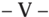
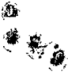
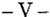

TOMO 323

Volumen 2

2000

1

DE JUSTICIA DE LA NACION

323

## FALLOS DE LA CORTE SUPREMA DE JUSTICIA DE LA NACION

DE JUSTICIA DE LA NACION

323

3

## R E P U B L I C A A R G E N T I N A

FALLOS

DE  LA

C O R T E S U P R E M A

DE

## J USTICIA DE LA N ACION

PUBLICACION A CARGO DE LA SECRETARIA DE JURISPRUDENCIA DEL TRIBUNAL

TOMO 323 - VOLUMEN 2

JUNIO - SEPTIEMBRE

LA LEY S.A.E. e I.

Tucumán 1471 (1050) Buenos Aires 2000

4

ACUERDOS DE LA CORTE SUPREMA

323

Copyright (c) 2000 by Corte Suprema de Justicia de la Nación Queda hecho el depósito que previene la ley 11.723. Impreso en la Argentina Printed in Argentina I.S.B.N.  950-

DE JUSTICIA DE LA NACION

323

## FALLOS DE LA CORTE SUPREMA

## JUNIO

## CITIBANK NA (TF 15575-I) V. DIRECCION GENERAL IMPOSITIVA

RECURSO ORDINARIO DE APELACION: Tercera instancia. Juicios en que la Nación es parte.

Resulta formalmente admisible el recurso ordinario de apelación si la Nación es parte en el pleito y el monto disputado, sin sus accesorios, supera el mínimo establecido por el art. 24, inc. 6º, ap. a, del decreto-ley 1285/58 y la resolución 1360/91 de la Corte Suprema.

IMPUESTO: Interpretación de normas impositivas.

La ley de impuesto a las ganancias, al tiempo que prescribe que este impuesto no es deducible de su base imponible, autoriza, en cambio, la deducción de los 'impuestos y tasas que recaen sobre los bienes que produzcan ganancias' (art. 82, inc. a).

IMPUESTO: Interpretación de normas impositivas.

Para que un impuesto o tasa resulte deducible en los términos del art. 82, inc. a), de la ley 20.628, debe representar una efectiva erogación para el contribuyente pues, de no ser así, no hay en rigor un gasto ni disminución patrimonial que justifique detraer suma alguna.

IMPUESTO: Interpretación de normas impositivas.

Las pérdidas a que se refieren los incs. c y d del art. 82 de la ley 20.628, así como las amortizaciones por desgaste y agotamiento -inc. f del mismo artículo-, no constituyen, de por sí, un desembolso de dinero, se relacionan con supuestos que importan la disminución del valor -o la desaparición- de bienes que producen ganancias o que se encuentran afectados a la explotación.

IMPUESTO: Interpretación de normas impositivas.

La imputación que surge de la ficción legal establecida por el art. 10 de la ley 23.760 -con la modificación introducida por la ley 23.905- respecto del impuesto

1315

a los activos, resulta sólo del procedimiento adoptado por el legislador para evitar una presión fiscal que juzgó excesiva, en virtud de la cual el pago del impuesto a las ganancias es susceptible de cancelar también el otro impuesto, pero de tal mecanismo no puede derivar otra consecuencia que la dispuesta por la propia norma ya que de lo contrario se llegaría a conclusiones absurdas, tal como la de entender que, pese a que el pago fue efectuado en concepto del impuesto a las ganancias, este gravamen se encuentra insoluto porque aquél fue imputado a cancelar otro impuesto.

IMPUESTO: Interpretación de normas impositivas.

La exención de los intereses por mora, con sustento en las normas del Código Civil,  queda circunscripta a casos en los cuales circunstancias excepcionales, ajenas al deudor -restrictivamente apreciadas- le han impedido el oportuno cumplimiento de su obligación tributaria, ya que dadas las particularidades del derecho tributario, en ese campo ha sido consagrada la primacía de los textos que le son propios, de su espíritu y de los principios de la legislación especial, y con carácter supletorio o secundario los que pertenecen al derecho privado (art. 1º de la ley 11.683, t.o. en 1998).

## IMPUESTO: Interpretación de normas impositivas.

La conducta del contribuyente que ha dejado de pagar el impuesto -o lo ha hecho por un monto inferior al debido- en razón de sostener un criterio en la interpretación de la ley tributaria sustantiva distinto del fijado por el órgano competente para decidir la cuestión no puede otorgar sustento a la exención de los intereses por mora en el cumplimiento, con prescindencia de la sencillez o complejidad que pudiese revestir la materia objeto de controversia.

## FALLO DE LA CORTE SUPREMA

Buenos Aires, 1  de junio de 2000. '

Vistos los autos: 'Citibank NA (TF 15575-I) c/ D.G.I.'

## Considerando:

1 ) Que la Sala III de la Cámara Nacional de Apelaciones en lo ' Contencioso Administrativo Federal, al confirmar lo decidido por el Tribunal Fiscal de la Nación, mantuvo la resolución de la Dirección General Impositiva en cuanto impugnó las declaraciones juradas de la

actora en el impuesto a las ganancias correspondientes a los ejercicios fiscales 1992, 1993 y 1994, determinó de oficio su obligación por el mencionado tributo en tales períodos, y dispuso la aplicación de los intereses resarcitorios previstos por el art. 42 de la ley 11.683 (t.o. en 1978 y sus modif.).

2 ) Que contra tal sentencia la parte actora planteó el recurso ordi-' nario de apelación que fue concedido a fs. 178, y resulta formalmente admisible pues la Nación es parte en el pleito y el monto disputado, sin sus accesorios, supera el mínimo establecido por el art. 24, inc. 6 , ' ap. a, del decreto-ley 1285/58 y la resolución 1360/91 de esta Corte. El memorial de agravios obra a fs. 184/198 y su contestación a fs. 201/210.

3 ) Que la determinación de oficio -cuya impugnación dio origen a ' esta causa- radica en que, en el concepto del organismo recaudador, es improcedente la deducción del impuesto a los activos efectuada por la empresa actora en la liquidación de la base imponible del impuesto a las ganancias en los ejercicios fiscales antes citados pues el primero de tales tributos no ha sido efectivamente pagado ya que, a tal efecto, el contribuyente empleó el mecanismo previsto por el art. 10 de la ley 23.760 (modificada por la ley 23.905), de manera que no constituyó un gasto susceptible de ser deducido en la liquidación del tributo a las ganancias.

4 ) Que el ' a quo coincidió con el criterio de la Dirección General Impositiva. Tras referirse a la modificación que la ley 23.905 introdujo en el art. 10 de la ley 23.760, por la que se estableció que el impuesto a las ganancias determinado para el mismo ejercicio fiscal por el cual se liquida el impuesto a los activos podía ser computado como pago a cuenta de este último tributo -invirtiendo la relación entre ambos gravámenes fijada por el texto original-, consideró que la actora pretendía transformar una ficción de pago -el cómputo del pago a cuenta- en una salida efectiva de fondos, ya que en realidad el desembolso efectuado es en concepto del impuesto a las ganancias, el cual genera -según lo autoriza la ley- la posibilidad de su imputación en el otro impuesto. De tal modo, juzgó que el criterio sostenido por la actora lleva a ampliar indebidamente el beneficio fiscal que se ha querido otorgar y a burlar la prohibición de deducir el impuesto a las ganancias en ese mismo gravamen (art. 88, inc. d, de la ley 20.628, t.o. en 1986).

Asimismo rechazó los argumentos del contribuyente respecto de la aplicación de los intereses previstos por el art. 42 de la ley 11.683 (t.o. en 1978) pues, en su concepto, aquél no demostró que la mora en el cumplimiento de la obligación tributaria no le fuese imputable.

5 ) Que la actora sostiene en su memorial de agravios que el im-' puesto a las ganancias, a raíz de la mencionada modificación introducida por la ley 23.905 en el art. 10 de la ley 23.760, se transformó en pago a cuenta del impuesto sobre los activos, por lo cual el pago efectuado revestía la naturaleza de este último tributo. En consecuencia -según su razonamiento- resulta deducible de la base del impuesto a las ganancias de acuerdo con lo establecido por el art. 82, inc. a, de la ley 20.628 (t.o. en 1986 y sus modif.), dada la inexistencia de prohibición o restricción legal que impida tal deducción.

Por otra parte, aduce que la circunstancia de que para cancelar el impuesto sobre los activos no haya habido una 'salida efectiva de fondos' no obsta a la procedencia de la deducción de su importe en la base imponible del tributo a las ganancias pues la citada ley 20.628 autoriza expresamente a detraer ciertos conceptos que en realidad no representan efectivas erogaciones, como en el caso de las amortizaciones y las pérdidas previstas en los incs. c y d de su art. 82, ya que -según afirma- es deducible todo lo que la ley indica como tal, aun cuando no tenga el carácter de gasto necesario para obtener, mantener y conservar el rédito.

Asimismo se agravia de lo decidido por el a quo respecto de la procedencia de los intereses.

6 ) Que la ley del impuesto a las ganancias (N  20.628, t.o. en 1986, ' ' con las modificaciones vigentes en los ejercicios fiscales que interesan en el sub examine ), al tiempo que prescribe que ese impuesto no es deducible de su base imponible (art. 88, inc. d), autoriza, en cambio, la deducción de los 'impuestos y tasas que recaen sobre los bienes que produzcan ganancias' (art. 82, inc. a).

7 ) Que un impuesto o tasa, para que resulte deducible en los tér-' minos de la norma citada en último lugar, debe representar una efectiva erogación para el contribuyente pues, de no ser así, no hay en rigor un gasto ni disminución patrimonial que justifique detraer suma alguna. Esta inteligencia de la norma del citado inciso surge sin es-

fuerzo de su propia letra -pues es evidente que los tributos implican una carga económica-, de su integración con las restantes disposiciones del impuesto a las ganancias, y del principio aplicable en la interpretación de las disposiciones de las leyes tributarias, prescripto por el art. 1  de la ley 11.683 y recibido por la jurisprudencia de esta Corte ' (Fallos: 249:657; 251:379; 283:258, entre muchos otros), que consiste en la observancia de la realidad económica.

Los casos invocados por el apelante, con el propósito de demostrar que la ley del impuesto a las ganancias admite deducciones que no constituyen salidas de fondos, en modo alguno desvirtúan la afirmación que antecede pues si bien es verdad que las pérdidas a que se refieren los incs. c y d del art. 82, así como las amortizaciones por desgaste y agotamiento -inc. f del mismo artículo- no constituyen, de por sí, un desembolso de dinero, se relacionan con supuestos que importan la disminución del valor -o la desaparición- de bienes que producen ganancias o que se encuentran afectados a la explotación, mientras que en lo que respecta al impuesto sobre los activos, en las condiciones del caso sub examine , el patrimonio de la empresa actora no se ha visto afectado en modo alguno.

8 ) Que resulta incontrastable la afirmación del ' a quo en cuanto a que el impuesto que ha sido realmente pagado es el que recae sobre las ganancias. En lo que respecta al impuesto sobre los activos, la actora se ha visto beneficiada por la ficción legal establecida por el art. 10 de la ley 23.760 -con la modificación introducida por la ley 23.905-, lo cual le ha permitido cancelarlo sin realizar ningún sacrificio patrimonial. Sobre el punto, la insistencia del apelante en sostener que hubo una imputación autorizada por la ley, por la cual el pago fue computado al impuesto sobre los activos, hace necesario poner de relieve que tal imputación resulta sólo del procedimiento adoptado por el legislador para evitar una presión fiscal que juzgó excesiva, en virtud de la cual el pago del impuesto a las ganancias es susceptible de cancelar también el otro impuesto; pero de tal mecanismo no puede derivar otra consecuencia que la dispuesta por la propia norma ya que de lo contrario se llegaría a conclusiones absurdas, tal como la de entender que, pese a que el pago fue efectuado en concepto del impuesto a las ganancias, este gravamen se encuentra insoluto porque aquél fue imputado a cancelar otro impuesto. En síntesis, la realidad es que sólo hubo un pago y que éste correspondió al impuesto a las ganancias, el cual no es deducible de su propia base (art. 88, inc. d).

9 ) Que, por lo tanto, ninguna conclusión favorable a la tesis soste-' nida por la actora corresponde extraer de la circunstancia de que el régimen legal vigente en los períodos fiscales objeto de debate en este pleito no haya excluido expresamente a supuestos como el de autos de la autorización para deducir impuestos y tasas prevista por el art. 82 inc. a, ya que el recto sentido que corresponde atribuir a las normas en juego -según ha sido establecido en los considerandos precedentesdetermina que habría sido superflua una norma que estableciese la aludida exclusión.

10) Que en lo concerniente a los intereses previstos en el art. 42 de la ley 11.683, texto ordenado en 1978 (art. 37 en el ordenamiento efectuado por el decreto 821/98), la apelante no ha expresado ningún argumento de peso que desvirtúe el juicio del a quo en el sentido de que no se ha demostrado en autos que la mora en el cumplimiento de la obligación tributaria no le fuese imputable.

Al respecto cabe poner de relieve que si bien en el precedente de Fallos: 304:203 el Tribunal estableció que resulta aplicable la última parte del art. 509 del Código Civil -que exime al deudor de las responsabilidades derivadas de la mora cuando ésta no le es imputable-, las particularidades del derecho tributario -en cuyo campo ha sido consagrada la primacía de los textos que le son propios, de su espíritu y de los principios de la legislación especial, y con carácter supletorio o secundario los que pertenecen al derecho privado (art. 1  de la ley 11.683, ' t.o. en 1998 y Fallos: 307:412, entre otros)-, que indudablemente se reflejan en distintos aspectos de la regulación de los mencionados intereses (Fallos: 308:283; 316:42 y 321:2093), llevan a concluir que la exención de tales accesorios con sustento en las normas del Código Civil queda circunscripta a casos en los cuales circunstancias excepcionales, ajenas al deudor -que deben ser restrictivamente apreciadas- han impedido a éste el oportuno cumplimiento de su obligación tributaria. Es evidente entonces que la conducta del contribuyente que ha dejado de pagar el impuesto -o que lo ha hecho por un monto inferior al debido- en razón de sostener un criterio en la interpretación de la ley tributaria sustantiva distinto del fijado por el órgano competente para decidir la cuestión no puede otorgar sustento a la pretendida exención de los accesorios, con prescindencia de la sencillez o complejidad que pudiese revestir la materia objeto de controversia. Ello es así máxime si se tiene en cuenta que, como lo prescribe la ley en su actual redacción y lo puntualizó la Corte, entre otros precedentes, en

el ya citado de Fallos: 304:203, se trata de la aplicación de intereses resarcitorios, cuya naturaleza es ajena a la de las normas represivas.

Por ello, se confirma la sentencia apelada. Con costas. Notifíquese y devuélvase.

JULIO S. NAZARENO - EDUARDO MOLINÉ O'CONNOR - CARLOS S. FAYT AUGUSTO CÉSAR BELLUSCIO - ENRIQUE SANTIAGO PETRACCHI - ANTONIO BOGGIANO - GUILLERMO A. F. LÓPEZ - GUSTAVO A. BOSSERT - ADOLFO ROBERTO VÁZQUEZ.

## LUNMAR NAVIERA S.A.C. V. YACIMIENTOS PETROLIFEROS FISCALES S.E.

RECURSO ORDINARIO DE APELACION: Tercera instancia. Juicios en que la Nación es parte.

Es formalmente procedente el recurso ordinario de apelación interpuesto por una empresa naviera contra Y.P.F. -antes de su privatización- si el valor disputado en último término supera el mínimo previsto por el art. 24 inc. 6 ap. a, del decreto-ley 1285/58 según la ley 21.708, reajustado por resolución 1360/91 de la Corte Suprema.

## RECURSO DE QUEJA: Fundamentación.

Corresponde desestimar la queja en cuanto le endilga al pronunciamiento recurrido haber avanzado sobre cuestiones que se encontraban firmes, pues la lectura de la sentencia apelada da cuenta de su correspondencia con los agravios planteados por la demandada en los términos del art. 277 del Código Procesal y, por tanto, es inexacto que el a quo al pronunciarse como lo hizo haya conculcado el derecho de defensa de la demandante.

## INTERPRETACION DE LOS CONTRATOS.

Todo contrato -sea cual fuere su naturaleza- debe celebrarse, interpretarse y ejecutarse de buena fe y de acuerdo a lo que las partes entendieron o pudieron entender obrando con cuidado y previsión, principios aplicables al ámbito de los contratos regidos por el derecho público.

RECURSO ORDINARIO DE APELACION: Tercera instancia. Juicios en que la Nación es parte.

Si la actora se presentó a la licitación pública convocada por la demandada y, pudiendo, no objetó la orden de compra que prohibía la utilización de un buque de su propiedad, habiendo consentido formalmente al suscribir el contrato que éste se cumpliera con la limitación impuesta y sin formular reserva alguna al respecto, no puede pretender indemnización por lo que debe confirmarse la sentencia apelada.

## COSTAS: Derecho para litigar.

Corresponde imponer las costas en el orden causado toda vez que la actora, vencida, pudo creerse con derecho a demandar como lo hizo.

RECURSO ORDINARIO DE APELACION: Tercera instancia. Juicios en que la Nación es parte.

Corresponde revocar la sentencia que rechazó la demanda de daños y perjuicios interpuesta por la actora, si el a quo omitió considerar un elemento decisivo, cual es, el reconocimiento, por parte de la demandada, de que la exclusión del buque de la accionante, no fue ajustada a derecho, toda vez que la alegada causa no figuró en los términos del pliego y no respondió a razones objetivas de conveniencia (Disidencia del Dr. Guillermo A. F. López).

RECURSO ORDINARIO DE APELACION: Tercera instancia. Juicios en que la Nación es parte.

Corresponde revocar la sentencia que rechazó la demanda de daños y perjuicios interpuesta por la actora si el fundamento dado por el a quo para hacerlo, consistente en que ésta dio formal consentimiento accediendo a que el contrato se cumpliera con la limitación impuesta y sin reconocer eficacia jurídica a sus sucesivos reclamos, resulta dogmático, máxime cuando tal interpretación no se corresponde con las constancias de la causa y evidencia una insuficiente ponderación de la actitud de la demandada reflejada en la admisión de la alegada arbitrariedad de la exclusión del buque (Disidencia del Dr. Guillermo A. F. López).

CONSTITUCION NACIONAL: Derechos y garantías. Defensa en juicio. Principios generales.

Las normas procesales no se reducen a una técnica de organización formal de los procesos sino que, en su ámbito específico, tienen por finalidad y objetivo ordenar adecuadamente el ejercicio de los derechos en aras de lograr la concreción del valor justicia en cada caso y salvaguardar la garantía de la defensa en juicio, ello no puede lograrse si se rehuye atender a la verdad jurídica objetiva de los hechos que de alguna manera aparecen en la causa como de decisiva relevancia para la justa decisión del litigio (Disidencia del Dr. Guillermo A. F. López).

## ACTOS ADMINISTRATIVOS.

La esfera de discrecionalidad susceptible de perdurar en los entes administrativos no implica en absoluto que estos tengan un ámbito de actuación desvinculado del orden jurídico o que aquélla no resulte fiscalizable.

## FALLO DE LA CORTE SUPREMA

Buenos Aires, 1  de junio de 2000. '

Vistos los autos: 'Lunmar Naviera S.A.C. c/ Y.P.F. S.E. s/ cobro de pesos'.

## Considerando:

1 ) Que contra la sentencia de la Sala I de la Cámara Nacional de ' Apelaciones en lo Civil y Comercial Federal que, por mayoría, al revocar la de primera instancia, rechazó la demanda promovida por la actora, ésta interpuso el recurso ordinario de apelación (fs. 3498/3499) que fue concedido (fs. 3558/3559).

2 ) Que la empresa Lunmar Naviera S.A.C. promovió demanda ' contra Yacimientos Petrolíferos Fiscales con el objeto de que se la indemnizara por los daños y perjuicios sufridos a raíz de su decisión de no contratar, parcialmente, sus servicios. Relata que es una compañía armadora argentina, dedicada al transporte marítimo y fluvial de combustibles líquidos -pesados y livianos- por cuenta de Y.P.F. mediante la utilización de buques de su propiedad. En 1983 se presentó a una licitación convocada por aquélla para la venta del buque 'La Plata', resultando adjudicataria. Solicitó entonces a la Prefectura Naval Argentina el cambio de nombre, denominándolo 'Mar Sereno' y procedió a  su  reparación  integral  que  le  demandó  una inversión superior a U$S 1.000.000. Obtuvo, asimismo, los certificados habilitantes tanto de las autoridades nacionales como del Ente Clasificador Internacional. Tiempo después resultó adjudicataria de una nueva licitación organizada por Y.P.F., por la que se comprometió a efectuar el transporte de aproximadamente 290.000 metros cúbicos de productos livianos, incluidos alijos y operaciones top-off. Pero, al emitir la orden de compra dispuso que la 'firma no podrá, bajo ningún motivo, realizar el

mismo utilizando los servicios de vuestro buque-tanque 'Mar Sereno''. Esta limitación, infundada y arbitraria -afirmó- le ha provocado los perjuicios cuya reparación reclama y que, proviniendo de una empresa de carácter monopólico que concentraba la casi totalidad del transporte de combustibles del país, impactaron de un modo más intenso en su patrimonio. En síntesis -concluyó- 'el hecho de haber dispuesto sine die la exclusión indebida del B/T Mar Sereno, sin causa válida ni aparente; su silencio perverso mantenido a lo largo de años pese a las impugnaciones y reclamos de mi parte; su posterior reconocimiento de la ilegitimidad e irrazonabilidad de su conducta y pese a él posteriormente su negativa a cumplir con el compromiso contraído de convenir con mi mandante la contratación del buque sobre la base de parámetros razonables, ha producido a mi representada los daños y perjuicios' que detalla y 'ello torna a Y.P.F. responsable por el pago de la indemnización que se reclama en autos'.

3 ) Que la cámara, para resolver como lo hizo, sostuvo en síntesis ' que: a) la actora no objetó la orden de compra N  31-0767-05-00 que ' prohibía la utilización del buque 'Mar Sereno'. 'Pudo hacerlo, y no lo hizo. Por ende, debe atenerse, en principio, a las consecuencias de su omisión'; b) el pliego de condiciones que rigió la licitación autorizaba a la demandada a adjudicar '...en la forma que más convenga a los intereses de esta Sociedad...' y el obrar discrecional de Y.P.F. no puede calificarse de ilegal o arbitrario; c) al firmar las partes la orden de compra que incluía la exclusión del buque mencionado 'la actora dio formal consentimiento accediendo a que el contrato se cumpliera con la limitación impuesta, toda vez que, además, no formuló en ese acto reserva alguna al respecto'; d) la actora no puede oponer la arbitrariedad de la contratación instrumentada mediante la orden de compra 'toda vez que sin su consentimiento (que supone el acceso inicial y el cumplimiento posterior [del] contrato) no hubiera tenido efecto alguno'; e) no corresponde el reconocimiento del calificado daño emergente toda vez que 'el éxito en la licitación no le fue asegurado a la actora' y que 'el buque fue enajenado una vez cumplida la prestación' y f) en cuanto al lucro cesante, las constancias de la causa 'no dan cuenta de concretas ofertas desechadas a la actora', de modo tal que 'las consecuencias de su inacción no pueden ser trasladadas a la demandada como carácter de perjuicio directo por la frustración de una 'chance' de contratar no intentada, y en el mejor de los casos, ello resulta un agravamiento propio del daño aducido, circunstancia que no parece convincente que sea soportada por la accionada'.

4 ) Que el recurso ordinario de la actora es formalmente proceden-' te, toda vez que fue articulado en un proceso en que la Nación es parte y los valores disputados en último término superan el mínimo previsto por el art. 24, inc. 6, ap. a, del decreto-ley 1285/58, según la ley 21.708, reajustado por resolución 1360/91 de esta Corte.

5 ) Que al presentar el memorial previsto por el segundo párrafo ' del art. 280 del Código Procesal Civil y Comercial de la Nación, la actora expresó los agravios que pueden exponerse así: a) la sentencia apelada es nula y violatoria de la garantía constitucional de la defensa en juicio, porque ha avanzado sobre cuestiones de hecho y prueba establecidas en el fallo de primera instancia que quedaron consentidas y firmes para la demandada; b) la exclusión del buque no se basó en un criterio de conveniencia sino que 'en realidad entraba lisa y llanamente dentro del terreno de la arbitrariedad más absoluta'; c) el fallo no establece cuál fue el fundamento de la exclusión del buque y, simultáneamente, ignora que fue una decisión producto de un error inicial de los funcionarios de Y.P.F. que está probado en autos; d) es ritual el argumento de que la actora debió hacer una reserva de derechos en el mismo acto de firmar la adjudicación y significa desconocer toda validez y eficacia a los permanentes reclamos y cuestionamientos contra la exclusión del buque, que la propia demandada tomó en cuenta al dictar la resolución 822/85 que rehabilitó tardíamente a aquél; e) es igualmente ritual la exigencia de haber interpuesto formalmente un recurso administrativo, a la luz de los reclamos e intimaciones de pago de daños y perjuicios oportunamente efectuadas; f) la exclusión del buque no importó una contraoferta que haya sido aceptada por la actora; g) el pronunciamiento es dogmático en cuanto afirma que Y.P.F. no tenía una situación de predominio en el mercado porque no tenía la exclusividad de las contrataciones; h) la supuesta falta de aptitud del buque no fue la causa de la exclusión decidida por Y.P.F.; i) la cámara supone erróneamente que el buque 'Mar Sereno' podría haber hecho transportes para otras empresas y j) la exclusión, sin causa válida y no prevista en el pliego de bases y condiciones, decidida en contra de la propia  conveniencia  de  la  demandada,  abusando  de  su  situación monopólica, genera su responsabilidad por el pago de los daños y perjuicios ocasionados, comprensivos del daño emergente y del lucro cesante.

6 ) Que la decisión del caso requiere trazar previamente el marco ' fáctico y normativo que dio origen a la relación jurídica motivo de au-

tos. Al respecto, se encuentra fuera de discusión que la actora adquirió de la demandada el buque 'La Plata', que más tarde redenominó 'Mar Sereno' y que, luego, se presentó a una licitación convocada por Yacimientos Petrolíferos Fiscales de la que resultó adjudicataria para el transporte de 290.000 metros cúbicos de productos livianos, 'en un todo de acuerdo con las condiciones y cláusulas establecidas en la licitación pública N  31-0767, y sobre la base de las tarifas que se agregan ' como anexo II y que forma parte integrante de la presente orden de compra contrato'. Allí se dejó constancia que 'para el cumplimiento del transporte que se encomienda en el presente contrato, esa firma no podrá, bajo ningún motivo, realizar el mismo utilizando los servicios de vuestro buque-tanque 'Mar Sereno' nominado en la oferta'. La mencionada orden fue suscripta por el presidente de la actora sin formular objeciones y la prestación fue cumplida con los restantes barcos de la flota.

7 ) Que, descripta así la situación del ' sub judice , cabe abordar los agravios propuestos por el apelante. En primer lugar, corresponde desestimar la queja en cuanto le endilga al pronunciamiento recurrido haber avanzado sobre cuestiones que se encontraban firmes, pues la lectura de la sentencia apelada da cuenta de su correspondencia con los agravios planteados por la demandada en los términos del art. 277 del Código Procesal Civil y Comercial de la Nación y, por tanto, es inexacto que el a quo al pronunciarse como lo hizo haya conculcado el derecho de defensa de la demandante.

8 ) Que, ello sentado, se advierte que los restantes agravios procu-' ran demostrar, de un lado, que Yacimientos Petrolíferos Fiscales obró arbitrariamente y que esa actuación, pese a su diligencia, le ocasionó los graves perjuicios que reclama.

En la tarea de determinar si le asiste razón debe señalarse que la actora se presentó a la licitación pública convocada por la demandada y ese acto significó la aceptación de las condiciones fijadas en los respectivos pliegos entre las que figuraba aquella que autorizaba a adjudicar '...en la forma que más convenga a los intereses de esta Sociedad...'. Ese juicio de conveniencia condujo a que, al emitirse la orden de compra, se dejase constancia de que el buque de la demandante 'Mar Sereno' no podría utilizarse para prestar los servicios contratados. Sin que se efectuase reserva de ninguna naturaleza, el contrato fue suscripto. Ello surge de los propios términos de la nota remitida por el presidente de la empresa naviera, que manifestó que la observa-

ción consagrada en la orden de compra importó '...la propuesta de un nuevo contrato al modificar nuestra oferta original...' y que '...se ha visto en la obligación de aceptarla en primer instancia...' (fs. 54).

9 ) Que, ahora bien, si la relación jurídica quedó perfeccionada con ' la suscripción de la mencionada orden, si pudiendo hacerlo prefirió guardar silencio y no formular objeción alguna cuando tomó conocimiento de la exclusión del buque y si, como se señaló, reconoció la aceptación de la oferta y la existencia de un nuevo convenio, su propia conducta excluye toda posibilidad indemnizatoria. En otros términos, la decisión de Yacimientos Petrolíferos Fiscales era susceptible de revisión en el ámbito interno y aun, de ulterior escrutinio judicial. Ninguna de estas vías fue utilizada por la actora y no es válida la excusa ensayada en el sentido de que '...la única alternativa para trabajar que tenía Lunmar Naviera en aquel momento era aceptar los transportes que se le adjudicaban y cuestionar -con discreción, para no perturbar el humor de los funcionarios de turno de Y.P.F.- la exclusión del buque cuyas razones se desconocían...'.

10) Que tampoco es atendible sostener -como expresa la apelanteque '...la otra alternativa -impensable, dadas las circunstancias- hubiera sido cuestionar la adjudicación en general, por el hecho de estar condicionada, y atenerse a que Y.P.F. dejara sin efecto la totalidad de la adjudicación discernida a mi parte sobre la base de la 'aceptación condicional' o 'con reservas' de mi mandante. Esa alternativa hubiera implicado, para Lunmar Naviera, perjuicios muy superiores a los que en definitiva padeció...' (fs. 3596 vta.). En efecto, sobre el punto asiste razón al a quo al considerar que '...en la mejor de las hipótesis para la actora, la adjudicación exteriorizada mediante la emisión de la orden de compra 31-0767-05-00 proponía aspectos separables que exigían un comportamiento acorde con esta particularidad. Por un lado, es obvio que la asignación de un cupo de fletes la beneficiaba y, por lo tanto, nada podría reprochar en ese sentido. Pero, por otro, la exclusión del 'Mar Sereno' apuntó a un aspecto accesorio, susceptible de un cuestionamiento concreto que pusiera en tela de juicio esa parte del contrato perjudicial para sus intereses (arts. 16, de la ley 19.549 y 1039, del Cód. Civil). Consecuentemente, la actora propone un falso dilema, pues no es cierto que haya seguido el único camino posible, esto es, la aceptación sin condicionamientos, de la orden de compra. Como acabamos de ver, bien pudo separar la contratación en los aspectos que he señalado e impugnar, por la vía pertinente, la exclusión del buque...' (fs. 3479/3479 vta.).

Esta conclusión no ha sido desvirtuada por la apelante que sólo insiste en que las circunstancias la obligaban a la dramática opción de todo o nada, pero no se hace cargo de la posibilidad señalada por la cámara. La mera calificación de ritual de la exigencia de interponer, en tiempo y forma, un recurso administrativo es, en las circunstancias del sub judice , claramente insuficiente pues supone el desconocimiento del sistema legal entonces vigente en el ámbito de la demandada para la impugnación de sus decisiones y que la actora, en virtud de la actividad que desplegaba como transportista de combustibles y que la vinculaba frecuentemente con la demandada, no podía ignorar (art. 902 del Código Civil).

11) Que a esta altura, no es ocioso recordar que, como lo ha sostenido esta Corte, todo contrato -sea cual fuere su naturaleza- debe celebrarse, interpretarse y ejecutarse de buena fe y de acuerdo a lo que las partes entendieron o pudieron entender, obrando con cuidado y previsión, principios aplicables al ámbito de los contratos regidos por el derecho público (Fallos: 316:212, consid. 15 y sus remisiones). La actora supo de la exclusión que la agraviaba desde el comienzo. Su silencio, el cumplimiento posterior de la prestación acordada -incluida una prórroga aceptada en 'iguales términos y condiciones originariamente pactadas'- y su pacífico sometimiento en la instancia administrativa al perfeccionarse la relación jurídica, obstan a la indemnización reclamada.

12) Que desechada la responsabilidad de Yacimientos Petrolíferos Fiscales por las razones expuestas, resulta innecesario el tratamiento de los restantes agravios. En estas condiciones, corresponde confirmar el pronunciamiento apelado en todas sus partes en cuanto rechaza la demanda interpuesta. Las costas se imponen, en todas las instancias, en el orden causado toda vez que la actora pudo creerse con derecho a demandar como lo hizo (art. 68, segundo párrafo, del Código Procesal Civil y Comercial de la Nación).

Por ello, se confirma la sentencia apelada y se rechaza la demanda. Costas en el orden causado. Notifíquese y, oportunamente, devuélvase.

CARLOS S. FAYT - AUGUSTO CÉSAR BELLUSCIO - ENRIQUE SANTIAGO PETRACCHI - ANTONIO BOGGIANO - GUILLERMO A. F. LÓPEZ ( en disidencia ) - GUSTAVO A. BOSSERT.

DISIDENCIA DEL SEÑOR MINISTRO DOCTOR DON GUILLERMO A. F. LÓPEZ

## Considerando:

Que el infrascripto coincide con los considerandos 1  a 5  inclusive ' ' del voto de la mayoría.

6 ) Que la decisión del caso requiere trazar previamente el marco ' fáctico y normativo que dio origen a la relación jurídica motivo de autos. En este sentido, se encuentra fuera de discusión que la actora adquirió por licitación de la demandada el buque 'La Plata', que más tarde se denominó 'Mar Sereno' en las condiciones descriptas como 'donde están y como están' con cese de bandera (confr. fs. 1/3 del expte. DDG950/82, ver fs. 2/4 del cuerpo principal), como así también que la razón de vender la embarcación radicaba en su intención de que no navegara en el país con la finalidad de su desguace y/o venta al exterior. Sin embargo, al haberse omitido expresar dicha condición en el pliego respectivo, la situación generada permitió la rehabilitación del buque, lo que surge de las constancias de solicitud de cambio de nombre y de las notificaciones a la demandada acerca de tal situación e informes propios de la empresa.

- 7 ) Que también se encuentra acreditado en el ' sub lite que la actora, con sus tres buques incluido 'Mar Sereno', se presentó posteriormente a una segunda licitación convocada por Yacimientos Petrolíferos Fiscales, de la que resultó adjudicataria para el transporte de 290.000 metro cúbicos de productos livianos. Asimismo, surge que en el pliego de condiciones se autorizaba a la demandada a adjudicar '...en la forma que más convenga a los intereses de esta Sociedad...' y sobre la base de ese juicio de conveniencia la entonces empresa estatal al emitir la orden de compra y con el objeto de salvar el error cometido en la licitación anterior, dejó constancia de que el buque de la demandante 'Mar Sereno' no podría utilizarse para prestar los servicios contratados, imponiendo de tal modo una condición no prevista originalmente en el marco licitatorio.
- 8 ) Que, llegados a este punto, carece de sentido dilucidar si la ' relación invocada quedó perfeccionada con la suscripción de la mencionada orden de compra, si cabe atribuirle valor  jurídico  a  las impugnaciones y reclamos presentados por la actora, o si se reconoció

por parte de Lunmar la aceptación de la oferta y su prórroga y la existencia de un nuevo convenio. Ello es así pues la propia conducta de la demandada deviene determinante en orden a discernir si la exclusión del buque lo fue de manera arbitraria e inconveniente o si con su actitud excedió sus facultades discrecionales. En tal sentido es ilustrativo el informe confeccionado por el asesor legal de Y.P.F. del 20 de agosto de 1985 -reiterativo de uno anterior (ver fs. 188/191 expte. 950, punto 2 y anexo 39 de la demanda y copia del dictamen agregada por la perito contadora al cuerpo XIV, fs. 2695/2696) en donde consta que '...la resolución de Y.P.F. de excluir al B/T Mar Sereno...resultaría de difícil sustento jurídico, habida cuenta (de) que en la licitación de venta no se incluyó la condición 'para ser desguazado o exportado', lo que implica que Lunmar no estaba inhabilitada para hacerlo navegar...y no existiendo fundamentos de derecho ni de hecho que sostengan nuestra postura,...se propone:...dejar sin efecto, la parte correspondiente de la resolución N  512/84...por la que se excluía la contratación...y autori-' zar la contratación de la citada unidad en condiciones aceptables para ambas partes...'.

9 ) Que en función de lo anteriormente reseñado se desprende que ' la sentencia del tribunal de alzada omitió considerar un elemento decisivo para la suerte del recurso de la parte actora, cual es el reconocimiento por parte de Yacimientos Petrolíferos Fiscales de que la exclusión del buque de la demandante no fue ajustada a derecho, toda vez que la alegada causa no figuró en los términos del pliego y no respondió a razones objetivas de conveniencia. En este sentido no puede dejar de valorarse que ha sido la propia empresa demandada la que otorgó eficacia e idoneidad a los planteos de la recurrente al punto de dictar una resolución en donde reconoció los eventuales daños y perjuicios irrogados. A todo ello deben agregarse las constancias periciales que obran en la causa, no impugnadas oportunamente, que concluyen en la capacidad técnica del buque así como la posterior conducta de la enjuiciada, quien a pesar de reconocer la irrazonabilidad de la exclusión, no subsanó en los hechos tal situación.

10) Que, habida cuenta de lo expuesto, el fundamento expresado por el a quo para rechazar la demanda consistente en que la actora dio formal consentimiento accediendo a que el contrato se cumpliera con la limitación impuesta y sin reconocer eficacia jurídica a sus sucesivos reclamos, resulta dogmático, máxime cuando tal interpretación no se corresponde con las constancias de la causa y evidencia una insufi-

ciente ponderación de la actitud de la demandada reflejada en la admisión de la alegada arbitrariedad de la exclusión del buque.

11) Que, por otra parte, si bien las normas procesales no se reducen a una mera técnica de organización formal de los procesos, sino que, en su ámbito específico tienen por finalidad y objetivo ordenar adecuadamente el ejercicio de los derechos en aras de lograr la concreción del valor justicia en cada caso y salvaguardar la garantía de la defensa en juicio, ello no puede lograrse si se rehuye atender a la verdad objetiva de los hechos que de alguna manera aparecen en la causa como de decisiva relevancia para la justa decisión del litigio (Fallos: 310:870, entre otros).

12)  Que,  por  lo  demás,  no  es  ocioso  recordar  que  la  esfera  de discrecionalidad susceptible de perdurar en los entes administrativos no implica en absoluto que estos tengan un ámbito de actuación desvinculado del orden jurídico o que aquélla no resulte fiscalizable. En tal sentido, la exclusión del buque de la empresa actora impuesta en la orden de compra no aparece, en el caso, como una exteriorización razonable de la condición del pliego que permitía adjudicar 'en la forma más conveniente a la administración'.

13) Que de acuerdo al resultado al que se arriba, en cuanto al monto indemnizatorio se refiere, cabe confirmar los rubros explicitados por la sentencia de primera instancia (ver fs. 2829/2833), toda vez que los informes periciales en que se apoyaron los cálculos no fueron objeto de impugnación en la etapa procesal oportuna, como así tampoco merecieron una crítica concreta y razonada por parte de la demandada en el escrito de expresión de agravios ni en la réplica a los respondes por la actora.

En tales condiciones, habida cuenta de que la causa eficiente del daño emergente y del lucro cesante se conforma en el momento de la exclusión injustificada, que la demandada llevó a cabo en la oportunidad de adjudicar la licitación, es a partir de allí (8 de agosto de 1984) y hasta la fecha de venta del buque (9 de abril de 1986) que los rubros señalados deben admitirse. Asimismo el punto de partida de actualización del lucro cesante debe correr a partir del mes de abril de 1990 (confr. pericia de fs. 2669 vta.) y los intereses desde el vencimiento de la  fecha  prevista  para  el  pago,  conforme  carta  documento  de  fs. 112/115. Finalmente y en lo que hace a la tasa de interés aplicable, deberá estarse a los términos de la ley de consolidación.

Por ello, se revoca la sentencia apelada y se hace lugar a la demanda con el alcance indicado en el considerando 13. Costas en el orden causado. Notifíquese y, oportunamente, devuélvase.

GUILLERMO A. F. LÓPEZ.

VALENTIN PAZ

V. ADMINISTRACION GRAL. DE PUERTOS - RES. 318 Y 67/83- Y OTRO

RECURSO ORDINARIO DE APELACION: Tercera instancia. Juicios en que la Nación es parte.

Procede el recurso ordinario de apelación interpuesto por la Administración General de Puertos, contra la sentencia que hizo lugar al resarcimiento de los perjuicios sufridos por el actor, pues se dirige contra una sentencia definitiva recaída en una causa en que la Nación es parte, y el monto del agravio discutido en ultimo término supera el mínimo establecido en el art. 24 inc. 6, ap. a, del decreto-ley 1285/58, y resolución 1360/91 de esta Corte.

## ACTOS ADMINISTRATIVOS.

Aun cuando el acto administrativo impugnado contiene una motivación genérica, es evidente que si el contratista se hallaba en mora respecto de la 'ejecución de obras bajo silo', no había cumplido 'todas las obligaciones' y, por tanto, se había configurado una causa suficiente de rescisión, por lo que no corresponde la nulidad del acto que decretó la misma.

## CONTRATOS ADMINISTRATIVOS.

El reclamo de obra faltante efectuado por la Administración General de Puertos y que incluye en forma explícita la ejecución total de la pavimentación en el sector bajo silo -que había sido uno de los objetos del contrato- constituye una apropiada constitución en mora, que hizo nacer en favor de la Administración la facultad de rescindir el mismo.

## ACTOS ADMINISTRATIVOS.

Si la actora conocía perfectamente su obligación de realizar la obra, el contratista debió exigir con diligencia, mediante constancias fehacientes, las definiciones

imprescindibles pendientes para poder cumplir con la obligación que estaba a su cargo de preparar los planos para la ejecución de la misma, por lo que no cabe anular el acto administrativo por el que se dispuso la rescisión del contrato.

## ACTOS ADMINISTRATIVOS.

La permanente contemplación por parte de las autoridades competentes de los motivos justificatorios invocados por el contratista para solicitar prórroga durante un largo período para ejecutar la obra a la que se había comprometido, no es base suficiente para generar una obligación a cargo de la Administración de continuar procediendo de la misma manera.

## RESCISION DE CONTRATO.

No resulta intempestiva la decisión de la Administración de rescindir el permiso de uso oportunamente concedido, si resulta evidente que la constitución en mora efectuada mediante un reclamo, fue precedida de la reiteración de sanciones menores por atrasos diversos.

DAÑOS Y PERJUICIOS: Responsabilidad del Estado. Obras públicas.

Si se revoca la sentencia que hizo lugar al reclamo de daños y perjuicios efectuado contra la Administración General de Puertos, por la rescisión de un contrato, no corresponde tratar el agravio relativo a la determinación de la indemnización presentado por la apelante en forma subsidiaria.

## FALLO DE LA CORTE SUPREMA

Buenos Aires, 1  de junio de 2000. '

Vistos los autos: 'Paz, Valentín c/ Administración Gral. de Puertos -Res. 318 y 67/83- y otro- s/ contrato administrativo'.

## Considerando:

1 ) Que la sentencia de la Cámara Nacional de Apelaciones en lo ' Contencioso Administrativo Federal, Sala V, resolvió, por mayoría, revocar lo decidido en la instancia anterior, declarar la nulidad de las resoluciones 67/83 y 18/84 de la Administración General de Puertos, y de la resolución 301/86 del Ministerio de Obras y Servicios Públicos, y

hacer lugar al resarcimiento de los daños y perjuicios reclamados por el actor, según las pautas que determinó a fs. 549/ 549 vta., con costas a la parte demandada.

2 ) Que el 18 de agosto de 1972, el señor Valentín Paz suscribió con ' la Administración General de Puertos un contrato de permiso de ocupación de espacios de terreno en el Puerto de Mar del Plata, con la obligación de construir, instalar y explotar por su cuenta y cargo un silo arenero, con la finalidad de facilitar el abastecimiento de arena a la ciudad de Mar del Plata. Asumió, asimismo, la obligación de construir obras complementarias y pagar un canon. El plazo del permiso se fijó en diez años, al cabo de los cuales las obras ejecutadas quedarían de propiedad de la Administración General de Puertos. La realización de los trabajos debía finalizar en un plazo de 180 días para la ejecución del silo y de dos años para las obras complementarias.

Consta en estos autos que las primeras dificultades en la ejecución del contrato, que motivaron las primeras prórrogas en los plazos contractuales, tuvieron por causa el fracaso del sistema de extracción de la arena del mar. Por lo demás, en octubre de 1976, la administración declaró la caducidad del permiso de la firma Pavinco S.A., y la actora asumió las obligaciones relativas a las obras comunes. Se sucedieron nuevos pedidos de prórrogas que fueron aprobados y diversas vicisitudes que constan en los expedientes administrativos que se tienen a la vista hasta que, finalmente, la administración fijó un último plazo con vencimiento el 2 de enero de 1983. Según la orden de servicio del 6 de enero de 1983, a esa fecha faltaba ejecutar las obras de bajo silo. Por resolución del 27 de mayo de 1983, la Administración General de Puertos decidió la rescisión del contrato que vinculaba a la empresa con el señor Valentín Paz, por culpa imputable al contratista (resolución 67/83, notificada el 1/6/83, fs. 72/73 de estos autos). La administración rechazó el recurso de reconsideración promovido por la contratista (resolución 18/84, fs. 76/77) y el Ministerio de Obras y Servicios Públicos desestimó el 23 de octubre de 1986 el recurso de alzada (resolución 301/86, copia a fs. 119/122 de esta causa). La impugnación de tales actos administrativos por nulidad constituye la pretensión del actor en este litigio, más el resarcimiento de los daños y perjuicios.

3 ) Que la jueza de la primera instancia desestimó la demanda. ' Juzgó que el actor no estaba facultado para 'no construir' el sector faltante bajo silo y debió arbitrar los medios para contar con la docu-

mentación técnica imprescindible para la ejecución en los plazos previstos. En cuanto a la constitución en mora, el último plazo de prórroga había vencido el 2 de enero de 1983 y la orden de servicio del 6/1/83 había advertido debidamente que faltaba ejecutar completamente la pavimentación del sector bajo silo. Concluyó, pues, que se había configurado el supuesto de la cláusula 6a. de las condiciones particulares y ello daba legitimidad a la rescisión dispuesta en las resoluciones impugnadas. Esta decisión fue revocada por la cámara (fs. 537/554 vta.). Para así resolver, el tribunal a quo estimó, en lo esencial, que si bien la intimación de agosto de 1982 comprendía todas las obras pendientes, no podía incluir aquellas respecto de las cuales la contratista no disponía de la documentación técnica idónea por fallas debidas a la administración, como era el caso de las obras bajo silo. Por tanto, la demandada no había podido constituir en mora a la contratista y, en tales condiciones, no se habían configurado los presupuestos fácticos necesarios para justificar la sanción de rescisión. La desproporcionada decisión de la administración había provocado perjuicios al actor, por haberlo privado de la posibilidad de amortizar las sumas invertidas en la obra. En este orden de ideas, la cámara determinó la indemnización debida al contratista, según los criterios propuestos por el reclamante y seguidos en el informe pericial, con sus intereses y las costas del juicio.

- 4 ) Que contra este pronunciamiento, ambas codemandadas inter-' pusieron sendos recursos extraordinarios (fs. 563/577 vta.; 579/591) y la Administración General de Puertos dedujo recurso ordinario de apelación, que fue concedido a fs. 558. El memorial de la recurrente obra a fs. 640/654 y su contestación por la actora, a fs. 658/680. En razón de la mayor amplitud de la apelación ordinaria ante este Tribunal y por ausencia de arbitrariedad, ambos recursos federales fueron declarados inadmisibles a fs. 632/632 vta.
- 5 )  Que  el  recurso  ordinario  de  apelación  de  la  Administración ' General de Puertos es formalmente admisible pues se dirige contra una sentencia definitiva recaída en una causa en la que la Nación es parte, y el monto del agravio discutido en último término supera el mínimo establecido en el art. 24, inc. 6, ap. a, del decreto-ley 1285/58, y resolución 1360/91 de esta Corte.
- 6 ) Que los agravios que expuso la recurrente en esta instancia ' pueden resumirse así: a) la permisionaria tuvo una conducta de in-

cumplimiento a lo largo de los muchos años que duró la relación contractual, como evidencian las constancias de las numerosas prórrogas y las presentaciones de sucesivos planes de trabajo, hasta llegar a la intimación cursada en agosto de 1982; b) la contemplación respecto de la obra de Valentín Paz motivó, incluso, la intervención de la Fiscalía de Investigaciones Administrativas, que investigó el exceso de permisividad en la conducta de la administración (expediente 28.317-SIM82); c) que según el principio de buena fe con que deben interpretarse y cumplirse los contratos administrativos, es absurdo sostener que no hubo una eficaz constitución en mora de la contratista; d) que es erróneo afirmar que la administración no prestó la colaboración necesaria para que la actora contara con los datos técnicos, especialmente la documentación para ejecutar la obra bajo silo; e) en forma subsidiaria, y para el hipotético caso en que este Tribunal confirmase la nulidad de los actos impugnados, la demandada impugnó la metodología seguida para fijar la indemnización.

7 ) Que las partes han coincidido a lo largo de este expediente en ' reconocer que las obligaciones asumidas por Valentín Paz según la licitación y el contrato de permiso de uso oportunamente concedido, comprendían la ejecución de las obras complementarias bajo silo para el desplazamiento y maniobra de vehículos. Dice el actor a fs. 499: 'Mi parte tenía y tiene muy en claro que el ítem pavimento bajo silo era parte  integrante  de  la  obra  a  su  cargo'.  Por  otra  parte,  de  los considerandos de la resolución 67/83 (fs. 38 del expediente 4558-B-82) resulta que la rescisión del contrato por culpa de la contratista fue dispuesta por cuanto Valentín Paz no había dado cumplimiento a todas las obligaciones a su cargo, entre las cuales se hallaba la de construir las obras detalladas en las bases de la licitación (el subrayado no está en el texto de la resolución). Aun cuando el acto administrativo impugnado contiene una motivación genérica, es evidente que si el contratista se hallaba en mora respecto de la ejecución de las obras bajo silo, no había cumplido 'todas' las obligaciones y, por tanto, se había configurado una causa suficiente de rescisión.

8º) Que de las constancias administrativas resulta que en abril de 1981 las obras complementarias -sector depósito, oficina y talleresse habían atrasado y que Valentín Paz estimaba difícil ejecutarlas según lo previsto, en razón de la situación económica por la que atravesaba la empresa, que estaba dedicada a finalizar la pavimentación de la Avenida 1000 (fs. 211 del expediente 126-P-81 AGP). Durante ese

año 1981, constan sucesivas prórrogas para concretar la finalización de obras complementarias (fs. 205, 214 y 223 de esas actuaciones). El 26 de noviembre de 1981, el Gobierno de la Provincia de Buenos Aires, por decreto 1698, declaró la caducidad del permiso dado a Valentín Paz para extraer arena del fondo marítimo provincial, por exclusiva culpa del permisionario, al que impuso una multa. A partir de esta sanción, las constancias administrativas dan cuenta de un seguimiento de la Administración General de Puertos con el propósito de poner fin a las dilaciones. Así, el 22 de junio de 1982 se formó una comisión especial de seguimiento de la obra (fs. 137 y 162 del expediente 4190, que integra el sumario administrativo 28.317/82 GP). El 27 de julio de 1982, el Gobierno de la Provincia de Buenos Aires dictó el decreto 775/82 por el cual rechazó el recurso de revocatoria deducido por Paz contra el decreto 1698/81 (fs. 240/241 del expediente 1750 de la Fiscalía Nacional de Investigaciones Administrativas, segundo cuerpo). El 11 de agosto de 1982, por telegrama y con cita de la resolución del Consejo de Administración de la Administración General de Puertos del 15/7/82 (ver acta 321 de fs. 136/140 del expediente 4190 agregado al sumario 28.317/82), se intimó a Paz a finalizar el camino de acceso al silo arenero bajo apercibimiento de declarar la caducidad.

9 ) Que el cronograma de trabajos para la construcción del camino ' de acceso Avenida 1000 fue aprobado por disposición 050-APMdP-82 y se fijó el 21/12/82 como última fecha de terminación de obra (fs. 344 del expediente 4558-B-82, 2do. cuerpo). Ante una nueva prórroga solicitada por el contratista, se fijó como nueva y definitiva fecha de finalización, el 2 de enero de 1983. Es cierto que el plan de trabajos que vencía el 21 de diciembre de 1982 es relativo a la obra 'camino de acceso a los silos areneros 1 y 2', pero ello no permite obviar que la resolución del Consejo de Administración del 15 de julio de 1982, citada expresamente en el telegrama del 11 de agosto de ese año, comprendía todas las obligaciones del contratista.

En ese contexto, el reclamo de obra faltante que resulta del asiento en el libro de órdenes y reclamos (fojas 219/220 del expediente 4558B-82, primer cuerpo), del 6 de enero de 1983 ,  del  que tomó conocimiento el señor Paz el 10 de enero de 1983 y que incluye en forma explícita la ejecución total de la pavimentación en el sector bajo silo , constituye una apropiada constitución en mora, que hizo nacer en favor de la administración la facultad de rescindir el contrato, tal como sostiene la parte recurrente.

10) Que el fundamento central de la sentencia del tribunal a quo reside en la afirmación de que la demandada no pudo constituir hábilmente en mora al contratista, por cuanto éste no contaba con la documentación necesaria para ejecutar las obras bajo silo (fs. 547 vta.). Este argumento omite ponderar la conducta del actor en la preparación de la documentación técnica imprescindible para el cumplimiento de las obligaciones asumidas.

En efecto, el ingeniero Durand, sobre la base del contrato original y de las cláusulas particulares y generales del permiso de ocupación, señala que correspondía a la parte actora la obligación de presentar -y en breves plazos- la documentación de las obras, realizar los planos, memorias descriptivas y presupuesto (fs. 375 vta.). Por su parte, la administración debía fijar la ubicación de la traza, puntos fijos y niveles y colaborar. Si bien los planos originales perdieron vigencia a lo largo de los años por el deterioro de las obras de la primera etapa y por las modificaciones provocadas por la construcción del Parque Industrial del Puerto de Mar del Plata, no puede obviarse que la actora conocía perfectamente su obligación de realizar esta obra y que, incluso, hizo propuestas (fs. 377 vta.). El dictamen pericial señala que no había elementos de definición en los planos 252 y 260, y que tampoco satisfacía lo suficiente el plano 554, del 25 de abril de 1983 (fs. 376 y 368). Sin embargo, el experto es ambiguo respecto a la posibilidad de obtener la definición a través de los niveles de las ramas de la Avenida 1000 (fs. 378). Aun cuando la respuesta fuese negativa, el contratista debió exigir con diligencia, mediante constancias fehacientes, las definiciones imprescindibles pendientes para poder cumplir con la obligación que estaba a su cargo, de preparar los planos para la ejecución de la obra.

11) Que la permanente contemplación por parte de las autoridades competentes de los motivos justificatorios invocados por el contratista para solicitar prórrogas durante los años 1973 a 1982, no es base suficiente para generar una obligación a cargo de la administración de continuar procediendo de la misma manera, a pesar del reproche de excesiva permisividad que originó la intervención de la Fiscalía de Investigaciones Administrativas y de la obstrucción a la finalidad de bien común provocada por la severa sanción del Gobierno de la Provincia de Buenos Aires, que comportaba la caducidad por culpa de Valentín Paz del permiso para la extracción de la arena (decretos 1698/81 y 775/82 de la Provincia de Buenos Aires).

12) Que tras la constitución en mora por el reclamo del 6 de enero de 1983, la decisión de rescindir el permiso de uso no fue intempestiva, habida cuenta de la reiteración de sanciones menores por atrasos diversos, que resulta de las constancias administrativas (fs. 250/252 del expediente 4558-B-82 AGP, donde se detallan las multas aplicadas durante los años 1977 a 1980; fs. 221 del expediente 126-P-81 AGP, donde consta la afectación del 30% del fondo de garantía de obra).

13) Que en atención al modo en que se resuelve, no corresponde tratar el restante agravio -relativo a la determinación de la indemnización-, presentado por la apelante en forma subsidiaria.

Por las consideraciones expuestas, se declara procedente el recurso ordinario de la Administración General de Puertos, se revoca la sentencia de fs. 537/554 vta., y se rechaza la demanda. Costas a la actora vencida (art. 68 del Código Procesal Civil y Comercial de la Nación). Notifíquese y devuélvanse los autos.

JULIO S. NAZARENO - EDUARDO MOLINÉ O'CONNOR - AUGUSTO CÉSAR BELLUSCIO - ENRIQUE SANTIAGO PETRACCHI - ANTONIO BOGGIANO GUILLERMO A. F. LÓPEZ - GUSTAVO A. BOSSERT - ADOLFO ROBERTO VÁZQUEZ.

## ASOCIACION BENGHALENSIS Y OTROS V. Mº DE SALUD Y ACCION SOCIAL -  ESTADO NACIONAL

CONSTITUCION NACIONAL: Derechos y garantías. Generalidades.

El art. 43 de la Constitución Nacional reconoce expresamente legitimación para interponer la acción expedita y rápida de amparo a sujetos potencialmente diferentes de los afectados en forma directa, entre ellos, las asociaciones, por el acto u omisión que, en forma actual o inminente, lesione, restrinja, altere o amenace, con arbitrariedad o ilegalidad manifiesta, derechos reconocidos por la Constitución, un tratado o una ley, entre otros, los de incidencia colectiva.

CONSTITUCION NACIONAL: Derechos y garantías. Generalidades.

La reforma de 1994 introdujo en la Constitución Nacional nuevos mecanismos tendientes a proteger a usuarios y consumidores. y, para ello, amplió el espectro

de los sujetos legitimados para interponer la acción de amparo, que tradicionalmente se limitó a aquéllos que fueran titulares de un derecho subjetivo individual.

## ACCION DE AMPARO: Actos u omisiones de autoridades públicas. Principios generales.

Las asociaciones que tienen por objeto la lucha contra el SIDA, se encuentran legitimadas para interponer acción de amparo contra las omisiones del Estado, por presunto incumplimiento de la ley 23.798 y de su decreto reglamentario, fundando su derecho no sólo en el interés difuso en que se cumpla la Constitución y las leyes, sino en su carácter de titulares de un derecho de incidencia colectiva a la protección de la salud, cuyo contenido es la prevención, asistencia y rehabilitación de los enfermos de SIDA y sus patologías derivadas, además del derecho que les asiste para accionar en el cumplimiento de una de las finalidades de su creación.

## ACCION DECLARATIVA DE INCONSTITUCIONALIDAD.

Siempre que una petición no tenga carácter simplemente consultivo, no importe una indagación meramente especulativa, sino que responda a un caso que busque precaver los efectos de un acto en ciernes al que se atribuya ilegitimidad y lesión al régimen constitucional federal, constituye una causa en los términos de la Ley Fundamental.

## CONSTITUCION NACIONAL: Derechos y garantías. Derecho a la vida.

El derecho a la vida, más que un derecho no enumerado en los términos del art. 33 de la Constitución Nacional, es un derecho implícito, ya que el ejercicio de los derechos reconocidos expresamente requiere necesariamente de él. A su vez, el derecho a la salud, máxime cuando se trata de enfermedades graves, está íntimamente relacionado con el primero y con el principio de la autonomía personal, toda vez que un individuo gravemente enfermo no está en condiciones de optar libremente por su propio plan de vida -principio de autonomía-.

## TRATADOS INTERNACIONALES.

El derecho a la salud, desde el punto de vista normativo, está reconocido en los tratados internacionales con rango constitucional -art. 75 inc. 22 de la Constitución Nacional- extensivo no sólo a la salud individual sino también a la salud colectiva.

CONSTITUCION NACIONAL: Derechos y garantías. Generalidades.

El Estado no sólo debe abstenerse de interferir en el ejercicio de los derechos individuales sino que tiene, además, el deber de realizar prestaciones positivas, de manera tal que el ejercicio de aquellos no se torne ilusorio.

## DE JUSTICIA DE LA NACION

## LEY DE SINDROME DE INMUNODEFICIENCIA ADQUIRIDA (SIDA).

Los principios enunciados por el legislador al sancionar la ley 23.798, de lucha contra el SIDA, llevan a concluir que el Estado tiene la obligación de suministrar los reactivos y medicamentos necesarios para el diagnóstico y tratamiento de la enfermedad, reconociendo expresamente el derecho de las personas portadoras, infectadas o enfermas a recibir asistencia adecuada.

## LEY DE SINDROME DE INMUNODEFICIENCIA ADQUIRIDA (SIDA).

Aun cuando los reactivos o medicamentos para la lucha contra el SIDA se distribuyan a través de los efectores locales, el Estado Nacional es el responsable del cumplimiento de la ley 23.798 ante terceros, sin perjuicio de la responsabilidad que ante aquél, le cabe a las jurisdicciones provinciales o instituciones privadas -obras sociales o sistemas de medicina pre-pagos-.

## SALUD PUBLICA.

La responsabilidad del Estado, en su condición de Autoridad de Aplicación de la ley 23.798, de lucha contra el SIDA, y que como tal diseña el plan de distribución de los medicamentos, no se agota con las entregas, sino que debe velar por su correcto cumplimiento, asegurando la continuidad y regularidad del tratamiento médico.

ACCION DE AMPARO: Actos u omisiones de autoridades públicas. Requisitos.

Las entidades no gubernamentales que desarrollan actividades contra el virus del SIDA tienen legitimación para interponer acción de amparo, si queda probado que existen pacientes necesitados de medicamentos cuya provisión requieren y el objeto de la pretensión -suministro de medicamentos- queda comprendido dentro de los fines de sus estatutos, circunstancia que configura los requisitos del art. 43 de la Constitución Nacional, en cuanto reconoce legitimación a sujetos potencialmente distintos de los directamente afectados (Voto de los Dres. Eduardo Moliné O'Connor y Antonio Boggiano).

## TRATADOS INTERNACIONALES.

A partir de la reforma constitucional de 1994, el derecho a la salud se encuentra expresamente reconocido con jerarquía constitucional en el art. 75 inc. 22 (Voto de los Dres. Eduardo Moliné O'Connor y Antonio Boggiano).

CONSTITUCION NACIONAL: Derechos y garantías. Derecho a la salud.

La protección del derecho a la salud, es una obligación impostergable del Estado Nacional de inversión prioritaria (Voto de los Dres. Eduardo Moliné O'Connor y Antonio Boggiano).

## FALLOS DE LA CORTE SUPREMA

## LEY DE SINDROME DE INMUNODEFICIENCIA ADQUIRIDA (SIDA).

El art. 8º de la ley 23.798 establece el alcance que deben tener los tratamientos para la lucha contra el SIDA, al señalar que las personas infectadas tienen derecho a 'recibir asistencia adecuada', por lo que es dable concluir razonablemente que para que el tratamiento sea adecuado debe suministrarse en forma continua y regular, máxime si se tiene en cuenta los riesgos que comporta la interrupción del suministro de medicamentos para la salud de los enfermos que padecen las consecuencias del virus VIH/SIDA (Voto de los Dres. Eduardo Moliné O'Connor y Antonio Boggiano).

## LEY DE SINDROME DE INMUNODEFICIENCIA ADQUIRIDA (SIDA).

Al declarar la ley 23.798 de interés nacional la lucha contra el SIDA, es el Estado Nacional, en su carácter de autoridad de aplicación de la misma, el responsable del cumplimiento de dicha norma en todo el territorio de la República, sin perjuicio de que los gastos que demande tal cumplimiento sean solventados por la Nación y los respectivos presupuestos de cada jurisdicción (Voto de los Dres. Eduardo Moliné O'Connor y Antonio Boggiano).

## LEY DE SINDROME DE INMUNODEFICIENCIA ADQUIRIDA (SIDA).

En el programa de lucha contra el SIDA, es el Estado Nacional el encargado de velar para que la continuidad y regularidad del tratamiento médico sea asegurada (Voto de los Dres. Eduardo Moliné O'Connor y Antonio Boggiano).

ACCION DE AMPARO: Actos u omisiones de autoridades públicas. Principios generales.

La vía del amparo aparece apta, para la tutela inmediata del derecho a la salud, contemplado en nuestra Carta Magna, en virtud de la incorporación de los tratados internacionales mencionados en el art. 75, inc. 22, si se ve turbado por la afectación de la calidad de vida de la población infectada por el virus VIH, dado que la falta de respeto de este derecho acarrea inexorablemente esta consecuencia (Voto del Dr. Adolfo Roberto Vázquez).

ACCION DE AMPARO: Actos u omisiones de autoridades públicas. Principios generales.

La Constitución Nacional en sus arts. 42, 43 y 86, reconoce legitimación para promover la acción de amparo a sujetos potencialmente diferentes de los afectados en forma directa (Voto del Dr. Adolfo Roberto Vázquez).

## ACCION DE AMPARO: Actos u omisiones de autoridades públicas. Principios generales.

El constituyente en el art. 43 de la Constitución Nacional entre distintas situaciones, contempló aquella en que la afectación de los derechos comprometidos -por su naturaleza- trae aparejadas consecuencias que repercuten en todos los que se encuentran en una misma categoría, estos agravios tienen un efecto expansivo, de ahí que baste con que se conculquen o desconozcan ciertos derechos a uno solo de los del grupo para que ello incida en el resto, por lo que, sin que esto implique negar capacidad procesal a cada uno de los afectados -enfermos de SIDA- posibilita a una o varias asociaciones el ejercicio monopólico de la acción (Voto del Dr. Adolfo Roberto Vázquez).

## CONSTITUCION NACIONAL: Derechos y garantías. Derecho a la salud.

En caso de personas infectadas por el virus VIH, la falta de medicación en forma y tiempo oportuno, aparece como un agravio susceptible de lesionar sus sentimientos más profundos, convicciones, etc., además de implicar la violación de derechos esenciales -depende del caso de cada enfermo- en forma inmediata o mediata (Voto del Dr. Adolfo Roberto Vázquez).

## ACCION DE AMPARO: Actos u omisiones de autoridades públicas. Principios generales.

Cuadra admitir la vía del amparo para promover el reclamo de las asociaciones que luchan contra el virus VIH/SIDA, teniendo en cuenta que no existe ley alguna que determine los requisitos de registración y formas de organización de estas  asociaciones,  si  de  los  objetivos  establecidos  en  sus  estatutos  y  actas inscriptas ante la Inspección General de Justicia de la Nación, surge que protegen a quienes padecen SIDA al resguardar derechos tales como la vida, la salud y a la dignidad, así como también la satisfacción del bien común (Voto del Dr. Adolfo Roberto Vázquez).

## LEY DE SINDROME DE INMUNODEFICIENCIA ADQUIRIDA (SIDA).

El dictado de la ley 23.798, pone de manifiesto la intención del legislador de dar a la lucha contra el VIH el carácter de orden público, así como también de resguardar ciertos valores básicos para asegurar la solidaridad social (Voto del Dr. Adolfo Roberto Vázquez).

## LEY DE SINDROME DE INMUNODEFICIENCIA ADQUIRIDA (SIDA).

La decisión del legislador al dictar la ley 23.798, de dejar en manos del Ministerio de Salud y Acción Social -en ejercicio del poder de policía- la fiscalización y control de la aplicación de la norma, recalca el objetivo que inspiró su dictado, cual es afianzar la salubridad en todo el territorio nacional (Voto del Dr. Adolfo Roberto Vázquez).

## FALLOS DE LA CORTE SUPREMA

## LEY DE SINDROME DE INMUNODEFICIENCIA ADQUIRIDA (SIDA).

Para comprender el rol asignado a las provincias por la ley 23.798, debe recordarse que el funcionamiento institucional de nuestro Estado Federal requiere de una estructura orgánica (Estado central y estados miembros), los que en muchos casos tienen intereses comunes sobre un mismo tópico por lo que resulta necesaria  una  adecuada coordinación de funciones (Voto del Dr. Adolfo Roberto Vázquez).

## LEY DE SINDROME DE INMUNODEFICIENCIA ADQUIRIDA (SIDA).

Los responsables directos y primarios en la adopción de las medidas dispuestas en los arts. 3º, 4º y 20 de la ley 23.798 (indispensables para que los enfermos de SIDA puedan recibir una atención digna, lo cual implica la provisión oportuna de las drogas que necesitan), son los gobiernos locales (Voto del Dr. Adolfo Roberto Vázquez).

## LEY DE SINDROME DE INMUNODEFICIENCIA ADQUIRIDA (SIDA).

El Estado Nacional asumió una tarea de coordinación en la implementación del Programa Nacional de Lucha contra el SIDA, por lo que en los casos en que exista un incumplimiento concreto y probado de los gobiernos locales (vgr. falta de entrega en tiempo y forma de la medicación), el Gobierno Nacional debe responder frente a los damnificados (Voto del Dr. Adolfo Roberto Vázquez).

## LEY DE SINDROME DE INMUNODEFICIENCIA ADQUIRIDA (SIDA).

La obligación del Estado Nacional, frente al incumplimiento de los gobiernos locales, en la adopción de las medidas de atención de los enfermos de SIDA, es subsidiaria de la que les compete a las provincias, por lo que no existe óbice alguno para que luego de cumplida les efectúe el reclamo pertinente a éstas (Voto del Dr. Adolfo Roberto Vázquez).

## LEY DE SINDROME DE INMUNODEFICIENCIA ADQUIRIDA (SIDA).

El objeto que persigue la ley 23.798, es establecer un sistema eficiente que garantice la protección y recuperación de los enfermos de SIDA (Voto del Dr. Adolfo Roberto Vázquez).

## LEY DE SINDROME DE INMUNODEFICIENCIA ADQUIRIDA (SIDA).

La ley 23.798 reafirma que el derecho a la salud si bien es autónomo, deriva del derecho a la vida y no se reduce a la abstención de daño sino que trae aparejado la exigencia de prestaciones de dar y hacer, las que fueron delimitadas a los diferentes niveles de gobierno en el texto legal, por ser la lucha contra el SIDA

un tema -común de todos ellos-, que requiere un tratamiento adecuado y eficaz a fin de proyectar los principios de la seguridad social, a la que el art. 14 nuevo de la Constitución Nacional confiere un carácter integral así como también, asegurar el debido respeto de los derechos humanos y las libertades fundamentales -elementos imprescindibles de la democracia- (Voto del Dr. Adolfo Roberto Vázquez).

## RECURSO EXTRAORDINARIO: Principios generales.

Es inadmisible el recurso extraordinario deducido por el Estado Nacional, contra la sentencia que hizo lugar al amparo presentado por varias entidades, no gubernamentales, que desarrollan actividades contra el virus del SIDA (art. 280 del Código Procesal Civil y Comercial de la Nación) (Disidencia de los Dres. Julio S. Nazareno, Carlos S. Fayt y Enrique Santiago Petracchi).

## DICTAMEN DEL PROCURADOR GENERAL

## Suprema Corte:

- I -

A fs. 2/17 la Asociación Benghalensis y otras, en su carácter de entidades no gubernamentales que desarrollan actividades contra la epidemia del Síndrome de Inmunodeficiencia Adquirida, promovieron acción de amparo a fin de que se obligue al Estado Nacional -Ministerio de Salud y Acción Social de la Nación- a cumplir con la asistencia, tratamiento y rehabilitación de los enfermos del SIDA y, en especial, con el suministro de medicamentos, de acuerdo con lo dispuesto por los arts. 14, 20, 43 y 75 inc. 22 de la Constitución Nacional, la ley 23.798 y su decreto reglamentario 1244/91.

Adujeron que la ley 23.798 declaró de interés nacional la lucha contra el SIDA, y estableció que el Ministerio de Salud y Acción Social, por intermedio de la Subsecretaría de la Salud, es su Autoridad de Aplicación y está obligado a proveer los medicamentos y reactivos necesarios.

Afirmaron que, según los estudios nacionales e internacionales, la interrupción de los tratamientos resta efectividad a la droga ya suministrada a los pacientes y, por último, solicitaron que se disponga, como

medida cautelar, la entrega de los medicamentos y reactivos que le hubieren sido requeridos por los programas provinciales y municipales y por cualquier persona física.

- II -

A fs.  207/210,  el  juez  de  primera  instancia  concedió  la  medida cautelar, e hizo saber al Ministerio de Salud y Acción Social (Secretaría de Recursos y Programas de Salud y del Programa de Lucha contra los Retrovirus Humanos -SIDE/ETS-) que debía adquirir y entregar, a cada uno de los efectores sanitarios del país, los reactivos y medicamentos incluidos en el Vademecum Básico del 13 de mayo de 1994 y los aprobados por la ANMAT durante 1995 y 1996.

El Estado Nacional, a fs. 238/252, al contestar el informe requerido, en los términos del art. 8 de la ley 16.986, solicitó el rechazo de la acción de amparo, toda vez que, conforme aseguró, el Ministerio cumplió con la ley 23.798, en la medida en que ésta sólo le obliga a administrar un programa central del cual son parte importante otros similares que se desarrollan en los órdenes locales.

Expresó que los actores no se encuentran legitimados, pues no invocaron lesión a un derecho concreto y, con respecto al suministro de medicamentos, el Programa Nacional de Sida prevé un mecanismo de distribución a través de efectores externos -máximas autoridades sanitarias de las provincias y de la Ciudad de Buenos Aires-. Por lo tanto,  el  Ministerio no es el único responsable, ya que aquéllas deben actuar exclusivamente ante el pedido de los pacientes, en la medida de sus posibilidades presupuestarias, y que, además, la Autoridad de Aplicación siempre entregó, a través del Programa Nacional, los medicamentos requeridos por las distintas jurisdicciones.

Por último, dijo que gestionó los fondos necesarios para el financiamiento del Programa y que el presupuesto es un acto institucional no sujeto al control de los jueces.

A fs. 554/559, la jueza de primera instancia hizo lugar al amparo y condenó al Estado Nacional (Ministerio de Salud y Acción Social) a dar acabado cumplimiento a su obligación de asistencia, tratamiento y, en especial, al suministro de medicamentos -en forma regular, oportuna y continua- a los enfermos que se encuentren registrados en los hospitales y efectores sanitarios del país.

Para así resolver, sostuvo que el art. 43 de la Constitución Nacional reconoce legitimación a las asociaciones en lo relativo a los derechos de incidencia colectiva en general, máxime en el sub examine, donde es necesario, por mandato legal -ley 23.798-, preservar la privacidad de los afectados a fin de evitar cualquier marginación o humillación.

Agregó que dicha ley declaró de interés nacional la detección, investigación, diagnóstico y tratamiento del Síndrome de Inmunodeficiencia Adquirida y que la Autoridad de Aplicación de la ley es el Ministerio de Salud y Acción Social de la Nación, por intermedio de la Subsecretaría de Salud, de tal forma que el Estado es responsable por la provisión de medicamentos, drogas y reactivos, ya que la problemática que plantea el SIDA no se agota en la persona de quien lo padece sino que sus consecuencias se trasladan a toda la sociedad por vía de contagio.

Sostuvo que, en el sub lite, el Estado no cumplió con el suministro de la totalidad de los medicamentos -entre ellos las drogas aprobadas por el ANMAT en 1996 (SAQUIVIR, RITONAVIR e INDINAVIR)- y que, si bien es cierto que la entrega de aquéllos se realiza a través de los centros efectores de la jurisdicción del paciente, en virtud de los convenios suscriptos, ello no puede interpretarse como un traslado de la responsabilidad del Ministerio a las otras jurisdicciones. De tal forma, el comportamiento que se espera del Ministerio, en su carácter de responsable primario de la atención de los enfermos, es que prevea esa necesidad y envíe, en tiempo oportuno, la nueva partida de la medicación al efector de la jurisdicción respectiva, para que éste pueda entregarla al paciente a su primer requerimiento, de forma tal que no se produzca interrupción del tratamiento.

Expresó que los argumentos de la demandada son contradictorios ya que, por un lado, dice que cumple debidamente con sus obligaciones

y, por el otro, intenta minimizarlas al afirmar que sólo administra el Programa Nacional, del que son parte también todas las jurisdicciones sanitarias provinciales y la Ciudad de Buenos Aires que, a su vez, contribuyen a soportar los costos y la responsabilidad de las distintas acciones.

Con respecto a los fondos que tiene asignado el programa de lucha contra el SIDA, dijo que no fue informado, con lo cual no puede saberse el monto que el Ministerio estimó en los ejercicios 1996, 1997 y 1998, pero que, de la transcripción de las manifestaciones del Secretario de Recursos y Programas de Salud en el informe de la demandada, resultaría que los programas no se desarrollan normalmente, en especial en lo atinente a la compra de medicamentos. Además, el Ministerio no acreditó hecho alguno que permita concluir que los efectores que recibieron la provisión de medicamentos en las cantidades requeridas no cumplieron con las demandas de los pacientes y que, aún en tal hipótesis, el Ministerio no se exime de responsabilidad.

A mayor abundamiento sostuvo que, de los informes suministrados por el Hospital Nacional de Pediatría 'Prof. Dr. Juan P. Garrahan' (fs. 212/213), la Coordinadora del Programa SIDA de la Secretaría de Salud de la Municipalidad de la Ciudad de Buenos Aires (fs. 314/333, en especial fs. 314 y fs. 331/333), el Hospital General de Agudos 'Juan A. Fernández' (fs. 423/424), el Hospital de Clínicas 'José de San Martín' (fs. 394), el Hospital Nacional 'Prof. A. Posadas (fs. 342/390), y el Ministerio de Salud de la Provincia de Buenos Aires, por intermedio del  Coordinador  del  Programa  ETS  y  SIDA  de  ese  Ministerio (fs. 505/548), surge que el demandado no cumplió su obligación, como Autoridad de Aplicación en el ámbito nacional, sobre diagnóstico, asistencia y tratamiento de los afectados por la enfermedad, incluyendo sus patologías derivadas, en violación del art. 1 de la ley 23.798 y colocando en grave riesgo no sólo a los pacientes afectados sino a toda la comunidad.

- V -

A fs. 586/588, la Cámara Nacional de Apelaciones en lo Contencioso Administrativo Federal (Sala I) confirmó el fallo de primera instancia. Para así resolver, sostuvieron sus integrantes que los actores están debidamente legitimados, toda vez que la acción de amparo puede ser interpuesta contra 'cualquier forma de discriminación' por el 'afec-

tado, el defensor del pueblo y las asociaciones que propendan a esos fines', en la medida en que estén registradas y autorizadas para funcionar. Con relación al agotamiento de otros medios procesales, advirtieron que, en el sub examine , se constataron los reclamos al Ministerio de Salud y Acción Social (conf. fs. 132 a 136) tendientes a que se procediera a regularizar y garantizar el suministro de medicamentos y reactivos necesarios para la asistencia y tratamiento de los pacientes.

Manifestó que, en virtud de la manda constitucional de proteger la vida y la salud (cf. Preámbulo, arts. 14, 14 nuevo, 18, 19 y 33), del cumplimiento de los pactos con jerarquía constitucional y de la ley 23.798, surge que el Estado Nacional tiene la obligación específica de luchar contra el síndrome de inmunodeficiencia adquirida, a través de programas que persigan la detección, investigación, diagnóstico y tratamiento de la enfermedad, así como su prevención, asistencia y rehabilitación; máxime cuando, como sucede en el caso, se encuentra potencialmente en peligro toda la comunidad.

En síntesis, el accionar del Estado de incumplir o cumplir mal con su deber de proveer los medicamentos constituye una omisión que roza la violación de los derechos humanos reconocidos en la Constitución Nacional, ante la cual este remedio excepcional del amparo asume, en principio, el perfil del remedio judicial adecuado.

- VI -

A fs. 591/607, el Estado Nacional interpuso recurso extraordinario, al considerar que lo decidido resulta violatorio del derecho de propiedad y de los principios de la defensa en juicio, de división de poderes y de la supremacía de las leyes formales (arts. 17, 18 y 31 de la Constitución Nacional). Expresó que el primero de esos principios fue lesionado a través de una interpretación errónea de la ley 23.798 y que, en el sub lite, existe una relación directa e inmediata con el derecho constitucional a la salud de toda la población.

Sostuvo que existe gravedad institucional, toda vez que la decisión cuestionada excede el mero interés individual de las partes y afecta de modo directo a la comunidad, pues el a quo omitió tratar los reales alcances de la ley 23.798 y su juego armónico con la ley de presupuesto, y que afecta la política de salud que compete al Ministerio en el

marco de la ley específica y en la organización de la distribución del crédito asignado por el Presupuesto Nacional. Máxime, por las proyecciones que para el futuro pueda tener la decisión que en definitiva recaiga y su incidencia en los legítimos intereses de la economía nacional.

Adujo, también, arbitrariedad de sentencia, ya los jueces omitieron tratar cuestiones traídas a su conocimiento, interpretaron arbitrariamente el derecho aplicable y se apartaron de las constancias de la causa y de la normativa vigente, toda vez que no examinaron el contenido de las normas invocadas como fundamento de las defensas planteadas, y condenaron exclusivamente al Ministerio a proveer medicación, a través de carriles institucionales que no dependen de él.

Dijo que los amparistas no están legitimados, ya que no acreditaron cuál es el interés que defienden o cuáles son los pacientes afectados y que no existe un caso judicial, pues no se produjo lesión, restricción, alteración o amenaza a derecho constitucional alguno.

Afirmó que, por un lado, el art. 1 de la ley 23.798 contempla el tratamiento, detección, investigación, diagnóstico, tratamiento, prevención, asistencia y rehabilitación de la enfermedad y de sus patologías derivadas y, por el otro, el art. 4 prevé que las autoridades sanitarias deben desarrollar los programas destinados al cumplimiento de los cometidos descriptos por el art. 1 y gestionar los recursos necesarios para su ejecución. De tales disposiciones normativas el a quo infiere, erróneamente, que el Ministerio está obligado, de manera exclusiva, a proveer los medicamentos, con exclusión del resto de las jurisdicciones sanitarias, sin advertir que ejecutarlo en cada una de ellas estará a cargo de las respectivas autoridades sanitarias. A mayor abundamiento, la responsabilidad es compartida por los Estados locales, toda vez que la Constitución Nacional y las Constituciones Provinciales prevén el derecho a la salud.

Expresó que el sistema de salud tiene en nuestro país una organización de tipo federal, ya que la responsabilidad de los Estados provinciales no ha sido delegada a la Nación y, en tal sentido, las propias constituciones provinciales han reafirmado su carácter local. Por ello, los efectores sanitarios dependen de las provincias y municipios. En el caso particular, si las provincias no envían en tiempo y forma la información necesaria, dificultan o imposibilitan el cumplimiento del Programa del SIDA, no existe responsabilidad del Estado Nacional.

En tal sentido, el fallo del a quo liberó injustificadamente a las provincias de su obligación primaria de asistencia, ya que sólo condenó a la Autoridad Nacional de Aplicación al cumplimiento de la ley. El art. 21 refuerza dicha interpretación al fijar que los gastos que demande el cumplimiento de lo dispuesto en el art. 4 serán solventados por la Nación y por los respectivos presupuestos de cada jurisdicción. Además, el Ministerio siempre cumplió acabadamente con las disposiciones de la ley 23.798 'dentro del presupuesto asignado, con disponibilidad y aplicación al Programa' y todas las jurisdicciones sanitarias del país deben arbitrar los medios para propender a su ejecución y gestionar los recursos para su financiación y ejecución, sin perjuicio del cometido del Ministerio de administración, asistencia técnica y coordinación.

El Programa Nacional de SIDA, con respecto a las pruebas de laboratorio y a la entrega de medicamentos, estableció un mecanismo que se realiza a través de efectores externos -no dependientes del Estado Nacional- constituidos por las máximas autoridades sanitarias de las provincias y de la Ciudad de Buenos Aires. Sobre esa base, efectúan sus requerimientos al Programa y satisfacen, a través de los hospitales y centros sanitarios de cada jurisdicción, las necesidades de los enfermos.

En síntesis, el a quo , al condenar únicamente al demandado a la provisión de las drogas a todos los enfermos inscriptos, desconoció la ley 23.798, que obliga a los efectores a entregar los medicamentos; la ley 24.455 que impone la cobertura a las obras sociales y, por último, la ley 24.754 que hace extensiva dicha obligación a los sistemas de medicina prepagos.

Sostuvo, por último, que el presupuesto es un acto institucional no sujeto a control judicial, toda vez que lo contrario importaría contradecir el principio de división de poderes y, además, porque aquél es insusceptible de afectar en forma directa e inmediata derechos de terceros.

A fs. 614, la Sala I de la Cámara Nacional de Apelaciones en lo Contencioso Administrativo Federal concedió el recurso extraordina-

rio, por encontrarse debatido el alcance e interpretación de una norma federal y lo denegó por arbitrariedad, debido a lo cual el Ministerio interpuso recurso de queja ante V.E.

## - VIII -

Así planteadas las cosas, corresponde expedirse, en primer término, sobre la legitimación de los actores para deducir la presente acción de amparo en defensa de sus intereses y el de sus representados. En tal sentido, el art. 43 de la Constitución Nacional reconoce expresamente legitimación para interponer la acción expedita y rápida de amparo a sujetos potencialmente diferentes de los afectados en forma directa, entre ellos, las asociaciones, por el acto u omisión que, en forma actual o inminente, lesione, restrinja, altere o amenace, con arbitrariedad o ilegalidad manifiesta, derechos reconocidos por la Constitución, un tratado o una ley, entre otros, los de incidencia colectiva.

Al respecto, este Ministerio Público ha sostenido que la Constitución Nacional, en virtud de la reforma introducida en 1994, contempla nuevos mecanismos tendientes a proteger a usuarios y consumidores y, para ello, amplió el espectro de los sujetos legitimados para accionar, que tradicionalmente se limitó a aquéllos que fueran titulares de un derecho subjetivo individual ( in re S.C.A.95 L.XXX 'Asociación de Grandes Usuarios de Energía Eléctrica de la República Argentina c/ Buenos Aires, Pcia. de y otro s/ acción declarativa', del 29 de agosto de 1996) y, de acuerdo con ello, en tales autos, se ha expedido V.E., al rechazar la excepción de falta de legitimación, mediante sentencia del 22 de abril de 1997.

Estimo oportuno aclarar que, conforme surge de los estatutos de los amparistas, Asociación Benghalensis, Fundación Descida, Fundación para estudio e investigación de la Mujer (FEIM), Asociación Civil Intilla, Fundación R.E.D., Fundación CEDOSEX (Centro de documentación en sexualidad), Fundación Argentina pro ayuda al niño con SIDA, y la Asociación Civil S.I.G.L.A., tienen por objeto la lucha contra el SIDA y, en consecuencia, están legitimadas para interponer acción de amparo contra las omisiones del Estado, por presunto incumplimiento de la ley 23.798 y de su decreto reglamentario.

Así lo pienso, toda vez que fundan su legitimación para accionar, no sólo en el interés difuso en que se cumplan la Constitución y las

leyes, sino en su carácter de titulares de un derecho de incidencia colectiva a la protección de la salud, cuyo contenido es la prevención, asistencia y rehabilitación de los enfermos que padecen el Síndrome de Inmunodeficiencia Adquirida y sus patologías derivadas, además del derecho que les asiste para accionar para el cumplimiento de una de las finalidades de su creación que, en el caso, es la de luchar contra el SIDA.

Sin perjuicio de lo expuesto, y tal como lo ha sostenido V.E. in re 'Consumidores Libres Cooperativa Limitada de Provisión de Servicios de Acción Comunitaria s/ amparo', en sentencia del 7 de mayo de 1998, la incorporación de intereses generales o difusos a la protección constitucional, en nada enerva la exigencia de exponer cómo tales derechos se ven lesionados por un acto ilegítimo o por qué existe seria amenaza de que ello suceda, a los efectos de viabilizar la acción de amparo. En efecto, según aclaró la Corte, 'no ha sido objeto de reforma, en tal sentido, la exigencia de que el Poder Judicial intervenga en el conocimiento y decisión de 'causas' (art. 116 de la Constitución Nacional), con el alcance que este Tribunal reiteradamente otorgó a dicha expresión. Así, desde antiguo señaló que dichas 'causas' son aquéllas en las en las que se persigue en concreto la determinación del derecho debatido entre partes adversas'. Más aún, agregó V.E. que 'desde otro ángulo, ha de puntualizarse que la protección que el nuevo texto constitucional otorga a los intereses generales, no impide verificar si éstos, no obstante su compleja definición, han sido lesionados por un acto ilegítimo, o existe amenaza de que lo sean'.

En este sentido, es necesario recordar que el Tribunal ha declarado que, siempre que la petición no tenga un carácter simplemente consultivo, no importe una indagación meramente especulativa, sino que responda a un caso que busque precaver los efectos de un acto en ciernes al que se atribuya ilegitimidad y lesión al régimen constitucional federal, constituye una causa en los términos de la Ley Fundamental (conf., entre otros, 310:606, 977 y 2812).

Según mi parecer, es dable concluir que, en el sub examine ,  se configura un caso contencioso, en los términos del art. 116 de la Constitución Nacional y del art. 2 de la ley 27, para suscitar el ejercicio de la jurisdicción, toda vez que existe un perjuicio concreto, actual e inminente, por la falta de provisión de los reactivos o medicamentos, diferenciado de la situación en que se hallan las demás personas y, en

especial, con relación a las consecuencias por la no detección y asistencia a los portadores, infectados y enfermos o por la interrupción de su tratamiento.

Por otra parte, opino que el recurso extraordinario es formalmente admisible, toda vez que, por su intermedio, se ha puesto en tela de juicio la interpretación de normas federales y la decisión definitiva del a quo ha sido contraria al derecho que los apelantes fundan en ellas.

En cuanto al fondo del asunto, cabe señalar, en mi concepto, que la vida de los individuos y su protección -en especial el derecho a la salud- constituyen un bien fundamental en sí mismo que, a su vez, resulta imprescindible para el ejercicio de la autonomía personal (art. 19 de la Constitución Nacional). El derecho a la vida, más que un derecho no enumerado en los términos del art. 33 de la Constitución Nacional, es un derecho implícito, ya que el ejercicio de los derechos reconocidos expresamente requiere necesariamente de él. A su vez, el derecho a la salud, máxime cuando se trata de enfermedades graves, está íntimamente relacionado con el primero y con el principio de la autonomía personal (art. 19 de la Constitución Nacional), toda vez que un individuo gravemente enfermo no está en condiciones de optar libremente por su propio plan de vida -principio de autonomía-.

A mayor abundamiento, el derecho a la salud, desde el punto de vista normativo, está reconocido en los tratados internacionales con rango constitucional (art. 75 inc. 22 de la Constitución Nacional), entre ellos, el art. 12 inc. c del Pacto Internacional de Derechos Económicos, Sociales y Culturales; inc. 1 arts. 4 y 5 de la Convención sobre Derechos Humanos -Pacto de San José de Costa Rica- e inc. 1 del art. 6 del Pacto Internacional de Derechos Civiles y Políticos, extensivo no sólo a la salud individual sino también a la salud colectiva.

El Estado no sólo debe abstenerse de interferir en el ejercicio de los derechos individuales sino que tiene, además, el deber de realizar prestaciones positivas, de manera tal que el ejercicio de aquéllos no se

torne ilusorio. En tal sentido, el legislador sancionó la ley 23.798, cuyo art. 1 declara de interés nacional a la lucha contra el Síndrome de Inmunodeficiencia Adquirida, entendiéndose por tal a la detección e investigación de sus agentes causales, el diagnóstico y tratamiento de la enfermedad, su prevención, asistencia y rehabilitación, incluyendo la de sus patologías derivadas, como así también las medidas tendientes a evitar su propagación, y su art. 4 impone obligaciones de hacer al Estado, entre ellas, la de desarrollar programas destinados al cumplimiento de las acciones descriptas en el art. 1, gestionando los recursos para su financiación y ejecución. Además, el deber de promover la capacitación de los recursos humanos, propender al desarrollo de las actividades de investigación, aplicar métodos que aseguren la efectividad de los requisitos de máxima calidad y seguridad, cumplir con el sistema de información que se establezca y la detección del virus y de sus anticuerpos en la sangre humana destinada a transfusión, elaboración de plasma u otros derivados sanguíneos de origen humano para cualquier uso terapéutico.

Dichos principios llevan a concluir que el Estado tiene la obligación de suministrar los reactivos y medicamentos necesarios para el diagnóstico y tratamiento de la enfermedad. Más aún, el art. 8 de la ley reconoce expresamente el derecho de las personas portadoras, infectadas o enfermas a recibir asistencia adecuada.

- XI -

Por ende, corresponde analizar si la ley 23.798 impone tales obligaciones con exclusividad al Estado Nacional, o en concurrencia con los Estados locales.

De un lado, el Ministerio de Salud y Acción Social de la Nación, a través de la Secretaría de Salud, es la Autoridad de Aplicación de la ley 23.798 y, por el otro, el mismo art. 3 dispone que 'su ejecución en cada jurisdicción estará a cargo de las respectivas autoridades sanitarias a cuyos fines podrán dictar las normas complementarias que consideren necesarias para el mejor cumplimiento de la misma y su reglamentación'. Además, la ley reconoce expresamente, a las autoridades locales, entre otras, las siguientes facultades: establecer y mantener actualizada la información de sus áreas de influencia correspondiente a la prevalencia e incidencia de portadores, infectados y enfermos (art.

11); aplicar las sanciones -actos u omisiones que impliquen transgresión a las normas de profilaxis de esta ley y a las reglamentaciones que se dicten en su consecuencia- (art. 17) y, por último, verificar su cumplimiento mediante inspecciones o pedidos de informes, a cuyo efecto podrán requerir el auxilio de la fuerza pública o solicitar orden de allanamiento ante los jueces competentes (art. 20).

Por su parte, el art. 3 del decreto reglamentario de la ley (decreto 1244/91), establece que el Ministerio de Salud y Acción Social procurará la colaboración de las autoridades sanitarias de las provincias, como asimismo que las disposiciones complementarias que dicten tengan concordancia y uniformidad de criterios. Por último, agrega que se consideran autoridades sanitarias de aplicación del presente al Ministerio de Salud y Acción Social, por medio de la Subsecretaría de Salud, y a las autoridades de mayor jerarquía en esa área en las provincias y en la Municipalidad de la Ciudad de Buenos Aires.

Con respecto a los gastos que demande el cumplimiento de la ley, el art. 21 dice expresamente que ellos 'serán solventados por la Nación, imputados a rentas generales y por los respectivos presupuestos de cada jurisdicción'.

Ahora bien, tal como ha sostenido V.E., es misión del intérprete indagar el verdadero sentido y alcance de la ley, mediante un examen atento y profundo de sus términos, que consulte la realidad del precepto y la voluntad del legislador, pues sea cual fuere la naturaleza de la norma, no hay método de interpretación mejor que el que tiene en cuenta la finalidad de aquélla (Fallos: 308:1861). En efecto, tiene dicho la Corte que la sustancia de la norma es el espíritu y el fin de la ley (Fallos 312: 1614; 313:1293, entre otros) y que la primera fuente para determinar esa voluntad, es su letra (Fallos: 308:1745; 312:1098; 313:254). Por último, cabe recordar que 'por encima de lo que las leyes parecen decir literalmente, es propio de la interpretación indagar lo que ellas dicen jurídicamente, o sea, en conexión con las demás normas que integran el ordenamiento general del país, de modo de obtener su armonización y concordancia entre sí y, especialmente, con los principios y garantías de la Constitución Nacional (Fallos: 308:1118).

El art. 3 de la ley es claro en cuanto establece que su Autoridad de Aplicación es el Ministerio de Salud y Acción Social de la Nación, sin perjuicio de que la ejecución en cada jurisdicción estará a cargo de las

respectivas autoridades sanitarias, en concordancia con su art. 1 , que ' declara de interés nacional la lucha contra el SIDA. En mi opinión, es necesario distinguir entre dos niveles de ejecución de la ley cuestionada: por un lado, el de la Autoridad de Aplicación, responsable primario del cumplimiento de la ley cuyo fin es el de la prevención, asistencia y rehabilitación de la enfermedad. A tal efecto, el legislador nacional creó un régimen único que declaró de interés nacional y cuyo cumplimiento, en consecuencia, le corresponde al Estado Nacional. Por el otro, el de las autoridades locales que, en ejercicio de las competencias que les reconoce la ley, pueden incluso dictar normas complementarias pero que, aún en tales supuestos, es responsabilidad de la Autoridad de Aplicación Nacional -Ministerio de Salud y Acción Social de la Nación- procurar que aquéllas tengan concordancia y uniformidad de criterios (conf. art. 3 del decreto reglamentario). Más aún, cuando el Poder Ejecutivo, a través del decreto reglamentario de la ley, afirma que las autoridades sanitarias de aplicación son el Ministerio de Salud y Acción Social de la Nación y las autoridades de mayor jerarquía en esa área en las provincias y en la Municipalidad de la Ciudad de Buenos Aires se refiere expresamente al cumplimiento del decreto. En efecto 'se consideran autoridades sanitarias de aplicación del presente...'. Ello es razonable toda vez que el decreto prevé cuestiones no incluidas en la ley, tal como por ejemplo, la incorporación de la prevención del SIDA en los programas de enseñanza de los niveles primario, secundario y terciario de educación (cf. art. 1 del decreto reglamentario).

Si bien es cierto que los gastos que demande el cumplimiento de la ley deberán ser solventados por la Nación y por los respectivos presupuestos de cada jurisdicción, ello no supone que el Estado Federal haya delegado, en los Estados locales, la responsabilidad, en su carácter de Autoridad de Aplicación Nacional, del cumplimiento del régimen de lucha contra el SIDA declarado expresamente de interés nacional. Por ello, aún cuando los reactivos o medicamentos se distribuyan a través de los efectores locales, el Estado Nacional es el responsable del cumplimiento de la ley ante terceros, sin perjuicio de la responsabilidad que, ante aquél, le cabe a las jurisdicciones provinciales o instituciones privadas -obras sociales o sistemas de medicina prepagos-.

Así lo pienso, ya que la responsabilidad del Estado, en su condición de Autoridad de Aplicación que diseña el plan de distribución de los medicamentos, no se agota con las entregas, sino que debe velar por su

correcto cumplimiento, asegurando la continuidad y regularidad del tratamiento médico. Es por lo que surge del art. 3 de la ley, que reconoce que el Ministerio de Salud y Acción Social podrá concurrir a cualquier parte del país para contribuir al cumplimiento de la ley.

- XII -

En lo atinente al argumento sobre el control judicial respecto del presupuesto del Ministerio y su ejecución, en mi opinión no se configura en el sub lite , como erróneamente sostiene la apelante, ya que los jueces se limitaron a exigir -al Estado Nacional- el debido cumplimiento de la ley 23.798 y de su decreto reglamentario, de conformidad con los derechos consagrados por la Constitución Nacional, más allá del acierto o error de los medios empleados por el legislador o por el Ministerio de Salud y Acción Social.

- XIII -

En virtud de los fundamentos expuestos, opino que debe confirmarse la sentencia recurrida en cuanto fue materia de recurso extraordinario. Buenos Aires, 22 de febrero de 1999. Nicolás Eduardo Becerra .

## FALLO DE LA CORTE SUPREMA

Buenos Aires, 1  de junio de 2000. '

Vistos los autos: 'Asociación Benghalensis y otros c/ Ministerio de Salud y Acción Social - Estado Nacional s/ amparo ley 16.986'.

## Considerando:

Que las cuestiones debatidas en el recurso extraordinario presentado por el Ministerio de Salud y Acción Social han sido adecuadamente resueltas en el dictamen del señor Procurador General de la Nación (fs. 618/623 vta.), a cuyos términos corresponde remitirse por razones de brevedad.

Por ello, se declara formalmente admisible el recurso extraordinario parcialmente concedido a fs. 614, y se confirma la sentencia apelada. Con costas. Notifíquese y devuélvase.

JULIO S. NAZARENO ( en disidencia ) - EDUARDO MOLINÉ O'CONNOR ( según su voto ) - CARLOS S. FAYT ( en disidencia ) - AUGUSTO CÉSAR BELLUSCIO ENRIQUE SANTIAGO PETRACCHI ( en disidencia ) - ANTONIO BOGGIANO ( según su voto ) - GUILLERMO A. F. LÓPEZ - GUSTAVO A. BOSSERT - ADOLFO ROBERTO VÁZQUEZ ( según su voto ).

VOTO DEL SEÑOR VICEPRESIDENTE DOCTOR DON EDUARDO MOLINÉ O'CONNOR Y DEL SEÑOR MINISTRO DOCTOR DON ANTONIO BOGGIANO

## Considerando:

1 ) Que la Sala I de la Cámara Nacional de Apelaciones en lo Con-' tencioso Administrativo Federal confirmó la sentencia de primera instancia, que al hacer lugar a la acción de amparo interpuesta por la Asociación Benghalensis y otras entidades no gubernamentales que desarrollan actividades contra el virus del SIDA, condenó al Estado Nacional -Ministerio de Salud y Acción Social- a dar acabado cumplimiento a su obligación de asistencia, tratamiento y en especial suministro de medicamentos -en forma regular, oportuna y continua- a los enfermos de ese mal registrados en los hospitales públicos y efectores sanitarios del país.

2 ) Que, para así decidir, juzgó que los actores tenían legitimación ' suficiente para interponer la presente acción con fundamento en los arts. 5  de la ley 16.986 y 43 de la Constitución Nacional en cuanto ' establece que podrán interponer acción de amparo contra cualquier forma de discriminación las asociaciones que propendan a esos fines y en la medida en que estén registradas y autorizadas para funcionar. Agregó que la ley 23.798, que declaró de interés nacional la lucha contra el SIDA, dispuso que las autoridades sanitarias debían desarrollar programas destinados a detectar, diagnosticar y tratar la enfermedad y gestionar los recursos necesarios para financiarlos, los cuales, serían solventados por la Nación y por los respectivos presupuestos de cada jurisdicción. Entendió que el accionar del Estado de incumplir o cum-

plir mal con la obligación de suministrar medicamentos para el tratamiento de la enfermedad constituía una omisión que violaba los derechos a la vida y a la salud reconocidos por la Constitución Nacional y por los tratados de derechos humanos (art. 75, inc. 22).

- 3 ) Que contra esta decisión el demandado interpuso el recurso ' extraordinario que fue concedido parcialmente en lo relativo a la interpretación de las disposiciones de la ley 23.798 y denegado respecto del planteamiento de arbitrariedad de sentencia, lo cual dio lugar a la queja pertinente.
- 4 ) Que el remedio federal es procedente en cuanto se ha puesto en ' tela de juicio la inteligencia y aplicación de una norma de naturaleza federal -ley 23.798- y la decisión recaída en la causa ha sido adversa a las pretensiones del recurrente.
- 5 ) Que el Ministerio de Salud y Acción Social se agravia por consi-' derar que las asociaciones que dedujeron esta acción de amparo carecen de legitimación activa para interponerla. Afirma que el a quo interpreta erróneamente la ley 23.798 al condenar al Estado Nacional exclusivamente a proveer medicamentos, desconociendo de ese modo, lo dispuesto por los arts. 3  y 21 de la norma cuestionada que ponen ' también a cargo de las provincias la ejecución y los gastos que demande el cumplimiento del programa de lucha contra el SIDA. Agrega que el  sistema de salud tiene en nuestro país una organización de tipo federal y compartida, y que existe en esta materia una responsabilidad conjunta de la Nación, las provincias y los municipios. Destaca que el Estado Nacional cumple acabadamente con las disposiciones de la ley dentro del presupuesto asignado. Señala que la cámara se inmiscuye en una cuestión que afecta el ámbito de reserva del Poder Ejecutivo, pues la ley autoriza a este último a arbitrar las medidas que crea oportunas y convenientes para implementar el programa discutido en autos. En síntesis, sostiene que el a quo , al condenar únicamente al demandado a proveer drogas a todos los enfermos inscriptos, desconoce la ley 23.798, que obliga a los efectores sanitarios a entregar los medicamentos; la ley 24.455 que impone la cobertura a las obras sociales y, por último, la ley 24.754 que hace extensiva dicha obligación a los sistemas de medicina prepagos. Finalmente, sostiene que el decisorio afecta la organización de la distribución del crédito para la política  de  salud  pública  asignado  por  el  presupuesto  que  es  un  acto institucional no sujeto a control judicial.

6 ) Que cuando se encuentra en juego el alcance que cabe asignar ' a una norma de derecho federal, el Tribunal no se encuentra limitado en su decisión por los argumentos de las partes sino que le incumbe realizar una declaratoria sobre el punto en debate (Fallos: 308:647; 314:1834; 318:1269, entre otros).

7 ) Que los amparistas tienen legitimación para interponer la pre-' sente acción pues, queda probado en autos, que existen pacientes necesitados de los medicamentos cuya provisión se requiere (fs. 338) y asimismo, el objeto de la pretensión -suministro de medicamentosqueda comprendido dentro de los fines de sus estatutos. En tales condiciones, se configuran los requisitos señalados por el art. 43 de la Constitución Nacional en cuanto reconoce legitimación a sujetos potencialmente distintos de los directamente afectados (Fallos: 320:690; 321:1352) y el conflicto planteado constituye un 'caso o controversia' en los términos señalados por la jurisprudencia de esta Corte que requiere que se persiga en concreto la determinación del derecho debatido entre partes adversas (Fallos: 275:282; 308:1489; 313:863, entre otros).

8 ) Que el propósito preeminente que inspiró el dictado de la ley ' 23.798 fue la protección de la salud pública. En efecto, la intención del legislador fue claramente manifestada en ocasión del debate parlamentario (doctrina de Fallos: 182:486; 296:253; 306:1047) en el cual se expresó: '...el crecimiento del número de casos en relación al tiempo, parece señalar para la Argentina el establecimiento de una epidemia de características similares a la de los países del hemisferio norte...Por ello deben adoptarse medidas profilácticas tendientes a controlar la expansión del mal en nuestro medio' (Diario de Sesiones de la Cámara de Senadores, 1  de junio de 1988, pág. 861) (Fallos: 319:3040). '

9 ) Que esta Corte desde sus inicios entendió que el Estado Nacio-' nal está obligado a 'proteger la salud pública' (Fallos: 31:273) pues el derecho a la salud está comprendido dentro del derecho a la vida que es 'el primer derecho natural de la persona humana preexistente a toda legislación positiva que, obviamente, resulta reconocido y garantizado por la Constitución Nacional.' (Fallos: 302:1284; 310:112). Así entendió que en el Preámbulo de la Constitución Nacional 'ya se encuentran expresiones referidas al bienestar general, objetivo preeminente en el que, por cierto, ha de computarse con prioridad indiscutible, la preservación de la salud' (Fallos: 278:313, considerando 15).

10) Que, a partir de la reforma constitucional de 1994, el derecho a la salud se encuentra expresamente reconocido con jerarquía constitucional en el art. 75 inc. 22. En este sentido, el art. XI de la Declaración Americana de los Derechos y Deberes del Hombre establece que toda persona tiene derecho a que su salud sea preservada por medidas sanitarias y sociales, relativas a la alimentación, el vestido, la vivienda y la asistencia médica, correspondientes al nivel que permitan los recursos públicos y los de la comunidad. El art. 25 de la Declaración Universal de Derechos Humanos dispone que toda persona tiene derecho a un nivel de vida adecuado que le asegure, así como a su familia, la salud y el bienestar, y en especial la asistencia médica y los servicios sociales necesarios. El art. 12 del Pacto Internacional de Derechos Económicos, Sociales y Culturales estableció que entre las medidas que los estados partes deberían adoptar a fin de asegurar la plena efectividad del derecho de toda persona al disfrute del más alto nivel posible de salud física y mental, deberían figurar la prevención y el tratamiento de las enfermedades epidémicas, endémicas, profesionales y de otra índole, y la lucha contra ellas (inc. c) y la creación de condiciones que aseguren a todos asistencia médica y servicios médicos en caso de enfermedad.

11) Que, en un reciente pronunciamiento, este Tribunal condenó a la Ciudad Autónoma de Buenos Aires a suministrar a una menor el servicio de internación en terapia intensiva -por un período superior al contemplado en el contrato de adhesión suscripto con el servicio de medicina prepaga- en un nosocomio público. Juzgó aplicable el art. 20 de la Constitución de la Ciudad Autónoma de Buenos Aires que garantiza el derecho a la salud integral y que establece que el gasto público en salud es una inversión social prioritaria (Fallos: 321:1684).

En tales condiciones, se infiere que la protección del derecho a la salud, según esta Corte, es una obligación impostergable del Estado Nacional de inversión prioritaria.

12)  Que,  en  este  contexto,  y  previo  a  interpretar  cómo  deben distribuirse las competencias entre el Estado Nacional y las provincias a los fines de la aplicación de la ley 23.798, es necesario analizar cuál es el estándar de tratamiento que establece la norma cuestionada, pues mal puede atribuirse responsabilidad a aquéllas sin antes establecer cuál es el nivel exigible por dicho régimen legal para cumplir apropiadamente con las personas afectadas por el síndrome de inmunodeficiencia adquirida.

13) Que, en este sentido, si bien el art. 4  de la ley 23.798 se limita ' a disponer genéricamente que las autoridades sanitarias de la Nación, aplicando métodos que aseguren la máxima calidad y seguridad, deben desarrollar programas destinados a la detección, investigación, diagnóstico, tratamiento, prevención y rehabilitación gestionando los recursos para su financiación y ejecución, el art. 8  establece el verda-' dero alcance de estos tratamientos, al señalar que las personas infectadas tienen el derecho a 'recibir asistencia adecuada'.

14) Que de ello es dable concluir razonablemente que para que el tratamiento sea adecuado debe suministrarse en forma continua y regular, máxime si se tiene en cuenta los riesgos que comporta la interrupción del suministro de medicamentos para la salud de los enfermos que padecen las consecuencias del virus VIH/SIDA.

15) Que, en tales condiciones, resulta fundado el reproche que el a quo imputa al Estado Nacional al señalar que incurrió en una conducta omisiva, consistente precisamente en no dar acabado cumplimiento a su obligación de asistencia, tratamiento y suministro de medicamentos -en forma regular, oportuna y continua- a aquellos enfermos que padecen las consecuencias de este mal que se encuentren registrados en los hospitales y efectores sanitarios del país. En este sentido, los agravios del apelante no logran desvirtuar la prueba informativa aportada en autos de la cual hicieron mérito los jueces de la causa y de la que surge que el recurrente incumplió con el deber impuesto por la ley 23.798 de brindar un tratamiento adecuado.

16) Que respecto a si esta obligación se encuentra exclusivamente a cargo del Estado Nacional o en concurrencia con las provincias, este Tribunal comparte las argumentaciones señaladas en el punto XI del dictamen del señor Procurador General de la Nación, -a cuyos fundamentos cabe remitirse en razón de brevedad- en cuanto concluye, al hacer mérito del art. 1º de la ley que declara de interés nacional la lucha contra el SIDA, que es el Estado Nacional en su carácter de autoridad de aplicación de la ley (art. 3 ) el responsable del cumpli-' miento de dicha norma en todo el territorio de la República, sin perjuicio de que los gastos que demande tal cumplimiento sean solventados por la Nación y los respectivos presupuestos de cada jurisdicción (art. 21).

- 17) Que, por ello, carece de razonabilidad que el recurrente pretenda desligar su responsabilidad afirmando que las provincias imposibilitaban el cumplimiento del programa de lucha contra el SIDA, al no enviar en tiempo y forma la información necesaria para brindar adecuada atención a los enfermos de ese mal, cuando es el Estado Nacional el encargado de velar para que la continuidad y regularidad del tratamiento médico sea asegurada.

18) Que, por lo demás, aun cuando se aceptara la tesis del recurrente, no demuestra de qué modo las obligaciones que la sentencia le impone exceden de aquellas a las cuales estaría obligado si se interpretara la ley 23.798 en el sentido que propugna. En efecto, el recurrente no acredita que el pronunciamiento impugnado lo obligue a suministrar medicamentos en mayor cantidad o con más frecuencia que las que la propia autoridad de aplicación, en cumplimiento de las disposiciones de la ley y ateniéndose a las limitaciones presupuestarias ha programado, ni que el criterio que propicia se traduzca en menores erogaciones para su parte.

- 19) Que, en este sentido, en el recurso extraordinario no refiere siquiera mínimamente qué cantidad de pacientes se hallaba en tratamiento al momento de la interposición de la demanda de amparo, cuántos de ellos preveía atender el Ministerio de Salud mediante sus programas, ni qué cantidad de enfermos se hallaba registrada en los distintos efectores sanitarios de cada jurisdicción.
- 20) Que, por último, cabe señalar que las críticas del recurrente respecto a que la sentencia recurrida desconoció lo dispuesto por las leyes 24.455 y 24.754, carecen de mínima fundamentación pues del pronunciamiento apelado no surge ni explícita, ni implícitamente que el demandado esté obligado a hacerse cargo de las prestaciones que imponen dichas normas.

Por ello, y lo concordantemente dictaminado por el señor Procurador General de la Nación, se confirma la sentencia apelada. Con costas. Notifíquese y devuélvanse.

EDUARDO MOLINÉ O'CONNOR - ANTONIO BOGGIANO.

VOTO DEL SEÑOR MINISTRO DOCTOR DON ADOLFO ROBERTO VÁZQUEZ

## Considerando:

1 ) Que la sentencia de la Sala I de la Cámara Nacional de Apela-' ciones en lo Contencioso Administrativo Federal confirmó el fallo de primera instancia que hizo lugar a la acción de amparo deducida por la Asociación Benghalensis y otras y condenó al Ministerio de Salud y Acción Social a dar asistencia y tratamiento a aquellos enfermos que padecen las consecuencias del virus VIH/SIDA, así como también al suministro de la medicación -en forma regular, oportuna y continua-.

- 2 ) Que para decidir de tal modo, el ' a quo consideró -en primer término- que los amparistas estaban legitimados para accionar por la vía que intentaron, pues el art. 43 de la Constitución Nacional prevé una acción que puede ser interpuesta contra 'cualquier forma de discriminación' por el 'afectado, el defensor del pueblo y las asociaciones que propendan a esos fines', en la medida en que estén registradas y autorizadas para funcionar.
- 3 ) Que consideró asimismo, que asistía razón a las actoras en re-' lación al reclamo efectuado al Estado Nacional para que cumpla en forma correcta su función de acuerdo a la normativa vigente, dado que sus obligaciones surgían claramente de la ley 23.798.

Citó al respecto, el art. 1 , que declara de interés nacional a la ' lucha contra el síndrome de inmunodeficiencia adquirida, tendiente al cuidado de la salud pública, a través de programas que persigan la detección, investigación, diagnóstico y tratamiento de la enfermedad, así como su prevención, asistencia y rehabilitación; y el art. 4 , que ' establece que las autoridades sanitarias deberán desarrollar programas destinados al cumplimiento de las acciones descriptas en el art. 1 , gestionando los recursos para su financiación y ejecución, que se-' rán 'solventados por la Nación, imputados a 'rentas generales', y por los respectivos presupuestos de cada jurisdicción'.

Añadió por otra parte, que la obligación del Estado de proteger la salud pública era consecuencia de un imperativo constitucional (Preámbulo, arts. 14, 14 nuevo, 18, 19 y 33) y del cumplimiento de los pactos

con jerarquía constitucional (Constitución Nacional, art. 75, inc. 22, Declaración Universal de Derechos Humanos, arts. 3  y 25; Conven-' ción Americana sobre Derechos Humanos -Pacto de San José de Costa Rica-, art. 4 ; Pacto Internacional de Derechos Económicos, Socia-' les y Culturales, art. 12).

- 4 )  Que  contra  esta  decisión,  el  Estado  Nacional  -Ministerio ' de  Salud  y  Acción  Social-,  interpuso  un  recurso  extraordinario (fs. 591/607), que fue concedido parcialmente por la cámara (fs. 614).
- 5 ) Que el recurso extraordinario es formalmente procedente pues ' está en tela de juicio la inteligencia y aplicación de una norma de contenido federal y la decisión recaída en el sub lite ha sido adversa a las pretensiones que el recurrente fundó en ella. Cabe recordar la doctrina que sostiene que, en la tarea de esclarecer normas del carácter señalado, este Tribunal no está limitado por las posiciones de la cámara ni del apelante, sino que le incumbe realizar una declaratoria sobre el punto disputado (art. 16, ley 48), según la interpretación que rectamente le otorga (Fallos: 310:2682).
- 6 ) Que el Ministerio de Salud y Acción Social manifestó que no ' dedujo su remedio federal con el fin de dejar de proveer medicamentos, sino para que este máximo Tribunal clarifique los verdaderos alcances de la ley en cuanto a la responsabilidad que le compete a cada una de las distintas jurisdicciones.

Añadió, que las provincias son parte integrante del sistema y resultan indispensables para una eficiente implementación de la normativa vigente. A la vez que destacó, que el derecho a la salud no sólo se encuentra contemplado en la Constitución Nacional sino también en las provinciales, por lo que cabía inferir que las acciones destinadas a su protección constituían una responsabilidad compartida con las provincias -incluyendo la obligación de llevar a la práctica la implementación de la lucha contra el VIH/SIDA-.

Asimismo, sostuvo que la responsabilidad de los estados provinciales en materia de salud no fue delegada a la Nación y que el sistema de salud pública en nuestro país tiene una organización de tipo federal y compartida, por lo que los efectores sanitarios (hospitales y centros de salud) no dependen del Estado Nacional sino de las provincias y municipios.

Argumentó luego, que de la ley 23.798, se extrae que la Nación no puede controlar el desenvolvimiento de las redes hospitalarias ajenas a su competencia y que no existe un sistema asistencial adecuado que permita cumplir con lo decidido por el a quo .

En otro orden de ideas, el recurrente sostuvo que el caso reviste gravedad institucional, pues el decisorio afecta la política de salud que lleva a cabo en el marco de la ley específica así como también la organización de la distribución del crédito asignado por el Presupuesto Nacional.

7 ) Que previo a todo examen, es menester analizar la viabilidad ' de la acción de amparo en el sub lite y si las asociaciones presentantes tienen legitimación para deducirla.

Resulta oportuno mencionar, que el amparo es el procedimiento judicial más simple y breve para tutelar real y verdaderamente los derechos consagrados en la Carta Magna. En tal sentido, esta Corte ha dicho en reiteradas oportunidades que 'tiene por objeto una efectiva protección de derechos' (Fallos: 321:2823).

En la especie, el hecho denunciado (falta de provisión oportuna de la medicación requerida por los enfermos de SIDA) no fue negado por el Ministerio de Salud, aunque sí que esta omisión pudiera serle imputada.

Cabe traer a la memoria, que los derechos que las asociaciones accionantes consideraron menoscabados son: el derecho a la vida, a la dignidad, seguridad e integridad de las personas.

Asimismo, el derecho a la salud contemplado en nuestra Carta Magna en virtud de la incorporación de los tratados internacionales mencionados en el art. 75, inc. 22, tales como la Declaración Americana de los Derechos y Deberes del Hombre que establece que toda persona tiene derecho a que su salud sea preservada por medidas sanitarias y sociales, relativas a la alimentación el vestido, la vivienda y la asistencia médica, correspondientes al nivel que permitan los recursos públicos y los de la comunidad; la Declaración Universal de Derechos Humanos que en el art. 25, dispone que toda persona tiene derecho a un nivel de vida adecuado que le asegure, así como a su familia, la salud y el bienestar, y en especial la alimentación, el vestido, la vivienda, la asistencia médica y los servicios sociales necesarios y el

Pacto Internacional de Derechos Económicos, Sociales y Culturales, en su art. 12, prescribe que entre las medidas que los estados parte deberían adoptar a fin de asegurar la plena efectividad del derecho de toda persona al disfrute del más alto nivel posible de salud física y mental deberían figurar '...la prevención y el tratamiento de las enfermedades epidémicas, endémicas, profesionales y de otra índole, y la lucha contra ellas;' (inc. c) y, 'la creación de condiciones que aseguren a todos asistencia médica y servicios médicos en caso de enfermedad' (inc. d).

Cuadra agregar a esta lista, la afectación de la calidad de vida de la población infectada por el virus VIH, dado que la falta de respeto del derecho a la salud (equilibrio físico psíquico y emocional) acarrea inexorablemente esta consecuencia.

De todo lo dicho, se extrae que la vía del amparo aparece como apta para la tutela inmediata que se debe deparar.

8 ) Que en punto a la legitimación activa de las amparistas, es ' menester señalar que este Tribunal en Fallos: 321:1352, sostuvo que la Constitución Nacional -arts. 42, 43 y 86-, reconoce legitimación para promover la acción de amparo a sujetos potencialmente diferentes de los afectados en forma directa.

En tal sentido, el 2  párrafo del art. 43 de la Constitución Nacional ' -añadido en la reforma del año 1994-, determina que 'podrán interponer esta acción contra cualquier forma de discriminación y en lo relativo a los derechos que protegen el ambiente, a la competencia, al usuario y al consumidor, así como a los derechos de incidencia colectiva en general, el afectado, el defensor del pueblo y las asociaciones que propendan a esos fines, registradas conforme a la ley, la que determinará los requisitos y formas de su organización'.

- 9 ) Que surge con nitidez entonces, que una de las situaciones que ' el constituyente consideró, es aquella en que la afectación de los derechos comprometidos -por su naturaleza-, trae aparejadas consecuencias que repercuten en todos los que se encuentran en una misma categoría.

Resulta menester puntualizar, que los agravios a los que hace referencia el art. 43 de la Constitución Nacional tienen un efecto expan-

sivo, de ahí que baste con que se conculquen o desconozcan ciertos derechos de uno solo de los del grupo para que ello incida categóricamente en el resto.

Lo manifestado, no implica negar capacidad procesal a cada uno de los enfermos, sino posibilitar -en atención a la peculiar naturaleza de los derechos afectados-, a una o varias asociaciones el ejercicio monopólico de la acción.

En el sub lite , existe un grupo de personas inevitablemente ligadas al estar infectadas por el virus del VIH. La falta de medicación en forma y tiempo oportuno, aparece como un agravio susceptible de lesionar sus sentimientos más profundos, convicciones etc., además de implicar la violación de derechos esenciales -depende del caso de cada enfermo- en forma mediata o inmediata.

10) Que sentado lo expuesto y teniendo en cuenta que aún no se ha dictado ley alguna que determine los requisitos de registración y formas de organización de las asociaciones, cuadra admitir a las demandantes para la promoción del amparo, dado que según surge de los objetivos establecidos en sus estatutos y actas inscriptas ante la Inspección General de Justicia de la Nación, protegen a quienes padecen SIDA al resguardar derechos tales como a la vida, la salud y a la dignidad, así como también la satisfacción del bien común.

- 11) Que en el contexto indicado y antes de abordar el siguiente thema decidendum , corresponde señalar que la Constitución Nacional encarga al gobierno federal proveer lo conducente a la prosperidad del país, el adelanto y el bienestar de todas las provincias, en consonancia con el elevado propósito contenido en el Preámbulo de promover el bienestar general, encargo que está dado a la Nación (Fallos: 321:1052) y que el legislador nacional puede dictar normas sobre aspectos de las actividades interiores de los estados provinciales con el objeto de fomentar el bienestar general por encima de esos límites y en la medida en que a tales fines fuera necesario (Fallos: 239:343; 257:159; 270:11).

12) Que lo dicho, resulta relevante dado que el propósito preeminente que inspiró el dictado de la ley 23.798 fue la protección de la salud pública (Fallos: 319:3040).

No hay que olvidar, que la problemática del SIDA no se circunscribe a una provincia en particular o a varias de ellas sino que afecta a la vasta extensión territorial de nuestro país.

- 13) Que el título de la normativa es: 'Síndrome de Inmunodeficiencia Adquirida (SIDA). Declaración de interés nacional, la lucha contra el mismo'.

El art. 1  por su parte, declara 'de interés nacional a la lucha con-' tra el Síndrome de Inmunodeficiencia Adquirida, entendiendo por tal a la detección e investigación de sus agentes causales, el diagnóstico y tratamiento de la enfermedad, su prevención, asistencia y rehabilitación, incluyendo la de sus patologías derivadas, como así también las medidas tendientes a evitar su propagación, en primer lugar la educación de la población'.

- 14) Que la reseña efectuada, pone de manifiesto la intención del legislador de dar a la lucha contra el VIH el carácter de orden público así como también de resguardar ciertos valores básicos para asegurar la solidaridad social.

La doctrina de este Tribunal -sentada en Fallos: 306:1047- conduce al análisis del debate parlamentario de la ley 23.798, donde se expresó que 'Dadas las propiedades del virus, agente causal de la enfermedad, su largo período de incubación, y la gran cantidad de mutaciones a las cuales está sujeto, se hace difícil prever a corto plazo el desarrollo de sistemas de prevención adecuados. Por ello, deben adoptarse medidas profilácticas tendientes a controlar la expansión del mal en nuestro medio' (Diario de Sesiones de la Cámara de Senadores, 1/6/88, pág. 861).

15) Que por su parte, el art. 3  de la normativa en estudio, prescri-' be que 'Las disposiciones de la presente ley serán de aplicación en todo el territorio de la República. La autoridad de aplicación será el Ministerio de Salud y Acción Social de la Nación, a través de la Subsecretaría de Salud...'.

Cuadra indicar, que esta decisión de dejar en manos del Ministerio de Salud y Acción Social -en ejercicio del poder de policía- la fiscaliza-

ción y control de la aplicación de la norma, recalca el objetivo que inspiró su dictado, cual es afianzar la salubridad en todo el territorio nacional.

16) Que lo afirmado no implica desconocer que la ejecución de la ley 'en cada jurisdicción estará a cargo de las respectivas autoridades sanitarias a cuyos fines podrán dictar las normas complementarias que consideren necesarias para el mejor cumplimiento de la misma y su reglamentación' (última parte del art. 3 ). Criterio, que es reforza-' do por el art. 20, dado que allí se faculta a todas las autoridades sanitarias provinciales 'para verificar su cumplimiento y el de sus disposiciones reglamentarias mediante inspecciones y/o pedidos de informes según estime pertinente etc. y el art. 4, que les ordena desarrollar programas destinados a su cumplimiento, promover la capacitación de  recursos  humanos,  propender  al  desarrollo  de  las  actividades descriptas en el art. 1, etc.'.

17) Que para comprender el rol asignado a las provincias por la ley 23.798, debe recordarse que el funcionamiento institucional de nuestro Estado federal requiere de una estructura orgánica (Estado central y estados miembros), los que en muchos casos tienen intereses comunes sobre un mismo tópico por lo que resulta necesaria una adecuada coordinación de funciones.

En tal sentido, esta Corte ha dicho que las provincias pueden sancionar leyes adjetivas que instrumenten las fundamentales dictadas por la Nación (Fallos: 320:89), así como también que frente a la forma federal adoptada por la Constitución, la regla -y no la excepción- es la existencia de jurisdicciones compartidas entre la Nación y las provincias (Fallos: 310:2733).

18) Que los arts. de la ley 23.798 deben interpretarse teniendo en cuenta que en principio cabe inclinarse por aquel sentido que concilie a todas las disposiciones entre sí y las armonice con el resto del ordenamiento jurídico (Fallos: 300:1080 -entre otros-).

De acuerdo a ello y lo expresado en los considerandos anteriores, cuadra concluir que los responsables directos y primarios en la adopción de las medidas dispuestas en los arts. 3 , 4  y 20 (indispensables ' ' para que los enfermos de SIDA puedan recibir una atención digna, lo cual implica la provisión oportuna de las drogas que necesitan), son los gobiernos locales.

El Estado Nacional por su parte, si bien no aseguró la erradicación de la enfermedad -dado que cuando está en juego la ciencia médica el 'resultado' tiene un valor relativo-, sentó las bases para luchar contra ella y se comprometió a organizar los esfuerzos para lograrlo. Es decir, que asumió una tarea de coordinación en la implementación del Programa Nacional de Lucha contra el SIDA.

Se deduce en consecuencia, que en los casos en que exista un incumplimiento concreto y probado de los gobiernos locales (vgr. falta de entrega en tiempo y forma de la medicación), el Gobierno Nacional debe responder frente a los damnificados.

Ahora bien, su obligación en tales supuestos es subsidiaria de la que les compete a las provincias, por lo que no existe óbice alguno para que luego de cumplida les efectúe el reclamo pertinente a éstas.

19) Que el razonamiento expuesto, guarda concordancia con el objeto que persigue la ley 23.798 que es establecer un sistema eficiente que garantice la protección y recuperación de los enfermos de SIDA.

Ello así, porque reafirma que el derecho a la salud si bien es autónomo, deriva del derecho a la vida y no se reduce a la abstención de daño sino que trae aparejado la exigencia de prestaciones de dar y hacer, las que fueron delimitadas a los diferentes niveles de gobierno en el texto legal, por ser la lucha contra el SIDA un tema -común de todos ellos-, que requiere un tratamiento adecuado y eficaz a fin de proyectar los principios de la seguridad social, a la que el art. 14 nuevo de la Constitución Nacional confiere un carácter integral así como también, asegurar el debido respeto de los derechos humanos y la libertades fundamentales -elementos imprescindibles de toda democracia-.

20) Que como puede notarse, esta Corte debió arrojar luz respecto a la normativa en juego y determinar el papel del Estado Nacional para el logro de fines tales como el afianzamiento de la salubridad en consonancia con los más altos principios fijados en la Carta Magna y los tratados internacionales. Tarea que no fue sencilla, pues la ley 23.798 versa sobre una cuestión de múltiples aristas, que ofrece las más variadas interpretaciones -entre otras razones- por la posibilidad de participación directa y efectiva de los estados provinciales en las decisiones de alcance nacional en la materia.

21) Que de acuerdo a este orden de pensamiento, se observa que los argumentos del Ministerio de Salud y Acción Social fueron el resultado de una hermenéutica de la norma que resultaba previsible, dada la amplitud de sus disposiciones y las variadas formas que puede presentar el poder de policía cuando es ejercido de manera concurrente (arts. 104 y 107 de la Constitución Nacional).

22) Que lo expresado ut supra , conduce a sostener liminarmente -como obiter -, que no puede en principio afirmarse que los funcionarios del Estado Nacional hayan actuado con dolo o culpa en el cumplimiento de sus funciones, vale decir con falta de preocupación, descuido o desidia o bien intencionalidad delictiva ya que no prescindieron de la ley como si no existiera o retardaron indebidamente su cumplimiento, sino que la interpretaron de un modo -que es opinable- pero no arbitrario o infundado.

Por ello, y lo dictaminado en sentido concordante por el señor Procurador General de la Nación, se declara admisible el recurso extraordinario y se confirma la sentencia apelada con los alcances indicados. Con costas. Notifíquese y, oportunamente, remítase.

ADOLFO ROBERTO VÁZQUEZ.

DISIDENCIA DEL SEÑOR PRESIDENTE DOCTOR DON JULIO S. NAZARENO Y DE LOS SEÑORES MINISTROS DOCTORES DON CARLOS S. FAYT Y DON ENRIQUE SANTIAGO PETRACCHI

## Considerando:

Que el recurso extraordinario, parcialmente concedido a fs. 614, es inadmisible (art. 280 del Código Procesal Civil y Comercial de la Nación).

Por ello, oído el señor Procurador General, se lo desestima. Con costas. Notifíquese y remítanse.

JULIO S. NAZARENO - CARLOS S. FAYT - ENRIQUE SANTIAGO PETRACCHI.

## FALLOS DE LA CORTE SUPREMA 323

## RAUL ALEJO BACA CASTEX V. C.P.A.C.F.

RECURSO EXTRAORDINARIO: Requisitos propios. Cuestión federal. Cuestiones federales simples. Interpretación de las leyes federales. Leyes federales en general.

Es formalmente procedente el recurso extraordinario si se halla en tela de juicio la inteligencia de normas federales -decretos 2284/91 y 2293/92- y la decisión de la causa fue contraria a las pretensiones que el recurrente fundó en normas de igual carácter.

## PROFESIONES LIBERALES.

Resulta razonable la reglamentación del ejercicio de la abogacía por parte del legislador a través de la ley 23.187 en nombre del constitucional poder de policía del Estado.

## PROFESIONES LIBERALES.

La facultad atribuida al Congreso Nacional para dictar normas generales relativas a las profesiones cuyo ejercicio es consecuencia de los títulos habilitantes otorgados por las universidades nacionales, por el art. 67, inc. 16, de la Constitución Nacional, no es exclusiva ni excluyente de las potestades de reglamentación y policía locales, en tanto no enerven el valor del título.

## PROFESIONES LIBERALES.

Es atribución de las provincias reglamentar la práctica de las profesiones liberales en sus respectivas jurisdicciones, en la medida en que con dicha reglamentación no se alteren sustancialmente los requisitos que al efecto exige la norma nacional, pues dentro de lo razonable, las provincias pueden establecer los  requisitos  complementarios que, en el ejercicio del poder de policía, les corresponde.

## PODER DE POLICIA.

El decreto 2284/91 -ratificado por el Congreso Nacional mediante el art. 29 de la ley 24.037-, declaró el propósito de continuar el ejercicio del poder de policía para afianzar la reforma del Estado y profundizar la libertad de los mercados, con el objeto de provocar la disminución de los precios artificialmente elevados por efecto de regulaciones o monopolios legales que provocaban falta de competencia y de transparencia.

## PROFESIONES LIBERALES.

Teniendo en cuenta que el espíritu del decreto 2284/91 se orientaba a asegurar un mercado no monopólico en la oferta de servicios y a eliminar las intervencio-

nes distorsionantes, no fundadas en el respeto del interés general, su art. 12 sólo por error en la comprensión de las 'limitaciones' a las que se refiere, puede entenderse como fundamento de actos que anulen o desnaturalicen el cumplimiento de un cometido público, cual es el de controlar el ejercicio de la profesión de abogado por un órgano que registra la matrícula.

## PROFESIONES LIBERALES.

El control del ejercicio de la profesión de abogado por un órgano que registra la matrícula, que se distingue claramente de la imposición de requisitos de carácter sustantivo, es indispensable para un sano orden social y conviene que sea ejercido por la entidad social que constituyen los miembros de la profesión, y es el sistema que ofrece mayores garantías individuales y sociales y que, a la vez, limita la injerencia estatal inmediata y directa.

## PROFESIONES LIBERALES.

El decreto 2293/92 no puede ser invocado como sustento de la acción tendiente a que se determine el derecho a ejercer la profesión de abogado con una única inscripción en la matrícula correspondiente al domicilio real ya que el art. 2º del decreto 240/99 sujeta la aplicación de aquel decreto a un doble orden de condiciones: la aprobación del 'Pacto Federal para el Empleo, la Producción y el Crecimiento' por las legislaturas locales y la derogación expresa de las disposiciones que exigen la inscripción en la matrícula profesional y, si bien la ratificación del pacto tuvo lugar mediante el decreto nacional 14/94 y la ley provincial 11.463, la derogación legal exigida no se llevó a cabo ya que se encuentra vigente el art. 18 de la ley 23.187.

## LEY: Interpretación y aplicación.

La interpretación de una norma, como operación lógica jurídica, consiste en verificar su sentido, de modo que se le dé pleno efecto a la intención del legislador, computando los preceptos de manera que armonicen con el ordenamiento jurídico restante y con los principios y garantías de la Constitución Nacional, pues es principio de hermenéutica jurídica que debe preferirse la interpretación que favorezca y no la que dificulte los fines perseguidos por la legislación que alcance el punto debatido.

## LEY: Interpretación y aplicación.

Corresponde reconocer un alcance que se compadezca con el conjunto armónico del ordenamiento jurídico y con los principios fundamentales del derecho en el grado y jerarquía en que éstos son valorados por el todo normativo siempre que la inteligencia de un precepto, basada exclusivamente en la literalidad de uno de sus textos conduzca a resultados concretos que no armonicen con los principios de hermenéutica, arribe a conclusiones reñidas con las circunstancias sin-

1376

gulares del caso o a consecuencias notoriamente contradictorias (Voto de los Dres. Carlos S. Fayt y Guillermo A. F. López).

## JUECES.

Los magistrados deben conjugar los principios contenidos en la ley con los elementos fácticos del caso, pues el consciente desconocimiento de unos u otros no se compadece con la misión de administrar justicia (Voto de los Dres. Carlos S. Fayt y Guillermo A. F. López).

## PROFESIONES LIBERALES.

El decreto 2293/92 excedió el marco de la norma que pretende reglamentar, ya que al suprimir el sistema de inscripciones centralizadas y al crear condiciones al  ejercicio  de  la  abogacía  que  impiden  un  serio  control  disciplinario  y  ético, lesionó  el  valor  seguridad  jurídica,  que  responde  a  la  teleología  del  decreto 2284/91 y abrogó la ley 23.187, cuyo objetivo principal es precisamente asegurarlo (Voto de los Dres Carlos S. Fayt y Guillermo A. F. López).

## COLEGIO PUBLICO DE ABOGADOS DE LA CAPITAL FEDERAL.

El Colegio Público de Abogados de la Capital Federal no es una asociación que se  integra  con  la  adhesión  libre  y  espontánea  de  cada  componente, sino una entidad destinada a cumplir fines públicos que originariamente pertenecen al Estado, y que éste por delegación, circunstanciada normativamente, transfiere a la institución que crea para el gobierno de la matrícula y el régimen disciplinario de todos los abogados de la Capital Federal, como auxiliares de la administración de justicia (Voto de los Dres. Carlos S. Fayt y Guillermo A. F. López).

## ABOGADO.

El abogado no es simplemente un profesional habilitado por su diploma universitario para exponer el derecho, enseñarlo y hacerlo valer en patrocinio en las causas en justicia, es además un auxiliar de la justicia, un colaborador de la misma y un integrante potencial de sus tribunales en los casos de impedimento, recusación o excusación de sus miembros; y, como consecuencia lógica, las leyes que organizan la justicia -en la Nación y en las provincias- conforme al enunciado del preámbulo y el art. 5º de la Constitución Nacional, pueden exigir a los abogados cierta organización y disciplina dentro del art. 14 de la Ley Fundamental, que garantice el ejercicio razonable y ético de la profesión legal (Voto de los Dres. Carlos S. Fayt y Guillermo A. F. López).

## DESREGULACION.

Resulta inadmisible sostener que el decreto 2293/92 reglamenta a la ley 23.068 si ésta estableció provisoriamente el régimen jurídico de las universidades na-

cionales al poco tiempo de haber asumido las autoridades constitucionales electas en 1983, en tanto el mencionado decreto -dictado más de siete años después de la sanción de aquella norma- reglamenta una materia que no tiene relación con el gobierno y administración de aquellos centros de estudio (arts. 5 a 9 de la ley 23.068) (Disidencia del Dr. Adolfo Roberto Vázquez).

RECURSO EXTRAORDINARIO: Requisitos formales. Introducción de la cuestión federal. Oportunidad. Planteamiento en el escrito de interposición del recurso extraordinario.

La alegación vinculada a la falta de vigencia del decreto 2293/92 no puede ser considerada por la Corte si el argumento basado en la derogación sufrida por la ley 23.068 no fue sometido a la consideración de las instancias inferiores, apareciendo planteado por primera vez en el recurso extraordinario (Disidencia del Dr. Adolfo Roberto Vázquez).

## LEY: Derogación.

Las normas generales no derogan específicas anteriores, salvo expresa disposición o manifiesta incompatibilidad (Disidencia del Dr. Adolfo Roberto Vázquez).

## LEY: Derogación.

Para declarar la falta de vigencia de una norma -decreto 2293/92- como consecuencia de la abrogatio de una ley con la que, se dice, armoniza y se relaciona -Nº 23.068- no basta señalar que se había dictado en ocasión de la vigencia de esta última o con explícita referencia a ella, sino que es necesario examinar si la norma en cuestión es verdaderamente incompatible con el sistema establecido en la nueva ley -Nº 24.521-, ya que sólo en este supuesto la sanción de un nuevo precepto producirá la derogación de las normas que tuvieron su razón de ser en el antiguo (Disidencia del Dr. Adolfo Roberto Vázquez).

## DECRETO DE NECESIDAD Y URGENCIA.

Los decretos de necesidad y urgencia producen efectos jurídicos a partir de su entrada en vigor y pueden ser reglamentados en las mismas condiciones que pueden serlo las leyes (art. 99, inc. 2 de la Constitución Nacional) ya que resultaría un verdadero despropósito reconocerle al presidente de la Nación la facultad de dictarlos y, al mismo tiempo, negarle la de reglar los pormenores necesarios para ponerlas en ejecución (Disidencia del Dr. Adolfo Roberto Vázquez).

## DECRETO DE NECESIDAD Y URGENCIA.

El Poder Ejecutivo Nacional tenía atribuciones para reglamentar el decreto 2284/91 antes de que operase su ratificación legislativa por ley 24.037 ya que se

trataba de un decreto de necesidad y urgencia (Disidencia del Dr. Adolfo Roberto Vázquez).

## FACULTAD REGLAMENTARIA.

La circunstancia de que el texto del art. 12 del decreto 2284/91 no permita determinar -por lo genérico de su formulación- qué situaciones concretas están sujetas al proceso de desregulación pone de manifiesto por sí misma la necesidad de una reglamentación que torne operativa la norma, por lo que es dable concluir que el Poder Ejecutivo no incurrió en exceso reglamentario al dictar el decreto 2293/92 (Disidencia del Dr. Adolfo Roberto Vázquez).

## FACULTAD REGLAMENTARIA.

El art. 12 del decreto 2284/91 no configura una declaración retórica de principio sin  relación  alguna con los fines enunciados, sino que debe ser interpretado como la clara decisión del gobierno federal de atenuar el poder de policía de las profesiones en beneficio del logro de aquellos propósitos, por lo que el decreto 2293/92 no altera el espíritu de la norma reglamentada al disponer que los profesionales pueden ejercer su actividad 'con una única inscripción en el Colegio, asociación o registro que corresponda al de su domicilio real' (Disidencia del Dr. Adolfo Roberto Vázquez).

## PROFESIONES LIBERALES.

La ley 23.187 no fue dictada por un gobierno de provincia con apoyo en los poderes que la Constitución Nacional le confiere a esos estados, sino que fue sancionada por el Congreso de la Nación para regular el ejercicio profesional de los abogados ante los tribunales con asiento en la capital de la república, incluyendo los federales (art. 1º de la ley mencionada, acordadas 54/85 y 37/87) (Disidencia del Dr. Adolfo Roberto Vázquez).

## PROFESIONES LIBERALES.

No existe ninguna incompatibilidad entre el decreto 2293/92 y el art. 42 de la ley 24.521 en cuanto ratifica la competencia local para fijar las condiciones del ejercicio profesional de los títulos habilitantes (Disidencia del Dr. Adolfo Roberto Vázquez).

## PROFESIONES LIBERALES.

El dictado de los decretos 2284/91 (art. 12) y 2293/92, muestra una clara voluntad del gobierno federal de alterar el modo de ejercicio del poder de policía profesional tal como se lo conoce hasta ahora, y dicha voluntad armoniza con la creciente liberalización de la prestación de los servicios en el espacio integrado por los países signatarios de los acuerdos del Mercosur, implicando, necesaria-

mente, la atenuación progresiva -y en algunos casos, la eliminación lisa y llana- de las restricciones administrativas y económicas que, en cada país adherente, afectan el ejercicio de las profesiones liberales (Disidencia del Dr. Adolfo Roberto Vázquez).

## PROFESIONES LIBERALES.

Si bien por imperio del decreto 2284/91 quienes se encuentran inscriptos en una jurisdicción pueden ejercer su actividad en cualquier otra sin tener que pagar suma alguna en concepto de matriculación o de aporte periódico, lo que se traduce en la merma en la recaudación de las cuotas que por estos conceptos perciben las entidades provinciales o nacionales que tienen a su cargo el control del ejercicio profesional, dicha circunstancia no importa menoscabo irrazonable para la  autoridad que representan las entidades mencionadas (Disidencia del Dr. Adolfo Roberto Vázquez).

## PROFESIONES LIBERALES.

Las cuotas abonadas a las entidades provinciales o nacionales que tienen a su cargo el control del ejercicio profesional no constituyen prestaciones dinerarias que los profesionales estén obligados a satisfacer a ultranza para sostener económicamente a una asociación a la que no desean pertenecer, sino que son recursos económicos autorizados por la ley de los que se vale la institución para ejercer el poder que el Estado le delegó; es decir, que guardan una relación de medio a fin con la modalidad elegida por el legislador para llevar a cabo el control  superior  del  ejercicio  de  la  profesión  de  que  se  trate  (Disidencia  del  Dr. Adolfo Roberto Vázquez).

## COLEGIO PUBLICO DE ABOGADOS DE LA CAPITAL FEDERAL.

No se advierte que la falta de pago de las cuotas previstas en el art. 51, inc. a, de la ley 23.187 por parte de los profesionales que se encuentren matriculados en una jurisdicción distinta de la Capital Federal, implique un trastorno que pueda comprometer el cumplimiento de los fines del Colegio Público de Abogados de la Capital Federal, máxime, cuando éste cuenta con una significativa cantidad de profesionales inscriptos que contribuyen económicamente a su mantenimiento (Disidencia del Dr. Adolfo Roberto Vázquez).

## PROFESIONES LIBERALES.

Las obligaciones de abonar cuotas a las entidades provinciales o nacionales que tienen a su cargo el control del ejercicio profesional están sujetas a los mismos límites que el poder de policía que ellas instrumentan y, por ende, el gobierno federal puede restringir su exigibilidad a un determinado conjunto de personas -como lo hizo mediante el decreto 2293/92- cuando ello sea conducente para la prosperidad del país o el adelanto de todas las provincias (Disidencia del Dr. Adolfo Roberto Vázquez).

## PROFESIONES LIBERALES.

El dictado del decreto 240/99 por parte del Poder Ejecutivo no varía el derecho a ejercer la profesión de abogado con una única inscripción en la matrícula correspondiente al domicilio real de acuerdo a lo establecido en el decreto 2293/92, ya que el Pacto Federal para el Empleo, la Producción y el Crecimiento -a cuya aprobación legislativa subordina aquel decreto la aplicación del 2293/92- fue ratificado por el Poder Ejecutivo Nacional mediante el decreto 14/94 en virtud de la autorización conferida por el Congreso de la Nación (art. 33 de la ley 24.307) y por el gobernador de la Provincia de Buenos Aires sobre la base de lo establecido  en  la  ley  11.463  de  dicha  provincia  (Disidencia  del  Dr.  Adolfo  Roberto Vázquez).

## FALLO DE LA CORTE SUPREMA

Buenos Aires, 1  de junio de 2000. '

Vistos los autos: 'Baca Castex, Raúl Alejo c/ C.P.A.C. F. s/ proceso de conocimiento'.

## Considerando:

1 ) Que contra la sentencia de la Sala IV de la Cámara Nacional de ' Apelaciones en lo Contencioso Administrativo Federal, que confirmó la de primera instancia e hizo lugar a la acción meramente declarativa intentada por el doctor Raúl Alejo Baca Castex, el Colegio Público de Abogados de la Capital Federal interpuso el recurso extraordinario federal, que fue concedido a fs. 86.

- 2 ) Que el actor pretendió que por sentencia judicial se determina-' ra su derecho a ejercer la profesión de abogado con una única inscripción en la matrícula correspondiente a su domicilio real, según lo establecido en el art. 1  del decreto 2293/92, frente a la disposición -incom-' patible con la anterior- de la ley 23.187 que, además de la creación del Colegio  Público  de  Abogados  de  la  Capital  Federal,  ordenaba  la colegiación obligatoria para los profesionales que quisieran ejercer en el ámbito de la Capital Federal. Adujo lesión actual por cuanto el Colegio Público le había aplicado una sanción por falta de pago del canon y había iniciado actuaciones judiciales de cobro.

3 ) Que la cámara admitió, en primer lugar, la viabilidad de la ' acción intentada por cuanto se configuraba en el sub lite el estado de

incertidumbre sobre los alcances, existencia o modalidad de una relación jurídica, que era la nota distintiva de las acciones meramente declarativas. Estimó, asimismo, que el actor tenía un interés actual y cierto en dilucidar el caso puesto que corría el riesgo concreto de una lesión inminente y descartó el argumento del demandado concerniente al desistimiento de la demanda (fs. 58, apartados 2.1. y 2.2.). En cuanto al fondo del asunto, el a quo juzgó que el decreto 2293/92 no había excedido el marco legislativo que le había dado antecedente -art. 12 del decreto 2284/91 de desregulación, ratificado por el art. 29 de la ley 24.307- ni había alterado el espíritu de las normas que tendían a la eliminación de las regulaciones que impidieran una fluida circulación de servicios. Finalmente, la cámara rechazó por conjetural, el agravio relativo a que un profesional inscripto en extraña jurisdicción no podía ser objeto de correcciones disciplinarias en razón de que los colegios sólo podrían actuar respecto de sus matriculados.

- 4 ) Que el recurso extraordinario intentado es formalmente proce-' dente, toda vez que se halla en tela de juicio la inteligencia de normas federales -decretos 2284/91 y 2293/92-, y la decisión de la causa ha sido contraria a las pretensiones que el apelante fundó en normas de igual carácter.
- 5 ) Que mediante la ley 23.187 el Congreso de la Nación sancionó ' el régimen general del ejercicio de la profesión de abogado y dispuso la creación del Colegio Público de Abogados de la Capital Federal, persona jurídica de derecho público que controla el ejercicio de la profesión y tiene a su cargo el gobierno de la matrícula respectiva en el ámbito geográfico de la Capital Federal. El art. 18 dispuso el carácter obligatorio  de  la  inscripción,  aun  cuando  el  profesional  ejerza  esporádicamente en la jurisdicción. El colegio tiene asimismo a su cargo, promover y organizar la defensa jurídica de las personas que carezcan de recursos económicos, contribuir al mejoramiento de la justicia, dictar las normas de ética que deben regir la actividad y aplicar las sanciones que correspondiesen.

6 ) Que este Tribunal, en oportunidad de expedirse con relación a ' la obligación de matriculación en el Colegio Público de Abogados, afirmó la razonabilidad de la reglamentación del ejercicio de la abogacía por parte del legislador en nombre del constitucional poder de policía del Estado y sostuvo, asimismo, que 'la facultad atribuida al Congreso Nacional para dictar normas generales relativas a las profesiones cuyo

ejercicio es consecuencia de los títulos habilitantes otorgados por las universidades nacionales, por el art. 67, inc. 16, de la Constitución Nacional, no es exclusiva ni excluyente de las potestades de reglamentación y policía locales, en tanto no enerven el valor del título...' (Fallos: 308:987, considerando 7  y sus citas). Asimismo, en los casos en ' los que se hallaba en juego la posibilidad de que profesionales no matriculados ejercieran en las provincias con la oposición de los respectivos colegios, esta Corte juzgó que es atribución de las provincias reglamentar la práctica de las profesiones liberales en sus respectivas jurisdicciones, en la medida en que con dicha reglamentación no se alteren sustancialmente los requisitos que al efecto exige la norma nacional, pues dentro de lo razonable, las provincias pueden establecer los requisitos complementarios que, en el ejercicio del poder de policía, les corresponde (conf. doctrina de Fallos: 320:89).

7 ) Que en tanto se trata en el ' sub lite del ejercicio de la abogacía en la Capital Federal, cabe destacar que en forma coincidente con la doctrina que sostiene que las autoridades locales pueden dictar leyes en ejercicio del poder de policía y estatutos conducentes a su bienestar y  prosperidad, el estatuto organizativo sancionado para la Ciudad Autónoma de Buenos Aires, atribuyó a la legislatura local la facultad de legislar 'en materia del ejercicio profesional' (art. 80, inc. 2, d) y dispuso que 'el control de la matrícula y el ejercicio del poder disciplinario de las profesiones liberales, continuará siendo ejercido por los colegios y consejos creados por ley de la Nación hasta que la ciudad legisle sobre el particular' (cláusula transitoria décimo octava).

8 ) Que el decreto 2284/91 -ratificado por el Congreso Nacional ' mediante el art. 29 de la ley 24.307-, declaró el propósito de continuar el ejercicio del poder de policía para afianzar la reforma del Estado y profundizar la libertad de los mercados, con el objeto de provocar la disminución de los precios artificialmente elevados por efecto de regulaciones o monopolios legales que provocaban falta de competencia y de transparencia. Es decir, que su espíritu se orientaba a asegurar un mercado no monopólico en la oferta de servicios, en amparar los principios básicos de la libertad de comercio y eliminar las intervenciones distorsionantes, no fundadas en el respeto del interés general. Con ese espíritu debe interpretarse su art. 12 -citado en los considerandos del decreto 2293/92 como materia legislativa a reglamentar-, el cual sólo por error en la comprensión de las 'limitaciones' a las que se refiere, puede entenderse como fundamento de actos que anulen o desnatura-

licen el cumplimiento de un cometido público, cual es el de controlar el ejercicio de la profesión de abogado por un órgano que registra la matrícula. Este control, que se distingue claramente de la imposición de requisitos de carácter sustantivo, es indispensable para un sano orden social y conviene que sea ejercido por la entidad social que constituyen los miembros de la profesión, que es el sistema que ofrece mayores garantías individuales y sociales y que, a la vez, limita la injerencia estatal inmediata y directa (disidencia de los jueces Sagarna y Casares en Fallos: 203:100).

9 ) Que, por otra parte, el art. 2 del decreto 240/99 establece que ' 'las disposiciones del decreto N  2293/92 serán aplicables a los profe-' sionales matriculados o inscriptos, en las condiciones establecidas en su artículo 1 , en jurisdicciones cuyas legislaturas hubieran aprobado ' el 'Pacto Federal para el Empleo, la Producción y el Crecimiento' y adecuado al decreto 2293/92 el ordenamiento provincial correspondiente, mediante la derogación expresa de las normas locales que exijan la matriculación de los profesionales para poder ejercer su profesión en el ámbito provincial'.

Que esta norma sujeta la aplicación del citado decreto 2293/92 a un doble orden de condiciones: la aprobación del mencionado pacto por las legislaturas locales y la derogación expresa de las disposiciones que exigen la inscripción en la matrícula profesional. La ratificación  del  pacto  tuvo  lugar  mediante  el  dictado  del  decreto  nacional 14/94 y de la ley provincial 11.463, mas, por el contrario, la derogación legal exigida no se ha llevado a cabo pues se encuentra vigente el art. 18 de la ley 23.187, por lo que el decreto 2293/92 no puede ser invocado como sustento de la presente acción.

En consecuencia, aun si -por hipótesis- no se considerase que el citado decreto hubiera excedido el marco de la norma que manifiesta reglamentar, de todos modos resultaría inaplicable por no haberse cumplido la señalada condición.

Esta conclusión coincide, además, con la doctrina sentada por esta Corte en la causa 'Cadopi' (Fallos: 320:89) atinente también a la vigencia del 'Pacto Federal para el Empleo, la Producción y el Crecimiento' y su aprobación por la ley, y no existen motivos serios y suficientes en el caso para apartarse de los principios sustentados en ese precedente.

Por ello, se declara procedente el recurso extraordinario y se deja sin efecto la sentencia apelada. Costas por su orden en atención a las dificultades de la materia debatida. Vuelvan los autos al tribunal de origen a fin de que, por quien corresponda, se dicte un nuevo fallo. Notifíquese y remítase.

CARLOS S. FAYT ( según su voto ) - AUGUSTO CÉSAR BELLUSCIO - ENRIQUE SANTIAGO PETRACCHI - ANTONIO BOGGIANO - GUILLERMO A. F. LÓPEZ ( según su voto ) - GUSTAVO A. BOSSERT - ADOLFO ROBERTO VÁZQUEZ ( en disidencia ).

VOTO DE LOS SEÑORES MINISTROS DOCTORES DON CARLOS S. FAYT Y DON GUILLERMO A. F. LÓPEZ

## Considerando:

1 ) Que contra la sentencia de la Sala IV de la Cámara Nacional de ' Apelaciones en lo Contencioso Administrativo Federal, que confirmó la de primera instancia e hizo lugar a la acción meramente declarativa intentada por el doctor Baca Castex, por medio de la que pretendía que se reconozca la vigencia de los decretos 2284/91 -ratificado por la ley 24.307- y 2293/92 en cuanto dejaban 'sin efecto en todo el territorio de la Nación todas las limitaciones al ejercicio de las profesiones universitarias...' y entre ellas, las que lo alcanzaban como abogado, el Colegio Público de Abogados de la Capital Federal interpuso el recurso extraordinario de fs. 70/79 que fue concedido a fs. 86.

2 ) Que, para así decidir, el ' a quo sostuvo que el demandante se enfrentaba a un estado de incertidumbre que justificaba el ejercicio de la acción que intentó. En efecto -dijo- el actor 'quiere saber -por una sentencia judicial- que su derecho -a ejercer su profesión con una única inscripción en la matricula correspondiente a su domicilio real- existe; o quiere excluir que exista el derecho de la contraria a exigirle otra matriculación'. Por otra parte, agregó, que bien pudo admitirse la validez de la sanción que le fue impuesta por el Colegio Público de Abogados de la Capital Federal con fundamento en la falta de pago del canon anual, pero ello no obstaba a la declaración de que, por aplicación del decreto 2284/91 -ratificado por el art. 29 de la ley 24.307- y

del decreto 2293/92, el demandante no se encontraba obligado a mantener tal inscripción ante la referida entidad para ejercer su profesión en el ámbito de la Capital, bastando una única inscripción en el colegio correspondiente a su domicilio real.

3 ) Que el apelante impugna ese pronunciamiento en los términos ' de la doctrina de la arbitrariedad por considerar que se funda en una afirmación dogmática cuando sostiene que no podía dejar de advertirse la falta de una crítica concreta y razonada por parte del recurrente de todos los argumentos en los que el tribunal de primera instancia apoyó su decisión. Sostiene que el decreto 2293/92 fue dictado como reglamentario de la ley 23.068, que al tiempo de plantearse la demanda, había sido expresamente derogada por el art. 87 de la ley 24.521 que ratificó la competencia local para fijar las condiciones del ejercicio profesional de los títulos habilitantes. En un mismo sentido, expone que la reforma constitucional de 1994 ha ratificado los poderes de policía locales y ha dotado a la Ciudad de Buenos Aires de un régimen autónomo, cuyo nuevo estatuto trata expresamente la cuestión. Explica que la llamada eliminación de las regulaciones para el ejercicio de las profesiones no significa dejar sin efecto todas las reglamentaciones razonables que la Constitución Nacional autoriza en su art. 14 para el ejercicio de cada uno de los derechos que reconoce. Por último, agrega que el principio del art. 7 de la Constitución Nacional no puede ser entendido como un impedimento a la existencia de sistemas de contralor local.

- 4 ) Que el recurso extraordinario intentado es formalmente proce-' dente, toda vez que por su intermedio se controvierte la inteligencia de una norma federal, tal es el caso del decreto 2284/91, y la sentencia definitiva del superior tribunal de la causa es contraria a las pretensiones del apelante fundadas en normas de igual carácter.
- 5 ) Que mediante la ley 23.187 el Congreso de la Nación sancionó ' el régimen general del ejercicio de la profesión de abogado que define los requisitos para el desempeño profesional, el sistema de matriculación y, asimismo dispone la creación del Colegio Público de Abogados de la Capital Federal. Esa institución, según prescribe el art. 17 de la mencionada ley, 'controlará el ejercicio de la profesión...y tendrá a su cargo el gobierno de la matrícula respectiva en el ámbito geográfico de la Capital Federal', siendo la inscripción ante ella obligatoria -art. 18- aun cuando el profesional ejerza esporádicamente en la jurisdicción.

6 ) Que ese colegio, que ha sido definido como persona jurídica de ' derecho público, tiene -por imperio de la norma mencionada- también a su cargo asegurar a sus miembros 'el libre ejercicio de la profesión conforme a las leyes', promover y organizar la defensa jurídica de las personas que carezcan de recursos económicos, contribuir al mejoramiento de la justicia, dictar las normas de ética que deben regir la actividad y aplicar las sanciones que aseguren su cumplimiento.

7 ) Que el art. 12 del decreto 2284/91 -ratificado por la ley 24.307, ' art. 29- dispuso dejar 'sin efecto en todo el territorio de la Nación todas las limitaciones al ejercicio de las profesiones universitarias o no universitarias, incluyendo las limitaciones cuantitativas de cualquier índole, que se manifiesten a través de prohibiciones u otras formas de restricciones de la entrada a la actividad de profesionales legalmente habilitados para el ejercicio de su profesión'. En este mismo sentido, fue dictado por el Poder Ejecutivo Nacional el decreto 2293/92, con la declamada intención de poner en ejecución la prescripción del mencionado art. 12.

8 ) Que como paso previo a ingresar en el examen de las normas ' enunciadas en los considerandos anteriores, corresponde precisar que la ley 23.068, invocada en sustento de la reglamentación dictada y en la que funda sus pretensiones el actor, perdió su vigencia a partir del 7 de agosto de 1995, fecha en la que comenzó a regir la ley 24.521. En efecto, esta ley dispuso la derogación expresa de la 23.068, entre otras -art. 87-.

9 ) Que como marco de referencia que no deberá perderse de vista ' en la decisión de la causa, conviene recordar que la Constitución Nacional reformada dotó a la Ciudad de Buenos Aires de 'un régimen de gobierno autónomo' -art. 129-, en virtud del cual se sancionó su estatuto organizativo. A su vez, esa norma facultó a la asamblea local, a legislar 'en materia del ejercicio profesional' -art. 80, inc. 2, d- y prescribió que 'el control de la matrícula y el ejercicio del poder disciplinario de las profesiones liberales, continuará siendo ejercido por los colegios y consejos creados por ley de la Nación hasta que la ciudad legisle sobre el particular' -cláusula transitoria decimoctava-. Tal orden en el ejercicio de competencias no es novedoso. En efecto, este Tribunal ha decidido en forma constante que las autoridades locales pueden dictar las leyes y estatutos que juzguen conducentes a su bienestar y prosperidad (Fallos: 7:373; 174:105; 289:238), leyes de policía interior

(Fallos: 65:58; 156:290; 237:397, entre otros) y de orden administrativo. En ese entendimiento, se ha aceptado que las autoridades facultadas para reglamentar el ejercicio profesional establezcan los requisitos complementarios destinados a asegurar la rectitud y responsabilidad con que la profesión ha de ser desempeñada (Fallos: 207:159 y sus citas).

10) Que cuando el decreto 2284/91 -titulado de desregulación económica- declara que es 'forzoso continuar el ejercicio del poder de policía para afianzar y profundizar la libertad económica y la reforma del Estado...' -cons. primero- precisa el sentido de la reglamentación que dispone y acota su ámbito de aplicación. En efecto, todas las motivaciones que le dan sustento y las previsiones que de ella se siguen tienden a profundizar 'la libertad de los mercados con el objeto de afianzar la estabilización de los precios y provocar la disminución de aquéllos artificialmente elevados por efecto de regulaciones o monopolios  legales  que  provocan falta de competencia y de transparencia' -cons. séptimo-, de allí que no se puedan extraer conclusiones que desnaturalicen sus objetivos. De su texto se desprende claramente la intención de asegurar un mercado no monopólico en la oferta de servicios, sin quebranto del sistema de contralor del ejercicio de las profesiones con título habilitante en el que reposa en buena medida la seguridad jurídica, eje indiscutido del crecimiento económico de un país y fin último del decreto.

11) Que es pertinente recordar que la interpretación de una norma -como operación lógica jurídica- consiste en verificar su sentido, de modo que se le dé pleno efecto a la intención del legislador, computando los preceptos de manera que armonicen con el ordenamiento jurídico restante y con los principios y garantías de la Constitución Nacional (Fallos: 255:192; 263:63; 267:478; 285:60; 296:22; 297:142; 299:93; 301:460, 302:1600; 312:111), pues es principio de hermenéutica jurídica que debe preferirse la interpretación que favorezca y no la que dificulte los fines perseguidos por la legislación que alcance el punto debatido.

12) Que no se trata en el caso de desconocer los términos del decreto 2284/91, sino de reconocerles un alcance que se compadezca con el conjunto armónico del ordenamiento jurídico, y con los principios fundamentales del derecho en el grado y jerarquía en que éstos son valorados por el todo normativo. Esta habrá de ser la técnica interpretativa

siempre que la inteligencia de un precepto, basada exclusivamente en la literalidad de uno de sus textos conduzca a resultados concretos que no armonicen con los principios de hermenéutica enunciados precedentemente, arribe a conclusiones reñidas con las circunstancias singulares del caso o a consecuencias notoriamente contradictorias. De lo contrario aplicar las normas se convertiría en una tarea mecánica incompatible con la naturaleza misma del derecho y con la función específica de los magistrados a quienes se les exige conjugar los principios contenidos en la ley con los elementos fácticos del caso, pues el consciente desconocimiento de unos u otros no se compadece con la misión de administrar justicia (doctrina de Fallos: 234:482; 249:37; 255:360; 258:75; 281:146; 302:1611, entre otros).

13) Que, por otra parte, el decreto 2293/92 ha excedido el marco de la norma que pretende reglamentar, circunstancia que lo torna inaplicable. Ello es así, pues al suprimir el sistema de inscripciones centralizadas y al crear condiciones al ejercicio de la abogacía que impiden un serio control disciplinario y ético, ha lesionado el valor seguridad jurídica, que -como se dijo- responde a la teleología del decreto 2284/91, y ha abrogado la ley 23.187, cuyo objetivo principal es precisamente asegurarlo. En efecto, tal como se sostuvo en Fallos: 308:987, 'el Colegio no es una asociación que se integra con la adhesión libre y espontánea de cada componente, sino una entidad destinada a cumplir fines públicos que originariamente pertenecen al Estado, y que éste por delegación, circunstanciada normativamente, transfiere a la institución que crea para el gobierno de la matrícula y el régimen disciplinario de todos los abogados de la Capital Federal, como auxiliares de la administración de justicia'.

14) Que corresponde recordar, que el abogado no es simplemente un profesional habilitado por su diploma universitario para exponer el derecho, enseñarlo y hacerlo valer en patrocinio en las causas en justicia, es decir un juris peritus y un juris consultus según la expresión y el concepto romano; es además, un auxiliar de la justicia, un colaborador de la misma y un integrante potencial de sus tribunales en los casos de impedimento, recusación o excusación de sus miembros; y en su consecuencia lógica, las leyes que organizan la justicia -en la Nación y en las provincias- conforme al enunciado del preámbulo y el art. 5  de la Constitución Nacional, pueden exigir a los abogados cierta ' organización y disciplina dentro del art. 14 de nuestra Ley Fundamental, que garantice el ejercicio responsable y ético de la profesión legal.

15) Que, por último, y como una ratificación de la justicia material de los criterios adoptados en el presente pronunciamiento, es necesario poner de relieve que en casos en los que se hallaba en juego la posibilidad de que profesionales no matriculados ejercieran en las provincias con la oposición de los respectivos colegios, este Tribunal adoptó análogo temperamento, fundado en los argumentos anticipados en el considerando 9  -' in fine - de esta sentencia (Fallos: 320:89 y causa E.136.XXIX 'Espinosa Buschiazzo, Carlos Alberto c/ Buenos Aires, Provincia de s/ acción declarativa' del 18 de febrero de 1997).

Por ello, se hace lugar al recurso extraordinario y se deja sin efecto la sentencia apelada. Costas por su orden, en atención a lo novedoso de la cuestión planteada. Vuelvan los autos al tribunal de procedencia a los efectos de que, por quien corresponda, se dicte una nueva. Hágase saber y remítase.

CARLOS S. FAYT - GUILLERMO A. F. LÓPEZ.

DISIDENCIA DEL SEÑOR MINISTRO DOCTOR DON ADOLFO ROBERTO VÁZQUEZ

## Considerando:

1 ) Que el Colegio Público de Abogados de la Capital Federal inter-' puso recurso extraordinario -que fue concedido a fs. 86- contra la sentencia de la Sala IV de la Cámara Nacional de Apelaciones en lo Contencioso Administrativo Federal, que confirmó la de primera instancia que había hecho lugar a la acción meramente declarativa -tendiente a lograr el libre ejercicio profesional en cualquier jurisdicción o distrito del país-, intentada por el Dr. Raúl Alejo Baca Castex.

## 2 ) Que el actor pretendió que por sentencia judicial se declarara: '

- a) la no subsistencia a su respecto de la obligación de mantener una matriculación en el Colegio Público de Abogados de la Capital Federal a fin de poder ejercer su profesión ante los tribunales con asiento en la ciudad de Buenos Aires;

b) la inexigibilidad de las respectivas cuotas anuales derivadas de tal matriculación.

Que, a esos fines, invocó lo establecido en el decreto 2293/92 en cuanto determina la posibilidad de ejercer cualquier actividad u oficio en todo el territorio de la República Argentina, con una única inscripción en el registro profesional que corresponda al del domicilio real del interesado (art. 1 ). Asimismo, adujo lesión actual por cuanto el cole-' gio público indicado le había aplicado una sanción por falta de pago de la cuota anual y había iniciado actuaciones judiciales de cobro.

3 ) Que el juez federal de primera instancia, hizo lugar a la acción ' entablada. Señaló que el decreto 2293/92 fue dictado a la luz de lo previsto por el decreto 2284/91; que ambos textos superaban el análisis de validez constitucional en cuanto a su origen; que la autoridad de la Capital Federal admite como válida la matriculación del abogado en colegio provincial; que el decreto 2293/92 otorga una franquicia a los matriculados provinciales (con domicilio en la sede de matriculación), a fin de ejercer su profesión en la Capital Federal; que tal franquicia es de ejercicio opcional por el interesado quien, hasta que formule la misma, y mientras mantenga su matriculación ante el colegio público, se mantiene vinculado al mismo con los deberes y derechos que de ello devienen, estando sometido inclusive a su poder disciplinario (fs. 39/41).

4 ) Que esa decisión fue confirmada por la cámara ' a quo . La alzada admitió, en primer lugar, la viabilidad de la acción intentada por cuanto, a tenor de la matriculación obligatoria establecida por la ley 23.187 (art. 18), se configuraba en el sub lite un estado de incertidumbre sobre los alcances, existencia o modalidad de una situación jurídica, extremo que determinaba la nota distintiva de las acciones meramente declarativas. Estimó, asimismo, que el actor tenía un interés actual y cierto en la dilucidación del caso, pues corría el riesgo concreto de una lesión inminente, y descartó el argumento del demandado concerniente al desistimiento de la demanda (fs. 58, apartado 2.1. y 2.2.). En cuanto al fondo del asunto, la cámara de apelaciones juzgó que el decreto 2293/92 no había excedido el marco legislativo que le había dado antecedente -art. 12 del decreto 2284/91 de desregulación, ratificado por el art. 29 de la ley 24.307- ni había alterado el espíritu de las normas que tendían a la eliminación de las regulaciones que impidieran una fluida circulación de servicios. Finalmente, el a quo rechazó por conjetural, el agravio relativo a que un profesional inscripto en extraña jurisdicción no podía ser objeto de correcciones disciplinarias en razón de que los colegios sólo podrían actuar respecto de sus matriculados.

5 ) Que el recurso extraordinario es formalmente procedente, toda ' vez que se halla en tela de juicio la inteligencia de normas federales -decretos 2284/91 y 2293/92- y la decisión de la causa ha sido contraria a las pretensiones que el apelante fundó en normas de igual carácter.

6 ) Que cabe recordar preliminarmente que en la tarea de estable-' cer la inteligencia de normas federales, este Tribunal no se encuentra limitado por las posiciones de los jueces de la causa o del recurrente, sino que le incumbe realizar una declaratoria sobre el punto disputado, según la interpretación que rectamente le otorga (Fallos: 307:1457; 313:1714; entre otros).

7 ) Que, en los albores de nuestro nacimiento como Nación, uno de ' los inspiradores de la Carta Magna sostenía con vehemencia que '...todo reglamento que so pretexto de organizar la libertad económica en su ejercicio, la restringe y embaraza, comete un doble atentado contra la Constitución y contra la riqueza nacional, que en esa libertad tiene su principio más fecundo...' (conf. Juan Bautista Alberdi, 'Sistema económico y rentístico de la Confederación Argentina según su Constitución de 1853', pág. 16).

Que, a la luz de ese pensamiento fundamental y de la convicción que el poder político tuvo acerca de sus beneficios prácticos, la república cumplió una primera etapa de su vida en la que, como lo demuestra la historia, el Estado jugó un papel principalmente abstencionista en la regulación de las libertades económicas de los ciudadanos, en el entendimiento de que esa era la mejor manera de respetar los derechos constitucionales de propiedad y de ejercer toda actividad o industria lícita.

Que durante dicha etapa -que se caracterizó por la continuidad de las instituciones- tuvo lugar un ejercicio claramente restringido del poder de policía estatal. El Estado, en efecto, mantenía su actuación dentro de determinados límites, incidiendo solamente en la regulación de aspectos que consideraba necesarios para el cumplimiento de sus funciones esenciales, pero evitando reglamentar la actividad de los actores económicos, especialmente en cuanto al ejercicio del derecho de ofertar bienes y servicios.

Que esta Corte no fue ajena a tal concepción, y en un precedente del año 1869 estableció el criterio de que el derecho de propiedad y

especialmente el derecho de ejercer una profesión o industria, sólo podía ser limitado por el poder de policía estatal por razones de seguridad, salubridad y moralidad (Fallos: 7:150). El mismo criterio fue mantenido en Fallos: 31:273.

8 ) Que la irrupción de las ideas políticas del siglo XX contrarias al ' pensamiento liberal de los constituyentes, condujo a una relativización en la concepción de los derechos de propiedad y libertad económica de los ciudadanos. Se abrió en la república un debate que más que constitucional fue político. Aunque algunos proponían el mantenimiento del statu quo , otros propiciaban el cambio a través de una mayor injerencia del Estado en la estructuración de lo 'social', a cuyo fin el ejercicio del poder de policía debía rebasar aquellos límites determinados por la seguridad, la salubridad y la moralidad, para referirse también a la regulación de las libertades de comercio e industria, y aun al derecho de propiedad mismo.

Que la influencia de esta nueva concepción se hizo sentir paulatinamente en la acción del poder político mediante el dictado de diversas leyes, llegándose al año 1922 en el cual esta Corte convalidó una manifestación de la expansión del poder de policía del Estado referida a derechos de índole económica, lo que marcaría el rumbo de la república de las décadas siguientes.

En efecto, la sentencia registrada en Fallos: 136: 161 (caso 'Ercolano, Agustín c/ Lanteri Renshaw, Julieta'), al declarar la constitucionalidad de la ley 11.157 de 'congelamiento' de alquileres, abrió el camino para que el Estado, invocando el poder de policía, reglamentara no sólo las manifestaciones de los diversos intereses económicos de la comunidad, sino también todo aquello que se considerase de 'interés público'. El nuevo rumbo adoptado, permisivo de una mayor reglamentación y limitación de los derechos económicos en determinadas situaciones, se vio afianzado y profundizado en otros pronunciamientos posteriores, llegándose al caso registrado en Fallos: 247:121 ('Cine Callao') en el que fue convalidada una reglamentación (ley 14.226), dictada en ejercicio del poder de policía estatal, que obligaba a los particulares a realizar una determinada actividad económica aun contra su voluntad.

9 ) Que, como se advierte, a partir de 1922 esta Corte abandonó un ' criterio restringido de la concepción del poder de policía, para abrazar otro  más  amplio  -constitucionalmente válido, según se entendió-

admisivo de una mayor injerencia estatal en la reglamentación del ejercicio de los derechos individuales, especialmente de aquéllos de índole económica, y cuya proyección práctica se concibió inclusive de un modo definidamente difuso bajo el argumento, expuesto en Fallos: 253:133, de que cuanto más alta sea la jerarquía del interés tutelado, mayor podría ser la medida de la reglamentación.

Que al amparo de tal concepción amplia del poder de policía, la república conoció una profusión de reglamentaciones en distintos ámbitos. Sucesivamente las actividades económicas más diversas fueron reguladas, dando lugar a un Estado intervencionista, que fue el que signó la historia argentina durante más de sesenta años.

10) Que en época reciente el poder político ha decidido dar un 'golpe de timón' en el indicado rumbo histórico, y ha iniciado un proceso desregulador de la economía -cuya oportunidad, mérito o conveniencia no incumbe a esta Corte juzgar- pero que sin dudas se muestra, en su faceta más notoria, como una autolimitación del Estado en el ejercicio de su poder de policía, lo cual es interpretado como condición necesaria para el futuro desarrollo de la Nación.

Que, en ese sentido, y como continuación de la política iniciada con las leyes 23.696 y 23.697, el Poder Ejecutivo Nacional dictó el decreto 2284/91, que el Poder Legislativo ratificó mediante el art. 29 de la ley 24.307.

Que, en los considerandos de dicho decreto se recuerda que la crisis económica de los años 30, dio lugar al establecimiento de un sinnúmero de restricciones al ejercicio de los derechos constitucionales de comerciar, trabajar y ejercer industria lícita; y con base en esa situación de hecho, se afirma en los mismos considerandos que la estabilidad que se hizo más perceptible a partir de la sanción de la ley 23.928, impone la necesidad de eliminar mediante una norma de sanción única y aplicación simultánea, las regulaciones que pierden virtualidad económica e impiden una fluida circulación de bienes y servicios, a fin de que los habitantes recuperen sin restricciones y limitaciones el ejercicio de sus derechos y garantías constitucionales, restringidos por normas dictadas en atención a situaciones de hecho que ya no existen.

11) Que, en lo que aquí interesa destacar, es evidente que el dictado del decreto 2284/91 significó romper con una tradición jurídica ini-

ciada en los primeros años del siglo pasado y consolidada en los siguientes, para retornar a la filosofía constitucional liberal que dio las bases para la construcción de la Nación.

Que, a partir de ello, el cambio implica entender, en el plano interpretativo, que para la actual conducción política el bienestar general no se logra a partir de la restricción y el dirigismo estatal sino que, por el contrario, se obtiene mediante la libertad de los mercados y la fluidez en el intercambio de bienes y servicios, lo que de suyo supone, entre otras cosas, la ausencia de restricciones al ingreso de nuevos oferentes en el circuito económico.

Buena o mala, tal es la evidente orientación política que ha adoptado la Nación a través de las decisiones de sus representantes, la cual naturalmente no puede ser revisada en su acierto por esta Corte.

12) Que, en el esquema indicado, una de las variables que se ha entendido trascendente para alcanzar los propósitos señalados, tiene su eje en la denominada desregulación del ejercicio de las profesiones liberales.

Sobre el particular, el art. 12 del recordado decreto 2284/91 estableció la derogación en el territorio de la Nación de todas las limitaciones al ejercicio de las profesiones universitarias o no universitarias, incluyendo las limitaciones cuantitativas de cualquier índole, que se manifiesten a través de prohibiciones u otras formas de restricciones de la entrada a la actividad de profesionales legalmente habilitados para el ejercicio de su profesión.

13) Que tiempo después, con una idéntica orientación, se dictó el decreto 2293/92. En los fundamentos de esta norma, tras recordar lo dispuesto por el art. 12 del decreto 2284/91, el Poder Ejecutivo Nacional sostuvo, entre otras consideraciones, que las inscripciones, matriculaciones, colegiaciones, etc. impuestas por diversas normas tanto nacionales como provinciales, lleva a que aquellos profesionales que desean desarrollar su actividad en más de una jurisdicción, se vean injustamente obligados a someterse al cumplimiento de exigencias administrativas y económicas que constituyen verdaderas aduanas interiores, lo cual importa una verdadera restricción al carácter habilitante y a la validez nacional de los títulos.

Sobre la base de tales argumentos, el art. 1  del decreto 2293/92 ' reconoció la libertad de todo profesional universitario o no universitario que posea título con validez nacional, para ejercer su actividad u oficio en todo el territorio de la República Argentina con una única inscripción en el colegio, asociación o registro que corresponda al de su domicilio real.

14) Que el recurso extraordinario interpuesto por la parte demandada se endereza a cuestionar la validez del citado decreto 2293/92.

Que, ante todo, cabe señalar que el planteo se lo hace en una forma harto contradictoria pues, por una parte, se reitera lo dicho en las instancias anteriores en cuanto a que el mencionado decreto es inconstitucional (lo cual importa afirmar su vigencia material), pero por la otra, se afirma que ha perdido virtualidad por no existir ya la ley 23.068 que reglamentaba, debiendo inclusive tenérselo por derogado en función del art. 42 de la ley 24.521 que ratificó la competencia local para  fijar  las  condiciones  del  ejercicio  profesional  de  los  títulos habilitantes (fs. 74/75). Es decir, en el recurso extraordinario tanto se afirma la subsistencia del decreto 2293/92 como integrante del ordenamiento positivo vigente (de ahí el mantenimiento del planteo de inconstitucionalidad), como su derogación o falta de virtualidad, todo lo cual evidencia una incongruencia difícil de entender.

15) Que, ante todo, resulta inadmisible sostener -como lo hace el apelante- que el decreto 2293/92 reglamenta a la ley 23.068.

Que, en tal sentido, dicha ley estableció provisoriamente el régimen jurídico de las universidades nacionales al poco tiempo de haber asumido las autoridades constitucionales electas en 1983, en tanto que el decreto 2293/92 -dictado más de siete años después de la sanción de aquella norma- reglamenta una materia que -tal como se expuso- no tiene relación con el gobierno y administración de aquellos centros de estudio (arts. 5 a 9 de la ley 23.068).

Además, en el decreto aludido se cita a la ley 23.068 -al igual que al art. 67, inc. 16 de la Constitución Nacional (texto anterior a la reforma de 1994) y al art. 21, incs. 10 y 11 de la Ley de Ministerios- al solo efecto de reafirmar que 'es facultad de la Nación dictar los planes de instrucción universitaria, determinar la validez nacional de los estudios y títulos, así como fijar las habilitaciones e incumbencias de los

mismos' (conf. primer considerando). Luego, es claro que las disposiciones a las que se hace referencia constituyen el fundamento normativo de la competencia del Estado Nacional, mas no el conjunto de los preceptos a reglamentar por el decreto.

Tal conclusión guarda afinidad, por lo demás, con el sentido que el propio apelante le atribuye a la Ley de Ministerios citada a los mismos fines que la ley 23.068 en el primer considerando del decreto (ver fs. 74 vta., último párrafo).

- 16) Que, por otra parte, corresponde observar que la alegación vinculada a la falta de vigencia del decreto 2293/92 no puede ser considerada por esta Corte por dos razones.

En primer lugar, porque el argumento basado en la derogación sufrida por la ley 23.068 no fue sometido a la consideración de las instancias inferiores, apareciendo planteado por primera vez en el remedio federal.

En segundo lugar, porque independientemente de lo anterior, lo cierto es que del art. 42 de la ley 24.521 ninguna derogación puede ser deducida respecto del decreto 2293/92. Ello es así, por varios motivos.

- a) Ante todo, porque es principio recibido que las normas generales no derogan específicas anteriores, salvo expresa disposición o manifiesta incompatibilidad (Fallos: 312: 1484; 315:1274; 319:2594), lo que no se ha demostrado en la especie.
- b) Asimismo, porque no corresponde suponer una derogación tácita como consecuencia de lo dispuesto en el art. 42 de la ley 24.521, pues tal alcance no podría ser asignado sin desconocimiento de las atribuciones propias del Poder Ejecutivo Nacional ejercidas al dictar el decreto 2293/92 con sustento en el art. 21, incs. 10 y 11 de la Ley de Ministerios, texto ordenado por decreto 438/92 (doctrina de Fallos: 316: 1723, considerando 10).
- c) Y, en fin, porque para declarar la falta de vigencia de una norma (en el caso, el decreto 2293/92) como consecuencia de la abrogatio de una ley con la que -se dice- armoniza y se relaciona (la N  23.068), no ' basta señalar -como se sugiere en el remedio federal- que se había

dictado en ocasión de la vigencia de esta última o con explícita referencia a ella, sino que es necesario examinar si la norma en cuestión es verdaderamente incompatible con el sistema establecido en la nueva ley (en la ocasión, la N  24.521), pues sólo en este supuesto la san-' ción de un nuevo precepto producirá la derogación de las normas que tuvieron su razón de ser en el antiguo (Fallos: 304:1039 y sus citas; 318:567, considerando 13). En este sentido, cabe observar que el recurso extraordinario omite un desarrollo pleno y acabado relativo a una posible incompatibilidad de los textos implicados.

17) Que, a esta altura, y ponderando la amplitud con que esta Corte puede interpretar las normas federales en juego (conf. considerando 6 ), conviene discernir si el presidente de la Nación tenía atribucio-' nes constitucionales para reglamentar el decreto 2284/91 antes de que éste fuera ratificado por la ley 24.037.

Para ello, resulta necesario recordar que con anterioridad a la reforma constitucional introducida en 1994 este Tribunal sostuvo in re 'Peralta' (Fallos: 313:1513) que mediante los decretos de necesidad y urgencia el Poder Ejecutivo pretende paliar situaciones de emergencia que no pueden ser conjuradas mediante los procedimientos ordinarios que la Constitución prevé; por ello -afirmó- dichas normas son válidas  mientras  el  Congreso  no  manifieste  su  rechazo  (conf. considerandos 24 y 25); lo que implica que producen efectos jurídicos a partir de su entrada en vigor y que, por ende, pueden ser reglamentadas en las mismas condiciones que pueden serlo las leyes (conf. art. 86, inc. 2, de la Constitución Nacional, actualmente reproducido como art. 99, inc. 2), pues resultaría un verdadero despropósito reconocerle al presidente de la Nación la facultad de dictarlas y, al mismo tiempo, negarle la de reglar los pormenores necesarios para ponerlas en ejecución.

Dado que el decreto 2284/91 pertenece a la categoría de disposiciones comprendidas en la doctrina de aquel precedente, cabe concluir en que el Poder Ejecutivo Nacional tenía atribuciones para reglamentarlo antes de que operase su ratificación legislativa.

18) Que, sentado lo anterior, cabe indagar acerca de si el decreto 2293/92 excede o altera el marco de la norma reglamentada, esto es, si respeta el espíritu del decreto 2284/91 (art. 99, inc. 2, de la Constitución Nacional).

Que el texto del art. 12 del decreto 2284/91 no permite determinar -por lo genérico de su formulación- qué situaciones concretas están sujetas al proceso de desregulación. Tal circunstancia pone de manifiesto  por  sí  misma  la  necesidad  de  una  reglamentación  que  torne operativa la norma, por lo que es dable concluir que el Poder Ejecutivo no incurrió en exceso reglamentario al dictar el decreto 2293/92.

Por otro lado, cabe recordar una vez más que el decreto 2284/91 fue dictado no sólo para profundizar la reforma del Estado sino también para afianzar la libertad económica eliminando aquellos factores que repercutieran negativamente en la formación de los precios (conf. considerando primero) y suprimiendo las restricciones económicas al intercambio de bienes y servicios (considerandos quinto, vigésimo segundo y vigésimo tercero, entre otros). En ese contexto, el art. 12 citado no configura una declaración retórica de principio sin relación alguna con los fines enunciados. Por el contrario, debe ser interpretado como la clara decisión del gobierno federal de atenuar el poder de policía de las profesiones en beneficio del logro de aquellos propósitos.

Conclúyese, pues, que el decreto 2293/92 no altera el espíritu de la norma reglamentada al disponer que los profesionales pueden ejercer su actividad 'con una única inscripción en el Colegio, asociación o registro que corresponda al de su domicilio real'.

- 19) Que, en otro orden de ideas, cabe observar que el apelante no aporta argumento alguno que sirva de sustento a su planteo de inconstitucionalidad del decreto 2293/92 por violar las facultades locales atinentes al ejercicio del poder de policía de las profesiones (fs. 75/75 vta).

Por lo pronto, semejante tacha supone un conflicto entre la norma federal impugnada y una disposición de carácter provincial, lo que, por cierto, no se ha verificado en esta causa.

En tal sentido, es preciso poner de resalto que la ley 23.187 sobre la que el apelante ha fundado su derecho no fue dictada por un gobierno de provincia con apoyo en los poderes que nuestra Ley Fundamental le confiere a esos estados (arts. 121 y sgtes. -antes arts. 104 y sgtes.-; Fallos: 286:187; 300:310; 301:1053) sino que fue sancionada por el Congreso de la Nación para regular, nada más y nada menos, que el ejercicio profesional de los abogados ante los tribunales con asiento en la

capital de la república, incluyendo los federales (art. 1  cit., ley cit.; ' acordadas 54/85 y 37/87, Fallos: 307:62 y 310:1660, respectivamente).

El interés del gobierno federal en regir esa materia es evidente a poco que se advierta que 'el abogado no es simplemente un profesional habilitado por su diploma universitario para exponer el derecho, enseñarlo y hacerlo valer en patrocinio de las causas en justicia..., es, además, un auxiliar de la justicia, un colaborador de la misma y un integrante potencial de sus tribunales en los casos de impedimento, recusación o excusación de sus miembros' (Fallos: 203:100, considerando 5  del voto de los jueces Sagarna y Casares; Fallos: 308:987, ' considerando 6  del voto del juez Belluscio). '

Por ende, así como les incumbe a las autoridades de la Nación dictar las leyes y reglamentos relativos a la organización de la justicia federal (arts. 75, incs. 20 y 32, y 108 de la Constitución Nacional) también a ellas les compete legislar y reglamentar lo atinente al ejercicio de la abogacía en dicho ámbito fijando pautas de organización y disciplina para el desempeño de esa profesión (conf. art. 14 de la Constitución Nacional). En este sentido, cabe advertir que la ley 23.187 no sólo regula esa materia dentro de los límites que fija su art. 1  (como lo ' reconoce la propia recurrente a fs. 70/70 vta., punto 'c'), sino que, además, contiene otras disposiciones que también exceden la competencia que el art. 75, inc. 30, de la Constitución le confiere al Congreso para actuar como legislatura local. Así, por ejemplo, cabe destacar que faculta al Colegio Público a evacuar las consultas que le sean requeridas en cuanto a la designación de magistrados (arts. 1, y 20, inc. f); o la que le impone a todos los jueces con asiento en la capital de la república -incluidos los federales- la verificación del pago del 'derecho fijo' establecido en la ley (art. 51, inc. d); o bien, la que exime a la entidad demandada del pago de 'todo impuesto, tasa o contribución nacional o municipal' (art. 64), lo que importa que quede exceptuada de satisfacer el depósito establecido por el art. 286 del Código Procesal Civil y Comercial de la Nación para recurrir ante esta Corte (Fallos: 321:426, voto del juez Vázquez; etcétera).

No debe omitirse en este orden de consideraciones, que la ley 23.187 (art. 65) derogó a la ley 22.192 en lo referente al ejercicio de la abogacía ante los tribunales nacionales ordinarios y federales de la Capital Federal, lo que importó quitarle a esta Corte el gobierno de la matrícula de los letrados que actuaran ante esos fueros y, asimismo, las atribuciones que tenía para designar a los miembros del tribunal de ética

forense y establecer la reglamentación de éste (arts. 1, 3, 9, 10, 23, 24, 39 y 40). Ello desvirtúa aún más el pretendido carácter local de la primera de las leyes mencionadas, pues es evidente que las disposiciones derogadas comprometían el ejercicio de las funciones del Supremo Tribunal de la Nación (art. 116 de la Constitución Nacional y Fallos: 305:38), por lo que -en este aspecto- eran de indudable naturaleza federal (Fallos: 310:2214, voto del juez Petracchi, considerando 5 , con-' corde con la doctrina de Fallos: 306:282); en consecuencia, sólo podían ser dejadas sin efecto por normas que participaran de la misma naturaleza, lo que conduce a descartar que el Congreso de la Nación haya podido actuar como mera legislatura local al abrogarlas (art. 65 de la ley 23.187).

Por cierto, aunque se admitiera el carácter ambivalente del régimen legal aludido (Fallos: 304:568), ello no alcanzaría para tener por configurado el conflicto que plantea la recurrente (fs. 75, punto c, y fs. 75 vta), porque en el caso, el propio órgano legisferante que sancionó la ley 23.187 integra el gobierno federal (arts. 44 y sgtes. de la Constitución Nacional), al igual que la autoridad de la que emanó la norma reglamentaria impugnada (arts. 87 y sgtes. de la Constitución).

En última instancia, corresponde advertir que tampoco mejora la postura de la recurrente la alegada naturaleza local de la ley 23.187 que se pretende fundar en lo previsto por la cláusula transitoria décimo octava del estatuto organizativo de la Ciudad Autónoma de Buenos Aires. Ello es así, porque si bien la policía de las profesiones es propia de los poderes locales, tal circunstancia no obsta al ejercicio de facultades de esa índole por el gobierno federal, cuando deba 'proveer lo  conducente a la prosperidad del país, el adelanto y bienestar de todas las provincias' (art. 75, inc. 18, de la Constitución Nacional), de suerte que las normas dictadas por él deben prevalecer sobre cualquier disposición local que, so color de reglamentación, pueda desvirtuarla (Fallos: 305:1094 y 307:2116).

20) Que, a todo evento, debe ser ponderado que ninguna incompatibilidad existe entre el decreto 2293/92 y el art. 42 de la ley 24.521 en cuanto ratifica la competencia local para fijar las condiciones del ejercicio profesional de los títulos habilitantes. Es decir, el decreto citado respeta el ejercicio del poder de policía local.

Que, en tal sentido, se lee en sus fundamentos que no hay '...limitación al Poder de Policía de las Provincias que mantienen intacta su

facultad de vigilar el correcto ejercicio de las profesiones dentro de sus jurisdicciones...' (la referencia a las 'provincias' equivale a autoridades locales, por lo que vale también para la Ciudad Autónoma de Buenos Aires). Por su parte, el art. 2  claramente establece que '...todos ' los profesionales estarán sujetos al cumplimiento de las normas que reglamentan el ejercicio de la profesión en las diferentes jurisdicciones donde actuaren, sin perjuicio de lo dispuesto en el art. 1 ...'. '

Que, como puede verse, lo único que el decreto lleva a eliminar en las jurisdicciones locales es el recaudo de la denominada 'habilitación formal' (inscripción, matriculación o registración), en el entendimiento de que la misma no es necesaria para que igualmente aquéllas puedan ejercer una plena vigilancia sobre el correcto ejercicio de las llamadas profesiones liberales.

- 21) Que, por otra parte, no es exacta la afirmación del recurso extraordinario en cuanto a que las normas federales cuestionadas conducen a crear una categoría de abogados con posibilidad de actuar en la jurisdicción local que quedarían exentos de los poderes disciplinarios del Colegio Público demandado.

Que el art. 2 del decreto 2293/92 expresamente respeta esa potestad disciplinaria al establecer que '...En caso de ser sancionados en una jurisdicción diferente de aquélla donde se hallaren inscriptos o matriculados, la sanción deberá ser comunicada a la autoridad que corresponda a su jurisdicción de origen...'.

Como se aprecia, el precepto no excluye el ejercicio del poder disciplinario del colegio demandado -o de cualquier institución análoga en el ámbito provincial- en el caso de profesionales inscriptos en otra matrícula, sino que por el contrario lo admite al punto de señalar que las sanciones que se apliquen serán comunicadas al colegio de inscripción.

22) Que, ciertamente, pueden ser vertidos distintos juicios sobre si la referida modalidad de ejercicio del poder disciplinario es la más apta o no. Pero lo concreto, es que no incumbe a esta Corte ni a ningún otro órgano judicial ofrecer una respuesta axiológica sobre el particular.

En este sentido, reiteradamente ha resuelto este Tribunal que la misión de los jueces es dar pleno efecto a las normas vigentes sin sus-

tituir al legislador ni juzgar sobre el mérito, acierto o conveniencia de disposiciones adoptadas por aquél en el ejercicio de sus propias facultades (Fallos: 302:973; 304:1007, 1733; 305:538; 308:1745; 318:1012; entre muchísimos otros). Y es que, como lo destacó el juez Tomás D. Casares hace ya más de cincuenta años, los jueces no deben juzgar 'de' las leyes, sino 'según' las leyes (Fallos: 201:249).

Por tanto, señalar que el régimen instrumentado por el decreto 2293/92 impide un serio control disciplinario o ético, importa emitir un juicio de valor en asunto en el que esta Corte no debe inmiscuirse.

23) Que, en relación a lo anterior, no es ocioso tener presente que la atribución disciplinaria de que se trata no pertenece al colegio profesional demandado, sino que a él le incumbe sólo su ejercicio.

En este sentido, dicha atribución disciplinaria no es sino una variante segmentada del ejercicio del poder de policía que pertenece al Estado y que éste confía, sólo en su aplicación, por razones de política jurídica  a  órganos  distintos.  Constituye  un  capítulo  de  la  potestad correctiva externa que se reconoce a aquél, fundada en el carácter eminentemente público de las funciones del abogado y el ministerio que ejercita, que el Estado tiene el deber de tutelar en salvaguarda del interés público comprometido (confr. A. M. Morello y R.O. Berizonce, 'Abogacía y colegiación', pág. 61, Bs. As. 1981).

Que, al ser ello así, no es dudoso que es el propio Estado el que define cómo y de qué manera se ejerce la atribución disciplinaria confiada al colegio profesional demandado, pudiendo aumentarla, restringirla, conservarla o modificarla en sus modalidades según sean las exigencias del momento. Por su parte, el colegio no puede dejar de brindar leal acatamiento a lo que las autoridades dispongan sobre el particular, pues no reside en él ningún poder de policía (el que pertenece al Estado), sino que lo único que posee es una imputación de funciones esencialmente alterables en su estructura y alcances por quien le ha confiado dicha atribución de competencia.

24) Que en este punto también corresponde advertir que no existe, ni podría ser postulado válidamente que exista, una única modalidad o manifestación posible del poder de policía de las profesiones liberales. Dicho poder de policía puede adoptar un modo más o menos intenso, más o menos extenso o rígido, más o menos reglamentarista, según

sean las necesidades de la Nación en un momento histórico determinado. No hay versiones unívocas e inmodificables que con el correr de los años no admitan variación. Lo que ayer se tuvo por un régimen conveniente y apetecible, puede hoy ser considerado de otra manera en atención a las necesidades que experimente el país.

Que, en ese orden de ideas, el dictado de los decretos 2284/91 (art. 12) y 2293/92 (el primero ratificado por la ley 24.307), muestra una clara voluntad del gobierno federal de alterar el modo de ejercicio del poder de policía profesional tal como se lo conoce hasta ahora.

Por cierto, tal voluntad del gobierno federal armoniza con la creciente liberalización de la prestación de los servicios en el espacio integrado por los países signatarios de los acuerdos del Mercosur, a los que, por lo demás, alude la norma reglamentaria impugnada (considerando vigésimo primero); ello implica, necesariamente, la atenuación progresiva -y en algunos casos, la eliminación lisa y llana- de las restricciones administrativas y económicas que, en cada país adherente, afectan el ejercicio de las profesiones liberales. La tendencia apuntada se manifiesta, entre otros aspectos, en la iniciativa de fijar pautas para el reconocimiento y la reválida de títulos profesionales sobre la base de un tratamiento igualitario -tal el caso del protocolo de integración educativa para la prosecución de estudios de postgrado en las universidades del Mercosur y el que se refiere a la reválida de diplomas, certificados, títulos y reconocimiento de estudios de nivel medio técnico-.

Tanto las medidas propiciadas en los documentos referidos como la eliminación de las restricciones dispuesta por el decreto 2284/91 evidencian que el poder de policía del Estado -cualquiera que fuere su manifestación- no puede ser concebido en términos rígidos e invariables, de modo tal, que resulte inconciliable con las necesidades cambiantes de los pueblos.

25) Que no escapa a la consideración del Tribunal que por imperio de la norma cuestionada, quienes se encuentran inscriptos en una jurisdicción pueden ejercer su actividad en cualquier otra sin tener que pagar suma alguna en concepto de matriculación o de aporte periódico, lo que se traduce en la merma en la recaudación de las cuotas que por estos conceptos perciben -según los casos- las entidades provinciales o nacionales que tienen a su cargo el control del ejercicio profe-

sional. Sin embargo, esa circunstancia tampoco importa menoscabo irrazonable para la autoridad que representan las entidades mencionadas.

Ante todo, es preciso destacar que dichas cuotas no constituyen prestaciones dinerarias que los profesionales están obligados a satisfacer a ultranza para sostener económicamente una asociación a la que no desean pertenecer (dictamen del Procurador General en Fallos: 199:483). Por el contrario, ellas son recursos económicos autorizados por la ley de los que se vale la institución para ejercer el poder que el Estado le delegó; es decir, que guardan una relación de medio a fin con la modalidad elegida por el legislador para llevar a cabo el control superior del ejercicio de la profesión de que se trate (Fallos: 203:100, voto cit., considerando 7 ). Desde esa perspectiva, es evidente que ta-' les obligaciones están sujetas a los mismos límites que el poder de policía que ellas instrumentan; por ende, el gobierno federal puede restringir  su  exigibilidad  a  un  determinado  conjunto  de  personas -como lo ha hecho mediante el decreto 2293/92- cuando ello sea conducente para la prosperidad del país o al adelanto de todas las provincias (Fallos: 305:1094 y 307:2116).

Con particular referencia al Colegio Público de Abogados, no se advierte que la falta de pago de las cuotas previstas en el art. 51, inc. a, de la ley 23.187 por parte de los profesionales que -como el demandante- se encuentren matriculados en una jurisdicción distinta de la Capital Federal, implique un trastorno que pueda comprometer el cumplimiento de los fines de la institución, máxime, cuando ella cuenta con una significativa cantidad de profesionales inscriptos que contribuyen económicamente a su mantenimiento.

26) Que los planteos efectuados en la causa difieren de los que tuvo que resolver el Tribunal en los casos 'Cadopi' (Fallos: 320:89) y 'Antonini Modet' (Fallos: 320: 2964).

En efecto, en el primero de los precedentes referidos el actor modificó su posición inicial al relacionar la aplicación del decreto 2293/92 en el ámbito de la Provincia de Buenos Aires con la vigencia, en el orden nacional y provincial, del Pacto Federal para el Empleo, la Producción y el Crecimiento (confr. hechos nuevos denunciados a fs. 45/46 y 58 de aquel expediente, y resultando II del fallo); en segundo lugar, la demandada no cuestionó -a diferencia de lo ocurrido en el sub lite -

la constitucionalidad del decreto citado, sino que adujo que su aplicación dentro del territorio provincial estaba condicionada a la ratificación del órgano legisferante local, lo que concordaba con el argumento central del citado como tercero (ver resultandos III y IV). En el contexto indicado, la cuestión relativa a si la matriculación local importaba una restricción o limitación en los términos del decreto 2284/91 era ajena al thema decidemdum .

En lo que respecta al caso 'Antonini Modet', cabe señalar que, además de ser análogo al anterior (ver considerando 3 del fallo), el demandante se había sometido voluntariamente a las disposiciones a las que pretendía sustraerse mediante la promoción del juicio, lo que, sumado a los fundamentos dados por el Tribunal en 'Cadopi', determinaba el rechazo de la demanda (considerando 4  de aquel pronun-' ciamiento).

En el sub lite , frente a la impugnación de inconstitucionalidad deducida, el Tribunal ha decidido sentar la doctrina relativa al punto en disputa con un alcance que trasciende las particularidades de la causa. Ello, en beneficio de la seguridad jurídica y del cumplimiento de la ley  (Fallos:  311:1946),  para  evitar  situaciones  potencialmente frustratorias de derechos constitucionales (Fallos: 318: 1959), y siguiendo una interpretación legal, administrativa y jurisprudencial congruente, que, por lo demás, se encuentra igualmente presente en los fallos dictados en el sub lite en las dos instancias anteriores, a lo cual se puede abundar, entre otros, el voto del juez Vázquez en la acordada 20 del 12 de mayo de 1998 (Fallos: 321:30) por la cual se decidió posibilitar que todos los abogados del país puedan ejercer su derecho a elegir sus representantes ante el Consejo de la Magistratura; lo cual se condice con la plena vigencia del principio representativo de gobierno y con el hecho incontrovertible de que, cumpliendo con los recaudos profesionales, todos se encuentran en condiciones de ser jueces de la Nación; y que a través de la Federación Argentina de Colegios de Abogados se abarcan por igual a todos los letrados de la república y no sólo a aquellos que ejerzan en la ciudad de Buenos Aires, aventándose así toda práctica inconstitucional que pudiera afectar el derecho de ejercer libremente la profesión, sin discriminación entre iguales de distinta colegiación.

27) Que, en fin, el dictado del decreto 240/99 por parte del Poder Ejecutivo Nacional no hace variar la solución adoptada en el sub lite ,

pues el Pacto Federal para el Empleo, la Producción y el Crecimiento -a cuya aprobación legislativa subordina aquella norma la aplicación del decreto 2293/92- fue ratificado por el Poder Ejecutivo Nacional mediante el decreto 14/94 en virtud de la autorización conferida por el Congreso de la Nación (art. 33 de la ley 24.307) y, asimismo, por el gobernador de la Provincia de Buenos Aires sobre la base de lo establecido en la ley 11.463 de dicha provincia.

En tales circunstancias, no existe impedimento para que el actor se encuentre amparado por el régimen jurídico que invoca.

Esta interpretación, por lo demás, adquiere singular valor si se atiende a que el dictado del aludido decreto 240/99 -en cuanto aquí interesa-, encontró expresa motivación en el sentido que el Poder Ejecutivo atribuyó a la decisión adoptada por el Tribunal en la causa 'Cadopi' (confr. entre los considerandos que precedieron a aquél, el décimo), pronunciamiento cuyo verdadero alcance ha sido precisado con anterioridad.

Por ello, se declara formalmente procedente el recurso extraordinario y se confirma el fallo apelado. Costas por su orden en atención a las dificultades de la materia debatida y su carácter novedoso (art. 68, segundo párrafo, del Código Procesal Civil y Comercial de la Nación). Notifíquese y devuélvase.

ADOLFO ROBERTO VÁZQUEZ.

## ALFREDO MARIO BUFANO V. MINISTERIO DEL INTERIOR

LEY: Interpretación y aplicación.

Es regla en la interpretación de las leyes dar pleno efecto a la intención del legislador, computando la totalidad de sus preceptos de manera que armonicen con el ordenamiento jurídico restante y con los principios y garantías de la Constitución Nacional y dicho propósito no puede ser obviado por los jueces con motivo de las posibles imperfecciones técnicas de su instrumentación legal, ya que ellos, en cuanto servidores del derecho para la realización de la justicia, no deben prescindir de la ratio legis y del espíritu de la norma.

## LEY: Interpretación y aplicación.

La exégesis de la ley requiere la máxima prudencia, cuidando que la inteligencia que se le asigne no pueda llevar a la pérdida de un derecho, o el excesivo rigor de los razonamientos no desnaturalice el espíritu que ha inspirado su sanción.

## LEY: Interpretación y aplicación.

En la tarea de la exégesis de la ley no es siempre método recomendable el atenerse estrictamente a sus palabras, ya que el espíritu que la nutre ha de determinarse en procura de una aplicación racional, que elimine el riesgo de formalismo paralizante; es necesario buscar en todo tiempo una interpretación valiosa de lo que las normas, jurídicamente, han querido mandar, de suerte que la admisión de soluciones notoriamente injustas cuando es posible arbitrar otras de mérito opuesto, no resulta compatible con el fin común de la tarea legislativa y de la judicial.

## LEY: Interpretación y aplicación.

En la interpretación de la ley no debe prescindirse de las consecuencias que derivan de cada criterio, pues ellas constituyen uno de los índices más seguros para verificar su razonabilidad y su coherencia con el sistema en que está engarzada la norma.

RECURSO EXTRAORDINARIO: Requisitos propios. Cuestión federal. Generalidades.

Si se encuentra en discusión el contenido y alcance de una norma de derecho federal, la Corte no se encuentra limitada por los argumentos de las partes o del a quo sino que le incumbe realizar una declaratoria sobre el punto disputado.

## DETENCION DE PERSONAS.

Si el actor estuvo ilegítimamente detenido, se fugó de sus captores y luego se ausentó del país por su propia voluntad, es pasible de acceder a los beneficios que la ley 24.043 consagra a favor de quienes fueron privados de su libertad durante el estado de sitio que culminó en 1983.

## DETENCION DE PERSONAS.

Si la autoridad de aplicación reconoció que el actor estuvo injustamente detenido y le corresponde el beneficio legal de la ley 24.043, no puede pretender que su situación jurídica se modifique por la sola circunstancia de haber escapado de sus captores, pues tal conducta no tuvo la intención de burlar un mandato de autoridad competente, sino preservar su vida y la libertad que le fue vulnerada en forma ilegítima.

## DETENCION DE PERSONAS.

No corresponde otorgar los beneficios que la ley 24.043 consagra a favor de quienes fueron privados de su libertad durante el estado de sitio que culminó en 1983 a quien, luego de estar ilegítimamente detenido se fugó de sus captores y se ausentó del país (Disidencia del Dr. Adolfo Roberto Vázquez).

DICTAMEN DEL PROCURADOR GENERAL

## Suprema Corte:

- I -

Alfredo Mario Bufano dedujo el recurso previsto en el art. 3  de la ' ley N  24.043 contra la Resolución N  768/97 del Ministerio del Inte-' ' rior, por la cual se le concedió el beneficio de la citada ley, a cuyo efecto se le computó un día de detención.

Alegó que dicho cómputo, efectuado por la Administración, es a todas luces arbitrario, restrictivo y limitante del derecho a percibir una indemnización por todo el tiempo que el acto ilegal y arbitrario inicial -el secuestro y la privación ilegítima de la libertad- produjo como efecto continuado, esto es, vivir más de cinco meses en la clandestinidad, hasta que se trasladó con su familia al Uruguay, Brasil y posteriormente a México, donde residió hasta finales de 1983.

Sostuvo que debe tomarse en cuenta, como inicio del cómputo del beneficio, el día de su secuestro, ocurrido el 8 de julio de 1976 y, como momento final, el 28 de octubre de 1983, fecha en que se levantó el estado de sitio para posibilitar el comicio del 30 de octubre de aquel año.

- II -

A fs. 15/20, el Estado Nacional -Ministerio del Interior-, al elevar el recurso en los términos del art. 3  de la ley N  24.043, se opuso a la ' ' pretensión.

Sostuvo que el art. 4  de la ley citada establece la forma de efec-' tuar el cómputo del plazo para determinar el alcance de los beneficios

que otorga y que, de una interpretación armónica y razonable de la norma, se desprende claramente que todas sus disposiciones estuvieron dirigidas a compensar económicamente a quienes sufrieron detenciones ilegítimas durante el último régimen militar, mientras surge evidente que no contempla la situación del actor.

Con respecto a hipótesis como la del sub examine , señaló que los tribunales no adoptaron iguales soluciones que con relación a los arrestos u otras situaciones ilegales dispuestas durante el estado del sitio, lo  que obsta al acogimiento del criterio que propugna el actor, que significa reparar sin distinción cualquier situación efectuada con fundamento en la legislación de facto, o adoptada por tribunales militares a lo largo de nuestra historia, ni de aquellos que por su propia voluntad emigraron del país durante ese período.

- III -

A fs. 51/55, la Sala I de la Cámara Nacional de Apelaciones en lo Contencioso Administrativo Federal hizo lugar al recurso interpuesto y modificó el cálculo efectuado por la Administración, al computar el período del beneficio desde el día del secuestro hasta el 28 de octubre de 1983, fecha en la que se levantó el estado de sitio para realizar los comicios del 30 de octubre del mismo año.

Para así resolver, en primer lugar consideró que no existe controversia acerca de que el actor fue privado de su libertad el 8 de julio de 1976 y que el mismo día se fugó del centro clandestino de detención en donde se encontraba, así como sobre su posterior exilio, pues ello estaba debidamente probado en la causa y admitido por la Autoridad de Aplicación de la ley.

En tales  condiciones,  con  sustento  en  el  fallo  de  V.E. in  re : N.258.XXXII 'Noro, Horacio José c/ Ministerio del Interior, art. 3 -ley 24.043-', del 15 de julio de 1997 -Fallos: 320:1469-, y en la jurisprudencia relativa a la interpretación de la ley, entendió que el acto impugnado sólo computó el secuestro y detención del señor Bufano, y ello significó sustraerse a la secuencia lógica y normal del arresto ilegítimo que, en el caso, trajo aparejada una resistencia del actor y que, como resultado, exhibe la pérdida del derecho a permanecer, transitar y salir del país, de conformidad al debido ejercicio de sus facultades

constitucionales, porque la secuencia secuestro-detención-fuga y exilio demuestra, en los hechos, un menoscabo en su libertad, que encuadra en la indicada doctrina de V.E.

Asimismo, adoptó el mismo criterio utilizado por la Autoridad de Aplicación  para  computar  el  lapso  aludido  en  el  art.  4  de  la  ley N 24.043, esto es, hasta el 28 de octubre de 1983, fecha en que se ' levantó el estado de sitio por Decreto N  2834/83 (v. información su-' ministrada por el Ministerio del Interior a fs. 18 del expte. administrativo 431.085/97, agregado por cuerda, ante el requerimiento formulado por el a quo -como medida para mejor proveer- a fs. 47).

Disconforme con tal pronunciamiento, a fs. 59/67, el Estado Nacional dedujo recurso extraordinario.

Indicó que el caso versa sobre la procedencia de la inclusión, en los beneficios de la ley N  24.043, de aquellas personas que, sin estar efec-' tivamente privadas de su libertad, salieron voluntariamente del país, a raíz de las circunstancias vividas durante el período comprendido entre noviembre de 1974 y diciembre de 1983.

Sostuvo que la ley contempla únicamente dos supuestos: a) el de aquellas personas que estuvieron detenidas a disposición del Poder Ejecutivo Nacional y b) el de aquellas que, en condición de civiles, fueron privadas de su libertad como consecuencia de resoluciones dictadas por el Consejo de Guerra. El criterio que enlaza ambas situaciones -dijo- es el de la ilegalidad de la detención, con total abstracción de los hechos atribuidos a esas personas. El caso del actor -a su entenderno encuadra en esas hipótesis legales.

También se agravió de la aplicación que hizo el a quo de la doctrina del caso 'Noro' -Fallos: 320:1469-, en la medida que el tema aquí planteado es diametralmente opuesto al resuelto por V.E. en dicho precedente. En este sentido, afirmó que en autos no se plantea el verdadero 'menoscabo efectivo de la libertad' que exige la ley N  24.043 ' para ser indemnizado y lo que hizo la sentencia fue extender analógicamente, los supuestos expresamente previstos por la ley, a situaciones que no son equiparables.

El remedio federal incoado es formalmente admisible, pues en autos se encuentra en discusión el alcance e interpretación de una norma federal (art. 4  de la ley 24.043) y la decisión del ' a quo es contraria al derecho que el apelante funda en ella (art. 14, inc. 3 , de la ley 48; ' Fallos: 318:1707, 2547; 320:52 y 1469).

- VI -

Con relación al tema de fondo, cabe recordar que V.E. ha señalado, en el citado caso 'Noro', publicado en Fallos: 320:1469, que '...la finalidad de la ley 24.043 fue otorgar una compensación económica a personas privadas del derecho constitucional a la libertad, no en virtud de una orden de autoridad judicial competente, sino en razón de actos -cualquiera que hubiese sido su expresión formal- ilegítimos, emanados en ciertas circunstancias de tribunales militares o de quienes ejercían el Poder Ejecutivo de la Nación durante el último gobierno de facto. Lo esencial no es la forma que revistió el acto de autoridad -y mucho menos su adecuación a las exigencias del art. 5 de la ley 21.650sino la demostración del menoscabo efectivo a la libertad, en los diversos grados contemplados por la ley 24.043' (Cons. 5 ), y agregó: '...la ' voluntad del legislador fue 'hacer justicia a todos aquellos que sufrieron una detención ilegal' (intervención del senador Marín, autor del proyecto de ley y miembro de la comisión informante, diario de sesiones del Senado 30/10/91, pág. 3387). Si bien la iniciativa fue excepcional porque excepcional había sido la situación por la que había pasado la Nación durante la última ruptura de la vigencia de las instituciones constitucionales, el texto que fue finalmente votado por el Congreso Nacional fue más amplio que el proyecto de ley que había sido enviado originariamente por el Poder Ejecutivo y comprendió a los que hubieran iniciado juicio por daños y perjuicios o no, y hubiesen sufrido el daño contemplado en el art. 2  de la ley. Se abarcó, pues, un amplio ' espectro que incluyó desde el menoscabo más radical a la libertad y a la vida -actos atentatorios de derechos humanos que podían provocar lesiones gravísimas o la muerte (art. 4 , párrafos cuarto y quinto)-' hasta un menoscabo atenuado ' (cons. 6 ). '

Por otra parte, en jurisprudencia que considero aplicable al sub discussio se ha dicho: 'es regla en la interpretación de las leyes dar

pleno efecto a la intención del legislador, computando la totalidad de sus preceptos de manera que armonicen con el ordenamiento jurídico restante y con los principios y garantías de la Constitución Nacional (Fallos: 182:486; 184:5; 186:258; 200:165; 281:146; 296:22; 297:142; 299:93; 301:460; 304:794). Ese propósito no puede ser obviado por los jueces con motivo de las posibles imperfecciones técnicas de su instrumentación legal, toda vez que ellos, en cuanto servidores del derecho para la realización de la justicia, no deben prescindir de la ratio legis y del espíritu de la norma (Fallos: 257:99; 259:63; 271:7; 302:973). La exégesis de la ley requiere la máxima prudencia, cuidando que la inteligencia que se le asigne no pueda llevar a la pérdida de un derecho, o el excesivo rigor de los razonamientos no desnaturalice el espíritu que ha inspirado su sanción (Fallos: 303:578). En esa tarea no es siempre método recomendable el atenerse estrictamente a las palabras de la ley, ya que el espíritu que la nutre ha de determinarse en procura de una aplicación racional, que elimine el riesgo de un formalismo paralizante; es necesario buscar en todo tiempo una interpretación valiosa de lo que las normas, jurídicamente, han querido mandar, de suerte que la admisión de soluciones notoriamente injustas cuando es posible arbitrar otras de mérito opuesto, no resulta compatible con el fin común de la tarea legislativa y de la judicial. En tal sentido, no debe prescindirse de las consecuencias que derivan de cada criterio, pues ellas  constituyen uno de los índices más seguros para verificar su razonabilidad y su coherencia con el sistema en que está engarzada la norma (Fallos: 234:482; 302:1284)...' (Fallos: 318:1894, voto en disidencia de los doctores Nazareno, Belluscio y Levene (h), considerando 6 , págs. 1949 y 1950). '

- VII -

A la luz de tales criterios interpretativos, considero que deben examinarse los agravios que plantea el recurrente, sin olvidar que, por encontrarse en discusión el contenido y alcance de una norma de derecho federal, la Corte no se encuentra limitada por los argumentos de las partes o del a quo sino que le incumbe realizar una declaratoria sobre el punto disputado (doctrina de Fallos: 308:647, entre muchos otros).

Desde mi punto de vista, a diferencia de lo que sostiene el apelante, no se trata de indemnizar a 'aquellas personas que, sin estar efectivamente privadas de su libertad, salieron por su propia voluntad del

país', sino de determinar si el actor, que estuvo ilegítimamente detenido y se fugó de sus captores, es pasible de acceder a los beneficios que la ley 24.043 consagra a favor de quienes fueron privados de su libertad durante el estado de sitio que culminó en 1983.

Desde esta perspectiva, considero que la interpretación del a quo sobre las constancias de la causa y la finalidad de la norma reparadora es ajustada a derecho.

Así lo pienso, porque si el legislador expresó su voluntad política de compensar económicamente a las personas privadas injustamente de su libertad durante la última ruptura del orden constitucional, y expresamente dispuso que tanto el ejercicio de la opción para salir del país como la libertad vigilada no hacen cesar el arresto, no parece razonable afirmar -como lo hace el Estado apelante- que el actor se ausentó del país por su propia voluntad, o que su egreso no es consecuencia del arresto ilegal que sufrió y del cual, por fortuna, pudo escapar.

Es que si la autoridad de aplicación reconoció que el actor estuvo injustamente detenido y le corresponde el beneficio legal, no puede pretender que su situación jurídica -efectos de su subsunción en la hipótesis legal- se modifique por la sola circunstancia de haber escapado de sus captores, pues tal conducta no tuvo la intención de burlar un mandato de autoridad competente, sino preservar su vida y la libertad que le fue vulnerada en forma ilegítima. La tesis contraria, que parece propugnar el recurrente, supone exigirle -para acceder al beneficio  legal-  que  haya  permanecido pasivamente a disposición de quienes lo detuvieron ilegítimamente, sin procurar obtener su libertad. Ello, además de un despropósito, implica desconocer la realidad imperante en la época que la ley intenta reparar.

Y si bien es cierto que, a partir de su fuga, recuperó su libertad ambulatoria, ello no significa que su situación escape a las previsiones que la ley 24.043 contempla a efectos de reparar los distintos grados de afectación de la libertad, pues es claro que -tal como lo señaló el a quo - la inteligencia de la Administración significa sustraerse a la secuencia lógica y normal del arresto ilegítimo que, en el caso, trajo aparejada una resistencia del actor y que, como resultado, le provocó la perdida del derecho a permanecer, transitar y salir del país , de conformidad al debido ejercicio de sus facultades constitucionales (énfasis agregado).

Adquieren, así, plena eficacia las palabras del Tribunal citadas anteriormente, en el sentido de que admitir una solución notoriamente injusta, cuando es posible arbitrar otra de sentido opuesto, no resulta compatible con el fin común de la tarea legislativa y de la judicial.

Por último, entiendo que si bien la situación fáctica difiere de la planteada en in  re ,  Q.19.L  XXXIII.  'Quiroga,  Rosario  Evangelina c/ Ministerio del Interior (art. 3  ley 24.043)' que tuve oportunidad de ' examinar en mi dictamen de la fecha, considero que las consecuencias jurídicas de ambas hipótesis, son similares y se encuentran alcanzadas por los beneficios de la ley 24.043, pues -aunque con distinto grado- en los dos supuestos se afectó la libertad de estas personas. En efecto, en aquélla la actora estaba detenida y fue obligada a abandonar el país, sin que puedan considerarse válidos los términos de su opción -permanecer en cautiverio en el centro clandestino en donde estaba ilegalmente privada de su libertad o exiliarse en otro país-, mientras que en el sub lite el actor -también detenido- pudo fugarse de sus captores y, posteriormente, se trasladó a otro país. Como se ve, en ninguno de los dos casos la salida del país fue una decisión voluntaria y libremente adoptada, sino consecuencia de la imposición ilegal de los que detentaban el poder.

## - VIII -

En virtud de los fundamentos expuestos, opino que corresponde confirmar la sentencia en todo cuanto fue materia de recurso extraordinario. Buenos Aires, 17 de diciembre de 1999. Nicolás Eduardo Becerra .

## FALLO DE LA CORTE SUPREMA

Buenos Aires, 1  de junio de 2000. '

Vistos los autos: 'Bufano, Alfredo Mario c/ Ministerio del Interior -art. 3  ley 24.043-'. '

## Considerando:

Que este Tribunal comparte el dictamen del señor Procurador General de la Nación que antecede, a cuyos términos y fundamentos corresponde remitirse por razones de brevedad.

Por ello, de conformidad con lo dictaminado a fs. 80/83, se declara formalmente admisible el recurso extraordinario y se confirma la sentencia apelada. Con costas. Notifíquese con copia del dictamen del señor Procurador General y remítase.

JULIO S. NAZARENO - EDUARDO MOLINÉ O'CONNOR - CARLOS S. FAYT AUGUSTO CÉSAR BELLUSCIO - ENRIQUE SANTIAGO PETRACCHI - ANTONIO BOGGIANO - GUILLERMO A. F. LÓPEZ - GUSTAVO A. BOSSERT - ADOLFO ROBERTO VÁZQUEZ ( en disidencia ).

DISIDENCIA DEL SEÑOR MINISTRO DOCTOR DON ADOLFO ROBERTO VÁZQUEZ

Considerando:

Que las cuestiones traídas a conocimiento del Tribunal son sustancialmente análogas a las tratadas en la causa Q.19.XXXIII. 'Quiroga, Rosario Evangelina c/ Ministerio del Interior', voto del juez Vázquez, fallada en la fecha, a cuyos fundamentos corresponde remitir en razón de brevedad.

Por ello, oído el señor Procurador General, se declara procedente el recurso extraordinario y se revoca la sentencia apelada. Notifíquese con copia del precedente citado y remítase.

ADOLFO ROBERTO VÁZQUEZ.

CIA. DE INTERCAMBIO REGIONAL S.A.

RECURSO EXTRAORDINARIO: Principios generales.

El recurso extraordinario contra la sentencia que reguló nuevamente los honorarios del recurrente en virtud de lo dispuesto por la Corte es inadmisible (art. 280 del Código Procesal Civil y Comercial de la Nación).

RECURSO EXTRAORDINARIO: Requisitos propios. Cuestiones no federales. Sentencias arbitrarias. Procedencia del recurso. Defectos en la fundamentación normativa.

Corresponde dejar sin efecto el pronunciamiento que se apartó del valor económico en juego y fijó en una suma discrecional la remuneración correspondiente a los servicios prestados por el letrado, soslayando las normas del arancel aplicables en lo atinente a los mínimos de la escala legal, que le hubieran impuesto determinar ese estipendio en un importe superior (Disidencia de los Dres. Eduardo Moliné O'Connor, Augusto César Belluscio, Guillermo A. F. López y Gustavo A. Bossert).

RECURSO EXTRAORDINARIO: Requisitos propios. Cuestiones no federales. Sentencias arbitrarias. Procedencia del recurso. Defectos en la fundamentación normativa.

Al ignorar sin argumentación válida la cuantía económica del pleito y regular los honorarios soslayando las normas del arancel en lo atinente a los mínimos de la escala legal, el tribunal desatendió indebidamente la relevancia atribuida por el legislador a esa pauta, con lo que arribó a una remuneración del letrado que, por carecer de proporción con los intereses por él defendidos, menoscaba en esa misma medida el derecho constitucional de propiedad (Disidencia de los Dres. Eduardo Moliné O'Connor, Augusto César Belluscio, Guillermo A. F. López y Gustavo A. Bossert).

DICTAMEN DEL PROCURADOR GENERAL

Suprema Corte:

- I -

La Sala D, de la Cámara Nacional de Apelaciones en lo Comercial, al dictar nueva sentencia en cumplimiento de lo ordenado por V.E. a fs. 674/676, resolvió elevar el honorario fijado a fs. 428 para el letrado apoderado de la concursada, doctor Agustín Latham-Urtubey, a la suma de $ 53.750. Para así decidir, luego de reseñar los sucesivos pronunciamientos dictados en autos sobre el particular, así como los recursos deducidos contra ellos por el referido abogado, señaló que el único aspecto controvertido cuyo conocimiento competía a esa Sala, era el agravio basado en la improcedencia de la aplicación al caso del artículo 33 de la ley 21.839, indicando que el apelante había postulado, en cambio, que debía respetarse la escala arancelaria emergente de los artículos 6, 7, y 31, inciso 'c', de la norma citada.

Sostuvo que correspondía regular el honorario de referencia, con arreglo a la doctrina del Tribunal enunciada en el caso Sanfilipo (Fallos: 310:1833), que consideró inaplicable al incidente de revisión la limitación establecida por el artículo 33 de la Ley de Aranceles, pues la verificación incidental tenía solución específica en su artículo 31, inciso 'c'. Observó, sin embargo, que, en la especie, resultaba imperativo prescindir de la aplicación mecánica de las alícuotas previstas en el artículo 7, en atención a que ello arrojaría un resultado desproporcionado con la labor profesional desarrollada efectivamente en autos, consistente nada más que en la presentación del escrito de fs. 157/158, donde el letrado antes aludido contestó el traslado del incidente de revisión.

Subrayó que esta interpretación, había sido expuesta por la Sala en el caso Fil, antecedente cuya copia agregó y en el que fundó su decisión, manifestando que, en dicha sentencia, aún con anterioridad a la entrada en vigencia de la ley 24.432, fue suministrada la solución que actualmente constituye ley positiva.

- II -

Contra este pronunciamiento, el doctor Agustín Latham-Urtubey, dedujo recurso extraordinario a fs. 766/777, el que fue concedido a fs. 788/789. Al relatar el proceso, expresa que la Corte Suprema de Justicia  de  la  Nación,  en  su  fallo  de  fecha  29  de  noviembre  de  1994 (fs. 562/563), hizo lugar al recurso extraordinario interpuesto contra la sentencia de la Sala 'A', de fecha 22 de junio de 1993, que confirmaba la regulación de Primera Instancia, y la dejó sin efecto; declarando -según el apelante-, que, por remisión a la causa 'Industrias Electrónicas Radio Serra S. A. s/ Quiebra - Incidente de verificación por Fisco Nacional', fallada el 19 de agosto de 1993 -Fallos: 316:1808-, debía aplicarse el artículo 31, inciso 3  de la ley 21.839, y en su función, la ' escala de los artículos 6 y 7 de la citada norma. Continúa narrando, que, radicados los autos ante la Sala 'B', ésta, con fecha 30 de abril de 1996, resolvió confirmar la sentencia de primera instancia, aplicando retroactivamente la ley 24.432, y en su mérito, el artículo 33 de la ley 21.839, alzándose contra el fallo de la Corte antes referido. Ante un nuevo recurso extraordinario -prosigue-, el Alto Tribunal, con fecha 14 de octubre de 1997 revocó la regulación apelada, estableciendo que, el marco normativo dentro del cual debía realizarse la regulación, era el de la ley 21.839 en su texto anterior a la sanción de la ley 24.432, ya que la totalidad de la labor profesional había sido realizada bajo su

vigencia, y ya estaba incorporada al patrimonio del apelante con todas sus garantías.

Se arriba, entonces, al pronunciamiento de la Sala 'D', que es objeto del presente recurso. Según el recurrente, este último decisorio contravino las sentencias del Máximo Tribunal antes citadas, en tanto se apartó de los porcentuales mínimos y de orden público fijados por el artículo 31, inciso 3  de la ley 21.839, y, en su función, de la escala de ' los artículos 6 y 7 de la misma norma.

Aduce que, por vía de la prescindencia de la aplicación mecánica de las alícuotas provistas por la ley 21.839, procreó pretorianamente un símil del artículo 13 de la ley 24.432, cuya aplicación al caso, había sido vedada por el último fallo del Tribunal, desconociendo en consecuencia el mandato de V.E., que -expresa el recurrente-, ordenaba realizar la regulación de acuerdo con las pautas de los artículos 31, inciso 'c', 6 y 7 de la ley 21.839. Expresa que la resolución impugnada, viola el carácter de orden público de dicha norma, que establece mínimos inderogables; que el sentenciador descalificó su trabajo profesional solamente por la extensión, omitiendo tener en cuenta el contenido, el esfuerzo intelectual y el resultado de su actuación; y que la sentencia resulta arbitraria por no surgir de su texto, las pautas sobre cuya base fijó el importe de la regulación.

Alega que lo decidido vulnera el principio de cosa juzgada de los fallos dictados por la Corte en esta causa, lesionando asimismo, su derecho de propiedad y la garantía del debido proceso.

- III -

A efectos de emitir opinión acerca de la admisibilidad de los agravios, resulta ineludible tener presente que la sentencia recurrida, fue dictada en cumplimiento de las directivas emanadas del fallo de la Corte Suprema de Justicia de la Nación de fs. 674/676.

En tales condiciones, cabe considerar que en el sub lite , se encuentra en tela de juicio la inteligencia de un pronunciamiento del Tribunal recaído en la propia causa, circunstancia que hace formalmente viable  el  recurso  extraordinario  (v.  doctrina  de  Fallos:  308:617; 310:1129; 313:1333, entre otros).

Dicho esto, y atento a que, como se ha visto, la Sala 'D' invocó su sometimiento a las directivas de V.E., considero que son los miembros de esa Exma. Corte Suprema, en su carácter de intérprete máximo y

final de sus propios dichos, a quienes compete expedirse en el problema, dado que esta Procuración General de la Nación no tuvo participación ni, por ende, opinión consonante, tanto en el último, como en los anteriores pronunciamientos del Alto Tribunal en la presente causa.

Por todo ello, solicito a V.E., tenga por evacuada la vista en los términos indicados. Buenos Aires, 17 de diciembre de 1999. Nicolás Eduardo Becerra .

## FALLO DE LA CORTE SUPREMA

Buenos Aires, 1  de junio de 2000. '

Vistos los autos: 'Cía. de Intercambio Regional S.A. s/ concurso preventivo - incidente de revisión por Banco Nación'.

Considerando:

Que el recurso extraordinario es inadmisible (art. 280 del Código Procesal Civil y Comercial de la Nación).

Por ello, se declara improcedente el recurso extraordinario. Notifíquese y remítase.

JULIO S. NAZARENO - EDUARDO MOLINÉ O'CONNOR ( en disidencia )  -CARLOS S. FAYT - AUGUSTO CÉSAR BELLUSCIO ( en disidencia ) - ENRIQUE SANTIAGO PETRACCHI - ANTONIO BOGGIANO - GUILLERMO A. F. LÓPEZ ( en disidencia ) - GUSTAVO A. BOSSERT ( en disidencia ) - ADOLFO ROBERTO VÁZQUEZ.

DISIDENCIA DEL SEÑOR VICEPRESIDENTE DOCTOR

DON EDUARDO MOLINÉ O'CONNOR Y DE LOS SEÑORES MINISTROS DOCTORES DON AUGUSTO CÉSAR BELLUSCIO, DON GUILLERMO A. F. LÓPEZ Y DON GUSTAVO A. BOSSERT

## Considerando:

1 ) Que contra la sentencia de la Sala D de la Cámara Nacional de ' Apelaciones en lo Comercial que, en virtud de lo dispuesto por esta

Corte a fs. 674/676, reguló nuevamente los honorarios correspondientes al apelante por su intervención en autos, éste dedujo recurso extraordinario que fue concedido a fs. 788/789.

- 2 ) Que los agravios del apelante suscitan cuestión federal para su ' consideración por la vía intentada, pues aunque remiten al examen de cuestiones de índole procesal que son, como regla y por su naturaleza, ajenas a la instancia del art. 14 de la ley 48, ello no es óbice para descalificar lo resuelto cuando, como en el caso, la regulación de honorarios practicada no constituye derivación razonada del derecho vigente con aplicación a las circunstancias de la causa y se traduce en menoscabo de la integridad del patrimonio del recurrente (Fallos: 318:2511).
- 3 ) Que ello es así toda vez que el sentenciante se apartó del valor ' económico en juego y fijó en una suma discrecional la remuneración correspondiente a los servicios prestados por el letrado, soslayando las normas del arancel aplicables al caso en lo atinente a los mínimos de la escala legal, que le hubieran impuesto determinar ese estipendio en un importe superior.
- 4 ) Que, de tal modo, al ignorar sin argumentación válida la cuan-' tía económica del pleito, el tribunal desatendió indebidamente la relevancia -puesta de relieve en la fijación legal de dicha escala arancelaria- atribuida por el legislador a esa pauta, con lo que arribó a una remuneración del letrado que, por carecer de proporción con los intereses por él defendidos, menoscaba en esa misma medida el derecho constitucional que aduce vulnerado.

Por ello, se declara procedente el recurso extraordinario y se deja sin efecto la sentencia recurrida en cuanto ha sido materia de agravios. Con costas. Vuelvan los autos al tribunal de origen a fin de que, por quien corresponda, proceda a dictar un nuevo pronunciamiento con arreglo a lo aquí resuelto. Notifíquese y remítase.

EDUARDO MOLINÉ O'CONNOR - AUGUSTO CÉSAR BELLUSCIO - GUILLERMO A. F. LÓPEZ - GUSTAVO A. BOSSERT.

## DE JUSTICIA DE LA NACION 323

## ROBERTO OMAR GALEANO V. ADMINISTRACION NACIONAL DE ADUANAS

RECURSO EXTRAORDINARIO: Requisitos formales. Interposición del recurso. Fundamento.

Corresponde rechazar el recurso extraordinario interpuesto, por carecer de la debida fundamentación, pues no controvierte el argumento central de la decisión cuya revocación pretende.

RECURSO EXTRAORDINARIO: Requisitos comunes. Gravamen.

La circunstancia de que la sentencia apelada se haya fundado en la inconstitucionalidad, y que ello pueda ejercer influencia respecto de futuras decisiones, constituye un agravio meramente hipotético, y como tal, inadmisible.

CONSTITUCION NACIONAL: Control de constitucionalidad. Facultades del Poder Judicial.

Los jueces pueden examinar la validez constitucional de las normas aún sin petición de parte, sin que de ello resulte un exceso de su jurisdicción (Voto de los Dres. Augusto César Belluscio y Antonio Boggiano).

DICTAMEN DEL PROCURADOR GENERAL

Suprema Corte:

- I -

A fs. 1/5, Roberto Omar Galeano interpuso demanda contra la ex Administración Nacional de Aduanas -actual Dirección General de Aduanas-, a fin de obtener que se deje sin efecto el fallo N  001/96 ' dictado, en el Sumario Contencioso N  41-142/94, por la Administra-' dora de la Delegación de Paraná, o que se adecue la sanción y se evite su anotación en el Registro de Infractores de la Aduana.

Expresó que adquirió en Italia un objeto de arte -una lámpara- y que convino con el vendedor que éste lo enviara libre de todo gravamen. Una vez arribado por vía postal, la Aduana constató que la enco-

mienda carecía de la 'etiqueta verde' o declaración aduanera, motivo por el cual inició un sumario. Allí aclaró que su intervención en la operación de importación se limitó a adquirir el citado objeto y acordar que le fuera enviado al país, sin violar, en forma personal, el régimen postal vigente. En subsidio, invocó la existencia de error de hecho excusable por su parte, amén de que fue un tercero quien envió la mercadería sin la etiqueta referida. Adujo también la inexistencia de lesión a los intereses aduaneros, puesto que en todo momento pudo ser verificada la mercadería contenida en el envío postal.

No obstante el descargo formulado, se resolvió comisar el objeto y establecer la redención de esa pena mediante el pago de una multa de $  1.451,49.  Accesoriamente, su nombre fue anotado en el Registro General de Infractores de la Dirección General de Aduanas.

Indicó que, en todo caso, podría establecerse su responsabilidad patrimonial objetiva por el hecho del otro, pero que ello no puede implicar que se lo considere autor de una infracción, puesto que no se configuran los elementos de ésta.

Por último, sostuvo que la norma, en su texto y en su aplicación literal, resulta inconstitucional por violar el derecho de defensa y de razonabilidad y por no existir adecuada proporción entre la falta cometida y la sanción impuesta.

- II -

La demandada contestó el pertinente traslado a fs. 113/116. Señaló que los arts. 550 a 559 del Código Aduanero regulan el régimen de envíos postales, mientras que, en los arts. 983 y 984 se tipifican las infracciones administrativas al citado régimen. Expresó que, en el art. 117 del Convenio de la Unión Postal Universal, se establece que los envíos que deban someterse a control aduanero llevarán una 'etiqueta verde' engomada, cuya falta tipifica como infracción el ap. a), inciso 1, del art. 983 del citado Código.

Dijo que, tras la verificación de la mercadería despachada por vía postal, resultó ser de aquella clase que debía llevar la etiqueta verde u otro medio de identificación que indicase la necesidad de control aduanero, mas carecía de tal identificación.

Indicó que se trata de una infracción objetivamente comprobada, mientras que la concurrencia del elemento subjetivo es indiferente y que, en este caso, existe una responsabilidad por un hecho de otro donde, si bien el culpable es el remitente, por motivos de política sancionatoria se penaliza al destinatario. Por ello, se sanciona con el comiso de la mercadería y no con multa, pese a lo cual se ha establecido la posibilidad de redimir el comiso mediante el pago de una multa equivalente al valor en plaza de la mercadería.

Por otra parte, sostuvo que el error de hecho excusable no constituye eximente de sanción, conforme el art. 902, 2  párrafo del Código ' Aduanero, salvo las excepciones allí previstas, entre las cuales no se encuentra la infracción sancionada.

El juez de primera instancia hizo lugar a la demanda, revocó la resolución impugnada y declaró la absolución del actor (fs. 132/135).

Consideró que éste, en forma inocente y bien intencionada, en vez de traer consigo el objeto adquirido en el extranjero, optó por hacer que el vendedor se lo despachara por vía postal. El objeto del envío fue asegurado a través de una empresa internacional y remitido por correo oficial, razón por la cual no pueden exigirse más requisitos de prudencia a una persona honesta que desea realizar dicha transacción y que, además, prestó toda su cooperación a las autoridades aduaneras nacionales.

En estas circunstancias, sostuvo que la conducta era atípica, porque no se reunían los extremos legales de la falta y, en forma subsidiaria, interpretó que existió un error de hecho no imputable en los términos del art. 902, 2  párrafo, del Código Aduanero, pues pudo haber ' considerado que, de tener que oblar algún tributo aduanero, no se haría en la aduana italiana, sino ante autoridad argentina, al arribar la pieza a su destino. Estimó también que, en favor del actor, opera la causal de inimputabilidad del art. 34, inc. 1 , del Código Penal, al cual ' remite el art. 861 del Código Aduanero.

A mayor abundamiento, y también subsidiariamente, dijo que, aun cuando se considerara que no existió error alguno, dada la escasa importancia que tendría la falta, la autoridad aduanera debió haber apli-

cado lo normado por los arts. 915, 916 y 1105 de la ley 22.415, que permiten no sólo morigerar la sanción conforme con las circunstancias del caso, sino, además, llegar hasta la absolución, que es lo que corresponde a su entender.

Apelada la sentencia, la Cámara a quo sostuvo que, si bien se está frente a un supuesto contravencional, corresponde siempre la aplicación de los principios básicos del Derecho Penal, con sustento en normas constitucionales. Compartió el fundamento del Inferior en cuanto a que existió error de hecho, toda vez que el sumariado entendió que el vendedor remitiría la mercancía respetando las normas vigentes y que no tuvo intención de vulnerar el control aduanero respecto de los gravámenes a los que ella está sujeta, sino que, por el contrario, prestó su colaboración a la Aduana. Destacó que la propia demandada reconoció que, si bien la infracción fue cometida por el remitente, debe responder el destinatario, por cuestiones político-criminales.

Indicó que la irracionalidad de las normas involucradas resulta evidente por ser violatorias de principios constitucionales fundamentales. En primer término, el legislador aduanero ha negado entidad excusante al error y, por ende, violó el principio de que no hay pena sin culpa. Sostuvo, en tal sentido, que es indudable la naturaleza penal de la sanción establecida por el art. 983, inc. 1, ap. a) del Código Aduanero y que, al escindirse de la culpabilidad del autor para ser descargada en otra persona por el hecho de un tercero, se quebranta el principio de culpabilidad, ínsito en el principio de legalidad y abarcado por el de reserva (arts. 18 y 19 de la Constitución Nacional), que contiene una disculpa generalizada bajo el término de que nadie esta obligado a hacer lo que la ley no manda, ni privado de lo que ella no prohíbe. 'Ellas exigen el conocimiento pleno de la norma -concluyó el a quo - y son el soporte constitucional de la vigencia del error de prohibición entre nosotros'.

Destacó que, para salvar la objeción referida a la afectación del principio de culpabilidad, se pretende que no se aplica una multa sino el comiso, pero esa doctrina pasa por alto que el comiso también es pena, en tanto importa la privación de un bien a quien se ha considerado autor de una acción típica.

En consecuencia, declaró la inconstitucionalidad del art. 983, inciso 1, ap. a) del Código Aduanero, en cuanto importa violación del principio de culpabilidad, confirmó la resolución apelada y ordenó la entrega del bien comisado, previo pago del impuesto aduanero correspondiente.

- V -

Disconforme, la demandada interpuso recurso extraordinario a fs. 170/173. Expresó que la agravia el fallo apelado, al entenderse acreditada la existencia de error invencible y eximirse de responsabilidad al autor de un hecho típico. El supuesto del art. 902, inc. 2  del Código ' Aduanero alcanza al hecho cometido por el actor, pues su conducta no encuadra en ninguna de las excepciones expresamente previstas como eximentes de sanción y ello es consecuente con el principio que inspira los arts. 20 y 923 del Código Civil, en cuanto a que la ignorancia de las leyes o error de derecho no obsta a la responsabilidad.

Sostuvo también que la sentencia apelada, al no respetar el principio de congruencia, ha violado su derecho de defensa ya que, al declarar la inconstitucionalidad del inc. 1, ap. a), del art. 983 del Código Aduanero, resolvió una cuestión que no fue expresamente planteada ni controvertida por las partes, que estaba fuera de los términos en que se había trabado la litis, y excedió, por ende, la medida de la apelación.

Asimismo, arguyó que existe gravedad institucional, dado que la cuestión debatida va más allá del mero interés individual de las partes, pues afecta el de la comunidad en lo atinente al normal desarrollo del servicio aduanero.

- VI -

A mi juicio, el remedio federal intentado resulta formalmente admisible, toda vez que se trata de la interpretación de una norma federal y la decisión definitiva del superior tribunal de la causa ha sido contraria al derecho que la apelante fundó en ella (inc. 3 , art. 14 de la ' ley 48).

Respecto al fondo del asunto, estimo que corresponde analizar, en primer lugar, el agravio de la apelante referido a que el a quo ha sen-

tenciado extra petita , al declarar la inconstitucionalidad del art. 983, inc. 1, ap. a) del Código Aduanero.

Cabe destacar que, como surge de la lectura del expediente, al iniciar la demanda, el Sr. Galeano expresó, bajo el título 'Norma y sanción violatoria de derechos constitucionales', que 'la norma en su texto y en su aplicación literal viola el derecho constitucional de defensa de todo ciudadano' (fs. 4). Posteriormente, en el punto E) de su alegato (fs. 127), y con el título de 'Inconstitucionalidad de la sanción', manifestó que 'La pena que pretende imponerme la Dirección Nacional de Aduanas resulta inconstitucional por afectar derechos consagrados en la ley suprema'.

De la misma manera, en su escrito de contestación de la expresión de agravios (fs. 151/153) volvió a criticar las normas en cuestión, por la forma en que le han sido aplicadas.

Tiene expresado V.E. que los jueces no pueden declarar de oficio la inconstitucionalidad de las leyes, pues para ello es menester la petición de parte cuyos derechos se hallen afectados en atención al equilibrio de los poderes que sanciona la Constitución Nacional, el cual, de lo contrario, se quebraría por absorción del Poder Judicial en desmedro de los otros (Fallos: 310:1090). Sin embargo, debe también considerarse que la eficacia de una impugnación de inconstitucionalidad no está ligada al empleo de expresiones sacramentales, sino al hecho que se advierta cuál es el designio del impugnante, con la mira puesta en que se aparten aquellas disposiciones normativas que impidan alcanzar la solución pretendida (Fallos: 304:1636; 311:530, in re 'Julio César Márquez', remitiendo al dictamen de esta Procuración General).

Por ende, y dado que, a mi modo de ver, la actora ha cuestionado la constitucionalidad de la norma aplicada en reiteradas oportunidades, como quedó expuesto, estimo que no resulta atendible el agravio de la recurrente.

En este contexto, cabe analizar ahora si la norma del Código Aduanero en crisis vulnera los principios y derechos consagrados por la Constitución Nacional, para lo cual se debe examinar, en primer tér-

mino,  su  texto  (conforme  ley  22.415),  que  prescribe:  'El  que  se presentare al servicio aduanero o al de correos para tomar intervención en la verificación y despacho de una mercadería recibida en carácter de envío postal, será sancionado con el comiso de la mercadería en infracción cuando de la verificación efectuada con su previa conformidad resultare que la mercadería: ... fuere de aquélla que debe llevar la etiqueta verde u otro medio de identificación que indicare la necesidad de control aduanero y no tuviere tal identificación'. En lo que hace a la pena aplicable, se establece el comiso de la mercadería en infracción, el cual puede ser reemplazado, a solicitud del interesado, por una multa igual al valor en plaza de dicha mercadería.

En mi criterio, la interpretación exegética de la norma lleva a determinar, en primer término, que se considera autor de esta infracción al destinatario del envío y, por lo tanto, que se trata de una verdadera responsabilidad por el hecho de otro, ya que quien debió colocar la etiqueta verde no es quien recibe la mercancía, sino -en todo casoquien la envió. Y, en segundo lugar, se verifica que el tipo infraccional no contempla, en su configuración, el elemento subjetivo que debe contener toda infracción, puesto que nada se dice respecto de la culpabilidad del destinatario de la mercancía, toda vez que se aplica una sanción con la mera comprobación objetiva de los hechos constitutivos del tipo.

Debe advertirse que el Código Aduanero ha regulado dos tipos de ordenamientos punitivos. Por una parte, el correspondiente a delitos de carácter penal (v. gr. contrabando, etc.) y, por otra, el correspondiente a las infracciones de carácter contravencional (v. gr. infracciones formales, infracciones al régimen de envíos postales, etc.).

Respecto de este último -el que nos ocupa ahora- la Exposición de Motivos de la ley 22.415, en lo referente al carácter puramente objetivo de las faltas, ha señalado que 'En cuanto a las infracciones, el principio es que con la transgresión ya se produce su tipificación...' (Sección 12, ap. 5), apartándose de la exigencia de dolo o culpa en la conducta punible para los delitos. Para así prescribirlo, ha tenido en cuenta, a mi modo de ver, razones de política criminal.

Es oportuno recordar, a su vez, que en materia de infracciones aduaneras esta caracterización objetiva estaba ya dispuesta por el derogado art. 166 bis de la Ley de Aduanas -introducido en su mo-

mento por la ley 21.898-, que disponía que dichas infracciones o contravenciones implicaban una responsabilidad objetiva.

También cabe tener presente que, según dijo la Corte, son aplicables a las infracciones aduaneras las disposiciones generales del Código Penal, de acuerdo con las cuales sólo puede ser reprimido quien sea culpable, es decir, aquel a quien la acción punible le pueda ser atribuida tanto objetiva como subjetivamente (conf. Fallos: 311:2779; 312:447, 2434, entre otros), principio cuya aplicación en la materia está expresamente prevista por el art. 861 del Código Aduanero. Así, V.E. ha expresado que es requisito ineludible de responsabilidad penal la positiva comprobación de que la acción ilícita pueda ser atribuida al procesado, tanto objetiva como subjetivamente, y también que no obsta a la aplicación de las normas generales del Código Penal la circunstancia de  tratarse  de  una  infracción  aduanera  y  no  de  un  delito  (Fallos 308:1224, 2043, entre otros).

Por lo demás, en materia de infracciones tributarias, género al cual pertenece la especie de las infracciones aduaneras, ha expresado el Tribunal que, para que proceda aplicar una sanción, no basta meramente comprobar la situación objetiva en que se encuentra el sujeto, sino que es menester la concurrencia del elemento subjetivo en relación con el principio fundamental de que sólo puede ser reprimido quien sea culpable (arg. Fallos: 271.297 y sus citas; 303:1548; 312:149, cons. 5 , entre otros). Resulta evidente que la atribución objetiva de respon-' sabilidad, en materia penal e infraccional, lesiona el principio de que no hay delito sin culpa, consagrado a nivel constitucional, a través del fundamento axiológico de la exigencia de lex previa del principio nullum crimen sine lege (art. 18 Constitución Nacional). Es decir, que no basta con la mera materialidad del hecho, sino que es necesario que el accionar le sea reprochable al sujeto a título de dolo o culpa.

Por lo expuesto, dada la forma en que el tipo infraccional ha sido configurado por el legislador, de forma tal que es irrelevante la culpa del destinatario del envío postal, considero que la norma del art. 983, inc. 1, ap. a) del Código Aduanero, es inconstitucional, a la luz de la doctrina supra citada de V.E.

Si bien es cierto que 'la declaración de inconstitucionalidad de una disposición legal es un acto de suma gravedad institucional que debe ser considerada como ultima ratio del orden jurídico' (Fallos: 302:457;

311:395; 312:122, 435, 2315, entre muchos otros), corresponde señalar que 'las leyes son susceptibles de cuestionamiento constitucional cuando resultan irrazonables, o sea, cuando los medios que arbitran no se adecuan a los fines cuya realización procuran, o cuando consagran una manifiesta iniquidad' (Fallos: 311:395, entre otros), cosa que, a mi modo de ver, ocurre en el sub lite .  Máxime, cuando el mantenimiento de la sanción conllevaría la anotación del actor en el Registro de Infractores de la Aduana y las correlativas implicancias en punto a una posible reincidencia, situación que parece aún más írrita cuando, a tal efecto, debería tenerse en cuenta una infracción que no fue cometida por él sino por un tercero.

- IX -

En tales condiciones, opino que corresponde declarar formalmente admisible  el  remedio  intentado  y  confirmar  la  sentencia  de  fs. 126/165, en cuanto fue materia de recurso extraordinario. Buenos Aires, 30 de junio de 1999. Nicolás Eduardo Becerra .

## FALLO DE LA CORTE SUPREMA

Buenos Aires, 1  de junio de 2000. '

Vistos los autos: 'Galeano, Roberto Omar c/ Administración Nacional de Aduanas s/ contenciosoadministrativo'.

## Considerando:

1 ) Que la Cámara Federal de Apelaciones de Paraná declaró la ' inconstitucionalidad del art. 983, inc. 1 , ap. a, del Código Aduanero, ' en cuanto importa una violación al principio de culpabilidad (arts. 18 y 19, Constitución Nacional) y, con tal fundamento, confirmó la decisión del juez federal de esa misma ciudad. En dicho pronunciamiento el magistrado de primera instancia había hecho lugar a la demanda entablada por Roberto Omar Galeano contra la Administración Nacional de Aduanas, y había revocado la resolución administrativa que condenaba al nombrado al comiso de la mercadería secuestrada, o en su reemplazo, al pago de una multa de mil cuatrocientos cincuenta y

un pesos con cuarenta y nueve centavos. Ello motivó que la demandada interpusiera el presente recurso extraordinario, que fue concedido a fs. 184.

2 ) Que Roberto Omar Galeano presentó demanda contenciosoadmi-' nistrativa a raíz de la sanción referida, que le había sido aplicada por la administradora de la aduana de Paraná en el sumario contencioso N  41-142/94, y como consecuencia de la cual quedaba registrado como ' infractor ante dicho organismo.

Según lo expresa en su demanda, en ocasión de un viaje a Murano, Italia, Galeano adquirió un objeto de arte semejante a una lámpara, y acordó con el vendedor que éste se haría cargo de enviarlo a la Argentina por correo, libre de todo gravamen y con un contrato de seguro que garantizara la llegada de dicho objeto. Al intentar retirar la encomienda, se comprobó que carecía de la correspondiente etiqueta verde o declaración de aduana. Por tal razón, la mercadería le fue decomisada a pesar de su descargo, en el que invocó un error de hecho excusable -por haber confiado en que el envío se haría en debida forma-, así como su ausencia de responsabilidad, por cuanto, en todo caso, la omisión de incorporar la documentación exigida habría sido del remitente y no suya.

3 ) Que la cámara, al confirmar la decisión del juez federal, expre-' só que lo hacía por diferentes fundamentos, y consideró que la norma infringida (art. 983, inc. 1 , ap. a, Código Aduanero) era inconstitucio-' nal. En este sentido, afirmó que la aplicación de la sanción en ella prevista en un caso como el presente, en que se ha acreditado la existencia de un error, y que éste ha sido excusable, resulta violatoria del principio de culpabilidad. Este resulta aplicable a la materia infraccional, en general, y a la sanción de comiso, en particular, que tiene calidad de pena, en la medida en que significa la privación de un derecho para quien ha sido considerado autor de un hecho típico. Asimismo, el a quo señaló que el principio en examen no sólo fue violado al haberse presumido el conocimiento de la prohibición, sino, también, en tanto la responsabilidad atribuida lo fue por el hecho de otro.

4 ) Que el recurso extraordinario (fs. 170/173) interpuesto por la ' Dirección General de Aduanas se sustentó en que la cámara habría excedido los límites de la litis, al haber resuelto sobre un punto que no había sido expresamente peticionado. Además, la recurrente sostuvo que la autoridad aduanera 'simplemente se ha limitado a aplicar la

ley'. Así, no cabría otorgar calidad eximente de responsabilidad al error, en virtud de lo dispuesto por el art. 902, ap. 2 , Código Aduanero, y de ' acuerdo con la regla conforme la cual en el 'derecho aduanero la concurrencia del elemento subjetivo para la configuración de la infracción se encuentra limitada, ya que es suficiente la mera posibilidad de un perjuicio para que el hecho sea punible'. Por lo demás, afirmó que 'no resultaría aplicable a los fines de resolver el caso el criterio de que es el remitente quien cometió la infracción porque el destinatario debe responder dado que es a él a quien la norma en cuestión le impone la pena de comiso'.

5 ) Que con relación al agravio relativo al exceso de jurisdicción en ' que habría incurrido el a quo , corresponde señalar, tal como lo indicado por el Procurador General, que el cuestionamiento de la constitucionalidad de la norma aplicada ya había sido introducido por el actor en reiteradas oportunidades con anterioridad al fallo de cámara, por lo cual, bien pudo prever que la decisión se apoyara en tales argumentos. Por otra parte, y teniendo en cuenta que la alzada confirmó el pronunciamiento de primera instancia, no se advierte en qué medida la recurrente habría quedado colocada en peor situación que la que ya había obtenido antes del recurso. En efecto, la circunstancia de que el a quo haya fundado su resolución en la inconstitucionalidad, y que ello pueda ejercer influencia respecto de futuras decisiones, constituye un agravio meramente hipotético, y como tal, inadmisible.

6 ) Que en tanto el fallo en examen se basó en que, en el caso, se ' violaron principios de raigambre constitucional, cuya aplicación a la materia infraccional aduanera fue reiteradamente reconocida por esta Corte (conf. Fallos: 311:2779 y 312:2434 -sumario-), el intento de rebatir la decisión únicamente mediante la invocación de los mismos textos legales objetados, sólo puede fracasar. En este sentido, el recurso interpuesto carece de la debida fundamentación, pues no controvierte el argumento central de la decisión cuya revocación pretende y, por lo tanto, corresponde su rechazo.

Por ello, oído el señor Procurador General, se desestima el recurso extraordinario. Notifíquese y devuélvase.

JULIO S. NAZARENO - EDUARDO MOLINÉ O'CONNOR - CARLOS S. FAYT AUGUSTO CÉSAR BELLUSCIO  ( según  su  voto )  -  ENRIQUE  SANTIAGO PETRACCHI - ANTONIO BOGGIANO ( según su voto )  -  GUILLERMO A. F. LÓPEZ - GUSTAVO A. BOSSERT - ADOLFO ROBERTO VÁZQUEZ.

## FALLOS DE LA CORTE SUPREMA 323

## VOTO DE LOS SEÑORES MINISTROS DOCTORES DON AUGUSTO CÉSAR BELLUSCIO Y DON ANTONIO BOGGIANO

## Considerando:

Que los infrascriptos, coinciden con el voto de la mayoría con exclusión del considerando 5 , el que expresan en los siguientes térmi-' nos.

5 ) Que con relación al agravio relativo al exceso de jurisdicción en ' que habría incurrido el a quo ,  cabe poner de relieve que los jueces pueden examinar la validez constitucional de las normas aun sin petición de parte (Fallos: 321:1058 -voto del juez Boggiano-, a cuyos fundamentos cabe remitir en razón de brevedad). Sin perjuicio de ello corresponde señalar que, tal como lo ha indicado el señor Procurador General, el cuestionamiento de la constitucionalidad del precepto aplicado ya había sido introducido por el actor en reiteradas oportunidades con anterioridad al fallo de cámara, por lo cual, bien pudo prever que la decisión se apoyara en tales argumentos. Por otra parte, y teniendo en cuenta que la alzada confirmó el pronunciamiento de primera instancia, no se advierte en qué medida la recurrente habría quedado colocada en peor situación que la que ya había obtenido antes del recurso. En efecto, la circunstancia de que el a quo haya fundado su resolución en la inconstitucionalidad, y que ello pueda ejercer influencia respecto de futuras decisiones, constituye un agravio meramente hipotético, y como tal, inadmisible.

Por ello, oído el señor Procurador General, se desestima el recurso extraordinario. Notifíquese y devuélvase.

AUGUSTO CÉSAR BELLUSCIO - ANTONIO BOGGIANO.

NILDA GARRE Y OTROS V. PODER EJECUTIVO NACIONAL (DECRETO 21/99)

RECURSO EXTRAORDINARIO: Requisitos comunes. Juicio.

La existencia de un 'caso' o 'controversia' constituye un presupuesto necesario para ejercer la función jurisdiccional.

## DE JUSTICIA DE LA NACION

CONSTITUCION NACIONAL: Control de constitucionalidad. Facultades del Poder Judicial.

El carácter de diputado de la Nación no otorga legitimación suficiente para promover un juicio de amparo que persigue la declaración de inconstitucionalidad de un decreto y la suspensión de los avales dispuestos en el mismo.

## DIPUTADOS NACIONALES.

La calidad de legislador sólo habilita para desempeñar las funciones en el órgano que integra y con el alcance asignado por la Constitución Nacional.

RECURSO EXTRAORDINARIO: Requisitos comunes. Juicio.

La mera condición de ciudadano, sin otro interés concreto jurídicamente protegido, no otorga legitimación suficiente para demandar.

## MEDIO AMBIENTE.

El decreto 21/99 sólo autoriza al Jefe de Gabinete de Ministros a comprometer créditos presupuestarios de ejercicios futuros para la realización de dos obras y a otorgar avales al Tesoro Nacional a favor de los agentes financieros que provean fondos a quienes resulten sus adjudicatarios, sin disponer nada sobre la ejecución técnica de tales proyectos, ni sobre la eventual afectación del medio ambiente que podría derivar de su ejecución.

RECURSO EXTRAORDINARIO: Requisitos propios. Cuestión federal. Generalidades.

Las cuestiones federales se tornan insustanciales cuando una clara y reiterada jurisprudencia, indudablemente aplicable a ellas, impide cualquier controversia seria respecto de su solución, máxime cuando el apelante no aduce razones que pongan en tela de juicio la aplicabilidad de esos precedentes o importen menos argumentos que puedan llevar a una modificación del criterio establecido en ellos.

DICTAMEN DEL PROCURADOR GENERAL

## Suprema Corte:

- I -

A fs. 1/15, Nilda Celia Garré, Horacio Viqueira y Darío Alessandro, en su carácter de diputados nacionales, dedujeron acción de amparo contra el Estado Nacional (Poder Ejecutivo) a fin de que se declare la

inconstitucionalidad del Decreto N  21/99 y que, en consecuencia, se ' suspenda el otorgamiento de avales para las obras denominadas 'Sistema Interprovincial Federal' y 'Desagües Pluviales de la Red de Accesos a la Capital Federal', o su sustitución, para el supuesto que ya se hubieran otorgado.

Indicaron que la mayoría de los diputados rechazaron una propuesta similar presentada por el diputado Lamberto en la sesión del 2 y 3 de diciembre de 1998, en oportunidad de examinarse el presupuesto para el ejercicio 1999. Sin embargo, pocos días después, en enero del año 1999, el Poder Ejecutivo Nacional dictó el decreto de necesidad y urgencia que cuestionan, que dispone el otorgamiento de los avales para las obras señaladas.

Sostuvieron que el proyecto 'Sistema Interprovincial Federal' presenta diversas irregularidades técnicas e institucionales y que no es económicamente genuino, porque implicaría una significativa valoración de las tierras alcanzadas por el proyecto de riego, lo que hace suponer una desviación de poder, que facilita, promueve y asegura una especulación inmobiliaria de los propietarios beneficiarios.

En cuanto a la admisibilidad de la acción intentada, afirmaron que su condición de Diputados Nacionales les otorga legitimación para promover la acción y que también revisten la calidad de 'afectados' que exige el art. 43 de la Constitución Nacional, ya que el decreto impugnado incursiona en materias que la Ley Fundamental le asignó en exclusividad al Congreso (art. 75, inc. 8).

Por otra parte, fundaron la procedencia de la vía elegida en que ' es evidente que no existe otro medio judicial más idóneo para proteger nuestros derechos a fijar anualmente, con el dictado de una ley, el presupuesto general de gastos y el plan de inversiones público ' (énfasis original, v. fs. 6), y en la arbitrariedad e ilegalidad manifiestas del decreto de marras, que se configuran por la autorización de compromisos presupuestarios a futuro y el otorgamiento de avales con efecto diferido, sin la debida habilitación legal, así como por otros vicios que afectan al acto en sus elementos esenciales (competencia, causa, motivación, procedimiento y objeto).

A fs. 57/59, la señora Juez Nacional en lo Contencioso Administrativo Federal de la Capital Federal rechazó in limine la acción, al consi-

derar -por aplicación de lo resuelto por V.E., in re , 'Rodríguez, Jorge' en: 'Nieva, Alejandro y otros c/ Poder Ejecutivo Nacional', sentencia del 17 de diciembre de 1997, aunque dejando a salvo su opinión personal en contrario- que es el Congreso Nacional, y no el Poder Judicial, el órgano competente para pronunciarse acerca de la configuración de los extremos habilitantes para el dictado de decretos de necesidad y urgencia por parte del Poder Ejecutivo.

Apelada la decisión por los actores, la Sala I de la Cámara del fuero, por mayoría, la confirmó (fs. 82/95).

Para así resolver, los señores jueces que conformaron la mayoría entendieron, en esencia y con apoyo en los precedentes de V.E. que citaron, que los actores carecen del interés concreto, inmediato y sustancial que se requiere para la conformación de una 'causa', 'caso' o 'controversia', presupuesto de la intervención judicial, y que la calidad de diputados nacionales no los legitima, porque su ejercicio encuentra su quicio constitucional en el ámbito del Poder Legislativo.

Con referencia a este último aspecto, indicaron que carecen de una representación del Pueblo de la Nación -la que se encuentra en cabeza del Cuerpo al que pertenecen y no de uno o más de sus integrantes en forma individual- que los habilite procesalmente para peticionar ante los jueces en nombre de aquél abstractamente considerado o de uno o más habitantes en particular.

El tercer integrante del tribunal a quo , por su parte, consideró que el rechazo in limine litis constituye un claro cercenamiento de la garantía consagrada en el art. 18 de la Constitución Nacional, en cuanto ésta requiere, por sobre todas las cosas, que no se prive a nadie de una adecuada y oportuna tutela de los derechos que eventualmente pudieran asistirle, máxime cuando las cuestiones que se pretenden examinar por la vía del amparo involucran aspectos concernientes a la protección ambiental -de relevancia constitucional-, que conduce a sostener la posibilidad de acceder a la instancia en función del principio 'pro actione' .

Contra tal pronunciamiento, los actores dedujeron el recurso extraordinario obrante a fs. 97/116, cuya concesión por el a quo trae el asunto a conocimiento del Tribunal.

Cuestionan la sentencia por ser violatoria de las garantías constitucionales del debido proceso y defensa en juicio, así como de los nuevos derechos y deberes en materia ambiental reconocidos desde la Reforma de 1994 (arts. 14, 18, 41).

En cuanto a la falta de legitimación declarada por el a quo , sostienen que el art. 43 de la Constitución Nacional habilita a 'toda persona' a interponer acción de amparo, incluso para los denominados 'derechos de incidencia colectiva' y que la sentencia recurrida no se ajusta ni a la interpretación protectora amplia ni restringida del instituto.

Por otra parte, con apoyo en distintas opiniones doctrinarias, entienden que la afectación que exige el artículo citado no se refiere a la persona interesada, sino al derecho o garantía que toda persona tiene para defender una situación de tanta importancia que dilate las fronteras tradicionales de la legitimación para obrar. Y esto es lo que sucede en autos, porque su legitimación no sólo deriva de la protección ambiental que requieren, sino también de la condición de legisladores que invisten, que el decreto cuestionado vulnera, al afectar el ejercicio de derechos que la Constitución les asigna en exclusividad, tal como fijar anualmente el presupuesto general de gastos y recursos de la Administración nacional.

- IV -

Ante todo, cabe recordar que la existencia de un 'caso', 'causa' o 'controversia' constituye un presupuesto necesario para ejercer la función jurisdiccional (art. 116 de la Constitución Nacional) y que es constante la jurisprudencia de la Corte en señalar que el carácter de diputado de la Nación no otorga legitimación suficiente para actuar en procesos como el presente.

En Fallos: 313:863, se sostuvo que '...no confiere legitimación al señor Fontela, su invocada 'representación del pueblo' con base en la calidad de diputado nacional que inviste. Esto es así, pues el ejercicio de la mencionada representación encuentra su quicio constitucional en el ámbito del Poder Legislativo, para cuya integración en una de sus cámaras fue electo, y en el terreno de las atribuciones dadas a ese Poder y a sus componentes por la Constitución Nacional y los reglamentos del Congreso. Tampoco la mencionada calidad parlamentaria

lo legitima para actuar 'en resguardo de la división de poderes' ante un eventual conflicto entre normas dictadas por el Poder Ejecutivo y leyes sancionadas por el Congreso toda vez que, con prescindencia de que este último cuerpo posea o no aquel atributo procesal, es indudable que el demandante no lo representa en juicio' (v. considerando 13).

La misma posición mantuvo este Ministerio Público, in re : R.420, L.XXXIII 'P.V.A. Rodríguez, Jorge -Jefe de Gabinete de Ministros de la Nación s/ plantea cuestión de competencia', dictamen del suscripto del 5 de noviembre de 1997 (Fallos: 320:2851), donde se sostuvo que un grupo de legisladores carecían de legitimación para cuestionar un decreto del Poder Ejecutivo aduciendo una lesión al ejercicio de sus funciones, pues ello no se ajustaba a la realidad, en la medida que nunca se les había impedido desempeñar tales funciones.

La Corte, in  re ,  G.405,  L.XXXIII 'Gómez Diez, Ricardo y otros c/ P.E.N. -Congreso de la Nación s/ proceso de conocimiento', sentencia del 31 de marzo de 1999 (Fallos: 322:528), reiteró que los legisladores carecen de legitimación procesal para actuar en procesos como el de autos, pues esa calidad sólo los habilita para desempeñar las funciones en el órgano que integran, y con el alcance asignado por la Constitución Nacional.

Precisamente en esa causa, V.E. agregó: 'recientemente la Suprema Corte de los Estados Unidos de Norteamérica declaró la inexistencia de un 'caso o controversia' al examinar la demanda de varios miembros del Congreso -que perseguían la declaración de inconstitucionalidad de una norma alegando que constituía una indebida delegación de funciones legislativas al presidente- a la luz de sus precedentes 'Powell v. Mc Cormak´(395 U.S., 486, 1969) y 'Coleman v. Miller' (307 U.S. 433, 59 S. Ct. 972,83 L. Ed. 1385). Señaló que no se reunían los requisitos establecidos en la Constitución para la intervención de los tribunales, porque '...(los apelados) no habían alegado perjuicio hacia sí mismos como individuos (a diferencia de la doctrina de Powell), la lesión institucional que ellos alegaban es completamente abstracta y ampliamente dispersa (a diferencia de la doctrina de Coleman) y su intento para llevar adelante ese litigio en esta oportunidad y en esta forma es contraria a la experiencia histórica'. Sin perjuicio de ello, agregó el tribunal que esa conclusión no privaba a los miembros del Congreso de la adopción de un remedio adecuado ni impedía el tratamiento de la eventual inconstitucionalidad del acto cuestionado, si el

caso era planteado por quien sufriera una lesión a sus intereses como consecuencia de ese acto, que fuese susceptible de conocimiento judicial. En consecuencia, la Suprema Corte resolvió que 'esos miembros individuales del Congreso no tienen suficiente interés personal en este litigio y no han alegado un perjuicio suficientemente concreto para tener por satisfechos los requerimientos del art. III' ('Raines v. Byrd', 117 S. Ct. 2312, espec. Pág. 2323, y The United States Law Week, GS LW 4705, sentencia del 26 de junio de 1997)' -cons. 16-.

- V -

Por aplicación de la doctrina jurisprudencial indicada, entiendo que la decisión del a quo se ajusta a derecho y que los actores, en su condición de diputados nacionales, carecen de legitimación para demandar la nulidad del Decreto 21/99, fundados en que el Poder Ejecutivo nacional ejerció funciones propias y exclusivas del Congreso.

Además, al igual que sucedía en la causa R.420.XXXIII citada, considero que ni el decreto que aquí impugnan, ni la conducta del Poder Ejecutivo, les impiden ejercer sus funciones de legisladores con el objeto de adoptar las medidas necesarias para dejarlo sin efecto, circunstancia que también fue puesta de manifiesto por el a quo , sin que los actores lo hayan cuestionado o demostrado que tienen algún impedimento insalvable para ejercer sus derechos de defender su competencia y controlar la actividad del Poder Administrador.

Por otra parte, la mera condición de ciudadanos afectados por el decreto impugnado tampoco les otorga legitimación para actuar en el sub judice, ya que V.E. ha sostenido reiteradamente que esta calidad, sin otro interés concreto jurídicamente protegido, no otorga legitimación suficiente para demandar (Fallos: 306:1125; 307:2384; 311:2580; 313:863, cons. 12 y causa 'Gómez Diez', citada).

Ello es así, pues, por un lado, surge en forma manifiesta de sus presentaciones que demandan en calidad de legisladores nacionales (ver manifestación de fs. 5) y sólo tangencialmente en carácter de ciudadanos, mientras que, por el otro, a pesar de las afirmaciones que efectúan, en el sentido de que cuentan con legitimación suficiente para demandar en defensa del medio ambiente (arts. 41 y 43 de la Constitución Nacional), en realidad, el decreto cuya legitimidad cuestionan -objeto al que se circunscribe el amparo- no se refiere a temas am-

bientales, sino a medidas de administración presupuestaria y financiera del Estado Nacional, que tienen por objeto dos obras que -en opinión de los actores- afectaría los derechos que la Constitución otorga a 'todo habitante'.

En efecto, el Decreto N  21/99 sólo autoriza al Jefe de Gabinete de ' Ministros a comprometer créditos presupuestarios de ejercicios futuros para la realización de dos obras y a otorgar avales del Tesoro Nacional a favor de los agentes financieros que provean los fondos a quienes resulten sus adjudicatarios (arts. 1  y 4), sin disponer nada sobre ' la ejecución técnica de tales proyectos, ni sobre la eventual afectación del medio ambiente que podría derivar de su ejecución.

En tales condiciones, es aplicable aquella doctrina según la cual 'las cuestiones federales se tornan insustanciales cuando una clara y reiterada jurisprudencia, indudablemente aplicable a ellas, impide cualquier controversia seria respecto de una solución; máxime cuando, como acontece en el caso, no obstante que varios precedentes sirvieron de fundamento a los fallos de ambas instancias, el apelante no aduce razones que pongan en tela de juicio la aplicabilidad de los mismos o importen nuevos argumentos que puedan llevar a una modificación  del  criterio  establecido  en  ellos'  (Fallos:  303:807  y  sus  citas, 304:133, entre otros) .

- VI -

En virtud de los fundamentos expuestos, opino que el recurso extraordinario deducido por los actores es formalmente inadmisible y, en consecuencia, que fue incorrectamente concedido. Buenos Aires, 29 de febrero de 2000. Nicolás Eduardo Becerra .

## FALLO DE LA CORTE SUPREMA

Buenos Aires, 1  de junio de 2000. '

Vistos los autos: 'Garré, Nilda y otros c/ E.N. (P.E.N.) decreto 21/99 s/ amparo ley 16.986'.

## Considerando:

Que esta Corte comparte los argumentos y conclusiones del dictamen del señor Procurador General, a los cuales se remite por razones de brevedad.

Por ello, se declara mal concedido el recurso extraordinario. Notifíquese y devuélvase.

JULIO S. NAZARENO - EDUARDO MOLINÉ O'CONNOR - CARLOS S. FAYT AUGUSTO CÉSAR BELLUSCIO - ENRIQUE SANTIAGO PETRACCHI - ANTONIO BOGGIANO - GUILLERMO A. F. LÓPEZ - GUSTAVO A. BOSSERT - ADOLFO ROBERTO VÁZQUEZ.

## SERGIO DANIEL CABRERA

RECURSO EXTRAORDINARIO: Principios generales.

Es inadmisible el recurso extraordinario contra la sentencia que condenó al actor a la pena de quince años de prisión (art. 280 del Código Procesal Civil y Comercial de la Nación).

## NOTIFICACION.

El ordenamiento procesal local de la Provincia de Córdoba dispone que las notificaciones deben ser efectuadas a los defensores o mandatarios, salvo que las partes no los tuvieren o que de la ley o la naturaleza del acto emerja la obligación de que sean practicadas personalmente al imputado (Disidencia del Dr. Carlos S. Fayt).

RECURSO EXTRAORDINARIO: Requisitos propios. Cuestiones no federales. Interpretación de normas locales de procedimientos. Casos varios.

Si bien las cuestiones relativas a la interpretación de normas procesales son ajenas a la instancia extraordinaria, cabe hacer excepción a este principio cuando la aplicación de tales preceptos excede de una manera irrazonable los límites que impone el respeto de la garantía de la defensa en juicio (Disidencia del Dr. Carlos S. Fayt).

## NOTIFICACION.

La 'naturaleza del acto' que pone fin al proceso en donde se dictó una sentencia penal de condena, parece exigir la notificación personal del imputado, a fin de evitar que tal clase de sentencias quede firme por la sola conformidad del defensor, máxime si - como en el caso - el recurrente alega haber tomado conocimiento de dicha resolución recién en oportunidad del cómputo de la pena. Y ello es así, pues es tal la exégesis que se compadece con la preferente tutela que debe merecer la garantía de la defensa en juicio (Disidencia del Dr. Carlos S. Fayt).

RECURSO EXTRAORDINARIO: Requisitos propios. Cuestiones no federales. Sentencias arbitrarias. Procedencia del recurso. Excesos u omisiones en el pronunciamiento.

Corresponde hacer lugar a la queja y declarar la nulidad de la sentencia que rechazó por extemporáneo el recurso extraordinario interpuesto in forma pauperis contra la sentencia que condenó al actor a quince años de prisión, sobre la base de un argumento que denota rigor injustificado y excluyó la posibilidad de ocurrir ante la Corte soslayando, en consecuencia, la vigencia del sistema recursivo (Disidencia del Dr. Carlos S. Fayt).

## RECURSO DE CASACION.

Las decisiones que resuelven recursos de naturaleza extraordinaria, como es el de casación y la queja por su rechazo, deben ser notificadas a la defensa, quien ha de ejercer los actos inherentes al ejercicio de la asistencia técnico-jurídica del procesado (Disidencia del Dr. Enrique Santiago Petracchi).

RECURSO EXTRAORDINARIO: Requisitos propios. Cuestiones no federales. Interpretación de normas locales de procedimientos. Doble instancia y recursos.

La forma en que se llevan a cabo las notificaciones de las decisiones judiciales es una cuestión eminentemente procesal, ajena al recurso extraordinario, excepto cuando la interpretación de las normas aplicables compromete severamente la vigencia del debido proceso y la defensa en juicio (Disidencia del Dr. Enrique Santiago Petracchi).

## JUICIO CRIMINAL.

El sentido de la exigencia de notificación personal de la condena, requerida reglamentariamente, no es un mero 'hacer saber' la existencia de dicha condena sino, fundamentalmente, el de reforzar la vigencia del sistema recursivo previsto legislativamente (Disidencia del Dr. Enrique Santiago Petracchi).

## JUICIO CRIMINAL.

Si bien el art. 42 del Reglamento para la Justicia Nacional tuvo aplicación en el procedimiento escrito, la modificación en favor de la oralidad no debe alterar su

ámbito de aplicabilidad en la medida en que ciertos lineamientos legislativos con respecto a la revisión de las decisiones judiciales han sido conservados en lo sustancial (Disidencia del Dr. Enrique Santiago Petracchi).

## JUICIO CRIMINAL.

La posibilidad de obtener un nuevo pronunciamiento judicial a través de recursos procesales es una facultad del imputado, concebida como un derecho privativo  de  éste,  no  como  una  potestad  técnica  del  defensor  (Disidencia  del Dr. Enrique Santiago Petracchi).

## JUICIO CRIMINAL.

En la instancia recursiva rige el principio dispositivo y la voluntad del imputado es la que resulta decisiva, de allí que él pueda desistir de los recursos interpuestos por su defensor, y que a éste, a su vez, se le exija mandato expreso de su representado para hacerlo (arg. art. 443, Código Procesal Penal de la Nación) (Disidencia del Dr. Enrique Santiago Petracchi).

CONSTITUCION NACIONAL: Derechos y garantías. Defensa en juicio. Procedimiento y sentencia.

Si  bien  los  actos  procesales  pueden  quedar legítimamente sujetos al cumplimiento de ciertos requisitos, tal la observancia de un plazo para la interposición de los recursos, esas condiciones no pueden estar atadas a fórmulas de tal rigor que conviertan en apenas un buen consejo al derecho constitucional a ser oído con  las  formas  previstas  por  la  ley  (Disidencia  del  Dr.  Enrique  Santiago Petracchi).

## JUICIO CRIMINAL.

En tanto y en cuanto existan los recursos, el procedimiento que los reglamenta no puede ser ajeno a las garantías del proceso penal y, en especial, al derecho a acceder a los tribunales de alzada legalmente existentes y al derecho a la defensa en juicio (Disidencia del Dr. Enrique Santiago Petracchi).

CONSTITUCION NACIONAL: Derechos y garantías. Defensa en juicio. Procedimiento y sentencia.

El derecho a la defensa en juicio, en el proceso penal, se traduce en las facultades de intervención acordadas al imputado y a su defensor, y en los presupuestos  establecidos para que ciertos actos puedan tener eficacia procesal, con la finalidad de asegurar las posibilidades del imputado de influir en la decisión final, pero ello debe ocurrir en forma efectiva durante el procedimiento (Disidencia del Dr. Enrique Santiago Petracchi).

CONSTITUCION NACIONAL: Derechos y garantías. Defensa en juicio. Procedimiento y sentencia.

En el proceso penal no es suficiente con el cumplimiento meramente formal de ciertos cánones sino que se debe atender a la realidad sustancial de la defensa en juicio (Disidencia del Dr. Enrique Santiago Petracchi).

CONSTITUCION NACIONAL: Derechos y garantías. Defensa en juicio. Procedimiento y sentencia.

En materia criminal en la que se encuentran en juego los derechos esenciales de la libertad y el honor, deben extremarse los recaudos que garanticen plenamente el ejercicio del derecho de defensa (Disidencia del Dr. Gustavo A. Bossert).

CONSTITUCION NACIONAL: Derechos y garantías. Defensa en juicio. Procedimiento y sentencia.

La tutela de la garantía de la defensa en juicio ha sido preocupación de la Corte desde sus orígenes, en los que señaló que el ejercicio de la defensa debe ser cierto, de modo tal que quien sufre un proceso penal ha de ser provisto de un adecuado asesoramiento legal, que asegure la realidad sustancial de la defensa en juicio (Disidencia del Dr. Gustavo A. Bossert).

CONSTITUCION NACIONAL: Derechos y garantías. Defensa en juicio. Procedimiento y sentencia.

La sola designación del defensor oficial sin que se le haya corrido vista para que funde la presentación de su pupilo o bien para que instrumente los recaudos necesarios para la interposición del recurso extraordinario, no satisface las exigencias de un auténtico patrocinio como el exigido por la garantía consagrada en el art. 18 de la Constitución Nacional (Disidencia del Dr. Gustavo A. Bossert).

CONSTITUCION NACIONAL: Derechos y garantías. Defensa en juicio. Procedimiento y sentencia.

La protección de la garantía consagrada en el art. 18 de la Constitución Nacional no es función exclusiva de la Corte sino que debe ser resguardada por el tribunal a quo a quien corresponde salvar la falta de asistencia técnica (Disidencia del Dr. Gustavo A. Bossert).

RECURSO EXTRAORDINARIO: Trámite.

Corresponde declarar la nulidad del pronunciamiento que no concedió el recurso  extraordinario  interpuesto in  forma  pauperis por  el  condenado  a  quince años de prisión, con fundamento en que había sido presentado fuera del plazo

previsto en el art. 257 del Código Procesal Civil y Comercial de la Nación, si el a quo omitió dar vista al defensor oficial, debiéndose emitir uno nuevo después de que se dé efectiva intervención al mismo (Disidencia del Dr. Gustavo A. Bossert).

## FALLO DE LA CORTE SUPREMA

Buenos Aires, 1  de junio de 2000. '

Vistos los autos: 'Recurso de hecho deducido por Sergio Daniel Cabrera en la causa Cabrera, Sergio Daniel s/ p.s.a. robo calificado -causa N  18/98-', para decidir sobre su procedencia. '

## Considerando:

Que el recurso extraordinario, cuya denegación dio origen a la presente queja, es inadmisible (art. 280 del Código Procesal Civil y Comercial de la Nación).

Por ello, se desestima la queja. Intímese a la parte recurrente a que, dentro del quinto día, efectúe el depósito que dispone el art. 286 del Código Procesal Civil y Comercial de la Nación, en el Banco de la Ciudad de Buenos Aires, a la orden de esta Corte y bajo apercibimiento de ejecución. Hágase saber y archívese, previa devolución de los autos principales.

JULIO S. NAZARENO - EDUARDO MOLINÉ O'CONNOR - CARLOS S. FAYT ( en disidencia ) - AUGUSTO CÉSAR BELLUSCIO - ENRIQUE SANTIAGO PETRACCHI ( en  disidencia )  -  ANTONIO  BOGGIANO  -  GUILLERMO A. F. LÓPEZ  GUSTAVO A. BOSSERT ( en disidencia ) - ADOLFO ROBERTO VÁZQUEZ.

DISIDENCIA DEL SEÑOR MINISTRO DOCTOR DON CARLOS S. FAYT

## Considerando:

1 ) Que contra la sentencia del Tribunal Superior de Justicia de la ' Provincia de Córdoba que declaró inadmisible el remedio casatorio intentado contra la condena impuesta a Sergio Daniel Cabrera -pena

única de quince años de prisión, comprensiva de una condena anterior y de la de ocho años a que fue condenado como coautor del delito de robo calificado y autor del de robo calificado en grado de tentativa, en concurso real-, el nombrado interpuso recurso extraordinario in forma pauperis , que rechazado dio origen a la presente queja, fundada por el defensor oficial ante esta Corte.

- 2 ) Que el ' a quo entendió extemporáneo el escrito presentado -al que resolvió no dar trámite de recurso extraordinario- toda vez que el término debía contarse a partir de la fecha en que fue notificada por cédula al domicilio legal constituido la resolución de casación, de conformidad con el art. 167 del ordenamiento procesal local.
- 3 ) Que la norma antes citada dispone que las notificaciones deben ' ser efectuadas a los defensores o mandatarios, salvo que las partes no los tuvieren o que de la ley o la naturaleza del acto emerja la obligación de que sean practicadas personalmente al imputado.
- 4 ) Que si bien las cuestiones relativas a la interpretación de nor-' mas procesales son ajenas a la instancia extraordinaria, cabe hacer excepción a este principio cuando la aplicación de tales preceptos excede de una manera irrazonable los límites que impone el respeto de la garantía de defensa en juicio (conf. doctrina de Fallos: 304:474; 316: 1930, entre otros).
- 5 ) Que tratándose del ámbito de las excepciones, la 'naturaleza ' del acto' que pone fin al proceso en donde se dictó una sentencia penal de condena parece exigir la notificación personal del imputado, a fin de evitar que tal clase de sentencias quede firme por la sola conformidad del defensor (conf. doctrina de Fallos: 291:572; 302:1276; 304:1179; 305:122, 883; 320:854); máxime cuando -como en la especie- el recurrente alega haber tomado conocimiento de dicha resolución recién en oportunidad de la notificación del cómputo de la pena. Y ello es así, pues es tal la exégesis que se compadece con la preferente tutela que debe merecer la garantía de defensa en juicio.
- 6 ) Que en tales condiciones, corresponde declarar la nulidad del ' pronunciamiento denegatorio del recurso extraordinario que, sobre la base de un argumento que denota rigor injustificado, excluyó la posibilidad de ocurrir ante esta Corte soslayando, en consecuencia, la vigencia del sistema recursivo.

Por ello, a los fines de hacer compatible tanto el derecho del recurrente a ser oído como el resguardo de la jurisdicción de este Tribunal, se hace lugar a la queja y se declara la nulidad del pronunciamiento denegatorio del remedio federal que obra a fs. 193/194 de los autos principales, debiéndose sustanciar conforme al trámite pertinente. Hágase saber, agréguese la queja al principal y vuelvan los autos al tribunal de origen a fin de que por quien corresponda y previo el trámite omitido resuelva sobre la procedencia del remedio federal.

CARLOS S. FAYT.

DISIDENCIA DEL SEÑOR MINISTRO DOCTOR DON ENRIQUE SANTIAGO PETRACCHI

## Considerando:

Que el Tribunal Superior de Justicia de la Provincia de Córdoba declaró inadmisible el recurso de casación interpuesto por el defensor de Sergio Daniel Cabrera contra la sentencia que condenó al nombrado como coautor de robo calificado y tentativa de robo calificado, en concurso real, a la pena de ocho años de prisión, y a la pena única de quince años de prisión, comprensiva de una condena anterior impuesta por la Cámara Séptima.

En contra de dicha resolución Cabrera dedujo recurso extraordinario in forma pauperis , que fue rechazado por el a quo por extemporáneo, y ello motivó la presente queja.

Que el rechazo del recurso de casación no sólo fue notificado únicamente al domicilio constituido por el defensor, sino que ello ocurrió cuando el condenado ya había expresado su voluntad de revocar el mandato del letrado (conf. notificación de fs. 173 vta., de los autos principales de fecha 26/3/98, y nota de fs. 175, recibida por la Cámara 8ª del Crimen el 24/3/98). A pesar de ello, y sin tener en cuenta lo manifestado por el imputado en cuanto a su intención de impugnar la condena (conf. constancia de fs. 179), el escrito de fs. 187/190 fue rechazado sin vista al defensor oficial.

En tales condiciones, y dado que el texto del art. 167 del ordenamiento procesal provincial invocado por el sentenciante es equiparable al del art. 146 del Código Procesal Penal de la Nación, resultan de aplicación al caso, mutatis mutandis , las consideraciones vertidas en mi voto en Fallos: 322:1329, a las cuales he de remitirme.

Por ello, se hace lugar a la queja, se declara procedente el recurso extraordinario y se declara la nulidad del pronunciamiento de fs. 193/194. Agréguese la queja al principal, hágase saber y devuélvase al tribunal de origen a fin de que se dicte nuevo fallo luego de que se dé efectiva intervención a la defensa.

ENRIQUE SANTIAGO PETRACCHI.

DISIDENCIA DEL SEÑOR MINISTRO DOCTOR DON GUSTAVO A. BOSSERT

## Considerando:

1 ) Que el Tribunal Superior de Justicia de la Provincia de Córdo-' ba declaró inadmisible el recurso de casación local interpuesto contra la sentencia que condenó a Sergio Daniel Cabrera a la pena de ocho años de prisión por considerarlo coautor penalmente responsable del delito de robo, y autor de robo calificado en grado de tentativa, en concurso real, y unificó esa pena, con otra anterior, por lo que se le impuso la condena única de quince años de prisión (fs. 170/172 de los autos principales).

2 ) Que contra este pronunciamiento el procesado interpuso recur-' so extraordinario in forma pauperis (fs. 187/190) que no fue concedido por el a quo al considerar que había sido presentado fuera del plazo previsto en el art. 257 del Código Procesal Civil y Comercial de la Nación. Al respecto, el a quo explicó que debía contarse el término para la deducción del recurso extraordinario a partir de la notificación del rechazo del recurso de casación local, practicada en el domicilio legal constituido, al condenado y su entonces defensor. Agregó, finalmente, que durante el término previsto para la interposición del remedio federal, el imputado no se encontró en una situación fáctica que pueda asimilarse a la de una persona privada de la libertad carente de asistencia técnica por lo que no correspondía flexibilizar las exigencias relativas a la temporaneidad de la presentación (fs. 193/194 vta.). Tal

decisión motivó un recurso de queja in forma pauperis que fue fundado por el defensor oficial ante esta Corte.

3 ) Que cabe recordar que 'en materia criminal, en la que se en-' cuentran en juego los derechos esenciales de la libertad y el honor, deben extremarse los recaudos que garanticen plenamente el ejercicio del derecho de defensa. La tutela de dicha garantía ha sido preocupación del Tribunal desde sus orígenes, en los que señaló que el ejercicio de la defensa debe ser cierto, de modo tal que quien sufre un proceso penal ha de ser provisto de un adecuado asesoramiento legal, que asegure la realidad sustancial de la defensa en juicio' (Fallos: 5:459; 192:152; 237:158, entre otros). De lo expuesto surge claramente que en el sub lite el a quo antes de entrar a considerar si la apelación federal interpuesta in  forma pauperis reunía  los  recaudos  para  su admisibilidad, debió previamente dar vista al defensor del imputado.

4 ) Que si bien tal omisión es suficiente para invalidar el pronun-' ciamiento apelado, cabe agregar que el condenado no ha sido notificado personalmente del pronunciamiento del a quo que desestimó el recurso de casación, sino que lo fue en domicilio constituido de quien fuera su abogado defensor (fs. 173 vta.). Esta irregularidad adquiere especial relevancia en el presente caso si se repara en que con anterioridad a tal notificación, el procesado había solicitado la revocación del mandato de aquel defensor (fs. 175), lo cual impide aseverar inequívocamente '...que el condenado ha tomado conocimiento completo de la condena y de sus fundamentos...[para] computar desde ese momento el plazo para impugnarla' (consid. 4  Fallos: 314:797). '

5 ) Que de lo expuesto se deduce que a partir de la notificación de ' la sentencia que desestimó el recurso de casación penal el imputado ha padecido un estado de indefensión, en la medida en que la sola designación posterior del defensor oficial sin que se le haya corrido vista para que funde la presentación de su pupilo o bien, para que instrumente los recaudos necesarios para la interposición del recurso extraordinario, no satisface las exigencias de un auténtico patrocinio como el exigido por la garantía consagrada por el art. 18 de la Constitución Nacional, cuya protección no es función exclusiva de esta Corte sino que debió ser resguardada por el tribunal a quo (Fallos: 321:1424).

Por ello, se hace lugar a la queja, se declara procedente el recurso extraordinario y la nulidad del pronunciamiento de fs. 193/194, debiéndose emitir uno nuevo después de que se dé efectiva intervención

a la defensa. Hágase saber, agréguese la queja al principal y vuelvan los autos principales al tribunal de origen para el cumplimiento de lo dispuesto.

GUSTAVO A. BOSSERT.

## CUSTODIA COMPAÑIA FINANCIERA SOCIEDAD ANONIMA

RECURSO EXTRAORDINARIO: Requisitos propios. Cuestiones no federales. Interpretación de normas locales de procedimientos. Casos varios.

Si bien, en principio, las decisiones que declaran la inadmisibilidad de los recursos locales no justifican la apertura de la instancia extraordinaria, cabe hacer excepción a ello cuando el pronunciamiento impugnado conduce, sin fundamentos adecuados, a una restricción sustancial de la vía utilizada por el justiciable, y afecta, irremediablemente el derecho de defensa en juicio.

RECURSO EXTRAORDINARIO: Requisitos propios. Sentencia definitiva. Concepto y generalidades.

Tiene carácter definitivo el pronunciamiento judicial que impide al recurrente replantear su agravio en otra oportunidad procesal posterior.

RECURSO EXTRAORDINARIO: Requisitos propios. Cuestiones no federales. Sentencias arbitrarias. Procedencia del recurso. Falta de fundamentación suficiente.

Corresponde dejar sin efecto la sentencia que declaró mal concedido el recurso de inaplicabilidad de ley, por entender que el pronunciamiento apelado no revestía el carácter de una decisión definitiva, toda vez que del hecho que el mismo haya sido dictado con posterioridad a la sentencia que declaró la quiebra, no puede extraerse esa conclusión, sino en desmedro de una adecuada hermenéutica de las normas en juego.

DICTAMEN DEL PROCURADOR FISCAL

Suprema Corte:

Vienen estos autos en queja en virtud de la denegatoria del recurso extraordinario federal interpuesto por el síndico liquidador de Cus-

todia Cía. Financiera S.A., contra la decisión de la Suprema Corte de la Provincia de Buenos Aires que declaró mal concedido un recurso de inaplicabilidad de ley, sobre la base de que la decisión recurrida no revestía el carácter de definitiva.

Sostiene el funcionario concursal que la resolución de la Cámara que le ordenó confeccionar un proyecto de distribución parcial por la suma de $ 757.773,67 y declaró la concurrencia del crédito del Banco Central con los demás acreedores del concurso, le causa un gravamen insusceptible de reparación por cuanto la cuestión no puede ser planteada más adelante.

Si bien V.E. tiene dicho, de modo reiterado, que las cuestiones de derecho común y procesal, no son aptas para abrir el recurso extraordinario, al igual que las que atañen al ejercicio de facultades y atribuciones propias de los Estados Provinciales, por tratarse de aspectos regidos por el derecho público local, así como las referidas a la admisión de los recursos previstos en dicha órbita, en el sub lite ,  en  mi parecer, cabe apartarse de tal criterio y admitir el remedio excepcional.

Así lo pienso, desde que no se discute en el caso el ejercicio de dichas facultades o atribuciones, sino la decisión que impide el acceso a la vía procesal, con fundamentos que se han tachado de arbitrarios y que, en rigor, resultan ser carentes de sustento legal, al señalar que la sentencia recurrida, no constituye la definitiva exigible para acceder a la vía recursiva intentada.

En efecto, la Corte provincial apreció a la luz de la normativa procesal y concursal, que el carácter no definitivo de la sentencia impedía habilitar el planteo de inaplicabilidad interpuesto, y a tal calificación arribó al destacar que había sido dictada con posterioridad a la que declara la quiebra. Entiendo que dicha fundamentación no constituye una derivación razonada del derecho vigente, puesto que fincar la evaluación del contenido definitivo del fallo sobre la sola base de un aspecto meramente cronológico -como lo es, que sea posterior a la quiebra- es arbitrario. Ello se evidencia aún más cuando se vislumbran cuáles son las derivaciones de tal afirmación. En ese sentido, advierto

que si las decisiones posteriores a la quiebra no son definitivas, tampoco cabe predicar aquello de las anteriores, ya que en ese estadio no hay en rigor todavía un proceso de quiebra. Cabría considerar, entonces, que sólo la sentencia de quiebra reviste carácter definitivo para habilitar la vía extraordinaria local 'en el concepto del art. 278 del Código Procesal', como dice la decisión atacada. Sin embargo, no se presenta en ese caso el presupuesto mencionado por la norma de dar fin a la litis y hacer imposible su continuación, sino justamente lo contrario, pues la sentencia de quiebra no pone fin a un juicio sino que constituye la iniciación del proceso universal. Ergo, en la inteligencia del fallo atacado, ninguna resolución en la quiebra revestiría la calidad de definitiva.

Este aparente dilema se genera a partir del error de intentar asimilar el proceso de quiebra a un juicio individual de conocimiento, que es al que alude el citado art. 278 'in fine' de la ley de rito local. El proceso concursal es un juicio universal, que se estructura sobre la base de principios jurídicos y económicos relacionados con la tutela del crédito. Ante la crisis producida por la insolvencia proporciona a los sujetos involucrados - deudor, acreedores y terceros que resulten afectados por la repercusión de la falencia- un instrumento jurídico que atempere la frustración de sus intereses con base en criterios de justicia distributiva. Con ese fin, parte de la base de considerar el patrimonio del deudor como una universalidad, de modo que todos los elementos que lo componen, derechos y bienes, créditos y deudas, acciones y relaciones  jurídicas  -con  las  específicas  excepciones  legales  (ley 24.522:108)- queden sometidos a un tratamiento integral, haciendo efectivo el axioma del derecho común que señala que el patrimonio es la prenda común de los acreedores, asignándole a ese término una significación genérica referida a la potestad de aquéllos de ejecutar los bienes  para  procurarse  el  cobro  de  sus  créditos.  Este  derecho persecutorio asume su máxima expresión en la quiebra, por cuanto no se limita a los bienes existentes en el momento de iniciación del proceso, sino que se extiende a los que se incorporen por las vías de recomposición del activo que el procedimiento falencial facilita a través de : a) la inoponibilidad de los actos perjudiciales realizados en el período de sospecha (LC: 118 y 119); b) la extensión de la quiebra a los socios ilimitadamente responsables (LC: 160) y a los sujetos que incurran en las conductas a las que la ley atribuye esa máxima responsabilidad, trasvasando la quiebra a sus patrimonios (LC: 161) y c) las acciones de responsabilidad dirigidas a representantes o terceros cuyo accionar haya contribuido a producir o agravar la insolvencia (LC: 173).

Es claro que este abanico de conflictos y partes interesadas que involucra la quiebra no es susceptible de ser reducido a la secuencia procesal de un juicio de conocimiento, eminentemente bilateral y ordenado hacia un desenlace único: la declaración de certeza que aportará la sentencia.

Pero, sobre las implicancias expuestas, cabe poner de relieve, que V.E. tiene dicho que sentencia definitiva no es solamente aquella que decide el fondo de la cuestión, sino también la que impide todo debate sobre algún punto que devenga en la irreparabilidad de un agravio, así como la que no permite ejercer útilmente un derecho en la oportunidad procesal habilitada por la ley (Fallos: 303:1040; 306:1312, 1670 307:152, 282 y muchos otros), situación que es, precisamente, la que se configura con toda nitidez en el supuesto de autos, no sólo por las características de la resolución que se impugna, ya que decide acerca de la prioridad que le cabe al crédito del Banco Central -en detrimento de su interés- sino porque éste carece de otra oportunidad para discutir la materia más adelante.

A mi modo de ver, el fundamento del fallo recurrido carece entonces, de razonabilidad y ello acarrea su descalificación, y por ende, la apertura del recurso extraordinario federal por violación a las previsiones del artículo 18 de la Constitución Nacional.

Por ello, opino que V.E. debe hacer lugar al recurso extraordinario, revocar el decisorio apelado y mandar se dicte nueva sentencia conforme a derecho. Buenos Aires, 16 de septiembre de 1999. Felipe Daniel Obarrio .

## FALLO DE LA CORTE SUPREMA

Buenos Aires, 1  de junio de 2000. '

Vistos los autos: 'Recurso de hecho deducido por el Banco Central de la República Argentina (síndico liquidador de Custodia Compañía Financiera Sociedad Anónima) en la causa Custodia Compañía Financiera Sociedad Anónima s/ quiebra', para decidir sobre su procedencia.

Considerando:

1 ) Que contra la sentencia de la Suprema Corte de Justicia de la ' Provincia de Buenos Aires que, al declarar mal concedido el recurso extraordinario de inaplicabilidad de ley deducido por la sindicatura concursal a cargo del Banco Central de la República Argentina, dejó firme lo resuelto en la instancia precedente, aquélla interpuso la apelación prevista en el art. 14 de la ley 48, cuyo rechazo origina la presente queja.

2 ) Que en las instancias de grado había sido resuelto que, en ra-' zón  de  la  insuficiencia  de  los  fondos  para  atender  a  los  créditos prededucibles, la sindicatura debía elaborar un proyecto de distribución parcial que contemplase su asignación a prorrata, computándose, como base para el cálculo, al total del activo realizado de $ 757.773,67 (fs. 2560 de los autos principales, a cuya foliatura corresponden las sucesivas citas). Tal decisión fue impugnada -mediante el recurso local mencionado en el considerando anterior- con sustento en que tales fondos resultaban inexistentes en la extensión fijada, por cuanto parte de ellos fueron aplicados -como había sido consignado oportunamente en los informes prescriptos por el art. 211 de la ley 19.551, que no fueron observados- a solventar los gastos del proceso falencial y a la cancelación de acreencias del Banco Central a las que se les reconoció la gradación de créditos contra el concurso (art. 264 de la ley 19.551, actual 240 de la ley 24.522), excepto un pago por $ 189,96 destinado a la amortización parcial del préstamo 'Remon I-24'. El apelante puso de relieve que, según surgía del último informe -presentado a fs. 2759/2760-, los fondos disponibles ascendían a $ 357.129,30, suma remanente una vez realizado el activo y cancelado el pasivo concursal (gastos de conservación, administración y seguridad). El superior tribunal de la provincia juzgó que ese recurso había sido mal concedido por la cámara pues -en su criterio- el pronunciamiento contra el que se lo interpuso 'no reviste carácter definitivo en los términos del art. 278 del Código Procesal Civil y Comercial, desde que ha sido dictado con posterioridad a la sentencia que declara la quiebra' (fs. 2792).

3 ) Que si bien, en principio, las decisiones que declaran la inadmi-' sibilidad de los recursos locales no justifican -en virtud del carácter fáctico y procesal de las cuestiones que suscitan- la apertura de la instancia extraordinaria, cabe hacer excepción a dicho principio cuando el pronunciamiento impugnado conduce, sin fundamentos adecuados, a una restricción sustancial de la vía utilizada por el justiciable, y

afecta,  irremediablemente el derecho de defensa en juicio (Fallos: 300:1192; 311:148, 317:1134, entre otras).

4 ) Que tal situación se ha configurado en el ' sub lite habida cuenta de que, al circunscribir de aquel modo su razonamiento, el a quo omitió examinar la verdadera sustancia de los derechos comprometidos, lo cual lo condujo a prescindir también de ponderar la imposibilidad del recurrente de replantear su agravio en una oportunidad procesal posterior -tal como éste lo adujo fundadamente en el escrito respectivo (conf. fs. 2784 vta./2785)-, circunstancia que resulta determinante según reiterada jurisprudencia de esta Corte para reconocer carácter de definitivo a un pronunciamiento judicial (conf. Fallos: 317:1134, ya mencionado, y sus citas, entre muchos otros).

5 ) Que tal omisión no se encuentra justificada por la circunstan-' cia que el a quo tuvo en cuenta para declarar mal concedido el recurso de inaplicabilidad de ley, pues del hecho de que el pronunciamiento apelado haya sido dictado con posterioridad a la sentencia que declaró la quiebra no puede extraerse la conclusión de que lo resuelto no reviste el carácter de una decisión definitiva, en tanto ocasiona un gravamen de imposible o insuficiente reparación ulterior.

6 ) Que, por lo demás, como acertadamente lo señala el señor Pro-' curador Fiscal, el razonamiento del superior tribunal de la provincia -en tanto efectúa la evaluación del carácter definitivo del fallo sobre la sola base de un aspecto meramente cronológico- conduciría a un resultado inaceptable, como lo es concluir que ninguna resolución en los procesos de quiebra tendría esa calidad pues, por un lado, las resoluciones anteriores a su declaración no se hallarían insertas en un proceso ya abierto, mientras que las posteriores carecerían de definitividad por la oportunidad en que fueron dictadas. Y, por el otro, si bien cabría considerar entonces que sólo la sentencia de quiebra revestiría el carácter de definitiva 'en el concepto del art. 278 del Código Procesal', tampoco esta aseveración sería posible -según el indicado criterio- pues a su respecto no concurre el presupuesto mencionado por la norma de dar fin a la litis y hacer imposible su continuación, toda vez que el auto de quiebra no pone fin al juicio sino que constituye la iniciación del proceso universal.

7 ) Que, por las razones expuestas, corresponde dejar sin efecto la ' sentencia apelada pues, en desmedro de una adecuada hermenéutica

de las normas en juego, el sentenciante sustentó su decisión en argumentos sólo aparentes con seria afectación de las garantías invocadas por el recurrente (Fallos: 320:2432).

Por ello, de conformidad con lo dictaminado por el señor Procurador Fiscal, se hace lugar a la queja, se declara procedente el recurso extraordinario y se deja sin efecto la sentencia apelada. Con costas. Agréguese la presentación directa al principal, y vuelvan los autos al tribunal de origen a fin de que, por medio de quien corresponda, proceda a dictar nuevo pronunciamiento. Notifíquese y, oportunamente, remítase.

JULIO S. NAZARENO - EDUARDO MOLINÉ O'CONNOR - CARLOS S. FAYT AUGUSTO CÉSAR BELLUSCIO - ENRIQUE SANTIAGO PETRACCHI - ANTONIO BOGGIANO - GUILLERMO A. F. LÓPEZ - GUSTAVO A. BOSSERT - ADOLFO ROBERTO VÁZQUEZ.

## MARTA BEATRIZ DEL RIO DE ROLDAN V. LUBRIPARK SOCIEDAD DE RESPONSABILIDAD LIMITADA

RECURSO EXTRAORDINARIO: Requisitos propios. Cuestiones no federales. Sentencias arbitrarias. Procedencia del recurso. Apartamiento de constancias de la causa.

Suscitan cuestión federal los agravios que remiten al examen de materias ajenas a la vía del art. 14 de la ley 48, cuando lo resuelto se aparta inequívocamente de las constancias de la causa y no puede ser considerado aplicación razonada del derecho vigente en relación con las circunstancias comprobadas.

## DEPRECIACION MONETARIA: Desindexación.

Si la obligación de resarcir tiene su origen en la sustracción de un vehículo y la damnificada reclamó la diferencia entre lo percibido de su aseguradora y el valor real del automóvil, y la aseguradora solicitó la repetición de lo abonado a la damnificada, que era su asegurada, resulta claro que existe una relación inicial indudable entre la suma del capital reclamado en ambas causas acumuladas y el valor de un automóvil de las características del siniestrado, razón por la cual el valor real y actual de éste constituye una pauta válida, que se desprende inmediatamente de la causa, para efectuar la comparación requerida por la ley 24.283.

## DICTAMEN DEL PROCURADOR FISCAL

## Suprema Corte:

- I -

La Sala 'A' de la Cámara Nacional de Apelaciones en lo Comercial, al dictar nueva sentencia en cumplimiento de lo ordenado por V.E. a fs. 492/493 del expediente caratulado 'Del Río de Roldán, Marta Beatriz c/ Lubripark S.R.L., confirmó el decisorio apelado.

En su resolución, advirtió, en primer término, que le correspondía dictar nuevo pronunciamiento, sólo en lo referido a la aplicación de la ley 24.283 al monto de la condena resultante de las liquidaciones presentadas en estas actuaciones y en la causa acumulada 'Capital Compañía Argentina de Seguros Generales S.A. c/ Lubripark S.R.L.', y en lo relativo a la consecuente adecuación de los honorarios regulados. Puntualizó, asimismo, que en ambos juicios, el juez de grado desestimó el pedido de aplicación de la ley citada, articulado por la demandada en su impugnación a las liquidaciones, y que la Sala 'D' de la misma Cámara, en el trámite unificado, dictó una sentencia única confirmando lo resuelto en primera instancia.

Luego de considerar las circunstancias particulares del caso, interpretó que no existió en el sub lite un desfasaje vinculado con un bien o cosa, sino que se trató de obligaciones de pagar una suma de dinero reconocidas por sentencia firme, advirtiendo que no surgía -a su ver- el derecho a una segunda evaluación en función de las alternativas del precio del bien, ya que este último, no había sido un parámetro tenido en consideración al dictarse aquella sentencia.

- II -

Contra este pronunciamiento, la demandada dedujo recurso extraordinario, cuya denegatoria motiva la presente queja.

La recurrente tacha de arbitraria a la sentencia, y luego de reiterar agravios ya planteados en las instancias anteriores, sostiene que este nuevo decisorio, vulnera la letra y el espíritu del fallo de la Corte

dictado en esta causa el 17 de marzo de 1998. Alega, en lo sustancial, que la 'causa' y la 'razón suficiente' del reclamo de autos, que, según la quejosa, es la responsabilidad por la pérdida patrimonial de un automóvil determinado, son confundidas por el sentenciador con el 'objeto procesal' o condena dineraria pura, sin vincularla con el valor del vehículo robado.

- III -

A efectos de emitir opinión acerca de la admisibilidad de los agravios, resulta ineludible tener presente que la sentencia recurrida, fue dictada en cumplimiento de las directivas emanadas del fallo de la Corte Suprema de Justicia de la Nación de fs. 492/493.

En tales condiciones, cabe considerar que en el sub lite , se encuentra en tela de juicio la inteligencia de un pronunciamiento del Tribunal recaído en la propia causa, circunstancia que hace formalmente viable  el  recurso  extraordinario  (v.  doctrina  de  Fallos:  308:617; 310:1129; 313:1333, entre otros).

Dicho esto, y atento a que, como se ha visto, la Sala 'A' invocó su sometimiento a las directivas de V.E., considero que son los miembros de esa Exma. Corte Suprema, en su carácter de intérprete máximo y final de sus propios dichos, a quienes compete expedirse en el problema, dado que esta Procuración General de la Nación no tuvo participación ni, por ende, opinión consonante con aquel pronunciamiento.

Por todo ello, solicito a V.E., tenga por evacuada la vista en los términos indicados. Buenos Aires, 14 de septiembre de 1999. Felipe Daniel Obarrio.

## FALLO DE LA CORTE SUPREMA

Buenos Aires, 1  de junio de 2000. '

Vistos los autos: 'Recursos de hecho deducidos por la demandada y  Rosario  Caribbo  en  la  causa  'Del  Río  de  Roldán,  Marta  Beatriz

c/ Lubripark Sociedad de Responsabilidad Limitada' y por la demandada en la causa C.536.XXXV. 'Capital Compañía Argentina de Seguros Generales S.A. c/ Lubripark S.R.L.'', para decidir sobre su procedencia.

## Considerando:

- 1 ) Que la Sala D de la Cámara Nacional de Apelaciones en lo Co-' mercial confirmó la sentencia única, dictada por el juez de primera instancia en dos expedientes acumulados, que había rechazado la aplicación de la ley 24.283 al monto de condena resultante de las liquidaciones presentadas por las actoras y la consecuente adecuación de los honorarios regulados sobre la base de aquél.
- 2 ) Que esta Corte revocó esa sentencia con fundamento en que la ' cámara, al considerar que la demandada debía abonar la suma desindexada para considerar admisible la objeción contra el reclamo de la acreedora, había impuesto un recaudo que no surgía prescripto por el legislador (D.263. XXXIII y otro 'Del Río de Roldán, Marta Beatriz c/ Lubripark S.R.L.' -Fallos: 321:434-).
- 3 ) Que la Sala A de la cámara del fuero, al dictar nuevo pronun-' ciamiento de conformidad con lo ordenado por esta Corte, volvió a rechazar la aplicación de la ley 24.283. Para así decidir, sostuvo, tras admitir que la normativa invocada se aplicaba a las obligaciones de dar sumas de dinero, que en el caso no surgía el derecho a una segunda evaluación de los montos de condena pues el precio del bien propuesto por la demandada como parámetro, no había sido tenido en consideración al momento de resolverse el pleito.
- 4 ) Que contra esta decisión, la vencida interpuso los recursos ex-' traordinarios que, al haber sido denegados, motivaron las quejas en examen.
- 5 ) Que los agravios de la recurrente suscitan cuestión federal bas-' tante para su tratamiento en esta instancia, sin que obste a ello que remitan al examen de materias ajenas -como regla y por su naturaleza- a la vía del art. 14 de la ley 48, toda vez que lo resuelto en temas de esa  índole  admite  revisión  en  supuestos  excepcionales  en  los  que -como ocurre en el sub examine - el fallo se aparta inequívocamente de

las constancias de la causa, de tal modo que no puede ser considerado aplicación razonada del derecho vigente en relación con las circunstancias comprobadas (doctrina de Fallos: 321:416, entre muchos otros).

6 ) Que ello es así por cuanto el ' a quo no tuvo en cuenta que la obligación de resarcir que pesa sobre la demandada tiene su origen en la sustracción de un vehículo y que, en ese sentido, la damnificada reclamó al demandar la diferencia entre lo percibido de su aseguradora y el valor real del automóvil; y la aseguradora, por su parte, solicitó la repetición de lo abonado a la damnificada, que era su asegurada. Resulta claro, en consecuencia, que existe una relación inicial indudable entre la suma del capital reclamado en ambas causas acumuladas (sin tener en cuenta otros rubros, como por ejemplo los daños por privación de uso, también solicitados por la señora de Roldán) y el valor de un automóvil de las características del siniestrado, razón por la cual el valor real y actual de éste constituye una pauta válida, que se desprende inmediatamente de la causa, para efectuar la comparación requerida por la ley 24.283 (Fallos: 320:441).

7 ) Que, en tales condiciones, las garantías constitucionales que ' se invocan como vulneradas guardan relación directa e inmediata con lo resuelto (art. 15 de la ley 48) por lo que corresponde descalificar la sentencia y mandar a que se dicte una nueva con arreglo a lo expresado.

Por ello, oído el señor Procurador Fiscal, se declaran procedentes los recursos extraordinarios deducidos (fs. 523/534 del expte. 8047/89 y  478/486  del  expte.  8775/89).  Se  deja  sin  efecto  la  sentencia  de fs. 516/517 del expte. 8047/89. Con costas. Vuelvan los autos al tribunal de origen a fin de que, por medio de quien corresponda, proceda a dictar nuevo fallo con arreglo a lo expresado. Agréguense las quejas a los autos principales. Reintégrense los depósitos. Notifíquese y remítanse.

JULIO S. NAZARENO - EDUARDO MOLINÉ O'CONNOR - AUGUSTO CÉSAR BELLUSCIO - ANTONIO BOGGIANO - GUILLERMO A. F. LÓPEZ - GUSTAVO A. BOSSERT - ADOLFO ROBERTO VÁZQUEZ.

## FALLOS DE LA CORTE SUPREMA

## GRACIELA SUSANA GEUNA V. MINISTERIO DEL INTERIOR

RECURSO EXTRAORDINARIO: Requisitos propios. Cuestión federal. Cuestiones federales simples. Interpretación de las leyes federales. Leyes federales en general.

Es formalmente admisible el recurso extraordinario si se encuentra en discusión el alcance e interpretación de una norma federal (art. 4º de la ley 24.043) y la decisión del a quo es contraria al derecho que la recurrente funda en ella (art. 14, inc. 3º, de la ley 48).

RECURSO EXTRAORDINARIO: Requisitos propios. Cuestión federal. Generalidades.

Al encontrarse en discusión el contenido y alcance de una norma de derecho federal, la Corte no se encuentra limitada por los argumentos de las partes o del a quo sino que le incumbe realizar una declaratoria sobre el punto disputado.

## LEY: Interpretación y aplicación.

Es regla en la interpretación de las leyes dar pleno efecto a la intención del legislador, computando la totalidad de sus preceptos de manera que armonicen con el ordenamiento jurídico restante y con los principios y garantías de la Constitución Nacional, y dicho propósito no puede ser obviado por los jueces con motivo de las posibles imperfecciones técnicas de su instrumentación legal, ya que ellos, en cuanto servidores del derecho para la realización de la justicia, no deben prescindir de la ratio legis y del espíritu de la norma.

## LEY: Interpretación y aplicación.

La exégesis de la ley requiere la máxima prudencia, cuidando que la inteligencia que se le asigne no pueda llevar a la pérdida de un derecho, o el excesivo rigor de los razonamientos no desnaturalice el espíritu que inspiró su sanción.

## LEY: Interpretación y aplicación.

En la tarea de interpretación de la ley no es siempre método recomendable el atenerse estrictamente a las palabras de la norma, ya que el espíritu que la nutre ha de determinarse en procura de una aplicación racional, que elimine el riesgo de un formalismo paralizante; es necesario buscar en todo tiempo una interpretación valiosa de lo que las normas, jurídicamente, han querido mandar, de suerte que la admisión de soluciones notoriamente injustas cuando es posible arbitrar otras de mérito opuesto, no resulta compatible con el fin común de la tarea legislativa y de la judicial.

## LEY: Interpretación y aplicación.

En la interpretación de la ley no debe prescindirse de las consecuencias que derivan de cada criterio, ya que ellas constituyen uno de los índices más seguros para verificar su razonabilidad y su coherencia con el sistema en que está engarzada la norma.

## DETENCION DE PERSONAS.

Si la recurrente estuvo detenida, recuperó su libertad bajo el régimen de 'bajo control' ('libertad vigilada' en la terminología de la ley 24.043) y, en esa condición, escapó para residir como 'refugiada' en el extranjero, se produce el menoscabo a la libertad que es causa de la reparación que otorga la ley 24.043.

## DETENCION DE PERSONAS.

La sola circunstancia de encontrarse la recurrente en mejor situación fáctica, al momento de salir del país y recuperar su libertad ambulatoria, respecto de los que continuaban detenidos, no la excluye de los 'distintos grados de afectación de la libertad' que la ley 24.043 repara, máxime cuando no se produce una situación de desigualdad con aquéllos, que también se encuentran alcanzados por los beneficios de la norma.

## DETENCION DE PERSONAS.

No procede la indemnización prevista en la ley 24.043 a partir del momento en que la recurrente -que había estado detenida y recuperó su libertad bajo el régimen de 'bajo control'- escapó para residir como 'refugiada' en el exterior (Disidencia del Dr. Adolfo Roberto Vázquez).

DICTAMEN DEL PROCURADOR GENERAL

## Suprema Corte:

- I -

A fs. 123/126 de los autos principales (a los que corresponderán las siguientes citas), Graciela Susana Geuna dedujo el recurso previsto en el art. 3  de la ley 24.043 contra la Resolución N  2477/97 del Minis-' ' terio del Interior que, si bien le reconoció el beneficio de la citada ley por el período en que estuvo detenida en el centro clandestino denomi-

nado 'La Perla' hasta que salió del país, lo denegó por el lapso comprendido entre el 7 de mayo de 1979 y el 10 de diciembre de 1983.

Afirmó que su arresto en ningún momento fue dejado sin efecto con carácter particular o como consecuencia del cese del estado de sitio, tal como lo prevé el art. 4 , segundo párrafo de la ley 24.043, pues ' luego de estar 'alojada' en el centro de detención indicado, en 1978 fue puesta en 'libertad bajo control' y en mayo de 1979 pudo salir del país -sin permiso de sus captores- con destino a España y luego a Suiza, en donde adquirió el status de 'refugiada'.

Sostuvo también que no tuvo otra opción más que escapar, porque quedarse podía significar no sólo la muerte sino la utilización que, bajo la excusa del 'control', padecían quienes estaban en esa situación. De tal forma que su egreso del país constituyó un acto de rebelión, en especial porque a partir de su llegada al extranjero se convirtió en un testimonio vivo de la trágica situación de los Derechos Humanos en la Argentina.

En tales condiciones, adujo el beneficio de la ley 24.043 debe computar el tiempo en que permaneció en el exterior, ya que se asimila a las personas que, estando a disposición del Poder Ejecutivo Nacional, optaron por salir del país (art. 4  de la ley citada) pues, de otra forma, ' se produciría un trato desigual que atenta contra el principio constitucional reconocido en el art. 16 de la Ley Fundamental.

- II -

El Estado Nacional -Ministerio del Interior-, al elevar el recurso en los términos del art. 3  de la ley N  24.043, se opuso a la pretensión ' ' (fs. 164/170).

Sostuvo que de la interpretación armónica y razonable de la ley, se desprende claramente que todas sus disposiciones estuvieron referidas a quienes sufrieron detenciones ilegítimas durante el último régimen militar y el período en que rigió el estado de sitio que culminó el 10 de diciembre de 1983.

Sin embargo, afirmó que no es posible extender, por vía de interpretación, los alcances de la opción y expulsión -que no operan dentro

del marco normativo como figuras autónomas de la privación de la libertad- a situaciones de exilio, pues se introduciría un criterio sumamente injusto respecto de los prisioneros liberados de centros clandestinos de detención que permanecieron en el país al recuperar la libertad.

Por otra parte, la actora no cumplió con los trámites previstos en la ley 21.650 -que reglamentó el derecho constitucional de opción de salida del país en el caso de las personas que estuvieron a disposición del Poder Ejecutivo Nacional- y, por lo tanto, no corresponde que el beneficio que ahora solicita se extienda sobre un período respecto del cual no cumplió con los requisitos legales.

- III -

La Sala II de la Cámara Nacional de Apelaciones en lo Contencioso Administrativo Federal, a fs. 188/190, confirmó la resolución apelada.

Para así resolver, entendieron sus integrantes que la ley 24.043 constituye un mecanismo global de compensación que ampara expresamente la situación de los detenidos bajo arresto formal y a los civiles detenidos o condenados por tribunales militares, de tal forma que el reconocimiento pecuniario que establece es un beneficio que, por tal carácter, debe tener alcances restrictivos y que los hechos que sustentan la posición de la actora no encuadran en la norma, en la medida que las circunstancias que determinaron su salida del país configuran una situación distinta a la de quienes debieron hacerlo en ejercicio de la opción legal establecida en el art. 23 de la Constitución Nacional.

Ello no significa -en opinión del a quo - negar la posibilidad de que la actora obtenga una reparación, por los daños ocasionados por el Estado por el proceder del último gobierno de facto, por la vía correspondiente, distinta de la instituida por la ley 24.043.

- IV -

Contra dicho pronunciamiento, la actora interpuso el recurso extraordinario de fs. 200/206 y, ante su denegación por el a quo , dedujo esta presentación directa, que trae el asunto a conocimiento del Tribunal.

Cuestionó la sentencia porque -a su juicio- afecta los principios de igualdad ante la ley; igualdad real de oportunidades y trato y de defensa en juicio (arts. 16; 18 y 75, inc. 23, de la Constitución Nacional y 26 del Pacto Internacional de Derechos Civiles y Políticos).

Sostuvo que es arbitraria, pues establece distinciones entre los sujetos beneficiados por la ley 24.043, en mérito a supuestas diferencias de situación, cuando, en realidad, se trata de hipótesis similares, aunque las circunstancias no sean idénticas. Ello es así porque -afirmó- el arresto de los detenidos por decreto del Poder Ejecutivo que hicieron uso de la opción del art. 23 de la Constitución Nacional, terminaba con un acto de cese o con el levantamiento del estado de sitio -momento a partir del cual podían volver al país-, en cambio, para los detenidos-desaparecidos- aparecidos, la situación recién se modificó con el cese de la dictadura, ya que nunca estuvieron contenidos en norma legal alguna y sólo con el profundo cambio institucional operado el 10 de diciembre de 1983, se puso fin a su condición.

- V -

En primer lugar, entiendo que el remedio federal incoado es formalmente admisible, pues se encuentra en discusión el alcance e interpretación de una norma federal (art. 4  de la ley 24.043) y la deci-' sión del a quo es contraria al derecho que la apelante funda en ella (art. 14, inc. 3 , de la ley 48; Fallos: 318:1707, 2547; 320:52 y 1469). '

Asimismo, cabe recordar que, por encontrarse en discusión el contenido y alcance de una norma de derecho federal, el Tribunal no se encuentra limitado por los argumentos de las partes o del a quo sino que le incumbe realizar una declaratoria sobre el punto disputado (doctrina de Fallos: 308:647), entre muchos otros).

- VI -

El thema decidendum consiste en determinar si, en el caso de los detenidos a disposición del Poder Ejecutivo Nacional o por orden de tribunales militares en el último período de facto, que salieron del país sin cumplir con las disposiciones del decreto-ley 21.650, corresponde computar, a efectos de otorgar el beneficio de la ley 24.043, el período

que permanecieron en el exterior o si, por el contrario, -como lo sostiene el Estado Nacional-, el cómputo cesa en la fecha en que abandonaron el país.

Al respecto, creo oportuno señalar que el sub lite presenta semejanzas y diferencias con otros relacionados con la aplicación de la ley 24.043, que tuve oportunidad de examinar in  re ,  Q.19, L. XXXIII.'Quiroga, Rosario Evangelina c/ Ministerio del Interior (art. 3  ley ' 24.043)' y B.179, L.XXXIV.- 'Bufano, Alfredo Mario c/ Ministerio del Interior (art. 3  ley 24.043)', dictaminados en el día de la fecha. '

En el primero de los casos indicados, la actora se encontraba detenida ilegalmente en un centro clandestino y se exilió en otro país con pasajes provistos por la Armada, Argentina; mientras que, en el segundo, el actor fue arrestado y estuvo detenido sólo un día, ya que escapó de sus captores y, luego de permanecer oculto en el país, logró salir con destino a México.

Por su parte, en el sub discussio , la actora estuvo detenida, recuperó su libertad bajo el régimen de 'bajo control' ('libertad vigilada' en la terminología de la ley 24.043) y, en esa condición, escapó para residir como 'refugiada' en la Confederación Suiza.

Así, se advierte que existen elementos que se encuentran presentes en todas las situaciones y otros que difieren. Entre los primeros -la efectiva detención de estas tres personas y la salida del país para residir en otro-; entre los segundos -las distintas circunstancias en que se produjo la partida-. Mientras que una fue obligada a exiliarse sin recuperar su libertad (Quiroga), otro pudo escaparse de sus captores y fugarse para permanecer en el exilio (Bufano), en tanto que la tercera se fugó de un régimen de 'libertad vigilada'.

A mi modo de ver, en los tres casos se produce el menoscabo a la libertad que V.E. señaló como causa de la reparación que otorga la ley 24.043 y, también, en los tres este menoscabo se configura en distinto grado. Esta es, en mi opinión, una concreta aplicación que surge del precedente de Fallos: 320:1469.

Dijo en esa oportunidad el Tribunal: '...la finalidad de la norma fue otorgar una compensación económica a personas privadas del derecho constitucional a la libertad, no en virtud de una orden de autori-

dad judicial competente, sino en razón de actos -cualquiera que hubiese sido su expresión formal- ilegítimos, emanados en ciertas circunstancias de tribunales militares o de quienes ejercían el Poder Ejecutivo de la Nación durante el último gobierno de facto. Lo esencial no es la forma que revistió el acto de autoridad -y mucho menos su adecuación a las exigencias del art. 5 de la ley 21.650sino la demostración del menoscabo efectivo a la libertad, en los diversos grados contemplados por la ley 24.043', y agregó: '...la voluntad del legislador fue 'hacer justicia a todos aquellos que sufrieron una detención ilegal' (intervención del senador Marín, autor del proyecto de ley y miembro de la comisión informante, diario de sesiones del Senado 30/10/91, pág. 3387). Si bien la iniciativa fue excepcional porque excepcional había sido la situación por la que había pasado la Nación durante la última ruptura de la vigencia de las instituciones constitucionales, el texto que fue finalmente votado por el Congreso Nacional fue más amplio que el proyecto de ley que había sido enviado originariamente por el Poder Ejecutivo y comprendió a los que hubieran iniciado juicio por daños y perjuicios o no, y hubiesen sufrido el daño contemplado en el art. 2  de la ley. ' Se abarcó, pues, un amplio espectro que incluyó desde el menoscabo más radical a la libertad y a la vida -actos atentatorios de derechos humanos que podían provocar lesiones gravísimas o la muerte (art. 4 , párrafos cuarto y quinto)- hasta un menoscabo ate-' nuado' (Cons. 6 ) -énfasis agregado-. '

En tales condiciones, entiendo que resultan extensivas al sub examine las conclusiones que expuse en mi dictamen en la causa 'Quiroga', citada anteriormente, ya que el o la modificación de su situación de 'libertad vigilada' en los términos previstos por el art. 4 , segundo ' párrafo de la ley 24.043. Antes bien, constituyó,, en mi opinión, una prolongación de la restricción de su libertad . Y si bien es cierto que, a partir de la fecha en que pudo escapar del país -reconocida en la resolución impugnada (07.05.79)-, recuperó su libertad ambulatoria, ello no significa que su situación no encuadre en las previsiones de la ley 24.043, a efectos de reparar los distintos grados de afectación de la libertad.

Ello es así, puesto que la sola circunstancia de encontrarse en mejor situación fáctica, al momento de salir del país, respecto de los que continuaban detenidos, no la excluye de los 'distintos grados de afectación de la libertad' que la ley repara, máxime cuando no se produce una situación de desigualdad con aquéllos, que también se encuentran alcanzados por los beneficios de la norma.

Esta interpretación es la que mejor concilia los hechos del caso y la finalidad reparadora de la norma, pues no debe olvidarse que el legislador expresó su voluntad política de compensar económicamente a las personas privadas injustamente de su libertad durante la última ruptura del orden constitucional y que dio lugar a la intervención de organismos internacionales como la Comisión Interamericana de Derechos Humanos y, en cumplimiento de tal fin, inclusive extendió los beneficios a situaciones no contempladas en el proyecto de ley que originariamente envió el Poder Ejecutivo Nacional (v. fundamentos del proyecto de ley y las intervenciones de los senadores Marín y Solari Yrigoyen, en el debate parlamentario. Diario de Sesiones de la Cámara de Senadores de la Nación, Reunión 36ª, del 30 de octubre de 1991, pág. 3384 y ss., en especial 3386, 3387 y 3388; así como las de los diputados Corchuelo Blasco, Gentile y Lázara. Diario de Sesiones de la Cámara de Diputados de la Nación, sesión del 27 de noviembre de 1991, pág. 4831 y ss., en especial, págs. 4834, 4836 y 4837), a la vez que contempló expresamente que tanto la opción para salir del país, como la situación de libertad vigilada no hacen cesar el beneficio (ley 24.043, art. 4 , segundo y tercer párrafo). '

Así, teniendo en cuenta que se trata de una norma sancionada para reparar situaciones injustas vividas en otra época de la historia nacional, entiendo que resulta aplicable, al sub lite , la jurisprudencia que señala: 'es regla en la interpretación de las leyes dar pleno efecto a la intención del legislador, computando la totalidad de sus preceptos de manera que armonicen con el ordenamiento jurídico restante y con los principios y garantías de la Constitución Nacional (Fallos: 182:486; 184:5; 186:258; 200:165; 281:146; 296:22; 297:142; 299:93; 301:460; 304:794). Ese propósito no puede ser obviado por los jueces con motivo de las posibles imperfecciones técnicas de su instrumentación legal, toda vez que ellos, en cuanto servidores del derecho para la realización de la justicia, no deben prescindir de la ratio legis y del espíritu de la norma (Fallos: 257:99; 259:63; 271:7; 302:973). La exégesis de la ley requiere la máxima prudencia, cuidando que la inteligencia que se le asigne no pueda llevar a la pérdida de un derecho, o el excesivo rigor de los razonamientos no desnaturalice el espíritu que ha inspirado su sanción (Fallos: 303:578). En esa tarea no es siempre método recomendable el atenerse estrictamente a las palabras de la ley, ya que el espíritu que la nutre ha de determinarse en procura de una aplicación racional, que elimine el riesgo de un formalismo paralizante; es necesario buscar en todo tiempo una interpretación valiosa de lo que las normas, jurídicamente, han querido mandar, de suerte que la admi-

sión de soluciones notoriamente injustas cuando es posible arbitrar otras de mérito opuesto, no resulta compatible con el fin común de la tarea legislativa y de la judicial. En tal sentido, no debe prescindirse de las consecuencias que derivan de cada criterio, pues ellas constituyen uno de los índices más seguros para verificar su razonabilidad y su coherencia con el sistema en que está engarzada la norma (Fallos: 234:482; 302:1284), ...'. (Fallos: 318:1894, voto en disidencia de los doctores Nazareno, Belluscio y Levene (h), Considerando 6 , págs. 1949 y ' 1950) -énfasis agregado-.

Sin perjuicio de ello, considero que -contrariamente a lo solicitado por la actora- el beneficio legal debe extenderse sólo hasta el 28 de octubre de 1983, fecha en la que se levantó el estado de sitio por el Decreto N  2834/83, pues ese es el límite temporal impuesto por el art. ' 4 de la ley 24.043.

- VII -

En virtud de los fundamentos expuestos, opino que debe admitirse la queja interpuesta; considerar mal denegado por el a quo el recurso extraordinario deducido; revocar la sentencia apelada y conceder el beneficio legal con el alcance indicado en el acápite VI. Buenos Aires, 17 de diciembre de 1999. Nicolás Eduardo Becerra .

## FALLO DE LA CORTE SUPREMA

Buenos Aires, 1  de junio de 2000. '

Vistos los autos: 'Recurso de hecho deducido por la actora en la causa Geuna, Graciela Susana c/ Ministerio del Interior', para decidir sobre su procedencia.

## Considerando:

Que este Tribunal comparte el dictamen del señor Procurador General de la Nación que antecede, a cuyos términos y fundamentos corresponde remitirse por razones de brevedad.

Por ello, de conformidad con lo dictaminado a fs. 54/57, se hace lugar a la queja, se declara procedente el recurso extraordinario, se revoca la sentencia apelada y se concede el beneficio legal hasta el 28 de octubre de 1983. Con costas. Reintégrese el depósito. Agréguese la queja al principal. Notifíquese con copia del dictamen de la Procuración General y remítase.

JULIO S. NAZARENO - EDUARDO MOLINÉ O'CONNOR - CARLOS S. FAYT AUGUSTO CÉSAR BELLUSCIO - ENRIQUE SANTIAGO PETRACCHI - ANTONIO BOGGIANO - GUILLERMO A. F. LÓPEZ - GUSTAVO A. BOSSERT - ADOLFO ROBERTO VÁZQUEZ ( en disidencia ).

DISIDENCIA DEL SEÑOR MINISTRO DOCTOR DON ADOLFO ROBERTO VÁZQUEZ

## Considerando:

Que las cuestiones traídas a conocimiento del Tribunal son sustancialmente análogas a las tratadas en la causa Q.19.XXXIII. 'Quiroga, Rosario Evangelina c/ Ministerio del Interior', voto del juez Vázquez, fallada en la fecha, a cuyos fundamentos corresponde remitir en razón de brevedad.

Por ello, oído el señor Procurador General, se hace lugar a la queja, se declara procedente el recurso extraordinario y se confirma la sentencia apelada. Reintégrese el depósito de fs. 1. Notifíquese con copia del precedente citado, agréguese la queja al principal y remítase.

ADOLFO ROBERTO VÁZQUEZ.

HUGO LUIS MERCADO Y OTROS V. YACIMIENTOS PETROLIFEROS FISCALES

RECURSO EXTRAORDINARIO: Requisitos propios. Cuestiones no federales. Interpretación de normas locales de procedimientos. Costas y honorarios.

Lo atinente a los honorarios regulados en las instancias ordinarias constituye materia ajena al recurso extraordinario, principio que admite excepción cuando lo decidido no responde a un fundamento acorde con la seriedad y extensión de las articulaciones de las partes.

RECURSO EXTRAORDINARIO: Requisitos propios. Cuestiones no federales. Sentencias arbitrarias. Procedencia del recurso. Defectos en la consideración de extremos conducentes.

Es arbitraria la sentencia que redujo los honorarios del perito contador, si las consideraciones vertidas por el tribunal a quo para justificar la suma irrisoria regulada constituyen un fundamento aparente de la sentencia, porque son enunciados de orden genérico y vacíos de contenido real de acuerdo con los antecedentes concretos del proceso.

RECURSO EXTRAORDINARIO: Requisitos propios. Cuestiones no federales. Sentencias arbitrarias. Procedencia del recurso. Defectos en la consideración de extremos conducentes.

Es arbitraria la sentencia que redujo los honorarios del perito, si la suma estimada resulta irrisoria en vista de la importancia económica del proceso y de la labor cumplida por el experto y la cámara ha omitido todo análisis de las alegaciones efectuadas por el recurrente que permitan explicar la razón determinante de la desproporción aducida, de modo que la argumentación del tribunal no sustenta en definitiva el fallo ahora impugnado, como acto judicial válido.

DICTAMEN DEL PROCURADOR GENERAL

## Suprema Corte:

Vienen estos autos en queja por la denegatoria del recurso extraordinario interpuesto a fs. 2/6.

El agravio del recurrente concierne a la regulación de sus honorarios por las tareas cumplidas en su calidad de perito contador y se fundamenta en la doctrina establecida desde antiguo por V.E. sobre sentencias arbitrarias.

Si bien conforme con reiterada jurisprudencia de la Corte, lo atinente a los honorarios regulados en las instancias ordinarias constituye materia ajena al recurso extraordinario, este principio admite excepción cuando lo decidido no responde a un fundamento acorde con la seriedad y extensión de las articulaciones de las partes (Fallos 292:565; 304:147, entre otros).

A mi modo de ver, las consideraciones vertidas por el tribunal a quo para justificar la reducción de los honorarios que habían sido esti-

mados por el juez de grado en $ 7.500.-, constituyen un fundamento aparente de la sentencia porque son enunciados de orden genérico, vacíos de contenido real, de acuerdo con los antecedentes concretos del proceso.

En efecto, aparece irrisoria la fijación del honorario del experto en la suma de $ 500.- en vista a la importancia económica del proceso y el mérito de la labor cumplida, que resulta del informe pericial de fs. 13/24.

Además, se ha omitido todo análisis de las alegaciones vertidas por el recurrente que permita explicar razón alguna determinante de aquella desproporción, de modo que la argumentación del tribunal no sustenta, en definitiva, el fallo ahora impugnado, como acto judicial válido (v. Fallos 304:147; 313:1028).

Tales circunstancias son suficientes, a mi modo de ver, para invalidar la decisión recurrida, de conformidad a la doctrina de los precedentes citados.

Por lo expuesto, opino que debe hacerse lugar a la queja, declarando procedente el recurso extraordinario y dejando sin efecto el pronunciamiento regulatorio apelado para que, por quien corresponda, se dicte uno nuevo. Buenos Aires, 29 de octubre de 1999. Nicolás Eduardo Becerra.

## FALLO DE LA CORTE SUPREMA

Buenos Aires, 1  de junio de 2000. '

Vistos los autos: 'Recurso de hecho deducido por Guillermo César Martí en la causa Mercado, Hugo Luis y otros c/ Yacimientos Petrolíferos Fiscales', para decidir sobre su procedencia.

## Considerando:

Que esta Corte comparte y hace suyos los fundamentos expuestos por el señor Procurador General en el dictamen que antecede, a cuyas consideraciones corresponde remitir en razón de brevedad.

Por ello, se declara procedente el recurso extraordinario y se deja sin efecto la sentencia de fs. 262/262 vta. de los autos principales. Con costas. Vuelvan los autos al tribunal de origen a fin de que, por medio de quien corresponda, proceda a dictar un nuevo fallo con arreglo a lo expresado. Reintégrese el depósito de fs. 1. Agréguese la queja al principal. Notifíquese y remítase.

JULIO S. NAZARENO - EDUARDO MOLINÉ O'CONNOR - CARLOS S. FAYT AUGUSTO CÉSAR BELLUSCIO - ENRIQUE SANTIAGO PETRACCHI - ANTONIO BOGGIANO - GUILLERMO A. F. LÓPEZ - GUSTAVO A. BOSSERT - ADOLFO ROBERTO VÁZQUEZ.

## OPATIJA

RECURSO EXTRAORDINARIO: Principios generales.

Es inadmisible el recurso extraordinario contra la decisión que confirmó la resolución que dictó la prisión preventiva (art. 280 del Código Procesal Civil y Comercial de la Nación).

RECURSO EXTRAORDINARIO: Requisitos propios. Sentencia definitiva. Resoluciones anteriores a la sentencia definitiva. Varias.

El pronunciamiento que confirmó la resolución que ordenó el procesamiento y prisión preventiva no constituye sentencia definitiva o equiparable a tal (art. 14 de la ley 48) (Voto de los Dres. Augusto César Belluscio, Gustavo A. Bossert y Adolfo Roberto Vázquez).

RECURSO EXTRAORDINARIO: Requisitos propios. Cuestiones no federales. Sentencias arbitrarias. Improcedencia del recurso.

Corresponde desestimar la queja, toda vez que la referencia a los arts. 18 y 19 de la Constitución Nacional y al Pacto de San José de Costa Rica, no importa cuestionar el alcance que debe dárseles, sino lo que se discute es la concurrencia de los extremos fácticos que determinarían la aplicación de esas disposiciones, por lo que no se advierte un caso de arbitrariedad que justifique la intervención de la Corte (Voto del Dr. Antonio Boggiano).

## FALLO DE LA CORTE SUPREMA

Buenos Aires, 1  de junio de 2000. '

Vistos los autos: 'Recurso de hecho deducido por la defensa de Antonio Angel Vicario en la causa Opatija s/ contrabando de armas arts. 863, 864 inc. a y 867 del Código de Aduana -causa N  8830/97-', ' para decidir sobre su procedencia.

## Considerando:

Que el recurso extraordinario, cuya denegación motiva la presente queja, es inadmisible (art. 280 del Código Procesal Civil y Comercial de la Nación).

Por ello, se desestima la queja. Intímese a la parte recurrente a que, dentro del quinto día, efectúe el depósito que dispone el art. 286 del Código Procesal Civil y Comercial de la Nación, en el Banco de la Ciudad de Buenos Aires, a la orden de esta Corte y bajo apercibimiento de ejecución. Hágase saber y archívese.

JULIO S. NAZARENO - EDUARDO MOLINÉ O'CONNOR - CARLOS S. FAYT AUGUSTO CÉSAR BELLUSCIO  ( según  su  voto )  -  ENRIQUE  SANTIAGO PETRACCHI - ANTONIO BOGGIANO ( según su voto )  -  GUILLERMO A. F. LÓPEZ - GUSTAVO A. BOSSERT ( según su voto ) - ADOLFO ROBERTO VÁZQUEZ ( según su voto ).

VOTO DE LOS SEÑORES MINISTROS DOCTORES DON AUGUSTO CÉSAR BELLUSCIO, DON GUSTAVO A. BOSSERT Y DON ADOLFO ROBERTO VÁZQUEZ

## Considerando:

Que el recurso extraordinario cuya denegación origina esta queja no se dirige contra una sentencia definitiva o equiparable a tal (art. 14 de la ley 48).

Por ello, se desestima la queja. Intímese a la parte recurrente a que, dentro del quinto día, efectúe el depósito que dispone el art. 286

del Código Procesal Civil y Comercial de la Nación, en el Banco de la Ciudad de Buenos Aires, a la orden de esta Corte y bajo apercibimiento de ejecución. Hágase saber y archívese.

AUGUSTO CÉSAR BELLUSCIO - GUSTAVO A. BOSSERT - ADOLFO ROBERTO VÁZQUEZ.

VOTO DEL SEÑOR MINISTRO DOCTOR DON ANTONIO BOGGIANO

## Considerando:

Que en autos no se encuentra en debate la inteligencia de norma federal alguna, toda vez que la referencia a los arts. 18 y 19 de la Constitución Nacional y al Pacto de San José de Costa Rica no importa cuestionar el alcance que debe dárseles. Lo que sí se discute es la concurrencia de los extremos fácticos que determinarían la aplicación de esas disposiciones, sin que se advierta un caso de arbitrariedad que justifique la intervención de esta Corte.

Por ello, se desestima la queja. Intímese a la parte recurrente a que, dentro del quinto día, efectúe el depósito que dispone el art. 286 del Código Procesal Civil y Comercial de la Nación, en el Banco de la Ciudad de Buenos Aires, a la orden de esta Corte y bajo apercibimiento de ejecución. Hágase saber y archívese.

ANTONIO BOGGIANO.

OPATIJA

RECURSO EXTRAORDINARIO: Principios generales.

Es inadmisible el recurso extraordinario contra la decisión que denegó la excarcelación (art. 280 del Código Procesal Civil y Comercial de la Nación).

## DE JUSTICIA DE LA NACION

RECURSO EXTRAORDINARIO: Requisitos propios. Tribunal superior.

El recurso extraordinario contra la resolución que denegó la excarcelación no se dirige contra la decisión del tribunal superior de la causa (Voto de los Dres. Enrique Santiago Petracchi y Gustavo A. Bossert).

RECURSO EXTRAORDINARIO: Requisitos propios. Cuestiones no federales. Sentencias arbitrarias. Improcedencia del recurso.

Corresponde desestimar la queja, si la resolución que denegó la excarcelación, en lo atinente a la razonabilidad del plazo de detención, decidió con arreglo a un precedente del tribunal, y el apelante no demuestra apartamiento de dicha doctrina ni adelanta argumentos que justifiquen revisar el criterio adoptado sobre el tema (Voto del Dr. Antonio Boggiano).

CONSTITUCION NACIONAL: Derechos y garantías. Defensa en juicio. Procedimiento y sentencia.

La idea de justicia impone que el derecho de la sociedad a defenderse contra el delito  sea  conjugado con el del individuo sometido a proceso de manera que ninguno de ellos sea sacrificado en aras del otro (Voto del Dr. Adolfo Roberto Vázquez).

RECURSO EXTRAORDINARIO: Requisitos propios. Sentencia definitiva. Concepto y generalidades.

Las decisiones que deniegan la excarcelación, en tanto restringe la libertad de los imputados con anterioridad al fallo final de la causa ocasionando un perjuicio que podría resultar de imposible reparación ulterior, son equiparables a sentencias definitivas en los términos del art. 14 de la ley 48, por afectar un derecho que requiere tutela inmediata. Sin embargo, ello no basta para habilitar la instancia extraordinaria si no se halla involucrada en el caso alguna cuestión federal (Voto del Dr. Adolfo Roberto Vázquez).

CONSTITUCION NACIONAL: Derechos y garantías. Defensa en juicio. Procedimiento y sentencia.

Si la excarcelación solicitada resulta improcedente por imposición legal, como es obvio, ello no importa un juicio anticipado ni que viole garantías constitucionales, sino que es sólo consecuencia del ejercicio de las facultades del legislador nacional para regular la libertad provisoria durante el proceso que le han sido conferidas por el art. 75, inc. 30 de la Constitución Nacional (Voto del Dr. Adolfo Roberto Vázquez).

CONSTITUCION NACIONAL: Derechos y garantías. Defensa en juicio. Procedimiento y sentencia.

La operatividad del derecho a gozar de la libertad hasta el momento en que se dicte sentencia de condena, queda asegurada por la posibilidad de obtener la excarcelación durante el proceso en un 'plazo razonable' (art. 7, inc. 5º de la Convención Americana sobre Derechos Humanos) (Voto del Dr. Adolfo Roberto Vázquez).

CONSTITUCION NACIONAL: Derechos y garantías. Defensa en juicio. Procedimiento y sentencia.

La impugnación constitucional sobre la interpretación realizada en la decisión que denegó la excarcelación, de las disposiciones del Código Procesal Penal y del Código Penal, no se justifica si aquélla se ha limitado a una aplicación razonable de las disposiciones que reglamentan el derecho constitucional de obtener la libertad  en  tanto  no  medie  sentencia  penal  condenatoria  (Voto  del  Adolfo Roberto Vázquez).

## FALLO DE LA CORTE SUPREMA

Buenos Aires, 1  de junio de 2000. '

Vistos los autos: 'Recurso de hecho deducido por la defensa de Antonio Angel Vicario en la causa Opatija s/ contrabando de armas arts. 683, 864 inc. a y 867 del Código Aduanero -causa N  8830-', para ' decidir sobre su procedencia.

Considerando:

Que el recurso extraordinario, cuya denegación dio origen a la presente queja, es inadmisible (art. 280 del Código Procesal Civil y Comercial de la Nación).

Por ello, se desestima la queja. Intímese a la parte recurrente a que, dentro del quinto día, efectúe el depósito que dispone el art. 286 del Código Procesal Civil y Comercial de la Nación, en el Banco de la Ciudad de Buenos Aires, a la orden de esta Corte y bajo apercibimiento de ejecución. Hágase saber y archívese.

JULIO S. NAZARENO - EDUARDO MOLINÉ O'CONNOR - CARLOS S. FAYT AUGUSTO CÉSAR BELLUSCIO - ENRIQUE SANTIAGO PETRACCHI ( según su voto ) - ANTONIO BOGGIANO ( según su voto ) - GUILLERMO A. F. LÓPEZ GUSTAVO A. BOSSERT ( según su voto ) - ADOLFO ROBERTO VÁZQUEZ ( según su voto ).

## DE JUSTICIA DE LA NACION 323

## VOTO DE LOS SEÑORES MINISTROS DOCTORES DON ENRIQUE SANTIAGO PETRACCHI Y DON GUSTAVO A. BOSSERT

## Considerando:

Que el recurso extraordinario, cuya denegación motiva la presente queja, no se dirige contra la resolución dictada por el tribunal superior de la causa (confr. disidencia de los jueces Petracchi y Bossert en Fallos: 320:2118).

Por ello, se desestima la queja. Intímese a la parte recurrente a que, dentro del quinto día, efectúe el depósito que dispone el art. 286 del Código Procesal Civil y Comercial de la Nación, en el Banco de la Ciudad de Buenos Aires, a la orden de esta Corte y bajo apercibimiento de ejecución. Hágase saber y archívese.

ENRIQUE SANTIAGO PETRACCHI - GUSTAVO A. BOSSERT.

VOTO DEL SEÑOR MINISTRO DOCTOR DON ANTONIO BOGGIANO

## Considerando:

- 1 ) Que respecto de la procedencia de la prisión preventiva, las ' cuestiones traídas a conocimiento del Tribunal son sustancialmente análogas a las consideradas y resueltas en la fecha en la causa O.24.XXXV 'Opatija s/ contrabando de armas arts. 863, 864 inc. a y 867 del Código de Aduana -causa N  8830/97-'. '
- 2 ) Que lo atinente a la razonabilidad del plazo de detención fue ' resuelto con arreglo al precedente de Fallos: 318:1877 y el apelante no demuestra apartamiento de dicha doctrina ni adelanta argumentos que justifiquen revisar el criterio adoptado sobre el tema.
- 3 ) Que, en lo demás, a juicio de esta Corte, no se advierte un caso ' de arbitrariedad que justifique su intervención en materias ajenas a su competencia extraordinaria.

Por ello, se desestima la queja. Intímese a la parte recurrente a que, dentro del quinto día, efectúe el depósito que dispone el art. 286

del Código Procesal Civil y Comercial de la Nación, en el Banco de la Ciudad de Buenos Aires, a la orden de esta Corte y bajo apercibimiento de ejecución. Hágase saber y archívese.

ANTONIO BOGGIANO.

VOTO DEL SEÑOR MINISTRO DOCTOR DON ADOLFO ROBERTO VÁZQUEZ

## Considerando:

1 ) Que el recurso extraordinario cuya denegación motiva la pre-' sente queja, se interpuso contra la decisión de la Sala B de la Cámara Nacional de Apelaciones en lo Penal Económico que confirmó la del juez de grado que había denegado la excarcelación de Antonio Angel Vicario.

2 ) Que para desechar los agravios del recurrente, el ' a quo tuvo en cuenta, en primer lugar, que las conclusiones adoptadas por la Comisión Interamericana de Derechos Humanos sobre el tiempo de encarcelamiento preventivo, que fueron recordados por la defensa de Vicario, no podían considerarse aplicables al sub lite pues el nombrado se encontraba preventivamente detenido como consecuencia de esta causa desde el 19 de octubre de 1998. En este aspecto, consideró que el planteo de la excarcelación que se basó en el examen de la razonabilidad del lapso cumplido por el prevenido en prisión preventiva, y, especialmente, en un pronóstico efectuado con relación al plazo en el que culminaría la sustanciación del proceso, no se fundó en el análisis de circunstancias actuales sino en hechos futuros, inciertos y eventuales, con sustento en conjeturas opinables.

En estas condiciones, agregó, teniendo en cuenta la gravedad de los hechos que se atribuían provisoriamente al imputado y las penas privativas de la libertad previstas para los delitos incriminados, no se advertía actualmente que el lapso de detención sufrido hasta el momento fuese irrazonable.

Por otra parte, la alzada entendió que en atención a lo que prescribían el art. 26 del Código Penal y los arts. 316 segundo párrafo y 317 ( a

contrario sensu ) del C.P.P.N., quedaba claro que en casos como el presente, en que el procesado se enfrentaba ante la eventualidad de ser condenado a una pena mínima privativa de libertad de cuatro años, existía una presunción del legislador -ínsita en las disposiciones legales mencionadas- de que el nombrado si recuperaba su libertad, se sustraería a la acción de la justicia como consecuencia de la gravedad de la sanción que se le podía imponer en la causa.

Finalmente, en respuesta a los argumentos esgrimidos por la defensa del acusado que se relacionaban con la prueba del hecho ilícito, el a quo , por razones de brevedad y a fin de evitar reiteraciones carentes de utilidad, se remitió a los fundamentos en los cuales se sustentó un anterior  pronunciamiento de ese tribunal sobre el punto (reg. N ' 993/98).

3 )  Que el recurrente se agravió de la decisión impugnada, por ' considerar que violó la Constitución Nacional y los pactos internacionales de derechos humanos incorporados a ella, y fundó la procedencia del remedio federal sobre la base de cuestionar la inteligencia que la cámara otorgó a dichos preceptos, a la vez que impugnó de arbitraria su decisión por la interpretación que efectuó de los arts. 316, 317 y 319 del código de rito local y por apartarse de un modo manifiesto, de pruebas que demostraban la no participación del encartado en los hechos que se le incriminó.

En efecto, manifestó en tal sentido que el establecimiento de penas que impedían el beneficio excarcelatorio eran de dudosa constitucionalidad, lo que no obstaba a que se verificase, en cada caso concreto,  el  límite  legal  a  la  luz  de  la  nueva  jerarquía constitucional que establecía la Constitución Nacional en su art. 75, inc. 22, al darle supremacía legal al llamado Pacto de San José de Costa Rica. Adujo que al respecto, la Comisión Interamericana de Derechos Humanos en el informe N  2/97 estableció en el punto IV 2:30, que 'si los magistrados ' que entendían en la causa no tenían la posibilidad de demostrar que existía suficiente evidencia de una eventual intención de fuga u ocultamiento, la prisión preventiva se volvía injustificada'.

Es decir, agregó, que no bastaba desde el punto de vista del derecho constitucional para justificar la denegación de la excarcelación el mencionar 'en abstracto' la presunción del Código Procesal, toda vez que si así se admitía, se aceptaba la pena de prisión antes de dictarse

el fallo final de la causa, lo que era violatorio del principio constitucional de inocencia y del debido proceso legal. Por ello, finalizó, las razones expuestas en el art. 319 del código de rito, son los únicos presupuestos a la luz de la nueva Constitución Nacional que pueden impedir el beneficio excarcelatorio.

4 ) Que las decisiones que deniegan la excarcelación, en tanto res-' tringe la libertad de los imputados con anterioridad al fallo final de la causa ocasionando un perjuicio que podría resultar de imposible reparación ulterior, son equiparables a sentencias definitivas en los términos del art. 14 de la ley 48, por afectar un derecho que requiere tutela inmediata. Sin embargo, ello no basta para habilitar la instancia extraordinaria si no se halla involucrada en el caso alguna cuestión federal (Fallos: 314:791 y sus citas).

5 ) Que en el ' sub lite no se observa que el tribunal de la causa haya incurrido en vicios que justifiquen la existencia de cuestión federal, toda vez que se ha limitado a la aplicación de las normas de derecho sustancial y procesal que rigen el caso. Ello es así, toda vez que el encartado está considerado partícipe necesario del delito de contrabando previsto por los arts. 863, 864 inc. a, y 867 del Código Aduanero, reprimido con pena de prisión de 4 a 12 años. Además, el agravio vinculado a la ausencia de pruebas que demuestren la responsabilidad que se le imputa, no cumple con el requisito de fundamentación autónoma exigido por el art. 15 de la ley 48.

6 ) Que en estas condiciones, ante la calificación de la conducta ' delictiva señalada, es de aplicación al caso el art. 316 del Código Procesal Penal de la Nación, por remisión del art. 317, inc. 1 , conforme al ' cual la excarcelación sólo puede concederse si se estimare prima facie que procederá condena de ejecución condicional. Puesto que la sanción mínima de 4 años prevista en el tipo penal imputado supera el máximo de 3 años establecido por el art. 26 del Código Penal para la procedencia de dicho beneficio, la excarcelación solicitada resulta improcedente por imposición legal, lo que no indica, como es obvio, que ello importe un juicio anticipado ni que viole garantías constitucionales, sino que es sólo consecuencia del ejercicio de las facultades del legislador nacional para regular la libertad provisoria durante el proceso y que le han sido conferidas por el art. 75, inc. 30 de la Constitución Nacional.

7 ) Que en tal sentido, esta Corte reiteradamente ha establecido ' que la idea de justicia impone que el derecho de la sociedad a defenderse contra el delito sea conjugado con el del individuo sometido a proceso de manera que ninguno de ellos sea sacrificado en aras del otro (Fallos: 272:188). Estas pautas se evidencian, en la forma como ha sido legislada la excarcelación en el código procesal y en la ley 24.390; sea prohibiendo directamente su otorgamiento en determinados supuestos, sea condicionándolo en otros a la concurrencia de determinadas circunstancias. Ello es así, sin perjuicio de destacar que la operatividad del derecho a gozar de la libertad hasta el momento en que se dicte sentencia de condena, queda asegurada por la posibilidad de obtener la excarcelación durante el proceso en un 'plazo razonable' (art. 7, inc. 5  de la Convención Americana sobre Derechos ' Humanos).

8 ) Que los motivos que determinaron al legislador a excluir en el ' caso la libertad caucionada por ser imposible la aplicación de una condena de ejecución condicional, no aparecen arbitrarios sino fruto del uso de la discreción legislativa referente a la necesidad de tutelar de un modo preferencial un determinado bien jurídico. En esto intervienen, dentro de la sana discreción del legislador, razones de política criminal respecto de las cuales no corresponde a esta Corte abrir juicio.

Que en consecuencia, la impugnación constitucional sobre la interpretación realizada en la causa de las disposiciones del Código Procesal Penal y del Código Penal no se justifica, pues aquélla se ha limitado a una aplicación razonable de las disposiciones que reglamentan el derecho constitucional de obtener la libertad en tanto no medie sentencia penal condenatoria.

Por ello, se desestima la queja. Intímese a la parte recurrente a que dentro del quinto día efectúe el depósito que dispone el art. 286 del Código Procesal Civil y Comercial de la Nación, a la orden de esta Corte y bajo apercibimiento de ejecución. Hágase saber y archívese.

ADOLFO ROBERTO VÁZQUEZ.

## FALLOS DE LA CORTE SUPREMA 323

## NORA ELIZABET PETRAGLIA V. BANCO CENTRAL DE LA REPUBLICA ARGENTINA

RECURSO EXTRAORDINARIO: Requisitos propios. Cuestión federal. Cuestiones federales simples. Interpretación de las leyes federales. Leyes federales en general.

Resulta formalmente procedente el recurso extraordinario si se halla controvertida la interpretación y aplicación de normas de carácter federal -ley 24.144- y lo decidido fue adverso al derecho que en ella sustentó la recurrente.

## ENTIDADES FINANCIERAS.

Corresponde dejar sin efecto la sentencia que condena al Banco Central a pagar los honorarios devengados por la actuación profesional en un proceso de recuperación de créditos de una entidad en liquidación, ya que los 'gastos' generados por la liquidación no deben ser satisfechos por el ente liquidador con su patrimonio sino con fondos provenientes de la liquidación, en tanto haya disponibilidades en la masa concursal.

## BANCO CENTRAL.

La circunstancia de que el Banco Central deba responder por un 'gasto' originado en función de lo establecido por el art. 50, inc. c), ap. 1º, de la ley 22.529, presupone que éste deba efectuar un 'adelanto' de fondos para satisfacer el reclamo pretendido -cuyo recupero debería plantear en el proceso concursal- lo cual le está expresamente prohibido por la ley 24.144.

## DICTAMEN DEL PROCURADOR FISCAL

## Suprema Corte:

- I -

La Cámara Nacional de Apelaciones en lo Civil y Comercial Federal resolvió, a fs. 227/228, de los autos principales, revocar el fallo de primera instancia que rechazó la demanda instaurada por Nora Elizabet Petraglia contra al Banco Central de la República Argentina, por cobro de pesos derivados de honorarios dejados de percibir por su actuación profesional en procesos de recuperación de créditos de la entidad en liquidación 'Banco Berisso Cooperativo Limitado'.

Para así decidir, en lo que aquí interesa, el a quo señaló que la actora celebró con el Banco Central de la República Argentina, que actuaba como liquidador e inventariador del Banco de Berisso, un convenio para la prestación de servicios profesionales, que no fueron pagados en determinados períodos. Dicho convenio, sostuvo, encuadra en los supuestos establecidos en los apartados 1 y 2 , inciso c, del artí-' culo 50 de la ley 22.529. Destacó, asimismo, que los honorarios del profesional así contratado se consideran un gasto del Banco Central que se encuentra amparado por el artículo 54 de la ley 21.526, ello conforme a lo resuelto por V.E. en los precedentes 'Ragno c/ Banco Central s/ ordinario' del 7 de noviembre de 1989 y 'Banco Patagónico c/ Sotavento s/ ejecución' del 5 de noviembre de 1991. Agregó luego, que conforme lo dispuesto por el artículo 8  de la ley 24.144, la restric-' ción de dicho cuerpo legal no alcanza al supuesto de autos.

Contra tal decisión, el demandado interpuso recurso extraordinario, el que desestimado, dio lugar a esta presentación directa (ver fs. 231/237 y 245/246).

Señala el recurrente que la apelación planteada, contrariamente a lo expresado por el a quo , cumple con los requisitos formales que habilitan su procedencia, tales como un relato sucinto y preciso de las cuestiones invocadas en el proceso, la demostración oportuna de que existe cuestión federal, y que el conflicto no puede ser resuelto sin la interpretación de las leyes 24.144 y 23.928, de indudable contenido federal. También, agrega, se demostró que no se hallan en juego intereses particulares como lo expuso el fallo que no concede el recurso, sino cuestiones de gravedad institucional, como son aquéllas referidas al valor de la moneda y la hiperinflación.

Respecto de la cuestión de fondo, destaca que el fallo recurrido, incurre en contradicción evidente, al considerar al reclamo de autos un gasto y no admitir que ello pueda incidir en la emisión de moneda prohibida por las leyes citadas y las disposiciones de la ley 23.928. Ella establece las condiciones de esa emisión, entre las cuales se determina, que de hacerlo se deben comprar las divisas equivalentes. Por otro lado, expresa que tal emisión, en su caso, debe ajustarse también a lo dispuesto en la ley indicada, y de obrarse de modo distinto, conforme al resultado de la sentencia apelada, podría devenir una afectación a la comunidad en su conjunto, lo cual explica la alegada existencia de cuestiones de gravedad institucional, que se desprenden del fallo.

Sigue diciendo, que si la entidad monetaria oficial debe responder por un gasto originado en función de lo establecido por el artículo 50, inciso c, apartado 1  de la ley 21.526, conforme lo resuelve el fallo de la ' cámara, ello presupone que el Banco Central ha de adelantar fondos para satisfacer el reclamo, cuyo recupero luego a su vez, se plantearía en el proceso concursal, lo cual se halla expresamente prohibido en la ley 24.144.

Destaca, por otra parte, que la decisión adoptada, y su fundamento en los precedentes citados, no se ajusta a lo que surge de la doctrina consagrada en el precedente 'Ragno', en tanto no se distingue entre la función de liquidador asignada al Banco Central de la República Argentina de carácter gratuito no delegable e incompatible con la percepción de honorarios por sí o por medio de apoderado y la facultad de contratar al personal necesario con cargo a la liquidación, erogación que sí es afrontada por el Banco Central y constituye un gasto recuperable con la preferencia del artículo 54 de la ley 21.526.

Tal inteligencia, observa, se desprende de los precedentes de V.E., 'Banco Patagónico S.A. c/ Copemar S.A. s/ Ejecución' del 6 de mayo de 1997, y 'Nuevo Banco Santurce S.A. s/ quiebra s/ inc. de verificación y pronto pago por Falcón Eleonora S.', sentencia del 6 de octubre de 1996, donde se expresó que la continuación de los trámites inherentes a las liquidaciones dispuestas con anterioridad a la entrada en vigencia de la ley 24.144, deberán realizarse de conformidad con la normativa anterior, teniendo en cuenta la intención del legislador, de modificar el régimen, a fin de hacerlo compatible con la función primordial del Banco Central de la República Argentina, es decir la preservación de la moneda. Por tal razón los gastos de la liquidación -reitera- deben ser pagados con los fondos de la quiebra y no con los del Banco Central, porque en virtud de la voluntad del legislador, expresa en la ley 24.144, no lo puede hacer con fondos propios.

- II -

El recurso extraordinario resulta procedente conforme a lo dispuesto en el artículo 14, inciso 3  de la ley 48, por cuanto sus agravios ' remiten a la interpretación de normas de carácter federal, leyes 21.526, 22.529 y 24.144, de entidades financieras, y la decisión ha sido contraria al derecho que en ellas funda el apelante.

Respecto a la discusión sustancial, y a los fines de dejar debidamente circunscripta la cuestión a resolver, cabe poner de relieve, que

la sentencia apelada concluyó que en el caso, existió un convenio de locación de servicios celebrado entre el Banco Central de la República Argentina y la demandante en los términos del apartado 1  y 2 , del ' ' inciso c, del artículo 50 de la ley 22.529, lo cual constituye, a criterio del sentenciador, un gasto del Banco Central, que goza del privilegio del artículo 54 de la ley 21.526. Ello se ajusta, indicó, a la interpretación dada por V.E. en situaciones similares, tal como la expuesta en los precedentes 'Ragno, Angel c/ Banco Central' del 7 de noviembre de 1989 y 'Banco Patagónico c/ Sotavento' del 5 de noviembre de 1991, señaló, asimismo, que no eran aplicables las disposiciones de la ley 24.144, atento a lo que surgía de su artículo 8 , por lo que reconoció ' que asistía derecho a la pretensión de la actora, de reclamar al Banco Central, sin atender al planteo del ente de condicionar su pago a la efectiva disponibilidad de fondos en trámite concursal.

Por su lado, el Banco Central, sostuvo la posición asumida en la excepción respecto a su falta de legitimación pasiva, para lo cual destacó que ello supone contradicción con las disposiciones de la ley 24.144, por cuanto implicaba adelantar fondos para responder al reclamo pretendido, cuyo recupero debía luego plantear en el proceso concursal, adelanto éste -dijo- que se halla expresamente prohibido por la ley citada.

Agregó, asimismo, que el hecho de que el liquidador esté autorizado a contratar servicios con cargo a la liquidación de la entidad financiera, no obsta a que el reclamo sea dirigido contra la quiebra, desde que cabe distinguir la función de liquidador que cumple la entidad rectora y la facultad de contratar personal con cargo a dicha liquidación.

Surge con claridad, entonces, que el Banco Central no ha negado la facultad de contratar servicios con cargo a la liquidación, y que ello es la situación verificada en el caso conforme lo autorizado por la ley 22.529, en su artículo 50, inciso c, y del convenio base de la acción, así como de la pretensión de la actora, quien calificó oportunamente su acreencia como un gasto, con lo cual resulta indiscutible y se ajusta a la  doctrina  sentada por V.E., in  re B.354.XXIII 'Banco Patagónico c/ Sotavento S.R.L. s/ Ejecución', sentencia del 5 de noviembre de 1991, la de considerar a la retribución pactada por el Banco Central con la actora en juicio, un gasto en los términos de la ley citada, que en caso de hacerlo efectivo, podrá en su momento reclamar contra la quiebra y recuperar por medio del ejercicio del privilegio reconocido en el art. 54

de la ley 21.526. Por tal razón, cabe tomar como válida la pretensión del actor de reclamar el pago de las sumas pactadas y devengadas por los servicios prestados y acreditados al Banco Central contratante, con lo cual, en tal sentido, el fallo se ajusta a las previsiones legales citadas y en consecuencia no se advierte la alegada interpretación arbitraria de las mismas en el fallo recurrido, a los fines de reconocer la legitimación pasiva del ente liquidador en la demanda instaurada.

Sin perjuicio de ello, habiéndose discutido también por el demandado, la interpretación dada por el a quo a las disposiciones de la ley 24.144, en cuanto a si las mismas rigen en el caso traído a conocimiento, nacido al amparo de la liquidación de entidades financieras con anterioridad a su entrada en vigencia, atendiendo a que dicha norma modifica las facultades del Banco Central en cuanto a la disposición de fondos propios, cabe remitir, por razones de brevedad, a las consideraciones del precedente 'Nuevo Banco Santurce s/ quiebra s/ incidente de verificación y pronto pago por Falcón Eleonora S.' (Fallos: 319:2255), donde el tema fue motivo de tratamiento por el Tribunal, declarando que las disposiciones de la ley 24.144, alcanzan a las situaciones pendientes, por lo cual la obligación asumida por el Banco Central, que configura un gasto de la liquidación, se encuentra sujeta en su cumplimiento a que existan disponibilidades en la masa concursal, en tanto el mismo no se halla facultado a efectuar pagos con fondos propios. En razón de lo expuesto, la sentencia recurrida, de entenderlo así el Alto Tribunal, quien no se halla limitado en su decisión sobre el alcance que cabe asignar a una norma de carácter federal, por los argumentos de las partes o del a quo , sino que le cabe hacer una declaración sobre el punto en disputa (Fallos: 308:647), sólo deberá ser revocada en lo que hace a la intimación del pago en plazo perentorio.

Por lo expuesto, opino que corresponde revocar la sentencia en recurso con el alcance indicado. Buenos Aires, 30 de noviembre de 1999. Felipe Daniel Obarrio.

## FALLO DE LA CORTE SUPREMA

Buenos Aires, 1  de junio de 2000. '

Vistos los autos: 'Recurso de hecho deducido por la demandada en la causa Petraglia, Nora Elizabet c/ Banco Central de la República Argentina', para decidir sobre su procedencia.

Considerando:

1 ) Que la Cámara Nacional de Apelaciones en lo Civil y Comercial ' Federal -Sala I- al revocar la sentencia de la instancia anterior hizo lugar a la demanda promovida contra el Banco Central de la República Argentina con el objeto de obtener el cobro de los honorarios insolutos devengados por la actuación profesional de la actora en procesos de recuperación de créditos del Banco Berisso Cooperativo Limitado, en liquidación. Contra tal sentencia el ente rector del sistema financiero interpuso recurso extraordinario, cuyo rechazo dio motivo a la presente queja.

2 ) Que para decidir en el sentido expuesto, el tribunal ' a quo , tras señalar que la actora celebró un convenio con el Banco Central -liquidador e inventariador del Banco de Berisso- que encuadra en lo dispuesto por los apartados 1  y 2 , inc. c, del art. 50 de la ley 22.529, ' ' consideró, en lo que interesa, que de conformidad con lo establecido por esta Corte en Fallos: 312:2134 y 314:1357, los honorarios del profesional contratado constituían un 'gasto' en que incurrió el Banco Central, amparado por el privilegio absoluto que establece el art. 54 de la ley 21.526 (texto según ley 22.529). Juzgó que el art. 1 , cap. V, ' art. 19, inc. d de la ley 24.144 (B.O. 22/10/92) -que veda al Banco Central efectuar redescuentos, adelantos u otras operaciones de crédito, salvo precisas excepciones- no es aplicable en forma retroactiva, por lo cual no alcanza al caso de autos. Al respecto puntualizó que según lo establecido por el art. 8  de dicho cuerpo legal, las restricciones im-' puestas por tal ley no resultan de aplicación a las actividades cumplidas por el Banco Central como síndico liquidador de entidades liquidadas a la fecha de su entrada en vigencia, las que continuarían su liquidación según las normas vigentes. En consecuencia, condenó al Banco Central al pago de los honorarios, fijando un plazo de diez días a tal efecto.

- 3 ) Que el recurso extraordinario resulta formalmente procedente ' por cuanto se halla controvertida la interpretación y aplicación de normas de carácter federal -como lo son las contenidas en la ley 24.144- y lo decidido fue adverso al derecho que en ella sustentó la recurrente.
- 4 ) Que los agravios expresados en el sentido de que los 'gastos' ' generados por la liquidación no deben ser satisfechos por el ente liquidador con su patrimonio sino con fondos provenientes de la liquidación, en tanto haya disponibilidades en la masa concursal, encuen-

tra respuesta favorable al apelante en los pronunciamientos dictados por  el  Tribunal  en  las  causas  'Gallelli  c/  Banco  Central'  (Fallos: 319:2454) y B.865.XXV 'Banco Patagónico S.A. (hoy en liquidación) c/ Copemar S.A. s/ ejecución', el 25 de septiembre de 1997, a cuyos fundamentos y conclusiones cabe remitir en razón de brevedad.

- 5 ) Que, en consecuencia, corresponde dejar sin efecto la sentencia ' recurrida, en cuanto condena al Banco Central a pagar los honorarios, en los términos que resultan de los citados precedentes.

Por ello, oído el señor Procurador Fiscal, se hace lugar a la queja, se declara procedente el recurso extraordinario y se deja sin efecto la sentencia apelada con el alcance indicado. Con costas. Agréguese la queja al principal. Vuelvan los autos al tribunal de origen a fin de que, por quien corresponda, proceda a dictar nuevo pronunciamiento de conformidad con lo resuelto. Notifíquese y remítase.

JULIO S. NAZARENO - EDUARDO MOLINÉ O'CONNOR - AUGUSTO CÉSAR BELLUSCIO - ANTONIO BOGGIANO - GUILLERMO A. F. LÓPEZ - ADOLFO ROBERTO VÁZQUEZ.

## MARCELO PADILLA V. MINISTERIO DE JUSTICIA

RECURSO EXTRAORDINARIO: Requisitos propios. Cuestiones no federales. Sentencias arbitrarias. Procedencia del recurso. Defectos en la consideración de extremos conducentes.

Si bien lo relativo a la aplicación de medidas disciplinarias, así como lo atinente a la valoración de la conducta de las partes y sus letrados, constituyen materias reservadas a los jueces de la causa y ajenas a la instancia extraordinaria, cabe hacer excepción a tal principio cuando median particulares circunstancias que tornan injustificada la sanción establecida.

RECURSO EXTRAORDINARIO: Requisitos propios. Cuestiones no federales. Sentencias arbitrarias. Procedencia del recurso. Defectos en la consideración de extremos conducentes.

Es arbitraria la sentencia que impuso una multa procesal a los letrados de una de las partes, si el actuar de los mismos no configura la conducta temeraria que

se alega como fundamento de la sanción impuesta pues la negligencia que el sentenciador les atribuye no revela un obrar que pueda encuadrarse ni en la temeridad ni en la malicia que la ley procesal exige para ser pasible de sanciones.

## SANCIONES DISCIPLINARIAS.

Las sanciones disciplinarias no pueden tener como fundamento la discrecionalidad del órgano con facultades para sancionar.

RECURSO EXTRAORDINARIO: Requisitos propios. Cuestiones no federales. Sentencias arbitrarias. Procedencia del recurso. Falta de fundamentación suficiente.

Al descartarse la existencia de temeridad o de malicia en que se sustentó la sanción de multa impuesta a los letrados, el pronunciamiento carece del fundamento exigible y constituye una seria ofensa a la garantía de la defensa en juicio, pues configura un reproche por el sólo hecho de litigar, insuficiente, como fundamento de la sanción recurrida, y que justifica la revocación de la medida sobre la base de la doctrina de la arbitrariedad.

DICTAMEN DEL PROCURADOR GENERAL

## Suprema Corte:

Contra la sentencia dictada por los integrantes de la Sala I de la Cámara Nacional de Apelaciones en lo Contencioso Administrativo Federal, que impuso una multa procesal en forma solidaria a la letrada apoderada y al letrado patrocinante de la Administración Nacional de la Seguridad Social (ANSeS), dedujeron los afectados recurso extraordinario, cuya denegatoria previo traslado de ley, motivó la presente queja (v. fs. 451 y vta.; 455/463; 468, todas del principal).

Cabe recordar que si bien lo relativo a la aplicación de medidas disciplinarias, así como lo atinente a la valoración de la conducta de las partes y sus letrados, constituyen materias reservadas a los jueces de la causa y ajenas a la instancia extraordinaria, es doctrina de V.E. que, en casos excepcionales, en que median situaciones particulares que tornan excesiva o injustificada la sanción impuesta por el a quo , es posible apartarse de dicha regla (v. doctrina de Fallos: 279:325; 304:1153; 305:535; 315:2363 y causa B. 387, XXXIV 'Banco de la Na-

ción Argentina c/ Bogni, Emilio José', sentencia del 16 de septiembre de este año).

En el presente caso, si bien puede compartirse la calificación de negligente, que el sentenciador atribuye al actuar de los letrados recurrentes, ello no obstante, no creo que constituya la conducta temeraria que se alega como fundamento de la sanción impuesta. Ello es así, pues, a mi juicio, las actitudes de dichos letrados no revelan un obrar que pueda configurar la temeridad ni la malicia que la ley procesal exige para ser pasibles de sanciones, y por ende, la ausencia, tanto de temeridad, cuanto de malicia, deja sin sustento la medida la cual no puede tener como único fundamento la discrecionalidad del órgano con facultades para sancionar (v. Fallos: 315:882; considerando 3 , y ' 316:1589).

Cabe recordar que el tribunal, en casos análogos, estableció que, descartada la existencia de temeridad o de malicia, el pronunciamiento carece del fundamento exigible y constituye una seria ofensa a la garantía de defensa en juicio, pues configura un reproche por el solo hecho de litigar, insuficiente como fundamento de la sanción recurrida, hecho que justifica la revocación de la medida sobre la base de la doctrina de la arbitrariedad.

Por lo expuesto, opino que corresponde hacer lugar a la queja y al recurso extraordinario, y dejar sin efecto la sentencia apelada. Buenos Aires 29 de octubre de 1999. Nicolás Eduardo Becerra .

## FALLO DE LA CORTE SUPREMA

Buenos Aires, 1  de junio de 2000. '

Vistos los autos: 'Recurso de hecho deducido por María Cristina Corte, Cristóbal Osvaldo Medina y por la Administración Nacional de la Seguridad Social en la causa Padilla, Marcelo c/ Estado Nacional (Ministerio de Justicia)', para decidir sobre su procedencia.

## Considerando:

Que el recurso extraordinario, cuya denegación origina esta presentación directa, es inadmisible (art. 280 del Código Procesal Civil y Comercial de la Nación).

Por ello, y habiendo dictaminado el señor Procurador General, se desestima la queja. Notifíquese y, oportunamente, archívese.

JULIO S. NAZARENO - EDUARDO MOLINÉ O'CONNOR - CARLOS S. FAYT AUGUSTO CÉSAR BELLUSCIO - ENRIQUE SANTIAGO PETRACCHI - ANTONIO BOGGIANO - GUILLERMO A. F. LÓPEZ - GUSTAVO A. BOSSERT - ADOLFO ROBERTO VÁZQUEZ.

## ROSARIO EVANGELINA QUIROGA V. MINISTERIO DEL INTERIOR

RECURSO EXTRAORDINARIO: Requisitos propios. Cuestión federal. Cuestiones federales simples. Interpretación de las leyes federales. Leyes federales en general.

Es formalmente admisible el recurso extraordinario si se encuentra en discusión el alcance e interpretación de una norma federal -art. 4º de la ley 24.043y la decisión del a quo es contraria al derecho que la recurrente funda en ella (art. 14, inc. 3º, de la ley 48).

## DETENCION DE PERSONAS.

La finalidad de la ley 24.043 fue otorgar una compensación económica a personas privadas del derecho constitucional a la libertad, no en virtud de una orden de autoridad judicial competente, sino en razón de actos -cualquiera que hubiese sido su expresión formal- ilegítimos, emanados en ciertas circunstancias de tribunales militares o de quienes ejercían el Poder Ejecutivo de la Nación durante el último gobierno de facto.

## DETENCION DE PERSONAS.

El texto de la ley 24.043 que fue finalmente votado por el Congreso Nacional fue más amplio que el proyecto de ley que había sido enviado originariamente por el Poder Ejecutivo y comprendió a los que hubieran iniciado juicio por daños y perjuicios o no, y hubiesen sufrido el daño contemplado en el art. 2º de la ley, abarcando así un amplio espectro que incluyó desde el menoscabo más radical a la libertad y a la vida -atentatorios de derechos humanos que podían provocar lesiones gravísimas o la muerte (art. 4º, párrafos cuarto y quinto)- hasta un menoscabo atenuado.

## LEY: Interpretación y aplicación.

Es regla en la interpretación de las leyes dar pleno efecto a la intención del legislador, computando la totalidad de sus preceptos de manera que armonicen

## FALLOS DE LA CORTE SUPREMA

con el ordenamiento jurídico restante y con los principios y garantías de la Constitución Nacional.

## LEY: Interpretación y aplicación.

El propósito de dar pleno efecto a la intención del legislador no puede ser obviado por los jueces con motivo de las posibles imperfecciones técnicas de su instrumentación legal, toda vez que ellos, en cuanto servidores del derecho para la realización de la justicia, no deben prescindir de la ratio legis y del espíritu de la norma.

## LEY: Interpretación y aplicación.

La exégesis de la ley requiere la máxima prudencia, cuidando que la inteligencia que se asigne no pueda llevar a la pérdida de un derecho, o el excesivo rigor de los razonamientos no desnaturalice el espíritu que ha inspirado su sanción.

## LEY: Interpretación y aplicación.

En la tarea de interpretación de la ley no es siempre método recomendable el atenerse estrictamente a las palabras de la ley, ya que el espíritu que la nutre ha de determinarse en procura de una aplicación racional, que elimine el riesgo de un formalismo paralizante; es necesario buscar en todo tiempo una interpretación valiosa de lo que las normas, jurídicamente, han querido mandar, de suerte que la admisión de soluciones notoriamente injustas cuando es posible arbitrar otras de mérito opuesto, no resulta compatible con el fin común de la tarea legislativa y de la judicial.

RECURSO EXTRAORDINARIO: Requisitos propios. Cuestión federal. Generalidades.

Al encontrarse en discusión el contenido y alcance de una norma de derecho federal, la Corte no se encuentra limitada por los argumentos de las partes o del a quo sino que le incumbe realizar una declaratoria sobre el punto disputado.

## DETENCION DE PERSONAS.

El egreso del país de la recurrente no significó el cese de su arresto, en los términos previstos por el art. 4º, segundo párrafo de la ley 24.043, sino que constituyó una prolongación de su detención ilegal, en la medida que ni siquiera se le otorgó la posibilidad de optar por esa solución, sino que se dispuso su traslado a la República de Venezuela con pasajes aéreos abonados por la Armada Argentina.

## DETENCION DE PERSONAS.

Si  bien  es  cierto  que  la  recurrente  recuperó  su  libertad  ambulatoria,  ello  no significa que su situación escape a las previsiones que la ley 24.043 contempla a efectos de reparar los distintos grados de afectación de la libertad, ya que es claro que aquélla no pudo ejercer una opción válida, en la medida que únicamente se le permitió escoger entre permanecer en cautiverio en el centro clandestino en donde estaba detenida o exiliarse en otro país.

## DETENCION DE PERSONAS.

Aun cuando por vía de hipótesis se entendiera que la recurrente poseía el suficiente grado de libertad para adoptar una elección válida con respecto a su egreso del país, su caso sería similar al de todos aquellos que, en situación de arresto, pudieron optar por salir del país al amparo de las previsiones del decreto-ley 21.650 (situación expresamente comprendida por la ley 24.043), sin que obste a ello la falta de instrumentación legal de su detención.

## DETENCION DE PERSONAS.

El beneficio legal previsto en la ley 24.043 debe extenderse sólo hasta el 28 de octubre de 1983, fecha en la que se levantó el estado de sitio por el decreto Nº 2834/83, pues ese es el límite temporal impuesto por el art. 4 de la ley mencionada.

## DETENCION DE PERSONAS.

No procede la indemnización prevista en la ley 24.043 a partir de la fecha en que la recurrente fue liberada y salió del territorio argentino si, por lo demás, tampoco se demostró que en los hechos sufriera un estado de 'libertad vigilada' que permita computarlo como continuación de la arbitraria privación de libertad (Disidencia del Dr. Adolfo Roberto Vázquez).

## CONSTITUCION NACIONAL: Derechos y garantías. Igualdad.

No obsta al rechazo de la indemnización prevista en la ley 24.043 a partir de la liberación y salida al exterior de la peticionante, la garantía de igualdad consagrada en el art. 16 de la Constitución Nacional por el 'criterio' que la administración habría aplicado respecto de personas que hubieran hecho efectiva la opción prevista en el art. 23 de la Constitución Nacional, en las condiciones establecidas en dicha norma, ya que la ilegalidad que implicaría la aplicación de dicha pauta no prevista en la ley no puede justificar el apartamiento de la norma en el caso de la recurrente (Disidencia del Dr. Adolfo Roberto Vázquez).

## CONSTITUCION NACIONAL: Derechos y garantías. Igualdad.

El agravio se configura si la desigualdad emana del texto mismo de la disposición legal y no de la interpretación que le haya dado la autoridad encargada de hacerla cumplir (Disidencia del Dr. Adolfo Roberto Vázquez).

DICTAMEN DEL PROCURADOR GENERAL

Suprema Corte:

- I -

A fs. 49/53 y vta. de los autos principales (a los que corresponderán las  siguientes citas),  Rosario Evangelina Quiroga dedujo el recurso previsto en el art. 3  de la ley N  24.043 contra la Resolución N  2889/96 ' ' ' del Ministerio del Interior, y su anexo, en la medida que no le reconoció los beneficios de la citada ley por el período comprendido entre los días 19 de enero de 1979 y el 10 de diciembre de 1983, toda vez que sólo reconoce como indemnizables los 401 días que estuvo detenida en el centro de detención clandestina que funcionaba en la Escuela de Mecánica de la Armada, sin considerar comprendida, en el supuesto legal, su ulterior expulsión del país por la Armada -que le proveyó los pasajes aéreos con destino a Venezuela-, según surge de las constancias agregadas en el legajo 6975 de la CONADEP y del propio expediente administrativo por el que tramitó el beneficio legal.

En tales condiciones, sostuvo que su situación no puede ser equiparada a las personas que recobraron su libertad, sino a las que se vieron sujetas a un mecanismo limitativo de la libertad ambulatoria, similar a la opción de los detenidos a disposición del Poder Ejecutivo Nacional para que, en lugar de seguir presos, 'aceptaran' coaccionados salir del país.

Es por ello que, en su caso, se produce una desigualdad de tratamiento que atenta contra el principio constitucional reconocido en el art. 16 de la Ley Fundamental, pues si a los que salieron del país en el ejercicio del mal llamado derecho de opción, se les reconoce el derecho a ser indemnizados durante todo el tiempo de permanencia en el exterior, debe contemplarse igual solución para aquellos que demostraron

que su única posibilidad era aceptar la expulsión de hecho o seguir presos en ese horrendo y aberrante lugar de detención, o peor aún, pasar a integrar la nómina de los detenidos desaparecidos.

- II -

A fs. 54/57, el Estado Nacional -Ministerio del Interior-, al elevar el recurso en los términos del art. 3  de la ley N  24.043, se opuso a la ' ' pretensión.

Sostuvo que, de la interpretación armónica y razonable de la ley citada, se desprende claramente que todas sus disposiciones estuvieron referidas a quienes sufrieron detenciones ilegítimas durante el último régimen militar y el período en que rigió el estado de sitio que culminó el 10 de diciembre de 1983.

En el caso de las personas que estuvieron a disposición del Poder Ejecutivo Nacional, el régimen de facto reglamentó el derecho constitucional de opción de salida del país, por medio de la ley 21.650. Para estos supuestos, la ley 24.043 dispuso que se indemnice hasta el levantamiento del estado de sitio, porque aquella opción no suspende la orden de arresto.

La actora, afirmó, no cumplió con los trámites previstos en la ley 21.650 y, por lo tanto, no corresponde que el beneficio que ahora solicita se extienda sobre un período respecto del cual no cumple los requisitos legales.

También negó que haya sido 'expulsada', pues esa medida de carácter migratorio está limitada a los extranjeros y no podría alcanzar a la actora, que es de nacionalidad argentina y que, además, no contaba con el decreto de detención a disposición del Poder Ejecutivo.

Por otra parte, destacó que la actora continuaba viviendo en Venezuela, circunstancia que demuestra que no se encontraba imposibilitada de regresar al país y que de su propio escrito recursivo surge que gozaba de libertad ambulatoria antes de su salida, lo que contradice aún más con los requisitos previstos para la opción, limitados a los que se encontraban bajo arresto.

La Sala V de la Cámara Nacional de Apelaciones en lo Contencioso Administrativo Federal, a fs. 81/82, confirmó la resolución apelada, al considerar que la liberación de la actora debe ser entendida como 'el acto de carácter particular que puso fin al arresto' (art. 4 , segundo ' párrafo, de la ley 24.043) y que no se acreditó un supuesto de 'libertad vigilada' con posterioridad a la fecha reconocida por la resolución 2889/96, extremo que permitiría extender el plazo hasta el 10 de diciembre de 1983.

Por ello mismo, consideró que no se conculcó la garantía constitucional de igualdad ante la ley.

- IV -

Disconforme con tal pronunciamiento, la actora interpuso el recurso extraordinario de fs. 85/88 y, ante su denegación por el a quo dedujo esta presentación directa, que trae el asunto a conocimiento del Tribunal.

Además de reiterar su posición, sostuvo que la sentencia es arbitraria, pues no puede considerarse como 'efectiva recuperación de la libertad ambulatoria' a la salida del territorio nacional impuesta por las autoridades que la tenían detenida, aun sin decreto del Poder Ejecutivo Nacional.

En este sentido, señaló que salió de la Escuela de Mecánica de la Armada aceptando ser embarcada en un avión con destino a Venezuela, con su pasaje pagado por la Armada Argentina y previa manifestación -por el gobierno venezolano- de admitirla en su territorio, y que no cabe ninguna duda sobre que habría sido detenida nuevamente en el caso de regresar. Por ello, afirmó que no hay ninguna diferencia que justifique un distinto tratamiento con respecto a los que optaron por salir del país.

En primer término, entiendo que el remedio federal incoado es formalmente admisible, pues en autos se encuentra en discusión el

alcance e interpretación de una norma federal (art. 4  de la ley 24.043) ' y la decisión del a quo es contraria al derecho que la apelante funda en ella (art. 14, inc. 3 , de la ley 48; Fallos: 318:1707, 2547; 320:52 y 1469). '

Con relación al tema de fondo, cabe recordar que la ley 24.043 dispone una reparación para las personas que durante la vigencia del estado de sitio hubieren sido puestas a disposición del Poder Ejecutivo nacional, por decisión de éste, o que siendo civiles hubiesen sufrido detención en virtud de actos emanados de tribunales militares, hayan o no iniciado juicio por daños y perjuicios, siempre que no hayan percibido indemnización alguna en virtud de sentencia judicial por tales hechos (art. 1 ). '

Al respecto V.E. ha señalado: '...la finalidad de la norma fue otorgar una compensación económica a personas privadas del derecho constitucional a la libertad, no en virtud de una orden de autoridad judicial competente, sino en razón de actos -cualquiera que hubiese sido su expresión formal- ilegítimos, emanados en ciertas circunstancias de tribunales militares o de quienes ejercían el Poder Ejecutivo de la Nación durante el último gobierno de facto. Lo esencial no es la forma que revistió el acto de autoridad -y mucho menos su adecuación a las exigencias del art. 5 de la ley 21.650- sino la demostración del menoscabo efectivo a la libertad, en los diversos grados contemplados por la ley 24.043' (Fallos: 320:1469, cons. 5 ), y agregó: '...la voluntad del ' legislador fue 'hacer justicia a todos aquellos que sufrieron una detención ilegal' (intervención del senador Marín, autor del proyecto de ley y miembro de la comisión informante, diario de sesiones del Senado 30/10/91, pág. 3387). Si bien la iniciativa fue excepcional porque excepcional había sido la situación por la que había pasado la Nación durante la última ruptura de la vigencia de las instituciones constitucionales, el texto que fue finalmente votado por el Congreso Nacional fue más amplio que el proyecto de ley que había sido enviado originariamente por el Poder Ejecutivo y comprendió a los que hubieran iniciado juicio por daños y perjuicios o no, y hubiesen sufrido el daño contemplado en el art. 2  de la ley. Se abarcó, pues, un amplio espectro ' que incluyó desde el menoscabo más radical a la libertad y a la vida -actos atentatorios de derechos humanos que podían provocar lesiones gravísimas o la muerte (art. 4 , párrafos cuarto y quinto)- hasta ' un menoscabo atenuado' (Cons. 6 ). '

Por otra parte, en jurisprudencia que considero aplicable al caso se ha dicho: 'es regla en la interpretación de las leyes dar pleno efecto a la intención del legislador, computando la totalidad de sus preceptos de manera que armonicen con el ordenamiento jurídico restante y con los principios y garantías de la Constitución Nacional (Fallos: 182:486; 184:5; 186:258; 200:165; 281:146; 296:22; 297:142; 299:93; 301:460; 304:794). Ese propósito no puede ser obviado por los jueces con motivo de las posibles imperfecciones técnicas de su instrumentación legal, toda vez que ellos, en cuanto servidores del derecho para la realización de la justicia, no deben prescindir de la ratio legis y del espíritu de la norma (Fallos: 257:99; 259:63; 271:7; 302:973). La exégesis de la ley requiere la máxima prudencia, cuidando que la inteligencia que se le asigne no pueda llevar a la pérdida de un derecho, o el excesivo rigor de los razonamientos no desnaturalice el espíritu que ha inspirado su sanción (Fallos: 303:578). En esa tarea no es siempre método recomendable el atenerse estrictamente a las palabras de la ley, ya que el espíritu que la nutre ha de determinarse en procura de una aplicación racional, que elimine el riesgo de un formalismo paralizante; es necesario buscar en todo tiempo una interpretación valiosa de lo que las normas, jurídicamente, han querido mandar, de suerte que la admisión de soluciones notoriamente injustas cuando es posible arbitrar otras de mérito opuesto, no resulta compatible con el fin común de la tarea legislativa y de la judicial. En tal sentido, no debe prescindirse de las consecuencias que derivan de cada criterio, pues ellas constituyen uno de los índices más seguros para verificar su razonabilidad y su coherencia con el sistema en que está engarzada la norma (Fallos: 234:482; 302:1284)...' (Fallos: 318:1894, voto en disidencia de los doctores Nazareno, Belluscio, Levene (h), considerando 6 , págs. 1949 y ' 1950).

- VII -

A la luz de tales criterios interpretativos, considero que deben examinarse los agravios que plantea la actora, sin olvidar que, por encontrarse en discusión el contenido y alcance de una norma de derecho federal, la Corte no se encuentra limitada por los argumentos de las partes o del a quo sino que le incumbe realizar una declaratoria sobre el punto disputado (doctrina de Fallos: 308:647, entre muchos otros).

En mi opinión, contrariamente a lo decidido por el a quo , considero que el egreso del país de la actora no significó el cese de su arresto, en

los términos previstos por el art. 4 , segundo párrafo de la ley 24.043. ' Antes bien, constituyó, a mi modo de ver, una prolongación de su detención ilegal, en la medida que ni siquiera se le otorgó la posibilidad de optar por esa solución, sino que se dispuso su traslado a la República de Venezuela con pasajes aéreos abonados por la Armada Argentina.

Y si bien es cierto que, a partir de la fecha reconocida en la resolución impugnada (19.01.79), recuperó su libertad ambulatoria, ello no significa que su situación escape a las previsiones que la ley 24.043 contempla a efectos de reparar los distintos grados de afectación de la libertad, pues es claro que aquélla no pudo ejercer una opción válida, en la medida que únicamente se le permitió escoger entre permanecer en cautiverio en el centro clandestino en donde estaba detenida o exiliarse en otro país.

Por otra parte, aun cuando por vía de hipótesis se entendiera que poseía el suficiente grado de libertad para adoptar una elección válida, su caso sería similar al de todos aquéllos que, en situación de arresto, pudieron optar por salir del país al amparo de las previsiones del decreto-ley  21.650  (situación  expresamente  comprendida  por  la  ley 24.043), sin que obste a ello la falta de instrumentación legal de su detención, atento a lo resuelto por V.E. en la citada causa 'Noro' (Fallos: 320:1469).

Esta interpretación es la que mejor concilia los hechos del caso y la finalidad reparadora de la norma, pues no debe olvidarse que el Legislador expresó su voluntad política de compensar económicamente a las personas privadas injustamente de su libertad durante la última ruptura del orden constitucional y que dio lugar a la intervención de organismos internacionales como la Comisión Interamericana de Derechos Humanos y, en cumplimiento de tal fin, inclusive extendió los beneficios a situaciones no contempladas en el proyecto de ley que originariamente envió el Poder Ejecutivo Nacional (v. fundamentos del proyecto de ley y las intervenciones de los senadores Marín y Solari Yrigoyen, en el debate parlamentario. Diario de Sesiones de la Cámara de Senadores de la Nación, Reunión 36ª, del 30 de octubre de 1991, pág. 3384 y ss., en especial 3386, 3387 y 3388; así como las de los diputados Corchuelo Blasco, Gentile y Lázara. Diario de Sesiones de la Cámara de Diputados de la Nación, sesión del 27 de noviembre de 1991, pág. 4831 y ss., en especial, págs. 4834, 4836 y 4837), a la vez

que contempló expresamente que tanto la opción para salir del país, como la situación de libertad vigilada no hacen cesar el beneficio (ley 24.043, art. 4 , segundo y tercer párrafo). '

A mi modo de ver, restarle significación a la falta de libertad de la actora para modificar su situación de detenida, en la medida que -reitero- ni siquiera tuvo oportunidad de optar por salir del país, constituye una interpretación formalista de la ley y, por lo tanto, disvaliosa, que no se compadece ni con la finalidad de la norma ni con los supuestos que intenta reparar, a la vez que también se aparta de los criterios interpretativos de V.E. indicados supra en el acápite VI.

Sin perjuicio de ello, considero que -contrariamente a lo solicitado por la actora- el beneficio legal debe extenderse sólo hasta el 28 de octubre de 1983, fecha en la que se levantó el estado de sitio por el Decreto N  2834/83, pues ese es el límite temporal impuesto por el art. ' 4 de la ley 24.043.

## - VIII -

En virtud de los fundamentos expuestos, opino que debe hacerse lugar a la queja interpuesta, considerar mal denegado por el a quo el recurso extraordinario deducido; revocar la sentencia apelada y conceder el beneficio legal con el alcance indicado en el acápite VII. Buenos Aires, 17 de diciembre de 1999. Nicolás Eduardo Becerra.

## FALLO DE LA CORTE SUPREMA

Buenos Aires, 1  de junio de 2000. '

Vistos los autos: 'Recurso de hecho deducido por la actora en la causa Quiroga, Rosario Evangelina c/ Ministerio del Interior', para decidir sobre su procedencia.

## Considerando:

Que este Tribunal comparte el dictamen del señor Procurador General de la Nación que antecede, a cuyos términos y fundamentos corresponde remitirse por razones de brevedad.

Por ello, de conformidad con lo dictaminado a fs. 62/65, se hace lugar a la queja, se declara procedente el recurso extraordinario, se revoca la sentencia apelada y se concede el beneficio legal que corresponde al actor hasta el 28 de octubre de 1983. Con costas. Reintégrese el depósito de fs. 59. Agréguese la queja al principal con copia del dictamen del señor Procurador General. Notifíquese y remítase.

JULIO S. NAZARENO - EDUARDO MOLINÉ O'CONNOR - CARLOS S. FAYT AUGUSTO CÉSAR BELLUSCIO - ENRIQUE SANTIAGO PETRACCHI - ANTONIO BOGGIANO - GUILLERMO A. F. LÓPEZ - GUSTAVO A. BOSSERT - ADOLFO ROBERTO VÁZQUEZ ( en disidencia ).

DISIDENCIA DEL SEÑOR MINISTRO DOCTOR DON ADOLFO ROBERTO VÁZQUEZ

## Considerando:

1 ) Que la Sala V de la Cámara Nacional de Apelaciones en lo Con-' tencioso Administrativo Federal confirmó la resolución 2889/96, mediante la cual el ministro del Interior otorgó a Rosario Evangelina Quiroga la indemnización prevista en la ley 24.043 por los cuatrocientos un días de arresto efectivo que había sufrido en un centro clandestino de detención, sin computar el período en que permaneció fuera del territorio argentino desde su liberación y hasta la fecha de cese del estado de sitio. Contra este pronunciamiento la nombrada interpuso el recurso extraordinario cuya denegación origina la presente queja.

2 ) Que para así decidir, el tribunal sostuvo que de las constancias ' de la causa surgía que la actora fue arrestada sin orden judicial el 15 de diciembre de 1977, situación que se prolongó hasta el 19 de enero de 1979, fecha en que se dejó sin efecto la medida y se produjo -según la nombrada- su salida al exterior. Señaló que 'el acto de carácter particular que puso fin al arresto ilegal' fue la liberación de Quiroga, por lo que al no haberse demostrado un supuesto de libertad vigilada con posterioridad a tal acto, no correspondía extender la indemnización por el período siguiente.

3 ) Que el recurso extraordinario es admisible pues se ha invocado ' la inconstitucionalidad de la interpretación dada a una norma de ca-

rácter federal, y la decisión ha sido contraria a la pretensión de la apelante (art. 14, inc. 3 , de la ley 48). '

4 ) Que la recurrente sostiene que el hecho de haber recuperado su ' libertad sólo para residir en el exterior no puede ser considerado como una efectiva liberación, por lo que el lapso durante el cual debía considerarse privada de su libertad debe extenderse hasta el levantamiento del estado de sitio. Tal criterio -destacó- es el que tuvo la administración para indemnizar a los detenidos a disposición del Poder Ejecutivo Nacional que salieron del país haciendo uso de la opción prevista en el art. 23 de la Constitución Nacional.

5 ) Que el art. 1  de la ley federal 24.043 permite acogerse a los ' ' beneficios que otorga a 'las personas que durante la vigencia del estado de sitio hubieran sido puestas a disposición del Poder Ejecutivo Nacional por decisión de éste, o que, siendo civiles, hubiesen sufrido detención en virtud de actos emanados de tribunales militares...'.

El art. 2  dispone que las personas aludidas deberán haber sido ' puestas a disposición del Poder Ejecutivo Nacional antes del 10 de diciembre de 1983 (inc. a), o -en su condición de civiles- haber sido privadas de su libertad por actos emanados de tribunales militares, haya habido o no sentencia condenatoria en ese fuero (inciso b).

El art. 4  establece, en su primer párrafo, el modo de calcular el ' beneficio, fijándolo en la treintava parte de la remuneración mensual asignada a la categoría superior del escalafón para el personal civil de la administración pública nacional '...por cada día que duró la medida mencionada en el art. 2 , incs. a) y b), respecto a cada beneficiario'. '

El segundo párrafo del art. 4  dispone que 'para el cómputo del ' lapso aludido en el párrafo anterior, se tomará en cuenta el acto del Poder Ejecutivo que decretó la medida o el arresto efectivo no dispuesto por orden de autoridad judicial competente, y el acto que la dejó sin efecto con carácter particular o como consecuencia del cese del estado de sitio'.

El párrafo tercero del citado artículo determina que 'los arrestos domiciliarios o libertad vigilada no serán considerados como cese de la medida'.

6 ) Que en los fundamentos del proyecto que dio origen a la ley ' 24.043, se sostuvo que 'el presente proyecto de ley se propone reparar el daño causado a ex detenidos que fueron privados de su libertad, ya sea en virtud del estado de sitio, siendo puestos a disposición del Poder Ejecutivo Nacional, o bien a civiles juzgados por tribunales militares antes del 10 de diciembre de 1983 (...). La privación de la libertad en ambos supuestos ha sido considerada arbitraria: a) en el caso de haber sido puestos a disposición del Poder Ejecutivo Nacional porque las detenciones, atendiendo a su duración, resultaron verdaderas condenas sin causa, negándose la opción de salida del país, y b) en el caso de civiles juzgados por tribunales militares, porque estas actuaciones fueron dejadas sin efecto por la Suprema Corte de Justicia de la Nación, luego de muchos años de detención (...). El proyecto considera que el daño a reparar queda configurado por la circunstancia de la detención arbitraria ...' (Diario de Sesiones de la Cámara de Senadores, reunión 36 del 30 de octubre de 1991, pág. 3386).

En el mismo sentido, expresó el senador Marín: '...esta iniciativa intenta hacer justicia involucrando a todos aquellos que sufrieron una detención ilegal ...' (Diario... cit., pág. 3387, confr. Fallos: 318:2547).

7 ) Que la privación de la libertad tenida en cuenta por el legisla-' dor no fue sufrida por la actora con posterioridad a la fecha considerada por la resolución ministerial cuestionada, esto es, después de haber sido liberada y salir del territorio argentino. Por lo demás, tampoco se ha demostrado que en los hechos la actora sufriera un estado de 'libertad vigilada' que permita computarlo -de conformidad con las disposiciones de la ley- como continuación de la arbitraria privación de libertad.

8 ) Que a lo expuesto no obsta la garantía de igualdad consagrada ' en el art. 16 de la Constitución Nacional por el 'criterio' que la administración habría aplicado respecto de personas que hubieran hecho efectiva la opción prevista en el art. 23 de la Constitución Nacional, en las condiciones establecidas en dicha norma, pues la ilegalidad que implicaría la aplicación de dicha pauta no prevista en la ley no puede justificar el apartamiento de la norma en el caso de la actora, ya que el agravio se configura si la desigualdad emana del texto mismo de la disposición legal y no de la interpretación que le haya dado la autoridad encargada de hacerla cumplir (Fallos: 297:480; 300:65; 302:315; 310:943 y 312:2175).

Por ello, oído el señor Procurador General se hace lugar a la queja, se declara procedente el recurso extraordinario y se confirma la sentencia apelada. Reintégrese el depósito de fs. 59. Notifíquese, agréguese la queja al principal, y remítase.

ADOLFO ROBERTO VÁZQUEZ.

## EVA JUANA QUIROGA Y OTROS

## V. EMPRESA NACIONAL DE TELECOMUNICACIONES

RECURSO EXTRAORDINARIO: Requisitos propios. Cuestiones no federales. Interpretación de normas locales de procedimientos. Costas y honorarios.

Las cuestiones atinentes a los honorarios regulados en las instancias ordinarias constituyen materia extraña a la apelación extraordinaria.

RECURSO EXTRAORDINARIO: Requisitos propios. Cuestiones no federales. Interpretación de normas locales de procedimientos. Costas y honorarios.

La aplicación de la doctrina de la arbitrariedad es particularmente restringida en materia de honorarios.

RECURSO EXTRAORDINARIO: Requisitos propios. Cuestiones no federales. Sentencias arbitrarias. Improcedencia del recurso.

En materia de honorarios la parquedad del auto regulatorio no comporta por sí sola, un supuesto que autorice la descalificación de lo decidido en los términos de la doctrina de la arbitrariedad.

RECURSO EXTRAORDINARIO: Requisitos propios. Cuestiones no federales. Sentencias arbitrarias. Procedencia del recurso. Falta de fundamentación suficiente.

Es arbitraria la regulación de honorarios que ha omitido la indispensable fundamentación conforme con las circunstancias de la causa.

RECURSO EXTRAORDINARIO: Requisitos propios. Cuestiones no federales. Interpretación de normas locales de procedimientos. Costas y honorarios.

Procede el recurso extraordinario respecto de los honorarios regulados en las instancias ordinarias, cuando se alega que fueron significativamente inferiores

a los que por ley corresponden y el auto regulatorio no contiene fundamentos ni alude a disposición legal alguna que permita referir las conclusiones a las cláusulas del arancel correspondiente.

## HONORARIOS DE ABOGADOS Y PROCURADORES.

El art. 14 de la ley 21.839 es la norma específica para las regulaciones que deben efectuarse por las actuaciones correspondientes a segunda o ulterior instancia y es de estricta aplicación cuando se regulan honorarios por la contestación del traslado del recurso extraordinario.

RECURSO EXTRAORDINARIO: Requisitos propios. Cuestiones no federales. Sentencias arbitrarias. Procedencia del recurso. Defectos en la fundamentación normativa.

Corresponde dejar sin efecto la sentencia que decidió que los honorarios por la contestación del recurso extraordinario debían regularse de acuerdo con el art. 33 de la ley 21.839, previsto para los incidentes, prescindiendo de aplicar la norma legal que concretamente rige el caso -art. 14 de la misma ley- sin dar razón plausible para ello.

DICTAMEN DEL PROCURADOR GENERAL

## Suprema Corte:

- I -

Contra la resolución de la Sala VIII de la Cámara Nacional de Apelaciones del Trabajo, que reguló los honorarios de los letrados patrocinantes de la parte actora por las contestaciones de los traslados de dos recursos extraordinarios interpuestos oportunamente por la demandada, y finalmente rechazados por el tribunal actuante, dichos letrados dedujeron recurso extraordinario, cuya denegatoria motiva la presente queja.

Tachan de arbitraria a la sentencia, y sostienen que la cuestión federal surgió con motivo de la resolución impugnada, por lo que su planteo resulta oportuno. Aducen que la regulación fue significativamente inferior a la que corresponde conforme a las leyes vigentes, en abierta violación de lo dispuesto por el artículo 14  de la ley 21.839 y ' del criterio jurisprudencial establecido al respecto por la Corte Suprema. Agregan que, al apartarse de estos principios interpretativos, el a quo lo hizo sin expresar fundamento alguno que lo justifique, todo lo cual, vulnera los artículos 17 y 18 de la Constitución Nacional, en cuanto

garantizan la inviolabilidad del derecho de propiedad, y el derecho de defensa en juicio y al debido proceso, respectivamente. Reiteran que la norma aplicable al caso, es el artículo antes citado de la ley arancelaria, que especialmente prevé la regulación de honorarios para las actuaciones correspondientes a segunda o ulterior instancia.

Añaden que el apartamiento de los aranceles mínimos, contemplado por el artículo 13  de la ley 24.432, presupone la existencia de una ' evidente e injustificada desproporción entre la importancia del trabajo efectivamente cumplido y la retribución que en virtud de las normas arancelarias habría de corresponder, circunstancia que no concurre en el sub lite .  En este contexto, destacan que el alcance de sus trabajos en la contestación de los dos recursos intentados por la contraria, fue tal, que el rechazo de ellos significó la definitiva consolidación del derecho de los actores, tanto en relación al fondo de la cuestión (en el recurso rechazado a fs. 569), como en cuanto a la importancia económica de tales derechos (en el recurso rechazado a fs. 766). Alegan, además, que aún cuando el sentenciador hubiera considerado que existía una desproporción que justificara el apartamiento de lo dispuesto por el artículo 14  de la ley 21.839, debiera haber expresado ' los fundamentos respectivos en la misma resolución, desde que así lo exige, bajo pena de nulidad, el citado artículo 13  de la ley 24.432. '

Observan que, pese a que no se dice expresamente en la sentencia, los términos de la misma hacen presumir que la Cámara reguló los honorarios en base a lo dispuesto por el artículo 33  de la Ley de Aran-' celes Profesionales, de lo que deducen que el sentenciador consideró a los recursos extraordinarios como incidentes del proceso principal. En ese sentido -prosiguen-, tanto si en la regulación se aplicó la referida disposición, como si se efectuó de acuerdo a cualquier otra norma diferente del artículo 14  del mismo cuerpo legal, la sentencia resulta ar-' bitraria, pues, según los recurrentes, además de carecer de la debida fundamentación, se apartó de los precedentes jurisprudenciales del Tribunal que han establecido que este último precepto, es de estricta aplicación para la regulación de honorarios en la interposición de recursos extraordinarios, y en la contestación de los respectivos traslados que prevé el artículo 257 del Código Procesal Civil y Comercial de la Nación.

El Tribunal ha resuelto, en reiteradas oportunidades, que las cuestiones atinentes a los honorarios regulados en las instancias ordina-

rias son por su naturaleza ajenas -como regla- a la apelación extraordinaria, así como, que la doctrina establecida acerca de la arbitrariedad es de aplicación especialmente restringida en la materia, y que la parquedad del auto regulatorio no comporta por sí sola, un supuesto de tal carácter (Fallos: 308:1837 y sus citas, entre otros). Sin embargo, V. E. tiene dicho, por otra parte, que se justifica la excepción a esta doctrina, en caso de haberse omitido la indispensable fundamentación conforme a las circunstancias de la causa, o cuando la solución acordada no permite referir concretamente la regulación al respectivo arancel, pues de otro modo el pronunciamiento se torna descalificable como acto judicial (v. doctrina de Fallos: 308:1079 y sus citas; 320:2379, considerando 40  y sus citas, entre otros). '

A mi modo de ver, ambos supuestos excepcionales concurren en el sub lite , tornando aplicable al caso la doctrina de la arbitrariedad, toda vez que se alega que los honorarios regulados fueron significativamente inferiores a los que por ley corresponden, y el auto regulatorio no contiene fundamentos, ni alude a disposición legal alguna que permita referir las conclusiones a las cláusulas del arancel correspondiente.

Procede señalar, además, a todo evento, que conforme a precedentes del Tribunal, el artículo 14 de la ley 21.839, es la norma específica para las regulaciones que deben efectuarse por las actuaciones correspondientes a segunda o ulterior instancia, y que es de estricta aplicación cuando se regulan honorarios por la contestación del traslado del recurso extraordinario (v. doctrina de Fallos: 311:2416; 312:72, entre otros). En este orden, no resulta ocioso advertir, que V.E. también ha resuelto reiteradamente, que corresponde dejar sin efecto las sentencias que decidieron que los honorarios por interposición o por contestación de recursos extraordinarios, debían regularse de acuerdo con el artículo 33 de la ley 21.839, previsto para los incidentes, prescindiendo de aplicar la norma legal que concretamente rige el caso (art. 14 de la misma ley), sin dar razón plausible para ello (v. doctrina de Fallos: 311:2695; 312:1952,1635, entre otros).

Por todo lo expresado, opino que debe hacerse lugar a la queja, declarar procedente el recurso extraordinario, dejar sin efecto la sentencia apelada, y disponer vuelvan los actuados al tribunal de origen para que, por quien corresponda, se dicte nuevo pronunciamiento con arreglo a lo expuesto. Buenos Aires, 30 de octubre de 1999. Nicolás Eduardo Becerra.

## FALLO DE LA CORTE SUPREMA

Buenos Aires, 1  de junio de 2000. '

Vistos  los  autos:  'Recurso  de  hecho  deducido  por  Horacio  G. Grinberg, Carlos R. Eclar y Roberto R. L. Montini en la causa Quiroga, Eva Juana y otros c/ Empresa Nacional de Telecomunicaciones', para decidir sobre su procedencia.

## Considerando:

Que esta Corte comparte y hace suyos los fundamentos expuestos por el señor Procurador General en el dictamen que antecede, a cuyas consideraciones corresponde remitir en razón de brevedad.

Por ello, se hace lugar a la queja, se declara procedente el recurso extraordinario y se deja sin efecto la sentencia de fs. 776 de los autos principales. Con costas (art. 68 del Código Procesal Civil y Comercial de la Nación). Vuelvan los autos al tribunal de origen a fin de que, por medio de quien corresponda, proceda a dictar un nuevo fallo con arreglo a lo expresado. Reintégrese el depósito de fs. 1. Agréguese la queja al principal. Notifíquese y remítase.

JULIO S. NAZARENO - EDUARDO MOLINÉ O'CONNOR - CARLOS S. FAYT AUGUSTO CÉSAR BELLUSCIO - ENRIQUE SANTIAGO PETRACCHI - ANTONIO BOGGIANO - GUILLERMO A. F. LÓPEZ - GUSTAVO A. BOSSERT - ADOLFO ROBERTO VÁZQUEZ.

RODOLFO RAMON ZEBALLOS V. ALICIA JUANA MISZCZUK

RECURSO EXTRAORDINARIO: Requisitos propios. Cuestiones no federales. Sentencias arbitrarias. Procedencia del recurso. Valoración de circunstancias de hecho y prueba.

Si bien los agravios remiten al examen de cuestiones de hecho, derecho procesal y común que, como regla y por su naturaleza, son extrañas a la instancia del art.

14 de la ley 48, ello no es óbice para descalificar lo resuelto cuando, con menoscabo de garantías que cuentan con amparo constitucional, la alzada prescindió de dar un tratamiento adecuado a las constancias probatorias producidas en la causa que resultaban relevantes para la correcta decisión.

RECURSO EXTRAORDINARIO: Requisitos propios. Cuestiones no federales. Sentencias arbitrarias. Procedencia del recurso. Excesos u omisiones en el pronunciamiento.

Es arbitraria la sentencia si, aunque sobre el recurrente pesaba la presunción en contra derivada de su condición de conductor del vehículo embestidor, sobre la demandada reconviniente también recaía la carga de la prueba de haber adoptado las medidas necesarias para garantizar la seguridad del tránsito y sobre ese hecho no se expidió debidamente el tribunal no obstante resultar de importancia para la correcta solución del caso.

## ACCIDENTES DE TRANSITO.

El incumplimiento de la correcta señalización juega como factor que puede tener incidencia sobre la culpa que se atribuye al conductor del rodado embestidor, sobre todo si se tiene en cuenta que el vehículo embestido estaba detenido por desperfectos mecánicos en un carril de alta velocidad en la autopista, lo cual incrementa el riesgo propio de la circulación vehicular al crear una situación de peligro para los conductores y obligaba al a quo a ponderar dichas circunstancias, ya que la responsabilidad sólo puede surgir de la adecuada valoración del reproche de las conductas en orden a la previsibilidad de sus consecuencias.

RECURSO EXTRAORDINARIO: Principios generales.

El recurso extraordinario contra la sentencia que rechazó la demanda y admitió la reconvención por indemnización de los daños y perjuicios originados en un accidente de tránsito es inadmisible (art. 280 del Código Procesal Civil y Comercial de la Nación) (Disidencia de los Dres. Julio S. Nazareno y Antonio Boggiano).

DICTAMEN DEL PROCURADOR FISCAL

## Suprema Corte:

La Sala 'M', de la Cámara Nacional de Apelaciones en lo Civil, confirmó la decisión del juez de grado que, atribuyó al actor la respon-

sabilidad en el accidente de tránsito origen del litigio, y, por lo tanto, rechazó la demanda en todos sus términos, e hizo lugar parcialmente a la reconvención. En sus fundamentos, expresó que el demandante no asumió la carga probatoria que le cabe en su contra por revestir la calidad de embestidor, y que tampoco demostró de qué manera habría acreditado la culpa de la demandada reconviniente indicando los medios de prueba allegados al proceso. En virtud de ello, concluyó que no existía crítica de los presupuestos básicos del fallo en crisis (art. 265 del C.P.C.C.), impidiendo arribar a una resolución modificatoria de la sentencia.

A mayor abundamiento, agregó que la maniobra de esquive efectuada con éxito por el rodado que precedía en la marcha al del accionante, constituía un elemento en su contra, haciendo presumir que conducía a una velocidad excesiva, o que no guardaba el adecuado control del rodado.

Contra este pronunciamiento, el actor dedujo recurso extraordinario, cuya denegatoria motiva la presente queja. Tacha a la sentencia de arbitraria, y violatoria de la garantía constitucional de la defensa en juicio, y aduce que la reserva del caso federal no fue hecha, en razón de que nunca pensó que la Cámara incurriera sorpresivamente en una arbitrariedad.

Alega que, inversamente a lo manifestado por el sentenciador, en la expresión de agravios precisó los medios de prueba que fueron ignorados por la sentencia de primera instancia, y que son determinantes para esclarecer la responsabilidad que en el accidente le cupo a la contraria.

Detalla las sucesivas modificaciones en los dichos de la demandada tendientes a demostrar que había tomado todas las previsiones para evitar accidentes, lo que -a criterio del quejoso-, evidencian que no fue veraz en la exposición de los hechos. Se queja de que, en cambio, la Cámara sólo consideró a tales cambios en las declaraciones, como un indicio de que se pretendía arribar a un resultado beneficioso en el proceso, lo que es natural y corriente en estos casos.

El hecho de que el vehículo que lo precedía pudiese desviarse a tiempo -prosigue-, solamente indica que contó con espacio suficiente para efectuar la maniobra, espacio que no tuvo el actor; y remarca que, dada la antigüedad y modelo del automóvil que él conducía, no podía desarrollar gran velocidad, lo que se corrobora por los escasos daños sufridos por el rodado de la demandada y las lesiones leves que padeció el actor.

Reprocha que la sentencia haya omitido mencionar la pericia mecánica efectuada en autos, destacando que en las preguntas ampliatorias de la misma, el perito respondió que normalmente toda unidad se encuentra equipada con una sola cubierta de auxilio, y que no es posible pasar por encima de dos balizas y dos cubiertas, sin desviar el rumbo del automotor.

Con cita de precedentes del Tribunal, impugna de arbitrario al decisorio, por haberse apartado del derecho aplicado, con grave menoscabo de las garantías constitucionales, al prescindir de prueba decisiva.

- III -

En principio, los agravios serían extraños a esta instancia extraordinaria, por remitir al tratamiento de cuestiones de hecho, prueba, y derecho procesal, materia propia de los jueces de la causa y, ajena -como regla y por naturaleza- al art. 14 de la ley 48; máxime cuando el tribunal ha expresado fundamentos que, más allá de su acierto o error, resultarían suficientes para sustentar sus conclusiones, y las impugnaciones propuestas sólo traducen discrepancias con el criterio de selección y valoración de las pruebas aplicado por la alzada (v. doctrina de Fallos: 311:1950; 313:1222, entre otros).

En efecto, como se ha visto, el quejoso reitera argumentos vertidos en su escrito de apelación ante la Cámara, e insiste en señalar que la demandada no fue veraz en la exposición de los hechos porque modificó reiteradamente su declaración sobre las previsiones que habría tomado para evitar accidentes; alega además que, conforme a las respuestas del perito, no es posible superar balizas y cubiertas sin desviar el rumbo; y afirma, sin acreditarlo, ni explicitar razones válidas,

que no contó con espacio suficiente para efectuar el desplazamiento exitoso que logró el rodado que le precedía. Estas reflexiones, no alcanzarían, a mi ver, para conmover las bases de la resolución, toda vez que, por una parte, el sentenciador restó relevancia a los agravios sobre el señalamiento del vehículo de la accionada, con sustento en la razonable iluminación que debía existir a la hora del choque, consideración que -si bien resulta opinable- no fue objeto de una refutación apropiada, dado que las quejas en tal sentido, comportan solamente diferencias de criterio, y asertos sin apoyo en elemento de prueba alguno. Por otra parte, la observación del a quo sobre la referida maniobra de esquive -ya considerada por el juez de grado-, fue sólo agregada a mayor profusión de los fundamentos principales del decisorio (v. fs. 4, último párrafo), y, además, tampoco fue rebatida por el recurrente como era menester, con indicación de pruebas obrantes en autos.

Atento a lo expuesto, el recurso no podría prosperar, desde que el apelante no se hizo cargo, como es debido, de los argumentos principales y centrales de la Cámara, relativos a la omisión de asumir el deber de probar que cabía en su contra por su condición de embestidor, y a la falta de demostración del modo en que se encontraría acreditada la responsabilidad de la contraria, en relación con los elementos de prueba arrimados a la causa.

Empero, en lo esencial, el recurso es improcedente, porque V.E. tiene dicho que la tacha de arbitrariedad resulta extemporánea y no puede considerarse en la instancia excepcional, cuando se la invoca en el escrito de interposición del recurso extraordinario respecto de la sentencia del tribunal de alzada que confirmó la del inferior con fundamentos coincidentes, sin haberse planteado debidamente dicha cuestión en oportunidad de impugnarse ese primer pronunciamiento (v. doctrina de Fallos: 297:521; 301:304, 1154; 302:1131, entre otros).

Al ser así, la introducción de la cuestión federal en el sub lite , aparece como una reflexión tardía, toda vez que, el argumento de que la parte nunca pensó que la Cámara pudiera incurrir en la arbitrariedad que alega, no alcanza para justificar su falta de proposición al expedirse acerca del fallo en primera instancia, atento a que, las razones expuestas en el pronunciamiento impugnado, son sustancialmente similares a las contenidas en aquella sentencia.

Por todo lo expuesto, opino que debe desestimarse la queja intentada. Buenos Aires, 7 de octubre de 1999. Felipe Daniel Obarrio.

## FALLO DE LA CORTE SUPREMA

Buenos Aires, 1  de junio de 2000. '

Vistos los autos: 'Recurso de hecho deducido por la actora en la causa Zeballos, Rodolfo Ramón c/ Miszczuk, Alicia Juana', para decidir sobre su procedencia.

## Considerando:

- 1 ) Que contra el pronunciamiento de la Sala M de la Cámara Na-' cional de Apelaciones en lo Civil que, al confirmar el de primera instancia, rechazó la demanda y admitió la reconvención por indemnización de los daños y perjuicios originados en un accidente de tránsito, el actor interpuso el recurso extraordinario cuya denegación motiva la presente queja.
- 2 ) Que los agravios del apelante suscitan cuestión federal para su ' consideración en la vía intentada, pues aunque remiten al examen de cuestiones de hecho, derecho procesal y común que, como regla y por su naturaleza, son extrañas a la instancia del art. 14 de la ley 48, ello no es óbice para descalificar lo resuelto cuando, con menoscabo de garantías que cuentan con amparo constitucional, la alzada ha prescindido de dar un tratamiento adecuado a las constancias probatorias producidas en la causa que resultaban relevantes para la correcta decisión.
- 3 ) Que ello es así pues aunque sobre el demandante pesaba la ' presunción en contra derivada de su condición de conductor del vehículo embestidor, sobre la demandada reconviniente también recaía la carga de la prueba de haber adoptado las medidas necesarias para garantizar la seguridad del tránsito, hecho sobre el cual no se ha expedido debidamente el tribunal no obstante resultar de importancia para la correcta solución del caso (Fallos: 295:790; 306:441 y 1095; 308:1882 entre otros).
- 4 ) Que, en efecto, el incumplimiento de la correcta señalización ' juega como factor que puede tener incidencia sobre la culpa que se atribuye al conductor del rodado embestidor, sobre todo si se tiene en cuenta que el vehículo embestido estaba detenido por desperfectos

mecánicos en un carril de alta velocidad en la autopista respectiva, lo cual incrementa el riesgo propio de la circulación vehicular al crear una situación de peligro para los conductores y obligaba al a quo a ponderar dichas circunstancias, pues la responsabilidad sólo puede surgir de la adecuada valoración del reproche de las conductas en orden a la previsibilidad de sus consecuencias (Fallos: 311:1227).

5 ) Que es por ello que cobra mayor relevancia examinar si la de-' mandada había colocado o no algún tipo de señalización reglamentaria que hubiera permitido advertir el auto detenido desde una distancia equivalente al espacio necesario para efectuar un frenado o maniobra de esquive eficaz de acuerdo con el máximo de velocidad autorizado para dicho carril, máxime cuando el peritaje practicado no había informado al respecto ni sobre las probabilidades de evitar físicamente el accidente, por lo cual resulta dogmático concluir, como lo hizo el a quo , que el embestidor simplemente no habría guardado distancia prudencial o habría conducido a excesiva velocidad.

Por ello, oído el señor Procurador Fiscal se hace lugar a la queja, se declara procedente el recurso extraordinario y se deja sin efecto la sentencia apelada. Con costas. Vuelvan los autos al tribunal de origen a fin de que, por medio de quien corresponda, proceda a dictar un nuevo pronunciamiento con arreglo a lo expresado. Agréguese la queja al principal. Notifíquese y remítase.

JULIO S. NAZARENO ( en disidencia )  -  EDUARDO MOLINÉ O'CONNOR AUGUSTO CÉSAR BELLUSCIO - ANTONIO BOGGIANO ( en  disidencia )  -GUILLERMO A. F. LÓPEZ - GUSTAVO A. BOSSERT - ADOLFO ROBERTO VÁZQUEZ.

DISIDENCIA DEL SEÑOR PRESIDENTE DOCTOR DON JULIO S. NAZARENO Y DEL SEÑOR MINISTRO DOCTOR DON ANTONIO BOGGIANO

## Considerando:

Que el recurso extraordinario, cuya denegación origina esta queja, es inadmisible (art. 280 del Código Procesal Civil y Comercial de la Nación).

Por ello,  se  desestima  la  queja.  Notifíquese  y,  oportunamente, archívese, previa devolución de los autos principales.

JULIO S. NAZARENO - ANTONIO BOGGIANO.

## MAS CONSULTORES EMPRESAS SOCIEDAD ANONIMA V. PROVINCIA DE SANTIAGO DEL ESTERO (MINISTERIO DE ECONOMIA)

JURISDICCION Y COMPETENCIA: Competencia federal. Competencia originaria de la Corte Suprema. Causas en que es parte una provincia. Generalidades.

Es de la competencia originaria de la Corte Suprema, la demanda promovida por una firma comercial contra la Provincia de Santiago del Estero, por cobro de pesos en concepto de retribución por servicios prestados a ésta.

## CONTRATOS ADMINISTRATIVOS.

La validez y eficacia de los contratos administrativos se supedita al cumplimiento de las formalidades exigidas por las disposiciones legales pertinentes en cuanto a la forma y procedimientos de contratación.

## CONTRATOS ADMINISTRATIVOS.

La prueba de la existencia de un contrato administrativo se halla íntimamente vinculada a la forma en que dicho contrato queda legalmente perfeccionado, si la legislación aplicable exige una forma específica para la conclusión de un determinado contrato, dicha forma debe ser respetada pues se trata de un requisito esencial de su existencia.

## INTERPRETACION DE LOS CONTRATOS.

Los contratos que tengan una forma determinada por las leyes no se juzgarán probados si no estuvieren en la forma prescripta.

JURISDICCION Y COMPETENCIA: Competencia federal. Competencia originaria de la Corte Suprema. Causas en que es parte una provincia. Generalidades.

Corresponde rechazar la demanda promovida por una sociedad comercial contra la Provincia de Santiago del Estero, si en la contratación invocada no se

observaron los procedimientos sustanciales pertinentes ni se contó con la habilitación presupuestaria necesaria para atender el gasto respectivo, ya que no es posible admitir una acción que derivaría de un supuesto contrato que, de haber sido celebrado, no lo habría sido con las formalidades establecidas por el derecho administrativo local para su formación.

## CONTRATOS ADMINISTRATIVOS.

Los contratos administrativos integran la categoría jurídica de los contratos en general y, como especie de tal género, tienen sus mismas características esenciales, toda vez que no existe diferencia ontológica entre un contratista del Estado y uno de otro particular. Dentro de esas características merecen ser destacados, entre los aspectos importantes, las ideas de libertad e igualdad -como punto de partida del consentimiento-, el principio de equivalencia subjetiva que da lugar al acuerdo y la obligatoriedad, dispuesta por imperativo legal, de los términos de dicho acuerdo (art. 1197 del Código Civil).(Voto del Dr. Adolfo Roberto Vázquez).

## CONTRATOS ADMINISTRATIVOS.

El principio de la equivalencia de los contratos reside en el mantenimiento del equilibrio entre los intereses contrapuestos y su base universal es la justicia conmutativa, por lo que no puede sostenerse que los contratos administrativos, son regidos por el principio de la justicia distributiva, pues ello implicaría aceptar que el contratista es un particular administrado que colabora obligatoria y desinteresadamente con la administración pública y consecuentemente debe ser socorrido en caso de pérdida por todos los miembros de la comunidad, con lo cual el contratista no sólo no correría ningún riesgo empresario sino que podría incluso variar su ganancia en desmedro del patrimonio público, conclusión que, francamente resulta insostenible (Voto del Dr. Adolfo Roberto Vázquez).

DICTAMEN DE LA PROCURADORA FISCAL

## Suprema Corte:

- I -

Más Consultores de Empresas Sociedad Anónima, firma que dice integrar la organización Price Waterhouse, tener su domicilio en la Capital Federal y dedicarse a la evaluación de personas destinadas al nivel jerárquico para su posterior contratación en empresas públicas o privadas, interpone la presente demanda, con fundamento en los artículos 1623, 1627 y concordantes del Código Civil y 73, 208, inciso 5,

474 y 847 del Código de Comercio, contra la Provincia de Santiago del Estero (Ministerio de Economía), a fin de obtener el pago de una factura obrante a fs. 35, correspondiente a la selección de personal, que efectuara a su pedido, para integrar el directorio del Ente Regulador de Energía Eléctrica de ese Estado local.

En tal contexto, V.E. me corre vista por la competencia a fs. 50.

- II -

Es doctrina antigua y reiterada del Tribunal que su competencia originaria, conferida por el artículo 117 de la Constitución Nacional y reglamentada por los artículos 1  de la ley 48 y 24, inciso 1  del decre-' ' to-ley 1285/58, procede en los casos en que una provincia es parte si, a la distinta vecindad de la otra parte, se une el carácter civil de la materia en debate (Fallos: 269:270; 272:17; 294:217; 310:1074, cons. 2 ; ' 313:548; 315:1892, entre muchos otros).

Se ha atribuido tal carácter a los casos que requieren para su solución la aplicación, de modo sustancial, de normas de derecho común (Fallos: 310:2943; 311:1588; 313:1019 y 1217), quedando excluidos los supuestos en los que es menester el examen o revisión, en sentido estricto, de actos administrativos o legislativos de carácter local, es decir, la aplicación de normas de derecho público provincial (Fallos: 310:1074; 311:1791).

En la causa sub examine , un análisis de los términos de la demanda -a la que corresponde atender de modo principal para determinar la competencia según el artículo 4  del Código Procesal Civil y Comer-' cial de la Nación- permite concluir prima facie y dentro del limitado marco cognoscitivo propio de la cuestión a dictaminar- que cabe asignar carácter de causa civil a la pretensión de autos, toda vez que, la sociedad actora demanda que se le pague una factura por un servicio que presuntamente le encomendó el Ministerio de Economía de la Provincia de Santiago del Estero, organismo que integra su Administración Central, fundando su acción en normas de derecho común.

Asimismo es de destacar que, de las constancias obrantes en el expediente, no se advierte en principio la existencia de elementos que permitan inferir que tal factura se haya originado en un contrato de

carácter administrativo (confr. Comp. 591. XXIV. 'O.C.A. S.A. c/ Ente Provincial de Turismo de la Provincia de Río Negro s/ sumario', pronunciamiento del 24 de mayo de 1993 y sentencia in re P.123.XXIII, Originario 'Piraino, Miguel Antonio c/ Casa de la Provincia del Neuquén s/ cobro de australes', del 17 de noviembre de 1994).

En consecuencia, de considerar V.E. suficientes las constancias de fs. 2 para tener por acreditada la distinta vecindad de la parte actora respecto de la Provincia del Chaco, soy de opinión que la causa debe ventilarse en la instancia originaria del Tribunal. Buenos Aires, 13 de mayo de 1997. María Graciela Reiriz.

## FALLO DE LA CORTE SUPREMA

Buenos Aires, 1  de junio de 2000. '

Vistos los autos: 'Más Consultores Empresas Sociedad Anónima c/ Santiago del Estero, Provincia de (Ministerio de Economía) s/ cobro de pesos', de los que

## Resulta:

I) A fs. 43/49 se presenta la firma Más Consultores de Empresas Sociedad Anónima y promueve demanda contra la Provincia de Santiago del Estero por cobro de la suma de $ 30.516,20 en concepto de retribución de servicios prestados a ésta, con más sus intereses.

Dice que su parte integra la organización Price Waterhouse -que es uno de los estudios de auditoría y consultoría de mayor importancia internacional- y constituye una firma de reconocida actuación, dedicada fundamentalmente a la selección de personal gerencial. Por tal motivo intervino en los procedimientos de asesoramiento y evaluación de personal jerárquico de numerosas empresas privadas y entidades públicas, como las que detalla.

Afirma que en el año 1994 el Ministerio de Economía de la demandada le encomendó la selección de postulantes para integrar el directorio del Ente Regulador de Energía Eléctrica provincial (en adelante

EnRESE). Los servicios comprometidos quedaron documentados en la nota que acompaña fechada el 28 de noviembre de 1994 y el acuerdo de voluntades se acredita mediante el aviso publicado en el periódico 'El Liberal' del 29 del mismo año y la recepción de antecedentes por parte de la fiscalía de Estado de la provincia.

Aduce que su parte dio íntegro cumplimiento a las obligaciones asumidas y, consecuentemente, elevó a la demandada un informe fundado en el que señaló qué profesionales -en ingeniería y ciencias económicas- podían ocupar los cargos de vocales del directorio; e indicó que no había encontrado entre los postulantes a ninguna persona con el perfil adecuado para ejercer -con el título de abogado- la presidencia de ese órgano. Aclara que no acompaña las evaluaciones y conclusiones por su carácter confidencial, sin perjuicio de adjuntarlas si la demandada o el Tribunal lo requirieran. De todos modos, considera innecesaria su agregación, ya que la prestación de los servicios requeridos ha sido reconocida por la demandada, según resulta de las leyes provinciales 6165 y 6153; en esta última se designaron los vocales del EnRESE y se indicó que la selección de los candidatos estuvo a cargo de su parte y que ella entregó sus conclusiones el 30 de diciembre de 1994.

Sostiene que la demandada, en cambio, no satisfizo la contraprestación a su cargo, que resulta de la factura 0133 del 7 de julio de 1995, pese a los numerosos reclamos y gestiones extrajudiciales -ante el Ministerio de Economía y la Fiscalía de Estado de la provincia- que relata.

Puntualiza que los servicios fueron requeridos por la demandada y cumplidos a su satisfacción, como lo prueba la ley 6153. La provincia recibió la factura, al menos, el 18 de julio de 1995 (como surge de las manifestaciones de un funcionario de la demandada en un expediente administrativo) y nunca la impugnó, por lo que debe tenerse por probada la contratación (art. 208, inc. 5  del Código de Comercio). Ade-' más, al no haber sido reclamadas las facturas, deben presumirse 'cuentas liquidadas' (art. 474 del mismo código).

Afirma que el contrato celebrado es de locación de servicios o -en todo caso- de locación de obra y se encuentra regido por los arts. 1623 y siguientes del Código Civil. Por medio de la citada ley 6153 la demandada manifestó que los servicios fueron prestados y recibidos por

ella de plena conformidad, de manera que su parte tiene derecho a demandar el precio con sustento en el art. 1627 de este último código. También funda su derecho en los arts. 73, 208, inc. 5 , 474 y 847 del ' Código de Comercio y cita jurisprudencia en apoyo de su postura.

Aclara que si bien en la nota antes aludida se indica un importe mayor, el reclamo se limita a la cancelación de la factura 0133 de $ 30.516,20. Asimismo -a fin de evitar cuestionamientos- pide que los intereses se liquiden a la tasa que fija el Banco de la Nación Argentina para el descuento de documentos, pese a que en la factura se establece un interés más alto (una vez y media esa tasa).

II) La Provincia de Santiago del Estero se presenta a fs. 291/292 y contesta la demanda pidiendo su rechazo.

Niega los hechos expuestos por la actora, en especial: que haya contratado sus servicios, que le adeude suma alguna, que aquélla haya realizado un trabajo de selección de funcionarios, que la fiscalía de Estado haya recibido legajos de los postulantes para entregárselos a la demandante, y que la provincia haya solicitado una publicación en un diario 'referida directamente a la actora'.

Relata que en abril de 1996 la reclamante inició una gestión administrativa para cobrar honorarios por un supuesto trabajo de selección de profesionales encargado por el Ministerio de Economía. Ese encargo nunca existió, a tal punto que en ninguna dependencia provincial existen constancias de trámites referentes a la cuestión ni de reconocimientos de deuda a favor de la consultora. Añade que ésta no demostró la firma de algún convenio o compromiso que pueda sustentar el trabajo supuestamente encomendado; tampoco esgrime antecedentes válidos que acrediten la realización del trabajo ni el monto pretendido. Concluye en que su parte no está obligada al pago de una obligación inexistente.

Impugna la documentación acompañada por la actora pues la considera 'ajena a la causa'. Asimismo desconoce el contenido de la factura acompañada y la obligación que surge de ella.

Finalmente, opone excepción de prescripción ya que el supuesto hecho generador de la obligación habría ocurrido en noviembre de 1994 y la demanda fue interpuesta en junio de 1997, una vez transcurridos 'los dos años para reclamar deudas surgidas de honorarios'.

III) La actora contesta la excepción de prescripción y pide su rechazo, pues considera que es aplicable al sub examine el plazo decenal previsto en el art. 4023 del Código Civil o, en su defecto, el de cuatro años que establece el art. 847 del Código de Comercio. Agrega que el curso de la prescripción quedó suspendido en virtud de la interpelación auténtica recibida por la deudora el 2 de octubre de 1995. Por ende, a la fecha de promoción de la demanda tampoco había transcurrido el plazo de dos años invocado por la provincia.

## Considerando:

- 1 ) Que este juicio es de la competencia originaria de la Corte Su-' prema (arts. 116 y 117 de la Constitución Nacional).
- 2 ) Que la demandada aduce que la acción está prescripta por ha-' ber transcurrido el plazo bienal que rige 'para reclamar deudas surgidas de honorarios' (sic), con sustento aparente (dado que no se invoca norma alguna) en el art. 4032 del Código Civil.

Sin embargo, ese precepto sólo alude a los honorarios de árbitros o conjueces, abogados, procuradores, 'empleados en la administración de justicia' y quienes 'ejercen la profesión de curar'. Resulta obvio que ninguno de esos supuestos se asemeja al caso de autos, en el que una sociedad comercial reclama el precio correspondiente al servicio de selección de personal que dice haber prestado a la provincia demandada.

A falta de una disposición especial que contemple una acción de este tipo, corresponde aplicar el plazo general de diez años (arts. 846 del Código de Comercio y 4023 del Código Civil). Sobre esa base, es evidente que a la fecha de promoción de la demanda (20 de marzo de 1997, conf. cargo de fs. 49 vta.) aún no se había producido la prescripción.

- 3 ) Que cabe ahora dilucidar la existencia del contrato invocado ' por la actora. Al respecto, la empresa 'Más Consultores' sostiene que fue contratada por la Provincia de Santiago del Estero para llevar adelante el proceso de selección de postulantes a integrar el directorio del ente provincial antes citado; y que el acuerdo de voluntades se exteriorizó en el aviso -cuya copia certificada obra a fs. 490- publicado en el periódico local 'El Liberal', el 29 de noviembre de 1994. Entiende,

también, que el resultado de la prueba testifical producida en el sub lite , así como lo expresado en los considerandos de la ley provincial 6153, en los que se dejó constancia de su actuación a los fines antes señalados, constituyen los indicios suficientes para hacer verosímil el contrato cuya existencia pretende demostrar.

La demandada, por su parte, niega expresamente tal contratación y destaca la falta de cumplimiento de los recaudos pertinentes, en sede administrativa, para admitir el contrato en cuestión.

- 4 ) Que, en primer lugar, es menester recordar que este Tribunal ' ha sostenido reiteradamente que la validez y eficacia de los contratos administrativos se supedita al cumplimiento de las formalidades exigidas por las disposiciones legales pertinentes en cuanto a la forma y procedimientos de contratación (Fallos: 308:618; 316:382).
- 5 ) Que, en razón del carácter administrativo del contrato que se ' dice celebrado, el caso debe ser juzgado con arreglo a los principios y reglas propios del derecho público, para lo cual debe acudirse a las normas sobre contrataciones que rigen en la provincia demandada contenidas en la ley provincial de contabilidad 3742.

Los arts. 25 y 26 de ese ordenamiento exigen que toda contratación del Estado provincial de la que se deriven gastos se haga por licitación pública; y admiten, sólo en forma excepcional, la licitación privada y aun la contratación directa en determinados supuestos entre los cuales no resulta de las actuaciones que se encuentre el que motiva este proceso.

- 6 ) Que de las constancias obrantes en la causa surge que, en la ' contratación invocada, no se observaron los procedimientos sustanciales pertinentes ni se contó con la habilitación presupuestaria necesaria para atender el gasto respectivo, tal como lo exige la normativa señalada.
- 7 ) Que la prueba de la existencia de un contrato administrativo se ' halla íntimamente vinculada a la forma en que dicho contrato queda legalmente perfeccionado. Cuando la legislación aplicable exige una forma específica para la conclusión de un determinado contrato, dicha forma debe ser respetada pues se trata de un requisito esencial de su existencia.

Esta condición, que se impone ante las modalidades propias del derecho administrativo, concuerda con el principio general también vigente en derecho privado en cuanto establece que los contratos que tengan una forma determinada por las leyes no se juzgarán probados si no estuvieren en la forma prescripta (arts. 975 y 1191 del Código Civil).

- 8 ) Que, en consecuencia, las defensas de la demandada deben ser ' acogidas ya que no es posible admitir la acción basada en obligaciones que derivarían de un supuesto contrato que, de haber sido celebrado, no lo habría sido con las formalidades establecidas por el derecho administrativo local para su formación.

Por ello, se resuelve: Rechazar la demanda, con costas. Notifíquese.

EDUARDO MOLINÉ O'CONNOR - CARLOS S. FAYT - AUGUSTO CÉSAR BELLUSCIO - ENRIQUE SANTIAGO PETRACCHI - ANTONIO BOGGIANO GUILLERMO A. F. LÓPEZ - ADOLFO ROBERTO VÁZQUEZ ( según su voto ).

VOTO DEL SEÑOR MINISTRO DOCTOR DON ADOLFO ROBERTO VÁZQUEZ

Considerando:

Que el infrascripto coincide con los considerandos 1  a 6  inclusive ' ' del voto de la mayoría.

- 7 )  Que  los  denominados contratos administrativos integran la ' categoría jurídica de los contratos en general y, como especie de tal género, tienen sus mismas características esenciales, toda vez que no existe diferencia ontológica entre un contratista del Estado y uno de otro particular. Dentro de esas características merecen ser destacados, entre los aspectos importantes, las ideas de libertad e igualdad -como punto de partida del consentimiento-, el principio de equivalencia subjetiva que da lugar al acuerdo y la obligatoriedad, dispuesta por imperativo legal, de los términos de dicho acuerdo (art. 1197 del Código Civil).

Con particular alusión al principio de la equivalencia, es claro que ella reside en el mantenimiento del equilibrio entre los intereses contrapuestos y que su base universal es la justicia conmutativa -aquella

que los particulares se deben entre sí-. Por consiguiente, no puede sostenerse, en sentido opuesto, que los contratos, y en cuanto aquí interesa los llamados contratos administrativos, son regidos por el principio de la justicia distributiva -aquella que es debida por la comunidad a sus miembros-, pues ello implicaría aceptar que el contratista es un particular administrado que colabora obligatoria y desinteresadamente con la administración pública y consecuentemente debe ser socorrido en caso de pérdida por todos los miembros de la comunidad, con lo cual el contratista no sólo no correría ningún riesgo empresario sino que podría incluso variar su ganancia en desmedro del patrimonio público, conclusión que, francamente, resulta insostenible.

8 ) Que, asimismo, cada especie de contrato tiene singularidades ' que la caracterizan y la distinguen -aspectos diferenciales- de otras especies o figuras convencionales. Desde esa perspectiva, para juzgar el contrato en examen debe acudirse a la prueba de su existencia. Ella se encuentra íntimamente vinculada con la forma en que dicho contrato queda legalmente perfeccionado. Cuando la legislación aplicable exige una forma específica para la conclusión de un determinado contrato, dicha forma debe ser respetada pues se trata de un requisito esencial de su existencia.

Esta condición, que se impone ante las modalidades propias del derecho administrativo, concuerda con el principio general también vigente en derecho privado en cuanto establece que los contratos que tengan una forma determinada por las leyes no se juzgarán probados si no estuvieren en la forma prescripta (arts. 975 y 1191 del Código Civil).

9 ) Que, en consecuencia, las defensas de la demandada deben ser ' acogidas ya que no es posible admitir la acción basada en obligaciones que derivarían de un supuesto contrato que, de haber sido celebrado, no lo habría sido con las formalidades establecidas por el derecho administrativo local para su formación.

Por ello, se resuelve: Rechazar la demanda, con costas. Notifíquese.

ADOLFO ROBERTO VÁZQUEZ.

## DE JUSTICIA DE LA NACION

323

## TERESA DE JESUS MONASTERIO Y OTRA

JURISDICCION Y COMPETENCIA: Competencia federal. Competencia originaria de la Corte Suprema. Causas en que es parte una provincia. Causas civiles. Causas regidas por el derecho común.

Para la procedencia de la jurisdicción originaria en un juicio en que un estado provincial sea parte, debe tratarse de una causa 'civil', entendida esta última expresión como opuesta a 'criminal'.

JURISDICCION Y COMPETENCIA: Competencia federal. Competencia originaria de la Corte Suprema. Causas en que es parte una provincia. Causas civiles. Causas regidas por el derecho común.

No es de la competencia originaria de la Corte la causa iniciada a raíz de la denuncia efectuada por la Directora General de Administración de la Casa de la Provincia de Santa Cruz referida a una serie de maniobras fraudulentas por parte de una empresa con motivo de la venta a esa sede provincial de material quirúrgico.

DICTAMEN DEL PROCURADOR FISCAL

## Suprema Corte:

Se inicia la presente causa con motivo de la denuncia efectuada por Viviana Graciela Peña, en su carácter de Directora General de Administración de la Casa de la Provincia de Santa Cruz, contra la propietaria de la firma 'Cirugía Argentina', Teresa de Jesús Monasterio, directivos y/o representantes de esa empresa, por la presunta comisión del delito de estafa.

Al respecto, tiene reiteradamente dicho V.E. que para la procedencia de la jurisdicción originaria en un juicio en que una provincia sea parte, debe tratarse de una causa 'civil', entendida esta última expresión como opuesta a 'criminal' (Fallos: 155:134 y 272:17; sentencia del 18 de marzo de 1997, en causa R. 1284, L. XXXII, 'Roig, Ana María Teresa s/estafa'; sentencia del 8 de septiembre de 1998, en causa H. 27, L. XXXIV, 'Hermosi, Angélica Rosalba s/artículo 181 del Código Penal' y sentencia del 24 de noviembre de 1998, en causa A. 145, L.

XXXIII, 'Asociación de Trabajadores del Estado c/Provincia de San Luis s/cobro de cuota sindical').

En virtud de ello, no advierto que del contenido de la presente, surja alguna de las circunstancias que con arreglo a la jurisprudencia de V.E., surten la jurisdicción originaria en materia penal del Tribunal.

Por lo tanto, entiendo corresponde devolver las actuaciones al juzgado de origen. Buenos Aires, 29 de octubre de 1999. Luis Santiago González Warcalde.

## FALLO DE LA CORTE SUPREMA

Buenos Aires, 1  de junio de 2000. '

## Autos y Vistos; Considerando:

- 1 ) Que esta causa se inició a raíz de la denuncia efectuada por ' Viviana Graciela Peña, en su carácter de Directora General de Administración de la Casa de la Provincia de Santa Cruz, en la que hizo referencia a una serie de maniobras fraudulentas por parte de la firma Cirugía Argentina de Teresa de Jesús Monasterio, con motivo de la venta a esa sede provincial de material quirúrgico (fs. 2/4 vta.).
- 2 )  Que tomadas las correspondientes diligencias, el señor juez ' interviniente se inhibió en el presente sumario, pues entendió que el caso era de competencia originaria del Tribunal (fs. 33/33 vta.).
- 3 ) Que, conforme con reiterada jurisprudencia del Tribunal y tal ' como lo sostiene el señor Procurador Fiscal, para la procedencia de la jurisdicción originaria en un juicio en que un estado provincial sea parte, debe tratarse de una causa 'civil', entendida esta última expresión como opuesta a 'criminal' (conf. R.1284.XXXII. 'Roig, Ana María Teresa s/ estafa', resuelta el 18 de marzo de 1997, entre otros).

Por ello, y concordemente con lo dictaminado por el señor Procurador Fiscal, se declara que esta causa no es de competencia origina-

ria de la Corte por lo que corresponde remitirla al Juzgado Nacional en lo Criminal de Instrucción N  22, a sus efectos. Hágase saber y ' cúmplase.

JULIO S. NAZARENO - EDUARDO MOLINÉ O'CONNOR - AUGUSTO CÉSAR BELLUSCIO - ENRIQUE SANTIAGO PETRACCHI - GUSTAVO A. BOSSERT ADOLFO ROBERTO VÁZQUEZ.

## MARCELO ANDRES LUZZI

JURISDICCION Y COMPETENCIA: Competencia ordinaria. Por el territorio. Lugar del delito.

Son competentes para conocer de las causas por falsificación de instrumentos privados, los tribunales con jurisdicción en el lugar en que éstos hubiesen sido usados, pues allí cabe considerar consumado el delito.

JURISDICCION Y COMPETENCIA: Competencia ordinaria. Por el territorio. Lugar del delito.

Resulta competente el magistrado nacional que previno para seguir conociendo en la causa en la que se investiga la conducta de una persona a quien personal policial, al detenerla en jurisdicción provincial, le secuestró una credencial adulterada de oficial de las Fuerzas Armadas, pues de las constancias de autos no surge el lugar en el que el documento hubiera sido usado y consecuentemente consumado el delito.

DICTAMEN DEL PROCURADOR FISCAL

## Suprema Corte:

Entre los titulares del Juzgado Nacional en lo Criminal de Instrucción N  17 y del Juzgado de Garantías N  4 de San Isidro, Provin-' ' cia de Buenos Aires, se suscitó la presente contienda negativa de competencia en la causa donde se investiga la conducta de Marcelo Andrés Luzzi, a quien, al ser detenido por personal policial en jurisdicción

provincial, se le secuestró una credencial adulterada de la Unión de Oficiales de la Reserva de las Fuerzas Armadas.

El magistrado nacional, con base en que el procedimiento que dio lugar al secuestro de la documentación y a la detención de Luzzi tuvo lugar en sede provincial, declinó su competencia en favor de la justicia local (fs. 22).

Esta última, por su parte, no aceptó la competencia atribuida por entender que no existe certeza en cuanto al lugar donde se realizó la falsificación y que, además, existe conexidad entre la adulteración de la credencial y su robo, cuya investigación está a cargo del magistrado declinante (fs. 26).

Con la insistencia de la justicia nacional quedó trabada esta contienda (fs. 27).

Al respecto, es doctrina de V.E. que son competentes para conocer de las causas por falsificación de instrumentos privados, los tribunales con jurisdicción en el lugar en que éstos hubieran sido usados, pues allí  cabe  considerar  consumado el delito (Fallos: 157:378; 290:224; 295:394; 306:178 y 307:452 entre otros).

Habida cuenta que de las constancias de autos no surge que tal circunstancia hubiera tenido lugar (Fallos: 263:435; 284:386), entiendo que debe seguir conociendo del proceso el magistrado nacional que previno, sin perjuicio de lo que surja de la posterior investigación. Buenos Aires, 17 de marzo de 2000. Eduardo Ezequiel Casal .

## FALLO DE LA CORTE SUPREMA

Buenos Aires, 1  de junio de 2000. '

## Autos y Vistos:

Por los fundamentos y conclusiones del dictamen del señor Procurador Fiscal, a los que cabe remitirse en razón de brevedad, se declara que deberá entender en la causa en la que se originó este incidente el

Juzgado Nacional en lo Criminal de Instrucción N  17, al que se le ' remitirá. Hágase saber al Juzgado de Garantías N  4 del Departamen-' to Judicial de San Isidro, Provincia de Buenos Aires.

EDUARDO MOLINÉ O'CONNOR - AUGUSTO CÉSAR BELLUSCIO - ENRIQUE SANTIAGO PETRACCHI - GUSTAVO A. BOSSERT - ADOLFO ROBERTO VÁZQUEZ.

ALICIA ISABEL CONTI DE CRIVELLA Y OTRO V. SEVEL ARGENTINA S.A.

JURISDICCION Y COMPETENCIA: Competencia ordinaria. Por la materia. Cuestiones civiles y comerciales. Quiebra. Fuero de atracción.

La competencia asignada a los jueces por normas sustanciales y formales, sólo puede alterarse en casos excepcionales, como son -entre otros- el previsto en la ley de concursos por aplicación del instituto del fuero de atracción, que atiende a principios superiores de seguridad jurídica y economía procesal, para un mejor servicio de justicia.

## TERCEROS.

La citación dispuesta en el marco del art. 94 del Código Procesal Civil y Comercial de la Nación, tiene por exclusiva finalidad que la sentencia a ser dictada produzca respecto del tercero, los efectos de la cosa juzgada y por ende pueda serle oponible en un eventual proceso ulterior de regreso.

JURISDICCION Y COMPETENCIA: Competencia ordinaria. Por la materia. Cuestiones civiles y comerciales. Quiebra. Fuero de atracción.

Corresponde intervenir al juzgado que tramita la acción de daños y perjuicios y no al tribunal donde se radicó el concurso del tercero citado por la demandada, por no resultar aplicable el fuero de atracción al haber sido ya verificado el crédito de la actora ante el juez del trámite universal, lo que circunscribe el alcance de la demanda y la condena que pudiera recaer a cuestiones ajenas a las que se pueden plantear en el proceso concursal.

DICTAMEN DEL PROCURADOR GENERAL

## Suprema Corte:

Los señores jueces a cargo del Juzgado Nacional de Primera Instancia en lo Comercial N  4, y el titular del Juzgado de Primera Ins-'

tancia en lo Civil y Comercial N  4, del Departamento Judicial de San ' Martín, Provincia de Buenos Aires, discrepan respecto de la radicación de las presentes actuaciones.

La causa iniciada ante el tribunal provincial, fue remitida al juzgado nacional donde tramita la quiebra de 'Ritmocar S.A.', citada como tercero por la demandada 'Sevel S.A.', en virtud del fuero de atracción previsto en el artículo 132 de la ley 24.522 (fs. 310/311).

Recibidas las actuaciones por el juzgado nacional, suspende el trámite del proceso y posteriormente las devuelve al tribunal de origen, de conformidad con el pedido de la parte actora, quien, alegó que ha había verificado el crédito que tenía contra la fallida y no existía razón alguna que justifique la radicación de la causa ante el juez del concurso, por no ser la tercera fallida demandada en autos, y, porque la acción es un reclamo por responsabilidad extracontractual, con lo cual, estimó, se hallaba agotada la finalidad del artículo 132 de la ley concursal (fs. 333/335).

Resistida la devolución por el juzgado de origen, (ver fs. 336) se suscita una contienda de competencia negativa, que debe dirimir V.E., de conformidad con lo dispuesto por el artículo 24, inciso 7 , del decre-' to-ley 1285/58, texto según ley 21.708, al no existir un tribunal superior común a ambos órganos judiciales en conflicto.

Cabe señalar que la competencia asignada a los jueces por normas sustanciales y formales, sólo puede alterarse en casos excepcionales, como son -entre otros- el previsto en la ley de concursos por aplicación del instituto del fuero de atracción, que atiende a principios superiores de seguridad jurídica y economía procesal, para un mejor servicio de justicia.

En el caso, la tercera fallida no fue demandada en el juicio sino dispuesta su citación en el marco del artículo 94 del Código Procesal Civil y Comercial de la Nación (ver fs. 192/205, 284/292 y 310/311). Cabe señalar que dicho instituto tiene por exclusiva finalidad que la sentencia a ser dictada produzca respecto del tercero, los efectos de la cosa juzgada y por ende pueda serle oponible en un eventual proceso ulterior de regreso.

En tales condiciones, no se configura el presupuesto exigido por la ley concursal, relativo a que el fallido debe ser codemandado en el proceso. Cabe señalar que para hacer aplicable el instituto del fuero

de atracción, conforme lo afirma la actora en su presentación ante el juez competente (ver fs. 333/4) ya ha verificado su crédito ante el juez del trámite universal, lo que circunscribe el alcance de la demanda y la condena que pudiera recaer a cuestiones ajenas a las que se pueden plantear en el proceso concursal.

Por lo expuesto, opino que corresponde dirimir el conflicto, declarando que las actuaciones deben continuar su sustanciación ante el Juzgado en lo Civil y Comercial N  4, de Primera Instancia, del Depar-' tamento Judicial de General San Martín, Provincia de Buenos Aires. Buenos Aires, 13 de abril de 2000. Nicolás Eduardo Becerra.

## FALLO DE LA CORTE SUPREMA

Buenos Aires, 1  de junio de 2000. '

## Autos y Vistos:

De conformidad con lo dictaminado por el señor Procurador General, se declara que resulta competente para conocer en las actuaciones el Juzgado de Primera Instancia en lo Civil y Comercial N  4 del De-' partamento Judicial de General San Martín, Provincia de Buenos Aires, al que se le remitirán. Hágase saber al Juzgado Nacional de Primera Instancia en lo Comercial N  4. '

EDUARDO MOLINÉ O'CONNOR - AUGUSTO CÉSAR BELLUSCIO - ENRIQUE SANTIAGO PETRACCHI - ANTONIO BOGGIANO - GUSTAVO A. BOSSERT ADOLFO ROBERTO VÁZQUEZ.

## JORGE ALONSO

## CURATELA.

La curatela del penado, prevista en el art. 12 del Código Penal reviste, en principio, carácter tuitivo, y se trata de una incapacidad restringida de hecho, para los actos a que dicho artículo se refiere, regida por el derecho civil, que tiene por

objeto evitar perjuicios en los bienes del condenado por el tiempo que dure su detención, no afectando la capacidad jurídica general del sujeto (art. 468 y concordantes del Código Civil).

JURISDICCION Y COMPETENCIA: Competencia ordinaria. Por la materia. Cuestiones civiles y comerciales. Curatela.

Si no surge con certeza cuál es el domicilio real del condenado, como así tampoco que éste posea bienes que deba tutelar el curador, debe entender en la causa el magistrado del lugar de su residencia, ya que ello coadyuvará al contacto directo y personal del órgano judicial que conoce en la curatela, con el afectado y el magistrado que la dispuso, favoreciendo la concentración en ese marco de todas las diligencias tendientes al cumplimiento de la medida ordenada.

DICTAMEN DEL PROCURADOR FISCAL

Suprema Corte:

- I -

A fojas 494 el Magistrado a cargo del Juzgado Nacional de Primera Instancia en lo Civil N  7 designado a fin de nombrar curador al ' penado de conformidad con lo prescripto por el artículo 12 in fine del Código Penal, se declaró incompetente en razón del domicilio real del señor Alonso, el cual, según surge de las actuaciones, tenía asiento en la ciudad de Mar del Plata, Provincia de Buenos Aires (v. fs. 2), remitiendo los autos al juez de turno en dicha ciudad.

Recibidos los obrados por el Juzgado de Primera Instancia en lo Civil y Comercial N  8, y previo a resolver, el juez interviniente dispu-' so constatar el domicilio del causante a través del Registro Electoral de la Provincia de Buenos Aires. Con lo notificado se inhibió de entender con fundamento en que tanto el domicilio, como el número de documento denunciados a fojas 2 como pertenecientes al penado, no coincidían con lo informado. En consecuencia procedió a remitir la causa al juzgado de origen (v. fs. 526).

En tales condiciones quedó planteado un conflicto negativo de competencia que corresponde dirimir a V.E., en los términos del artículo 24, inciso 7  del decreto-ley 1285/58, texto según ley 21.708. '

Al respecto, cabe señalar que la curatela del penado, prevista en el artículo 12 del Código Penal, reviste, en principio, carácter tuitivo, y se trata de una incapacidad restringida de hecho, para los actos a que dicho artículo se refiere, regida por el derecho civil, que tiene por objeto evitar perjuicios en los bienes del condenado por el tiempo que dure su detención, no afectando la capacidad jurídica general del sujeto (conf. art. 468 y concordantes del Código Civil).

Consecuentemente, y por aplicación analógica de lo dispuesto por los artículos 5 , inciso 8  segundo párrafo y 235 del Código Procesal ' ' Civil y Comercial de la Nación, sería en principio juez competente para entender en estos obrados, el del domicilio de la persona que ha de ser amparada, donde presuntamente se encontrarían sus bienes; o, en su defecto, el de su residencia.

Ahora bien, teniendo en consideración que no surge de autos con certeza cual es el domicilio real del causante, como así tampoco que éste posea bienes que deba tutelar el curador, entiendo que debe entender en estas actuaciones el magistrado del lugar de su residencia (conf. doctrina de la sentencia del 22 de agosto de 1989, Comp. N  619, ' L. XXII, 'Caimi, José Antonio s/ internación', que remite a los fundamentos del dictamen de esta Procuración General y precedentes allí citados).

Ello coadyuvará, en el caso, al contacto directo y personal del órgano judicial que conoce en la curatela, con el afectado y el magistrado que la dispuso, favoreciendo la concentración en ese marco de todas las diligencias tendientes al cumplimiento de la medida ordenada, primando los principios de inmediatez y economía procesal, esenciales a la naturaleza y finalidad de este tipo de proceso en cualquier jurisdicción, cuando pueden encontrarse en juego garantías constitucionales.

En consecuencia, desde que el condenado se encuentra actualmente alojado en la Unidad de Detención N  2 del Servicio Penitenciario ' Nacional, con asiento en la calle Bermúdez 2651 de Capital Federal (v. fs. 2 y 498), conforme sentencia recaída en autos: 'Alonso, Jorge Francisco y otros s/ contrabando de estupefacientes y otros delitos', que tramitó por ante el Juzgado Nacional de Primera Instancia en lo Penal Económico N  1 de Capital Federal, soy de opinión que correspon-'

de dirimir la contienda disponiendo que este juicio continúe su trámite ante el señor magistrado a cargo del Juzgado Nacional de Primera Instancia en lo Civil N  7 de ésta Capital. Buenos Aires, 11 abril de ' 2000. Felipe Daniel Obarrio .

## FALLO DE LA CORTE SUPREMA

Buenos Aires, 1  de junio de 2000. '

## Autos y Vistos:

De conformidad con lo dictaminado por el señor Procurador Fiscal, se declara que resulta competente para seguir conociendo en las actuaciones el Juzgado Nacional de Primera Instancia en lo Civil N  7, al ' que se le remitirán. Hágase saber al Juzgado de Primera Instancia en lo Civil y Comercial N  8 del Departamento Judicial de Mar del Plata, ' Provincia de Buenos Aires.

EDUARDO MOLINÉ O'CONNOR - AUGUSTO CÉSAR BELLUSCIO - ENRIQUE SANTIAGO PETRACCHI - ANTONIO BOGGIANO - ADOLFO ROBERTO VÁZQUEZ.

## GABRIEL ANDRES CAMPOLI

JURISDICCION Y COMPETENCIA: Competencia federal. Por la materia. Causas regidas por normas federales.

Si bien el objeto de la pretensión se refiere a un negocio regulado por el derecho común -ya que se trata de examinar si la actividad que desarrollan las empresas demandadas está subsumida en las disposiciones de carácter nacional y local que imponen la intervención de un martillero público para la realización de remates- la decisión de las cuestiones planteadas excede la competencia de un juez provincial porque atañe al comercio interjurisdiccional e internacional al realizarse estas operaciones a través de Internet.

JURISDICCION Y COMPETENCIA: Competencia federal. Por la materia. Causas regidas por normas federales.

La modalidad de realizar remates a través de Internet implica que esas operaciones son susceptibles de ser concertadas en todo el territorio nacional e incluso en el exterior, por lo que el pronunciamiento que recaiga respecto de su legalidad trasciende la órbita local.

JURISDICCION Y COMPETENCIA: Competencia federal. Por la materia. Causas regidas por normas federales.

Toda vez que puedan verse comprometidos servicios empleados en el comercio interprovincial o internacional, la sujeción al ámbito local de la causa a que pudiera haber lugar afectaría intereses que exceden los tribunales provinciales y que, de acuerdo con los arts. 2, incs. 8 a 10 de la ley 13.998, art. 11, inc. 9 de la ley 1893 y 42, inc. b) de la ley 48, se encuentran reservados a la jurisdicción federal.

JURISDICCION Y COMPETENCIA: Competencia federal. Por la materia. Causas regidas por normas federales.

La facultad exclusiva que al Congreso otorga el art. 75, inc. 13 de la Constitución Nacional, en cuanto a reglar el comercio con las naciones extranjeras y de las provincias entre sí, determina un ámbito específicamente federal en todas las materias concernientes al comercio y transporte interprovincial e internacional.

DICTAMEN DEL PROCURADOR FISCAL

Suprema Corte:

- I -

Vienen estos autos en vista en virtud del conflicto de competencia suscitado entre el Juzgado Federal de Comodoro Rivadavia, Provincia del Chubut y el Juzgado en lo Civil y Comercial N  1 de la misma ' localidad.

El juez federal se declaró incompetente (fs. 93) en la demanda iniciada contra las empresas DeRemate.com, Multimedia Solutions Daltec y Mercado Libre S.A. pretendiendo que se abstengan de realizar re-

mates a través de sus páginas Web sin la actuación de un martillero. Juzgó el a quo que la ley 20.266 que regula la actividad de los martilleros públicos, reviste el carácter de legislación de derecho común en los términos del art. 75 inciso 12 de la Constitución Nacional, que atribuye su aplicación a los jueces locales. Señaló que la intervención del fuero federal es de excepción y que en el caso no se presentaba una situación que justificara ese desplazamiento.

A su vez, la titular del juzgado provincial resistió la radicación de la causa entendiendo que en autos se cuestiona la realización de actos a través de un medio de interrelación global como es Internet, que ha sido declarada por el Poder Ejecutivo de interés nacional, designando a la Secretaría de Comunicaciones de la Presidencia de la Nación como autoridad de aplicación. Infiere de ello que se ha asignado competencia federal a la materia y que la decisión que se adopte en la de autos causará impacto en ese medio de comunicación social.

En atención a la distinta jurisdicción, local y federal, a la que pertenecen los órganos judiciales en conflicto, y al no existir un tribunal superior común a ambos, V.E. resulta habilitada para resolver la contienda conforme a lo dispuesto en el art. 24 inciso 7  del decreto-ley ' 1285/58, texto según ley 21.708.

- II -

A mi modo de ver, si bien es cierto que el objeto de la pretensión se refiere a un negocio regulado por el derecho común -ya que se trata de examinar si la actividad que desarrollan estas empresas está subsumida en las disposiciones de carácter nacional y local que imponen la intervención de un martillero público para la realización de rematesla decisión de las cuestiones planteadas excede la competencia de un juez provincial porque atañe al comercio interjurisdiccional e internacional.

En efecto, la modalidad de realizar los remates cuestionados a través de Internet, implica que esas operaciones son susceptibles de ser concertadas en todo el territorio nacional e incluso en el exterior, por lo que el pronunciamiento que recaiga respecto de su legalidad trasciende la órbita local. Con esa inteligencia, ha resuelto V.E. que 'toda

vez que puedan verse comprometidos servicios empleados en el comercio interprovincial o internacional, la sujeción al ámbito local de la causa a que pudiera haber lugar' (en ese caso derivada de un contrato de trabajo), 'afectaría intereses que exceden los tribunales provinciales y que, de acuerdo con los arts. 2 incisos 8 a 10 de la ley 13.998, art. 11 inciso 9 de la ley 1893 y 42 inciso b) de la ley 48, se encuentran reservados a la jurisdicción federal' (v. doctrina de Fallos: 313:1467).

Es que, como ha señalado la Corte, la facultad exclusiva que al Congreso otorga el art. 75 inciso 13 de la Constitución Nacional, en cuanto a reglar el comercio con las naciones extranjeras y de las provincias entre sí, determina un ámbito específicamente federal en todas las materias concernientes al comercio y transporte interprovincial e internacional (Fallos: 312:1495).

Por ello, opino que corresponde devolver las presentes actuaciones al Juez Federal de Comodoro Rivadavia. Buenos Aires, 23 de marzo de 2000. Felipe Daniel Obarrio.

## FALLO DE LA CORTE SUPREMA

Buenos Aires, 1  de junio de 2000. '

## Autos y Vistos:

De conformidad con lo dictaminado por el señor Procurador Fiscal, se declara que resulta competente para seguir conociendo en las actuaciones el  Juzgado Federal de Primera Instancia de Comodoro Rivadavia, al que se le remitirán. Hágase saber al Juzgado de Primera Instancia en lo Civil y Comercial N  1 de dicha ciudad, Provincia del ' Chubut.

EDUARDO MOLINÉ O'CONNOR - AUGUSTO CÉSAR BELLUSCIO - ENRIQUE SANTIAGO PETRACCHI - ANTONIO BOGGIANO - GUSTAVO A. BOSSERT ADOLFO ROBERTO VÁZQUEZ.

## FALLOS DE LA CORTE SUPREMA 323

## SAMUEL TUCHIN V. EMPRESA GRAL. URQUIZA S.R.L.

JURISDICCION Y COMPETENCIA: Competencia ordinaria. Por la materia. Cuestiones civiles y comerciales. Quiebra. Fuero de atracción.

Con motivo de la apertura del concurso preventivo, se produce la radicación ante el tribunal donde tramita, de todos los juicios de contenido patrimonial promovidos contra el concursado y que el legislador indicó expresamente.

JURISDICCION Y COMPETENCIA: Competencia ordinaria. Por la materia. Cuestiones civiles y comerciales. Quiebra. Fuero de atracción.

Producida la apertura del concurso preventivo se prohibe la deducción de nuevas acciones de contenido patrimonial por causa o titulo anterior a la presentación, excepto las que no sean susceptibles de suspensión.

JURISDICCION Y COMPETENCIA: Competencia ordinaria. Por la materia. Cuestiones civiles y comerciales. Quiebra. Fuero de atracción.

La apertura del concurso preventivo produce el mantenimiento de las medidas precautorias trabadas, salvo cuando recaigan sobre bienes necesarios para continuar con el giro ordinario del comercio del concursado, y su levantamiento, en todos los casos, es decidido por el juez del concurso, previa vista al síndico y al embargante.

## CONCURSOS.

En el espíritu del legislador de la ley 24.522 primó la idea de otorgar una competencia amplia al juez del concurso, la que sólo no habrá de operar en supuestos excepcionales: ello es consecuencia de los caracteres de unidad y universalidad del proceso, sin perjuicio de atender a otros principios procesales, que autorizan a desplazar la competencia y que, en el caso que tiene por objeto la disolución y liquidación de la sociedad demandada, deberán operar a favor del juez del concurso, tales como el de conexidad, en orden al objeto y los sujetos involucrados.

JURISDICCION Y COMPETENCIA: Competencia ordinaria. Por la materia. Cuestiones civiles y comerciales. Quiebra. Fuero de atracción.

La causa que tiene por objeto la disolución y liquidación de una sociedad que está en concurso preventivo, debe tramitar ante el juez del concurso pues la consecuencia de la disolución incide en el objetivo del proceso universal, circunstancia que aconseja que sea el juez que entiende en éste último el que también lo haga en el trámite del proceso singular.

## CONCURSOS.

El juez del concurso tiene directa intervención en el control y la vigilancia de la administración de la empresa concursada.

JURISDICCION Y COMPETENCIA: Competencia ordinaria. Por la materia. Cuestiones civiles y comerciales. Quiebra. Fuero de atracción.

Resulta competente para entender en las actuaciones que tienen por objeto se declare la disolución judicial de una sociedad cuyo concurso preventivo se encuentra en trámite el juez donde se decretó la apertura del mismo, toda vez que median, entre otras razones, principios de conexidad, economía procesal, seguridad jurídica y el alcance dado al instituto del fuero de atracción que surge del art. 21 de la ley 24.522.

DICTAMEN DEL PROCURADOR GENERAL

## Suprema Corte:

- I -

El señor juez a cargo del Juzgado Nacional de Primera Instancia en lo Comercial N  20, y el titular del Juzgado Nacional de Primera ' Instancia en lo Civil y Comercial de la 15  Nominación de la Ciudad de ' Rosario, Provincia de Santa Fe, discrepan respecto de la radicación que corresponde asignar a la presente causa.

El Juzgado Nacional, remitió las actuaciones al Provincial, con fundamento en lo dispuesto en el artículo 21, de la ley 24.522, al hallarse la demandada en 'Concurso Preventivo' en trámite ante el tribunal local (ver fs. 3039).

Por su lado, el juzgado provincial se opuso a la remisión, aludiendo a que la causa, que tiene por objeto se declare la disolución judicial de la sociedad demandada, escapa a las previsiones de la norma que establece el fuero de atracción del juicio universal.

Fundamentó tal criterio, en que la disolución constituye un acto que pone punto final a la vida activa de la sociedad y da inicio a las actuaciones encaminadas a la venta de los bienes sociales, cancelación

del pasivo, y eventual distribución del remanente entre los socios, pero no pone fin a la vida de la sociedad, sino que abre camino a la etapa liquidatoria.

Agrega que, en razón de ello, la acción instaurada sólo tendrá por efecto declarar operada la disolución a la fecha en que la misma fue invocada, que las actividades tendientes a la liquidación no necesariamente requieren de la intervención judicial y los órganos encargados de ella no pueden verse impedidos de llevarla adelante, no obstante la existencia de un concurso preventivo en trámite.

Finalmente, concluye que las etapas de disolución y liquidación se hallan diferenciadas y que la pretensión de disolución se endereza exclusivamente a verificar circunstancias que la hagan posible, lo que carece de contenido económico (ver fs. 3068/69).

En tales condiciones se suscita una contienda negativa de competencia que debe dirimir V.E., de conformidad con lo dispuesto por el artículo 24, inciso 7 , del decreto-ley 1285/58, texto según ley 21.708, ' al no existir un tribunal superior común a ambos órganos judiciales en conflicto.

- II -

Cabe señalar de inicio, que de una interpretación literal de las normas que regulan el instituto del fuero de atracción, se desprende que, con motivo de la apertura del concurso preventivo, se produce la radicación ante el tribunal donde tramita, de todos los juicios de contenido patrimonial promovidos contra el concursado, y que el legislador indicó expresamente, cuales son los procesos que quedan excluidos de radicación, entre los cuales no se encuentra el de autos (artículo 21, incisos 1  y 2 ). Así también, que se prohíbe la deducción de nuevas ' ' acciones de contenido patrimonial (inciso 3 ), salvo las expresamente ' admitidas,  y  el  control  del  juez  del  concurso  sobre  las  medidas precautorias trabadas respecto del concursado (inciso 4 ). '

De las mencionadas previsiones, surge entonces que, en el espíritu del legislador, primó la idea de otorgar una competencia amplia al juez del concurso, la que sólo no habrá de operar en supuestos excepcionales: ello es consecuencia de los caracteres de unidad y universalidad del proceso, sin perjuicio de atender a otros principios procesales,

que autorizan a desplazar la competencia, y que, en el caso, deberán operar a favor del juez del concurso, tales como el de conexidad, en orden al objeto y los sujetos involucrados.

Por otra parte, el alcance del término 'contenido patrimonial' no puede verse reducido únicamente a la existencia de una pretensión creditoria definida en su expresión monetaria, la que, por otro lado, no es ajena al presente proceso. En efecto más allá que ella pueda hacerse efectiva en una etapa ulterior, alude a juicios -como el presenteque tienen alcance o relación con los aspectos patrimoniales de aquel que se halla en estado de concurso. Indudablemente lo son muchos de los aspectos que serán motivo de apreciación por el tribunal en la oportunidad de dictar sentencia, tales como la alegada existencia de un conjunto económico, el invocado manejo irregular económico financiero de la empresa, la discordancia entre el valor venal de los activos y el valor libros, todas cuestiones que se relacionan con el contenido patrimonial a que alude la mencionada norma legal.

Además, cabe señalar, sin perjuicio de que la acción instaurada está dirigida, como lo reconoce el propio titular del juzgado local, a concluir con la vida activa societaria, lo que sin dudas se relaciona con interrumpir su actividad, con la obvia consecuencia que ello tendrá sobre su patrimonio que va a quedar afectado a los fines de la liquidación. Y, encontrándose en trámite un concurso preventivo, que tiene como objeto principal una solución económico patrimonial para la preservación de la empresa y su actividad, es a todas luces evidente que la consecuencia de la disolución incide en el objetivo del proceso universal circunstancia que aconseja que, sea el juez que entiende, en este último el que también lo haga en el trámite del proceso singular.

Por último, es del caso destacar que el juez del concurso tiene directa intervención en el control y vigilancia de la administración de la empresa concursada, conforme se desprende de los artículos 15 y 17 de la ley 24.522. Ello pude producir conflictos en el ejercicio pleno de la actividad jurisdiccional de los tribunales que habrán de intervenir en los diferentes procesos, y, a modo de ejemplo, basta advertir que el actor, en su escrito de demanda (ver fs. 3/19), solicitó medida cautelar de intervención judicial de la sociedad (luego ordenada como veeduría a fs. 48/50), lo que implica interferencia en la administración societaria, y la concurrencia segura de decisiones sobre su actuación de ambos tribunales.

Por lo expuesto, atendiendo a las razones invocadas y a principios de conexidad, economía procesal, seguridad jurídica y al mencionado alcance dado al instituto del fuero de atracción regulado en el artículo 21 de la ley 24.522, opino que V.E. debe dirimir el conflicto declarando que las actuaciones deben continuar su trámite ante el Juzgado de Primera Instancia en lo Civil y Comercial, de 15  Nominación de la ' ciudad de Rosario, Provincia de Santa Fe, donde se halla radicado el concurso preventivo de la demandada. Buenos Aires, 26 de abril de 2000. Nicolás Eduardo Becerra .

## FALLO DE LA CORTE SUPREMA

Buenos Aires, 1  de junio de 2000. '

Autos y Vistos:

De conformidad con lo dictaminado por el señor Procurador General, se declara que resulta competente para conocer en las actuaciones el Juzgado de Primera Instancia de Distrito en lo Civil y Comercial de la 15a. Nominación de la ciudad de Rosario, Provincia de Santa Fe, al que se le remitirán. Hágase saber al Juzgado Nacional de Primera Instancia en lo Comercial N  20. '

EDUARDO MOLINÉ O'CONNOR - AUGUSTO CÉSAR BELLUSCIO - ENRIQUE SANTIAGO PETRACCHI - ANTONIO BOGGIANO - GUSTAVO A. BOSSERT ADOLFO ROBERTO VÁZQUEZ.

ALBERTO RODRIGUEZ RUIZ V. DIARIO CLARIN Y OTROS

JURISDICCION Y COMPETENCIA: Conflictos entre jueces.

Las Cámaras Nacionales de Apelaciones no pueden exceder las facultades que les confiere el art. 24 inc. 7 , del decreto ley 1285/58 y declarar la competencia ' de un tercer magistrado que no intervino en el conflicto.

## PRIVACION DE JUSTICIA.

Corresponde a la Corte dirimir, en resguardo del principio de economía procesal y el buen servicio de justicia, la contienda de competencia suscitada al no asentir la justicia comercial la decisión de la Cámara Civil -al resolver un conflicto de competencia entre dos jueces civiles- de atribuirle la competencia de la acción tendiente a que cesen publicaciones que a criterio del actor serían violatorias de ley 24.240.

JURISDICCION Y COMPETENCIA: Cuestiones de competencia. Generalidades.

Para la determinación de la competencia corresponde atender de modo principal a la exposición de los hechos que el actor hace en la demanda y, en la medida que se adecue a ellos, al derecho que se invoca como fundamento de su pretensión.

## DERECHOS DE LOS CONSUMIDORES.

Las relaciones jurídicas que regula la ley 24.240 son estrictamente las referidas a las que se establecen con los consumidores y, por tanto, no necesariamente resultan aplicables las normas de competencia fijadas en la ley 22.262.

## DERECHOS DE LOS CONSUMIDORES.

Los conflictos previstos en la ley 24.240 difieren de los que pueden darse entre los competidores desde un punto de vista estrictamente comercial, más allá de que ello pueda llegar a tener influencia o efectos en el consumidor.

JURISDICCION Y COMPETENCIA: Competencia ordinaria. Por la materia. Cuestiones civiles y comerciales. Daños y perjuicios.

Es competente la justicia civil cuando no media asignación expresa de competencia en la ley especial y de la lectura del art. 4 , 2a. parte de la ley 23.637 no ' emerge una hipótesis susceptible de alcanzar el caso: reclamo por el cese de publicaciones en distintos medios de prensa que, a criterio del actor resultan obscenas.

JURISDICCION Y COMPETENCIA: Competencia ordinaria. Por la materia. Cuestiones civiles y comerciales. Daños y perjuicios.

Resulta competente el Juzgado Nacional en lo Civil de Familia para entender en la causa por la que se pretende el cese de publicaciones en distintos medios de prensa, pues si bien los hechos que dan origen a la presentación, emanan de la actividad mercantil de las accionadas, la relación habida entre el actor y aquéllas no constituye necesariamente para el primero un acto de naturaleza mercantil -art. 452 del Código de Comercio- y además, es dable presumir, que entre

las empresas periodísticas y el reclamante media la intervención del comerciante minorista quien produjo la venta para el consumo del actor, con lo cual se aleja la posibilidad de estar en presencia de un acto de naturaleza comercial.

DICTAMEN DEL PROCURADOR GENERAL

## Suprema Corte:

- I -

El actor interpuso acción, por ante el Juzgado Nacional de Primera Instancia en lo Comercial Nº 1, contra los editores responsables de los diarios Clarín, La Nación, Ámbito Financiero, Crónica, La Razón y Diario Popular, con el objeto de que cesen con las publicaciones editadas bajo el rubro de 'Avisos Clasificados' que contienen ofrecimientos, fotos y dibujos que caratuló de obscenos y violatorios de lo dispuesto por la ley Nº 24.240, como así también agraviantes y lesivos respecto de expresos derechos y garantías contenidas en la Constitución Nacional, tratados internacionales y disposiciones especiales.

Basó su presentación en lo dispuesto por los artículos 42, 43, 75, inc. 22, y concordantes de la Constitución Nacional; 17, 19 y concordantes del Pacto de San José de Costa Rica; 13, 17, 18 y concordantes de la Convención Internacional de los Derechos del Niño, artículos 8 y concordantes de la Declaración Universal de Derechos Humanos, Declaración Americana de Derechos y Deberes del Hombre, Constitución de la Ciudad de Buenos Aires, leyes 24.240, 22.262 y 22.802, ley 114 de la Ciudad de Buenos Aires, y en los artículos 321, 498 y concordantes del Código Procesal Civil y Comercial de la Nación.

Señaló, por último, que se encuentra legitimado para accionar como usuario y consumidor, de acuerdo a lo prescripto por el artículo 1 y concordantes de la ley 24.240, como así también por las leyes 22.262 y 22.802, las que -destacó- constituyen un sistema de protección jurídica del consumidor. Invocó, también, su condición de padre de hijos menores (v. fs. 14/8).

El magistrado a cargo del Juzgado Nacional de 1ª Instancia en lo Comercial Nº 1, compartiendo los fundamentos vertidos por la representante del Ministerio Público Fiscal (fs. 21/22), adujo que la competencia atinente a los derechos regulados por la ley 24.240 debe ser examinada, conforme a su artículo 3º, a la luz de las disposiciones que gobiernan la competencia en general, motivo por el que, apoyado en

los artículos 43 y 43 bis del decreto-ley 1285/58 y 7 y 452, inc. 2º, del Código de Comercio, se pronunció en favor de la competencia en lo civil (v. fs. 23).

Arribados los autos al Juzgado Nacional de Primera Instancia en lo Civil Nº 20, su titular se inhibió de entender con sustento en que la acción se dirige a obtener la  protección de derechos y garantías de menores de edad, motivo por el cual -indicó- corresponde conocer al fuero competente en las cuestiones de familia, al que los remitió (v. fs. 27).

A su turno, el titular del Juzgado Nacional de Primera Instancia en lo Civil Nº 88, sostuvo que el actor inició la demanda en defensa de sus propios derechos como consumidor y entendió que hizo referencia a los derechos de los menores como un argumento más, sin que puede considerarse esa circunstancia determinante al momento de definir la competencia. Hizo hincapié, por otro lado, en que la intervención del fuero de familia no se produce en virtud de los sujetos sino en razón de la materia objeto del pleito, la que debe ajustarse a lo estipulado taxativamente por el art. 4º de la ley 23.637, razón por la que se inhibió de conocer y elevó la causa al superior para que dirima la contienda. (v. fs. 29/30).

A fojas 32/34, el Fiscal General en lo Civil, esbozando argumentos similares a los que ya se expresaron a fs. 21/22, opinó que el sub lite debía radicarse por ante la justicia en lo civil patrimonial, postura luego compartida por el  Defensor General de menores a fs. 35.

La Cámara Nacional de Apelaciones del fuero consideró que la ley 24.240 previó, por vía analógica, la competencia mercantil en la materia. En ese orden de ideas sostuvo que el artículo 4º de la ley 22.262 determina en forma explícita y excluyente el fuero del comercio para entender en las acciones civiles de resarcimiento de daños y perjuicios, con lo que se prueba una excepción al principio del artículo 43 bis, inciso c), del decreto 1285/58 -artículo 43, inc. b), del texto incorporado por ley 24.290)-. Por tales razones, dispuso la remisión de la presente al Juzgado Comercial previniente (cfse. fs. 36 /37).

Arribada a dicho tribunal, su titular ratificó su incompetencia a fs. 38 /40, disponiendo la alzada foral su elevación a V.E. a fs. 42.

- II -

En primer lugar, es menester poner de resalto que, como lo señaló V.E. -entre otras causas- en Fallos: 310:2842, las Cámaras Nacionales de Apelaciones no pueden exceder las facultades que les confiere el artículo 24, inciso 7º, del decreto-ley 1285/58 y declarar la competencia

de un tercer magistrado que no intervino en el conflicto, el cual se suscitó, entre el Juzgado Nacional de 1ª Instancia en lo Civil Nº 20 y su equivalente en lo Civil (de familia) Nº 88, según consta a fs. 27 y 29/ 30.

No obstante, al no asentir la justicia comercial la decisión de la Sala Civil, entendió que se ha generado una controversia que V.E. debe dirimir, en resguardo del principio de economía procesal y del buen servicio de justicia (Fallos: 289:56; 306:1422; 310:1555, 2842, entre varios más).

- III -

Aclarado lo anterior y en lo que hace en sí a este asunto, es del caso recordar que la Corte ha dicho en forma reiterada que para la determinación de la competencia corresponde atender de modo principal a la exposición de los hechos que el actor hace en la demanda y, en la medida que se adecue a ellos, al derecho que invoca como fundamento de su pretensión (v. Fallos: 308:229; 310:116; 311:172; 313:971, entre otros).

En este orden de ideas, es dable precisar que el pretensor inició su acción con el propósito de que cesen las publicaciones de algunos rubros de los avisos clasificados editados en varios medios de la prensa escrita y de que se impongan a las empresas demandadas, las sanciones de los artículos 47, inciso b), y 49 de la ley Nº 24.240.

De la lectura de la presentación, por su lado, surge claramente que el actor basó su reclamo de modo principal -no obstante haber citado normas de diferente índole y rango- en la Ley de Defensa del Consumidor Nº 24.240. Así lo pienso, en razón de que el accionante dedujo la petición en su carácter de 'consumidor y/o usuario', basando su legitimidad para actuar en dicha ley (fs. 14/17) y por cuanto, cuando se refirió a los menores lo hizo también, esencialmente, para salvaguardar los derechos que como consumidores les asisten (fs. 15 vta. y 16). Por ello, es mi parecer, que la dilucidación de este conflicto debe realizarse en el marco de la citada normativa, la que -debe decirse- no incluye un capítulo referido a la competencia -como bien lo señala el Sr. Fiscal General a fs. 33- extremo que conduce, indefectiblemente, a considerar las normas generales al respecto.

Con arreglo a lo hasta aquí expuesto, cabe remarcar -como se hizo en la causa 'Safar Retamar, María E. c/ Moño Azul S.A. s/ daños y perjuicios - sumario' S.C. Comp. Nº 645; L. XXXIV, fallada por V.E., de conformidad, el 31 de marzo de 1999-, que si bien es cierto que las normas de la ley 24.240 deben integrarse con las previsiones de las leyes de Defensa de la Competencia y de Lealtad Comercial, en razón

de que las mismas regulan relaciones jurídicas de sujetos semejantes, aunque puestas en diferentes situaciones y con disímiles efectos (v. art. 3º); no menos cierto es que, en el caso de la ley 24.240, las relaciones y las consecuencias jurídicas que regla son estrictamente las que se refieren a los consumidores y, por lo tanto, no necesariamente resultan aplicables las normas de competencia fijadas en la ley 22.262, ya que los conflictos previstos en la primera, difieren de los que pueden darse entre los competidores desde un punto de vista estrictamente comercial, más allá de que ello pueda llegar a tener influencia o efectos en el consumidor, máxime cuando en el caso, el reclamante no se agravia de las conductas a que se refieren los arts. 1 y 2 de la ley 22.262, por lo que no parece razonable que alcance a su petición la regla jurisdiccional del art. 4º.

En la causa, reitero, la pretensión persigue resguardar los derechos que como consumidor el demandante considera le atañen, y no obstante que los hechos que dan lugar al reclamo emanan de la actividad mercantil de las accionadas, la relación habida entre el actor y aquéllas, no constituye necesariamente para el primero un acto de naturaleza mercantil (art. 452, C. de Comercio), a lo que se añade que, en rigor, entre las empresas periodísticas y el consumidor aquí reclamante media la intervención -al menos, así es de presumir- del comerciante minorista, quien produjo la venta para el consumo del actor, con lo cual nuevamente se aleja la posibilidad de estar en presencia de un acto de naturaleza comercial (v. las previsiones de los artículos 450 y 452, inciso 2º, del Código de Comercio).

Por otro lado, y previo destacar que -como bien se puntualiza a fs. 29/30- aprecio que la alusión a los menores configura un capítulo argumentativo más en el desarrollo de la demanda, no se evidencia desacertado el temperamento del Sr. Fiscal General en lo Civil (v. fs. 32/34), según el cual, si bien el actor no solicitó una reparación personal como consecuencia de la conducta de los demandados, sí pretende hacer nacer en cabeza de aquellos la eventual obligación de resarcir los perjuicios sociales derivados de la infracción (v. fs. 18 vta.), hipótesis que aproxima el presente a la norma del artículo 43, inc. b), del decreto ley 1285/58.

A todo lo anterior se añade que V.E. reiteradamente ha reconocido la competencia de la justicia civil cuando, como en este caso particular, no ha mediado asignación expresa de competencia en la ley especial y puesto que, de la lectura del art. 4º, 2º parte, de la ley 23.637 -lo que bien se señala a fs. 29/30- no emerge contemplada una hipótesis susceptible de alcanzar a la presente.

Por lo expuesto, soy de opinión que los actuados deben continuar su trámite por ante el Juzgado Nacional en lo Civil Nº 20, a donde deberán remitirse, a sus efectos. Buenos Aires, 13 de abril de 2000. Nicolás Eduardo Becerra.

## FALLO DE LA CORTE SUPREMA

Buenos Aires, 1  de junio de 2000. '

## Autos y Vistos:

De conformidad con lo dictaminado por el señor Procurador General, se declara que resulta competente para seguir conociendo en las actuaciones el Juzgado Nacional de Primera Instancia en lo Civil N ' 88, al que se le remitirán. Hágase saber a la Superintendencia de la Cámara Nacional de Apelaciones de dicho fuero y al Juzgado Nacional de Primera Instancia en lo Comercial N  1. '

EDUARDO MOLINÉ O'CONNOR - AUGUSTO CÉSAR BELLUSCIO - ENRIQUE SANTIAGO PETRACCHI - ANTONIO BOGGIANO - GUSTAVO A. BOSSERT ADOLFO ROBERTO VÁZQUEZ.

## ANA BELEN SOSA

JURISDICCION Y COMPETENCIA: Principios generales.

A los fines de dilucidar cuestiones de competencia, ha de estarse centralmente al objeto del juicio expuesto en el escrito de demanda.

JURISDICCION Y COMPETENCIA: Competencia ordinaria. Por el territorio. Lugar del domicilio de las partes.

Compete al juez del lugar en que la madre biológica, en presencia del Ministerio Pupilar, libremente entregó la menor en adopción y, luego prestó consentimiento para la guarda, seguir entendiendo en las posteriores cuestiones suscitadas tal  como  el  arrepentimiento de la madre de sangre, y consecuentemente, la procedencia de la continuación de la guarda y restitución de la niña.

## DE JUSTICIA DE LA NACION 323

## DICTAMEN DEL PROCURADOR GENERAL

## Suprema Corte:

- I -

Tanto el señor Juez a cargo del Juzgado de Menores de Santiago del Estero, como el Magistrado a cargo del Juzgado de Primera Instancia en lo Civil y Comercial de la Segunda Nominación de la ciudad de San Francisco, Provincia de Córdoba, se declararon competentes para entender en las actuaciones (v. fs. 1/4 y 11/14 del oficio ley 22.172 respectivamente).

En tales condiciones quedó trabado un conflicto positivo de competencia, que corresponde dirimir a V.E. en los términos del artículo 24, inciso 7 , del decreto-ley 1285/58, texto según ley 21.708, al no existir ' un tribunal superior común a ambos órganos en conflicto.

- II -

Debo indicar, en primer término, que, como lo ha sostenido reiteradamente V.E. en casos análogos, a los fines de dilucidar cuestiones de competencia, ha de estarse centralmente al objeto del juicio expuesto en el escrito de demanda (Fallos: 305:1056; 308:229, entre otros).

En la especie, cabe señalar que, con carácter previo a que el matrimonio González iniciara el procedimiento de guarda preadoptiva, ante el magistrado de la ciudad de San Francisco, Provincia de Córdoba, conforme lo prescripto por los artículos 316 y 317 del Código Civil (t.o. ley 24.779), ya se encontraban de hecho ejerciendo la guarda de la menor, conforme acreditaron con la documental obrante a fojas 6/11 de los autos principales. Es más, fue ese magistrado quien, les otorgó dicha guarda.

Por otra parte, resulta relevante el hecho de que a fojas 14 la madre biológica se haya constituido ante el citado juez de la ciudad de San Francisco, Provincia de Córdoba y en presencia del Ministerio Pupilar haya manifestado su libre voluntad de entregar a la incapaz en adopción, prestando consentimiento para el otorgamiento de la guarda a dichos fines, de acuerdo a la normativa citada precedentemente, con lo cual consintió la competencia de este juzgado interviniente en las cuestiones concernientes a la niña.

En dicha situación, opino, que compete al juez del lugar en que se entregó la menor y, luego otorgó su guarda, seguir entendiendo en las posteriores cuestiones suscitadas (v. doct. de Fallos: 308:2221) tal como el arrepentimiento de la madre de sangre de dicha entrega, y consecuentemente, la procedencia de la continuación de la guarda y restitución de la niña.

El hecho de su presentación ante el Juzgado de Menores de Santiago del Estero, en las actuaciones: 'Orieta, Guillermo Manuel y David Ernesto y Sosa, Nelson Emanuel y NN sexo femenino', donde ocultó la existencia del expediente ut supra mencionado, peticionó y obtuvo inaudita parte la restitución de la menor, no habilitan la competencia del mismo, por lo expuesto.

Asimismo, no está demás señalar que habiéndose dado intervención al Juzgado de Primera Instancia en lo Criminal y Correccional de 1ra. Nominación de Santiago del Estero, a fin de que investigara la posible comisión de un ilícito, el magistrado interviniente desestimó las actuaciones por inexistencia de delito (v. fs. 170).

Por lo expuesto y sin perjuicio de que la menor resida actualmente en la Provincia de Santiago del Estero, con su madre biológica, soy de opinión de que corresponde dirimir la contienda, disponiendo que compete al Juez a cargo del Juzgado Civil y Comercial de Segunda Nominación, de la Ciudad de San Francisco, Provincia de Córdoba, seguir entendiendo en este juicio, de conformidad con lo prescripto en el artículo 316, 317 y 90 del Código Civil, a quien deberán remitirse las actuaciones, a sus efectos. Buenos Aires, 20 de marzo de 2000. Felipe Daniel Obarrio.

## FALLO DE LA CORTE SUPREMA

Buenos Aires, 1  de junio de 2000. '

## Autos y Vistos:

De conformidad con lo dictaminado por el señor Procurador Fiscal, se declara que resulta competente para seguir conociendo en las actuaciones el Juzgado de Primera Instancia en lo Civil y Comercial de

la Segunda Nominación de San Francisco, Provincia de Córdoba, al que se le remitirán. Hágase saber al Juzgado de Menores de la ciudad de Santiago del Estero, provincia del mismo nombre.

EDUARDO MOLINE O'CONNOR - AUGUSTO CÉSAR BELLUSCIO - ENRIQUE SANTIAGO PETRACCHI - ANTONIO BOGGIANO - ADOLFO ROBERTO VÁZQUEZ.

## ELSA ZULEMA STRUK V. INPS - CAJA NACIONAL DE PREVISION DE LA INDUSTRIA, COMERCIO Y ACTIVIDADES CIVILES

JUBILACION Y PENSION.

Los jueces tienen el deber de actuar con extrema prudencia cuando del ejercicio de  su  actividad  pueda  resultar  el  desconocimiento  de  derechos  de  carácter alimentario.

## JUBILACION Y PENSION.

Corresponde dejar sin efecto el pronunciamiento que confirmó la decisión administrativa que denegó la jubilación para minusválidos prevista en la ley 20.475 si los médicos forenses no aportaron datos con relevancia científica para esclarecer la disparidad de criterio que se aprecia entre sus propios dictámenes y el resto de los informes obrantes en la causa.

## FALLO DE LA CORTE SUPREMA

Buenos Aires, 1  de junio de 2000. '

Vistos los autos: 'Struk, Elsa Zulema c/ INPS - Caja Nacional de Previsión de la Industria, Comercio y Actividades Civiles s/ jubilación por invalidez'.

## Considerando:

1 ) Que contra el pronunciamiento de la Sala II de la Cámara Fe-' deral de la Seguridad Social que confirmó la decisión administrativa

impugnada en razón de que la recurrente no alcanzaba el porcentaje de invalidez -33,3%- requerido por la ley 20.475 para tener derecho a la jubilación para minusválidos allí prevista, la actora dedujo el recurso ordinario que fue concedido y resulta formalmente admisible (art. 19, ley 24.463).

- 2 ) Que la Cámara Nacional de Apelaciones del Trabajo había con-' firmado con anterioridad la resolución denegatoria del beneficio por invalidez solicitado en los términos de la ley 18.037 porque la titular no cumplía con el requisito del 66% de incapacidad, según lo informado por el Cuerpo Médico Forense que la había valorado -al año 1979en un 45% de la total obrera (fs. 117/120), porcentaje análogo al asignado por los médicos de la asesoría previsional en los dictámenes de fs. 68/69, 86 y 89/89 vta.
- 3 ) Que la demandante continuó trabajando en la actividad que ' desempeñaba desde 1962 (conf. fs. 135/136 y 141/142) y a fines de 1991 solicitó el beneficio jubilatorio de la ley 20.475, el cual le fue denegado con invocación de la ley 18.037 y sobre la base de un nuevo dictamen de la referida asesoría médica que ponderó su incapacidad al cese de tareas (31 de diciembre de 1991) en un 20% de la total obrera. Dicha decisión fue recurrida por la interesada y confirmada por la cámara mediante la sentencia que ahora se apela.
- 4 ) Que el ' a quo restó eficacia al informe del Centro Nacional de Reconocimientos Médicos que había reconocido a la actora un 70% de incapacidad a la fecha de finalización de los trabajos (fs. 177/178) y dio preeminencia al elaborado por el Cuerpo Médico Forense, según el cual la afección padecida le producía un 25% de minusvalía a la fecha del informe (fs. 203/207) y un 20% al momento del cese (fs. 217), afirmación esta última que sólo se sustentó en lo expresado por la administración a fs. 153.
- 5 ) Que la recurrente alega que el pedido presentado en 1991 se ' fundó en la incapacidad 'permanente' del 45% reconocida al año 1979, con carácter de cosa juzgada. Sostiene que teniendo en cuenta dicha invalidez y la adjudicada a la fecha de finalización de los trabajos por el organismo dependiente del Ministerio de Salud y Acción Social de la Nación -cuyo informe está debidamente fundado en los estudios practicados-, su solicitud se halla en condiciones de ser resuelta favorablemente.

- 6 ) Que, asimismo, tacha de arbitrarios y autocontradictorios los ' dictámenes forenses de fs. 203/207 y 217 y se agravia de que se haya justificado el menor porcentaje asignado en 'la cambiante situación del estado psicopatológico al momento de los exámenes realizados', cuando la dolencia que la afecta es una enfermedad degenerativa, un proceso crónico, progresivo e irreversible de la columna vertebral que sólo pudo agudizarse en los 17 años transcurridos entre uno y otro informe.
- 7 ) Que de acuerdo con la ley 20.475, la peticionaria debe acreditar ' que durante los 10 años inmediatamente anteriores al cese prestó servicios con una disminución en la capacidad laboral superior al 33%. Dicho porcentaje ha quedado probado -y no se discute en autos- con referencia a los años 1979 y 1982, según tres dictámenes de la asesoría médica previsional y el del Cuerpo Médico Forense que sirvió de sustento a la sentencia de la cámara laboral obrante a fs. 125, pero se encuentra en debate la incapacidad al cese ocurrido el 31 de diciembre de 1991.
- 8 ) Que, al respecto, resulta de interés aquella minusvalía asigna-' da con carácter 'permanente' al año 1979 pues, aun cuando se considerara que los porcentajes otorgados en un momento determinado pueden disminuir debido a tratamientos curativos de probada eficacia,  la  naturaleza degenerativa e irreversible de las afecciones que fundaron el diagnóstico de fs. 117/120 impediría aceptar que tal hipótesis se haya configurado en este caso.
- 9 ) Que el menor grado de invalidez adjudicado en el dictamen en ' que se basó la cámara fue justificado mediante la sola referencia al cambiante estado psicopatológico de la recurrente. En el informe complementario requerido por este Tribunal, los peritos forenses no agregaron consideraciones sobre el punto, omitieron dar explicaciones acerca de la diferencia de opinión con el centro médico nacional e indicaron un guarismo distinto y mucho mayor -31,36%- al asignado a fs. 203/207, atribuyendo la discrepancia -nuevamente- a las variaciones del aludido estado psicopatológico de la interesada.
- 10) Que, en tales condiciones, dado que los médicos forenses no aportaron datos con relevancia científica para esclarecer la disparidad de criterio que se aprecia entre sus propios dictámenes y el resto de los informes obrantes en autos, y habida cuenta de que las divergen-

cias que de ellos surgen podrían variar la suerte de la pretensión de la actora, se impone un especial cuidado al momento de resolver la causa.

11) Que frente a las particulares circunstancias apuntadas y al deber de los jueces de actuar con extrema prudencia cuando del ejercicio de su actividad pueda resultar el desconocimiento de derechos de carácter alimentario, parece apropiado decidir la cuestión en favor de la tutela de los intereses de la apelante a fin de evitar que la situación generada a partir de opiniones encontradas -todas ellas especializadas y con la autoridad que deriva de los organismos oficiales de que provienen- pueda redundar en perjuicio de la recurrente.

12) Que, por lo expresado, corresponde declarar que la actora cumple con el porcentaje de minusvalía exigido por la ley 20.475 para tener derecho a la jubilación ordinaria contemplada en dicha norma.

Por ello, se declara admisible el recurso ordinario y se revoca la sentencia apelada con el alcance que surge de los considerandos precedentes. Costas por su orden (art. 21, ley 24.463). Notifíquese y devuélvase.

EDUARDO MOLINÉ O'CONNOR - AUGUSTO CÉSAR BELLUSCIO - ANTONIO BOGGIANO - GUILLERMO A. F. LÓPEZ - GUSTAVO A. BOSSERT - ADOLFO ROBERTO VÁZQUEZ.

## RUBEN WILFREDO THORNE V. MINISTERIO DE DEFENSA

## RETIRO MILITAR.

La nítida condición salarial, del complemento por reintegro de gastos de racionamiento, que obliga a considerarlo para la determinación de los haberes del personal en situación de retiro, hace referencia a la remuneración entendida en sentido lato, comprensiva de lo que estrictamente constituye el haber o 'sueldo', de los suplementos generales, y de toda otra asignación que perciba con generalidad el personal en actividad, conforme el art. 74 de la ley 19.101.

## RETIRO MILITAR.

El complemento por reintegro de gastos de racionamiento, en sentido estricto no formó parte del haber o 'sueldo' a que se refiere el inc. 1  del art. 2401 de la ' Reglamentación del Capítulo IV de la ley 19.101, texto según el decreto 2834 de 1977, sobre la base del cual se computan los suplementos generales.

## RETIRO MILITAR.

Corresponde dejar sin efecto la sentencia que ordenó incorporar al haber de retiro del actor, como remunerativo y bonificable, el reintegro por racionamiento en efectivo, si no se ha acreditado ni se advierte en el caso que dicha asignación  haya  constituido  una  parte  sustancial  de  la  remuneración  realmente percibida por el personal militar, a punto tal de que en el supuesto de ser excluida, la expresión haber o 'sueldo' quedaría absolutamente desprovista de sentido, por lo que no cabe tenerla en cuenta para el cálculo de los suplementos por antigüedad y tiempo mínimo cumplido.

## FALLO DE LA CORTE SUPREMA

Buenos Aires, 1  de junio de 2000. '

Vistos los autos: 'Thorne, Rubén Wilfredo c/ Estado Nacional -M ' de Defensa- s/ personal militar y civil de las Fuerzas Armadas y de Seguridad'.

## Considerando:

- 1 ) Que la Sala III de la Cámara Nacional de Apelaciones en lo ' Contencioso Administrativo Federal confirmó la sentencia de fs. 53/ 56, que había hecho lugar a la demanda y condenado al Estado Nacional a incorporar al haber de retiro del actor, en calidad de 'remunerativas y bonificables', las asignaciones establecidas en los decretos 1569 de 1991 y 2000 de 1991. Contra esta decisión, el demandado interpuso el recurso extraordinario concedido a fs. 100.
- 2 ) Que las circunstancias del caso, en cuanto se refieren al recla-' mo vinculado con el cómputo de la compensación por inestabilidad de residencia creada por el decreto 2000, resultan sustancialmente análogas a las consideradas en las causas 'Franco' (Fallos: 322:1868) y

F.483.XXXV 'Freitas Henriques, José Eduardo y otros c/ Estado Nacional -Ministerio de Defensa- s/ personal militar y civil de las Fuerzas Armadas y de Seguridad' (Fallos: 322:2398), a cuyos fundamentos en lo pertinente cabe remitirse, por razón de brevedad.

- 3 ) Que distinta solución corresponde adoptar con relación al re-' clamo relacionado con el cómputo del 'complemento por reintegro de gastos de racionamiento' o 'reintegro por racionamiento en efectivo', establecido por las resoluciones del Estado Mayor del Ejército, de la Armada, y de la Fuerza Aérea Argentina del 10 de mayo, 2 de mayo, y 23 de abril de 1991, respectivamente, ratificadas por el decreto 1569 del 13 de agosto de 1991.
- 4 ) Que lo expresado en Fallos: 318:403 en sentido de que, dado su ' carácter generalizado y proporcional, dicho complemento guarda una nítida condición salarial que obliga a considerarlo para la determinación de los haberes del personal en situación de retiro, hace referencia a la remuneración entendida en sentido lato, comprensiva de lo que estrictamente constituye el haber o 'sueldo', de los suplementos generales, y de toda otra asignación que perciba con generalidad el personal en actividad, conforme lo dispone el art. 74 de la ley 19.101.
- 5 ) Que el denominado 'complemento por reintegro de gastos de ' racionamiento' o 'reintegro por racionamiento en efectivo' constituyó una asignación en dinero equivalente al valor estimado de las raciones que, temporariamente y por circunstanciales razones presupuestarias, las Fuerzas dejaron de proveer regularmente a su personal. En consecuencia, en sentido estricto no formó parte del haber o 'sueldo' a que se refiere el inc. 1  del art. 2401 de la Reglamentación del Capítulo ' IV de la ley 19.101, texto según el decreto 2834 de 1977, sobre la base del cual se computan los suplementos generales. Por otra parte, tampoco se ha acreditado ni se advierte en el caso que dicha asignación haya constituido una parte sustancial de la remuneración realmente percibida por el personal militar, a punto tal de que en el supuesto de ser excluida, la expresión haber o 'sueldo' quedaría absolutamente desprovista de sentido (doctrina de la causa 'Franco', considerando 12 ). En tales condiciones, no cabe tenerla en cuenta para el cálculo de ' los suplementos por antigüedad y por tiempo mínimo cumplido.

Por ello, se confirma parcialmente la sentencia de fs. 84/84 vta. con el alcance precisado en la causa 'Freitas Henriques, José Eduar-

do' ya citada y se la deja sin efecto en cuanto manda computar el reintegro por gastos de racionamiento a los fines del cálculo de los suplementos por antigüedad y por tiempo mínimo cumplido. Notifíquese y, oportunamente, remítase.

JULIO S. NAZARENO - EDUARDO MOLINÉ O'CONNOR - ENRIQUE SANTIAGO PETRACCHI - GUILLERMO A. F. LÓPEZ - ADOLFO ROBERTO VÁZQUEZ.

## FARMACIA ESPAÑA S.C.S. V. DIRECCION GENERAL IMPOSITIVA

RECURSO EXTRAORDINARIO: Requisitos propios. Cuestiones no federales. Interpretación de normas locales de procedimientos. Costas y honorarios.

Procede el recurso extraordinario no obstante remitir la cuestión a la consideración de temas de derecho procesal, cuando la sentencia carece de la suficiente fundamentación que cabe exigir a los pronunciamientos judiciales, afectando las garantías constitucionales.

COSTAS: Personas en litigio.

Teniendo en cuenta la particular naturaleza, alcance y objetivos de la intervención de los organismos de fiscalización y control de los recursos de la seguridad social, en las contiendas judiciales, su situación no puede ser equiparada a la que usualmente revisten las partes, por lo que no resulta fundado predicar la condición de parte vencida en el juicio y aplicarles las costas.

RECURSO EXTRAORDINARIO: Requisitos propios. Cuestiones no federales. Sentencias arbitrarias. Procedencia del recurso. Falta de fundamentación suficiente.

Corresponde revocar la sentencia que mediante una ostensible contradicción, impuso las costas del proceso a la Dirección General Impositiva (hoy A.F.I.P.) por su condición de parte vencida, sin advertir que el organismo recaudador no tuvo intervención en las actuaciones judiciales, en la medida en que ninguna participación se le dio ante el recurso deducido, que fue resuelto sin oír a quién únicamente se considera como parte -en la sentencia- a los fines de soportar una condena que carece de fuente normativa.

## COSTAS: Personas en litigio.

Corresponde revocar la sentencia que impuso las costas a la Dirección General Impositiva (hoy Administración Federal de Ingresos Públicos), sobre la base del principio objetivo de la derrota, omitiendo ponderar que el organismo mal podría revestir la condición de parte vencida cuando no tuvo ninguna participación en el recurso que se había deducido, que fue resuelto favorablemente sin oír a quién de este modo sólo fue considerada como parte a los fines de soportar la carga de las costas (Voto Dr. Carlos S. Fayt).

## COSTAS: Principios generales.

La excepción del art. 21 de la ley 24.463 no incluye a la Dirección General Impositiva (Disidencia de los Dres. Augusto César Belluscio, Enrique Santiago Petracchi, Antonio Boggiano y Gustavo A. Bossert).

## PARTES.

La Dirección General Impositiva tiene la calidad de parte en los procesos judiciales tendientes a la revisión de actuaciones administrativas (Disidencia de los Dres. Augusto César Belluscio, Enrique Santiago Petracchi, Antonio Boggiano y Gustavo A. Bossert).

CONSTITUCION NACIONAL: Derechos y garantías. Defensa en juicio. Principios generales.

La garantía consagrada por el art. 18 de la Constitución Nacional ampara a toda persona a la cual la ley reconoce legitimación para actuar en juicio en defensa de sus derechos, sea que asuma el carácter de querellado o acusado, actor o demandado, pues no se justifica un tratamiento distinto a quien postula el reconocimiento de un derecho, así fuere el de obtener la imposición de una pena o el de quien se opone a ello (Disidencia de los Dres. Augusto César Belluscio, Enrique Santiago Petracchi, Antonio Boggiano y Gustavo A. Bossert).

## RECURSO EXTRAORDINARIO: Gravedad institucional.

No son admisibles los agravios contra el pronunciamiento que revocó la resolución de la Dirección General Impositiva, que había determinado deuda por omisión de aportes previsionales, si no se ha demostrado que la resolución impugnada sea arbitraria o lesione de otra manera garantías constitucionales, al margen de que no se advierte la existencia de un supuesto de gravedad institucional en  la  medida  en  que  no  se  ha  perturbado  el  funcionamiento  del  sistema previsional, máxime cuando al reconocerle la calidad de parte a la D.G.I. se le acuerda protección suficiente a su derecho de defensa, conclusión que no se altera por el circunstancial resultado adverso de la decisión (Disidencia de los Dres. Augusto César Belluscio, Enrique Santiago Petracchi, Antonio Boggiano y Gustavo A. Bossert).

## FALLO DE LA CORTE SUPREMA

Buenos Aires, 1  de junio de 2000. '

Vistos los autos: 'Recurso de hecho deducido por la demandada en la causa Farmacia España S.C.S. c/ Dirección General Impositiva', para decidir sobre su procedencia.

## Considerando:

- 1 ) Que contra la sentencia de la Sala II de la Cámara Federal de ' Apelaciones de la Seguridad Social que, al admitir el recurso de apelación interpuesto y dejar sin efecto el cargo formulado por aportes y contribuciones impagos, impuso las costas al organismo recaudador, la Dirección General Impositiva (hoy Administración Federal de Ingresos Públicos; conf. decreto 1156/96) interpuso el recurso extraordinario cuya denegación origina la presente queja.
- 2 ) Que si bien es cierto que las decisiones sobre las costas de un ' proceso remiten a la consideración de temas de derecho procesal que, por su naturaleza, son ajenos al recurso extraordinario, ello no es óbice para habilitar la instancia del art. 14 de la ley 48 cuando la sentencia carece de la suficiente fundamentación que cabe exigir a los pronunciamientos judiciales, afectando las garantías constitucionales que asisten a la recurrente (conf. causa F.385.XXII 'Farmacia San Martín S.C.S. s/ impugnación', sentencia del 5 de diciembre de 1989).
- 3 ) Que, en efecto, la alzada fundó -en substancia- su conclusión ' de que la decisión del caso debía ser tomada sobre la base del principio objetivo de la derrota sentado por el art. 68 del Código Procesal Civil y Comercial de la Nación, soslayando todo examen acerca de la decisiva circunstancia de que la ley 24.463 no introdujo modificación de ninguna naturaleza con respecto al régimen de costas aplicable para esta clase de asuntos, pues no alteró las disposiciones de la ley 23.473 que, en su momento, no se habían apartado del principio de exención de costas a los organismos previsionales establecido por la ley 18.477; solución que no varía por la circunstancia de que los cometidos atinentes a la aplicación, recaudación, fiscalización y ejecución judicial de los recursos de la seguridad social se hubieran oportunamente transferi-

do a la Dirección Nacional Impositiva (hoy Administración Federal de Ingresos Públicos), pues sus facultades ante impugnaciones de deuda no difieren de las que antes ejercían las cajas de subsidios familiares o los organismos de recaudación previsional (art. 28 del decreto 507/93, ratificado por el art. 22 de la ley 24.447).

4 ) Que, al respecto, este Tribunal ha decidido desde los preceden-' tes de Fallos: 240:297; 243:398 y 463 con apoyo en la particular naturaleza, alcance y objetivos de la intervención en esta clase de asuntos de los organismos de fiscalización y control de los recursos de la seguridad social, que su situación no puede ser equiparada a la que usualmente revisten las partes en las contiendas judiciales (Fallos: 288:433), por lo que no resulta fundado predicar la condición de parte vencida en el juicio y aplicar las costas al organismo, máxime cuando -en todo caso y como sostuvo el Tribunal en un asunto resuelto mientras estaba en vigencia la ley 23.473 (causa F.385.XXII, citada con anterioridad)- la ausencia de norma específica sobre el tema justificaba acudir al principio de aplicación de las leyes análogas que, dictadas en consideración a la doctrina expuesta, consagran en hipótesis muy semejantes la exención de costas a los organismos previsionales (Fallos: 300:895).

5 ) Que, por lo demás, la arbitrariedad de lo decidido por la cámara ' está dada por la ostensible contradicción en que ha incurrido, pues ha fundado su conclusión en que la Dirección General Impositiva (hoy A.F.I.P.) debe cargar con las costas por su condición de parte vencida, cuando dicha entidad autárquica como tampoco la caja que oportunamente había iniciado el trámite de verificación han intervenido en las actuaciones judiciales, en la medida en que ninguna participación se les dio ante el recurso que había deducido la interesada, que fue resuelto favorablemente sin oír a quien únicamente se considera como parte -en la sentencia- a los fines de soportar una condena que carece de fuente normativa.

6 ) Que, en las condiciones señaladas, el pronunciamiento del tri-' bunal a quo no satisface el recaudo constitucional de fundamentación suficiente, por lo que al afectar de modo directo e inmediato las garantías superiores invocadas, debe ser privado de efectos como acto judicial con arreglo a la doctrina del Tribunal en materia de sentencias arbitrarias (ley 48, art. 15).

Por ello se hace lugar a la queja, se declara procedente el recurso extraordinario y se revoca la sentencia en cuanto ha sido objeto de agravio. Agréguese la queja al principal. Notifíquese y remítase.

JULIO S. NAZARENO - EDUARDO MOLINÉ O'CONNOR - CARLOS S. FAYT ( según su voto ) - AUGUSTO CÉSAR BELLUSCIO ( en disidencia ) - ENRIQUE SANTIAGO PETRACCHI ( en disidencia ) - ANTONIO BOGGIANO ( en disidencia ) - GUILLERMO A. F. LÓPEZ - GUSTAVO A. BOSSERT ( en disidencia ) -ADOLFO ROBERTO VÁZQUEZ.

VOTO DEL SEÑOR MINISTRO DOCTOR DON CARLOS S. FAYT

Considerando:

1 ) Que contra la sentencia de la Sala II de la Cámara Federal de ' Apelaciones de la Seguridad Social que, al admitir el recurso de apelación interpuesto y dejar sin efecto el cargo formulado por aportes y contribuciones impagos, impuso las costas al organismo recaudador, la Dirección General Impositiva (hoy Administración Federal de Ingresos Públicos; conf. decreto 1156/96) interpuso el recurso extraordinario cuya denegación origina la presente queja.

- 2 ) Que si bien es cierto que las decisiones sobre las costas de un ' proceso remiten a la consideración de temas de derecho procesal que, por su naturaleza, son ajenos al recurso extraordinario, ello no es óbice para habilitar la instancia del art. 14 de la ley 48 cuando la sentencia carece de la suficiente fundamentación que cabe exigir a los pronunciamientos judiciales, afectando las garantías constitucionales que asisten a la recurrente (conf. causa F.385.XXII 'Farmacia San Martín S.C.S. s/ impugnación', sentencia del 5 de diciembre de 1989).

3 ) Que, en efecto, la alzada fundó -en sustancia- su conclusión ' sobre la base del principio objetivo de la derrota establecido por el art. 68 del Código Procesal Civil y Comercial de la Nación, omitiendo ponderar que la Dirección General Impositiva a quien impuso las costas mal podía revestir la condición de parte vencida cuando no tuvo ninguna participación en el recurso que había deducido la interesada, que fue resuelto favorablemente sin oír a quien de este modo sólo fue con-

siderada como parte a los fines de soportar la carga de las costas. En esas condiciones, resulta de aplicación la doctrina de Fallos: 311:2115 y sus citas.

- 4 ) Que a ello no obsta el hecho de que esta Corte haya reconocido ' legitimación para intervenir en causas similares a los organismos encargados de la recaudación, pues al no haberlo hecho en la causa ninguna conclusión puede extraerse de tal criterio en orden al tema que aquí interesa, esto es, la imposición de costas.

Por ello se hace lugar a la queja, se declara procedente el recurso extraordinario y se revoca la sentencia en cuanto ha sido objeto de agravio. Agréguese la queja al principal. Notifíquese y remítase.

CARLOS S. FAYT.

DISIDENCIA DE LOS SEÑORES MINISTROS DOCTORES DON AUGUSTO CÉSAR BELLUSCIO, DON ENRIQUE SANTIAGO PETRACCHI, DON ANTONIO BOGGIANO Y DON GUSTAVO A. BOSSERT

Considerando:

- 1 ) Que contra el pronunciamiento de la Sala II de la Cámara Fe-' deral de la Seguridad Social que revocó la resolución de la Dirección General Impositiva 165/93 que había determinado deuda por omisión de aportes previsionales, con costas a la vencida, el organismo fiscal dedujo el recurso extraordinario cuya denegación motiva la presente queja.
- 2 ) Que, a tal efecto, el tribunal efectuó un examen de las reglas ' generales en materia de costas y concluyó que no existía razón justificada para apartarse del principio objetivo de la derrota, que no sólo se sustentaba en la justicia distributiva sino también en la convicción republicana de que las leyes no se dictan para ser cumplidas únicamente por los ciudadanos, sino que el Estado debía concurrir también en el acatamiento pleno de sus disposiciones.

- 3 ) Que, asimismo, la alzada consideró lo dispuesto por el art. 21 ' de la ley 24.463, inserto en el capítulo referente a la reforma del procedimiento judicial de la seguridad social, según el cual 'en todos los casos las costas serán por su orden' y sostuvo que no era aplicable a las controversias que perseguían el cobro de créditos en favor del sistema nacional de previsión social en ejercicio del poder de policía del órgano competente (ley 18.820).
- 4 ) Que, en tal sentido, el ' a quo afirmó que la ley de Solidaridad Previsional había producido modificaciones tanto de forma como de fondo tendientes a regular las relaciones pasadas y futuras del ente administrador del régimen con los beneficiarios, pero la exégesis de su texto excluía toda vinculación entre la materia de la ley 18.820 y el art. 21 citado, pues a pesar de los términos amplios de esta última norma resultaría impropio reconocerle un alcance comprensivo de situaciones ajenas a las específicas que dieron origen a su sanción.
- 5 ) Que los agravios de la apelante se circunscriben a la imposición ' de costas y se sustentan en que se le ha reconocido indebidamente la calidad de parte al organismo recaudador y en que el a quo se ha negado a aplicar la ley de solidaridad; que tales defectos han llevado a adoptar una decisión que perturba el erario público con características de gravedad institucional y justifican abrir la vía de excepción a pesar de no mediar planteo oportuno de la cuestión federal.
- 6 ) Que aun cuando la recurrente admite que los temas debatidos ' se vinculan con aspectos de hecho, prueba y derecho común y procesal, ajenos -en principio- al recurso del art. 14 de la ley 48, afirma que ello no se alza como valla infranqueable para su tratamiento cuando la sentencia se encuentra teñida de arbitrariedad y vulnera derechos protegidos por la Constitución Nacional (arts. 14, 14 bis, 16, 17 y 18).
- 7 ) Que, los agravios de la apelante resultan ineficaces para habi-' litar la vía intentada, pues la decisión de la cámara que estimó que las modificaciones producidas por la nueva legislación estaban restringidas al ámbito descripto en el art. 14 de la ley de solidaridad y no correspondía extenderlas a otros organismos de la administración, entre los que se encontraba la D.G.I., se ajusta al texto legal y coincide con el criterio aceptado por el Tribunal en Fallos: 321:730, razón por la cual resulta inatendible la pretensión de incluir a la recurrente en la excepción del art. 21 de la ley 24.463.

8 ) Que, por otra parte, a raíz del derecho reclamado por la apelan-' te a intervenir en los pleitos en que se cuestiona la legitimidad y validez de sus actos y la oportunidad en que podrá hacerlos efectivos, esta Corte ha reconocido en reiteradas oportunidades la calidad de parte del organismo recaudador en los procesos judiciales tendientes a la revisión de actuaciones administrativas (Fallos: 315:1551 y causas A.199.XXIV 'A. Vázquez y Cía. S.C.A. s/ apelación ley 11.683'; D.73.XXIV 'Dadami S.A. s/ inf. ley 11.683'; T.156.XXIV 'Textil Lugano S.A.I.C.P.I.A. s/ ley 11.683' y H.150.XXXI 'Hierlan S.A. s/ infracción ley 11.683', sentencias del 27 de abril de 1993, 20 de abril de 1995, 15 de agosto de 1995 y 25 de noviembre de 1997, respectivamente); doctrina aplicable al caso en virtud de la analogía del planteo procesal.

9 ) Que el Tribunal tiene decidido también que la garantía consa-' grada por el art. 18 de la Constitución Nacional ampara a toda persona a la cual la ley reconoce legitimación para actuar en juicio en defensa de sus derechos, sea que asuma el carácter de querellado o acusado, actor o demandado, pues no se justifica un tratamiento distinto a quien postula el reconocimiento de un derecho, así fuere el de obtener la imposición de una pena o el de quien se opone a ello (causa G.641. XXXIII 'Gramaju S.A. s/ apelación clausura' fallada el 30 de junio de 1998 y sus citas).

10) Que, por tales razones, no resultan admisibles los agravios por no haberse demostrado que la resolución impugnada sea arbitraria o lesione de otra manera garantías constitucionales, al margen de que no se advierte la existencia de un supuesto de gravedad institucional en la medida en que no se ha acreditado que lo decidido sea susceptible de perturbar el funcionamiento del sistema previsional (Fallos: 299:249; 311:318; 316:2764), máxime cuando al reconocerle calidad de parte a la D.G.I. se le acuerda protección suficiente a su derecho de defensa, conclusión que no se altera por el circunstancial resultado adverso de la decisión.

Por ello,  se  desestima  la  queja.  Notifíquese  y  oportunamente archívese, previa devolución de los autos principales.

AUGUSTO CÉSAR BELLUSCIO - ENRIQUE SANTIAGO PETRACCHI - ANTONIO BOGGIANO - GUSTAVO A. BOSSERT.

## DE JUSTICIA DE LA NACION

323

## ALFONSO BERGONDI V. INPS - CAJA NACIONAL DE PREVISION DE LA INDUSTRIA, COMERCIO Y ACTIVIDADES CIVILES

## RECURSO ORDINARIO DE APELACION: Seguridad social.

Corresponde declarar desierto el recurso ordinario de apelación (art. 19 de la ley 24.463) interpuesto contra la sentencia que tuvo por acreditados los servicios del actor, si la recurrente solo efectuó consideraciones genéricas acerca de la ausencia de prueba documental y de la insuficiencia de la prueba testifical única para la referida acreditación, pero no controvirtió las motivaciones principales de la sentencia referentes a la adecuada valoración de la prueba aportada, ni se hizo cargo de la existencia de constancias documentales agregadas a la causa.

## FALLO DE LA CORTE SUPREMA

Buenos Aires, 1  de junio de 2000. '

Vistos los autos: 'Bergondi, Alfonso c/ INPS - Caja Nacional de Previsión de la Industria, Comercio y Actividades Civiles s/ dependientes: otras prestaciones'.

Considerando:

- 1 ) Que contra la decisión de la Sala II de la Cámara Federal de la ' Seguridad Social que, al reconocer los servicios prestados por el actor, ordenó al organismo el otorgamiento del beneficio previsional solicitado, la Administración Nacional de la Seguridad Social dedujo recurso ordinario que fue concedido y resulta formalmente admisible de acuerdo con lo dispuesto por el art. 19 de la ley 24.463 (fs. 80, 81 y 93/94).
- 2 ) Que, a tal efecto, la cámara consideró que las declaraciones ' testificales y los documentos agregados a la causa -certificación de trabajo por todo el período en cuestión- eran suficientes para tener por acreditados los servicios denunciados por el actor. Asimismo, hizo mérito de que las particulares circunstancias del expediente -empresa desaparecida y servicios de antigua data- justificaban la solución adoptada.

3 ) Que en el memorial respectivo la recurrente se limita a efec-' tuar consideraciones genéricas acerca de la ausencia de prueba documental y de la insuficiencia de la prueba testifical única para la acreditación de los servicios, pero no controvierte las motivaciones principales de la sentencia apelada referentes a la adecuada valoración de la prueba aportada, ni se hace cargo de la existencia de constancias documentales agregadas a la causa, lo que lleva a declarar la deserción del recurso.

Por lo expuesto, se declara desierto el recurso ordinario. Costas en el orden causado (art. 21 de la ley 24.463). Notifíquese y devuélvase.

JULIO S. NAZARENO - EDUARDO MOLINÉ O'CONNOR - CARLOS S. FAYT AUGUSTO CÉSAR BELLUSCIO - ENRIQUE SANTIAGO PETRACCHI - ANTONIO BOGGIANO - GUILLERMO A. F. LÓPEZ - GUSTAVO A. BOSSERT - ADOLFO ROBERTO VÁZQUEZ.

## LILIANA GUIDA V. PODER EJECUTIVO NACIONAL

RECURSO EXTRAORDINARIO: Requisitos propios. Cuestión federal. Cuestiones federales simples. Interpretación de las leyes federales. Leyes federales en general.

Es formalmente procedente el recurso extraordinario si se ha cuestionado la constitucionalidad e inteligencia de normas federales -decreto 290/95 y ley 24.624- y la decisión del a quo ha sido contraria a su validez.

RECURSO EXTRAORDINARIO: Requisitos propios. Cuestión federal. Generalidades.

En la tarea de esclarecer la inteligencia de normas federales, la Corte no se encuentra limitada por las posiciones del tribunal apelado ni por las de las partes.

DECRETO DE NECESIDAD Y URGENCIA.

La ratificación del decreto de necesidad y urgencia 290/95 mediante el dictado de la ley 24.624 traduce, por parte del Poder Legislativo, el reconocimiento de la

situación de emergencia invocada por el Poder Ejecutivo para su sanción e importa un concreto pronunciamiento del órgano legislativo en favor de la regularidad de la norma.

## LEYES DE EMERGENCIA.

El fundamento de las leyes de emergencia es la necesidad de poner fin o remediar situaciones de gravedad que obligan a intervenir en el orden patrimonial, como una forma de hacer posible el cumplimiento de las obligaciones, a la vez que atenuar su gravitación negativa sobre el orden económico e institucional y la sociedad en su conjunto.

## LEYES DE EMERGENCIA.

En caso de desastres o graves perturbaciones de carácter físico, económico o de otra índole, el gobierno está facultado para sancionar las leyes que considere convenientes, con el límite que tal legislación sea razonable, y no desconozca las garantías o las restricciones que impone la Constitución, sin que deba darse a las limitaciones constitucionales una extensión que trabe el ejercicio eficaz de los poderes del Estado, toda vez que acontecimientos extraordinarios justifican remedios extraordinarios.

## LEYES DE EMERGENCIA.

La restricción que impone el Estado al ejercicio normal de los derechos patrimoniales durante la emergencia debe ser razonable, limitada en el tiempo, un remedio y no una mutación en la sustancia o esencia del derecho adquirido por sentencia o contrato, y está sometida al control jurisdiccional de constitucionalidad, toda vez que la emergencia, a diferencia del estado de sitio, no suspende las garantías constitucionales.

## LEYES DE EMERGENCIA.

La decisión de reducir las remuneraciones en forma generalizada, no resulta un ejercicio irrazonable de las facultades del Estado frente a una situación de grave crisis económica. La reiteración de esas situaciones de emergencia no enerva la necesidad de conjurarlas adoptando las medidas más aptas para evitar un mal mayor.

## CONSTITUCION NACIONAL: Derechos y garantías. Derecho de propiedad.

La modificación de los márgenes de remuneración, en forma temporaria, motivada por los efectos de una grave crisis internacional de orden financiero, no implica per se una violación del art. 17 de la Constitución Nacional.

1568

## EMPLEADOS PUBLICOS: Principios generales.

La relación de empleo público se rige por pautas de derecho público, en las que el Estado goza de prerrogativas que resultarían exorbitantes para el derecho privado, pero que componen el marco en que se desenvuelve su poder de gobierno.

## EMPLEADOS PUBLICOS: Remuneración.

Las prerrogativas del Estado en la relación de empleo público no son absolutas ni irrestrictas, sino que encuentran su límite en la imposibilidad de alterar la sustancia del contrato. En ese sentido, la reducción salarial, producto de la emergencia, no puede modificar la relación de empleo público originariamente establecida hasta desvirtuarla en su significación económica.

## CONSTITUCION NACIONAL: Derechos y garantías. Derecho de propiedad.

No media lesión a la garantía del art. 17 de la Constitución Nacional cuando, por razones de interés público, los montos de las remuneraciones de los agentes estatales son disminuidos para el futuro sin ocasionar una alteración sustancial del  contrato  de  empleo  público  en  la  medida  en  que  la  quita  no  resultó confiscatoria o arbitrariamente desproporcionada.

## LEYES DE EMERGENCIA.

La omisión de establecer el plazo de duración de la reducción de los montos de las  remuneraciones  de  los  agentes  estatales  no  constituye  un  elemento descalificante de la validez del decreto 290/95, pues es difícil prever la evolución de la crisis de la economía y su prolongación en el tiempo y si bien la norma deja un amplio margen de discrecionalidad al accionar del Poder Ejecutivo, importa la previsión concreta del cese de las medidas de emergencia y la posibilidad de verificar el razonable ejercicio de esa facultad.

CONSTITUCION NACIONAL: Derechos y garantías. Estabilidad del empleado público.

El derecho a la estabilidad en el empleo público (art. 14 bis de la Constitución Nacional) no es absoluto, de modo que coloque a sus beneficiarios por encima del interés general, al obligar a mantenerlos en actividad aunque sus servicios dejen de ser necesarios, ya sea por motivos de economía o por otras causas igualmente razonables.

## EMPLEADOS PUBLICOS: Remuneración.

En tanto la intangibilidad del sueldo del empleado público no está asegurada por ninguna disposición constitucional, no existe un derecho adquirido a mante-

ner el nivel de la remuneración futura sin variantes y en todas las circunstancias, ya que la Ley Fundamental sólo la contempla respecto del presidente y vicepresidente de la Nación, los ministros del Poder Ejecutivo, los jueces de la Nación y los miembros del Ministerio Público (arts. 92, 107, 110 y 120 de la Constitución Nacional).

## CONSTITUCION NACIONAL: Derechos y garantías. Igualdad.

La garantía de igualdad ante la ley radica en consagrar un trato legal igualitario a quienes se hallen en una razonable igualdad de circunstancias, lo que no impide que el legislador contemple en forma distinta situaciones que considere diferentes, en tanto dichas distinciones no se formulen con criterios arbitrarios, de indebido favor o disfavor, o de ilegítima persecución.

## CONSTITUCION NACIONAL: Derechos y garantías. Igualdad.

Los perjuicios que afectan a ciertos sectores en virtud del decreto 290/95 son correlato casi inevitable de muchas medidas de gobierno, sin que se advierta la concurrencia de factores distorsionantes de la finalidad que inspiró la sanción de la norma, mediante la infundada inclusión o exclusión de sectores a los que alcanza.

## CONSTITUCION NACIONAL: Derechos y garantías. Igualdad.

El art. 25 del decreto 290/95 no es violatorio de la igualdad, pues conferir cierto poder al ejecutivo para ir exceptuando a determinados grupos de personas, es, en definitiva, otorgar simplemente un margen de discreción en base a criterios de mejor servicio, sin que a ello se oponga la eventual falta de uniformidad salarial que pudiera resultar, por no ser éste un criterio que condicione a la legislación en la materia.

## DECRETO DE NECESIDAD Y URGENCIA.

La reconocida competencia legislativa para regular la materia que aborda el decreto de necesidad y urgencia 290/95 -reducción de las retribuciones del personal de la administración pública ante una crisis financiera- no importa desconocer la proximidad del Poder Ejecutivo con esas cuestiones, en su carácter de jefe de la administración pública que ostenta el presidente de la Nación (Voto del Dr. Carlos S. Fayt).

## DECRETO DE NECESIDAD Y URGENCIA.

Para que el Poder Ejecutivo pueda ejercer válidamente facultades legislativas, que en principio le son ajenas, es necesaria la concurrencia de alguna de estas

dos circunstancias: 1 ) que sea imposible dictar la ley mediante el trámite ordi-' nario previsto por la Constitución; o 2 ) que la situación que requiere solución ' legislativa sea de una urgencia tal que deba ser remediada inmediatamente, en un plazo incompatible con el que demanda el trámite normal de las leyes (Voto del Dr. Carlos S. Fayt).

## DECRETO DE NECESIDAD Y URGENCIA.

La ausencia de reglamentación legal del art. 99, inc. 3 , de la Constitución Na-' cional no puede dejar inerme a la sociedad frente a las situaciones que el propio texto constitucional ahora prevé como excepcionales y, por tanto, merecedoras de remedios del mismo carácter (Voto del Dr. Carlos S. Fayt).

## CONSTITUCION NACIONAL: Derechos y garantías. Igualdad.

En tanto el decreto 1085/96 dejó sin efecto todas las excepciones reguladas por normas posteriores al decreto 290/95, y restableció la reducción original de los salarios del sector público nacional, las situaciones de privilegio alegadas como sustento de la violación de la igualdad no pueden fundarla (Voto del Dr. Carlos S. Fayt).

## EMPLEADOS PÚBLICOS: Remuneración.

La Constitución Nacional no asegura la intangibilidad de las remuneraciones de los agentes de la administración pública, quienes carecen de un derecho subjetivo al mantenimiento de su monto y deben tolerar reducciones que ante situaciones excepcionales de crisis no alteren la sustancia de su derecho a la retribución, es decir, no sean confiscatorias (Voto del Dr. Carlos S. Fayt).

CONSTITUCION NACIONAL: Derechos y garantías. Derecho de propiedad.

Si bien el salario goza de la protección del derecho de propiedad, sufre del mismo modo las limitaciones que en supuestos de emergencia se han reconocido como válidas (Voto del Dr. Carlos S. Fayt).

## DECRETO DE NECESIDAD Y URGENCIA.

No es materialmente legislativa la cuestión referida a la reducción en ciertos niveles de la remuneración del personal del sector público sin exceder el marco dado por el presupuesto que corresponde a la administración general, cuyo establecimiento es atribución del Congreso conforme al art. 75, inc. 8, de la Constitución Nacional (Voto del Dr. Augusto César Belluscio).

## EMPLEADOS PÚBLICOS: Remuneración.

El derecho de los agentes a una remuneración justa no significa el derecho a un escalafón pétreo, pues la autoridad administrativa puede dictar normas en la materia en ejercicio de facultades enmarcadas en el art. 99, inc. 1 , de la Cons-' titución Nacional (Voto del Dr. Augusto César Belluscio).

## EMPLEADOS PUBLICOS: Remuneración.

La facultad de modificar el sueldo de los agentes estatales -en tanto no lo altere sustancialmente- puede indubitablemente ser ejercida por el presidente de la república en su condición de jefe supremo de la administración (Voto del Dr. Augusto César Belluscio).

## DECRETO DE NECESIDAD Y URGENCIA.

Los porcentajes de reducción de las remuneraciones que se fijan en las escalas del art. 2 del decreto 290/95 no revisten una magnitud que permita considerar alterada la sustancia de la relación de empleo público, en tanto no se ha demostrado que la aplicación de la norma produjese la ruptura del necesario equilibrio entre los servicios prestados y el salario pertinente y, como surge de la motivación del decreto, la reducción es de excepción y de carácter transitorio (Voto del Dr. Augusto César Belluscio).

## CONSTITUCION NACIONAL: Derechos y garantías. Igualdad.

El decreto 290/95 no es lesivo de la garantía de la igualdad, en tanto se aplica al personal del sector público nacional comprendido en los alcances del art. 8  de la ' ley 24.156, y sólo se excluyeron los jueces y miembros del Ministerio Público, que tienen garantizada la intangibilidad de sus remuneraciones por expresa disposición constitucional (Voto del Dr. Augusto César Belluscio).

## CONSTITUCION NACIONAL: Derechos y garantías. Igualdad.

Las excepciones que resultan de normas complementarias del decreto 290/95, derogadas posteriormente, pueden configurar distinciones justificadas en criterios librados a la discrecionalidad del Poder Ejecutivo, sin incurrir necesariamente en disfavor, discriminación o ilegítima persecución hacia sector alguno (Voto del Dr. Augusto César Belluscio).

## EMPLEADOS PUBLICOS: Remuneración.

El empleado público no cuenta con un derecho adquirido a mantener el nivel de la remuneración futura sin variantes y en todas las circunstancias (Voto del Dr. Augusto César Belluscio).

1572

## CONGRESO NACIONAL.

La potestad de disponer, por razones presupuestarias, determinadas reducciones en los niveles salariales del 'Sector Público Nacional', se encuentra prevista específicamente en el art. 75, inc. 8 , de la Constitución Nacional, en cuanto ' atribuye al Congreso la misión de fijar anualmente el presupuesto general de gastos y cálculo de recursos de la administración nacional (Voto del Dr. Antonio Boggiano).

## EMPLEADOS PÚBLICOS: Remuneración.

En principio, el trabajo del funcionario o del empleado público no puede dar lugar a otro crédito que el correspondiente al emolumento autorizado por la ley de presupuesto (Voto del Dr. Antonio Boggiano).

## DECRETO DE NECESIDAD Y URGENCIA.

Las razones invocadas por el poder administrador en los considerandos del decreto 290/95, para ejercer la excepcional competencia que le atribuye el art. 99, inc. 3 , tercer párrafo, de la Constitución Nacional, conducen al examen de cues-' tiones de índole financiera, enmarcadas en una política de control y reducción del gasto público (Voto del Dr. Antonio Boggiano).

## CONSTITUCION NACIONAL: Derechos y garantías. Derecho de propiedad.

Las medidas adoptadas en virtud del decreto 290/95 no vulneran el derecho de propiedad y la igualdad, en tanto la disminución general de los sueldos reposa en una escala porcentual no confiscatoria, que deja intactos los emolumentos de quienes perciben hasta dos mil pesos y exceptúa de la reducción sólo a aquéllas que la  Constitución  garantiza  con  la  intangibilidad  (Voto  del  Dr.  Antonio Boggiano).

## EMPLEADOS PUBLICOS: Remuneración.

El Congreso de la Nación goza normalmente de la facultad de disponer la reducción de las remuneraciones de los agentes públicos siempre que lo considerase necesario o conveniente, bajo condición de respetar una razonable relación de equivalencia entre los servicios prestados y el sueldo pertinente (Voto del Dr. Antonio Boggiano).

## CONSTITUCION NACIONAL: Derechos y garantías. Igualdad.

La posibilidad de eliminar total o parcialmente el ajuste establecido por el decreto 290/95 a medida que se superen las causas que le dieron origen (art. 25),

permite atenuar las reducciones de un modo general o bien eximir sólo al personal que el Poder Ejecutivo considere conveniente para el mejor funcionamiento del Estado, por lo que tal disposición no evidencia, en sí, un vicio de persecución o indebido privilegio a sector alguno (Voto del Dr. Antonio Boggiano).

## PODER JUDICIAL.

Toda discusión sobre el mayor o menor acierto de la política, y sobre la oportunidad y conveniencia de llevarla a cabo, es por completo ajena al debate ante los tribunales de justicia (Voto del Dr. Antonio Boggiano).

## DECRETO DE NECESIDAD Y URGENCIA.

La necesidad y urgencia -invocadas con sustento en una situación de grave riesgo social para dictar el decreto 290/95- fueron evaluadas por el Congreso, al sancionar, diez meses después, la ley de presupuesto 24.624; por lo que la intervención del Legislativo en esos términos, desplaza, como principio, el limitado margen de apreciación judicial en torno de la cuestión (Voto del Dr. Antonio Boggiano).

## CONSTITUCION NACIONAL: Derechos y garantías. Derecho de propiedad.

No hay violación al art. 17 de la Constitución Nacional cuando por razones de necesidad se sanciona una norma que no priva a los particulares de los beneficios patrimoniales legítimamente reconocidos ni les niega su propiedad y sólo limita temporalmente la percepción de tales beneficios o restringe el uso que pueda hacerse de esa propiedad (Voto del Dr. Gustavo A. Bossert).

## LEYES DE EMERGENCIA.

Toda vez que la situación de emergencia no suspende las garantías constitucionales, la restricción de los derechos reconocidos constitucionalmente debe ser razonable, limitada en el tiempo, un remedio y no una mutación en la sustancia o  esencia  del  derecho  adquirido por sentencia o contrato, y está sometida al control jurisdiccional (Voto del Dr. Gustavo A. Bossert).

## LEYES DE EMERGENCIA.

En la emergencia es posible el ejercicio del poder del Estado en forma más enérgica que la admisible en períodos de sosiego y normalidad, pues acontecimientos extraordinarios justifican remedios extraordinarios, con el límite de que tal legislación no repugne al texto constitucional (Voto del Dr. Gustavo A. Bossert).

## DECRETO DE NECESIDAD Y URGENCIA.

La decisión de reducir los salarios en forma generalizada para las categorías que perciben mayores ingresos, no resulta un ejercicio irrazonable de las facultades del Estado frente a una situación de grave crisis económica como la que dio lugar al dictado del decreto 290/95 (Voto del Dr. Gustavo A. Bossert).

## DECRETO DE NECESIDAD Y URGENCIA.

El haber omitido establecer el plazo de duración no constituye un elemento descalificante de la validez del decreto 290/95, en tanto la previsión concreta del cese de las medidas de emergencia (art. 25) quedó ratificada cuando, superadas las razones que justificaron el dictado del decreto, se dispuso dejar sin efecto la medida cuestionada (decreto 1421/97) (Voto del Dr. Gustavo A. Bossert).

## DECRETO DE NECESIDAD Y URGENCIA.

Corresponde revocar la sentencia que se limitó a afirmar dogmáticamente que bastaba con comparar los considerandos del decreto 290/95 con las disposiciones dictadas en su consecuencia para concluir que se habían excluido arbitrariamente a ciertos sectores del personal estatal, sin que de tal afirmación surja elemento que permita discernir cuál fue el criterio del tribunal para descalificar la distinción efectuada (Voto del Dr. Gustavo A. Bossert).

## EMPLEADOS PUBLICOS: Remuneración.

En tanto la intangibilidad del sueldo del empleado público no está asegurada por ninguna disposición constitucional, no existe un derecho adquirido a mantener el nivel de la remuneración futura sin variantes y en todas las circunstancias; por lo que en ocasión de grave penuria nacional no puede juzgarse inicua la decisión de disminuir -razonablemente- las remuneraciones que deben ser atendidas con el presupuesto de la Nación (Voto del Dr. Adolfo Roberto Vázquez).

## LEYES DE EMERGENCIA.

Cuando la situación es de emergencia general, ningún sector puede quedar fuera de ella, por lo que toda exclusión deviene írrita (Voto del Dr. Adolfo Roberto Vázquez).

## REMUNERACIONES.

La garantía de la intangibilidad de las remuneraciones (arts. 92, 107, 110 y 120 de la Constitución Nacional) está dada con el fin de asegurar la independencia

de los poderes, de forma tal que no pueda verse afectada esa independencia mediante reducciones o actos individuales ni sectoriales que atenten contra ella. Tales privilegios no son dados a las personas sino a la función que invisten o al órgano que integran (Voto del Dr. Adolfo Roberto Vázquez).

## DECRETO DE NECESIDAD Y URGENCIA.

El decreto 290/95 -dictado con exclusivo fundamento en el inc. 3 del art. 99 de la Constitución Nacional- no puede ser considerado como un decreto autónomo (u ordinario) en la parte que redujo el salario de los empleados públicos, ya que ello implicaría una modificación del gasto público previsto en el presupuesto y en el caso no se cumplió con lo expresamente dispuesto en el art. 37, párrafo 2 , del ' decreto 2666/92, en cuanto al trámite para las modificaciones al presupuesto (art. 37, ley 24.156), ni se realizó distribución entre partidas (Disidencia del Dr. Enrique Santiago Petracchi).

## DECRETO DE NECESIDAD Y URGENCIA.

Al dictar el decreto 290/95 el Poder Ejecutivo Nacional no actuó en uso de la competencia delegada atribuida por el Congreso en el art. 37 de la ley 24.156, sino en ejercicio de pretendidas facultades del art. 99, inc. 3 , de la Constitución ' Nacional, lo cual implica que sus cláusulas son nulas de nulidad absoluta hasta la  entrada en vigencia de la ley 24.624, que lo convalidó (Disidencia del Dr. Enrique Santiago Petracchi).

## DECRETO DE NECESIDAD Y URGENCIA.

Al no haberse sancionado la ley que reclama el art. 99, inc. 3, de la Constitución Nacional, no puede cumplirse con la denominada 'subetapa' legislativa prevista por la norma, lo cual determina la imposibilidad del Poder Ejecutivo Nacional de dictar decretos de necesidad y urgencia (Disidencia del Dr. Enrique Santiago Petracchi).

## DECRETO DE NECESIDAD Y URGENCIA.

La reducción salarial establecida en el decreto 290/95 sólo es válida desde la entrada en vigencia de la ley 24.624, pues un decreto de necesidad y urgencia que no haya cumplido con los requisitos del inc. 3  del art. 99 de la Constitución ' Nacional es nulo de nulidad absoluta y este vicio no puede ser subsanado mediante una ley posterior que tenga efecto retroactivo (Disidencia del Dr. Enrique Santiago Petracchi).

## FALLOS DE LA CORTE SUPREMA 323

## DICTAMEN DEL PROCURADOR GENERAL

## Suprema Corte:

- I -

A fs. 2/6 y vta., Liliana Guida, agente de la Comisión Nacional de Energía Atómica, promovió demanda a efectos de que se declare la inconstitucionalidad y nulidad de los arts. 1  y 2  del Decreto N ' ' ' 290/95 del Poder Ejecutivo Nacional, toda vez que, al disponer la reducción de los salarios de los empleados públicos, resultan nulos de nulidad absoluta, por vulnerar los arts. 14 bis, 16 y 17 de la Constitución Nacional.

Fundó la inconstitucionalidad en que el citado decreto afecta -a su juicio- el derecho a una retribución justa, consagrado en la Ley Fundamental, ya que si bien no existe un derecho adquirido a una determinada modalidad salarial, ello es así siempre y cuando las modificaciones que se introduzcan para el futuro sean razonables en su composición, no disminuyan la remuneración ni impliquen la desjerarquización del funcionario.

Dijo que también vulnera el principio de igual remuneración por igual tarea, porque discrimina entre los empleados del Sector Público, ya que el Decreto N  397/95 excluyó a los agentes del Estado compren-' didos en la Ley de Contrato de Trabajo. Por otra parte, produce desigualdad por las escalas de reducción que establece, en la medida que no guardan proporción con la incidencia con que afectan al salario de bolsillo entre miembros de los distintos tramos que prevé.

Agregó que afecta, asimismo, la garantía de estabilidad del empleado público, ya que el art. 16 del Decreto N  1787/80 -reglamenta-' rio del Régimen Jurídico Básico de la Función Pública, aprobado por la ley 22.140- establece que dicho derecho comprende, entre otros aspectos, el de conservar la retribución correspondiente.

Sostuvo que el principio de igualdad frente a las cargas públicas se ve desnaturalizado por el decreto cuestionado, pues la disminución en el salario no constituye una razonable discriminación objetiva, toda vez que no resulta constitucional establecer un impuesto o una carga

donde no existe capacidad contributiva. Esto es así porque, el retraso en el poder adquisitivo de los empleados públicos, determina que dicho sector no sea el más capacitado para hacer frente a la carga fiscal que se les impone, ni el adecuado para restablecer la liquidez financiera, tal como lo afirma la norma en crisis.

El derecho de propiedad también se encuentra afectado por el Decreto N  290/95 -dijo con cita de precedentes de la Corte-, porque los ' salarios se encuentran tutelados desde que fueron devengados y desde que el agente prestó el servicio.

- II -

A fs. 39/59, el Estado Nacional (Ministerio de Economía y Obras y Servicios Públicos) contestó la demanda y solicitó su rechazo.

Luego de exponer distintas consideraciones acerca de los reglamentos de necesidad y urgencia, afirmó la constitucionalidad de la norma impugnada, por cuanto se observaron los requisitos que impone el art. 99, inc. 3 , de la Ley Fundamental, en cuanto a la existencia ' de ' circunstancias excepcionales ' que hicieron imposible seguir los trámites ordinarios previstos para la sanción de las leyes y a las materias vedadas a este tipo de instrumentos. Señaló, en lo que respecta a la intervención obligada del Jefe de Gabinete de Ministros en el refrendo de los decretos de necesidad y urgencia y en su sometimiento a la Comisión Bicameral, que la Disposición Transitoria Duodécima contempla expresamente situaciones como la del sub examine , puesto que el Decreto N  290/95 fue dictado en febrero de 1995 y, para esa fecha, ' anterior al 8 de julio del mismo año, las facultades del Jefe de Gabinete eran ejercidas por el Presidente de la República. Acerca de la actuación de la Comisión Bicameral -o de la sanción de la ley especial que regulará el trámite y los alcances de la intervención del Congresosostuvo que se trata de actos del Poder Legislativo, cuya postergación no puede importar desmedro de las facultades del Poder Ejecutivo para dictar decretos de la especie en cuestión, ya que de otro modo, por la simple inacción de aquél, al no crear la Comisión o sancionar la ley indicada, impediría la actuación del órgano ejecutivo, cuando ello no ha sido la intención del Constituyente.

Alegó que la norma es de orden público, que actúa como verdadero mandato imperativo para los jueces que deben aplicarla de oficio, tal como sucede con otras normas que también citó a modo de ejemplo.

Por último, en el capítulo que denominó 'Atribuciones del Poder Ejecutivo en materia salarial', señaló que no existe norma constitucional o legal que prohíba al Estado disminuir las remuneraciones futuras de sus agentes, ni autorización exclusiva al Congreso para modificar los sueldos de los empleados del sector público. Al respecto, indicó, por un lado, que éstos no tienen un derecho subjetivo a que se les mantenga el nivel de las remuneraciones, porque no existe norma que se lo reconozca o garantice y, por el otro, que el Poder Ejecutivo es competente para disponer la reducción de los sueldos del sector público, en su carácter de Jefe de la Administración y responsable político de la administración general del país.

En este orden de ideas, expresó que los agentes estatales cualquiera sea la relación que los vincule con el Estado, tienen un derecho subjetivo al sueldo y demás retribuciones, de acuerdo con la remuneración que establezca la ley, ordenanza o reglamento vigente al tiempo en que se produjo la prestación del servicio. Pero otra cosa es el derecho a la inamovilidad o intangibilidad del sueldo, que solamente poseen los funcionarios a los cuales la Constitución y las leyes se lo han reconocido expresamente (v.gr. jueces y miembros del Ministerio Público y, en algunos supuestos, los ministros del Poder Ejecutivo) y no alcanza a los demás agentes del Estado. Así se ha expedido -dijola doctrina nacional, que reconoce la posibilidad de disminuir los sueldos estatales para el futuro, en la medida que ello sea razonable y se aplique en forma general.

Otro aspecto esencial de la cuestión es -según afirmó- determinar la competencia del órgano encargado de fijar los sueldos del personal estatal. Aquí se presentan tres situaciones: la primera es la asignación de la retribución a un cargo; la segunda, es el incremento de esa retribución y, la tercera, es su disminución. Las dos primeras medidas deben ser adoptadas por el Poder Legislativo, porque implican erogaciones, mientras que la última, por tratarse de un acto de administración, es competencia del Poder Ejecutivo, quien debe administrar el Estado con los recursos autorizados por la ley de presupuesto y efectivamente recaudados, que limitan sus posibilidades de disposición.

A fs. 111/114 y vta., la Sala IV de la Cámara Nacional de Apelaciones en lo Contencioso Administrativo Federal confirmó la sentencia

de la magistrada de la instancia anterior, que -a fs. 68/69- declaró la inconstitucionalidad del sistema implementado por el Decreto N  290/ ' 95 (ratificado por la ley 24.624), en tanto redujo la remuneración y liquidación final de haberes de la actora y ordenó a la autoridad competente el reintegro de los importes descontados con imputación al decreto en cuestión.

Para así resolver, el a quo se remitió a la decisión adoptada en otra causa similar. En esa oportunidad, examinó la validez de los reglamentos de necesidad y urgencia y llegó a la conclusión que -en el caso del Decreto N  290/95- el Poder Ejecutivo ni siquiera invocó la imposi-' bilidad de seguir los trámites ordinarios previstos por la Constitución Nacional para la sanción de las leyes, así como que, si bien es dable reconocer en la relación jurídica de empleo público la facultad de modificar el régimen vigente, ello tiene su contrapartida en la debida indemnización de los perjuicios que puedan producirse, circunstancia que, en el caso, no fue prevista, ya que no surge del decreto cuestionado que se hayan modificado las condiciones de la prestación a cargo de los agentes.

Entendió también que la norma vulnera el derecho de propiedad, protegido por el art. 17 de la Constitución Nacional, pues la reducción dispuesta no sólo carece de limitación temporal, sino que, además, es definitiva, dado que no prevé ninguna forma de devolución de las sumas descontadas, circunstancia que la asemeja a un recurso de naturaleza tributaria, en la medida que se trata de una imposición coactiva de dinero impuesta por el Estado y que, como tal, se encuentra prohibida por el art. 99, inc. 2  [sic], de la Ley Fundamental. '

Por otra parte, las disposiciones que se dictaron en su consecuencia excluyendo a ciertos sectores del personal estatal de la detracción impuesta (Decretos Nos. 397/95 y 447/95 y resolución N  133/95 de la ' Secretaría de Hacienda), constituyen una afectación ilegítima del principio constitucional de igualdad. A ello debe agregarse que la propia escala prevista en el art. 2  del Decreto, con la aclaración del art. 3 , es ' ' inequitativa, en tanto puede resultar que agentes con menores ingresos sufran descuentos mayores a los que les correspondan a empleados de más alta remuneración.

Finalmente, sostuvo que la ratificación legislativa prestada a través de la ley de presupuesto, no modifica la solución, ya que si bien ello

remedia el defecto de origen, no purga los vicios que afectan la decisión, en especial, los referidos a la violación del derecho de propiedad y a la garantía de igualdad.

Disconforme con tal pronunciamiento, el Estado Nacional dedujo el recurso extraordinario de fs. 118/130 y vta., fundado en la existencia de cuestión federal, gravedad institucional y grave y manifiesta arbitrariedad.

Ante todo, sostiene que el razonamiento del a quo se apoya en una premisa falsa, que es la de suponer que el Poder Ejecutivo carece de atribuciones para disminuir en forma general la remuneración de los agentes del Sector Público. De ahí que la conclusión a la que arriba es contraria a derecho.

Ello  es  así,  en  su  opinión,  porque  no  existe  norma  alguna  que prohíba al Estado actuar del modo en que lo hizo, ni atribución exclusiva al Congreso para modificar los sueldos del personal estatal, y la prueba de ello es -a su entender- la falta total de invocación de una norma que sirva de sustento a la afirmación implícita que contiene el fallo, en el sentido que el Poder Ejecutivo carece de aquella facultad.

Reitera los conceptos que expuso en anteriores oportunidades, en cuanto a que una cosa es el derecho al sueldo y otra a su intangibilidad, que alcanza solamente a aquellos funcionarios a los cuales la Constitución y las leyes les han otorgado expresamente esa garantía. Recuerda como la doctrina nacional acepta la posibilidad de disminuir las remuneraciones de los agentes del Sector Público, ya sea que se enrole en la teoría contractual o en la reglamentaria de la relación de empleo público.

Señala, también, que el marco normativo en el cual el Poder Ejecutivo puede desenvolverse en esta materia está constituido por las leyes N  23.928, de convertibilidad, que prohíbe al Gobierno Nacional ' emitir moneda sin respaldo de oro o divisas; 24.156, de Administración Financiera, que establece criterios estrictos de financiamiento genuino de los gastos que demande la administración del sector público nacional y 24.144, que atribuye al Banco Central de la República

Argentina la misión primaria y fundamental de preservar el valor de la moneda.

En este contexto, ante el hecho público y notorio de la crisis económica mexicana que se produjo en esa época y proyectó sus efectos en todos los países latinoamericanos, los ingresos fiscales fueron inferiores a los presupuestados y existieron dificultades para recurrir al endeudamiento para afrontar el déficit. En tales condiciones -y con el fin de impedir efectos irreparables en la economía, que perjudicaran directamente a la sociedad y al Estado-, el Poder Ejecutivo Nacional dictó el Decreto N  290/95 de reducción del gasto público, que, con ' carácter excepcional y transitorio, dispuso una reducción en los niveles salariales de todo el personal de la Administración Pública, centralizada y descentralizada y de los Poderes Legislativo y Judicial, con exclusión del amparado en los arts. 110 y 120 de la Constitución Nacional.

Sin embargo -continúa diciendo-, el citado Decreto no se limitó disminuir los haberes del personal estatal, sino que se extendió a todos los sectores y actividades públicas, ya que dispuso una reducción en los créditos sobre bienes de consumo, servicios no personales, pasajes, viáticos, maquinaria y equipos, bienes de uso y transferencias, es decir, se trata de una medida general de contención del gasto, adoptada por el Poder Ejecutivo Nacional, como jefe y responsable de la administración general del país, para sortear una crisis económico-financiera.

Afirma el recurrente que el Decreto N  290/95 tiene una doble na-' turaleza jurídica, pues algunas de sus disposiciones son propias de un decreto de necesidad y urgencia, mientras que otras son de un decreto ordinario del Poder Ejecutivo. Entre las primeras, se encuentran las modificaciones a las convenciones colectivas de trabajo para los empleados del Sector Público y las de reforma a la Carta Orgánica del Banco Central de la República Argentina; entre las segundas, las relativas a la disminución del gasto público, incluida la rebaja de salarios.

No obstante ello, su dictado se debe, en ambos casos, a razones de necesidad y urgencia y sus disposiciones regirán mientras subsista la situación que lo determinó. Así, el Poder Ejecutivo debió efectuar necesariamente las economías que dispuso por el decreto en cuestión, y debió hacerlo con la premura del caso, porque los acontecimientos lo

exigían. Pero, también, invocó aquella causa para justificar la adopción de disposiciones de carácter legislativo que contiene el Decreto, en cuanto no era posible esperar el trámite ordinario para la sanción de las leyes.

En cuanto al desarrollo de los agravios que esgrime, éstos pueden resumirse de la siguiente manera:

- a) El a quo se equivocó al sostener que el Poder Ejecutivo no invocó, en los considerandos del Decreto, la imposibilidad de seguir los trámites ordinarios para el dictado de una ley que disponga la reducción de los sueldos, porque, de acuerdo con lo ya indicado, no era necesario el dictado de un decreto de necesidad y urgencia para adoptar tal medida, toda vez que aquél lo puede disponer por medio de un decreto ordinario y, además, porque no es indispensable explicar detalladamente esa imposibilidad, sino que es suficiente con invocar las razones de donde resulta la urgencia, cosa que sí lo hizo de manera elocuente.
- b) Los agentes del Sector Público, si bien tienen derecho a recibir una retribución por los servicios que prestan al Estado, no tienen un derecho subjetivo a la intangibilidad de sus remuneraciones en el futuro, pues no existe norma que así lo reconozca. Por ello, el Decreto N  290/95 no contempla una indemnización para los agentes a los que ' afecta. También cuestionó el fallo en cuanto exigió -como requisito de legalidad de la medida- una disminución en las prestaciones a cargo del agente, porque la Administración tiene derecho a introducir modificaciones por razones de interés público en los contratos administrativos que celebra.
- c) Yerra el a quo al exigir un plazo para la medida de emergencia, porque no es necesaria su determinación de manera expresa, ya que la rebaja, al ser transitoria, se mantiene mientras dura la situación de desequilibrio fiscal por la disminución de la recaudación tributaria y la imposibilidad de recurrir al endeudamiento, pero cuando ella desaparece, también cesan los efectos de la medida.
- d) Contrariamente a lo que afirma el a quo ,  el  decreto no tiene naturaleza tributaria, porque los impuestos son cargas establecidas por ley que se imponen a todos los habitantes para solventar los gastos generales e indeterminados del Estado y se determinan por la capaci-

dad contributiva, circunstancias que no rodean a la rebaja salarial que establece el decreto.

e) Tampoco se afecta el principio de igualdad ante la ley, porque se trata de una disposición de carácter general y las excepciones que contempla se encuentran justificadas por razones de política social, sin que puedan considerarse discriminatorias, irrazonables o inspiradas en fines de ilegítima persecución o indebido privilegio.

- V -

Ante todo, cabe señalar que el Decreto N  1421/97 dispuso dejar ' sin efecto, ' a partir del 1  de enero de 1998, las disposiciones conteni-' das en los arts. 1  y 2  del Decreto N  290/95, ratificado por el art. 18 ' ' ' de la ley 24.624 y normas modificatorias, complementarias y aclaratorias ', motivo por el cual la norma cuestionada en autos ya no se encuentra vigente, circunstancia que obliga a examinar si todavía resulta útil y posible una declaración del Tribunal, máxime cuando es conocida la jurisprudencia que señala: ' Dado que la Corte debe atender a las circunstancias existentes al momento de la decisión, sólo puede conocer en juicio ejerciendo sus atribuciones jurisdiccionales cuando se somete a su consideración un caso y no una cuestión abstracta ' (Fallos: 318:2438, entre muchos otros).

Sin embargo, entiendo que en casos como el de autos -en donde se discute la constitucionalidad de los arts. 1  y 2  del Decreto N  290/95-, ' ' ' no puede aplicarse la jurisprudencia que se desprende de Fallos: 311:2338, 2385; 312:451, 1706; 318:2438, entre otros (en cuanto a que resulta inoficioso pronunciarse sobre la validez constitucional de una norma cuando fue derogada por otra), toda vez que, si bien el Decreto en crisis fue derogado, ello no significa que -en el sub lite - no exista interés concreto en expedirse sobre los efectos jurídicos que produjo la norma en cuestión, durante el tiempo en que estuvo vigente.

Así lo pienso, porque tanto la actora como la demandada poseen suficiente interés jurídico para obtener un pronunciamiento judicial sobre la legitimidad de los descuentos que dispuso el citado decreto, a partir del mes de marzo de 1995 y que, con algunas excepciones -v.gr. Decisión Administrativa N  1/96 y las distintas normas dictadas en su ' consecuencia, Decreto N  1085/96-, se mantuvo hasta el 31 de diciem-'

bre de 1997, en la medida que su derogación no satisface la pretensión esgrimida por aquéllas (conf. doctrina de Fallos: 316:3200).

Precisamente, en este último precedente, el Tribunal sostuvo que la acción declarativa de inconstitucionalidad promovida contra diversas normas provinciales, había perdido objeto actual ante el dictado de otras disposiciones que permitían, al actor, realizar los actos prohibidos por aquéllas que tachaba de inconstitucionales y, por lo tanto, resultaba inoficioso pronunciarse sobre la cuestión constitucional. Sin embargo, admitió el reclamo por los daños y perjuicios que le ocasionaron al actor las normas cuya invalidez no declaró (conf. considerandos 5  y 6  del fallo citado). En similar sentido se pronunció en Fallos: ' ' 322:1726 y en el voto disidente de los ministros Moliné O'Connor y López en Fallos: 318:920 (con remisión al dictamen del Procurador General, doctor Enrique Petracchi, de Fallos: 291:133 y a Fallos: 316:1673).

En atención a lo expuesto, considero que el gravamen que irroga la sentencia recurrida torna útil una resolución de la Corte y las cuestiones debatidas en el sub discussio habilitan la admisión formal del recurso extraordinario, máxime cuando, para arribar a una solución, es necesario establecer la inteligencia de normas federales (Decreto N  290/95, ratificado por ley 24.624) y la sentencia de Cámara fue con-' traria a la pretensión esgrimida por el apelante con fundamento en ellas (art. 14, inc. 3 , de la ley 48). '

- VI -

Sentado lo anterior -y antes de entrar al tema de fondo-, creo necesario señalar que, en el sub judice , se encuentra fuera de discusión todo lo relativo al procedimiento de emisión de los reglamentos de necesidad y urgencia, que exige el art. 99, inc. 3 , de la Constitución ' Nacional. Ello es así, porque la Cámara, pese a la forma expositiva un tanto confusa que utilizó en el decisorio recurrido, tomó en cuenta que el Poder Legislativo ratificó -mediante el art. 18 de la ley 24.624- el Decreto N  290/95 y, ello ' ' remedia el defecto de origen ' (ver fs. 114 vta.).

También me parece innecesario abordar el examen del tema que propone el recurrente, en cuento a si es el Poder Ejecutivo o el Legisla-

tivo el órgano constitucionalmente habilitado para disponer medidas como las contenidas en el decreto cuestionado, toda vez que ello no es materia de discusión en autos y, si bien puede ser objeto de un debate académico o doctrinario, no tiene relevancia para la resolución de la presente litis.

En efecto, aun cuando -por vía de hipótesis- se admitiera la postura del recurrente, respecto a que el Presidente de la Nación posee tal atribución, conferida por el art. 99, inc. 1 , de la Constitución Nacio-' nal, lo cierto es que, en el caso examinado, ha sido el Congreso el órgano que intervino en la decisión, desde que la ratificó, sin ningún tipo de exclusión en cuanto a las materias que regula (art. 18 de la ley 24.624). Si, en cambio, se tomara la posición contraria, resulta que, en definitiva, este último órgano fue quien adoptó la medida. Es decir que, en cualquiera de los dos supuestos, si se concluyera que el Estado puede disminuir los sueldos del personal del Sector Público, la medida contaría con respaldo constitucional.

Por otra parte, si todavía subsistiera interés en dilucidar el tema, a efectos de determinar a partir de cuándo se produjeron las consecuencias jurídicas de la decisión, cabe recordar que, en el caso, el a quo descalificó al decreto por los vicios intrínsecos que le adjudicó y no por su origen, ya que lo consideró ratificado por el Poder Legislativo, sin que ello le irrogue perjuicios a la demandada.

## - VII -

Así planteada la situación, corresponde examinar los agravios esgrimidos contra la sentencia de fs. 111/114 y vta., en cuanto resuelve la inconstitucionalidad del Decreto N  290/95 porque afecta las garan-' tías constitucionales de igualdad y propiedad.

Ello requiere, en mi opinión, determinar si el Estado tiene atribución para reducir los salarios de sus agentes y, en caso afirmativo, en qué medida y con qué limites.

Cabe señalar al respecto que, sin dejar de reconocer lo excepcional de una medida de esa índole, y con independencia de la caracterización que se le asigne a la relación de empleo público -contractual para algunos y reglamentaria para otros-, la doctrina nacional admite esta

atribución estatal. En tal sentido, Marienhoff expone: ' Los que afirman que el sueldo puede ser 'disminuido' se fundan en que éste no corresponde a una situación contractual, sino a una mera situación estatutaria, legal o reglamentaria: de ahí la posibilidad de ser modificado en cualquier momento, para el futuro. Comparto esta solución, pero disiento totalmente en sus fundamentos. El sueldo puede ser modificado en su monto, porque, precisamente, en la especie se trata de un contrato 'administrativo' stricto sensu, a cuyo respecto, entre las prerrogativas de la Administración Pública, está la de 'modificar' el contrato dentro de ciertos límites... '  (Miguel S. Marienhoff, Tratado de Derecho Administrativo. Editorial Abeledo-Perrot, Buenos Aires, 1970, Tomo III-B, págs. 271/272). Por su parte, Diez -que adopta la tesis reglamentaria- también se expide en forma coincidente: ' el sueldo es el mismo para todos los agentes de la misma categoría, y puede ser modificado en todo instante por nuevas medidas reglamentarias, sin que el funcionario en servicio pueda hacer valer pretendidos derechos adquiridos ' y continúa más adelante: ' el sueldo [...] es un status objetivo, legal o reglamentario, y por lo tanto puede ser modificado en cualquier momento por la ley o por el reglamento en su quantum o en su modalidad. De ahí, entonces, que la reducción de los sueldos a todos los titulares de determinada función o para la totalidad de las funciones, no puede ser cuestionada por los agentes públicos. Por consiguiente, en todo momento la ley puede reducirlo para el futuro, pero desde el momento en que el sueldo haya sido devengado tiene carácter de derecho adquirido y no puede reducirse ' (Manuel M. Diez, Derecho Administrativo, Bibliográfica Omeba, Buenos Aires, 1967, Tomo III, págs. 493 y 496) -énfasis en el original-; mientras que Bielsa señala: ' el sueldo es derecho patrimonial [...] Puede ser aumentado o disminuido con excepción de los que la Constitución prohíbe aumentar o disminuir' (Rafael Bielsa, Derecho Administrativo, 6ta. Edición, La Ley, Buenos Aires, Tomo III, pág. 175).

Tal como se puede apreciar, la respuesta a la cuestión planteada es afirmativa, reitero, cualquiera sea la posición doctrinaria que explique la naturaleza jurídica de la relación de empleo público. En efecto, si se la considera una especie del género contrato administrativo, se trataría del ejercicio del ius variandi que, con ciertos límites, se admite como prerrogativa del Estado; mientras que, si se le otorgara naturaleza reglamentaria o estatutaria, entonces, también se podría adoptar esta medida para el futuro, porque ' nadie tiene derecho adquirido al  mantenimiento de leyes o reglamentos ni a su inalterabilidad '

(Fallos:  315:839,  2769,  2999;  316:204,  2483;  318:1237,  1531,  entre muchos otros). Así también parece entenderlo la Cámara cuando, a fs. 113 (punto 8), reconoce que el Estado puede unilateralmente introducir modificaciones en la relación de empleo público, aunque exige, para ello, una indemnización.

De ahí que, en mi opinión, deban admitirse los agravios del recurrente en este sentido y declarar la legitimidad de la medida adoptada por el Decreto N  290/95, ratificado por la ley 24.624. '

## - VIII -

No obstante lo expuesto, todavía resta por examinar con qué límites jurídicos pueden adoptarse tales modificaciones, ya que ello se relaciona directamente con los vicios que la Cámara le asignó al decreto cuestionado, en la medida que -dijo- afectó garantías constitucionales.

A mi modo de ver, asiste razón al recurrente cuando afirma que aquél no vulnera el principio de igualdad ni el derecho de propiedad de la actora. Así lo pienso, porque se aplica al ' personal del sector público nacional comprendido en los alcances del art. 8  de la ley 24.156, ' incluido el Poder Legislativo, el Poder Judicial de la Nación, las empresas y sociedades del Estado y las entidades bancarias oficiales, y el de la Municipalidad de la Ciudad de Buenos Aires ' (art. 1 ), y sólo ' quedan excluidos los jueces y miembros del Ministerio Público, que tienen garantizada la intangibilidad de sus remuneraciones por expresa disposición de la Constitución Nacional (arts. 110 y 120).

Es decir que, contrariamente a lo sostenido por el a quo , la reducción dispuesta por el Decreto es de carácter general, sin que pierda esa generalidad por la incidencia de otras normas aprobadas con posterioridad, toda vez que la demostración de la afectación de la igualdad debe efectuarse sobre la propia norma cuestionada y no por comparación con otras posteriores en el tiempo que, por otra parte, no son objeto de la litis y que, eventualmente, por apartarse de aquélla, podría discutirse si violan el principio constitucional indicado.

Dicho proceder es incorrecto, porque supedita la declaración de inconstitucionalidad de una norma a los avatares de su vigencia en el tiempo y es del caso señalar que, así como el a quo consideró que el

Decreto N  290/95 es inconstitucional por violar el art. 16 de la Consti-' tución Nacional, ya que el Decreto N  397/95 exceptuó a cierto perso-' nal de sus disposiciones, también podría sostenerse que volvió a adquirir constitucionalidad cuando el Decreto N  1085/96 dejó sin efecto ' todas las excepciones dispuestas al primero de aquéllos y restableció la reducción original en los salarios del personal del sector público nacional. La inconsistencia de tal razonamiento conduce, necesariamente, a su rechazo.

También considero desacertado fundar la inconstitucionalidad en las consecuencias que produce el art. 3  del decreto de marras. En ' primer término, porque dicha norma no fue impugnada por la actora (ver demanda de fs. 2/6), pero aun cuando se la considere una disposición integrante o aclaratoria del art. 2  -éste sí cuestionado-, se ad-' vierte rápidamente que el a quo nada podía concluir al respecto, en la medida en que la limitación contemplada en el indicado art. 3  no le ' alcanza a la actora, es decir, que sobre este punto carece de interés para demandar y, seguramente, por ello mismo lo excluyó de su reclamo (cf. recibos de haberes agregados a fs. 9).

El agravio dirigido a cuestionar la sentencia porque consideró que el Decreto afecta el derecho de propiedad de la actora, también debe ser acogido. Así lo entiendo porque, admitido que el Estado puede disminuir la remuneración de sus agentes -salvo que la Ley Fundamental expresamente garantice su intangibilidad-, aquéllos no tienen un derecho subjetivo al mantenimiento del monto remunerativo. Ello, claro está, en la medida que la reducción se adopte ante situaciones excepcionales de emergencia, tenga efectos generales y vigencia para el futuro en forma transitoria y no resulte confiscatoria, es decir, no desnaturalice el derecho a la retribución .

La Corte ha señalado, al examinar la disminución de los haberes previsionales -tema que guarda cierta analogía con el presente-, que hay que diferenciar entre el status de jubilado y la cuantía de las prestaciones a las que tiene derecho, admitiendo que éstas pueden ser disminuidas para el futuro, en tanto la reducción no resulte confiscatoria o arbitrariamente desproporcionada, si ello se impone por exigencias superiores de una política salvadora de su propia subsistencia o de su desenvolvimiento regular (Fallos: 173:5; 174:394 y 408; 180:274; 190:428; 192:359; 197:60; 234:717; 235:783; 249:156; 258:14; 266:279; 295:674; 303:1155 y 306:614, entre muchos otros), doctrina que volvió

a  ser  reiterada, in  re B.833.  L.XXXI. 'Busquets de Vitolo, Adelina c/ Provincia de Mendoza', sentencia del 13 de agosto de 1998 (Fallos: 321:2181).

Por las consideraciones que anteceden, opino que corresponde declarar formalmente admisible el recurso deducido por el Estado Nacional demandado y revocar la sentencia recurrida en todo cuanto fue materia del remedio extraordinario. Buenos Aires, 29 de mayo de 2000. Nicolás Eduardo Becerra .

## FALLO DE LA CORTE SUPREMA

Buenos Aires, 2 de junio de 2000.

Vistos  los  autos:  'Guida,  Liliana  c/  Poder  Ejecutivo  Nacional s/ empleo público'.

## Considerando:

- 1 ) Que contra la sentencia dictada por la Sala IV de la Cámara ' Nacional de Apelaciones en lo Contencioso Administrativo Federal que, al confirmar la de primera instancia, admitió la acción de inconstitucionalidad deducida por la actora, interpuso el Estado Nacional (Ministerio de Economía y Obras y Servicios Públicos) el recurso extraordinario que fue concedido.
- 2 ) Que el recurso extraordinario resulta formalmente procedente ' en razón de que se ha cuestionado la constitucionalidad e inteligencia de normas federales y la decisión del a quo ha sido contraria a su validez (art. 14, inc. 1  de la ley 48). Cabe agregar que, según reiterada ' jurisprudencia, en la tarea de esclarecer la inteligencia de normas federales, esta Corte no se encuentra limitada por las posiciones del tribunal apelado ni por las de las partes (Fallos: 312:529 y sus citas, entre muchos otros).

3 ) Que el ' a quo hizo lugar a la demanda deducida por la actora -que se desempeña en el ámbito de la Comisión Nacional de Energía Atómica- contra la decisión del Poder Ejecutivo Nacional exteriorizada en el decreto 290/95, de 'reducir las retribuciones brutas totales, mensuales, normales, habituales, regulares y permanentes y el sueldo anual complementario...', norma por la cual se hallaba alcanzada en virtud de lo dispuesto en su art. 1 . '

4 ) Que para así resolver, expresó la cámara de apelaciones que, ' tratándose de un decreto de necesidad y urgencia -así calificado en su art. 31-, de sus considerandos no surge la existencia de circunstancias excepcionales de grave riesgo social ni -en consecuencia- la justificación de la imposibilidad de seguir los trámites ordinarios previstos por la Constitución Nacional para la sanción de las leyes (conf. nuevo texto sancionado en 1994, correspondiente al art. 99, inc. 3 , segundo pá-' rrafo). Agregó que, si bien es admisible en la relación de empleo público la facultad unilateral del Estado para efectuar modificaciones en el régimen vigente, en el caso dichas modificaciones no tuvieron su contrapartida en indemnización o compensación de ninguna especie. Puntualizó también que la reducción de salarios dispuesta en el citado decreto no sólo carece de limitación temporal, sino que es definitiva, dado que no se prevé forma alguna de devolución de las sumas descontadas. Estimó que la medida en cuestión resultaba violatoria del principio de igualdad establecido en la Constitución Nacional, al haberse excluido a ciertos sectores del personal estatal de la reducción de salarios dispuesta y prever un sistema inequitativo para fijar las sumas que serían detraídas de las remuneraciones. Finalmente, afirmó que la ratificación del decreto 290/95 mediante la ley 24.624 había remediado su defecto de origen, no así los otros vicios que lo afectan, en especial, la violación del derecho de propiedad y a la garantía de la igualdad.

5 ) Que el recurrente se agravia contra dicha decisión, sosteniendo ' que se sustenta en una premisa falsa que es la de suponer que el Estado carece de atribuciones para disminuir en forma general la remuneración de los agentes del sector público, que ninguna norma obsta a la restricción salarial dispuesta y que la administración goza de la prerrogativa de introducir modificaciones en los contratos administrativos por razones de interés público. Aduce que los funcionarios y empleados estatales tienen derecho a un sueldo, mas no a su intangibilidad. Afirma que la situación financiera que atravesó la Administración

Pública Nacional originada en la repercusión local que tuvo la crisis internacional desatada en 1994, hizo necesaria la adopción de severas medidas de reducción del gasto público con la finalidad exclusiva de afrontar ese contexto de extrema gravedad e impedir efectos irreparables para la economía nacional. En tales condiciones, considera arbitraria la decisión que atiende los pretendidos derechos individuales de los actores, en desmedro de los derechos de la comunidad, cuyo bienestar persigue el Estado Nacional con medidas como la cuestionada. Sostiene que la ausencia de plazo expreso de la restricción salarial dispuesta por razones de emergencia no invalida el decreto 290/95, ya que -al ser transitoria- se mantiene mientras aquéllas persistan y cuando desaparecen, también cesan los efectos ordenados en dicha norma. Afirma que no existe lesión al derecho de propiedad reconocido en el art. 17 de la Constitución Nacional, ni afectación del principio de igualdad de la misma raigambre, ya que las distinciones que se efectúan en la norma responden a pautas objetivas y razonables.

6 ) Que liminarmente corresponde señalar que la ratificación del ' decreto de necesidad y urgencia 290/95 mediante el dictado de la ley 24.624 traduce, por parte del Poder Legislativo, el reconocimiento de la situación de emergencia invocada por el Poder Ejecutivo para su sanción, a la vez que importa un concreto pronunciamiento del órgano legislativo en favor de la regularidad de dicha norma. Ese acto legislativo es expresión del control que -en uso de facultades privativascompete al Congreso de la Nación conforme al art. 99, inc. 3 , de la ' Constitución Nacional, pues la sanción de la ley 24.624 demuestra que el tema fue considerado por ambas cámaras, como lo exige el precepto constitucional, las que se pronunciaron en forma totalmente coincidente con lo dispuesto por el Poder Ejecutivo Nacional al enfrentar la crisis.

7 ) Que, en tales condiciones, corresponde considerar los agravios ' referentes a la constitucionalidad del decreto 290/95, ratificado por la mencionada ley 24.624.

Cabe recordar que el fundamento de las leyes de emergencia es la necesidad de poner fin o remediar situaciones de gravedad que obligan a intervenir en el orden patrimonial, como una forma de hacer posible el cumplimiento de las obligaciones, a la vez que atenuar su gravitación negativa sobre el orden económico e institucional y la sociedad en su conjunto (Fallos: 136:161; 313:1513 y 317:1462).

Esta Corte ha reconocido la constitucionalidad de las leyes que suspenden los efectos de los contratos como los de las sentencias firmes, siempre que no se altere la sustancia de unos y otras (Fallos: 243:467), a fin de proteger el interés público en presencia de desastres o graves perturbaciones de carácter físico, económico o de otra índole (Fallos: 238:76). En estos casos, el gobierno está facultado para sancionar las leyes que considere conveniente, con el límite que tal legislación sea razonable, y no desconozca las garantías o las restricciones que impone la Constitución. No debe darse a las limitaciones constitucionales una extensión que trabe el ejercicio eficaz de los poderes del Estado (Fallos: 171:79) toda vez que acontecimientos extraordinarios justifican remedios extraordinarios (Fallos: 238:76). La restricción que impone el Estado al ejercicio normal de los derechos patrimoniales debe ser razonable, limitada en el tiempo, un remedio y no una mutación en la sustancia o esencia del derecho adquirido por sentencia o contrato, y está sometida al control jurisdiccional de constitucionalidad, toda vez que la emergencia, a diferencia del estado de sitio, no suspende las garantías constitucionales (confr. Fallos: 243:467).

8 ) Que la doctrina expuesta es de estricta aplicación en el ' sub judice , pues la decisión de reducir las remuneraciones en forma generalizada, no resulta un ejercicio irrazonable de las facultades del Estado frente a una situación de grave crisis económica. La reiteración de esas situaciones de emergencia no enerva la necesidad de conjurarlas adoptando las medidas más aptas para evitar un mal mayor.

9 ) Que la modificación de los márgenes de remuneración, en for-' ma temporaria, motivada por los efectos de una grave crisis internacional de orden financiero, no implica per se una violación del art. 17 de la Constitución Nacional. Corresponde advertir, en este aspecto, que la ausencia de indemnización o compensación por la reducción salarial, no constituye el elemento determinante para juzgar la constitucionalidad de la norma, como parece entenderlo el a quo . Es que la relación de empleo público se rige por pautas de derecho público, en las que el Estado goza de prerrogativas que resultarían exorbitantes para el derecho privado, pero que componen el marco en que se desenvuelve su poder de gobierno.

10) Que, sin embargo, esas prerrogativas no son absolutas ni irrestrictas, sino que encuentran su límite en la imposibilidad de alterar la sustancia del contrato celebrado. La reducción salarial, producto de la

emergencia, no puede modificar la relación de empleo público originariamente establecida hasta desvirtuarla en su significación económica, ya sea porque deja de expresar un valor retributivo razonable en función del cargo que desempeña el agente, o porque la disminución salarial importa la pérdida de su posición jerárquica o escalafonaria.

11) Que al respecto cabe señalar que no media lesión a la garantía del art. 17 de la Constitución Nacional, cuando como en el caso, por razones de interés público, los montos de las remuneraciones de los agentes estatales son disminuidos para el futuro sin ocasionar una alteración sustancial del contrato de empleo público en la medida en que la quita no resultó confiscatoria o arbitrariamente desproporcionada.

En tal sentido, ha de puntualizarse que los porcentajes de reducción fueron los siguientes: remuneraciones de dos mil uno a tres mil pesos: cinco por ciento; remuneraciones de tres mil uno a cuatro mil pesos: diez por ciento y remuneraciones de cuatro mil pesos en adelante: quince por ciento (art. 2 del decreto 290/95).

Estos porcentajes, si bien traducen una sensible disminución en los salarios, no revisten una magnitud que permita considerar alterada la sustancia del contrato.

12) Que, por lo demás, conforme surge de la motivación del decreto en cuestión, la reducción de la remuneración fue de carácter transitorio y de excepción.

Al respecto se ha expresado: 'Basta señalar la innegable existencia de ese desequilibrio así como su gravedad, para que una legislación excepcional, de carácter temporario, sea legítima aunque ella signifique restricciones a derechos individuales que, en circunstancias normales, no habrían sido admisibles de acuerdo con la Constitución (...) Es verdad que esta legislación está vigente en el país desde hace demasiados años. Pero la 'temporariedad' que caracteriza a la emergencia, como que resulta de las circunstancias mismas, no puede ser fijada de antemano en un número preciso de años o de meses. Todo lo que cabe afirmar razonablemente es que la emergencia dura todo el tiempo que duran las causas que la han originado' (Fallos: 243:449, voto del juez Orgaz).

13) Que haber omitido establecer el plazo de duración de la medida no constituye un elemento descalificante de la validez de la norma,

pues es sabido -y lo ha reconocido este Tribunal ya en Fallos: 243:449, cit. supra - que es difícil prever la evolución de la crisis de la economía y su prolongación en el tiempo (confr. Fallos: 313:1513). En tal sentido, el art. 25 del decreto 290/95 faculta al Poder Ejecutivo Nacional a dejar sin efecto en forma parcial o total sus disposiciones, en la medida en que se superen las causales que les dieron origen. Si bien la norma deja un amplio margen de discrecionalidad al accionar del Poder Ejecutivo, importa la previsión concreta del cese de las medidas de emergencia y -por consiguiente- la posibilidad de verificar el razonable ejercicio de esa facultad. En el caso, ello se ratifica plenamente porque, superadas las razones que justificaron su dictado, mediante el decreto 1421/97 se dispuso dejar sin efecto a partir del 1  de enero de ' 1998 la medida cuestionada.

14) Que, por lo demás, en el marco de la relación de empleo público el Poder Ejecutivo goza -en el ámbito de su competencia- de prerrogativas exorbitantes propias del régimen ius administrativo que le permiten, a fin de satisfacer en la mejor forma el interés público, introducir modificaciones en el contrato, siempre que ellas sean razonables y no signifiquen una alteración sustancial de sus condiciones.

Cabe destacar que esta Corte ha reconocido desde antiguo las particularidades de la relación de empleo público y su incidencia en las modalidades que ésta asume (Fallos: 166:264; 187:116; 191:263; 210:85; 220:383, entre otros).

Más recientemente, aunque fundado en otras motivaciones, este Tribunal ha señalado que no puede soslayarse que el Estado se encuentra en posición de variar unilateralmente las condiciones del contrato, inclusive en lo concerniente a las funciones que han sido encomendadas al empleado, siempre que tales modificaciones sean impuestas de modo razonable (Fallos: 315:2561 y 318:500). Asimismo, con relación a la garantía establecida en el art. 14 bis de la Constitución Nacional se ha puntualizado, que el derecho a la estabilidad en el empleo público no es absoluto, de modo que coloque a sus beneficiarios por encima del interés general, al obligar a mantenerlos en actividad aunque sus servicios dejen de ser necesarios, ya sea por motivos de economía o por otras causas igualmente razonables (Fallos: 261:361, entre otros).

15) Que la intangibilidad del sueldo del empleado público no está asegurada por ninguna disposición constitucional, ya que la Ley Fun-

damental sólo la contempla respecto del presidente y vicepresidente de la Nación, los ministros del Poder Ejecutivo, los jueces de la Nación y los miembros del Ministerio Público (arts. 92, 107, 110 y 120 de la Constitución Nacional). No existe, por ende, un derecho adquirido a mantener el nivel de la remuneración futura sin variantes y en todas las circunstancias. Aun la estabilidad administrativa reconocida en el art. 14 bis de la Constitución, es susceptible de razonable limitación 'en ocasión de grave penuria nacional' (Fallos: 253:478), por lo que ante la misma situación, no puede juzgarse inicua la decisión de disminuir -razonablemente- las remuneraciones que deben ser atendidas con el presupuesto de la Nación, sin que sea requisito de validez para tal disposición, la restitución de las sumas que los agentes han dejado de percibir.

16) Que, por otra parte, no existe violación de la garantía de igualdad establecida en el art. 16 de la Constitución Nacional, la que según el a quo , estaría dada porque la norma exceptúa a determinados sectores de la reducción salarial y hace recaer un mayor peso en el aporte a agentes cuyos ingresos son menores al de otros que, por encuadrarse en una escala superior, sufren una reducción de menor magnitud, ya que tiene como límite el monto mínimo de esa escala.

Conforme lo ha sostenido en forma reiterada esta Corte, la garantía de igualdad ante la ley radica en consagrar un trato legal igualitario a quienes se hallen en una razonable igualdad de circunstancias, lo que no impide que el legislador contemple en forma distinta situaciones que considere diferentes, en tanto dichas distinciones no se formulen con criterios arbitrarios, de indebido favor o disfavor, privilegio o inferioridad personal o de clase, o de ilegítima persecución (Fallos: 313:1513, considerando 57 y sus citas).

Cabe señalar, como lo ha hecho esta Corte en el precedente mencionado, que los perjuicios que afectan a ciertos sectores son correlato casi inevitable de muchas medidas de gobierno, sin que se advierta en el caso la concurrencia de factores distorsionantes de la finalidad que inspiró la sanción de la norma, mediante la infundada inclusión o exclusión de sectores a los que aquélla alcanza.

Por su parte, la posibilidad de eliminar total o parcialmente el ajuste a medida que se superen las causas que le dieron origen (art. 25 del decreto), permite atenuar las reducciones de un modo general o bien

eximir sólo al personal que el Poder Ejecutivo considere conveniente para el mejor funcionamiento del Estado; por lo que tal disposición no evidencia, en sí, un vicio de persecución o indebido privilegio a sector alguno de los asalariados estatales. Ello es así, pues conferir cierto poder al ejecutivo para ir exceptuando a determinados grupos de personas, es, en definitiva, otorgar simplemente un margen de discreción en base a criterios de mejor servicio, sin que a ello se oponga la eventual falta de uniformidad salarial que pudiera resultar, por no ser éste un criterio que condicione a la legislación en la materia.

Por ello, y lo concordemente dictaminado por el señor Procurador General de la Nación, se hace lugar al recurso extraordinario deducido y se revoca el fallo impugnado. Las costas se imponen por su orden en atención a las particularidades de la cuestión. Notifíquese y devuélvase.

JULIO S. NAZARENO - EDUARDO MOLINÉ O'CONNOR - CARLOS S. FAYT ( según su voto ) - AUGUSTO CÉSAR BELLUSCIO ( según su voto ) - ENRIQUE SANTIAGO PETRACCHI ( en disidencia ) - ANTONIO BOGGIANO ( según su voto ) - GUILLERMO A. F. LÓPEZ - GUSTAVO A. BOSSERT ( según su voto ) -ADOLFO ROBERTO VÁZQUEZ ( según su voto ).

VOTO DEL SEÑOR MINISTRO DOCTOR DON CARLOS S. FAYT

## Considerando:

- 1 ) Que los antecedentes de la causa han sido objeto de adecuada ' reseña en el dictamen que antecede -capítulos I a IV- por lo que corresponde remitir a ellos, en razón de brevedad.
- 2 ) Que la cuestión a resolver en autos consiste en determinar si el ' Poder Ejecutivo Nacional pudo válidamente dictar el decreto 290/95, que -con sustento en la crisis financiera de la Administración Pública Nacional y para controlar y reducir el gasto público- dispuso la reducción de las retribuciones normales y mensuales del personal de la administración nacional.
- 3 ) Que ante todo, corresponde dejar en claro que la medida rese-' ñada constituye uno de los llamados 'decretos de necesidad y urgen-

cia'. Tal naturaleza determina los requisitos constitucionales que debe satisfacer para su validez.

A ello no obsta las facultades que al presidente le asisten como jefe de la administración pública. En efecto, es la misma norma la que así se califica, sin que las distinciones que la recurrente ensaya en el remedio federal, sean suficientes para arribar a una conclusión diversa, sobre todo cuando no es sencillo observar una estructura orgánica cuya reglamentación haya sido establecida con mayor dificultad que la constitución del departamento ejecutivo (A. Hamilton, The Federalist, 1788, trad. al español por J. M. Cantilo, ed. Imprenta del Siglo, Buenos Aires, 1868, cap. LXVII).

4 ) Que la entonces reconocida competencia legislativa para regu-' lar la materia que aborda el decreto 290/95 no importa desconocer la proximidad del Poder Ejecutivo con esas cuestiones, en su carácter de jefe de la administración pública que ostenta el presidente de la Nación.

Sabido es que las principales funciones de un jefe del ejecutivo corresponden a dos categorías principales: políticas y administrativas. Sin embargo, no debe olvidarse que en los Estados Unidos -cuna del sistema presidencialista-, el presidente fue en su concepción, principalmente, un jefe político que carecía de la dirección de los asuntos administrativos. Sus poderes eran esencialmente políticos y militares, y así fue plasmado en la Constitución de los Estados Unidos. Los funcionarios encargados de los asuntos administrativos debían estar, por el contrario, bajo la dirección del poder legislativo. El primer Congreso, al organizar el departamento administrativo, actuó de acuerdo con esta concepción. Al crear los departamentos de Relaciones Exteriores y de Guerra, los colocó bajo el control del presidente, pero cuando se trató de crear el Departamento del Tesoro, mostró el claro propósito de mantener su administración bajo la dirección de la Legislatura. Sin embargo, la iniciativa práctica del presidente en cuestiones administrativas comenzó a configurarse a través del uso. Es así como ese mismo primer Congreso organizó posteriormente los departamentos, sobre la base de la teoría de que al ejecutivo le corresponde la dirección de la administración. Si bien se afirma que el desenvolvimiento de la jefatura administrativa del presidente hasta su amplitud actual pudo haber ido más allá de la concepción original de los constituyentes norteamericanos, se ha considerado que el desarrollo real en este sentido

ha sido muy saludable en contraposición a la experiencia anterior de la Confederación, que demostró la absoluta ineficacia de una administración sujeta a la dirección legislativa. Cabe recordar que la falta de un ejecutivo eficaz en la Confederación, planteaba un problema de primera magnitud a los hombres de 1787. Ese tipo de administración necesariamente se tradujo en una débil ejecución de las leyes, y un gobierno con una ejecución débil -cualquiera que sea en teoría- tiene que ser en la práctica un mal gobierno (A. Hamilton, op. cit., cap. LXX).

Del mismo modo, es al Poder Ejecutivo al que le toca de modo prevalente el mantenimiento de la paz. Así, en numerosos fallos, la Corte Suprema de los Estados Unidos ha establecido que la obligación de mantener la paz de un Estado descansa en el Poder Ejecutivo, único de los tres poderes que posee los requisitos necesarios para el logro de tal fin. Cabe destacar que el término 'paz' no ha sido entendido en simple contraposición al de 'guerra', sino a toda situación de turbación o de crisis. Es así, como se han considerado violatorios de la paz del Estado el asalto a un juez federal ( in re Neagle, 135 E.U., en 69), la huelga Pullman de 1894 ( in re Debs, 158 E.U., 565), entre otros. En el primero de los casos mencionados -conocido como la causa principal que trata la cuestión de las prerrogativas del Poder Ejecutivo- se ha afirmado que existe una 'paz en los Estados Unidos' que el presidente tiene el deber orgánico de preservar por todos los medios a su disposición.

5 ) Que el origen y desarrollo descripto respecto del carácter de ' responsable político de la administración general del país que ostenta el presidente de la Nación (expresamente previsto en el art. 99, inc. 1 , de la Constitución Nacional), y en virtud del cual se encuentra ' facultado para el dictado de decretos de necesidad y urgencia en casos como el presente, no ha sido desconocido en modo alguno por el constituyente de 1994. En efecto, no se ha ignorado que la energía en el ejecutivo es una cualidad sobresaliente en la definición de un gobierno eficaz, y por lo tanto, respetuoso del principio republicano de gobierno. Es del caso señalar, que el mismo respeto por este principio ha inspirado la reforma relativa a la necesaria intervención del Congreso. Así, una vez conjurado el peligro de la ineficacia, su actuación transforma a este tipo de decretos en un acto complejo en el que forzosamente el Poder Legislativo debe intervenir, a fin de otorgarle la legitimidad necesaria (art. 99, inc. 3, último párrafo, de la Constitución Nacional). Idénticas razones han inspirado la exclusión de nor-

mas que regulen materia penal, tributaria, electoral o el régimen de los partidos políticos.

- 6 ) Que tal como lo recordó el Tribunal en la causa 'Verrochi' (Fa-' llos: 322:1726), para que el Poder Ejecutivo pueda ejercer válidamente facultades legislativas, que en principio le son ajenas, es necesaria la concurrencia de alguna de estas dos circunstancias: 1 ) que sea impo-' sible dictar la ley mediante el trámite ordinario previsto por la Constitución, vale decir que las cámaras del Congreso no puedan reunirse por circunstancias de fuerza mayor que lo impidan, o 2 ) que la situa-' ción que requiere solución legislativa sea de una urgencia tal que deba ser remediada inmediatamente, en un plazo incompatible con el que demanda el trámite normal de las leyes. Esta última es la situación que debe entenderse presente en el caso, a tenor de las consideraciones que más abajo se expondrán.
- 7 ) Que la doctrina elaborada por esta Corte en torno a la nueva ' previsión constitucional, no difiere en lo sustancial del recordado precedente de Fallos: 313:1513.

Sin embargo, en este último se valoró el silencio del Poder Legislativo como una convalidación tácita con consecuencias positivas (considerando 25). Nada de ello en cambio, sería en principio posible de afirmar hoy, frente al ineludible quicio constitucional que condiciona estrictamente la existencia misma de la voluntad del Congreso en su manifestación positiva (art. 82 de la Constitución Nacional).

No obstante, de esta regulación minuciosa de una facultad que por definición se considera existente, no podría derivarse como conclusión que la ausencia de reglamentación legal del art. 99, inc. 3 , de la Cons-' titución Nacional deje inerme a la sociedad frente a las situaciones que el propio texto constitucional ahora prevé como excepcionales y, por tanto, merecedoras de remedios del mismo carácter.

- 8 ) Que frente a situaciones de crisis, el derecho comparado da ' cuenta de la utilización de las más distintas herramientas -constitucionales y extraconstitucionales- para conjurarlas: desde la llamada legislación contingente ( contingent legislation ) hasta la ley marcial. También en nuestro ordenamiento jurídico se previeron instrumentos de excepción, tal es el caso del 'estado de prevención y alarma' que podía declarar el Poder Ejecutivo, comunicándolo al Congreso (art. 34 de la Constitución de 1949).

Cabe recordar que en los Estados Unidos fue a partir de situaciones de beligerancia -sin duda la crisis que reviste mayor gravedad-, que comenzó a esgrimirse a la emergencia como circunstancia justificante de avances sobre los derechos individuales (primero interna -durante la guerra de secesión- y luego internacional -durante la primera guerra mundial-). En nuestro país la Constitución de 1853-60, tiene en el estado de sitio la herramienta excepcional frente a ese tipo de situaciones (art. 23). Este instrumento, necesario ante la existencia de alteraciones de origen político, no resulta el apropiado para hacer frente a las crisis económicas, situaciones que dieron lugar al nacimiento de esta otra herramienta: los decretos de necesidad y urgencia.

9 ) Que en el caso concreto que nos ocupa, el Congreso Nacional, ' haciéndose cargo de su necesaria intervención en cuestiones de hondo y sensible contenido social -más allá de las implicancias presupuestarias que obviamente ostenta y que en última instancia son la razón misma de la medida- ha asumido esa intervención legitimadora, con lo que puede darse por satisfecho el recaudo constitucional antes indicado. Ello, claro está, no descarta sino refuerza el necesario control de constitucionalidad inherente al Poder Judicial de la Nación, conforme fuera recordado por el Tribunal en la causa 'Verrocchi' ya citada.

10) Que, por otra parte y en cuanto al contenido mismo de la medida cuestionada, deben entenderse reunidos los requisitos que condicionan su validez, de acuerdo a la ya conocida doctrina de la emergencia.

En efecto, la crisis por la que atravesaban las finanzas públicas era por demás notoria, en el marco, de una aguda crisis internacional, extremos éstos sobre los que ilustran los considerandos del decreto 290/95. Ello requería la adopción de alguna medida tendiente a solucionar el desequilibrio entre los ingresos y los gastos públicos para conjurar la crisis y preservar el valor de la moneda. Debe recordarse que por entonces algunos países enfrentaron la situación mediante devaluaciones, medida que el pasado reciente de nuestra historia económica revela claramente como disvaliosa. Desde esta perspectiva, no puede negarse que da lo mismo que la moneda pierda poder adquisitivo o de compra si se reduce su cantidad nominal, que si ésta se mantiene pero con motivo de la intervención gubernamental, aumenta el precio de los restantes bienes y cosas del mercado, sin los cuales el dinero carece de sentido (Fallos 313:1513, considerando 35).

11) Que establecido que el Poder Ejecutivo Nacional pudo dictar la medida cuestionada, resta examinar si se ha acreditado la violación de las garantías de igualdad ante la ley y propiedad.

Con relación a la primera de ellas, y tal como se indica en el dictamen del señor Procurador, cabe señalar que el decreto 1085/96, dejó sin efecto todas las excepciones reguladas por normas posteriores a la norma impugnada, y restableció la reducción original en los salarios del sector público nacional. De allí que las situaciones de privilegio alegadas como sustento de la violación de la recordada garantía no puedan fundarla.

12) Que para resolver si ha existido o no violación a la garantía de la propiedad, debe partirse de la premisa de que la Constitución Nacional no asegura la intangibilidad de las remuneraciones de los agentes de la administración pública. Es por ello que éstos carecen de un derecho subjetivo al mantenimiento de su monto, y que deben tolerar reducciones que ante situaciones excepcionales de crisis, no alteren la sustancia de su derecho a la retribución, es decir, no sean confiscatorias. En definitiva, si bien el salario goza de la protección del derecho de propiedad, sufre del mismo modo las limitaciones que en supuestos de emergencia se han reconocido como válidas.

Por lo expuesto y de acuerdo a lo dictaminado por el señor Procurador General en lo pertinente, se hace lugar al recurso extraordinario deducido, se revoca la sentencia apelada y se rechaza la demanda (art. 16, segunda parte, de la ley 48). Con costas en el orden causado en atención a que por las particularidades de la cuestión la vencida pudo fundadamente creerse con derecho a litigar (art. 68, segunda parte, del Código Procesal Civil y Comercial de la Nación). Notifíquese y devuélvase.

CARLOS S. FAYT.

VOTO DEL SEÑOR MINISTRO DOCTOR DON AUGUSTO CÉSAR BELLUSCIO

## Considerando:

1 ) Que contra la sentencia de la Cámara Nacional de Apelaciones ' en lo Contencioso Administrativo Federal, que por su Sala IV confirmó la decisión de la instancia anterior y declaró la inconstitucionalidad

del sistema previsto en el decreto 290/95 -ratificado por la ley 24.624-, en tanto redujo la remuneración de la actora, agente de la Comisión Nacional de Energía Atómica, el Estado Nacional interpuso el recurso extraordinario, que fue concedido en cuanto se cuestiona la inteligencia de normas federales y denegado en lo atinente a los planteos de arbitrariedad y de gravedad institucional.

- 2 ) Que los agravios que presenta el Estado Nacional en esta ins-' tancia pueden resumirse así: a) el tribunal a quo parte de una premisa falsa cual es sostener que el Poder Ejecutivo no tiene las atribuciones constitucionales necesarias para reducir en forma general las remuneraciones de los agentes del sector público, cuando existan causas que así lo justifiquen y siempre que la reducción sea razonable; por el contrario, afirma, el Poder Ejecutivo cuenta con tales atribuciones, comprendidas en su facultad de administrar los recursos autorizados por la ley de presupuesto nacional; b) que una cosa es el derecho al sueldo y otra diferente el derecho a su intangibilidad, garantía esta última que sólo corresponde a aquellos a quienes la Constitución Nacional o la ley se los han reconocido expresamente; c) que las condiciones en las cuales se ha dispuesto la reducción impugnada satisfacen acabadamente el criterio de razonabilidad, pues se trata de una rebaja dispuesta para el futuro, en un porcentaje reducido, conforme a una escala decreciente respecto de los agentes de menores ingresos; y d) que del decreto 290/95 tiene una naturaleza doble, pues, por una parte, es un decreto de necesidad y urgencia y, por la otra, es un decreto ordinario -en cuanto dispone disminuciones en el gasto público- y en ambas facetas debe su existencia a razones de necesidad y urgencia pues debía dictarse con la premura que exigía la crisis de la economía.
- 3 ) Que el recurso federal es formalmente admisible pues las cues-' tiones debatidas en esta instancia conciernen a la interpretación y aplicación de normas federales -decreto 290/95, ley 24.624, y cláusulas constitucionales-, y la sentencia de cámara fue contraria a la pretensión que el apelante sustentó en ellas (art. 14, inc. 1 , de la ley 48). '
- 4 ) Que el Congreso de la Nación dictó la ley 24.624, que fijó el ' presupuesto general de la administración nacional para el ejercicio 1996, cuyo art. 18, in fine , dispuso expresamente: 'Ratifícase el dec. 290 de fecha 27 de febrero de 1995'.

No es ocioso, no obstante, destacar que no es materialmente legislativa la cuestión que se debate en este litigio, en tanto se trata de la

reducción en ciertos niveles de la remuneración del personal del sector público sin exceder el marco legislativo dado por el presupuesto que corresponde a la administración general, cuyo establecimiento es atribución del Congreso conforme al art. 75, inc. 8, Constitución Nacional. En efecto, tal como lo ha reconocido sin discrepancias esta Corte en Fallos: 318:554, el derecho de los agentes estatales a una remuneración justa no significa el derecho a un escalafón pétreo, pues la autoridad administrativa puede dictar normas en la materia en ejercicio de facultades enmarcadas en el entonces art. 86 (hoy 99), inc. 1 , de la ' Constitución. El monto del sueldo puede ser modificado por la administración pública en ejercicio de la prerrogativa contenida en la pertinente cláusula implícita exorbitante del derecho privado, en tanto no lo altere sustancialmente, es decir, en proporción tal que resulte insuficiente para que el funcionario o empleado afronten las exigencias del costo de la vida (Marienhoff, Tratado de derecho administrativo t.IIIB, ed. 1970, pág. 272), y la facultad de hacerlo puede indubitablemente ser ejercida por el presidente de la república en su condición de jefe supremo de la administración.

5 ) Que la afirmación precedente, que comporta el reconocimiento ' de atribuciones que corresponden al Poder Ejecutivo de la Nación (art. 99, inc. 1, de la Constitución Nacional), no obsta al control de compatibilidad entre las normas cuestionadas -las que, según la motivación del decreto, fueron dictadas por razones de emergencia económica, a fin de profundizar y completar el ajuste del gasto público- y las garantías constitucionales, vigentes tanto en tiempos normales como en la emergencia (doctrina de Fallos: 243:467). Ello es así, pues el tribunal a quo ha fundado la inconstitucionalidad no sólo en vicios formales, sino en la violación del derecho a la propiedad y a la igualdad, amparados por los arts. 17 y 16 de la Constitución Nacional.

6 ) Que, en este sentido, cabe destacar que los porcentajes de re-' ducción de las remuneraciones que se fijan en las escalas del art. 2 del decreto 290/95, si bien traducen una sensible disminución en salarios de alta significación económica, no revisten una magnitud que permita considerar alterada la sustancia de la relación de empleo público, ni se ha demostrado que la aplicación de la norma produjese la ruptura del necesario equilibrio entre los servicios prestados y el salario pertinente. Por lo demás, tal como surge de la motivación del decreto, la reducción es de excepción y de carácter transitorio. Corrobora lo anterior la circunstancia de que, superadas las razones que justificaron el dictado del decreto 290/95, por el decreto 1421 del 23 de diciembre de

1997 se dispuso: 'déjase sin efecto, a partir del 1 de enero de 1998, las disposiciones contenidas en los arts. 1  y 2  del dec. 290/95, ratificado ' ' por el art. 18 de la ley 24.624, y normas modificatorias, complementarias y aclaratorias'.

- 7 ) Que tampoco se advierte lesión a la garantía de la igualdad ' consagrada en el art. 16 de la Constitución Nacional. Según dispone la norma impugnada se aplica al personal del sector público nacional comprendido en los alcances del art. 8  de la ley 24.156, incluido el ' Poder Legislativo, el Poder Judicial de la Nación, las empresas y sociedades del Estado y las entidades bancarias oficiales, y el de la Municipalidad de la Ciudad de Buenos Aires (art. 1 ), y sólo se excluyeron los ' jueces y miembros del Ministerio Público, que tienen garantizada la intangibilidad de sus remuneraciones por expresa disposición de la Constitución Nacional (arts. 110 y 120). Las excepciones que resultan de otras normas complementarias, derogadas posteriormente, que no son objeto de esta litis, pueden configurar distinciones justificadas en criterios librados a la discrecionalidad del Poder Ejecutivo, sin incurrir necesariamente en disfavor, discriminación o ilegítima persecución hacia sector alguno, extremos que, por lo demás, no han sido objeto de demostración alguna en esta causa.
- 8 ) Que, en suma, habida cuenta de que el empleado público no ' cuenta con un derecho adquirido a mantener el nivel de la remuneración futura sin variantes y en todas las circunstancias, la disminución general de los salarios del sector público en las condiciones formales y sustanciales reseñadas en esta causa no justifica su invalidez constitucional, único juicio que compete a este Tribunal.

Por ello y de modo coincidente con la solución propiciada por el señor Procurador General, se declara procedente el recurso extraordinario y se revoca la sentencia apelada. Costas por su orden en atención a las particularidades de la cuestión. Notifíquese y devuélvase.

AUGUSTO CESAR BELLUSCIO.

VOTO DEL SEÑOR MINISTRO DOCTOR DON ANTONIO BOGGIANO

## Considerando:

1 ) Que los antecedentes de la causa han sido objeto de adecuada ' reseña en el dictamen del señor Procurador General precedente, cu-

yos términos, en lo pertinente (apartados I a V), se dan por reproducidos en homenaje a la brevedad.

- 2 ) Que en virtud del decreto 290, del 27 de febrero de 1995, el ' Poder Ejecutivo ejerció -en cuanto al caso interesa- potestades legislativas propias del Congreso de la Nación, como la de fijar las remuneraciones del denominado 'Sector Público Nacional'; que comprende la de disponer, por razones presupuestarias, determinadas reducciones en los niveles salariales que se estimen convenientes. Esta última potestad se encuentra prevista específicamente en el art. 75, inc. 8 , de ' la Constitución Nacional, en cuanto atribuye al Congreso la misión de fijar anualmente el presupuesto general de gastos y cálculo de recursos de la administración nacional. Y forma parte de sus atribuciones ordinarias, en tanto el pago de las remuneraciones constituye una erogación corriente a cargo del Estado Nacional, de tal modo que la determinación de los importes respectivos corresponde a la ley de presupuesto, conforme a la cual deben ser invertidas las rentas públicas nacionales (Fallos: 10:282, 84:280 y 249:140).

Tiene dicho esta Corte que, por vía de principio, el trabajo del funcionario o del empleado público no puede dar lugar a otro crédito que el correspondiente al emolumento autorizado por la ley de presupuesto (Fallos: 319:318 y sus citas).

- 3 ) Que las razones invocadas por el poder administrador en los ' considerandos del decreto, para ejercer la excepcional competencia que le atribuye el art. 99, inc. 3 , tercer párrafo, de la Constitución Nacio-' nal, conducen al examen de cuestiones de índole financiera, enmarcadas en una política de control y reducción del gasto público, y no se advierte que las medidas adoptadas vulneren el derecho de propiedad y la igualdad reconocidos en la Constitución Nacional (arts. 17 y 16).
- 4 ) Que, en efecto, la disminución general de los sueldos reposa en ' una escala porcentual no confiscatoria, que deja intactos los emolumentos de quienes perciben hasta dos mil pesos y afecta con alícuotas entre el cinco y el quince por ciento a las remuneraciones superiores; y exceptúa de la reducción sólo a aquellas que la Constitución garantiza con la intangibilidad.

Cabe advertir que la ley 22.140 no acordaba a los funcionarios y empleados públicos el derecho a una retribución intangible, sino, meramente, el derecho a una 'retribución justa' (concepto reiterado en el

régimen aprobado por la ley 25.164); por lo que el Congreso de la Nación goza normalmente de la facultad de disponer la reducción de las remuneraciones de los agentes públicos siempre que lo considerase necesario o conveniente, bajo condición de respetar una razonable relación de equivalencia entre los servicios prestados y el sueldo pertinente.

Obsérvese que en una economía declaradamente inflacionaria, como la imperante en este país antes de 1991 -en la que los salarios públicos eran actualizados a razón de períodos cada vez más breves y a tasas cada vez más altas, y en la que los precios de los bienes y servicios subían aún más rápidamente-, no cabía otro remedio que intentar adecuar los salarios al ritmo creciente de la canasta de precios definida periódicamente en algún índice oficial. En cambio, en una situación de estabilidad monetaria como la que se mantuvo a partir de aquella fecha, es posible evaluar el costo razonable de la actividad laboral de los servidores públicos, lo que autoriza, llegado el caso, a una juiciosa disminución de los emolumentos con el fin de mantener el equilibrio mencionado en el párrafo anterior.

5 ) Que, por su parte, la posibilidad de eliminar total o parcial-' mente el ajuste a medida que se superen las causas que le dieron origen (art. 25 del decreto), permite atenuar las reducciones de un modo general o bien eximir sólo al personal que el Poder Ejecutivo considere conveniente para el mejor funcionamiento del Estado; por lo que tal disposición no evidencia, en sí, un vicio de persecución o indebido privilegio a sector alguno de los asalariados estatales. Ello es así, pues conferir cierto poder al ejecutivo para ir exceptuando a determinados grupos de personas, es, en definitiva, otorgar simplemente un margen de discreción en base a criterios de mejor servicio, sin que a ello se oponga la eventual falta de uniformidad salarial que pudiera resultar, por no ser éste un criterio que condicione a la legislación en la materia.

6 ) Que, en suma, y tal como se expuso en el precedente de Fallos: ' 251:53, si la medida impugnada no es exorbitante ni caprichosa -aunque pueda parecer errónea o inconveniente, lo que no es equivalente-, el juicio que su acierto pueda merecer a esta Corte no justifica su invalidación constitucional, pues toda discusión sobre el mayor o menor acierto de la política, y sobre la oportunidad y conveniencia de llevarla a cabo, es por completo ajena al debate ante los tribunales de justicia.

7 ) Que, por otro lado, el Poder Ejecutivo Nacional justificó una ' situación de grave riesgo social que hacía procedente el dictado del decreto 290/95. En efecto, en sus considerandos se hace una concreta y circunstanciada referencia a 'la situación financiera que atraviesa la Administración Pública Nacional originada en la repercusión local que tuvo la crisis desatada a fines de 1994 en los mercados financieros internacionales' (lo que constituye un hecho público y notorio), que tornaba imperioso el 'control y reducción del gasto público...como medida de alcance transitorio y de excepción...' en un contexto 'de austeridad y disminución de costos...'.

- 8 ) Que la necesidad y urgencia invocados para dictar el decreto ' fueron evaluados por el Congreso, al sancionar, diez meses después, la ley de presupuesto 24.624, por cuyo art. 18 no sólo ratificó el decreto, sino que, además, estableció otra limitación concordante con la situación que se procuraba revertir, al suspender transitoriamente el pago de mayores remuneraciones que pudieran corresponden a 'movimientos  escalafonarios  derivados  de  promociones,  ascenso,  antigüedad, adicional por grado, adicional por permanencia y todo otro concepto que implique situaciones de similares características'.

La intervención del Congreso en esos términos, desplaza, como principio, el limitado margen de apreciación judicial en torno de esta cuestión; sin que, en el caso, se haya demostrado la existencia de una situación tan singular -como la suscitada en el caso de Fallos: 322:1726que permita hacer excepción a la regla.

Por ello, y lo concordemente dictaminado por el señor Procurador General de la Nación, se declara procedente el recurso extraordinario y se revoca la sentencia apelada. Costas por su orden atento la naturaleza de la cuestión debatida. Notifíquese y remítase.

ANTONIO BOGGIANO.

VOTO DEL SEÑOR MINISTRO DOCTOR DON GUSTAVO A. BOSSERT

Considerando:

1 ) Que la Sala IV de la Cámara Nacional de Apelaciones en lo ' Contencioso Administrativo Federal confirmó la sentencia de primera

instancia que hizo lugar a la demanda y, en consecuencia, declaró la inconstitucionalidad del sistema implementado por el decreto del Poder Ejecutivo Nacional 290/95 que redujo la remuneración y liquidación final de los haberes de la actora y ordenó a la demandada al reintegro de los importes descontados por tal concepto.

2 ) Que el ' a quo recordó que esta Corte tiene dicho que no hay violación al art. 17 de la Constitución Nacional cuando 'por razones de necesidad se sanciona una norma que no priva a los particulares de los beneficios patrimoniales legítimamente reconocidos ni les niega su propiedad y sólo limita temporalmente la percepción de tales beneficios o restringe el uso que pueda hacerse de esa propiedad' y que la restricción de los derechos reconocidos constitucionalmente 'debe ser razonable, limitada en el tiempo, un remedio y no una mutación en la sustancia o esencia del derecho adquirido por sentencia o contrato, y está sometida al control jurisdiccional de constitucionalidad, toda vez que la situación de emergencia no suspende las garantías constitucionales (Fallos: 243:467)'.

El a quo considera que al momento del dictado de la sentencia no resulta constitucionalmente cuestionable la validez formal del acto, pero que sin embargo la decisión se halla viciada por violar el derecho de propiedad y la garantía de igualdad, lo que conduce al a quo a confirmar la declaración de inconstitucionalidad que había dictado el juez de primera instancia.

Expresó también que tratándose de un decreto de necesidad y urgencia, de sus considerandos no surgía la existencia de circunstancias excepcionales de grave riesgo social. Agregó que, si bien es admisible en la relación jurídica de empleo público la facultad unilateral del Estado para efectuar modificaciones al régimen vigente, en el caso dichas modificaciones no tuvieron su contrapartida en indemnización o compensación de ninguna especie. Puntualizó que la reducción de salarios dispuesta en el citado decreto resultaba violatoria del derecho de propiedad reconocido en el art. 17 de la Constitución Nacional dado que no preveía forma alguna de devolución de las sumas descontadas y carecía de limitación temporal. Finalmente, estimó que la norma en cuestión violaba el principio de igualdad, al excluir a ciertos sectores del personal estatal de la reducción de salarios dispuesta y prever un sistema inequitativo para fijar las sumas que serían detraídas de las remuneraciones.

Contra dicho pronunciamiento el Estado Nacional interpuso recurso extraordinario, el que fue concedido.

- 3 ) Que el recurso extraordinario resulta formalmente proceden-' te en razón de que se ha cuestionado la constitucionalidad e inteligencia de normas federales y la decisión del a quo ha sido contraria a su validez.
- 4 ) Que en tales condiciones corresponde considerar los agravios ' referentes a la constitucionalidad del decreto 290/95, ratificado por ley 24.624, conforme ha quedado planteada la materia litigiosa ante esta Corte según se ha señalado en el considerando 2 , párrafos tercero y ' cuarto.
- 5 ) Que cabe recordar que el fundamento de las leyes de emergen-' cia es la necesidad de poner fin o remediar situaciones de gravedad que obligan a intervenir en el orden patrimonial, como una forma de hacer posible el cumplimiento de las obligaciones, a la vez de atenuar su gravitación negativa sobre el orden económico e institucional y la sociedad en su conjunto (Fallos: 136:161; 317:1462). En estos casos es posible el ejercicio del poder del Estado en forma más enérgica que la admisible en períodos de sosiego y normalidad (Fallos: 200:450), pues acontecimientos extraordinarios justifican remedios extraordinarios (Fallos: 238:76; 318:1887), con el límite de que tal legislación no repugne al texto constitucional. Entre las características posibles de la emergencia que justifican medidas excepcionales, la Corte ha señalado la protección del interés público en presencia de desastres, graves perturbaciones de carácter físico, económico o de otra índole (Fallos: 238:76). La restricción que impone el Estado al ejercicio normal de los derechos patrimoniales debe ser razonable, limitada en el tiempo, un remedio y no una mutación en la sustancia o esencia del derecho adquirido por sentencia o contrato, y está sometida al control jurisdiccional de constitucionalidad, toda vez que la emergencia, a diferencia del estado de sitio, no suspende las garantías constitucionales (Fallos: 243:467; 317:1462).
- 6 ) Que la doctrina expuesta es de estricta aplicación al caso, pues ' la decisión de reducir los salarios en forma generalizada para las categorías que perciben mayores ingresos, no resulta un ejercicio irrazonable de las facultades del Estado frente a una situación de grave crisis económica como la que dio lugar al dictado del decreto.

7 ) Que si bien en la relación de empleo público el Estado goza de ' prerrogativas que resultarían exorbitantes para el derecho privado, esas prerrogativas no son absolutas ni irrestrictas, sino que encuentran su límite en la imposibilidad de alterar la sustancia del contrato celebrado. La reducción salarial, producto de la emergencia, no puede modificar la relación de empleo público originariamente establecida hasta desvirtuarla en su significación económica, ya sea porque deja de expresar un valor retributivo razonable en función del cargo que desempeña el agente, o porque la disminución salarial importa la pérdida de su posición jerárquica o escalafonaria.

8 ) Que al respecto cabe señalar que no media lesión a la garantía ' del art. 17 de la Constitución Nacional cuando, como en el sub judice , por razones de interés público, los montos de las remuneraciones de los agentes estatales son disminuidos para el futuro sin ocasionar una alteración sustancial del contrato de empleo público en la medida en que la quita no resultó arbitrariamente desproporcionada.

9 ) Que haber omitido establecer el plazo de duración de la medida ' no constituye un elemento descalificante de la validez de la norma. Ello así por cuanto el art. 25 del citado decreto facultó al Poder Ejecutivo Nacional a dejar sin efecto en forma parcial o total sus disposiciones, en la medida en que se superasen las causales que les dieron origen, lo que importó la previsión concreta del cese de las medidas de emergencia. En el caso ello quedó ratificado cuando, superadas las razones que justificaron su dictado, se dispuso dejar sin efecto a partir del 1  de enero de 1998 la medida cuestionada (decreto 1421/97). '

10) Que, por otra parte, no existe violación de la garantía de igualdad establecida en el art. 16 de la Constitución Nacional, la que según el a quo , estaría dada en razón de que la norma exceptúa a determinados sectores de la reducción salarial y hace recaer un mayor peso en el aporte a agentes cuyos ingresos son menores al de otros que, por encontrarse en una escala superior, sufren una reducción de menor magnitud, ya que tiene como límite el monto mínimo de esa escala (art. 2 del citado decreto).

Conforme lo ha sostenido en forma reiterada esta Corte, la garantía de igualdad ante la ley radica en consagrar un trato igualitario a quienes se hallen en una razonable igualdad de circunstancias, lo que no impide que el legislador contemple en forma distinta situaciones

que considere diferentes, en tanto dichas distinciones no se formulen con criterios arbitrarios, de indebido favor o disfavor, privilegio o inferioridad personal o de clase, o de ilegítima persecución.

En ese aspecto, el a quo se ha limitado a afirmar dogmáticamente que basta con comparar los considerandos del decreto 290/95 con las disposiciones que se dictaron en su consecuencia para concluir que se han excluido arbitrariamente a ciertos sectores del personal estatal de la detracción impuesta, sin que de esa afirmación surja elemento alguno que permita discernir cuál fue el criterio empleado por el tribunal para descalificar la distinción efectuada.

Por ello, y oído el señor Procurador General de la Nación, se hace lugar al recurso extraordinario y se revoca la sentencia apelada. Las costas se imponen por su orden, en atención a las particularidades del caso. Notifíquese y devuélvase.

GUSTAVO A. BOSSERT.

VOTO DEL SEÑOR MINISTRO DOCTOR DON ADOLFO ROBERTO VÁZQUEZ

Considerando:

Que participo del voto de la mayoría con excepción de los considerandos 15 y 16 que quedan redactados de la siguiente forma.

15) Que la intangibilidad del sueldo del empleado público no está asegurada por ninguna disposición constitucional. No existe, en general, un derecho adquirido a mantener el nivel de la remuneración futura sin variantes y en todas las circunstancias. Aun la estabilidad administrativa reconocida en el art. 14 bis de la Constitución, es susceptible de razonable limitación 'en ocasión de grave penuria nacional' (Fallos: 253:478), por lo que ante la misma situación, no puede juzgarse inicua la decisión de disminuir -razonablemente- las remuneraciones que deben ser atendidas con el presupuesto de la Nación, sin que sea requisito de validez para tal disposición, la restitución de las sumas que los agentes han dejado de percibir.

Ello es así además, sin dejar de reconocer, en una posición estricta, que cuando la situación es de emergencia general, ningún sector puede quedar fuera de ella, por lo que toda exclusión deviene írrita.

Es que frente a toda posible lesión a la garantía de la igualdad ante la ley, se trata pues de analizar la validez constitucional de toda exclusión que se traduzca en un trato desigual frente a una misma situación de crisis, que debe ser afrontada por todos los sectores de la sociedad en un mismo pie de igualdad. Ello debe ser así, aun cuando para el presidente y vicepresidente de la Nación; los ministros del Poder Ejecutivo; los jueces de la Corte Suprema y tribunales inferiores de la Nación y los miembros del Ministerio Público, para quienes la Constitución Nacional prevé en los arts. 92, 107, 110 y 120 la protección constitucional de la intangibilidad de sus remuneraciones; garantía que está dada con el fin de asegurar la independencia de cada uno de los poderes que integran tales mandatarios, magistrados y funcionarios, de forma tal que no pueda verse afectada esa independencia mediante reducciones o actos individuales ni sectoriales que atenten contra ella. Es con este alcance con el que la Constitución Nacional otorga tales privilegios que no son dados a las personas sino a la función que invisten o al órgano que integran.

Que lo contrario implicaría desconocer que dicha intangibilidad debe ser interpretada armónicamente con otras cláusulas constitucionales que no admiten ningún tipo de prerrogativa o privilegio, al declarar vg. el art. 16 de la Constitución Nacional que todos los habitantes son iguales ante la ley. Así pues si bien los arts. 92, 107, 110 y 120 citados, tienden a garantizar que ninguna autoridad de turno pueda hacer mermar a otra, ni ésta ver mermada en forma individual o sectorial tales remuneraciones. Ello como forma de evitar situaciones que menoscaben la independencia de algún poder. Consecuentemente, de no darse esos extremos, es decir, si no hay mínima sospecha de que se deba a un propósito persecutorio, ni que afecte tampoco mínimamente la independencia de un poder del Estado, no correspondería invocar tal intangibilidad frente a casos de grave emergencia, como por ejemplo cuando la situación económico-financiera del sector público hace necesario adoptar severas medidas de aplicación excepcional a efectos de adecuar el déficit fiscal, en cuyo caso de ser como se dijo, de carácter colectivo y absolutamente general deben alcanzar a todos los sectores de la población.

16) Que, por su parte, la posibilidad de eliminar total o parcialmente el ajuste a medida que se superen las causas que le dieron ori-

gen (art. 25 del decreto), permite atenuar las reducciones de un modo general o bien eximir sólo al personal que el Poder Ejecutivo considere conveniente para el mejor funcionamiento del Estado; por lo que tal disposición no evidencia, en sí, un vicio de persecución o indebido privilegio a sector alguno de los asalariados estatales. Ello es así, pues conferir cierto poder al ejecutivo para ir exceptuando a determinados grupos de personas, es, en definitiva, otorgar simplemente un margen de discreción en base a criterios de mejor servicio, sin que a ello se oponga la eventual falta de uniformidad salarial que pudiera resultar, por no ser éste un criterio que condicione a la legislación en la materia.

Por ello, y lo concordemente dictaminado por el señor Procurador General de la Nación, se hace lugar al recurso extraordinario deducido y se revoca el fallo impugnado. Las costas se imponen por su orden en atención a las particularidades de la cuestión. Notifíquese y devuélvase.

ADOLFO ROBERTO VÁZQUEZ.

DISIDENCIA DEL SEÑOR MINISTRO DOCTOR DON ENRIQUE SANTIAGO PETRACCHI

1 ) Que la Sala IV de la Cámara Nacional de Apelaciones en lo ' Contencioso Administrativo Federal, al confirmar el pronunciamiento de primera instancia, declaró la inconstitucionalidad del decreto 290/95 en tanto redujo la remuneración de la señora Liliana Guida (una agente del gobierno federal) y, en consecuencia, ordenó que el Poder Ejecutivo Nacional le reintegre los importes que había descontado (fs. 111/114 vta.). Contra este fallo, el demandado interpuso un recurso extraordinario que fue parcialmente concedido.

2 ) Que el ' a quo fundó su decisión en tres razones principales. Sostuvo que el decreto conculca, por un lado, el derecho de propiedad previsto en el art. 17 de la Constitución Nacional porque '[...] la reducción de salarios dispuesta en el decreto 290/95 no sólo carece de limitación temporal sino que, además, es definitiva, dado que no se prevé forma de devolución alguna de las sumas descontadas' (fs. 113 vta.).

A ello agregó que el decreto desconoce el principio de la igualdad establecido en el art. 16 de la Constitución Nacional porque '[...] basta con comparar...los considerandos del decreto 290/95 frente a las disposiciones que se dictaron en su consecuencia (confr. decretos 397/95, 447/95 y resolución de la Secretaría de Hacienda 133/95) excluyendo a ciertos sectores del personal estatal de la detracción impuesta' (fs. 113 vta.).

Finalmente la cámara sostuvo que el decreto de necesidad y urgencia 290/95 regula materia tributaria al ordenar reducciones salariales coactivas no limitadas en el tiempo, en consecuencia viola el inc. 3 del art. 99 de la Constitución Nacional. Sin embargo -concluyó- el hecho de que el Congreso haya ratificado dicho decreto mediante el art. 18 de la ley 24.624 '[...] remedia [este] defecto de origen [...]' (fs. 114 vta.).

- 3 ) Que el recurso extraordinario fue bien concedido pues se ha ' puesto en tela de juicio la validez constitucional de actos de autoridad nacional -el decreto 290/95- y la decisión ha sido contraria a su validez (art. 14, inc. 1, ley 48).

4 ) Que es oportuno esbozar las normas centrales examinadas en ' este pleito. El decreto 290/95 prevé, en lo que interesa, lo siguiente: 'Redúcense las retribuciones brutas totales, mensuales, normales, habituales, regulares y permanentes, y el sueldo anual complementario,  excluyendo las asignaciones familiares, del personal del sector público nacional comprendido en los alcances del art. 8 de la ley 24.156, incluido el Poder Legislativo, el Poder Judicial de la Nación, las empresas y sociedades del Estado y las entidades bancarias oficiales, y el de la Municipalidad de la Ciudad de Buenos Aires. [...] Exclusivamente los jueces de la Corte Suprema de Justicia de la Nación, de los tribunales inferiores de la Nación y los miembros del Ministerio Público, quedan excluidos de lo dispuesto en el presente artículo' (conf. art. 1 del decreto 290/95, que fue publicado en el Boletín Oficial el 1  de mar-' zo de 1995).

En dicho decreto también se reguló el porcentaje de reducción de tales retribuciones, por ejemplo, una disminución del 15% para salarios de $ 4001 en adelante, 10% para aquellos de $ 3001 hasta $ 4000, de 5% para los de $ 2001 a 3000 y sin reducción alguna para aquellos salarios de hasta $ 2000 (conf. art. 2 del decreto 290/95).

Tiempo después el Congreso dispuso: '[r]atifícase el decreto 290 de fecha 27 de febrero de 1995' (conf. art. 18, último párrafo, de la ley 24.624 que fue publicada en el Boletín Oficial el 29 de diciembre de 1995). Finalmente, el Poder Ejecutivo Nacional ordenó:'[d]éjase sin efecto, a partir del 1 de enero de 1998, las disposiciones contenidas en los arts. 1 y 2 del D 290/95, ratificado por el art. 18 de la L. 24.624, y normas modificatorias, complementarias y aclaratorias' (conf. art. 1 del decreto 1421/97, que fue publicado en el Boletín Oficial el 30 de diciembre de 1997).

5 ) Que las normas recordadas en el considerando anterior pueden ' ordenarse en dos períodos. El primero se extiende durante casi diez meses. Transcurre desde el 1  de marzo de 1995 (día en que entró en ' vigencia el decreto 290/95 que dispuso la reducción de las retribuciones del personal del sector público nacional) hasta el 29 de diciembre de 1995 (fecha de entrada en vigor de la ley 24.624 que ratificó al mencionado decreto). El segundo período tiene una extensión de casi 24 meses. Transcurre desde el mencionado 29 de diciembre de 1995 hasta el 1  de enero de 1998 (día en que entró en vigencia el decreto 1421/ ' 98 que dejó sin efecto al decreto 290/95 a partir de esta última fecha).

6 ) Que en su primer agravio el Poder Ejecutivo recurrente afirma ' que el decreto 290/95 tiene una naturaleza doble. Es un decreto ordinario en la parte que reduce las mencionadas remuneraciones, y de necesidad y urgencia en lo restante. Sostiene que, entre las competencias ordinarias del Poder Ejecutivo Nacional, en principio se encuentra -por imperio del inc. 1 del art. 99 de la Constitución Nacional- la de disminuir las remuneraciones futuras de los agentes del sector público nacional cuando existan causas que lo justifiquen, como, por ejemplo, '...cuando existen menos recursos que gastos presupuestados [a raíz de una disminución en la recaudación esperada por el Congreso]' y siempre que tal reducción sea razonable, requisitos que, a su juicio, cumple el decreto 290/95.

7 ) Que es indudable que el decreto 290/95 fue dictado por el Poder ' Ejecutivo Nacional con exclusivo fundamento en el inc. 3 del art. 99 de la Constitución Nacional, pues así se lo expresa en, al menos, dos de sus cláusulas. La primera prevé que '[e]l presente decreto de necesidad y urgencia entrará en vigencia en el mismo día de su publicación en el Boletín Oficial' (conf. art. 31, decreto 290/95; el subrayado no se encuentra en el original). Por otra parte, en dicho decreto se ordena

que se dé '[...] cuenta al H. Congreso de la Nación en virtud de lo dispuesto en el art. 99, inc. 3 de la Constitución Nacional ' (conf. art. 32, decreto 290/95; el subrayado no se encuentra en el original).

Por lo demás -y argumentando de modo subsidiario y a mayor abundamiento- el decreto 290/95 no puede ser considerado, como ahora lo quiere el PEN en su recurso, como un decreto autónomo (u ordinario) en la parte que redujo los salarios de los empleados públicos. En efecto, puesto que un decreto de reducción de salarios implicaría una modificación del gasto público previsto en el presupuesto , debe señalarse que si bien es cierto que el art. 37 de la ley 24.156 parecería autorizar al PEN para 'efectuar las modificaciones a la ley de presupuesto general que resulten necesarios durante su ejecución', no es menos cierto que ese mismo art. 37 requiere la 'reglamentación [que] establecerá los alcances y mecanismos' para realizarlas (a las modificaciones).

Dicha reglamentación de la ley fue practicada a través del decreto 2666/92. En él se dispone (art. 37 [1]) un procedimiento especial para ejercer las facultades de 'modificación' antes mencionadas que lleva al dictado de un ' decreto que establezca la distribución administrativa '. Pues bien, no surge del decreto 290/95, que se haya cumplido con lo expresamente dispuesto en el párrafo 2  del art. 37 del ' decreto 2666/92, que se refiere al trámite administrativo para las 'modificaciones' al presupuesto general. Por otra parte, tampoco surge del decreto 290/95 que se haga alguna 'distribución' entre partidas (restando en un lado y sumando en otro) para poder considerar cumplida la finalidad del decreto reglamentario 2666/92, aun no habiéndose realizado el procedimiento administrativo previsto allí.

(1)  El art. 37 del decreto 2666/92 del Poder Ejecutivo Nacional prevé: 'Al decretarse la distribución administrativa del presupuesto de gastos, el Poder Ejecutivo Nacional establecerá los alcances y mecanismos para llevar a cabo las modificaciones al Presupuesto General, dentro de los límites que la ley le señala.

Las solicitudes de modificaciones al Presupuesto General de la Administración Nacional deberán ser presentadas ante la Oficina Nacional de Presupuesto, mediante la  remisión del proyecto de acto administrativo que corresponda, acompañado de la respectiva justificación y de acuerdo a las normas e instrucciones que dicha Oficina Nacional, establezca.

Para los casos en que las modificaciones se aprueben a nivel de las propias jurisdicciones y entidades, el decreto que establezca la distribución administrativa deberá fijar los plazos y las formas para la comunicación, a la Oficina Nacional de Presupuesto de los ajustes operados'.

Todo esto evidencia que el PEN no actuó (ni siquiera se lo propuso) en uso de la competencia delegada atribuida por el Congreso en el art. 37 de la ley 24.156 . Sí quiso actuar en ejercicio de las pretendidas facultades del art. 99 inc. 3  de la Constitución Na-' cional (decreto de necesidad y urgencia), lo cual implica que -a la luz de mi voto in re Verrocchi (Fallos: 322:1726)- sus cláusulas son nulas de nulidad absoluta hasta la entrada en vigencia de la ley 24.624 que convalidó dicho decreto.

En el precedente Verrocchi , al que remito para evitar repeticiones innecesarias, sostuve en lo sustancial que '[...] la vía establecida por la Constitución Nacional [en el inciso 3 del artículo 99] exige que el Congreso sancione la 'ley especial' que haga operativo el articulado, sin que quepa discutir las bondades del criterio elegido, pues esta Corte sólo debe atender a su significado y a sus consecuencias'.

'Ahora bien: al no haberse sancionado la ley que reclama el art. 99, inc. 3, no puede cumplirse con la denominada 'subetapa' legislativa [prevista en dicho artículo], lo que determina la imposibilidad [del Poder Ejecutivo Nacional] de recurrir a esos remedios de excepción que son los decretos de necesidad y urgencia' (conf. Verrocchi , considerando 13 de mi voto).

8 ) Que la llamada 'ratificación' efectuada por el Congreso del de-' creto 290/95 (por vía del art. 18 de la ley 24.624) sólo puede tener efecto desde la entrada en vigencia de dicha ley. Ello es así porque el inc. 3 del art. 99 de la Carta Magna establece el principio general según el cual '[e]l Poder Ejecutivo no podrá en ningún caso bajo pena de nulidad absoluta e insanable , emitir disposiciones de carácter legislativo' (la bastardilla no pertenece al original). Este principio implica que un decreto de necesidad y urgencia que no haya cumplido los requisitos  previstos  en  dicho  inc.  3  -tal  como  ocurre  con  el  decreto 290/95- es nulo de nulidad absoluta y, por ello, este vicio no puede ser subsanado mediante una ley posterior que tenga efecto retroactivo.

9 ) Que en su segundo agravio el apelante afirma que no existe ' ninguna norma que prohíba al Estado Nacional disminuir las remuneraciones futuras de sus empleados. En consecuencia -afirma- la reducción examinada en autos no viola el derecho de propiedad de tales agentes.

Este planteo debe prosperar, en tanto no media lesión a la garantía del art. 17 de la Constitución Nacional cuando, por razones de interés público, el Congreso decide disminuir para el futuro las remuneraciones de los agentes estatales sin alterar sustancialmente el contrato de empleo público al no mediar una quita confiscatoria o arbitrariamente desproporcionada. En el supuesto de autos, la quita salarial para la franja de remuneraciones entre $ 2.001 a $ 3.000 es equivalente al 5% (art. 2  del decreto 290/95). '

Desde esta perspectiva, no resulta suficientemente acreditado el carácter confiscatorio o arbitrario de la reducción sufrida por la parte actora. Conviene recordar que, en casos como el de autos (agente de la Comisión Nacional de Energía Atómica no sujeta a convención colectiva, conf. fs. 3 del escrito de demanda) no existe -en principio- un derecho adquirido a mantener el nivel de la remuneración futura de los agentes públicos sin variantes y en todas las circunstancias.

10) Que en su último agravio el apelante afirma que el sistema de reducción de salarios en examen no viola la garantía de la igualdad. Argumenta que los casos en los que no se aplica dicha reducción no se fundan en el indebido privilegio de personas o grupos de personas.

La cámara cita tres normas -que fueron dictadas como consecuencia del decreto 290/95- que a su juicio violan la garantía de la igualdad pues excluyen '[...] a ciertos sectores del personal estatal de la detracción (salarial) impuesta [...]'. Tales normas son los decretos del Poder Ejecutivo Nacional 397/95 y 447/95 y la resolución de la Secretaría de Hacienda de la Nación 133/95.

11) Que una larga jurisprudencia de esta Corte prevé que '[...] la garantía de la igualdad no obsta a que el legislador contemple en forma distinta situaciones que considere diferentes, con tal que la discriminación no sea arbitraria ni importe ilegítima persecución o indebido privilegio de personas o grupos de personas, aunque su fundamento sea opinable [...]' (Fallos: 310:849 y sus citas, entre muchos otros). Corresponde determinar, entonces, si la normativa citada por el a quo viola este estándar constitucional.

12) Que el decreto 397/95 establece ciertos límites al ámbito de aplicación del decreto 290/95. Así, por ejemplo, excluye del alcance de la expresión horas extras a '[...] las horas extras que cumple el perso-

nal embarcado y de apoyo logístico de las embarcaciones por cuanto ello resulta indispensable para poder prestar el servicio a su cargo [...]' (conf. noveno considerando del decreto 397/95).

También excluye del ámbito de aplicación del decreto 290/95 a las '[...] organizaciones donde el Estado tenga participación mayoritaria [...] y entidades bancarias oficiales que no se encuentren en liquidación [...]'. Esta exclusión es válida sólo si se cumplen determinados requisitos de eficiencia, tal como '[...] que el resultado operativo que se obtenga al cierre del ejercicio 1995 no sea inferior al del primer trimestre proyectado para todo el año, considerando en dicho trimestre la aplicación del decreto 290/95 para los tres meses [...]' (conf. art. 1 del decreto 397/95). El decreto 447/95, por su parte, establece que sólo las entidades bancarias que no se encuentren en liquidación están incluidas en el régimen del aludido decreto 397/95.

Finalmente, la resolución 133/95 no excluye a ningún sector del personal estatal del ámbito de aplicación del decreto 290/95. En efecto,  el  propósito de dicha resolución es el de, por ejemplo, definir el concepto de 'retribuciones brutas totales' (art. 1, resol. cit.), reglamentar ciertos aspectos del modo de controlar el cumplimiento del decreto 290/95 (art. 8, resol. cit.) y prever las consecuencias que se derivan del incumplimiento de dicho decreto 290/95 (art. 9, resol. cit).

13) Que de las normas transcriptas en el considerando precedente surgen, al menos, dos conclusiones. Por un lado, que la resolución 133/95 es impertinente para impugnar la validez del decreto 290/95 con base en el art. 16 de la Constitución Nacional. Ello es así pues tal resolución no excluye a grupo de personas alguno del ámbito de aplicación de dicho decreto. Por otro lado, no se advierte que las exclusiones al sistema del decreto 290/95 (ordenadas por los decretos 397/95 y 447/95) hayan sido el resultado de indebido privilegio a persona, o grupos de personas, en los términos de la jurisprudencia señalada en el considerando 11. Ello es así pues han sido fundadas en razones operativas o de eficiencia que no han sido impugnadas por la actora al contestar el recurso extraordinario. Por esta razón corresponde hacer lugar a este planteo del apelante.

14) Que, en suma, la reducción salarial sólo es válida desde el 29 de diciembre de 1995 (fecha de entrada en vigencia de la ley 24.624) hasta el 1  de enero de 1998 en que dicha reducción fue dejada sin ' efecto.

Por ello, y oído el señor Procurador General, se declara formalmente admisible el recurso extraordinario y se revoca parcialmente la sentencia apelada con los alcances indicados precedentemente. Costas por su orden en atención a la naturaleza de la cuestión debatida (art. 68, segundo párrafo, del Código Procesal Civil y Comercial de la Nación). Notifíquese y devuélvase al tribunal de origen. Regístrese.

ENRIQUE SANTIAGO PETRACCHI.

## DISTRIBUIDORA HUILEN SOCIEDAD DE RESPONSABILIDAD LIMITADA

RECURSO EXTRAORDINARIO: Requisitos propios. Cuestiones no federales. Sentencias arbitrarias. Procedencia del recurso. Defectos en la fundamentación normativa.

Corresponde dejar sin efecto la sentencia que -al absolver a los imputados por infracciones a la ley 16.463- aplicó las normas generales del Código Penal, apartándose injustificadamente del régimen establecido en el art. 24 de la ley 16.463 para la prescripción de las acciones emergentes de esa ley.

## LEYES PENALES.

No corresponde aplicar las normas generales del Código Penal respecto de infracciones sancionadas por leyes especiales, según un ordenamiento jurídico que les es propio, en tanto el criterio que se debe observar resulte del sistema particular de tales leyes, de su letra y de su espíritu, sin necesidad de acudir a la remisión prevista (art. 4  del Código Penal). '

DICTAMEN DEL PROCURADOR GENERAL

Suprema Corte:

- I -

El titular del Juzgado Nacional en lo Penal Económico N  2, me-' diante resolución de fojas 350/353 de los autos principales, declaró la prescripción de la acción penal y absolvió a Distribuidora Huilen S.R.L.

y a Emilio Alejandro Castro, de las imputaciones que constituyen objeto  de  este  sumario instruido a su respecto por la Administración Nacional de Medicamentos, Alimentos y Tecnología Médica, ante la presunta infracción a los artículos 2  y 19, incisos a) y b), de la ley ' 16.463, artículo 4  del decreto 9763/64, y artículos 2 , 7 , incisos b) y f), ' ' ' y 9 , inciso a), del decreto 150/92. '

Contra esa resolución, la señora Fiscal a cargo de la Fiscalía en lo Penal Económico N  1, interpuso recurso extraordinario con sustento ' en la doctrina de la arbitrariedad, por haberse apartado el a quo de la disposición legal que expresamente rige el caso, sin brindar razones para ello. También se invocó la existencia de gravedad institucional y la afectación de las garantías del debido proceso y defensa en juicio, ante la omisión de dar intervención al Ministerio Público previo a resolver acerca de la extinción de la acción.

Declarada la inadmisibilidad de esa impugnación, la recurrente dedujo ante V.E. la queja que luce a fojas 51/64.

- II -

Si bien la contundencia de los agravios que con suma claridad ha desarrollado la magistrada del Ministerio Público en esa presentación directa, harían innecesario introducir mayores consideraciones en esta instancia, estimo conveniente agregar las siguientes en abono de su queja.

En cuanto al auto denegatorio, advierto que ha omitido toda respuesta a los planteos articulados en el escrito donde se dedujo el remedio federal, pues en el apartado III se ha pretendido hacerlo con meras afirmaciones dogmáticas que en modo alguno cubren las pautas que V.E. ha fijado en Fallos: 310:2306, entre otros, para las resoluciones de esa naturaleza.

Con respecto al fondo de la cuestión, aprecio que la arbitrariedad que se atribuye al fallo resulta evidente. Pienso que ello es así pues no sólo se ha omitido en él toda referencia al régimen de prescripción de la acción que prevé el artículo 24 de la ley 16.463, específicamente aplicable al caso desde que en el sumario se imputan infracciones a sus artículos 2  y 19, incisos a) y b), y a decretos reglamentarios, sino ' que además se ha declarado la prescripción según las normas de la parte general del Código Penal, pese a que su artículo 4  limita el al-'

cance de esos preceptos respecto de leyes especiales '...en cuanto éstas no dispusieran lo contrario'.

De tal manera el a quo , a la vez que ha prescindido de la ley 16.463 que rige el sub judice , ha efectuado una interpretación del Código Penal que desconoce el inveterado principio que enseña que cuando una ley es clara y no exige mayor esfuerzo interpretativo, no cabe sino su directa aplicación (Fallos: 320:2145, entre muchos otros). Por lo tanto, si el legislador ha fijado en el artículo 24 de la ley federal de medicamentos N  16.463 un régimen especial de prescripción de las acciones ' emergentes de esa norma y, a la vez, ha previsto la limitación que para las leyes especiales contiene el artículo 4  del Código Penal, esa ' regla de hermenéutica resulta insoslayable.

Y tanto más debe ser así entendida la cuestión si se repara en que, según la doctrina del Tribunal, ni siquiera es preciso que la exclusión de las disposiciones generales del Código Penal surja del texto expreso de la ley especial, bastando que la aplicación del precepto general resulte claramente incompatible con el régimen jurídico que estructura dicha ley, atentando contra su armonía y congruencia (Fallos: 311:2453, y sus citas).

En tales condiciones, si a la ausencia de todo fundamento acerca del motivo por el cual se ha dejado de lado el artículo 24 de la ley 16.463, se suma que se ha hecho aplicación de un régimen legal cuyo artículo 4  vedaba claramente esa posibilidad, la arbitrariedad de la ' sentencia resulta manifiesta con arreglo a la doctrina de Fallos: 308:203 y 2523; 310:132 y 312:1311, entre muchos otros.

Por ello, y los demás fundamentos expuestos por la magistrada recurrente en la presentación de fojas 51/64, que doy por reproducidos en beneficio de la brevedad, mantengo la queja. Buenos Aires, 17 de diciembre de 1999. Eduardo Ezequiel Casal .

## FALLO DE LA CORTE SUPREMA

Buenos Aires, 13 de junio de 2000.

Vistos los autos: 'Recurso de hecho deducido por la titular de la Fiscalía Nacional de Primera Instancia en lo Penal Económico N  1 en '

la causa Distribuidora Huilén Sociedad de Responsabilidad Limitada s/ apelación de multa'.

## Considerando:

- 1 ) Que contra el pronunciamiento del juez nacional en lo penal ' económico que declaró prescripta la acción penal y, por consiguiente, absolvió a la Distribuidora Huilén S.R.L. y a Emilio Alejandro Castro por las infracciones a la ley 16.463 y sus decretos reglamentarios que dieron lugar a estas actuaciones, la titular de la Fiscalía en lo Penal Económico N  1 dedujo recurso extraordinario cuya denegación dio ' origen a la presente queja.
- 2 ) Que la recurrente se agravia -con sustento en la doctrina de la ' arbitrariedad-, por la aplicación de las normas generales del Código Penal efectuada por el a quo para resolver la cuestión, pues sostiene que debió recurrirse al régimen específico establecido en el art. 24 de la ley 16.463 para la prescripción de las acciones emergentes de esa ley.
- 3 ) Que los agravios de la recurrente revisten entidad suficiente ' para habilitar la instancia extraordinaria, pues la sentencia impugnada se ha apartado injustificadamente de disposiciones legales expresas (Fallos: 312:1311). Ello es así, por cuanto el art. 24 de la ley 16.463 de contralor de drogas y productos utilizados en medicina humana, establece con claridad que: 'las acciones emergentes de esta ley prescribirán en el término de cinco años. Dicha prescripción quedará interrumpida por la secuela del proceso, o por la comisión de cualquier otra infracción a la presente ley o a los reglamentos que en su consecuencia se dicten'.
- 4 ) Que, asimismo, esta Corte ha señalado que no corresponde apli-' car las normas generales del Código Penal respecto de infracciones sancionadas por leyes especiales, según un ordenamiento jurídico que les es propio, en tanto el criterio que se debe observar resulte del sistema particular de tales leyes, de su letra y de su espíritu, sin necesidad de acudir a la remisión prevista (art. 4  del Código Penal) (Fallos: ' 295:869).
- 5 ) Que, por lo expuesto, al haberse producido un apartamiento de ' las normas específicas cuyo examen y armónica comprensión es indispensable para decidir la suerte del pleito, corresponde descalificar el pronunciamiento apelado de acuerdo con la doctrina de esta Corte sobre arbitrariedad de sentencias (Fallos: 314:1043).

Por ello, y oído el señor Procurador General, se hace lugar a la queja y al recurso extraordinario interpuestos y se deja sin efecto la sentencia. Vuelvan los autos al tribunal de origen a fin de que, por quien corresponda, se dicte un nuevo fallo con arreglo a lo expresado. Notifíquese, agréguese la queja al principal y, oportunamente, remítase.

JULIO S. NAZARENO - CARLOS S. FAYT - AUGUSTO CÉSAR BELLUSCIO ENRIQUE SANTIAGO PETRACCHI - ANTONIO BOGGIANO - GUILLERMO A. F. LÓPEZ - ADOLFO ROBERTO VÁZQUEZ.

## NESTOR DANIEL DELLAMAGIORE V. ANSES

## RECURSO ORDINARIO DE APELACION: Seguridad social.

Si  los  agravios  de  la  demandada no guardan relación con lo decidido en las sentencias apeladas, pues en sus memoriales objeta un supuesto método de reajuste por movilidad, tema totalmente ajeno a los resueltos por la alzada, corresponde desestimar los recursos por carecer del requisito de fundamentación, ya que se limita a formular consideraciones genéricas, dogmáticas y abstractas, no referentes a los aspectos específicos de las sentencias cuestionadas.

## FALLO DE LA CORTE SUPREMA

Buenos Aires, 13 de junio de 2000.

Vistos los autos: 'D.144.XXXV. 'Dellamagiore, Néstor Daniel c/ ANSeS'; F.266.XXXV. 'Floria, Carlos Alberto c/ ANSeS'; G.416.XXXV. 'González, Alberto Angel c/ ANSeS'; G.214.XXXV. 'Galetto de Díaz, Magdalena Enriqueta c/ INPS - Caja Nacional de Previsión de la Industria, Comercio y Actividades Civiles'; B.392.XXXV. 'Besse, Bernardo c/ ANSeS'; C.755.XXXIV. 'Ciccone, Salvador c/ ANSeS''.

## Considerando:

Que contra las sentencias dictadas por el a quo la ANSeS dedujo recursos ordinarios, que fueron concedidos y debidamente sustanciados (conf. art. 19 de la ley 24.463).

Que los agravios de la demandada no guardan relación con lo decidido en las sentencias apeladas, pues en sus memoriales objeta un supuesto método de reajuste por movilidad, tema totalmente ajeno a los resueltos por la alzada, por lo que cabe desestimar los recursos por carecer del requisito de fundamentación, ya que se limita a formular consideraciones genéricas, dogmáticas y abstractas, no referentes a los aspectos específicos de las sentencias cuestionadas (Fallos: 311:1989; 312:2519, entre otros).

Por ello, se declaran desiertos los recursos ordinarios interpuestos. Notifíquese y devuélvanse.

JULIO S. NAZARENO - CARLOS S. FAYT - AUGUSTO CÉSAR BELLUSCIO ENRIQUE SANTIAGO PETRACCHI - ANTONIO BOGGIANO - GUILLERMO A. F. LÓPEZ - ADOLFO ROBERTO VÁZQUEZ.

## GABRIEL ALEJANDRO ARCURI V. MINISTERIO DEL INTERIOR

RECURSO EXTRAORDINARIO: Requisitos propios. Cuestión federal. Cuestiones federales simples. Interpretación de las leyes federales. Leyes federales en general.

Es admisible el recurso extraordinario toda vez que se halla en tela de juicio la inteligencia de normas federales, ley 24.043, y la decisión de la causa ha sido adversa a la pretensión que el recurrente funda en ellas.

RECURSO EXTRAORDINARIO: Resolución. Límites del pronunciamiento.

Corresponde examinar en forma conjunta las impugnaciones traídas a conocimiento del tribunal ya que las referentes a la alegada arbitrariedad en que habría incurrido la cámara y las atinentes a la interpretación del derecho federal son dos aspectos que aparecen inescindiblemente ligados.

## DETENCION DE PERSONAS.

En tanto la finalidad de la ley 24.043, fue reparar las consecuencias derivadas de las detenciones ilegítimas por las últimas autoridades de facto, su ámbito de aplicación no abarca las condenas impuestas por infracción al régimen de servicio militar obligatorio.

1626

## FALLOS DE LA CORTE SUPREMA 323

## PRIVACION ILEGAL DE LA LIBERTAD.

Las condenas impuestas por infracción al régimen de servicio militar obligatorio tienen sustento en la ley 17.531, que importa el ejercicio regular de la potestad de reglar la obligación del art. 21 de la Constitución Nacional.

## LEY: Interpretación y aplicación.

La primera fuente de exégesis de la ley es su letra y cuando ésta no exige esfuerzo de interpretación debe ser aplicada directamente, con prescindencia de consideraciones que excedan las circunstancias del caso expresamente contempladas en aquéllas. Por ello, no es admisible una inteligencia que equivalga a prescindir del texto legal si no media debate y declaración de inconstitucionalidad.

## SERVICIO MILITAR.

Según los términos de los arts. 1 y 2, inc, b de la ley 24.043 el recurrente no revestía la condición de 'civil' pues el estado militar se adquiere con independencia de si la presentación -que tiene por objeto la asignación de destino- es el resultado de una decisión libre y espontánea o si no lo es, sin que del texto legal se desprendan distingos o excepciones vinculadas con la objeción de conciencia.

## SERVICIO MILITAR.

Quien se presenta ante las autoridades militares y no lo hace a los efectos de la asignación de destino, sino que lo hace para manifestar su objeción de conciencia, no puede alegar que se hallaría en mejor situación de haber eludido la convocatoria, pues en tal supuesto habría incurrido en la infracción prevista por el art. 44 de la ley 17.531, cuyo conocimiento correspondería a la justicia federal y la ley 24.043 tampoco sería aplicable.

## CONSTITUCION NACIONAL: Derechos y garantías. Igualdad.

Para que sea viable la violación del derecho de igualdad se requiere que el distinto tratamiento provenga de la ley misma y no de su aplicación.

DICTAMEN DEL PROCURADOR GENERAL

Suprema Corte:

A fs. 24/31, Gabriel Alejandro Arcuri dedujo el recurso previsto en el art. 3  de la ley 24.043 contra la Resolución N  2.770/96 del Ministro ' '

del Interior, que no tuvo por no acreditados -a su respecto- los extremos exigidos por la ley citada para el otorgamiento de los beneficios que dispone.

Relató que el 13 de enero de 1982 fue condenado por el Consejo de Guerra de Comando de la Armada -Puerto Belgrano-, a la pena de tres años y seis meses de prisión mayor, con la accesoria de inhabilitación absoluta perpetua, por considerarlo responsable del delito de insubordinación (arts. 667 y 668 bis del Código de Justicia Militar), al negarse a vestir el uniforme y a cumplir con el servicio militar obligatorio para el que fue convocado, en atención a su condición de Testigo de Jehová y, por ello dijo que, contrariamente a lo afirmado por la Autoridad de Aplicación, reúne la calidad de civil que le exige el art. 1 ' de la ley 24.043 para reparar las detenciones ilegítimas ocurridas durante el estado de sitio que culminó en 1983.

Ello es así -a su juicio-, pues para verificar este estado es suficiente  recordar que el servicio militar obligatorio constituye una carga pública impuesta a la civilidad y cuando se presentó ante las autoridades militares, en oportunidad de su convocatoria, no lo hizo 'a efectos de la asignación de destino', como requiere el segundo párrafo del art. 13 de la ley 17.531 para conferirle 'estado militar', sino para manifestar su objeción de conciencia.

- II -

A fs. 72/73vta., la Sala III de la Cámara Nacional en lo Contencioso Administrativo Federal desestimó el recurso.

Para así decidir, consideró que el art. 2  de la ley 24.043 establece ' sólo dos supuestos para conceder el beneficio pretendido por el recurrente y que, en su inciso b), se lo otorga a aquellos civiles que fueron privados de su libertad por actos emanados de tribunales militares, circunstancia en la que no se encuentra comprendido un soldado conscripto sancionado por el Consejo de Guerra.

Sostuvo, por otra parte, que el dictado de la citada norma fue precedido por circunstancias relevantes a los fines de definir su ámbito personal de aplicación, pues su finalidad fue otorgar una compensación económica a personas privadas injustamente de su libertad du-

rante la vigencia del estado de sitio impuesto en el último período de ruptura del orden constitucional y, con apoyo en el precedente de V.E. de Fallos: 318:1707, afirmó que el ejercicio de la potestad reglamentaria del poder Ejecutivo, a través del Decreto 1023/92, sólo autoriza el control judicial de constitucionalidad en la medida en que se acredite la irrazonabilidad de las restricciones establecidas, situación que no se verifica en autos por la limitación al ámbito de aplicación personal contenida en el art. 2  de la ley citada. '

Por último, expresó que tampoco corresponde extender el alcance de dichas normas a otros supuestos fácticos, pues no incumbe a los jueces sustituir con su criterio el que la ley fija, sino aplicarlo tal cual fue concebido (Fallos 300:700 y 306:1597).

- III -

Disconforme con el pronunciamiento, el actor interpuso el recurso extraordinario de fs. 76/87, cuya concesión por el a quo , a fs. 97, trae el asunto a conocimiento de V.E.

Para fundar la admisibilidad de la apelación deducida, señala que, por un lado, la causa involucra la interpretación de normas federales -ley 24.043 y Decreto 1023/92-, en tanto que, por el otro, se configura un supuesto de arbitrariedad, ya que el a quo basó su pronunciamiento en una doble y dogmática afirmación (que era conscripto y que no resulta acreedor del beneficio), que le quita el carácter de derivación razonada del derecho vigente.

Agrega que la sentencia viola también la garantía de igualdad, porque -como ya lo señalaba el mensaje de elevación de la ley 24.043frente a un hecho considerado indemnizable, la ley no debe distinguir y beneficiar a un solo sector de perjudicados, sino a todos los que sufrieron el mismo daño, según lo reclama la equidad.

Sostiene que la Cámara, al excluirlo de los presupuestos de la ley, hizo un enfoque erróneo de su situación particular, pues consideró que no resultaba acreedor al beneficio por su condición de conscripto -y por ende, de no 'civil'- sin tener en cuenta que jamás había adquirido válidamente estado militar. Ello es así, porque, en tanto el art. 13 de la ley 17.531 estatuye que tendrá 'estado militar' el convocado a prestar servicio que se presente ante la autoridad militar a efectos de que

se le asigne destino, su presentación no tuvo ese fin sino, precisamente, el contrario, al anunciar que, por razones de conciencia, no prestaría servicio militar alguno y que se resistiría a armarse en defensa de los poderes constituidos.

Por otra parte, afirma que la pasividad de su resistencia no pudo colocarlo en peor situación que la que le habría acarreado el hecho de no haberse presentado a la convocatoria, ya que, en esta última circunstancia, no hubiese adquirido estado militar y, sobre tal base, concluyó que si se presentó al solo efecto de anunciar su voluntad de no hacerlo, no adquirió el estado militar en cuestión.

Señala que, al haber resistido oportuna y eficazmente la toma de status militar, jamás pudo constituirse en sujeto activo de un delito militar, de lo que se deriva que fue sacado de sus jueces naturales y mal juzgado -siendo civil, por un tribunal militar- y su detención, devino, así, ilegal.

Afirma, asimismo, que existió un virtual reconocimiento estatal del carácter político (antidemocrático y antijurídico) de la detención de los objetores de conciencia, atento a que aquellos que, al momento del advenimiento del gobierno democrático se encontraban cumpliendo su condena, fueron, sin más, liberados.

- IV -

A mi modo de ver, el recurso extraordinario intentado no es admisible en su aspecto formal, toda vez que, si bien la parte que lo deduce afirma que se encuentra en tela de juicio la interpretación que corresponde asignar a la ley 24.043, en realidad no es así, si se tiene en cuenta que sus agravios conducen a revisar lo concluido en torno al estado militar que le asignó el Consejo de Guerra, que lo condenó por su condición de conscripto. Esta cuestión remite, a su vez, a la interpretación de la Ley del Servicio Militar N  17.531 -vigente al momen-' to en que se produjeron los hechos-, imposible de efectuar nuevamente, toda vez que ya se realizó una declaración en tal sentido, que se encuentra firme, sin que pueda ser revisada en esta instancia.

Así lo pienso, pues el actor no utilizó los remedios previstos en el ordenamiento para cuestionar esa calificación, ni demostró que tuvie-

ra impedimentos para ello y, en consecuencia, no se puede volver sobre el punto sin afectar el principio de cosa juzgada, que también alcanza a las sentencias emitidas por tribunales militares ya que, si bien al momento en que se lo condenó no existían recursos judiciales ordinarios contra aquellas decisiones, la normalización institucional de la República, en 1983, modificó sustancialmente ese estado de cosas, en la medida que el Poder Legislativo proveyó los instrumentos jurídicos aptos para revisar judicialmente esas situaciones.

Ello es así, puesto que la ley 23.042 dispuso, en su art. 1 , que: 'las ' condenas dictadas aun con sentencia firme, por tribunales militares respecto de civiles, podrán impugnarse por la vía reglamentada en el título IV del libro Cuarto del Código de Procedimientos en Materia Penal', mientras que la ley 23.049, al modificar el Código de Justicia Militar, extendió esta posibilidad de revisión judicial: 'sin perjuicio de lo dispuesto por la ley 23.042, los civiles condenados por tribunales militares podrán interponer el recurso reglado por el art. 445 bis dentro de los sesenta días de la entrada en vigencia de la presente ley' (art. 13).

En tales condiciones, es la propia conducta del actor la que impide reconsiderar, a esta altura, su status de militar, pues a partir de l983 nada le impedía cuestionar judicialmente, por los medios procesales indicados, la calificación que se le asignara y la condena que le fue impuesta en consecuencia. De ello deriva la exclusión de su condición de civil, en los términos previstos por el art. 2 de la ley 24.043, para acceder a los beneficios que contempla, con independencia de cualquier valoración respecto de sus creencias religiosas o la legitimidad o ilegitimidad de su detención.

Es cierto, y no se me escapa al examinar la situación que plantea el sub judice ,  que '...la finalidad de la ley [24.043] fue otorgar una compensación económica a personas privadas injustamente de su libertad durante la vigencia del estado de sitio impuesto en el último período de ruptura del orden constitucional (conf. intervención del diputado Corchuelo Blasco, Diario de Sesiones - Cámara de Diputados, 27 de noviembre de 1991, pág. 4834)...' (Fallos: 318:1707), de donde deriva la necesidad de interpretar las disposiciones de esta ley reparadora con criterio amplio, tal como también realizó V.E. en diversos casos en que le tocó examinar su aplicación (Fallos: 320:1464), pero la clara redacción del art. 2 , inc. b) de la ley 24.043, así como las conside-'

raciones expuestas precedentemente, me conducen a pensar que la decisión del a quo se ajusta a derecho y a desechar la pretendida violación del derecho de igualdad ante la ley que, según el apelante, le irrogaría la sentencia, ya que el legislador puede contemplar en forma distinta situaciones que considera diferentes, con tal que la discriminación no sea arbitraria ni comporte ilegítima persecución o indebido privilegio de personas o grupos de personas, aunque su fundamento sea opinable (Fallos: 300:1049 y sus citas).

- V -

Por lo expuesto, opino que corresponde declarar formalmente inadmisible el recurso extraordinario interpuesto. Buenos Aires, 10 de febrero de 2000. Nicolás Eduardo Becerra .

## FALLO DE LA CORTE SUPREMA

Buenos Aires, 21 de junio de 2000.

Vistos los autos: 'Arcuri, Gabriel Alejandro c/ M  del Interior - art. ' 3 ley 24.043'.

## Considerando:

1 ) Que la Sala III de la Cámara Nacional de Apelaciones en lo ' Contencioso Administrativo Federal rechazó el recurso deducido por Gabriel Alejandro Arcuri contra el acto administrativo que había negado su derecho a percibir el beneficio contemplado en la ley 24.043. Contra dicho pronunciamiento el actor interpuso el recurso extraordinario de fs. 76/87 que fue concedido a fs. 97.

2 ) Que de las constancias de la causa surge que el Consejo de ' Guerra de la Armada -Puerto Belgrano- halló responsable al actor del delito de insubordinación, porque se negó a vestir uniforme y cumplir con el servicio militar por considerarlo contrario a las creencias del culto Testigos de Jehová que profesa.

- 3 ) Que la cámara efectuó consideraciones sobre la finalidad de la ' ley 24.043 y afirmó que el art. 2, inc. b de la norma no se aplica a los conscriptos condenados por tribunales militares en actos de servicio. Sostuvo que el ejercicio de la potestad reglamentaria por el decreto 1023/92 sólo autoriza el control judicial de la constitucionalidad en la medida en que se demuestre la irrazonabilidad de las restricciones establecidas, lo que no se observaba en el caso. Añadió que no correspondía extender el alcance de la norma a supuestos no previstos.
- 4 ) Que el recurrente sostiene que el fallo vulnera la garantía de ' igualdad pues discrimina entre los perjudicados que sufrieron el mismo daño. Postula que nunca adquirió estado militar pues se presentó con la finalidad de manifestar que no cumpliría con el servicio de conscripción. Aduce que su resistencia no pudo colocarlo en peor situación que la que le habría acarreado eludir la convocatoria, ya que en tal supuesto no habría adquirido estado militar. Sostiene que no pudo ser autor del delito de insubordinación y que fue privado de la garantía del juez natural, lo que pone en evidencia la ilegalidad de su detención. Afirma que existió un virtual reconocimiento del carácter político de su detención, pues los objetores de conciencia fueron puestos en libertad por el gobierno democrático.
- 5 ) Que el recurso extraordinario es formalmente admisible toda ' vez que se halla en tela de juicio la inteligencia de normas federales y la decisión de la causa ha sido adversa a la pretensión que el recurrente funda en ellas. Cabe precisar que se examinarán en forma conjunta las impugnaciones traídas a conocimiento de esta Corte, ya que las referentes a la alegada arbitrariedad en que habría incurrido la cámara y las atinentes a la interpretación del derecho federal son dos aspectos que, en la especie, aparecen inescindiblemente ligados entre sí (Fallos: 301:1194; 307:493; 313:664, entre muchos otros).

6 ) Que los beneficios previstos por la ley 24.043 se conceden a las ' personas que 'durante la vigencia del estado de sitio hubieran sido puestas a disposición del Poder Ejecutivo Nacional, por decisión de éste, o que siendo civiles hubiesen sufrido detención en virtud de actos emanados de autoridades militares.'

7 ) Que en el precedente de Fallos: 318:1707 esta Corte señaló que ' el dictado de la ley 24.043 fue precedido por circunstancias relevantes a los fines de definir su ámbito personal de aplicación. En efecto, a raíz

de detenciones ilegítimas ordenadas por las autoridades de facto del período que precedió al restablecimiento de las instituciones en 1983, se promovieron reclamos judiciales por daños y perjuicios que fueron rechazados en atención a la legislación civil en materia de prescripción. En estas condiciones, la República Argentina fue denunciada ante la Comisión Interamericana sobre Derechos Humanos. El Poder Ejecutivo Nacional expuso ante ese foro internacional su propósito de propiciar una norma que diese equitativa solución a los reclamos planteados. Ello dio origen al decreto 798/90, que instituyó una comisión destinada a estudiar los casos y las soluciones. Los considerandos de dicho decreto -del 26 de abril de 1990- expresan la decisión política de reparar los daños y perjuicios sufridos por personas detenidas injustamente 'durante la vigencia del estado de sitio decretado en la década pasada'. Como resultado de los trabajos de la citada comisión, se elevó un proyecto de ley al Congreso Nacional. Sin embargo, ante la inminencia de la audiencia de conciliación que la Comisión Interamericana de Derechos Humanos había fijado para el 8 de febrero de 1991, el Poder Ejecutivo dictó en enero de ese año el decreto 70/91. En ese mismo año, el Parlamento sancionó la ley 24.043, cuyo ámbito de aplicación personal fue más amplio que el del proyecto original y el del decreto que lo precedió.

De los debates parlamentarios surge que la finalidad de la ley fue otorgar una compensación económica a personas privadas injustamente de su libertad durante la vigencia del estado de sitio impuesto en el último período de ruptura del orden constitucional (conf. intervención del diputado Corchuelo Blasco, Diario de Sesiones-Cámara de Diputados, 27 de noviembre de 1991, pág. 4834). La misma conclusión surge de las expresiones del diputado Gentile, que se refiere al resarcimiento por arrestos durante el estado de sitio que rigió entre 1975 y 1983 (ibídem, 27 de noviembre de 1991, págs. 4835 y 4836).

Asimismo, cabe recordar que en Fallos: 320:1469 el Tribunal destacó que la voluntad del legislador fue 'hacer justicia a todos aquellos que sufrieron una detención ilegal' (intervención del senador Marín, autor del proyecto de ley y miembro de la comisión informante, Diario de Sesiones del Senado 30/10/91, pág. 3387).

8 ) Que toda vez que la ley 24.043 tiene como finalidad reparar las ' consecuencias derivadas de las detenciones ilegítimas dispuestas por las últimas autoridades de facto, su ámbito de aplicación no abarca a

las condenas impuestas por infracción al régimen de servicio militar obligatorio. Ello es así, porque tales condenas tienen sustento en la ley 17.531 que no emanó de las aludidas autoridades, pues fue promulgada en 1967. La norma, cuya validez constitucional no ha sido puesta en tela de juicio, importa el ejercicio regular de la potestad de reglar la obligación del art. 21 de la Constitución Nacional. En consecuencia, no cabe predicar que en la especie ha mediado una ilegítima privación de la libertad, pues la imposición de la pena se encuentra fundada en ley anterior al hecho del proceso (art. 18 de la Constitución Nacional).

9 ) Que, por lo demás, al momento de la condena el actor no reves-' tía la condición de 'civil' en los términos de los arts. 1 y 2, inc. b de la ley 24.043.

El art. 13 de la ley 17.531 dispone: 'Los argentinos convocados para prestar el servicio de conscripción...Tendrán estado militar desde el momento en que efectúen su presentación, voluntaria o no, ante una autoridad militar, a los efectos de la asignación de destino'.

A los fines hermenéuticos, conviene recordar que la primera fuente de exégesis de la ley es su letra (Fallos: 315:790; 316:1319), y que cuando ésta no exige esfuerzo de interpretación debe ser aplicada directamente, con prescindencia de consideraciones que excedan las circunstancias del caso expresamente contempladas en aquélla (Fallos: 316:1247). Por ello, no es admisible una inteligencia que equivalga a prescindir del texto legal si no media debate y declaración de inconstitucionalidad (Fallos: 316:42; 318:950).

10) Que examinado el precepto en cuestión a la luz de los mencionados principios interpretativos, se advierte que el estado militar se adquiere con independencia de si la presentación -que tiene por objeto la asignación de destino- es el resultado de una decisión libre y espontánea o si no lo es, sin que del texto se desprendan distingos o excepciones vinculadas con la objeción de conciencia. En tales condiciones, al cumplir con la convocatoria el actor quedó sujeto a los deberes impuestos por las leyes militares, con independencia del propósito que haya tenido al presentarse.

11) Que el apelante no puede alegar que se hallaría en mejor situación de haber eludido la convocatoria, pues en tal supuesto habría incurrido en la infracción prevista por el art. 44 de la ley 17.531, cuyo

conocimiento correspondía a la justicia federal (Fallos: 317:674) y la ley 24.043 tampoco sería aplicable.

12) Que, finalmente, la alegada violación del derecho de igualdad no resulta atendible en la especie, toda vez que, para que sea viable la invocación de tal garantía se requiere que el distinto tratamiento provenga de la ley misma y no de su aplicación, lo que no acontece en la especie (Fallos: 304:710; 307:549, entre muchos otros).

Por ello, y lo concordemente dictaminado por el señor Procurador General, se declara procedente el recurso extraordinario y se confirma la sentencia apelada. Con costas. Notifíquese y remítase.

JULIO S. NAZARENO - EDUARDO MOLINÉ O'CONNOR - CARLOS S. FAYT AUGUSTO CÉSAR BELLUSCIO - ENRIQUE SANTIAGO PETRACCHI - ANTONIO BOGGIANO - GUILLERMO A. F. LÓPEZ - GUSTAVO A. BOSSERT - ADOLFO ROBERTO VÁZQUEZ.

## ARCOR S.A.I.C. V. ANMAT

RECURSO EXTRAORDINARIO: Requisitos propios. Cuestión federal. Cuestiones federales simples. Interpretación de las leyes federales. Leyes federales en general.

Es formalmente admisible el recurso extraordinario si se ha puesto en tela de juicio la interpretación de normas de carácter federal -art. 223, inc. 1 , del Códi-' go Alimentario y resolución del Ministerio de Salud y Acción Social 323/93- y la decisión del superior tribunal de la causa ha sido contraria a las pretensiones que el recurrente fundó en ellas.

## CODIGO ALIMENTARIO NACIONAL.

Pese a que el art. 223, inc. 1 , del Código Alimentario carece de una redacción ' clara, debe interpretarse que, cuando se refiere a la excepción al '... segundo requisito del párrafo anterior...', lo hace respecto de la posibilidad de no incluir en el rótulo la 'composición exacta' del producto y no respecto de la exigencia de estar expresado en un idioma distinto del 'castellano'.

## CODIGO ALIMENTARIO NACIONAL.

En tanto el articulado del Código Alimentario ha sido objeto de múltiples modificaciones que le han hecho perder uniformidad a su redacción, ha de adoptarse

la interpretación que haga aplicables la mayor cantidad de normas, por lo que el principio general debe ser que siempre habrán de mencionarse todos los ingredientes de un producto y sólo cuando la norma particular lo autorice expresamente, corresponderá la excepción establecida en el art. 223, inc. 1  de dicho ' cuerpo legal.

## LEY: Interpretación y aplicación.

Uno de los índices más seguros para verificar la razonabilidad de la inteligencia de una norma y su congruencia con el resto del sistema a que está engarzada, es la consideración de sus consecuencias.

## LEY: Interpretación y aplicación.

La interpretación de las leyes debe hacerse siempre evitando darles aquel sentido que ponga en pugna sus disposiciones destruyendo las unas por las otras, y adoptando, como verdadero, el que las concilie y deje a todas con valor y efecto, y comprende, además, su conexión con otras normas que integran el ordenamiento jurídico vigente, del modo que mejor concuerden con los principios y garantías de la Constitución Nacional.

DICTAMEN DEL PROCURADOR GENERAL

## Suprema Corte:

- I -

Arcor Sociedad Anónima Industrial y Comercial interpuso el recurso de apelación previsto por el art. 12 de la ley 18.284, contra la disposición N  1751/97, mediante la cual el Director Nacional de la ' Administración Nacional de Medicamentos, Alimentos y Tecnología Médica (A.N.M.A.T.), le impuso la pena de tres mil pesos de multa, 'por  haber  transgredido  los  arts.  1.149  y  223  inc.  1   del  Código ' Alimentario Argentino, por no consignar el año de elaboración ni la lista de ingredientes, teniendo en cuenta su falta de antecedentes en el Registro de infractores del Instituto Nacional de Alimentos'.

En una inspección llevada a cabo por personal del Instituto Nacional de Alimentos, el 30 de Marzo de 1995, se detectó la existencia de algunos productos que, presuntamente, infringían diversas normas del

C.A.A., entre ellos 'chocolate con leche Gody ' y 'chocolate blanco Arcor ', elaborados por Arcor S.A.I.C., de los que ciertas unidades en sus rótulos no consignaban la lista de ingredientes, en tanto otras no tenían consignado el año de elaboración o no figuraba la fecha a continuación de la leyenda 'consumir preferentemente antes de ...', razón por la cual la autoridad sanitaria instruyó el sumario reglamentario.

Durante la substanciación de esas actuaciones, se observó que la contestación del traslado realizada por ARCOR (fs. 81/83), carecía del cargo que diese fecha cierta a tal presentación. La Administración le requirió, entonces, que acompañara la constancia documental del momento en que se entregó el descargo (fs. 92), pero ARCOR respondió que carecía de tal dato (fs. 95). La ANMAT, entonces, consideró como extemporáneo su descargo y tuvo por fehacientemente probada la comisión de las faltas, especialmente por el carácter formal y objetivo que revisten las infracciones a las normas sobre policía de alimentos.

- II -

En su cuestionamiento a tal decisión, la sociedad multada puso el acento en que: a) vio coartado su derecho de defensa, cuando la autoridad sanitaria, en lugar de aplicar el principio según el cual en caso de duda debe estarse a favor del administrado, tuvo por extemporáneo su descargo, a pesar de ser justamente dicha autoridad la responsable de una falencia en el procedimiento, esto es, no haber colocado el 'cargo' correspondiente en el escrito presentado por 'Arcor'; b) la regla general que impone la obligación de indicar en el rótulo la composición exacta de los productos, proviene del art. 223, inc. 1  del C.A.A., pero, ' como los arts. 1149 y 1158 aplicables a los alimentos en cuestión -chocolate con leche y el chocolate blanco, respectivamente- nada dicen respecto de esa exigencia, es claro que no existe un instrumento legal que los obligue; c) la indicación '94' en la etiqueta del chocolate Gody y '1994' en la del chocolate blanco Arcor, aparecen en forma nítida y claramente visible, estampadas con un cuño en la película del envoltorio, con lo cual tampoco habría infringido el artículo 1149; d) la resolución MSAS 323/93 solamente modifica el art. 3 de la resolución MSAS 375/92, de tal forma que el resto de su articulado continúa vigente, entre ellos, la norma que faculta a las empresas a utilizar indistintamente la fecha de elaboración y/o la fecha de vencimiento o una expresión que indique la fecha de duración mínima. Por lo tanto, al

haber estampado en sus productos la fecha de elaboración, ARCOR cumplió con toda la normativa vigente.

- III -

A fs. 206/214, la titular del Juzgado Nacional de Primera Instancia en lo Contencioso Administrativo Federal N  7, al hacer lugar a la ' apelación deducida, revocó parcialmente la resolución que impuso la multa.

Para así decidir, el a quo consideró, en primer lugar, lo que calificó como 'graves deficiencias denotadas en el procedimiento administrativo y que derivaron en un ostensible perjuicio al derecho de defensa de la apelante'(fs. 207). Sin embargo, la magistrada entendió que, dado que el actor no solicitó la declaración de nulidad -medida que, según dijo, no podía ser decretada de oficio por el tribunal-, resultaba aplicable al caso la teoría según la cual, los defectos de la tramitación en sede administrativa pueden ser subsanados en la instancia judicial, donde el recurrente tiene oportunidad de ser oído por un tribunal de justicia, respecto de las irregularidades incurridas por la Administración y cuando la resolución no requiere de la producción de mayor prueba que la agregada a la causa.

Seguidamente, se refirió a la primera imputación formulada contra la firma ARCOR S.A.I.C., consistente en haber violado lo dispuesto por el art. 223, inc. 1  del Código Alimentario Argentino, al carecer ' las unidades de la información sobre la lista de ingredientes, pese a que esa norma dispone que los alimentos, condimentos, bebidas, etc. llevarán una inscripción bien visible, redactada en castellano, en la que consten la designación del producto y su composición exacta en los casos que prevé el Código Alimentario, exceptuándose del segundo requisito del párrafo anterior los productos que en cada caso determine la autoridad sanitaria competente.

Adujo la jueza que, de su lectura, surge que el deber de colocar en el rótulo la composición exacta del producto, está supeditada a 'los casos establecidos en el presente Código', y que, en cuanto a la excepción prevista por el inciso 1 , ella no puede estar referida a otro requi-' sito que no sea la obligación de redactar el rótulo en castellano. Es decir que, a través de una interpretación semántica y literal del ar-

tículo, si las normas pertinentes del código no lo previeran en forma particular, el fabricante no se vería en la obligación de indicar en el rótulo la lista exacta de elementos que componen sus productos.

Advirtió, en este sentido, que los arts. 1149 y 1158 del Código Alimentario Nacional, que corresponden a los productos en cuestión, omiten disponer la obligación de describir sus componentes. Es más, destacó que, en tanto sólo requieren la declaración de las esencias naturales que contengan, 'inmediatamente debajo de la denominación', podría entenderse que no exigen describir todos los ingredientes.

Concluyó que en el caso se configura una falta de tipicidad -la cual exige la delimitación concreta de las conductas, que deben estar determinadas por una ley-, a fin de que el administrado tenga cabal conocimiento de sus deberes y obligaciones.

Consideró que a igual falta de tipicidad se llega utilizando una interpretación finalista, que tenga en mira la 'intención del legislador'. Para ello, comenzó por analizar el texto original del art. 223 C.A.A.. Dicho artículo, antes de la modificación introducida por la Resol. MSAS N  2343/80, coincidía casi exactamente con el que actualmente se ha-' lla en vigencia, salvo que consideraba una excepción más: 'los aceites comestibles mezcla a los que no les está permitido detallar la composición'.

Ello -sostuvo- podría inducir a pensar que aquél previó que el deber de detallar la composición de los productos en todos los casos fuese la regla y que las excepciones debían hallarse expresamente contempladas en la norma. Sin embargo, aparece en contraposición a otra parte del artículo: 'en los casos establecidos en el presente Código' que también utiliza en esta redacción. Esto, a criterio del a quo , constituye una contradicción en la norma, de las denominadas 'inconsistencia total o inconsistencia absoluta dentro de una misma ley'. No hay reglas generales que indiquen cómo resolver esta incompatibilidad y la decisión tendrá que descansar, ya en una interpretación basada en datos ajenos al texto, ya en la discreción (fs. 211 vta.). Sin embargo -agregó- cualquiera sea la inteligencia, se encontrará en franca oposición a los principios básicos del derecho penal, puesto que no redundará sino en la inseguridad jurídica que supone la incertidumbre respecto de los actos prohibidos por las normas (fs. 212).

A continuación, la magistrada dijo que 'a simple modo de muestra, que afirme la falta de punición de la acción', había tomado al azar tres artículos del Código Alimentario Argentino -arts. Nos. 279, 440 y 442-, en los que era dable observar que el legislador dispuso expresamente la obligación de describir los elementos constitutivos del producto, lo que haría válidamente suponer que las disposiciones en dicho sentido -de enumeración de los elementos- son la excepción.

La inexistencia de norma alguna que disponga en forma clara y precisa la obligación de insertar los componentes de los chocolates bajo examen, salvo la que se refiere a esencias naturales y por lo cual ARCOR no fue sumariada, llevaron al a quo a revocar la sanción impuesta en lo referido a este aspecto.

En tercer lugar, respecto a que en el 'Chocolate con leche Gody' no figuraba el año de elaboración, entendió la jueza que la inscripción '94', de muy difícil visualización, contrariaba en forma evidente la prescripción contenida en el art. 1149 del Código Alimentario Argentino, que disponía que debía figurar en caracteres y lugar bien visibles, por lo que confirmó la sanción impuesta en este sentido.

En cuarto lugar, analizó la imputación referida al incumplimiento de lo dispuesto por la resolución 323/93 MSAS. Señaló que ella es rectificatoria del art. 3  de la resolución 375/92 MSAS, y especifica ' cómo debe figurar en el rótulo la fecha de duración mínima de los productos, pero dejando subsistentes otros artículos de esta última resolución, como el 1 , por el cual se autoriza a las empresas a usar indis-' tintamente la fecha de elaboración y/o fecha de vencimiento de los alimentos o una expresión que indique la fecha de duración mínima. Por ello -sostuvo la jueza- la empresa sancionada tenía la facultad de utilizar a su discreción esta alternativa, es decir que, si cumplió con alguna de dichas formas, la restante no le podía ser exigida, salvo que así lo dispusiesen otras normas de aplicación específica. En el caso, los arts. 1149 y 1158 del Código Alimentario, que sólo requieren la mención del año de elaboración conforme la normativa general emanada del inc. 4  del art. 223. En consecuencia, al considerar que no era exi-' gible a la empresa apelante indicar la duración mínima de los productos, revocó la sanción en cuanto a esta infracción se refiere.

En virtud de los fundamentos considerados, hizo lugar parcialmente a la apelación deducida y redujo la pena de multa, graduándola en mil pesos.

Contra este pronunciamiento, la Administración Nacional de Medicamentos, Alimentos y Tecnología Médica interpuso el recurso extraordinario de fs. 217/230, cuya concesión parcial trae el asunto a conocimiento de V.E.

Adujo la existencia de gravedad institucional pues el fallo recurrido, además de poner en peligro cierto la salud de la población a través de la falta de rótulos completos en los chocolates, '...estaría haciendo trastabillar la seguridad que la autoridad administrativa sanitaria debe brindarle a la población en cuanto a control de los productos que circulan por el mercado..'.

Sostuvo, asimismo, que la sentencia es arbitraria porque, a través de una interpretación 'semántica y literal' o de una norma que ya no tiene vigencia alguna, deja de lado los más caros derechos de la totalidad de la población por 'favorecer' el secundario derecho patrimonial de una empresa.

Realizó un largo examen sobre la defensa en juicio, sobre el descargo presentado por ARCOR, sobre la aplicabilidad al caso de la Ley Nacional de Procedimientos Administrativos, sobre la naturaleza de las sanciones administrativas, etc., como crítica de los capítulos V, VI y VII de la sentencia.

También cuestionó los capítulos VIII, IX y X del pronunciamiento judicial, sosteniendo -entre otras cosas- que los productos bajo análisis, como todos los alimentos que consume la población, deben contener la lista de ingredientes en sus envases, porque lo preceptúa el art. 223, inc. 1  del Código Alimentario, con la sola excepción de aquellos ' que determine la autoridad sanitaria nacional. Manifestó que no se halla vigente determinación alguna de dicha autoridad para que no sea especificada la composición de un alimento. En lo referente a los artículos de aplicación al caso, sostuvo que la única exclusión expresa que efectúa el art. 1149 del C.A.A. está referida a los emulsionantes, respecto de los cuales se puede leer 'sin declaración en el rótulo', de donde dedujo a contrario sensu que todos los demás ingredientes deben constar en el rótulo del producto.

En cuanto al igualmente cuestionado capítulo XII de la sentencia, relativo a la presunta infracción de ARCOR a la Resol. MSAS 323/93,

sostuvo que la empresa tenía posibilidad de incluir indistintamente la fecha de elaboración, o de vencimiento, o de duración mínima del producto, pero, en lugar de ello, los chocolates tenían no visible la fecha de elaboración y carecían de alguna de las otras dos, con lo que el consumidor quedó sin la información necesaria, desconociendo si el producto era ingerible o no.

- V -

Opino que los agravios dirigidos a cuestionar lo resuelto por el a quo en torno a la extemporaneidad del descargo de la actora y a la omisión del recurrente de aplicar las reglas del informalismo, son inadmisibles por falta de gravamen de la Administración.

En efecto, toda vez que la jueza entró a analizar la cuestión de fondo por considerar que las deficiencias en la tramitación administrativa quedaban enmendadas en la vía judicial, la única parte que eventualmente podía sentirse perjudicada por la aplicación de la doctrina de la subsanación era la actora y ésta no expresó agravios contra la sentencia.

Con relación a los restantes cuestionamientos -infracción al art. 223, inc.  1   del  Código  Alimentario  Argentino  y  a  la  Resol.  MSAS ' 323/93-, el recurso extraordinario es formalmente admisible, dado que se ha puesto en tela de juicio la interpretación de normas de carácter federal y la decisión del superior tribunal de la causa ha sido contraria a las pretensiones que el recurrente funda en ellas.

- VI -

Respecto al agravio planteado sobre la presunta infracción de ARCOR al art. 223 inc. 1  del Código Alimentario, preciso es recordar ' que la norma citada dispone, en forma genérica, que 'Todo producto alimenticio, aditivo, condimento, bebida, así como sus materias primas deberán llevar un rótulo con caracteres bien visibles, redactado en castellano, en el que consten: 1. La designación del producto y su composición exacta en los casos establecidos en el presente Código, exceptuándose el segundo requisito del párrafo anterior los productos que en cada caso determine la autoridad sanitaria competente.'

A mi juicio, en sentido contrario a lo declarado por el a quo y, pese a que el artículo carece de una redacción clara, no resulta difícil soste-

ner que, cuando la norma se refiere a la excepción al '...segundo requisito del párrafo anterior...', lo hace respecto de la posibilidad de no incluir en el rótulo la 'composición exacta' del producto y no respecto de la exigencia de estar expresado en un idioma distinto al 'castellano'.

Del mismo inc. 1  del art. 223, según su redacción original, o sea ' antes de su modificación por la Resol. BS 2343/80, surgía que, además de disponer que podían ser exceptuados del segundo requisito del párrafo anterior los productos que en cada caso determinase la autoridad sanitaria nacional, agregaba, 'y los 'aceites comestibles mezcla', a los que no les está permitido detallar la composición ', con lo que resulta palmario que la intención del legislador fue fijar esas excepciones respecto de los elementos que obligatoriamente debían ser incluidos en el rótulo.

Dicho de otro modo, al integrar la excepción al 'segundo requisito del párrafo anterior' con la prohibición de 'detallar la composición' de los aceites comestibles mezcla, salta a la vista que aquélla no podrá estar refiriéndose a otra cosa que no fuera la mención de su composición exacta y no el idioma castellano.

Corresponde examinar seguidamente la regulación específica para los productos en cuestión: los arts. 1149 y 1158 del Código Alimentario. De su lectura es dable observar que disponen sobre algunos elementos que deben figurar en el rótulo -como esencias naturales o artificiales-, pero que también lo hacen sobre otros que no deben ser incluidos en éste -tal el caso de los emulsionantes-. Considerando que el articulado del Código Alimentario ha sido objeto de múltiples modificaciones  que  le  han  hecho  perder  uniformidad  a  su  redacción,  ha  de adoptarse la interpretación que haga aplicables la mayor cantidad de normas, por lo que cabe sostener, en consecuencia, que el principio general debe ser que siempre habrán de mencionarse todos los ingredientes de un producto y que, sólo cuando la norma particular lo autorice expresamente, corresponderá la excepción.

Esta es la interpretación que más se compadece con los fines de la ley -cual es la protección de la salud de los consumidores- y la que mejor permite armonizar sus disposiciones, evitando consecuencias que pueden resultar nocivas para la población.

Tiene dicho la Corte en reiterados pronunciamientos que '...uno de los índices más seguros para verificar la razonabilidad de la inteli-

gencia de una norma y su congruencia con el resto del sistema a que está engarzada, es la consideración de sus consecuencias...' (Fallos: 234: 482; 295: 1001; 303: 917), como también que '...la interpretación de las leyes debe hacerse siempre evitando darles aquel sentido que ponga en pugna sus disposiciones destruyendo las unas por las otras, y adoptando, como verdadero, el que las concilie y deje a todas con valor y efecto (Fallos 285: 322; 287:79...) y comprende, además, su conexión con otras normas que integran el ordenamiento jurídico vigente, del modo que mejor concuerden con los principios y garantías de la Constitución Nacional (Fallos 292:211; 297:142...)...' (Fallos 307:2053; 307:2070).

En este último sentido, parece insoslayable mencionar la recepción constitucional -en el nuevo art. 42-, de los derechos de los consumidores, entre ellos, a la protección de la salud o a la información adecuada y veraz y su estrecha relación con las posibles consecuencias de una solución adversa a la interpretación que se propicia.

- VII -

Por último, con referencia a la infracción a la Resol. 323/93, estimo que el recurso es infundado, toda vez que el recurrente, en sustento de su pretensión, se ha limitado a hacer consideraciones generales, sin proponer una interpretación disímil de la norma respecto de aquélla realizada por el a quo .

## - VIII -

Por lo expuesto, opino que V.E. debería declarar procedente el recurso, sólo respecto de la cuestión abordada supra en el acápite VI y revocar parcialmente la sentencia, en lo que a este aspecto se refiere. Buenos Aires, 28 de Diciembre de 1999. Nicolás Eduardo Becerra .

## FALLO DE LA CORTE SUPREMA

Buenos Aires, 21 de junio de 2000.

Vistos los autos: 'Arcor S.A.I.C. c/ ANMAT -Expte. 2635/95-3s/ proceso de conocimiento'.

## Considerando:

Que esta Corte comparte y hace suyos los fundamentos y conclusiones del dictamen del señor Procurador General de la Nación que antecede, a los cuales corresponde remitir en razón de brevedad.

Por ello, se declara parcialmente admisible el recurso extraordinario y se revoca la sentencia de fs. 206/214 con el alcance indicado en el dictamen aludido. Con costas. Vuelvan los autos al juzgado de origen para que por medio de quien corresponda se dicte un nuevo pronunciamiento de acuerdo con el presente. Notifíquese y remítase.

JULIO S. NAZARENO - EDUARDO MOLINÉ O'CONNOR - CARLOS S. FAYT AUGUSTO CÉSAR BELLUSCIO - ANTONIO BOGGIANO - GUILLERMO A. F. LÓPEZ - GUSTAVO A. BOSSERT - ADOLFO ROBERTO VÁZQUEZ.

## ANTONIO EDUARDO COROSO V. BANCO CENTRAL DE LA REPUBLICA ARGENTINA

RECURSO EXTRAORDINARIO: Principios generales.

Es admisible el recurso extraordinario si se ha puesto en tela de juicio la interpretación de normas de carácter federal -ley 21.526, sus modificaciones y su decreto 2076/93- y la decisión ha sido contraria al derecho que el recurrente fundó en ellas (art. 14, inc. 3, de la ley 48).

## LEY: Vigencia.

Del texto del decreto 2076/93 no surge que éste opere retroactivamente, es decir, que rija para las causas judiciales tramitadas a la luz de la reglamentación anterior; por el contrario, los términos empleados remiten al principio general sentado por el derecho común.

## DEPOSITO BANCARIO.

El decreto 2076/93 reglamenta el art. 56 de la ley 21.526 para los reclamos 'pendientes', lo cual significa que quedan excluidos aquellos procesos judiciales en los que se haya dictado sentencia.

## DEPOSITO BANCARIO.

No queda comprendido en el ámbito del decreto 2076/93 el caso en el que, habiéndose admitido la demanda contra el Banco Central por el cumplimiento de la garantía de los depósitos establecida en el art. 56 de la ley 21.526, se invocó su aplicación estando pendiente un recurso extraordinario, pues la norma exige que se 'constate' el efectivo ingreso de los fondos impuestos, que los depositantes 'exhiban' títulos válidos y que 'justifiquen' el origen y disponibilidad de las sumas depositadas, expresiones éstas que traducen la necesidad de un proceso  judicial  en  el  que  sea  posible  debatir  y  probar  el  cumplimiento  de  tales requisitos.

## ENTIDADES FINANCIERAS.

La garantía establecida en el art. 56 de la ley 21.526 y sus modificatorias, sólo ampara a las imposiciones genuinas y legítimas, es decir, a aquellas que han ingresado efectivamente al sistema financiero mediante una operación celebrada con arreglo a la reglamentación vigente.

RECURSO EXTRAORDINARIO: Requisitos propios. Cuestión federal. Generalidades.

En la tarea de establecer la inteligencia de las normas federales, la Corte no se encuentra limitada por las posiciones de los jueces de la causa y del recurrente, sino que le incumbe realizar una declaratoria sobre el punto disputado, según la interpretación que rectamente le otorga.

## ENTIDADES FINANCIERAS

Debe revocarse la sentencia que admitió la demanda si la imposición efectuada por el actor no reviste el carácter de 'genuina' ni 'legítima' en los términos de la jurisprudencia del Tribunal, por lo que no se encuentra alcanzada por la garantía establecida en el art. 56 de la ley 21.526 y sus modificatorias.

## GARANTIA DE LOS DEPOSITOS.

Para la procedencia de un reclamo tendiente a hacer efectiva la garantía de los depósitos establecida en la ley 21.526 la jurisprudencia de la Corte exige que se efectúe una valoración de la totalidad de las probanzas reunidas en la causa con el objeto de formar la convicción del juzgador en el sentido de que el título que exhibe el depositante se compadece con una efectiva imposición realizada al amparo del régimen de garantía (Voto del Dr. Enrique Santiago Petracchi).

RECURSO EXTRAORDINARIO: Requisitos propios. Cuestiones no federales. Sentencias arbitrarias. Procedencia del recurso. Apartamiento de constancias de la causa.

Debe revocarse la sentencia que omitió ponderar pruebas decisivas para la resolución del pleito, pues la cámara formó su juicio en forma incompleta acerca de

la connivencia o participación del actor en la emisión de los certificados de depósito cuya devolución reclama, pues no ha tenido en cuenta que, conforme a las piezas incorporadas a la causa penal, dichos certificados contendrían tasas de interés superiores a las autorizadas por la autoridad monetaria y que esta circunstancia no era desconocida por los inversores (Voto del Dr. Enrique Santiago Petracchi).

## RECURSO EXTRAORDINARIO: Principios generales.

Es inadmisible el recurso extraordinario contra la sentencia que hizo lugar a la demanda contra el Banco Central de la República Argentina por el cumplimiento del régimen de garantía de los depósitos establecido por la ley 21.526 y sus modificatorias (Disidencia de los Dres. Eduardo Moliné O'Connor y Antonio Boggiano).

## FALLO DE LA CORTE SUPREMA

Buenos Aires, 21 de junio de 2000.

Vistos los autos: 'Coroso, Antonio Eduardo c/ Bco. Central de la Rep. Arg. s/ cobro de australes'.

## Considerando:

- 1 ) Que la Cámara Federal de Apelaciones de Rosario, Sala B, re-' vocó la sentencia de primera instancia y admitió la demanda promovida contra el Banco Central de la República Argentina por el cumplimiento del régimen de garantía de los depósitos establecido por la ley 21.526 y sus modificatorias (fs. 238/240).

Contra tal pronunciamiento la entidad bancaria oficial interpuso el recurso extraordinario federal (fs. 251/ 257) que le fue concedido (fs. 265/265 vta.).

- 2 ) Que para decidir del modo indicado el ' a quo consideró que el demandante había probado la titularidad del depósito, mientras que la demandada no había acreditado la ilegitimidad de la operación. Por otro lado, descartó la aplicación del decreto 2076/93 -que reglamenta la ley 21.526- por entender que dicha norma no tenía efectos retroactivos; en este aspecto aclaró que en el sub lite la demanda había sido

promovida el 2 de diciembre de 1985, esto es, mucho antes de que aquella disposición entrara en vigor.

- 3 ) Que la apelante formula los siguientes agravios: a) que la cá-' mara descartó la aplicación del decreto 2076/93 en lo concerniente a la acreditación del origen de los fondos que integran el depósito (fs. 254 vta.); b) que el a quo no tuvo en cuenta la jurisprudencia de esta Corte con arreglo a la cual, el régimen legal de garantía de los depósitos bancarios sólo comprende a las operaciones genuinas y legítimas (fs. 255/255 vta.); c) que en el fallo recurrido se omitió considerar prueba relevante para la decisión del caso, como ser, la que acredita la existencia de irregularidades en la operatoria de la entidad depositaria y la que ilustra sobre la ilegitimidad del depósito de la actora (fs. 255 vta./256).
- 4 ) Que el recurso extraordinario es formalmente admisible por-' que se ha puesto en tela de juicio la interpretación de normas de carácter federal -como son la ley 21.526, sus modificatorias y su decreto reglamentario 2076/93- y la decisión ha sido contraria al derecho que el apelante fundó en aquéllas (art. 14, inc. 3, de la ley 48).

Además cabe atender a las cuestiones de hecho y prueba planteadas en el remedio federal (fs. 255 vta./256) dada la estrecha vinculación existente entre ellas y la inteligencia de las disposiciones federales en juego.

- 5 ) Que en virtud de lo resuelto por esta Corte ' in re 'Menzaghi' (Fallos:  318:63),  corresponde  desestimar  la  aplicación  del  decreto 2076/93 al sub lite .
- 6 ) Que respecto de la inteligencia que cabe asignar al art. 56 de la ' ley 21.526 y sus modificatorias, este Tribunal ha sostenido que la garantía establecida en dicha norma sólo ampara a las imposiciones genuinas y legítimas (Fallos: 311:769, considerando 5 y sus citas y causa L.463. XXII 'Lempel, Germán c/ Banco Central de la República Argentina', sentencia del 15 de octubre de 1996), es decir, a aquellas que han ingresado efectivamente al sistema financiero mediante una operación  celebrada  con  arreglo  a  la  reglamentación  vigente  (Fallos: 277:63).

En consecuencia, corresponde discernir si el depósito efectuado por el demandante reúne las condiciones apuntadas (doctrina de Fallos: 307:1457; 313:1714 y Fallos: 312:2407 y 314:529, entre otros).

7 ) Que según surge de autos, el 19 de abril de 1985 el Banco Cen-' tral de la República Argentina revocó la autorización para funcionar del Nuevo Banco Santurce; el día inmediato anterior a esa fecha, el actor abrió -en la sucursal Rosario de la entidad citada- la caja de ahorro común N  131.250/2 por la suma de $a 5.500.000 (fs. 1, 9 y 58). '

Ahora bien, quedó probado que al tiempo en que se efectuó el depósito en cuestión, la entidad depositaria operaba en el mercado 'interempresario' violando expresas disposiciones reglamentarias emanadas del Banco Central de la República Argentina; en esos casos, el inversor recibía una boleta de depósito que era posteriormente canjeada por un cheque en el que se incluía el monto representativo del capital depositado y de los intereses a tasa libre pactados (fs. 121/208, en particular, 125 vta. último párrafo, y 126/126 vta.); los cheques eran girados contra las cuentas corrientes de dos empresas que participaban de la operatoria descripta (fs. 138 y 154 vta. y causa 'Lempel' antes citada, considerando 5 ) en tanto que las inversiones efectuadas ' mediante ese procedimiento no eran registradas contablemente (fs. 126 primer párrafo) pues 'era una de las formas de allegarse fondos en condiciones no reguladas por el B.C.R.A, evitando la constitución de encajes' (fs. 138).

La metodología descripta incluía la apertura de cajas de ahorro (fs. 126), lo que se explica -en parte- en razón de que el día en que el actor efectuó el depósito, el directorio del Nuevo Banco Santurce había dado instrucciones para que se 'rescataran' todos los depósitos a tasa libre o, 'en su defecto se constituyeran plazos fijos' e inclusive 'depósitos en cuenta de ahorro' a favor de los inversores (fs. 138, párrafo final).

Con particular referencia al depósito que motivó el presente juicio es preciso considerar que figura entre las operaciones impugnadas por la autoridad monetaria (fs. 208), pues no fue registrada contablemente ni pudo detectarse el ingreso efectivo de los fondos correspondientes (fs.  181 vta. y sgtes.), extremos éstos que fueron tenidos en cuenta -entre otras cosas- por el juez de primera instancia para rechazar la demanda (conf. fs. 210/212 vta., en particular 212 tercer párrafo), y tal aspecto de la decisión no ha merecido crítica alguna por el actor en presentaciones posteriores (fs. 223/225, 260/263 vta.).

8 ) Que en el contexto indicado, la falta de registración contable ' del depósito del actor no constituye un mero defecto formal, sino que

configura un claro indicio de la desviación de los fondos invertidos a tasa libre por parte del Nuevo Banco Santurce y de que, mediante esa modalidad operativa, dicha entidad disponía libremente del dinero destinado al mercado 'interempresario' sin constituir el efectivo mínimo requerido, lo cual no sólo fue constatado por la inspección de la autoridad monetaria sino que, además, fue corroborado por los empleados y el personal directivo de la entidad depositaria (fs. 136/147 vta., entre otras).

- 9 ) Que sobre la base de lo expuesto la imposición efectuada por el ' actor no reviste el carácter de 'genuina' ni 'legítima' en los términos de la jurisprudencia del Tribunal (conf. considerando 6  de este pro-' nunciamiento), por lo que no se encuentra alcanzada por la garantía establecida en el art. 56 de la ley 21.526 y sus modificatorias (conf. causa 'Lempel' cit. y J.77.XXII 'Jiménez Ripa, Heraclio c/ Banco Central de la República Argentina s/cobro de pesos' fallada el 18 de febrero de 1997), lo que conduce al rechazo de la demanda.

Por ello, se revoca el fallo apelado y se rechaza la demanda (art. 16, segunda parte, de la ley 48). Con costas (art. 68, primera parte, del Código Procesal Civil y Comercial de la Nación). Notifíquese y remítase.

JULIO S. NAZARENO - EDUARDO MOLINÉ O'CONNOR ( en disidencia )  -CARLOS S. FAYT - AUGUSTO CÉSAR BELLUSCIO - ENRIQUE SANTIAGO PETRACCHI ( según su voto )  -  ANTONIO  BOGGIANO  ( en  disidencia )  -GUSTAVO A. BOSSERT - ADOLFO ROBERTO VÁZQUEZ.

VOTO DEL SEÑOR MINISTRO DOCTOR DON ENRIQUE SANTIAGO PETRACCHI

## Considerando:

- 1 ) Que adhiero a lo expuesto en los considerandos 1  a 7  (párrafos ' ' ' 1, 2, y 3), inclusive, del voto de la mayoría.
- 2 ) Que con referencia al depósito en caja de ahorro cuya restitu-' ción persigue el actor, cabe señalar que, según sus dichos, el 18 de abril de 1985 (esto es, un día antes de que el Banco Central dispusiera

la revocación de la autorización para funcionar del Nuevo Banco Santurce) abrió una caja de ahorro común que lleva el número 131.250/2 en la que depositó la suma de $a 5.500.000 (ver fs. 9). Resulta pertinente destacar las siguientes circunstancias con relación al título que acreditaría dicho depósito: a) se trata de un 'extracto provisorio' de caja de ahorro común de cuyo cuerpo no resulta la titularidad de la cuenta; dicho título posee en la parte superior una anotación marginal -en otro tipo y color de escritura- con el nombre del actor (ver la documentación original remitida a fs. 275 por el juzgado de origen, en dos sobres, frente al requerimiento que este Tribunal efectuó a fs. 269/ 274); b) la demandada ha sostenido que dicho número de cuenta de caja de ahorro pertenece a Vanzetti, Elida y/o Coroso, Antonio E. (fs. 25 vta.), y si bien es cierto que no acompañó documentación alguna que respaldara estos dichos, la única pericia realizada en la causa (fs. 58) poca luz arroja sobre el punto en tanto se ordenó su realización con 'los elementos obrantes en autos' (fs. 57 vta.), esto es, sobre la base del título al que se ha hecho referencia precedentemente; c) de acuerdo a las constancias de la causa penal agregadas en estos autos, el Banco Central impugnó diversas operaciones de depósito en caja de ahorro que figuraban como realizadas en la misma entidad depositaria y en la misma fecha en que se dice realizada la imposición que el actor reclama (fs. 182 y sgtes). Entre ellas, figura la caja de ahorro N ' 131.248/9 a nombre de Coroso, Antonio por un importe de $a 6.000.000 (fs. 206); la caja de ahorro N  131.249/6 perteneciente a otras personas ' de apellido Coroso (Daniel y/o Gerardo) por un importe de $a 5.000.000 y la caja de ahorro N  131.250/9 que figura a nombre de Vanzetti, ' Elida y/o Coroso, Antonio por el mismo importe que el reclamado en autos ($a 5.500.000) -ver fs. 208-; d) con relación a este último depósito debe destacarse que si se tratara del mismo cuya devolución se pretende en autos -como parece entenderlo la jueza de primera instancia y el voto al que parcialmente adhiero al hacer mención de la fs. 208 del expediente- es claro que exhibe discordancias en cuanto a la titularidad y a la numeración completa, si se lo compara con el título agregado a la causa y con la pericia realizada (mientras el aquí reclamado pertenecería solamente al actor, el depósito N  131.250/9 pertenecería ' a Vanzetti, Elida y al actor; a su vez, el primero lleva el N  131.250/2 y ' el segundo el N  131.250/9); e) en cambio, en el supuesto de entender ' que el depósito efectuado en la caja de ahorro N  131.250/9 es otro ' diferente al que origina este expediente, resulta inexplicable que el mismo día, en la misma entidad, se proceda a abrir otra caja de ahorro (la N  131.250/2) para depositar en ésta un importe idéntico al deposi-'

tado en la N  131.250/9, en especial, si se tiene en cuenta que también ' el mismo día y en la misma entidad, el actor efectúa un depósito de importe similar en otra cuenta de caja de ahorro, esta vez, la N  131.248/9 ' (fs. 206 y 208 antes citadas).

3 ) Que el contexto reseñado por el voto al que parcialmente adhie-' ro en cuanto a la modalidad con que operaba la entidad depositaria (ver, en especial, el considerando 7 , párrafos 2 y 3), las circunstancias ' descriptas en el considerando precedente impiden formar la convicción en el sentido de que el título que exhibe el depositante se compadece con un efectivo depósito realizado al amparo del régimen de garantía, sin que pueda concluirse que el actor resultó ajeno a dicha modalidad. En consecuencia, corresponde rechazar la pretensión del actor por aplicación del criterio que surge de Fallos: 321:1019, voto de los jueces Fayt y Petracchi (en especial, considerandos 4  y 7 ). ' '

Por ello, se revoca la sentencia apelada y se rechaza la demanda (art. 16, segunda parte, de la ley 48). Con costas. Notifíquese y, oportunamente, devuélvase.

ENRIQUE SANTIAGO PETRACCHI.

DISIDENCIA DEL SEÑOR VICEPRESIDENTE DOCTOR DON EDUARDO MOLINÉ O'CONNOR Y DEL SEÑOR MINISTRO DOCTOR DON ANTONIO BOGGIANO

Considerando:

Que el recurso extraordinario es inadmisible (art. 280 del Código Procesal Civil y Comercial de la Nación).

Por ello, se desestima el recurso extraordinario planteado. Con costas. Notifíquese y devuélvase.

EDUARDO MOLINÉ O'CONNOR - ANTONIO BOGGIANO.

## DE JUSTICIA DE LA NACION 323

## DIRECCION GENERAL IMPOSITIVA V. INGENIERO CESAR TASCHERET S.R.L.

## RECURSO EXTRAORDINARIO: Trámite.

Si bien incumbe exclusivamente a la Corte juzgar sobre la existencia o no de arbitrariedad, ello no releva a los órganos judiciales de resolver circunstanciadamente si la apelación federal, prima facie valorada, cuenta con fundamentos suficientes para dar sustento a la invocación del referido caso excepcional pues de lo contrario el Tribunal debería admitir que su jurisdicción extraordinaria se viese, en principio, habilitada o denegada sin razones que avalen uno u otro resultado, lo cual irroga un grave perjuicio al derecho de defensa de los litigantes y al adecuado servicio de justicia.

## RECURSO EXTRAORDINARIO: Trámite.

Si la concesión del remedio federal no aparece debidamente fundada en cuanto a la existencia o no de arbitrariedad por el tribunal provincial, debe ser declarada su nulidad al no dar satisfacción a los requisitos idóneos para la obtención de la finalidad a la que se hallaba destinada.

## RECURSO EXTRAORDINARIO: Trámite.

Si bien una concreta fundamentación de la resolución que admite o deniega el recurso extraordinario resulta beneficiosa y facilita el adecuado servicio de justicia que debe prestar la Corte, cabe retener que una eventual endeblez o impropiedad de los argumentos seleccionados por el a quo para decidir una u otra cosa, no forma óbice a que el acto igualmente alcance el fin que le es propio, porque lo contrario introduce en el trámite de impugnación un factor adverso a la vigencia del principio de economía procesal, colocando a una o a ambas partes -que son ajenas a los defectos de que se trata- en la situación de afrontar mayores demoras en la definición de sus derechos, lo que es inadmisible por sí mismo (Disidencia del Dr. Adolfo Roberto Vázquez).

## RECURSO EXTRAORDINARIO: Trámite.

Por más que sea acertado que la Corte insista en destacar el deber que tienen los superiores tribunales mencionados por el art. 14 de la ley 48 de fundar adecuadamente la concesión o denegación de los recursos extraordinarios, las deficiencias técnicas en que pudieran incurrir sobre el particular no pueden volcarse contra los justiciables con olvido de su derecho a una justicia rápida y efectiva (Disidencia del Dr. Adolfo Roberto Vázquez).

RECURSO EXTRAORDINARIO: Requisitos propios. Sentencia definitiva. Resoluciones anteriores a la sentencia definitiva. Juicios de apremio y ejecutivo.

No se dirige contra una sentencia definitiva o equiparable a tal, el recurso extraordinario deducido contra la sentencia que ordenó llevar adelante la ejecución del demandado por el organismo fiscal (Disidencia del Dr. Adolfo Roberto Vázquez).

## FALLO DE LA CORTE SUPREMA

Buenos Aires, 21 de junio de 2000.

Vistos los autos: 'D.G.I. c/ Ingeniero César Tascheret S.R.L. s/ ejecución fiscal'.

## Considerando:

- 1 ) Que el Juzgado Federal N  2 de la Provincia de San Juan con-' ' cedió a fs. 112 el recurso extraordinario deducido por la parte demandada a fs. 92/104 contra su anterior decisión de fecha 28 de junio de 1999 (fs. 86/90) por la cual se ordenó llevar adelante la ejecución.
- 2 ) Que el juez concedió el recurso por entender que de las cons-' tancias de autos y lo alegado por la demandada 'la cuestión constitucional fue introducida oportunamente y que la exposición efectuada por el recurrente que tacha de arbitraria la sentencia de fs. 86/90, guarda conexión con la situación fáctica y jurídica de la causa'.
- 3 ) Que el ' a quo concedió el recurso de modo implícito, con fundamento en la doctrina de esta Corte sobre arbitrariedad de las sentencias, pero omitió considerar alguno de los supuestos contemplados en los incs. 1 , 2  y 3  del art. 14 de la ley 48. ' ' '
- 4 ) Que si bien es esta Corte exclusivamente la que debe decidir si ' existe o no el mencionado supuesto, ello no releva a los órganos judiciales de resolver circunstanciadamente si la apelación federal, prima facie valorada, cuenta con fundamentos suficientes para dar sustento a la invocación de un caso excepcional, como es el de la arbitrariedad (Fallos: 313:1459, considerando 2  y causa V.841.XXXII 'Vannini, En-' rique c/ Luis Fariña y Asociados S.A. s/ interdicción', del 1  de abril de ' 1997, considerando 4 ). '

5 ) Que, de ser seguida la orientación opuesta, el Tribunal debería ' admitir que su jurisdicción extraordinaria se viese, en principio, habilitada o denegada sin razones que avalen uno u otro resultado, lo cual irroga un claro perjuicio al derecho de defensa de los litigantes y al adecuado servicio de justicia de la Corte (fallos citados, considerandos 3  y 5 , respectivamente). ' '

- 6 ) Que si bien la resolución contiene referencias acerca del carác-' ter definitivo de ciertas sentencias dictadas en juicios ejecutivos, los términos sumamente escuetos y genéricos del auto de concesión evidencian que el juez no analizó circunstanciadamente ('con toda menudencia, sin omitir ninguna circunstancia o particularidad', según la definición de la Real Academia) la apelación federal para poder efectuar la valoración a que obliga la doctrina citada precedentemente y, por fin, tampoco analizó la existencia de 'cuestión federal suficiente'.
- 7 ) Que en tales condiciones, la concesión del remedio federal -en ' los términos escuetos y genéricos transcriptos- no aparece debidamente fundada, por lo que debe ser declarada su nulidad al no dar satisfacción a los requisitos idóneos para la obtención de la finalidad a la que se hallaba destinada (fallos citados, considerando 4  y sus citas y con-' siderando 6 , respectivamente). '

Por ello, se declara la nulidad de la resolución de fs. 112, por la que se concedió el recurso extraordinario. Vuelvan los autos al tribunal de origen para que se dicte una nueva decisión sobre el punto, con arreglo a este pronunciamiento. Notifíquese y remítase.

EDUARDO MOLINÉ O'CONNOR - CARLOS S. FAYT - AUGUSTO CÉSAR BELLUSCIO - ENRIQUE SANTIAGO PETRACCHI - GUSTAVO A. BOSSERT ADOLFO ROBERTO VÁZQUEZ ( en disidencia ).

DISIDENCIA DEL SEÑOR MINISTRO DOCTOR DON ADOLFO ROBERTO VÁZQUEZ

## Considerando:

1 ) Que si bien una correcta fundamentación de la resolución que ' admite o deniega el recurso extraordinario resulta beneficiosa y facilita el adecuado servicio de justicia que debe prestar esta Corte, cabe

retener que una eventual endeblez o impropiedad de los argumentos seleccionados por el quo para decidir una u otra cosa, no forma óbice a que el acto igualmente alcance el fin que le es propio.

- 2 ) Que ello debe ser así, porque lo contrario introduce en el trámi-' te de impugnación un factor adverso a la vigencia del principio de economía procesal, colocando a una o a ambas partes -que son ajenas a los defectos de que se trata- en la situación de afrontar mayores demoras en la definición de sus derechos, lo que es inadmisible por sí mismo.
- 3 ) Que, desde tal punto de vista, por más que sea acertado que ' este Tribunal insista -como tantas veces lo ha hecho- en destacar el deber que tienen los superiores tribunales mencionados por el art. 14 de la ley 48 de fundar adecuadamente la concesión o la denegación de los recursos extraordinarios, las deficiencias técnicas en que pudieran incurrir sobre el particular, no pueden volcarse contra los justiciables con olvido de su derecho a una justicia rápida y efectiva.
- 4 ) Que el recurso extraordinario deducido en autos no se dirige ' contra una sentencia definitiva o equiparable a tal (art. 14 de la ley 48).

Por ello, se declara improcedente el recurso extraordinario, con costas. Notifíquese y remítase.

ADOLFO ROBERTO VÁZQUEZ.

NORMA BEATRIZ LOPEZ REGA Y OTRO V. MINISTERIO DEL INTERIOR

RECURSO EXTRAORDINARIO: Requisitos propios. Cuestión federal. Cuestiones federales simples. Interpretación de las leyes federales. Leyes federales en general.

El recurso extraordinario es formalmente admisible si se encuentra en discusión el alcance e interpretación de una norma federal -ley 24.043- y la decisión fue contraria al derecho que la recurrente funda en ella (art. 14, inc. 3 , ' de la ley 48).

## DE JUSTICIA DE LA NACION

RECURSO EXTRAORDINARIO: Requisitos propios. Cuestión federal. Generalidades.

Si se discute el contenido y alcance de una norma de derecho federal, la Corte no se encuentra limitada por los argumentos de las partes o del a quo , sino que le incumbe realizar una declaratoria sobre el punto disputado.

## DETENCION DE PERSONAS.

No corresponde conceder el beneficio previsto en la ley 24.043 a quien nunca estuvo efectivamente privado de su libertad porque desde mucho tiempo antes del dictado de la detención se encontraba, por su propia decisión, fuera del país.

## DETENCION DE PERSONAS.

Los supuestos contemplados en los arts. 1  y 2 , inc. a), de la ley 24.043 son ' ' aquellos en los cuales las personas fueron efectivamente privadas de su libertad ya que sólo a partir de ahí puede considerarse el amplio espectro que incluyó desde el menoscabo más radical a la libertad y a la vida -actos atentatorios de derechos humanos que podían provocar lesiones gravísimas o la muerte (art. 4 , ' párrafos cuarto y quinto)- hasta un menoscabo atenuado.

DICTAMEN DEL PROCURADOR GENERAL

## Suprema Corte:

- I -

Norma Beatriz López Rega y Josefa Maseda de López, en carácter de herederas de José López Rega, dedujeron el recurso previsto en el art. 3  de la ley N  24.043 contra la Resolución N  641/97 del Ministe-' ' ' rio del Interior, que no tuvo por acreditados los requisitos exigidos por la citada ley respecto del último de los nombrados (fs. 114/115).

Relataron que José López Rega fue puesto a disposición del Poder Ejecutivo Nacional mediante Acta de la Junta Militar del 18 de junio de 1976, Resolución N  2 de igual fecha y Decreto N  1205/76, momen-' ' to a partir del cual se transformó en un 'perseguido político del Proceso', ya que pesaba sobre su persona una orden de detención, que motivó su exilio del país.

Por ello -dijeron- su situación encuadra perfectamente en los supuestos previstos en el art. 1  de la ley 24.043. Sin embargo, la resolu-' ción que denegó el beneficio -fundada, a su vez, en un dictamen de la Subsecretaría de Derechos Humanos y Sociales del Ministerio del Interior- es discriminatoria, porque se sustenta en apreciaciones parciales y falsas, toda vez que el órgano administrativo desconoció el mandato constitucional que determina que toda persona se presume inocente hasta que se demuestre lo contrario, en la medida que hizo mérito de distintas causas penales que se instruían contra el señor López Rega, que finalizaron sin condena por su fallecimiento.

Afirmaron, además, que la resolución deniega el pedido 'por una cuestión de apellido', que viola los derechos de igualdad ante la ley, inviolabilidad del patrimonio y defensa en juicio, así como los reconocidos por la Convención Americana de Derechos Humanos y el Pacto Internacional de Derechos Civiles y Políticos, también incorporados a la Constitución Nacional (arts. 16, 17, 18 y 75, inc. 22, C.N.).

- II -

La Sala III de la Cámara Nacional de Apelaciones en lo Contencioso Administrativo Federal, a fs. 154/158, confirmó la resolución apelada, al considerar que, de las constancias del expediente, no surge que el señor José López Rega hubiera sido 'efectivamente' detenido a disposición del Poder Ejecutivo Nacional durante el período comprendido entre el 6 de noviembre de 1974 (fecha en que se declaró el estado de sitio) y el 10 de diciembre de 1983.

En tales condiciones, entendió que el Decreto N  1205/76 nunca se ' hizo efectivo, máxime cuando las recurrentes no contradijeron que el causante hubiera abandonado el país el 19 de julio de 1975 en misión oficial a Europa, sin regresar hasta su extradición, ni que el gobierno militar tampoco hubiese intentado detenerlo, ni instado la orden de captura.

A fs. 161/166, las actoras dedujeron el recurso extraordinario que, concedido por el a quo ,  trae  el  asunto  a  conocimiento  del  Tribunal (fs. 173).

Cuestionan la sentencia por lo que consideran errónea y arbitraria interpretación del a quo sobre los hechos de la causa, así como por contraria de la doctrina sentada por V.E. en distintos precedentes referidos a la aplicación de la ley 24.043.

Luego de reiterar la posición que mantuvieron, tanto en sede administrativa como en oportunidad de interponer el recurso del art. 3 ' de la ley citada, afirman que lo decidido por la Corte en Fallos: 320:1469 (causa 'Noro') es aplicable al sub lite , en la medida que el señor José López Rega se vio obligado a exiliarse, sin poder regresar al país en virtud de la orden de detención que pesaba sobre su persona, de forma tal que esa situación es aprehendida tanto por la ley 24.043 como por la jurisprudencia indicada.

De ahí que la resolución contraria de la Administración -confirmada por el a quo - implica una violación del derecho constitucional de igualdad ante la ley (art. 16 C.N).

- IV -

En primer lugar, entiendo que el remedio federal es admisible en sus aspectos formales, pues se encuentra en discusión el alcance e interpretación de una norma federal (ley 24.043) y la decisión del a quo es contraria al derecho que la apelante funda en ella (art. 14, inc. 3 , ' de la ley 48; Fallos: 318:1707, 2547; 320:52 y 1469).

Asimismo, cabe recordar que, por discutirse el contenido y alcance de una norma de derecho federal, el Tribunal no se encuentra limitado por los argumentos de las partes o del a quo , sino que le incumbe realizar una declaratoria sobre el punto disputado (doctrina de Fallos: 308:647, entre muchos otros).

- V -

Así planteada la cuestión, cabe señalar que el sub examine plantea una situación distinta y singular respecto de todos los precedentes fallados con anterioridad por aplicación de la 24.043, pues, por un lado, no existen dudas que López Rega fue puesto a disposición del Poder Ejecutivo Nacional por acto formal (decreto N  1205/76) y, por el otro, '

que dicha detención nunca se hizo efectiva, porque el nombrado partió al exterior mucho tiempo antes de que se adoptara la medida. En tales condiciones, el thema decidendum consiste en determinar si, para acceder a los beneficios reconocidos por la citada norma legal, en virtud de los principios que surgen del precedente de V.E. de Fallos: 320:1469, es suficiente la mera disposición formal de detención -tal como lo sostienen las actoras- o si, por el contrario, como lo decidió el a quo , se requiere su aplicación efectiva.

Al respecto, considero oportuno recordar que, hasta el momento, se planteaba la hipótesis inversa, es decir, reclamos de personas que estuvieron a disposición del Poder Ejecutivo sin acto formal de detención donde, precisamente por la falta de dicho acto, se cuestionaba la procedencia del beneficio. Estas situaciones fueron resueltas por el Tribunal en la citada causa 'Noro', en términos elocuentes: '...la finalidad de la ley 24.043 fue otorgar una compensación económica a personas privadas del derecho constitucional a la libertad, no en virtud de una orden de autoridad judicial competente, sino en razón de actos -cualquiera que hubiese sido su expresión formal- ilegítimos emanados en ciertas circunstancias de tribunales militares o de quienes ejercían el Poder Ejecutivo de la Nación durante el último gobierno de facto. Lo esencial no es la forma que revistió el acto de autoridad -y mucho menos su adecuación a las exigencias del art. 5  de la ley ' 21.650- sino la demostración del menoscabo efectivo a la libertad en los diversos grados contemplados por la ley 24.043 .' (cons. 5  -énfa-' sis agregado-).

Sin embargo, a diferencia de lo que sucede en autos, en el precedente indicado y en otros similares, las personas que reclamaban los beneficios legales habían estado efectivamente privadas de su libertad . Aquí, por el contrario, José López Rega nunca estuvo en esa condición, ni el acto de detención se hizo efectivo, simplemente porque desde mucho tiempo antes del dictado de la medida, aquél, por su propia decisión, se encontraba fuera del país. Esto, además de constituir un hecho sujeto a prueba -y como tal, propio de la apreciación de los jueces de la causa y ajeno a la instancia de excepción del art. 14 de la ley 48-, se encuentra admitido por la parte actora.

En tales condiciones, entiendo que, contrariamente a lo que afirman las actoras, la jurisprudencia citada no es aplicable al sub lite , porque los supuestos contemplados en los arts. 1  y 2 , inc. a) de la ley ' '

24.043, son aquellos en los cuales las personas fueron efectivamente privadas de su libertad, así como que, para la aplicación de 'los diversos grados' de afectación que señala V.E. en Fallos: 320:1469, es necesario que se verifique la efectiva privación de la libertad, pues sólo a partir de ahí puede considerarse 'el amplio espectro que incluyó desde el menoscabo más radical a la libertad y a la vida -actos atentatorios de derechos humanos que podían provocar lesiones gravísimas o la muerte (art. 4 , párrafos cuarto y quinto)- hasta un menoscabo ate-' nuado' (cons. 6 ), circunstancia que -tal como se indicó- no se presen-' ta en autos.

Por iguales razones, considero que la situación de López Rega tampoco puede asimilarse a la de las personas que tuvieron que exiliarse para preservar su libertad que, en mi opinión, se encuentran comprendidas en la ley 24.043, tal como lo sostuve in re , B.179, L.XXXIV, 'Bufano, Alfredo Mario c/ Ministerio del Interior s/ art. 3  de la ley ' 24.043'; Q.19, L.XXXIII, 'Quiroga, Rosario Evangelina c/ Ministerio del  Interior  s/  art.  3 ' de  la  ley  24.043'  y  G.517,  L.XXXV,  'Geuna, Graciela Susana c/ Ministerio del Interior s/ art. 3  de la ley 24.043', ' dictámenes del 17 de diciembre de 1999, pues la 'detención efectiva' de aquellas personas se encontraba fuera de discusión y solamente existían diferencias en cuanto a la fecha de finalización del período por el cual se les concedía el beneficio.

Es que en todas las causas recién citadas existe un elemento común que no se encuentra presente en el sub lite : la efectiva privación de la libertad -aún sin orden formal de detención- y la obligación de salir del país para preservar su integridad física, de tal suerte que, en los tres casos, se produjo un menoscabo a la libertad en sus distintos grados, ya que mientras una fue obligada a exiliarse sin recuperar su libertad (Quiroga), otro pudo escaparse de sus captores y fugarse para permanecer en el exilio (Bufano), en tanto que la tercera se fugó de un régimen de 'libertad vigilada', circunstancias que conducen a desechar la pretendida afectación del derecho de igualdad de las actoras.

- VI -

En virtud de los fundamentos expuestos, opino que corresponde confirmar la sentencia en todo cuanto fue materia de recurso extraordinario. Buenos Aires, 22 de febrero de 2000. Nicolás Eduardo Becerra .

## FALLO DE LA CORTE SUPREMA

Buenos Aires, 21 de junio de 2000.

Vistos los autos: 'López Rega, Norma Beatriz y otro c/ Ministerio del Interior'.

## Considerando:

Que este Tribunal comparte el dictamen del señor Procurador General de la Nación que antecede, a cuyos términos y fundamentos corresponde remitirse por razones de brevedad.

Por ello, de conformidad a lo dictaminado a fs. 178/180, se declara admisible el recurso extraordinario y se confirma la sentencia de fs. 154/158. Costas en el orden causado en atención a que la doctrina de Fallos: 320:1469 pudo haber sido interpretada incorrectamente por la recurrente. Notifíquese y devuélvase.

JULIO S. NAZARENO - EDUARDO MOLINÉ O'CONNOR - CARLOS S. FAYT AUGUSTO CÉSAR BELLUSCIO - ENRIQUE SANTIAGO PETRACCHI - ANTONIO BOGGIANO - GUILLERMO A. F. LÓPEZ - GUSTAVO A. BOSSERT - ADOLFO ROBERTO VÁZQUEZ.

UNION FERROVIARIA Y OTROS V. PODER EJECUTIVO NACIONAL

RECURSO EXTRAORDINARIO: Principios generales.

Es inadmisible el recurso extraordinario contra la sentencia que declaró la invalidez constitucional de los decretos 770/96 y 771/96 (art. 280 del Código Procesal Civil y Comercial de la Nación).

## DECRETO DE NECESIDAD Y URGENCIA.

Corresponde declarar la invalidez de los decretos 770/96 y 771/96 por cuanto sus fundamentos se basan en afirmaciones dogmáticas e insuficientes que no alcanzan a justificar la imposibilidad de revitalizar el régimen de las asignaciones familiares por medio de la función legislativa del Congreso de la Nación, o sea

que no ha existido ninguna de las circunstancias fácticas que la norma constitucional describe con rigor de vocabulario (Voto de los Dres. Augusto César Belluscio y Gustavo A. Bossert).

## DECRETO DE NECESIDAD Y URGENCIA.

El decreto 770/96, dictado de acuerdo con la regulación introducida en el art. 99, inc. 3 , de la Ley Fundamental, por la Reforma Constitucional de 1994, debe ser ' invalidado por no ajustarse a las exigencias de ésta (Voto del Dr. Enrique Santiago Petracchi).

CONSTITUCION NACIONAL: Constitucionalidad e inconstitucionalidad. Decretos nacionales.

El art. 25 de la ley 24.714, que derogó la ley 18.017 y los decretos 770/96 y 771/96, traduce el reconocimiento de la validez de esos decretos, a la vez que importa un implícito pronunciamiento a favor de la regularidad de su dictado, desde que naturalmente, sólo es concebible por parte del órgano legislativo la 'derogación' de normas cuya validez ha admitido (Disidencia de los Dres. Julio S. Nazareno, Eduardo Moliné O'Connor y Guillermo A. F. López).

## FALLO DE LA CORTE SUPREMA

Buenos Aires, 21 de junio de 2000.

Vistos los autos: 'Unión Ferroviaria y otros c/ Estado Nacional Poder Ejecutivo Nacional s/ acción de amparo'.

## Considerando:

Que el recurso extraordinario de la demandada sometido a consideración de esta Corte, es inadmisible (art. 280 del Código Procesal Civil y Comercial de la Nación).

Por ello, se lo declara inadmisible. Costas por su orden. Notifíquese y devuélvase.

JULIO S. NAZARENO ( en disidencia )  - EDUARDO MOLINÉ O'CONNOR ( en disidencia ) - CARLOS S. FAYT - AUGUSTO CÉSAR BELLUSCIO ( según su voto )  -  ENRIQUE  SANTIAGO  PETRACCHI  ( según su voto )  -  ANTONIO BOGGIANO - GUILLERMO A. F. LÓPEZ ( en  disidencia )  -  GUSTAVO  A. BOSSERT ( según su voto ).

## FALLOS DE LA CORTE SUPREMA 323

## VOTO DE LOS SEÑORES MINISTROS DOCTORES DON AUGUSTO CÉSAR BELLUSCIO Y DON GUSTAVO A. BOSSERT

## Considerando:

Que el recurso de la parte demandada, atinente a la validez constitucional de los decretos 770/96 y 771/96, remite a cuestiones sustancialmente análogas a las resueltas en sentido contrario a la pretensión de la apelante en la causa 'Verrocchi' (Fallos: 322:1726), a cuyos fundamentos corresponde remitirse por razones de brevedad.

Por ello, se rechaza el recurso extraordinario interpuesto por la demandada y se confirma la decisión del a quo en cuanto fue materia de este recurso. Costas por su orden en esta instancia, en atención a la naturaleza de la cuestión debatida. Notifíquese y devuélvanse los autos.

AUGUSTO CÉSAR BELLUSCIO - GUSTAVO A. BOSSERT.

VOTO DEL SEÑOR MINISTRO DOCTOR DON ENRIQUE SANTIAGO PETRACCHI

## Considerando:

Que el recurso de la parte demandada, atinente a la validez constitucional de los decretos 770/96 y 771/96, remite a cuestiones sustancialmente análogas a las resueltas en sentido contrario a la pretensión de la apelante en la causa 'Verrocchi' (Fallos: 322:1726), voto del juez Petracchi, al que cabe remitirse brevitatis causae .

Por ello, se rechaza el recurso extraordinario interpuesto por la demandada y se confirma la decisión del a quo en cuanto fue materia de este recurso. Costas por su orden en esta instancia, en atención a la naturaleza de la cuestión debatida. Notifíquese y devuélvanse los autos.

ENRIQUE SANTIAGO PETRACCHI.

DISIDENCIA DEL SEÑOR PRESIDENTE DOCTOR DON JULIO S. NAZARENO DEL SEÑOR VICEPRESIDENTE DOCTOR DON EDUARDO MOLINÉ O'CONNOR Y DEL SEÑOR MINISTRO DOCTOR DON GUILLERMO A. F. LÓPEZ

## Considerando:

Que el recurso de la parte demandada, atinente a la validez constitucional de los decretos 770/96 y 771/96, remite a cuestiones sustancialmente análogas a las resueltas en sentido contrario a la pretensión de la apelante en la causa 'Verrocchi' (Fallos: 322:1726), disidencia de los jueces Nazareno, Moliné O'Connor y López, a cuyos fundamentos corresponde remitirse por razones de brevedad.

Por ello, se declara procedente el recurso extraordinario deducido por la parte demandada y se revoca la sentencia apelada. Sin costas en razón de la naturaleza de la cuestión debatida. Notifíquese y remítase.

JULIO S. NAZARENO - EDUARDO MOLINÉ O'CONNOR - GUILLERMO A. F. LÓPEZ.

UNION FERROVIARIA Y OTROS V. PODER EJECUTIVO NACIONAL

RECURSO EXTRAORDINARIO: Principios generales.

Es inadmisible el recurso extraordinario contra la sentencia que consideró abstracta la impugnación de constitucionalidad del decreto 773/96 (art. 280 del Código Procesal Civil y Comercial de la Nación).

RECURSO EXTRAORDINARIO: Requisitos propios. Sentencia definitiva. Concepto y generalidades.

La decisión de la cámara de considerar abstracta la impugnación constitucional del decreto 773/96 debe equipararse a sentencia definitiva a los fines del recurso extraordinario pues afecta directamente un derecho que requiere tutela inmediata y el acto de autoridad nacional, dictado con invocación de las facultades excepcionales contempladas en el art. 99, párrafo 3, de la Constitución Nacional, ostenta inconstitucionalidad manifiesta (Disidencias de los Dres. Augusto César Belluscio y Gustavo A. Bossert y del Dr. Enrique Santiago Petracchi).

1666

## DECRETO DE NECESIDAD Y URGENCIA.

Es inconstitucional el decreto 773/96, si el Poder Ejecutivo no invocó motivos que hicieran imposible la reunión de las cámaras del Congreso ni tampoco planteó razones de irresistible urgencia que justificaran la vigencia inmediata de ciertos contenidos normativos, impuestos con omisión del trámite normal para la  sanción  de  las  leyes  (Disidencia  de  los  Dres.  Augusto  César  Belluscio  y Gustavo A. Bossert).

## DECRETO DE NECESIDAD Y URGENCIA.

El art. 99, inc. 3 de la Constitución Nacional no deja lugar a dudas de que la admisión del ejercicio de facultades legislativas por parte del Poder Ejecutivo, se hace bajo condiciones de rigurosa excepcionalidad y con sujeción a exigencias materiales y formales, que constituyen una limitación y no una ampliación de la práctica seguida en el país (Disidencia de los Dres. Augusto César Belluscio y Gustavo A. Bossert).

## DECRETO DE NECESIDAD Y URGENCIA.

El art. 99, inc. 3, de la Constitución Nacional, define el estado de necesidad que justifica la excepción a la regla general y la admisión del dictado de los decretos de necesidad y urgencia (Disidencia de los Dres. Augusto César Belluscio y Gustavo A. Bossert).

## DECRETO DE NECESIDAD Y URGENCIA.

Para que el Poder Ejecutivo pueda ejercer legítimamente facultades legislativas que, en principio, le son ajenas, es necesaria la concurrencia de alguna de estas dos circunstancias: 1) Que sea imposible dictar la ley mediante el trámite ordinario previsto por la Constitución; o 2) que la situación que requiere solución legislativa sea de una urgencia tal que deba ser solucionada inmediatamente, en un plazo incompatible con el que demanda el trámite normal de las leyes (Disidencia de los Dres. Augusto César Belluscio y Gustavo A. Bossert).

## DECRETO DE NECESIDAD Y URGENCIA.

La vía establecida por la Constitución Nacional en el art. 99, inc. 3  exige que el ' Congreso sancione la 'ley especial' que haga operativo el articulado, sin que quepa discutir las bondades del criterio elegido, pues la Corte Suprema sólo debe atender a su significado y a sus consecuencias (Disidencia del Dr. Enrique Santiago Petracchi).

## DECRETO DE NECESIDAD Y URGENCIA.

Al no haber sancionado el Congreso la ley que reclama el art. 99, inc. 3  de la ' Constitución, no puede cumplirse con la denominada 'subetapa' legislativa, lo

que determina la imposibilidad de recurrir a esos remedios de excepción que son los  decretos  de  necesidad  y  urgencia  (Disidencia  del  Dr.  Enrique  Santiago Petracchi).

## DECRETO DE NECESIDAD Y URGENCIA.

Aceptar que el Poder Ejecutivo pudiera dictar decretos de necesidad y urgencia no habiéndose sancionado la ley que reclama el art. 99, inc. 3 , de la Constitu-' ción, sería desnaturalizar lo que ella dice que son, dando paso a la actuación singular y exclusiva del Poder Ejecutivo, transformando al presidente de la Nación en legislador, en flagrante violación de lo dispuesto en el segundo párrafo del citado inciso (Disidencia del Dr. Enrique Santiago Petracchi).

## DECRETO DE NECESIDAD Y URGENCIA.

Si el Congreso no se expide sobre el rechazo o la aprobación de un decreto de necesidad y urgencia, o sea omite pronunciarse, su silencio es equivalente a un rechazo (Disidencia del Dr. Enrique Santiago Petracchi).

## DECRETO DE NECESIDAD Y URGENCIA.

El decreto 773/96, dictado de acuerdo con la regulación introducida en el art. 99, inc. 3 , de la Ley Fundamental, por la Reforma Constitucional de 1994, debe ser ' invalidado por no ajustarse a las exigencias de ésta (Disidencia del Dr. Enrique Santiago Petracchi).

## DECRETO DE NECESIDAD Y URGENCIA.

La derogación de un decreto-ley por medio de una ley, debe interpretarse como sinónimo de desaprobación o rechazo del mismo por parte del Congreso, nunca como aprobación de su dictado (Disidencia del Dr. Enrique Santiago Petracchi).

## FALLO DE LA CORTE SUPREMA

Buenos Aires, 21 de junio de 2000.

Vistos los autos: 'Unión Ferroviaria y otros c/ Estado Nacional Poder Ejecutivo Nacional s/ acción de amparo'.

## Considerando:

Que el recurso extraordinario de la actora sometido a consideración de este Tribunal es inadmisible (art. 280 del Código Procesal Civil y Comercial de la Nación).

Por ello, se lo declara inadmisible. Sin costas en razón de la naturaleza de la cuestión debatida. Notifíquese y, oportunamente, remítase.

JULIO S. NAZARENO - EDUARDO MOLINÉ O'CONNOR - CARLOS S. FAYT AUGUSTO CÉSAR BELLUSCIO ( en disidencia ) - ENRIQUE SANTIAGO PETRACCHI ( en  disidencia )  -  ANTONIO  BOGGIANO  -  GUILLERMO A. F. LÓPEZ  GUSTAVO A. BOSSERT ( en disidencia ).

DISIDENCIA DE LOS SEÑORES MINISTROS DOCTORES DON AUGUSTO CÉSAR BELLUSCIO Y DON GUSTAVO A. BOSSERT

## Considerando:

Que el recurso de la actora, centrado en la decisión de la cámara de considerar abstracta la impugnación constitucional del decreto 773/96, suscita la apertura de la vía extraordinaria por cuanto la sentencia debe equipararse a definitiva pues afecta directamente un derecho que requiere tutela inmediata y el acto de autoridad nacional, dictado con invocación de las facultades excepcionales contempladas en el art. 99, párrafo 3, de la Constitución Nacional, ostenta inconstitucionalidad manifiesta.

Que, en efecto, la norma impugnada contiene un solo artículo, que deroga el art. 105 bis de la ley 20.744, y expresa en sus considerandos: '...que las condiciones macroeconómicas han variado sustancialmente habiendo desaparecido las causales que originaron el dictado de la norma en cuestión'. Ello significa que el Poder Ejecutivo ni siquiera invoca razones que hagan imposible la reunión de las cámaras del Congreso ni tampoco plantea razones de irresistible urgencia que justificaran la vigencia inmediata de ciertos contenidos normativos, impuestos con omisión del trámite normal para la sanción de las leyes. En tales condiciones, son aplicables los argumentos desarrollados en la causa 'Verrochi' (Fallos: 322:1726), que sustentan la invalidez constitucional del decreto 773/96, sin que obste a esta conclusión el dictado posterior de normas reglamentarias, que no son idóneas a los fines de subsanar los vicios originales del decreto impugnado.

Por ello, se declara procedente el recurso extraordinario deducido por la parte actora y se revoca la sentencia apelada, declarándose la

inconstitucionalidad del decreto 773/96. Costas por su orden en esta instancia en atención a la naturaleza de la cuestión debatida. Notifíquese y, oportunamente, devuélvanse los autos.

AUGUSTO CÉSAR BELLUSCIO - GUSTAVO A. BOSSERT.

DISIDENCIA DEL SEÑOR MINISTRO DOCTOR DON ENRIQUE SANTIAGO PETRACCHI

## Considerando:

Que adhiero a lo manifestado por los jueces Belluscio y Bossert en su disidencia en esta causa con respecto al recurso planteado por la actora. Sin perjuicio de lo expuesto, considero que para concluir en la invalidez del decreto de necesidad y urgencia 773/96 resulta suficiente hacer remisión a los considerandos 7  al 15 de mi voto en 'Verrochi' ' (Fallos: 322:1726) que doy por reproducidos.

Por ello, se declara procedente el recurso extraordinario deducido por la parte actora y se revoca la sentencia apelada, declarándose la inconstitucionalidad del decreto 773/96. Costas por su orden en esta instancia en atención a la naturaleza de la cuestión debatida. Notifíquese y, oportunamente, devuélvase.

ENRIQUE SANTIAGO PETRACCHI.

## EUGENIO DURANTE

RECURSO EXTRAORDINARIO: Requisitos propios. Sentencia definitiva. Resoluciones anteriores a la sentencia definitiva. Varias.

Es equiparable a sentencia definitiva el pronunciamiento que desconoció eficacia  al  matrimonio celebrado en el extranjero, pues ello comporta decidir, sin posibilidad de revisión ulterior, que la recurrente no goza de la calidad de cónyuge a los efectos de reclamar eventuales derechos como titular de vocación legitimaria frente a los herederos instituidos por testamento válido.

1670

## RECURSO EXTRAORDINARIO: Resolución. Límites del pronunciamiento.

Si la apelación federal se funda en agravios de naturaleza federal y en la arbitrariedad del pronunciamiento, corresponde tratar en primer término esta cuestión pues, de existir la tacha de arbitrariedad, los demás agravios se tornarían abstractos en razón de la descalificación de la sentencia como acto jurisdiccional.

## JURISPRUDENCIA.

Un criterio jurisprudencial sólo puede reiterarse en la medida en que se presenten circunstancias fácticas equivalentes y un análogo marco jurídico.

RECURSO EXTRAORDINARIO: Requisitos propios. Cuestiones no federales. Sentencias arbitrarias. Procedencia del recurso. Excesos u omisiones en el pronunciamiento.

Es violatorio del debido proceso el pronunciamiento que -sin haber oído a la interesada ni haberle permitido producir pruebas- declaró la ineficacia del matrimonio celebrado en el extranjero por ser en fraude a la ley argentina, pues se ha obviado el proceso de conocimiento que la interesada debió promover para defender los derechos de los que se consideraba titular por la ley frente a los herederos instituidos por el causante.

## RECURSO EXTRAORDINARIO: Principios generales.

Al hallarse en tela de juicio la aplicabilidad al caso del Tratado de Derecho Civil Internacional de Montevideo de 1940, el invocado apartamiento de doctrina de la Corte Suprema, la defensa en juicio de la actora, así como la de los herederos instituidos por testamento, los agravios de la apelante suscitan cuestión federal de trascendencia a los efectos del recurso extraordinario (Disidencia del Dr. Antonio Boggiano).

## MATRIMONIO.

Las autoridades nacionales tienen facultades para desconocer la validez de un matrimonio celebrado en el extranjero cuando hubiere evidencia del impedimento de ligamen por la subsistencia de otro matrimonio anterior celebrado en la república, sin necesidad de obtener la nulidad del matrimonio celebrado en el extranjero (Disidencia del Dr. Antonio Boggiano).

## MATRIMONIO.

Si el primer matrimonio de la recurrente fue celebrado en la Argentina y no fue disuelto bajo el régimen de la ley 2393 ni de la ley 23.515, es evidente el impedimento de ligamen que invalida el segundo matrimonio (contenido en la ley 2393 y en los arts. 160, 166, inc. 6 , del Código Civil, reformado por la ley 23.515) ' (Disidencia del Dr. Antonio Boggiano).

## MATRIMONIO.

Corresponde confirmar el pronunciamiento que, al declarar la validez del testamento y conferir la posesión de la herencia a los herederos instituidos -habiendo dado a la recurrente oportunidad de ser oída y aducir y ofrecer hechos y pruebas- declaró la ineficacia del matrimonio con el causante celebrado en el extranjero en fraude a la ley argentina, pues los jueces no pueden cerrar los ojos a lo que ven, ni pueden declarar ni siquiera provisoriamente válido lo que es manifiestamente inválido (Disidencia del Dr. Antonio Boggiano).

## FALLO DE LA CORTE SUPREMA

Buenos Aires, 21 de junio de 2000.

Vistos los autos: 'Recurso de hecho deducido por Ana Victoria Licen en la causa Durante, Eugenio s/ (materia: civil) sucesión testamentaria', para decidir sobre su procedencia.

## Considerando:

1 ) Que la sentencia de la Cámara Nacional de Apelaciones en lo ' Civil, Sala F, confirmó lo resuelto en la primera instancia en cuanto a la ineficacia del matrimonio de la señora Ana Victoria Licen con el causante, celebrado en el extranjero en fraude a la ley argentina. Contra ese pronunciamiento, la apelante interpuso el recurso extraordinario federal que, denegado mediante el auto de fs. 440/440 vta., dio motivo a la presente queja. El Procurador General emitió dictamen en el recurso de hecho presentado en la causa 'Durante, Eugenio s/ sucesión ab intestato ', fallada por remisión a este proceso de sucesión testamentaria, y su opinión obra a fs. 71/75 del expediente D.234 XXXIV (*), que se tiene a la vista.

(*) Esta sentencia dice así:

DICTAMEN DEL PROCURADOR GENERAL

Suprema Corte:

- I -

En los autos caratulados 'Durante, Eugenio s/ Sucesión ab intestato ', el Juez de Primera Instancia, rechazó in limine la pretensión de la actora, por cuanto consideró que se encontraba excluida y carecía de todo derecho hereditario respecto del causante.

2 ) Que la sucesión testamentaria fue promovida por el albacea ' designado en el testamento ológrafo del 29 de junio de 1994 (fs. 3/4 en copia). A fs. 44/48 se presentó la señora Ana Victoria Licen, designada única y universal heredera en el testamento ológrafo del 18 de marzo de 1980, que acompañó en original, solicitando la declaración de su validez. Asimismo, acompañó una copia de un acta del Registro Civil del Municipio de General Mariano Arista del Estado de Tlaxcala, México, que da cuenta del matrimonio celebrado el 13 de diciembre de 1957, en las condiciones que se expresan en el acta, entre el señor Eugenio Durante y la señora Ana Victoria Licen. A fs. 49 el juez dispuso que la peticionante agregara el original del acta de matrimonio, indicación que fue cumplida ese mismo día. El apoderado del legatario y de los herederos instituidos en el testamento del 29 de junio de 1994, manifestó a fs. 71/71 vta. que el matrimonio de la señora Licen con el causante se había celebrado en fraude a la ley argentina, que el testamen-

Para así decidirlo, se remitió a la resolución dictada en los autos 'Durante, Eugenio s/ Sucesión testamentaria', en trámite por ante el juzgado a su cargo, en la que declaró válido en cuanto a sus formas al testamento ológrafo de fecha 29 de abril de 1994, y sostuvo que el matrimonio del de cujus con la peticionante, celebrado en la República de México el 13 de diciembre de 1957, se había contraído in fraudem legis respecto a la legislación argentina en vigor, criterio que -a su ver-, prevalece aún después de la sanción de la Ley 23.515, al no haberse optado, luego de su vigencia, por convalidar aquella unión matrimonial.

La Sala 'F', de la Cámara Nacional de Apelaciones en lo Civil, confirmó la decisión del juez de grado, señalando que la cuestión planteada en el recurso ya había sido objeto de tratamiento en la sentencia que resolvió la apelación interpuesta en los últimos autos citados, a cuyos fundamentos remitió por razones de brevedad. Al ocuparse de los agravios en aquél expediente -referidos solamente a la declaración de ineficacia del matrimonio-, la Cámara sostuvo la aplicación al caso de la doctrina de su Fallo Plenario de fecha 8 de noviembre de 1973 en autos 'M.G. de Z., M. s/Sucesión', según el cual, 'no es necesario para privar de eficacia a la partida de matrimonio extranjera contraído con impedimento de ligamen en fraude a la ley, la promoción de la acción de nulidad prevista en la ley 2393'. Expresó asimismo que no puede otorgarse efecto retroactivo a la ley 23.515, ya que vulneraría lo prescripto por el artículo 3  del Código ' Civil; ni se puede pretender una aplicación automática de las modificaciones que ella introdujo, desde que, en su artículo 8 , estableció la opción para los cónyuges de solici-' tar la conversión en vincular de los efectos de una sentencia de divorcio anterior a su vigencia. Por otra parte -dijo- la partida extranjera carece de fuerza probatoria, ya que su presentación importa una forma de ejecutar una sentencia que se dijo operada en México, o de asignarle valor de cosa juzgada, y para ello la presentante debía demostrar el cumplimiento del exequatur previsto  por  el  artículo  517  del  Código  Procesal Civil y Comercial de la Nación. Señaló, además, que en esos autos, aquella pretendió otorgarle vigencia a un testamento anterior, y no planteó la validez de su matrimonio

to de 1980 había quedado revocado por el posterior de 1994, y que ella 'debía ser apartada del presente proceso sucesorio'.

El juez de la primera instancia, tras dar intervención al Ministerio Público Fiscal, resolvió que el testamento del 29 de junio de 1994 había dejado sin efecto el anterior del 18 de marzo de 1980, salvo en lo concerniente a la bóveda que el causante tenía en condominio con el señor Albitos. Por otra parte, el juez señaló que esa conclusión no estaba enervada por las nupcias celebradas por el causante en México el 13 de diciembre de 1957, porque se trató de un acto en fraude a la ley argentina, criterio que prevalecía aun después de la sanción de la ley 23.515.

La señora Licen apeló ante la alzada exclusivamente la materia relativa a la ineficacia de su matrimonio con el causante, cuestión que fue confirmada por la cámara en la sentencia impugnada por recurso extraordinario federal.

ni cuestionó el testamento posterior que la desheredaba, cuando eventualmente revestía el carácter de cónyuge.

Destacó el juzgador al respecto, que en función del principio de acumulación eventual, deben deducirse en forma simultánea y no sucesiva, todas las acciones que son propias de cada período preclusivo en que se divide el proceso, de modo que si se rechaza una de ellas, pueda oponerse un pronunciamiento favorable sobre la otra u otras, que quedan planteadas a todo evento. Frente al agravio de que el juez de grado se pronunció sobre cuestiones no propuestas, expresó que los jueces no pueden cerrar los ojos a lo que ven, estándoles vedado declarar eficaz lo que manifiestamente no lo es, y en ese orden sostuvo que aquél no podía pasar por alto el valor probatorio de la partida de matrimonio acompañada, ni la eficacia del vínculo conyugal invocado, desde que tal valoración resultaba necesaria para expedirse sobre la validez en cuanto a sus formas, del testamento ológrafo de fecha 29 de abril de 1994.

Contra este pronunciamiento, la actora dedujo recurso extraordinario, cuya denegatoria motiva la presente queja. Alegó que la cuestión federal fue introducida por la Cámara de Apelaciones, al fallar en desconocimiento y violación de la Convención Suprimiendo la Exigencia de Legalización de los Documentos Públicos Extranjeros, celebrada en La Haya el 5 de octubre de 1961, y ratificada por Ley 23.458, y de la Convención sobre Eficacia Extraterritorial de las Sentencias y Laudos Arbitrales Extranjeros, llevada a cabo en Montevideo el 8 de mayo de 1979, y ratificada por Ley 22.921. También sostuvo que la cuestión planteada debió resolverse tal como lo hizo la Corte en el caso 'Solá, Jorge Vicente s/ sucesión ab intestato '  (S.  794,  L.  XXIX, con sentencia de fecha 12 de noviembre de 1996 -Fallos: 319:2779-), y en el marco de la

3 ) Que es equiparable a sentencia definitiva el pronunciamiento ' que desconoció eficacia al matrimonio que la apelante había celebrado con el causante en el extranjero, pues ello comporta decidir, sin posibilidad de revisión ulterior, que no goza de la calidad de cónyuge a los efectos  de  reclamar  eventuales  derechos  como  titular  de  vocación legitimaria frente a los herederos instituidos por testamento válido.

4 ) Que cuando la apelación federal se funda, como ocurre en el ' sub lite , en agravios de naturaleza federal, por una parte y, por la otra, en la arbitrariedad del pronunciamiento, corresponde tratar en primer término esta cuestión pues, de existir la tacha de arbitrariedad, los demás agravios se tornarían abstractos en razón de la descalificación  de  la  sentencia  como  acto  jurisdiccional  (doctrina  de  Fallos: 312:1034; 317:1455 y 321:407).

aplicación extensiva a Estados no contratantes, del Tratado de Montevideo de Derecho Civil Internacional de 1940.

Por otra parte, invocó gravedad institucional y la trascendencia del caso, cuyo estudio ya había sido realizado por el Tribunal al abrir el recurso extraordinario en el precedente citado, que -según la quejosa- es sustancialmente idéntico al presente. Invocó al matrimonio como institución y manifestó que la validez de los celebrados en el extranjero, trasciende los límites del mero interés sucesorio de la recurrente, para proyectarse sobre numerosos casos de familias argentinas edificadas en base a dichos títulos. Alegó falta de seguridad jurídica, pues la sentencia contradice la doctrina de la Corte Suprema en el referido caso 'Solá', que estableció, entre otras conclusiones, que el orden jurídico argentino carece de interés actual en reaccionar frente a un matrimonio celebrado en el extranjero que es invocado en el foro en virtud de los derechos sucesorios reclamados por la cónyuge supérstite.

Criticó al pronunciamiento recurrido pues otorga ultraactividad a las disposiciones de la ley 2393, declarada inconstitucional por el Tribunal, y aclaró que no resulta exigible que, luego de la sanción de la Ley 23.515, hubiera convertido su divorcio en vincular y celebrado nuevo matrimonio con el causante, pues ello le habría obligado a desconocer el valor jurídico de cuarenta años de matrimonio y convivencia previos. Además, con cita de jurisprudencia, tachó de improcedente la defensa de un supuesto orden público, que agravió al verdadero, actual y vigente, que sustenta la disolubilidad matrimonial y no la indisolubilidad. En este contexto manifestó que, tanto al momento de decretarse el divorcio en Argentina (4 de julio de 1995), como al de contraer nupcias en México (13 de diciembre de 1957), la indisolubilidad matrimonial no estaba protegida por el orden público argentino, en virtud de hallarse vigente la segunda parte del artículo 31 de la Ley 14.394, ya que -afirmó- aún no tenía fuerza legal el Decreto 4070/ 56 que suspendió a dicho precepto, lo cual recién ocurrió con la sanción de la Ley 14.467.

5 ) Que es infundado el agravio relativo al arbitrario apartamiento ' en que habría incurrido el tribunal a quo respecto de la doctrina sentada por esta Corte en la causa de Fallos: 319:2779. Ello es así toda vez que un criterio jurisprudencial sólo puede reiterarse en la medida en que se presenten circunstancias fácticas equivalentes y un análogo marco jurídico, extremos que, precisamente, no se dan en la especie.

6 ) Que, por el contrario, se configura en autos una grave lesión al ' derecho de la recurrente al debido proceso para ventilar, con el imprescindible contradictorio, las cuestiones relativas a sus eventuales derechos como titular de vocación legitimaria frente a los herederos instituidos por testamento formalmente válido. En efecto, la sentencia de fs. 131/132 declaró, sin haber oído a la interesada ni haberle permitido producir pruebas, que el matrimonio celebrado en México el 13 de diciembre de 1957 no tenía eficacia en la república por ser en fraude a la ley argentina. Sin que ello comporte abrir juicio sobre el

Asimismo, la recurrente alegó arbitrariedad de la sentencia. Reiteró que, también desde este punto de vista, se aparta sin fundamentos de la doctrina sentada por el Tribunal en el caso 'Solá, Jorge Vicente s/ sucesión ab intestato ' (Fallos: 319:2779)), invocado en la apelación e ignorado por la Cámara al sentenciar. Alegó que hubo tergiversación del proceso y decisión más allá de lo sometido por las partes al tribunal, ya que su pretensión fue solamente traer un testamento anterior que debió haber regido en caso de que el posterior no hubiere sido válido, y también participar en diligencias de las que pudo surgir un tercer testamento; de allí que -a su ver- ni el juez de grado, ni su Alzada, debieron analizar, y tampoco expedirse, sobre la validez y eficacia del vínculo matrimonial. Destacó que el matrimonio fue invocado a título circunstancial, agregándose la partida que lo acredita por expreso pedido del juez, ya que los herederos testamentarios no tienen la carga de probar el vínculo, toda vez que el proceso sólo debe expedirse sobre la validez del testamento en cuanto a sus formas, con las cuales -dice- carece de relación alguna el matrimonio del causante.

Reprochó la omisión de sustanciar el debido proceso para decretar la nulidad matrimonial, tildando de facilista, mecánica, e inconstitucional, la aplicación del plenario civil  'M.G.  de  Z.M.',  pues  resuelve  la  nulidad  del  matrimonio  fuera  del  ámbito  del juicio específico, sin petición de persona legitimada, y sin jurisdicción y competencia para hacerlo. Se quejó, también, de la expresa invocación y aplicación, tanto por el juez de grado, como por la Cámara, de normas derogadas. En el caso del primero, de los artículos 1220 y 1221 del Código Civil, y en el de la segunda, de la nulidad prevista por el artículo 84 y siguientes de la Ley 2393. También constituyó un supuesto de arbitrariedad -continuó- el desconocimiento del valor probatorio a un acto administrativo extranjero debidamente legalizado, como lo es la partida de matrimonio que acredita el vínculo de la recurrente. Además, se quejó pues la Cámara omitió considerar la convivencia matrimonial ininterrumpida durante cuarenta años, la cual, habiendo acta de

acierto o el error de esta conclusión, se ha obviado el proceso de conocimiento que la interesada debió promover para defender los derechos de los que se consideraba titular por la ley frente a los herederos instituidos por el causante.

- 7 ) Que, en tales condiciones, anticipa la decisión de una cuestión ' que, al haber quedado firme lo resuelto en la primera instancia sobre la revocación -con alguna salvedad- del testamento de 1980 y la validez del de 1994, debía ser tratada una vez que la señora Licen formulase las pretensiones a las que se creyera con derecho.

Por ello, se hace lugar a la queja, se declara procedente el recurso extraordinario y se deja sin efecto la sentencia de fs. 370/371, exclusivamente con el alcance de los considerandos 6  y 7 . Con costas (art. 68 ' ' del Código Procesal Civil y Comercial de la Nación). Reintégrese el depósito de fs. 1. Notifíquese, agréguese la queja al principal, con co-

matrimonio, conforme al artículo 197 del Código Civil, es causal eximente de la eventual inobservancia de las formalidades prescriptas para probar su existencia. Afirmó que la posesión de estado, debe ser fundamento suficiente para omitir la exigencia formal, tanto de la conversión del divorcio, como de la formalización de una nueva unión.

Finalmente sostuvo que el rechazo de la legitimación para iniciar el juicio sucesorio de su marido, constituyó un pronunciamiento equiparable a sentencia definitiva ya que le impide replantear su derecho sucesorio respecto del causante.

- IV -

Previo a examinar el fondo del asunto, procede recordar que, conforme lo ha establecido el Tribunal, cuando el recurso extraordinario se funda, como ocurre en el caso, por un lado, en agravios de naturaleza federal, tales como desconocimiento de tratados internacionales y gravedad institucional, y de otro, en la arbitrariedad del pronunciamiento, corresponde considerar en primer término este último, pues de existir arbitrariedad, deviene insustancial el tratamiento de los demás argumentos, ya que no habría sentencia propiamente dicha (v. doctrina de Fallos: 312:1034; 317:1455; y 321:407).

En autos, el a quo , al confirmar la decisión del inferior, consideró centralmente, y entre otras cuestiones, que el matrimonio del causante con la recurrente celebrado en México en 1957, se había contraído con impedimento de ligamen, en fraude a la Ley de Matrimonio Civil 2393, entonces vigente, circunstancia que, a su criterio, priva de legitimación a la cónyuge supérstite para iniciar la sucesión.

## pia del dictamen emitido por el Procurador General en el recurso de hecho D.234 XXXIV y devuélvase.

JULIO S. NAZARENO - EDUARDO MOLINÉ O'CONNOR - CARLOS S. FAYT AUGUSTO CÉSAR BELLUSCIO - ENRIQUE SANTIAGO PETRACCHI - ANTONIO BOGGIANO ( en  disidencia )  -  GUILLERMO A. F. LÓPEZ - GUSTAVO A. BOSSERT - ADOLFO ROBERTO VÁZQUEZ.

DISIDENCIA DEL SEÑOR MINISTRO DOCTOR DON ANTONIO BOGGIANO

## Considerando:

## 1 ) Que la Sala F de la Cámara Nacional de Apelaciones en lo Ci-' vil, al confirmar lo resuelto en la instancia anterior, declaró la inefica-

Ahora bien: Así delimitado el marco principal de la controversia, debo poner de resalto,  primero, que lo referente al régimen matrimonial de nuestra legislación se vincula con el concepto de orden público interno. Vale advertir que este instituto no responde a una concepción inmutable y definitiva, sino que se modifica de acuerdo con la evolución legal y con la transformación de las convicciones y reglas sociales de un Estado determinado, debiendo armonizar su contenido con los pensamientos y principios imperantes en el momento de considerar su alcance.

Dicho esto, la cuestión fundamental a dilucidar en el sub lite , es -a mi entender-, si la eficacia de un matrimonio celebrado en el extranjero durante la vigencia de la ley 2393, cuyo reconocimiento se invoca una vez derogada aquella, puede razonablemente ser apreciada en cuanto a su compatibilidad con el contenido del orden público del foro vigente en el momento de la celebración del matrimonio en cuestión.

Pues bien, la tendencia de la doctrina mayoritaria, y los precedentes jurisprudenciales del Tribunal, me inclinan a sostener, so pena de arbitrariedad, en este tipo de casos en que se encuentra en tela de juicio la satisfacción de recaudos de validez de una situación creada en el extranjero, y que es llamada a desplegar efectos en el país, la  ineludible  confrontación de las circunstancias de la causa, a la luz de opiniones actuales, acordes con el espíritu de la legislación vigente.

En efecto -tal como da cuenta la actora en su escrito recursivo-, ya en su doctrina de Fallos: 211:205, la Corte dijo que la realidad de cada época, perfecciona el espíritu de las instituciones de cada país o descubre aspectos no contemplados con anterioridad, a cuya realidad no puede oponérsele, en un plano de abstracción, el concepto medio de un período de tiempo en que la sociedad actuaba de manera distinta. Y refiriéndose al control de constitucionalidad, el Dr. Petracchi, en su voto de Fallos: 308:2292, expresó que cabe admitir que las transformaciones en la sensibilidad y en la organiza-

cia del matrimonio de la señora Ana Victoria Licen con el causante, celebrado en el extranjero en fraude a la ley argentina. Contra ese pronunciamiento la apelante interpuso el recurso extraordinario federal que, denegado mediante auto de fs. 440/440 vta., dio motivo a la presente queja. El Procurador General emitió dictamen en el recurso de hecho presentado en la causa 'Durante, Eugenio s/ sucesión ab intestato ', fallada por remisión a este proceso de sucesión testamentaria, y su opinión obra a fs. 71/75 del expediente D.234 XXXIV, que se tiene a la vista.

- 2 ) Que la sucesión testamentaria fue promovida por el albacea ' designado en el testamento ológrafo del 29 de junio de 1994 (fs. 3/4 en copia). A fs. 44/48 se presentó la señora Ana Victoria Licen, designada única y universal heredera en el testamento ológrafo del 19 de marzo de 1980 solicitando la declaración de su validez. Asimismo acompañó una copia de un acta del Registro Civil del Municipio General Mariano

ción de la sociedad, coloquen bajo la protección de la Constitución Nacional situaciones que anteriormente se interpretó que no requerían su amparo.

Por su parte, calificada doctrina nacional e internacional, sostiene que el juez debe tomar en consideración el orden público en su estado contemporáneo: 'El juicio que va a rendir no debe ni herir un sentimiento colectivo, ni ir en contra de una política legislativa del foro: ese sentimiento y esa política son, bien entendido, los del momento en que se produce el juzgamiento' (Mayer, Pierre, 'Droit International Privé', 4ª. ed., París, 1991, n. 203). Asimismo, Henri Batiffol, y Paul Lagarde, en 'Traité de Droit International Privé', 8ª. ed., París, 1993, t. I, explican que 'las condiciones de validez de un acto sometido a una ley extranjera, no pueden ser consideradas contrarias al orden público, si posteriormente la ley (del foro) ha sido modificada y resulta semejante a la ley extranjera.' (autores citados por María Josefa Mendez Costa, 'Sobre divorcio vincular y orden público', J.A.,1997, IV, pag. 661, 662).

El momento crítico, entonces, en el cual el intérprete debe emplazarse para determinar si un matrimonio celebrado en el extranjero, conculca el orden público internacional del foro, es aquél en que se invoca o reclama su reconocimiento, y no la fecha de su celebración.

En este orden, procede señalar que la ley 23.515 admitió la disolubilidad del vínculo matrimonial, suprimiendo la imposibilidad de reconocer en Argentina la disolución por divorcio en el extranjero de un matrimonio celebrado en el país. Cabe agregar que este principio de disolubilidad ya había sido introducido por V.E. en Fallos: 308:2268.

Atento a ello, es válido concluir que actualmente, rigen nuevas pautas de valoración sustancial que han venido a modificar los principios de la legislación matrimonial argentina, cuestión de fundamental relevancia para la solución del conflicto de autos. En efecto, teniendo en cuenta la variabilidad del orden público antes apuntada, el orde-

Arista del Estado de Tlaxcala, México, que da cuenta del matrimonio celebrado el 13 de diciembre de 1957, en el que se dejó constancia que el causante era de estado civil soltero y la señora Ana Victoria Licen era de estado civil divorciada. A fs. 71 el apoderado del legatario y de los  herederos instituidos en el testamento del 29 de junio de 1994 manifestó que el matrimonio de la señora Licen con el causante se había celebrado en fraude a la ley argentina, que el testamento de 1980 había quedado revocado por el posterior de 1994, y que ella 'debía ser apartada del presente proceso sucesorio'.

El juez de primera instancia, tras dar intervención al Ministerio Público Fiscal, resolvió que el testamento del 29 de junio de 1994 había dejado sin efecto el anterior del 18 de marzo de 1980, salvo en lo concerniente a la bóveda que el causante tenía en condominio con el señor Albitos. Por otra parte el juez señaló que esa conclusión no estaba enervada por las nupcias celebradas por el causante en México el

namiento jurídico argentino carece de interés actual en reaccionar frente a un matrimonio celebrado en el extranjero e invocado en el foro en virtud de los derechos sucesorios reclamados por la cónyuge supérstite. Así lo ha reconocido el Tribunal en su sentencia de fecha 12 de noviembre de 1996, 'Solá, Jorge Vicente s/ sucesión ab intestato ' (Fallos: 319:2779), criterio ya insinuado, si bien frente a otros antecedentes fácticos, en la doctrina de Fallos: 311:2247 (considerando 16 ). '

Conforme a lo expuesto, la sentencia recurrida deviene arbitraria en tanto sus fundamentos se apartan del actual contenido del orden público nacional.

En este contexto, debo indicar además, que el pronunciamiento del a quo desconoció la doctrina establecida en el antecedente jurisprudencial de V.E. referido, que aparecía apropiada para la solución de la causa. Esta sola circunstancia, -a mi ver- bastaría  para su descalificación, toda vez que V.E. tiene dicho asimismo, que carecen de fundamento las sentencias de los tribunales inferiores que se apartan de los precedentes de la Corte, sin aportar nuevos argumentos que justifiquen modificar la posición sentada por el Tribunal en su carácter de intérprete supremo de la Constitución Nacional y de las leyes dictadas en su consecuencia. Ello es así, pues no obstante que la Corte Suprema sólo decide en los procesos concretos que le son sometidos, y su fallo no resulta obligatorio para casos análogos, los jueces tienen el deber de conformar sus decisiones a aquéllas (v. doctrina de Fallos: 25:364; 212:51, l60; 303:1769 y 307:1094, considerando 2 ). '

No resulta ocioso agregar, a todo evento, y en orden a la omisión del sentenciador de encuadrar el caso dentro del orden público actual, que el Tratado de Montevideo de

13 de diciembre de 1957 porque se trató de un acto en fraude a la ley argentina, criterio que prevalecía aun después de la sanción de la ley 23.515.

La señora Licen apeló ante la alzada exclusivamente la materia relativa a la ineficacia de su matrimonio con el causante, acompañando copia del testimonio de divorcio con el señor Guillermo Franceskin por las causales de los incs. 5 y 7 del art. 67 de la ley de matrimonio civil 2393, decisión confirmada por la alzada el 5 de junio de 1956. Asimismo, acompañó el acta de divorcio obtenida en México el 11 de diciembre de 1957, es decir decretada pocos días antes de celebrar su matrimonio con el causante en ese país.

- 3 ) Que es equiparable a sentencia definitiva el pronunciamiento ' que desconoció eficacia al matrimonio que la apelante había celebrado con el causante en el extranjero, pues ello comporta decidir, sin posibi-

1940, en su artículo 13 , faculta a los Estados a reconocer o desconocer un matrimonio ' que se hubiere celebrado estando vigente uno anterior no disuelto legalmente. No dejo de tener presente que, si bien México no es signatario del Tratado de marras, sí lo es nuestro país, antecedente que, en el marco de una interpretación amplia, lo ha convertido en fuente de Derecho Internacional Privado aplicable al caso por analogía, máxime cuando el Tribunal ya ha extendido la aplicación de sus disposiciones a matrimonios contraídos fuera del ámbito de vigencia del mismo (v. doctrina de Fallos: 307:2454, y precedentes allí citados), circunstancia que, desde este punto de vista, habilitaría también el recurso, por encontrarse en tela de juicio la interpretación de un tratado internacional (v. doctrina de Fallos: 318:2639).

En el caso de un matrimonio celebrado en otro país con impedimento de ligamen, la norma internacional referida no impone a los otros países contratantes la obligación internacional de desconocerle validez, sino que deja librado al orden público internacional del Estado requerido, la decisión que mejor convenga al espíritu de su legislación. Asimismo, el artículo 4  del Protocolo Adicional, establece que las leyes de los ' demás Estados, jamás serán aplicadas contra las instituciones políticas, las leyes de orden público o las buenas costumbres del lugar del proceso.

Habida cuenta de lo expresado, y atento a que el matrimonio en cuestión data de más de cuarenta años -sin que se invocara que a la fecha de fallecimiento del causante se encontrara disuelto-, opino que corresponde descalificar la sentencia recurrida con sustento en la doctrina de la arbitrariedad, desde que medió desatención por parte del juzgador al contenido actual del orden público internacional de nuestro país, desconocimiento de la doctrina establecida por un fundamental precedente de la Corte tocante a la solución del caso, e inadvertencia de un Tratado Internacional aplicable por extensión, sin que justificara estas exclusiones con fundamentos conducentes.

Los argumentos que anteceden, devienen bastantes -en mi parecer- a los fines de reconocerle legitimación a la apelante para iniciar la sucesión ab intestato del causan-

lidad de revisión ulterior, que no goza de calidad de cónyuge a los efectos  de  reclamar  eventuales  derechos  como  titular  de  vocación legitimaria frente a los herederos instituidos por testamento válido.

- 4 ) Que al hallarse en tela de juicio la aplicabilidad al caso del ' Tratado de Derecho Civil Internacional de Montevideo de 1940, el invocado apartamiento de la doctrina de esta Corte registrada en Fallos: 319:2779, la defensa en juicio de la actora, así como la de los herederos instituidos por testamento (art. 18 de la Constitución Nacional), los agravios de la apelante suscitan cuestión federal de trascendencia a los efectos de esta vía extraordinaria (arg. arts. 14, inc. 3 , de la ley 48 ' y  280  del  Código  Procesal  Civil  y  Comercial  de  la  Nación  -Fallos: 318:2639-).
- 5 ) Que esta Corte ha juzgado que las autoridades nacionales tie-' nen facultades para desconocer la validez de un matrimonio celebrado

te,  resultando en consecuencia innecesario, como lo tengo dicho al comienzo de este punto, el tratamiento de los demás agravios.

Por todo ello, opino que corresponde hacer lugar a la queja, declarar procedente el recurso extraordinario, y revocar la sentencia con el alcance indicado. Buenos Aires, 28 de junio de 1999. Felipe Daniel Obarrio.

## FALLO DE LA CORTE SUPREMA

Buenos Aires, 21 de junio de 2000.

Vistos los autos: 'Recurso de hecho deducido por Ana Victoria Licen en la causa Durante, Eugenio s/ (materia: civil) sucesión ab intestato ', para decidir sobre su procedencia.

## Considerando:

Que el recurso extraordinario no se dirige contra una sentencia definitiva o equiparable a tal (art. 14 de la ley 48).

Por ello, oído el señor Procurador General, se desestima la queja. Declárase perdido el depósito de fs. 1. Notifíquese y archívese, previa devolución de los autos principales.

JULIO S. NAZARENO - EDUARDO MOLINÉ O'CONNOR - CARLOS S. FAYT - AUGUSTO CÉSAR BELLUSCIO - ANTONIO BOGGIANO ( según su voto ) - GUILLERMO A. F. LÓPEZ - GUSTAVO A. BOSSERT - ADOLFO ROBERTO VÁZQUEZ.

en el extranjero cuando hubiere evidencia del impedimento de ligamen por la subsistencia de otro matrimonio anterior celebrado en la república, sin necesidad de obtener la nulidad del matrimonio celebrado en el extranjero. Tal desconocimiento del matrimonio manifiestamente inválido, obviamente, tiene eficacia en la Argentina (Fallos: 273:363; 275:456; 276:351; 280:249; 295:942; 305:778).

- 6 ) Que tal jurisprudencia no ha sido seguida por el Tribunal cuan-' do no mediaba evidencia de la invalidez del matrimonio celebrado en el extranjero (Fallos: 288:178).
- 7 ) Que, asimismo, tampoco enerva aquella doctrina lo resuelto ' por la Corte en la causa de Fallos: 319:2779 -invocada por la recurrente-. Ello es así, pues en aquel precedente, a diferencia del presente, el causante había convertido su sentencia de separación según el régimen de la ley 2393, en sentencia de divorcio vincular de acuerdo con la ley 23.515; es decir, su primera unión había sido disuelta al tiempo en que había que efectuar el reconocimiento del art. 13, párrafo segundo, del Tratado de Derecho Civil Internacional de Montevideo de 1940, tratado que, por otra parte, no es aplicable al caso de autos.
- 8 ) Que en este caso el primer matrimonio de la señora Licen fue ' celebrado en la Argentina y no fue disuelto bajo el régimen de la ley 2393 ni de la ley 23.515. En tales condiciones es evidente el impedimento de ligamen que invalida el segundo matrimonio (contenido

VOTO DEL SEÑOR MINISTRO DOCTOR DON ANTONIO BOGGIANO

## Considerando:

Que el recurso extraordinario, cuya denegación origina esta presentación directa, es inadmisible (art. 280 del Código Procesal Civil y Comercial de la Nación).

Por ello, oído el señor Procurador General, se desestima la queja. Declárase perdido el depósito de fs. 1. Notifíquese y archívese, previa devolución de los autos principales.

ANTONIO BOGGIANO.

tanto en la ley 2393 como en los arts. 160, 166, inc. 6  del Código ' Civil, tras la reforma de la ley 23.515) y los jueces no pueden cerrar los ojos a lo que ven, ni pueden declarar ni siquiera provisoriamente válido lo que es manifiestamente inválido. Deben declararlo así con audiencia de las partes interesadas, en cualquier instancia y vía procesal.

9 ) Que, en el caso, la señora Licen ha tenido oportunidad de ser ' oída y aducir y ofrecer hechos y pruebas tendientes a establecer la verdad jurídica (fs. 36, 39, 70, 291, 294).

10) Que, además, por si todo esto no bastara, cabe advertir con alarma que resultaría inconsistente mantener la sentencia apelada en cuanto declara la validez del testamento y confiere la posesión de la herencia a los herederos del causante (art. 708 del Código Procesal Civil y Comercial de la Nación) y, a la vez, mantener la apariencia de cónyuge de la señora Licen, cuyo matrimonio con el testador es manifiestamente invalido (art. 1047 del Código Civil); pues la cónyuge tendría tal carácter hasta que sea eventualmente anulado su matrimonio y, entre tanto, también tendría la posesión de la herencia desde el día de la muerte del causante sin ninguna formalidad o intervención de los jueces (art. 3410 del Código Civil) y la conservación de su legítima sin perjuicio del resto eventual que debería entregarse a los herederos instituidos (art. 3715 del Código Civil). En efecto, revocar como aquí se hace la sentencia recurrida significaría reconocer la posesión hereditaria de la cónyuge y a la vez la posesión hereditaria de los herederos instituidos en el testamento declarado formalmente válido, lo cual comportaría una autocontradicción inconcebible en derecho (voto del juez Holmes en 244 U.S. 25; Fallos: 316:1141, voto del juez Boggiano).

Por ello, se declara procedente el recurso extraordinario y se confirma la sentencia. Reintégrese el depósito de fs. 1. Con costas. Notifíquese, agréguese la queja al principal, con copia del dictamen emitido por el Procurador General en el recurso de hecho D.234.XXXIV y devuélvase.

ANTONIO BOGGIANO.

## FALLOS DE LA CORTE SUPREMA 323

## DIRECCION GENERAL IMPOSITIVA V. LOS PENITENTES CENTRO DE ESQUI S.A.

## RECURSO DE QUEJA: Plazo.

El plazo para interponer la presentación directa es perentorio, y sólo es eficaz el cargo puesto en la secretaría que corresponda, por lo que resulta irrelevante la fecha en que el recurrente habría despachado el escrito por correo.

## FALLO DE LA CORTE SUPREMA

Buenos Aires, 21 de junio de 2000.

Vistos los autos: 'Recurso de hecho deducido por la demandada en la causa Dirección General Impositiva c/ Los Penitentes Centro de Esquí S.A.', para decidir sobre su procedencia.

## Considerando:

Que la denegación del recurso extraordinario fue notificada al interesado el 6 de abril de 2000 (conf. fs. 45 y 46 vta.) En consecuencia, la queja deducida es extemporánea, toda vez que ha sido recibida en esta Corte el 27 del mismo mes y año (conf. cargo de fs. 53).

A tal efecto resulta irrelevante la fecha en que el recurrente habría despachado el escrito en el correo, pues el plazo para interponer la presentación directa es perentorio (art. 155 del código citado) y sólo es  eficaz  el  cargo  puesto  en  la  secretaría  que  corresponde  (Fallos: 277:389 y 293:438 entre muchos otros).

Por ello, se rechaza el recurso de hecho planteado. Notifíquese y archívese.

EDUARDO MOLINÉ O'CONNOR - AUGUSTO CÉSAR BELLUSCIO - ENRIQUE SANTIAGO PETRACCHI - ANTONIO BOGGIANO - GUILLERMO A. F. LÓPEZ GUSTAVO A. BOSSERT - ADOLFO ROBERTO VÁZQUEZ.

## DE JUSTICIA DE LA NACION 323

## INVERSIONES DEL PLATA S.A. V. MINISTERIO DE SALUD Y ACCION SOCIAL

RECURSO EXTRAORDINARIO: Principios generales.

Es inadmisible (art. 280 del Código Procesal Civil y Comercial de la Nación) el recurso extraordinario deducido contra el pronunciamiento que entendió que no se había justificado la existencia de circunstancias sobrevinientes que tornaran viable el beneficio de litigar sin gastos.

RECURSO EXTRAORDINARIO: Requisitos propios. Cuestiones no federales. Interpretación de normas y actos comunes.

Deben rechazarse los agravios deducidos contra el pronunciamiento que entendió que no se había justificado la existencia de circunstancias sobrevinientes que tornaran viable el beneficio de litigar sin gastos, ya que remiten al examen de cuestiones de hecho, prueba y derecho común, ajenas a la instancia excepcional (Disidencia del Dr. Adolfo Roberto Vázquez).

CONSTITUCION NACIONAL: Derechos y garantías. Derecho al acceso a la justicia.

Tanto la tasa de justicia cuanto los depósitos que son requeridos en las instancias recursivas, no deben ser exigidos como condicionantes previos del acceso a la jurisdicción. Sino que por el contrario, para evitar todo tipo de cercenamiento de la garantía constitucional cualquier pago debe ser realizado al finalizar el pleito y por parte de quien ha resultado vencido (Disidencia del Dr. Adolfo Roberto Vázquez).

CONSTITUCION NACIONAL: Derechos y garantías. Derecho al acceso a la justicia.

El medio más propicio para asegurar que el servicio de justicia sea irrestricto a cualquier persona, sólo se logra mediante su gratuidad en el momento del acceso a él y hasta que el derecho sea decidido, es decir, hasta el momento en que los jueces se expidan definitivamente en la causa, dando a cada uno lo suyo (Disidencia del Dr. Adolfo Roberto Vázquez).

## FALLO DE LA CORTE SUPREMA

Buenos Aires, 21 de junio de 2000.

Vistos los autos: 'Recurso de hecho deducido por la actora en la causa Inversiones del Plata S.A. c/ Estado Nacional (Ministerio de Salud y Acción Social)', para decidir sobre su procedencia.

## Considerando:

Que el recurso extraordinario, cuya denegación origina la presente queja, no se dirige contra una sentencia definitiva o equiparable a tal (art. 14 de la ley 48).

Por ello, se desestima esta presentación directa y se da por perdido el depósito. Notifíquese y archívese.

EDUARDO MOLINÉ O'CONNOR - AUGUSTO CÉSAR BELLUSCIO - ENRIQUE SANTIAGO PETRACCHI - ANTONIO BOGGIANO - GUSTAVO A. BOSSERT ADOLFO ROBERTO VÁZQUEZ ( en disidencia ).

DISIDENCIA DEL SEÑOR MINISTRO DOCTOR DON ADOLFO ROBERTO VÁZQUEZ

## Considerando:

- 1 ) Que no resultan atendibles los agravios del actor referidos a ' que la decisión de la cámara fue arbitraria en cuanto entendió que no se había justificado la existencia de circunstancias sobrevinientes que tornaran viable el beneficio de litigar sin gastos, ya que remiten al examen de cuestiones de hecho, prueba y derecho común ajenas a esta instancia excepcional.
- 2 ) Que sin perjuicio de lo expresado, resulta menester puntuali-' zar que como se ha sostenido reiteradamente (confr. Fallos: 319:1389 y 319:2803 -votos del juez Vázquez-) que tanto la tasa de justicia cuanto los depósitos que son requeridos en las instancias recursivas, no deben ser exigidos como condicionantes previos del acceso a la jurisdicción. Sino que por el contrario, para evitar todo tipo de cercenamiento de la garantía constitucional cualquier pago debe ser realizado al finalizar el pleito y por parte de quien ha resultado vencido.
- 3 ) Que además, corresponde también poner de resalto que el me-' dio más propicio para asegurar que el servicio de justicia sea irrestricto a cualquier persona, sólo se logra mediante su gratuidad en el momento del acceso a él y hasta que el derecho sea decidido, es decir, hasta el momento en que los jueces se expidan definitivamente en la causa, dando a cada uno lo suyo.

Por ello, se declaran admisibles la queja y el recurso extraordinario, y se deja sin efecto la sentencia apelada con los alcances indicados. Notifíquese y remítase la queja para ser agregada a los autos principales.

ADOLFO ROBERTO VÁZQUEZ.

## OBRA SOCIAL DEL PERSONAL DE LOS ORGANISMOS DE CONTROL EXTERNO V. SUPERINTENDENCIA DE SERVICIOS DE SALUD

RECURSO DE QUEJA: Depósito previo.

En tanto la Superintendencia de Servicios de Salud es uno de los sujetos comprendidos en el art. 39 de la ley 23.661 -que, sin efectuar distinciones, alude a la totalidad de las tasas nacionales-, corresponde eximirla del depósito previsto en el art. 286 del Código Procesal Civil y Comercial de la Nación.

## JURISPRUDENCIA.

La autoridad de los precedentes debe ceder ante la comprobación del error o de la inconveniencia de las decisiones anteriormente recaídas (Voto del Dr. Antonio Boggiano).

## TASA DE JUSTICIA.

La tasa de justicia está contemplada en el art. 39 de la ley 23.661, en cuanto establece que la ANSSAL y los agentes del seguro de salud 'estarán exentos del pago de tasas y contribuciones nacionales y de la Municipalidad de la Ciudad de Buenos Aires...' (Voto del Dr. Antonio Boggiano).

## TASA DE JUSTICIA.

No debe interpretarse que la exención establecida en el art. 39 de la ley 23.661 se refiere a las 'actuaciones' y que la Superintendencia de Servicios de Salud asumió la calidad de parte, si en el caso se controvierte la validez de una resolución que dictó la demandada en el cumplimiento específico de sus funciones propias y la ley que establece la exención no efectúa distingo alguno respecto de la naturaleza de la actuación judicial (Voto del Dr. Antonio Boggiano).

1688

## FALLOS DE LA CORTE SUPREMA 323

CONSTITUCION NACIONAL: Derechos y garantías. Derecho al acceso a la justicia.

Tanto la tasa de justicia cuanto los depósitos que son requeridos en las instancias recursivas, no deben ser exigidos en ningún caso como condicionantes previos del acceso a la jurisdicción, para evitar cualquier tipo de cercenamiento de la garantía constitucional cualquier pago debe ser realizado al finalizar el pleito y por parte de quien ha resultado vencido (Voto del Dr. Adolfo Roberto Vázquez).

## TASA DE JUSTICIA.

Una correcta interpretación del art. 39 de la ley 23.661 lleva a considerar contemplada en él a la tasa de justicia, ya que no puede redundar en menoscabo de los derechos del recurrente la redacción poco afortunada de la ley, máxime si se tiene en cuenta que probablemente obedeció a que el legislador intentó evitar la formulación de un farragoso y casuístico listado de tributos (Voto del Dr. Adolfo Roberto Vázquez).

## RECURSO DE QUEJA: Depósito previo.

Corresponde rechazar la solicitud de la Superintendencia de Servicios de Salud tendiente a que se la exima de efectuar el depósito previsto en el art. 286 del Código Procesal Civil y Comercial de la Nación, pues esta obligación sólo cede respecto de quienes se encuentran comprendidos en las disposiciones del art. 13 de la ley 23.898 y en las normas especiales que contemplan exenciones a tales tributos (Disidencia de los Dres. Julio S. Nazareno, Eduardo Moliné O'Connor, Augusto César Belluscio y Gustavo A. Bossert).

## RECURSO DE QUEJA: Depósito previo.

La obligación prevista en el art. 286 del Código Procesal Civil y Comercial de la Nación sólo cede respecto de quienes se encuentran comprendidos en las disposiciones del art. 13 de la ley 23.898 y en las normas especiales que contemplan exenciones a tales tributos, inclusión que debe ser expresa e interpretada con criterio restrictivo (Disidencia de los Dres. Julio S. Nazareno, Eduardo Moliné O'Connor, Augusto César Belluscio y Gustavo A. Bossert).

## TASA DE JUSTICIA.

La exención prevista -respecto de la ANSSAL y de los agentes del seguro- en el art. 39 de la ley 23.661, no comprende la obligación referente al pago de sellado o tasa (Disidencia de los Dres. Julio S. Nazareno, Eduardo Moliné O'Connor, Augusto César Belluscio y Gustavo A. Bossert).

## TASA DE JUSTICIA.

Si la actuación asumida por la Superintendencia de Servicios de Salud permite equipararla a las partes en las contiendas judiciales, debe sometérsela a los requisitos y responsabilidades impuestos ordinariamente a éstas (Disidencia de los Dres. Julio S. Nazareno, Eduardo Moliné O'Connor, Augusto César Belluscio y Gustavo A. Bossert).

## FALLO DE LA CORTE SUPREMA

Buenos Aires, 21 de junio de 2000.

Autos y Vistos; Considerando:

- 1 ) Que la Superintendencia de Servicios de Salud (entidad que ' en virtud de lo dispuesto por el art. 4  del decreto 1615/96, en cuanto ' aquí interesa, asumió 'las competencias..., facultades, derechos y obligaciones...'  de  la  Administración  Nacional  del  Seguro  de  Salud -ANSSAL-), solicita, con fundamento en el art. 39 de la ley 23.661, que se la exima del depósito previsto en el art. 286 del Código Procesal Civil y Comercial de la Nación, a cuyo pago fue intimada por el Tribunal a fs. 90.
- 2 ) Que toda vez que la presentante es uno de los sujetos que se ' encuentra comprendido en el art. 39 de la ley 23.661, son suficientes para admitir la petición de la Superintendencia de Servicios de Salud, las razones expresadas in re : 'A.P.S. c/ Medicus Sociedad Anónima' -Fallos: 323:973-, a las que corresponde remitir en razón de brevedad.
- 3 ) Que, en consecuencia, resulta inoficioso examinar el planteo ' deducido con sustento en la ley de presupuesto.
- 4 ) Que el juez Vázquez remite a su voto en la causa A.395.XXXIV ' 'A.P.S. c/ Medicus Sociedad Anónima', citada precedentemente.

Por ello, se hace lugar a lo solicitado a fs. 92/92 vta., se deja sin efecto la intimación de fs. 90 y se declara que la Superintendencia de

Servicios de Salud está exenta de pagar el depósito previsto en el art. 286 del Código Procesal Civil y Comercial de la Nación. Notifíquese.

JULIO S. NAZARENO ( en disidencia )  - EDUARDO MOLINÉ O'CONNOR ( en disidencia )  -  CARLOS  S.  FAYT  -  AUGUSTO  CÉSAR  BELLUSCIO  ( en disidencia ) - ENRIQUE SANTIAGO PETRACCHI - ANTONIO BOGGIANO ( según su voto ) - GUILLERMO A. F. LÓPEZ - GUSTAVO A. BOSSERT ( en disidencia ) - ADOLFO ROBERTO VÁZQUEZ.

VOTO DEL SEÑOR MINISTRO DOCTOR DON ANTONIO BOGGIANO

## Considerando:

- 1 ) Que la Superintendencia de Servicios de Salud -en su carácter ' de continuadora de la Administración Nacional del Seguro de Saludsolicita la exención del depósito previsto por el art. 286 del Código Procesal Civil y Comercial de la Nación.
- 2 ) Que esta Corte ha establecido que lo dispuesto por el art. 39 de ' la ley 23.661 no exime a la ANSSAL y a los agentes del seguro de salud del depósito previo (Fallos: 316:2162; 319:161; causas C.545.XXXIII 'Clínica Privada Florencio Varela S.A. c/ Obra Social del Personal de la Industria del Cuero y Afines', pronunciamiento del 5 de febrero de 1998 y sus citas; G.189.XXXIV 'Gregoretti, María Ana y otros c/ Obra Social del Personal del Papel Cartón y Química', fallada el 24 de noviembre de 1998).
- 3 ) Que la jurisprudencia del Tribunal registra numerosos casos ' en los cuales ha revisado su propia doctrina sobre la base de admitir, con elevado concepto, que la autoridad de los precedentes debe ceder ante la comprobación del error o de la inconveniencia de las decisiones anteriormente recaídas (Fallos: 166:220; 167:121; 178:25; 183:409; 192:414; 216:91; 293:50, entre muchos otros).
- 4 ) Que el art. 39 de la ley 23.661 establece que la ANSSAL y los ' agentes del seguro de salud 'estarán exentos del pago de tasas y contribuciones nacionales y de la Municipalidad de la Ciudad de Buenos Aires...'.

5 ) Que en razón de la amplitud de los términos del texto legal y de ' la naturaleza de la recurrente, resulta aplicable la doctrina de Fallos: 321:426, a cuyos fundamentos y conclusiones, en lo pertinente, corresponde remitir en razón de brevedad.

6 ) Que no sería válido argüir para sustentar una solución en con-' trario que la exención debe ser interpretada con relación a las 'actuaciones' y que la apelante asumió la calidad de parte. Ello es así, porque, por un lado, en la especie se controvierte la validez de una resolución que dictó la demandada en el cumplimiento específico de sus funciones propias (doctrina de Fallos: 318:1226) y, por otro, porque la ley que establece la exención no efectúa distingo alguno respecto de la naturaleza de la actuación judicial.

7 ) Que, en tales condiciones, resulta inoficioso examinar el plan-' teo deducido con sustento en la Ley de Presupuesto.

Por ello, se hace lugar a lo solicitado, se deja sin efecto la intimación dispuesta a fs. 90 y se declara que la Superintendencia de Servicios de Salud está exenta del depósito previsto por el art. 286 del Código Procesal Civil y Comercial de la Nación. Notifíquese.

ANTONIO BOGGIANO.

DISIDENCIA DEL SEÑOR PRESIDENTE DOCTOR DON JULIO S. NAZARENO, DEL SEÑOR VICEPRESIDENTE DOCTOR DON EDUARDO MOLINÉ O'CONNOR Y DE LOS SEÑORES MINISTROS DOCTORES DON AUGUSTO CÉSAR BELLUSCIO Y DON GUSTAVO A. BOSSERT

Considerando:

1 ) Que la Superintendencia de Servicios de Salud -en su carácter ' de continuadora de la Administración Nacional del Seguro de Salud (ANSSAL)- solicita, con fundamento en el art. 39 de la ley 23.661, que se la exima de efectuar el depósito previsto en el art. 286 del Código Procesal Civil y Comercial de la Nación, a cuyo pago fue intimada por la providencia de fs. 90, notificada a fs. 91.

- 2 ) Que este Tribunal ha señalado que la obligación que impone el ' art. 286 del Código Procesal Civil y Comercial de la Nación solo cede respecto de quienes estén exentos de pagar sellado o tasa, esto es, de quienes se encuentran comprendidos en las disposiciones del art. 13 de la ley 23.898 y en las normas especiales que contemplan exenciones a tales tributos, inclusión que debe ser expresa e interpretada con criterio restrictivo (Fallos: 269:180; 313:731; 317:94, 159, 381, entre muchos otros).

Asimismo, ha establecido que la exención prevista -respecto de la ANSSAL y de los agentes del seguro- en el art. 39 de la ley 23.661, no comprende la obligación referente a aquel gravamen (doctrina de Fallos:  316:2162;  319:161  y  causas  C.545.XXXIII  'Clínica  Privada Florencio Varela S.A. c/ Obra Social del Personal de la Industria del Cuero y Afines', sentencia del 5 de febrero de 1998 y sus citas, y G.189.XXXIV 'Gregoretti, María Ana y otros c/ Obra Social del Personal del Papel Cartón y Química', sentencia del 24 de noviembre de 1998).

- 3 ) Que, por otra parte, el carácter de 'ente de supervisión, fiscali-' zación y control' atribuido a la recurrente en el decreto mediante el cual fue constituida (1615/96, art. 2), carece de relevancia en el sub lite . Ello es así pues, aunque su situación procesal es consecuencia de una facultad de supervisar que le confiere la legislación aplicable, no resulta equiparable -a los efectos que interesan- a la que tuvo en cuenta este Tribunal respecto de otros organismos administrativos (Fallos: 240:297, 243:398 y 311:2115, entre otros). En efecto, según se desprende de las constancias agregadas a esta queja, la actuación asumida en las instancias anteriores por la Superintendencia de Servicios de Salud (se presentó 'por parte', cuestionó en tal calidad las decisiones dictadas y no efectuó planteo alguno en relación con la imposición de costas) permite equipararla a las partes en las contiendas judiciales, sometiéndola a los requisitos y responsabilidades impuestos ordinariamente a éstas (confr. fs. 69 y siguientes, y doctrina de Fallos: 312:609, 2096).
- 4 ) Que la invocación a fs. 92/92 vta. de las disposiciones de la Ley ' de Presupuesto resulta tardía, toda vez que no se ha acompañado en término la constancia documental prevista en el art. 2  de la acordada ' 47/91.

Por ello, se rechaza lo solicitado y se intima a la recurrente a realizar, dentro del quinto día, el depósito previsto en el art. 286 del Códi-

go Procesal Civil y Comercial de la Nación, bajo apercibimiento de tenerla por desistida. Notifíquese.

JULIO S. NAZARENO - EDUARDO MOLINÉ O'CONNOR - AUGUSTO CÉSAR BELLUSCIO - GUSTAVO A. BOSSERT.

## MYRIAM NOEMI PASCUAL V. JOSEFINA ANALIA PESSINA

RECURSO DE QUEJA: Trámite.

Es manifiestamente extemporánea la reiteración del mismo recurso de queja una vez que ha sido decretada la perención de la instancia en la presentación oportunamente deducida a raíz de la denegación del recurso extraordinario.

## FALLO DE LA CORTE SUPREMA

Buenos Aires, 21 de junio de 2000.

Vistos los autos: 'Recurso de hecho deducido por la actora en la causa Pascual, Myriam Noemí c/ Pessina, Josefina Analía', para decidir sobre su procedencia.

Considerando:

Que resulta manifiestamente extemporánea la reiteración del mismo recurso de queja una vez que ha sido decretada la perención de la instancia en la presentación oportunamente deducida a raíz de la denegación del recurso extraordinario (doctrina de Fallos: 235:56).

Por ello, se desestima la queja. Hágase saber y, oportunamente, archívese.

EDUARDO MOLINÉ O'CONNOR - AUGUSTO CÉSAR BELLUSCIO - ENRIQUE SANTIAGO PETRACCHI - ANTONIO BOGGIANO - GUILLERMO A. F. LÓPEZ ADOLFO ROBERTO VÁZQUEZ.

## FALLOS DE LA CORTE SUPREMA 323

## DEMETRIA PATAGUA Y OTROS V. MARIO FLECHTER Y OTROS

RECURSO EXTRAORDINARIO: Principios generales.

Es inadmisible el recurso extraordinario contra la sentencia que desestimó la procedencia de la indemnización por un accidente de trabajo (art. 280 del Código Procesal Civil y Comercial de la Nación).

RECURSO EXTRAORDINARIO: Requisitos formales. Interposición del recurso. Fundamento.

Corresponde desestimar la queja si el recurso extraordinario, cuya denegatoria le  dio  origen,  no  refuta todos y cada uno de los fundamentos de la sentencia apelada (Voto de los Dres. Enrique Santiago Petracchi y Gustavo A. Bossert).

RECURSO EXTRAORDINARIO: Requisitos propios. Cuestiones no federales. Interpretación de normas y actos comunes.

Si bien los agravios vertidos contra el pronunciamiento que desestimó la procedencia de la indemnización por accidente de trabajo, remiten al examen de cuestiones de hecho, prueba y derecho común, ajenas como regla al remedio del art. 14 de la ley 48, tal circunstancia no resulta óbice cuando en la sentencia no se ha dado un tratamiento adecuado a la controversia de acuerdo con las constancias de la causa y la normativa aplicable y se formula una consideración fragmentaria de los elementos conducentes para la decisión del litigio (Disidencia de los Dres. Eduardo Moliné O'Connor, Carlos S. Fayt, Antonio Boggiano y Guillermo A. F. López).

RECURSO EXTRAORDINARIO: Requisitos propios. Cuestiones no federales. Sentencias arbitrarias. Procedencia del recurso. Valoración de circunstancias de hecho y prueba.

Corresponde dejar sin efecto la sentencia que rechazó la indemnización por accidente de trabajo, al estimar que la demanda se había dirigido contra quien no había  sido  el  empleador  del  trabajador  fallecido,  sin  ponderar  la  prueba confesional reunida por el demandado en rebeldía, omisión que no resulta excusada por la 'injustificada negativa' a responder ciertas posiciones que se atribuyó a las recurrentes, ya que, contrariamente a lo expresado en la sentencia, dichas posiciones no versaban sobre puntos referidos a la actuación personal de las ponentes, sino sobre el vínculo jurídico que había concertado su causante (Disidencia de los Dres. Eduardo Moliné O'Connor, Carlos S. Fayt y Guillermo A. F. López).

323

## FALLO DE LA CORTE SUPREMA

Buenos Aires, 21 de junio de 2000.

Vistos los autos: 'Recurso de hecho deducido por Luz Verónica y Nancy Marian Soria en la causa Patagua, Demetria y otros c/ Flechter, Mario y otros', para decidir sobre su procedencia.

## Considerando:

Que el recurso extraordinario, cuya denegación origina esta queja, es inadmisible (art. 280 del Código Procesal Civil y Comercial de la Nación).

Por ello,  se  desestima  la  queja.  Notifíquese  y,  oportunamente, archívese, previa devolución de los autos principales.

JULIO S. NAZARENO - EDUARDO MOLINÉ O'CONNOR ( en disidencia )  -CARLOS S. FAYT ( en disidencia ) - AUGUSTO CÉSAR BELLUSCIO - ENRIQUE SANTIAGO PETRACCHI ( según su voto ) - ANTONIO BOGGIANO ( en disidencia ) - GUILLERMO A. F. LÓPEZ ( en disidencia ) - GUSTAVO A. BOSSERT ( según su voto ) - ADOLFO ROBERTO VÁZQUEZ.

VOTO DE LOS SEÑORES MINISTROS DOCTORES DON ENRIQUE SANTIAGO PETRACCHI Y DON GUSTAVO A. BOSSERT

## Considerando:

Que el recurso extraordinario, cuya denegación dio origen a la presente queja, no refuta todos y cada uno de los fundamentos de la sentencia apelada.

Por ello, se desestima la queja. Hágase saber y, oportunamente, archívese, previa devolución de los autos principales.

ENRIQUE SANTIAGO PETRACCHI - GUSTAVO A. BOSSERT.

DISIDENCIA DEL SEÑOR VICEPRESIDENTE DOCTOR DON EDUARDO MOLINÉ O'CONNOR Y DE LOS SEÑORES MINISTROS DOCTORES DON CARLOS S. FAYT, DON ANTONIO BOGGIANO Y DON GUILLERMO A. F. LÓPEZ

## Considerando:

- 1 ) Que contra el pronunciamiento de la Sala II de la Cámara Na-' cional de Apelaciones del Trabajo que, al confirmar lo resuelto en la instancia anterior, desestimó la procedencia de la indemnización por accidente de trabajo reclamada en autos, dos de las vencidas interpusieron el recurso extraordinario cuyo rechazo dio lugar a la presente queja.
- 2 ) Que para así decidir, el ' a quo ponderó que la demanda se había dirigido contra quien no había sido el empleador del trabajador fallecido, habida cuenta de que tal calidad no había correspondido al ingeniero demandado en autos, sino a una sociedad que no había sido traída a juicio. Esa conclusión fue fundada por el tribunal en la prueba instrumental agregada a la causa, como así también en la confesión de la madre de las recurrentes, y en la injustificada negativa de éstas a absolver las posiciones vinculadas con este aspecto del asunto.
- 3 ) Que la crítica ensayada por las actoras resulta eficaz para habi-' litar la vía intentada pues, aunque los agravios vertidos remiten al examen de cuestiones de hecho, prueba y derecho común, ajenas como regla al remedio del art. 14 de la ley 48, tal circunstancia no resulta óbice para que esta Corte pueda conocer en un planteo de esa naturaleza cuando el a quo prescinde de dar un tratamiento adecuado a la controversia de acuerdo con las constancias de la causa y la normativa aplicable y formula una consideración fragmentaria de los elementos conducentes para la decisión del litigio.
- 4 ) Que ello ha ocurrido en el presente caso, habida cuenta de que, ' pese a que el demandado reconoció la relación laboral y el accidente invocados en la demanda, el sentenciante rechazó su procedencia por considerar que no era éste quien había revestido la calidad de empleador del dependiente fallecido, sin examinar en forma razonada si la prueba que al efecto ponderó era idónea para acreditar los hechos que lo condujeron a esa conclusión.

5 ) Que, fundada la defensa deducida en tal sentido en el hecho de ' que esa calidad había correspondido a la sociedad comercial que el demandado refirió, la sentencia que la admitió sobre la base de la prueba documental acompañada por éste al contestar, carece de adecuada fundamentación, dado que, consistente esa prueba en un estatuto social y en cierta 'orden de compra', ninguna vinculación guarda con el presupuesto fáctico -rol excluyente de empleador asumido por el enteque a esos efectos era necesario acreditar.

6 ) Que no obsta a ello que dicha 'orden de compra' haya sido invo-' cada para demostrar que la obra a que ella se refiere fue encomendada a la sociedad, habida cuenta de que, al no ser hecho controvertido que -en su calidad de ingeniero- el demandado también se desempeñó en ella, no era posible descartar -so pretexto de la diversa personalidad de la sociedad a su respecto-, que hubiera sido aquél como subcontratista y no ésta quien se vinculó con el causante.

7 ) Que en ese sentido, debió el sentenciante ponderar que la con-' dición de socio del emplazado no era suficiente para acreditar que esa intervención suya en la obra hubiera sido en nombre de la sociedad, habida cuenta de que, por lo general, las sociedades de capital -como lo es la instrumentada a fs. 63/64- no importan para sus miembros ninguna obligación laboral, ni podía ella entenderse que fuera derivación de su función de administrador social (cláusula octava, fs. 64), dado que este último carácter tampoco le obligaba a poner a disposición del ente aquella otra capacidad suya de índole profesional.

8 ) Que, por otro lado, ese examen debió ser complementado con el ' del comportamiento procesal del demandado, eventualmente inadmisible si se atiende a que, invocada por éste la existencia de aquella sociedad, que lleva su mismo nombre y a la que él mismo definió como 'de su propiedad', la procedencia de la solución que propuso en su defensa se supeditaba a la eventualidad de que pudiera ser despejada la confusa situación que él mismo había contribuido a crear.

9 ) Que, en efecto, no pudo pasar desapercibido al tribunal que la ' participación directa y personal del demandado en una obra que, en definitiva, se ejecutó por una sociedad cuyo patrimonio gestionó aquél como propio y bajo un nombre similar, generaba una situación que, en ciertos ámbitos, era susceptible de inducir a confusión sobre la figura del empleador.

- 10) Que, en esas condiciones, al atribuir eficacia probatoria a la documentación que ponderó, el sentenciante desatendió el contexto reseñado, omisión que lo condujo a soslayar que el demandado había intentado favorecer su posición con esa prueba, sin dar ninguna explicación acerca de las causas por las cuales no aportaba al juicio otros instrumentos ostensiblemente más idóneos para acreditar que no había sido él sino la sociedad quien había contratado al causante.
- 11) Que en tal sentido, y dado que de las constancias de la causa surge que el defendido tenía incondicional acceso a la documentación social, no era posible soslayar que, si él en verdad hubiera podido acreditar la situación de hecho que alegó al contestar, hubiera acompañado otros instrumentos que, tales como los recibos de sueldo emitidos por el occiso o la lista del personal de la empleadora, hubieran contribuido -con eficacia que no pudo pasarle inadvertida- a esclarecer la confusa situación reseñada.

12) Que, en estas circunstancias de la causa, el a quo debió ponderar, en toda su extensión, y conforme las pautas establecidas en el art. 163 inc. 5 , última parte, del Código Procesal Civil y Comercial de la ' Nación, el valor de la prueba confesional rendida por el demandado en rebeldía. Y ello, con mayor razón si se atiende que a esa omisión no resulta excusada por la 'injustificada negativa' a responder ciertas posiciones que se atribuyó a las recurrentes, habida cuenta de que, contrariamente a lo expresado en la sentencia, dichas posiciones no versaban sobre puntos referidos a la actuación personal de las ponentes (art. 411 del Código Procesal Civil y Comercial de la Nación), sino sobre el vínculo jurídico que había concertado su causante.

- 13) Que, en tales condiciones, el fallo impugnado satisface sólo en forma aparente la exigencia de constituir una derivación razonada del derecho vigente, aplicable a los hechos concretos de la causa, lo que trasunta un grave menoscabo de la defensa en juicio de la damnificada.
- 14) Que, además, es decisivo advertir que la cámara omitió considerar la aplicación al caso del art. 36 de la Ley de Contrato de Trabajo, ante las singulares características de la causa y la incidencia en su solución.

Por ello, se hace lugar a la queja, se declara procedente el recurso extraordinario y, con tales alcances, se deja sin efecto la sentencia re-

currida. Con costas. Agréguese la queja al principal. Vuelvan los autos al tribunal de origen a fin de que, por quien corresponda, proceda a dictar  un  nuevo  pronunciamiento  con  arreglo  a  lo  aquí  resuelto. Notifíquese y remítanse.

EDUARDO MOLINÉ O'CONNOR - CARLOS S. FAYT - ANTONIO BOGGIANO GUILLERMO A. F. LÓPEZ.

## ALICIA ZAROUGUIAN

RECURSO EXTRAORDINARIO: Requisitos propios. Cuestiones no federales. Interpretación de normas locales de procedimientos. Doble instancia y recursos.

Lo atinente a establecer la insuficiencia del escrito de expresión de agravios y la consiguiente deserción del recurso, remite al estudio de cuestiones de hecho y de derecho procesal, propias de los jueces de la causa y ajenas al recurso extraordinario, máxime si la decisión cuenta con fundamentos suficientes que le confieren base jurídica y descartan la tacha de arbitrariedad.

RECURSO EXTRAORDINARIO: Requisitos propios. Cuestiones no federales. Interpretación de normas locales de procedimientos. Doble instancia y recursos.

Incumbe a los magistrados ordinarios determinar el alcance de las presentaciones efectuadas, facultad cuyo ejercicio no está sujeto a revisión en la instancia extraordinaria, salvo manifiesta arbitrariedad.

RECURSO EXTRAORDINARIO: Requisitos propios. Cuestiones no federales. Interpretación de normas locales de procedimientos. Doble instancia y recursos.

Lo atinente al examen del alcance de las peticiones de las partes y a la determinación de las cuestiones comprendidas en la litis es, como principio, extraño a la vía extraordinaria.

RECURSO EXTRAORDINARIO: Requisitos propios. Cuestiones no federales. Interpretación de normas locales de procedimientos. Doble instancia y recursos.

Es improcedente el recurso extraordinario deducido contra la sentencia que confirmó el fallo que daba por perdido el beneficio de inventario a los herederos declarados en una sucesión y fundó dicha resolución en que la expresión de agravios contenía cuestiones que no habían sido planteadas oportunamente para su tratamiento en la primera instancia.

## FALLOS DE LA CORTE SUPREMA 323

RECURSO EXTRAORDINARIO: Requisitos propios. Cuestiones no federales. Interpretación de normas y actos comunes.

Aun cuando lo atinente al beneficio de inventario constituye una cuestión de hecho y de derecho común, ajena -como regla y por su naturaleza- al recurso extraordinario, éste procede si el tribunal no examinó los planteos oportunamente propuestos por la heredera respecto de los plazos para realizar el inventario, que resultaban conducentes para la correcta solución del litigio (Disidencia del Dr. Eduardo Moliné O'Connor).

RECURSO EXTRAORDINARIO: Requisitos propios. Cuestiones no federales. Sentencias arbitrarias. Procedencia del recurso. Defectos en la consideración de extremos conducentes.

Es descalificable el pronunciamiento que confirmó el que dio por perdido el beneficio de inventario por entender que las cuestiones planteadas en la expresión de agravios no habían sido oportunamente articuladas en primera instancia, ya que el a quo omitió considerar que, al expresar agravios, la recurrente adhirió en un todo a los escritos presentados en la otra sucesión -acumulada por conexidad- y en base a los cuales se revocó la sentencia de primera instancia en esa causa (Disidencia del Dr. Eduardo Moliné O'Connor).

DICTAMEN DEL PROCURADOR GENERAL

Suprema Corte:

- I -

La Sala I de la Cámara Nacional de Apelaciones en lo Civil confirmó el fallo del Tribunal de grado que daba por perdido el beneficio de inventario a los herederos declarados en la sucesión de Alicia Zarouguian. Fundó dicha resolución en el hecho que la expresión de agravios contenía cuestiones que no habían sido planteadas oportunamente, para tratamiento en la primera instancia.

Contra dicha resolución, la accionada interpuso el recurso extraordinario de fs. 2, cuya denegatoria motivó esta presentación directa.

Ahora bien: de los antecedentes de la causa surge que en marzo de 1995 se presenta en autos el Sr. Roberto Salvatore en su carácter de

acreedor del cónyuge de la causante Manuc Schiriniac. Asimismo el 28 de marzo de 1996, se intimó a los herederos a que se practicara el inventario de bienes, solicitando éstos, el 28 de junio de 1996, una prórroga para su realización, pedido que fue concedido con fecha 5 de julio de l996. El 27 de agosto de 1996, el acreedor solicitó se de por decaído el derecho al beneficio de inventario, cuestión esta que fue resuelta con fecha 3 de diciembre de 1996 haciendo lugar a la caducidad solicitada.

Elevados los autos al superior, la parte expuso en su expresión de agravios argumentos -tales como el de falta de legitimación pasiva de la incidentista- que no se habían planteado ante el juez de grado para el rechazo de la caducidad y de la capacidad del acreedor para peticionar en autos. En tales condiciones la mencionada Sala de la Cámara Nacional de Apelaciones desestimó la apelación sobre la base que, la expresión de agravios, debe contener una crítica concreta y razonada de la resolución recurrida, y que la doctrina y la jurisprudencia ha sostenido reiteradamente que concedido un recurso, no corresponde la alegación de hechos nuevos en la alzada.

En tal situación, la parte recurrente se agravió manifestando que dicho pronunciamiento carecía de fundamentación para distinguir lo resuelto en el presente a lo decidido en los autos sucesorios de Manuc Schiriniac, los cuales corren agregados por cuerda, en los que se habían configurado -según indica- las mismas circunstancias fácticas y jurídicas, por lo que -sostuvo- no cabía distinción alguna en cuanto a resultados. Destacó la incongruencia en el fallo atento a que en uno y otro se adoptan soluciones contrarias.

- II -

En mi opinión y sin perjuicio de destacar la realidad de los hechos plasmados, no puedo dejar de advertir que de las expresiones de agravios de ambos expedientes surge una diferencia fundamental y ella está dada precisamente por los distintos hechos alegados y agravios expuestos, para revertir lo decidido por el Juez de primera instancia. Ello provoca de por si, que en uno y otro caso el a quo haya resuelto de manera diferente y en el sub lite , según ya indiqué, entendió conforme los motivos expuestos ut supra , que la expresión de agravios violaba principios procesales (conf. art. 265 del CPCCN).

En mi opinión, vistos los antecedentes expuestos el recurso deducido, no evidencia ningún hecho que pueda revertir el principio reiteradamente admitido por V.E. en cuanto a que las cuestiones de derecho común procesal no son revisables por la Corte.

En efecto el Tribunal ha establecido reiteradamente que son cuestiones de hecho, prueba y derecho común, procesal, propias de los jueces de la causa y ajenas al recurso extraordinario lo atinente al alcance que corresponde dar al recurso interpuesto por los apelantes y a la expresión de agravios vertida para fundamentar las apelaciones interpuestas, en particular cuando la decisión cuenta con fundamentos suficientes  que  le  confieren  base  jurídica  y  descartan  la  tacha  de arbitrariedad.(conf. doctrina de Fallos: 304:708, 305:524, 306:951).

La jurisprudencia de V.E. ha manifestado al respecto, que incumbe a los magistrados ordinarios determinar el alcance de las presentaciones efectuadas, facultad cuyo ejercicio no está sujeto a revisión en la instancia extraordinaria salvo manifiesta arbitrariedad (303:276 Digesto T. XVII vol. II pág. 1608).

Es más, lo atinente al examen del alcance de las peticiones de las partes y a la determinación de las cuestiones comprendidas en la litis es, como principio extraño a la vía extraordinaria (303:717).

Por lo expuesto precedentemente considero que V.E. debe rechazar la queja interpuesta. Buenos Aires, marzo 19 de 1999. Nicolás Eduardo Becerra.

## FALLO DE LA CORTE SUPREMA

Buenos Aires, 21 de junio de 2000.

Vistos los autos: 'Recurso de hecho deducido por Ana Cristina Schirinian en la causa Zarouguian, Alicia s/ sucesión', para decidir sobre su procedencia.

323

## Considerando:

Que esta Corte comparte los argumentos y conclusiones del precedente dictamen del señor Procurador General.

Por ello, se desestima la queja y se da por perdido el depósito de fs. 1. Notifíquese, devuélvanse los autos principales y archívese.

EDUARDO MOLINÉ O'CONNOR ( en disidencia ) - CARLOS S. FAYT - AUGUSTO CÉSAR BELLUSCIO - ANTONIO BOGGIANO - GUILLERMO A. F. LÓPEZ ADOLFO ROBERTO VÁZQUEZ.

DISIDENCIA DEL SEÑOR VICEPRESIDENTE DOCTOR DON EDUARDO MOLINÉ O'CONNOR

## Considerando:

- 1 ) Que contra el pronunciamiento de la Sala I de la Cámara Na-' cional de Apelaciones en lo Civil que confirmó la sentencia de primera instancia que había declarado la caducidad del beneficio de inventario invocado por los herederos de Alicia Zarouguian, la coheredera Ana Cristina Schirinian dedujo el recurso extraordinario cuya denegación origina la presente queja.
- 2 ) Que, a tal efecto, la alzada sostuvo que los argumentos de la ' apelante en punto a la legitimación del acreedor para intervenir en el proceso sucesorio no habían sido propuestos con anterioridad ante el juez de grado, lo que impedía su examen por vía de apelación; por otra parte, estimó que la resolución adoptada en la misma fecha en los autos que tramitaban por cuerda, no era óbice para tratar separadamente la situación de los herederos en relación de cada uno de los procesos sucesorios y frente a los distintos acervos que se les transmitían.
- 3 ) Que los agravios de la apelante suscitan cuestión federal para ' su consideración en la vía intentada, pues aun cuando lo atinente al beneficio de inventario constituye una cuestión de hecho y de derecho común, ajena -como regla y por su naturaleza- al remedio del art. 14 de la ley 48, tal circunstancia no resulta óbice para ello cuando el tribunal no ha examinado los planteos oportunamente propuestos por la

heredera respecto de los plazos para realizar el inventario, que resultaban conducentes para la correcta solución del litigio (conf. Fallos: 292:524; 301:174; 304:1397 y 1544; 305:2261; 308:1622 y 320:2219).

- 4 ) Que, en efecto, más allá de que las causas acumuladas por ra-' zones de conexidad a fs. 82 de la sucesión ab intestato de  Manuc Schirinian conservan su independencia e individualidad, y que las alternativas de sus secuelas son inherentes a cada una de ellas, se advierte que el tribunal omitió considerar que al expresar agravios la recurrente había adherido en un todo a los escritos presentados por ella en la otra sucesión -referentes a los plazos para realizar el inventario y sobre la base de los cuales se revocó la sentencia de primera instancia en dicha causa- y que los procedimientos de ambas habían sido unificados para llevar a cabo el inventario.
- 5 ) Que, por otro lado, en las dos sucesiones venían cumpliéndose ' idénticos actos procesales y medidas ordenatorias en las mismas fechas, como, por ejemplo, la intimación del acreedor a realizar el inventario, la solicitud de la prórroga por parte de los herederos y su concesión, la audiencia para designar escribano, la adhesión de la recurrente a la mencionada prórroga, la denuncia por parte del acreedor del vencimiento del plazo para realizar dicho beneficio, la decisión de primera instancia, la apelación de Ana Cristina Schirinian y la resolución de cámara, todo lo cual demuestra la necesidad de hacer mérito del referido planteo ante la falta de razón aparente para decidir análogos problemas de diferente manera.

6 ) Que, en tales condiciones, las garantías constitucionales que se ' dicen vulneradas guardan nexo directo e inmediato con lo resuelto, por lo que corresponde invalidar lo resuelto (art. 15, ley 48).

Por ello, y oído el señor Procurador General, se declara admisible el recurso extraordinario y se deja sin efecto la resolución apelada. Con costas. Vuelvan los autos al tribunal de origen a fin de que, por medio de quien corresponda, proceda a dictar nuevo fallo con arreglo a lo expresado. Agréguese la queja al principal. Reintégrese el depósito. Notifíquese y devuélvase.

EDUARDO MOLINÉ O'CONNOR.

## DE JUSTICIA DE LA NACION

323

## ABBOTT LABORATORIES S.A. Y OTROS V. PROVINCIA DE BUENOS AIRES

CONSTITUCION NACIONAL: Constitucionalidad e inconstitucionalidad. Leyes provinciales.

La ley 11.405 de Buenos Aires -en cuanto incluye entre sus disposiciones no sólo productos medicinales que se producen y consumen en el ámbito provincial sino también aquellos que, certificados por la autoridad federal de aplicación, son objeto de comercialización en todo el territorio de la Nación- es incompatible con la ley 16.643, en tanto supera los límites de la provincia para trascender en la esfera del comercio interprovincial.

CONSTITUCION NACIONAL: Constitucionalidad e inconstitucionalidad. Leyes provinciales.

El art. 1  de la ley 11.405 de Buenos Aires es violatorio del principio de la supre-' macía federal en cuanto exige la autorización de la provincia para la realización de las actividades allí prescriptas como así también en lo atinente al registro y autorización para la fabricación de medicamentos, inclusive en los aspectos relacionados con la identificación de envases, por tratarse de materias reguladas por la legislación nacional.

CONSTITUCION NACIONAL: Constitucionalidad e inconstitucionalidad. Leyes provinciales.

El art. 17 de la ley 11.405 de Buenos Aires contraviene las disposiciones de otra norma de naturaleza nacional como es el decreto 150/92, reglamentario de la ley 16.463, que en su art. 11 contiene la exigencia impuesta a los centros de expendio de medicamentos de ofrecer al público las especialidades medicinales que correspondan a cada nombre genérico prescripto, según el listado contenido en el  inc.  b  de  su  art.  6 ' ,  el  que  deberá  estar  disponible  en  el  lugar  visible  con indicación de los precios.

## MEDICAMENTOS.

El art. 16, segundo párrafo, de la ley 11.405 de Buenos Aires, que obliga a los efectores públicos a prescribir medicamentos por el nombre genérico no afecta la legislación nacional ni importa una colisión inaceptable, pues su contenido está destinado a la administración pública provincial y versa sobre materias respecto de las cuales la legislación local está autorizada a regular.

## FALLOS DE LA CORTE SUPREMA 323

## DICTAMEN DE LA PROCURADORA FISCAL

## Suprema Corte:

- I -

A fs. 192/211, Abbott Laboratories S.A. y otros laboratorios de especialidades medicinales promovieron demanda contra la Provincia de Buenos Aires, en los términos del art. 322 del Código Procesal Civil y Comercial de la Nación, a fin de obtener que se declare la inconstitucionalidad de la ley local 11.405, por entender que sus normas, al contradecir lo dispuesto por la ley nacional 16.463 y sus decretos reglamentarios, lesionan los arts. 16, 28, 31 y 67, incs. 12 y 16 de la Constitución Nacional (texto anterior a la reforma de 1994).

Indicaron que la competencia para el registro y control del expendio y comercialización de las especialidades medicinales en el mercado nacional es privativa de la autoridad nacional, según surge de la ley nacional de medicamentos, su decreto reglamentario 9763/64 y los decretos  150/92,  1490/92  y  1269/92,  que  aprobaron  las  políticas sustantivas e instrumentales de la Secretaría de Salud del Ministerio de Salud y Acción Social, aplicables a toda la población del país, entre las cuales se destaca la implementación de mecanismos adecuados de autorización, registro, normatización, control epidemiológico y de vigilancia y fiscalización de drogas, medicamentos y alimentos, con el fin de proteger la salud.

Por su parte, la norma local -somete a sus disposiciones el registro, fabricación, fraccionamiento, evaluación de calidad, almacenamiento, distribución, comercialización, prescripción, dispensación, información y propaganda de principios activos, medicamentos, medios de diagnóstico y todo otro producto de uso y aplicación en medicina humana llevadas a cabo en la jurisdicción de la mencionada provincia (art. 1 )-' vulnera tales disposiciones, especialmente en cuanto dispone:

a) que dichas actividades sólo podrán realizarse previa autorización y bajo la fiscalización del Ministerio de Salud y Acción Social local; al que le confiere el ejercicio del poder de policía y lo autoriza a aplicar clausuras, ordenar el retiro del mercado, comiso o destrucción de productos, suspensión del proceso de fabricación (arts. 2, 20 y 22).

b) un sistema de registro y autorización de fabricación de medicamentos para habilitar su comercialización y circulación en el territorio de la Provincia, que se superpone y difiere del regulado por el decreto 150/92, reglamentario de la ley 16.463. Al respecto, y a título ejemplificativo, señalaron que la norma cuestionada dispone que para individualizar el nombre genérico deberán utilizarse caracteres tipográficos como mínimo un 20% mayor que los usados para la individualización de la marca, mientras que, según el decreto nacional, debe figurar con igual realce y tamaño que ésta;

- c) que podrá efectuarse la prescripción por el nombre genérico y que ello será obligatorio para los 'efectores públicos' de la Provincia (art. 16);
- d) que los farmacéuticos podrán ofrecer la sustitución del medicamento recetado con marca registrada por otro que contenga los mismos principios activos, concentración, forma farmacéutica, cantidad de unidades por envase, menor precio y que figure en el Formulario Terapéutico de la Provincia de Buenos Aires (art. 17);
- e) que los titulares de habilitaciones de establecimientos, de autorizaciones de fabricación y de certificación, deberán cumplir con lo dispuesto en la ley en un plazo improrrogable de 180 días corridos a partir de su vigencia, bajo apercibimiento de cancelación de las habilitaciones, autorizaciones y certificados, clausura de los establecimientos y comiso de los productos (art. 26).

Fundamentaron su posición en la competencia del Estado Nacional para reglamentar el comercio interprovincial (actual art. 75, inc. 13, C.N.), en el que se incluyen las actividades enumeradas en el art. 1  de la ley 16.463, así como en la denominada ' cláusula de progreso (actual art. 75, inc. 19), que impide que las provincias coarten o limiten el tráfico de las especialidades medicinales, tal como se pretende a través de la ley impugnada.

- II -

La Provincia de Buenos Aires, a fs. 239/251, contestó el traslado de la demanda y solicitó su rechazo.

Afirmó, en síntesis, que la legislación provincial cuestionada se sustenta en los artículos 121, 125, 126 y 75 de la Constitución Nacio-

nal (según texto reformado en 1994), que le dan soporte directo mediante el poder de policía del Estado y las facultades concurrentes entre la Nación y las Provincias.

Ello es así, por cuanto la salud es uno de los derechos fundamentales de la comunidad, que se coloca por encima del interés individual y afecta de modo directo el interés publico y éste determina la medida de la regulación necesaria para tutelarlo, de tal forma que las prohibiciones y autorizaciones hechas por la ley cuestionada no aparecen como desproporcionadas con la finalidad de policía perseguida.

Respecto de las facultades concurrentes entre la Nación y las Provincias señaló, con fundamento en distintos precedentes del Tribunal, que pueden ejercerse sobre un mismo objeto o materia sin que se derive violación de principio o precepto jurídico alguno, siempre que no medie una incompatibilidad directa e insalvable, situación que estaría dada si la ley provincial colocara a la actora ante la situación de tener que violar la ley nacional para cumplir con la primera.

Puso de resalto que los agravios de las actoras se basan en la afectación de intereses económicos, toda vez que la norma provincial sólo las obliga a consignar el precio de venta al público fijado por los laboratorios sin limitar el precio de venta. Asimismo, autoriza a los farmacéuticos a ofrecer la sustitución del medicamento recetado con marca registrada por otro que contenga los mismos principios activos, concentración, forma farmacéutica, cantidad de unidades por envase, menor precio y que figure en el Formulario Terapéutico de la Provincia de Buenos Aires, lo cual se traduce en igual eficacia con menor costo para el consumidor.

Señaló en este sentido que, según tiene dicho V.E., es ratio manifiesta de la ley 16.463 y su decreto reglamentario 9763/64, entre otras, determinar las ventajas económicas de los medicamentos (Fallos: 310:112), razón por la cual, a su entender, la ley provincial sintoniza de modo perfecto con dicha ratio legis . Además, consideró que aquella obligación y la autorización establecida en la ley encuentran sustento en el art. 42 de la Constitución Nacional, en cuanto reconoce el derecho de los consumidores a una protección integrada y sistemática de 'su salud, seguridad e intereses económicos' y, a tal fin, el derecho a una información adecuada y veraz, a la libertad de elección y a condiciones de trato equitativo y digno. En este sentido, la supremacía cons-

titucional establecida por el art. 31 de la Ley Fundamental, obliga a las autoridades nacionales y provinciales a cumplir una tarea de prevención que advierta a los consumidores de actos potencialmente lesivos. La ley atacada -dijo- mediante la obligación de consignar el precio de venta de los medicamentos y la autorización conferida a los farmacéuticos de ofrecer su sustitución, provee '...a la educación para el consumo, a la defensa de la competencia contra toda forma de distorsión de los mercados, al control de los monopolios naturales y legales...'.

Concluyó, por ello, que dicha ley ha cumplido con el deber impuesto por el citado artículo, así como con el que prescribe el art. 36, inc. 8 de la Constitución Provincial. Además, circunscribe su vigencia y aplicación a las actividades que se desarrollen en jurisdicción provincial (art. 12) y la ley nacional 16.463 y su legislación complementaria (arts. 1  y 2  del Decreto 9763/64) prevén un régimen sobre la misma mate-' ' ria que de ninguna manera se excluye o entra en abierta colisión con ésta.

- III -

Producida la prueba respectiva, a fs. 352/366 y vta,. y 367/370, alegaron la actora y la demandada, respectivamente.

A fs. 371, se corre vista a este Ministerio Público.

- IV -

Ante todo, cabe indicar que V.E. sigue siendo competente para entender en el sub lite , a tenor de lo dictaminado a fs. 212/213.

- V -

Así planteadas las pretensiones de las partes, es del caso resaltar que no hay controversia de los principios constitucionales que regulan las esferas jurídicas del poder de policía y, la propia demandada, reconoció, por vía implícita que supone la invocación del precedente de Fallos: 310:112 que, en materia de especialidades medicinales, rige la ley nacional 16.463.

En tales condiciones, considero que la cuestión debatida en autos guarda sustancial analogía con la que V.E. examinó, in re , B.910.XXIX, ORIGINARIO 'Baliarda S.A. c/ Mendoza, Provincia de s/ acción declarativa', sentencia del 11 de junio de 1998 y, sobre la base de los principios que surgen de dicho pronunciamiento, es mi parecer que la ley impugnada afecta o entorpece la legislación nacional 16.463 y sus normas reglamentarias, de un modo tal que resulta incompatible su ejercicio por mediar una ' repugnancia efectiva entre una facultad y la otra ' (Fallos: 300:402, cons. 6 ). '

Así lo pienso porque, al igual que en la causa citada, la norma provincial incluye, entre sus disposiciones, no sólo a los productos medicinales que se producen y consumen dentro de la provincia, sino también a aquéllos que, certificados por la autoridad de aplicación nacional, son comercializados en el ámbito de la Nación, es decir, trasciende  los  límites  de  la  provincia  para  proyectarse  al  comercio interprovincial, en violación de la legislación nacional (conf. doctrina de Fallos: 310:112).

Por lo tanto, a mi modo de ver, la ley local es contraria al principio de supremacía federal contenido en el art. 31 de la Constitución Nacional, especialmente en cuanto exige la autorización del Ministerio de Salud y Acción Social de la Provincia para la realización de las actividades prescriptas en su art. 1 ; así como en todo lo referente al ' registro y autorización para la fabricación de medicamentos, inclusive en los aspectos concernientes a la identificación de envases, por tratarse de materias reguladas por la ley nacional 16.463 y sus normas reglamentarias.

En igual sentido, la obligación impuesta a los farmacéuticos de ofrecer al público la sustitución del medicamento recetado con marca registrada, por uno que contenga los mismos principios, concentración,  forma farmacéutica, cantidad de unidades por envase, menor precio y que figure en el Formulario Terapéutico de la Provincia de Buenos Aires (conf. art. 17), también contraviene lo dispuesto en el art. 11 del Decreto Nacional N  150/92, reglamentario y complementa-' rio de la ley nacional 16.463, que sólo exige, a los centros de expendio de medicamentos, ofrecer al público las especialidades medicinales que correspondan a cada nombre genérico prescripto, según el listado que surge del inciso b) del art. 6 , el que, además, deberá estar disponible ' en un lugar visible, con indicación de los precios de venta.

Lo expuesto, en modo alguno implica negar el legítimo derecho de la Provincia a regular en el ámbito de su competencia la materia en debate, tal como también lo indicó V.E. en la causa 'Baliarda'. En tal sentido considero que la disposición del art. 16, segundo párrafo, en cuanto obliga a los efectores públicos a prescribir medicamentos por el nombre genérico, no afecta a la legislación nacional del modo exigido por V.E. en Fallos: 300:402, para su descalificación constitucional. En primer término, porque, al referirse exclusivamente a los efectores públicos provinciales, se trata de una disposición destinada a la Administración Pública provincial, sobre materias en que la Legislatura local tiene, indudablemente, competencia para regular y, en segundo lugar, porque el art. 10 del Decreto Nacional 150/92, al declarar obligatorio el uso de los nombres genéricos, extiende esa obligación a los ' profesionales autorizados a prescribir medicamentos, en todo el territorio nacional, y sin excepciones... ' (inc. d); es decir, que la legislación provincial que cuestiona la actora, lejos de exceder los términos de las leyes nacionales que invoca como fundamentos de su pretensión, sólo los reitera en el aspecto bajo examen.

- VII -

En virtud de lo hasta aquí expuesto, opino que corresponde hacer lugar a la demanda y, en consecuencia, declarar la inconstitucionalidad de la ley de la Provincia de Buenos Aires N  11.405, con los alcances ' indicados en los acápites supra V y VI, por ser violatoria del art. 31 de la Constitución Nacional. Buenos Aires, 25 de noviembre de 1999. María Graciela Reiriz.

## FALLO DE LA CORTE SUPREMA

Buenos Aires, 21 de junio de 2000.

Vistos los autos: 'Abbott Laboratories S.A. y otros c/ Buenos Aires, Provincia de s/ inconstitucionalidad', de los que

## Resulta:

I) A fs. 192/211 Abbott Laboratories S.A. y otros 32 laboratorios dedicados a la elaboración de especialidades medicinales inician de-

manda contra la Provincia de Buenos Aires en los términos del art. 322 del Código Procesal Civil y Comercial de la Nación con el propósito de obtener la declaración de inconstitucionalidad de la ley local 11.405 por cuanto, a su juicio, al contrariar normas de carácter nacional como la ley 16.463, entra en colisión con normas de la Constitución Nacional (arts. 16, 17, 28, 31 y 67 inc. 12, en su texto anterior a la reforma de 1994).

Sostienen que la competencia para el registro y control del expendio y comercialización de especialidades medicinales en el ámbito nacional es privativa de la autoridad de la Nación, según surge de la ley de medicamentos, su decreto reglamentario 9763/64 y los decretos 150, 1490 y 1269 todos del año 1992. Estos últimos, mediante los cuales se aprobaron las políticas sustantivas e instrumentales de la Secretaría de Salud y Acción Social, aplicables a toda la población del país, entre las cuales se destaca la implementación de mecanismos adecuados de autorización, registro, normatización, control epidemiológico y de vigilancia y fiscalización de drogas, medicamentos y alimentos.

La norma local -afirman- vulnera tales disposiciones al establecer bajo su régimen el registro, fabricación, fraccionamiento, evaluación de calidad, almacenamiento, distribución, comercialización, prescripción, dispensación, información y propaganda de principios activos, medicamentos, medios de diagnóstico y todo otro producto de uso y aplicación en medicina humana llevadas a cabo en jurisdicción provincial (art. 1 ). En ese sentido, destacan que según los arts. 2, 20 y 22 ' esas actividades sólo podrán realizarse previa autorización y bajo la fiscalización del Ministerio de Salud y Acción Social local, al que se le confiere el ejercicio del poder de policía y se lo autoriza a aplicar clausuras, ordenar el retiro del mercado, comiso o destrucción de productos y disponer la suspensión del proceso de fabricación. También es lesiva de las disposiciones nacionales la creación de un sistema de registro y autorización de fabricación de medicamentos para habilitar su comercialización y circulación en el territorio provincial, que se superpone y difiere del regulado por el decreto 150/92, reglamentario de la ley 16.463. A título de ejemplo señalan en ese sentido que la norma cuestionada dispone que para individualizar el nombre genérico deberán utilizarse caracteres tipográficos como mínimo un 20% mayor que los usados para la individualización de la marca, mientras que, según el decreto nacional, debe figurar con igual realce y tamaño que ésta, la posibilidad de efectuar la prescripción por el nombre genérico y que

ello será obligatorio para los 'efectores públicos' de la provincia que autoriza el art. 16 y otras disposiciones como los arts. 17 y 26. El primero dispone que los farmacéuticos podrán ofrecer la sustitución del medicamento recetado con marca registrada por otro que contenga los mismos principios activos, concentración, forma farmacéutica, cantidad de unidades por envase, menor precio y que figure en el Formulario Terapéutico de la Provincia de Buenos Aires, en tanto que el segundo impone a los titulares de habilitación de establecimientos, de autorización de fabricación y de certificación el cumplimiento de lo dispuesto en la ley en un plazo improrrogable de 180 días corridos a partir de su vigencia, bajo apercibimiento de cancelación de las habilitaciones, autorizaciones y certificados, clausura de los establecimientos y comiso de los productos.

La actora impugna estas normas con fundamento en la competencia del Estado Nacional para reglamentar el comercio interprovincial (art. 75, inc. 13) y en la denominada 'cláusula del progreso' contenida en el art. 75, inc. 19 (del texto reformado).

## II) A fs. 239/251 se presenta la Provincia de Buenos Aires.

Aduce como argumento central de su defensa que las normas cuestionadas por la actora encuentran fundamento en la propia Constitución Nacional y en el ejercicio del poder de policía y las facultades concurrentes allí reconocidas (arts. 121, 125, 126 y 75 del texto reformado).

En efecto, debe tenerse en cuenta que la salud es uno de los derechos fundamentales de la comunidad que por tal razón afecta de modo directo el interés público y justifica la regulación necesaria para su tutela. Por ello las disposiciones de la ley impugnada tienden a ese objeto y no parecen desproporcionadas con la finalidad de policía perseguida.

Por lo demás -continúa- tal como lo han destacado diversos pronunciamientos del Tribunal, las facultades concurrentes pueden ejercerse sobre un mismo objeto o materia sin que ello implique violación de principio o precepto jurídico alguno, salvo, desde luego, que exista un grado de incompatibilidad manifiesto. En el caso, tal situación se configuraría si la ley provincial colocara a las actoras en el trance de violar la ley nacional para acatar su cumplimiento. En el fondo -seña-

la- la postura de las actoras importa un reproche tan solo de índole económica frente a las disposiciones de la ley local que imponen requisitos inobjetables desde otro punto de vista.

Destaca que el Tribunal ha establecido que la razón de ser de la ley nacional 16.463 y su decreto reglamentario es determinar las ventajas económicas de los medicamentos, de manera que la legislación local se adecua a tal objetivo. Cita párrafos del pronunciamiento registrado en Fallos: 310:112 y concluye que la ley atacada es consecuente con preceptos constitucionales tanto nacionales como provinciales que atienden a la defensa del consumidor.

Agrega que, por otro lado, la ley provincial circunscribe su vigencia y aplicación a las actividades que se desarrollan en jurisdicción provincial (art. 12) y que las disposiciones nacionales prevén un régimen sobre la misma materia que de ninguna manera se excluye o entra en colisión.

## Considerando:

1 ) Que este juicio es de la competencia originaria de la Corte Su-' prema (arts. 116 y 117 de la Constitución Nacional).

2 ) Que el Tribunal ha tenido oportunidad de decidir una cuestión ' que guarda sustancial analogía con la aquí debatida en la causa 'Baliarda S.A.' (Fallos: 321:1705). Al igual que en ese caso la ley local impugnada resulta incompatible con la ley nacional 16.643 y sus normas reglamentarias al manifestarse una repugnancia efectiva entre una y otra facultad, óbice que el tribunal reconoció en numerosos precedentes (entre ellos: Fallos: 239:343; 300:402 y fallo citado).

En efecto, la ley 11.405 incluye entre sus disposiciones no sólo productos medicinales que se producen y consumen dentro del ámbito provincial sino también a aquellos que certificados por la autoridad federal de aplicación son objeto de comercialización en todo el territorio de la Nación. De tal manera, supera los límites de la provincia para trascender en la esfera del comercio interprovincial afectando así la legislación nacional (considerando 3  causa citada). '

Ese alcance transgresor del principio de la supremacía federal contenido en el art. 31 de la Constitución Nacional se evidencia particularmente -como lo destaca el dictamen de la señora Procuradora Fis-

cal- en el art. 1  de la ley impugnada en cuanto exige la autorización ' del Ministerio de Salud y Acción Social de la Provincia para la realización de las actividades allí prescriptas como así también en lo atinente al registro y autorización para la fabricación de medicamentos, inclusive en los aspectos relacionados con la identificación de envases, por tratarse de materias reguladas por la legislación nacional.

3 ) Que también merece objeción la exigencia impuesta a los far-' macéuticos en el art. 17 de ofrecer la sustitución del medicamento prescripto con marca registrada por uno que contenga los mismos principios, concentración, forma farmacéutica, cantidad de unidades por envase, menor precio y que figure en el denominado Formulario Terapéutico, ya que contraviene las disposiciones de otra norma de naturaleza nacional como es el decreto 150/92, reglamentario de la ley 16.463, que en su art. 11 contiene la exigencia impuesta a los centros de expendio de medicamentos de ofrecer al público las especialidades medicinales que correspondan a cada nombre genérico prescripto, según el listado contenido en el inc. b de su art. 6 , el que deberá estar disponi-' ble en el lugar visible con indicación de los precios de venta.

4 ) Que en el caso 'Baliarda S.A.' el Tribunal reconoció el legítimo ' derecho de las provincias a regular, en el ámbito de su competencia, la materia en debate. En ese sentido, lo dispuesto por el art. 16, segundo párrafo de la ley local, que obliga a los efectores públicos a prescribir medicamentos por el nombre genérico no afecta la legislación nacional ni importa una colisión inaceptable. Ello es así porque su contenido está destinado a la administración publica provincial y versa sobre materias respecto de las cuales la legislación local está autorizada a regular y, asimismo, porque tal disposición no invade el campo de la nacional. En el caso, el art. 10 del decreto nacional 150/92, que al declarar obligatorio el uso de los nombres genéricos extiende esa obligación a los 'profesionales autorizados a prescribir medicamentos, en todo el territorio nacional, y sin excepciones...'(inc. d). De tal suerte, la ley local cuestionada sólo reitera -y no excede- el marco normativo federal.

Por ello y de conformidad a lo dictaminado por la señora Procuradora Fiscal se decide: Hacer lugar a la demanda y declarar la inconstitucionalidad de la ley 11.405 con los alcances que surgen de los considerandos precedentes. Con costas (art. 68, del Código Procesal Civil y Comercial de la Nación).

Teniendo en cuenta la labor desarrollada en el principal y de conformidad con lo dispuesto por los arts. 6 , incs. b, c y d; 9 , 37 y 38 de la ' ' ley 21.839, se regulan los honorarios de los doctores Orlando R. de Simone, Juan Carlos Cassagne y Máximo J. Fonrouge, en conjunto, por la dirección letrada y representación de la parte actora en la suma de ciento veinte mil pesos ($ 120.000).

Asimismo, se fija la retribución de la doctora Luisa Margarita Petcoff en la suma de seis mil pesos ($ 6.000), por el incidente resuelto a fs. 282/283 y los de los doctores Alejandro J. Fernández Llanos y Luisa Margarita Petcoff, en conjunto, en la de seis mil pesos ($ 6.000), por el incidente resuelto a fs. 308/309 (arts. 33, 39 y concs. de la citada norma, modificada por la ley 24.432). Notifíquese y, oportunamente, archívese.

EDUARDO MOLINÉ O'CONNOR - AUGUSTO CÉSAR BELLUSCIO - ENRIQUE SANTIAGO PETRACCHI - ANTONIO BOGGIANO - GUSTAVO A. BOSSERT ADOLFO ROBERTO VÁZQUEZ.

## EMPRESA DISTRIBUIDORA Y COMERCIALIZADORA NORTE SOCIEDAD ANONIMA (EDENOR S.A.) V. PROVINCIA DE BUENOS AIRES

JURISDICCION Y COMPETENCIA: Competencia federal. Competencia originaria de la  Corte  Suprema. Causas en que es parte una provincia. Causas que versan sobre cuestiones federales.

Uno de los supuestos en que procede la competencia originaria de la Corte cuando es parte una provincia, según el art. 117 de la Constitución Nacional, es cuando la acción entablada se funda directa y exclusivamente en prescripciones constitucionales de carácter nacional, en leyes del Congreso o en tratados con las naciones extranjeras, de tal suerte que la cuestión federal es la predominante en la causa.

JURISDICCION Y COMPETENCIA: Competencia federal. Competencia originaria de la  Corte  Suprema. Causas en que es parte una provincia. Causas que versan sobre cuestiones federales.

Corresponde la competencia originaria de la Corte Suprema si, de los términos de la demanda, a los que se debe acudir de modo principal para determinar la competencia (art. 4 del Código Procesal Civil y Comercial de la Nación), se des-

prende que la actora dirige su pretensión contra una provincia, sustentándola en disposiciones que integran el marco regulatorio eléctrico de inequívoco carácter federal -leyes 15.336 y 24.065- por lo que cabe asignar manifiesto contenido de igual naturaleza a la materia del pleito.

JURISDICCION Y COMPETENCIA: Competencia federal. Por la materia. Causas regidas por normas federales.

Lo atinente a la preservación del ordenamiento de las competencias entre las provincias argentinas y el Gobierno Federal, que la Constitución confiere a este último, constituye una causa que se encuentra entre las especialmente regidas por la Ley Fundamental, a las que alude el art. 22, inc. 1 , de la ley 48. '

JURISDICCION Y COMPETENCIA: Competencia federal. Competencia originaria de la  Corte  Suprema. Causas en que es parte una provincia. Causas que versan sobre cuestiones federales.

Al ser demandada una provincia en una causa federal, cualquiera que sea la vecindad o nacionalidad de la actora, el juicio debe tramitar ante los estrados de la Corte Suprema.

## MEDIDAS CAUTELARES.

Si bien, por vía de principio, las medidas cautelares no proceden respecto de actos administrativos o legislativos habida cuenta de la presunción de validez que ostentan, tal doctrina debe ceder cuando se los impugna sobre bases 'prima facie' verosímiles.

## MEDIDAS CAUTELARES.

Como resulta de la naturaleza de las medidas cautelares, ellas no exigen el examen de la certeza sobre la existencia del derecho pretendido, sino sólo de su verosimilitud, ya que el juicio de verdad en esta materia se encuentra en oposición a la finalidad del instituto cautelar, que no es otra que atender a aquello que no excede del marco de lo hipotético, dentro de lo cual agota su virtualidad.

## MEDIDAS CAUTELARES.

Habiéndose acreditado la verosimilitud del derecho y los presupuestos del art. 230, inc. 1  y 2  del Código Procesal Civil y Comercial de la Nación, corresponde ' ' hacer saber a la Provincia de Buenos Aires que deberá abstenerse de liquidar, reclamar, intimar o proseguir con la exigencia del pago del impuesto inmobiliario sobre los bienes transferidos por comodato por el Estado Nacional a la actora o propiedades de éste que se encuentren afectadas a la prestación del servicio público de distribución y comercialización de energía eléctrica dentro de su jurisdicción.

1718

IMPUESTO: Principios generales.

El régimen de medidas cautelares suspensivas en materia de reclamos y cobros fiscales debe ser examinado con particular estrictez (Disidencia del Dr. Adolfo Roberto Vázquez).

## ACCION DECLARATIVA.

El procedimiento declarativo reglado por el art. 322 del Código Procesal Civil y Comercial de la Nación no excluye necesariamente el cobro compulsivo del impuesto que la provincia estaría habilitada a intentar por las vías procesales que considere pertinentes (Disidencia del Dr. Adolfo Roberto Vázquez).

DICTAMEN DE LA PROCURADORA FISCAL

Suprema Corte:

- I -

EDENOR S.A. -invocando su condición de concesionaria del Estado Nacional para la prestación del servicio público de distribución y comercialización de energía eléctrica en la zona norte de la Capital Federal y en veinte partidos del conurbano bonaerense- deduce la presente demanda, en los términos del art. 322 del Código Procesal Civil y Comercial de la Nación, contra la Provincia de Buenos Aires, a fin de que V.E. declare ilegítimo e inconstitucional el impuesto inmobiliario que la demandada intenta aplicar sobre los inmuebles del Estado Nacional (Decreto N  1836/94), ubicados en su jurisdicción, que le fueron ' transferidos en comodato por SEGBA S.A., según el Pliego de Bases y Condiciones del Concurso Público Internacional para la Venta de Acciones -Anexo IV- (v. decreto N  1507/92). '

Funda su pretensión en que, según lo dispuesto en las leyes nacionales N  14.772, N  15.336 y N  24.065, en el decreto N  714/92 y en el ' ' ' ' Contrato de Concesión, la actora está exenta del pago de impuestos, tasa y contribuciones de carácter provincial.

En consecuencia, sostiene que la coexistencia de ambas legislaciones, la nacional que libera y la local que grava, le trae aparejada una

grave incertidumbre, que le ocasiona, además, perjuicio económico, circunstancia que repercute en forma directa sobre la prestación del servicio público que realiza.

En virtud de lo expuesto, solicita la concesión de una medida cautelar de no innovar, a fin de que la Dirección General de Rentas de la Provincia de Buenos Aires se abstenga de exigir el pago del referido gravamen, hasta que se resuelva sobre la cuestión planteada.

En este contexto, V.E. corre vista a este Ministerio Público, por la competencia, a fs. 277 vuelta.

- II -

Uno de los supuestos en que procede la competencia originaria de la Corte cuando es parte una provincia, según el artículo 117 de la Constitución Nacional, es cuando la acción entablada se funda directa y exclusivamente en prescripciones constitucionales de carácter nacional, en leyes del Congreso o en tratados con las naciones extranjeras, de tal suerte que la cuestión federal es la predominante en la causa (Fallos: 115:167; 122:244; 292:625 y sus citas; 311:1588, 1812 y 2154; 313:98 y 548; 315:448, entre otros).

A mi modo de ver, tal hipótesis es la que se presenta en el sub examine , toda vez que, de los términos de la demanda, a los que se debe acudir de modo principal para determinar la competencia, según el artículo 4 del Código Procesal Civil y Comercial de la Nación, se desprende que la sociedad actora dirige su pretensión contra un Estado local, sustentándola en disposiciones que integran el marco regulatorio eléctrico de inequívoco carácter federal -leyes 15.336 y 24.065por lo que cabe asignar manifiesto contenido de igual naturaleza a la materia del pleito (confr. sentencia in re E.53.XXXII Originario 'Empresa Distribuidora Sur S.A. (Edesur S.A.) c/ Buenos Aires, Provincia de s/ acción declarativa', sentencia del 10 de octubre de 1996).

Asimismo, entiendo que la causa se encuentra entre las especialmente regidas por la Ley Fundamental, a las que alude el artículo 2 , ' inciso 1  de la ley 48, pues en ella se debate un tema vinculado a la ' preservación del ordenamiento de las competencias entre las provincias argentinas y el Gobierno Federal, que la Constitución confiere a este  último  (Fallos:  307:2249;  308:610;  310:877;  311:919;  313:127; 314:1076;  315:1479,  entre  otros  y  pronunciamiento in  re Comp.

1720

87.XXVII. Originario 'Yacylec S.A. c/ Provincia de Corrientes s/ demanda declarativa de inconstitucionalidad', del 5 de julio de 1994, publicado en Fallos: 317:473).

En consecuencia, al ser demandada una provincia en una causa federal, opino que, cualquiera que sea la vecindad o nacionalidad de la actora (Fallos: 310:697; 311:810, 1812, 2104 y 2154; 313:98 y 127; 314:862), el juicio debe tramitar ante los estrados del Tribunal, en instancia originaria. Buenos Aires, 27 de abril de 2000. María Graciela Reiriz .

## FALLO DE LA CORTE SUPREMA

Buenos Aires, 21 de junio de 2000.

Autos y Vistos; Considerando:

- 1 ) Que EDENOR S.A. inicia la presente acción a fin de que, en ' atención a la legislación nacional que cita a fs. 273, se la exceptúe del pago del impuesto inmobiliario exigido por la Dirección Provincial de Rentas de la Provincia de Buenos Aires.
- 2 ) Que la presente demanda corresponde a la competencia origi-' naria de esta Corte como lo sostiene la señora Procuradora Fiscal en el dictamen que antecede, por los fundamentos dados oportunamente en la causa E.53.XXXII. 'Empresa Distribuidora Sur S.A. (Edesur S.A.) c/ Buenos Aires, Provincia de s/ acción declarativa', pronunciamiento del 10 de octubre de 1996 (*).

(*) Dicha sentencia dice así:

EMPRESA DISTRIBUIDORA SUR S.A (EDESUR S.A.) V. PROVINCIA DE BUENOS AIRES

DICTAMEN DEL PROCURADOR GENERAL

Suprema Corte:

- I -

Edesur S.A. promueve la presente acción declarativa -en los términos del artículo 322 del Código Procesal Civil y Comercial de la Nación- contra la Provincia de Buenos Aires (Dirección Provincial de Rentas), a fin de que V.E. disipe el estado de incertidum-

3 ) Que, por las diversas razones que esgrime en el escrito a despa-' cho, la actora solicita que el Tribunal decrete una medida cautelar, en los términos del art. 230 del Código Procesal Civil y Comercial de la Nación, tendiente a que la provincia se abstenga de 'liquidar, reclamar, intimar o proseguir con la exigencia del pago del impuesto inmobiliario sobre tales bienes afectados a la prestación del servicio público'.

- 4 ) Que este Tribunal ha establecido que si bien por vía de princi-' pio medidas como las requeridas no proceden respecto de actos administrativos o legislativos habida cuenta de la presunción de validez

bre en que se encuentra en cuanto a si debe tributar los impuestos provinciales 'inmobiliario' y de 'automotores' y declare ilegítima e inconstitucional la aplicación que, a su respecto, pretende efectuar ese Estado local.

Funda, su demanda, en el plexo de normas federales que regulan la privatización, concesión y provisión del servicio de distribución de energía eléctrica y que constituyen el marco jurídico de la concesión que se le atribuyera para la prestación del servicio público de distribución y comercialización de energía eléctrica en la Capital Federal y zonas del Gran Buenos Aires.

Señala que, en virtud del artículo 20 del decreto N  714/92 del Poder Ejecutivo ' Nacional que dispuso su creación, tiene un régimen impositivo especial respecto de los tributos provinciales y municipales que debe pagar, que consiste en una contribución única del seis por mil de sus entradas brutas, en sustitución de cualquier tipo de obligación de naturaleza tributaria, con excepción de las tasas retributivas por servicios o mejoras de orden local (art. 21).

Ese régimen de contribución única era el que disciplinaba con anterioridad el contrato de concesión de Segba S.A. aprobado por Decreto 1247/62.

Manifiesta que, de conformidad con esos antecedentes, la Provincia de Buenos Aires ha venido percibiendo pacíficamente la contribución única dispuesta por el decreto 714/92 a su respecto.

Sin embargo, a pesar de que el régimen tributario especial impide que las autoridades provinciales puedan imponer obligaciones tributarias sustanciales que no sean las contempladas en el citado decreto, la Dirección Provincial de Rentas de la Provincia de Buenos Aires intenta cobrarle el impuesto inmobiliario y de automotores, no reconociendo la vigencia de la exención, al expresar, ante el reclamo de Edesur S.A., que el decreto nacional no cuenta con adhesión legislativa provincial y vulnera las potestades locales, resultando así inoponible a su respecto.

Cuestiona este proceder del Estado local puesto que, a su entender, resulta violatorio de las leyes de carácter federal que regulan la privatización, concesión y prestación del servicio público de electricidad -el que es de resorte exclusivo de la autoridad nacional e implica una limitación a los poderes locales- como son las leyes 14.772, 15.336, 24.065

que ostentan, tal doctrina debe ceder cuando se los impugna sobre bases prima facie verosímiles (Fallos: 250:154; 251:336; 307:1702 y 314:695).

- 5 ) Que asimismo ha dicho en Fallos: 306:2060 'que como resulta ' de la naturaleza de las medidas cautelares, ellas no exigen el examen de la certeza sobre la existencia del derecho pretendido, sino sólo de su verosimilitud. Es más, el juicio de verdad en esta materia se encuentra en oposición a la finalidad del instituto cautelar, que no es otra que atender a aquello que no excede del marco de lo hipotético, dentro del cual, asimismo, agota su virtualidad'.

y 23.696 y los decretos nacionales 2073/61, 1105/89, 714/92 (modificado por los decretos 1323/92, 1398/ 92, 1507/92), violándose así los artículos 31 y 75, incisos 18, 19, 30 y 32 de la Constitución Nacional.

Agrega, por último, que para el hipotético caso de que V.E. no encontrara reunidos los requisitos de admisibilidad de la acción declarativa, en forma subsidiaria ejerce la acción de condena tendiente a que se declare la nulidad de las Resoluciones de la Dirección Provincial de Rentas del 9 de mayo de 1995 y 7 de marzo de 1996 que deniegan la exención.

En este contexto, V.E. me corre vista por la competencia a fs. 231 vta.

- II -

Cabe recordar que, de acuerdo con reiterada doctrina del Tribunal, uno de los supuestos en que procede su competencia originaria, asignada por el artículo 117 de la Constitución Nacional al ser una provincia parte, es cuando la acción entablada se funda directa y exclusivamente en prescripciones constitucionales de carácter nacional, en leyes del Congreso o en tratados con las naciones extranjeras, de tal suerte que la cuestión federal sea la predominante en la causa (Fallos: 115:167; 122:244; 292:625 y sus citas; 311: 1588, 1812 y 2154; 313:98 y 548; 315:448, entre otros y sentencia in re C.268, L.XXV, 'Municipalidad de Berazategui c/ Edesur S.A. s/ amparo', del 9 de diciembre de 1993).

Tal hipótesis se da en el sub lite , toda vez que de los términos de la demanda se desprende que la sociedad actora acciona contra una provincia, sustentando su pretensión en disposiciones de inequívoco carácter federal que habrían sido desconocidas por dicho Estado local, por lo que cabe asignar manifiesto contenido federal a la materia del pleito.

Asimismo, entiendo que la causa se encuentra entre las especialmente regidas por la Ley Fundamental a las que alude el artículo 2 , inciso 1  de la ley 48, pues en ella se ' ' debate un tema vinculado a la preservación del ordenamiento de las competencias entre las provincias argentinas y el gobierno federal que la Constitución confiere al Gobierno Nacional (Fallos: 308:610; 310:877; 311:919; 313:127; 314:1076; 315:1479,

En el presente caso se verifica la configuración de los presupuestos establecidos en los incs. 1  y 2  del art. 230 mencionado más arriba y se ' ' encuentra suficientemente acreditada la verosimilitud en el derecho invocado (arg. pronunciamiento del 26 de octubre de 1999 del precedente citado en el considerando 2 ). '

Por ello, se resuelve: I. Correr traslado de la demanda interpuesta, que se sustanciará por la vía del proceso ordinario, por el plazo de sesenta días (arts. 319 y concordantes del código citado). Para su comunicación al señor gobernador y al señor fiscal de Estado líbrese ofi-

entre otros y pronunciamiento in re Comp. 87, L.XXVII, 'Yacylec S.A. c/ Provincia de Corrientes s/ demanda declarativa de inconstitucionalidad', del 5 de julio de 1994).

En tales condiciones, cualquiera que sea la vecindad o nacionalidad de la actora (Fallos: 310:697; 311:810, 1812; 2104 y 2154; 313:98 y 127; 314:862), la causa se revela como de aquéllas que corresponden a la competencia originaria del Tribunal. Buenos Aires, 28 de junio de 1996. Angel Nicolás Agüero Iturbe .

## FALLO DE LA CORTE SUPREMA

Buenos Aires, 10 de octubre de 1996.

Autos y Vistos; Considerando:

- 1 )  Que EDESUR S.A. inicia la presente acción a fin de que, en atención a la ' legislación nacional que cita a fs. 215, se la exceptúe del pago de los impuestos inmobiliarios y a los automotores exigido por la Dirección Provincial de la Provincia de Buenos Aires.
- 2 ) Que la presente demanda corresponde a la competencia originaria de esta Cor-' te como lo sostiene el señor Procurador General en el dictamen que antecede, a cuyos fundamentos el Tribunal se remite para evitar repeticiones innecesarias.
- 3 ) Que, por las diversas razones que esgrime en su escrito inicial, la actora solici-' ta que el Tribunal decrete una prohibición de innovar, en los términos del artículo 230 del Código Procesal Civil y Comercial de la Nación, tendiente a que la provincia se abstenga de 'determinar, aplicar y/o perseguir el cobro de los impuestos Inmobiliario y Automotor, o el de los que los modifiquen, sustituyan o complementen sobre bienes inmuebles o vehículos automotores de propiedad de Edesur S.A'.
- 4 ) Que esta Corte ha establecido que medidas cautelares como las requeridas no ' proceden, en principio, respecto de actos administrativos o legislativos habida cuenta de la presunción de verdad que ostentan. En ese sentido se ha adoptado un criterio de particular estrictez en el examen de medidas suspensivas en materia de reclamos y cobros fiscales (Fallos: 313:1420).

cio al señor juez federal en turno de la ciudad de La Plata; II. Decretar la medida cautelar solicitada, a cuyo efecto corresponde hacer saber a la Provincia de Buenos Aires que deberá abstenerse de liquidar, reclamar, intimar o proseguir con la exigencia del pago del impuesto inmobiliario sobre los bienes transferidos por comodato por el Estado Nacional a EDENOR S.A. o propiedades de éste que se encuentren afectados a la prestación del servicio público de distribución y comercialización de energía eléctrica dentro de su jurisdicción. Notifíquese por oficio en la persona de su gobernador.

EDUARDO MOLINÉ O'CONNOR - AUGUSTO CÉSAR BELLUSCIO - ENRIQUE SANTIAGO PETRACCHI - ANTONIO BOGGIANO - GUILLERMO A. F. LÓPEZ ADOLFO ROBERTO VÁZQUEZ ( en disidencia parcial ).

En efecto, y a mayor abundamiento, cabe recordar que, incluso en casos en los que procedió la acción declarativa solicitada, no se advirtió que la sustanciación del juicio debiera impedir la percepción del impuesto pretendida. Ello es así puesto que el procedimiento declarativo reglado por el art. 322 del código citado no excluye necesariamente  el  cobro  compulsivo  que  la  demandada estaría habilitada a intentar por las vías procesales que considere pertinentes (Fallos: 310:606).

5 ) Que, como el propio interesado lo afirma, el recurso de reconsideración plan-' teado contra el acto administrativo que había dispuesto la intimación al pago del impuesto mencionado no tiene efecto suspensivo. Por consiguiente, en el contexto de esa legislación tributaria provincial, disponer la suspensión de la exigibilidad a través del dictado de la medida de no innovar importaría la prescindencia del texto legal antedicho (Fallos: 312:1010).

6 ) Que, en atención a los principios y criterios desarrollados precedentemente, no ' corresponde acceder a la medida solicitada (confr. C.110.XXXII 'Compañía Administradora del Mercado Mayorista Eléctrico S.A. - CAMMESA c/ Salta, Provincia de s/ acción declarativa de inconstitucionalidad', del 20 de agosto de 1996) (*).

Por ello, se resuelve: I. Correr traslado de la demanda interpuesta, que se sustanciará por la vía del proceso ordinario, por el plazo de sesenta días (artículos 319 y concordantes del Código Procesal Civil y Comercial de la Nación). Para su comunicación al señor gobernador y al señor fiscal de Estado líbrese oficio al señor juez federal en turno de la ciudad de La Plata; II. No hacer lugar a la medida cautelar solicitada. Notifíquese.

EDUARDO MOLINÉ O'CONNOR - CARLOS S. FAYT - AUGUSTO CÉSAR BELLUSCIO - ENRIQUE SANTIAGO PETRACCHI - GUSTAVO A. BOSSERT - ADOLFO ROBERTO VÁZQUEZ.

(*) Ver nota al pie de página 1725.

## DE JUSTICIA DE LA NACION 323

## DISIDENCIA PARCIAL DEL SEÑOR MINISTRO DOCTOR DON ADOLFO ROBERTO VÁZQUEZ

## Considerando:

Que el infrascripto coincide con los considerandos 1  a 3  inclusive ' ' del voto de la mayoría.

- 4 ) Que esta Corte ha establecido que medidas cautelares como la ' requerida no proceden, en principio, respecto de actos administrativos o legislativos habida cuenta de la presunción de verdad que ostentan. En ese sentido se ha adoptado un criterio de particular estrictez en el examen de medidas suspensivas en materia de reclamos y cobros fiscales (Fallos: 313:1420).

En efecto, y a mayor abundamiento, cabe recordar que, incluso en casos en los que procedió la acción declarativa solicitada, no se advirtió que la sustanciación del juicio debiera impedir la percepción del impuesto pretendida. Ello es así puesto que el procedimiento declarativo reglado por el art. 322 del código citado no excluye necesariamente el cobro compulsivo que la demandada estaría habilitada a intentar por las vías procesales que considere pertinentes (Fallos: 310:606).

- 5 ) Que, en atención a los principios y criterios desarrollados pre-' cedentemente, no corresponde acceder a la medida solicitada (confr. C.110.XXXII. 'Compañía Administradora del Mercado Mayorista Eléctrico S.A. (CAMMESA) c/ Salta, Provincia de s/ acción declarativa de inconstitucionalidad', del 20 de agosto de 1996) (*).

(*) Dicho fallo dice así:

COMPAÑÍA ADMINISTRADORA DEL MERCADO MAYORISTA ELÉCTRICO (CAMMESA) v. PROVINCIA DE SALTA

## FALLO DE LA CORTE SUPREMA

Buenos Aires, 20 de agosto de 1996.

Autos y Vistos; Considerando:

- 1 )  Que  CAMMESA S.A. inicia la presente acción a fin de que se declare la ' inconstitucionalidad de la aplicación -reglada por el decreto-ley 9/75 y sus leyes modificatorias- del impuesto a los ingresos brutos sobre sus actividades económicas que pretendió realizar la Dirección de Rentas de la Provincia de Salta.

Por ello, se resuelve: I. Correr traslado de la demanda interpuesta, que se sustanciará por la vía del proceso ordinario, por el plazo de sesenta días (arts. 319 y concordantes del código citado). Para su co-

2 ) Que la presente demanda corresponde a la competencia originaria de esta Cor-' te, como lo sostiene el señor Procurador General en el dictamen que antecede, a cuyos fundamentos el Tribunal se remite para evitar repeticiones innecesarias.

- 3 ) Que, por las diversas razones que esgrime en su escrito inicial, la actora solici-' ta que el Tribunal decrete una prohibición de innovar, en los términos del artículo 230 del Código Procesal Civil y Comercial de la Nación, tendiente a que la provincia se abstenga de 'determinar, aplicar y perseguir el cobro del impuesto a los ingresos brutos o el que modifique o substituya o cualquier otro análogo que se aplique a las actividades, transferencias de bienes o servicios, ingresos, precios, tarifas y contratos que directa o indirectamente incidan sobre el cumplimiento del objeto social de CAMMESA, haciéndose saber que tal abstención también se extiende a la aplicación de regímenes de retención o percepción de tales gravámenes, como también a la aplicación de sanciones por incumplimiento de los mismos'.
- 4 ) Que esta Corte ha establecido que medidas cautelares como las requeridas no ' proceden, en principio, respecto de actos administrativos o legislativos habida cuenta de la presunción de verdad que ostentan. En ese sentido se ha adoptado un criterio de particular estrictez en el examen de medidas suspensivas en materia de reclamos y cobros fiscales (Fallos: 313:1420).

En efecto, y a mayor abundamiento, cabe recordar que, incluso en casos en los que procedió la acción declarativa solicitada, no se advirtió que la sustanciación del juicio debiera impedir la percepción del impuesto pretendida. Ello es así puesto que el procedimiento declarativo reglado por el art. 322 del código citado no excluye necesariamente  el  cobro  compulsivo  que  la  demandada estaría habilitada a intentar por las vías procesales que considere pertinentes (Fallos: 310:606).

- 5 ) Que, como el propio interesado lo afirma, el recurso de reconsideración plan-' teado contra el acto administrativo que había dispuesto la intimación al pago del impuesto mencionado no tiene efecto suspensivo. Por consiguiente, en el contexto de esa legislación tributaria provincial, disponer la exigibilidad de la suspensión a través del dictado de la medida precautoria importaría la prescindencia del texto legal antedicho (Fallos: 312:1010).

6 ) Que, en atención a los principios y criterios desarrollados precedentemente, no ' corresponde acceder a la medida solicitada.

Por ello se resuelve: I. Correr traslado de la demanda interpuesta, que se sustanciará por la vía del proceso sumario, por el plazo de veinte días más ocho que se fijan en razón de la distancia (artículos 322 y concordantes del Código Procesal Civil y Comercial de la Nación). Para su comunicación al señor gobernador y al señor fiscal de Estado líbrese oficio al señor juez federal en turno de la ciudad de Salta; II. No hacer lugar a la medida cautelar solicitada. Notifíquese.

EDUARDO MOLINÉ O'CONNOR - CARLOS S. FAYT - AUGUSTO CÉSAR BELLUSCIO - ANTONIO BOGGIANO - GUSTAVO A. BOSSERT - ADOLFO ROBERTO VÁZQUEZ.

municación al señor gobernador y al señor fiscal de Estado líbrese oficio al señor juez federal en turno de la ciudad de La Plata; II. Rechazar la medida cautelar pedida. Notifíquese.

ADOLFO ROBERTO VÁZQUEZ.

## OSCAR NEMESIO BONETTI

## V. INDUSTRIAS ALIMENTARIAS BRENA S.A. Y OTRO

## LEY: Vigencia.

Al haber sido vetado el art. 290 de la ley 24.522 y, consecuentemente, carecer el texto legal que se promulgó de una disposición que regule la fecha de su entrada en vigencia, resulta imprescindible recurrir a lo dispuesto en los arts. 2  y 3  del ' ' Código Civil.

## LEY: Vigencia.

De acuerdo a lo establecido en el Código Civil (arts. 2  y 3 ) corresponde la apli-' ' cación de las disposiciones referidas al fuero de atracción de la nueva ley de concursos 24.522 si la situación jurídica era existente al tiempo del dictado de la misma, máxime tratándose de una norma de procedimiento.

## LEY: Vigencia.

Las normas de procedimiento resultan aplicables a las causas en trámite.

## CONCURSOS.

La ley concursal constituye un ordenamiento con numerosas normas de orden público, en particular aquellas referidas a la asignación de competencia de los tribunales, que tienden a preservar los principios liminares de la seguridad jurídica, la igualdad de situación y tratamiento de los interesados y a impedir el posible dictado de decisiones opuestas; consecuentemente, los tribunales no pueden ignorar la existencia de tales normas vigentes, si no media una expresa declaración de invalidez.

1728

## CONCURSOS.

El procedimiento verificatorio regulado procesalmente en la ley de concursos de rango nacional solamente es sustituido por la aplicación de normas procesales locales en aquello que no estuviere dispuesto expresamente y siempre y cuando sean compatibles con la rapidez y economía del trámite concursal (art. 278 de la ley 24.522).

## CONCURSOS.

Toda conjetura referida a la posible limitación de la defensa en juicio por alteración del procedimiento laboral común -al entender el juez en lo comercial en el juicio por despido-, se aventa con las amplias facultades de dirección del proceso que posee el juez de la causa, quien puede dictar todas las medidas de investigación que resulten necesarias y disponer inclusive la comparecencia de las partes en el proceso a los fines de la determinación de los créditos (arts. 17, 102 y 274 de la ley 24.522).

## DICTAMEN DEL PROCURADOR FISCAL

## Suprema Corte:

- I -

El señor juez a cargo del Tribunal del Trabajo N  5, del Departa-' mento Judicial de Quilmes, Provincia de Buenos Aires, y el titular del Juzgado Nacional de Primera Instancia en lo Comercial N  12, discre-' pan en torno a la radicación de la presente causa (v. fs. 384/386 y 405).

El tribunal provincial, remitió las actuaciones al Juzgado Nacional en virtud del fuero de atracción de los juicios universales establecido en el artículo 21, inciso 5  de la ley 24.522; pero este último se ' opuso a ese envío alegando la vigencia y aplicación en la quiebra de Industrias Alimentarias Brenna S.A., demandada en estos autos, de la ley 19.551, razón por la cual manifestó que el procedimiento previsto en la nueva ley no alcanzaba a la presente causa laboral.

En tales condiciones se suscita una contienda negativa de competencia que habrá de resolver V.E., de conformidad con lo dispuesto por el artículo 24, inciso 7 , del decreto-ley 1285/58, texto según ley 21.708, '

al no existir un superior tribunal común a ambos órganos judiciales en conflicto.

En la especie la cuestión que se plantea es substancialmente análoga a la configurada en el precedente 'Guillén, Alejandro c/ Estrella de Mar S.A. s/ laboral', Comp. 110, L.XXXII, donde recayó sentencia el 3 de diciembre de 1996, en la cual V.E. concordó con los fundamentos dados en el dictamen de esta Procuración General, a cuyos términos y consideraciones cabe remitirse para evitar reiteraciones innecesarias.

Sin perjuicio de ello es del caso advertir que si bien el tribunal nacional puso de manifiesto que había dado curso al trámite de la quiebra en orden a las disposiciones de la ley 19.551, al hallarse sancionada y promulgada la nueva ley 24.522, y no surgir que haya mediado algún cuestionamiento de las partes acerca de la constitucionalidad o validez del decreto del Poder Ejecutivo, tal circunstancia impide ignorar la aplicación de las previsiones de la nueva legislación, en especial la del articulado referido al instituto del fuero de atracción, el cual fue invocado por el juez local para inhibirse.

No es ocioso poner de relieve que la ley concursal constituye un ordenamiento con numerosas normas de orden público, en particular aquéllas referidas a la asignación de competencia de los tribunales, que tienden a preservar los principios liminares de la seguridad jurídica, la igualdad de situación y tratamiento de los interesados y a impedir el posible dictado de decisiones opuestas; consecuentemente, los tribunales no pueden ignorar la existencia de tales normas vigentes, si no media una expresa declaración de invalidez.

Asimismo, cabe señalar que tampoco podría argüirse la circunstancia de que la fallida sólo es codemandada en dicha acción, para mantener la causa en el juzgado de origen. -Ello es así por las expresas disposiciones del artículo 133, primera y segunda parte de la ley 24.522, que mantienen la competencia del juez de la quiebra, cuando el fallido sea codemandado, salvo desistimiento, aun cuando se tratase de un litisconsorcio necesario-.

Finalmente, corresponde poner de relieve que el procedimiento verificatorio regulado procesalmente en la ley de concursos de rango

nacional, solamente es sustituido por la aplicación de normas procesales locales, en aquello que no estuviere dispuesto expresamente y siempre y cuando sean compatibles con la rapidez y economía del trámite concursal (art. 278).

Así también, es preciso aclarar, que toda conjetura referida a la posible limitación de la defensa en juicio, por alteración del procedimiento laboral común, se aventa con las amplias facultades de dirección del proceso que posee el juez de la causa, quien puede dictar todas las medidas de investigación que resulten necesarias y disponer inclusive la comparecencia de las partes en el proceso a los fines de la determinación de los créditos (conf. artículos 17, 102 y 274).

Por todo ello, opino que V.E. habrá de dirimir el presente conflicto declarando que la presente causa debe continuar su trámite ante el Juzgado Nacional de Primera Instancia en lo Comercial N  12, donde ' se halla tramitando la quiebra de la demandada. Buenos Aires, 11 de abril de 2000. Felipe Daniel Obarrio .

## FALLO DE LA CORTE SUPREMA

Buenos Aires, 21 de junio de 2000.

## Autos y Vistos:

De conformidad con lo dictaminado por el señor Procurador Fiscal, se declara que resulta competente para conocer en las actuaciones el Juzgado Nacional de Primera Instancia en lo Comercial N  12, al que ' se le remitirán. Hágase saber al Tribunal del Trabajo N  5 del Depar-' tamento Judicial de Quilmes, Provincia de Buenos Aires.

EDUARDO MOLINÉ O'CONNOR - AUGUSTO CÉSAR BELLUSCIO - ENRIQUE SANTIAGO PETRACCHI - ANTONIO BOGGIANO - GUSTAVO A. BOSSERT ADOLFO ROBERTO VÁZQUEZ.

## DE JUSTICIA DE LA NACION 323

## CLARA MERCEDES DE LA ROSA

JURISDICCION Y COMPETENCIA: Principios generales.

En una cuestión de competencia la realización de medidas instructorias, con posterioridad al inicio de la contienda, importa asumir la competencia que fuera atribuida y una declinatoria efectuada después, importa el inicio de un nuevo conflicto.

JURISDICCION Y COMPETENCIA: Cuestiones de competencia. Intervención de la Corte Suprema.

Si el trámite dado en el expediente al conflicto de competencia es erróneo, el Tribunal puede prescindir del rigor formal y dirimir la cuestión sin más trámite, para evitar dilaciones que puedan traducirse en una privación de justicia.

JURISDICCION Y COMPETENCIA: Competencia ordinaria. Por el territorio. Lugar del delito.

Corresponde declarar la competencia de la justicia local, en lo que concierne al delito de estafa, toda vez que la disposición patrimonial fraudulenta en beneficio del gestor con la excusa de llevar adelante todos los trámites referentes a la habilitación y explotación de un taxi, habrían tenido lugar en una localidad de la Provincia de Buenos Aires.

JURISDICCION Y COMPETENCIA: Competencia ordinaria. Por el territorio. Lugar del delito.

Corresponde atribuir la competencia respecto del delito de falsificación de documento público al tribunal provincial, ello sin perjuicio de que si este magistrado entiende que la investigación corresponde a otro juez de su misma provincia, se la remita de conformidad con las normas del derecho procesal local, cuya interpretación y aplicación es ajena a la jurisdicción nacional.

DICTAMEN DEL PROCURADOR FISCAL

Suprema Corte:

Entre los titulares del Juzgado Nacional en lo Criminal de Instrucción N  40 y del Juzgado de Garantías N  1 del Departamento ' '

Judicial de Lomas de Zamora, Provincia de Buenos Aires, se suscitó la presente contienda negativa de competencia en la causa iniciada con la denuncia formulada por el apoderado para asuntos judiciales de la Ciudad de Buenos Aires, contra Clara Mercedes De La Rosa, quien habría solicitado la inclusión del taxi con licencia N  12.229 en el nue-' vo padrón de licencias de taxímetros, presentando una tarjeta azul de reempadronamiento falsa, comprobándose luego la adulteración también del certificado original.

La justicia nacional, después de realizar numerosas diligencias instructorias, dictó el sobreseimiento de la imputada en orden al delito de falsificación de documento público.

Fundó su decisión en los resultados de esas medidas y, principalmente, en los dichos de la imputada -corroborados por las declaraciones testimoniales de otros damnificados- en el sentido de que la documentación apócrifa le  había  sido  suministrada  por  Juan  Carlos Sarkizian -gestor de licencias de taxímetros-, con oficinas en la calle La Habana 715 de la localidad de Valentín Alsina, quien, contra entrega de un automóvil de su propiedad y la suma de seis mil pesos, se habría hecho cargo de todo lo relativo a la habilitación, administración y explotación del taxi (ver fs. 58/60 y 70/74).

Así las cosas, la magistrada entendió que la procesada habría resultado víctima del accionar desplegado por Sarkizian, quien no sólo la habría engañado para lograr una disposición patrimonial perjudicial, sino que también habría adulterado la documentación imitando a la emitida por la entonces Municipalidad de la Ciudad de Buenos Aires.

En este orden de ideas, tipificó la conducta a investigar en los delitos de estafa y de falsificación de documento público que, a su modo de ver, se habrían cometido en la oficina de Sarkizian, donde De La Rosa le habría entregado a éste el dinero y donde, con motivo de un allanamiento realizado por orden del Juzgado en lo Criminal y Correccional N  2 de Quilmes, se habrían secuestrado tarjetas de reempadrona-' miento en blanco, lo que permitiría concluir a criterio de la jueza, que allí se adulteraban los certificados.

Por todo ello, se inhibió para seguir conociendo en la causa y la remitió a la justicia bonaerense (fs. 94/98) que, a su turno, la rechazó.

El magistrado local consideró, en primer término, que de las constancias incorporadas al legajo no surgiría que De La Rosa le hubiera entregado el dinero al gestor en su oficina de Valentín Alsina.

Por otra parte, también rechazó el conocimiento de la falsificación del documento público, en el entendimiento de que puesto que el tribunal de Quilmes investigaba hechos análogos, debería también juzgar este delito (fs. 113/114).

Devueltas las actuaciones al tribunal de origen, su titular dispuso una nueva declaración testimonial de De La Rosa y, con base en sus dichos acerca de que efectivamente había entregado el dinero al gestor en Valentín Alsina (ver fs. 123), insistió en su incompetencia y tuvo por trabada la contienda (fs. 124/125).

Es doctrina del Tribunal, que la realización de medidas instructorias, con posterioridad al inicio de la contienda, importa asumir la competencia que fuera atribuida y que una declinatoria efectuada después, importa el inicio de un nuevo conflicto (Competencia N  697, ' XXXIV, in re 'Bellido, Américo N. s/ denuncia de estafa' resuelta el 31 de marzo de 1999).

Por ello, estimo que el trámite dado al expediente es erróneo, pues la magistrada nacional debió haber puesto en conocimiento del juez provincial la nueva declaración testimonial y, sólo en caso de un nuevo rechazo por parte de éste, se habría suscitado un conflicto de competencia correctamente planteado.

Sin embargo, para el supuesto de que V.E. decidiera prescindir del rigor formal y dirimir la cuestión sin más trámite, para evitar dilaciones  que  puedan  traducirse  en  una  privación  de  justicia  (Fallos: 307:1313, 1842 y 321:602, entre otros), me pronunciaré sobre el fondo de la cuestión.

En lo que concierne al delito de estafa, toda vez que la disposición patrimonial fraudulenta en beneficio del gestor con la excusa de llevar adelante todos los trámites referentes a la habilitación y explotación del taxi, habría tenido lugar en el local de Valentín Alsina y que, por otra parte, los dichos de De La Rosa no se hallan desvirtuados en el expediente por otras actuaciones (Fallos: 301:728; 302:672; 308:213;

317:223 y 319:245, entre otros) (ver fs. 123), opino que es el juzgado provincial el que debe entender de este delito (Fallos: 267:516; 306:419; 307:452 y 319:2539, entre otros).

Por último, respecto del delito de falsificación de documento público, dado que el tribunal de Lomas de Zamora no cuestiona la competencia de la justicia local para juzgarlo, sino que se limita a señalar que en la investigación de este hecho ha prevenido un juzgado de Quilmes (ver fs. 113), estimo que también corresponde atribuirle competencia para conocer de este hecho.

Ello sin perjuicio de que si este magistrado entiende que su investigación corresponde a otro juez de su misma provincia, se la remita de conformidad con las normas del derecho procesal local, cuya interpretación y aplicación es ajena a la jurisdicción nacional (Fallos: 290:639; 300:884 y 307:99, entre otros). Buenos Aires, 3 de abril del año 2000. Luis Santiago González Warcalde.

## FALLO DE LA CORTE SUPREMA

Buenos Aires, 21 de junio de 2000.

Autos y Vistos:

Por los fundamentos y conclusiones del dictamen del señor Procurador Fiscal, a los que cabe remitirse en razón de brevedad, se declara que deberá entender en la causa en la que se originó este incidente el Juzgado de Garantías N  1 del Departamento Judicial de Lomas de ' Zamora, Provincia de Buenos Aires, al que se le remitirá. Hágase saber al Juzgado Nacional en lo Criminal de Instrucción N  40. '

JULIO S. NAZARENO - EDUARDO MOLINÉ O'CONNOR - AUGUSTO CÉSAR BELLUSCIO - ENRIQUE SANTIAGO PETRACCHI - GUSTAVO A. BOSSERT ADOLFO ROBERTO VÁZQUEZ.

## DE JUSTICIA DE LA NACION

## PROVINCIA DE BUENOS AIRES V. JORGE LUIS ACUÑA Y OTROS

JURISDICCION Y COMPETENCIA: Competencia ordinaria. Por la materia. Cuestiones civiles y comerciales. Sucesión. Fuero de atracción.

Si en el juicio de apremio se persigue el cobro de obligaciones que no tuvieron por deudor al causante, por tratarse de impuestos por períodos fiscales posteriores a su fallecimiento, el juicio queda excluido del fuero de atracción previsto en el art. 3284 inc. 4  del Código Civil. '

JURISDICCION Y COMPETENCIA: Competencia ordinaria. Por la materia. Cuestiones civiles y comerciales. Sucesión. Fuero de atracción.

Tratándose de deudas devengadas con posterioridad al fallecimiento del causante y estando su ejecución iniciada en jurisdicción provincial, sometida, en principio, a disposiciones de naturaleza local (art. 5 inc. 7  del Código Procesal ' Civil y Comercial de la Provincia de Buenos Aires) cuya validez no se encuentra debatida en el caso, corresponde al juzgado provincial entender en la ejecución fiscal iniciada, toda vez que la acción se encuentra excluida del fuero de atracción del sucesorio que tramita en la Capital.

DICTAMEN DEL PROCURADOR FISCAL

Suprema Corte:

- I -

El titular del Juzgado de Primera Instancia en lo Civil y Comercial N  5, del Departamento Judicial de Mercedes, Provincia de Buenos ' Aires, al proveer a un pedido de la parte actora que invocó lo dispuesto por el artículo 3284, inciso 4 , del Código Civil, remitió las presentes ' actuaciones al Juzgado Nacional de Primera Instancia en lo Civil N ' 40, de Capital Federal, ante el cual tramitan los autos 'Acuña, Jorge Luis s/ sucesión ab-intestato ' (v. fs. 51/vta.).

Por su parte, el Juez de Capital, resolvió devolver la causa al juzgado de origen, sobre la base de considerar que no corresponde el fuero de atracción del sucesorio, dado que las deudas que se reclaman son posteriores al fallecimiento del causante (v. fs. 55).

A fs. 58, el juez provincial, entendiendo que la negativa precitada, importa, de suyo, entablar una contienda negativa de competencia,

decidió elevar los autos a la Excma. Corte Suprema de Justicia de la Nación a los efectos de resolverla.

En tales condiciones, quedó trabado un conflicto que corresponde dirimir a V.E. en los términos del artículo 24, inciso 7 , del decreto ley ' 1285/58.

- II -

Surge de las constancias de la causa, que el Fisco de la Provincia de Buenos Aires inició las presentes actuaciones por vía de apremio, a fin de obtener el pago por parte de los demandados, de los períodos 2, 3, 4 y 5 del año 1996, del impuesto sobre los ingresos brutos (v. fs. 4, 6, y 30, último párrafo y vta.). Asimismo, del certificado de defunción agregado a fs. 12, emerge que el codemandado Jorge Luis Acuña, falleció el día 4 de agosto de 1995. En consecuencia, toda vez que los períodos que se reclaman en la demanda, son posteriores al deceso del causante, y, por consiguiente, se persigue el cobro de obligaciones que no lo tuvieron por deudor, este juicio queda excluido del fuero de atracción previsto en el artículo 3284, inciso 4  del Código Civil. Así lo ha ' establecido V.E. -si bien en el marco de otros presupuestos fácticosen sus precedentes de Fallos: 308:863 y 313:148, a los que me remito por razones de brevedad.

Por lo expuesto, tratándose -reitero- de deudas devengadas con posterioridad al fallecimiento del causante, y estando su ejecución - iniciada en jurisdicción provincial - sometida, en principio, a disposiciones de naturaleza local (art. 5, inc 7 , del Código Procesal Civil y ' Comercial de la Provincia de Buenos Aires), cuya validez no se encuentra debatida en el caso, opino que corresponde al Juzgado de Primera Instancia en lo Civil y Comercial N  5, del Departamento Judi-' cial de Mercedes, Provincia de Buenos Aires, continuar entendiendo en este juicio. Buenos Aires, 4 de abril de 2000. Felipe Daniel Obarrio .

## FALLO DE LA CORTE SUPREMA

Buenos Aires, 21 de junio de 2000.

## Autos y Vistos:

De conformidad con lo dictaminado por el señor Procurador Fiscal, se declara que resulta competente para seguir conociendo en las ac-

tuaciones el Juzgado de Primera Instancia en lo Civil y Comercial N ' 5 del Departamento Judicial de Mercedes, Provincia de Buenos Aires, al que se le remitirán. Hágase saber al Juzgado Nacional de Primera Instancia en lo Civil N  40. '

EDUARDO MOLINÉ O'CONNOR - AUGUSTO CÉSAR BELLUSCIO - ENRIQUE SANTIAGO PETRACCHI - ANTONIO BOGGIANO - GUSTAVO A. BOSSERT ADOLFO ROBERTO VÁZQUEZ.

## LUCIANO FELIPE CAZALBON V. ELIO DE MICHEL

EXHORTO: Cuestiones de competencia.

Corresponde al juez que libró el exhorto encomendando la realización de la subasta de un inmueble resolver la controversia suscitada en relación al pago del saldo del precio, ya que la ley de trámite uniforme de exhortos establece como regla que ante el tribunal exhortado no puede plantearse cuestión de ninguna naturaleza (art. 4 del Convenio de Comunicaciones, ley 22.172).

DICTAMEN DEL PROCURADOR FISCAL

## Suprema Corte:

El Juzgado de Primera Instancia en lo Civil y Comercial de 4  No-' minación de la Provincia de Salta y el Juzgado Civil y Comercial N  2 ' de San Salvador de Jujuy, discrepan respecto de la competencia en esta causa.

El juez de Salta encomendó a su par de la Provincia de Jujuy la realización de la subasta de un inmueble ubicado en su jurisdicción, que aquél había ordenado en un juicio ejecutivo. Con ese fin, libró el presente exhorto donde finalmente se hizo efectivo el remate, suscitándose una controversia relativa al pago del saldo de precio.

El juez exhortado sostuvo, con base en lo resuelto por el tribunal de Alzada y el Superior Tribunal de Justicia, que carecía de competencia para resolver acerca del conflicto suscitado con el comprador del

inmueble por la integración del precio (fs. 561/2). La remisión de los autos fue resistida por el juez exhortante, quien señaló que el Superior Tribunal de la vecina provincia homologó un acuerdo conciliatorio celebrado entre el ejecutado y el tercero comprador, por lo que no le compete resolver las contiendas suscitadas con motivo de aquél. Afirmó que si bien es cierto que las partes no deben discutir ante el juez oficiado la procedencia de las medidas ordenadas, diversa es la situación cuando se trata de incidencias relativas al cumplimiento de la rogatoria.

En tales condiciones se suscita una contienda negativa de competencia, que corresponde dirimir a V.E. de conformidad con lo dispuesto por el artículo 24, inciso 7  del decreto-ley 1285/58, texto según ley ' 21.708, al no existir un tribunal superior común a ambos órganos judiciales en conflicto.

La cuestión planteada en autos guarda similitud a la considerada por V.E. en oportunidad de decidir acerca de la competencia para resolver la nulidad de un remate realizado por un juez exhortado. En esa ocasión, la Corte se atuvo estrictamente a la regla establecida por la ley de trámite uniforme de exhortos, en cuanto establece que ante el tribunal exhortado no puede plantearse cuestión de ninguna naturaleza (art. 4 Convenio de Comunicaciones ley 22.172) y resolvió que incumbía al juez que libró el exhorto decidir lo que estime pertinente al caso (Fallos: 286:120).

En consecuencia, sobre la base de ese precedente, soy de opinión que corresponde dirimir la presente contienda a favor de la competencia del juez a cargo de Primera Instancia en lo Civil y Comercial de 4 ' Nominación de la Provincia de Salta. Buenos Aires, 10 de abril de 2000. Felipe Daniel Obarrio .

## FALLO DE LA CORTE SUPREMA

Buenos Aires, 21 de junio de 2000.

## Autos y Vistos:

De conformidad con lo dictaminado por el señor Procurador Fiscal, se declara que resulta competente para seguir conociendo en las actuaciones el Juzgado de Primera Instancia en lo Civil y Comercial de

la Cuarta Nominación del Distrito Judicial del Centro de la Provincia de Salta, al que se le remitirán. Hágase saber al Juzgado de Primera Instancia en lo Civil y Comercial N  2 de la Tercera Nominación de ' San Salvador de Jujuy, Provincia de Jujuy.

EDUARDO MOLINÉ O'CONNOR - AUGUSTO CÉSAR BELLUSCIO - ENRIQUE SANTIAGO PETRACCHI - ANTONIO BOGGIANO - GUSTAVO A. BOSSERT ADOLFO ROBERTO VÁZQUEZ.

## JORGE PABLO TYMCZYSZYN V. TENAS SOCIEDAD ANONIMA, INDUSTRIAL Y COMERCIAL SUBINQUILINOS Y/U OCUPANTES

JURISDICCION Y COMPETENCIA: Competencia ordinaria. Por la materia. Cuestiones civiles y comerciales. Quiebra. Fuero de atracción.

La justicia nacional ante la cual tramita el concurso, es la competente para continuar interviniendo en la demanda de desalojo promovida ante un juzgado provincial, toda vez que al constituir la misma una acción de contenido patrimonial, debe considerársela comprendida entre las mencionadas por el artículo 21, inciso 1  de la ley 24.522, que dispone su radicación ante el juez del concurso, ' habida cuenta de que no se halla prevista su exclusión entre las excepciones indicadas por la citada norma.

DICTAMEN DEL PROCURADOR FISCAL

## Suprema Corte:

El Juzgado de Primera Instancia en lo Civil y Comercial N  10 de ' la localidad de San Isidro y el Juzgado Nacional de Primera Instancia en lo Comercial N  12, discrepan en torno a la radicación del presente ' juicio.

La magistrada de la Provincia de Buenos Aires, dispuso la remisión de la causa, en virtud del fuero de atracción que ejercería el concurso preventivo de la demandada (fs. 56), en tanto que el juez nacional resistió la radicación de juicio, señalando que se trata de una demanda por desalojo, cuya tramitación es ajena al juicio universal, por cuanto el inmueble que provoca el juicio no integra el activo (fs. 62).

En tales condiciones, se suscita una contienda de competencia negativa, que debe resolver V.E., de conformidad con lo dispuesto por el artículo 24, inciso 7 , del decreto-ley 1285/58, texto según ley 21.708, ' al no existir un tribunal superior común a ambos órganos judiciales en conflicto.

La demanda de desalojo constituye una acción de contenido patrimonial, por lo que debe considerarse comprendida entre las mencionadas por el artículo 21, inciso 1  de la ley 24.522, que dispone su ' radicación ante el juez del concurso habida cuenta de que no se halla prevista su exclusión entre las excepciones indicadas por la citada norma. En consecuencia, y conforme lo resolvió la Corte en los autos 'Mudski, Miguel Jorge' (Fallos: 293:414), ante una situación que guarda sustancial analogía con la suscitada en esta causa, considero que la contienda negativa de competencia debe resolverse por la operatividad del fuero de atracción del concurso.

Por ello, opino que el conflicto debe dirimirse, declarando que las actuaciones han de continuar su trámite ante el Juzgado Nacional de Primera Instancia en lo Comercial N  12. Buenos Aires, 15 de diciem-' bre de 1999. Felipe Daniel Obarrio .

## FALLO DE LA CORTE SUPREMA

Buenos Aires, 21 de junio de 2000.

## Autos y Vistos:

De conformidad con lo dictaminado por el señor Procurador Fiscal, se declara que resulta competente para conocer en las actuaciones el Juzgado Nacional de Primera Instancia en lo Comercial N  12, al que ' se le remitirán. Hágase saber al Juzgado de Primera Instancia en lo Civil y Comercial N  10 del Departamento Judicial de San Isidro, Pro-' vincia de Buenos Aires.

EDUARDO MOLINÉ O'CONNOR - AUGUSTO CÉSAR BELLUSCIO - ENRIQUE SANTIAGO PETRACCHI - ANTONIO BOGGIANO - GUSTAVO A. BOSSERT ADOLFO ROBERTO VÁZQUEZ.

## NANCY YOLANDA ACUÑA Y OTROS V. EMPRESA HIPICA ARGENTINA S.A.

JURISDICCION Y COMPETENCIA: Competencia ordinaria. Por la materia. Cuestiones civiles y comerciales. Quiebra. Fuero de atracción.

El instituto del fuero de atracción configura un supuesto excepcional de desplazamiento de la competencia del juez natural, que tiende a resguardar principios superiores de seguridad jurídica y economía procesal, y a asegurar el liminar de la par conditio creditorum .

JURISDICCION Y COMPETENCIA: Competencia ordinaria. Por la materia. Cuestiones civiles y comerciales. Quiebra. Fuero de atracción.

El instituto del fuero de atracción opera de modo extraordinario y, no dándose la posibilidad de que se verifique la violación de los principios que lo sustentan, cabe sostener la competencia del juez legal de origen, por razón de la materia, las personas o el territorio.

JURISDICCION Y COMPETENCIA: Principios generales.

No corresponde analizar lo atinente a la existencia de un posible litisconsorcio necesario, en los términos del art. 89 del Código Procesal Civil y Comercial de la Nación, en el marco cognoscitivo de una cuestión de competencia.

JURISDICCION Y COMPETENCIA: Competencia ordinaria. Por la materia. Cuestiones civiles y comerciales. Quiebra. Fuero de atracción.

Si ha recaído sentencia de verificación de crédito en el juicio universal del concurso, y tiene carácter de cosa juzgada material y formal conforme a las previsiones del art. 37 de la ley 24.522, la ampliación de demanda contra la provincia con posterioridad a dicha verificación, sólo puede constituir una acción independiente de la originalmente planteada por los actores contra la empresa fallida, sin perjuicio de la incidencia que pudiera llegar a tener lo decidido en la primera, en esta otra instancia procesal.

JURISDICCION Y COMPETENCIA: Competencia ordinaria. Por la materia. Cuestiones civiles y comerciales. Quiebra. Fuero de atracción.

No corresponde aplicar las previsiones del art. 21, inc. 5 , de la ley 24.522, que ' se refieren al fuero de atracción, si la situación es análoga a la contemplada por el art. 133, segunda parte, del primer párrafo, de la ley de concursos, en tanto la acción contra la provincia ha quedado separada de la acción contra la fallida.

## DICTAMEN DEL PROCURADOR FISCAL

## Suprema Corte:

- I -

El Juzgado Nacional en lo Comercial N  6 y el Tribunal del Traba-' jo N  5, de la Ciudad de La Plata, Provincia de Buenos Aires, discre-' pan en torno a la radicación de la presente causa (v. fs. 1207/1208, 1212, 1230/1233; 1241/ 1242).

Las actuaciones, iniciadas originalmente ante el tribunal provincial, quedaron radicadas en el tribunal nacional de comercio, con motivo de lo dispuesto en el artículo 21, inciso 5  de la ley 24.522, al hallar-' se en estado de concurso la codemandada de autos 'Empresa Hípica Argentina S.A. s/ quiebra'. Con posterioridad, el tribunal concursal devolvió las actuaciones al tribunal de origen, a petición de la actora, quien alegó que los reclamos laborales de la causa ya habían sido verificados en el incidente concursal respectivo y que hallándose también demandada en su calidad de deudora solidaria conforme al artículo 30 de la Ley de Contrato de Trabajo, la Provincia de Buenos Aires, correspondía por aplicación del artículo 30 de la ley 7543, la referida remisión al tribunal de origen.

El juzgado provincial se opuso a la devolución al entender que, conforme a la legislación laboral y civil, la contratante no puede ser demandada, ni condenada en forma individual, cuando no existe condena contra la contratista; se trata -indica- de una solidaridad que se encuadra en la categoría procesal de litis consorcio pasivo necesario, como lo afirmara la propia accionante; por tal razón, no pueden soslayarse las previsiones del artículo 133 de la Ley de Concursos, que establece, en su inciso 2 , que en tales supuestos la causa debe prose-' guir ante el tribunal donde tramita el juicio universal.

Por su lado, el juzgado nacional insistió en su postura de devolver las actuaciones al tribunal originario, con fundamento en que, respecto de la fallida y la pretensión esgrimida en la demanda, ya había recaído resolución verificatoria, la que se halla firme; y, que, al tiempo en que se considera la ampliación de la demanda contra el Estado Provincial, la sentencia contra la codemandada en quiebra ya se había dictado y se asimilaba a decisión definitiva, por lo cual mal podía ha-

blarse de litigio pendiente y de la existencia de litis-consorcio necesario, entre la fallida y la Provincia de Buenos Aires.

Agregó, asimismo, que la verificación se pudo dictar útilmente sin la presencia de la codemandada Provincia de Buenos Aires, y que en el estado actual resulta inconveniente sacar la causa de su juez natural, y afectarla a un trámite falencial ajeno territorialmente a la causa e inconciliable con el procedimiento concursal.

- II -

En tales condiciones se suscita una contienda de competencia negativa, que debe dirimir V.E. de conformidad con lo dispuesto por el artículo 24, inciso 7 , del decreto-ley 1285/58, texto conforme ley 21.708, ' al no existir un tribunal superior común a ambos órganos judiciales en conflicto.

Debe destacarse, que el instituto del fuero de atracción configura un supuesto excepcional de desplazamiento de la competencia del juez natural, que tiende a resguardar principios superiores de seguridad jurídica y economía procesal, y a asegurar el liminar de la par conditio creditorum . Por tal razón, opera de modo extraordinario y no dándose la posibilidad de que se verifique la violación de los principios que lo sustentan, cabe sostener la competencia del juez legal de origen, por razón de la materia, las personas o el territorio.

Sin que corresponda ahora entrar en el estudio de si la sentencia de verificación del crédito recaída en el juicio universal del concurso fue válidamente dictada, en orden a la existencia de un posible litisconsorcio necesario, en los términos del artículo 89 del Código Procesal Civil y Comercial de la Nación, lo cual no procede analizar en el limitado marco cognoscitivo de una cuestión de competencia, lo cierto es que ella ya ha recaído, se encuentra firme (v. fs. 1241/1242) y tiene carácter de cosa juzgada material y formal conforme a las previsiones del artículo 37 de la ley 24.522. Consecuentemente, la ampliación de demanda contra el Estado Provincial (v. fs. 1196 y 1203) con posterioridad a dicha verificación, sólo puede constituir una acción independiente de la originalmente planteada por los actores contra la empresa fallida, sin perjuicio de la incidencia que pudiera llegar a tener lo decidido en la primera, en esta otra instancia procesal.

En consecuencia, carece de sentido la aplicación al caso de las invocadas previsiones del artículo 21, inciso 5  que se refieren al fuero ' de atracción, desde que la mencionada situación de autos resulta análoga a la contemplada por el artículo 133 segunda parte del primer párrafo, en tanto la acción contra la demandada Provincia de Buenos Aires ha quedado separada de la acción contra la fallida.

Por lo expuesto, opino que V.E. debe declarar que las actuaciones queden radicadas ante el tribunal de la Provincia de Buenos Aires. Buenos Aires, 13 de abril de 2000. Felipe Daniel Obarrio

## FALLO DE LA CORTE SUPREMA

Buenos Aires, 21 de junio de 2000.

## Autos y Vistos:

De conformidad con lo dictaminado por el señor Procurador Fiscal, se declara que resulta competente para seguir conociendo en las actuaciones el Tribunal del Trabajo N  5 del Departamento Judicial de ' La Plata, Provincia de Buenos Aires, al que se le remitirán. Hágase saber al Juzgado Nacional de Primera Instancia en lo Comercial N  6. '

EDUARDO MOLINÉ O'CONNOR - AUGUSTO CÉSAR BELLUSCIO - ENRIQUE SANTIAGO PETRACCHI - ANTONIO BOGGIANO - GUSTAVO A. BOSSERT ADOLFO ROBERTO VÁZQUEZ.

ELIANA ARROYO SERRES DE PONT V. BANCO MAYO COOP. LTDO.

JURISDICCION Y COMPETENCIA: Competencia ordinaria. Por la materia. Cuestiones civiles y comerciales. Quiebra. Fuero de atracción.

La apertura del proceso de liquidación judicial de las entidades financieras produce la suspensión de los procesos iniciados contra la entidad y la aplicación del instituto del fuero de atracción, a fin de someter a un mismo tribunal el conoci-

miento y decisión de todas las causas de contenido patrimonial iniciadas contra la entidad, como un modo de contribuir al principio de la igualdad de trato a los acreedores y preservar el principio de seguridad jurídica.

JURISDICCION Y COMPETENCIA: Competencia ordinaria. Por la materia. Cuestiones civiles y comerciales. Quiebra. Fuero de atracción.

Si la norma que regula el instituto del fuero de atracción (art. 49, inc. k), de la ley 21.526, conforme texto incorporado por el art. 1 , punto 9  de la ley 24.627) ' ' dispone su aplicación, no resulta propio diferir la radicación de la causa a la determinación de si la acreencia del reclamante se halla abarcada por la liquidación, ya que tal reconocimiento corresponde al tribunal del juicio universal, el que a los fines de proveer respecto de tal circunstancia, a más de la información accesoria que puede solicitar al órgano de control, cuenta con las constancias que obren en las actuaciones y con la participación del interesado reclamante.

DICTAMEN DEL PROCURADOR GENERAL

## Suprema Corte:

Los magistrados a cargo del Juzgado Nacional de Primera Instancia en lo Comercial N  5 y del Segundo Juzgado en lo Civil y Comercial ' y de Minas de la Segunda Circunscripción de la localidad de San Rafael, Provincia de Mendoza, discrepan respecto de la radicación de la presente causa (v. fs. 105 y 108).

El tribunal provincial, remitió las actuaciones al Juzgado Nacional, en virtud del fuero de atracción que ejerce el juicio universal de liquidación judicial de la entidad financiera demandada 'Banco Mayo Cooperativo Ltdo.' conforme a lo dispuesto en las leyes 24.627 y 21.526 y sus modificatorias.

Recibidas las actuaciones en jurisdicción nacional, el juez a su cargo  resistió  la  radicación  en  virtud  de  que  en  la  liquidación  en sustanciación, no se había determinado qué activos y pasivos eran abarcados por el proceso universal. Ello es así indicó, en atención, a que el Banco Central de la República Argentina, había excluido, de dicho trámite algunos de los activos y pasivos del Banco demandado, que transfirió a otras entidades financieras. La falta de acreditación por el organismo oficial de los listados correspondientes no le permite -agrego- determinar con certeza si la causa se encuentra alcanzada o no por el proceso universal.

En tales condiciones se suscita una contienda de competencia negativa, que debe dirimir V.E., de conformidad con lo dispuesto por el artículo 24, inciso 7  del decreto-ley 1285/58, texto según ley 21.708, al ' no existir un tribunal superior común a ambos órganos judiciales en conflicto.

Cabe señalar que la apertura del proceso de liquidación judicial de las entidades financieras, produce la suspensión de los procesos iniciados contra la entidad y la aplicación del instituto del fuero de atracción, como un modo de someter a un mismo tribunal el conocimiento y decisión de todas las causas de contenido patrimonial iniciadas contra la entidad, como un modo de contribuir al principio de de la igualdad de trato a los acreedores y preservar el principio de seguridad jurídica.

La norma que regula dicho instituto del fuero de atracción (art. 49 inciso 'k' de la ley 21.526, conforme texto incorporado por el artículo 1 , punto 9  de la ley 24.627), dispone su aplicación y no resulta propio ' ' diferir la radicación de la causa a la determinación, de si la acreencia del actor reclamante se halla abarcada por la liquidación, en virtud de que tal reconocimiento, corresponde al tribunal del juicio universal, el que a los fines de proveer respecto de tal circunstancia, a más de la información accesoria que puede solicitar al órgano de control, cuenta con las constancias que obren en estas actuaciones y con la participación del interesado reclamante.

Por lo expuesto, opino que al ser de plena aplicación la norma señalada en el sub lite , donde se encuentra discutida por la entidad bancaria la existencia misma de la acreencia, corresponde que las actuaciones continúen su trámite ante el Juzgado Nacional de Primera Instancia en lo Comercial N  5, donde tramita la liquidación judicial de la ' demandada. Buenos Aires, 26 de abril de 2000. Nicolás Eduardo Becerra .

## FALLO DE LA CORTE SUPREMA

Buenos Aires, 21 de junio de 2000.

## Autos y Vistos:

De conformidad con lo dictaminado por el señor Procurador General, se declara que resulta competente para conocer en las actuaciones

el Juzgado Nacional de Primera Instancia en lo Comercial N  5, al que ' se le remitirán. Hágase saber al Segundo Juzgado en lo Civil, Comercial y Mina de la Segunda Circunscripción Judicial de San Rafael, Provincia de Mendoza.

EDUARDO MOLINÉ O'CONNOR - AUGUSTO CÉSAR BELLUSCIO - ENRIQUE SANTIAGO PETRACCHI - ANTONIO BOGGIANO - GUSTAVO A. BOSSERT ADOLFO ROBERTO VÁZQUEZ.

## JUANA CATALINA CONTRERAS V. ANSES

RECURSO EXTRAORDINARIO: Requisitos propios. Cuestiones no federales. Sentencias arbitrarias. Procedencia del recurso. Defectos en la fundamentación normativa.

Corresponde confirmar la sentencia que revocó la resolución administrativa que había denegado el pedido de jubilación ordinaria, si los agravios de la recurrente se basan en el alegado incumplimiento por la interesada del recaudo de antigüedad en la afiliación previsto en el art. 16, inc. c, ley 18.038, que no es de aplicación en los supuestos de reconocimiento de servicios -conf. art. 13 de esa ley- y resulta ajeno al pedido de jubilación en el marco regido por la ley 18.037, lo que deja sin sustento dicho reparo.

## FALLO DE LA CORTE SUPREMA

Buenos Aires, 21 de junio de 2000.

Vistos los autos: 'Contreras, Juana Catalina c/ ANSeS s/ dependientes: otras prestaciones'.

## Considerando:

1 ) Que contra el pronunciamiento de la Sala II de la Cámara Fe-' deral de la Seguridad Social que revocó la resolución administrativa que había denegado el pedido de jubilación ordinaria en razón de no haber acreditado la actora el requisito de antigüedad en la afiliación

exigido por el art. 16, inc. c, de la ley 18.038, la ANSeS dedujo el recurso ordinario de apelación, que fue concedido, fundado y resulta formalmente procedente de acuerdo con lo dispuesto en el art. 19 de la ley 24.463 (fs. 93/94, 99, 106, 112/115).

- 2 ) Que el ' a quo fundó su fallo en que las reglas sobre determinación de la caja otorgante de la jubilación habían perdido utilidad frente a la unificación del sistema nacional de previsión y la creación de la Administración Nacional de la Seguridad Social (decretos 2284/91 y 2741/91), de modo que lo establecido en el art. 80 de la ley 18.037 no era óbice para resolver sobre la procedencia del beneficio pretendido, lo que ya había sido decidido mediante sentencia anterior de ese tribunal -fs. 48/49- que debía ser cumplida estrictamente por la demandada.
- 3 ) Que el organismo apelante se agravia de que el tribunal haya ' dispuesto otorgar la prestación a pesar de no haberse acreditado el requisito de los diez años de aportes requerido por el art. 16, inc. c, de la ley l8.038. Asimismo, invoca el referido art. 80 de la ley 18.037, en cuanto prescribe que será caja otorgante cualquiera de las comprendidas en el sistema de reciprocidad de jubilaciones en cuyo régimen se reúnan, como mínimo, diez años continuos o discontinuos de cotizaciones.
- 4 ) Que, según resulta de las constancias de autos, la actora pre-' sentó el pedido de reconocimiento de servicios en la ex Caja Nacional de Previsión Social para Trabajadores Autónomos para hacerlo valer ante la ex Caja Nacional de Previsión de la Industria, Comercio y Actividades Civiles a los fines de obtener la jubilación ordinaria, por lo que los requisitos sustanciales del derecho al beneficio previsional deben ser examinados con arreglo a lo dispuesto en el art. 28 de la ley 18.037 -t.o. 1976- vigente a la fecha del cese en la actividad (31 de julio de 1984; fs. 3, 72/73 y 77/78 del expte. adm. agregado por cuerda; fs. 1/2, 18, 26, 43/44 y 48/49, expte. ppal).
- 5 ) Que, al respecto, también ha quedado demostrado en la causa ' que -a la fecha indicada- la afiliada cumplía en exceso la edad necesaria para acceder a la jubilación de acuerdo con el cálculo de servicios dependientes y autónomos efectuado por los organismos previsionales, así como la antigüedad laboral y el pago de cotizaciones por el tiempo exigido por el art. 28, inc. b, de la mencionada ley 18.037 (15 años).

Respecto de esa última cuestión, constan en autos sendos reconocimientos administrativos de los servicios con aportes cumplidos en dichos ámbitos por un lapso total que superó los diecinueve años (fs. 79, expte. adm. agregado sin acumular; 17/17 vta., 18, 38/39, 54/57, expte. ppal.).

6 ) Que, en tales condiciones, los agravios de la recurrente resul-' tan ineficaces para desvirtuar lo resuelto por la cámara, pues aparte de omitir una crítica precisa y razonada del fallo en lo relativo al problema de la caja otorgante (art. 80, ley 18.037), se basan en el alegado incumplimiento por la interesada del recaudo de antigüedad en la afiliación previsto en el art. 16, inc. c, ley 18.038, que no es de aplicación en los supuestos de reconocimiento de servicios -conf. art. 31 de esa ley- y resulta ajeno al pedido de jubilación en el marco regido por la ley 18.037, lo que deja sin sustento dicho reparo.

Por ello, se declara formalmente admisible el recurso ordinario y se confirma la sentencia apelada en cuanto ha sido materia de agravios. Costas por su orden (art. 19 de la ley 24.463). Notifíquese y devuélvase.

JULIO S. NAZARENO - EDUARDO MOLINÉ O'CONNOR - CARLOS S. FAYT AUGUSTO CÉSAR BELLUSCIO - ENRIQUE SANTIAGO PETRACCHI - ANTONIO BOGGIANO - GUILLERMO A. F. LÓPEZ - GUSTAVO A. BOSSERT - ADOLFO ROBERTO VÁZQUEZ.

## ANA MATVICHUCK DE KARABAZA V. ANSES

RECURSO ORDINARIO DE APELACION: Seguridad social.

Procede el recurso ordinario de apelación contra la sentencia que revocó la que habría denegado el beneficio de pensión solicitado, pues se trata de una sentencia definitiva de la Cámara Federal de la Seguridad Social (art. 19 de la ley 24.463).

## JUBILACION Y PENSION.

El art. 27 de la ley 18.037 establecía que 'el derecho a las prestaciones se rige, en lo sustancial, salvo disposición expresa en contrario, para las jubilaciones por la ley vigente a la fecha de cesación en el servicio, y para las pensiones, por la vigente a la fecha de la muerte del causante'.

1750

## JUBILACION Y PENSION.

Al regular el beneficio de pensión de los 'padres en los casos de muerte de un hijo afiliado en actividad' el art. 38 inc. 4  de la ley 18.037 exigía que estuvieran ' incapacitados y a cargo del causante a la fecha de su deceso.

## JUBILACION Y PENSION.

Si  la  interesada  no  reunía  a  la  fecha  del  fallecimiento  del  hijo  los  requisitos necesarios para acceder a la prestación requerida, toda vez que los dictámenes médicos evidencian que no estaba incapacitada para el trabajo y según se desprende de sus propias manifestaciones, no estaba a cargo de su hijo, no corresponde otorgar el beneficio de pensión pretendido.

## JUBILACION Y PENSION.

La disminución de ingresos producida por la ausencia de uno de los sueldos que contribuían al mantenimiento del hogar no configura, por sí solo, el 'desequilibrio esencial en su economía...' caracterizado por el art. 39 de la ley de fondo, cuando no se aportan otros elementos de juicio que coadyuven a demostrar una situación de extrema necesidad y la imposibilidad física de proveer al propio sustento.

## FALLO DE LA CORTE SUPREMA

Buenos Aires, 21 de junio de 2000.

Vistos los autos: 'Matvichuck de Karabaza, Ana c/ ANSeS s/ pensiones'.

## Considerando:

1 ) Que contra el pronunciamiento de la Sala I de la Cámara Fede-' ral de la Seguridad Social que, al revocar la sentencia de primera instancia que había rechazado la demanda y confirmado la resolución denegatoria de la pensión solicitada, ordenó al organismo previsional el dictado de una nueva decisión, la representante de la Administración de la Seguridad Social dedujo recurso ordinario de apelación, que fue concedido y es procedente de acuerdo con lo dispuesto por el art. 19 de la ley 24.463.

2 )  Que después del fallecimiento de su hijo ocurrido en el año ' 1988, la actora pidió a la Caja Nacional de Previsión de la Industria,

Comercio y Actividades Civiles la pensión derivada en razón de que, según sostuvo, estaba incapacitada y a cargo del causante. Por resolución 6911/91 la ANSeS no hizo lugar a la prestación pues la Gerencia de Medicina Social no había reconocido invalidez laboral en los términos del art. 38 de la ley 18.037, ya que sólo había estimado un porcentaje de disminución física del 35% de la total obrera.

- 3 ) Que a pesar de que la Sala I de la ex Cámara Nacional de la ' Seguridad Social dictó sentencia confirmatoria de la referida decisión que fue consentida, en el mes de agosto de 1993, sobre la base de nuevos certificados médicos presentados por la interesada, se reabrió el procedimiento administrativo. La junta médica que intervino en esa oportunidad reiteró en el dictamen que el porcentaje alcanzaba al 35% de incapacidad física e intelectual, parcial y permanente que no impedía el desempeño de tareas redituables, resolución que fue apelada.
- 4 ) Que la parte fue notificada de la conversión del procedimiento ' dispuesta por los arts. 15 y 24 de la ley 24.463, y después de que la cámara salvó el error material de la resolución de la ANSeS 1614/94 -que había denegado la 'jubilación por invalidez' en vez de expedirse sobre la 'pensión derivada' (conf. fs. 34)- y de haberse producido la prueba pericial, el juez de primera instancia rechazó la demanda.
- 5 ) Que, al respecto, el magistrado hizo mérito de que la actora no ' reunía los requisitos del art. 38 de la ley 18.037, ya que no se había comprobado la incapacidad física que aducía ni la dependencia económica, pues el porcentaje de invalidez atribuido por el perito oficial -40%- no alcanzaba el límite legal y en la declaración jurada de fs. 13 del expediente administrativo había manifestado que convivía con su cónyuge, quien no presentaba impedimentos para cumplir con los deberes maritales impuestos por las normas del Código Civil, toda vez que -de acuerdo con sus dichos- mantenía el hogar y compraba los remedios.
- 6 ) Que la alzada revocó la referida resolución sobre la base de que ' si bien era cierto que la incapacidad laboral no se asimilaba a la física, también lo era que en el caso, ese criterio conduce a un estado de precariedad y desamparo provocado por determinadas condiciones económicas y sociales, circunstancias por las cuales se debía reparar el perjuicio con el reconocimiento de la prestación previsional.
- 7 ) Que después del relato de las circunstancias fácticas y del exa-' men de las pruebas producidas en la causa, en el memorial de agra-

vios la demandada plantea la necesidad de que se respete el marco legal en el otorgamiento de las prestaciones previsionales para preservar el sistema general de jubilaciones y pensiones, más allá de las valoraciones que puedan efectuarse acerca de las dificultades actuales de inserción en el mercado laboral.

- 8 ) Que, sobre el particular, cabe señalar que el art. 27 de la ley ' 18.037 establecía que 'el derecho a las prestaciones se rige en lo sustancial, salvo disposición expresa en contrario, para las jubilaciones por la ley vigente a la fecha de cesación en el servicio, y para las pensiones por la vigente a la fecha de la muerte del causante '. Por lo tanto, el pedido de la actora debía examinarse a la luz de lo que disponía la aludida ley de trabajadores en relación de dependencia en vigor el 24 de noviembre de 1988, cuando se produjo el deceso del causante.
- 9 ) Que al regular el beneficio de pensión de los 'padres' en los ' casos de muerte de un hijo afiliado en actividad, el art. 38, inc. 4 , ' exigía que estuvieran '...incapacitados para el trabajo y a cargo del causante a la fecha de su deceso...'. De las constancias de la causa resulta que la interesada no reunía a la fecha del fallecimiento los requisitos necesarios para acceder a la prestación pretendida.
- 10) Que, en efecto, no estaba incapacitada para el trabajo, como lo evidencian las conclusiones de los dictámenes médicos efectuados, ni a cargo de su hijo, según sus propias manifestaciones contenidas en la declaración jurada presentada en sede administrativa. La disminución de ingresos producida por la ausencia de uno de los sueldos que contribuían al mantenimiento del hogar no configura, por sí sola, el '...desequilibrio esencial en su economía...' caracterizado por el art. 39 de la ley de fondo, cuando no se aportan otros elementos de juicio que coadyuven a demostrar una situación de extrema necesidad y la imposibilidad física de proveer al propio sustento.

Por ello, se revoca la sentencia apelada y se declara firme la de primera instancia. Costas por su orden (art. 21 de la ley 24.463). Notifíquese y remítase.

JULIO S. NAZARENO - EDUARDO MOLINÉ O'CONNOR - AUGUSTO CÉSAR BELLUSCIO - ANTONIO BOGGIANO - GUILLERMO A. F. LÓPEZ - GUSTAVO A. BOSSERT - ADOLFO ROBERTO VÁZQUEZ.

## DE JUSTICIA DE LA NACION 323

## JORGE JOSE VITURRO V. CAJA NACIONAL DE PREVISION PARA EL PERSONAL DEL ESTADO Y SERVICIOS PUBLICOS

## JUBILACION Y PENSION.

Es improcedente el planteo que persigue calcular el monto inicial de los beneficios de acuerdo al art. 2  de la ley 14.499 -82% de la remuneración de actividad-' sin la correlativa aplicación de la escala de reducciones del art. 4  de la misma ' ley, ya que dicha pretensión implicaría desmembrar el propio sistema normativo invocado, cuyas disposiciones se complementan armónicamente y no pueden ser escindidas.

## JUBILACION Y PENSION.

Carece de interés jurídico la impugnación basada en la falta de reajuste de la escala del art. 4  de la ley 14.499 a partir del dictado de la ley 18.037 que la ' derogó, si la determinación del haber inicial fue anterior a ese hecho, según aquella ley y las actualizaciones del citado art. 4 , que no merecieron reparos de ' los recurrentes y no quedó alcanzada por el congelamiento que se objeta (arts. 11 y 14, decreto 11.732/60; art. 11, ley 16.588; decreto 4576/67 y art. 76, ley 18.037).

## JUBILACION Y PENSION.

La movilidad de las prestaciones regidas por la ley 14.499 quedó comprendida desde el 1  de enero de 1969 en el régimen general de la ley 18.037 (arts. 51, 76, ' 93 y 95), que derogó los sistemas de reajustes basados en una comparación individual con los sueldos en actividad, circunstancia que -por sí misma- no produce agravio constitucional alguno, ya que el cambio de un método de movilidad por otro es de incumbencia del legislador y no existe un derecho adquirido a que el haber siga siendo determinado para el futuro por las mismas reglas vigentes al tiempo del cese en el servicio.

## FALLO DE LA CORTE SUPREMA

Buenos Aires, 21 de junio de 2000.

Vistos los autos: 'V.73.XXXI. 'Viturro, Jorge José c/ Caja Nacional de  Previsión  para  el  Personal  del  Estado  y  Servicios  Públicos'; F.401.XXV. 'Fabiano de Guido, Filomena c/ Caja Nacional de Previsión para el Personal del Estado y Servicios Públicos'; C.881.XXV. 'Ca-

nosa, Alberto Joaquín c/ Caja Nacional de Previsión de la Industria, Comercio y Actividades Civiles''.

## Considerando:

1 ) Que los recursos extraordinarios deducidos por la parte actora ' son inadmisibles (art. 280 del Código Procesal Civil y Comercial de la Nación, votos concurrentes de los jueces Nazareno, Moliné O'Connor, Boggiano, López y Vázquez en la causa 'Villagra, María Teresa s/ pensión', Fallos: 322:2458).

2 ) Que, sin perjuicio de ello, cabe señalar que es improcedente el ' planteo que persigue calcular el monto inicial de los beneficios de acuerdo al art. 2  de la ley 14.499 -82% de la remuneración de actividad-' sin la correlativa aplicación de la escala de reducciones del art. 4  de la ' misma ley, pues es doctrina de este Tribunal que dicha pretensión implicaría desmembrar el propio sistema normativo invocado, cuyas disposiciones  se  complementan  armónicamente y no pueden ser escindidas (Fallos: 269:165; 270:393; 271:124; 280:157). A lo expresado, debe agregarse que carece de interés jurídico la impugnación basada en la falta de reajuste de la referida escala a partir del dictado de la ley 18.037 que la derogó, toda vez que la determinación del haber inicial fue anterior a ese hecho, según la ley 14.499 y las actualizaciones del citado art. 4 , que no merecieron reparos de los apelantes, y no ' quedó alcanzada por el congelamiento que se objeta (arts. 11 y 14, decreto 11732/60; art. 11, ley 16.588; decreto 4576/67 y art. 76, ley 18.037).

Por lo demás, la movilidad de las prestaciones regidas por la ley 14.499 quedó comprendida desde el 1  de enero de 1969 en el régimen ' general de la referida ley 18.037 (conf. arts. 51, 76, 93 y 95), que derogó los sistemas de reajustes basados en una comparación individual con los sueldos en actividad (doctrina de Fallos: 321:624 'Cordaro, Pascual'), circunstancia que -por si misma- no produce agravio constitucional alguno, pues el cambio de un método de movilidad por otro es de incumbencia del legislador y no existe un derecho adquirido a que el haber siga siendo determinado para el futuro por las mismas reglas vigentes al tiempo del cese en el servicio (Fallos: 255:262; 295:694; 308:199; 311:1213; 318:1237; 320:2825 y sus citas).

3 ) Que los jueces Fayt, Belluscio, Petracchi y Bossert comparten ' las consideraciones expresadas por la mayoría en el punto 2  y se re-'

miten, en lo pertinente, a sus disidencias en la causa 'Villagra, María Teresa' citada.

Por ello, el Tribunal por mayoría resuelve: con el alcance que surge de las consideraciones que anteceden, desestimar los recursos extraordinarios deducidos. Notifíquese, archívese la queja y devuélvanse los expedientes principales.

JULIO S. NAZARENO - EDUARDO MOLINÉ O'CONNOR - CARLOS S. FAYT ( en disidencia )  -  AUGUSTO CÉSAR BELLUSCIO ( en disidencia )  -  ENRIQUE SANTIAGO PETRACCHI ( en disidencia ) - ANTONIO BOGGIANO - GUILLERMO A. F. LÓPEZ - GUSTAVO A. BOSSERT ( en disidencia ) - ADOLFO ROBERTO VÁZQUEZ.

## TOMAS DRACH

EXTRADICION: Extradición con países extranjeros. Generalidades.

El proceso de extradición posee singulares características ya que no constituye un juicio en sentido estricto y no caben en él otras discusiones que las referentes a la identidad del requerido y a la observancia de los requisitos exigidos por las leyes o tratados aplicables.

EXTRADICION: Extradición con países extranjeros. Procedimiento.

Corresponde rechazar el agravio referido a la omisión de algunos testimonios si no se advierte qué relevancia hubieran presentado esas declaraciones a los fines de la solicitud de ayuda internacional.

EXTRADICION: Extradición con países extranjeros. Procedimiento.

La facultad que el art. 25, segundo párrafo, de la ley 24.767 concedió en favor de los Estados que solicitan la extradición constituye un ofrecimiento por parte de la República Argentina que sin duda contribuye al propósito de justicia universal que inspira el instituto y también al interés por las relaciones internacionales que el tema involucra.

## EXTRADICION: Extradición con países extranjeros. Procedimiento.

Corresponde desechar la asimilación de la intervención del Estado como parte en el proceso de extradición -art. 25, segundo párrafo de la ley 24.767- con la institución del querellante en el proceso penal ya que esta última condición supone la de particular ofendido por un delito (art. 82 del Código Procesal Penal) y el Estado que solicita la extradición no ostenta dicha calidad pues sólo busca el sometimiento de la persona reclamada a la justicia de su país.

EXTRADICION: Extradición con países extranjeros. Procedimiento.

La ley 24.767 se limitó a expresar que el Estado requirente habrá de actuar como 'parte en el trámite judicial', sin indicar que lo será como 'querellante', y así debió ser en atención a las características de esta clase de procesos, en los cuales no se discute la culpabilidad o inocencia del requerido ni la existencia del hecho imputado (art. 30).

EXTRADICION: Extradición con países extranjeros. Procedimiento.

Corresponde rechazar el cuestionamiento dirigido a la falta de poder especial en favor del letrado apoderado de la República Federal de Alemania si no se objetó la autenticidad de la nota verbal a través de la cual la representación diplomática de ese país en la República Argentina comunicó a la Cancillería que las autoridades alemanas competentes habían designado a ese apoderado y, ante la presunción de veracidad de que goza su contenido y la validez de las actuaciones a que se refiere (art. 4  de la ley 24.767), se debieron acreditar sus conjeturas en ' contrario.

EXTRADICION: Extradición con países extranjeros. Procedimiento.

No es posible impugnar la incorporación por parte del letrado, con anterioridad al debate, de algunos textos del derecho interno del Estado requirente, no sólo por la legítima representación que ejerce, sino además por la facultad que reconoce a su mandante el art. 31 de la ley 24.767 para hacerlo hasta la etapa inmediatamente anterior al dictado de la sentencia.

EXTRADICION: Extradición con países extranjeros. Procedimiento.

Corresponde rechazar el cuestionamiento referido a que el pedido de extradición haya sido presentado ante la Cancillería por la Embajada del país requirente en nuestro país, en vez de haberlo efectuado el juez de Hamburgo mediante exhorto ya que la ley 24.767 hace referencia al 'Estado' o 'país' requirente, sin indicar qué autoridad de ese Estado deba ser la que formule el pedido (arts. 1, 2, 5, 11) y, de acuerdo al art. 3  de la Convención de Viena sobre Relaciones ' Diplomáticas (aprobada por decreto-ley 7672/63, ratificado por ley 16.478), la Misión de la República Federal de Alemania en la República Argentina es la representante de ese país.

## DE JUSTICIA DE LA NACION 323

EXTRADICION: Extradición con países extranjeros. Procedimiento.

Corresponde desestimar la impugnación fundada en la omisión de acompañar testimonio de la resolución judicial que dispuso la detención del procesado al considerar insuficiente la documentación incorporada ya que de las constancias agregadas surge que se ordena tanto la captura como la prisión preventiva del requerido.

RECURSO EXTRAORDINARIO: Requisitos comunes. Gravamen.

El agravio relativo a la inconstitucionalidad del art. 39, inc. a), segundo párrafo, de la ley 24.767 se basa en un agravio futuro o meramente conjetural hasta tanto el Poder Ejecutivo no adopte decisión alguna sobre la facultad que esa norma le confiere.

DICTAMEN DEL PROCURADOR FISCAL

Suprema Corte:

- I -

El Juzgado Criminal y Correccional Federal N  2 de esta ciudad, ' mediante sentencia de fojas 327/333, concedió la extradición del ciudadano alemán Thomas Drach solicitada por el Tribunal de Primera de Instancia de Hamburgo, República Federal de Alemania, en actuaciones que allí se le siguen por el delito de secuestro con extorsión. En el mismo pronunciamiento se dispuso posponer la entrega del nombrado a resultas del trámite de la causa que por el delito de falsificación de documento registra ante la justicia argentina, librar oficio al Poder Ejecutivo Nacional (art. 39, inciso 'a', segundo párrafo, de la ley 24.767), subastar el automóvil incautado y remitir al Estado requirente los fondos que así se obtengan y el restante dinero afectado a este proceso.

Contra ese fallo, la defensa interpuso recurso de apelación ordinario en los términos del artículo 33 de la mencionada Ley de Cooperación Internacional en Materia Penal, con fundamento en los agravios que, sintéticamente, paso a detallar:

1 ) El haberse vedado, a través de la providencia de fojas 277, la ' posibilidad de convocar al debate a los testigos y funcionarios que intervinieron en la detención de Drach.

2 ) La intervención en el proceso del letrado apoderado de la Repú-' blica Federal de Alemania, no sólo ante la falta de poder especial que requiere el artículo 83 del Código Procesal Penal de la Nación, sino también por haberse efectuado luego de la etapa que fijan los artículos 84 y 90 de ese cuerpo legal. Esta circunstancia produce, a juicio del recurrente, la nulidad del acta de debate.

- 3 ) La incorporación de los textos legales alemanes aportados por ' el mencionado representante.
- 4 ) El incumplimiento de los requisitos que establecen los artículos ' 6  y 13 de la ley 24.767 y el haber sido presentada la solicitud de extra-' dición por la embajada del país requirente mediante una nota verbal, en vez de hacerlo el tribunal de Hamburgo a través de exhorto.
- 5 ) La inconstitucionalidad del artículo 39 de esa norma legal, cues-' tión omitida por el a quo en la parte dispositiva de la sentencia impugnada.

Estas objeciones constituyen, en rigor, la insistencia de aquéllas que ya fueron sometidas al juez de la causa durante el debate de fojas 323/326, y rechazadas tanto en esa audiencia como en el fallo. Al ser ello así, del indispensable examen acerca de si el recurrente ha refutado los fundamentos entonces invocados, se concluye que si bien se ha explayado extensamente en sus presentaciones de fojas 340/350 y 451/ 490, no se ha cumplido de manera acabada con ese requisito. No obstante, en aras de una mayor atención de lo alegado por la defensa y habida cuenta la amplitud de esta clase de impugnación (conf. Fallos: 311:2518), habrán de apuntarse a continuación las razones por las cuales, a criterio de esta Procuración General, corresponde el rechazo de la apelación.

- II -

En cuanto a la providencia de fojas 277, a través de la cual no se hizo lugar a la prueba testimonial ofrecida por la defensa de Drach, si bien los recurrentes han sustentado su planteo de nulidad en normas del Código Procesal Penal y de los tratados internacionales de derechos humanos incorporados a la Constitución Nacional que garantizan el derecho de todo imputado a interrogar a los testigos de los hechos, continúan sin indicar de qué defensas se han visto privados como

consecuencia de ello (conf. Fallos: 302:1626; 305:1140; 306:149, entre otros), lo cual conspira contra la debida fundamentación del recurso y vuelve improcedente el agravio ya que, ante esa omisión, cabe concluir que la declaración de nulidad se inspira sólo en beneficio de la ley.

A ello cabe agregar, que las singulares características del proceso de extradición, esto es, que no constituye un juicio en sentido estricto (Fallos: 308:887 y sus citas) ni caben en él otras discusiones que las referentes a la identidad del requerido y a la observancia de los requisitos  exigidos  por  las  leyes  o  tratados  aplicables  (Fallos:  156:169; 178:81), abonan la solución adversa a lo pretendido pues, dentro de tales pautas, no se advierte qué relevancia hubieran presentado esas declaraciones a los fines de la solicitud de ayuda internacional.

Sobre la pertinencia de algunos de los testimonios por cuya omisión se agravia la defensa, teniendo en cuenta la finalidad que se ha invocado para ofrecerlos, estimo oportuno agregar que si lo que se perseguía era determinar la legalidad de las conductas de los funcionarios de policía durante la detención (ver fs. 341 vta.), la aplicación del artículo 356 -segundo párrafo- del Código Procesal Penal en el cuestionado auto de fojas 277 se ajusta a derecho desde que, por ejemplo, no se aprecia qué hubieran podido aportar sobre ello los traductores públicos mencionados a fojas 58, 140 y 147, ni el oficial de policía encargado de trasladar el vehículo secuestrado a dependencias de la Corte Suprema de Justicia de la Nación (fs. 87).

Y si se trata de la tarea de traducción desarrollada durante la detención por el auxiliar superior de la Policía Federal Horacio C. Musacchio (fs. 23), la constancia actuarial de fojas 81 vta., que no ha sido objetada por la defensa, informa que el requerido 'entiende y se hace entender perfectamente en idioma español'.

Estas breves consideraciones, permiten proponer a V.E. el rechazo del planteo ante su insuficiente fundamentación.

Con respecto a la intervención en la causa del letrado apoderado de la República Federal de Alemania, cabe consignar que la facultad

que el artículo 25, segundo párrafo, de la ley 24.767 ha concedido en favor de los Estados que solicitan la extradición, constituye un ofrecimiento por parte de la República Argentina que sin duda contribuye al propósito de justicia universal que inspira el instituto (Fallos: 178:81; 216:285) y también al interés por las relaciones internacionales que el tema involucra (Fallos: 318:595).

Es bajo esa amplia premisa que, en mi opinión, debe ser interpretada esta novedosa potestad, más aún cuando el legislador no le ha fijado mayores requisitos. En efecto, la norma prevé que, sin perjuicio de la actuación del Ministerio Público Fiscal, 'el Estado requirente podrá intervenir como parte en el trámite judicial por medio de apoderados'.

Como consecuencia de ello, la asimilación con la institución del querellante en el proceso penal que postula la defensa para invalidar la intervención del representante acreditado en autos, debe ser desechada. Tal es mi parecer merced a las siguientes razones.

En primer lugar, porque la condición de querellante en el proceso supone la de particular ofendido por un delito (art. 82 del Código Procesal Penal), calidad que no ostenta el Estado que solicita la extradición, pues sólo busca el sometimiento de la persona reclamada a la justicia de su país.

Asimismo, la ley 24.767 se ha limitado a expresar que el Estado requirente habrá de actuar como 'parte en el trámite judicial', sin indicar que lo será como 'querellante'. Así ha debido ser, en atención a las aludidas características de esta clase de procesos, en los cuales no se discute la culpabilidad o inocencia del requerido ni la existencia del hecho imputado (art. 30). Recuérdese en tal sentido, que la limitación preclusiva que fijan los artículos 84 y 90 del Código Procesal Penal para constituirse en parte querellante, se ha fijado en resguardo de la garantía de defensa en juicio del justiciable y obedece a que, ante la clausura de la instrucción y la inminente apertura del debate, deben delimitarse los sujetos que habrán de intervenir y el objeto de la acusación.

Sin embargo, el artículo 31 de la ley en cuestión, permite al Estado requirente completar los recaudos formales del pedido hasta la etapa inmediatamente anterior al dictado de la sentencia, lo cual también

distingue su status de aquél al cual la defensa pretende asimilarlo, pues nada impediría que, frente a esa previsión legal, se presentara entonces como parte a través de apoderado.

De lo anterior se sigue, que el cuestionamiento dirigido a la falta de poder especial en favor del letrado apoderado de la República Federal de Alemania, requisito que para la parte querellante fija el artículo 83 del Código Procesal Penal, se ha generado a partir de aquella improcedente equiparación.

En estas condiciones, al no haberse objetado la autenticidad de la nota verbal de fojas 247 -a través de la cual la representación diplomática de ese país en la República Argentina comunicó a la Cancillería que las autoridades alemanas competentes habían designado a ese apoderado- visto que la presunción de veracidad de que goza su contenido y la validez de las actuaciones a que se refiere (art. 4  de la ley ' 24.767), no se conmueven ante los interrogantes que la defensa formula a fojas 452/453 pues, en su caso, debió acreditar sus conjeturas en contrario (conf. Fallos: 316:1812), esa intervención no merece reparos formales.

Si ello es así, tampoco es posible impugnar la incorporación por parte de ese letrado, con anterioridad al debate, de algunos textos del derecho interno del Estado requirente. No sólo por la legítima representación que ejerce, sino además por la facultad que reconoce a su mandante el artículo 31 de la ley 24.767 para hacerlo hasta la etapa inmediatamente anterior al dictado de la sentencia. Al mismo tiempo, esa calidad de representante de la República Federal de Alemania en el  juicio,  lo  habilita  a  aportar  esa  información  a  la  causa  sin  más recaudos que la responsabilidad que le impone la declaración jurada consignada en el escrito de fojas 310, según lo establecido por el artículo 49 del Código Procesal Civil y Comercial de la Nación, de aplicación supletoria.

Una interpretación diferente, importaría desvirtuar el instituto que ha reconocido el artículo 25 de la Ley de Cooperación Internacional, pues admitida la actuación del apoderado, es evidente que no puede limitarse la representación que ejerce e impedirse que, hasta aquella etapa procesal, pueda agregar cuanto estime necesario para el mejor y pronto cumplimiento de su función, con igual efecto que si lo hubiera hecho el Estado mandante (conf. arts. 1  y 4  ídem). ' '

En suma, tampoco habrán de prosperar los agravios individualizados en los puntos 2  y 3  del apartado I de este dictamen. ' '

A similar conclusión, habrá de arribarse acerca de la alegada ausencia de los requisitos necesarios para la procedencia del pedido de extradición.

La defensa ha cuestionado, en primer término, que haya sido presentado ante la Cancillería por la Embajada del país requirente en nuestro país, en vez de haberlo efectuado el juez de Hamburgo mediante exhorto. Al respecto, cabe observar que la ley 24.767 hace referencia al 'Estado' o 'país' requirente, sin indicar qué autoridad de ese Estado deba ser la que formule el pedido (v.gr. arts. 1, 2, 5, 11).

De acuerdo con el artículo 3  de la Convención de Viena sobre Re-' laciones Diplomáticas (aprobada por Decreto-ley 7672/63, ratificado por ley 16.478), la Misión de la República Federal de Alemania en la República Argentina es la representante de ese país y, por lo tanto, las presentaciones de fojas 90, 129/132, 164, 216 y 247 se adecuan al texto legal. Naturalmente, esa solicitud obedece al auto de detención dictado por aquella autoridad judicial en el proceso penal seguido a Thomas Drach (ver fs. 129/132, 137/139 y 145/146).

Con respecto a los requisitos que establece el artículo 13 de la ley 24.767, la descripción del hecho que surge del texto de la orden de captura cuya traducción luce a fojas 137/139, cubre la exigencia del inciso 'a' de esa norma. En efecto, se consigna allí -entre otros detalles del hecho- que existe la sospecha fundada, basada en las declaraciones de los testigos Hamann, Heinke, Bielefeld y Clodo y en los datos sobre comunicaciones telefónicas suministrados por la firma Mannesmann, que Drach junto con Koszics y Richter, en Hamburgo y otros lugares, entre el 25 de marzo y el 26 de abril de 1996, mantuvo secuestrado a Jan-Philipp Reemtsma con fines extorsivos, y que la víctima recuperó su libertad luego de que su esposa pagó el rescate de treinta millones de marcos alemanes.

Asimismo, en ese documento se expresa que el delito es punible según los artículos 239-a y 25, párrafo 2, del Código Penal Alemán, mención que encuadra en lo prescripto en el inciso 'b' del citado artículo 13.

En relación al inciso 'c', esto es la competencia de los tribunales del Estado requirente para juzgar el caso y las razones por las que la acción penal no se ha extinguido, al margen de que la descripción del hecho  impide,  estrictamente,  poner  en  duda  que  la  justicia  de Hamburgo resulte competente, las hipótesis aducidas por la defensa para insistir en la ausencia de este requisito dejan de lado, en su ritual esquema, algunos elementos de juicio que lo acreditan. Es que la objetiva valoración de la traducción de fojas 137, permite apreciar lo que resulta obvio: que un tribunal de esa ciudad se encuentra habilitado para intervenir en un delito allí cometido. Si alguna duda quedare, la transcripción del artículo 7  de la Ordenanza Procesal Alemana, acom-' pañada por el Estado requirente (fs. 309 vta.), habrá de despejarla.

Los planteos acerca de la posibilidad de que el juez que conoce en la causa haya podido ser apartado desde el 30 de mayo de 1996, fecha de la orden de captura agregada en autos (ver fs. 477 del memorial de la defensa), se ven desvirtuados con sólo advertir que las constancias de fojas 198/199 (presentadas por el propio apelante a fojas 200) y de fojas 236/241, acreditan que el mismo magistrado continuó interviniendo, al menos, hasta el 22 de julio de 1998.

Con similar evidencia cabe expedirse en orden a la falta de información sobre la vigencia de la acción penal. Tanto el simple cotejo entre la fecha del hecho por el que es reclamado Drach y el mínimo de pena de prisión previsto por el artículo 239-a del Código Penal Alemán (cinco años - ver fs. 138), como la certificación del tribunal requirente de fojas 145 y los textos legales allí transcriptos, eximen de mayores consideraciones.

Vinculado con lo anterior, es preciso apuntar ante la objeción sobre los requisitos que fijan los artículos 6 , 8 , inciso 'e', y 13, inciso ' ' 'e', la ley 24.767 (ver fs. 487/488) que en el sistema penal alemán, el límite máximo para las penas privativas de libertad temporales, como la que rige para el citado artículo 239-a, es de quince años (conf. art. 38 II del Código Penal, en Jescheck, Hans Heinrich, 'Tratado de Derecho Penal - Parte General', Ed. Bosch, Barcelona, 1981, tomo II pág. 1065).

Para concluir este apartado, resta hacer referencia a la alegada omisión de acompañar testimonio de la resolución judicial que dispuso la detención del procesado (art. 14, inciso 'd' de la ley que rige el caso).

La defensa considera insuficiente la documentación incorporada a fojas 133/147 pues no se trata de un auto de mérito que, a su criterio, debe asimilarse al de prisión preventiva de nuestro derecho procesal (ver fs. 484/vta.). Sin embargo y al margen del fundamento normativo que en sentido contrario informa el Estado requirente a fojas 501, del texto de esas constancias surge que allí se ordena tanto la captura como la prisión preventiva de Drach, lo cual se compadece con la valoración de la prueba y de las circunstancias del caso que allí se mencionan como fundamento del estado de sospecha que existe sobre el requerido, consideraciones éstas que exceden el limitado tenor de una mera orden de captura. Esta afirmación se refuerza, si se tiene en cuenta que en su último párrafo consta que 'contra esta orden de captura puede interponerse recurso de queja o solicitarse un procedimiento sobre mantenimiento de  la  prisión  preventiva'  (ver  fs.  138;  énfasis agregado en la transcripción).

En tales condiciones, visto que la solicitud de extradición reúne los requisitos necesarios para su procedencia, estimo que debe desestimarse la impugnación de la asistencia letrada del reclamado.

- V -

En cuanto a la inconstitucionalidad planteada respecto del artículo 39, inciso 'a', segundo párrafo, de la ley 24.767, opino que, no obstante lo ordenado en el punto III del fallo, hasta tanto el Poder Ejecutivo no adopte decisión alguna sobre la facultad que esa norma le confiere, este aspecto de la apelación se basa en un agravio futuro o meramente conjetural, lo que determina su inadmisibilidad (Fallos: 311:2518 y citas del dictamen del Procurador General de la Nación, doctor Andrés J. D'Alessio, al que esa sentencia remite). Más aún ante el diferimiento de la entrega expresamente resuelto por el a quo (punto II ídem), y el criterio restrictivo con que debe analizarse una petición de aquélla naturaleza (Fallos: 312:122, 435 y 1437, entre muchos otros).

Sin perjuicio de ello, creo oportuno señalar ante lo alegado a fojas 466/vta., que la circunstancia de no abarcar la parte resolutiva esa cuestión, tratada y decidida con claridad en el Considerando '4-b' (fs. 331/332), carece de aptitud para invalidar el pronunciamiento, pues éste constituye una unidad que debe interpretarse no sólo en su parte dispositiva sino también en sus fundamentos y conclusiones parciales (conf. Fallos: 305:209; 307:112).

Para finalizar, el temperamento que habrá de proponerse implica también la desestimación del recurso deducido contra los puntos IV y V de la sentencia, en aplicación de lo normado por los artículos 40 y 41 de la ley 24.767.

Por lo expuesto, opino que V.E. debe confirmar la sentencia de fojas 327/333. Buenos Aires, 10 de septiembre de 1999. Luis Santiago González Warcalde .

## FALLO DE LA CORTE SUPREMA

Buenos Aires, 27 de junio de 2000.

Vistos los autos: 'Drach, Thomas s/ medidas precautorias'.

Considerando:

Que esta Corte comparte y hace suyas las razones expuestas por el señor Procurador Fiscal en su dictamen, a las que cabe remitirse en razón de brevedad.

Por ello, se confirma la sentencia apelada. Notifíquese y devuélvase.

JULIO S. NAZARENO - EDUARDO MOLINÉ O'CONNOR - CARLOS S. FAYT AUGUSTO CÉSAR BELLUSCIO - ENRIQUE SANTIAGO PETRACCHI - GUILLERMO A. F. LÓPEZ - GUSTAVO A. BOSSERT - ADOLFO ROBERTO VÁZQUEZ.

## HILARIO GENEZ Y OTRO V. PARMALAT ARGENTINA S.A.

## CONTRATO DE TRABAJO.

La claridad del art. 245 de la Ley de Contrato de Trabajo (ley 24.013), al regular el método a seguir para establecer el tope de la remuneración con sujeción a lo que las partes signatarias del convenio colectivo acuerden en materia de salarios,  pone  en  evidencia  el  inequívoco  propósito  del  legislador  de  imponer  un límite a las indemnizaciones por despido.

## CONTRATO DE TRABAJO.

La demora del Ministerio de Trabajo y Seguridad Social en la fijación y publicación de los topes establecidos en el art. 245 de la Ley de Contrato de Trabajo (ley 24.013), tarea que le ha sido encomendada con el fin de facilitar la aplicación de la ley, no puede ser entendida como un obstáculo para su acatamiento, ni constituye razón válida para determinar el crédito indemnizatorio sobre la base de escalas salariales carentes de vigencia a la fecha del cese contractual, máxime cuando la demandada sólo impugnó los valores remuneratorios establecidos por las partes colectivas en cuanto a su idoneidad para constituir la base de cálculo del tope indemnizatorio mas los acató al tiempo de liquidar los sueldos de los actores.

## RECURSO EXTRAORDINARIO: Principios generales.

El recurso extraordinario contra la sentencia que hizo lugar a la demanda de diferencias indemnizatorias es inadmisible (art. 280 del Código Procesal Civil y Comercial de la Nación) (Voto de los Dres. Julio S. Nazareno, Carlos S. Fayt, Enrique Santiago Petracchi y Gustavo A. Bossert).

DICTAMEN DEL PROCURADOR FISCAL

## Suprema Corte:

- I -

Los actores promovieron demanda por diferencias en la liquidación de la indemnización por despido, acaecido en agosto de 1995. Adujeron que por resolución de la Dirección Nacional de Relaciones del Trabajo del 16 de mayo de ese año, se establecieron los valores correspondientes a los topes indemnizatorios para toda la industria láctea, de acuerdo con el artículo 245 de la Ley de Contrato de Trabajo, texto según ley N  24.013. La demandada, empero -aseveraron- no abonó ' la indemnización conforme al cálculo que surgía de esa preceptiva, sino en base a un promedio inferior. Reclamaron, igualmente, diferencias por otros rubros derivados de la relación laboral (fs. 5/7).

La accionada en su responde, si bien admitió que al abonar la indemnización lo hizo con arreglo al tope fijado por la resolución 820/92 del Ministerio de Trabajo de la Nación, publicada en el Boletín Oficial del 27 de agosto de 1992 para el convenio colectivo N  2/88, negó, en '

cambio, que procediera aplicar el tope reclamado en la demanda, por cuanto la disposición N  1.113/95, emanada de la Dirección Nacional ' de Relaciones del Trabajo, no fue dictada -aseveró- con arreglo a lo previsto por el artículo 245 -modificado- de la Ley de Contrato de Trabajo. Añadió a ello que, en tanto dicho tope no guarda ninguna relación con los restantes rubros reclamados, procede el rechazo de estos últimos. Hizo reserva del caso federal (fs. 43/46).

- II -

La sentencia de grado rechazó en su totalidad la demanda. Con respecto al tope del artículo 245 de la Ley de Contrato de Trabajo, estimó que la disposición N  1.113/95 de la Dirección Nacional de Re-' laciones del Trabajo del 15 de mayo de 1995, no tuvo más efecto que hacer saber a los interesados que el acuerdo celebrado entre el Centro de la Industria Lechera y la Asociación de Trabajadores de la Industria Lechera de la República Argentina (ATILRA) resultó homologado, sin que pueda atribuírsele -enfatizó- ni tampoco a la disposición glosada a fs. 73, el alcance requerido por la antecitada norma de la Ley de Contrato de Trabajo. Añadió a ello que, en rigor, la publicidad exigida por el dispositivo precitado -esencial para la validez del acto administrativo- se verificó recién al dictarse la resolución N  1.050/96, ' publicada en el boletín oficial el 17 de enero de 1997 (v. fs. 114/7).

Apelada por la actora -que, en lo esencial, defendió la índole declarativa de la resolución ministerial que fija y publica el monto del tope para el cálculo de la indemnización por antigüedad, el que apreció obligatorio a partir de la homologación de la nueva escala salarial para el sector- dicha sentencia fue revocada por la Sala I de la Cámara Nacional de Apelaciones del Trabajo.

En concreto, sostuvo la alzada, con base en lo dispuesto por el artículo 2  de la resolución ministerial N  1.050/96 -a juicio de la Sala I, ' ' no atacado por la demandada en tiempo oportuno- que los topes indemnizatorios rigen desde la fecha de entrada en vigencia del nuevo acuerdo salarial homologado. Infirió de ello, la procedencia del reclamo de los actores, dada la fecha de homologación del convenio cuya copia obra a fs. 86/9 (fs. 137/40).

Contra dicha resolución, dedujo la accionada el recurso del artículo 14 de la ley 48 (v. fs. 144/9), el que contestado a fs. 151/3 , fue concedido a fs. 154.

Puso énfasis la Sala a quo en que, si bien el caso es ajeno a la instancia federal, puede implicar gravedad institucional. Dejó a salvo que más allá de la oportunidad o no del planteo de inconstitucionalidad, nada puede obstar al derecho de los trabajadores a ser indemnizados conforme al convenio homologado y publicado al tiempo del cese de la relación (fs. 154).

- III -

Dice la demandada en la presentación -tras detenerse en el cumplimiento de los requisitos formales del remedio y formular una reseña de la causa- que la decisión atacada se fundó en el artículo 2  de la ' resolución ministerial N  1.050/96, tachado de inconstitucional por su ' parte, cuya validez la Sala a quo omitió examinar, so pretexto de la falta de introducción oportuna de la cuestión federal, pese a la evidencia en contrario -asevera- que se desprende de las actuaciones.

En efecto, pone de resalto que ya en ocasión de contestar la demanda, su parte se precavió de los probables efectos retroactivos de una eventual publicación futura del tope pretendido por la actora, circunstancia a la que añade que, en oportunidad de alegar, impugnó expresamente por inconstitucional el artículo 2  de esa resolución. ' Señala por ello, que de apreciar la alzada 'oportuna' sólo una impugnación de la norma verificada dentro del tercer día de su publicación, incurriría en un exceso formal, susceptible de ser corregido en la instancia.

Concluye que el fallo carece de fundamento y no constituye derivación razonada del derecho aplicable con particular referencia a las circunstancias del caso, toda vez que omitió resolver una cuestión litigiosa y esencial, cual es la validez constitucional del artículo 2  de la resolu-' ción N  1.050/96, precepto en que se basamenta la condena. '

Finaliza ratificando que la causa debe resolverse con arreglo al artículo 153 de la ley 24.013, la resolución N  820/92 (M.T. y S.S.) y el ' artículo 1  de la resolución N  1.050/96, desechando la aplicabilidad ' ' del artículo 2 de la última disposición, por estimarla contraria a los artículos 245 de la Ley de Contrato de Trabajo, 724 del Cód. Civil y 14, 17, 18 y 31 de la Ley Suprema.

Previo a todo, estimo necesario precisar que en la causa, de lo que se trata, en definitiva, es de determinar cual era, para el personal comprendido en el Convenio Colectivo del Trabajo N  2/88 -correspon-' diente a la industria lechera- el tope indemnizatorio previsto por el artículo 245 (reformado por la Ley Nacional de Empleo) de la Ley de Contrato de Trabajo, para el mes de agosto de 1995, oportunidad en que se verificó el despido de los peticionarios.

Mientras para la demandada correspondía estar a lo previsto por la resolución M.T. y S.S. N  820/92; la alzada, en cambio, asintió a las ' razones de los pretensores, en tanto que su tesis, aseveró, recibió sanción expresa con el artículo 2  de la resolución N  1.050/96. ' '

Debe señalarse, sin embargo, contra lo afirmado por la Sala I de la Cámara del Trabajo, que ya en oportunidad de contestar la demanda la accionada advirtió sobre los agravios constitucionales que acarrearía una publicación posterior de la base promedio para fijar el tope indemnizatorio, respecto de lo dispuesto por los artículos 2 y 3 del Código Civil, y 14, 17 y 18 de la Ley Suprema (v. fs. 44). A ello se añade que, en ocasión de alegar, dictada ya la resolución 1.050/96, impugnó expresamente lo dispuesto por su artículo 2  (fs. 110/22), objeción cons-' titucional que reiteró, más tarde, al contestar los agravios de la actora (v. fs. 129/31).

Vale decir que, con anterioridad al fallo de primera instancia y en la primera presentación de la demandada posterior al dictado y publicación de dicho dispositivo, esa parte introdujo la cuestión relativa a la inconstitucionalidad del artículo 2  de la resolución M.T. y S.S. N ' ' 1.050/96.

En tales condiciones, si bien no desconozco que V.E. tiene dicho en forma reiterada que la decisión sobre la oportunidad procesal del planteamiento de la cuestión federal incumbe al tribunal de la causa y es, en principio, irrevisable por la vía del recurso extraordinario (v. Fallos: 255:12; 258:92; 259:148, 289; 265:141; 269:283, 274:288; 306:1679; entre muchos otros), no menos cierto es que también ha manifestado que ello es así en tanto no medie una hipótesis de arbitrariedad (v. Fallos: 248:584; 255: 216; 269:283, 276:364; 311:2753), supuesto en el que, en rigor, no existiría una sentencia propiamente dicha (v. Fallos: 312:1034; 318:189).

A mi modo de ver, en la causa, como quedó expuesto en el desarrollo que antecede, la demandada introdujo oportunamente la cuestión relativa a la validez constitucional del artículo 2  de la resolución ' N  1.050/96 antes, inclusive, la de cualquier posible precepto que pre-' tendiera homologar retroactivamente otro tope que no fuera el último fijado y publicado por el Ministerio de Trabajo de la Nación- dispositivo, no es ocioso remarcarlo- en que la Sala I fincó, finalmente, su pronunciamiento. En virtud de ello, siempre según mi entender, es dable estimar que la decisión de la sentenciadora que consideró inoportuna la introducción del caso federal, habida cuenta la incidencia que el artículo 2  de la disposición Ministerial apareja respecto del reclamo ' de la accionante, incurrió en una omisión que necesariamente obra en desmedro de su eficacia como acto judicial.

Ello es así, puesto que su aplicación en esas condiciones ha de entenderse no como una afirmación de la regularidad constitucional del precepto, sino como una negativa infundada a la verificación de su examen. Recuérdese a ese respecto que constituye condición de validez de los pronunciamientos judiciales el hecho de que sean fundados (cfse. Fallos: 318:189; 319:2264), exigencia que, al decir de V.E., no se orienta exclusivamente a contribuir al mantenimiento del prestigio de la magistratura, sino que procura, fundamentalmente, la exclusión de decisiones irregulares (v. Fallos: 236:27; 319:2264, entre otros).

En un sentido similar, aunque a propósito de la apreciación de la expresión de agravios, V.E. ha señalado que si bien, en principio, determinar si ella reúne las exigencias necesarias para mantener el recurso de apelación -por ser materia de hecho y de derecho procesal- es facultad privativa de la alzada, no obsta a ello que la negativa a su consideración, fincada en supuestos óbices formales examinados con rigor excesivo, se estime contraria a la garantía de la defensa en juicio (v. Fallos 301:244; 304: 1483; 305:311; 312:194); afirmación que igualmente ha sustentado en las hipótesis de declaración de improcedencia o deserción de recursos ante la alzada (v. Fallos: 269:457; 274:317; 299:268; 303:1929, etc.).

No obsta a lo expresado, las manifestaciones del tribunal a quo formuladas en ocasión de conceder la apelación federal (fs. 154) -en orden a que la mera omisión del Ministerio de Trabajo en fijar y publicar el tope indemnizatorio no puede perjudicar el derecho del trabajador a ser resarcido conforme al convenio vigente al cese, y que, por ende, resulta válida y, si se quiere, también superflua la resolución en debate- dada su obvia extemporaneidad.

Por ello, toda vez que no nos hallamos ante un supuesto de denegatoria implícita, dado que no ha habido omisión de tratamiento sino la afirmación de una introducción extemporánea, y al estar, por ende, ante un supuesto de arbitrariedad que descalifica el acto judicial y torna inexistente la sentencia apelada, opino que V.E. debe declarar procedente el remedio federal y dejar sin efecto la providencia atacada, disponiendo la restitución de las actuaciones al tribunal de origen a fin de que, por quien corresponda, proceda a dictar un nuevo fallo con arreglo a lo expresado; solución que se impone aún más de considerarse lo expuesto por V.E. en los precedentes de Fallos: 308: 490 y 311:2478, en orden a la obligación de los tribunales de la causa respecto las cuestiones federales llevadas en forma a su conocimiento. Buenos Aires, 25 de agosto de 1999. Felipe Daniel Obarrio.

## FALLO DE LA CORTE SUPREMA

Buenos Aires, 27 de junio de 2000.

Vistos los autos: 'Genez, Hilario y otro c/ Parmalat Argentina S.A. s/ despido'.

Considerando:

1 ) Que la Sala I de la Cámara Nacional de Apelaciones del Traba-' jo, al revocar la sentencia dictada en primera instancia, hizo lugar a la demanda de diferencias indemnizatorias y, a efectos de calcular el tope de la tarifa por antigüedad, se atuvo a la última resolución homologatoria de un acuerdo salarial no obstante no haber sido publicada con anterioridad a la fecha del distracto laboral. Contra tal pronunciamiento la demandada dedujo el recurso extraordinario de fs. 144/148, que fue concedido a fs. 154.

2 ) Que para resolver de tal modo el ' a quo consideró que el art. 2 ' de la resolución MTSS 1050/96 -dictada durante el transcurso del proceso y que reputó no atacada por la enjuiciada en tiempo oportuno-, había fijado los nuevos límites indemnizatorios incluyendo los acuerdos salariales homologados con anterioridad a su publicación. La norma -expresó- había dispuesto, también, que los topes regirían desde la fecha de vigencia del acuerdo homologado, hasta el mes anterior al

que se estableciera uno nuevo. En consecuencia, concluyó que en el caso, en que los distractos se habían producido en agosto de 1995, el tope debía determinarse en función del acuerdo salarial homologado por la disposición de la Dirección Nacional de Relaciones de Trabajo 1113/95, de fecha 15 de mayo de 1995 y no -como lo entendió la empresa- sobre la base de los valores fijados por la resolución MTSS 820/92, publicada el 27 de agosto de 1992, que habían sido objeto de modificaciones en sucesivas oportunidades por las partes colectivas del sector.

- 3 ) Que la apelante sostiene que la decisión se funda en una norma ' (art. 2  de la resolución MTSS 1050/96) cuya validez constitucional ' había sido cuestionada por su parte al alegar y sobre cuyos probables efectos retroactivos había advertido -aun antes de su dictado- al contestar la demanda mediante impugnaciones que la cámara omitió ponderar so pretexto de falta de introducción oportuna.
- 4 ) Que la apelación federal no resulta procedente pues no se ad-' vierte que la decisión recurrida, más allá de su acierto o error en la apreciación de las argumentaciones vertidas por las partes, esté viciada de arbitrariedad. Por el contrario el resultado a que ha arribado la cámara aparece como derivación razonada del derecho vigente con arreglo a las circunstancias comprobadas de la causa.
- 5 ) Que, en efecto, el art. 245 de la Ley de Contrato de Trabajo (ley ' 24.013) dispone que el cálculo de la indemnización por despido se practicará sobre la base de la mejor remuneración del trabajador, siempre que su monto no supere el del tope correspondiente al convenio aplicable (causa M. 2133.XXXII 'Mercado, Miguel Marcos c/ Frigorífico La Imperial S.A.', sentencia del 31 de octubre de 1997). A tal efecto la norma detalla el procedimiento a seguir para determinarlo y establece que el Ministerio de Trabajo y Seguridad Social deberá fijar y publicar el monto que corresponda juntamente con las escalas salariales de cada convenio colectivo.
- 6 ) Que la claridad del precepto, al regular el método a seguir para ' establecer el monto correspondiente al mencionado tope -con sujeción a lo que las partes signatarias del respectivo convenio colectivo acuerden en materia de salarios-, pone en evidencia el inequívoco propósito del legislador de imponer un límite a las indemnizaciones por despido.
- 7 ) Que, por lo tanto -tal como lo ha juzgado el ' a quo -, la demora del organismo del Estado en la fijación y publicación de los topes, ta-

rea que le ha sido encomendada con el fin de facilitar la aplicación de la ley, no puede ser entendida como un obstáculo para su acatamiento, ni constituye razón válida para determinar el crédito indemnizatorio sobre la base de escalas salariales carentes de vigencia a la fecha del cese contractual. Máxime cuando la demandada sólo impugnó los valores remuneratorios establecidos por las partes colectivas con vigencia a esa fecha -homologados por la autoridad competente- en cuanto a su idoneidad para constituir la base de cálculo del tope indemnizatorio mas los acató al tiempo de liquidar los sueldos de los actores (confr. fs. 43/46 de la contestación de demanda y fs. 98/102 de la pericial contable que no mereció observaciones; confr. fs. 103/106 y 110/112).

En las condiciones expuestas corresponde desestimar la apelación (art. 280 del Código Procesal Civil y Comercial de la Nación).

Por ello, oído el señor Procurador Fiscal ante esta Corte, se desestima el recurso extraordinario, con costas (art. 68 del Código Procesal Civil y Comercial de la Nación). Notifíquese y, oportunamente, remítase.

JULIO S. NAZARENO ( según su voto )  - EDUARDO MOLINÉ O'CONNOR CARLOS S. FAYT ( según su voto ) - AUGUSTO CÉSAR BELLUSCIO - ENRIQUE SANTIAGO PETRACCHI ( según su voto ) - GUILLERMO A. F. LÓPEZ - GUSTAVO A. BOSSERT ( según su voto ) - ADOLFO ROBERTO VÁZQUEZ.

VOTO DEL SEÑOR PRESIDENTE DOCTOR DON JULIO S. NAZARENO Y DE LOS SEÑORES MINISTROS DOCTORES DON CARLOS S. FAYT, DON ENRIQUE SANTIAGO PETRACCHI Y DON GUSTAVO A. BOSSERT

## Considerando:

Que el recurso extraordinario es inadmisible (art. 280 del Código Procesal Civil y Comercial de la Nación).

Por ello, oído el señor Procurador Fiscal, se declara improcedente el recurso extraordinario, con costas. Notifíquese y remítase.

JULIO S. NAZARENO - CARLOS S. FAYT - ENRIQUE SANTIAGO PETRACCHI GUSTAVO A. BOSSERT.

## FALLOS DE LA CORTE SUPREMA 323

## FABIAN GONZALEZ V. CIA. NAVIERA HORAMAR

RECURSO EXTRAORDINARIO: Requisitos propios. Cuestiones no federales. Sentencias arbitrarias. Procedencia del recurso. Excesos u omisiones en el pronunciamiento.

Corresponde dejar sin efecto la sentencia que omite pronunciarse sobre un tema esencial para la dilucidación de los derechos controvertidos.

RECURSO EXTRAORDINARIO: Requisitos propios. Cuestiones no federales. Sentencias arbitrarias. Procedencia del recurso. Apartamiento de constancias de la causa.

Corresponde dejar sin efecto el pronunciamiento que al referirse a los peritajes, no menciona las ampliaciones que de éstos se hicieron, a pesar de que en ellas se efectuaron consideraciones de importancia para la dilucidación de la litis.

RECURSO EXTRAORDINARIO: Requisitos propios. Cuestiones no federales. Sentencias arbitrarias. Procedencia del recurso. Apartamiento de constancias de la causa.

Corresponde dejar sin efecto la sentencia que declaró compensado el crédito base de la acción con la suma percibida por el actor a raíz del convenio extintivo de la relación laboral, pero se abstuvo de efectuar consideración alguna sobre si la incapacidad motivo de la demanda fue consecuencia del primer accidente, del segundo, o de ambos, ya que dicha precisión revestía particular importancia en tanto la compensación acordada en dicho convenio lo fue por todo concepto emergente de la relación laboral extinguida y no existen elementos que hagan razonable interpretar que pudo extenderse a reclamos por acontecimientos posteriores.

DICTAMEN DEL PROCURADOR GENERAL

Suprema Corte:

- I -

La Sala VIII, de la Cámara Nacional de Apelaciones del Trabajo, confirmó la sentencia del juez de grado que rechazó la demanda instaurada por Fabián González contra la Compañía Naviera 'Horamar S.A.'. En su decisorio, anticipó que las quejas propuestas por el apelante -la actora-, obtendrían parcial recepción, pero que, pese a ello, correspondía confirmar la sentencia. En lo concerniente al derecho aplicable, remitió a los fundamentos del dictamen del Fiscal General de su fuero, quien, sin sentar criterio acerca del conflicto de Derecho

Internacional que subyace, sostuvo que, en este caso concreto, fue la propia empleadora la que encuadró al actor en el ámbito de la Ley de Contrato de Trabajo al aludir a un acuerdo celebrado el día 3 de mayo de 1993, por el cual habría extinguido la relación laboral en los términos de la citada norma nacional, y en el que se invocara reiteradamente este marco normativo como base de la regulación del vínculo, con referencia expresa a la vigencia de la ley 24.028, tornando en consecuencia inadmisible la postura relativa a la aplicación del derecho extranjero.

A continuación, la Cámara tuvo por acreditados los accidentes producidos en abril de 1992 y en noviembre de 1993, como así también su vinculación causal y/o concausal con los reclamos de la actora, sobre la base del informe del perito médico, obrante a fs. 156/159.

Se avocó luego al tratamiento del planteo de inconstitucionalidad de los topes previstos en la ley 24.028, y, con respaldo en precedentes del propio tribunal, se inclinó por la aplicación al caso de dichos topes legales, efectuando el cálculo del capital de condena que, conforme a ello, correspondería en la especie.

Dicho esto, indicó que a fs. 42 obra el convenio antes aludido, mediante el cual, el actor se desvinculó de la empresa accionada, percibiendo una suma manifiestamente superior al capital de condena estimado, por lo que concluyó que correspondía declarar compensado el crédito en que se funda la presente acción. Previo a juzgar de este modo, el a quo destacó que, en aquel instrumento, el accionante había acordado que '...con la suma recibida no tiene nada que reclamar a la empresa por ningún concepto emergente de la relación laboral mantenida, inclusive los que eventualmente pudieran suscitarse por aplicación de la ley 24.028 o sus normas...'.

Contra esta resolución, el demandado interpuso recurso extraordinario a fs. 286, que fue concedido a fs. 297 por la Excma. Cámara.

Tacha de arbitraria a la sentencia por contradecir las pruebas agregadas a la causa y las constancias de la misma. Sostiene que el sentenciador incurrió en arbitrariedad sorpresiva al introducir un nuevo ele-

mento en virtud del cual desestimó la acción, desde que tomó como base la documentación agregada por la demandada a fs. 42, que fue mal interpretada, contradiciendo el resto de las pruebas aportadas al expediente, y que, en consecuencia, la cuestión que se plantea en el recurso, no pudo ser oportunamente prevista por las partes.

Alega que la Cámara no tuvo en cuenta que, luego de la desvinculación laboral verificada mediante la suscripción del convenio del día 3 de mayo de 1993, la demandada volvió a contratar al actor desde el 21 de octubre hasta el 3 de noviembre del mismo año, naciendo así una nueva relación laboral entre ellos, en cuyo transcurso sufrió el segundo accidente de trabajo, ocurrido el día 2 de noviembre de 1993. Y afirma que, conforme a la pericia médica obrante en autos, la incapacidad que sufrió por las lesiones en su hombro derecho, fue producto exclusivo de este último accidente. Por tal razón -prosigue-, mal pudo la Cámara establecer que el acuerdo extintivo compensatorio celebrado durante la primera vinculación, pueda extenderse a las consecuencias derivadas de la nueva relación laboral habida entre las partes, resultando en tal sentido, un acuerdo ineficaz a dichos fines.

Concluye que la sentencia es arbitraria por mal interpretar un convenio agregado como prueba en la causa, por efectuar un razonamiento ilógico al extender una compensación a eventos futuros, y por contradecir otras constancias de autos, como la pericia médica.

Conforme lo ha establecido V.E. en copiosos antecedentes, no obstante que las cuestiones que su suscitan en torno a los hechos y pruebas aportadas al juicio -en el caso la prueba documental de fs. 42 y la pericia médica- son ajenas, como regla, a la vía del art. 14 de la ley 48, ello no es óbice para que la Corte pueda conocer en casos cuyas particularidades hacen excepción a este principio, con base en la doctrina de la arbitrariedad, toda vez que ésta tiende a resguardar la garantía de la defensa en juicio y el debido proceso, exigiendo que las sentencias de los jueces sean fundadas y constituyan una derivación razonada del derecho vigente con aplicación a las circunstancias comprobadas de la causa (v. doctrina de Fallos: 308:640 y sus citas, entre otros). El Tribunal tiene dicho asimismo, que existe cuestión federal, si el juzgador ha prescindido de efectuar un tratamiento adecuado de la cuestión de acuerdo a las pruebas producidas, así como, que si los ar-

gumentos expuestos por la Cámara han franqueado el límite de razonabilidad al que está subordinada la valoración de la prueba, el pronunciamiento no constituye un acto judicial válido (Fallos: 311:1656, 2547), situación que, a mi modo de ver, se configura en el sub lite .

Por lo pronto, debo indicar que no comparto la afirmación del recurrente en el sentido de que las consideraciones sobre el instrumento agregado a fs. 42, se hayan introducido de manera sorpresiva en la sentencia de segunda instancia y que ello no haya podido preverse por las partes, toda vez que aquel convenio fue invocado y mantenido por la demandada en todas las instancias.

Hecha esta salvedad, corresponde advertir que, sin embargo, el alcance que otorgó el a quo a dicho acuerdo, no se compadece con los demás elementos acreditados en autos. En efecto, como se ha visto, la Cámara estimó probados los accidentes de trabajo y las fechas en que ocurrieron, sustentando su relación causal con la incapacidad laboral en las conclusiones del perito médico obrantes a fs. 156/59 y en la contestación a las impugnaciones del peritaje que presentó el profesional a fs. 178/180. Luego declaró compensado el crédito base de la presente acción, con la suma percibida por el actor a raíz del convenio extintivo de la relación laboral suscripto el 3 de mayo de 1993, pero se abstuvo de efectuar consideración alguna sobre si la incapacidad motivo de la demanda, fue consecuencia del primer accidente, del segundo, o de ambos. Esta precisión, debió ser objeto de especial estudio por el sentenciador, toda vez que revestía particular importancia para la solución del sub lite ; en la inteligencia de que la compensación acordada en aquel convenio, lo fue por todo concepto emergente de la relación laboral extinguida, y, en mi opinión, no existen en la causa elementos que hagan razonable interpretar que pudo extenderse a reclamos por acontecimientos posteriores.

Lo dicho adquiere singular relevancia, en atención a que se ponderó como cierto que el segundo accidente ocurrió el día 2 de noviembre de 1993, y el informe médico expresa que la referencia a otro accidente, sin comprobantes, sólo tuvo para el perito carácter anecdótico, otorgando la incapacidad laboral en función del acaecido en noviembre de 1993 (v. fs. 178 vta., primer párrafo). No está demás señalar, que V.E. tiene dicho al respecto, que debe dejarse sin efecto la sentencia que omite pronunciarse sobre un tema esencial para la dilucidación de los derechos controvertidos (v. doctrina de Fallos: 301:591; 312:1298, en-

tre otros), y que, asimismo, corresponde dejar sin efecto los pronunciamientos que al referirse a los peritajes, no mencionaron las ampliaciones que de éstos hicieron, a pesar de que en ellas se efectuaron consideraciones de importancia para la dilucidación de la litis (v. doctrina de Fallos: 311:1015, voto de los Dres. Carlos S. Fayt y Jorge Antonio Baqué, que remiten al dictamen de esta Procuración General).

A mi entender, la extensión de los efectos del convenio a hechos posteriores sin debida fundamentación, y las omisiones antes señaladas, permiten atribuir arbitrariedad al decisorio, ya que, en este aspecto, lesiona las garantías constitucionales invocadas por el recurrente sobre el particular. Dejo expresamente a salvo, que ello no significa abrir juicio alguno sobre la solución que corresponda otorgarle a la litis, conforme a valoración que se realice en su oportunidad junto con los demás elementos y argumentaciones de las partes incorporadas a la causa, desde que lo contrario, implicaría inmiscuirme en una potestad exclusiva de las instancias competentes en tales materias, ajenas a la jurisdicción federal del art. 14 de la ley 48.

Con el alcance indicado, y reitero, más allá de que el resultado definitivo ratifique o modifique las conclusiones del a quo sobre el fondo de la cuestión, opino que corresponde declarar procedente el recurso extraordinario, dejar sin efecto el pronunciamiento impugnado, y disponer vuelvan los actuados al tribunal de origen para que, por quien corresponda, se dicte un nuevo pronunciamiento conforme a lo expuesto. Buenos Aires, 29 de octubre de 1999. Nicolás Eduardo Becerra .

## FALLO DE LA CORTE SUPREMA

Buenos Aires, 27 de junio de 2000.

Vistos los autos: 'González, Fabián c/ Cía. Naviera Horamar s/ acc. - 9688'.

## Considerando:

Que esta Corte comparte y hace suyos los fundamentos y conclusiones del dictamen del señor Procurador General de la Nación que antecede, a los que corresponde remitir en razón de brevedad.

Por ello y de conformidad con lo dictaminado por el señor Procurador General de la Nación se declara procedente el recurso extraordinario y se deja sin efecto la sentencia apelada. Vuelvan los autos al tribunal de origen a fin de que, por quien corresponda, se dicte un nuevo pronunciamiento con arreglo al presente. Notifíquese y remítase.

EDUARDO MOLINÉ O'CONNOR - CARLOS S. FAYT - AUGUSTO CÉSAR BELLUSCIO - GUILLERMO A. F. LÓPEZ - GUSTAVO A. BOSSERT - ADOLFO ROBERTO VÁZQUEZ.

## JOSE QUELAS V. BANCO DE LA NACION ARGENTINA

RECURSO EXTRAORDINARIO: Requisitos propios. Cuestiones no federales. Interpretación de normas y actos comunes.

Si bien los criterios para fijar el resarcimiento de los daños remiten al examen de una cuestión de hecho y derecho común, la tacha de arbitrariedad resulta procedente cuando la solución se sustenta en afirmaciones meramente dogmáticas que descalifican el fallo como acto jurisdiccional.

RECURSO EXTRAORDINARIO: Requisitos propios. Cuestiones no federales. Sentencias arbitrarias. Procedencia del recurso. Falta de fundamentación suficiente.

El pronunciamiento que eleva el monto de condena por daño moral en forma exorbitante y desproporcionada, sólo satisface en apariencia la exigencia de una adecuada fundamentación al utilizar pautas genéricas que no permiten verificar cuál ha sido el método seguido para fijar aquel importe.

DAÑOS Y PERJUICIOS: Determinación de la indemnización. Daño moral.

Por no ser el daño moral susceptible de apreciación económica, sólo debe buscarse una relativa satisfacción del agraviado, proporcionándole una suma de dinero que no deje indemne el agravio, pero sin que ello represente un lucro que pueda desvirtuar la finalidad de la reparación pretendida.

RECURSO EXTRAORDINARIO: Requisitos propios. Cuestiones no federales. Sentencias arbitrarias. Procedencia del recurso. Falta de fundamentación suficiente.

Corresponde dejar sin efecto la sentencia que se limita dogmáticamente a formular reproches contra los funcionarios del banco demandado responsables de

la baja del agente, sin precisar de qué modo la actuación de éstos habría contribuido a mortificar desmesuradamente la situación personal del actor originada por el acto de prescindibilidad.

DICTAMEN DE LA PROCURADORA FISCAL

Suprema Corte:

- I -

El doctor José Quelas promovió demanda contra el Banco de la Nación Argentina, con el objeto de que se le abone una indemnización por daños y perjuicios.

Relató que había ingresado a dicha institución bancaria en marzo de 1969 y que se desempeñó como abogado titular de la representación legal en la Sucursal Posadas hasta abril de 1980, fecha en la que el Directorio del Banco lo declaró prescindible. Luego de diversos trámites administrativos -con resultado negativo-, accionó judicialmente y se declaró la ilegitimidad del acto de prescindibilidad, ordenándose su reincorporación, así como el reconocimiento de la antigüedad durante el tiempo de la separación y de los ascensos de categoría que por antigüedad le hubieran correspondido. El pronunciamiento dejó expresamente a salvo su derecho de reclamar los daños y perjuicios, incluido el moral que la separación le pudiere haber ocasionado.

Manifestó que el perjuicio patrimonial sufrido comprende la pérdida de sueldos y de honorarios como apoderado y patrocinante de las causas judiciales en que el banco era parte; la incidencia en el ejercicio profesional, debido a la prohibición de reingresar por cinco años a la Administración Pública nacional, provincial o municipal y, asimismo, el daño moral.

- II -

El Juez Federal de Primera Instancia de Posadas, hizo lugar a la demanda (fs. 6/8).

En lo que actualmente importa, entendió que se habían acreditado los extremos necesarios tendientes a reconocer el deber de indemnizar

el daño emergente, cuyo monto estaría compuesto por la suma de los ingresos mensuales de los que se ha privado al actor desde su ilegítima baja hasta la reincorporación, reducida al setenta por ciento y el daño moral que fue fijado en un treinta por ciento del total reconocido por daño material. Sin embargo, consideró improcedente reconocer la obligación de reparar el lucro cesante, por no haberse probado acabadamente el daño cierto, como tampoco la relación causal indirecta con la conducta asumida por el Banco, ni la cuantía.

- III -

Apelado este pronunciamiento por ambas partes litigantes, la Cámara Federal de Apelaciones de Posadas, en lo que actualmente importa, lo confirmó en forma parcial (v. fs. 36/39).

Ello, por cuanto elevó el monto de la indemnización por daño moral, al fijarla en un ciento cincuenta por ciento adicional a la otorgada por el juez de grado en concepto de lucro cesante, pues sostuvo que, más allá de la repercusión económica del hecho dañoso, la agresión espiritual sufrida por el actor y sus consecuencias -en lo personal y en lo familiar- son principalmente atendibles, circunstancias que -a su juicio- han sido debidamente demostradas con los elementos probatorios agregados a la causa.

- IV -

Contra tal pronunciamiento, la demandada interpuso el recurso extraordinario, que denegado por la Cámara a quo ,  dio  origen a la presente queja.

Alega que la sentencia es arbitraria, por apartarse de las bases fácticas de la causa, por carecer de razonabilidad y por afectar los derechos de propiedad y de defensa en juicio garantizados por la Constitución Nacional.

Sostiene que el fallo esgrime, como único argumento, el hecho de que el acto administrativo que diera origen al reclamo provino de un dependiente que se ampara en su función para llevar a cabo actos ilegítimos y que, por ende, este hecho debe ser castigado con mayor seve-

ridad que otros, fundamento que -a su criterio- no resulta válido, pues no puede sostenerse que quien toma una decisión ilegítima sea 'más responsable' que sus pares que se encuentran en el sector privado, utilizando como único agravante el hecho de desempeñarse en el ámbito de la Administración Pública, y que deba aplicársele una mayor sanción con efecto ejemplar.

Añade que la prueba en que se funda el reclamo del actor por daño moral carece de entidad suficiente para sustentar válidamente el decisorio.  De  allí  que  el  fallo  adolece  de  serias  falencias  que  le  quitan razonabilidad, al condenar a abonar una suma exorbitante, con la sola cita de las declaraciones testimoniales, sin hacer un análisis crítico de la prueba, ni valorar tales extremos, limitándose a mencionarlos de modo superficial. En relación al monto fijado, agrega que no guarda proporción con las constancias arrimadas a la causa y que, por ende, se torna improcedente e irrazonable, máxime cuando el daño que pudo haber sufrido el actor no justifica siquiera someramente semejante indemnización, la que se constituiría en un enriquecimiento sin causa.

- V -

Tras la reseña precedente, estimo que debe declararse formalmente inadmisible el recurso, pues V.E. tiene dicho, de manera reiterada, que las decisiones judiciales no son factibles de ser revisadas por la vía excepcional del artículo 14 de la ley 48, cuando las objeciones del recurrente remiten al examen de cuestiones de hecho y prueba, de derecho común y procesal, que constituyen materia propia de los jueces de la causa. Máxime, cuando la sentencia se sustenta en argumentos no federales que, más allá de su posible acierto o error, resultan suficientes para excluir la tacha de arbitrariedad (Fallos: 308:986, entre otros). Tampoco ha demostrado -la quejosa- en forma fehaciente, como hubiere sido menester, que el pronunciamiento le haya producido el menoscabo de garantías constitucionales.

Ello es así, toda vez que, según se desprende de los términos del recurso, los agravios del apelante sólo traducen una discrepancia con la valoración del tribunal a quo respecto de los elementos probatorios reunidos en las actuaciones para determinar el monto que se debe abonar al actor en concepto de daño moral cuya reparación se persigue, sin que se haya logrado demostrar un apartamiento de las reglas

aplicables, ni la falta de fundamentación en los hechos que se consideran al efecto, o la irrazonabilidad en las conclusiones (v. doctrina de Fallos: 303:509).

Así opino, puesto que la recurrente se ha limitado a efectuar extensas citas de doctrina pero omitió, como hubiere sido menester en orden a una correcta fundamentación del remedio intentado, correlacionarlas con las circunstancias concretas de la causa, de tal forma que carecen de idoneidad para demostrar la arbitrariedad que imputa al decisorio recurrido. Por el contrario, las conclusiones a las que arribó el tribunal respecto a la improcedencia del planteo de la accionada, encuentran fundamento adecuado en la evaluación de los hechos del caso, en particular, los resultados perjudiciales o disvaliosos sufridos tanto en lo personal como en lo familiar por el actor a raíz del accionar ilegítimo de la demandada, como así también tuvo en consideración la conducta procesal de la obligada, quien habría pretendido 'descargar sobre la víctima los efectos de lo que es válido suponer ella misma contribuyó a desencadenar'. Todo ello, apoyado en las diversas constancias probatorias agregadas a la causa, tal como lo indican los sentenciadores al finalizar ese examen (v. fs. 39, último párrafo: 'A la vista están las declaraciones testimoniales de fs. 109/125 y 127/135, la documental agregada por el propio Banco accionado a fs. 136 y 218, la absolución de posiciones de su presidente a fs. 308/12 -en especial, la pos. 20ª- y reconocimiento de aquél, según párrafo seg. del art. 411 del CPCC, en pliego puesto por el Banco a fs. 355').

Por todo lo expuesto, entiendo que el recurso extraordinario deducido es formalmente inadmisible y, por ende, que corresponde rechazar la presente queja. Buenos Aires, 22 de octubre de 1999. María Graciela Reiriz .

## FALLO DE LA CORTE SUPREMA

Buenos Aires, 27 de junio de 2000.

Vistos los autos: 'Recurso de hecho deducido por la demandada en la causa Quelas, José c/ Banco de la Nación Argentina', para decidir sobre su procedencia.

## Considerando:

- 1 ) Que José Quelas promovió demanda contra el Banco de la Na-' ción Argentina por los daños y perjuicios que le produjo su prescindibilidad, dispuesta por la resolución del 1  de abril de 1980, declarada ' ilegítima en los autos 'Quelas, José c/ Banco de la Nación Argentina y Ministerio de Economía de la Nación s/ demanda contenciosoadministrativa'.
- 2 ) Que el juez de primera instancia hizo lugar a la demanda y ' condenó a la entidad bancaria a abonar al agente $ 258.916 en concepto de lucro cesante y $ 77.674 por daño moral.
- 3 ) Que la Cámara Federal de Apelaciones de Posadas confirmó en ' lo sustancial la sentencia de la instancia anterior, pero elevó la reparación en concepto de daño moral, la que fijó en un 150% 'adicional a la otorgada por el juez de primera instancia en concepto de lucro cesante'.
- 4 ) Que el planteo de la recurrente que atañe al monto de la in-' demnización establecida para compensar el daño moral suscita cuestión federal bastante para su consideración en esta vía, pues si bien es cierto que los criterios para fijar el resarcimiento de los daños remiten al  examen de una cuestión de hecho y derecho común, la tacha de arbitrariedad resulta procedente cuando la solución -como la de autos- se sustenta en afirmaciones meramente dogmáticas que descalifican el fallo como acto jurisdiccional.
- 5 ) Que tal situación se configura en el ' sub examine pues la sentencia, al elevar el monto de condena por daño moral en forma exorbitante y desproporcionada (aproximadamente 400%), sólo satisface en apariencia la exigencia de una adecuada fundamentación. En efecto, el tribunal a quo ha utilizado pautas genéricas que no permiten verificar cuál ha sido el método seguido para fijar aquel importe.
- 6 ) Que el monto establecido para ese rubro dista de ser una pon-' deración prudencial del daño inferido y no consulta los criterios de equidad que resultan apropiados cuando se trata de establecer el menoscabo moral que representa la separación de un agente de la función pública. Por no ser el daño moral susceptible de apreciación económica, sólo deberá buscarse una relativa satisfacción del agraviado,

proporcionándole una suma de dinero que no deje indemne el agravio, pero sin que ello represente un lucro que pueda desvirtuar la finalidad de la reparación pretendida.

- 7 )  Que,  en  definitiva,  la  sentencia  apelada  se  limita  dogmáti-' camente a formular reproches contra los funcionarios del banco demandado responsables de la baja del agente, sin precisar de qué modo la actuación de éstos habría contribuido a mortificar desmesuradamente la situación personal del actor originada por el acto de prescindibilidad.

Por ello, oída la señora Procuradora Fiscal, se hace lugar a la queja, se declara procedente el recurso extraordinario y revoca la sentencia apelada. Vuelvan los autos al tribunal de origen a fin de que se dicte un nuevo pronunciamiento con arreglo a lo expresado. Reintégrese el depósito de fs. 1. Notifíquese, agréguese la queja al principal y remítase.

JULIO S. NAZARENO - EDUARDO MOLINÉ O'CONNOR - CARLOS S. FAYT AUGUSTO CÉSAR BELLUSCIO - ENRIQUE SANTIAGO PETRACCHI - GUILLERMO A. F. LÓPEZ - GUSTAVO A. BOSSERT.

## CONSTANTINO RODRIGUEZ

PRESCRIPCION: Principios generales.

La declaración de la prescripción de la acción penal tiene carácter de orden público, motivo por el cual debe ser declarada de oficio, pues se produce de pleno derecho por el mero transcurso del plazo pertinente.

RECURSO EXTRAORDINARIO: Resolución. Límites del pronunciamiento.

En tanto la Corte Suprema se encuentra limitada en su jurisdicción extraordinaria por los temas introducidos en la oportunidad prevista en el art. 14 de la ley 48, y en atención al carácter final de sus sentencias, debe suspenderse el pronunciamiento en la queja a las resultas de la decisión que en relación a la prescripción de la acción penal dicten los jueces de la causa.

## FALLO DE LA CORTE SUPREMA

Buenos Aires, 27 de junio de 2000.

## Autos y Vistos; Considerando:

1 ) Que la Cámara Nacional de Casación Penal desestimó la queja ' que la defensa había interpuesto contra el rechazo parcial del recurso de casación deducido con motivo de la decisión del Tribunal Oral en lo Criminal N  9 de esta ciudad que en lo que este recurso de hecho inte-' resa, condenó a Constantino Rodríguez a la pena de tres años y seis meses de prisión y a la pena conjunta de ocho años de inhabilitación especial para el ejercicio del comercio, accesorias legales y costas, por considerarlo autor penalmente responsable de los delitos de quiebra fraudulenta, estafas reiteradas en concurso ideal con uso de documento privado falso -tres hechos- y estafa en grado de tentativa en concurso ideal con uso de documentos privado falso. Asimismo, condenó al nombrado a la pena única de tres años y seis meses de prisión y a las penas conjuntas de ocho años de inhabilitación especial para el ejercicio del comercio y de dos años de inhabilitación especial para ser titular de cuenta corriente bancaria, y accesorias legales, comprensiva de la allí dictada y de la de seis meses de prisión en suspenso y dos años de inhabilitación especial para ser titular de cuentas corrientes bancarias que le impuso el Juzgado Criminal y Correccional N  9, Secreta-' ría N  3, del Departamento Judicial de San Isidro, en la causa N  35.691, ' ' como autor del delito de frustración maliciosa del pago de un cheque.

Contra este pronunciamiento interpuso el recurso extraordinario federal, cuya denegación dio lugar a esta queja.

- 2 ) Que, según surge de lo informado a fs. 159, se encuentra pen-' diente de resolución por la Sala IV de la Cámara Nacional de Casación Penal el planteo de prescripción de la acción penal formulado por la defensa en el recurso de casación.
- 3 ) Que, como lo tiene aceptado este Tribunal la declaración de la ' prescripción de la acción penal tiene carácter de orden público, motivo por el cual debe ser declarada de oficio (Fallos: 275:241), pues se produce de pleno derecho por el mero transcurso del plazo pertinente (Fallos: 305:1236).

4 ) Que, en tales condiciones, al encontrarse este Tribunal limita-' do en su jurisdicción extraordinaria por los temas introducidos en la oportunidad prevista en el art. 14 de la ley 48 (Fallos: 302:346, 538 y 656 y 303:169 y 1823), y en atención al carácter final de sus sentencias (Fallos: 310:1771, considerando 4  y 311:2478, considerando 10, entre ' otros), corresponde suspender el pronunciamiento en la presente queja a las resultas de la decisión que en relación a la prescripción de la acción dicten los jueces de la causa.

Por ello, se resuelve: Suspender el trámite en la presente queja. Hágase saber a la Cámara Nacional de Casación Penal lo resuelto en la  presente  y  que  deberá  informar  a  este  Tribunal  la  decisión  que recaiga respecto del recurso de casación. Notifíquese y resérvese la presente queja.

JULIO S. NAZARENO - EDUARDO MOLINÉ O'CONNOR - AUGUSTO CÉSAR BELLUSCIO - GUSTAVO A. BOSSERT - ADOLFO ROBERTO VÁZQUEZ.

## SOCIEDAD ANONIMA ORGANIZACION COORDINADORA ARGENTINA

SENTENCIA: Principios generales.

Los jueces deben fundar debidamente sus decisiones, no solamente para que los ciudadanos puedan sentirse mejor juzgados, ni porque se contribuya así al mantenimiento del prestigio de la magistratura, sino para excluir la posibilidad de decisiones irregulares, es decir, para asegurar que el fallo sea derivación razonada del derecho vigente y no producto de la individual voluntad del juez.

RECURSO EXTRAORDINARIO: Requisitos propios. Cuestiones no federales. Sentencias arbitrarias. Improcedencia del recurso.

La resolución de la Cámara de Casación que rechazó la queja por considerarla extraña a la competencia de esa instancia (art. 23 del Código Procesal Penal de la Nación) debido al carácter de la infracción atribuida a la multada no resulta infundada si el a quo expuso acabadamente por qué consideró extraña la cuestión a la competencia de esa instancia, resultando el contenido de esa inteligencia derivación razonada del derecho vigente con aplicación a las circunstancias comprobadas de la causa, resguardándose las garantías de la defensa en juicio y el debido proceso legal.

## LEY: Interpretación y aplicación.

La inconsecuencia o la falta de previsión no se suponen en el legislador, por lo que las leyes deben interpretarse siempre evitando darles un sentido que ponga en pugna sus disposiciones, destruyendo las unas por las otras, y adoptando como verdadero el que las concilie y deje a todas con valor y efecto.

## CAMARA NACIONAL DE CASACION PENAL.

La inclusión de la Cámara Nacional de Casación Penal en la organización de la justicia federal, cuya competencia se encuentra regulada por la ley 23.984, subsiste plenamente y sin repudio con los arts. 22 y 27 de la ley 22.802, habida cuenta la materia sustancialmente diversa (contravencional) de esta última, de los  procesos  seguidos  en  materia  criminal  y  correccional,  y  porque,  además, permanecen in totum incólumes las previsiones de los arts. 6 de la ley 4055 y 14 de la ley 48.

## DOBLE INSTANCIA.

La aplicación de los arts. 8 , inc. 2 , ap. h) de la Convención Americana sobre ' ' Derechos Humanos y 14.5 del Pacto Internacional de Derechos Civiles y Políticos, que consagran la garantía de la doble instancia, se halla supeditada a la existencia de un fallo final dictado contra una persona 'inculpada de delito' o 'declarada culpable de un delito' por lo que resultan ajenas a su ámbito las sentencias que condenan o absuelven con motivo de la imputación de faltas, contravenciones (art. 27, inc. 3 , Código Procesal Penal de la Nación) o infraccio-' nes administrativas.

## RECURSO EXTRAORDINARIO: Requisitos comunes. Gravamen.

El agravio basado en que en caso de no abonarse la multa impuesta sería aplicable directamente la pena de prisión establecida por el art. 21, segundo párrafo, del Código Penal, en virtud de la remisión efectuada por el art. 27 de la ley de lealtad comercial que dispone la aplicación supletoria del código citado, es incapaz de sustentar por sí el recurso federal por resultar futuro o meramente conjetural.

## ORGANISMOS ADMINISTRATIVOS CON FACULTADES JURISDICCIONALES.

El alcance que el control judicial de los pronunciamientos jurisdiccionales de órganos administrativos necesita poseer para que sea legítimo tenerlo por verdaderamente suficiente no depende de reglas generales u omnicomprensivas, sino que ha de ser más o menos extenso y profundo según las modalidades de cada situación jurídica.

## DOBLE INSTANCIA.

Cuando la ley 22.802 prevé en su art. 22 que la apelación será ante la Cámara de Apelaciones en lo Penal Económico está, ni más ni menos, que cumpliendo con la exigencia de efectuar un control de la legalidad del acto administrativo y, si esa decisión es inapelable, queda expedita la vía del recurso extraordinario federal.

RECURSO EXTRAORDINARIO: Requisitos propios. Cuestión federal. Cuestiones federales complejas. Inconstitucionalidad de normas y actos nacionales.

Resulta formalmente procedente el recurso extraordinario si se planteó la inconstitucionalidad del art. 22 de la ley 22.802 y se encuentra en cuestión el alcance que debe otorgarse a la garantía de la doble instancia y la decisión recaída fue contraria al derecho que la parte fundara en ella (Disidencia de los Dres. Enrique Santiago Petracchi y Gustavo A. Bossert).

RECURSO EXTRAORDINARIO: Requisitos propios. Cuestiones no federales. Sentencias arbitrarias. Procedencia del recurso. Excesos u omisiones en el pronunciamiento.

Si la impugnación se había basado en la aplicabilidad de las garantías del derecho penal a las sanciones administrativas -entre las cuales se encuentra el 'derecho al recurso' (art. 8 , inc. 2 , ap. h), Convención Americana sobre Derechos ' ' Humanos)- y en la insuficiencia del recurso extraordinario para satisfacer las exigencias de la convención citada, así como la ilegitimidad de las restricciones al recurso de casación cuando ello veda el tratamiento de un agravio federal, el rechazo del recurso sobre la base de la incompetencia del tribunal, omitió el tratamiento de puntos decisivos para la resolución del pleito y constituye una afirmación dogmática, insuficiente para dar fundamento válido a un fallo judicial (Disidencia de los Dres. Enrique Santiago Petracchi y Gustavo A. Bossert).

DICTAMEN DEL PROCURADOR FISCAL

## Suprema Corte:

La Dirección Nacional de Comercio Interior, dependiente de la Secretaría de Industria, Comercio y Minería del Ministerio de Economía y Obras y Servicios Públicos de la Nación, impuso la multa de cinco mil pesos a la razón social S.A. Organización Coordinadora Argentina por infracción al artículo 10 de la ley 22.802. Dicha resolución fue confirmada por la Sala 'A' de la Cámara Nacional de Apelaciones en lo Penal Económico (fojas 4 y 6).

Contra ese pronunciamiento el apoderado de S.A. O.C.A. interpuso recurso de casación, el que denegado (fojas 21) motivó recurso de queja, rechazada a su vez por la Cámara Nacional de Casación Penal (fojas 42).

Finalmente, en contra de tal decisión se interpuso recurso extraordinario federal, cuya declaración de inadmisibilidad originó esta presentación directa (fojas 43, 67 y 70).

- I -

La Cámara Nacional en lo Penal Económico sostuvo, para desestimar el recurso de casación, 'que el artículo 550 del Código de Procedimiento en Materia Penal (ley 2372), que es de aplicación supletoria en esta causa de conformidad con lo dispuesto por el artículo 27 de la ley 22.802, establece que contra las sentencias de la Cámara de Apelaciones sólo habrá recurso ante la Corte Suprema Federal'.

Por su parte, la Cámara de Casación rechazó la queja interpuesta en razón de la materia de la causa, por cuanto la consideró extraña a la competencia de esa instancia (según lo dispuesto por el artículo 23 del Código Procesal Penal de la Nación), habida cuenta del carácter de la infracción atribuida a la multada, cuyo juzgamiento se halla a cargo de un órgano de la administración, y dado que ante esa Cámara procede el recurso de casación contra las sentencias definitivas o equiparables a tales dictadas por los tribunales en el marco de la ley 23.984, criterio que mantuvo al ser articulado el recurso extraordinario federal, declarando su improcedencia.

Mediante los recursos extraordinario federal y de hecho, el recurrente tachó de arbitraria la decisión de la Casación.

Entiende que el único camino procesal que existe para cuestionar la sentencia definitiva de la Cámara Nacional en lo Penal Económico, es el recurso de casación, ya que al imponer una pena de multa, la situación encuadra en la hipótesis recursiva prevista por el artículo 459, inciso 1 , ' in fine , del Código Procesal Penal de la Nación.

Cabe anticipar, que el remedio intentado por el apelante se dirige contra una sentencia definitiva de los jueces ante quienes se interpuso el recurso extraordinario federal y la decisión del a quo ha sido contraria al derecho federal invocado por aquél, por lo que, en principio, resultaría formalmente procedente (artículo 14 de la ley 48).

- III -

El apelante arguyó que la Casación, al considerar que se encuentra impedida de examinar la validez con que se impugna la decisión recurrida, desconociendo las normas aplicables al caso, cercenó las garantías del debido proceso y defensa en juicio (art. 18 de la CN), verificándose, por ello, cuestión federal por arbitrariedad de sentencias.

Sobre el punto, es evidente que a la condición de órganos de aplicación del derecho vigente, va unida la obligación que incumbe a los jueces de fundar debidamente sus decisiones. No solamente para que los ciudadanos puedan sentirse mejor juzgados, ni porque se contribuya así al mantenimiento del prestigio de la magistratura, sino que la exigencia ha sido prescripta para excluir la posibilidad de decisiones irregulares, es decir, para asegurar que el fallo sea derivación razonada del derecho vigente y no producto de la individual voluntad del juez (Fallos: 236:27).

Tal exigencia reconoce raíz constitucional y tiene como contenido concreto, el imperativo de que la decisión sea conforme a la ley y a los principios propios de la doctrina y de la jurisprudencia vinculados con la especie a decidir (Fallos: 318:652).

Es desde estos preceptos que no advierto que la sentencia del a quo sea infundada o producto de una elaboración caprichosa huérfana de legalidad, pues de la simple lectura de la pieza impugnada se aprecia una decisión fundada en ley en consonancia con los principios de la doctrina y la jurisprudencia que gobiernan la especie.

Ello así, toda vez que, a mi juicio, el a quo expuso acabadamente porqué consideró extraña la cuestión a la competencia de esa instancia, resultando el contenido de esa inteligencia derivación razonada del derecho vigente con aplicación a las circunstancias comprobadas

de la causa, resguardándose las garantías de la defensa en juicio y el debido proceso legal (art. 18 de la Constitución Nacional), que la sancionada entiende afectadas.

Por otra parte, cabe indicar que tampoco la defensa aclara en su libelo de qué manera se conculcan sus derechos y dónde radica concretamente el agravio.

- IV -

Aduce el recurrente, que si bien el artículo 22 de la ley 22.802 había establecido la única instancia en el juzgamiento de los ilícitos contemplados en esa ley, en la actualidad tal precepto ha sido derogado y reemplazado en su faz recursiva, por el nuevo ordenamiento procesal, el que otorga la posibilidad de recurrir en casación conforme lo estatuido por el artículo 459, inciso 1 , del C.P.P.N. '

Asimismo, cuestionó la inteligencia otorgada por la Cámara en lo Penal Económico al artículo 27 de la ley citada, en la consideración de que aquélla no se refiere al recurso previsto en el artículo 550 del C.P.M.P. (recurso extraordinario federal), sino que, por el contrario, al reenviar la cuestión a lo que disponga el ordenamiento procesal para la etapa del plenario, está poniendo a disposición del imputado, toda la gama recursiva del Código Procesal Penal de la Nación -ley 23.984y no a la derogada ley 2372.

Al respecto, es menester tener presente, como primera fuente de interpretación judicial, la letra de la ley citada, que prevé a través del artículo 22, que las resoluciones condenatorias dictadas por la autoridad administrativa, 'podrán ser recurridas solamente por vía de apelación ante la Cámara Nacional en lo Penal Económico de la Capital Federal..., que actuará como tribunal de única instancia ordinaria'.

Pero, el apelante sostuvo la inaplicabilidad del artículo 22, en el entendimiento que, con arreglo a la doctrina de V.E., al ser arbitraria la decisión y, por ello, configurarse cuestión federal, ningún tribunal inferior a la Corte puede hacer abstracción del conocimiento de cuestiones que son aptas para ser resueltas por aquella con apego en límites o restricciones procesales regladas, en principio, sólo para cuestiones no federales.

Es cierto que, siempre y cuando exista cuestión federal, los tribunales inferiores no pueden hacer esa abstracción, pero la aplicación de tal doctrina procede en todos aquellos casos que se encuentran comprendidos en la órbita de las jurisdicciones y competencias de los tribunales, sobre las cuales éstos han sido establecidos según las leyes.

Y en tal sentido no cabe desconocer la facultad exclusiva del Congreso para diagramar la competencia funcional de los tribunales pertenecientes al Poder Judicial de la Nación.

Razones de hermenéutica general indican que la inconsecuencia o la falta de previsión no se suponen en el legislador, y por esto se reconoce como principio que las leyes deben interpretarse siempre evitando darles un sentido que ponga en pugna sus disposiciones, destruyendo las unas por las otras, y adoptando como verdadero el que las concilie y deje a todas con valor y efecto (Fallos: 297:142, 300:1080, 301:46, entre muchos otros).

Consecuentemente, puede sostenerse que la inclusión de la Cámara Nacional de Casación Penal en la organización de la justicia federal, cuya competencia se encuentra regulada por la ley 23.984, subsiste plenamente y sin repudio con los artículos 22 y 27 de la ley 22.802, habida cuenta la materia sustancialmente diversa (contravencional) de esta última, de los procesos seguidos en materia criminal y correccional, y porque, además, permanecen in totum incólumes las previsiones de los artículos 6 de la ley 4055 y 14 de la ley 48.

- V -

El quejoso, afirmó que se excluyó del conocimiento y decisión de la Cámara de Casación, cuestiones de índole federal, como el derecho constitucional a la jurisdicción que exige el acceso fácil a la justicia y una vez oído, demanda la posibilidad concreta de defender los derechos a través de los carriles del debido proceso, obteniéndose una decisión judicial válida.

En subsidio, postuló la inconstitucionalidad del artículo 22 de la ley 22.802 por resultar contraria a la garantía de la doble instancia, asegurada por el artículo 8, inciso 2, apartado 'h' de la Convención Americana sobre Derechos Humanos y 14, inciso 5 del Pacto Interna-

cional de Derechos Civiles y Políticos, en función del artículo 75, inciso 22, párrafo 2  de la Constitución Nacional. '

En apoyo de tal postura citó el precedente de la Corte Nacional 'Giroldi, Horacio D.', del 7 de abril de 1995, en el cual se declaró la invalidez constitucional del inciso 2, del artículo 459 del C.P.P.N.

Y, señaló que la interpretación asignada al artículo 27 de la ley 22.802 también lesiona la garantía de la doble instancia, en tanto ésta no se halla debidamente asegurada a través del recurso extraordinario federal, habida cuenta la doctrina emanada del caso 'Giroldi'.

Sobre el particular, es preciso recordar que en el precedente de Fallos: 318:514 'Giroldi', se declaró la inconstitucionalidad de lo dispuesto por el artículo 459, inciso 2  del C.P.P.N., en cuanto veda la ' admisibilidad del recurso de casación contra las sentencias de los tribunales en lo criminal en razón del monto de la pena, en tanto ello no resulta adecuado a la exigencia de la doble instancia contenida en el artículo 8 , inciso 2 , apart. h) de la Convención de Derechos Huma-' ' nos; pero en ninguna medida esta doctrina estableció que no existieran límites en razón de la materia.

Es por ello que, la pretendida adecuación debe descartarse para las circunstancias del sub examine , en razón de que la aplicación de esa norma de derecho internacional convencional, al igual que la del artículo 14.5 del Pacto Internacional de Derechos Civiles y Políticos, que consagran la garantía de la doble instancia, se halla supeditada a la existencia de un fallo final dictado contra una persona 'inculpada de delito' o 'declarada culpable de un delito', mientras que el objeto de autos implica una contravención.

De allí que, resulten ajenas a su ámbito las sentencias que condenan o absuelven con motivo de la imputación de faltas, contravenciones (art. 27, inc. 3 , Código Procesal Penal de la Nación) o infracciones ' administrativas.

La defensa equiparó la situación de autos a la que resulta cuando interviene el juez correccional en grado de apelación de las resoluciones sobre faltas o contravenciones (artículo 27, inciso 3 , C.P.P.N.), en '

la que el imputado tiene la posibilidad de recurrir en casación, pues ese caso es subsumible en la hipótesis recursiva del artículo 459, inciso 1 , ' in fine , del C.P.P.N..

Así, señaló que, la solución propiciada por la Cámara de Casación, al brindar un tratamiento diferente a situaciones iguales, viola el principio de igualdad ante la ley.

En cuanto a la posibilidad de recurrir en casación, me remito a lo dicho en los apartados anteriores, sobre la ratione materiae sustancialmente diversa.

Acerca de la análoga situación, cabe resaltar que no se trata de casos asimilables, toda vez que una decisión emana de un tribunal unipersonal y la del sub lite , que supone mayores garantías, de uno colegiado, en tanto es reconocido principio del derecho que la igualdad ante la ley se verifica en igualdad de circunstancias.

- VII -

El recurrente indicó, que si su asistida no abona la multa impuesta, le sería directamente aplicable la pena de prisión, establecida por el artículo 21, segundo párrafo, del Código Penal, en virtud de la remisión efectuada por el art. 27 de la ley de lealtad comercial que dispone la aplicación supletoria del código citado.

Al respecto, considero que la situación planteada constituye un agravio futuro o meramente conjetural, por cuanto no existe un perjuicio actual concreto sufrido por la eventual aplicación de la norma sustantiva mencionada.

Asimismo, este tipo de agravio es incapaz de sustentar por sí la apelación federal (Fallos: 312:290).

## - VIII -

Por otra parte se admite, resultando la doctrina y la jurisprudencia pacíficas en este tópico, que un órgano administrativo aplique una pena de policía al autor de la contravención siempre que se deje a su

alcance la posibilidad de ocurrir a la vía judicial en resguardo de la garantía contenida en el artículo 18 de la Constitución Nacional, que consagra la inviolabilidad de la defensa en juicio de las personas y de los derechos.

El alcance que el control judicial de los pronunciamientos jurisdiccionales de órganos administrativos necesita poseer para que sea legítimo tenerlo por verdaderamente suficiente, no depende de reglas generales u omnicomprensivas, sino que ha de ser más o menos extenso y profundo según las modalidades de cada situación jurídica; pues la mera facultad de deducir recurso extraordinario basado en inconstitucionalidad o arbitrariedad no satisface las exigencias que en la especie han de tenerse por imperativas. Si las disposiciones que gobiernan el caso impiden a las partes tener acceso a una instancia judicial propiamente dicha existe agravio constitucional originado en privación de justicia (Fallos: 305:129).

Es por ello que, cuando la ley en cuestión prevé que la apelación será ante la Cámara de Apelaciones en lo Penal Económico está, ni más ni menos, que cumpliendo con la exigencia de efectuar un control de la legalidad del acto administrativo. Y si esa decisión es inapelable, queda expedita la vía del recurso extraordinario federal.

Por lo demás y a mayor abundamiento, en casos regidos por leyes especiales que incluyen en sus textos normas procesales sustancialmente similares al sub examine , el Tribunal declaró la admisibilidad del recurso extraordinario deducido contra la decisión del juez nacional de primera instancia en lo penal económico que actuó como tribunal de alzada respecto de una resolución dictada por el Secretario de Comercio, en virtud de que el art. 16 de la ley 20.680 prescribe que aquél conocerá en única instancia (Fallos: 311:499 y 2339).

También, en casos regulados por la ley 11.683 -según texto de la ley 23.905-, admitió la procedencia del recurso extraordinario contra la sentencia del juez federal de primera instancia o penal económico en la ciudad de Buenos Aires, que realizan la revisión judicial de las resoluciones dictadas por órganos administrativos con facultades jurisdiccionales -como la D.G.I.-, pues consideró que se trataba de una sentencia definitiva emanada del superior tribunal de la causa (Fallos: 317:635 y causa D. 389 'Di Lernia, Cristóbal s/su apelación multa', del 7 de septiembre de 1993).

La doctrina emergente de los precedentes mencionados es claramente definitoria acerca del órgano que, en estos casos, reviste el carácter de tribunal superior de la causa a los fines del recurso extraordinario federal.

- IX -

En razón de lo aquí expuesto, opino que V.E. debe rechazar la queja interpuesta, declarando bien denegado el recurso extraordinario. Buenos Aires, 15 de septiembre de 1999. Luis Santiago González Warcalde .

## FALLO DE LA CORTE SUPREMA

Buenos Aires, 27 de junio de 2000.

Vistos los autos: 'Recurso de hecho deducido por Sociedad Anónima Organización Coordinadora Argentina en la causa Sociedad Anónima Organización Coordinadora Argentina s/ infracción a la ley 22.802 -causa N  38.104-', para decidir sobre su procedencia. '

## Considerando:

Que esta Corte comparte los fundamentos y conclusiones del dictamen del señor Procurador Fiscal, al que se remite en razón de brevedad.

Por ello, se desestima la queja. Intímese a la recurrente a que, dentro del quinto día, haga efectivo el depósito previsto por el art. 286 del Código Procesal Civil y Comercial de la Nación, de conformidad con la acordada 28/91, en el Banco de la Ciudad de Buenos Aires, a la orden de esta Corte y como perteneciente a estas actuaciones, bajo apercibimiento de ejecución. Notifíquese y, oportunamente, archívese.

JULIO S. NAZARENO - EDUARDO MOLINÉ O'CONNOR - CARLOS S. FAYT AUGUSTO CÉSAR BELLUSCIO - ENRIQUE SANTIAGO PETRACCHI ( en disidencia ) - GUILLERMO A. F. LÓPEZ - GUSTAVO A. BOSSERT ( en disidencia ) -ADOLFO ROBERTO VÁZQUEZ.

DISIDENCIA DE LOS SEÑORES MINISTROS DOCTORES DON ENRIQUE SANTIAGO PETRACCHI Y DON GUSTAVO A. BOSSERT

## Considerando:

1 ) Que la Sala A de la Cámara Nacional de Apelaciones en lo Pe-' nal Económico confirmó la resolución del director nacional de comercio interior de la Secretaría de Comercio e Inversiones del Ministerio de Economía y Obras y Servicios Públicos, que había impuesto una multa de $ 5.000 a la Sociedad Anónima Organización Coordinadora Argentina, por haber infringido el art. 10 de la ley 22.802. La empresa sancionada interpuso el recurso de casación denegado a fs. 21. Ante ello, se planteó recurso de queja ante la Sala IV de la Cámara de Casación Penal, que fue rechazado (fs. 41/42), y motivó el recurso extraordinario denegado a fs. 67/68, que dio origen a la presente queja.

- 2 ) Que en su decisión de fs. 41/42 el ' a quo sostuvo que la impugnación de la sanción aludida no podía prosperar ante ese tribunal, pues ello era ajeno a su competencia, 'habida cuenta del carácter de infracción  endilgada a S.A. Organización Coordinadora Argentina, cuyo juzgamiento se halla a cargo de un órgano de la administración', dado que ante esa cámara 'procede el recurso de casación contra las sentencias definitivas o equiparables a tales dictadas (...) en el marco de la ley 23.984'.
- 3 ) Que la recurrente alegó que si bien el art. 22 de la ley 22.802 ' prevé una única instancia recursiva ante la Cámara Nacional de Apelaciones en lo Penal Económico, tal regla debe considerarse derogada por la ley 23.984 que establece la posibilidad de la vía casatoria. De otro modo, la norma citada sería inconstitucional, pues resultaría contraria a la garantía de la doble instancia instituida en el art. 8 , inc. 2 , ' ' ap. h, de la Convención Americana sobre Derechos Humanos y a la interpretación que en este punto hace de ella el precedente de Fallos: 318:514 'Giroldi'. Afirmó, además, que los principios allí establecidos resultan aplicables al caso, dada la identidad cualitativa existente entre las sanciones administrativas y las del derecho penal.
- 4 ) Que el recurso extraordinario resulta formalmente procedente ' pues se ha planteado la inconstitucionalidad del art. 22 de la ley 22.802 y se encuentra en cuestión el alcance que debe otorgarse a la garantía de la doble instancia, y la decisión recaída fue contraria al derecho que la parte fundara en ella.

- 5 ) Que si bien por regla las decisiones que declaran la improce-' dencia de los recursos deducidos por ante los tribunales de la causa no justifican el otorgamiento de la apelación extraordinaria, cabe hacer excepción a ese principio cuando lo resuelto se sustenta en afirmaciones dogmáticas y estereotipadas que no dan respuesta jurídica a la controversia suscitada, lo cual conduce a una restricción sustancial de la vía utilizada por el apelante, con menoscabo de la garantía del debido proceso consagrada por el art. 18 de la Constitución Nacional (Fallos: 311:148; 312:426; 316:3191).
- 6 ) Que en el ' sub lite la cámara rechazó los agravios introducidos con invocación de las mismas reglas de competencia cuya inadecuación a un proceso constitucionalmente válido se desprendía de lo argumentado por la recurrente. En efecto, en consonancia con la línea jurisprudencial tradicional de esta Corte, la impugnación se sustentó, en primer lugar, en la aplicabilidad de las garantías del derecho penal a las sanciones administrativas (conf. i.a. Fallos: 287:76 y sus citas; 288:356; 290:202; 303:1548; 312:447; 317:1541), entre las cuales se encuentra el 'derecho al recurso' (art. 8 , inc. 2 , ap. h, Convención ' ' Americana sobre Derechos Humanos), y en segundo término, en la doctrina de Fallos: 318:514, con relación a la insuficiencia del recurso extraordinario para satisfacer las exigencias de la convención citada, así como la ilegitimidad de las restricciones al recurso de casación cuando ello veda el tratamiento de un agravio federal.
- 7 ) Que en tales condiciones el rechazo del recurso de casación, ' sobre la base de la incompetencia del tribunal, omitió el tratamiento de puntos decisivos para la resolución del pleito, y constituye una afirmación dogmática, insuficiente para dar fundamento válido a un fallo judicial.

Por ello, y oído el señor Procurador Fiscal, se hace lugar a la queja, se declara procedente el recurso extraordinario y se deja sin efecto el pronunciamiento apelado. Exímese a la recurrente de efectuar el depósito previsto en el art. 286 del Código Procesal Civil y Comercial de la  Nación,  cuyo  pago  se  encuentra  diferido  de  conformidad  con  lo prescripto  en  la  acordada  54/91.  Agréguese  la  queja  al  principal, notifíquese y devuélvase, a fin de que, por quien corresponda, se dicte nuevo fallo con arreglo a lo aquí decidido.

ENRIQUE SANTIAGO PETRACCHI - GUSTAVO A. BOSSERT.

## FALLOS DE LA CORTE SUPREMA 323

## JORGE GARCIA Y OTROS

JURISDICCION Y COMPETENCIA: Competencia federal. Causas penales. Delitos que obstruyen el normal funcionamiento de las instituciones nacionales.

Si de la pesquisa realizada por el tribunal de origen resulta que el denunciante del  delito  de  estafa  no  tuvo  participación  en  el  desapoderamiento  de  la  obra pictórica, corresponde el juzgamiento por separado del delito de encubrimiento.

DICTAMEN DEL PROCURADOR FISCAL

## Suprema Corte:

La presente contienda negativa de competencia suscitada entre el Juzgado Nacional en lo Criminal de Instrucción N  6 y del Cuarto Juz-' gado de Instrucción de la ciudad de San Juan, provincia homónima, se refiere a la causa donde se investiga la denuncia formulada por Daniel Maman, contra Jorge García y Julio Sapollñik por el delito de estafa.

En ella refiere que en su carácter de 'marchand' de obras de arte, en el mes de mayo de 1995, conoció a través de Sapollñik a García, quien le ofreció en venta un óleo de Pettoruti por la suma de treinta y seis mil dólares estadounidenses. Que, después de mantener varias reuniones con los nombrados y una vez verificada la autenticidad de la pintura, concretó la operación en una confitería de esta ciudad.

Por último, manifiesta que poco tiempo después tomó conocimiento de que un cuadro del mismo pintor habría desaparecido del Museo de Bellas Artes de la ciudad de San Juan y, ante la sospecha de que se tratara de la tela adquirida por él, la entregó al Departamento Interjurisdiccional de la Policía Federal.

Con fundamento en que la Justicia de San Juan investigaba la sustracción de la obra de Pettoruti y que en esa sede se había librado una orden de captura contra el denunciante, el magistrado nacional declaró su incompetencia en razón del territorio y remitió las actuaciones a esa jurisdicción.

Por lo demás, el juez consideró que la denuncia incoada por Maman en esta sede podría interpretarse como su descargo sobre la tenencia de la obra sustraída (fs. 64/65).

El tribunal de San Juan, cuatro años más tarde y con base en el deslinde de responsabilidad es dilucidado en la causa instruida por el robo del cuadro en esa jurisdicción, rechazó su conocimiento.

El magistrado consideró que correspondía al tribunal de la Capital, donde habrían acontecido todos los hechos descriptos en la denuncia, investigar la presunta estafa, como así también el eventual delito de encubrimiento, por resultar el primero de los delitos de mayor gravedad que el segundo (fs. 146/148).

Devueltas las actuaciones al tribunal de origen, el juez interinamente a su cargo, insistió en la incompetencia y, en esta oportunidad, alegó que por tratarse del eventual encubrimiento de un robo cometido en San Juan, correspondía al magistrado provincial conocer también de este hecho, para evitar la posibilidad del dictado, en distintas jurisdicciones, de resoluciones que en definitiva podrían resultar contradictorias.

Por todo ello, tuvo por trabada la contienda y elevó el incidente a la Corte (fs. 150/152).

Al resultar de la pesquisa realizada por la justicia sanjuanina que Maman no habría tenido participación en el desapoderamiento de la obra pictórica (conf. fs. 117/122 y 134/137), estimo que corresponde el juzgamiento por separado del delito de encubrimiento (Fallos: 315:318).

Sentado ello, opino que corresponde al juzgado nacional de instrucción, que tiene a su cargo la investigación del delito de estafa, conocer también del eventual encubrimiento, en razón de que la existencia de este delito excluye la comisión del otro. Buenos Aires, 10 de abril del año 2000. Luis Santiago González Warcalde.

## FALLO DE LA CORTE SUPREMA

Buenos Aires, 27 de junio de 2000.

## Autos y Vistos:

Por los fundamentos y conclusiones del dictamen del señor Procurador Fiscal, a los que cabe remitirse en razón de brevedad, se declara

que deberá entender en la causa en la que se originó este incidente el Juzgado Nacional en lo Criminal de Instrucción N  6, al que se le remi-' tirá. Hágase saber al Cuarto Juzgado de Instrucción en lo Penal de San Juan, provincia homónima.

EDUARDO MOLINÉ O'CONNOR - AUGUSTO CÉSAR BELLUSCIO - ENRIQUE SANTIAGO PETRACCHI - GUILLERMO A. F. LÓPEZ - GUSTAVO A. BOSSERT ADOLFO ROBERTO VÁZQUEZ.

## GUSTAVO NICOLAS VERON

JURISDICCION Y COMPETENCIA: Cuestiones de competencia. Generalidades.

La realización de medidas instructorias, luego del inicio de la contienda, significa asumir la competencia que fuera declinada.

JURISDICCION Y COMPETENCIA: Cuestiones de competencia. Intervención de la Corte Suprema.

No se presenta una cuestión de competencia que deba ser resuelta por la Corte si el tribunal federal, luego de iniciado el incidente, dictó el sobreseimiento del imputado por el delito del cual se había declarado incompetente.

DICTAMEN DEL PROCURADOR FISCAL

Suprema Corte:

La presente contienda negativa de competencia suscitada entre los titulares del Juzgado Federal en lo Criminal y Correccional N  2 y ' del Juzgado de Garantías en lo Penal N  3, ambos del Departamento ' Judicial de San Martín, Provincia de Buenos Aires, se refiere a la causa instruida contra Gustavo Nicolás Verón por el delito de portación ilegítima de arma de uso civil.

El juez nacional declaró su incompetencia con base en que la ley 25.086, en lo que aquí interesa, nada expresa respecto de la portación ilegítima de arma de uso civil, ya que sólo establece la jurisdicción federal respecto de su simple tenencia (fs. 21/22).

El magistrado local, por su parte, rechazó tal atribución al considerar que si aquella jurisdicción debía intervenir en el juzgamiento de la infracción prevista en el artículo 42 bis de la ley 20.429 -simple tenencia de armas de uso civil- resultaría razonable que también lo haga respecto de su portación, en virtud de la mayor relación de vinculación y disposición del agente con dichos objetos, y entendió que es intención del legislador someter el juzgamiento de todas las conductas relacionadas con la portación y tenencia ilegal de armas de uso civil y de guerra, al fuero de excepción (fs. 27/29).

Devueltas las actuaciones al tribunal de origen, su titular dictó el sobreseimiento del imputado por considerar que, al momento de la producción del hecho, no se encontraba vigente la ley 25.086 respecto de aquel delito (fs. 30/31).

La Sala II de la Cámara Federal, al intervenir con motivo del recurso de apelación interpuesto por el fiscal contra esa resolución, dispuso -sin expedirse sobre el fondo del asunto- devolver el expediente al tribunal de origen a fin de que se pronunciara respecto de la cuestión de competencia planteada (fs. 32/33 y 40).

El juez de excepción mantuvo entonces su declinatoria y elevó el incidente a la Corte (fs. 43).

Es doctrina del Tribunal que la realización de medidas instructorias, luego del inicio de la contienda, significa asumir la competencia que fuera declinada (Competencia N  410 L. XXXV, ' in re 'Quiñónez, Diego Andrés s/ robo calificado' resuelta el 18 de noviembre de 1999).

Ello me parece más claro aún en casos como el presente, en que el tribunal nacional, luego de iniciado este incidente, dictó el sobreseimiento de Verón por el delito del cual se había declarado incompetente.

En esta inteligencia, opino que no se presenta en el caso una cuestión de competencia que deba ser resuelta por V.E. en los términos del

artículo 24, inciso 7 , del decreto ley 1285/58, y que deben devolverse ' las presentes actuaciones a la justicia federal a fin de que se resuelva la apelación interpuesta. Buenos Aires, 5 de mayo de 2000. Eduardo Ezequiel Casal.

## FALLO DE LA CORTE SUPREMA

Buenos Aires, 27 de junio de 2000.

Autos y Vistos:

Por los fundamentos y conclusiones del dictamen del señor Procurador Fiscal, a los que cabe remitirse en razón de brevedad, se declara que deberá entender en la causa en la que se originó este incidente el Juzgado Federal en lo Criminal y Correccional N  2 de San Martín, al ' que se le remitirá. Hágase saber al Juzgado de Garantías N  3 del ' Departamento Judicial de San Martín, Provincia de Buenos Aires.

JULIO S. NAZARENO - EDUARDO MOLINÉ O'CONNOR - AUGUSTO CÉSAR BELLUSCIO - ENRIQUE SANTIAGO PETRACCHI - GUSTAVO A. BOSSERT ADOLFO ROBERTO VÁZQUEZ.

## ROBERTO ADOLFO ROMERO

JURISDICCION Y COMPETENCIA: Competencia federal. Causas penales. Delitos que obstruyen el normal funcionamiento de las instituciones nacionales.

La sustracción de correspondencia, mientras ésta se encuentra todavía bajo la custodia o servicio del Correo, supone la comisión de uno de aquellos crímenes que 'violenten o estorben la correspondencia de los correos', de conformidad con lo previsto en el art. 3, inc. 3 , de la ley 48 y art. 33, inc. c) del Código Procesal ' Penal de la Nación y debe, por consiguiente, quedar sometida a la jurisdicción federal.

JURISDICCION Y COMPETENCIA: Competencia federal. Causas penales. Por el lugar.

Si a partir de los elementos de convicción reunidos en el expediente no es posible determinar el lugar donde habrían sido suprimidas las piezas postales, corresponde que entienda el juez federal del lugar donde fue denunciado el hecho, que tomó primeramente intervención, sin perjuicio de lo que pudiera surgir de una posterior investigación.

JURISDICCION Y COMPETENCIA: Competencia ordinaria. Por la materia. Cuestiones penales. Pluralidad de delitos.

En aquellos supuestos en los que se investiga una pluralidad de delitos, corresponde separar el juzgamiento de los delitos de naturaleza federal de los de índole común, aunque mediare entre ellos una relación de conexidad.

JURISDICCION Y COMPETENCIA: Competencia ordinaria. Por el territorio. Lugar del delito.

La falsificación de un instrumento privado se reputa cometida en el lugar donde el documento apócrifo fue utilizado.

DICTAMEN DEL PROCURADOR GENERAL

## Suprema Corte:

La presente contienda negativa de competencia suscitada entre los titulares del Juzgado Nacional en lo Criminal de Instrucción N  22 ' y del Juzgado de Garantías N  1 del Departamento Judicial Zárate-' Campana, Provincia de Buenos Aires, se refiere a la causa donde se investiga la conducta de Roberto Adolfo Romero, distribuidor domiciliario de 'Servicios Integrales de Correspondencia S.A.', quien, el 13 de mayo de 1998, habría presentado a su empleadora la totalidad de las planillas que acreditaban la entrega de todas las piezas postales remitidas por Edenor a la localidad de Garín, y que él estaba encargado de distribuir.

Con posterioridad, la empresa tomó conocimiento de que en la oficina comercial de Olivos perteneciente a Edenor, un cliente había entregado un paquete de facturas hallado en la calle, que coincidirían

con las que Romero debió entregar aquel día. Asimismo, mediante una auditoría interna la firma comprobó la falsedad de algunas de las firmas de los destinatarios insertas en las planillas.

El magistrado nacional, tras realizar algunas diligencias instructorias, declinó la competencia para investigar el delito de supresión de correspondencia a favor del tribunal con jurisdicción sobre la localidad de Garín, lugar de remisión de aquélla (fs. 130/131).

Este último, por su parte, encuadró la conducta a investigar en los delitos de supresión de correspondencia, en concurso ideal con el de falsificación de instrumento privado, y rechazó el planteo por prematuro al considerar que no se habría acreditado, hasta ese momento, que alguno de los hechos se hubieran cometido en su jurisdicción (fs. 138/141).

Con la insistencia del tribunal de origen (fs. 143) y la elevación del incidente a la Corte (fs. 145), quedó formalmente trabada la contienda.

En mi opinión, la supresión de correspondencia, mientras ésta se encuentra todavía bajo la custodia o servicio del Correo, supone la comisión de uno de aquellos crímenes que 'violenten o estorben la correspondencia de los correos', de conformidad con lo previsto en el artículo 3, inciso 3 , de la ley 48 y artículo 33, inciso c) del Código ' Procesal Penal de la Nación (Fallos: 17:166; 114:199; 127:371; 300:885; 311:480, entre otros) y debe, por consiguiente, quedar sometido a la jurisdicción federal. Ello, de acuerdo con los fundamentos vertidos en mi dictamen del día de la fecha en la Competencia N  401, XXXV, ' in re 'Sánchez, Oscar Daniel s/ robo', a los que me remito y doy por reproducidos por razones de brevedad.

En lo que atañe a la competencia territorial, toda vez que a partir de los elementos de convicción reunidos en el expediente no es posible determinar el lugar donde habrían sido suprimidas las piezas postales, opino que corresponde que entienda el juez federal del lugar donde fue denunciado el hecho, jurisdicción ésta que tomó primeramente intervención, sin perjuicio de lo que pudiera surgir de una posterior investigación.

Por último, con relación al delito de falsificación de instrumento privado, que concurriría en forma real con el anterior, resulta de apli-

cación al caso la doctrina del Tribunal según la cual, en aquellos supuestos en los que se investiga una pluralidad de delitos, corresponde separar el juzgamiento de los delitos de naturaleza federal de los de índole común, aunque mediare entre ellos una relación de conexidad (Fallos:  302:1220; 308:2522; y Competencia N  1003, XXXIII, ' in  re 'González, Gladys s/ infracción al artículo 289 del Código Penal' resuelta el 28 de abril de 1998).

Por aplicación de este principio y de aquél otro según el cual la falsificación de un instrumento privado se reputa cometida en el lugar donde el documento apócrifo fue utilizado (Fallos: 295:394; 306:178; 307:452; 315:1737 y Competencia N  552, XXXI, ' in re 'Fernández de Rocca, Emilia s/ denuncia', resuelta el 10 de octubre de 1996), corresponde que siga interviniendo a su respecto el Juzgado Nacional en lo Criminal de Instrucción N  22, toda vez que de los términos de la de-' nuncia (fs. 1) surge que la entrega de las planillas que acreditaban la recepción por parte de los destinatarios de las piezas postales habría tenido lugar en la sede de 'Servicios Integrales de Correspondencia S.A.', sita en esta Capital Federal.

Opino, pues, que en el sentido antes indicado corresponde dirimir la presente contienda. Buenos Aires, 13 de abril de 2000. Nicolás Eduardo Becerra .

## FALLO DE LA CORTE SUPREMA

Buenos Aires, 27 de junio de 2000.

## Autos y Vistos:

Por los fundamentos y conclusiones del dictamen del señor Procurador General, a los que cabe remitirse en razón de brevedad, se declara que deberá entender en la causa en la que se originó este incidente, respecto de la presunta falsificación de instrumento privado, el Juzgado Nacional en lo Criminal de Instrucción N  22, al que se le remitirá. ' Asimismo dicho tribunal deberá enviar copia de las actuaciones a la Cámara Nacional de Apelaciones en lo Criminal y Correccional Federal con el fin de que desinsacule el juzgado que deberá investigar el

presunto delito de supresión de correspondencia. Hágase saber al Juzgado de Garantías N  1 del Departamento Judicial de Zárate-Campa-' na, Provincia de Buenos Aires.

EDUARDO MOLINÉ O'CONNOR - AUGUSTO CÉSAR BELLUSCIO - ENRIQUE SANTIAGO PETRACCHI - GUSTAVO A. BOSSERT - ADOLFO ROBERTO VÁZQUEZ.

## HALLAZGO DE ARMA DE FUEGO

JURISDICCION Y COMPETENCIA: Conflictos entre jueces.

Si de las constancias reunidas no surgen los elementos de juicio suficientes para calificar con razonable certidumbre el hecho que motiva la causa, corresponde que el magistrado que tomó conocimiento de la notitia criminis incorpore los elementos necesarios para darle precisión, a fin de que la Corte pueda resolver con arreglo a lo que de ello surja, ejerciendo las facultades que le confiere el art. 24, inc. 7 , del decreto-ley 1285/58. '

DICTAMEN DEL PROCURADOR FISCAL

## Suprema Corte:

La presente contienda negativa de competencia suscitada entre los titulares del Juzgado Federal en lo Criminal y Correccional N  2, y ' del Juzgado de Garantías en lo Penal N  1, ambos del Departamento ' Judicial de San Martín, Provincia de Buenos Aires, se refiere a la causa instruida por el hallazgo de un arma de fuego.

De los antecedentes agregados al expediente, surge que personal policial, alertado por un llamado telefónico de que se estarían efectuando disparos en la vía pública, secuestró un revolver calibre 22 largo con tres proyectiles en su interior y cuatro vainas servidas que se hallaba tirado en el lugar (fs. 4).

El juez nacional calificó el hecho como portación de arma de uso civil sin la debida autorización legal, y declaró su incompetencia al entender que la ley 25.086, en lo que aquí interesa, nada expresa respecto de la portación ilegítima de arma de uso civil, ya que sólo establece la jurisdicción federal respecto de su simple tenencia (fs. 27/28).

El magistrado local, por su parte, rechazó tal atribución al considerar que la justicia federal es competente para entender en todos los delitos previstos y reprimidos en el artículo 189 bis del Código Penal, a excepción de la simple tenencia de arma de guerra (fs. 31/32).

Con la insistencia del tribunal de origen, quedó formalmente trabada la contienda (fs. 35/36).

En mi opinión, el presente conflicto no se halla precedido de la investigación suficiente como para que V.E. pueda ejercer las facultades que le confiere el artículo 24, inciso 7 , del decreto-ley 1285/58. '

Pienso que ello es así, pues de las constancias reunidas hasta este momento, no surgen los elementos de juicio suficientes para calificar con razonable certidumbre el hecho que motiva la causa.

En tales condiciones, opino que corresponde al magistrado nacional que tomó conocimiento de la notitia criminis incorporar los elementos necesarios para darle precisión (Competencia N  405, L. XXXV ' in re 'D'Alvencio, Angel Carlos s/ encubrimiento' resuelta el 1 de noviembre de 1999) y resolver, luego, con arreglo a lo que de ello surja (Fallos: 291:272; 293:405; 306:1272 y 1997; y 311:528). Buenos Aires, 29 de mayo de 2000. Eduardo Ezequiel Casal.

## FALLO DE LA CORTE SUPREMA

Buenos Aires, 27 de junio de 2000.

## Autos y Vistos:

Por los fundamentos y conclusiones del dictamen del señor Procurador Fiscal, a los que cabe remitirse en razón de brevedad, se declara que deberá entender en la causa en la que se originó este incidente el Juzgado Federal en lo Criminal y Correccional N  2 de San Martín, '

Provincia de Buenos Aires, al que se le remitirá. Hágase saber al Juzgado de Garantías en lo Penal N  1 de la mencionada localidad. '

JULIO S. NAZARENO - EDUARDO MOLINÉ O'CONNOR - AUGUSTO CÉSAR BELLUSCIO - GUSTAVO A. BOSSERT - ADOLFO ROBERTO VÁZQUEZ.

## ANA MARIA WARNES V. ANSES

RECURSO ORDINARIO DE APELACION: Seguridad social.

La eficacia de los medios de prueba para demostrar los requisitos exigidos por las normas previsionales debe ser apreciada según las reglas de la sana crítica y, salvo que exista una norma que indique expresamente un medio especial o asigne un valor diferente a determinada prueba por sobre otra, la ausencia de documentos no puede ser invocada como óbice válido para restar mérito probatorio a las declaraciones testificales rendidas en la causa, máxime cuando fueron debidamente ponderadas por la alzada.

## RECURSO ORDINARIO DE APELACION: Seguridad social.

Corresponde confirmar la sentencia que reconoció el derecho de la actora a la pensión derivada de la muerte de su ex cónyuge por no encontrarse demostrada su culpabilidad en la separación matrimonial -condición para la pérdida del derecho en los términos del art. 1 , inc. a, de la ley 17.562-, sin que resulte ' posible fulminar con aquella sanción a la peticionaria inocente o cuya culpa no hubiese sido fehacientemente probada, aunque se hallara separada de hecho del causante desde varios años antes a su fallecimiento.

## FALLO DE LA CORTE SUPREMA

Buenos Aires, 27 de junio de 2000.

Vistos los autos: 'Warnes, Ana María c/ ANSeS s/ pensiones'.

Considerando:

1 ) Que contra el pronunciamiento de la Sala I de la Cámara Fede-' ral de la Seguridad Social que revocó la sentencia de la instancia ante-

rior y reconoció el derecho de la actora a la pensión derivada de la muerte de su ex cónyuge, la demandada dedujo el recurso ordinario de apelación que, concedido, fue fundado, sustanciado y es formalmente admisible (art. 19 de la ley 24.463).

- 2 ) Que para decidir como lo hizo la alzada ponderó las declaracio-' nes testificales rendidas en la causa, las normas que rigen la pérdida y extinción del derecho a la pensión -ley 17.562-, la interpretación y aplicación de dichas sanciones a la luz de los precedentes de esta Corte y del referido tribunal, y concluyó que al no encontrarse demostrada la culpabilidad de la interesada en la separación matrimonial correspondía reconocer su derecho al goce de tal prestación.
- 3 ) Que la recurrente se agravia de que se haya reconocido ese ' derecho sobre la sola base de las declaraciones testificales y en ausencia de constancias documentales que dieran cuenta de la inocencia de la actora o de la culpabilidad del de cujus en la separación matrimonial. Afirma que el hecho de que ésta hubiera sido motivada por desavenencias matrimoniales da cuenta de la culpabilidad de la interesada o, en todo caso, de la culpa de ambos esposos en tal ruptura.
- 4 ) Que con relación al valor de los medios de prueba para demos-' trar los requisitos exigidos por las normas previsionales, cabe señalar que su eficacia debe ser apreciada según las reglas de la sana crítica y que, salvo que exista una norma que indique expresamente un medio especial o asigne un valor diferente a determinada prueba por sobre otra, la ausencia de documentos al respecto no puede ser invocada como óbice válido para restar mérito probatorio a las declaraciones testificales rendidas en la causa, máxime cuando han sido debidamente ponderadas por la alzada.
- 5 ) Que con respecto al tema de fondo y culpabilidad de la cónyuge ' supérstite, solicitante de la prestación, esta Corte ha decidido que 'debe dejarse sin efecto la sentencia que denegó el beneficio previsional si no se probó la culpa de la apelante en la supuesta separación de hecho en que se fundó la negativa, elemento subjetivo que es condición para la pérdida del derecho a pensión en los términos del art. 1 , inc. a, de la ' ley 17.562, sin que resulte posible fulminar con aquella sanción a la peticionaria inocente o cuya culpa no hubiese sido fehacientemente probada, aunque se hallara separada de hecho del causante desde varios  años  antes  a  su  fallecimiento'  (Fallos:  288:249;  311:2432  y

318:1464), antecedentes que resultan coincidentes con lo resuelto por el a quo .

Por ello, se declara admisible el recurso ordinario de apelación y se confirma la sentencia apelada. Costas por su orden. Notifíquese y devuélvase.

JULIO S. NAZARENO - EDUARDO MOLINÉ O'CONNOR - CARLOS S. FAYT AUGUSTO CÉSAR BELLUSCIO - ENRIQUE SANTIAGO PETRACCHI - GUILLERMO A. F. LÓPEZ - GUSTAVO A. BOSSERT - ADOLFO ROBERTO VÁZQUEZ.

DE JUSTICIA DE LA NACION

323

## JULIO

## FERNANDO DE LA RUA Y OTROS

RECURSO EXTRAORDINARIO: Requisitos comunes. Subsistencia de los requisitos.

Se tornó abstracto el cuestionamiento referido al secreto de sumario si la causa ya salió del ámbito del juez que entendía en ella.

## FALLO DE LA CORTE SUPREMA

Buenos Aires, 4 de julio de 2000.

Autos y Vistos; Considerando:

Que en atención a lo informado a fs. 88 por el titular del Juzgado Nacional en lo Criminal de Instrucción N  27, la cuestión planteada en ' la presente causa se ha tornado abstracta. Lo que así se declara. Hágase saber y, oportunamente, devuélvase.

JULIO S. NAZARENO - EDUARDO MOLINÉ O'CONNOR - CARLOS S. FAYT AUGUSTO CÉSAR BELLUSCIO - ENRIQUE SANTIAGO PETRACCHI - GUILLERMO A. F. LÓPEZ - GUSTAVO A. BOSSERT - ADOLFO ROBERTO VÁZQUEZ.

## NATACHA INES RICHERI V. PROTECCION MEDICA PRIVADA MEDIPLAN S.A.

CADUCIDAD DE LA INSTANCIA.

La naturaleza laboral del procedimiento reglado por la ley 18.345 no obsta para que se opere la caducidad en las quejas que por denegación del recurso extraordinario tramitan ante la Corte Suprema.

1813

RECURSO EXTRAORDINARIO: Trámite.

El procedimiento del recurso extraordinario ante la Corte Suprema no varía por razón de las particularidades del fuero del trabajo.

## FALLO DE LA CORTE SUPREMA

Buenos Aires, 4 de julio de 2000.

Autos y Vistos; Considerando:

- 1 )  Que, contra el pronunciamiento del Tribunal que declaró la ' caducidad de la instancia en esta queja (fs. 35), el apelante dedujo reposición, la que es formalmente procedente (art. 317 del Código Procesal Civil y Comercial de la Nación).
- 2 ) Que, con arreglo a conocida jurisprudencia de este Tribunal, la ' invocada naturaleza laboral del procedimiento reglado por la ley 18.345 no obsta para que se opere la caducidad en las quejas que por denegación del recurso extraordinario tramitan ante esta Corte; en la cual el procedimiento no varía por razón de las particularidades del fuero del trabajo (Fallos: 314:569; 316:63 y 624, entre otros).
- 3 ) Que en esas condiciones, a la fecha del dictado de la sentencia ' de fs. 35, el plazo previsto por el art. 310, inc. 2  del Código Procesal ' Civil y Comercial de la Nación había transcurrido sin que el recurrente desplegara actividad procesal alguna ante esta Corte, lo cual era indispensable para evitar la caducidad de la instancia (Fallos: 316:818 y muchos otros).

Por ello, se desestima la articulación de fs. 37. Hágase saber y estése a lo resuelto a fs. 35.

CARLOS S. FAYT - AUGUSTO CÉSAR BELLUSCIO - ENRIQUE SANTIAGO PETRACCHI - GUSTAVO A. BOSSERT - ADOLFO ROBERTO VÁZQUEZ.

## DE JUSTICIA DE LA NACION

323

## CAMILO DEL ROSARIO CASTILLO Y OTROS

JURISDICCION Y COMPETENCIA: Competencia federal. Causas penales. Delitos contra el orden público, seguridad de la Nación, poder público y orden constitucional.

Para que sea posible encuadrar el hecho en la ley 20.840, el establecimiento afectado deberá poseer una importancia relativa que permita presumir una repercusión económica perjudicial que trascienda los intereses particulares afectados, pues esa alteración debe necesariamente provenir de la perturbación del funcionamiento de una empresa de importancia suficiente como para que la buena marcha de ella pueda considerarse un interés general de la Nación.

DICTAMEN DEL PROCURADOR FISCAL

## Suprema Corte:

La presente contienda de competencia, suscitada entre los titulares del Juzgado en lo Criminal y Correccional N  6 del Departamento ' Judicial de Lomas de Zamora, y del Juzgado Federal N  1 de esa loca-' lidad, se refiere al conocimiento de la causa iniciada con motivo de la denuncia efectuada por Camilo del Rosario Castillo, Raúl Antonio Domínguez y Antonio Raúl Benítez, en el carácter de empleados de la empresa Algodonera Lavallol S.A.I.C.

En ella, los denunciantes, imputan a Alberto Aron Lichtenstein y al directorio de la citada sociedad, la comisión del delito previsto en el artículo 6  de la ley 20.840, por haber enajenado indebidamente ma-' quinarias, materias primas y productos manufacturados, con riesgo para el normal desenvolvimiento de la empresa al comprometer injustificadamente su patrimonio.

El magistrado provincial, en virtud de lo establecido en el artículo 13 de dicha ley, declinó su competencia a favor de la justicia federal (fs. 5).

Esta última, por su parte, tras dejar establecido que la competencia federal es por naturaleza de excepción y que el hecho denunciado no habría provocado un perjuicio para la economía nacional o la seguridad del Estado, de conformidad con la jurisprudencia de la Corte, no aceptó la competencia atribuida (fs. 6).

Con la insistencia del juez local quedó planteada esta contienda (fs. 8).

Al respecto V.E. tiene resuelto que para que sea posible encuadrar el hecho en la ley 20.840, el establecimiento afectado deberá poseer una importancia relativa que permita presumir una repercusión económica perjudicial que trascienda los intereses particulares afectados, pues esa alteración debe necesariamente provenir de la perturbación del funcionamiento de una empresa de importancia suficiente -sea por su magnitud misma, sea por su influencia en razón de las características del medio en que se desarrolla la actividad productivacomo para que la buena marcha de ella, pueda considerarse un interés general de la Nación (Fallos: 302:1209 y sentencia del 30 de junio de 1998 in re 'Profim Cia. Fin. S.A.' Competencia N  193 L. XXXIV). '

Atento que, a mi modo de ver, de las constancias incorporadas al incidente no surge que sean ésas las circunstancias que se presentan en el caso, opino que corresponde a la justicia local continuar con la investigación de la causa. Buenos Aires, 2 de mayo de 2000. Eduardo Ezequiel Casal .

## FALLO DE LA CORTE SUPREMA

Buenos Aires, 4 de julio de 2000.

## Autos y Vistos:

Por los fundamentos y conclusiones del dictamen del señor Procurador Fiscal, a los que cabe remitirse en razón de brevedad, se declara que deberá entender en la causa en la que se originó este incidente el Juzgado en lo Criminal y Correccional N  6 del Departamento Judicial ' de Lomas de Zamora, Provincia de Buenos Aires, al que se le remitirá. Hágase saber al Juzgado Federal N  1 con asiento en la mencionada ' localidad.

EDUARDO MOLINÉ O'CONNOR - AUGUSTO CÉSAR BELLUSCIO - ENRIQUE SANTIAGO PETRACCHI - GUSTAVO A. BOSSERT - ADOLFO ROBERTO VÁZQUEZ.

## DE JUSTICIA DE LA NACION

323

## MARIA SOLEDAD MELENDRES

JURISDICCION Y COMPETENCIA: Competencia ordinaria. Por el territorio. Lugar del delito.

En tanto el hecho punible se estima cometido en todas las jurisdicciones donde se desarrolló la acción, y también en el lugar de verificación del resultado, lo que permite elegir una de ellas según pautas de economía procesal, en el delito de aborto puede optarse tanto por la jurisdicción donde se ejecutaron las maniobras abortivas, como por aquélla donde se produjo la muerte del feto.

## DICTAMEN DEL PROCURADOR FISCAL

## Suprema Corte:

Entre los titulares del Juzgado Nacional en lo Criminal de Instrucción N  36 de la Capital Federal, y del Juzgado de Garantías N  1 ' ' del Departamento Judicial de La Matanza, Provincia de Buenos Aires, se suscitó la presente contienda negativa de competencia en la causa en la que se investiga el supuesto aborto propio de María Soledad Melendres.

La joven, de 19 años, ingresó el 16 de abril de 1999 en el sanatorio de la Obra Social del Personal de la Actividad Perfumista, ubicado en esta ciudad, con el diagnóstico de 'aborto incompleto, febril', permaneciendo internada unos días luego de la intervención quirúrgica que se describe a fojas 11. La expulsión habría sido provocada por la ingesta de medicamentos (ver fojas 1 vuelta) o por la colocación de una sonda en el cuello uterino (ver fojas 8, 9 y 25).

El magistrado nacional al entender que debe ser el juez del domicilio de la causante quien debe proseguir con la investigación, consistente en comprobar el hecho ilícito y si terceras personas intervinieron en él, declinó su competencia en favor de la jurisdicción bonaerense (fojas 27).

Por su parte, la justicia provincial no acepta la competencia atribuida, con el argumento de que se encuentra pendiente un estudio de anatomía patológica, por lo que resulta prematuro presumir que la ingesta de medicamentos fue el mecanismo que produjo la reacción abortiva, máxime que la imputada alega haber desconocido su estado de gravidez. Por otro lado, no hay evidencias de que la conducta haya tenido principio de ejecución en el domicilio de la encartada. En conse-

cuencia, y puesto que falta una investigación mínima para dilucidar estas hipótesis, corresponde rechazar la competencia atribuida (fojas 33 a 34).

El tribunal de origen mantuvo su criterio, agregando que la imputada no sólo alegó haber ingerido un antiespasmódico y un antidepresivo en su casa, sino que, además, en las tres horas que permaneció en el Hospital San Mauricio de la localidad de González Catán, comenzó a perder sangre vía vaginal y, posteriormente, se produjo el aborto, por lo que la conducta estudiada se materializó fuera del ámbito de la Capital Federal (fojas 35 vuelta y 36).

Con esta insistencia quedó formalmente trabada la contienda.

Con base en el principio general de que el hecho punible se estima cometido en todas las jurisdicciones donde se desarrolló la acción, y también en el lugar de verificación del resultado, lo que permite elegir una de ellas según pautas de economía procesal, V.E. ha considerado que en el delito de aborto puede optarse tanto por la jurisdicción donde se ejecutaron las maniobras abortivas (Fallos: 288:219; 303:1606 y 319:245), como por aquélla donde se produjo la muerte del feto (Fallos: 254:401; 270:60 y 310:1694).

En este caso, la doble circunstancia del lugar donde se domicilia la víctima y de que ingresó al sanatorio provincial con el aborto -inducido o espontáneo- ya iniciado ('se tactan restos en cavidad uterina' transcribe la planilla médica de fojas 8), despejan toda duda sobre la atribución de la competencia territorial, aun cuando todavía no se hayan adquirido medios probatorios esenciales, como bien lo advierte el juez bonaerense.

En consecuencia, corresponde declarar la competencia del Juzgado de Garantías de La Matanza para conocer en la presente causa. Buenos Aires, 24 de mayo de 2000. Luis Santiago González Warcalde .

## FALLO DE LA CORTE SUPREMA

Buenos Aires, 4 de julio de 2000.

## Autos y Vistos:

Por los fundamentos y conclusiones del dictamen del señor Procurador Fiscal, a los que cabe remitirse en razón de brevedad, se declara

que deberá entender en la causa en la que se originó este incidente el Juzgado de Garantías N  1 del Departamento Judicial de La Matanza, ' Provincia de Buenos Aires, al que se le remitirá. Hágase saber al Juzgado Nacional en lo Criminal de Instrucción N  36. '

EDUARDO MOLINÉ O'CONNOR - AUGUSTO CÉSAR BELLUSCIO - ENRIQUE SANTIAGO PETRACCHI - GUILLERMO A. F. LÓPEZ - ADOLFO ROBERTO VÁZQUEZ.

## LUIS OMAR HERNANDEZ Y OTROS V. PODER EJECUTIVO NACIONAL

COSTAS: Personas en litigio.

Es inadmisible el recurso extraordinario, pues no se advierte cuál es el gravamen que la condena en costas le irroga al señor Defensor del Pueblo de la Nación, que intervino según atribuciones conferidas en el art. 86 de la Constitución Nacional, ello es así porque resulta inadmisible que el Estado Nacional, vencedor en el pleito, fuese a ejecutar tal condena cuando los bienes con los que el recurrente debería afrontar los gastos causídicos pertenecen al primero.

COSTAS: Principios generales.

Es inadmisible el recurso extraordinario que cuestionó la condena en costas (art. 280 del Código Procesal Civil Y Comercial de la Nación) (Voto de los Dres. Eduardo Moliné O'Connor y Carlos S. Fayt).

## FALLO DE LA CORTE SUPREMA

Buenos Aires, 11 de julio de 2000.

Vistos los autos: 'Recurso de hecho deducido por el Defensor del Pueblo de la Nación en la causa Hernández, Luis Omar y otros c/ Estado Nacional -Poder Ejecutivo Nacional- Dto. 266/98 - Secretaría de Comunicaciones Res. N  937/98', para decidir sobre su procedencia. '

## Considerando:

Que el recurso extraordinario cuya denegación origina la presente queja, es inadmisible, pues no se advierte cuál es el gravamen que la condena en costas -único aspecto de la sentencia cuestionado en el recurso- le irroga al señor Defensor del Pueblo de la Nación, apelante en autos, que intervino invocando el ejercicio de las atribuciones conferidas en el art. 86 de la Constitución Nacional. Ello es así, pues resulta inadmisible que el Estado Nacional, vencedor en el pleito, fuese a ejecutar tal condena cuando los bienes con los que el recurrente debería afrontar los gastos causídicos pertenecen al primero (conf. art. 36, primera parte, de la ley 24.284, modif. por ley 24.379, y doctrina de Fallos: 316:1646).

Por ello, se desestima la queja. Declárase perdido el depósito de fs. 1. Notifíquese y, oportunamente, archívese.

JULIO S. NAZARENO - EDUARDO MOLINÉ O'CONNOR ( según su voto )  -CARLOS S. FAYT ( según su voto ) - AUGUSTO CÉSAR BELLUSCIO - ANTONIO BOGGIANO - GUSTAVO A. BOSSERT - ADOLFO ROBERTO VÁZQUEZ.

VOTO DEL SEÑOR VICEPRESIDENTE DOCTOR DON EDUARDO MOLINÉ O'CONNOR Y DEL SEÑOR MINISTRO DOCTOR DON CARLOS S. FAYT

## Considerando:

Que el recurso extraordinario, cuya denegación origina esta queja, es inadmisible (art. 280 del Código Procesal Civil y Comercial de la Nación).

Por ello, se desestima la queja. Declárase perdido el depósito. Notifíquese y, oportunamente, archívese.

EDUARDO MOLINÉ O'CONNOR - CARLOS S. FAYT.

## SANTIAGO ANTONIO MORENO V. MARIA LUISA PEREYRA DE MALUFF

RECURSO EXTRAORDINARIO: Principios generales.

Es inadmisible el recurso extraordinario contra la sentencia que, al desestimar un recurso de nulidad, dejó firme su anterior decisión que rechazó el recurso de inconstitucionalidad planteado por la demandada por no haber efectuado el depósito de garantía que prevé el art. 146 del ordenamiento procesal de la Provincia de Mendoza (art. 280 del Código Procesal Civil y Comercial de la Nación).

RECURSO EXTRAORDINARIO: Requisitos propios. Cuestiones no federales. Interpretación de normas y actos locales en general.

Lo atinente a la integración de los tribunales para dictar sus resoluciones, remite al examen de normas de orden público local, materia ajena a la vía excepcional, por lo que no habiendo en el caso ninguna razón que justifique hacer una excepción, no procede el recurso extraordinario (Disidencia del Dr. Adolfo Roberto Vázquez).

RECURSO EXTRAORDINARIO: Requisitos propios. Cuestiones no federales. Sentencias arbitrarias. Procedencia del recurso. Excesos u omisiones en el pronunciamiento.

Aun cuando los planteos referidos al depósito para ocurrir a la justicia, se refieren a un tema ajeno como regla y por su naturaleza al remedio del art. 14 de la ley 48, tal circunstancia no configura óbice para la apertura del recurso cuando la solución incurre en un excesivo rigor formal incompatible con las reglas del debido proceso y el adecuado servicio de justicia (Disidencia del Dr. Adolfo Roberto Vázquez).

CONSTITUCION NACIONAL: Derechos y garantías. Derecho al acceso a la justicia.

Tanto la tasa de justicia cuanto los depósitos que son requeridos en las instancias recursivas, no deben ser exigidos en ningún caso como condicionantes previos del acceso a la jurisdicción. Sino que, por el contrario, para evitar todo tipo de cercenamiento de la garantía constitucional, cualquier pago debe ser realizado al finalizar el pleito y por parte de quien ha resultado vencido (Disidencia del Dr. Adolfo Roberto Vázquez).

CONSTITUCION NACIONAL: Derechos y garantías. Defensa en juicio. Procedimiento y sentencia.

La carencia de otorgamiento del pago de depósito previo no puede impedir el tratamiento de un recurso deducido ante una instancia superior por parte de quien legítimamente está ejerciendo su derecho de defensa en juicio (Disidencia del Dr. Adolfo Roberto Vázquez).

## FALLO DE LA CORTE SUPREMA

Buenos Aires, 11 de julio de 2000.

Vistos los  autos:  'Recurso  de  hecho  deducido  por  María  Luisa Pereyra de Maluff en la causa Moreno, Santiago Antonio c/ Pereyra de Maluff, María Luisa', para decidir sobre su procedencia.

## Considerando:

Que el recurso extraordinario, cuya denegación origina la presente queja, es inadmisible (art. 280 del Código Procesal Civil y Comercial de la Nación).

Por ello, se desestima esta presentación directa y se da por perdido el depósito. Notifíquese y archívese.

JULIO S. NAZARENO - EDUARDO MOLINÉ O'CONNOR - AUGUSTO CÉSAR BELLUSCIO - ANTONIO BOGGIANO - GUSTAVO A. BOSSERT - ADOLFO ROBERTO VÁZQUEZ ( en disidencia ).

DISIDENCIA DEL SEÑOR MINISTRO DOCTOR DON ADOLFO ROBERTO VÁZQUEZ

## Considerando:

1 ) Que el Superior Tribunal de Justicia de la Provincia de Mendoza, ' al desestimar un recurso de nulidad dejó firme su anterior decisión que rechazó el recurso de inconstitucionalidad planteado por la demandada por no haber efectuado el depósito de garantía que prevé el art. 146 del ordenamiento procesal local.

2 ) Que para así decidir, la Corte local entendió que la resolución ' objetada se ajustaba correctamente a lo establecido por el art. 3, inc. a,  de  la  ley  4969,  disposición  que  determinaba la composición del Tribunal respecto a la competencia para entender en los remedios extraordinarios en materia civil y comercial, modificando en tal sen-

tido la conformación original prevista en el art. 154 del ordenamiento procesal.

Agregó, que respecto del contenido de la resolución atacada la vía intentada tampoco era procedente en razón de que con su dictado había agotado su jurisdicción en el caso y sólo conservaba facultades limitadas para entender en los recursos de aclaratoria y reposición para los supuestos de error material, y en cualquier otro caso la vía apta era el remedio federal.

- 3 ) Que contra esta decisión, la vencida interpuso un recurso ex-' traordinario cuya denegación origina la presente queja.
- 4 ) Que los agravios de la recurrente vinculados con la integración ' del Tribunal para dictar sus resoluciones, remiten al examen de una norma de orden público local, materia ajena a esta instancia excepcional, no presentándose en el sub lite razones que justifiquen hacer una excepción.
- 5 ) Que distinto es el caso de los planteos referidos al depósito para ' ocurrir a la justicia, dado que si bien se refieren a un tema ajeno como regla y por su naturaleza al remedio del art. 14 de la ley 48, tal circunstancia no configura óbice para la apertura del recurso cuando la solución incurre en un excesivo rigor formal incompatible con las reglas  del  debido  proceso  y  el  adecuado  servicio  de  justicia  (Fallos: 308:235; 310:933; 320:2209, voto del juez Vázquez y 321:1741).
- 6 ) Que se ha venido sosteniendo en punto a la materia que aquí se ' discute (vgr. 'Marono', Fallos: 319:2805, voto del juez Vázquez) que tanto la tasa de justicia cuanto los depósitos que son requeridos en las instancias recursivas, no deben ser exigidos en ningún caso como condicionantes previos del acceso a la jurisdicción. Sino que por el contrario, para evitar todo tipo de cercenamiento de la garantía constitucional cualquier pago deber ser realizado al finalizar el pleito y por parte de quien ha resultado vencido.
- 7 ) Que de lo expresado se infiere que la carencia de otorgamiento ' del pago del depósito previo no puede impedir el tratamiento de un recurso deducido ante una instancia superior por parte de quien legítimamente está ejerciendo su derecho de defensa en juicio.

Por ello, con el alcance indicado, se declara procedente el recurso extraordinario y se deja sin efecto la resolución apelada. Reintégrese el depósito. Notifíquese y remítase la queja para su agregación a los autos principales.

ADOLFO ROBERTO VÁZQUEZ.

## GERMAN HUGO VEGA V. MARTA BUSTOS

## RECURSO DE REPOSICION.

Corresponde desestimar el recurso de reposición interpuesto contra la resolución de la Corte que declaró la caducidad de la instancia por no haberse cumplido con la carga procesal de informar periódicamente al Tribunal respecto de la tramitación del beneficio de litigar sin gastos para obviar el pago del depósito previo, si el recurrente no invocó razones de mérito suficientes que justifiquen su actitud de no cumplir con dicha carga.

## FALLO DE LA CORTE SUPREMA

Buenos Aires, 11 de julio de 2000.

Autos y Vistos; Considerando:

1 ) Que por resolución de fs. 53 se hizo saber al apelante que debía ' informar periódicamente al Tribunal respecto de la tramitación del beneficio de litigar sin gastos para obviar el pago del depósito requerido por el art. 286 del Código Procesal Civil y Comercial de la Nación, bajo apercibimiento de declarar la caducidad de la instancia.

2 ) Que al no haber cumplido con esa carga procesal durante un ' lapso superior al previsto por el art. 310, inc. 2 , del referido código, ' esta Corte declaró la caducidad de la instancia a fs. 60, sin que el recurrente -que solicitó la revisión de lo resuelto- haya invocado razones de mérito suficientes que justifiquen su actitud de no informar en los términos referidos.

3 ) Que tal información no podía tener otro objetivo que demostrar ' su interés en mantener viva la instancia y evitar una eventual declaración de caducidad, por lo que al no estar justificada la razón para incumplir la carga procesal aludida, corresponde rechazar la incidencia planteada.

Por ello, se desestima el recurso de reposición interpuesto a fs. 62. Notifíquese y archívese.

JULIO S. NAZARENO - EDUARDO MOLINÉ O'CONNOR - CARLOS S. FAYT AUGUSTO CÉSAR BELLUSCIO - GUSTAVO A. BOSSERT - ADOLFO ROBERTO VÁZQUEZ.

PROVINCIA DE ENTRE RIOS Y OTRO V. SECRETARIA DE ENERGIA

JURISDICCION Y COMPETENCIA: Competencia federal. Competencia originaria de la Corte Suprema. Causas en que es parte una provincia. Generalidades.

Corresponde a la competencia originaria de la Corte ratione personae , la acción de amparo de una provincia contra el Estado Nacional, porque prima facie y dentro del limitado marco cognoscitivo propio de una cuestión de competencia, la  única  forma de conciliar lo preceptuado por el art. 117 de la Constitución Nacional respecto de las provincias, con la prerrogativa jurisdiccional que le asiste a la Nación -o a una entidad nacional- al fuero federal, sobre la base de lo dispuesto en el art. 116 de la Ley Fundamental es sustanciando la acción en esta instancia.

ACCION DE AMPARO: Actos u omisiones de autoridades públicas. Requisitos. Ilegalidad o arbitrariedad manifiesta.

La acción de amparo es inadmisible cuando no media arbitrariedad o ilegalidad manifiesta y la determinación de la eventual invalidez del acto requiere una mayor amplitud de debate y prueba (arts. 1  y 2 , inc. d, de la ley 16.986), requi-' ' sitos cuya demostración es imprescindible para la procedencia de aquélla.

ACCION DE AMPARO: Actos u omisiones de autoridades públicas. Principios generales.

La acción de amparo procede para la tutela inmediata de un derecho constitucional violado en forma manifiesta, y resulta inadmisible, en cambio, cuando el

vicio que comprometería garantías constitucionales no resulta con evidencia de manera que la dilucidación del conflicto exige una mayor amplitud de debate y prueba.

ACCION DE AMPARO: Actos u omisiones de autoridades públicas. Principios generales.

Los jueces deben extremar la prudencia para no resolver materias de complejidad fáctica y técnica por la vía expedita del amparo a fin de no privar a los justiciables del debido proceso.

ACCION DE AMPARO: Actos u omisiones de autoridades públicas. Principios generales.

La acción de amparo no es excluyente de cuestiones que necesitan demostración, sí descarta aquellas cuya complejidad o difícil comprobación requiere de un aporte mayor de elementos de juicio de los que pueden producirse en el procedimiento previsto por la ley 16.986.

CONSTITUCION NACIONAL: Control de constitucionalidad. Facultades del Poder Judicial.

El control de legalidad administrativa y el control de constitucionalidad que compete a los jueces en el ejercicio de su poder jurisdiccional, no los faculta para sustituir a la administración en la determinación de las políticas o en la apreciación de los criterios de oportunidad, y mucho menos ciertamente en la fijación o aprobación de tarifas por la prestación de servicios.

ACCION DE AMPARO: Actos u omisiones de autoridades públicas. Principios generales.

No puede tener lugar en el marco limitado de un amparo, el ejercicio, por parte de los jueces, del control de legalidad respecto del procedimiento seguido y las bases normativas que deben ser tenidas en cuenta para la fijación de tarifas para la prestación de servicios públicos.

ACCION DE AMPARO: Actos u omisiones de autoridades públicas. Requisitos. Inexistencia de otras vías.

La existencia de remedios procesales ordinarios excluye la procedencia de la acción de amparo, siendo insuficiente a ese fin el perjuicio que pueda ocasionar la dilación de los procedimientos corrientes, extremo que no importa más que la situación común de toda persona que peticiona mediante ellos el reconocimiento de sus derechos.

ACCION DE AMPARO: Actos u omisiones de autoridades públicas. Principios generales.

El amparo es un proceso excepcional que resulta apto sólo frente a situaciones extremas y delicadas, ante las cuales la ineficacia de otros procedimientos originen un daño concreto y grave sólo reparable por esta vía.

ACCION DE AMPARO: Actos u omisiones de autoridades públicas. Principios generales.

Corresponde rechazar la demanda y ordenar el inmediato levantamiento de la medida cautelar dispuesta, toda vez que son ajenas al ámbito del amparo las cuestiones jurídicas opinables, sin que esta consideración importe abrir juicio definitivo sobre la legalidad de la pretensión sustancial de los amparistas en orden a los derechos que entienden asistirles, la que podrá ser debatida y dilucidada por la vía pertinente.

DICTAMEN DE LA PROCURADORA FISCAL

## Suprema Corte:

- I -

La Provincia de Entre Ríos y el Ente Provincial Regulador de Energía (E.P.R.E.) promovieron la presente acción de amparo, con fundamento en el art. 43 de la Constitución Nacional y en la ley 16.986, contra el Estado Nacional, ante el Juzgado Federal de Paraná, Provincia de Entre Ríos, a fin de obtener la declaración de inconstitucionalidad de la Resolución N  61/92 de la Secretaría de Energía de la Nación, en ' su punto e) del art. 7, del Capítulo II, como así también de cualquier otra norma posterior concordante con ella, entre las que figuran el Decreto N  186/95 y las Resoluciones N  137/92, N  21/97 y, en espe-' ' ' cial, la N  111/00, de la citada Secretaría. '

Cuestionaron, dichas disposiciones, en cuanto reconocen a las empresas de los países interconectados -como Brasil y Uruguay- carácter de agentes del Mercado Eléctrico Mayorista, lo cual resulta lesivo, a su entender, de las Leyes nacionales N  15.336 y 24.065 -que confor-' man el marco regulatorio eléctrico nacional y que no contemplan dicha ampliación- y la Ley provincial N  8.916. En consecuencia, violan ' -a su juicio- los arts. 17, 31 y 99, incs. 2 y 3, de la Constitución Nacional.

Manifestaron que las resoluciones impugnadas afectan el patrimonio de la Provincia de Entre Ríos y le producen un perjuicio económico, por cuanto tal circunstancia genera un incremento del precio de la energía en el mercado interno que vulnera el derecho de propiedad de los usuarios argentinos afectados por el aumento tarifario, entre los que se encuentran los habitantes de la Provincia y el propio Estado local.

Habida cuenta de ello, solicitaron la concesión de una medida de no innovar, a fin de que la demandada se abstenga de considerar a las empresas extranjeras como pertenecientes al Mercado Eléctrico Mayorista y de proceder a la exportación de energía eléctrica a los citados países limítrofes, hasta tanto se resuelva el presente proceso.

A fs. 31/32, el Juez Federal de Paraná, Provincia de Entre Ríos, ante quien se interpuso la demanda, se declaró incompetente para entender en el amparo, en razón de las personas, por considerar que el pleito corresponde a la competencia originaria de la Corte pero, no obstante, hizo lugar previamente a la medida cautelar requerida por la actora.

En ese contexto, V.E. corre vista a este Ministerio Público, a fs. 79.

- II -

En principio, cabe recordar que V.E. ha reconocido la posibilidad de que la acción de amparo, de manera general, tramite en esta instancia, en la medida en que se verifiquen las hipótesis que surtan la competencia originaria, toda vez que, de otro modo, en tales ocasiones quedarían sin protección los derechos de las partes en los supuestos contemplados por el artículo 43 de la Constitución Nacional y por la ley 16.986 (doctrina de Fallos: 307:1379; 311:489, 810 y 2154; 312:640; 313:127 y 1062 y sentencia in re Z.41.XXXV Originario 'Zaimakis Goitía S.A. c/ Santiago del Estero, Provincia de y otro s/ amparo', del 10 de agosto de 1999).

Sentado lo expuesto, entiendo que la cuestión radica en determinar si en autos se dan los requisitos que habilitan la sustanciación de este proceso en la instancia originaria del Tribunal.

A mi modo de ver, tal circunstancia se presenta en el sub lite , toda vez que una Provincia demanda al Estado Nacional, por lo que, prima facie y dentro del limitado marco cognoscitivo propio de la cuestión de competencia en examen, entiendo que la única forma de conciliar lo preceptuado por el art. 117 de la Constitución Nacional respecto de las provincias, con la prerrogativa jurisdiccional que le asiste a la Nación -o a una entidad nacional- al fuero federal, sobre la base de lo dispuesto en el art. 116 de la Ley Fundamental, es sustanciando la acción en esta instancia (confr. doctrina de Fallos: 305:441; 308:2054; 311:489 y 2725; 312:389 y 1875; 313:551; 314:647; 315:1232 y sentencia in re Comp. 565.XXXV. 'Provincia de Salta c/ Estado Nacional -Ministerio de Economía, Obras y Servicios Públicos s/ prohibición de innovar', del 14 de marzo de 2000).

En tales condiciones, opino que la presente acción de amparo corresponde a la competencia originaria de la Corte ratione personae . Buenos Aires, 9 de junio de 2000. María Graciela Reiriz .

## FALLO DE LA CORTE SUPREMA

Buenos Aires, 11 de julio de 2000.

Autos y Vistos; Considerando:

1 ) Que a fs. 23/28 se presentan el señor fiscal de la Provincia de ' Entre Ríos, en representación del Estado provincial, y el interventor del Ente Provincial Regulador de la Energía; el primero, según arguye, en defensa de los intereses del Fisco, y el segundo en defensa de los derechos de los usuarios. En ese carácter interponen acción de amparo contra la resolución 61/92 de la Secretaría de Energía de la Nación y contra cualquier otra disposición posterior concordante, entre las que cita el decreto 186/95, y las resoluciones de la Secretaría de Energía de la Nación 137/92, 21/97 y 111/2000 del 25 de abril del corriente año, que reconozca a las empresas de los países interconectados carácter de agentes del Mercado Eléctrico Mayorista. Sostiene que como consecuencia de ese reconocimiento, y de la exportación de energía que tal estado de cosas permite, se ha producido un aumento de la tarifa de la energía, lo que considera lesivo de los arts. 31, 99 incs. 2  y 3 , y 17 de ' ' la Constitución Nacional, de las leyes nacionales 15.336 y 24.065 y de

la ley local 8916. Requiere que se dicte una prohibición de innovar, similar a la resuelta por el señor juez federal de Posadas, Provincia de Misiones, en la causa 'Expte. N  176/99 Electricidad de Misiones S.A. ' -E.M.S.A.- c/ Secretaría de Energía de la Nación s/ acción de amparo', por medio de la cual se ordene a la demandada que se 'abstenga de considerar como demanda perteneciente al Mercado Eléctrico Mayorista a la exportación de energía eléctrica a la República del Brasil con origen en la interconexión Yaciretá-Garabí, y en consecuencia se omita incorporar a las transacciones económicas y la facturación correspondiente al actor los sobre costos provenientes de la mencionada exportación' (fs. 26 vta.).

Arguyen que el aumento de precios autorizado por la Secretaría de Energía de la Nación por medio de la resolución 111/2000 se genera como consecuencia de haberse reconocido el carácter de 'agentes' del Mercado Eléctrico Mayorista a las empresas de países interconectados al sistema eléctrico nacional; extremo que no se compadece con la disposición contenida en el art. 4  de la ley 24.065, que determina taxa-' tivamente, según sostienen, quiénes son los actores en ese mercado, entre los que no se encuentran las empresas referidas (art. 4  de la ley ' citada en último término). Exponen que la legislación aplicable tampoco prevé que pueda considerárselas 'participantes' y mucho menos que se las pueda incorporar como comercializadoras de energía eléctrica (fs. 25).

Argumentan que el ingreso de los contratos de exportación de energía a la República Federativa del Brasil -a partir del 1  de mayo de ' 2000- y a la República Oriental del Uruguay -vigente desde el 1  de ' febrero del mismo año-, que el reconocimiento del carácter de agentes ha permitido, han producido un incremento injustificado de su precio en el Mercado Eléctrico Mayorista como resultado del aumento ilegal de la demanda, y de la necesidad de despachar 'las generadoras de mayor costo operativo para mantener el abastecimiento interno'. Sostienen que dicho incremento se produjo a partir del 1  de mayo del ' corriente año al haberse aprobado, mediante la resolución de la Secretaría de Energía de la Nación citada en último término, la programación estacional de invierno abarcativa del período comprendido entre esa fecha y el 31 de julio de 2000.

De tal manera, la aplicación de los precios previstos en el acto administrativo cuestionado produce un incremento del 14% promedio en

el costo del fluido eléctrico para el usuario final ubicado en la Provincia de Entre Ríos. Tal situación vulnera el derecho de los usuarios argentinos afectados y trae aparejada inseguridad jurídica con relación a los contratos de concesión firmados por la provincia con las distribuidoras locales de electricidad (fs. 25 vta.).

Solicitan que la venta de energía al exterior no sea considerada entre los elementos que determinan la composición del precio de la que se consume en el país para evitar la incidencia que denuncian.

2 ) Que a fs. 31/32 el juez federal de la ciudad de Paraná, Provincia ' de Entre Ríos, sobre la base del dictamen del señor agente fiscal obrante a fs. 30, se declaró incompetente para intervenir en estas actuaciones en atención a la 'clara disposición establecida en el artículo 117 -última parte- de la Constitución Nacional'; pero, a pesar de ello y como 'un anticipo de la garantía jurisdiccional' (ver fs. 32, último párrafo), ordenó a los demandados con carácter de medida cautelar que se abstengan de aplicar todas las disposiciones impugnadas y cualquier otra concordante que 'reconozca a las empresas de países interconectados carácter de agente del mercado eléctrico mayorista', hasta tanto se resuelva la cuestión planteada. Ello así, sobre la base de la sola afirmación de que las resoluciones impugnadas al incorporar 'como agentes del mercado eléctrico a empresas extranjeras interconectadas', 'contravienen', según expone sin dar mayores precisiones, lo dispuesto en el art. 4  de la ley 24.065 (ver último párrafo de fs. 31 vta.). Sin más, a ' fs. 77, ordenó que se remitiesen las actuaciones a este Tribunal en mérito a la declaración de incompetencia.

3 ) Que a fs. 69/73 y 173/183 el Estado Nacional se agravia de la ' decisión adoptada y sostiene que la pretensión del Estado provincial carece del 'requisito de lesión del derecho o garantía constitucional' que exige para quien interpone una acción de amparo tanto el art. 1 ' de la ley 16.986 como el art. 43 de la Constitución Nacional. Cuestiona también la medida cautelar dispuesta, sobre la base de la presunción de validez de que gozan los actos de los poderes públicos y de la necesidad, no configurada en el caso según sostiene, de que quien la requiere pruebe la arbitrariedad del acto recurrido o la violación de la ley a fin de hacer caer esa presunción de legalidad.

Desconoce también la legitimación que invocan tanto la Provincia de Entre Ríos como el Ente Provincial Regulador de la Energía, y,

entre otras consideraciones, sostiene que de conformidad con lo dispuesto por las leyes 15.336 y 24.065 la Secretaría de Energía de la Nación es la autoridad de aplicación de las normas federales que integran el marco regulatorio eléctrico. Por ser ello así es su atribución la de establecer los requisitos para el reconocimiento y actuación de los agentes y participantes del Mercado Eléctrico Mayorista, los que de conformidad con las previsiones contenidas en los arts. 8, 36, 37 60 y 85 de la ley 24.065, no se encontrarían taxativamente reconocidos en el art. 4  de ese cuerpo legal. Las disposiciones que considera aplica-' bles le permiten concluir que tanto los entes binacionales como las interconexiones internacionales pueden participar de la compraventa de energía en ese mercado.

Señala asimismo que la variación de las tarifas por el mecanismo de sanción de precios del Mercado Eléctrico Mayorista, como los de cualquier mercado en el que hay variaciones de oferta y demanda, no puede invocarse como un agravio diferenciado en que se hallan los demás ciudadanos. Es así que, considera, la provincia 'no está habilitada para plantear un amparo en un caso como este directamente vinculado con los criterios de política económica federal, comercio internacional y relaciones exteriores...Si ello se admitiera se llegaría al absurdo de obtener...por la vía expedita e insustanciada de una cautelar en un amparo una modificación no sólo de los precios internos del mercado en contradicción con los objetivos explícitos de las normas y del gobierno federal en la materia sino en contradicción con los criterios de política exterior de la Nación en materia económica reflejados en los tratados y acuerdos internacionales vigentes' (ver fs. 72 vta.).

En ese orden de ideas recuerda que se han firmado memoranda de entendimiento internacionales determinados a definir normas generales que garanticen el libre comercio de energía eléctrica basadas en el  principio  de  reciprocidad  en  la  competencia  y  transparencia  del mercado de acuerdo con la legislación vigente en cada país, el Tratado de Montevideo de 1980 y el Tratado de Asunción de 1991, los que se verían seriamente afectados si se accediese a la pretensión interpuesta.

Requiere que se deje sin efecto la medida ordenada, y pone en conocimiento del Tribunal que de conformidad con el complejo informe técnico que agrega a fs. 82/167 resulta de imposible cumplimiento. Al efecto también expone que una modificación como la pretendida con la

prohibición dispuesta afectaría necesariamente al complicado sistema de 'precios Spot' del mercado eléctrico mayorista.

- 4 ) Que a fs. 185/186 el señor Procurador General admite que la ' presente corresponde a la competencia originaria de este Tribunal, por ser ésta la única forma de conciliar lo preceptuado por el art. 117 de la Constitución Nacional respecto de las provincias con la prerrogativa al fuero federal que corresponde reconocerle a la Nación.
- 5 ) Que a fs. 208/215 se presenta la Asociación de Generadores de ' Energía Eléctrica -entidad creada por el dictado del decreto 1192/92 y que agrupa a 42 empresas generadoras de electricidad- y en salvaguarda de los intereses de sus representados, por encontrarse en juego derechos de sus asociados, relativos a la propiedad, al ejercicio de industria lícita y al libre comercio, requiere que se deje sin efecto la medida cautelar ya referida.

Arguye que el aumento o reducción del precio de la energía eléctrica es una posibilidad cierta en el Mercado Mayorista argentino a la luz de la normativa vigente, de manera tal que desde el año 1992 ha oscilado fuertemente en cada período estacional como consecuencia de numerosos factores tales como condiciones atmosféricas, temperatura, condiciones hidrológicas, precio y disponibilidad de los combustibles, disponibilidad de las unidades de generación y de las líneas ubicadas en la Argentina y en el exterior, incremento de demanda o de oferta local y proveniente de la exportación y la importación etc. Es así que, según sostiene entre otras consideraciones, el 'precio estacional de la energía eléctrica dispuesto por la resolución de la S.E.N. N ' 111/2000, en base a la normativa vigente, no ha sido provocado en forma exclusiva por el inicio de la exportación a Brasil y Uruguay, sino que para ello han contribuido directamente la escasez de agua en los embalses que alimentan a las generadoras hidráulicas y el precio de los combustibles que incide en el costo de la generación térmica' (ver fs. 212).

Desarrolla argumentos similares a los contenidos en el planteo formulado por el Estado Nacional al que ya se ha hecho referencia, y pone de resalto, a título ilustrativo, que el usuario final de la energía ha sido el principal beneficiario de la desregulación del sector eléctrico si se tiene en cuenta que el precio actual es sustancialmente inferior al vigente al momento de la reforma del sector y más bajo que el de los

mercados mayoristas de energía eléctrica existente en naciones desarrolladas.

Aclara que, por lo demás, el Estado provincial se ve favorecido con la suba del precio desde el momento que se incrementará su ingreso por regalías; como así también que la situación descripta no la compromete frente a los distribuidores locales pues el marco regulatorio eléctrico provincial, su decreto reglamentario, y sus contratos de concesión, disponen el traslado a tarifa del precio estacional aprobado por la Secretaría de Energía de la Nación.

- 6 ) Que la presente demanda corresponde a la competencia origi-' naria de esta Corte, como lo sostiene el señor Procurador General en su dictamen, a cuyos fundamentos el Tribunal se remite para evitar repeticiones innecesarias.
- 7 ) Que, como surge de los considerandos precedentes, el juez fede-' ral de la ciudad de Paraná se declaró incompetente para entender en el proceso y, a pesar de ello, y sin examinar la procedencia de la vía elegida para dilucidar la cuestión propuesta, accedió a la medida precautoria pedida por la Provincia de Entre Ríos y el Ente Provincial Regulador de la Energía. De tal manera, un orden estrictamente lógico exige, admitida como queda la competencia del Tribunal, que esta Corte se pronuncie en primer término sobre la aptitud del amparo para debatir la cuestión sometida a decisión por los demandantes.
- 8 ) Que esta Corte ha resuelto reiteradamente que la acción de ' amparo es inadmisible cuando no media arbitrariedad o ilegalidad manifiesta y la determinación de la eventual invalidez del acto requiere una mayor amplitud de debate y prueba (arts. 1  y 2 , inc. d, de la ' ' ley 16.986), requisitos cuya demostración es imprescindible para la procedencia de aquélla (Fallos: 275:320; 296:527; 302:1440; 305:1878 y 306:788). Este criterio no ha variado con la sanción del nuevo art. 43 de la Constitución Nacional pues reproduce -en lo que aquí importael citado art. 1  de la ley reglamentaria, imponiendo idénticos requisi-' tos para su procedencia (Fallos: 319:2955).
- 9 ) Que la acción en examen únicamente procede para la tutela ' inmediata de un derecho constitucional violado en forma manifiesta, y resulta inadmisible, en cambio, cuando el vicio que comprometería garantías constitucionales no resulta con evidencia de manera que la

dilucidación del conflicto exige una mayor amplitud de debate y prueba. Ello así pues los jueces deben extremar la prudencia para no resolver materias de complejidad fáctica y técnica por la vía expedita del amparo a fin de no privar a los justiciables del debido proceso mediante pronunciamientos dogmáticos. Si bien el proceso de amparo no es excluyente de cuestiones que necesitan demostración, sí descarta aquellas  cuya  complejidad o difícil  comprobación requiere de un aporte mayor de elementos de juicio de los que pueden producirse en el procedimiento previsto por la ley 16.986 (Fallos: 306:1253; 307:747, 1953, 2345).

10)  Que la relación de antecedentes efectuada en los primeros considerandos de esta decisión obsta a la conclusión de que el Tribunal se encuentre frente a un supuesto de 'ilegalidad manifiesta' que autorice a dar curso al amparo.

Dichos antecedentes son por demás reveladores de que el planteo formulado se encuentra reglado por una diversidad de disposiciones legales y reglamentarias que impiden examinar las impugnaciones formuladas desde la única y opinable interpretación que el juez interviniente le ha asignado al art. 4  de la ley 24.065 sin considerar el ' resto del articulado de ese cuerpo legal. Al efecto baste indicar que el art. 34 de la misma ley contempla la posibilidad de que se exporte e importe energía previa autorización de la Secretaría de Energía dependiente del Ministerio de Economía y Obras y Servicios Públicos de la Nación, y no existe elemento alguno en el expediente, ni en la legislación aplicable, que permita concluir que el consiguiente egreso o ingreso de energía, según el caso, no deba ser ponderado para la determinación de su precio.

Por lo demás, cabe poner de resalto que la resolución de la Secretaría de Energía de la Nación 111/2000, por medio de la cual se determinaron los precios estacionales de la potencia y energía para el período 1  de mayo al 31 de julio de 2000, tiene como antecedente una sucesión ' de resoluciones, decretos y actos administrativos que no sólo gozan de la consiguiente presunción de legitimidad sino que no fueron puestos en tela de juicio en cuanto a su regularidad y legalidad desde la oportunidad en que fueron dictados hasta la promoción de esta demanda; circunstancia que obsta a su examen por la vía intentada en virtud de lo dispuesto por el art. 2  inc. e, de la ley 16.986. Tales, por ejemplo, los ' decretos del Poder Ejecutivo Nacional que reglamentan la materia en

examen 1192/92, 1398/92, 2743/92, 186/95 y las resoluciones de la Secretaría de Energía de la Nación 61/92, 137/92, 159/94, 21/97, 428/98.

11) Que tampoco se advierte la configuración de una 'arbitrariedad manifiesta' que permita continuar con la acción promovida. A esos efectos debe tenerse en cuenta que la adhesión y participación de la Provincia de Entre Ríos al régimen interjurisdiccional federal no permite vislumbrar, en este estrecho marco de conocimiento, que pueda adherirse al sistema y pretender, paralelamente, que no se le apliquen los mecanismos de formación de los precios y los factores de corrección que los determinan. Su vinculación con el sistema interconectado nacional y el mercado eléctrico mayorista le impediría pretender alterar la aplicación de los llamados 'Procedimientos para la Programación de la Operación, el Despacho de Cargas y el Cálculo de Precios' (resolución de la Secretaría de Energía 61/92), marco regulatorio al que se sujetan los agentes del mercado y que, siguiendo reglas de altísima complejidad en las que influyen cantidad de factores propios del régimen que no es del caso enumerar en esta resolución, permiten determinar el precio de la energía en el 'mercado Spot'.

12) Que a ello se suma la debida consideración y ponderación que cabría efectuar de los distintos tratados firmados con la República Federativa del Brasil y con la República Oriental del Uruguay en materia de exportación de energía de cuyo incumplimiento podría originarse responsabilidad internacional de la Nación, y del grado de incidencia que cabría asignarle a la dicha exportación en la tarifa que se ha establecido para el período estacional correspondiente. Todas ellas cuestiones ajenas al limitado marco de un proceso de amparo.

13) Que, por lo demás y a título de referencia, cabe señalar que la Asociación de Generadores de Energía Eléctrica de la República Argentina indica la cantidad de elementos que inciden en la determinación de una tarifa estacional; extremo que exigiría, en el limitado marco de esta acción de amparo, producir una diversidad de pruebas para determinar cuál o cuáles han sido, y en que proporción, los factores que han incidido para determinar la diferencia que se impugna. Permitir la dilucidación del tema por la vía intentada importaría asumir el riesgo de dictar un pronunciamiento dogmático y de privar a los justiciables del debido proceso en el que con una mayor amplitud de debate y prueba se adopte una decisión por la que, en su caso, se ponderase la interacción de los elementos que contribuyan en la fijación

del precio de la energía. La complejidad de la cuestión tarifaria, procedimiento a seguir y variables a considerar para la fijación del precio, descarta la posibilidad de dilucidar en este expediente si la modificación que se plasma en la resolución 111/2000 constituye una lesión, y en su caso en qué medida, inaceptable para la provincia y los usuarios.

14) Que es dable recordar que el control de legalidad administrativa y el control de constitucionalidad que compete a los jueces en el ejercicio de su poder jurisdiccional, no los faculta para sustituir a la administración en la determinación de las políticas o en la apreciación de los criterios de oportunidad (doctrina de Fallos: 308:2246, considerando 4 ; 311:2128, entre muchos otros), y mucho menos ciertamente ' en la fijación o aprobación de tarifas por la prestación de servicios. Ello no obsta al ejercicio del citado control de legalidad respecto del procedimiento seguido y las bases normativas que deben ser tenidas en cuenta para la fijación de tarifas; pero esto no puede tener lugar en el marco limitado de un amparo (arg. Fallos: 321:1252, considerando 30, y votos concurrentes).

15) Que del mismo modo no cabe soslayar, extremo en el que ha incurrido el juez que dictó la medida cautelar, la existencia de otras vías procesales aptas para obtener la tutela de los derechos que se invocan. Así, y desde esta perspectiva, debe tenerse en cuenta que la existencia de remedios procesales ordinarios excluye la procedencia de la acción de amparo, siendo insuficiente a ese fin el perjuicio que pueda ocasionar la dilación de los procedimientos corrientes, extremo que no importa más que la situación común de toda persona que peticiona mediante ellos el reconocimiento de sus derechos (Fallos: 252:154; 308:1222). Ello es así porque el amparo es un proceso excepcional que resulta apto sólo frente a situaciones extremas y delicadas que no se advierten en el sub lite , ante las cuales la ineficacia de otros procedimientos originen un daño concreto y grave sólo reparable por la vía en examen.

16) Que, por lo demás, es dable poner de resalto que las cuestiones jurídicas opinables, tal como sería en el caso -conforme las diversas posturas sustentadas por los coactores y por el Estado nacional- cuáles son los alcances que se le deben atribuir al art. 4  de la ley 24.065 y ' a las demás normas legales aplicables, son ajenas al ámbito del amparo (Fallos: 248:837; 250:772; 252:64; 265:225; 274:324; 281:394). Las consideraciones realizadas no importan abrir juicio definitivo sobre la

legitimidad de la pretensión sustancial de los amparistas en orden a los derechos que entienden asistirles, la que podrá ser debatida y dilucidada por la vía pertinente.

- 17) Que establecido lo expuesto, corresponde rechazar sin más trámite la acción intentada y ordenar el levantamiento de la medida cautelar dispuesta.

Por ello se resuelve: Rechazar in limine la demanda, y, en consecuencia, ordenar el inmediato levantamiento de la medida cautelar dispuesta a fs. 31/32 vta. Con costas (arts. 68 y 69, Código Procesal Civil y Comercial de la Nación). Notifíquese.

EDUARDO MOLINÉ O'CONNOR - CARLOS S. FAYT - AUGUSTO CÉSAR BELLUSCIO - ANTONIO BOGGIANO - GUSTAVO A. BOSSERT - ADOLFO ROBERTO VÁZQUEZ.

INSTITUTO NACIONAL DE OBRAS SOCIALES (I.N.O.S.) V. BANCO DE LA PROVINCIA DE LA RIOJA Y OTRA

HONORARIOS: Regulación.

Corresponde aclarar, con respecto al anterior pronunciamiento del Tribunal, que con relación a aquellos profesionales que son responsables inscriptos el obligado por las costas deberá incluir en la retribución fijada, el importe del impuesto al valor agregado.

## FALLO DE LA CORTE SUPREMA

Buenos Aires, 11 de julio de 2000.

Autos y Vistos; Considerando:

1 ) Que a fs. 370, 377 y 382 se interpone el recurso previsto por el ' art. 166, inc. 2  del Código Procesal Civil y Comercial de la Nación ' contra la sentencia dictada a fs. 365/368.

2 ) Que el planteo deducido a fs. 377 debe ser atendido. De tal ' manera, aclárase que con relación a aquellos profesionales que son responsables inscriptos el obligado por las costas deberá incluir en la retribución fijada el importe del impuesto al valor agregado (Fallos: 316:1533).

3 ) Que la petición interpuesta a fs. 382 exige precisar que la con-' dena en costas recaída a fs.  368  vta.  trae  aparejada  que  ambas codemandadas están obligadas al pago de la suma allí regulada en su totalidad.

Por ello, se resuelve: Hacer lugar a los recursos de fs. 370, 377 y 382 y, en consecuencia, aclarar el pronunciamiento de fs. 365/368 en el sentido indicado en los considerandos.

Teniendo en cuenta la labor desarrollada en el principal y de conformidad con lo dispuesto por los arts. 6 , incs. a, b, c y d; 7 , 9 , 37 y 38 ' ' ' de la ley 21.839, modificada por la ley 24.432, se regulan los honorarios del doctor César Luis Alberto Garay en la suma de novecientos setenta y cuatro mil pesos ($ 974.000), por la dirección letrada y representación del ex Banco de la Provincia de La Rioja y en la de ochocientos ochenta y un mil pesos ($ 881.000), por la dirección letrada y representación de la Provincia de La Rioja. Notifíquese.

EDUARDO MOLINÉ O'CONNOR - CARLOS S. FAYT - AUGUSTO CÉSAR BELLUSCIO - ANTONIO BOGGIANO - GUSTAVO A. BOSSERT - ADOLFO ROBERTO VÁZQUEZ.

PATAGONIAN RAINBOW S.A. V. PROVINCIA DEL NEUQUEN Y OTROS

## CADUCIDAD DE LA INSTANCIA.

Debe rechazarse el pedido de caducidad de la instancia si las circunstancias del proceso demuestran que del plazo de inactividad señalado por el incidentista debe descontarse el tiempo que insumió resolver el planteo de reposición efectuado por éste y el pase a la Procuración General de la Nación dispuesta por el a quo ,  pues esto importó para la actora la imposibilidad de urgir el procedimiento.

1840

## CADUCIDAD DE LA INSTANCIA.

Mal puede sancionarse con la caducidad a quien pudo considerarse desligada de la carga de instar el procedimiento, en la medida en que no resultaba necesaria petición ni presentación alguna para que se realizara el pase del expediente a la Procuración General que había dispuesto el a quo .

## CADUCIDAD DE LA INSTANCIA.

No cabe extender al justiciable actividades que no le son exigibles en tanto la ley adjetiva no se las atribuye, sin riesgo de incurrir en una delegación no prevista legalmente.

## FALLO DE LA CORTE SUPREMA

Buenos Aires, 11 de julio de 2000.

Autos y Vistos; Considerando:

- 1 ) Que a fs. 446/447 la codemandada -Banco Interamericano de ' Desarrollo- solicita, sin consentir actuación alguna con posterioridad al 2 de abril de 2000, que se decrete la caducidad de la instancia por haber transcurrido el plazo previsto en el art. 310, inc. 1  del Código ' Procesal Civil y Comercial de la Nación sin que se haya dado impulso al procedimiento entre las fechas que indica. Corrido el traslado pertinente, la actora pide su rechazo por las razones expresadas a fs. 449/450.
- 2 ) Que la acusación no puede prosperar. En efecto, si se considera ' el primer plazo de inactividad señalado por la incidentista, entre el 13 de mayo de 1999 y 25 de noviembre del mismo año no se cumplieron los seis meses previstos, pues entre esas fechas ella misma planteó un recurso de reposición que entró a estudio del Tribunal el 14 de mayo y fue resuelto el 31 de agosto, lapso que debe ser descontado del curso de la caducidad toda vez que importó para la actora la imposibilidad de urgir la marcha del procedimiento (Fallos: 319:1142).
- 3 ) Que, por otro lado, respecto del segundo plazo indicado, entre ' el 2 de septiembre de 1999 y el 2 de abril de 2000 tampoco se verificó el incumplimiento procesal si se atiende a que, una vez resuelto el recur-

so mencionado, el expediente debió pasar a la Procuración General de la Nación de acuerdo a lo ordenado oportunamente en la providencia de fs. 353, actividad que debía realizar el Tribunal y que no puede asignársele a la parte; en efecto, mal puede sancionarse con la caducidad a quien pudo considerarse desligada de la carga de instar el procedimiento, en la medida en que no resultaba necesaria petición ni presentación alguna para que se realizara el pase referido (confr. arg. art. 313, inc. 3 ,  del  Código  Procesal  Civil  y  Comercial  de  la  Nación;  y ' C.59.XXVIII 'Comité Federal de Radiodifusión c/ Neuquén, Provincia del s/ inconstitucionalidad', pronunciamiento del 3 de diciembre de 1996).

- 4 ) Que, en ese sentido, no cabe extender al justiciable actividades ' que no le son exigibles en tanto la ley adjetiva no se las atribuye, sin riesgo de incurrir en una delegación no prevista legalmente.

Por ello, se resuelve: No hacer lugar al pedido de declaración de caducidad. Con costas (arts. 68 y 69, Código Procesal Civil y Comercial de la Nación). Notifíquese.

EDUARDO MOLINÉ O'CONNOR - CARLOS S. FAYT - AUGUSTO CÉSAR BELLUSCIO - ANTONIO BOGGIANO - GUSTAVO A. BOSSERT - ADOLFO ROBERTO VÁZQUEZ.

SERVICIOS EMPRESARIOS WALLABIES S.R.L. V. PROVINCIA DE SALTA

JURISDICCION Y COMPETENCIA: Competencia federal. Competencia originaria de la Corte Suprema. Causas en que es parte una provincia. Generalidades.

Es de la competencia originaria de la Corte Suprema la demanda promovida por una empresa de limpieza contra la Provincia de Salta por cobro de una suma de dinero (arts. 116 y 117 de la Constitución Nacional).

## CONTRATOS ADMINISTRATIVOS.

La validez y eficacia de los contratos administrativos se supedita al cumplimiento de las formalidades exigidas por las disposiciones legales vigentes en cuanto a la forma y procedimientos de contratación.

## CONTRATOS ADMINISTRATIVOS.

La ley de contabilidad 705/57 de la Provincia de Salta (t.o. por decreto 6912, modificado por el decreto 20/76 y reglamentado por el decreto 507/91) establecía que todo convenio sobre locaciones, arrendamientos, trabajos, concesiones, servicios o suministros debía hacerse 'por regla general, previa licitación pública', y admitía las 'contrataciones directas' sólo en supuestos de excepción.

## CONTRATOS ADMINISTRATIVOS.

La ley de contabilidad de la Provincia de Salta 705/57(t.o. por decreto 6912, modificado por el decreto 20/76 y reglamentado por el decreto 507/91) requería, como paso previo para la ejecución de una obra la realización 'del proyecto y presupuesto respectivo', como así también la contratación mediante licitación pública, recaudo este último que sólo podía dispensarse en algunos supuestos de excepción cuya procedencia debía 'fundarse debidamente'.

## CONTRATOS ADMINISTRATIVOS.

La prueba de la existencia de un contrato de la administración se halla íntimamente vinculada con la forma en que dicho contrato queda legalmente perfeccionado.

## CONTRATOS ADMINISTRATIVOS.

Cuando la legislación aplicable exige una forma específica para la conclusión de un determinado contrato, dicha forma debe ser respetada porque se trata de un requisito esencial de su existencia.

## CONTRATOS ADMINISTRATIVOS.

El requisito esencial de la forma específica que la ley exige para la conclusión de un determinado contrato se impone como condición, ante las modalidades propias del derecho administrativo que concuerda con el principio general, también vigente en derecho privado, en cuanto establece que los contratos que tengan una forma determinada por las leyes no se juzgarán probados si no estuvieren en la forma prescripta -arts. 975 y 1191 del Código Civil-.

## CONTRATOS ADMINISTRATIVOS.

No es posible admitir la acción basada en obligaciones que derivarían de supuestos contratos que, de haber sido celebrados, no cumplieron las formalidades establecidas por el derecho administrativo local para su celebración.

## FALLO DE LA CORTE SUPREMA

Buenos Aires, 11 de julio de 2000.

Vistos los autos: 'Servicios Empresarios Wallabies S.R.L. c/ Salta, Provincia de s/ incumplimiento de contrato', de los que,

Resulta:

I)  A  fs.  46/47  vta.  se  presenta  la  firma  Servicios  Empresarios Wallabies S.R.L. y promueve demanda contra la Provincia de Salta -Unidad de Gestión de la Gobernación- por cobro de la suma de $ 36.326,63.

Dice que fue contratada por la mencionada repartición provincial para prestar servicios de cafetería y de limpieza del hall de entrada y de los pisos 1  al 3  del edificio donde aquélla tiene su sede, en Avda. ' ' Roque Sáenz Peña 929 de esta ciudad.

Señala que la demandada le encomendó también como 'trabajos extras' la refacción de oficinas, que comprendía tareas de albañilería, plomería, electricidad y pintura. La demandada aprobó el presupuesto presentado y oportunamente recibió la obra; asimismo suscribió de conformidad los pertinentes 'remitos', como también las facturas que su parte remitía mensualmente por los servicios ordinarios.

Sin embargo -agrega- la provincia demoró indefinidamente los pagos aduciendo que estaba a la espera de las partidas de dinero necesarias. Su parte soportó esas dilaciones porque simultáneamente efectuaba tareas similares para las oficinas de la Dirección de Rentas provincial, la cual -a diferencia de la demandada- cumplía con sus obligaciones. Finalmente, el 15 de noviembre de 1996, decidió poner fin a esa situación y abandonó la prestación de los servicios.

Afirma que ante el resultado negativo de los reclamos efectuados, se ha visto obligada a promover la presente demanda en procura de las sumas adeudadas, cuyo detalle surge de las facturas que menciona.

II) A fs. 123/129 vta. se presenta la Provincia de Salta y contesta la demanda solicitando su rechazo. Niega los hechos allí expuestos, par-

ticularmente la existencia de los contratos y trabajos invocados, como también la conformidad que se le atribuye respecto de facturas y presupuesto.

Dice que la Provincia de Salta es propietaria del edificio de nueve pisos de Avda. Roque Sáenz Peña 929/933, Capital Federal, afectado al régimen de propiedad horizontal. Aduce que según lo dispuesto por el decreto provincial 331/88, la administración del inmueble corresponde al secretario de Estado de Casa de Salta, de manera que la única persona facultada para contratar los servicios cuyo pago se reclama era la doctora Ana María Lavaque, titular de esa delegación desde el 19 de diciembre de 1995. Asimismo señala que las autoridades anteriores de la Casa de Salta habían contratado con la empresa La Estrella Española Sanecar S.A.C.I.F.I.A. la limpieza de las instalaciones ocupadas por dicha representación y de los sectores comunes a partir del 1  de diciembre de 1995. '

Afirma que el hall de entrada y los pisos 1  al 3  con acceso por el ' ' N  929 de la mencionada avenida estaban asignados al ex Banco de la ' Provincia de Salta, que desocupó parcialmente las instalaciones el 30 de marzo de 1996. Añade que el 24 de mayo del mismo año la delegación local de la Dirección General de Rentas de la Provincia se trasladó al 2  piso de dicho edificio. '

Aduce también que el 6 de marzo de 1996 se había creado la unidad 'Sistema de Gestión de la Provincia' cuyo representante era el doctor Guillermo Heisinger. Este era el único funcionario habilitado para contratar en nombre de dicha repartición y sólo en materias ajenas al inmueble, ya que la administración del edificio correspondía a la doctora Lavaque. En cambio, el señor Rubén Omar Vidal -mencionado en el ofrecimiento de prueba de la actora- no tenía facultades para obligar al gobierno provincial y está involucrado en una causa penal en la que se encuentra prófugo desde el año 1997.

Puntualiza que la actora demanda por tareas de limpieza que incluyen los pisos 1  al 3 , pese a que ella misma dice que realizaba esa ' ' actividad para la Dirección General de Rentas, ubicada en el 2 . Agre-' ga que es falso que las tareas alegadas hubieran comenzado el 18 de abril de 1996, ya que la propia actora presentó un presupuesto el 20 de mayo del mismo año para la limpieza de las instalaciones desocupadas por la institución bancaria, lo que contradice groseramente sus dichos.

Considerando:

1 ) Que esta causa es de la competencia originaria de la Corte Su-' prema (arts. 116 y 117 de la Constitución Nacional).

2 ) Que a fin de disipar cualquier equívoco acerca del lugar donde ' supuestamente se habrían desarrollado las tareas invocadas, conviene precisar que tanto el N  929 como el 933 de la Avda. Roque Sáenz ' Peña pertenecen a un único edificio compuesto por dos subsuelos, una planta baja, nueve pisos altos y una azotea, según informa el perito ingeniero a fs. 276. La mera observación de los croquis y fotografías acompañados por el experto permite comprobar sin esfuerzo la veracidad de esa conclusión (confr., en especial, fs. 248/248 vta. y 251/253).

Sin perjuicio de ello, cabe aclarar que existía una subdivisión en el inmueble, de manera que -a la usanza de los 'edificios mixtos'- coexistían locales bancarios en la parte inferior y viviendas u oficinas en la parte superior. Es así que por la entrada del N  929 se podía ingre-' sar en el local ocupado -en una época- por el Banco de la Provincia de Salta y a los ascensores y escaleras que conducían a los pisos 1 , 2  y 3 ' ' ' y subsuelos correspondientes (también asignados en su momento a la institución bancaria); mientras que por la entrada del N  933 se acce-' día a otro local en la planta baja, parte de los subsuelos y pisos 4  al 9 . ' ' En la planta baja, los dos sectores referidos (el 'bancario' y el 'común') se encontraban divididos por tabiques, que fueron retirados en junio de 1995, aproximadamente; de tal modo, en la actualidad, puede accederse a uno u otro sector por cualquiera de las dos entradas, indistintamente (confr. peritaje citado, fs. 276/277; declaraciones testificales de Villamayor y Gambín, fs. 220/221 y 334/336 ).

3 ) Que el Banco de Salta dejó de funcionar en ese edificio en el año ' 1995 y gradualmente sus dependencias fueron desocupadas y asignadas a distintas  reparticiones  provinciales  (conf.  declaraciones  de Gambín y Lavaque, fs. 334/336 y 349/350).

Es así que el local de la planta baja fue destinado a la secretaría de turismo de la provincia en el transcurso del año 1996 (ver fs. 331 vta. y 276 vta.). El primer piso fue utilizado durante un tiempo como depósito de bienes del banco y posteriormente como salón de exposiciones de la Casa de Salta (confr. fs. 276 vta., 349 y 359 vta.). El segundo piso fue ocupado por la Dirección General de Rentas de Salta a partir del

23 de mayo de 1996 (conf. fs. 327). En el tercero funcionó la 'Unidad Sistema de Gestión de la Provincia' creada por el decreto provincial del 6 de marzo de 1996 y encabezada por el doctor Guillermo Adolfo Heisinger -en calidad de representante del gobernador- y el señor Rubén Omar Vidal -en carácter de jefe de la unidad- (confr. copia del decreto a fs. 80/81 y declaración testifical de fs. 349 vta.).

4 ) Que poco antes de que la Dirección de Rentas se instalara en el ' segundo piso y a fin de 'dejar el edificio en condiciones' después de la mudanza del banco, la titular de la Casa de Salta en Buenos Aires requirió presupuestos a varias empresas para efectuar una limpieza 'por única vez' de los pisos 1  y 2 , que fue ejecutada en definitiva por ' ' la firma 'La Estrella Española' (confr. instrumental de fs. 95/101, informes de fs. 315, 324 y 337, y declaración testifical de fs. 349 vta.).

Entre las empresas invitadas a ofertar se encontraba precisamente la actora. Ahora bien, de ser cierta la versión contenida en la demanda -según la cual aquélla venía prestando idénticos servicios desde fecha anterior, en esos mismos pisos- la actora podría haber objetado esa convocatoria, cuyo objeto se superpondría parcialmente con el del convenio que presuntamente había celebrado con el Sistema de Gestión. Sin embargo, lejos de cuestionar el llamamiento, Servicios Empresarios Wallabies presentó el 20 de mayo de 1996 un 'presupuesto para limpieza profunda de los pisos 1 y 2 del edificio ex-Banco de Salta' (sic) suscripto por su gerente Alejandro Lusardi -el mismo que firma la demanda- (fs. 46). Y no conforme con ello, la actora aprovechó la oportunidad para ofrecer un servicio de 'limpieza diaria' con un abono mensual, según surge del mismo presupuesto (confr. fs. 96/97). Este documento, reconocido expresamente por la propia actora (ver fs. 134 vta. y 331, posiciones 2da. y 3ra.) resta verosimilitud a su postura, ya que es inadmisible que la actora pretendiera celebrar dos contratos con distintas reparticiones de la misma provincia para limpiar idéntico espacio físico (los pisos 1  y 2  del edificio mencionado) en la misma ' ' época (repárese en que la actora dice haber comenzado efectivamente la prestación del servicio el 18 de abril de 1996).

5 ) Que por otra parte, la propia actora afirma en la demanda que ' 'al mismo tiempo' que ejecutaba el presunto contrato celebrado con la unidad Sistema de Gestión, 'efectuaba tareas similares para las oficinas de Rentas de la Provincia de Salta'.

En efecto, el acuerdo cuya copia fiel obra a fs. 342 da cuenta del contrato celebrado entre Servicios Empresarios Wallabies y la Direc-

ción General de Rentas el 22 de julio de 1996 para realizar la 'limpieza integral interna y externa de las dependencias de la delegación Buenos Aires... sita en el edificio de la avenida Roque Sáenz Peña 929 - 2  piso completo ' de  la  ciudad de Buenos Aires...'(fs. 342; énfasis agregado).

Huelga decir que existe una evidente superposición entre la prestación comprometida en este contrato y la pretendidamente convenida con la unidad Sistema de Gestión, la cual -según el relato de la demanda- se habría desarrollado en los pisos '1  al 3  inclusive' del ' ' mismo domicilio.

6 ) Que además de las incoherencias señaladas en los dos conside-' randos anteriores, que de por sí afectan la credibilidad del relato de la demanda, cabe señalar también que ella contiene graves imprecisiones, toda vez que ni siquiera se ha indicado cuándo ni de qué forma (verbal o escrita) se habría exteriorizado el presunto acuerdo de voluntades respecto de la prestación de servicios de limpieza, ni se ha acompañado ningún instrumento que permitiera verificar la manifestación del consentimiento. Tampoco se aclara cuál habría sido el plazo de la supuesta contratación ni quién habría sido el funcionario provincial que habría intervenido en ella -extremo que apenas puede inferirse del ofrecimiento de prueba en el que se menciona al Sr. Vidal- (ver fs. 47).

En cuanto al segundo contrato invocado, referente a presuntas refacciones, la exteriorización del consentimiento se habría materializado -según la versión de la actora- por medio de 'un presupuesto que fue conformado por la contratante' (sic; fs. 46). Dado que la demandada negó expresamente dicho aserto (fs. 123 vta.), incumbía a la reclamante la carga de su demostración (art. 377 del Código Procesal Civil y Comercial de la Nación); sin embargo no produjo ninguna prueba al respecto y, llamativamente, desistió de la declaración testifical del ex funcionario que habría conformado el presupuesto con su firma (el mencionado Rubén Vidal) 'por considerar...innecesaria su producción' (fs. 290).

7 ) Que es preciso recordar que esta Corte ha sostenido reiterada-' mente que la validez y eficacia de los contratos de la administración se supedita al cumplimiento de las formalidades exigidas por las disposiciones legales pertinentes en cuanto a la forma y procedimientos de contratación (Fallos: 308:618; 316:382; M.265.XXXIII 'Mas Consultores Empresas Sociedad Anónima c/ Santiago del Estero, Provincia de

[Ministerio de Economía] s/ cobro de pesos', sentencia del 1  de junio ' de 2000).

Para ello debe acudirse a las normas sobre contrataciones de la provincia demandada, que -a la época de que se trata- eran las contenidas en la ley local de contabilidad 705/57 (texto ordenado por decreto 6912, modificado por el decreto-ley 20/76 y reglamentado por el decreto 507/91, entre otros) y en la ley de obras públicas 6424.

De acuerdo a lo dispuesto en la primera de esas leyes, todo convenio sobre locaciones, arrendamientos, trabajos, concesiones, servicios o suministros debía hacerse 'por regla general previa licitación pública'. No se ha invocado -ni surge de la prueba- la observancia de ese procedimiento ni tampoco la realización de un concurso de precios, de manera que los convenios en cuestión habrían sido -en todo caso- contrataciones directas, que la legislación mencionada sólo admitía en determinados supuestos de excepción, entre los cuales no resulta de las actuaciones que se encuentre la alegada locación de servicios que motiva este proceso (ver arts. 25 y sgtes. de la ley citada y art. 1 del decreto 507/91).

En cuanto a las supuestas refacciones, habrían estado alcanzadas por la mencionada ley de obras públicas, que requería, como paso previo para la ejecución de la obra, la realización 'del proyecto y presupuesto respectivo', como así también la contratación mediante licitación pública, recaudo este último que sólo podía dispensarse en algunos supuestos de excepción cuya procedencia debía 'fundarse debidamente' (confr. arts. 1 , 3 , 12 y 25). Tampoco se ha invocado ni probado ' ' la observancia de estas disposiciones que, según la propia ley, eran 'de aplicación imperativa' y tornaban 'inválidas las convenciones que las nieguen o las ignoren' (art. 7).

8 ) Que la prueba de la existencia de un contrato de la adminis-' tración se halla íntimamente vinculada con la forma en que dicho contrato queda legalmente perfeccionado. Cuando la legislación aplicable exige una forma específica para la conclusión de un determinado contrato dicha forma debe ser respetada porque se trata de un requisito esencial de su existencia. Esta condición, que se impone ante las modalidades propias del derecho administrativo, concuerda con el principio general también vigente en derecho privado en cuanto establece que los contratos que tengan una forma determinada por las

leyes no se juzgarán probados si no estuvieren en la forma prescripta (arts. 975 y 1191 del Código Civil; causa M.265.XXXIII, citada precedentemente).

En consecuencia no es posible admitir la acción basada en obligaciones que derivarían de supuestos contratos que, de haber sido celebrados, no lo habrían sido con las formalidades establecidas por el derecho administrativo local para su celebración.

Por ello, se resuelve: Rechazar la demanda deducida por Servicios Empresarios Wallabies S.R.L. contra la Provincia de Salta, con costas (art. 68 del Código Procesal Civil y Comercial de la Nación).

Teniendo en cuenta la labor desarrollada en el principal y de conformidad con lo dispuesto por los arts. 6 , incs. a, b, c y d; 7 , 9 , 11, 37 ' ' ' y 38 de la ley 21.839, modificada por la ley 24.432, se regulan los honorarios de los doctores María Cecilia Puntoriero y Guillermo M. Bianchi, en conjunto, en la suma de tres mil trescientos pesos ($ 3.300) y los del doctor  Edgardo C. Martinelli en la de cinco mil doscientos pesos ($ 5.200).

Asimismo, considerando la tarea cumplida por el perito contador Ricardo L. Lerner y el perito ingeniero Juan María Cardoni, se fijan sus honorarios en las sumas de mil cuatrocientos cincuenta pesos ($ 1.450) y mil cuatrocientos pesos ($ 1.450), respectivamente (art. 3 ' decreto-ley 16.638/55). Notifíquese y, oportunamente, archívese.

JULIO S. NAZARENO - EDUARDO MOLINÉ O'CONNOR - CARLOS S. FAYT AUGUSTO CÉSAR BELLUSCIO - ANTONIO BOGGIANO - GUSTAVO A. BOSSERT ADOLFO ROBERTO VÁZQUEZ.

PROVINCIA DE SANTA CRUZ V. NACION ARGENTINA

JURISDICCION Y COMPETENCIA: Competencia federal. Competencia originaria de la Corte Suprema. Causas en que es parte una provincia. Generalidades.

La cuestión que se suscita entre una provincia y la Nación misma y tiene naturaleza federal, es de la competencia originaria de la Corte Suprema.

JURISDICCION Y COMPETENCIA: Competencia federal. Competencia originaria de la Corte Suprema. Generalidades.

La acción de amparo, de manera general, es procedente en los litigios que caen dentro de la competencia originaria de la Corte Suprema, porque de otro modo en tales controversias quedarían sin protección los derechos de las partes en los supuestos contemplados por el actual art. 43 de la Constitución Nacional y por la ley 16.986.

ACCION DE AMPARO: Actos u omisiones de autoridades públicas. Principios generales.

No corresponde acoger el amparo si se trata de un problema atinente a la determinación de las órbitas de competencia entre los poderes del gobierno federal y los de un Estado provincial, para cuya solución -que se cuenta entre una de las más trascendentes funciones jurisdiccionales que ejerce la Corte por vía de su instancia originaria- parecen poco compatibles el régimen invocado y los mecanismos procesales previstos en la ley 16.986.

## ACCION DECLARATIVA.

La acción declarativa, al igual que el amparo, tiene una finalidad preventiva, y es un medio plenamente eficaz y suficiente para satisfacer el interés de la provincia que procura tutela jurisdiccional ante la actitud del Estado Nacional de impedir mediante directivas y resoluciones dictadas, la pesca a toda embarcación que tenga por objetivos la captura de merluza hubbsi en el Golfo San Jorge.

## MEDIDAS CAUTELARES.

El dictado de medidas precautorias no exige un examen de certeza sobre la existencia del derecho pretendido.

## MEDIDAS CAUTELARES.

Quien solicita las medidas precautorias debe acreditar la existencia de verosimilitud en el derecho invocado y el peligro irreparable en la demora, ya que resulta exigible que se evidencien fehacientemente las razones que la justifiquen.

## MEDIDAS CAUTELARES.

No se configuran los presupuestos necesarios para acceder a la prohibición de innovar solicitada con el objeto de impedir, por aplicación de la directiva del secretario de Agricultura, Ganadería, Pesca y Alimentación, y a la resolución del  27/4/00  de  la  prefectura  nacional  marítima  -impugnadas de inconstitucionalidad- la pesca a toda embarcación que tenga por objetivo la captura de la merluza hubssi en el Golfo de San Jorge.

## DE JUSTICIA DE LA NACION 323

## DICTAMEN DE LA PROCURADORA FISCAL

## Suprema Corte:

- I -

La Provincia de Santa Cruz promueve la presente acción de amparo, con fundamento en el art. 43 de la Constitución Nacional y en la ley N  16.986, contra el Estado Nacional, a fin de obtener la declaración ' de inconstitucionalidad de la directiva enviada por el titular de la Secretaría de Agricultura, Ganadería, Pesca y Alimentación de la Nación al Prefecto Nacional Naval, el 27 de abril de 2000 (v. fs. 32), como así también, de la Resolución N  241 de dicha Secretaría, del 19 de ' mayo de 2000 (v. fs. 113/117).

Cuestiona dichos actos administrativos, en cuanto mediante ellos la autoridad nacional, bajo pretexto de proteger un recurso ictícola como es la especie merluza común ( merluccius hubbsi ), se arrogó funciones que corresponden a las Provincias, con lo cual colisiona con normas de mayor rango, como el art. 75, inc. 15 de la Constitución Nacional, el art. 3  de la Ley Nacional de Provincialización N  24.922 y la ' ' Ley provincial de pesca N  1.464, violando, a su entender, el principio ' de supremacía establecido en el art. 31 de la Ley Fundamental.

Habida cuenta de ello, solicita el dictado de una medida cautelar de no innovar, hasta tanto se resuelva sobre la cuestión planteada.

A fs. 86, el titular del Juzgado Federal de Primera Instancia de Río Gallegos, Provincia de Santa Cruz, ante quien se interpuso la demanda, se declaró incompetente para entender en ella, de conformidad con el dictamen de fs. 85 del Fiscal, por ser partes en el pleito una Provincia y el Estado Nacional.

Elevados los autos a la Corte, V.E. corre vista a este Ministerio Público a fs. 117.

- II -

En principio, cabe recordar que V.E. ha reconocido la posibilidad de que la acción de amparo, de manera general, tramite en esta instancia, en la medida en que se verifiquen las hipótesis que surtan la

competencia originaria, toda vez que, de otro modo, en tales ocasiones quedarían sin protección los derechos de las partes en los supuestos contemplados por el artículo 43 de la Constitución Nacional y por la ley 16.986 (doctrina de Fallos: 307:1379; 311:489, 810 y 2154; 312:640; 313:127 y 1062 y sentencia in re Z.41.XXXV. Originario 'Zamimakis Goitía S.A. c/ Santiago del Estero, Provincia de y otro s/ amparo', del 10 de agosto de 1999).

Sentado lo expuesto, entiendo que la cuestión radica en determinar si en autos se dan los requisitos que habilitan la sustanciación de este proceso en la instancia originaria del Tribunal.

A mi modo de ver, tal circunstancia se presenta en el sub lite , toda vez que una Provincia demanda al Estado Nacional, por lo que, prima facie y dentro del limitado marco cognoscitivo propio de la cuestión de competencia en examen, entiendo que la única forma de conciliar lo preceptuado por el art. 117 de la Constitución Nacional respecto de las provincias, con la prerrogativa jurisdiccional que le asiste a la Nación -o a una entidad nacional- al fuero federal, sobre la base de los dispuesto en el art. 116 de la Ley Fundamental, es sustanciando la acción en esta instancia (confr. doctrina de Fallos: 305:441; 308:2054; 311:489 y 2725; 312:389 y 1875; 313:551; 314:647; 315:1232 y sentencia in re Comp. 565.XXXV 'Provincia de Salta c/ Estado Nacional -Ministerio de Economía, Obras y Servicios Públicos s/ prohibición de innovar', del 14 de marzo de 2000).

En tales condiciones, opino que la presente acción de amparo corresponde a la competencia originaria de la Corte ratione personae . Buenos Aires, 7 de junio de 2000. María Graciela Reiriz .

## FALLO DE LA CORTE SUPREMA

Buenos Aires, 11 de julio de 2000.

Autos y Vistos; Considerando:

1 ) Que la Provincia de Santa Cruz interpone la presente acción de ' amparo contra el Estado Nacional a fin de que se declare la inconstitucionalidad de la directiva del secretario de Agricultura, Ganadería,

Pesca y Alimentación de la Nación al prefecto nacional marítimo del 27 de abril de 2000, como así también de la resolución 241 de la secretaría a su cargo.

Sostiene para ello que la autoridad nacional, con el argumento de proteger de la pesca abusiva la especie merluza común, se atribuyó funciones que corresponden a los estados provinciales en abierta colisión con disposiciones constitucionales (el art. 75, inc. 15) o con leyes nacionales (el art. 3  de la Ley de Pesca 24.922). Asimismo contraría, a ' su juicio, la ley provincial 1464 alterando el principio de prelación de las leyes garantizado en el art. 31 de la Carta Magna.

- 2 ) Que asimismo requiere que se disponga una prohibición de in-' novar consistente en que la demandada deje sin efecto la directiva mencionada en el considerando anterior 'respecto de la navegación costera (espacio de 12 millas según el art. 3  de la ley 24.922) hasta ' tanto la cuestión sea tratada por el Consejo Federal Pesquero según el procedimiento fijado por el inc. C del art. 5 de la Ley de Pesca'.
- 3 ) Que la cuestión planteada, en tanto se suscita entre una pro-' vincia y la Nación misma, y tiene naturaleza federal, es de la competencia originaria de la Corte Suprema. Empero, cabe indagar si el tipo de acción deducida resulta admisible.
- 4 ) Que la pretensión de la Provincia de Santa Cruz procura tutela ' jurisdiccional ante la actitud del Estado Nacional de impedir, mediante las directivas atacadas, la pesca a toda embarcación que tenga por objetivo la captura de la merluza hubbsi en el golfo San Jorge.
- 5 ) Que la acción de amparo, de manera general, es procedente en ' los litigios que caen dentro de la competencia originaria porque de otro modo en tales controversias quedarían sin protección los derechos de las partes en los supuestos contemplados por el actual art. 43 de la Constitución Nacional y por la ley 16.986. Sin embargo, en el caso, no se encuentran dadas las mencionadas circunstancias toda vez que se trata de un problema atinente a la determinación de las órbitas de competencia entre los poderes del gobierno federal y los de un Estado provincial para cuya solución -que se cuenta entre una de las más trascendentes funciones jurisdiccionales que ejerce esta Corte por vía de su instancia originaria- parecen poco compatibles el régimen invo-

cado y los mecanismos procesales previstos en la ley 16.986 (Fallos: 307:1379; 316:2855; 319:1968).

- 6 ) Que la acción declarativa, al igual que el amparo, tiene una ' finalidad preventiva, y es un medio plenamente eficaz y suficiente para satisfacer el interés de la actora.
- 7 ) Que en lo atinente a la medida cautelar, si bien -como lo ha ' sostenido este Tribunal- su dictado no exige un examen de certeza sobre la existencia del derecho pretendido (Fallos: 306:2060; 317:978), pesa sobre quien las solicita la carga de acreditar prima facie la existencia de verosimilitud en el derecho invocado y el peligro irreparable en la demora, ya que resulta exigible que se evidencien fehacientemente las  razones  que  la  justifiquen  (Fallos:  307:2267;  319:1325,  1968; 322:1135).
- 8 ) Que, en el ' sub lite , el Tribunal considera que no se configuran los presupuestos necesarios para acceder a la prohibición de innovar pedida.

Por ello, se resuelve: I.- Correr traslado de la demanda interpuesta, que se sustanciará por la vía del proceso sumario, por el plazo de veinte días (arts. 486 y concordantes, Código Procesal Civil y Comercial de la Nación). Para su comunicación líbrese el oficio correspondiente; II.- No hacer lugar a la medida cautelar solicitada. Notifíquese personalmente o por cédula a la interesada.

EDUARDO MOLINÉ O'CONNOR - AUGUSTO CÉSAR BELLUSCIO - ANTONIO BOGGIANO - GUSTAVO A. BOSSERT - ADOLFO ROBERTO VÁZQUEZ.

PROVINCIA DE SANTA FE V. INSTRUEQUIPOS S.A.

JURISDICCION Y COMPETENCIA: Competencia federal. Competencia originaria de la Corte Suprema. Causas en que es parte una provincia. Generalidades.

No basta que una provincia sea parte en un pleito para que proceda la competencia originaria de la Corte, establecida en los arts. 116 y 117 de la Constitución Nacional y 24, inc. 1  del decreto ley 1285/58, sino que es necesario, ade-' más, examinar la materia sobre la que versa el pleito, esto es, que lo sea en una

## DE JUSTICIA DE LA NACION

causa de manifiesto contenido federal o en una causa civil, en cuyo caso resulta esencial la distinta vecindad o nacionalidad de la contraria.

JURISDICCION Y COMPETENCIA: Competencia federal. Competencia originaria de la Corte Suprema. Causas en que es parte una provincia. Causas civiles. Causas que versan sobre normas locales y actos de las autoridades provinciales regidas por aquellas.

Están excluidos de la competencia originaria de la Corte aquellos pleitos que se rigen por el derecho público local, toda vez que el respeto del sistema federal y de las autonomías provinciales requiere que sean los jueces locales los que intervengan en las causas en que se ventilen cuestiones de esa naturaleza.

JURISDICCION Y COMPETENCIA: Competencia federal. Competencia originaria de la Corte Suprema. Generalidades.

La competencia originaria de la Corte, por ser de raigambre constitucional, es de naturaleza restrictiva y no es susceptible de ser ampliada ni restringida por normas legales.

JURISDICCION Y COMPETENCIA: Competencia federal. Competencia originaria de la Corte Suprema. Causas en que es parte una provincia. Causas civiles. Causas que versan sobre normas locales y actos de las autoridades provinciales regidas por aquellas.

Es de la competencia originaria de la Corte Suprema la demanda entablada por una provincia, para la ejecución de un pagaré, contra una empresa con domicilio en la Capital Federal, ya que el hecho de que en dicho título circulatorio se exprese la causa de la obligación, priva a dicha controversia de carácter civil, toda vez que la materia del pleito versa sobre un contrato administrativo regido por el derecho público local.

DICTAMEN DE LA PROCURADORA FISCAL

## Suprema Corte:

A fs. 88/89, la Provincia de Santa Fe promueve el presente juicio ejecutivo contra la empresa Instruequipos S.A., con domicilio en la Capital Federal, a fin de obtener el pago de la Garantía de Adjudica-

ción que la demandada adeuda, por la Orden de Provisión N  275/97 ' librada a su favor en la Licitación Pública N  20/97, instrumentada en ' un pagaré sin protesto, obrante en fotocopia a fs. 84, de fecha 5 de enero de 1998.

Funda su pretensión en la Ley de Contabilidad Provincial (decreto-ley N  1757/56) y sus modificatorias, Leyes N  10580 y N  10801, en ' ' ' el Decreto-Acuerdo N  2809/79, arts. 66 y 69 (Pliego de Bases y Condi-' ciones), en los arts. 509 y 744 del Código Civil y en el art. 523 inc. 7 y cc. del Código Procesal Civil y Comercial de la Nación.

Manifiesta que, por Decreto N  2359/97, se aprobó la Licitación ' Pública N  20/97 para la adquisición de equipamiento destinado a la ' Dirección General de Rehabilitación dependiente del Ministerio de Salud y Medio Ambiente provincial.

Indica que la demandada resultó adjudicataria y, como consecuencia de ello, se libró la Orden de Provisión N  275/97 (v. fs. 56/57) a su ' favor, para que en el plazo de 30 días entregara a la Provincia el Aparato Generador de Campos Magnéticos Modelo MT 40.

Ante el incumplimiento por parte de Instruequipos S.A., la Dirección Provincial de Contrataciones y Suministros aplicó un apercibimiento a través de la Disposición N  33 y con posterioridad el Poder ' Ejecutivo provincial dictó el Decreto N  2157 declarando rescindido de ' pleno derecho el contrato e hizo efectivas las penalidades previstas en el art. 69 del Decreto-Acuerdo N  2809/79 (v. fs. 5/10). '

En ese contexto, V.E. corre vista a este Ministerio Público, a fs. 89 vuelta.

- II -

Ante todo cabe recordar que no basta que una Provincia sea parte en un pleito para que proceda la competencia originaria de la Corte, establecida en los arts. 116 y 117 de la Constitución Nacional y 24, inc. 1  del decreto ley 1285/58, sino que es necesario, además, examinar la ' materia sobre la que versa el pleito, esto es, que lo sea en una causa de manifiesto  contenido  federal  (Fallos:  97:177;  115:167;  311:1588; 315:448) o en una causa civil, en cuyo caso resulta esencial la distinta vecindad o nacionalidad de la contraria (Fallos: 1:485; 310:1074; 311:1812; 313:1217; 314:240; 315:2544).

En consecuencia, quedan excluidos de dicha instancia aquellos pleitos que se rigen por el Derecho Público local, toda vez que el respeto del sistema federal y de las autonomías provinciales requiere que sean los jueces locales los que intervengan en las causas en que se ventilen cuestiones de esa naturaleza (Fallos: 310:295 y 2841; 311:1470; 314:94, 620 y 810; 315:1892, entre muchos otros).

A mi modo de ver, tal es la situación que se presenta en el sub lite . En efecto, de los términos de la demanda y de los documentos acompañados, se desprende que, si bien la pretensión de la actora tiene por fin la ejecución de un pagaré, el hecho de que en dicho título circulatorio se exprese la causa de la obligación (v. fs. 84) priva a dicha controversia de carácter civil, toda vez que la materia del pleito versa sobre un contrato administrativo regido por el Decreto Público local (conf. Fallos: 314:620 y dictámenes de este Ministerio Público in re S.959.XXXV. Originario. 'Banca Nazionale del Lavoro S.A. c/ Santa Fe, Provincia de (Ministerio de Hacienda y Finanzas) s/ cobro de pesos', del 30 de junio de 1997 y Comp. 294.XXXV. 'Turisur S.R.L. c/ Estado Nacional -Administración de Parques Nacionales- s/ nulidad de acto administrativo', del 19 de noviembre de 1999, cuyos fundamentos fueron compartidos por V.E. en las sentencias del 3 de octubre de 1997 y 15 de febrero de 2000 respectivamente).

Por lo expuesto y, toda vez que la competencia originaria de la Corte, por ser de raigambre constitucional, es de naturaleza restrictiva y no es susceptible de ser ampliada ni restringida por normas legales (Fallos: 32:120; 162:80; 180:176; 271:145; 285:209; 302:63; 308:2356; 311:640; 315:1892), opino que el presente proceso resulta ajeno a esta instancia. Buenos Aires, 22 de mayo de 2000. María Graciela Reiriz .

## FALLO DE LA CORTE SUPREMA

Buenos Aires, 11 de julio de 2000.

Autos y Vistos; Considerando:

Que el Tribunal comparte los argumentos y conclusiones del dictamen de la señora Procuradora Fiscal, a los que corresponde remitir a fin de evitar repeticiones innecesarias.

Por ello, se resuelve: Declarar la incompetencia de esta Corte para entender en forma originaria en este juicio. Notifíquese.

EDUARDO MOLINÉ O'CONNOR - CARLOS S. FAYT - AUGUSTO CÉSAR BELLUSCIO - ANTONIO BOGGIANO - ADOLFO ROBERTO VÁZQUEZ.

## INSTITUTO SIDUS S.A.

JURISDICCION Y COMPETENCIA: Competencia federal. Causas penales. Generalidades.

Cuando existe concurrencia ideal entre un delito común y otro de índole federal, es a este fuero al que corresponde continuar con la investigación.

JURISDICCION Y COMPETENCIA: Competencia federal. Causas penales. Casos varios.

Corresponde a la justicia federal entender en la causa en la que se investiga la presunta inactividad terapéutica de una especialidad medicinal ya que se trataría de un hecho inescindible con un doble encuadre legal -ley 22.362 y art. 200 del Código Penal- que concurrirían en forma ideal por haber sido ambas infracciones cometidas simultáneamente y mediante una única conducta.

DICTAMEN DEL PROCURADOR FISCAL

## Suprema Corte:

La presente contienda negativa de competencia suscitada entre el Juzgado Federal en lo Criminal y Correccional N  1 con asiento en ' Lomas de Zamora, Provincia de Buenos Aires, y del Juzgado de Garantías N  5, de la misma ciudad, se refiere a la causa donde se inves-' tiga la denuncia formulada por el apoderado de 'Instituto Sidus S.A.'

En ella refiere que con motivo de varias llamadas telefónicas reclamando por la presunta inactividad terapéutica de la especialidad

'Sinetec 250 mg.', el laboratorio procedió al análisis de los productos aportados por los pacientes y al de otros, obtenidos de un muestreo realizado en distintas farmacias y droguerías de Rosario, del Gran Buenos Aires y de la Capital, comprobándose entonces que todos ellos habían sido adulterados.

El titular del Juzgado Nacional en lo Criminal y Correccional Federal N  4, que conoció primero de la denuncia, sostuvo que la conduc-' ta a investigar se hallaría aprehendida por dos disposiciones penales, la ley 22.362 y el artículo 200 del Código Penal, que concurrirían formalmente, y, a continuación, declaró parcialmente su incompetencia para entender de aquellos hechos cometidos fuera del ámbito de la Capital (fs. 11/15).

La justicia federal de Lomas de Zamora, con jurisdicción sobre el domicilio en el cual se encuentra instalada la farmacia 'Belardi', donde de acuerdo a la lista originariamente presentada por el denunciante se habrían incautado muestras del fármaco adulterado (ver fs. 10), declaró parcialmente su competencia para investigar la supuesta infracción al artículo 33 de la ley de marcas. Sin embargo, con base en un ulterior informe del laboratorio en el sentido de que, según los registros del establecimiento, no se encontraron ejemplares de 'Sinemet 250 mg.' en la farmacia de Adrogué (ver fs. 75), el tribunal decidió el archivo de las actuaciones.

Por lo demás, al considerar que la conducta denunciada podría configurar el delito previsto y reprimido en el artículo 200 del Código Penal, el juez federal declinó la competencia en favor de la justicia local para investigar este delito, en el entendimiento de que corresponde separar el juzgamiento de los delitos de naturaleza federal de los de índole común, (fs. 84/85).

Esta última, por su parte, rechazó tal atribución. Invocando el informe del laboratorio de fs. 75, que rectificaba parcialmente lo consignado en la planilla original, la magistrada provincial alegó que de las piezas enviadas no advertía la eventual comisión de conducta disvaliosa alguna en esa sede (fs. 91).

Recibidas nuevamente las actuaciones en el tribunal federal, el juez, anoticiado por el apoderado del 'Instituto Sidus S.A.' de que se había deslizado un error en los datos aportados en el informe anterior,

dado que efectivamente se habrían incautado muestras de la especialidad medicinal en la farmacia de Adrogué (ver fs. 95/96), dispuso la reapertura de la investigación.

Asimismo, al entender que ello importaría una variación sustancial de las circunstancias que fundaron la decisión del tribunal provincial, remitió a éste el legajo una vez más (fs. 99), que, a su turno, insistió en el criterio expuesto con anterioridad (fs. 99).

Por último, el magistrado federal tuvo por trabada la contienda y elevó el incidente a la Corte (fs. 100).

En primer término, creo oportuno observar que V. E. tiene establecido que es presupuesto necesario para una concreta contienda negativa de competencia que los jueces entre quienes se suscita se la atribuyan recíprocamente (Fallos: 304:342 y 1572; 305:2204; 306:591; 307:2139; 311:1965 y 314:239, entre otros). Tal circunstancia no se verificó en autos, en la medida en que la magistrada local no atribuyó competencia al tribunal federal para conocer de la infracción al artículo 200 del Código Penal, sino que se limitó a manifestar que no advertía la comisión de delito alguno en su jurisdicción.

Para el supuesto de que el Tribunal, por razones de economía procesal y atendiendo a la necesidad de dar pronto fin a la cuestión, decidiera dejar de lado este reparo formal (Fallos: 307:1313, 1842 y 321:602, entre otros), me pronunciaré sobre el fondo de la misma.

A mi modo de ver, como acertadamente lo manifiesta el magistrado nacional que previno en la causa, se trataría de un hecho inescindible con un doble encuadre legal -ley 22.362 y artículo 200 del Código Penal- que concurrirían en forma ideal (ver fs. 12 y 13), pues ambas infracciones habrían sido cometidas simultáneamente y mediante una única conducta.

En tal sentido, la Corte tiene decidido que cuando existe concurrencia ideal entre un delito común y otro de índole federal, es a éste fuero al que corresponde continuar con la investigación (conf. doctrina de Fallos:  308:564;  312:1942 y Competencias N  359, XXXV ' in  re 'Ayechu, Carlos Bernardo s/denuncia' y N  583, XXXV ' in re 'Diarte, Ernesto A y otro s/defraudación', resueltas el 21 de diciembre de 1999 y el 15 de febrero del corriente año, respectivamente).

Sobre la base de estas consideraciones, opino que debe declararse la competencia al Juzgado Federal de Lomas de Zamora para seguir entendiendo en la causa. Buenos Aires, 28 de abril del año 2000. Luis Santiago González Warcalde .

## FALLO DE LA CORTE SUPREMA

Buenos Aires, 11 de julio de 2000.

## Autos y Vistos:

Por los fundamentos y conclusiones del dictamen del señor Procurador Fiscal, a los que cabe remitirse en razón de brevedad, se declara que deberá entender en la causa en la que se originó el presente incidente el Juzgado Federal en lo Criminal y Correccional N  1 de Lomas ' de Zamora, Provincia de Buenos Aires, al que se le remitirá. Hágase saber al Juzgado de Garantías N  5 con asiento en la mencionada loca-' lidad.

JULIO S. NAZARENO - EDUARDO MOLINÉ O'CONNOR - AUGUSTO CÉSAR BELLUSCIO - GUSTAVO A. BOSSERT - ADOLFO ROBERTO VÁZQUEZ.

## OSCAR NICOLAS SCHIARITI V. ANSES

RECURSO ORDINARIO DE APELACION: Seguridad social.

Corresponde declarar desierto el recurso ordinario de apelación en lo relacionado con el derecho del actor a percibir una jubilación ordinaria por los servicios que había desempeñado en el ámbito municipal, si éste no efectuó una crítica concreta y precisa de la decisión que impugna.

RECURSO ORDINARIO DE APELACION: Seguridad social.

Debe revocarse el fallo en lo que se refiere al plazo fijado por el a quo para la restitución del beneficio y a la declaración de inconstitucionalidad de los arts. 22

y 23 de la ley 24.463, si los agravios de la demandada dirigidos a poner de manifiesto el carácter conjetural y dogmático de las consideraciones que fundan este aspecto del pronunciamiento, resultan procedentes.

CONSTITUCION NACIONAL: Constitucionalidad e inconstitucionalidad. Leyes nacionales.

Si no se demostró en la causa la existencia de un perjuicio concreto y actual derivado de la aplicación del sistema cuya validez constitucional se cuestiona -arts. 22 y 23 de la ley 24.463-, no ha quedado en evidencia la irrazonabilidad de la pauta adoptada por el legislador, máxime si sólo se ha supuesto la insuficiencia de los créditos presupuestarios para afrontar el cumplimiento de las obligaciones emergentes del fallo y no se ha examinado la circunstancia de que la edad del actor -84 años- le confiere un privilegio en el orden de cobro.

## JUBILACION Y PENSION.

El art. 22 de la ley 24.463 y las disposiciones concordantes de la ley de presupuesto (art. 46, inc. b), ley 25.537) establecen un privilegio en el orden de cobro para los beneficiarios de mayor edad.

DICTAMEN DEL PROCURADOR FISCAL

## Suprema Corte:

Surge de las actuaciones, que los integrantes de la Sala II de la Cámara Federal de Apelaciones de la Seguridad Social, tras rechazar el recurso de apelación incoado por el apoderado de la A.N.Se.S, confirmaron la sentencia de primera instancia en cuanto hizo lugar a la demanda del titular y ordenó al citado organismo que en el término de cinco días le restituya el beneficio que le había cancelado y declaró su derecho al cobro de las sumas que dejó de percibir por tal hecho desde el momento de producirse la revocación, con más sus intereses hasta el efectivo pago.

Para arribar a tal conclusión los citados jueces señalaron que de los antecedentes administrativos referidos a sus aportes y servicios que se le reconocieran, en su momento, tanto por la Caja Nacional, cuanto por el ex Instituto Municipal de Previsión Social, surgía que el titular cumplía, en ambos casos, con los requisitos para obtener de manera independiente y en cada uno de los organismos citados un beneficio jubilatorio, hecho que pudo cristalizar pues, por un lado, los

servicios tenidos en cuenta para otorgarle el beneficio en la órbita nacional eran los que prestó como docente, y, por el otro, dado que al solicitar el segundo de ellos se encontraba en vigencia la ley 23.604, cuyo artículo 23, admitía la acumulación de prestaciones.

En tal contexto, luego de señalar que en autos no se debatía una cuestión relativa a un reajuste sino una referida a la rehabilitación de un beneficio, circunstancia que, a su criterio, hacía reprochable la invocación por parte del recurrente de los artículos 22 y 23 de la ley 24.463, los jueces invocando el principio iura curia novit , tras examinar el contenido de dichas disposiciones, y por las razones, que ilustra cada uno de sus votos, concluyeron, que debían ser declaradas inconstitucionales (v. fs. 125/137).

Contra lo así resuelto, interpuso la parte demandada recurso ordinario de apelación a fs. 140, que le fue concedido a fs. 141, y mantuvo con el memorial obrante a fs. 151/158, del cual V.E. me corre vista, y que considero admisible en cuanto se dirige contra una sentencia definitiva dictada por una de las Salas de la Cámara Federal de Apelaciones de la Seguridad Social y la vía ordinaria está expresamente prevista por el artículo 19 de la ley 24.463 para este tipo de fallos.

En relación con él, y más allá de la parquedad de los argumentos que esgrime el recurrente, creo que le asiste razón cuando alega que al no efectuar los jueces que la suscriben una exégesis correcta del contenido del segundo párrafo del artículo 23 de la ley 14.370 -incorporado por la ley 23.604-, la sentencia que recurre no puede considerarse un acto jurisdiccional válido.

En efecto, pues si bien es cierto que la mencionada norma prescribe una excepción al principio del beneficio único, también lo es que con tal dispensa sólo puedan beneficiarse aquéllos afiliados a los cuales un organismo previsional no les reconoce, a efectos de reajustar el haber que gozan, la totalidad de los servicios y aportes efectuados en otro ámbito, como puede ser, a modo de ejemplo, el caso de quien posee un retiro militar y no puede hacer valer los servicios prestados en una órbita diversa, como consecuencia de que la caja que se lo otorgó no está incluida en el régimen de reciprocidad jubilatorio (v. inciso 9 , del ' voto de la mayoría de los miembros del Tribunal de V.E., en Fallos: 319:2177).

En el caso de autos, en cambio, como el actor prestó los servicios que hizo valer para obtener la segunda prestación bajo el ámbito del

ex Instituto Municipal de Previsión Social, y tal organismo se halla adherido al régimen de reciprocidad jubilatorio (v. art. 1  dec-ley 9316/46 ' -ratificado por ley 12.921-), resulta de inexcusable aplicación el principio prescripto por el artículo 23 de la ley 14.370, en cuanto establece la prohibición de obtener dos jubilaciones distintas por servicios prestados en regímenes comprendidos en el citado decreto ley.

No es indiferente apuntar, por un lado, que el criterio expuesto, fue el que sostuvieron, en su momento, los jueces de la Sala II actuante, al dictar sentencia en las causas 'Brienzo, José Antonio c/ C.N.P. de la Industria, Comercio y Actividades Civiles' y 'Neme, Amado c/ C.N.P. de la Industria, Comercio y Actividades Civiles', con fecha 7 de mayo de 1992 y 13 de mayo de 1994, respectivamente (v. fs. 84/85 del principal) y, por el otro, que la acumulación de prestaciones se halla condicionada a la existencia de autorización legal expresa (Fallos: 283:299; 284:97 y 307:1662, entre otros).

Queda en claro, entonces, y en lo que aquí interesa que ningún reproche cabe hacer al organismo actuante en cuanto dispuso la baja de uno de los beneficios que gozaba el interesado -aquel cuyo monto era menor- ordenó se llevase a cabo al reajuste del haber del que mantenía y se efectuase la compensación a que hubiere lugar entre las sumas resultantes y las que surjan del cargo que le era exigible por las cantidades percibidas indebidamente (v. fotocopia obrante a fs. 2/5).

Como consecuencia de lo dicho, estimo que no corresponde me pronuncie sobre las restantes cuestiones resueltas en autos.

En tales términos dejo por evacuada la vista que me fue conferida por V.E. a fs. 164. Buenos Aires, 30 de noviembre de 1999. Felipe Daniel Obarrio .

## FALLO DE LA CORTE SUPREMA

Buenos Aires, 11 de julio de 2000.

Vistos los autos: 'Schiariti, Oscar Nicolás c/ ANSeS s/ impugnar acto administrativo'.

Considerando:

1 ) Que contra la sentencia de la Sala II de la Cámara Federal de ' la Seguridad Social que confirmó el pronunciamiento de la instancia anterior y, en consecuencia, ordenó restituir al actor un beneficio que había sido revocado por la Administración Nacional de la Seguridad Social, la demandada dedujo recurso ordinario de apelación que fue concedido, sustanciado y es formalmente procedente (art. 19 ley 24.463).

2 ) Que respecto de la cuestión de fondo la demandada sólo expre-' sa un agravio genérico referente a la derogación de la ley 23.604, que había instituido una excepción al principio de la prestación única, planteo que no se adecua a las circunstancias del caso ya que el art. 165 de la ley 24.241 no puede ser invocado al resolver la demanda de devolución de una prestación concedida en el año 1989. Lo expresado conduce a declarar la deserción del recurso en lo relacionado con el derecho del actor a percibir una jubilación ordinaria por los servicios que había desempeñado en el ámbito municipal, ya que no contiene una crítica concreta y precisa de la decisión que impugna.

3 ) Que en cuanto al plazo fijado por el ' a quo para el cumplimiento de lo ordenado y a la declaración de inconstitucionalidad de los arts. 22 y 23 de la ley 24.463, resultan procedentes los agravios de la demandada dirigidos a poner de manifiesto el carácter conjetural y dogmático de las consideraciones que fundan este aspecto del pronunciamiento recurrido, lo cual justifica revocar el fallo en este aspecto.

4 ) Que ello es así ya que no ha sido demostrada en la causa la ' existencia de un perjuicio concreto y actual derivado de la aplicación del sistema cuya validez constitucional se cuestiona, por lo que no ha quedado en evidencia la irrazonabilidad de la pauta adoptada por el legislador (Fallos: 252:328; 307:531; 310:211; 314:407 y 424; 316:687, 319:178; 322:2226, entre muchos otros), máxime cuando sólo se ha supuesto la insuficiencia actual y futura de créditos presupuestarios para afrontar el cumplimiento de las obligaciones emergentes del fallo y no se ha examinado la circunstancia de que la edad del actor -84 años- le confiere un privilegio en el orden de cobro, establecido para los beneficiarios de mayor edad por el art. 22 de la ley citada y por las disposiciones concordes de la ley de presupuesto (art. 46, inc. b), ley 25.237).

Por ello, oído el Procurador Fiscal, el Tribunal resuelve: declarar desierta  la  apelación  en  lo  relacionado  con  la  cuestión  de  fondo involucrada, procedente el recurso ordinario respecto de la declaración de inconstitucionalidad de los arts. 22 y 23 de la ley 24.463 y revocar lo decidido sobre el punto. Costas por su orden. Notifíquese y devuélvase.

JULIO S. NAZARENO - EDUARDO MOLINÉ O'CONNOR - AUGUSTO CÉSAR BELLUSCIO - ANTONIO BOGGIANO - ADOLFO ROBERTO VÁZQUEZ.

## ALBERTO GERARDO LUIS ALTAMIRANO Y OTROS V. NACION ARGENTINA

RECURSO EXTRAORDINARIO: Requisitos propios. Cuestión federal. Cuestiones federales simples. Interpretación de las leyes federales. Leyes federales en general.

Procede el recurso extraordinario cuando se halla en juego la inteligencia de preceptos de naturaleza federal -decreto 2474/85- y la decisión final recaída en el pleito ha sido adversa al derecho que el apelante funda en tales normas.

## PODER JUDICIAL.

Los adicionales de carácter particular a que hace referencia el art. 2  de la ley ' 22.969, son los que percibe el magistrado de la Corte por razones particulares, que no alcanzan sin más a todos los funcionarios, sino que deben ceñirse a circunstancias especiales dado el carácter que revisten.

## PODER JUDICIAL.

La asignación especial no remunerativa creada por el decreto 2474/85, tiene carácter general, y, consecuentemente, no puede ser excluida de las asignaciones atribuidas a los jueces de la Corte 'por todo concepto'.

## PODER JUDICIAL.

La afirmación del carácter 'no remunerativo' de la asignación consignada en el decreto 2474/85, es una expresión poco afortunada y carente de real contenido que comporta un 'evidente contrasentido', en cuanto se persigue negarle al adicional su ostensible carácter remunerativo.

## PODER JUDICIAL.

El adicional de los Ministros de la Corte establecido por el decreto 2474/85, debe constituir la base sobre la que se aplicarán los porcentajes fijados por la ley 22.969.

## PODER JUDICIAL.

La asignación del decreto 2474/85, debe ser incluida entre las atribuidas a los jueces de la Corte Suprema de Justicia, por todo concepto, en los términos del art. 2 , de la ley 22.969 (Voto de la Dra. Marina Mariani de Vidal). '

## PODER JUDICIAL.

La exclusión de los adicionales particulares a que hace referencia el art. 2  de la ' ley 22.969, se refiere a aquellos que puedan recibir un magistrado de la Corte, por razones particulares o propias con exclusión de las restantes, por reunir una condición que le es inherente (Voto del Dr. Juan Antonio González Macías).

## PODER JUDICIAL.

Si bien la asignación especial no remunerativa en concepto de dedicación exclusiva creada por el decreto 2474/85, reviste carácter particular, la circunstancia de haber prestado servicios de manera contingente fuera del horario mínimo, no constituye una condición bastante para habilitar la percepción del beneficio (Disidencia del Dr. Mario Osvaldo Boldú).

DICTAMEN DEL PROCURADOR GENERAL

## Suprema Corte:

La cuestión debatida en el sub lite es sustancialmente análoga a la que esta Procuración tuvo oportunidad de examinar en el dictamen del día de la fecha, in re , A. 184, L. XXXIV, 'ALVERDI, Ana Raquel y otros c/ Estado Nacional' (*).

(*) Dicho dictamen dice así:

DICTAMEN DEL PROCURADOR GENERAL

Suprema Corte:

- I -

Ana Raquel ALVERDI y otros siete agentes activos del Poder Judicial de la Nación, que se desempeñan en los Tribunales Federales de Rosario, promovieron deman-

En virtud de los fundamentos allí expuestos, en lo que fueren aplicables al sub examine , opino que corresponde hacer lugar a la queja, declarar procedente el recurso extraordinario interpuesto, dejar sin efecto el pronunciamiento apelado y devolver los autos al tribunal de origen a fin de que -por quien corresponda- se dicte un nuevo fallo. Buenos Aires, 31 de mayo de 2000. Nicolás Eduardo Becerra .

da contra el Estado Nacional a fin de que se lo condene a pagarles -sobre la base del porcentaje previsto para la categoría escalafonaria en que reviste cada uno de elloslas diferencias salariales originadas en la asignación especial por 'dedicación exclusiva' creada por el Decreto N  2474/85, que modificó la remuneración de los señores ' ministros de la Corte Suprema de Justicia (fs. 9/16 del principal).

Recordaron que el decreto en cuestión previó esta asignación especial 'no remunerativa' para los magistrados y funcionarios de la Justicia Nacional que no estuviesen comprendidos en el Régimen de horario mínimo, estableciéndola en un veinticinco por ciento de su remuneración total mensual y manifestaron que, de acuerdo a lo previsto por la ley 22.969 -al igual que por sus precedentes-, su remuneración debía determinarse según una escala porcentual 'sobre el total de las asignaciones atribuidas a los jueces de la Corte Suprema de Justicia de la Nación por todo concepto, excluidos los adicionales de carácter particular' (art. 2) y, por ello, cada vez que se incrementase la asignación de los miembros del Alto Tribunal -durante la vigencia de la denominada 'ley  de  enganche', como ocurrió con el citado Decreto N  2474/85- debían también ' incrementarse las remuneraciones de los empleados del Poder Judicial de la Nación, en proporción a la referida escala salarial.

Afirmaron que, siguiendo la recta interpretación de los textos legales involucrados, es obvio sostener que el referido decreto no pudo válidamente modificar las normas de mayor jerarquía vigentes, sobre lo que debe entenderse por 'remuneración', así como los alcances de la 'ley de enganche'.

Subrayaron que, por otra parte, tanto la ley 22.969 como sus antecesoras, destacaban que la escala porcentual se aplicaba sobre el 'total de las asignaciones atribuidas ...por todo concepto', sin efectuar distingo o exclusión alguna según fuesen remunerativas o no, 'sea lo que fuere que signifique o haya querido significarse con la calificación no remunerativa para algo que se percibía como remuneración...en todo caso, dicha expresión, resulta extraña al contexto.' (conf. fs. 11 vta. del principal).

Propugnaron, además, que el incremento creado no era una asignación particular -aquélla percibida por una causa estrictamente personal, ocasional o ajena al trabajo: matrimonio, maternidad, etc.-, sino que, por el contrario, se trataba de una retribución habitual y permanente, que reconocía como causa 'un requisito inherente desde siempre a las funciones' de los magistrados judiciales (ver fs. 12 de la causa) y que ello surgía clara e inequívocamente del texto legal y del espíritu que inspirara a las denominadas 'leyes de enganche', las que obedecieron al propósito de que las retribuciones

## DE JUSTICIA DE LA NACION

## FALLO DE LA CORTE SUPREMA

Buenos Aires, 13 de julio de 2000.

Vistos los autos: 'Recurso de Hecho deducido por la demandada la causa Altamirano, Alberto Gerardo Luis y otros c/ Estado Nacional', para decidir sobre su procedencia.

de los agentes del Poder Judicial acompañasen a los incrementos que pudiesen percibir los jueces de la Corte, en porcentajes que el legislador -considerando la diversa índole de funciones, obligaciones y responsabilidades- entendió equitativo.

Manifestaron que el propio Poder Ejecutivo, al dictar el Decreto N  1417/87, dio a ' la  asignación cuestionada 'el carácter y naturaleza jurídica que le atribuimos en el presente', al tomar como base para el cálculo de la antigüedad todas las remuneraciones que perciben los integrantes del Poder Judicial de la Nación -entre las que incluye la asignación por dedicación exclusiva- interpretando que ésta se encuentra comprendida en tal concepto.

Afirmaron que, abonando esta misma posición, la Corte, al dictar sentencia en los autos 'Piccirilli, Ricardo H. y otro c/ Estado Nacional s/ cobro' (sentencia del 15 de marzo de 1989) señaló que 'no cabe dudas que el adicional creado debe integrar la base que servirá para determinar el haber jubilatorio, pues esa asignación integra la remuneración intangible que el art. 96 de la Constitución Nacional protege' (conf. fs. 13 vta. del principal).

En respaldo de la posición que sustentan, citaron también un fallo de la Cámara Federal de Rosario, en el que se resolvió que la asignación debía ser incluida en el cómputo de la escala porcentual fijada en la ley 22.969 (causa 'Abaleron, M. Isabel y otros c/ Estado Nacional').

Por último, solicitaron subsidiariamente la declaración de inconstitucionalidad parcial del Decreto 2474/85, por violar lo normado en los artículos 28 y 86 inc. 2  de la ' Constitución Nacional (texto anterior a 1994).

- II -

El Estado Nacional, al contestar la demanda (fs. 27/38), sostuvo que el objetivo que se tuvo en mira al otorgar, solamente a magistrados y funcionarios en actividad, el adicional en cuestión, fue el de beneficiar a aquellos miembros del Poder Judicial que ejercían tareas sin límite horario y, para ello, se tomó en consideración que el desempeño de tales funciones implica la estricta exclusión y prohibición de cualquier otro tipo de actividad, con excepción de la docencia. Esta sola circunstancia lo hace inaplicable a los empleados 'por cuanto éstos, en un horario a partir de las 13.30 hs., pueden realizar, previa autorización, cualquier otro tipo de actividad comercial y remunerativa'; por otra parte, tampoco realizan labores sin limitación horaria, desde que 'sus tareas finalizan con el horario judicial'.

## Considerando:

1 ) Que la Cámara Federal de Apelaciones de Rosario, integrada ' por conjueces designados al efecto, confirmó la decisión del señor juez de grado, admitiendo la demanda interpuesta por diversos agentes del Poder Judicial de la Nación, a fin de que sus remuneraciones se fijasen incluyendo en la base de cálculo respectiva, el importe del suplemento establecido por el decreto 2474/85 y, en consecuencia, les fuesen abo-

Agregó que las principales condiciones y exigencias para poder cobrar el adicional no surgen del decreto impugnado sino de varias Acordadas con las que la Corte Suprema reglamentó su percepción y, como los accionantes no acreditaron el cumplimiento de tales condiciones ni cuestionaron la validez de esas Acordadas, la demanda debe ser rechazada.

Afirmó que es claro e inequívoco el texto del artículo 1  del Decreto 2474/85, que ' dispone que la asignación especial otorgada es 'no remunerativa', por lo cual a ese adicional ni siquiera se le realizaron descuentos jubilatorios o previsionales. Frente a esto, los demandantes no pueden reclamar que se lo tome en cuenta a efectos del cálculo de sus salarios.

Manifestó seguidamente que la esencia misma del adicional es inseparable de su carácter no remunerativo, de modo que si la sentencia decidiera que integra la remuneración, estaría sustituyendo la norma en lugar de interpretarla y se modificaría substancialmente su sentido y fundamento, creándose por vía jurisprudencial un aumento salarial, facultad que escapa a las atribuciones de los jueces y es contraria al principio de la división de funciones, sustento de la forma republicana de gobierno.

Aseveró finalmente que el caso 'Abaleron' citado por los demandantes, lejos de fortalecer la posición que esgrimen la debilita, atento que la Corte Suprema de Justicia de la Nación revocó el fallo dictado por la Cámara Federal de Rosario.

El Juez de Primera Instancia hizo lugar a la demanda y condenó al Estado Nacional al pago de las diferencias salariales requeridas ( fs. 150/158).

La Cámara Federal de Apelaciones de Rosario confirmó el fallo del tribunal inferior  (fs.  216/226)  y,  asimismo,  rechazó  el  recurso  extraordinario  interpuesto  por  la demandada (fs. 264/267), lo que motiva esta presentación directa, que trae el asunto a conocimiento de V.E.

En mi opinión, el recurso extraordinario deducido fue erróneamente denegado, toda vez que se ha puesto en tela de juicio la inteligencia de diversas normas de naturaleza federal y la decisión recaída ha sido adversa a las pretensiones que el recurrente funda en ellas (art. 14 inc. 3 de la ley 48).

nadas las diferencias correspondientes. Contra lo resuelto el Estado Nacional dedujo recurso extraordinario cuyo rechazo dio origen a la presente queja.

- 2 ) Que para así decidir el Tribunal consideró que el suplemento ' señalado no fue instituido en la condición de carácter 'particular' -en cuanto tal excluido del régimen de porcentualidad salarial, según lo establecido por el art. 2  de la ley 22.969- sino en calidad de adicional '

- V -

En cuanto al fondo del asunto, a mi modo de ver las cuestiones debatidas en el sub lite son substancialmente análogas a las resueltas por la Corte in re A. 371, L. XXII, 'María Isabel Abaleron y otros v. Nación Argentina' (Fallos: 316:273 y 318:1865) y, en consecuencia, corresponde aplicar los criterios allí sustentados por el Tribunal para decidir la presente controversia.

En efecto, el 4 de marzo de 1993, al examinar el recurso de hecho deducido por la demandada, la Corte (integrada por conjueces) dijo que el adicional previsto en el Decreto 2474/85 fue instituido en beneficio exclusivo de los magistrados y funcionarios de la justicia nacional, en la medida en que las tareas propias de los respectivos cargos implicasen, de modo consustancial a sus funciones, la efectiva prestación de servicios sin sujeción al régimen de horario mínimo y, además, que esa asignación especial no remunerativa en concepto de dedicación exclusiva, reviste carácter de 'particular'.

El 18 de octubre de 1995, al pronunciarse nuevamente en la misma causa -con motivo de la sentencia dictada por la Cámara luego de la anterior revocatoria-, el Alto Tribunal reafirmó categóricamente el criterio señalado (Fallos: 318:1865).

En tales condiciones, entiendo que asiste razón a la recurrente, cuando cuestiona la decisión del a quo por apartarse de la solución dada por V.E. al tema en discusión, sin aportar mejores o nuevos argumentos, ya que si bien las sentencias del Tribunal sólo resuelven casos concretos que le son sometidos, y sus fallos no resultan obligatorios para casos análogos, los jueces inferiores tienen el deber de conformar sus decisiones a aquéllas (Fallos: 307:1094), toda vez que ello no importa la imposición de un puro y  simple acatamiento de la jurisprudencia de la Corte sino el reconocimiento de la autoridad que la inviste, de donde deriva la necesidad de controvertir sus argumentos cuando se aparten de dicha jurisprudencia al resolver las causas sometidas a su juzgamiento (doctrina de Fallos: 312:2007).

Por lo expuesto, opino que corresponde hacer lugar a la queja, declarar procedente el  recurso extraordinario interpuesto, dejar sin efecto el pronunciamiento apelado y devolver los autos al tribunal de origen a fin de que -por quien corresponda- se dicte un nuevo fallo. Buenos Aires, 31 de mayo de 2000. Nicolás Eduardo Becerra .

de carácter 'general', de ahí que resulte computable a los fines de determinar la asignación de los reclamantes, en la proporción debida en cada caso.

- 3 ) Que por hallarse en juego la inteligencia de preceptos de natu-' raleza federal, y siendo la decisión final recaída en el pleito adversa al derecho que el apelante funda en tales normas, el recurso extraordinario resulta formalmente procedente.
- 4 ) Que la cuestión se centra en el alcance que debe asignarse al ' art. 2  de la ley 22.969 en cuanto dispone que la escala porcentual de ' remuneraciones fijada en el art. 1  -planillas anexas-, lo será sobre el ' total de las asignaciones atribuidas a los jueces de la Corte Suprema por todo concepto , excluyéndose los adicionales de carácter particular. Tales son los que perciba el Magistrado de la Corte por razones particulares o propias a saber: asignaciones familiares, escolaridad, viáticos, que no alcanzan sin más a todos los funcionarios, sino que deben ceñirse a circunstancias especiales dado el carácter que revisten. Por el contrario las asignaciones generales son percibidas por todos los funcionarios sin exigencias de una condición determinada, de ahí que, a la luz del art. 2  de la ley 22.969, a la asignación especial no remune-' rativa creada por el decreto 2474/85 debe otorgársele ese carácter y, consecuentemente, no puede ser excluida de las asignaciones atribuidas a los Jueces de la Corte 'por todo concepto'.
- 5 ) Que no obsta a lo dicho la afirmación del carácter 'no remune-' rativo' consignado en el decreto, pues tal como se decidió el 15 de marzo de 1989 en autos: 'Piccirilli, Ricardo H. y otros c/ Estado Nacional s/ cobro' (Fallos: 312:296), se trata de una expresión poco afortunada y carente de real contenido que comporta un 'evidente contrasentido', en cuanto se persigue negarle al adicional su ostensible carácter remunerativo.

De ahí que la asignación creada por el decreto 2474/85 debe ser incluida entre las atribuidas a los Jueces de la Corte Suprema de Justicia por todo concepto, y por lo tanto, de acuerdo con el principio del art. 2  de la ley 22.969 extensiva a los accionantes, en base a los por-' centuales del nomenclador establecido por la norma citada, sin duda oportunamente fijados considerando las modalidades propias de cada una de las funciones allí contempladas.

Cabe señalar a esta altura que la exclusión que dimana del art. 2 ' de la ley 22.969 se halla circunscripta a rubros que respondan a circunstancias de 'carácter particular', tales como las precisadas en el considerando cuarto de la presente; lo que no se contrapone con la determinación que en ese sentido estipula el art. 40 del decreto 1428/73 -modificado por el decreto 3575/76-, desde que contemplan situaciones diferentes -por cierto en ese caso concernientes al escalafón del personal de la administración pública-; frente a las disposiciones que engloban los arts. 6 , 7  y 8  del Reglamento para la Justicia ' ' ' Nacional, a las que se hallan sometidos los accionantes, potencialmente obligados de ser ello necesario, a desempeñarse sin restricciones horarias y, por cierto sin retribución monetaria alguna, situación que particularmente diferencia a ambos regímenes.

Pero de lo que se trata es de que el adicional creado por el decreto 2474/85 no detenta el carácter enunciado en el art. 1 , y va de suyo por ' tanto que no se encuentra alcanzado por la excepción contenida en el art. 2  de la denominada 'Ley de Enganche', circunstancia que impo-' ne su aplicación -tal como se señaló- de conformidad con dicha normativa.

6 ) Que en consecuencia, y adhiriendo por lo demás a los funda-' mentos oportunamente desarrollados en el precedente de Fallos: 316:273, en punto a la disidencia de la conjuez Mariani de Vidal, corresponde la confirmación de lo resuelto sobre la cuestión, en cuanto se sostiene que el adicional de los Ministros de la Corte debe constituir la base sobre la que se aplicarán los porcentajes fijados por la ley 22.969.

Por ello, oído el señor Procurador General, se hace lugar a la queja, se declara procedente el recurso extraordinario y se confirma el pronunciamiento apelado en cuanto fue materia de recurso por la demandada. Costas de esta instancia por su orden en atención a que el Estado Nacional pudo considerarse con derecho a recurrir. Exímese a la recurrente de efectuar el depósito correspondiente al art. 286 del Código Procesal Civil y Comercial de la Nación, cuyo pago se encuentra diferido de acuerdo con lo prescripto en la acordada 47/91 (confr. fs. 80 vta.). Notifíquese, agréguese la queja al principal y remítase.

MARIO O. BOLDÚ ( en disidencia ) - GARIEL B. CHAUSOVSKY - EDUARDO LURASCHI - ANTONIO GONZÁLEZ MACÍAS ( según su voto )  -  ALBERTO MANSUR - MARINA MARIANI DE VIDAL ( según su voto ) - LUIS CÉSAR OTERO.

VOTO DE LA SEÑORA CONJUEZ DOCTORA DOÑA MARINA MARIANI DE VIDAL

## Considerando:

Que las cuestiones planteadas guardan sustancial analogía con las debatidas en el precedente de Fallos: 316:273 -disidencia de la conjuez Mariani de Vidal-, a cuyos fundamentos cabe remitirse por razones de brevedad.

Por ello, oído el señor Procurador General, se hace lugar a la queja, se declara procedente el recurso extraordinario y se confirma la sentencia apelada. Con costas de esta instancia en el orden causado. Exímese a la recurrente de efectuar el depósito previsto en el art. 286 del Código Procesal Civil y Comercial de la Nación, cuyo pago se encuentra diferido de acuerdo con lo prescripto en la acordada 47/91 (confr. fs. 80 vta.). Notifíquese, agréguese la queja al principal y remítase.

## MARINA MARIANI DE VIDAL.

VOTO DEL SEÑOR CONJUEZ DOCTOR DON ANTONIO GONZÁLEZ MACÍAS

## Considerando:

Que las cuestiones planteadas guardan sustancial analogía con las debatidas en el precedente de Fallos: 316:273 -disidencia del conjuez González Macías-, a cuyos fundamentos cabe remitirse por razones de brevedad.

Por ello, oído el señor Procurador General, se hace lugar a la queja, se declara procedente el recurso extraordinario y se confirma la sentencia apelada. Costas de esta instancia por su orden en atención a que el Estado Nacional pudo considerarse con derecho a recurrir. Exímese a la recurrente de efectuar el depósito previsto en el art. 286 del Código Procesal Civil y Comercial de la Nación, cuyo pago se encuentra diferido de acuerdo con lo prescripto en la acordada 47/91 (confr. fs. 80 vta.). Notifíquese, agréguese la queja al principal y remítase.

ANTONIO GONZÁLEZ MACÍAS.

## DISIDENCIA DEL SEÑOR CONJUEZ DOCTOR DON MARIO OSVALDO BOLDÚ

## Considerando:

Que las cuestiones planteadas guardan sustancial analogía con las debatidas en el precedente de Fallos: 316:273, a cuyos fundamentos corresponde remitirse por razones de brevedad.

Por ello, de acuerdo con lo dictaminado por el señor Procurador General, se hace lugar a la queja, se declara procedente el recurso extraordinario y se revoca la sentencia. En uso de las facultades previstas en el art. 16, segunda parte, de la ley 48, se rechaza la demanda. Con costas de todas las instancias en el orden causado. Exímese a la recurrente de efectuar el depósito previsto en el art. 286 del Código Procesal Civil y Comercial de la Nación, cuyo pago se encuentra diferido de acuerdo con lo prescripto en la acordada 47/91 (confr. fs. 80). Notifíquese, agréguese la queja al principal y remítase.

MARIO O. BOLDÚ.

## JULIAN OSCAR CORRES

## SUPERINTENDENCIA.

La avocación procede cuando existe una manifiesta extralimitación en el ejercicio  de  sus  atribuciones  por  los  tribunales  de  alzada  o  cuando  razones  de superintendencia general lo tornan conveniente.

## AVOCACION.

Toda vez que el requerimiento formulado por el a quo -remisión de los autos principales- importó el ejercicio de las facultades previstas en el art. 477 del C.P.P.N., corresponde que la Corte -para evitar mayores dilaciones que pudieran afectar derechos constitucionalmente protegidos- se avoque a efectos de adoptar las medidas pertinentes.

## FALLO DE LA CORTE SUPREMA

Buenos Aires, 13 de julio de 2000.

## Autos y Vistos; Considerando:

- 1 ) Que según surge de la resolución de fs. 89/89 vta. -y con funda-' mento en el tercer párrafo del art. 477 del Código Procesal Penal de la Nación- la Cámara Nacional de Casación Penal, en el marco del recurso de queja deducido por Julián Oscar Corres, le solicitó a la Cámara Federal de Apelaciones de Bahía Blanca la remisión de los correspondientes autos principales.
- 2 ) Que a raíz de tal pedido, la Cámara Federal de Bahía Blanca ' -según consta a fs. 89/89 vta.- omitió enviar todas las piezas procesales de las causas requeridas, circunstancia por la cual los miembros de la Sala IV de la Cámara Nacional de Casación Penal resolvieron elevar las actuaciones a esta Corte.
- 3 ) Que de los términos de la solicitud practicada por la Cámara ' Nacional de Casación Penal surge que, en definitiva, se pretende la avocación de esta Corte Suprema con el fin de que se resuelva la situación planteada.
- 4 ) Que la avocación procede cuando exista una manifiesta extrali-' mitación en el ejercicio de sus atribuciones por los tribunales de alzada o cuando razones de superintendencia general lo tornan conveniente (Fallos: 303:413; 304:1231; 306:1620 y 320:484), circunstancia esta última que concurre en estas actuaciones.
- 5 ) Que en estas circunstancias y toda vez que el requerimiento ' formulado por el a quo importó el ejercicio de las facultades previstas en el art. 477 del C.P.P.N. corresponde que esta Corte, con el fin de evitar mayores dilaciones que pudieran afectar derechos constitucionalmente protegidos, se avoque a efectos de adoptar las medidas pertinentes.

Por ello, se resuelve: Librar oficio a la Cámara Federal de Apelaciones de Bahía Blanca con el fin de que proceda a remitir, en original y en forma íntegra, el expediente 11/86 del registro de la Secretaría

N 2 y el expediente 11/C de la Secretaría Especial, y la documenta-' ción adjunta a ellos a la Sala IV de la Cámara Nacional de Casación Penal.

Regístrese, hágase saber y devuélvase.

JULIO S. NAZARENO - EDUARDO MOLINÉ O'CONNOR - CARLOS S. FAYT AUGUSTO CÉSAR BELLUSCIO - ANTONIO BOGGIANO - ADOLFO ROBERTO VÁZQUEZ.

PROVINCIA DE BUENOS AIRES V. PROVINCIA DE SANTA FE

JURISDICCION Y COMPETENCIA: Competencia federal. Competencia originaria de la Corte Suprema. Quejas interprovinciales.

Corresponde a la competencia originaria de la Corte prevista en el art. 117 de la Constitución Nacional el conflicto suscitado entre dos estados provinciales que genera una real controversia entre ellos, y coloca al Tribunal ante un caso que requiere de su intervención en la medida en que puede existir un derecho amenazado o lesionado y el pronunciamiento que se pide es susceptible de prevenirlo o, en su caso, repararlo.

JURISDICCION Y COMPETENCIA: Competencia federal. Competencia originaria de la Corte Suprema. Quejas interprovinciales.

El delicado equilibrio del sistema federalista, que asegura la armonía y el respeto recíproco de los estados provinciales -y la de éstos con el poder central- requiere que, como medio de garantizar la paz interior, la Corte Suprema intervenga para resolver las querellas entre estos organismos autónomos partes del cuerpo de la Nación, mediante el adecuado mecanismo previsto en el art. 127 de la Constitución Nacional.

JURISDICCION Y COMPETENCIA: Competencia federal. Competencia originaria de la Corte Suprema. Quejas interprovinciales.

Las cuestiones concernientes a las relaciones entre las provincias, requieren una solución inmediata -aunque contingente- de los problemas planteados que contemple su situación ante la reconocida emergencia hídrica que soportan, más que la satisfacción de sus pretensiones primarias, extremo que exige de una experta administración más que de una decisión que se base en reglas procesales demasiado estrictas.

JURISDICCION Y COMPETENCIA: Competencia federal. Competencia originaria de la Corte Suprema. Quejas interprovinciales.

Si bien las provincias de Buenos Aires, Córdoba y Santa Fe crearon la Comisión Interjurisdiccional destinada a concordar los trabajos que se deben realizar para trasvasar  aguas  entre  ellas,  no  se  advierte  razón,  frente  a  un  conflicto interprovincial generado, que impida que las partes, con la debida supervisión de cada una de ellas y de la Subsecretaría de Recursos Hídricos de la Nación, presenten a la Corte en un plazo de 60 días corridos un estudio técnico conjunto que evalúe el impacto de la obra en construcción respecto de la situación hídrica de la zona.

## MEDIDAS CAUTELARES.

El dictado de una medida cautelar no exige de los magistrados el examen de la certeza sobre la existencia del derecho esgrimido, sino sólo su verosimilitud; el juicio de verdad en esta materia se encuentra en oposición a la finalidad del instituto cautelar, que no es otra cosa que atender a aquello que no excede del marco de lo hipotético, dentro del cual, asimismo, agota su virtualidad.

## MEDIDAS CAUTELARES.

Teniendo en cuenta que el peligro en la demora se advierte en forma objetiva y no ha sido puesto en tela de juicio por los estados provinciales comprometidos, corresponde hacer lugar a la medida cautelar solicitada por la Provincia de Buenos Aires y ordenar a la Provincia de Santa Fe que realice veinte taponamientos para evitar que las aguas continúen ingresando en aquélla.

## FALLO DE LA CORTE SUPREMA

Buenos Aires, 13 de julio de 2000.

## Autos y Vistos; Considerando:

1 ) Que a fs. 30/38 se presenta la Provincia de Buenos Aires y so-' mete a la decisión de esta Corte una queja contra la Provincia de Santa Fe, en los términos previstos en el art. 127 de la Constitución Nacional, en virtud de que, según sostiene, ese Estado está ejecutando obras que alteran el escurrimiento natural de las aguas de la laguna La Picasa, ubicada en su territorio, con grave perjuicio para la provincia actora.

Por medio de la presente persigue que se prohíba definitivamente a la demandada la ejecución de obras que alteren el escurrimiento antedicho; se la condene a destruir a su costa las llevadas a cabo, reponiendo las cosas a su estado anterior; se le ordene que reanude la concertación de acciones comunes tendientes a resolver la emergencia hídrica de la región de acuerdo a lo establecido en la Comisión Interjurisdiccional creada al efecto; y se le imponga el cumplimiento y ejecución del proyecto acordado para la regulación de la cuenca.

Solicita que se dé intervención a la Provincia de Córdoba por tener 'indudable interés en las aguas existentes en las zonas y en su destino final', y que se cite también al Estado Nacional en los términos previstos en el art. 94 del Código Procesal Civil y Comercial de la Nación.

La Provincia de Buenos Aires relata que en el marco de la Comisión Interjurisdiccional -que integran la peticionaria, las provincias de Córdoba y Santa Fe, y la Subsecretaría de Recursos Hídricos de la Nación- se examinaron y establecieron distintas alternativas para lograr el manejo coordinado y racional de los recursos hídricos de la región, y el desarrollo de los proyectos tendientes a la resolución del problema de las inundaciones, anegamientos y sequías que afectan cíclicamente la cuenca. Así destaca que se acordó la construcción de un canal a cuya traza se la denominó 'alternativa sur', y a la que se la calificó como la más adecuada para derivar los excedentes de agua de la laguna La Picasa -ubicada en la Provincia de Santa Fe- a la cuenca del río Salado. Sostiene que a pesar de las conclusiones antedichas, y de la conformidad dada al respecto por los estados provinciales ya referidos, Santa Fe alteró lo que califica como compromisos asumidos y en lugar de cumplirlos inició la construcción de obras según la traza denominada 'alternativa norte', la que no había sido aprobada por las partes involucradas en virtud de que provocaba 'afectaciones en su paso dentro de la Provincia de Buenos Aires en el tramo del arroyo Salado comprendido entre las lagunas Chañar y Mar Chiquita (aproximadamente 40 kilómetros) donde el Plan Maestro Integral de la Cuenca del Río Salado -cabe aclarar, proyecto a llevarse a cabo en el territorio de la actora- no prevé obra correctiva alguna para el cauce de dicho arroyo' (fs. 33 vta.). Señala que las afectaciones a que alude son 'sinónimo' de inundación en la región, con la consiguiente obligación de parte de la actora de reparar los daños que tal estado de cosas ocasione, y de alteración de la calidad del agua según un informe dado por el departamento de laboratorio de la Dirección Provincial de Hidráulica.

Pone en conocimiento del Tribunal la afligente situación en la que se encuentran diversos municipios del noroeste de Buenos Aires y sus pobladores.

En mérito a la situación creada y a que la Provincia de Santa Fe, según denuncia a fs. 35 vta., ya está derivando las aguas indebidamente, solicita que se dicte una medida cautelar con los alcances que surgen del punto VIII.8 del escrito inicial y de la presentación efectuada a fs. 74/76.

- 2 ) Que en virtud de la urgencia que el caso presentaba y como ' consecuencia de las medidas adoptadas en este expediente (ver fs. 39), a fs. 66/67 la Provincia de Santa Fe ha tomado la intervención que en esta instancia procesal se consideró que le correspondía; y ha formulado las propuestas de solución provisoria que surgen de los puntos a, b y c de esa presentación, que se integran con la aclaración efectuada a fs. 71, y que han merecido la respuesta de Buenos Aires que luce a fs. 74/76. En su mérito, y sin perjuicio del trámite que se le impondrá a la causa en esta misma decisión, corresponde expedirse sobre la competencia para intervenir en este proceso y en relación a la cautelar pendiente.
- 3 )  Que la presente corresponde a la competencia originaria de ' esta Corte prevista en el art. 117 de la Constitución Nacional, pues se ha suscitado un conflicto entre dos estados provinciales que genera una real controversia entre ellos, extremo que coloca al Tribunal ante un caso que requiere de su intervención en la medida en que puede existir un derecho amenazado o lesionado y el pronunciamiento que se pide es susceptible de prevenirlo o, en su caso, repararlo. La necesidad de dirimir la situación denunciada, y dado que ninguna de las provincias podría erigirse en juez de su propia causa, determina que esta Corte Suprema de Justicia de la Nación sea la que deba llevar adelante los procedimientos pertinentes a ese fin (art. 127, Constitución Nacional; Fallos: 165:83; arg. Fallos: 269:378; causa B.134.XX 'Buenos Aires, Provincia de c/ La Pampa, Provincia de s/ sumarísimo', pronunciamiento del 5 de julio de 1984).

4 ) Que tal como surge del escrito agregado a fs. 66/67, la Provincia ' de Santa Fe, en el marco de la medida cautelar pedida por la Provincia de Buenos Aires y sin reconocer que la situación descripta cause un daño a su contraria, admite que resulta necesario realizar diversos

trabajos 'con el objeto de despejar la hipótesis de daño que formula la demandante', y propone los que indica en los puntos a, b y c de fs. 66 vta. Por su parte, la actora efectúa las observaciones que se desprenden de su presentación de fs. 74/76, y señala que 'la propuesta de construir (10) taponamientos -se refiere al canal de desagüe de la laguna La Picasa 'Alternativa Norte'- resulta una condición necesaria (énfasis agregado) para evitar que las aguas continúen ingresando en la Provincia de Buenos Aires del modo en que actualmente ocurre, pero dicha cantidad de taponamientos resulta insuficiente, ya que no abarca la totalidad de las lomas que han sido desmontadas y que permiten el paso de agua hacia aguas abajo'.

5 ) Que a los fines de resolver la cuestión es dable recordar que el ' delicado equilibrio del sistema federalista, que asegura la armonía y el respeto recíproco de los estados provinciales -y la de éstos con el poder central- requiere que, como medio de garantizar la paz interior, la Corte Suprema intervenga para resolver las querellas entre estos organismos autónomos partes del cuerpo de la Nación, mediante el adecuado mecanismo previsto en el art. 127 de la Constitución Nacional. Estas cuestiones, de naturaleza muchas veces compleja, concernientes a las relaciones entre las provincias (Fallos: 166:358), requieren una solución inmediata -aunque contingente- de los problemas planteados que contemple la situación de los dos estados ante la reconocida emergencia hídrica que soportan, más que la satisfacción de sus pretensiones primarias, extremo que exige de una experta administración más que de una decisión que se base en reglas procesales demasiado estrictas (arg. Fallos: 310:2478, considerando 67 y sgtes. del voto de la mayoría, y considerando 5  de la disidencia del juez Fayt). '

6 ) Que, de tal manera, en el estrecho marco de conocimiento que ' ofrece una medida cautelar, con los elementos de juicio obrantes en el expediente y en la convicción de que la propuesta formulada paliará la grave situación que se denuncia, el Tribunal considera que debe ser admitida sin perjuicio de las medidas que se adopten en el futuro en el caso de aparecer como necesarias. Sin embargo esta Corte estima que: a) los taponamientos a realizarse en un número de veinte, que se fija prudencialmente según las distintas posturas sostenidas por las partes (ver fs. 62 y 78), deben estar terminados en el plazo de diez días corridos. El excedente de la cantidad de 10 -cantidad estimada por la Provincia de Buenos Aires como 'necesaria'- deberá ser ubicado en las zonas que la experiencia técnica estime como más críticas; b) por

resultar atendibles los argumentos expuestos en el punto V.2.2. de fs. 87, las obras a ejecutarse deberán ser realizadas desde aguas arriba hacia aguas abajo; c) los cierres en cuestión deberán ser mantenidos mientras no se adopte una decisión distinta, y el Estado provincial deberá restablecer cualquier alteración natural o provocada que sufran los taponamientos propuestos. En mérito al compromiso asumido por la Provincia de Santa Fe en el sentido indicado, este Tribunal considera apropiado el cegamiento de alcantarillas propuesto por ese Estado provincial a fs. 61.

7 ) Que un párrafo aparte merece la oposición que formula la Pro-' vincia de Buenos Aires a la propuesta efectuada a fs. 66 vta. punto b, que el Tribunal no considera atendible. Si bien es cierto que las provincias de Buenos Aires, Córdoba y Santa Fe han creado la Comisión Interjurisdiccional destinada a concordar los trabajos que se deben realizar para trasvasar aguas entre ellas, la Corte no advierte razón, frente al conflicto interprovincial que se ha generado, que impida que las partes, con la debida supervisión de cada una de ellas y de la Subsecretaría de Recursos Hídricos de la Nación, presenten al Tribunal en un plazo de 60 días corridos un estudio técnico conjunto que evalúe el impacto de la obra en construcción respecto de la situación hídrica de la zona.

Ese estudio técnico, contrariamente a lo que la actora arguye, no excede el marco de la cuestión sometida a conocimiento de esta Corte si se tiene en cuenta su eventual utilidad para las secuelas procesales de este juicio. Ello desde ya sin perjuicio de que las partes interesadas continúen con las tratativas y procedimientos que correspondan en el marco de la Comisión Interjurisdiccional.

8 ) Que todo lo expuesto lo es en el marco propio del dictado de una ' medida cautelar, que, como resulta de su propia naturaleza, no exige 'de los magistrados el examen de la certeza sobre la existencia del derecho esgrimido, sino sólo de su verosimilitud. Es más, el juicio de verdad en esta materia se encuentra en oposición a la finalidad del instituto cautelar, que no es otra cosa que atender a aquello que no excede del marco de lo hipotético, dentro del cual, asimismo, agota su virtualidad' (Fallos: 306:2060; entre muchos otros). El peligro en la demora que se advierte en forma objetiva, y que no ha sido puesto en tela de juicio por los estados provinciales comprometidos, ha determinado que el Tribunal adopte la decisión con los alcances que surgen de

los considerandos que anteceden. Es preciso resaltar que a tal fin se han tenido en cuenta lo que podrían calificarse como puntos de coincidencia mínimos entre las partes, los que han permitido obviar las dilaciones que supondría efectuar los estudios técnicos correspondientes.

Por ello, se resuelve: I. Declarar la competencia de esta Corte para conocer en el presente caso (arts. 117 y 127 de la Constitución Nacional); II. Imprimir a la causa el trámite del proceso sumario (doctrina de los arts. 320 y 486, Código Procesal Civil y Comercial de la Nación). En su mérito se le confiere a la Provincia de Buenos Aires un plazo de quince días para ofrecer las demás pruebas que estime conducentes (art. 486, segundo párrafo del código citado); III. Decretar la medida cautelar pedida por la Provincia de Buenos Aires, en las condiciones establecidas en los considerandos precedentes, y ordenar a la Provincia de Santa Fe que realice los taponamientos en cuestión en los plazos y formas allí determinados; IV. Tener presente los compromisos asumidos por Santa Fe de desactivar la obra de canalización, en los términos que surgen del punto i de fs. 86 vta., y de restituir en forma inmediata cualquier alteración natural o provocada de los taponamientos; V. Hacer saber a las provincias de Buenos Aires y Santa Fe que a fin de controlar directa y permanentemente la ejecución de las medidas que se realizarán (ver fs. 66 vta. punto a, y 86 vta.), deberán informar al Tribunal quién será designado. Sin perjuicio de ello y en atención a la consulta efectuada ante la Subsecretaría de Recursos Hídricos de la Nación, el ingeniero Claudio Lavoranti será quien efectuará el control en representación de ese organismo; VI. Determinar que el plazo fijado para realizar los estudios técnicos conjuntos, a los que se hace referencia en el considerando séptimo, comenzará a correr a  partir  de  la  fecha  en  que  concluyan  las  obras  de  taponamiento. Notifíquese por cédula, la que se confeccionará por secretaría, con habilitación de días y horas. La diligencia deberá practicarse en los domicilios que al efecto han constituido en autos las provincias de Buenos Aires y de Santa Fe. La medida cautelar deberá ser notificada a la Secretaría de Recursos Hídricos de la Nación.

EDUARDO MOLINÉ O'CONNOR - CARLOS S. FAYT - AUGUSTO CÉSAR BELLUSCIO - ANTONIO BOGGIANO - ADOLFO ROBERTO VÁZQUEZ.

## FALLOS DE LA CORTE SUPREMA

323

## ELSA BEATRIZ PAVON DE GRINSPON

## PRIVACION DE JUSTICIA.

Debe rechazarse el pedido de habilitación de feria si aparece manifiesto que los hechos invocados por la querellante para justificar la alegada privación de justicia resultan inexistentes.

JURISDICCION Y COMPETENCIA: Cuestiones de competencia. Intervención de la Corte Suprema.

Conforme el art. 48, inc. a, del Código Procesal Penal, el juez federal interviniente deberá continuar con la instrucción mientras se sustancia la contienda de competencia ante la Corte Suprema.

## FALLO DE LA CORTE SUPREMA

Buenos Aires, 27 de julio de 2000.

Autos y Vistos; Considerando:

- 1 ) Que los autos de referencia han sido requeridos con el fin de ' pronunciarse respecto de la contienda positiva de competencia trabada entre el Consejo Supremo de las Fuerzas Armadas y el Juzgado Nacional en lo Criminal y Correccional Federal N  7 -que el primero ' de tales órganos ha traído a conocimiento-, de acuerdo con lo dispuesto por el art. 47, inc. 6  del Código Procesal Penal. '
- 2 ) Que la peticionaria sostiene que la remisión de los autos a esta ' Corte derivaría en lo que califica como una 'situación de efectiva privación de justicia' en virtud de que, a su juicio, se vería interrumpida sine die la tramitación de la causa habida cuenta de la inexistencia de plazos procesales para que el Tribunal se pronuncie sobre el fondo.
- 3 ) Que sin perjuicio de lo que en definitiva resuelva esta Corte ' respeto de esa remisión, la inferencia de que la solicitud de los autos pueda causar una demora sine die -generadora de una efectiva privación de justicia- porque la Corte no tiene plazos para pronunciarse, configura una conclusión inadmisible, no sólo por su carácter mera-

mente conjetural, sino porque se emite cuando las actuaciones ni siquiera han llegado al Tribunal ni se ha obstaculizado en modo alguno el accionar del juez.

- 4 ) Que además, conforme el art. 49, inc. a, del Código Procesal ' Penal, el juez federal interviniente deberá continuar con la instrucción mientras se sustancia la contienda de competencia ante este Tribunal
- 5 )  Que de acuerdo con lo expuesto, aparece manifiesto que los ' hechos invocados por la querellante Elsa Beatriz Pavón de Grinspon para justificar la privación de justicia alegada resultan inexistentes.

Por ello, se resuelve rechazar el presente pedido de habilitación de feria.

EDUARDO MOLINÉ O'CONNOR.

## HOJA COMPLEMENTARIA

Hoja incorporada a los efectos de permitir la búsqueda por página dentro del Volumen.

DE JUSTICIA DE LA NACION

323

1887

## AGOSTO

## BANCO SHAW V. SOMISA SOCIEDAD MIXTA SIDERURGICA ARGENTINA

RECURSO ORDINARIO DE APELACION: Tercera instancia. Juicios en que la Nación es parte.

Es formalmente procedente el recurso ordinario de apelación, toda vez que fue articulado en un proceso en que la Nación indirectamente es parte y los valores disputados en último término superan el mínimo previsto por el art. 24, inc. 6 , ' ap. a, del decreto-ley 1285/58, según la ley 21.708, reajustado por resolución 1369/91 de la Corte.

## DEUDAS DE DINERO.

Quien alega la existencia de hechos o actos extintivos de una deuda, implícita pero necesariamente reconoce su preexistencia.

## CONTRATOS CIVILES.

Reconocida la relación contractual que motivó la emisión de facturas, la pretensión del deudor de que los importes en ellas expresados habían sido indebidamente liquidados, importa la oposición de una defensa de fondo cuya procedencia sólo podría admitirse si se hubiera producido la prueba idónea para demostrar los créditos que tenía a su favor.

## CONTRATOS CIVILES.

Las sentencias condenatorias que pudieran recaer en litigios originados por incumplimientos contractuales, no importan más que la posibilidad de deudas eventuales no susceptibles en la actualidad de compensación, por no tratarse de un crédito líquido y exigible, oponible, en los términos de los arts. 818 y siguientes del Código Civil.

## CESION DE CREDITOS.

Corresponde confirmar la sentencia que hizo lugar a la demanda deducida por el cesionario de diversos créditos, si el demandado no se limitó a negar los hechos constitutivos del derecho invocado por el actor, sino que opuso a su procedencia la existencia de otros -compensación y pago- que consideró suficientes

para demostrar la extinción de la deuda, circunstancia que habilitaba al tribunal para interpretar que había mediado una inversión de la carga de la prueba, que imponía a este último la necesidad de acreditar los extremos de su defensa.

HONORARIOS: Regulación.

Corresponde desestimar la queja referente al monto de los honorarios regulados, si más allá de que los importes fijados se encuentran dentro de los porcentajes arancelarios, también se presentan como adecuadamente retributivos de la labor profesional desarrollada por sus beneficiarios, ponderada ella a la luz de las demás pautas establecidas en la ley de arancel.

## FALLO DE LA CORTE SUPREMA

Buenos Aires, 2 de agosto de 2000.

Vistos los autos: 'Banco Shaw S.A. c/ Somisa Sociedad Mixta Siderúrgica Argentina s/ cobro de pesos'.

## Considerando:

- 1 ) Que contra la sentencia de la Sala I de la Cámara Nacional de ' Apelaciones en lo Civil y Comercial Federal que, al revocar la dictada en primera instancia, hizo lugar a la demanda deducida en autos, la vencida interpuso recurso ordinario de apelación ante esta Corte (fs. 852), que fue concedido a fs. 853.
- 2 ) Que en su calidad de cesionario de determinados créditos de ' Trialco S.A. contra Somisa Sociedad Mixta Siderúrgica Argentina, el Banco Shaw S.A. demandó a esta última a los efectos de obtener su cobro. Afirmó que, con imputación al crédito aquí reclamado, la demandada había efectuado diversos pagos, que debían ser deducidos del  saldo  adeudado. En ese marco, reclamó el pago de la suma de $ 936.312,69, resultante de las sesenta y ocho facturas emitidas por su cedente que adjuntó al escrito inicial. Acompañó asimismo las escrituras públicas en las que se instrumentó la cesión invocada, que afirmó haber notificado a la demandada.

3 )  Que  Somisa se opuso al progreso de la acción. Sostuvo que ' Trialco S.A., contratista de su parte, había incurrido en innumerables

incumplimientos de la relación que mantenían. Ello había sucedido, por ejemplo, con ciertas obligaciones laborales y previsionales que pesaban sobre ella y que, no obstante, debieron ser atendidas por la demandada en razón de la solidaridad que le alcanzaba en virtud de lo dispuesto en el art. 30 de la Ley de Contrato de Trabajo. Afirmó haber pagado sueldos del personal de Trialco S.A., a cuyo fin había afectado las facturas 2728, 2732, 2733, 2742 y 2745. Invocó asimismo la existencia de varios litigios en los que su parte se vio involucrada como consecuencia de esos incumplimientos de la contratista, y negó haber incurrido en mora, señalando que la falta de pago que le había sido imputada había obedecido a la indebida acreditación por parte de ésta de los aportes jubilatorios del personal contratado para la obra.

Por otro lado, adujo que las facturas 2748 y 2751 habían sido cedidas por Trialco S.A. al señor Guillermo García y las individualizadas con los números 2765 y 2768 al Banco de la Ribera, a quienes les fueron abonadas. Asimismo, dejó constancia de que, al ser notificada de las cesiones practicadas a favor de la actora, su parte hizo la reserva de que ignoraba la procedencia de los importes facturados, y señaló que, salvo las facturas que llevan los números 2739, 2740, 2744, 2735, 2736, 2764, 2777, 2779, 2782, 2783, 2785, 2780 y 2781 -que se hallan impagas pero sometidas a las controversias apuntadas-, las restantes ya habían sido abonadas. Finalmente, pidió la citación de Trialco S.A. en calidad de tercero, la que fue dispuesta a fs. 164 vta. y contestada a fs. 172/173.

4 ) Que la sentencia de primera instancia, que había rechazado la ' demanda, fue revocada por la cámara. Para así decidir, el a quo consideró que la demandada no había desconocido las facturas cedidas al actor por Trialco S.A. Su resistencia al pago, en cambio, se había fundado en la compensación del crédito reclamado con otros que invocó a su favor, y en la afirmación de que alguna de aquellas facturas había sido imputada a otras deudas, o pagadas a otros cesionarios de Trialco S.A. En ese marco, el sentenciante entendió que se había producido una inversión de la carga de la prueba a resultas de la cual era Somisa quien debía acreditar los extremos fácticos de su defensa. De tal modo, y dado que no existía en autos prueba concreta al respecto, correspondía hacer lugar a la demanda.

5 ) Que el recurso ordinario interpuesto contra ese pronunciamiento ' es formalmente procedente, toda vez que fue articulado en un proceso

en que la Nación indirectamente es parte y los valores disputados en último término superan el mínimo previsto por el art. 24, inc. 6 , ap. a, ' del decreto-ley 1285/58, según la ley 21.708, reajustado por resolución 1360/91 de esta Corte.

6 ) Que, en sus agravios, la recurrente sostiene que, si bien la ce-' sión invocada no está controvertida, sí lo está el crédito cedido, de cuya demostración dependía el progreso de la demanda. En tal sentido, expresa que, contrariamente a lo expuesto en la sentencia, la carga de esa prueba se encontraba en cabeza del actor '...ya que es quien persigue una sentencia de condena...' (sic, fs. 867). Se queja asimismo de que el a quo haya tenido por reconocidas las facturas acompañadas, conclusión que considera equivocada a la luz de las manifestaciones que ella misma efectuó al quedar notificada de la cesión, las que, por no haber sido debidamente ponderadas, condujeron al sentenciante a excluir al actor de la carga probatoria que sobre él pesaba.

Por otro lado, sostiene que el tribunal dejó de lado las constancias que surgen de sus libros para, en cambio, dar relevancia a los registros contables del actor pese a que ellos no se relacionan con la existencia del crédito de Trialco S.A., sino con la cesión efectuada por ésta a favor del banco. Asimismo, aduce que, al concluir que el monto reclamado había sido correctamente calculado, el a quo desconoció lo informado por el perito en cuanto a la indebida imputación que el demandante realizó de los pagos efectuados por Somisa. Finalmente cuestiona que la cámara haya desestimado la defensa opuesta por su parte con sustento en el pago que adujo haber efectuado de ciertas facturas, y de los aportes y contribuciones previsionales y sociales que tenía Trialco S.A. En el mismo sentido, critica que se haya rechazado el pago que ella realizó a otros cesionarios, como así también que el sentenciante haya desestimado su posibilidad de retener las sumas necesarias para atender el resultado de los litigios pendientes.

7 ) Que de las circunstancias de la causa reseñadas en los consi-' derandos precedentes surge que se halla fuera de debate la efectiva cesión -a favor del banco actor- de los créditos liquidados en las facturas reclamadas. En tales condiciones, y dado el título derivativo del derecho invocado por el demandante, él se halla en la misma posición jurídica que correspondía a su cedente (art. 3270 del Código Civil), con lo que asiste razón a la recurrente en cuanto a que sólo en la medida en que el derecho existiera efectivamente en cabeza de Trialco S.A.

podía ser reclamado por el banco, como así también que su parte se hallaba habilitada a oponer a éste todas las defensas que hubiera podido oponer a aquél (art. 1469 del Código Civil).

No obstante, de la invocación de esas normas no se llega sin más al resultado que pretende la demandada; pues, dado que es claro que no hay prueba suficiente reunida en la causa para demostrar los hechos expuestos en la contestación de demanda -aspecto sobre el que más adelante se volverá para descartar la eficacia de los agravios vertidos sobre el punto-, la cuestión esencial se circunscribe a determinar si asiste razón al recurrente en cuanto a que, antes de indagar si su parte había logrado probar los créditos que invocó contra Trialco S.A., el a quo debió examinar si estaban probadas las acreencias que surgen de las facturas que sustentaron la demanda.

A esos efectos, como se adelantó, no basta con la invocación de las normas de fondo que regulan el derecho invocado por el actor en su calidad de cesionario, pues la cuestión -netamente procesal- en juego, obsta a la posibilidad de prescindir del modo en que se trabó la litis y de las posiciones que, respectivamente, asumieron las partes en el pleito.

8 ) Que, desde esa perspectiva, los argumentos de la recurrente no ' resultan idóneos para modificar la solución asignada al caso por la cámara. En tal sentido, es necesario atender a que, al contestar la demanda, ésta no se limitó a negar los hechos constitutivos del derecho invocado por el actor, sino que opuso a su procedencia la existencia de otros hechos -compensación y pago- que consideró suficientes para demostrar la extinción de la deuda, circunstancia que habilitaba al tribunal para interpretar que había mediado una inversión de la carga de la prueba, que imponía a esta última la necesidad de acreditar los extremos de su defensa.

9 ) Que la interpretación contraria pretendida por la apelante con ' sustento en que, según aduce, ella no reconoció las facturas presentadas, carece de respaldo en las constancias de la causa.

En tal sentido, debe destacarse que su parte admitió expresamente la existencia de la relación contractual que motivó el libramiento de las facturas por parte de Trialco S. A.; y, más allá de la negativa meramente formal de los hechos alegados en el escrito inicial, es claro que

lo demás que invocó en la contestación de demanda no denota el desconocimiento del crédito sino en función de las defensas que en ese mismo acto alegó.

Ese temperamento, por lo demás, fue reiterado por la recurrente en el mismo memorial que presentó ante esta Corte, en el que nuevamente invocó argumentos que claramente demuestran la oposición de las aludidas defensas, idóneas para justificar el razonamiento del sentenciante que es motivo de agravio. Así, por ejemplo, manifestó que '...la legitimidad formal del reclamo... no puede ser admitida, ya que... Trialco S.A. ...no puede pretender que se le abonen determinadas facturas que fueron comprometidas al pago de litigios originados por sus propios incumplimientos' (fs. 872 vta.). Similar afirmación efectuó para cuestionar las facturas por mayores costos, al expresar que ellas '...fueron rechazadas por no haber incurrido Somisa en mora en el cumplimiento de sus obligaciones, dado que la cedente no satisfizo sus obligaciones previsionales...' (fs. 872 vta.). En el mismo sentido, expuso que la cuestión de fondo debatida en autos consistía en la determinación del '...monto y actual subsistencia del pretendido crédito...' (fs. 867 vta.) y, respecto de otras de las facturas cuestionadas, alegó haberlas ya cancelado a otros cesionarios.

10) Que, en ese contexto, no resulta fundada la afirmación de la recurrente acerca de que, antes de examinar la compensación y el pago alegados, '...correspondía que ese Tribunal verificara si se encontraba fehacientemente probada la existencia del crédito...' (sic fs. 874 vta.), pues es claro que quien alega la existencia de hechos o actos extintivos de una deuda, implícita pero necesariamente reconoce su preexistencia; lo cual ocurrió en el caso, en el que la recurrente invocó -como fue expresado- la existencia de créditos a su favor que debían ser compensados con el reclamado en autos, respecto del cual, además, alegó que en parte había sido cancelado. Y ello resta significación, en este aspecto, a la circunstancia de que no hayan sido puestos a disposición del perito contador los libros de Trialco S.A. pues, si en razón de lo expuesto debe tenerse por reconocido el aludido crédito, forzoso es concluir que el peritaje contable cuya ponderación también agravia a la demandada resultaba innecesario.

11) Que, por lo demás, y más allá de lo dispuesto en el art. 1474 del Código Civil, lo cierto es que la argumentación que la recurrente desarrolla en torno a las 'reservas' que aduce haber efectuado al quedar

notificada de las cesiones invocadas en autos, carece de relevancia para fundar el pretendido desconocimiento de tales facturas, con lo que tampoco le asiste razón en la crítica que efectúa a ese aspecto de la sentencia.

Nótese que, en esas oportunidades, la demandada manifestó que '...la presente cesión no podrá oponerse a los créditos que... Somisa tenga o pueda tener contra el cedente. Manifiesta además, que ignora si existen embargos sobre lo cedido, así como el estado actual de pago de los mismos y la procedencia de los importes facturados' (fs. 17/17 vta., 23 vta., 29 vta., 34 vta., 38 vta., 42, 48 vta., 55 vta./56, 64 vta., 77 vta., 84 vta., 92 vta., 99 vta./100, 109 vta., 116 y 136 vta.).

Del tenor de esas manifestaciones no se desprende el desconocimiento de las facturas que se pretende, sino, en todo caso, la afirmación del derecho de la demandada a compensar el crédito que de ellas surgía con otros que tuviera a su favor, y la 'ignorancia' acerca del importe liquidado.

Ahora bien: ignorar -como se expresa en las contestaciones transcriptas- '...la procedencia de los importes facturados...', no importa negarlos, sino -en todo caso- reservarse la posibilidad de verificarlos o de volver a calcularlos, lo que hubiera impuesto a la quejosa, como ocurre siempre que se impugna una cuenta, la necesidad de practicar una nueva que demuestre el error de la primera. Y ello, con mayor razón, si se atiende a que la pretensión de Trialco S.A. había sido canalizada mediante la emisión de facturas, de las que, en ciertos casos, la ley deriva un efecto muy concreto, cuya evitación exige una especial diligencia en su destinatario: la presunción de que los importes facturados no impugnados en tiempo constituyen 'cuentas liquidadas' (art. 474 del Código de Comercio, referente a la compraventa pero analógicamente extendido a otros supuestos por cierta jurisprudencia).

12) Que, en esas condiciones, y reconocida la relación contractual que motivó la emisión de las facturas, la pretensión -planteada del modo en que lo fue- de que los importes en ellas expresados habían sido indebidamente liquidados, importó -como quedó dicho- la oposición de una defensa de fondo cuya procedencia sólo hubiera podido admitirse si la demandada hubiera producido la prueba idónea para demostrar los créditos que, según adujo, tenía a su favor.

13) Que esa prueba no ha sido producida. En efecto, en sustancia, la recurrente argumentó que, como consecuencia de la conducta que atribuyó a Trialco S.A., las facturas invocadas en la demanda quedaron en la siguiente situación: a) cinco de ellas fueron afectadas al pago de sueldos; b) otras varias -que reconoce impagas-, deben ser reservadas para atender el resultado de los litigios que fueron promovidos; c) las identificadas con los números 110, 111 y 112 emitidas por mayores costos, fueron rechazadas en razón del incumplimiento de las obligaciones previsionales que pesaban sobre la contratista, y d) las individualizadas bajo los números 2748 y 2751 fueron pagadas a Guillermo García, mientras que las que llevan los números 2765 y 2768 lo fueron al Banco de la Ribera, quienes también las reclamaron en su condición de cesionarios de Trialco S.A.

14) Que la invocación de haber pagado los sueldos que pesaban sobre esta última fue desestimada por el a quo por considerar que esos pagos no habían sido acreditados, al no haber acompañado la recurrente los recibos que dieran cuenta de que efectivamente los había realizado.

Esa argumentación, que no ha sido refutada, es suficiente para desestimar sin más el agravio vertido al respecto, dado que la apelante ni siquiera explica las razones que le impidieron demostrar -mediante esa prueba de fácil producción- los aludidos pagos. No obsta a ello lo alegado a fs. 875 en torno a las órdenes de compra copiadas a fs. 299/315, pues se trata de documentación que ninguna relación específica guarda con ese concreto hecho debatido.

15) Que no mejor suerte debe correr la resistencia opuesta al pago de las facturas 2735/36, 2739/40, 2744, 2764, 2777, 2779/83 y 2785 con sustento en que sus importes deben ser destinados a la atención de las condenas que recaigan en los juicios pendientes.

Al respecto, la recurrente se limitó a afirmar, al contestar la demanda, que '...la demandada se encuentra comprometida en litigios originados por incumplimiento de la firma Trialco, que pueden conformar mayores créditos...'. Así planteada la cuestión, y sin perjuicio del derecho de repetición que en el futuro pudiera asistirle contra ésta, es claro que en la actualidad la apelante carece de un crédito por tal concepto líquido y exigible, oponible a la contratista en los términos de los arts. 818 y siguientes del Código Civil. Y ello, en tanto las sentencias

condenatorias que pudieran recaer en dichos juicios, no importan más que la posibilidad de deudas eventuales no susceptibles, por ende, de proporcionar sustento a la compensación alegada.

16) Que la conclusión expuesta no importa soslayar las normas que rigieron la relación contractual que vinculó a la demandada con Trialco S.A., sino atender a la circunstancia de que la viabilidad de la afectación de dichas facturas a esos fines, exigía una demostración cabal de cuál era la vinculación que ellas guardaban con las aludidas deudas eventualmente impagas. Es decir: aun cuando se admita que el incumplimiento de la contratista de sus deudas laborales, autorizaba a la apelante a deducir sus importes de los créditos que fueran facturados, no media en autos ninguna prueba que permita concluir que esa deducción debía ser practicada de esas específicas facturas y no de otras. Y esa omisión es relevante pues lo que aquí interesa, no es que Somisa acredite haber asumido o pagado cualesquiera deudas de Trialco S.A., sino aquellas que se relacionen con las facturas invocadas por el cesionario, desde que sólo así podrían esas deudas ser opuestas a éste, que no es sucesor universal sino particular de aquélla.

17) Que el rechazo de los agravios vinculados con las facturas identificadas con los números 110, 111 y 112, viene impuesto por las mismas razones desarrolladas supra para fundar la distribución de la carga probatoria de los hechos alegados en el presente caso. Desde esa óptica, no es dudoso que correspondía a la demandada acreditar el incumplimiento que alegó en sustento del rechazo de tales facturas. En concreto, imputó a Trialco S.A. no haber atendido los aportes previsionales que sobre ella pesaban, y esgrimió que esa circunstancia había obstado al pago reclamado. En ese marco, y dado que dicha argumentación se hallaba enderezada expresamente a demostrar la falta de uno de los presupuestos -imputabilidad- de la responsabilidad que le había sido atribuida por esa falta de pago, es claro que sobre la defendida recaía la aludida carga probatoria que no ha sido producida.

Es verdad que, a tenor de lo dispuesto en el art. 48 de las condiciones generales de los contratos -aprobadas por acta de directorio de la demandada N  1512 del 21 de diciembre de 1977- el contratista debía ' entregar duplicados de sus planillas con las liquidaciones de jornales del personal afectado y demás datos de los operarios, como así también presentar las boletas de depósitos de los aportes jubilatorios en los plazos allí fijados. Y también es cierto que fue previsto que el cumplimiento de esas cargas era condición para el pago de las facturas.

No obstante, la referida acta de directorio -en la que se previó ese modo de funcionamiento de la relación-, no fue siquiera mencionada al contestar la demanda, y su existencia se conoce como consecuencia de la transcripción efectuada por el perito contador a fs. 237/238, en labor claramente impropia de su función.

En ese marco, aun cuando no deja de advertirse la dificultad en la que pudo encontrarse la apelante para demostrar que aquella documentación -a la que se supeditaba el pago- no le había sido presentada, lo cierto es que la argumentación desarrollada por ella con ese sustento se presenta como una tardía reflexión habida cuenta del apuntado silencio que guardó al contestar la demanda, que eximió al actor de la necesidad de producir prueba alguna sobre este aspecto.

18) Que igual suerte corresponde hacer seguir a los agravios planteados en torno al rechazo de la defensa vinculada con las facturas individualizadas con los números 2748, 2751, 2765 y 2768. Respecto de ellas, la apelante alegó haberlas pagado a otros cesionarios de Trialco S.A., alegación que fue desestimada por el a quo con sustento en argumentos que no se encuentran adecuadamente rebatidos.

Basta señalar para fundar lo expuesto que, a fin de demostrar que las cesiones a Guillermo García eran oponibles al actor, la recurrente se ha limitado -en sustancia- a invocar que '...el pago de las facturas cedidas a favor del señor García es anterior a las del Banco de la Ribera Coop. Ltdo. ... que [a su vez] es anterior a la efectuada a favor de la actora...' (sic fs. 876 vta.). No obstante, esa afirmación carece de relevancia a los efectos pretendidos, habida cuenta de que, a tenor de lo dispuesto por el art. 1470 del Código Civil, lo que la defendida debía demostrar era la eficacia -frente a terceros- de los pagos que había realizado, para lo cual era indispensable acreditar cuál de ambas cesiones le había sido notificada en primer término por 'un acto público' (art. 1467 in fine ).

Esa prueba no ha sido producida, y en idéntica situación se halla la cesión invocada a favor del Banco de la Ribera, sin que obste a ello que la transferencia al demandante sea posterior en fecha (art. 1470 in fine ). De tal modo, y dado que la recurrente ni siquiera ha invocado que esta última cesión le hubiera sido notificada con ajuste a la ley y en forma previa a la notificación fehaciente que recibió del actor (confr. copia de la escritura pública obrante a fs. 113/116), forzoso es concluir que tampoco le asiste razón en este agravio.

19) Que igualmente inconducentes se advierten los argumentos de la recurrente que se enderezan a cuestionar el monto por el cual fue admitida la demanda. A estos efectos, su parte señaló que el a quo había desconocido lo informado por el perito en cuanto a la indebida imputación que el demandante efectuó de los pagos realizados por Somisa. No obstante, el experto estimó la deuda reclamada en un monto incluso mayor que el pretendido por el actor (fs. 235, punto h), con lo que no podía la apelante -como lo hizo- limitarse a destacar el error cometido en dicha imputación, sin explicar cuál era su incidencia en la fijación del monto que cuestiona. Por lo demás, la insuficiencia del agravio es clara si se atiende a que la recurrente tampoco ha intentado determinar numéricamente, al menos en forma aproximada, el importe que estima correcto.

20) Que, finalmente, también corresponde desestimar la queja referente al monto de los honorarios regulados, habida cuenta de que, más allá de que -como la misma recurrente lo reconoce- los importes fijados se encuentran dentro de los porcentajes arancelarios, también se presentan como adecuadamente retributivos de la labor profesional desarrollada por sus beneficiarios, ponderada ella a la luz de las demás pautas establecidas en la ley de arancel.

Por lo expuesto, se resuelve: declarar formalmente procedente el recurso ordinario deducido, y confirmar la sentencia impugnada, con costas (art. 68 del Código Procesal Civil y Comercial de la Nación). Notifíquese y remítase.

JULIO S. NAZARENO - EDUARDO MOLINÉ O'CONNOR - AUGUSTO CÉSAR BELLUSCIO - ENRIQUE SANTIAGO PETRACCHI - ANTONIO BOGGIANO GUILLERMO A. F. LÓPEZ - GUSTAVO A. BOSSERT - ADOLFO ROBERTO VÁZQUEZ.

COLUMBIA CIA. FINANCIERA V. MINISTERIO DE ECONOMIA

PRESCRIPCION: Principios generales.

El art. 3980 del Código Civil requiere, para su aplicación, la concurrencia de razones impeditivas que deben ser apreciadas concretamente en relación a la

persona que invoca su ocurrencia y no puede operar ante consideraciones de índole general como las referidas a que se estaba aguardando el dictado de una ley que diera fin a los inconvenientes que las normas cuestionadas venían ocasionando.

## DAÑOS Y PERJUICIOS: Responsabilidad del Estado. Casos varios.

El art. 13 de la ley 23.370 reconoció una compensación a cargo del Estado Nacional que sería efectivizada por el Banco Central de la República Argentina por cuenta de la Secretaría de Hacienda, respecto de las entidades financieras que acreditasen haber sufrido pérdida o quebranto a raíz de la refinanciación establecida por dicha ley por lo que mal podría importar un reconocimiento de deuda alguna por daños que podrían haber causado otras normas dictadas con anterioridad.

RECURSO ORDINARIO DE APELACION: Tercera instancia. Juicios en que la Nación es parte.

Corresponde rechazar los agravios referidos a la atribución de una pretendida actuación ilícita del Estado como fundamento del reclamo de daños y perjuicios derivados de la aplicación de la ley 23.370, su decreto reglamentario 1926/86 y la comunicación 'A' 955 del Banco Central si la recurrente se limitó a reiterar los argumentos vertidos en la instancia anterior sin refutar el razonamiento en que se sustentó la cámara.

RECURSO ORDINARIO DE APELACION: Tercera instancia. Juicios en que la Nación es parte.

Corresponde confirmar el rechazo de la pretensión resarcitoria respecto del obrar lícito del Estado si la recurrente omitió controvertir el argumento medular de la sentencia, relativo a que únicamente la pérdida o el sacrificio de derechos e intereses incorporados al patrimonio son susceptibles de generar un derecho al resarcimiento y que no puede considerarse que revista esa calidad la pretensión de que se mantenga la aplicación de tasas de interés libres, anteriormente dispuestas por el Banco Central, que no asumió la obligación de mantenerlas en caso de operarse una modificación en las condiciones económicas contempladas.

DAÑOS Y PERJUICIOS: Responsabilidad del Estado. Generalidades.

No resulta razonable extender la responsabilidad del Estado al punto de constituirlo en el garante de ventajas económicas conjeturales.

## DE JUSTICIA DE LA NACION

## FALLO DE LA CORTE SUPREMA

Buenos Aires, 2 de agosto de 2000.

Vistos los autos: 'Columbia Cía. Financiera c/ E. N. - Mrio. de Economía s/ proceso de conocimiento'.

## Considerando:

- 1 ) Que la Cámara Nacional de Apelaciones en lo Contencioso Ad-' ministrativo Federal, Sala III, confirmó la sentencia de la instancia anterior que rechazó la demanda entablada por Columbia Cía. Financiera S.A. tendiente a obtener una indemnización por daños y perjuicios derivados de la aplicación de la ley 23.370, su decreto reglamentario 1926/86 y la comunicación 'A' 955 del Banco Central, y declaró prescripta la acción en lo referente a los daños que habrían ocasionado a la actora las leyes 23.082, 23.188, 23.293, 23.318 y 23.354 y la comunicación 'A' 437 hasta dos años antes de la fecha en que fue interpuesta la demanda. Contra lo así decidido, la actora dedujo recurso ordinario de apelación que fue concedido a fs. 1397/1397 bis. El memorial de agravios obra a fs. 1452/1475 y fue respondido a fs. 1481/1489 vta. por el Estado Nacional -Ministerio de Economía- y a fs. 1490/1509 por el Banco Central.
- 2 ) Que la apelación interpuesta es formalmente admisible pues se ' dirige contra una sentencia definitiva, dictada en una causa en que la Nación es parte, y el valor cuestionado en último término excede el mínimo legal previsto por el art. 24, inc. 6 , ap. a, del decreto-ley 1285/58 y ' la resolución 1360/91 de este Tribunal.
- 3 ) Que la actora sostuvo a lo largo del pleito que las sucesivas ' reformas al sistema financiero, que tuvieron lugar entre 1982 y 1986, la condujeron a un proceso de descapitalización continuo y creciente que desembocó en una situación gravemente deficitaria.

La demandada planteó la prescripción de la acción resarcitoria en cuanto ésta se sustentó en los perjuicios que habría irrogado la aplicación de la comunicación 'A' 437 y de las leyes 23.082, 23.188, 23.293, 23.318 y 23.354.

4 ) Que la cámara expresó, como fundamento para admitir la de-' fensa de prescripción parcial opuesta por la demandada en los términos en que lo hizo, que los reclamos deducidos por la actora ante el Banco Central el 12 de febrero y el 11 de agosto de 1987 carecían de aptitud para interrumpir el curso de aquélla, pues se referían exclusivamente a la compensación prevista por el art. 13 de la ley 23.370. Asimismo negó que esa norma constituyese un reconocimiento de deuda susceptible de producir el efecto previsto por el art. 3989 del Código Civil.

5 ) Que en lo atinente al fondo del asunto -con referencia a las ' pretensiones no alcanzadas por la prescripción- el a quo consideró infundada la tacha de inconstitucionalidad del citado art. 13 de la ley 23.370, del decreto 1926/86 y de la comunicación del Banco Central 'A' 955. En el primer caso tuvo en cuenta la doctrina uniformemente sostenida por este Tribunal acerca de que nadie tiene un derecho adquirido al mantenimiento de leyes y reglamentaciones (Fallos: 268:228; 272:229). Agregó -con cita del precedente de Fallos: 267:247- que 'ante un cambio sustancial de circunstancias, el Estado Nacional no puede renunciar al ejercicio de atribuciones propias, como lo son las de orden económico' y que frente a un caso similar -Fallos: 315:1027- esta Corte 'sostuvo la legitimidad de las normas dictadas dada la necesidad de poner un límite adecuado a la divergente evolución de los índices de ajuste de los préstamos con relación al nivel de actividad económica y de los ingresos' (fs. 1349 vta.). Puntualizó también que este Tribunal ha admitido la validez de leyes que -en determinadas circunstanciaslimitan el derecho de propiedad y aun los efectos de sentencias firmes, en tanto las medidas adoptadas no sean irrazonables en relación a las causas que las han hecho necesarias.

En lo referente al decreto 1926/86, juzgó que el límite fijado por su art. 11 respecto de la compensación prevista por el art. 13 de la ley 23.370, en tanto se refiere sólo a intereses punitorios devengados e impagos superiores al 6% sobre capital actualizado, no afectó un derecho patrimonial adquirido ni alteró la reparación integral contemplada por la norma legal. Del mismo modo, consideró que al dictar la comunicación 'A' 995 el Banco Central actuó válidamente en la esfera de sus potestades constitucionales, sin apartarse de lo dispuesto en normas de mayor jerarquía. Por tales razones, descartó que los eventuales daños cuyo resarcimiento reclama la actora fuesen consecuencia de actividad ilícita del Estado.

6 ) Que asimismo desestimó la pretensión resarcitoria formulada ' con base en el obrar lícito de aquél. Al respecto, entendió que no se hallaba acreditada en autos ni la ausencia de un deber jurídico de la actora de soportar el daño que alega, ni la existencia de un perjuicio individualizado del que hubiesen estado eximidas las restantes entidades financieras. Agregó que, aun si por hipótesis se entendiera que no fuese necesaria la concurrencia de tales requisitos, no cabía tener por probado el daño invocado en razón de la ineficacia de las premisas utilizadas para su determinación en el peritaje contable.

7 ) Que, en primer término, corresponde tratar el agravio concer-' niente a la defensa de prescripción, que fue admitida por el a quo con los alcances que han sido reseñados. Los argumentos esgrimidos por la recurrente sobre este punto resultan ineficaces para desvirtuar la conclusión a la que llegó la sentencia apelada. En efecto, de la lectura de los reclamos administrativos formulados por la empresa actora al Banco Central con anterioridad a la promoción de la demanda judicial (conf. fs. 49/65 y 115/117) surge claramente que éstos se referían exclusivamente a la compensación prevista por el primer párrafo del art. 13 de la ley 23.370, y fueron planteados por la vía establecida por el párrafo tercero de dicha norma, sin que la circunstancia de que en ellos se señalara la insuficiencia de los montos que resultarían acreditados según los términos de aquel artículo y sus disposiciones reglamentarias pueda mejorar la situación de la actora, habida cuenta de que los perjuicios mencionados reconocen como causa al régimen de refinanciación de créditos establecido por esa misma ley. El objeto de tales reclamos se corrobora en una nota que, con posterioridad, la actora dirigió al ente rector del sistema monetario, en la que expresa que mediante ella amplía su presentación referente 'al reclamo interpuesto ante esa entidad por la diferencia de compensación resultante de la aplicación de la ley 23.370' (fs. 117).

8 ) Que, por otra parte, resulta inatendible lo aducido por la ape-' lante en relación a que se habría configurado en el caso el impedimento fáctico a que alude el art. 3980 del Código Civil, dada la dificultad temporaria para identificar cada uno de los daños acaecidos -según sostiene- entre 1982 y 1986, en razón de su recíproca concatenación. En efecto, el art. 3980 del Código Civil requiere, para su aplicación, la concurrencia de razones impeditivas que deben ser apreciadas concretamente en relación a la persona que invoca su ocurrencia (Fallos: 311:1490) y no puede operar ante consideraciones de índole general

-como las expresadas por la actora- relativas a que 'estaba aguardando el dictado de una ley que diera fin a todos los inconvenientes que estas normas venían ocasionando' (confr. fs. 208 vta.) o que se encontraba 'siempre a la espera de una resolución de la entidad rectora o del Congreso que compensara de alguna manera los inconvenientes que se iban sufriendo' (fs. 209 vta.).

- 9 ) Que lo expuesto no empece, obviamente, a que, de correspon-' der, pueda ser considerada en su caso, a los efectos de examinar la pretensión del resarcimiento de los daños que habría ocasionado a la actora la aplicación del régimen instaurado por la ley 23.370 y sus disposiciones reglamentarias, la situación en que aquélla se encontraba en el momento en que entró en vigencia dicha normativa. Es, pues, con tal comprensión que corresponde desestimar los agravios vertidos sobre este punto.

10) Que el art. 13 de la ley 23.370 reconoció una compensación a cargo del Estado Nacional, que sería efectivizada por el Banco Central de la República Argentina por cuenta de la Secretaría de Hacienda, respecto de las entidades financieras que acreditasen haber sufrido pérdida o quebranto a raíz de la refinanciación establecida por dicha ley. Sin perjuicio de que tal compensación quedó supeditada a la prueba del concreto perjuicio, cabe poner de relieve que -como resulta claramente del mismo texto de la norma- aquélla se refiere al quebranto o pérdida ocasionado por el sistema de refinanciación establecido por esa ley, de manera que mal podría importar un reconocimiento de deuda alguna por daños que podrían haber causado otras normas dictadas con anterioridad.

11) Que la actora reclamó por la insuficiencia de la reparación prevista por la citada ley que, a su entender, fue indebidamente restringida por el decreto 1926/86 y la comunicación 'A' 955 del Banco Central. Como surge de sus agravios, las cuestiones que trae a conocimiento de esta Corte giran en torno a determinar si concurren en el sub lite las condiciones que resultan exigibles para que se genere la responsabilidad del Estado tanto en el supuesto de una conducta irregular como en la hipótesis en que se la juzgue lícita.

12) Que en lo atinente a la atribución de responsabilidad que formula la apelante sobre la base de una pretendida actuación ilícita del Estado, el memorial de agravios no expone críticas de peso que permi-

tan al Tribunal apartarse de la conclusión a la que llegó el a quo . En efecto, la recurrente se limitó a reiterar los argumentos vertidos en la instancia anterior sin refutar el razonamiento en que se sustentó la cámara. Han quedado incontrovertidos aspectos esenciales de la sentencia como lo son los concernientes a la inexistencia de un derecho adquirido a la inalterabilidad de las leyes y reglamentaciones y la imposibilidad de que el Estado renuncie al ejercicio de sus atribuciones propias, como las de orden económico, cuando la atención del interés general y la situación económica así lo impone. Tampoco ha expuesto el apelante razones que desvirtúen el juicio de la cámara en cuanto entendió que ni el Poder Ejecutivo al dictar el decreto 1926/86 ni el Banco Central, al emitir la comunicación 'A' 955, excedieron sus facultades constitucionales, ni ha criticado en forma concreta y razonada la consideración de que el art. 11 del decreto 1926/86, al fijar una limitación para el cálculo de la compensación, se refiere exclusivamente a intereses punitorios devengados e impagos superiores al 6% sobre capital actualizado, por lo cual no afecta derechos patrimoniales adquiridos, y que el límite a la compensación fijada en los puntos 4 y 5 de la comunicación 'A' 955 del Banco Central no modificó lo previsto por la ley 23.370 pues la fecha que considera para el cálculo de los saldos es la de publicación de aquélla en el Boletín Oficial.

13) Que en lo atinente a la pretensión resarcitoria respecto del obrar lícito del Estado, también la recurrente ha omitido controvertir el argumento medular de la sentencia, relativo a que únicamente la pérdida o el sacrificio de derechos e intereses incorporados al patrimonio son susceptibles de generar un derecho al resarcimiento, y que no puede considerarse que revista esa calidad la pretensión de que se mantenga la aplicación de tasas de interés libres, anteriormente dispuestas por el Banco Central, que no asumió la obligación de mantenerlas en caso de operarse una modificación en las condiciones económicas contempladas, extremo éste que no fue negado por la recurrente.

14) Que, de igual modo, la apelante no refutó adecuadamente los motivos enunciados por la cámara para concluir en que no se hallaba acreditado en autos el daño alegado por la entidad demandante, en razón de que las bases que el peritaje tomó en cuenta para su determinación eran cuestionables. En orden a ello, tras señalar que no cabía computar la rentabilidad esperada con sustento en el mantenimiento de tasas libres, el a quo puso de relieve que la mora, e incluso la impo-

sibilidad de pago, en que se encontraban los deudores de aquélla impedía apreciar -con sustento real- la cuantía de la disminución de la rentabilidad.

- 15) Que al respecto cabe señalar que no resulta razonable extender la responsabilidad del Estado al punto de constituirlo en el garante de ventajas económicas conjeturales.
- 16) Que en lo atinente a las costas, no concurren, a juicio del Tribunal, motivos que justifiquen apartarse del principio establecido por el art. 68, primera parte del Código Procesal Civil y Comercial de la Nación, por lo que corresponde confirmar en este punto el fallo -que las impuso a la parte vencida- y decidir del mismo modo en lo referente a las irrogadas en la presente instancia.

Por ello, se confirma la sentencia apelada, con costas. Notifíquese y devuélvase.

JULIO S. NAZARENO - EDUARDO MOLINÉ O'CONNOR - CARLOS S. FAYT AUGUSTO CÉSAR BELLUSCIO - ANTONIO BOGGIANO - GUILLERMO A. F. LÓPEZ - GUSTAVO A. BOSSERT - ADOLFO ROBERTO VÁZQUEZ.

PETROQUIMICA CUYO S.A.I.C V. DIRECCION GENERAL IMPOSITIVA

RECURSO ORDINARIO DE APELACION: Tercera instancia. Juicios en que la Nación es parte.

Para la procedencia del recurso ordinario de apelación en tercera instancia en una causa en que la Nación, directa o indirectamente, revista el carácter de parte, resulta necesario que el valor 'disputado en último término', o sea aquel por el que se pretende la modificación de la condena o 'monto del agravio', exceda el mínimo legal a la fecha de su interposición.

RECURSO ORDINARIO DE APELACION: Tercera instancia. Juicios en que la Nación es parte.

Corresponde declarar mal concedido el recurso ordinario de apelación interpuesto por el Fisco Nacional, si éste no logró demostrar el contenido patrimonial exigible para la procedencia de la acción intentada.

## FALLO DE LA CORTE SUPREMA

Buenos Aires, 2 de agosto de 2000.

Vistos los autos: 'Petroquímica Cuyo S.A.I.C. c/ D.G.I. s/ Dirección General Impositiva'.

## Considerando:

- 1 ) Que contra el pronunciamiento de la Cámara Nacional de Ape-' laciones en lo Contencioso Administrativo Federal, Sala V, que confirmó la sentencia de la instancia anterior en cuanto hizo lugar a la demanda y, en consecuencia, declaró que la resolución general 3951/95 de la Dirección General Impositiva resulta inaplicable a Petroquímica Cuyo S.A.I.C., el Fisco Nacional interpuso recurso ordinario de apelación que fue concedido a fs. 461.
- 2 ) Que, según conocida jurisprudencia de esta Corte, para la pro-' cedencia del recurso ordinario de apelación en tercera instancia en una causa en que la Nación, directa o indirectamente, revista el carácter de parte, resulta necesario que el 'valor disputado en último término' o sea aquel por el que se pretende la modificación de la condena o 'monto del agravio' exceda el mínimo legal a la fecha de su interposición (Fallos: 245:46; 297:393, entre muchos precedentes).
- 3 ) Que, a efectos de demostrar la concurrencia del mencionado ' recaudo, la recurrente afirmó que la sustancia económica del juicio está dada por los importes que pagó la contribuyente en concepto del impuesto al valor agregado por importaciones durante el lapso comprendido desde el comienzo de la vigencia de la resolución general 3951/95 hasta la medida cautelar decretada en estos autos, cuya suma, según el peritaje contable, excede el mínimo legal exigible para la procedencia de la apelación. Aduce en tal sentido que lo decidido por el a quo implica  la  condena  al  Estado  a  reintegrar  ese  monto  (conf.  fs. 455/456).
- 4 ) Que tales argumentos no son idóneos para demostrar la concu-' rrencia del mencionado requisito pues la actora se limitó, en su demanda, a impugnar la validez de la resolución general 3951/95, y a solicitar que, en consecuencia, se le permitiese el diferimiento del impuesto al valor agregado sobre las importaciones definitivas de bienes

muebles en los términos de los decretos 814/79 y 2221/80; no pidió entonces, ni a lo largo del juicio, el reintegro de suma alguna, como expresamente lo reconoció en oportunidad de contestar el memorial de agravios ante esta instancia (fs. 498 vta.) A ello cabe agregar que no se ha debatido en autos la sujeción de aquellas operaciones al impuesto, sino sólo si corresponde el diferimiento de su pago por un período que ya había expirado cuando se dictó la sentencia apelada, todo lo cual lleva a concluir que el presente juicio carece del contenido patrimonial exigible para la procedencia de la apelación interpuesta.

Por ello, se declara mal concedido el recurso ordinario de apelación deducido a fs. 454/459. Con costas. Notifíquese y devuélvase.

EDUARDO MOLINÉ O'CONNOR - AUGUSTO CÉSAR BELLUSCIO - ENRIQUE SANTIAGO PETRACCHI - ANTONIO BOGGIANO - GUILLERMO A. F. LÓPEZ GUSTAVO A. BOSSERT - ADOLFO ROBERTO VÁZQUEZ.

URUNDEL DEL VALLE S.A. V. PODER EJECUTIVO NACIONAL

RECURSO ORDINARIO DE APELACION: Tercera instancia. Juicios en que la Nación es parte.

Es formalmente admisible el recurso ordinario de apelación deducido contra la sentencia que condenó al Estado al reembolso por las exportaciones respecto de las  cuales  la  actora  había  sido  ilegítimamente  privada en virtud del decreto 2000/92, toda vez que se dirige contra una sentencia definitiva, dictada en un pleito en el que la Nación es parte y el monto disputado en último término, sin sus accesorios, supera el mínimo establecido por el art. 24, inc. 6 , ap. a, del ' decreto-ley 1285/58, modificado por la ley 21.708 y la resolución de la Corte Suprema N  1360/91. '

RECURSO ORDINARIO DE APELACION: Tercera instancia. Generalidades.

Son inatendibles por la Corte Suprema los planteos que no fueron efectuados en las instancias anteriores.

RECURSO ORDINARIO DE APELACION: Tercera instancia. Generalidades.

La alegación referida a que el Poder Ejecutivo estaba facultado para modificar discrecionalmente, por razones de interés público, el régimen de reembolsos del

decreto 2332/83, no constituye crítica concreta y razonada de los fundamentos de la sentencia que estableció la invalidez del decreto 2000/92, en tanto constituyó un acto administrativo de alcance particular que desconoció los beneficios otorgados a sujetos determinados y concretos.

INTERESES: Liquidación. Tipo de intereses.

Los arts. 838 y 794 del Código Aduanero conforman un sistema específico, que prevé que los intereses se devenguen desde el vencimiento del plazo establecido para el pago o acreditación de estímulos a la exportación, sin necesidad de reclamo alguno por parte del exportador.

RECURSO ORDINARIO DE APELACION: Tercera instancia. Generalidades.

Corresponde revocar la sentencia que -excediendo lo pretendido por la actoradispuso la aplicación de los intereses contemplados en el sistema de los arts. 838 y 794 del Código Aduanero.

## FALLO DE LA CORTE SUPREMA

Buenos Aires, 2 de agosto de 2000.

Vistos los autos: 'Urundel del Valle S.A. c/ Estado Nacional (Poder Ejecutivo Nacional) s/ varios'.

Considerando:

- 1 ) Que la actora promovió demanda con el objeto de que se declare ' la nulidad del decreto 2000/92, en cuanto dejó sin efecto el reembolso establecido por el art. 8  del decreto 2332/83 respecto de las empresas ' beneficiarias del régimen de promoción establecido por éste -entre las que se encontraba Urundel del Valle S.A.-, y que se condene al Estado a abonarle el importe de ese reembolso por las exportaciones respecto de las cuales fue ilegítimamente privada de tal derecho, con sus intereses.
- 2 ) Que la Sala V de la Cámara Nacional de Apelaciones en lo Con-' tencioso Administrativo Federal (fs. 829/ 834), al revocar la sentencia de la instancia anterior (fs. 791/795), admitió la demanda. Como fundamento expresó, en síntesis, que los beneficios específicos que la de-

mandada había otorgado a la actora se incorporaron al patrimonio de ésta, cuentan con el amparo del art. 17 de la Constitución Nacional, y no pudieron ser válidamente desconocidos por el mismo Estado que los concedió. Juzgó que en el caso no se trata la pretensión del mantenimiento de leyes o reglamentos -como lo había entendido la señora juez de primer grado- sino del respeto por parte de la administración de un derecho en cabeza de la empresa que aquélla ha reconocido a través de un acto (como el que la declaró comprendida en el régimen del decreto 2332/89) en el cual ambas partes acordaron derechos y obligaciones recíprocas. Con apoyo en jurisprudencia de esta Corte (Fallos: 295:621 y 300:1027, entre otros) afirmó que una vez otorgado el derecho a la empresa beneficiaria, a la autoridad pública le está vedado producir actos que impliquen alteración del régimen promocional instituido por el propio gobierno. En esa inteligencia, consideró que el art. 2  del decreto 2000/92 constituye un acto administrativo de ' alcance particular que incluye a sujetos determinados y concretos, por lo cual, el otorgamiento de las franquicias correspondientes a los reembolsos que oportunamente se incorporaron como derechos subjetivos al patrimonio del actor, no pueden ser dejadas sin efecto por el Estado sin el correspondiente deber de indemnizar. Finalmente, concluyó en que el decreto impugnado es nulo de nulidad absoluta e insanable por violación de la ley aplicable (art. 14, inc. b de la ley 19.549), y que los beneficios de que gozaba la actora debían mantenerse por el período en cuestión. Por otra parte, resolvió que los intereses correspondientes a la suma por la que prosperó la demanda se liquidasen de conformidad con lo dispuesto por los arts. 838 y 794 del Código Aduanero.

3 ) Que contra esa sentencia el Fisco Nacional interpuso el recurso ' ordinario de apelación (fs. 840/841 vta.) que fue concedido a fs. 843 y es formalmente admisible toda vez que se dirige contra la sentencia definitiva, dictada en un pleito en el que la Nación es parte, y el monto disputado en último término, sin sus accesorios, supera el mínimo establecido por el art. 24, inc. 6 , ap. a, del decreto-ley 1285/58, modificado ' por la ley 21.708, y la resolución 1360/91 de esta Corte. A fs. 850/859 obra el memorial de agravios, que fue contestado a fs. 862/870.

4 ) Que a efectos de facilitar una adecuada comprensión de la ma-' teria debatida en estos autos, resulta útil efectuar una sucinta referencia de sus antecedentes. Mediante resolución de la Secretaría de Estado de Desarrollo Industrial N  383, del 22 de agosto de 1980, fue-'

ron otorgados a la actora los beneficios impositivos previstos por el decreto 1237/76 -reglamentario respecto de la región comprendida por las provincias de Río Negro, Neuquén y La Pampa del régimen de promoción industrial instituido por la ley 20.560- para la 'construcción, instalación, puesta en marcha y explotación de una planta industrial destinada a la elaboración de jugos concentrados de manzana y pera y los aromas de ambas frutas' en la localidad de General Fernández Oro, Provincia de Río Negro.

- 5 ) Que en esa resolución se impuso a la actora -para gozar de los ' aludidos beneficios- una serie de obligaciones, referentes -entre otros aspectos- a la inversión mínima por realizarse, a la capacidad de producción de la planta, al plazo en que ésta debería ser puesta en marcha, al personal mínimo que debía emplearse en relación de dependencia, y al cumplimiento de las previsiones establecidas por la Subsecretaría de Ordenamiento Ambiental de la Secretaría de Estado de Transporte y Obras Públicas (conf. arts. 2 a 6; ver fs. 8/13).

6 ) Que, con posterioridad, el decreto 2332/83 instituyó, entre otras, ' para la Provincia de Río Negro, de conformidad con las pautas fijadas por el decreto 2541 del 26 de agosto de 1977 (conf. su art. 1 ), un nuevo ' régimen de promoción regional, también reglamentario de la ley 21.608 (modificada por la ley 22.876). En lo que al caso importa, y entre otros beneficios, dicho decreto, en su art. 8 , fijó un reembolso a las exporta-' ciones que realicen directamente las empresas beneficiarias de ese régimen del 10%, que se ampliaría al 20% si la exportación se realiza directamente desde la región, 'por un plazo de quince años desde la puesta en marcha del proyecto promovido o su aprobación, lo que correspondiere'. El art. 15 del citado decreto 2332 facultó a las empresas beneficiarias de los anteriores regímenes promocionales a optar por acogerse al instituido por aquél. La actora procedió de ese modo, y su pedido fue admitido por la Secretaría de Industria del Ministerio de Economía mediante resolución 176 del 30 de marzo de 1984 (conf. fs. 14). Por ella se declaró aceptada, 'en los términos y condiciones de la promoción originalmente acordada y sus ulteriores modificaciones, la opción de acogimiento al régimen de promoción regional establecido por el Decreto N  2332/83, formulada por la firma URUNDEL DEL ' VALLE SOCIEDAD ANONIMA, en su carácter de titular del proyecto industrial comprometido en la Resolución ex S.E.D.I. N  383 del 22 de ' agosto de 1980' (art. 1 ). En el art. 2  se estableció que esa empresa ' ' gozaría del máximo de los beneficios previstos por diversas normas de

aquel decreto, entre las que se menciona a su art. 8  que -como se ' señaló- fijó los reembolsos a que se refiere el decreto 2000/92.

7 ) Que el decreto citado en último término, fundado en que 'el ' interés público actual (...) exige restablecer la igualdad de condiciones en la competencia entre las empresas de la región, tratándose de actividades industriales que deben participar en los mercados externos sin necesidad de subsidios que distorsionen tal objetivo', dispuso -en lo que interesa- dejar sin efecto aquellos reembolsos respecto de las exportaciones efectuadas por las empresas beneficiarias del régimen establecido por el decreto 2332/83.

8 ) Que el representante del Fisco Nacional expuso en su memo-' rial de agravios un único argumento tendiente a cuestionar la decisiva conclusión a la que llegó el a quo en cuanto a que la actora tenía un derecho adquirido al mantenimiento de los reembolsos, que no pudo ser válidamente desconocido por el Estado Nacional. En efecto, adujo el apelante que las normas de los regímenes de promoción vigentes cuando se dictó la resolución 'S.E.D.I.' 383/80, por la que se declaró a la actora comprendida en el sistema del decreto 1237/76, no preveían entre sus beneficios el otorgamiento de reembolsos a las exportaciones. Por lo tanto, en su concepto, 'cuando la actora efectuó su propuesta de inversión, no pudo tener en cuenta a dichos reembolsos' (fs. 853 vta.), los cuales sólo fueron contemplados posteriormente por el decreto 2332/83 'pero no como la contrapartida de las obligaciones asumidas por las empresas beneficiarias, pues éstas se habían comprometido a cumplir con tales obligaciones para obtener los beneficios del régimen que regía en ese entonces' (fs. 853 vta.). En síntesis, en el criterio del apelante, se trata de un beneficio adicional, de una 'liberalidad otorgada por el Estado', que no puede dar lugar a la existencia de un 'derecho adquirido' a gozar de ella.

9 ) Que tal argumento es fruto de una reflexión tardía, y por lo ' tanto inatendible por esta Corte, ya que la demandada no lo planteó en las anteriores instancias (conf. Fallos: 305:724; 307:2216). Sin perjuicio de ello, es conveniente destacar, como surge del relato efectuado, que el art. 15 del citado decreto 2332 confirió a las empresas comprendidas en los beneficios promocionales de los decretos 1237/76 y 1238/76 el derecho de optar por el nuevo régimen instaurado por aquél, el que fue ejercido por la actora, cuyo pedido fue aceptado por la autoridad estatal mediante la ya citada resolución 176, del año 1984, la

cual lo hizo 'en los términos y condiciones de la promoción originalmente acordada y sus ulteriores modificaciones'. Es decir que, aunque fue modificado el concreto alcance de los beneficios, ningún cambio sustancial se produjo en lo referente a su naturaleza. De tal manera, la circunstancia invocada por el Fisco en su memorial -reseñada en el considerando que antecede- carece de aptitud para desvirtuar el razonamiento en que se apoya la sentencia apelada.

10) Que, al margen del mencionado agravio, la posición sostenida ante esta instancia por el representante del Fisco consiste en poner de relieve  que  el  Poder  Ejecutivo  contaba  con  facultades  legales  para modificar discrecionalmente, por razones de interés público, el régimen de reembolsos establecido en el decreto 2332/83, tal como lo hizo mediante el decreto 2000/92. Afirma que el ejercicio de esa facultad no puede ser cuestionado, pero reconoce que ello 'no obsta al resarcimiento de los daños que pueda producir esa modificación normativa, cuando existen sujetos que adquirieron derechos subjetivos al amparo de la legislación anterior' (fs. 851 vta.). Aduce, sin embargo, que para la procedencia de ese resarcimiento -'como indemnización por actos lícitos'- es necesario que el demandante acredite fehacientemente el perjuicio sufrido, recaudo que, según entiende, no ha sido cumplido en el caso de autos pues la actora 'se limitó a reclamar los reembolsos no percibidos, que es algo diferente' (fs. 852).

11) Que al respecto corresponde puntualizar, en primer término, que la tesis desarrollada por la apelante no contiene una crítica concreta y razonada de los fundamentos que tuvo en cuenta la sentencia para concluir en que el decreto 2000/92, en cuanto por su art. 2  dejó ' sin efecto los reembolsos a las exportaciones otorgados a las empresas beneficiarias, que se encontraban debidamente identificadas, constituyó un acto administrativo de alcance particular -referente a sujetos determinados y concretos- y que como tal es inválido, entre otras razones, porque no pudo desconocer los beneficios otorgados a aquéllas. Tampoco se ha hecho cargo el apelante del juicio del a quo respecto de la aplicación al caso del criterio establecido en precedentes de esta Corte en los que no se admitió que el Estado alterase las franquicias acordadas por períodos limitados a favor de industrias consideradas de interés nacional.

12) Que no obstante tal omisión -que determina la improcedencia del agravio (arts. 265, 266 y 280, tercer párrafo, del Código Procesal Civil y Comercial de la Nación)-, el argumento del apelante resultaría

igualmente ineficaz para alterar la suerte del pleito. En efecto, en el escrito de demanda la actora reclamó que se condenase al Estado Nacional a abonarle la suma de $ 891.072,54, importe correspondiente al cálculo de los reembolsos que le hubiese correspondido percibir por las exportaciones realizadas entre los meses de marzo y diciembre de 1993 y enero y marzo de 1994, que no le fueron pagados a raíz de lo dispuesto por el decreto 2000/92 (posteriormente amplió la demanda, incluyendo reembolsos relativos a exportaciones efectuadas entre abril y agosto de 1994, y entre septiembre de ese año y junio de 1995 -conf. fs. 517/518 y 702/705-). En el mismo escrito inicial, el apoderado de la empresa afirmó -tras impugnar la validez del decreto 2000/92- que 'la protección jurisdiccional debe dar lugar a la restitución de la propiedad de que se trata, que en este caso se satisface condenando al Estado Nacional a pagar a mi representada la suma que, en función del derecho que se le reconoce y restituye, se comprueba como devengado en función de las exportaciones comprendidas en el período' (fs. 174). En el mismo lugar sostuvo que 'el caso también admite su encuadre en el ámbito de la responsabilidad y de su correlato, es decir, la reparación integral del daño causado', y que, desde tal perspectiva, la indemnización debía consistir 'en el pago de un importe idéntico al de los reembolsos que mi representada tendría derecho a percibir, en función del beneficio promocional del que fue inconstitucionalmente privada'.

13) Que, en tales condiciones, al haberse incorporado al proceso las copias de los pertinentes ejemplares de los permisos de embarque y determinado el porcentaje de los reembolsos, ninguna razón de peso ha esgrimido el demandado que otorgue fundamento válido a su oposición, ya que aun en la hipótesis de que se asigne al importe resultante el carácter de indemnización -como lo aduce el Fisco- su procedencia surgiría palmaria ante la necesidad de no menoscabar la sustancia económica del derecho de la actora -que contaba con la protección del art. 17 de la Constitución Nacional- para lo cual el importe fijado por el a quo , es decir, una suma equivalente a los reembolsos que hubiese percibido de no mediar el decreto 2000/92, se exhibiría -incluso desde el punto de vista que según el Fisco cabría adoptar- como el modo más idóneo para fijar su cuantía, en ausencia de elementos concretos que demuestren su iniquidad.

14) Que también se agravia el Fisco Nacional de que el a quo haya resuelto que los intereses se liquidarían según lo dispuesto por los

arts. 794 y 838 del Código Aduanero, pues -según afirma- ellos, en el supuesto de que progrese la demanda, deberían ser calculados 'por aplicación de las reglas comunes' (fs. 859).

En este punto asiste razón a la apelante, pues la empresa actora, en su escrito de fs. 786/787, delimitó explícitamente su pretensión en lo que respecta a los intereses, en términos claramente incompatibles con lo decidido por el a quo . En efecto, en tal presentación el apoderado de Urundel del Valle S.A. expresó que su parte 'en modo alguno sostuvo que, a la fecha de la demanda o sus ampliaciones, se hubiesen devengado a su favor intereses, por lo que resulta evidente que la expresión contenida en el petitorio [del escrito de interposición de la demanda], se refiere a los intereses que se devenguen durante la sustanciación de la causa'. Señaló también que si 'hubiese pretendido tener un crédito por intereses a la fecha de la demanda, debería haber invocado de que forma habría puesto en mora al Estado Nacional', cosa que no hizo, sino que, por el contrario 'destacó que, respecto de su pretensión de percibir los importes que le corresponden por reembolsos no pagados, no había formulado reclamo alguno en forma previa'. Como síntesis, en el referido escrito de fs. 786/787 la actora manifestó lo siguiente: 'La pretensión de que se condene a la contraria al pago de una suma con más sus intereses, en el contexto de una demanda en la que se admite que el demandado no fue intimado de pago con anterioridad, y no se invoca norma alguna que pudiera determinar la mora automática, indudablemente se refiere a los intereses que se devengarán durante la sustanciación del juicio...'.

Tal como fue señalado, la pretensión de la actora -definida con absoluta claridad en ese escrito- no se concilia con la aplicación del art. 838 del Código Aduanero, que remite a lo dispuesto en su art. 794, pues tales normas conforman un sistema específico, que prevé que los intereses se devenguen desde el vencimiento del plazo establecido para el pago o acreditación de estímulos a la exportación, sin necesidad de reclamo alguno por parte del exportador. Por lo tanto, el a quo ,  al disponer la aplicación de tales intereses, falló en exceso de lo pretendido por la actora, lo que conduce a revocar la sentencia en este punto.

Por ello, se confirma la sentencia en cuanto a lo principal que decide, y se la revoca en lo referente a los intereses, los que se devengarán desde la fecha de notificación de la demanda y de sus ampliaciones -con relación a los reclamos comprendidos en cada una de ellas-, a la

tasa del seis por ciento anual. Se mantiene la imposición de costas dispuesta por el a quo , y asimismo se imponen a la demandada las correspondientes a esta instancia, en razón de que no obstante lo resuelto sobre los intereses, ha sido vencida en el aspecto sustancial del pleito (arts. 68, primera parte, y 279 del Código Procesal Civil y Comercial de la Nación). Notifíquese y devuélvase.

JULIO S. NAZARENO - EDUARDO MOLINÉ O'CONNOR - CARLOS S. FAYT ( según su voto ) - AUGUSTO CÉSAR BELLUSCIO - ANTONIO BOGGIANO GUILLERMO A. F. LÓPEZ - GUSTAVO A. BOSSERT - ADOLFO ROBERTO VÁZQUEZ.

VOTO DEL SEÑOR MINISTRO DOCTOR DON CARLOS S. FAYT

## Considerando:

1 ) Que contra la sentencia de la Sala V de la Cámara Nacional de ' Apelaciones en lo Contencioso Administrativo Federal que -al revocar el pronunciamiento de primera instancia- admitió la demanda y, consecuentemente, tras declarar la nulidad del decreto 2000/92 en cuanto dejó sin efecto el reembolso a las exportaciones establecido por el art. 8  del decreto 2332/83 en el marco del régimen de promoción allí esta-' blecido, condenó al Estado a abonarle a Urundel del Valle S.A. el importe del citado reembolso, con más sus intereses, el Fisco Nacional interpuso recurso ordinario de apelación, que fue concedido a fs. 843.

2 ) Que el recurso ordinario es formalmente procedente, toda vez ' que se trata de sentencia definitiva, dictada en causa en que la Nación es parte y el valor disputado en último término, sin sus accesorios, excede el mínimo legal a la fecha de su interposición según el art. 24, inc. 6, ap. a, del decreto-ley 1285/58, actualizado por resolución de esta Corte 1360/91.

3 ) Que el ' a quo basó su decisión en que los beneficios específicos que el Estado había otorgado a la actora como beneficiaria del régimen de promoción se habían incorporado a su patrimonio, por lo que contaban con el amparo del art. 17 de la Constitución Nacional y no podrían ser válidamente desconocidos por el mismo Estado que los concedió. Juzgó que en el caso no se trataba de la pretensión de man-

tener leyes o reglamentos -como lo entendió la juez de primer gradosino del respeto por parte de la administración de un derecho en cabeza de la empresa reconocido a través de un acto -el que la declaró comprendida en el régimen del decreto 2332/89-. Con sustento en jurisprudencia de esta Corte que citó, afirmó que -una vez otorgado- a la autoridad pública le está vedado producir actos que alteren el régimen promocional instituido por el propio gobierno. En esa inteligencia, consideró que el art. 2  del decreto 2000/92 constituye un acto ad-' ministrativo de alcance particular que incluye a sujetos determinados y concretos, por lo que el otorgamiento de las franquicias correspondientes a los reembolsos que oportunamente se incorporaron como derechos subjetivos al patrimonio de la actora no puede ser dejado sin efecto por el Estado sin la correspondiente indemnización. Concluyó que el decreto impugnado es nulo de nulidad absoluta e insanable por violación de la ley aplicable (art. 14, inc. b, ley 19.549), y que los beneficios de que gozaba la actora debían mantenerse por el período en cuestión. Por otra parte, resolvió que los intereses correspondientes a la suma por la que prosperó la demanda se liquidasen de conformidad con lo dispuesto por los arts. 838 y 794 del Código Aduanero.

4 ) Que a los fines de una adecuada comprensión de la materia ' debatida, resulta útil efectuar una sucinta referencia de sus antecedentes. La resolución 383 del 22 de agosto de 1980 de la Secretaría de Estado de Desarrollo Industrial otorgó a la actora los beneficios impositivos previstos por el decreto 1237/76 -reglamentario para las provincias de Río Negro, Neuquén y La Pampa del régimen de promoción industrial de la ley 20.560- para la 'construcción, instalación, puesta en marcha y explotación de una planta industrial destinada a la elaboración de jugos concentrados de manzana y pera y los aromas de ambas frutas', en la localidad de General Fernández Oro, Provincia de Río Negro. Esa misma resolución condicionó el goce de los aludidos beneficios a una serie de obligaciones, entre ellas la inversión mínima por realizarse, la capacidad de producción de la planta, el plazo de su puesta en marcha, el personal mínimo que debía emplearse y el cumplimiento de las previsiones establecidas por la Subsecretaría de Ordenamiento Ambiental de la Secretaría de Estado de Transporte y Obras Públicas.

Posteriormente el decreto 2332/83 instituyó -para la Provincia de Río Negro entre otras- un nuevo régimen de promoción regional, también en el marco de la ley 21.608, modificada por la ley 22.876. En lo que al caso importa, fijó un reembolso a las exportaciones que realicen

directamente las empresas beneficiaras del 10%, que se ampliaría al 20% 'por un plazo de quince años desde la puesta en marcha del proyecto promovido o su aprobación, lo que correspondiere' (art. 8). Facultó a las empresas beneficiarias de los anteriores regímenes promocionales a optar por acogerse al instituido por el decreto 2332/83 (art. 15). Así lo hizo la actora, por lo cual por el art. 1  de la resolución 176 del 30 de ' marzo de 1984 de la Secretaría de Industria del Ministerio de Economía, se declaró aceptada, 'en los términos y condiciones de la promoción originalmente acordada y sus ulteriores modificaciones, la opción de acogimiento al régimen de promoción regional establecido por el decreto 2332/83, formulada por la firma Urundel del Valle S.A., en su carácter de titular del proyecto industrial comprometido en la Resolución ex S.E.D.I. 383 del 22 de agosto de 1980', con el máximo de los beneficios previstos por el decreto 2332/83, entre ellos los del art. 8 ' (art. 2 ). Finalmente, el decreto 2000/92 -cuya inconstitucionalidad ha ' declarado el a quo - dejó sin efecto los reembolsos fijados por el decreto 2332/83, en razón de que 'el interés público actual (...) exige restablecer la igualdad de condiciones en la competencia entre las empresas de la región, tratándose de actividades industriales que deben participar en los mercados externos sin necesidad de subsidios que distorsionen tal objetivo'.

5 ) Que la demandada se agravia de la conclusión del ' a quo en cuanto a que la empresa actora tenía un derecho adquirido al mantenimiento de los reembolsos que no pudo ser válidamente desconocido por el Estado Nacional, pues alega que las normas de los regímenes de promoción vigentes cuando se dictó la resolución S.E.D.I. 383/80 no preveían entre sus beneficios el otorgamiento de reembolsos a las exportaciones. Por lo tanto -sostuvo- 'cuando la actora efectuó su propuesta de inversión, no pudo tener en cuenta dichos reembolsos' (fs. 853 vta.), los cuales sólo fueron contemplados posteriormente por el decreto 2332/83, 'pero no como la contrapartida de las obligaciones asumidas por las empresas beneficiarias, pues éstas se habían comprometido a cumplir con tales obligaciones para obtener los beneficios del régimen que regía en ese entonces' (fs. 853 vta.). Concluyó que se trata de un beneficio adicional, una liberalidad otorgada por el Estado que no puede dar lugar a la existencia de un derecho adquirido a gozar de ella.

6 ) Que tal argumento es fruto de una reflexión tardía, inatendible ' por esta Corte, pues la demandada no lo planteó en las instancias anteriores, lo que resulta suficiente para rechazar el agravio (conf. Fa-

llos: 305:724; 307:2216). No obstante, debe destacarse que el art. 15 del decreto 2332/83 confirió a las empresas comprendidas en los beneficios promocionales de los decretos 1237/76 y 1238/76 el derecho de optar por el nuevo régimen instaurado por aquél, derecho que fue ejercido por la actora y cuyo pedido fue aceptado por la autoridad estatal. Es decir que aunque fue modificado el concreto alcance de los beneficios, ningún cambio sustancial se produjo en lo referente a su naturaleza. De esta manera, el argumento esgrimido por el Fisco en su memorial carece de aptitud para desvirtuar la conclusión a la que arribó el a quo .

7 ) Que, por otra parte, el representante del Fisco sostiene que el ' Poder Ejecutivo contaba con facultades legales para modificar discrecionalmente y por razones de interés público, el régimen de reembolsos establecido en el decreto 2332/83, tal como lo hizo mediante el decreto 2000/92, en un acto que por tanto no puede ser cuestionado. Sin embargo, reconoce que ello 'no obsta al resarcimiento de los daños que pueda producir esa modificación normativa' 'como indemnización por actos lícitos', para lo cual es necesario que el demandante acredite fehacientemente el perjuicio sufrido, recaudo que, según entiende, no ha sido cumplido en el caso de autos pues la actora 'se limitó a reclamar los reembolsos no percibidos, que es algo diferente' (fs. 851/852).

La tesis desarrollada por la apelante no contiene una crítica concreta y razonada de los fundamentos que tuvo en cuenta la sentencia para concluir en que el decreto 2000/92, en cuanto dejó sin efecto los reembolsos a las exportaciones otorgadas a las empresas beneficiarias que se encontraban debidamente identificadas (art. 2 ) constituyó un ' acto administrativo de alcance particular y que como tal es inválido, entre otras razones, porque no pudo desconocer los beneficios otorgados a aquéllas. Tampoco se ha hecho cargo el apelante del juicio del a quo respecto de la aplicación al caso del criterio establecido en precedentes de esta Corte en los que no se admitió que el Estado alterase las franquicias acordadas por períodos limitados a favor de industrias consideradas de interés nacional.

Por ello corresponde declarar desierto, en este aspecto, el recurso en cuestión (arts. 265, 266 y 280, tercer párrafo, del Código Procesal Civil y Comercial de la Nación).

8 ) Que en cambio, los agravios del Fisco Nacional relativos a lo ' resuelto en materia de intereses debe prosperar. En efecto, la cámara

dispuso que se liquidarían según lo dispuesto por los arts. 794 y 838 del Código Aduanero, mientras que a juicio del apelante, ellos deberían ser calculados 'por aplicación de las reglas comunes' (fs. 859).

En efecto, la actora -en lo que a los intereses respecta- delimitó explícitamente su pretensión en términos claramente incompatibles con lo decidido por el a quo . Así, el apoderado de Urundel del Valle S.A. expresó que su parte 'en modo alguno sostuvo que, a la fecha de la demanda o sus ampliaciones se hubiesen devengado a su favor intereses, por lo que resulta evidente que la expresión contenida en el petitorio [del escrito de interposición de la demanda] se refiere a los intereses que se devenguen durante la sustanciación de la causa'. También señaló que si 'hubiere pretendido tener un crédito por intereses a la fecha de la demanda, debería haber invocado de qué forma habría puesto en mora al Estado Nacional', cosa que no hizo, sino que por el contrario destacó que 'respecto de su pretensión de percibir los importes que le corresponden por reembolsos no pagados, no había formulado reclamo alguno en forma previa'.

9 ) Que por lo demás la pretensión de la actora en este sentido no ' se concilia con la aplicación de las normas del Código Aduanero, pues ellas conforman un sistema específico que prevé que los intereses se devenguen desde el vencimiento del plazo establecido para el pago o acreditación de estímulos a la exportación, sin necesidad de reclamo alguno por parte del exportador. Por lo tanto, el a quo -al disponer la aplicación de tales intereses- falló en exceso de lo pretendido por la actora, lo que conduce a revocar la sentencia en este punto.

Por ello, se confirma la sentencia en cuanto a lo principal que decide, y se la modifica en lo referente a los intereses, que se devengarán desde la fecha de notificación de la demanda y de sus ampliaciones -con relación a los reclamos comprendidos en cada una de ellas- a la tasa del seis por ciento anual. Se mantiene la imposición de costas dispuesta por el a quo y, asimismo, se imponen a la demandada las correspondientes a esta instancia, toda vez que resulta sustancialmente vencida (arts. 68, primera parte, y 279 del Código Procesal Civil y Comercial de la Nación). Notifíquese y devuélvase.

CARLOS S. FAYT.

## DE JUSTICIA DE LA NACION

## JOSE LEONARDO ACOSTA V. NACION ARGENTINA Y/U OTRO

RECURSO EXTRAORDINARIO: Requisitos propios. Sentencia definitiva. Resoluciones anteriores a la sentencia definitiva. Varias.

La resolución que denegó la habilitación de instancia judicial resulta equiparable  a  sentencia  definitiva  si,  de  quedar  ella  firme,  clausuraría  totalmente  el acceso del recurrente a la jurisdicción para cuestionar el cese de su empleo.

RECURSO EXTRAORDINARIO: Requisitos propios. Cuestión federal. Cuestiones federales simples. Interpretación de las leyes federales. Leyes federales de carácter procesal.

Corresponde hacer excepción a la regla según la cual las cuestiones de orden procesal, aun regidas por leyes federales, constituyen materia extraña a la instancia extraordinaria, si la decisión cuestionada frustra la vía utilizada por el justiciable  sin  fundamentación suficiente, restringiendo sustancialmente su derecho de defensa.

EMPLEADOS PUBLICOS: Nombramiento y cesación. Cesantía. Generalidades.

El recurso previsto en el art. 40 de la ley 22.140 tiene el propósito de permitir la resolución  sumaria  de  las  controversias  suscitadas  por  las  cesantías  y exoneraciones, asegurando a los agentes la revisión judicial inmediata de la medida que los afecta y, a la administración, la pronta conclusión de conflictos que, por su índole, inciden directamente sobre el servicio.

RECURSO EXTRAORDINARIO: Requisitos propios. Cuestiones no federales. Sentencias arbitrarias. Procedencia del recurso. Exceso ritual manifiesto.

Aun cuando la ley que rige el trámite del recurso previsto en el art. 40 de la ley 22.140 no lo sujeta a impugnaciones administrativas previas y, en cambio, dispone que debe ser interpuesto dentro de los treinta días de notificada la sanción expulsiva, resultaría puramente ritual sostener que la caducidad de dicho plazo impide el acceso a la instancia judicial para revisar la medida.

RECURSO EXTRAORDINARIO: Requisitos propios. Cuestiones no federales. Sentencias arbitrarias. Procedencia del recurso. Exceso ritual manifiesto.

Si el vencimiento del plazo para la interposición del recurso directo derivó de la tramitación de los recursos administrativos interpuestos por el agente en virtud de haber existido una expresa indicación de la administración, la conclusión de que esa presentación resulta inhábil por extemporánea para procurar la revi-

## FALLOS DE LA CORTE SUPREMA 323

sión judicial del acto sancionatorio es incompatible con el debido resguardo del derecho de defensa en juicio.

RECURSO EXTRAORDINARIO: Requisitos propios. Cuestiones no federales. Sentencias arbitrarias. Procedencia del recurso. Exceso ritual manifiesto.

Resultaría puramente ritual sostener que la caducidad del plazo del recurso previsto en el art. 40 de la ley 22.140 impide el acceso a la instancia judicial si su vencimiento derivó de la tramitación de los recursos administrativos interpuestos por el agente en virtud de haber existido una expresa indicación de la administración en el sentido de que constituían una vía apta para cuestionar la cesantía y, además, por el transcurso del tiempo insumido por la decisión discrecional de ésta de revisar por la vía jerárquica los términos en que había sido impuesta la sanción que concluyó con la relación de empleo público, materia respecto de la cual, en principio, no cabe desconocer al superior facultades para reexaminar la legitimidad de la medida (Voto de los Dres. Enrique Santiago Petracchi y Gustavo A. Bossert).

DICTAMEN DEL PROCURADOR GENERAL

## Suprema Corte:

- I -

José Leonardo Acosta promovió demanda contra el Estado Nacional (Ministerio de Trabajo y Seguridad Social), con el fin de obtener la declaración de nulidad de las Resoluciones N  123/95 y 339/95 de la ' Secretaría de Trabajo y del Ministerio de Trabajo y Seguridad Social, respectivamente, mediante las cuales se dispuso su cesantía en el cargo que desempeñaba en la Dirección Nacional de Asociaciones Sindicales. Como consecuencia de la nulidad impetrada, pidió su reincorporación al cargo y la indemnización de los daños y perjuicios (v. fs. 17/22).

Señaló que, mediante Resolución N  355/94, la Secretaría de Tra-' bajo dispuso instruirle un sumario administrativo, originado en una denuncia sobre la supuesta irregular tramitación de un expediente del Sindicato Argentino de Docentes Particulares, en el que el actor habría tenido intervención, dispuso su suspensión preventiva y le formuló denuncia penal por el presunto delito de cohecho.

Sostuvo que ese sumario adoleció de todo tipo de nulidades, ya que existió un 'prejuzgamiento' de la Instructora; se tomaron solamente en consideración algunas piezas del expediente criminal; se denegaron pruebas ofrecidas por su parte y no se tuvo en cuenta su foja de servicios. Sobre la base de las conclusiones sumariales y, encontrándose en trámite la causa judicial, se dispuso su cesantía con fundamento en los arts. 30, inc. c) y 32, inc. f), del Régimen Jurídico Básico de la Función Pública, aprobado por la ley N  22.140, por considerarse ' que transgredió la prohibición contenida en el art. 28, inc. d) del mismo régimen y se configuró la incompatibilidad prevista en el art. 1  del ' decreto N  3212/64. '

Cuestionó las razones invocadas para su sanción ya que, a su juicio, no surge que hubiera intereses contrapuestos entre la entidad que supuestamente contrató sus servicios y el Ministerio de Trabajo y Seguridad Social; tampoco existía bloqueo de título que le impidiera el ejercicio de la profesión de abogado durante el período que prestaba servicios en la Administración Pública.

Concluyó que, tanto el acto de cesantía como el rechazo del recurso jerárquico interpuesto contra aquél, son nulos de nulidad absoluta e insanable, ya que adolecen de los vicios enumerados en el art. 14 de la ley N  19.549. '

- II -

A fs. 40/53, el Estado Nacional planteó, como cuestión preliminar, la inadmisibilidad de la acción intentada. Sostuvo que, en supuestos como el de autos, el ordenamiento jurídico otorga dos vías de impugnación: la primera es acceder directamente a la revisión judicial del acto de cesantía, a través del recurso y en los plazos previstos en el art. 40 de la ley 22.140, y, la segunda, es recurrir administrativamente la decisión y, una vez agotada la instancia, intentar el referido recurso del art. 40 de la ley 22.140, sin que el previo procedimiento ante la Administración perjudique su acceso a la justicia.

Por ello, toda vez que el actor cuestionó ante la propia Administración el acto de cesantía, una vez desestimado el recurso jerárquico, podía recurrir por ante la Cámara Nacional de Apelaciones en lo Contencioso Administrativo Federal por la vía prevista en el Régimen Ju-

rídico Básico de la Función Pública y, al no haberla utilizado en el plazo de treinta días hábiles previsto en el art. 41 de la ley 22.140, cabe concluir que consintió la resolución expulsiva.

En forma subsidiaria, contestó la demanda. Solicitó su rechazo, atento a que el sumario instruido respetó todas las normas formales y sustanciales, de tal forma que el acto impugnado se ajusta a derecho.

A fs. 58, el señor juez de primera instancia declaró no habilitada la instancia judicial.

Afirmó que, de acuerdo con la doctrina de V.E. en Fallos: 312:1725, el término 'podrá' utilizado en el art. 40 del Régimen Jurídico Básico de la Función Pública, no tiene por objeto acordar al afectado la facultad de elegir vía u órgano judicial para la protección de sus derechos, sino autorizarlo a ocurrir a sede judicial para cuestionar el acto expulsivo, reservándose la ley el señalamiento del tribunal competente y el plazo dentro del cual debe plantearse la acción o recurso.

- IV -

Apelado el decisorio por el actor, la Cámara Nacional de Apelaciones en lo Contencioso Administrativo Federal (Sala IV) lo confirmó a fs. 86/87.

Sostuvieron sus integrantes, en primer término, con apoyo en precedentes del Tribunal (cf. Fallos: 310:2338 y 312:1724), que la cuestión debe ser dilucidada por aplicación de lo establecido en el art. 40 de la ley 22.140, ya que este régimen legal constituye un procedimiento especial de impugnación de la cesantía que impone un trámite sumario y rápido cuyo fin es permitir una solución definitiva de la controversia en corto tiempo.

En estas condiciones, entendieron que el juez de grado resolvió de acuerdo con la interpretación asignada por V.E. al citado artículo de la ley 22.140, y la circunstancia de que el actor persiga el resarcimiento de daños y perjuicios, además de la declaración de nulidad de las resoluciones impugnadas, no justifica apartarse de dicha interpretación.

Tampoco admitieron los agravios del actor sobre la supuesta contradicción del sentenciante, al habilitar la vía a fs. 24 y luego, a fs. 58, resolver no tenerla por habilitada. En este sentido, expresaron que, en la primera de esas providencias, el señor juez de primera instancia se había expedido provisoriamente, sin que existiera una decisión definitiva al respecto, tal como surge de los propios términos de esa resolución.

Finalmente, rechazaron el agravio del actor referido a que el juez de grado -al considerar que no era competente- debió remitir las actuaciones a la Cámara a fin de que pudiera hacer valer sus derechos. En ese sentido, entendieron aplicable lo decidido por V.E. el 19 de octubre de 1995 in re : Competencia N  293. XXXI. 'Redondo, Eduardo ' y otros c/A.N.A. Administración Nacional de Aduanas s/impugna acto administrativo' y sus citas. Por otra parte, valoraron que al momento en que el actor interpuso su demanda en primera instancia, ya se encontraba vencido el plazo del art. 40 de la ley N  22.140 para interpo-' ner el recurso directo contra actos de cesantía o exoneración.

- V -

Contra tal pronunciamiento, el actor interpuso recurso extraordinario a fs. 92/99 vta., que fue concedido por el a quo a fs. 111 y respecto del cual V.E. me da vista a fs. 116vta.

Sostiene el recurrente que la sentencia incurre en un excesivo rigor formal que lesiona la garantía de defensa en juicio (art. 18 de la Constitución Nacional), pues la interpretación del a quo en el sentido de que la única vía para cuestionar la cesantía o exoneración del personal comprendido en la ley N  22.140 es la del art. 40, transforma en ' taxativo lo que en la propia norma es condicional. A su modo de ver, el término 'podrá' da idea de condicionalidad, es decir, que puede interponerse el recurso de ese artículo o iniciarse un juicio de conocimiento para impugnar una sanción disciplinaria.

Por otra parte, la existencia de un procedimiento especial de impugnación de la cesantía no implica desechar otro de carácter ordinario al cual se puede acceder y, de confirmarse el criterio del a quo , se estaría privilegiando la forma sobre el contenido.

En otro orden de ideas, manifiesta que el procedimiento del art. 40 no es apto para solicitar la reparación de daños y perjuicios, tal como

es el objeto de su demanda, porque no prevé más prueba que la que pueda resultar del sumario administrativo y que, en su caso, optó por el juicio de conocimiento porque le permite probar el daño que invoca y su magnitud.

Aduce, también, que la sentencia es arbitraria y contraria al principio de la libre accesibilidad a la justicia, consagrada en la Constitución Nacional y los Tratados Internacionales, porque se deniega la posibilidad de revisión judicial de su cesantía con argumentos procesalistas y que la cuestión preliminar que dio lugar a las decisiones judiciales recurridas, en realidad es una cuestión de previo y especial pronunciamiento, prevista en el art. 346 del Código de Procedimientos Civil y Comercial de la Nación, que fue interpuesta después del plazo de diez días que dispone la norma. En consecuencia, no debió ser considerada por el juez.

Finalmente, se agravia porque la sentencia consideró que el plazo del art. 40 de la ley N  22.140 estaba vencido al tiempo de interponer ' la demanda cuando, en realidad, todavía no había expirado y, en tal caso, el juez debía haber remitido el expediente a la Cámara competente para su tramitación.

- VI -

A mi juicio, el recurso extraordinario es admisible porque, aun cuando en principio las cuestiones procesales involucradas en una norma de carácter federal (ley 22.140) están reservadas a los jueces de la causa, esta regla admite excepciones si, como ocurre en el sub lite , se afecta la garantía de defensa en juicio (conf. Fallos 317:387). En cuanto al requisito de que el pronunciamiento apelado revista el carácter de sentencia definitiva, entendiéndose por tal la que pone fin al pleito o hace imposible su continuación y aquélla que causa un gravamen de imposible o insuficiente reparación ulterior, considero que, en el caso, la resolución recurrida resulta asimilable a definitiva, en atención a que clausura toda posibilidad de acceso a la justicia.

Así planteadas las cosas, entiendo, en primer término, que el agravio referido a la posibilidad de una opción para cuestionar el acto de

cesantía, sea por vía de acción o por recurso, no puede prosperar, a tenor de la clara y reiterada jurisprudencia de V.E. de Fallos: 310:2338 y 312:1724 y, la decisión del a quo sobre el punto, resulta ajustada a derecho.

Empero, distinta es la situación respecto de los demás agravios esgrimidos en el recurso extraordinario, pues si bien V.E. ha sostenido que 'la doctrina de la arbitrariedad no tiene por objeto corregir fallos equivocados o que se consideren tales sino que atiende solamente a supuestos de excepción en los que, fallas de razonamiento lógico en que se sustenta la sentencia, o una manifiesta carencia de fundamentación normativa, impiden considerar el pronunciamiento apelado como un acto jurisdiccional válido' (Fallos: 304:279), considero que en el sub lite se configuran los supuestos de excepción requeridos por V.E. para revisar la sentencia en instancia extraordinaria.

Es que, en mi opinión, la sentencia recurrida no constituye una derivación razonada del derecho vigente, en la medida que las conclusiones a las que arriba no se sustentan en los precedentes que cita. En efecto, en Fallos 310:2338 y 312:1724 -tal como se señaló- la Corte interpretó el art. 40 de la ley N  22.140 y la forma de impugnar judi-' cialmente las resoluciones de cesantía o exoneración de un empleado público, pero nada se expresa en ellos que permita concluir en la imposibilidad de encauzar el remedio procesal para hacer efectiva la revisión judicial del acto administrativo cuestionado, mediante una interpretación que, además, afecta gravemente la garantía constitucional de acceso a la justicia (art. 18 de la Constitución Nacional) y desconoce el principio in dubio pro actione , rector en materia de habilitación de instancia, conforme lo señalado por V.E. en Fallos: 313:83.

Tampoco es aplicable al sub examine la doctrina que surge del precedente de V.E. del 19 de octubre de 1995 in re : 'Comp. 293, L. XXXI 'Redondo, Eduardo y otros c/A.N.A. Administración Nacional de Aduanas s/impugna acto administrativo' porque, en dicho proceso, se había interpuesto el recurso del art. 40 de la ley 22.140 ante la Cámara Nacional de Apelaciones en lo Contencioso Administrativo Federal, órgano que lo desestimó por entender improcedente esa vía para cuestionar una relación de empleo regida por el derecho laboral y, ante la declaración de incompetencia de la Justicia Nacional del Trabajo para conocer del pleito, V.E. declaró que no correspondía emitir un pronunciamiento, al no existir, en realidad, una cuestión de competencia y, por

ende, nada dijo sobre la conversión del recurso directo en demanda ordinaria. Como se advierte, la situación no es semejante a la de autos porque, además de tratarse de diferentes objetos procesales, aquí se analiza la posibilidad de convertir una acción contencioso administrativa, intentada ante un juez de primera instancia, en un recurso directo que, por disposición legal, debe tramitar ante la Cámara de ese fuero y la decisión cuestionada, al interpretar erróneamente los precedentes en los que se funda, es descalificable como acto jurisdiccional válido (conf. doctrina de Fallos: 270:225, considerando 5 ). '

Pero, más aún, la sentencia tampoco se funda en las circunstancias comprobadas de la causa pues, contrariamente a lo sostenido por el a quo , el actor manifestó su voluntad de impugnar la resolución que dispuso su cesantía, dentro del plazo de treinta días hábiles judiciales que otorga el art. 41 de la ley N  22.140 para la articulación del recur-' so directo, tal como surge de la constancia de la fecha de notificación de la resolución N  339/95 (20 de noviembre de 1995, según cédula de ' fs.  10),  sobre la que no existe controversia entre las partes y la de interposición de la acción (1  de febrero de 1996, según cargo de fs. ' 22vta.) y así, a partir de este error en el cómputo del plazo, el a quo descartó la posibilidad de analizar la conversión, de la acción intentada, en el recurso específico para cuestionar la sanción expulsiva, con desmedro -tal como se señaló- de la garantía de defensa en juicio, porque impide, de manera definitiva, el acceso a la jurisdicción.

Sobre el tema, V.E. ha dicho, en jurisprudencia que considero aplicable al sub lite , que 'si bien las decisiones que declaran la improcedencia de los recursos deducidos para ante los tribunales de la causa, por vincularse con cuestiones de hecho y derecho procesal, son ajenas, en principio, al recurso extraordinario, tal circunstancia no resulta óbice para conocer los planteos de esa índole cuando el fallo en recurso se aparta, sin dar razón que lo justifique, de las constancias del expediente e incurre en error en el cómputo del plazo' (Fallos: 304:1546). Es así 'que en tales condiciones, aun cuando la interpretación efectuada de las normas involucradas, atañe a la dilucidación de cuestiones de índole procesal federal, de las que, por principio no autoriza la intervención de esta Corte por la vía del recurso extraordinario, lo cierto es que corresponde hacer excepción cuando, como acontece en el sub examine , la aplicación de preceptos procesales excede de una manera irrazonable los límites que impone el respeto de la garantía de la defensa, la cual requiere que se brinde a los interesados ocasión adecua-

da de ser escuchados en sus razones, pues si bien el contenido de las normas rituales posee su reconocida importancia que exige su riguroso cumplimiento, su desnaturalización, su sobredimensionamiento por encima de su razón de ser, termina por convertir a esos imprescindibles preceptos en una suerte de trampas o valladares tendientes a frustrar el derecho constitucional al debido proceso (Fallos: 307:1054)' (Fallos: 316:1930, considerando 6 ). '

## - VIII -

En atención a lo expuesto, soy de opinión que corresponde dejar sin efecto el fallo recurrido, con el alcance indicado en el acápite precedente, y devolver las actuaciones al tribunal de procedencia para que, por intermedio de la Sala que corresponda, se dicte uno nuevo ajustado a derecho. Buenos Aires, 29 de abril de 1999. Nicolás Eduardo Becerra .

## FALLO DE LA CORTE SUPREMA

Buenos Aires, 2 de agosto de 2000.

Vistos los autos: 'Acosta, José Leonardo c/ Estado Nacional y/o M ' de Trabajo y Seg. Social Nación s/ empleo público'.

## Considerando:

1 ) Que la Sala IV de la Cámara Nacional de Apelaciones en lo ' Contencioso Administrativo Federal confirmó la resolución que, al admitir la excepción opuesta por el Ministerio de Trabajo, había denegado la habilitación de la instancia judicial a la demanda ordinaria tendiente a obtener la anulación de la cesantía del actor, su reincorporación al cargo, el pago de los salarios caídos, y la indemnización de los daños materiales y morales derivados de aquélla. Contra esta decisión,  el  interesado  dedujo  el  recurso  extraordinario  concedido  a  fs. 111/111 vta.

2 ) Que, para decidir como lo hizo, el tribunal de alzada señaló, en ' primer lugar, que la circunstancia de que el juez de grado hubiese

declarado habilitada la instancia in limine litis y corrido traslado de la demanda, no impedía que éste revisara esa decisión y pasara a declararla no habilitada, al resolver el planteo ulterior formulado al respecto en la contestación de la demanda. Agregó que el procedimiento especialmente señalado por la ley para dirimir sumariamente las controversias suscitadas por la cesantía y exoneración de los agentes de la administración pública nacional es el recurso previsto por el art. 40 de la ley 22.140.

En tal sentido destacó que no resultaba atendible el agravio del actor, que afirmó que el juez de grado al considerarse incompetente, con sustento en la disposición citada debió haber remitido las actuaciones a la cámara para que ésta diera a la acción el trámite del recurso indicado. Sostuvo que ello era así porque la demanda en cuestión había sido interpuesta ya vencido el plazo de treinta días fijado en el art. 40 de la ley 22.140 para cuestionar la cesantía, computado a partir del rechazo del recurso jerárquico previamente deducido por el agente contra esa medida.

3 ) Que la resolución apelada resulta equiparable a una sentencia ' definitiva toda vez que, de quedar ella firme, clausuraría totalmente el acceso del actor a la jurisdicción para cuestionar el cese de su empleo (Fallos: 312:1724).

4 ) Que en el caso cabe hacer excepción a la regla de conformidad ' con la cual las cuestiones de orden procesal, aun regidas por leyes federales, constituyen materia extraña a la instancia extraordinaria, pues la decisión cuestionada frustra la vía utilizada por el justiciable sin fundamentación suficiente, restringiendo sustancialmente su derecho de defensa (Fallos: 292:456; 310:2159 y 317:387).

5 ) Que de las constancias de la causa resulta que al notificar la ' cesantía, el 30 de mayo de 1995, la administración le hizo saber al agente que contra esa medida podía interponer los recursos administrativos de reconsideración y jerárquico ya que, según la doctrina de la Procuración del Tesoro de la Nación, al margen del recurso directo, esa sanción también resultaba cuestionable por los medios ordinarios (fs. 4/5 vta.). Por otra parte, al notificarle el rechazo del recurso jerárquico, le hizo saber que había agotado la instancia administrativa (fs. 16). Finalmente, las constancias respectivas evidencian que la notificación del rechazo de este último recurso tuvo lugar el 20 de noviembre de 1995, mientras que la demanda fue interpuesta el 1  de febrero '

de 1996 (fs. 10, 22 vta. y 41 vta.), es decir, vencidos treinta días hábiles judiciales contados desde la notificación de la cesantía, pero dentro de los treinta días contados desde el rechazo del recurso jerárquico.

- 6 ) Que, al contestar la demanda, la administración sostuvo que la ' instancia judicial no debía ser habilitada, porque el interesado había errado la vía al cuestionar la sanción por los procedimientos ordinarios, ya vencido el plazo para deducir el recurso directo.
- 7 ) Que el recurso previsto en el art. 40 de la ley 22.140 tiene el ' propósito de permitir la resolución sumaria de las controversias suscitadas por las cesantías y exoneraciones, asegurando a los agentes la revisión judicial inmediata de la medida que los afecta y, a la administración, la pronta conclusión de conflictos que, por su índole, inciden directamente sobre el servicio (Fallos: 310:2336).
- 8 ) Que aun cuando la ley que rige el trámite de dicho recurso (art. ' 40 de la ley 22.140) no lo sujeta a impugnaciones administrativas previas y, en cambio, dispone que debe ser interpuesto dentro de los treinta días de notificada la sanción expulsiva (Fallos: 310:2336; 312:1724 y 317:387), resultaría puramente ritual sostener que la caducidad de dicho plazo impide el acceso a la instancia judicial para revisar la medida. Ello es así porque, en la especie, el vencimiento de ese término ha derivado de la tramitación de los recursos administrativos interpuestos por el agente en virtud de haber existido una expresa indicación de la administración, sustentada en la doctrina de la Procuración del Tesoro de la Nación, en el sentido de que constituían una vía apta para cuestionar la cesantía, lo cual dio lugar al error excusable en que incurrió el actor (art. 40, 2  párrafo del decreto 1759/72, t.o. 1991). '
- 9 ) Que, en tales condiciones, aunque al tiempo de cuestionar la ' cesantía en sede judicial el plazo de interposición del recurso directo -objetivamente considerado- ya hubiera vencido, la conclusión de que esa presentación resulta inhábil por extemporánea para procurar la revisión judicial del acto sancionatorio es incompatible con el debido resguardo del derecho de defensa en juicio (Fallos: 295:276 y 316:2522).

Por ello, y lo concordemente dictaminado por el Procurador General de la Nación, se resuelve: Declarar procedente el recurso extraordinario y dejar sin efecto el fallo impugnado. Con costas. Vuelvan los autos al tribunal de origen a fin de que, por medio de quien correspon-

da, se dicte un nuevo pronunciamiento con arreglo a lo dispuesto en el presente. Notifíquese y remítanse.

JULIO S. NAZARENO - EDUARDO MOLINÉ O'CONNOR - CARLOS S. FAYT AUGUSTO CÉSAR BELLUSCIO - ENRIQUE SANTIAGO PETRACCHI ( según su voto ) - ANTONIO BOGGIANO - GUILLERMO A. F. LÓPEZ - GUSTAVO A. BOSSERT ( según su voto ) - ADOLFO ROBERTO VÁZQUEZ.

VOTO DE LOS SEÑORES MINISTROS DOCTORES DON ENRIQUE SANTIAGO PETRACCHI Y DON GUSTAVO A. BOSSERT

## Considerando:

Que los infrascriptos coinciden con el voto de la mayoría con exclusión del considerando 8 , que expresan en los siguientes términos. '

8 ) Que aun cuando la ley que rige el trámite de dicho recurso no lo ' sujeta a impugnaciones administrativas previas y, en cambio, dispone que debe ser interpuesto dentro de los treinta días de notificada la medida expulsiva, resultaría puramente ritual sostener que la caducidad de dicho plazo impide el acceso a la instancia judicial para revisar la medida. Ello es así porque, en la especie, el vencimiento de ese término ha derivado de la tramitación de los recursos administrativos interpuestos por el agente en virtud de haber existido una expresa indicación de la administración en el sentido de que constituían una vía apta para cuestionar la cesantía y, además, por el transcurso del tiempo insumido por la decisión discrecional de ésta de revisar por la vía jerárquica los términos en que había sido impuesta la sanción que concluyó con la relación de empleo público; materia respecto de la cual, en principio, no cabe desconocer al superior facultades para reexaminar la legitimidad de la medida.

Por ello, y lo concordemente dictaminado por el Procurador General de la Nación, se resuelve: Declarar procedente el recurso extraordinario, y dejar sin efecto el fallo impugnado. Con costas. Vuelvan los autos al tribunal de origen a fin de que, por medio de quien corresponda, se dicte un nuevo pronunciamiento con arreglo a lo dispuesto en el presente. Notifíquese y remítanse.

ENRIQUE SANTIAGO PETRACCHI - GUSTAVO A. BOSSERT.

## DE JUSTICIA DE LA NACION 323

## DIRECCION GENERAL IMPOSITIVA V. BEMEZ Y CÍA. S.R.L.

RECURSO EXTRAORDINARIO: Requisitos propios. Sentencia definitiva. Resoluciones anteriores a la sentencia definitiva. Varias.

Si no fue determinado aún por el juez de la causa el monto de la ejecución, ya que el inicialmente reclamado por el ente fiscal se verá disminuido por el cómputo de los pagos acreditados por la demandada y, además, se encuentra supeditado a lo que se resuelva respecto del planteo enderezado a obtener la aplicación de pautas morigeradoras de los índices de actualización monetaria, los agravios en torno de la cuantía del monto demandado por el organismo recaudador resultan improcedentes por prematuros ya que no recayó todavía sentencia definitiva al respecto.

RECURSO EXTRAORDINARIO: Requisitos propios. Cuestiones no federales. Sentencias arbitrarias. Improcedencia del recurso.

La sentencia que rechazó la excepción de pago e impuso las costas del juicio a la parte demandada se adecua a lo prescripto por el art. 92 de la ley 11.683 (t.o. en 1998) y dicha normativa, unida a la apreciación del a quo respecto de la insuficiencia de los depósitos acreditados en función de la deuda y conceptos reclamados, colocan a ese aspecto de la decisión -que remite al examen de cuestiones de hecho y de derecho procesal que, en principio resultan ajenas al ámbito del recurso extraordinario aun cuando se encuentre regida por disposiciones de leyes de carácter federal- al abrigo de la tacha de arbitrariedad.

## FALLO DE LA CORTE SUPREMA

Buenos Aires, 2 de agosto de 2000.

Vistos los autos: 'Fisco Nacional - D.G.I. c/ Bemez y Cía. S.R.L. s/ ejecución fiscal'.

## Considerando:

1 ) Que a raíz de la sentencia dictada por esta Corte a fs. 195/197 ' vta. -que revocó un anterior pronunciamiento del Juzgado Federal de Eldorado (Provincia de Misiones)- el a quo dictó un nuevo fallo, por el cual rechazó la excepción de pago total documentado, mandó llevar adelante la ejecución fiscal por la suma que resultase de la liquidación

que habrá de realizarse, e impuso las costas a la parte demandada, fijando como base para el cálculo de los honorarios el importe que surgiese de aquélla. Contra esta decisión, el contribuyente interpuso recurso extraordinario que fue concedido mediante el auto de fs. 258/260.

2 ) Que para resolver en el sentido indicado puntualizó en primer ' lugar que la sentencia de este Tribunal admitió la habilidad del título en que se funda la ejecución, por lo cual no correspondía volver sobre ese punto; sin perjuicio de ello, expresó que el debate en torno de la caducidad del plan de pagos al que se había acogido la demandada resulta inviable en un proceso de apremio por cuanto se refiere a la causa que dio origen a la obligación.

Por otra parte, juzgó que los pagos acreditados por la demandada no son aptos para fundar excepción ya que la norma aplicable (art. 92 de la ley 11.683) exige el 'pago total'. Al respecto señaló que el certificado de deuda expresa un importe muy superior al de los depósitos efectuados por la demandada. No obstante ello, puso de relieve que el rechazo de tal excepción 'no perjudica en modo alguno los importes debidamente ingresados tendientes a cancelar la deuda del plan de pagos y que se hallan acreditados en autos, cuya formal deducción deberá concretarse al momento de efectuarse la pertinente liquidación del juicio' (fs. 201 vta./202). En relación con tal circunstancia, hizo referencia a 'la desprolijidad administrativa de la parte actora' en cuanto tuvo por operada en el mes de febrero de 1991 la caducidad del plan de facilidades de pago al que se había acogido la demandada, y sin embargo aceptó y percibió cuotas caídas de aquél por medio de un nuevo plan de facilidades, al que se presentó el contribuyente en el mes de julio de 1993. El a quo dejó expresamente establecido que las cantidades así abonadas 'deben integrar los importes deducibles de la deuda reclamada para determinar oportunamente la realidad de las sumas adeudadas por la parte demandada' (fs. 202).

Finalmente, rechazó la tacha de inconstitucionalidad de los intereses previstos por los arts. 42 y 55 de la ley 11.683 (t.o. en 1978).

3 ) Que esta Corte, en su anterior sentencia -que revocó la prime-' ra decisión del a quo que había admitido la excepción de inhabilidad de título- expresó, entre otros fundamentos, 'que surge con toda nitidez de la documentación acompañada por la misma demandada... que ella se acogió al régimen establecido por el decreto 1646/90 en fecha 18

de octubre de 1990 a fin de cancelar de ese modo la deuda que mantenía en el impuesto al valor agregado...' (cons. 5 ); que el organismo ' recaudador, al indicar en el certificado de deuda que el origen de ella era la caducidad de ese régimen 'no hizo sino ajustarse al encuadramiento que el propio contribuyente asignó a su presentación en sede administrativa' y que 'no están en juego sino las consecuencias del obrar discrecional del contribuyente que voluntariamente se sometió a las normas del citado decreto 1646 para cancelar la deuda tributaria por él mismo reconocida'. En tales condiciones, resultan inadmisibles los agravios de la demandada en cuanto se dirigen a impugnar el criterio adoptado por el juez de grado que, en la nueva sentencia, entendió que lo referente a la aptitud del título ejecutivo ya había sido definitivamente juzgado por este Tribunal.

4 ) Que, sin embargo, debe advertirse que el fallo apelado, pese a ' sostener ese criterio, no convalidó el importe de la deuda expresado en el título. En efecto, en concordancia con lo expresado en los fundamentos de la sentencia, en el sentido de que deben detraerse del monto reclamado por el organismo recaudador los pagos acreditados en autos -inclusive los que fueron hechos en el marco de planes de pago previstos en decretos distintos del 1646/90-, su parte dispositiva mandó llevar adelante la ejecución 'hasta que la Dirección General Impositiva sea satisfecha por la suma que resulta de la oportuna liquidación de lo reclamado...'.

5 ) Que, del mismo modo, mediante el auto de fs. 56, párrafo terce-' ro, que quedó firme (conf. resoluciones de fs. 110/111 vta. y 122/122 vta.), el a quo difirió lo atinente a la aplicación de 'la ley de desindexación de deudas' -invocada por la parte demandada- para la oportunidad de la liquidación.

6 ) Que por lo tanto, resulta evidente que en el ' sub examine aún no ha sido determinado por el juez de la causa el monto de la ejecución, ya que el inicialmente reclamado por el ente fiscal se verá disminuido por el cómputo de los pagos acreditados por la demandada y, además, se encuentra supeditado a lo que se resuelva respecto del planteo enderezado a obtener la aplicación de pautas morigeradoras de los índices de actualización monetaria -que el demandado está facultado a formular- todo lo cual lleva a concluir que los agravios del apelante en torno de la cuantía del monto demandado por el organismo recaudador resultan improcedentes por prematuros pues al respecto no ha

recaído decisión definitiva que sea susceptible de ser revisada por la vía del art. 14 de la ley 48.

7 ) Que, por otra parte, la sentencia apelada, en cuanto rechazó la ' excepción de pago e impuso las costas del juicio a la parte demandada, se adecua a lo prescripto por el art. 92 de la ley 11.683 (t.o. en 1998), en cuanto sólo admite -en lo que aquí interesa- la defensa de 'pago total documentado' (inc. a del párrafo segundo); y establece que 'los pagos mal imputados o no comunicados por el contribuyente o responsable en la forma que establezca la Administración Federal de Ingresos Públicos no serán hábiles para fundar excepción. Acreditados los mismos en los autos, procederá su archivo o reducción del monto demandado, con costas a los ejecutados'. Tal normativa, unida a la apreciación del a quo -no desvirtuada por las constancias de la causa- respecto de la insuficiencia de los depósitos acreditados en función de la deuda y conceptos reclamados, colocan a este aspecto de la decisión -que remite al examen de cuestiones de hecho y de derecho procesal que, en principio y por su naturaleza resultan ajenas al ámbito del recurso extraordinario aun cuando se encuentre regida por disposiciones de leyes de carácter federal (Fallos: 310:903; 312:1913 y 313:235)- al abrigo de la tacha de arbitrariedad.

Por ello, se declara improcedente el recurso extraordinario planteado. Con costas. Notifíquese y devuélvase.

EDUARDO MOLINÉ O'CONNOR - CARLOS S. FAYT - AUGUSTO CÉSAR BELLUSCIO - ENRIQUE SANTIAGO PETRACCHI - ANTONIO BOGGIANO GUILLERMO A. F. LÓPEZ - GUSTAVO A. BOSSERT - ADOLFO ROBERTO VÁZQUEZ.

MARIA JOSE RISOLIA DE OCAMPO V. JULIO CESAR ROJAS Y OTROS

RECURSO EXTRAORDINARIO: Requisitos propios. Cuestión federal. Cuestiones federales simples. Interpretación de las leyes federales. Leyes federales en general.

Es formalmente procedente el recurso extraordinario si se halla cuestionada la constitucionalidad de una norma federal -el decreto de necesidad y urgencia 260/97 del Poder Ejecutivo Nacional- y la decisión apelada fue contraria a su validez.

## RECURSO EXTRAORDINARIO: Resolución. Límites del pronunciamiento.

Corresponde tratar en forma conjunta los agravios de naturaleza federal y los deducidos en materia de arbitrariedad, si ambos aspectos guardan entre sí estrecha conexidad.

## LEYES DE EMERGENCIA.

Cuando una situación de crisis o de necesidad pública exige la adopción de medidas tendientes a salvaguardar los intereses generales, se puede, sin violar ni suprimir las garantías que protegen los derechos patrimoniales, postergar, dentro de límites razonables, el cumplimiento de obligaciones emanadas de derechos adquiridos.

## LEYES DE EMERGENCIA.

Si, por razones de necesidad, se sanciona una norma que no priva a los particulares de los beneficios patrimoniales legítimamente reconocidos ni les niega su propiedad, sino que sólo limita temporalmente la percepción de aquéllos o restringe el uso de ésta, no hay violación del art. 17 de la Constitución, sino una limitación impuesta por la necesidad de atenuar o superar una situación de crisis.

## DECRETO DE NECESIDAD Y URGENCIA.

El fundamento de los decretos de necesidad y urgencia es la necesidad de poner fin  o  remediar  situaciones de gravedad que obligan a intervenir en el orden patrimonial, fijando plazos, concediendo esperas, como una forma de hacer posible  el  cumplimiento de las obligaciones, a la vez que atenuar su gravitación negativa sobre el orden económico e institucional y la sociedad en su conjunto.

## DECRETO DE NECESIDAD Y URGENCIA.

Uno de los requisitos indispensables para que pueda reconocerse la validez de un decreto de necesidad y urgencia es que éste tenga la finalidad de proteger los intereses generales de la sociedad y no de determinados individuos.

## CONSTITUCION NACIONAL: Constitucionalidad e inconstitucionalidad. Decretos nacionales.

Es inconstitucional el decreto 260/97 en tanto -mediante un remedio sólo autorizado para situaciones que ponen en peligro la subsistencia misma de la organización social- pretende llevar alivio al sector del servicio público de pasajeros, a través del procedimiento de trasladar a la víctima la carga de financiarlo.

1936

## FALLOS DE LA CORTE SUPREMA 323

CONSTITUCION NACIONAL: Constitucionalidad e inconstitucionalidad. Decretos nacionales.

El dictado del decreto 255/2000, que prorroga el régimen del decreto 260/97, no modifica su tacha de inconstitucional, en tanto incurre en similares vicios que éste.

## DECRETO DE NECESIDAD Y URGENCIA.

Con el dictado del decreto 260/97 el Poder Ejecutivo de la Nación ha ejercido una actividad materialmente legislativa, con alcances que afectan incluso los derechos adquiridos por las víctimas que cuentan con sentencia firme a su favor (Votos de los Dres. Augusto César Belluscio, Enrique Santiago Petracchi y Gustavo A. Bossert).

## DIVISION DE LOS PODERES.

La reforma constitucional de 1994 no eliminó el sistema de separación de las funciones de gobierno que constituye uno de los contenidos esenciales de la forma republicana (Votos de los Dres. Augusto César Belluscio, Enrique Santiago Petracchi y Gustavo A. Bossert).

## DECRETO DE NECESIDAD Y URGENCIA.

El texto del inc. 3 del art. 99 de la Ley Fundamental no deja dudas en cuanto a que el ejercicio de facultades legislativas por parte del Poder Ejecutivo se hace bajo condiciones excepcionales y con sujeción a exigencias materiales y formales (Votos de los Dres. Augusto César Belluscio, Enrique Santiago Petracchi y Gustavo A. Bossert).

CONSTITUCION NACIONAL: Control de constitucionalidad. Facultades del Poder Judicial.

Corresponde al Poder Judicial el control de constitucionalidad sobre las condiciones bajo las cuales se admite el ejercicio de facultades legislativas por parte del  Poder  Ejecutivo  (Votos  de  los  Dres.  Augusto  César  Belluscio,  Enrique Santiago Petracchi y Gustavo A. Bossert).

## DECRETO DE NECESIDAD Y URGENCIA.

Para que el Poder Ejecutivo pueda ejercer legítimamente facultades legislativas -en materias no excluidas expresamente por la Constitución Nacional (art. 99, inc. 3, párrafo tercero) es necesario: 1) Que sea imposible dictar la ley mediante el trámite ordinario previsto por la Constitución; o 2) que la situación que requiere solución legislativa sea de una urgencia tal que deba ser solucionada

inmediatamente, en un plazo incompatible con el que demanda el trámite normal de las leyes (Votos de los Dres. Augusto César Belluscio, Enrique Santiago Petracchi y Gustavo A. Bossert).

CONSTITUCION NACIONAL: Constitucionalidad e inconstitucionalidad. Decretos nacionales.

La  emergencia  del  sector  de  las  empresas  prestadoras  del  servicio  de autotransporte público de pasajeros y de la actividad aseguradora relativa a ese sector, descripta en los considerandos del decreto 260/97 no basta para obviar la actuación del Congreso en la función que constitucionalmente le corresponde (Votos de los Dres. Augusto César Belluscio, Enrique Santiago Petracchi y Gustavo A. Bossert).

CONSTITUCION NACIONAL: Constitucionalidad e inconstitucionalidad. Decretos nacionales.

El transcurso de tres años entre el dictado de los decretos 260/97 y 255/2000 -que prorroga su régimen- constituye la prueba más cabal de que no existió impedimento alguno para que el Congreso se pronunciase sobre la materia; el no haberlo hecho implica ausencia de voluntad de dar fuerza legal a lo dispuesto por vía de decreto del Poder Ejecutivo (Voto de los Dres. Augusto César Belluscio y Enrique Santiago Petracchi).

## DECRETO DE NECESIDAD Y URGENCIA.

Al no haber sancionado el Congreso la ley que reclama el art. 99, inc. 3  de la ' Constitución, no puede cumplirse con la denominada 'subetapa' legislativa, lo que determina la imposibilidad de recurrir a esos remedios de excepción que son los decretos de necesidad y urgencia (Voto del Dr. Enrique Santiago Petracchi).

## DECRETO DE NECESIDAD Y URGENCIA.

Aceptar que el Poder Ejecutivo pudiera dictar decretos de necesidad y urgencia no habiéndose sancionado la ley que reclama el art. 99, inc. 3 , de la Constitu-' ción, sería desnaturalizar lo que ella dice que son, dando paso a la actuación singular y exclusiva del Poder Ejecutivo, transformando al presidente de la Nación en legislador, en flagrante violación de lo dispuesto en el segundo párrafo del citado inciso (Voto del Dr. Enrique Santiago Petracchi).

## DECRETO DE NECESIDAD Y URGENCIA.

Si el Congreso no se expide sobre el rechazo o la aprobación de un decreto de necesidad y urgencia, o sea omite pronunciarse, su silencio es equivalente a un rechazo (Voto del Dr. Enrique Santiago Petracchi).

## DECRETO DE NECESIDAD Y URGENCIA.

Los decretos de necesidad y urgencia, como integrantes del ordenamiento jurídico, son susceptibles de eventuales cuestionamientos constitucionales -antes, durante o después de su tratamiento legislativo y cualquiera fuese la suerte que corriese en ese trámite- siempre que, ante un 'caso' concreto conforme las exigencias del art. 116 de la Constitución Nacional, se considere en pugna con los derechos y garantías consagrados en la Ley Fundamental (Voto del Dr. Antonio Boggiano).

## DECRETO DE NECESIDAD Y URGENCIA.

El art. 99, inc. 3  de la Constitución Nacional consagra una limitación a las ' facultades del Poder Ejecutivo con la innegable finalidad de resguardar el principio de división de poderes (Voto del Dr. Antonio Boggiano).

## DECRETO DE NECESIDAD Y URGENCIA.

Unicamente en situaciones de grave trastorno que amenacen la existencia, la seguridad o el orden público o económico, que deban ser conjuradas sin dilaciones, puede el Poder Ejecutivo Nacional dictar normas que de suyo integran las atribuciones del Congreso, siempre y cuando sea imposible a éste dar respuesta a las circunstancias de excepción (Voto del Dr. Antonio Boggiano).

CONSTITUCION NACIONAL: Constitucionalidad e inconstitucionalidad. Decretos nacionales.

La referencia a la situación actual del sector de autotransporte de pasajeros resulta insuficiente para justificar una situación de grave riesgo social que el Congreso no pueda remediar por los cauces ordinarios que la Constitución prevé, máxime cuando la medida se adoptó durante el período de sesiones ordinarias (Voto del Dr. Antonio Boggiano).

## DIVISION DE LOS PODERES.

La mera conveniencia de que por un mecanismo más eficaz se consiga un objetivo de gobierno en modo alguno justifica la franca violación de la separación de poderes que supone la asunción por parte de uno de ellos de competencias que sin lugar a dudas le pertenecen a otro (Voto del Dr. Antonio Boggiano).

CONSTITUCION NACIONAL: Derechos y garantías. Derecho de propiedad.

Si por medio de una norma constitucionalmente nula -de nulidad absoluta e insanable- se ha privado a la actora del derecho a obtener la satisfacción de su crédito en el plazo fijado por la sentencia, al imponerle una suspensión temporal

de la percepción íntegra de las sumas adeudadas, que sólo podía ser dispuesta por una ley del Congreso (art. 75, inc. 12 de la Carta Magna), ello es lesivo de la garantía de propiedad (Voto del Dr. Antonio Boggiano).

## CONSTITUCION NACIONAL: Derechos y garantías. Igualdad.

El decreto 260/97 es violatorio de la garantía de igualdad reconocida por el art. 16 de la Ley Fundamental, por cuanto establece una arbitraria discriminación entre los acreedores, al incluir únicamente en su ámbito de aplicación a las víctimas de los accidentes de tránsito (Voto del Dr. Antonio Boggiano).

## DAÑOS Y PERJUICIOS: Principios generales.

Si la reparación integral de la damnificada exige la atención inmediata de las secuelas de las gravísimas lesiones sufridas con motivo del accidente, una modificación en el modo de cumplimiento de la sentencia como la que resulta del régimen del decreto 260/97, comportaría no solamente una postergación en el ingreso de un bien de naturaleza económica en el patrimonio de la víctima sino principalmente la frustración de una finalidad del resarcimiento por daños a la integridad psicofísica, cual es el cese del proceso de degradación mediante una rehabilitación oportuna (Voto del Dr. Antonio Boggiano).

## DAÑOS Y PERJUICIOS: Principios generales.

El decreto 260/97 agrava de modo intolerable los padecimientos y dificultades de las víctimas, en beneficio de los responsables del daño, ya que ven postergados por largos años el cobro de sus créditos (Voto del Dr. Gustavo A. Bossert).

## DECRETO DE NECESIDAD Y URGENCIA.

El objeto de los decretos de necesidad y urgencia consiste en la protección del interés público en situaciones excepcionales que requieren que el Poder Ejecutivo adopte medidas específicas que no pueden esperar la sanción legislativa del Congreso Nacional. Con respecto al decreto 260/97, se trata del interés de un sector, grupo de empresarios de autotransporte público de pasajeros y sus aseguradoras, que se encuentra beneficiado, sin justificación suficiente, en el pago de la indemnización por los daños causados en accidentes de tránsito (Voto del Dr. Gustavo A. Bossert).

## CONSTITUCION NACIONAL: Derechos y garantías. Derecho de propiedad.

El art. 2 del decreto 260/97 pasa por alto el principio de la cosa juzgada y en particular del derecho constitucional de propiedad de los vencedores en los juicios allí considerados (Voto del Dr. Gustavo A. Bossert).

## DECRETO DE NECESIDAD Y URGENCIA.

La moratoria sectorial que contempla el decreto 260/97 conduce a la creación de una nueva categoría de víctimas de los accidentes de tránsito discriminadas por el sujeto que les causó el daño, que a su vez resultan discriminadas entre los acreedores de los beneficiarios del decreto ya que cualquier otro acreedor de las aseguradoras o de las empresas de transporte podrá cobrar sus créditos o agredirlas patrimonialmente sin cortapisa alguna (Voto del Dr. Gustavo A. Bossert).

## RECURSO EXTRAORDINARIO: Requisitos comunes. Subsistencia de los requisitos.

Corresponde atender a las circunstancias existentes al momento de la decisión, aunque sean sobrevinientes a la interposición del recurso extraordinario, por lo cual debe considerarse el dictado del decreto del Poder Ejecutivo Nacional 255/ 2000, que en su artículo primero prorroga la declaración sobre el estado de emergencia establecida en el decreto 260/97 (Disidencia del Dr. Eduardo Moliné O'Connor).

## DECRETO DE NECESIDAD Y URGENCIA.

El art. 99, inc. 3 , cuarto párrafo, de la Constitución Nacional, prevé un especí-' fico ámbito de contralor en sede parlamentaria para los decretos de necesidad y urgencia, el cual no se halla subordinado en su operatividad al cumplimiento de los actos que la Constitución Nacional impone al Congreso de la Nación pues, de lo contrario, la mera omisión legislativa importaría privar sine die al titular del Poder Ejecutivo Nacional de una facultad conferida por el constituyente (Disidencia del Dr. Eduardo Moliné O'Connor).

## DECRETO DE NECESIDAD Y URGENCIA.

El decreto 260/97 se presenta regularmente inscripto en el ejercicio privativo de las funciones propias de uno de los poderes del Estado, sin exceder el marco en que constitucional y legalmente éstas se insertan, lo cual -en ese aspecto- fija un límite para la facultad de revisión judicial, que se encuentra ubicado en el ejercicio regular de las funciones privativas de los poderes políticos del Estado (Disidencia del Dr. Eduardo Moliné O'Connor).

## LEYES DE EMERGENCIA.

La ponderación de la situación de emergencia invocada en las normas que reconocen tal carácter, consiste en un juicio de constatación, donde la verificación de los  extremos propios de la situación excepcional se recoge -al margen de la percepción de los fenómenos evidentes para el juzgador- de las definiciones emanadas por los poderes políticos, a quienes constitucionalmente compete la evaluación de las crisis y la formulación de las políticas destinadas a su superación (Disidencia del Dr. Eduardo Moliné O'Connor).

## DECRETO DE NECESIDAD Y URGENCIA.

El escaso número de entidades aseguradoras en el sector de transporte de pasajeros, el alto nivel de siniestralidad en esa actividad y el significativo incremento en el número de litigios que persiguen el resarcimiento de daños provocados por accidentes de tránsito, ponen de manifiesto el severo compromiso en que se encuentra la continuidad en la prestación de ese servicio público que es, a la vez, una actividad comercial desarrollada por particulares, que emplea un altísimo número de personas (Disidencia del Dr. Eduardo Moliné O'Connor).

## DECRETO DE NECESIDAD Y URGENCIA.

Dejar librada a su suerte a empresas vinculadas con el interés general, como lo son el servicio público de transportes y el mercado asegurador, se traduciría muy probablemente en un mayor perjuicio para los afectados en forma directa y en una repercusión generalizada en el resto de la sociedad (Disidencia del Dr. Eduardo Moliné O'Connor).

## CONSTITUCION NACIONAL: Constitucionalidad e inconstitucionalidad. Decretos nacionales.

No resultan irrazonables las medidas de emergencia dispuestas en el decreto 260/97 y prorrogadas por el decreto 255/2000, en orden a las características de la crisis que se intenta superar y las desfavorables consecuencias que su agravamiento habría de producir en la sociedad en general (Disidencia del Dr. Eduardo Moliné O'Connor).

## DECRETO DE NECESIDAD Y URGENCIA.

En el caso del decreto 260/97, el interés general aparece como el claro destinatario de las medidas de emergencia, sin que obste a ello la circunstancia de que para alcanzar esa protección deban emplearse instrumentos que afectan, primordialmente, los derechos de un sector de la población (Disidencia del Dr. Eduardo Moliné O'Connor).

## LEYES DE EMERGENCIA.

Son numerosos los casos en que la crisis se patentiza en el ámbito jurídico de un grupo determinado de personas, sin afectar inicialmente a la totalidad de los habitantes, pero ello no disminuye la fuerza con que se proyecta la emergencia en los intereses generales que se intenta proteger (Disidencia del Dr. Eduardo Moliné O'Connor).

1942

## FALLOS DE LA CORTE SUPREMA 323

## CONSTITUCION NACIONAL: Derechos y garantías. Igualdad.

El decreto 260/97 no traduce afectación de la garantía constitucional de igualdad ante la ley, ya que la diferenciación que ella establece para imponer la moratoria en el cobro de los créditos, encuentra razonable apoyo en razones técnicas que persiguen la superación de la crisis financiera que afecta al sector (Disidencia del Dr. Eduardo Moliné O'Connor).

## DECRETO DE NECESIDAD Y URGENCIA.

El decreto 255/2000, no sólo ratificó la existencia y magnitud de la emergencia, sino que traduce la adopción de medidas concretas destinadas a superar la compleja situación que afecta al transporte automotor y a las compañías aseguradoras  del  sector,  lo  que  descarta  que  la  prórroga  del  régimen  de  excepción  se enmarque en una simple actitud pasiva frente a la afectación de los derechos individuales que ella implica (Disidencia del Dr. Eduardo Moliné O'Connor).

CONSTITUCION NACIONAL: Derechos y garantías. Derecho de propiedad.

La restricción  al  derecho  de  propiedad  que  establece  el  decreto  260/97  es temporaria, sujeta el inicio del cobro de los créditos a un plazo de gracia de moderada duración -seis meses- y no impone quitas o reducciones, sino que, por el contrario, contempla la adición de intereses a las cuotas de capital que deben pagarse en forma periódica (Disidencia del Dr. Eduardo Moliné O'Connor).

## LEYES DE EMERGENCIA.

El plazo por el cual el poder político establece la emergencia no debe guardar necesariamente relación con el que se requiere para superarla, máxime si se encuentra previsto un fraccionamiento del pago de las deudas cuya valoración es, en principio, ajena a la que compete al Poder Judicial (Disidencia del Dr. Eduardo Moliné O'Connor).

DICTAMEN DEL PROCURADOR GENERAL

## Suprema Corte:

- I -

La Sala H de la Cámara Nacional de Apelaciones en lo Civil modificó, parcialmente, la sentencia del juez de grado resultando condenados Microómnibus Barrancas de Belgrano S.A., el conductor Julio Cé-

sar Rojas y Belgrano Sociedad Cooperativa Limitada de Seguros, al pago de una indemnización con motivo del accidente padecido por una menor atropellada por un colectivo. Distribuyó la responsabilidad derivada del hecho en un 70% a cargo de la actora y 30% de las demandadas, y elevó el resarcimiento en concepto de daño moral (fs. 29/35).

Iniciado el trámite de ejecución de sentencia la empresa de colectivos solicitó la suspensión del procedimiento, invocando los términos del decreto 260/97 de Autotransporte Público de Pasajeros, que declaró en estado de emergencia a las empresas prestadoras de este servicio y a sus aseguradoras. Asimismo, requirió que se practique liquidación para abonar la condena por el sistema de cuotas establecido por aquella norma (fs. 48).

El juez civil, haciendo lugar al planteo de la actora, declaró la inconstitucionalidad del mencionado decreto; decisión que fue confirmada por el tribunal de alzada.

La Cámara Civil -tal como surge de los fundamentos de la sentencia recaída en los autos 'Flores de Guzmán c/ Empresa San Vicente s/ sumario', a la que remite y cuya copia certificada se agrega precedentemente- señaló que no estaba en discusión la existencia de la emergencia a que hace referencia el decreto, pero consideró que no mediaba una urgencia que impidiera al Estado recurrir a sus resortes propios. Juzgó que se había implementado una moratoria para beneficiar a un grupo de empresas de transportes y de seguros, lo que privaba a la medida de una justificación razonable.

Puso de resalto la doctrina del precedente de la Corte, 'Avico', en el que se destacó que las normas de emergencia deben encontrar sustento en la finalidad de proteger intereses generales de la sociedad y no de determinados individuos y que dicha pauta no se configura, en el caso, porque, la moratoria está prevista para un grupo concreto y determinado y no para una categoría general de deudores.

Sostuvo el tribunal que, en esas condiciones, se lesionó el principio de igualdad ante la ley, máxime cuando la emergencia se trasladó a las víctimas de los accidentes de tránsito, quienes financiarían una crisis que no causaron. Además, destacó que la norma excluyó el pago de la tasa de justicia del régimen de la moratoria, lo que implicó crear un privilegio estatal. Sobre dicha base, concluyó que había sido bien declarada la inconstitucionalidad del decreto.

Contra dicho pronunciamiento interpuso recurso extraordinario Microómnibus Barrancas de Belgrano S.A. (fs. 113/152), el cual fue concedido a fs. 157.

Sostiene la recurrente que se configura una cuestión federal relativa a la validez de un decreto del Poder Ejecutivo, dictado en ejercicio de las atribuciones que le confiere el articulo 99 inc. 3  de la Constitu-' ción Nacional, y que el fallo, desfavorable a la constitucionalidad de la norma, ha sido arbitrario porque conculca derechos y garantías constitucionales.

Se agravia de que la sentencia le impide acogerse a la solución prevista en el mencionado decreto, para hacer frente a la situación de emergencia que padecen las empresas de transporte público de pasajeros. Invoca la elevada siniestralidad del sector y la alta litigiosidad resultante, que habrían derivado en la imposibilidad de las empresas de hacer frente a un abultado pasivo, por efecto de la quiebra de compañías aseguradoras que concentraban la cobertura de esos riesgos.

Afirma que el transporte automotor está en crisis y que el decreto cuestionado procura revertir esa situación para que la cadena de perjudicados no se siga expandiendo, máxime, sostiene, encontrándose en juego el regular funcionamiento de un servicio público. Destaca que la sentencia es contradictoria porque reconoce que existió la emergencia pero rechaza la alternativa de que el Estado debiera tomar una medida con efectos inmediatos, prescindiendo de ponderar el interés general comprometido.

Alega que el principio de la división de poderes no es absoluto y que no debe ser interpretado en términos que equivalgan al desmembramiento del Estado.

Invoca la doctrina de la Corte en el caso 'Peralta' y señala que el decreto impugnado, procura superar la emergencia del sector mediante el acogimiento a una moratoria razonable, la cual sólo establece una espera, que no suspende el devengamiento de intereses moratorios, a fin de garantizar la continuidad de empresas que prestan un servicio público, evitando un desenlace falencial cuyos efectos devastadores no sólo perjudicarán a los acreedores. Señala, finalmente, que el decreto

consagra una solución de equidad, autorizada por el artículo 1069 del Código Civil y que no cercena el derecho de propiedad de las víctimas de accidentes de tránsito a percibir el resarcimiento respectivo, sino que tiende a asegurar su cobro íntegro.

- III -

El recurso extraordinario deducido es formalmente procedente, por cuanto se encuentra en tela de juicio la constitucionalidad de un decreto de necesidad y urgencia emanado del Poder Ejecutivo Nacional y la decisión atacada ha sido contraria a su validez (art. 14, inciso 1 , ' ley 48).

- IV -

Ingresando al fondo del asunto, estimo necesario reseñar que el decreto 260/97 del Poder Ejecutivo de la Nación declaró en 'estado de emergencia' por el plazo de treinta y seis meses a la actividad aseguradora del transporte de pasajeros, y a las empresas prestadoras de ese servicio público (art. 1).

La norma dispuso que las obligaciones de dar sumas de dinero resultantes de sentencias firmes dictadas hasta la vigencia del decreto, y de las que durante la emergencia condenaran al resarcimiento de daños provocados en ocasión o con motivo de la prestación del servicio, serían atendidas en sesenta cuotas mensuales, iguales y consecutivas, con un semestre inicial de gracia (art. 2). Precisó, asimismo, que las costas y otros accesorios -salvo la tasa de justicia- se deben ajustar a idéntico régimen de excepción.

Además, durante la emergencia cesará toda medida ejecutoria contra los beneficiados por la norma, prohibiéndose despachar contra ellos actos o medidas precautorias que afecten su desenvolvimiento financiero o la prestación del servicio (art. 4).

En relación a lo expuesto, merece destacarse que la reforma de 1994 incorporó a la Constitución Nacional la figura de los decretos de necesidad y urgencia, una modalidad legislativa que ya había sido receptada en la práctica y reconocida su validez tanto judicial como

científicamente. Desde entonces constituyen una prerrogativa del Presidente de la Nación, con basamento constitucional (art. 99 inc. 3ro.), para dictar disposiciones de sustancia legislativa con el fin de afrontar situaciones de emergencia. La excepcionalidad del instituto surge del mencionado artículo, toda vez que sólo autoriza a ejercer esa facultad cuando circunstancias excepcionales hagan imposible seguir un trámite parlamentario y excluyendo determinadas materias. Además, las normas dictadas en esas condiciones, deben ser sometidas a la consideración de una Comisión Bicameral Permanente, que aún no ha sido creada.

Con relación a este último aspecto, coincido con el criterio ya expuesto por V.E. (v. sentencia del 17 de diciembre de 1997, in re 'Rodríguez Jorge en: Nieva Alejandro y otros c/Poder Ejecutivo Nacional'), en cuanto a que resulta inaceptable que la mera omisión legislativa prive indefinidamente al titular del Poder Ejecutivo Nacional de una facultad conferida por el constituyente.

Las prerrogativas atribuidas por la ley suprema a uno de los poderes del Estado, no pueden resultar cercenadas por la inactividad de otro poder en el ejercicio de las funciones de control que el mismo ordenamiento le impone. La falta de instrumentación adecuada de los controles que la Constitución ha instituido en el caso, no debe llevar a la traba o anulación de las facultades del Poder Ejecutivo y su recordada y también constitucional participación en el mecanismo de creación de las normas.

Tales consideraciones despejan, al menos por ahora, la objeción referente a la vigencia del decreto. Luego, restaría determinar -prosiguiendo un examen formal de la norma- si el Poder Ejecutivo cumplió con los restantes recaudos que establece la Carta Magna para poner en ejercicio sus atribuciones legislativas extraordinarias. Es decir, si medió una situación de riesgo social frente a la cual existió la necesidad de adoptar medidas súbitas, del tipo de las instrumentadas, y cuya eficacia no parezca concebible por una vía distinta a la arbitrada.

En ese sentido, sostuvo este Ministerio Público Fiscal en el caso 'Peralta Luis A. y otro c/ Estado Nacional, Ministerio de Economía BCRA' (con sentencia del 27 de diciembre de 1990, Fallos 313:1513) -que hallo referible en el aspecto que menciono a pesar de ser un dictamen anterior a la Reforma Constitucional de 1994- que en virtud de

principios jurisprudenciales elaborados durante décadas por V.E., a través de los que se legitima la limitación del derecho de propiedad cuando median circunstancias de emergencia social 'el exclusivo camino indefectible para cuestionar con algún éxito preceptos de tal índole sería el que llevase, o bien a controvertir en sí misma la concepción del estado de emergencia, negándolo o restándole la entidad que se pregona, o bien discutir la razonabilidad del grado de vinculación entre dicho estado de crisis y las medidas que en concreto se tornaron para paliarlo, afectando a quien acciona'.

En el caso, el riesgo social referenciado surge de los considerandos del decreto -y cobró notoriedad en los medios de comunicación con la quiebra de la compañía de seguros condenada en autos- desde que, tal como allí se indica, se encontraban en trámite alrededor de veintisiete mil juicios por reclamos resarcitorios en virtud de accidentes de tránsito, que superaban la suma de seiscientos millones de pesos. Ello, conducía a una situación de insolvencia a las pocas compañías de seguros que asumieron el riesgo de operar con un sector de alta siniestralidad, lo cual afectaría, en definitiva, la prestación del autotransporte público de pasajeros, ya que las empresas deberían hacerse cargo directamente de abultados pasivos. Por otro, lado, se señaló que en los medios de transporte automotor se desplazan a diario nueve millones de personas, sin que existan medios alternativos para efectuar esos traslados y que esa actividad comercial es fuente de ingresos para cien mil trabajadores, los cuales corrían serio peligro de perder sus empleos. En esas condiciones, la medida no podía aguardar los trámites ordinarios de formación de las leyes.

A mi modo de ver, la situación de emergencia surge de la propia fundamentación del decreto y no ha sido desvirtuada por quienes descalifican la norma.

La Corte en el caso 'Peralta' (Fallos 313:1513) ha sentado las premisas que definirían a una situación como de 'emergencia'. Estas se aplican claramente a la situación descrita en los considerandos del decreto cuestionado en autos.

El fallo citado discurre en los mismos términos que en su momento lo hiciera 'Avico c/ de la Pesa' haciendo propios los argumentos del Chief Justice Hughes en 'Home Building v. Blaisdell'. Entonces, para que exista válidamente una situación de emergencia que justifique

una decisión legislativa de este tipo deben darse cuatro requisitos: 1 ' una situación de emergencia que imponga al Estado el deber de amparar los intereses vitales de la comunidad; 2  que la ley tenga como ' finalidad legítima, la de proteger los intereses generales de la sociedad y no a determinados individuos; 3  que la moratoria sea razona-' ble, acordando un alivio justificado por las circunstancias; 4  que su ' duración sea temporal y limitada al plazo indispensable para que desaparezcan las causas que hicieron necesaria la moratoria.

A mi juicio se presenta en este caso 'aquella situación extraordinaria que gravita sobre el orden económico social con su carga de perturbación acumulada, en variables de escasez, pobreza, penuria o indigencia, origina un estado de necesidad al que hay que ponerle fin' (Fallos 313: 1513).

No puede ponerse en duda que interesa al conjunto de la comunidad el regular funcionamiento del servicio público de transporte automotor y que dada su dimensión y su relevancia para el desenvolvimiento de todo el quehacer económico, su situación crítica repercutiría de manera generalizada, causando una grave perturbación en la convivencia social. Desde esta perspectiva, la medida adoptada no aparece dirigida a crear un beneficio sectorial -como se alega- sino ordenada a proteger un interés general de la sociedad. Sin duda, de ocurrir en un futuro una situación de falencia generalizada entre las compañías de autotransporte de pasajeros, el caos en las comunicaciones terrestres, y la consecuente incomunicación de grandes sectores de la población sería la primera consecuencia, junto con la pérdida de la fuente de trabajo de miles de personas, y la incertidumbre acerca de la cobrabilidad o no de los créditos de otros tantos miles de personas, tornan indudable la procedencia del alegado estado de emergencia. Así, se cumplen los primeros requisitos de la definición de la situación de emergencia, que elaborara la doctrina de V.E. desde antiguo. Los restantes se analizarán en el apartado siguiente.

- V -

Finalmente, corresponde analizar si las medidas adoptadas por el Poder Ejecutivo son proporcionadas a su fin y, por lo tanto, razonables, en cuanto a la afectación de derechos y garantías constitucionales (art. 28, Constitución Nacional).

La limitación de derechos individuales es una necesidad derivada de la convivencia social. Inveteradamente, la Corte ha señalado que los derechos declarados por la Constitución Nacional no son absolutos y están sujetos a las normas que reglamenten su ejercicio y que en momentos de perturbación social y económica y en otras situaciones semejantes de emergencia y ante la urgencia en atender a la solución de los problemas que crean, es posible el ejercicio del poder del Estado en forma más enérgica que la admisible en períodos de sosiego y normalidad (Fallos 199:466 y 483; 200:450). Mas, cuando la restricción de esos derechos proviene del ejercicio de una facultad extraordinaria, que se sustrae a la regular distribución constitucional de incumbencias estatales, debe existir una causa justificante igualmente excepcional que legitime ese proceder.

Considero que, en el caso, confluyen diversos factores que determinan que la medida adoptada supere el mencionado juicio de razonabilidad.

En efecto, en primer lugar, la emergencia referenciada comprometía la prestación de un servicio público, como lo es el autotransporte de pasajeros, que el Estado debe preservar en cuanto a su calidad y eficiencia, por mandato constitucional (art. 42 Constitución Nacional, ley 24.190, decreto 1388/96, arts. 2, 3, 4, 6, y 7 y decreto 656/94). Además, se trata de una actividad privada regulada por el Estado, al punto que la política tarifaria en materia de transporte, impedía trasladar a los costos y tarifas los recursos necesarios para sobrellevar la emergencia.

Del mismo modo, la crisis de las compañías de seguros que operaban con ese sector concierne al interés general, habida cuenta que la cobertura de siniestros mediante su sistema de neutralización de los riesgos cumple una relevante función social, motivo por el cual están sujetas al control estatal y a una regulación estricta, que les impide -en lo que aquí interesa- presentarse en concurso preventivo (ley 20.091, art. 51).

Se trata, pues, de dos actividades privadas cuyo desenvolvimiento no es ajeno a los cometidos de la administración estatal.

Mas, la principal objeción que se formula al decreto, es que habría beneficiado a un sector empresarial en desmedro de sus acreedores, que son víctimas de sus accidentes.

Debo destacar a V.E. que centrar el control de razonabilidad de la medida en la postergación al cobro que sufren los afectados -cuya relevancia para la satisfacción de sus legítimos intereses, y sus padecimientos, no pasan desapercibidos a este Ministerio Público- constituye un análisis un tanto simple, que desatiende que el objetivo de la medida es procurar una solución preventiva de la insolvencia, para evitar su repercusión generalizada en el resto de la sociedad, y preservar el derecho al cobro íntegro de los créditos, en situaciones igualitarias.

Constituye un principio elemental, en el ámbito del derecho comercial, la insuficiencia que presentan las vías ordinarias de cobro ante una situación de insolvencia. Los juicios individuales pierden su aptitud para agredir el patrimonio del deudor cuando éste deviene impotente para hacer frente a las obligaciones que lo gravan. El asedio incesante de los acreedores obstruirá toda alternativa de superar la  crisis,  y  cumplir  con  las  deudas  pendientes,  ya  que,  los  medios compulsivos de cobro que aquéllos ejercerán -inhibiciones, embargos y secuestros precautorios y ejecutorios, intervenciones en la administración o en la recaudación, subastas- van a lesionar o, incluso, a paralizar su actividad comercial. Esa agresión desorganizada a través de acciones individuales no ofrece opciones para superar la crisis, carece de cauce para arribar a soluciones intermedias de negociación colectiva con los acreedores, lo que, en definitiva, se vuelve contra los propios interesados en satisfacer sus reclamos crediticios.

La ley concursal provee los instrumentos para ordenar ese caos, sometiendo a todos los acreedores a un régimen único y proponiendo un abanico de soluciones para procurar el pago de las deudas, desde la posibilidad de recurrir a un acuerdo preventivo extrajudicial dotado de oponibilidad ante terceros (art. 69) o, ya en el ámbito jurisdiccional, el concurso preventivo (art. 11 y sig.) y, finalmente, la quiebra (art. 77 y sig.), que tampoco cierra el paso a la recuperación, al admitir su conversión y formas de conclusión no liquidativas.

A nadie se le ocurriría plantear la inconstitucionalidad per se del procedimiento concursal por el sólo hecho de preterir el pago de las deudas del comerciante a sus acreedores hacia el futuro, o por conceder una quita en sus acreencias, extremo este último que ni siquiera está planteado por el decreto que se cuestiona. Sin embargo, como ya señalé, esas soluciones preventivas están vedadas a las compañías de seguros, porque en caso de insolvencia serán liquidadas por el orga-

nismo de control. Y si bien las empresas de colectivos no están sometidas a igual proscripción, resulta ilusorio que recurran a esos mecanismos, porque su capacidad de negociar la deuda y reorganizar la empresa se ve limitada, ya que no podrán aumentar sus ingresos elevando las tarifas o modificando las condiciones de prestación del servicio, con el fin de hacer frente a un importante pasivo que no estaba en sus previsiones pues, a tal efecto, habían contratado seguros.

Quienes califican la medida como un beneficio para los victimarios pecan de cierto anacronismo que reconoce su origen en el advenimiento de las soluciones preventivas a favor del comerciante individual -persona física-, inculpable de su insolvencia.

Al crecer el nivel dimensional de la empresa y profundizarse la desvinculación entre socio y sociedad, hasta llegar a las grandes sociedades accionarias y los grupos económicos, se aceleró, de manera irreversible, el proceso de des-subjetivización de la crisis: hoy se atiende a criterios económicos para decidir el salvataje de una empresa en dificultades o en cesación de pagos; juzgar la inconducta de los administradores, o en el caso, de los dependientes por quienes deben responder, es un quehacer aparte.

Es más, la nueva ley de concursos 24.522 flexibilizó las soluciones preventivas ampliando los sujetos concursables (art. 2), eliminó la exigencia de acreditar el pago de obligaciones laborales y previsionales (art. 11 inc. 8, ley 19.551); incorporó el régimen de conversión de la quiebra en concurso preventivo (art. 90); amplió la formulación de propuestas de pago admitiendo que sean diferenciadas y por categorías (art. 43); introdujo el concurso de agrupamientos empresarios (art. 65); restringió los supuestos de ineficacia en beneficio del deudor que se halla en dificultades (arts. 118 y 199), entre otros aspectos.

Resultaría incongruente con esa orientación legislativa, la adopción de un criterio riguroso que deje librados a un destino fatal a sujetos vinculados con actividades de interés general, como lo son el servicio público de transportes y el mercado asegurador. Un debate parlamentario para atemperar construcciones racionales sobre el derecho de propiedad, que pierden sentido ante la insolvencia de quien debe pagar, no hubiera proporcionado una solución eficiente.

Esa perspectiva me conduce concluir que las medidas adoptadas para paliar la emergencia no han sido irrazonables. Ello no implica

evaluar su acierto, conveniencia o mérito, sino solamente apreciar su validez desde la óptica constitucional, ante la afectación del derecho de propiedad de beneficiarios de sentencias firmes.

V.E. ha señalado que es admisible restringir el derecho de propiedad, en circunstancias excepcionales, si se observan las condiciones para ello, aún cuando emerjan de sentencias firmes, pasadas en autoridad de cosa juzgada. En tal sentido, siguiendo los precedentes de las causas 'Iachemet María Luisa c/ Armada Argentina s/pensión (ley 23.226)' del 29 de abril de 1993 y 'Russo' (Fallos 242:467) estableció los tres requisitos que debe reunir una legislación de emergencia para no ser violatoria de la Constitución Nacional: a) que las normas sean dictadas para remediar una grave situación de emergencia; b) que se resguarde la sustancia de los derechos reconocidos en los pronunciamientos judiciales; y c) que la suspensión de los efectos de las sentencias firmes sea sólo temporal .' (sentencia del 4 de mayo de 1995, en los autos 'Laporte María Amelia c/ Instituto Nacional de Previsión Social Caja de Industria y Comercio' L.196, XXIV).

En esta misma línea de pensamiento V.E. tiene dicho que 'cuando una situación de crisis o de necesidad pública exige la adopción de medidas tendientes a salvaguardar los intereses generales, se puede sin violar ni suprimir las garantías que protegen los derechos patrimoniales, postergar, dentro de los límites razonables, el cumplimiento de obligaciones emanadas de derechos adquiridos.' (Fallos 313:1513, considerando 37 ). '

Entonces, cuando justamente por estas razones -crisis o necesidad pública-, se sanciona una norma que no priva a los particulares de los beneficios patrimoniales legítimamente reconocidos, ni se les niega su propiedad y sólo se limita temporalmente la percepción de tales beneficios, se está reglamentando válidamente la garantía del art. 17 de la Carta Magna. En el sistema constitucional argentino, no hay derechos absolutos y todos están subordinados a las leyes que establezcan la forma de ejercitarlos regularmente (Fallos 313:1513, considerando 38 ). Piénsese que sino, de no adoptarse medidas urgentes ' para anticiparse a la crisis que se perfilaba en el sector del autotransporte automotor, la mayoría de los créditos de los particulares contra las empresas de transporte público de pasajeros, y sus aseguradoras, habrían devenido, probablemente, ilusorios.

En el caso, se cumplen los recaudos que en la hermenéutica constitucional se han elaborado para limitar el ejercicio de los derechos fundamentales; porque en el sub lite no se priva a la actora de sus derechos patrimoniales, los que fueran determinados judicialmente, sino que se los posterga temporalmente, adicionándose los intereses moratorios que se devenguen.

Tampoco hallo lesionada la garantía de igualdad, concebida por el Alto Tribunal como el derecho a un mismo trato a quienes se hallan en una razonable igualdad de circunstancias, aunque ello no impide que se contemple en forma distinta situaciones que son diferentes, siempre que esa distinción no sea arbitraria o responda a propósitos de hostilidad  (Fallos:  138:313;  182:355;  254.204;  300:1049;  306:1560; 313:1005). Limitar la moratoria a una determinada categoría de acreedores fue una opción -sobre cuyo acierto no me corresponde opinar porque incursionaría en el ámbito de discrecionalidad de quien dictó la decisión- que no revela un propósito discriminatorio ni arbitrario, sino dirigido a acotar los efectos negativos de la emergencia.

No obstante, aquí aparece un serio interrogante que es el relativo a si el pago en sesenta meses, con un plazo inicial de gracia de seis meses, contados a partir de que quede firme la liquidación efectuada no resulta excesivo en el marco de la emergencia indicada. Valga recordar que la propia Corte ha puesto de relevancia que la duración de la emergencia debe ser limitada y breve, en relación con el plazo indispensable para que desaparezcan las causas que hicieron necesaria la moratoria (sentencia del 15 de mayo de 1959, en autos 'Russo Angel y otra c/ C. De Delle Done s/desalojo').

El término de sesenta meses más otros seis de gracia no resulta precisamente breve. Además, no aparece explicado el motivo por el cual mientras la emergencia se dicta por treinta y seis meses, sus efectos se extienden casi al doble de tiempo.

Sin embargo, a fin de evitar el peligro de un eventual quebrantamiento de la actividad del autotransporte y sus aseguradoras, creo posible sugerir al máximo Tribunal de la Nación, que, si lo estima conveniente, dejando a salvo el plazo de gracia, adopte una solución de equidad que, sin invalidar el decreto, reduzca el plazo de pago en cuotas en coincidencia con el de la emergencia, es decir, a treinta y seis meses. Así se cumpliría acabadamente con las pautas reseñadas en el

capítulo IV del presente, reiterando la doctrina de V.E., en lo que respecta a la razonabilidad de la moratoria, en concordancia con la duración temporal y limitada del propio decreto 260/97.

Cabe señalar que la Corte ha adoptado ese temperamento, más allá del sistema legal vigente, cuando -como acontece en el sub lite los métodos adoptados por la administración aparecen como irrazonables (ver doctrina del caso 'Telechansky Raúl s/ pensión. Recurso de hecho' sentencia del 4 de junio de 1991). De ese modo, se superaría el riesgo de provocar efectos extremos en una actividad que se pretende auxiliar, pero salvaguardando en mayor medida los derechos de las víctimas, que verían abreviados los plazos de pago.

Considero, pues, que corresponde hacer lugar al recurso extraordinario deducido, y revocar la sentencia apelada, para que si V.E. compartiera la solución que propugno, se ordene liquidar el monto de la condena de acuerdo a lo expuesto. Buenos Aires, octubre 19 de 1998. Nicolás Eduardo Becerra .

## FALLO DE LA CORTE SUPREMA

Buenos Aires, 2 de agosto de 2000.

Vistos los autos: 'Risolía de Ocampo, María José c/ Rojas, Julio César y otros s/ ejecución de sentencia (incidente)'.

Considerando:

- 1 ) Que contra la sentencia de la Sala H de la Cámara Nacional de ' Apelaciones en lo Civil que -al confirmar el pronunciamiento de primera instancia- declaró la inconstitucionalidad de los arts. 1, 2, 3 y 4 del decreto 260/97, el demandado interpuso recurso extraordinario, el que fue concedido a fs. 157.
- 2 ) Que para así decidir, la cámara, remitiéndose a los fundamen-' tos vertidos en la causa 'Flores de Guzmán c/ Empresa San Vicente s/ sumario', de fecha 13 de noviembre de 1997, consideró que para el dictado de un decreto de necesidad y urgencia es necesaria la existen-

cia de una situación de grave riesgo social, frente a la cual se requiera la adopción de medidas urgentes. Y si bien reconoció la situación de emergencia por la que atraviesa parte de la actividad aseguradora -extremo del que se hace eco en el decreto impugnado en el caso- no advirtió una urgencia tal que impidiera al Estado usar los recursos ordinarios para conjurar cualquier crisis económica de carácter sectorial, sin vulnerar derechos individuales amparados por la Constitución Nacional. Sostuvo que una norma de emergencia debe tener como finalidad proteger los intereses generales de la sociedad y no de determinados individuos, situación esta última que se configura en el caso, en la medida en que la moratoria está prevista para un grupo concreto y determinado -las empresas prestadoras del servicio público de pasajeros y las compañías aseguradoras de dichas entidades por los servicios de referencia-. El interés de ese grupo puede ser calificado como colectivo, pero no general, ya que este último es de la colectividad impersonificada en el Estado. Concluyó que la previsión atacada era inconstitucional por ser violatoria de la igualdad ante la ley.

3 ) Que el recurrente basa sus agravios en la doctrina de las sen-' tencias arbitrarias -por considerar que la resolución del a quo incurre en contradicciones, afirmaciones dogmáticas y omisiones graves que la convierten en un acto judicial descalificable (fs. 126 vta.)-. A la par, sostiene  que  en  el  caso  se  configura  una  situación  de  gravedad institucional, ya que la decisión importaría 'la derogación de un sistema por el efecto proyectivo de la sentencia sobre la comunidad toda' (fs. 116 vta.). En este aspecto, alega que el transporte público constituye un servicio relevante para el interés público, que obliga al Estado a velar por su cumplimiento y, frente a una situación de emergencia como la existente, le impone el deber de amparar ese interés vital para la comunidad, finalidad que se cumple con el decreto 260/97; que no se encuentran conculcados derechos adquiridos, ni se violan las garantías constitucionales de igualdad y propiedad; y que el decreto en cuestión no ha privado a los particulares de los beneficios patrimoniales legítimamente reconocidos, sino que sólo ha limitado temporalmente su percepción a fin de superar la situación de crisis por la que atraviesan el servicio de autotransporte público y sus aseguradoras.

4 ) Que el recurso extraordinario es formalmente procedente, en ' tanto se halla cuestionada la constitucionalidad de una norma federal -el decreto de necesidad y urgencia 260/97 del Poder Ejecutivo Nacional- y la decisión apelada fue contraria a su validez (art. 14, inc. 1  de '

la ley 48). Cabe agregar que los agravios deducidos con apoyo en la doctrina de esta Corte en materia de arbitrariedad serán tratados en forma conjunta, pues ambos aspectos guardan entre sí estrecha conexidad (Fallos: 314:1460; 318:567, entre otros).

5 ) Que las facultades del Poder Ejecutivo de dictar decretos de ' necesidad y urgencia han sido reconocidas por esta Corte con anterioridad a su consagración constitucional por la reforma de 1994 ( in re 'Peralta' -Fallos: 313:1513-). En esa oportunidad, sostuvo el Tribunal que 'La Constitución Nacional provee reglas concretas para organizar el Estado y asegurar los derechos individuales y sociales en situaciones imaginables para sus autores, pero sólo podemos recurrir a sus principios rectores más profundos, frente a aquellas que no pudieron imaginar. Así, debemos atender a que ella concede al Presidente de la República de modo directo, diversos poderes en determinadas circunstancias, que regula y normalmente requieren de la intervención del Poder Legislativo...; en otras sólo requiere la conformidad de una de las Cámaras del Congreso...'. Corresponde a los poderes del Estado proveer todo lo conducente a la prosperidad del país y al bienestar de sus habitantes, lo que significa atender a la conservación del sistema político y del orden económico, sin los cuales no podría subsistir la organización jurídica sobre la que reposan los derechos y garantías individuales. Para que éstas tengan concreta realidad, es esencial la subsistencia del Estado, de su estructura jurídica y su ordenamiento económico y político. Su existencia hace posible el disfrute de los derechos de la libertad y del patrimonio que asegura la Constitución .

6 ) Que cuando una situación de crisis o de necesidad pública exige ' la adopción de medidas tendientes a salvaguardar los intereses generales, se puede, sin violar ni suprimir las garantías que protegen los derechos patrimoniales, postergar, dentro de límites razonables, el cumplimiento de obligaciones emanadas de derechos adquiridos. No se trata de reconocer grados de omnipotencia al legislador ni de excluirlo del control de constitucionalidad, sino de no privar al Estado de las medidas de gobierno que conceptualice útiles para llevar un alivio a la comunidad. De ello se desprende que si, por razones de necesidad, sanciona una norma que no priva a los particulares de los beneficios patrimoniales legítimamente reconocidos ni les niega su propiedad, sino que sólo limita temporalmente la percepción de aquéllos o restringe el uso de ésta, no hay violación del art. 17 de la Constitución, sino una limitación impuesta por la necesidad de atenuar o superar

una situación de crisis. En el sistema constitucional argentino, no hay derechos absolutos y todos están subordinados a las leyes que reglamentan su ejercicio.

- 7 ) Que el fundamento de los decretos de necesidad y urgencia es ' la necesidad de poner fin o remediar situaciones de gravedad que obligan a intervenir en el orden patrimonial, fijando plazos, concediendo esperas, como una forma de hacer posible el cumplimiento de las obligaciones, a la vez que atenuar su gravitación negativa sobre el orden económico e institucional y la sociedad en su conjunto.
- 8 ) Que, sin embargo, uno de los requisitos indispensables para ' que pueda reconocerse la validez de un decreto como el cuestionado en el sub lite es que éste tenga la finalidad de proteger los intereses generales de la sociedad y no de determinados individuos. Esta Corte ha reconocido la constitucionalidad de las leyes que suspenden temporalmente tanto los efectos de los contratos como los de las sentencias firmes, siempre que no se altere la substancia de unos y otras, a fin de proteger el interés público en presencia de desastres o graves perturbaciones de carácter físico, económico o de otra índole .
- 9 )  Que el extremo apuntado en el considerando anterior no se ' cumple en el caso, pues no se advierte de qué forma la crisis económica que atraviesan las empresas prestadoras del servicio público de pasajeros y las compañías aseguradoras de dichas entidades por el servicio mencionado afecta a 'los intereses generales de la sociedad' o al 'interés público' que los decretos de necesidad y urgencia deben proteger. En otras palabras, y como con acierto lo sostuvo el a quo , no se aprecia impedimento alguno para conjurar esa situación a través de los resortes y recursos usuales de que dispone el Estado frente a crisis económicas de exclusivo carácter sectorial, sin llegar a un remedio sólo autorizado para situaciones que ponen en peligro la subsistencia misma de la organización social.

10) Que, por otra parte, el decreto en cuestión pretende llevar alivio al sector del servicio público de pasajeros, mediante el procedimiento de trasladar a la víctima la carga de financiarlo. Ello, como consecuencia de la crisis que padece exclusivamente ese sector, a la que -obvio es decirlo- las víctimas que verían postergado el cobro de sus legítimas acreencias, son ajenas. No otra cosa significa la previsión de su art. 2 , en tanto dispone que las obligaciones de dar sumas '

de dinero resultantes de sentencias firmes dictadas en el período que indica, en procesos de determinación de los daños y perjuicios producidos por vehículos afectados al transporte público de pasajeros, se abonarán en sesenta cuotas mensuales iguales y consecutivas, con un plazo inicial de gracia de seis meses, contados a partir de la fecha en que quede firme la liquidación efectuada establecida en la sentencia.

11) Que de lo dicho se desprende que el decreto 260/97 no cumple los requisitos exigidos para que pueda sostenerse su validez, apartándose de esta manera no sólo de una constante doctrina de esta Corte, aun anterior a la inclusión de los decretos de necesidad y urgencia en el texto de la Ley Fundamental -sin que se verifique causal alguna que justifique dicho apartamiento-, sino también de la propia letra del art. 99, inc. 3 , de la Constitución Nacional, razón por la cual co-' rresponde declararlo inconstitucional.

12) Que no modifica la conclusión anteriormente expuesta el dictado del decreto 255/2000 que prorroga el régimen del decreto 260/97, ya que aquél incurre en similares vicios que éste.

Por ello, oído el señor Procurador General, se declara procedente el recurso extraordinario y se confirma la sentencia apelada. Costas en el orden causado. Notifíquese y devuélvase.

EDUARDO MOLINÉ O'CONNOR ( en disidencia ) - CARLOS S. FAYT - AUGUSTO CÉSAR BELLUSCIO ( según su voto ) - ENRIQUE SANTIAGO PETRACCHI ( según su voto ) - ANTONIO BOGGIANO ( según su voto ) - GUSTAVO A. BOSSERT ( según su voto ) - ADOLFO ROBERTO VÁZQUEZ.

VOTO DEL SEÑOR MINISTRO DOCTOR DON AUGUSTO CÉSAR BELLUSCIO

## Considerando:

1 ) Que la sentencia de la Sala H de la Cámara Nacional de Ape-' laciones en lo Civil confirmó en lo sustancial la decisión de la instancia anterior que había declarado la inconstitucionalidad del decreto 260/97, cuya aplicación fue solicitada por la parte demandada (fs. 48) en el trámite de ejecución de la sentencia que la había condenado al pago de

una indemnización con motivo de un accidente sufrido por una menor. Contra ese pronunciamiento, Microómnibus Barrancas de Belgrano S.A. interpuso recurso extraordinario de apelación, que fue concedido (fs. 157). El señor Procurador General de la Nación emitió dictamen a fs. 170/178, y a fs. 180/184 tuvo intervención el señor Defensor General.

- 2 ) Que la cámara resolvió la inconstitucionalidad del citado decre-' to de necesidad y urgencia por remisión a los fundamentos desarrollados en la causa 'Flores de Guzmán c/ Empresa San Vicente s/ sumario', fallada por esa sala el 13 de noviembre de 1997. En ese precedente sostuvo que, no obstante la situación fáctica descripta en los considerandos del decreto 260/97, no se configuraba una urgencia tal que impidiera al Estado usar los recursos ordinarios para conjurar una crisis económica sectorial, sin llegar a afectar los derechos individuales amparados por la Constitución Nacional. Concluyó, asimismo, que la norma impugnada por inconstitucional consagraba un trato discriminatorio, pues trasladaba la situación de crisis en el servicio público de pasajeros sólo a las víctimas de los accidentes de tránsito, es decir, a la parte más débil de la relación, con lesión al derecho fundamental de la igualdad ante la ley, pues las víctimas terminarían por financiar una crisis que no causaron.
- 3 ) Que el recurso extraordinario es formalmente procedente pues ' se halla cuestionada la constitucionalidad de una norma federal -el decreto 260/97 del Poder Ejecutivo Nacional- y la decisión recaída en la causa fue contraria a su validez (art. 14, inc. 1 , de la ley 48). '
- 4 ) Que en cuanto al fondo del asunto y en lo esencial, el decreto ' declara en estado de emergencia transitorio a la actividad aseguradora del autotransporte público de pasajeros y a la situación de las empresas prestadoras de ese servicio (art. 1 ), y dispone en su art. 2  que ' ' 'las obligaciones de dar sumas de dinero resultantes de sentencias firmes dictadas con anterioridad a la fecha de entrada en vigencia de este decreto y de las que se dicten durante el plazo de emergencia que se establece en el art. 1 del presente, en procesos que tengan por objeto la determinación de los daños y perjuicios producidos por vehículos afectados y en ocasión de la prestación del autotransporte público de pasajeros, se abonarán en sesenta (60) cuotas mensuales iguales y consecutivas, con un plazo inicial de gracia de seis (6) meses, contados a partir de la fecha en que quede firme la liquidación efectuada confor-

me al presente decreto y devengará la tasa de interés que establezca la sentencia'. Lo transcripto basta para concluir que el Poder Ejecutivo de la Nación ha ejercido una actividad materialmente legislativa, con alcances que afectan incluso los derechos adquiridos por las víctimas que cuentan con sentencia firme a su favor.

5 ) Que la reforma constitucional de 1994 no ha eliminado el siste-' ma de separación de las funciones de gobierno que constituye uno de los contenidos esenciales de la forma republicana prevista en el art. 1 ' de la Constitución Nacional. En este sentido, esta Corte ha afirmado en un fallo reciente que el texto del inc. 3 del art. 99 de la Ley Fundamental no deja dudas en cuanto a que el ejercicio de facultades legislativas por parte del Poder Ejecutivo se hace bajo condiciones excepcionales y con sujeción a exigencias materiales y formales. Asimismo, ha sostenido que corresponde al Poder Judicial el control de constitucionalidad sobre las condiciones bajo las cuales se admite el ejercicio de esa atribución excepcional (Fallos: 322:1726, especialmente considerandos 8  y 9 , a los que cabe remitirse por razones de brevedad). ' '

6 ) Que en este orden de ideas, para que el Poder Ejecutivo pueda ' ejercer legítimamente facultades legislativas -en materias no excluidas expresamente por la Constitución Nacional (art. 99, inc. 3, párrafo tercero)- es necesaria la concurrencia de alguna de estas dos circunstancias: 1) Que sea imposible dictar la ley mediante el trámite ordinario previsto por la Constitución, vale decir, que las cámaras del Congreso no puedan reunirse por circunstancias de fuerza mayor que lo impidan, como ocurriría en el caso de acciones bélicas o desastres naturales que impidiesen su reunión o el traslado de los legisladores a la Capital Federal; o 2) que la situación que requiere solución legislativa sea de una urgencia tal que deba ser solucionada inmediatamente, en un plazo incompatible con el que demanda el trámite normal de las leyes.

7 ) Que los extensos considerandos del decreto 260/97 describen la ' emergencia del sector de las empresas prestadoras del servicio de autotransporte público de pasajeros y de la actividad aseguradora relativa a ese sector, a fin de justificar el ejercicio de competencias materialmente legislativas por parte del Poder Ejecutivo Nacional. Se enuncian, en ese sentido, los altos índices de siniestralidad alcanzados en el tránsito vehicular, el incremento de las demandas judiciales por re-

sarcimiento de daños provocados por accidentes de tránsito, la crisis del mercado del reaseguro y la falta de liquidez de las empresas aseguradoras del sector del autotransporte. No obstante, la mera existencia de una crisis económica sectorial como la presentada, no es suficiente para configurar las circunstancias excepcionales que determinan la imposibilidad de seguir los trámites ordinarios previstos por la Constitución Nacional para la formación y sanción de las leyes.

8 ) Que, en efecto, no existieron razones de fuerza mayor que impi-' diesen la reunión de las cámaras del Congreso, ni se ha demostrado la urgencia que justificase soslayar el debate en el seno del órgano que representa por excelencia la voluntad popular, precisamente en una materia donde es conflictiva la tensión de los intereses en juego. Contrariamente a lo que sostiene el señor Procurador General en el dictamen que antecede, no basta la situación descripta en los considerandos del decreto impugnado para obviar la actuación del Congreso en la función que constitucionalmente le corresponde.

9 ) Que las consideraciones precedentes, y las vertidas en la causa ' 'Verrocchi' (Fallos: 322:1726 ya citado), en lo pertinente, determinan la invalidez constitucional del decreto 260/97, por cuanto no se han configurado los presupuestos fácticos para el ejercicio de las excepcionales facultades extraordinarias del Poder Ejecutivo Nacional, conforme a las exigencias rigurosas del texto constitucional.

10) Que no modifica las conclusiones anteriores el dictado del decreto 255/2000 por el cual se prorroga el régimen del decreto 260/97, ya que aquél incurre en similares vicios que éste. Por otra parte, el transcurso de tres años desde que fue dictado el segundo constituye la prueba más cabal de que no existió impedimento alguno para que el Congreso se pronunciase sobre la materia; el no haberlo hecho implica ausencia de voluntad de dar fuerza legal a lo dispuesto por vía de decreto del Poder Ejecutivo.

Por ello, oído el señor Procurador General, se confirma la sentencia apelada. Costas por su orden en atención a la naturaleza de la cuestión debatida (art. 68, segundo párrafo, del Código Procesal Civil y Comercial de la Nación). Notifíquese y devuélvase.

AUGUSTO CÉSAR BELLUSCIO.

VOTO DEL SEÑOR MINISTRO DOCTOR DON ENRIQUE SANTIAGO PETRACCHI

## Considerando:

Que la cuestión planteada es sustancialmente análoga con la debatida y resuelta en la causa 'Verrocchi' (Fallos: 322:1726), voto del juez Petracchi, al que cabe remitir en razón de brevedad.

Que, sin perjuicio de lo expuesto precedentemente, adhiero -de modo subsidiario y a mayor abundamiento- a lo expresado en el voto del juez Belluscio.

Por ello, habiendo dictaminado el señor Procurador General, se confirma la sentencia apelada. Costas por su orden en atención a la naturaleza de la cuestión debatida (art. 68, segundo párrafo, del Código Procesal Civil y Comercial de la Nación). Notifíquese y devuélvase.

ENRIQUE SANTIAGO PETRACCHI.

VOTO DEL SEÑOR MINISTRO DOCTOR DON ANTONIO BOGGIANO

## Considerando:

1 )  Que la Sala H de la Cámara Nacional de Apelaciones en lo ' Civil, al confirmar lo resuelto en primera instancia, declaró la inconstitucionalidad del decreto 260/97, cuya aplicación solicitó la demandada en la etapa de ejecución de la sentencia que hizo lugar al reclamo por daños y perjuicios derivados de un accidente de tránsito del que fue víctima una menor. Contra dicho pronunciamiento la codemandada Microómnibus Barrancas de Belgrano S.A. interpuso el recurso extraordinario que fue concedido a fs. 157. El señor Procurador General emitió dictamen a fs. 170/178 y el señor Defensor General tomó intervención a fs. 180/184.

2 ) Que para así decidir el ' a quo consideró que las cuestiones llevadas a su conocimiento eran sustancialmente análogas a las debatidas en la causa 'Flores de Guzmán c/ Empresa San Vicente s/ sumario' a

cuyos fundamentos remitió. En dicho precedente examinó las condiciones necesarias para el dictado de los decretos de necesidad y urgencia y, aunque admitió que parte de la actividad aseguradora se encuentra en crisis, sostuvo que no se advertían razones que impidieran al Estado utilizar los recursos propios para conjurar la emergencia sectorial, sin llegar al extremo de vulnerar derechos individuales de raigambre constitucional. Juzgó, asimismo, que la norma impugnada lesionaba las garantías de igualdad y propiedad porque la parte más débil de la relación debía financiar una crisis que no causó y que la gravedad del daño incrementa el perjuicio al determinar un mayor número de cuotas para el pago, lo que diluye el principio de reparación integral.

- 3 ) Que el recurso extraordinario es formalmente admisible por-' que se halla en tela de juicio la validez constitucional de un acto de autoridad nacional y la decisión ha sido contraria a su validez (art. 14, inc. 1 , de la ley 48). '
- 4 ) Que si bien en Fallos: 320:2851 se dejó sin efecto un pronuncia-' miento que, como medida cautelar, había ordenado la suspensión de los efectos de un decreto de necesidad y urgencia, ello obedeció a que la decisión controvertida fue dictada con ausencia de jurisdicción. Se dejó expresamente a salvo que unas normas de aquella naturaleza, como integrantes del ordenamiento jurídico, son susceptibles de eventuales cuestionamientos constitucionales antes, durante o después de su tratamiento legislativo y cualquiera fuese la suerte que corriese en ese trámite- siempre que, ante un 'caso' concreto conforme las exigencias del art. 116 de la Constitución Nacional, se considere en pugna con los derechos y garantías consagrados en la Ley Fundamental.
- 5 ) Que, a diferencia de dicho precedente, en la especie existe una ' inequívoca cuestión justiciable, pues la tacha de inconstitucionalidad ha sido articulada por un particular que invoca un perjuicio directo, real y concreto originado en la norma en examen.
- 6 ) Que el art. 99, inc. 3  de la Constitución Nacional consagra una ' ' limitación a las facultades del Poder Ejecutivo con la innegable finalidad de resguardar el principio de división de poderes. Unicamente en situaciones de grave trastorno que amenacen la existencia, la seguridad o el orden público o económico, que deban ser conjuradas sin dilaciones, puede el Poder Ejecutivo Nacional dictar normas que de suyo

integran las atribuciones del Congreso, siempre y cuando sea imposible a éste dar respuesta a las circunstancias de excepción. En consecuencia, el ejercicio de la prerrogativa en examen está sujeto a reglas específicas, que exigen un estado de excepción y el impedimento de recurrir al sistema normal de formación y sanción de las leyes (conf. Fallos: 322:1726 -voto del juez Boggiano-).

7 ) Que, en ese contexto, se advierte con claridad que no se en-' cuentran satisfechos los recaudos constitucionales para el dictado del decreto impugnado. En efecto, en los considerandos del decreto 260/97 se expresa que ante la situación por la que atraviesa el autotransporte público de pasajeros 'es cierto e inminente' el peligro de que se vea afectado el normal desenvolvimiento de la prestación, 'con los consiguientes perjuicios para la ciudadanía en general, lo que determina la urgente adopción de medidas, dado que la necesidad de tutelar el interés general así lo requiere'. Ello no alcanza para poner en evidencia que concurrieron al momento del dictado del decreto impugnado las excepcionales circunstancias que la mayoría de esta Corte tuvo en mira al decidir en el caso registrado en Fallos: 313:1513, como, por ejemplo, el descalabro económico generalizado y el aseguramiento de la continuidad y supervivencia de la unión nacional (considerando 35). La referencia a la situación actual del sector de autotransporte de pasajeros resulta insuficiente para justificar una situación de grave riesgo social que el Congreso no pueda remediar por los cauces ordinarios que la Constitución prevé, máxime cuando la medida se adoptó durante el período de sesiones ordinarias. En ese orden de ideas, cabe recordar que la mera conveniencia de que por un mecanismo más eficaz se consiga un objetivo de gobierno en modo alguno justifica la franca violación de la separación de poderes que supone la asunción por parte de uno de ellos de competencias que sin lugar a dudas le pertenecen a otro (Fallos: 318:1154 -voto del juez Boggiano-, considerando 21 y su cita).

8 ) Que, de lo expuesto, se sigue que el decreto 260/97 no reúne los ' requisitos de validez impuestos por la Constitución Nacional a los decretos de necesidad y urgencia. En consecuencia, cabe concluir que por medio de una norma constitucionalmente nula -de nulidad absoluta e insanable- se ha privado a la actora del derecho a obtener la satisfacción de su crédito en el plazo fijado por la sentencia, al imponerle una suspensión temporal de la percepción íntegra de las sumas adeudadas, que sólo podía ser dispuesta por una ley del Congreso (art.

75, inc. 12 de la Carta Magna), con la consiguiente lesión de la garantía de propiedad.

9 ) Que, a lo expuesto, cabe añadir que la norma impugnada lesio-' na la garantía de igualdad reconocida por el art. 16 de la Ley Fundamental. Ello es así, por cuanto establece una arbitraria discriminación entre los acreedores, al incluir únicamente en su ámbito de aplicación a las víctimas de los accidentes de tránsito, mientras que los titulares de créditos de otra naturaleza se hallan facultados para perseguir la satisfacción de sus acreencias sin limitación alguna. En las condiciones señaladas, bien pudo el a quo afirmar que el decreto 260/97 impone a los damnificados por los infortunios referidos la carga de financiar la crisis del sector.

10) Que no modifica las conclusiones anteriores el dictado del decreto 255/2000 por el cual se prorroga el régimen del decreto 260/97, ya que aquél es susceptible de idénticos reproches constitucionales que éste. Ello es así, por cuanto las razones expuestas en sus considerandos son sustancialmente análogas a las invocadas para motivar la norma que lo precedió y, por lo tanto, resultan manifiestamente insuficientes para convalidarlo.

11) Que aun, cuando por vía de hipótesis se aceptase que el decreto impugnado satisface todos los recaudos a los que subordina la legislación de emergencia, su aplicación al caso llevaría al desconocimiento de lo sustancial del pronunciamiento. En efecto, de las constancias de la causa surge claramente que la reparación integral de la damnificada exige la atención inmediata de las secuelas de las gravísimas lesiones sufridas con motivo del accidente, a saber 'la pérdida de la masa encefálica y lo que esto implica, los problemas en la visión del ojo izquierdo, la imposibilidad de mudarse la ropa por sí misma... los tratamientos a los que deberá ser sometida la damnificada, los peligros que en forma permanente correrá, la medicación permanente que debe tomar...' (conf. decisión firme de fs. 29/35, especialmente fs. 34 vta). En el sub examine , una modificación en el modo de cumplimiento de la sentencia como la que resulta del régimen del decreto 260/97, comportaría no solamente una postergación en el ingreso de un bien de naturaleza económica en el patrimonio de la víctima sino principalmente la frustración de una finalidad del resarcimiento por daños a la integridad psicofísica, cual es el cese del proceso de degradación mediante una rehabilitación oportuna (conf. doctrina de Fallos: 318:1593).

Por ello, oído el señor Procurador General, se declara procedente el recurso extraordinario y se confirma la sentencia apelada. Costas por su orden en atención a la naturaleza de la cuestión debatida (art. 68, segundo párrafo, del Código Procesal Civil y Comercial de la Nación). Notifíquese y remítase.

ANTONIO BOGGIANO.

VOTO DEL SEÑOR MINISTRO DOCTOR DON GUSTAVO A. BOSSERT

Considerando:

Que el infrascripto coincide con los considerandos 1  a 8  del voto ' ' del juez Belluscio.

9 ) Que el decreto agrava de modo intolerable los padecimientos y ' dificultades de las víctimas, en beneficio de los responsables del daño, ya que ven postergados por largos años el cobro de sus créditos: cinco años más el plazo inicial de gracia de seis meses, a contar desde que se aprobó la liquidación en autos tras el dictado de la sentencia firme.

10) Que el objeto de los decretos de necesidad y urgencia consiste en la protección del interés público en situaciones de carácter excepcional que requieren que el Poder Ejecutivo Nacional adopte medidas específicas que no pueden esperar la sanción legislativa del Congreso Nacional. Sin embargo, no se trata en el caso de un interés general el que reclama tal actividad del Poder Ejecutivo, sino el interés de un sector, grupo de empresarios de autotransporte público de pasajeros y sus aseguradoras, que se encuentra beneficiado, sin justificación suficiente, en el pago de la indemnización por los daños causados en accidentes de tránsito.

11) Que ello se ve agravado, además, en el sub lite porque el art. 2 del decreto 260/97 pasa por alto el principio de la cosa juzgada y en particular del derecho constitucional de propiedad de los vencedores en los juicios allí considerados. Si el decreto de necesidad y urgencia debe ser excepcional, el decreto de necesidad y urgencia que prima facie afecta garantías constitucionales lleva en sí una carga mayor en

su contra. La posible lesión a los derechos constitucionales de las víctimas lleva a considerar aun con mayor restricción la actividad extraordinaria del Poder Ejecutivo en este tipo de cuestiones.

12) Que la moratoria sectorial que contempla el decreto conduce a la creación de una nueva categoría de víctimas de los accidentes de tránsito discriminadas por el sujeto que les causó el daño, que a su vez resultan discriminadas entre los acreedores de los beneficiarios del decreto ya que cualquier otro acreedor de las aseguradoras o de las empresas de transporte podrá cobrar sus créditos o agredirlas patrimonialmente sin cortapisa alguna.

13) Que las consideraciones precedentes, y las vertidas en la causa 'Verrocchi' (Fallos: 322:1726 ya citado), en lo pertinente, determinan la invalidez constitucional del decreto 260/97, por cuanto no se han configurado los presupuestos fácticos para el ejercicio de las excepcionales facultades extraordinarias del Poder Ejecutivo Nacional, conforme a las exigencias rigurosas del texto constitucional.

- 14) Que no modifica las conclusiones anteriores el dictado del decreto 255/2000 por el cual se prorroga el régimen del decreto 260/97, ya que aquél incurre en similares vicios que éste.

Por ello, oído el señor Procurador General, se confirma la sentencia apelada. Costas por su orden en atención a la naturaleza de la cuestión debatida (art. 68, segundo párrafo, del Código Procesal Civil y Comercial de la Nación). Notifíquese y devuélvase.

GUSTAVO A. BOSSERT.

DISIDENCIA DEL SEÑOR VICEPRESIDENTE DOCTOR DON EDUARDO MOLINÉ O'CONNOR

## Considerando:

1 ) Que contra la sentencia de la Sala H de la Cámara Nacional de ' Apelaciones en lo Civil que, al confirmar la de primera instancia, declaró  la  inconstitucionalidad  del  decreto  de  necesidad  y  urgencia

260/97, dictado por el Poder Ejecutivo Nacional, dedujo la demandada el recurso extraordinario que fue concedido a fs. 157. El señor Procurador General de la Nación se expidió a fs. 170/178 y el señor Defensor General de la Nación lo hizo a fs. 180/184.

- 2 ) Que las circunstancias de la causa han sido adecuadamente ' reseñadas por el señor Procurador General de la Nación en el dictamen de fs. 170/178, por lo que cabe remitirse a lo allí expuesto, a fin de evitar repeticiones innecesarias.

Sin perjuicio de ello, es doctrina reiterada de este Tribunal que corresponde atender a las circunstancias existentes al momento de la decisión, aunque sean sobrevinientes a la interposición del recurso extraordinario, por lo cual debe considerarse el dictado del decreto del Poder Ejecutivo Nacional 255/2000, de fecha 20 de marzo de 2000, que en su artículo primero prorroga la declaración sobre el estado de emergencia establecida en el decreto 260/97, por el plazo de doce meses, computado a partir de la fecha de vencimiento del mencionado decreto. Dispone también que los ministerios de Economía y de Infraestructura y Vivienda deberán elaborar en el plazo de noventa días un proyecto de ley 'que contemple en forma ecuánime los distintos intereses y bienes jurídicos protegidos en la prestación del servicio público de pasajeros, la actividad aseguradora de riesgos de dicha prestación y los derechos de los usuarios o eventuales acreedores a resarcimiento por los daños producidos como consecuencia de su prestación'. Finalmente, instruye al Ministerio de Economía para que, por intermedio de la Superintendencia de Seguros de la Nación, dicte 'las resoluciones de excepción que se requieran tendientes a garantizar un sistema de cobertura de riesgos del sector durante la vigencia del presente'.

- 3 ) Que el recurso extraordinario es formalmente procedente, en ' tanto se halla cuestionada la constitucionalidad de una norma federal -el decreto de necesidad y urgencia 260/97 del Poder Ejecutivo Nacional- y la decisión apelada fue contraria a su validez (art. 14, inc. 1  de ' la ley 48). Cabe agregar que los agravios deducidos con apoyo en la doctrina de esta Corte en materia de arbitrariedad serán tratados en forma conjunta, pues ambos aspectos guardan entre sí estrecha conexidad (Fallos: 314:1460; 318:567, entre otros).

4 ) Que, según surge de la copia de la sentencia a cuyos fundamen-' tos se remitió el a quo -agregada a fs. 163/ 169 por el señor Procurador

General de la Nación-, el tribunal declaró la invalidez de la norma en cuestión por entender que no se hallaban satisfechos los recaudos exigidos para el dictado de los decretos de necesidad y urgencia, de conformidad con la doctrina de esta Corte en tal materia. Sostuvo que, aun cuando -por vía de hipótesis- pudiera considerarse que una situación de emergencia imponía al Estado el deber de amparar los intereses vitales de la comunidad, de todos modos, el decreto 260/97 'no aparece como razonable ni se ajusta al principio de igualdad ante la ley'.

5 ) Que cabe señalar que esta Corte se ha pronunciado con ante-' rioridad acerca del alcance de lo dispuesto en el art. 99, inc. 3 , cuarto ' párrafo, de la Constitución Nacional, que impone al jefe de gabinete en forma personal y dentro del término de diez días, la obligación de someter los decretos de necesidad y urgencia a consideración de la Comisión Bicameral Permanente del Congreso, la cual, a su vez, 'elevará su despacho en un plazo de diez días al plenario de cada Cámara para su expreso tratamiento, el que de inmediato considerarán las Cámaras...'. Señaló este Tribunal que la citada cláusula constitucional prevé así un específico ámbito de contralor en sede parlamentaria para los decretos de necesidad y urgencia, el cual no se halla subordinado en su operatividad al cumplimiento de los actos que la Constitución Nacional impone al Congreso de la Nación pues, de lo contrario, 'la mera omisión legislativa importaría privar sine die al titular del Poder Ejecutivo Nacional de una facultad conferida por el constituyente' (Fallos: 320:2851, considerandos 12 y 13).

Por ende, desde esa perspectiva, el decreto 260/97 no presenta defectos formales que lo invaliden.

6 ) Que, por otra parte, el decreto 260/97 no incursiona en mate-' rias cuyo tratamiento resulta expresamente vedado al Poder Ejecutivo Nacional en virtud de lo dispuesto en el art. 99 inc. 3  de la Consti-' tución Nacional y fue suscripto en acuerdo de ministros, quienes lo refrendaron conjuntamente con el jefe de gabinete, tal como lo establece la misma norma. El decreto dispuso, en su art. 7 , que se diese ' cuenta al Congreso de la Nación, lo cual fue cumplido mediante el Mensaje 261 de Comunicación. Cabe agregar que el decreto 255/2000, en su art. cuarto, cumple con iguales recaudos, al disponer que se dé cuenta al Congreso de la Nación en virtud de lo dispuesto en el art. 99, inc. 3  de la Constitución Nacional. '

7 ) Que, en mérito a las circunstancias antes expuestas, la norma ' cuestionada se presenta regularmente inscripta en el ejercicio privativo de las funciones propias de uno de los poderes del Estado, sin exceder el marco en que constitucional y legalmente éstas se insertan, lo cual -en ese aspecto- fija un límite para la facultad de revisión judicial, que se encuentra ubicado en el ejercicio regular de las funciones privativas de los poderes políticos del Estado ('Baker vs. Carr', 369 U.S. 217, 1962; Fallos: 321:1252).

8 ) Que, sin perjuicio de lo expuesto, en el caso, la tacha de incons-' titucionalidad del decreto de necesidad y urgencia ha sido introducida por un particular que dice sufrir un perjuicio directo, real y concreto, originado en esa norma, lo cual configura -en esos términos- una causa justiciable. Ello impone a esta Corte el examen de los restantes agravios de la apelante, en tanto conducen a revisar la decisión que declaró al mencionado decreto incompatible con la Constitución Nacional, lo que importa el concreto ejercicio del control de constitucionalidad desde la perspectiva a que hizo referencia este Tribunal en las causas citadas supra (Fallos:  320:2851, considerando 24; 321:1252, especialmente considerandos 23, 28 in fine ).

9 ) Que la cámara de apelaciones señaló que, conforme a diversas ' opiniones concordantes en doctrina y a las pautas establecidas por esta Corte en la causa 'Peralta' y en las que constituyen sus antecedentes jurisprudenciales, el supuesto fáctico habilitante para el dictado de decretos de necesidad y urgencia es la existencia de una situación de grave riesgo social, frente a la cual deben adoptarse medidas en forma urgente. Bajo esa óptica, ponderó que tales medidas deben tener como finalidad legítima la de proteger los intereses generales de la sociedad -y no los de determinados individuos o sectores-, que la afectación de los derechos individuales debe ser transitoria y limitada al plazo indispensable para que desaparezcan las causas que la hicieron necesaria y que el medio elegido por el Estado debe ser razonablemente adecuado al fin público perseguido.

10) Que el tribunal a quo llegó a la conclusión de que el decreto 260/97 no había sido dictado dentro del marco descripto, por varias razones. Destacó, en primer término, que aunque no está en discusión que parte de la actividad aseguradora se encuentra en crisis y en la situación de emergencia a que alude dicho decreto, 'no se advierte urgencia tal que impida al Estado usar los resortes y recursos propios

para conjurar cualquier crisis económica sectorial, sin llegar al extremo de vulnerar derechos individuales amparados por la Constitución Nacional'. Añadió que, en el caso, la situación de emergencia pretende ser superada en interés de un grupo, interés que si bien puede ser calificado como 'colectivo', no es 'general'. Agregó que la clasificación entre 'víctimas' y 'responsables' que se extrae del mencionado decreto viola -a su criterio- el principio de igualdad ante la ley, con el agravante de que son, precisamente, las víctimas, quienes deben soportar la crisis del sector. Juzgó también la cámara que la postergación del derecho de las víctimas de accidentes de tránsito a percibir las indemnizaciones establecidas por pronunciamientos judiciales firmes, atenta contra el principio de reparación integral de los daños sufridos por la persona, colocando así a la parte más débil de la relación en posición de financiar la crisis del sector empresario. De tal modo, consideró que el medio elegido por el Poder Ejecutivo Nacional para superar la crisis, no resulta razonable, a la vez que vulnera el principio constitucional de igualdad ante la ley.

11) Que, desde antiguo y hasta los más recientes pronunciamientos, este Tribunal ha seguido una línea de pensamiento según la cual la ponderación de la situación de emergencia invocada en las normas que reconocen tal carácter, consiste en un juicio de constatación, donde la verificación de los extremos propios de la situación excepcional se recoge -al margen de la percepción de los fenómenos evidentes para el juzgador- de las definiciones emanadas por los poderes políticos, a quienes constitucionalmente compete la evaluación de las crisis y la formulación de las políticas destinadas a su superación (Fallos: 172:21; 173:65; 243:449; 313: 1638; 321:441, voto de los jueces Moliné O'Connor y López).

12) Que, en el caso, el tribunal a quo no ha desconocido el sustento fáctico del decreto en cuestión, pero ha efectuado una inadecuada interpretación de la situación de emergencia invocada por el poder político, que desvirtúa su real alcance, al parcializarlo en la satisfacción de un interés meramente sectorial.

En efecto, como bien lo destaca el señor Procurador General de la Nación, la emergencia compromete, por un lado, la regular prestación de un servicio público -el de autotransporte de pasajeros-, que la Constitución Nacional impone al Estado preservar en su calidad y eficiencia (art. 42), y por el otro, afecta otra actividad -la aseguradora- de

relevante función social, sujeta a estricto control estatal y a un severo régimen legal, que veda la superación de crisis económicas mediante la presentación en concurso preventivo de las empresas afectadas, las que sólo pueden ser, en caso de insolvencia, liquidadas por el organismo de control.

13) Que, dentro de ese marco, el escaso número de entidades aseguradoras en el sector de transporte de pasajeros, el alto nivel de siniestralidad en esa actividad y el significativo incremento en el número de litigios que persiguen el resarcimiento de daños provocados por accidentes de tránsito, ponen de manifiesto el severo compromiso en que se encuentra la continuidad en la prestación de ese servicio público que es, a la vez, una actividad comercial desarrollada por particulares, que emplea un altísimo número de personas.

El señor Procurador General de la Nación, en el punto V de su dictamen, al cual cabe remitirse en este aspecto, ha efectuado un claro y pormenorizado examen de los perfiles de la crisis y de las gravísimas consecuencias que habría de acarrear para las víctimas de los accidentes de tránsito la definitiva insolvencia de las aseguradoras, hipótesis que se intenta evitar mediante las medidas de emergencia adoptadas en el decreto cuestionado. Igualmente, ha señalado con acierto que dejar librada a su suerte a esas empresas vinculadas con el interés general, como lo son el servicio público de transportes y el mercado asegurador, se traduciría muy probablemente en un mayor perjuicio para los afectados en forma directa y en una repercusión generalizada en el resto de la sociedad.

En forma concordante con lo expuesto, no puede dejar de advertirse que, en una situación de derecho común que presenta alguna similitud con la que se intenta prevenir mediante la presente legislación de emergencia, el régimen concursal se organiza, básicamente, sobre reglas que persiguen el objetivo común de lograr una equitativa percepción de los créditos ante la insolvencia del deudor. El sometimiento de los acreedores a pautas igualitarias y la esterilización de las acciones individuales de cobro, traducen la innegable realidad de que la crisis patrimonial sólo puede ser prevenida o superada útilmente para los acreedores, cuando se permiten soluciones de recuperación empresaria y se contempla la posible atención gradual de las deudas, lo cual -en modo alguno- conlleva violación a las garantías individuales.

14) Que, en las condiciones descriptas, no resultan irrazonables las medidas de emergencia dispuestas en el decreto 260/97 y prorrogadas por el decreto 255/2000, en orden a las características de la crisis que se intenta superar y las desfavorables consecuencias que su agravamiento habría de producir en la sociedad en general.

El tribunal a quo , al limitar el examen a los efectos inmediatos que las medidas de emergencia producen entre las víctimas de los accidentes de tránsito y las empresas de transportes y de seguros, desatendió que éstas se insertan en un contexto de vasto alcance, del cual resulta el posible compromiso en la prestación de un servicio público de altísima significación social y económica. El interés general aparece, así, como el claro destinatario de las medidas de emergencia, sin que obste a ello la circunstancia de que para alcanzar esa protección deban emplearse instrumentos que afectan, primordialmente, los derechos de un sector de la población. Esa particularidad no es novedosa en los regímenes de emergencia, ya que son numerosos los casos en que la crisis se patentiza en el ámbito jurídico de un grupo determinado de personas, sin afectar inicialmente a la totalidad de los habitantes, pero ello no disminuye la fuerza con que se proyecta la emergencia en los intereses generales que se intenta proteger. Así lo reconoció esta Corte en 1922 en 'Ercolano' (Fallos: 136:161), en 1934 en 'Avico' (Fallos: 172:21) y, después de aplicar esos principios en otros pronunciamientos, volvió a desarrollarlos en el reciente caso 'Peralta', al hacer mérito de la razonabilidad de medidas que técnicamente deben recaer en determinados sectores, por los que pasa la viabilidad de una solución de la crisis (Fallos: 313:1513, considerandos 57 a 59).

15) Que, desde la perspectiva expuesta, la norma de emergencia que se examina no traduce afectación de la garantía constitucional de igualdad ante la ley, ya que la diferenciación que ella establece para imponer la moratoria en el cobro de los créditos, encuentra razonable apoyo en razones técnicas que persiguen la superación de la crisis financiera que afecta al sector. La elección de esa categoría de acreedores guarda evidente relación con la forma de expresión de la emergencia, aunque constituye una opción política, sobre cuyo acierto no compete a este Tribunal expedirse, una vez comprobada -como se destacó supra - la virtualidad de la crisis invocada por el poder político y la razonable adecuación de los medios elegidos para conjurarla, con miras a la satisfacción del interés general (Fallos: 313:1513 cit. considerando 59).

Cabe tener en cuenta que el decreto 255/2000, no sólo ratificó la existencia y magnitud de la emergencia, sino que hizo mérito de nuevos factores que concurren e inciden en dicha situación y la agravan más aún, hasta el punto de declarar el Poder Ejecutivo Nacional -con cita de un fallo de este Tribunal- que 'el dictado del presente decreto no obedece a criterios de mera conveniencia, ya que constituye la única vía posible para superar la crisis'. Ha de ponderarse igualmente que el mencionado decreto traduce la adopción de medidas concretas destinadas a superar la compleja situación que afecta al transporte automotor y a las compañías aseguradoras del sector (arts. 2  y 3 ), lo ' ' que descarta que la prórroga del régimen de excepción se enmarque en una simple actitud pasiva frente a la afectación de los derechos individuales que ella implica.

16) Que, por otra parte, la restricción al derecho de propiedad que la norma establece es temporario, sujeta el inicio del cobro de los créditos a un plazo de gracia de moderada duración -seis meses- y, como lo destaca el señor Procurador General, no impone quitas o reducciones -modalidades habituales en los procesos universales a que se somete la empresa en estado de impotencia patrimonial-, sino que, por el contrario, contempla la adición de intereses a las cuotas de capital que deben pagarse en forma periódica.

Por lo demás, el plazo por el cual el poder político establece la emergencia, no guarda necesariamente relación con el que se requiere para superarla, máxime si -como acontece en el caso- se encuentra previsto un fraccionamiento en la atención de las deudas, cuya valoración es, en principio, ajena a la que compete al Poder Judicial.

17) Que cabe agregar que el sub lite no presenta -ni han sido alegadas- otras particularidades que exijan considerar la razonabilidad de la postergación del cobro con relación a las concretas circunstancias de la causa, tales como las ponderadas en Fallos: 316:779 (considerando 11), susceptibles de variar excepcionalmente la solución del caso cuando la norma de emergencia, más allá de su validez objetiva, supera los parámetros de tolerancia en la vulneración de los derechos individuales del afectado.

Por ello y de conformidad con lo dictaminado -en lo pertinentepor el señor Procurador General, se declara procedente el recurso extraordinario, se revoca la sentencia recurrida y se rechaza el planteo

formulado en fs. 55/56. Las costas se imponen, en todas las instancias, en el orden causado, en atención a las particularidades de la cuestión debatida, puestas de relieve supra . Notifíquese y remítase.

EDUARDO MOLINÉ O'CONNOR.

DANIEL OSCAR AGUILERA Y OTROS V. EMPRESA HIPICA ARGENTINA S.A.

RECURSO EXTRAORDINARIO: Requisitos propios. Sentencia definitiva. Resoluciones anteriores a la sentencia definitiva. Varias.

Corresponde desestimar el recurso de queja interpuesto contra la sentencia que establece qué tribunal resulta competente para entender en la causa si no media denegación del fuero federal.

DICTAMEN DEL PROCURADOR FISCAL

## Suprema Corte:

El Superior Tribunal de Justicia de la Provincia de Buenos Aires, resolvió rechazar el recurso de inaplicabilidad de ley interpuesto por la actora, contra la decisión del Tribunal del Trabajo N  4 de la citada ' provincia, que admitió la excepción de incompetencia opuesta por la Provincia de Buenos Aires, citada en autos como litisconsorte pasivo necesario.

Contra tal decisión, la actora interpuso recurso extraordinario, el que desestimado dio lugar a esta presentación directa.

Advierto que se impugna en autos la decisión recaída sobre qué tribunal resulta competente para entender en la presente causa, por aplicación de las normas procesales que regulan el instituto del litisconsorcio pasivo, y de la ley de concursos sobre el fuero de atracción, con lo cual se desprende con claridad que en última instancia se discute la asignación de competencia efectuada por el tribunal, con aplicación de normas de derecho común y procesal, lo que obsta a la procedencia del recurso excepcional conforme lo tiene reiteradamente re-

suelto el Alto Tribunal, ya que no media denegación del fuero federal y por ende no hay sentencia definitiva.

Por otra parte, no se advierte la alegada violación a los derechos constitucionales invocados referentes a la protección del acceso a la jurisdicción, la garantía del juez natural y defensa en juicio, por cuanto no se priva en el estado actual de las actuaciones la intervención de un órgano judicial ya que se envía la causa al juzgado del concurso. Tampoco resulta exacto que al presente se vea el recurrente privado de continuar con el procedimiento de la causa en orden a que no ha recaído en autos decisión del tribunal del concurso sobre el punto en cuestión.

Por todo ello, opino que V.E. debe desestimar la presente queja. Buenos Aires, 18 de mayo de 2000. Felipe Daniel Obarrio .

## FALLO DE LA CORTE SUPREMA

Buenos Aires, 2 de agosto de 2000.

Vistos los autos: 'Recurso de hecho deducido por la actora en la causa Aguilera, Daniel Oscar y otros c/ Empresa Hípica Argentina S.A.', para decidir sobre su procedencia.

## Considerando:

Que el recurso extraordinario, cuya denegación origina esta queja, no se dirige contra una sentencia definitiva o equiparable a tal (art. 14 de la ley 48).

Por ello, de conformidad con lo dictaminado por el señor Procurador  Fiscal,  se  desestima  la  queja.  Notifíquese  y,  oportunamente, archívese.

EDUARDO MOLINÉ O'CONNOR - CARLOS S. FAYT - AUGUSTO CÉSAR BELLUSCIO - ENRIQUE SANTIAGO PETRACCHI - ANTONIO BOGGIANO ADOLFO ROBERTO VÁZQUEZ.

## DE JUSTICIA DE LA NACION 323

## BODEGAS GALARDON DE GALANTERNIK S.A.

## RECURSO DE REPOSICION.

Corresponde desestimar el recurso de reposición intentado contra el pronunciamiento de la Corte que declaró la caducidad de la instancia de la queja, si no se expone circunstancia alguna que justifique la inactividad procesal ocurrida durante el plazo legal del art. 310, inc. 2 , del Código Procesal Civil y Comercial de ' la Nación.

## RECURSO DE QUEJA: Trámite.

Si la decisión de la Corte por la que declaró la caducidad de la instancia de la queja fue dictada el mismo día en que el recurrente efectuó una presentación, en mérito a lo dispuesto por el art. 316 del Código Procesal Civil y Comercial de la Nación, corresponde dejar sin efecto lo resuelto ya que, al no haberse expedido el Tribunal antes de que el recurrente impulsara el procedimiento -sino el mismo día en que lo hizo- debe otorgarse eficacia interruptiva a la presentación referida (Disidencia de los Dres. Julio S. Nazareno, Eduardo Moliné O'Connor y Guillermo A. F. López).

## FALLO DE LA CORTE SUPREMA

Buenos Aires, 2 de agosto de 2000.

## Autos y Vistos; Considerando:

Que contra el pronunciamiento del Tribunal que declaró la caducidad de la instancia en la presente queja, el recurrente planteó reposición.

Que lo peticionado no resulta procedente toda vez que no se expone circunstancia alguna que justifique la inactividad procesal ocurrida durante el plazo legal del art. 310, inc. 2 , del Código Procesal Civil ' y Comercial de la Nación.

Por ello, se desestima el remedio intentado. Notifíquese y estése a lo resuelto a fs. 66.

JULIO S. NAZARENO ( en disidencia )  - EDUARDO MOLINÉ O'CONNOR ( en disidencia ) - CARLOS S. FAYT - AUGUSTO CÉSAR BELLUSCIO - ENRIQUE SANTIAGO PETRACCHI - ANTONIO BOGGIANO - GUILLERMO A. F. LÓPEZ ( en disidencia ) - GUSTAVO A. BOSSERT - ADOLFO ROBERTO VÁZQUEZ.

DISIDENCIA DEL SEÑOR PRESIDENTE DOCTOR DON JULIO S. NAZARENO DEL SEÑOR VICEPRESIDENTE DOCTOR DON EDUARDO MOLINÉ O'CONNOR Y DEL SEÑOR MINISTRO DOCTOR DON GUILLERMO A. F. LÓPEZ

## Considerando:

Que contra la resolución del Tribunal que declaró operada en esta queja la caducidad de la instancia, el recurrente planteó reposición en los términos contemplados por el art. 317 del Código Procesal Civil y Comercial de la Nación.

Que la decisión de este Tribunal por la que declaró la caducidad de la instancia fue dictada el mismo día en que el recurrente efectuó la presentación de fs. 67/69. En tales condiciones, y en mérito a lo dispuesto por el art. 316 del Código Procesal Civil y Comercial de la Nación, corresponde dejar sin efecto lo resuelto ya que, al no haberse expedido este Tribunal antes de que el recurrente impulsara el procedimiento -sino el mismo día en que lo hizo- debe otorgarse eficacia interruptiva a la presentación de referencia.

Por ello, se deja sin efecto lo resuelto en fs. 66. Notifíquese.

JULIO S. NAZARENO - EDUARDO MOLINÉ O'CONNOR - GUILLERMO A. F. LÓPEZ.

JUAN ADOLFO BAZERQUE V. BANCO DE LA PROVINCIA DE BUENOS AIRES

RECURSO EXTRAORDINARIO: Requisitos propios. Sentencia definitiva. Resoluciones anteriores a la sentencia definitiva. Cuestiones de competencia.

La sentencia de la Suprema Corte de Buenos Aires que declaró que la cuestión era  propia  de  la  competencia  que  ejerce  sobre  la  materia  contenciosoadministrativa en forma transitoria y ordenó devolver las actuaciones al tribunal de origen para su archivo, reviste el carácter de sentencia definitiva ya que causa un agravio de imposible reparación en la medida en que priva al recurrente de plantear las cuestiones propuestas en su demanda por la vía que se declaró pertinente.

## DE JUSTICIA DE LA NACION

323

CONSTITUCION NACIONAL: Derechos y garantías. Defensa en juicio. Principios generales.

La garantía constitucional de la defensa en juicio no se opone a su reglamentación en beneficio de la correcta sustanciación de las causas y dicho poder incluye la facultad de efectuar distinciones razonables entre quienes no se encuentran en la misma condición.

CONSTITUCION NACIONAL: Derechos y garantías. Defensa en juicio. Principios generales.

En la interpretación de las normas legislativas y reglamentarias debe evitarse que los particulares queden fuera de protección jurisdiccional, en situación de indefensión.

RECURSO EXTRAORDINARIO: Requisitos propios. Cuestiones no federales. Sentencias arbitrarias. Procedencia del recurso. Excesos u omisiones en el pronunciamiento.

Corresponde dejar sin efecto la sentencia de la Suprema Corte de Buenos Aires que declaró que la cuestión era propia de la competencia que ella ejerce sobre la materia contenciosoadministrativa en forma transitoria y ordenó devolver las actuaciones al tribunal de origen para su archivo, ya que el art. 6  del Código de ' Procedimientos en lo Contenciosoadministrativo de la Provincia de Buenos Aires sólo asigna al superior tribunal la facultad de resolver el incidente de la competencia pero no impone la conclusión de ordenar el archivo de las actuaciones.

DICTAMEN DEL PROCURADOR GENERAL

Suprema Corte:

- I -

Juan Adolfo Bazerque demandó, al Banco de la Provincia de Buenos Aires, con el fin de obtener el cobro de una indemnización por despido y otros rubros, con sustento en la Ley de Contrato de Trabajo,  como consecuencia de su exoneración dispuesta por Resolución N  1292/97 del Directorio de la entidad. '

Señaló que, cuando el señor Juez Federal de Bahía Blanca puso en conocimiento de la demandada varias escuchas telefónicas, referidas

a una presunta maniobra delictiva, la Gerencia General dispuso instruir un sumario administrativo para determinar la existencia de irregularidades en el sector Cajas de Seguridad de la Delegación Centro de Bahía Blanca y, como conclusión, se resolvió su exoneración.

Sostuvo que, en su inicio, el sumario fue correctamente instruido, porque acotó su objeto a las escuchas telefónicas y se designaron los instructores para sustanciarlo, aunque, posteriormente, el sumariante se excedió y, en consecuencia, todas las demás investigaciones se realizaron al margen de la legalidad.

Con respecto al único cargo por el que consideró que debía responder, esto es, las irregularidades en el Sector Cajas de Seguridad, indicó que no hay elemento alguno, judicial o administrativo, que corrobore su participación en las supuestas maniobras relacionadas con el Sector, situado en un lugar donde nunca prestó servicios y que, pese a que en sede penal se determinó la inexistencia de delito alguno, igualmente se le adjudican conductas delictuales, sobre la base de meras presunciones o indicios.

- II -

El Tribunal de Trabajo N  1 de la ciudad de Bahía Blanca, en aten-' ción a que la naturaleza del vínculo del actor con la demandada podía corresponder, eventualmente, a la competencia de la Suprema Corte de Justicia de la Provincia de Buenos Aires, decidió elevar las actuaciones a dicho Tribunal, el cual declaró que la cuestión sometida a juzgamiento es propia de la competencia que ejerce sobre la materia contencioso administrativa, en forma transitoria, por mandato de la Constitución provincial, hasta tanto se pongan en funcionamiento los tribunales del fuero contencioso administrativo.

Para así resolver, entendió que, no obstante el encuadre legal efectuado por el accionante, la pretensión reparatoria contenida en la demanda halla sustento en una relación de empleo regida por normas de Derecho Público local, que no se ve alterada por la invocación de un convenio colectivo de trabajo que vincula a las partes.

Como consecuencia de tal declaración, el a quo ordenó devolver las actuaciones al tribunal de origen, para su archivo.

Contra tal decisión, el actor interpuso el recurso del art. 14 de la ley 48, cuya denegatoria dio lugar a esta presentación directa ante V.E.

Señaló, en primer término, que la sentencia recurrida es equiparable a definitiva, pues le causa un gravamen irreparable, en la medida que, al ordenar el archivo de las actuaciones y encontrarse vencido el plazo del art. 13 del Código Procesal Contencioso Administrativo provincial para iniciar la acción ante la Suprema Corte, se ve privado de acceder a la justicia.

Sostuvo que, en ejercicio de la opción que brinda el citado Código ritual, entre la acción contencioso administrativa o la vía ordinaria, eligió la última para demandar en defensa de sus derechos, en atención a que no perseguía su reincorporación laboral, sino el resarcimiento patrimonial y, en tal sentido, estimó competente al tribunal laboral. Sin embargo, y pese a la claridad de los antecedentes de la causa, el a quo resolvió asignar la competencia como si hubiera optado por el recurso contencioso administrativo.

Calificó de incongruente -a la decisión-, que carece de una mínima correlación entre los antecedentes y la consecuencia, ya que debe entender el Tribunal del Trabajo -por la opción que otorga el art. 15 del Código Procesal-, o bien es competente la Suprema Corte provincial y, en tal caso, debió retener el expediente para su tramitación. Sin embargo, al ordenar la remisión de las actuaciones para su archivo, conculcó su derecho de defensa y le produjo una denegación de justicia, en contra de lo que la letra y el espíritu constitucional garantizan como debido proceso.

A mi juicio, el recurso extraordinario fue incorrectamente denegado por el a quo pues, si bien en principio las decisiones de índole procesal  que  no  resuelven  el  fondo  de  la  cuestión  controvertida  no  son impugnables por la vía del recurso extraordinario (Fallos: 316:1930; 320:463 y los allí citados), así como que las cuestiones de Derecho Público local también resultan ajenas a la instancia extraordinaria (Fa-

llos: 275:133, entre otros), en virtud del respeto debido a las atribuciones de las provincias de darse sus propias instituciones y regirse por ellas (Fallos: 305:112, entre otros), en el sub lite existe cuestión federal suficiente para apartarse de dichas reglas, en tanto la resolución impugnada incurre en un injustificado rigor formal que atenta contra la garantía de defensa en juicio consagrada por el art. 18 de la Constitución Nacional (Fallos: 310:854; 312:767 y los allí citados; 314:1661; 315:2690 y los allí citados).

En cuanto al requisito de que el pronunciamiento apelado revista el carácter de sentencia definitiva, entendiéndose por tal la que pone fin al pleito o hace imposible su continuación y aquélla que causa un gravamen de imposible o insuficiente reparación ulterior, considero que, en el caso, la resolución recurrida resulta asimilable a definitiva, en atención a que clausura toda posibilidad de plantear las cuestiones propuestas en su demanda por la vía que el a quo declaró pertinente.

Entrando a la consideración del tema de fondo, creo oportuno recordar que V.E. ya tuvo oportunidad de analizar uno sustancialmente idéntico, in  re :  'Danna, Salvador A. y otros c/Municipio Urbano de Pinamar s/cuestión de competencia del art. 6  C.C.A.', sentencia del ' 23 de abril de 1987, publicada en Fallos: 310:854, cuyas conclusiones entiendo totalmente aplicables al sub judice .

En efecto, en esa oportunidad el Tribunal descalificó, como acto jurisdiccional válido, la decisión de la Suprema Corte de Justicia de la Provincia de Buenos Aires que, al igual que en el sub examine , declaró que la cuestión sometida a juzgamiento -iniciada en un tribunal ordinario local- era de su competencia, pero dispuso la remisión de las actuaciones al de origen para su archivo. V.E. descalificó el fallo por arbitrario, en la medida que el superior tribunal local no aplicó supletoriamente el art. 352, inc. 1  del Código Procesal Civil y ' Comercial provincial, pese a que el Código de Procedimientos en lo Contencioso Administrativo no impide expresamente su aplicación -sino que dispone lo contrario en los arts. 12 y 25- y, con ello, vulneró la garantía de defensa en juicio consagrada en el art. 18 de la Carta Magna.

En este último aspecto, resulta altamente ilustrativo y ejemplificador lo expuesto en el considerando 5 ), donde se señaló: 'que si ' bien ha dicho la Corte que la garantía constitucional de la defensa en juicio no se opone a su reglamentación en beneficio de la correcta sustanciación de las causas (Fallos: 185:242; 229:761), y que dicho poder incluye la facultad de efectuar distinciones razonables entre quienes no se encuentran en la misma condición (Fallos: 216:69), cabe también señalar que en la interpretación de las normas legislativas y reglamentarias debe evitarse que los particulares queden fuera de protección jurisdiccional, en situación de indefensión; la falta de recaudos formales no puede utilizarse hasta aniquilar los derechos subjetivos e intereses legítimos de los administrados (doctr. de Fallos: 293:362; 296:691; 302:1611)'.

A mi modo de ver, la doctrina que surge del precedente indicado es aplicable al sub lite , porque la decisión del a quo evidencia un comportamiento contradictorio que, además de significar un dispendio de actividad jurisdiccional, atenta gravemente contra el derecho de acceso a la justicia del actor y, en tales condiciones, carece de sustento suficiente para ser considerada como acto judicial válido.

Lo expuesto, claro está, no impide que el superior tribunal provincial examine si la demanda instaurada reúne los requisitos de admisibilidad exigidos por el código específico de la materia.

Finalmente, con relación a los agravios del actor en cuanto estima que el tribunal del trabajo es competente para entender en su demanda, considero que no pueden prosperar, pues la decisión de la Suprema Corte de Justicia provincial fue adoptada sobre las bases de normas de Derecho Público local, sin que se adviertan elementos que permitan apartarse de la doctrina que veda la revisión de tales materias en la instancia extraordinaria.

- VI -

Opino, por lo tanto, que corresponde admitir la queja; dejar sin efecto el fallo recurrido, con el alcance indicado en el acápite precedente, y devolver las actuaciones al tribunal de procedencia para que dicte uno nuevo ajustado a derecho. Buenos Aires, 29 julio de 1999. Nicolás Eduardo Becerra .

## FALLO DE LA CORTE SUPREMA

Buenos Aires, 2 de agosto de 2000.

Vistos los autos: 'Recurso de hecho deducido por la actora en la causa Bazerque, Juan Adolfo c/ Banco de la Provincia de Buenos Aires', para decidir sobre su procedencia.

## Considerando:

Que las cuestiones traídas a conocimiento de esta Corte guardan sustancial analogía con las debatidas y resueltas en Fallos: 318:2344, a cuyos fundamentos y conclusiones cabe remitir, en lo pertinente, en razón de brevedad.

Por ello, oído el señor Procurador General de la Nación, se hace lugar a la queja, se declara procedente el recurso extraordinario interpuesto y se deja sin efecto la sentencia apelada. Vuelvan los autos al tribunal de origen a fin de que, por quien corresponda, se dicte un nuevo pronunciamiento con arreglo al presente. Agréguese la queja al principal. Notifíquese y devuélvase.

JULIO S. NAZARENO - EDUARDO MOLINÉ O'CONNOR - CARLOS S. FAYT AUGUSTO CÉSAR BELLUSCIO ( según su voto ) - ENRIQUE SANTIAGO PETRACCHI ( según su voto )  -  ANTONIO  BOGGIANO  -  GUILLERMO A. F. LÓPEZ GUSTAVO A. BOSSERT ( según su voto ) - ADOLFO ROBERTO VÁZQUEZ ( según su voto ).

VOTO DE LOS SEÑORES MINISTROS DOCTORES DON AUGUSTO CÉSAR BELLUSCIO, DON ENRIQUE SANTIAGO PETRACCHI Y DON GUSTAVO A. BOSSERT

## Considerando:

Que esta Corte comparte el dictamen del señor Procurador General y se remite a sus fundamentos y conclusiones por razones de brevedad.

Por ello, de conformidad con lo dictaminado por el señor Procurador General, se hace lugar a la queja y se declara procedente el recurso extraordinario interpuesto. Vuelvan los autos a la Suprema Corte de Justicia de la Provincia de Buenos Aires, la que resulta competente para seguir entendiendo en ellos, para que proceda a dictar nuevo fallo con arreglo a lo expuesto. Agréguese la queja al principal. Hágase saber lo resuelto al Tribunal del Trabajo N  1 de Bahía Blanca, Pro-' vincia de Buenos Aires. Notifíquese y devuélvanse.

AUGUSTO CÉSAR BELLUSCIO - ENRIQUE SANTIAGO PETRACCHI - GUSTAVO A. BOSSERT.

VOTO DEL SEÑOR MINISTRO DOCTOR DON ADOLFO ROBERTO VÁZQUEZ

## Considerando:

Que las cuestiones traídas a conocimiento de esta Corte guardan sustancial analogía con las debatidas y resueltas en Fallos: 318:2344 y en las causas: L.396.XXXIII 'Laurens de Gómez Riera, Helvecia Mabel y otros c/ Municipalidad de Malvinas Argentinas', S.349.XXXIV 'Sigdo Koppers Comercial Argentina Sociedad Anónima c/ Municipalidad de Avellaneda' y M.386.XXXIV 'Marvag Constructora S.R.L. c/ Municipalidad de Magdalena' pronunciamientos del 31 de marzo de 1999, 31 de agosto de 1999 y 29 de septiembre de 1999 respectivamente, a cuyos fundamentos y conclusiones cabe remitir en lo pertinente, en razón de brevedad.

Por ello, oído el señor Procurador General de la Nación, se hace lugar a la queja y se declara procedente el recurso extraordinario interpuesto y se deja sin efecto la sentencia apelada. Vuelvan los autos al tribunal de origen a fin de que, por quien corresponda, se dicte un nuevo pronunciamiento con arreglo al presente. Agréguese la queja al principal. Notifíquese y devuélvase.

ADOLFO ROBERTO VÁZQUEZ.

## FALLOS DE LA CORTE SUPREMA 323

## JUANA ISABEL BORDON -INCIDENTE- V. LOTERIA NACIONAL DEL ESTADO

RECURSO EXTRAORDINARIO: Requisitos formales. Interposición del recurso. Forma.

En principio no procede el recurso extraordinario interpuesto en forma condicionada o subsidiaria.

RECURSO EXTRAORDINARIO: Requisitos formales. Interposición del recurso. Forma.

Se configura un supuesto de excepción a la regla que considera inadmisible el recurso extraordinario interpuesto en forma condicionada o subsidiaria, si en el escrito de interposición resulta definido el agravio que se invoca y planteada la cuestión federal.

RECURSO EXTRAORDINARIO: Requisitos formales. Interposición del recurso. Forma.

No resulta impedimento para la procedencia del recurso extraordinario que el apelante lo haya condicionado a la denegatoria de otro recurso, si desestimado este  último,  aquél  cuenta  con  fundamentos  autónomos  suficientes  para  su sustentación.

RECURSO EXTRAORDINARIO: Requisitos propios. Sentencia definitiva. Resoluciones anteriores a la sentencia definitiva. Varias.

Es improcedente el recurso extraordinario contra el pronunciamiento que dejó sin efecto la regulación de honorarios de un perito, pues no se dirige contra una sentencia definitiva o equiparable a tal (art. 14 ley 48).

RECURSO EXTRAORDINARIO: Requisitos formales. Interposición del recurso. Forma.

Es improcedente el recurso extraordinario contra la resolución que dejó sin efecto la regulación de honorarios de un perito, pues fue interpuesto en forma condicionada o subsidiaria (Voto de los Dres. Enrique Santiago Petracchi y Antonio Boggiano).

RECURSO EXTRAORDINARIO: Requisitos formales. Interposición del recurso. Forma.

Es improcedente el recurso extraordinario contra la resolución que dejó sin efecto la regulación de honorarios de un perito pues fue interpuesto en forma subordinada al resultado de otro recurso (Voto del Dr. Adolfo Roberto Vázquez).

## FALLO DE LA CORTE SUPREMA

Buenos Aires, 2 de agosto de 2000.

Vistos los autos: 'Recurso de hecho deducido por Antonio Horacio Barrios en la causa Bordón, Juana Isabel -incidente- c/ Lotería Nacional del Estado', para decidir sobre su procedencia.

Considerando:

- 1 ) Que la Sala III de la Cámara Nacional de Apelaciones en lo ' Contencioso Administrativo dejó sin efecto -mediante resolución del 11 de mayo de 1999- la regulación de honorarios de un perito en sistemas informáticos al considerar que aquélla debía ser realizada por el juez de la causa al momento de dictar sentencia definitiva.
- 2 ) Que contra dicha resolución -notificada el 18 de mayo de 1999 ' (conf. cédula de fs. 58/58 vta. de esta queja)- el profesional dedujo recurso de reposición mediante escrito presentado el 26 de ese mes. Ante la falta de resolución acerca de ese planteamiento, también interpuso recurso extraordinario el 7 de junio (conf. cargo de fs. 68). El primero fue desestimado por resolución del 16 de junio y el segundo denegado mediante el auto del 11 de agosto que origina esta queja.
- 3 ) Que, por consiguiente, el recurrente no podía esperar la deci-' sión en el recurso de reposición porque vencía el plazo para la interposición del remedio federal y no correspondía que planteara un nuevo recurso contra la decisión que rechazó el extraordinario ya que la cámara no introdujo una argumentación distinta respecto de la resolución que había dejado sin efecto la regulación practicada por la alzada.
- 4 ) Que el Tribunal ha señalado reiteradamente que resulta inad-' misible el recurso extraordinario interpuesto en forma condicionada o subsidiaria, principio que no resulta inflexible y que admite excepciones (Fallos: 246:162; 251:72; 256:434, 501; 303:153; entre otros).

En efecto, esta Corte ha hecho excepción al criterio general de desestimación por recurso condicionado o subsidiario cuando se trata del escrito en el que resulta definido el agravio que se invoca y planteada la cuestión federal (Fallos: 250:117; 251:272; 256:434, 501) y que no

resulta impedimento para la procedencia del recurso extraordinario que el apelante lo haya condicionado a la denegatoria de otro recurso, si desestimado este último, aquél cuenta con fundamentos autónomos suficientes para su sustentación (Fallos: 274:413; 303:153).

- 5 ) Que a la luz de lo expresado el procedimiento seguido por el ' apelante no ha importado subordinar la suerte del recurso extraordinario a la decisión del recurso de reposición ya que la vía procesal así escogida era la única posible para la eventualidad de que el primer recurso fuera desestimado por la cámara, de modo que la desestimación del remedio federal por un motivo formal resulta inadmisible en el presente caso.
- 6 ) Que sin perjuicio de ello, el recurso extraordinario, cuya dene-' gación origina esta presentación directa, no se dirige contra una sentencia definitiva o equiparable a tal (art. 14 de la ley 48).

Por ello, se desestima la queja. Declárase perdido el depósito de fs. 83. Notifíquese y, oportunamente, archívese.

- JULIO S. NAZARENO - EDUARDO MOLINÉ O'CONNOR - CARLOS S. FAYT ENRIQUE SANTIAGO PETRACCHI ( según su voto ) - ANTONIO BOGGIANO ( según su voto ) - GUILLERMO A. F. LÓPEZ - GUSTAVO A. BOSSERT - ADOLFO ROBERTO VÁZQUEZ ( según su voto ).

VOTO DE LOS SEÑORES MINISTROS DOCTORES DON ENRIQUE SANTIAGO PETRACCHI Y DON ANTONIO BOGGIANO

## Considerando:

Que el recurso extraordinario, cuya denegación origina esta queja, fue interpuesto en forma condicionada o subsidiaria.

Por ello, se desestima la queja. Declárase perdido el depósito de fs. 83. Notifíquese y, oportunamente, archívese.

ENRIQUE SANTIAGO PETRACCHI - ANTONIO BOGGIANO.

## DE JUSTICIA DE LA NACION

## VOTO DEL SEÑOR MINISTRO DOCTOR ADOLFO ROBERTO VÁZQUEZ

## Considerando:

Que el recurso extraordinario, cuya denegación origina esta queja, fue interpuesto en forma subordinada al resultado de otro recurso.

Por ello, se desestima la queja. Declárase perdido el depósito de fs. 83. Notifíquese y, oportunamente, archívese.

ADOLFO ROBERTO VÁZQUEZ.

## SUSANA DORIS DAY DE FIERRO Y OTRO V. CARLOS ALBERTO MEDINA Y OTROS

RECURSO EXTRAORDINARIO: Requisitos propios. Cuestiones no federales. Sentencias arbitrarias. Procedencia del recurso. Valoración de circunstancias de hecho y prueba.

Procede el recurso extraordinario aunque los agravios del recurrente remiten al examen de aspectos fácticos y probatorios, ajenos -como regla y por su naturaleza- a la instancia del art. 14 de la ley 48 si el tribunal ha efectuado un análisis parcial y aislado de los elementos de juicio obrantes en la causa, sin integrarlos ni armonizarlos debidamente en su conjunto, defecto que lleva a desvirtuar la eficacia que, según las reglas de la sana crítica, corresponde a los distintos medios probatorios y redunda en menoscabo de las garantías constitucionales invocadas.

RECURSO EXTRAORDINARIO: Requisitos propios. Cuestiones no federales. Sentencias arbitrarias. Procedencia del recurso. Valoración de circunstancias de hecho y prueba.

Corresponde dejar sin efecto la sentencia que eximió de responsabilidad a la empresa de transporte colectivo donde viajaba la actora al momento del accidente y concluyó con la culpa exclusiva de quien guiaba el automóvil con quien tuvo lugar la colisión, si en la solución del caso el tribunal se atuvo a la versión proporcionada por un testigo al que atribuyó suficiente convicción por ser 'asertiva' y no presentar 'contradicciones ni dudas o vacilaciones', conclusión dogmática que redunda en menoscabo de la debida fundamentación exigible a los fallos judiciales.

1990

RECURSO EXTRAORDINARIO: Requisitos propios. Cuestiones no federales. Sentencias arbitrarias. Procedencia del recurso. Valoración de circunstancias de hecho y prueba.

Corresponde dejar sin efecto la sentencia que eximió de responsabilidad a la empresa de transporte colectivo donde viajaba la actora al momento del accidente, con fundamento en los dichos de un testigo, si al apoyarse en un único testimonio sin eficacia convictiva, la atribución de culpa a un tercero, ajeno al transporte, no traduce una apreciación crítica y rigurosa de los demás elementos probatorios traídos al proceso.

## RECURSO EXTRAORDINARIO: Principios generales.

El recurso extraordinario contra la sentencia que eximió de responsabilidad a la empresa de transporte colectivo en que viajaba la actora al momento del accidente, es inadmisible (art. 280 del Código Procesal Civil y Comercial de la Nación) (Disidencia de los Dres. Enrique Santiago Petracchi y Antonio Boggiano).

DICTAMEN DEL PROCURADOR FISCAL

## Suprema Corte:

- I -

Vienen estos autos en queja por la denegatoria del recurso extraordinario interpuesto por la actora, contra el pronunciamiento dictado por la Sala I de la Cámara Nacional de Apelaciones en lo Civil.

El tribunal de Alzada revocó parcialmente la sentencia de primera instancia, rechazando la acción entablada contra Carlos Alberto Medina, la empresa de colectivos 'Azul Sociedad Anónima de Transporte Automotor' y su aseguradora, con base en que no cabía imputarles responsabilidad por el accidente de tránsito padecido por la actora. Juzgó que la aparición del automóvil que causó la colisión fue imprevisible para el conductor del colectivo y que éste circulaba con luz verde y velocidad moderada, lo que excluía su responsabilidad por los daños padecidos por la pasajera, quien sufrió lesiones graves en la columna vertebral. Respecto de los restantes codemandados elevó los montos de la condena presupuestados por el a quo hasta la suma de $ 327.500.

La recurrente sostiene que la sentencia ha sido arbitraria porque basó la apreciación de las circunstancias en las que tuvo lugar el accidente en los dichos de un testigo único, cuya idoneidad para reproducir lo acontecido cuestiona la quejosa. Señala que la Cámara omitió

aplicar el art. 184 del Código de Comercio y el art. 1113 del Código Civil, apartándose de la solución normativa prevista por la ley en forma específica. Afirma que se otorgó valor probatorio pleno a una declaración testimonial, desnaturalizando la teoría del riesgo que rige el reclamo resarcitorio deducido y que las defensas exculpatorias señaladas por el tribunal no fueron invocadas por los interesados, lo que lesionó su derecho de defensa. Asimismo, se agravia de que los jueces no hayan valorado el mayor deber de prudencia que se exige al transportador público de pasajeros e invoca doctrina jurisprudencial según la cual la culpa de la víctima o de un tercero eximentes de la responsabilidad impuesta por el art. 1113 del Código Civil deben revestir las características de imprevisibilidad e inevitabilidad propias del caso fortuito y la fuerza mayor.

- II -

A mi modo de ver, si bien resulta ajeno a la instancia del artículo 14 de la ley 48 lo atinente a cuestiones de hecho y prueba y a la inteligencia asignada por el a quo a las disposiciones de derecho común que rigen la pretensión resarcitoria articulada en la demanda, entiendo que cabe hacer lugar a los agravios del recurrente vinculados a que la sentencia ha omitido el tratamiento de cuestiones conducentes para la adecuada solución de la causa (B.213.XXV, autos 'Behrensen G.F. c/ Ferrocarriles Argentinos s/ daños y perjuicios' del 30-11-93; S.418.XXI, autos 'Samuel, Santiago Ponciano y Tiburci c/ Gobierno Nacional' del 8-9-87).

Pues, más allá de la eficacia probatoria que pueda atribuirse a los dichos de un solo testigo, lo cierto es que el tribunal de Alzada los ha ponderado en forma fragmentaria y aislada, incurriendo en omisiones y falencias respecto de la verificación de otros hechos conducentes, prescindiendo de una visión de conjunto y de la necesaria correlación de esos dichos con otros elementos de prueba. En efecto, la Cámara sólo atendió a la imprudencia del conductor del automóvil embestido, sin ponderar en absoluto la obligación de cuidado que incumbía a quien tiene a su cargo el transporte público de pasajeros, en función del riesgo creado como dueño o guardián de la cosa que dio lugar al daño. En alguna situación análoga, la Corte ha dicho que corresponde dejar sin efecto la sentencia que atribuyó al peatón, víctima en un accidente de tránsito, la responsabilidad exclusiva, si omitió realizar una ponderación razonada de la incidencia que pudo tener la conducta de quien dirigía el rodado, a la luz de las numerosas exigencias y precauciones

contempladas en el Reglamento General de Tránsito (Fallos: 315:886). En el caso, aun si se tuviera por acreditado que el colectivo inició su marcha con luz verde, esto no releva al conductor de prestar atención en un cruce, aspecto sobre el cual el tribunal no se ha pronunciado. Por otro lado, la escasa envergadura de las abolladuras en el vehículo embestido -inexistentes en el caso del colectivo- nada predican acerca del correcto comportamiento del conductor, como entendieron los jueces de la causa, cuando también se advierte que la pasajera sufrió gravísimas e irreparables lesiones en su columna vertebral, que derivaron en una internación de cincuenta y cinco días y una incapacidad grave, lo cual también pudo resultar de una maniobra abrupta de arranque y frenado, que arrojó a la víctima con violencia suficiente para fracturarle una vértebra cervical con lesión neurológica que afecta a sus cuatro miembros y el tronco.

A la luz de esas consideraciones, concluyo que no había elementos de juicio suficientes para concluir asertivamente que el accidente se debió a la culpa exclusiva del vehículo embestido, mediante una apreciación meramente conjetural, lo que se tradujo en una dogmática restricción de la eficacia de la norma contenida en el artículo 1113, segundo párrafo, del Código Civil (ver doctrina de Fallos: 317:886, 1139). Como ha dicho V.E., con estrecha relación al caso examinado, 'el error de la cámara en dispensar totalmente de responsabilidad a las demandadas se ve agravado porque la culpa de la víctima con aptitud para cortar el nexo de causalidad entre la actividad y el perjuicio a que alude la norma citada, debe aparecer como la única causa del daño, lo que no se ha demostrado que haya acontecido en el sub lite ' (Fallos: 308:1597; 310:2103; 318:232).

Por tales fundamentos, opino que V.E. debe dejar sin efecto la resolución apelada y devolver los autos al tribunal de origen para que dicte una nueva con arreglo a derecho. Buenos Aires, 4 de abril de 2000. Felipe Daniel Obarrio .

## FALLO DE LA CORTE SUPREMA

Buenos Aires, 2 de agosto de 2000.

Vistos los autos: 'Recurso de hecho deducido por la actora en la causa Day de Fierro, Susana Doris y otro c/ Medina, Carlos Alberto y otros', para decidir sobre su procedencia.

Considerando:

1 ) Que contra el pronunciamiento de la Sala I de la Cámara Na-' cional de Apelaciones en lo Civil que, al modificar la de primera instancia, eximió de responsabilidad a la empresa de transporte colectivo donde viajaba la actora al momento del accidente -y concluyó en la culpa exclusiva de quien guiaba el automóvil con quien tuvo lugar la colisión-, la demandante interpuso el recurso extraordinario cuya denegación motiva la presente queja.

2 ) Que los agravios de la recurrente suscitan cuestión federal para ' su consideración por la vía intentada pues aunque remiten al examen de aspectos fácticos y probatorios, ajenos -como regla y por su naturaleza- a la instancia del art. 14 de la ley 48, ello no es óbice para abrir el recurso cuando el tribunal ha efectuado un análisis parcial y aislado de los elementos de juicio obrantes en la causa, sin integrarlos y armonizarlos debidamente en su conjunto, defecto que lleva a desvirtuar la eficacia que, según las reglas de la sana crítica, corresponde a los distintos medios probatorios (Fallos: 311:621 y 948; 319:301; 320:2678; 321:1404) y redunda en menoscabo de las garantías constitucionales invocadas.

3 ) Que ello es así pues, a pesar de que el ' a quo afirmó preliminarmente que la declaración del testigo singular -con el que dirimió los dichos enfrentados de los conductores partícipes del accidente- debía someterse a pautas de apreciación más estrictas, lo cierto es que, en la solución del caso, el tribunal se atuvo a la versión proporcionada por el testigo de marras (Omar A. Martínez, fs. 84/84 vta., causa penal), a la que atribuyó suficiente convicción por ser asertiva, y no presentar 'contradicciones, ni dudas o vacilaciones', conclusión dogmática que redunda en menoscabo de la debida fundamentación exigible a los fallos judiciales.

4 ) Que, en efecto, lejos de no observar contradicciones, los dichos ' de Martínez no se compadecen con la conteste versión de quienes habían conducido los respectivos vehículos, en cuanto a la conducta seguida por ambos con posterioridad a la colisión (Pasquali, fs. 58/58 vta., 83/83 vta. y Medina, fs. 95/95 vta., causa penal), ni con relación al punto desde donde inició la marcha el colectivo -supuestamente habilitado por la señal luminosa-, ello al margen de las dudas que merecía su precisa y minuciosa percepción de los hechos atento al lugar donde dijo estar sentado en aquel rodado. En consecuencia, al apoyarse en un único testimonio sin eficacia convictiva, la atribución de culpa a un

tercero ajeno al transporte no traduce una apreciación crítica y rigurosa  de  los  elementos  probatorios  incorporados  al  proceso  (Fallos: 312:1391).

5 ) Que, en tales condiciones, las garantías constitucionales que se ' invocan como vulneradas guardan nexo directo e inmediato con lo resuelto con referencia al punto expresado (art. 15 de la ley 48), por lo que en esa medida debe declararse procedente el recurso extraordinario.

Por ello, de conformidad con lo dictaminado por el señor Procurador Fiscal, se hace lugar a la queja, se declara procedente el recurso extraordinario y se deja sin efecto la sentencia apelada con el alcance indicado. Con costas (art. 68 del Código Procesal Civil y Comercial de la Nación). Vuelvan los autos al tribunal de origen a fin de que, por quien corresponda, dicten un nuevo pronunciamiento con arreglo a lo expresado. Notifíquese, agréguese la queja a los autos principales y, oportunamente, remítase.

JULIO S. NAZARENO - EDUARDO MOLINÉ O'CONNOR - CARLOS S. FAYT AUGUSTO CÉSAR BELLUSCIO - ENRIQUE SANTIAGO PETRACCHI ( en disidencia ) - ANTONIO BOGGIANO ( en disidencia ) - GUILLERMO A. F. LÓPEZ ADOLFO ROBERTO VÁZQUEZ.

DISIDENCIA DE LOS SEÑORES MINISTROS DOCTORES DON ENRIQUE SANTIAGO PETRACCHI Y DON ANTONIO BOGGIANO

## Considerando:

Que el recurso extraordinario, cuya denegación origina la presente queja, es inadmisible (art. 280 del Código Procesal Civil y Comercial de la Nación).

Por ello, y habiendo dictaminado el señor Procurador Fiscal, se desestima esta presentación directa. Notifíquese y archívese, previa devolución de los autos principales.

ENRIQUE SANTIAGO PETRACCHI - ANTONIO BOGGIANO.

## DE JUSTICIA DE LA NACION

323

## ECLIO ALBERTO DUMON Y OTROS V. INSTITUTO DE OBRA SOCIAL DE LA PROVINCIA DE ENTRE RIOS Y SUPERIOR GOBIERNO DE LA PROVINCIA DE ENTRE RIOS

RECURSO EXTRAORDINARIO: Requisitos propios. Cuestión federal. Cuestiones federales simples. Interpretación de las leyes federales. Leyes federales en general.

Es admisible el recurso extraordinario deducido contra la sentencia que rechazó el amparo interpuesto por jueces y fiscales tendiente a obtener la declaración de inconstitucionalidad del art. 3 del decreto-ley 5326/73 de la Provincia de Entre Ríos, si la sentencia definitiva del superior tribunal de la causa fue favorable a la validez de la norma impugnada.

## PROVINCIAS.

Las provincias están facultadas para sancionar normas relativas a la creación y funcionamiento de entidades de seguridad social que imponen obligaciones económicas para su sustento.

CONSTITUCION NACIONAL: Derechos y garantías. Derecho de asociación.

No transgrede el derecho de asociación la incorporación obligatoria de determinados grupos a entidades de seguridad social que imponen obligaciones económicas para su sustento, ya que las exigencias del bien común obligan a prever necesidades futuras de uno mismo y todos los demás.

RECURSO EXTRAORDINARIO: Requisitos comunes. Gravamen.

El consentimiento de su incorporación al sistema de seguridad social impugnado por los recurrentes, constituye un voluntario sometimiento al régimen atacado.

RECURSO EXTRAORDINARIO: Requisitos propios. Cuestiones no federales. Exclusión de las cuestiones de hecho. Varias.

Lo atinente a las excelencias o no de los servicios prestados por la entidad de seguridad social cuya obligatoriedad de afiliación se impugna, constituye una cuestión -por su naturaleza fáctica- ajena al recurso extraordinario.

RECURSO EXTRAORDINARIO: Requisitos propios. Relación directa. Normas extrañas al juicio. Disposiciones constitucionales. Generalidades.

Debe rechazarse el recurso extraordinario si -en lo atinente a la interpretación de la Convención Americana sobre Derechos Humanos y de la Declaración Uni-

versal de los Derechos del Hombre- no individualiza específicamente cuál de sus preceptos es el que se hallaría en debate, ni la hermenéutica que de ellos propicia.

CONSTITUCION NACIONAL: Derechos y garantías. Derecho de asociación.

La libertad de asociación consagrada en el art. 16 del Pacto de San José de Costa Rica y en el art. 20 de la Declaración Universal de los Derechos del Hombre no reviste -como ocurre en la misma Constitución Nacional- carácter absoluto, sino que se encuentra sujeta a las restricciones previstas por la ley que sean necesarias en una sociedad democrática, en interés del orden público o en el marco de los principios de la solidaridad social.

RECURSO EXTRAORDINARIO: Requisitos propios. Relación directa. Normas extrañas al juicio. Disposiciones constitucionales. Generalidades.

Si  los  jueces  y  fiscales  recurrentes  admitieron  inicialmente su afiliación a la entidad de seguridad social provincial, la posterior desmejora del servicio y la consecuente contratación de regímenes asistenciales privados no constituye 'acto del príncipe' que altere sus remuneraciones, sino que configura una mera decisión individual de los interesados.

RECURSO EXTRAORDINARIO: Requisitos propios. Cuestiones no federales. Interpretación de normas y actos locales en general.

Determinar si una ley local es contraria o quedó comprendida en el régimen provincial de desregulación económica -que adhirió al nacional- es, en principio, un problema de derecho público local, ajeno a la instancia extraordinaria.

RECURSO EXTRAORDINARIO: Principios generales.

La constante jurisprudencia adversa a la postura del apelante torna insubstancial la cuestión.

CONSTITUCION NACIONAL: Derechos y garantías. Defensa en juicio. Principios generales.

Corresponde revocar la sentencia que no hizo lugar al amparo iniciado por magistrados y funcionarios a efectos de que se declarara inconstitucional la afiliación obligatoria al  I.O.S.P.E.R.  impuesta por el art. 3  del decreto-ley 5326/73 ' de la Provincia de Entre Ríos, pues la interpretación efectuada por el máximo tribunal provincial respecto del cómputo del plazo para deducir la acción de amparo resulta claramente violatoria de la misma garantía que tal instituto representa (Disidencia del Dr. Adolfo Roberto Vázquez).

## DE JUSTICIA DE LA NACION

323

RECURSO EXTRAORDINARIO: Requisitos propios. Cuestiones no federales. Sentencias arbitrarias. Procedencia del recurso. Excesos u omisiones en el pronunciamiento.

Es descalificable la sentencia que efectuó consideraciones sobre defensas que no fueron propuestas por la demandada (Disidencia del Dr. Adolfo Roberto Vázquez).

DICTAMEN DEL PROCURADOR GENERAL

## Suprema Corte:

- I -

Contra la decisión del Superior Tribunal de Entre Ríos, que revocó la sentencia de primera instancia y rechazó el amparo interpuesto por los actores -en su carácter de jueces y fiscal del Poder Judicial del mencionado Estado- con el objeto de obtener la declaración de inconstitucionalidad del artículo 3 del decreto-ley 5326/73, que dispone su afiliación obligatoria al Instituto de Obra Social de la mencionada provincia, los demandantes dedujeron el recurso extraordinario de fojas 698/716, cuya denegatoria de fojas 755/759 dio lugar a la presente queja.

Sostuvieron que el recurso se dirige contra la sentencia definitiva del proceso, desde que el superior tribunal de provincia no se limitó a tratar la inadmisibilidad técnica del amparo sino también trató la cuestión de fondo, por lo que la decisión adoptada en el amparo hace 'cosa juzgada sustancial' y no puede volver a plantearse por otra vía. Asimismo, destacaron que se encuentra en tela de juicio la validez del art. 3  del decreto-ley 5326/73, por resultar contrario a los derechos consa-' grados por los artículos 14 bis, 18, 75 inciso 22 y el alcance e interpretación de tratados internacionales tales como la Declaración Universal de los Derechos del Hombre y el Pacto de San José de Costa Rica.

Atribuyeron, a su vez, arbitrariedad a la sentencia impugnada al entender que vulnera la garantía del debido proceso y el derecho de defensa de los recurrentes, por cuanto el hecho de no permitir su separación del I.O.S.P.E.R. implica una vulneración del derecho constitucional de desafiliarse y de la libertad de afiliación o asociación consagradas en el artículo 14 bis y 75 inciso 22 de la Constitución Nacional, Declaración Universal de los Derechos del Hombre y Pacto de San José de Costa Rica.

Expresaron que la sentencia incurre en arbitrariedad desde que no guarda congruencia con los puntos sometidos a su juzgamiento, en tanto no se encuentra cuestionado como acto lesivo e ilegítimo el hecho de la incorporación inicial en forma compulsiva o cuándo se les efectuó el primer descuento. Destacaron que recién pretendieron ejercer su derecho a la desafiliación el 29 de marzo de 1995 y que hasta esa fecha no podía comenzar a computarse ningún tipo de plazo para promover el amparo pues no se había configurado ninguna lesión a sus derechos. Estimaron que resulta irrazonable pretender que el amparo debió plantearse dentro de los primeros treinta días de la ley de creación del I.O.S.P.E.R. o de efectuado el primer descuento, ya que al entrar en vigencia la norma atacada los actores no habían ejercitado el derecho de apartarse del mismo ni regía el artículo 75 inciso 22, de la Constitución Nacional.

Enfatizaron que la materia relativa a si el I.O.S.P.E.R. es o no una asociación, no fue tema debatido en la litis, por lo que la corte local, al incluirlo en sus argumentos, violentó los principios de bilateralidad y debido proceso y los límites de competencia del recurso de apelación interpuesto.

Criticaron que en la sentencia recurrida se haya sostenido que el instituto demandado no es una asociación sino un instituto del Estado de prestación de servicios de salud, lo que implica invocar que existe una delegación del Poder de Policía del Estado al I.O.S.P.E.R., circunstancia que niegan, pues según lo afirman su actividad puede ser legítimamente cumplimentada por otro tipo de centros de salud. Observaron que la creación de dicha entidad y el dictado de una ley de emergencia económica no importa el ejercicio del Poder de Policía a través de la creación de un organismo, paraestatal al que le habría delegado el cuidado del interés general de la sociedad. Descartaron la configuración de principio alguno de solidaridad desde que es el propio estado local el que no paga sus contribuciones ni ha integrado normalmente el directorio de la entidad. Estos antecedentes -dijeronimpiden el debido contralor de las actividades del instituto, y la eficacia de las formas de contratación; asimismo, tornan posible que las autoridades del organismo no tomen medidas para que se cumplimente lo dispuesto por el artículo 24 del decreto mencionado, que ordena a la administración provincial liquidar y depositar mensualmente los aportes y contribuciones personales y patronales, que no pudieron justificar en la litis. En este contexto, el mencionado artículo 3 , sostuvie-' ron, también resulta inconstitucional, pues obliga a afiliarse a una

entidad  que,  si  bien  reviste  el  carácter  de  una  persona  jurídica autárquica, no realiza, en los términos del art. 2  -del citado cuerpo-, ' las actividades que en una sociedad pluralista deben ser monopolizadas necesariamente en interés general de la sociedad. Añadieron que atender los problemas de salud de los afiliados, instalar proveedurías, promover el turismo social o la cultura, no son actividades que requieran centralización estatal.

Indicaron que el I.O.S.P.E.R. no es un monopolio jurídico; que está comprendido en la ley de desregulación y que ha incumplido con el principio de solidaridad toda vez que el Poder Ejecutivo provincial no efectuó ni probó haber efectuado las contribuciones a su cargo en los últimos cinco años. Además pusieron de resalto que la referida entidad solventa con los aportes de los empleados públicos derivados de la afiliación obligatoria, la asistencia de personas que no forman parte de la administración pública, tales como el centro de almaceneros, taxistas y desocupados a quienes se les exige un mínimo aporte y en los restantes sin aporte alguno, con lo cual se desnaturalizaría aquel principio, pues al incumplir el Estado con sus propias contribuciones, hacer recaer todo el peso de la obra social en los empleados públicos con detrimento de las prestaciones, que resultan no sólo deficientes sino también insuficientes.

Agregaron que si la Corte entiende que no hay delegación del Poder de Policía al I.O.S.P.E.R., se encuentra afectado el principio de intangibilidad de las remuneraciones de los jueces, pues al no existir autarquía judicial ni una obra social del Poder Judicial los amparistas deben afiliarse a otra obra social ante las carencias de prestaciones del citado organismo.

Consideraron que el régimen de desregulación que consagra la ley entrerriana 8622 que adhiere al decreto 2284/94, comprende a la mencionada previsión  del  artículo  3   del  decreto-ley  de  creación  del ' I.O.S.P.E.R.

El recurso extraordinario deducido por los actores es formalmente procedente, en cuanto se encuentra en tela de juicio la constitucionalidad de una norma local y la sentencia definitiva del superior tribunal de la causa fue favorable a la validez de la norma impugnada (artículo 14 inciso 2  de la ley 48). '

En este sentido, no puede dejar de señalarse el carácter definitivo del pronunciamiento atacado desde que la corte provincial, más allá de expedirse negativamente respecto del amparo por razones formales -vencimiento del plazo de caducidad para la interposición del recurso- vino, en rigor, a decidir en cuanto al fondo de las principales cuestiones debatidas.

## - III -

En lo que respecta a los agravios de los quejosos, en tanto consideran que su afiliación obligatoria al I.O.S.P.E.R. importa una violación de las garantías previstas por el artículo 14 de la Constitución Nacional, ya ha tenido el Tribunal oportunidad de pronunciarse en sus precedentes publicados en Fallos: 286:187 y más recientemente en su sentencia del 17 de septiembre de 1996 in re G.385.XXXI, 'Giménez, Graciela Miriam y Jorge Rubén Portillo s/ divorcio vincular -incidente de planteo de inconstitucionalidad'- en los que V.E. ha puesto de manifiesto, reiteradamente, la facultad de las provincias para sancionar normas relativas a la creación y funcionamiento de entidades como la que aquí se cuestiona y la no transgresión del derecho de asociación en el supuesto de la incorporación obligatoria de determinados grupos a dichos organismos. Ello es así, por cuanto según ha establecido V.E. la invocación de la mencionada cláusula constitucional no es pertinente cuando se trata de la incorporación solidaria a entidades -como la referida en este juicio- de seguridad social, y por ende con fines de bien común, que imponen obligaciones económicas para su sustento. Ya que los miembros que efectúan sus aportes también obtienen sus beneficios; aquellos pueden representar un sacrificio, variable porcentualmente, pero tienen la contrapartida de la oportuna prestación necesaria,  'las  exigencias  del  bien  común  obligan  a  prever  necesidades futuras de uno mismo y todos los demás' (v. considerando octavo). Tal sería el criterio que también ha prevalecido en el precedente de V.E. del 10 de diciembre de 1996 F.19.XXXII. recurso de hecho 'Flores de Quevedo, Silvia Inés y otros c/ I.O.S.P.E.R. y otro' en el que -de acuerdo con lo expuesto por el máximo tribunal local-, se habría debatido la misma problemática.

Cabe indicar, por otra parte, que en el sub lite los recurrentes han aceptado ab initio su incorporación al sistema que ahora impugnan, circunstancia que bien puede ser considerada como un voluntario sometimiento al régimen que en este estadio se pretende atacar. En este

contexto, a mi juicio, basta con que la mencionada institución cumpla con las prestaciones necesarias a su cargo. Y no encontrándose acreditado en el caso que ello no sea así, no es dable que el Tribunal entre a considerar las excelencias o no de los servicios prestados, desde que se trata de una cuestión -por su naturaleza fáctica- totalmente ajena al recurso intentado, e incluso, por cierto, a la naturaleza misma de la propia acción de amparo, puesto que necesariamente comporta una materia que exigiría un mayor debate y prueba ajeno a las características sumarísimas de dicho remedio excepcional. Desde esta perspectiva la apelación entonces, resulta improcedente.

- IV -

Tampoco pueden prosperar los argumentos relativos a que la norma que se critica resultaría contraria a los derechos consagrados por el Pacto de San José de Costa Rica y por la Declaración Universal de los Derechos Humanos. Por una parte, pues si bien los apelantes invocan que se encuentra en tela de juicio la interpretación de los mencionados tratados, no individualizan específicamente cuál de sus preceptos es el que se hallaría en debate, ni la hermenéutica que de ellos propician, recaudo por demás exigible en un remedio extraordinario como el presente, circunstancia que basta para descartar la apelación en este punto.

No puedo dejar de señalar sin embargo, por otra parte, que si bien el artículo 16 del Pacto de San José de Costa Rica, y el artículo 20 de la Declaración Universal de los Derechos del Hombre consagran la libertad de asociación, dicho derecho no reviste -como ocurre en la misma Constitución Nacional- carácter absoluto, sino que se encuentra sujeto a las restricciones previstas por las leyes que sean necesarias en una sociedad democrática, en interés del orden público o en supuestos como el de autos, de la salud, de la moral pública y de los derechos y libertades de otros ciudadanos, en el marco de los principios de la solidaridad social.

En este aspecto, en mi parecer el recurso también debe ser rechazado.

Menos puede acogerse el agravio relativo a que la norma legal mencionada afecta el principio de intangibilidad de las remuneracio-

nes de los jueces y ministerio público consagrado por los artículos 110 y 120 de la Constitución Nacional.

Advierto sobre el particular que el referido precepto constitucional prohíbe disminuir en manera alguna las retribuciones judiciales, lo que importa vedar la alteración nominal por 'acto del príncipe' de las remuneraciones de los jueces (v. Fallos: 307:2174).

Mas en el caso, tal como lo admiten los mismos apelantes, dicha circunstancia no se configura en el sub lite , desde que ellos admitieron ab initio su sometimiento al régimen legal mencionado. Las circunstancias posteriores invocadas de desmejora del servicio a que me refiero en el punto y, consecuente contratación por los recurrentes de regímenes asistenciales privados no constituye el 'acto del príncipe' a que se refiere la reiterada doctrina del Tribunal, sino que configura una mera decisión individual de los interesados. En tales condiciones, la reducción de sus emolumentos a que ella conlleva carece de la relación directa e inmediata con la garantía constitucional en estudio (artículo 15 de la ley 48).

- VI -

Debo recordar, finalmente, que determinar si una ley local es contraria o quedó comprendida en el régimen provincial de desregulación económica -que adhirió al nacional- es, en principio, un problema de derecho público local, ajeno, por ende, a esta instancia extraordinaria (v. sobre el particular doctrina de la sentencia del 20 de diciembre de 1994 in re P.633.XXVIII 'Porta, Pedro Juan y otra c/ Buenos Aires Provincia de s/ acción declarativa' y precedentes allí citados). Entonces toda vez que los recurrentes no han determinado con precisión en este punto cuál es la materia federal en debate soy de parecer que no compete a V.E. pronunciarse en el problema (v. asimismo mi dictamen del 28 de octubre de 1997 N.46.XXXII 'Nowinski, Elsa Alicia s/ inconstitucionalidad art. 16 de la ley 6982').

Idéntica circunstancia se configura en relación a la naturaleza jurídica que cabe atribuir al organismo provincial mencionado, aspecto conducente a la solución del problema, por lo que de ninguna forma su introducción en la sentencia de la corte provincial, puede considerarse sorpresiva.

Por todo lo expuesto, soy de parecer que corresponde hacer lugar formalmente al recurso extraordinario interpuesto y confirmar la sentencia apelada, sin que resulte ocioso señalar que, al no haber, como queda dicho, podido ser materia propia de este amparo lo atinente a las condiciones en que se prestaría el servicio, ello queda abierto a ser discutido por la vía ordinaria pertinente. Buenos Aires, 27 de febrero de 1998. Nicolás Eduardo Becerra .

## FALLO DE LA CORTE SUPREMA.

Buenos Aires, 2 de agosto de 2000.

Vistos los autos: 'Recurso de hecho deducido por la actora en la causa Dumon, Eclio Alberto y otros c/ Instituto de Obra Social de la Provincia de Entre Ríos y Superior Gobierno de la Provincia de Entre Ríos', para decidir sobre su procedencia.

## Considerando:

Que la cuestión concerniente a la validez constitucional de disposiciones como las contenidas en el art. 3 del decreto-ley 5326/73, ha sido resuelta por esta Corte en contra de los planteos formulados por el recurrente, el que no ha desarrollado nuevos argumentos que justifiquen modificar el criterio expuesto en Fallos: 286:187 y reiterado en Fallos: 319:1997.

Que, en tales condiciones, y por compartir el Tribunal las demás razones dadas por el señor Procurador General de la Nación en su dictamen -a cuyos fundamentos corresponde remitirse por razones de brevedad-, referentes a la insuficiencia de los restantes agravios y a la falta de relación directa e inmediata con la garantía constitucional de la intangibilidad de las remuneraciones de los magistrados, no corresponde habilitar la excepcional instancia prevista en el art. 14 de la ley 48.

Por ello, de conformidad en lo pertinente con el dictamen del señor Procurador General de la Nación, se desestima la queja. Declárase

perdido el depósito de fs. 1. Notifíquese y, previa devolución de los autos principales, archívese.

JULIO S. NAZARENO - EDUARDO MOLINÉ O'CONNOR - AUGUSTO CÉSAR BELLUSCIO - ENRIQUE SANTIAGO PETRACCHI - ANTONIO BOGGIANO GUILLERMO A. F. LÓPEZ - GUSTAVO A. BOSSERT - ADOLFO ROBERTO VÁZQUEZ ( en disidencia ).

DISIDENCIA DEL SEÑOR MINISTRO DOCTOR DON ADOLFO ROBERTO VÁZQUEZ

## Considerando:

1 ) Que el Superior Tribunal de Justicia de la Provincia de Entre ' Ríos revocó la decisión adoptada por el juez de grado y, en consecuencia, no hizo lugar a la acción de amparo deducida por diversos magistrados y funcionarios del Poder Judicial de dicha provincia a efectos de que se declarara inconstitucional la afiliación obligatoria al Instituto de Obra Social de la Provincia de Entre Ríos (I.O.S.P.E.R.) a que se hallaban sometidos en razón de lo previsto por el art. 3  del decreto-' ley local 5326/73, se ordenara su correlativa desafiliación, y se dispusiera el cese de las retenciones de aportes a partir de las respectivas renuncias. Contra dicha decisión, los actores interpusieron recurso extraordinario federal, cuya denegación dio lugar a la presente queja.

2 ) Que, para así decidir, el tribunal ' a quo sostuvo, por un lado, que el plazo de treinta días establecido por la norma local para el ejercicio de la acción se hallaba largamente vencido, ya fuera que se computara a tales fines el momento en que los actores se habían incorporado al Poder Judicial provincial, el correspondiente a la entrada en vigencia de la ley 8369/90 de Procedimientos Constitucionales -que había establecido dicho plazo-, o el de la sanción de la reforma de la Constitución de 1994. En segundo término, adujo que no existía vulneración alguna a la garantía constitucional de la libertad de asociación consagrada ' por la constitucionalización de las convenciones, declaraciones y tratados internacionales incorporados a la Constitución Nacional, por disposición del Art. 75 Inc. 22 de la Constitución Nacional Reformada en 1994 ', en tanto el instituto demandado no era una asociación sino una persona jurídica pública en quien el estado provincial había delegado el ejercicio del poder de policía.

3 ) Que el recurso resulta formalmente admisible toda vez que se ' ha cuestionado una ley provincial por entendérsela adversa a derechos y garantías expresamente amparados por la Constitución Nacional y por tratados internacionales a ella incorporados y la decisión adoptada en el caso ha sido contraria a la validez del derecho invocado por la recurrente con base en dichas cláusulas (art. 14, inc. 2 , ley 48). '

4 ) Que, como primera medida, corresponde advertir que la exége-' sis llevada a cabo por el máximo tribunal provincial respecto del cómputo del plazo para deducir la acción de amparo resulta claramente violatoria de la misma garantía que tal instituto representa. En efecto, tal como surge de las constancias de autos, el ejercicio del derecho a desafiliarse se materializó con fecha 29.3.95, mediante la carta documento que la recurrente remitió a los fines de hacer conocer a la entidad demandada la decisión consecuente. Por tal motivo, el acto lesivo que presupone el tipo de acción intentada -y a partir del cual debió comenzar a computarse el plazo antedicho- quedó configurado, al no haber habido denegatoria alguna, recién con el pago de las respectivas remuneraciones con el descuento que inhesitablemente se impugnaba, es decir, el 5 de mayo de aquel año. Por ende, al haber sido deducida la demanda el 31 de dicho mes y año (conf. fs. 258), la presentación resultó sin lugar a dudas admisible. Una interpretación distinta conllevaría la afectación de la esencia y finalidad mismas de la acción deducida, que cuenta actualmente con expreso reconocimiento constitucional -art. 43 Constitución Nacional-, vaciándola de contenido y tornando al instituto en inoperante.

5 ) Que, en cuanto al fondo de la cuestión y tal como se señaló, el ' a quo arguyó que el instituto demandado no revestía la calidad de una asociación, sino que se trataba de una persona jurídica pública en la cual el Estado local había delegado el ejercicio del poder de policía el cual, en el caso, se hallaba imbuido por los principios de seguridad y solidaridad social.

6 ) Que estas consideraciones resultaban ajenas para dilucidar la ' litis tal como ésta fue trabada, pues dicha defensa en ningún momento fue propuesta por la demandada al contestar el pedido de informes propio de este tipo de procesos (art. 8 , ley 8369 cit.). En efecto, en ' dicha pieza procesal, y tras relatar los antecedentes del caso, el instituto aseveró que la contestación respectiva había sido similar a otras anteriores a él dirigidas, que su presidente no se encontraba legalmente habilitado para resolver lo contrario so pena de incurrir en ac-

tos nítidamente ilegítimos, y que ' en cuanto al procedimiento administrativo contable de ejecución del contenido de la Ley del I.O.S.P.E.R., relativo a las retenciones de aportes de afiliados obligatorios, el dicente [es decir, su presidente] sólo tiene la función de su administración y de su recibo ' (conf. fs. 311/312 vta).

7 ) Que las deficiencias apuntadas cobran aún mayor relevancia si ' se tiene en cuenta que lo discutido en el sub examine implicó discernir respecto del alcance que corresponde atribuir al derecho de desafiliación que invocaron oportunamente los actores y que, tras la reforma constitucional del año 1994, ha obtenido un nuevo dimensionamiento en razón de lo previsto en el inc. 22 del art. 75 de la Carta Magna y en los incs. 1  y 2  del art. 20 de la Declaración Universal de Derechos Huma-' ' nos.

Por ello, y oído el señor Procurador General, se resuelve: Hacer lugar a la queja, declarar procedente el recurso extraordinario interpuesto y revocar la sentencia apelada. Vuelvan los autos al tribunal de origen a efectos de que, por quien corresponda, se dicte un nuevo pronunciamiento con arreglo a lo que aquí se decide. Agréguese la queja al principal. Reintégrese el depósito de fs. 1. Notifíquese y remítase.

ADOLFO ROBERTO VÁZQUEZ.

MINISTERIO DE TRABAJO V. INSTITUTO MAISI HAIR S.R.L.

RECURSO DE QUEJA: Depósito previo.

El diferimiento previsto en el art. 13, inc. d, de la ley 23.898 sólo se refiere a los procesos que tramitan exclusivamente en sede penal y por lo tanto no es aplicable  al  caso  en  el  que  entendió  la  justicia  nacional  del  trabajo,  pese  a  que  se impugne la sanción de arresto que se impondría en caso de imposibilidad de pago de la multa impuesta en sede administrativa.

RECURSO DE QUEJA: Depósito previo.

Es improcedente el planteo referido a la falta de facultades de la secretaria de Corte para dictar la providencia cuestionada, si se trata de la intimación a cum-

plir  con  el  depósito  del  art.  286  del  Código  Procesal  Civil  y  Comercial  de  la Nación, que atañe a un requisito de admisibilidad de la queja y fue despachada por el órgano pertinente de conformidad con los arts. 38, inc. 4 del código citado y 89 del Reglamento para la Justicia Nacional.

CONSTITUCION NACIONAL: Derechos y garantías. Derecho al acceso a la justicia.

La operatividad y efectividad del derecho al acceso a la justicia sufre una severa restricción si se interpreta que, por ser un requisito de admisibilidad de la queja por denegación del recurso extraordinario, la falta de depósito previsto en el art. 286 del Código Procesal Civil y Comercial de la Nación obsta al tratamiento del recurso por la Corte (Voto del Dr. Adolfo Roberto Vázquez).

RECURSO DE QUEJA: Depósito previo.

En caso de no haberse efectuado el depósito previo la Corte debe igualmente examinar los planteos traídos a su conocimiento y, si los desestimare y el obligado no pagare o garantizare el mismo, previa intimación para su cancelación bajo apercibimiento de ley, deberá proceder a su ejecución por vía de apremio, sin perjuicio de cualquier acción que pudiera eventualmente corresponder, incluso la concursal del obligado (Voto del Dr. Adolfo Roberto Vázquez).

## FALLO DE LA CORTE SUPREMA

Buenos Aires, 2 de agosto de 2000.

Autos y Vistos; Considerando:

- 1 ) Que la recurrente planteó recurso de reposición contra la pro-' videncia de fs. 37 que la intimó a efectuar el depósito previsto en el art. 286 del Código Procesal Civil y Comercial de la Nación.
- 2 ) Que, en respaldo de su pedido, el apelante aduce que el recurso ' versa sobre una cuestión de carácter penal, pues se impugna la sanción de arresto que se le impondría en caso de imposibilidad de pago de la multa impuesta en sede administrativa. Por otra parte, sostiene que la secretaría del Tribunal carece de facultades para dictar la mencionada providencia.
- 3 ) Que las objeciones formuladas por la impugnante resultan ina-' tendibles, toda vez que el diferimiento previsto en el art. 13, inc. d, de

la ley 23.898 sólo se refiere a los procesos que tramitan exclusivamente en sede penal y, por lo tanto, no es aplicable al caso de autos, en el que entendió la justicia  nacional  del  trabajo  (doctrina  de  Fallos: 318:503). El restante planteo no es menos improcedente, pues la resolución contra la que se dirige -intimación a cumplir con el depósito del art. 286 del Código Procesal Civil y Comercial de la Nación- atañe a un requisito de admisibilidad de la queja y ha sido despachada por el órgano pertinente -secretario de la Corte Suprema- de conformidad con los arts. 38, inc. 4 del código citado y 89 del Reglamento para la Justicia Nacional (causa C.392.XXIV. 'Consorcio de Propietarios Sarmiento 1723/25/27 c/ Mikhno, Oleg', fallada el 14 de octubre de 1992).

4 ) Que el juez Vázquez se remite a su voto en las causas 'Urdiales', ' Fallos: 319:1389 y 'Marono', Fallos: 319:2805, entre otros.

Por ello, por mayoría se rechaza la reposición planteada a fs. 39 y se reitera la intimación dispuesta en la providencia de fs. 37, la que deberá cumplirse en el término de dos días -habida cuenta del plazo corrido desde la notificación de dicha providencia hasta que aquel recurso fue deducido- bajo apercibimiento de tener por desistida la queja. Notifíquese.

EDUARDO MOLINÉ O'CONNOR - AUGUSTO CÉSAR BELLUSCIO - ENRIQUE SANTIAGO PETRACCHI - ANTONIO BOGGIANO - GUSTAVO A. BOSSERT ADOLFO ROBERTO VÁZQUEZ.

## CARLOS PENCHANSKY

RECURSO EXTRAORDINARIO: Requisitos comunes. Subsistencia de los requisitos.

Las sentencias de la Corte deben atender a las circunstancias existentes al momento de la decisión, aunque ellas sean sobrevinientes al recurso extraordinario.

## SANCIONES ADMINISTRATIVAS.

El decreto 93/00 dispuso con 'alcance general' la exención de 'las multas y demás sanciones que no se encontraren firmes' impuestas por infracciones cometidas con anterioridad al 31 de octubre de 1999, que no hubiesen sido pagadas o cumplidas.

## SANCIONES ADMINISTRATIVAS.

El decreto 93/00 prescribe respecto de las sanciones originadas en la transgresión de un deber formal, que si éste es, por su naturaleza, insusceptible de ser cumplido con posterioridad a la comisión de la infracción, la sanción quedará condonada de oficio.

## SANCIONES ADMINISTRATIVAS.

La falta de emisión de facturas en las formas y condiciones establecidas por la Administración Federal de Ingresos Públicos constituye la transgresión de un deber formal.

## RECURSO DE QUEJA: Fundamentación.

Si se encuentran reunidas las condiciones que hacen procedente la condonación, pues la infracción imputada por hechos ocurridos el 5 de noviembre de 1997, consiste en el incumplimiento de un deber formal, como lo es la falta de emisión de facturas en las formas y condiciones establecidas por la A.F.I.P. (art. 40 inc. a) de la ley 11.683, t.o. en 1998) cuya inobservancia, por su naturaleza, no podría ser subsanada con posterioridad dada la evidente imposibilidad de retrotraer la operatoria comercial -máxime si se trata de un hecho anterior al 31 de octubre de 1999- la consideración de la queja deviene abstracta.

## DICTAMEN DE LA PROCURADORA GENERAL SUBSTITUTA

## Suprema Corte:

- I -

A fs. 54/56 de los autos principales (a los que se referirán las demás citas), el Juez Federal de Paraná revocó la resolución del Jefe Interino de la Región Paraná de la A.F.I.P., por la cual confirmó la sanción impuesta por el Jefe de la División Jurídica de la misma región -multa de $ 300 y clausura por tres días del establecimiento comercial, perteneciente a Carlos Penchansky- por infracción del inc. 1 ' del art. 44 de la Ley 11.683 (t.o. en 1978 y sus modificaciones) y de los arts. 1 y 2 de la Resolución General 3419 de la D.G.I., consistente en omitir la emisión y entrega de factura por una venta de mercadería por $ 11, abonada en efectivo y constatada mediante actas obrantes a fs. 1/3.

Si bien tuvo por verificada la omisión de emitir factura, consideró que el valor de los objetos vendidos presenta una situación particular, al superar en $ 1 la condición objetiva de punibilidad contenida en la norma y que la aplicación de ambas sanciones resulta desproporcionada en exceso, con relación al bien jurídico protegido y a la entidad de la lesión o perjuicio causado.

Declaró que resulta aplicable por analogía la norma del art. 52 in fine de la ley 11.683 para eximir de sanción cuando la falta no revistiere gravedad, según doctrina de la Corte Suprema, ya que se afectó el valor jurídico tutelado por el inc. 1 del art. 44 de la ley de rito fiscal.

- II -

A fs. 97/102, la Cámara Federal de Paraná confirmó el pronunciamiento de la instancia anterior, a la vez que declaró la inconstitucionalidad del inc. 1 del art. 44 de la Ley 11.683.

Estimó que la reforma introducida por la ley 24.765 a la ley 11.683 no ha conmovido los principios sentados por la Corte Suprema respecto de la aplicabilidad, a la sanción de clausura, del principio de insignificancia contenido en el art. 52 in fine , puesto que la previsión de un monto mínimo de $ 10 como condición objetiva de punibilidad no implica la negación del requisito de que haya una afectación considerable al régimen de facturación y registración diseñado por la propia D.G.I. que revelaría un propósito de obstaculizar la tarea del Fisco, extremo que no se ha verificado en autos.

Sin embargo sostuvo que -resultando opinable la aplicación de la doctrina de la bagatela- la solución del caso transita por otros carriles, al considerar que, para el incumplimiento involucrado en esta causa, aún los mínimos previstos por la norma resultan excesivos e implican una pena irrazonable. La rigidez de esos mínimos y la aplicación conjunta de ambas sanciones obstaculizan la facultad judicial de aplicar una pena dentro de márgenes razonables, conforme con el art. 28 de la Carta Magna.

Sostuvo que la propia A.F.I.P. ha dictado normas internas para establecer el  monto mínimo a partir del cual ejecutar las deudas tributarias, fijado en $ 5.000, lo que configura una paradoja, puesto

que el Fisco carece de interés persecutorio para su fin primordial de recaudar, pero persigue y sanciona en forma severa afectaciones leves e indirectas de la recaudación.

Agregó, por último, que los dichos de la adquirente de la mercadería, quien dijo haber actuado con prisa, arrojan una duda bastante acerca de la voluntad del comerciante dirigida a omitir la emisión de la factura, razón por la cual estimó que no se conformaba el elemento subjetivo que requiere toda norma sancionatoria, aún de naturaleza administrativa.

- III -

Disconforme, el Fisco Nacional interpuso el recurso extraordinario de fs. 110/117, que, denegado por el a quo a fs. 126, dio lugar al presente recurso directo.

Aduce que, si bien se tuvo por demostrada la materialidad de la infracción, la sentencia se aparta de las normas aplicables, al considerar que los mínimos establecidos para ambas sanciones resultan excesivos. Además, el decisorio es arbitrario, al requerir tanto la prueba concreta de la intención a evadir, como también una afectación de magnitud considerable en el bien jurídico tutelado -requisitos no contemplados por la ley-, que también implica consagrar la completa impunidad de los sumariados por infracciones a los deberes formales. A mayor abundamiento, señala que la afectación de sus facultades de inspección y verificación no ha sido leve, ya que ella no puede medirse sólo por el monto de la factura omitida.

Añade que tampoco resulta aplicable el criterio de la bagatela para eximir de sanción en el caso, puesto que el Legislador ha fijado un límite más allá del cual objetivamente son punibles estas infracciones, al determinar en forma cuantitativa las conductas que no representan una afectación del bien jurídico tutelado. Expone que la jurisprudencia de la Corte -citada por el a quo - debe circunscribirse a las normas vigentes antes de la reforma de la ley 24.765, cuando no existía límite alguno para la aplicación de la sanción de clausura, al estar penada cualquier omisión de facturar.

Indica que el art. 49 de la ley 11.683 (t.o. en 1998, al cual se refieren también las siguientes citas), pese a haber sido reformado, sólo

contempla la posibilidad de eximir de pena para el caso de la infracción de los arts. 38 y 39 de la ley de rito tributaria, mas no del art. 40. En la misma línea, considera que resulta incorrecto comparar las normas internas del Fisco que, respecto de las deudas por tributo y por razones de economía y buen orden administrativo, ordenan no iniciar su ejecución cuando el monto no supera los $ 5.000, con el límite de $ 10 pesos como condición objetiva de punibilidad del citado art. 40.

En último término, dice que la cuestión debatida reviste gravedad institucional, al relacionarse íntimamente con aspectos relativos a la recaudación tributaria y a la lucha contra la evasión fiscal, y que el fallo resulta autocontradictorio, ya que no se puede apreciar a ciencia cierta el argumento decisivo que lleva al a quo a confirmar la sentencia recurrida.

Considero que, en lo atinente al agravio basado en la consideración dada por el a quo a la ausencia de elemento subjetivo requerido por la norma legal, el recurso extraordinario impetrado es inadmisible, toda vez que resulta aplicable la jurisprudencia del Tribunal en cuanto a que basta que el fallo apelado tenga fundamentos irrevisables por la Corte y suficientes para sustentarlo (confr. Fallos: 253:181; 254:402; 305:783; 312:1283, entre otros).

V.E. tiene declarada, en materia sancionatoria, la vigencia del principio de la personalidad de la pena que, en esencia, responde al principio fundamental de que sólo puede ser reprimido quien sea culpable, es decir, aquél a quien la acción punible le pueda ser atribuida, objetiva y subjetivamente (Fallos: 271:297; 292:195; 303:1548; 312:149; 316:1190, cons. 4 , entre muchos otros). '

Sin embargo, también ha expresado que, si 'una persona ha cometido un hecho que encuadra en una descripción de conducta que merezca sanción, su impunidad sólo puede encuadrarse en la concreta y razonada aplicación al caso de alguna excusa admitida por el sistema penal vigente' (Fallos: 316:1190, con cita de Fallos: 278:266).

Y tengo para mí que esta última circunstancia es la que se ha configurado en el sub lite , toda vez que la sentencia recurrida ha estudiado y valorado los hechos que rodearon la comisión de la infracción

endilgada y su vinculación con la culpabilidad o reprochabilidad exigible al contribuyente. Así, entre otros, ha tomado en cuenta: a) la declaración de la adquirente, vertida en el acta de fs. 1; b) la declaración de quien estaba a cargo del local de venta, obrante en el acta de fs. 3; c) la coincidencia entre ambas declaraciones; d) las circunstancias que rodearon la operación cuestionada; etc.

Tras ello, ha concluido el a quo en 'la ausencia del elemento subjetivo, del que nunca se debe prescindir, según firme criterio de la C.S.J.N.' (fs. 100), cuyo análisis remite al examen de cuestiones de hecho, prueba y derecho procesal, propias de los jueces de la causa y ajenas, por ende, a la vía intentada, máxime cuando, como en el caso, la decisión recurrida cuenta con fundamentos bastantes que, más allá de su acierto o error, permiten considerarla como un pronunciamiento judicial válido (Fallos: 303:275; 306:2088; 316:1255, cons. 4 ' del voto mayoritario, entre otros), sin que se aprecie arbitrariedad.

Cabe recordar que esta tacha 'no tiene por objeto la corrección de fallos equivocados o que se estimen tales, sino que atiende a los supuestos de omisiones o desaciertos de gravedad extrema' (Fallos: 303:291).

De esta manera, entiendo que, con este solo fundamento, basta para eximir de sanción al contribuyente en el sub examine y para sustentar la sentencia apelada pues, por otra parte, V.E. tiene dicho que la jurisdicción extraordinaria no tiene por objeto sustituir a los jueces en la resolución de cuestiones que les son privativas, ni habilita una tercera instancia para debatir temas no federales (Fallos: 308:1118; 311:600).

En tales condiciones, considero que corresponde declarar la improcedencia del recurso intentado contra la parte del fallo que eximió de sanción al contribuyente, sin necesidad de analizar el agravio del Fisco Nacional vinculado con la aplicación de la potestad exculpatoria contenida en el art. 49 in fine de la ley 11.683 a las sanciones fijadas en su art. 40, ni el referido a la autocontradicción en que habría incurrido el a quo al indicar, tras el desarrollo del citado argumento, que la solución de la causa pasa por otros carriles.

Por el contrario, estimo que dicho remedio, en lo atinente al agravio del Fisco referido a la declaración de inconstitucionalidad del inc.

a) del art. 40 de la Ley 11.683, resulta formalmente admisible, toda vez que se reúnen los requisitos del inc. 1  del art. 14 de la ley 48. '

Ello es así, en virtud de lo señalado en el acápite anterior y de reiterada jurisprudencia del Tribunal, según la cual debe tenerse en cuenta que la declaración de inconstitucionalidad de las leyes es un acto de suma gravedad institucional de manera que debe considerarse como la ultima ratio del orden jurídico (Fallos: 302:457; y sus citas; 303:248 y 1776), de tal forma que resultaba innecesario recurrir a tal extremo ya que, al dejar sin sanción al contribuyente sumariado, éste carecía de gravamen para obtener dicha declaración.

En efecto, también tiene dicho la Corte que sólo cabe recurrir a la declaración de inconstitucionalidad cuando, contrariamente a lo acontecido en el caso, no existe otro modo de salvaguardar algún derecho o garantía amparado por la Constitución, si no es a costa de remover el obstáculo que representan normas de inferior jerarquía (conf. Fallos: 311:394; 312:122, 435 y 2315, entre otros pronunciamientos).

- VI -

Por lo expuesto, opino que corresponde rechazar esta presentación directa conforme a lo expuesto en el acápite IV, admitirla parcialmente por los argumentos del acápite V y, en consecuencia, revocar parcialmente la sentencia en cuanto fue materia de recurso extraordinario. Buenos Aires, 30 de diciembre de 1999. María Graciela Reiriz .

## FALLO DE LA CORTE SUPREMA

Buenos Aires, 2 de agosto de 2000.

Vistos los autos: 'Recurso de hecho deducido por el Fisco Nacional - Dirección General Impositiva - Administración Federal de Ingresos Públicos en la causa Penchansky, Carlos s/ apelación clausura', para decidir sobre su procedencia.

Considerando:

- 1 ) Que según reiterada doctrina de esta Corte, sus sentencias de-' ben atender a las circunstancias existentes al momento de la decisión, aunque ellas sean sobrevinientes al recurso extraordinario (conf. Fallos: 298:33; 304:1649; 312:555, entre muchos otros).
- 2 ) Que el decreto 93/00 dispuso 'con alcance general' la exención ' de 'las multas y demás sanciones, que no se encontraren firmes' impuestas por infracciones cometidas con anterioridad al 31 de octubre de 1999, que no hubiesen sido pagadas o cumplidas con anterioridad a la entrada en vigencia de aquél (art. 5 ). '
- 3 ) Que, por otra parte, ese decreto prescribe -en lo que interesa-' respecto de las sanciones originadas en la transgresión de un deber formal, que si éste es, 'por su naturaleza, insusceptible de ser cumplido con posteridad a la comisión de la infracción, la sanción quedará condonada de oficio' (art. 7 , párrafo tercero). El caso ' sub examine tiene cabida en esta norma pues la infracción imputada -por hechos ocurridos el 5 de noviembre de 1997 (fs. 1/1 vta. de los autos principales)- consiste en el incumplimiento de un deber formal, como lo es la falta de emisión de facturas en las formas y condiciones establecidas por la Administración Federal de Ingresos Públicos (art. 40, inc. a, de la ley 11.683, t.o. en 1998) cuya inobservancia, por su naturaleza, no podría ser subsanada con posterioridad 'dada la evidente imposibilidad de retrotraer la operatoria comercial' (conf. Fallos: 322:2360 'Daman Sociedad Anónima', cons. 10).
- 4 ) Que, en tales condiciones, ha devenido abstracta la considera-' ción de la queja.

Por ello, oída la señora Procuradora General Substituta, se declara que resulta inoficioso el pronunciamiento del Tribunal sobre los agravios expresados por el recurrente. Notifíquese y archívese, previa devolución de los autos principales.

JULIO S. NAZARENO - EDUARDO MOLINÉ O'CONNOR - CARLOS S. FAYT AUGUSTO CÉSAR BELLUSCIO - ENRIQUE SANTIAGO PETRACCHI - ANTONIO BOGGIANO - GUILLERMO A. F. LÓPEZ - GUSTAVO A. BOSSERT - ADOLFO ROBERTO VÁZQUEZ.

## FALLOS DE LA CORTE SUPREMA 323

## ALFREDO LOPEZ Y OTRO V. CONSEJO DIRECTIVO DE LA FACULTAD DE INGENIERIA DE LA U.N.N.E.

JURISDICCION Y COMPETENCIA: Cuestiones de competencia. Intervención de la Corte Suprema.

Si entre las cámaras federales de dos provincias se ha suscitado una cuestión negativa de competencia, corresponde a la Corte dirimir el conflicto en uso de las facultades que le acuerda el art. 24, inc. 7  del decreto-ley 1285/58. '

JURISDICCION Y COMPETENCIA: Principios generales.

Para determinar la competencia se debe acudir, de modo principal, a la exposición de los hechos efectuados en la demanda.

JURISDICCION Y COMPETENCIA: Competencia federal. Por el lugar.

Resulta competente el Juzgado Federal de Resistencia -Provincia del Chacopara entender en la acción de amparo promovida por un grupo de estudiantes contra una resolución del Consejo Directivo de la Facultad de Ingeniería de la Universidad Nacional del Nordeste -cuya sede principal se encuentra en la Provincia de Corrientes- toda vez que el acto administrativo atacado ha sido emitido y tendrá sus efectos en la ciudad de Resistencia, Provincia del Chaco (art. 4 de la ley 16.986).

DICTAMEN DE LA PROCURADORA FISCAL

Suprema Corte:

- I -

La presente cuestión negativa de competencia se suscita entre el Juzgado Federal de Resistencia, Provincia del Chaco (fs. 62) -cuya sentencia fue confirmada por la Cámara Federal de esa ciudad (fs. 71/73)- y la Cámara Federal de Apelaciones de Corrientes (fs. 83).

En consecuencia, toda vez que no existe un superior jerárquico común que pueda resolverla, corresponde a V.E. dirimirla, en uso de las facultades que le acuerda el art. 24, inc. 7  del decreto-ley 1285/58. '

La cuestión que en autos se plantea, tiene su origen en la acción de amparo que promovió la agrupación Unión de Estudiantes del Nordeste (U.E.N.), en los términos del art. 43 de la Constitución Nacional, ante al Juzgado Federal de Resistencia, Chaco, contra la Resolución N  266/98 del Consejo Directivo de la Facultad de Ingeniería de la ' Universidad Nacional del Nordeste (U.N.N.E.).

La actora impugnó la citada resolución, en cuanto al rechazar por extemporáneo su pedido de nulidad del comicio efectuado -los días 13, 14 y 15 de octubre de 1998- para la elección de representantes por el claustro de estudiantes ante dicho Consejo, habría violado, a su entender, derechos y garantías establecidas en los arts. 16 y 37 de la Constitución Nacional, como así también, el Código Nacional Electoral.

A fs. 62, el Juez Federal de Resistencia, ante quien se interpuso el amparo por tener la Facultad de Ingeniería su domicilio en esa ciudad (art. 4 de la ley 16.986), se declaró incompetente para entender en él, apartándose de la opinión del Fiscal vertida a fs. 61, por considerar que resultaba aplicable al caso el art. 32 de la Ley Nacional de Educación Superior N  24.521, que establece un recurso judicial directo con-' tra  las  resoluciones  definitivas  de  las  instituciones  universitarias -que involucran la aplicación del Estatuto y demás normas internasante la Cámara Federal de Apelaciones con competencia en el lugar donde tiene su sede principal la Universidad. En consecuencia, entendió que el proceso debía tramitar ante la Cámara Federal de Corrientes, ciudad en la que tiene su asiento la Universidad Nacional del Nordeste.

Dicha sentencia, que fue apelada por el Fiscal a fs. 65, resultó confirmada por la Cámara Federal del Chaco a fs. 71/73 y, en su mérito, las actuaciones fueron remitidas a la Cámara Federal de Corrientes.

A fs. 83, este último tribunal también declaró su incompetencia para entender en la causa, por considerar que la vía procesal elegida por la actora fue la acción de amparo y, de conformidad con el art. 4 ' de la ley 16.986, resulta competente el juez con jurisdicción en el lugar en que el acto impugnado se exteriorice o tuviere o pudiere tener efecto. Sostuvo, asimismo, que no resulta aplicable al caso el art. 32 de la ley N  24.521, por carecer la resolución cuestionada del carácter de '

definitiva, y porque el recurso directo establecido en esa norma se encuentra limitado a la revisión de cuestiones de puro derecho, circunstancias ambas que no se presentan en autos.

En ese estado procesal, se remiten las actuaciones a la Corte para que resuelva el conflicto planteado entre ambos tribunales.

- III -

A fin de evacuar la vista que se concede a este Ministerio Público a fs. 87, cabe poner de resalto que, de los términos de la demanda, a cuya exposición de los hechos se debe acudir de modo principal para determinar la competencia, según el art. 4 del Código Procesal Civil y Comercial de la Nación y doctrina de Fallos: 306:1056; 308:1239; 315:2300, entre otros, se desprende que la actora interpuso una acción de amparo, con fundamento en el art. 43 de la Constitución Nacional contra un acto administrativo del Consejo Directivo de la Facultad de Ingeniería, que consideró arbitrario e ilegítimo, en tanto no trató la nulidad impetrada por haberse efectuado el pedido en forma extemporánea.

En tales condiciones, tengo para mí que no resulta aplicable al caso el recurso directo ante la Cámara Federal de Apelaciones previsto en el art. 32 de la Ley N  24.521, toda vez que no existe una resolu-' ción definitiva de la Universidad demandada, dictada por su órgano superior, esto es el Consejo Superior, que habilite dicha instancia.

En consecuencia, toda vez que el acto administrativo atacado ha sido emitido y tendrá sus efectos en la ciudad de Resistencia, Chaco, considero que, de conformidad con el art. 4 de la ley 16.986, el presente amparo debe sustanciarse en esa jurisdicción.

- IV -

Por todo lo expuesto, opino que esta acción de amparo debe tramitar ante el Juzgado Federal de Primera Instancia de Resistencia, Provincia del Chaco, que previno. Buenos Aires, 18 de mayo de 2000. María Graciela Reiriz .

## DE JUSTICIA DE LA NACION

## FALLO DE LA CORTE SUPREMA

Buenos Aires, 2 de agosto de 2000.

## Autos y vistos:

De conformidad con lo dictaminado por la señora Procuradora Fiscal, se declara que resulta competente para seguir conociendo en las actuaciones el Juzgado Federal de Primera Instancia de Resistencia, al que se le remitirán. Hágase saber a la Cámara Federal de Apelaciones de dicha ciudad y a la Cámara Federal de Apelaciones de Corrientes.

EDUARDO MOLINÉ O'CONNOR - AUGUSTO CÉSAR BELLUSCIO - ENRIQUE SANTIAGO PETRACCHI - ANTONIO BOGGIANO - ADOLFO ROBERTO VÁZQUEZ.

## SONIA SANDRA BUTTO V. CLINICA MODELO S.A.

## LEY: Vigencia.

De acuerdo a lo establecido en el Código Civil (arts. 2  y 3 ), corresponde la ' ' aplicación de las disposiciones referidas al fuero de atracción de la nueva ley de concursos 24.522 si la situación jurídica era existente al tiempo del dictado de la misma, máxime tratándose de una norma de procedimiento.

JURISDICCION Y COMPETENCIA: Competencia ordinaria. Por la materia. Cuestiones civiles y comerciales. Quiebra. Fuero de atracción.

Conforme a lo estipulado en el art. 21, inc. 1 , de la ley 24.522, todos los juicios ' de contenido patrimonial deben radicarse ante el juez del concurso, sin que ello constituya impedimento para la posterior verificación del crédito laboral.

DICTAMEN DEL PROCURADOR FISCAL

## Suprema Corte:

El Tribunal del Trabajo N  3 de Lanús, Provincia de Buenos Aires ' y el Juzgado Nacional de Primera Instancia en lo Comercial N  22 '

2020

discrepan en torno a la competencia para entender en la presente causa (v. fs. 67/8 y fs. 75).

En tales condiciones, se suscita una contienda negativa de competencia que corresponde dirimir a V.E., en los términos del artículo 24, inciso 7  del decreto-ley 1285/58, texto según ley 21.708 al no existir ' un tribunal superior común a ambos órganos judiciales en conflicto.

En mi opinión la cuestión es análoga, en lo substancial, a la dada en el precedente 'Guillén, Alejandro c/ Estrella de Mar S.A. s/ laboral' Comp. N  110, L.XXXII, resuelto por V.E. con remisión a los funda-' mentos del dictamen de esta Procuración General, el 3 de diciembre de 1996 (v. Fallos: 319:2844), al que cabe remitir en razón de brevedad.

No obsta a lo expuesto, el planteo del Sr. juez comercial referido a que no existe motivo para la remisión de la causa, que cuenta con sentencia firme, hacia su tribunal ya que, conforme a lo estipulado en el artículo 21 inciso 1  de la ley 24.522 todos los juicios de contenido ' patrimonial, inclusive el que nos ocupa, deben radicarse ante el juez del concurso, sin que ello constituya impedimento para la posterior verificación del crédito laboral.

Opino, por ende, que la presente causa laboral deberá remitirse al Juzgado Nacional de Primera Instancia en lo Comercial N  22, donde ' tramita el concurso de la demandada. Buenos Aires, 6 de junio de 2000. Felipe Daniel Obarrio .

## FALLO DE LA CORTE SUPREMA

Buenos Aires, 2 de agosto de 2000.

Autos y Vistos:

De conformidad con lo dictaminado por el señor Procurador Fiscal, se declara que resulta competente para conocer en las actuaciones el

Juzgado Nacional de Primera Instancia en lo Comercial N  22, al que ' se le remitirán. Hágase saber al Tribunal del Trabajo N  3 de Lanús, ' Provincia de Buenos Aires.

EDUARDO MOLINÉ O'CONNOR - CARLOS S. FAYT - AUGUSTO CÉSAR BELLUSCIO - ENRIQUE SANTIAGO PETRACCHI - ANTONIO BOGGIANO GUSTAVO A. BOSSERT - ADOLFO ROBERTO VÁZQUEZ.

MARISOL PAINO V. A.T.C. (ARGENTINA TELEVISORA COLOR) Y OTROS

JURISDICCION Y COMPETENCIA: Competencia ordinaria. Por la materia. Cuestiones penales. Prevención en la causa.

Corresponde al juez que previno en la protección del menor -que conoce sus necesidades y conveniencias- resolver sobre las medidas solicitadas para preservar su intimidad, ya que esta solución atiende al 'interés superior del menor', amparado por la Convención Internacional sobre los Derechos del Niño, de jerarquía constitucional, que torna aconsejable una mayor inmediación del juez de la causa con la situación de los incapaces.

JURISDICCION Y COMPETENCIA: Competencia ordinaria. Por el territorio. Lugar del domicilio de las partes.

El Código Procesal Civil y Comercial de la Nación, en su Título IV, Cáp. III, Medidas Cautelares, Sección 8 , sobre Protección de Personas, atribuye juris-' dicción territorial al juez del domicilio de la persona que haya de ser amparada. En el caso en que el menor vive con su madre, quien se halla en ejercicio de la patria potestad, corresponde aplicar lo prescripto por el art. 90, inc. 6 , del Códi-' go Civil.

DICTAMEN DEL PROCURADOR GENERAL

Suprema Corte:

- I -

En autos, la actora solicitó diversas medidas cautelares, invocando la aplicación del artículo 1071 bis del Código Civil, tendientes a

hacer cesar la actividad de algunos medios de comunicación que involucraban a su hijo menor de edad, y lesionarían gravemente la intimidad del mismo.

El titular del Juzgado Nacional de Primera Instancia en lo Civil N  18, de Capital Federal, ante quien se iniciaron las actuaciones, se ' declaró incompetente para entender en ellas, argumentando su conexidad con una causa iniciada en el Tribunal de Menores N  1, del ' Departamento Judicial de Lomas de Zamora, Provincia de Buenos Aires, al que remitió el expediente (v. fs. 16/17 vta.).

A su turno, el juez provincial también declaró su incompetencia, con fundamento -sustancialmente- en que los medios de difusión a cuyo respecto se requieren las medidas, tienen domicilio legal en la ciudad de Buenos Aires, y en que la comisión de los hechos tuvo lugar en esta ciudad, ya que desde allí se emitió la publicidad de los sucesos que afectarían al menor. A este respecto, sustentó su decisión en el artículo 3 de la Ley Nacional 20.056 y en el artículo 37 del Código Procesal Penal de la Nación.

En tales condiciones, quedó trabado un conflicto que corresponde dirimir a V.E. en los términos del artículo 24, inciso 7 , del decreto ley ' 1285/58.

- II -

Cabe señalar, en primer término, que las citas legales en las que el juez provincial fundó su declaración de incompetencia, conciernen, la primera, a los órganos de aplicación de las sanciones que establece la ley 20.056 por la difusión de sucesos referentes a menores, y la segunda, a las reglas de competencia territorial en materia de comisión de delitos; en tanto que las medidas cautelares solicitadas, se sustentan en lo establecido por el artículo 1071 bis, del Código Civil, que se refiere a la reparación del perjuicio causado por perturbaciones al derecho a la intimidad, cuando el hecho no fuere un delito penal.

Se advierte, asimismo, que el juez local nada dijo sobre el estado procesal en que se encuentra el juicio que involucra al menor, y que, conforme al escrito inicial (v. fs. 6/vta.) y a la documental agregada a fs. 3 y 4, tramita bajo su jurisdicción, circunstancia, esta última, que

determinó el apartamiento del juez de Capital y la consecuente remisión de las actuaciones.

En atención a lo expuesto, y dentro del limitado marco cognoscitivo en que se dirimen las cuestiones de competencia, no obstante que, de los antecedentes de autos, no puede inferirse que exista conexidad entre ambos procesos en orden a identidad de sujetos, objeto y causa, o a la posibilidad del dictado de sentencias contradictorias; opino, sin embargo, que es el Tribunal de Menores provincial, que previno en la protección del menor, conociendo, por lo tanto, sus necesidades y conveniencias, el que en mejores condiciones se encuentra para resolver sobre las medidas solicitadas para preservar su intimidad. Esta solución atiende primordialmente al 'interés superior del menor', amparado por la Convención Internacional sobre los Derechos del Niño, de jerarquía constitucional, que torna aconsejable una mayor inmediación del juez de la causa con la situación de los incapaces (v. doctrina de V.E. en autos: Comp. N  679, L.XXIV 'Formularis, Francisco y otros ' s/ intervención', con sentencia de fecha 6 de abril de 1993, y Comp. N  603, L.XXXIII, 'Ucha, Edgardo Walter s/ art. 10, decreto ley pro-' vincial N  10.067/83', con sentencia de fecha 25 de noviembre de 1997, ' entre otros).

Creo oportuno recordar, asimismo, que tal como se sostuvo en los antecedentes precitados, el Código Procesal Civil y Comercial de la Nación, en su Título IV, Capítulo III, Medidas Cautelares, Sección 8 , ' sobre Protección de Personas, atribuye, en esta materia, jurisdicción territorial al juez del domicilio de la persona que haya de ser amparada (v. art. 235). Y toda vez que actualmente el menor vive con su madre, quien se halla en ejercicio de la patria potestad, y se domicilia en jurisdicción de Lomas de Zamora, Provincia de Buenos Aires (v. fs. 6/vta.),  por  aplicación  de  la  normativa  citada,  en  armonía  con  lo prescripto por el artículo 90, inciso 6  del Código Civil, soy de parecer ' que corresponde al Tribunal de Menores de este Departamento Judicial, conocer en el proceso.

Por todo lo expuesto, opino que corresponde dirimir la contienda disponiendo que compete al señor Juez a cargo del Tribunal de Menores N  1, del Departamento Judicial de Lomas de Zamora, Provincia ' de Buenos Aires, conocer en la presente causa. Buenos Aires, 23 de mayo de 2000. Nicolás Eduardo Becerra .

## FALLOS DE LA CORTE SUPREMA 323

## FALLO DE LA CORTE SUPREMA

Buenos Aires, 2 de agosto de 2000.

## Autos y Vistos:

De conformidad con lo dictaminado por el señor Procurador General, se declara que resulta competente para conocer en las actuaciones el Tribunal de Menores N  1 del Departamento Judicial de Lomas de ' Zamora, Provincia de Buenos Aires, al que se le remitirán. Hágase saber al Juzgado Nacional de Primera Instancia en lo Civil N  18. '

EDUARDO MOLINÉ O'CONNOR - AUGUSTO CÉSAR BELLUSCIO - ENRIQUE SANTIAGO PETRACCHI - ANTONIO BOGGIANO - ADOLFO ROBERTO VÁZQUEZ.

## JESUS SOUTO

JURISDICCION Y COMPETENCIA: Competencia ordinaria. Por el territorio. Lugar del domicilio de las partes.

La internación del incapaz en un establecimiento ubicado en otra jurisdicción, no obliga a atribuir la causa a otro juzgado.

DICTAMEN DEL PROCURADOR GENERAL

## Suprema Corte:

La Titular del Juzgado Nacional de Primera Instancia en lo Civil N  87, de Capital Federal, y el juez a cargo del Tribunal de Familia N ' ' 2 del Departamento Judicial La Plata, Provincia de Buenos Aires, se declararon incompetentes para conocer en el proceso (v. fs. 51, 69 del Expte. N  116.402/96 y fs. 56 del Expte. F-4318, N  9203). ' '

En tales condiciones, quedó trabado un conflicto negativo de competencia que corresponde dirimir a V.E. en los términos del artículo 24, inciso 7  del decreto-ley 1285/58, texto según ley 21.708. '

Dicha contienda, guarda substancial analogía con lo considerado por V.E. en su sentencia del 22 de diciembre de 1992, en autos 'González, Hipólito s/ protección de personas' (Fallos: 315:2963), a cuyos fundamentos cabe remitirse brevitatis causae , desde que median circunstancias y razones similares, que también aquí, imponen considerar subsistente la jurisdicción territorial de la juez que previno.

En el sub lite la juez de Capital, proveyó el pedido de protección de personas iniciado por la señora Asesora de Menores e Incapaces, dispuso la intervención del Cuerpo Médico Forense, mantuvo la internación del incapaz en el Instituto de Salud Mental de Buenos Aires, sito en la calle Guayaquil 137/39 de Capital Federal, le nombró curador oficial en los términos del artículo 482, párrafo tercero del Código Civil, luego consintió su traslado al Instituto Geriátrico San José de Calazans, también de Capital Federal, y continuó interviniendo en cuestiones posteriores (v. fs. 3, 6, 28).

El hecho de que luego y por intervención del Consulado de España se haya dispuesto su traslado al Hogar Gallego para Ancianos, con asiento en la localidad de Domselaar, Partido de San Vicente, Provincia de Buenos Aires, por caducar el plazo de cobertura en su obra social y carecer de familiares en el país (v. fs. 29/30, 41 y 48), no altera el criterio antes expuesto, toda vez que, a mi entender, la internación del incapaz en un establecimiento ubicado en otra jurisdicción, no significa la desaparición de los motivos que habían originado la intervención tutelar de la magistrada de Capital. En efecto, razones de seguridad jurídica, me inclinan a optar por la pauta antes indicada, desde que, la solución contraria, obligaría al desgaste jurisdiccional de atribuir la causa a otro juzgado, cada vez que, circunstancialmente, el causante mudara de lugar de internación (v. sentencia de fecha 12 de noviembre de 1998, dictada en autos: S.C.Comp.492, L.XXXIV, caratulados: 'Aliaga, Juan Carlos s/ cumplimiento ley 22.914, art. 1 , inc. d', que ' remite al dictamen de esta Procuración).

Por todo ello, opino que corresponde dirimir la contienda disponiendo que compete a la señora Juez a cargo del Juzgado Nacional de Primera Instancia en lo Civil N  87, de Capital Federal, proseguir en-' tendiendo en estas actuaciones. Buenos Aires, 19 de mayo del 2000. Nicolás Eduardo Becerra.

2026

FALLOS DE LA CORTE SUPREMA

323

## FALLO DE LA CORTE SUPREMA

Buenos Aires, 2 de agosto de 2000.

Autos y Vistos:

De conformidad con lo dictaminado por el señor Procurador General, se declara que resulta competente para seguir conociendo en las actuaciones el Juzgado Nacional de Primera Instancia en lo Civil N ' 87, al que se le remitirán. Hágase saber al Tribunal de Familia N  2 ' del Departamento Judicial de La Plata, Provincia de Buenos Aires.

EDUARDO MOLINÉ O'CONNOR - AUGUSTO CÉSAR BELLUSCIO - ENRIQUE SANTIAGO PETRACCHI - ANTONIO BOGGIANO - GUSTAVO A. BOSSERT ADOLFO ROBERTO VÁZQUEZ.

## ROQUE VASSALLI S.A.

JURISDICCION Y COMPETENCIA: Competencia ordinaria. Por la materia. Cuestiones civiles y comerciales. Quiebra. Domicilio del deudor.

Si  la  sociedad  cuya  quiebra se pidió como extensión de la de otra, tiene una vinculación que altera la independencia societaria y produce la confusión económica, financiera y patrimonial de las empresas involucradas, resulta competente para entender en las actuaciones el titular del Juzgado Nacional en lo Comercial que previno, en el que tramita la quiebra de la sociedad que en principio tendría el mayor activo y también la de otras sociedades demandadas por extensión, por lo que no corresponde la tramitación de la causa en el tribunal provincial al que se le pidió la remisión del expediente.

DICTAMEN DEL PROCURADOR FISCAL

Suprema Corte:

Los jueces a cargo de los Juzgados de Primera Instancia Nacional en lo Comercial N  23, y de Distrito en lo Civil, Comercial y Laboral de '

la localidad de Melincué, Provincia de Santa Fe, discrepan en relación a quién corresponde entender en el trámite de la quiebra de 'Roque Vasalli S.A.'

El Juzgado Nacional en lo Comercial, solicitó la remisión de las actuaciones en trámite ante el Tribunal Provincial, en virtud de haber decretado la extensión del estado de falencia de Koner S.A. a la empresa Roque Vasalli S.A. y ordenado la acumulación a dichos autos, decisión ésta que fue confirmada por la alzada y se halla firme (ver fs. 2172/2183, 2332/5, 2347/2351 de los autos de extensión de quiebra Expediente N  1396). '

El tribunal provincial se opuso a lo resuelto (ver fs. 2342/2346 de los autos citados), alegando que la extensión y acumulación de causas constituyen supuestos excepcionales, que no operan automáticamente, desde que exigen determinar, sostuvo, que se verifiquen supuestos de confusión patrimonial para producir el desplazamiento de la competencia conforme lo autoriza la ley de concursos. Agregó que el régimen legal establece que, encontrándose en estado de falencia el tercero hacia quien se ordena la extensión, es parte necesaria en el procedimiento la sindicatura, requisito éste que fue omitido por el juzgado nacional.

Por otro lado puso en duda que se de la confusión patrimonial invocada y con cita de doctrina y jurisprudencia, afirmó que no alcanza que ésta se verifique sólo en relación al pasivo o al activo, sino que se debe dar respecto de ambos rubros. Puso de relieve, asimismo, que de las constancias de la causa y de más de mil quinientos créditos estudiados, no surge el origen común con 'Koner S.A.' y tampoco comunidad con los activos de la fallida Roque Vasalli S.A.

Destacó, finalmente, que la posibilidad de extensión y acumulación proviene del cumplimiento de presupuestos objetivos que establece la ley, y de circunstancias materiales de apreciación del patrimonio de los sujetos autónomos, con lo cual es irrelevante la existencia de fraude o simulación, pues basta con que se dé tal confusión de modo objetivo.

El Juzgado Nacional, por su parte, insistió en la postura de requerir la remisión, sosteniendo que la extensión de quiebra produce la alteración de las reglas de competencia establecidas en la ley, asignando ambas causas al tribunal que posee activo más importante o, en

la duda, al que previno. Con referencia a la primera de las pautas, señaló que es más importante el activo de Koner S.A., porque posee el paquete accionario de los integrantes del grupo, y que en la actualidad la mayor parte de las empresas demandadas por extensión de la quiebra de Koner S.A. se encuentran en quiebra con formación de masa única, con sentencia firme y radicación en dicho juzgado, por lo cual no correspondería el desplazamiento de la causa al tribunal de la localidad de Santa Fe, ya que el factor aglutinante es Koner S.A.

En relación a la segunda pauta, destacó que el tribunal nacional fue el que previno, al decretar la quiebra de 'Koner S.A.', habiéndose iniciado dicho concurso con mucha anticipación al de 'Roque Vasalli S.A.'

Respecto a la omisión de citar a la sindicatura de 'Roque Vasalli S.A.', resaltó que dicho funcionario conoció de la existencia del incidente de extensión a partir de la comunicación que se dirigió al tribunal provincial haciendo saber la promoción del incidente y que en dicha comunicación se acompañó copia de la demanda (ver fs. 2347/2350 del incidente de extensión).

- II -

En primer término, es propicio resaltar que la contienda se origina con motivo de la resolución que decreta la extensión de la quiebra de 'Koner S.A.' y la acumulación consecuente de las causas en el tribunal que resolvió tal extensión al entender que lo habilitaban los presupuestos legales para que la quiebra de ' Roque Vasalli S.A.' se radicara ante el Juzgado Nacional N  23. '

En atención a ello, y en virtud de que han sido remitidas nuevamente las actuaciones a esta Procuración General para que dictamine acerca de dicha contienda, en razón de lo que surge del dictamen de fs. 4238/9, así como de la constancia que obra a fs. 4273 (de las actuaciones en trámite ante el Juzgado de la Provincia de Santa Fe - Expediente N  1051), corresponde advertir que la resolución de extensión ' se halla firme, tal como este Ministerio Público lo constató a partir de la información recogida en el archivo de la Corte Suprema de Justicia de la Nación, sobre el destino de la queja interpuesta en su oportunidad por la sindicatura de 'Roque Vasalli S.A.', ingresada bajo N  R.263. ' L.XXXV, el 24 de mayo de 1999, a raíz de la denegación del recurso

extraordinario por parte de la Cámara Nacional de Apelaciones a fs. 2411/12 Expediente N  1396), la que en definitiva fue rechazada por ' V.E. con fecha 19 de agosto de 1999, con arreglo a lo dispuesto en el artículo 280 del Código Procesal en lo Civil y Comercial de la Nación. En tales condiciones, se encuentran estos autos habilitados para dictaminar sobre el conflicto planteado.

Con relación a éste, debo destacar, ante todo, que conforme surge de las constancias obrantes en la causa, la objeción que efectúa el tribunal requerido, contra la regularidad del procedimiento para decretar la extensión, habida cuenta de que no fue citada expresamente en la incidencia la sindicatura de 'Roque Vasalli S.A.', (omisión que, a su criterio, impediría por nulidad del procedimiento, la remisión de la causa), quedó subsanada con la intervención posterior en aquella de dicho funcionario, mediante el recurso que interpuso contra la mencionada decisión y que fuera desestimado, pero, sobre todo, que toda discusión sobre el punto ya no resulta posible al rechazarse el recurso extraordinario interpuesto contra el fallo de la alzada, así como la señalada queja ulterior (ver fs. 2306/2318 - Expediente N  1396), ya que ' el agravio principal de dichos recursos fue, justamente, la de la mencionada nulidad del procedimiento por omisión en citar expresamente a la sindicatura al trámite del incidente de extensión.

Ello aclarado, procede poner de resalto que de las resoluciones dictadas por el tribunal de primera instancia, como del dictamen del Fiscal General a que remite el fallo de cámara, surgen citas expresas de constancias documentales obrantes en el expediente que permiten afirmar, con un grado de certeza suficiente, a los fines de decretar la extensión, la vinculación entre la sociedad fallida 'Roque Vassalli S.A.' y el Grupo económico integrado por Koner S.A. y un numeroso grupo de sociedades a las que se extendió el estado de quiebra.

De dichas constancias, además, algunas emanadas de 'Roque Vassalli S.A.', tales como sus declaraciones en las actuaciones en el fuero criminal, como actas de reunión de directorio y de asambleas, cartas, y comunicaciones, se desprende que el principal imputado por los delitos atribuidos al accionar ilícito del grupo empresario, no constituía un mero accionista de la sociedad, sino el titular, ya sea por sí, o a través de sociedades vinculadas (ver fs. 1947/1955 - tercer cuerpo del incidente de extensión), de un paquete accionario de envergadura de la empresa fallida 'Roque Vasalli S.A.', que le permitían el ejercicio del control real de la empresa (ver fs. 450 y 466 del segundo cuerpo del

expediente N  1396), que, asimismo, formó parte de su directorio y en ' calidad de Presidente (ver fs. 1347/48, 1367 de los autos citados precedentemente) y que algunas de las personas imputadas, fueron a su vez integrantes del directorio, o cumplieron funciones gerenciales o en el ámbito de la fiscalización interna de la sociedad (fs. 1376/77 - Expediente N  1396). '

Por otro lado, de dichos elementos documentales, dimana que la citada participación accionaria, y dirigencial, se instrumentó a partir de la cesión de los créditos fiscales (fs. 960/1038 - Exp. N  1396)que ' dieron lugar a la imputación penal, y que la política comercial, financiera, laboral de la empresa, se determinó a través de las órdenes emanadas de la dirección del grupo económico encabezada por el mencionado Héctor Salgado (fs. 1366/8 - 7  cuerpo del Expediente N  1396), ' ' hecho este reconocido por el propio titular hasta entonces del paquete mayoritario de 'Roque Vassalli S.A.' (ver fs. 1956/1958 tercer cuerpo del expediente N  1396). Todo lo cual lleva a la, ' prima facie , necesaria convicción de la existencia de una vinculación que altera la independencia societaria y produce, como consecuencia, la invocada confusión económico, financiera y patrimonial entre las sociedades involucradas.

Todo lo cual se puede verificar, conforme lo tiene admitido la doctrina y jurisprudencia sobre la materia, no sólo por vínculos corporativos que están dados y que se derivan de la composición y tenencia de capital, sino también por las relaciones de colaboración empresaria, en las que, sin existir supremacía de unas sociedades sobre otras, sin embargo se generan situaciones de dominación o dependencia y el consecuente fenómeno de integración vertical u horizontal y/o concentración, todo ello seguramente con el fundamento de mejorar la situación económica, su capacidad competitiva, economía de costos, o el destino de la producción, aspectos éstos destacados en las resoluciones indicadas que se apoyan en las constancias documentales obrantes en autos.

Es decir que, en lo que hace a la extensión todo lo relativo a dicho punto se halla resuelto y firme tanto para el concursado 'Roque Vasalli S.A.', que intervino directamente en su trámite, como para la sindicatura, extremo decisivo que tiene como consecuencia necesaria, la intervención en el concurso de las empresas mencionadas, respecto de quien se ordenó la mencionada extensión, de un tribunal único, el cual habrá de determinar las medidas de coordinación del procedimiento de todas las falencias, así como también que la función auxiliar de la

sindicatura sea también unificada. La asignación de la competencia deberá recaer en el tribunal que entienda en el concurso de mayor activo o, en su defecto, cuando fuere dudoso, en el que previno (artículo 162 apartado 2  de la ley 24.522). '

En el caso de autos, entonces, sólo restaría determinar de modo fehaciente cuál es, en principio, la causa con mayor activo,. en el limitado marco cognoscitivo de las cuestiones de competencia, que sólo permite atender a aquellos elementos de juicio que surjan de las referidas causas.

A dicho fin valga destacar que en las actuaciones de quiebra de 'Koner S.A.' ya se ha decretado su extensión a un número significativo de empresas relacionadas con la fallida, y se resolvió, asimismo, la conformación de masa única, lo que importó establecer un activo de la fallida, donde se ordenó la extensión, que se conforma por los de las diferentes empresas que integraban el grupo, circunstancia que, ab initio acerca la noción de que su activo es mayor que cualquiera de aquellos que lo integran, sin perjuicio de que en el estado actual de las actuaciones deviene notoriamente dificultoso establecer con precisión cual es el que tiene mayor entidad.

En virtud de lo expuesto, sumado a que el mencionado artículo de la ley 24.522, establece que en caso de duda se estará a la acumulación donde tramitó el concurso del juez que previno, y surgiendo de las constancias de autos que el tribunal que primero entendió en uno de los concursos fue el Juzgado Nacional de Comercio N  23, cabe admitir ' que la quiebra de Roque Vassalli S.A. tramite ante dicha jurisdicción. Buenos Aires, 28 de abril de 2000. Felipe Daniel Obarrio .

## FALLO DE LA CORTE SUPREMA

Buenos Aires, 2 de agosto de 2000.

## Autos y Vistos:

De conformidad con lo dictaminado por el señor Procurador Fiscal, se declara que resulta competente para conocer en las actuaciones el

Juzgado Nacional de Primera Instancia en lo Comercial N  23, al que ' se le remitirán. Hágase saber al Juzgado de Primera Instancia del Distrito N  8 en lo Civil, Comercial y Laboral de Melincué, Provincia ' de Santa Fe.

EDUARDO MOLINÉ O'CONNOR - AUGUSTO CÉSAR BELLUSCIO - ENRIQUE SANTIAGO PETRACCHI - ANTONIO BOGGIANO - GUSTAVO A. BOSSERT ADOLFO ROBERTO VÁZQUEZ.

## NORBERTO CASAIS

JURISDICCION Y COMPETENCIA: Cuestiones de competencia. Intervención de la Corte Suprema.

Es presupuesto necesario para una concreta contienda negativa de competencia que los jueces entre quienes se suscita se la atribuyan recíprocamente, no obstante, por razones de economía procesal y para dar pronto fin a la cuestión planteada, la Corte puede dejar de lado ese reparo formal y pronunciarse sobre el fondo del conflicto.

JURISDICCION Y COMPETENCIA: Cuestiones de competencia. Generalidades.

Las declaraciones tanto del denunciante como del imputado, pueden ser tenidas en cuenta a los efectos de determinar la competencia, aunque no estén plenamente corroboradas, en la medida en que no se encuentren desvirtuadas por otros elementos del expediente.

JURISDICCION Y COMPETENCIA: Cuestiones de Competencia. Generalidades.

Corresponde declarar la competencia de la Justicia Nacional en lo Correccional -aunque no haya sido parte en la contienda- para investigar la denuncia formulada por un miembro de una entidad protectora de animales de Avellaneda, quien en el marco de una campaña pública habría sido objeto de distintos daños, injurias y amenazas, si de los dichos del denunciante surge que la presunta actividad ilícita se habría materializado en el domicilio particular de esta capital, respecto del cual solicitó medidas de seguridad ante la posible continuación de la conducta denunciada y, el magistrado nacional que intervino delimitó el objeto procesal perseguido a los daños ocasionados tanto en el automóvil como en la vivienda del denunciante.

## DE JUSTICIA DE LA NACION 323

## DICTAMEN DEL PROCURADOR FISCAL

## Suprema Corte:

Entre los titulares del Juzgado Nacional en lo Criminal de Instrucción N  44 y del Juzgado de Garantías Nro. 5 del departamento ' judicial de Lomas de Zamora, Provincia de Buenos Aires, se suscitó la presente contienda negativa de competencia en la causa iniciada con motivo de la denuncia formulada por Carmen Andriani de Acuña.

La denunciante, miembro de una entidad protectora de animales, imputa a Norberto Casais la comisión de los delitos de falsa denuncia, estafa procesal, amenazas, calumnias e injurias y daños, de los cuales resultara víctima y en los que habría incurrido, en el contexto de una campaña en su contra, al manifestarse públicamente, a través de entrevistas televisivas y 'escraches' en su casa. Agregó, asimismo, que dentro de dicho contexto le atribuyó manejar el Centro de Zoonosis de la Municipalidad de Avellaneda, lugar donde se llevarían a cabo 'matanzas de perros, vinculadas con el tráfico de drogas'.

El juez nacional se declaró incompetente para entender en la causa. Sostuvo para ello que, mayoritariamente, las presuntas conductas ilícitas denunciadas debían ser investigadas por la justicia correccional, a la cual remitió testimonios, lo que no ocurre respecto de aquélla contemplada por el artículo 183 del Código Penal, en la que, a su juicio,  debe  conocer  el  magistrado  con  jurisdicción  en  la  localidad  de Avellaneda, donde se habrían efectuado los 'escraches' (fs. 9/10).

Por su parte, el magistrado local, con sustento en antecedentes jurisprudenciales del Tribunal, rechazó el planteo por prematuro (fs. 16).

Devueltas las actuaciones al tribuna de origen, su titular mantuvo el criterio sustentado y, en esta oportunidad, agregó que el hecho dañoso se habría llevado a cabo sobre el domicilio particular de la denunciante (fs. 19).

V.E. tiene establecido que es presupuesto necesario para una concreta contienda negativa de competencia que los jueces entre quienes se  suscita  se  la  atribuyan  recíprocamente  (Fallos:  304:342  y  1572,

305:2204; 306:591; 307:2139; 311:1965 y 314:239, entre otros), lo que no sucede en el sub lite , dado que el titular del tribunal provincial no atribuyó competencia al juzgado nacional para conocer del hecho objeto de este proceso.

Para el supuesto de que el Tribunal, por razones de economía procesal y atendiendo a la necesidad de dar pronto fin a la cuestión, decidiera dejar de lado este reparo formal, me pronunciaré sobre el fondo del conflicto.

A tal fin, y toda vez que el magistrado nacional delimitó el objeto procesal perseguido a los daños ocasionados tanto en la vivienda, como en el automóvil de la denunciante (ver fs. 9/10 y 19), estimo que resulta de aplicación la doctrina de V.E. que establece que las declaraciones tanto del denunciante como del imputado, pueden ser tenidas en cuenta a los efectos de determinar la competencia, aunque no estén plenamente corroboradas, en la medida en que no se encuentren desvirtuadas por otros elementos del expediente (Fallos: 306:1387; 307:1145 y 308:213 y 1786; 317:223).

Por aplicación de estos principios y habida cuenta que de los dichos de Andriani de Acuña surge que la presunta actividad ilícita se habría materializado en su domicilio particular de esta ciudad, respecto del cual solicitó medidas de seguridad ante la posible continuación de la conducta denunciada (ver fs. 3/5 y 6/8), opino que corresponde declarar la competencia de la justicia correccional de la Capital Federal para investigar a su respecto, aunque no haya sido parte en la contienda (Fallos: 303:1763; 308:1720; 310:1555; 311:102; 312:1623; 313:505, entre muchos otros). Buenos Aires, 31 de mayo del año 2000. Luis Santiago González Warcalde .

## FALLO DE LA CORTE SUPREMA

Buenos Aires, 2 de agosto de 2000.

## Autos y Vistos:

Por los fundamentos y conclusiones del dictamen del señor Procurador Fiscal, a los que cabe remitirse en razón de brevedad, se declara

que deberá enviarse este incidente al Juzgado Nacional en lo Criminal de Instrucción N  44 a sus efectos. Hágase saber al Juzgado de Garan-' tías N  5 del Departamento Judicial de Lomas de Zamora, Provincia ' de Buenos Aires.

JULIO S. NAZARENO - EDUARDO MOLINÉ O'CONNOR - AUGUSTO CÉSAR BELLUSCIO - ENRIQUE SANTIAGO PETRACCHI - GUSTAVO A. BOSSERT ADOLFO ROBERTO VÁZQUEZ.

## CRISTINO NICOLAIDES Y OTRO

JURISDICCION Y COMPETENCIA: Cuestiones de competencia. Intervención de la Corte Suprema.

El art. 24, inc. 7 , del decreto-ley 1285/58 autoriza a la Corte Suprema a tomar ' intervención en aquellos supuestos en que resulte imprescindible hacerlo con el fin de evitar una efectiva privación de justicia.

JURISDICCION Y COMPETENCIA: Cuestiones de competencia. Generalidades.

Si no obstante que la causa se inició en el año 1996 ante la justicia federal y fue avanzando en su trámite hasta el dictado del auto de procesamiento con prisión preventiva respecto de numerosos imputados, el Consejo Supremo de las Fuerzas Armadas recién invocó y reclamó su competencia a más de cuatro años de su inicio, acoger favorablemente dicha pretensión implicaría retrotraer el procedimiento a etapas superadas en la investigación llevada a cabo por el juez federal, circunstancia que, en definitiva, importaría una virtual denegación de justicia.

JURISDICCION Y COMPETENCIA: Cuestiones de competencia. Generalidades.

La limitada intervención que le corresponde a la Cámara Nacional de Casación Penal respecto de las decisiones de la justicia militar -restringida a los recursos previstos por el art. 445 bis de la ley 14.029 (Código de Justicia Militar)-, así como en relación a las decisiones de los jueces federales -por regla general ajenas al recurso de casación, y revisables por las cámaras federales- impide que ella sea considerada el 'órgano superior jerárquico común' que deba resolver la contienda suscitada a raíz de la inhibitoria del juez federal planteada por el Consejo Supremo de las Fuerzas Armadas, sin una disposición legal que le imponga expresamente tal obligación (Voto del Dr. Enrique Santiago Petracchi).

JURISDICCION Y COMPETENCIA: Cuestiones de competencia. Generalidades.

El art. 51 del Código Procesal Penal de la Nación se limita a remitir a lo dispuesto en ese código para las cuestiones de competencia cuando se deban resolver las de jurisdicción planteadas entre tribunales nacionales, federales, militares o provinciales, por lo que de esta norma sólo se deriva la aplicación genérica de ciertos procedimientos, pero en modo alguno resulta suficiente como para atribuir la facultad de decidir el conflicto suscitado a raíz del planteo de inhibitoria de un juez federal planteado por el Consejo Supremo de las Fuerzas Armadas (Voto del Dr. Enrique Santiago Petracchi).

JURISDICCION Y COMPETENCIA: Cuestiones de competencia. Generalidades.

La aplicabilidad de la regla del art. 44 del Código Procesal Penal de la Nación -análoga a la excepción prevista por el art. 24, inc. 7 , del decreto-ley 1285/58-' presupone una equivalencia en la estructura de la organización de los tribunales ante los que se plantean los conflictos a ser decididos que no existe entre tribunales militares y federales (Voto del Dr. Enrique Santiago Petracchi).

CONSTITUCION NACIONAL: Derechos y garantías. Defensa en juicio. Ley anterior y jueces naturales.

Si bien los ciudadanos revestidos de carácter militar pueden invocar como jueces naturales a los órganos jurisdiccionales militares para los delitos cuyas modalidades autoricen su inclusión en la competencia castrense, bien entendida la absoluta prohibición de los fueros personales y la sola subsistencia de los reales o  de  causa,  ello  no  fue  considerado  impedimento para que se produjera una limitación de las atribuciones conferidas al Consejo Supremo de las Fuerzas Armadas derivada de la entrada en vigencia del art. 10 de la ley 23.049, ya que las leyes modificatorias de la jurisdicción y competencia se aplican de inmediato a las causas pendientes (Voto del Dr. Enrique Santiago Petracchi).

CONSTITUCION NACIONAL: Derechos y garantías. Defensa en juicio. Ley anterior y jueces naturales.

La atribución de la competencia a los órganos permanentes del Poder Judicial, establecida en forma general para todos los casos de similar naturaleza no reúne ninguna de las características de los tribunales ex profeso que veda el art. 18 de la Constitución Nacional (Voto del Dr. Enrique Santiago Petracchi).

CONSTITUCION NACIONAL: Derechos y garantías. Defensa en juicio. Ley anterior y jueces naturales.

La garantía del juez natural no impide la inmediata vigencia de la restricción constitucional a la competencia militar derivada de la Convención Interamericana sobre  Desaparición  Forzada  de  Personas  (Voto  del  Dr.  Enrique  Santiago Petracchi).

## GRAVEDAD INSTITUCIONAL.

Más allá de la inteligencia que corresponda asignar a las normas sobre competencia interna aplicables al conflicto entre la justicia federal y el Consejo Supremo de las Fuerzas Armadas, es de suma gravedad institucional la eventual responsabilidad internacional en que pudiere incurrir la Nación por el incumplimiento de sus obligaciones internacionales (Voto del Dr. Antonio Boggiano).

CONSTITUCION NACIONAL: Derechos y garantías. Defensa en juicio. Ley anterior y jueces naturales.

La facultad de cambiar las leyes procesales es un derecho que pertenece a la soberanía y no existe derecho adquirido a ser juzgado por un determinado régimen procesal pues las leyes sobre procedimiento y jurisdicción son de orden público, especialmente cuando estatuyen acerca de la manera de descubrir y perseguir delitos (Voto del Dr. Antonio Boggiano).

JURISDICCION Y COMPETENCIA: Cuestiones de competencia. Generalidades.

La abrumadora evidencia con que el art. 9 , párrafo 1  de la Convención ' ' Interamericana sobre Desaparición Forzada de Personas -norma específica de jerarquía constitucional- dirime la contienda excluyendo la competencia militar, torna inaplicables las normas legales de jerarquía inferior (art. 75, inc. 22 de la Constitución Nacional) y determina que siga entendiendo la justicia federal en la causa por sustracción de menores (Voto del Dr. Antonio Boggiano).

JURISDICCION Y COMPETENCIA: Cuestiones de competencia. Generalidades.

La cuestión de jurisdicción entre un tribunal militar y uno federal debe ser resuelta conforme a las reglas dispuestas para las cuestiones de competencia (art. 51 del Código Procesal Penal de la Nación) (Disidencia de los Dres. Augusto César Belluscio y Gustavo A. Bossert).

JURISDICCION Y COMPETENCIA: Cuestiones de competencia. Generalidades.

Corresponde que la Cámara Nacional de Apelaciones en lo Criminal y Correccional Federal decida la cuestión suscitada a raíz del planteo de inhibitoria promovido por el Consejo Supremo de las Fuerzas Armadas respecto de un juzgado federal, ya que según el art. 44 del Código Procesal Penal de la Nación si dos tribunales se declaran simultánea y contradictoriamente competentes para juzgar un delito, el conflicto debe ser dirimido por la cámara de apelaciones superior  del  juez  que  previno  (Disidencia  de  los  Dres.  Augusto  César  Belluscio  y Gustavo A. Bossert).

## JURISDICCION Y COMPETENCIA: Cuestiones de competencia. Generalidades.

Corresponde que la Cámara Nacional de Casación Penal, en su carácter de superior jerárquico común, dirima el conflicto originado a raíz de la inhibitoria promovida por el Consejo Supremo de las Fuerzas Armadas respecto de un juzgado federal ya que las decisiones emanadas de los juzgados nacionales se ubican dentro de las resoluciones con previsión de recurso ante dicho tribunal y el art.  23  del  Código Procesal Penal de la Nación le atribuye competencia para conocer los recursos previstos por el art. 445 bis del Código de Justicia Militar (Disidencia del Dr. Adolfo Roberto Vázquez).

## DICTAMEN DEL PROCURADOR GENERAL

## Suprema Corte:

La presente contienda positiva de competencia se suscitó entre el Consejo Supremo de las Fuerzas Armadas y el Juzgado Nacional en lo Criminal y Correccional Federal N  7, a raíz del pedido de inhibitoria ' que el primero le dirigió al último, en la causa seguida al General de División (R) Santiago Omar Riveros, incluida en los autos caratulados 'Nicolaides,  Cristino  y  otros  s/  sustracción  de  menores'  -causa N  10326/96-. '

Reconoce como antecedente la solicitud formulada, en ese sentido, por Riveros, quien invocó las prescripciones del artículo 10 de la ley 23.049, que otorga al Consejo Supremo de las Fuerzas Armadas el conocimiento de los delitos cometidos con anterioridad a su vigencia, imputables al personal militar de las Fuerzas Armadas que actuó desde el 24 de marzo de 1976 hasta el 26 de septiembre de 1983, 'en las operaciones emprendidas con el motivo alegado de reprimir el terrorismo' (fs. 1/5 del agregado).

Precisamente, con fundamento en las disposiciones de esa norma, el tribunal castrense afirmó su competencia para conocer, en primera instancia, de los eventuales delitos continuados o permanentes -entre los cuales incluye los de sustracción, ocultamiento y retención de menores- cuya comisión se considere iniciada en el período mencionado en el párrafo anterior.

En apoyo de esta tesitura, los jueces militares descartan la aplicación de la 'Convención Interamericana sobre Desaparición Forzada

de Personas', por cuanto, a su modo de ver, ello implicaría una virtual lesión a la garantía consagrada en el artículo 18 de la Constitución Nacional, según el cual, nadie puede ser penado sin juicio previo, fundado en una ley anterior al hecho del proceso.

En esa línea de razonamiento, el tribunal interpretó que la nueva distribución de competencia consagrada en la convención, en favor de los tribunales ordinarios, no podría ser aplicada con carácter retroactivo y sólo podría regir a partir del momento en que la legislación interna tipifique y penalice el delito de desaparición forzada de personas.

Por último, para afirmar su competencia, el Consejo Supremo de las Fuerzas Armadas invocó la inviolabilidad del principio del juez natural, reconocido por la Convención Interamericana sobre los Derechos Humanos, el mismo artículo 10 de la ley 23.049, el decreto 187/83 y varios pronunciamientos de la Corte (fs. 1/5).

Apelada esta resolución por el Fiscal General de las Fuerzas Armadas, en virtud de lo dispuesto por el artículo 455 bis del Código de Justicia Militar (fs. 181 del agregado), los autos fueron elevados a la Sala IV de la Cámara Nacional de Casación Penal, cuyos integrantes, con motivo del desistimiento expreso del recurso de apelación por parte del fiscal ante ese tribunal (fs. 6), tuvieron por desistido el recurso (fs. 8/9).

El tribunal federal, a su turno, rechazó el planteo.

Para fundamentar su postura, el magistrado consideró, en primer término, que en el caso no se hallaría conculcada la garantía del juez natural, toda vez que ésta se refiere a los tribunales pertenecientes al Poder Judicial de la Nación y no alcanza a la justicia militar, pues ésta se encuentra en el ámbito del Poder Ejecutivo Nacional, cuyo titular es el Comandante Supremo de las Fuerzas Armadas.

Por otra parte, el juez manifestó que la sustracción, retención y ocultamiento de menores, junto a todos los hechos conexos que se investigan en la causa principal, configuran el delito de desaparición forzada de personas, incluido en los distintos documentos elaborados por las Naciones Unidas dentro de la categoría general de 'delitos contra la humanidad'.

De allí, que tales hechos no podrán calificarse como infracciones estrictamente castrenses, inherentes al servicio militar, ni dentro del contexto de las operaciones llevadas a cabo por militares con el propósito de reprimir el terrorismo.

De conformidad con lo expresado por la 'Sala I' de la Cámara Nacional de Apelaciones en lo Criminal y Correccional, al desestimar un planteo similar formulado por la defensa de Jorge Eduardo Acosta en la misma causa, el magistrado federal entendió que nos hallaríamos ante uno de esos casos en que el legislador ha considerado necesario introducir reformas en la jurisdicción a raíz de la magnitud de los derechos en juego, reformas que devienen de ineludible aplicación para los procesos en trámite y para los aún no instados, en razón del rango constitucional adquirido por la Convención.

Por todo ello, el titular del juzgado federal resolvió rechazar la solicitud de inhibitoria (fs. 45/53) y remitió el incidente al Consejo Supremo de las Fuerzas Armadas, que mantuvo la postura sustentada con anterioridad y lo elevó a la Corte (fs. 57).

Así quedó formalmente trabada la contienda, que, según mi parecer, corresponde a V.E. resolver según lo propugnado por esta Procuración General al dictaminar con fecha 12 de marzo de 1998 y lo establecido, en el mismo sentido, por el fallo del Tribunal in re 'Cosenza, Susana s/ hábeas corpus' del 16 de abril de 1998.

Desde antiguo la Corte tiene establecido que la garantía del artículo 18 de la Constitución Nacional no sufre menoscabo por la intervención de nuevos jueces en los juicios pendientes, como consecuencia de reformas en la organización de la justicia o en la distribución de la competencia (Fallos: 17:22; 95:201; 114:89; 135:51; 155:286; 186:41; 187:494).

Así, en Fallos: 234:499 y 306:2101, se expresó que la cláusula contenida en el artículo 18 sólo tiende a impedir la sustracción arbitraria de una causa a la jurisdicción del juez que continúa teniéndola para casos semejantes, con el fin de atribuir su conocimiento a uno que no la tiene, constituyendo así, por vía indirecta, una verdadera comisión especial disimulada.

Estos principios, se ven robustecidos, en casos como el presente, en que existe una norma de jerarquía constitucional que expresamen-

te excluye la jurisdicción militar, como es, la Convención Interamericana sobre Desaparición Forzada de Personas, aprobada por ley 24.556.

En este sentido, resulta ajeno a la tarea de los jueces revisar los criterios aplicados por el legislador para dar un tratamiento diferente a ciertas categorías de causas, definidas por características comunes, salvo que se demuestre irrazonabilidad manifiesta o el ocultamiento de móviles claramente discriminatorios, circunstancias que, en todo caso, deberán ser apreciadas en relación al contexto social y político imperante en el momento en que se dictó la ley.

Ello es así, porque la facultad de legislar en el ámbito procesal es un derecho inherente a la soberanía, por lo que no se configura una violación al principio constitucional del juez natural (Fallos: 163:231 y 316:2695). No existe derecho adquirido a ser juzgado por un determinado procedimiento, pues las leyes sobre procedimiento y jurisdicción son de orden público, especialmente cuando estatuyen acerca de la manera de descubrir y perseguir los delitos (Fallos: 193:192; 249:343; 306:2101).

La compatibilidad de este principio con la garantía del artículo 18 de la Constitución Nacional surge de la doctrina establecida en la sentencia de Fallos: 17:22, según la cual '...el objeto del artículo dieciocho de la Constitución ha sido proscribir las leyes ex post facto , y los juicios por comisiones nombradas especialmente para el caso, sacando al acusado de la jurisdicción permanente de los jueces naturales, para someterlos a tribunales o jueces accidentales o de circunstancias: que estas garantías indispensables para la seguridad individual no sufren menoscabo alguno, cuando a consecuencia de reformas introducidas por la ley en la administración de la justicia criminal, ocurre alguna alteración en las jurisdicciones establecidas, atribuyendo a nuevos tribunales permanentes, cierto género de causas en que antes conocían otros que se suprimen o cuyas atribuciones restringen: -que la interpretación contraria serviría muchas veces de obstáculo a toda mejora en esta materia, obligando a conservar magistraturas o jurisdicciones dignas de supresión o reformas...' (página 38; en el mismo sentido, Fallos: 306:2101, considerando 13 y sus citas).

En cuanto a la posible objeción relativa a la falta de operatividad de la cláusula novena de la Convención, estimo, a modo de hermenéutica general, que debe estarse por su directa aplicación como norma superior, no sujeta o supeditada a la implementación de normas de

carácter interno, pues, en este caso concreto, no se requiere para ello de nuevos elementos en la organización institucional o en los poderes del Estado, tales como, nuevos órganos, procedimientos y asignación de recursos, toda vez que éstos se encuentran, a mi modo de ver, satisfechos por la preexistencia de una organización federal de justicia de origen constitucional, cuya acción, asimismo, se encuentra delimitada por un sistema garantizador de aquellos derechos que reconocen igual prosapia.

Una interpretación amplia sobre la cuestión, me permite colegir que, salvo muy clara formulación de la normativa internacional en contrario, debe considerarse que sus cláusulas son operativas.

En consonancia con ello, el Tribunal ha señalado al fallar el 7 de julio de 1992, en los autos 'Ekmekdjian, Miguel A. c/ Sofovich, Gerardo y otros', que 'cuando la Nación ratifica un tratado que firmó con otro Estado, se obliga internacionalmente a que sus órganos administrativos y jurisdiccionales lo apliquen a los supuestos de hecho que hagan posible su aplicación inmediata. Una norma es operativa cuando está dirigida a una situación de la realidad en la que puede operar inmediatamente, sin necesidad de instituciones que deba establecer el Congreso'.

También, allí postuló que 'la violación de un tratado internacional puede acaecer tanto por el establecimiento de normas internas que prescriban una conducta manifiestamente contraria, cuanto por la omisión de establecer disposiciones que hagan posible su cumplimiento. Ambas situaciones resultarían contradictorias con la previa ratificación internacional del tratado; dicho de otro modo, significarían el incumplimiento o repulsa del tratado, con las consecuencias perjudiciales que de ello pudieran derivarse'.

Del mismo modo, el artículo 27 de la Convención de Viena sobre Derecho de los Tratados, aprobada por ley 19.865, establece que 'una parte no podrá invocar las disposiciones de su derecho interno como justificación del incumplimiento de un tratado', lo cual no puede razonablemente aplicarse sólo en las relaciones internacionales del Estado, pues ello, sin duda, importaría una duplicidad de interpretación contraria a la indispensable unidad del orden jurídico.

Más allá de lo hasta aquí expuesto, no debe perderse de vista que la Convención ha sido incorporada a nuestra Constitución Nacional

bajo los mecanismos legislativos pertinentes, mediante la ley 24.820, por lo que, he de resaltar, su directa aplicación como cualquier otra disposición prescripta en la norma fundamental.

En consecuencia, toda norma contraria preexistente -sea legal o reglamentaria- pierde vigencia a partir de la entrada en vigor de aquélla.

Por último, creo oportuno, para mejor situar la cuestión, ponderar que la solución que postulo encuentra armoniosa inserción en el pensamiento que en anteriores pronunciamientos he efectuado desde el cargo de Procurador General. Así, en ocasión de dictaminar en los autos 'Cabeza, Daniel Vicente y otros s/ denuncia' el 31 de mayo pasado, donde se discutía el tribunal competente para la averiguación de la verdad del hecho histórico de la desaparición forzada de personas, expresé que ese emprendimiento correspondía al tribunal federal, como parte integrante 'del sistema de justicia que debe colaborar en la reelaboración social de un conflicto de tanta trascendencia'; o, con antelación, en 'Suárez Mason, Carlos Guillermo s/ recurso extraordinario', del 8 de mayo de 1997; o en cuanto se debe obviar cualquier valladar procesal cuando se persigue la búsqueda inclaudicable de la verdad de esos actuales acontecimientos históricos, en autos 'Adur, Jorge Oscar s/ causa N  10.191/97', del 20 de abril de 1999; o, como así ' también, cuando en ocasión de impartir instrucciones generales a los fiscales hice notar que resultaba imprescindible, cuando se investigan hechos ilícitos vinculados con violaciones a los derechos humanos, evitar la realización de planteos que puedan obstaculizar o dilatar los procedimientos (Resolución de la P.G.N. N  73/98). '

De tal forma, es mi opinión entonces, que corresponde a la justicia federal continuar con el conocimiento de las presentes actuaciones. Buenos Aires, 1  de agosto del año 2000. ' Nicolás Eduardo Becerra .

## FALLO DE LA CORTE SUPREMA

Buenos Aires, 2 de agosto de 2000.

Autos y Vistos; Considerando:

1 ) Que la presente contienda de competencia se inició con motivo ' del planteo de inhibitoria promovido por el Consejo Supremo de las

Fuerzas Armadas contra el Juzgado Nacional en lo Criminal y Correccional Federal N  7 que fue rechazado por este último. El primero de ' ellos decidió mantener su postura y dar por trabado el conflicto suscitado y, en el entendimiento de que esta Corte Suprema de Justicia es el órgano superior común a ambos, remitió las actuaciones a este Tribunal de conformidad con los términos del art. 24, inc. 7 , del decreto-' ley 1285/58.

- 2 ) Que el Consejo Supremo fundó su decisión en lo normado en el ' art. 10 de la ley 23.049, modificatoria del Código de Justicia Militar (ver fs. 174/179).
- 3 ) Que sin perjuicio de la determinación del superior común que ' debiera dirimir el presente conflicto, cabe señalar que el art. 24, inc. 7 , del decreto-ley 1285/58 autoriza a este Tribunal a tomar interven-' ción en aquellos supuestos en que resulte imprescindible hacerlo con el fin de evitar una efectiva privación de justicia (Fallos: 322:3071).
- 4 ) Que sentado ello, corresponde recordar que esta Corte ha sos-' tenido en Fallos: 306:655, que en el ejercicio de amplias facultades que le son propias, el Congreso Nacional sancionó la ley 23.049 en la que diseñó un mecanismo legal dirigido a proveer al juzgamiento de los delitos que pudieron haberse cometido bajo la invocación de la lucha contra el terrorismo durante el lapso a que se refiere el art. 10 de la mencionada ley, donde también estableció los plazos en que dichas investigaciones deberían concluirse así como también la posibilidad de que '...si la cámara advirtiese una demora injustificada o negligencia en la tramitación del juicio...' asumiera el conocimiento del proceso.
- 5 ) Que la cita del precedente efectuado ' ut supra lo ha sido al efecto de advertir que no obstante que la causa en cuestión se inició en el año 1996 ante la justicia federal y que ha ido avanzando en su trámite -que aparece complejo- hasta el dictado del auto de procesamiento con prisión preventiva respecto de numerosos imputados, conformándose un expediente por demás voluminoso, el tribunal castrense recién invocó y reclamó su competencia para entender en la causa a partir de la solicitud que en tal sentido formulara Santiago Omar Riveros, lo que tuvo lugar a más de cuatro años de su inicio. Que desde tal perspectiva, acoger favorablemente la pretensión del Consejo Supremo de las Fuerzas Armadas implicaría retrotraer el procedimiento a

etapas superadas en la investigación llevada a cabo por el juez federal, circunstancia que, en definitiva, importaría una virtual denegación de justicia.

- 6 ) Que sin perjuicio de lo expuesto, resulta insoslayable que de ' conformidad con lo dispuesto en el art. 10 de la ley 23.049, la solicitud de inhibitoria formulada por el Consejo Supremo de las Fuerzas Armadas es a todas luces extemporánea toda vez que perdió la competencia para entender en estas actuaciones.

Corresponde aclarar también que en consecuencia ha quedado sin efecto la intervención -prevista en el mismo artículo- de otros tribunales cuyo conocimiento se encontraba fundado en la activa participación del Consejo Supremo de las Fuerzas Armadas como primera instancia procesal.

Por otra parte, queda asegurada la protección de las garantías constitucionales de todas las partes con base en el ejercicio de las diversas instancias previstas en el Código Procesal Penal de la Nación.

- 7 ) Que conforme con lo expuesto precedentemente, en atención a ' elementales razones de seguridad y continuidad jurídica y de economía procesal; a la necesidad de favorecer la buena marcha de la administración de justicia para evitar un inútil dispendio jurisdiccional y, en su caso, la salvaguarda de las garantías constitucionales cuya preservación resulta imperativa para este Tribunal, llevan a disponer que estas actuaciones continúen su trámite por ante el Juzgado Nacional en lo Criminal y Correccional Federal N  7. '

Por ello, oído el señor Procurador General, se resuelve que deberá seguir conociendo en la causa en la que se originó este incidente, el Juzgado Nacional en lo Criminal y Correccional Federal N  7, al que ' se le remitirá. Hágase saber al Consejo Supremo de las Fuerzas Armadas.

JULIO S. NAZARENO - EDUARDO MOLINÉ O'CONNOR - CARLOS S. FAYT AUGUSTO CÉSAR BELLUSCIO ( en disidencia ) - ENRIQUE SANTIAGO PETRACCHI ( según su voto ) - ANTONIO BOGGIANO ( según su voto ) - GUILLERMO A. F. LÓPEZ - GUSTAVO A. BOSSERT ( en disidencia ) - ADOLFO ROBERTO VÁZQUEZ ( en disidencia ).

VOTO DEL SEÑOR MINISTRO DOCTOR DON ENRIQUE SANTIAGO PETRACCHI

## Considerando:

1 ) Que el Consejo Supremo de las Fuerzas Armadas planteó la ' inhibitoria del juez federal interviniente en estas actuaciones en las que se imputa a Santiago Omar Riveros los delitos de sustracción, retención y ocultación de un menor de 10 años (arts. 146 y 139, 2 , del ' Código Penal). Ante el rechazo de dicha solicitud por parte del juez federal, el nombrado organismo elevó la causa a este Tribunal.

2 ) Que, en consecuencia, corresponde que esta Corte dirima el ' conflicto de competencia planteado, conforme la facultad que le acuerda el art. 24, inc. 7 , del decreto-ley 1285/58 y la regla fijada por el art. ' 9, inc. d, de la ley 4055, y ante la ausencia de una disposición específica sobre el punto en el régimen del Código Procesal Penal de la Nación que ha sido aplicado al trámite de la presente (conf. art. 23, Código Procesal Penal de la Nación, que atribuye competencia a la Cámara de Casación para entender del recurso previsto por el art. 445 bis de la ley 14.029 -Código de Justicia Militar-).

3 ) Que, en este sentido, cabe señalar que la limitada intervención ' que le corresponde a la Cámara Nacional de Casación Penal respecto de las decisiones de la justicia militar -restringida a los recursos previstos por el art. 445 bis de la ley 14.029 (Código de Justicia Militar)-, así como en relación a las decisiones de los jueces federales -por regla general ajenas al recurso de casación, y revisables por las cámaras federales- impide que ella sea considerada el 'órgano superior jerárquico común' que deba resolver la contienda suscitada, en los términos del art. 24, inc. 7 , del decreto-ley 1285/58, sin una disposición ' legal que le imponga expresamente tal obligación. Esta situación puede ser diferenciada de la planteada en Fallos: 316:1524, en donde se interpretó que la cámara de casación es el superior jerárquico común entre los tribunales orales criminales y los juzgados correccionales. Tal distinción se advierte claramente, en la medida en que la competencia de los jueces correccionales abarca siempre la  posibilidad de dictar sentencia definitiva -sujeta, en su caso, a revisión en casaciónen los delitos en que interviene, mientras que en el caso de los jueces federales ello sucede en los limitados supuestos del art. 33, inc. 2 , ' Código Procesal Penal de la Nación. A ello se suma que la actuación de la cámara de casación respecto de decisiones de jueces correccionales

y de tribunales orales se producirá en términos equiparables, lo cual no sucede en el caso de jueces federales y la justicia militar. En este punto no es posible dejar de destacar que la intervención de la cámara de casación respecto de tribunales militares ocurre en el marco del Código de Justicia Militar, el cual, por lo demás, atribuye a esta Corte la facultad de decidir las cuestiones de competencia de los tribunales militares con los de otra jurisdicción (art. 151, Código de Justicia Militar).

4 ) Que no obsta a lo expuesto lo establecido por el art. 51 del Códi-' go Procesal Penal de la Nación. Dicha norma se limita a remitir a lo dispuesto en ese código para las cuestiones de competencia cuando se deban resolver las de jurisdicción planteadas entre tribunales nacionales, federales, militares o provinciales. De ella sólo se deriva, por lo tanto, la aplicación genérica de ciertos procedimientos, pero en modo alguno resulta suficiente como para atribuir la facultad de decidir conflictos con las características del que aquí se presenta.

5 ) Que, en este mismo sentido, la regla general establecida por el ' art. 44 del Código Procesal Penal de la Nación, según la cual si dos tribunales se declaran simultánea y contradictoriamente competentes o incompetentes para juzgar un delito, el conflicto será resuelto por la cámara de apelaciones superior del juez que previno, tampoco se adecua al sub lite ,  dada la especificidad del caso en examen. En efecto, la aplicabilidad de dicha regla -análoga a la excepción prevista por el art. 24, inc. 7 , del decreto-ley 1285/58- presupone una equiva-' lencia en la estructura de la organización de los tribunales ante los que se plantean los conflictos a ser decididos que no existe entre tribunales militares y federales. Las particularidades de la jurisdicción militar frente a la de los jueces federales, por otra parte, ya dieron fundamento al pronunciamiento de esta Corte -que no suscribí- que fuera invocado en el dictamen del señor Procurador General y en la resolución del Consejo Supremo. Allí se resolvió, justamente, que la Cámara Nacional de Casación Penal no es el superior jerárquico común entre un juez federal y el Consejo Supremo de las Fuerzas Armadas (Competencia N  81.XXXIV. 'Cosenza, Susana s/ hábeas corpus', ' del 16 de abril de 1998).

6 ) Que el Consejo Supremo de las Fuerzas Armadas sostuvo que ' 'compete a la jurisdicción militar y, más específicamente, al Consejo Supremo de las Fuerzas Armadas, el conocimiento, en primera instancia, de los eventuales delitos continuados o permanentes que sean

imputados al personal indicado en el art. 10 de la ley 23.049, cuya comisión se considere iniciada entre el 24 de marzo de 1976 y el 23 de septiembre de 1983, delitos entre los cuales se computan... la sustracción, ocultación y retención de menores'.

- 7 ) Que, por su parte, el juez federal rechazó la inhibitoria y sostu-' vo su propia competencia sobre la base de la Convención Interamericana sobre Desaparición Forzada de Personas, aprobada por ley 24.556 y elevada a jerarquía constitucional por ley 24.820.
- 8 ) Que el art. 9 de la convención citada establece que los presun-' tos responsables de los hechos constitutivos del delito de desaparición forzada de personas sólo podrán ser juzgados por las jurisdicciones de derecho común competente en cada Estado, con exclusión de toda jurisdicción especial, en particular la militar (sin destacar en el original).
- 9 ) Que sobre este punto el Consejo Supremo de las Fuerzas Arma-' das afirmó que dicha normativa no puede ser aplicada al caso de autos por dos razones, ambas vinculadas al art. 18 de la Constitución Nacional. Ellas serían, en primer lugar, la ausencia de tipificación y penalización en una ley interna del delito de desaparición forzada de personas, y en segundo término, el principio del juez natural, que impide que el imputado sea juzgado por comisiones especiales o sacado de los jueces designados por la ley antes del hecho de la causa.
- 10) Que la propia convención en su art. 2 define la desaparición forzada de personas en términos de una precisión tal que resulta más que suficiente para imponer su operatividad, en particular, en lo atinente a la negación de la competencia militar para hechos como los que se investigan en estos autos.
- 11) Que, por lo tanto, corresponde examinar si la sustracción de dichos hechos del ámbito de la jurisdicción militar y su restitución a los jueces que ordinariamente intervienen en su conocimiento -cuando ellos son atribuidos a quienes no gozan de estado militar- puede ser aplicada retroactivamente o si ello vulnera la garantía del juez natural y, por lo tanto, sólo puede tener efectos con relación a hechos acaecidos con posterioridad a su entrada en vigencia.
- 12) Que esta Corte ya tuvo oportunidad de pronunciarse con relación a si la garantía de los jueces naturales comprende o no a los órganos integrantes de la justicia militar, en especial, en Fallos: 306:2101.

Según se señaló en dicho precedente, 'los ciudadanos revestidos de carácter militar, pueden invocar como jueces naturales a los órganos jurisdiccionales militares para los delitos cuyas modalidades autoricen su inclusión en la competencia castrense, bien entendida la absoluta prohibición de los fueros personales y la sola subsistencia de los reales o de causa'.

13) Que, no obstante, ello no fue considerado impedimento para que se produjera una limitación de las atribuciones conferidas al Consejo Supremo de las Fuerzas Armadas derivada de la entrada en vigencia del art. 10 de la ley 23.049. Ello, por aplicación de la tradicional jurisprudencia del tribunal conforme a la cual las leyes modificatorias de la jurisdicción y competencia se aplican de inmediato a las causas pendientes (conf. citas en Fallos: 306:2101).

14) Que a esto se agrega, por cierto, la ausencia de argumentos que permitan sostener la arbitraria elección del juez con intención de disimular la designación de tribunales nuevos para la atención de ciertos casos o el juzgamiento de personas determinadas. Es evidente que la atribución de la competencia a los órganos permanentes del Poder Judicial, establecida en forma general para todos los casos de similar naturaleza no reúne ninguna de las características de los tribunales ex profeso que veda el art. 18 de la Constitución Nacional.

15) Que por las consideraciones expuestas la garantía del juez natural no impide la inmediata vigencia de la restricción constitucional a la competencia militar derivada de la Convención Interamericana sobre Desaparición Forzada de Personas, por lo cual, corresponde que continúe conociendo en la causa la justicia federal.

Por ello y lo concordantemente dictaminado por el señor Procurador General, declárase que deberá seguir interviniendo en la causa el Juzgado en lo Criminal y Correccional Federal N  7. '

ENRIQUE SANTIAGO PETRACCHI.

VOTO DEL SEÑOR MINISTRO DOCTOR DON ANTONIO BOGGIANO

## Considerando:

1 ) Que la presente contienda de competencia se suscitó entre el ' Consejo Supremo de las Fuerzas Armadas y el Juzgado Nacional en lo

Criminal y Correccional Federal N  7, a raíz del planteo de inhibitoria ' que promovió el primero y rechazó el segundo.

- 2 ) Que habida cuenta del carácter de tribunal administrativo de ' justicia militar (Fallos: 307:1018 y 311:2421, entre otros), y ante la inexistencia de tribunal superior común, el presente conflicto debe ser resuelto por esta Corte en razón de lo dispuesto por el art. 24, inc. 7 ' del decreto-ley 1285/58 (conf. dictamen del señor Procurador Fiscal en la causa Competencia N  81. XXXIV 'Cosenza, Susana s/ hábeas cor-' pus', fallada el 16 de abril de 1998).
- 3 ) Que más allá de la inteligencia que corresponda asignar a las ' normas sobre competencia interna aplicables al conflicto entre el señor juez federal y el Consejo Supremo de las Fuerzas Armadas, es de suma gravedad institucional la eventual responsabilidad internacional en que pudiere incurrir la Nación por el incumplimiento de sus obligaciones internacionales (Fallos: 319:2411, 3148; 322:875). Obligaciones internacionales frente a una multitud de estados, esto es, obligaciones erga omnes reconocidas  por  la  Corte  Internacional  de Justicia ( Barcelona Tractions, I.C.J. Reports 1970 I-551,32); máxime tratándose de obligaciones de ius  cogens que  son,  por  definición, vinculantes frente a la comunidad internacional y no sólo respecto de determinados estados, sino de todas las partes de un tratado multilateral, particularmente tratados sobre derechos humanos. Tales obligaciones generan el derecho de todos los estados contratantes a demandar el cese de la violación o incumplimiento y a hacer valer la responsabilidad emergente para tutelar a los individuos o grupos víctimas de violaciones de derechos humanos.
- 4 ) Que no se observa en el caso vulneración al principio constitu-' cional del juez natural porque 'la facultad de cambiar las leyes procesales es un derecho que pertenece a la soberanía' (Fallos: 163:231, 259) y no existe derecho adquirido a ser juzgado por un determinado régimen procesal pues las leyes sobre procedimiento y jurisdicción son de orden público, especialmente cuando estatuyen acerca de la manera de descubrir y perseguir delitos (Fallos: 249:343 y sus citas).

Así este Tribunal ha dicho 'que estas garantías indispensables para la seguridad individual no sufren menoscabo alguno, cuando a consecuencia de reformas introducidas por la ley en la administración de la justicia criminal, ocurre alguna alteración en las jurisdicciones esta-

blecidas, atribuyendo a nuevos tribunales permanentes, cierto género de causas de que antes conocían otros que se suprimen o cuyas atribuciones se restringen... (pues) la interpretación contraria serviría muchas veces de obstáculo a toda mejora en esta materia, obligando a conservar magistraturas o jurisdicciones dignas de supresión o de reformas...' (Fallos: 17:22; dictamen del Procurador General Sebastián Soler en Fallos: 234:482; Fallos: 316:2695).

5 ) Que, en lo que aquí interesa el art. 9, párrafo 1  de la Conven-' ' ción Interamericana sobre Desaparición Forzada de Personas establece: 'Los presuntos responsables de los hechos constitutivos del delito de desaparición forzada de personas sólo podrán ser juzgados por las jurisdicciones de derecho común competentes en cada Estado, con exclusión de toda jurisdicción especial, en particular la militar'. En consecuencia, urge declarar sin más trámite la competencia del señor juez federal en la causa, pues la abrumadora evidencia con que esta norma específica  de  jerarquía  constitucional  dirime  la  contienda,  torna inaplicables las normas legales de jerarquía inferior en lo atinente a esta cuestión (art. 75, inc. 22 de la Constitución Nacional), y en punto en lo que ahora corresponde decidir a esta Corte para hacer cesar de inmediato la incerteza sobre el juez competente en una causa que conmueve al país.

Por ello, y los fundamentos concordantes expuestos por el señor Procurador General en el dictamen que antecede, se declara que corresponde continuar con el conocimiento de las presentes actuaciones al Juzgado Nacional en lo Criminal y Correccional Federal N  7. Há-' gase saber al Consejo Supremo de las Fuerzas Armadas.

ANTONIO BOGGIANO.

DISIDENCIA DE LOS SEÑORES MINISTROS DOCTORES DON AUGUSTO CÉSAR BELLUSCIO Y DON GUSTAVO A. BOSSERT

## Considerando:

1 ) Que la presente contienda se inició con motivo del planteo de ' inhibitoria promovido por el Consejo Supremo de las Fuerzas Armadas respecto del Juzgado Nacional en lo Criminal y Correccional Fede-

- ral N  7, que fue rechazado por éste último. El primero de ellos decidió ' mantener su postura y dar por trabado el conflicto suscitado y, en el entendimiento de que esta Corte debía decidirlo por ser el órgano judicial común a ambos, le remitió las actuaciones de conformidad con el art. 24, inc. 7 , del decreto-ley 1285/58. '
- 2 ) Que, de acuerdo a lo expresado, se ha planteado una cuestión ' de jurisdicción entre un tribunal militar y uno federal, la cual debe ser resuelta conforme a las reglas dispuestas para las cuestiones de competencia (art. 51 del Código Procesal Penal de la Nación). La regla que rige el caso es el art. 44 del mismo código, según la cual si dos tribunales se declaran simultánea y contradictoriamente competentes para juzgar un delito, el conflicto debe ser dirimido por la cámara de apelaciones superior del juez que previno.
- 3 ) Que en este caso el juez que ha prevenido es el magistrado a ' cargo del Juzgado Nacional en lo Criminal y Correccional Federal N  7, lo que determina que la cuestión deba ser decidida por la Cáma-' ra Nacional de Apelaciones en lo Criminal y Correccional Federal.

Por ello, y oído el señor Procurador General se declara que corresponde a la Cámara Nacional de Apelaciones en lo Criminal y Correccional Federal la decisión de la cuestión de jurisdicción planteada. Hágase saber al Consejo Supremo de las Fuerzas Armadas y al Juzgado Nacional en lo Criminal y Correccional Federal N  7. '

AUGUSTO CÉSAR BELLUSCIO - GUSTAVO A. BOSSERT.

DISIDENCIA DEL SEÑOR MINISTRO DOCTOR DON ADOLFO ROBERTO VÁZQUEZ

## Considerando:

1 ) Que la presente contienda de competencia se inició con motivo ' del planteo de inhibitoria promovido por el Consejo Supremo de las Fuerzas Armadas respecto del Juzgado Nacional en lo Criminal y Correccional Federal N  7 que fue rechazado por este último. El primero ' de ellos decidió mantener su postura y dar por trabado el conflicto suscitado y, en el entendimiento de que esta Corte Suprema de Justicia es el órgano superior común a ambos, remitió las actuaciones a

este Tribunal de conformidad con los términos del art. 24, inc. 7 , del ' decreto-ley 1285/58.

- 2 ) Que no obran en este Tribunal las restantes actuaciones a los ' autos principales sobre los cuales se debe resolver. Ello no obstante, ante la necesidad de pronunciarse dado la mayoría existente, se lo hará según las constancias tenidas a la vista.
- 3 ) Que en función de ello, previo al tratamiento de las cuestiones ' de fondo traídas a conocimiento de esta Corte Suprema, con la acotación ya expuesta, corresponde determinar si algún otro órgano puede ser reputado superior jerárquico común de los tribunales entre los que se ha trabado esta contienda.
- 4 ) Que no es de aplicación aquí la doctrina de Fallos: 320:871 y ' sus citas -disidencia de los jueces Fayt, Belluscio, Petracchi y Vázqueztoda vez que se encontraba regido el trámite de aquel precedente por el anterior código de procedimientos (ley 23.072), mientras que en el presente rige el actual código procesal (ley 23.984).
- 5 ) Que en este caso particular es la Cámara Nacional de Casación ' Penal el tribunal habilitado para decidir la cuestión de competencia.
- 6 ) Que, en primer término, se ha de recordar que la doctrina de ' esta Corte Suprema ha ubicado dentro de las resoluciones con previsión de recurso ante el mencionado tribunal colegiado, las emanadas de los juzgados nacionales (confr. doctrina de Fallos: 316:1524; Competencia N  131.XXXII 'Curtiembre La Favorita S.R.L. y otros s/ ley ' 19.359', resuelta el 11 de julio de 1996).
- 7 ) Que en cuanto a las decisiones emanadas de tribunales milita-' res, cabe considerar que el art. 23 del Código Procesal Penal de la Nación atribuye competencia a la Cámara Nacional de Casación Penal para conocer los recursos previstos por el art. 445 bis del Código de Justicia Militar es decir, dispone dentro de los límites propios de la vía impugnativa en cuestión, la intervención de aquélla para examinar las sentencias dictadas por los órganos castrenses con funciones jurisdiccionales.
- 8 ) Que las circunstancias apuntadas permiten concluir que el con-' flicto en cuestión deberá ser dirimido por la Cámara Nacional de Ca-

sación Penal, en su carácter de superior jerárquico común a los tribunales entre los que se ha trabado esta contienda.

Por ello, y oído el señor Procurador General, se declara que deberá remitirse el presente incidente a la Cámara Nacional de Casación Penal a los fines indicados en el considerando 6 . Hágase saber al Conse-' jo Supremo de las Fuerzas Armadas y al Juzgado Nacional en lo Criminal y Correccional Federal N  7. '

ADOLFO ROBERTO VÁZQUEZ.

## JORGE RUBEN VEGA GAETE V. INPS - CAJA NACIONAL DE PREVISION DE LA INDUSTRIA, COMERCIO Y ACTIVIDADES CIVILES

RECURSO EXTRAORDINARIO: Requisitos propios. Cuestión federal. Cuestiones federales simples. Interpretación de las leyes federales. Leyes federales en general.

Procede formalmente el recurso extraordinario si se ha puesto en cuestión la validez constitucional de una norma emanada del Congreso -art. 12 inc. b) de la ley 24.013- y la decisión ha sido contraria a su validez (arts. 14, inc. b) de la ley 48).

RECURSO EXTRAORDINARIO: Requisitos propios. Cuestión federal. Generalidades.

Si el planteo en cuestión conduce a determinar el alcance de la garantía consagrada en el art. 16 de la Constitución Nacional, la Corte no se encuentra limitada en su decisión por las posiciones del a quo o  de  la  recurrente, sino que le incumbe realizar una aclaratoria sobre el punto controvertido.

## JUBILACION Y PENSION.

La inteligencia y aplicación de las leyes previsionales debe hacerse de modo tal que no conduzcan a negar los fines superiores que persiguen, dado que por el carácter alimentario y protector de los riesgos de subsistencia y ancianidad que poseen dichos beneficios, sólo procede desconocerlos con suma cautela.

## JUBILACION Y PENSION.

Es incuestionable la facultad legislativa para imponer requisitos al otorgamiento de los beneficios previsionales.

## JUBILACION Y PENSION.

Las jubilaciones y pensiones no constituyen una gracia o favor concedido por el Estado sino que son consecuencia de la remuneración que percibía el trabajador como contraprestación laboral y con referencia a la cual efectuó sus aportes y como débito de la comunidad por dichos servicios.

## LEYES LABORALES.

La Ley Nacional de Empleo 24.013 ha diseñado políticas tendientes -entre otros objetivos- a la regularización de las situaciones laborales no registradas.

## LEY DE EMPLEO.

La Ley Nacional de Empleo 24.013 estableció que el empleador que regularizara espontáneamente las relaciones laborales no registradas -en las condiciones y plazos previstos por la ley- quedaría eximido del pago de aportes, contribuciones, multas y recargos adeudados, incluyendo obras sociales emergentes de esa falta  de  registro  y  que  tales  relaciones  en  lo  referido  al  trabajador,  podrán computarse como tiempo efectivo de servicio y no acreditarán aportes ni monto de remuneraciones.

## CONSTITUCION NACIONAL: Derechos y garantías. Igualdad.

Los arts. 12 de la ley 24.013 y 41 de la ley 24.073 no importan un quebrantamiento a la garantía de igualdad.

## CONSTITUCION NACIONAL: Derechos y garantías. Igualdad.

El legislador puede contemplar en forma distinta situaciones que considere diferentes, con tal de que la discriminación no sea arbitraria ni importe ilegítima persecución o indebido privilegio de personas o de grupo de personas, aunque su fundamento sea opinable.

## LEY: Interpretación y aplicación.

La dispensa legal al empleador contemplada en la ley 24.013 significó una alteración al sistema general de aportes y contribuciones, la que no podría extenderse genéricamente a los trabajadores sin apartamiento del principio primario según el cual no incumbe a los jueces atribuirse el rol del legislador para crear excepciones no admitidas por éste.

## JUBILACION Y PENSION.

Desde la perspectiva constitucional, la Corte ha declarado válido el art. 25 de la ley 18.037.

## JUBILACION Y PENSION.

El art. 25 de la ley 18.037 establece que no se computarán ni reconocerán los servicios ni las remuneraciones posteriores al 31 de diciembre de 1976 respecto de los cuales el empleador no hubiera efectuado las correspondientes retenciones en concepto de aportes, salvo que dentro de los noventa días de ocurrida la omisión del trabajador formulara la denuncia ante los organismos previsionales.

## JUBILACION Y PENSION.

La exigencia establecida en el art. 25 de la ley 18.037 es proteger el acervo común de los afiliados al tratar de evitar que los empleadores omitan realizar descuentos y contribuciones que la ley les impone lo cual no importa desatender el interés de los trabajadores que cuentan expresamente con un camino apto para defender sus derechos mediante el control y la denuncia correspondiente para el caso de infracción a las reglas que hacen a la buena marcha del régimen.

## JUBILACION Y PENSION.

La ley 24.013 establece como requisito para la exención que el empleador comunique fehacientemente al trabajador la registración espontánea (art. 12, párrafo 1 ). '

## JUBILACION Y PENSION.

No sería razonable que el trabajador diligente, cuya actividad tendió a preservar no sólo su futura prestación sino el acervo común de todos los beneficiarios al finalizar su vida laboral encontrara frustrado el goce de derechos cuya finalidad esencial es la cobertura de riesgos de subsistencia, situación repudiada por la Constitución en cuanto establece que el Estado otorgará los beneficios de la seguridad social.

## JUBILACION Y PENSION.

La latitud de las facultades que se han reconocido al legislador para organizar los sistemas jubilatorios y establecer las condiciones con relación a las cuales se acuerdan los beneficios derivados de aquéllos debe entenderse supeditada a que aquellas facultades se ejerciten dentro de límites razonables, es decir, de modo tal que no se hieran de manera sustancial los derechos emergentes de la seguridad social acordados a las personas comprendidas en los regímenes previsionales.

## JUBILACION Y PENSION.

Cuando el empleador, al amparo del régimen establecido por la ley 24.013, ha regularizado 'las situaciones laborales no registradas', es de plena aplicación el art. 25 de la ley 18.037.

## JUBILACION Y PENSION.

El art. 25 de la ley 18.037 sólo es aplicable a los períodos posteriores al año 1976 y en la medida en que el interesado tenga un cabal conocimiento de la falta de retención o incumplimiento de las obligaciones por parte del empleador.

## JUBILACION Y PENSION.

Corresponde dejar sin efecto la sentencia que desestimó el pedido de jubilación ordinaria efectuado por el actor y declaró la inconstitucionalidad del art. 12 inc. b) de la ley 24.013, por entender que se había quebrado la garantía de la igualdad, si tal conclusión no se aviene con la recta interpretación que la Corte asignó a dicha garantía.

DICTAMEN DEL PROCURADOR GENERAL

## Suprema Corte:

La Administración Nacional de la Seguridad Social (ANSES) denegó la petición de jubilación ordinaria solicitada por Jorge Rubén Vega Gaete, con base en que los servicios que fueron blanqueados por aplicación del art. 12 de la ley 24.013 no pueden computarse para acreditar los veinte años de aportes exigidos por el art. 28 de la ley 18.037 y decreto 2016/91 (fs. 18/9).

El afectado recurrió la decisión denegatoria, planteando la inconstitucionalidad del art. 12 inc. b) de la ley 24.013.

La Sala III de la Cámara Nacional de Apelaciones de la Seguridad Social hizo lugar a dicha petición. Juzgó que la ley 24.013 permitió blanquear relaciones laborales no registradas, introduciendo una disociación entre el concepto 'servicios prestados en período de obligatoriedad de aportes' y 'servicios con aportes', que consideró irrazonable y discriminatoria en perjuicio de los trabajadores en actividad, sin goce de beneficio, respecto a los empleadores y a los que son titulares de una prestación previsional. Concluyó, sobre dicha base, que la norma impugnada resultaba violatoria del principio de igualdad ante la ley, consagrado por el art. 16 de la Constitución Nacional.

Este Ministerio Público Fiscal interpuso recurso extraordinario, que fue concedido a fs. 54.

A mi modo de ver, el recurso intentado es formalmente procedente por cuanto se encuentra en tela de juicio la constitucionalidad de una ley, y la decisión atacada ha sido contraria a su validez (art. 14 inc. 1 ' ley 48).

En el sub lite , la defensa de los intereses del Estado Nacional y sus entes ha sido ejercida, con anterioridad a la reciente vigencia del artículo 27 de la ley 29.946, por miembros de este Ministerio Público. Conforme lo he sostenido en situaciones análogas ( in re 'Instituto Nacional de Obras Sociales y de la Administración Nacional del Seguro' S.C. M. 148/32), ello condiciona mi intervención en esta vista por un doble motivo: dictaminar favorablemente sobre el fondo de la materia en recurso implicaría duplicar el ejercicio recursivo por parte del Estado, quebrando la igualdad procesal de las partes (conf. Fallos: 233:60), pero expedirme en desmedro de los referidos intereses estatales sería contraponer el mandato ejercido por el Ministerio Público, en su momento, por imperio de la ley anterior vigente.

El principio de unidad que caracteriza la actuación del Ministerio Público y que confluye en el reconocimiento del Procurador General de la Nación como órgano supremo y de control de tal actividad (Fallos: 303:1573; 304:1270; 310:1632; 313:280, y ahora en concordancia la ley 24.496), importa, a mi criterio, un óbice a la posibilidad de efectuar en un extremo específico como el presente, una suerte de desdoblamiento de la singular personalidad de esta magistratura.

Por ello, con el propósito de mantener el principio de unidad de acción de esta institución y de no incurrir en desmedro del derecho de defensa de la contraparte, me limito a sostener el recurso extraordinario deducido por la Fiscal de Cámara. Buenos Aires, 18 de noviembre de 1998. Nicolás Eduardo Becerra .

## FALLO DE LA CORTE SUPREMA

Buenos Aires, 2 de agosto de 2000.

Vistos los autos: 'Vega Gaete, Jorge Rubén c/ INPS - Caja Nac. de Prev. de la Industria, Com. y Act. Civiles s/ dependientes: otras prestaciones'.

## Considerando:

1 ) Que contra la sentencia dictada por la Cámara Nacional de ' Apelaciones de la Seguridad Social que dejó sin efecto la resolución del organismo administrativo que había desestimado el pedido de jubilación ordinaria del actor y declaró la inconstitucionalidad del art. 12, inc. b, de la ley 24.013, la señora representante del Ministerio Público dedujo el recurso extraordinario federal, que fue concedido.

2 ) Que, al decidir de ese modo, el ' a quo tuvo en consideración que el empleador del solicitante se había acogido a las disposiciones de la ley 24.013, a cuyo amparo obtuvo la regularización de relaciones laborales no registradas, y que la Administración Nacional de la Seguridad Social había denegado el beneficio con invocación del art. 12, inc. b, de la ley citada, que establece que las consecuencias que acarrea esa regularización 'no alcanzan a los aportes previsionales ni a las remuneraciones percibidas'.

Sostuvo que la ley 24.013 'ha permitido blanquear situaciones en las que la responsabilidad principal no era precisamente del trabajador, aun en el caso extremo de los aportes retenidos y no depositados'; que la norma entraña una disociación entre los conceptos de 'servicios prestados en período de obligatoriedad de aportes' y 'servicios con aportes', a la que calificó de irrazonable; que el art. 4 del decreto 2725/ 92 fija las pautas para evitar el fraude previsional; que el art. 41 de la ley 24.073 'exime a los trabajadores con goce de beneficios previsionales cuyo vínculo laboral se hubiera regularizado en el marco de la ley 24.013 de las consecuencias de las infracciones cometidas'.

Agregó que estas disposiciones introducían 'una discriminación en perjuicio de los trabajadores en actividad sin goce de beneficio respecto a los empleadores y a los que son titulares de una prestación previsional', circunstancias que, a su juicio, vulneraban la garantía de igualdad.

Por último, con cita de doctrina, expresó que la relación laboral registrada quedaba libre de los efectos perjudiciales derivados del silencio del trabajador afectado, por lo que consideró, para el caso, que el art. 25 de la ley 18.037 había sido derogado (fs. 33/34).

3 ) Que en autos se ha suscitado una cuestión federal típica que ' determina la admisibilidad del recurso, toda vez que se ha puesto en

cuestión la validez constitucional de una norma emanada del Congreso -art. 12, inc. b, de la ley 24.013- y la decisión ha sido contraria a su validez (art. 14, inc. 1 , de la ley 48). Cabe señalar que si la sustancia ' del planteo conduce, en definitiva, a determinar el alcance de la garantía consagrada en el art. 16 de la Constitución Nacional, la Corte no se encuentra limitada en su decisión por las posiciones del a quo o de la recurrente, sino que le incumbe realizar una declaratoria sobre el punto controvertido.

- 4 ) Que resulta ineludible la consideración de los criterios rectores ' que, con igual énfasis, esta Corte ha establecido para la decisión de cuestiones tan delicadas como la presente.

Por un lado, corresponde tener en cuenta la regla según la cual la inteligencia y aplicación de las leyes previsionales deben hacerse de modo tal que no conduzcan a negar los fines superiores que persiguen, dado que por el carácter alimentario y protector de los riesgos de subsistencia y ancianidad que poseen dichos beneficios, sólo procede desconocerlos con extrema cautela (Fallos: 310:2159; 312:2142; 313:232, 835; 321:3298). Por el otro, es del caso recordar que se ha considerado incuestionable la facultad legislativa para imponer requisitos al otorgamiento de los beneficios previsionales (Fallos: 259:15; 294:119), y se ha enfatizado que las jubilaciones y pensiones no constituyen una gracia o favor concedido por el Estado sino que son consecuencia de la remuneración que percibía el trabajador como contraprestación laboral y con referencia a la cual efectuó sus aportes y como débito de la comunidad por dichos servicios.

- 5 ) Que, a tales efectos, es preciso señalar que la ley 24.013 ha ' diseñado políticas tendientes -entre otros objetivos- a la regularización de las situaciones laborales no registradas. Según el miembro informante del dictamen de la mayoría '...el empresariado contará con un plazo -noventa días- en el cual deberá regularizar a sus trabajadores, barajando y dando de nuevo, dándose comienzo a un acuerdo entre partes que permita poner en marcha un modelo donde la seriedad y el compromiso de crecimiento dejen de ser fantasías dialécticas... Y como dar trabajo es la consigna, un régimen de premios y castigos será el método para promoverlos. De ahí que este proyecto de ley proponga beneficios para el empleador, con quitas a las contribuciones, a cambio de que éste acepte abrir el juego a la producción dando trabajo y activando la plaza laboral' (Diario de Sesiones, Cámara de Diputados de

la Nación, reunión 37  del 26 de septiembre de 1991, páginas 2316 y ' siguientes).

De tal manera, se estableció que el empleador que regularizara espontáneamente las relaciones laborales no registradas -en las condiciones y plazos previstos por la ley- quedaría 'eximido del pago de aportes, contribuciones, multas y recargos adeudados, incluyendo obras sociales, emergentes de esa falta de registro'. Con relación al trabajador, a los fines previsionales, tales relaciones '...a) podrán computarse como tiempo efectivo de servicio; b) no acreditarán aportes ni monto de remuneraciones' (art. 12, ley 24.013 y art. 41, ley 24.073).

Frente a esta situación, como ya se expresó, el a quo estimó configurado un quebrantamiento a la garantía de la igualdad.

6 ) Que esa conclusión no se aviene con la recta interpretación que ' esta Corte asignó a esa garantía, según la cual el legislador puede contemplar en forma distinta situaciones que considere diferentes, con tal de que la discriminación no sea arbitraria ni importe ilegítima persecución o indebido privilegio de personas o de grupo de personas, aunque su fundamento sea opinable (Fallos: 306:533; 307:493; 308:857; 310:849, 943, 1080; 311:2629, entre muchos otros).

En efecto, la dispensa legal al empleador significó una alteración al sistema general de aportes y contribuciones, la que no podría extenderse genéricamente a los trabajadores sin apartamiento del principio primario según el cual no incumbe a los jueces atribuirse el rol de legislador  para  crear  excepciones  no  admitidas  por  éste  (Fallos: 313:1007).

Idénticas consideraciones cabe formular respecto de la pretendida asimilación al caso de los 'trabajadores con goce de beneficios previsionales cuyo vínculo se regularice en el marco de la ley 24.013', toda vez que en esa categorización concurren objetivas razones de diferenciación -se trata del titular de un beneficio previsional que reingresa a la actividad y a quien en caso de regularización patronal no se le afectan sus haberes- que no presentan ninguna similitud con la del actor, de modo tal que sólo un claro dogmatismo pudo asociar la garantía invocada a situaciones tan dispares.

Es que, como se verá seguidamente, la norma supuestamente discriminatoria, no colocó al actor en peor situación que en la que se encontraría si se prescindiera de ella.

7 ) Que desde la perspectiva constitucional, reiteradamente esta ' Corte ha declarado válido el art. 25 de la ley 18.037, bajo cuyo régimen el actor solicitó el beneficio. La aludida disposición establece que no se computarán ni reconocerán los servicios ni las remuneraciones posteriores al 31 de diciembre de 1976 respecto de los cuales el empleador no hubiera efectuado las correspondientes retenciones en concepto de aportes, salvo que dentro de los noventa días de ocurrida la omisión, el trabajador formulara la denuncia ante los organismos previsionales.

Así, este Tribunal estableció que tal exigencia no era irrazonable, dado que el sentido de la norma está dirigido a proteger el acervo común de los afiliados al tratar de evitar que los empleadores omitan realizar descuentos y contribuciones que la ley les impone, lo cual no importa desatender el interés de los trabajadores, que cuentan expresamente con un camino apto para defender sus derechos mediante el control y la denuncia correspondientes para el caso de infracción a las reglas que hacen a la buena marcha del régimen de previsión social (Fallos: 317:170 y sus citas). En la causa registrada en Fallos: 315:732, esta Corte reiteró tales principios, al descalificar una sentencia que había declarado inconstitucional esa norma, en un supuesto en el que se pretendía 'obtener un beneficio de jubilación ordinaria sin haber aportado nunca al sistema'.

8 ) Que la ley 24.013 establece, como requisito para la exención, ' que el empleador comunique fehacientemente al trabajador la registración espontánea (art. 12, 1  párrafo). De tal manera, la denuncia ' que hubiera efectuado este último de acuerdo con lo establecido en el art. 25 de la ley 18.037 hasta el momento de la notificación, habría tenido aptitud para la salvaguarda de sus derechos previsionales.

En efecto, no sería razonable que el trabajador diligente, cuya actividad tendió a preservar no sólo su futura prestación sino el acervo común de todos los beneficiarios -según ha establecido la Corte- al finalizar su vida laboral encontrara frustrado el goce de derechos cuya finalidad esencial es la cobertura de riesgos de subsistencia. Esta situación está repudiada por nuestra Constitución, en cuanto establece que el Estado otorgará los beneficios de la seguridad social (art. 14 bis).

Tiene dicho el Tribunal que la latitud de las facultades que se han reconocido al legislador para organizar los sistemas jubilatorios y es-

tablecer las condiciones con relación a las cuales se acuerdan los beneficios derivados de aquéllos, debe entenderse supeditada a que aquellas facultades se ejerciten dentro de límites razonables, es decir, de modo tal que no se hieran de manera sustancial los derechos emergentes de la seguridad social acordados a las personas comprendidas en los regímenes previsionales (Fallos: 311:1937).

Es pues, una interpretación sistemática y razonable del ordenamiento jurídico en su integridad, la que -contrariamente a lo sostenido por el a quo - impone considerar de plena aplicación al art. 25 de la ley 18.037 cuando el empleador, al amparo del régimen establecido por la ley 24.013, ha regularizado 'las situaciones laborales no registradas'.

Corrobora esta conclusión lo afirmado por el señor secretario de trabajo, que participó en las sesiones parlamentarias en las que se discutió el proyecto de ley: '...en cuanto a las jubilaciones, aclaro que no se modifica ni se deroga el sistema que el trabajador tiene para acogerse al beneficio. El sistema es absolutamente autónomo respecto de esta regularización que simplemente hace a la relación de empleo y no  al  derecho  que  el  trabajador  tiene  para  acogerse  al  régimen jubilatorio' (Diario de Sesiones citado, reunión 38  del 2 y 3 de octubre ' de 1991, página 3390).

9 ) Que, de otro modo, y según la interpretación extensiva del ' a quo , aquellos que al margen del sistema de aportes y contribuciones, acudan a él sólo al finalizar su vida laboral, obtendrían el beneficio a expensas de quienes aportaron y contribuyeron a ese sistema, o bien instaron el ingreso de los fondos mediante la denuncia de ley. Más aún: de no haber satisfecho los recaudos previstos por las normas respectivas, estos últimos no habrían accedido a la prestación.

La consagración de tan agraviante desigualdad no se encuentra consentida por nuestra Constitución, ni por el principio rector que ésta impone a los jueces de cumplir con la augusta misión de dar a cada uno lo suyo.

Lo expresado significa que son atinentes al caso todos los criterios que esta Corte estableció con relación al art. 25 de la ley 18.037 y que a la luz de ellos deberá examinarse la situación del actor en particular. Cabe recordar, al respecto, que 'el art. 25 de la ley sólo es aplicable a

los períodos posteriores al año 1976 y en la medida en que el interesado tenga un cabal conocimiento de la falta de retención o incumplimiento de las obligaciones por parte del empleador' (Fallos: 319:2028).

10) Que frente a la desestimación del organismo de fs. 18/19 -fundada, entre otras razones, en la falta de aportes entre los años 1973 y 1992- nada expresó el peticionante respecto del remedio que el art. 25 de la ley 18.037 establece con los fines aludidos; tan solo manifestó que 'no ha existido una connivencia con el empleador para evadir aportes', lo que no se ha intentado respaldar con medio probatorio alguno (fs. 21/23).

De tal modo, y sin perjuicio de lo establecido por la ley 20.606, por las razones expresadas en este pronunciamiento, debe descalificarse la decisión del a quo .

Por ello, oído el señor Procurador General, se declara procedente el  recurso  extraordinario y se deja sin efecto la sentencia apelada. Vuelvan los autos al tribunal de origen a fin de que se dicte una nueva de acuerdo a lo expresado. Notifíquese y devuélvase.

JULIO S. NAZARENO - EDUARDO MOLINÉ O'CONNOR - AUGUSTO CÉSAR BELLUSCIO - ANTONIO BOGGIANO - GUILLERMO A. F. LÓPEZ.

DOMICIO BENITEZ

V. ADMINISTRACION NACIONAL DE LA SEGURIDAD SOCIAL

RECURSO EXTRAORDINARIO: Requisitos propios. Cuestiones no federales. Exclusión de las cuestiones de hecho. Varias.

Si bien los agravios vinculados con la denegación de un pedido de jubilación por edad avanzada remiten al examen de cuestiones de hecho, prueba y derecho común, ajenos, en principio y por su naturaleza, a la instancia del art. 14 de la ley 48, ello no resulta óbice para la procedencia de la vía intentada cuando la alzada ha procedido con excesivo rigor formal y prescindido de considerar planteos y constancias de la causa que podrían incidir en la solución del caso.

## JUBILACION Y PENSION.

La prohibición de cómputo a que se refiere el art. 25 de la ley 18.037, se limita a los casos en que no se hubieran practicado retenciones sobre remuneraciones posteriores al 31 de diciembre de 1976.

RECURSO EXTRAORDINARIO: Requisitos propios. Cuestiones no federales. Sentencias arbitrarias. Procedencia del recurso. Exceso ritual manifiesto.

Corresponde dejar sin efecto la sentencia que denegó el beneficio de jubilación por edad avanzada por considerar que no se habían acreditado los servicios declarados si se advierte en la decisión un exceso de jurisdicción que ha privado al titular del derecho al beneficio, ya que el acto administrativo que el actor había cuestionado sólo rechazaba la pretensión por la falta de cotizaciones.

## FALLO DE LA CORTE SUPREMA

Buenos Aires, 2 de agosto de 2000.

Vistos los autos: 'Recurso de hecho deducido por la actora en la causa Benítez, Domicio c/ Administración Nacional de la Seguridad Social', para decidir sobre su procedencia.

## Considerando:

- 1 ) Que contra el pronunciamiento de la Sala I de la ex Cámara ' Nacional de Apelaciones de la Seguridad Social que confirmó la resolución administrativa que había rechazado su solicitud de jubilación por edad avanzada, el actor interpuso el recurso extraordinario que, denegado, dio lugar a la presente queja.
- 2 ) Que si bien los agravios propuestos remiten al examen de cues-' tiones de hecho, prueba y derecho común ajenos, en principio y por su naturaleza, a la instancia del art. 14 de la ley 48, ello no resulta óbice para la procedencia de la vía intentada cuando la alzada ha procedido con excesivo rigor formal y prescindido de considerar planteos y constancias de la causa que podrían incidir en la solución del caso.
- 3 ) Que frente a la petición del demandante, el organismo previ-' sional consideró que no se hallaban debidamente acreditados los servicios denunciados en razón de que los elementos de juicio aportados

eran insuficientes a tal fin, decisión que fue dejada sin efecto por la cámara por entender que se había llegado a tal resolución sin haber instado al recurrente para que acompañara mejores probanzas, con grave desmedro de la garantía del debido proceso adjetivo.

- 4 ) Que la ANSeS dictó una nueva decisión denegatoria del benefi-' cio después de citar nuevamente a los testigos propuestos. Concluyó que por las declaraciones de ex compañeros de trabajo no podía cuestionarse que el titular hubiera prestado realmente los servicios invocados, pero que éstos no podían computarse ya que no se habían efectuado aportes al sistema (fs. 46/48).
- 5 ) Que el tribunal confirmó la decisión denegatoria para lo cual ' señaló que no se habían acreditado los servicios declarados, solución en la que se advierte un exceso de jurisdicción que ha privado al titular del derecho al beneficio, ya que el acto administrativo que el actor había cuestionado sólo rechazaba la pretensión por la falta de cotizaciones (Fallos: 310:2945; 312:451 y 316:3229).
- 6 ) Que las objeciones expresadas por el apelante ponen de mani-' fiesto el nexo directo e inmediato entre lo resuelto y las garantías constitucionales que se invocan como vulneradas, máxime cuando no puede aplicarse al período laboral que se pretende hacer valer -que se extiende desde el 1  de abril de 1957 al 31 de diciembre de 1963- la ' prohibición de cómputo del art. 25 de la ley 18.037, limitada a los casos en que no se hubieran practicado retenciones sobre remuneraciones posteriores al 31 de diciembre de 1976.

Por ello, el Tribunal resuelve: declarar procedente el recurso extraordinario interpuesto y dejar sin efecto la sentencia apelada. Vuelvan los autos al tribunal de origen a fin de que, por medio de quien corresponda, proceda a dictar nuevo fallo con arreglo a lo expresado. Agréguese la queja al principal, notifíquese y devuélvase.

EDUARDO MOLINÉ O'CONNOR - AUGUSTO CÉSAR BELLUSCIO - ENRIQUE SANTIAGO PETRACCHI - ANTONIO BOGGIANO - GUILLERMO A. F. LÓPEZ GUSTAVO A. BOSSERT - ADOLFO ROBERTO VÁZQUEZ.

## DE JUSTICIA DE LA NACION 323

## DELIA GALEANO

RECURSO EXTRAORDINARIO: Requisitos propios. Cuestiones no federales. Interpretación de normas locales de procedimientos. Casos varios.

Es admisible el recurso extraordinario contra la sentencia que declaró la caducidad de la segunda instancia si, con menoscabo del derecho de defensa en juicio y del debido proceso, lo resuelto se aparta de las constancias de la causa y pone fin al pleito, causando agravios de imposible o insuficiente reparación ulterior.

## CADUCIDAD DE LA INSTANCIA.

La declaración de caducidad de la instancia debe responder a las particularidades de cada caso.

## CADUCIDAD DE LA INSTANCIA.

Por ser la caducidad de la instancia un modo anormal de terminación del proceso y de interpretación restrictiva, la aplicación que de ella se haga debe adecuarse a ese carácter sin llevar ritualistamente el criterio que la preside más allá del ámbito que le es propio.

## CADUCIDAD DE LA INSTANCIA.

La especial importancia de la fecha de la efectiva notificación de la cédula que hacía saber el juez ante el que quedó radicado el juicio, debió ser valorada a los fines de decretar la caducidad de la instancia, por cuanto la parte podía ignorar -antes de ser notificada- sin culpa procesal, ante qué tribunal tenía que continuar el proceso, en consecuencia la perención decretada por el juez de grado y confirmada por la cámara, al considerar que se había cumplido el plazo previsto en el art. 310 inc. 2  del Código Procesal, debe dejarse sin efecto. '

## CADUCIDAD DE LA INSTANCIA.

La cédula de notificación adquiere validez jurídica plena a los efectos impulsorios del trámite.

DICTAMEN DEL PROCURADOR GENERAL

## Suprema Corte:

La Cámara Federal de la Seguridad Social -Sala I- confirmó la resolución de primera instancia que había declarado de oficio la cadu-

cidad de la instancia en las presentes actuaciones. Arguyó que con fecha 26 de febrero de 1997 se notificó al actor el nuevo juez que conocería en la causa; que si bien ese acto procesal es interruptivo del plazo de caducidad de la instancia, dicho término debe computarse desde el momento en que el prosecretario administrativo emitió la cédula respectiva. Como entre esa fecha y la de la providencia recurrida de fs. 14, transcurrió el plazo previsto en el art. 310, inc. 2 , del ' C.P.C.C.N., sostuvo que no correspondía hacer lugar a la apelación deducida (fs. 48).

Ante ello,  la  parte  actora  interpuso  recurso  de  aclaratoria  (fs. 49/52), que fue rechazado a fs. 54 y luego el recurso extraordinario que fue denegado a fs. 69 y dio origen a la presente queja.

- II -

La recurrente relata, de inicio, los antecedentes de la causa, promovida ante el Juzgado Federal en lo Contencioso Administrativo N  3, por reajuste de haberes jubilatorios, con fecha 23 de marzo de ' 1996. Luego de varias diligencias procesales, el expediente fue remitido a la Cámara Federal de la Seguridad Social para su radicación, en razón de la creación de los juzgados de primera instancia de ese fuero. En esas circunstancias, la causa fue asignada y remitida al Juzgado Federal de Primera Instancia de la Seguridad Social N  3. Finalizada ' la feria judicial dispuesta por la referida Cámara, el 17 de febrero de 1997, se reanudaron los plazos procesales y ese mismo día el Juzgado citado ordenó notificar a la actora el juez que iba a conocer en la litis, habiéndose librado la respectiva cédula el día 26 de febrero de 1997, proveído que fue notificado a la parte actora el 7 de marzo de 1997.

Manifiesta la apelante que el día 27 de mayo de 1997 solicitó el expediente en la mesa de entradas del Juzgado y se le informó que allí no estaba, por lo que dejó nota en el libro respectivo. Luego, el día 3 de junio siguiente, tampoco halló las actuaciones en igual sitio, pero le recibieron el escrito en el cual ampliaba la demanda (v. cargo de fs. 38 vta.), y que el 6.7.97 recibió la cédula notificándole el decreto de caducidad de la instancia (v. fs. 40 y vta.). Refiere su apelación a tal decisorio,  el  rechazo de la misma por la alzada, su pedido de aclaratoria -igualmente rechazado- y, finalmente, la interposición del recurso extraordinario, que le fue denegado.

La quejosa califica la sentencia de totalmente arbitraria y violatoria de su derecho de defensa en juicio, lo que habilita la vía federal que intenta. Subraya la materia de esta causa, donde se persigue un crédito previsional de naturaleza alimentaria, en el que mal puede presumirse renuncia alguna de derecho, ni abandono. Su parte planteó un reclamo administrativo ante la ANSeS por reajuste de haberes, el que fue denegado y dio origen a esta acción judicial. La caducidad decretada en base a un mal cómputo de los plazos -destacó- inhibe a la actora de iniciar una nueva acción judicial de igual alcance, ya que perdería los años de retroactividad de su primer reclamo. Por ello, el decisorio atacado ha incurrido en la violación lisa y llana del derecho de defensa en juicio que, por ser un precepto constitucional, habilita el recurso extraordinario que le ha sido denegado.

La apelante recalca la omisión del a quo en el tratamiento de los agravios oportunamente expresados. En efecto, en su resolución -que consideró cumplido el plazo de la caducidad entre la fecha en que el prosecretario administrativo emitió la cédula de notificación y la resolución recurrida- prescindió indebidamente de considerar el objeto de la notificación, que era hacer saber el juez que iba a conocer. Estimó que el error conceptual de la Cámara es tal, que sólo por un error material podría haber arribado a su decisorio. Por ello, interpuso una aclaratoria, que ahora transcribe en su queja, en la que sostiene que la cédula en sí misma es un formulario que carece de validez jurídica si en ella no ha intervenido el oficial notificador; que éste es un requisito imprescindible para convertir ese simple formulario (la cédula) en un instrumento público. Al error señalado -añade- el a quo sumó el de no haber descontado los cuatro días de feriados judiciales que adujo la apelante, como lo impone la norma procesal pertinente.

Se agravia asimismo la quejosa de que, en el rechazo de su aclaratoria, la Cámara omite otra vez expedirse sobre la validez jurídica de la diligencia de una cédula de notificación, sin tener en cuenta el objeto de esa notificación. Cita jurisprudencia que favorece a la vida del proceso ante la duda de la perención de la instancia, tomando el instituto con criterio restrictivo. Nada de ello ha sido considerado en el decisorio atacado, lo que limita -indica- el derecho de la actora a criticar lo que no se ha juzgado.

El vicio procesal perjudica a su parte en el ejercicio de su derecho de defensa y de propiedad, por lo que la resolución incurre en arbitrariedad.

En cuanto a la materia en debate creo oportuno recordar que si bien es doctrina del Alto Tribunal que lo atinente a la caducidad de la instancia, por remitir al examen de cuestiones de hecho y de derecho procesal, es ajena al recurso a que se refiere el artículo 14 de la ley 48, dicho principio admite excepción cuando, con menoscabo del derecho de defensa en juicio y del debido proceso, lo resuelto se aparta de las constancias de la causa y pone fin al pleito, causando agravios de imposible o insuficiente reparación ulterior (Fallos: 307:1693; 320:1821 y sus citas, entre otros).

Ahora bien, en mi opinión, le asiste razón a la quejosa, cuando arguye que el a quo ha omitido tratar agravios sustanciales expresados contra la resolución de grado, como es el relativo a la prescindencia del objeto de la notificación, que era hacer saber el juez que iba a conocer en la causa. Tal postura involucra, asimismo un excesivo rigor formal en la interpretación del artículo 311 del Código Procesal Civil y Comercial de la Nación, sin tener en cuenta la naturaleza de la causa -haberes previsionales- ni el auto que se notificaba, a la luz de la referida doctrina de esa Corte acerca del instituto de la caducidad de la instancia. En efecto, el fallo atacado se ciñe al único argumento del juez de primera instancia para confirmar la caducidad: que ha transcurrido el plazo que señala el inciso 2  del artículo 310 del código de ' rito entre la emisión de la cédula (según constancia de fs. 13) y la fecha en que se decreta la caducidad de la instancia (fs. 14).

En la especie, adquiere especial importancia la fecha de la efectiva notificación a la actora de la cédula librada el 26.2.1997, habida cuenta de su contenido: hacer saber el juez ante el que quedó radicado el juicio. Ello por cuanto la litis fue iniciada ante otro magistrado y si bien la accionante pudo -con una labor de procuración- conocer el juzgado al que se remitieran las actuaciones luego del auto de fs. 11, no estaba obligada, procesalmente, a saberlo. De allí que la referida notificación se haya ordenado por cédula, como corresponde. Pues bien, la reiterada afirmación de la quejosa de que la cédula de notificación adquiere validez jurídica plena a los fines impulsorios del trámite, desde que es diligenciada -no cuando es emitida- es incontrastablemente cierta en las circunstancias bajo examen, por cuanto su parte podía ignorar -sin culpa procesal- ante qué tribunal tenía que continuar el proceso, antes de ser notificada. En consecuencia, la caducidad de la

instancia decretada por el juez de grado y confirmada por el a quo , que consideró vencido el plazo previsto en el artículo 310, inciso 2  del ' C.P.C.C.N. por computarlo desde la emisión de la cédula que notificaba el auto de fs. 12, cae en un rigorismo formal excesivo que, a mi entender, descalifica el decisorio, máxime en el ámbito amplio de la particular materia de que se trata.

Al respecto, V.E. tiene establecido que la caducidad de la instancia debe responder a las particularidades de cada caso y que, por constituir un modo anormal de terminación del proceso y de interpretación restrictiva, la aplicación que de ella se haga debe adecuarse a ese carácter, sin llevar ritualistamente el criterio que la preside más allá del ámbito que le es propio (v. doctrina de Fallos: 308:2219; 319:1142; A.553 L.XXXV, in re 'Abulafia, David s/ sucesión s/ incidente de colación e inclusión de bienes', con sentencia de fecha 2 de diciembre de 1999 y sus citas).

Por tanto, opino que corresponde hacer lugar a la queja, declarar procedente el recurso extraordinario, dejar sin efecto la resolución de fs. 48 y disponer que vuelvan los autos al tribunal de origen a fin de que, por quien corresponda, se dicte un nuevo pronunciamiento. Buenos Aires, 13 de abril de 2000. Nicolás Eduardo Becerra .

## FALLO DE LA CORTE SUPREMA

Buenos Aires, 2 de agosto de 2000.

Vistos los autos: 'Recurso de hecho deducido por la actora en la causa Galeano, Delia c/ ANSeS', para decidir sobre su procedencia.

## Considerando:

Que los agravios del apelante encuentran adecuada respuesta en los fundamentos del dictamen del señor Procurador General, que el Tribunal comparte y hace suyos brevitatis causae .

Por ello, se declara procedente el recurso extraordinario y se deja sin efecto la sentencia apelada. Vuelvan los autos al tribunal de origen

a fin de que, por medio de quien corresponda, proceda a dictar un nuevo fallo con arreglo a lo expresado. Agréguese la queja al principal. Notifíquese y devuélvase.

JULIO S. NAZARENO - EDUARDO MOLINÉ O'CONNOR - CARLOS S. FAYT AUGUSTO CÉSAR BELLUSCIO - ENRIQUE SANTIAGO PETRACCHI - ANTONIO BOGGIANO - GUILLERMO A. F. LÓPEZ - GUSTAVO A. BOSSERT - ADOLFO ROBERTO VÁZQUEZ.

## GRACIELA PETRONA RAMOS V. PROVINCIA DE CORDOBA Y OTRA

## BENEFICIO DE LITIGAR SIN GASTOS.

La concesión del beneficio de litigar sin gastos queda librada a la prudente apreciación judicial en tanto los medios probatorios incorporados al incidente reúnan los requisitos suficientes para llevar al ánimo del juzgador la verosimilitud de las condiciones de pobreza alegadas.

## BENEFICIO DE LITIGAR SIN GASTOS.

El beneficio de litigar sin gastos encuentra sustento en dos preceptos de raigambre constitucional: la garantía de la defensa en juicio y la de la igualdad ante la ley (arts. 18 y 16 de la Constitución Nacional), pues por su intermedio se asegura la prestación de los servicios de justicia no ya en términos formales, sino con un criterio que se adecua a la situación económica de los contendientes.

## BENEFICIO DE LITIGAR SIN GASTOS.

No es imprescindible producir una prueba acabada que otorgue un grado absoluto de certeza sobre la pobreza invocada, sino que basta que se alleguen al expediente suficientes elementos de convicción que permitan verificar, razonablemente, que el caso encuadra en el supuesto que autoriza su otorgamiento.

## BENEFICIO DE LITIGAR SIN GASTOS.

Para conceder el beneficio de litigar sin gastos no es exigible al peticionario acreditar un estado de indigencia, sino demostrar que no se encuentra en condiciones de hacer frente a los gastos causídicos.

## FALLO DE LA CORTE SUPREMA

Buenos Aires, 8 de agosto de 2000.

Autos y Vistos: para resolver sobre el pedido de beneficio de litigar sin gastos efectuado a fs. 1/1 vta.

Considerando:

- 1 ) Que la concesión del beneficio de litigar sin gastos queda libra-' da a la prudente apreciación judicial en tanto los medios probatorios incorporados al incidente reúnan los requisitos suficientes para llevar al ánimo del juzgador la verosimilitud de las condiciones de pobreza alegadas (Fallos: 311:1372 considerando 1  y su cita; 315:276 y 1025 y ' causa M.466.XXIV 'Muñoz, Ana Rosa c/ Buenos Aires, Provincia de s/ daños y perjuicios', del 27 de septiembre de 1994).
- 2 ) Que tal beneficio encuentra sustento en dos preceptos de rai-' gambre constitucional: la garantía de la defensa en juicio y la de la igualdad ante la ley (arts. 18 y 16 de la Constitución Nacional). Ello es así, habida cuenta de que por su intermedio se asegura la prestación de los servicios de justicia no ya en términos formales, sino con un criterio que se adecua a la situación económica de los contendientes.
- 3 ) Que también se ha dicho que no es imprescindible producir una ' prueba acabada que otorgue un grado absoluto de certeza sobre la pobreza invocada, sino que basta que se alleguen al expediente suficientes elementos de convicción que permitan verificar, razonablemente, que el caso encuadra en el supuesto que autoriza su otorgamiento (Fallos: 311:1372).

Estas circunstancias se configuran en la especie, por lo que de conformidad con lo dispuesto por los arts. 78 y siguientes del Código Procesal Civil y Comercial de la Nación el pedido debe prosperar.

- 4 ) Que, en efecto, como resulta de las declaraciones efectuadas ' por los testigos propuestos (fs. 14 y 21/21 vta.), y que dicen conocer a la peticionante por ser vecinas y amigas, aquélla vive en la localidad de Bosques, en una casa humilde de dos habitaciones, baño, comedor y cocina, en la que no existen bienes de valor, sino los esenciales, y que

pertenecía al hijo fallecido de la actora. Asimismo, manifiesta que está separada y que vive con un hijo de 17 años percibiendo como único ingreso el sueldo que cobra como portera de una escuela con un ingreso mensual de $ 572. Por otro lado, la actora expresa que el denunciado es el único bien que posee, que no está adherida a ningún plan de medicina prepaga, que no es titular de ninguna cuenta bancaria y que no ha celebrado pacto de cuota litis con su letrado patrocinante.

- 5 ) Que, como lo ha sostenido el Tribunal en situaciones similares, ' para conceder el beneficio no es exigible al peticionario acreditar un estado de indigencia, sino demostrar que no se encuentra en condiciones de hacer frente a los gastos causídicos (Fallos: 313:1015; 317:1104, entre otros).

Por ello, y dada la conformidad del representante del Fisco, se resuelve: Admitir la petición y, en consecuencia, conceder a Graciela Petrona Ramos el beneficio de litigar sin gastos solicitado. Notifíquese.

CARLOS S. FAYT - AUGUSTO CÉSAR BELLUSCIO - ENRIQUE SANTIAGO PETRACCHI - GUSTAVO A. BOSSERT - ADOLFO ROBERTO VÁZQUEZ.

## OSCAR DANIEL SANCHEZ

JURISDICCION Y COMPETENCIA: Competencia federal. Causas penales. Delitos que obstruyen el normal funcionamiento de las instituciones nacionales.

La sustracción de correspondencia, mientras ésta se encuentra todavía bajo la custodia o servicio del correo, supone la comisión de uno de aquellos crímenes que 'violentan o estorban la correspondencia de correos', de conformidad con lo previsto en el art. 3, inc. 3 , de la ley 48 y art. 33, inc. c), del Código Procesal ' Penal de la Nación, y debe quedar sujeta a la jurisdicción federal, tal como surge de esas normas en consonancia con el art. 75, inc. 14, de la Constitución Nacional.

JURISDICCION Y COMPETENCIA: Competencia federal. Causas penales. Delitos que obstruyen el normal funcionamiento de las instituciones nacionales.

El carácter público o privado de la empresa a cuyo cargo se encuentre la distribución de correspondencia no altera la determinación de la competencia de ex-

cepción establecida por el art. 3, inc. 3 , de la ley 48 y el art. 33, inc. c), del ' Código Procesal Penal de la Nación, pues ella lo es en razón de la materia y no de las personas.

JURISDICCION Y COMPETENCIA: Competencia federal. Causas penales. Delitos que obstruyen el normal funcionamiento de las instituciones nacionales.

El apoderamiento de correspondencia constituye un hecho que importa la afectación del servicio postal, que es una de las circunstancias que, según la ley 48, surte la jurisdicción federal.

DICTAMEN DEL PROCURADOR GENERAL

## Suprema Corte:

Entre los titulares del Juzgado de Transición N  1, del Departa-' mento Judicial de La Matanza, y del Juzgado Federal en lo Criminal y Correccional N  2 con asiento en Morón, ambos de la provincia de Bue-' nos Aires, se suscitó la presente contienda negativa de competencia en la causa donde se investiga el robo de un bolso con correspondencia a un empleado del 'Correo Argentino S.A.', quien se encontraba efectuando su reparto en la localidad de Ramos Mejía.

El magistrado local declinó la competencia en favor de la justicia federal al considerar que aun cuando la prestataria del servicio postal es una empresa privada, el hecho a investigar habría entorpecido el normal funcionamiento del servicio público interjurisdiccional de correos (fs. 15). Esta decisión fue confirmada por la Cámara de Apelaciones y Garantías departamental, con motivo del recurso de apelación interpuesto por el fiscal (fs. 17).

Por su parte, el tribunal federal rechazó la competencia atribuida en el entendimiento de que se trataría de un delito común, que sólo afecta a la distribución de correspondencia que efectúa una sociedad privada, y, fundamentalmente, porque las piezas sustraídas no se hallaban bajo la exclusiva custodia del Estado Nacional (fs. 21/22).

Con la insistencia del tribunal de origen, quedó formalmente trabada la contienda (fs. 23).

En mi opinión, la sustracción de correspondencia, mientras ésta se encuentra todavía bajo la custodia o servicio del Correo, supone la comisión de uno de aquellos crímenes que 'violentan o estorban la correspondencia de correos', de conformidad con lo previsto en el artículo 3, inciso 3 , de la ley 48 y artículo 33, inciso c) del Código Procesal ' Penal de la Nación (Fallos: 17:166; 114:199; 127:371; 300:885; 311:480, entre otros) y debe, por consiguiente, quedar sujeto a la jurisdicción federal, tal como surge de esas mismas normas en consonancia con lo dispuesto por el artículo 75, inciso 14, de la Constitución Nacional.

Pienso que en nada altera esta conclusión el hecho de que la prestataria del servicio postal sea una empresa privada, pues la competencia de excepción establecida por las leyes mencionadas lo es en razón de la materia y no de las personas (cf. Gondra, Jorge M., Jurisdicción Federal, Buenos Aires, 1944, págs. 249/55 y 329), y es independiente, por tanto, del carácter público o privado de la empresa a cuyo cargo se encuentre la distribución de la correspondencia.

Es que, en efecto, lo decisivo para la regulación adoptada en la ley 48 por el legislador ha sido el carácter federal de la actividad postal entorpecida por el delito, cuya regulación desde siempre ha correspondido en ese carácter al Congreso Nacional. De allí, justamente, que V.E. haya atendido inicialmente para discernir la competencia federal a la circunstancia de que las piezas se hallaran, al momento del hecho, bajo la custodia o servicio del Correo, pues es evidente que sólo en ese caso el delito produce una afectación a la normal prestación de esa actividad.

Por lo tanto, y más allá de la calificación que en definitiva corresponda, lo cierto es que el apoderamiento de correspondencia investigado constituye un hecho que importa la afectación del servicio postal, y que ésta es una de las circunstancias que, según la ley 48, surte la jurisdicción nacional.

Por lo demás, y de acuerdo con esos fundamentos, así como V.E. no varió su criterio para sostener la competencia federal respecto de delitos que -aunque de carácter común- afectan la prestación de los servicios ferroviario y de comunicaciones interjurisdiccionales, aun cuando sean cumplidos por concesionarios privados (Fallos: 316:199; 318:2381; 320:111; Competencia N  487, L.XXXIV ' in  re 'Nazar,  Nelson Raúl s/ inf. art. 191 del Código Penal', resuelta el 20 de octubre de 1998, y Competencia N  672, L. XXXIV ' in re 'Brisueño, Carmen s/ muerte por

accidente ferroviario', resuelta el 16 de febrero de 1999), no veo por qué razón debiera seguirse otro criterio cuando se trata del servicio postal, cuya regulación, insisto, como la de los anteriores, se encuentra siempre reservada al Congreso de la Nación como ejercicio de funciones de gobierno netamente federales (art. 75, inciso 14 de la Constitución Nacional).

A todo ello cabe agregar, además, que la intervención del fuero de excepción se justifica en el presente caso aún más si se tiene en cuenta el carácter de prestador oficial del servicio postal por parte de la empresa 'Correo Argentino S.A.', conforme surge del texto de los decretos N  265/97 y 431/98, artículos 6 y 1, respectivamente. '

Cabe asimismo señalar, tal como sin duda V.E. lo apreciará, que el presente importa modificar el criterio establecido a partir de Fallos: 315:84 y, en especial, de la Competencia N  438, L.XXXIV ' in re 'Godoy, Olga Cristina s/ denuncia', resuelta el 24 de noviembre de 1998.

Opino, pues, que corresponde declarar la competencia del tribunal nacional para conocer en esta causa. Buenos Aires, 13 de abril de 2000. Nicolás Eduardo Becerra .

## FALLO DE LA CORTE SUPREMA

Buenos Aires, 8 de agosto de 2000.

## Autos y Vistos:

Por los fundamentos y conclusiones del dictamen del señor Procurador General, a los que cabe remitirse en razón de brevedad, se declara que deberá entender en la causa en la que se originó este incidente el Juzgado en lo Criminal y Correccional Federal N  2 de Morón, al ' que se le remitirá. Hágase saber al Juzgado de Transición N  1 del ' Departamento Judicial de La Matanza, Provincia de Buenos Aires.

JULIO S. NAZARENO - AUGUSTO CÉSAR BELLUSCIO - GUSTAVO A. BOSSERT ENRIQUE SANTIAGO PETRACCHI - ADOLFO ROBERTO VÁZQUEZ.

## FALLOS DE LA CORTE SUPREMA 323

## JOSE ALEJANDRO FALCO V. PROVINCIA DE BUENOS AIRES Y OTROS

## CONSOLIDACION.

No corresponde que el acreedor incluya en la cuenta presentada los accesorios que deben liquidarse con posterioridad al 1  de abril de 1991 ya que deberá ' ocurrir ante el Estado provincial o ante el Ministerio de Salud y Acción Social de la Nación a fin de lograr la percepción de lo adeudado en los términos de las leyes de consolidación respectivas.

## FALLO DE LA CORTE SUPREMA

Buenos Aires, 8 de agosto de 2000.

## Autos y Vistos; Considerando:

Que a fs. 325/326 el actor practicó liquidación y determinó el monto de lo adeudado de acuerdo con las pautas establecidas en la sentencia dictada el 28 de mayo de 1998. A fs. 328 la Provincia de Buenos Aires y a fs. 345/347 el Ministerio de Salud y Acción Social de la Nación impugnaron el cálculo por considerar que no existe mérito para que se incluyan los intereses posteriores al 1  de abril de 1991. '

Que las impugnaciones deben ser admitidas. En efecto, por tratase de una deuda consolidada el actor debe ajustar su pretensión a las disposiciones de la ley provincial 11.192 o de la ley nacional 23.982 en tanto persiga la ejecución de su crédito contra la Provincia de Buenos Aires o contra el Ministerio de Salud y Acción Social de la Nación. Ello es así, en virtud de que los bonos de consolidación que le serán entregados contienen los accesorios allí establecidos a partir de la fecha indicada.

En consecuencia, y de acuerdo con el precedente de esta Corte recaído en la causa T.125.XXIV. 'Telecinema S.A. c/ Formosa, Provincia  de  (Ministerio  de  Cultura,  Educación  y  Comunicación  Social) s/ ejecutivo', pronunciamiento del 19 de agosto de 1993, a cuyos fundamentos y conclusiones cabe remitir en razón de brevedad, no corresponde que el acreedor incluya en la cuenta presentada los accesorios que deben liquidarse con posterioridad al 1  de abril referido ya que '

deberá ocurrir ante el Estado provincial o ante el Ministerio de Salud y Acción Social de la Nación a fin de lograr la percepción de lo adeudado en los términos de las leyes de consolidación respectivas.

Por ello, se resuelve: Hacer lugar a las impugnaciones de fs. 328 y 345/347 y aprobar en cuanto ha lugar por derecho la liquidación practicada a fs. 325/326 hasta la suma de $ 3.005,13. Costas por su orden dado que el actor pudo considerarse con razón fundada para efectuar el planteo en tanto, en la instancia procesal en la que se practicó la liquidación, no existían en autos elementos que permitiesen determinar de qué modo haría efectivo su crédito en virtud de que también se encuentra obligado al pago el codemandado Leopoldo Cavido (arts. 68, segundo párrafo y 69, Código Procesal Civil y Comercial de la Nación). Notifíquese.

CARLOS S. FAYT - AUGUSTO CÉSAR BELLUSCIO - ENRIQUE SANTIAGO PETRACCHI - ANTONIO BOGGIANO - GUSTAVO A. BOSSERT - ADOLFO ROBERTO VÁZQUEZ.

## NELIDA FERNANDEZ V. CAJA NACIONAL DE PREVISION PARA TRABAJADORES AUTONOMOS

RECURSO EXTRAORDINARIO: Requisitos propios. Cuestiones no federales. Interpretación de normas y actos comunes.

Lo atinente al método establecido por la alzada para determinar el haber inicial del beneficio y a la fórmula de movilidad remiten al examen de cuestiones de hecho y derecho común ajenas, en principio y por su naturaleza, a la vía intentada, ello no resulta óbice para la procedencia del remedio federal cuando lo resuelto conduce a la frustración de derechos que cuentan con amparo constitucional.

CONSTITUCION NACIONAL: Derechos y garantías. Seguridad social.

Es descalificable el pronunciamiento si la solución adoptada por el a quo respecto de los desdoblamientos del haber mínimo y su incidencia en el cómputo del haber inicial, sumada a la quita que consideró admisible en el cálculo de la movilidad, producen en conjunto una merma en el monto de la prestación de la

2080

jubilada que, por su magnitud, aparece como confiscatoria y determina que el valor resultante no refleje apropiadamente los aportes efectuados a categorías superiores.

## FALLO DE LA CORTE SUPREMA

Buenos Aires, 8 de agosto de 2000.

Vistos los autos: 'Recurso de hecho deducido por Nélida Fernández en la causa Fernández, Nélida c/ Caja Nacional de Previsión para Trabajadores Autónomos', para decidir sobre su procedencia.

## Considerando:

- 1 ) Que contra la sentencia de la Sala I de la Cámara Federal de la ' Seguridad Social que ordenó el reajuste de la prestación de la titular e indicó las operaciones que el organismo previsional debía realizar a tal fin, la actora dedujo el recurso extraordinario que, denegado, dio origen a la presente queja.
- 2 ) Que aun cuando los agravios relacionados con el método esta-' blecido por la alzada para determinar el haber inicial del beneficio y con la fórmula de movilidad remiten al examen de cuestiones de hecho y derecho común ajenas, en principio y por su naturaleza, a la vía intentada, ello no resulta óbice para la procedencia del remedio federal cuando lo resuelto conduce a la frustración de derechos que cuentan con amparo constitucional (Fallos: 306:639; 307:135; 314:534, entre otros).
- 3 ) Que ello es así pues la solución adoptada por el ' a quo respecto de los desdoblamientos del haber mínimo y su incidencia en el cómputo del haber inicial, sumada a la quita que consideró admisible en el cálculo de la movilidad, producen en conjunto una merma en el monto de la prestación de la jubilada que, por su magnitud, aparece como confiscatoria y determina que el valor resultante no refleje apropiadamente los aportes efectuados a categorías superiores.

Por ello, el Tribunal resuelve: dejar sin efecto el pronunciamiento apelado con el alcance que surge de las consideraciones que antece-

den. Vuelvan los autos a fin de que, por quien corresponda, se dicte un nuevo pronunciamiento. Notifíquese, agréguese la queja al principal y remítanse.

JULIO S. NAZARENO - CARLOS S. FAYT - AUGUSTO CÉSAR BELLUSCIO ENRIQUE SANTIAGO PETRACCHI - ANTONIO BOGGIANO - GUILLERMO A. F. LÓPEZ - GUSTAVO A. BOSSERT - ADOLFO ROBERTO VÁZQUEZ.

## IRIS ONGANIA DE GIORGETTI V. CAJA PROFESIONALES INGENIERIA PROVINCIA DE BUENOS AIRES

## LEY: Interpretación y aplicación.

La aplicación analógica de la ley no significa la creación de normas jurídicas a partir de la nada, lo cual implicaría una indebida sustitución de funciones por parte de la Corte, sino que resulta una pauta de hermenéutica válida.

## JUBILACION Y PENSION.

La aplicación analógica de la ley resulta una pauta de hermenéutica válida en el caso en que el legislador ha equiparado el alcance de la condición de viuda y conviviente con relación al derecho pensionario tanto en el ámbito nacional como local, al punto que con posterioridad al beneficio requerido ha tenido consagración legislativa en el art. 46 bis de la ley 6716 de la Provincia de Buenos Aires -que rige el caso (conf. ley 11.625)- bien que sin otorgarle efecto retroactivo.

## JUBILACION Y PENSION.

En el campo de la previsión social no cabe extremar el rigor de los razonamientos  lógicos  ni  de  las  formas  particulares  del  derecho  civil  para  reconocer  las prestaciones, pues lo esencial es cubrir las contingencias sociales en tiempo oportuno y asegurar lo necesario a las personas que las sufren por encima de la regularidad de la unión de la pareja.

## JUBILACION Y PENSION.

En la inteligencia que cabe asignar a las normas de la seguridad social, el puro rigor de los razonamientos lógicos debe ceder ante la necesidad de que no se

2082

## FALLOS DE LA CORTE SUPREMA 323

desnaturalicen jurídicamente los fines que las inspiran, razón por la cual el resultado al que llega la interpretación que se proponga debe merecer una cuidadosa consideración.

## JUBILACION Y PENSION.

Corresponde dejar sin efecto la sentencia que -con fundamento en el art. 43 de la ley 6716 de la Provincia de Buenos Aires- denegó la pensión solicitada por quien no revestía el carácter de viuda, pues lo decidido desconoce las pautas de hermenéutica que se han consolidado en el campo de la seguridad social.

## FALLO DE LA CORTE SUPREMA

Buenos Aires, 8 de agosto de 2000.

Vistos los autos: 'Recurso de hecho deducido por la actora en la causa Onganía de Giorgetti, Iris c/ Caja Profesionales Ingeniería Provincia de Buenos Aires', para decidir sobre su procedencia.

## Considerando:

Que las cuestiones planteadas en las presentes actuaciones resultan sustancialmente análogas a las examinadas y decididas en la causa G.211.XXIX 'Garibotti, Juana Genoveva c/ Caja de Previsión Social para Abogados de la Provincia de Buenos Aires' (*), fallada con fecha

(*) Dicha sentencia dice así:

JUANA GENOVEVA GARIBOTTI V. CAJA DE PREVISION SOCIAL PARA ABOGADOS DE LA PROVINCIA DE BUENOS AIRES

DICTAMEN DEL PROCURADOR GENERAL

## Suprema Corte:

La interesada pretende acceder a la pensión derivada del beneficio que en vida gozó la persona con quien conviviera en aparente matrimonio. Por ello, planteo la invalidez, desde el punto de vista constitucional, del artículo 43 de la ley local 6716, que establece el régimen de jubilaciones para Abogados de la Provincia de Buenos Aires en cuanto no contemplaba, entre los causahabientes con derecho a pensión, a la conviviente.

Antes de pronunciarme sobre la admisibilidad de los agravios que aquélla trae en queja ante V.E., como consecuencia de habérsele denegado el remedio federal que, en

## 10 de diciembre de 1996, a cuyas consideraciones cabe remitir por razón de brevedad.

su momento, incoara, creo es del caso formular una precisión impuesta por la necesidad de no incurrir en una decisión abstracta.

Tal es, que con posterioridad a que el expediente quedara radicado ante el Tribunal, se sancionó la ley local 11.625 (A.D.L.A. -LV-B-, pág. 2227), cuyo artículo 18 incorpora a la norma antes citada el artículo 46 bis, que en lo que aquí interesa prescribe 'A todos los efectos de la presente ley queda equiparada a la viuda o el viudo, la persona que hubiera vivido públicamente y en aparente matrimonio con el causante...', razón por la cual no existe ya el impedimento legal que se oponía al pedimento de la recurrente.

En virtud de esta última circunstancia, y de lo que informa la doctrina de Fallos: 302:721; 303:402; 304:620; 310:1473, pienso que debe desestimarse la queja. Buenos Aires, 31 de agosto de 1995. Angel Nicolás Agüero Iturbe .

## FALLO DE LA CORTE SUPREMA

Buenos Aires, 10 de diciembre de 1996.

Vistos los autos: 'Recurso de hecho deducido por Juana Genoveva Garibotti en la causa Garibotti, Juana Genoveva c/ Caja de Previsión Social para Abogados de la Provincia de Buenos Aires', para decidir sobre su procedencia.

## Considerando:

1 ) Que contra el pronunciamiento de la Suprema Corte de Justicia de la Provincia ' de Buenos Aires que, al rechazar la demanda contenciosoadministrativa, confirmó la resolución del directorio de la Caja de Previsión Social para Abogados que había denegado la pensión solicitada, la actora dedujo el recurso extraordinario cuya denegación motiva la presente queja.

- 2 ) Que la apelante sostiene que frente al amparo legal brindado en los ámbitos ' nacional (leyes 23.226 y 23.570) y local (ley 10.754, entre otras) a situaciones de hecho similares a la que mantuvo con el causante, la sentencia que le negó el derecho a acceder a la protección de la seguridad social con apego a lo dispuesto por el art. 43 de la ley 6716, por no revestir el carácter de viuda, vulnera las garantías constitucionales de igualdad y propiedad y justifica la apertura de la instancia del art. 14 de la ley 48.
- 3 ) Que los agravios de la apelante justifican la apertura de la vía intentada, pues ' no se advierte óbice para que el derecho a pensión de la interesada sea admitido con fundamento en la aplicación analógica de las normas, toda vez que ante un planteo de similar naturaleza efectuado con anterioridad a la vigencia de la ley 23.226, este Tribunal resolvió favorablemente la pretensión con apoyo en las disposiciones atinentes a la indemnización por fallecimiento del trabajador (ley 20.744; Fallos: 312:2250).
- 4 ) Que la aplicación analógica de la ley no significa la creación de normas jurídi-' cas a partir de la nada, lo cual implicaría una indebida sustitución de funciones por

Por ello, se declara procedente el recurso extraordinario y se deja sin efecto la sentencia apelada. Vuelvan los autos al tribunal de origen para que se dicte un nuevo fallo. Agréguese la queja al principal, notifíquese y remítase.

JULIO S. NAZARENO - CARLOS S. FAYT - AUGUSTO CÉSAR BELLUSCIO ENRIQUE SANTIAGO PETRACCHI - ANTONIO BOGGIANO - GUILLERMO A. F. LÓPEZ - GUSTAVO A. BOSSERT - ADOLFO ROBERTO VÁZQUEZ.

parte de esta Corte, sino que resulta una pauta de hermenéutica válida, máxime si se tiene en cuenta que el legislador ha equiparado el alcance de la condición de viuda y conviviente con relación al derecho pensionario tanto en el ámbito nacional como local, al punto de que con posterioridad el beneficio requerido ha tenido consagración legislativa en el art. 46 bis de la ley 6716 -que rige el caso (conf. ley 11.625)- bien que sin otorgarle efecto retroactivo.

- 5 ) Que el criterio expresado resulta acorde con la jurisprudencia del Tribunal en ' el sentido de que en el campo de la previsión social no cabe extremar el rigor de los razonamientos lógicos ni de las formas particulares del derecho civil para reconocer las prestaciones, pues lo esencial es cubrir las contingencias sociales en tiempo oportuno y asegurar lo necesario a las personas que las sufren por encima de la regularidad de la unión de la pareja (Fallos: 291:527; 312:2250).
- 6 ) Que esta Corte ha aplicado pautas de hermenéutica que se han consolidado ' hasta erigirse en principios cardinales en el campo de la seguridad social, según las cuales en la inteligencia que cabe asignar a las normas de esta materia el puro rigor de los razonamientos lógicos debe ceder ante la necesidad de que no se desnaturalicen jurídicamente los fines que las inspiran, razón por la cual el resultado al que llega la interpretación que se proponga debe merecer una cuidadosa consideración (Fallos: 291:527; 312:2250 y causa: G.361.XXIV 'Guaimás de Agüero, Victorina c/ Caja de Previsión Social de la Provincia y Provincia de Salta', del 26 de octubre de 1993).
- 7 ) Que, en tales condiciones, la sentencia de la corte provincial que rechazó la ' pensión solicitada desconoció esos principios, por lo que corresponde admitir la queja y declarar procedente el remedio federal a fin de que se examine la situación alegada como sustento del derecho invocado y se reconozca eventualmente el crédito respectivo desde la fecha de la solicitud oportunamente efectuada.

Por ello,  y  oído  el  señor  Procurador  General,  se  declara  procedente  el  recurso extraordinario y se deja sin efecto la sentencia apelada. Vuelvan los autos al tribunal de origen para que se dicte un nuevo fallo. Agréguese la queja al principal, notifíquese y remítase.

JULIO S. NAZARENO - EDUARDO MOLINÉ O'CONNOR - CARLOS S. FAYT - AUGUSTO CÉSAR BELLUSCIO - ENRIQUE SANTIAGO PETRACCHI - ANTONIO BOGGIANO - GUILLERMO A. F. LÓPEZ - GUSTAVO A. BOSSERT - ADOLFO ROBERTO VÁZQUEZ.

## DE JUSTICIA DE LA NACION 323

## JORGE EDUARDO COSTANZO

## SUPERINTENDENCIA.

La avocación de la Corte Suprema sólo procede en casos excepcionales, cuando se evidencia arbitrariedad en el ejercicio de las facultades disciplinarias, o razones de superintendencia general la tornan pertinente.

## SUPERINTENDENCIA.

El art. 27 del Régimen de Licencias -acordada N  34/77- no ha sido previsto ' como un impedimento para el ejercicio de la potestad disciplinaria.

## SUPERINTENDENCIA.

El alcance del art. 27 del Régimen de Licencias se refiere únicamente al párrafo que se relaciona con las intimaciones para jubilarse incluidas en el art. 78 del Reglamento para la Justicia Nacional, pues el resto de los párrafos fueron agregados a dicho artículo con posterioridad al año 1977, en que fuera dictada la acordada N  34/77 que reglamenta las licencias. Una interpretación distinta ' llevaría a supuestos de sustracción de la adopción de medidas disciplinarias amparándose en tal artículo (Voto del Dr. Adolfo Roberto Vázquez).

## RESOLUCION DE LA CORTE SUPREMA

Buenos Aires, 8 de agosto de 2000.

Visto el expediente caratulado 'Costanzo, Jorge Eduardo s/ avocación' y

## Considerando:

- 1. Que a fs. 13 se presenta Jorge Eduardo Costanzo, ex secretario del Juzgado Nacional de Primera Instancia del Tribunal para que disponga la nulidad del sumario administrativo instruido por la Cámara Nacional de Apelaciones del Trabajo, se constituya un nuevo tribunal de superintendencia y, eventualmente, se modifique la sanción de cesantía que se le impuso.

- Junto a otros agravios, relativos al trámite del procedimiento disciplinario, expresa que la medida expulsiva fue impuesta en violación del artículo 27 del Régimen de Licencias, establecido por la acordada 34/77, 'atento hallarme con licencia por enfermedad otorgada por el Servicio de Reconocimientos Médicos de la superintendencia de la Corte Suprema de Justicia de la Nación, conforme es de conocimiento de la Cámara Nacional de Apelaciones del Trabajo' (fs. 14 vta.).
- 2. Que la avocación del tribunal sólo procede en casos excepcionales, cuando se evidencia arbitrariedad en el ejercicio de las facultades disciplinarias, o razones de superintendencia general la torna pertinente (Fallos: 290:168; 300:387 y 679; 303:413; 313:149; 315:2515, entre muchos otros).

Que ninguna de esas situaciones se advierte en el presente caso, por lo que no corresponde la intervención de esta Corte por la vía requerida.

- 3. Que, sin perjuicio de ello y a mayor abundamiento, cabe señalar que no corresponde aplicar el artículo 27 del Régimen de Licencias, establecido por la acordada 34/77 (Fallos: 299:240), por tratarse de una norma que regula supuestos distintos de la imposición de sanciones disciplinarias extintitvas de la relación de empleo público, como la aplicada en el presente caso, y que no ha sido prevista como un impedimento para el ejercicio de la potestad disciplinaria.

Por ello,

Se Resuelve:

No hacer lugar a la avocación pedida por Eduardo Costanzo respecto de la medida impuesta por la Cámara Nacional de Apelaciones del Trabajo mediante acta 2269.

Regístrese, hágase saber y oportunamente archívese.

JULIO S. NAZARENO - CARLOS S. FAYT - AUGUSTO CÉSAR BELLUSCIO ANTONIO BOGGIANO - GUILLERMO A. F. LÓPEZ - GUSTAVO A. BOSSERT ADOLFO ROBERTO VÁZQUEZ ( según su voto ).

## VOTO DEL SEÑOR MINISTRO DOCTOR ADOLFO ROBERTO VÁZQUEZ

## Considerando:

- 1. Que a fs. 13 se presenta Jorge Eduardo Costanzo y solicita la avocación del Tribunal para que disponga la nulidad del sumario administrativo instruido por la Cámara Nacional de Apelaciones del Trabajo,  constituya  nuevo  tribunal  de  superintendencia  y  eventual  y supletoriamente considere excesiva la sanción de cesantía que se le impuso.

Sostiene que la resolución de la cámara es arbitraria, pues tiene su antecedente en 'el acta 2220/96, por la cual se me aplica una sanción de 30 días de suspensión', viola su derecho de defensa -ya que según expresa sólo en el momento de la notificación tomó nota de las imputaciones que se le efectuaban, y su única intervención en el sumario labrado fue cuando se lo llamó a prestar declaración testimonial-, que a posteriori, cuando se le corrió vista de las actuaciones, pidió que se la dejara sin efecto (ver fs. 6), y respecto de la segunda vista conferida en iguales términos, solicitó que se suspendiera el plazo para su cumplimiento, en atención a que se hallaba con licencia por enfermedad.

En definitiva, expresa que se han violado los artículos 27 del Régimen de Licencias, y el 21 del Reglamento para la Justicia Nacional, pues se lo sancionó directamente, sin poder ejercer su defensa.

- 2. Que solicitados los informes pertinentes al Servicio de Reconocimientos Médicos, del agregado a fs. 29 surge que el secretario padecía de 'trastorno adaptativo con estado depresivo ansioso de algo más de un mes de evolución' y se aconseja 'prórroga de la licencia otorgada por la jueza desde el 31 de julio de 1997 hasta el 11 de septiembre próximo'. Tales licencias, que comenzaron el 26 de agosto de 1997, fueron prorrogadas tal como surge de la ficha agregada a fs. 37, hasta el 21 de agosto de 1998, fecha en la cual se recibió en el servicio mencionado la copia del acta 2269 mediante la cual la cámara dispuso la cesantía del secretario, aunque a partir del 1 de abril del último año citado, el diagnóstico se había modificado por el de 'síndrome depresivo endorreactivo de grado moderado a severo'.
- 3. Que en primer término corresponde señalar que las actuaciones administrativas se iniciaron en el mes de mayo de 1996, momento en

el cual la cámara decidió, en acuerdo general -acta 2220- y motivada por numerosos antecedentes de superintendencia, practicar una 'investigación ampliada que no abarque sólo los hechos puntuales vinculados a la información sino también todos los demás que hicieren al integral funcionamiento del juzgado...'.

En el acta mencionada, cuya copia obra agregada a fs. 52/6 del expediente 10-27939/97, la cámara se pronunció a raíz del informe de 'la comisión formada para el estudio y evaluación de los hechos a que se hace mención en el expte. N  20/J/19996', y en ella consta que la ' titular del juzgado informó al tribunal que desde hacía aproximadamente dos años el '...Dr. Costanzo ha dejado de cumplir eficientemente sus funciones, siendo pasible de constantes observaciones y llamados de atención...', lo que, ante el resultado del arqueo, '...que arroja una excesiva cantidad de expedientes en trámite, que sorprendentemente difiere de las estadísticas anteriores, ha aplicado al Sr. Secretario la sanción de apercibimiento' (fs. 52 vta. expte. cit.).

Y continúa '...que no corresponde olvidar que la investigación fue clausurada por la Comisión de Juicio Político a fines de 1994, mediante argumentos entre los que se cuenta una referencia a las estadísticas  del  juzgado  6',  '...esta  cámara  dispuso  mediante  acta  479  del 30/11/94 recomendar muy especialmente a los señores secretarios velar y extremar las medidas del caso para asegurar que las estadísticas mensuales ... se ajusten estrictamente a la real existencia del número de expedientes e hizo saber que se considera falta grave al servicio toda inobservancia de los deberes de información estadística que pesan sobre los señores secretarios de ambas instancias...'.

'...Sin perjuicio de ello existen numerosas denuncias de superintendencia respecto de la actuación del juzgado N  6, un sumario termi-' nado relativo al modo de registro de las sentencias, y otro sumario ordenado, con motivo de una denuncia planteada por una letrada (expte. N  18/D/94...'. '...En tales condiciones, resulta necesario practicar una ' investigación ampliada que abarque no sólo los hechos puntuales vinculados con las graves anomalías en la información estadística, sino también todos los demás que hicieren al integral funcionamiento del juzgado...'.

En definitiva, la cámara aplicó al secretario la sanción de treinta días de suspensión, abrió un sumario para investigar los hechos men-

cionados, y ordenó agregar los demás sumarios terminados o pendientes y cualquier otro antecedente ...' (fs. 55 expte cit).

- 4. Que en el escrito mediante el cual la magistrada pide la nulidad del sumario -fs. 302/13 del expediente 45/J/96, cuyas fotocopias se hallan agregadas- señala que la estadística fue siempre confeccionada por el secretario, por lo tanto, 'cualquier imputación al respecto es ajena al nivel de responsabilidad de la suscripta', con relación a la denuncia relativa a las gravísimas alteraciones en el trámite de los expedientes, argumenta que '...no excusaré al Secretario de su responsabilidad por la situación en la Mesa de Entradas ... la agregación de escritos y documentos es de su responsabilidad ...'. '... un error en la confección por parte del Secretario no puede recaer sobre el juez ...' '...en el ejercicio de mi superior conducción del juzgado apliqué sanciones, apercibimientos y llamados de atención, o sea que ejercí cabalmente mi autoridad para solucionar las irregularidades en la gestión administrativa de la Mesa de Entradas ...' -el subrayado es agregado-.

De lo aquí expuesto se deriva que la Dra. Ferro Puch estaba plenamente convencida del mal desempeño del secretario Costanzo, no obstante lo cual otorgó una licencia por enfermedad un año después de la iniciación del sumario (ver acta 549 a fs. 261 y certificado obrante a fs. 259), licencia que permitió al funcionario eludir todo el procedimiento, ampararse en la situación para pedir que se suspendieran los plazos para contestar las vistas, y evitar notificaciones, entre ellas la del acta 2269 que concluyó disponiendo su cesantía. Así, en el escrito que obra a fs. 321 expresa que '...como V.E. sabrá comprender, hasta tanto no recupere mi salud, no debo tomar contacto con tema alguno relacionado con mi trabajo y, en consecuencia, solicito se tenga por justificada mi imposibilidad de asistir y notificarme del acta ...'.

- 5. Que mediante acta 2269 se cerró el sumario administrativo -fs. 297- y en él 'constan la debida intervención del magistrado y del funcionario involucrados -fs. 229/231 y 260/1 y 288-'.

Que de acuerdo con lo consignado por la cámara de las diligencias cumplidas surgió la situación que describe el acta del 4 de abril de 1997 (fs. 1818), reveladora de gravísimas alteraciones en el trámite y guarda de los expedientes. En el arqueo se encontraron más de 2267 en trámite, adicionales a los denunciados anteriormente, y 2177 en

ejecución, '...lo que implica que más de 4000 causas no habían sido declaradas', hecho que asume especial gravedad, no sólo por el falseamiento en la proporción de las estadísticas, sino además en cuanto implica manipulación de estos datos con el visible objetivo de inducir en error a la Comisión de Juicio Político de la Honorable Cámara de Diputados'.

- 6. Que en su dictamen, el Procurador General del fuero expone que el acta N  2220 fue notificada a la Sra. juez y al secretario, sin que ' formularan reparo alguno; por ello no pueden sostener que 'no se dictó auto de apertura del sumario, que no se determinó el hecho a investigar o que se unieron distintas denuncias inconexas -ver acta N  542 ' a fs. 207-'.

La primera estadística posterior al rechazo del pedido de juicio político, en el cual '...el Parlamento tuvo en cuenta la eficacia numérica en el desempeño, ...rebeló que existían 4421 causas más que las que se mencionaban en las estadísticas oficiales' -ver fs. 291 vta.-.

En definitiva, de la instrucción sumarial y comprobación directa efectuada por los camaristas, surge que el juzgado se hallaba en total desorden, había 4663 cédulas de distintos años diligenciadas y no agregadas a los expedientes, otras que notificaban audiencias, en el mismo estado; se procedió al secuestro de una bolsa de residuos con trozos de cédulas y telegramas que presentaban signos de haber sido deliberadamente rotos a mano. En la inspección se hallaron también numerosas piezas sueltas de expedientes, trozos de escritos, presentaciones sin despachar, boletas de depósito, más de treinta poderes separados de las causas y 309 proveídos sueltos sin posibilidad de identificar a qué actuaciones corresponden, más de cincuenta actas de audiencia segregadas de los expedientes y sentencias de esta cámara, también sueltas, dictadas en juicios que tramitaron ante el juzgado, desglosadas y extraviadas (ver fs. 292 vta.).

También resultaron suficientemente descriptivos con relación al estado caótico del juzgado a la prestación deficiente del servicio de justicia los testimonios de los agentes que se desempeñaron en aquél -ver relación efectuada a fs. 293-.

Según el funcionario, el clima de descontrol general fue propicio para que se produjeran maniobras ilícitas como la de la sustracción de

giros judiciales en la actuación que cita, y otras denuncias recibidas por vía de superintendencia.

- 7. Que la cámara, por considerar que es función primordial del secretario del juzgado la custodia de los expedientes y documentos, el mantenimiento de las oficinas en orden y la conservación de los expedientes -arts. 48 y 54 del R.J.N.-, y por tener en cuenta los antecedentes desfavorables del funcionario Costanzo, quien mereció por su intervención en el falseamiento de las estadísticas del juzgado la grave sanción de 30 días de suspensión, dispuso su cesantía, y la remisión a la justicia penal de copia certificada de las actuaciones (ver fs. 296/8).
- 8. Mediante cédula cuya copia obra a fs. 301 se le hizo saber al señor Costanzo que debía comparecer a notificarse de lo dispuesto; el interesado presentó un escrito el 14 de mayo -ver fs. 321-, mediante el cual sostuvo que 'no se encuentra en condiciones de asistir y/o notificarse del acta o de cualquier otro tema relacionado con el ámbito laboral'.  Finalmente, la cámara -fs. 34- que eventualmente podía hacerse representar en el futuro por medio de apoderado.

El recurso de reconsideración que presentó -fs. 327/9- fue desestimado sobre la base de los fundamentos del dictamen de fs. 330/1, y se le comunicó que la cesantía tendría efectos a partir de su notificación, esto es, el 9 de junio de 1998.

- 9. Que llama la atención que por una parte el señor Costanzo se negó a ser notificado o tomar contacto con 'temas laborales' y, por otro, concurrió en varias oportunidades al Servicio de Reconocimientos con el objeto de ser revisado para la concesión de prórrogas de la licencia que usufructuaba, casualmente, después de la iniciación del sumario.

También corresponde poner de relieve que, a pesar de que la dependencia señalada había recibido copia del acta que disponía la cesantía el día 21 de agosto de 1998 -ver fs. 37 de las actuaciones principales- el día 17 de septiembre evaluó nuevamente al Sr. Costanzo, efectuó consulta sobre si correspondía expedirse sobre la licencia, y labró acta el día 19 de noviembre 'de haber citado al ex secretario'.

- 10. Que la avocación del tribunal procede en casos excepcionales, cuando se evidencia arbitrariedad en el ejercicio de las facultades disciplinarias, o razones de superintendencia general lo tornan pertinen-

te (conf. Fallos: 290:168; 300:387 y 679; 303:413; 313:149; 315:2515, entre muchos otros).

Que ninguna de esas situaciones se advierten en el presente caso, por lo cual no corresponde la intervención a los fines de revisar la medida.

- 11. Que la interpretación relativa a la aplicación del art. 27 del Régimen de Licencia resulta inadmisible si se tiene en cuenta que su alcance se refiere únicamente al párrafo que se relaciona con las intimaciones para jubilarse incluidas en el art. 78 del R.J.N. -pues el resto de los párrafos fueron agregados al artículo citado con posterioridad al año 1977, fecha del dictado de la acordada 34/77 que reglamenta las licencia-. Pero, además, una hermenéutica distinta llevaría a supuestos de sustracción de la adopción de medidas disciplinarias amparándose en tal artículo.

Por ello, en atención a que las defensas en las cuales pretende ampararse el secretario no resultan relevantes para desvirtuar la decisión de la cámara, que contiene sólidos fundamentos y se ha fundado en hechos graves y objetivamente comprobados.

Se Resuelve:

No hacer lugar a la avocación pedida por Eduardo Costanzo respecto de la medida impuesta por la Cámara Nacional de Apelaciones del Trabajo mediante acta 2269.

Regístrese, hágase saber y oportunamente archívese.

ADOLFO ROBERTO VÁZQUEZ.

## JAVIER PABLO OLIVERA RAVASI

## CORTE SUPREMA.

Corresponde desestimar la presentación que no constituye acción o recurso alguno que, con arreglo a los arts. 116 y 117 de la Constitución Nacional, habilite la competencia ordinaria o extraordinaria de la Corte Suprema.

## DE JUSTICIA DE LA NACION 323

## FALLO DE LA CORTE SUPREMA

Buenos Aires, 10 de agosto de 2000.

## Considerando:

Que la presentación de fs. 1/3 vta. no constituye acción o recurso alguno que, con arreglo a los arts. 116 y 117 de la Constitución Nacional,  habilite  la  competencia  ordinaria  o  extraordinaria  de  la  Corte Suprema.

Por ello, se la desestima. Hágase saber y archívese.

JULIO S. NAZARENO - CARLOS S. FAYT - AUGUSTO CÉSAR BELLUSCIO ENRIQUE SANTIAGO PETRACCHI - ANTONIO BOGGIANO - GUILLERMO A. F. LÓPEZ - GUSTAVO A. BOSSERT - ADOLFO ROBERTO VÁZQUEZ.

MUNICIPALIDAD DE AVELLANEDA V. GAS DEL ESTADO S.A. -EN LIQUIDACIÓN-

## SANCIONES DISCIPLINARIAS.

Si el recurso de revocatoria contra una sentencia de la Corte, fue precedido de un pedido de aclaratoria que fue rechazado por el Tribunal, se configura un desgaste jurisdiccional estéril e injustificado que lleva aparejada la postergación de los actos procesales pendientes, por lo cual corresponde la imposición de un apercibimiento al abogado de la actora con arreglo a las facultades otorgadas por los arts. 35 del Código Procesal Civil y Comercial de la Nación y 18 del decreto-ley 1285/58.

## FALLO DE LA CORTE SUPREMA

Buenos Aires, 17 de agosto de 2000.

Autos y Vistos; Considerando:

1 ) Que mediante la resolución de fs. 780 esta Corte rechazó el ' pedido de aclaratoria formulado por la actora a fs. 776/779 contra la

sentencia de fs. 567/569. Para así expedirse el Tribunal juzgó que ese pedido importaba la pretensión de que el Tribunal modificase lo decidido en la sentencia, lo cual resultaba improcedente porque ésta no es susceptible de reposición, y no se presentaba en el caso una situación estrictamente excepcional que autorizara a apartarse de tal principio.

- 2 ) Que contra la mencionada resolución de fs. 780 la misma parte ' dedujo reposición mediante el escrito de fs. 782/785. La inadmisibilidad del planteo es ostensible pues éste -en esencia- sólo reitera la pretensión que el Tribunal ya ha calificado de improcedente.
- 3 ) Que la reiteración de planteos claramente improcedentes oca-' siona un desgaste jurisdiccional estéril e injustificado, que lleva aparejada la postergación de los actos procesales pendientes -en particular, la nueva regulación de los honorarios de los letrados de la parte demandada que corresponde efectuar a los jueces de las anteriores instancias a raíz de lo resuelto por esta Corte a fs. 770/771- por lo cual corresponde la imposición de un apercibimiento al abogado de la parte actora, con arreglo a las facultades otorgadas por los arts. 35 del Código Procesal Civil y Comercial de la Nación y 18 del decreto-ley 1285/58 (Fallos: 315:982 y sus citas).

Por ello, se desestima lo solicitado a fs. 782/785, y se impone al abogado Luis Ernesto Faynbloch la sanción de apercibimiento. Notifíquese, comuníquese al Colegio Público de Abogados de la Capital Federal y estése a lo oportunamente resuelto.

JULIO S. NAZARENO - EDUARDO MOLINÉ O'CONNOR - AUGUSTO CÉSAR BELLUSCIO - GUILLERMO A. F. LÓPEZ - GUSTAVO A. BOSSERT.

CADIPSA S.A. V. NACION ARGENTINA Y OTROS

## ACLARATORIA.

Corresponde hacer lugar al pedido de aclaratoria si al fijarse el monto de la condena se ha incurrido en un error de cálculo y, tal como lo sostiene la demandada, para determinar lo adeudado por diferencias en la liquidación de la alícuota de regalías, debe estarse a los volúmenes mensuales de producción y al precio del petróleo extraído considerado por la actora.

323

## RECURSO DE REPOSICION.

Las sentencias definitivas e interlocutorias no pueden ser modificadas por medio del recurso de reposición.

## HONORARIOS.

No pueden atenderse planteos formulados respecto de los honorarios fijados, si no se configura ninguna de las situaciones previstas en el art. 166 inc. 2  del ' Código Procesal Civil y Comercial de la Nación.

## FALLO DE LA CORTE SUPREMA

Buenos Aires, 17 de agosto de 2000.

Autos y Vistos: ''Cadipsa S.A. c/ Estado Nacional y otros s/ nulidad de acto administrativo' y S.1451.XXXII. 'Santa Cruz, Provincia de c/ Cadipsa s/ cobro de pesos''.

## Considerando:

- 1 ) Que contra la sentencia definitiva dictada el 16 de mayo de ' 2000 se interponen los recursos de aclaratoria que dan cuenta las presentaciones obrantes a fs. 167/169, 170/171 y 173/175.
- 2 ) Que el planteo deducido en el punto 1 de fs. 173/175 resulta ' procedente toda vez que al fijarse el monto de condena se ha incurrido en un error de cálculo. En efecto, tal como lo sostiene la demandada, para determinar lo adeudado por diferencias en la liquidación de la alícuota de regalías debe estarse a los volúmenes mensuales de producción y al precio del petróleo extraído considerado por Cadipsa que resultan de los anexos acompañados por la actora con la demanda. Ello es así pues, como se dispuso en la sentencia, el reclamo vinculado con el valor boca de pozo y las deducciones admisibles sobre el cual se aplica dicha alícuota quedó excluido de la litis en virtud de lo convenido por las partes en la audiencia del 22 de octubre de 1997. De tal manera, la demanda prospera por la suma de U$S 6.562.018,80 por el concepto referido y la de U$S 189.891 por mora en el pago de las regalías.

- 3 ) Que en cuanto a las restantes cuestiones que se invocan en el ' punto 2 de fs. 173/175 basta señalar que en la decisión adoptada no se ha incurrido en error u omisión que justifique acceder a la aclaratoria pedida.
- 4 ) Que el recurso interpuesto a fs. 167 por la Provincia de Santa ' Cruz debe ser admitido toda vez que se ha incurrido en una omisión con relación a los intereses. Ello es así, pues el Estado provincial efectuó su oportuno reclamo (ver fs. 23, punto XI, 5) y nada se dijo al respecto. En consecuencia, se deberá practicar liquidación a fin de determinar los importes adeudados en ese concepto desde que cada suma es debida hasta el efectivo pago según la tasa de descuento de documentos en dólares del Banco de la Nación Argentina, pues de conformidad con la previsión contenida en el art. 7  del decreto 1671/69 esa es la ' que resulta aplicable.
- 5 ) Que los planteos que se formulan a fs. 167 vta./169 y 175, últi-' mo párrafo, respecto de los honorarios fijados no pueden ser atendidos en la medida en que no se configura ninguna de las situaciones previstas en el art. 166, inc. 2 , del Código Procesal Civil y Comercial de la ' Nación. No empecen a lo expuesto las argumentaciones que se introducen a fs. 170/171 pues más que subsumirse en un pedido de aclaratoria importan un recurso de reposición. Tal petición resulta improcedente ya que las sentencias definitivas e interlocutorias no son susceptibles de ser modificadas por la vía intentada (arts. 238 y 160 del código citado); sin que se den en el caso circunstancias estrictamente excepcionales que autoricen a apartarse de tal principio (conf. causa C.308.XXIV. 'Corzo, Malvina Antonia Tello vda. de y otros c/ Misiones,  Provincia  de;  Dos  Santos,  Waldemar  Héctor;  Benítez,  Darío Victoriano y/o quien resulte responsable s/ daños y perjuicios', pronunciamiento del 9 de junio de 1999).

Por ello, se resuelve: I. Admitir los recursos de fs. 173/175, punto 1, y fs. 167 y aclarar la sentencia recaída el 16 de mayo de 2000 en las causas C.2238.XXXII. y S.1451. XXXII. en el sentido indicado en los considerandos; II. Rechazar los planteos deducidos a fs. 173/175, punto 2, fs. 167 vta./169 y 170/171; y III. En atención a lo solicitado a fs. 172, corresponde discriminar los honorarios regulados en el pronunciamiento referido a los doctores Guillermo Ignacio J. Hunter y Juan Carlos García Nisi por la labor desarrollada en la causa S.1451.XXXII. Por consiguiente, fíjanse las sumas de $ 350.000 y $ 350.000, respecti-

vamente (arts. 37 y 38 de la ley 21.839, modificada por la ley 24.432). Extráigase fotocopia de la presente para ser agregada al expediente acumulado. Notifíquese.

EDUARDO MOLINÉ O'CONNOR - CARLOS S. FAYT - AUGUSTO CÉSAR BELLUSCIO - GUILLERMO A. F. LÓPEZ - GUSTAVO A. BOSSERT - ADOLFO ROBERTO VÁZQUEZ.

## ESTADO MAYOR GENERAL DEL EJERCITO - DIRECCION DE REMONTA Y VETERINARIA V. PROVINCIA DE MISIONES

ACCION DE AMPARO: Actos u omisiones de autoridades públicas. Principios generales.

La acción de amparo es inadmisible cuando no media arbitrariedad o ilegalidad manifiesta y la determinación de la eventual invalidez del acto requiere una mayor amplitud de debate y prueba.

ACCION DE AMPARO: Actos u omisiones de autoridades públicas. Requisitos. Inexistencia de otras vías.

La acción de amparo debe quedar reservada para las delicadas y extremas situaciones en las que, por falta de otros medios legales, peligra la salvaguarda de derechos fundamentales.

ACCION DE AMPARO: Actos u omisiones de autoridades públicas. Principios generales.

La acción de amparo no puede ser utilizada como accesorio de una demanda iniciada o que corresponda iniciar.

ACCION DE AMPARO: Actos u omisiones de autoridades públicas. Requisitos. Otros requisitos.

Corresponde rechazar in limine la acción de amparo interpuesta por el Estado Nacional contra la Provincia de Misiones, a fin de que se le ordene a ésta que le haga entrega de las guías forestales previstas en la ley local 854 y en su decreto reglamentario 1459/78, toda vez que la arbitrariedad e ilegalidad invocadas no

2098

resultan manifiestas y tienen como fundamento la ley de traspaso de tierras 24.962, lo que exige el marco de un debate que excede el propio de la acción de amparo intentada.

DICTAMEN DE LA PROCURADORA FISCAL

## Suprema Corte:

- I -

El Estado Nacional (Estado Mayor del Ejército, Dirección de Remonta y Veterinaria) -invocando la titularidad del 'Establecimiento Industrial y Forestal Iguazú'-, deduce la presente acción de amparo, con fundamento en la ley N  16.986, contra la Provincia de Misiones ' (Ministerio de Ecología y Recursos Naturales Renovables, Dirección de Bosques y Forestación), a fin de que se le ordene que le haga entrega de las guías forestales, previstas en la ley local N  854 y en su de-' creto reglamentario N  1459/78, que resultan necesarias para iniciar ' la explotación de los Rodales N  4 y N  5 del referido establecimiento, ' ' como así también, para trasladar la madera obtenida.

Manifiesta que, por aplicación del art. 18 de la ley 854, es condición previa indispensable para la iniciación de los trabajos de aprovechamiento del bosque nativo de propiedad fiscal, la aprobación de un plan completo de ordenación forestal. Esta presentación fue efectuada por el Jefe del Establecimiento, el 18 de octubre de 1999 (v. Anexo II).

Indica también que, en virtud del art. 2  del decreto 1459, dichos ' planes de aprovechamiento deben ser aprobados o denegados por la Autoridad de Aplicación en el plazo máximo de cuarenta y cinco días a partir de la presentación; transcurrido dicho lapso, se reputarán tácitamente aprobados.

En consecuencia, sostiene que el plan que fue presentado por su parte debe considerarse aprobado en forma tácita, a partir del 22 de diciembre de 1999.

Sin embargo, la Provincia de Misiones se niega a extenderle las guías forestales objeto de este pleito, con fundamento en la falta de

aprobación del plan (art. 56), con lo cual -a su juicio- se excede en sus facultades, pues interrumpe el ejercicio de derechos de raigambre constitucional (arts. 10, 14 y 18 de la Constitución Nacional) que tiene el Estado Nacional.

Asimismo sostiene que la demandada, para justificar su conducta, invoca la sanción de la ley nacional N  24.962, en virtud de la cual el ' predio fue donado a la Provincia de Misiones. Al respecto, señala que dicha norma -que pareciera ser el real motivo de la negativa a otorgar las guías- ha sido cuestionada por el Estado Nacional y el examen de su constitucionalidad requiere necesariamente un mayor debate judicial, razón por la cual ha iniciado, con anterioridad, una causa a ese efecto que tramita ante los estrados del Tribunal, caratulada E.74. XXXV Originario 'Estado Nacional -Estado Mayor General del Ejército- c/ Misiones, Provincia de s/ inconstitucionalidad', expediente que se encuentra íntimamente vinculado a estos autos.

En síntesis, entiende que la Provincia de Misiones intenta restringir la emisión de las guías -que tienen como propósito legitimar la circulación de los productos forestales- persiguiendo con ello un fin distinto al que tienen asignado los instrumentos en cuestión, lo cual resulta a su entender, irrazonable, arbitrario e ilegítimo.

En este contexto, V.E. corre vista a este Ministerio Público, por la competencia, a fs. 65.

- II -

Cabe recordar, en principio, que V.E. ha reconocido la posibilidad de que la acción de amparo, de manera general, tramite en esta instancia, en la medida en que se verifiquen las hipótesis que surtan la competencia originaria, toda vez que, de otro modo, en tales ocasiones quedarían sin protección los derechos de las partes en los supuestos contemplados por el art. 43 de la Constitución Nacional y por la ley N  16.986 (doctrina de Fallos: 307:1379; 311:489, 810 y 2154; 312:640; ' 313:127 y 1062 y sentencia in re S.119.XXXI Originario 'Santiago del Estero, Provincia de c/ Gobierno Nacional s/ acción de amparo', del 12 de septiembre de 1996).

Sentado lo expuesto, entiendo que la cuestión radica en determinar si en el sub lite se dan los requisitos que habilitan la tramitación de la causa en la instancia originaria del Tribunal.

A mi modo de ver, esta circunstancia se presenta en el sub lite , toda vez que, al ser demandado un Estado local por el Estado Nacional, la única forma de conciliar lo preceptuado por el art. 117 de la Constitución Nacional respecto de las provincias, con la prerrogativa jurisdiccional que le asiste a la Nación -o a una entidad nacional- al fuero federal, sobre la base de lo dispuesto en el art. 116 de la Ley Fundamental, es sustanciando la acción en esta instancia (doctrina de Fallos: 305:441; 308:2054; 311:489 y 2725; 312:98 y 551 y dictamen de este Ministerio Público in re E.74.XXXV. Originario 'Estado Nacional (Estado Mayor General del Ejército) c/ Misiones, Provincia de s/ inconstitucionalidad', del 27 de mayo de 1999).

En tales condiciones, opino que el sub judice debe tramitar ante los estrados del Tribunal. Buenos Aires, 5 de mayo de 2000. María Graciela Reiriz .

## FALLO DE LA CORTE SUPREMA

Buenos Aires, 17 de agosto de 2000.

## Autos y Vistos; Considerando:

1 ) Que a fs. 53/64 el Estado Nacional (Estado Mayor General del ' Ejército) deduce la presente acción de amparo invocando la titularidad del 'Establecimiento Industrial y Forestal Iguazú', contra la Provincia de Misiones (Ministerio de Ecología y Recursos Naturales Renovables, Dirección de Bosques y Forestación), a fin de que se le ordene a ésta que le haga entrega de las guías forestales previstas en la ley local 854 y en su decreto reglamentario 1459/78 que resultan necesarias para iniciar la explotación de los rodales nros. 4 y 5 de ese predio, actividad que realiza en un aserradero con 34 empleados allí afectados. Manifiesta que por aplicación de esa reglamentación es condición indispensable para la iniciación de los trabajos de aprovechamiento del bosque nativo la aprobación de un plan completo forestal; y que la provincia demandada se niega a extenderle esas guías alegando, por un lado, el incumplimiento de ese requisito, y, por otro, el dictado de la ley 24.962 que dispuso el traspaso sin cargo de esos terrenos a su jurisdicción, los que han dejado de ser, en consecuencia, propiedad de la

actora (ver dictamen de la Asesoría Jurídica del Ministerio de Ecología denominado anexo III y nota 024/2000 de la delegación Iguazú de ese ministerio provincial, anexo VIII).

Respecto del dictado de la ley nacional -que a juicio del peticionario parecería ser el real motivo de la negativa a otorgar las guías-, señala que ha cuestionado su constitucionalidad por medio de la acción  declarativa  caratulada  E.74.XXXV 'Estado Nacional -Estado Mayor General del Ejército- c/ Misiones, Provincia de s/ inconstitucionalidad', expediente que tramita por ante esta misma Secretaría de Juicios Originarios.

- 2 ) Que esta Corte resulta competente para entender en el presen-' te reclamo en instancia originaria por los fundamentos expresados por la Procuradora Fiscal en el dictamen que antecede, al que corresponde remitirse brevatis causae .
- 3 ) Que el Tribunal tiene reiteradamente establecido que la acción ' de amparo es inadmisible cuando no media arbitrariedad o ilegalidad manifiesta y la determinación de la eventual invalidez del acto requiere una mayor amplitud de debate y prueba.
- 4 ) Que ni la arbitrariedad ni la ilegalidad de los actos agregados ' en la demanda como anexos III y VIII resultan manifiestas, si se considera que tienen por fundamento la recordada ley de traspaso de tierras 24.962; su examen conduciría, en consecuencia, al de la validez de aquella ley federal, cuestión que, como el actor lo reconoce, exige el marco de un debate que excede el propio de la acción de amparo y que constituye el objeto de la acción declarativa citada más arriba. En ese sentido cabe recordar lo dicho en Fallos: 316:1837: 'La acción de amparo debe quedar reservada para las delicadas y extremas situaciones en las que, por falta de otros medios legales, peligra la salvaguardia de derechos fundamentales (Fallos: 303:422 y sus citas, entre otros) y no puede ser utilizada como accesorio de una demanda iniciada o que corresponde iniciar (Fallos: 244:68; 245:11; 252:301 y sus citas)'.
- 5 ) Que a lo expuesto es menester agregar que la ley tachada de ' inconstitucional prohíbe expresamente al peticionante 'realizar nuevas explotaciones y únicamente deberá continuar con los contratos suscriptos con terceros hasta su finalización', situación esta última que no ha sido invocada.

En esas condiciones, la entrega de guías forestales que permitirían el comienzo de esas explotaciones provocaría el desconocimiento de la ley nacional citada, cuya validez y vigencia resultan, hasta ahora, inobjetables.

Por ello, se resuelve: rechazar in limine el  amparo interpuesto. Notifíquese.

EDUARDO MOLINÉ O'CONNOR - AUGUSTO CÉSAR BELLUSCIO - ANTONIO BOGGIANO - GUILLERMO A. F. LÓPEZ - GUSTAVO A. BOSSERT.

## MARIA ELISA PEREZ Y OTRA V. PROVINCIA DE SAN LUIS Y OTRO

## INTERESES: Generalidades.

Si no cuestionaron oportunamente los montos de los honorarios regulados en su favor, la pretensión que formulan los profesionales relativa a que los intereses liquidados no se tuvieron en cuenta dentro de la base regulatoria, resulta manifiestamente extemporánea, circunstancia que basta para admitir la impugnación efectuada por la provincia demandada, por lo que los accesorios de que se trata sólo resultan procedentes desde que el deudor ha incurrido en mora en el cumplimiento de la obligación (arts. 622 del Código Civil y 61 de la ley 21.839) o sea una vez transcurrido el plazo previsto por el art. 49 de la ley de arancel.

INTERESES: Liquidación. Tipo de intereses.

El art. 61 de la ley 21.839, modificado por la ley 24.432, establece que los intereses que corresponde reconocer con posterioridad al 1  de abril de 1999 deben ser ' calculados según la tasa pasiva promedio que publique el Banco Central de la República Argentina.

## INTERESES: Generalidades.

Si los profesionales habían practicado en la liquidación impugnada el cálculo de los intereses correspondientes a sus honorarios -regulados el 15/7/97- y a tal fin adoptaron al día del accidente que dio motivo a las actuaciones como fecha de inicio del cómputo respectivo, la cuenta en esos términos resulta inadmisible toda vez que los intereses sólo resultan procedentes desde que el deudor ha incurrido en mora en el cumplimiento de la obligación (art. 622 del Código Civil

y 61 de la ley 21.839) o sea una vez transcurrido el plazo previsto por el art. 49 de la ley de arancel (Voto de los Dres. Antonio Boggiano, Gustavo A. Bossert y Adolfo Roberto Vázquez).

## INTERESES: Generalidades.

El planteo referido al pago de los intereses devengados con anterioridad a la fecha del auto regulatorio porque a la época del cálculo respectivo no se habían tenido en cuenta dentro de la base regulatoria intereses que debían abonarse sobre el capital de condena, resulta extemporáneo si los interesados no han cuestionado oportunamente los montos de los honorarios regulados a su favor, por lo que los intereses que corresponde reconocer con posterioridad al 1  de ' abril de 1991 deben ser calculados según la tasa pasiva promedio que publique el B.C.R.A. (Voto de los Dres. Antonio Boggiano, Gustavo A. Bossert y Adolfo Roberto Vázquez).

## FALLO DE LA CORTE SUPREMA

Buenos Aires, 17 de agosto de 2000.

Autos y Vistos; Considerando:

1 ) Que a fs. 27/29 la Provincia de San Luis impugna la liquidación ' practicada a fs. 23 por los doctores Daniel Omar Monteleone y Hugo César Schiber con relación a la oportunidad a partir de la cual se deben calcular los intereses y respecto a la tasa aplicable. Los interesados se oponen al planteo en los términos de la presentación de fs. 30/32.

2 ) Que al no haber cuestionado oportunamente los montos de los ' honorarios regulados en su favor, la pretensión que actualmente formulan los profesionales mencionados relativa a que los intereses liquidados 'no se tuvieron en cuenta dentro de la base regulatoria' (v. fs. 30 vta. y sgtes.), resulta manifiestamente extemporánea, circunstancia que basta para admitir la impugnación articulada por el Estado provincial sobre el punto. En consecuencia, los accesorios de que se trata sólo resultan procedentes desde que el deudor ha incurrido en mora en el cumplimiento de su obligación (arts. 622 del Código Civil y 61 de la ley 21.839; causa S.610.XXII 'San Luis, Provincia de c/ Estado Nacional s/ coparticipación', del 19 de junio de 1997 y sus citas). Dicha situación se configuró en el sub lite una vez transcurrido el plazo pre-

visto por el art. 49 de la ley de arancel, esto es, el 17 de agosto de 1997 (ver fs. 399 de los autos principales).

3 ) Que la restante observación también debe ser admitida. En ' efecto, el art. 61 de la ley 21.839, modificado por la ley 24.432, establece que los intereses que corresponde reconocer con posterioridad al 1 ' de abril de 1991 deben ser calculados según la tasa pasiva promedio que publique el Banco Central de la República Argentina (causa I.43. XXIII 'Irizar, José Manuel c/ Misiones, Provincia de s/ inconstitucionalidad', pronunciamiento del 2 de junio de 1998).

4 ) Que sin perjuicio de que la demandada no cuestionó los montos ' de las retribuciones sobre las que se efectuaron las cuentas, lo cierto es que los acreedores incurren en error. Ello es así pues, de conformidad con la discriminación efectuada el 12 de julio de 1999 (ver fs. 21), el monto de los honorarios que se encuentran excluidos del régimen de consolidación de deudas asciende a $ 9.050 para el doctor Daniel Omar Monteleone y $ 3.650 para el doctor Hugo César Schiber y no incluye a los indicados a fs. 23/23 vta. Por lo tanto, y de acuerdo con las pautas que surgen de los considerandos precedentes los accesorios adeudados hasta el 20 de agosto de 1999 ascienden a las sumas de $ 1.190,98 y $ 480,34, respectivamente.

Por ello, se resuelve: Hacer lugar a la impugnación formulada a fs. 27/29 y, en consecuencia, aprobar en cuanto ha lugar por derecho, la liquidación  practicada  a  fs.  23  hasta  las  sumas  de  $ 10.240,98  y $ 4.130,34. Con costas (arts. 68 y 69 del Código Procesal Civil y Comercial de la Nación).

Teniendo en cuenta la tarea cumplida en el incidente que se resuelve, se regulan los honorarios de los doctores Eduardo Angel Estrada y Sandra C. Sirur Flores, en conjunto, en las sumas de doscientos veinte pesos ($ 220) y noventa pesos ($ 90) con relación a los planteos efectuados por los doctores Monteleone y Schiber, respectivamente (arts. 33,  39  y  concs.  de  la  ley  21.839,  modificada  por  la  ley  24.432). Notifíquese.

JULIO S. NAZARENO - EDUARDO MOLINÉ O'CONNOR - AUGUSTO CÉSAR BELLUSCIO - ANTONIO BOGGIANO ( según su voto )  -  GUILLERMO A. F. LÓPEZ - GUSTAVO A. BOSSERT ( según su voto ) - ADOLFO ROBERTO VÁZQUEZ ( según su voto ).

VOTO DE LOS SEÑORES MINISTROS DOCTORES DON ANTONIO BOGGIANO, DON GUSTAVO A. BOSSERT Y DON ADOLFO ROBERTO VÁZQUEZ

## Considerando:

- 1 ) Que a fs. 27/29 la Provincia de San Luis impugnó la liquidación ' practicada a fs. 23 por los doctores Daniel Omar Monteleone y Hugo César Schiber con relación a la oportunidad a partir de la cual se deben calcular los intereses y respecto a la tasa aplicable. Los letrados se opusieron a dicho planteo en los términos de la presentación de fs. 30/32.
- 2 ) Que los profesionales habían practicado en esa liquidación el ' cálculo de los intereses correspondientes a sus honorarios -regulados el 15 de julio de 1997- y a tal fin adoptaron al día del accidente que dio motivo a las presentes actuaciones como fecha de inicio del cómputo respectivo.
- 3 ) Que la cuenta de los intereses en esos términos resulta inad-' misible toda vez que ellos sólo resultan procedentes desde que el deudor ha incurrido en mora en el cumplimiento de la obligación (arts. 622 del Código Civil y 61 de la ley 21.839; causa: S.610.XXII 'San Luis, Provincia de c/ Estado Nacional s/ coparticipación', del 19 de junio de 1997 y sus citas). Dicha situación sólo se configuró en el sub lite una vez transcurrido el plazo previsto por el art. 49 de la ley de arancel, esto es, el 17 de agosto de 1997 (ver fs. 399 de los autos principales).
- 4 ) Que, asimismo, los letrados sostienen en su respuesta a la im-' pugnación de la obligada al pago (ver fs. 30 vta.) que corresponde el pago de los intereses devengados con anterioridad a la fecha del auto regulatorio porque a la época del cálculo respectivo no se habían tenido en cuenta dentro de la base regulatoria los intereses que debían abonarse sobre el capital de condena.
- 5 ) Que tal planteo tampoco puede ser aceptado porque los profe-' sionales no han cuestionado oportunamente los montos de los honorarios regulados a su favor, de modo que la pretensión ahora intentada resulta manifiestamente extemporánea, circunstancia que basta para

admitir la impugnación articulada por el Estado provincial sobre el punto.

- 6 ) Que la restante observación también debe ser admitida. En ' efecto, el art. 61 de la ley 21.839, modificado por la ley 24.432, establece que los intereses que corresponde reconocer con posterioridad al 1 ' de abril de 1991 deben ser calculados según la tasa pasiva promedio que publique el Banco Central de la República Argentina (causa I.43. XXIII 'Irizar, José Manuel c/ Misiones, Provincia de s/ inconstitucionalidad', pronunciamiento del 2 de junio de 1998).

7 ) Que sin perjuicio de que la demandada no cuestionó los montos ' de las retribuciones sobre las que se efectuaron las cuentas, lo cierto es que los acreedores incurren en error. Ello es así pues, de conformidad con la discriminación efectuada el 12 de julio de 1999 (ver fs. 21), el monto de los honorarios que se encuentran excluidos del régimen de consolidación de deudas asciende a $ 9.050 para el doctor Daniel Omar Monteleone y $ 3.650 para el doctor Hugo César Schiber y no incluye a los indicados a fs. 23/23 vta. Por lo tanto, y de acuerdo con las pautas que surgen de los considerandos precedentes los accesorios adeudados hasta el 20 de agosto de 1999 ascienden a las sumas de $ 1.190,98 y $ 480,34, respectivamente.

Por ello, se resuelve: Hacer lugar a la impugnación formulada a fs. 27/29 y, en consecuencia, aprobar en cuanto ha lugar por derecho, la liquidación  practicada  a  fs.  23  hasta  las  sumas  de  $ 10.240,98  y $ 4.130,34. Con costas (arts. 68 y 69 del Código Procesal Civil y Comercial de la Nación).

Teniendo en cuenta la tarea cumplida en el incidente que se resuelve, se regulan los honorarios de los doctores Eduardo Angel Estrada y Sandra C. Sirur Flores, en conjunto, en las sumas de doscientos veinte pesos ($ 220) y noventa pesos ($ 90) con relación a los planteos efectuados por los doctores Monteleone y Schiber, respectivamente (arts. 33,  39  y  concs.  de  la  ley  21.839,  modificada  por  la  ley  24.432). Notifíquese.

ANTONIO BOGGIANO - GUSTAVO A. BOSSERT - ADOLFO ROBERTO VÁZQUEZ.

## DE JUSTICIA DE LA NACION

323

## PROVINCIA DE SAN LUIS

## V. ADMINISTRACION FEDERAL DE INGRESOS PUBLICOS

JURISDICCION Y COMPETENCIA: Competencia federal. Competencia originaria de la Corte Suprema. Causas en que es parte una provincia. Generalidades.

Es de la competencia originaria de la Corte Suprema, la cuestión suscitada entre una provincia y la Nación misma.

## ACCION DECLARATIVA.

En tanto los poderes ejecutivos provinciales constituyen la autoridad de aplicación en todo lo referente a los beneficios tributarios, la demanda de una provincia contra la reglamentación unilateral efectuada por la A.F.I.P. -respecto del régimen de garantías exigidas para el otorgamiento de diferimientos impositivos en el marco de las leyes 22.021, 22.702 y 22.973-, no tiene carácter consultivo sino que responde a un 'caso' y busca precaver los efectos de un acto al que se atribuye ilegitimidad, y fijar las relaciones legales que vinculan a las partes, extremos que determinan la vía del art. 322 del Código Procesal Civil y Comercial de la Nación.

JURISDICCION Y COMPETENCIA: Competencia federal. Competencia originaria de la Corte Suprema. Generalidades.

La acción de amparo, de manera general, es procedente en los litigios que caen dentro de la competencia originaria, porque de otro modo en tales controversias quedarían sin protección los derechos de las partes en los supuestos contemplados por el actual art. 43 de la Constitución Nacional y por la ley 16.986.

ACCION DE AMPARO: Actos u omisiones de autoridades públicas. Principios generales.

No se dan las circunstancias para la procedencia del amparo toda vez que al tratarse de un problema atinente a la determinación de las órbitas de competencia entre los poderes del Gobierno Federal y los de un Estado Provincial, parece poco compatible el régimen invocado y los mecanismos procesales previstos en la ley 16.986, siendo que la acción declarativa es un medio plenamente eficaz y suficiente para satisfacer el interés de la actora.

## MEDIDAS CAUTELARES.

Corresponde no hacer lugar a la prohibición de innovar solicitada por el Fiscal de Estado de la Provincia de San Luis, por considerar el Tribunal que no se configuran los presupuestos necesarios, atento que si bien su dictado no exige

un examen de certeza sobre la existencia del derecho pretendido, pesa sobre quien la solicita la carga de acreditar prima facie la existencia de verosimilitud en el derecho invocado y el peligro irreparable en la demora, ya que resulta exigible que se evidencien fehacientemente las razones que la justifiquen.

## DICTAMEN DE LA PROCURADORA GENERAL SUBSTITUTA

## Suprema Corte:

- I -

La Provincia de San Luis deduce la presente acción de amparo, con fundamento en la ley nacional N  16.986, contra la Administra-' ción Federal de Ingresos Públicos -AFIP-, entidad autárquica del Estado Nacional, según los arts. 1  y 6  inc 1  apart. a) del decreto ' ' ' N  618/97, a fin de que se disponga el cese de la Resolución General ' N  797/00 de la demandada, publicada en el Boletín Oficial del 13 de ' marzo del corriente año.

Cuestiona dicha disposición, en cuanto desconoce como Autoridad de Aplicación de las leyes nacionales 22.021, 22.702 y 22.973 -que establecen un régimen de promoción económica para las Provincias de La Rioja, Catamarca, San Luis y San Juan-, a los Poderes Ejecutivos de dichos Estados locales, con lo cual viola lo establecido en el art. 19 de la primera de las leyes citadas, en el art. 24 del decreto N  3319 que ' la reglamenta y en el Acta Acuerdo firmado por los Gobernadores de esas Provincias el 29 de septiembre de 1999 (v. fs. 14/15). En consecuencia, entiende que tal Resolución lesiona, restringe, altera y amenaza, con arbitrariedad e ilegalidad manifiesta, derechos y garantías que expresamente le reconocen los arts. 5, 31, 122, 125 y 128 de la Constitución Nacional.

Sostiene que, con la norma atacada, las empresas radicadas en la Provincia que han sido promocionadas con diferimientos impositivos, corren el riesgo de desaparecer, ya que la AFIP, arrogándose ilegalmente la autoridad de aplicación de las referidas leyes, asume facultades que no le competen y permite a sus funcionarios declarar la caducidad de dichos emprendimientos, cometido que corresponde exclusivamente -según dice- a las autoridades de cada provincia.

Habida cuenta de ello, solicita al Tribunal que decrete una medida de no innovar, a fin de que se suspenda la vigencia de la citada Resolución hasta tanto se resuelva sobre el fondo de la cuestión planteada.

En este contexto, V.E. corre vista a este Ministerio Público, por la competencia, a fs. 25.

- II -

En principio, cabe recordar que V.E. ha reconocido la posibilidad de que la acción de amparo, de manera general, tramite en esta instancia, en la medida en que se verifiquen las hipótesis que surtan la competencia originaria, toda vez que, de otro modo, en tales ocasiones quedarían sin protección los derechos de las partes en los supuestos contemplados por el artículo 43 de la Constitución Nacional y por la ley 16.986 (doctrina de Fallos: 307:1379; 311:489, 810 y 2154; 312:640; 313:127 y 1062 y sentencia in re S.1119.XXXI Originario 'Santiago del Estero, Provincia de c/ Gobierno Nacional s/ acción de amparo', del 12 de septiembre de 1996).

Sentado lo expuesto, entiendo que la cuestión radica en determinar si en autos se dan los requisitos que habilitan la sustanciación de este proceso en la instancia originaria del Tribunal, según los arts. 116 y 117 de la Constitución Nacional.

De los términos de la demanda, a cuya exposición de los hechos se debe acudir de modo principal para determinar la competencia (Fallos: 306:1056, 308:1239, entre otros), se desprende que el sub examine corresponde a la competencia originaria de la Corte ratione personae , toda vez que la pretensión de la Provincia actora se dirige contra una entidad autárquica del Estado Nacional. En tales condiciones, la única forma de conciliar lo preceptuado por el art. 117 de la Constitución Nacional respecto de las Provincias, con la prerrogativa jurisdiccional que le asiste al Estado Nacional -o a una entidad nacional- al fuero federal, sobre la base de lo dispuesto por el art. 116 de la Ley Fundamental, es sustanciando la acción en esta instancia (doctrina de Fallos: 305:441; 308:2054; 311:489 y 2725; 312:389 y 1875; 313:98 y 551 y sentencia in re S.294.XXXIII Originario 'Santa Cruz, Provincia de c/ Estado Nacional s/ inconstitucionalidad' del 25 de noviembre de 1997).

Por ello,  opino  que  el  presente  amparo  debe  tramitar  ante  los estrados del Tribunal. Buenos Aires, 2 de mayo de 2000. María Graciela Reiriz .

## FALLO DE LA CORTE SUPREMA

Buenos Aires, 17 de agosto de 2000.

## Autos y Vistos; Considerando:

1 ) Que el señor fiscal de Estado de la Provincia de San Luis pro-' mueve la presente acción de amparo contra la Administración Federal de Ingresos Públicos (A.F.I.P.) a consecuencia del dictado 'por parte de la misma de la Resolución General N  797, publicada en el Boletín ' Oficial de la Nación el día 13 de marzo del año 2000, acto con el que dicha autoridad pública, en forma actual, ha lesionado, restringido, alterado y amenazado, con arbitrariedad e ilegalidad manifiesta, los derechos y garantías de mi mandante explícitamente reconocidos por la Constitución Nacional, solicitando desde ya que en su oportunidad V.E. dicte sentencia definitiva haciendo lugar a la acción intentada en todas sus partes, disponiendo que cesen los efectos del acto dañoso quitando validez al mismo respecto de la Provincia de San Luis, efectuando las demás condenaciones que correspondan (arts. 12 y 13 de la ley N  16.986), con costas'. '

- 2 ) Que asimismo requiere que se disponga una prohibición de in-' novar, 'durante toda la substanciación del proceso, dado que si se mantiene la vigencia de la resolución 797 peligra la promoción empresaria con diferimientos impositivos, ya que la arbitrariedad de la misma permitiría a los funcionarios de la A.F.I.P. que en muy poco tiempo declaren la caducidad de la mayoría o la totalidad de los emprendimientos, con lo que, al momento de la sentencia el daño ya se habría producido, de tal forma que su ejecución se haría prácticamente imposible (art. 230, inc. 2  del Código Procesal Civil y Comercial de la Na-' ción)'.

3 ) Que la cuestión planteada, en tanto se suscita entre una Pro-' vincia y la Nación misma, es de la competencia originaria de la Corte

Suprema. Empero, cabe indagar si el tipo de acción deducida resulta admisible.

- 4 ) Que la pretensión de la Provincia de San Luis procura tutela ' jurisdiccional ante la actitud de la A.F.I.P. consistente en reglamentar unilateralmente y en forma inconsulta el régimen de garantías exigidas para el otorgamiento de diferimientos impositivos en el marco de la promoción agrícola y turística establecida en las leyes 22.021, 22.702 y 22.973, por cuanto esa tarea le está reservada a los poderes ejecutivos provinciales en su carácter de autoridades de aplicación en todo lo referente a los beneficios tributarios.
- 5 ) Que se está, por consiguiente, frente a una solicitud que no ' tiene carácter meramente consultivo ni importa una indagación meramente especulativa, sino que responde a un 'caso' y busca precaver los efectos de un acto al que se atribuye ilegitimidad, y fijar las relaciones legales que vinculan a las partes en conflicto, extremos que aconsejan subsumir la cuestión por la vía prevista en el art. 322 del Código Procesal Civil y Comercial de la Nación.
- 6 ) Que la acción de amparo, de manera general, es procedente en ' los litigios que caen dentro de la competencia originaria porque de otro modo en tales controversias quedarían sin protección los derechos de las partes en los supuestos contemplados por el actual art. 43 de la Constitución Nacional y por la ley 16.986. Sin embargo, en el caso no se encuentran dadas las mencionadas circunstancias toda vez que al tratarse de un problema atinente a la determinación de las órbitas de competencia entre los poderes del Gobierno Federal y los de un Estado provincial para cuya solución -que cuenta entre una de las más trascendentes funciones jurisdiccionales que ejerce esta Corte por vía de su instancia originaria- parecen poco compatible el régimen invocado y los mecanismos procesales previstos en la ley 16.986 (Fallos: 307:1379; 316:2855).
- 7 ) Que la acción declarativa, al igual que el amparo tiene una ' finalidad preventiva, y es un medio plenamente eficaz y suficiente para satisfacer el interés de la actora.
- 8 ) Que en lo atinente a la medida cautelar, si bien -como lo ha ' sostenido este Tribunal- su dictado no exige un examen de certeza sobre la existencia del derecho pretendido (Fallos: 306:2060), pesa so-

bre quien la solicita la carga de acreditar prima facie la existencia de verosimilitud en el derecho invocado y el peligro irreparable en la demora, ya que resulta exigible que se evidencien fehacientemente las razones que la justifiquen (Fallos: 307:2267).

9 ) Que, en el ' sub lite , el Tribunal considera que no se configuran los presupuestos necesarios para acceder a la prohibición de innovar pedida.

Por ello se resuelve: I. Correr traslado de la demanda interpuesta, que se sustanciará por la vía del proceso sumario, por el plazo de veinte días (arts. 486 y concordantes, Código Procesal Civil y Comercial de la Nación). Para su comunicación líbrese el oficio correspondiente al Administrador Federal de Ingresos Públicos; II. No hacer lugar a la medida cautelar solicitada. Notifíquese personalmente o por cédula a la interesada.

EDUARDO MOLINÉ O'CONNOR - CARLOS S. FAYT - AUGUSTO CÉSAR BELLUSCIO - ANTONIO BOGGIANO - GUILLERMO A. F. LÓPEZ - GUSTAVO A. BOSSERT - ADOLFO ROBERTO VÁZQUEZ.

## TELECOR SOCIEDAD ANONIMA COMERCIAL E INDUSTRIAL V. PROVINCIA DE CATAMARCA

## HONORARIOS DE ABOGADOS Y PROCURADORES.

Previo a que la Corte se expida sobre los pedidos de regulación de honorarios, los interesados deberán efectuar una estimación fundada del valor económico del litigio.

## HONORARIOS DE ABOGADOS Y PROCURADORES.

Si  el  letrado  solicita  que  se  regulen  sus  honorarios  en  el  proceso  y  a  su  vez mantiene el reclamo que resulta del convenio agregado, en el que se le ha acordado una suma en concepto de emolumentos por los trabajos realizados en el mismo y de las actuaciones surge que se encontraría procesado como autor responsable del delito de fraude en perjuicio de la Administración Pública (art. 174, inc 5  del Código Penal) toda vez que la conducta examinada se vincula con '

alguna de las actuaciones desplegadas por el mencionado profesional, la regulación de honorarios en el juicio requiere la previa dilucidación de las cuestiones suscitadas en el proceso criminal señalado, por lo que debe denegarse el pedido hasta tanto recaiga sentencia firme en el proceso citado (Disidencia del Dr. Gustavo A. Bossert).

## FALLO DE LA CORTE SUPREMA

Buenos Aires, 17 de agosto de 2000.

## Autos y Vistos:

Previo a todo trámite, a fin de expedirse el Tribunal sobre los pedidos de regulación de honorarios formulados a fs. 965 y 966, deberán los interesados efectuar una estimación fundada del valor económico del litigio. Así se resuelve. Notifíquese.

JULIO S. NAZARENO - EDUARDO MOLINÉ O'CONNOR - AUGUSTO CÉSAR BELLUSCIO - ANTONIO BOGGIANO - GUILLERMO A. F. LÓPEZ - GUSTAVO A. BOSSERT ( en disidencia ).

DISIDENCIA DEL SEÑOR MINISTRO DOCTOR DON GUSTAVO A. BOSSERT

## Considerando:

- 1 ) Que el doctor Carlos Tau Anzoátegui solicita que se regulen sus ' honorarios en este proceso y, a la vez, mantiene el reclamo que resulta del convenio de fs. 749/751 en el que se ha acordado una suma de 1.440.000 dólares en concepto de emolumentos por los trabajos desempeñados en este proceso.
- 2 ) Que de las presentes actuaciones -ver fs. 930/944- y expresio-' nes del doctor Tau Anzoátegui a fs. 965 resulta que el citado letrado se encontraría procesado conjuntamente con otras personas por el juez de Instrucción de la 3a. Nominación de la Provincia de Catamarca como autor responsable del delito de fraude en perjuicio de la Administración Pública (art. 174, inc. 5 , del Código Penal). '

- 3 ) Que la relevancia del delito imputado y el hecho de que la con-' ducta examinada se vincula con algunas de las actuaciones desplegadas por el mencionado profesional a lo largo del proceso ponen en evidencia que toda regulación de honorarios al respecto en este juicio requiere de la previa dilucidación de las cuestiones suscitadas en el proceso criminal citado.
- 4 ) Que, por ser ello así, resulta inadmisible la petición del doctor ' Tau Anzoátegui de requerir regulación de honorarios judiciales como condición previa al desistimiento del planteo del mencionado convenio.

Por ello, se resuelve: Denegar el pedido de regulación de honorarios del mencionado profesional hasta tanto recaiga sentencia firme en el proceso citado. Notifíquese.

GUSTAVO A. BOSSERT.

MARIO NICOLAS TORTORELLI V. PROVINCIA DE BUENOS AIRES Y OTROS

## JUICIO POLITICO.

Constituye un requisito indispensable para someter a un magistrado nacional a la jurisdicción de los tribunales ordinarios en procesos civiles o penales que se le sigan por actos realizados en el ejercicio de sus funciones, la previa destitución de aquél mediante el juicio político regulado en los arts. 45, 51 y 52 de la Constitución Nacional (anterior reforma año 1994) o el cese en sus funciones por cualquier otra causa.

## JUICIO POLITICO.

El objetivo del juicio político no ha sido el de impedir a los tribunales el conocimiento de las causas en las que se encuentran involucrados magistrados judiciales pues no existe impedimento alguno, una vez cumplidas las formalidades de aquél, en someter a la justicia a los funcionarios comprendidos en el art. 45 (anterior reforma año 1994) de la Constitución Nacional.

323

## INMUNIDADES.

La inmunidad contra proceso o arresto no es un privilegio que contemple las personas, sino las instituciones y el libre ejercicio de los poderes.

EXCEPCIONES: Clases. Falta de legitimación para obrar.

Debe prosperar la excepción de falta de legitimación pasiva opuesta por un juez, pues encontrándose en el ejercicio de sus funciones, para ser demandado en un reclamo de daños como consecuencia de su actuación en dicha función, es requisito indispensable su previo desafuero.

## FALLO DE LA CORTE SUPREMA

Buenos Aires, 17 de agosto de 2000.

Autos y Vistos: 'Tortorelli, Mario Nicolás c/ Buenos Aires, Provincia de y otros s/ daños y perjuicios'.

## Considerando:

- 1 ) Que las excepciones de prescripción opuestas por los codeman-' dados Granato, Mario Tortorelli, Estado Nacional, Fernández, Resconi, Provincia de Buenos Aires y Carrá, sustanciadas con el actor a fs. 236, 239, 242, 256 y 302 no resultan manifiestas, por lo que corresponde diferir su tratamiento para el momento de dictar sentencia. De idéntica manera cabe proceder respecto de la excepción de falta de legitimación pasiva opuesta por Granato y sustanciada a fs. 257.
- 2 ) Que el codemandado Fernández Moores opone como de previo ' y especial pronunciamiento excepción de falta de legitimación pasiva pues considera que, encontrándose en funciones como titular del Juzgado Nacional de Primera Instancia en lo Comercial N  18, para ser ' demandado en el presente reclamo de daños como consecuencia de su actuar en el ejercicio de sus funciones resulta un requisito indispensable su previo desafuero. Funda su postura en los arts. 53 y 115 de la Constitución Nacional y en los precedentes del Tribunal que allí cita. Corrido el traslado pertinente, la actora se opone por las razones que

aduce a fs. 137/138 y hace saber que en el mismo día ha solicitado ante la Cámara de Diputados de la Nación la promoción de juicio político contra el magistrado mencionado.

3 ) Que la excepción debe prosperar. En efecto, como lo ha señala-' do el Tribunal en Fallos: 317:365, 'del examen de una larga y pacífica jurisprudencia de la Corte Suprema, surge claramente que constituye un requisito indispensable para someter a un magistrado nacional a la jurisdicción de los tribunales ordinarios en procesos civiles o penales que se le sigan por actos realizados en el ejercicio de sus funciones, la previa destitución de aquél mediante el juicio político regulado en los arts. 45, 51 y 52 de la Constitución Nacional (anterior reforma 1994) o el cese en sus funciones por cualquier otra causa (Fallos: 1:302, 8:466; doctrina de Fallos: 113:317; 116:409; 300:75, entre otros)'.

Que el objetivo de la doctrina reseñada no ha sido el de impedir a los tribunales el conocimiento de las causas en las que se encuentran involucrados magistrados judiciales pues, tal como lo señaló el señor Procurador General al dictaminar en Fallos: 113:317, no existe impedimento alguno, una vez cumplidas las formalidades del juicio político, en someter ante la justicia a los funcionarios comprendidos en el art. 45 [anterior reforma año 1994] de la Ley Fundamental, y tampoco la citada excepción tiende a establecer un privilegio contrario al art. 16 de la Constitución Nacional en favor de los magistrados judiciales toda vez que aquélla se funda en razones de orden público, relacionadas con la marcha regular del gobierno creado por la Ley Fundamental (Fallos: 113:317). Por tal razón 'la jurisprudencia de esta Corte tiene establecido que la inmunidad contra proceso o arresto no es privilegio que contemple las personas sino las instituciones y el libre ejercicio de los poderes' (Fallos: 252:184, considerando 1  y sus citas, en-' tre otros).

4 ) Que en consideración a lo expresado precedentemente y a que ' la constancia del pedido de promoción del juicio político agregada por el actor, en la medida en que no ha desembocado a la fecha en el efectivo  desafuero  del  magistrado  no  constituye  el  impedimento  que obstaría a la inmunidad invocada, corresponde hacer lugar a la excepción en cuestión.

Por ello, se resuelve: I. Diferir para el momento de dictar sentencia las excepciones de prescripción y falta de legitimación pasiva opues-

tas por los codemandados. II. Hacer lugar a la falta de legitimación pasiva del codemandado Fernández Moores. Con costas (arts. 68 y 69 del Código Procesal Civil y Comercial de la Nación). Notifíquese.

JULIO S. NAZARENO - EDUARDO MOLINÉ O'CONNOR - CARLOS S. FAYT AUGUSTO CÉSAR BELLUSCIO - ANTONIO BOGGIANO - GUILLERMO A. F. LÓPEZ - GUSTAVO A. BOSSERT - ADOLFO ROBERTO VÁZQUEZ.

## JORGE ALBERTO CHICHIZOLA V. CAJA NACIONAL DE PREVISION PARA EL PERSONAL DEL ESTADO Y SERVICIOS PUBLICOS

RECURSO EXTRAORDINARIO: Requisitos propios. Cuestión federal. Cuestiones federales complejas. Inconstitucionalidad de normas y actos nacionales.

Procede el recurso extraordinario si se ha cuestionado la validez constitucional de una ley nacional bajo la pretensión de ser contraria a lo dispuesto por los arts. 16 de la Constitución Nacional, 3, 4 y 6 del Convenio N  144 de la Organi-' zación Internacional del Trabajo, ratificado por la ley 23.460 y 1 de la Convención Americana sobre Derechos Humanos (Pacto de San José de Costa Rica, ratificado por la ley 23.054) y la decisión del a quo ha sido adversa al derecho que el interesado fundó en dichas cláusulas (arts. 14, inc. 3 , de la ley 48 y 75, ' inc. 22 de la Constitución Nacional).

## JUBILACION Y PENSION.

El art. 38 de la ley 18.037 efectúa una enunciación taxativa de los parientes del causante con derecho a pensión y el inc. 2  establece como beneficiarios de la ' pensión 'a los hijos y nietos de ambos sexos, en las condiciones del inciso anterior'.

## JUBILACION Y PENSION.

La prescripción del art. 38, inc. 2  de la ley 18.037 debe ser interpretada en la ' inteligencia de que la norma da amparo previsional a los hijos separados de hecho, inocentes, que no percibieran prestación alimentaria del cónyuge, incapacitados para el trabajo, a cargo del causante a la fecha de su deceso y que no gozaran de jubilación, pensión, retiro o prestación no contributiva, salvo que optaren por la pensión, pues si no carecería de sentido la aclaración de 'ambos sexos' cuando el legislador reconoció en ese inciso el derecho a los hijos y nietos del causante.

## JUBILACION Y PENSION.

Debe interpretarse que la prescripción del art. 38 inc. 2  de la ley 18.037 alcanza ' a los hijos de ambos sexos del causante.

## JUBILACION Y PENSION.

Interpretar que el art. 38 de la ley 18.037 alcanza sólo a las hijas mujeres importaría convalidar, sin razón valedera una discriminación arbitraria entre las hijas del causante en las condiciones indicadas en el ap. c) del inciso 1  y los hijos ' de aquél que se encontraran en análoga situación fáctica, desigualdad que sólo podría ser salvada mediante la declaración de inconstitucionalidad de la norma impugnada.

## LEY: Interpretación y aplicación.

Es propio de la tarea judicial indagar sobre el espíritu de las leyes más que guiarse por el rigor de las palabras en que ellas están concebidas.

## LEY: Interpretación y aplicación.

La interpretación de las leyes debe hacerse siempre evitando darles un sentido que ponga en pugna sus disposiciones, destruyendo las unas por las otras, y adoptando como verdadero el que las concilie y deje a todas con valor y efecto.

## LEY: Interpretación y aplicación.

Cuando de la interpretación realizada respecto de la aplicación de la ley al caso concreto  deriva  una  agraviante  desigualdad  entre  situaciones  personales substancialmente idénticas, debe prescindirse del rigorismo de la misma para atender al fin tuitivo de la ley.

## JUBILACION Y PENSION.

Para obtener el reconocimiento de su derecho a pensión el recurrente debe acreditar haber reunido los requisitos exigidos en el art. 38 inc. 1  ap. c) de la ley ' 18.037, ya que por ser hijo separado de hecho, esa es la situación fáctica a la que envía el inc. 2  del art. 38 de la ley citada, en la medida que del certificado de ' matrimonio agregado no surge anotación marginal que dé cuenta de que el actor se haya separado legalmente de su cónyuge.

CONSTITUCION NACIONAL: Constitucionalidad e inconstitucionalidad. Leyes nacionales.

Debe desestimarse el planteo de inconstitucionalidad formulado en torno del art. 38 inc. 1  de la ley 18.037 y dejar sin efecto la sentencia que denegó, con ese '

fundamento, la pensión solicitada por el hijo separado de la causante, pues el a quo debió basarse en el inc. 2  de esa misma norma, que establece como posibles ' beneficiarios de la pensión a los hijos y nietos de ambos sexos que reúnan las condiciones exigidas en el primero de los incisos nombrados.

## FALLO DE LA CORTE SUPREMA

Buenos Aires, 17 de agosto de 2000.

Vistos los autos: 'Recurso de hecho deducido por la actora en la causa Chichizola, Jorge Alberto c/ Caja Nacional de Previsión para el Personal del Estado y Servicios Públicos', para decidir sobre su procedencia.

## Considerando:

- 1 ) Que contra el pronunciamiento de la Sala I de la ex Cámara ' Nacional de Apelaciones de la Seguridad Social que confirmó la resolución administrativa que había denegado el beneficio de pensión solicitado, el actor dedujo el recurso extraordinario cuya desestimación origina la presente queja.
- 2 ) Que, a tal efecto, la alzada se fundó en que el art. 38 de la ley ' 18.037 no contemplaba en la enunciación taxativa de derechohabientes a la pensión al supuesto del hijo separado legalmente y en que tal discriminación no resultaba violatoria del derecho de igualdad garantizado por el art. 16 de la Constitución Nacional, por lo que no correspondía reconocer el derecho a la prestación.
- 3 ) Que el demandante sostiene que el referido art. 38 es violatorio ' del derecho a la igualdad, del Convenio de Organización Internacional del Trabajo N  144 -ratificado por la ley 23.460- y de la Convención ' Americana sobre Derechos Humanos -Pacto de San José de Costa Ricaratificada por la ley 23.054, por importar una discriminación arbitraria entre los derechos reconocidos por la ley a los hijos varones y a las mujeres, cuyo único fundamento es el sexo del peticionario.
- 4 ) Que el señor defensor oficial asumió la representación promis-' cua del recurrente por tratarse de un incapaz de hecho y planteó la nulidad de la sentencia por no haberse dado intervención al Ministe-

rio Pupilar, aparte de sostener que el fallo es arbitrario por haber tenido por cierto que el peticionario estaba separado legalmente cuando tal circunstancia no surge de la causa, así como por haber omitido ponderar el estado a cargo de la causante y la incapacidad intelectual del actor, por lo que se adhirió a la presentación directa deducida por la representante legal del recurrente y a los términos del dictamen del señor Procurador General de la Nación.

5 ) Que, según dictamen de este último, tanto la resolución admi-' nistrativa como la sentencia apelada han errado en la norma aplicable pues ambas decisiones se fundaron en el art. 38, inc. 1 , ap. c, de la ley ' 18.037 cuando debieron basarse en el inc. 2 de dicha norma, por cuya aplicación debería haberse concedido la pensión, ya que el peticionario habría demostrado su condición de hijo incapacitado para el trabajo a cargo de la causante a la fecha de la muerte de ésta y que la pérdida de ese ingreso le causaba un desequilibrio esencial en su economía particular.

6 ) Que los planteos del apelante suscitan cuestión federal para su ' examen por la vía intentada, toda vez que se ha cuestionado la validez constitucional de una ley nacional bajo la pretensión de ser contraria a lo dispuesto por los arts. 16 de la Constitución Nacional, 3, 4 y 6 del Convenio N  144 de la Organización Internacional del Trabajo, ratifi-' cado por la ley 23.460 y 1 de la Convención Americana sobre Derechos Humanos, conocida como Pacto de San José de Costa Rica, ratificado por la ley 23.054 y la decisión del a quo ha sido adversa al derecho que el interesado fundó en dichas cláusulas (arts. 14, inc. 3 , de la ley 48 y ' 75, inc. 22, de la Constitución Nacional).

7 ) Que el art. 38 de la ley 18.037 efectúa una enunciación taxativa ' de los parientes del causante con derecho a jubilación que tendrán derecho a pensión. Dicha norma cuenta con un orden de prelación compuesto por cinco incisos, de los cuales el primero se refiere a la viuda o el viudo y, a su vez, contiene cuatro apartados que establecen los parientes que gozan en concurrencia con el cónyuge supérstite de la pensión. El inc. 2 del artículo aludido, establece como beneficiarios de la pensión a 'los hijos y nietos, de ambos sexos, en las condiciones del inciso anterior'.

8 ) Que tanto la interpretación del señor Procurador General como ' la del señor defensor oficial propugnan que el derecho reclamado por el recurrente debió ser resuelto a la luz del art. 38, inc. 2, en la inteli-

gencia de que dicha norma daría amparo previsional a los hijos separados de hecho inocentes que no percibieran prestación alimentaria del cónyuge, incapacitados para el trabajo, a cargo del causante a la fecha de su deceso y que no gozaran de jubilación, pensión, retiro o prestación no contributiva, salvo que optaren por la pensión.

9 ) Que la prescripción del art. 38, inc. 2 , de la ley 18.037 debe ser ' ' interpretada con el alcance propuesto ya que de otra manera carecería de sentido la aclaración '...de ambos sexos,...' formulada por el legislador cuando reconoció en ese inciso el derecho a los hijos y nietos del causante. Las limitaciones a que están sujetos los hijos e hijas en los aps. a, b, c y d del inc. 1  obedecen razonablemente a la circunstancia ' de que en esos casos la prestación debe ser compartida con la viuda o el viudo, mientras que, en el caso, el reconocimiento del derecho en discusión no está sujeto a coparticipación alguna por no existir viudo con derecho a la prestación y ser el recurrente el pariente -hijo- más cercano en el orden de prelación establecido por dicha norma.

10) Que una interpretación distinta de las normas en juego llevaría a la contradicción alegada por la recurrente, ya que importaría convalidar sin razón valedera una discriminación arbitraria entre las hijas del causante en las condiciones indicadas en el ap. c, del inc. 1 , y ' los hijos de aquél que se encontraran en análoga situación fáctica, desigualdad que sólo podría ser salvada mediante la declaración de inconstitucionalidad de la norma impugnada.

11) Que esta Corte tiene decidido que es propio de la tarea judicial indagar sobre el espíritu de las leyes más que guiarse por el rigor de las palabras en que ellas están concebidas (Fallos: 308:1664); que la interpretación de las leyes debe hacerse siempre evitando darles un sentido que ponga en pugna sus disposiciones, destruyendo las unas por las otras, y adoptando como verdadero el que las concilie y deje a todas con valor y efecto (Fallos: 310:195; 312:1614), como también que cuando de la interpretación realizada respecto de la aplicación de la ley al caso concreto deriva una agraviante desigualdad entre situaciones personales substancialmente idénticas, debe prescindirse del rigorismo de la misma, para atender al fin tuitivo de la ley (Fallos: 311:1937).

12) Que a partir de la interpretación efectuada respecto de la norma aplicable al sub examine , debe entenderse que para obtener el reconocimiento de su derecho a pensión el recurrente tiene que acreditar la reunión de los requisitos exigidos en el art. 38, inc. 1 , ap. c, de la '

ley 18.037, ya que por ser hijo separado de hecho ésa es la situación fáctica a la que envía el inc. 2  del art. 38 de la ley citada, en la medida ' que del certificado matrimonial obrante a fs. 31 no se observa anotación marginal que dé cuenta de que el actor se haya separado legalmente de su cónyuge.

13) Que, en tales condiciones, corresponde declarar procedente el recurso extraordinario, desestimar el planteo de inconstitucionalidad formulado en torno del art. 38, inc. 1 , de la ley 18.037, tener por sa-' neados con la intervención del señor defensor oficial los vicios denunciados en torno a la nulidad del fallo, declarar la aplicación al caso del art. 38, inc. 2 , de la norma citada, descalificar el fallo y ordenar el ' dictado de uno nuevo que valore la totalidad de las pruebas ofrecidas en la causa y las que el a quo -en uso de sus facultades- pudiera ordenar.

Por ello, se declara procedente el recurso extraordinario y se deja sin efecto la sentencia apelada. Vuelvan los autos al tribunal de origen a fin de que, por medio de quien corresponda, proceda a dictar un nuevo fallo con arreglo a lo expresado. Agréguese la queja al principal. Notifíquese y devuélvase.

EDUARDO MOLINÉ O'CONNOR - CARLOS S. FAYT - ANTONIO BOGGIANO GUILLERMO A. F. LÓPEZ - ADOLFO ROBERTO VÁZQUEZ.

RICARDO PIANA V. INPS - CAJA NACIONAL DE PREVISION DE LA INDUSTRIA, COMERCIO Y ACTIVIDADES CIVILES

## JUBILACION Y PENSION.

Declarada la invalidez constitucional del art. 7 , inc. 1 , ap. b), de la ley 24.463, ' ' y para preservar la garantía vulnerada, corresponde establecer, entre el 1  de ' abril de 1991 hasta que entró en vigencia el régimen instaurado por la ley 24.241, una movilidad del 3,28% por cada año, por ser esta variación de igual extensión cuantitativa que la experimentada por el Aporte Medio Previsional Obligatorio estimado por las resoluciones de la Secretaría de Seguridad Social.

RECURSO ORDINARIO DE APELACION: Seguridad social.

Lo resuelto por la Corte Suprema respecto de la movilidad que corresponde desde el 1  de abril de 1991 hasta que entró en vigencia el régimen instaurado '

por la ley 24.241, suscita el acatamiento generalizado resultante del art. 19 de la ley 24.463, sin que obste a ello el hecho de que la solución jurídica allí brindada por el Tribunal se hubiera adoptado en ocasión de entender en un recurso extraordinario federal (Voto del Dr. Adolfo Roberto Vázquez).

## RECURSO ORDINARIO DE APELACION: Seguridad social.

La voluntad legislativa clara e indisimulable que emana del art. 19 de la ley 24.463, es la de unificar las soluciones judiciales a que se arriben en los juicios de la seguridad social (Voto del Dr. Adolfo Roberto Vázquez).

CONSTITUCION NACIONAL: Derechos y garantías. Seguridad social.

Resulta razonable el sistema de topes máximos establecidos por el art. 55 de la ley 18.037 en la medida que su aplicación no implique una merma en el haber previsional que, por su magnitud, sea confiscatoria.

RECURSO EXTRAORDINARIO: Requisitos propios. Cuestiones no federales. Interpretación de normas y actos comunes.

La determinación de la tasa de interés a aplicar como consecuencia del régimen de la ley de convertibilidad 23.928, no constituye cuestión federal susceptible de habilitar la instancia extraordinaria, sino que queda ubicada en el espacio de la razonable discreción de los jueces de la causa que interpretan dicho ordenamiento, sin lesionar garantías constitucionales, en tanto sus normas no imponen una versión reglamentaria única del ámbito en cuestión.

INTERESES: Liquidación. Tipo de intereses.

A partir del 1  de abril de 1991, y hasta el efectivo pago, los intereses deben ' calcularse según la tasa pasiva promedio mensual que publica el Banco Central de la República Argentina (Voto de los Dres. Carlos S. Fayt y Antonio Boggiano).

## FALLO DE LA CORTE SUPREMA

Buenos Aires, 17 de agosto de 2000.

Vistos los autos: 'Piana, Ricardo c/ INPS - Caja Nacional de Previsión de la Industria, Comercio y Actividades Civiles s/ reajustes por movilidad'.

## Considerando:

Que las cuestiones planteadas en la causa referidas respecto del fondo del asunto resultan sustancialmente análogas a las examinadas por el Tribunal en la causa 'Chocobar' (Fallos 319:3241), votos concurrentes de los jueces Nazareno, Moliné O'Connor, Boggiano y López, y votos del juez Vázquez en dicha causa y en autos B.223.XXV. 'Bertone, Rogelio Héctor c/ Caja Nacional de Previsión para el Personal del Estado y Servicios Públicos s/ reajustes por movilidad' del 15 de julio de 1997 (*), a cuyas consideraciones, en lo pertinente, cabe remitirse por razón de brevedad.

(*) Dicha sentencia dice así:

ROGELIO HECTOR BERTONE V. CAJA NACIONAL DE PREVISION PARA EL PERSONAL DEL ESTADO Y SERVICIOS PUBLICOS

## FALLO DE LA CORTE SUPREMA

Buenos Aires, 15 de julio de 1997.

Vistos los autos: 'B.223.XXV. 'Bertone Rogelio Héctor c/Caja Nacional de Previsión para el Personal del Estado y Servicios Públicos'';

## Considerando:

Que las cuestiones planteadas en las causas referidas respecto del fondo del asunto resultan sustancialmente análogas a las examinadas por el Tribunal en la causa 'Chocobar' (Fallos: 319:3241), votos concurrentes de los jueces Nazareno, Moliné O'Connor, Boggiano y López, fallada con fecha 27 de diciembre de 1996, a cuyas consideraciones, en lo pertinente, cabe remitirse por razón de brevedad.

Por ello, el Tribunal por mayoría resuelve: con el alcance que surge de las consideraciones que anteceden, declarar procedentes los recursos extraordinarios deducidos por la ANSeS; en consecuencia, se revocan las sentencias apeladas; en cuanto a la movilidad que corresponde desde el 1  de abril de 1991 hasta que entró en vigencia el ' régimen instaurado por la ley 24.241, ordenar que se aplique según el alcance fijado en el precedente 'Chocobar, Sixto Celestino' citado. Los doctores Fayt, Belluscio, Petracchi y Bossert se remiten a sus disidencias en la citada causa. Notifíquese y devuélvanse.

JULIO S. NAZARENO - EDUARDO MOLINÉ O'CONNOR - CARLOS S. FAYT ( en disidencia ) -AUGUSTO CÉSAR BELLUSCIO ( en disidencia ) - ENRIQUE SANTIAGO PETRACCHI ( en disidencia ) - ANTONIO BOGGIANO - GUILLERMO A. F. LÓPEZ - GUSTAVO A. BOSSERT ( en disidencia ) - ADOLFO ROBERTO VÁZQUEZ ( por su voto ).

Que respecto del sistema de topes máximos, cabe remitirse a lo resuelto por el Tribunal, mayoría y votos concurrentes, en las causas 'Del Azar Suaya' (Fallos: 320:2039) y B.386.XXVII 'Beitía, Paulina Araceli c/ INPS - Caja Nacional de Previsión de la Industria, Comercio y Actividades Civiles s/ reajustes por movilidad', fallada con fecha 31 de octubre de 1997.

Que los agravios referentes a la tasa de intereses suscitan el tratamiento de temas similares a los resueltos por la Corte en las causas 'Banco Sudameris' (Fallos: 317:507) y G.602.XXVIII. 'Gil, Arnaldo Vicente c/ INPS-Caja Nacional de Previsión para el Personal del Estado

VOTO DEL SEÑOR MINISTRO DOCTOR DON ADOLFO ROBERTO VÁZQUEZ

## Considerando:

- 1 )  Que esta Corte ha declarado la inconstitucionalidad del art. 7, apartado 1 , ' ' inciso b, de la ley 24.463, ordenando que entre el 1  de abril de 1991 y la fecha que entró ' en vigencia la ley 24.241, se reconozca una movilidad acumulada de los haberes previsionales equivalente al 10,17%, (Fallos: 319:3241).
- 2 ) Que el art. 19 de la ley 24.463 ha establecido respecto de los jueces de instan-' cias inferiores que intervengan en causas análogas, la obligatoriedad del seguimiento de los fallos de esta Corte dictados en los procedimientos judiciales de la seguridad social, en el marco del recurso ordinario allí instituido.
- 3 ) Que no hay razón lógica ni jurídica para argumentar que no exista igual obliga-' toriedad cuando la doctrina de la Corte no nace en el marco del recurso ordinario aludido, sino en el ámbito de la apelación establecida por el art. 14 de la ley 48.

Que ello es así, porque la obligatoriedad de la doctrina no viene impuesta por el trámite o el carácter del recurso concedido por ante la Corte, sino por la materia sobre la cual la decisión versa, habiendo sido intención del legislador que en cuestiones vinculadas a la seguridad social los pronunciamientos del Tribunal tuvieran efectos casatorios (confr. Cámara de Diputados de la Nación, sesión del 15 de febrero de 1995, exposición crítica del diputado Natale, reg. en Diario de Sesiones, pág. 5741).

- 4 ) Que, en las condiciones preindicadas, lo resuelto en la causa mencionada en el ' considerando 1 , suscita el acatamiento generalizado resultante del art. 19 de la ley ' 24.463, sin que forme óbice a ello el hecho de que la solución jurídica allí brindada por esta Corte se hubiera adoptado en ocasión de entender en un recurso extraordinario federal.
- 5 ) Que lo concluido autoriza, entonces, a revocar la decisión del tribunal ' a quo en lo que decidiera sobre la movilidad que corresponde desde el 1  de abril de 1991 hasta ' que entró en vigencia el régimen instaurado por la ley 24.241.

y Servicios Públicos' del 12 de marzo de 1996, de las que resulta el criterio concurrente, adverso a la procedencia del recurso, de los jueces Nazareno, Moliné O'Connor, Belluscio, Petracchi, López, Bossert y Vázquez.

Los jueces Fayt y Boggiano se remiten, en lo pertinente, a sus votos  sobre  el  tema  en  las  causas  'López,  Antonio  Manuel'  (Fallos: 315:1209), voto mayoritario y 'Acopionor S.A.' (Fallos: 317:585).

Por ello, el Tribunal por mayoría resuelve: con el alcance que surge de las consideraciones que anteceden, declarar procedente el recurso extraordinario deducido por la ANSeS; en consecuencia, se revoca la sentencia apelada; en cuanto a la movilidad que corresponde desde el 1 de abril de 1991 hasta que entró en vigencia el régimen instaurado por la ley 24.241, ordenar que se aplique según el alcance fijado en el precedente 'Chocobar, Sixto Celestino' citado. En cuanto al fondo del asunto, los jueces Fayt, Belluscio y Bossert se remiten, en lo pertinente, a sus disidencias en la citada causa. Notifíquese y devuélvase.

JULIO S. NAZARENO - EDUARDO MOLINÉ O'CONNOR - CARLOS S. FAYT ( en disidencia )  -  AUGUSTO CÉSAR BELLUSCIO ( en disidencia )  -  ANTONIO BOGGIANO - GUILLERMO A. F. LÓPEZ - GUSTAVO A. BOSSERT ( en disidencia ) - ADOLFO ROBERTO VÁZQUEZ.

Ello es así, pues la voluntad legislativa clara e indisimulable que emana del art. 19 de esa ley, es la de unificar las soluciones judiciales a que se arriben en los juicios de la seguridad social, meta que se vería frustrada si la norma declarada inconstitucional se aplica en algunos casos y en otros no.

Dicho con otras palabras, en las causas análogas referidas por el citado precepto, en las que la cuestión de fondo es la misma, la doctrina de la Corte debe ser aplicada expansivamente pues, precisamente, en ello radica la obligatoriedad de seguimiento impuesta por el legislador que, de otro modo, restaría en letra muerta.

Por ello, el Tribunal resuelve: con el alcance que surge de las consideraciones que anteceden, declarar procedentes los recursos extraordinarios deducidos por la ANSeS; en consecuencia se revocan las sentencias apeladas; en cuanto a la movilidad que corresponde desde el 1  de abril de 1991 hasta que entró en vigencia el régimen instaurado ' por la ley 24.241, ordenar que se aplique según el alcance fijado en el precedente mencionado en el considerando 1 . Notifíquese y devuélvanse. '

ADOLFO ROBERTO VÁZQUEZ.

## DE JUSTICIA DE LA NACION 323

## CONAPA S.A.

RECURSO ORDINARIO DE APELACION: Tercera instancia. Juicios en que la Nación es parte.

Es formalmente procedente el recurso ordinario de apelación deducido contra el pronunciamiento que rechazó la revisión de la sentencia que había desestimado la verificación del crédito derivado de un préstamo efectuado a la concursada, si se trata de un fallo definitivo recaído en una causa en la que la Nación es indirectamente parte y el monto en litigio excede el requerido por el art. 24, inc. 6 , ' ap. a), del decreto-ley 1285/58 y resolución de la Corte Suprema 1360/91.

## RECURSO ORDINARIO DE APELACION: Tercera instancia. Generalidades.

La omisión de crítica puntual al fundamento referido a que tanto el capital del crédito cuya verificación fue perseguida en la causa, como sus intereses, ya habían sido deducidos del monto de la indemnización fijada a favor de la concursada en la causa por incumplimiento contractual tramitada entre las partes, determina la deserción del recurso.

## RECURSO ORDINARIO DE APELACION: Tercera instancia. Generalidades.

Lo atinente a supuestos errores contenidos en el peritaje no puede cuestionarse en el recurso ordinario deducido contra el pronunciamiento que rechazó la revisión de la sentencia que había desestimado la verificación del crédito derivado de un préstamo efectuado a la concursada, pues su dilucidación exigiría indagar en aspectos que, como la eficacia de la prueba para fijar los daños sufridos por la demandada, se encuentran amparados por la autoridad de la cosa juzgada emanada del fallo de la Corte Suprema.

## RECURSO ORDINARIO DE APELACION: Tercera instancia. Generalidades.

La ausencia de toda argumentación enderezada a demostrar la improcedencia de considerar operada la compensación de los créditos determina la improcedencia del agravio.

## RECURSO ORDINARIO DE APELACION: Tercera instancia. Generalidades.

Corresponde confirmar lo decidido en el sentido de que los intereses ya habían sido descontados de la indemnización que el banco debía pagar por su incumplimiento contractual, si el memorial controvierte los fundamentos de la sentencia de primera instancia, sin siquiera mencionar los que llevaron a la cámara a revocarla en este punto para rechazar en su totalidad el rubro.

COSTAS: Resultado del litigio.

Corresponde distribuir en el orden causado las costas correspondientes a la primera y segunda instancias, pues los términos de la sentencia de la Corte Suprema cuya interpretación fue necesaria a los efectos de dilucidar el planteo, pudieron llevar al recurrente a interpretar que la suerte de su crédito resultaba independiente de la condena que en su contra había sido dispuesta en ese fallo.

## FALLO DE LA CORTE SUPREMA

Buenos Aires, 24 de agosto de 2000.

Vistos los autos: 'Conapa S.A. s/ quiebra s/ incidente de revisión promovido por BA.NA.DE.'.

Considerando:

- 1 ) Que el Banco Nacional de Desarrollo promovió el presente inci-' dente a fin de obtener la revisión de la sentencia que desestimó la verificación del crédito insinuado por su parte en el concurso de Conapa S.A., derivado de un préstamo efectuado a la concursada para financiarle el 80% de la construcción de un buque tanque.
- 2 ) Que el juez de primera instancia hizo lugar parcialmente a la ' pretensión, esto es, verificó el importe correspondiente a intereses, pero rechazó la verificación del capital. Apelada esa sentencia, la alzada la revocó y desestimó el planteo del actor en su totalidad.
- 3 ) Que para así decidir, la cámara consideró que esa solución se ' imponía como consecuencia del pronunciamiento de esta Corte en la causa 'Conapa' (Fallos: 316:2568), en el que se hizo lugar a la demanda de daños promovida por la fallida contra el referido banco por incumplimiento del mismo contrato aquí invocado.

En tal sentido, el a quo señaló que de la indemnización allí establecida ya se había deducido el capital del crédito cuya verificación fue perseguida en autos. Ello surgía de la circunstancia de que, en la aludida sentencia, este Tribunal había admitido las explicaciones del perito en administración financiera en lo referente a las pautas aplicables para el cálculo de la rentabilidad neta que habría correspondido a Conapa S.A. si el navío hubiese sido construido. Asimismo, estimó que

no había razón para tratar de manera diferente a los intereses del capital prestado, porque el rubro había también sido incorporado en la mencionada planilla de 'rentabilidad del proyecto' presentada por el experto.

- 4 ) Que contra ese pronunciamiento -dictado por la Sala B de la ' Cámara Nacional de Apelaciones en lo Comercial-, el vencido interpuso recurso ordinario de apelación ante esta Corte, que fue concedido a fs. 1370/1371, y resulta formalmente procedente habida cuenta de que está dirigido contra un fallo definitivo recaído en una causa en la que la Nación es indirectamente parte y el monto en litigio excede el requerido por el art. 24, inc. 6 , ap. a del decreto-ley 1285/58 y resolución ' de este Tribunal 1360/91.
- 5 ) Que el incidentista se agravia por la errónea interpretación del ' referido fallo que, a su entender, efectuó la cámara. En tal sentido, reprocha al a quo haber prescindido de considerar que, con el argumento de que se trataba de un daño hipotético que no era consecuencia necesaria del incumplimiento imputado al BA.NA.DE., esta Corte había desestimado en dicho precedente el reclamo de Conapa S.A. dirigido a obtener la reparación del perjuicio que le ocasionaría la verificación del crédito reclamado. Asimismo, sostiene que el peritaje ponderado en la sentencia contiene errores de cálculo y datos hipotéticos que lo anulan como referente válido para resolver lo que aquí se plantea. Por otro lado, cuestiona los fundamentos que llevaron al juez de primera instancia a interpretar que su parte había renunciado a los intereses devengados a partir de la fecha de presentación en concurso y, finalmente, se queja de que la alzada le haya impuesto las costas generadas por el presente proceso.
- 6 ) Que, como quedó dicho, el argumento sustancial que llevó a la ' cámara a decidir de aquel modo, consistió en que tanto el capital del crédito cuya verificación fue perseguida en autos, como sus intereses, ya habían sido deducidos del monto de la indemnización fijada a favor de Conapa S.A. en la causa por incumplimiento contractual tramitada entre las partes.

Esa afirmación no ha sido eficazmente contradicha por el actor, cuyo desarrollo argumental se halla primordialmente dirigido a interpretar los términos empleados por esta Corte al sentenciar en dicha causa, sin que, en cambio, se haya hecho cargo -ni mínimamente- de demostrar que, más allá de esos términos, la referida deducción no había efectivamente sido practicada.

7 ) Que, en tales condiciones, la omisión de crítica puntual a tal ' fundamento de la sentencia apelada produce, en este aspecto, la deserción del recurso. No obsta a ello lo alegado en torno a supuestos errores contenidos en el peritaje cuestionado, pues es claro que, fijada en función de éste la indemnización establecida en aquel pleito, no resulta procedente su cuestionamiento actual, desde que su dilucidación exigiría indagar en aspectos que, como la eficacia de esa prueba para fijar los daños sufridos por Conapa S.A., se encuentran amparados por la autoridad de la cosa juzgada emanada de aquel pronunciamiento del Tribunal.

8 ) Que al solo efecto de un mayor abundamiento, es conveniente ' hacer notar que el recurrente no discute que esta Corte fijó en función de ese peritaje la indemnización que reconoció a favor de Conapa S.A., ni controvierte tampoco que en él estuviera contenida la referida deducción. En ese marco, la ausencia de toda argumentación enderezada a demostrar la improcedencia de considerar operada la compensación de ambos créditos -el derivado a favor de la fallida por dicha indemnización y el del banco por las sumas prestadas- con el alcance de haber extinguido este último, confirma la improcedencia del agravio.

9 ) Que la recurrente afirma que el peritaje en cuestión se realizó ' sobre una base hipotética, dado que partió de la premisa de que el crédito había sido abonado cuando no es así. No obstante, esa afirmación es inconducente a los efectos que aquí interesan pues, al partir el perito de la suposición de que el contrato se había cumplido, practicó una deducción equivalente al total del capital que se hubiera prestado en tal caso, que obviamente incluyó el tramo del préstamo que efectivamente llegó a prestarse y cuya verificación se pretende. Esta interpretación fue propiciada en el dictamen de fs. 1349/1350, que no mereció impugnación del BA.NA.DE. pese a ser un aspecto relevante, habida cuenta de que, en tanto conduce a la conclusión de que el descuento lo favorecía por ser superior al que correspondía, su parte debió desvirtuarlo a fin de acreditar la misma subsistencia del agravio.

10) Que igual defecto de técnica recursiva exhibe la queja dirigida a cuestionar el rechazo de los intereses pretendidos por el apelante. A estos  efectos,  basta  señalar  la  circunstancia  de  que  el  memorial controvierte los fundamentos de la sentencia de primera instancia, sin siquiera mencionar los que llevaron a la cámara a revocarla en este punto para rechazar en su totalidad el rubro. En tal contexto, queda incólume lo afirmado por el a quo en el sentido de que dichos intereses

habían sido ya descontados de la indemnización que el BA.NA.DE. debía pagar por su incumplimiento contractual, lo que impone confirmar lo decidido también en este aspecto.

11) Que, en cambio, distinta suerte debe correr el agravio vinculado con las costas impuestas al apelante en primera y segunda instancia, las que deben ser distribuidas en el orden causado. Ello es así en razón de que los términos de la sentencia de esta Corte cuya interpretación fue necesaria a los efectos de dilucidar la suerte del planteo, pudieron llevar al recurrente a interpretar que la suerte de su crédito resultaba independiente de la condena que en su contra había sido dispuesta en ese fallo. En cambio, esta argumentación no resulta suficiente para fundar la misma conclusión en lo atinente a los gastos causídicos generados en la presente instancia, habida cuenta de que, como surge de los considerandos precedentes, el recurso en tratamiento debe considerarse desierto.

Por lo expuesto, se resuelve declarar formalmente procedente el recurso ordinario interpuesto y modificar la sentencia apelada con los alcances que surgen del considerando 11 del presente pronunciamiento, confirmándola en todo lo demás que decide, con costas (art. 68 del Código Procesal Civil y Comercial de la Nación). Notifíquese y remítase.

JULIO S. NAZARENO - EDUARDO MOLINÉ O'CONNOR - AUGUSTO CÉSAR BELLUSCIO - ENRIQUE SANTIAGO PETRACCHI - ANTONIO BOGGIANO GUILLERMO A. F. LÓPEZ - GUSTAVO A. BOSSERT - ADOLFO ROBERTO VÁZQUEZ.

ANA TERESA SCHEFFER V. NACION ARGENTINA Y OTRO

RECURSO ORDINARIO DE APELACION: Tercera instancia. Generalidades.

Resulta formalmente procedente el recurso ordinario de apelación, toda vez que se dirige contra la sentencia definitiva dictada en la causa y el valor cuestionado supera el mínimo establecido por el art. 24, inc. 6 ,  ap.  a,  del  decreto-ley ' 1285/58, actualizado por la resolución 1360/91.

## LEGITIMA DEFENSA.

La exclusión de la antijuridicidad por 'legítima defensa' (art. 34, inc. 6 , Código ' Penal) tiene por fundamento el principio de la responsabilidad o el principio de ocasionamiento por parte de la víctima de la intervención, pues el motivo para la justificación del comportamiento reside en que la víctima de la intervención tiene que responder por las consecuencias de su accionar y debe asumir el costo de que el defensor se comporte tal como le ha sido impuesto por el contacto social.

## PRUEBA: Prueba en materia penal.

Aunque las reglas de apreciación de la prueba características del proceso penal hayan conducido a la absolución del recurrente por aplicación del principio in dubio pro reo , esa sola circunstancia no es suficiente para considerarlo un 'tercero' en sede civil y reconocerle derecho a indemnización.

## RECURSO ORDINARIO DE APELACION: Segunda instancia.

Los agravios del recurrente relativos a la aplicación al caso del art. 1103 del Código Civil, deben declararse desiertos a tenor de lo dispuesto por el art. 265 del Código Procesal Civil y Comercial de la Nación pues al expresar agravios la recurrente criticó lo resuelto al equipararse el sobreseimiento definitivo dictado respecto del demandado por aplicación de la causa de justificación prevista por el art. 34, inc. 6 , del Código Penal, a una absolución (Voto del Dr. Carlos S. ' Fayt).

## RECURSO ORDINARIO DE APELACION: Tercera instancia. Generalidades.

Corresponde declarar desierto el recurso ordinario de apelación, si el escrito de expresión de agravios no formula una crítica concreta y razonada de los fundamentos desarrollados por la cámara, desde que las razones expuestas en el memorial respectivo deben ser suficientes para refutar los argumentos de hecho y de derecho dados para arribar a la decisión impugnada (Voto del Dr. Carlos S. Fayt).

## RECURSO ORDINARIO DE APELACION: Tercera instancia. Generalidades.

Corresponde declarar desierto el recurso ordinario de apelación, si los escuetos argumentos recursivos sólo constituyen una mera discrepancia con el criterio de la cámara, pero distan de contener una crítica concreta y razonada de los argumentos que sostienen la sentencia (Voto del Dr. Carlos S. Fayt).

## DAÑOS Y PERJUICIOS: Principios generales.

La absolución fundada en la causal de justificación prevista por el art. 34, inc. 6, del Código Penal, que equivale a negar la existencia de antijuridicidad, hace

cosa juzgada en lo civil e impide que se impute por el mismo hecho a quien repelió la agresión, un delito o cuasidelito civil a los efectos de la reparación pecuniaria del daño; criterio que surge del principio según el cual la jurisdicción civil se halla subordinada a la penal en todo lo concerniente al 'hecho principal que constituye el delito' -arts. 1102 y 1103 del Código Civil- (Voto del Dr. Adolfo Roberto Vázquez).

## DAÑOS Y PERJUICIOS: Principios generales.

Si en sede penal se tuvo por probado que el agente procedió a hacer uso de su arma en legítima defensa queda cubierta su responsabilidad por lo dispuesto por el art. 1071, primer párrafo, del Código Civil (Voto del Dr. Adolfo Roberto Vázquez).

## JUICIO CRIMINAL.

La influencia sobre la sentencia civil de lo decidido en sede penal no depende de la forma de la resolución que se haya adoptado, sino de su contenido o sustancia, en tal sentido la legítima defensa descarta la antijuridicidad de la conducta del agente lo mismo si se declara en sentencia absolutoria dictada en plenario o sobreseimiento en la etapa instructoria, ya que no hay razón para discriminar (Voto del Dr. Adolfo Roberto Vázquez).

## JUICIO CRIMINAL.

Las conclusiones alcanzadas en jurisdicción penal no son discutibles en causa civil sobre la base de los mismos elementos de juicio contemplados en el proceso criminal (Voto del Dr. Adolfo Roberto Vázquez).

## DAÑOS Y PERJUICIOS: Responsabilidad del Estado. Generalidades.

Para determinar la responsabilidad estatal por la prestación de un servicio -de policía de seguridad-, corresponde examinar en primer lugar si se ha demostrado que el agente policial ha incurrido en negligencia o cumplimiento irregular de su función al cumplir con las obligaciones que le son impuestas por el art. 9, inc. a, de la ley 21.965, en cuanto establece que incumbe al personal en actividad o retiro la obligación de 'mantener el orden público, preservar la seguridad pública, prevenir y reprimir toda infracción legal de su competencia, aun en forma coercitiva y con riesgo de vida' (Voto del Dr. Adolfo Roberto Vázquez).

## RECURSO ORDINARIO DE APELACION: Tercera instancia. Generalidades.

Aunque en el caso concurran los requisitos para su admisibilidad, corresponde declarar inadmisible el recurso ordinario de apelación, con fundamento en que el legislador reconoció a la Corte la posibilidad de desestimar sin fundamentación

las apelaciones extraordinarias (art. 280 del Código Procesal Civil y Comercial de la Nación, según texto introducido por la reforma de la ley 23.774) (Disidencia del Dr. Antonio Boggiano).

## RECURSO ORDINARIO DE APELACION: Tercera instancia. Generalidades.

Si se habilita la posibilidad de desestimar sin fundamentación el recurso extraordinario, instituido como el instrumento genérico de la función jurisdiccional más alta de la Corte Suprema, resulta razonable extender la aplicación del criterio selectivo al ámbito de los recursos ordinarios de apelación ante el Tribunal (Disidencia del Dr. Antonio Boggiano).

## RECURSO ORDINARIO DE APELACION: Tercera instancia. Generalidades.

Para reconocer la posibilidad de desestimar sin fundamentación los recursos ordinarios de apelación ante la Corte median las mismas razones que condujeron al legislador a sancionar la reforma introducida por la ley 23.774 a los arts. 280 y 285 del Código Procesal Civil y Comercial de la Nación, en particular el elevado número de causas que llegan al Tribunal, así como la posibilidad de facilitar el estudio apropiado de aquellas en las que se ventilan cuestiones de trascendencia, a fin de que la Corte pueda centrar su tarea y atención en los asuntos que pongan en juego su relevante función institucional (Disidencia del Dr. Antonio Boggiano).

## CORTE SUPREMA.

La Corte se ve en el ineludible deber de poner en ejercicio los poderes implícitos que hacen a la salvaguarda de la eficacia de la función judicial y que, como órgano supremo y cabeza de uno de los poderes del Estado, le son inherentes para cumplir con lo dispuesto por los arts. 75, inc. 12 y 116 de la Constitución Nacional, aplicando, por analogía, la facultad discrecional de rechazar el recurso ordinario de apelación previsto por el art. 24, inc. 6  del decreto-ley 1285/58 ' (Disidencia del Dr. Antonio Boggiano).

## FALLO DE LA CORTE SUPREMA

Buenos Aires, 24 de agosto de 2000.

Vistos los autos: 'Scheffer, Ana Teresa c/ Nación Argentina y otro s/ daños y perjuicios'.

Considerando:

1 ) Que la Sala II de la Cámara Federal de Apelaciones de San ' Martín confirmó la sentencia de primera instancia que rechazó la demanda interpuesta por Ana Teresa Scheffer, en representación de su hijo menor, Martín Darío Herrera, en contra de José María Borgobello y del Estado Nacional (Policía Federal Argentina), a fin de obtener la indemnización de los daños y perjuicios sufridos por el nombrado Herrera como consecuencia del disparo efectuado por el codemandado que le produjo una paraplejía que lo incapacita en forma total y permanente. Contra dicha decisión, la actora interpuso recurso ordinario de apelación (fs. 328), que fue concedido por auto de fs. 331 (punto III), y fundado a fs. 339/344. Los agravios de la recurrente fueron respondidos por el Procurador General de la Nación a fs. 349/354.

2 ) Que el recurso ordinario de apelación interpuesto resulta for-' malmente procedente, toda vez que se dirige contra la sentencia definitiva dictada en la causa y el valor cuestionado, conforme a la estimación de la sentencia de fs. 268/272 con relación a la suma por la que habría prosperado la demanda, supera el mínimo establecido por el art. 24, inc. 6 , ap. a, del decreto-ley 1285/58, actualizado por la resolu-' ción 1360/91.

3 ) Que en la causa tramitada en contra del actor, que finalizó con ' su absolución (fs. 98/99, causa 11.099/93), se tuvo por acreditado que en la noche del 29 de enero de 1994, en las proximidades de la estación José C. Paz, dos personas subieron a un remís conducido por el cabo primero de la Policía Federal José María Borgobello y le pidieron que los llevara hasta Villa Rosa. Una vez allí, en las inmediaciones de la ruta provincial N  25, uno de los sujetos sacó un arma y le dijo al ' conductor que era un asalto. Ante ello, el policía disparó con su arma reglamentaria hacia el asiento trasero, y lesionó a Herrera, mientras que su compañero logró huir. Si bien la presencia del actor en el lugar de los hechos quedó fuera de duda, la sentenciante sostuvo que 'no hay elemento de convicción alguno que pruebe la existencia de voluntad de participar en el suceso criminal', y, consecuentemente, decidió su absolución.

- 4 ) Que al expresar agravios la actora criticó la resolución en exa-' men, por cuanto en ella se equiparó el sobreseimiento definitivo dictado respecto de Borgobello por aplicación de la causa de justificación

prevista por el art. 34, inc. 6 , del Código Penal, a una absolución, y de ' este modo, se dio un alcance indebido al art. 1103 del Código Civil. Asimismo, sostuvo que se omitió considerar que la absolución de Herrera lo coloca en posición de tercero ajeno al hecho, por lo cual, la acción defensiva de Borgobello no podía ser ejercida en contra de aquél, en la medida en que la legítima defensa sólo procede, como tal, frente a un agresor ilegítimo. Por otro lado, alegó la impericia en el manejo del arma reglamentaria con que habría actuado el policía, cuyas consecuencias dañosas deben ser resarcidas por el Estado Nacional, por su responsabilidad por el dependiente, y por el riesgo de la cosa (art. 1113, Código Civil).

5 ) Que la decisión recurrida fue fundada en la imposibilidad de ' modificar en sede civil el sobreseimiento definitivo dictado por el juez penal con respecto a José María Borgobello, por aplicación de lo dispuesto por el art. 1103 del Código Civil. En este punto, la cámara señaló que si bien dicha regla no menciona el 'sobreseimiento' sino tan sólo la 'absolución', sus efectos deben extenderse a aquél, por cuanto ambas resoluciones tienen idénticas consecuencias. Por ello, y por haber sido sustentada la decisión del juez de instrucción en la concurrencia de la causa de justificación de legítima defensa (art. 34, inc. 6 , ' Código Penal), rechazó la pretensión resarcitoria de la actora, con fundamento en el principio de la unidad del ordenamiento jurídico, en tanto 'aquello que autoriza o prohíbe una norma no puede resultar prohibido o autorizado en otra disposición de idéntica jerarquía legal' (art.  1071,  Código Civil). A la absolución dictada por la justicia de menores con relación al delito de tentativa de robo con arma imputado a Herrera, en cambio, la sentenciante le restó toda relevancia respecto de la decisión en sede civil, sobre la base de que aquélla había sido motivada en la aplicación del principio in dubio pro reo .

6 ) Que, por su parte, el codemandado Borgobello sostuvo que los ' dos jóvenes subieron a su vehículo y le pidieron que los condujera hasta Pilar. Luego le dijeron que se desviara por un camino de tierra, y le hicieron dar varias vueltas, hasta desorientarlo, y finalmente, le indicaron que detuviera la marcha. En ese momento, uno de ellos -no puede precisar cuál- le colocó un arma en la nuca y le dijo que era un asalto, y gatilló el revólver varias veces sin llegar a producir el disparo. Cuando ambos lo sostenían contra el asiento, logró sacar su arma reglamentaria con la mano izquierda y disparó con esa mano, y se hirió a sí mismo en su pierna derecha y a uno de los asaltantes, mien-

tras que el otro logró huir (conf. declaración indagatoria de fs. 29 del expediente 28.583, declaración testimonial de fs. 59/60 de la causa N  11.099 y absolución de posiciones de fs. 99). Cabe señalar que esta ' descripción del episodio encuentra un principio de corroboración en el peritaje balístico de fs. 18/19 del expediente N  28.583, según el cual el ' revólver secuestrado -con cuatro cartuchos completos percutidos- es apto para el disparo pero presenta desperfectos mecánicos como consecuencia de los cuales produce percusiones leves, 'no habiéndose producido el disparo en cada caso presumiblemente como consecuencia de tratarse en todos los casos de percusiones leves'. Asimismo, el peritaje balístico efectuado sobre el automóvil (fs. 32 de la misma causa) da cuenta de un orificio de bala en el techo, del lado del acompañante y uno en la mitad del asiento delantero, producido desde muy corta distancia, realizado desde adelante, de izquierda a derecha y desde arriba hacia abajo. Del mismo modo, la herida en la pierna que se produjera el propio Borgobello coincide con el desarrollo del hecho tal como él lo describe, sin que exista elemento probatorio alguno que apoye la posición de la demandante en cuanto a la impericia del codemandado en el manejo del arma. En este sentido, las constancias de la historia clínica, de la cual se desprende que en el año 1981 -esto es, casi trece años antes del hecho- Borgobello se habría calificado a sí mismo como 'nervioso' sin haber concurrido al psiquiatra (vid. fs. 114 del expediente 28.583), resultan claramente insuficientes para acreditar la inidoneidad del nombrado para portar armas y para desempeñarse como policía.

7 ) Que aun cuando resultara correcto, por hipótesis, el criterio de ' la recurrente con relación a que el sobreseimiento definitivo no puede ser equiparado a una absolución a los fines del art. 1103 del Código Civil, el contenido de la sentencia dictada respecto de la actora carece de los efectos que ésta le atribuye. Así, según la situación de hecho fijada por la jueza de menores, Herrera efectivamente había acompañado al autor del robo y, en todo caso, las dudas se limitaron a su actitud subjetiva frente al delito, al considerar que no existían elementos de convicción bastantes con respecto a la 'voluntad de participar en el suceso criminal', punto que, por otra parte, no queda alcanzado por la norma citada. Por lo tanto, dicha decisión no resulta suficiente para tener por probada la base fáctica que sustenta su pretensión indemnizatoria.

8 ) Que, sin perjuicio de lo inverosímil del relato, de las propias ' manifestaciones de Herrera se desprende que su conducta no fue to-

talmente ajena a la creación de la situación que finalmente derivó en el daño por el que reclama. Más allá de que la decisión del asalto pueda haber sido tomada espontáneamente por el prófugo, lo cierto es que el hecho no fue intempestivo, sino que tuvo una determinada prolongación en el tiempo que le permitió a Herrera advertir qué era lo que estaba sucediendo, en tanto él mismo reconoce que cuando llegaron a Villa Rosa 'Luis le empezó a indicar diversos caminos al remisero'. Frente a tal situación, cuando su amigo sacó el arma, no intentó disuadirlo, ni tampoco dijo nada en cuanto a que él era ajeno a la decisión delictiva, a pesar de que con esa actitud quedaba en posición de ser considerado, también él, agresor. En efecto, era evidente que, al permanecer en silencio, estaba reforzando la capacidad de agresión del supuesto autor del robo ante la víctima, quien no tenía ninguna forma de saber que el ataque provenía de uno solo de los pasajeros. Ambos habían subido al automóvil juntos, por lo cual debió haber resultado obvio para él que la víctima seguramente presumiría que la agresión también era conjunta, y que en caso de que se defendiera, probablemente, también lo haría en su contra. Cabe destacar que este punto sólo es contradicho por la propia madre del menor, quien en la absolución de posiciones de fs. 145 expresa que su hijo, levantando ambas manos, le pidió al conductor que no disparara, pues él no estaba armado. Esta descripción de la reacción de Herrera, empero, no sólo no se encuentra corroborada por ningún elemento, sino que se contrapone incluso con los dichos exculpatorios de la declaración indagatoria del nombrado.

9 ) Que la exclusión de la antijuridicidad por 'legítima defensa' ' (art. 34, inc. 6 , Código Penal) tiene por fundamento el principio de la ' responsabilidad o el principio de ocasionamiento por parte de la víctima de la intervención (conf. Jakobs, Günther, 'Derecho Penal, parte General. Fundamentos y teoría de la imputación', trad. alemana a cargo de J. Cuello Contreras, J.L. Serrano González de Murillo, Madrid, 1995, 11/3, pág. 421). El motivo para la justificación del comportamiento reside en que la víctima de la intervención tiene que responder por las consecuencias de su comportamiento y debe asumir el costo de que el defensor se comporte tal como le ha sido impuesto por el contacto social. Pues 'quien crea imputablemente la apariencia de una situación de necesidad, y después en la defensa dirigida contra él es tratado como si hubiera creado una situación de necesidad real no está teniendo que soportar un gravamen excesivo, sino las consecuencias de su propia maniobra engañosa, mediante la que ha conducido al que se defiende a una posición de inferioridad' (op. cit., pág. 421).

Del mismo modo, desde la perspectiva del derecho civil, aquel que origina el propio daño por una falta a él mismo imputable, está impedido para pretender indemnización, por aplicación del art. 1111 del Código Civil.

10) Que la significación social de un comportamiento se desarrolla a partir de su aspecto externo, y en las circunstancias en que se produjo el hecho, aun en la versión más gravosa para el codemandado, lo cierto es que frente a la conducta de Herrera cualquier persona razonable lo hubiera considerado partícipe del robo.

Por esa razón, y aun en el supuesto de que el conductor hubiera actuado en error acerca del carácter de 'agresor', ello es atribuible al propio demandante, que es quien debe soportar las consecuencias dañosas del acto de defensa que provocó por parte de la víctima del robo.

11) Que sin perjuicio de que las reglas de apreciación de la prueba características del proceso penal hayan conducido a la absolución del apelante por aplicación del in dubio pro reo , esa sola circunstancia no es suficiente para considerarlo un 'tercero' en sede civil y reconocerle derecho a indemnización. No es posible equiparar la situación de quien asciende a un automóvil de alquiler acompañado de otra persona que luego comete un robo en contra del conductor, con la de aquel que resulta absolutamente ajeno al hecho y sufre las consecuencias dañosas de un acto de legítima defensa dirigido, en principio, contra un agresor. Quien por la fuerza de los hechos queda en la situación de 'acompañante del agresor ilegítimo' -como alega la actora-, tiene, al menos en un caso como el presente, en que ello resultaba factible, la carga de hacer conocer su calidad de tercero frente a la víctima. Caso contrario, los daños que resulten del acto de defensa caen bajo la esfera de su propio ámbito de responsabilidad, y tiene el deber de soportarlos cuando no se ha comprobado que dicho acto haya sido llevado a cabo en forma imprudente o negligente ni, muchos menos, dolosa.

12) Que por las razones expuestas, en la medida en que la impericia en la que la actora fundó su petición no ha quedado demostrada y que la causa generadora del hecho dañoso provino del obrar del propio reclamante, y al no concurrir ninguna otra causal atributiva de responsabilidad, no corresponde hacer lugar a la pretensión resarcitoria interpuesta.

Por ello, se confirma la sentencia apelada. Con costas a la parte actora  (art.  68,  Código  Procesal  Civil  y  Comercial  de  la  Nación). Notifíquese y remítase.

JULIO S. NAZARENO - EDUARDO MOLINÉ O'CONNOR - CARLOS S. FAYT ( según su voto )  -  AUGUSTO  CÉSAR BELLUSCIO - ENRIQUE SANTIAGO PETRACCHI - ANTONIO BOGGIANO ( en disidencia )  -  GUILLERMO A. F. LÓPEZ - GUSTAVO A. BOSSERT - ADOLFO ROBERTO VÁZQUEZ ( según su voto ).

VOTO DEL SEÑOR MINISTRO DOCTOR DON CARLOS S. FAYT

## Considerando:

- 1 ) Que contra la sentencia de la Sala II de la Cámara Federal de ' Apelaciones de San Martín que confirmó el pronunciamiento de primera instancia que había rechazado la demanda interpuesta en autos, la vencida dedujo recurso ordinario de apelación que fue concedido a fs. 331 y fundado a fs. 339/344).
- 2 ) Que el citado recurso de apelación es formalmente procedente, ' toda vez que se dirige contra una sentencia definitiva dictada en una causa en la que la Nación es parte, y el valor disputado en último término -monto estimado de la demanda rechazada- supera el mínimo establecido por el art. 24, inc. 6 , ap. a, del decreto-ley 1285/58, ' actualizado por resolución 1360/91.
- 3 ) Que la decisión recurrida rechazó el recurso de apelación inter-' puesto contra la sentencia que no hizo lugar a la demanda de indemnización de daños y perjuicios deducida por la representante legal del por entonces menor Martín Darío Herrera, contra José María Borgobello y el Estado Nacional (Policía Federal Argentina), producidos como consecuencia del disparo que habría efectuado el codemandado contra el actor, causa de su incapacidad total y permanente.
- 4 ) Que para así concluir, la cámara sostuvo que el sobreseimiento ' definitivo de Borgobello dictado en sede penal como consecuencia de la causa de justificación de la legítima defensa, impedía -de conformidad con la previsión del art. 1103 del Código Civil- revisar en esta causa lo

resuelto por el juez de dicho fuero. Indicó que si bien la aludida disposición legal contemplaba el supuesto de absolución, el sobreseimiento definitivo en el caso debía equipararse a aquél por cuanto ambas decisiones producían idénticas consecuencias. Recordó por lo demás, que el instituto del sobreseimiento definitivo no se encontraba regulado a la época de la sanción del Código Civil de modo que ninguna consecuencia podría derivarse de su falta de mención. Concluyó por tanto que al haberse juzgado en sede penal que no existía conducta reprochable toda vez que la legítima defensa excluía la antijuridicidad, la cuestión era irrevisable en autos.

5 ) Que los agravios del recurrente relativos a la aplicación al caso ' del art. 1103 del Código Civil deben declararse desiertos a tenor de lo dispuesto por el art. 265 del Código Procesal Civil y Comercial de la Nación.

En efecto, el apelante limita sus quejas en este aspecto a señalar en primer término que la doctrina mayoritaria -entre la que incluye la emanada del precedente de Fallos: 315:727- señala la conclusión contraria. Fuera de que ello no constituye agravio válido en los términos de la norma procesal antes mencionada, cabe señalar que la cuestión resuelta por esta Corte en la decisión indicada no guarda sino una relación remota con el punto que aquí interesa.

En segundo lugar, el recurrente indica que el art. 1103 citado sólo menciona la absolución y no el sobreseimiento definitivo, sin hacerse cargo, por una parte, del argumento del a quo en cuanto a la inexistencia de regulación procesal del segundo instituto en la época de redacción del Código Civil, extremo que recoge la doctrina que la cámara cita y, por la otra, de lo señalado en torno al mismo alcance que tendrían la sentencia absolutoria y la decisión que pone término al sumario por una cuestión de fondo.

Finalmente, en cuanto a la imposibilidad de probar a que alude el apelante fundada en la etapa procesal en que se ha dictado la resolución, cabe señalar que la absolución dictada en el plenario también puede haber sido pronunciada sin la intervención del damnificado, sin que en tal caso la ley permita formular la distinción que se intenta, por lo que dicho extremo no constituye agravio válido para desvirtuar las conclusiones a las que razonadamente ha arribado el a quo en este aspecto.

6 ) Que en tales condiciones, desde que las razones expuestas en el ' memorial respectivo deben ser suficientes para refutar los argumentos dados por el a quo a fin de arribar al pronunciamiento impugnado, resulta de aplicación al caso la doctrina de Fallos: 315:689; 316:157; entre otros.

Por ello, se confirma la sentencia apelada. Con costas a la parte actora (art. 68 del Código Procesal Civil y Comercial de la Nación). Notifíquese y remítase.

CARLOS S. FAYT.

VOTO DEL SEÑOR MINISTRO DOCTOR DON ADOLFO ROBERTO VÁZQUEZ

## Considerando:

1 ) Que en la medianoche del 29 de enero de 1994 el menor Martín ' Darío Herrera abordó en compañía de otra persona un automóvil de alquiler conducido por José María Borgobello con destino a la localidad de Pilar, Provincia de Buenos Aires. A poco de iniciada la marcha por la ruta N  25, los pasajeros indicaron al chofer que debía abando-' nar esa vía y tomar una calle de tierra, hecho lo cual quien había ascendido junto con Herrera extrajo una arma de fuego que apoyó en la nuca de Borgobello indicándole que se trataba de un asalto. Ante esa situación, el conductor del rodado, que por entonces era cabo primero de la Policía Federal Argentina, tomó su arma reglamentaria y repelió el ataque haciendo varios disparos, uno de los cuales impactó en su propio cuerpo y otro en el torso de Herrera, en tanto que el acompañante de este último se dio a la fuga.

Que las actuaciones penales iniciadas con motivo del hecho concluyeron con el sobreseimiento definitivo de José María Borgobello en orden al delito de lesiones graves, fundado en la eximente de imputabilidad prevista por el art. 34, inc. 6 , del Código Penal (fs. 156/157 de ' la causa N  28.583); y con la absolución de Martín Darío Herrera, ba-' sada en la circunstancia de que si bien estaba comprobada su presencia en el escenario de los hechos, no había elementos de juicio que acreditaran una voluntad suya en participar en el suceso criminal (fs. 98/100 de la causa 11.099).

2 ) Que la Sala II de la Cámara Federal de Apelaciones de San ' Martín confirmó la sentencia de primera instancia que rechazó la demanda interpuesta por Ana Teresa Scheffer en contra de José María Borgobello y del Estado Nacional (Policía Federal Argentina), tendiente a obtener la reparación de los daños y perjuicios sufridos por su hijo Martín Darío Herrera como consecuencia de las lesiones provocadas por el disparo de arma de fuego efectuado por el citado codemandado. El reclamo, valga señalarlo, había comprendido la reparación de los daños físico, psicológico y moral, así como la indemnización de los futuros gastos médicos y de farmacia que requeriría la asistencia del hijo de la actora, que como consecuencia del hecho quedó afectado de una paraplejía que lo incapacita en forma total y permanente.

Para decidir de esa manera, el tribunal de apelaciones juzgó que el sobreseimiento definitivo dictado en sede penal en favor de Borgobello, fundado en la eximente de legítima defensa, hacía de aplicación lo previsto por el art. 1103 del Código Civil, pues aunque esta norma se refiere a la absolución -y no expresamente al sobreseimiento- y su letra no impide examinar en sede civil la culpabilidad del agente causante del daño, en el sub lite se hallaba excluida la antijuridicidad de la conducta del autor del disparo que hirió al hijo de la actora, lo que impedía imputarle responsabilidad civil (fs. 310/317).

- 3 ) Que contra ese fallo la parte actora interpuso recurso ordinario ' de apelación, que le fue concedido a fs. 331, punto III.
- A fs. 339/344 se fundó el recurso, siendo resistido a fs. 349/354 por el señor Procurador General de la Nación.
- 4 ) Que el recurso articulado es formalmente admisible, toda vez ' que se dirige contra la sentencia definitiva dictada en la causa, y el valor cuestionado, conforme la estimación no controvertida de fs. 272 relativa a la suma por la que habría prosperado la demanda de no haber sido rechazada en las instancias anteriores, supera el mínimo establecido en el art. 24, inc. 6 , ap. a, del decreto-ley 1285/58, actuali-' zado por la resolución 1360/91 de esta Corte.
- 5 ) Que se agravia la parte actora porque: a) la sentencia apelada ' equiparó el sobreseimiento definitivo dictado en favor del codemandado Borgobello a la absolución del acusado mentada por el art. 1103 del Código Civil; b) no examinó lo atinente a la culpabilidad de dicho codemandado desde el punto de vista civil, pese a que la causal de justificación fundada en la legítima defensa no se vincula con los únicos aspec-

tos  que  el  citado  precepto  veda  revisar  (materialidad  del  hecho  y autoría); c) no se consideró debidamente si desde el punto de vista civil dicha causal de justificación puede funcionar frente a Martín Darío Herrera quien, en razón de los términos que llevaron a su absolución penal, debe considerarse un tercero neutral; y d) no se juzgó la responsabilidad del Estado Nacional fundada en la impericia de su dependiente en el uso del arma reglamentaria que portaba.

- 6 ) Que esta Corte tiene decidido que la absolución fundada en la ' causal de justificación prevista por el art. 34, inc. 6, del Código Penal, que equivale a negar la existencia de antijuridicidad, hace cosa juzgada en lo civil e impide que se impute por el mismo hecho a quien repelió la agresión, un delito o cuasidelito civil a los efectos de la reparación pecuniaria del daño; criterio que no es sino consecuencia del principio consagrado en nuestro derecho según el cual la jurisdicción civil se halla subordinada a la penal en todo lo concerniente al 'hecho principal que constituye el delito' -arts. 1102 y 1103 del Código Civil(Fallos: 314:1855).

Que, en igual orden de ideas, ha destacado el Tribunal que si por sentencia firme dictada en sede penal se tuvo por probado que el agente procedió a hacer uso de su arma en legítima defensa queda cubierta su responsabilidad por lo dispuesto por el art. 1071, primer párrafo, del Código Civil (Fallos: 196:211, especialmente pág. 215).

- 7 ) Que la doctrina antes enunciada, nacida de casos en los que ' hubo absolución del agente, es perfectamente trasladable al supuesto en que media sobreseimiento definitivo basado en la misma causa justificante de legítima defensa.
- Que ello debe ser así, porque la influencia sobre la sentencia civil de lo decidido en sede penal no depende de la forma de la resolución que se hubiera adoptado, sino de su contenido o sustancia. Y, en tal sentido, la legítima defensa descarta la antijuridicidad de la conducta del agente lo mismo si se declara en sentencia absolutoria dictada en plenario o sobreseimiento en la etapa instructoria, ya que no hay razón para discriminar.

A lo que cabe añadir, todavía, que este Tribunal tiene establecido que las conclusiones alcanzadas en jurisdicción penal no son discutibles en causa civil sobre la base de los mismos elementos de juicio contemplados en el proceso criminal (Fallos: 249:362 y sus citas), lo cual es aplicable al caso en examen habida cuenta de los antecedentes aportados por la parte actora.

Que lo expuesto hasta aquí basta para sellar la suerte adversa de los dos primeros agravios de la apelante.

8 ) Que la circunstancia de que el menor Martín Darío Herrera ' haya sido penalmente absuelto en relación al hecho sucedido el 29 de enero de 1994 y que, por consiguiente, pueda técnicamente ser considerado un tercero neutral en relación a la legítima defensa asumida por José María Borgobello, no es suficiente argumento para sostener en el sub lite que dicha causal de justificación no ampara a este último frente al reclamo resarcitorio de aquél.

Que ello es así porque la legítima defensa ofrecida por Borgobello tuvo lugar frente a una agresión que, dadas las especiales circunstancias que la rodearon, bien pudo ser entendida que provenía tanto del hijo de la actora como de su acompañante, razón por la cual cabe calificarla -en relación al primero- como putativa y, por tanto, igualmente válida como causal de justificación de responsabilidad.

Al respecto, cabe recordar que el episodio delictivo del que fue víctima Borgobello se inició con el ascenso de Herrera y de un tercero al vehículo conducido por el citado codemandado, ascenso que, por haber sido conjunto, razonablemente hacía suponer la existencia de una relación entre ambos sujetos. A ello siguió, por indicación de los pasajeros, el posterior desvío de la ruta originariamente trazada, lo que indudablemente fue hecho para facilitar la comisión del ilícito. Todo en horario nocturno y encontrándose Borgobello de espaldas a las dos personas que transportaba, pues el hijo de la actora se había sentado en el asiento trasero del lado derecho y el tercero que lo acompañaba detrás del conductor. En esas circunstancias de tiempo, modo y lugar fue que, según los dichos del propio Herrera, su ocasional acompañante extrajo un arma de fuego y se la colocó en la cabeza de Borgobello con el fin de asaltarlo (fs. 20 vta. de la causa 11.804). Pretender que, bajo las condiciones indicadas, de extremísima gravedad, el codemandado Borgobello discerniera -con aplomo, como se pretende en la apelación- quién era su verdadero agresor, discriminando la situación de Herrera de la de su acompañante, es tanto como exigirle que superara, más allá de lo razonable, lo que se le presentaba como una agresión delictiva que, en objetiva apariencia, provenía de los dos pasajeros y no sólo de uno de ellos. A lo que no es inapropiado añadir, todavía, que como lo señala el Procurador General, el actor en ningún momento alegó haber intentado frustrar el sorpresivo intento de su acompañante (fs. 354), extremo que seguramente coadyuvó para que Borgobello

no pudiera establecer diferencias en cuanto a los sujetos de la agresión de que era destinatario.

Que, en este punto, resulta imprescindible destacar que dicha objetiva apariencia en la que se vio involucrado el hijo de la actora, que externamente lo mostraba como partícipe del delito, es la que autorizó la legítima defensa de Borgobello ejercida contra ambos pasajeros, siendo claro que la realidad ponderada en la sentencia absolutoria de Herrera en el sentido de que no habría habido de su parte voluntad para participar en el suceso criminal, constituía un aspecto que, a la hora de los hechos, no podía ser susceptible de verificación por el codemandado mediante una normal diligencia, muchos menos teniendo un arma de fuego apoyada en su cabeza.

Que, en ese sentido, la legítima defensa putativa existe y excluye la responsabilidad del defensor cuando, como ha ocurrido en la especie, el conocimiento de la realidad contraria a la apariencia creada por el presunto agresor era, precisamente, imposible de ser alcanzada con una normal diligencia (conf. C. Massimo Bianca, 'Diritto Civile', t. V, N  292, pág. 678, Milán, 1994). '

9 ) Que concluido que la defensa ejercida por el codemandado Bor-' gobello fue adecuada respecto de las personas, dadas las circunstancias de tiempo, modo y lugar, así como legítima y justificada, pierde sustento la invocación de impericia que a su respecto se hace en el memorial de agravios como modo de fundar la responsabilidad del Estado Nacional por los actos de su dependiente.

Que, por lo demás, aun si se viera la cuestión desde la perspectiva de la responsabilidad estatal por la prestación de un servicio -en el caso, el servicio de policía de seguridad-, corresponde examinar en primer lugar si se ha demostrado que el agente policial ha incurrido en negligencia o cumplimiento irregular de su función al cumplir con las obligaciones que le son impuestas por el art. 9, inc. a, de la ley 21.965, en cuanto establece que incumbe al personal en actividad o retiro la obligación de 'mantener el orden público, preservar la seguridad pública, prevenir y reprimir toda infracción legal de su competencia, aun en forma coercitiva y con riesgo de vida' (Fallos: 321:1776).

Que, en ese orden de ideas, nada hay en la causa que permita inferir que el codemandado Borgobello en el ejercicio de sus obligaciones legales hubiera procedido en forma negligente o irregular, y mucho

menos con dolo o culpa. Consiguientemente, ninguna base tiene la responsabilidad estatal que la parte actora ha pretendido hacer efectiva en autos.

Por ello, se confirma la sentencia apelada. Con costas a la parte actora (art. 68 del Código Procesal Civil y Comercial de la Nación). Notifíquese y remítase.

ADOLFO ROBERTO VÁZQUEZ.

DISIDENCIA DEL SEÑOR MINISTRO DOCTOR DON ANTONIO BOGGIANO

## Considerando:

- 1 ) Que la Sala II de la Cámara Federal de Apelaciones de San ' Martín confirmó la sentencia de primera instancia que rechazó la demanda interpuesta por Ana Teresa Scheffer, en representación de su hijo menor, Martín Darío Herrera, en contra de José María Borgobello y del Estado Nacional (Policía Federal Argentina), a fin de obtener la indemnización de los daños y perjuicios sufridos por el nombrado Herrera como consecuencia del disparo efectuado por el codemandado que le produjo una paraplejía que lo incapacita en forma total y permanente. Contra tal pronunciamiento, la actora interpuso recurso ordinario de apelación (fs. 328), que fue concedido a fs. 331 y fundado a fs. 339/344. Los agravios de la recurrente fueron respondidos por el señor Procurador General de la Nación a fs. 349/354.
- 2 ) Que, si bien en el caso concurren los requisitos que habilitan la ' procedencia formal del recurso ordinario de apelación corresponde declararlo inadmisible.
- 3 ) Que la solución propuesta se funda en que el legislador recono-' ció al Tribunal la posibilidad de desestimar sin fundamentación las apelaciones extraordinarias (conf. art. 280 del Código Procesal Civil y Comercial de la Nación, según el texto introducido por la reforma de la ley 23.774).
- 4 ) Que el art. 280 establece que 'La Corte, según su sana discre-' ción, y con la sola invocación de esta norma, podrá rechazar el recurso extraordinario, por falta de agravio federal suficiente o cuando las cuestiones planteadas resultaren insustanciales o carentes de

trascendencia ' standard este último -el de cuestiones 'trascendentes'- que se une al de 'cuestiones federales' introducido por la ley 48 para la habilitación de la competencia extraordinaria.

- 5 ) Que, con anterioridad al reconocimiento legislativo menciona-' do, esta Corte ya había adoptado la práctica de rechazar recursos extraordinarios por medio del uso de fórmulas breves y sin expresar fundamentos.
- 6 ) Que si se habilita la citada posibilidad en el caso del recurso ' extraordinario, instituido como el instrumento genérico de la función jurisdiccional más alta de esta Corte, resulta razonable extender la aplicación del criterio selectivo al ámbito de los recursos ordinarios de apelación ante la Corte.
- 7 ) Que, para adoptar tal temperamento, median las mismas razo-' nes que condujeron al legislador a sancionar la reforma introducida por la ley 23.774 a los arts. 280 y 285 del Código Procesal Civil y Comercial de la Nación, en particular, el elevado número de causas que llegan a la Corte, así como la posibilidad de facilitar el estudio apropiado de aquéllas en las que se ventilen cuestiones de trascendencia, a fin de que el Tribunal pueda centrar su tarea y atención en los asuntos que pongan en juego su relevante función institucional.
- 8 ) Que, por lo expuesto, esta Corte se ve nuevamente en el inelu-' dible deber de poner en ejercicio los poderes implícitos que hacen a la salvaguarda de la eficacia de la función judicial y que, como órgano supremo y cabeza de uno de los poderes del Estado, le son inherentes para cumplir con lo dispuesto por los arts. 75, inc. 12 y 116 de la Constitución Nacional (Fallos: 300:1282 y 301:205), aplicando, por analogía, la facultad discrecional de rechazar el recurso ordinario de apelación previsto por el art. 24, inc. 6  del decreto-ley 1285/58 (disidencia ' del juez Boggiano en Fallos: 320:2336, 2467; 321:1068).

9 ) Que, en el caso, a juicio de esta Corte, el recurso ordinario es ' inadmisible (arg. art. 280 del Código Procesal Civil y Comercial de la Nación).

Por ello se declara inadmisible el recurso ordinario de apelación. Con costas. Notifíquese y devuélvase.

ANTONIO BOGGIANO.

## DE JUSTICIA DE LA NACION 323

## GARCIA HNOS. S.R.L.

RECURSO EXTRAORDINARIO: Requisitos propios. Cuestiones no federales. Interpretación de normas locales de procedimientos. Casos varios.

Si bien en principio las decisiones de índole procesal, que no resuelven el fondo de la cuestión controvertida, no son impugnables por la vía del recurso extraordinario, cabe hacer excepción a ese principio cuando concurre un supuesto de privación de justicia que afecta en forma directa e inmediata el derecho de defensa en juicio y se verifica un gravamen de imposible o muy difícil reparación ulterior.

## DIRECCION GENERAL IMPOSITIVA.

En los procesos en que se discute la aplicación de la sanción de clausura debe reconocerse la calidad de parte del organismo recaudador, porque resulta evidente su derecho a intervenir en un pleito en que se cuestiona la legitimidad y validez de un acto dictado por aquél, y la oportunidad en que podrá hacérselo efectivo.

CONSTITUCION NACIONAL: Derechos y garantías. Defensa en juicio. Principios generales.

La garantía consagrada por el art. 18 de la Constitución Nacional ampara a toda persona a la cual la ley reconoce legitimación para actuar en juicio en defensa de sus derechos, sea que asuma el carácter de querellado o acusado, actor o demandado, pues no se justifica un tratamiento distinto a quien postula el reconocimiento de un derecho, así fuere el de obtener la imposición de una pena o el de quien se opone a ello.

## FALLO DE LA CORTE SUPREMA

Buenos Aires, 24 de agosto de 2000.

Vistos los autos: 'García Hnos. S.R.L. s/ infracción ley 11.683'.

Considerando:

Que la  cuestión  planteada  suscita  el  examen  de  cuestiones sustancialmente análogas a las examinadas por esta Corte en la causa

G.641.XXXIII 'Gramaju S.A. s/ apelación clausura' del 30 de junio de 1998 (*), a cuyas consideraciones corresponde remitirse, en lo pertinente, por razón de brevedad.

(*) Dicha sentencia dice así:

## GRAMAJU S.A.

## FALLO DE LA CORTE SUPREMA

Buenos Aires, 30 de junio de 1998.

Vistos los autos: 'Recurso de hecho deducido por el Fisco Nacional -Dirección General Impositiva- en la causa Gramaju S.A. s/ apelación clausura', para decidir sobre su procedencia.

## Considerando:

1 ) Que la Cámara Federal de la ciudad de Mar del Plata declaró mal concedida la ' apelación que la Dirección General Impositiva interpuso contra el fallo de la instancia anterior que declaró la inconstitucionalidad del segundo artículo incorporado a continuación del art. 78 de la ley 11.683 (modificada por la ley 24.765), y asignó efectos suspensivos al recurso que el contribuyente había planteado respecto de la resolución por la que el mencionado organismo había aplicado las sanciones de clausura y multa previstas por el art. 44 de la ley 11.683. El tribunal de alzada, para pronunciarse en el sentido indicado, se fundó en la consideración de que el organismo recaudador 'no resulta parte legítimamente constituida en autos' (confr. fs. 29/29 vta. de los autos principales).

- 2 ) Que contra lo así resuelto la Dirección General Impositiva planteó el recurso ' extraordinario cuya denegación dio origen a la presente queja.
- 3 ) Que si bien en principio las decisiones de índole procesal, que no resuelven el ' fondo de la cuestión controvertida, no son impugnables por la vía del recurso extraordinario (Fallos: 245:179; 268:567, entre otros), cabe hacer excepción a ese principio cuando concurre un supuesto de privación de justicia que afecta en forma directa e inmediata el derecho de defensa en juicio (causa R.285.XXXI 'Río Seco S.A. c/ Estado Nacional', fallada el 1  de abril de 1997, cons. 4  y sus citas) y se verifica un gravamen de ' ' imposible o muy difícil reparación ulterior (confr. precedente mencionado y causa F.135.XXIII 'Federación Médica de la Provincia de Buenos Aires s/ amparo', del 2 de abril de 1991, Fallos: 314:203).
- 4 ) Que esta Corte, en reiteradas oportunidades, ha reconocido la calidad de parte ' del organismo recaudador en los procesos en que se discute la aplicación de la sanción de clausura (Fallos: 315:1551; causas A.199.XXIV 'A. Vázquez y Cía. S.C.A. s/ apela-

Por ello, se declara procedente el recurso extraordinario y se revoca la sentencia apelada; con costas. Vuelvan los autos al tribunal de origen a fin de que, por quien corresponda, se dicte un nuevo pronunciamiento. Notifíquese y devuélvase con copia del fallo al que se remite.

JULIO S. NAZARENO - EDUARDO MOLINÉ O'CONNOR - AUGUSTO CÉSAR BELLUSCIO - ENRIQUE SANTIAGO PETRACCHI - ANTONIO BOGGIANO GUILLERMO A. F. LÓPEZ - GUSTAVO A. BOSSERT - ADOLFO ROBERTO VÁZQUEZ.

ción ley 11.683', D.73.XXIV 'Dadami S.A. s/ infr. ley 11.683', T.156.XXIV 'Textil Lugano S.A.I.C.P.I.A. s/ ley 11.683' y H.150.XXXI y H.38.XXXIII. 'Hierlan S.A. s/ infracción ley 11.683', sentencias del 27 de abril de 1993, 20 de abril de 1995, 15 de agosto de 1995 y 25 de noviembre de 1997, respectivamente, entre otros).

- 5 ) Que ello es así porque resulta evidente el derecho de ese organismo a interve-' nir en un pleito en que se cuestiona la legitimidad y validez de un acto dictado por aquél, y la oportunidad en que podrá hacérselo efectivo.
- 6 ) Que el Tribunal ha establecido asimismo que la garantía consagrada por el art. ' 18 de la Constitución Nacional ampara a toda persona a la cual la ley reconoce legitimación para actuar en juicio en defensa de sus derechos, sea que asuma el carácter de querellado o acusado, actor o demandado, pues no se justifica un tratamiento distinto a quien postula el reconocimiento de un derecho, así fuere el de obtener la imposición de una pena o el de quien se opone a ello (Fallos: 268:266; 299:17; 315:1551, entre otros).
- 7 )  Que,  por  lo  tanto,  la  sentencia  impugnada  frustra  -sin  razones  válidas-  el ' derecho de defensa de quien tiene un interés propio en el litigio, lo cual justifica su descalificación como acto judicial en los términos de la conocida doctrina del Tribunal en materia de sentencias arbitrarias, sin que esto implique juicio sobre las cuestiones de fondo debatidas en la causa.

Por ello, se hace lugar a la queja, se declara procedente el recurso extraordinario y se revoca la sentencia apelada; con costas. Vuelvan los autos al tribunal de origen a fin  de  que,  por  quien  corresponda,  se  dicte  nuevo  pronunciamiento.  Notifíquese, agréguese la queja al principal y, oportunamente, remítanse.

JULIO S. NAZARENO - EDUARDO MOLINÉ O'CONNOR - AUGUSTO CÉSAR BELLUSCIO - ENRIQUE SANTIAGO PETRACCHI - ANTONIO BOGGIANO - GUSTAVO A. BOSSERT - ADOLFO ROBERTO VÁZQUEZ.

## FALLOS DE LA CORTE SUPREMA 323

## COMPAÑIA FINANCIERA SALADILLO SOCIEDAD ANONIMA

RECURSO EXTRAORDINARIO: Principios generales.

Es inadmisible el recurso extraordinario (art. 280 del Código Procesal Civil y Comercial de la Nación) contra la decisión de la Suprema Corte de la Provincia de Buenos Aires, que declaró mal concedido un recurso de inaplicabilidad de ley.

RECURSO EXTRAORDINARIO: Requisitos propios. Cuestiones no federales. Interpretación de normas locales de procedimientos. Doble instancia y recursos.

Si bien, en principio son extrañas a la apelación federal las decisiones por las cuales los superiores tribunales de provincia resuelven sobre los recursos extraordinarios de carácter local interpuestos ante ellos, corresponde hacer lugar al recurso si se encuentran en tela de juicio principios vinculados a la vigencia real y efectiva de un derecho constitucional como es el de defensa en juicio y la garantía del debido proceso (Disidencia del Dr. Eduardo Moliné O'Connor).

CONSTITUCION NACIONAL: Derechos y garantías. Defensa en juicio. Procedimiento y sentencia.

Es descalificable el pronunciamiento que -a través de un acto de la trascendencia del recurso de apelación contra la sentencia definitiva- priva a los recurrentes de ejercer su derecho de defensa, con base en un criterio de cuantificación del monto que es susceptible de opiniones disímiles y con el precedente de que la Corte Suprema había declarado su admisibilidad en la causa en un marco de un planteo similar (Disidencia del Dr. Eduardo Moliné O'Connor).

RECURSO EXTRAORDINARIO: Requisitos propios. Cuestiones no federales. Sentencias arbitrarias. Procedencia del recurso. Contradicción.

Es contradictorio el pronunciamiento de la Suprema Corte de Buenos Aires que -por entender que el monto de los créditos no alcanzaba el mínimo legal- declaró mal concedido el recurso de inaplicabilidad de ley, si no hizo mención a dicho monto cuando rechazó el primer recurso contra la sentencia de autos, luego concedido por decisión de la Corte Suprema (Disidencia del Dr. Eduardo Moliné O'Connor).

DICTAMEN DEL PROCURADOR FISCAL

## Suprema Corte:

Vienen estos autos en queja en virtud de la denegatoria del recurso extraordinario federal interpuesto contra la decisión de la Suprema Corte de la provincia de Buenos Aires, que declaró mal concedido un

recurso de inaplicabilidad de ley, sobre la base de que el monto del crédito de los recurrentes no alcanzaba, individualmente, el monto mínimo previsto por el art. 278 del Código Procesal Civil y Comercial.

Tiene dicho V.E. que, 'en principio, son extrañas a la apelación federal, las decisiones por las cuales los superiores tribunales de provincia resuelven sobre los recursos extraordinarios de carácter local interpuestos ante ellos' (Fallos 313:1045); y que 'no son susceptibles de revisión por la vía del art. 14 de la ley 48 las decisiones que deniegan la apertura de recursos por no llegarse al mínimo legal, inclusive sin actualizar los valores en litigio, toda vez que se trata de cuestiones atinentes a la organización de las instancias judiciales locales, de las cuales la doble o triple no comporta la exigencia constitucional' (Fallos 303:861).

Sin embargo, considero que en el caso se presenta una situación excepcional que habilita la concesión del remedio federal, porque se encuentran en tela de juicio principios superiores vinculados a la vigencia real y efectiva de un derecho constitucional como es el de defensa en juicio y la garantía del debido proceso.

En efecto, del examen de las actuaciones resulta que V.E. ya se expidió acerca de la procedencia del recurso de inaplicabilidad de ley interpuesto contra la sentencia inicialmente dictada a fs. 86/7, que a resultas de ese pronunciamiento fue anulada por la Suprema Corte provincial (fs. 214/17). El nuevo fallo dictado por la Cámara de Apelaciones a fs. 244/47 fue objeto de un segundo recurso de inaplicabilidad de ley y, en esta oportunidad, la Corte provincial entendió que el monto de los créditos, individualmente considerados, no alcanzaba el mínimo legal.

A mi modo de ver, esta nueva objeción a la admisibilidad del recurso, que en las mismas condiciones sustanciales había sido concedido por V.E., importa incurrir en contradicción con el fallo anterior dictado por la Corte en estas actuaciones, en el cual ya se expidió sobre la procedencia formal del recurso de inaplicabilidad de ley interpuesto contra la sentencia de autos. Máxime, que el tribunal a quo también se coloca en contradicción con su conducta anterior, ya que no hizo mención al monto del reclamo cuando rechazó el primer recurso, luego concedido por decisión de V.E.

En la situación descripta, aparece descalificable la decisión que priva a los recurrentes de ejercer su derecho de defensa, a través de

un acto de la trascendencia del recurso de apelación contra la sentencia definitiva, con base en un criterio de cuantificación del monto que es, además, susceptible de opiniones disímiles y con el precedente de que V.E. ha ya declarado su admisibilidad en la causa en el marco de un planteo similar.

Considero, en consecuencia, que corresponde hacer lugar a la queja dejando sin efecto la decisión recurrida. Buenos Aires, 7 de octubre de 1999. Felipe Daniel Obarrio .

## FALLO DE LA CORTE SUPREMA

Buenos Aires, 24 de agosto de 2000.

Vistos los autos: 'Recurso de hecho deducido por Néstor Rubén Pata y Jorge Olmedo en la causa Compañía Financiera Saladillo Sociedad Anónima s/ quiebra s/ incidente de verificación por Baiele, Ricardo Juan y otros', para decidir sobre su procedencia.

## Considerando:

Que el recurso extraordinario, cuya denegación origina esta queja, es inadmisible (art. 280 del Código Procesal Civil y Comercial de la Nación).

Por ello, y oído el señor Procurador Fiscal, se desestima la queja. Notifíquese y, oportunamente, archívese, previa devolución de los autos principales.

JULIO S. NAZARENO - EDUARDO MOLINÉ O'CONNOR ( en disidencia )  -AUGUSTO CÉSAR BELLUSCIO - ENRIQUE SANTIAGO PETRACCHI - ANTONIO BOGGIANO - GUSTAVO A. BOSSERT - ADOLFO ROBERTO VÁZQUEZ.

DISIDENCIA DEL SEÑOR VICEPRESIDENTE DOCTOR DON EDUARDO MOLINÉ O'CONNOR

## Considerando:

Que los agravios de los apelantes encuentran adecuada respuesta en los fundamentos del dictamen del señor Procurador Fiscal, que el infrascripto comparte y hace suyo brevitatis causae .

Por ello, se declara procedente el recurso extraordinario y se deja sin efecto la sentencia apelada. Vuelvan los autos al tribunal de origen a fin de que, por medio de quien corresponda, proceda a dictar nuevo fallo con arreglo a lo expresado. Agréguese la queja al principal. Notifíquese y devuélvase.

EDUARDO MOLINÉ O'CONNOR.

HILDA ESTER DELESCABE V. CONSORCIO DE PROPIETARIOS DEL EDIFICIO PASTEUR 632/634/636 Y OTROS

RECURSO EXTRAORDINARIO: Requisitos propios. Cuestiones no federales. Interpretación de normas y actos locales en general.

Si bien los agravios deducidos contra el pronunciamiento que hizo lugar al reclamo por accidente de trabajo, remiten a temas de índole fáctica y de derecho común y procesal que son -como regla y por su naturaleza- ajenos a la instancia extraordinaria, ello no es óbice para invalidar lo resuelto cuando, sobre la base de afirmaciones dogmáticas, se aparta de las constancias de la causa y omite el tratamiento de planteos susceptibles de influir en la solución a adoptarse.

RECURSO EXTRAORDINARIO: Requisitos propios. Cuestiones no federales. Sentencias arbitrarias. Principios generales.

Es arbitraria la sentencia que hizo lugar al reclamo fundado en el art. 8, inc. a, de la ley de accidentes de trabajo, si omitió considerar que 'la fuerza mayor sería extraña al trabajo' en casos tales como 'la agresión de un tercero ajeno al trabajo y por motivos extralaborales', punto al que arribó el juez de primera instancia efectuando una confusa asimilación del encuadramiento del siniestro en el concepto genérico de 'ocasión' -del trabajo- previsto en el art. 2 de la ley 24.028, con la configuración de la eximente de responsabilidad del empleador y su asegurador respecto del atentado ocurrido (art. 7, inc. b, de la ley 24.028).

DICTAMEN DEL PROCURADOR GENERAL

Suprema Corte:

- I -

La Sala VI, de la Cámara Nacional de Apelaciones del Trabajo, de Capital Federal, revocó la sentencia del juez de grado, e hizo lugar a la

demanda, condenando al consorcio de propietarios y a la compañía aseguradora demandados, a pagar la indemnización reclamada por la actora. Para así decidir, entendió que, conforme lo normado por el artículo 7 , del decreto 1216/94, la demandada no debe ser liberada de la ' indemnización por muerte prevista en el artículo 8 de la Ley de Accidentes de Trabajo 24.028, desde que el decreto citado, prevé la reducción del subsidio que debe pagar el Poder Ejecutivo Nacional, descontando del mismo, la suma abonada por un tercero obligado cualquiera sea la causa de la obligación, supuesto que -sostuvo- no puede extenderse al caso de autos, en el que la propia obligada es quien pretende liberarse de su responsabilidad, basándose en el pago del subsidio efectuado por el Poder Ejecutivo. Por otra parte -prosiguió- el artículo 13, de la ley 24.028, dispone que las indemnizaciones y demás prestaciones acordadas por la ley, no excluyen ni suspenden ninguno de los beneficios establecidos en las leyes de jubilaciones, pensiones o subsidios.

Expresó, a continuación, que la inexistencia en el caso de la eximente de fuerza mayor extraña al trabajo, tratada por el juez a quo en el considerando 'I' de la sentencia, no fue apelada, quedando firme.

- II -

Contra este pronunciamiento, la compañía aseguradora dedujo recurso extraordinario, cuya denegatoria motiva la presente queja. Alega que en la sentencia de Alzada, se han infringido garantías constitucionales que hacen al debido proceso y al derecho de defensa en juicio. Destaca, en primer lugar, que es inexacta la conclusión de la Sala en orden a que la aseguradora no había apelado el considerando de la sentencia de grado que descartó el supuesto de fuerza mayor, toda vez que, en los párrafos 20 y 21 de la contestación de agravios, su parte invocó la 'existencia de fuerza mayor extraña al trabajo', y sostuvo que ésta, surge expresamente de los fundamentos del decreto 1.216/94, que consideró que el atentado a la AMIA, era un caso comprendido dentro de dicha fuerza mayor.

Aduce que el decisorio recurrido, prescindió de la debida apreciación del referido decreto, que -afirma-, fue dictado para el caso específico de autos. Asevera asimismo, que la sentencia es autocontradictoria, porque menciona expresamente al decreto de marras a fin de sostener que la suma abonada por el Poder Ejecutivo Nacional es independien-

te de la que establece la ley de accidentes de trabajo, pero omite aplicarla respecto al reconocimiento que la misma efectúa del 'carácter de fuerza mayor extraña al trabajo'.

Sostiene que la sentencia que decide la cuestión con prescindencia de lo preceptuado en la disposición que rige el punto, es arbitraria y debe ser dejada sin efecto.

- III -

No dejo de advertir, en primer lugar, que si bien la presentación directa antes reseñada, omite rebatir las razones de la denegación que le da origen, el Tribunal tiene dicho que cuando el auto denegatorio del recurso extraordinario se apoya en afirmaciones vinculadas a que los  temas  propuestos son ajenos a esta instancia, si el interesado -como en el caso-, insiste en su queja en calificar a la sentencia de arbitraria, ello constituye suficiente crítica de dicha resolución, habida cuenta que para tal fin no se requiere el empleo de términos sacramentales (v. doctrina de Fallos: 312:1461 y sus citas).

- IV -

Hecha esta salvedad, procede recordar que, conforme lo ha establecido V.E. en copiosos antecedentes, no obstante que los conflictos que se suscitan en torno a temas de hecho, prueba, y derecho común son ajenos, como regla, a la vía del art. 14 de la ley 48, ello no es óbice para que la Corte pueda conocer en supuestos excepcionales, cuando el tribunal ha prescindido, sin dar fundamentos suficientes, de la consideración de cuestiones o argumentos oportunamente propuestos, y que, eventualmente, resultarían conducentes para la adecuada solución del litigio  (v.  doctrina  de  Fallos:  311:120;  312:1150;  313:1427, 319:2416, entre otros).

Tal es lo que ocurre en el sub lite , por cuanto se advierte que la defensa de fuerza mayor extraña al trabajo, fue invocada por la aseguradora en la contestación de la demanda (v. fs. 140/144), y mantenida expresamente en el punto IV del escrito de contestación de agravios de la apelación, bajo el título de 'Postulación subsidiaria' (v. fs. 290/ 291). Vale señalar, que, en dicho escrito, la demandada sostuvo que discrepaba severamente, en este punto, con el señor Juez de Primera Instancia; y que, tras dejar a salvo que no apelaba la sentencia por

estar legalmente imposibilitada dada la inexistencia de un perjuicio concreto, reiteró, subsidiariamente, la defensa antes referida y sus fundamentos.

En atención a lo expuesto, estimo que la desatención de este argumento sobre la base de que fue tratado por el juez de grado y no fue apelado, no resulta razonable y se aparta de las constancias de la causa. Pienso, por el contrario, que debió ser objeto de especial estudio por el sentenciador, toda vez que, a despecho del grado de acierto o de error de sus demandas, el justiciable tiene un firme derecho constitucional a que el sentenciante atienda, con razones puntuales, ya sea para aceptarlas o bien para desecharlas, todas aquellas argumentaciones vertidas que aparezcan como conducentes para la válida solución del litigio (v. doctrina de Fallos: 312:1298, entre otros); todo lo cual, permite atribuir arbitrariedad al decisorio, ya que, en este aspecto, lesiona las garantías constitucionales invocadas por el recurrente sobre el particular.

Dejo expresamente a salvo, que ello no significa abrir juicio alguno sobre la solución que corresponda otorgarle a la litis, conforme a la valoración que sobre el tema se realice en su oportunidad, desde que lo contrario, implicaría inmiscuirme en una potestad exclusiva de las instancias competentes en tales materias, ajenas a la jurisdicción federal del art. 14 de la ley 48.

Con el alcance indicado, y reitero, más allá de que el resultado definitivo ratifique o modifique las conclusiones del a quo sobre el fondo de la cuestión, opino que corresponde declarar procedente el recurso extraordinario, dejar sin efecto la sentencia impugnada, y disponer vuelvan los actuados al tribunal de origen para que, por quien corresponda, se dicte un nuevo pronunciamiento conforme a lo expuesto. Buenos Aires, 18 de febrero de 2000. Nicolás Eduardo Becerra.

## FALLO DE LA CORTE SUPREMA

Buenos Aires, 24 de agosto de 2000.

Vistos los autos: 'Recurso de hecho deducido por La Tercera Compañía de Seguros Generales Sociedad Anónima (citada en garantía)

en la causa Delescabe, Hilda Ester c/ Consorcio de Propietarios del Edificio Pasteur 632/634/636 y otros', para decidir sobre su procedencia.

## Considerando:

1 ) Que la Sala VI de la Cámara Nacional de Apelaciones del Tra-' bajo (fs. 300/301 de los autos principales, cuya foliatura será citada en adelante), al revocar el pronunciamiento de primera instancia, hizo lugar al reclamo fundado en el art. 8, inc. a, de la ley de accidentes del trabajo 24.028 contra el consorcio demandado y su aseguradora. Tal decisión motivó el recurso extraordinario de esta última (fs. 307/314), denegado el cual fue interpuesta la queja en examen.

- 2 ) Que para así resolver la cámara afirmó, por un lado, que la ' 'inexistencia en el caso de la eximente de fuerza mayor extraña al trabajo' había quedado firme; y por otro lado, que la 'obligada al pago' no podía liberarse de responsabilidad -como pretendía- basándose en que por el mismo hecho que motivó este reclamo la actora había cobrado un subsidio dispuesto por el Poder Ejecutivo. En relación con esto último sostuvo que el decreto que estableció dicho subsidio sólo previó la posibilidad de que fuera calculado descontando las sumas pagadas por un tercero obligado, lo que no podía 'extenderse al supuesto de autos', y agregó que las indemnizaciones y prestaciones acordadas por la ley 24.028 no excluían ni suspendían ninguno de los beneficios establecidos en las leyes de jubilaciones, pensiones o subsidios.

3 ) Que los agravios de la apelante suscitan cuestión federal bas-' tante para su consideración en esta instancia, pues aunque remiten a temas de índole fáctica y de derecho común y procesal que son -como regla y por su naturaleza- ajenos a la instancia extraordinaria, ello no es óbice para invalidar lo resuelto cuando, sobre la base de afirmaciones dogmáticas, se aparta de las constancias de la causa y omite el tratamiento de planteos susceptibles de influir  en  la  solución  a adoptarse (doctrina de Fallos: 312:952, 1150; y 314:1849, entre otros).

4 ) Que ello es así pues, al afirmar que 'la inexistencia en el caso ' de la eximente de fuerza mayor extraña al trabajo' había quedado firme, el a quo se apartó dogmáticamente de los inequívocos planteos llevados a su conocimiento por la aseguradora codemandada. Estos fueron claramente efectuados al contestar los agravios de la actora

contra la sentencia de primera instancia, oportunidad en la cual aquélla señaló que, encontrándose legalmente imposibilitada de apelar por haber sido liberada de toda responsabilidad, se veía obligada a reiterar la defensa de 'existencia de fuerza mayor extraña al trabajo', cuyo acogimiento -sostuvo- conduciría igualmente a un resultado favorable a su parte (confr. fs. 290/290 vta. y art. 163, inc. 6, del Código Procesal Civil y Comercial de la Nación).

5 ) Que, en tal sentido, la codemandada invocó los fundamentos ' del decreto 1216/94 -que había concedido subsidios a los damnificados por el atentado ocurrido el 18 de julio de 1994 en las sedes de la DAIA y la AMIA, tras ser encuadrado como un caso de fuerza mayor (conf. art. 39, ley 24.156; y considerandos 2  y 4  del decreto)-, norma en ' ' razón de la cual la actora había percibido una suma superior a la que después reclamó en este juicio por el mismo hecho. También puntualizó que este último no fue 'un ataque dirigido al lugar de trabajo del causante, ni vinculado con las tareas que desarrollaba' (fs. 289 vta./ 290 vta.).

Dichas circunstancias no pudieron pasar inadvertidas para la cámara, que omitió toda consideración al respecto, máxime cuando el propio juez de primera instancia había admitido que 'la fuerza mayor sería extraña al trabajo' en casos tales como 'la agresión de un tercero ajeno al trabajo y por motivos extralaborales' (fs. 274). Esto último puso de manifiesto que la conclusión sobre el punto a la que el juez había arribado en el caso fue fruto de una confusa asimilación del encuadramiento del siniestro en el concepto genérico de 'ocasión' -del trabajo- previsto en el art. 2 de la ley 24.028, con la configuración de la eximente de responsabilidad del empleador y su asegurador respecto del atentado ocurrido (conf. art. 7, inc. b, de la ley citada).

6 ) Que, en tales condiciones, la sentencia recurrida debe ser des-' calificada con apoyo en la doctrina de la arbitrariedad, pues afecta de manera directa e inmediata las garantías constitucionales invocadas (art. 15 de la ley 48).

Por ello y lo concordemente dictaminado por el Procurador General, se hace lugar a la queja y al recurso extraordinario interpuestos y se deja sin efecto la sentencia con el alcance indicado. Con costas (art. 68 del Código Procesal Civil y Comercial de la Nación). Vuelvan los autos al tribunal anterior para que, según corresponda, se dicte un

nuevo fallo con arreglo a derecho. Agréguese la queja al principal. Reintégrese el depósito de fs. 1 del recurso de hecho. Notifíquese y, oportunamente, remítase.

EDUARDO MOLINÉ O'CONNOR - AUGUSTO CÉSAR BELLUSCIO - ENRIQUE SANTIAGO PETRACCHI - ANTONIO BOGGIANO - GUILLERMO A. F. LÓPEZ GUSTAVO A. BOSSERT - ADOLFO ROBERTO VÁZQUEZ.

## ADMINISTRACION FEDERAL DE INGRESOS PUBLICOS - DIRECCION GENERAL IMPOSITIVA V. JULIO CESAR PAREDES

RECURSO EXTRAORDINARIO: Requisitos propios. Sentencia definitiva. Resoluciones anteriores a la sentencia definitiva. Juicios de apremio y ejecutivo.

Si bien el pronunciamiento que admitió la defensa de inhabilidad de título opuesta por el demandado, no reviste, en principio, el carácter de sentencia definitiva que haga viable el remedio federal, se configura un supuesto de excepción en el caso en que la cuestión en debate excede el interés individual de las partes y afecta al de la comunidad en razón de que lo resuelto importa un entorpecimiento evidente en la percepción de la renta pública.

RECURSO EXTRAORDINARIO: Requisitos propios. Tribunal superior.

El pronunciamiento que hizo lugar a la excepción de inhabilidad de título y rechazó la ejecución fiscal ha sido dictado por el superior tribunal de la causa y es inapelable (art. 92 de la ley 11.683 -t.o. 1998-).

## JUICIO EJECUTIVO.

Resulta necesario que los títulos ejecutivos sean expedidos en forma que permita identificar con nitidez las circunstancias que justifican el reclamo y que cuenten con un grado de determinación suficiente de manera que la ejecutada no quede colocada en estado de indefensión.

RECURSO EXTRAORDINARIO: Requisitos propios. Cuestiones no federales. Sentencias arbitrarias. Procedencia del recurso. Valoración de circunstancias de hecho y prueba.

Debe dejarse sin efecto la sentencia que admitió la defensa de inhabilidad de título y rechazó la ejecución fiscal con fundamento en que la boleta de deuda

ejecutada no reunía los requisitos básicos que exige el art. 92 de la ley 11.683, si la norma aludida no los establece y el a quo tampoco consideró que el documento contenía la expresa constancia de que la deuda respondía a la determinación de oficio surgida de una resolución válida y oportunamente notificada, que permitió al demandado conocer con absoluta certeza el concepto cuyo pago se le reclama y ejercer el ejercicio adecuado de su derecho de defensa.

DICTAMEN DEL PROCURADOR GENERAL

## Suprema Corte:

- I -

A fs. 4/5, el Fisco Nacional (A.F.I.P.-D.G.I.) promovió ejecución fiscal contra Julio César Paredes, a fin de obtener el cobro de una deuda en concepto de impuesto, intereses resarcitorios y multa por infracción a la ley del Impuesto al Valor Agregado, determinada de oficio el 16 de diciembre de 1996 y que dio lugar a las boletas de deuda Nros. 855/40112/01/1997 y 855/40112/02/97.

El ejecutado negó adeudar suma alguna al Estado Nacional y opuso la excepción de inhabilidad de título, respecto de la boleta de deuda citada en primer lugar, librada por capital e intereses, pues no se especificó en ella el período fiscal correspondiente y sólo se consignó 'Impuesto al Valor Agregado', en menoscabo de su derecho de defensa.

- II -

Corrido el traslado pertinente, la actora sostuvo que no basta con negar la existencia de la deuda, sino que tal extremo debe ser acreditado, contrariamente a lo acaecido en autos.

En lo referente a la falta de especificación del período fiscal reclamado, manifestó que es ajena a la discusión en un proceso como el que nos ocupa, toda vez que atañe indudablemente a la causa que da origen al título.

Entendió que tal exigencia podría tornarse vital sólo si colocara al ejecutado en la imposibilidad de determinar cuál es la deuda que se le

pretende cobrar, situación imposible de alegar en este caso, puesto que es clara la referencia a la ejecución de aquélla que surge de la determinación de oficio notificada el 18 de Diciembre de 1996 cuando, por otro lado, consintió la multa que surge de la boleta de deuda N  40112/01/97, también notificada en esa fecha, al reconocer que en ' ésta se especificó el período.

- III -

El juez de primera instancia hizo lugar a la excepción opuesta por el ejecutado. Para así decidir, tuvo en cuenta que en el título ejecutivo se omitió expresar el período fiscal al cual correspondía la deuda, sin contemplar los requisitos que, según el art. 92 de la Ley 11.683, debe reunir el citado documento.

- IV -

Contra tal decisión, la ejecutante interpuso el recurso extraordinario de fs. 75/81, cuya denegatoria motiva la presente queja.

Sostuvo allí, en lo sustancial, que la sentencia es arbitraria y que constituye una situación de gravedad institucional al frustrar o retardar indebidamente la recaudación de la renta pública.

Manifestó que el juzgador omitió tratar lo referido a la existencia manifiesta de la deuda, tema que implicaba el rechazo de la excepción, ya que la sola alegación de inexistencia de aquélla no es suficiente para desvirtuar la validez del título, que goza de la presunción de legitimidad de los actos administrativos, de tal forma que se produce una inversión de la carga de la prueba que coloca al demandado en la obligación de demostrar tal extremo.

Indicó que, respecto de la individualización del período fiscal que el quo considera exigible en virtud del art. 92 de la Ley 11.683, se trata de afirmaciones dogmáticas, puesto que la citada norma no contiene enumeración alguna respecto de los requisitos que debe contener la boleta de deuda. Por otra parte -añadió- cuando la doctrina y la jurisprudencia se refieren al 'concepto', lo hacen con la finalidad de señalar un requisito que permita determinar la deuda.

V.E. tiene dicho que si el rechazo de la pretensión fiscal no ha importado privar a la recurrente del ejercicio ulterior de su derecho, toda vez que se funda en la inhabilidad del título con que se promovió la ejecución, resulta aplicable la reiterada jurisprudencia en el sentido de que los pronunciamientos dictados en juicios ejecutivos, que no revisten el carácter de sentencia definitiva, no son susceptibles de recurso extraordinario, salvo circunstancias de excepcional gravedad (conf. Fallos: 276:169; 278:220 y 300: 1245).

A mi modo de ver, tal doctrina es aplicable al sub lite , puesto que el organismo actor no ha alegado, ni por ende demostrado, que la solución dispuesta por el a quo le impida librar nueva boleta de deuda a los efectos de replantear judicialmente su cobro, ni tampoco que le traiga aparejada alguna de las circunstancias de excepcional gravedad que autorizan a soslayar la ausencia de sentencia definitiva.

Por lo demás, cabe señalar que dicha ausencia, en casos como el presente, tampoco se subsana mediante la alegación de la tacha de arbitrariedad y de agravios constitucionales (conf. Fallos: 305:1051).

- VI -

Opino, por ello, que corresponde declarar inadmisible el remedio federal intentado. Buenos Aires, 21 de octubre de 1999. Nicolás Eduardo Becerra.

## FALLO DE LA CORTE SUPREMA

Buenos Aires, 24 de agosto de 2000.

Vistos los autos: 'Recurso de hecho deducido por la actora en la causa Fisco Nacional (Administración Federal de Ingresos Públicos Dirección General Impositiva) c/ Paredes, Julio César', para decidir sobre su procedencia.

## Considerando:

1 ) Que el Juzgado Federal de Primera Instancia N  2 de la ciudad ' ' de Santa Fe admitió la defensa de inhabilidad de título opuesta por la

demandada respecto de la boleta de deuda 855/40112/01/1997, obrante a fs. 1 de los autos principales. Expresó, como fundamento, que si bien ese documento menciona el tributo reclamado -impuesto al valor agregado- omite consignar el período fiscal al que corresponde la deuda. Juzgó que, en tales condiciones, es aplicable 'el art. 92 de la ley 11.683 especialmente en lo que refiere a los requisitos básicos que debe reunir la boleta de deuda' (sic, fs. 54 vta.).

- 2 ) Que contra lo así resuelto el Fisco Nacional interpuso el recur-' so extraordinario cuya denegación dio origen a la queja en examen.
- 3 ) Que el recurso planteado es formalmente procedente puesto ' que aun cuando la decisión apelada no reviste, en principio, el carácter de sentencia definitiva que haga viable el remedio federal, se ha configurado en el sub lite un supuesto de excepción ya que la cuestión en debate excede el interés individual de las partes y afecta al de la comunidad en razón de que lo resuelto importa un entorpecimiento evidente en la percepción de la renta pública (conf. Fallos: 321:1472 y sus citas, entre otras). Por otra parte, la sentencia ha sido dictada por el superior tribunal de la causa ya que, según el art. 92 de la ley 11.683 (t.o. en 1998), no es apelable.
- 4 ) Que en cuanto al fondo del asunto, el ' a quo ha declarado la invalidez del título ejecutivo prescindiendo de la debida ponderación de las circunstancias del caso y de lo prescripto por el citado art. 92, por lo cual el fallo resulta descalificable con arreglo a la conocida doctrina elaborada por esta Corte respecto de la arbitrariedad de sentencias (Fallos: 293:660; 296:590; 318:2511; 319:2307, entre otros).
- 5 ) Que, en efecto, la mencionada norma -contrariamente a lo afir-' mado por el a quo - no establece cuáles son los requisitos básicos que debe reunir la boleta de deuda. Pese a que el punto no se encuentra explícitamente regulado en la ley, esta Corte ha tenido oportunidad de señalar que resulta necesario que los títulos ejecutivos sean expedidos en forma que permita identificar con nitidez las circunstancias que justifican el reclamo, y que cuenten con un grado de determinación suficiente de manera de que la ejecutada no quede colocada en estado de indefensión (Fallos: 322:804, cons. 8  y sus citas). '
- 6 ) Que el instrumento que obra a fs. 1 cumple acabadamente di-' cho recaudo. En él se indica que la deuda corresponde al impuesto al

valor agregado y a sus intereses resarcitorios, expresándose las respectivas cantidades y la suma de ambas. Si bien es verdad que no se expresa el período fiscal en el que ella se originó, el documento contiene la expresa constancia de que la deuda responde a la 'determinación de oficio según resolución de fecha 16/12/96, notificada el 18/12/96'. Esta última circunstancia, que no fue considerada por el a quo -pese a que el representante del Fisco Nacional la puso de relieve al contestar la excepción opuesta por la demandada-, permitió al responsable conocer con absoluta certeza el concepto cuyo pago se reclama y, por consiguiente, el ejercicio adecuado de su derecho de defensa.

Por ello, y habiendo dictaminado el señor Procurador General, se hace lugar a la queja, se declara procedente el recurso extraordinario y se deja sin efecto la sentencia apelada. Con costas. Agréguese la presentación directa a los autos principales, reintégrese el depósito del art. 286 del Código Procesal Civil y Comercial de la Nación, y vuelvan al tribunal de origen a fin de que, por quien corresponda, se dicte un nuevo fallo con arreglo a lo expresado. Notifíquese y remítanse.

JULIO S. NAZARENO - EDUARDO MOLINÉ O'CONNOR - CARLOS S. FAYT AUGUSTO CÉSAR BELLUSCIO - ENRIQUE SANTIAGO PETRACCHI - ANTONIO BOGGIANO - GUILLERMO A. F. LÓPEZ - GUSTAVO A. BOSSERT - ADOLFO ROBERTO VÁZQUEZ.

## DANIEL DANTE LEONARDI V. GRACIELA NOEMI ROSETI

RECURSO DE QUEJA: Fundamentación.

Corresponde desestimar la queja que no refuta los motivos de la resolución denegatoria del recurso extraordinario.

RECURSO EXTRAORDINARIO: Requisitos propios. Cuestiones no federales. Exclusión de las cuestiones de hecho. Varias.

Los agravios referentes al rechazo del replanteo de la prueba, a la forma de interpretar el convenio relativo a los bienes de la sociedad conyugal, al monto del saldo deudor de una cuenta bancaria y a la fijación de un valor locativo por

la habitación del inmueble ganancial, remiten al examen de cuestiones de hecho, prueba y derecho común, materia propia de los jueces de la causa y ajena a la instancia del art. 14 de la ley 48 (Disidencia del Dr. Eduardo Moliné O'Connor).

RECURSO EXTRAORDINARIO: Requisitos propios. Cuestiones no federales. Interpretación de normas y actos comunes.

Si bien lo atinente al origen de los fondos con los que se canceló una hipoteca remite a la apreciación de los hechos y a la interpretación de pruebas y normas de derecho común -ajenas en principio a la instancia extraordinaria- ello no obsta para su procedencia con base en la doctrina de la arbitrariedad, en cuanto ésta exige que las sentencias sean fundadas y constituyan una derivación razonada del derecho vigente con aplicación a las circunstancias de la causa (Disidencia del Dr. Eduardo Moliné O'Connor).

## SOCIEDAD CONYUGAL.

La significativa proximidad entre la fecha de disolución de la sociedad conyugal y la de la cancelación de la hipoteca impone que la presunción establecida en el art. 1301 del Código Civil sea aplicada con la máxima prudencia, a fin de evitar que se traduzca en un artificio discordante con las constancias de la causa y conduzca, de tal modo, a una conclusión desvinculada de sustento fáctico y jurídico (Disidencia del Dr. Eduardo Moliné O'Connor).

RECURSO EXTRAORDINARIO: Requisitos propios. Cuestiones no federales. Sentencias arbitrarias. Procedencia del recurso. Defectos en la consideración de extremos conducentes.

Corresponde dejar sin efecto la sentencia que efectuó una inadecuada aplicación del art. 1301 del Código Civil frente a circunstancias fácticas que -en el caso- no autorizaban a que la presunción legal definiera, por sí misma, la composición del patrimonio de uno de los cónyuges, máxime cuando ello ocurrió en forma inmediata a la disolución de la sociedad conyugal (Disidencia del Dr. Eduardo Moliné O'Connor).

## FALLO DE LA CORTE SUPREMA

Buenos Aires, 24 de agosto de 2000.

Vistos los autos: 'Recurso de hecho deducido por Graciela Noemí Roseti en la causa Leonardi, Daniel Dante c/ Roseti, Graciela Noemí', para decidir sobre su procedencia.

## Considerando:

Que la queja no refuta los motivos de la resolución denegatoria del recurso extraordinario.

Por ello, se desestima la queja y se da por perdido el depósito. Notifíquese y, oportunamente, archívese, previa devolución de los autos principales.

JULIO S. NAZARENO - EDUARDO MOLINÉ O'CONNOR ( en disidencia )  -AUGUSTO CÉSAR BELLUSCIO - ENRIQUE SANTIAGO PETRACCHI - ANTONIO BOGGIANO - ADOLFO ROBERTO VÁZQUEZ.

DISIDENCIA DEL SEÑOR VICEPRESIDENTE DOCTOR DON EDUARDO MOLINÉ O'CONNOR

## Considerando:

- 1 ) Que contra el pronunciamiento de la Sala L de la Cámara Na-' cional de Apelaciones en lo Civil que, al modificar la sentencia de primera instancia, admitió totalmente las pretensiones de la actora, la demandada dedujo el recurso extraordinario cuya denegación dio lugar a la presente queja.
- 2 ) Que la recurrente solicita la descalificación del fallo por aplica-' ción de la doctrina de esta Corte en materia de arbitrariedad de sentencias, por entender que el a quo prescindió de la valoración de elementos conducentes para la correcta solución del pleito y arribó a sus conclusiones sobre la base de afirmaciones dogmáticas, defectos que, a su criterio, afectan la validez del fallo como acto jurisdiccional.
- 3 ) Que los agravios de la recurrente referentes al rechazo del re-' planteo de la prueba, a la forma de interpretar el convenio relativo a los bienes de la sociedad conyugal, al monto del saldo deudor de una cuenta bancaria y a la fijación de un valor locativo por la habitación del inmueble ganancial, remiten al examen de cuestiones de hecho, prueba y derecho común, materia propia de los jueces de la causa y ajena a la instancia del art. 14 de la ley 48; máxime cuando -como en el caso- el tribunal a quo ha expresado fundamentos suficientes que permiten excluir la tacha de arbitrariedad.

4 ) Que, por el contrario, los agravios del apelante relativos al ori-' gen de los fondos con los que se procedió a la cancelación de la hipoteca que gravaba el inmueble de la calle Avellaneda, suscitan cuestión federal para su tratamiento por la vía intentada, pues aunque remiten a la apreciación de los hechos y a la interpretación de pruebas y normas de derecho común efectuadas por el tribunal a quo -ajenas como principio a la instancia extraordinaria-, esa regla no es óbice para que este Tribunal conozca en los casos cuyas particularidades hacen excepción a ella con base en la doctrina de la arbitrariedad, en cuanto ésta exige que las sentencias sean fundadas y constituyan una derivación razonada del derecho vigente con aplicación a las circunstancias de la causa.

5 ) Que al promover el incidente de liquidación de sociedad conyu-' gal, el actor manifestó haber cancelado la hipoteca que pesaba sobre el inmueble de la calle Avellaneda con fondos propios, obtenidos -según expresó a fs. 7 vta.- mediante un préstamo que le habría otorgado el ex Banco Comercial del Norte y otro que le habría concedido su padre.

6 ) Que la jueza de primera instancia, en lo que al tema interesa, ' consideró indudable que la deuda contraída en la adquisición del bien de la calle Avellaneda era común y que por lo tanto integraba el pasivo de la sociedad conyugal. Agregó que 'el esposo pretende que pagó la deuda en cuestión, cancelando la hipoteca, por lo que ante la negativa de la contraria de que hubiese empleado fondos propios la carga de la prueba incumbe a quien la invoca'. Fundándose en el informe del Banco de la Provincia de Buenos Aires del 15 de abril de 1996 (fs. 492) -que estableció que la deuda había sido pagada en junio de 1989 sin especificar el día-, consideró que la hipoteca se había cancelado durante la vigencia de la sociedad conyugal, la cual resultó disuelta el 9 de junio de 1989, fecha de interposición de la demanda de divorcio por mutuo acuerdo. Concluyó que, en esas condiciones, cabía presumir que los fondos aplicados para cancelar la deuda eran de origen ganancial y que, por ende, no asistía derecho a recompensa alguna para la actora.

7 ) Que, frente a la apelación deducida, el ' a quo juzgó que el actor había cancelado el crédito hipotecario el 27 de junio de 1989 'conforme surge de las fotocopias de los recibos obrantes a fs. 49 de los autos 'Roseti, Graciela Noemí c/ Leonardi, Daniel s/ incidente de familia', que no han sido desconocidos por la demandada, es decir, con posterioridad a la disolución de la sociedad conyugal que se produjo el 9 de junio de 1989'. Por esta razón concluyó que, en principio, el pago había sido efectuado con dinero propio del actor, sin perjuicio de la facul-

tad de la demandada de acreditar que esos fondos pertenecían a la sociedad conyugal, extremo que -a juicio del tribunal- no había sido probado.

8 ) Que, al merituar la falta de desconocimiento de los recibos por ' parte de la demandada como elemento determinante de su autenticidad, el tribunal a quo se apartó de las constancias de la causa, ya que -como correctamente lo señala la recurrente- tales documentos fueron desconocidos en forma expresa, tanto en el incidente de familia (fs. 183) como en las presentes actuaciones (fs. 89), sin que el actor haya producido prueba que desvirtúe los efectos de esa postura procesal.

Sin embargo, ello no basta para tener por configurado el presupuesto de invalidación del fallo en la forma solicitada, ya que el recurso no satisface, en ese aspecto, el requisito de demostrar que las defensas opuestas tendrían la virtualidad de conducir a una solución diferente de la adoptada por el a quo en el punto cuestionado (doctrina de Fallos:  310:727;  A.552.XXXIII.  y  A.547.XXXIII.  'Adamo,  Viviana Amalia y otra c/ Estado Nacional (Ministerio de Salud y Acción Social) s/ empleo público', sentencia del 16 de abril de 1998). Ello, por cuanto la propia demandada reconoció que el pago cancelatorio de la hipoteca había sido efectuado por el actor el 27 de junio de 1989 (v. fs. 90 de esta causa), por lo que la autenticidad de los recibos en cuestión carece de relevancia en orden al planteo que se examina, en tanto es la fecha del pago la que determina si éste se realizó después de la disolución de la sociedad conyugal o durante su vigencia y tal extremo se encuentra definitivamente esclarecido.

9 ) Que, en tales condiciones, cabe tener por cierto que transcu-' rrieron solamente unos pocos días entre la fecha de disolución de la sociedad conyugal -9 de junio de 1989- y la de la cancelación de la hipoteca -27 de junio de ese mismo año- y, bajo esa óptica, examinar el restante agravio de la recurrente.

Así, la significativa proximidad entre ambos acontecimientos impone que la presunción establecida en el art. 1301 del Código Civil sea aplicada con la máxima prudencia, a fin de evitar que se traduzca en un artificio discordante con las constancias que obran en la causa y conduzca, de tal modo, a una conclusión desvinculada de sustento fáctico y jurídico.

10) Que, desde tal perspectiva, el a quo no pudo omitir toda valoración acerca de la falta de consistencia de las afirmaciones del actor en cuanto al origen de los fondos con los que habría cancelado la deuda, si se tiene en cuenta que desistió de la prueba dirigida a demostrar el suministro de parte del dinero por una institución bancaria y que ni siquiera ofreció probar que el resto le hubiera sido facilitado por un familiar cercano. Cabe acotar que el hecho cobra mayor relevancia si se advierte que el propio actor declaró que obtenía en su actuación profesional similares o menores ganancias que su ex cónyuge (v. fs. 118 del incidente de familia mencionado supra ), por lo que la mecánica aplicación de la presunción legal a la situación descripta, deja sin explicación el súbito incremento patrimonial del demandante, a escasos veinte días de la disolución de la sociedad conyugal.

11) Que, en consecuencia, la afirmación de la cámara en el sentido de que 'en principio, el pago ha sido efectuado con dinero propio', resulta meramente dogmática y es producto de la inadecuada aplicación de una norma frente a circunstancias fácticas que -en el caso- no autorizan a que la presunción legal defina, por sí misma, la composición del patrimonio de uno de los cónyuges, máxime cuando ello ocurre en forma inmediata a la disolución de la sociedad conyugal y se traduce en la cancelación de una deuda común.

12) Que tal defecto en la aplicación de las normas legales que rigen el caso en orden a las concretas circunstancias de la causa, afecta los derechos constitucionales que la recurrente dice vulnerados, lo cual impone la descalificación del fallo, conforme a la conocida doctrina de esta Corte en materia de arbitrariedad de sentencias a que se ha hecho referencia supra .

Por ello, se hace lugar a la queja, se declara procedente el recurso extraordinario y se deja sin efecto la sentencia con el alcance que resulta de los considerandos. Agréguese la queja al principal y reintégrese el depósito. Las costas del presente recurso se imponen en el orden causado, en atención al resultado a que se arriba. Vuelvan los autos al tribunal de origen a fin de que, por quien corresponda, proceda a dictar nuevo pronunciamiento, con arreglo a lo resuelto. Notifíquese y remítase.

EDUARDO MOLINÉ O'CONNOR.

## FALLOS DE LA CORTE SUPREMA 323

## MONTENEGRO HERMANOS SOCIEDAD ANONIMA V. DIRECCION GENERAL IMPOSITIVA

RECURSO EXTRAORDINARIO: Requisitos propios. Cuestión federal. Cuestiones federales simples. Interpretación de las leyes federales. Leyes federales en general.

Es formalmente admisible el recurso extraordinario si se encuentra controvertida la inteligencia de una norma de carácter federal -art. 46 de la ley 11.683 (t.o. en 1978 y sus modif.)- y la sentencia definitiva del superior tribunal de la causa fue contraria a la pretensión que la recurrente sustenta en ella (art. 14, inc. 3 , ' de la ley 48).

IMPUESTO: Interpretación de normas impositivas.

Cuando se trata de infracciones que requieren de una actividad dolosa tendiente a defraudar los intereses del Fisco -como ocurre con la prevista en el art. 46 de la ley 11.683- las presunciones que contempla la ley a los efectos de determinar la obligación tributaria del responsable no pueden ser utilizadas, además, para presumir -y tener de ese modo probada- la existencia de esa conducta dolosa.

IMPUESTO: Interpretación de normas impositivas.

Aunque mediante el sistema de presunciones establecido por el art. 25 de la ley 11.683 pueda eventualmente inferirse a partir del único hecho que la sentencia ha tenido por efectivamente demostrado -el pago de remuneraciones 'marginales'- la existencia de operaciones gravadas con el I.V.A. que la empresa omitió declarar, ello es al único efecto de posibilitar que el Fisco determine y exija el pago del tributo pese a no tener un conocimiento cierto del hecho imponible o de su medida pero dicha ausencia de certeza acerca de los hechos obsta a que pueda considerarse probada la concurrencia de los extremos requeridos para la aplicación de la pena prevista para la defraudación fiscal en el art. 46 de la ley mencionada.

DICTAMEN DEL PROCURADOR GENERAL

Suprema Corte:

- I -

A fs. 34/37 de los autos principales (a los que se referirán las siguientes citas), Montenegro Hnos. S.A. interpuso demanda contenciosa contra la Resolución del 30 de abril de 1996, dictada por el Jefe de la Región Rosario de la D.G.I. en el sumario S.R.10/463/95, que confirmó

la determinación de oficio -sobre base presunta- de fecha 27 de noviembre de 1995 en cuanto al tributo adeudado, sus intereses y la multa impuesta en razón del art. 46 de la ley 11.683 (t.o. en 1978 y modificaciones).

Limitó su pretensión a cuestionar la sanción impuesta, al aducir que se hallaba en concurso preventivo de acreedores, que la deuda es pre-concursal y que, en virtud del principio solve et repete , estaba impedida de discutir la procedencia sustancial del impuesto y sus intereses.

Expresó que la determinación de oficio fue realizada sobre base presunta, fundada en que la D.G.I. detectó la existencia de remuneraciones marginales, a partir de las cuales presumió la existencia de ventas omitidas, con repercusión en cuanto al Impuesto al Valor Agregado, calculado éste conforme un coeficiente que tomó en cuenta la utilidad bruta y las ventas de la responsable. Y luego, tras determinar presuntivamente su obligación tributaria, le aplicó una multa con fundamento en el art. 46 de la ley de rito.

Al respecto, sostuvo que no se ha demostrado la existencia de elemento subjetivo alguno que permita la aplicación de sanción y, además, que no es legalmente admisible la extensión de las presunciones contenidas en el art. 25 de la ley 11.683 al campo de los ilícitos tributarios,  sin  que  existan  otras  pruebas  de  cargo.  La  tesitura  del  Fisco -sostuvo- se opone al principio constitucional de culpabilidad y vulnera el art. 75, inc. 22 de la Carta Magna, en cuanto otorga jerarquía constitucional a los arts. I y XXVI de la Declaración Americana de los Derechos y Deberes del Hombre y al art. 1 , ap. 8, inc. 2  de la Conven-' ' ción Americana de Derechos Humanos.

En forma subsidiaria, solicitó que la multa fuera reducida al mínimo legal, dado que el juez administrativo no indicó los motivos que lo indujeron a agravarla.

Por último, hizo reserva de su derecho a cuestionar la procedencia de la deuda determinada, en oportunidad de verificarse el crédito fiscal en su concurso preventivo.

El Fisco contestó la demanda a fs. 48/50 y solicitó su rechazo. Sostuvo que la conducta omisiva del contribuyente fue dolosa, al presen-

tar declaraciones juradas engañosas que no se correspondían con la realidad, con el consiguiente perjuicio fiscal. Agregó que, asimismo, resulta aplicable la presunción contenida en el inc. a) del art. 46 bis de la ley 11.683, puesto que se detectaron diferencias entre las remuneraciones registradas en el libro diario y las determinadas según la inspección actuante y también las incluidas en planillas extracontables, sin que el contribuyente produjera prueba para desvirtuar el ajuste practicado.

Sostuvo también que en la conducta omisiva del contribuyente, que ocultó parte de las remuneraciones que abonaba a su personal, se verifica el elemento subjetivo -dolo, en el caso- que permite tipificarla como fraudulenta, sin que se haya alegado al respecto causal de excusación alguna.

A fs. 74/76, el juez a cargo del Juzgado Federal N  3 de Rosario ' rechazó la demanda y confirmó la multa impuesta, rebajando su monto al mínimo legal.

Para así decidir, tuvo en cuenta que la actora limitó el objeto de la demanda a la imposición de la multa, por lo cual -en su opinión- quedó firme la determinación de oficio, al no haber sido recurrida. Sostuvo que la actora, al limitar así su pretensión, no demostró la inexistencia de las operaciones determinadas presuntivamente por el Fisco; tampoco alegó ni demostró la existencia de un error excusable, como causa de las inexactitudes detectadas en sus declaraciones juradas.

Por ello y, dada la ausencia de prueba en contrario, tanto sobre la materialidad de los hechos presumidos, como sobre la ausencia del elemento subjetivo requerido para configurarse la infracción, cabe presumir su intención maliciosa con el fin de defraudar al Fisco oblando un impuesto menor al que correspondía, comportamiento que resulta encuadrable en las previsiones del art. 46 de la ley 11.683.

En cuanto al informe del síndico del concurso preventivo, denunciado  por  la  actora  como  hecho  nuevo,  concluyó  que  resultaba extemporánea su introducción a la causa, de acuerdo con el art. 365 del Código de rito y, además, que el hecho denunciado no se relaciona directamente con la cuestión debatida.

En relación al monto de la pena, sostuvo que no se advierten elementos agravantes que justifiquen apartarse del mínimo legal, máxime cuando el contribuyente no posee antecedentes por hechos similares, razón por la cual redujo su monto al mínimo.

- IV -

A fs. 130/147, la Cámara Federal de Apelaciones de Rosario -Sala A- confirmó la sentencia apelada.

En relación a la nulidad in procedendo , aducida por la actora, expresó que la causa se rige procesalmente por la ley 11.683 y que, tratándose el sub lite de una sanción de multa, conforme su art. 91, cabe entender que resulta supletoriamente aplicable, en primer término, el Código de Procedimientos en Materia Penal de la Nación y, en defecto de éste, el Código de Procedimientos Civil y Comercial de la Nación. Sostuvo que la actuación del Inferior no se apartó de las disposiciones del código de rito penal, razón por la cual rechazó los agravios, en especial, en lo referente al hecho nuevo alegado.

Agregó que no integra el objeto de la litis la procedencia sustancial del IVA determinado de oficio por la DGI, dado que la actora no cuestionó el acto administrativo en sede judicial a este respecto -sino meramente la imposición de multa-, so pretexto de la vigencia del principio solve et repete y de estar bajo concurso preventivo de acreedores. Al respecto, desechó que los jueces del concurso tuvieran competencia alguna para rever la determinación de oficio practicada por la D.G.I., la que no fue oportunamente cuestionada por el contribuyente actor. Concluyó, sobre el punto, que en todo momento estuvo al alcance de la aquí accionante recurrir la determinación de oficio en sede judicial, pero que no mostró interés de hacerlo, al omitir deliberadamente la actuación pertinente en las etapas procesales oportunas.

Respecto a la sanción impuesta sostuvo que, al no haberse recurrido la determinación de oficio, se convalidó la calificación de 'engañosas u ocultación maliciosa' dada por el Fisco a las declaraciones juradas presentadas por la firma, razón por la cual la cuestión no resulta objeto de discusión. Con respaldo en el estudio de los antecedentes administrativos de la determinación de oficio, el a quo expresó que la imputación realizada por el Fisco se ve corroborada. En efecto, sostuvo que se detectaron en forma directa pagos de sueldos 'marginales'

de los cuales, utilizando una presunción contenida en la ley de rito fiscal para el IVA, se estableció que dichos sueldos fueron pagados por ventas 'marginales' por las cuales se adeuda el tributo.

En cuanto al agravio basado en la violación de su derecho de defensa en juicio, sostuvo la Cámara que en ningún momento le ha sido coartado sino que, por el contrario, es él quien no ha ofrecido ni producido prueba idónea alguna en contra de las conclusiones arribadas por la actuación fiscal, tanto las relativas al gravamen determinado, como también a la calificación de la conducta omisiva.

Concluyó afirmando que la sanción por infracción al art. 46 fue impuesta conforme a derecho, puesto que se basó en una serie de indicios serios y concordantes que demuestran la intención maliciosa que requiere la figura del art. 46 de la ley 11.683, con lo que el dolo que requiere la figura no sólo resulta de una mera presunción de eficiencia a fin de defraudar.

Disconforme, la actora interpuso recurso extraordinario a fs. 162/ 175, el que denegado a fs. 187/191, originó esta presentación directa.

Aduce, en primer término, que la sentencia resulta arbitraria, porque yerra en la aplicación de las reglas que regulan la carga de la prueba en el proceso penal y, en segundo término, por efectuar una interpretación del ilícito tributario en cuestión que resulta irrazonable e incompatible con los principios constitucionales. Agrega que existe cuestión federal suficiente, ya que se halla en tela de juicio la interpretación de los arts. 25, 46 y concordantes de la ley 11.683, en relación a los principios de legalidad e inocencia que regulan el proceso penal.

Con base en precedentes del Tribunal, sostiene que no resulta posible extender al campo sancionatorio, sin más elementos de prueba, los efectos de una presunción legal que tiene por único fin acreditar la existencia del hecho imponible, en razón de la exigencia impuesta por el principio de inocencia, que obliga al acusador a demostrar, en forma cierta e indubitada, el acaecimiento de los elementos materiales integrantes del tipo sancionatorio. Sin ello, agrega, no existe prueba de cargo alguna, ni existen otros indicios serios y concordantes que demuestren la intención maliciosa que requiere la figura del art. 46 de la

ley de rito fiscal. Aduce que los ilícitos tributarios tienen reconocida su naturaleza penal, si bien con ciertas particularidades.

Por último, adujo que existe gravedad institucional, toda vez que se encuentran comprometidas instituciones básicas de la Nación, relacionadas con el debido proceso.

- VI -

Considero que en el sub lite se halla en discusión la interpretación que cabe asignar a normas de carácter federal (arts. 18 y 46 de la ley 11.683, t.o. en 1998, al que se referirán las citas en adelante) y la sentencia definitiva del superior tribunal de la causa es contraria a las pretensiones que la recurrente sustenta en ellas, por lo cual el remedio federal fue mal denegado a fs. 187/191.

## - VII -

En mi concepto, adelanto que no resulta admisible la interpretación  realizada  por  el a  quo respecto  de  la  aplicación  de  la  norma sancionatoria del art. 46 de la Ley de Procedimientos Tributarios, conforme a los hechos obrantes y demostrados de la causa.

La determinación de oficio respecto del Impuesto al Valor Agregado, sobre la cual reposa la imposición de la multa en crisis, fue realizada mediante la llamada 'estimación indiciaria' o determinación sobre base presunta, regulada por el art. 18 de la ley 11.683. A diferencia de la determinación sobre base cierta, implica un sistema razonable que el Legislador ha previsto para que utilice la Administración en los casos donde falta información directa e indubitable referida al hecho imponible realizado por el contribuyente o a su magnitud, sea por insuficiencia de la documentación del contribuyente, o por ser éste contumaz en el incumplimiento de los deberes de colaboración para con la Administración, para la determinación exacta de sus obligaciones fiscales y la medida de éstas.

Tras una tarea de fiscalización llevada a cabo por la DGI, se comprobó en forma cierta que la actora había abonado en algunos períodos mensuales sueldos en negro no contabilizados oficialmente. A partir de esta determinación previsional, desde el punto de vista impositivo, el Fisco realiza un ajuste en el I.V.A., presumiendo que el dinero con el cual se pagaron dichas diferencias salariales proviene de operaciones no registradas, con fundamento en las previsiones del art. 18 de la ley

11.683, párrafos primero y último. Es decir, de la existencia de un hecho cierto y comprobado (diferencias salariales) se presume la existencia de otro (ventas en negro sin tributar I.V.A.), con sus consecuencias fiscales (existencia de una obligación tributaria mayor que la declarada).

De esta presunción del acaecimiento del hecho imponible, no puede presumirse, al mismo tiempo y sin más, la existencia del tipo objetivo de una sanción. De lo contrario, la existencia de los elementos objetivos de los tipos penales se estarían basando en meras presunciones, con inversión no sólo del mecanismo que sustenta el principio de inocencia, sino además, volviendo perverso al sistema fiscal de presunciones y ficciones sobre el que se asienta buena parte del Derecho Tributario sustantivo.

Tiene expresado el Tribunal que no cabe extender, al ámbito sancionatorio tributario, el sistema de presunciones que la ley establece con el objeto de determinar la existencia y medida de la obligación tributaria (conf. arg. Fallos: 312:447, in re 'Generoso Mazza y otro'), puesto que lo contrario implicaría una violación del principio de legalidad (arts. 18 y 19 de la Constitución Nacional), ya que la ley 11.683 circunscribe -la aplicación del sistema de presunciones- al ámbito tributario sustantivo.

Dicha doctrina ha sido confirmada por V.E. in re C.768, L.XXXIII, 'Casa Elen-Valmi de Claret y Garello - TFN N  10.582-I c/DGI', sen-' tencia de fecha 31 de marzo de 1999, al expresar que el precedente 'Mazza' tiene aplicación 'respecto de infracciones que requieran de una actividad dolosa tendiente a defraudar los intereses del Fisco: dicha doctrina impide que las presunciones que contempla la ley a los efectos de determinar la obligación tributaria del responsable, sean utilizadas, además, para presumir -y tener de ese modo probada- la existencia de esa conducta dolosa; tal extremo debe acreditarse con sustento en otros elementos de prueba.' (cons. 5 ). '

A mayor abundamiento, cabe reseñar que lo contrario, como ha expresado V.E., implicaría una inversión de la carga de la prueba, al exigírsele al imputado su demostración en contrario, sin norma legal que lo autorice (conf. arg. Fallos: 275:9, cons. 3 ). '

Tengo para mí que la doctrina del Tribunal resulta aplicable al sub lite , toda vez que el Fisco Nacional no ha incorporado ningún otro ele-

mento de cargo para el establecimiento de la sanción impuesta, siendo ostensible, en mi concepto, que la sanción reposa únicamente en la aplicación de la presunción en el IVA, y que el tribunal a quo ha confirmado tal errónea inteligencia al sostener que, al no haber sido recurrida la determinación de oficio, quedó convalidada la calificación endilgada, de 'engañosas y maliciosas', a las declaraciones juradas del contribuyente. Sin perjuicio de ello, es menester aclarar que dichos calificativos pueden ser referidos al incumplimiento de las obligaciones laborales y previsionales, sobre las cuales hubo una determinación con base cierta, pero nunca en relación al I.V.A., donde la determinación tiene sustento válido únicamente en la utilización de una presunción, y con independencia de si, en la realidad de los hechos, las operaciones por las cuales no se habría tributado el I.V.A. ocurrieron o no, en tanto el contribuyente no haya aportado prueba en contrario, conforme la normativa legal vigente.

## - VIII -

En atención a la solución propuesta, estimo que resulta inoficioso pronunciarme sobre los restantes agravios de la recurrente.

Por lo expuesto, opino que cabe hacer lugar al recurso extraordinario, revocar la sentencia apelada y devolver los autos al tribunal de origen para que, por quien corresponda, dicte un nuevo pronunciamiento acorde con lo expresado. Buenos Aires, 28 de diciembre de 1999. Nicolás Eduardo Becerra.

## FALLO DE LA CORTE SUPREMA

Buenos Aires, 24 de agosto de 2000.

Vistos los autos: 'Recurso de hecho deducido por la actora en la causa Montenegro Hermanos Sociedad Anónima c/ Dirección General Impositiva', para decidir sobre su procedencia.

## Considerando:

1 ) Que la Sala A de la Cámara Federal de Apelaciones de la ciu-' dad de Rosario, al confirmar lo decidido en la anterior instancia, man-

tuvo, en lo sustancial, la resolución de la Dirección General Impositiva que rechazó el recurso de reconsideración que la actora había interpuesto ante ella contra el acto por el cual -en lo que interesa- se le aplicó una multa en los términos del art. 46 de la ley 11.683 (t.o. en 1978 y sus modif.). Lo resuelto en sede administrativa fue modificado en lo relativo al monto de la sanción, que había sido fijada por el ente fiscal en una suma equivalente a tres veces el importe del impuesto al valor agregado determinado en ese mismo acto; los jueces de la causa redujeron la multa al mínimo previsto por esa norma.

2 ) Que contra lo así decidido la actora interpuso el recurso ex-' traordinario que, al ser denegado, dio origen a la queja en examen. La apelación planteada resulta formalmente admisible pues se encuentra  controvertida la inteligencia de una norma de carácter federal -como lo es el art. 46 de la ley 11.683, texto citado- y la sentencia definitiva del superior tribunal de la causa ha sido contraria a la pretensión que la recurrente sustenta en ella (art. 14, inc. 3 , de la ley 48). '

3 ) Que si bien en la demanda contenciosa que dio origen a este ' pleito no fue impugnada la determinación de oficio del impuesto al valor agregado que constituye la base de la multa aplicada, cabe poner de relieve que ella fue efectuada por el organismo recaudador mediante el sistema de presunciones regulado por la ley 11.683 en el art. 25 del texto citado: comprobó que la empresa había abonado remuneraciones que omitió contabilizar, y extrajo de ese hecho, con fundamento en una 'regla de experiencia' (conf. fs. 5), que los fondos aplicados a aquéllas provenían de utilidades brutas originadas en ventas -gravadas con el impuesto al valor agregado- cuya registración habría sido omitida. En esa inteligencia, fijó un coeficiente -obtenido por la relación entre utilidades brutas y ventas de la empresa- para determinar de ese modo una obligación en concepto del mencionado impuesto superior a la declarada por el contribuyente. La actora se agravia por cuanto sostiene que tal presunción no es apta para dar sustento a la multa que le fue aplicada, como lo ha establecido la jurisprudencia de este Tribunal.

4 ) Que asiste razón al apelante pues, según esta Corte ha tenido ' oportunidad de señalarlo en un pronunciamiento reciente ('Casa ElenValmi de Claret y Garello' -Fallos: 322:519-, en el que precisó los alcances del precedente 'Mazza' -Fallos: 312:447-), cuando se trata de infracciones que requieren de una actividad dolosa tendiente a defraudar los intereses del Fisco -como ocurre con la prevista en el cita-

do art. 46-, la doctrina del Tribunal 'impide que las presunciones que contempla la ley a los efectos de determinar la obligación tributaria del responsable, sean utilizadas, además, para presumir -y tener de ese modo probada- la existencia de esa conducta dolosa; tal extremo debe acreditarse con sustento en otros elementos de prueba' (consid. 5 ). '

5 ) Que la sentencia apelada en el ' sub examine se aparta claramente de dicha doctrina ya que tuvo por configurada la infracción sobre la única base de considerar que se encuentra demostrada la existencia del pago de sueldos 'marginales', y que al no haber sido impugnada la determinación del impuesto al valor agregado quedó firme la calificación de 'engañosas y maliciosas' atribuida por el organismo recaudador a las declaraciones juradas de ese tributo presentadas por el contribuyente. Las circunstancias que ha tenido en cuenta el a quo no permiten aseverar -a la luz de la jurisprudencia antes mencionada- que se haya configurado el tipo infraccional establecido por el citado art. 46 pues aunque mediante el sistema de presunciones establecido por el art. 25 pueda eventualmente inferirse a partir del único hecho que la sentencia ha tenido por efectivamente demostrado -el pago de remuneraciones 'marginales'- la existencia de operaciones gravadas con el I.V.A. que la empresa omitió declarar, ello es al único efecto de posibilitar que el Fisco determine y exija el pago del tributo pese a no tener un conocimiento cierto del hecho imponible o de su medida. Pero, precisamente, esa ausencia de certeza acerca de los hechos obsta a que pueda considerarse probada, con relación al I.V.A., la concurrencia de los extremos requeridos para la aplicación de la pena prevista para la defraudación fiscal en el citado art. 46.

Por ello, y lo concordemente dictaminado por el señor Procurador General, se hace lugar a la queja, se declara procedente el recurso extraordinario y se revoca la sentencia apelada. Con costas. Agréguese la presentación directa a los autos principales, y vuelvan al tribunal de origen a fin de que, por quien corresponda, se dicte un nuevo fallo con arreglo a lo expresado. Notifíquese y remítanse.

JULIO S. NAZARENO - EDUARDO MOLINÉ O'CONNOR - CARLOS S. FAYT AUGUSTO CÉSAR BELLUSCIO - ENRIQUE SANTIAGO PETRACCHI - ANTONIO BOGGIANO - GUILLERMO A. F. LÓPEZ - GUSTAVO A. BOSSERT - ADOLFO ROBERTO VÁZQUEZ.

## RESGUARDO COMPAÑIA ARGENTINA DE SEGUROS SOCIEDAD ANONIMA

## RECURSO DE NULIDAD.

Las sentencias de la Corte Suprema no son susceptibles del recurso de nulidad.

## RECURSO DE NULIDAD.

Si bien las sentencias de la Corte Suprema no son susceptibles de ser revisadas por vía del recurso de reconsideración, revocatoria o nulidad, ello reconoce excepciones en supuestos que presentan caracteres de verdad extraordinarios, y ha de tratarse de situaciones serias e inequívocas que demuestren con nitidez manifiesta el error que se pretende subsanar (Disidencia del Dr. Eduardo Moliné O'Connor).

## RECURSO DE NULIDAD.

Corresponde hacer lugar al recurso en el caso en que la Corte Suprema solicitó la remisión de los autos principales y desestimó las quejas por aplicación del art. 280 del Código Procesal Civil y Comercial de la Nación, sin advertir la falta de remisión de una pieza -trascendente para la suerte de la apelación-, a pesar de que la recurrente concretamente así lo había solicitado (Disidencia del Dr. Eduardo Moliné O'Connor).

RECURSO EXTRAORDINARIO: Requisitos propios. Cuestiones no federales. Sentencias arbitrarias. Procedencia del recurso. Falta de fundamentación suficiente.

Es descalificable el pronunciamiento que declaró a la entidad en cesación de pagos, sin haber dilucidado previamente si se encontraba en condiciones de responder al requerimiento formulado en los términos del art. 91 de la ley 19.551, máxime frente a la alegación de que sólo había tenido conocimiento casual de la citación, por no haber sido repuesta en la administración de sus bienes (Disidencia del Dr. Eduardo Moliné O'Connor).

## FALLO DE LA CORTE SUPREMA

Buenos Aires, 24 de agosto de 2000.

Autos y Vistos; Considerando:

Que en el caso no existe motivo para apartarse de la conocida jurisprudencia de este Tribunal en cuanto a que las sentencias de la

Corte no son susceptibles del recurso de nulidad (Fallos: 303:241; 306:2070; 310:1917; 311:1455; 312:2106; 313:428; 316:64; 317:1688; 318:2106, entre otros).

Por ello, se desestima el recurso de fs. 71/73. Hágase saber y estése a lo resuelto oportunamente.

EDUARDO MOLINÉ O'CONNOR ( en disidencia ) - CARLOS S. FAYT - AUGUSTO CÉSAR BELLUSCIO - ENRIQUE SANTIAGO PETRACCHI - ANTONIO BOGGIANO GUSTAVO A. BOSSERT.

DISIDENCIA DEL SEÑOR VICEPRESIDENTE DOCTOR DON EDUARDO MOLINÉ O'CONNOR

## Considerando:

- 1 ) Que las sentencias de esta Corte no son susceptibles de ser ' revisadas por vía del recurso de reconsideración, revocatoria o nulidad (Fallos: 302:1319), mas este principio reconoce excepciones en supuestos que presenten caracteres en verdad extraordinarios (Fallos: 136:244; 212:324; 216:55; 217:544; 296:241 y 1348; 310:858, entre muchos otros), y ha de tratarse de situaciones serias e inequívocas que demuestren con nitidez manifiesta el error que se pretende subsanar (Fallos: 313:1461; 315:1431).
- 2 ) Que tal es lo que acontece en el ' sub lite , ya que este Tribunal solicitó la remisión de 'los autos principales' para resolver la cuestión planteada, pero desestimó las quejas deducidas por aplicación de lo dispuesto en el art. 280 del Código Procesal Civil y Comercial de la Nación, sin advertir que no había sido remitido el expediente en que se decretó la quiebra de la entidad aseguradora, a pesar de que la recurrente concretamente así lo había solicitado (fs. 67 de la presente queja).

3 ) Que la omisión indicada resulta trascendente para la suerte de ' la apelación, pues los agravios del recurrente guardan estrecha conexión con lo actuado en dicha causa y su tratamiento es susceptible de conducir a una solución diferente de la adoptada en la sentencia cuya reposición se solicita.

4 ) Que, en efecto, el recurrente solicita la descalificación de la ' sentencia dictada por la Cámara Nacional de Apelaciones en lo Comercial que, al confirmar la de primera instancia, declaró la quiebra de Resguardo Compañía Argentina de Seguros. Afirma, al respecto, que el a quo -al remitirse a los fundamentos expuestos por el fiscal de cámara- omitió la consideración de prueba conducente para el reconocimiento de su derecho, tal como la existencia de fondos líquidos en la causa con aptitud para desvirtuar el alegado estado de cesación de pagos. Añade que la sentencia recurrida incurrió en violación de la garantía constitucional del debido proceso, al no hacerse cargo de la situación planteada como consecuencia del cese del estado de falencia y la falta de restitución de la empresa a sus autoridades estatutarias, de lo que habría derivado la imposición a su parte de una carga que se hallaba fácticamente imposibilitada de satisfacer. Sostiene que el fallo sólo en apariencia constituye un acto jurisdiccional, puesto que se aparta de la solución normativa prevista para el caso, defectos todos que -según alega- se traducen en la severa afectación de las garantías reconocidas en los arts. 17 y 18 de la Constitución Nacional, por lo que solicita sea dejado sin efecto por este Tribunal por aplicación de su conocida doctrina en materia de arbitrariedad de sentencias.

5 )  Que  del  examen  de  los  autos  'Resguardo  Cía.  de  Seguros ' s/ quiebra', que no se tuvieron a la vista en el momento de dictarse sentencia en esta causa, surge que el pedido de quiebra del acreedor fue notificado en el domicilio legal de la empresa, al que se le asignó el carácter de 'constituido' (fs. 295 y 305 de la causa citada). Antes de que venciera el término de la intimación cursada, se presentó quien dijo ser el presidente del directorio de Resguardo Cía. de Seguros S.A., invocando esa calidad a los efectos de la intervención residual prevista en el art. 114 de la ley 19.551, para la preservación del patrimonio de su representada. Expuso la atípica situación jurídica derivada de la falta de ejecución del fallo dictado por esta Corte el 27 de diciembre de 1988 (Fallos: 311:2821) que había dejado sin efecto la resolución de la Superintendencia de Seguros que dispuso la liquidación de la entidad. Señaló que se hallaba pendiente de cumplimiento la restitución de la empresa a sus autoridades naturales, por no haber sido satisfechos los recaudos exigidos por la cámara de apelaciones para la determinación de su estado patrimonial, especialmente en lo referente a la presentación de un balance por parte de la autoridad de control. Corrido traslado a la Superintendencia de Seguros, ésta expuso su posición frente a lo alegado por la contraria, tras lo cual el juez dictó la sentencia de quiebra en los términos que resultan de fs. 381/382.

6 ) Que la compleja situación jurídica y fáctica puesta de relieve ' por el representante de la aseguradora no sólo fue palmariamente desatendida por el juez de primera instancia, sino que tampoco fue idóneamente considerada por la cámara de apelaciones, que remitió en sus fundamentos a lo expuesto en su dictamen por el fiscal de cámara.

- 7 ) Que, en efecto, asiste razón al recurrente cuando destaca la ' falta de rigor de la conclusión que declara a la entidad en cesación de pagos, sin haber dilucidado previamente si ésta se encontraba en condiciones de responder al requerimiento formulado en los términos del art. 91 de la ley 19.551, máxime frente a la alegación de que sólo había tenido conocimiento casual de la citación, por no haber sido repuesta en la administración de sus bienes. Tampoco fue debidamente examinada la crítica referente a la postura de la Superintendencia de Seguros de la Nación, que se abstuvo de dar explicaciones acerca del estado de solvencia de la entidad en el marco del pedido de quiebra, sobre la base de defensas que no fueron consideradas por estimarse irrelevante determinar si esa autoridad había 'cumplido o no con la devolución de los activos y documentación contable conforme fue establecido en la sentencia' (fs. 92/96 del incidente de reposición del auto de quiebra).
- 8 ) Que cabe añadir que, al valorar el resultado de la intimación ' prevista en el art. 91 de la ley 19.551, no cabe prescindir del objetivo de tal requerimiento -determinar si existe un estado de insolvencia-, para ponderar si la entidad se encuentra en condiciones objetivas de satisfacerlo, lo cual exige -como es obvio- que pueda conocer su estado patrimonial. En esas condiciones, la lineal conclusión de que, dado que ni la aseguradora ni la autoridad de control acreditaron la solvencia de la empresa, corresponde decretar su quiebra, aparece desprovista de adecuada relación con las constancias de la causa, en tanto omite el tratamiento de una cuestión esencial para la dilucidación de tal extremo; ello sin perjuicio de la eventual existencia de fondos líquidos en la causa.

9 ) Que los graves defectos de fundamentación que presenta la sen-' tencia recurrida, que no arriba a una razonada decisión de las cuestiones propuestas, imponen su descalificación como acto jurisdiccional por aplicación de la doctrina de esta Corte en materia de arbitrariedad de sentencias, dado que existe relación directa entre lo resuelto y las garantías constitucionales que el recurrente dice vulneradas.

Por ello, se deja sin efecto la sentencia de este Tribunal de fs. 69, se admite la queja, se declara procedente el recurso extraordinario dedu-

cido  y  se  deja  sin  efecto  el  fallo  apelado.  Reintégrese  el  depósito  y agréguese la queja al principal. Con costas. Vuelvan los autos al tribunal de origen a fin de que, por quien corresponda, se dicte nuevo pronunciamiento con arreglo a lo resuelto. Notifíquese y remítase.

EDUARDO MOLINÉ O'CONNOR.

OBRA SOCIAL DEL SINDICATO DE MECANICOS Y AFINES DEL TRANSPORTE AUTOMOTOR V. ROBERTO HORACIO ROVIRA

RECURSO DE QUEJA: Depósito previo.

La eventualidad de que prospere el recurso extraordinario y que, en esa hipótesis -de ser revocada la sentencia de cámara-, quede reconocido que la recurrente se encuentra exenta de la tasa de justicia, no obsta a que, como requisito de admisibilidad de la presentación directa, deba satisfacerse el depósito previsto por el art. 286 del Código Procesal Civil y Comercial de la Nación, máxime si se considera que el ordenamiento de rito prescribe su devolución si la queja fuese declarada admisible.

RECURSO DE QUEJA: Depósito previo.

Si el recurrente adujo estar exento de pagar las tasas y contribuciones nacionales establecidas en el art. 39 de la ley 23.661 e invocó un fallo de la Corte Suprema, corresponde hacer lugar a la revocatoria deducida contra la intimación a integrar el depósito previsto en el art. 286 del Código Procesal Civil y Comercial de la Nación, pues no cabe exigir el cumplimiento de una obligación cuya existencia aún no se ha determinado (Disidencias de los Dres. Carlos S. Fayt y Enrique Santiago Petracchi y del Dr. Antonio Boggiano).

## JURISPRUDENCIA.

La autoridad de los precedentes debe ceder ante la comprobación del error o de la inconveniencia de las decisiones anteriormente recaídas (Disidencia del Dr. Antonio Boggiano).

CONSTITUCION NACIONAL: Derechos y garantías. Derecho al acceso a la justicia.

La operatividad y efectividad del derecho al acceso a la justicia sufre una severa restricción si se interpreta que, por ser un requisito de admisibilidad de la queja

por denegación del recurso extraordinario, la falta del depósito previsto en el art. 286 del Código Procesal Civil y Comercial de la Nación obsta al tratamiento del recurso por la Corte (Disidencia del Dr. Adolfo Roberto Vázquez).

## FALLO DE LA CORTE SUPREMA

Buenos Aires, 24 de agosto de 2000.

Autos y Vistos; Considerando:

Que la intimación formulada por el secretario del Tribunal a fs. 31, para que se haga efectivo el depósito previsto en el art. 286 del Código Procesal Civil y Comercial de la Nación, se adecua al criterio establecido por esta Corte en la causa O.146.XXXIV 'Obra Social del Personal de la Construcción c/ Vicente Romero Sociedad Anónima' (*), resolu-

(*) Dicha sentencia dice así:

OBRA SOCIAL DEL PERSONAL DE LA CONSTRUCCION V. VICENTE ROMERO SOCIEDAD ANONIMA

## FALLO DE LA CORTE SUPREMA

Buenos Aires, 27 de mayo de 1999.

Autos y Vistos; Considerando:

1 ) Que la parte actora planteó recurso de reposición con apelación en subsidio (fs. ' 34/43) contra la providencia del secretario del Tribunal que la intimó a efectuar el depósito previsto por el art. 286 del Código Procesal Civil y Comercial de la Nación. En el caso de que no fuesen admitidos tales recursos, pidió que se suspendiera la intimación hasta que se resolviese la queja interpuesta por la denegación del recurso extraordinario. En la providencia impugnada (fs. 29) se señaló que el a quo había considerado a la recurrente responsable por el pago de la tasa de justicia.

2 ) Que en el mencionado escrito la parte no niega la circunstancia puntualizada ' en la providencia, pero destaca que lo resuelto por el a quo respecto de la obligación referente a la tasa de justicia no se encuentra firme pues, precisamente, mediante el recurso extraordinario y la presente queja se pretende que la Corte revoque el criterio adoptado por la cámara sobre el punto. Desarrolla las razones por las cuales -en su concepto- se encuentra exenta de abonar tanto la tasa de justicia como el depósito, y aduce que 'de no revocarse la providencia por la que se intima a la recurrente a la

ción del 27 de mayo de 1999, en la que se desestimaron argumentaciones similares a las que formula el recurrente en su escrito de fs. 33.

Por ello, se rechaza la reposición planteada a fs. 33, y se reitera la intimación dispuesta en la providencia de fs. 31, la que deberá cumplirse en el término de tres días, habida cuenta del plazo corrido desde su notificación hasta la fecha en que fue presentado aquel escrito, bajo apercibimiento de tener por desistida la queja. Notifíquese.

JULIO S. NAZARENO - EDUARDO MOLINÉ O'CONNOR - CARLOS S. FAYT ( en disidencia ) - AUGUSTO CÉSAR BELLUSCIO - ENRIQUE SANTIAGO PETRACCHI ( en disidencia ) - ANTONIO BOGGIANO ( en disidencia ) - GUILLERMO A. F. LÓPEZ - GUSTAVO A. BOSSERT - ADOLFO ROBERTO VÁZQUEZ ( en disidencia ).

DISIDENCIA DE LOS SEÑORES MINISTROS DOCTORES DON CARLOS S. FAYT, DON ENRIQUE SANTIAGO PETRACCHI Y DON ADOLFO ROBERTO VÁZQUEZ

## Considerando:

Que a las cuestiones planteadas resulta aplicable el criterio establecido en la causa O.146.XXXIV 'Obra Social del Personal de la Cons-

realización de dicho depósito se estaría prejuzgando acerca del fondo debatido en el recurso interpuesto' (fs. 41/41 vta.).

- 3 ) Que la eventualidad de que prospere el recurso extraordinario y que, en esa ' hipótesis -de ser revocada la sentencia de la cámara-, quede reconocido que la recurrente se encuentra exenta de la tasa de justicia, no obsta a que, como requisito de admisibilidad de la presentación directa, deba satisfacerse el depósito previsto por el art. 286 del Código Procesal Civil y Comercial de la Nación, máxime si se considera que el ordenamiento de rito prescribe su devolución si la queja fuese declarada admisible (art. 287) (confr. causa C.43.XXXIV. 'Cáceres, Ricardo y otra c/ Ferrocarriles Argentinos Sociedad del Estado', fallada el 7 de mayo de 1998).

4 ) Que, con tal comprensión, la providencia de fs. 29 no resulta objetable pues se ' adecua al criterio de que la realización del depósito resulta exigible para que la Corte estudie el recurso de hecho planteado. En orden a ello cabe poner de relieve que en el escrito de interposición de la queja el pedido de dispensa del depósito se funda en una remisión a las razones expresadas como crítica al fallo de la cámara que rechazó la exención invocada respecto de la tasa de justicia (confr. fs. 22 vta.). De tal manera, el mantenimiento de aquella providencia por el Tribunal no importa adelantar opinión sobre la materia debatida en la apelación extraordinaria, sino, por el contrario, el diferimiento de su examen hasta que el recurrente cumpla con el requisito al que se hizo referencia. En virtud de lo expuesto, corresponde asimismo desestimar el pedido de que se suspenda la intimación formulada a fs. 29.

trucción c/ Vicente Romero Sociedad Anónima', resolución del 27 de mayo de 1999 -disidencia de los jueces Fayt y Petracchi-, a cuyos fundamentos y conclusiones cabe remitirse en razón de brevedad.

Que el juez Vázquez se remite a la doctrina de su voto en el precedente de Fallos: 319:1389.

Por ello, se hace lugar a la reposición y se deja sin efecto la providencia de fs. 31. Notifíquese.

CARLOS S. FAYT - ENRIQUE SANTIAGO PETRACCHI - ADOLFO ROBERTO VÁZQUEZ.

DISIDENCIA DEL SEÑOR MINISTRO DOCTOR DON ANTONIO BOGGIANO

## Considerando:

1 ) Que la apelante solicita la revocatoria de la providencia de fs. ' 31, por la cual se la intimó a integrar el depósito previsto por el art. 286 del Código Procesal Civil y Comercial de la Nación.

Por ello, se rechazan las impugnaciones efectuadas en el escrito de fs. 34/43, y se reitera la intimación dispuesta en la providencia de fs. 29, la que deberá cumplirse en el término de dos días, habida cuenta del plazo corrido desde su notificación hasta la fecha en que fue presentado aquel escrito, bajo apercibimiento de tener por desistida la queja. Notifíquese.

JULIO S. NAZARENO - EDUARDO MOLINÉ O'CONNOR - CARLOS S. FAYT ( en disidencia ) -AUGUSTO CÉSAR BELLUSCIO - ENRIQUE SANTIAGO PETRACCHI ( en disidencia )  -  ANTONIO BOGGIANO - GUSTAVO A. BOSSERT - ADOLFO ROBERTO VÁZQUEZ ( en disidencia ).

DISIDENCIA DE LOS SEÑORES MINISTROS DOCTORES DON CARLOS S. FAYT Y DON ENRIQUE SANTIAGO PETRACCHI

## Considerando:

1 ) Que la interesada pide la revocatoria de la providencia de fs. 29, mediante la ' cual el señor secretario del Tribunal la intimó a integrar el depósito previsto en el art. 286 del Código Procesal Civil y Comercial de la Nación, bajo apercibimiento de tener por no presentada la queja.

2 ) Que con ese propósito señala que, en el recurso de hecho, adujo estar exento de ' pagar las tasas y contribuciones nacionales establecidas en el art. 39 de la ley 23.661, e invocó lo resuelto por esta Corte en el precedente de Fallos: 321:426 'Chavanne, Juan

- 2 ) Que esta Corte ha establecido que la exigencia del depósito no ' es objetable en aquellos casos en que se controvierte la obligación de satisfacer la tasa de justicia (causa O.146.XXXIV. 'Obra Social del Personal de la Construcción c/ Vicente Romero Sociedad Anónima', resolución del 27 de mayo de 1999).
- 3 ) Que la jurisprudencia del Tribunal registra numerosos casos ' en los cuales ha revisado su propia doctrina sobre la base de admitir, con elevado concepto, que la autoridad de los precedentes debe ceder ante la comprobación del error o de la inconveniencia de las decisiones anteriormente recaídas (Fallos: 166:220; 167:121; 178:25; 183:409; 216:91; 293:50, entre muchos otros).
- 4 ) Que tal situación se configura en el ' sub judice , por cuanto, en razón de lo dispuesto por las normas que rigen el caso, lo atinente al depósito es inescindible de la cuestión sustancial debatida en la especie.
- 5 ) Que, en consecuencia, no cabe exigir el cumplimiento de una ' obligación cuya existencia aún no se ha determinado (causa citada en el considerando 2 , disidencia de los jueces Fayt y Petracchi). '

Claudio (incidente de extensión de quiebra) c/ Graiver, Juan y otro'. Además, sostiene que mantener la intimación referida implica adelantar opinión en el sentido de que su parte está obligada a pagar la tasa de justicia -que es la cuestión que intenta controvertir mediante la queja- pues, de lo contrario, es decir, de no considerársela obligada, no le sería exigido el depósito previo.

- 3 ) Que asiste razón a la apelante, pues no cabe exigirle el cumplimiento de una ' obligación cuya existencia aún no se ha determinado.

Por ello, se hace lugar a lo solicitado y se deja sin efecto la providencia de fs. 29. Notifíquese.

CARLOS S. FAYT - ENRIQUE SANTIAGO PETRACCHI.

DISIDENCIA DEL SEÑOR MINISTRO DOCTOR DON ADOLFO ROBERTO VÁZQUEZ

## Considerando:

Que en virtud de la doctrina establecida en Fallos: 319:1389, voto del juez Vázquez, corresponde hacer lugar al recurso planteado a fs. 34/43 y, en consecuencia, dejar sin efecto la providencia de fs. 29, lo que así se resuelve.

Notifíquese y sigan las actuaciones según su estado.

ADOLFO ROBERTO VÁZQUEZ.

Por ello, se hace lugar a lo solicitado y se deja sin efecto la providencia de fs. 31. Notifíquese. Sigan las actuaciones según su estado.

ANTONIO BOGGIANO.

## GASPAR ROMERO VARGAS V. JULIO GUINGOLD

RECURSO DE QUEJA: Depósito previo.

Corresponde tener por desistida la presentación directa si -luego de la intimación del Secretario del Tribunal- no se efectuó el depósito en debida forma, ni se demostró alguna causa grave que justifique el incumplimiento o autorice a prescindir del carácter perentorio de los plazos procesales.

## FALLO DE LA CORTE SUPREMA

Buenos Aires, 24 de agosto de 2000.

Autos y Vistos; Considerando:

- 1 ) Que la falta de presentación en término de la constancia docu-' mental prevista en el art. 2 ) de la acordada 47/91 dio lugar a la provi-' dencia del Secretario del Tribunal que intimó al recurrente para que dentro del quinto día acreditase la efectivización del depósito previsto en el art. 286 del Código Procesal Civil y Comercial de la Nación, bajo apercibimiento de tener por desistida la presentación directa (confr. providencia de fs. 33).
- 2 ) Que la recurrente acompañó la previsión presupuestaria el 31 ' de julio del corriente año, lo que devino tardío (confr. 35/36).
- 3 ) Que por no haberse efectuado el depósito en debida forma, ni ' haberse demostrado alguna causa grave que justifique el incumplimiento o autorice a prescindir del carácter perentorio de los plazos

procesales (confr. causa V.241 XXXVI 'Venanzoni, Luis Humberto c/ Estado Nacional -Ministerio de Defensa-' del 27 de junio de 2000, y su cita) corresponde hacer efectivo el apercibimiento.

- 4 ) Que el juez Vázquez se remite a su disidencia en la causa de ' Fallos: 319:1389 (Urdiales).

Por ello, por mayoría; se tiene por desistida la queja. Notifíquese y, oportunamente, archívese.

JULIO S. NAZARENO - CARLOS S. FAYT - AUGUSTO CÉSAR BELLUSCIO ANTONIO BOGGIANO - GUSTAVO A. BOSSERT - ADOLFO ROBERTO VÁZQUEZ.

SEVEL ARGENTINA S.A. (TF 12.399-I) V. DIRECCION GENERAL IMPOSITIVA

RECURSO EXTRAORDINARIO: Principios generales.

El recurso extraordinario contra la sentencia que dejó sin efecto las regulaciones practicadas es inadmisible (art. 280 del Código Procesal Civil y Comercial de la Nación).

RECURSO EXTRAORDINARIO: Requisitos propios. Sentencia definitiva. Resoluciones posteriores a la sentencia.

El recurso extraordinario contra la sentencia que dejó sin efecto las regulaciones de honorarios practicadas no se dirige contra una sentencia definitiva o equiparable a tal (art. 14 de la ley 48) (Voto del Dr. Adolfo Roberto Vázquez).

RECURSO EXTRAORDINARIO: Requisitos propios. Cuestiones no federales. Sentencias arbitrarias. Procedencia del recurso. Excesos u omisiones en el pronunciamiento.

Si bien los agravios remiten al examen de cuestiones de hecho, prueba y derecho común ajenos -como regla y por su naturaleza- a la instancia extraordinaria, ello no constituye óbice para la descalificación del fallo cuando en él se omite el tratamiento de cuestiones oportunamente planteadas por las partes y conducentes para la correcta decisión de la causa, con grave menoscabo de los derechos de defensa en juicio y de propiedad (Disidencia de los Dres. Eduardo Moliné O'Connor y Guillermo A. F. López).

RECURSO EXTRAORDINARIO: Requisitos propios. Cuestiones no federales. Sentencias arbitrarias. Procedencia del recurso. Excesos u omisiones en el pronunciamiento.

Corresponde dejar sin efecto la sentencia que se circunscribió a ponderar que los recurrentes habían celebrado con la actora un convenio de honorarios sin examinar lo alegado en cuanto a que dicho pacto había sido incumplido por ésta, con lo  que  había  perdido  vigencia  (Disidencia  de  los  Dres.  Eduardo  Moliné O'Connor y Guillermo A. F. López).

RECURSO EXTRAORDINARIO: Requisitos propios. Cuestiones no federales. Sentencias arbitrarias. Procedencia del recurso. Excesos u omisiones en el pronunciamiento.

Al circunscribirse a ponderar que había mediado una renuncia de los letrados a solicitar regulación judicial de honorarios, el sentenciante prescindió de considerar que esa renuncia bien pudo ser formulada como correlato de la expectativa de culminar con los trabajos, de cuyo resultado exitoso dependía, a su vez, parte importante de la retribución pactada (Disidencia de los Dres. Eduardo Moliné O'Connor y Guillermo A. F. López).

RECURSO EXTRAORDINARIO: Requisitos propios. Cuestiones no federales. Sentencias arbitrarias. Procedencia del recurso. Defectos en la consideración de extremos conducentes.

El sentenciante no pudo resolver la causa mediante la mecánica aplicación de lo dispuesto en el art. 2 de la ley 21.839 sin ponderar que la circunstancia de que se hubiera convenido que el estipendio prometido se liquidaría en forma mensual no le otorgaba la calidad de asignación 'fija' que le fue atribuida en la sentencia, ya que ella siempre dependía del número de horas trabajadas (Disidencia de los Dres. Eduardo Moliné O'Connor y Guillermo A. F. López).

## FALLO DE LA CORTE SUPREMA

Buenos Aires, 24 de agosto de 2000.

Vistos los autos: 'Recurso de hecho deducido por Valerio Rufino Pico y Carlos Manuel Jessen en la causa Sevel Argentina S.A. (TF 12.399-I) c/ Dirección General Impositiva', para decidir sobre su procedencia.

## Considerando:

Que el recurso extraordinario, cuya denegación origina esta queja, es inadmisible (art. 280 del Código Procesal Civil y Comercial de la Nación).

Por ello, se desestima la queja. Decláranse perdidos los depósitos de fs. 1 y 43. Notifíquese y oportunamente, archívese, previa devolución de los autos principales.

JULIO S. NAZARENO - EDUARDO MOLINÉ O'CONNOR ( en disidencia )  -CARLOS S. FAYT - AUGUSTO CÉSAR BELLUSCIO - ANTONIO BOGGIANO GUILLERMO A. F. LÓPEZ ( en disidencia ) - GUSTAVO A. BOSSERT - ADOLFO ROBERTO VÁZQUEZ ( según su voto ).

VOTO DEL SEÑOR MINISTRO DOCTOR DON ADOLFO ROBERTO VÁZQUEZ

## Considerando:

Que el recurso extraordinario, cuya denegación origina esta queja no se dirige contra una sentencia definitiva o equiparable a tal (art. 14 de la ley 48).

Por ello, se desestima la queja. Decláranse perdidos los depósitos de fs. 1 y 43. Notifíquese y, oportunamente, archívese, previa devolución de los autos principales.

ADOLFO ROBERTO VÁZQUEZ.

DISIDENCIA DEL SEÑOR VICEPRESIDENTE DOCTOR DON EDUARDO MOLINÉ O'CONNOR Y DEL SEÑOR MINISTRO DOCTOR DON GUILLERMO A. F. LÓPEZ

## Considerando:

1 ) Que contra la sentencia de la Sala I de la Cámara Nacional de ' Apelaciones en lo Contencioso Administrativo Federal que dejó sin efecto las regulaciones practicadas a favor de los doctores Valerio Rufino Pico y Carlos Manuel Jessen, éstos interpusieron recurso extraordinario cuyo rechazo motivó la presente queja.

2 ) Que para decidir del modo en que lo hizo, el tribunal sostuvo ' que los servicios profesionales prestados en el sub lite por los apelan-

tes habían sido efectuados bajo el amparo de un convenio de honorarios que preveía una 'asignación fija' y, en consecuencia, tornaba inaplicable la ley de aranceles de abogados y procuradores. Añadió, asimismo, que en dicho pacto los abogados habían renunciado expresamente a toda regulación judicial, como así también a cobrar a la actora cualquier otra remuneración que no fuera la allí prevista.

- 3 ) Que los agravios de los recurrentes suscitan materia federal ' suficiente para habilitar la vía elegida, pues si bien remiten al examen de cuestiones de hecho, prueba y derecho común ajenos -como regla y por su naturaleza- a la instancia extraordinaria, ello no constituye óbice para la descalificación del fallo cuando, como en el caso, en él se omite el tratamiento de cuestiones oportunamente planteadas por las partes y conducentes para la correcta decisión de la causa, con grave menoscabo de los derechos de defensa en juicio y de propiedad (Fallos: 305:72; 312:1150; 314:740; 321:706, entre muchos otros).
- 4 ) Que ello ha ocurrido en el presente caso, toda vez que, para ' fundar la conclusión que exhibe la sentencia, el tribunal se circunscribió a ponderar que los apelantes habían celebrado con la actora el referido convenio de honorarios, sin examinar lo alegado por aquéllos en cuanto a que dicho pacto había sido incumplido por ésta, con lo que había perdido vigencia.
- 5 ) Que esa omisión no puede entenderse suplida por lo expresado ' en torno a que los profesionales habían percibido los estipendios allí estimados pues, sin perjuicio de las deducciones que -en su caso- pudieran corresponder sobre el honorario a regularse, lo cierto es que los letrados invocaron que esa percepción había estado circunscripta a la asistencia prestada durante sólo una de las etapas que demandaron los trabajos contratados, lo que imponía al a quo evaluar si la remuneración contemplada en el convenio, mantenía vigencia aun en caso de frustrarse la expectativa que asistía a éstos de culminar dichos trabajos.
- 6 ) Que, en tales condiciones, al circunscribirse a ponderar que ' había mediado una renuncia de los letrados a solicitar regulación judicial de honorarios, el sentenciante prescindió de considerar que esa renuncia bien pudo ser formulada como correlato de la aludida expectativa de culminar con los trabajos, de cuyo resultado exitoso dependía, a su vez, parte importante de la retribución pactada. En ese marco, la actitud de la demandante no aparece justificada en la sentencia,

omisión relevante si se atiende a que su eventual incompatibilidad con el mantenimiento del contrato en los términos en que él había sido celebrado, podía obstar a la procedencia de invocarlo en perjuicio de los letrados.

7 ) Que, por lo demás, no pudo el sentenciante resolver la causa ' mediante la mecánica aplicación de lo dispuesto en el art. 2 de la ley 21.839, sin ponderar que la circunstancia de que se hubiera convenido que el estipendio prometido se liquidaría en forma mensual, no le otorgaba la calidad de asignación 'fija' que le fue atribuida en la sentencia, habida cuenta de que ella siempre dependía del número de horas trabajadas. En tal marco, y sin perjuicio de la eventual invalidez de la renuncia a la luz de la ley de arancel, lo cierto es que la prescindencia de los servicios contratados, pudo estimarse configurativa del incumplimiento contractual invocado, en su caso idóneo para desvirtuar la causa que justificó la renuncia a la aludida regulación.

8 ) Que, en tales condiciones, el fallo impugnado satisface sólo en ' forma aparente la exigencia de constituir una derivación razonada del derecho vigente, aplicable a los hechos concretos de la causa, lo que trasunta un grave menoscabo de la defensa en juicio de la damnificada.

Por ello, se hace lugar a la queja, se declara procedente el recurso extraordinario y, con tales alcances, se deja sin efecto la sentencia recurrida. Con costas. Vuelvan los autos al tribunal de origen a fin de que, por quien corresponda, proceda a dictar un nuevo pronunciamiento con arreglo a lo aquí resuelto. Notifíquese.

EDUARDO MOLINÉ O'CONNOR - GUILLERMO A. F. LÓPEZ.

## EDITH SUSANA TAPIA V. NAZARIO RAUL CONTIN

RECURSO EXTRAORDINARIO: Requisitos propios. Cuestiones no federales. Interpretación de normas y actos comunes.

Los pronunciamientos judiciales no son factibles de ser revisados por la vía del art. 14 de la ley 48, cuando los agravios se refieren a cuestiones de hecho y de derecho común y procesal, máxime cuando la sentencia se funda en argumentos

no federales que, más allá de su acierto o error, impiden su descalificación como acto judicial, y cabe extender esta conclusión a aquellas en que se debate el alcance de la competencia de los tribunales de alzada cuando conocen por vía de recursos deducidos ante ellos.

RECURSO EXTRAORDINARIO: Requisitos propios. Cuestiones no federales. Sentencias arbitrarias. Principios generales.

Con la doctrina de la arbitrariedad no se pretende convertir a la Corte en un tercer tribunal de las instancias ordinarias, ni corregir fallos equivocados o que se reputen tales, sino que tiende a cubrir casos de carácter excepcional en los que las deficiencias lógicas del razonamiento o una total ausencia de fundamento  normativo, impiden considerar al decisorio como la 'sentencia fundada en ley...' a que aluden los arts. 17 y 18 de la Ley Suprema.

RECURSO EXTRAORDINARIO: Requisitos propios. Cuestiones no federales. Sentencias arbitrarias. Improcedencia del recurso.

Debe rechazarse el agravio referido a la carencia de fundamentación razonada y legal si el pronunciamiento efectuó un análisis pormenorizado de la prueba y de la legislación vigente a nivel provincial, relativa a los requisitos para obtener una marca de ganado, como así también de la normativa aplicable a la división de los bienes gananciales.

RECURSO EXTRAORDINARIO: Requisitos propios. Cuestiones no federales. Sentencias arbitrarias. Improcedencia del recurso.

Si el recurrente consintió expresamente la integración del tribunal al no haberlo recusado en el estadio procesal oportuno, debe rechazarse el agravio referido a que un juez debió apartarse de la causa pues le correspondían las generales de la ley.

## TRIBUNALES COLEGIADOS.

La abstención de emitir voto es jurídicamente válida, toda vez que el tercero es quien está llamado a decidir cuando el voto de los dos anteriores no fuere coincidente.

RECURSO EXTRAORDINARIO: Requisitos propios. Cuestiones no federales. Interpretación de normas locales de procedimientos. Doble instancia y recursos.

Las formalidades de la sentencia, el modo de emitir el voto en los tribunales colegiados y la determinación de los asuntos sobre los cuales deben pronunciarse los tribunales de alzada, constituyen materia ajena al recurso extraordinario.

2198

## RECURSO EXTRAORDINARIO: Principios generales.

Es inadmisible (art. 280 del Código Procesal Civil y Comercial de la Nación) el recurso  extraordinario  deducido  contra  el  pronunciamiento  que  declaró  la ganancialidad de los bienes detallados en la demanda (Voto del Dr. Antonio Boggiano).

RECURSO EXTRAORDINARIO: Requisitos propios. Cuestiones no federales. Interpretación de normas y actos locales en general.

La naturaleza de hecho y de derecho procesal local de las cuestiones planteadas no obsta para habilitar la instancia extraordinaria cuando las objeciones se vinculan con disposiciones que hacen a la imparcialidad del tribunal y a la forma prevista en la ley provincial para la actuación de los magistrados y el dictado de la sentencia, las cuales han sido soslayadas sin razones suficientes con menoscabo del derecho de defensa en juicio y del debido proceso (Disidencia del Dr. Eduardo Moliné O'Connor).

CONSTITUCION NACIONAL: Derechos y garantías. Defensa en juicio. Procedimiento y sentencia.

Es violatoria de la regla que hace a la debida constitución del tribunal y a la imparcialidad de sus decisiones como condición necesaria de la garantía del debido proceso, la participación en la causa del juez que se había excusado por razones de decoro en el juicio conexo sobre alimentos, ya que el art. 31 del código procesal de Río Negro prevé la continuidad de la nueva radicación aun cuando hubieran desaparecido los motivos originarios del desplazamiento (Disidencia del Dr. Eduardo Moliné O'Connor).

## TRIBUNALES COLEGIADOS.

Si los jueces del Superior Tribunal de Justicia de Río Negro no votaron en forma individual y fundamentada a pesar de haberlo solicitado oportunamente así el apelante en los términos del art. 271 del código procesal local, ello importa un quebrantamiento de las disposiciones que determinan el modo en que debe emitir  sus  fallos  y  habilita  la  intervención de la Corte Suprema para corregir la actuación de aquél cuando se configura un supuesto de transgresión a los principios fundamentales inherentes a la mejor y más correcta administración de justicia (Disidencia del Dr. Eduardo Moliné O'Connor).

DICTAMEN DEL PROCURADOR FISCAL

Suprema Corte:

Contra la decisión del Superior Tribunal de Justicia de Viedma que hizo lugar parcialmente al recurso de casación deducido por la

actora y declaró la ganancialidad de los bienes a que se refiere la demanda, el accionado interpuso el Recurso Extraordinario federal a fs. 595/608, cuya denegatoria dio lugar a la presente queja (v. fs. 63/76 del respectivo cuaderno).

- II -

En cuanto a los antecedentes del caso creo conducente poner de resalto que la actora inició las presentes actuaciones, por cobro de daños y perjuicios derivados de la participación que consideró le correspondía con relación a bienes gananciales ocultos, enajenados por el demandado, de cuya existencia tomó conocimiento luego que se decretó el divorcio de las partes. Reclamó también en su beneficio y en el de la menor de las partes el acrecentamiento en concepto de frutos, intereses resarcitorios y daños y perjuicios ocasionados por el actuar malicioso del accionado (v. fs. 21/35).

En lo que aquí interesa, corresponde destacar que el Superior Tribunal de Viedma, para arribar a su decisorio, entendió que la Cámara, que había confirmado la sentencia de grado, se apartó de los extremos legales vigentes a nivel local (al no valorar los requisitos requeridos para obtener el registro de un boleto de marca -Decreto Provincial 982/59, art. 2  y 4 ), y omitió aplicar la normativa general atinente a la ' ' división  de  los  bienes  gananciales  (artículos  1277,  1315,  4009  y concordantes del Código Civil).

Para así decidir, consideró que si el Inferior tuvo por acreditado en autos que el demandado peticionó y obtuvo la citada marca, encontrándose vigente la sociedad conyugal, en cuyo momento, declaró la propiedad de 50 animales y el arrendamiento de parte de un campo de propiedad de su progenitor -requisitos indispensables exigidos por la normativa local para obtener un boleto de marca- y luego procedió, sin el respectivo consentimiento conyugal, a transferirlas a su padre conjuntamente con el ganado, resultó evidente que el ganado denunciado era un bien ganancial.

Así lo entendió el Superior Tribunal, toda vez que la legislación provincial prescribe que no puede ser propietario de ganado mayor, quien no ha obtenido previamente un boleto de marcas, lo que quedó configurado ocurrió durante la vigencia de la sociedad conyugal, violando el demandado lo prescripto por el artículo 1277 y 1315 del Códi-

go Civil, sobre régimen de ganancialidad y disponibilidad de dichos bienes (v. fs. 585/589).

Dicho pronunciamiento fue impugnado por la vía extraordinaria a fojas 595/608; recurso que según indiqué denegado por el a quo a fojas 621/624, dio origen a la presente queja (v. fs. 63/76 del respectivo cuaderno).

- III -

En primer lugar, cabe advertir que la Corte tiene dicho, en forma reiterada, que los pronunciamientos judiciales no son factibles de ser revisados por la vía excepcional del artículo 14 de la ley 48, cuando las objeciones del recurrente suscitan el examen de cuestiones de hecho y de derecho común y procesal (Fallos: 308:1078, 2630; 311:341; 312:184; entre muchos); máxime cuando la sentencia se funda en argumentos no federales que, más allá de su acierto o error, resultan suficientes para sustentarla e impiden su descalificación como acto judicial (v. Fallos: 302:175; 308:986; etc.), conclusión que, por cierto cabe extender a aquellas, en que se debate el alcance de la competencia de los tribunales de alzada cuando conocen por vía de recursos deducidos ante ellos (v. Fallos: 308:1041, 1711; 311:926; 312:1141; 313:922, entre muchos más).

También resulta óbice señalar, en este marco, la índole particular que atañe a la doctrina pretoriana de la arbitrariedad, la que al decir del Alto Tribunal, no se propone convertir a la Corte en un tercer tribunal de las instancias ordinarias, ni corregir fallos equivocados o que se reputen tales, sino que tiende a cubrir casos de carácter excepcional en los que las deficiencias lógicas del razonamiento o una total ausencia de fundamento normativo, impiden considerar al decisorio como la 'sentencia fundada en ley...' a que aluden los artículos 17 y 18 de la Ley Suprema (v. Fallos: 308:2351, 2456; 311:786, 2293; 312:246; 313:62, 1296, etc.).

- IV -

Con relación a los agravios vertidos por el demandado, ellos, en rigor, se circunscribieron al examen de netas cuestiones de hecho, prueba e interpretación de normas de derecho procesal local y de derecho común, ajenas todas ellas al recurso extraordinario federal.

Se agravió el recurrente primero, pues los integrantes del Tribunal no emitieron, ni fundaron su sentencia en forma individual; es más según resaltó el voto emanó de un Juez a quien a su entender le correspondían las generales de la ley, por lo que debió apartarse de la causa (v. fs.  46/47).  En  segundo  lugar  sostuvo,  la  carencia  de  una fundamentación razonada y legal del único pronunciamiento existente, al cual adhiriera el segundo de los miembros del Tribunal, absteniéndose el restante (v. fs. 44/46) destacando, especialmente la prescindencia de evaluar probanzas que resultaban decisivas al momento de resolver (v. fs. 47 vta./54).

Por todo ello peticionó la nulidad del fallo por arbitrariedad, fundó su derecho en las pruebas obrantes en la causa, en la ley procesal local y en la Constitución de Río Negro (art. 200).

A mi entender, empero, la apelación intentada no puede prosperar.

En efecto: de la sentencia del Superior Tribunal emerge, a mi juicio, que se ha efectuado un análisis pormenorizado de la prueba y de la legislación vigente a nivel provincial, relativa a los requisitos y exigencias que se requieren para obtener una marca de ganado, como así también de la normativa aplicable a la división de los bienes gananciales (v. fs. 35/36/37/38 del respectivo cuaderno).

No surge, en mi opinión, de la sentencia recurrida que el a quo se haya excedido, apartado o dejado de considerar medios probatorios emergentes de la causa. Por el contrario efectúa una valoración exhaustiva de éstos, respondiendo y fundando jurídicamente cada uno de los agravios vertidos por el demandado.

Tampoco surge, a mi entender, que el titular del primer voto al que adhirió su par, se encontrara impedido para actuar, agravio, éste que no sólo no fue fundado por el recurrente, sino que por el contrario, considero, consintió expresamente la integración del Tribunal al no haberlo recusado en el estadio procesal oportuno.

- V -

Asimismo es dable señalar que el hecho de adherir al voto del colega que lo hizo en primer término, no implica que las actuaciones no hayan sido estudiadas individualmente, sino simplemente que se com-

parten los fundamentos de éste, utilizando ese vocablo al sólo efecto de no resultar reiterativos. En lo que respecta a la abstención de emitir voto, ello es jurídicamente válido, toda vez que el tercero es quien está llamado a decidir cuando el voto de los dos anteriores no fuere coincidente. En tal sentido V.E. ha sostenido que las formalidades de la sentencia y el modo de emitir el voto en dichos tribunales cuando son colegiados, constituye materia ajena al recurso extraordinario (v. Fallos: 312:139; 314:1968; 315:978; 320:2485 y sus citas).

En tales condiciones, considero debe desestimarse el recurso de queja fundado en la arbitrariedad del pronunciamiento, toda vez, que sólo trasunta la discrepancia con el criterio del a quo en cuestiones de naturaleza no federal, cual es, la determinación de los asuntos sobre los cuales deben pronunciarse los tribunales de alzada, cuando conocen por vía de recursos concedidos ante ellos, extremo que, por cierto, resulta a todas luces insuficiente para invalidarlo (Fallos: 308:1372, 1708; 311:1669, 1950; 313:840; entre muchos).

No puedo dejar de señalar, finalmente que el agravio relativo a la devolución de la causa a la anterior instancia para determinar el valor de los frutos del ganado en cuestión, no se dirige contra la sentencia definitiva del juicio, desde que aún no media pronunciamiento específico sobre la admisibilidad o no de dicha pretensión y su alcance.

Por lo expuesto, opino, que corresponde rechazar el recurso de hecho impetrado por el demandado, con el alcance indicado. Buenos Aires, 24 de febrero de 2000. Felipe Daniel Obarrio .

## FALLO DE LA CORTE SUPREMA

Buenos Aires, 24 de agosto de 2000.

Vistos los autos: 'Recurso de hecho deducido por la demandada en la causa Tapia, Edith Susana c/ Contin, Nazario Raúl', para decidir sobre su procedencia.

## Considerando:

Que los agravios del apelante han sido objeto de adecuado tratamiento en el dictamen del señor Procurador Fiscal, cuyos fundamentos esta Corte comparte y a los cuales se remite brevitatis causa .

Por ello, se desestima esta presentación directa y se da por perdido el depósito. Notifíquese y, previa devolución de los autos principales, archívese.

JULIO S. NAZARENO - EDUARDO MOLINÉ O'CONNOR ( en disidencia )  -CARLOS S. FAYT - AUGUSTO CÉSAR BELLUSCIO - ENRIQUE SANTIAGO PETRACCHI - ANTONIO BOGGIANO ( según su voto )  -  GUILLERMO A. F. LÓPEZ - GUSTAVO A. BOSSERT - ADOLFO ROBERTO VÁZQUEZ.

VOTO DEL SEÑOR MINISTRO DOCTOR DON ANTONIO BOGGIANO

## Considerando:

Que el recurso extraordinario, cuya denegación origina esta queja, es inadmisible (art. 280 del Código Procesal Civil y Comercial de la Nación).

Por ello, y oído el señor Procurador Fiscal, se desestima la queja. Declárase perdido el depósito. Notifíquese y, oportunamente, archívese, previa devolución de los autos principales.

ANTONIO BOGGIANO.

DISIDENCIA DEL SEÑOR VICEPRESIDENTE DOCTOR DON EDUARDO MOLINÉ O'CONNOR

## Considerando:

1 ) Que contra la sentencia del Tribunal Superior de Justicia de la ' Provincia de Río Negro que, al revocar el fallo de la Cámara de Apelaciones en lo Civil y Comercial de Viedma, declaró la ganancialidad de los bienes detallados en la demanda y ordenó el dictado de un nuevo pronunciamiento sobre la cuantía de los perjuicios irrogados, el demandado interpuso el recurso extraordinario cuya denegación origina la presente queja.

2 ) Que los agravios del apelante suscitan cuestión federal para su ' consideración por esta Corte pues no obstante remitirse a cuestiones de hecho y de derecho procesal local -ajenas como regla y por su naturaleza al remedio del art. 14 de la ley 48-, ello no resulta óbice decisivo para habilitar esta instancia cuando las objeciones planteadas se vinculan con disposiciones que hacen a la imparcialidad del tribunal y a la forma prevista en la ley provincial para la actuación de los magistrados y el dictado de la sentencia, las cuales han sido soslayadas sin razones suficientes con menoscabo del derecho de defensa en juicio y del debido proceso.

3 ) Que, en efecto, la excusación por razones de decoro de un juez ' del superior tribunal en el juicio conexo sobre alimentos, debió haber motivado su apartamiento también en estas actuaciones de conformidad con lo establecido por el art. 31 del código procesal local que prevé la continuidad de la nueva radicación aun cuando hubieran desaparecido los motivos originarios del desplazamiento, por lo que su participación en la causa ha lesionado una regla que hace a la debida constitución del tribunal y a la imparcialidad de sus decisiones como condición necesaria de la garantía constitucional del debido proceso.

4 ) Que, por otra parte, los demás jueces intervinientes no votaron ' en forma individual y fundamentada a pesar de haberlo solicitado oportunamente así el apelante en los términos del art. 271 del mismo ordenamiento, sino que el segundo se adhirió al voto del primero y el restante se abstuvo, por lo que no se respetó la razón de ser ni el espíritu de dicha norma, que permite al justiciable acceder a la opinión detallada de cada uno de los vocales. Esa irregularidad importa un quebrantamiento de las disposiciones que determinan el modo en que debe emitir sus fallos el Superior Tribunal de Justicia de la Provincia de Río Negro, infracción que habilita la intervención de esta Corte en razón de la obligación que le cabe en cuanto a corregir la actuación de aquél cuando se configura un supuesto de transgresión a los principios fundamentales inherentes a la mejor y más correcta administración de justicia (Fallos: 316:32; 317:698).

Por ello, oído el señor Procurador Fiscal, se declara formalmente admisible el recurso extraordinario y se deja sin efecto la decisión apelada. Con costas (art. 68 del Código Procesal Civil y Comercial de la Nación). Vuelvan los autos al tribunal de origen a fin de que, por me-

dio de quien corresponda, proceda a dictar un nuevo fallo con arreglo a lo expresado. Agréguese la queja al principal. Reintégrese el depósito. Notifíquese y remítase.

EDUARDO MOLINÉ O'CONNOR.

## UNIVERSIDAD DE BUENOS AIRES V. FEDERACION ARGENTINA DE TRABAJADORES DE LAS UNIVERSIDADES NACIONALES

RECURSO DE QUEJA: Fundamentación.

La fundamentación de la presentación directa debe ser autónoma, lo que supone, además de su autosuficiencia, hacerse cargo de todas las razones expuestas en la denegatoria, realizando una crítica eficaz de los considerandos por los cuales el a quo rechazó el remedio extraordinario.

RECURSO DE QUEJA: Fundamentación.

Carece de sustento el recurso de queja que no evidenció la irreparabilidad de los perjuicios que alega, ya que no logra acreditar que el pronunciamiento favorable a la competencia laboral y el dictado de una medida de no innovar comprometan definitivamente las cuestiones federales que enumera.

RECURSO EXTRAORDINARIO: Requisitos propios. Sentencia definitiva. Concepto y generalidades.

No tienen la calidad de decisión final requerible por el art. 14 de la ley 48 todas aquellas sujetas a un pronunciamiento posterior que pueda disipar el agravio que de ellas deriva.

RECURSO EXTRAORDINARIO: Requisitos propios. Sentencia definitiva. Resoluciones anteriores a la sentencia definitiva. Medidas precautorias.

Las decisiones relativas a medidas cautelares no constituyen sentencias definitivas en los términos del art. 14 de la ley 48.

2206

## FALLOS DE LA CORTE SUPREMA 323

RECURSO EXTRAORDINARIO: Requisitos propios. Sentencia definitiva. Resoluciones anteriores a la sentencia definitiva. Cuestiones de competencia.

Las cuestiones de competencia son ajenas a la instancia extraordinaria, salvo cuando se deniega el fuero federal.

## OBRAS SOCIALES.

El art. 1, tercera parte, de la ley 24.741 consagró, para el ámbito universitario, el derecho de los trabajadores universitarios a la libre elección de la obra social (Disidencia de los Dres. Eduardo Moliné O'Connor y Guillermo A. F. López).

## OBRAS SOCIALES.

El art. 1 , tercera parte, de la ley 24.741, abre el universo de los beneficiarios de ' las obras sociales universitarias a la actuación de las demás obras sociales administradas bajo el régimen de la ley 23.660 (Disidencia de los Dres. Eduardo Moliné O'Connor y Guillermo A. F. López).

## OBRAS SOCIALES.

Constituiría un evidente despropósito interpretar la libertad de elección que la ley 24.741 ha querido darle al afiliado en el sentido de que ella le permite optar por cualquier obra social sindical regida por la ley 23.660, pero no por aquella organizada y administrada por la asociación gremial que en particular representa a los trabajadores de su actividad (Disidencia de los Dres. Eduardo Moliné O'Connor y Guillermo A. F. López).

DICTAMEN DEL PROCURADOR GENERAL

## Suprema Corte:

- I -

Sustentada en el incumplimiento de las condiciones establecidas por los arts. 14 y 15 de la ley 48, la Sala VII de la Cámara Nacional de Apelaciones del Trabajo, desestimó el recurso extraordinario interpuesto por la Federación Argentina de Trabajadores de Universidades Nacionales (FATUN), contra el resolutorio que confirmó la competencia del fuero laboral para entender en la causa y la prohibición de innovar decretada oportunamente (fs. 191/193 del expediente principal).

Adujo, concretamente, que la sentencia recurrida no reviste carácter definitivo, en tanto no concluye el pleito, impide su continuación o causa agravio de imposible o insuficiente reparación ulterior. También, que su materia es ajena a la vía extraordinaria, toda vez que resuelve una cuestión estrictamente procesal (declaración de inviabilidad de un recurso). Finalmente, que en cuanto el remedio se funda en la causal 'arbitrariedad', se impone su consideración restrictiva, so consecuencia de convertir a la Corte Suprema en una tercera instancia ordinaria, respecto de agravios, por otra parte, de su exclusiva apreciación (fs. 233/234 del expediente principal).

- II -

Contra dicha resolución se alza en queja la accionada. Con fundamento en que el decisorio le irroga un perjuicio definitivo o, al menos, de aquellos que la continuidad de la causa no garantiza reparar, denuncia que la ad quem, contrariando el criterio de la Corte de que los tribunales deben pronunciarse sobre todos los agravios federales expuestos, omitió, tanto respecto del recurso de grado como del extraordinario, abordar los exhibidos por su parte, circunstancia que devino finalmente frustratoria de derechos de índole federal (fs. 243/243 vta.).

En efecto, sostiene que si bien es cierto que las resoluciones que declaran improcedentes recursos ordinarios no constituyen, por regla, sentencias que habiliten el remedio del art. 14 de la ley 48, ello es así, en tanto -siendo arbitrarios- no irrogen perjuicios de naturaleza federal de imposible o tardía reparación ulterior, lo que afirma acaece respecto del resolutorio de fs. 191/193, que permite adquiera firmeza un decisorio de primera instancia contrario a esos resguardos (fs. 244/244 vta.).

Dicha circunstancia, de no ser remediada, provocará -a juicio del presente- el colapso financiero de la Obra Social Sindical, como consecuencia de un obrar judicial que, vía aceptación de competencia y prohibición de innovar, prolongó indebidamente su actuación en una cuestión  de  naturaleza  administrativa, desconociendo la presunción de validez que acompaña a tales actos, así como en el caso, su alcance no justiciable.

Tal temperamento, que acarrea, por otra parte, una innecesaria e injustificada dilación, de cristalizar procesalmente impidiendo la intervención en la causa de INOS y OSFATUN -litis consortes necesa-

rios- expone a las partes al riesgo de retrotraer el trámite a sus etapas iniciales, si decidiera participar de las mismas el órgano emisor del acto impugnado (fs. 245/246).

Explicita, también, que los agravios federales desatendidos en su tratamiento, versan sobre la validez de un acto de autoridad nacional (resolución INOS N  13/95), el desconocimiento de derechos consagra-' dos en tratados internacionales (Convenio OIT N  87) -supuestos del ' art. 14 inc. 1  de la ley 48-; el alcance de la autonomía universitaria ' (art. 75 inc. 19 CN), la división de poderes, el derecho de crear obras sociales y la interpretación de las leyes 23.660 y 23.890 -supuestos del art. 14 inc. 3  de la ley 48-, todos -según afirma- introducidos y man-' tenidos a lo largo de todo el proceso (fs. 244 vta.).

Finalmente, reitera argumentos introducidos en oportunidad de sus escritos defensivos (fs. 246/263).

- III -

El recurso carece de sustento V.E. tiene reiteradamente dicho que la fundamentación de la presentación directa debe ser autónoma (Fallos: 289:66; 302:1140; 304:1660, etc.), lo que supone, además de su autosuficiencia, hacerse cargo de todas las razones expuestas en la denegatoria, realizando una crítica eficaz de los considerandos por los cuales el a quo rechazó el remedio extraordinario (Fallos: 302:183, 1529; 303:331, 484; 307:723, etc.).

Ello no acontece en el sub lite , en tanto aun situados en la posición más favorable al presentante de admitir arbitrarios los decisorios objetados, persiste su fracaso en evidenciar la irreparabilidad de los perjuicios que alega, desde que no logra acreditar que el pronunciamiento favorable a la competencia laboral y el dictado de una medida de no innovar, comprometan definitivamente las cuestiones federales que enumera en su recurso. Especialmente a la luz de la doctrina de V.E. que niega calidad de decisión final requerible por el artículo 14 de la ley 48, a todas aquéllas sujetas a un pronunciamiento posterior que pueda disipar el agravio que de ellas derive. Así, nada obsta que al decidir sobre el fondo de la cuestión el magistrado interviniente, acoja íntegramente la postura favorable a la constitucionalidad de la resolución Inos cuestionada, y disponga, por ende, el depósito de los aportes del personal no-docente con destino a Osfatun.

Por otra parte y en relación al perjuicio que, afirma, pueda irrogar la -a su juicio- indebida integración de la litis, cabe destacar que nada impedía al quejoso, de considerarlo necesario, requerir la intervención de tales entes; petición de la que discrecionalmente se abstuvo, lo que obsta a su denuncia actual.

En razón de lo anteriormente expuesto y teniendo en cuenta la reiterada doctrina de V.E. en el sentido que las decisiones relativas a medidas cautelares no constituyen sentencias definitivas en los términos del art. 14 de la ley 48 (Fallos: 303:1617; 305:1929) y que, salvo cuando se deniega el fuero federal, las cuestiones de competencia son ajenas a la instancia extraordinaria (Fallos: 299:199; 302:914, 1626), opino que corresponde desestimar la queja intentada. Buenos Aires, 11 de abril de 1997. Angel Nicolás Agüero Iturbe .

## FALLO DE LA CORTE SUPREMA

Buenos Aires, 24 de agosto de 2000.

Vistos los autos: 'Recurso de hecho deducido por la demandada en la causa Universidad de Buenos Aires c/ Federación Argentina de Trabajadores de las Universidades Nacionales', para decidir sobre su procedencia.

## Considerando:

Que las cuestiones debatidas en el recurso de hecho de la parte demandada han sido adecuadamente tratadas en el dictamen del señor Procurador General, a cuyos términos corresponde remitirse por razones de brevedad.

Por ello, de conformidad con el señor Procurador General, se declara inadmisible la queja. Notifíquese y archívese, previa devolución de los autos principales.

JULIO S. NAZARENO - EDUARDO MOLINÉ O'CONNOR ( en disidencia )  -CARLOS S. FAYT - AUGUSTO CÉSAR BELLUSCIO - ENRIQUE SANTIAGO PETRACCHI - ANTONIO BOGGIANO - GUILLERMO A. F. LÓPEZ ( en disidencia ) - GUSTAVO A. BOSSERT - ADOLFO ROBERTO VÁZQUEZ.

## FALLOS DE LA CORTE SUPREMA 323

## DISIDENCIA DEL SEÑOR VICEPRESIDENTE DOCTOR DON EDUARDO MOLINÉ O'CONNOR Y DEL SEÑOR MINISTRO DOCTOR DON GUILLERMO A. F. LÓPEZ

## Considerando:

Que en relación con los agravios atinentes a la cuestión de competencia, el recurso extraordinario cuya denegación dio origen a la presente queja, no se dirige contra una sentencia definitiva o equiparable a tal (art. 14 de la ley 48).

Que en cuanto a la impugnación relativa a la procedencia de la medida cautelar decretada, en atención a lo resuelto y publicado en Fallos: 322:2220 y sin que ello implique pronunciamiento sobre el fondo del asunto, corresponde remitirse, en lo pertinente, a los fundamentos y conclusiones allí vertidos en homenaje a la brevedad, y en consecuencia, dejar sin efecto el pronunciamiento de fs. 191/193.

Por ello, oído el señor Procurador General de la Nación, se hace lugar parcialmente a la queja y al recurso extraordinario interpuestos y se deja sin efecto la decisión apelada con el alcance indicado. Costas por su orden en todas las instancias. Notifíquese, agréguese la queja al principal y, oportunamente, remítase.

EDUARDO MOLINÉ O'CONNOR - GUILLERMO A. F. LÓPEZ.

## DANIEL LUIS LEGUIZAMON

JURISDICCION Y COMPETENCIA: Competencia ordinaria. Por el territorio. Lugar del delito.

Los delitos de calumnias e injurias deben considerarse cometidos en el lugar en el que se exteriorizan los términos presuntamente agraviantes, y cuando ellos son reproducidos por la prensa, corresponde atribuir la competencia al magistrado del lugar donde se realizó la impresión de las expresiones cuestionadas, sin que obste a ello la circunstancia de que la publicación estuviere destinada a producir sus efectos en jurisdicción de otra provincia, donde se radicaba el querellante y en la cual fueron repartidos ejemplares por el querellado.

## DE JUSTICIA DE LA NACION 323

## DICTAMEN DEL PROCURADOR FISCAL

## Suprema Corte:

La presente contienda positiva de competencia suscitada ente el Juzgado Correccional del Distrito Judicial Sur, de la Provincia de Tierra del Fuego, Antártida e Islas del Atlántico Sur y el Juzgado Nacional en lo Correccional N  10, se refiere a la causa instruida con motivo ' de la querella que por los delitos de calumnias e injurias entabló Horacio Rozenblum contra Daniel Luis Leguizamón.

De los antecedentes agregados al legajo se desprende que el imputado, en su carácter de presidente del Instituto Fueguino de Turismo, habría formulado, en el contexto de un conflicto planteado entre un contingente de ciudadanos peruanos y representantes del 'Hotel del Glaciar', declaraciones presuntamente agraviantes que habrían desacreditado al denunciante, las cuales fueron publicadas en la edición del día 4 de agosto de 1998 del diario 'Clarín'.

Con motivo del planteo de inhibitoria formulado por el querellado, el Superior Tribunal de Justicia de la Provincia de Tierra del Fuego, resolvió asignar competencia para entender en la causa a la justicia local, al considerar que, los hechos denunciados se habrían desarrollado en la ciudad de Ushuaia, lugar donde se consumaron las injurias. Agregó, también, que más allá de que las manifestaciones agraviantes hayan sido publicadas en Capital Federal, el medio que los difundió tiene alcance nacional, razón por la cual, para la determinación de la competencia, deben prevalecer razones prácticas, tendientes a conseguir una mejor actuación de la justicia, y relacionadas con la inmediatez que debe existir entre las partes y en la obtención de pruebas.

Por ello, remitió las actuaciones al juez correccional (fs. 58/59), quien, en atención a lo dispuesto por el Superior, solicitó el apartamiento del magistrado nacional en la investigación (fs. 62).

Este último, por su parte, con sustento en los precedentes doctrinarios fijados por V.E., en materia, rechazó el planteo (fs. 69/70).

Devueltas las actuaciones al tribunal de origen, su titular dispuso la elevación del incidente a la Corte y quedó así trabada la contienda (fs. 71).

Como lo expresa el juez nacional, tiene decidido el Tribunal que los delitos como los que aquí se imputan deben considerarse cometidos en el lugar en el que se exteriorizan los términos presuntamente agraviantes, y cuando ellos son reproducidos por la prensa, corresponde atribuir la competencia al magistrado del lugar donde se realizó la impresión de las expresiones cuestionadas (Fallos: 312:987; 318:857 y Competencia N  764.XXXV, ' in re 'Genjo Alberto s/ calumnias', resuelta el 21 de marzo del corriente año).

También ha dicho V.E. que no obsta al criterio expuesto la circunstancia que la publicación estuviere destinada a producir sus efectos en jurisdicción de otra provincia, donde se radicaba el querellante y en la cual fueron repartidos ejemplares por el querellado (Fallos: 178:291 y Competencia N  528.XXII, ' in re 'Lugones, Rubén Mario s/ promueve querella por calumnias e injurias', resuelta el 20 de junio de 1989.

Por aplicación de estos principios y habida cuenta que no existe discrepancia entre los magistrados intervinientes acerca del lugar donde se llevó a cabo la impresión de las manifestaciones presuntamente injuriantes, opino que corresponde al Juzgado Nacional en lo Correccional N  10, continuar con el trámite de las actuaciones. Buenos Ai-' res, 19 de abril del año 2000. Luis Santiago González Warcalde .

## FALLO DE LA CORTE SUPREMA

Buenos Aires, 24 de agosto de 2000.

## Autos y Vistos:

Por los fundamentos y conclusiones del dictamen del señor Procurador Fiscal, a los que cabe remitirse en razón de brevedad, se declara que deberá entender en la causa en la que se originó este incidente el Juzgado Nacional en lo Correccional N  10, al que se le remitirá. Há-' gase saber al Juzgado Correccional del Distrito Judicial Sur de la ciudad de Ushuaia, Provincia de Tierra del Fuego, Antártida e Islas del Atlántico Sur.

JULIO S. NAZARENO - EDUARDO MOLINÉ O'CONNOR - AUGUSTO CÉSAR BELLUSCIO - ENRIQUE SANTIAGO PETRACCHI - GUSTAVO A. BOSSERT ADOLFO ROBERTO VÁZQUEZ.

## DE JUSTICIA DE LA NACION 323

## MAURICIO DOS SANTOS BOTARO

JURISDICCION Y COMPETENCIA: Competencia federal. Causas penales. Por el lugar.

No basta la sola circunstancia de que un hecho se produzca dentro de los perímetros reservados exclusivamente al Estado Nacional para reputarlo sujeto a la  competencia federal, ya que para que ello ocurra es preciso que se hayan afectado intereses federales o la prestación del servicio del establecimiento nacional.

JURISDICCION Y COMPETENCIA: Competencia federal. Causas penales. Violación de normas federales.

Toda vez que de las actuaciones no surge que el accidente a raíz del cual murió uno de los dos ocupantes de la motocicleta que chocó en el Puente Internacional Salto Grande, mientras circulaba en dirección al Uruguay, haya afectado intereses federales o haya entorpecido el tránsito vehicular o ferroviario del puente internacional, corresponde a la justicia local de instrucción conocer en las mismas.

DICTAMEN DEL PROCURADOR FISCAL

## Suprema Corte:

La presente contienda negativa de competencia suscitada entre los titulares del Juzgado Federal con asiento en Concepción del Uruguay, provincia de Entre Ríos, y del Juzgado de Instrucción N  4 de la ' ciudad de Concordia, de la misma provincia, se refiere a la causa instruida con motivo del accidente ocurrido sobre el Puente Internacional Salto Grande, cuando una motocicleta que lo atravesaba en dirección al Uruguay incrustó una de sus ruedas en la abertura de la vía férrea, produciéndose entonces la caída de sus dos ocupantes y la muerte de uno de ellos como consecuencia de las lesiones padecidas.

El magistrado federal declinó la competencia en favor de la justicia local, en el entendimiento de que se trataría de un hecho de naturaleza común acontecido en un lugar sometido a la jurisdicción federal, que involucró a personas no aforadas y, finalmente, que no afectó los fines para los cuales está destinado el puente (fs. 48).

Por su parte, el tribunal local rechazó ese criterio al considerar que el puente internacional es una obra que pertenece en condominio, por partes iguales, a las Repúblicas de Argentina y Uruguay, tal como lo establecen el Convenio para el Aprovechamiento de los Rápidos del Río Uruguay y el respectivo Acuerdo para reglamentar ese convenio (fs. 52/53).

Con la insistencia del tribunal de origen, quedó formalmente trabada la contienda (fs. 71/72).

Habida cuenta que del análisis de los elementos de juicio incorporados al sumario no surge que el hecho a investigar haya afectado intereses federales o haya entorpecido el tránsito vehicular o ferroviario del puente internacional, estimo que, como lo manifiesta el juez a cargo del tribunal federal, resulta aplicable la doctrina de V. E., según la cual, no basta la sola circunstancia de que un hecho se produzca dentro de los perímetros reservados exclusivamente al Estado Nacional para reputarlo sujeto a la competencia federal, ya que para que ello ocurra es preciso que se hayan afectado intereses federales o la prestación del servicio del establecimiento nacional (Fallos: 304:560; 310:146; 317:912 y Competencia N  758, XXXV ' in re 'Quinteros Jorge D. s/pedido de inhibición' resuelta el 28 de marzo del corriente año).

En atención a ello, opino que corresponde declarar la competencia del Juzgado de Instrucción de Concordia para conocer en la causa. Buenos Aires, 28 de junio del año 2000. Luis Santiago González Warcalde.

## FALLO DE LA CORTE SUPREMA

Buenos Aires, 24 de agosto de 2000.

## Autos y Vistos:

Por los fundamentos y conclusiones del dictamen del señor Procurador Fiscal, a los que cabe remitirse en razón de brevedad, se declara que deberá entender en la causa en la que se originó el presente incidente el Juzgado de Instrucción N  4, de la ciudad de Concordia, Pro-'

vincia de Entre Ríos, al que se le remitirá. Hágase saber al Juzgado Federal con asiento en Concepción del Uruguay, de la misma provincia.

EDUARDO MOLINÉ O'CONNOR - AUGUSTO CÉSAR BELLUSCIO - ENRIQUE SANTIAGO PETRACCHI - GUSTAVO A. BOSSERT - ADOLFO ROBERTO VÁZQUEZ.

## RUBEN DARDO GOFMAN

RECURSO DE NULIDAD.

En tanto las resoluciones de la Corte Suprema no son susceptibles de acción, incidente ni recurso de nulidad, salvo supuestos de error de hecho evidente -que no se configura en el caso- corresponde desestimar la demanda tendiente a obtener la revisión 'invalidatoria' de dos sentencias dictadas con motivo de un conflicto de competencia suscitado entre tribunales de dos provincias.

DICTAMEN DEL PROCURADOR GENERAL

Suprema Corte:

- I -

La actora promueve 'demanda autónoma de nulidad', con el objeto de obtener la revisión 'invalidatoria' de dos sentencias de V.E., dictadas con motivo de un conflicto de competencia suscitado entre tribunales de las Provincias de Buenos Aires y de Río Negro. Pide se corra traslado a la Provincia de Río Negro, que dice reviste el carácter de litisconsorte necesario, en razón de resultar beneficiaria de la competencia atribuida por V.E., requiriendo la intervención originaria del Alto Tribunal por razón de conexidad, al haber sido quien dictó las sentencias cuya nulidad se persigue, así como porque el litigio se plantea entre un vecino de la Provincia de Buenos Aires y la Provincia de Río Negro.

Agrega, por otro lado, que se halla legitimado para promover la acción por ser titular de un interés legítimo, cual es el pretender la revisión de sentencias que violan la garantía del juez natural, consagrada en el art. 18 de la Constitución Nacional y el 8.1 del Pacto de San José de Costa Rica, referida al juez que le corresponde, que es el de su domicilio real, sito en la Provincia de Buenos Aires.

Señala por último que las sentencias indicadas no provienen de un proceso regular, que supone el respeto al principio de bilateralidad, porque se ha violado el contradictorio, lo que invalida el acto jurisdiccional que impugna.

- II -

Corresponde, en primer lugar, que me expida sobre la competencia originaria invocada por el peticionante. Advierto a tal fin que la presente acción no tiene como parte demandada de modo sustancial o formal a Provincia alguna, con lo cual, más allá de la manifestación del accionante de que la Provincia de Río Negro es litisconsorte necesario en la causa, no se dan los presupuestos del art. 87 y siguientes del Código Procesal Civil y Comercial de la Nación, para tener por existente la mencionada situación procesal.

Por otra parte pienso que tampoco es admisible en razón de invocarse la competencia originaria por razones de conexidad, desde que las actuaciones alegadas como relacionadas, no constituyeron en rigor un proceso, principal o accesorio, del que ahora se promueve, en los términos de los arts. 188 y siguientes del Código de rito, sino una incidencia de competencia en un proceso universal, entre dos tribunales de distinta jurisdicción en el que el actor no tuvo intervención, al tratarse de un planteo de inhibitoria oficiosa entre ambos juzgados.

Sin perjuicio de ello, no resulta ocioso destacar que el propio actor ha reconocido que el objeto de la que llama 'demanda autónoma de nulidad', no constituye una acción propiamente dicha contra la Corte Suprema de Justicia de la Nación -Estado Nacional-, en cuyo caso hubiera correspondido la competencia de la justicia federal de primera instancia, sino que se trata de un modo de impugnación de la sentencia de V.E., la que, como lo tiene manifestado reiterada doctrina, no es susceptible de acción de nulidad, ni de ser revisada más que por decisión discrecional del propio Tribunal, dada en situaciones excepcionales, donde se advierta la existencia de un error esencial en la

sentencia, medio éste que el reclamante ya ha ejercido por la vía de reposición y mereció su rechazo el 15 de febrero del corriente (conf. Fallos: 311:2351, 313:508, 577, 956 y muchos otros).

Tampoco creo demás puntualizar que las motivaciones del actor para iniciar la acción, se fundan en la violación al principio del juez natural, derivado de la supuesta nulidad de las sentencias, y no constituyen más que la mera discrepancia con las razones y fundamentos del pronunciamiento de V.E. que hizo suyo el dictamen de esta Procuración General y la insistencia sobre un planteo reiterado de incompetencia que ya había sido rechazado en sede de la Jurisdicción de Río Negro.

Del mencionado dictamen, cuyos fundamentos hizo suyos el Alto Tribunal, se desprende con meridiana claridad que no se desconocía, al tiempo que se tuvo por competente al juez de la Provincia de Río Negro, el domicilio real del actor en la Provincia de Buenos Aires, en el momento de iniciarse los juicios concursales, pero se opinó aconsejando la radicación en la Provincia de Río Negro, atendiendo a multiplicidad de circunstancias dadas en el caso, tales como que la acción universal de Río Negro fue iniciada en primer término, que tuvo por origen obligaciones asumidas en dicha jurisdicción, donde vivió y desarrolló su actividad principal el fallido hasta poco tiempo antes del decreto de falencia. Asimismo se consideró que allí se hallaban los acreedores pretendientes, se encontraban radicados los activos reconocidos a ese tiempo, los que guardaban relación con la actividad del quebrado, y estaban en trámite causas iniciadas por la actividad profesional del deudor. Todo lo cual llevó, en orden a principios superiores de seguridad jurídica y defensa en juicio, en aras de la protección de múltiples derechos e intereses en juego, al mediar la existencia de dos juicios universales, a aconsejar que la aparente competencia territorial por razón del domicilio real actual del fallido no era la que correspondía al trámite de los concursos; como un modo de contemplar y proteger el derecho de los acreedores, evitando la radicación ante una jurisdicción nueva, alejada del lugar donde tuvo su actividad el concursado y que dio lugar a la configuración de su estado de cesación de pagos, impidiendo así se vea afectada la acción de los acreedores.

Por lo expuesto, opino que V.E. no resulta competente para entender en la presente acción en los términos del art. 117 de la Constitución Nacional, sin perjuicio de considerar que en rigor constituye una incidencia de impugnación por nulidad de la decisión de V.E. recaída

en las actuaciones de conflicto de competencia dada entre jueces de distinta jurisdicción, la que se encuentra sujeta a los requisitos de plazo y modos procesales establecidos en la ley de rito, y que V.E. deberá apreciar si son factibles en el ejercicio de sus facultades propias, los que, a todo evento, cabe señalar que en mi criterio, no se hallan cumplidos. Buenos Aires, 19 de mayo de 2000. Nicolás Eduardo Becerra .

## FALLO DE LA CORTE SUPREMA

Buenos Aires, 24 de agosto de 2000.

Autos y Vistos; Considerando:

Que esta Corte Suprema tiene resuelto que sus resoluciones no son susceptibles de acción, incidente ni recurso de nulidad, salvo supuestos de error de hecho evidente (Fallos: 311:2023; 318:2308), circunstancia esta última que no se verifica en las actuaciones que dan lugar a la presente causa.

Por lo expuesto, se resuelve desestimar la demanda de fs. 2/16. Notifíquese y archívese.

EDUARDO MOLINÉ O'CONNOR - AUGUSTO CÉSAR BELLUSCIO - ENRIQUE SANTIAGO PETRACCHI - ANTONIO BOGGIANO - GUSTAVO A. BOSSERT ADOLFO ROBERTO VÁZQUEZ.

## CARLOS ALBERTO CALIBA

JURISDICCION Y COMPETENCIA: Competencia federal. Causas penales. Por el lugar.

El encubrimiento de un robo cometido en la Capital debe ser investigado por la justicia federal con jurisdicción en el lugar donde se halló el objeto robado.

JURISDICCION Y COMPETENCIA: Competencia federal. Causas penales. Delitos que obstruyen el normal funcionamiento de las instituciones nacionales.

El encubrimiento de un delito cometido en la Capital Federal de la República afecta a la administración de la justicia nacional, razón por la cual resultaría,

en principio, competente para su conocimiento el juez federal con jurisdicción territorial donde aquél se hubiese llevado a cabo, siempre y cuando surja, con absoluta nitidez, que el imputado por el encubrimiento no ha tenido participación alguna en el delito de robo.

JURISDICCION Y COMPETENCIA: Competencia federal. Causas penales. Delitos que obstruyen el normal funcionamiento de las instituciones nacionales.

Corresponde al titular del Juzgado en lo Criminal y Correccional de Morón conocer en el proceso que investiga el posible delito de encubrimiento cometido en jurisdicción provincial, por quien fue detenido durante un operativo policial, conduciendo un automóvil con la documentación adulterada, sustraído dos años atrás en la Capital Federal, sin perjuicio que, si lo considera oportuno, el magistrado federal plantee el conflicto jurisdiccional con el tribunal nacional que investiga la sustracción del vehículo.

DICTAMEN DEL PROCURADOR FISCAL

## Suprema Corte:

Entre los titulares del Juzgado de Transición N  2 del departa-' mento judicial de La Matanza, provincia de Buenos Aires, y del Juzgado Federal en lo Criminal y Correccional N  1 con asiento en la ciudad ' de Morón, de la misma provincia, se suscitó la presente contienda negativa de competencia en la causa donde se investiga la conducta de Carlos Alberto Caliba, quien fue detenido en el mes de noviembre de 1996, durante un operativo policial realizado en Ciudad Evita, cuando conducía un automóvil sustraído dos años atrás en esta Capital, que además presentaba la cédula de identificación adulterada.

El juez, a cargo del entonces Juzgado en lo Criminal y Correccional N  2 departamental, declinó la competencia en favor del fuero fe-' deral para investigar la infracción al artículo 292 del Código Penal (fs. 68), y el presunto encubrimiento, al considerar que este delito afectaría la administración de justicia nacional (fs. 86).

El tribunal federal, por su parte, rechazó el conocimiento de la causa con base en que de los elementos remitidos no surgiría, con absoluta certeza, que el imputado resulte ajeno al hurto denunciado en la Capital (fs. 88).

Devueltas las actuaciones a la justicia local el titular del tribunal de transición, dos años y medio más tarde, insistió en la postura soste-

nida por el juez anterior y, en esta oportunidad, agregó que, en atención al lugar donde tuvo lugar el desapoderamiento del vehículo, correspondía a la magistrada federal plantear la cuestión con su par nacional.

Por todo ello, tuvo por trabada la contienda y elevó el incidente a la Corte (fs. 107).

V.E. tiene establecido a través de numerosos precedentes que el encubrimiento de un delito cometido en la Capital de la República afecta a  la  administración  de  justicia  nacional  (Fallos:  308:1677  y  2522; 311:1001; 315:312, entre otros), razón por la cual resultaría, en principio, competente para su conocimiento el juez federal con jurisdicción territorial donde aquél se hubiese llevado a cabo, siempre y cuando surja, con absoluta nitidez, que el imputado por el encubrimiento no ha tenido participación alguna en el delito de robo (Competencia N ' 490, XXXV in re 'Michia, Alberto Carlos y otros s/encubrimiento' resuelta el 21 de diciembre de 1999).

Más allá de advertir que no se ha realizado ninguna diligencia tendiente a determinar las circunstancias de la adquisición del rodado por parte del procesado -quien manifestó a la policía que lo había comprado en el mes de enero de ese mismo año a un vecino llamado José (ver fs. 1)- y en atención al tiempo transcurrido desde la iniciación del sumario, opino que corresponde atribuir competencia para conocer del proceso al Juzgado Federal de Morón, sin perjuicio que, si lo considera oportuno, el juez plantee el conflicto jurisdiccional con el tribunal nacional que investiga la sustracción del automotor (Fallos: 322:1216 y Competencia N  489, XXXV ' in re 'Vega, Néstor Alejandro s/encubrimiento' resuelta el 21 de diciembre de 1999). Buenos Aires, 22 de junio del año 2000. Luis Santiago González Warcalde .

## FALLO DE LA CORTE SUPREMA

Buenos Aires, 24 de agosto de 2000.

Autos y Vistos:

Por los fundamentos y conclusiones del dictamen del señor Procurador Fiscal, a los que cabe remitirse en razón de brevedad, se declara

que deberá remitirse el presente incidente al Juzgado Federal en lo Criminal y Correccional N  1, con asiento en la ciudad de Morón, Pro-' vincia de Buenos Aires. Hágase saber al Juzgado de Transición N  2 ' del Departamento Judicial de La Matanza, de la misma provincia.

JULIO S. NAZARENO - EDUARDO MOLINÉ O'CONNOR - AUGUSTO CÉSAR BELLUSCIO - ENRIQUE SANTIAGO PETRACCHI - GUSTAVO A. BOSSERT ADOLFO ROBERTO VÁZQUEZ.

## DARIO CARLOS AHUMADA O ALMADA

JURISDICCION Y COMPETENCIA: Competencia federal. Causas penales. Violación de normas federales.

Entre la estafa y la puesta en circulación de moneda extranjera falsa, media un concurso ideal, pues ambas conductas configuran aspectos distintos de un mismo hecho, al constituir, la segunda, el ardid sin el cual no puede darse la primera,  razón  por  la  cual  debe  entender  en  la  investigación  del  delito  la  justicia federal.

JURISDICCION Y COMPETENCIA: Competencia federal. Causas penales. Casos varios.

Una exégesis sistemática de nuestros principios organizativos básicos (cláusulas de actuación exterior de los arts. 75, incisos 7 , 11 y 13 y el art. 116) permite ' concluir que todo lo concerniente a la falsificación de moneda extranjera resulta de estricta potestad federal, aún cuando el legislador no se hubiera visto en la necesidad de reglar su ejercicio.

## FALSIFICACION DE MONEDA.

La disposición contenida en el art. 286 del Código Penal, es de naturaleza federal, ya que, tutelando el crédito de las naciones extranjeras, pone en ejercicio las facultades del Congreso de legislar sobre lo concerniente a las relaciones internacionales.

## MONEDA EXTRANJERA.

La normativa actual tiene una concepción mercantil amplia por lo que las obligaciones en moneda extranjera deben considerarse como de dar sumas de dine-

ro -y no cantidades de cosas- admitiendo la cancelación de estas deudas con aquella especie de valores (artículos 617 y 619 del Código Civil, según la ley 23.928).

## LEY DE CONVERTIBILIDAD.

La ley 23.928 establece la convertibilidad entre la moneda extranjera y la estadounidense.

DICTAMEN DEL PROCURADOR FISCAL

## Suprema Corte:

Entre los titulares del Juzgado Federal de Primera Instancia N  3 ' con asiento en la Ciudad de Córdoba y del Juzgado de Instrucción, Menores y Faltas de Cosquín, Provincia de Córdoba, se suscitó la presente contienda negativa de competencia con motivo de la causa instruida por los delitos de tentativa de estafa y puesta en circulación de moneda extranjera falsa, que habría cometido Darío Carlos Almada.

De los antecedentes agregados, surge que el imputado habría intentado pagar el peaje de la Ruta Nacional 38, en el puesto de Molinari, de la jurisdicción cordobesa de Cosquín, entregando dos billetes falsos de cien dólares estadounidenses (fojas 1 y 2).

La juez federal declinó su competencia en favor de la justicia local, argumentando que el fuero federal es de carácter excepcional y que el hecho descrito (circulación de moneda extranjera falsa), no se encuentra comprendido en ninguno de los supuestos enumerados taxativamente en el artículo 116 de la Constitución Nacional, la ley 48, o el artículo 33 del Código Procesal Penal de la Nación (fs. 45).

El magistrado provincial, por su parte, no aceptó la atribución de competencia, al entender, compartiendo las razones de la fiscal, que la falsificación, expendio o circulación de moneda extranjera falsa dentro del territorio nacional, compromete gravemente las relaciones internacionales de nuestro país. En esta causa, agrega, se investiga un hecho único, aunque reiterado, que encuadra en dos figuras delictivas que concurren en forma ideal, por lo que, teniendo en cuenta la juris-

prudencia de la Corte Suprema, debe entender en autos la justicia federal (fojas. 10 a 14).

El tribunal de origen insistió en su postura, y ampliando sus fundamentos, sostuvo que el artículo 33 del Código Procesal Penal de la Nación sólo se refiere a la falsificación de moneda nacional; por lo tanto; se excluye, a contrario sensu , la puesta en circulación de moneda extranjera falsa. Y con cita del tratadista Clariá Olmedo, señala que la competencia de los tribunales federales debe ser expresa y limitativa o restrictiva, en el sentido de que las previsiones legales donde está contenida no pueden interpretarse en sentido extensivo o analógico. Opinión que, según la juez, condice con la jurisprudencia de V.E. al respecto (Fallos: 10:134; 16:110; 159:87 y 184:153). Por último, agrega que el dólar estadounidense, no es moneda nacional, y la ley 23.928, llamada 'de convertibilidad', sólo se limita a establecer una relación de paridad cambiaria (fojas 15/16).

Con esta insistencia y la elevación del incidente a la Corte, quedó trabada formalmente la presente contienda.

Considero que debe aplicarse al caso la doctrina de V.E. que establece que entre la estafa y la puesta en circulación de moneda extranjera falsa, media un concurso ideal, pues ambas conductas configuran aspectos distintos de un mismo hecho, al constituir la segunda el ardid sin el cual no puede darse la primera, razón por la cual debe entender en la investigación del delito la justicia federal (Fallos: 311:2531; 314:277 y 315:754; y competencias N  598.XXII, ' in re 'Sánchez Rodríguez, Juan José s/ infrac. artículo 286 del C. Penal'; N  47.XXVI., ' in re 'Rodríguez, Hugo A. s/ circulación moneda falsa'; y dictamen de la Procuración General en el incidente N  192.XXXV. ' in re 'Olaguivel, Dante s/ dcia. por estafa y falsif. moneda extranjera', resueltas el 19/12/89, 24/5/94 y 16/9/99, respectivamente).

En cuanto al planteo de los magistrados federales, consistente en que el artículo 33, inciso c) del Código Procesal Penal de la Nación y el artículo 3, inciso 3 , de la ley 48, sólo se refieren a la falsificación de ' moneda nacional, quedando excluida la foránea, corresponde decir lo siguiente:

Si bien tal normativa, reglamentaria del artículo 116 de la Constitución Nacional, prevé expresamente aquella categoría, lo cierto es

que una exégesis sistemática de nuestros principios organizativos básicos ( verbi gratia , las cláusulas de actuación exterior de los arts. 75, incs. 7 , 11 y 13, 99, inciso 11, y el ya citado 116), nos permite concluir ' que todo lo concerniente a la moneda extranjera resulta de estricta potestad federal, aun cuando el legislador no se hubiera visto en la necesidad de reglar su ejercicio.

En este sentido resulta ilustrativo el dictamen del distinguido ex Procurador General, doctor Ramón Lascano, fechado el 13 de junio de 1960, en donde se postula que 'la disposición contenida en el artículo 286 del Código Penal es, a mi juicio, de naturaleza federal, ya que, tutelando el crédito de las naciones extranjeras, pone en ejercicio las facultades del Congreso de legislar sobre lo concerniente a las relaciones internacionales (v. United States vs. Arjona (120 U.S. 479) citado por Gondra, Jurisdicción Federal, p. 327)' (ver Fallos: 247:358).

Estos principios, que atienden a una concepción mercantil más amplia, se ven reforzados con la actual normativa, tanto civil: las obligaciones en moneda extranjera deben considerarse como de dar sumas de dinero -y no cantidades de cosas- admitiendo la cancelación de estas deudas con aquella especie de valores (arts. 617 y 619 del Código Civil, según la ley 23.928); como financiera: se establece la convertibilidad entre la moneda argentina y la estadounidense (artículo 1  de la ley citada). '

En consecuencia, opino que corresponde declarar la competencia de la justicia federal de Córdoba, para seguir entendiendo en autos. Buenos Aires, 6 de junio del año 2000. Luis  Santiago  González Warcalde .

## FALLO DE LA CORTE SUPREMA

Buenos Aires, 24 de agosto de 2000.

## Autos y Vistos:

Por los fundamentos y conclusiones del dictamen del señor Procurador Fiscal, a los que cabe remitirse en razón de brevedad, se declara

que deberá entender en la causa en la que se originó este incidente el Juzgado Federal N  3 de Córdoba, al que se le remitirá. Hágase saber ' al Juzgado de Instrucción, Menores y Faltas de la ciudad de Cosquín, Provincia de Córdoba.

JULIO S. NAZARENO - EDUARDO MOLINÉ O'CONNOR - AUGUSTO CÉSAR BELLUSCIO - ENRIQUE SANTIAGO PETRACCHI - ADOLFO ROBERTO VÁZQUEZ.

## ALBERTO MENENDEZ Y OTRO

JURISDICCION Y COMPETENCIA: Competencia ordinaria. Por el territorio. Lugar del delito.

El delito de administración fraudulenta debe reputarse cometido en el lugar donde se ejecuta el acto infiel perjudicial en violación del deber y, en caso de no conocerse ese lugar, debe presumirse que aquél se ha llevado a cabo en el domicilio de la administración, sin que obste a ello la circunstancia de que la sociedad tenga su domicilio legal en otra jurisdicción.

DICTAMEN DEL PROCURADOR FISCAL

## Suprema Corte:

La presente contienda negativa de competencia suscitada entre los titulares del Juzgado Nacional en lo Criminal de Instrucción N  42 ' y del Juzgado de Garantías N  2 del departamento judicial de Campa-' na, provincia de Buenos Aires, se refiere a la causa donde se investiga la denuncia formulada por José Luis Nolazco, accionista de 'Alpamaco SRL', firma dedicada al procesamiento y comercialización de madera, con domicilio legal en esta ciudad.

En ella refiere que con motivo de advertir una deficiente administración de la sociedad, por parte de los gerentes Alberto y Rodrigo Menéndez, contrató los servicios de una contadora para realizar una auditoría. Y agrega, que del informe confeccionado por la profesional

surgirían numerosas irregularidades, tales como, deudas previsionales, deudas con la aseguradora de riesgos del trabajo, rebaja de salarios al personal, ausencia de anotaciones en los libros contables, inventarios y balances incompletos, faltantes de caja, disminución de los bienes de uso.

La magistrada nacional se declaró incompetente con base en los resultados de las diligencias instructorias realizadas por la fiscal, en el sentido de que la presunta administración fraudulenta se habría cometido en la localidad de Zárate, donde está situada la planta industrial de la empresa y donde funcionaría su administración (fs. 21).

Por su parte, la justicia provincial rechazó el planteo por considerarlo prematuro. En tal sentido, consideró que la pesquisa realizada hasta ese momento resultaría insuficiente para tener por acreditados los hechos denunciados (fs. 43/44).

Con la insistencia del tribunal de origen, quedó formalmente trabada la contienda (fs. 48).

Al resultar de los dichos de la contadora que confeccionó el informe de auditoría sobre la empresa, que la documentación requerida a los gerentes fue puesta a su disposición en la planta industrial de Campana (ver fs. 14), parece razonable la conclusión de la fiscal a cargo de la instrucción, que tuvo a la vista numerosa documentación no acompañada al incidente (ver fs. 19), en cuanto a que el asiento de los negocios de la sociedad se hallaba situado en esa localidad.

Por lo demás, habida cuenta que la magistrada local no cuestiona la calificación de la conducta a investigar, como así tampoco que la administración de 'Alpamaco SRL' se encontrara en su jurisdicción (ver fs. 43/44), estimo que resulta de aplicación al caso la doctrina de V.E., según la cual, el delito de administración fraudulenta debe reputarse cometido en el lugar donde se ejecuta el acto infiel perjudicial en violación  del  deber  y,  en  caso  de  no  conocerse  ese  lugar,  deber presumirse que aquél se ha llevado a cabo en el domicilio de la administración, sin que obste a ello la circunstancia de que la sociedad tenga su domicilio legal en otra jurisdicción (Fallos: 306:369; 310:2235; 311:484; 313:655; 314:283; 1513; 315:753; 320:2583 y Competencia N ' 27.XXXV in re 'Dicciaca, Carlos A. s/ defraudación por administración fraudulenta' resuelta el 31 de marzo de 1999.

En tal inteligencia, opino que corresponde asignar competencia al Juzgado de Garantías de Campana para entender en la causa. Buenos Aires, 23 de junio del año 2000. Luis Santiago González Warcalde .

## FALLO DE LA CORTE SUPREMA

Buenos Aires, 24 de agosto de 2000.

## Autos y Vistos:

Por los fundamentos y conclusiones del dictamen del señor Procurador Fiscal, a los que cabe remitirse en razón de brevedad, se declara que deberá entender en la causa en la que se originó este incidente el Juzgado de Garantías N  2 del Departamento Judicial de Campana, ' Provincia de Buenos Aires, al que se le remitirá. Hágase saber al Juzgado Nacional en lo Criminal de Instrucción N  42. '

JULIO S. NAZARENO - EDUARDO MOLINÉ O'CONNOR - AUGUSTO CÉSAR BELLUSCIO - ENRIQUE SANTIAGO PETRACCHI - ADOLFO ROBERTO VÁZQUEZ.

## EDUARDO DANIEL ALBERTO MIRANDA

JURISDICCION Y COMPETENCIA: Cuestiones de competencia. Inhibitoria; planteamiento y trámite.

Actuó correctamente el juez que no dio curso a la inhibitoria remitida por un magistrado de otra jurisdicción sin acompañar, como lo establece el art. 9, del Código Procesal Civil y Comercial de la Nación, al pedido de inhibitoria, testimonio o fotocopias del escrito en que se ha planteado la cuestión, pues ello impide al juez requerido revisar si la inhibitoria ha sido deducida en tiempo propio, y la admisibilidad de los hechos y el derecho en que se funda.

JURISDICCION Y COMPETENCIA: Competencia ordinaria. Por la materia. Cuestiones civiles y comerciales. Adopción.

En cuanto a la competencia de la acción por adopción, el art. 321 inc. a) del Código Civil (t.o. ley 24.779), impide aplicar la doctrina según la cual el domici-

lio de los padres determina la competencia para entender en cuestiones vinculadas a la patria potestad, ya que la norma dispone en forma expresa una solución que, a los fines de radicar la causa subordina los intereses de los padres que han dejado de tener la guarda de sus hijos, la de proteger a los últimos y los adoptantes, con quienes conviven, por lo que corresponde asignar la radicación atendiendo a tal principio.

DICTAMEN DEL PROCURADOR FISCAL

## Suprema Corte:

El titular del Tribunal de Menores N  2 del Departamento Judicial ' de Mercedes, Provincia de Buenos Aires, se expidió en las actuaciones Miranda Daniel Alberto s/ Guarda solicitando la inhibitoria del titular del Juzgado Nacional de Primera Instancia en lo Civil N  4 respecto de ' los autos sobre adopción.

Recibido el pedido de inhibición, el titular del Juzgado Nacional se opuso al entender que la misma no cumplía los requisitos del art. 9 del CPCC, expone además que conforme lo dispuesto por el art. 321 del Código Civil, es opción del guardador iniciar la adopción ante el Juez o Tribunal del domicilio del adoptante.

En tales condiciones quedó planteada una contienda de competencia que corresponde dirimir a V.E. en los términos del art. 24 inc. 7 ' del decreto-ley 1285/58, conforme ley 21.708, al no existir un tribunal superior a ambos órganos judiciales en conflicto.

De las constancias de autos surge que el titular del juzgado provincial plantea la inhibitoria en virtud de la recepción de oficios recibidos del juzgado nacional solicitando la remisión de los autos sobre guarda del menor, con el objeto de continuar con el trámite de adopción, y que tal decisorio carecía de los requisitos previstos en el art. 9 del Código Procesal Civil y Comercial de la Nación conforme a lo resuelto a fs. 60 del presente y lo dictaminado por el Sr. Agente Fiscal a fs. 58 ya que el código ritual exige el pedido de parte para el planteo de la cuestión.

Al respecto V.E. ha resuelto que actuó correctamente el Juez que no dio curso a la inhibitoria remitida por un magistrado de otra juris-

dicción sin acompañar, como lo establece el art. 9, del Código Procesal Civil y Comercial de la Nación, al pedido de inhibitoria, testimonio o fotocopias del escrito en que se ha planteado la cuestión, pues ello impide al juez requerido revisar si la inhibitoria ha sido deducida en tiempo propio, y la admisibilidad de los hechos y el derecho en que se funda (v. Fallos: 310:433).

Sin perjuicio de ello toda vez que V.E. ha resuelto en cuanto a la competencia de la acción por adopción, que el art. 321 inc. a), del Código Civil (t.o. ley 24.779), impide aplicar la doctrina según la cual el domicilio de los padres determina la competencia para entender en cuestiones vinculadas a la patria potestad, ya que la norma dispone en forma expresa una solución que, a los fines de radicar la causa subordina los intereses de los padres que han dejado de tener la guarda de sus hijos, la de proteger a los últimos y los adoptantes, con quienes conviven, corresponde asignar la radicación atendiendo a tal principio.

Por lo expuesto opino que V.E. debe declarar competente para seguir entendiendo en la causa de adopción al Juzgado Nacional en lo Civil N  4. Buenos Aires, 31 de mayo de 2000. ' Felipe Daniel Obarrio .

## FALLO DE LA CORTE SUPREMA

Buenos Aires, 24 de agosto de 2000.

## Autos y Vistos:

De conformidad con lo dictaminado por el señor Procurador Fiscal, se declara que resulta competente para seguir conociendo en las actuaciones el Juzgado Nacional de Primera Instancia en lo Civil N  4, al ' que se le remitirán. Hágase saber al Tribunal de Menores N  2 del ' Departamento Judicial de Mercedes, Provincia de Buenos Aires.

EDUARDO MOLINÉ O'CONNOR - AUGUSTO CÉSAR BELLUSCIO - ENRIQUE SANTIAGO PETRACCHI - ANTONIO BOGGIANO - ADOLFO ROBERTO VÁZQUEZ.

## FALLOS DE LA CORTE SUPREMA 323

## HUGO MARCELO VILLA

JURISDICCION Y COMPETENCIA: Competencia ordinaria. Por el territorio. Lugar del delito.

Cuando ha existido privación ilegítima de la libertad en más de una jurisdicción y en alguna de ellas se cometió además otro delito, es a los tribunales de esta última a los que corresponde entender en la causa.

JURISDICCION Y COMPETENCIA: Competencia ordinaria. Por el territorio. Lugar del delito.

Corresponde declarar la competencia del Tribunal en lo Criminal N  4 del De-' partamento Judicial N  5 de San Isidro, Buenos Aires, en la causa instruida por ' los delitos de privación ilegítima de la libertad y violación, si la privación de libertad habría cesado en una localidad bonaerense, lugar donde, previamente, habría sido violada la víctima por su captor. Esta solución, por otro lado, se adecua a principios de economía procesal atento a lo avanzado de la investigación en esa jurisdicción en la que también se domiciliaría el imputado.

DICTAMEN DEL PROCURADOR FISCAL

## Suprema Corte:

Entre los titulares del Tribunal en lo Criminal N  4 del Departa-' mento Judicial de San Isidro, Provincia de Buenos Aires, y del Juzgado Nacional en lo Criminal de Instrucción N  35, se suscitó la presente ' contienda negativa de competencia en la causa instruida por los delitos de privación ilegítima de la libertad agravada y violación.

De los antecedentes agregados al incidente surge que María Belén Espataro habría sido retirada por la fuerza y bajo amenazas del pabellón II de Ciudad Universitaria por su ex-novio, Marcelo Villa, quien la condujo hasta su domicilio en la localidad bonaerense de Carapachay, lugar donde la mantuvo, así sometida, hasta el día siguiente. Refiere la damnificada que mientras se encontraba privada de su libertad fue golpeada reiteradamente por el imputado y obligada a mantener, en diversas oportunidades, relaciones sexuales.

Sustanciada la instrucción penal preparatoria y elevada la causa a juicio, el tribunal local resolvió declarar su incompetencia para continuar con el proceso. Sostuvo, para ello, que la conducta ilícita materia

de investigación habría tenido principio de ejecución en esta ciudad (fs. 79/81).

El magistrado nacional, por su parte, no aceptó tal atribución con base en la doctrina de V.E. que establece que las maniobras imputadas, aun cuando puedan encontrarse integradas por un acto realizado en Capital Federal, se han llevado a cabo también en el territorio provincial, cabe considerarlas cometidas en ambas jurisdicciones territoriales y corresponde que el juicio quede radicado en el tribunal que resulte más conveniente. En tal sentido sostuvo, que las diligencias de la etapa instructoria se realizaron, en su totalidad, en el ámbito local donde, además, se domicilia el imputado (fs. 82/84).

Devueltas las actuaciones al tribunal local, su titular mantuvo el criterio sustentado y, en esta oportunidad, citó, en apoyo de su decisión, jurisprudencia del Tribunal, en la materia, que atribuye el conocimiento de las actuaciones al magistrado de la jurisdicción en la cual tuvo comienzo de ejecución el delito (fs. 86/87).

Así quedó trabada esta contienda.

V.E. tiene dicho, en casos que guardan similitud con el presente, que cuando ha existido privación ilegítima de la libertad en más de una jurisdicción y en alguna de ella se cometió además otro delito, es a los tribunales de esta última a los que corresponde entender en la causa (Fallos: 311:424, 2125; 313:519 y Competencia N  495.XXXV. ' in re 'Rodríguez, Jorge Alberto s/ denuncia', resuelta el 15 de febrero del corriente año).

Por aplicación de estos principios, y habida cuenta que en la localidad bonaerense de Carapachay habría cesado la privación ilegítima de la libertad, lugar donde, previamente, María Belén Espataro habría sido violada por su captor (ver acta fs. 1/5 y declaraciones testimoniales de fs. 12/15, 19/22, 23/25, 42/50 y 51/58), opino que corresponde declarar la competencia del tribunal local para conocer en la causa.

Esta solución, por otro lado, se adecua a principios de economía procesal (Fallos: 307:1145 y 317:447), atento a lo avanzado de la investigación en esa jurisdicción en la que, también, se domiciliaría el imputado (ver fs. 28 y 72/78). Buenos Aires, 4 de julio del año 2000. Luis Santiago González Warcalde .

## FALLOS DE LA CORTE SUPREMA 323

## FALLO DE LA CORTE SUPREMA

Buenos Aires, 24 de agosto de 2000.

Autos y Vistos:

Por los fundamentos y conclusiones del dictamen del señor Procurador Fiscal, a los que cabe remitirse en razón de brevedad, se declara que deberá entender en la causa en la que se originó el presente incidente el Tribunal en lo Criminal N  4 del Departamento Judicial de ' San Isidro, Provincia de Buenos Aires, al que se le remitirá. Hágase saber al Juzgado Nacional en lo Criminal de Instrucción N  35. '

JULIO S. NAZARENO - EDUARDO MOLINÉ O'CONNOR - AUGUSTO CÉSAR BELLUSCIO - ENRIQUE SANTIAGO PETRACCHI - GUSTAVO A. BOSSERT ADOLFO ROBERTO VÁZQUEZ.

## HECTOR RUBEN CARRU Y OTRO

JURISDICCION Y COMPETENCIA: Competencia federal. Causas penales. Violación de normas federales.

Corresponde a la justicia federal, más allá que la infracción a la ley 11.723 sea ajena a su conocimiento, continuar con la sustanciación de la causa iniciada a raíz  del  secuestro  de  videocintas  que  carecerían  de  autenticidad tanto en su reproducción como en la marca, en razón que el caso resulta aprehendido por dos disposiciones legales -leyes 22.362 y 11.723- que concurrirían en forma ideal, pues ambas infracciones habrían sido cometidas simultáneamente y mediante una única conducta.

DICTAMEN DEL PROCURADOR FISCAL

Suprema Corte:

Entre los titulares del Juzgado Federal N  1 con asiento en Santa ' Fe, y del Juzgado de Instrucción de la Tercera Nominación, de la mis-

ma ciudad, se suscitó la presente contienda negativa de competencia en la causa donde se investiga la conducta de Héctor Rubén Carrú y Abel Armando Martínez.

De los antecedentes incorporados al sumario surge que, con motivo de las investigaciones realizadas por la Policía Federal, se pudo determinar que los nombrados se dedicarían a la reproducción ilegítima de videocintas y a su comercialización en negocios de su propiedad, donde las ofrecían en alquiler.

A efectos de comprobar tal accionar, se dispusieron allanamientos en las viviendas y comercios de los imputados, secuestrándose allí, entre otros elementos, video caseteras conectadas entre sí, numerosos casetes apócrifos, etiquetas, carátulas y cajas de distintas empresas editoras.

El magistrado federal, después de dictar el procesamiento a los imputados por la presunta comisión del delito previsto y reprimido en el artículo 71 de la ley 11.723 (fs. 78/81 del agregado) y a solicitud de la defensora de uno de ellos, se declaró incompetente para seguir conociendo en la causa.

Haciendo suyos los argumentos de la representante del Ministerio Público de la Defensa (fs. 3/5), el juez consideró que las infracciones a la ley de propiedad intelectual no constituyen materia federal, sino que corresponde investigarlas a la justicia ordinaria (fs. 10/11).

Esta última, a su turno, rechazó la competencia atribuida. El magistrado provincial, con fundamento en las conclusiones de la pericia practicada por la Policía Federal, sostuvo que entre el material incautado en los locales comerciales de los procesados se hallaron videos falsificados tanto en su contenido como en su etiquetado exterior, que aparentaba pertenecer a las empresas que poseen los derechos exclusivos de distribución y comercialización.

En tal inteligencia, el tribunal local consideró que el hecho ilícito a investigar estaría contemplado en el artículo 31 de la ley 22.362, cuyo juzgamiento corresponde al fuero de excepción (fs. 25/26).

Con la insistencia del tribunal de origen, quedó formalmente trabada la contienda (fs. 28).

Como lo manifiesta el juez provincial, de la lectura del informe realizado por la Superintendencia de Comunicaciones de la Policía Federal Argentina, surge que los videos sometidos a la pericia resultaron 'copias ilegítimas', por cuanto no cumplirían con los requisitos de calidad y comercialización, establecidos en la Convención Internacional de Ginebra de 1952, donde se estableció la obligación de exponer en forma visible el 'Copyright' en cada copia que se realice (ver fs. 104/119 del agregado).

En el mismo sentido, cabe observar que uno de los propios imputados reconoce, en su declaración indagatoria, que copiaba las cintas para ponerlas en alquiler y que muchas de las carátulas las mandaba a fotocopiar a través de un servicio de mensajería (ver fs. 27/28 del agregado).

Sentado ello, y en atención a que las videocintas secuestradas carecerían de autenticidad, tanto en su reproducción como en la marca, entiendo que el caso resulta aprehendido por dos disposiciones penales -ley 22.362 y ley 11.723- que concurrirían en forma ideal, pues ambas infracciones habrían sido cometidas simultáneamente y mediante una única conducta (Competencia N  583, XXXV, ' in re 'Diarte, A y Retamal, Juan C. s/defraudación' resuelta el 15 de febrero del año en curso).

Sobre la base de estas consideraciones, opino que es el tribunal federal el que debe continuar con la sustanciación de la causa, más allá de que la infracción a la ley 11.723 sea ajena a su conocimiento (Fallos: 307:533; 308:564 y Competencia N  41, XXXVI, ' in re 'Averiguación infracción ley 22.362 s/incidente de competencia' resuelta el 16 de mayo del año en curso). Buenos Aires, 3 de julio del año 2000. Luis Santiago González Warcalde .

## FALLO DE LA CORTE SUPREMA

Buenos Aires, 24 de agosto de 2000.

Autos y Vistos:

Por los fundamentos y conclusiones del dictamen del señor Procurador Fiscal, a los que cabe remitirse en razón de brevedad, se declara

que deberá entender en la causa en la que se originó el presente incidente el Juzgado Federal N  1, con asiento en Santa Fe, al que se le ' remitirá. Hágase saber al Juzgado de Instrucción de la Tercera Nominación, de la misma ciudad.

JULIO S. NAZARENO - EDUARDO MOLINÉ O'CONNOR - AUGUSTO CÉSAR BELLUSCIO - ENRIQUE SANTIAGO PETRACCHI - GUSTAVO A. BOSSERT ADOLFO ROBERTO VÁZQUEZ.

## MIGUEL ANGEL MELO V. MAXIMA A.F.J.P.

## JUBILACION Y PENSION.

Los arts. 49 y 52 de la ley 24.241 establecen el deber de hacer mérito de la edad, el nivel de educación formal alcanzado y las aptitudes del afiliado para la realización de tareas acordes con su minusvalía, lo cual da cuenta de que no ha sido intención del legislador atenerse exclusivamente al aspecto psicofísico para determinar los elementos que conforman el concepto de incapacidad previsional.

## JUBILACION Y PENSION.

El decreto 1290/94 limitó la valoración de los denominados 'factores complementarios' mediante la asignación de porcentajes variables, guarismos a los que no cabe atenerse estrictamente cuando de los mencionados elementos -evaluados conjuntamente con la disminución física que afecta al afiliado- se deriva razonablemente la imposibilidad de realizar las tareas habituales u otras compatibles con sus aptitudes profesionales.

## JUBILACION Y PENSION.

La seguridad social tiene como cometido propio la cobertura integral de las consecuencias negativas producidas por las contingencias sociales, y el apego excesivo al texto de las normas, sin apreciar las circunstancias particulares de cada caso, no se aviene con la cautela con que los jueces deben juzgar las peticiones vinculadas con la materia previsional.

## JUBILACION Y PENSION.

Corresponde revocar la sentencia que confirmó el dictamen de la Comisión Médica Central que había determinado que el peticionario no alcanzaba el porcen-

taje de incapacidad -66 % exigido por la ley 24.241 para acceder al retiro por invalidez-, ya que el mismo cumple con el requisito de invalidez exigido por la ley  de  fondo  para  acceder  al  amparo previsional, si se considera además del aspecto psicofísico, la imposibilidad del actor de justificar su actividad habitual por otra compatible con sus aptitudes profesionales.

## FALLO DE LA CORTE SUPREMA

Buenos Aires, 24 de agosto de 2000.

Vistos los autos: 'Melo, Miguel Angel c/ Máxima A.F.J.P. s/ jubilación por invalidez ley 24.241 (CMC)'.

Considerando:

- 1 ) Que contra el pronunciamiento de la Sala II de la Cámara Fe-' deral de la Seguridad Social que confirmó el dictamen de la Comisión Médica Central que había determinado que el peticionario no alcanzaba el 66% de incapacidad exigido por el art. 48 de la ley 24.241 para acceder al retiro por invalidez, el actor dedujo el recurso ordinario que fue concedido a fs. 88 y resulta formalmente admisible (art. 19, ley 24.463).
- 2 ) Que la alzada fundó su decisión en lo informado por el Cuerpo ' Médico Forense que, como resultado de los exámenes practicados al interesado y de la valoración de las constancias obrantes en la causa, asignó al titular un 46,36% de minusvalía a la par que consideró que las impugnaciones de fs. 60/62 no aportaban elementos útiles para modificar las conclusiones del peritaje en cuestión.
- 3 ) Que el apelante se agravia porque la cámara omitió examinar ' lo expresado por los médicos forenses respecto a que la incapacidad física padecida le impedía realizar las tareas de peón rural que venía desempeñando y tampoco hizo mérito de que le resultaba imposible sustituir su actividad habitual por otra compatible con sus aptitudes profesionales, dados su escaso nivel de instrucción y la índole de las patologías constatadas.

- 4 )  Que,  asimismo,  aduce  que  la  prohibición  de  considerar  las ' incapacidades sociales o de ganancia contenida en el art. 48, inc. a, de la ley 24.241, no impide la ponderación de los factores referidos e invoca jurisprudencia -posterior a la sanción de la ley mencionada- que los ha valorado al momento de establecer el estado de invalidez, para sustentar la pretensión de que se le otorgue el beneficio solicitado.
- 5 ) Que los arts. 49 y 52 de la ley 24.241 establecen el deber de ' hacer mérito de la edad, el nivel de educación formal alcanzado y las aptitudes del afiliado para la realización de tareas acordes con su minusvalía, lo cual da cuenta de que no ha sido intención del legislador atenerse exclusivamente al aspecto psicofísico para determinar los elementos que conforman el concepto de incapacidad previsional.
- 6 ) Que, por otra parte, el decreto 1290/94 limitó la valoración de ' los denominados 'factores complementarios' mediante la asignación de porcentajes variables, guarismos a los que no cabe atenerse estrictamente cuando de los mencionados elementos -evaluados conjuntamente con la disminución física que afecta al afiliado- se deriva razonablemente la imposibilidad de realizar las tareas habituales u otras compatibles con sus aptitudes profesionales.
- 7 ) Que tal conclusión concuerda con lo expresado en reiteradas ' oportunidades por el Tribunal en cuanto a que la seguridad social tiene como cometido propio la cobertura integral de las consecuencias negativas producidas por las contingencias sociales, y el apego excesivo al texto de las normas, sin apreciar las circunstancias particulares de cada caso, no se aviene con la cautela con que los jueces deben juzgar las peticiones vinculadas con la materia previsional (Fallos: 308:567; 310:2159; 313:79 y 247, entre otros).
- 8 ) Que, en tales condiciones, si se considera lo expresado en el ' dictamen forense en relación a que el actor no puede realizar tareas de esfuerzo físico con la minusvalía padecida (derivada de problemas de columna con compromiso funcional, acortamiento del miembro inferior derecho y limitación de la movilidad en caderas, rodilla y tobillos) y la imposibilidad de sustituir su actividad habitual por otra compatible con sus aptitudes profesionales -nivel de instrucción (primario incompleto) y la naturaleza de las enfermedades constatadas-, corresponde establecer que el titular cumple con el requisito de invalidez exigido por la ley de fondo para acceder al amparo previsional.

Por ello, se declara procedente el recurso ordinario y se revoca la sentencia recurrida. Costas por su orden (art. 21, ley 24.463). Notifíquese y devuélvase.

EDUARDO MOLINÉ O'CONNOR - AUGUSTO CÉSAR BELLUSCIO - ENRIQUE SANTIAGO PETRACCHI - GUILLERMO A. F. LÓPEZ - GUSTAVO A. BOSSERT ADOLFO ROBERTO VÁZQUEZ.

## MARIA ESTHER SANTUCHO V. ANSES

## JUBILACION Y PENSION.

Si  la  titular  de  un  derecho  a  la  prestación  previsional,  cumple  con  exceso  el tiempo legal que le permite obtener el beneficio, la circunstancia de haber depositado tardíamente parte de las cotizaciones, no tiene entidad para perjudicar el derecho reclamado.

## JUBILACION Y PENSION.

Corresponde revocar la sentencia que confirmó la resolución denegatoria de la jubilación ordinaria, al considerar que la interesada, por no tener los aportes exigidos, no cumplía con los extremos legales establecidos, ya que cuando sucesivas moratorias y facilidades de pago posibilitaron la regularización tardía de los aportes, no corresponde al tiempo de acceder a las prestaciones que se frustren las expectativas de los afiliados, ya que contribuyeron al sistema en forma legítima y las leyes previsionales deben hacer efectivo el derecho constitucional de la seguridad social, por lo que la exégesis debe ser realizada de modo tal que no desatienda la armonización de sus preceptos con la finalidad superior que encierra la materia previsional.

## FALLO DE LA CORTE SUPREMA

Buenos Aires, 24 de agosto de 2000.

Vistos los autos: 'Santucho, María Esther c/ ANSeS s/ dependientes: otras prestaciones'.

Considerando:

- 1 ) Que contra el pronunciamiento de la Sala II de la Cámara Fe-' deral de la Seguridad Social que confirmó la sentencia de primera instancia que había rechazado la demanda tendiente a que se reconociera el derecho a la prestación previsional solicitada, la actora dedujo recurso ordinario de apelación que fue concedido, sustanciado y es procedente según lo dispuesto por el art. 19 de la ley 24.463.
- 2 ) Que según resulta de las constancias de la causa, el 29 de no-' viembre de 1988 María Esther Santucho solicitó el reconocimiento de servicios a la Caja de Trabajadores Autónomos y opuso la prescripción liberatoria por la deuda registrada entre el 1  de enero de 1963 y el 31 ' de octubre de 1978. El 2 de febrero de 1989 inició el trámite de jubilación ordinaria ante la Caja de Industria, Comercio y Actividades Civiles y denunció como fecha de cese de actividades en ambas líneas de servicios -autónomos y dependientes- el 30 de noviembre 1988.
- 3 ) Que transcurridos cuatro años desde el comienzo del trámite y ' ya unificado el sistema previsional, la ANSeS denegó la jubilación ordinaria por resolución 59.783/93 en razón de que la parte no había acreditado los quince años de servicios con aportes exigidos por el art. 28 de la ley 18.037, pues las declaraciones testificales no tenían eficacia y no se había acompañado prueba documental que avalara el desempeño laboral en la empresa 'La Suiza S.R.L.' por el lapso comprendido entre el 1  de enero de 1952 y el 31 de diciembre de 1954, ni la ' titular figuraba en los registros de la empleadora obrantes en el organismo.
- 4 ) Que en una nueva presentación la interesada desistió de la ' prescripción liberatoria por el período de trabajos autónomos comprendido entre el 1  de enero de 1969 y el 31 de diciembre 1970 y pidió la ' liquidación de la deuda correspondiente; sobre esa base y en función de la mayor cantidad de servicios con aportes reconocidos, solicitó que se fijara a la caja de autónomos como otorgante de la prestación (conf. fs. 34 del expte. 997-2447057-9-01).
- 5 ) Que la ANSeS practicó otro cómputo de servicios que incluyó el ' detalle de la totalidad de los trabajos mixtos (conf. fs. 39 del mismo expediente administrativo), mas el pedido de jubilación sólo fue resuelto como resultado del pronto despacho judicial ordenado en el am-

paro por mora deducido por la actora. La decisión adoptada en enero de 1996 reabrió el procedimiento administrativo de hecho y rechazó la pretensión de fondo en virtud de que la interesada no reunía la antigüedad en la afiliación exigida por el art. 16 de la ley 18.038. En el mismo acto se dejó constancia también de la continuación de tareas autónomas hasta el 3 de julio de 1990.

6 ) Que el organismo previsional invocó -al contestar la demanda-' la vigencia del decreto 2016/91, que había elevado de quince a veinte años el mínimo de trabajo con aportes para acceder a la jubilación ordinaria, por lo que la afiliada -según adujo- no alcanzaba las condiciones de servicios impuestas por los arts. 28 de la ley 18.037 y 16 de la 18.038, ni tampoco tenía la edad legal ni la antigüedad en la afiliación a los fines perseguidos.

7 ) Que con argumentos similares a los que habían sustentado el ' fallo de la instancia anterior, la cámara confirmó la resolución denegatoria de la jubilación ordinaria sobre la base de que ni a la fecha de la primera solicitud (29 de noviembre 1988), ni cuando canceló la liquidación efectuada como fruto de la renuncia de la prescripción liberatoria y pidió cambio de la caja otorgante (2 de noviembre de 1993), la interesada cumplía con las condiciones legales necesarias. En el primer caso, porque le faltaban dos años de aportes para completar los quince exigidos por el art. 28 de la ley 18.037 t.o. 1976, y en el segundo, porque necesitaba cinco más de los reconocidos, ya que se habían elevado a veinte los años requeridos por el art. 16, inc. b, de la ley 18.038 en razón de lo dispuesto por el decreto 2016/91.

8 ) Que, sin perjuicio de la decisión adoptada, el fallo dejó a salvo ' que los conflictos referentes a la caja otorgante habrían perdido en gran parte su utilidad práctica, pues la unificación del sistema de seguridad social ha llevado a que las cajas nacionales de previsión desaparecieran como entes jurídicos independientes, por lo que resultaban improcedentes las cuestiones suscitadas con respecto a la competencia administrativa para otorgar la prestación.

9 ) Que la recurrente se agravia de que el ' a quo haya omitido el examen de las objeciones planteadas que evidencian los defectos en que habría incurrido la ANSeS al dictar la última resolución, que no sólo se vinculan con el alcance atribuido a la petición, sino también con el error al indicar la fecha de cese de actividades, aparte de que

tampoco se ha tenido en cuenta que los fundamentos invocados al contestar la demanda diferían sustancialmente de los expresados en la decisión cuestionada.

10) Que más allá de las dificultades suscitadas por la confusa actuación desarrollada durante el procedimiento, ya que se opuso la prescripción liberatoria por un lapso laboral cuyas cotizaciones estaban canceladas mucho tiempo antes, aspecto al que debe adicionarse la falta de diligencia del ente previsional para encauzar el trámite, cabe señalar que en la actualidad la actora tiene 71 años y persigue desde más de diez una prestación de naturaleza alimentaria a la que tiene derecho.

11) Que, en efecto, la resolución que le denegó la jubilación en el régimen de trabajadores dependientes se sustentó en que no se habían acreditado los requisitos previstos por las normas vigentes al cese de servicios, que resultaban aplicables según lo establecido por el art. 27 de la ley 18.037. Esa decisión no fue impugnada y la actora tampoco pidió la reapertura del procedimiento, ni acompañó nuevas pruebas, sino que solicitó la prestación en un sistema legal diferente.

12) Que, sobre el particular, el decreto 1377/74, reglamentario de la ley 20.606, en el art. 2  dispone que 'no procederá la reapertura del ' procedimiento cuando ésta se fundare exclusivamente en cuestiones de derecho o en jurisprudencia o interpretación legal, judicial o administrativa, anterior o posterior a la resolución recaída', y el art. 3 ' establece que 'para la admisión de la reapertura del procedimiento, el interesado deberá acompañar u ofrecer prueba no propuesta con anterioridad, o reiterar la que, habiendo sido propuesta, no se hubiera sustanciado...'.

13) Que a la luz de dichas normas no pudo legítimamente atribuirse a la segunda petición habilidad para reabrir el procedimiento pues, amén de que no responde a la solicitud de la parte, estaban en juego cuestiones de derecho expresamente excluidas por las normas formales. El contenido de la referida presentación encierra virtualmente un nuevo pedido de jubilación en el marco de la ley 18.038, cuyo art. 15 disponía que 'el derecho a las prestaciones se rige en lo sustancial, salvo disposición expresa en contrario, para las jubilaciones por la ley vigente a la fecha de la solicitud, siempre que a esa fecha el peticionario fuere acreedor a la prestación...'.

14) Que, por lo tanto, corresponde examinar si para esa fecha la solicitante cumplía los extremos legales establecidos en el art. 16 de la ley  18.038.  En  tal  sentido,  la  falta  de  antigüedad  en  la  afiliación -fundamento de la resolución administrativa- fue desechada como exigencia por la cámara, en razón de que había perdido vigencia después de la desaparición de las cajas como entidades autónomas. Las constancias del expediente administrativo prueban los años de edad y de servicios simples, por lo que sólo resta determinar si se alcanzaron los veinte años de tareas con aportes en el sistema de reciprocidad jubilatoria, exigidos por el decreto 2016/91, que estaba vigente a la fecha de la segunda solicitud.

15) Que en el expediente de reconocimiento de servicios autónomos se agregaron los comprobantes de pago de aportes por el lapso comprendido entre los años 1965 a 1988, razón por la cual la titular cumple con exceso el tiempo legal que le permite obtener la prestación, sin que la circunstancia de haber depositado tardíamente parte de las cotizaciones tenga entidad para perjudicar el derecho reclamado.

16) Que ello es así pues cuando sucesivas moratorias y facilidades de pago posibilitaron la regularización tardía de los aportes, no corresponde al tiempo de acceder a las prestaciones que se frustren las expectativas de los afiliados, ya que contribuyeron al sistema en forma legítima y las leyes previsionales deben hacer efectivo el derecho constitucional de la seguridad social, por lo que la exégesis debe ser realizada de modo tal que no desatienda la armonización de sus preceptos con la finalidad superior que encierra la materia previsional.

Por ello, se revoca la sentencia apelada y se ordena a la ANSeS el dictado de una nueva resolución de acuerdo a lo expuesto. Notifíquese y remítase.

EDUARDO MOLINÉ O'CONNOR - CARLOS S. FAYT - AUGUSTO CÉSAR BELLUSCIO - ENRIQUE SANTIAGO PETRACCHI - ANTONIO BOGGIANO GUILLERMO A. F. LÓPEZ - GUSTAVO A. BOSSERT - ADOLFO ROBERTO VÁZQUEZ.

## DE JUSTICIA DE LA NACION 323

## NICOLAS ERCOLANO V. CAJA NACIONAL DE PREVISION PARA TRABAJADORES AUTONOMOS

RECURSO EXTRAORDINARIO: Requisitos propios. Cuestiones no federales. Sentencias arbitrarias. Procedencia del recurso. Excesos u omisiones en el pronunciamiento.

Aunque se trate de cuestiones de hecho y de derecho local, es descalificable el pronunciamiento que omitió pronunciarse acerca de la incorporación al haber inicial de la proporción correspondiente a los servicios en relación de dependencia, a pesar de que el tema había sido planteado oportunamente en la instancia administrativa y mantenido en la apelación ante la alzada.

## JUBILACION Y PENSION.

El sistema de reajuste de la ley 18.038 ha sido derogado al sancionarse las leyes 23.928 y 24.463.

## JUBILACION Y PENSION.

La decisión del Congreso de la Nación adoptada en el marco de una situación de emergencia, de eliminar el mecanismo de movilidad sustentado en una cláusula de ajuste que discrecionalmente había establecido con anterioridad, y de sustituirlo por un sistema de distinta naturaleza, no irroga, por sí misma, agravio constitucional.

## JUBILACION Y PENSION.

Declarada la inconstitucionalidad del art. 7 , inc. 1 , ap. b), de la ley 24.463, a ' ' partir del 1  de abril de 1991 y hasta que entró en vigor el régimen contemplado ' por los arts. 32 y 160, párrafo primero, de la ley 24.241, deberá ser aplicada, por cada año, una movilidad del 3,28%, por ser esta variación de igual extensión cuantitativa que la experimentada por el Aporte Medio Previsional Obligatorio (AMPO) estimado por las resoluciones de la Secretaría de Seguridad Social números 9/94, 26/94 y 171/94.

## JUBILACION Y PENSION.

La vigencia del régimen de movilidad dispuesto por el art. 38 de la ley 18.038 -según las variaciones del nivel general de las remuneraciones- no ha quedado derogada por la ley 23.928, ni por el art. 7, inc. 1, ap. b), de la ley 24.463 (Disidencia de los Dres. Augusto César Belluscio y Gustavo A. Bossert).

## FALLO DE LA CORTE SUPREMA

Buenos Aires, 24 de agosto de 2000.

Vistos los autos: 'Recursos de hecho deducidos por la actora en la causa 'Ercolano, Nicolás c/ Caja Nacional de Previsión para Trabajadores Autónomos' y por la demandada en la causa E.170.XXV. 'Ercolano, Nicolás c/ Caja Nacional de Previsión para Trabajadores Autónomos'', para decidir sobre su procedencia.

## Considerando:

- 1 )  Que la Sala II de la Cámara Nacional de Apelaciones de la ' Seguridad Social declaró la inconstitucionalidad de los arts. 36 y 39 de la ley 18.038 y 53 de la ley 18.037 y ordenó al organismo administrativo que pagara las diferencias resultantes del cuadro comparativo que dispuso realizar, teniendo en cuenta el promedio de haberes mínimos de jubilación ordinaria por los que aportó el titular durante los últimos quince años de cotizaciones.
- 2 ) Que contra ese pronunciamiento, el actor dedujo el recurso ex-' traordinario cuya denegación dio origen a la presente queja, en la cual se agravia porque el a quo omitió pronunciarse acerca de la incorporación al haber inicial de la proporción correspondiente a los servicios en relación de dependencia y de la tacha de inconstitucionalidad de los arts. 49 y 53 de la ley 18.037, así como de la impugnación al método de reajuste establecido en la sentencia para liquidar el haber por las tareas autónomas.
- 3 ) Que le asiste razón al titular en lo referente a las objeciones ' relacionadas con las tareas dependientes, pues la sentencia nada dice al respecto a pesar de que el tema había sido planteado oportunamente en la instancia administrativa y mantenido en la apelación ante la alzada (fs. 14/15 y 22/26), por lo que los agravios hacen aplicable la conocida doctrina del Tribunal en la materia, según la cual las resoluciones judiciales que omiten considerar cuestiones oportunamente propuestas y conducentes para la decisión del litigio, carecen de base adecuada para sustentarlas y deben ser descalificadas, sin que obste a ello que dichos temas remitan al examen de cuestiones de hecho y de derecho local, ajenas en principio, a esta instancia extraordinaria (Fallos: 319:215, 434, 1377, entre muchos otros).

4 ) Que los agravios de la demandada relacionados con el efecto de ' la ley 23.928 sobre las normas de aplicación a la movilidad de las prestaciones, han sido analizados y resueltos en el precedente 'Aguiar López' (Fallos: 320:2786), votos concurrentes de los jueces Nazareno, Moliné O'Connor, Boggiano, López y Vázquez, fallada con fecha 10 de diciembre de 1997, a cuyas consideraciones, en lo pertinente, cabe remitirse por razón de brevedad. Los jueces Belluscio y Bossert se remiten en lo pertinente, a sus disidencias en la causa aludida.

Por ello, con el alcance indicado, se declaran procedentes los recursos interpuestos por la actora y la demandada y se deja sin efecto la sentencia apelada. Vuelvan los autos al tribunal de origen para que, por quien corresponda, con arreglo a lo expresado precedentemente se dicte un nuevo fallo.

Agréguense las quejas al principal. Notifíquese y remítanse.

JULIO S. NAZARENO - EDUARDO MOLINÉ O'CONNOR - AUGUSTO CÉSAR BELLUSCIO - ANTONIO BOGGIANO - GUILLERMO A. F. LÓPEZ - GUSTAVO A. BOSSERT - ADOLFO ROBERTO VÁZQUEZ.

## HENRY BRINDESI V. ADMINISTRACION NACIONAL DE LA SEGURIDAD SOCIAL

RECURSO EXTRAORDINARIO: Resolución. Límites del pronunciamiento.

En los casos en que en el recurso extraordinario se cuestiona la inteligencia de disposiciones federales y se formulan agravios que tienen cabida en la doctrina de la arbitrariedad corresponde, en principio, considerar en primer lugar la arbitrariedad, puesto que de existir, en rigor, no habría sentencia propiamente dicha.

RECURSO EXTRAORDINARIO: Resolución. Límites del pronunciamiento.

No obsta para considerar en primer lugar la arbitrariedad de un pronunciamiento en el cual también se planteó una cuestión federal, que en el auto de concesión del recurso extraordinario, sólo se haya aludido a esta última, puesto que la sala no formuló distingos al tiempo de conceder el remedio, extremo que abona la amplitud que exige la garantía de la defensa en juicio (art. 18 de la Constitución Nacional) invocada por los recurrentes.

RECURSO EXTRAORDINARIO: Requisitos propios. Cuestiones no federales. Sentencias arbitrarias. Procedencia del recurso. Defectos en la consideración de extremos conducentes.

Debe dejarse sin efecto la sentencia que revocó a la que no hizo lugar a los reclamos por adicional remunerativo y diferencia en el sueldo anual complementario planteados por ex trabajadores de la Caja de Asignaciones Familiares, si el a quo prescindió de lo dispuesto por el decreto 2284/91 al imponer la precedencia del art. 230 de la Ley de Contrato de Trabajo, sin considerar que aquél había sido ratificado por la ley 24.307, lo que lo ponía en un plano de igualdad con las normas de la ley laboral, enfoque que era conducente para la solución final del pleito dada su eventual virtualidad para alterar las conclusiones a que arribaron los jueces de la causa.

## SENTENCIA: Principios generales.

Constituye condición de validez de los pronunciamientos judiciales que éstos sean fundados, exigencia que se orienta antes que a contribuir al mantenimiento del prestigio de la magistratura, a procurar la exclusión de decisiones irregulares.

DICTAMEN DEL PROCURADOR FISCAL

## Suprema Corte:

- I -

La Sala I de la Cámara Nacional de Apelaciones del Trabajo revocó la decisión de grado que hizo lugar a los reclamos incoados por ex trabajadores de la hoy disuelta C.A.S.F.P.I. (Caja de Asignaciones Familiares para el Personal de la Industria), en concepto de adicional remunerativo y de diferencias en el sueldo anual complementario.

Para así decidir -expuesto en apretada síntesis- argumentó que el Título XI de la Ley de Contrato de Trabajo -por imperio de su artículo 230- no rige la cesión o transferencia de personal operada a favor del Estado; extremo al que añadió -siempre a su criterio- que el decreto N  2741/91 de creación de la ANSES (Administración Nacional de la ' Seguridad Social), determinó la unificación de las condiciones laborales de su personal (art. 6 ). Ello -adujo- importó acotar el ' status conferido a los ex trabajadores de las Cajas de Asignaciones Familiares por

los artículos 100 y 101 del decreto 2284/91; en consonancia con el citado artículo 230, que, aseveró, en virtud de su distinta jerarquía normativa debe prevalecer sobre el último decreto, y dado lo convenido en el acuerdo del 29 de octubre de 1992.

Merece señalarse, además, que la alzada, estimó verificada una novación objetiva y subjetiva de los contratos de trabajo, con cambio de empleador, categorías, funciones y convergencia salarial, que de no mantenerse -resaltó- significaría reconocer a una mínima parte del personal de la ANSES una remuneración privilegiada, sin sustento legal ni constitucional (arts. 17, 73 y 81 de la L.C.T.; ley 23.592 y 14 bis de la C.N.) (v. fs. 251/5).

- II -

Contra dicha resolución, interpusieron recurso extraordinario los actores (fs.  257/83),  el  que  fue  contestado  por  la  demandada  a  fs. 306/12 y concedido a fs. 316.

- III -

Refieren los actores la existencia de cuestión federal, tanto en los términos de los incisos 1  y 3  del artículo 14 de la ley 48, como con ' ' apoyo en la doctrina de la arbitrariedad.

Ello es así, por cuanto -sostienen- en el primer caso, se ha desconocido la validez de la previsión del art. 100 del decreto N  2284/91, ' con base en una errónea inteligencia del decreto N  2741/91 y en lo ' dispuesto por la resolución N  212/92 de la ANSES. '

En segundo lugar, desde que se ha puesto en tela de juicio el alcance de una disposición federal -el precitado artículo 100 del decreto N ' 2284/91- y la decisión -manifiestan- ha sido contraria a la validez del derecho que los peticionantes fundaron en ella.

Finalmente, por cuanto: a) el fallo se pronunció respecto de cuestiones que no fueron oportunamente introducidas (particularmente, las relativas a la defensa esgrimida con base en el artículo 230 del Régimen de Contrato de Trabajo y a la convención colectiva de ANSES);

b) prescindió de lo dispuesto por los artículos 100 del decreto 2284/91; 6 del decreto 2741/91; 4, 5, 7 y 8 de la ley 14.250; 6 de la ley 23.546, y 8 de la Ley de Contrato de Trabajo, sin suministrar razones valederas para ello; c) omitió considerar la constancia probatoria de fs. 92 e introdujo indebidamente la adjuntada por cuerda separada; d) incurrió en afirmaciones dogmáticas y contrarias a la cosa juzgada; e) contradijo un precedente el tribunal y f) se apartó de jurisprudencia uniforme del fuero laboral; todo en la apreciación de los quejosos, quienes entendieron, además, vulneradas las garantías consagradas por los artículos 14 bis, 16, 17, 18, 19 y 31 de la Constitución Nacional.

Previo a ingresar al análisis de la cuestión, estimo necesario precisar que de las causales del recurso -arbitrariedad de la sentencia y desconocimiento del derecho federal- corresponde, en principio, considerar en primer lugar la arbitrariedad, puesto que de existir, en rigor, no habría sentencia propiamente dicha (Fallos: 311:1602; 312:1034; 317:1455, y, más recientemente, sentencia del 17 de marzo de 1998, in re S.C.S. N  268, L.XXXIII, 'Stoll, Violeta A. s/ sucesión testamentaria ' - proceso especial'; y sentencia del 27 de mayo del corriente, in  re S.C.F. 461, L.XXXIII, 'Fabbro, Luis Antonio c/ Camea S.A. - R.de H.').

No obsta a lo anterior, que en el auto de concesión sólo se aluda a la cuestión federal estricta, puesto que la Sala no formuló distingos al tiempo de conceder el remedio; extremo que abona la amplitud que exige la garantía de la defensa en juicio (art. 18 de la C. Nacional), invocada por los recurrentes (v. Fallos: 307:493, entre otros).

- V -

En síntesis, a mi modo de ver, el pronunciamiento descansa, por de pronto, en una peculiar apreciación sobre la jerarquía normativa de los preceptos en debate, según la cual -a juicio de la a quo - se impone la precedencia del artículo 230 de la Ley de Contrato de Trabajo sobre las previsiones de los artículos 100 y 101 del decreto 2284/91; y, más tarde, la del decreto 2741/91, la resolución ANSES 212/92 y el Convenio del 29 de octubre de 1992, sobre las citadas disposiciones del reglamento de necesidad y urgencia; apreciación que, por cierto, condujo a la Sala I a prescindir -como destacan los presentantes- de lo

establecido en el punto por el dispositivo legal mencionado en último término.

Tal planteo -si bien sustentado, en estricto, en la naturaleza legisferante del decreto 2284/91, dada su condición de normativa de emergencia (cfse. fs. 263 vta.)- fue motivo de agravio para los impugnantes, tanto en ocasión de fundamentar las causales basadas estrictamente en la preceptiva del artículo 14 de la ley 48, como al hacerlo respecto de la arbitrariedad, como consta a fs. 264 vta., 265, 266 vta., 268, 274 vta., 276 y 277; y, en rigor -debo consignarlo- fue, inclusive, expuesto por los quejosos ya al evacuar el traslado de la apelación (v. fs. 235/9).

Empero, estimo debe precisarse que el aludido reglamento de necesidad y urgencia (v. considerandos 84 a 94 del decreto N  2284/91), ' fue ratificado por el Congreso de la Nación en virtud de lo dispuesto por el artículo 29 de la ley 24.307 (B.O.: 30.12.93) -la que no pudo ser ignorada por los jueces y las partes- y que, por ende, en tales condiciones, fue inmotivadamente preterido en el fallo de la Sala laboral, puesto que su consideración en un plano de igualdad formal con la normativa de la Ley de Contrato de Trabajo -y en la que proceda con el resto de las normas laborales en debate- se impone, lo reitero, en razón del status legislativo que ha venido a adquirir; extremo, a mi modo de ver, injustificadamente soslayado por la Juzgadora y conducente para la solución final del pleito (Fallos: 311:105; 312:1034; entre otros), dada su eventual virtualidad para alterar las conclusiones a que arribaron los jueces de la causa.

Ello es así, por cuanto constituye condición de validez de los pronunciamientos judiciales que éstos sean fundados (v. Fallos: 318:189; 319:2264, entre varios otros); exigencia que, al decir de ese Alto Tribunal, se orienta antes que a contribuir al mantenimiento del prestigio de la magistratura, a procurar la exclusión de decisiones irregulares (Fallos: 236:27; 319:2264).

- VI -

Finalmente, debo destacar que la solución propugnada -vale recalcarlo- no importa abrir juicio sobre la decisión que en definitiva deba adoptarse sobre el fondo del asunto.

A mérito de lo expuesto, considero que corresponde declarar procedente la apelación federal, dejar sin efecto la sentencia y remitir los autos al tribunal de origen a fin de que, por quien corresponda, se dicte una nueva decisión con arreglo a lo expresado. Buenos Aires, 30 de noviembre de 1999. Felipe Daniel Obarrio .

## FALLO DE LA CORTE SUPREMA

Buenos Aires, 29 de agosto de 2000.

Vistos los autos: 'Brindesi, Henry c/ Administración Nacional de la Seguridad Social s/ cobro de salarios'.

Considerando:

Que este Tribunal comparte el dictamen emitido por el señor Procurador Fiscal a fs. 325/327 a cuyos fundamentos cabe remitirse.

Por ello, se declara procedente el recurso extraordinario y se revoca la sentencia apelada con el alcance indicado. Con costas (art. 68 del Código Procesal Civil y Comercial de la Nación). Notifíquese y, oportunamente, remítase.

EDUARDO MOLINÉ O'CONNOR - CARLOS S. FAYT - AUGUSTO CÉSAR BELLUSCIO - ANTONIO BOGGIANO - GUILLERMO A. F. LÓPEZ - ADOLFO ROBERTO VÁZQUEZ.

ARMANDO TOMAS CRISCIDO V. MINISTERIO DE JUSTICIA DE LA ARGENTINA

RECURSO EXTRAORDINARIO: Requisitos propios. Cuestión federal. Cuestiones federales simples. Interpretación de las leyes federales.

Procede el recurso extraordinario si la recurrente cuestionó la inteligencia del art. 1  de la ley 23.982 y la decisión apelada fue contraria al derecho que aquella ' fundó en dicho precepto y, dicho tema tiene, además, trascendencia para justificar la apertura de la instancia de excepción.

## DE JUSTICIA DE LA NACION

323

RECURSO EXTRAORDINARIO: Requisitos propios. Sentencia definitiva. Concepto y generalidades.

La sentencia que excluyó a los créditos de la accionante de la consolidación de la deuda pública es asimilable a definitiva pues causa a la presentante un gravamen de imposible o muy tardía reparación ulterior.

## CONSOLIDACION.

En los términos de la ley 23.982 la causa de las obligaciones la constituyen los hechos o actos que de modo directo o inmediato les hubiesen dado origen.

## OBLIGACIONES.

Son los hechos, actos o prestaciones, los elementos relevantes para determinar la 'causa' de las obligaciones y no los contratos a que aquéllos se vinculen (ley 23.982 e inc. d) art. 2 decreto 2140/91).

## CONSOLIDACION.

Debe confirmarse la sentencia que excluyó el crédito del actor del régimen de consolidación de la ley 23.982, si de las constancias acompañadas surge que tuvo por causa el accidente 'in itinere' sufrido por éste y que la incapacidad sobreviniente por el infortunio el a quo la situó, razonablemente, en una fecha posterior a la de corte, sin que ello mereciera objeción por el hoy quejoso y que, además, el crédito se conformó con el promedio de salarios, la edad del pretensor, el grado de incapacidad y la actualización monetaria acaecida.

DICTAMEN DEL PROCURADOR FISCAL

## Suprema Corte:

- I -

La Cámara Nacional de Apelaciones del Trabajo (Sala V), confirmó el pronunciamiento de primera instancia que excluyó el crédito del actor del régimen de consolidación de la deuda pública establecido por la ley N  23.982 con base en la doctrina sentada por la Corte Suprema ' en los precedentes 'Iachemet' y 'Fernández' (cfse. fs. 301 y 313/315).

Para así decidir estimó, sin entrar a considerar la procedencia de la inconstitucionalidad de oficio resuelta por el inferior, que la fecha

de consolidación jurídica del daño, conforme a lo estipulado en los artículos 8, inciso d), 9 y 12, de la ley 24.028, resultó posterior al 1  de ' abril de 1991, tomando en cuenta que, si bien el accidente del actor acaeció el 13.02.91, el alta médica la obtuvo con posterioridad a la 'fecha de corte' de la ley 23.982 (v. fs. 326/7).

Contra dicha decisión, la accionada interpuso recurso extraordinario (v. fs. 331/340), el que fue contestado por la contraria a fojas 343/348 y concedido por la a quo a fojas 350.

- II -

Sostiene el Estado Nacional en su presentación, tras detenerse en el examen del cumplimiento de los requisitos formales del recurso, que lo resuelto vulnera garantías de orden constitucional al desconocer la aplicabilidad de una ley emanada del Congreso de la Nación y de su decreto reglamentario. Aduce, asimismo, la existencia de arbitrariedad y gravedad institucional. Invoca las garantías de los artículos 17 y 18 de la Constitución Nacional.

En lo esencial, aduce que la consolidación de la deuda se verificó con anterioridad a la fecha de corte estipulada por la ley 23.982, toda vez -refiere- que el accidente acaeció el día 13 de febrero de 1991. Añade que la a quo confunde la fecha de consolidación del daño con la de consolidación de la obligación, que es a la que alude la ley federal 23.982, norma de orden público -dice- con arreglo a los términos de su artículo 16. Se agravia, para finalizar, de lo que estima en los hechos una declaración de oficio de inconstitucionalidad (fs. 331/340).

- III -

Sintetizado lo anterior, se debate en el sub lite si la obligación a cargo de la accionada debe reputarse de causa anterior -como alega la recurrente- o posterior -como adujo la a quo - al 1 de abril de 1991. Ello conduce a establecer el sentido de 'causa' en el régimen de la ley 23.982. En tales condiciones, estimo admisible esta presentación extraordinaria por cuanto -por un lado- la decisión atacada resulta asimilable a una sentencia definitiva, en tanto la exclusión de los créditos de la accionante de la consolidación de la deuda pública causa a la presentante un gravamen de imposible o muy tardía reparación ulterior y -por la otra- se halla en debate la inteligencia de normas de carácter federal (ley 23.982 y decreto 2140/91) y la decisión recaída ha

sido contraria al derecho que en ellas sustentó la recurrente (cfse. Fallos: 320:186, 386; 1414, 2375, entre muchos otros. Recientemente, S.C. P. N  344, L. XXXIV, 'Penzo, Jorge c/ O.S.N. Administración General ' de Obras Sanitarias de la Nación s/ indemnización art. 212', sentencia del 21 de diciembre de 1999, y sus citas, en donde se resaltó la trascendencia institucional de esta cuestión con apoyo en Fallos: 317:1076. A propósito de la definitividad de resolutorios que deciden cuestiones suscitadas en el marco del trámite de ejecución de sentencia, v. Fallos: 321:2922).

- IV -

Como tuve ocasión de señalarlo al dictaminar en la causa 'Penzo...' previo citada -dictamen al que remitió V.E.- ese Alto Tribunal, a propósito de los artículos 1  de la ley 23.982 y 2 , inciso d), del decreto ' ' 2140/91, interpretó que la 'causa' de las obligaciones la constituyen los hechos o actos que de un modo directo o inmediato les hubiesen dado origen. Precisó al respecto que eso es lo que surge de la segunda parte del inciso d) del artículo 2  del decreto N  2140/91, 'en la que se ' ' ejemplifica que son los hechos, actos o prestaciones los elementos relevantes a tal fin y no los contratos a los que aquéllos se vinculen...' (Fallos: 316:1775; 318:198).

En el sub lite se debate cuál es la causa del crédito reconocido a favor del actor: si el accidente in itinere acaecido el 13.02.91 -como defiende la quejosa- o la consolidación jurídica del daño -como sostiene la a quo -, verificada con posterioridad a la 'fecha de corte' de la ley 23.982.

En este contexto procede señalar que, con arreglo a los dichos del actor el 13 de febrero de 1991, 'en circunstancias en que se dirigía a tomar tareas sufrió un accidente in itinere...', padeciendo torcedura del tobillo derecho y rotura de la cadera izquierda, en razón de lo cual debió ser intervenido quirúrgicamente (fs. 11/14). Se derivó de dicho infortunio una incapacidad permanente del 40% de la total obrera (v. sentencia de fs. 239/246 y aclaratoria de fs. 251/252). De las circunstancias señaladas, así como de las constancias de fs. 3, 11 /14 y 55/67, infirió  la  alzada  que  'la  consolidación  jurídica  del  daño  con  el  alta médica la obtuvo razonablemente... con posterioridad a la fecha de corte (1/4/91)..' (v. fs. 326/327), momento en el cual, finalmente, situó el origen o nacimiento de la obligación objeto de reclamo. Se apoyó en las disposiciones de los artículos 8, inc. d), 9 y 12 de la ley 24.028.

A este respecto V.E., en el precedente de Fallos: 318:198, precisó que '... la toma de conocimiento de la incapacidad derivada de la enfermedad-accidente determinó el nacimiento del crédito con prescindencia de las circunstancias procesales...' Dijo, además, que ese crédito se conformó con el promedio de salarios, la edad de la actora a aquel momento, el grado de incapacidad y la actualización monetaria a partir de esa fecha y hasta el 31 de marzo de 1991, según constancias de la sentencia (cfse. cons. 6 ). '

Más tarde, en el ya citado 'Penzo...', en el que remitió al dictamen de este Ministerio Público Fiscal, señaló que la obligación de la demandada, en el sentido recogido por la ley 23.982, se originó en la oportunidad en la que supo el actor '... de la instalación en su organismo de una minusvalía absoluta...'.

Si bien en el sub lite no se trata de una enfermedad o enfermedadaccidente, sino de un accidente in itinere, lo cierto es que igualmente entiendo que a fin de resolver esta cuestión ha de estarse a la oportunidad de la toma de conocimiento de la incapacidad -que es, en definitiva, lo relevante a estos efectos puesto que es el elemento que determina el nacimiento del crédito- que la Juzgadora situó razonablemente en una fecha posterior a la de corte, sin que ello fuera objetado por la hoy quejosa. Dicho crédito, vale decirlo, al igual que el examinado en Fallos: 318:198, también se conformó con el promedio de salarios, la edad del pretensor, el grado de la incapacidad y la actualización monetaria (v. fs. 239 /246 y 251/252).

- V -

Por todo lo hasta aquí expuesto, considero que debe confirmarse la sentencia en cuanto fue materia de recurso extraordinario. Buenos Aires, 7 de marzo de 2000. Felipe Daniel Obarrio .

## FALLO DE LA CORTE SUPREMA

Buenos Aires, 29 de agosto de 2000.

Vistos los autos: 'Criscido, Armando Tomás c/ Ministerio de Justicia de la Argentina s/ accidente - ley 9688'.

## Considerando:

Que los agravios del recurrente han sido debidamente tratados en el dictamen del señor Procurador Fiscal, a cuyos fundamentos corresponde remitirse por razones de brevedad.

Por ello, se declara procedente el recurso extraordinario y se confirma la sentencia. Con costas (art. 68 del Código Procesal Civil y Comercial de la Nación). Notifíquese con copia del dictamen del señor Procurador Fiscal y, oportunamente, remítase.

EDUARDO MOLINÉ O'CONNOR - CARLOS S. FAYT - AUGUSTO CÉSAR BELLUSCIO - ANTONIO BOGGIANO - GUILLERMO A. F. LÓPEZ - ADOLFO ROBERTO VÁZQUEZ.

## CESAR CARLOS CORTI MADERNA

RECURSO EXTRAORDINARIO: Trámite.

Si  la  suprema  corte  de  provincia,  al  rechazar  el  recurso  extraordinario  de inaplicabilidad de ley, habría omitido el tratamiento de oficio en lo atinente a la prescripción de la acción penal de la causa que, según invocaron expresamente los recurrentes, se habría operado de pleno derecho, corresponde suspender la decisión que concedió los recursos extraordinarios toda vez que, de admitirse la defensa articulada, se tornaría abstracto el pronunciamiento de la Corte.

## FALLO DE LA CORTE SUPREMA

Buenos Aires, 29 de agosto de 2000.

## Autos y Vistos; Considerando:

1 ) Que la Suprema Corte de Justicia de la Provincia de Buenos ' Aires rechazó el recurso extraordinario de inaplicabilidad de ley interpuesto por Juan Manuel Richards y Flinn y Roberto Fernando Lascano y Matera contra la decisión de la Sala II de la Cámara de Apelación en

lo Criminal y Correccional del Departamento Judicial de Mercedes, que revocó la sentencia absolutoria del juez de grado y los condenó a la pena de dos meses de prisión, de ejecución condicional, respectivamente, por considerarlos autores responsables del delito de usurpación de propiedad en grado de tentativa.

- 2 ) Que contra el pronunciamiento del tribunal superior los impu-' tados interpusieron recurso extraordinario federal con apoyo en la arbitrariedad de dicho fallo, porque, entre otras causales, al resolver como lo hizo habría omitido el tratamiento de oficio de lo atinente a la prescripción de la acción penal de la causa, que, según invocaron expresamente, se habría operado de pleno derecho.
- 3 ) Que en tales condiciones, corresponde suspender la decisión ' del a quo que concedió los remedios federales a fs. 1314/1314 vta., puesto que de admitirse la defensa articulada, que deberá sustanciarse ante los jueces de la causa, se tornaría abstracto un pronunciamiento del Tribunal (doctrina de Fallos: 308:245 y sentencia del 10 de diciembre de 1998 in re : M.1978.XXXII. 'Molina, Héctor Hugo -homicidio- Reyes, María Rosa -lesiones graves- Danas Jorge y Meléndez, Carlos Raúl -abandono de persona seguido de muerte y violación de los deberes de funcionario público-').

Por ello, se resuelve: suspender el trámite del recurso extraordinario  y  remitir  los  autos  al  Juzgado  en  lo  Criminal  y  Correccional interviniente para que conozca sobre la defensa planteada. Notifíquese.

JULIO S. NAZARENO - EDUARDO MOLINÉ O'CONNOR - AUGUSTO CÉSAR BELLUSCIO - GUSTAVO A. BOSSERT - ADOLFO ROBERTO VÁZQUEZ.

## FAMYL S.A. V. NACION ARGENTINA

RECURSO EXTRAORDINARIO: Requisitos propios. Cuestión federal. Cuestiones federales simples. Interpretación de las leyes federales. Leyes federales en general.

Es admisible el recurso extraordinario deducido contra la sentencia que se pronunció contra la validez de un acto de autoridad nacional -decreto 1517/98-, y se encuentra en discusión la inteligencia de cláusulas de la Constitución Nacio-

nal (arts. 80, 83 y 99) y de otras normas de carácter federal, como lo son la ley 25.063 y el citado decreto (incs. 1  y 3  del art. 14 de la ley 48). ' '

CONSTITUCION NACIONAL: Control de constitucionalidad. Interés para impugnar la constitucionalidad.

La empresa prestataria de servicios de medicina prepaga, en su calidad de contribuyente, se encuentra directamente afectada por los arts. 1 , inc. f, y 7  del ' ' decreto 1517/98 -cuya validez impugnó-, sin que obste a ello que el impuesto se encuentre concebido de modo tal que su carga sea trasladable a terceros.

CONSTITUCION NACIONAL: Control de constitucionalidad. Principios generales.

Son inadmisibles los agravios atinentes al cuestionamiento de la procedencia de la vía del amparo, en tanto los argumentos de orden fáctico y procesal esgrimidos por el apelante no tienen entidad para refutar los fundamentos dados por el a quo ni para dilatar el control de constitucionalidad que constituye la primera y principal misión de la Corte.

CONSTITUCION NACIONAL: Control de constitucionalidad. Facultades del Poder Judicial.

Si bien lo relativo al proceso de formación y sanción de las leyes, al constituir una atribución propia de los dos poderes constitucionalmente encargados de ello -arts. 77 a 84 de la Constitución Nacional-, resulta, por regla general, ajeno a las facultades jurisdiccionales de los tribunales, ello reconoce excepción en los supuestos en que se ha demostrado fehacientemente la falta de concurrencia de los requisitos mínimos e indispensables que condicionan la creación de la ley (Voto de la mayoría, al que no adhirieron los Dres. Julio S. Nazareno y Adolfo Roberto Vázquez).

LEY: Sanción, promulgación y publicación.

Si el Poder Ejecutivo observó la norma que redujo la alícuota del I.V.A. a los servicios de asistencia sanitaria (inc. m, del art. 1  del proyecto de la ley 25.063 ' sancionado por el Congreso), con el obvio propósito de que quedasen sujetos a la tasa fijada en el primer párrafo del art. 28 de la ley del tributo, no se ajusta a lo prescripto por el art. 80 de la Constitución Nacional la promulgación de la norma que eliminó la exención de que gozaban los sistemas de medicina prepaga.

CONSTITUCION NACIONAL: Constitucionalidad e inconstitucionalidad. Decretos nacionales.

En tanto los incs. e), punto 4, y m) del art. 1  del proyecto de la ley 25.063 ' constituyen un todo inescindible, al haber vetado el Poder Ejecutivo al segundo

de ellos, es inconstitucional -por no ajustarse a lo prescripto por el art. 80 de la Ley Fundamental- la promulgación parcial dispuesta mediante el art. 7  del ' decreto 1517/98, en cuanto incluyó al primero.

## CONSTITUCION NACIONAL: Control de constitucionalidad. Facultades del Poder Judicial.

Corresponde a la Corte Suprema el control judicial de constitucionalidad respecto de un acto de autoridad nacional realizado en transgresión a una cláusula de la Carta Magna, y que ha sido cuestionado por quien ha demostrado que la medida le ocasiona un perjuicio directo y concreto.

RECURSO EXTRAORDINARIO: Requisitos comunes. Subsistencia de los requisitos.

Las sentencias de la Corte Suprema deben atender a las circunstancias existentes al momento de la decisión, aunque ellas sean sobrevinientes a la interposición del recurso extraordinario.

## LEY: Sanción, promulgación y publicación.

Si el Poder Ejecutivo observó válidamente una disposición que, por lo tanto, no se convirtió en ley, la discrepancia entre las cámaras del Congreso en cuanto a la insistencia sobre el punto obsta a que tal efecto se produzca del modo previsto en el art. 83 de la Constitución Nacional, y resulta inválida la promulgación de una norma inescindiblemente vinculada a ella.

## IMPUESTO AL VALOR AGREGADO.

La inconstitucionalidad del decreto 1517/98 determina que se mantenga en vigor el último párrafo del punto 7 del inc. h), del primer párrafo del art. 7  de la ' ley del gravamen y, por consiguiente, la exención que beneficia a la prestataria de servicios de medicina prepaga, en los términos establecidos con anterioridad a la ley 25.063 sin perjuicio de lo que resulte, para hechos posteriores a la vigencia de la ley 25.239, de lo prescripto por el inc. i) de su art. 2 . '

## IMPUESTO AL VALOR AGREGADO.

El art. 27 de la ley 25.239 no puede tener el efecto de sanear el vicio que afecta a la ley 25.063, ni tampoco el de establecer la aplicación del impuesto a hechos acaecidos y perfeccionados con anterioridad, debido a que, además de que la retroactividad no es aceptable, ella tampoco resulta del texto legal.

RECURSO EXTRAORDINARIO: Resolución. Límites del pronunciamiento.

Son inadmisibles los agravios relativos al rechazo de la falta de legitimación de la actora y a la improcedencia formal de la vía del amparo, en tanto se fundan en

la arbitrariedad de sentencias y el recurso extraordinario sólo ha sido concedido en cuanto a la interpretación y alcance de normas federales y el apelante no interpuso recurso de queja al respecto (Voto del Dr. Enrique Santiago Petracchi).

## LEY: Sanción, promulgación y publicación.

Una promulgación parcial puede ser válida en un determinado contexto, e inválida en otros, ya que en un proyecto de ley es posible comprender objetos diversos e independientes. El supuesto de las llamadas leyes 'ómnibus' resulta un ejemplo paradigmático, aunque no único, de una de las variadas modalidades legislativas en las que suelen ser discernibles entidades diferentes, en un mismo proyecto (Voto del Dr. Enrique Santiago Petracchi).

## IMPUESTO AL VALOR AGREGADO.

El hecho de que la reforma tributaria contenida en el proyecto de ley 25.063, como 'unidad' o 'todo', haya tenido el propósito de aumentar la presión tributaria, nada dice por sí solo acerca del espíritu del 'todo' o de la 'unidad' referida a la regulación prevista para el impuesto al valor agregado en relación a los sistemas de medicina prepaga (Voto del Dr. Enrique Santiago Petracchi).

## LEY: Sanción, promulgación y publicación.

Si bien resulta indiscutible la facultad del Poder Ejecutivo Nacional de desechar en todo o en parte los proyectos de ley que le son enviados no lo es menos que dicha facultad debe ejercerse con sujeción a las pautas y criterios establecidos en la Constitución Nacional (art. 99, inc. 3 , primer párrafo) (Disidencia del Dr. ' Adolfo Roberto Vázquez).

## LEY: Sanción, promulgación y publicación.

El veto de que fue objeto el inc. m) del art. 1  del proyecto de ley 25.063, y la ' promulgación de los tramos no observados, se ha efectuado fuera de los márgenes previstos por la Constitución Nacional pues al haber determinado la elevación de la alícuota del impuesto fijada por el Congreso, alteró un aspecto determinante del proyecto, cuyo discernimiento y precisión, en virtud del principio de reserva o legalidad tributaria, únicamente compete a la esfera de atribuciones del Poder Legislativo (Disidencia del Dr. Adolfo Roberto Vázquez).

## IMPUESTO AL VALOR AGREGADO.

Establecida la invalidez constitucional del veto del Poder Ejecutivo Nacional, el proyecto oportunamente sancionado por el Congreso -en lo referente a la alícuota del impuesto para los sistemas de medicina prepaga- se ha convertido en ley, en virtud del hecho de que el decreto 1517/98 devino nulo de nulidad abso-

2260

luta, en tanto intentó -por vía indirecta- legislar sobre una materia expresamente vedada al Poder Ejecutivo Nacional (art. 99, inc. 3, 2  párrafo, Constitu-' ción Nacional) (Disidencia del Dr. Adolfo Roberto Vázquez).

## IMPUESTO AL VALOR AGREGADO.

El texto del art. 27 de la ley 25.239 es inequívoco en cuanto a que para el legislador los servicios prestados por las entidades que prestan servicios de medicina prepaga se encontraban gravados a partir de la ley 25.063 (Disidencia del Dr. Adolfo Roberto Vázquez).

DICTAMEN DE LA PROCURADORA FISCAL

Suprema Corte:

- I -

A fs. 16/21, 'Famyl S.A.' promovió acción de amparo contra el Estado Nacional -Poder Ejecutivo Nacional, Ministerio de Economía y Obras y Servicios Públicos- con el fin de obtener que se declare la inconstitucionalidad de la Ley 25.063, vetada y promulgada parcialmente por Decreto N  1517/98 y que, en consecuencia, se mantenga la ' exención del Impuesto al Valor Agregado (I.V.A., en adelante) para la actividad que desarrolla.

Dijo que presta a sus asociados asistencia médica, de forma directa y mediante el sistema de medicina prepaga, servicio este último que, hasta la sanción de la ley citada, se encontraba exento del I.V.A. Recordó que, en el proyecto de ley para generalizar dicho impuesto, el Poder Ejecutivo incluyó los servicios sanitarios de asistencia médica y paramédica, para los cuales propuso la alícuota general del 21%. Sin embargo, el Congreso de la Nación, al sancionar la Ley 25.063, gravó dichos servicios pero con una alícuota reducida al 10,5%. El Poder Ejecutivo, cuando promulgó la ley, consintió la extensión del impuesto a los servicios mencionados, pero la vetó parcialmente al incluir -entre las observaciones formuladas- el inciso m) del art. 1 , referido a la ' alícuota reducida, con la consecuencia de que los sistemas de medicina prepaga tributen a la tasa general del 21%.

Sostuvo la admisibilidad de la vía procesal intentada por no existir otros medios administrativos o judiciales idóneos para lograr el fin

perseguido, con la celeridad requerida para evitarle daños graves e irreparables, máxime cuando la invalidez del acto impugnado resulta manifiesta.

Adujo que, de acuerdo con el art. 80 de la Carta Magna, el Poder Ejecutivo tiene la potestad de vetar parcialmente la ley pero, en principio, la parte no desechada no puede ser promulgada, salvo que tenga autonomía normativa y no se altere el espíritu ni la unidad de la ley sancionada por el Congreso, en cuyo caso debe aplicarse el procedimiento previsto para los decretos de necesidad y urgencia. En la especie, no se han respetado su espíritu y unidad, porque el Legislador quiso gravar el servicio con una tasa reducida, motivo por el cual el Presidente debió reenviar el proyecto de ley a la Cámara de origen, con la objeción respectiva y abstenerse de promulgar la norma en lo restante.

Indicó que, a través del procedimiento descrito, se ha violado el principio de legalidad en materia tributaria (arts. 4, 17 y 75, inc. 2 , de ' la Constitución Nacional), sobre la cual no tiene competencia el Poder Ejecutivo, ni siquiera a través de los decretos de necesidad y urgencia, conforme a la expresa prohibición del inc. 3  del art. 99 de la Carta ' Magna.

Agregó que no tiene otra opción que trasladar, el peso del tributo, al consumidor final -los afiliados- ya que, de lo contrario, tendría rentabilidad negativa y debería cesar en su operatoria, pero que, a su vez, dicho traslado determina una pérdida de afiliados o una modificación en la suscripción de planes hacia aquellos de más bajo costo, con disminución de sus utilidades.

- II -

A fs. 29/41, el Estado Nacional presentó el Informe previsto en el art. 8  de la Ley 16.986 y solicitó el rechazo de la acción. Indicó que el ' tratamiento dado por la ley del I.V.A. al servicio de medicina prepaga -tras la reforma de la Ley 25.063- es el de una exención objetiva, con limitaciones subjetivas y condiciones formales. El art. 7 , inc. h), pun-' to 6 de la citada ley dispone la exención de los servicios de asistencia sanitaria, médica y paramédica, cuando intervengan en la prestación obras sociales regidas por la Ley 23.660, creadas o reconocidas por normas nacionales o locales, o se trate de cooperativas, mutuales o sistemas de medicina prepagas que correspondan a servicios deriva-

dos por las obras sociales. Además, se limita a los importes que deban abonar los prestadores, a la cuota abonada por el adherente y a todo pago directo que, a título de seguro o coseguro, o en caso de falta de servicio,  deban  efectuar  los  beneficiarios  y  tampoco  abarca  a  los adherentes voluntarios a las obras sociales, donde se aplica el tratamiento dado a los sistemas de medicina prepaga.

Recordó que el inc. m) del art. 1  de la Ley 25.063, que dispone la ' alícuota del 10,5%, no fue incorporado a la ley del I.V.A. en el art. 28, que contiene las tasas diferenciadas, sino como artículo sin número a continuación del art. 54, en el Título IX de la ley, 'Disposiciones Transitorias'. Agregó que, si la intención del Legislador hubiese sido gravar los servicios en cuestión con la alícuota del 10,5%, la hubiera incluido en el citado art. 28.

Sostuvo que la observación parcial realizada por el Poder Ejecutivo es fruto del ejercicio de facultades constitucionales y que, en modo alguno, rompe la unidad del proyecto de ley, ni altera su letra ni su espíritu, por lo que es innecesario el reenvío al Congreso (ver fs. 32 vta.).

Añadió que es claro que el Legislador gravó los servicios en cuestión -antes exentos- y que el Poder Ejecutivo no determinó una alícuota inexistente en la ley, sino que vetó un artículo que, con carácter transitorio, establecía una alícuota reducida para ellos.

Así, negó que se hubiese violado el principio de legalidad y que se tratara de ejercicio inconstitucional de la facultad de veto.

En cuanto a la vía elegida por la contraria, cuestionó su admisibilidad, al configurar un procedimiento residual y extraordinario. Además, sostuvo que el amparista no demostró el daño concreto que denuncia, toda vez que quien resulta afectado por el gravamen es el consumidor final y que la disminución del número de afiliados es un hecho sujeto a prueba, lo cual queda fuera del limitado marco cognoscitivo del amparo.

- III -

A fs. 113/120, la Cámara Federal de Apelaciones de La Plata confirmó el pronunciamiento de la instancia anterior, en cuanto hizo lugar a la acción y declaró la inconstitucionalidad de los arts. 1 , inc. f) y ' 7  del Decreto N  1517/98. ' '

Para así decidir, consideró, en primer término, que la actora se encuentra legitimada activamente, porque reviste calidad de agente de retención del tributo cuestionado, con obligaciones sustanciales y formales cuyo incumplimiento le acarrea sanciones legales. Asimismo, estimó que la vía intentada es procedente, ya que los óbices formales de los incs. a) y d) del art. 2  de la ley 16.986 se encuentran supera-' dos por el art. 43 de la Carta Magna y porque se discute una cuestión de puro derecho.

En cuanto al fondo del asunto, precisó que el art. 1 , inc. e), aparta-' do 4) de la ley 25.063, derogó la exención que gozaban las prestaciones de los servicios de medicina prepaga en el I.V.A. (art. 7 , inc. h, último ' párrafo, punto 7, de la ley 23.349, t.o. Decreto 280/97) y que, mediante el inc. m) del mismo art. 1  se estableció la alícuota reducida del 10,5%. ' El Poder Ejecutivo, mediante el decreto en crisis, vetó la norma en lo referido a la reducción de la alícuota y promulgó parcialmente la ley -aun en la parte que derogaba la originaria exención-, con invocación de la facultad consagrada en el art. 80 de la Constitución Nacional.

Entendió que, de la inteligencia de los arts. 80, 83 y 99, inc. 3 , de ' la Ley Fundamental surge que, en la especie, si bien el veto es válido, era improcedente la promulgación parcial, dado el carácter y naturaleza de la norma observada (inc. m, del art. 1 , Ley 25.063), pues no se ' trata de una norma separable del resto del texto legal y la observación no mantiene la unidad, armonía y espíritu del proyecto de ley sancionado conformada en el caso por la imposición del gravamen a una actividad antes exenta, pero con la determinación de una alícuota reducida. En los hechos, la observación del Ejecutivo implica un aumento de la alícuota, en contradicción con la voluntad legislativa, consistente en gravar en forma reducida el costo de las prestaciones a cargo de la amparista.

A mayor abundamiento, advirtió que al Poder Ejecutivo le estaba vedado asimismo acudir a la facultad prevista para el dictado de los decretos de necesidad y urgencia, porque se trata de materia tributaria, prohibida por el inc. 3  del art. 99 de la Carta Magna. '

Consecuentemente, y hasta tanto el Congreso se expida sobre la observación formulada, la situación de los asociados voluntarios a la empresa amparista, se deberá regir por la ley tributaria anterior, que declara exenta del I.V.A. a las prestaciones brindadas por los sistemas de medicina prepaga.

Disconforme, la demandada interpuso el recurso extraordinario obrante a fs. 123/156. Sostiene su procedencia formal, toda vez que se discute en autos la inteligencia de normas federales, que la sentencia es arbitraria por no ser una derivación razonada del derecho vigente y que la materia discutida excede el mero interés de las partes, al afectar el de la comunidad toda, por lo que reviste gravedad institucional.

En cuanto a sus agravios contra el decisorio del a quo , sostiene, en primer lugar, que la actora no está legitimada, pues carece de un derecho subjetivo vulnerado, en la medida que traslada el I.V.A. al consumidor final al cobrarlo junto con el precio del servicio, sin experimentar perjuicio alguno. Desestima, en tal sentido, el argumento esgrimido  por  la  amparista  quien  denuncia  el  incremento  de  los  costos operativos y administrativos ocasionados por el cobro, a sus afiliados, de una suma en concepto de IVA que se adiciona a sus cuotas sociales.

Por otra parte, afirma que el amparo no es la vía apta para ventilar la pretensión de la actora, ya que no se trata de un acto viciado de arbitrariedad manifiesta, pues el Decreto N  1517/98 es un acto dicta-' do por el Poder Ejecutivo en ejercicio de facultades constitucionales, cuya discusión -en todo caso- debe hacerse por la vía ordinaria, con amplitud de debate y prueba.

Expresa que el decisorio recurrido importa una violación del principio de división de poderes e impide la tempestiva percepción de las rentas públicas, en detrimento de su derecho de defensa en juicio y del debido proceso. Agrega que, en nuestro ordenamiento jurídico, los impuestos se deben pagar siempre, sin perjuicio de la posibilidad de repetirlos, si resultan mal determinados o son inconstitucionales.

Indica que la promulgación parcial de la ley 25.063 no alteró su espíritu ni su unidad y que la parte no observada posee autonomía normativa. El espíritu de la norma fue aumentar la presión tributaria y el inciso no promulgado, donde el legislador redujo la alícuota para la actividad en cuestión, 'constituyó una parte adjetiva del proyecto, una regulación parcial, de cuya subsistencia en modo alguno depende el espíritu y la unidad del proyecto. Por eso lo pudo suprimir perfectamente en la promulgación' (fs. 147 in fine ). Señala así que se respeta más la normativa querida por el Legislador si se grava la actividad con la tasa del 21%, que permitiendo su exención.

Sostiene, asimismo, que la sentencia apelada desconoce las facultades colegislativas del Poder Ejecutivo, sin que exista precepto constitucional que impida vetar parcialmente una ley tributaria. Y, además, que no respeta el principio de congruencia, puesto que, si lo cuestionado es el decreto que, al vetar la alícuota del 10,5% dejó vigente la del 21%, lo correcto hubiera sido mantener la alícuota establecida por el Legislador en vez de la exención anterior.

Señala, por último, que la sentencia resulta arbitraria, por desconocer la facultad del Poder Ejecutivo para disponer las medidas que a su juicio considere necesarias a los fines de la transición entre las formas de imposición anteriores, en tanto establecían una exención, y las nuevas, que gravan la actividad con una alícuota general de 21%. Así, el Decreto N  1517/98 se motiva en elementales razones de control ' fiscal y de índole recaudatoria.

- V -

En mi opinión, el remedio federal es formalmente admisible, toda vez que se halla en juego la inteligencia de normas federales (arts. 80, 83, 99, inc. 3 , de la Constitución Nacional; art. 1 , inc. 'm' de la ley ' ' 25.063 y arts. 1 , inc. f, y 7 del Decreto 1517/98 del Poder Ejecutivo ' Nacional) y el resultado del litigio ha sido adverso a los derechos que la vencida fundó en aquéllas (art. 14, incs. 1 y 3, de la ley 48). En consecuencia, al hallarse reunidos los demás requisitos de admisibilidad, estimo que el recurso extraordinario fue correctamente concedido por el a quo (v. fs. 165).

- VI -

La amparista actúa en su condición de sujeto pasivo del I.V.A., debido a su actividad como prestadora de servicios de medicina prepaga, razón por la cual estimo que debe ser rechazado, sin más, el agravio basado en su falta de legitimación suficiente para cuestionar la constitucionalidad del decreto referido.

La calidad de contribuyente le impone las ineludibles obligaciones sustanciales de incorporar al precio de sus servicios el tributo, y de ingresarlo al organismo recaudador, con la deducción del gravamen que a ella le facturen sus proveedores (conf. arts. 10, 11, 12 y 24 de la

Ley de I.V.A.), así como también, el deber de cumplir con requerimientos formales en forma periódica, como por ejemplo -entre otros- realizar declaraciones juradas mensuales y anuales (art. 27), estar sujeto a regímenes de retención y percepción del tributo (Resoluciones Generales D.G.I. N  3337, Resoluciones Generales AFIP 17, 18 y modifica-' torias, entre otras); tal como, por otra parte, lo reconoce la demandada (ver fs. 136). Por lo tanto, resulta indudable su legitimación y también la existencia de un 'caso' o 'causa' a su respecto, en los términos del art. 116 de la Constitución Nacional.

Cabe señalar que tampoco puede ser atendido el argumento de la recurrente sustentado en la ausencia de perjuicio para la actora, en razón del traslado del gravamen a los consumidores finales, pues ha expresado V.E., en consolidada doctrina, que 'el interés inmediato y actual del contribuyente que paga un impuesto, existe con independencia de saber quién puede ser, en definitiva, la persona que soporte el peso del tributo, pues las repercusiones de éste determinadas por el juego complicado de las leyes económicas, podrían llevar a la consecuencia inadmisible de que en ningún caso las leyes de impuestos indirectos y aun las de los directos en que también aquélla se opera, pudieran ser impugnadas como contrarias a los principios fundamentales de la Constitución Nacional' (Fallos: 297:500).

- VII -

En cuanto al agravio fundado en la aducida improcedencia de la vía elegida para ventilar la cuestión, es mi parecer que, contrariamente a lo afirmado por la demandada, el inc. a) del art. 2  de la norma ' citada -al igual que toda la ley de amparo- debe interpretarse a la luz del art. 43 de la Constitución Nacional reformada, que ha establecido la procedencia de dicha acción 'siempre que no exista otro medio judicial más idóneo'. Ha expresado V.E. que 'la alegada existencia de otras vías procesales aptas que harían improcedente el amparo (...) no es postulable en abstracto sino que depende -en cada caso- de la situación concreta de cada demandante, cuya evaluación, como es obvio, es propia del tribunal de grado' (Fallos: 318:1154).

Además, sabido es que la vía residual del amparo se verá desplazada cuando se demuestre la existencia de un recurso que resulte con mejor aptitud procesal para lograr la plena restitución del derecho afectado. En el sub judice , la recurrente no ha alegado y, por ende,

mucho menos demostrado como debía, cuál es la vía más idónea que obstaría a la procedencia indicada y los argumentos de orden fáctico y procesal alegados no tienen entidad suficiente, en mi concepto, para refutar los fundamentos dados por el a quo , ni para dilatar el control de constitucionalidad que constituye la primera y principal misión del Tribunal.

En lo referente al óbice del art. 2 , inc. d) de la Ley 16.986, invoca-' do por la recurrente para excluir la vía intentada, sostuvo el Tribunal que aquélla 'halla su quicio constitucional en tanto se admita el debate de inconstitucionalidad en el ámbito del proceso de amparo, cuando en el momento de dictar sentencia se pudiese establecer si las disposiciones impugnadas resultan o no clara, palmaria o manifiestamente violatorias de las garantías constitucionales que este remedio tiende a proteger [...] Impedir este análisis en el amparo es contrariar las disposiciones legales que lo fundan al establecerlo como remedio para asegurar la efectiva vigencia de los derechos constitucionales, explícitos o implícitos, así como la función de esta Corte de preservar la supremacía constitucional (art. 31 y 100 de la Ley Fundamental)' (Fallos: 313:1513, considerando 13).

Por lo demás, y conforme indicaré infra , aun cuando se han aportado a la causa algunas pruebas referentes al daño patrimonial que dice experimentar la actora, la cuestión debatida resulta de puro derecho.

En mi concepto, por lo tanto, resulta procedente la vía intentada, razón por la cual el agravio debe ser desestimado.

## - VIII -

El Presidente de la Nación participa en el proceso de formación y sanción de las leyes, tanto en lo relativo a la presentación ante el Congreso de proyectos de ley, como en cuanto a la aprobación de los proyectos una vez que fueron sancionados por ambas Cámaras y enviados para su promulgación y publicación (conf. arg. inc. 3, primer párrafo, del art. 99 de la Constitución Nacional). Asimismo, tiene la potestad de observar un proyecto de ley, para desecharlo, 'en el todo o en parte', conforme surge de lo dispuesto por los arts. 80 y 83 de la Carta Magna, circunstancia que obliga a devolver el proyecto con las objeciones a la Cámara de origen, para su nuevo tratamiento por el Legislador, de acuerdo con el artículo citado en último término.

Esta función ha sido denominada por autorizada doctrina como la 'actividad colegislativa del Poder Ejecutivo', al expresar que las leyes 'como es sabido, son dictadas por el Congreso, pero no tienen fuerza de tales hasta que quedan promulgadas. El Ejecutivo es un poder colegislador, que puede intervenir espontáneamente, por medio de los Ministros, en la formación y discusión de aquéllas (art. 92), o por requisición  de  las  Cámaras  (art.  63).  En  este  carácter  de  poder colegislador es que el Ejecutivo tiene el derecho de veto suspensivo, por el cual puede oponerse a la sanción de la ley, dentro de los diez días útiles siguientes a aquel en que las Cámaras se la remitieron para promulgarla (art.70). El veto del Ejecutivo trae como consecuencia que las Cámaras deban discutir de nuevo el proyecto observado y aprobarlo cada una por mayoría de dos tercios de votos; si el proyecto no obtiene este número de votos, fracasa, queda postergado para mejor oportunidad (art. 72).' (González Calderón, Juan A.: 'Derecho Constitucional Argentino, Historia, Teoría y Jurisprudencia de la Constitución', Ed. J. Lajouane y cia, Buenos Aires, 1930, Tomo I, p. 468, con las referencias realizadas al texto anterior a la reforma de 1994).

Se desprende, de lo dicho, que este carácter de colegislador tiene exclusivamente carácter negativo pues, mediante el ejercicio de la potestad de observar los proyectos que le envía el Congreso, sólo puede oponérseles y privarlos de fuerza de ley e impedir su transformación en normas legales que se incorporen al ordenamiento jurídico argentino.

La potestad del presidente de la Nación de observar un proyecto de ley no está sujeta a otra condición que la de ser ejercida dentro del plazo de diez días útiles (art. 80 de la Constitución Nacional). Asimismo, es amplia ya que puede motivarse no sólo por cuestiones vinculadas con la constitucionalidad de aquél, sino también en razones de oportunidad o conveniencia, políticamente apreciadas por el Ejecutivo.

Sin embargo, es menester destacar que el ejercicio de la potestad de vetar proyectos de ley, resulta separable de las cuestiones atinentes a la promulgación de la norma.

Para el caso de que la observación realizada sea parcial, el art. 80 de la Carta Magna sienta el principio general, al establecer que 'Los proyectos desechados parcialmente no podrán ser aprobados en la parte

restante', es decir, que no pueden promulgarse. Mas, como excepción a esta regla, el mismo artículo dispone que 'Sin embargo, las partes no observadas solamente podrán ser promulgadas si tienen autonomía normativa y su aprobación parcial no altera el espíritu ni la unidad del proyecto sancionado por el Congreso . En este caso será de aplicación el procedimiento previsto para los decretos de necesidad y urgencia (énfasis, agregado)'. El texto actual de esta norma constitucional fue incorporado por la Reforma de 1994 al anterior artículo 70, que solamente estatuía que 'Se reputa aprobado por el Poder Ejecutivo, todo proyecto no devuelto en el término de diez días útiles'.

De esta manera, el Constituyente reformador recogió una sólida doctrina de V.E. expresada ya desde el pronunciamiento registrado en Fallos: 268:352, in re 'Ciriaco Colella v. S. A. Fevre y Basset y/u otro', donde el Tribunal tuvo oportunidad de abordar la cuestión de la validez de la promulgación parcial de un proyecto de ley y, correlativamente, si podían considerarse convertidos en ley los artículos no observados. Expresó entonces que, cuando el proyecto constituye un todo inescindible, de modo que las normas no promulgadas no puedan separarse del texto total sin detrimento de la unidad de éste (caso que allí se configuraba), el Poder Ejecutivo no puede promulgar parcialmente el proyecto de ley, sin invadir atribuciones propias del Congreso Nacional y sin asumir la calidad de legislador (cf. cons. 7 ). '

Esta jurisprudencia fue posteriormente seguida en varios precedentes (Fallos: 318:445, cons. 7 ; 319:1479) donde V.E., sin abrir juicio ' de un modo general sobre el régimen de promulgación de las leyes, entró a conocer cuestiones análogas a las del sub judice , a fin de determinar si el proyecto sancionado por el Congreso Nacional constituía o no un todo inescindible, de manera que las normas observadas no hubieran podido separarse del texto total sin detrimento de éste.

Resulta pertinente señalar al respecto, que la Doctrina especializada estuvo conteste con la solución jurisprudencial del Tribunal, aún antes de la Reforma Constitucional, al señalar que la promulgación parcial de un proyecto de ley observado sólo en parte resultaba admisible cuando 'la supresión de la parte objetada no afecta el sistema general de la ley' (Rafael Bielsa, 'Derecho Constitucional', Roque Depalma Editor, Buenos Aires, 1954, p. 436) o, en otras palabras 'cuando lo promulgado admite establecer que la ley es un todo coherente' (Pablo A. Ramella, 'Derecho Constitucional', Depalma, Buenos Aires,

1986, p. 691). Conforme expresó Bidegain, si la exclusión de la parte observada resulta inescindible, puesto que se desvirtúa el significado de la voluntad legislativa, la promulgación y aplicación del proyecto mutilado es inconstitucional; pero si por el contrario, el veto afecta cláusulas inconexas o de significación secundaria, la aplicación de la ley  parcialmente  promulgada  resulta  constitucional  (Carlos  M. Bidegain, 'Cuadernos de Derecho Constitucional', Abeledo Perrot, Buenos Aires, 1990, tomo IV, p. 91 y ss.).

- IX -

Considero oportuno describir la norma involucrada en el caso de autos, a fin de analizar el veto del Poder Ejecutivo y la promulgación parcial de aquélla que origina la controversia.

La ley 25.063, de reforma tributaria, sancionada el 7 de diciembre de 1998, consta de 13 artículos, divididos en nueve títulos. Implicó una amplia reforma al régimen tributario nacional y de la seguridad social, ya que modificó las leyes del Impuesto al Valor Agregado, a las Ganancias, sobre los Bienes Personales y también los Recursos de la Seguridad Social, a la vez que introdujo dos nuevos tributos (Impuesto sobre los intereses pagados y el costo financiero del endeudamiento empresario y el Impuesto a la ganancia mínima presunta) y, asimismo, modificó diversas normas del Código Aduanero.

Advierto, en forma liminar, que se trata de una norma legal de las denominadas por la doctrina como 'ley ómnibus', por abarcar diferentes cuestiones, con capítulos o títulos que guardan relativa independencia entre sí, de modo tal que si bien formalmente están incorporados bajo un mismo número de registro, en lo sustantivo pueden ser considerados como disposiciones normativas diferentes -tanto sus Títulos entre sí, como la mayor parte de los incisos modificatorios de las leyes mencionadas- con autonomía normativa y entidad diferenciada.

Por lo que queda dicho, será menester abocarse al conocimiento de la norma -contenida en el proyecto de ley- relativa a la modificación de la situación tributaria en que se encontraban las empresas prestadoras del servicio de medicina prepaga, en lo que respecta al I.V.A. Las modificaciones introducidas a la Ley 23.349 están contenidas en el Título I, art. 1 , de la Ley 25.063, entre las cuales -a los efectos del ' presente dictamen- creo oportuno destacar el precepto del inc. e. 4),

que sustituyó el último párrafo del punto 7) del inc. h, del art. 7 , el ' cual eximía del tributo a los sistemas de medicina prepaga, con relación a sus prestaciones.

De esta manera, tras la reforma, los servicios de asistencia sanitaria, médica y paramédica, contemplados en el punto 7, inc. h) del art. 7  citado, quedarían fuera del alcance del tributo sólo cuando se trata ' de los importes que deban abonar, a los prestadores, las obras sociales creadas o reconocidas por normas nacionales o provinciales, así como todo otro pago directo que, a título de coseguro o en caso de falta de servicio, deban efectuar los beneficiarios.

Sin embargo, la eliminación de la exención consagrada anteriormente y la extensión del ámbito del gravamen al servicio de medicina prepaga, fue previsto por el Legislador para ser alcanzado por una alícuota del 10,5% -la mitad de la tasa general establecida en el art. 28 de la ley del IVA-, conforme al art. 1 , inc. m, del proyecto de Ley ' 25.063, que incorporó, a continuación del art. 54 de la Ley 23.349, un artículo que así lo disponía.

De lo anterior, surge que el Legislador previó los elementos esenciales de toda norma tributaria, relativa a la prestación del servicio de medicina prepaga (hecho imponible), por parte de empresas privadas que no sean obras sociales (sujetos pasivos), sobre la base del precio final del servicio (base imponible), con un tasa del 10,5% (alícuota).

Resulta pacífica la doctrina en cuanto a que el principio constitucional de legalidad en materia tributaria rige plenamente y que 'decir que no debe existir tributo sin ley, significa que sólo la ley puede establecer la obligación tributaria y los elementos de la relación tributaria.' (cf. Dino Jarach, 'Curso de Derecho Tributario', Ediciones Cima, Buenos Aires, 1980, p. 80), y que 'es la ley que debe definir los hechos imponibles en su acepción objetiva y también en la esfera subjetiva, o sea, cuáles son los sujetos pasivos de la obligación que va a nacer. Debe ser la ley la que debe establecer el objeto y la cantidad de la prestación,  es  decir,  el  criterio  con  que  debe  valuarse  la  materia imponible para aplicar luego el impuesto en un monto determinado y es también la ley la que debe definir ese monto.' (op. cit., p. 80), precisando respecto de la forma de cuantificar la obligación tributaria, que la ley debe contener 'en tercer término, la base de medición, llamada

también base imponible, esto es, la adopción de parámetros que sirvan para valorar cuantitativamente los hechos cuya verificación origina la obligación; en cuarto término, la delimitación en el espacio y en el tiempo de esos hechos; en quinto término, la cantidad expresada en una suma finita o bien en un porcentaje o alícuota aplicable a la base imponible, que representa o arroja como resultado el quantum de la obligación tributaria.' (op. cit., p. 136/137).

Mediante el Decreto N  1517/98, en su art. 1 , el Poder Ejecutivo ' ' vetó determinadas disposiciones del proyecto de ley -en lo que importa al sub lite , el inc. m) del art. 1 - y la promulgó en sus partes no ' observadas (art. 7  del decreto). '

- X -

En mi concepto, el fondo de la cuestión debatida no se centra en el veto parcial del art. 1 , inc. m) del proyecto de Ley N  25.063, puesto ' ' que no puede caber duda alguna que el Poder Ejecutivo tiene la potestad constitucional para proceder de esa manera -como también, si lo hubiera querido, para vetar el resto del art. 1 , como todo el proyecto-' sino, por el contrario, en determinar si, tras vetar la alícuota del 10,5% (inc. m, del art. 1 ) tenía facultades para proceder a la promulgación ' parcial del resto de la norma que gravó a los prestadores del servicio de medicina prepaga con el I.V.A., o si, por el contrario, tal posibilidad le estaba vedada, puesto que se alteraba el objeto central de la norma.

Tengo para mí que una promulgación parcial puede resultar válida en cierto contexto, pero inválida en otros. En lo que atañe a la presente causa, cabe observar que el mismo proyecto de Ley 25.063 comprendió objetos diversos e independientes, por lo cual está claro que el art. 83 de la Constitución Nacional, al prescribir que un proyecto de ley puede ser desechado en el 'todo', no se refiere, necesariamente, al contenido íntegro del mismo y, como ha expresado V.E. 'una cosa es la unidad de un proyecto, y otra, muy distinta, es que un proyecto sea una y sólo una unidad' (Fallos: 319:1479, voto en disidencia del Dr. Petracchi).

Así las cosas, opino que resulta evidente que la promulgación parcial  examinada  no  puede  realizarse  en  los  términos  del  Decreto N  1517/98 sin menoscabo de su espíritu y unidad, dado que esa dispo-' sición no posee autonomía normativa respecto de la alícuota determinada por el Congreso y que el propio Poder Ejecutivo observó.

En efecto, el decreto cuestionado implica -en la práctica- la configuración de una norma distinta a la sancionada, al establecer una alícuota no querida por el Congreso Nacional, con grave afectación del principio de legalidad en materia tributaria (arts. 4, 17, 52 y 75 incs. 1 y 2, de la Carta Magna) y con una evidente alteración del objeto central de la norma de gravamen, consistente en que la carga tributaria que soporte dicho servicio sea la mitad de la carga tributaria general.

V.E. ha señalado en reiteradas oportunidades, con énfasis que ' ninguna carga tributaria puede ser exigible sin la preexistencia de una disposición legal encuadrada dentro de los preceptos y recaudos constitucionales, esto es válidamente creada por el único poder del Estado investido de tales atribuciones -arts. 4 , 17, 44 y 67 de la Constitución ' Nacional-' (Fallos: 248:482; 316:2329, 318:1154, entre muchos otros). En Fallos: 319:3400, cons. 9 , sostuvo la Corte que 'en orden a la inva-' riable jurisprudencia del Tribunal sobre el tema en examen, cabe poner de relieve que resulta inaceptable la tesis sostenida por el Fisco Nacional en cuanto pretende limitar la exclusiva competencia que la Constitución Nacional asigna al Congreso en materia tributaria a lo referente al establecimiento de nuevos impuestos. En efecto, tal interpretación llevaría a la absurda consecuencia de suponer que una vez establecido un gravamen por el Congreso de la Nación, los elementos sustanciales de aquél, definidos por la ley, podrían ser alterados a su arbitrio por otro de los poderes del gobierno, con lo que se desvirtuaría la raíz histórica de la mencionada garantía constitucional y se la vaciaría de buena parte de su contenido útil, ya que el 'despojo' o 'exacción' violatorios del derecho de propiedad que -en palabras de la Corte- representa el cobro de un impuesto sin ley que lo autorice (Fallos: 180:384; 183:19, entre otros) se verificaría -de modo análogo- tanto en uno como en otro supuesto, en la medida en que la pretensión del Fisco carezca de sustento legal'.

Desde mi punto de vista, la anomalía consistente en haber alterado el Poder Ejecutivo el espíritu de la unidad del proyecto sancionado por el Congreso (conf. art. 80 C.N.) o, dicho de otro modo, en haber creado un norma nueva y distinta, mediante el artilugio de vetar una parte y promulgar otra de aquél cuando, en realidad, ambas son inescindibles, atenta, por lo demás, contra el art. 99, inc. 3 , de la Car-' ta Magna, que veda terminantemente al primero de esos Poderes dictar disposiciones de carácter legislativo.

A lo que cabe agregar que, en tales circunstancias, ello no se salva por  el  hecho  de  que  la  Ley  Fundamental  prevea,  para  el  caso  de promulgación parcial, el trámite previsto para los decretos de necesidad y urgencia, toda vez que el Poder Ejecutivo tampoco puede dictar decretos de este carácter en materia tributaria -entre otras-.

- XI -

Sentado, entonces, que la parte no observada de la norma en cuestión no pudo promulgarse en forma válida, resta indicar que, para transformar el proyecto en ley, debíase seguir el procedimiento del art. 83 de la Carta Magna, con las mayorías allí expresadas.

Al respecto, por aplicación de la jurisprudencia de V.E. que indica que las sentencias del Tribunal deben ceñirse a las circunstancias existentes al momento de ser dictadas, aunque sean sobrevinientes al recurso extraordinario (Fallos: 308:1087, 1223, 1489; 310:670, 2246; 311:787, 870, 1680, 2131; 312:891; 313:584, 701; 314:568 y sus citas, entre otros), cabe señalar que la conclusión del proceso de formación de la ley no se ha verificado en el sub lite , puesto que, por nota del 30 de junio de 1999 (publicada en el Boletín Oficial del 2 de agosto de 1999), el Senado de la Nación comunicó al Poder Ejecutivo Nacional que rechazó la insistencia de la Cámara de Diputados respecto del inciso m) del art. 1 , del proyecto de ley registrado bajo el N  25.063. ' '

Por ello, es dable afirmar que no hay norma legal válida respecto del tema discutido, conclusión que se reafirma a tenor de la clara disposición del art. 83 de la Ley Fundamental que, en su última parte, prescribe: '... Si las Cámaras difieren sobre las objeciones, el proyecto no podrá repetirse en las sesiones de aquel año ' y, por ende, que subsiste la situación legal anterior, es decir, la contenida en la ley 23.349 antes de la reforma en cuestión, en relación a la actividad desarrollada por la actora.

- XII -

Finalmente, si bien con lo expresado hasta el momento es suficiente, en mi opinión, para confirmar el decisorio recurrido, estimo oportuno destacar, en cumplimiento de la indeclinable misión que el art. 120 de la Constitución Nacional confiere al Ministerio Público, para pro-

mover la actuación de la Justicia, tanto en defensa de la legalidad como de los intereses generales de la sociedad que, si bien el objetivo que enmarcó la sanción del proyecto de ley 25.063 fue el de aumentar la presión tributaria, mediante -entre otras herramientas fiscales- la generalización del I.V.A. a locaciones de servicios no alcanzados hasta entonces, también debe tenerse muy en cuenta que el Congreso Nacional, respecto de determinadas prestaciones de carácter esencial, tuvo en consideración que la obtención de la finalidad fiscalista no podía realizarse sin contemplar la capacidad económica de quienes, en definitiva, han de soportar el peso económico de la gabela y que, en el caso, son los consumidores finales de los servicios de medicina prepaga, razón por la cual el Legislador previó una alícuota reducida.

Considero, entonces, que es del caso resaltar que, sin perjuicio de la ya tratada afectación del principio de legalidad que rige en materia tributaria y de lo expresado supra en el acápite VI, de seguirse la tesitura propuesta por el Fisco Nacional también se estaría afectando el principio de capacidad contributiva, que es otra de las columnas constitucionales de la tributación, el cual fue valorado por el Poder Legislativo en relación a un servicio que atiende a un derecho esencial de la población, como es el de la salud, que genera deberes y obligaciones ineludibles para el Estado, tanto de acción (v. gr. la realización de prestaciones efectivas para asegurar la garantía de este derecho) como de omisión (v. gr. no entorpecer el desarrollo de las actividades de los particulares que tiendan a cubrir esta necesidad).

## - XIII -

En virtud de lo expuesto, opino que debe confirmarse la sentencia apelada, en cuanto fue materia de recurso extraordinario. Buenos Aires, 5 de noviembre de 1999. María Graciela Reiriz.

## FALLO DE LA CORTE SUPREMA

Buenos Aires, 29 de agosto de 2000.

Vistos los autos: 'Famyl S.A. c/ Estado Nacional s/ acción de amparo'.

## Considerando:

1 ) Que la Sala III de la Cámara Federal de Apelaciones de la ciu-' dad de La Plata confirmó la sentencia del Juzgado Federal de Primera Instancia de la ciudad de Junín que hizo lugar a la acción de amparo promovida por Famyl Sociedad Anónima Salud para la Familia -dedicada a la prestación de asistencia médica de modo directo y mediante el  sistema  denominado de 'medicina prepaga'- y, en consecuencia declaró la inconstitucionalidad de los arts. 1 , inc. f, y 7  del decreto ' ' 1517/98.

2 ) Que, tras desestimar las objeciones planteadas por la deman-' dada referentes a que la actora carecería de legitimación para promover el amparo que dio origen a esta causa y a la improcedencia de la vía elegida para encauzar la pretensión, señaló que la ley 25.063 derogó la exención que la ley del impuesto al valor agregado (t.o. en 1977) establecía respecto de las prestaciones brindadas por sistemas de medicina prepaga al sustituir, mediante el art. 1 , inc. e, ap. 4 , el texto ' ' del art. 7 , inc. h, punto 7 , último párrafo, del citado ordenamiento ' ' legal. Agregó que, a su vez, la nueva ley -según el texto aprobado por el Congreso- estableció en el art. 1 , inc. m, respecto de las prestacio-' nes de medicina prepaga, una alícuota reducida, equivalente al cincuenta por ciento de la fijada con carácter general, y que el Poder Ejecutivo, mediante el decreto 1517/98, invocando la facultad prevista en el art. 80 de la Constitución Nacional, vetó la norma referente a la reducción de la alícuota, y promulgó parcialmente la ley, aun en la parte que derogaba aquella exención.

3 ) Que para decidir el aspecto sustancial de la controversia en ' sentido favorable a la pretensión de la actora consideró, en síntesis, que la norma observada por el Poder Ejecutivo -la que dispuso la reducción de la alícuota- no era susceptible de ser separada del texto legal, en tanto que la unidad, armonía y espíritu del proyecto de ley sancionado estaban conformadas por la imposición del gravamen a una actividad que anteriormente se encontraba exenta y la aplicación de una alícuota reducida. De esta manera -aseveró- al obrar del modo referido, el Poder Ejecutivo, incrementó en los hechos la alícuota del impuesto en contradicción con la expresa voluntad del Congreso, invadió atribuciones exclusivas de éste, y omitió observar el procedimiento previsto por los arts. 80 y 83 de la Constitución Nacional.

4 ) Que sobre la base de tal razonamiento, el ' a quo concluyó en que 'hasta tanto el Congreso se expida sobre la objeción formulada por el

Poder Ejecutivo la situación de los adherentes voluntarios a la empresa amparista con relación a los servicios que ésta presta, se deberá regir por la ley anterior 23.349 que declara exenta del I.V.A. a las prestaciones brindadas por los sistemas de medicina prepaga' (fs. 119 vta.).

- 5 ) Que contra lo así resuelto el Estado Nacional interpuso el re-' curso extraordinario que fue concedido mediante el auto de fs. 165.

Se agravia, en primer lugar, porque en su concepto la sentencia apelada rechazó su defensa relativa a la falta de legitimación de la actora mediante afirmaciones meramente dogmáticas y arbitrarias, que no han dado respuesta a los argumentos de su parte enderezados a demostrar que las normas impugnadas no lesionan derechos subjetivos de aquélla. Aduce al respecto que el impuesto al valor agregado que debe tributar Famyl S.A. será soportado por sus asociados que reciben las prestaciones de medicina prepaga. Afirma que la carga económica del impuesto recaerá sobre estos últimos, que son quienes realmente experimentarán un perjuicio por la aplicación del tributo, ya que la empresa, si bien es la obligada frente al Fisco, trasladará el impuesto, y sólo lo abonará en la medida en que lo paguen sus clientes.

Del mismo modo, sostiene que el fallo es arbitrario en cuanto admitió la procedencia formal de la vía del amparo. Expresa que en un sistema jurídico en el que 'rige la regla solve et repete , y en el cual el amparo es un remedio excepcional, sólo admisible cuando no existe otra vía idónea para defender el derecho conculcado, no se concibe que se lo pueda utilizar como un procedimiento ordinario para discutir la constitucionalidad de un impuesto' (fs. 145).

En lo referente a la cuestión de fondo afirma, en resumen, que el decreto 1517/98 es constitucional, y que con su dictado el Poder Ejecutivo no violó el principio de legalidad en materia tributaria, pues ejerció la atribución que le confiere el art. 80 de la Ley Fundamental ya que la promulgación parcial de la ley 25.063 no altera el espíritu y la unidad del proyecto. Afirma que la parte no observada tiene autonomía normativa. Por otra parte, alega que en la hipótesis de que prospere la impugnación a la validez del citado decreto, la consecuencia lógica de ello sería la aplicación de la alícuota contemplada en el proyecto de ley y no, como lo ha resuelto el a quo , que la actividad desarrollada por la actora continúa exenta del impuesto.

6 ) Que el recurso planteado es formalmente admisible en cuanto ' se dirige a cuestionar la decisión del a quo sobre el aspecto sustancial de la controversia, pues la sentencia se ha pronunciado en contra de la validez de un acto de autoridad nacional (el decreto 1517/98), y se encuentra en discusión la inteligencia de cláusulas de la Constitución Nacional (arts. 80, 83 y 99) y de otras normas de carácter federal, como lo son la ley 25.063 y el citado decreto (incs. 1  y 3  del art. 14 de ' ' la ley 48).

7 ) Que, en cambio, en lo atinente a los agravios reseñados en los ' párrafos segundo y tercero del considerando 5 , la apelación plantea-' da resulta inadmisible.

8 ) Que, en efecto, en cuanto al reparo sobre la legitimación de la ' actora, resulta claro que ésta, en su calidad de contribuyente, se encuentra directamente afectada por las normas cuya validez constitucional ha impugnado, sin que la circunstancia de que el impuesto se encuentre concebido de modo tal de que su carga económica sea trasladable a terceros obste a tal conclusión. Esta última circunstancia podría eventualmente -en la hipótesis de que se compartiese el criterio establecido en el precedente de Fallos: 287:79 (luego abandonado en el caso registrado en Fallos: 297:500)- tener relevancia para determinar la procedencia de una acción de repetición por parte del contribuyente de iure que ha pagado al Fisco el impuesto cuya carga, a su vez, ha trasladado y percibido de terceros. En este supuesto -siempre a tenor del criterio establecido en el primero de tales precedentes, sobre cuya aceptación o rechazo resultaría inoficioso pronunciarse en la presente causa- podría eventualmente objetársele a aquél que estaría pretendiendo obtener del Estado -por vía de la repetición- la compensación patrimonial que ya ha obtenido de terceros. Pero tal clase de razonamiento es manifiestamente inapropiado para un caso como el de autos, en el cual ningún obstáculo puede válidamente erigirse para negar a quien resultaría obligado frente al Fisco al pago del impuesto el derecho a impugnar judicialmente la validez de las normas que darían sustento a tal obligación.

9 ) Que a la misma conclusión se llega en lo atinente al cuestiona-' miento de la procedencia de la vía del amparo toda vez que los argumentos de orden fáctico y procesal esgrimidos por el apelante no tienen entidad suficiente para refutar los fundamentos dados por el a quo ni para dilatar el control de constitucionalidad que constituye la primera y principal misión del Tribunal (conf. Fallos: 318:1154).

10) Que, en cuanto a la cuestión de fondo debatida en el sub examine , cabe señalar que lo relativo al proceso de formación y sanción de las leyes, al constituir una atribución propia de los dos poderes constitucionalmente encargados de ello (el Congreso y el Poder Ejecutivo, según lo establecen los arts. 77 a 84 de la Constitución Nacional), resulta, por regla general, ajeno a las facultades jurisdiccionales de los tribunales (Fallos: 53:420; 141:271; 143:131 y 210:855, entre otros). Empero, es doctrina de esta Corte que tal criterio reconoce excepción en los supuestos -como el suscitado en el sub examine - en que se ha demostrado fehacientemente 'la falta de concurrencia de los requisitos mínimos e indispensables que condicionan la creación de la ley' (Fallos: 256:556; 268:352 y doctrina de Fallos: 311:2580, cons. 4  y 5 , ' ' entre otros).

11) Que el actual art. 80 de la Constitución Nacional, tras transcribir la regla que fijaba el art. 70 del texto anterior a la reforma de 1994, y sentar el principio de que 'los proyectos desechados parcialmente no podrán ser aprobados en la parte restante', establece, como excepción a tal principio, que, 'las partes no observadas solamente podrán ser promulgadas si tienen autonomía normativa y su aprobación parcial no altera el espíritu ni la unidad del proyecto sancionado por el Congreso'; y prescribe que en este caso será de aplicación el procedimiento previsto para los decretos de necesidad y urgencia. Con anterioridad a la reforma del año 1994, el texto constitucional -art. 70- sólo disponía que 'Se reputa aprobado por el Poder Ejecutivo todo proyecto no devuelto en el término de diez días útiles'.

Como adecuadamente lo señala la señora Procuradora Fiscal, dicha reforma recogió una sólida doctrina de esta Corte, expresada desde el pronunciamiento registrado en Fallos: 268:352, en el que se trató la cuestión de la validez de la promulgación parcial de un proyecto de ley y, correlativamente, si podían considerarse convertidos en ley los artículos no observados. Estableció entonces el Tribunal que cuando el proyecto constituye un todo inescindible, de modo que las normas no promulgadas no puedan separarse del texto legal sin detrimento de la unidad de éste, el Poder Ejecutivo no puede promulgar parcialmente el proyecto de ley sin invadir atribuciones propias del Congreso Nacional y sin asumir la calidad de legislador. Tal doctrina fue reiterada en los precedentes de Fallos: 318:445, cons. 7  del voto de la mayoría y 9 ' ' de la disidencia del juez Fayt, y 319:1479, cons. 3  del voto de la mayo-' ría y de la disidencia del juez Petracchi. En esta última sentencia se

afirmó -en concordancia con lo ya expresado- que aquella doctrina 'se ha visto confirmada por el texto constitucional sancionado en 1994'.

12) Que, admitida la constitucionalidad del veto parcial, la cuestión por resolver remite a determinar si, observada por el Poder Ejecutivo la norma que redujo la alícuota del impuesto a los servicios de asistencia sanitaria, médica y paramédica (inc. m, del art. 1  del pro-' yecto sancionado por el Congreso), con el obvio propósito de que quedasen sujetos a la tasa fijada por el primer párrafo del art. 28 de la ley del tributo, pudo promulgar válidamente la disposición que eliminó la exención de que gozaban los sistemas denominados de medicina prepaga (inc. e punto 4 del art. 1  del citado proyecto). A la luz de los ' preceptos constitucionales citados, y según la doctrina a la que se hizo referencia, ello conduce a determinar si la disposición promulgada tiene autonomía normativa respecto de la primera y si la aprobación parcial no altera el espíritu o la unidad del proyecto sancionado por el Congreso. A tal efecto, es pertinente destacar, en coincidencia con la opinión de la señora Procuradora Fiscal, que dada la multiplicidad de materias sobre las que trata la ley 25.063 -y la consiguiente relativa independencia de las normas respectivas- no cabe efectuar ese juicio con relación a todas ellas, sino que él debe circunscribirse a las que conciernen al tratamiento en el impuesto al valor agregado de las empresas denominadas de 'medicina prepaga', de manera que tal examen queda circunscripto a las disposiciones a las que se ha hecho referencia precedentemente.

13) Que, sentado lo anterior, resulta evidente que la promulgación parcial, en el punto indicado, no se ajusta a lo prescripto por el art. 80 de la Constitución Nacional. En efecto, el Congreso Nacional aprobó dos normas por las que fijó el tratamiento en el impuesto al valor agregado de las empresas de medicina prepaga: por la primera, eliminó la exención establecida por la ley entonces vigente, y por la segunda, dispuso que la alícuota del impuesto sería la mitad de la prevista con carácter general por la ley del tributo. Es manifiesta la unidad existente entre ambas, la cual se encuentra claramente corroborada por el trámite parlamentario, que pone en evidencia la interrelación de una con la otra, y que ése fue el medio que el Congreso consideró adecuado para, por una parte, incrementar la recaudación sujetando al tributo una prestación que hasta entonces se hallaba exenta pero, al mismo tiempo, atenuando el nivel de la imposición a fin de no encarecer, más allá de lo que estimó aceptable, un servicio de interés social.

14) Que ya en el proyecto enviado por el Poder Ejecutivo, su art. 1 , ' inc. l contemplaba dejar sin efecto la exención que beneficiaba a los sistemas de medicina prepaga (con el alcance que surge de dicho texto), sin efectuar referencia alguna al quantum de la alícuota correspondiente, silencio que, en el caso, y como es obvio, implicaba la lisa y llana aplicación de la general prevista en el art. 28 de la ley (conf. Antecedentes Parlamentarios ,  Ley  25.063,  Reforma Tributaria, 'La Ley', Buenos Aires, 1999-A-883 y arg. art. 1 , inc. t de ese proyecto). '

Sin embargo, dicha norma fue excluida del dictamen de la Comisión de la Cámara de Diputados (conf. ibid., págs. 825-829). Al respecto, como lo recuerda su miembro informante al iniciar el tratamiento del proyecto, si bien el Poder Ejecutivo había solicitado gravar a 'tasa plena', entre otros, los servicios de la medicina prepaga, éste 'no figura en el dictamen de comisión por lo (...) conflictivo del nivel de discusión de que fue objeto tanto afuera como adentro del Parlamento'. No obstante lo expuesto, expresó que 'durante el debate en particular, formularemos propuestas en relación' a dicho punto (ibid., pág. 946). Con todo, y seguramente como consecuencia de las encontradas posturas en torno del asunto (hubo opiniones tanto contrarias a dejar sin efecto la exención, como favorables a dicha medida, pese a diferir, éstas últimas, acerca de la alícuota aplicable a los servicios objeto de debate -conf. ibid., págs. 978/979-), lo cierto es que el proyecto finalmente sancionado por la cámara baja se apartó del criterio propiciado por el Poder Ejecutivo. En efecto, si bien aquél incluyó una norma por la que se ponía fin a la exención, redujo la alícuota al 50% de la general (conf. ibid., págs. 995 y 999).

A su vez, en el Senado, no obstante la oposición de algunos legisladores (conf. ibid., págs. 1050; 1066; 1069/1070 y 1080), que, al igual que lo sucedido en la cámara de origen, sostuvieron puntos de vista disímiles en cuanto a los alcances de su desacuerdo; fue explícitamente mantenida la solución aprobada en la Cámara de Diputados. A este respecto, es útil transcribir las palabras del senador Verna, quien, en su carácter de miembro informante de la comisión encargada de examinar el proyecto, señaló que 'se incorporan al ámbito de la imposición los importes percibidos por la prestación de servicios de medicina prepaga (...), lo que significa que solamente permanecen exentos los servicios prestados por las obras sociales regidos por la ley 23.660 a sus afiliados obligatorios y los de cooperativas, mutuales y sistemas de medicina prepaga cuando corresponda a servicios derivados por las

obras sociales'. Y agrega inmediatamente a continuación: ' no obstante, a través del inciso m) del proyecto la tasa general del 21 por ciento se reduce para los servicios de asistencia médica y paramédica que brinden o contraten las cooperativas, las entidades mutuales y los sistemas de medicina prepaga que no resulten exentos por esta última disposición' (el énfasis se ha añadido).

15) Que, en síntesis, los incisos e, punto 4, y m del art. 1  del pro-' yecto constituyen un todo inescindible, motivo por el cual al haber vetado el Poder Ejecutivo al segundo de ellos (el inc. m), la promulgación parcial dispuesta mediante el art. 7  del decreto 1517/98, en cuanto ' incluyó al primero (inc. e punto 4), es constitucionalmente inválida porque no se ajusta a lo prescripto por el art. 80 de la Ley Fundamental. En tales condiciones, el citado inc. e, punto 4, no es estrictamente una norma jurídica, de lo que se sigue que el Fisco Nacional no podría fundar derechos en una ley inexistente (Fallos: 268:352, cons. 6 ' in fine , y doctrina de Fallos: 189:156, 163 y 268:352).

16) Que la conclusión expuesta es la rigurosa consecuencia del ejercicio del control judicial de constitucionalidad encomendado en última instancia a esta Corte respecto de un acto de autoridad nacional realizado en transgresión a una cláusula de la Carta Magna, y que ha sido cuestionado por quien ha demostrado que dicha medida le ocasiona un perjuicio  directo  y  concreto  (conf.  doctr.  de  Fallos:  1:340;  32:120; 210:1095, entre muchos otros).

17) Que habida cuenta de que las sentencias del Tribunal deben atender a las circunstancias existentes al momento de la decisión, aunque ellas sean sobrevinientes a la interposición del recurso extraordinario (Fallos: 298:33; 304:1649; 312:555, entre muchos otros), corresponde examinar la ulterior actuación del Congreso, en orden a lo establecido por el art. 83 de la Constitución Nacional.

En efecto, según surge de la nota 242/99 dirigida por el Senado al señor presidente de la Nación (publicada en el Boletín Oficial del 2 de agosto de 1999), la Cámara de Diputados -atento a la observación que el Poder Ejecutivo efectuó respecto de ciertas normas del proyecto de ley registrado bajo el número 25.063- insistió en su anterior sanción de aquéllas, incluyendo tal insistencia al inciso m del art. 1  del pro-' yecto (que fijaba la alícuota reducida en el I.V.A. para los sistemas de medicina prepaga). Por su parte, el Senado, si bien coincidió con la

cámara baja en la insistencia respecto de determinadas normas, en lo que resulta relevante para el caso sub examine , rechazó expresamente la insistencia en lo concerniente al citado inc. m del art. 1 . '

De este modo, se advierte con nitidez que no medió, entre ambas cámaras, la exigida confluencia de voluntades en relación al citado inciso a fin de considerarlo como 'ley' en los términos del mencionado art. 83 de la Constitución Nacional. Por el contrario, tal diferencia de criterios sobre el punto determina, según lo prescribe la última parte de ese artículo, que 'el proyecto no podrá repetirse en las sesiones de aquel año'.

18) Que como afirma Juan A. González Calderón, en una de las escasas glosas a este tramo de la norma -correspondiente al anterior art. 72- que, sin duda por su gran claridad, no mereció -al contrario que otros pasajes de ella- la atención preferente de la doctrina, 'el fundamento de esta cláusula es obvio y no exige más comentarios que el siguiente: la disidencia entre las cámaras significa que en el Congreso falta la convicción necesaria para insistir en su primer sanción; y el hecho de que una cámara estime oportunas las objeciones del Presidente y la otra las rechace, implica que en la Legislatura no existe homogeneidad de criterio' ( Derecho Constitucional Argentino , Lajouane y Cía., Buenos Aires, 1923, t. III, pág. 38; conf. también: págs. 34-39; doctr. de Fallos: 189:156, 164, in fine ).

19) Que, en síntesis, el Poder Ejecutivo observó válidamente el inc. m del art. 1  y, por lo tanto, esa disposición no se convirtió en ley. La ' discrepancia entre las cámaras del Congreso en cuanto a la insistencia sobre ese punto obstó a que tal efecto se produjese del modo previsto por el art. 83 de la Constitución Nacional. En tales condiciones, y según ya ha sido expuesto, resulta inválida la promulgación de una norma inescindiblemente vinculada a ella, como lo es la del inc. e.4 del mismo artículo, por lo cual tampoco esta última constituye ley en la que puedan fundarse derechos del Fisco Nacional; por el contrario, la consecuencia de lo expuesto es que se ha mantenido en vigor el último párrafo del punto 7 del inc. h del primer párrafo del art. 7  de la ley del ' gravamen y, por consiguiente, la exención que beneficia a la actora, en los términos establecidos con anterioridad a la ley 25.063 sin perjuicio de lo que resulte, para hechos posteriores a la vigencia de la ley 25.239, de lo prescripto por el inc. i de su art. 2 , norma respecto de la cual esta ' sentencia no implica pronunciamiento alguno, y sobre la que no co-

rresponde decidir a esta Corte ya que su examen resultaría ajeno al objeto de este pleito, habida cuenta de que la aplicación del impuesto al valor agregado a la empresa actora ha sido cuestionada sobre la base de las objeciones formuladas a la ley 25.063.

En lo atinente a la mencionada ley 25.239, sólo cabe dejar establecido que su art. 27 no puede tener el efecto de sanear el vicio que afecta a la ley 25.063 en el punto antes mencionado -pues al respecto el Congreso finalizó su actividad posible, de acuerdo con lo que ordena la Constitución Nacional- ni tampoco la de establecer la aplicación del impuesto a hechos acaecidos y perfeccionados con anterioridad, debido a que, además de que la retroactividad no es aceptable, ella tampoco resulta del texto legal.

Por ello, y de conformidad con las conclusiones del dictamen de la señora Procuradora Fiscal, se declara formalmente procedente el recurso extraordinario en los términos que resultan de los considerandos 6  a 9 , y se confirma la sentencia apelada con el alcance expresado en ' ' la presente. Con costas. Notifíquese y devuélvase.

JULIO S. NAZARENO ( según su voto )  - EDUARDO MOLINÉ O'CONNOR CARLOS S. FAYT - AUGUSTO CÉSAR BELLUSCIO - ENRIQUE SANTIAGO PETRACCHI ( según su voto ) - ANTONIO BOGGIANO - GUSTAVO A. BOSSERT ADOLFO ROBERTO VÁZQUEZ ( en disidencia ).

VOTO DEL SEÑOR PRESIDENTE DOCTOR DON JULIO S. NAZARENO

Considerando:

Que el infrascripto coincide con los considerandos 1  a 9  inclusive ' ' del voto de la mayoría.

10) Que, en cuanto a la cuestión de fondo debatida en el sub examine , cabe señalar que el actual art. 80 de la Constitución Nacional, tras transcribir la regla que fijaba el art. 70 del texto anterior a la reforma de 1994, y sentar el principio de que 'los proyectos desechados parcialmente no podrán ser aprobados en la parte restante', establece, como excepción a tal principio, que, 'las partes no observadas solamente

podrán ser promulgadas si tienen autonomía normativa y su aprobación parcial no altera el espíritu ni la unidad del proyecto sancionado por el Congreso'; y prescribe que en este caso será de aplicación el procedimiento previsto para los decretos de necesidad y urgencia. Con anterioridad a la reforma del año 1994, el texto constitucional -art. 70- sólo disponía que 'Se reputa aprobado por el Poder Ejecutivo todo proyecto no devuelto en el término de diez días útiles'.

Como adecuadamente lo señala la señora Procuradora Fiscal, dicha reforma recogió una sólida doctrina de esta Corte, expresada desde el pronunciamiento registrado en Fallos: 268:352, en el que se trató la cuestión de la validez de la promulgación parcial de un proyecto de ley y, correlativamente, si podían considerarse convertidos en ley los artículos no observados. Estableció entonces el Tribunal que cuando el proyecto constituye un todo inescindible, de modo que las normas no promulgadas no puedan separarse del texto legal sin detrimento de la unidad de éste, el Poder Ejecutivo no puede promulgar parcialmente el proyecto de ley sin invadir atribuciones propias del Congreso Nacional y sin asumir la calidad de legislador. Tal doctrina fue reiterada en los precedentes de Fallos: 318:445, cons. 7  del voto de la mayoría y 9 ' ' de la disidencia del juez Fayt, y 319:1479, cons. 3  del voto de la mayo-' ría y de la disidencia del juez Petracchi. En esta última sentencia se afirmó -en concordancia con lo ya expresado- que aquella doctrina 'se ha visto confirmada por el texto constitucional sancionado en 1994'.

11) Que, admitida la constitucionalidad del veto parcial, la cuestión por resolver remite a determinar si, observada por el Poder Ejecutivo la norma que redujo la alícuota del impuesto a los servicios de asistencia sanitaria, médica y paramédica (inc. m, del art. 1  del pro-' yecto sancionado por el Congreso), con el obvio propósito de que quedasen sujetos a la tasa fijada por el primer párrafo del art. 28 de la ley del tributo, pudo promulgar válidamente la disposición que eliminó la exención de que gozaban los sistemas denominados de medicina prepaga (inc. e punto 4 del art. 1  del citado proyecto). A la luz de los ' preceptos constitucionales citados, y según la doctrina a la que se hizo referencia, ello conduce a determinar si la disposición promulgada tiene autonomía normativa respecto de la primera y si la aprobación parcial no altera el espíritu o la unidad del proyecto sancionado por el Congreso. A tal efecto, es pertinente destacar, en coincidencia con la opinión de la señora Procuradora Fiscal, que dada la multiplicidad de materias sobre las que trata la ley 25.063 -y la consiguiente relativa independencia de las normas respectivas- no cabe efectuar ese juicio

con relación a todas ellas, sino que él debe circunscribirse a las que conciernen al tratamiento en el impuesto al valor agregado de las empresas denominadas de 'medicina prepaga', de manera que tal examen queda circunscripto a las disposiciones a las que se ha hecho referencia precedentemente.

12) Que, sentado lo anterior, resulta evidente que la promulgación parcial, en el punto indicado, no se ajusta a lo prescripto por el art. 80 de la Constitución Nacional. En efecto, el Congreso Nacional aprobó dos normas por las que fijó el tratamiento en el impuesto al valor agregado de las empresas de medicina prepaga: por la primera, eliminó la exención establecida por la ley entonces vigente, y por la segunda, dispuso que la alícuota del impuesto sería la mitad de la prevista con carácter general por la ley del tributo. Es manifiesta la unidad existente entre ambas, la cual se encuentra claramente corroborada por el trámite parlamentario, que pone en evidencia la interrelación de una con la otra, y que ése fue el medio que el Congreso consideró adecuado para, por una parte, incrementar la recaudación sujetando al tributo una prestación que hasta entonces se hallaba exenta pero, al mismo tiempo, atenuando el nivel de la imposición a fin de no encarecer, más allá de lo que estimó aceptable, un servicio de interés social.

13) Que ya en el proyecto enviado por el Poder Ejecutivo, su art. 1 , ' inc. l contemplaba dejar sin efecto la exención que beneficiaba a los sistemas de medicina prepaga (con el alcance que surge de dicho texto), sin efectuar referencia alguna al quantum de la alícuota correspondiente, silencio que, en el caso, y como es obvio, implicaba la lisa y llana aplicación de la general prevista en el art. 28 de la ley (conf. Antecedentes Parlamentarios, Ley 25.063, Reforma Tributaria, 'La Ley', Buenos Aires, 1999-A-883 y arg. art. 1 , inc. t de ese proyecto). '

Sin embargo, dicha norma fue excluida del dictamen de la Comisión de la Cámara de Diputados (conf. ibid., págs. 825-829). Al respecto, como lo recuerda su miembro informante al iniciar el tratamiento del proyecto, si bien el Poder Ejecutivo había solicitado gravar a 'tasa plena', entre otros, los servicios de la medicina prepaga, éste 'no figura en el dictamen de comisión por lo (...) conflictivo del nivel de discusión de que fue objeto tanto afuera como adentro del Parlamento'. No obstante lo expuesto, expresó que 'durante el debate en particular, formularemos propuestas en relación' a dicho punto (ibid., pág. 946). Con todo, y seguramente como consecuencia de las encontradas postu-

ras en torno del asunto (hubo opiniones tanto contrarias a dejar sin efecto la exención, como favorables a dicha medida, pese a diferir, éstas últimas, acerca de la alícuota aplicable a los servicios objeto de debate -conf. ibid., págs. 978/979-), lo cierto es que el proyecto finalmente sancionado por la cámara baja se apartó del criterio propiciado por el Poder Ejecutivo. En efecto, si bien aquél incluyó una norma por la que se ponía fin a la exención, redujo la alícuota al 50% de la general (conf. ibid., págs. 995 y 999).

A su vez, en el Senado, no obstante la oposición de algunos legisladores (conf. ibid., págs. 1050; 1066; 1069/1070 y 1080), que, al igual que lo sucedido en la cámara de origen, sostuvieron puntos de vista disímiles en cuanto a los alcances de su desacuerdo; fue explícitamente mantenida la solución aprobada en la Cámara de Diputados. A este respecto, es útil transcribir las palabras del senador Verna, quien, en su carácter de miembro informante de la comisión encargada de examinar el proyecto, señaló que 'se incorporan al ámbito de la imposición los importes percibidos por la prestación de servicios de medicina prepaga (...), lo que significa que solamente permanecen exentos los servicios prestados por las obras sociales regidos por la ley 23.660 a sus afiliados obligatorios y los de cooperativas, mutuales y sistemas de medicina prepaga cuando corresponda a servicios derivados por las obras sociales'. Y agrega inmediatamente a continuación: 'no obstante, a través del inciso m) del proyecto la tasa general del 21 por ciento se reduce para los servicios de asistencia médica y paramédica que brinden o contraten las cooperativas, las entidades mutuales y los sistemas de medicina prepaga que no resulten exentos por esta última disposición' (el énfasis se ha añadido).

14) Que, en síntesis, los incisos e, punto 4, y m del art. 1  del pro-' yecto constituyen un todo inescindible, motivo por el cual al haber vetado el Poder Ejecutivo al segundo de ellos (el inc. m), la promulgación parcial dispuesta mediante el art. 7  del decreto 1517/98, en cuanto ' incluyó al primero (inc. e punto 4), es constitucionalmente inválida porque no se ajusta a lo prescripto por el art. 80 de la Ley Fundamental. En tales condiciones, el citado inc. e, punto 4, no es estrictamente una norma jurídica, de lo que se sigue que el Fisco Nacional no podría fundar derechos en una ley inexistente (Fallos: 268:352, cons. 6 ' in fine , y doctrina de Fallos: 189:156, 163 y 268:352).

15) Que la conclusión expuesta es la rigurosa consecuencia del ejercicio del control judicial de constitucionalidad encomendado en última

instancia a esta Corte respecto de un acto de autoridad nacional realizado en transgresión a una cláusula de la Carta Magna, y que ha sido cuestionado por quien ha demostrado que dicha medida le ocasiona un perjuicio  directo  y  concreto  (conf.  doctr.  de  Fallos:  1:340;  32:120; 210:1095, entre muchos otros).

16) Que habida cuenta de que las sentencias del Tribunal deben atender a las circunstancias existentes al momento de la decisión, aunque ellas sean sobrevinientes a la interposición del recurso extraordinario (Fallos: 298:33; 304:1649; 312:555, entre muchos otros), corresponde examinar la ulterior actuación del Congreso, en orden a lo establecido por el art. 83 de la Constitución Nacional.

En efecto, según surge de la nota 242/99 dirigida por el Senado al señor presidente de la Nación (publicada en el Boletín Oficial del 2 de agosto de 1999), la Cámara de Diputados -atento a la observación que el Poder Ejecutivo efectuó respecto de ciertas normas del proyecto de ley registrado bajo el número 25.063- insistió en su anterior sanción de aquéllas, incluyendo tal insistencia al inciso m del art. 1  del pro-' yecto (que fijaba la alícuota reducida en el I.V.A. para los sistemas de medicina prepaga). Por su parte, el Senado, si bien coincidió con la cámara baja en la insistencia respecto de determinadas normas, en lo que resulta relevante para el caso sub examine , rechazó expresamente la insistencia en lo concerniente al citado inc. m del art. 1 . '

De este modo, se advierte con nitidez que no medió, entre ambas cámaras, la exigida confluencia de voluntades en relación al citado inciso a fin de considerarlo como 'ley' en los términos del mencionado art. 83 de la Constitución Nacional. Por el contrario, tal diferencia de criterios sobre el punto determina, según lo prescribe la última parte de ese artículo, que 'el proyecto no podrá repetirse en las sesiones de aquel año'.

17) Que como afirma Juan A. González Calderón, en una de las escasas glosas a este tramo de la norma -correspondiente al anterior art. 72- que, sin duda por su gran claridad, no mereció -al contrario que otros pasajes de ella- la atención preferente de la doctrina, 'el fundamento de esta cláusula es obvio y no exige más comentarios que el siguiente: la disidencia entre las cámaras significa que en el Congreso falta la convicción necesaria para insistir en su primer sanción; y el hecho de que una cámara estime oportunas las objeciones del Presidente y la otra las rechace, implica que en la Legislatura no existe

homogeneidad de criterio' (Derecho Constitucional Argentino, Lajouane y Cía., Buenos Aires, 1923, t. III, pág. 38; conf. también: págs. 34-39; doctr. de Fallos: 189:156, 164, in fine ).

18) Que, en síntesis, el Poder Ejecutivo observó válidamente el inc. m del art. 1  y, por lo tanto, esa disposición no se convirtió en ley. La ' discrepancia entre las cámaras del Congreso en cuanto a la insistencia sobre ese punto obstó a que tal efecto se produjese del modo previsto por el art. 83 de la Constitución Nacional. En tales condiciones, y según ya ha sido expuesto, resulta inválida la promulgación de una norma inescindiblemente vinculada a ella, como lo es la del inc. e.4 del mismo artículo, por lo cual tampoco esta última constituye ley en la que puedan fundarse derechos del Fisco Nacional; por el contrario, la consecuencia de lo expuesto es que se ha mantenido en vigor el último párrafo del punto 7 del inc. h del primer párrafo del art. 7  de la ley del ' gravamen y, por consiguiente, la exención que beneficia a la actora, en los términos establecidos con anterioridad a la ley 25.063 sin perjuicio de lo que resulte, para hechos posteriores a la vigencia de la ley 25.239, de lo prescripto por el inc. i de su art. 2 , norma respecto de la cual esta ' sentencia no implica pronunciamiento alguno, y sobre la que no corresponde decidir a esta Corte ya que su examen resultaría ajeno al objeto de este pleito, habida cuenta de que la aplicación del impuesto al valor agregado a la empresa actora ha sido cuestionada sobre la base de las objeciones formuladas a la ley 25.063.

En lo atinente a la mencionada ley 25.239, sólo cabe dejar establecido que su art. 27 no puede tener el efecto de sanear el vicio que afecta a la ley 25.063 en el punto antes mencionado -pues al respecto el Congreso finalizó su actividad posible, de acuerdo con lo que ordena la Constitución Nacional- ni tampoco la de establecer la aplicación del impuesto a hechos acaecidos y perfeccionados con anterioridad, debido a que, además de que la retroactividad no es aceptable, ella tampoco resulta del texto legal.

Por ello, y de conformidad con las conclusiones del dictamen de la señora Procuradora Fiscal, se declara formalmente procedente el recurso extraordinario en los términos que resultan de los considerandos 6  a 9 , y se confirma la sentencia apelada con el alcance expresado en ' ' la presente. Con costas. Notifíquese y devuélvase.

JULIO S. NAZARENO.

VOTO DEL SEÑOR MINISTRO DOCTOR DON ENRIQUE SANTIAGO PETRACCHI

## Considerando:

- 1 ) Que adhiero a lo expresado en los considerandos 1  a 4  inclusi-' ' ' ve del voto de la mayoría.
- 2 ) Que contra lo resuelto por el tribunal ' a quo a fs. 113/120, el Estado Nacional interpuso el recurso extraordinario de fs. 123/156 que fue concedido a fs. 165. Obra a fs. 171/178 el dictamen producido por la Procuración General de la Nación.
- 3 ) Que la demandada cuestiona la sentencia porque el ' a quo rechazó la defensa de falta de legitimación de la actora opuesta por aquélla, con afirmaciones que considera dogmáticas y arbitrarias. Expresa que en el fallo no se dio respuesta alguna a sus argumentos dirigidos a demostrar que las normas impugnadas no lesionan derechos subjetivos de la actora. En este sentido asevera, en primer lugar, que en tanto la carga del impuesto al valor agregado que debe tributar la empresa actora será soportada por los asociados que reciben las prestaciones de medicina prepaga, son éstos los que realmente experimentarán un perjuicio pues, si bien la empresa Famyl S.A. es la obligada al pago frente al Fisco Nacional, ella trasladará el impuesto y sólo lo ingresará en la medida en que lo paguen sus clientes (fs. 133/133 vta). En segundo término, aduce que tampoco en la sentencia se efectuó el menor análisis de los restantes planteos relativos a que en la pericia contable realizada en la causa no se probaron los hechos que demostrarían el perjuicio que a la actora le ocasionó la aplicación de las normas impugnadas. Al respecto, considera que en dicha pericia no ha sido demostrado qué efecto económico produciría para la actora la absorción de la totalidad o de una parte del impuesto; agrega, que constituye una conjetura suponer que la disminución de afiliados que experimentó la empresa Famyl S.A. o la adopción por parte de éstos de planes de medicina prepaga más económicos -circunstancias de las que da cuenta la pericia- obedeció al hecho de haber gravado la actividad con una alícuota del 21% en concepto de impuesto al valor agregado (fs. 134/136).

Concluye, en consecuencia, que si bien no es exigible a quien invoca un agravio o lesión a un derecho subjetivo que lo pruebe '...de manera indubitable', en el caso, ni siquiera se ha demostrado '...como

hecho de probabilidad aceptable...' el perjuicio que la actora declara al impugnar las normas que tacha de inconstitucionales (fs. 133 y 136 vta.).

También endilga arbitrariedad a la decisión del a quo en cuanto éste admitió la procedencia formal de la acción de amparo. Sostiene que en un sistema jurídico en el que '...rige la regla solve et repete , y en el cual el amparo es un remedio excepcional, sólo admisible cuando no existe otra vía idónea para defender el derecho conculcado, no se concibe que se lo pueda utilizar como un procedimiento ordinario para discutir la constitucionalidad de un impuesto' (fs. 145).

Finalmente, en lo referente al fondo del asunto debatido, la demandada defiende la constitucionalidad del decreto 1517/98 pues, en su concepto, ha sido dictado en ejercicio de las atribuciones que le confiere el art. 80 de la Constitución Nacional. En tal sentido, expresa que es válida la promulgación parcial del proyecto de ley 25.063 dispuesta por el decreto antes citado, pues la parte no observada de ese proyecto tiene autonomía normativa y, en consecuencia, la promulgación no altera su espíritu ni su unidad. Sustenta esta última afirmación en el hecho de que la propuesta de los legisladores tuvo en mira un objetivo principal, esto es, incrementar la presión tributaria. Por último afirma que, en la hipótesis de considerar inválido el decreto 1517/98, la consecuencia lógica sería aplicar la alícuota reducida prevista en el proyecto de ley y no, como lo ha resuelto el a quo , considerar que la actividad desarrollada por la actora continúa exenta del impuesto como lo estaba en la ley anterior 23.349.

- 4 ) Que, con el alcance de la concesión (ver fs. 165), el recurso in-' terpuesto es formalmente admisible pues se trata de un pronunciamiento en contra de la validez de un acto de autoridad nacional (decreto 1517/98) y se encuentra en discusión la interpretación de cláusulas de la Constitución Nacional y de otras normas de carácter federal (arts. 80, 83 y 99, inc. 3 , de la Constitución Nacional; ley 25.063 y el decreto ' antes citado) -incs. 1  y 3  del art. 14 de la ley 48-. ' '
- 5 ) Que basta para declarar la inadmisibilidad de los dos primeros ' agravios que se han reseñado en el considerando anteúltimo -el relativo al rechazo de la falta de legitimación de la parte actora y el atinente a la improcedencia formal de la vía de amparo- con destacar que dichos agravios se fundan en la doctrina de la arbitrariedad de

sentencias, aspecto éste sobre el cual el Tribunal no puede expedirse pues el recurso extraordinario sólo ha sido concedido en tanto se discute 'la interpretación y alcance de normas federales' (ver fs. 165) y, el apelante no interpuso recurso de queja al respecto.

De todos modos, considero pertinente efectuar las siguientes aclaraciones:

a) en el presente pleito -en el cual se impugna la constitucionalidad de las normas que obligan a ingresar el impuesto al valor agregado por los servicios que prestan los sistemas de medicina prepaga- la actora aduce que tal como ha sido concebido el mencionado tributo, la carga tributaria será soportada, en definitiva, por el consumidor final al abonar el precio de lo que consume y que, esta circunstancia, le ocasiona distintos daños cuya magnitud no se identifica con el importe que en concepto de impuesto debe ingresar al Fisco.

Concretamente alega como daño: una disminución considerable de la cartera de afiliados a Famyl S.A. durante los meses de enero y febrero de 1999 y la adopción por parte de dichos afiliados de planes de medicina prepaga más económicos que brinda la misma institución (en sustitución de los más onerosos a los que antes habían adherido), ocurrida también en los meses mencionados. Cabe señalar que la existencia de dichos daños, más la aducida imposibilidad de absorber la alícuota del impuesto (21%) sin trasladarlo al precio de los servicios que presta, han sido avalados con la pericia de fs. 46/49 y las aclaraciones brindadas a fs. 61/66, circunstancias que -contrariamente a lo que sostiene la demandada- razonablemente permiten tener prima facie acreditado el perjuicio alegado por la actora, al menos, a los fines de habilitarla a impugnar la validez constitucional de la ley 25.063 y del decreto 1517/98. En consecuencia, puede afirmarse que la actora posee un gravamen en el caso concreto que la legitima a impugnar dicha validez constitucional, en los términos de la doctrina que surge de Fallos: 307:531 y 1656; 310:211; 314:407; 316:687; 321:221, entre muchos otros.

b) en relación a la improcedencia formal de la vía de amparo, descartada la posibilidad de examinar si se configuró un supuesto de arbitrariedad de sentencias (ver lo dicho en el primer párrafo de este considerando), cabe recordar -como lo hace el dictamen de la señora Procuradora Fiscal- que la existencia de otras vías procesales aptas que

harían improcedente el amparo no es postulable en abstracto, sino que depende -en cada caso- de la situación concreta de cada demandante, cuya evaluación, como es obvio, es propia del tribunal de grado. En consecuencia, los argumentos de orden fáctico y procesal que la apelante esgrime no son suficientes para dilatar el control de constitucionalidad que constituye la primera y principal misión de esta Corte (Fallos:  318:1154, considerando 5  y voto de los jueces Petracchi y ' Bossert, considerando 5 ). '

6 ) Que en cuanto al fondo de la cuestión debatida comparto los ' argumentos expuestos en los considerandos 10 a 19 del voto de la mayoría -a los que remito en razón de brevedad-, mediante los cuales se ha fundado la invalidez constitucional de la promulgación parcial del proyecto de ley 25.063 dispuesta, en relación al tema debatido, por el art. 7 del decreto del Poder Ejecutivo Nacional 1517/98.

Considero pertinente recordar -ante la insistencia de la apelante acerca de la supuesta autonomía normativa de la porción del proyecto de ley promulgado y del respeto al espíritu y unidad del proyecto de ley sancionado por el Congreso Nacional- lo señalado al fundar mi disidencia en el precedente de Fallos: 319:1479. Allí expresé que el '...supuesto de las llamadas leyes 'ómnibus' [como lo es la ley 25.063 que se examina en este caso] resulta, quizá, un ejemplo paradigmático, aunque no único, de una de las variadas modalidades legislativas en las que suelen ser discernibles entidades diferentes, en un mismo proyecto'. De manera tal que en un proyecto de ley es posible comprender '...objetos diversos e independientes, por lo que resulta claro que el 'todo'...no se superpone o confunde, necesariamente, con todo lo que aquél pueda contener. Una cosa es la unidad de un proyecto, y otra, muy distinta, es que un proyecto sea una y sólo una unidad' (ver mi voto en el fallo citado, considerando 4 ). '

En consecuencia, el hecho de que la reforma tributaria contenida en el proyecto de ley 25.063, como 'unidad' o 'todo', haya tenido el propósito de aumentar la presión tributaria, nada dice por sí solo acerca del espíritu del 'todo' o de la 'unidad' que aquí interesa, es decir, la concreta regulación que el legislador previó para el impuesto al valor agregado en relación a los sistemas de medicina prepaga. Como ha sido expuesto en el voto al que adhiero, el Congreso Nacional concibió mediante dos normas que conforman una unidad inescindible los propósitos que inspiraron su dictado: uno, el de gravar un servicio hasta

ese momento exento por la ley 23.349, cumpliendo así la pretensión de incrementar la recaudación fiscal; el otro, que por efecto de esa sujeción, no se afectara indebidamente una prestación básica como lo es la asistencia médica, razón por la cual se estableció una alícuota reducida (10,5%) en relación a la prevista con carácter general por la ley del tributo (ver, en especial, considerandos 13 y 15 de dicho voto).

Por ello, y lo concordemente dictaminado por la señora Procuradora Fiscal, se declara formalmente admisible el recurso extraordinario con el alcance que resulta de la presente y se confirma la sentencia. Con costas. Notifíquese y, oportunamente, devuélvase.

ENRIQUE SANTIAGO PETRACCHI.

DISIDENCIA DEL SEÑOR MINISTRO DOCTOR DON ADOLFO ROBERTO VÁZQUEZ

## Considerando:

1 ) Que la Sala III de la Cámara Federal de Apelaciones de la ciu-' dad de La Plata confirmó la sentencia del Juzgado Federal de Primera Instancia de la ciudad de Junín que hizo lugar a la acción de amparo promovida por Famyl Sociedad Anónima Salud para la Familia -dedicada a la prestación de asistencia médica de modo directo y mediante el  sistema  denominado de 'medicina prepaga'- y, en consecuencia declaró la inconstitucionalidad de los arts. 1 , inc. f, y 7  del decreto ' ' 1517/98.

2 ) Que, tras desestimar las objeciones planteadas por la deman-' dada referentes a que la actora carecería de legitimación para promover el amparo que dio origen a esta causa y a la improcedencia de la vía elegida para encauzar la pretensión, señaló que la ley 25.063 derogó la exención que la ley del impuesto al valor agregado (t.o. en 1977) establecía respecto de las prestaciones brindadas por sistemas de medicina prepaga al sustituir, mediante el art. 1 , inc. e, ap. 4 , el texto ' ' del art. 7 , inc. h, punto 7 , último párrafo, del citado ordenamiento ' ' legal. Agregó que, a su vez, la nueva ley -según el texto aprobado por el Congreso- estableció en el art. 1 , inc. m, respecto de las prestacio-' nes de medicina prepaga, una alícuota reducida, equivalente al cin-

cuenta por ciento de la fijada con carácter general, y que el Poder Ejecutivo, mediante el decreto 1517/98, invocando la facultad prevista en el art. 80 de la Constitución Nacional, vetó la norma referente a la reducción de la alícuota, y promulgó parcialmente la ley, aun en la parte que derogaba aquella exención.

- 3 ) Que para decidir el aspecto sustancial de la controversia en ' sentido favorable a la pretensión de la actora consideró, en síntesis, que la norma observada por el Poder Ejecutivo -la que dispuso la reducción de la alícuota- no era susceptible de ser separada del texto legal, en tanto que la unidad, armonía y espíritu del proyecto de ley sancionado estaban conformadas por la imposición del gravamen a una actividad que anteriormente se encontraba exenta y la aplicación de una alícuota reducida. De esta manera -aseveró- al obrar del modo referido, el Poder Ejecutivo, incrementó en los hechos la alícuota del impuesto en contradicción con la expresa voluntad del Congreso, invadió atribuciones exclusivas de éste, y omitió observar el procedimiento previsto por los arts. 80 y 83 de la Constitución Nacional.
- 4 ) Que sobre la base de tal razonamiento, el ' a quo concluyó en que 'hasta tanto el Congreso se expida sobre la objeción formulada por el Poder Ejecutivo la situación de los adherentes voluntarios a la empresa amparista con relación a los servicios que ésta presta, se deberá regir por la ley anterior 23.349 que declara exenta del I.V.A. a las prestaciones brindadas por los sistemas de medicina prepaga' (fs. 119 vta.).
- 5 ) Que contra lo así resuelto el Estado Nacional interpuso el re-' curso extraordinario que fue concedido mediante el auto de fs. 165.

Se agravia, en primer lugar, porque en su concepto la sentencia apelada rechazó su defensa relativa a la falta de legitimación de la actora mediante afirmaciones meramente dogmáticas y arbitrarias, que no han dado respuesta a los argumentos de su parte enderezados a demostrar que las normas impugnadas no lesionan derechos subjetivos de aquélla. Aduce al respecto que el impuesto al valor agregado que debe tributar Famyl S.A. será soportado por sus asociados que reciben las prestaciones de medicina prepaga. Afirma que la carga económica del impuesto recaerá sobre estos últimos, que son quienes realmente experimentarán un perjuicio por la aplicación del tributo, ya que la empresa, si bien es la obligada frente el Fisco, trasladará el impuesto, y sólo lo abonará en la medida en que lo paguen sus clientes.

Del mismo modo, sostiene que el fallo es arbitrario en cuanto admitió la procedencia formal de la vía del amparo. Expresa que en un sistema jurídico en el que 'rige la regla solve et repete y en el cual el amparo es un remedio excepcional, sólo admisible cuando no existe otra vía idónea para defender el derecho conculcado, no se concibe que se lo pueda utilizar como un procedimiento ordinario para discutir la constitucionalidad de un impuesto' (fs. 145).

En lo referente a la cuestión de fondo afirma, en resumen, que el decreto 1517/98 es constitucional, y que con su dictado el Poder Ejecutivo no violó el principio de legalidad en materia tributaria, pues ejerció la atribución que le confiere el art. 80 de la Ley Fundamental ya que la promulgación parcial de la ley 25.063 no altera el espíritu y la unidad del proyecto. Afirma que la parte no observada tiene autonomía normativa. Por otra parte, alega que en la hipótesis de que prospere la impugnación a la validez del citado decreto, la consecuencia lógica de ello sería la aplicación de la alícuota contemplada en el proyecto de ley y no, como lo ha resuelto el a quo , que la actividad desarrollada por la actora continúa exenta del impuesto.

- 6 ) Que el recurso planteado es formalmente admisible en cuanto ' se dirige a cuestionar la decisión del a quo sobre el aspecto sustancial de la controversia, pues la sentencia se ha pronunciado en contra de la validez de un acto de autoridad nacional (el decreto 1517/98), y se encuentra en discusión la inteligencia de cláusulas de la Constitución Nacional (arts. 80, 83 y 99) y de otras normas de carácter federal, como lo son la ley 25.063 y el citado decreto (incs. 1  y 3  del art. 14 de la ' ' ley 48).
- 7 ) Que, en cambio, en lo atinente a los agravios reseñados en los ' párrafos segundo y tercero del considerando 5 , la apelación plantea-' da resulta inadmisible.
- 8 ) Que, en efecto, en cuanto al reparo sobre la legitimación de la ' actora, resulta claro que ésta, en su calidad de contribuyente, se encuentra directamente afectada por las normas cuya validez constitucional ha impugnado, sin que la circunstancia de que el impuesto se encuentre concebido de modo tal de que su carga económica sea trasladable a terceros obste a tal conclusión. Esta última circunstancia podría eventualmente -en la hipótesis de que se compartiese el criterio establecido en el precedente de Fallos: 287:79 (luego abandonado

en el caso registrado en Fallos: 297:500)- tener relevancia para determinar la procedencia de una acción de repetición por parte del contribuyente de iure que ha pagado al Fisco el impuesto cuya carga, a su vez, ha trasladado y percibido de terceros. En este supuesto -siempre a tenor del criterio establecido en el primero de tales precedentes, sobre cuya aceptación o rechazo resultaría inoficioso pronunciarse en la presente causa- podría eventualmente objetársele a aquél que estaría pretendiendo obtener del Estado -por vía de repetición- la compensación patrimonial que ya ha obtenido de terceros. Pero tal clase de razonamiento es manifiestamente inapropiado para un caso como el de autos, en el cual ningún obstáculo puede válidamente erigirse para negar a quien resultaría obligado frente al Fisco al pago del impuesto el derecho a impugnar judicialmente la validez de las normas que darían sustento a tal obligación.

9 ) Que a la misma conclusión se llega en lo atinente al cuestiona-' miento de la procedencia de la vía del amparo toda vez que los argumentos de orden fáctico y procesal esgrimidos por el apelante no tienen entidad suficiente para refutar los fundamentos dados por el a quo ni para dilatar el control de constitucionalidad que constituye la primera y principal misión del Tribunal (conf. Fallos: 318:1154).

10) Que, en cuanto a la cuestión de fondo, cabe señalar que en el proyecto enviado por el Poder Ejecutivo, su art. 1 , inc. l contemplaba ' dejar sin efecto la exención que beneficiaba a los sistemas de medicina prepaga, sin efectuar referencia alguna al quantum de la alícuota correspondiente, silencio que, como es obvio, implicaba la lisa y llana aplicación de la tasa general prevista en el art. 28 de la ley (conf. Antecedentes Parlamentarios, Ley 25.063, Reforma Tributaria, 'La Ley', Buenos Aires, 1999-A-883 y arg. art. 1 , inc. t de ese proyecto). '

Sin embargo, dicha norma fue excluida del dictamen de la Comisión de la Cámara de Diputados (conf. ibid., págs. 825/829). Al respecto, como lo recuerda su miembro informante al iniciar el tratamiento del proyecto, si bien el Poder Ejecutivo había solicitado gravar a 'tasa plena', entre otros, los servicios de la medicina prepaga, éste 'no figura en el dictamen de comisión por lo (...) conflictivo del nivel de discusión de que fue objeto tanto afuera como adentro del Parlamento'. No obstante lo expuesto, expresó que 'durante el debate en particular, formularemos propuestas en relación' a dicho punto (ibid., pág. 946). Con todo, y seguramente como consecuencia de las encontradas postu-

ras en torno del asunto (hubo opiniones tanto contrarias a dejar sin efecto la exención, como favorables a dicha medida, pese a diferir, estas últimas, acerca de la alícuota aplicable a los servicios objeto de debate -conf. ibid., págs. 978/979-), lo cierto es que el proyecto finalmente sancionado por la cámara baja se apartó del criterio propiciado por el Poder Ejecutivo. En efecto, si bien aquél incluyó una norma por la que se ponía fin a la exención, redujo la alícuota al 50% de la general (conf. ibid., págs. 995 y 999).

A su vez, en el Senado, no obstante la oposición de algunos legisladores (conf. ibid., págs. 1050; 1066; 1069/1070 y 1080), que, al igual que lo sucedido en la cámara de origen, sostuvieron puntos de vista disímiles en cuanto a los alcances de su desacuerdo, fue explícitamente mantenida la solución aprobada en la Cámara de Diputados. A este respecto, es útil transcribir las palabras del senador Verna quien, en su carácter de miembro informante de la comisión encargada de examinar el proyecto, señaló que 'se incorporan al ámbito de la imposición los importes percibidos por la prestación de servicios de medicina prepaga (...), lo que significa que solamente permanecen exentos los servicios prestados por las obras sociales regidos por la ley 23.660 a sus afiliados obligatorios y los de cooperativas, mutuales y sistemas de medicina prepaga cuando corresponda a servicios derivados por las obras sociales'. Y agrega inmediatamente a continuación: ' no obstante, a través del inciso m) del proyecto la tasa general del 21 por ciento se reduce para los servicios de asistencia médica y paramédica que brinden o contraten las cooperativas, las entidades mutuales y los sistemas de medicina prepaga que no resulten exentos por esta última disposición' (el énfasis se ha añadido).

11) Que remitido el proyecto al Poder Ejecutivo Nacional, éste, en lo que al presente caso importa, observó el recién aludido inc. m del art. 1  procediendo, a su vez, a promulgar el inc. e, punto 4 del referido ' art. 1  por el que se había eliminado la exención de que gozaban los ' sistemas denominados de medicina prepaga. En tales condiciones, el resultado práctico al que se arribó fue que los servicios de asistencia sanitaria, médica y paramédica quedaron sujetos a la tasa fijada por el primer párrafo del art. 28 de la ley del tributo, esto es, el 21%.

Por su parte, y como las sentencias del Tribunal deben atender a las circunstancias existentes al momento de la decisión, aunque ellas sean sobrevinientes a la interposición del recurso extraordinario (Fa-

llos: 298:33; 304:1649; 312:555, entre muchos otros), corresponde señalar que, devueltas las partes objetadas al Congreso Nacional de acuerdo con lo establecido por el art. 83 de la Constitución Nacional, según surge de la nota 242/99 dirigida por el Senado al señor presidente de la Nación (publicada en el Boletín Oficial del 2 de agosto de 1999), la Cámara de Diputados insistió -siempre en lo que al caso importa- en su anterior sanción de la norma vetada (el citado inc. m), temperamento éste que, por lo contrario, no fue seguido por el Senado.

12) Que si bien resulta indiscutible la facultad del Poder Ejecutivo Nacional de desechar en todo o en parte los proyectos de ley que le son enviados no lo es menos que dicha facultad -como cualquiera otra de las a él deferidas por la Constitución Nacional- debe ejercerse con sujeción a las pautas y criterios establecidos en esta última, tal como lo  señala de manera expresa, justamente en relación al proceso de formación de las leyes (del cual el veto forma parte), el art. 99, inc. 3 , ' primer párrafo de la Ley Fundamental.

Sentado lo anterior, corresponde concluir que el veto de que fue objeto el citado inc. m, en tanto ha sido seguido de la devolución parcial del proyecto (al haberse promulgado los tramos no observados), se ha efectuado fuera de los márgenes previstos por la Constitución Nacional pues, como se refirió en el anterior considerando, al haber producido como consecuencia directa la elevación de la alícuota del impuesto fijada por el Congreso para los servicios allí mencionados, alteró un aspecto determinante del proyecto de ley, cuyo discernimiento y precisión, en virtud del principio -de no menor arraigo constitucional- de reserva o legalidad tributaria, únicamente compete a la esfera de atribuciones del Poder Legislativo (arts. 4 , 17, 19, 52; 75, incs. 1  y ' ' 2  y 99 inc. 3  y doctrina de Fallos: 155:290; 248:482 y, más reciente-' ' mente, 319:3400, sus citas y muchos otros).

13) Que establecida -en las circunstancias y por los motivos indicados- la invalidez constitucional del veto del Poder Ejecutivo Nacional, corresponde concluir que el proyecto oportunamente sancionado por el Congreso -en lo referente al punto que ha sido objeto del presente juicio- se ha convertido en ley, en virtud del hecho de que dicho decreto -en el tramo objeto de discusión- devino nulo de nulidad absoluta. En efecto, éste, según se señalara en el anterior considerando, intentó por vía indirecta legislar sobre una materia expresamente vedada al Poder Ejecutivo Nacional (art. 99, inc. 3, 2  párrafo, Constitu-' ción Nacional).

14) Que al respecto cabe poner de relieve que las consideraciones expuestas no suponen negar al Poder Ejecutivo el ejercicio de la facultad de vetar en todo o en parte los proyectos de ley que traten sobre materia tributaria. En principio, tal facultad puede ser ejercida en ese campo con sujeción a las mismas reglas constitucionales aplicables respecto de otras materias legislativas. Sentado lo que antecede, debe advertirse que en el sub examine se presenta una situación peculiar en la cual no se trata de un veto u observación en sentido propio, sino de la utilización de aquél como un eufemismo para incrementar del 10,5% al 21% la alícuota del impuesto aprobada por el Congreso, en claro apartamiento de la participación que la Constitución Nacional asigna al Poder Ejecutivo en el proceso de formación y sanción de las leyes.

Que en atención a todo ello, y los fundamentos que a mayor abundamiento se exponen infra , corresponde afirmar que en el período considerado en autos, los servicios denominados de medicina prepaga, se encontraban gravados por el impuesto al valor agregado con la alícuota reducida del 10,5%.

15) Que del texto inicialmente enviado por el Poder Ejecutivo Nacional, así como de las consideraciones efectuadas por el Congreso con motivo de su tratamiento (algunos de cuyos tramos esenciales transcriptos en el considerando 10), se advierte con toda claridad que el propósito perseguido fue el de lograr un incremento de los ingresos tributarios, a cuyo fin, en lo concerniente al impuesto al valor agregado, las disposiciones buscaron generalizar su aplicación, resultando alcanzados, de tal modo, servicios como los prestados por la actora.

En tales condiciones, aun cuando en aquella oportunidad no se alcanzó entre el Congreso y el Poder Ejecutivo una unidad de criterio en cuanto al quantum de la alícuota que, respecto del impuesto al valor agregado, debía tributar la actividad objeto de discusión, resulta indudable la confluencia de voluntades en cuanto a dos aspectos de la mayor importancia: por una parte, la referida intención de que los servicios de asistencia médica y paramédica se hallaran alcanzados por el impuesto al valor agregado y, por otra, que la alícuota correspondiente debía ascender, cuanto menos, al 10,5%. En efecto, esta última ha sido la inequívoca voluntad de la Cámara de Diputados tanto al aprobar inicialmente el proyecto cuanto al insistir en dicho criterio, una vez devuelto aquél por el Poder Ejecutivo. Por su parte, si bien el Senado adhirió inicialmente a ese temperamento, su no insistencia

posterior obedece al claro propósito de coincidir con la voluntad del Poder Ejecutivo de que los servicios en cuestión abonaran la alícuota del 21%, lo cual evidentemente comprende a la del 10,5% (confr. H. Senado de la Nación, Versión Taquigráfica, 30a Reunión -12 sesión ordinaria- 30 de junio de 1999).

16) Que en razón de lo precedentemente expuesto cabe apartarse de la ya mencionada conclusión a la que arribara el a quo , según la cual, al estarse ante un supuesto de promulgación inválida, la situación de la actora deberá regirse por la exención establecida por la ley anterior. En efecto; no solamente resulta palmaria la coincidente voluntad de ambas cámaras del Congreso -posteriormente ratificada por el Poder Ejecutivo-, en cuanto a que los servicios en cuestión se hallan alcanzados por el tributo al valor agregado, sino que también se advierte, con igual nitidez, que la alícuota correspondiente no podía ser inferior al 10,5%.

17) Que la señalada conclusión, además de revelarse respetuosa del principio -permanentemente enfatizado por esta Corte- de que los preceptos constitucionales son categóricos en cuanto prohíben a otro poder que no sea el Legislativo el establecimiento de impuestos, contribuciones y tasas (confr. Fallos citados en el considerando 12); concuerda con la letra y el espíritu que se infiere de la ley de reforma tributaria 25.239, promulgada un año después de la norma aquí cuestionada.

18) Que en relación a esta última ley, en efecto, corresponde señalar, que su art. 27 faculta al Poder Ejecutivo Nacional a establecer 'planes especiales de facilidades de pago' para el ingreso del impuesto en cuestión adeudado, entre otras, por 'las entidades de medicina prepaga correspondientes a los hechos imponibles originados en los servicios de asistencia sanitaria, médica y paramédica que se hubieran perfeccionado a partir de la entrada en vigencia de la ley 25.063 y hasta la entrada en vigencia de la presente ley'. El texto es, pues, inequívoco en cuanto a que para el legislador los servicios prestados por tales entidades se encontraban gravados a partir de la ley 25.063.

Por otra parte, el hecho de que la nueva ley haya establecido explícitamente, mediante el art. 2 , inc. I de la citada ley 25.239, que el ' tributo al valor agregado comprende -en la alícuota del 10,5%- a las empresas prestatarias de servicios como los suministrados por la aquí actora en nada altera la conclusión expuesta sino que, por el contrario, la robustece. En efecto, si bien es verdad que no constituye una ade-

cuada técnica legislativa la de reiterar lo dispuesto en normas vigentes, en el caso el Congreso tuvo en ese momento frente a sí una situación en la cual múltiples fallos de las cámaras federales de apelaciones determinaron que tras el dictado de la ley 25.063 los servicios de medicina prepaga continuaban exentos del impuesto al valor agregado, de manera que resulta justificado que el órgano competente haya adoptado el recaudo pertinente a fin de evitar que, al menos en lo sucesivo -en la hipótesis de que quedasen firmes tales fallos-, no persistiese una exención que ya había derogado con anterioridad.

19) Que en síntesis, de acuerdo con las razones expuestas, corresponde afirmar que a partir de la ley 25.063 la actividad de la empresa actora dejó de estar exenta frente al impuesto al valor agregado, y quedó alcanzada por ese tributo a la alícuota del 10,5%, según lo estableció el proyecto sancionado por el Congreso, en atención a la invalidez de la observación parcial que el Poder Ejecutivo -con el propósito de incrementar esa tasa- efectuó sobre el punto. Al respecto sólo cabe añadir que resultaría inaceptable que la consecuencia de ese proceder del Poder Ejecutivo llevase a privar de efectos a la decisión adoptada por el Congreso en ejercicio de sus facultades constitucionales y a mantener la dispensa del impuesto cuando tanto uno como otro departamento del gobierno coincidieron en derogarla.

Por ello, y oída la señora Procuradora Fiscal, se declara formalmente procedente el recurso extraordinario en los términos que resultan de los considerandos 6  a 9 , y se revoca la sentencia apelada con el ' ' alcance expresado en la presente. Costas por su orden en razón de la complejidad y novedad de la cuestión debatida. Notifíquese y devuélvase.

ADOLFO ROBERTO VÁZQUEZ.

GUESS V. CONINDAR SAN LUIS S.A.

RECURSO EXTRAORDINARIO: Requisitos propios. Resolución contraria.

Es admisible el recurso extraordinario interpuesto, cuando la cuestión de competencia dirimida importa, para la apelante, una denegatoria del fuero federal.

JURISDICCION Y COMPETENCIA: Competencia ordinaria. Por la materia. Cuestiones civiles y comerciales. Quiebra. Fuero de atracción.

Debe confirmarse la sentencia que resolvió que la acción promovida contra una empresa por cese de uso de una marca, resultaba atraída por el concurso preventivo de la demandada, toda vez que la demanda promovida está referida a un reclamo de contenido patrimonial, cuya causa y título son anteriores a la presentación en concurso, lo que torna aplicable la regla del fuero de atracción establecida por el art. 21 de la ley 24.522.

JURISDICCION Y COMPETENCIA: Competencia ordinaria. Por la materia. Cuestiones civiles y comerciales. Quiebra. Fuero de atracción.

La ley 24.522 -en su art. 21- dispone que la apertura del concurso preventivo produce la radicación ante el juez de todos los juicios de contenido patrimonial contra el concursado (inciso 1 ), salvo las excepciones específicamente previs-' tas, entre las que no se encuentra la acción promovida por cese de uso de una marca que, por su naturaleza patrimonial, determina el sometimiento de la causa al juez del concurso.

JURISDICCION Y COMPETENCIA: Competencia ordinaria. Por la materia. Cuestiones civiles y comerciales. Quiebra. Fuero de atracción.

Los efectos de la apertura del concurso se proyectan a todas las relaciones jurídicas del deudor por causa o título anterior a la presentación, que solo podrán ser ejercitadas observando las disposiciones de la ley concursal (arts. 16, párrafo 1 , 32, 125 y conc. de la ley 24.522). '

JURISDICCION Y COMPETENCIA: Competencia ordinaria. Por la materia. Cuestiones civiles y comerciales. Quiebra. Fuero de atracción.

El fuero de atracción de los juicios universales, sean de sucesión o concurso, opera aún tratándose de procesos que correspondieren al fuero federal y sea cual fuere la causa que determine la jurisdicción.

DICTAMEN DEL PROCURADOR FISCAL

Suprema Corte:

- I -

La Sala 3 de la Cámara Nacional de Apelaciones en lo Civil y Comercial Federal resolvió que la acción promovida contra Conindar San Luis S.A. por cese de uso de una marca, resultaba atraída por el concurso preventivo de la demandada.

Contra dicha decisión, la actora interpuso recurso extraordinario, el que fue concedido a fs. 210/1.

Sostiene la recurrente que lo resuelto le causa agravio por cuanto la priva de ocurrir ante la justicia federal competente. Afirma que la Cámara incurrió en arbitrariedad al prescindir de considerar que la acción interpuesta es posterior a la apertura del concurso que data del 16 de septiembre de 1998, lo cual la excluye del fuero de atracción del juicio universal. Señala, asimismo, que la causa que dio origen al reclamo jurisdiccional, es decir, el uso ilegítimo de la marca, también es post concursal pues tuvo lugar al vencer el contrato respectivo el 31 de diciembre de 1998. Agrega que se está demandando una obligación de no hacer, cuya observancia carece de repercusión en el activo concursal, por lo que -insiste- es ajena a ese procedimiento. Por último, argumenta que la cuestión de marcas es una materia federal que debe ser resuelta en dicha sede.

- II -

A mi modo de ver, el recurso extraordinario interpuesto es admisible, toda vez que la cuestión de competencia dirimida importa, para la apelante, una denegatoria de fuero federal (Fallos: 303:1702, entre otros).

Con relación a los agravios del recurrente, entiendo que deben ser desestimados, por cuanto la demanda promovida está referida a un reclamo de contenido patrimonial, cuya causa y título son anteriores a la presentación en concurso, que fue abierto el 16 de septiembre de 1998, lo que torna aplicable la regla del fuero de atracción establecida por el artículo 21 de la ley 24.522.

La citada norma dispone que la apertura del concurso preventivo produce la radicación ante el juez del concurso de todos los juicios de contenido patrimonial contra el concursado (inciso 1 ), salvo las excep-' ciones específicamente previstas, entre las que no se encuentra el caso de autos. De modo que es la naturaleza patrimonial del derecho reclamado lo que determina el sometimiento de la causa al juez del juicio universal y tratándose de una pretensión sobre el cese de uso de una marca, no cabe duda que ella reviste tal calidad.

Por otro lado, hallo inaceptable la argumentación que desarrolla la recurrente para justificar el carácter post concursal de la demanda,

en razón de que el título y la causa en que aquélla se funda, están dados por los términos del contrato de licencia de fabricación celebrado por las partes, con vigencia a partir del 15 de febrero de 1989. Destaco en este aspecto, que los efectos de la apertura del concurso se proyectan a todas las relaciones jurídicas del deudor por causa o título anterior a la presentación, que sólo podrán ser ejercitadas observando las disposiciones de la ley concursal (arts. 16, párrafo 1 , 32, 125 y ' conc. de la ley 24.522).

Por último, cabe recordar que V.E. tiene dicho que el fuero de atracción de los juicios universales, sean de sucesión o concurso, opera aún tratándose de procesos que correspondieren al fuero federal y sea cual fuere la causa que determine esa jurisdicción (Fallos: 313:552).

En consecuencia, considero que V.E. debe declarar procedente el recurso extraordinario y confirmar el fallo apelado. Buenos Aires, 16 de junio de 2000. Felipe Daniel Obarrio.

## FALLO DE LA CORTE SUPREMA

Buenos Aires, 29 de agosto de 2000.

Vistos los autos: 'Guess c/ Conindar San Luis S.A. s/ cese de uso de marca'.

## Considerando:

Que esta Corte Suprema comparte los fundamentos y conclusiones del dictamen del señor Procurador Fiscal, a los que cabe remitirse en razón de brevedad.

Por ello, se declara admisible el recurso extraordinario interpuesto, y se confirma la sentencia apelada. Notifíquese y, oportunamente, devuélvanse.

EDUARDO MOLINÉ O'CONNOR - AUGUSTO CÉSAR BELLUSCIO - ENRIQUE SANTIAGO PETRACCHI - ANTONIO BOGGIANO - ADOLFO ROBERTO VÁZQUEZ.

2306

## FALLOS DE LA CORTE SUPREMA 323

## JUAN PEDRO WAROQUIERS Y OTROS

RECURSO EXTRAORDINARIO: Requisitos propios. Cuestiones no federales. Interpretación de normas locales de procedimientos. Costas y honorarios.

Aunque la determinación de las bases computables para las regulaciones de honorarios es cuestión ajena -en principio- a la instancia del art. 14 de la ley 48, ello  no  es  óbice  para  descalificar  lo  resuelto  cuando  el  fallo  carece  de fundamentación suficiente y se traduce en menoscabo de la integridad del patrimonio de los recurrentes.

RECURSO EXTRAORDINARIO: Requisitos propios. Cuestiones no federales. Sentencias arbitrarias. Procedencia del recurso. Falta de fundamentación suficiente.

Es arbitrario el pronunciamiento que, mediante la mera invocación de que en el proceso se había demandado una medida de no innovar insusceptible de apreciación económica, desatendió indebidamente la relevancia -puesta de relieve en la fijación legal de una escala arancelaria- atribuida por el legislador a esa pauta, con lo que arribó a una remuneración de los letrados que, por resultar desproporcionada con los intereses por ellos defendidos, menoscaba sus derechos constitucionales.

## RECURSO EXTRAORDINARIO: Trámite.

Si bien incumbe exclusivamente a la Corte juzgar sobre la existencia o no de un supuesto de arbitrariedad, ello no exime a los órganos judiciales llamados a dictar pronunciamientos de la naturaleza antes indicada, de resolver circunstanciadamente si la apelación federal, prima facie valorada, cuenta respecto de cada uno de los agravios que la originan con fundamentos suficientes para dar sustento, a la luz de conocida doctrina del Tribunal, a la invocación de un caso de inequívoco carácter excepcional, como lo es el de la arbitrariedad (Disidencia del Dr. Carlos S. Fayt).

## RECURSO EXTRAORDINARIO: Trámite.

Si la concesión del remedio federal no aparece debidamente fundada, debe declararse su nulidad al no dar satisfacción a los requisitos idóneos para la obtención de la finalidad a la que se hallaba destinada (Disidencia del Dr. Carlos S. Fayt).

DICTAMEN DEL PROCURADOR FISCAL

Suprema Corte:

- I -

La Sala 'B' de la Cámara Nacional de Apelaciones en lo Comercial, determinó los honorarios correspondientes a la actuación por ante

esa Alzada, de los doctores Juan Manuel Lynch, Alberto Eduardo Martínez Costa y Jaime Luis Anaya, entre otros.

Para ello, tuvo en cuenta que en este proceso cautelar, se demandó una medida de no innovar, a la que consideró como no susceptible de apreciación pecuniaria en los términos del artículo 6, inciso 'a', de la ley 21.839, sin perjuicio del discernimiento que debía verificarse conforme a las circunstancias del caso concreto, en orden a lo dispuesto por los incisos 'b' a 'f' de la norma legal citada.

Adicionalmente, dijo que no procedía fijar la extensión del monto del proceso, juzgando que, en rigor, no lo había, pero sí ponderar la importancia, naturaleza y complejidad del asunto, el mérito de la labor profesional, el éxito obtenido, y la trascendencia jurídica y económica del pleito. Expresó tener presente que la medida de no innovar discutida, refirió a la titularidad accionaria registrada el 30.07.93 en el libro de accionistas N  1 de Pecerré S.A.C., con relación a las tenen-' cias accionarias de Fernando Gerbald, Miguel Madanes Leiser Madanes y Pablo Madanes y su influencia en la órbita de ciertas sociedades. Consecuentemente, prosiguió, el valor de las acciones aducido a fs. 1052/1054 por los letrados antes referidos, constituía un dato referencial, que sólo se tenía en cuenta en el contexto general de las pautas antes citadas (v. fs. 1060/1062).

- II -

Contra este pronunciamiento, los mencionados abogados dedujeron recurso extraordinario a fs. 1096/1102, el que fue concedido a fs. 1118.

Al reseñar los antecedentes de la causa, manifiestan que ella tuvo su inicio en la alegación por la parte actora, de una supuesta violación a su derecho de preferencia para la compra de las acciones emitidas por Pecerré S.C.A., que Dolores Quintanilla de Madanes y Javier Madanes Quintanilla habían adquirido de Fernando Gerbald, y de Miguel, Leiser y Pablo Madanes, operación registrada en los libros de la sociedad emisora, el 11 de agosto de 1993.

Relatan que las actuaciones profesionales generadoras de los honorarios impugnados, se fueron desenvolviendo a partir de que una asamblea de Cipal S.A., con el voto favorable de Pecerré S.C.A., dispu-

so la distribución de dividendos mediante la entrega de acciones de Aluar S.A. Este hecho fue invocado por la parte actora, para pedir la intervención judicial -que fue denegada-, y una prohibición de innovar en la posición accionaria de Pecerré en Cipal, y de ésta en Aluar. Esta última petición fue admitida en primera instancia, con fundamento en que este pago de dividendos vulneraría una anterior decisión de la Sala 'A', que prohibía a Dolores Quintanilla de Madanes y a Javier Madanes Quintanilla, contratar y realizar actos de disposición de cualquier título, que importaran modificar la titularidad de las acciones en litigio.

La citada resolución de primera instancia, dio origen a las apelaciones de los hoy recurrentes, sostenidas con los escritos de fs. 210/24, 386/98 y 403/13, que finalmente resultaron exitosas, y que fueron objeto de las regulaciones cuestionadas en el presente recurso.

- III -

Tachan de arbitraria a la sentencia por apartamiento de las constancias de la causa y de la norma legal que rige el caso, a lo que añaden que existió omisión de pronunciamiento sobre alegaciones conducentes y extralimitación de competencia.

Critican como meramente dogmática, la afirmación del a quo en el sentido que la medida de no innovar no sea susceptible de apreciación pecuniaria, pues -prosiguen- lo que se dispuso en primera instancia, fue la restitución de los dividendos distribuidos por Cipal S.A. mediante la entrega de acciones de Aluar S.A., lo cual significaba revertir una situación patrimonial ya consumada. Reprochan que la Cámara no haya considerado lo expuesto en el pedido de regulación, en orden a que la cautelar revocada pretendió que se reintegrara al patrimonio de Cipal S.A., trece millones de acciones, y que tampoco tuvo en cuenta que las mismas recibieron como dividendos otras acciones de Aluar S.A., lo cual elevó la indisponibilidad, a sesenta y siete millones trescientos veintinueve mil quinientas noventa y cinco acciones. Alegan que si éstas tienen cotización bursátil, que permite determinar su precio corriente, lo resuelto por la Cámara no solamente carece de fundamentos, sino que incurre en el apartamiento de las constancias de la causa que son decisivas para el resultado, y en la omisión de considerar alegaciones relevantes de la parte.

Señalan que la sentencia centra su consideración normativa en lo dispuesto por el artículo 6  de la ley 21.839, para proclamar primero la ' inaplicabilidad de su inciso 'a' desde una tesitura puramente voluntarista, y agregar luego ciertas referencias imprecisas a las pautas abiertas por los demás incisos, sin explicar los criterios que guían su vinculación con la causa, ni la extensión que les confiere para la relación con las circunstancias del caso. Tampoco da razón alguna -dicen- para la omisión del artículo 27, norma invocada en su solicitud como específica para la regulación en las medidas cautelares, lo cual configura una arbitrariedad por prescindencia del texto legal aplicable.

Observan que -a su criterio- se ha incurrido en un grave equívoco al afirmar que la medida cautelar que dio motivo a estas actuaciones se refirió a la titularidad accionaria registrada el 30 de junio de 1993 en el libro de accionistas de Pecerré S.C.A. y su influencia en la órbita de ciertas sociedades. Reiteran que lo así expresado constituyó el planteo inicial de esta cautelar, pero que no tiene incidencia alguna sobre lo que aquí es objeto de regulación.

Finalmente, desaprueban la sentencia por haber extralimitado la competencia funcional del tribunal, por cuanto sostienen, se han regulado también honorarios por escritos que corresponden a la contestación de un recurso extraordinario interpuesto por la parte actora, sin efectuar declaración alguna sobre costas, lo que, en todo caso, cabe entender, según una pacífica interpretación, como una imposición por su orden. Expresan que, al respecto, se ha incurrido en una inequívoca transgresión, al regular honorarios que corresponden a las costas que impusiera la Corte Suprema cuando declaró inadmisible el recurso extraordinario, regulación que está reservada al Tribunal que las impuso.

- IV -

En cuanto a las cuestiones en debate, no dejo de recordar que el Tribunal ha resuelto, en reiteradas oportunidades, que los problemas atinentes a los honorarios regulados en las instancias ordinarias constituyen materia ajena al recurso del art. 14 de la ley 48, toda vez que la determinación del monto del litigio, la apreciación de los trabajos cumplidos y la interpretación y aplicación de las normas arancelarias no son, como regla, en razón del carácter fáctico y procesal de tales cuestiones, susceptibles de tratamiento en la instancia extraordinaria (v. doctrina de Fallos: 300:295, 386, 439; 302:235, 325, 1135, entre otros).

Sin embargo, V.E. tiene dicho, por otra parte, que se justifica la excepción  a  esta  doctrina,  en  caso  de  haberse  omitido  la  indispensable fundamentación conforme a las circunstancias de la causa, o cuando la solución acordada no permite referir concretamente la regulación al respectivo arancel, pues de ese modo el pronunciamiento se torna descalificable como acto judicial (v. doctrina de Fallos: 308:1079 y sus citas).

A mi manera de ver, ambos supuestos excepcionales concurren en el sub lite , tornando aplicable al caso la doctrina de la arbitrariedad, toda vez que se alega que los honorarios regulados fueron significativamente inferiores a los que por ley corresponden, y el auto regulatorio, si bien expresa que el valor de las acciones constituye un dato meramente referencial que sólo se tiene en cuenta en el contexto de las pautas dispuestas en los incisos 'b' a 'f' del artículo 6  de la ley ' arancelaria, no contiene fundamentos que permitan determinar la manera en que fueron aplicadas las normas que cita, para relacionarlas con el importe regulado a cada letrado. En este orden, si el a quo afirma tomar como referencia el valor de las acciones, dicho razonamiento aparece como contradictorio, al contrastarlo con su primera aseveración de que el proceso no es susceptible de apreciación pecuniaria.

Asimismo, las pautas que la Cámara manifestó ponderar, resultan insuficientes para sustentar su pronunciamiento, desde que el juzgador, además de no precisar los criterios que guiaron su determinación, tampoco dio razón suficiente para el rechazo de los planteos de los letrados, tanto respecto de la base regulatoria, como de la norma que invocaron como específica para la regulación en medidas cautelares. Procede señalar que, al respecto, en la citada doctrina de Fallos: 308:1079 -que hizo suyos los términos del dictamen de esta Procuración General-, quedó establecido que es arbitrario el auto regulatorio que no ha considerado los argumentos oportunamente planteados a su consideración, y, en el caso de que se entendieran rechazados implícitamente, no hay fundamentos que permitan avalar la solución, máxime cuando -como en el sub lite - las pautas dadas por el juzgador, no permiten asegurar -debido a su imprecisión- que los estipendios profesionales respeten el mínimo establecido en las normas arancelarias.

En este orden, se advierte además, que en el decisorio en crisis se ha omitido el tratamiento de normas arancelarias, cuya interpreta-

ción, resultaría prima facie conducente para la solución del caso, sea para declarar su aplicabilidad, o bien para señalar su inadecuación, tales como los artículos 14, 27 y 33 de la ley 21.839, y la respectiva reforma introducida por la ley 24.432. Por otra parte, el sentenciador tampoco indicó claramente a cargo de quién se encuentra el pago de los honorarios de las regulaciones que corresponden a pronunciamientos anteriores de la causa en los que no hubo condena en costas.

Todo lo cual autoriza a descalificar el fallo en los términos de la doctrina de la arbitrariedad, sin que ello implique abrir juicio acerca de la base regulatoria que corresponda adoptar, ni respecto de la norma aplicable y razonabilidad de la regulación definitiva.

En cuanto a la crítica relativa a la regulación correspondiente a las costas que impuso V.E. al rechazar el recurso extraordinario (fs. 10/16), considero que no incumbe a este Ministerio Público pronunciarse sobre el particular, por tratarse de una facultad propia de ese Tribunal.

Por todo lo expuesto, opino que corresponde declarar procedente el recurso extraordinario, y disponer vuelvan los actuados al tribunal de origen para que, por quien corresponda, se dicte nuevo pronunciamiento. Buenos Aires, 24 de febrero de 2000. Felipe Daniel Obarrio .

## FALLO DE LA CORTE SUPREMA

Buenos Aires, 29 de agosto de 2000.

Vistos  los  autos:  'Waroquiers,  Juan  Pedro  y  otros  s/  medidas cautelares - incidente de apelación del art. 250 CPCC'.

## Considerando:

1 ) Que contra la sentencia de la sala B de la Cámara Nacional de ' Apelaciones en lo Comercial que reguló los honorarios correspondientes a los apelantes por su intervención en autos, éstos dedujeron recurso extraordinario que fue concedido a fs. 1118/1119.

2 ) Que aunque la determinación de las bases computables para ' las regulaciones de honorarios es cuestión ajena -en principio- a la

instancia del art. 14 de la ley 48, ello no es óbice para descalificar lo resuelto cuando, como en el caso, el fallo carece de fundamentación suficiente y se traduce en menoscabo de la integridad del patrimonio de los recurrentes (Fallos: 319:1111).

- 3 ) Que las actuaciones profesionales de cuya retribución se trata ' fueron realizadas por los apelantes con motivo de los recursos que exitosamente plantearon contra la sentencia -copiada a fs. 72/76- que había hecho lugar a la medida solicitada por los actores a fin de evitar, en sustancia, que se ejecutara la decisión asamblearia de Cipal S.A. que dispuso el pago a sus accionistas de un dividendo en especie mediante la entrega de acciones de Aluar S.A.
- 4 ) Que para fijar los honorarios en los montos cuestionados, el ' tribunal invocó -como única argumentación sustancial- que en el proceso se había demandado '...una medida de no innovar -destinada al mantenimiento del 'status quo' anterior al conflicto-...' que no era susceptible de apreciación económica.
- 5 ) Que esa argumentación constituye una afirmación meramente ' dogmática sin respaldo en las constancias de la causa, habida cuenta de que, al así razonar, el sentenciante soslayó el verdadero contenido de la cautela solicitada, mediante la cual se había procurado impedir la distribución de los dividendos en especie votados por los accionistas de Cipal S.A.
- 6 ) Que en ese marco debió el sentenciante proporcionar funda-' mento circunstanciado a la aludida afirmación sobre la que fundó su decisión, lo que le imponía explicar la razón por la cual consideraba imposible evaluar la cuantía económica de dicho dividendo, máxime cuando él consistía en la entrega de acciones que, por ser objeto de negociación bursátil, contaban con un precio de cotización que pudo eventualmente ser adoptado para esa determinación.
- 7 ) Que, de tal modo, al ignorar sin otra argumentación la cuantía ' económica del pleito, el tribunal desatendió indebidamente la relevancia -puesta de relieve en la fijación legal de una escala arancelaria- atribuida por el legislador a esa pauta, con lo que arribó a una remuneración de los letrados que, por resultar desproporcionada con los intereses por ellos defendidos, menoscaba en esa misma medida el derecho constitucional que aducen vulnerado.

8 ) Que, en tales condiciones, el fallo impugnado debe ser descali-' ficado por aplicación de la conocida doctrina de esta Corte en materia de arbitrariedad de sentencias, lo cual torna abstractos los restantes planteos deducidos.

Por ello, y de conformidad con lo dictaminado por el señor Procurador Fiscal, se declara procedente el recurso extraordinario y se deja sin efecto la sentencia recurrida en cuanto ha sido materia de agravios. Con costas. Vuelvan los autos al tribunal de origen a fin de que, por quien corresponda, proceda a dictar un nuevo pronunciamiento con arreglo a lo aquí resuelto. Notifíquese y remítase.

EDUARDO MOLINÉ O'CONNOR - CARLOS S. FAYT ( en disidencia ) - AUGUSTO CÉSAR BELLUSCIO - ANTONIO BOGGIANO - GUILLERMO A. F. LÓPEZ ADOLFO ROBERTO VÁZQUEZ.

DISIDENCIA DEL SEÑOR MINISTRO DOCTOR DON CARLOS S. FAYT

## Considerando:

- 1 ) Que contra la sentencia de la Sala B de la Cámara Nacional de ' Apelaciones en lo Comercial, que reguló los honorarios correspondientes a los apelantes por su intervención en autos, éstos dedujeron recurso extraordinario, que fue concedido a fs. 1118/1119.
- 2 ) Que el ' a quo se limitó a expresar que la impugnación referida se basaba en que la resolución impugnada se apartaba de las constancias de la causa y de la norma legal vigente; agregó que no obstante que la doctrina de la arbitrariedad reviste carácter excepcional y no resulta apta para corregir sentencias equivocadas, 'la solución del caso de autos apunta a una compleja trama interpretativa de hechos y de normas jurídicas por lo que no necesariamente cabe descartar la lesión argumentada y dado el carácter definitivo de la resolución resistida y los términos de la presentación... (se ve autonomía conceptual en el discurso de la quejosa) se juzga formalmente admisible el recurso'.
- 3 ) Que el Tribunal ha repetidamente resuelto que, si bien incum-' be exclusivamente a esta Corte juzgar sobre la existencia o no de un supuesto de arbitrariedad, no es menos cierto que ello no exime a los órganos judiciales llamados a dictar pronunciamientos de la naturale-

za antes indicada, de resolver circunstanciadamente si la apelación federal, prima facie valorada, cuenta respecto de cada uno de los agravios que la originan con fundamentos suficientes para dar sustento, a la luz de conocida doctrina de esta Corte, a la invocación de un caso de inequívoco carácter excepcional, como lo es el de la arbitrariedad (Fallos: 310:1014, 2122 y 2306; 311:527 y 1988, entre otros).

- 4 ) Que en la presente causa, que versa sobre materias regidas por ' el derecho no federal, el auto de concesión no cumple con los requerimientos de la doctrina reseñada en el considerando precedente, pues a este  fin  resultan  evidentemente  insuficientes  los  vagos  términos transcriptos en el considerando 2 . '
- 5 ) Que, en tales condiciones, la concesión del remedio federal no ' aparece debidamente fundada, por lo que debe declararse su nulidad al no dar satisfacción a los requisitos idóneos para la obtención de la finalidad a la que se hallaba destinada (Fallos: 310:1014, 1789, 2122, 2306 y 2701; 311:64, 527, 1988; 313:934, 1303, 1459; 315:1580; 316:2844; 322:3084 -disidencia del juez Fayt-).

Por ello, y oído el Procurador Fiscal, se declara la nulidad de la resolución por la que se concedió el recurso extraordinario. Vuelvan las actuaciones al tribunal de origen para que se dicte una nueva decisión sobre el punto. Notifíquese y remítase.

CARLOS S. FAYT.

ANTONIO ANGEL AMERISE V. OBRA SOCIAL DE LA ACTIVIDAD DE SEGUROS, REASEGUROS, CAPITALIZACION Y AHORRO Y PRESTAMO PARA LA VIVIENDA

RECURSO EXTRAORDINARIO: Requisitos propios. Cuestiones no federales. Interpretación de normas y actos comunes.

Si bien lo atinente a la existencia o no de relación laboral entre las partes remite al  examen de una materia de hecho, prueba y derecho común, regularmente ajena a la instancia extraordinaria, cabe hacer excepción a ese principio cuando el a quo no ha dado un tratamiento adecuado a la controversia de acuerdo con las constancias de la causa y la normativa aplicable, y la decisión se apoya en afirmaciones dogmáticas que le dan un fundamento sólo aparente.

RECURSO EXTRAORDINARIO: Requisitos propios. Cuestiones no federales. Sentencias  arbitrarias.  Procedencia  del  recurso.  Valoración  de  circunstancias  de  hecho  y prueba.

Debe dejarse sin efecto la sentencia que concluyó que la actividad del actor como odontólogo de la obra social demandada revestía carácter laboral e hizo lugar a la indemnización por despido, si el a quo efectuó un análisis meramente parcial de la prueba producida y asignó un valor decisivo a las restricciones impuestas por la demandada a la actividad profesional del accionante, sin advertir que eran consecuencia necesaria de la organización y funcionamiento del sistema médico asistencial a que éste se había incorporado en calidad de prestador y, por ende, no alteraban la naturaleza autónoma de los servicios comprometidos.

RECURSO EXTRAORDINARIO: Principios generales.

Es inadmisible el recurso extraordinario contra la sentencia que hizo lugar a la indemnización por despido: art. 280 del Código Procesal Civil y Comercial de la Nación (Disidencia del Dr. Enrique Santiago Petracchi).

DICTAMEN DEL PROCURADOR GENERAL

## Suprema Corte:

- I -

La Cámara Nacional de Apelaciones del Trabajo (Sala VI) denegó el recurso extraordinario deducido por la accionada con fundamento en que sus agravios remiten al examen de cuestiones de hecho y de derecho común y sólo trasuntan la mera discrepancia del impugnante con las razones expresadas en el pronunciamiento (cfs. fs. 261).

Contra dicha decisión se alza en queja la demandada, por motivos que, en lo substancial, reproducen los expuestos en la presentación extraordinaria (v. fs. 46/60 del cuaderno respectivo).

- II -

En lo que aquí interesa, debe destacarse que la alzada laboral -por mayoría- acogió el recurso de apelación del actor, deducido contra la sentencia de grado que consideró la relación habida entre las partes

ajustada en un todo a los términos de un contrato de locación de servicios, descartando, a un tiempo, la existencia de una relación de trabajo (v. fs. 186/94).

Para así decidir, puso énfasis en que se comprobaron en la causa limitaciones al reclamante en el ejercicio de su actividad profesional -manifestadas en la imposición de horarios-, controles respecto a los pacientes afiliados a la aquí demandada, y obligatoriedad de cumplimiento de determinadas previsiones para los trabajos de índole odontológica, compatibles, todas ellas, con la relación a que se refiere el artículo 23 de la Ley de Contrato de Trabajo.

Descartó, por último, la relevancia del argumento fincado en que el actor prestaba atención en su consultorio particular y que el silencio mantenido durante la relación habida con la contraria pueda generar una presunción perjudicial a sus intereses (v. fs. 223/227).

- III -

En la presentación extraordinaria, que la demandada sustentó en la doctrina de la arbitrariedad, hizo hincapié en que el resolutorio se apartó de la solución normativa y de las constancias de la causa, en desmedro de las garantías de los artículos 16 a 19, 28 y 31 de la Constitución Nacional y de las contempladas en el Preámbulo de la misma (afianzar la justicia).

Particularmente, señaló, que de las actuaciones emerge que: a) el prestador no estaba sometido a horarios preestablecidos por la Obra Social; b) no tenía la obligación de comunicar sus licencias, bien por vacaciones o enfermedad; c) no existía exclusividad en la atención; d) percibía honorarios por prestación y contra factura; e) no se hallaba sujeto al contralor de la Obra Social; f) atendía a los afiliados de la demandada en su propio consultorio, corriendo con los gastos de su mantenimiento; y g) no invocó sino al final de la relación su índole extralaboral. Coligió de ello evidenciada la ausencia de subordinación jerárquica, económica y jurídica.

Puso énfasis en el tenor de las declaraciones testimoniales y en el convenio celebrado con el profesional, adecuado a las disposiciones establecidas por el I.N.O.S. (v. fs. 231/256).

En primer lugar, cabe advertir que la Corte tiene dicho, en forma reiterada, que los pronunciamientos judiciales no son factibles de ser revisados por la vía excepcional del artículo 14 de la ley 48, cuando las objeciones del recurrente suscitan el examen de cuestiones de hecho y de derecho común y procesal, las que constituyen materia propia de los jueces de la causa (Fallos: 308:1078, 2630; 311:341; 312:184, entre varios otros).

En particular, ha manifestado, que las cuestiones entre empleados y empleadores que atañen a los derechos que emanan de la relación laboral, debatidos ante los tribunales del fuero respectivo, no dan lugar, por sus extremos de hecho, prueba, derecho común y procesal, a la vía establecida en el artículo 14 de la ley 48 (Fallos: 308:540, 1478, 1745; 310:2277; 311:2187).

No obstante, también ha reiterado, que es condición de validez de los pronunciamientos judiciales que éstos sean fundados (v. Fallos: 318:189; 319:2264, entre muchos); exigencia que, al decir del Alto Cuerpo, no se orienta, exclusivamente, a contribuir a mantener el prestigio de la magistratura, sino que procura la exclusión de decisiones irregulares (Fallos: 236:27; 319:2264), y que no se satisface en circunstancias en que se evidencia que las resoluciones recurridas prescinden inequívocamente de la solución prevista en la ley o no proveen un análisis razonado de problemas conducentes para la correcta dilucidación del pleito (v. Fallos: 308:980, 1762; 310:1707; 308:2077, etc.).

- V -

En la causa, la Sala a quo -en rigor, su mayoría- tras enfatizar que reconocida la prestación por la demandada, concernía al actor acreditar la existencia de una relación laboral dependiente, invocó la prevalencia del llamado principio del 'contrato realidad', el que manda -dijo- a fin de determinar la naturaleza jurídica de los convenios, relegar a segundo plano lo que las partes hayan formalizado y otorgar primacía a 'lo que resulte de los hechos' (fs. 224/5).

Empero, contrariando la citada directriz, fundó las que estima notas reveladoras del desempeño de una tarea dirigida, en los términos del contrato celebrado oportunamente entre las partes; en estricto, en las previsiones de sus cláusulas 1a. y 12a. (fs. 225).

Dicha argumentación -prescindiendo, inclusive, de la inteligencia cuanto menos- controversial conferida por la Sentenciadora a las precitadas cláusulas y, por omisión, en un sentido general, al referido convenio (v. fs. 164/65) dejó de lado sin suministrar motivación alguna que así lo justifique, los testimonios prestados en la causa según obra a fs. 148/50, los que, merece ponerse de resalto, fueron objeto de particular consideración y reseña en el pronunciamiento de mérito, particularmente en lo que atañe a la determinación de horarios y ausencia de ejercicio de contralor de las prestaciones, índole de la relación, modo de pago, concurrencia, licencias, gastos de mantenimiento del consultorio, titularidad del mismo, etc. (fs. 190/1); dichos que -al menos apreciados prima facie - parecen guardar correspondencia con las cláusulas 1a., 2a., 5a., 7a. y siguientes del referido contrato (cfse. fs. 164/65) y que atañen a hechos y no a lo que las partes han formalizado, al decir de la Juzgadora.

Soslayó, también, el informe pericial contable que obra a fs. 150/3, constancias todas, vale decirlo, que no fueron observadas en su oportunidad por el actor (v. fs. 185), quien recién pretendió agraviarse de su contenido en ocasión de deducir el recurso de apelación (fs. 198/202).

En tales condiciones -siempre a mi modo de ver- lo concluido por la alzada del trabajo, en tanto carece de fundamentos suficientes que lo justifiquen, deviene inexorablemente dogmático, debiendo, por ende, invalidarse.

- VI -

Finalmente, debo destacar que la solución propugnada -vale recalcarlo- no importa abrir juicio sobre la decisión que en definitiva deba adoptarse sobre el fondo del asunto.

- VII -

A mérito de lo expuesto, considero que corresponde declarar procedente la apelación federal, dejar sin efecto la sentencia y remitir los autos al tribunal de origen a fin de que, por quien corresponda, se dicte una nueva decisión con arreglo a lo expresado. Buenos Aires, 30 de noviembre de 1999. Nicolás Eduardo Becerra .

## FALLO DE LA CORTE SUPREMA

Buenos Aires, 29 de agosto de 2000.

Vistos los autos: 'Recurso de hecho deducido por la demandada en la causa Amerise, Antonio Angel c/ Obra Social de la Actividad de Seguros, Reaseguros, Capitalización y Ahorro y Préstamo para la Vivienda', para decidir sobre su procedencia.

## Considerando:

1 ) Que la Sala VI de la Cámara Nacional de Apelaciones del Tra-' bajo, al revocar la sentencia dictada en primera instancia, hizo lugar a la demanda de indemnización por despido y otros conceptos remuneratorios sobre la base de juzgar que el contrato mediante el cual el actor se había comprometido a prestar sus servicios como odontólogo a los afiliados de la obra social demandada había revestido carácter laboral. Contra tal pronunciamiento la vencida dedujo el recurso extraordinario cuya denegación dio origen a esta queja.

2 ) Que para decidir de tal modo el ' a quo , por mayoría, puntualizó que 'ante el llamado contrato realidad, no tiene importancia para determinar su naturaleza jurídica lo que las partes hayan formalizado, sino lo que resulta de los hechos'. En seguida señaló que, en el caso, se comprobaban limitaciones impuestas por la demandada a la actividad profesional del actor, tales como la determinación de horarios de atención, el sometimiento a controles respecto de los pacientes y la obligatoriedad de cumplimiento de determinadas normas para trabajos odontológicos. Tras restar mérito a la circunstancia de que los servicios fueron prestados en el propio consultorio del profesional, concluyó que en la vinculación, tal como fue concebida, se configuró fraude laboral al adoptarse una figura contractual no laboral como forma de disimular un contrato de trabajo. Todos estos argumentos son refutados por la apelante, con sustento en la doctrina de la arbitrariedad.

3 ) Que los agravios expresados suscitan cuestión federal bastante ' que habilita su tratamiento por la vía elegida pues, si bien lo atinente a la existencia o no de relación laboral entre las partes remite al examen de una materia de hecho, prueba y derecho común, regularmente ajena a la instancia extraordinaria, cabe hacer excepción a ese principio cuando, como ocurre en el caso, el a quo no ha dado un tratamiento

adecuado a la controversia de acuerdo con las constancias de la causa y la normativa aplicable, y la decisión se apoya en afirmaciones dogmáticas que le dan un fundamento sólo aparente (Fallos: 312:683 y 315:2514, entre muchos otros).

4 ) Que la simple lectura del pronunciamiento apelado revela que, ' a los fines de tener por configurada la relación laboral invocada, el a quo efectuó un examen meramente parcial de la prueba producida. Cabe señalar, al respecto, que la correcta solución del litigio requería un minucioso estudio de la situación planteada teniendo en cuenta las particularidades que presenta el sistema de contratación de profesionales por parte de una obra social para la atención de sus afiliados. En ese marco, no resulta debidamente fundada la sentencia en cuanto asignó valor decisivo a las restricciones impuestas a la actividad profesional del actor como producto de la fijación de horarios para la atención de pacientes, del sometimiento a un cierto contralor y de la exigencia de cumplir con diversas reglas propias del ejercicio de la profesión. Ello es así pues, al efecto, la cámara atribuyó dogmáticamente a tales limitaciones el carácter de 'razones objetivas' que autorizaban a concluir en la existencia de una vinculación dependiente sin examinar si en verdad constituían una genuina manifestación del ejercicio del poder de dirección patronal o si, en cambio, eran consecuencia necesaria de la organización y funcionamiento del sistema médico-asistencial al que el actor se había incorporado en calidad de prestador y, por ende, no alteraban la naturaleza autónoma de los servicios comprometidos.

5 ) Que, en el mismo orden de consideraciones, al no haber el ' a quo dado una respuesta satisfactoria al interrogante planteado, ha dejado huérfano de sustento al tramo del pronunciamiento que restó significación al hecho de que las prestaciones del actor hubieran sido desarrolladas en su consultorio particular. Máxime cuando, como lo puso de relieve la apelante al replicar los agravios vertidos por su contraria (fs. 212 de los autos principales, a cuya foliatura se hará mención en lo sucesivo), tal elemento, sumado a otros emergentes de diversas constancias probatorias en las cuales la cámara no ha reparado, podían resultar conducentes para formar un juicio acabado sobre la verdadera índole jurídica de la relación que unió a los litigantes. Baste señalar entre ellos, que el actor cobrara por prestaciones efectivamente realizadas; que emitía facturas como profesional independiente; que fijaba los horarios y días de atención y determinaba sus licencias, y que aten-

día en su consultorio -cuyos gastos afrontaba- a otros pacientes no afiliados a la obra social (confr. fs. 148/149 vta.).

En las condiciones expuestas corresponde descalificar la sentencia recurrida ya que ha sido demostrado el nexo directo e inmediato entre lo debatido y resuelto y las garantías constitucionales que se dicen vulneradas (art. 15 de la ley 48).

Por ello y lo concordemente dictaminado por el señor Procurador General, se hace lugar a la queja, se declara procedente el recurso extraordinario y se deja sin efecto la sentencia con el alcance indicado. Con costas (art. 68 del Código Procesal Civil y Comercial de la Nación). Vuelvan los autos al tribunal de origen para que, por quien corresponda, se dicte un nuevo fallo con arreglo al presente. Glósese la queja al principal. Reintégrese el depósito de fs. 1. Notifíquese y, oportunamente, remítase.

JULIO S. NAZARENO - EDUARDO MOLINÉ O'CONNOR - CARLOS S. FAYT AUGUSTO CÉSAR BELLUSCIO - ENRIQUE SANTIAGO PETRACCHI ( en disidencia )  -  ANTONIO BOGGIANO - GUILLERMO A. F. LÓPEZ - GUSTAVO A. BOSSERT - ADOLFO ROBERTO VÁZQUEZ.

DISIDENCIA DEL SEÑOR MINISTRO DOCTOR DON ENRIQUE SANTIAGO PETRACCHI

## Considerando:

Que el recurso extraordinario, cuya denegación motivó la presente queja, es inadmisible (art. 280 del Código Procesal Civil y Comercial de la Nación).

Por ello, se desestima la queja. Declárase perdido el depósito de fs. 1. Hágase saber y, oportunamente, archívese, previa devolución de los autos principales.

ENRIQUE SANTIAGO PETRACCHI.

## FALLOS DE LA CORTE SUPREMA 323

## BANCO RIO DE LA PLATA S.A. V. AGROSERVICIO SOLA Y COMPAÑIA S.R.L.

RECURSO EXTRAORDINARIO: Requisitos propios. Sentencia definitiva. Resoluciones anteriores a la sentencia definitiva. Cuestiones de competencia.

Las decisiones judiciales sobre determinación de competencia, no habilitan, en principio, la instancia extraordinaria, salvo en aquellos supuestos en que media declaración de incompetencia de los jueces nacionales.

RECURSO EXTRAORDINARIO: Requisitos propios. Sentencia definitiva. Resoluciones anteriores a la sentencia definitiva. Varias.

El pronunciamiento que rechazó la excepción de incompetencia planteada en un juicio  de  ejecución  hipotecaria,  es  equiparable  a  sentencia  definitiva,  porque impone las costas al vencido las que no pueden ser revisadas o reclamadas en instancia alguna.

RECURSO EXTRAORDINARIO: Requisitos propios. Cuestiones no federales. Sentencias arbitrarias. Procedencia del recurso. Defectos en la fundamentación normativa.

Es arbitraria la sentencia que se apartó de la normativa vigente en materia concursal y desvirtuó los institutos y principios que operan a partir de su aplicación, por lo que cabe dejar sin efecto el pronunciamiento.

## FUERO DE ATRACCION.

Si no existe un concurso preventivo, no hay posibilidad de aplicar el fuero de atracción, instituto que excepcionalmente produce un desplazamiento de la competencia natural y que exige un juicio universal radicado ante un tribunal específico.

## CONCURSOS.

Resulta un apartamiento arbitrario de las normas contenidas en la ley 24.522, confundir o asimilar el acuerdo preventivo extrajudicial con el proceso concursal y hacerle aplicable sus consecuencias, ya que el primero puede celebrarse aun en supuestos de no existir estado de cesación de pagos -requisito ineludible para el concurso preventivo- y darle el contenido mas conveniente a los intereses de las partes sin pautas limitativas de plazo, quitas u otras que les resulten ventajosas lo que no es posible en el concurso preventivo porque altera la par conditio creditorum .

## DE JUSTICIA DE LA NACION

RECURSO EXTRAORDINARIO: Requisitos propios. Cuestiones no federales. Sentencias arbitrarias. Procedencia del recurso. Defectos en la fundamentación normativa.

Es arbitraria la sentencia que hizo lugar a la excepción de incompetencia planteada en un juicio de ejecución hipotecaria, con fundamento en que la competencia por razón de la materia y el fuero de atracción revisten carácter de orden público, pues al decidir como lo hizo el a quo se apartó de la normativa vigente y  confundió  el  acuerdo  preventivo  del  concurso  con  el  acuerdo  preventivo extrajudicial.

RECURSO EXTRAORDINARIO: Requisitos propios. Cuestiones no federales. Sentencias arbitrarias. Procedencia del recurso. Defectos en la consideración de extremos conducentes.

Carecen de fundamento las sentencias de los tribunales inferiores que se apartan de los precedentes de la Corte, sin aportar nuevos argumentos que justifiquen modificar la posición sentada por el Tribunal, en su carácter de intérprete supremo de la Constitución Nacional y de las leyes dictadas en su consecuencia, especialmente en supuestos en que dicha posición ha sido expresamente invocada por el apelante.

RECURSO EXTRAORDINARIO: Requisitos propios. Sentencia definitiva. Resoluciones anteriores a la sentencia definitiva. Cuestiones de competencia.

Las resoluciones en materia de competencia no habilitan la instancia extraordinaria si no media denegatoria del fuero federal (Disidencia de los Dres. Julio S. Nazareno y Enrique Santiago Petracchi).

RECURSO EXTRAORDINARIO: Requisitos propios. Resolución contraria.

No constituye denegatoria del fuero federal el pronunciamiento que rechazó la excepción de incompetencia planteada en un juicio de ejecución hipotecaria (Disidencia de los Dres. Julio S. Nazareno y Enrique Santiago Petracchi).

DICTAMEN DEL PROCURADOR FISCAL

Suprema Corte:

- I -

La Cámara Nacional de Apelaciones en lo Civil resolvió revocar la sentencia del tribunal de primera instancia, que rechazó la excepción de incompetencia planteada en el juicio de ejecución hipotecaria, ini-

ciado por el Banco Río de La Plata S.A. c/ Agroservicio Sola y Compañía S.R.L. (ver fs. 13 de esta actuación incidental, folios que citaré de aquí en más).

Para así decidir el a quo señaló que, si bien el memorial del apelante demandado modificó los argumentos que utilizara en la excepción articulada en la causa, al reconocer, como antecedente de la hipoteca, la sentencia homologatoria del 'concurso' que llevó a la parte a fundar su pretensión en el artículo 21 de la ley 24.522, resulta irrelevante que las partes hayan pactado la jurisdicción, atendiendo a que la competencia por razón de la materia y el fuero de atracción revisten carácter de orden público.

Añadió que discrepa con la doctrina sentada por V.E. en el precedente 'Sarquis', invocado por el representante del Ministerio Público y que no le merece dudas la existencia de una causa fuente 'que es el acuerdo concursal homologado del proceso concursal' al que hace alusión la actora, lo que llevó a la demandada a la ausencia de claridad en los planteos de la excepción y el memorial de apelación.

Destacó luego que la existencia del mencionado acuerdo, refuerza la idea de poner en manos del juez que interviene en ese proceso universal, todas las derivaciones que surjan del mismo, lo cual es, dice, la razón de ser del instituto del fuero de atracción.

Finalmente, indicó que del propio artículo 21 de la ley concursal, surge la razón para acoger la excepción que articuló la demandada, en orden a que el crédito que invoca la acreedora estuvo sujeto a verificación, lo que es demostrativo de la necesaria intervención del juez con competencia en el concurso, en virtud de todo lo cual revocó la sentencia de primera instancia, impuso las costas a los actores y ordenó el archivo de las actuaciones.

- II -

Contra tal decisión la actora interpone recurso extraordinario, el que fue denegado por el a quo y da lugar a esta presentación directa (ver fs. 16/27, 37 y 39/50).

Señala el quejoso, que el auto que deniega el recurso, sólo tiene fundamentos rituales, vinculados a la oportunidad de la introducción de la cuestión federal y a la naturaleza de la cuestión debatida que considera de derecho común y no permite la apertura de la instancia.

Respecto de ello, destaca que si bien el Alto Tribunal mantiene un criterio restrictivo para la admisión del recurso extraordinario, lo ha admitido, empero, en circunstancias como las que se dan en el caso, cuando a pesar de que remiten a la apreciación de hechos e interpretación de normas de derecho común, sus particularidades permiten hacer excepción con basamento en la doctrina de la arbitrariedad, exigiendo que las sentencias sean fundadas y constituyan una derivación razonada del derecho vigente, con aplicación a las circunstancias comprobadas de la causa.

En orden a tal apreciación, señala que el primer agravio que le produce el fallo, es que se aparta de la normativa vigente de aplicación a los hechos demostrados, no tratándose de una distinta valoración, sino que desatiende hechos objetivos, entre los que señala: tratar como concurso preventivo y acuerdo concursal, a lo que no lo es y la admisión expresa de suplir una omisión de la demandada en sus planteos defensivos o del memorial, con lo que incurre en ultra petita .

Destaca que la propia ley regula el instituto del fuero de atracción y atiende al principio de la par conditio creditorum ,  que  rige  en  el proceso concursal preventivo y lo hace en normas distintas, reguladas inclusive en capítulos diferentes de las que tratan el llamado acuerdo preventivo extrajudicial que puede tener contenidos convenientes a los intereses de las partes, a diferencia del acuerdo preventivo del concurso y por tanto no le es aplicable el fuero de atracción. Deja constancia que tal concurso preventivo existió, pero que fue desistido para permitir que se celebre el acuerdo extrajudicial.

Añade que otro agravio le produce el apartamiento del tribunal de las soluciones normativas y jurisprudenciales, al resolver sobre la denegación del recurso extraordinario, cuando la demandada varía sus argumentos iniciales, admitiendo la viabilidad de la prórroga de competencia territorial en el contrato, discutir la competencia material sostenida en jurisprudencia reiterada de V.E., aspectos éstos que en conjunción determinan la competencia nacional en lo civil. De igual manera, sostiene, que no se puede invocar el fuero de atracción, si no hay concurso preventivo, y que aun de existir éste tampoco habilitaría la remisión, por doctrina reiterada de V.E. que cita el propio demandado.

En lo que hace a la procedencia del recurso extraordinario que plantea, señala que la sentencia dictada en el sub lite , más allá de que se haya dictado en un juicio ejecutivo, debe considerarse definitiva,

por cuanto impide su prosecución, razón por la que las cuestiones que se ventilaron no pueden volverse a tratar en un ordinario ante los jueces de la Nación, comprometiendo por ello el orden público, y causándole un agravio de imposible reparación ulterior, al producir, en cuanto a la competencia declarada y sus consecuencias sobre el proceso y sus accesorios, efectos de cosa juzgada formal y material.

Expresa, asimismo, que existe perjuicio porque se lo priva de la jurisdicción nacional, agravado ello por tratarse de personas jurídicas de distinta vecindad, la dilación innecesaria que provoca en la realización de la garantía hipotecaria, perjudicando al acreedor y beneficiando al deudor que encuentra amparo judicial a su incumplimiento, y porque además pierde la tasa de justicia y los gastos de justicia abonados y debe soportar el costo del proceso, sin posibilidad de reparación, de lo que deviene la cuestión federal, por lesión a sus derechos de propiedad, de igualdad ante la ley, de defensa en juicio, de respeto de la supremacía constitucional, la garantía del debido proceso y la negativa a la jurisdicción federal.

Luego de exponer la opinión de doctrina en torno a la naturaleza del acuerdo preventivo extrajudicial y sus diferencias con el concurso preventivo judicial, sostiene que la sentencia es arbitraria por cuanto califica ilegítimamente como concurso preventivo a lo que no lo es, ignora las normas legales y las constancias de la causa, haciéndole decir a la ley lo que no dice, y refiriéndose a un concurso preventivo y una verificación que no existen.

- III -

Cabe, en primer lugar, poner de relieve que V.E. tiene dicho que las decisiones judiciales sobre determinación de competencia de los tribunales, no habilitan, en principio, el remedio excepcional, salvo en aquellos supuestos en que media declaración de incompetencia de los jueces nacionales, tal como sucede en el sub lite (conf. Fallos: 303:1542).

De igual modo, la decisión es equiparable a definitiva porque impone las costas y gastos judiciales al vencido, las que no pueden ser revisadas o reclamadas ulteriormente en causa o instancia alguna, que no sea la excepcional de V.E. (conf. Fallos: 303:1542).

Respecto de la invocada arbitrariedad de la decisión, estimo que asiste razón a la recurrente, y corresponde conceder el recurso extraordinario, puesto que del fallo recurrido y de las constancias obrantes en el incidente conformado a los fines de la tramitación de esta queja,

surge que existe un apartamiento inequívoco de la normativa vigente en materia de procedimiento concursal, como respecto de los institutos y principios que operan a partir de su aplicación, y así lo ha entendido V.E. al señalar que cabe admitir como principio que existe arbitrariedad, cuando se prescinde de normas legales expresas (conf. Fallos: 303:255 y otros).

Por lo pronto, como lo señala el recurrente, cabe advertir que no existe en el caso un concurso preventivo, entendiendo por éste al normado en los artículos 5  al 68 de la ley 24.522, ya que no puede califi-' carse como tal a un simple acuerdo preventivo extrajudicial, regulado en un capítulo aparte de aquella ley, en los artículos 69 y siguientes, y en virtud de ello, no existe posibilidad de aplicar el fuero de atracción, instituto que excepcionalmente produce un desplazamiento de la competencia natural, con motivo de la existencia de un proceso universal, ya que no hay, en rigor, una causa que atraiga, es decir un juicio universal radicado ante un tribunal específico.

De ningún modo, tampoco, puede invocarse el resguardo del orden público, con base en el supuesto fuero de atracción emergente de un trámite de homologación de un acuerdo entre partes ante un tribunal, desde que no se trata en el caso de un proceso por el incumplimiento del tal acuerdo, en cuyo caso quizás podrían haberse invocado razones de acumulación por conexidad, o el principio de que debe seguir el accesorio a lo principal, ni se discute en el sub lite la causa fuente de la obligación, sino que la demanda se constriñe a un trámite de ejecución de garantías reales, de carácter autónomo que, por su particular naturaleza, inclusive no es paralizado por la promoción del concurso preventivo.

Es decir que resulta un apartamiento arbitrario de la norma legal, confundir, o asimilar, el acuerdo preventivo extrajudicial, con el proceso concursal, y hacerle aplicable sus consecuencias, a poco que se advierta que éste puede celebrarse aun en supuestos de no existir estado de cesación de pagos (requisito ineludible para el concurso preventivo), darse el contenido más conveniente a los intereses de las partes involucradas, sin pautas limitativas de plazo, quitas u otras que les resulten ventajosas (que no es posible en el concurso, porque alteraría la par conditio creditorum ), que sólo es vinculante para las partes, que los no participantes conservan sus derechos individuales y no es exigible la homologación judicial, la que busca proteger la situación de los contratantes en un marco privatístico y de autonomía de la voluntad, quedar a cubierto de un posible estado posterior de falencia

del deudor, y de la ineficacia de tales acuerdos, conforme se desprende expresa y claramente de los artículos 69, 70, 71, de la ley concursal, como del dictamen de mayoría en la discusión parlamentaria y de la opinión concorde y generalizada de los autores en la materia.

Atento a lo expuesto, es de toda evidencia que al hacerse lugar a la excepción de incompetencia con fundamento en el fuero de atracción, la solución acordada constituye un apartamiento manifiesto e inequívoco de la solución normativa prevista para el supuesto de autos y configura,  como  tal,  una  decisión  infundada  y  consecuentemente descalificable como acto jurisdiccional válido, que justifica de modo suficiente la aplicación de la doctrina de la arbitrariedad alegada.

Finalmente, no resulta ocioso poner de resalto que aun en el supuesto de concebirse que se estaba en presencia de un concurso preventivo, también el fallo vino a ignorar la doctrina reiterada de V.E. que fue invocada por el apelante, a partir del precedente 'Casasa', que impide el fuero de atracción al interpretar el artículo 21 de la ley y respecto de la discusión sobre la competencia por razón de la materia civil o comercial, la que se sostiene, de modo también reiterado, a partir del antecedente 'Sarquis'; al respecto de lo cual cabe destacar que V.E. tiene resuelto que carecen de fundamento las sentencias de los tribunales inferiores que se apartan de los precedentes de la Corte, sin aportar nuevos argumentos que justifiquen modificar la posición sentada por el Tribunal, en su carácter de intérprete supremo de la Constitución Nacional y de las leyes dictadas en su consecuencia, especialmente en supuestos en los que dicha posición ha sido expresamente invocada por el apelante (conf. Fallos: 307:1094).

Por todo lo expuesto, opino que V.E. debe hacer lugar a la presente queja, conceder el recurso extraordinario planteado, dejar sin efecto el decisorio, y mandar se dicte nueva sentencia conforme a derecho. Buenos Aires, 1  de diciembre de 1999. ' Felipe Daniel Obarrio .

## FALLO DE LA CORTE SUPREMA

Buenos Aires, 29 de agosto de 2000.

Vistos los autos: 'Recurso de hecho deducido por la actora en la causa Banco Río de la Plata S.A. c/ Agroservicio Solá y Compañía S.R.L.', para decidir sobre su procedencia.

323

## Considerando:

Que esta Corte comparte el dictamen que antecede y se remite a sus fundamentos y conclusiones por razones de brevedad.

Por ello, se hace lugar a la queja, se declara admisible el recurso extraordinario y se deja sin efecto la sentencia con el alcance indicado. Con costas (art. 68 del Código Procesal Civil y Comercial de la Nación). Vuelvan los autos al tribunal de origen a fin de que, por medio de quien corresponda, proceda a dictar un nuevo fallo con arreglo a lo expresado. Agréguese la queja al principal. Reintégrese el depósito de fs. 1. Notifíquese y remítanse.

JULIO S. NAZARENO ( en disidencia )  -  EDUARDO MOLINÉ O'CONNOR AUGUSTO CÉSAR BELLUSCIO - ENRIQUE SANTIAGO PETRACCHI ( en disidencia )  -  ANTONIO BOGGIANO - GUILLERMO A. F. LÓPEZ - GUSTAVO A. BOSSERT - ADOLFO ROBERTO VÁZQUEZ.

DISIDENCIA DEL SEÑOR PRESIDENTE DOCTOR DON JULIO S. NAZARENO Y DEL SEÑOR MINISTRO DOCTOR DON ENRIQUE SANTIAGO PETRACCHI

## Considerando:

Que los agravios del recurrente remiten al examen de cuestiones substancialmente análogas a las examinadas y decididas en la causa B.635.XXXIII 'Banco Credit Lyonnais Argentina S.A. c/ Catoggio, Enrique Domingo y otros' (*), sentencia del 21 de marzo de 2000, a cuyos fundamentos corresponde remitir por razones de brevedad.

(*) Dicha sentencia dice así:

## BANCO CREDIT LYONNAIS ARGENTINA S.A. V. ENRIQUE DOMINGO CATOGGIO Y OTROS

DICTAMEN DEL PROCURADOR FISCAL

Suprema Corte:

- I -

La Cámara Nacional de Apelaciones en lo Civil, confirmó el pronunciamiento del tribunal de primera instancia del fuero, que declaró su incompetencia para seguir entendiendo en el proceso de ejecución hipotecaria iniciado contra los demandados, invo-

## Por ello, y habiendo dictaminado el señor Procurador Fiscal, se desestima la queja y se da por perdido el depósito. Agréguese copia del

cando, para ello, el inc. 4  del art. 3284 del Código Civil, que establece el fuero de ' atracción del proceso sucesorio respecto de las acciones personales, en el caso -a su criterio- la acción de ejecución hipotecaria mencionada (ver fs. 11 del presente cuadernillo).

Para así decidir, el tribunal a quo se remitió a los fundamentos dados en su dictamen por el señor Fiscal General, quien señaló que el referido instituto del fuero de atracción en el proceso sucesorio, se funda en razones de orden público que tienen como finalidad que un mismo tribunal entienda en todas las acciones vinculadas con un patrimonio y ese principio no lo pueden dejar de lado las partes, ni por renuncia, ni por convención, a lo cual agregó, por otro lado, que si bien los fallos de V.E. destacaron que en este supuesto no resulta aplicable el fuero de atracción del sucesorio, por su carácter de acción real y no personal, no lo estima así la jurisprudencia de los tribunales de alzada del fuero, quienes en contradicción con dicha doctrina, de V.E., realza la naturaleza accesoria de la garantía real que se ejecuta respecto de la obligación de mutuo de índole personal, en el marco del principio de que la competencia de los tribunales se determina por la naturaleza de la obligación principal.

Contra tal decisorio, interpone la actora recurso extraordinario por arbitrariedad de sentencia (ver fs. 12/25), el que desestimado a fs. 28, da lugar a esta presentación directa.

- II -

Señala el recurrente, que en el contrato hipotecario se pactó, de manera expresa la jurisdicción de los tribunales ordinarios de la Capital Federal, para todos los efectos emergentes del mismo, y que desde el momento mismo que se planteó la cuestión de competencia, su parte hizo referencia a la doctrina reiterada del Alto Tribunal que sostiene la no aplicación del precepto del Código Civil a un supuesto como el de autos, a la par que efectuó reserva del caso federal.

Destaca, luego, que aún en el supuesto de que se decidiese la aplicación de la norma al caso, no correspondería la declaración de incompetencia, sino la remisión de la causa al juzgado donde tramita el sucesorio.

Cabe recordar, de inicio, que según V.E. las cuestiones de competencia, salvo que medie denegatoria del fuero federal, no habilitan la apertura del recurso extraordinario.

Precisamente, en el sub lite , la solución acordada importa negarle al recurrente la competencia nacional y, por otra parte V.E. como queda dicho, ha juzgado reiteradamente sobre la interpretación de la norma en cuestión, estableciendo que la competencia de los tribunales de origen para seguir entendiendo en causas como la presente,

precedente citado. Notifíquese y, previa devolución de los autos principales, archívese.

JULIO S. NAZARENO - ENRIQUE SANTIAGO PETRACCHI.

surge de la aplicación de las normas generales sobre jurisdicción y competencia y de la inteligencia de la preceptiva del Código Civil -establecida por el Tribunal en el ámbito de su potestad en materia de competencia- que reconoce supuestos de excepción a tales principios atendiendo, en limitados casos, a otros principios de mayor entidad cuales son el de seguridad jurídica y economía procesal.

Por ende en el caso, la falta de consideración del tribunal apelado de la doctrina de V.E. apartándose de la misma, con el sólo argumento de reiterar su posición opuesta a fin de declarar aplicable en la especie el fuero de atracción del sucesorio (que importa atraer la causa en trámite al juzgado del juicio universal) y no obstante ello, ordenar el archivo de las actuaciones, constituye una decisión contradictoria, que cabe calificar como acto jurisdiccional inválido, máxime cuando se lo hace sin invocar nuevos argumentos tendientes en todo caso a controvertir los de V.E. que ya tuvo en consideración los sin más reiterados. Ello es así porque la actitud de los tribunales de grado de alzarse deliberadamente contra la directiva de V.E. viene a ignorar la propia razón de ser del Máximo Tribunal de Justicia de la Nación, de último intérprete de la Constitución y de las leyes que en su consecuencia se dicten, magna función que apunta a contribuir a la buena administración de justicia y a preservar la seguridad jurídica.

Es decir que, si bien el apartamiento de lo resuelto por la Corte no constituye cuestión federal sino es en el propio caso, una sentencia que desdiga sin nuevas argumentaciones la inteligencia asignada a una cuestión de derecho procesal y común en el marco de la potestad del Elevado Tribunal para resolver cuestiones de competencia, deviene en una decisión arbitraria.

Debe igualmente descalificarse el fallo, por contradecir el propio espíritu del legislador al dictar la norma en cuestión, que apunta a que las causas en los supuestos establecidos, sean atraídas para su posterior trámite ante el juzgado del juicio universal, no correspondiendo el archivo de las actuaciones.

Agrega que el señor Fiscal General del fuero, no obstante reconocer la aludida doctrina de V.E. sobre el punto, la resistió deliberadamente, inclinándose por aplicar la jurisprudencia de los tribunales del fuero.

Considera que el carácter de orden público del instituto del fuero de atracción, debe ser relativizado en el caso, en tanto configura una excepción a las reglas generales y sólo se lo debe aplicar en supuestos especiales.

Sostiene, que el principio de que lo accesorio sigue la suerte de lo principal, que fue tenido en cuenta por el tribunal apelado, no es absoluto según la jurisprudencia del Alto Tribunal, quién ha admitido su excepción en supuestos como el presente, extremo

## FALLOS DE LA CORTE SUPREMA 323

## DOMINGO FELIPE CAVALLO

## NULIDAD DE ACTOS PROCESALES.

De conformidad con lo dispuesto en el art. 170 del Código Procesal Civil y Comercial de la Nación, la nulidad no podrá ser declarada cuando el acto haya sido consentido aunque fuera tácitamente por la parte interesada, circunstancia que

por el cual el apartamiento del tribunal y del representante del Ministerio Público de la citada doctrina, constituye una interpretación arbitraria de la norma en tanto no aporta argumento novedoso alguno que la contradiga, de lo cual deviene la afectación a las pautas del debido proceso y a las garantías de la defensa en juicio, además de los principios de igualdad y propiedad, así como de el afianzamiento de la justicia consagrado como objetivo en el Preámbulo de la Constitución Nacional.

Señala, asimismo, que la arbitrariedad alegada encuentra sustento en el desconocimiento palmario de la doctrina del más Alto Tribunal de la Nación y que si bien los tribunales inferiores no están obligados a conformar sus decisiones a tal doctrina, el carácter del tribunal supremo de interpretación de la Constitución Nacional y de las leyes que se dictan en su consecuencia, obliga a que sus fallos no puedan ser desoídos por los tribunales de grado sin aportar nuevas argumentaciones que así lo habiliten, desde que ello importaría un desconocimiento de la autoridad institucional de que está investida.

Añade que la consecuencia invocada de privación de justicia, tiene su razón de ser en que se obliga al ejecutante a iniciar un juicio ordinario, privándoselo de un derecho adquirido que surge de la propia y expresa aplicación de la ley especial.

Afirma por último, que la sentencia es definitiva, por cuanto agota la posibilidad de discutir la competencia, retardando sin justificación alguna la normal administración de justicia y menoscaba su derecho de defensa y propiedad en la medida que el dictamen del Fiscal General solicita el archivo de las actuaciones y produce la pérdida de los derechos adquiridos, tales como el de la jurisdicción pactada y el de propiedad, en la medida que se pierden los gastos efectuados para promover la acción judicial, que importa la clausura del procedimiento, y la obligatoriedad de iniciar una nueva, con el agravio consiguiente para el justiciable.

Resulta del fallo, por otra parte, un apartamiento injustificado de la norma, en tanto el art. 3284 del Código Civil, no dispone la atracción de todas las acciones que tramiten contra el causante del sucesorio, como se desprende de la inteligencia asignada, sino sólo de aquellas calificadas como personales, calidad de la que no participa la ejecución hipotecaria, como pacíficamente lo tiene entendido la doctrina y la jurisprudencia y porque el propio decisorio distingue la acción principal que se deriva del mutuo, de la accesoria referida a la garantía hipotecaria cuya ejecución es la que se persigue en el presente proceso.

323

se configura cuando no se promoviere el incidente respectivo dentro de los cinco días siguientes al conocimiento del mismo.

## NULIDAD DE ACTOS PROCESALES.

Corresponde rechazar el planteo de nulidad deducido, si el recurrente, después de haber tomado conocimiento mediante cédula, del llamado a integrar el tribunal y por ende de las excusaciones de dos de los señores jueces, que son los que dieron origen al incidente, dejó transcurrir con exceso el plazo previsto en el art. 170 del Código Procesal Civil y Comercial de la Nación.

Por todo ello, opino que V.E. debe hacer lugar a la presente queja, declarar procedente el recurso extraordinario y mandar se dicte nueva sentencia conforme a derecho. Buenos Aires, 30 de abril de 1998. Felipe Daniel Obarrio .

## FALLO DE LA CORTE SUPREMA

Buenos Aires, 21 de marzo de 2000.

Vistos los autos: 'Recurso de hecho deducido por la actora en la causa Banco Credit Lyonnais Argentina S.A. c/ Catoggio, Enrique Domingo y otros', para decidir sobre su procedencia.

## Considerando:

Que contra la sentencia de la Sala D de la Cámara Nacional de Apelaciones en lo Civil que, al confirmar el pronunciamiento de primera instancia, hizo lugar a la incompetencia que había planteado el demandado con apoyo en el fuero de atracción del proceso sucesorio sobre la presente ejecución hipotecaria, el demandante interpuso el recurso extraordinario cuya denegación origina la presente queja.

Que, en el caso, es de aplicación la tradicional doctrina de esta Corte con arreglo a la cual las cuestiones de competencia no habilitan la jurisdicción del art. 14 de la ley 48 por no estar satisfecho el recaudo de sentencia definitiva (Fallos: 307:1774, entre muchos otros), principio que, por los fundamentos desarrollados en el precedente de Fallos: 308:1560, admite excepción en los asuntos en que mediare denegación del fuero federal (Fallos: 307:671, 1831 y 2430, entre muchos otros).

En las condiciones expresadas y por no presentarse un supuesto de resolución contraria al derecho federal cuando, como en el sub lite , la decisión apelada declina la competencia ordinaria de un juez de la Capital Federal en favor de un magistrado provincial (Fallos: 281:311), la presentación directa es inadmisible.

Por ello y habiendo dictaminado el señor Procurador Fiscal, se desestima la queja y se da por perdido el depósito. Notifíquese y, previa devolución de los autos principales, archívese.

JULIO S. NAZARENO - EDUARDO MOLINÉ O'CONNOR - AUGUSTO CÉSAR BELLUSCIO - ENRIQUE SANTIAGO PETRACCHI - ANTONIO BOGGIANO - GUILLERMO A. F. LÓPEZ - GUSTAVO A. BOSSERT - ADOLFO ROBERTO VÁZQUEZ.

## NULIDAD DE ACTOS PROCESALES.

Resulta manifiestamente inadmisible que se pretenda la nulidad de los fallos de la Corte, cuando el agravio que dio lugar al incidente es de carácter meramente conjetural.

## FALLO DE LA CORTE SUPREMA

Buenos Aires, 29 de agosto de 2000.

## Autos y Vistos; Considerando:

Que de conformidad con lo dispuesto en el art. 170 del Código Procesal Civil y Comercial de la Nación, la nulidad no podrá ser declarada cuando el acto haya sido consentido, aunque fuere tácitamente por la parte interesada, circunstancia que se configura cuando no se promoviere el incidente respectivo dentro de los cinco días siguientes al conocimiento del acto. Tal es lo ocurrido en el sub lite , pues mediante la cédula de fs. 43 la parte recurrente tomó conocimiento del llamado a integrar el Tribunal y por ende, de las excusaciones de los señores jueces Carlos S. Fayt y Antonio Boggiano, que son las que dan origen a este incidente. De ahí que, al momento de deducirse el planteo en examen -8 de julio de 1999- ya había transcurrido en exceso el plazo previsto en la norma mencionada.

Sin perjuicio de lo expresado precedentemente, cabe señalar también que en los puntos VII y VIII de la presentación referida se admite que el agravio que da lugar a este incidente es de carácter conjetural, al aceptar la posibilidad de que los señores jueces del Tribunal cuestionados podrían haber actuado conforme a derecho, por lo que resulta manifiestamente inadmisible que se pretenda la nulidad de los fallos de esta Corte dictados en recursos de hecho en esta causa en febrero, abril y agosto de 1998, con base en meras suposiciones.

Por ello, se resuelve desestimar el planteo de nulidad deducido en esta causa. Notifíquese.

JULIO S. NAZARENO - EDUARDO MOLINÉ O'CONNOR - GUILLERMO A. F. LÓPEZ - ADOLFO ROBERTO VÁZQUEZ - ALFREDO J. G. LÓPEZ CUITIÑO MARIO OSVALDO BOLDÚ - NÉSTOR ALBERTO FASCIOLO - LUIS CÉSAR OTERO - JOSÉ ALEJANDRO MOSQUERA.

## DE JUSTICIA DE LA NACION 323

## HECTOR EDUARDO TATARSKY

JURISDICCION Y COMPETENCIA: Cuestiones de competencia. Generalidades.

Pese a que una cuestión de competencia puede no haber sido correctamente planteada, la Corte puede pronunciarse si razones de economía procesal así lo aconsejan.

JURISDICCION Y COMPETENCIA: Competencia ordinaria. Por el territorio. Lugar del delito.

Tanto el lugar donde se desarrolla el ardid propio de la estafa como aquél en que se verifica la disposición patrimonial, deben ser tenidos en cuenta para establecer la competencia territorial, la que en definitiva se resolverá conforme a razones de economía procesal.

JURISDICCION Y COMPETENCIA: Competencia ordinaria. Por el territorio. Lugar del delito.

Razones de economía procesal aconsejan atribuir al juzgado nacional en lo criminal de instrucción, competencia para entender en la causa que investiga el posible delito de estafa cometido con un pagaré presentado al cobro en un juzgado comercial de la capital sin que subsistiera la obligación que le diera origen pues la deuda habría sido previamente cancelada.

DICTAMEN DEL PROCURADOR FISCAL

## Suprema Corte:

Entre el Juzgado de Transición N  1 de Dolores, Provincia de Bue-' nos Aires, y el Juzgado Nacional en lo Criminal de Instrucción N  18, ' se suscitó la presente contienda negativa de competencia en la causa iniciada con motivo de la denuncia formulada por Héctor Eduardo Tatarsky.

En ella imputa a Alejandro y Rubén Moro, haber intentado estafar a su representado al hacer valer ante la Justicia en lo Comercial de esta Capital, un pagaré sin que subsistiera la obligación que le diera origen.

El magistrado provincial, interinamente a cargo, con base en que el documento en cuestión fue presentado como título ejecutivo ante el Juzgado en lo Comercial N  23 de esta ciudad, declinó su competencia ' a favor de la justicia nacional (fs. 26). Esta resolución fue luego revocada por el juez titular (fs. 29). Con motivo del recurso de apelación interpuesto por la fiscalía contra este último decisorio, la Cámara de Apelación y Garantías de ese departamento judicial lo dejó sin efecto y mantuvo la declinatoria original (fs. 39/41).

La justicia nacional, por su parte, rechazó el planteo tras considerar que toda la operatoria tuvo lugar en la Provincia de Buenos Aires, donde se les exigió a los imputados la devolución del documento (fs. 6/7).

Devuelta la causa al juzgado local, éste insistió en la declinatoria y elevó el incidente a la Corte (fs. 9).

Debo destacar que la presente cuestión no ha sido correctamente planteada desde que, al haber sido iniciada por la Cámara de Apelación al revocar la resolución de fs. 29, debió ser ésta la que decidiera si insistía o no en su criterio.

No obstante, para el caso de que V.E. resolviera hacer la excepción posible a este óbice formal por razones de economía procesal que, a mi juicio, también concurren en el presente, me expediré sobre el fondo (Fallos: 311:1388; 312:1624 y 319:322).

De la resolución del magistrado nacional, surge que el documento habría sido ejecutado por los hijos de su beneficiario, ya fallecido, ante un juzgado comercial de esta ciudad.

De acuerdo a los términos de la imputación, ése habría sido entonces el medio supuestamente ardidoso a través del cual se pretendía hacer efectiva una deuda previamente cancelada.

Al respecto, es doctrina del Tribunal que tanto el lugar en el que se desarrolla el ardid propio de la estafa como aquél en el que se verifica la disposición patrimonial, deben ser tenidos en cuenta para establecer la competencia territorial, la que en definitiva se resolverá conforme a razones de economía procesal (Fallos: 286:160; 311:2607 y sus citas).

En tal sentido y en consideración a que el documento cuestionado fue presentado para su ejecución en esta ciudad, entiendo que corresponde a la justicia nacional continuar con la investigación de la causa. Buenos Aires, 9 de junio de 2000. Eduardo Ezequiel Casal .

## FALLO DE LA CORTE SUPREMA

Buenos Aires, 29 de agosto de 2000.

## Autos y Vistos:

Por los fundamentos y conclusiones del dictamen del señor Procurador Fiscal, a los que cabe remitirse en razón de brevedad, se declara que deberá entender en la causa en la que se originó este incidente el Juzgado Nacional en lo Criminal de Instrucción N  18, al que se le ' remitirá. Hágase saber al Juzgado de Transición N  1 del Departa-' mento Judicial de Dolores, Provincia de Buenos Aires.

EDUARDO MOLINÉ O'CONNOR - AUGUSTO CÉSAR BELLUSCIO - ENRIQUE SANTIAGO PETRACCHI - GUSTAVO A. BOSSERT - ADOLFO ROBERTO VÁZQUEZ.

## NESTOR ANGEL SOSA

JURISDICCION Y COMPETENCIA: Cuestiones de competencia. Intervención de la Corte Suprema.

Si la contienda de competencia no se halla precedida por la investigación suficiente, la Corte no puede ejercer las facultades que le confiere el art. 24, inc. 7 ' del decreto 1285/58.

JURISDICCION Y COMPETENCIA: Competencia ordinaria. Por la materia. Cuestiones penales. Prevención en la causa.

En tanto que los elementos incorporados no alcanzan para calificar, con razonable certidumbre, el hecho que motiva la causa y discernir el tribunal que corresponda para investigarlo, resulta competente el juzgado provincial que previno

para continuar con la tramitación de la causa iniciada con motivo de la denuncia que imputa la falsedad ideológica de una partida de nacimiento y la posterior tentativa de defraudación intentada en perjuicio de la Administración Pública Nacional mediante el uso de ese documento espúreo.

## DICTAMEN DEL PROCURADOR FISCAL

## Suprema Corte:

Entre los titulares del Juzgado de Control N  1 de la Primera Cir-' cunscripción Judicial de la Provincia de Córdoba, y del Juzgado Nacional en lo Criminal y Correccional Federal N  12 de la Capital Federal, ' se suscitó la presente contienda negativa de competencia en la causa originada por la denuncia presentada por Néstor Angel Sosa ante el ministerio público fiscal de aquella jurisdicción, que versa sobre lo siguiente:

El 1  de octubre de 1974 se labró en el Registro del Estado Civil y ' Capacidad de las Personas de la ciudad de Córdoba, el Acta N  2033, ' tomo 3, serie 'D', de ese año, en donde se habría anotado falsamente la filiación de un menor, puesto que, según dichos del denunciante, éste no era hijo de su hermana María del Carmen Sosa; por consiguiente, resultaría también espurio el certificado médico extendido por el doctor Carballo, que da cuenta del parto de la nombrada y del nacimiento de un varón a quien se le puso el nombre de Martín Emilio Piotti (fojas 4 y 5).

María del Carmen Sosa fue detenida, aparentemente por fuerzas de seguridad de la provincia, el 9 de enero de 1976 en la ciudad de Córdoba y nunca más se supo algo de ella. Tan es así que la justicia federal de esa provincia decretó su ausencia por desaparición forzada, con retroactividad al primero de enero de 1976 (fojas 43 a 44 vuelta) y, luego, declaró como su único causahabiente a su hijo legítimo Martín Emilio Piotti (fojas 58 y vuelta). Con fecha 15 de octubre de 1998, la Subsecretaría de Derechos Humanos de la Nación, resolvió tener por acreditado el carácter de titular de la indemnización acordada por la ley 24.411 a la nombrada y como beneficiario al joven Piotti (fojas 63).

Y según el denunciante, éste pretende cobrar tal resarcimiento, en base al certificado falso de su nacimiento, que corresponde a Néstor

Angel Sosa y a Nilda Norma Sosa, en su calidad de hermanos de la causante.

El juez provincial declaró su incompetencia material en forma parcial, receptando la postura del fiscal y remitiéndose a sus fundamentos, que a continuación se detallan:

Los hechos que se denuncian consistirían en el falso contenido de la partida de nacimiento de fojas 2 y la defraudación calificada tentada en perjuicio de la administración pública nacional. Resulta obvio, señala el fiscal, que Martín Emilio Piotti no pudo haber participado en el primero de los delitos, pero sí pudo hacerlo en el segundo. Y habida cuenta de los resultados de la prueba genética realizada a los hermanos Sosa y a Piotti, en donde se dice que los índices de parentesco biológico obtenido, resultaron muy bajos, corresponde declarar la incompetencia parcial. Y ello resulta necesario en este momento de la causa y no en otro, puesto que Piotti no es parte en el proceso provincial y el estudio aconsejado por el organismo técnico (determinación de la secuencia del A.D.N. mitocondrial) podría comprometerlo sustancialmente con un hecho delictivo, siendo necesario que se haga con control de parte para garantizar su eventual defensa en juicio. Y como a él no se le atribuye el delito de falsedad ideológica, resta en su contra el hecho de fraude tentado contra la administración pública nacional, lo que determina la intervención de la justicia federal (fojas 109 a 110 vuelta).

El magistrado federal, por su parte, rechazó tal atribución de competencia, al entender que toda vez que no se encuentra acreditado en autos si Martín Emilio Piotti resulta ser hijo biológico de María del Carmen Sosa y Jorge Piotti, restando para ello efectuar el estudio aconsejado por el CEPROCOR, el que, en definitiva, echará luz sobre el estado de incertidumbre existente. Por otra parte, sostiene el juez, y en el caso de que Piotti no comparta los perfiles genéticos de sus supuestos tíos, eventualmente se configuraría el delito de tentativa de defraudación a la administración pública, el cual concurriría en forma ideal con el uso de partida de nacimiento ideológicamente falsa para obtener el beneficio previsto en la ley 24.411, ante la Subsecretaría de Derechos Humanos y Sociales (fojas 117/118). Tesitura que, a mi modo de ver, se encuentra explicada con mayor claridad por el fiscal federal, quien no se refiere a la falta de acreditación de la filiación de Piotti -extremo que, hasta el momento, si se encuentra probado con los do-

cumentos pertinentes, aunque éstos se hayan atacado en cuanto a su verdad intrínseca- sino a la falta de comprobación biológica del hecho mediante la pericia del caso (fojas 115 vuelta, 3er. Párrafo).

Con la insistencia del tribunal de origen y la elevación a la Corte de las actuaciones, quedó trabada la presente contienda (fojas 125/126).

Ambos magistrados comparten, en principio, la calificación legal que los hechos denunciados les merecen, a saber: en su origen, una falsedad ideológica de instrumento público y, posteriormente, una tentativa de defraudación al Estado mediante el uso de este documento espurio; también estarían de acuerdo en la competencia local y federal, respectivamente, de estos delitos.

Por el contrario, si discrepan en cuanto a la oportunidad en que el juez provincial escindió el proceso principal alegando razones de competencia federal y de garantías constitucionales.

Y en el estricto marco de esta controversia, estimo que se debe resolver el conflicto según la doctrina de V.E., invocada en sede federal, de la falta de investigación suficiente para que el Tribunal pueda ejercer las facultades que le confiere el artículo 24, inciso 7 , del decre-' to ley 1285/58, en tanto que los elementos incorporados al proceso no alcanzan para calificar, con razonable certidumbre, el hecho que motiva la causa y discernir al tribunal que corresponda investigarlo, en cuyo caso el juzgado que previno debe continuar con su tramitación (Fallos: 291:272; 293:405; 306:1272 y 1997 y 311:528, entre otros).

Esta solución aparece como la más conveniente para este proceso donde el fiscal dio curso a una denuncia por delitos (falsificación de un certificado médico, falsedad ideológica de una partida de nacimiento y suposición de estado civil) cuyas acciones se encontrarían extinguidas, por fallecimiento o por prescripción, o, en el caso de existir otro, no sería de su competencia. Sin embargo, recaba una serie de medidas probatorias, entre ellas una pericia que no conduciría siquiera a acreditar lo que se pretende (un hecho negativo: falta de vínculo filial), ya que en el mejor de los casos sólo resultaría apta para demostrar la inexistencia de parentesco entre tíos y sobrino, pero nunca entre madre e hijo, puesto que sin el cuerpo de aquélla, desaparecido, tampoco se podrían tener evidencias de que existe vínculo sanguíneo entre los tres hermanos.

De tal modo, y advirtiendo en ese momento que su actividad persecutoria podría resultar en desmedro de las garantías individuales de Piotti, el fiscal cordobés, luego de emprender tal investigación, dictamina que deben profundizarse estudios que, según su entender, deberían quedar a cargo de un magistrado federal.

En este sentido, resulta contradictorio que se ordene un examen técnico muy concreto: pericia genética a fin de determinar si Néstor Angel Sosa y Nilda Norma Sosa, guardan relación de parentesco con Martín Emilio Piotti (ver fojas 78), y luego ante la posibilidad de efectuar una operación bioquímica de mayor complejidad -la determinación de la secuencia del A.D.N. mitocondrial (fojas 103)- aunque de igual naturaleza que el estudio ya ordenado, tendiente a la misma finalidad investigativa y a los fines de completar el examen, el fiscal intente desprenderse de la actuación dejando incompleta la adquisición de la prueba que él mismo decidiera (fojas 83 vuelta y 106 a 107 vuelta).

Como puede apreciarse, este desdoblamiento de la investigación intentado por la justicia provincial, sin concluir, por todos los medios científicos posibles, el estudio pericial dispuesto o, en su defecto, sin revisar la legitimidad y procedencia de la medida, resulta prematuro e inconveniente para el objeto y los fines de esta causa, por razones elementales de economía procesal.

Ello sin perjuicio de que también se comparte la preocupación de los magistrados provinciales sobre la exclusión probatoria de los actos susceptibles de vulnerar las garantías constitucionales de Piotti, situación contemplada en el artículo 194 del Código Procesal Penal de Córdoba, como excepción al principio de libertad probatoria consagrado por el artículo 192 de ese cuerpo legal, dispositivo éste aplicado por el fiscal a fojas 83 vuelta, cuando desoye la oposición del joven a convertirse en objeto de una prueba que podría menoscabar no sólo su derecho de defensa, sino, también, el delicado aspecto de su estado civil y los derechos personalísimos que de él derivan (artículo 4  de la ' ley 23.511, a contrario sensu, así como el considerando 8  de la senten-' cia de V.E. publicada en Fallos: 319:3370). Máxime que quien denuncia tardíamente estos supuestos delitos, tendría expedita la acción de impugnación de la maternidad, como tercero que invoca un interés legítimo, prevista en el artículo 262 del Código Civil, supuesto en el que Piotti habría sido parte y, en consecuencia, habría podido ejercer sus derechos en plenitud, sin perjuicio de que en ese proceso surgiera la comisión de hechos de carácter delictivo.

Por todo lo expuesto, opino que debe continuar entendiendo en autos la justicia de la provincia de Córdoba. Buenos Aires, 29 de marzo de 2000. Luis Santiago González Warcalde .

## FALLO DE LA CORTE SUPREMA

Buenos Aires, 29 de agosto de 2000.

## Autos y Vistos:

Por los fundamentos y conclusiones del dictamen del señor Procurador Fiscal, a los que cabe remitirse en razón de brevedad, se declara que deberá entender en la causa en la que se originó este incidente el Juzgado de Control N  1 de Córdoba provincia homónima, al que se le ' remitirá. Hágase saber al Juzgado Nacional en lo Criminal y Correccional Federal N  12. '

JULIO S. NAZARENO - EDUARDO MOLINÉ O'CONNOR - AUGUSTO CÉSAR BELLUSCIO - ENRIQUE SANTIAGO PETRACCHI - GUSTAVO A. BOSSERT ADOLFO ROBERTO VÁZQUEZ.

## PROVINCIA ASEGURADORA DE RIESGOS DE TRABAJO S.A. V. WALTER MANUEL DUARTE Y OTRO

JURISDICCION Y COMPETENCIA: Cuestiones de competencia. Intervención de la Corte Suprema.

Cuando se suscita un conflicto negativo de competencia y no existe un tribunal superior común a ambos órganos en disidencia, corresponde dirimirlo con la intervención de la Corte Suprema (art. 24, inc. 7 , del decreto-ley 1285/58, texto ' según ley 21.708).

JURISDICCION Y COMPETENCIA: Principios generales.

Para resolver una cuestión de competencia, hay que atender, en primer término, a los hechos que se relatan en la demanda y después, y sólo en la medida en que se adecue a ellos, al derecho que se invoca como fundamento de la petición.

## ACCIDENTES DEL TRABAJO.

El art. 39, inc. 5  de la ley 24.557, de origen laboral, posibilita a la aseguradora ' repetir del causante del daño, la totalidad de las prestaciones prescriptas en dicho texto legal, por el valor de las que hubiere abonado, otorgado o contratado, aunque resulta de clara naturaleza civil la controversia sobre la responsabilidad extracontractual derivada de un accidente de tránsito.

JURISDICCION Y COMPETENCIA: Competencia ordinaria. Por la materia. Cuestiones civiles y comerciales. Daños y perjuicios.

Es competente la justicia civil para entender en el reclamo de los daños y perjuicios producidos por la responsabilidad extracontractual derivada de un accidente de tránsito, iniciado por una aseguradora de riesgos del trabajo que persigue la repetición de las sumas que abonó y que debe abonar como consecuencia del accidente 'in itinere', sufrido por un guardavidas empleado de una asociación mutual con la que la actora suscribió un contrato asegurando a sus dependientes y que, a su criterio y conforme surge de la causa penal, fue provocado por responsabilidad del guardavidas mencionado.

## DICTAMEN DEL PROCURADOR FISCAL

## Suprema Corte:

- I -

Tanto la Cámara Nacional de Apelaciones en lo Civil -Sala F- que confirmó la resolución de primera instancia (v. fs. 84, 69), como el titular del Juzgado Nacional del Trabajo N  71, se declararon incompeten-' tes para conocer en esta causa -(v. fs. 84, 69 y 122 respectivamente)-.

En tales condiciones, se suscita un conflicto negativo de competencia, que habrá de dirimir V.E., de conformidad con lo dispuesto por el artículo 24, inciso 7 , del decreto-ley 1285/58, texto según ley 21.708, ' al no existir un tribunal superior común a ambos órganos en disidencia.

- II -

Cabe señalar, en principio, que V.E. tiene reiteradamente dicho que para resolver una cuestión de competencia, hay que atender, en primer término, a los hechos que se relatan en la demanda y después,

y sólo en la medida en que se adecue a ellos, al derecho que se invoca como fundamento de su pedido (Fallos: 306:368; 312:808, entre otros). En la especie, la aseguradora de riesgos del trabajo (actora), persigue la repetición de las sumas que abonó y que deba abonar como consecuencia de un accidente in itinere , sufrido por un dependiente de la Asociación Mutual de Guardavidas y Afines, con la que suscribió un contrato asegurando a sus dependientes. Relató el hecho ocurrido y sus consecuencias, adjudicando la responsabilidad del mismo al demandado, ya que adujo que éste embistió con la parte delantera de su automóvil, el centro del lado derecho del ciclomotor con que circulaba el referido empleado, conforme constancias de la causa penal.

La aseguradora fundó su acción en los artículos 6, 39 y concordantes de la ley 24.557; artículos 768, inciso 3 , 1109, 1113 y concordantes del ' Código Civil.

Cabe admitir que la acción que promovió Provincia Aseguradora de Riesgo del Trabajo S.A., está contemplada en el artículo 39, inciso 5  de la ley 24.557, de origen laboral, que posibilita al asegurado repe-' tir del causante del daño, la totalidad de las prestaciones prescriptas en esa ley por el valor de las que hubiera abonado, otorgado o contratado. Sin embargo, debe señalarse que el reclamo objeto de este juicio, es de clara naturaleza civil, desde que el tema central a dilucidar en la controversia versa sobre un problema de responsabilidad extracontractual derivada de un accidente de tránsito, cuyo conocimiento corresponde, según lo ha establecido reiteradamente V.E. a la Justicia Nacional en lo Civil (v. Fallos: 320:2573 y jurisprudencia allí citada, y más recientemente conforme lo hiciera en oportunidad de emitir dictamen el 24 de febrero del 2000, en los autos S.C. Comp. 524, L.XXXV, caratulados: 'Provincia Aseguradora de Riesgos del Trabajo S.A. c/  Avila, Omar Alberto s/ cobro de dinero', causa substancialmente análoga a estas actuaciones).

Por otra parte, del texto del escrito de inicio se desprende que la acción deducida no tiene vínculo directo con una relación laboral entre las partes, ni está fundada en el derecho de trabajo. Igualmente, no se halla comprendida en el amplio marco del artículo 20 de la ley 18.345 (modificada por la ley 24.635), que establece la aptitud jurisdiccional de la justicia del trabajo.

Por lo expuesto y habida cuenta de que no existe norma expresa que determine la competencia de la Justicia Nacional del Trabajo para

situaciones como la de autos, opino que es competente para conocer en esta causa el Juzgado Nacional de Primera Instancia en lo Civil N  55 ' de Capital Federal. Buenos Aires, 24 de mayo del 2000. Felipe Daniel Obarrio .

## FALLO DE LA CORTE SUPREMA

Buenos Aires, 29 de agosto de 2000.

## Autos y Vistos:

De conformidad con lo dictaminado por el señor Procurador Fiscal, se declara que resulta competente para seguir conociendo en las actuaciones el Juzgado Nacional de Primera Instancia en lo Civil N  55, ' al que se le remitirán. Hágase saber a la Sala F de la Cámara Nacional de Apelaciones de dicho fuero y al Juzgado Nacional de Primera Instancia del Trabajo N  71. '

EDUARDO MOLINÉ O'CONNOR - AUGUSTO CÉSAR BELLUSCIO - ENRIQUE SANTIAGO PETRACCHI - ANTONIO BOGGIANO - GUSTAVO A. BOSSERT ADOLFO ROBERTO VÁZQUEZ.

## RAQUEL BUSKER

JURISDICCION Y COMPETENCIA: Competencia ordinaria. Por la materia. Cuestiones penales. Pluralidad de delitos.

La falsificación de un instrumento público puede escindirse de la causa que se instruye por la defraudación, o su tentativa, por el uso de aquél.

JURISDICCION Y COMPETENCIA: Competencia ordinaria. Por el territorio. Lugar del delito.

Si se desconoce el lugar donde fue confeccionado el instrumento falso, para determinar la competencia debe estarse al sitio en el que fue usado.

JURISDICCION Y COMPETENCIA: Competencia ordinaria. Por la materia. Cuestiones penales. Pluralidad de delitos.

Toda vez que de la investigación practicada hasta el momento no ha sido posible determinar el lugar de creación de la escritura apócrifa ni otras circunstancias indicativas, como el origen de la firma o del sello estampado en la actuación notarial cuestionada, corresponde al juzgado en lo criminal de instrucción de la capital -lugar donde se efectuó la inscripción- conocer en la causa instruida para investigar la transmisión fraudulenta del inmueble y la defraudación cometida mediante el instrumento espúreo.

## DICTAMEN DEL PROCURADOR FISCAL

## Suprema Corte:

Entre los titulares del Juzgado de Transición N  4, ex Juzgado de ' Primera Instancia en lo Criminal y Correccional N  9, del Departa-' mento Judicial de San Isidro, Provincia de Buenos Aires, y del Juzgado Nacional en lo Criminal de Instrucción N  32 de la Capital Federal, ' se suscitó la presente contienda negativa de competencia en la causa instruida por la denuncia de defraudación efectuada por Raquel Busker de Sorzio.

En su declaración, la nombrada relata que su madre, Gtla Gawowicz, otorgó un poder especial a Alicia Fernández, para que en su nombre y representación suscriba una escritura traslativa de dominio en favor de la denunciante, respecto a la sexta parte indivisa de una finca de esta ciudad. Luego, se enteró por comentario de una persona que la mandataria vendió la finca a un tercero, mediante una escritura pública pasada ante un escribano de San Isidro e inscripta en el Registro de la Propiedad Inmueble respectivo, sin haber entregado el precio a la presentante, única heredera de la beneficiaria.

El juez provincial, luego de realizar algunas medidas de instrucción, en la que se estableció la falsedad de la escritura pública cuya copia presentó la denunciante, se declaró incompetente para conocer en la causa al entender, al igual que el máximo tribunal de su provincia, que, cuando se ignora el lugar donde se confeccionó el documento público falso, el delito se tiene por materializado en el registro público donde fueron pasadas las escrituras que se reputan apócrifas. En este

caso, y puesto que el instrumento fue inscripto en el Registro de la Propiedad Inmueble de la Capital Federal, le corresponde a esa jurisdicción seguir interviniendo en estos actuados (fojas 11).

El magistrado nacional, por su parte, rechazó tal atribución, considerándola prematura, toda vez que en la pesquisa practicada, sólo se verificó y constató la existencia de una escritura apócrifa, la que luego se hizo valer en la Capital Federal, sin que se hubiera dispuesto medida alguna con el objeto de determinar fehacientemente el modo, tiempo y lugar en que habría ocurrido el delito; y, al ignorarse estas circunstancias, resulta competente el juez que previno (fojas 13 a 14).

Devueltas las actuaciones al tribunal de origen, su titular insistió en que de la investigación realizada en autos, sólo se pudo determinar que la venta del inmueble de calle Milton 54 de esta ciudad, en favor de Mario Alí, resultó falsa, pese a lo cual fue inscripta en el Registro de la  Propiedad Inmueble correspondiente, mediante asiento N  2 del ' 26/2/96, en la matrícula 1-44497 (fojas 16), por lo que insistió en su postura y resolvió plantear la cuestión ante V. E.

Luego de una lamentable paralización del trámite por más de tres años, sin que se cumpliera con la elevación ordenada, el juez de transición dispuso el cumplimiento de esa resolución (fojas 21).

## Así quedó trabada esta contienda.

En mi opinión, en este caso, existen dos hipótesis delictivas a considerar, habida cuenta la doctrina de V. E. que postula que la falsificación de un instrumento público puede escindirse de la causa que se instruya por la defraudación, o su tentativa, por el uso de aquél (Fallos:  305:1499; 310:2842; 314:374; 315:2542 y Competencia N  260, ' XXXI, in re 'Vetere, Roberto H. s/ denuncia', resuelta el 24 de septiembre de 1996).

En lo referente a la presunta falsedad de la escritura pública, no resulta aplicable en autos el principio general que establece la competencia del magistrado con jurisdicción en el lugar donde fue confeccionado el instrumento cuestionado (Fallos: 300:533 y 306:1387 y sus citas), sino el subsidiario que postula que si se desconoce esta circunstancia, ha de estarse al sitio en que fue usado (Fallos: 311:1399 y 313:942).

Ello es así, toda vez que de la investigación practicada hasta este momento, no ha sido posible determinar el lugar de creación del instrumento apócrifo ni otras circunstancias indicativas, como el origen de la firma o del sello estampado en la actuación notarial cuestionada.

Por último, corresponde decir que este tribunal al que se le atribuye la competencia, por haber sido la jurisdicción donde se usó la escritura espuria, resultaría también habilitado para investigar la transmisión fraudulenta del inmueble mediante la inscripción en el Registro de la Propiedad Inmueble de la Capital (Dictamen de la Procuración General en la Competencia 731, L. XXXIII, in re 'Kanoore Edul, Mabel', resuelta el 16/4/98, por los fundamentos).

Sobre la base de estas consideraciones, opino que es el Juzgado Nacional en lo Criminal de Instrucción N  32 de la Capital, el que debe ' continuar entendiendo en ambos delitos. Buenos Aires, 26 de junio del año 2000. Luis Santiago González Warcalde

## FALLO DE LA CORTE SUPREMA

Buenos Aires, 29 de agosto de 2000.

## Autos y Vistos:

Por los fundamentos y conclusiones del dictamen del señor Procurador Fiscal, a los que cabe remitirse en razón de brevedad, se declara que deberá entender en la causa en la que se originó este incidente el Juzgado Nacional en lo Criminal de Instrucción N  32, al que se le ' remitirá. Hágase saber al Juzgado de Transición N  4 del Departa-' mento Judicial de San Isidro, Provincia de Buenos Aires.

JULIO S. NAZARENO - EDUARDO MOLINÉ O'CONNOR - AUGUSTO CÉSAR BELLUSCIO - ENRIQUE SANTIAGO PETRACCHI - GUSTAVO A. BOSSERT ADOLFO ROBERTO VÁZQUEZ.

## DE JUSTICIA DE LA NACION

323

## ASOCIACION DE TRABAJADORES DEL ESTADO V. DIRECCION GENERAL IMPOSITIVA

## COSTAS: Personas en litigio.

Teniendo en cuenta la particular naturaleza, alcance y objetivos de la intervención de los organismos de fiscalización y control de los recursos de la seguridad social, en las contiendas judiciales, su situación no puede ser equiparada a la que usualmente revisten las partes, por lo que no resulta fundado predicar su condición de parte vencida en el juicio y aplicarles las costas.

## TASA DE JUSTICIA.

Si el organismo recaudador había cuestionado su calidad de parte, de acuerdo con lo dispuesto por el art. 13, inc. h), de la ley 23.898, no corresponde que se le curse intimación de pago hasta el dictado del pronunciamiento definitivo acerca de la cuestión procesal planteada.

## TASA DE JUSTICIA.

El art. 13, inc. f), de la ley 23.898, que establece la exención objetiva de la D.G.I. (hoy A.F.I.P.), comprende cualquier clase de pleito promovido por el organismo estatal competente que esté encaminado a obtener el cobro de aportes, contribuciones y demás obligaciones de la seguridad social, concepto al que resultan equiparables las actuaciones originadas en la apelación de cargos formulados con tal finalidad.

## RECURSO DE QUEJA: Depósito previo.

No corresponde que la A.F.I.P. -en actuaciones originadas en la apelación de cargos formulados por cobro de aportes de la seguridad social- integre el depósito del art. 286 del Código Procesal Civil y Comercial de la Nación, pues tal obligación cede respecto de quienes estén exentos de pagar sellado o tasa judicial,  por  encontrarse  comprendidos en forma expresa en el art. 13 de la ley 23.898 y en las disposiciones especiales que contemplan excepciones a tales tributos.

## FALLO DE LA CORTE SUPREMA

Buenos Aires, 29 de agosto de 2000.

Vistos los autos: 'Recursos de hecho deducidos por la demandada en las causas 'Asociación de Trabajadores del Estado c/ Dirección Ge-

neral Impositiva' y A.433.XXXIV. 'Asociación de Trabajadores del Estado c/ Dirección General Impositiva'', para decidir sobre su procedencia.

## Considerando:

- 1 ) Que contra los pronunciamientos de la Sala II de la Cámara ' Federal de la Seguridad Social que, al admitir el recurso de apelación interpuesto y dejar sin efecto el cargo formulado por aportes y contribuciones impagos, impusieron las costas al organismo recaudador y le intimaron el pago de la tasa judicial, la Dirección General Impositiva (hoy Administración Federal de Ingresos Públicos) interpuso sendos recursos extraordinarios que, denegados, motivaron la deducción de las presentes quejas cuyo tratamiento conjunto se dispone.
- 2 ) Que los agravios de la apelante que se vinculan con la imposi-' ción de las costas del juicio a la Administración Federal de Ingresos Públicos guardan sustancial analogía con las cuestiones examinadas y resueltas por este Tribunal en la causa: 'Farmacia España S.C.S c/ Dirección General Impositiva' el 1  de junio de 2000 (ver pág. 1557), ' votos concurrentes de los jueces Nazareno, Moliné O'Connor, López, Vázquez y Fayt, a cuyas consideraciones cabe remitirse por razón de brevedad.

Los jueces Belluscio, Petracchi y Bossert se remiten a su disidencia en la citada causa.

- 3 ) Que la cámara intimó al ente recaudador el pago de la tasa ' judicial en un proceso originado en actuaciones tendientes a la percepción de obligaciones de la seguridad social soslayando que el organismo recaudador había cuestionado su calidad de parte. En tal sentido, el inc. h), del art. 13, de la ley 23.898 exime de la integración de los gastos de justicia a 'las actuaciones en las que se alegue no ser parte en juicio, mientras se sustancie la incidencia...', por lo que al constituir este tema uno de los argumentos sostenidos en la anterior instancia por la A.F.I.P., le asiste razón en cuanto sostiene que no correspondía que se le cursara intimación de pago alguna hasta el dictado del pronunciamiento definitivo acerca de la cuestión procesal planteada.
- 4 ) Que, por otra parte, la interpretación efectuada por el ' a quo al tratar el tema traído a estudio de esta Corte, resulta inadecuada ya que el inc. f) del art. 13 de la citada ley, que establece la exención

subjetiva de la recurrente, comprende cualquier clase de pleito promovido por el organismo estatal competente que esté encaminado a obtener el cobro de aportes, contribuciones y demás obligaciones de la seguridad social (Fallos: 321:437, cons. 5 ), concepto al que resultan equi-' parables las presentes actuaciones pues ellas se originaron en la apelación de cargos formulados con la indicada finalidad.

5 ) Que, por último, este Tribunal ha señalado que la obligación ' que impone el art. 286 del ordenamiento ritual cede respecto de quienes estén exentos de pagar sellado o tasa judicial (ap. 2  de dicha nor-' ma), por encontrarse comprendidos en forma expresa en el art. 13 de la ley 23.898 y en las disposiciones especiales que contemplan excepciones a tales tributos (Fallos: 269:180; 285:235 y 316:1754, entre muchos otros); en consecuencia, tampoco corresponde que la Administración Federal de Ingresos Públicos integre el depósito en el presente recurso de hecho.

Por ello se hace lugar a las quejas, se declaran procedentes ambos recursos extraordinarios y se revocan las sentencias de fs. 133/135 y 184 en cuanto han sido objeto de agravio. Agréguense las quejas al principal. Notifíquese y remítase.

JULIO S. NAZARENO - EDUARDO MOLINÉ O'CONNOR - CARLOS S. FAYT AUGUSTO CÉSAR BELLUSCIO - ENRIQUE SANTIAGO PETRACCHI - GUILLERMO A. F. LÓPEZ - GUSTAVO A. BOSSERT - ADOLFO ROBERTO VÁZQUEZ.

## EDUARDO MARIA FOX Y OTRA

## FUNCIONARIOS JUDICIALES.

La sanción de apercibimiento impuesta a una funcionaria que dispuso la guarda inadecuada de los efectos correspondientes a una causa en trámite no configura un caso de arbitrariedad que justifique la excepcional intervención de la Corte Suprema.

## FUNCIONARIOS JUDICIALES.

Es presupuesto del derecho disciplinario un factor subjetivo, pues siempre se impone una valoración de la conducta del agente en la cual el juicio de reproche

no puede desvincularse de las circunstancias de personas, del tiempo y del lugar; de ahí que no pueda seguirse de la desaparición o extravío de un expediente o documentación una mecánica imputación objetiva al funcionario responsable, en tanto no se demuestre que éste no adoptó los recaudos exigibles -en el marco de los medios disponibles- para garantizar la seguridad de las piezas procesales.

## FUNCIONARIOS JUDICIALES.

Corresponde dejar sin efecto la sanción de apercibimiento impuesta a un secretario a raíz de la desaparición de efectos correspondientes a una causa si, tratándose de un hecho ocurrido fuera del horario de funcionamiento del tribunal y en la ausencia justificada del funcionario, no le cabe reproche de no haber previsto una solución alternativa para evitar el suceso, pues el deber de previsión exigible en abstracto no puede ir más allá de lo que razonablemente puede acaecer -según el curso regular de las cosas- en el devenir de la actividad judicial.

## SUPERINTENDENCIA.

La avocación de la Corte Suprema sólo procede en casos excepcionales, cuando se evidencia arbitrariedad en el ejercicio de las facultades disciplinarias o razones de superintendencia general lo tornan pertinente.

## RESOLUCION DE LA CORTE SUPREMA

Buenos Aires, 29 de agosto de 2000.

Visto el expediente caratulado 'Eduardo María Fox y Claudia Mariana Gómez s/ solicita avocación', y

## Considerando:

- 1. Que Eduardo María Fox, secretario del Tribunal Oral en lo Criminal N  22 de la Capital Federal, y Claudia Mariana Gómez, prose-' cretaria administrativa del mismo tribunal, solicitan la avocación de esta Corte a fin de que se deje sin efecto las sanciones de apercibimiento que les fueron impuestas por la Cámara de Casación Penal.
- 2. Que en cuanto a la prosecretaria Gómez, no se advierte que la medida disciplinaria adoptada a su respecto configure un caso de arbitrariedad que justifique la excepcional intervención de este Tribunal,

máxime cuando en la resolución de fs. 193/194 -por la que se desestimó la reconsideración planteada- la cámara desarrolló argumentos suficientes que sustentan la imputación formulada a quien, como la funcionaria de mayor jerarquía presente en la circunstancia, decidió la guarda de los efectos correspondientes a una causa en trámite en un cajón de escritorio bajo llave, mientras que depositó ésta última en otro cajón sin cerradura, 'esto es, sin el más mínimo resguardo, cuando, y a modo de ejemplo, la mencionada posee escritorio con cajonera y llave y un despacho exclusivo con llave' (conf. resolución citada). Cabe señalar en este sentido que, a diferencia del precedente de Fallos: 320:67, la desaparición de los efectos no responde en este caso a las deficientes condiciones de seguridad de la oficina sino a la elección -por parte de la sumariada- de un medio ab initio inidóneo para preservar la seguridad de aquéllos.

- 3. Que, por el contrario, corresponde admitir el requerimiento deducido por el secretario del tribunal oral, quien -a juicio del a quo -habría omitido disponer las medidas necesarias para impedir la desaparición de los efectos mencionados, por cuanto, ante la eventual ausencia de las dos únicas personas que tenían la llave del cuarto donde se guardaban los efectos de las causas -él y uno de los jueces del tribunal-, 'debió en todo caso haber previsto una solución alternativa para evitar el suceso', reproche que no se compadece con el razonable deber de previsión exigible a ese funcionario, de acuerdo con las particulares circunstancias del caso.
- 4. Que, con relación al deber de custodia que pesa sobre los secretarios, este Tribunal ha expresado recientemente que es presupuesto del derecho disciplinario un factor subjetivo, de modo que siempre se impone una valoración de la conducta del agente en la cual el juicio de reproche no puede desvincularse de las circunstancias de personas, del tiempo y del lugar; de ahí que no pueda seguirse de la desaparición o extravío de un expediente o documentación una mecánica imputación objetiva al funcionario responsable, en tanto no se demuestre que éste no adoptó los recaudos exigibles -en el marco de los medios disponibles- para garantizar la seguridad de dichas piezas procesales (conf. resolución N  19/00, expte. S.A.J. N  20-127/91, del 14 de marzo de ' ' 2000).
- 5. Que según resulta de autos, el Dr. Fox había destinado una dependencia específica del Tribunal -que reunía adecuadas condiciones

de seguridad- para el resguardo de los elementos de valor pertenecientes a las causas en trámite, conservando sólo él y el presidente del tribunal un ejemplar de la llave de acceso, cuyo uso no delegaba en terceros. También se encuentra comprobado el hecho de que el día viernes 5 de octubre de 1998, siendo aproximadamente las 14 horas, un empleado del tribunal advirtió la existencia del sobre con efectos ya mencionado- que había sido recibido por otro agente el día 30 de septiembre- y previa consulta a la prosecretaria Claudia Gómez, ésta -al no poder acceder a la oficina destinada a esos fines- dispuso su guarda inadecuada, con las consecuencias ya conocidas.

- 6. Que, en tales condiciones, tratándose de un hecho ocurrido fuera del horario de funcionamiento del tribunal y en la ausencia justificada del secretario- quien no tuvo un previo conocimiento de la recepción de los efectos-, no le cabe el reproche de 'no haber previsto una solución alternativa para evitar el suceso', toda vez que el deber de previsión exigible en abstracto no puede ir mas allá de lo que razonablemente puede acaecer -según el curso regular de las cosas- en el devenir de la actividad judicial.

Es por ello que, en virtud del carácter excepcional de la situación configurada por las pertinentes circunstancias del caso, corresponde hacer lugar al pedido del interesado y dejar sin efecto la sanción que le fue aplicada.

Por todo lo expuesto,

Se Resuelve:

- I. Desestimar la avocación solicitada por la prosecretaria administrativa Claudia Mariana Gómez.
- II. Hacer lugar al pedido de avocación del Dr. Eduardo María Fox y, en consecuencia, dejar sin efecto la sanción de apercibimiento que le impuso la Cámara Nacional de Casación Penal.

Regístrese, hágase saber y oportunamente archívese.

EDUARDO MOLINÉ O'CONNOR - CARLOS S. FAYT - AUGUSTO CÉSAR BELLUSCIO ( en disidencia parcial ) - ENRIQUE SANTIAGO PETRACCHI ( en disidencia parcial )  -  ANTONIO BOGGIANO - GUSTAVO A. BOSSERT ADOLFO ROBERTO VÁZQUEZ.

DISIDENCIA PARCIAL DE LOS SEÑORES MINISTROS DOCTORES AUGUSTO CÉSAR BELLUSCIO Y ENRIQUE SANTIAGO PETRACCHI

## Considerando:

- I. Que Eduardo María Fox, secretario del Tribunal Oral en lo Criminal N  22 de la Capital Federal, y Claudia Mariana Gómez, prose-' cretaria administrativa del mismo tribunal, solicitan la avocación de esta Corte a fin de que se deje sin efecto las sanciones de apercibimiento que les fueron impuestas por la Cámara de Casación Penal.
- II. Que la avocación del Tribunal sólo procede en casos excepcionales, cuando se evidencia arbitrariedad en el ejercicio de las facultades disciplinarias, o razones de superintendencia general lo tornan pertinente (Fallos: 290:168; 300:387 y 679; 303:413; 313:149; 315:2515, entre muchos otros).
- III. Que ninguna de esas situaciones se advierte en el presente caso, por lo que no corresponde la intervención de esta Corte por la vía requerida.

Por ello, no se hacer lugar a lo pedido.

Regístrese, hágase saber y oportunamente archívese.

AUGUSTO CÉSAR BELLUSCIO - ENRIQUE SANTIAGO PETRACCHI.

## HOJA COMPLEMENTARIA

Hoja incorporada a los efectos de permitir la búsqueda por página dentro del Volumen.

DE JUSTICIA DE LA NACION

323

## SEPTIEMBRE

## ARTURO JULIO MALLMANN Y OTRO V. MINISTERIO DEL INTERIOR

## ACLARATORIA.

Corresponde rechazar el recurso de aclaratoria si la sentencia es suficientemente clara y no se configuró ninguno de los supuestos contemplados por los arts. 36, inc. 3 y 166, inc. 2 del Código Procesal Civil y Comercial de la Nación.

## RECURSO DE NULIDAD.

Corresponde rechazar el recurso de nulidad si no se advierte que se haya afectado el debido proceso legal ni que el recurrente no haya podido hacer valer sus defensas y, rechazada la excepción de prescripción, le correspondía a la Corte tratar todas las demás defensas que habían sido planteadas en las instancias anteriores.

## RECURSO DE REPOSICION.

Las sentencias definitivas e interlocutorias de la Corte Suprema no son susceptibles de ser modificadas por la vía del recurso de reposición (arts. 238 y 160 del Código Procesal Civil y Comercial de la Nación).

CONSTITUCION NACIONAL: Derechos y garantías. Defensa en juicio. Procedimiento y sentencia.

El debido proceso legal no se afecta por la falta de la doble instancia -la que no es una exigencia constitucional- salvo cuando las leyes específicamente lo establecen.

CONSTITUCION NACIONAL: Derechos y garantías. Defensa en juicio. Procedimiento y sentencia.

La recurribilidad de una decisión depende de la existencia de un agravio, que se configura no por los fundamentos del fallo, sino por lo que éste dispone en definitiva, por lo cual si se considerase que la decisión del tribunal ad quem , que resuelve por fundamentos distintos a los del a quo , fuera la 'primera instancia', ello conduciría prácticamente a una cadena infinita de recursos y se presenta como una solución inadmisible.

2357

CONSTITUCION NACIONAL: Derechos y garantías. Defensa en juicio. Procedimiento y sentencia.

La doctrina referida a que el debido proceso legal no se afecta por la falta de doble instancia resulta aplicable cuando no se está en presencia de un caso comprendido en el art. 8 , párrafo 2 , inc. h, de la Convención Americana sobre ' ' Derechos Humanos, o su equivalente, art. 14, ap. 5, del Pacto Internacional de Derechos Civiles y Políticos, normas de jerarquía constitucional que, en el ámbito de su vigencia, indudablemente imponen como requisito el derecho al recurso (Voto del Dr. Enrique Santiago Petracchi).

## FALLO DE LA CORTE SUPREMA

Buenos Aires, 5 de septiembre de 2000.

Autos y Vistos; Considerando:

- 1 ) Que el recurrente deduce conjuntamente los recursos de acla-' ratoria, reposición y nulidad contra el fallo de esta Corte que, al confirmar el fallo de la instancia anterior, dispuso rechazar la demanda de indemnización de daños y perjuicios.
- 2 ) Que corresponde rechazar el recurso de aclaratoria habida cuen-' ta de que la sentencia de este Tribunal es lo suficientemente clara, sin que se haya configurado ninguno de los supuestos contemplados por los arts. 36, inc. 3 y 166, inc. 2 del Código Procesal Civil y Comercial de la Nación (Fallos: 303:241 y 312:979).
- 3 ) Que a igual conclusión corresponde llegar en relación con el ' recurso de nulidad pues no se advierte que en el sub lite se haya afectado el debido proceso legal ni que el recurrente no haya podido hacer valer sus defensas. En efecto, rechazada la excepción de prescripción le correspondía a este Tribunal tratar todas las demás defensas que habían sido planteadas en las instancias anteriores, pues, como ya se ha resuelto en reiteradas oportunidades, se produjo lo que en doctrina se denomina 'la reversión de la jurisdicción' (Fallos: 301:174 y 308:657 y 1376, entre otros).
- 4 ) Que, por otro lado, el apelante pretende la reposición de la ' sentencia, recurso que, a más de haber sido deducido fuera de térmi-

no, resulta improcedente ya que las sentencias definitivas e interlocutorias de esta Corte Suprema no son susceptibles de ser modificadas por la vía intentada (arts. 238 y 160 del Código Procesal Civil y Comercial de la Nación), sin que se den en el caso circunstancias estrictamente excepcionales que autoricen a apartarse de tal principio.

5 ) Que, no obstante lo expuesto, resulta conveniente destacar que ' en diversas oportunidades este Tribunal ha resuelto que el debido proceso legal no se afecta por la falta de la doble instancia -la que no es una exigencia constitucional- salvo cuando las leyes específicamente lo establecen, que no es el caso de autos (Fallos: 310:1162; 311:274; 312:195 y 318:1711, entre otros).

6 ) Que la apelante sostiene que la vulneración al principio que ' invoca se produjo al haber sido desestimada por este Tribunal la defensa de prescripción -cuya admisión daba apoyo a las decisiones anteriores-, y haber resuelto sobre el fondo, sin posibilidad de revisión. El argumento carece de sustento, pues la recurribilidad de una decisión depende de la existencia de un agravio, que se configura no por los fundamentos del fallo, sino por lo que éste dispone en definitiva. Por otra parte, en un sistema procesal que prevé la bilateralidad de los recursos -como aquí ocurre- la doble instancia nunca podría ser entendida como lo hace la actora. De otro modo, es decir, si la decisión del tribunal ad quem , que resuelve por fundamentos distintos a los del a quo , fuera la 'primera instancia', ello conduciría, prácticamente, a una cadena infinita de recursos. Así, en el caso, si esta Corte hubiera revocado la decisión de la cámara -que a su vez confirmó el fallo del juez de grado-, esa resolución constituiría, desde la perspectiva de la contraparte, la 'primera' sentencia contraria a su petición, y debería dar origen a un nuevo procedimiento recursivo, solución que resulta, a cualquier luz, inadmisible.

Por ello, se desestiman los recursos interpuestos. Notifíquese y devuélvase.

JULIO S. NAZARENO - EDUARDO MOLINÉ O'CONNOR - CARLOS S. FAYT AUGUSTO CÉSAR BELLUSCIO - ENRIQUE SANTIAGO PETRACCHI ( según su voto ) - GUILLERMO A. F. LÓPEZ - GUSTAVO A. BOSSERT - ADOLFO ROBERTO VÁZQUEZ.

## FALLOS DE LA CORTE SUPREMA 323

VOTO DEL SEÑOR MINISTRO DOCTOR DON ENRIQUE SANTIAGO PETRACCHI

Considerando:

Que el infrascripto coincide con el voto de la mayoría con exclusión del considerando 5 , el que expresa en los siguientes términos: '

5 ) Que, no obstante lo expuesto, resulta conveniente destacar que ' en diversas oportunidades este Tribunal ha resuelto que el debido proceso legal no se afecta por la falta de doble instancia -la cual no es una exigencia constitucional- salvo cuando las leyes específicamente lo establecen (Fallos: 310:1162; 311:274; 312:195 y 318:1711, entre otros). La doctrina de dichos precedentes resulta aplicable al sub lite , pues -como resulta obvio- no se está en presencia de un caso comprendido en el art. 8 , párrafo 2, inc. h, de la Convención Americana sobre Dere-' chos Humanos (llamada Pacto de San José de Costa Rica), o su equivalente, art. 14, ap. 5, del Pacto Internacional de Derechos Civiles y Políticos, normas de jerarquía constitucional que, en el ámbito de su vigencia, indudablemente imponen como requisito el derecho al recurso.

Por ello, se desestiman los recursos interpuestos. Notifíquese y devuélvase.

ENRIQUE SANTIAGO PETRACCHI.

JUAN CARLOS STESSENS Y OTROS V. LOTERIA NACIONAL (ESTADO NACIONAL)

RECURSO ORDINARIO DE APELACION: Tercera instancia. Juicios en que la Nación es parte.

Para la procedencia del recurso ordinario de apelación en tercera instancia resulta necesario demostrar que 'el valor disputado en último término', o sea aquél por el que se pretende la modificación del fallo, o 'monto del agravio', excede el mínimo legal a la fecha de su interposición, de acuerdo con lo dispuesto por el art. 24, inc. 6 , ap. a) del decreto-ley 1285/58 y resolución de la Corte ' 1360/91.

RECURSO ORDINARIO DE APELACION: Tercera instancia. Juicios en que la Nación es parte.

La referencia que sólo se circunscribe a señalar que el monto por el cual prosperó  la  demanda supera el mínimo establecido por la resolución 1360/91 de la Corte resulta insuficiente a fin de suplir la demostración de que el valor disputado en último término excede el mínimo legal a la fecha de la interposición del recurso ordinario de apelación, si se tiene en cuenta que la decisión de primera instancia no precisó el monto de condena, cuya determinación quedó diferida a un juicio sumarísimo posterior.

RECURSO ORDINARIO DE APELACION: Tercera instancia. Juicios en que la Nación es parte.

El incumplimiento de la carga de demostrar que 'el valor disputado en último término' excede el mínimo legal a la fecha de la interposición del recurso ordinario de apelación trae aparejada la improcedencia formal de la apelación ante la Corte por ausencia de uno de los presupuestos esenciales de admisibilidad del recurso, sin que obste a esta decisión el hecho de que la cámara lo haya concedido.

## FALLO DE LA CORTE SUPREMA

Buenos Aires, 5 de septiembre de 2000.

Vistos los autos: 'Stessens, Juan Carlos y otros c/ Lotería Nacional (Estado Nacional) s/ laboral'.

## Considerando:

- 1 ) Que la Cámara Federal de Apelaciones de Mar del Plata al ' revocar el fallo de la instancia anterior rechazó la demanda promovida en reclamo de diferencias salariales. Contra ese pronunciamiento  los  actores  interpusieron  el  recurso  ordinario  de  apelación  (fs. 767/770) que fue concedido a fs. 801. El memorial de agravios obra a fs. 807/821 y su contestación a fs. 824/829.
- 2 ) Que según conocida jurisprudencia del Tribunal, para la proce-' dencia del recurso ordinario de apelación en tercera instancia, resulta necesario demostrar que 'el valor disputado en último término', o sea aquél por el que se pretende la modificación del fallo, o 'monto del agravio', excede el mínimo legal a la fecha de su interposición, de acuer-

do con lo dispuesto por el art. 24, inc. 6 , ap. a del decreto-ley 1285/58 ' y resolución de esta Corte 1360/91 (Fallos: 317:1683, entre muchos otros).

- 3 ) Que los apelantes no han demostrado el cumplimiento del cita-' do requisito. En efecto, la referencia que sólo se circunscribe a señalar que el monto por el cual ha prosperado la demanda supera el mínimo establecido por la resolución 1360/91, resulta insuficiente a fin de suplir aquel recaudo, si se tiene en cuenta que la decisión de primera instancia no precisó el monto de condena, cuya determinación quedó diferida a un juicio sumarísimo posterior (ver fs. 723 vta.).
- 4 ) Que, en tales condiciones, el incumplimiento de la carga en ' examen trae aparejada la improcedencia formal de la apelación ante esta Corte por ausencia de uno de los presupuestos esenciales de admisibilidad del recurso, sin que obste a esta decisión el hecho de que la cámara lo haya concedido (Fallos: 314:1455; 318:1052, entre muchos otros).

Por ello, se declara mal concedido el recurso ordinario de apelación. Con costas. Notifíquese y devuélvase.

JULIO S. NAZARENO - EDUARDO MOLINÉ O'CONNOR - CARLOS S. FAYT AUGUSTO CÉSAR BELLUSCIO - ENRIQUE SANTIAGO PETRACCHI - GUILLERMO A. F. LÓPEZ - GUSTAVO A. BOSSERT - ADOLFO ROBERTO VÁZQUEZ.

LEONARDO VICTOR SANTESTEBAN Y OTROS V. NACION ARGENTINA Y OTROS

RECURSO EXTRAORDINARIO: Requisitos formales. Interposición del recurso. Fundamento.

La invocación genérica y esquemática de agravios no es bastante para fundar el recurso del art. 14 de la ley 48.

RECURSO EXTRAORDINARIO: Requisitos formales. Interposición del recurso. Fundamento.

Los agravios que consisten en una tacha global de inconstitucionalidad por acciones y omisiones que se consideran genéricamente violatorias de derechos

fundamentales, sin hacerse cargo de los distintos regímenes normativos tendientes a la normalización de las emisiones de frecuencia modulada, carecen de la fuerza recursiva necesaria para demostrar las razones que sostienen la cuestión federal.

DICTAMEN DEL PROCURADOR GENERAL

## Suprema Corte:

- I -

Los actores demandaron al Estado Nacional, al Comité Federal de Radiodifusión y a la Secretaría de Comunicaciones de la Nación, a fin de que se declare la inconstitucionalidad de los arts. 2, 3, 26 y 28 de la ley  N  22.285;  del  art.  65  de  la  ley  N ' ' 23.696  y  de  los  decretos N s. 1151/84 y 1357/89 del Poder Ejecutivo Nacional, por entender que ' tales normas se oponen a los derechos de libertad de expresión y de publicar sus ideas por la prensa sin censura previa, de trabajo, industria y comercio consagrados en el art. 14 de la Constitución Nacional, así como también violan la prohibición -al congreso- de restringir la libertad de imprenta o establecer sobre ellas la jurisdicción federal. También estimaron vulnerado el art. 13, inc. 3  de la Convención Ame-' ricana sobre Derechos Humanos.

Solicitaron, en síntesis, que cese la imposibilidad para acceder por vías legales -esto es, a través de un concurso público- a la adjudicación de una licencia para operar regularmente una radio en modulación de frecuencia en la ciudad de Santa Rosa, Provincia de La Pampa.

- II -

Contra la sentencia de fs. 200/203 de la Cámara Federal de Apelaciones de Bahía Blanca que, al revocar la de primera instancia, rechazó la demanda, los actores interpusieron el recurso extraordinario de fs. 211/223.

Sostuvieron que el a quo no realizó una exégesis sistemática del ordenamiento jurídico, ni sometió a las normas cuestionadas al nece-

sario test de compatibilidad constitucional, sino que se limitó a analizarlas aisladamente, una por una y a justificarlas por su carácter técnico, que supuestamente las tornaría inocuas.

Afirmaron que la sentencia en crisis confunde el concepto de 'dominio público' con el de 'propiedad estatal' para justificar la disposición arbitraria y discriminatoria que efectúa el Estado Nacional del espectro radioeléctrico.

Tampoco hizo mérito alguno del hecho de que, desde hace quince años, no existe un plan nacional de radiodifusión, ni se ha llamado a concurso para cubrir una sola frecuencia e incurre en autocontradicción evidente cuando, por una parte, afirma que la situación de los actores aparecería subsanada por el decreto N  310/98 -que vendría a ' amparar a las emisoras que cuenten con decisiones judiciales firmes, sean cautelares o definitivas- pero, por la otra, procede a revocar la medida cautelar que los amparaba, por lo que ahora les resultaría imposible realizar el trámite previsto en el citado decreto, quedando en el más absoluto desamparo.

El a quo tampoco analizó -dijeron- el tema relativo al dictado del decreto N  310/98, pese a que le fue expresamente sometido a su con-' sideración en el escrito de fs. 195/198, toda vez que el dictado de tal decreto y el mantenimiento del recurso de apelación en el sub examine , representan actitudes contradictorias del Poder Ejecutivo Nacional; de tal forma que, en virtud de la doctrina de los propios actos, debió ser tenido por desistido de esta instancia.

Por otra parte, afirmaron que el a quo falló ultra petita cuando dispuso el levantamiento de la medida cautelar vigente y firme, sin que lo hubiera requerido la contraparte y cuando aún no había concluido el presente proceso.

Finalmente, si bien la Cámara se avocó al tratamiento de la cuestión federal, realizó un análisis insuficiente de la normativa constitucional afectada, sin mencionar siquiera el art. 13 del Pacto de San José de Costa Rica, que considera como 'censura previa' el abuso de controles estatales sobre las frecuencias redioeléctricas y que coloca al Estado Argentino en situación de responsabilidad supranacional como eventual violador de derechos humanos.

Ante todo, es menester destacar que el Estado Nacional ha sido representado por el Ministerio Público, a mi cargo, en todas las instancias, circunstancia que limita mi intervención, a fin de preservar el derecho de defensa de la contraparte.

No obstante lo expuesto -y sin que ello signifique afectar la igualdad de las partes en el proceso-, en atención al deber que me impone el art. 33, inc. a), apartado 5) de la Ley 24.946, considero pertinente señalar que la falta de interés actual de la actora obsta a la apertura de la instancia extraordinaria, de acuerdo con la constante jurisprudencia del Tribunal que señala que: ' a los fines de la admisibilidad del recurso extraordinario debe atenderse a las circunstancias existentes al momento de la decisión, por lo que no corresponde expedir pronunciamiento cuando a la luz de las mismas se haya tornado inoficioso decidir la cuestión materia de agravios' (conf. doctrina de Fallos: 317:711; 318:2438, entre otros).

Así lo pienso, porque el Poder Ejecutivo Nacional implementó un Régimen de Normalización de Emisoras de Frecuencia Modulada, por medio del Decreto N  1144/96, modificado por sus similares N ' os 1260/96 y 310/98, que permite a la actora, una vez cumplidas las condiciones que establece, acceder a la licencia que solicita, al que, por otra parte, aquélla se presentó, tal como se desprende de sus manifestaciones de fs. 195/198 (v., en especial, fs. 196 vta, in fine , y 197).

Precisamente, el último de los decretos indicados se funda ' en la necesidad de contemplar a todas aquellas personas que durante más de una década, han respetado el plexo jurídico en vigor en materia de radiodifusión; como así también, a aquéllas que acataron los fallos judiciales que acogieron dicho normativa' (v. considerandos), situación en la que se colocó la propia actora, según surge de su escrito de demanda (v. fs. 10 vta./13 vta.). De forma tal que no se trata de que un decreto subsane la inconstitucionalidad de la ley 22.285 -como ésta lo afirma-, sino de permitir el efectivo derecho a la libertad de expresión, al allanar el camino para todos los interesados en operar regularmente una estación de radio por modulación de frecuencia, mediante el llamado a concurso público para acceder a la licencia habilitante.

En tales condiciones, considero que la actora carece de interés actual y que, por lo tanto, es innecesario examinar la constitucionalidad de las normas cuestionadas en su demanda.

Por lo expuesto, al igual que lo requerido por el señor Fiscal General  ante  la  Cámara  Federal  de  Apelaciones  de  Bahía  Blanca  a  fs. 227/231, solicito que se declare formalmente inadmisible el recurso extraordinario deducido por la actora. Buenos Aires, 13 de abril de 2000. Nicolás Eduardo Becerra .

## FALLO DE LA CORTE SUPREMA

Buenos Aires, 5 de septiembre de 2000.

Autos y Vistos: 'Santesteban, Leonardo Víctor y otros c/ Estado Nacional y otros s/ declaración de inconstitucionalidad'.

## Considerando:

1 ) Que la Cámara Federal de Apelaciones de Bahía Blanca revocó ' lo resuelto en la primera instancia y rechazó la demanda interpuesta con el propósito de que se declarase la inconstitucionalidad de normas federales atinentes a la prestación de servicios de radiodifusión, las cuales, a juicio de la actora, la privaban de operar regularmente una radio de frecuencia modulada en la ciudad de Santa Rosa, La Pampa. Contra ese pronunciamiento, la vencida interpuso el recurso extraordinario federal de fs. 211/223 vta., que fue denegado por arbitrariedad y por gravedad institucional y fue concedido en cuanto a la inteligencia de la ley 22.285, los decretos 1151/84 y 1357/89 y diversas cláusulas constitucionales (fs. 233/234 vta.).

2 ) Que el tribunal ' a quo dio a la actora la posibilidad de argumentar lo que creyera pertinente con motivo del dictado del decreto 310/98 -que contemplaba vías para regularizar la situación de los propietarios de frecuencia modulada bajo ciertas condiciones- y sustentó en esa norma la conclusión adversa a la pretensión de esa parte (fs. 202 vta./203). No obstante, en su presentación ante esta instancia, la actora reitera los argumentos rechazados por la cámara, remite a sus escritos anteriores y expresa sin la precisión debida que '...las normas dictadas desde 1995 a la fecha en nada han subsanado la situación de

prohibición implícita existente en el ámbito de la radiofonía...' (fs. 215 vta.).

3 ) Que reiteradamente este Tribunal ha sostenido que la invoca-' ción genérica y esquemática de agravios no es bastante para fundar el recurso del art. 14 de la ley 48 (Fallos: 270:349; 280:121; 311:1686 y muchos otros). La postura del actor ha consistido en efectuar una tacha global de inconstitucionalidad por acciones y omisiones que considera genéricamente violatorias de derechos fundamentales, sin hacerse cargo de los distintos regímenes normativos tendientes a la normalización de las emisiones de frecuencia modulada. En tales condiciones, sus agravios carecen de la fuerza recursiva necesaria para demostrar las razones que sostienen la cuestión federal.

Por ello, y de conformidad con la solución propiciada por el señor Procurador General, se declara inadmisible el recurso que fue concedido a fs. 233/234 vta. Con costas. Notifíquese y devuélvase.

JULIO S. NAZARENO - EDUARDO MOLINÉ O'CONNOR - CARLOS S. FAYT AUGUSTO CÉSAR BELLUSCIO - ENRIQUE SANTIAGO PETRACCHI - GUILLERMO A. F. LÓPEZ - GUSTAVO A. BOSSERT - ADOLFO ROBERTO VÁZQUEZ.

## CENCOSUD S.A.

RECURSO EXTRAORDINARIO: Requisitos propios. Cuestiones no federales. Sentencias arbitrarias. Principios generales.

Por vía de la doctrina de la arbitrariedad deben atenderse los supuestos de sentencias en las que se verifique un apartamiento primario de la solución prevista en la ley, o una absoluta carencia de fundamentación, a fin de resguardar las garantías de la defensa en juicio y el debido proceso.

## CONTRAVENCIONES.

Las leyes pueden establecer reglas de prueba menos rigurosas cuando se trata del  castigo  de  contravenciones de menor cuantía que no alcanzan a tener el carácter de delitos.

2368

## MERCADERIAS.

La inscripción 'Made in England', resulta una información comprensible para la generalidad de los consumidores, según es público y notorio, por lo que de ningún modo queda afectado el bien jurídico protegido, esto es la debida identificación de los productos importados para evitar errores o engaños en cuanto a su origen.

RECURSO EXTRAORDINARIO: Resolución. Límites del pronunciamiento.

Si la crítica a la inteligencia dada por la cámara al art. 1, inc. 'b' de la ley federal 22.802, aparece indisolublemente unida a las causales de arbitrariedad planteadas, corresponde que el Tribunal recepte este agravio, en resguardo de las garantías de defensa en juicio y legalidad.

## CONSTITUCION NACIONAL: Derechos y garantías. Generalidades.

No vulnera el principio de legalidad establecido en el art. 18 de la Constitución Nacional, la circunstancia de que por vía reglamentaria se complete la descripción del tipo legal cuando la ley lo ha autorizado expresamente, como en el caso previsto en el art. 18 de la ley 22.802.

RECURSO EXTRAORDINARIO: Requisitos propios. Cuestiones no federales. Sentencias arbitrarias. Procedencia del recurso. Excesos u omisiones en el pronunciamiento.

Corresponde dejar sin efecto la sentencia que impuso a una firma, por infracción al art. 1, inc. 'b' y 4 de la ley 22.802, una multa, omitiendo completar con la reglamentación pertinente la figura contravencional y evitando así que legítimamente quedara reducido el ámbito de la prohibición.

DICTAMEN DEL PROCURADOR FISCAL

## Suprema Corte:

La Sala B de la Cámara Nacional de Apelaciones en lo Penal Económico de la Capital Federal, confirmó la resolución del Director Nacional de Comercio Interior en cuanto impuso a Cencosud S.A. una multa de diez mil pesos, por infracción al artículo 1, inc. b de la ley 22.802.

Contra ese pronunciamiento, el apoderado de la empresa condenada interpuso recurso extraordinario, cuya denegatoria dio origen a la presente queja.

El a quo confirmó la resolución dictada en sede administrativa, al considerar que la sanción se basa en los atestados del acta N  42.566 ' que da cuenta de la infracción detectada, y que no se planteó o comprobó que fuera ideológicamente falsa, debiendo entonces aplicarse el art. 17, inc. 'd' de la ley 22.802, que establece que 'las constancias del acta labrada conforme a lo previsto en el inc. 'a' del presente artículo, constituirán prueba suficiente de los hechos así comprobados, salvo en los casos en que resulten desvirtuadas por otras pruebas'. Por lo tanto y no mediando por parte de la infractora elemento alguno que desvirtúe las constancias del acta y advirtiéndose un reconocimiento implícito de la infracción imputada, debe estarse a la plena fe que se otorga genéricamente a los instrumentos públicos.

En cuanto al agravio de la recurrente en relación a que la mercadería intervenida indicaba el país de origen, al llevar en los respectivos envases la leyenda 'Made in England', no puede prosperar, según la Cámara, pues el artículo 4 de la ley 22.802 establece que 'quienes comercialicen en el país frutos y productos de procedencia extranjera deberán dar cumplimiento en el idioma nacional a las disposiciones del art. 1 de esta ley'. Se agrega que la exposición de motivos de dicha norma señala que 'el principio general de que las inscripciones colocadas sobre los productos o frutos que se comercialicen en el país deben realizarse en idioma nacional, aparecía ya en la ley 19.982. El último párrafo del artículo viene a llenar un vacío que soluciona el problema de la identificación de artículos importados'. En consecuencia, concluye el tribunal, esa fórmula no se ajusta a la normativa vigente.

También se vierten en el fallo consideraciones relativas a que la responsabilidad del comerciante en relación a la debida identificación de la mercadería a comercializar, no resulta desplazada por la que también le cabe al fabricante, fraccionador o importador (art. 6 del texto legal citado), ni por la circunstancia de haber permitido individualizar a los responsables del suministro de la mercadería en tales condiciones.

Agrega la Cámara que no se violó el principio de congruencia al imponer una multa en estas actuaciones, mientras que se absolvió a la imputada en otro expediente por los mismos hechos, puesto que allí el objeto procesal versó sobre una supuesta infracción al art. 4 de la ley de defensa al consumidor, N  24.240. '

Por último, se recuerda que para que se configuren infracciones a la ley 22.802 no es necesario evaluar si hubo no intencionalidad por parte del infractor, ni, tampoco, si se produjo un resultado, pues, en principio, se trata de infracciones formales (ver fojas 7 a 10 de este legajo).

- II -

El apelante tacha de arbitraria la resolución de la Sala B de la Cámara de Apelaciones en lo Penal Económico, al entender que no se consideró en plenitud los elementos obrantes en el expediente, así como las cuestiones jurídicas y federales introducidas por su parte. Incluso, aduce, se resolvió la cuestión llevada a su conocimiento y decisión de manera enteramente disímil a como lo hizo la Sala A de la misma Cámara en un caso absolutamente análogo ('Sprayette').

El fallo recurrido, continúa, no se fundó en derecho, simplemente se limitó a invocar en forma automática la ley 22.802, olvidando lo que dispone su propia reglamentación: la Resolución 100/83 de la Secretaría de Comercio. Tampoco analizó las cuestiones medulares introducidas en el escrito de defensa, como ser la falta de afectación al bien jurídico tutelado, la ausencia del elemento subjetivo del reproche y la naturaleza de las infracciones formales.

Finalmente, la parte reprodujo las circunstancias, razones y motivos en que oportunamente fundó el recurso de apelación contra la decisión de la Dirección Nacional de Comercio Interior, y que en síntesis son las siguientes: a) No se tomó en cuenta el hecho de que la mercadería efectivamente indicaba el país de origen en el envase original. b) Se aplicó una sanción por una presunta violación de la ley de lealtad comercial, la número 22.802, pero en sus considerandos se desarrolla un razonamiento que se vincula con la ley de defensa del consumidor, la número 24.240, por la cual se había sobreseído a la supuesta infractora. c) No se dispuso la apertura de las muestras incautadas, para corroborar la veracidad de lo afirmado en el apartado a).

Si bien es cierto que la doctrina de la arbitrariedad reviste carácter excepcional y no resulta apta para corregir sentencias equivocadas

o que el recurrente estime tales según su criterio, V.E. ha reconocido que deben atenderse por esta vía supuestos en los que se verifique un apartamiento primario de la solución prevista en la ley, o una absoluta carencia de fundamentación, a fin de resguardar las garantías de la defensa en juicio y el debido proceso (Fallos: 308:1041, 2116 y 2172, entre muchos otros).

Tal es la situación que se presentaría en autos, por lo que el recurso extraordinario resulta admisible para corregirla; en mi opinión, la resolución recurrida menoscaba los principios de defensa en juicio y de legalidad (arts. 18 y 19 de la Constitución Nacional), según lo paso a explicar:

- 1. En el acta de verificación obrante a fojas 1 del principal, se consignó que la infracción consistía en 'no mencionar el nombre del país donde fueron producidos o fabricados' los bienes en cuestión.

La parte aduce, desde su primera presentación (ver fojas 47, primer párrafo), que esta afirmación genérica escrita en el acta es defectuosa, pues lo que en realidad ocurrió es que faltaba la etiqueta de traducción donde suele insertarse, entre otros datos de identificación, el origen del producto en idioma nacional; pero de ninguna manera carecía el envase de la inscripción 'Made in England'.

Y, para demostrar esta circunstancia, propuso que un perito analizara todos los productos en cuestión e indicara si se cumplían con las normas de rigor (fojas 48), medida que la autoridad administrativa consideró 'innecesaria, por no tener relevancia a los efectos de analizar la imputación formulada, en atención a las demás constancias de autos' (fojas 56).

Sin embargo, tanto la Dirección de Comercio Interior (fojas 70, segundo párrafo), como el a quo (fojas 117, segundo y tercer párrafos), otorgan plena fe al acta de fojas 1, con el argumento de que no existe en autos ningún elemento probatorio que desvirtúe las constancias insertas en tal instrumento público.

Y aunque finalmente la Cámara considera el argumento de que la mercadería intervenida llevaba en sus envases la inscripción 'Made in England', sin refutar, en principio, el hecho objetivo, lo cierto es que no parece aquí una alegación meramente abstracta observar lo siguien-

te: resulta contradictorio postular que el instrumento público es válido mientras no se desvirtúe por otras pruebas y, por otro lado, negarse a producir la ofrecida por la defensa, más allá de que la inspección judicial de la mercadería, con el objeto propuesto, no necesita de conocimientos técnicos. Ello sin perjuicio de que no se desconoce la doctrina de V.E. de que las leyes pueden establecer reglas de prueba menos rigurosas cuando de trata del castigo de contravenciones de menor cuantía que no alcanzan a tener el carácter de delitos (Fallos: 301:493).

- 2. Si tomamos en cuenta los artículos 1, inciso 'b', y 4 de la ley 22.802, y el artículo 21 de la Resolución 100 del 10 de mayo de 1983 de la Secretaría de Comercio, podemos reconstruir el respectivo tipo contravencional que, con la limitación reglamentaria, quedaría redactado así: los frutos y productos importados que se comercialicen en el país, deberán llevar impresos sobre sus envases, etiquetas o envoltorios, en forma y lugar visibles, el nombre del país donde fueron producidos o fabricados, en idioma nacional o, cuando se permita al consumidor determinar inequívocamente su procedencia, en idioma extranjero.

Y asiste razón a la parte cuando alega que la inscripción 'Made in England', resulta una información comprensible para la generalidad de los consumidores, según es público y notorio, por lo que de ningún modo queda afectado el bien jurídico protegido, esto es la debida identificación de los productos importados para evitar errores o engaños en cuanto a su origen. Fundamento que surge de la exposición de motivos de la ley en cuestión, citada por el mismo tribunal a quo que, dicho sea de paso, omitió considerar esta postura que la defensa alegara desde un principio, incluso con cita jurisprudencial de esa cámara.

En consecuencia, y por aplicación de este criterio, resulta que la parte fue condenada por una conducta que la ley permite expresamente.

En lo que hace al segundo fundamento de la apelación, esto es la crítica a la inteligencia errónea dada por la Cámara al artículo 1, inc. 'b', en relación al art. 4  de la ley 22.802, considero que también co-' rresponde receptarlo, toda vez que esta cuestión federal simple se encuentra indisolublemente unida a las causales de arbitrariedad planteadas por el recurrente (Fallos: 314:529; 315:411; 321:703).

Y en este punto, conviene recordar la posición que se mantuviera en el dictamen de esta Procuración General, de fecha 23 de agosto de 1988, en autos 'Viajes Meliá Argentina S.R.L. y otros s/ infracción a la ley 22.802', al que se remitiera V.E. al sentenciar, en el sentido de que 'no vulnera el principio de legalidad previsto en el art. 18 de la Constitución Nacional, la circunstancia de que por vía reglamentaria se complete la descripción del tipo legal cuando la ley lo ha autorizado expresamente -como en el caso resulta del art. 18 de la ley 22.802-' (Fallos: 311:2464).

Y si así se razonó para aplicar la ley en contra del imputado, cuanto  más  debemos interpretar de esa manera la norma en cuestión, construyendo el tipo legal de la forma en que quedó explicada más arriba, con lo que queda legítimamente reducido el ámbito de la prohibición.

Tan es así, que en este caso se invierten los términos del juicio de legalidad tal como se lo enunciara en el precedente recién citado, pues, como ya se dijo, si no se completara con la reglamentación la descripción de la figura penal, se violaría tal principio.

Por todo ello y puesto que deviene inoficioso pronunciarse sobre los restantes agravios del recurrente, opino que V.E. puede hacer lugar a la queja y al recurso extraordinario, revocando la sentencia impugnada para que, por intermedio de quien corresponda, se dicte nuevo pronunciamiento con arreglo al criterio propiciado. Buenos Aires, 9 de mayo del año 2000. Luis Santiago González Warcalde.

## FALLO DE LA CORTE SUPREMA

Buenos Aires, 5 de septiembre de 2000.

Vistos los autos: 'Recurso de hecho deducido por Cencosud S.A. en la causa Cencosud S.A. s/ infracción ley 22.802', para decidir sobre su procedencia.

## Considerando:

Que esta Corte comparte los fundamentos y conclusiones del dictamen del señor Procurador Fiscal, al que se remite en razón de brevedad.

Por ello, se hace lugar a la queja y al recurso extraordinario interpuestos y se deja sin efecto la sentencia. Vuelvan los autos al tribunal de origen a fin de que, por quien corresponda, se dicte un nuevo fallo con arreglo a lo allí expresado. Devuélvase el depósito de fs. 61. Notifíquese, agréguese la queja al principal y, oportunamente, remítase.

EDUARDO MOLINÉ O'CONNOR - CARLOS S. FAYT - AUGUSTO CÉSAR BELLUSCIO - ENRIQUE SANTIAGO PETRACCHI - GUILLERMO A. F. LÓPEZ GUSTAVO A. BOSSERT - ADOLFO ROBERTO VÁZQUEZ.

## ALBERTO RAMON ALEXIS NEDER Y OTRO

RECURSO EXTRAORDINARIO: Principios generales.

Es inadmisible el recurso extraordinario contra el pronunciamiento del Tribunal Superior de Justicia de la Provincia de Córdoba, que rechazó por extemporáneos los recursos de casación e inconstitucionalidad (art. 280 del Código Procesal Civil y Comercial de la Nación).

RECURSO EXTRAORDINARIO: Requisitos propios. Cuestiones no federales. Interpretación de normas locales de procedimientos. Casos varios.

Si bien la forma de efectuar las notificaciones es una cuestión de derecho procesal ajena a la vía extraordinaria, cabe hacer excepción a tal principio cuando lo decidido pone de manifiesto un enfoque parcial del asunto y satisface sólo de manera aparente la exigencia de que las resoluciones judiciales constituyan derivación razonada del derecho vigente con relación a los hechos comprobados de la causa y ello hace peligrar seriamente el derecho de defensa del recurrente (Disidencia del los Dres. Carlos S. Fayt y Gustavo A. Bossert).

## NOTIFICACION.

A efectos de determinar la correcta notificación de un condenado deberá tenerse en cuenta si las circunstancias de la causa son inequívocamente demostrativas de que el condenado ha tomado conocimiento completo de la condena y de sus fundamentos, y, en caso afirmativo, computar desde ese momento el plazo para impugnarla (Disidencia de los Dres. Carlos S. Fayt y Gustavo A. Bossert).

## DE JUSTICIA DE LA NACION

RECURSO EXTRAORDINARIO: Requisitos propios. Cuestiones no federales. Sentencias arbitrarias. Procedencia del recurso. Exceso ritual manifiesto.

Corresponde dejar sin efecto la decisión del Tribunal Superior de Justicia de Córdoba, que rechazó por extemporáneos los recursos de casación e inconstitucionalidad planteados, si a través de asertos meramente ritualistas estableció un modo de notificación que obstaculiza seriamente una impugnación seria y eficiente de la condena con la consiguiente afectación del derecho a la defensa en juicio, al interpretar irrazonablemente el momento a partir del cual debía apelarse la condena (Disidencia de los Dres. Carlos S. Fayt y Gustavo A. Bossert).

## JUICIO CRIMINAL.

El sentido de la exigencia de notificación personal de la condena, requerida reglamentariamente, no es un mero 'hacer saber' la existencia de dicha condena sino, fundamentalmente, el de reforzar la vigencia del sistema recursivo previsto legislativamente (Disidencia del Dr. Enrique Santiago Petracchi).

CONSTITUCION NACIONAL: Derechos y garantías. Defensa en juicio. Procedimiento y sentencia.

Si  bien  los  actos  procesales  pueden  quedar legítimamente sujetos al cumplimiento de ciertos requisitos, tal la observancia de un plazo para la interposición de los recursos, esas condiciones no pueden estar atadas a fórmulas de tal rigor que conviertan en apenas un buen consejo al derecho constitucional a ser oído con  las  formas  previstas  por  la  ley  (Disidencia  del  Dr.  Enrique  Santiago Petracchi).

CONSTITUCION NACIONAL: Derechos y garantías. Defensa en juicio. Procedimiento y sentencia.

En el proceso penal no es suficiente con el cumplimiento meramente formal de ciertos cánones sino que se debe atender a la realidad sustancial de la defensa en juicio (Disidencia del Dr. Enrique Santiago Petracchi).

## FALLO DE LA CORTE SUPREMA

Buenos Aires, 5 de septiembre de 2000.

Vistos los autos: 'Recurso de hecho deducido por Alberto Ramón Alexis Neder en la causa Neder, Alberto Ramón Alexis y otro s/ p.s. inf. art. 44 del Código de Faltas', para decidir sobre su procedencia.

## Considerando:

Que el recurso extraordinario, cuya denegación dio origen a la presente queja, es inadmisible (art. 280 del Código Procesal Civil y Comercial de la Nación).

Por ello, se desestima la queja. Intímese a la parte recurrente a que, dentro del quinto día, acompañe copia de la resolución que concede el beneficio de litigar sin gastos o, efectúe el depósito que dispone el art. 286 del Código Procesal Civil y Comercial de la Nación, en el Banco de la Ciudad de Buenos Aires, a la orden de esta Corte y bajo apercibimiento de ejecución. Hágase saber y archívese, previa devolución de los autos principales.

JULIO S. NAZARENO - EDUARDO MOLINÉ O'CONNOR - CARLOS S. FAYT ( en disidencia ) - AUGUSTO CÉSAR BELLUSCIO - ENRIQUE SANTIAGO PETRACCHI ( en disidencia ) - GUILLERMO A. F. LÓPEZ - GUSTAVO A. BOSSERT ( en disidencia ) - ADOLFO ROBERTO VÁZQUEZ.

DISIDENCIA DE LOS SEÑORES MINISTROS DOCTORES DON CARLOS S. FAYT Y DON GUSTAVO A. BOSSERT

## Considerando:

1 ) Que Alberto Ramón Alexis Neder fue condenado por el Juzga-' do de Faltas de la Primera Circunscripción Judicial de la Provincia de Córdoba a la pena de dos días de arresto por considerarlo culpable de infringir el art. 44 con arreglo al art. 4 del Código de Faltas. Contra este pronunciamiento la defensa interpuso los recursos de casación e inconstitucionalidad ante el Tribunal Superior de Justicia de la Provincia de Córdoba que los rechazó por extemporáneo.

2 ) Que para así decidir el ' a quo consideró que el plazo para interponer la apelación corría a partir de la notificación del acta labrada por el secretario donde constaba la condena impuesta, y que no asistía razón al apelante en lo referente a que sólo era posible apelar la condena a partir del acto posterior a aquél, en que el juzgado de faltas fundó en derecho la sanción impuesta. Sostuvo que dicha interpretación es-

taba avalada por el Código Procesal Penal de la provincia -de aplicación supletoria- que establece que la lectura de la sentencia 'valdrá siempre como notificación'. Finalmente a fs. 43/44 consideró que el comparendo posterior del imputado y su defensor -donde tomaron conocimiento de los fundamentos de la condena- importaba una 'reiteración de la notificación que ya se había efectuado por lo que constituye un acto jurídico innecesario e inhábil para modificar el término para recurrir que se encontraba corriendo'.

3 ) Que contra esa decisión la defensa interpuso recurso extraordi-' nario cuya denegación dio lugar a la presente queja. Se agravia de que la denegación de los recursos de casación e inconstitucionalidad resulta violatoria de los derechos de defensa en juicio y debido proceso consagrados en la Constitución Nacional pues, sobre la base de una interpretación arbitraria de las normas procesales, en cuanto establecen que 'la lectura de la sentencia valdrá siempre como notificación', consideró que con la lectura del acta de la audiencia sumaria donde constaba sólo la condena era suficiente para cumplir con lo establecido por la norma, cuando lo cierto es que al no contener aquélla los fundamentos de hecho y de derecho de la condena impedía cualquier embate casatorio justamente por desconocimiento de los fundamentos del tribunal sentenciante.

- 4 ) Que si bien la forma de efectuar las notificaciones es una cues-' tión de derecho procesal ajena a la vía extraordinaria, cabe hacer excepción a tal principio cuando lo decidido pone de manifiesto un enfoque parcial del asunto y satisface sólo de manera aparente la exigencia de que las resoluciones judiciales constituyan derivación razonada del derecho vigente con relación a los hechos comprobados de la causa y ello hace peligrar seriamente el derecho de defensa del recurrente (Fallos: 317:700; 319:617, entre otros).

5 ) Que asiste razón al apelante en que la interpretación que ha ' realizado el a quo referente a partir de qué momento debía apelar la condena resulta irrazonable, pues a través de asertos meramente ritualistas estableció un modo de notificación que obstaculiza seriamente una impugnación seria y eficiente de la condena con la consiguiente afectación del derecho a la defensa en juicio. En efecto esta Corte tiene dicho que a efectos de determinar la correcta notificación de un condenado deberá tenerse en cuenta si las circunstancias de la causa son inequívocamente demostrativas de que 'el condenado ha tomado co-

nocimiento completo de la condena y de sus fundamentos, y, en caso afirmativo, computar desde ese momento el plazo para impugnarla ' (Fallos: 314:797). Por otra parte, y a efectos de poner de relieve el formalismo con que ha resuelto el a quo la cuestión, no se puede dejar de señalar que luego de finalizado el debate y al concedérsele la palabra al defensor éste ya en ese acto hizo reserva del recurso de casación e inconstitucionalidad en caso de que la sentencia fuera contraria a los derechos de sus defendidos, lo que tampoco fue ponderado por el tribunal (fs. 3/4).

6 ) Que de todo lo expuesto surge que el ' a quo ha realizado una interpretación ritualista del plazo para impugnar la condena, que resulta incompatible con las garantías previstas en el art. 18 de la Constitución Nacional.

Por ello, se hace lugar a la queja, se declara procedente el recurso extraordinario en cuanto ha sido materia de tratamiento y se deja sin efecto la decisión recurrida. Vuelvan los autos al tribunal de origen para que por quien corresponda dicte uno nuevo conforme a derecho. Con costas. Notifíquese y remítase.

CARLOS S. FAYT - GUSTAVO A. BOSSERT.

DISIDENCIA DEL SEÑOR MINISTRO DOCTOR DON

ENRIQUE SANTIAGO PETRACCHI

Considerando:

Que comparto lo expresado en los considerandos 1  a 3  del voto de ' ' los jueces Fayt y Bossert, con relación a los hechos.

Que en cuanto al agravio de la recurrente relativo a la notificación de fs. 60/61 y su alcance con respecto a su derecho al recurso, resultan aplicables al sub lite las  consideraciones formuladas en mi voto en Fallos: 322:1329, a las cuales me remito en lo pertinente.

Por ello, se hace lugar a la queja y se declara procedente el recurso extraordinario en cuanto ha sido materia de tratamiento y se deja sin

efecto la decisión recurrida. Vuelvan los autos al tribunal de origen, a fin de que por quien corresponda se dicte nuevo pronunciamiento conforme a derecho. Notifíquese y remítase.

ENRIQUE SANTIAGO PETRACCHI.

## RICARDO HORACIO RIVAROLA V. CONSORCIO DE PROPIETARIOS UGARTECHE 3236

RECURSO EXTRAORDINARIO: Requisitos formales. Introducción de la cuestión federal. Mantenimiento.

Debe rechazarse el recurso si la cuestión federal no ha sido mantenida en el curso del proceso, pues la apelante no contestó el traslado de la expresión de agravios de su contraria.

## FALLO DE LA CORTE SUPREMA

Buenos Aires, 5 de septiembre de 2000.

Vistos los autos: 'Recurso de hecho deducido por Irma Hortencia Pérez Varela de Crivellari Villasuso en la causa Rivarola, Ricardo Horacio c/ Consorcio de Propietarios Ugarteche 3236', para decidir sobre su procedencia.

## Considerando:

Que la cuestión federal alegada en el recurso extraordinario -cuya denegación origina esta queja- no ha sido mantenida en el curso del proceso, pues la apelante no contestó el traslado de la expresión de agravios de su contraria, lo que constituye un obstáculo para la procedencia de la vía intentada (conf. Fallos: 311:1445; 316:2077; 319:1552; 320:732; 321:1655 y causa C.161.XXXIV 'Consorcio de Copropietarios de la Avenida Corrientes 753 - Lavalle 750 c/ Yanni, Alfredo Jorge y otros' del 2 de junio de 1998).

Por ello, se desestima esta presentación directa y se da por perdido el depósito. Notifíquese y archívese.

EDUARDO MOLINÉ O'CONNOR - AUGUSTO CÉSAR BELLUSCIO - ENRIQUE SANTIAGO PETRACCHI - GUSTAVO A. BOSSERT - ADOLFO ROBERTO VÁZQUEZ.

CRISTIAN DE LA FARE Y OTRO V. PROVINCIA DE MISIONES

JURISDICCION Y COMPETENCIA: Competencia federal. Competencia originaria de la Corte Suprema. Generalidades.

La circunstancia de que el cobro de impuestos no resulte ser una cuestión civil descarta la posibilidad de justificar la competencia originaria de la Corte Suprema, ratione personae .

JURISDICCION Y COMPETENCIA: Competencia federal. Competencia originaria de la Corte Suprema. Generalidades.

La competencia originaria de la Corte por razón de la materia procede en la medida en que la acción entablada se funde directa y exclusivamente en prescripciones constitucionales de carácter nacional, en leyes del Congreso o en tratados, de tal suerte que la cuestión federal sea la predominante en la causa.

JURISDICCION Y COMPETENCIA: Competencia federal. Principios generales.

No basta para habilitar el fuero federal la única circunstancia de que los derechos que se dicen vulnerados se encuentren garantizados por la Constitución Nacional.

JURISDICCION Y COMPETENCIA: Competencia federal. Competencia originaria de la Corte Suprema. Generalidades.

Es ajena a la competencia originaria de la Corte la acción de amparo e inconstitucionalidad contra la Provincia de Misiones, en relación a la ley provincial 3201 y sus modificatorias, el decreto provincial 1780/99 y el art. 2  de la ley 368, ' modificado por las leyes 3188 y 3361, porque cuando se arguye que un acto es contrario a prescripciones constitucionales provinciales y nacionales debe irse primeramente ante los estrados de la justicia provincial, y en su caso llegar a la Corte por el recurso extraordinario del art. 14 de la ley 48. En estas condiciones se  resguardan los legítimos fueros de las entidades que integran el gobierno federal, dentro de su normal jerarquía.

## DE JUSTICIA DE LA NACION

## DICTAMEN DE LA PROCURADORA FISCAL

## Suprema Corte:

- I -

Cristian de la Fare y Marcelo Mariano Stachuk, invocando su condición de pilotos de la Dirección Policial de Aeronáutica de la Provincia de Misiones y tener su domicilio en ese Estado local, deducen la presente acción de amparo, con fundamento en el art. 43 de la Constitución Nacional, a fin de obtener la declaración de inconstitucionalidad de la ley provincial N  3.201 y sus modificatorias, del decreto pro-' vincial N  1.780/99 y del art. 2 de la ley provincial N  368, modificado ' ' por las leyes provinciales N  3.188 y N  3.361. ' '

Cuestionan la ley provincial N  3.201 y sus modificatorias, en cuanto ' establecen un Impuesto Solidario de Emergencia, que posteriormente fue denominado por la ley N  3.309 Impuesto Extraordinario de Emer-' gencia, destinado a gravar los salarios que superen los setecientos pesos ($ 700), lo cual viola, a su entender, en forma arbitraria e ilegítima, los arts. 14 bis, 16 y 17 de la Constitución Nacional, pues impone una doble tributación a los asalariados, dado que también se les aplica el impuesto a las ganancias. Asimismo, añaden que la ley N  3.201 no ' reviste el carácter de ley de emergencia, es decir, de aplicación transitoria, ya que su plazo fue ampliado varias veces y ya tiene cuatro años de vigencia.

Señalan que dicho gravamen fue suspendido por el decreto provincial N  215/99 y se reconoció tácitamente que esos fondos debían ser ' restituidos, pero, sin embargo, fue aplicado nuevamente por el decreto provincial N  1780/99, con apoyo en un hecho nuevo -la retracción de ' la actividad económica- y posterior a la sanción de las leyes de emergencia, lo que produjo un nuevo agravio a los particulares.

Aducen, también, que el impuesto aplicado resulta confiscatorio, ya que implica un 20% del haber bruto mensual que perciben los empleados y afecta su intangibilidad, constituyendo así un embargo encubierto que agrava su capacidad adquisitiva.

En este contexto, V.E. corre vista a este Ministerio Público, a fs. 38.

Cabe recordar, en principio, que el Tribunal ha reconocido la posibilidad de que la acción de amparo, de manera general, tramite en esta instancia, en la medida en que se verifiquen las hipótesis que surtan la competencia originaria, porque de otro modo, en tales controversias, quedarían sin protección los derechos de las partes en los supuestos contemplados por el art. 43 de la Constitución Nacional y por la ley N  16.986 (doctrina de Fallos: 307:1379; 311:489, 810 y 2154; ' 312:640; 313:127 y 1062 y sentencia in re Z.41.XXXV Originario 'ZAIMAKIS GOITIA S.A. c/ Santiago del Estero, Provincia de y otro s/ amparo', del 10 de agosto de 1999, publicada en Fallos: 322:1514).

Sentado lo expuesto, entiendo que la cuestión radica en determinar si en el sub lite se dan los requisitos que habilitan su tramitación en la instancia originaria del Tribunal, según los artículos 116 y 117 de la Constitución Nacional, reglamentados por el art. 24, inc. 1  del ' decreto-ley 1285/58.

A mi modo de ver, dichos recaudos no se cumplen en este proceso. En efecto, no basta que una provincia sea parte en un pleito para que proceda la competencia originaria de la Corte; para ello, resulta necesario, además, que la materia del pleito tenga un manifiesto contenido federal (Fallos: 97:177; 311:1588; 315:448) o sea una causa civil, en cuyo caso resulta esencial la distinta vecindad de la contraria (Fallos: 1:485; 310:1074; 313:1217; 314:240). Por otra parte, quedan excluidos, de dicha instancia, aquellos procesos que se rigen por el Derecho Público local.

Esta última hipótesis es la que se presenta en el sub lite , toda vez que el actor cuestiona sustancialmente leyes y decretos provinciales por los cuales el Estado local aplica un impuesto de emergencia, cuestión que comporta el análisis de una facultad propia de las autoridades locales y que está regulada por el Derecho Público provincial (v. dictamen de este Ministerio Público in  re A.276.XXXVI Originario 'AMERICAN EXPRESS ARGENTINA S.A. C/ Río Negro, Provincia de s/ acción de amparo', del 6 de junio de 2000).

Por otra parte, de los términos de la demanda y de la documentación acompañada, surge que la relación jurídica que vincula al actor con la Provincia demandada es de empleo público, lo cual hace que

esté relacionada directa e inmediatamente con la aplicación e interpretación de normas locales (confr. sentencia del 23 de noviembre de 1995 in re 'Orfeo Maggio', publicada en Fallos: 318:1205), por lo que V.E. -para resolver el pleito- debería hacer mérito de esas leyes, interpretándolas en su espíritu y en los efectos que la soberanía provincial ha querido darles, lo cual no es del resorte del Tribunal (Fallos: 315:1892; 315:1902; entre otros).

En tales condiciones, el respeto del sistema federal y de las autonomías provinciales requiere que se reserve, a sus jueces, el conocimiento y decisión de las causas que, en lo sustancial, versan sobre aspectos propios de su Derecho Público, sin perjuicio de que las cuestiones de naturaleza federal que puedan suscitar dichos pleitos encuentren adecuada tutela a través del recurso extraordinario previsto en el art. 14 de la ley 48 (Fallos: 310:295 y 2841; 311:1470; 314:94 y 810; 318:2457, entre muchos otros).

Por todo lo expuesto y, toda vez que la competencia originaria de la Corte, por ser de raigambre constitucional, es de naturaleza restrictiva y no es susceptible de ser ampliada ni restringida por normas legales  (Fallos:  32:120;  162:80;  180:176;  271:145;  285:209;  302:63; 308:2356; 311:640; 315:1892), opino que la presente acción de amparo resulta ajena a esta instancia. Buenos Aires, 26 de junio de 2000. María Graciela Reiriz.

## FALLO DE LA CORTE SUPREMA

Buenos Aires, 5 de septiembre de 2000.

Autos y Vistos; Considerando:

1 ) Que los señores Cristian de la Fare y Marcelo Mariano Stachuk, ' pilotos de la Dirección Policial de Aeronáutica de la Provincia de Misiones, inician acción de amparo e inconstitucionalidad contra ese Estado local en relación a la ley provincial 3201 y sus modificatorias, el decreto provincial 1780/99 y el art. 2  de la ley 368, modificado por las ' leyes 3188 y 3361.

Cuestionan la ley 3201 y sus modificatorias en cuanto establecen el impuesto solidario de emergencia destinado a gravar los salarios que superen los $ 700, lo cual viola, a su entender, en forma arbitraria e ilegítima, los arts. 14 bis, 16 y 17 de la Carta Magna, pues impone una doble tributación a los asalariados, dado que también se les aplica el impuesto a las ganancias; añaden asimismo que su carácter transitorio no ha resultado ser tal pues su plazo ha sido ampliado varias veces y ya tiene cuatro años de vigencia. Afirman que las leyes dictadas han afectado la seguridad jurídica provincial y han 'traspasado los límites demarcados por las Constituciones Nacional y Provincial'.

Manifiestan por otro lado que el impuesto resulta confiscatorio, ya que implica un 20% del haber bruto mensual que perciben los empleados y afecta su intangibilidad, constituyendo así un embargo encubierto que agrava su capacidad adquisitiva, lo que vulnera el art. 72 de la Constitución provincial en cuanto dispone que la imposición tributaria no debe impedir el ahorro y la capitalización; asimismo, la circunstancia de que el impuesto tenga por sujeto pasivo sólo a los agentes de la administración pública repugna, según sostiene, el principio de igualdad ante la ley resguardado en el art. 9  de la Carta ' Magna local. Finalmente, cuestiona la constitucionalidad de las leyes 3188 y 3361 por impedir el acceso al amparo, violando lo dispuesto en el art. 43 de la Constitución Nacional y los arts. 16, 17 y 18 de la Constitución de la Provincia de Misiones.

2 ) Que en el ' sub lite cabe examinar si concurren los requisitos exigidos para reconocer la competencia del Tribunal en razón de la materia, por cuanto la circunstancia de que el cobro de impuestos no resulte ser una cuestión civil (Fallos: 318:1365) descarta la posibilidad de justificarla ratione personae .

3 ) Que corresponde recordar que la competencia originaria de la ' Corte Suprema en razón de la materia procede en la medida en que la acción entablada se funde directa y exclusivamente en prescripciones constitucionales de carácter nacional, en leyes del Congreso o en tratados, de tal suerte que la cuestión federal sea la predominante en la causa (Fallos: 115:167; 292:625 y sus citas). En efecto, tal como se ha decidido en Fallos: 311:1588, no basta para habilitar el fuero federal la única circunstancia de que los derechos que se dicen vulnerados se encuentren garantizados por la Constitución Nacional, porque cuando se arguye -como en el caso- que un acto es contrario a prescripciones

constitucionales provinciales y nacionales debe irse primeramente ante los estrados de la justicia provincial, y en su caso llegar a esta Corte por el recurso extraordinario del art. 14 de la ley 48. En estas condiciones se resguardan los legítimos fueros de las entidades que integran el gobierno federal, dentro de su normal jerarquía (Fallos: 315:448).

Por ello, y de conformidad con la conclusión expuesta por la señora Procuradora Fiscal en el dictamen de fs. 39/40, se resuelve: Declarar que la presente causa es ajena a la competencia originaria de la Corte Suprema de Justicia de la Nación. Notifíquese y, fecho, archívese sin más trámite.

EDUARDO MOLINÉ O'CONNOR - CARLOS S. FAYT - AUGUSTO CÉSAR BELLUSCIO - ENRIQUE SANTIAGO PETRACCHI - GUSTAVO A. BOSSERT ADOLFO ROBERTO VÁZQUEZ.

## ATILIO GASTIAZORO

JURISDICCION Y COMPETENCIA: Competencia ordinaria. Por el territorio. Lugar del delito.

En el delito de estafa, o su tentativa, perpetrado mediante el uso de cheques extraviados o sustraídos, cabe atenerse a fin de determinar la jurisdicción competente, al lugar donde los títulos fueron entregados, sin que pueda considerarse como tal el lugar donde se presentaron al cobro.

JURISDICCION Y COMPETENCIA: Competencia ordinaria. Por la materia. Cuestiones penales. Prevención en la causa.

Si  las  pruebas incorporadas al expediente no alcanzan para acreditar que la entrega de los cheques sustraídos, pertenecientes a una cuenta corriente abierta en la sucursal provincial de un banco, haya tenido lugar en esta capital, corresponde al tribunal provincial que previno profundizar la investigación, sin perjuicio de lo que resulte una vez establecida la causa y el lugar de la entrega originaria, anteriores al depósito de los cheques y que aparecen como posibles de  acreditar  sobre  la  base,  precisamente,  del  endoso  del  depositante, individualizado en el reverso de los documentos y en el informe bancario agregado.

## FALLOS DE LA CORTE SUPREMA 323

## DICTAMEN DEL PROCURADOR FISCAL

## Suprema Corte:

Entre los titulares del Juzgado de Instrucción de Chajarí, Provincia de Entre Ríos, y del Juzgado Nacional en lo Criminal de Instrucción N  30 se suscitó la presente contienda negativa de competencia ' en la causa donde se investiga la presentación al cobro, en distintas ciudades de nuestro país, de seis cheques de pago diferido perteneciente a la cuenta corriente de Atilio Gastiazoro, en la sucursal de la mencionada localidad, del Banco de la Nación, que le habrían sido sustraídos, junto con otros documentos, con anterioridad.

El magistrado local, declinó la competencia respecto de aquellos cartulares presentados al cobro en jurisdicción extraña a la del tribunal (fs. 11).

Por su parte, el tribunal nacional con jurisdicción sobre la sucursales Barrio Norte y Microcentro del Banco de Galicia, donde fueron depositados algunos de los documentos, rechazó el conocimiento de la causa. Fundó su decisión en que no estaría acreditado en el expediente que la entrega de los valores cuestionados tuvo lugar en esta jurisdicción, como así tampoco las circunstancias que rodearon esa entrega (fs. 20).

Devueltas las actuaciones al tribunal de origen, su titular mantuvo el criterio sustentado y, en esta oportunidad, agregó que si los valores fueron presentados al cobro en Capital Federal, su entrega se habría producido, con anterioridad, en ese mismo ámbito. (fs. 23).

## Así quedó trabada la contienda.

Como lo sostiene el titular del juzgado nacional, siguiendo el dictamen del representante de este Ministerio Público, es doctrina del Tribunal que en el delito de estafa, o su tentativa, perpetrado mediante el uso de cheques extraviados o sustraídos cabe atenerse, a fin de determinar la jurisdicción competente, al lugar donde los títulos fueron entregados (Fallos: 313: 823), sin que pueda considerarse como tal el lugar donde se presentaron al cobro (Competencia N  775, XXXII, ' in re 'Cánovas, Carlos Edgardo s/denuncia tentativa de estafa' resuelta el 10 de diciembre de 1996).

Habida cuenta que las probanzas incorporadas al incidente no alcanzan para acreditar que la entrega de los documentos haya tenido lugar en esta ciudad (ver fs. 2/3, 8 y 15), estimo que corresponde al tribunal provincial, que previno, profundizar la investigación en este sentido (Competencia N  96, XXXIII ' in re 'Iglesias Gómez de Szewczuk, Mabel s/tentativa de estafa' resuelta el 13 de mayo de 1997), sin perjuicio de lo que resulte una vez determinadas la causa y el lugar de la entrega originaria, anteriores al depósito de los cheques y que aparecen como posibles de acreditar sobre la base, precisamente, del endoso del depositante, individualizado en el reverso y en el informe bancario de fs. 8 (Competencia N  749, XXXV ' in re 'Feld, Juanita Miriam s/ su denuncia de estafa' resuelta el 21 de marzo de este año).

Por todo lo expuesto, opino que es el Juzgado de Instrucción de Chajarí, que previno, el que debe continuar entendiendo en la causa, sin perjuicio de un posterior pronunciamiento fundado en los resultados obtenidos. Buenos Aires, 13 de julio del año 2000. Luis Santiago González Warcalde.

## FALLO DE LA CORTE SUPREMA

Buenos Aires, 5 de septiembre de 2000.

## Autos y Vistos:

Por los fundamentos y conclusiones del dictamen del señor Procurador Fiscal, a los que cabe remitirse en razón de brevedad, se declara que deberá entender en la causa en la que se originó el presente incidente el Juzgado de Instrucción de Chajarí, Provincia de Entre Ríos, al que se le remitirá. Hágase saber al Juzgado Nacional en lo Criminal de Instrucción N  30. '

JULIO S. NAZARENO - EDUARDO MOLINÉ O'CONNOR - AUGUSTO CÉSAR BELLUSCIO - GUSTAVO A. BOSSERT - ADOLFO ROBERTO VÁZQUEZ.

## FALLOS DE LA CORTE SUPREMA 323

## WALTER DAMIAN RAMIREZ

JURISDICCION Y COMPETENCIA: Competencia ordinaria. Por la materia. Cuestiones civiles y comerciales. Tutela.

Si los magistrados entre los que se planteó el conflicto se encuentran en análoga situación legal para asumir la función tutelar del menor, la elección debe hacerse ponderando cuál de ellos se halla en mejores condiciones de alcanzar la protección integral de sus derechos.

JURISDICCION Y COMPETENCIA: Competencia ordinaria. Por el territorio. Lugar del domicilio de las partes.

No puede concebirse la existencia de una actividad tutelar que no esté íntimamente ligada a la inmediatez con los menores y su grupo familiar, toda vez que la eficiencia de esa actividad está dada por el acercamiento permanente del juez con su asistido.

JURISDICCION Y COMPETENCIA: Competencia ordinaria. Por el territorio. Lugar del domicilio de las partes.

Corresponde a la justicia nacional intervenir en el expediente tutelar de un menor, imputado en jurisdicción provincial de un delito penal, si la justicia local dio por finalizado el proceso y tanto él como su núcleo familiar se domicilian en la Capital, solución esta que entre otras cuestiones contempla el 'superior interés del niño', principio consagrado en el art. 3  de la Convención sobre los Dere-' chos del Niño y reconocido en el art. 75, inc. 22, de la Constitución Nacional.

DICTAMEN DEL PROCURADOR FISCAL

## Suprema Corte:

Entre los titulares del Tribunal de Menores N  3 del Departamen-' to Judicial de La Matanza, Provincia de Buenos Aires, y del Juzgado Nacional de Menores N  2, se suscitó la presente contienda negativa ' de competencia respecto del expediente tutelar del menor Walter Damián Ramírez, imputado del delito de robo calificado en grado de tentativa.

El tribunal local, después de declarar la inimputabilidad del menor en razón de su edad -14 años- y el fin de la acción penal, se inhibió

para seguir ejerciendo la tutela dispuesta sobre el incapaz con base en que éste se domicilia en la Capital, jurisdicción en la que habría tenido comienzo de ejecución el delito que dio origen a la causa (fs. 8).

Por su parte, la jueza nacional rechazó la competencia atribuida. Para fundar esta decisión, sostuvo que si bien el hecho imputado al menor habría comenzado en esta ciudad, la tentativa de robo se habría terminado de perpetrar en la localidad de Lomas del Mirador, donde aquél y su compañero, no individualizado, habrían manifestado su voluntad de desapoderar ilegítimamente de sus pertenencias al chofer del taxi (fs. 9/10).

Devueltas las actuaciones al tribunal de origen, su titular insistió en su criterio y, en esta oportunidad, invocó razones de economía procesal observando que el juzgado nacional contaría con mejores medios humanos y materiales para realizar un seguimiento eficaz del incapaz (fs. 11/12).

Así quedó trabada la contienda.

Es doctrina del Tribunal que si los magistrados entre los que se planteó el conflicto se encuentran en análoga situación legal para asumir la función tutelar del menor, la elección debe hacerse ponderando cuál de ellos se halla en mejores condiciones de alcanzar la protección integral de sus derechos (Fallos: 315:752).

Asimismo, V. E. tiene establecido que no puede concebirse la existencia de una actividad tutelar que no esté íntimamente ligada a la inmediatez con los menores y su grupo familiar, toda vez que la eficiencia de esa actividad está dada por el acercamiento permanente del juez con su asistido (Fallos 305:1171 y Competencia N  403, XXXIV ' in re 'Alegre, David Ezequiel s/robo en tentativa' resuelta el 24 de septiembre de 1998).

En consonancia con esos principios y toda vez que la justicia provincial dio por finalizado el proceso penal seguido a Ramírez (ver fs. 7), y que, por otra parte, él y su núcleo familiar se domicilian en esta Capital (ver fs. 5 y 6), estimo que debe dirimirse este conflicto declarando la competencia de la justicia nacional.

A lo expuesto se debe agregar, que la solución propuesta es la que mejor contempla el 'superior interés del niño', principio consagrado

en el artículo 3  de la 'Convención sobre los Derechos del Niño' y reco-' nocido en el artículo 75, inciso 22, de la Constitución Nacional.

Por todo ello, opino que corresponde declarar la competencia del Juzgado Nacional de Menores N  2 para conocer en la causa. Buenos ' Aires, 13 de julio del año 2000. Luis Santiago González Warcalde.

## FALLO DE LA CORTE SUPREMA

Buenos Aires, 5 de septiembre de 2000.

Autos y Vistos:

Por los fundamentos y conclusiones del dictamen del señor Procurador Fiscal, a los que cabe remitirse en razón de brevedad, se declara que deberá entender en la causa en la que se originó este incidente el Juzgado Nacional de Menores N  2, al que se le remitirá. Hágase sa-' ber al Juzgado de Menores N  3 del Departamento Judicial de La ' Matanza, Provincia de Buenos Aires.

JULIO S. NAZARENO - EDUARDO MOLINÉ O'CONNOR - ENRIQUE SANTIAGO PETRACCHI - GUSTAVO A. BOSSERT - ADOLFO ROBERTO VÁZQUEZ.

## TRIBUNAL DE FALTAS Nº 3

JURISDICCION Y COMPETENCIA: Competencia federal. Causas penales. Violación de normas federales.

En la causa instruida en la justicia local, como consecuencia del acta labrada por la Policía Ecológica de la Municipalidad de Lomas de Zamora, Provincia de Buenos Aires, por infracción a la ley 24.051, si el material secuestrado corresponde a aquellos residuos considerados patológicos por el art. 19 de la norma, corresponde en virtud del art. 58 de la ley declarar la competencia de la justicia federal, sin perjuicio de lo que resulte de una ulterior investigación.

## DE JUSTICIA DE LA NACION 323

## DICTAMEN DEL PROCURADOR FISCAL

## Suprema Corte:

Entre los titulares del Juzgado Federal N  1 y del Juzgado en lo ' Criminal y Correccional N  6, ambos de Lomas de Zamora, Provincia ' de Buenos Aires, se suscitó la presente contienda negativa de competencia en la causa instruida por infracción a la ley 24.051.

Tienen inicio estas actuaciones con el acta de comprobación labrada por personal de la Policía Ecológica de la Municipalidad de Lomas de Zamora el día 19 de Julio de 1997, la cual da cuenta que un centro de asistencia médica de esa ciudad, habría arrojado a la vía pública residuos patológicos.

El magistrado contravencional, que primero conoció en la causa, al considerar que la conducta a investigar configuraría una infracción a la ley de residuos peligrosos, declinó su competencia en favor de la justicia federal (fs. 3).

Esta última, por su parte, se inhibió para conocer en la causa. Sostuvo, para ello, que no se encuentra acreditado que los desechos, materia de investigación, pudieran afectar a las personas o al medio ambiente más allá de los límites de la provincia (fs. 6).

Por ello, remitió las actuaciones a la justicia local que, a su turno, rechazó el planteo por prematuro al entender que la posible afectación del hecho ilícito en tratamiento podría revestir carácter interjurisdiccional (fs. 8).

Con la insistencia del tribunal nacional y la elevación del incidente a la Corte, quedó formalmente trabada la contienda (fs. 12/13).

A mi modo de ver, más allá de que el material secuestrado, por hallarse incluido en la categoría Y-1 del Anexo I de la ley 24.051, podría considerarse 'residuo peligroso' en los términos del artículo 2  de ' la misma norma, coincido con el magistrado federal en que de los escasos elementos probatorios agregados al sumario no surgiría que esos desechos pudieron afectar a las personas o al ambiente fuera de los límites de la Provincia de Buenos Aires.

Por otra parte, es regla que en la interpretación de las leyes debe darse pleno efecto a la intención del legislador, computando la totalidad de sus preceptos de manera que se compadezcan con el ordenamiento jurídico restante y con los principios y garantías de la Constitución Nacional (Fallos: 301:1149; 302:973 y 312:1036, entre otros).

También la Corte ha dicho que la labor del intérprete debe ajustarse a un examen atento y profundo de los términos de la ley, que consulte la racionalidad del precepto y la voluntad del legislador, extremos que no deben ser obviados por las posibles imperfecciones técnicas de la instrumentación legal, precisamente para evitar la frustración de los objetivos de la norma (Fallos: 290:56; 302:973 y 307:1018).

En este sentido, la intención del legislador, puesta de manifiesto en el debate parlamentario de la ley 24.051 a través de los senadores Saadi de Dentone, Vaca y Brasesco, fue la de respetar las atribuciones de las provincias para dictar normas de igual naturaleza, intención que quedó plasmada en la redacción final del artículo 67 de la ley (ver antecedentes parlamentarios de la ley 24.051, La Ley, 1996, pág. 1864/67).

A partir de estas consideraciones y en función de un análisis armónico de las normas que rigen la cuestión con el artículo 41 de la Constitución Nacional, que atribuye a la Nación la facultad 'de dictar las normas que contengan los presupuestos mínimos de protección del ambiente, y a las provincias, las necesarias para complementarlas -en tal sentido ley 11.720 sancionada por la provincia de Buenos Aires-, sin que aquéllas alteren las jurisdicciones locales', opino que corresponde declarar la competencia de la justicia provincial para entender en esta causa, sin perjuicio de lo que resulte de una posterior investigación.  Buenos Aires,  18  de  febrero  del  año  2000. Luis Santiago González Warcalde.

## FALLO DE LA CORTE SUPREMA

Buenos Aires, 5 de septiembre de 2000.

Autos y Vistos; Considerando:

1 ) Que la presente contienda negativa de competencia se trabó ' entre el Juzgado Federal N  1 y el Juzgado en lo Criminal y Correccio-'

nal N  6, ambos de Lomas de Zamora, Provincia de Buenos Aires, en ' la causa instruida por presunta infracción a la ley 24.051 por parte de un centro de asistencia médica que habría arrojado a la vía pública residuos patogénicos.

- 2 ) Que el magistrado federal declaró su incompetencia en razón ' de que no estaba acreditado que los desechos se encontraran destinados a ser transportados fuera de la provincia o que pudieran afectar a las personas o al medio ambiente más allá de sus límites (fs. 6). Por su parte, el magistrado local no aceptó la competencia atribuida toda vez que el delito en tratamiento podría ser interjurisdiccional (fs. 8). Con la insistencia del magistrado federal quedó formalmente trabada la contienda (fs. 12/13).
- 3 ) Que el material secuestrado corresponde a aquellos residuos ' considerados patológicos por el art. 19 de la ley 24.051 (ver fs. 6), por lo que, en virtud de lo dispuesto por el art. 58 de dicha norma, corresponde declarar la competencia de la justicia federal para entender en estas actuaciones (Fallos: 321:167) sin perjuicio de lo que resulte de una ulterior investigación.

Por ello y oído el señor Procurador Fiscal se declara que deberá entender en la causa en la que se originó el presente incidente el Juzgado Federal N  1 de Lomas de Zamora, Provincia de Buenos Aires, al ' que se le remitirá. Hágase saber al Juzgado en lo Criminal y Correccional N  6 de la misma localidad. '

JULIO S. NAZARENO - EDUARDO MOLINÉ O'CONNOR - AUGUSTO CÉSAR BELLUSCIO - GUSTAVO A. BOSSERT - ADOLFO ROBERTO VÁZQUEZ.

## MARIA PETRONA DIAZ V. ANSES

RECURSO ORDINARIO DE APELACION: Seguridad social.

Corresponde declarar desierto el recurso ordinario deducido contra la sentencia que reconoció los servicios prestados por la actora y ordenó otorgar el beneficio, si el organismo previsional se limita a efectuar consideraciones genéricas referentes a la ausencia de prueba documental, a la insuficiencia de la prueba testi-

fical para la acreditación de los servicios y a la inexistencia de constancia de aportes y contribuciones por el período en cuestión, pero no controvierte las motivaciones principales de la sentencia apelada relativas a la falta de fundamentación de la apelación y a la inaplicabilidad del art. 58 de la ley 18.037.

## RECURSO ORDINARIO DE APELACION: Seguridad social.

Corresponde imponer la costas en el orden causado si el recurso ordinario es declarado desierto (art. 21 de la ley 24.463).

## FALLO DE LA CORTE SUPREMA

Buenos Aires, 5 de septiembre de 2000.

Vistos los autos: 'Díaz, María Petrona c/ ANSeS s/ dependientes: otras prestaciones'.

## Considerando:

- 1 ) Que contra la decisión de la Sala III de la Cámara Federal de la ' Seguridad Social que, al confirmar la sentencia de primera instancia, reconoció los servicios prestados por la actora y ordenó al organismo previsional que otorgara el beneficio solicitado, la Administración Nacional de la Seguridad Social dedujo recurso ordinario que fue concedido y resulta formalmente admisible de acuerdo con lo dispuesto por el art. 19 de la ley 24.463 (fs. 70, 72 y 84/85).
- 2 ) Que, a tal efecto, la cámara consideró que el remedio deducido ' carecía de la debida fundamentación toda vez que no contenía una crítica concreta y razonada de la sentencia apelada, sino que tan sólo citaba en forma dogmática el art. 58 de la ley 18.037 para fundar su resolución denegatoria y no tenía en cuenta la existencia de recibos de sueldos con las formalidades de ley, que hacían presumir que la titular desconocía que no se realizaban los aportes y contribuciones.
- 3 ) Que la recurrente se limita a efectuar consideraciones genéri-' cas referentes a la ausencia de prueba documental, a la insuficiencia de la prueba testifical para la acreditación de los servicios y a la inexistencia de constancias de aportes y contribuciones por el período en cuestión, pero no controvierte las motivaciones principales de la sen-

tencia apelada relativas a la falta de fundamentación de la apelación y a la inaplicabilidad del art. 58 de la ley citada, ni advierte la existencia de recibos de sueldo con retenciones, lo que lleva a declarar la deserción del recurso.

Por lo expuesto se declara desierto el recurso ordinario. Costas en el orden causado (art. 21 de la ley 24.463). Notifíquese y devuélvase.

JULIO S. NAZARENO - EDUARDO MOLINÉ O'CONNOR - CARLOS S. FAYT AUGUSTO CÉSAR BELLUSCIO - ENRIQUE SANTIAGO PETRACCHI - GUILLERMO A. F. LÓPEZ - GUSTAVO A. BOSSERT - ADOLFO ROBERTO VÁZQUEZ.

## PEREZ COMPANC S.A. (TF -8111-A) V. D.G.A.

RECURSO ORDINARIO DE APELACION: Tercera instancia. Juicios en que la Nación es parte.

Es formalmente admisible el recurso ordinario de apelación si se dirige contra una sentencia definitiva, dictada en una causa en que la Nación es parte, y el valor cuestionado en último término excede el monto mínimo previsto por el art. 24, inc. 6 , ap. a, del decreto-ley 1285/58 y la resolución del Tribunal 1360/91. '

## LEY: Principios generales.

Se halla fuera de discusión que el Poder Ejecutivo -con sustento en la ley 17.319tenía potestad jurídica para regular aspectos atinentes a la exportación de hidrocarburos, inclusive en lo relativo a la aplicación -o supresión- de reintegros o reembolsos, como lo hizo mediante el art. 3  del decreto 1589/89. '

## LEY: Principios generales.

Las disposiciones reglamentarias, en la medida en que respeten su espíritu, son parte integrante de la ley reglamentada y tienen la misma validez y eficacia que la propia ley.

## HIDROCARBUROS.

Establecida la competencia del Poder Ejecutivo para regular las condiciones en las que sería autorizada la exportación de hidrocarburos, la existencia de un exceso reglamentario debería buscarse en la eventual alteración de los princi-

pios fijados por la ley en la que reposa la validez del decreto 1589/89, y no en las excepciones que podría originar respecto de otras normas legales -referentes a la exportación de productos de diversas clases-, ya que, precisamente, la peculiar  importancia económica de la actividad petrolífera ha llevado a que ésta fuese regulada mediante un régimen especial que, naturalmente, puede contener disposiciones propias y excepcionales, distintas de las que rigen la exportación de otras mercaderías.

## HIDROCARBUROS.

Resulta indudable que la especificidad de la materia regulada por el art. 3  del ' decreto 1589/89, en cuanto, a la par que autoriza la importación y exportación de hidrocarburos exentas de todo gravamen, dispone expresamente que no 'gozarán de reintegros o reembolsos presentes o futuros' y declara la caducidad de los existentes, desplaza la aplicación, respecto de tales productos, del beneficio genéricamente previsto para las exportaciones de mercaderías originarias de la región ubicada al sur del Río Colorado, efectuadas desde puertos patagónicos.

## CONSTITUCION NACIONAL: Derechos y garantías. Igualdad.

La garantía de la igualdad no obsta a que las normas contemplen en forma distinta situaciones consideradas diferentes, con tal que la discriminación no sea arbitraria ni importe ilegítima persecución o indebido privilegio de personas o grupos de personas, aunque su fundamento sea opinable.

RECURSO ORDINARIO DE APELACION: Tercera instancia. Juicios en que la Nación es parte.

Los argumentos relativos a que el Poder Ejecutivo Nacional carecía de facultades para reglamentar la ley 23.018 en la forma en que lo hizo el decreto 1589/89, al no haber sido propuestos a la decisión de los tribunales anteriores, aparecen como fruto de una reflexión tardía e incluso opuesta a la efectuada ante el a quo (Voto del Dr. Enrique Santiago Petracchi).

## HIDROCARBUROS.

La ley 23.018 se refiere en su art. 1  a 'mercaderías' en general sin efectuar ' distingo alguno, por lo que quedan comprendidos en su ámbito de aplicación los hidrocarburos y sus derivados (Disidencia del Dr. Antonio Boggiano).

## LEY: Interpretación y aplicación.

La primera regla de interpretación de la ley es asignar pleno efecto a la voluntad del legislador, cuya fuente inicial es la letra de la ley (Disidencia del Dr. Antonio Boggiano).

LEY: Interpretación y aplicación.

La inconsecuencia o la falta de previsión del legislador no se suponen, por lo que la interpretación debe evitar asignar a la ley un sentido que ponga en pugna sus disposiciones, destruyendo las unas por las otras y adoptar como verdadero el criterio  que  las  concilie  y  deje  a  todas  con  valor  y  efecto  (Disidencia  del  Dr. Antonio Boggiano).

## HIDROCARBUROS.

La eliminación de reembolsos establecida por el decreto 1589/89 no se aplica a las exportaciones que contempla la ley 23.018 y la especialidad del régimen de hidrocarburos no autoriza una conclusión en contrario porque la ley citada también importa un régimen especial (Disidencia del Dr. Antonio Boggiano).

## LEY: Interpretación y aplicación.

La interpretación y aplicación de las leyes requiere no aislar cada norma por su fin inmediato y concreto, sino que debe procurarse que todas se entiendan teniendo en cuenta los fines de las demás y considerárselas como dirigidas a colaborar en su ordenada estructuración (Disidencia del Dr. Antonio Boggiano).

## FALLO DE LA CORTE SUPREMA

Buenos Aires, 14 de septiembre de 2000.

Vistos los autos: 'Pérez Companc S.A. (TF -8111-A) c/ D.G.A.'

Considerando:

1 ) Que la Sala III de la Cámara Nacional de Apelaciones en lo ' Contencioso Administrativo Federal, al confirmar la sentencia del Tribunal Fiscal de la Nación, desestimó las impugnaciones deducidas por la actora contra lo resuelto por el administrador de la Aduana de Puerto Deseado, que denegó el otorgamiento del beneficio promocional establecido por la ley 23.018 respecto de las exportaciones de petróleo crudo documentadas mediante los permisos de embarque 2742-9/95, 30375/95 y 2183-4/95. Contra lo así decidido, la actora interpuso recurso ordinario de apelación que fue concedido a fs. 152. El memorial de agravios obra a fs. 183/194 y su contestación a fs. 197/202 vta.

2 ) Que la apelación interpuesta es formalmente admisible pues se ' dirige contra una sentencia definitiva, dictada en una causa en que la Nación es parte, y el valor cuestionado en último término excede el monto mínimo previsto por el art. 24, inc. 6 , ap. a, del decreto-ley ' 1285/58 y la resolución del Tribunal 1360/91.

3 ) Que la cámara expresó, como fundamento, que lo referente a ' hidrocarburos y sus derivados está regulado por un régimen especial conformado por la ley 17.319, que faculta al Poder Ejecutivo a fijar la política nacional aplicable a su exploración, explotación, industrialización, transporte y comercialización, teniendo como objetivo principal la satisfacción de las necesidades del país. Señaló el a quo que ese marco normativo se integra con distintos decretos que fueron constituyendo un régimen específico en lo atinente a las exportaciones de tales productos, que evolucionó hasta autorizar que ellas se efectúen exentas de todo arancel, derecho o retención, y sin gozar de reintegros o reembolsos, disponiéndose la caducidad de los existentes (art. 3  del ' decreto 1589/89).

- 4 ) Que, sentado lo que antecede, afirmó que si bien la ley 23.018 ' -que estableció el reembolso adicional cuyo cobro pretende la actorainstituyó también un régimen especial, con el objetivo de favorecer el desarrollo armónico de la región patagónica, este beneficio no corresponde respecto de las exportaciones efectuadas -como ocurre con las que originaron este pleito- a partir de la vigencia del ya citado decreto 1589/89, pues ellas quedan comprendidas en el régimen particular regulatorio de la actividad petrolera. Añadió a ello que no ha sido demostrado que la aplicación íntegra de este régimen hubiera perjudicado a la empresa actora por tornar más gravosas las exportaciones.

5 ) Que la recurrente aduce que el decreto 1589/89 -aun entendido ' como un reglamento de ejecución sustantiva, fundado en la ley 17.319no pudo válidamente dejar sin efecto los reembolsos previstos por la ley 23.018. Sostiene que la mencionada ley 17.319 no contiene mandato alguno que autorice al Poder Ejecutivo, en ejercicio de la facultad reglamentaria conferida, a alterar las leyes en vigencia, por lo cual, en su concepto, la interpretación efectuada por el a quo resulta violatoria del principio de jerarquía normativa establecido por el art. 31 de la Constitución Nacional. En síntesis, entiende el apelante que si bien el Poder Ejecutivo se encontraba facultado para suprimir reembolsos que hubiesen sido establecidos por decretos, no podía ejercer tal potestad

respecto de los instituidos por una ley, como es el caso de los reclamados en el sub lite .

- 6 ) Que, por otra parte, sostiene que lo resuelto por la cámara afec-' ta la garantía de igualdad ante la ley, pues excluye a las exportaciones efectuadas por la empresa del ámbito de la ley 23.018, pese a que no se configuran los supuestos de exclusión previstos por ella. Asimismo manifiesta que 'el Poder Ejecutivo Nacional carecía de facultades para reglamentar la ley 23.018 en la forma en que se pretende lo hizo el decreto 1589/89' (fs. 185 vta.). Por último, señala que le es imposible probar comparativamente el perjuicio causado por la privación del reembolso que reclama, pues no realizó exportaciones de hidrocarburos con anterioridad al decreto 1589/89.
- 7 ) Que los fundamentos de la sentencia y la crítica que de ellos ' efectúa la apelante, permiten afirmar que se halla fuera de discusión que el Poder Ejecutivo -con sustento en la ley 17.319- tenía potestad jurídica para regular aspectos atinentes a la exportación de hidrocarburos, inclusive en lo relativo a la aplicación -o supresión- de reintegros o reembolsos, como lo hizo mediante el art. 3  del decreto 1589/89. ' La cuestión por resolver se circunscribe, en lo sustancial, a determinar si dicha facultad alcanza a los reembolsos que se encontraban previstos en una ley, tal como ocurre con los reclamados por la empresa actora en el sub examine .
- 8 ) Que, a tal fin, es conveniente puntualizar que la ley 17.319 ' -cuya constitucionalidad no ha sido cuestionada- dispuso, en lo que interesa que 'las actividades relativas a la exploración, explotación, industrialización, transporte y comercialización de los hidrocarburos estarán a cargo de empresas estatales, empresas privadas o mixtas, conforme a las disposiciones de esta ley y las reglamentaciones que dicte el Poder Ejecutivo' (art. 2 ). Más específicamente, en su art. 6 , ' ' estableció que 'el Poder Ejecutivo permitirá la exportación de hidrocarburos o derivados no requeridos para la adecuada satisfacción de las necesidades internas, siempre que esas exportaciones se realicen a precios comerciales razonables...'. Posteriormente, la ley 24.145, en lo pertinente al caso, mantuvo la competencia que esa ley atribuyó al Poder Ejecutivo.
- 9 ) Que, en las condiciones indicadas, resulta aplicable al ' sub examine la jurisprudencia del Tribunal en el sentido de que las disposiciones reglamentarias, en la medida en que respeten su espíritu, son par-

te integrante de la ley reglamentada y tienen la misma validez y eficacia que la propia ley (Fallos: 249:189; 292:162; 308:682, entre muchos otros). De tal manera, al no haber expuesto la actora razones de peso para negar que lo dispuesto por el art. 3  del decreto 1589/89 se ajuste ' a tal requisito con relación a la ley 17.319 -en la cual se sustentaresulta acertada la conclusión a la que llegó la cámara, en cuanto a que esa disposición obsta a que las exportaciones de hidrocarburos se vean beneficiadas con el reembolso previsto por la ley 23.018. En este punto, es erróneo el razonamiento de la apelante, fundado en la falta de adecuación del decreto respecto de lo establecido en la ley citada en último término, pues, establecida la competencia del Poder Ejecutivo para regular las condiciones en las que sería autorizada la exportación de hidrocarburos, la existencia de un exceso reglamentario debería buscarse en la eventual alteración de los principios fijados por la ley en la que reposa la validez de ese decreto, y no en las excepciones que podría originar respecto de otras normas legales -referentes a la exportación de productos de diversas clases-, ya que, precisamente, la peculiar importancia económica de la actividad petrolífera ha llevado a que ésta fuese regulada mediante un régimen especial que, naturalmente, puede contener disposiciones propias y excepcionales, distintas de las que rigen la exportación de otras mercaderías.

10) Que, con tal comprensión, es indudable que la especificidad de la materia regulada por la citada norma del decreto 1589/89, en cuanto, a la par que autoriza la importación y exportación de hidrocarburos exentas de todo gravamen, dispone expresamente que no 'gozarán de reintegros o reembolsos presentes o futuros' y declara la caducidad de los existentes, desplaza la aplicación, respecto de tales productos, del beneficio genéricamente previsto para las exportaciones de mercaderías originarias de la región ubicada al sur del Río Colorado, efectuadas desde puertos patagónicos.

11) Que, por otra parte, es evidente que la circunstancia de que la empresa actora no hubiese realizado exportaciones de hidrocarburos con anterioridad al decreto 1589/89 en nada mejora su posición, pues ello sólo revelaría que encaró tales operaciones estando en conocimiento de las normas que regulaban dicha actividad en los términos precedentemente indicados.

12) Que el lacónico agravio de la recurrente relativo a que la decisión del tribunal a quo vulneraría la garantía constitucional de la igualdad (art. 16 de la Constitución Nacional) no es eficaz para fundar la

apelación, pues esta Corte ha sostenido desde antiguo que tal garantía no obsta a que las normas contemplen en forma distinta situaciones consideradas diferentes, con tal que la discriminación no sea arbitraria ni importe ilegítima persecución o indebido privilegio de personas o  grupos de personas, aunque su fundamento sea opinable (Fallos: 315:839, considerando 8  y sus citas), extremos éstos que no han sido ' invocados particularmente en relación a la actividad hidrocarburífera.

13) Que, por último, corresponde desestimar de plano el argumento expuesto por el apelante en cuanto alude en su memorial a que el decreto 1589/89 habría importado una reglamentación -en su concepto ilegítima- de la ley 23.018. En efecto, como ya fue señalado, es manifiesto que aquél regula la actividad petrolífera y tiene sustento en la ley 17.319. Por lo demás, la propia actora había reconocido expresamente la diversidad entre uno y otro régimen legal en su escrito de apelación ante el Tribunal Fiscal. Afirmó entonces que 'la Aduana pretende darle el carácter de 'especial' a la normativa hidrocarburífera para apartarla de la aplicación del beneficio que con carácter general establece la ley 23.018, cuando en realidad se trata de regímenes distintos...' (fs. 23 vta.).

Por ello, se confirma la sentencia apelada. Con costas (art. 68 del Código Procesal Civil y Comercial de la Nación). Notifíquese y, devuélvase.

JULIO S. NAZARENO - EDUARDO MOLINÉ O'CONNOR - AUGUSTO CÉSAR BELLUSCIO - ENRIQUE SANTIAGO PETRACCHI ( según su voto ) - ANTONIO BOGGIANO ( en  disidencia )  -  GUILLERMO A. F. LÓPEZ - GUSTAVO A. BOSSERT.

VOTO DEL SEÑOR MINISTRO DOCTOR DON ENRIQUE SANTIAGO PETRACCHI

Considerando:

- 1 ) Que adhiero a lo expresado en el voto de la mayoría en los con-' siderandos 1  a 4 , inclusive. ' '
- 2 ) Que en el memorial presentado ante este Tribunal la apelante ' expone argumentos de diverso orden con el objeto de sostener que

-contrariamente a lo decidido por el a quo - las exportaciones mencionadas en el considerando 1  del voto al cual parcialmente adhiero, ' gozaban del reembolso adicional a la exportación previsto por la ley 23.018.

En primer término, impugna la sentencia porque, en su criterio, no respeta la jerarquía de normas prevista en el art. 31 de la Constitución Nacional (fs. 193 vta.). En tal sentido manifiesta:

a) que '...el Poder Ejecutivo Nacional carecía de facultades para reglamentar la ley 23.018 en la forma en que se pretende lo hizo el Decreto 1589/89, con independencia [de] que se interprete que esas facultades resultaran de la ley de hidrocarburos, del Código Aduanero, de la ley 20.545 o de la ley 23.101' (fs. 185 vta./186), pues el Poder Ejecutivo sólo podía dejar sin efecto reembolsos fijados por dicho poder pero no aquéllos establecidos por una ley (fs. 186 vta.). Indica que '...es un criterio de hermenéutica pacíficamente admitido que las normas interpretativas tienen que ser de la misma jerarquía que la norma interpretada...', razón por la cual '...si la ley 23.018 fuera susceptible de interpretación auténtica, ello debería ocurrir por otra ley del Congreso' (fs. 186 vta./187).

Avala su postura en que de acuerdo al criterio mantenido por el voto de la mayoría de esta Corte en el caso 'Cocchia' (Fallos: 316:2624), puede afirmarse que el decreto 1589/89 pertenece a la categoría de los '...reglamentos de ejecución sustantivos' (fs. 187 vta.), los que, según expresa la recurrente, podrían '...tener injerencia en normas de mayor jerarquía, si existiera un claro mandato legal para ello' (fs. 190). Al respecto dice que si bien la ley de hidrocarburos 17.319 -en sus arts. 3 y 6- confiere facultades de reglamentación al Poder Ejecutivo Nacional, '...no contiene mandato alguno que autorice... [a dicho poder] a alterar las leyes en vigencia...', razón por la cual, '...necesariamente debe concluirse que la facultad reglamentaria del Poder Ejecutivo Nacional debe ejercerse en el ámbito de actuación propio de éste, es decir, según actos administrativos y respecto de normas de igual jerarquía' (fs. 188 vta.). En igual orden de ideas, sostiene que '...ni en el Código Aduanero (ley 22.415), ni bajo [la vigencia de] las leyes 20.545 y 23.101, existió el mandato legal que autorice al Poder Ejecutivo a dejar sin efecto una disposición legislativa, el cual, según el criterio establecido en el caso 'Cocchia', es el presupuesto indispensable para que el Poder Ejecutivo Nacional pueda actuar con tal alcance. Al no

existir tal mandato legal, cualquier facultad que se hubiera ejercido sería inconstitucional' (fs. 191 vta.).

- b) En otro orden de ideas, destaca que 'La interpretación de la Cámara tendiente a sustraer de la ley 23.018 a las exportaciones de hidrocarburos es violatoria de la igualdad ante la ley establecida por el art. 16 de la Constitución Nacional' (fs. 192).
- c) Finalmente, la actora -con el único argumento de que antes del dictado del decreto 1589/89 no había realizado ninguna operación de exportación- pretende impugnar lo afirmado en la sentencia en el sentido de que no se ha demostrado que la aplicación in totum del decreto 1589/89 (art. 3 ) le causa a aquélla un perjuicio por convertir su situa-' ción en más gravosa respecto de la situación jurídica que se configuraba con anterioridad al dictado de ese decreto.
- 3 ) Que los argumentos reseñados en el apartado a) del conside-' rando anterior relativos a la vulneración del art. 31 de la Constitución Nacional no pueden ser admitidos pues no fueron sometidos al conocimiento de la instancia anterior; más aún, aquéllos traducen una postura de la apelante contraria a la adoptada ante el a quo .

En efecto, de la lectura de la expresión de agravios que se halla agregada a fs. 114/124, resulta con total claridad que la actora, tras recordar principios de orden constitucional y antiguos precedentes de este Tribunal, basó su defensa en un argumento excluyente: negar toda posibilidad de que un 'reglamento delegado' como, según expresa, lo es el decreto 1589/89 pueda derogar institutos creados por una ley formal, en tanto ello '...importaría atentar nada menos que contra el principio de separación de los poderes, columna vertebral del gobierno constitucional' (ver, en especial, fs. 121/121 vta.).

Por el contrario, el razonamiento efectuado ante este Tribunal -en lo sustancial- partió de un supuesto inverso, esto es, admitir con sustento en el alcance que atribuye al precedente 'Cocchia', que en tanto exista un mandato legal que autorice al Poder Ejecutivo a tener injerencia en normas de rango superior ello es constitucionalmente válido (ver fs. 190). Es, precisamente, a partir de esa premisa y tras el relato de normas que la apelante efectuó a fs. 189/192, que arribó a la conclusión de que, en el caso, el legislador no había concedido aquella clase de autorización. Al respecto, debe señalarse que dado que el precedente antes citado fue fallado por esta Corte el 2 de diciembre de 1993

(Fallos: 316:2624) y que la expresión de agravios ante la cámara fue presentada el día 13 de febrero de 1998 (ver fs. 124 vta.), es claro que la postura que se funda en aquel fallo pudo ser expuesta ante el a quo como, asimismo, pudo efectuarse en la instancia anterior el análisis de normas que se introduce por vez primera en el memorial ante esta Corte con el objeto de demostrar la ausencia de habilitación legislativa para el dictado del decreto 1589/89 (ver fs. 189 a 192 del memorial, vgr. lo expuesto en relación a la ley 20.545; el decreto 751/74; la ley 23.101; el decreto 1555/86 y la resolución M. E. 88/83).

Lo expresado precedentemente impide juzgar el argumento del a quo en  el  sentido  de  que  a  partir  del  dictado  del  decreto  1589/89 -norma a la que consideró 'integrante' del régimen 'particular que regula la actividad petrolera'- no pudo la actora reclamar el beneficio previsto en la ley 23.018, pues resulta aplicable al caso la jurisprudencia del Tribunal según la cual no pueden ser objeto de tratamiento los agravios que por no haber sido propuestos a la decisión de los tribunales  anteriores  aparecen como fruto de una reflexión tardía (Fallos: 312:2513; 315:1169; 319:1818) e incluso opuesta a la efectuada ante el a quo (Fallos: 320: 1882).

4 ) Que tampoco puede fundar la apelación ante esta Corte la sola ' mención de que lo decidido en la sentencia vulnera el art. 16 de la Constitución Nacional en tanto implicó aceptar que el decreto 1589/89 pudo excluir de los beneficios de la ley 23.018 a cierta clase de productos, concretamente, los exportados por la actora. En efecto, además de tratarse de una afirmación dogmática que la apelante no avala con fundamento alguno, corresponde señalar que de aceptarse que el art. 3  del decreto 1589/89 es válido a la luz del art. 31 de la Constitución ' Nacional -aspecto sobre el cual no corresponde expedirse por las razones expresadas en el considerando anterior de la presente- el hecho de que esa norma consagre una distinta solución para situaciones consideradas diferentes, no vulnera el art. 16 antes citado en tanto la discriminación -aun cuando su fundamento sea opinable- no resulte arbitraria ni importe ilegítima persecución o indebido privilegio de personas o grupos de personas (Fallos: 315:839, considerando 8  y sus ' citas; Fallos: 320:52, considerando 5 ; entre otros), circunstancias és-' tas que ni siquiera han sido invocadas por la apelante.

5 ) Que tampoco la actora se hace cargo de lo afirmado por el ' a quo acerca de la falta de demostración del perjuicio que irroga la aplica-

ción íntegra del decreto 1589/89, en relación a la situación jurídica en la que se encontraría aquélla antes del dictado de dicha norma. En efecto, la sola afirmación de que no efectuó ninguna operación de exportación bajo la vigencia del régimen anterior, en modo alguno contesta lo señalado por el a quo . Haya o no realizado la actora operaciones de exportación con anterioridad al dictado del decreto 1589/89, lo cierto es que aquélla pretende la aplicación del régimen jurídico previo a dicho dictado y lo que el a quo reprocha a la actora es no haber indicado en qué empeoró su situación jurídica a partir de la vigencia del decreto 1589/89, en tanto esta norma a la vez que impide gozar del reembolso cuyo cobro se pretende, autoriza la exportación de hidrocarburos y sus derivados exenta de '...todo arancel, derecho o retención presentes o futuros' (art. 3 ). '

Por ello, se confirma la sentencia apelada. Con costas (art. 68 del Código Procesal Civil y Comercial de la Nación). Notifíquese y, oportunamente, devuélvase.

ENRIQUE SANTIAGO PETRACCHI.

DISIDENCIA DEL SEÑOR MINISTRO DOCTOR DON ANTONIO BOGGIANO

## Considerando:

1 ) Que la Sala III de la Cámara Nacional de Apelaciones en lo ' Contencioso Administrativo Federal, al confirmar la sentencia del Tribunal Fiscal de la Nación, desestimó las impugnaciones que dedujo la actora contra las disposiciones aduaneras que denegaron el pago del reembolso adicional establecido por la ley 23.018 en las operaciones de exportación de petróleo instrumentadas mediante los permisos de embarque 2742.9/95, 3037-5/95 y 2183-4/95. Contra dicho pronunciamiento la vencida interpuso el recurso ordinario de apelación (fs. 146/147), que fue concedido a fs. 152. El memorial de agravios corre a fs. 183/194 y fue respondido por la contraria a fs. 197/202.

2 ) Que el recurso es formalmente procedente toda vez que se diri-' ge contra la decisión definitiva pronunciada en una causa en que la Nación es parte y el valor cuestionado en último término supera el

mínimo previsto en el art. 24, inc. 6 , ap. a, del decreto-ley 1285/58 y la ' resolución 1360/91 de esta Corte.

3 ) Que el tribunal ' a quo sustentó su decisión en que los hidrocarburos y sus derivados están regulados por un régimen especial integrado por la ley 17.319 -que faculta al Poder Ejecutivo Nacional para fijar la política aplicable en la materia- y distintos decretos, entre ellos el 1589/89, que autorizó la exportación de tales productos declarándola exenta de todo arancel, derecho o retención, sin reembolsos presentes y futuros, disponiendo la caducidad de los existentes (art. 3). Entendió que las exportaciones realizadas con posterioridad a la entrada en vigencia de dicha norma -como las que motivaron el presente pleito- no están alcanzadas por el beneficio establecido por la ley 23.018, en razón del carácter específico del régimen jurídico de la actividad petrolera. Añadió que no se había demostrado que la aplicación íntegra de ese sistema normativo haya causado perjuicio por tornar más gravosas las exportaciones.

- 4 ) Que los agravios por los cuales la parte actora pretende rever-' tir lo decidido por la cámara, pueden resumirse así: a) la sentencia no respeta la jerarquía de normas establecida por el art. 31 de la Constitución Nacional, pues la ley 17.319 no autoriza al Poder Ejecutivo a reglamentar la ley 23.018; b) la interpretación que hizo la alzada de la ley mencionada en último término vulnera la garantía de igualdad reconocida por el art. 16 de la Ley Fundamental; c) no le resulta posible probar el perjuicio que le irroga la privación del reembolso porque no realizó exportaciones con anterioridad al decreto 1589/89.
- 5 ) Que la solución del presente exige interpretar y aplicar disposi-' ciones de carácter federal. Cabe recordar que en dicha tarea esta Corte no se encuentra limitada por los argumentos de las partes ni por aquéllos aportados por la cámara, sino que le incumbe efectuar una declaración sobre el punto en disputa de acuerdo a la inteligencia que ella rectamente le otorgue (Fallos: 307:1457; 311:2688; 312:2254, entre muchos otros).

6 ) Que, en la especie, concurren dos regímenes normativos espe-' ciales: uno referente a la actividad petrolera y otro a comercio exterior. En consecuencia, corresponde determinar si son excluyentes o si, por el contrario, no lo son, como expresamente sostuvo la actora en su escrito de apelación ante el Tribunal Fiscal (fs. 23).

El carácter específico del régimen de los hidrocarburos es innegable. También lo es que el decreto 1589/89 encuentra inequívoco sustento en la ley 17.319. Ello es así, por cuanto el art. 2 de la norma dispuso que 'las actividades relativas a la exploración, explotación, industrialización, transporte y comercialización de los hidrocarburos, estarán a cargo de empresas estatales, privadas o mixtas, conforme a las disposiciones de esta ley y las reglamentaciones que dicte el Poder Ejecutivo'. El art. 6 estableció que 'el Poder Ejecutivo permitirá la exportación de hidrocarburos o derivados no requeridos para la adecuada satisfacción de las necesidades internas, siempre que esas exportaciones se realicen a precios comerciales razonables...'. Posteriormente, la ley 24.145, en lo pertinente al caso, mantuvo la competencia que esa ley atribuyó al Poder Ejecutivo. Por lo tanto, el decreto en cuestión respeta el contenido y la sustancia de la norma reglamentada.

7 ) Que, por su parte, la ley 23.018 establece que 'La exportación ' de mercaderías cuyo embarque y respectivo 'cumplido' de la declaración aduanera de exportación para consumo se realice por los puertos y aduanas ubicados al sur del Río Colorado, gozarán de un reembolso adicional a la exportación...' (art. 1).

La ley se refiere a 'mercaderías' en general sin efectuar distingo alguno, por lo que quedan comprendidos en su ámbito de aplicación los hidrocarburos y sus derivados.

- 8 ) Que la norma citada establece un régimen particular que 'tie-' ne como objetivo primordial lograr el desarrollo armónico de la zona patagónica con especial concepción geopolítica sobre la específicamente económica, estableciendo regímenes razonablemente preferenciales y estables que favorezcan la radicación de la población en dicha área' (conf. nota al Poder Ejecutivo acompañando el proyecto de ley).

9 ) Que a fin de resolver la colisión normativa que parece surgir de ' los preceptos en juego cabe acudir a la reiterada jurisprudencia de esta Corte según la cual la primera regla de interpretación de la ley es asignar pleno efecto a la voluntad del legislador, cuya fuente inicial es la letra de la ley (Fallos: 297:142; 299:93; 301:460; 302:1600).

Por lo demás, debe ponderarse que la inconsecuencia o la falta de previsión del legislador no se suponen, por lo que la interpretación debe evitar asignar a la ley un sentido que ponga en pugna sus dispo-

siciones, destruyendo las unas por las otras y adoptar como verdadero el criterio que las concilie y deje a todas con valor y efecto (Fallos: 306:721; 307:518 y 993).

10) Que, bajo tales principios interpretativos, cabe afirmar que la ley 23.018 estableció una regulación propia y peculiar en orden a la exportación de mercaderías -entre ellas los hidrocarburos y sus derivados- cuyo embarque se realice por determinados puertos y aduanas.

En efecto, frente a dicha hipótesis el legislador ha concebido un particular método de reembolso adicional. Ese régimen, por imperio de la propia ley, reconoce las singularidades que informan las operaciones que regula, en virtud de pautas que no son identificables con las del decreto 1589/89, porque mientras este último contempla a la exportación en sí, aquélla atiende a la que se efectúa en una zona geográfica específica.

11) Que, en tales condiciones, se impone concluir que la eliminación de reembolsos establecida por el decreto 1589/89 no se aplica a las exportaciones que contempla la ley 23.018. La especialidad del régimen de hidrocarburos no autoriza una conclusión en contrario porque la ley citada también importa un régimen especial. En tal sentido, cabe recordar que la interpretación y aplicación de las leyes requiere no aislar cada norma por su fin inmediato y concreto, sino que debe procurarse que todas se entiendan teniendo en cuenta los fines de las demás y considerárselas como dirigidas a colaborar en su ordenada estructuración (Fallos: 294:223; 315:38; 319:1311).

De lo expuesto se sigue que la actora sufrió un perjuicio evidente al ser excluida de un régimen de promoción inequívocamente aplicable.

Por ello, se declara procedente el recurso ordinario, se revoca la sentencia apelada y se dejan sin efecto las disposiciones aduaneras impugnadas. Con costas. Notifíquese y devuélvase.

ANTONIO BOGGIANO.

## DE JUSTICIA DE LA NACION 323

## JUAN CARLOS ADAMINI V. PODER EJECUTIVO NACIONAL

CONSTITUCION NACIONAL: Constitucionalidad e inconstitucionalidad. Leyes nacionales.

La aplicación de la ley 24.714 trajo aparejada una lesión patrimonial al apelante, pero ello por si solo, no es causal suficiente para invalidarla, pues mediando una situación de grave necesidad, el interés particular debe ceder ante el general, aún cuando el menoscabo alcance a supuestos derechos adquiridos, dado el carácter de la norma en cuestión.

CONSTITUCION NACIONAL: Control de constitucionalidad. Facultades del Poder Judicial.

La declaración de inconstitucionalidad de una norma legal es un acto de suma gravedad institucional que debe ser considerado como la ultima ratio del orden jurídico, y sólo estimada viable si su irrazonabilidad es evidente.

CONSTITUCION NACIONAL: Control de constitucionalidad. Facultades del Poder Judicial.

El control de constitucionalidad que compete en último término a la Corte Suprema no incluye el examen de la conveniencia o acierto del criterio adoptado por el legislador.

CONSTITUCION NACIONAL: Control de constitucionalidad. Principios generales.

Corresponde dejar sin efecto la sentencia que hizo lugar a la acción de amparo y declaró la inconstitucionalidad del art. 3  de la ley 24.714, si parece exagerado ' concluir que el criterio seguido por el legislador al sancionar la norma desatiende el mandato constitucional y, por ello debe ser invalidada, en tanto resulta claro que ni se aparta de tal directiva, ni tampoco, de la voluntad legislativa que, en su momento, inspiró el dictado de la ley 18.017.

DICTAMEN DEL PROCURADOR GENERAL

Suprema Corte:

El titular de estas actuaciones articuló acción de amparo a fin de que se declarase la inconstitucionalidad del artículo 3 , de la ley 24.714, '

en cuanto, al modificar el régimen de asignaciones familiares, dispuso que los trabajadores en relación de dependencia, que percibieran una remuneración mensual superior a $ 1.500 o $ 1.800 -según fuesen las zonas en que prestan tareas, y, dentro de ellas, el tipo de actividad- no tendrían derecho a su cobro, salvo las deferidas por maternidad o por hijos con discapacidad.

Sostuvo, a efectos de sustentar la tacha, que dicha norma no sólo afecta las garantías constitucionales que protege la propiedad y prescribe la protección integral de la familia y contraría los principios establecidos en el Pacto Internacional de Derechos Económicos, Sociales y Culturales, sino, también, se aparta de la voluntad de los Constituyentes de 1957, quienes, mediante la compensación económica familiar, impusieron al legislador ordinario la obligación de proteger pecuniaria y moralmente al grupo familiar, estableciendo una subvención a favor de aquel trabajador que soporte cargas familiares.

Expresó, asimismo, que el derecho a percibir tales subvenciones no dependía de un determinado nivel de remuneración, sino que respondía a una de las pautas del derecho a la Seguridad Social, cual es, la que tiende a asegurar a toda persona que tenga cargas de familia, sin hacer distingo, posibilidades verdaderas de desarrollo humano y una distribución equitativa de la renta nacional.

- II -

El juez de primera instancia rechazó la acción incoada, sobre la base de que, si bien el régimen de asignaciones familiares está destinado a cubrir contingencias sociales, en un momento dado, y ante la falta de recursos para su eficaz desenvolvimiento, el Poder Político pudo replantear el sistema vigente hasta ese momento, y establecer otro en que se otorgue prioridad de cobertura de unos riesgos respecto de otros, en cuanto está facultado para restringir el ejercicio de los derechos establecidos por la Constitución Nacional a fin de preservar otros bienes también ponderados por ella.

Expresó, asimismo, haciendo referencia a precedentes del Tribunal, que no cabía al Poder Judicial decidir o revisar la conveniencia o el acierto del criterio adoptado por el legislador en el ámbito exclusivo de sus atribuciones, para concluir señalando que si bien la ley 24.714 podría llegar a afectar el derecho de propiedad del accionante, era tam-

bién doctrina específica de V.E., que los principios, garantías y derechos reconocidos constitucionalmente no eran absolutos y estaban sujetos, en tanto no se los altere sustancialmente, a las leyes que reglamentan su ejercicio.

- III -

Los integrantes de la Sala VIII de la Cámara Nacional de Apelaciones del Trabajo, a cuyos estrados llegaron por la vía de apelación las actuaciones, luego de considerar reunidos los presupuestos de procedencia de la acción elegida por el actor en los términos de la ley 16.986 y artículo 43, de la Constitución Nacional, hicieron lugar a la acción de amparo y declararon la inconstitucionalidad del artículo 3 ' de la ley 24.714, en la medida que obsta a su derecho de percibir las asignaciones familiares que, dijeron, legalmente les correspondían.

A fin de sustentar su postura, señalaron, en principio, que el artículo 14 nuevo de la Constitución Nacional tiene por objeto la protección integral de la familia y encomienda al legislador reglamentarlo. Ocurrido en su momento, tal actuar y sancionada la ley 18.017, los beneficios que tal norma defería pasaron a ser un derecho de existencia permanente y, por ende, no podían, sin agravio constitucional, ser reducidos.

Respecto de la norma cuestionada, expresaron -en sustancia- que si el patrón elegido originariamente por el legislador, como fundamento para la percepción de las asignaciones, no se relaciona con el nivel de la remuneración de los sujetos, sino con la verificación de la contingencia social específica, es decir, la existencia de las cargas de familia, resulta claro que la solución que ésta preceptúa no aparecía como razonable, en tanto establecía, como elemento de diferenciación, un factor incongruente con la naturaleza y finalidad de tales retribuciones, pues la remuneración está en función de la calificación, cantidad y calidad del trabajo prestado, siendo totalmente independiente la situación familiar del trabajador.

Contra este pronunciamiento, la Administración Nacional de la Seguridad Social (A.N.Se.S.), interpuso -por medio de apoderado- re-

curso extraordinario a fs. 112/129 vta., que le fue concedido, previo traslado de ley, a fs. 150.

En él, se agravia, en principio, en tanto los jueces, al considerar correcta la vía procesal elegida por el interesado para articular su reclamo, lo hicieron esgrimiendo argumentos que modifican los términos del contradictorio luego de trabada la litis y dictada sentencia, lo cual implicó, a su juicio, vulnerar la garantía de la defensa en juicio y el principio de congruencia que debe caracterizar a todo pronunciamiento judicial.

Continúa, luego, exponiendo argumentos en pos de demostrar la razonabilidad de las posturas del legislador que se cristalizó en la economía de la norma invalidada. A tales fines, señala que el Tribunal de V.E. nunca aceptó una doctrina extrema de la razonabilidad, sino que privilegió un criterio valorativo que le permitió otorgar validez a una amplia escala de opciones restrictivas de derechos, siempre que concurriese una relación proporcional adecuada entre el fin de bienestar perseguido y la limitación impuesta, postura ésta de la que puede seguirse que una norma es razonable cuando 'guarda adecuada proporción entre el objetivo buscado y el medio empleado'.

De su sentencia, continúa diciendo, surge claro que los jueces, al elegir el criterio formal para examinar la validez de la norma, realizaron una opción errada al apartarse de las pautas que sobre el modelo de razonabilidad dio la Corte, cuando estaban obligados a acatarlas, o, si querían omitirlas, debieron fundamentar tal apartamiento y no aplicar un criterio propio sin dar razón alguna que pudiese avalar tal proceder. Es sólo a raíz de tal circunstancia, señala, que pudieron concluir que la invalidez de la norma, radicaba en haberse apartado el legislador de la razón por la que fueron establecidas las asignaciones familiares, que no era la remuneración de los asalariados sino las cargas de familia, y que por ello, el nuevo régimen no podía disminuir tales beneficios, sin advertir que dicho legislador, decidió cambiar la base fáctica en función de la cual debían deferirse tales beneficios, e instituir un sistema en el que se combinasen la existencia de dichas cargas con el nivel salarial del trabajador.

Es este nuevo criterio -expresa- el que debió examinar el a quo a la luz de la razonabilidad y decidir si era o no adecuado con la restricción que conlleva, pero, contrariamente, sólo cuestionó la introducción misma de dicho criterio, sin reparar que respondía a una facultad ex-

clusiva del legislador y que, por ende, le estaba vedado valorarlo por tratarse de una cuestión estrictamente política.

Sostiene, para finalizar, que el fallo también es pasible de descalificación por vulnerar el debido proceso adjetivo, ya que los jueces -sin dar razón valedera alguna- se apartaron de los principios jurisprudenciales que V.E. sentó desde antiguo, tanto respecto a la diferenciación entre grupos (art. 16 C.N.), cuanto a cómo deben interpretarse las leyes, a pesar de que tales pautas, en razón de la autoridad moral del cuerpo del que emanaron, se les imponían como de obligatoria consideración para resolver el caso.

- V -

En relación con el mencionado recurso, cabe señalar, en principio, que a tenor de las consideraciones que informan los precedentes publicados en Fallos: 310:2342 y su cita; 317:1224 y 320:690, aparecen como carentes de aptitud al fin que persiguen, las argumentaciones del apoderado de la entidad recurrente tendientes a impugnar la postura de los jueces favorable a la procedencia formal de la acción mediante la cual el actor intentó hacer valer sus derechos.

Estimo necesario, antes de examinar la cuestión constitucional planteada en el caso, efectuar ciertas precisiones en relación con el instituto de las llamadas asignaciones familiares.

A este respecto, conviene señalar que, más allá de algunas normas anteriores que otorgaban ciertas compensaciones, tuvo origen en los fondos compensadores que, a iniciativa de las asociaciones profesionales de trabajadores y empleadores, fueron creadas por convenciones colectivas, en 1957 -para el personal de empresas comerciales- decreto-ley 7913 y para dependientes de las empresas industriales privadas -decreto-ley N  7913 (publicados ambos en el B.O. 23/7/1957), y en el ' mismo año por decreto-ley N  14.984 (B.O. 18/11/57) para el personal ' del Estado.

Valga recordar, además, por un lado, que su creación tuvo por fin enfrentar un momento de emergencia económica, y que los beneficios, como surge de los considerandos de tales normas, estaban dirigidos a adecuar, en relación con el costo de vida, los salarios de quienes ganaban menos dándoles así la posibilidad de solventar los gastos que im-

portaba tener una familia más o menos numerosa. Por el otro, que sólo reconocían la asignación por hijos menores de 15 años o incapacitados, y que la percibían aquéllos cuyos salarios no alcanzaron cierto nivel (v. por ejemplo, art. 1 , dec. ley 7913/57; arts. 7  y 8 , dec.-ley 14.984/57); ' ' ' y que si bien el sistema comprendía a los trabajadores de todo el territorio nacional, no se fijaban, en cambio, montos diferenciales por zonas.

Es así como, en el año 1969, actuando la directiva impuesta por el legislador constituyente en el artículo 14 bis, en cuanto ordena otorgar al grupo familiar una compensación económica a fines que se constituya y desarrolle, se dictó la ley 18.017, que -en sustancia- uniformó el programa de tales beneficios, amplió el espectro de contingencias cubiertas que podían ser percibidas por quienes tuvieran derecho sin importar el monto de su salario, y que, además, facultó al Poder Ejecutivo a establecer coeficientes zonales o montos diferenciales de acuerdo al desarrollo, índices de costo de vida y situación económica social de las distintas zonas del país. Ello, siguiendo las opiniones doctrinarias vigentes en la materia en cuanto sostienen que como establecer un instituto de tal naturaleza implica una verdadera política de redistribución de ingresos entre la mayoría de los trabajadores activos, tal circunstancia debía encausarse a fines de fomentar el desarrollo demográfico.

Posteriormente, cuando el legislador o la autoridad de aplicación evaluaron que las posibilidades económicas lo permitían hicieron extensivas tales asignaciones, que hasta ese momento sólo alcanzaban a los trabajadores activos, a los jubilados y pensionados del régimen de previsión en el año 1974, y a los beneficiarios de pensiones no contributivas en 1976. El instituto continuó con tales características hasta que se sancionó a la ley 24.714, mediante la cual el Congreso Nacional, a raíz de razones de tipo económicas, optó por retomar el sistema establecido, en su momento, por las primeras normas, y volvió a relacionar la percepción de los beneficios con la remuneración percibida por el trabajador, otorgándolos con montos mayores a quienes ganan menos y excluyendo del cobro de algunos de ellos a quienes perciban un salario que supera determinado monto.

En el contexto señalado, cabe, entonces, en razón de la postura del sentenciador que consideró objetable, desde el punto de vista constitu-

cional, el parámetro de exclusión fijado por el nuevo régimen para percibir asignaciones familiares, determinar si las razones dadas por el legislador para sancionarlo tienen o no entidad suficiente para legitimar dicha caducidad.

Observo que ellas hacen hincapié en la realidad económica deficitaria del sistema de seguridad social, que llevó a la crisis del subsistema de asignaciones familiares, vicisitud esta última de tal entidad que, según expresó aquél, de continuar vigente el régimen anterior, hubiese hecho imposible el cumplimiento regular de sus obligaciones (v. exposición del miembro informante del dictamen de la mayoría de la Cámara de Diputados de la Nación, en 'Antecedentes Parlamentarios', Tomo 1997-A, págs. 378/379. Editorial 'La Ley'. Bs. As. 1997).

Cabe admitir, entonces, que la emergencia económica del sistema fue el presupuesto que determinó la sanción de la ley, y que tal situación, junto a la búsqueda de una mejor redistribución de los recursos del subsistema, a fin de beneficiar a los trabajadores que están en situación económica menos favorable, constituyó el justificativo que se dio a tal normativa para convalidar sus disposiciones.

En condiciones tales, a tenor de las pautas que V.E. sentó, entre otros, en Fallos: 200:450; 201:71; 243:467; 269:416 en los que reconoció la validez de los preceptos que tendían a paliar situaciones como la reseñada en los párrafos anteriores, aun cuando ellas perceptuaban restricciones o suspensiones del derecho de los acreedores de obligaciones (v. arts. 2  y 4 , de la ley 16.931, y voto de los doctores Aráoz de ' ' Lamadrid y Oyhanarte en el precedente publicado en Fallos: 243:467, ya citado); resulta claro que no puede compartirse la postura de los jueces en cuanto, como dije, consideraron irrazonable la norma que estableció que quienes perciban un sueldo superior a un monto determinado, quedan excluidos de percibir algunos de los beneficios que defiere el régimen.

Así lo estimo, pues el criterio que informa tal tesitura lleva, en definitiva, a negar al legislador actual, si los factores económicos adversos le demostraron que era la mejor salida para salvar la continuidad del régimen, la facultad de modificar, para adecuarlo a la realidad del momento, un régimen que, en etapas anteriores, y ante circunstancias distintas, se consideró razonable poner en vigencia; máxime cuando se trata de un sistema que interesa a una materia relacionada con aspectos tan variables y peculiares como lo son los socioeconómicos,

razón por la que resulta difícil prever anticipadamente de qué manera se concretará la voluntad legislativa en los hechos y no parece lógico entender que tal voluntad pudo tener en mira garantizar la irrevocabilidad o negar la minoración de los niveles de las prestaciones reconocidas en un momento dado, aun cuando tales niveles conduzcan a que el régimen, en definitiva, no pudiera otorgar beneficio alguno.

Es de señalar, además, que si bien prima facie , el criterio seguido por el legislador al sancionar la ley 24.714 no parecería, quizá, el que más se ajusta a los objetivos asistenciales amplios que persigue un sistema de Seguridad Social, ello no obstante, parece exagerado concluir -como lo hizo el tribunal a quo - que dicha postura desatiende el mandato constitucional y, que por ello, deba ser invalidada, en tanto resulta claro, que ni se aparta de tal directiva, ni, tampoco, de la voluntad legislativa que, en su momento, inspiró el dictado de la ley 18.017.

Ello es así, pues, ni se abandonó la idea de ayudar a la formación de grupos familiares, ni, si bien con limitaciones, tampoco la de contribuir a su desarrollo, en tanto la norma otorga, a todos los comprendidos  en  el  régimen,  los  beneficios  por  maternidad  y  por  hijos  con discapacidades (ver ley 24.716 B.O. 25.10.96). Además, se respetó el criterio de que las prestaciones tiendan a disminuir las diferencias de bienestar económico que separan algunas zonas del país de otras menos favorecidas, al otorgar más ayuda a quienes, por circunstancias ajenas a su voluntad, se ven necesitados de percibirlas con montos mayores, como lo demuestran el artículo 19 de la ley y el decreto 278/99 (B.O. 30.3.99) dictado en su consecuencia.

Tampoco cabe compartir, a mi juicio, la afirmación de los jueces actuantes respecto a que la norma impugnada por el actor vulnera retroactivamente su derecho de propiedad.

Así lo estimo, pues si bien su aplicación le trajo aparejada una lesión patrimonial, ello por sí solo -a la luz del presupuesto que determinó su sanción-, no es causal suficiente para invalidarla, pues mediando una situación de grave necesidad, el interés particular debe ceder ante el general (Fallos: 269:416, entre otros), aun cuando el menoscabo alcance a supuestos derechos adquiridos, dado el carácter de la norma en cuestión (v. doctrina de Fallos: 173:5; 179:394) en especial cuando ella no responde a un criterio que persiga móviles persecutorios o de indebida discriminación.

Cabe, en fin, tener presente, tanto que la declaración de inconstitucionalidad de una norma legal es un acto de suma gravedad institucional que debe ser considerado como la última ratio del orden jurídico (Fallos: 290:26; 307:531; 312:72; 314:424), y sólo estimada viable si su irrazonabilidad es evidente, cuanto que el control que al respecto compete en último termino a la Corte Suprema no incluye el examen de la conveniencia o acierto del criterio adoptado por el legislador (Fallos: 308:1631), pauta jurisprudencial que V.E. tuvo especialmente en consideración al dictar la Resolución recaída en el Expediente 13-1980797, publicada en la página 2599 del Tomo de Fallos 320.

Opino, por todo lo expuesto, que con el alcance indicado corresponde declarar procedente el recurso extraordinario, y, en igual medida, revocar el fallo apelado para que, por quien corresponda, se dicte uno nuevo con arreglo a lo expuesto. Buenos Aires, 12 de agosto de 1999. Nicolás Eduardo Becerra .

## FALLO DE LA CORTE SUPREMA

Buenos Aires, 14 de septiembre de 2000.

Vistos los autos: 'Adamini, Juan Carlos c/ Poder Ejecutivo Nacional s/ acción de amparo'.

Considerando:

Que este Tribunal comparte y hace suyos los fundamentos expuestos por el señor Procurador General de la Nación en su dictamen, al que cabe remitir brevitatis causae .

Por ello, se declara procedente el recurso extraordinario y se deja sin efecto la sentencia apelada. Con costas (art. 68 del Código Procesal Civil y Comercial de la Nación). Vuelvan los autos al tribunal de origen a fin de que por quien corresponda se dicte nuevo pronunciamiento con arreglo al presente. Notifíquese y remítase.

JULIO S. NAZARENO - EDUARDO MOLINÉ O'CONNOR - CARLOS S. FAYT AUGUSTO CÉSAR BELLUSCIO - ANTONIO BOGGIANO - GUILLERMO A. F. LÓPEZ.

## FALLOS DE LA CORTE SUPREMA 323

## ALIMENTO DE LOS ANDES S.A. V. BANCO DE LA PROVINCIA DEL NEUQUEN Y OTROS

RECURSO EXTRAORDINARIO: Requisitos propios. Sentencia definitiva. Resoluciones anteriores a la sentencia definitiva. Varias.

La resolución que importa privar a las recurrentes de la inmunidad que alegan en virtud de su calidad de organizaciones internacionales, es equiparable a definitiva a los fines del art. 14 de la ley 48, puesto que por su índole y consecuencias, puede llegar a frustrar el derecho federal invocado, acarreando perjuicios de imposible o tardía reparación ulterior.

RECURSO EXTRAORDINARIO: Requisitos propios. Cuestión federal. Cuestiones federales simples. Interpretación de los tratados.

Es formalmente admisible el recurso extraordinario si se halla en tela de juicio el reconocimiento del privilegio de inmunidad de jurisdicción de organizaciones internacionales, lo cual entraña la interpretación de normas federales y la decisión ha sido contraria al derecho que, fundado en ellas, aducen las apelantes art. 14, inc. 3 , ley 48-. '

## INMUNIDAD DE JURISDICCION.

La distinción entre actos iure imperii y  actos iure gestionis ,  base de la teoría restringida en materia de inmunidad de jurisdicción de los estados soberanos, no tiene sentido razonable cuando se consideran los actos realizados por una organización internacional, los que, sin perjuicio de la finalidad pública perseguida por cada Estado parte del tratado constitutivo, no conforman una manifestación inmediata y directa de la soberanía de un Estado.

## INMUNIDAD DE JURISDICCION.

A diferencia de los estados soberanos, la limitación al juzgamiento compulsivo de las organizaciones internacionales, no tiene por fundamento el derecho de gentes, sino la voluntad común de los estados parte del tratado constitutivo y por ello la entidad goza de dicho privilegio con el alcance definido en el instrumento internacional de creación o, con relación al Estado receptor, en el respectivo acuerdo de sede.

## INMUNIDAD DE JURISDICCION.

No corresponde extender a las organizaciones internacionales la solución que el legislador ha dictado para el otorgamiento de la inmunidad de jurisdicción a los estados extranjeros soberanos -ley 24.488-, sobre la base de la evolución del

derecho internacional general respecto del principio absoluto de inmunidad. De otro modo, por vía analógica, se modificaría unilateralmente la inmunidad que tienen las primeras en virtud de los tratados que obligan a la República Argentina, con las posibles consecuencias sancionatorias de la comunidad internacional.

## INMUNIDAD DE JURISDICCION.

Corresponde revocar la sentencia y admitir el privilegio invocado si el a quo , al denegar la inmunidad de jurisdicción -que reconocía fundamento en diferentes fuentes normativas-, efectuó un tratamiento generalizado de la cuestión, omitiendo así una consideración particularizada en función de cada organismo internacional, a la luz de los convenios internacionales y bilaterales que específicamente regían su situación.

## INMUNIDAD DE JURISDICCION.

La circunstancia de que las organizaciones internacionales cuenten con oficinas permanentes en la República Argentina, es por sí misma irrelevante para desvirtuar la inmunidad de jurisdicción, máxime en el caso en que las normas aplicables aluden expresamente a la facultad del representante local para 'aceptar' el emplazamiento o demanda judicial.

RECURSO EXTRAORDINARIO: Requisitos formales. Introducción de la cuestión federal. Mantenimiento.

No puede ser objeto de tratamiento por la Corte lo atinente a la supuesta denegación del acceso a la jurisdicción de la actora, si no fue mantenido ante la alzada -al no contestar los agravios de los codemandados que reclamaban la inmunidad-, ni ante la instancia extraordinaria -donde tampoco se efectuó el responde de los remedios federales-.

RECURSO EXTRAORDINARIO: Requisitos formales. Interposición del recurso. Fundamento.

Las consideraciones genéricas sobre la eventual imparcialidad del Tribunal Arbitral y la onerosidad que significaría ocurrir ante él, resultan manifiestamente insuficientes para justificar la configuración de un supuesto de privación de justicia.

CONSTITUCION NACIONAL: Derechos y garantías. Defensa en juicio. Principios generales.

El derecho a la jurisdicción, que integra el de la defensa en juicio, consiste en la posibilidad efectiva de ocurrir ante un órgano competente -judicial, administra-

tivo o arbitral- que permita ejercer los actos razonablemente encaminados a una cabal defensa de la persona y sus derechos, sin que pueda hablarse de derecho de defensa ni de debido proceso, sin la presencia de un tribunal que, de conformidad con un procedimiento legal, dé cauce a las acciones enderezadas a hacer  valer  eficazmente  los  derechos  individuales  (Voto  del  Dr.  Enrique Santiago Petracchi).

## CONSTITUCION NACIONAL: Derechos y garantías. Generalidades.

Al sustentar la Constitución Nacional los derechos que plasma en su articulado, da por sentado la existencia de los remedios técnicos necesarios para asegurar a los habitantes de la Nación su goce pleno y efectivo, puesto que de no ser así, ellos  importarían  declaraciones  abstractas  sin  ningún  valor  (Voto  del  Dr. Enrique Santiago Petracchi).

## INMUNIDAD DE JURISDICCION.

La retracción del juzgamiento compulsivo por los tribunales establecida en favor de ciertos organismos internacionales, se encuentra condicionada a que el ente en cuestión, provea procedimientos apropiados para la solución, entre otras, de las contiendas a que den lugar los contratos y otras controversias de derecho privado en las cuales sea parte el organismo (Voto del Dr. Enrique Santiago Petracchi).

## INMUNIDAD DE JURISDICCION.

La retracción del juzgamiento compulsivo por los tribunales establecida en favor de organismos internacionales, se encuentra condicionada a que el ente provea procedimientos apropiados para la solución de las contiendas en las cuales sea parte. Caso contrario, el tratado entraría en abierta colisión no sólo con las garantías del art. 18 de la Constitución Nacional, sino también, con una norma imperativa de derecho internacional general ( ius  cogens )  que  consagra  la justiciabilidad de las controversias de derecho privado, lo que con arreglo al art. 53 de la Convención de Viena sobre el Derecho de los Tratados, lo tornaría nulo ab initio (Voto del Dr. Enrique Santiago Petracchi).

## INMUNIDAD DE JURISDICCION.

El análisis de si existe a disposición de la actora, previsto por los estatutos de las organizaciones internacionales que gozan de inmunidad de jurisdicción, un procedimiento apropiado para la tramitación de los reclamos, se encuentra condicionado a que el reclamante alegue y evidencie debidamente la eventual privación de justicia que lo aquejaría en caso de no admitirse la jurisdicción de los tribunales argentinos, o los obstáculos insuperables que, como un correlato de tal situación, le sobrevendrían, so consecuencia que no pueda estimárselo agraviado por una solución favorable a la existencia de la referida inmunidad (Voto del Dr. Enrique Santiago Petracchi).

RECURSO EXTRAORDINARIO: Requisitos propios. Cuestiones no federales. Interpretación de normas locales de procedimientos. Casos varios.

Atañe a los jueces de la causa ponderar circunstanciadamente las constancias del expediente que conducen a la fundamentación de sus conclusiones; mas no así, tratar todas las cuestiones expuestas, ni argumentos desarrollados o pruebas presentadas por las partes; de lo que se sigue que mucho menos se encontrarían obligados a tratar las cuestiones que no han sido siquiera propuestas y mantenidas debidamente por los interesados (Voto del Dr. Enrique Santiago Petracchi).

## INMUNIDAD DE JURISDICCION.

Corresponde hacer lugar a las excepciones de incompetencia si, estando prevista en la normativa internacional la inmunidad jurisdiccional de los organismos internacionales, no se alegó ni evidenció la inexistencia o insuficiencia de las eventuales vías alternativas con las que contaría el accionante (Voto del Dr. Enrique Santiago Petracchi).

DICTAMEN DEL PROCURADOR GENERAL

## Suprema Corte:

- I -

La Cámara Nacional de Apelaciones en lo Civil y Comercial Federal (Sala 3), confirmó la resolución de primera instancia por la que se desestimaron las alegaciones del Banco Internacional de Reconstrucción y Fomento (B.I.R.F.) y del Banco Interamericano de Desarrollo (B.I.D.), dirigidas a cuestionar la aptitud de los tribunales de la Nación para entender en estas actuaciones.

En concreto, adujo -tras examinar el tenor de los convenios de sede- que la actuación de ambas instituciones compromete, en el caso, el ejercicio de sus facultades de emitir y garantizar valores, a lo que añadió que estas entidades poseen oficinas permanentes en la Argentina. Por último, apoyada en la doctrina expuesta por V.E. en el precedente de Fallos: 317:1880 y en lo previsto por el artículo 2 , inciso c), ' de la ley 24.488, destacó que la operación crediticia que se controvierte enmarca en una actividad típicamente comercial y no política o de gobierno.

Respecto de la defensa de falta de legitimación, sostuvo que esta última no aparece manifiesta y que, por ende, debe postergarse su tratamiento hasta el momento de dictar sentencia definitiva (fs. 412/4).

Contra dicha decisión, dedujeron sendas apelaciones federales las instituciones mencionadas (cfse. fs. 421/43 y 444/63), las que fueron concedidas -en ambos casos, dejando de lado las alegaciones de arbitrariedad relativas al tratamiento de la defensa de falta de legitimación- a fs. 485/6.

- III -

Arguye el Banco Internacional de Reconstrucción y Fomento que el decisorio de la Cámara desconoce lo dispuesto por los artículos VII, sección 3a, del Convenio Constitutivo de la institución; III, sección 4a, de la Convención sobre Privilegios e Inmunidades de los Organismos Especializados de las Naciones Unidas; y 3, incisos 1  y 2 , del Conve-' ' nio entre la República y el Banco Internacional sobre el establecimiento de una misión residente en Buenos Aires, dispositivos todos -asegura- de los que resulta su inmunidad de jurisdicción.

Añade a lo anterior -expuesto de manera sucinta- que: a) en el caso de las organizaciones internacionales, la inmunidad jurisdiccional -salvo renuncia expresa y concreta- alcanza a todos los actos que hagan al cumplimiento de sus fines; b) la operación crediticia concertada se encuentra comprendida en esa categoría y no en la de excepción, que atañe a la emisión y/o garantía de valores; c) la entidad bancaria no es un Estado extranjero sino un ente intergubernamental originado en un tratado de derecho internacional, circunstancia de la que infiere que no le resulta referible el artículo 2 , inciso c, de la ley 24.488 ' ni el precedente 'Manauta'; d) la índole convencional del organismo y de sus inmunidades, obsta a su modificación jurisprudencial, so consecuencia de incurrir en un ilícito internacional y -aun- de desconocer el  orden  de  prelación  del  derecho  interno;  e)  configuran  actos iure imperii , en el caso de estos entes, los que hacen al cumplimiento de sus fines, sin que resulte -en ese marco- la línea de crédito concertada, equiparable a los actos comerciales de un Estado; f) nada obsta a la inmunidad la existencia de una sede permanente, como lo reconoce el

Convenio respectivo entre el B.I.R.F. y la Argentina; y, g) la jurisdicción de los tribunales nacionales no resulta del contrato ni tampoco del derecho internacional.

Por último, la presentación pone énfasis en la trascendencia institucional de esta controversia, que compromete la responsabilidad internacional del Estado argentino, al tiempo que califica de dogmática la caracterización de la alzada a propósito de la índole no manifiesta de la falta de legitimación.

- IV -

Alega a su turno el Banco Interamericano de Desarrollo que, el decisorio de la Cámara, desconoce lo dispuesto por los artículos XI, sección 1 y 3, del Convenio Constitutivo de la institución; y 7  del Con-' venio entre la entidad financiera y la República Argentina para el funcionamiento de una delegación regional, preceptos ambos -afirma- de los que emerge su inmunidad jurisdiccional.

Añade a lo anterior diversos argumentos que -en lo esencial- resultan asimilables a los expuestos por el Banco Internacional (B.I.R.F.), según se detalló en la reseña precedente (v. ítem III).

- V -

En lo que aquí interesa, procede señalar que la actora inició demanda contra el Banco de la Provincia del Neuquén, el Banco Interamericano de Desarrollo y el Banco Internacional de Reconstrucción y Fomento, a fin de que se los condene al 'cabal' cumplimiento de los contratos relativos al apoyo financiero e institucional comprometidos por los demandados, para la instalación de una planta frigorífica y para la producción de alimentos para peces y otras especies en la zona de Junín de los Andes (Neuquén), reclamando, en subsidio, el reajuste equitativo de sus términos. Los citados instrumentos -detalla la actora- se pactaron en el marco del Programa Global de Crédito Agropecuario en Coparticipación Financiera con el Banco Interamericano de Desarrollo y el Banco Internacional de Reconstrucción y Fomento, que fuera implementado por el Banco de la Nación Argentina mediante convenio con el Banco de la Provincia del Neuquén.

Al evacuar los traslados, los entes internacionales adujeron excepción de incompetencia, con base -esencialmente- en que son personas de derecho internacional público, titulares de inmunidad soberana, y en que no pueden ser llevados a proceso en la jurisdicción de los Estados particulares sin requerir previamente su expreso consentimiento (v. fs. 122/139 y fs. 292/305).

El magistrado actuante desestimó la alegación con apoyo en el precedente de Fallos: 317:1880 y lo previsto por el artículo 2, inc. c, de la ley 24.488 (v. fs. 370/1); resolución que apelada (v. fs. 376, 377, 382/9 y 390/8) condujo a la de fs. 412/414, traída -a su turno- ante esta instancia extraordinaria.

- VI -

Ante todo, es menester destacar -como se anticipó al aludir a la concesión del recurso- que el a quo lo admitió únicamente en cuanto se encuentra en debate la interpretación y aplicación de normas de orden federal y no por arbitrariedad de sentencia. De ahí que, dado que las interesadas no han deducido un recurso de hecho, la jurisdicción ha quedado expedita sólo en la medida en que el remedio ha sido concedido por el tribunal.

Aclarado lo anterior, la presentación -a mi entender- resulta procedente. Ello es así, toda vez que el pronunciamiento en crisis ha puesto en tela de juicio el alcance de disposiciones de orden federal y la decisión recaída ha sido contraria al derecho que en ellas fundaron los apelantes (v. Fallos: 305:2139; 2150 y S.C.M.1109, L.XXIX., 'Maruba S.C.A. Empresa de Navegación Marítima c/ Itaipú s/ daños y perjuicios', del 5 de febrero de 1998, entre otros y S.C. D. N  73, 'Duhalde, ' Mario Alfredo c/ Organización Panamericana de la Salud - Organización Mundial de la Salud - Oficina Sanitaria Panamericana s/ accidente - ley 9688', sentencia del 31 de agosto del corriente año).

En cuanto a la definitividad del resolutorio apelado, V.E. ha sostenido, de manera reiterada, que a los fines dispuestos por el artículo 14 de la ley 48, sentencia definitiva no es sólo la que concluye la controversia, sino también aquélla con consecuencias frustratorias respecto del derecho federal invocado, en razón de su tardía o imposible reparación ulterior (Fallos: 300:1273; 303:1708; 311:1414, 1835; 312:426, etc.); criterio este último, aplicable a la causa, habida cuenta que lo decidido impide a las recurrentes en modo definitivo hacer valer de

manera eficaz la inmunidad que reclaman, cuyo carácter de derecho que requiere de tutela inmediata fue admitido por el Tribunal en los precedentes de Fallos: 305:2150 y 314:1368, entre otros.

- VII -

Al ingresar a la consideración del fondo del asunto, estimo necesario precisar que, por decreto-ley N  15.970, del 31 de agosto de 1956, ' se aprobó el ingreso de la República Argentina al Banco Internacional de Reconstrucción y Fomento y, así también, su instrumento constitutivo (artículos 1 y 2). En lo que aquí interesa, merece destacarse que el artículo VII del citado convenio prevé, a fin de que el organismo pueda cumplir con las funciones que se le encomiendan, la obligación de los Estados miembros de conceder en sus territorios, la situación jurídica, inmunidades y privilegios establecidos en su texto (v. sección 1a.). Precisa, además, que '...Sólo podrá seguirse acción contra el Banco ante un tribunal de jurisdicción competente, en los territorios de un miembro donde el Banco tuviere establecida una oficina, en que hubiere designado un apoderado con el objeto de aceptar emplazamiento o notificación de demanda judicial, o donde hubiere emitido o garantizado títulos...'. Deja a salvo, no obstante, que 'ninguna acción podrá ser seguida por miembros o personas que representen o que tuvieren reclamaciones contra miembros...' (cfse. sección 3a.). Finaliza, estableciendo la obligación de que se adopten las medidas necesarias a fin de hacer efectivos en el territorio de los Estados miembros, los principios enunciados en el artículo, extremo -añade- del que deberán informar al Banco en detalle (v. sección 10a.).

Con posterioridad, mediante el decreto-ley N  7672, del 13 de sep-' tiembre de 1963, la República Argentina aprobó la Convención sobre Prerrogativas e Inmunidades de los Organismos Especializados, designándose entre los organismos de ese tenor respecto de los cuales se comprometió a aplicar las normas de la Convención, al Banco Internacional de Reconstrucción y Fomento (v. art. 1  del decreto 7672/63 y ' arts. I, sección 1a., ap. II, ítem f), y XI, sección 43, de la Convención) (Con especial referencia a los privilegios e inmunidades, v. art. I, sección 2a.).

En tales condiciones, la citada institución resulta alcanzada por las previsiones del artículo III, sección 4a., de ese convenio, que establece que estos organismos, sus bienes y haberes, '...disfrutarán de

inmunidad de toda jurisdicción...' salvo renuncia expresa, hallándose obligados, en virtud de ello, a prever procedimientos apropiados para la solución, entre otras, de las contiendas 'a que den lugar los contratos y otras controversias de derecho privado en las cuales sea parte el ente especializado...' (artículo IX, sección 31). Prevé, además, un mecanismo de consulta entre la organización y el Estado que estime que se ha incurrido en un abuso de inmunidad; y, para los casos en que el mismo fracase, un recurso por ante la Corte Internacional de Justicia (v. artículo VII, sección 24). (A propósito de los alcances de la expresión 'bienes y haberes': v. art. I, sección 1a., ap. IV).

El artículo X deja sentado, por su parte, que las previsiones de la Convención con respecto a un ente especializado, deben ser interpretadas tomando en consideración las funciones asignadas a tal organismo por su instrumento constitutivo (sección 34) y que sus disposiciones no limitarán ni menoscabarán en forma alguna los privilegios e inmunidades que hayan sido concedidos o puedan serlo ulteriormente por un Estado a cualquier organismo especializado por razón del establecimiento de su sede o de oficinas regionales en el territorio de dicho Estado. Puntualiza, además, que el tratado no se interpretará en el sentido de que prohíbe la celebración de acuerdos adicionales entre un Estado parte y alguno de los entes especializados para adaptar sus previsiones o para extender o limitar sus privilegios e inmunidades (sección 39).

A lo dicho se agrega que en el 'Convenio entre la República Argentina y el Banco Internacional de Reconstrucción y Fomento (Banco Mundial) sobre el Establecimiento de una Misión Residente en Buenos Aires', se prevé, de igual manera, que 'El Banco gozará de inmunidad respecto de todo proceso judicial, salvo en los casos que deriven del ejercicio de sus facultades para emitir o garantizar valores o que tengan relación con tal ejercicio...' dejando entendido, no obstante, '...que según lo dispuesto en la sección 3a. del art. VII del convenio constitutivo, no habrá lugar a que se inicie acción alguna por parte del Gobierno de personas que actúen en su nombre o se subroguen en sus derechos...' (v. art. 3, ap. 2, del Convenio aprobado por ley 24.312).

Para finalizar, debe destacarse que mediante los anteriores instrumentos internacionales se reconocen igualmente a la citada organización privilegios e inmunidades que atañen a sus bienes, archivos y comunicaciones y, en general, a su personal (cfse. arts. VII. sección 4a.

a 9a., del convenio constitutivo; III, sección 5a. a 9a., IV a VI y VIII, del convenio aprobado por decreto-ley 7672/63 y 2 , ap. 2, 3 , aps. 1 a 6, y 4 ' ' del acuerdo aprobado por ley 24.312).

## - VIII -

Mediante la ley N  14.843, por su parte, se aprobó el ingreso de la ' República Argentina como miembro del Banco Interamericano de Desarrollo y, así también, su instrumento constitutivo, con especial énfasis en la previsión de su artículo XI (v. artículos 1, 2 y 9). Merece destacarse que el precepto antecitado prevé, a fin de que el organismo pueda cumplir con las funciones que se le encomiendan, la obligación de los Estados miembros de conceder en sus territorios la situación jurídica, las inmunidades y los privilegios establecidos en su texto (sección 1a.). Precisa, además, que '...Solamente se podrán entablar acciones judiciales contra el Banco ante un tribunal de jurisdicción competente en los territorios de un país miembro donde el Banco tuviese establecida alguna oficina, o donde hubiese designado agente o apoderado con facultad para aceptar el emplazamiento o la notificación de una demanda judicial o donde hubiese emitido o garantizado valores...'. Deja a salvo, no obstante, que '...Los países miembros, las personas que los representen o que deriven de ellos sus derechos, no podrán iniciar ninguna acción judicial contra el Banco. Sin embargo los miembros podrán hacer valer dichos derechos conforme a los procedimientos especiales que se señalen, ya sea en este Convenio, en los reglamentos de la institución o en los contratos que celebren, para dirimir las controversias que puedan surgir entre el Banco y los países miembros...' (cfse. sección 3a.). Finaliza, estableciendo la obligación a cada uno de sus miembros de adoptar -de conformidad con sus respectivos regímenes jurídicos- las disposiciones necesarias a fin de hacer efectivos en sus territorios los principios enunciados en el artículo, extremo -señala- del que deberán informar al Banco en detalle (sección 10a.).

A ello se agrega que el 'Convenio para el funcionamiento de la Representación Regional del Banco Interamericano de Desarrollo y el Instituto para la integración de América Latina', establece que el mismo no limita ni menoscaba en modo alguno el alcance de los privilegios e inmunidades reconocidos en el acuerdo constitutivo, así como también, que '...deberá ser interpretado y aplicado en forma favorable para el Banco y su personal, a fin de facilitar el cumplimiento pleno y eficiente de sus objetivos...' (cfse. fs. 79/85: v. art. 7 ). '

Para concluir, debe destacarse que mediante los anteriores instrumentos internacionales se reconocen igualmente a la citada institución, privilegios e inmunidades relativos a sus bienes, archivos y comunicaciones y, en modo general, a su personal (v. art. XI, sección 3a. a 9a., del convenio constitutivo del B.I.D. v., además, acuerdo de sede); prerrogativas todas ellas -no es ocioso ponerlo de resalto- que fueron objeto de especial consideración por la ley 14.843 ('Las disposiciones del artículo XI del Convenio Constitutivo del Banco Interamericano de Desarrollo (B.I.D.) tendrán fuerza de ley en todo el territorio de la Nación, de conformidad con la Constitución Nacional' - artículo 9  de ' la ley 14.843).

- IX -

De lo hasta aquí expuesto se desprende -tanto en lo que atañe al Banco Internacional de Reconstrucción y Fomento como al Interamericano de Desarrollo- que los respectivos marcos normativos prevén soluciones, en rigor, diversas, según se trate de reclamos que conciernan a sus integrantes (en estricto, los gobiernos, o personas que actúen en su nombre o se subroguen en sus derechos), o bien, a sujetos ajenos a la anterior enumeración (Ello sin perjuicio de lo que, respecto de una inteligencia general, proceda colegir de las, como se verá, marcadas limitaciones a la demandabilidad de estos entes).

En la primera hipótesis, la preceptiva desautoriza el inicio de acciones (v. arts. VII, sección 3a., del tratado aprobado por decreto-ley 19.560/56, y 3 , ap. 2, del Convenio aprobado por ley 24.312; y artículo ' XI, sección 3a. del acuerdo aprobado por ley 14.843), dejándose a salvo que, en caso de discrepancia, los Estados miembros podrán acudir a los procedimientos especiales previstos en los propios convenios, en los reglamentos de las instituciones o en los contratos (v. art. IX del acuerdo constitutivo del B.I.R.F.; art. IX, sección 32, del tratado aprobado por decreto-ley 7672/63 y art. XIII, sección 1a. y 2a. del convenio constitutivo del B.I.D.) (En lo que atañe al programa crediticio de autos, v. las constancias de fs. 96, 112/3, 120 y 291).

En la segunda, en cambio, se contempla esa posibilidad, en el marco general, empero, de una inmunidad de jurisdicción que, según mi modo de ver y exceptuado el caso de que se trate de una hipótesis de emisión o de garantía de valores, impone requerir el consentimiento, previo y expreso, de ambas entidades financieras para ser demandadas.

En efecto, lo anterior se desprende de una consideración integral y orgánica de los textos de derecho internacional mediante los cuales se configura la situación jurídica de estas organizaciones y se les reconocen exenciones, inmunidades y privilegios (v. artículos VII, sección 3a., del tratado constitutivo del B.I.R.F.; III, sección 4a., del convenio aprobado por decreto-ley 7672/63, y 3 , apartado 2, del aprobado por ' ley 24.312; y arts. XI, sección 3a., del convenio aprobado por ley 14.843, y 1 , apartado a, del tratado sede celebrado con el B.I.D.). Ello -apre-' cio- con el propósito de resguardarlas contra acciones, restricciones y gravámenes que, en general, pudieran entorpecer o dificultar sus objetivos institucionales; inteligencia -debo señalarlo- que se impone aun más de considerarse lo previsto en la sección 34a. del artículo X del Convenio sobre Prerrogativas e Inmunidades de los Organismos Especializados de las Naciones Unidas, que dispone que las previsiones del citado pacto deben interpretarse tomando en consideración las funciones asignadas a estos organismos intergubernamentales por sus instrumentos constitutivos y, en el caso del B.I.D., el art. 7  del acuer-' do de sede, en el que se establece que deberá ser interpretado y aplicado en forma favorable para el Banco y su personal, a fin de facilitar el cumplimiento pleno y eficiente de sus objetivos de orden institucional.

A este respecto debe puntualizarse que, más allá de lo que se sostenga en ocasión de abordar la cuestión relativa a la naturaleza estricta del negocio que da origen a esta disputa, lo cierto es que, puesto que se trata de una operación de índole crediticia cuyas características encuadran en el marco de lo previsto por el artículo I -particularmente ítems 2 y 4- del convenio aprobado por el decreto-ley N  15.970/56; ' y artículo I, secciones 1a. y 2a., del aprobado por ley 14.843, atañe al objeto típico de estas entidades (v. los anexos obrantes a fs. 114 y 261 en los que se describen los objetivos de los programas).

Y es que como señaló el juez Petracchi en el precedente del 5 de febrero de 1998, S.C. M.1109. L.XXIX, 'Maruba S.C.A. Empresa de Navegación Marítima c/ Itaipú s/ daños y perjuicios', este 'mosaico de creaciones accidentales...' que constituyen las organizaciones internacionales, con inmunidades 'altamente específicas y variables...' aparecen muchas veces como resultado de arreglos empíricos que obedecen a necesidades precisas, sin ideas preconcebidas, donde 'su estatuto jurídico es más que a menudo sui generis ,  establecido a casu ad casum ' y sus deberes y derechos dependen de sus fines y funciones, enunciados o implicados en su acto constitutivo y desarrollados en la práctica (v. considerandos 8 y 9).

No enerva la anterior conclusión la circunstancia de que la formulación normativa contemple la posibilidad de iniciar acciones en sede local (art. VII, sección 3a., del convenio constitutivo del B.I.R.F. y art. XI, sección 3a., del similar atinente al B.I.D.), pues ello -a mi modo de ver- no implica la abdicación inicial de esta inmunidad, sino la indicación del elemento que sustentará la competencia del órgano ante el cual deberá dirigirse la interesada para, llegado el caso, requerir en pos de su pretensión y cursar el emplazamiento o notificación de la pertinente demanda. A lo dicho se añade que la citada disposición limita esa posibilidad a los territorios de un Estado miembro donde tuvieran establecida alguna oficina o donde hubieran designado agente o apoderado 'con facultad para aceptar el emplazamiento...' o la notificación de una demanda judicial, con lo que implícitamente se admite la posibilidad de que los organismos puedan -o no- aceptarlo, salvedad hecha de la hipótesis de emisión o garantía de valores (Fallo C.N.Trab. publicado en L.L. T. 1980-B, pág. 187).

Lo expresado queda particularmente puesto de relieve, en el caso del Banco Internacional de Reconstrucción y Fomento, en virtud de lo previsto por el art. 3, ap. 2 , del convenio sobre el establecimiento de ' una misión residente en Buenos Aires, en el que se lee -vuelvo a decirlo- que dicho Banco -en concordancia, anoto, con lo dispuesto por el art. III, sección 4, del convenio aprobado por decreto-ley 7672/63- gozará de inmunidad respecto de todo proceso judicial, excepción hecha de los casos derivados del ejercicio de sus facultades para emitir o garantizar valores y demás relacionados con tal ejercicio; disposición -a mi entender- congruente con el espectro normativo reseñado, apreciado -vale ponerlo de resalto- conforme a las pautas hermenéuticas anteriormente aludidas.

El anterior desarrollo -a mi juicio- si bien evidencia en modo implícito que el dictamen sitúa el problema en el marco de la segunda de las hipótesis examinadas en los párrafos iniciales de este ítem, no exime -en mi opinión- de explicitar que ello obedece a que de la demanda no se desprende el propósito de la accionante de subrogarse en el ejercicio de eventuales derechos de titularidad de los bancos nacionales demandados, posibilidad -como se dijo- contemplada tanto en la preceptiva concerniente al Banco Internacional de Reconstrucción y Fomento, como en aquella que se relaciona con el Interamericano de Desarrollo. Ello es así, por cuanto resulta de las constancias de la causa que la pretensión de la reclamante se dirigió derechamente contra

las cuatro entidades bancarias en igualdad de condiciones, con la sola precisión -en el caso del Banco de la Provincia del Neuquén- de que habría actuado como un mandatario de los restantes (v. fs. 60/5), extremo que, amén de lo apuntado, adquiere particular relevancia a la luz de lo previsto por el artículo 4  del Código Procesal Civil y Comer-' cial de la Nación y a reiterada jurisprudencia de V.E. en orden a que, a fin de determinar la competencia, debe atenderse de modo principal a la exposición de los hechos que el actor hace en la demanda y, en la medida que se adecue a ellos, al derecho que invoca como fundamento de su pretensión y no a lo dicho en materia de contradicción por la demandada (v. Fallos: 306:368; 310:2340; 313:826, etc.). Al limitado marco cognoscitivo que tal circunstancia habilita, debe añadirse que los reproches relativos al tratamiento conferido por el a quo a la defensa de falta de legitimación, no han sido sostenidos mediante las correspondientes presentaciones directas por las interesadas.

Precisado lo que antecede, salta a la vista que, aunque con estrecha vinculación, dos son las cuestiones en debate: a) el alcance de la inmunidad de que gozan las organizaciones en cuestión -particularmente, a la luz de recientes fallos del Alto Tribunal sobre esta materia; y, b) la eventual privación del derecho de la reclamante a la jurisdicción.

- X -

En relación con la primera de estas cuestiones, debo señalar que en oportunidad de examinar la causa S.C. D. 73. L.XXXIV, 'Duhalde, Mario Alberto c/ Organización Panamericana de la Salud - Organización Mundial de la Salud - Oficina Sanitaria Panamericana s/ accidente ley 9688', dictaminada el 31 de marzo del corriente -a cuyos términos y consideraciones cabe remitir, en lo pertinente, en razón de brevedad- este Ministerio Público tuvo ocasión de pronunciarse sobre extremos -a mi modo de ver- substancialmente análogos a los del sub lite .

Se sostuvo allí, haciendo alusión al cambio de la orientación jurisprudencial determinado por V.E. en esta materia a partir de 'Manauta' (v. Fallos: 317:1880) y reiterado más tarde en otros precedentes, que tal reinterpretación de los alcances de esta prerrogativa, no procede sin más extenderla a estos otros sujetos internacionales, desde que, si en aquel marco se trató finalmente de reinterpretar, a la luz de las

modernas prácticas internacionales, un 'principio de la ley de las naciones', carente de recepción en un tratado general, en el caso, se trataba de examinar los alcances de una inmunidad de jurisdicción, acordada tanto multilateral como bilateralmente por los órganos competentes del Estado a un ente internacional. Puesto en otros términos y parafraseando el voto del juez Fayt en el precedente de Fallos: 317:1880 (cons. 8 ), se precisó en el dictamen que, a diferencia de lo que sucede ' con los Estados extranjeros, sí existen tratados relativos a la demandabilidad de organizaciones internacionales (V. S.C. S.304, L.XXXIII. 'Saravia, G. c/ Agencia de Cooperación Internacional del Japón', cons. 7 , del 1 de septiembre de 1998). '

En párrafos posteriores, y no obstante poner de resalto que resulta virtualmente imposible la identificación de un correlato general que permita referir a las organizaciones internacionales esta prerrogativa jurisdiccional con el mismo alcance que a los Estados, se destacó que una apreciación de los instrumentos internacionales bajo examen, contraria a este privilegio, entraría en colisión con los postulados de los artículos 75, inciso 22, y 99, inciso 11, de la Constitución Nacional, extremo al que se añadió que el desconocimiento de los principios que rigen las relaciones internacionales no tendría otro desenlace que conducir al aislamiento de nuestro país del concierto de las naciones.

También se sostuvo en esa oportunidad que, más allá de las polémicas suscitadas en torno a las relaciones existentes entre la noción de 'inmunidad soberana' como propia de los estados extranjeros y su símil relativa a estos tan diversos sujetos internacionales, lo cierto es que V.E., en el considerando 6  del precedente ' supra citado 'Maruba...', ha hecho explícita su opinión según la cual, la distinción entre actos iure imperii y actos iure gestionis , base de la teoría 'restringida' en materia de inmunidad de jurisdicción de los Estados, carece de un sentido razonable cuando se consideran los actos realizados por una organización como la accionada (en ese caso, Itaipú Binacional), los que, sin perjuicio de la finalidad pública perseguida por cada uno de los miembros del tratado constitutivo -puntualizó- no constituyen una manifestación inmediata y directa de la soberanía de un Estado.

Por último y luego de traer a colación jurisprudencia de V.E. en orden a que la capacidad de un organismo intergubernamental para tener derechos y obligaciones frente a otros sujetos depende de la voluntad común de los estados que la han creado -en otros términos: que

no goza por su mera existencia derivada del privilegio de inmunidad jurisdiccional (cons. 6  del precedente 'Maruba...')- y de hacer hinca-' pié en la índole variable de estos privilegios (aspecto al que ya se aludió en el ítem anterior), se puso el acento en la especial cautela con que corresponde obrar en los casos en que, en mayor o menor medida, se  afectan  las  relaciones  internacionales  de  la  República  (Fallos: 314:1368), máxime en el marco de la impronta hermenéutica sentada en esta materia por V.E., favorable a aquellas conclusiones más acordes con las presentes exigencias de cooperación, armonización e integración en el orden internacional que nuestra República ha hecho propias (Fallos: 316:1669).

Se citaron -finalmente- las disposiciones de la Convención de Viena sobre el Derecho de los Tratados de 1969 -en particular, sus artículos 26 y 27, relativos a la observancia de los acuerdos internacionales- (v. ley 19.865), preceptos a los que cabría agregar aquí sus similares de los artículos 26 y 27 de la Convención de Viena sobre el Derecho de los Tratados de 1986 (v. ley 23.782).

Este conjunto de apreciaciones, merece señalarse, han sido, en lo sustancial, compartidas por el Alto Cuerpo, quien al fallar las actuaciones (sentencia del 31 de agosto del corriente), enfatizó que en razón de los diferentes fundamentos que sustentan el otorgamiento de la excepción de inmunidad de jurisdicción a los estados y a las organizaciones internacionales, así como a las distintas vías de protección en uno u otro caso, no corresponde extender al segundo supuesto la solución establecida para el primero por la ley 24.488, sobre la base de la evolución del derecho internacional general respecto del principio de inmunidad de los estados (doctrina de Fallos: 317:1880). Ello es así, puntualizó V.E., so consecuencia de modificar unilateralmente, por vía analógica, la inmunidad que tienen estas organizaciones internacionales en virtud de los tratados que obligan a nuestro país, con las posibles consecuencias sancionatorias de la comunidad internacional (v. cons. 15).

Estimo que todo lo anterior viene a cuento tan pronto se considera que la Cámara situó, precisamente, en una particularidad de los estatutos jurídicos de estas dos entidades el fundamento del rechazo a la pretensión de inmunidad jurisdiccional (a saber: que su actuación deriva del ejercicio de sus facultades para emitir o garantizar valores); a lo que añadió -vía su analogización con la situación de los estados soberanos- las razones del precedente 'Manauta...' y lo dispuesto por

el art. 2, inciso c), de la ley N  24.488; aspectos los anteriores -reitero-' que, siempre desde mi perspectiva, tornan relevantes para estos obrados las conclusiones del dictamen y fallo a que se hicieron referencia.

A propósito de la primera cuestión, se impone observar que, del examen de los instrumentos relativos al Programa Global de Crédito Agropecuario en coparticipación financiera con el Banco Interamericano de Desarrollo y el Banco Mundial (fs. 87/121 y 245/91) no se desprende evidencia alguna de la asunción de un compromiso de emisión de valores por estas entidades, sea a título de colocación originaria, o bien, en condición de garantía. Resulta de ellos, antes bien -en el limitado ámbito cognoscitivo que es propio de cuestiones como la que se dirime- que ambos organismos supranacionales se limitaron a comprometer sendos préstamos en favor del Banco de la Nación Argentina -en el marco del antecitado Programa Global de Crédito-, requiriendo a estos efectos la garantía del Estado Argentino. Ello autoriza a descartar se trate éste de uno de los casos previstos en los arts. VII, sección 3a., del acuerdo constitutivo del Banco Mundial; 3 , ap. 2, del ' aprobado por ley 24.312 y XI, sección 3, del tratado sede aprobado por ley 14.843, en cuanto aluden a la facultad de iniciar acciones ante tribunales de jurisdicción competente en los territorios de países miembros donde estos bancos hubieren emitido o garantizado valores (A propósito de una y otra operación, ver los artículos IV, secciones 1a. y 8a., del convenio aprobado por decreto-ley N  15.970; y III y VII del ' convenio aprobado por ley N  14.843). '

A esa circunstancia se agrega que la operatoria descripta encuadra prima facie - en el contexto de las actividades típicas de estas organizaciones financieras, comprendidas -conforme se anticipó- en el marco institucional de sus fines y funciones (arts. I del convenio aprobado por decreto-ley 15.970/56; y I, secciones 1 y 2, del aprobado por la ley 14.843); extremo que, situados en este plano, remite al dispositivo hermenéutico al que se hiciera referencia en el ítem IX del dictamen, favorable, por cierto, a los privilegios, exenciones e inmunidades de entes como los requeridos en la presente causa (cfse.: anexos obrantes a fs. 114 y 261).

A lo anterior se añade lo expresado en orden a la naturaleza convencional de estas inmunidades -ya no una mera extensión de privile-

gios estatales de índole mayormente consuetudinaria a los entes intergubernamentales, sino el resultado de nuevas regulaciones de contenido material (v. Alfred Verdross, 'Derecho Internacional Público', página 514, 6a. Edición - Madrid, 1976)-. Y es que, tal como se apuntaba en una publicación sobre el tema, un somero análisis de la práctica internacional permite inferir que los privilegios e inmunidades de los entes internacionales adquirieron un basamento estrictamente convencional; es en un tratado en donde los Estados deciden concederlos y en donde se precisa su alcance o extensión; extremo que, como se precisó en el antecitado 'Duhalde...', obsta a su analogización, sin más, con las inmunidades de los Estados y, por extensión, con las soluciones jurisprudenciales y normativas concebidas para ellos.

Sin perjuicio de lo expuesto y para el caso de no compartir el criterio explicitado precedentemente, destaco que, a mi modo de ver, las características y fines de las entidades internacionales codemandadas, así como la índole de la operatoria sobre la que versa la disputa, obstan a la tipificación de esta actividad como un mero accionar comercial o iure gestionis . Ello es así, con arreglo a lo previsto por los artículos I del convenio aprobado por decreto-ley 15.970/56; y I, secciones 1 y 2, del aprobado por medio de la ley 14.843, y a lo expuesto en el acápite IX, párrafos 4  y siguientes, de este dictamen (v. en particular, el artícu-' lo III, Sección 1a., ítem a, del convenio del B.I.R.F.: 'Los recursos y las facilidades que conceda el Banco, deberán ser utilizados exclusivamente en beneficio de los miembros, prestándose atención equitativa a proyectos de fomento y proyectos de reconstrucción...'; y el artículo III, sección 1a., del convenio constitutivo del B.I.D.: 'Los recursos y servicios del Banco se utilizarán únicamente para el cumplimiento del objeto y funciones enumerados en el artículo I de este convenio').

En un sentido similar y para la hipótesis de que tampoco se comparta la afirmación que antecede, destaco -en relación con lo previsto por el artículo 2 , inciso c), de la ley N  24.488- que no obra acreditado ' ' en la causa -siempre, como se advirtiera, en el limitado marco cognoscitivo propio de cuestiones como la que se discute- que la '...jurisdicción de los tribunales argentinos...' respecto de los recurrentes haya sido pactada (v. fs. 96, 112/3, 120 y 291) o emerja del derecho internacional, conforme quedó expuesto en los párrafos precedentes. A ese extremo se añade, dado el tenor del artículo 75, inciso 22, de la Constitución Nacional, la diversa jerarquía normativa ostentada por la normativa internacional comprometida en la cuestión objeto de disputa,

respecto de la ley 24.488. Como ha precisado V.E., al aludir a la necesaria aplicación en este campo del artículo 27 de la Convención de Viena sobre el Derecho de los Tratados, aprobada por ley 19.865 ('...Una parte no podrá invocar las disposiciones de su derecho interno como justificación del incumplimiento de un tratado...'), ella impone -una vez asegurados los principios de derecho público constitucionales- asignar primacía a los tratados ante un eventual conflicto con cualquier norma interna contraria (v. Fallos: 316:1669, considerando 3 ). '

Reconocida, entonces, la existencia de inmunidad jurisdiccional en favor de estos organismos financieros, corresponde detenerse en la doctrina expuesta por ese Tribunal en los precedentes de Fallos: 303:2033; 305:2139, 2150; 314:1368; 316:1669, y el varias veces citado 'Duhalde...', entre otros.

Con respecto al punto -y como ya lo puse de relieve, entre otras ocasiones, al emitir dictamen en la causa S.C. B. N  656, L.XXXIII, ' 'Bonacic - Kresic, Esteban c/ Embajada de la República Federal de Yugoslavia - s/ despido', ítem V, del 28 de diciembre de 1998, y en 'Duhalde'-, no puede desconocerse, como V.E. ha reiterado, que en nuestra Constitución existe un verdadero derecho a la jurisdicción. Ese derecho, que integra el de la defensa en juicio, consiste en la posibilidad efectiva de ocurrir ante un órgano competente -judicial, administrativo o arbitral- que permite ejercer todos los actos razonablemente encaminados a una cabal defensa de la persona y sus derechos, sin que pueda hablarse, en rigor, de derecho de defensa ni de debido proceso, sin la presencia de un tribunal que, de conformidad con un procedimiento legal, de cauce a las acciones enderezadas a hacer valer eficazmente los derechos individuales (v. Fallos: 246:87; 305:2150; 311:700, entre otros).

En tal sentido puede decirse que, al sustentar la Constitución Nacional los derechos que plasma en su articulado, da por sentado la existencia de los remedios técnicos necesarios para asegurar a los habitantes de la Nación su goce pleno y efectivo, puesto que de no ser así, ellos importarían declaraciones abstractas sin ningún valor.

Dicha conclusión, según mi entender, resulta respaldada por diversos preceptos de derecho internacional -todos ellos con la jerarquía

conferida por el art. 75, inciso 22, de la Constitución Nacional- en los que se pone énfasis en la protección efectiva de los derechos y las libertades, como por ejemplo, los artículos 55 de la Carta de las Naciones Unidas; 8 y 10 de la Declaración Universal de los Derechos Humanos; 2 , incs. 2 y 3, ítems a) y b) y 14, del Pacto Internacional de Derechos ' Civiles y Políticos; 2, ap. 1 , del Pacto Internacional de Derechos Eco-' nómicos, Sociales y Culturales; 18 de la Declaración Americana de los Derechos y Deberes del Hombre; y 8  del Pacto de San José de Costa ' Rica, entre otros (considerandos 21 y 22 del voto del juez Fayt en Fallos: 317:1880).

En orden a esta cuestión, y repasando el tratamiento que le ha conferido -en cuanto a este punto- V.E. a estos sujetos intergubernamentales, merece destacarse que el criterio determinante para definir si corresponde exceptuarlos parece haber sido hasta aquí -dejado a salvo el reconocimiento de la inmunidad- la circunstancia, precisamente, que se encuentre salvaguardado el derecho que tiene todo reclamante a la jurisdicción. Ello se desprende, al menos, de los ya referenciados precedentes de Fallos: 303:2033; 305:2139, 2150; 314:1368; 316:1669; y de las precitadas 'Maruba...' (v. cons. 8) y 'Duhalde...', antes aludidas.

Y es que esta retracción del juzgamiento compulsivo por los tribunales establecida en favor de ciertos organismos internacionales, tanto en la doctrina de V.E. como en las propias normas internacionales, se encuentra condicionada a que el ente en cuestión, provea procedimientos apropiados para la solución, entre otras, de las contiendas 'a que den lugar los contratos y otras controversias de derecho privado en las cuales sea parte el organismo especializado...' (cfse. artículo IX, sección 31 del convenio aprobado por decreto-ley 7672/63) (En el mismo sentido, Fallos: 305:2150; 316:1669, cons. 4 , y 'Duhalde...', cons. ' 10 y 11).

Caso contrario, el tratado entraría en abierta colisión no sólo con las garantías consagradas en el artículo 18 de la Constitución Nacional, sino también, con una norma imperativa de derecho internacional general ( ius cogens ) que consagra la justiciabilidad de las controversias de derecho privado, lo que con arreglo a lo previsto por el artículo 53 de la Convención de Viena sobre el Derecho de los Tratados, lo tornaría nulo ab initio (v. Fallos: 305.2150, cons. 9  a 11  del voto de ' ' los jueces Gabrielli y Guastavino; cons. 8  de 'Maruba...' y cons. 10  de ' ' 'Duhalde...'.

Tal entendimiento -aprecio- se impone pues, como señaló el doctor Enrique Petracchi, entonces Procurador Fiscal ante la cámara Civil y Comercial y Contencioso Administrativo Federal, al dictaminar en la causa 'Saier S.R.L. c/ Comisión Técnica Mixta de Salto Grande', del 8 de junio de 1979, la conclusión en favor de la inmunidad '...no podría conducirnos a establecer que las organizaciones internacionales se hallan sujetas sólo a una jurisdicción metafísica...' (cfse. L.L. T. 1979-D, pág. 494); so pena -lo reitero- de incurrir en una hipótesis de privación de justicia y de transgresión del derecho a la jurisdicción y como modo de evitar que no exista otra tutela para el particular eventualmente lesionado que la que pudiera resultar de la buena voluntad y el respeto del derecho por parte de las entidades titulares del privilegio (de los dictámenes del Ministerio Público registrados en Fallos: 305:2139 y 2150).

Adviértase, precisamente, que la existencia de esa vía y la falta de acreditación de que le hubiera estado impedida al recurrente, determinaron la suerte de los agravios en los precedentes registrados en la publicación de Fallos: 303:2033; 314:1368 y en la causa 'Duhalde...' ya referenciada; su ausencia, la del de Fallos: 305:2150; y su existencia, la del de Fallos: 316:1669 (En un sentido similar, v. S.C. G.57, L.XXXII, 'Ghiorzo, Juan J. c/ Comisión Técnica Mixta de Salto Grande', del 1 de abril de 1997).

En consecuencia y con arreglo a lo anteriormente expuesto correspondería examinar aquí si existe a disposición de la parte actora, previsto por los organismos financieros en sus estatutos, un procedimiento apropiado para la tramitación de estos reclamos, de modo similar a lo que sucede con los Estados extranjeros en todas aquellas materias en las que son internacionalmente inmunes, respecto de la jurisdicción y trámites de sus propios órganos de justicia (Igualmente, dictamen del doctor Petracchi, antes aludido).

No obstante, aprecio se impone poner nítidamente de relieve que el referido análisis, se encuentra, por cierto, condicionado a que el reclamante alegue y evidencie debidamente la eventual privación de justicia que lo aquejaría en caso de no admitirse la jurisdicción de los tribunales argentinos, o los obstáculos insuperables que, como un correlato de tal situación, le sobrevendrían so consecuencia de que en manera alguna pueda estimárselo agraviado por una solución finalmente favorable a la existencia de la inmunidad jurisdiccional de estos organismos.

Ello es así, toda vez que, en tales circunstancias, debería necesariamente colegirse la falta de interés de la accionante en el punto, en tanto que la ausencia de debido planteamiento de esta cuestión sólo podría atribuirse a su inactividad, o, lo que es lo mismo, a la conducta discrecional del eventualmente interesado en el tratamiento del asunto (cfse. doctrina de Fallos: 308:1478; 311:358 y 309:5, voto de los jueces Caballero y Belluscio, entre varios otros), en defecto de lo cual, tornaríase, incluso, inoficioso un pronunciamiento de V.E. sobre el tema (cfse. doctrina de Fallos: 310:418, etc.).

Repárese, a ese respecto, siguiendo en el mismo orden de consideraciones, que, conforme a reiterada jurisprudencia de V.E., atañe a los jueces de la causa ponderar circunstanciadamente las constancias del expediente que conducen a la fundamentación de sus conclusiones; mas no así, tratar todas las cuestiones expuestas, ni argumentos desarrollados o pruebas presentadas por las partes (Fallos: 303:135, 335, 1700, 2088; 304:819; 305:537; 307:1121, entre muchos más); de lo que -a mi entender- se sigue, por lógica consecuencia, que muchos menos se  encontrarían obligados a tratar las cuestiones que no han sido -siquiera- propuestas y mantenidas debidamente por los interesados.

- XIII -

En cuanto al punto, debe destacarse, en primer término, que en oportunidad de deducir excepción de incompetencia y alegar inmunidad jurisdiccional, tanto el Banco Interamericano de Desarrollo (v. fs. 134/5) como el Banco Internacional de Reconstrucción y Fomento (cfse. fs. 301/2), invocaron la existencia en el caso de procedimientos alternativos, previstos, precisamente, para zanjar eventuales controversias como la presente en que estuviera reconocida la inmunidad jurisdiccional de estos organismos de derecho internacional.

Frente a tales alegaciones, la reclamante se limitó a esgrimir agravios genéricos orientados a cuestionar la eventual ecuanimidad o imparcialidad de los órganos a cargo de tales procedimientos alternativos y a poner de manifiesto la onerosidad que le significaría intentar servirse de esa vía, sin que en punto alguno de su presentación se alegue o evidencie la inexistencia de la misma o el hallarse en una concreta hipótesis de privación de justicia o en una circunstancia que pudiera estimarse asimilable a la anterior (v. fs. 353).

Esa concreta invocación -no es ocioso recalcarlo- tampoco se evidencia formulada por ante la alzada, pese a la insistencia de las dos organizaciones internacionales en reclamar la inmunidad de jurisdicción, ni, por cierto, en oportunidad de contestar las presentaciones extraordinarias de las apelantes, que tampoco merecieron réplica alguna de parte de la actora, de todo lo cual dan cuenta los proveídos de fs. 398 vta. y fs. 484.

En tales condiciones, correspondería concluir, prevista en la normativa internacional la inmunidad jurisdiccional de ambos organismos financieros y no habiéndose alegado ni evidenciado la inexistencia  o  insuficiencia  de  las  eventuales  vías  alternativas  con  las  que -según lo argumentado por las quejosas- contaría el accionante, que la inmunidad de jurisdicción de que gozan el Banco Internacional de Reconstrucción y Fomento (B.I.R.F.) y el Banco Interamericano de Desarrollo (B.I.D.), obsta al examen de esta reclamación -en cuanto atañe a dichas entidades internacionales- por los tribunales argentinos.

- XIV -

Por lo hasta aquí expresado, considero que debe revocarse la sentencia recurrida, en cuanto fue materia de las presentaciones extraordinarias de las apelantes. Buenos Aires, 29 de octubre de 1999. Nicolás Eduardo Becerra .

## FALLO DE LA CORTE SUPREMA

Buenos Aires, 14 de septiembre de 2000.

Vistos los autos: 'Alimento de los Andes S.A. c/ Banco de la Provincia del Neuquén y otros s/ cumplimiento de contrato'.

## Considerando:

1 ) Que contra la sentencia de la Sala III de la Cámara Nacional de ' Apelaciones en lo Civil y Comercial Federal que, al confirmar la resolución de primera instancia, rechazó las excepciones de incompetencia

interpuestas por los codemandados Banco Internacional de Reconstrucción y Fomento y el Banco Interamericano de Desarrollo, ambos organismos internacionales dedujeron sendos recursos extraordinarios (fs. 421/443 y 444/463, respectivamente), que fueron concedidos parcialmente a fs. 485/486.

2 ) Que, para así decidir, la alzada tuvo en cuenta 'los términos del ' contrato de préstamo en el marco de los acuerdos celebrados entre las partes' y que 'la actuación de las instituciones mencionadas derivan del ejercicio de facultades para emitir y garantizar valores y que cuentan en la República Argentina con oficinas permanentes', de lo que derivó que los organismos antes citados no gozaban -en la especie- de la inmunidad de jurisdicción invocada.

Asimismo, fundó su decisión en la doctrina sentada por esta Corte en la causa 'Manauta' (Fallos: 317:1880), la que tuvo acogida en la ley 24.488 -de inmunidad de jurisdicción de los estados extranjeros ante los tribunales argentinos-, que en su art. 2 , inc. c dispone que los ' Estados extranjeros no podrán invocar la inmunidad de jurisdicción cuando la demanda versare sobre la actividad comercial o industrial llevada a cabo por el Estado extranjero y la jurisdicción de los tribunales argentinos surgiere del contrato invocado o del derecho internacional. Afirmó en este sentido que 'los acuerdos celebrados por las partes se enmarcan en una actividad y actos típicamente comerciales y no de gobierno o políticos, por lo tanto la inmunidad pretendida no es procedente' (fs. 413).

3 ) Que la resolución cuestionada es equiparable a definitiva a los ' fines del art. 14 de la ley 48, puesto que por su índole y consecuencias, puede llegar a frustrar el derecho federal invocado, acarreando perjuicios de imposible o tardía reparación ulterior. Este último criterio resulta aplicable al caso pues tal decisión importa privar a las recurrentes de la inmunidad que alegan (Fallos: 321:2434) en virtud de su calidad de organizaciones internacionales.

4 ) Que los recursos extraordinarios son formalmente admisibles ' pues se halla en tela de juicio el reconocimiento del privilegio de inmunidad de jurisdicción de organizaciones internacionales, lo cual entraña la interpretación de normas federales y la decisión ha sido contraria al derecho que, fundado en ellas, aducen las apelantes -art. 14, inc. 3 , ley 48- (Fallos: 305:2139, entre otros). '

5 ) Que en cuanto al criterio de hacer extensiva a los organismos ' internacionales la interpretación restrictiva del derecho de inmunidad de jurisdicción -doctrina de Fallos: 317:1880-, este Tribunal ha expresado que la distinción entre actos iure  imperii y  actos iure gestionis , base de la teoría restringida en materia de inmunidad de jurisdicción de los estados soberanos, no tiene sentido razonable cuando se consideran los actos realizados por una organización internacional, los que, sin perjuicio de la finalidad pública perseguida por cada Estado parte del tratado constitutivo, no conforman una manifestación inmediata y directa de la soberanía de un Estado (Fallos: 321:48).

- 6 )  Que,  a  diferencia  de  los  estados  soberanos,  la  limitación  al ' juzgamiento compulsivo de las organizaciones internacionales, no tiene por fundamento el derecho de gentes, sino la voluntad común de los estados parte del tratado constitutivo y por ello la entidad goza de dicho privilegio con el alcance definido en el instrumento internacional de creación o, con relación al Estado receptor, en el respectivo acuerdo de sede -conf. causa 'Duhalde' (Fallos: 322:1905)-.

7 ) Que en razón del diferente fundamento que sustenta el otorga-' miento de la excepción de inmunidad de jurisdicción a los estados extranjeros soberanos y a las organizaciones internacionales, no corresponde extender al segundo supuesto la solución que el legislador ha dictado para el primero -ley 24.488-, sobre la base de la evolución del derecho internacional general respecto del principio absoluto de inmunidad de los estados (doctrina de Fallos: 317:1880). De otro modo, por vía analógica, se modificaría unilateralmente la inmunidad que tienen las organizaciones internacionales en virtud de los tratados que obligan a la República Argentina, con las posibles consecuencias sancionatorias de la comunidad internacional (causa 'Duhalde', antes citada, considerando 15).

8 ) Que, en particular referencia a las aquí recurrentes, del exa-' men de los respectivos tratados constitutivos y acuerdos de sede, se desprende que por el decreto-ley 15.970/56 se aprobó el ingreso de la República Argentina al Banco Internacional de Reconstrucción y Fomento, como así también el convenio de creación de dicho organismo (arts. 1  y 2 , ley citada). Con arreglo al mentado convenio constituti-' ' vo, se prevé -entre otras finalidades del Banco- el 'contribuir a la obra de reconstrucción y fomento en los territorios de miembros, facilitando la inversión de capital para fines productivos...' (art. I, inc. 1),

a la vez que dispone que, para cumplir con las funciones encomendadas, 'la situación jurídica, las inmunidades y los privilegios establecidos en este artículo, le deberán ser concedidos en los territorios de cada miembro' (art. VII, sección 1). Concretamente, el tratado contempla que 'sólo podrá seguirse acción contra el Banco ante un Tribunal de jurisdicción competente, en los territorios de un miembro donde el Banco tuviere establecida una oficina, en que hubiere designado un apoderado con el objeto de aceptar emplazamiento o notificación de demanda judicial , o donde hubiere emitido o garantizado títulos' (art. VII, sección 3).

Por otra parte, por el decreto-ley 7672/63 la República Argentina aprobó la Convención sobre Prerrogativas e Inmunidades de los Organismos Especializados, adoptada por la Asamblea General de las Naciones Unidas por resolución 179, del 21 de noviembre de 1947. Entre los organismos especializados alcanzados por la convención, se encuentra el Banco Internacional de Reconstrucción y Fomento (art. 1 , de-' creto-ley citado). La referida convención, en lo específico que nos ocupa, dispone que 'los organismos especializados, sus bienes y haberes, cualquiera sea el lugar en que se encuentren y quienquiera que los tenga en su poder, disfrutarán de inmunidad de toda jurisdicción, salvo en la medida en que en algún caso particular hayan renunciado expresamente a esta inmunidad' (art. III, sección 4); consagrándose también la inviolabilidad de los locales, bienes, haberes, archivos y documentos de la institución (art. III, sección 5 y 6). Finalmente, como pauta hermenéutica, la convención establece que sus disposiciones deben ser interpretadas tomando en consideración las funciones asignadas a tal organismo por su instrumento constitutivo (art. X, sección 34), y que deben entenderse que 'no limitarán ni menoscabarán en forma alguna los privilegios e inmunidades que hayan sido concedidos o puedan serlo ulteriormente por un Estado a cualquier organismo especializado por razón del establecimiento de su sede o de oficinas regionales en el territorio de dicho Estado' (art. X, sección 39).

Precisamente, por la ley 24.312 se aprobó el convenio entre la República Argentina y el Banco Internacional de Reconstrucción y Fomento (Banco Mundial) sobre el establecimiento de una misión residente en Buenos Aires. Además de expresar que la misión residente tendrá derecho a todos los privilegios, inmunidades y exenciones estipulados en el convenio constitutivo del banco y en la convención sobre privilegios e inmunidades de los organismos especializados de las Na-

ciones Unidas (art. 3, inc. 1), el referido convenio dispone que el banco 'gozará de inmunidad respecto de todo proceso judicial, salvo en los casos que deriven del ejercicio de sus facultades para emitir o garantizar valores o que tengan relación con tal ejercicio' (art. 3, inc. 2).

9 ) Que, en relación al Banco Interamericano de Desarrollo, me-' diante la ley 14.843 se aprobó el ingreso de la República Argentina como miembro de ese organismo y el respectivo convenio constitutivo (arts. 1  y 2 ). En este instrumento se prevé que 'para el cumplimiento ' ' de su objetivo y la realización de las funciones que se le confieren, el Banco gozará, en el territorio de cada uno de los países miembros, de la situación jurídica, inmunidades, exenciones y privilegios que en este artículo se establecen' (art. XI, sección 1), agregándose que 'solamente se podrán entablar acciones judiciales contra el Banco ante un tribunal de jurisdicción competente en los territorios de un país miembro donde el Banco tuviese establecida alguna oficina, o donde hubiese designado agente o apoderado con facultad para aceptar el emplazamiento o la notificación de una demanda judicial , o donde se hubiese emitido o garantizado valores' (art. XI, sección 3), consagrándose también la inmunidad de los bienes, demás activos (sección 4) y archivos (sección 5) de la institución.

A ello se suma lo estipulado en el convenio para el funcionamiento en Buenos Aires de una representación regional del Banco Interamericano de Desarrollo y el Instituto para la Integración de América Latina (cuyo texto obra a fs. 79/85), que mantiene en términos análogos las inmunidades establecidas en el convenio constitutivo, el que según se prescribe 'deberá ser interpretado y aplicado en forma favorable para el Banco y su personal, a fin de facilitar el cumplimiento pleno y eficiente de sus objetivos' (art. 7 ). '

10) Que al denegar como lo hizo la inmunidad de jurisdicción alegada por los recurrentes -que reconocía fundamento en diferentes fuentes normativas-, el a quo efectuó un tratamiento generalizado de la cuestión, omitiendo así una consideración particularizada en función de cada organismo internacional, a la luz de los convenios internacionales y bilaterales que específicamente regían su situación. Así, por un lado, la dogmática consideración de la alzada tuvo en cuenta que ambas instituciones contaban con 'oficinas permanentes' en la República Argentina, circunstancia por sí misma irrelevante para desvir-

tuar la inmunidad de jurisdicción que las amparaba, según la normativa reseñada ut supra . Ello es así pues la previsión del art. VII, sección 3, del Convenio Constitutivo del Banco Internacional de Reconstrucción y Fomento, y del art. XI, sección 3, del Convenio que crea el Banco Interamericano de Desarrollo, en modo alguno puede ser interpretada como una excepción a la inmunidad sentada como principio -que equivaldría a su práctica derogación en el ámbito de todos los países miembros donde existiese una oficina-, máxime cuando las normas citadas aluden expresamente a la facultad del representante local para 'aceptar' el emplazamiento o demanda judicial, lo que se traduce en un acto de renuncia expresa a la inmunidad y el voluntario sometimiento a la potestad jurisdiccional del Estado receptor.

11) Que, en otro aspecto, la resolución apelada hace mérito de que 'la actuación de las instituciones mencionadas derivan del ejercicio de facultades para emitir o garantizar valores'. Dicho argumento -que sería exclusivamente aplicable respecto del Banco Internacional de Reconstrucción y Fomento (conf. art. 3 , inc. 2 , ley 24.312)-, sólo se ' ' sostiene en la voluntad del tribunal, que no justificó en modo alguno el encuadramiento de la operación original en la categoría prevista en el art. IV, sección 8a., del convenio constitutivo, ello especialmente cuando -en manifiesta contradicción- el contrato celebrado había sido calificado como 'préstamo' por el mismo juzgador.

12) Que, por último, la cuestión vinculada con la supuesta denegación del acceso a la jurisdicción de la actora (introducida por esta parte a fs. 353 vta./354 y 361 vta./ 362) no fue mantenida ante la alzada -al no contestar los agravios de los codemandados que demandaban la inmunidad-, ni ante esta instancia -donde tampoco se efectuó el responde de los remedios federales- por lo que, al considerarse abandonada por la parte interesada, no puede ser objeto de tratamiento por esta Corte (Fallos: 319:1552).

13) Que, aun cuando se entendiera que corresponde tratar dicha cuestión, es forzoso concluir que los planteos que efectuó la actora en primera instancia sobre el procedimiento alternativo para solucionar controversias resultan manifiestamente insuficientes para justificar que en la especie se configure un supuesto de privación de justicia. Ello es así, por cuanto se limitó a formular consideraciones genéricas sobre la eventual imparcialidad del Tribunal Arbitral y la onerosidad que significaría ocurrir ante él.

Por ello, y habiendo dictaminado el señor Procurador General, se hace lugar a los recursos extraordinarios, se revoca la sentencia apelada y se admite el privilegio de inmunidad de jurisdicción que ampara a los recurrentes. Costas por su orden en atención a la dificultad jurídica que plantea la cuestión. Notifíquese y devuélvanse los autos.

JULIO S. NAZARENO - EDUARDO MOLINÉ O'CONNOR - CARLOS S. FAYT AUGUSTO CÉSAR BELLUSCIO - ENRIQUE SANTIAGO PETRACCHI ( según su voto ) - ANTONIO BOGGIANO - GUILLERMO A. F. LÓPEZ - ADOLFO ROBERTO VÁZQUEZ.

VOTO DEL SEÑOR MINISTRO DOCTOR DON ENRIQUE SANTIAGO PETRACCHI

## Considerando:

Que esta Corte comparte y hace suyas las razones expuestas por el señor Procurador General de la Nación en su dictamen, a las que cabe remitirse en razón de brevedad.

Por ello, se declaran procedentes los recursos extraordinarios, se revoca la sentencia apelada y se admite la inmunidad de jurisdicción invocada por los recurrentes. Costas por su orden en atención a la dificultad jurídica que plantea la cuestión. Notifíquese y devuélvanse los autos.

ENRIQUE SANTIAGO PETRACCHI.

JULIO CESAR BAZAN Y OTROS

RECURSO EXTRAORDINARIO: Principios generales.

Es inadmisible (art. 280 del Código Procesal Civil y Comercial de la Nación) el recurso extraordinario deducido contra el pronunciamiento que condenó a los imputados por los delitos de asociación ilícita y robo agravado reiterado.

## DE JUSTICIA DE LA NACION 323

## DICTAMEN DEL PROCURADOR GENERAL

## Suprema Corte:

La Sala III de la Cámara Federal de La Plata, mediante sentencia de fojas 2344/2360 revocó parcialmente la dictada en primera instancia y, entre otros, condenó a Juan Carlos Leyría a la pena de siete años de prisión por considerarlo jefe u organizador de asociación ilícita, en concurso real con instigación a cometer el delito de robo agravado reiterado (arts. 210 in fine ; 166, inc. 2 ; 45 ' in fine y 55 del Código Penal), y a Luis Edesio Pereira, a la pena de seis años de prisión e inhabilitación especial de diez años, por juzgarlo miembro de asociación ilícita, en concurso real con robo agravado reiterado, en calidad de partícipe secundario (arts. 210, primera parte; 166, inc. 2 ; 46 y 55 del Código ' Penal).

Contra ese pronunciamiento, cada uno de los nombrados dedujo recurso extraordinario (fs. 2369/2375 y 2376/2382, respectivamente), los cuales fueron concedidos a fojas 2388. Alegaron allí la violación a las garantías de la defensa en juicio y del debido proceso, por haberse infringido normas procesales esenciales y evaluado arbitrariamente el derecho y las pruebas. Los recurrentes consideran, en primer lugar, que la diligencia que dio origen a esta causa resulta ilegal, pues no se verificaban las condiciones requeridas por el Código de Procedimientos en Materia Penal (ley 2372) para arrestar al imputado Oscar Roade. Asimismo, objetan su confesión extrajudicial y la de quienes fueron detenidos en su consecuencia, todas introducidas a las actuaciones a través del testimonio inicial del personal policial (fs. 2/4) y a partir de las cuales se encaminó exclusivamente la pesquisa. Por lo tanto, al no haber existido otro curso de investigación y alcanzadas esas pruebas por la regla de exclusión, los apelantes aducen que las condenas aplicadas carecen de sustento.

- I -

En primer lugar, cabe hacer referencia al auto por el cual se concedieron las impugnaciones, pues sólo se ha fundado en la circunstancia de haberse invocado la doctrina de la arbitrariedad y en que se encuentran reunidos los requisitos para su procedencia formal. A mi modo de ver, esas consideraciones no importan la resolución circunstancia-

da acerca de si las apelaciones federales, prima facie valoradas, cuentan con fundamentos suficientes respecto de cada uno de los agravios que las originan, recaudo exigible no sólo en cuanto el recurso se sustenta en la doctrina de la arbitrariedad, sino también cuando se apoya en cláusulas constitucionales, supuesto en el que corresponde examinar la relación directa que ellas deben guardar con la cuestión objeto del pleito -art. 15 de la ley 48- (Fallos: 310:2306 y sus citas).

En estas condiciones, opino que V.E. debería declarar la nulidad de la resolución de fojas 2388 y ordenar que las actuaciones vuelvan al tribunal de origen para que se dicte una nueva decisión sobre el punto.

- II -

Sin perjuicio de lo anterior, para el caso de no compartirse ese temperamento, habré de ingresar al tratamiento del recurso sobre el que se me ha corrido vista.

Habida cuenta que la cuestión federal alegada ha sido objeto de interpretación -bien que en sentido opuesto- tanto en la sentencia de primera instancia como en la de Cámara, se encuentra a salvo la posible extemporaneidad que pudiera suscitarse debido a que -a diferencia de la actitud asumida por las defensas públicas de otros imputados (ver fs. 2270/1 y 2278)- los entonces letrados de los ahora apelantes omitieron su oportuna introducción ante el a quo (conf. Fallos: 312:826, 851 y 1484).

En cuanto a la procedencia formal advierto, además, tal como se refiere en el escueto auto de fojas 2388, que la impugnación contiene básicamente una discrepancia sobre cuestiones de hecho, prueba y derecho común. Si bien la Corte ha admitido que agravios de esa índole suscitan cuestión federal bastante cuando la sustancia del planteo conduce a determinar el alcance de la garantía constitucional que se dice vulnerada (Fallos: 306:1752, consid. 4 ), estimo que no es ésa la ' situación que se presenta en el caso, el que ha sido resuelto por los jueces de la causa con fundamentos de derecho común y procesal, cuya arbitrariedad no ha sido demostrada.

Tampoco considero que la apelación federal pueda prosperar sobre la base de la estrecha relación que pueda existir entre esas normas

procesales y las cláusulas constitucionales que se invocan, en especial respecto de la detención de Oscar Roade, en tanto no se ha demostrado un apartamiento de esas mismas disposiciones.

- III -

Para un mejor desarrollo de los fundamentos en que se sustenta esa conclusión, toda vez que la crítica de los recurrentes se centra en cuanto surge del testimonio del funcionario policial obrante a fojas 2/4, estimo conveniente hacer referencia a esa declaración.

Consta allí que el personal de la Brigada de Investigaciones XV de La Matanza, de la Policía de la Provincia de Buenos Aires, en cumplimiento de órdenes impartidas por la superioridad referidas al esclarecimiento de delitos cometidos en la modalidad conocida como 'piratas del asfalto', luego de efectuar durante varios días 'tareas de inteligencia', logró establecer que una persona de apodo 'el pelado', que utilizaría un automóvil Peugeot 404, se hallaría ofreciendo aceite comestible a precio muy inferior al de fábrica, y que se trataría de mercadería sustraída de esa forma poco tiempo antes.

Que con esa información, el 3 de abril de 1991 los preventores lograron identificar a Oscar Antonio Roade, conductor de un vehículo de esas características, dominio B-370.550, que al ser notificado de la investigación en curso les manifestó 'en forma espontánea' que se encontraba vendiendo esa sustancia, cuyo origen ilícito conocía y que había sido conseguida por un amigo suyo -Juan Carlos Leyría- con quien había formado una sociedad. Señaló también que esa persona concurriría ese día a la playa de estacionamiento de un supermercado cercano con más mercadería de similar procedencia y que no tenía impedimento en trasladarse hasta allí con el personal policial. Así lo hicieron y luego de una breve espera, llegó el nombrado en su automóvil, secundado por el camión Mercedes Benz dominio C-870.044 -perteneciente al Ejército Argentino- conducido por Carlos Alberto Rodríguez, empleado civil de esa fuerza, que transportaba ciento cincuenta y ocho (158) cajas de aceite de aquella marca. En un principio, Leyría indicó que esa carga sería entregada en un cuartel, no obstante lo cual la comisión policial labró el acta de fojas 5/6 donde consta el secuestro de la mercadería y de facturas con membrete de Brassovora S.A., y se trasladó a la dependencia con los nombrados.

Siempre de acuerdo con la versión a la cual se viene haciendo referencia, arribados a ese lugar y al no poder explicar el origen de los bienes, tras intentar ofrecer al personal preventor una suma de dinero para finalizar la investigación, Leyría, en la creencia que solucionaría su situación, expresó que junto con el coronel Luis Pereira y el suboficial  mayor Miguel Angel Pinazo, habían resuelto almacenar en un depósito del Cuartel Viejobueno del Ejército Argentino, mercadería robada bajo la modalidad 'piratas del asfalto' por dos amigos del segundo de ellos. Que fue así que ingresaron los bienes que habían sido sustraídos a sendos camiones: uno con productos Brassovora y otro con aceite marca '7 días'. También aludió a la forma en que habían convenido distribuir la ganancia. A su vez, Rodríguez admitió conocer esas maniobras y recibir órdenes de Pereira y Pinazo.

Las averiguaciones realizadas por la prevención, permitieron confirmar que esos dos robos, que damnificaban a las firmas Sasetru y Brassovora, habían ocurrido pocos días antes.

- IV -

El planteo de los recurrentes, pretende someter al Tribunal 'el conflicto entre dos intereses fundamentales de la sociedad; su interés en una rápida y eficiente ejecución de la ley y su interés en prevenir que los derechos de sus miembros individuales resulten menoscabados por métodos inconstitucionales de ejecución de la ley', según lo definió la Corte Suprema de Justicia de Estados Unidos de América en el caso 'Spano vs. New York', 360 U.S. 315, año 1958 (citado en Fallos: 303:1938, considerando 3 ; y en Fallos: 306:1752, considerando ' 9  del voto del juez Petracchi). '

En el sub lite ese conflicto se refiere, por un lado, a las facultades de la autoridad de prevención en el cumplimiento de su cometido, en particular la de detener a los sospechosos, y al valor probatorio de las manifestaciones que ante ella formulan las personas afectadas a una investigación y, por el otro, al respeto de las garantías que rigen en el proceso penal.

En cuanto al primero de los agravios, advierto que el análisis de las actuaciones impide afirmar que el personal policial haya procedido a la detención ilegal de Oscar Antonio Roade. Así lo considero, porque

del relato del oficial preventor, principal José Aurelio Ferrari, no surge que en un comienzo se haya adoptado esa medida, sino que ella recién se dispuso una vez verificados los extremos legales que prima facie la autorizaban de acuerdo a lo previsto en el artículo 4  del Códi-' go de Procedimientos en Materia Penal, es decir, al acreditarse la existencia de la mercadería sustraída (ver última parte del testimonio de fs. 2/4 y acta de fs. 5/6).

Cabe recordar, que sobre las autoridades de la prevención pesaba la obligación de 'averiguar los delitos que se cometan en el distrito de su jurisdicción' (art. 184, inc. 1 , Código de Procedimientos en Materia ' Penal) y de 'verificar sin demora las diligencias necesarias para hacer constar las huellas o rastros aparentes del delito, cuando haya peligro de que esas huellas desaparezcan si se retardasen estas diligencias' (art. 184, inc. 3 , ídem). Ha sido bajo ese imperativo legal, que el perso-' nal policial procedió a identificar a una persona que, si bien luego resultó imputada, no consta que haya sido privada de su libertad hasta el momento de considerarse razonablemente acreditados los recaudos legales que autorizaban su detención.

Asimismo, aún de seguirse la interpretación que postulan los apelantes, corresponde apuntar que el artículo 364, inciso 1 , del código ' procesal aplicable al sub examine (ley 2372), permitía mantener a Roade afectado al sumario de prevención habida cuenta de las características de los hechos y la inicial ausencia de 'indicios directos' acerca de su intervención en ellos, extremo que recién se acreditó momentos después al realizarse la diligencia documentada a fojas 5/6. Adviértase también que esa situación fáctica encuadraba en lo prescripto por el artículo 365 de aquel cuerpo normativo, que establecía que esa restricción de la libertad sólo podía durar 'mientras se practiquen las primeras investigaciones del sumario o de las diligencias de prevención', tal como ocurrió en el caso.

En ese mismo sentido, considero pertinente puntualizar que V.E. ha interpretado que cuando la detención se realiza por parte de la prevención policial, las garantías constitucionales en juego se resguardan mediante la regularidad del procedimiento cumplido, según el examen de todas las circunstancias que lo rodearon conforme a las constancias de autos y la comunicación inmediata al juez (arts. 4 , ' última parte, 183, 184, 364 del Código de Procedimientos en Materia Penal) -Fallos: 321:2947, considerando 17-. Este último recaudo, tal

como surge del oficio de fojas 1 y de las constancias de fojas 48 y 49, fue cumplido en la misma fecha.

Acerca de la existencia de sospecha razonable o indicios vehementes de culpabilidad, habida cuenta que -como se vio- las detenciones recién se produjeron una vez comprobada la existencia de la mercadería robada, no pueden prosperar las objeciones que en tal sentido se formulan desde que los preventores actuaron de conformidad con lo prescripto por el artículo 4  del Código de Procedimientos en Materia ' Penal.

No obstante ello, cabe señalar que V.E. ha sostenido en Fallos: 321:2947, con invocación del precedente 'Alabama v. White' 496 U.S., 325 (1990), de la Corte Suprema de Estados Unidos de América, que es necesario que la definición de 'sospecha razonable' sea flexible, pues se trata de un estándar inferior del de 'probable causa', ya que la primera puede surgir de información que es diferente en calidad -es menos confiable- o contenido que la que requiere el concepto de 'probable causa', pero que en ambos supuestos la validez de la información depende del contexto en que es obtenida y del grado de credibilidad de la fuente. Bajo esas pautas de interpretación, el tribunal norteamericano consideró legítima la detención de un vehículo y su requisa, que había sido interceptado sobre la base de un llamado anónimo en el que se alertaba que allí se transportaba droga, lo que efectivamente ocurrió. Esa información había sido corroborada por el trabajo de los preventores y fue considerada suficiente fuente de credibilidad para proporcionar 'sospecha razonable'.

En el sub judice , la información específica con que contaban los funcionarios policiales, esto es, características fisonómicas de la persona, marca y modelo del vehículo que utilizaba, zona por la que se movilizaba, tipo y marca de la mercadería ofrecida, modalidad utilizada para sustraerla (conf. relato de fs. 2/4), datos que habían sido obtenidos en cumplimiento de la obligación que fijaba el artículo 184, inciso 1 , del código procesal aplicable, constituyen elementos objetivos ' que permiten descartar que se haya procedido de manera injustificada, respecto de cualquier persona o por 'mera intuición'.

Por último, estimo oportuno consignar que el artículo 13 de la ley orgánica de la Policía de la Provincia de Buenos Aires, que previno en las actuaciones (decreto-ley 9551/80, texto ordenado por decreto 967/87),

reconoce la facultad de proceder a la detención de toda persona de la cual sea necesario conocer sus antecedentes y medios de vida, en circunstancias que -como las indicadas en el párrafo anterior- lo justifiquen.

- V -

En cuanto a los dichos vertidos ante el personal policial, se trata de un cuestionamiento que, en mi opinión, obedece a una valoración de la declaración de fojas 2/4 que desconoce la posibilidad cierta que alguien preste voluntariamente su colaboración para el esclarecimiento de hechos delictivos. En tal sentido, las suspicacias que plantean los recurrentes al afirmar que esa actitud de Roade fue producto de la coacción ejercida sobre su persona, no encuentran respaldo alguno en la causa, pues -como sostuvo el a quo a fs. 2345/vta.- en la indagatoria prestada ante el juez no lo denunció ni hizo ninguna referencia al respecto y -a excepción del conocimiento sobre la procedencia ilícita de la mercadería- mantuvo la versión aportada al personal policial (fs. 156/157). Además, el informe del médico que lo revisó en la prevención, cuando ya revestía calidad de detenido, no acredita la existencia de lesiones (fs. 57). Inclusive, el nombrado reiteró lo esencial de su relato originario de los hechos durante la audiencia de careo de fojas 513/514, llevada a cabo ocho meses después.

Con respecto a Juan Carlos Leyría, el informe médico de fojas 56 también arrojó resultado negativo y, si bien en las tres declaraciones indagatorias que prestó (fs. 162/4 -incomunicado-, fs. 175/8 y fs. 444/6, de fechas 5 y 8 de abril y 17 de septiembre de 1991, respectivamente), como en el aludido careo de fojas 513/4, introdujo diferentes matices en cuanto a su relación con los hechos, mantuvo lo esencial de la versión recogida por el personal policial, a excepción de su conocimiento sobre la procedencia ilícita de los bienes sustraídos, aspecto que sólo admitió en la segunda de esas audiencias y que luego rectificó.

En punto a la posible existencia de coacción, recién en la tercera de esas declaraciones Leyría mencionó haber sido golpeado en sede policial. Sin embargo, el tiempo transcurrido -más de cinco meses- desde su primera indagatoria ante el juez, en la que estuvo presente su defensor particular, es una circunstancia que, sumada al informe médico negativo, resta entidad a esos dichos; máxime si se repara que en la

declaración de fojas 175/8 -efectuada tres días después de la anterioraludió a una situación de apremio emocional que había sufrido al declarar en la primera ocasión ante el magistrado, sin cuestionar allí tampoco el trato recibido en sede policial.

Como se aprecia, a diferencia del precedente 'Francomano' (Fallos: 310:2384) que evocan los apelantes, en el sub judice los imputados aún cuando hayan intentado mejorar su situación al declarar desconocer el origen ilícito de la mercadería, mantuvieron lo sustancial de los datos comunicados al personal policial. Pero en el supuesto de no compartirse esta valoración, en el precedente publicado en Fallos: 317:956, ha resuelto V.E. que son válidas las pruebas obtenidas en virtud de manifestaciones efectuadas en sede policial si -aunque luego desconocidas en sede judicial- fueron el producto de la libre voluntad del imputado. Ello, como lógica consecuencia del artículo 18 de la Constitución Nacional, pues lo que esta norma busca impedir es que se obligue a una persona a declarar respecto de hechos o circunstancias que pudieran incriminarlo penalmente (Fallos: 1:350; 281:177; 312:2146, considerandos 6  y 8 ). ' '

Descartado de esta manera que Roade y Leyría hayan suministrado aquella información a los preventores bajo algún condicionamiento de su voluntad, debe concluirse que se trata de elementos incorporados sin menoscabo de garantía constitucional alguna.

Así lo considero en virtud de la doctrina de V.E. según la cual la mera comunicación de un dato, en la medida en que no sea producto de coacción, no es un indicio que deba desecharse de la investigación criminal, pues lo contrario llevaría a concluir que la restricción procesal del artículo 316, inciso 1 , del Código de Procedimientos en Mate-' ria Penal, impide a los funcionarios investigar las pistas que pudiesen surgir de esa comunicación (conf. considerando 4  de la sentencia dic-' tada el 14 de octubre de 1992 en la causa 'Agustín Cabral', publicada en Fallos: 315:2505). Esta doctrina ha sido reiterada en Fallos: 317:956, considerando 5 . '

Cabe a esta altura consignar que, aún a riesgo de exceder el limitado marco de la impugnación intentada, he considerado necesario hacer referencia a aquellas constancias del legajo que acreditan que los datos brindados a la prevención fueron producto de la libre voluntad de Roade y Leyría, pues se trata de fundamentos que, invocados

en la sentencia apelada, encuentran respaldo en los mencionados precedentes de la Corte y no alcanzan a desvirtuarse por la sola afirmación de fojas 2372 vta. y 2379 vta., en el sentido que la coacción denunciada derivó 'cuando menos' de la ilegal detención de Roade.

Sobre esta última alegación interpreto, luego del desarrollo que antecede, que el distingo que pretenden los recurrentes entre la situación de autos y la de esos precedentes resulta insuficientemente fundado, defecto que de conformidad con el criterio de Fallos: 303:907; 304:133 y 307:671, entre otros, torna insustancial este aspecto del planteo.

Debo concluir, entonces, que el recurso deviene improcedente al pretenderse enmendar aspectos reservados a los jueces de la causa, tales como la valoración de cuestiones de hecho y prueba y la inteligencia de normas procesales efectuada -sin arbitrariedad- en la sentencia, sin lograr demostrar ante la situación fáctica que el caso exhibe, la relación directa e inmediata que sus agravios puedan presentar con las garantías que se dicen afectadas (Fallos: 299:301; 300:130 y 711; 304:760; 311:2507, consid. 3 ). '

Ello es así, por cuanto esos elementos de juicio permiten descartar la existencia de detenciones e interrogatorios vedados por el artículo 18 de la Constitución Nacional y, a la vez, sostener que las medidas coercitivas dispuestas respecto de Roade y Leyría fueron adoptadas al amparo de aquellas normas de derecho procesal, cuya validez constitucional no ha sido objetada (conf. a contrario sensu Fallos: 320:1022; 321:3630).

En esas condiciones, los agravios de los recurrentes no van más allá de una mera discrepancia con el criterio a partir del cual los jueces consideraron cumplidas las formalidades procesales, en tanto no han demostrado, insisto, que más allá de los aspectos rituales, se haya presentado en el caso menoscabo de garantía constitucional alguna.

Por todo lo expuesto, al no advertir una violación a la doctrina de V.E. según la cual no es posible aprovechar las pruebas obtenidas con desconocimiento de lo dispuesto por la Norma Fundamental (Fallos:

46:36; 303:1938; 306:1752; 311:2045, entre otros), opino que V.E. debe declarar improcedentes los recursos concedidos a fojas 2388. Buenos Aires, 13 de abril de 2000. Nicolás Eduardo Becerra .

## FALLO DE LA CORTE SUPREMA

Buenos Aires, 14 de septiembre de 2000.

Vistos los autos: 'Bazán, Julio César y otros s/ robo agravado malversación, etc.'.

Considerando:

Que los recursos extraordinarios de fs. 2369/2375 y 2376/2382, concedidos a fs. 2388, son inadmisibles (art. 280 del Código Procesal Civil y Comercial de la Nación).

Por ello, y lo dictaminado por el señor Procurador General se rechazan los recursos extraordinarios interpuestos. Hágase saber y devuélvanse.

JULIO S. NAZARENO - EDUARDO MOLINÉ O'CONNOR - AUGUSTO CÉSAR BELLUSCIO - ENRIQUE SANTIAGO PETRACCHI - GUSTAVO A. BOSSERT ADOLFO ROBERTO VÁZQUEZ.

JUAN CARLOS BERMUDEZ V. BANCO MESOPOTAMICO, COOPERATIVO LTDO. Y/U OTROS

RECURSO EXTRAORDINARIO: Requisitos propios. Cuestiones no federales. Sentencias arbitrarias. Procedencia del recurso. Defectos en la consideración de extremos conducentes.

Corresponde dejar sin efecto la sentencia que hizo extensiva al Banco Central de la República Argentina la condena dictada contra el Banco Mesopotámico a abonar las indemnizaciones fijadas con base en los arts. 212 y 156 de la Ley de

Contrato de Trabajo y Ley de Accidentes de Trabajo si tales conceptos derivan de una relación laboral y está admitido por las partes que el actor no trabajaba en relación de dependencia del Banco Central, sino de la entidad bancaria en liquidación.

RECURSO EXTRAORDINARIO: Requisitos propios. Cuestiones no federales. Sentencias arbitrarias. Improcedencia del recurso.

No corresponde hacer lugar al agravio referido a la atribución de la imposibilidad de cobrar el seguro a los funcionarios del Banco Central de la República Argentina debido a su negativa a suscribir un formulario si el pronunciamiento cuenta en ese aspecto con suficiente sustento en las consideraciones de hecho y valoración del derecho aplicable en él contenidas.

## JUECES.

Es privativo de los jueces calificar jurídicamente las pretensiones de los litigantes, facultad que deriva de la regla iura novit curia , cuyo ejercicio no comporta un agravio constitucional.

RECURSO EXTRAORDINARIO: Requisitos propios. Cuestiones no federales. Sentencias arbitrarias. Principios generales.

La doctrina de la arbitrariedad no autoriza a la Corte Suprema a substituir el criterio de los magistrados de las instancias ordinarias por el suyo propio en la decisión de cuestiones no federales, ya que posee un carácter estrictamente excepcional y exige, por tanto, que medie un apartamiento inequívoco de las normas que rigen el caso o una absoluta carencia de fundamentación.

DICTAMEN DEL PROCURADOR FISCAL

## Suprema Corte:

- I -

La Cámara Federal de Apelaciones de la ciudad de Corrientes modificó la sentencia apelada, haciendo extensiva al Banco Central de la República Argentina la condena dictada contra el Banco Mesopotámico Cooperativo Ltdo, por los conceptos de indemnización por incapacidad absoluta, vacaciones no gozadas, accidente de trabajo y sustitutiva de un seguro no abonado, a favor del actor Juan Carlos Bermúdez.

Contra dicho fallo interpuso recurso extraordinario el Banco Central, el cual fue concedido a fs. 468/9 con base en la doctrina de la Corte sobre arbitrariedad de la sentencia.

- II -

Sostiene el recurrente que la relación laboral invocada por el actor es ajena al Banco Central, porque aquél se desempeñó como empleado del Banco Mesopotámico. Afirma que el delegado de la autoridad de control, designado para llevar a cabo la liquidación de la entidad, no dejó de cumplir sus deberes de funcionario público con relación a la expedición del formulario 3168, pues su negativa a suscribirlo se debió a que el trabajador había consignado que su dolencia fue contraída en ocasión del trabajo y ello estaba controvertido. Alega que la pretensión deducida se fundó en la Ley de Contrato de Trabajo y que el tribunal de Alzada lesionó su derecho de defensa al condenarlo por responsabilidad civil. Asimismo, invoca la aplicación de las leyes 23.982 y 24.983.

A mi modo de ver, asiste razón al recurrente en cuanto se agravia de que la sentencia haya hecho extensiva la condena dictada contra el Banco Mesopotámico, a abonar las indemnizaciones fijadas con base en los artículos 212 y 156 de la Ley de Contrato de Trabajo y Ley de Accidentes de Trabajo, porque tales conceptos derivan de una relación laboral y está admitido por las partes que el actor no trabajaba en relación de dependencia del Banco Central, sino de la entidad bancaria en liquidación.

La demanda fue muy precisa en cuanto al objeto de la acción en esa materia, es decir, que se estaban reclamando dichos rubros resarcitorios en el marco del régimen laboral. Si el actor quería responsabilizar al Banco Central por el obrar de sus funcionarios o dependientes al haber participado de los hechos que generaron la dolencia, debió plantearlo expresamente con arreglo a las normas sobre responsabilidad civil, posibilitando, de su parte, que el accionado tuviera oportunidad de defenderse. La introducción del planteo en el alegato fue tardía, y ello veda su tratamiento en las instancias posteriores.

Sin embargo, tal objeción no se presenta respecto del restante concepto de la condena, desde que, el actor reclamó en la demanda la

expedición y entrega del formulario 3168, que resultaba necesario para obtener ante la Caja Nacional de Ahorro y Seguro el cobro de una indemnización por incapacidad total y permanente 'con resarcimiento de los daños y perjuicios de ello derivados y/o que se derivaren'. Asimismo, en el relato de esa presentación inicial, atribuyó la imposibilidad de cobrar el seguro a los funcionarios del Banco Central debido a su infundada negativa a suscribir el documento requerido. La autoridad liquidadora expresó las defensas que tenía para oponer, las que fueron  desestimadas  por  el  juez,  quien  tuvo  por  acreditada  la exigibilidad del beneficio invocado, y que para acceder a su cobro era necesario llenar el aludido formulario. Juzgó el a quo que fue injustificada la negativa del liquidador a suscribirlo porque no se le había requerido que certificara la enfermedad del solicitante, sino sólo datos administrativos.

Considero que el pronunciamiento recurrido cuenta, en ese aspecto con suficiente sustento en las consideraciones de hecho y valoración del derecho aplicable en él contenidas. La fundamentación expuesta por el tribunal de alzada no puede reputarse ajena a los planteos de las partes, en consideración al principio de congruencia que invoca la recurrente, porque es privativo de los jueces calificar jurídicamente las pretensiones de los litigantes, facultad que deriva de la regla iura novit curia , cuyo ejercicio no comporta un agravio constitucional (Fallos 300:1074).

Por otra parte, cabe recordar que la doctrina de la arbitrariedad no autoriza al Tribunal a substituir el criterio de los magistrados de las instancias ordinarias por el suyo propio en la decisión de cuestiones no federales. Posee un carácter estrictamente excepcional y exige, por tanto, que medie un apartamiento inequívoco de las normas que rigen  el  caso  o  una  absoluta  carencia  de  fundamentación  (Fallos 295:140, 278, 538, entre otros), lo que no ocurre en la especie.

En cuanto a la aplicación de las leyes 23.982 y 24.983 que reclama el recurrente, debo señalar que la petición no puede ser tratada en esta instancia ya que no fue articulada ante el juez de grado.

Por lo expuesto, opino que corresponde hacer lugar parcialmente al recurso extraordinario interpuesto, con los alcances indicados precedentemente. Buenos Aires, 17 de junio de 1999. Felipe  Daniel Obarrio.

## FALLO DE LA CORTE SUPREMA

Buenos Aires, 14 de septiembre de 2000.

Vistos los autos: 'Bermúdez, Juan Carlos c/ Banco Mesopotámico, Cooperativo Ltdo. y/o su quiebra y/o Bco. Central de la R.A. y/o quien resulte s/ laboral'.

Considerando:

Que la Cámara Federal de Apelaciones de Corrientes confirmó en lo principal la sentencia de la instancia anterior, y la modificó haciendo extensiva al Banco Central de la República Argentina -de manera concurrente con la otra demandada- la responsabilidad 'por los daños que el actor debió soportar como consecuencia de su incapacidad absoluta'. Contra el pronunciamiento ambas codemandadas interpusieron los recursos extraordinarios de fs. 431/435 y 436/450, de los cuales sólo fue concedido el deducido por el Banco Central, sin que el restante haya dado lugar al recurso de queja.

Que esta Corte comparte y hace suyos los argumentos del dictamen del señor Procurador Fiscal, obrante a fs. 476/477, a cuyos fundamentos y conclusiones se remite por razones de brevedad.

Por ello, se hace lugar parcialmente al recurso extraordinario interpuesto por el Banco Central de la República Argentina y se revoca, en lo pertinente, la sentencia apelada. Con costas (art. 68, Código Procesal Civil y Comercial de la Nación). Vuelvan los autos al tribunal de origen a fin de que, por quien corresponda, se dicte un nuevo fallo con arreglo al presente. Notifíquese y remítase.

JULIO S. NAZARENO - EDUARDO MOLINÉ O'CONNOR - CARLOS S. FAYT AUGUSTO CÉSAR BELLUSCIO - ANTONIO BOGGIANO - GUSTAVO A. BOSSERT ADOLFO ROBERTO VÁZQUEZ.

## DE JUSTICIA DE LA NACION 323

## OSVALDO CAMACHO

RECURSO EXTRAORDINARIO: Requisitos propios. Cuestiones no federales. Interpretación de normas y actos comunes.

Si bien, en principio, las cuestiones que se suscitan acerca de la apreciación de las  pruebas constituyen una materia propia de los jueces de la causa y, por ende, no susceptible de revisión en la instancia extraordinaria, ello no obsta a que la Corte pueda conocer en casos cuyas particularidades autorizan a hacer excepción a ese principio con base en la doctrina de la arbitrariedad.

RECURSO EXTRAORDINARIO: Requisitos propios. Cuestiones no federales. Sentencias arbitrarias. Principios generales.

Con la doctrina de la arbitrariedad se procura asegurar la garantía de la defensa en juicio y el debido proceso, exigiendo que las sentencias sean fundadas y constituyan derivación razonada del derecho vigente con aplicación a las circunstancias de la causa.

RECURSO EXTRAORDINARIO: Requisitos propios. Cuestiones no federales. Sentencias arbitrarias. Procedencia del recurso. Apartamiento de constancias de la causa.

Corresponde dejar sin efecto la sentencia que condenó al imputado si la aserción de que la cédula verde utilizada era falsa no encuentra aval en constancia alguna que se mencione en el fallo y ni siquiera se advierte actividad instructoria alguna, ni fueron producidas medidas durante el plenario por parte del fiscal con el objeto de establecer si la cédula de identificación cuestionada, más allá de no corresponder a la camioneta en la que se desplazaba el imputado, era además un documento apócrifo.

RECURSO EXTRAORDINARIO: Requisitos propios. Cuestiones no federales. Sentencias arbitrarias. Procedencia del recurso. Apartamiento de constancias de la causa.

Son arbitrarias las sentencias que no se compadecen con las constancias de la causa o se sustentan en pruebas que no se encuentran en autos.

DICTAMEN DEL PROCURADOR GENERAL

Suprema Corte:

La Cámara Federal de Apelaciones de la ciudad de Resistencia revocó la sentencia del Juzgado Federal de esa ciudad en cuanto ab-

solvió a Osvaldo Camacho de los delitos de uso de documento público falso destinado a acreditar el dominio de un automotor, en concurso ideal con reemplazo ilegítimo de placa individualizante y uso ilegítimo de automotor ajeno (arts. 296, en función del art. 292, 2  párrafo, y 54 ' del Código Penal, y arts. 33 y 37 del Decreto Ley 6582/58), y lo condenó a la pena de tres años de prisión, en suspenso, como autor del primero de esos delitos (art. 296, en función del art. 292, 2  párrafo, del Código ' Penal).

Contra este pronunciamiento su defensa interpuso recurso extraordinario, el que fue concedido a fs. 214.

Sostiene la recurrente que la sentencia es arbitraria, por cuanto sólo se apoya en afirmaciones dogmáticas, prescinde de prueba relevante y omite considerar argumentos oportunamente planteados y conducentes para la adecuada solución de la causa.

En este sentido, alega que en la sentencia se afirma que Camacho obró con dolo y que la documentación era falsa, pero no se individualiza ni se analiza elemento concreto alguno incorporado al proceso a partir del cual se infieran esas conclusiones, sino que por único sustento se invoca genéricamente las constancias de la causa. Asimismo, objeta que el a quo no consideró el informe de fs. 27, citado por el magistrado de primera instancia, del cual se desprendía que la documentación del vehículo era legítima, y que también omitió la consideración tanto de los argumentos del fallo absolutorio de primera instancia como de los expresamente introducidos por la defensa, en especial, los referidos a la inferencia de ausencia de dolo por vía de prueba compuesta y a que no se había probado la falsedad del documento.

Por otra parte, se agravia también por entender que la instancia fue abierta pese a que la intervención del fiscal no revistió la calidad de un agravio, y porque, una vez más, habiéndose peticionado que se declarase desierto el recurso, en la sentencia no se consideró esta pretensión.

Asimismo, con fundamento en los artículos 14, inciso 3 , del Pacto ' Internacional de Derechos Civiles y Políticos y 7, inciso 5 , de la Con-' vención Americana de Derechos Humanos, y la doctrina elaborada por V.E. a partir del precedente Mattei (Fallos: 272:188), sostiene que también se ha violado el derecho del imputado a obtener un pronuncia-

miento en un tiempo razonable, puesto que el proceso fue iniciado en el año 1988, la Cámara de Apelaciones llamó autos para sentencia en 1991, y se revocó la sentencia y se condenó a Camacho recién en 1998.

Por último, con sustento en el artículo 16 de la Constitución Nacional, aduce que a diez años del hecho la sanción ya no guardará ninguna relación con lo acontecido, Camacho entonces no habrá recibido igual tratamiento que otros respecto de los cuales si se ha observado las reglas de celeridad del proceso, y que, por ello, la condena no sería equitativa.

Si bien, en principio, las cuestiones que se suscitan acerca de la apreciación de las pruebas constituyen una materia propia de los jueces de la causa y, por ende no susceptible de revisión en la instancia extraordinaria (Fallos: 297:24; 301:909; 302:1159; 306:143 y 451; 312:1983, 314:1327, entre muchos otros), ello no obsta a que V.E. pueda conocer en casos, como a mi juicio es el presente, cuyas particularidades autorizan a hacer excepción a ese principio con base en la doctrina de la arbitrariedad, toda vez que con ésta se procura asegurar la garantía de la defensa en juicio y el debido proceso, exigiendo que las sentencias sean fundadas y constituyan derivación razonada del derecho vigente con aplicación a las circunstancias comprobadas de la causa (Fallos: 308:640; 311:948; 312:1831; 316:937, entre muchos otros).

En este sentido, advierto que asiste razón a la recurrente en cuanto sostiene que la sentencia apelada presenta este vicio, pues la aserción de que la cédula verde utilizada por Camacho era falsa no encuentra aval en constancia alguna que se mencione en el fallo.

Más aún, ni siquiera se advierte actividad instructoria alguna, ni fueron producidas medidas durante el plenario por parte del fiscal con el objeto de establecer si la cédula de identificación cuestionada, más allá de no corresponder a la camioneta en la que se desplazaba el imputado, se trataba además de un documento apócrifo.

Cierto es que a fs. 27 obra un informe de la Policía Federal en el que se da cuenta que el 'dominio B-1.452.810 corresponde al rastrojero motor N  485.561...', mientras que en la cédula verde secuestrada a ' Camacho figura para ese número de dominio el motor Indenor N  426.317. Sin embargo, dicho informe no resulta el medio idóneo ' para demostrar la falsedad adjudicada, pues no se refiere a la autenticidad misma del documento, sino a los datos registrales del automotor

que, por otra parte, bien pudieron haber sufrido modificaciones después de la expedición de la cédula.

Ello, además, dejando de lado que la sentencia del a quo ni tan siquiera mencionó, y mucho menos valoró, el contenido de ese informe para fundar la condena, sino que, como lo ha señalado la defensa, utilizando fórmulas genéricas se limitó a afirmar dogmáticamente, que las constancias de la causa avalaban sus conclusiones sobre la falta de autenticidad de la documental y el dolo con el que habría actuado el imputado.

En estas condiciones estimo que es aplicable la doctrina de V.E. según la cual son arbitrarias las sentencias que no se compadecen con las constancias de la causa o se sustentan en pruebas que no se encuentran en autos (Fallos: 308:2085; 310:166; 1162; 311:571; 318:2424, entre muchos otros).

Debo concluir así que la sentencia impugnada presenta vicios que la descalifican como acto jurisdiccional válido, frente a lo cual resultan ociosas otras consideraciones respecto de los restantes agravios.

Por ello, opino que V.E. debe declarar procedente el recurso y dejar sin efecto la sentencia apelada para que, por intermedio de quien corresponda, se dicte una nueva con arreglo a derecho. Buenos Aires, 30 de septiembre de 1999. Nicolás Eduardo Becerra.

## FALLO DE LA CORTE SUPREMA

Buenos Aires, 14 de septiembre de 2000.

Vistos los autos: 'Camacho, Osvaldo s/ uso de doc. público destinado a acreditar título automotor, falsif. e infr. decreto 6582/58'.

## Considerando:

Que por los fundamentos y conclusiones del dictamen del señor Procurador General que esta Corte comparte y a los que cabe remitirse brevitatis causa , se declara procedente el recurso extraordinario y se deja sin efecto la sentencia apelada. Devuélvase a fin de que se

dicte un nuevo pronunciamiento por medio del tribunal que corresponda. Hágase saber.

JULIO S. NAZARENO - EDUARDO MOLINÉ O'CONNOR - CARLOS S. FAYT AUGUSTO CÉSAR BELLUSCIO - ANTONIO BOGGIANO - GUILLERMO A. F. LÓPEZ - GUSTAVO A. BOSSERT - ADOLFO ROBERTO VÁZQUEZ.

## FERNANDO CURUTCHET V. LINEA 213 S.A.T.

COSTAS: Resultado del litigio.

Si  lo  decidido  por  la  Corte  Suprema  se  refiere  sólo  al  recurso  extraordinario planteado en la causa -y toda vez que no se revocó ni modificó la sentencia apelada- nada debía decidir respecto de las costas de las instancias precedentes (art. 279 del Código Procesal Civil y Comercial de la Nación).

## FALLO DE LA CORTE SUPREMA

Buenos Aires, 14 de septiembre de 2000.

Autos y Vistos; Considerando:

Que la resolución de fs. 784 se refiere sólo al recurso extraordinario planteado en estos autos, y toda vez que no se ha revocado ni modificado la sentencia apelada, nada debía decidir respecto de las costas de las instancias precedentes (conf. art. 279 del Código Procesal Civil y Comercial de la Nación); causa B.324 XXXI 'Banco Unibanco S.A. -T.F. 12.559-I- s/ res. apel. de la D.G.I.', fallada con fecha 20 de agosto de 1996.

Por ello, se desestima el pedido de aclaratoria. Notifíquese y vuelvan los autos a despacho.

CARLOS S. FAYT - AUGUSTO CÉSAR BELLUSCIO - ENRIQUE SANTIAGO PETRACCHI - ANTONIO BOGGIANO - GUSTAVO A. BOSSERT - ADOLFO ROBERTO VÁZQUEZ.

## FALLOS DE LA CORTE SUPREMA 323

## SUSANA AMELIA DEVITA V. NACION ARGENTINA Y OTROS

## RECUSACION.

Las recusaciones manifiestamente improcedentes deben desestimarse de plano, y tal carácter revisten aquellas que se sustentan en la intervención de los jueces de la Corte Suprema en un anterior pronunciamiento, en la medida en que las opiniones dadas como fundamentos de la atribución específica de dictar sentencia comportan juzgamiento y no prejuzgamiento.

## RECUSACION.

Es inadmisible la recusación de los jueces que suscribieron la acordada N  13/ ' 2000, pues la causal de prejuzgamiento no se configura cuando la Corte ejerce la facultad que la Constitución y la ley le confieren para establecer normas generales de superintendencia.

## RECUSACION.

El descuento voluntario de la remuneración -efectuado al suscribir la acordada 13/2000- no implica pronunciamiento sobre el fondo del asunto, en tanto se sostuvo que antes de cualquier decisión definitiva de la Corte Suprema referente a la invitación contenida en el art. 1 , último párrafo, del decreto 430/2000, ' tal decisión debía estar precedida necesariamente del dictamen del Consejo de la Magistratura, según lo establecen los arts. 7  y 18 , incs. 'a' y 'b', de la ley ' ' 24.937 (Voto del Dr. Adolfo Roberto Vázquez).

## FALLO DE LA CORTE SUPREMA

Buenos Aires, 14 de septiembre de 2000.

## Autos y Vistos; Considerando:

Que de acuerdo con jurisprudencia constante, las recusaciones manifiestamente improcedentes deben desestimarse de plano, y tal carácter revisten aquellas que -como en el caso- se sustentan en la intervención de los jueces del Tribunal en un anterior pronunciamiento, en la medida en que las opiniones dadas como fundamentos de la atribución específica de dictar sentencia comportan juzgamiento y no prejuzgamiento (Fallos: 322:712 y sus citas).

Que es igualmente inadmisible la recusación de los jueces que suscribieron la acordada N  13, del 23 de junio del año en curso, pues la ' causal invocada no se configura cuando la Corte ejerce la facultad que la Constitución y la ley le confieren para establecer normas generales de superintendencia (Fallos: 281:271; 310:338 y 315:2113, entre otros).

Por ello, se desestiman las recusaciones planteadas. Notifíquese.

JULIO S. NAZARENO - EDUARDO MOLINÉ O'CONNOR - CARLOS S. FAYT AUGUSTO CÉSAR BELLUSCIO - ENRIQUE SANTIAGO PETRACCHI - ANTONIO BOGGIANO - GUILLERMO A. F. LÓPEZ - GUSTAVO A. BOSSERT - ADOLFO ROBERTO VÁZQUEZ ( según su voto ).

VOTO DEL SEÑOR MINISTRO DOCTOR DON ADOLFO ROBERTO VÁZQUEZ

## Considerando:

- 1 ) Que de acuerdo con jurisprudencia constante, las recusaciones ' manifiestamente improcedentes deben desestimarse de plano, y tal carácter revisten aquellas que -como en el caso- se sustentan en la intervención de los jueces del Tribunal en un anterior pronunciamiento, en la medida en que las opiniones dadas como fundamentos de la atribución específica de dictar sentencia comportan juzgamiento y no prejuzgamiento (Fallos: 322:712 y sus citas).
- 2 ) Que es igualmente inadmisible la recusación de los jueces que ' suscribieron la acordada N  13, del 23 de junio del año en curso, pues ' la causal invocada no se configura cuando la Corte ejerce la facultad que la Constitución y la ley le confieren para establecer normas generales de superintendencia (Fallos: 281:271; 310:338 y 315:2113, entre otros).
- 3 ) Que, sin perjuicio de lo expresado en el considerando anterior, ' debo destacar que en el voto concurrente que formulé en dicha acordada no existe adelanto de opinión sobre las cuestiones planteadas ante esta instancia. No puede extraerse ello del simple descuento voluntario sobre mis remuneraciones, pues, como dejé expresamente aclarado, ello no implicaba ninguna clase de pronunciamiento sobre el fon-

do, ya que sostuve que antes de cualquier decisión definitiva del Tribunal referente a la invitación contenida en el art. 1 , último párrafo, ' del decreto 430/2000, tal decisión debía estar precedida necesariamente de un dictamen fundado, preciso y concreto del Consejo de la Magistratura, por hallarse prevista dicha tarea de asesoramiento en los arts. 7  y 18 , incs. 'a' y 'b', de la ley 24.937. ' '

Por ello, se desestiman las recusaciones planteadas. Notifíquese.

ADOLFO ROBERTO VÁZQUEZ.

FERNANDO ROBERTO LABOMBARDA V. TRANSPORTES BENOZA S.R.L.

RECURSO EXTRAORDINARIO: Requisitos propios. Cuestiones no federales. Interpretación de normas y actos comunes.

Los pronunciamientos judiciales no son factibles de ser revisados por la vía excepcional del artículo 14 de la ley 48, cuando las objeciones del recurrente suscitan el examen de cuestiones de hecho y de derecho común y procesal, las que constituyen materia propia de los jueces de la causa.

RECURSO EXTRAORDINARIO: Requisitos propios. Cuestiones no federales. Interpretación de normas y actos comunes.

Las cuestiones entre empleados y empleadores que atañen a los derechos que emanan de la relación laboral, debatidos ante los tribunales del fuero respectivo, no dan lugar, por sus extremos de hecho, prueba, derecho común y procesal a la vía establecida en el artículo 14 de la ley 48.

SENTENCIA: Principios generales.

Es condición de validez de los pronunciamientos judiciales que éstos sean fundados, exigencia que no se orienta, exclusivamente, a contribuir a mantener el prestigio de la magistratura, sino que procura la exclusión de decisiones irregulares, que no se satisfacen en circunstancias en que se omite la consideración de elementos conducentes para la adecuada solución del caso o se interpretan las normas en términos que equivalen a su virtual prescindencia.

## DE JUSTICIA DE LA NACION

323

RECURSO EXTRAORDINARIO: Requisitos propios. Cuestiones no federales. Sentencias arbitrarias. Procedencia del recurso. Falta de fundamentación suficiente.

Corresponde dejar sin efecto la sentencia que desestimó la impugnación del accionante, sin concretar el examen de prueba documental de relevancia, que por error no fue elevada al concederse la apelación y permaneció reservada en el tribunal de primera instancia, por carecer de fundamentos suficientes que la avalen y así posibilitar el examen de la eventual virtualidad de esa documental para alterar las conclusiones del magistrado de grado.

DICTAMEN DEL PROCURADOR GENERAL

## Suprema Corte:

- I -

La Cámara Nacional de Apelaciones del Trabajo (Sala IV), acogió el recurso de apelación interpuesto por la actora e hizo lugar a los rubros sustentados en los artículos 8 y 15 de la ley 24.013. Desestimó, por su parte, el deducido por la demandada, confirmando, en cuanto al punto, la decisión de mérito, que obra a fs. 406/413 de estas actuaciones.

Para así decidir, juzgó, en lo esencial, que la condición de abogado del reclamante no empece a su calidad de dependiente, por lo que la falta de reclamo de los rubros basados en la ley 24.013 durante el término de la relación laboral, no inviabiliza su procedencia. Observó, asimismo, en lo que atañe al remedio de la demandada, que la decisión que decretó la incomparecencia de la parte no fue cuestionada oportunamente, contexto en el cual, señaló, adquirieron relevancia los efectos presuncionales de la norma puesto que concernía a la parte accionada desvirtuarlos. Destacó, por otra parte, que la aplicación del principio de la primacía de la realidad torna irrelevante la manera en que los contratantes hayan designado al salario del pretensor; que su falta de registro como dependiente no empece al reclamo; y que el salario denunciado no puede soslayarse so pretexto de que se omitió la registración por no ser el actor un trabajador dependiente (fs. 444/445).

Contra dicha decisión dedujo recurso extraordinario el accionado (v. fs. 453/462), el que fue contestado por la contraria a fs. 469/471 y concedido con base en la específica invocación y fundamentación del supuesto de arbitrariedad y en su eventual viabilidad (fs. 473).

Expuesto de manera sucinta y atendiendo a lo que aquí interesa, el impugnante reprocha arbitrariedad al decisorio con apoyo en que acompañó constancias probatorias que desvirtuaban los efectos presuncionales emergentes del artículo 86 de la ley 18.345, los que -puso de relieve- debieron apreciarse con razonabilidad puesto que no hubo, en rigor, incomparecencia a absolver posiciones sino, en su caso, impedimentos formales relativos a la capacidad del absolvente que imposibilitaron que se llevara a cabo tal acto procesal.

En ese marco, pone de resalto que la sala laboral no contó con la documental acompañada a la causa por la accionada, reconocida buena parte de ella por el reclamante a fs. 320, la que por error -puntualiza- no fue remitida a la Cámara luego de concederse las apelaciones, extremo que -considera- torna el pronunciamiento, en tanto se omitió el estudio de esa instrumental, contrario a las garantías de los artículos 16 y 18 de la Constitución Nacional.

## - III -

En primer lugar, cabe advertir que la Corte tiene dicho, en forma reiterada, que los pronunciamientos judiciales no son factibles de ser revisados por la vía excepcional del artículo 14 de la ley 48, cuando las objeciones del recurrente suscitan el examen de cuestiones de hecho y de derecho común y procesal, las que constituyen materia propia de los jueces de la causa (Fallos: 308:1078, 2630; 311:341; 312:184; entre varios otros).

En particular, ha manifestado, que las cuestiones entre empleados y empleadores que atañen a los derechos que emanan de la relación laboral, debatidos ante los tribunales del fuero respectivo, no dan lugar, por sus extremos de hecho, prueba, derecho común y procesal, a la vía establecida en el artículo 14 de la ley 48 (Fallos: 308:540, 1478, 1745; 310:2277; 311:2187).

No obstante, también ha reiterado, que es condición de validez de los pronunciamientos judiciales que éstos sean fundados (v. Fallos: 318:189; 319:2264, entre varios más); exigencia que, al decir del Alto Cuerpo, no se orienta, exclusivamente, a contribuir a mantener el prestigio de la magistratura, sino que procura la exclusión de decisiones irregulares (Fallos: 236:27; 319:2264), y que no se satisface en circunstancias en que se omite la consideración de elementos conducentes

para la adecuada solución del caso o se interpretan las normas en términos que equivalen a su virtual prescindencia (Fallos: 275:133; 305:112; 310:2114; 312:1722; 317:39).

- IV -

En la causa, la sala a quo hizo hincapié en que concernía a la parte demandada desvirtuar los efectos presuncionales emergentes del artículo 86 de la L.O., extremo que, apreció, no se verificaba en el sub lite .

Vale la pena dejar particularmente puesto de relieve -como emerge de manera especialmente nítida del pronunciamiento de fs. 406/413que, en la hipótesis, ninguna de las partes logró erigir una construcción probatoria contundente a favor de sus pretensiones, circunstancia que, desde mi perspectiva, tornaba particularmente requerible redoblar el empeño y cuidado revisor del órgano a quien competía obrar como tribunal de alzada.

Empero, es necesario resaltar que, advertido oportunamente sobre la existencia de prueba documental con relevancia -a juicio de quien apelante- como para conmover el decisorio de grado (fs. 423 vta.), el Tribunal a quo desestimó la impugnación sin concretar el examen de las referidas constancias probatorias, extremo que resulta de toda evidencia puesto que las mismas permanecieron, por error, reservadas en el tribunal de primera instancia (v. 450/451, 464, 467/468).

En tales condiciones -siempre a mi modo de ver- lo concluido por la alzada del trabajo, que desechó existieran elementos de orden probatorio que autorizaran a desvirtuar la presunción, carece de fundamentos suficientes que lo avalen, debiendo, por ende, invalidarse, posibilitando así el examen en la segunda instancia de la eventual virtualidad de esa documental para alterar las conclusiones a las que arribó el magistrado de grado. Los principios constitucionales de la defensa en juicio y el debido proceso a los que -entre otros- acude el quejoso, estimo, así lo exigen.

- V -

Finalmente, debo destacar que la solución propugnada -es válido recalcarlo- no importa abrir juicio sobre la decisión que en definitiva deba adoptarse sobre el fondo del asunto.

A mérito de lo antes expuesto, considero que corresponde declarar procedente la apelación federal, dejar sin efecto la sentencia y remitir los autos al tribunal de origen a fin de que, por quien corresponda, se dicte una nueva decisión con arreglo a lo expresado. Buenos Aires, 14 de febrero de 2000. Nicolás Eduardo Becerra .

## FALLO DE LA CORTE SUPREMA

Buenos Aires, 14 de septiembre de 2000.

Vistos los autos: 'Labombarda, Fernando Roberto c/ Transportes Benoza S.R.L. s/ despido'.

Considerando:

Que esta Corte comparte y hace suyos los fundamentos del dictamen del señor Procurador General de la Nación que antecede a los que cabe remitir por razón de brevedad.

Por ello, de conformidad con el referido dictamen, se declara procedente el recurso extraordinario y se deja sin efecto la sentencia apelada con el alcance indicado. Con costas (art. 68 del Código Procesal Civil y Comercial de la Nación). Vuelvan los autos al tribunal de origen para que, por quien corresponda, se dicte un nuevo fallo con arreglo al presente. Notifíquese y, oportunamente, remítase.

JULIO S. NAZARENO - EDUARDO MOLINÉ O'CONNOR - CARLOS S. FAYT AUGUSTO CÉSAR BELLUSCIO - ENRIQUE SANTIAGO PETRACCHI - ANTONIO BOGGIANO - GUILLERMO A. F. LÓPEZ - GUSTAVO A. BOSSERT - ADOLFO ROBERTO VÁZQUEZ.

## DE JUSTICIA DE LA NACION 323

## UNION OBRERA DE LA CONSTRUCCION DE LA REPUBLICA ARGENTINA V. MAYO INSTALACIONES S.A.C.I.F.I.A.

RECURSO EXTRAORDINARIO: Requisitos propios. Sentencia definitiva. Resoluciones posteriores a la sentencia.

A los fines de determinar la procedencia del recurso extraordinario, corresponde tener por configurado el requisito atinente al 'superior tribunal de la causa', pues, si bien la resolución impugnada -que el depósito efectuado por error a la orden de otro tribunal debía ser imputado a la liquidación practicada- emana de un juzgado de primera instancia, ella no resultaba recurrible ante la alzada por haber sido dictada durante la etapa de ejecución (art. 109 de la ley 18.345).

RECURSO EXTRAORDINARIO: Requisitos propios. Sentencia definitiva. Resoluciones posteriores a la sentencia.

La resolución que ha sido dictada durante el período de ejecución de sentencia, no constituye una sentencia definitiva en los términos del art. 14 de la ley 48, pero resulta equiparable a ésta por sus efectos, si provoca agravios al apelante de imposible reparación ulterior.

## RECURSO EXTRAORDINARIO: Trámite.

Los principios de celeridad y economía procesal, habilitan al Tribunal a reputar excusable la inobservancia del recaudo de adecuada fundamentación del auto de concesión del recurso extraordinario.

RECURSO EXTRAORDINARIO: Requisitos propios. Cuestiones no federales. Sentencias arbitrarias. Procedencia del recurso. Falta de fundamentación suficiente.

No es óbice decisivo para la apertura del recurso, que los planteos traídos remitan al examen de materias de carácter procesal ajenas, en principio, a la competencia extraordinaria, si el pronunciamiento apelado adolece de una decisiva carencia de fundamentación y se aparta de las circunstancias comprobadas de la causa.

RECURSO EXTRAORDINARIO: Requisitos propios. Cuestiones no federales. Sentencias arbitrarias. Procedencia del recurso. Falta de fundamentación suficiente.

Corresponde dejar sin efecto la sentencia que consideró que el depósito efectuado erróneamente por la demandada a la orden de otro juzgado, debía, una vez subsanado el equívoco, ser imputado a la liquidación de capital e intereses, a la

fecha en que fue realizado sin discernir si el pago en cuestión reunía o no los requisitos de modo, tiempo, lugar y personas a que se hallaba supeditado para ser considerado cancelatorio.

DICTAMEN DEL PROCURADOR GENERAL

## Suprema Corte:

- I -

La jueza a cargo del Juzgado Nacional de Primera Instancia del Trabajo N  23, resolvió que el depósito efectuado por la demandada a ' fs. 266, el 25 de octubre de 1991, debía ser considerado como un pago a cuenta de la liquidación firme obrante a fs. 252/253, respecto al capital e intereses (v. fs. 391).

Contra esta resolución, la parte actora interpuso recurso extraordinario a fs. 395/399, cuyo traslado fue contestado por la contraría a fs. 409/411, siendo concedido por la a quo a fs. 417.

Manifiesta la recurrente que, a los fines del remedio intentado, el juez de primera instancia es el tribunal superior de la causa, dada la inapelabilidad de la resolución antedicha establecida por el artículo 109 de la Ley 18.345, y que, por el mismo motivo, este decisorio se asimila a una sentencia definitiva, por cuanto el derecho discutido no se puede volver a debatir, causando a la actora un gravamen irreparable.

Alega que el depósito antes referido, fue efectuado erróneamente a la orden del Juzgado Laboral N  33, y que, por ende, no hubo dación ' en pago que produjera efecto liberatorio, ya que la contraria no depositó suma alguna a la orden de la a quo . Relata el desarrollo de las actuaciones, y señala que esos fondos, fueron puestos a disposición de la jueza de la causa recién el 21 de abril de 1997, cuando la accionada acreditó, mediante la presentación del saldo bancario, que estaban depositados en la cuenta de autos.

Al ser notificada de dicho saldo -prosigue-, su parte practicó la correspondiente liquidación a fs. 349, la que fue impugnada por la con-

traria a fs. 351. Refiere que esta última, sostuvo que la inconducta de la actora impidió el retiro de los fondos, y pretendió que se considerara como fecha de pago, aquella en que se habían depositado incorrectamente. Advierte que, al contestar la impugnación, enfatizó que la demandada no puso los fondos a disposición del juzgado que entendía en el asunto, por lo cual, no podía atribuir a su parte inconducta procesal y mora del acreedor, ni mucho menos pretender que el depósito de marras, fuera considerado como pago a cuenta desde el 25 de octubre de 1991, ya que era obligación de la accionada, hacer que lo dado en pago fuera puesto a disposición de la acreedora.

Aduce que la resolución de la jueza al respecto, carece de una mínima valoración de los hechos, así como de fundamentos jurídicos, al decidir, discrecional y arbitrariamente, que la fecha de pago fue la del depósito a la orden del Juzgado N  33, y al ordenar, en consecuencia, ' que se practicara la liquidación hasta ese día descontando el monto del depósito, para continuar luego con la liquidación del saldo.

Sostiene que no concurrieron en autos, elementos indispensables para que el pago surta efectos jurídicos, ya que existió error en el sujeto pasivo del mismo o accipiens , no se realizó en tiempo y forma adecuados, y no hubo intención de pagar o animus solvendi por parte de la contraria.

Tacha de arbitrario al decisorio, expresando que el sentenciador no agotó los medios a su alcance para desentrañar la verdad, de allí que omitió efectuar una valoración razonada de las circunstancias concretas de la causa, y del derecho vigente, y que, por ello, yerra al considerar que el pago es correcto.

Al conceder el recurso, a fs. 417, la jueza de primera instancia expresa que la presentación reúne los presupuestos necesarios para su admisibilidad formal, porque la resolución atacada es definitiva y fue dictada por el último tribunal de la causa, agregando que, la materia controvertida, concierne a la aplicabilidad de normas de derecho sustancial, y supera por tanto los alcances de una cuestión de hecho y prueba.

Corresponde señalar que V.E., a fs. 313 de estos mismos autos, se pronunció sobre la concesión del recurso extraordinario -entonces interpuesto por la parte demandada-, recordando que, en su propia doctrina de Fallos: 310:2122 y sus citas, dejó establecido que, si bien incumbe a la Corte juzgar sobre la existencia o no de arbitrariedad, ello no exime a los órganos judiciales llamados a conceder o denegar el recurso, de resolver circunstancialmente si la apelación federal, prima facie valorada, cuenta, respecto de cada uno de los agravios que la originan, con fundamentos suficientes para dar sustento a la invocación de un caso de inequívoco carácter excepcional, como lo es la arbitrariedad. De lo contrario, agregó, el Tribunal debería admitir que su jurisdicción extraordinaria se viese, en principio, habilitada o denegada sin razones que avalen uno y otro resultado, lo cual irroga un claro perjuicio al derecho de defensa de los litigantes y al adecuado servicio de justicia de la Corte (Fallos: 310:1789 -considerando 5 -). '

Teniendo ello presente, se advierte que la concesión del recurso que ahora nos ocupa, cuyos términos fueron transcriptos al comienzo de este punto, adolece de similares defectos de fundamentación que la que dio lugar al pronunciamiento precedentemente reseñado (v. fs. 303), y en tales condiciones, habiendo declarado V.E. la nulidad de aquella resolución por no reunir los requisitos idóneos para obtener la finalidad a que se hallaba destinada, elementales razones de congruencia, conducen a reflexionar que corresponde igual solución para la que concedió el actual recurso.

Por lo expuesto, opino que debe declararse la nulidad de la concesión del recurso extraordinario, devolviendo los autos al tribunal de origen para que se dicte una nueva decisión sobre el punto. Buenos Aires, 29 de octubre de 1999. Nicolás Eduardo Becerra.

## FALLO DE LA CORTE SUPREMA

Buenos Aires, 14 de septiembre de 2000.

Vistos los autos: 'Unión Obrera de la Construcción de la República Argentina c/ Mayo Instalaciones S.A.C.I.F.I.A. s/ leyes 18.610 y 22.269'.

## Considerando:

1 ) Que mediante la resolución de fecha 20 de marzo de 1998, dic-' tada durante la etapa de ejecución de sentencia (fs. 391/391 vta.), el Juzgado Nacional de Primera Instancia del Trabajo N  23 dispuso que ' el depósito de fecha 25 de octubre de 1991 -que había sido efectuado por la demandada erróneamente a la orden de otro tribunal- debía ser imputado a la liquidación de capital e intereses practicada el 31 de mayo de 1991 (fs. 252/253). Contra tal pronunciamiento la actora dedujo el recurso extraordinario de fs. 395/399 que fue concedido a fs. 417.

2 ) Que la apelante atribuye arbitrariedad a la decisión pues con-' sidera que se ha afectado su derecho de propiedad al adjudicarse al pago cuestionado efectos cancelatorios a la fecha en que fue realizado cuando, en realidad, los fondos estuvieron disponibles mucho tiempo después (en agosto de 1997).

- 3 ) Que, a los fines de determinar la procedencia del recurso ex-' traordinario, corresponde tener por configurado en el caso el requisito atinente al 'superior tribunal de la causa' (art. 14 de la ley 48) pues, si bien la resolución impugnada emana de un juzgado de primera instancia, ella no resultaba recurrible ante la alzada correspondiente por haber sido dictada durante la etapa de ejecución (art. 109 de la ley 18.345). Además, no se advierte que la materia en debate hubiera podido encuadrar en alguno de los supuestos que autorizan a prescindir de la regla de inapelabilidad, a los que hace referencia el art. 105 de la citada ley, ya que sólo involucra aspectos meramente procesales cuya solución no requiere de la interpretación de normas legales y sin que se encuentre afectada en forma directa la garantía de defensa en juicio (extremos en que esta Corte ha reparado en diversos precedentes para admitir la excepción; confr. Fallos: 319:2313 y 320:2279, entre otros).

4 ) Que, de otro lado, aunque la resolución apelada que -como se ' indicó en el considerando precedente, ha sido dictada durante el período de ejecución- no constituye una sentencia definitiva en los términos del art. 14 de la ley 48, resulta equiparable a ésta por sus efectos, dado que provoca agravios al derecho de propiedad de la apelante de imposible reparación ulterior (Fallos: 321:2922, entre otros). Tal circunstancia, además, sumada a las directivas que emanan de los prin-

cipios de celeridad y economía procesal, habilita a este Tribunal a reputar excusable la inobservancia por parte de la magistrada interviniente del recaudo de adecuada fundamentación que se observa en el auto de concesión de fs. 417 (Fallos: 317:1500).

5 ) Que, por otra parte, aun cuando los planteos traídos por la re-' currente remiten al examen de una materia de carácter procesal ajena, en principio, a la competencia extraordinaria de esta Corte, ello no constituye óbice decisivo para la apertura del recurso cuando, como ocurre en el caso, el pronunciamiento impugnado adolece de una decisiva carencia de fundamentación y se aparta de las circunstancias comprobadas de la causa (Fallos: 313:170 y 220; 321:3396 y 3493, entre otros).

En efecto, según surge de las constancias del expediente, la actora, Unión Obrera de la Construcción de la República Argentina, practicó liquidación al 31 de mayo de 1991 de la diferencia en concepto de actualización e intereses por pago tardío del monto de condena (cuyo total ascendía a $ 23.326,64; fs. 252/254), la que fue impugnada por la demandada, Mayo Instalaciones S.A. (fs. 263/265) quien, no obstante, realizó un pago el 25 de octubre de ese mismo año mediante un depósito erróneamente efectuado a la orden de otro juzgado (por $ 19.488,17; fs. 266). Tras diversas contingencias procesales y ante un pedido de embargo formulado por la demandante (fs. 333), el tribunal decidió intimar previamente a la deudora a que depositara lo debido (fs. 334, resolución del 20 de diciembre de 1996) sin obtener respuesta alguna. Con posterioridad la requerida se presentó (el 12 de marzo de 1997, fs. 341/343) adjuntando una boleta de depósito por lo que consideró que constituía el único saldo pendiente y, en virtud del error incurrido en su anterior pago, solicitó que se librara oficio al juez a cuya orden se había efectuado, todo lo cual fue proveído favorablemente (fs. 343 in fine y 345). Acreditado el saldo bancario existente (fs. 346/347) la actora practicó una nueva liquidación de lo adeudado a valores de agosto de 1997 -estimando que sólo entonces los fondos estuvieron disponibles- y en la que descontó la suma transferida (fs. 349/349 vta.). La demandada observó tal criterio (fs. 351/355) y formuló nuevos cálculos de lo que estimó adeudar (fs. 356/360). Después de otras observaciones de la demandante -donde puntualizó que el monto aún no pagado y sus intereses era de $ 79.767,79 (fs. 364/365)- y de la confección de una nueva liquidación por su contraria (fs. 370/371, objetada por la actora a fs. 372/383), el juzgado dictó la resolución aquí recurrida aceptando la postura de la enjuiciada (fs. 391).

6 ) Que de lo relatado anteriormente se desprende palmariamente ' el equívoco incurrido por la juez interviniente al considerar, con prescindencia de los elementos del caso, que el depósito efectuado el 25 de octubre de 1991 tuvo aptitud para cancelar la deuda en las condiciones existentes a ese momento cuando, en realidad, los fondos pertinentes no se hallaban disponibles por haber sido acreditados a la orden de otro tribunal, situación que sólo fue subsanada en abril de 1997 cuando la demandada requirió el libramiento del oficio correspondiente y la adopción de las medidas necesarias para operar la transferencia (fs. 342).

7 ) Que, en las condiciones expuestas, lo decidido aparece despro-' visto de sustento por cuanto la magistrada omitió discernir si el pago en cuestión reunía o no los requisitos de modo, tiempo, lugar y personas a que se hallaba supeditado para ser considerado cancelatorio (art. 731 del Código Civil). Máxime cuando, tras diversas alternativas procesales y varios años más tarde, el error cometido fue reconocido por la propia deudora quien -aunque posteriormente imputó negligencia a su contraria por la situación generada; fs. 351/355 y 372/383asumió sin formular reserva alguna la carga de su rectificación (ver fs. 346/347).

En consecuencia, corresponde descalificar el pronunciamiento recurrido ya que ha sido demostrado el nexo directo e inmediato entre lo debatido y resuelto y las garantías constitucionales que se dicen vulneradas (art. 15 de la ley 48).

Por ello, oído el señor Procurador General de la Nación, se declara procedente el recurso extraordinario y se deja sin efecto la sentencia con el alcance indicado. Con costas (art. 68 del Código Procesal Civil y Comercial de la Nación). Remítanse los autos a la Cámara Nacional de Apelaciones del Trabajo para que, mediante el sorteo correspondiente, determine el juzgado que deberá dictar un nuevo fallo con arreglo al presente. Notifíquese.

EDUARDO MOLINÉ O'CONNOR - CARLOS S. FAYT - AUGUSTO CÉSAR BELLUSCIO - ANTONIO BOGGIANO - GUILLERMO A. F. LÓPEZ.

## FALLOS DE LA CORTE SUPREMA 323

## EDELMIRO OSVALDO VALLARINO V. EMBAJADA DEL JAPON

RECURSO EXTRAORDINARIO: Resolución. Costas.

Si  se  declaró  procedente  el  recurso  del  art.  14  de  la  ley  48  y  se  confirmó  la sentencia, las costas irrogadas en la instancia extraordinaria han de seguir el orden causado.

## RECURSO EXTRAORDINARIO: Resolución. Costas.

El silencio de la sentencia de la Corte con relación a las costas devengadas en la instancia extraordinaria debe entenderse en el sentido de que su pago se impone en el orden causado (Disidencia parcial de los Dres. Antonio Boggiano y Adolfo Roberto Vázquez).

## FALLO DE LA CORTE SUPREMA

Buenos Aires, 14 de septiembre de 2000.

Autos y Vistos; Considerando:

Que en atención a lo solicitado por la recurrente a fs. 236, corresponde aclarar la resolución de fs. 230/232 en el sentido de que las costas irrogadas en la presente instancia han de seguir el orden causado, en razón del motivo en el que se funda tal pronunciamiento.

Por ello, se admite el pedido de aclaración formulado a fs. 236 con el alcance precedentemente consignado. Notifíquese.

EDUARDO MOLINÉ O'CONNOR - AUGUSTO CÉSAR BELLUSCIO - ENRIQUE SANTIAGO PETRACCHI - ANTONIO BOGGIANO ( en disidencia parcial )  -GUILLERMO A. F. LÓPEZ - GUSTAVO A. BOSSERT - ADOLFO ROBERTO VÁZQUEZ ( en disidencia parcial ).

DISIDENCIA PARCIAL DE LOS SEÑORES MINISTROS DOCTORES DON ANTONIO BOGGIANO Y DON ADOLFO ROBERTO VÁZQUEZ

## Considerando:

Que conforme constante jurisprudencia, el silencio de la sentencia de Corte con relación a las costas devengadas en la instancia extraor-

dinaria debe entenderse en el sentido de que su pago se impone en el orden causado (Fallos: 269:282; 293:409; 303:1041; 304:1921, y 319:1795 disidencia de los jueces Boggiano y Vázquez, 3361; 320:632 disidencia parcial de loa jueces Boggiano y Vázquez).

Por ello, se rechaza el recurso de aclaratoria interpuesto. Notifíquese.

ANTONIO BOGGIANO - ADOLFO ROBERTO VÁZQUEZ.

## MARIO YABRA V. MUNICIPALIDAD DE VICENTE LOPEZ

RECURSO EXTRAORDINARIO: Requisitos propios. Cuestiones no federales. Sentencias arbitrarias. Procedencia del recurso. Defectos en la fundamentación normativa.

Son arbitrarias las sentencias que prescinden de una disposición legal aplicable al caso, sin dar razón valedera para hacerlo, ya que dicha circunstancia priva a lo resuelto de adecuada fundamentación.

RECURSO EXTRAORDINARIO: Requisitos propios. Cuestiones no federales. Sentencias arbitrarias. Procedencia del recurso. Defectos en la fundamentación normativa.

Corresponde dejar sin efecto el pronunciamiento que, con sustento en los principios de preclusión y cosa juzgada, prescindió de la consideración de lo dispuesto en los arts. 1 , inc.  d,  segunda  parte  y  3   de  la  ley  11.192  de  Buenos  Aires, ' ' relativos a la aplicación de la ley a las resoluciones y sentencias firmes y a su modo de ejecución, así como de lo establecido en el art. 20 que, al prescribir que las disposiciones de la ley de consolidación revisten el carácter de orden público, resultan aplicables a los pronunciamientos no cumplidos si se trata de deudas consolidadas.

RECURSO EXTRAORDINARIO: Requisitos propios. Cuestión federal. Cuestiones federales simples. Interpretación de otras normas y actos federales.

La interpretación de las sentencias de la Corte Suprema en las mismas causas en que han sido dictadas constituye cuestión federal suficiente para ser examinada en la instancia extraordinaria cuando la decisión impugnada consagra un inequívoco apartamiento de lo dispuesto por el Tribunal y desconoce, en lo esencial, aquella decisión (Voto del Dr. Carlos S. Fayt).

RECURSO EXTRAORDINARIO: Requisitos propios. Cuestiones no federales. Sentencias arbitrarias. Procedencia del recurso. Falta de fundamentación suficiente.

Carece de fundamento el pronunciamiento que no sólo omitió desarrollar los aspectos señalados en el anterior pronunciamiento de la Corte Suprema, sino que -al no hacer mérito de los mismos- dictó un pronunciamiento con los mismos defectos del anterior dejado sin efecto (Voto del Dr. Carlos S. Fayt).

## SENTENCIA DE LA CORTE SUPREMA.

Las sentencias de la Corte Suprema deben ser lealmente acatadas, tanto por las partes, como por los organismos jurisdiccionales que intervienen en las causas, puesto que, acertadas o no, el resguardo de su integridad interesa a la vida de la Nación, su orden público y la paz social, como así también a la estabilidad de las instituciones y, muy especialmente, a la supremacía de la Constitución en que aquéllas se sustentan (Voto del Dr. Carlos S. Fayt).

RECURSO EXTRAORDINARIO: Requisitos propios. Cuestiones no federales. Sentencias arbitrarias. Procedencia del recurso. Apartamiento de constancias de la causa.

No hubo resolución pasada en autoridad de cosa juzgada que decidiera la inaplicabilidad de la ley provincial 11.192, si el pronunciamiento que declaró aplicable al caso el art. 151 de la Constitución de Buenos Aires fue dejado sin efecto  por  la  Corte  Suprema y el nuevo fallo que se mandó dictar es el que motiva el recurso extraordinario (Voto del Dr. Adolfo Roberto Vázquez).

RECURSO EXTRAORDINARIO: Principios generales.

Es inadmisible (art. 280 del Código Procesal Civil y Comercial de la Nación) el recurso extraordinario deducido contra el pronunciamiento que no hizo lugar al pedido de aplicación de la ley de consolidación de la Provincia de Buenos Aires -11.192- (Disidencia de los Dres. Augusto César Belluscio y Enrique Santiago Petracchi).

DICTAMEN DEL PROCURADOR GENERAL

Suprema Corte:

La Suprema Corte de la Provincia de Buenos Aires hizo lugar parcialmente a la demanda promovida por Mario Yabra contra la Munici-

palidad de Vicente López y, en consecuencia, la condenó a pagarle a aquél una suma de dinero en concepto de indemnización a raíz de haberle revocado la autorización para construir un edificio en la localidad de La Lucila (v. copia que luce a fs. 25/33).

- II -

Ante el incumplimiento del Municipio, el actor solicitó la formación de incidente, a efectos de obtener la ejecución de esa sentencia (fs. 8/9). Asimismo, requirió el embargo ejecutivo, pedido que fue denegado por el Tribunal, en virtud del art. 229 de la Ley Orgánica de las Municipalidades de la Provincia de Buenos Aires, en cuanto establece que las rentas o recursos municipales, cualquiera sea su origen y naturaleza, dado su destino especial para la atención de los servicios públicos, son inembargables y susceptibles de embargo sólo sobre el superávit efectivo establecido al cierre de cada ejercicio (fs. 75).

- III -

A fs. 480/481, la Suprema Corte Provincial desestimó la solicitud de la Comuna, relacionada con el acogimiento al régimen de suspensión de la ejecución de sentencias establecido por el decreto 369/91. Para ello, tuvo en cuenta que el procedimiento de imputación presupuestaria adoptado por el Municipio se ajustó a las previsiones de la ley 10.235 y que, al haberse agotado, torna ejecutable el decisorio, conforme a la doctrina del Tribunal que establece la improcedencia de la aplicación sucesiva de diferentes regímenes de emergencia, que tengan por efecto suspender la ejecución de las sentencias.

- IV -

A fs. 533/534 el Supremo Tribunal de la Provincia, ante un nuevo pedido de la demandada, se pronunció por la inaplicabilidad al caso de la ley 11.192, sobre la base de señalar que se trata de un juicio contenciosoadministrativo y que, por ende, debe estarse a lo prescripto por el art. 151 (hoy 163) de la Constitución de la Provincia, toda vez que el cumplimiento de la sentencia fue intimado en forma directa el 27 de septiembre de 1988.

- V -

Disconforme, la accionada interpuso el recurso del artículo 14 de la Ley 48 y, ante su denegatoria por el Tribunal local, recurrió en queja.

A fs. 656, V.E. resolvió hacer lugar a esa presentación, señalando que las circunstancias relevantes del caso resultaban esencialmente análogas a las planteadas en la causa M.467.XXIV. 'Martínez y De la Fuente S.A. c/ Dirección de la Energía de la Provincia de Buenos Aires'. En dicho precedente se había dejado sin efecto, a su vez, un fallo anterior del mismo Tribunal Superior local, sobre la base de que la dilación en el cumplimiento de la sentencia de condena no provenía de un mero acto de voluntad de la Administración, sino que se originaba en una norma expresa y general emanada de la Legislatura -como es la ley 11.192-, en ejercicio de atribuciones propias. Por otra parte, se indicó que el razonamiento adecuado para la solución del caso exigía constatar si, el artículo constitucional invocado, revestía carácter absoluto o bien resultaba susceptible de reglamentación legal, razón por la cual se mandó dictar un nuevo decisorio en tal sentido.

- VI -

A fs. 712/717, el Tribunal a quo volvió a expedirse en forma análoga a la que adoptara en su primera intervención, pues resolvió -con el voto en disidencia de uno de sus Ministros- no hacer lugar al pedido de aplicación de la Ley N  11.192, de consolidación de la deuda pública ' provincial. Para así decidir, indicó que su aplicación se encuentra desplazada por el contenido y los alcances del método de liquidación y el modo de cumplimiento dispuestos en una sentencia y en una resolución que aprobó la liquidación, que han pasado en autoridad de cosa juzgada.

- VII -

A fs. 776/790, la Comuna accionada interpuso recurso extraordinario sobre la base de sostener que se ha configurado un apartamiento inequívoco de un fallo anterior de la Corte Suprema de Justicia de la Nación en la misma causa y sobre el mismo tema; la violación de los arts. 5 y 123 de la Constitución Nacional; la grave alteración del principio de supremacía del artículo 31 en concordancia con los arts. 75, inc. 32, 121 y 126 de la Constitución Nacional; arbitrariedad de sentencia y gravedad institucional.

A los efectos de fundar este último supuesto, sostuvo que la decisión recurrida excede el mero interés de las partes, para afectar de modo directo al de la comunidad, citó el precedente publicado en Fa-

llos: 316:3146 y añadió que 'la atribución de poner en vigencia un derecho excepcional -aunque normado- apto para posibilitar la autodefensa del Estado y por consiguiente de la comunidad en situaciones graves, es decir de daño colectivo, debe verse como un recurso extremo confiado al razonable ejercicio de los poderes políticos' (v. fs. 783 vta.). Advirtió, en ese sentido, que el fallo que motiva el recurso no declaró la inconstitucionalidad de la ley, ni argumentó sobre la irrazonabilidad del régimen excepcional instituido, por lo que la decisión del a quo , en relación a la sentencia de la Corte Suprema de Justicia de la Nación, que le devolvió jurisdicción para que dictara un nuevo pronunciamiento conforme a lo declarado por ella y no en el mismo sentido anteriormente casado, afecta a la Comunidad y al orden constitucional en el cual se desenvuelve.

Ese ' apartamiento inequívoco del fallo del Tribunal ' -a que alude la recurrente- se constata en el hecho de que la Corte local reedita en la sentencia recurrida la falta de fundamentación suficiente, toda vez que no se expide acerca del carácter absoluto o relativo del art. 163 (antes 151) de la Constitución de la Provincia, ni razona sobre la extensión de las atribuciones de la Legislatura, como para restarle poder a fin de sancionar la ley 11.192 (ver fs. 785).

Para fundar la arbitrariedad del decisorio, sostuvo que su fundamento basado en la autoridad de la cosa juzgada, para no aplicar la ley de consolidación, es sólo aparente, puesto que este tipo de leyes se aplica justamente a las sentencias pasadas en autoridad de cosa juzgada y a las que tengan 'liquidación judicial aprobada'. Agregó que no se altera, en el sub examine , la solución real prevista por el juez, sino que se establece una modalidad de pago y de ejecución de la sentencia firme.

Por último, consideró que la decisión de la Suprema Corte provincial incurre en una clara demasía respecto a la petición de la parte que requirió un nuevo pronunciamiento acorde con las líneas establecidas por el Tribunal Nacional, afectando así el principio de congruencia procesal.

A mi modo de ver, el remedio intentado resulta admisible, toda vez que la Corte tiene dicho que la interpretación de sus sentencias en las

mismas causas en que han sido dictadas constituye cuestión federal suficiente para ser examinada en la instancia extraordinaria cuando, como en el sub lite ,  la  decisión  impugnada consagra un inequívoco apartamiento de lo dispuesto por el Tribunal y desconoce, en lo esencial, aquella decisión (Fallos: 307:483 y 2124; 308:215; 321:2114, entre otros).

Ello es así, toda vez que V.E. -al momento de dictar sentencia- se remitió a los fundamentos expresados en la causa M.467.XXIV. 'Martínez y De la Fuente S.A. c/ Dirección de la Energía de la Provincia de Buenos Aires', fallada el 16 de diciembre de 1993. Allí sostuvo el Tribunal que la facultad conferida por el artículo 151 de la Constitución Provincia a la Corte local, no es otro que el de 'impedir que el poder administrador burle la autoridad del poder judicial', para concluir que tal situación no se daba en ese caso, puesto que la dilación en el cumplimiento de la sentencia no tenía su origen en un acto voluntario, sino en una norma expresa y general emanada de la Legislatura. Por otra parte, la Corte consideró insuficientes los fundamentos proporcionados por el a quo ,  que  debió analizar, a su criterio, el carácter absoluto o relativo de la cláusula constitucional en cuestión y, de tal manera, valorar la extensión de las atribuciones reconocidas por la Constitución de la Provincia a la Legislatura local.

No obstante, el Supremo Tribunal Provincial omitió toda consideración sobre las pautas que la Corte había señalado, toda vez que se limitó a aludir a la autoridad de cosa juzgada que habían adquirido tanto la sentencia del 22 de octubre de 1985, como la resolución que aprobó la liquidación practicada, para considerar improcedente, por segunda vez, la aplicación de la ley 11.192 a la presente ejecución de su sentencia.

Así las cosas, es mi parecer que asiste razón a la apelante en cuanto sostiene que la decisión recurrida reposa en un fundamento tan sólo aparente y, por lo demás, insuficiente, pues no sólo omitió desarrollar aquellos aspectos señalados por V.E., sino que, al no hacer mérito de los mismos, dictó un pronunciamiento con los mismos defectos del anterior dejado sin efecto.

Sentado lo expuesto, es del caso recordar que la Corte ha declarado, en numerosos precedentes, que sus sentencias deben ser lealmente acatadas, tanto por las partes, como por los organismos jurisdiccionales que intervienen en las causas (Fallos: 252:186), puesto que, acer-

tadas o no, el resguardo de su integridad interesa a la vida de la Nación, su orden público y la paz social, como así también a la estabilidad de las instituciones y, muy especialmente, a la supremacía de la Constitución  en  que  aquéllas  se  sustentan  (Fallos:  205:614;  307:468; 312:2187, entre otros).

- IX -

En tales condiciones, sin necesidad de analizar los restantes agravios, opino que corresponde dejar sin efecto la sentencia recurrida a fin de que se dicte una nueva con arreglo a lo dispuesto por V.E. a fs. 656. Buenos Aires, 28 de diciembre de 1999. Nicolás Eduardo Becerra.

## FALLO DE LA CORTE SUPREMA

Buenos Aires, 14 de septiembre de 2000.

Vistos los autos: 'Yabra, Mario c/ Municipalidad de Vicente López s/ incidente de ejecución de sentencia'.

## Considerando:

Que las cuestiones traídas a conocimiento de esta Corte guardan sustancial analogía con las debatidas en la causa A.187.XXXII 'A.D.A. S.R.L. c/ Provincia de Buenos Aires s/ demanda contenciosoadministrativa' (*) -disidencia de los jueces Nazareno, Boggiano y López-,

(*) Dicha sentencia dice así:

A.D.A. S.R.L. V. PROVINCIA DE BUENOS AIRES.

## FALLO DE LA CORTE SUPREMA

Buenos Aires, 7 de mayo de 1998.

Vistos  los  autos:  'A.D.A.  S.R.L.  c/  Provincia  de  Buenos  Aires  s/  demanda contenciosoadministrativa'.

## Considerando:

Que el recurso extraordinario es inadmisible (art. 280 del Código Procesal Civil y Comercial de la Nación).

pronunciamiento del 7 de mayo de 1998, a cuyos fundamentos y conclusiones, en lo pertinente, corresponde remitir en razón de brevedad.

Por ello y lo concordemente dictaminado por el señor Procurador General, se declara procedente el recurso extraordinario y se deja sin efecto la sentencia apelada. Con costas (art. 68 del Código Procesal Civil y Comercial de la Nación). Vuelvan los autos al tribunal de ori-

Por ello, se declara improcedente el recurso extraordinario, con costas. Notifíquese y remítase.

JULIO S. NAZARENO ( en disidencia ) - EDUARDO MOLINÉ O'CONNOR - CARLOS S. FAYT AUGUSTO CÉSAR BELLUSCIO - ENRIQUE SANTIAGO PETRACCHI - ANTONIO BOGGIANO ( en disidencia ) - GUILLERMO A. F. LÓPEZ ( en disidencia ) - GUSTAVO A. BOSSERT - ADOLFO ROBERTO VÁZQUEZ ( en disidencia ).

DISIDENCIA DEL SEÑOR PRESIDENTE DOCTOR DON JULIO S. NAZARENO Y DE LOS SEÑORES MINISTROS DOCTORES DON ANTONIO BOGGIANO Y DON GUILLERMO A. F. LÓPEZ

## Considerando:

1 ) Que la Suprema Corte de Justicia de la Provincia de Buenos Aires, en su nueva ' intervención en la causa, no hizo lugar al pedido de aplicación de la ley de consolidación provincial -11.192- a la situación de autos. Contra tal pronunciamiento el fiscal de Estado interpuso recurso extraordinario, que fue concedido a fs. 235.

- 2 ) Que el tribunal, por mayoría, consideró que la ley 11.192 se encontraba despla-' zada por el contenido y los alcances del método de liquidación y el modo de cumplimiento dispuestos en una sentencia y en una resolución que aprobó la liquidación practicada conforme a aquél, que habían pasado en autoridad de cosa juzgada.
- 3 ) Que los agravios relativos al vicio de arbitrariedad que se imputa al fallo susci-' tan cuestión federal bastante para habilitar la vía intentada, toda vez que, conforme con lo resuelto en forma reiterada por este Tribunal, son susceptibles de descalificación las sentencias que prescinden de una disposición legal aplicable al caso, sin dar razón valedera para hacerlo, ya que dicha circunstancia priva a lo resuelto de adecuada fundamentación (Fallos: 296:590; 307:661; 317:1355).
- 4 ) Que tal situación se configura en el ' sub examine , pues no resulta dudoso que el tribunal a quo ,  al  resolver la cuestión con sustento en los principios de preclusión y cosa juzgada, ha prescindido lisa y llanamente de la consideración de lo dispuesto en los arts. 1 , inc. d, segunda parte y 3  de la ley 11.192, relativos a la aplicación de la ley ' ' a las resoluciones y sentencias firmes y a su modo de ejecución, así como de lo establecido en el art. 20 que, al prescribir que las disposiciones de la ley de consolidación revisten el carácter de orden público, resultan aplicables a los pronunciamientos no cumplidos si se trata de deudas consolidadas.
- 5 ) Que, en consecuencia, el pronunciamiento recurrido no satisface sino en forma ' aparente la necesidad de ser derivación razonada del derecho aplicable, con adecuada

gen a fin de que, por quien corresponda, se dicte un nuevo fallo con arreglo al presente. Notifíquese y remítase.

- JULIO S. NAZARENO - CARLOS S. FAYT ( según su voto ) - AUGUSTO CÉSAR BELLUSCIO ( en disidencia ) - ENRIQUE SANTIAGO PETRACCHI ( en disidencia ) - ANTONIO BOGGIANO - GUILLERMO A. F. LÓPEZ - ADOLFO ROBERTO VÁZQUEZ ( según su voto ).

referencia a los hechos comprobados de la causa, por lo que se impone su descalificación como acto jurisdiccional.

Por ello, se declara procedente el recurso extraordinario y se deja sin efecto la sentencia. Con costas. Vuelvan los autos al tribunal de origen para que, por quien corresponda, se dicte un nuevo pronunciamiento de conformidad con lo aquí declarado. Notifíquese y remítase.

JULIO S. NAZARENO - ANTONIO BOGGIANO - GUILLERMO A. F. LÓPEZ.

DISIDENCIA DEL SEÑOR MINISTRO DOCTOR DON ADOLFO ROBERTO VÁZQUEZ

## Considerando:

- 1 ) Que la Suprema Corte de Justicia de la Provincia de Buenos Aires, en su nueva ' intervención en la causa, no hizo lugar al pedido de aplicación de la ley de consolidación provincial 11.192 a la situación de autos. Contra tal pronunciamiento el fiscal de Estado interpuso recurso extraordinario, que fue concedido a fs. 235.
- 2 ) Que el tribunal ' a quo , por mayoría, consideró que la ley 11.192 se encontraba desplazada por el contenido y los alcances del método de liquidación y el modo de cumplimiento dispuestos en una sentencia y en una resolución que aprobó la liquidación practicada conforme a aquél, las que se encontraban firmes y pasadas en autoridad de cosa juzgada.
- 3 ) Que los agravios relativos al vicio de arbitrariedad que se imputa al fallo susci-' tan cuestión federal bastante para habilitar la vía intentada, toda vez que, conforme con lo resuelto en forma reiterada por el Tribunal, son susceptibles de descalificación las sentencias que prescinden de una disposición legal aplicable al caso sin dar razón valedera para hacerlo, ya que dicha circunstancia priva a lo resuelto de adecuada fundamentación (Fallos: 296:590; 307: 661; 317:1355).
- 4 ) Que, al dictar la resolución de fs. 125, el tribunal ' a quo consideró improcedente la invocación de la ley 11.192 a los exclusivos y únicos efectos de lograr la modificación de las pautas a las cuales debía sujetarse la confección de la liquidación de la deuda según lo había ordenado la sentencia de fs. 84/89, pero sin que en la ocasión se vertiese juicio expreso alguno sobre el carácter consolidado o no de la condena. De hecho, la parte dispositiva de fs. 125 vta. se limitó a tener por aprobada la liquidación de fs. 119 sin otra consideración.

## FALLOS DE LA CORTE SUPREMA 323

## VOTO DEL SEÑOR MINISTRO DOCTOR DON CARLOS S. FAYT

## Considerando:

Que esta Corte comparte los fundamentos y conclusiones del dictamen del señor Procurador General, a los que remite para evitar repeticiones innecesarias.

Por ello, se declara procedente el recurso extraordinario y se deja sin efecto la sentencia apelada. Con costas (art. 68 del Código Procesal Civil y Comercial de la Nación). Vuelvan los autos al tribunal de ori-

Que la ausencia, en la oportunidad indicada, de una decisión concreta sobre el carácter consolidado o no de la condena, se ve confirmada por el tenor del posterior pronunciamiento de fs. 135, mediante el cual se declaró aplicable al caso el art. 151 de la Constitución de la Provincia de Buenos Aires. Es recién en esta última oportunidad que el tribunal a quo resolvió implícita pero claramente no someter el crédito de la actora al régimen de la ley 11.192, y mandar cumplir directamente la sentencia de fs. 84/89 de acuerdo con la citada previsión constitucional.

- 5 ) Que, en las condiciones expuestas, a contrario de lo afirmado en la sentencia ' recurrida, no existe en el sub lite resolución alguna pasada en autoridad de cosa juzgada que decida la inaplicabilidad de la ley 11.192, desde que el pronunciamiento de fs. 135 fue dejado sin efecto por esta Corte a fs. 205, y el nuevo fallo que se mandó a dictar en consecuencia (fs. 215/220) es el que motiva el presente recurso extraordinario.

6 ) Que, ello advertido, conclúyese que, al resolver la cuestión de la consolidación ' mediante una inapropiada invocación de los principios de la preclusión y de la cosa juzgada, el superior tribunal apelado ha prescindido lisa y llanamente de la consideración de lo dispuesto en los arts. 1 , inc. d, segunda parte, y 3  de la ley 11.192, relativos ' ' a la aplicación del régimen a las resoluciones y sentencias firmes y a su modo de ejecución, así como de lo establecido en el art. 20 que, al prescribir que las disposiciones de la  ley  de  consolidación  revisten  carácter  de  orden  público,  resultan  aplicables  a  los pronunciamientos no cumplidos si se trata de deudas consolidadas.

7 ) Que, en consecuencia, el pronunciamiento recurrido no satisface, sino en forma ' aparente, la necesidad de ser derivación razonada del derecho aplicable con adecuada referencia a las constancias de la causa, por lo que se impone su descalificación como acto jurisdiccional.

Por ello, se declara procedente el recurso extraordinario y se deja sin efecto la sentencia. Con costas. Vuelvan los autos al tribunal de origen para que, por quien corresponda, se dicte nuevo pronunciamiento de conformidad con lo aquí declarado. Notifíquese y remítase.

ADOLFO ROBERTO VÁZQUEZ.

gen a fin de que, por quien corresponda, se dicte un nuevo fallo con arreglo al presente. Notifíquese y remítase.

CARLOS S. FAYT.

VOTO DEL SEÑOR MINISTRO DOCTOR DON ADOLFO ROBERTO VÁZQUEZ

## Considerando:

Que las cuestiones traídas a conocimiento de esta Corte guardan sustancial analogía con las debatidas en la causa A.187.XXXII 'A.D.A. S.R.L.  c/  Provincia  de  Buenos  Aires  s/  demanda  contenciosoadministrativa' -disidencia del juez Vázquez-, pronunciamiento del 7 de mayo de 1998, a cuyos fundamentos y conclusiones, en lo pertinente, corresponde remitir en razón de brevedad.

Por ello y lo concordemente dictaminado por el señor Procurador General, se declara procedente el recurso extraordinario y se deja sin efecto la sentencia apelada. Con costas (art. 68 del Código Procesal Civil y Comercial de la Nación). Vuelvan los autos al tribunal de origen a fin de que, por quien corresponda, se dicte un nuevo fallo con arreglo al presente. Notifíquese y remítase.

ADOLFO ROBERTO VÁZQUEZ.

DISIDENCIA DE LOS SEÑORES MINISTROS DOCTORES DON AUGUSTO CÉSAR BELLUSCIO Y DON ENRIQUE SANTIAGO PETRACCHI

## Considerando:

Que el recurso extraordinario es inadmisible (art. 280 del Código Procesal Civil y Comercial de la Nación).

Por ello, oído el señor Procurador General, se lo desestima. Con costas. Notifíquese y remítase.

AUGUSTO CÉSAR BELLUSCIO - ENRIQUE SANTIAGO PETRACCHI.

## FALLOS DE LA CORTE SUPREMA 323

## NORBERTO DAMIAN ABELENDA V. GUILLERMO DECKER SOCIEDAD ANONIMA

RECURSO EXTRAORDINARIO: Resolución. Límites del pronunciamiento.

Si, a pesar de ponerse en debate la constitucionalidad de una norma, se lo hizo sobre la base de la falta de sustento jurídico de la alzada para decretar la inconstitucionalidad de ésta, corresponde tratar en primer término los agravios que atañen a la arbitrariedad, dado que de existir ésta, no habría en rigor, sentencia propiamente dicha.

## SENTENCIA: Principios generales.

Constituye condición de validez de los pronunciamientos judiciales que éstos sean fundados, exigencia que no se orienta exclusivamente a contribuir al mantenimiento del prestigio de la magistratura sino que procura, fundamentalmente, la exclusión de decisiones irregulares.

RECURSO EXTRAORDINARIO: Requisitos propios. Cuestiones no federales. Sentencias arbitrarias. Procedencia del recurso. Falta de fundamentación suficiente.

Corresponde dejar sin efecto la sentencia que declaró inconstitucional el art. 8 , ' inc. a) de la ley 24.028 sobre la sola base del cotejo entre la indemnización que al actor le hubiere correspondido percibir, según se aplicase o no el tope impugnado, comparación que no autoriza por sí sola a extraer ninguna conclusión sobre la injusticia o irracionalidad del salario mínimo, toda vez que la desproporción entre ambos montos indemnizatorios pudo deberse a la magnitud de la remuneración recibida y no a la supuesta exigüidad de dicho salario.

CONSTITUCION NACIONAL: Constitucionalidad e inconstitucionalidad. Leyes nacionales.

La fijación de topes no es por sí inconstitucional, salvo que se demuestre, en cada  caso,  que  la  remuneración  mínima  fijada  configura  la  supresión  o desnaturalización del derecho que se pretende asegurar o que el importe del salario mínimo hubiese sido establecido en forma absurda y arbitraria.

DICTAMEN DEL PROCURADOR GENERAL

Suprema Corte:

- I -

La Sala X de la Cámara Nacional de Apelaciones del Trabajo, denegó el remedio extraordinario interpuesto por la accionada contra

el fallo que revocó parcialmente la sentencia de primera instancia, con apoyo en que la demandada, no articuló en su responde con claridad la existencia del caso federal, siendo extemporáneo que lo haya hecho a posteriori . Ello sin perjuicio de que la temática, inconstitucionalidad del artículo 8 , inciso a) de la Ley 24.028, haría viable la instancia ' prevista en el artículo 14 de la Ley 48 (v. fs. 35 R.H.).

Contra dicha decisión se alza en queja la accionada (v. fs. 37/44 del respectivo cuaderno).

Ratificó en su presentación la procedencia del recurso extraordinario interpuesto, en tanto la sentencia dictada por la Sala X configuró una decisión de incontrastable contenido federal, desde que declaró la inconstitucionalidad de una disposición contenida en una ley nacional, sin razones jurídicas que la avalen. Asimismo sostuvo haber efectuado la reserva del caso federal en forma oportuna al contestar los agravios de la apelación de la actora relativos a las inconstitucionalidades que perseguía, y que fuera denegada en primera instancia. Introdujo la trascendencia de la cuestión federal que obliga a la intervención de V.E. y que más allá de las actuaciones, podría constituirse en antecedente ante casos análogos, generando incertidumbre respecto de las pautas en función de las cuales se determina el monto de las indemnizaciones, respecto de la normativa legal que para entonces regía.

- II -

En lo que aquí interesa corresponde destacar que el actor demandó el pago de la indemnización prevista en la Ley 9688 y diferencias habidas en el cálculo de la liquidación final, dejando planteada las inconstitucionalidades del tope de los artículos 2 , párrafo tercero y 8 , ' ' inciso a) de la Ley 24.028, por considerar que desnaturalizaban el carácter transaccional del sistema reparatorio especial, tornándolo irrisorio y del 245 de la Ley de Contrato de Trabajo, conforme artículo 153 de la Ley 24.013 (v. fs. 48/68).

La contraria, por su parte, al responder la demanda, rechazó las pretensiones del accionante, con fundamento en la constitucionalidad de los topes tarifados de ambas normas, y en la doctrina y jurisprudencia de la Corte en la materia de inconstitucionalidad planteada (v. fs. 86/94).

Rechazadas las pretensiones del actor por el señor juez de primera instancia (v. fs. 226/234), las partes recurrieron en apelación ante la Alzada (v. fs. 237/238 y 246/254). La demandada contestó los agravios y efectuó la reserva del caso federal, conforme lo señalado (v. fs. 260/263).

La Alzada declaró procedente el recurso del actor y desestimó el del demandado, toda vez que fue presentado fuera de término. Resolvió modificar parcialmente la sentencia de primera instancia y declaró inconstitucional para el caso de estos obrados, la aplicación del tope previsto por el artículo 8 , inciso a) de la Ley 24.028. Alegó que dicho ' tope traduce una reducción substancial del real significado económico del crédito indemnizatorio con lesión de la propiedad tutelada en el artículo 17 de la Constitución Nacional, lo que configuró la supresión o desnaturalización del derecho que se pretendió asegurar, toda vez que el resarcimiento no alcanzó ni a un 40% de la indemnización calculada sin el tope. Asimismo confirmó la constitucionalidad del artículo 245 (artículo 153, Ley 24.013), con idénticos fundamentos mediante los cuales arribara a la inconstitucionalidad antes referida, por considerar que la indemnización era equivalente al 60% de la que le hubiere correspondido percibir sin los topes de ley, con fundamento en el fallo de V.E. 'Villarreal c/ Roemmers'.

- III -

Se agravia el recurrente, tras efectuar una reseña de las actuaciones, en cuanto, la sentencia del a quo declara la inconstitucionalidad de la norma objeto del recurso, sin fundamentos doctrinales y filosófico-jurídicos que apoyen su decisorio, lo que no condice con la relevancia de la extrema medida que adopta, apartándose del criterio sustentado en reiterados fallos de V.E. (v. Fallos: 320:2665, entre otros), que cita para declarar improcedente la inconstitucionalidad del artículo 245 de la Ley de Contrato de Trabajo (art. l53, Ley 24.013).

Sostiene que el sentenciante ha meritado exclusivamente el porcentaje de la indemnización que le hubiere correspondido percibir al actor, conforme fallo de primera instancia, sin y con los topes legales, y en base a ello declaró la inconstitucionalidad de la norma cuestionada.

En tal sentido señala que la doctrina de la Corte, ha sido en este punto favorable a la constitucionalidad de los topes legales, cuando no

se dan circunstancias excepcionales, motivadas por la pauperización del salario mínimo, vital y móvil (conf. causa V.262, XXIV 'Vega' Fallos: 316:3104), y que el derecho laboral recurre a tarifar la reparación, atendiendo a una situación general y no a la del trabajador en particular.

También se agravia el recurrente, en cuanto a que si el trabajador consideraba que el régimen tarifado no lo resarciría plenamente, pudo reclamar la indemnización integral del derecho civil, sin los límites de los topes legales, lo que no hizo.

Concluye, con que el fallo recurrido no es ni justo, ni equitativo, en la medida en que hace lugar a la especulación de quien quiere obtener de ambos procesos lo más beneficioso de cada uno, quitándole virtualidad constitucional a una norma que regía el caso, y por cuya vía había optado el trabajador al iniciar la acción, sin razón jurídica valedera, haciendo lugar a un resarcimiento cuantificado, al margen de la norma aplicable.

- IV -

Si bien V.E. tiene reiteradamente dicho que, dada la índole procesal de la materia, la decisión que declara inoportuno el planteo de la cuestión federal es, en principio, irrevisable en la instancia extraordinaria (v. Fallos: 255:12; 259:148, 289; 274:288; 306:1679, entre otros), estimo, como a mi entender queda expuesto con la reseña que antecede, que el temperamento de la Alzada en tal sentido, traduce un exceso formal, que importa, en definitiva, un presupuesto de arbitrariedad (v. Fallos: 248:584; 255:216; 269:283; 276:364; 311:2753), por cuanto, al haber rechazado el accionado las pretensiones introducidas por el actor en la demanda, defendió la constitucionalidad de ambas normativas; que fuera examinada y resuelta en primera instancia. Introdujo luego al contestar los agravios del actor, la reserva del caso federal, para el supuesto de que la Alzada se pronunciara en contra del decisorio de grado, por lo que dista de responder a las constancias de la causa, lo sostenido al respecto por el a quo , en cuanto impidió habilitar la instancia de excepción, por el hecho de que al contestar demanda la accionada, no articuló con claridad la existencia del caso federal, resultando extemporáneo que lo haya hecho más adelante.

Por ello, en cuanto al punto, cabría concluir prima facie que la apelación federal es procedente por cuanto se ha puesto en tela de juicio la validez de una norma emanada del Congreso y la decisión ha

sido contraria a su validez, defendida por la aquí recurrente (artículo 14, inciso 1  y 3 , de la Ley 48). ' '

Sin embargo, toda vez que la demandada si bien puso en debate, la constitucionalidad del tope previsto por el artículo 8 , inciso a) de ' la Ley 24.028, lo hizo sobre la base de la falta de sustento jurídico de la Alzada para decretar la inconstitucional de éste. Estimo, en consecuencia que corresponde tratar en primer término, los agravios que atañen a la arbitrariedad -en el caso: falta de fundamentación-, dado que de existir ésta, no habría en rigor, sentencia propiamente dicha (v. Fallos: 312:1034; 318:189; 319:2264 etc.).

En este orden constituye condición de validez de los pronunciamientos judiciales que éstos sean fundados (conf. Fallos: 318:189; 319:2264), exigencia que, al decir de V.E., no se orienta exclusivamente a contribuir al mantenimiento del prestigio de la magistratura sino que procura, fundamentalmente, la exclusión de decisiones irregulares (v. Fallos: 236:27; 319:2264, entre otros).

En la causa, la sala juzgadora, al modificar en el punto la decisión del juez de grado, quien siguiendo la doctrina de la Corte sostuvo, que el sistema republicano de gobierno no consiente a los jueces el poder de prescindir de lo dispuesto expresamente por la ley respecto al caso, so color de su posible injusticia o desacierto (v. Fallos: 234:82 y 310; 241:l21 y 249), y que no corresponde asimismo el planteo de inconstitucionalidad de los topes de la ley 24.028, no obstante la diferencia verificada entre el monto de condena y el acotado por el tope legal por cuanto la desproporción aparece a partir de factores integrantes del cálculo indemnizatorio, que fluctúan en cada caso en particular, restando posibilidad de descalificar la validez constitucional de una norma, que con alcance general fija los topes indemnizatorios por accidentes o enfermedades de los trabajadores en relación de dependencia; consideró que la aplicación del tope legal del artículo 8  se tradujo ' en una reducción substancial del real significado económico del crédito indemnizatorio con lesión de la propiedad tutelada en el artículo 17 de la ley fundamental, lo que configuró la supresión o desnaturalización del derecho que se pretende asegurar, por ello propició la inconstitucionalidad para el caso de autos, del tope indemnizatorio cuestionado (v. fs. 232/233 y 270).

Lo anterior equivale a decir que en el sub lite , la Sala ejerció la delicada atribución de declarar inconstitucional una disposición legal, sin efectuar una derivación razonada del derecho vigente, con aplicación a las circunstancias comprobadas en la causa (Fallo: 306:391), sobre la sola base del cotejo entre la indemnización que al actor le hubiere correspondido percibir, según se aplicase o no el tope impugnado; comparación que, como el Máximo Tribunal tiene dicho, no autoriza por sí sola a extraer ninguna conclusión sobre la injusticia o irracionalidad del salario mínimo, toda vez que la desproporción entre ambos montos indemnizatorios pudo deberse a la magnitud de la remuneración recibida por el actor y no a la supuesta exigüidad de dicho salario (v. Fallos 319:2264). A ello se añade, como V.E. asimismo lo destacó, que el módulo del resarcimiento no debe necesariamente identificarse con la retribución percibida por el actor (conf. Fallos: 313:850, y , en especial 319:2264).

En la misma ocasión, V.E. recordó que la fijación de los topes no es por si inconstitucional, salvo que se demuestre, en cada caso, que la remuneración mínima fijada configura la supresión o desnaturalización del derecho que se pretende asegurar o que el importe del salario mínimo hubiese sido establecido en forma absurda y arbitraria (v. Fallos: 306:1311, 1964; 318:189; 319:2264 y últimamente en ocasión de dictaminar este Ministerio Público en la causa B. N  478, L.XXXIV, 'Botti, ' Oscar c/ SOMISA s/ accidente Ley 9688', con fecha 13 de julio de 1999), aspectos que en la causa no abordó el a quo .- Por otro parte, tampoco cabe sin más tener por configuradas aquí las excepcionales circunstancias -signadas por la hiperinflación- apreciadas por V.E. en el precedente de Fallos: 316:3104 y, más recientemente, R. N  229, L.XXXI ' y M. N  147, L.XXXIV) a los que la Alzada, es válido enfatizarlo, tam-' poco se refirió.

En tales condiciones, entiendo que la sentencia recurrida se sustenta en argumentos ineficaces para sostener la solución que adopta, por lo que corresponde su descalificación como acto judicial válido, en virtud de la doctrina de ese Alto Cuerpo en materia de arbitrariedad, sin que ello implique, valga recalcarlo, emitir juicio sobre la solución que, en definitiva, deba adoptarse sobre el fondo del asunto.

Por lo expuesto, opino que corresponde declarar procedente el recurso extraordinario, dejar sin efecto la sentencia, y remitir los autos

al tribunal de origen a fin de que, por quien corresponda, se dicte un nuevo pronunciamiento. Buenos Aires, 28 de diciembre de 1999. Nicolás Eduardo Becerra.

## FALLO DE LA CORTE SUPREMA

Buenos Aires, 14 de septiembre de 2000.

Vistos los autos: 'Recurso de hecho deducido por la demandada en la causa Abelenda, Norberto Damián c/ Guillermo Decker Sociedad Anónima', para decidir sobre su procedencia.

## Considerando:

Que esta Corte comparte y hace suyos los fundamentos del dictamen del señor Procurador General de la Nación que antecede a los que cabe remitir por razones de brevedad.

Por ello, de conformidad con el referido dictamen, se hace lugar a la queja, se declara procedente el recurso extraordinario y se deja sin efecto la sentencia apelada con el alcance indicado. Con costas (art. 68 del Código Procesal Civil y Comercial de la Nación). Vuelvan los autos al tribunal de origen para que, por quien corresponda, se dicte uno nuevo con arreglo al presente. Glósese la queja al principal. Reintégrese el depósito de fs. 1. Notifíquese y, oportunamente, remítase.

EDUARDO MOLINÉ O'CONNOR - AUGUSTO CÉSAR BELLUSCIO - ANTONIO BOGGIANO - GUILLERMO A. F. LÓPEZ - ADOLFO ROBERTO VÁZQUEZ.

## ASTARSA S.A. Y OTROS V. MINISTERIO DE ECONOMIA

RECURSO EXTRAORDINARIO: Requisitos propios. Cuestiones no federales. Interpretación de normas locales de procedimientos. Casos varios.

Si bien es cierto que la caducidad de la instancia es materia procesal ajena, en principio, a la vía del art. 14 de la ley 48, tal doctrina admite excepción cuando

la resolución que la decretó, sobre la base de una interpretación inadecuada de las normas rituales, frustra el derecho a obtener una sentencia que se pronuncie sobre el fondo de la pretensión, con grave lesión del derecho de defensa en juicio.

## CADUCIDAD DE LA INSTANCIA.

Cuando la parte queda exenta de su carga procesal de impulso, su inactividad no puede ser presumida como abandono de la instancia, pues ello importaría imputarle las consecuencias del incumplimiento de las obligaciones legales por parte de los funcionarios judiciales responsables.

## CADUCIDAD DE LA INSTANCIA.

El fundamento del instituto de la caducidad, consiste en evitar la duración indefinida de los juicios derivada del desinterés de los justiciables, mas no debe constituirse en un artificio tendiente a impedir un pronunciamiento sobre el fondo del pleito o a prolongar las situaciones de conflicto.

## CADUCIDAD DE LA INSTANCIA.

Por ser la caducidad de instancia un modo anormal de terminación del proceso, cuyo  fundamento  reside  en  la  presunción  de  abandono  de  aquél,  debe interpretarse con carácter restrictivo, de ahí que la aplicación que de ella se realice debe adecuarse a esas características, sin extender con excesivo ritualismo el criterio que la preside más allá de su ámbito propio, en particular, cuando el juicio se encuentra en estado avanzado, los justiciables lo han instado durante años y sólo faltan los alegatos para que esté en condiciones de ser dictada la sentencia que resuelve la cuestión de fondo.

DICTAMEN DEL PROCURADOR GENERAL

## Suprema Corte:

- I -

Las empresas actoras promovieron demanda contra el Estado Nacional -Ministerio de Economía y Obras y Servicios Públicos-, a fin de que se declare la nulidad de la Resolución de ese Ministerio Nro. 1496/91, por la que se dispuso la pérdida de la garantía de mantenimiento de oferta y se las intimó al pago de las sumas garantizadas; de

la Resolución N  269/92, por la que se rechazó la presentación efectua-' da por los representantes de las empresas involucradas; y del decreto N  1231/92 del Poder Ejecutivo Nacional, por el que se rechazó el re-' curso jerárquico interpuesto contra tales actos.

Expresaron que constituyen la mayoría del capital del Consorcio Ferrocarril General Urquiza, Unión Transitoria de Empresas, que se presentó al llamado a licitación pública nacional e internacional para la explotación del ferrocarril del mismo nombre bajo el régimen de concesión de obra pública.

Con los informes y dictámenes de los organismos de control del proceso de privatización, el Ministerio dispuso que la Comisión Técnica de Privatización de Ferrocarriles continuara estudiando la oferta del Consorcio actor y formulara una 'contrapropuesta', la que fue considerada en largas negociaciones tendientes a lograr un acuerdo acerca de los nuevos términos en que se celebraría el contrato, de adjudicarse la concesión al citado oferente. Sin embargo, la empresa estatal española RENFE, que integraba el Consorcio en ese momento, puso de manifiesto su oposición a las modificaciones introducidas a la oferta primigenia, hecho que fue interpretado por el Ministerio interviniente como expresión de la voluntad del Consorcio de retirar la oferta, dictando, en consecuencia, la Resolución N  1496/91 -objeto de la ' pretensión procesal de nulidad- por la que dispuso dejar sin efecto el procedimiento licitatorio mencionado 'por retiro de oferta del único oferente seleccionado' y declaró perdida la garantía de 'mantenimiento de oferta'.

Resueltos los recursos administrativos deducidos por las actoras contra esta decisión y agotada la vía administrativa, interpusieron demanda judicial, que tramitó ante el Juzgado Nacional en lo Contencioso Administrativo Federal N  4 y, posteriormente, fue acumulada a ' las actuaciones iniciadas por el Estado Nacional contra el Consorcio Ferrocarril Urquiza, motivo por el que ambas causas continuaron su trámite ante el Juzgado N  6 del mismo fuero (v. fs. 165/166). '

Abierto el período de prueba, ambas partes ratificaron las pruebas oportunamente ofrecidas (v. fs. 342).

A fs. 344, el Estado Nacional solicitó que se declare la caducidad de la instancia en los términos del art. 310 del Código Procesal Civil y Comercial de la Nación, lo que así fue dispuesto a fs. 348.

El recurso de revocatoria interpuesto por las actoras fue denegado en primera instancia, por no tratarse de una providencia simple (v. fs. 356) y la apelación en subsidio fue desestimada por la Cámara Nacional de Apelaciones en lo Contencioso Administrativo Federal -Sala III-, con fundamento en que es deber de las partes efectuar el seguimiento de las actuaciones a fin de impulsar su trámite y que, en el sub lite ,  las  apelantes debieron instar que se proveyera la clausura del período de prueba, conclusión que no se modifica -a su entender- por el hecho de que se hubiera dispuesto la acumulación, toda vez que las causas continuaron su trámite en forma independiente (v. fs. 370).

- II -

Contra esta decisión, las actoras interpusieron recurso extraordinario a fs. 375/380, el que fue denegado a fs. 388 y dio origen a la presente queja.

Sostienen que la resolución que recurren tiene como único fundamento la cita de jurisprudencia y doctrina que, a la sazón, estaban referidas a la redacción anterior del art. 313, inc. 3  del Código de rito, ' como si la reforma introducida en el año 1981 -que agregó el párrafo en el que basa su defensa- no existiera. Ponen de resalto los términos en los que está redactada esta norma luego de su modificación y que, junto a lo dispuesto por el art. 482 del mismo código, indican que el plazo de perención no podía correr una vez producida la prueba, pues dependía de una actividad del tribunal.

Expresan que la decisión del a quo prescindió de elementos conducentes, en razón de que no consideró ninguno de los tres extremos que impedían que se decretara la caducidad: a) que los autos estaban en condiciones de que el oficial primero cumpliera con el deber que le impone el art. 482 citado, es decir, que agregara las pruebas producidas y colocara los autos para alegar, resultando así aplicable el inc. 3 ' del art. 313 del Código Procesal; b) que, al encontrarse el expediente acumulado a otro cuya prueba aún estaba pendiente de producción, las actoras no se sorprendieron por la demora en el cumplimiento del citado acto procesal, toda vez que entendieron que ambos procesos tendrían el alegato en común, para pasar juntos a la etapa de sentencia; c) que el instituto de la caducidad debe ser aplicado con criterio restrictivo, máxime en casos como el del sub examine , en que el trámite se encuentra casi en condiciones de tener un pronunciamiento definitivo.

Ante todo, es preciso señalar que, si bien es cierto que lo atinente a la caducidad de la instancia es materia procesal ajena, en principio, a la vía del art. 14 de la ley 48, tal doctrina admite excepción cuando la resolución que la decretó -sobre la base de una interpretación inadecuada de las normas rituales- frustra el derecho del actor a obtener una sentencia que se pronuncie sobre el fondo de la pretensión, con grave lesión del derecho de defensa en juicio (Fallos: 310:1091 y 1761), máxime cuando la caducidad causa un perjuicio de imposible reparación ulterior, en la medida que los recurrentes habrían perdido la posibilidad de reiterar eficazmente su reclamo en las instancias ordinarias, toda vez que la perención borraría los efectos interruptivos de la demanda sobre el plazo de caducidad de la acción.

Considero que en el sub lite se encuentra configurado el supuesto de excepción indicado, toda vez que la decisión de declarar operada la caducidad de la instancia por el hecho de que las actoras no impulsaron el proceso tras la audiencia del 17 de noviembre de 1997 -acto en el que ambas partes ratificaron las pruebas oportunamente ofrecidas (fs. 342)- no resulta ser derivación razonada del derecho vigente, con arreglo a las constancias de la causa.

En efecto, es evidente que la inactividad de las actoras, luego del acto citado, se debió a la expectativa de la necesaria actuación del tribunal, en cumplimiento del art. 482 del Código Procesal, en tanto dispone que: 'Producida la prueba, el oficial primero, sin necesidad de gestión alguna de los interesados, o sin sustanciarla si se hiciere, ordenará que se agregue al expediente. Cumplido este trámite, el oficial primero pondrá los autos en secretaría para alegar...'. En este sentido, la afirmación dogmática del a quo parece contrariar los fines que el Legislador tuvo en miras al modificar el art. 313, inc. 3  del Código ' Procesal Civil y Comercial de la Nación con el dictado de la ley 22.434, en razón de que, precisamente por aplicación de dicha norma, cuando la parte queda exenta de su carga procesal de impulso, su inactividad no puede ser presumida como abandono de la instancia, pues ello importaría imputar a las actoras las consecuencias del incumplimiento de las obligaciones legales por parte de los funcionarios judiciales responsables (v. doctrina de Fallos: 320:38; 322:2283).

La interpretación del a quo no se compadece con el fundamento del instituto en cuestión, que consiste en evitar la duración indefinida

de los juicios derivada del desinterés de los justiciables, mas no debe constituirse en un artificio tendiente a impedir un pronunciamiento sobre el fondo del pleito o a prolongar las situaciones de conflicto (Fallos: 313:1156; 319:1616; 320:1821).

A mayor abundamiento, valga recordar que V.E. ha resuelto, en reiteradas oportunidades, que, por ser la caducidad de instancia un modo anormal de terminación del proceso y cuyo fundamento reside en la presunción de abandono de aquél, debe interpretarse con carácter restrictivo. De ahí que la aplicación que de ella se realice debe adecuarse a esas características, sin extender con excesivo ritualismo el criterio que la preside más allá de su ámbito propio (Fallos: 304:660; 310:1009; 311:665 y 320:38, ya citado); en particular, cuando el juicio se encuentra en estado avanzado, los justiciables lo han instado durante años y sólo faltan los alegatos para que esté en condiciones de ser dictada la sentencia que resuelve la cuestión de fondo.

En tales condiciones, la declaración de caducidad de la instancia afecta de manera directa e inmediata el derecho de defensa (art. 18 de la Constitución Nacional), circunstancia que habilita a descalificar el fallo impugnado como acto judicial válido, según conocida jurisprudencia del Tribunal sobre arbitrariedad de sentencias.

- IV -

Por todo lo expuesto, opino que corresponde admitir la queja, declarar procedente el recurso extraordinario interpuesto, revocar la sentencia y devolver los autos al tribunal de origen a fin de que se proceda a dictar un nuevo fallo con arreglo a derecho. Buenos Aires, 27 de abril de 2000. Nicolás Eduardo Becerra.

## FALLO DE LA CORTE SUPREMA

Buenos Aires, 14 de septiembre de 2000.

Vistos los autos: 'Recurso de hecho deducido por la actora en la causa Astarsa S.A. y otros c/ Ministerio de Economía', para decidir sobre su procedencia.

## Considerando:

Que esta Corte comparte los fundamentos y conclusiones del dictamen del señor Procurador General de la Nación, al que se remite en razón de brevedad.

Por ello, se hace lugar a la queja y al recurso extraordinario interpuestos y se deja sin efecto la sentencia. Vuelvan los autos al tribunal de origen a fin de que, por quien corresponda, se dicte un nuevo fallo con arreglo a lo expresado. Devuélvase el depósito de fs. 29. Notifíquese, agréguese la queja al principal y, oportunamente, remítase.

JULIO S. NAZARENO - EDUARDO MOLINÉ O'CONNOR - CARLOS S. FAYT AUGUSTO CÉSAR BELLUSCIO - ENRIQUE SANTIAGO PETRACCHI - ANTONIO BOGGIANO - GUILLERMO A. F. LÓPEZ - GUSTAVO A. BOSSERT - ADOLFO ROBERTO VÁZQUEZ.

## ALIANZA PETROLERA ARGENTINA S.A. V. YACIMIENTOS PETROLIFEROS FISCALES (SOCIEDAD DEL ESTADO)

RECURSO EXTRAORDINARIO: Resolución. Límites del pronunciamiento.

Si el recurso extraordinario tiene dos fundamentos, corresponde tratar en primer término la arbitrariedad, pues si esta existe, deviene insustancial el tratamiento de los demás argumentos, ya que no habría sentencia propiamente dicha.

RECURSO EXTRAORDINARIO: Requisitos propios. Cuestiones no federales. Sentencias arbitrarias. Procedencia del recurso. Defectos en la consideración de extremos conducentes.

Debe descalificarse la sentencia que no consideró oportunamente las cuestiones propuestas y no dio razón suficiente para su rechazo, pues afectan el derecho del impugnante, y eventualmente podrían resultar conducentes para la solución del caso.

RECURSO EXTRAORDINARIO: Requisitos propios. Cuestiones no federales. Sentencias arbitrarias. Procedencia del recurso. Defectos en la consideración de extremos conducentes.

Es arbitraria la sentencia que redujo los honorarios regulados por el juez de primera instancia sin considerar los argumentos oportunamente planteados, ya

## DE JUSTICIA DE LA NACION

323

que en el caso de que se entendieran rechazados implícitamente, no hay fundamentos que permitan avalar la solución.

## RECURSO EXTRAORDINARIO: Principios generales.

Es inadmisible el recurso extraordinario (art. 280 del Código Procesal Civil y Comercial de la Nación) contra la sentencia que reguló los honorarios de los profesionales intervinientes en el proceso (Disidencia de los Dres. Carlos S. Fayt, Antonio Boggiano y Adolfo Roberto Vázquez).

## DICTAMEN DEL PROCURADOR GENERAL

## Suprema Corte:

- I -

Contra la sentencia de la Sala 'IV', de la Cámara Nacional de Apelaciones en lo Contencioso Administrativo Federal, que redujo los honorarios regulados por el juez de primera instancia a los diferentes profesionales intervinientes (v. fs. 1404/1405), la parte actora dedujo recurso extraordinario a fs. 1407/1418, cuya denegatoria de fs. 1442/vta., motiva la presente queja.

Alega que su parte planteó reiteradamente que, partiendo de la premisa de que la base regulatoria en caso de rechazo total de la demanda es equivalente al monto en ella reclamado, en los supuestos como el de autos, en que la acción se encuentra alcanzada por la Ley de Consolidación, el cálculo de aquella base debe aplicar dicho sistema legal imperativo, tema al que el fallo apelado no hizo referencia alguna, lo cual -continúa- importa una denegación tácita del derecho federal invocado, que habilita la instancia extraordinaria en los términos del artículo 14, inciso 3 , de la Ley 48. '

Se queja, además, de que la sentencia recurrida haya omitido arbitrariamente el tratamiento de sus agravios referidos al error en las fechas de cómputo de los índices de actualización y a la inversión del signo en uno de ellos. Prescinde, asimismo -agrega-, de considerar su pretensión de que se aplicara la Ley de Consolidación N  23.982 al ' cálculo de la base regulatoria, y su crítica relativa a la distorsión de la realidad económica en las sumas reguladas, en la medida en que re-

sultaban desproporcionadas en relación con el monto del juicio y los trabajos efectivamente realizados.

- II -

En este supuesto particular, en el que -como se ha visto- el recurrente pretende habilitar la vía excepcional, alegando, por un lado, la denegación tácita del derecho federal invocado, y por otro, la arbitrariedad del pronunciamiento, procede recordar que, conforme a jurisprudencia de V.E., corresponde considerar en primer término la arbitrariedad, pues si ésta existe, deviene - en principio, y en casos como el presente - insustancial el tratamiento de los demás argumentos, ya que no habría sentencia propiamente dicha (v. doctrina de Fallos: 312:1034; 317:1455; y sentencia de fecha 17 de marzo de 1998, dictada en los autos S. 268, L. XXXIII, caratulados 'Stoll, Violeta Andrea s/ sucesión testamentaria - proceso especial', entre otros).

En tal entendimiento, se advierte que el a quo omitió tratar los planteos del apelante referidos a que, en las operaciones de actualización, se aplicó el índice del mes de junio de 1985 con el signo contrario al que correspondía. Se abstuvo, asimismo, de considerar el agravio relativo a que, en las mismas operaciones, debían tomarse los índices de la 'fecha de pago' y no los de la 'fecha de producción' del petróleo. Tampoco se ocupó de estudiar los argumentos sobre la pretendida aplicación de la Ley de Consolidación al cálculo de la base regulatoria. Todas estas cuestiones, oportunamente propuestas y no examinadas por el juzgador, sin dar, por otra parte, razón suficiente para su rechazo, afectan el derecho del impugnante, y eventualmente podrían resultar conducentes para la solución del caso, por lo que la resolución carece de base adecuada para sustentarla y debe descalificarse como acto jurisdiccional válido (v. doctrina de Fallos: 312:1150, entre otros). En este orden, cabe señalar, que V.E. ha establecido que es arbitrario el auto regulatorio que no ha considerado los argumentos oportunamente planteados a su consideración, y, en el caso de que se entendieran rechazados implícitamente, no hay fundamentos que permitan avalar la solución (v. doctrina de Fallos: 308:1079).

Todo lo cual autoriza a descalificar el fallo en los términos de la doctrina de la arbitrariedad, sin que ello implique abrir juicio acerca de la base regulatoria que corresponda adoptar, ni respecto de la norma aplicable y razonabilidad de la regulación definitiva.

Por todo lo expuesto, opino que debe hacerse lugar a la queja, declarar procedente el recurso extraordinario, dejar sin efecto la sentencia apelada, y disponer vuelvan los actuados al tribunal de origen para que, por quien corresponda, se dicte nuevo pronunciamiento con arreglo a lo expuesto. Buenos Aires, 13 de abril de 2000. Nicolás Eduardo Becerra.

## FALLO DE LA CORTE SUPREMA

Buenos Aires, 14 de septiembre de 2000.

Vistos los autos: 'Recurso de hecho deducido por la actora en la causa Alianza Petrolera Argentina S.A. c/ Yacimientos Petrolíferos Fiscales (Sociedad del Estado)', para decidir sobre su procedencia.

Considerando:

Que contra el pronunciamiento de la Sala IV de la Cámara Nacional de Apelaciones en lo Contencioso Administrativo Federal que reguló, en definitiva, los honorarios de los profesionales intervinientes en el proceso que concluyó con el rechazo de la demanda iniciada con el fin de obtener el reintegro del importe desagiado en un contrato de suministro de petróleo, la actora interpuso el recurso extraordinario cuyo rechazo origina la presente queja.

Que esta Corte comparte los fundamentos expuestos por el señor Procurador General, al que cabe remitir en razón de brevedad.

Por ello, se hace lugar a la queja, se declara admisible el recurso extraordinario y se deja sin efecto la sentencia con el alcance indicado. Con costas. Vuelvan los autos al tribunal de origen a fin de que, por medio de quien corresponda, proceda a dictar un nuevo fallo con arreglo a lo expresado. Agréguese la queja al principal. Reintégrese el depósito. Notifíquese y remítase.

JULIO S. NAZARENO - EDUARDO MOLINÉ O'CONNOR - CARLOS S. FAYT ( en disidencia ) - AUGUSTO CÉSAR BELLUSCIO - ANTONIO BOGGIANO ( en disidencia ) - GUILLERMO A. F. LÓPEZ - GUSTAVO A. BOSSERT - ADOLFO ROBERTO VÁZQUEZ ( en disidencia ).

## FALLOS DE LA CORTE SUPREMA 323

## DISIDENCIA DE LOS SEÑORES MINISTROS DOCTORES DON CARLOS S. FAYT, DON ANTONIO BOGGIANO Y DON ADOLFO ROBERTO VÁZQUEZ

## Considerando:

Que el recurso extraordinario, cuya denegación origina esta queja, es inadmisible (art. 280 del Código Procesal Civil y Comercial de la Nación).

Por ello, se desestima la queja. Declárase perdido el depósito. Notifíquese y, oportunamente, archívese, previa devolución de los autos principales.

CARLOS S. FAYT - ANTONIO BOGGIANO - ADOLFO ROBERTO VÁZQUEZ.

AUTOLATINA ARGENTINA S.A. (TF 11.358-I) -INCIDENTEV. DIRECCION GENERAL IMPOSITIVA

## CADUCIDAD DE LA INSTANCIA.

Corresponde rechazar el pedido de caducidad de la instancia si la inactividad de la recurrente no puede ser presumida como abandono de la instancia, pues -al haber adjuntado copia de sólo una de las dos contestaciones al recurso extraordinario que presentaron las partes y haber pasado inadvertida dicha circunstancia para la secretaría actuante- se hallaba justificada por la fundada creencia de haber cumplido en forma satisfactoria la carga procesal que se le había impuesto y por la expectativa de la futura y necesaria actuación de la Corte Suprema.

RECURSO DE QUEJA: Trámite.

La actuación en un recurso de queja está reservada al litigante que interpuso el recurso  extraordinario  denegado  (Disidencia  de  los  Dres.  Eduardo  Moliné O'Connor y Adolfo Roberto Vázquez).

## FALLO DE LA CORTE SUPREMA

Buenos Aires, 14 de septiembre de 2000.

Autos y Vistos; Considerando:

- 1 ) Que a fs. 193/194 los doctores Carlos Alberto Velarde, Norberto ' M. Palacios Bacqué, Carlos Manuel Jessen y Valerio R. Pico, solicitan que se declare la caducidad de la instancia abierta por el recurso de queja deducido por la demandada en autos. Afirman que desde el 25 de octubre de 1999 hasta la fecha de su presentación -20 de marzo de 2000- ha transcurrido en exceso el plazo de 3 meses previsto por el art. 310, inc. 2  del Código Procesal Civil y Comercial de la Nación sin ' que la recurrente haya cumplido íntegramente la providencia del secretario que le exigió acompañar ciertos recaudos. Sostienen que no obsta a la declaración solicitada el hecho de que el 7 de marzo el Tribunal haya requerido la remisión de los autos principales, toda vez que esa providencia fue dictada después de haber operado la caducidad y no quedó consentida.
- 2 ) Que la solicitud no puede prosperar, ya que las circunstancias ' del proceso impiden considerar que la recurrente haya incurrido en un abandono de las actuaciones que deba ser sancionado con la aplicación del instituto de la caducidad de la instancia.
- 3 ) Que frente a la providencia de fs. 180, la apelante adjuntó copia ' de sólo una de las dos contestaciones al recurso extraordinario que presentaron las partes interesadas. Por haber pasado dicha circunstancia inadvertida para la secretaría actuante, no se dictó ninguna providencia que señalase que el cumplimiento de los recaudos no había sido completo y la causa pasó a estudio para resolver la cuestión de fondo; prueba de ello lo constituye el hecho de que a fs. 187 vta. y con fecha 7 de marzo se solicitaron los autos principales.
- 4 ) Que, en consecuencia, la inactividad de la recurrente no pue-' de ser presumida como abandono de la instancia, pues se hallaba justificada por la fundada creencia de haber cumplido en forma satisfactoria la carga procesal que se le había impuesto y por la expectativa de la futura y necesaria actuación del Tribunal (Fallos: 320:38 y 322:2283).

Por ello, se rechaza el pedido de caducidad de la instancia deducido a fs. 193/194. Notifíquese y sigan los autos según su estado.

EDUARDO  MOLINÉ  O'CONNOR  ( en  disidencia )  -  AUGUSTO  CÉSAR BELLUSCIO - ENRIQUE SANTIAGO PETRACCHI - ANTONIO BOGGIANO GUILLERMO A. F. LÓPEZ - GUSTAVO A. BOSSERT - ADOLFO ROBERTO VÁZQUEZ ( en disidencia ).

DISIDENCIA DEL SEÑOR VICEPRESIDENTE DOCTOR DON EDUARDO MOLINÉ O'CONNOR Y DEL SEÑOR MINISTRO DOCTOR DON ADOLFO ROBERTO VÁZQUEZ

## Considerando:

Que toda vez que la actuación en un recurso de queja está reservada al litigante que interpuso el recurso extraordinario denegado (Fallos: 111:271; 193:91, entre otros), devuélvanse por Mesa de Entradas, a su presentante, los escritos de fs. 193/194, 197 y 198. Notifíquese.

EDUARDO MOLINÉ O'CONNOR - ADOLFO ROBERTO VÁZQUEZ.

## ANA MARIA BUCCIARELLI V. GANADERA EL FORTIN S.R.L.

RECURSO EXTRAORDINARIO: Requisitos propios. Tribunal superior.

La exigencia de transitar exhaustivamente las instancias existentes en el orden local -ordinarias y extraordinarias- como recaudo de admisibilidad del remedio federal, tiene como presupuesto el reconocimiento ineludible de la aptitud jurisdiccional de los tribunales de todo el país -incluidos obviamente los superiores de provincia- para considerar y aplicar en su integridad la totalidad del orden jurídico del Estado, en cuya cúspide se encuentra la Constitución Nacional (art. 31). El fundamento último de esta atribución se halla precisamente en la obligación de las provincias de asegurar su administración de justicia (art. 5), objetivo que reclama con carácter de necesidad que sus jueces no estén cegados al principio  de  supremacía constitucional para que dicha administración de justicia sea plena y cabalmente eficaz.

## DE JUSTICIA DE LA NACION 323

RECURSO EXTRAORDINARIO: Requisitos propios. Tribunal superior.

El adecuado respeto al régimen federal de gobierno y a la zona de reserva jurisdiccional de las provincias impone reconocer a los magistrados de todas las instancias el carácter de irrenunciables custodios de los derechos y garantías de la Ley Fundamental, así como emplazar la intervención apelada de la Corte en el juicio que ella le ha señalado: ser su intérprete y salvaguarda final.

RECURSO EXTRAORDINARIO: Requisitos propios. Tribunal superior.

Corresponde dejar sin efecto la sentencia que desestimó el recurso de inaplicabilidad de ley con apoyo en que las limitaciones establecidas por las normas procesales para la concesión de dicho recurso no vulneraban derechos o garantías constitucionales debido a que el art. 161, inc. 3, apartado a, de la Constitución de la Provincia de Buenos Aires establecía que el conocimiento y resolución de esa vía de impugnación competía al superior tribunal provincial con las restricciones dispuestas en las leyes de procedimiento.

## RECURSO EXTRAORDINARIO: Principios generales.

El recurso extraordinario contra la sentencia del superior tribunal provincial que rechazó el recurso de inaplicabilidad de ley es inadmisible (art. 280 del Código Procesal Civil y Comercial de la Nación) (Disidencia de los Dres. Julio S. Nazareno, Carlos S. Fayt, Augusto César Belluscio y Enrique Santiago Petracchi).

DICTAMEN DEL PROCURADOR GENERAL

## Suprema Corte:

La Suprema Corte de Justicia de la Provincia de Buenos Aires, resolvió a fs. 16/18, desestimar el recurso de inaplicabilidad de ley planteado por la demandada.

Para así decidir, señaló que el valor del litigio no excede el monto mínimo exigido por la ley procesal local para su habilitación, como lo reconociese el propio recurrente. Desestimó, asimismo, el planteo de inconstitucionalidad del artículo 278 del Código Procesal de la Provincia de Buenos Aires, que establece el mínimo indicado, en virtud de que su denegación -dijo- no violenta derechos o garantías constitucionales, por resultar de la aplicación de las propias normas constitucionales y legales locales que restringen la competencia del tribunal en los términos de las normas procesales que se dictan al efecto.

Contra dicha resolución, la actora interpuso el recurso extraordinario federal, el que desestimado dio lugar a esta presentación directa.

Solicita el recurrente que se declare mal denegado el recurso extraordinario, en atención a que el Superior Tribunal de la Provincia de Buenos Aires, consideró que la sentencia atacada por vía de inaplicabilidad de ley era definitiva y, sin embargo, denegó el recurso basado en que el valor del litigio no excedía el límite establecido por el art. 278 del Código Procesal Civil y Comercial local y se expidió sobre la cuestión constitucional introducida por su parte.

Señala que la Corte Suprema de Justicia de la Nación tiene establecido que, si bien las resoluciones dictadas en procesos ejecutivos no son susceptibles de impugnarse por la vía del recurso extraordinario, éste es procedente cuando el tópico resuelto en forma definitiva impide una nueva controversia en los términos del art. 553 del Código de rito.

Indica que la cuestión resuelta con tal carácter es la que se refiere a que el ejecutado debe desconocer en su defensa de inhabilidad de título planteada en el ejecutivo la inexistencia de la deuda, lo cual le impide discutirlo en un juicio posterior, y que también lo es la decisión respecto a la interpretación del artículo 20 de la ley 6925 de la Provincia de Buenos Aires, referida a los aranceles del notariado, que tampoco podrá ser discutida en el proceso ordinario posterior.

Expresa, a su vez, que se ha habilitado el recurso por V.E., cuando la solución contraria importa dilatar innecesariamente la tutela de un derecho, y en el caso, el recurso intentaba demostrar que el error es tan palmario que atenta contra el principio de economía procesal, al obligar al cumplimiento de la sentencia del ejecutivo, y recorrer un camino largo y costoso para la restitución de lo pagado, por medio de un juicio ordinario.

Destaca que la decisión frustra la vía utilizada, produciendo con ello una violación al debido proceso, al igual que un agravio al derecho de la defensa en juicio por la sorpresiva arbitrariedad en que incurre el fallo de la alzada, que se pretendía corregir por medio del recurso de inaplicabilidad.

Pone de relieve que, para el supuesto de una decisión desfavorable, se alegó en el planteo de inaplicabilidad de ley la inconstitucionalidad del artículo 278 del Código Procesal de la Provincia, agravio que se mantuvo en la queja, sosteniéndose que la citada norma y la previsión constitucional provincial que la sustenta, resultan inconstitucionales en la medida que impidan la prosecución y resolución de la cuestión constitucional que se ha generado con la emisión del fallo de segunda instancia que se cuestiona.

Agrega que la decisión del tribunal apelado impide el tratamiento de las cuestiones constitucionales planteadas por limitación procesal de la legislación local, lo que contradice la doctrina de V.E. que señala que los casos aptos para ser conocidos por vía de recurso extraordinario, deben necesariamente ser tratados por los órganos locales.

Por tal razón expresa que, al versar la cuestión sobre una arbitrariedad de la sentencia de grado, el superior tribunal de la Provincia goza de la facultad para valorar en cada caso si el recurso local cuenta con fundamentos suficientes para dar sustento a la luz de la doctrina de la arbitrariedad a su procedencia.

Pone de relieve que la sentencia que da lugar al recurso planteado, es arbitraria por cuanto al exigir un recaudo no previsto por la norma legal para la procedencia de la inhabilidad de título, se ha apartado de sus límites en forma flagrante, constituyéndose en legislador, así como que ha incurrido en incongruencia al tratar una cuestión no propuesta por la ejecutante, produciéndose con ello una clara violación al principio de defensa en juicio.

Por otra parte, pone de resalto que el fallo cuestionado de la Cámara de Apelaciones, que incurre en exceso, se fundamenta esencialmente en la ausencia de cuestionamiento de la deuda, ignorando que al oponerse las excepciones la demandada señaló 'la cuestión que se plantea no es baladí, toda vez que en ese carril procedimental se podrá plantear la ausencia de la obligación de pago de los honorarios y gastos, debido a que la falta de otorgamiento de la escritura no es imputable a esta parte', de lo cual no corresponde sostener que no se cuestionó la deuda en sí' y 'que allí se ponía de resalto la trascendencia de la excepción de inhabilidad de título y que como el título era inhábil se debía acudir a un proceso de conocimiento, y que en ese ámbito procesal, esta parte estaría en condiciones de plantear y probar que nada

adeudaba al notario por honorarios y gastos, debido a que la frustración de la escritura no le era imputable'.

Por lo expuesto, dice el recurrente que media en la sentencia cuestionada una falencia grave en tanto las consideraciones efectuadas en el fallo, no se condicen con las constancias de la causa.

Finalmente, invoca que existe un apartamiento de las disposiciones legales referidas a la exigencia de los honorarios y de los supuestos que permiten su regulación y reclamo.

Por lo pronto, cabe advertir que, en cuanto el recurso se dirige a cuestionar la decisión del Tribunal Superior de la Provincia que denegó, por razones formales, la apelación local es improcedente por tratarse de una cuestión ritual resuelta sin arbitrariedad manifiesta, y, de otro lado, en tanto se dirige a cuestionar la sentencia de cámara, deviene improcedente por inoportuno, ya que V.E. tiene dicho que el plazo para deducir la apelación del recurso del art. 14 de la ley 48 es perentorio y no se interrumpe por la presentación de recursos declarados improcedentes por razones formales (Fallos: 308:916, 2423, y otros).

Por lo demás, el propio recurrente ha reconocido, de manera expresa, a lo largo de las diversas presentaciones y vías impugnativas, que ha ejercido en autos, que existe una vía ordinaria o de pleno conocimiento, donde podrá discutir válida y ampliamente la existencia de la deuda y sus alcances, lo que acredita la falta de definitividad de la decisión sustancial que afecta la procedencia del recurso, máxime cuando la resolución del superior provincial, así lo dejó consignado.

Sin perjuicio de ello, la vía intentada tampoco resulta hábil en cuanto está dirigida a discutir cuestiones de derecho común y procesal, y normas de derecho público local, como son las referidas a las facultades de los tribunales provinciales, el alcance de su jurisdicción y a la forma en que ejercen su ministerio, en virtud del respeto debido a las atribuciones de las provincias para darse sus propias instituciones y regirse por ellas, lo que encuentra suficiente reconocimiento en la norma fundamental del Estado (Fallos: 299:421; 301:615 y otros).

Finalmente, cabe poder de relieve que las supuestas cuestiones constitucionales que debieron ser tratadas por el Tribunal Superior de la Provincia, cuales son la inconstitucionalidad de los requisitos que

impone la norma procesal para habilitar el recurso extraordinario local, no guardan relación directa e inmediata con la solución del litigio, razón por la que también éste debe ser desestimado.

Por lo expuesto, opino que debe desestimarse esta presentación directa. Bueno Aires, 19 de agosto de 1997. Nicolás Eduardo Becerra.

## FALLO DE LA CORTE SUPREMA

Buenos Aires, 14 de septiembre de 2000.

Vistos los autos: 'Recurso de hecho deducido por la demandada en la causa Bucciarelli, Ana María c/ Ganadera El Fortín S.R.L.', para decidir sobre su procedencia.

## Considerando:

1 ) Que la escribana Ana María Bucciarelli dedujo demanda ejecu-' tiva con el objeto de obtener el cobro de una factura -conformada por el Colegio de Escribanos de la Provincia de Buenos Aires- que correspondía a honorarios y gastos devengados con motivo de la instrumentación de un acto jurídico que resultó fallido porque no comparecieron los representantes de la demandada.

2 ) Que la sentencia dictada por la Cámara de Apelación en lo Civil ' y Comercial de Junín, Provincia de Buenos Aires, rechazó la excepción de inhabilidad de título porque la ejecutada no había desconocido la existencia de la obligación y se había limitado a cuestionar el monto de los emolumentos adeudados, y con particular referencia a este último punto, sostuvo que la reducción pretendida por la deudora no era procedente en razón de que para autorizar la nueva escritura había sido necesario el libramiento de nuevos certificados (conf. art. 20 del arancel notarial).

3 ) Que la vencida interpuso recurso de inaplicabilidad de ley en el ' que planteó la inconstitucionalidad de las normas provinciales que vedaban el acceso a la Suprema Corte de Justicia de la Provincia de Buenos Aires en razón del monto discutido en el pleito e introdujo diversos agravios federales referentes a que la sentencia impugnada

había afectado su derecho de defensa y de propiedad al rechazar la ejecución sobre la base de razones formales que no habían sido propuestas ni se correspondían con los términos de sus planteos, aparte de realizar una interpretación irrazonable del arancel respectivo.

- 4 ) Que el mencionado recurso fue denegado porque la decisión no ' se trataba de una sentencia definitiva. La ejecutada se presentó en queja ante la Corte local, tribunal que desestimó su planteo con apoyo en que las limitaciones establecidas por las normas procesales para la concesión del recurso de inaplicabilidad de ley no vulneraban derechos o garantías constitucionales, pues el art. 161, inc. 3, apartado a, de la Constitución de la provincia establecía que el conocimiento y resolución de esa vía de impugnación competía a ese tribunal con las restricciones dispuestas en las leyes de procedimiento. Contra esa decisión la demandada dedujo el remedio federal cuyo rechazo origina esta presentación directa.
- 5 ) Que con respecto a lo expresado en el dictamen del señor Pro-' curador General referente a que la recurrente habría admitido que contaba a su disposición con la vía del juicio ordinario posterior y a que faltaría el carácter definitivo requerido por la ley para la procedencia de la vía intentada, cabe señalar que allí se ha asignado un alcance inadecuado a uno de los argumentos empleados por la apelante en forma subsidiaria y se ha prescindido de ponderar las serias razones que se habían desarrollado tanto en el recurso local como en el remedio federal para sostener la condición final de la decisión (conf. fs. 34/35).
- 6 ) Que, en tal sentido, no puede soslayarse el hecho de que en el ' fallo de la alzada se formularon diversas apreciaciones atinentes a que la ejecutada habría admitido implícitamente su condición de sujeto pasivo de la obligación y al modo como debía interpretarse el art. 20 del arancel notarial de la provincia, cuestiones que no podrán discutirse en un nuevo proceso de conocimiento y que son hábiles para provocar a la apelante un perjuicio de insusceptible reparación ulterior en los términos exigidos por el art. 14 de la ley 48.

7 ) Que en cuanto al problema constitucional planteado, se advier-' te que la Corte local ha reiterado el criterio de sus precedentes que privilegian las limitaciones que le impondrían normas rituales que -como el art. 278 del Código Procesal Civil y Comercial de la Provincia de Buenos Aires- sólo habilitan la suprema instancia para litigios cuyo

valor excede de cierto monto respecto del control de constitucionalidad que debe ejercer sobre los temas federales propuestos a su decisión.

8 ) Que, a ese respecto, este Tribunal tiene decidido en una conso-' lidada jurisprudencia que el mentado control -y el consiguiente tratamiento de las cuestiones federales introducidas por las partes- no pueden impedir a ningún tribunal de la República, y menos aún a los que son los supremos órganos jurisdiccionales de las provincias, que se pronuncien respecto de los agravios constitucionales oportunamente planteados por las partes (Fallos: 310:324; 311:2478).

9 ) Que esta Corte ha señalado también que la exigencia de transi-' tar exhaustivamente las instancias existentes en el orden local -ordinarias y extraordinarias- como recaudo de admisibilidad del remedio intentado, tiene como presupuesto el reconocimiento ineludible de la aptitud jurisdiccional de los tribunales de todo el país -incluidos obviamente los superiores de provincia- para considerar y aplicar en su integridad la totalidad del orden jurídico del Estado, en cuya cúspide se encuentra la Constitución Nacional (art. 31). El fundamento último de esta atribución se halla precisamente en la obligación de las provincias de asegurar su administración de justicia (art. 5), objetivo que reclama con carácter de necesidad que sus jueces no estén cegados al principio de supremacía constitucional para que dicha administración de justicia sea plena y cabalmente eficaz (Fallos: 308:490, considerando 9  y 310:324). '

10) Que el adecuado respeto al régimen federal de gobierno y a la zona de reserva jurisdiccional de las provincias impone reconocer a los magistrados de todas las instancias el carácter de irrenunciables custodios de los derechos y garantías de la Ley Fundamental, así como emplazar la intervención apelada de esta Corte en el juicio que ella le ha señalado: ser su intérprete y salvaguarda final. De ahí que el Tribunal haya expresado que los máximos organismos judiciales de cada provincia no pueden negar la tutela jurisdiccional por medio de las vías que autoricen la Constitución y leyes provinciales locales en función de la índole constitucional federal de la materia examinada, carácter que cabe asignar al supuesto de 'arbitrariedad de sentencia' que, lejos de constituir un fundamento autónomo de la apelación autorizada por el art. 14 de la ley 48, constituye el medio idóneo para asegurar el reconocimiento de alguna de las garantías consagradas en la Carta Magna (Fallos: 310:324, considerando 5 ). '

11) Que, en tales condiciones, corresponde hacer lugar al recurso extraordinario, pues media relación directa e inmediata entre lo decidido y las garantías constitucionales que se dicen vulneradas (art. 15 de la ley 48).

Por ello, y oído al señor Procurador General se declara procedente el recurso extraordinario y se deja sin efecto la sentencia apelada. Con costas (art. 68 del Código Procesal Civil y Comercial de la Nación). Vuelvan los autos al tribunal de origen para que por medio de quien corresponda, proceda a dictar un nuevo fallo con arreglo a lo expresado. Agréguese la queja al principal y reintégrese el depósito. Notifíquese y remítase.

JULIO S. NAZARENO ( en disidencia )  -  EDUARDO MOLINÉ O'CONNOR CARLOS  S.  FAYT  ( en  disidencia )  -  AUGUSTO  CÉSAR  BELLUSCIO  ( en disidencia ) - ENRIQUE SANTIAGO PETRACCHI ( en disidencia ) - ANTONIO BOGGIANO - GUILLERMO A. F. LÓPEZ - GUSTAVO A. BOSSERT - ADOLFO ROBERTO VÁZQUEZ.

DISIDENCIA DEL SEÑOR PRESIDENTE DOCTOR DON JULIO S. NAZARENO Y DE LOS SEÑORES MINISTROS DOCTORES DON CARLOS S. FAYT, DON AUGUSTO CÉSAR BELLUSCIO Y DON ENRIQUE SANTIAGO PETRACCHI

## Considerando:

Que el recurso extraordinario, cuya denegación origina esta queja, es inadmisible (art. 280 del Código Procesal Civil y Comercial de la Nación).

Por ello, y oído el señor Procurador General de la Nación, se desestima esta presentación directa y se da por perdido el depósito. Notifíquese y, previa devolución de las actuaciones principales, archívese.

JULIO S. NAZARENO - CARLOS S. FAYT - AUGUSTO CÉSAR BELLUSCIO ENRIQUE SANTIAGO PETRACCHI.

## DE JUSTICIA DE LA NACION 323

## DEFENSOR DEL PUEBLO DE LA NACION v. PODER EJECUTIVO NACIONAL -M' DE ECONOMIA OBRAS y SERVICIOS PUBLICOSy OTROS

RECURSO EXTRAORDINARIO: Requisitos propios. Sentencia definitiva. Concepto y generalidades.

Es sentencia definitiva la que hizo lugar al amparo y declaró la invalidez de las resoluciones por las que el Ente Tripartito de Obras y Servicios Sanitarios reglamentó un sistema de medición global y pago directo por los consorcios de propietarios en edificios sujetos al régimen de propiedad horizontal.

ACCION DE AMPARO: Actos u omisiones de autoridades públicas. Requisitos. Inexistencia de otras vías.

Si bien la vía excepcional del amparo no sustituye las instanCias ordinarias, siempre que aparezca de un modo claro y manifiesto el daño grave e irreparable que se causaría remitiendo el examen de la cuestión a los procedimientos ordinarios, administrativos o judiciales, corresponderá que los jueces restablezcan de inmediato el derecho restringido por la rápida vía del recurso de amparo, a fin de que el curso de los procedimientos ordinarios no torne abstracta o tardía, la efectividad de las garantías constitucionales.

RECURSO EXTRAORDINARIO: Requisitos propios. Cuestión federal. Cuestiones federales simples. Interpretación de las leyes federales. Leyes federales en general.

Son formalmente admisibles los recursos extraordinarios si se encuentra en tela de juicio la interpretación y aplicación de nonnas de carácter federal -ley 13.577, modificada por la ley 20.324; decretos 999/92 y 787/93y la decisión ha sido contraria al derecho que el recurrente fundó en ellas (art. 14 inc. 3º de la ley 48).

## 'RECURSO EXTRAORDINARIO: Resolución. Límites del pronunciamiento.

Corresponde avocarse al examen de las causales de arbitrariedad invocadas en la medida en que se vinculan, de un modo inescindible, con la alegada prescindencia o errónea aplicación de las disposiciones federales en cuestión.

## CONSTITUCION NACIONAL: Derechos y garantías. Derecho de propiedad.

Las disposiciones que acordaron al E.T.O.S.S. la posibilidad de instituir al consorcio de propietarios como responsable por deuda ajena (la correspondiente a los servicios prestados a cada unidad funcional) sólo tienen por objeto que éste efectúe el pago de los servicios, y no habilitan al ente a disponer una medición global del consumo de todo el edificio, cuyo pago será prorrateado de acuerdo a

2520

## FALLOS DE LA CORTE SUPREMA 323

la extensión de cada unidad funcional, y no de conformidad al servicio efectiva. mente prestado y éonsumido, con grave afectación del derecho de propiedad de los propietarios.

## SERVICIOS PUBLICOS.

En tanto el consorcio no es sino la persona que, por expresa disposición normativa, ha sido instituida comoresponsable con la exclusiva finalidad de asegurar la percepción exacta y a debido tiempo del pago, pero no es el deudor de la obligación, no cabe extender las facultades que las normas otorgan al ente regulador (E.T,O.S.S.) a los fines de normar esa obligación para que éste proceda también a establecer el régimen de consumo medido globaL

## ENTES REGULADORES.

El E.T.O.S.S. -cuya finalidad es ejercer el poder de policía y la regulación y el control en materia de prestación del servicio público de provisión de agua potable y desagües cloacalesdebe ejercer sus atribuciones de acuerdo con las facultades que le han sido otorgadas, según las cuales tendrá a su cargo el control y la regulación de la actividad del concesionario y el servicio que preste, de acuerdo con las atribuciones que se fijan en el capítulo III del anexo 1del decreto 999/ 92 (art. 13).

## ENTES REGULADORES.

El E.T.O.S.s. sólo puede ejercer sus funciones dentro de los límites de las nor~ mas que le encomiendan sus facultades, pero no desvirtuar el sentido del régimen tarifarío vigente (art. 17, incs. j, k y 1del marco regulatorio, aprobado por el anexo 1 del decreto 999/92) mediante el establecimiento de obligaciones no previstas en él.

ACCION DE AMPARO: Actos u omisiones de autoridaaes públicas. Requisitos. Ilegalidad o arbitrariedad manifiesta.

La institución del responsable respecto del consorcio de propietarios (art. 72 de la ley 13.577 incorporado por la ley 20.324) está prevista exclusivamente para el sistema de cuota fija, por 10 que la extensión, efectuada por las resoluciones del E.T.O.S.S. para el sistema de consumo medido en forma global correspondiente a los consumos de los usuarios de las unidades del edificio, adolece de ilegalidad manifiesta (Voto del Dr. Gustavo A. Bossert).

## AGUAS.

Si no resulta posible establecer en todos los casos un sistema individual de medición para cada una de las unidades funcionales para llegar a la real medición

de los consumos y si el consorcio no es usuario y sólo "responsable" en el sistema de cobro de cuota fija como una excepción al régimen de la ley 13.512, únicamente resulta admisible que se le facture el cargo fijo establecido para cada categoría (arg. arto 45, último párrafo, in fine, del anexo I del decreto 999/92 y arto 12 del anexo VII del decreto 787/93) (Voto del Dr. Gustavo A. Bossert).

ACCION DE AMPARO: Actos u omisiones de autoridades públicas. Requisitos. Ilegalidad o arbitrariedad manifiesta.

La acción de amparo es inadmisible cuando no media ilegalidad o arbitrariedad manifiesta y la determinación de la eventual invalidez del acto requiere mayor amplitud de debate y prueba (arts. 1 y 2, inc. d, de la ley 16.986), requisitos cuya demostración es imprescindible para la procedencia de aquélla. Este criterio no ha variado con la sanción del nuevo arto 43 de la Constitución Nacional pues éste reproduce el citado arto 1 de la ley reglamentaria, imponiendo idénticos requisitos para su procedencia (Disidencia de los Dres. Julio S. Nazareno, Augusto César Belluscio, Enrique Santiago Petracchi y AdolfoRoberto Vázquez).

ACCION DE AMPARO: Actos u omisiones de autoridades públicas. Requisitos. Ilegalidad o arbitrariedad manifiesta.

Las resoluciones 8/94 y 12/94 del E.T.O.S.S. -por las que se reglamenta el sistema de facturación a los consorcios con base en la medición por consumono adolecen de ilegalidad o arbitrariedad manifiesta en los términos de los arts. 43 de la Constitución Nacional y 1Q de la ley 16.986, que constituyen requisitos sine qua non de la admisibilidad de la vía del amparo, pues dichas resoluciones encuentran fundamento posible en las numerosas disposiciones que rigen la cuestión (Disidencia de los Dres. Julio S. Nazareno, Augusto César Belluscio, Enrique Santiago Petracchi y Adolfo Roberto Vázquez).

DICTÁMENES DEL PROCURADOR GENERAL

Suprema Corte:

-1-

Afs. 2/7, el señor Defensor del Pueblo de la Nación y una abogada -por derecho propio-, promovieron acción de amparo contra el Estado Nacional (Ministerio de Economía y Obras y Servicios Públicos), el Ente Tripartito de Obras y Servicios Sanitarios (ETOSS, en adelante) yla empresa Aguas Argentinas S.A., con el fin de obtener que se declare la nulidad del arto 5° y concordantes del Capítulo 1,Anexo VII, del

decreto Nº 787/93 del Poder Ejecutivo Nacional; de las resoluciones 8/94 y 12/94 del E.T.O.S.S. y de toda otra norma que disponga que la facturación del componente medido de la provisión de agua potable y desagües cloacales en los edificios afectados al régimen de propiedad horizontal se efectúe en forma global, con cargo al consorcio de copropietarios respectivo.

Indicaron que la empresa ca-demandada comunicó a los usuarios afectados al régimen de la ley 13.512 que, a partir del primer bimestre de 1996, comenzaría a englobar en una sola factura el consumo de cada unidad funcional, por medición de metros cúbicos, que sería remitida al administrador del consorcio para su pago.

También informó que, teniendo en cuenta que la medición de consumos no será individual por departamento, en esa única factura se detallará el consumo global del edificio, la suma de las bases libres correspondientes a cada unidad funcional, el exceso de consumo sobre esta suma y el monto fijo correspondiente a cada unidad, de acuerdo a los porcentuales de dominio registrados en Aguas Argentinas S.A.. Asimismo, previno que las unidades que cuenten con una o más conexiones que las abastezcan de manera exclusiva e independiente de las restantes del inmueble, así comolos que opten por ser medidos en forma individual, siempre y cuando la conexión sea técnicamente posible, deberían notificárselo dentro del plazo de treinta días.

Sostuv~eron que el nuevo régimen es manifiestamente arbitrario, injusto e irrazonable, ya que un usuario tendría que pagar por un servicio que no utilizó, o que utilizó en menor medida que lo facturado, o que unos copropietarios tendrán que abonar la parte del consumo que le corresponde a otros que, por cualquier motivo, no afronten su pago. Asimismo, como en la mayoría de los casos, por dificultades técnicas o por el alto costo de la instalación, no existen medidores individuales en las unidades que integran un consorcio, ocurrirá que quien no consumió la cantidad de metros cúbicos que, de acuerdo con el porcentual de su unidad le serán reclamados, tendrá que pagarlo indefectiblemente. También, en función de la responsabilidad del consorcio, podría suceder que quien pague puntualmente sus expensas tenga que afrontar importes que no le correspondan para que el servicio no sea cortado.

Afirmaron que las normas impugnadas atentan contra diversas disposiciones constitucionales y legales. Entre las primeras, citaron a

los arts. 16, 17,31,42,76 Y99, inc. 2°, mientras que, con relación a las segundas, mencionaron a los arts. 29 de la ley N° 24.240, de Defensa del Consumidor y 8 y 13 de la ley 13.512.

Finalmente, señalaron que no es correcto que el arto 72 de la ley 13.577, modificada por la ley 20.324, sirva de fundamento a las resoluciones 8/94 y 12194 del E.T.O.S.S., para atribuir responsabilidad al consorcio por el pago total de facturación del servicio -cuando, por razones técnicas y económicas, no pudieran instalarse medidores en cada unidadpues, si fuera así, la referida disposición, al convertir las obligaciones individuales de cada propietario en obligaciones del consorcio, desnaturalizaría el régimen de la ley 13.512 y, por lo tanto, tal interpretación deviene inconstitucional. En su opinión, cuando la ley faculta al Poder Ejecutivo "para disponer que el responsable del pago de los servicios sea el usuario directo de los mismos, ya se trate del propietario o del consorcio", está disponiendo, en realidad, la atribución de determinar el alcance de los servicios directos de cada uno, pero no la conversión de su naturaleza. El servicio directo de agua a cargo del consorcio es 10que éste utiliza en los espacios comunes, pero nunca el uso de agua de cada consorcista en forma directa.

A fs. 51/53, ampliaron la demanda y señalaron que, para implementar la modificación del sistema, la concesionaria dotará a los consorcios de un único medidor, trasladándoles la responsabilidad de abonar el importe del consumo y al administrador la de cancelar la factura correspondiente, con excepción de las unidades que cuenten con una o más conexiones de abastecimiento exclusivas e independientes y de los usuarios que opten por la medición individual "siempre que la conexión sea técnicamente posible", quienes deberían notificar a la prestadora dentro de los treinta días de recibida la información del cambio de sistema.

Asimismo destacaron que, implementar el servicio medido en "zonas residenciales", es facultativo para la concesionaria, puesto que sólo resulta obligatorio para los usuarios no residenciales (comercio o industria) y de venta de agua en bloque (conf. arto 45 del Anexo 1 del decreto N° 999/92), pero, en realidad, se trata de una "supuesta opción que no resulta tal" ya que, de acuerdo con un modelo de plano que acompañaron, representativo de la mayoría de las unidades que integran los consorcios de nuestro país, surgiría que a cada una de ellas se le suministra el agua por distintas bajadas, razón por la cual resulta "técnicamente imposible" el sistema de medición individual.

A fs. 155/180; 182/206 Y396/399 vta., Aguas Argentinas S.A.; el E.T.O.S.S. y el Ministerio de Economía y Obras y Servicios Públicos (M.E.yO.S.P., en adelante), respectivamente, presentaron el Informe del arto 8 de la ley Nº 16.986 y solicitaron el rechazo de la acción.

La concesionaria, tras aducir la configuración de varias causales que determinarían la improcedencia manifiesta del amparo, expresó que el Defensor del Pueblo se limitó a enunciar una supuesta contradicción entre el sistema vigente y los arts. 42 de la Constitución Nacional y 29 de la ley 24.240, sin acreditar su existencia ni que el acogimiento de su pretensión garantizaría a los usuarios el consumo individual previsto en el último de ellos.

Recordó que se trata de la aplicación de un sistema vigente desde hace más de dos décadas, implementado parcialmente por el decreto 1333/74 -que dispuso la medición global de los consorcios de copropietarios (único técnica y económicamente viable)y que se funda en el arto 72 de la ley 13.577 (agregado por la ley 20.324), de igual rango y de fecha posterior a la ley 13.512. A su entender, ésta es de aplicación directa al concesionario en virtud de lo dispuesto por el numeral 1.6.1. del contrato de concesión y no de naturaleza reglamentaria, ya que el Marco Regulatorio para la concesión de los servicios de provisión de agua potable y desagües cloacales establecido por el Poder Ejecutivo como Anexo 1 del decreto 999/92, mantuvo la obligatoriedad del consorcio de copropietarios al pago previsto en la ley 13.512 y dispuso la aplicación a la concesión de las facultades establecidas en los arts. 72 y 74 de la Ley Orgánica de Obras Sanitarias de la Nación (de aquí en más, O.S.N.) en lo relativo al cobro de servicios (art. 55, incs. a y d).

Dijo que ese sistema se puso en conocimiento del Congreso Nacional a fin de proceder a la concesión del servicio anteriormente prestado por O.S.N. -tal como surge del arto 4º del decreto 999/92-, sin que mereciera objeción alguna y recordó que el Estado Nacional estructuró el sistema tarifaría de la concesión, esencialmente, sobre la hase del consumo medido (art. 45 del Marco Regulatorio), bajo el cual convocóa una licitación pública nacional e internacional de la que resultó adjudicataria. Todo ello -señaló-, que apuntaba a lograr una utilización más racional del agua, a evitar su derroche y a obtener un sistema más equitativo de facturación, fue tenido especialmente en cuenta por las potenciales prestatarias al confeccionar sus ofertas.

Sostuvo también que el sistema, si bien otorga la posibilidad de constituir comoobligado del pago al consorcio de copropietarios, no se limita a los servicios medidos, pues su instrumentación no admite otra solución que la expuesta, ya que los edificios argentinos fueron concebidos en su inmensa mayoría como sistemas centrales que carecen de conexiones independientes, cuya realización, por lo demás, tendría un costo incalculable y traería aparejadas importantes molestias a los usuarios de las unidades cada vez que fuere necesario efectuar la lectura de los medidores, sin perjuicio de lo cual, quien lo desee puede efectuar las obras necesarias, afrontando su costo.

Por otra parte, adujo que si bien el prorrateo de las expensas previstas en el arto 8º de la ley 13.512 debe realizarse proporcionalmente a la superficie de cada una de las unidades, ello no resulta de aplicación automática al servicio de provisión de agua potable, regido por el arto 72 de la ley 13.577, reformado porla ley 20.324. Por el contrario, el arto 6º, inc. 4º, de la resolución 12/94 del E.T.O.s.s., autoriza a los consorcios de copropietarios a proponer parámetros distintos de prorrateo, siempre que no alteren el monto de la factura global y que respondan a cantidades o realidades identificables, sin necesidad de comprobación por parte de la concesionaria. Todo ello demuestra, a su juicio, que implementar el régimen vigente no resulta contrario a los arts. 42 de la Constitución Nacional y 29 de la ley 24.240, máxime cuando, en el caso de Aguas Argentinas S.A., estas disposiciones son de aplicación supletoria, de tal forma que, admitir la pretensión de las actoras, importaría introducir judicialmente una modificación sustancial al régimen de concesión del servicio, facultad que corresponde al Poder Ejecutivo.

El E.T.O.S.S., por su parte, también adujo.la improcedencia de la vía elegida por los actores -con argumentos similares a los indicadosy, con relación a la cuestión de fondo, dijo que -contrariamente a lo afirmado por aquéllosno se trata de un "nuevo régimen de facturación", sino de una institución implementada por la ex-O.S.N. hace más. de dos décadas, con fundamento en los arts. 72 y 74 de ley 20.324 y en el decreto reglamentario Nº 1333/74, sin que haya generado ningún conflicto de trascendencia.

A continuación, detalló la finalidad de las resoluciones impugnadas, por medio de diversos argumentos técnicos referidos al funcionamiento del servicio y a los beneficios que traerían aparejados para los

usuarios, para concluir, en síntesis, que cuentan con sustento en las normas indicadas; en el Marco Regulatorio de la prestación del servicio;en el contrato de concesión (aprobados por decretos 999/92 y 787/93, respectivamente) y en informes técnicos de la Auditoría General de la Nación.

Por su parte, el M.E.yO.S.P. se concentró en manifestar la improcedencia de la vía elegida, por razones tales como la falta de agravio concreto, la extemporaneidad del planteo o la existencia de otras vías aptas para reclamar, así como en la necesidad de un mayor debate y prueba para decidir la cuestión. En cuanto al fondo del asunto, coincidió sustancialmente con la postura del E.T.O.s.S.

-III-

Afs. 422, la titular del Juzgado Nacional de Primera Instancia en lo Contencioso Administrativo Federal Nº 6 desestimó la acción, sobre la base de considerar que la ilegalidad o arbitrariedad manifiestas que exigen los arts. 43 de la Constitución Nacional y 1º de la ley 16.986 no aparecen configuradas, dado que la cuestión requiere una amplitud de debate y prueba ajena al reducido ámbito cognoscitivo del amparo.

-IV-

Dicha decisión fue parcialmente revocada por la Cámara de Apelaciones del Fuero -Sala IIIa fs. 465/469, tribunal que, si bien rechazó el planteo de inconstitucionalidad del decreto 787/93, por estimarlo adecuado a los arts. 72 y 74 de la ley 13.577, modificada por la ley 20.324 y al arto 55, inc. d) del Marco Regulatorio, aprobado por decreto 999/92, en cambio acogió favorablemente las otras pretensiones deducidas, declarando la nulidad de las resoluciones 8/94 y 12/94 E.T.O.s.S.

En lo atinente a la cuestión de fondo, expresó que la ilegalidad de las resoluciones que posibilitan el sistema impugnado y la afectación de un círculo vital de intereses surge en forma palmaria, porque el simple examen de las normas involucradas demuestra que la institución de "responsable" del pago -creada por el arto 72, segundo párrafo, de la ley 13.577, agregado por la ley 20.324es aplicable exclusivamente al sistema tarifario de cuota fija y al sólo efecto del cobro del servicio.

Esta interpretación se ve reforzada, en su opinión, por las disposiciones de los arts. 75 y 76 de la citada ley, y fue recogida -sin modificacionespor el Decreto 999/92, toda vez que tanto el régimen tarifario que establece (consumo medido y cuota fija), como el de pago de los servicios (art. 55), mantienen la posibilidad de crear la figura del responsable del pago en los sistemas de cuota fija.

Este principio se ve subvertido por las resoluciones 8/94 y 12/94 del E.T.O.S.S. pues, con el argumento de reglamentar el régimen de facturación al consorcio, en realidad se modifica el sistema de medición, en cuanto se autoriza, en los inmuebles de propiedad horizontal, a medir en forma global, no a los usuarios sino al consorcio. De ello -concluyósin norma legal o reglamentaria que lo autorice, las disposiciones cuestionadas alteran de modo ilegal el sistema tarifario, creando un régimen de consumo medido global no previsto en el Marco Regulatorio que, al posibilitar la facturación mediante la medición global, proyecta sus efectos sobre el sistema de medición y cobro; afecta a los usuarios y vulnera el principio de equidad contemplado en el arto 42 de la Ley Fundamental.

-v-

Disconformes con ese pronunciamiento, las demandadas dedujeron los recursos extraordinarios de fs. 476/490 Yvta., 492/542 y vta. y 543/555 y vta., fundados en la diversa inteligencia de normas federales, en la existencia de gravedad institucional, así como en la doctrina de la arbitrariedad y, ante la denegación del recurso por esta última causal (fs. 592), tanto el E.T.O.S.S. como Aguas Argentinas S.A. se presentaron en forma directa ante V.E.

## V.l. Recurso del E.T.O.S.S.:

Sostiene, en lo esencial, que el fallo es arbitrario, pues la Cámara omitió toda referencia al Decreto 1333/74 que, al reglamentar el arto 72 de la ley 20.324, implementó hace más de dos décadas el sistema ahora tachado de nulidad y dio origen a las resoluciones que fueron anuladas.

La sentencia recurrida también adolece de fundamentos valederos, toda vez que son dogmáticas sus afirmaciones respecto de que la facturación global a los consorcios resulta solamente aplicable en el

sistema de cuota fija. Ello es así, porque ninguna norma autoriza a hacer tal distinción, sino, por el contrario, todo el plexo normativo está orientado al servicio medido. De no ser asÍ, afirma, carecería de sentido la referencia a las conexiones y la posibilidad de excluir del sistema a los ínmuebles que cuentan con conexión individual (arts. 5 y 6 del Régimen Tarifario).

Asimismo, destaca la gravedad institucional del tema a decidir, al concluir que la solución a la que se arribe excede el interés de las partes y afecta a toda la comunidad, pues la sentencia provoca consecuencias negativas, tales como la alteración de las bases de la licitación internacional realizada para la concesión del servicio de agua potable y del contrato respectivo, circunstancias que lesionan la imagen del Estado Argentino, al restarle seriedad y credibilidad.

## V.2. Recurso de Aguas Argentinas S.A.:

Esta ca-demandada coincide sustancialmente con los agravios del E.T.a.S.S. y, en tal sentido, señala que la decisión recurrida evidencia una interpretación errónea del derecho federal, toda vez que el a qua, al considerar que la facultad acordada por el arto 72 de la ley 20.324 a la ex-O.S.N. es aplicable exclusivamente al sistema de cuota fija, omítió inexplicablemente toda referencia a lo dispuesto en el Decreto Nº 1333/74, que importó la aplicación práctica, desde hace ya más de dos décadas, del esquema que desconoce.

En este aspecto, destaca que el citado decreto complementó el régimen e'stablecido en 1963 -mediante el decreto Nº 9022/63-, que ya autorizaba la instalación de medidores en edificios de propiedad horizontal, aunque nada disponía sobre la posibilidad de realizar mediciones o facturaciones globales en los consorcios de propietarios y ello demuestra -en su opiniónque la conclusión del a qua carece de todo sustento "en tanto una norma vigente desde el1º de mayo de 1974... reconoció en forma terminante que el cobro de los servicios con cargo al consorcio de copropietarios de los inmuebles afectados al régimen de la ley 13.512 resultaba aplicable a los servicios medidos" (énfasis original, V. fs. 522).

Estas disposiciones fueron incorporadas al Marco Regulatorio de la prestación del servicio, aprobado por el decreto Nº 999/92 que, en su arto 55, inc. d), dispone que se mantienen las facultades establecidas en los arts. 72 y 74 de la ley orgánica de aB.N. Bajo ese esquema

-dicese convocó a la licitación pública nacional e internacional de la que resultó adjudicataria y, como es lógico, al igual que todos los participantes, basó su oferta en las condiciones impuestas por el Estado Nacional.

Por otra parte, sostiene que el régimen tarifario de la concesión (anexo VII, del contrato de concesión, aprobado por decreto Nº 787/93) no introdujo un esquema novedoso, sino que reprodujo, en esencia, el previsto en la ley 13.577, con las modificaciones introducidas por la ley 20.324 y el decreto Nº 1333/74, y la interpretación dela qua se aparta de los antecedentes normativos conducentes para resolver la cuestión.

También se aparta de las pretensiones de las partes, pues considera que los amparistas admitirían un sistema de medición global con facturación individual para cada uno de los titulares de las distintas unidades funcionales, mientras que la decisión recurrida permite la facturación global en los supuestos de cuota fija pero no la medición global con facturación individual.

De esta forma, la admisión de la pretensión deducida afectaría negativamente a los usuarios del servicio, toda vez que incidiría sobre los planes de expansión comprometidos, impediría la utilización de forma más racional del agua y obligaría, al Estado, a acordar una reestructuración tarifaria.

V.3. Recurso del Ministerio de Economía y Obras y Servicios PÚblicos:

Los agravios de esta co-demandada son coincidentes con los esgrimidos por el E.T.O.S.S., motivo por el cual corresponde remitirse a lo reseñado supra V.l., brevitatis causae.

-VI-

Los recursos extraordinarios interpuestos son formalmente admisibles, pues en autos se encuentra en discusión el alcance e interpretación de normas federales (ley 13.577, modificada por la ley 20.324, decretos 999/92 y 787/93 y resoluciones 8/94 y 12/94 del E.T.O.S.S.) y la decisión del a qua es contraria al derecho que los apelantes fundan en ellas (art. 14, inc. 3º, de la ley 48).

En cuanto al fondo del asunto, adelanto mi opinión en sentido contrario a la procedencia de los recursos deducidos. En primer término, porque el argumento que esgrimen para descalificar a la sentencia de fs. 465/469, por omitir toda consideración del Decreto N° 1333/74, no puede prosperar, a poco que se advierta que fue derogado expresamente por el arto 5º de su similar 999/92, que aprobó el Marco Regulatorio para la concesión de los servicios de provisión de agua potable y desagües c1oacales.

En efecto, aquella norma, que integraba el Régimen Tarifario para la Administración General de Obras Sanitarias de la Nación, aprobado por el Decreto Nº 9022/63, fue derogada -junto con éstepor el citado Decreto 999/92 para permitir la concesión del servicio. Ello es así, puesto que este último, en los Capítulos VII y VIII, establece un nuevo Régimen Tarifario y otras disposiciones relativas al pago de los servicios concesionados. En tales condiciones, el razonamiento utilizado por el a quo, para resolver del modo que lo hizo en la sentencia recurrida, es correcto, toda vez que no tenía obligación de considerar una norma ni un régimen derogados.

Es cierto que el Tribunal ha descalificado sentencias que no aplicaban las normas en vigor y conducentes para la resolución de controversias, pero esta circunstancia no se verifica en el sub judice, donde el a quo examinó la regulación vigente del sistema de medición y facturación del servicio de agua.

Es que, aun interpretando del modo más favorable la pretensión de los recurrentes, sólo podría sostenerse que el examen del Decreto Nº 1333/74 podía efectuarse a título de antecedente normativo, obiter dictum para conocer cómo estaba regulado el sistema de pago durante el período en que estuvo en vigencia, sin que pueda influir de ninguna manera en el resultado final de la sentencia, atento a su derogación anterior en el tiempo al momento de dictarse aquélla.

Así planteada la situación, cabe recordar que V.E. reiteradamente ha decidido que, a fin de evitar pronunciamientos inoficiosos, debe atenderse a las circunstancias existéntes al momento de la decisión, aunque sean sobrevinientes a la interposición del recurso extraordinario (conf. doctrina de Fallos: 310:819; 313:1081; 314:1753; 318:342, 2438), jurisprudencia totalmente aplicable al sub lite, máxime cuando -tal

como se indicóestas circunstancias ya existían antes de iniciarse la controversia.

En segundo lugar, y por iguales motivos, considero que tampoco pueden prosperar los agravios relacionados con la falta de seguridad jurídica que provocaría la decisión recurrida, pues es claro que el Marco Regulatorio sólo recoge la institución de "responsable del pago" sin modificar el sistema de medición del consumo. De forma tal que, todos los oferentes que participaron del proceso licita torio llevado a cabo para concesionar el servicio que prestaba la ex~O.s.N., conocían -o debían conocer, obrando con la diligencia que se exige para una operación de esta naturalezatanto la derogación del decreto 1333/74 como el hecho que la facultad de los arts. 72 y ss. de la ley 13.577 -introducida por la ley 20.324-, y que, mediante el decreto 787/93 (art. 55, inc. d), se trasladó al concesionario, se refería exclusivamente a la posibilidad de disociar el sujeto obligado al pago, sin incidir sobre el sistema de medición de la provisión de agua. En tales condiciones -a mi modo de ver-, las consecuencias que puedan derivar de cualquier otra interpretación deben ser soportadas por quien la sustente.

## -VIII-

Sentado lo anterior, es preciso resaltar que, "encontrándose en discusión el alcance que cabe asignar a una norma de derecho federal, la Corte no se encuentra limitada en su decisión por los argumentos de las partes o del a qua, sino que le incumbe realizar una declaratoria sobre el punto disputado" (Fallos: 310: 2200, 2682; 311:2553, 2629; 314:529; 316:27; 321:861, entre muchos otros), circunstancia que exige examinar la interpretación que realizó el juzgador de las normas que rigen el sistema de medición y facturación del servicio de agua, para determinar si, efectivamente, las resoluciones aeclaradas nulas lo modifican y carecen de sustento normativo.

Al respecto, opino en sentido coincidente con lo resuelto por el a quo a fs. 465/469. Así lo pienso, porque el arto 72 de la ley 13.577 (texto según ley 20.324) sienta un principio liminar en la materia: el responsable del pago de los servicios que prestaba la empresa estatal era el usuario directo -sea el propietario, el consorcio de propietarios, el poseedor del inmueble, el inquilino u ocupante con sustento legal-o Sólo por excepción, cuando se trataba de edificios con varias unidades y que, por razones técnicas, no era posible dotarlas de una conexión in-

2532

dependiente, la norma facultaba al Poder Ejecutivo a instituir la figura del responsable [del pago], que ponía en cabeza del consorcio la obligación de abonar los servicios y, consecuentemente, liberaba a la ex-O.S.N. de cobrar en forma independiente a cada propietario (conf. art.74).

Tal como se relató supra -acápite IV-, el a qua consideró que el sistema reseñado se aplicaba en los supuestos de servicios de "cuota fija" y no al de "servicio medido", con apoyo en el arto 75 de la norma citada y, a mi modo de ver, esa interpretación se ajusta a derecho, porque tal modalidad de cobro no modifica el sistema de medición, que, en principio, era de cuota fija, como surge nítidamente del propio arto 75 y, en especial, del 76, toda vez que dispone estudiar, cuando las circunstancias lo permitan, un s~stema de medición domiciliaria del suministro efectivo de agua potable.

Recién en este punto pueden adquirir relevancia las alegaciones de las apelantes referidas al tantas veces citado decreto Nº 1333/74, pero sólo como antecedente normativo de la regulación del sistema de cobro en un período determinado del funcionamiento de la empresa estatal, anterior a la concesión del servicio, sin que, en modo alguno, pueda tener la incidencia que éstas pretenden asignarle con posterioridad a su derogación.

Así, definido con precisión el alcance del sistema instituido por los arts. 72 y ss. de la ley orgánica de la ex-O.S.N., corresponde considerar cómofue incorporado al Marco Regulatorio de la concesión de los servicios de provisión de agua potable y desagües cloacales.

En este aspecto, comparto -nuevamente-la conclusión del a qua, ya que es evidente que el decreto 999/92 sólo recogió la figura del "responsable del pago" a efectos del cobro de los servicios que prestará el concesionario, toda vez que el arto 55 del Marco Regulatorio, al determinar los sujetos obligados al pago, aclara expresamente que "se mantienen las facultades establecidas en los Artículos 72 y 74 de la Ley Orgánica de OSN, exclusivamente en lo relativo al cobro de servicios" (énfasis agregado).

Iguales previsiones contiene el contrato de concesión, que incluye el régimen tarifario aprobado por decreto Nº 787/93, siguiendo las pautas contempladas en los arts. 43 y ss. del Marco Regulatorio. En efecto, el arto 5º del Anexo VII del contrato prevé que, en los inmuebles suje-

tos al régimen de la ley 13.512 o divididos en forma análoga, todos los servicios que preste el concesionario podrán ser facturados con cargo al consorcio de propietarios, a quien se instituye comoresponsable de pago, "de conformidad con lo establecido en el Marco Regulatorio". Pero ello no significa que ~omo lo hacen las resoluciones 8/94 y 12/94 del E.T.O.S.S. y lo sostienen las demandadasse modifique el sistema de medición en la prestación del servicio, para facturar globalmente al consorcio,sino que, manteniendo el sistema de la ley 20.324 y del Marco Regulatorio, en vez de facturar a cada propietario en forma individual, se pueda emitir una factura total al consorcio.

Esta interpretación se ve reforzada por la disposición del arto 6º del Régimen Tarifario de la Concesión, en la medida que -contrariamente a lo que sostiene Aguas Argentinas S.A.-, la exclusión que allí se prevé de las unidades que cuenten con conexión independiente, es a los efectos de incluirlas en el régimen de consumo medido, para su posterior facturación conforme a ese sistema.

En tales condiciones, la figura del responsable de pago no implica el cambio, en forma automática, del sistema de medición ni pasar a los usuarios de "cuota fJja"a uno de "consumo medido" ni, menos aún, autorizar a efectuar una medición y facturación global por consorcio. Aquí radica, en mi opinión, el error de las demandadas: una, al dictar las resoluciones que carecen de sustento legal (el E.T.O.s.S.) y,la otra, al postular una interpretación que se aparta del Marco Regulatorio del servicio concesionado (Aguas Argentinas S.A.).

-IX-

Por lo expuesto, opino que corresponde confirmar la sentencia en todo cuanto fue materia de los recursos extraordinarios deducidos. Buenos Aires, 29 febrero de 2000. Nicolás Eduardo Becerra.

Suprema Corte:

Afs. 84/93, Aguas Argentinas S.A. deduce recurso de queja contra la resolución de la Sala III de la Cámara Nacional de Apelaciones en lo

Contencioso Administrativo Federal, que denegó el recurso extraordinario interpuesto contra la sentencia del 4 de junio de 1996, respecto de la tacha de arbitrariedad.

Sostiene que dicha sentencia es arbitraria porque, al omitir toda consideración o referencia al decreto 1333/74, deriva en una construcción errónea y fuera de contexto de la normativa aplicable, que desconoce las circunstancias de hecho y de derecho que justificaban la instalación de un sistema de medición y facturación global respecto de los edificios cuyas unidades carecen de conexiones independientes.

En esta queja, se cuestiona el contenido y alcance de la figura del "responsable del pago" que instituye el arto 72 y ss. de la ley 13.577, modificada por la ley 20.324; su incorporación al Marco Regulatorio para la concesión de los servicios de agua potable y desagües cloacales y al Régimen Tarifario de la Concesión, aprobados por el Poder Ejecutivo Nacional, mediante los decretos 999/92 y 787/93, respectivamente, así como las resoluciones 8/94 y 12/94 del Ente Tripartito de Obras y Servicios Sanitarios y la decisión del a qua fue contraria a la postura de la recurrente, pese a que se alegó la arbitrariedad de la sentencia, fundada en que no constituye una derivación razonada del derecho vigente, circunstancia que, también, remite al. análisis de normas de carácter federal.

Así, es aplicable alsub lite, la jurisprudencia de V. E. en el sentido que: "aún cuando el impugnante afirme que ataca la sentencia de que recurre por estimarla arbitraria, si lo realmente impugnado es la inteligencia dada a normas de carácter federal, resulta procedente el recurso extraordinario deducido en ese aspecto" (Fallos: 312:303 y 315:1924).

En tales condiciones, estimo que resulta innecesario pronunciarme acerca de la aducida tacha de arbitrariedad, toda vez que los agravios que, a través de ella, se pretenden someter a consideración de V.E., ya fueron examinados en mi dictamen de la fecha, emitido en los autos principales. Buenos Aires, 29 de febrero de 2000.Nicolás Eduardo Becerra.

## Suprema Corte:

-I-

A fs. 122/135, el Ente Tripartito de Obras y Servicios Sanitarios deduce recurso de queja contra la resolución de la Sala III de la Cámara Nacional de Apelaciones en lo Contencioso Administrativo Federal, que denegó el recurso extraordinario interpuesto contra la sentencia del 4 de junio de 1996, respecto de la tacha de arbitrariedad.

Sostiene que dicha sentencia es arbitraria, pues, en la medida que . omite toda consideración o referencia al decreto 1333/74, que desde 1974 implementó el sistema descalificado por el a qua, desconoce normas específicas vigentes y conducentes para la resolución del caso planteado.

-II-

En esta queja, se cuestiona el contenido y alcance de la figura del "responsable del pago" que instituye el arto 72 y ss. de la ley 13.577, modificada por la ley 20.324; su incorporación al Marco Regulatorio para la concesión de los servicios de agua potable y desagües cloacales yal Régimen Tarifario de la Concesión, aprobados por el Poder Ejecutivo Nacional, mediante los decretos 999/92 y 787/93, respectivamente, así comolas resoluciones 8/94 y 12/94 del Ente Tripartito de Obras y Servicios Sanitarios y la decisión del a quo fue contraria a la postura de la recurrente, pese a que se alegó la arbitrariedad de la sentencia fundada en que no constituye una derivación razonada del derecho vigente, circunstancia que, también, remite al análisis de normas de carácter federal.

Así, es aplicable al sub lite, la jurisprudencia de V.E. en el sentido que: "aún cuando el impugnante afirme que ataca la sentencia de que recurre por estimarla arbitraria, si lo realmente impugnado es la inteligencia dada a normas de carácter federal, resulta procedente el recurso extraordinario deducido en ese aspecto" (Fallos: 312:303 y 315:1924).

En tales condiciones, estimo que resulta innecesario pronunciarme acerca de la aducida tacha de arbitrariedad, toda vez que los agravios que, a través de ella, se pretenden someter a consideración de

V.E., ya fueron examinados en mi dictamen de la fecha, emitido en los autos principales. Buenos Aires, 29 de febrero de 2000.Nicolás Eduardo Becerra.

## FALLO DE LA CORTE SUPREMA

Buenos Aires, 14 de septiembre de 2000.

Vistos los autos: "Defensor del Pueblo de la Nación d Estado NacionalP.E.N. -MQde Eco. Obras y ServoPúbl.y otros si amparo ley 16.986".

## Considerando:

- 1Q)Que la Sala III de la Cámara Nacional de Apelaciones en lo Contencioso Administrativo Federal dictó sentencia, mediante la que se declaró la nulidad de las resoluciones del Ente Tripartito de Obras y Servicios Sanitarios 8 y 12 del año 1994, por las que se reglamentó un sistema de medición global y pago directo por los consorcios de propietarios en los edificios sujetos al régimen de propiedad horizontal.

Contra esa decisión, interpusieron recursos extraordinarios el citado ente (fs. 476/490), el Estado Nacional (fs. 543/555) y la empresa concesionaria Aguas Argentinas S.A. (fs. 492/542), que fueron parcialmente concedidos a fs. 592 por estar comprometida la inteligencia de normas de naturaleza federal y desestimados con relación a los agravios fundados en la tacha de arbitrariedad, lo cual dio lugar a la presentación por parte del ente regulador y de Aguas Argentinas S.A. de los recursos de queja pertinentes.

- 2 Q ) Que el E.T.O.8.S. y el Estado Nacional cuestionan la sentencia apelada en cuanto no hizo referencia alguna al decreto 1333/74 -reglamentario del arto 72 de la ley 20.324y a la consecuente vigencia del sistema al que se refieren las resoluciones impugnadas. Asimismo, sostienen' que no tiene fundamento la afirmación de la cámara acerca de que la facturación global a consorcios resulta solamente aplicable a la facturación por sistema de cuota fija, ya que todo el sistema está

orientado al servicio medido o al menos no descarta ninguna de las modalidades, y las excepciones son sólo las establecidas en el arto 6º del decreto 787/93.

3º) Que, por su parte, Aguas Argentinas se agravia, en lo sustancial, de que la decisión de la cámara deja de lado lo expresamente previsto al otorgarse la concesión y excede el ámbito de la litis, ya que el Defensor del Pueblo admitió en ella que la empresa se encontraba facultada para proceder a la medición y facturación global a los consorcios en virtud de lo dispuesto en el contrato de concesión.

Sostiene que la cámara omitió hacer alusión al "decreto 1333/74... que importó la aplicación práctica, desde hace ya más de dos décadas, del esquema que la sentencia objeto del recurso desconoce en forma inadmisible" y que carece de todo sustento la afirmación de la cámara referente a que la facturación global en cabeza del consorcio sólo puede operar en los sistemas de cuota fija.

- 4º) Que por tratarse de un proceso de amparo corresponde señalar, en orden a lo dispuesto en los arts. 14 de la ley 48 y 6º de la ley 4055, que el fallo impugnado es definitivo porque la cámara se pronunció sobre el fondo de la cuestión planteada y declaró la invalidez de las resoluciones de la entidad regulatoria antes indicadas.

5º) Que si bien es cierto, por principio, que la vía excepcional del amparo no sustituye las instancias ordinarias judiciales para traer cualquier cuestión litigiosa a conocimiento de la Corte, no lo es menos que siempre que aparezca de un modo claro y manifiesto el daño grave e irreparable que se causaría remitiendo el examen de la cuestión a los procedimientos ordinarios, administrativos ojudiciales, corresponderá que losjueces restablezcan de inmediato el derecho restringido por la rápida via del recurso de amparo (Fallos: 280:228; 294:152; 299:417; 303:811; 307:444; 308:155; 311:208, entre otros), a fin de que el curso de los procedimientos ordinarios no torne abstracta o tardía, la efectividad de las garantías constitucionales, circunstancias que se configuran en el caso.

- 6º) Que la cuestión planteada sólo exige la mera confrontación de las resoluciones dictadas por el E.T.O.s.S. conlas normas en cuyomarco ejerce sus atribuciones el ente y sobre las que basó el dictado de aquéllas, de lo que se infiere que no se trata de una cuestióri que requiera

mayor debate y prueba, lo cual también excluiría la procedencia de esta sumarísima vía. En efecto, las constancias de la causa y lo expresado en ella por las partes resulta suficiente para esclarecer si los actos anulados han provocado o no la lesión de los derechos o garantías que se dicen conculcados.

Por su parte, el daño grave e irreparable que se provocaría a los usuarios se deriva de que, al haberles comunicado Aguas Argentinas, en diciembre de 1995, que en fecha próxima se aplicaría el régimen de cobro de servicio medido (ver fs. 39), las consecuencias de ese proceder serían de difícil reparación ulterior, máxime teniendo en cuenta el modo de prorratear el pago del servicio medido globalmente entre los copropietarios, que hará imposible otorgar una reparación adecuada a quienes hayan pagado de más por consumos que no han efectuado.

7º) Que los recursos extraordinarios son formalmente admisibles, pues se encuentra en tela de juicio la interpretación y aplicación de normas de carácter federal-ley 13.577, modificada por la ley 20.324; decretos 999/92 y 787/93y la decisión ha sido contraria al derecho que el recurrente fundó en ellas (art. 14 inc. 3º de la ley 48). Por otra parte, corresponde avocarse al examen de las causales de arbitrariedad invocadas en la medida en que se vinculan, de un modo inescindible, con la alegada prescindencia o errónea aplicación de las disposiciones federales en cuestión (Fallos: 308:1076).

8º) Que cabe señalar, en primer ténriino, que tanto el decreto 9022/63 (Régimen tarifario para la Administración General de Obras Sanitarias de la Nación) como su modificatorio 1333/74, cuya omisión de tratamiento por la cámara reiteradamente invocan los recurrentes para sostener la errónea apreciación del derecho federal en juego y como causal de arbitrariedad, fueron expresamente derogados por el arto 5º del decreto 999/92.

Por ello, corresponde examinar la validez de las resoluciones E.T.O.S.S. 8 y 12/94, cuya ilegitimidad fue declarada por ela quo, a la luz de las normas vigentes, que efectivamente rigen la actuación del E.T.O.8.S. y la concesión.

9Q ) Que, comoresultado del proceso de privatización de la empresa Obras Sanitarias de la Nación, mediante el decreto 787/93 se aprobaron la adjl,ldicaciónde la concesión del servicio, a Aguas Argentinas

S.A., el contrato de concesión y la documentación anexa, entre la que cabe destacar el régimen tarifaría de la concesión (anexo Vil).

De acuerdo a este último régimen, en los inmuebles sujetos al régimen de la ley 13.512 o divididos en forma análoga, todos los servicios que preste el concesionario podrán ser facturados con cargo al consorcio de copropietarios, quien se instituye comoresponsable de pago, de conformidad con lo establecido en el marco regulatorio (art. 5º, ver arto 6º).

- 10) Que los arts. 72 y 74 de la ley 13.577 (ley orgánica de O.S.N.), modificada por la ley 20.324, que otorgaban facultades a la citada empresa estatal, resultan de aplicación a la concesionaria (conf. arto 55 inc. d del marco regulatorio para la concesión de los servicios de provisión de agua potable y desagües cloacales, aprobado por el decreto 999/92 y numeral 1.6.1 del contrato de concesión).
- 11) Que las citadas normas de la ley 13.577 facultaban al Poder Ejecutivo Nacional (actualmente al E.T.O.S.S.) para disponer, a propuesta de O.S.N., que el responsable del pago de los servicios que ésta prestaba -y que actualmente presta la concesionariasea el usuario directo de los mismos, ya se trate del propietario, consorcio de propietarios, poseedor del inmueble, inquilino u ocupante con sustento legal; asimismo se lo facultaba para crear la institución del responsable cuando se tratara de edificios con varias unidades y por razones técnicas no fuera posible dotar a cada una de una conexión independiente, en cuyo caso el obligado al pago de los servicios sería el consorcio de propietarios.

Por su parte, el arto 74 disponía que desde que se estableciera el régimen a que se refería el arto 72, O.S.N. -actualmente la concesionariaquedaría excluida de la obligación prevista en el arto 13 de la ley 13.512, de cobrar los servicios sanitarios a cada propietario independientemente.

- 12) Que mediante la resolución 8/94 (fs. 18/22), el E.T.O.S.s., con fundamento en el arto 72 de la ley orgánica de O.S.N. 13.577 -texto según la ley 20.324y el decreto 1333/73, otorga a los inmuebles de categoría residencial sometidos a la ley 13.512 que, de acuerdo con el régimen tarifario de la concesión, puedan ser incorporados al sistema de facturación al consorcio y que denunciaran o hayan denunciado ante Aguas Argentinas S.A. el no funcionamiento u organización de

una representación común, una "prórroga" para ser ingresados al sistema mencionado (art. 1 º). Establece, además, que, en el marco de lo dispuesto en los arts. 5º y 6º del régimen tarifario de la concesión, es obligación de Aguas Argentinas, comunicar a las unidades involucradas y al representante del consorcio de propietarios el cambio de sistema de facturación y sus efectos (art. 3º inc. a).

- 13) Que, por su parte, mediante la resolución del E.T.O.S.S. 12/94 (fs. 24/32), se disponen las condiciones a las que estará sujeto el ejercicio, por parte del concesionario o los usuarios, de la facultad de facturación que -de acuerdo a lo que expresa la resoluciónse halla establecida en los arts. 5º y 6º del régimen tarifario de la concesión.

Se establece que esa facultad sólo podrá ser ejercida cuando no sea posible abastecer a las unidades funcionales de inmuebles sujetos a la ley 13.512 con servicio de agua potable independiente, ya sea por razones técnicas o económicas. Asimismo, se determina que, en los casos en que sea ejercida la facturación de acuerdo a los citados artículos, el usuario será el consorcio de propietarios como \_persona jurídica responsable del pago del importe total de facturación al inmueble.

Al efecto, se estatuye la siguiente alternativa: a) efectuar una facturación única y global al consorcio de propietarios (art. 5º); o b) emitir una factura única y global, a entregar en el domicilio del inmueble o en la sede de la administración del consorcio de propietarios, si así fuera solicitado y, al mismo tiempo que la factura única, emitir tantas boletas informativas como unidades individuales existan en el inmueble correspondiente, a efectos de que cada propietario y/o poseedor tenga pleno conocimiento del importe que le corresponde a su unidad (art. 6º), El ejercicio de esta última posibilidad implica la aceptación por el consorcio de propietarios del prorrateo a efectuar en unidad, tanto sea que al inmueble se le facture en virtud del capítulo n o del capítulo ni del régimen tarifario de la concesión.

El pago parcial no enervará el derecho de la concesionaria a iniciar las acciones administrativas y/ojudiciales para el cobro de los importes adeudados con sus accesorios, si subsistiera mora de los montos parciales dejados de pagar (art. 6º inc. 4º, último párrafo).

- 14) Que de la reseña precedentemente efectuada surge que, mediante las resoluciones E.T.O.S.S. 8 y 12/94 -cuya ilegitimidad fue declarada por la cámarase establece un sistema de medición global y

consiguiente cobro a los consorcios de propietarios, no sólo por los servicios prestados a las partes comunes, sino también por los correspondientes a las unidades funcionales que conforman un edificio, cuyos propietarios son los reales usuarios de aquéllos, y no el consorcio; ello, a pesar de que el marco regulatorio de la concesión establece que estarán obligados al pago el propietario del inmueble o el consorcio de propietarios según la ley 13.512, según corresponda (art. 45 inc. a, anexo 1del decreto 999/92), y esta última ley determina que "los impuestos, tasas o contribuciones de mejoras se cobrarán a cada propietario independientemente" (art. 13, primer párrafo).

15) Que estas disposiciones exceden claramente lo dispuesto en las normas cuya reseña se ha efectuado en los considerandos 9º a 11, las que, al acordar al E.T.O.s.S. la posibilidad de instituir al consorcio de propietarios como responsable por deuda ajena (la correspondiente a los servicios prestados a cada unidad funcional) sólo tienen por objeto que éste efectúe el pago de los servicios, y de ninguna manera habilitan al ente a disponer una medición global del consumo de todo el edificio, cuyo pago será prorrateado de acuerdo a la extensión de cada unidad funcional, y no de conformidad al servicio efectivamente prestado y consumido, con grave afectación del derecho de propiedad de los propietarios, constitucionalmente garantizado (art. 17 de la Constitución Naciana!).

16) Que, en efecto, la transferencia al consorcio de la responsabilidad por la deuda del usuario sólo se refiere al cobro a éste, ya que el consorcio no es el sujeto de la obligación, sino que lo son los "usuarios", caracterizados por el marco regulatorio como las "personas físicas o jurídicas que reciban o estén en condiciones de recibir del concesionario el servicio de provisión de agua potable y desagües cloacales" (art. 4º inc. d, del anexo 1del decreto 999/92).

Por ello, si tal como alega Aguas Argentinas S.A., no resulta posible en todos los casos establecer un sistema individual de medición. para cada una de las unidades funcionales, para llegar a la real medición de los consumos, sólo podrá facturarse, en su caso, el cargo fijo establecido para cada categoría (arg. arto 45, último párrafo, ín fine del anexo 1del decreto 999/92 y 12 del anexo VII del contrato-régimen tarifario de la concesión).

17) Que, en definitiva, el consorcio no es sino la persona que,. por expresa disposición normativa, ha sido instituida como responsable

con la exclusiva finalidad de asegurar la percepción exacta y a debido tiempo del pago, pero no es el deudor de la obligación, por ello, no cabe extender las facultades que las normas otorgan al ente regulador a los fines de normar esa obligación para que éste proceda también a establecer el régimen de consumo medido global.

18) Que cabe señalar, además, que el ente debe ejercer sus atribuciones de acuerdo conlas facultades que le han sido otorgadas, de acuerdo con las cuales tendrá a su cargo el control y la regulación de la actividad del concesionario y el servicio que preste, de acuerdo con las atribuciones que se fijan en el capítulo III del anexo I del decreto 999/92 (art. 13). Su finalidad es ejercer el poder de policía y la regulación y el control en materia de prestación del servicio público de provisión de agua potable y desagües cloacales en el área regulada, de acuer\_ do "con lo establecido en el marco regulatorio" (art. 17).

El E.T.O.S.S. no pudo, en consecuencia, dictar las resoluciones anuladas ya que sólo puede ejercer sus funciones dentro de los límites de las normas que le encomiendan sus facultades, las que, en lo referente a tarifas, sólo le otorgan el poder de verificar la procedencia de las revisiones y ajustes que, en términos del arto 48, deban aplicarse a valores tarifarios, aprobar los cuadros tarifarios y precios de los servicios que preste el concesionario y verificar que el concesionario cumpla con el régimen tarifario vigente (art. 17, incs. j, k y 1 del marco regulatorio, aprobado por el anexo I del decreto 999/92), pero no desvirtuar el sentido de ese régimen mediante el establecimiento de obligaciones no previstas en él.

19) Que, por último, corresponde desechar el agravio de Aguas Argentinas referente a que la cámara se habría excedido de los términos de la litis, ya que la pretensión esgrimida en el escrito de inicio alude claramente a la declaración judicial de nulidad de las resoluciones del E.T.O.s.S. 8 y 12/94 y, por lo demás, los amparistas dejaron claramente expresa su postura opuesta al régimen establecido por aquéllas, al afirmar que el sistema de medición que se pretende implantar obligará a cada usuario a pagar por el servicio "en proporción a los metros de los que sea propietario en el edificio (en) que habite, con el agravante de que corre el serio riesgo de quedarse sin el servicio para el supuesto (de) que el consorcio no cancele, por el motivo que sea, la factura de la que resulte responsable" (fs. 412).

Por ello, de conformidad con lo dictaminado por el señor Procurador General, se declaran admisibles las quejas, procedentes los recursos extraordinarios y se confirma la sentencia apelada. Con costas. Agréguense las quejas al principal, reintégrense los depósitos de fs. 1 de los respectivos expedientes, notifiquese y remítase.

JULIO S. NAZARENO (en disidencia) ~ EDUARDO MOLINÉ O'CONNOR -CARLOS S. FA YT AUGUSTO CÉSAR BELLUSCIO (en disidencia) -ENRIQUE SANTIAGO PETRACCHI (en disidencia) -ANTONIO BOGGIANO -GUILLERMO A. F. LÓPEZ -GUSTAVO A. BOSSERT (según su voto) ADOLFO ROBERTO V ÁZQUEZ (en disidencia).

VOTO DEL SEfWR MINISTRO DOCTOR DON GUSTAVO A .. BOSSERT

## Considerando:

Que el infrascripto coincide con los considerandos 1º a 7º inclusive del voto de la mayoría.

8º) Que el arto 13 de la ley 13.512 dispone que los impuestos, tasas o contribuciones de mejoras se cobrarán a cada propietario independientemente, Atal efecto se practicarán las valuaciones en forma individual, computándose a la vez la parte proporcional indivisa de los bienes comunes,

9º) Que el arto 72 de la ley 13.577 (ley orgánica de Obras Sanitarias de la Nación, modificada por la ley 20.324) prevé que el "Poder Ejecutivo determinará la forma en que se aplicará el principio de la obligación del usuario, quedando facultado para crear la institución del responsable cuando se trate de edificios con varias unidades y por razones técnicas no sea posible dotar a cada una de una conexión independiente, en cuyo caso el obligado al pago de los servicios será el consorcio de copropietarios",

10) Que el arto 74 de esa ley prescribe que desde que se estableciera el régimen a que se refiere el arto 72, Obras Sanitarias de la Nación habrá de quedar excluida de la obligación prevista por el arto 13 de la ley 13.512, de cobrar los servicios a cada propietario independientemente.

- 11) Que, asimismo, el arto 75 de la misma normativa dispone que en caso de establecerse el sistema de cobro medido, el Poder Ejecutivo lo reglamentará e introducirá las modificaciones a las disposiciones legales que hubiere dictado, a fin de adecuarlas a las normas que se crearon por dicha ley.
- 12) Que el examen de los arts. 72 a 76 de la ley 20.324 permite afirmar que allí sólo se contemplaba el régimen de pago de la tarifa por sistema fijo y que para ese único caso se establecía la mencionada excepción al régimen de la propiedad horizontal establecido en la ley 13.512, toda vez que lo correspondiente al sistema de consumo medido quedaba derivado a la reglamentación posterior del Poder Ejecutivo.
- 13) Que el decreto 999/92, que aprobó el marco regulatorio para la concesión de los servicios de provisión de agua potable y desagües cloacales, se mantuvo dentro de la orientación marcada por el mencionado arto 13 de la ley de propiedad horizontal, toda vez que aquel decreto dispuso que estarán obligados al pago "el propietario del inmueble o consorcio de propietarios segün la ley 13.512, según corresponda" (art. 55 inc. a del mencionado marco regulatorio), lo cual atiende al mantenimiento de la distinción fijada en esa ley entre el pago y responsabilidad del consorcio por gastos comunes, respecto de las deudas por los impuestos, tasas y contribuciones correspondientes a las unidades de cada propietario.

14)Que el arto 45,infine, de dicho marco regulatorio establece una pauta clara respecto a la forma de cómputo del sistema medido: la incorporación de los usuarios al régimen tarifario de consumo medido, y si no existiere la real medición de los consumos, el concesionario "sólo podrá facturar el cargo fijo establecido para cada categoría".

- 15) Que, ante tal régimen normativo, la resolución 8/94 del E.T.O.S.S., otorga una "prórroga" a los inmuebles de categoría residencial sometidos a la ley 13.512 que, de acuerdo con el régimen tarifaría de la concesión, puedan ser incorporados al sistema de facturación del consorcio y denunciaran o hayan denunciado ante Aguas Argentinas S.A. el funcionamiento u organización de una representación común. Establece, además, que en el marco de lo dispuesto en los arts. 5º y 6º del régimen tarifario de la concesión, es obligación de Aguas Argentinas S.A. comunicar a las unidades involucradas y al representante del consorcio de propietarios el cambio de sistema de facturación y sus efectos (art. 3, inc. a).

16) Que, asimismo, la resolución 12/94 del E.T. O.S.S. dispone que la facultad de facturación establecida en los citados arts. 5º y 6º del régimen tarifario sólo podrá ser ejercida cuando no sea posible abastecer a las unidades funcionales de inmuebles sujetos a la ley 13.512 con servicio de agua potable independiente, ya sea por razones técnicas o económicas. Además, determina que, en los casos en que sea ejercida esa facultad de facturación, el usuario será el consorcio de propietarios como persona jurídica responsable del pago del importe total de facturación de inmueble.

Al efecto se establece la siguiente alternativa: a) efectuar una facturación única y global al consorcio de propietarios (art. 5º); o b) emitir una factura única y global, a entregar en el domicilio del inmueble o en la sede de la administración del consorcio de propietarios, si así fuera solicitado y, al mismo tiempo que la factura única, emitir tantas informativas como unidades individuales existan en el inmueble correspondiente, a efectos de que cada propietario y/o poseedor tenga pleno conocimiento del importe que le corresponde a su unidad (art. 6º). El ejercicio de esta última posibilidad implica la aceptación por el consorcio de propietarios de que el prorrateo a efectuar en las boletas se realice en función al porcentual de dominio de cada unidad, tanto sea que al inmueble se le facture en virtud del régimen de cobro de servicios medidos o no medidos (conf. cap. 1 y II del anexo VII del decreto 787/93 de adjudicación de la concesión).

17) Que resulta manifiesto de la lectura de dichas resoluciones que el ente regulador mencionado se ha basado para dictarlas sobre el concepto de la institución del responsable respecto del consorcio de propietarios (art. 72 de la ley 13.577 incorporado por la ley 20.324), prevista exclusivamente en dicha norma para el sistema de cuota fija y lo ha extendido -con ilegalidad manifiestapara el sistema de consumo medido en forma global correspondiente a los consumos de los usuarios de las unidades del edificio.

18) Que no obsta a ello lo dispuesto en el arto 5 del anexo VII del decreto 787/93, según el cual "todos los servicios que preste el concesionario podrán ser facturados con cargo al consorcio de propietarios a quien se instituye comoresponsable de pago", toda vez que ese decreto se encuentra dentro del marco normativo de la ley 13.577 (modificada por la ley 20.324) que no contempla el régimen de la institución de responsable en la persona del consorcio para el consumo medido.

19) Que tampoco favorece la posición de la apelante la invocación del decreto 9022/63 (Régimen tarifario para la Administración General de Obras Sanitarias de la Nación) y de su modificatorio 1333/74, cuya omisión de tratamiento por la cámara reiteradamente invocan los recurrentes, pues ambos decretos fueron expresamente derogados por el arto 5º del decreto 999/92.

20) Que los ¡'usuarios" son -dentro del plexo normativo examinado-las "personas físicas ojurídicas que reciban o estén en condiciones de recibir del concesionario el servicio de provisión de agua potable y desagües cloacales" (art. 4 º, inc. d, del anexo I del decreto 999/92).

De tal modo, si -como alega Aguas Argentinasno resulta posible establecer en todos los casos un sistema individual de medición para cada una de las unidades funcionales para llegar a la real medición de los consumos y si el consorcio no es usuario -dentro del concepto mencionadoy sólo "responsable" en el sistema de cobro de cuota fija como una excepción al régimen de la ley 13.512, únicamente resulta admisible que se le facture el cargo fijo establecido para cada categoría (arg. arto 45, último párrafo, in fine, del anexo I del decreto 999/92 yart. 12 del anexo VII del decreto 787/93).

21) Que cabe señalar, además, que el ente debe ejercer sus atribuciones de acuerdo conlas facultades que le han sido otorgadas, de acuerdo con las cuales tendrá a su cargo el control y la regulación de la actividad del concesionario y el servicio que preste, de acuerdo con las atribuciones que se fijan en el capítulo In del anexo I del decreto 999/92 (art. 13). Su finalidad es ejercer el poder de policía y la regulación y el control en materia de prestación del servicio público de provisión de agua potable y desagües cloacales en el área regulada, de acuerdo "con lo establecido en el marco regulatorio" (art. 17).

El E.T.O.S.S. no pudo, en consecuencia, dictar las resoluciones anuladas ya que sólo puede ejercer sus funciones dentro de los límites de las normas que le encomiendan sus facultades, las que, en lo referente a tarifas, sólo le otorgan el poder de verificar la procedencia de las revisiones y ajustes que, en términos del arto 48) deban aplicarse a valores tarifarios, aprobar los cuadros tarifarías y precios de los servicios que preste el concesionario y verificar que el concesionario cumpla con el régimen tarifario vigente (art. 17, incs. j, k y I del marco regulatorio, aprobado por el anexo I del decreto 999/92), pero no des-

virtuar el sentido de ese régimen mediante el establecimiento de obligaciones no previstas en él.

22) Que, por último, corresponde desechar el agravio de Aguas Argentinas referente a que la cámara se habría excedido de los términos de la litis, ya que la pretensión esgrimida en el escrito de inicio alude claramente a la declaración judicial de nulidad de las resoluciones del E.T. O.S.S. 8 y 12/94 y, por lo demás, los amparistas dejaron claramente expresa su postura opuesta al régimen establecido por aquéllas, al afirmar que el sistema de medición que se pretende implantar obligará a cada usuario a pagar por el servicio "en proporción a los metros de los que sea propietario en el edificio (en) que habite, con el agravante de que corre el serio riesgo de quedarse sin el servicio para el supuesto (de) que el consorcio no cancele, por el motivo que sea, la factura de la que resulte responsable" (fs. 412).

Por ello, de conformidad con lo dictaminado por el señor Procurador General, se declaran admisibles las quejas, procedentes los recursos extraordinarios y se confirma la sentencia apelada. Con costas. Agréguense las quejas al principal, reintégrense los depósitos de fs. 1 de los respectivos expedientes, notifíquese y remítase.

GUSTAVO A. BOSSERT.

DISIDENCIA DEL SEÑOR PRESIDENTE DOCTOR DON JULIO S. NAZARENO y DE LOS SEÑORES MINISTROS DOCTORES DON AUGUSTO CÉSAR BELLUSCIO DON ENRIQUE SANTIAGO PETRACCHI y DON ADOLFO ROBERTO VÁZQUEZ

## Considerando:

1 º) Que el Defensor del Pueblo de la Nación y la Dra. Adriana Manetti, en causa propia -en su calidad de usuaria del servicio público de provisión de agua potable y desagues c1oacales-, promovieron una acción de amparo contra el Estado Nacional, el Ente Tripartito de Obras y Servicios Sanitarios y Aguas Argentinas S.A. a fin de que se declare la nulidad de los arts. 5 y concordantes del capítulo l, anexo VII, del decreto 787/93, de las resoluciones 8 y 12 de la autoridad regulatoria demandada y de toda otra norma que autorice la facturación del com-

ponente medido en forma global -con cargo al consorcio de copropietarios respectivoen los edificios afect').dos al régimen de propiedad horizontal que carecieran de conexiones independientes.

A tal fin expresaron que mediante las disposiciones impugnadas se modificó el sistema tarifario vigente con respecto a los inmuebles afectados al régimen de la ley 13.512, en tanto "cuando no resultare factible proceder a la instalación de medidores individuales, la prestación será medida en general para todo el edificio, responsabilizándose al consorcio de copropietarios correspondiente a abonar el importe del servicio prestado" (fs. 2).

Ajuicio de los demandantes el nuevo régimen tarifario es violatorio de los arts. 17,31,42,76 Y99 de la Constitución Nacional, así como de lo dispuesto en los arts. 8 y 13 de la ley 13.512 y 29 de la ley 24.240.

2º) Que la Sala III de la Cámara Nacional de Apelaciones en lo Contencioso Administrativo Federal, al revocar la sentencia de primera instancia, hizo lugar parcialmente a la acción de amparo y declaró la nulidad de las resoluciones 8 y 12 del Ente Tripartito de Obras y Servicios Sanitarios.

Para decidir del modo en que lo hizo expresó, en primer lugar, que, de acuerdo a lo dispuesto en el arto 72 de la ley 20.324, en los capítulos VII y VIII del decreto 999/92 y los arts. 5 y 6 del anexo VII del decreto 787/93, la facturación a los inmuebles sujetos al régimen de propiedad horizontal sólo puede realizarse mediante el sistema tarifario de cuota fija y no por el de medición por consumo. En tales supuestos, y al solo efecto del cobro del servicio, "las normas legales y reglamentarias citadas sólo permiten instituir la figura del responsable como sujeto obligado al pago".

Según la cámara, el principio expuesto se ve alterado por las resoluciones 8 y 12 de la entidad reguladora demandada porque, en ellas, "con el argumento de que es preciso reglamentar el régimen de facturación al consorcio, se va más allá de las normas reglamentadas modificando no el sistema de cobro, sino el de medición ..." y se transforma "la institución del sujeto responsable, creada al solo efecto del pago en los sistemas de cuota fija, en usuario de servicios recibidos y utilizados únicamente por los propietarios de cada unidad".

Concluye el a qua sosteniendo que mediante las resoluciones cuestionadas se altera de modo ilegal el sistema tarifario al establecer un régimen de consumo medido global no previsto en el marco regulatorio.

- 3º) Que contra la sentencia del a qua las demandadas interpusieron los recursos extraordinarios de fs. 476/490,492/542 y 543/555, que fueron parcialmente concedidos a fs. 592 por estar comprometida la inteligencia de normas de naturaleza federal y desestimados con relación a los agravios fundados en la tacha de arbitrariedad, lo cual dio lugar a la presentación por parte del ente regulador y de Aguas Argentinas S.A. de los recursos de queja pertinentes.
- 4º) Que por tratarse de un proceso de amparo corresponde señalar en orden a lo dispuesto en los arts. 14 de la ley 48 y 6º de la ley 4055, que el fallo impugnado es definitivo porque la cámara se pronunció sobre el fondo de la cuestión planteada y declaró la invalidez de las resoluciones de la entidad regulatoria antes indicadas.
- 5°) Que esta Corte ha resuelto reiteradamente que la acción de amparo es inadmisible cuando no media ilegalidad o arbitrariedad manifiesta y la determinación de la eventual invalidez del acto requiere mayor amplitud de debate y prueba (arts. 1 y 2, inc. d, de la ley 16.986), requisitos cuya demostración es imprescindible para la procedencia de aquélla (Fallos: 275:320; 296:527; 302:1440; 305:1878 y 306:788). Este criterio no ha variado con la sanción del nuevo arto 43 de la Constitución Nacional pues éste reproduce -en lo que aquí importael citado arto 1 de la ley reglamentaria, imponiendo idénticos requisitos para su procedencia (Fallos: 319:2955).

6º) Que mediante el arto 2 de la ley 20.324, que modificó el arto 72 de la ley 13.577 -orgánica de Obras Sanitarias de la Nación-, se introdujo en el país la modalidad de facturación del servicio en cuestión al consorcio de copropietarios. El mencionado precepto -aplicable a la empresa concesionaria demandada en virtud de lo dispuesto por el numeral 1.6.1.del contrato de concesión-, establece: "Facúltase al Poder Ejecutivo para disponer a propuesta de Obras Sanitarias de la Nación, que el responsable del pago de los servicios que ésta presta sea el usuario directo de los mismos, ya se trate del propietario, consorcio de copropietarios, poseedor del inmueble u ocupante con sustento legal".

EIPoder Ejecutivo determinará la forma en que se aplicará el principio de la obligación del usuario, quedando facultado para crear la

institución del responsable cuando se trate de edificios con varias unidades y por razones técnicas no sea posible dotar a cada una de una conexión independiente, en cuyo caso el obligado al pago de los servicios será el consorcio de copropietarios, el titular del dominio en los edificios de renta o el que corresponda de acuerdo con las situaciones que originen el suministro de agua potable.

La ley 20.324 también modificó el arto 74 de la ley 13.577 y determinó que desde el establecimiento del sistema de pago previsto en el citado arto 72 "Obras Sanitarias de la Nación quedará excluida de la obligación prevista en el arto 13 de la ley 13.512, de cobrar los servicios sanitarios a cada propietario independientementeJ&gt;.

El nuevo régimen de cobro fue reglamentado por el Poder Ejecutivo mediante el decreto 1333/74, el cual estableció -en lo que aquí interesaque "en los inmuebles afectados al régimen de la ley 13.512, mencionados en el arto 14, los metros cúbicos de exceso se facturarán con cargo al consorcio del inmueble a quien se declara responsable del pago del referido exceso, en un todo de acuerdo con la facultad que confiere el artículo 72 de la ley 13.577, agregado por el artículo 2º de la (ley) 20.324".

7º) Que el arto 55 incluido en el anexo I del decreto 999/92, que constituye el marco regula torio del servicio en cuestión, determina: "Estarán obligados al pago: a) El propietario del inmueble o consorcio de propietarios según la ley 13.512, según corresponda. (...) d) Se mantienen las facultades establecidas en los arts. 72y 74 de la ley orgánica de O.S.N., exclusivamente en lo relativo al cobro de servicios".

También el arto 5 del anexo VII del contrato de concesión -dedicado al régimen tarifariaestablece que "en los inmuebles sujetos al régimen de la ley 13.512 o divididos en forma análoga, todos los servicios que preste el concesionario podrán ser facturados con cargo al consorcio de propietarios, a quien se instituye como responsable de pago, de conformidad con lo establecido en el marco regulatorio".

En el precepto siguiente se aclara que están excluidas de lo'establecido en el artículo antes transcripto "las unidades que cuenten con una o más conexiones que las abastezcan de manera exclusiva e independiente de las restantes unidades que posee el inmueble servido ...".

8º) Que, para finalizar el relevamiento de las normas que regulan el régimen de facturación del servicio de agua, corresponde señalar

que según surge del decreto 999/92, del contrato de concesión (anexo VIl) y del reglamento del usuario, aprobado por resolución 32/94 de la entidad reguladora, la facturación del servicio de agua puede realizarse mediante dos sistemas: a) consumo medido, y b) consumo no medido o por cuota fija. Al respecto el arto 45 del anexo 1del decreto 999/92 dispone: "el sistema tarifario básico estará compuesto por un régimen que incorpora el consumo medido, posibilitando que existan algunas categorías de usuarios a los cuales se les aplica un sistema tarifario de cuota fija.

- El régimen tarifario de consumo medido será de aplicación obligatoria en los siguientes casos:
- a) Usuarios no residenciales.
- b) Ventas de agua en bloque.
- c)A opción del concesionario, en los casos no comprendidos en a) y b).
- d) A opción de los usuarios, en los casos no comprendidos en a) y b).

El régimen de cuota fija será aplicable a todos los usuarios no comprendidos en los acápites anteriores. (...)

En los casos en que el concesionario no pueda dar cumplimiento a la implementación inmediata del régimen tarifario medido, el ente regulador autorizará por única vez, el otorgamiento de un plazo de dos (2) años para dicho cumplimiento. Durante ese lapso será de aplicación el régimen tarifario de cuota fija.

Cumplido el plazo, el concesionario incorporará a los usuarios al régimen tarifario de consumo medido, y si no existiese la real medición de los consumos, sólo podrá facturar el cargo fijo establecido para dicha categoría".

- 9º) Que las distintas disposiciones reseñadas en los considerandos anteriores no autorizan a concluir -como lo ha hecho el a quoque las resoluciones 8/94 y 12/94 del Ente Tripartito de Obras y Servicios Sanitarios adolezcan de ilegalidad o arbitrariedad manifiesta en los términos de los arts. 43 de la Constitución Nacional y 1º de la ley 16.986 que, como expresó esta Corte en Fallos: 299:352, constituyen requisitos sine qua non de la admisibilidad de la vía escogida.
- 10) Que esto es así porque las resoluciones antes referidas -por las que se reglamenta'el sistema de facturación a los consorcios con base

en la medición por consumoy cuya invalidez la actora pretende, encuentran fundamento posible en las numerosas disposiciones citadas precedentemente. Ello es suficiente para excluir la tacha que la demandante les dirige.

11) Que la presente conclusión no importa abrir juicio sobre la legitimidad de la pretensión sustancial de la parte demandante en orden a la defensa de los derechos que entiende asistirle y que, si lo estima, podrá hacer valer en la forma y por las vías pertinentes.

12) Que en tales condiciones cabe hacer lugar al recurso de hecho deducido por Aguas Argentinas S.A. y declarar procedente el recurso extraordinario de fs. 492/542. De acuerdo al modo en que ha quedado decidida la causa no corresponde dictar pronunciamiento en los recursos extraordinarios concedidos de fs. 476/490 Y543/555 como tampoco en el recurso de queja articulado por el Ente Tripartito de Obras y Servicios Sanitarios.

Por ello, oído el señor Procurador General: 1) se hace lugar a la queja deducida por Aguas Argentinas S.A., se declara procedente el recurso extraordinario de fs. 492/542, se revoca la sentencia y se rechaza la demanda (art. 16, 2a. parte de la ley 48). Con costas: 2) Se declara que no corresponde emitir pronunciamiento en los recursos extraordinarios concedidos de fs. 476/490 y 543/555 y en el recurso de hecho interpuesto por el Ente Tripartito de Obras y Servicios Sanitarios. Notifiquese, reintégrense los depósitos de las quejas, agréguese la queja D.1032 XXXII,archívese la queja D.1040 XXXlI y remítase.

JULIO S. NAZARENO -AUGUSTO CÉSAR BELLUSCIO ~ ENRIQUE SANTIAGO PETRACCHI -ADOLFO ROBERTO V ÁZQUEZ.

SEGUNDO ROSAS ESCUDERO y OTROS v. NUEVE A S.~. y OTRO

RECURSO EXTRAORDINARIO: Requisitos propios. Cuestiones no federales. Interpretación de normas y actos comunes.

No son factibles de ser revisados por la vía excepcional del arto 14 de la ley 48, los pronunciamientos judiciales, cuando las objeciones del recurrente suscitan

el examen de cuestiones de hecho y de derecho común y procesal, las que constituyen mater,ia propia de los jueces de la causa.

RECURSO EXTRAORDINARIO: Requisitos propios. Cuestiones no federales. Interpretación de normas y actos comunes.

Las cuestiones entre empleados y empleadores que atañen a los derechos que emanan de la relación laboral, debatidos ante los tribunales del fuero respectivo, no dan lugar, por sus extremos de hecho, prueba, derecho común y procesal, a la vía establecida en el art. 14 de la ley 48.

## SENTENCIA: Principios generales.

Es condición de validez de los pronunciamientos judiciales que éstos sean fundados, exigencia que, antes de orientarse a mantener el prestigio de la magistratura, procura esencialmente la exclusión de decisiones irregulares.

## SENTENCIA: Principios generales.

No son fundados aquellos pronunciamientos judiciales que prescinden inequívocamente de la solución prevista en la ley o no proveen un análisis razonado de problemas conducentes para la correcta dilucidación del pleito.

## CONTRATO DE TRABAJO.

La solidaridad establecida en el art. 30 de la Ley de Contrato de Trabajo, se refiere a las empresas que teniendo una actividad propia normal y específica o habiéndose encargado de ella, estiman conveniente no realizarla por sí en todo o en parte, sino encargar a otra u otros esa realización de"bienes o servicios.

## CONTRATO DE TRABAJO.

Para que nazca la responsabilidad solidaria de una empresa por las obligaciones laborales de otra, con el alcance del arto 30 de la Ley de Contrato de Trabajo, es menester que contrate o subcontrate servicios que complementen o completen su actividad normal, debe existir una unidad técnica de ejecución entre la empresa y su contratista, conforme a la implícita remisión que hace la norma en debate al arto 6°.

## CONSTITUCION NACIONAL: Derechos y garantías. Derecho de propiedad.

Toda norma o interpretación que obligue al pago de una deuda en principio ajena, adolece de una fuerte presunción de inconstitucionalidad por agraviar la intangibilidad del patrimonio.

2554

## DERECHO DEL TRABAJO.

En la tutela de los créditos laborales el intérprete debe extremar su cautela frente a las hipótesis de fraude o de insolvencia, puesto que ello no debe serlo a riesgo de poner en tela de juicio otros derechos también garantizados constitucionalmente, dado que lo anterior podría conducir a debilitar la confianza en el régimen legal como sistema de contrapesos destinado a otorgar seguridad a las relaciones económicas, entre otras.

RECURSO EXTRAORDINARIO: Requisitos propios. Cuestiones no federales. Sentencias arbitrarias. Procedencia del recurso. Falta de fundamentación suficiente.

Corresponde dejar sin efecto el pronunciamiento que responsabilizó en los tér~ minos del art. 30 de la Ley de Contrato de Trabajo a la Sociedad Rural Argentina, por las deudas de una firma que -mediante un contrato de concesiónexplotaba un servicio de gastronomía dentro de su predio, si en el mismo no se realizó una correcta exégesis de las normas invocadas y se apoyó en pautas de excesiva lasitud, defectos que redundan en menoscabo de la adecuada fundamentación exigible a las sentencias judiciales, lesionando el derecho de defensa en juicio.

## DICTAMEN DEL PROCURADOR FISCAL

Suprema Corte:

-1-

V.E., con apoyo en que los argumentos aducidos en la presentación extraordinaria y mantenidos en la queja pueden, prima {acie, involucrar cuestiones de orden federal susceptibles de examen de la instancia del artículo 14 de la ley 48, declaró formalmente admisible el recurso de hecho de la Sociedad Rural y decretó la suspensión del curso del proceso (fs. 714).

-II-

En lo que aquí interesa, debe remarcarse que la Cámara Nacional de Apelaciones del Trabajo (Sala VII) revocó la sentencia de grado que rechazó extender solidariamente a la Sociedad Rural la condena impuesta a la demandada principal, por entender inaplicable al caso las . disposiciones del artículo 30 del Régimen de Contrato de Trabajo (fs. 419/33).

Para así decidír, la mayoría de la alzada, tras precisar que la juez de primera instancia se ajustó en demasía a la letra del artículo por sobre la intención del legislador, sostuvo -expuesto brevementeque no cabe apreciar el servicio de gastronomía del Predio Ferial de Palermo como una actividad extraordinaria o excepcional de la impugnante, desde que forma parte y se aúna para beneficiar la propia y específica, de índole agropecuaria, de la Sociedad Rural Argentina. Pone énfasis en la interrelación e "integralidad" que atañe a las ca-demandadas, de lo que dan cuenta, entre otros elementos, las limitaciones de horario, de ingreso y admisión impuestas por la aquí quejosa a la libertad de comercio de la accionada principal (cfse. constancias de fs. 485/498).

Contra dicha resolución dedujo recurso extraordinario la Sociedad Rural (v. fs. 516/28), el que contestado por la contraria (v. fs. 532/3), fue denegado por la a qua a fs. 535/6, dando origen a la prestación directa admitida formalmente por V.E. reitero, a fs. 714.

## -III-

La presentante reprocha arbitrariedad en la sentencia. En concreto, aduce: 1) apartamiento de lo previsto en el artículo 30 de la Ley de Contrato de Trabajo y de la doctrina actual a su respecto elaborada por el Alto Cuerpo; 2) omisión de hechos y pruebas relevantes; y 3) apartamiento de los términos de la litis. Invoca las garantías de los artículos 17 y 18 de la Constitución Nacional.

Dice que aquella decisión soslaya que el reclamo de los actores alcanzó a servicios prestados fuera del Predio Ferial de Palermo y carentes de todo vínculo con la Sociedad Rural. Hace hincapié en la índole restrictiva del criterio de extensión de la responsabilidad sentado por el Alto Cuerpo y en la necesidad, también puesta de relieve por el Tribunal, de ponderar las graves consecuencias patrimoniales que se derivarían de la extensión de la solución del fallo a las numerosas contrataciones concertadas por la entidad rural en la organización de estos eventos; máxime, a la luz de lo dispuesto por el decreto Nº 2699/91.

Puntualiza que los servicios gastronómicos no forman parte ni del objeto ni de la actividad social, normal y específica, de la recurrente y que tampoco son necesarios para esa actividad ni coadyuvantes a ella.

Rechaza que exista en las actividades de las ca-demandadas una "unidad técnica de ejecución", en los términos del artículo 6 del Régi-

men de Contrato de Trabajo. También, que exista vinculación empresaria entre ambas -a ese respecto señala que la principal prestó servicios a nombre y riesgo propioasí como fraude o interposición de persona.

Niega, finalmente, que las actividades de la empresa concesionaria no alcanzaran al público en general y que la aquí impugnante impusiera limitaciones a su giro comercial. Cita jurisprudencia.

-IV -

En primer lugar, cabe advertir que la Corte tiene dicho, en forma reiterada, que los pronunciamientos judiciales no son factibles de ser revisados por la vía excepcional del artículo 14 de la ley 48, cuando las objeciones del recurrente suscitan el examen de cuestiones de hecho y de derecho común y procesal, las que constituyen materia propia de los jueces de la causa (Fallos: 308:1078, 2630; 311:341; 312: 184; entre varios otros).

En particular, ha manifestado que las cuestiones entre empleados y empleadores que atañen a los derechos que emanan de la relación laboral, debatidos ante los tribunales del fuero respectivo, no dan lugar, por sus extremos de hecho, prueba, derecho común y procesal, a la vía establecida en el artículo 14 de la ley 48 (Fallos: 308:540, 1478, 1745; 310:2277; 311:2187).

No obstante, también ha reiterado, que es condición de validez de los pronunciamientos judiciales que éstos sean fundados (v. Fallos: 318:189; 319:2264, entre muchos); exigencia que, al'decir del Alto Cuerpo, antes de orientarse a mantener el prestigio de la magistratura, procura esencialmente la exclusión de decisiones irregulares (Fallos: 236:27; 319:2264), y que no se satisface dicha condición en circunstancias en que se evidencia que las resoluciones recurridas prescinden inequívocamente de la solución prevista en la ley o no proveen un análisis razonado de problemas conducentes para la correcta dilucidación del pleito (Fallos: 308:980, 1762; 310:1707; 308:2077, entre otros).

En la causa, la Sala VII de la Cámara Nacional de Apelaciones del Trabajo, tuvo por acreditado que los actores laboraron durante varias

temporadas comotrabajadores gastronómicos en el restaurante de titularidad de la principal ubicado en las instalaciones de la Sociedad Rural Argentina, en ocasión de celebrarse las exposiciones anuales agrícolas ganaderas (fs. 486); evidencia con arreglo a la cual, acogió los diversos rubros objeto de reclamo.

En ese marco probatorio y en tanto la quejosa basó su impugnación en la doctrina de la arbitrariedad, cuya excepcionalidad resaltó V.E. al señalar que no se propone por su intermedio convertir a la Corte en un tercer tribunal de las instancias ordinarias, ni corregir fallos equivocados o que se reputen tales, sino que tiende a cubrir casos de carácter excepcional en los que las deficiencias lógicas del razonamiento o una total ausencia de fundamento normativo, impiden considerar al decisorio como la ",.,sentencia fundada en ley ..," a que aluden los artículos 17 y 18 de la Ley Suprema (Fallos: 308:2351, 2456; 311:786,2293; 312:608; 313:62, 1296, etc.), los agravios de la accionada sustentados en la supuesta prestación de tareas de los actores -tambiénen ámbitos ajenos a la exposición rural, no se revelan, frente a lo señalado, con aptitud como para conmover el decisorio en este punto.

Empero, aprecio que tal afirmación no cabe extenderla, igualmente, a los restantes agravios de la apelante, desde que, a mi modo de ver, el pronunciamiento, en esos aspectos, no provee un tratamiento adecuado a la causa y al derecho aplicable (cfse. Fallos: 308:2077). En efecto, la omisión de una correcta exégesis de las normas invocadas y el apoyo en pautas de excesiva lasitud -defectos, a mi entender, atribuibles al decisorio traído a esta instanciaconstituyen causales de procedencia de la apelación, ya que redundan en menosca\&gt;ode la adecuada fundamentación exigible a las sentencias judiciales y lesionan, por ende, el derecho de defensa en juicio de la impugnante (doctrina de Fallos: 316:713; 318:366, 1382; 319:1114, y más recientemente, S.C. B. N° 10, L.XXXIV,"Benítez, Julio Daniel y otros d Empresa Compañía Argentina de Petróleo S.A. y otra", del 16 de marzo de 1999).

-VI-

En efecto, V.E. al abordar la cuestión relativa al alcance que cabe conferir al artículo 30 de la Ley de Contrato de Trabajo, ha señalado que la solidaridad establecida por dicho precepto, se refiere a las empresas -&lt;lrganización y gestión propia que asume los riesgos, obliga-

•

ciones y responsabilidadesque, teniendo una actividad propia normal y especifica o habiéndose encargado de ella, estiman conveniente · no realizarla por sí en todo o en parte, sino encargar a otra ti otros esa realización de bienes o servicios. Para que nazca esa solidaridad, precisó más tarde, es menester que una empresa contrate o subcontrate servicios que complementen o completen su actividad normal; debe existir una unidad técnica de ejecución entre la empresa y su contratista, conforme a la implícita remisión que hace la norma en debate al artículo 6 del mismo ordenamiento laboral. Dijo también que ello debe determinarse en cada caso, atendiendo al tipo de vinculación, a la asunción de los riesgos empresariales y a las circunstancias particulares que se hayan acreditado (cfse. doctrina de Fallos: 316:713, 1609; 318:366,1382; 319:1114, y el ya citado "Benítez ...").

No obstante el último señalamiento, la Corte ha sentado igualmente ciertas pautas de orden general, entre las que merece destacarse la que detalla que toda norma o interpretación que obligue al pago de una deuda en principio ajena, adolece de una fuerte presunción de inconstitucionalidad por agraviar la intangibilidad del patrimonio (doctrina de Fallos: 316:713), extremo al que nada obsta que en la tutela de créditos laborales el intérprete deba extremar su cautela frente a las hipótesis de fraude o de insolvencia, puesto que ello no debe serlo a riesgo de poner en tela de juicio otros derechos también garantizados constitucionalmente, dado que -destacó-lo anterior podría conducir a debilitar la confianza en el régimen legal comosistema de contrapesos destinado a otorgar seguridad a las relaciones económicas, entre otras (cfse. Fallos: 316:1610).

y es que la asignación de responsabilidad -enfatizó V.E.no ha sido establecida por la ley sin más requisito que la noción de que algunas actividades resulten coadyuvantes o necesarias para el desenvolvimiento empresario, puesto que si tamaña amplitud fuera admitida mediante la interpretación judicial, caería en letra muerta no sólo el texto legal sino la posibilidad cierta de que más empresas asuman los riesgos propios del desarrollo económico (Fallos: 316:1610); aspecto cuya consideración -sostuvo el Alto Cuerpono puede omitirse, pues no cabe prescindir de las consecuencias que en modo natural derivan de un fallo toda vez que constituye uno de los índices más seguros para verificar la razonabilidad de la interpretación y su congruencia con el sistema en que está engarzada la norma (Fallos: 302:1284; 316:713). Máxime -dijo tambiénsi el resultado de la interpretación deja plena-

mente vigente la debida tutela de los derechos del trabajador en los supuestos en que sus créditos, así como los de la seguridad social, puedan estar afectados (Fallos: 316:713, 1610).

Por esos fundamentos y las graves consecuencias que derivan de la extensióI\ de la responsabilidad a terceros ajenos en principio a la relación substancial, V.E. requirió la comprobación rigurosa de los presupuestos establecidos en el artículo 30 de la Ley de Contrato de Trabajo (v. Fallos: 316: 713).

- VII-

En el caso, la Sala a quo, tras efectuar diversas consideraciones a propósito de la condición empresaria de la Sociedad Rural a la luz de lo dispuesto por el artículo 5 de la Ley de Contrato de Trabajo, observó que si en valoración del fin querido por la disposición" ...nos quedamos en el aspecto de que para encontrar la solidaridad nos debemos remitir a trabajos o servicios propios a la actividad normal y específica del establecimiento, parecería que en supuestos como el de autos caemos en el vacío..." (fs. 490). Incluyó, en consecuencia, entre las actividades también alcanzadas por el precepto, aquellas que, aun cuando accesorias o secundarias, se encuentran integradas habitual y permanentemente con la principal del establecimiento; al punto de casi complementarse, sin que resulte admisible a su respecto predicar su excepcionalidad (v. constancias de fs. 490/3).

La amplitud de tales p,!-utas soslaya la apreciación rigurosa de los presupuestos del' artículo .30 de la Ley de Contrato de Trábajo y el escrutjnio estricto de los recaudos legales que condicionan la obligación de, garantía de un tercero que V.E. encareció en el precedente registrado en Fallos: 316:713. A ello se .made que en el sub exami~ se encuentra acreditado que la actividad de la Sociedad Rural consiste, básicamente, en la defensa, fomento y promoción de todo lo concerniente al patrimonio agropecuario del país (v.fs. 429 y 489/90); mientras que la de la principal se orienta a la prestación de servicios gastr"nómicos, tanto en la exposición agropecuaria, como allende a su transcurso y, aun, en beneficio de terceros extraños a la persona de la co-demandada, según admitieron los actores (v. fs. 7 vta. y fs. 9 vta.); lo que desautoriza -prima faciea colegir se haya configurado una hipótesis de prestación por un tercero' de una "actividad normal y específica propia del establecimiento ...", en el marco de una "~ ..unidad

técnica de ejecución ... "entre una empresa y su contratista (artículos 6 y 30 de la Ley de Contrato de Trabajo).

El criterio de la alzada, desde mi perspectiva, amén de lo anterior, prescinde de que no basta -al decir de V.E.a efectos de la asignación de responsabilidad solidaria, la índole "coadyuvante" de la actividad para el desenvolvimiento empresario (v. Fallos: 316:1610), marco en el que, en el mejor de los casos, cabría situar a aquella "no fundamental", destinada a proveer, en el decir de la alzada, "...al público asistente y a los propios socios de la entidad ruralista una serie de servicios encaminados a brindar una estada gratificante ..." (fs. 491). Máxime, cuandotambién se ha acreditado que los actores eran dependientes de Nueve AS.A., sin vinculación laboral propia con la Sociedad Rural y cuando no se ha alegado ni probado que exista vinculación y/o participación económica o jurídica entre las accionadas, más allá de la concesión a que aluden los reclamantes en el escrito inicial (fs. 7).

## -VIII-

Por lo expuesto, considero que corresponde declarar procedente el recurso extraordinario, revocar la sentencia y restituir las actuaciones al tribunal de origen para que, por quien corresponda, se dicte un nuevo fallo con arreglo a lo que previamente se indica. Buenos Aires, 14 de febrero de 2000. Felipe Daniel Obarrio.

## FALLO DE LA CORTE SUPREMA

Buenos Aires, 14 de septiembre de 2000.

Vistos los autos: "Recurso de hecho deducido por la Sociedad Rural Argentina en la causa Escudero, Segundo Rosas y otros el Nueve A S.A. Yotro", para decidir sobre su procedencia.

## Considerando:

Que la Sala VII de la Cámara Nacional de Apelaciones del Trabajo revocó la sentencia de primera instancia y, en lo que interesa, responsabilizó en los términos del arto 30 de la Ley de Contrato de Trabajo a

la Sociedad Rural Argentina por deudas -en concepto de salarios e indemnizaciones por despido correspondientes a varios trabajadoresde la empresa Nueve A S.A., la cual explotaba -mediante un contrato de concesiónun servicio de gastronomía ubicado dentro del predio de aquélla.

Que esta Corte comparte los fundamentos y conclusiones del dictamen del señor Procurador Fiscal, obrante a fs. 723/726, a cuyos fundamentos y conclusiones corresponde remitirse en razón de brevedad.

Por ello, se declara procedente el recurso extraordinario y se deja sin efecto la sentencia con el alcance indicado. Con costas (art. 68, Código Procesal Civil y Comercial de la Nación). Vuelvan los autos al tribunal de origen a efectos de que, por quien corresponda, dicte un nuevo fallo con arreglo al presente. Hágase saber y, oportunamente, remítase.

EDUARDO MOLINÉO'CONNOR AUGUSTO CÉSARBELLUSCIO -ANTONIO BOGGIANO GUILLERMO. F. LóPEZ--A ADOLFO ROBERTOÁZQUEZ. V

## WALTER MARINO KARLIKOWSKY

## RECURSO DE QUEJA: Plazo.

Notificada la defensa del rechazo del recurso extraordinario, es irrelevante a los efectos del comienzo del cómputo del plazo para la interposición de la queja, la posterior ñotificación al procesado.

## FALLO DE LA CORTE SUPREMA

Buenos Aires, 14 de septiembre de 2000.

Vistos los autos: "Recurso de hecho deducido por Walter Marino Karlikowsky en la causa Karlikowsky, Walter Marino sI recurso de casación -Causa Nº 1819-", para decidir sobre su procedencia.

Considerando:

Que este Tribunal tiene establecido que, notificada la defensa del rechazo del recurso extraordinario, es irrelevante a los efectos del comienzo del cómputo del plazo para la interposición de la queja, la posterior notificación del procesado (sentencia del 22 de diciembre de 1998 in re: CA34.XXXIV "Cárdenas Diaz, Viviana Marcela y otro si homicidio en concurso real con hurto --causa Nº 180/97-").

Al ser ello así, de acuerdo a las constancias de fs. 897 de los autos principales, la presentación directa ante esta Corte resulta extemporánea al haber sido efectuada vencido el plazo de ley.

Por ello, se desestima la queja. Intímese a la parte recurrente a que dentro del quinto día, efectúe el depósito que dispone el arto 286 del Código Procesal Civil y Comercial de la Nación, en el Banco de la Ciudad de Buenos Aires, a la orden de esta Corte y bajo apercibimiento de ejecución. Hágase saber, devuélvanse los autos principales y archívese.

JULIOS. NAZARENO -EDUARDO MOLINÉ O'CONNOR AUGusro CÉSAR BELLUSCIO GUSTAVO. BOSSERT --A ADOLFO ROBERTOÁZQUEZ. V

NORBERTO OSCAR RIZZI v. CAMARA INDUSTRIAL GRAFICA ARGENTINA

RECURSO EXTRAORDINARIO: Resolución. Límites del pronunciamiento.

Si el recurso extraordinario tiene dos fundamentos -arbitrariedad de la sentencia y desconocimiento del derecho federalcorresponde considerar en prime~ lugar la arbitrariedad, puesto que de existir, no habría sentencia propiamente dicha.

RECURSO EXTRAORDINARIO: Requisitos propios. Cuestiones no federales. Interpretación de normas locales de procedimientos. Cosa juzgada.

- Si bien 10 atinente a la existencia o inexistencia de la cosajuzgada es un problema de hecho y de derecho procesal, ajeno a la instancia extraordinaria, ello no

es óbice para conocer en un planteo de dicha naturaleza cuando su examen extiende su valor formal más allá de límites razonables, utiliza pautas de excesiva lasitud y omite una adecuada ponderación de aspectos relevantes de la causa lo cual redunda en un evidente menoscabo de la garantía del artículo 18 de la Constitución Nacional.

RECURSO EXTRAORDINARIO: Requisitos propios. Cuestiones no federales. Sentencias' arbitrarias. Procedencia del recurso. Exceso ritual manifU!sto.

Adolece de un injustificado rigor formal el pronunciamiento que es fruto de una sobredimensión del instituto de la preclusión procesal al hacerlo extensivo a un ~mbito que no hace a su finalidad.

## PRECLUSION.

La preclusi6n produce el efecto de tomar irrecurribles las resoluciones judiciales, mas no el de legitimar situaciones inconciliables con el orden público.

RECURSO EXTRAORDINARIO: Requisitos propios. Cuestiones no federales. Sentencias arbitrarias. Procedencia del recurso. Exceso ritual manifresto.

Es arbitrario el examen que prescindi6 de la cuesti6n relativa al "interés puro" y se basó en el vigor de la cosa ju'zgada pues, se revela la falta de la debida motivaci6n, en circunstancias en' que, con el propósito de sancionar una inconducta procesal en los términos del artículo 275 de la Ley de Contrato de Trabajo, se concluye convalidando una multa que superaría el capital al 1° de abril de 1991, máxime cuando se habría satisfecho el monto de la deuda principal y una parte de la multa.

## DEPRECIACION MONETARIA: Indices ofzciales.

Los mecanismos de actualización sólo constituyen arbitrios tendientes a obte-, ner una ponderación objetiva de la realidad econ6mica, mas cuando el resultado se vuelve injusto objetivamente: debe ser dejado de lado, en tanto la realidad debe prevaleéer sobre las abstractas ,fórmulas matemáticas.

RECURSO EXTRAORDINARIO: Requisitos propios. Cuestiones no federales. Exclusión de las cuestiones de hecho. Varias.

Si bien las cuestiones que atañen a la actualización monetaria y al quantum de la depreciación son, en principio, ajenas a la vía del recurso extraordinario, resulta admisible apartarse de ese temperamento cuando, por razones no imputables al interesado, se altera el real significado económico de la deuda.

2564

## FALLOS DE LA CORTE SUPREMA 323

RECURSO EXTRAORDINARIO; Requisitos propios. Cuestiones no federales. Sentencias arbitrarias. Procedencia del recurso. Exceso ritual manifiesto.

Si bien debe ser reconocida la trascendencia de las técnicas y principios tendientes a la organización y desarrollo del proceso, no cabe legitimar que dichas formas procesales sean utilizadas mecánicamente con prescindencia de la finali. dad que las inspira y con olvido de la verdad jurídica objetiva, pues ello no es compatible con un adecuado servicio de justicia.

RECURSO EXTRAORDINARIO: Requisitos propios. Cuestiones no federales. Sentencias arbitrarias. Procedencia del recurso. Varias.

Es arbitraria la sentencia que, so color de un supuesto respeto al principio de la cosa juzgada, convalidó el monto de un crédito originado en una multa dirigida a reprimir una inconduda procesal, pues esa circunstancia carece de aptitud comopara justificar una eventual desproporción, en tanto no cabría tolerar que un originario propósito represivo se traduzca en una fuente injustificada de enriquecimiento ilícito, ni que se quiebre toda norma de razonabilidad, violente los principios establecidos en los arts. 953 y 1071 del Código Civil y desnaturalice la finalidad de la pretensión entablada.

DICTAMEN DEL PROCURADOR FISCAL

Suprema Corte:

-1-

La Cámara Nacional de Apelaciones del Trabajo (Sala III), rechazó el recurso extraordinario deducido por la demandada contra la decisión del tribunal por la que aprobó la liquidación de fs. 512/814 y confirmó, en lo restante, lo resuelto a fs. 1096/1097 (fs. 117911192), con apoyo en que resulta función privativa del Alto Cuerpo apreciar si las sentencias son arbitrarias y en que no se trata de los supuestos del artículo 14 de la ley 48 (fs. 1228 del expediente principal).

Contra dicha decisión viene en queja la accionada, por motivos que, en lo substantivo, reproducen los expuestos al deducir el recurso extraordinario. Enfatiza la falta de fundamentos de la denegación, la que reputa arbitraria (fs. 62/82 del cuademo de queja).

-II-

En lo que aquí interesa, debe decirse que la Sala III de la Cámara laboral, al pronunciarse sobre la apelación llevada a esa instancia, aplicó

a la empleadora la disposición del artículo 275 de la Ley de Contrato de Trabajo, declarando maliciosa su conducta al cuestionar infundadamente la existencia de una relación laboral (cfse. fs. 282/286).

Ya en la etapa de ejecución de sentencia, practicados por un perito contador los cálculos correspondientes (fs. 319/320; 329/331 y 339), la juez de grado, con la precisión efectuada a fs. 342, aprobó la liquidación de fs. 329/331, la que fue objetada por el actor en lo que atañe al rubro del artículo 275 de la Ley de Contrato de Trabajo (v. fs. 324, 334, 342 y 346/347).

Arribada la causa a la alzada, previo dictamen del ministerio público fiscal (fs. 367), la Sala III de la Cámara del Trabajo revocó la decisión de grado y dispuso que la liquidación de intereses del artículo 275 de la L.C.T. se llevara a cabo actualizando cada uno de los créditos parciales desde su exigibilidad y hasta el 01.4.91 (art. 276 de la L.C.T.) y que la sanción se calculara sobre cada uno de esos importes aplicando una tasa de dos veces y media la bancaria oficial para operaciones de descuento de documentos comerciales, desde la respectiva exigibilidad de cada crédito y el día 01.4.91; intereses que -señalódebían continuar liquidándose sobre la suma global de capital actualizado entre el 01.4.91 y la fecha de pago (fs. 376/377 y fs. 385).

Devueltos los actuados al inferior y existiendo divergencias entre las partes acerca de la liquidación practicada (cfse.fs. 390, 392, 417/471, 471/478,484/487 y 489/491), lajuez de grado -que, atenta a la circunstancia apuntada y a la complejidad del asunto, dispuso la designación de un nuevo experto a fs. 502/505aprobó la liquidación efectuada por el segundo perito a fs. 816/1076, a través de la interlocutoria de fs. 1096/1097.

Más tarde, recurrida la anterior providencia (la actora, con base en que se apartó de las pautas suministradas por la alzada -v. fs. 1099/1104-; la accionada, porque estimó erróneo el procedimiento seguido para determinar la tasa pura -fs. 1105/1110-), la alzada aprobó la liquidación de fs. 512/814, apartándose de la acompañada a fs. 816/1076, admitida por el inferior.

Para así decidir, la mayoría de la Sala se apoyó en que existe cosa juzgada sobre la improcedencia de depurar el contenido antiinf1acionario de la tasa fijada con arreglo al artículo 275 del Régimen de Contrato de Trabajo, toda vez que adquirieron firmeza -dijeron los

magistradoslas resoluciones del tribunal de fs. 282/286; 376/377 Y 385 (v. fs. 1179/1192).

Contra dicha decisión dedujo recurso extraordinario la accionada a fs. 1196/1219, el que fue contestado a fs. 1222/1226 y -reiterodenegado por la a quo a fs. 1228, dando origen a esta queja.

-III-

La quejosa reprocha, en lo que aquí interesa, la índole irracional y confiscatoria de la multa y la afectación directa de la garantía del artículo 17 de la Norma Fundamental. Refiere que resulta trastocada la substancia económica de la controversia mediante la aplicación mecánica de procedimientos destinados a neutralizar los efectos de la inflación sobre el valor del dinero. Postula la aplicación de la ley N. 24.283, la que -diceparticipa del carácter federal de la N. 23.!l28. Alega arbitrariedad y cuestión federal en los términos del artículo 14, inc. 3., de la ley 48. Señala que la desproporcionada magnitud de la sanción excede los fines previstos por la norma -que dice similares a los del artículo 45 del C.P.C.C.N.convirtiéndola en una verdadera pena, la que no puede aceptarse adquiera firmeza sin incurrir en un exceso ritual (fs. 1196/1219).

-IV-

Previo ingresar al análisis de la cuestión, estimo necesario precisar que, de las causales del recurso -arbitrariedad de la sentencia y desconocimiento del derecho federalcorresponde, en principio, dado las cuestiones a dilucidar en el caso, considerar en primer lugar la arbitrariedad, puesto que de existir, en rigor, no habría sentencia propiamente dicha (doctrina de Fallos: 311:1602; 312:1034; 317:1455, y, más recientemente, sentencia del 17 de marzo de 1998, in re S.C. S. 268, L. XXXIII, "Stoll, Violeta s/ sucesión testamentaria -proceso especial" (Fallos: 321:407); y sentencia del 27 de mayo de 1999, in re S.C. F. 461, L. XXXIII, "Fabbro, Luis Antonio el Carnea S.A. R. de H.").

-V-

Situados en ese marco, señalo que, ciertamente, no desconozco la reiterada jurisprudencia de V.E. en orden a que lo atinente a la existencia o inexistencia de la cosa juzgada es un problema de hecho y de

derecho procesal, ajeno a la instancia extraordinaria. Empero, el Alto Cuerpo también ha destacado que ello no impide conocer en un planteo de dicha naturaleza cuando su examen por los jueces de la causa extiende su valor formal más allá de límites razonables, utiliza pautas de excesiva lasitud y omite una adecuada ponderación de aspectos relevantes de la causa, todo lo cual redunda en un evidente menoscabo de la garantía del artículo 18 de la Constitución Nacional (Fallos: 310:302, 2063; 312:173 y sus citas; 314:423; 316:3126 y sus citas; 317:381; 318:2068; 321:2730, etc.). Dichas consideraciones -Bn su substancia-las ha extendido, asimismo, al problema de la prec!usión (Fallos: 317:1845), sobre cuyo sobredimensionamiento advirtió V.E. en Fallos: 302:1430; 313:1223; 317:757 y 318:912 (disidencia de los jueces Levene y Nazareno); la que, destacó también, no legitima situaciones inconciliables con el orden público (v. Fallos: 320:1670, 1696).

En la causa -debe decirseya en la ocasión de fs. 382 la accionada introdujo la cuestión relativa al "interés puro",la que reiteró en las oportunidades de fs. 485/487, 1093/1095, 1105/1110; 1196/1219 y fs. 62/82 (en el último caso, del cuaderno de queja) y que, merece res?-Itarse, no fue objeto de respuesta sustancial por la contraria (fs. 1099/1109 y 1222/1226), como lo puntualizó el voto en minoría de la Sala (fs. 1183). En ese marco, la prescindencia de su examen por la Juzgadora con apoyo exclusivo en el vigor de la cosa juzgada, se revela, a mi modo de ver, falta de la debida motivación, en circunstancias en que, con el propósito de sancionar una inconducta procesal en los términos del artículo 275 de la ley de Contrato de Trabajo, se concluye convalidando, a propósito de un capital -al 1.4.91de alrededor de $ 28.000, una multa que superaría, a la fecha, los $ 700.000 (v. fs. 1237/1249 y Fallos: 317:757), máxime cuando es dable señalar que en la causa habría sido satisfecho el monto de la deuda principal y una parte, incluso, de la multa -v. fs. 72 del expediente Nº 5220/90 y 20 del Nº 675/98, acompañados ambos a la queja, y fs. 393/394 del expediente principal-.

Ello se revela particularmente así, frente al señalamiento del perito contador de fs. 814/816 -asumido por lajuez de grado y compartido, luego, por la minoría de la alzadaen orden a que las tasas bancarias oficiales, durante el período anterior a la ley 23.928, mitigaban también los efectos de la inflación, por lo que al aplicarse a créditos ya actualizados (comohabría acaecido en estos autos respecto del período anterior al 01. 4.91), se duplicaba el efecto antiinflacionario de las tasas, arribándose a resultados faltos de proporción (v. fs. 1096/1097 Y 1179/1192) (v. Fallos: 316:1972; 319:351; entre varios otros).

Recuérdese al respecto que la distorsión en los valores, propia de los períodos hiperinflacionarios, torna imperioso el examen circunstanciado de la realidad económica imperante al momento del pronunciamiento (v. Fallos: 315:2558; 316:1972); y que los mecanismos de actualización sólo constituyen arbitrios tendientes a obtener una ponderación objetiva de la realidad económica, mas cuando el resultado se vuelve injusto objetivamente, debe ser dejado de lado, en tanto la realidad debe prevalecer sobre las abstractas fórmulas matemáticas (Fallos: 315:2558; 316:1972; 319:351; entre numerosos precedentes).

y es que, como lo señaló V.E. en el precedente de Fallos: 320:158, no cabe asentir a que se desatienda la realidad económica del caso y las consecuencias patrimoniales del pronunciamiento. En un sentido similar, v. Fallos: 315:424, 2558; 317: 53; 318:912 y 310:302, en donde se destacó que si bien las cuestiones que atañen a la actualización monetaria y al quantum de la depreciación son, en principio, ajenas a la vía del recurso extraordinario, resulta admisible apartarse de ese temperamento cuando, por razones no imputables al interesado, se altera el real significado económico de la deuda (Fallos: 319:351). En ese contexto, señaló V.E., el silencio guardado por el deudor ante la liquidación presentada por la parte contraria, no configura un impedimento con aptitud suficiente para frustrar el ejercicio de los derechos invocados por el impugnan te, pues si bien debe ser reconocida la trascendencia de las técnicas y principios tendientes a la organización y desarrollo del proceso, no cabe legitimar que dichas formas procesales sean utilizadas mecánicamente con prescindencia de la finalidad que las inspira y con el olvido de la verdad jurídica objetiva, pues ello no es compatible con un adecuado servicio de justicia (Fallos: 317:757 y sus citas y 317:1845, entre otros).

En la causa, entiendo que frente a la seriedad de los planteos que introdujo el demandado, los que remitían al examen de cuestiones susceptibles de tener una influencia decisiva sobre el monto de la sanción -a saber, la presunta existencia de un fenómeno "duplicador" de la actualización monetariase imponía su consideración por la alzada, so consecuencia de arriesgar, bajo el supuesto amparo de normas adjetivas, la correcta solución del pleito.

No obsta a lo anterior que, apreciado en su origen, el monto del crédito se haya dirigido a reprimir una inconducta procesal, pues esa circunstancia -obvio es decirlocarece de aptitud como para justificar

una eventual desproporción, en tanto no cabría tolerar que un originario propósito represivo se traduzca en una fuente injustificada de enriquecimiento (v. Fallos: 316:1972), ni que se quiebre toda norma de razonabilidad, violente los principios establecidos en los artículos 953 y 1071 del C. Civil y desnaturalice la finalidad de la pretensión entablada, so color de un supuesto respeto al principio de la cosa juzgada (v. Fallos: 317:51).

-VI-

Finalmente, debo destacar que la solución propugnada -es válido aclararlono importa abrir juicio sobre la decisión que en definitiva deba adoptarse sobre el fondo del asunto.

- VlI-

Por lo expuesto, considero que corresponde hacer lugar a la queja, declarar proced'ente el recurso extraordinario, revocar la sentencia apelada y disponer que vuelvan los autos al tribunal de origen para que, por quien corresponda, se dicte una nueva sentencia con arreglo a lo expresado. Buenos Aires, 11de abril de 2000. Felipe Daniel Obarrio.

## FALLO DE LACORTE SUPREMA

Buenos Aires, 14 de septiembre de 2000.

Vistos los autos: "Recurso de hecho deducido por la demandada en la causa Rizzi, Norberto Oscar el Cámara Industrial Gráfica Argentina", para decidir sobre su procedencia.

## Considerando:

Que esta Corte comparte los fundamentos y conclusiones del dictamen del señor Procurador Fiscal, a los que corresponde remitir en razón de brevedad.

Por ello, se hace lugar a la queja y al recurso extraordinario y se deja sin efecto la sentencia apelada. Con costas (art. 68 del Código

2570

Procesal Civil YComercial de la Nación). Vuelvan los autos al tribunal de origen para que, por quien corresponda, se dicte un nuevo pronunciamiento con arreglo a derecho. Reintégrese el depósito de fs. 1. Agréguese la queja a los autos principales, notifiquese y, oportunamente, remítase.

JULIO S. NAZARENO -EDUARDO MOLlNÉ O'C()NNOR -AUGUSTO CÉSAR BELLUSCIO -ANTONIO BOGGIANO -GUILLERMO A. F. LÓPEZ -GUSTAVO A. BOSSERT -ADOLFO RoBERTO VÁZQUEZ.

## LUCIANO SANGUINERI y OTRA

RECURSO EXTRAORDINARIO: Requisitos propios. Cuestiones no federales. Interpretación de normas locales de procedimientos. Cosa juzgada.

Si bien lo atinente a la existencia o no de cosa juzgada es un problema de hecho y de derecho procesal, extraño a la instancia extraordinaria, ello no impide conocer en un planteo de dicha naturaleza cuando su examen por los tribunales de la causa 'extiende su valor formal más allá de límites razonables, utiliza pautas de excesiva lasitud y prescinde de una adecuada ponderación de aspectos rele. vantes del expediente, todo lo cual redunda en un evidente menoscabo de la garantía consagrada en el arto 18 de la Constituci6n Nacional.

RECURSO EXTRAORDINARIO: Requisitos propios. Cuestiones no federales. Sentencias arbitrarias. Procedencia del recurso. Excesos u omisiones en el pronunciamiento.

Corresponde descalificar la sentencia que al imponer las costas, entendió que la Corte Suprema había revocado in totum el anterior fallo de cámara, pues el pronunciamiento del Tribunal no implicó tal revocación -pues lo contrario hubiera importado una violación a los límites que marcaban los agravios contenidos en el escrito en que se dedujo el primer remedio federal-, y se ha verificado, un exceso de jurisdicción determinante de una reformatio in pejus.

RECURSO EXTRAORDINARIO: Requisitos propios. Cuestiones no federales. Interpretación de normas locales' de procedimientos. Costas y honorarios.

Debe descalificarse la imposición de costas que incurre en exceso de jurisdicción sin que obste a ello lo dispuesto por el arto 14 de la ley 24.946, ya que la decisión cuyos alcances de cosa juzgada se tiende a proteger, es de fecha anterior a la entrada en vigencia de dicha ley.

## DE JUSTICIA DE LA NACION 323

RECURSO EXTRAORDINARIO: Requisitos comunes. Subsistencia de los requisitos.

Es inadmisible el recurso extraordinario pues lo relativo a los alcances que cabe atribuir al fallo anterior de la Corte, se tornó abstracto en virtud del desistimiento posterior del actor porque el pronunciamiento que se reclama no cambiaría la suerte del recurrente (Disidencia de los Dres. Antonio Boggiano y Adolfo Roberto Vázquez).

RECURSO EXTRAORDINARIO: Requisitos propios. Cuestiones no federales. Interpretación de normas locales de procedimientos. Costas y honorarios.

Lo atinente a la imposición de costas remite al examen de cuestiones de hecho y derecho procesal materia ajena -como regla y por su naturalezaque no da lugar al recurso del arto 14 de la ley 48 (Disidencia de los Dres. Antonio Boggiano y Adolfo Roberto Vázquez).

## DICTAMEN DEL PROCURADOR GENERAL

Suprema Corte:

-1-

La presente demanda fue iniciada por el Asesor de Menores ante la Cámara Nacional de Apelaciones en lo Civil, contra Argentina Sono Film, para que se prohiba la exhibición de la película titulada "Kindergarten", en razón de que contenía escenas que lesionaban derechos personalísimos de menores de edad y, solicitó, una reparación de daños y perjuicios. Luego de contestada la demanda, se presentó la cesionaria de los derechos de explotación del film, Textil Platea S.A., manifestando que había recortado dos escenas, de las cuestionadas, y que en esas condiciones la película había recibido un premio internacional. En razón de ello solicitó que se levante la orden de censura de esa "versión final" y prosiga el pleito sólo con respecto a la primitiva "versión original". Las partes celebraron una audiencia de conciliación, a resultas de la cual se acordó declarar la cuestión como de puro derecho. Seguidamente, el juez dictó sentencia rechazando la demanda, autorizó la exhibición de la película e impuso las costas a la demandada (fs. 10/9).

La Cámara Nacional de Apelaciones en lo Civil confirmó lo decidido en cuanto a la referida "versión final" y sostuvo que no cabía pro-

nunciamiento alguno con respecto a la posibilidad de exhibir la "versión original", porque la actora había renunciado a ese derecho en virtud de un acuerdo transaccional (fs. 84/95).

La demandada interpuso recurso extraordinario, que la Corte declaró procedente por arbitrariedad de la sentencia, sostuvo que no había mediado la referida renuncia a exhibir el film en su integridad y mandó dictar un nuevo pronunciamiento. Asimismo, entendió que no correspondía expedirse sobre los agravios relativos a las costas, en razón del modo en que se resolvía la cuestión (ver fs. 150/1).

Antes de que la Cámara Civil dictara ese segundo fallo, se realizaron varias audiencias, al cabo de las cuales el Asesor de Menores -luego de haber oído a sus representados, quienes aceptaron ser exhibidos en los papeles que desempeñaronsolicitó que se declare abstracta la cuestión y se autorice la exhibición de la película Kindergarten "en el modo que lo quiera hacer la demandada" (fs.172/5).

Finalmente, el tribunal de Alzada se pronunció teniendo por desistido el derecho y distribuyó las costas en el orden causado, a excepción de los honorarios del tutor "ad litem" que puso a cargo de los demandados (fs. 186/9).

Contra dicha resolución interpuso recurso extraordinario Textil Platea S.A., que fue denegado con base en que versaba sobre cuestiones de hecho y prueba, y materias de derecho común propias de los jueces de la causa (fs. 234), lo que motivó la presente queja.

-1I-

La recurrente sostiene que la Cámara Civil no interpretó fielmente el fallo de la Corte, porque tuvo por desistida la demanda en su totalidad, cuando parte de su objeto -referido a la denominada ''versión final"había quedado resuelto a su favor mediante sentencia firme. Cuestiona la forma en que distribuyeron las costas y alega que ello lesiona la libertad de expresión.

Advierto que los agravios del recurrente no se dirigen a obtener un pronunciamiento sobre la cuestión de fondo debatida en estas actuaciones, sino tan solo en la medida en que ello incida en la distribución de las costas. En efecto, si la Cámara se equivocó cuando dijo que el

derecho invocado por el actor fue desistido, porque debió decir que parte de la demanda fue rechazada y el resto desistido -según sostiene el quejosoesto en nada modifica su situación jurídica principal o de fondo, lo que toma inadmisible el recurso extraordinario deducido.

Ami modo de ver, el quejoso introduce estas cuestiones con el propósito de revertir elípticamente la imposición de las costas, o cuanto menos, porque entiende que aquellas han tenido incidencia en la forma en que se decidió esa condena accesoria. Considero que no es aSÍ, que el fallo apelado ha discurrido acerca de las razones, en su opinión legítimas, que tuvo el Asesor de Menores para promover inicialmente la demanda y sobre dicha base decidió sobre los gastos causídicos. Por otra parte, el recurrente no se hace cargo del fundamento legal invocado por el a qua para eximir de costas al Ministerio Público, relativo a la expresa disposición del artículo 14 de su Ley Orgánica, cuya aplicación no logra sortear con genéricas consideraciones sobre la libertad de expresión.

En esas condiciones, opino que esta presentación directa es inadmisible, porque lo relativo a los alcances que cabe atribuir al fallo anterior de la Corte, se tornó abstracto en virtud del desistimiento posterior del actor. Tiene dicho V.E., en ese sentido, que si el pronuncia~ miento que se está reclamando no cambiaría la suerte del recurrente, ello obsta a su atendibilidad (Fallos 189:245). Yen cuanto a la condena en costas, reiteradamente ha señalado que lo atinente a la imposición de costas es cuestión procesal y accesoria que no da lugar al recurso del artículo 14 de la ley 48 (Fallos 302:205, 252, 646, entre otros).

Por lo expuesto, opino que corresponde desestimar la queja. Bue-. nos Aires, 28 de diciembre de 1999. Nicolás Eduardo Becerra.

## FALLO DE LA CORTE SUPREMA

Buenos Aires, 14 de septiembre de 2000.

Vistos los autos: "Recurso de hecho deducido por Textil Platea S.A. en la causa Sanguineri, Luciano y Raffo, Jessica sI derechos personalísimos: acciones relacionadas", para decidir sobre su procedencia.

## Considerando:

1º) Que contra la sentencia de la Sala J de la Cámara Nacional de Apelaciones en lo Civil que, ante el desistimiento del derecho formulado por el Ministerio Pupilar, distribuyó his costas del juicio en el orden causado y cargó los honorarios del tutor ad litem a los demandados por haber sido quienes originaron el problema, Textil Platea S.A. dedujo el recurso extraordinario cuya denegación motiva la presente queja.

- 2º) Que el a qua consideró que este Tribunal-en su intervención de fs. 858/859había revocado in totum el anterior fallo dictado por la Sala K; que la conducta asumida por el defensor de menores frente a la inminencia de la exhibición pública de la película "Kindergarten" tenía plena justificación, al extremo de que encontraba su origen en el cumplimiento de un deber ineludible; que el actor actuaba en defensa de los menores y en resguardo del interés público; que, por último, la Ley Orgánica del Ministerio Público -24.946en su arto 14, último párrafo, expresamente excluía toda posibilidad de que sus funcionarios fueran condenados en costas cuando actuaban en uso de sus funciones.
- 3º) Que la codemandada recurrente sostiene que el pronunciamiento apelado constituye una errónea interpretación del dictado por esta Corte, al que se le dio un alcance distinto del que surgía de sus términos; que en su segunda intervención la cámara desconoció que algunos aspectos de la imposición de costas decididos en el fallo dictado por la Sala K, habían pasado en autoridad de cosa juzgada por no haber sido impugnados por ninguno de los litigantes mediante la interposición del recurso extraordinario respectivo.
- 4º) Que si bien lo atinente a la existencia o inexistencia de cosa juzgada es un problema de hecho y de derecho procesal, extraño a la instancia extraordinaria, ello no impide conocer en un planteo de dicha naturaleza cuando su examen por los tribunales de la causa extiende su valor formal más allá de límites razonables, utiliza pautas de excesiva latitud y prescinde de una adecuada ponderación de aspectos relevantes del expediente, todo lo cual redunda en un evidente menoscabo de la garantía consagrada en el arto 18 de la Constitución Nacional (Fallos: 310:302; 311:600).
- 5º) Que ello es así pues la sentencia del 5 de noviembre de 1996, dictada por el Tribunal en la causa S.773.XXXI, (Fallos: 319:2637) no

implicó la revocación en su totalidad de la emitida por la Sala K -pues lo contrario hubiera importado tina violación a los límites que marcaban los agravios contenidos en el escrito en que se dedujo el primer remedio federal-'y se ha verificado, en consecuencia, un exceso de jurisdicción determinante de unareformatio in pejus que justifica, una vez más en esta causa, la descalificación del fallo. No resulta óbice al respecto lo establecido por el arto 14, in fine, de la ley 24.946, toda vez que la decisión cuyos alcances de cosa juzgada se tiende a proteger, es de fecha anterior a la entrada en vigencia de la Ley Orgánicá del Ministerio Público.

Por ello, y oído el señor Procurador General, se declara formalmente admisible el recurso extraordinario y se deja sin efecto la decisión apelada. Vuelvan los autos al tribunal de origen a fin de que, por medio de quien corresponda, proceda a dictar un nuevo fallo con arreglo a lo expresado. Agréguese la queja al principal. Reintégrese el depósito. Con costas. Notifíquese y remítase.

EDUARDO MOLINÉ O'CONNOR -CARLOSS. FAYT -AUGUSTO CÉSAR BELLUSCIO -ENRIQUE SANTIAGO PETRACCHI -ANTONIO BOGGIANO (en disidencia) -GUILLERMO A. F. LóPEZ -GUSTAVO A. BOSSERT -ADOLFO RoBERTO VÁZQUEZ (en disidencia).

DISIDENCIA DE LOS SEÑORES MINISTROS DOCTORES DON ANTONIO BOGGIANO y DON ADOLFO RoBERTO VÁZQUEZ

## Considerando:

Que los agravios de la apelante han sido objeto.de adecuado tratamiento en el dictamen del señor Procurador General, cuyos fundamentos se comparte y a los cuales se remite brevitatis causa.

Por ello, se desestima esta presentación directa y se da por perdido el depósito. Notifíquese y, previa devolución de los autos principales, archívese.

ANTONIO BOGGIANO -ADOLFO RoBERTO VÁZQUEZ;

## FALLOS DE LA CORTE SUPREMA 323

## ALCIDES JUAN VERA GONZALEZ v. ESTADO PROVINCIAL y DECA

RECURSO DE QUEJA: Depósito previo.

- Corresponde rechazar la solicitud de prórroga para efectuar el depósito previsto por el arto 286 del Código Procesal Civil y Comercial de la Nación, si el motivo invocarlo, ante un requerimiento previsible, no demuestra la existencia de un supuesto de fuerza mayor o causa grave que justifique el incumplimiento, ni au'toriza a prescindir del carácter perentorio de los plazos procesales.

## FALLO DE LA CORTE SUPREMA

Buenos Aires, 14 de septiembre de 2000.

Autos y Vistos; Considerando:

- 1 º) Que la recurrente solicitó que se le concediera una prórroga para efectuar el depósito previsto por el arto 286 del Código Procesal Civil y Comercial de la Nación a cuyo pago fue intimada por el Tribunal mediante la resolución de fs. 235/235 vta .. Adujo la peticionaria que gestionó la obtención dé los fondos necesarios para ello ante la tesorería provincial, y que dicho trámite demoraría quince días (conf. escrito de fs. 237/237 vta.). Posteriormente, una vez vencido el plazo de la intimación a la que se hizo referencia, acreditó la realizacíón del depósito (conf. fs. 238/239).
- 2º) Que el motivo invocado en el escrito de fs. 237/237 vta., ante un requerimiento previsible, no demuestra la existencia de un supuesto de fuerza mayor o causa grave que justifique el incumplimiento, ní autoriza a prescindir del carácter perentorio de los plazos procesales (conf. "Miralejos S.A.C.F. y A. el Fisco Nacional -Dirección General Impositiva-" del 27 de diciembre de 1996 -Fallos: 320:833-, y su cita), por lo que corresponde rechazar la prórroga solicitada y hacer efectivo el apercibimiento formulado a fs. 235/235 vta.
- 3º) Que el juez Vázquez se remite, en lo pertinente, a su voto en Fallos: 319:1389.

Por ello, por mayoría, tiénese por desistida la queja. Reintégrese el depósito tardíamente efectuado. Notifíquese y, oportunamente, archíc vese.

EDUARDO MOLINÉ O'CONNOR -AUGUSTO CÉSAR BELLUSCIO -ENRIQUE SANTIAGO PETRACCHI -ANTONIO BOGGIANO -GUILLERMO A. F. LóPEZ -ADOLFO ROBERTO VAzQUEZ.

## IMAGEN SATELITAL S.A.

JURISDICCION y COMPETENCIA: Competencia federal. Por la materia. Causas regidas por normas federales.

Es competente la Cámara Nacional de Apelaciones en lo Penal Económico si la medida cautelar solicitada concierne estrictamente a hechos que fueron motivo de denuncia ante la Comisión Nacional de Defensa de la Competencia y se fundó en la insuficiencia de facultades de ese órgano administrativo para proveer tal especie de requerimiento de corte jurisdiccional.

JURISDICCION y COMPETENCIA: Competencia federal. Por la materia. Causas regidas por normas federales.

- Si bien el texto final del artículo 53 de la ley 25.156 no precisa cuál será el tribunal de apelación, pues por efecto del veto parcial quedó una referencia a la "Cámara Federal que corresponda", una interpretación acorde con los propósitos manifestados al rectificar la nOnDasancionada, indica que se persiguió "mantener" la competencia asignada en la derogada ley 22.262 ~ la Cámara Nacional de Apelaciones en lo Penal Económico.

## DICTAMEN DEL PROCURADOR FISCAL

Suprema Corte:

-1-

Según lo señalé a fs. 79, corresponde en estos autos dirimir el conflicto negativo de competencia que se ha suscitado con motivo .de un

pedido de medida cautelar deducido por Imagen Satelital S.A. ante la Cámara Nacional de Apelaciones en lo Contencioso Administrativo Federal.

Dicho tribunal se declaró incompetente con fundamento en que el decreto 1019/99, que vetó parcialmente las disposiciones de la Ley de Defensa de la Competencia Nº 25.156, suprimió parte del artículo 53 donde establecía que las decisiones dictadas por la autoridad administrativa de control serían apelables ante la Cámara Nacional de Apelaciones en lo COInercialy, en el interior del país, ante la Cámara Federal que corresponda. Señaló que dicho decreto, en sus considerandos, precisó el propósito de mantener el fuero penal para la revisión judicial de las decisiones del Tribunal Nacional de Defensa de la Competencia y, consecuentemente, remitió los autos a la Cámara de Apelaciones en lo Penal Económico. Esta última, a su vez, rechazó la radicación de los autos sin expresar sus razones (fs. 24). Luego, en oportunidad de desestimar el recurso extraordinario deducido por el actor, dijo que la índole contractual de la relación invocada habilitaba la intervención de los jueces de primera instancia en lo Comercial y que las denuncias restrictivas de la competencia debían ser atendidas por la autoridad de aplicación creada por la ley 25.156 (fs. 348 de los autos principales).

-II-

En mi opinión, ha sido correcta la atribución de competencia a la Cámara Penal por cuanto, de la presentación inicial (ver fs. 29/63), resulta que la medida cautelar solicitada concierne estrictamente a los hechos que fueron motivo de denuncia ante la Comisión Nacional de Defensa de la Competencia y se fundó en la insuficiencia de facultades de ese órgano administrativo para proveer tal especie de requerimiento, de corte jurisdiccional.

En efecto, al vetar parcialmente la ley 25.156, el Poder Ejecutivo descartó la aplicación supletoria de las normas del Código Procesal Civil y Comercial de la Nación, considerando la pertenencia de la materia al derecho público, en virtud de lo cual limitó la remisión contenida en el artículo 56 a las normas del Código Penal de la Nación y el CódigoProcesal Penal. Así también, expresó su intención de darle coherencia al sistema aconsejando "elmantenimiento del fuero penal" como tribunal de apelación, a cuyo fin suprimió la competencia atribuida en el proyecto sancionado a la Cámara Comercial.

Desde esa perspectiva y si bien el texto final del artículo 53 no precisa cuál será el tribunal de apelación, pues por efecto del veto parcial quedó una referencia a la "Cámara Federal que corresponda", una interpretación acorde con los propósitos manifestados al rectificar la norma sancionada, indica que se persiguió "mantener" la competencia asignada en la derogada ley 22.262 a la Cámara Nacional de Apelaciones en lo Penal Económico.

Así lo entiendo, toda vez que --eomo antes señalé-la medida cautelar requerida se ha planteado como accesoria de la denuncia formulada con fundamento en la ley 25.156, sin incursionar en otras derivaciones de la relación contractual que pudieren dar lugar a la intervención de los jueces de primera instancia, como lo indica el artículo 51 de la citada ley.

Por ello, opino que V.E. debe resolver la contienda declarando que compete a la Cámara Nacional de Apelaciones en lo Penal Económico conocer en la cuestión planteada en autos. Buenos Aires, 12 de julio de 2000. Felipe Daniel Obarrio.

## FALLO DE LA CORTE SUPREMA

Buenos Aires, 14 de septiembre de 2000 .

.

## Autos y Vistos:

De conformidad con lo dictaminado por el señor Procurador Fiscal, se declara que resulta competente para conocer en las actuaciones la Sala A de la Cámara Nacional de Apelaciones en lo Penal Económico, a la que se le remitirán. Hágase saber a la Sala II de la Cámara Nacional de Apelaciones en lo Contencioso Administrativo Federal.

EDUARDO MOUNÉ O'CONNOR -AUGUSTO CÉSAR BELLUSCIO -ENRIQUE SANTIAGO I'ETRACCHI -ANToNIO BOGGIANO -GUSTAVO A. BOSSERTADoLFO RoBERTO V ÁZQUEZ.

## FALLOS DE LA CORTE SUPREMA 323

## MARYLINE ISABEL BARTHELEMY y OTROS

JURISDICCION y COMPETENCIA: Competencia federal. Competencia originaria de la Corte Suprema. Agentes diplomáticos y consulares.

Corresponde declarar la competencia originaria de la Corte Suprema (arts. 116 y 117 de la Constitución Nacional y sus leyes reglamentarias y arto 24, ine. 1 del decreto-ley 1285/58) para investigar la presunta infracción a la ley 23.737 en la que habría incurrido la hija de un funcionario administrativo de una embajada extranjera, toda vez que se encuentra acreditada en la causa tanto la filiación como el status diplomático del padre de la imputada.

## INMUNIDADES.

Toda vez que la imputada por infracción a la ley 23.737, hija de un diplomático extranjero acreditado en nuestro país, se encuentra alcanzada por el principio que consagra la inmunidad de jurisdicción establecido en el arto 37 de la Convención de Viena sobre Relaciones Diplomáticas, aprobada por decreto 7672/63, la Corte debe requerir por intermedio del Ministerio de Relaciones Exteriores y Culto a la embajada del país acreditan te, la conformidad correspondiente para que pueda ser sometida ajuicio (art. 32 de la citada convención yart. 24, inc. 1 º, último párrafo decreto-ley 1285/58).

## DICTAMEN DEL PROCURADOR FISCAL

## Suprema Corte:

El señor juez a cargo del Juzgado Nacional en lo Criminal y Correccional Federal Nº 1 de San Isidro, provincia de Buenos Aires, elevó al conocimiento originario de V.E., las presentes actuaciones que tuvieron su origen en la prevención policial a través de la cual se secuestró un frasco plástico conteniendo picadura de marihuana y un cigarrillo armado de los denominados "porros", que, en principio, estarían en poder de Maryline Isabel Barthelemy y otros (cfr. fojas 2/3).

Del informe del Ministerio de Relaciones Exteriores, Comercio Internacional y Culto de la Nación, obrante a fojas 108, surge que la nombrada -de 20 años de edad, de nacionalidad francesa, estudiantese encuentra a cargo de su padre Daniel Víctor Barthelemy, funcionario administrativo en la embajada de la República de Francia ante

nuestro país, por lo que aquélla goza de inmunidad de jurisdicción conforme lo normado por el artículo 37 de la Convención de Viena sobre Relaciones Diplomáticas.

Asimismo, es doctrina reiterada de V.E. que en los procesos en que son parte los miembros de la familia del agente diplomático que formen parte de su casa, corresponde que intervenga la jurisdicción originaria de la Corte (autos S. 287, L. XXIV Sato Fumitoshi y otros s/ lesiones, del 5 de agosto de 1993, con cita de la caus.a C. 1071, L. XX Contreras Sistero, Rugo Alfredo s/denuncia hurto, del 14 de agosto de 1986, Fallos: 310:749 y autos P. 354, L. XXXVPérez, Guillaume y Rousse, Pierrick s/inf. ley 23.737 , del 1 de noviembre de 1999).

En razón de lo expuesto, entiendo que V.E. es competente para conocer en forma originaria de este hecho, por lo que correspondería requerir la conformidad exigida por el artículo 32 de la Convención de Viena sobre Relaciones Diplomáticas y el artículo 24, inciso 1º, último párrafo, del decreto ley 1285/58, para que Maryline Isabel Barthelemy pueda ser sometida a juicio. Buenos Aires, 24 de noviembre de 1999. Luis Santiago González Warcalde.

## FALLO DE LA CORTE SUPREMA

Buenos Aires, 14 de septiembre de 2000.

Autos y Vistos; Considerando:

Que el presente sumario llega a conocimiento del Tribunal como consecuencia de la declinatoria de jurisdicción dispuesta por el titular del Juzgado Nacional en lo Criminal y Correccional Federal Nº 1 de San Isidro, Provincia de Buenos Aires, para investigar la presunta infracción a la ley 23.737 en la que habría incurrido Maryline Isabel Barthelemy, hija de Daniel Víctor Barthelemy, funcionario administrativo de la embajada de la República de Francia en nuestro país.

Que en autos se encuentra acreditado el rango diplomático del nombrado Barthelemy mediante el informe del Ministerio de Relaciones Exteriores, Comercio Internacional y Culto de la Nación obrante a fs. 108, como así también que la mencionada Maryline Isabel es hija de ese representante extranjero (confr. fs. 20, 90, 108).

Por lo expuesto, y concordemente con lo dictaminado por el señor Procurador Fiscal, corresponde declarar la competencia originaria de esta Corte para entender en la causa de conformidad con los arts. 116 y 117 de la Constitución Nacional y sus leyes reglamentarias (art. 24, inc. 1., del decreto-ley 1285/58).

Prosígase la .instrucción del sumario, delegándose en el secretario del Tribunal doctor Esteban Canevari, las facultades de investigación, con el alcance y los límites fijados en la acordada 28/93. Como secretario de actuación intervendrá la doctora Mónica Karayan, secretaria letrada de esta Corte Suprema.

Recíbase declaración en los términos del arto 294 del Código Procesal Penal de la Nación a Maryline Isabel Barthelemy y toda vez que la misma está alcanzada por la previsión del arto 37 de la Convención de Viena sobre Relaciones Diplomáticas aprobada por decreto-ley 7672/63, requiérase por intermedio del Ministerio de Relaciones Exteriores, Comercio Internacional y Culto, a la Embajada de .Francia, la conformidad correspondiente (art. 32 de la citada convención y arto 24, inc. 1., último párrafo, decreto-ley 1285/58) para que la nombrada pueda ser sometida a juicio.

JULIO S. NAZARENO -EDUARDO MOLINÉ O'CONNOR -CARLOS S. FAYTAUGUSTO CÉSAR BELLUSCIO -ANTONIO BOGGIANO -GUILLERMO A. F. LóPEZ -ADOLFO ROBERTO VÁZQUEZ.

## DELCIO DANIEL ROCHON

JURISDICCION y COMPETENCIA: Cuestiones de competencia. Intervención de la Corte Suprema.

Aun cuando no se hayan cumplido los recaudos formales relativos a una corree. ta traba de la contienda de competencia la Corte puede prescindir de ellos si razones de economía procesal y de dar pronto fin a la cuestión, así 10aconsejan.

JURISDICCION y COMPETENCIA: Competencia ordinaria. Por el territorio. Lugar del delito.

Si las maniobras a investigar han tenido desarrollo en distintas jurisdicciones territoriales, la elección de juez cOl:~petente debe hacerse de. acuerdo a lo que

resulte más conveniente desde el punto de vista de una más eficaz investigación, mayor economía procesal y mejor defensa de los imputados.

JURISDICCION y COMPETENCIA: Competencia ordinaria. Por la materia. Cuestiones penales. Pluralidad de delitos.

Corresponde a la Justicia de Tierra del Fuego, Antártida e Islas del Atlántico Sur, entender en la causa en la que se investiga la comercialización de los títulos públicos que adquirió la provincia en virtud de un acuerdo celebrado con el Estado Nacional, y en la que existiría la presunta comisión de los delitos de administración fraudulenta y abuso de autoridad por parte de los funcionarios que intervinieron en las operaciones de compra y venta de bonos de consolidación ley 23.982 dispuesta por el Banco de la Provincia de Tierra del Fuego, pues en esa jurisdicción se domicilia la mayoría de los imputados, tiene su sede el banco que actt~ócomo agente financiero de los fondos provinciales y desde el cual se impartieron órdenes referentes a las negociaciones, lugar donde se debieron rendir cuentas de la gestión y se sustancia otro proceso por hechos estrechamente vinculados a los anteriormente descriptos.

## DICTAMEN DEL PROCURADOR FISCAL

## Suprema Corte:

La presente contienda positiva de competencia se suscitó entre los titulares del Juzgado Nacional en lo Criminal de Instrucción N0 12 Y del Juzgado de Instrucción de la Primera Nominación del Distrito Sur, Provincia de Tierra del Fuego, Antártida e Islas del Atlántico Sur, a raíz del pedido de inhibitoria que el primero le dirigió al último, en la causa donde se investiga la comercialización de títulos públicos, cuya propiedad adquirió la provincia con motivo del acuerdo celebrado con el Estado Nacional, el 17 de diciembre de 1993, para poner fin a las cuestiones provenientes del proceso de provincialización.

De acuerdo a la ampliación del requerimiento fiscal de instrucción, se trataría de investigar la presunta comisión de los delitos de administración fraudulenta y abuso de autoridad por parte de los funcionarios que decidieron y autorizaron múltiples operaciones de compra y venta de bonos de consolidación ley 23,982, dispuesta por el Banco de la Provincia de Tierra del Fuego y realizadas a través del agente de bolsa Gustavo García, que habrían generado millonarias comisiones para los intermediarios y cuantiosas pérdidas para el patrimonio

de la provincia, dado que ésta habría obtenido tan sólo el diez por ciento de su valor (fs. 49/50 del agregado) .

.El magistrado nacional, a pedido de uno de los procesados, declaró su competencia para conocer en la causa e invitó a la justicia provincial a declinada en su favor.

Fundamentó su postura, aduciendo que la conducta a investigar encuadraría en el delito de administración fraudulenta, que, a su modo de ver, se habría consumado en esta jurisdicción, pues tanto el agente de bolsa, a cargo de la venta de los títulos, como la sucursal del banco provincial, que concertó la operación, tienen su asiento en esta ciudad.

Asimismo, el juez nacional invocó para afirmar su competencia razones de economía procesal, destacando que en esta jurisdicción están situados el Banco Central de República Argentina, la Bolsa de Comercio de Buenos Aires y el Mercado de Valores de Buenos Aires, organismos que deberían aportar los elementos para acreditar la materialidad del hecho (fs. 1/2).

Recibidas las actuaciones en el juzgado provincial, su titular las elevó a conocimiento del Superior Tribunal de Justicia local (fs. 69), cuyos integrantes resolvieron que, por no constituir éste el superior jerárquico común a los tribunales en conflicto, correspondía devolver el sumario al juez de origen (fs. 74/75).

En consonancia con lo resuelto por el Superior Tribunal de Justicia al desestimar un planteo similar efectuado en la causa caratulada "Comisión Nacional de Valores s/denuncia por defraudación" -donde se investiga la negociación de títulos públicos llamados "ElC III" y que actualmente se halla en trámite ante el Tribunal de Juicio en lo Criminaleljuez local rechazó el pedido de inhibitoria del juzgado nacional.

En esa oportunidad, los magistrados del Superior Tribunal sostuvieron la competencia de la justicia provincial al considerar que, además de García, se encuentran procesados los miembros del ex directorio del Banco de la Provincia de Tierra del Fuego, todos ellos con domicilio en esa jurisdicción, circunstancia que facilitaría la producción de la prueba y la defensa en juicio de los imputados (fs. 111/114).

Por todo ello, el juzgado de instrucción fueguino se declaró competente para seguir conociendo en la causa y elevó el incidente a la Corte (fs. 122/123 y 131).

Advierto, en primer término, que desde el punto de vista formal, no se ha observado la regla que establece que para la correcta traba de una contienda de competencia resulta necesario que el tribunal que la promovió haya tenido oportunidad de insistir o desistir de la cuestión (Fallos: 236:126; 306:728 y 2000, entre otros). A tal efecto, considero que el rechazo al pedido de inhibitoria efectuado por el juzgado pro' vincial debió haber sido puesto en conocimiento del magistrado nacional y, sólo en el supuesto de una posterior insistencia por parte de éste, se habría suscitado una contienda que deba resolverse de acuerdo a lo normado en el artículo 24, inciso 7º, del decreto ley 1.285/58.

No obstante ello, para el supuesto de que V. E., por razones de economía procesal y atendiendo a la necesidad de dar pronto fin a la cuestión, decidiera prescindir de ese reparo me pronunciaré sobre el fondo de la misma (Fallos 321:602).

Más allá de la calificación que, en definitiva, recaiga sobre los hechos denunciados entiendo que corresponde a la justicia provincial continuar con la investigación de la causa.

Estimo que ello es así pues, de las probanzas del expediente, surge que el agente bursátil habría operado por cuenta y orden del Banco de la Provincia de Tierra del Fuego, que de conformidad a lo dispuesto en la ley provincial Nº 131 actuaba como agente financiero del gobierno local (ver fs. 31 e informe del Tribunal de Cuentas de la provincia de fs. 94 del agregado).

Por otra parte, también estaría acreditado que además de García habrían participado del presunto accionar ilícito el gerente general del banco -a cargo de la Dirección de Títulos y Valores(ver fs. 309/ 318 y 514/521 del agregado), los miembros del directorio, el síndico y el entonces ministro de economía de la provincia (fs. 349/367 del agregado), todos ellos con asiento en la ciudad de Ushuaia.

A todo lo expresado, se suma el hecho de que ese accionar habría peIjudicado directamente las rentas de la provincia (fs. 23/28 y 522 del agregado).

Sentado lo expuesto, considero que resulta de aplicación al caso la doctrina de V. E., según la cual, cuando las maniobras a investigar han tenido desarrollo en distintas jurisdicciones territoriales, la elección del juez competente debe hacerse de acuerdo a lo que resulte más conveniente desde el punto de vista de una más eficaz investigaciÓn, mayor economía procesal y mejor defensa de los procesados (Fallos: 271:396; 275:361; 303:934; 306:842; 31O:1Í53 y 316:820).

En ese contexto de razonamiento, opino que corresponde asignar competencia para seguir entendiendo en la causa a la justicia de Tierra del Fuego, en cuya jurisdicción se domicilian la mayoría de los imputados -directa o indirectamente vinculados a la administración local-;' donde tiene su sede principal el banco que actuó como agente financiero de los fondos provinciales y desde el cual se impartían las órdenes referentes a su negociación; donde también, en todo caso, García debió rendir cuentas de su gestión; y finalmente, donde se sustancia otro proceso por hechos estrechamente vinculados a los presentes. Buenos Aires, 13 de julio del año 2000. Luis Santiago González Warcalde. . . .

## FALLO DE LA CORTE SUPREMA

Buenos Aires, 14 de septiembre de 2000.

## Autos y Vistos:

Por los fundamentos y conclusiones del dictamen del señor Procurador Fiscal, a los que cabe remitirse en razón de brevedad, se declara que deberá entender en la presente. causa el Juzgado de Instrucción de la Primera Nominación del Distrito Sur, Provincia de Tierra del Fuego, Antártida e Islas del Atlántico Sur, al que se le remitirá. Hágase saber al Juzgado Nacional en lo Criminal de Instrucción N" 12.

EDUARDO MOLINÉ O'CONNOR -AUGUSTO CÉSAR BELLUSCIO -ENroQUE SANTIAGO PETRACCHI -GUSTAVO A. BOSSERT -ADoLFO RoBERTO V ÁZQUEZ.

## SEBASTIAN ALBERTO JORGE GARCIA v. SARA MARIA COIRO

JURISDICCION y COMPETENCIA: Cuestiones de competencia. Intervención de la Corte Suprema.

Corresponde que la Corte Suprema intervenga en la cuestión negativa de competencia, si no existe un tribunal superior a ambos órganos en conflicto (art. 24, inc..7" del decreto-ley 1285/58, texto según ley 21.708).

JURISDICCION y COMPETENCIA: Competencia ordinaria. Por la materia. Cuestiones civiles y comerciales. Sucesión. Fuero de (ltracción.

Es competente el Juez Nacional en lo Comercial, para entender en el incidente de levantamiento de embargo sin tercería, planteado en un proceso ejecutivo toda vez que la ejecuc!ón de un mutuo oneroso, entablada en sede comercial, no tiene como demandado al causante, sino a. un tercero, su cónyuge supérstite, por lo que no existe causal de atracción que habilite la intervención del juez del sucesorio y tampoco se discute el alcance o determinación del acervo hereditario, sino si las pretensiones del tercero a quien la ejecutada cedió sus derechos sucesorios, prevalecen sobre un bien inmueble que lo integraría y que sería de aparente ca-propiedad de] causante con la ejecutada.

JURISDICCION y COMPETENCIA: Competencia ordinaria. Por la materia. Cuestiones civiles y comerciales. Sucesión. Fuero de atracción.

Si el actor del juicio ejecutivo señaló que iniciaba el proceso de ejecución del bien embargado respecto del 50%propiedad de la ejecutada --quien habría cedido sus derechos hereditariosello no habilitaría la intervención del juez del sucesorio, quien sólo podría disponer del bien que correspondiera al causante cuando lo hubiera asignado en la declaratoria de herederos.

## DICTAMEN DEL PROCURADOR FISCAL

Suprema Corte:

El Juzgado de Primera Instancia en lo Civil y Comercial Nº 1 del Departamento Judicial de San Isidro y el Nacional de Primera Instancia en lo Comercial Nº 21 se declararon incompetentes para entender en la incidencia de levantamiento de embargo sin tercería planteado en el proceso ejecutivo en trámite ante eljuzgado nacional (ver [s. 65 y 67 del proceso de ejecución de sentencia).

El juzgado nacional destacó que la cuestión planteada en el incidente de levantamiento de embargo sin terceria excedía ampliamente el marco del proceso ejecutivo, porque involucra conflictos relativos a la titularidad dominial de uno de los bienes que integra el acervo hereditario, cuya resolución compete al juez del. sucesorio, donde la inscripción de la declaratoria de herederos es inherente a dicho trámite universal y es allí donde el acreedor debe obtener la ejecución del bien embargado para hacer efectivo el crédito sobre la ejecutada (ver fs. 232/233 del proceso ejecutivo), resolución ésta que apelada por el actor fue confirmada por la alzada con remisión a los fundamentos del Fiscal General del fuero (fs. 247/249).

Tal decisión del juzgado nacional, dio lugar a la promoción del procedimiento de ejecución de sentencia en relación al bien embargado ante el órgano judicial local, cuyo titular se declaró incompetente para intervenir en actuaciones que, entendió, debían tramitar ante el juzgado donde se ventilan las actuaciones principales (ver fs. 16, 18, 65 y67).

Más allá de señalar que los distintos pronunciamientos judiciales dictados en las actuaciones no esclarecen debidamente la cuestión planteada, lo cierto es que en el caso se ha venido a suscitar un conflicto jurisdiccional acerca de quién es eljuez que debe intervenir para decidir sobre la prelación oeficacia de derechos sobre un determinado bien inmueble que aparece, en principio, como de propiedad del causante, es decir, si el embargo trabado en el ejecutivo prima sobre los derechos de un cesionario de derechos hereditarios, cuestión que debe dirimir V.E., de conformidad con lo dispuesto por el artículo 24, inciso 7", del decreto-ley 1285/58, texto según ley 21.708, al no existir un tribunal superior común a ambos órganos judiciales en conflicto.

Cabe destacar, en primer lugar, que la acción personal (ejecución de un mutuo oneroso) entablada en sede comercial, no tiene como demandado al causante, sino a un tercero, esto es su cónyuge supérstite, con lo cual, de inicio, debe advertirse que no existe causal de atracción que habilite la intervención del juez del sucesorio, y, por otro lado, que tampoco se discute el alcance o determinación del acervo hereditario, sino si las pretensiones de otro tercero, a quien la ejecutada cedió sus derechos sucesorios, prevalecen sobre el embargo trabado en el juicio ejecutivo sobre un bien inmueble que lo integraría y que sería de aparente ca-propiedad del causante con la ejecutada.

Asimismo, es de destacar que el actor del juicio ejecutivo, señaló que iniciaba el proceso de ejecución del bien embargado respecto del 50% propiedad de la ejecutada (ver fs. 14 primer párrafo), con lo cual tampoco ello habilitaría la intervención del juez del sucesorio, quien sólo podría disponer del bien que correspondía al causante y cuando lo haya asignado en la declaratoria de herederos, lo cual, no resulta ocioso poner de relieve, tampoco sería obstáculo para discutir, en el juicio en trámite ante el juzgado comercial, acerca de la prelación de los derechos objetada por el incidentista con el pedido de levantamiento de embargo sin tercería, es decir en punto a la validez o eficacia del acto de cesión y su eventual inscripción frente al embargo que oportunamente ordenara, si éste alcanzara al bien incorporado por vía sucesoria.

Por lo expuesto, opino, que ya sea respecto del planteo de levantamiento de embargo sin tercería que fuera ordenado por el juez comercial o bien en punto a la ejecución del bien embargado, trámites que resultan estar estrechamente relacionados, ya que sin resolver uno no se puede activar el otro, corresponde a la competencia del Juzgado Nacional en lo Comercial. Buenos Aires, 12 de julio de 2000. Felipe Daniel Obarrio.

## FALLO DE LA CORTE SUPREMA

Buenos Aires, 14 de septiembre de 2000.

## Autos y Vistos:

De conformidad con lo dictaminado por el señor Procurador Fiscal, se declara que resulta competente para seguir conociendo en las actuaciones el Juzgado Nacional de Primera Instancia en lo Comercial Nº 21, al que se le remitirán. Hágase saber a la Sala Ade la Cámara Nacional de Apelaciones de dicho fuero y al Juzgado de Primera Instancia en lo Civil y Comercial Nº 1 del Departamento Judicial de San Isidro, Provincia de Buenos Aires.

EDUARDO MOLINÉ O'CONNOR -AUGUSTO CÉSAR BELLUSCIO -ENRIQUE SANTIAGO PETRACCHI -ANTONIO BOGGIANO -GUSTAVO A. BOSSERT -ADOLFO ROBERTO VÁZQUEZ.

2590

## JORGE JAVIER GALLARDO v. TRENES DE BUENOS AIRES

JURISDICCION y COMPETENCIA: Cuestiones de competencia. Intervención de la Corte Suprema.

Al no existir un tribunal superior a ambos órganos en disidencia, corresponde a la Corte Suprema dirimir el conflicto negativo de competencia (art. 24, ine. 7 Q , decreto-ley 1285/58 texto según ley 21.708).

JURISDICCION y COMPETENCIA: Competencia ordinaria. Por la materia. Cuestiones civiles y comerciales. Daños y perjuicios.

Es competente la justicia local para entender en la demanda promovida contra la Empresa Trenes de Buenos Aires S.A. por los daños y perjuicios sufridos como consecuencia de una. agresión padecida en el andén de la Estación Merlo, del Ferrocarril Sarmiento, pues, sin perjuicio de las facuItades de control y fiscalización en cabeza de la Autoridad de Aplicación, del análisis del contrato de concesión surge que la demandada es una persona de derecho privado y está a cargo del cumplimiento de las obligaciones originadas como consecuencia del servicio, sin perjuicio de que si en el curso del proceso, fuese citado en calidad de tercero o parte el Estado Nacional, Ferrocarriles Metropolitanos S.A. o Ferrocarriles Argentinos, pueda ser competente la justicia federal

JURISDICCION y COMPETENCIA: Competencia federal. Principios generales.

La competencia federal es limitada y de excepción y su aplicación de carácter restrictivo.

CONSTITUCION NACIONAL: Control de constitucionalidad. Facultades del Poder Judicial.

Todos los jueces de cualquier jerarquía y fuero pueden y deben, por expreso mandato de la Ley Fundamental, interpretar y aplicar la Constitución y las leyes de la Nación en las causas cuyo conocimiento les corresponde, sin perjuicio de que las cuestiones federales eventualmente comprendidas puedan ser objeto de adecuada tutela por vía del recurso extraordinario.

DICTAMEN DEL PROCURADOR GENERAL

Suprema Corte:

-1-

El señor juez a cargo del Juzgado Federal de Primera Instancia Nº 1de San Martín, Provincia de Buenos Aires, y el titular del Juzga-

do de Primera Instancia en lo Civil y Comercial Nº 7, del Departamento Judicial Morón, Provincia de Buenos Aires, discrepan respecto del lugar de radicación de la presente causa (v. fs. 12 y 17/18 respectivamente).

En tales condiciones, se suscita un conflicto negativo de competencia, que debe dirimir V.E., de conformidad con lo dispuesto por el artículo 24, inciso 7', del decreto-ley 1285/58, texto según ley 21.708, al no existir un tribunal superior .común a ambos órganos en disidencia.

-II-

Ami modo de ver, la justicia local es la competente para entender en el sub lite, ya que, de las constancias de la causa, surge que el actor inició demanda por daños y perjuicios contra la empresa Trenes de Buenos Aires Sociedad Anónima, con fundamento en la responsabilidad que le atribuye por los daños que sufrió como consecuencia de una agresión padecida en el andén de la Estación Merlo del Ferrocarril Sarmiento, tema éste cuya dilucidación recae central y principalmente en normas de derecho común.

Asimismo, considero que tampoco corresponde conocer a los tribunales federales en razón de la persona, por cuanto, si bien la demandada presta el servicio público de transporte de pasajeros correspondiente al sector de la Red Ferroviaria Nacional integrada por los ramales electrificados y de operación diesel de las líneas Mitre y Sarmiento del Area Metropolitana de Buenos Aires, ello obedece al contrato de concesión suscripto entre el Estado Nacional (con la intervención de Ferrocarriles Metropolitanos S.A.) y "Trenes de Buenos Aires S.A.", formalizado por Resolución 291/95 del Ministerio de Economía y Obras y Servicios Públicos, y aprobado por Decreto 730/95 del Poder Ejecutivo Nacional, que otorgó la prestación del citado servicio en forma exclusiva al Concesionario -hasta ese momento a cargo de Ferrocarriles Metropolitanos S.A.-, confiriéndole la explotación comercial y la operación de trenes, y asumiendo éste el cumplimiento de todas y cada una de las obligaciones principales, secundarias y"accesorias originadas como consecuencia del mismo, incluso las derivadas de las relaciones laborales del personal que pasó a incorporarse a su plantel (ver ley 23.696 y su decreto reglamentario 1105/89, Decreto Nº 1143/91 y su modificatorio Nº 2037/91 y artículos 4.1, 4.2, 6.1.2., 15.2 Y20 del anexo del citado contrato).

La sociedad anónima concesionaria se encuentra integrada por las empresas COMETRANS S.A.,con un porcentual en acciones Clase Al y B1 del 41,65%; MK RAIL CORPORATION, con una participación en acciones Clase A2 y B2 del 41,65% y BURLINGTON NORTHERN RAILROAD COMPANY con el 16,7%restante en acciones Clase A3 y B3 (v. arto 6.1.4. del anexo del contrato y resolución citada), que resultaron adjudicatarias por Resolución Nº 704/95 del Ministerio de Economía, Obras y Servicios Públicos, quedando así integrado el 100 por ciento del capital social de la empresa Trenes de Buenos Aíres S.A.

Como puede apreciarse, y sin perjuicio de las facultades de control y fiscalización en cabeza de la Autoridad de Aplicación, que surgen de lo normado por los artículos 6.4., 14 Y concordantes del Anexo del Contrato de Concesión; a la luz de lo que dispone la norma estudiada respecto del capital social y su distribución, puede afirmarse que la misma es una persona de derecho privado, que ejerce por sí la dirección y administración. Repárese, particularmente, en lo dispuesto por el artículo 6.1.1. del anexo, que establece que los accionistas fundadores o cesionarios autorizados, deberán mantener, mientras dure la concesión, la facultad de decisión en la administración social, con una participación no menor al 51 por ciento, de las acciones Clase "A"(A-l, A2, A-3).

Por ello, y siendo Trenes de Buenos Aíres S.A., el único accionado en la causa, soy de la opinión que en su estado actual, su conocimiento compete a la justicia local, sin perjuicio de que si en el curso del proceso fuese citado en calidad de tercero o parte el Estado Nacional o Ferrocarriles Metropolitanos S.A. o Ferrocarriles Argentinos, aquella jurisdicción excepcional puede ser la competente.

Al respecto cabe señalar, que es criterio sustentado por V.E. que la competencia federal es limitada y de excepción, y su aplicación de carácter restrictivo (Fallos: 313:1218; 316:2436; 322:692, 2247; entre otros); empero, también lo es, que aún para el supuesto de entenderse que la materia en debate es de naturaleza federal, todos los jueces, de cualquier jerarquía y fuero, pueden y deben, por expreso mandato de la Ley Fundamental, interpretar y aplicar la Constitución y las leyes de la Nación en las causas cuyo conocimiento les corresponda (Fallos: 311:2478; 315:2708), sin perjuicio de que las cuestiones federales eventualmente comprendidas, puedan ser objeto de adecuada tutela por la vía del recurso extraordinario (Fallos: 314:158).

Por lo expuesto, estimo, que corresponde dirimir el presente conflicto, disponiendo que compete al Juez a cargo del Juzgado de Primera Instancia en lo Civil y Comercial Nº 7 del Departamento Judicial de Morón, Provincia de Buenos Aires, seguir entendiendo en este juicio, a quien deberán remitirse las actuaciones a sus efectos. Buenos Aires, 31 de julio de 2000. Nicolás Eduardo Becerra.

## FALLO DE LA CORTE SUPREMA

Buenos Aires, 14 de septiembre de 2000.

## Autos y Vistos:

De conformidad con lo dictaminado por el señor Procurador General, se declara que resulta competente para conocer en las actuaciones el Juzgado de Primera Instancia en lo Civil y Comercial Nº 7 del Departamento Judicial de Morón, Provincia de Buenos Aires, al que se le remitirán. Hágase saber al Juzgado Federal de Primera Instancia en lo Civil, Comercial y Contencioso Administrativo Nº 1 de San Martín.

EDUARDO MOLINÉ O'CONNOR -AUGUSTO CÉSAR BELLUSCIO -ENHlQuE SANTIAGO PETRACCHI -ANTONIO BOGGIANO GUSTAVO A. BOSSERTADOLFO ROBERTO VÁZQUEZ.

## ALBERTO GUSTAVO AYALA

JURISDICCION y COMPETENCIA: Cuestiones de competencia. Intervención de la Corte Suprema.

Corresponde a la Corte Suprema dirimir el conflicto positivo de competencia planteado toda vez que no existe un tribunal superior común a ambos órganos en conflicto (art. 24 inc. 7º del decreto-ley 1285/58, texto según ley 21.708).

2594

## FALLOS DE LA CORTE SUPREMA 323

JURISDICCION y COMPETENCIA: Competencia ordinaria. Por el territorio. Lugar del domicilio de las partes.

El juez que otorgó la guarda provisoria y la tenencia del menor, es el competente para seguir entendiendo en las actuaciones aunque luego el domicilio del incapaz se asiente en otra jurisdicción.

JURISDICCION y COMPETENCIA: Competencia ordinaria. Por el territorio. Lugar del domicilio de las partes.

Corresponde al juez nacional de primera instancia en lo civil que previno y proveyó el pedido de protección de persona a raíz de la denuncia efectuada por un hospital-juez ante quien se dio el consentimiento dé dar al menor en adopción y que dispuso su guardaseguir entendiendo en las posteriores cuestiones que se susciten, tal como el supuesto arrepentimiento de la madre de sangre, aunque lu~go el domicilio del incapaz se asiente en otra jurisdicción.

JURISDICCION y COMPETENCIA; Competencia ordinaria. Por la materia. Cuestiones civiles y comerciales. Patria potestad.

El arto 312 inc. a) del Código Civil (t.o. ley 24.779), que coincide con el arto 10 inc. a) de la anterior ley 19.134, impide aplicar la doctrina según la cual el domicilio de los padres determina la competencia para entender en cuestiones vinculadas a la patria potestad, ya que aquélla establece en forma expresa una solución que, a los fines de determinar el juez competente, subordina los intereses de los padres que han dejado de tener la guarda de los hijos, a aquellos de los ni~os y sus adoptantes con quien conviven (Voto de la mayoría, al que no adhirió el Dr. Gustavo A. Bossert).

DICTAMEN DEL PROCURADOR GENERAL

Suprema Corte:

-1-

Tanto el señor Juez a cargo del Tribunal de Menores Nº 2 del Departamento Judicial de Quilmes, Provincia de Buenos Aires, como la Magistrada a cargo del Juzgado Nacional de Primera Instancia en lo Civil Nº 77 de Capital Federal, se declararon competentes para entender en las actuaciones (v. fs. 183/184 y 196/197 Y219 respectivamente del expediente Nº 60.276/99 "Ayala, Alberto Gustavo si incidente de familia expediente Nº 94.560/97").

En tales condiciones quedó trabado un conflicto positivo de competencia, que corresponde dirimir a V.E. en los términos del artículo 24, inciso 7 Q , del decreto ley 1285/58, texto según ley 21.708, al no existir un tribunal superior común a ambos órganos en conflicto.

-II-

Dicha contienda, guarda substancial analogía con la considerada por V.E. en su sentencia del 22 de diciembre de 1992, en autos: "González, Hipólito s/ protección de personas" (Fallos: 315:2963), a cuyos fundamentos cabe remitirse brevitatis causae, desde que median razones similares, que también aquí, imponen considerar subsistente la jurisdicción territorial de la magistrada que previno.

En el sub lite lajuez de Capital, proveyó el pedido de protección de persona iniciado por la Asesora de Menores e Incapaces, dispuso como medida cautelar el ingreso del menor en el Departamento de Amas Externas de la Dirección Nacional de Protección del Menor y la Familia, con fundamento en la denuncia impetrada por la Unidad de Violencia Familiar del Hospital de Niños Pedro de Elizalde, citó a la menor madre Verónica Lourdes y obtuvo de ésta, la aceptación de dar al menor en adopción, ante la imposibilidad de poder brindarle los cuidados pertinentes, prestando conformidad su padre Aníbal Ayala, posteriormente dio en guarda al menor y ordenó los pertinentes seguimientos tendientes a su adopción (v. fs. 8, 11/17,20, 42, 41, 119, 127/128, 144/145,148/149).

El hecho de que a posteriori llegara a conocimiento de la Magistrada, mediante oficioremitido por el Tribunal de Menores NQ2 de Quilmes, que ante éste tramita otra causa, por idéntico objeto y ante denuncia de igual tenor efectuada por el mismo nosocomio con fundamento en el domicilio materno del menor, no altera el criterio antes expuesto, toda vez que, a mi entender, del cotejo de ambas actuaciones no se desprende que se haya configurado un conocimiento simultáneo sobre la cuestión. Ello por cuanto, mientras la señora juez de Capital efectuó todas las medidas señaladas, con fundamento en el interés superior del niño causante de estas actuaciones, el magistrado provincial no se encontraba interviniendo, por haberse declarado incompetente y remitir las actuaciones al Tribunal de Menores de La Plata.

Asimismo, no está de más señalar que el Hospital Pedro de Elizalde, se encontraba obligado a denunciar la situación planteada ante la Jus-

ticia de Familia de Capital Federal, donde se constató el maltrato materno y la situación de abandono hospitalario del menor, por lo que considero que compete aljuez del lugar que previno, ante quien se dio el consentimiento de dar al menor en adopción y se dispusiera su guarda (conf. arts. 317, inc. a) y 316, tercer párrafo del Código Civil), seguir entendiendo en las posteriores cuestiones que se susciten, tal como el supuesto arrepentimiento de la madre de sangre (v. fs. 176/178), conforme se desprendería del informe de la Asesora de Incapaces Nº 3 de Quilmes, Provincia de Buenos Aires.

Por lo expuesto, y a mayor abundamiento, si bien las actuaciones se iniciaron como un proceso de protección de persona, atento el estadio procesal en que se encuentran, corresponde aplicar la competencia alternativa del artículo 321, inciso a) del Código Civil, de expresa aplicación en esta causa (conf. doctrina de Fallos: 321:203).

En tal sentido, soy de opinión, que V.E. debe dirimir la contienda, disponiendo que compete a la señora Juez Nacional de Primera Instancia en lo Civil Nº 77 de Capital Federal, proseguir entendiendo en estas actuaciones. Buenos Aires, 6 dejunio del 2000. Nicolás Eduardo Becerra.

## FALLO DE LA CORTE SUPREMA

Buenos Aires, 14 de septiembre de 2000.

Autos y Vistos:

De conformidad con lo dictaminado por el señor Procurador General, se declara que resulta competente para seguir conociendo en las actuaciones el Juzgado Nacional de Primera Instancia en lo Civil Nº 77, al que se le remitirán. Hágase saber al Tribunal de Menores Nº 2 del Departamento Judicial de Quilmes, Provincia de Buenos Aires.

EDUARDO MOLINÉ O'CONNOR -AUGUSTO CÉSAR BELLUSCIO -ENRIQUE SANTIAGO PETRACCHI -ANTONIO BOGGIANO GUSTAVO A. BOSSERT (según su voto) ADOLFO ROBERTO VÁZQUEZ.

## DE JUST1CIA DE LA NACION 323

## VOTO DEL SEÑOR MINISTRO DOCTOR DON GUSTAVO A. BOSSERT

## Considerando:

Que esta Corte considera suficiente, a efectos de resolver la presente contienda, remitirse a los fundamentos vertidos en el capitulo II del dictamen, párrafos primero a cuarto, los que se dan por reproducidos en razón de brevedad.

Por ello, y lo concordantemente dictaminado por el señor Procurador General, se declara la competencia del Juzgado Nacional de Primera Instancia en lo Civil Nº 77 de la Capital Federal, para seguir entendiendo en las presentes actuaciones, las que le serán remitidas. Hágase saber al Tribunal de Menores Nº 2 del Departamento Judicial de Quilmes, Provincia de Buenos Aires.

GUSTAVO A. BOSSERT.

## MIGUEL ANGEL MACENAS

JURISDICCION y COMPETENCIA: Cuestiones de competencia. Generalidades.

La correcta traba de la contienda exige la atribución recíproca de competencia, lo que no ocurre en el caso en que uno de los magistrados admitió que la investigación del hecho correspondía a los tribunales de su provincia, si bien de otro departamento judicial.

JURISDICCION y COMPETENCIA: Competencia ordinaria. Por la materia. Cuestio~ nes penales. Pluralidad de delitos.

Corresponde al Juez en lo Penal de Instrucción de Melincué, Provincia de Santa Fe, investigar la denuncia por apremios ilegales y torturas efectuada por"un detenido, contra el personal policial que lo transportaba desde la Provincia de San Luis, lugar donde había sido arrestado por el robo que había perpetrado contra un banco en la localidad de Magi'olo,también Provincia de Santa Fe, sin perjuicio de que si aquel magistrado entiende que la investigación incumbe a otro juez de su provincia, se la remita de conformidad con las normas del dere-

2598

## FALLOS DE LA CORTE SUPREMA 323

cho procesal local cuya interpretación y aplicación es ajena a la jurisdicción nacional.

JURISDICCION y COMPETENCIA: Cuestiones de competencia. Intervención de la Corte Suprema.

No corresponde a la Corte Suprema determinar en concreto qué tribunal debe intervenir en conflictos jurisdiccionales locales, desde que su dilucidación resul. tará de la aplicación que hagan de las leyes de provincia los órganos judiciales que ellas contemplan.

DICTAMEN DEL PROCURADOR FISCAL

## Suprema Corte:

Entre los titulares del Juzgado del Crimen NQ1de Villa Mercedes, provincia de San Luis y del Juzgado en lo Penal de Instrucción de Melincué, Provincia de Santa Fe, se suscitó la presente contienda negativa de competencia, con motivo de la denuncia de Miguel Angel Macenas por apremios ilegales.

En ella refiere que en oportunidad de ser trasladado por personal policial de la Provincia de Santa Fé, desde la ciudad de Villa Mercedes, provincia de San Luis, donde habría sido detenido por un robo ocurrido en el año 1997 contra una sucursal del "Banco de la Provincia de Santa Fe", sita en la localidad santafecina de Magiolo, y que en definitiva determinara su desplazamiento al penal de Melincué, en la misma provincia, fue apremiado y torturado por la comisión que lo transportaba en una casa quinta ubicada en el cruce de las rutas 8 y 33, cercana al mencionado centro de detención (fs. 4/5).

El juez de San Luis declinó su competencia ratione loei, al sostener que el hecho se habría cometido en cercanías de Melincué, Provincia de Santa Fé (fs. 32 y vta.).

El magistrado santafecino, por su parte, rechazó la declinatoria y devolvió las actuaciones con fundamento en 'que, si bien el hecho habría ocurrido en el cruce de las rutas 8 y 33, correspondía entender en la investigación al Juzgado en lo Penal de Instrucción de Venado Tuerto; de su misma provincia (fs. 33 y vta.).

Afs. 34 el magistrado de San Luis, elevó el incidente a decisión de V.E ..

En mi opinión, del análisis de las actuaciones no surge una concreta contienda negativa de competencia que presupone la atribución recíproca de los magistrados en el conocimiento de una causa (Fallos: 304:342 y 1752, 306:591 y 311:1965) sino por el contrario, admitió que la investigación del hecho correspondía a los tribunales de su provincia, si bien de otro departamento judicial.

En tal sentido, es mi opinión que corresponde remitir las actuaciones al magistrado de Melincué, sin perjuicio de que si aquél entiende que la inve"stigación incumbe a otro juez de su provincia, se la remita de conformidad con las normas del derecho procesal local, cuya interpretación y aplicación es ajena a la. jurisdicción nacional (Fallos: 318:1834; 318:2396 y 320:1070, entre otros). Buenos Aires, 14 dejulio de 2000. Eduardo Ezequiel Casal.

## FALLO DE LA CORTE SUPREMA

Buenos Aires, 14 de septiembre de 2000.

## Autos y Vistos:

Por los fundamentos y conclusiones del dictamen del señor Procurador Fiscal, a los que cabe remitirse en razón de brevedad, se declara que deberá entender en la causa en la que se originó el presente incidente el Juzgado en lo Penal de Instrucción de Melincué, Provincia de Santa Fe, al que se le remitirá. Hágase saber al Juzgado del Crimen Nº 1 de Villa Mercedes, Provincia de San Luis.

JULIO S. NAZARENO -EDUARDO MOLINÉ O'CONNOR -AUGUSTO CÉSAR BELLUSCIO -ENRIQUE SANTIAGO PETRACCHI -GUSTAVO A. BOSSERT -ADOLFO ROBERTO VÁZQUEZ.

## FALLOS DE LA CORTE SUPREMA 323

## NORBERTO MANUEL MIAN

JURISDICCION y COMPETENCIA: Competencia federal. Causas penales. Delitos que obstruyen el normal funcionamiento de las instituciones nacionales.

Es competente la justicia federal para conocer en la causa seguida contra un emplearlo de una sucursal provincial del Banco de la Nación Argentina, quien aprovechándose de esa condición, habría faJsificarlo la firma de un cliente para cobrar, con la ayuda de otra persona, un giro en concepto de reintegros que habría remitido la Dirección General Impositiva, pues se trata de uno de los hechos que afectan el buen servicio y el normal desempeño del personal de esa entidad nacionaL

JURISDICCION y COMPETENCIA: Competencia federal. Causas penales. Delitos en perjuicio de los bienes y rentas de la Nación y de sus entidades autárquicas.

Corresponde a la justicia federal entender .en las causas de las que pudiera derivar un perjuicio al patrimonio del Banco de la Nación Argentina, sin que las meras declaraciones de sus funcionarios sobre la ausencia de ese extremo, obsten al discernimiento de la competencia sobre esa base.

## DICTAMEN DEL PROCURADOR FISCAL

## Suprema Corte:

Entre los titulares del Tribunal Oral en lo Criminal Federal y del Juzgado en lo Penal de Sentencia, distrito Nº 13 de la ciudad de Vera, ambos de la provincia de Santa Fe, se suscitó la presente contienda' negativa de competencia, con motivo de la denuncia efectuada por Uberto S. Rebechini, comoapoderado del Banco de la Nación Argentina.

En ella se imputa a Norberto Manuel Mian, empleado de esa entidad bancaria en la sucursal Reconquista de la provincia de Santa Fe, la comisión del delito estafa (fs. 2).

El hecho se habría producido cuando Mian, quien se desempeñaba como "ventanillero" del sector "Ordenes a pagar", falsificó la firma de un cliente llamado Víctor Albino Fontana en un formulario denominado "orden de pagar", para cobrar, con la ayuda de otra persona de

apellido Mendoza, un giro por la suma de $ 3.335,58 que, en concepto de reintegros, había remitido la Dirección General Impositiva.

Según las manifestaciones, tanto del imputado comodel beneficiario del giro, la conducta se desarrolló con el consentimiento de este último, ya que del importe total Mian extraería $ 1.000 que, en calidad de préstamo le otorgaba Fontana, pero en definitiva retuvo el total de la suma girada (fs. 20/21 y 30/31 vta.).

Así Mian fue procesado por el juzgado federal interviniente como autor prima {acie responsable del delito de estafa por abuso de confianza, previsto y reprimido en el artículo 172 del Código Penal, y con base en esa calificación la causa fue luego elevada a juicio (51/53 y 123/24).

Afs. 189 la querella desistió de la acción, con fundamento en que el Banco de la Nación Argentina no había sufrido perjuicio patrimonial alguno.

El Tribunal Oral Federal declinó entonces su competencia al entender que, en razón de los motivos expuestos por la querella, los intereses de la Nación no se encontraban afectados y, por lo tanto, no correspondía que actuara la justicia de excepción (fs. 204/205).

El juez provincial, por su parte, rechazó la declinatoria al considerar que el delito tuvo lugar dentro de una institución nacional y fue cometido por uno de sus empleados lo cual, sostuvo, impide descartar un eventual perjuicio patrimonial para la entidad en caso de promoverse una acción civil en su contra (fs. 210 y vta.).

Con la insistencia del tribunal federal, quedó finalmente trabado el conflicto (fs. 212 y vta.).

Habida cuenta que de las constancias obrantes en el expediente surge que el imputado habría actuado dentro del banco del cual era empleado aprovechándose de esa condición, estimo que en el caso se trata de uno de esos hechos que afectan el buen servicio y el normal desempeño del personal de esa entidad nacional y, por ende, resulta de competencia federal (Fallos: 312:1216, 313:1169 y 319:149).

Por otra parte, también tiene resuelto V.E. que corresponde a la justicia federal entender en las causas de las que pudiera derivar un

perjuicio al patrimonio del Banco de la Nación Argentina (Fallos: 314:645), sin que las meras declaraciones de sus funcionarios sobre la ausencia de ese extremo obsten al discernimiento de la competencia sobre esa base (doctr. de Fallos: 314:195).

Por lo expuesto, opino que corresponde al tribunal federal continuar con la sustanciación de la causa. Buenos Aires, 2 de mayo de 2000. Eduardo Ezequiel Casal.

## FALLO DE LA CORTE SUPREMA

Buenos Aires, 14 de septiembre de 2000.

Autos y Vistos:

Por los fundamentos y conclusiones del dictamen del señor Procurador Fiscal, a los que cabe remitirse en razón de brevedad, se declara que deberá entender en la causa el Tribunal Oral en lo Criminal Federal de Santa Fe, al que se le remitirá. Hágase saber al Juzgado en lo Penal de Sentencia de Vera, Provincia de Santa Fe.

JULIO S. NAZARENO -EDUARDO MOLINÉ O'CONNOR -AUGUSTO CÉSAR BELLUSCIO -ENRIQUE SANTIAGO PETRACCHI -GUSTAVO A. BOSSERT -ADOLFO ROBERTO VAzQUEZ.

MIRIAM G. AMBROSINO y OTRO v. OBRA SOCIAL DEL PERSONAL DE REFINERIAS DE MAIZ

JURISDICCION y COMPETENCIA: Cuestiones de competencia. Intervención de la Corte Suprema.

Corresponde que la Corte dirima el conflicto de competencia suscitado entre dos jueces de distinto fuero (art. 24, ine. 7º del decreto-ley 1285/58, texto según ley 21.708).

## DE JUSTICIA DE LA NACION

323

## AMPARO POR MORA DE LA ADMINISTRACION.

El amparo por mora de la administración constituye una especial acción de amparo, cuyos presupuestos de fondo se encuentran contenidos en el arto28 de la ley 19.549 y al que, por principio y como tal, corresponde conferírsele un trámite autónomo y separado del de otras actuaciones de índole judicial.

JURISDICCION y COMPETENCIA: Competencia federal. Por la materia. Causas regidas por normas federales,

Resulta competente la justicia federal de Campana para entender en la acción de amparo por mora de la administración interpuesta con el objeto de obtener un pronunciamiento de un órgano del gobierno federal y a propósito de una cuestión -subrogación por el Estado Nacional de obligaciones correspondientes a agentes del Seguro Nacional de Salud y Obras Socialescontemplada en un estatuto que igualmente reviste ese carácter (ley 24,070), cuya autoridad de aplicación, en el caso, es el propio Ministerio de Salud y Acción Social de la Nación (art. 1\l del decreto 1723/92).

## DICTAMEN DEL PROCURADOR FISCAL

Suprema Corte:

-1-

En la presente causa, los actores interpusieron un amparo por mora de la administración pública, por ante el Tribunal del Trabajo de Zárate, Provincia de Buenos Aires, con el objeto de que se inste al Ministerio de Salud y Acción Social de la Nación a que se pronuncie sobre la procedencia de la subrogación de deuda reconocida en la sentencia dictada en estas actuaciones. Basaron su presentación en el artículo 28 yconcordantes de la ley 19.549 y, subsidiariamente, en el Código Procesal Civil y Comercial de la Nación y en la ley 16.986 (v. fs. 1693/1696). En el fallo de referencia se admitió el reclamo de los actores dirigido a obtener de la Obra Social del Personal de Refinerías de Maíz (OSPREM) el abono de diferencias salariales correspondientes al rubro "premio por asistencia y puntualidad" (fs. 1595/1599).

Admitida la acción, se cursó oficioal Ministerio respectivo a fin de que informe sobre el curso de la subrogación mencionada (fs. 1702),

circunstancia que motivó el comparendo, en calidad de gestor en defensa de los intereses de la repartición nacional, del Sr. Fiscal Federal de la Ciudad de Campana, Provincia de Buenos Aires. Dicho magistrado interpuso excepción sosteniendo la competencia del fuero federal, en virtud -manifestóde encontrarse enjuego los intereses generales del Estado Nacional y de resultar aplicable la ley federal 24.070. Presentó, no obstante, el informe previsto por el arto 28 de la ley 19.549 (fs. 1711/1714).

Asu turno, el Tribunal laboral hizo lugar a la excepción interpuesta, con sustento en lo establecido por el artículo 116 de la Constitución Nacional, al haber quedado integrado a la causa el Ministerio de Salud y Acción Social de la Nación. Puso de resalto que avala su decisión la circunstancia de que la pretensión de los amparistas se funda en la ley 19.549 (fs. 1736/1737).

Por su parte, el magistrado a cargo del Juzgado Federal de Campana -al que se remitieron los actuadoscon base en que el amparo por mora de la administración pública es sólo un pedido de pronto despacho administrativo en el que la administración no es parte, se inhibió de entender y dispuso elevarlos a V.E. a los fines'previstos en el arto 24, inciso 7º, del decreto-ley 1285/58. Añadió que la ley 19.549 no trae reglas específicas sobre competencia por lo que resultan de aplicación, en forma supletoria, las del Código Procesal Civil y Comercial de la Nación y las de la ley 16.986, que establecen la improcedencia de las excepciones previas en la hipótesis de estas acciones (v. fs. 1754/1755).

En estos términos, se suscitó un conflicto negativo de competencia que corresponde resolver a V.E., con arreglo a lo previsto en el artículo 24, inciso 7º, del decreto-ley 1285/58, texto según ley 21.708.

-II-

Previo a todo, estimo menester señalar que el amparo por mora de la Administración constituye una especial acción de amparo, cuyos presupuestos de fondo se.encuentran contenidos en el artículo 28 de la ley Nº 19.549 y al que, por principio y comotal, corresponde conferírsele un trámite autónomo y separado del de otras actuaciones de índole judicial.

Alo anterior se añade que la antedicha acción se encuentra prevista en un dispositivo de orden federal, comolo es el de la ley 19.549 (v. Fallos: 301:953; 302:545; 304:898; 310:2682; 311:254; 312:1188; 313:63, entre otros) y que, en el caso, la acción se dirige a obtener un pronunciamiento de un órgano del gobierno federal y a propósito de una cuestión -subrogación por el Estado Nacional de obligaciones correspondientes a agentes del Seguro Nacional de Salud y Obras Socialescontemplada en un estatuto que igualmente reviste ese alcance (Ley Nº 24.070), cuya autoridad de aplicación, vale decirlo, en lo que aquí respecta, es el propio Ministerio de Salud y Acción Social de la Nación (artículo 1 del decreto Nº 1723/92).

En tales condiciones, considero que el Juzgado Federal de la Ciudad de Campana, Provincia de Buenos Aires, es el competente para entender en la acción de amparo articulada por los reclamantes. Buenos Aires, 6 de julio de 2000. Felipe Daniel Obarrio.

## FALLO DE LA CORTE SUPREMA

Buenos Aires, 14 de septiembre de 2000.

Autos y Vistos:

De conformidad con lo dictaminado por el señor Procurador Fiscal, se declara que resulta competente para conocer en las actuaciones el Juzgado Federal de Primera Instancia de Campana, al que se le remitirán. Hágase saber al Tribunal del Trabajo de Zárate, Provincia de Buenos Aires.

EDUARDO MOLINÉ O'CONNOR -AUGUSTO CÉSAR BELLUSCIO -ENRIQUE SANTIAGO PETRACCHI -ANTONIO BOGGIANO -GUSTAVO A. BOSSERT -AnOL~-O ROBERTO VÁZQUEZ.

## FALLOS DE LA CORTE SUPREMA 323

## MARCOS LEONCIO OJEDA

JURISDICCION y COMPETENCIA: Competencia federal. Causas penales. Delitos que obstruyen el normal funcionamiento de las instituciones nacionales.

El encubrimiento de un delito cometido en la Capital de la República afecta la administración de justicia nacional, razón por la cual resultaría, en principio, competente para su conocimiento,eljuez federal conjurisdicción territorial donde aquél se hubiese llevado a cabo, siempre y cuando surja, con absoluta nitidez, que el imputado por el encubrimiento no ha tenido participación alguna en el delito de robo.

JURISDICCIONY COMPETENCIA: Competencia federal. Causas penales. Delitos que obstruyen el normal funcionamiento de las instituciones nacionales.

Es competente la Justicia Federal de San Isidro, aunque no haya sido parte en la contienda de competencia suscitada, para conocer en las actuaciones iniciadas con motivo de la detención, en la localidad de Don Torcuato, de una persona que se hallaba a bordo de un automóvil que había sido sustraído en la Capital Federal, toda vez que, más allá de que el tribunal nacional que investiga el desapoderamiento del vehículo, no definió la situación procesal del imputado respecto de este hecho, con las constancias a la vista el magistrado lo desvinculó de la sustracción y calificó la conducta a investigar en el presunto delito de encubrimiento.

## DlCTAMEN DEL PROCURADOR FISCAL

## Suprema Corte:

La presenté contienda negativa de competencia suscitada entre los titulares del Juzgado de Garantías Nro. 2 del Departamento Judicial de San Isidro, provincia de Buenos Aires y del Juzgado Nacional en lo Criminal de Instrucción Nro. 27, se refiere a la causa en la que se investiga el presunto delito de encubrimiento.

Se inician las actuaciones en virtud de la detención de Marcos Leoncio Ojeda, llevada a cabo el 30 de octubre de 1999 en la localidad de Don Torcuato, Provincia de Buenos Aires, por parte de personal policial del Comando Patrulla de Seguridad de Tigre, en momentos en que el nombrado se encontraba a bordo de un vehículo marca Ford Falcon dominio RNS-664, que fuera sustraído el 30 de septiembre de 1998 en la calle Roque Pérez y Monroe, Ciudad de Buenos Aires.

Recibidas las actuaciones en el Departamento Judicial de San Isidro, el señor representante del Ministerio Público Fiscal a cargo de la Unidad Funcional Nro. 5, solicitó se decline la competencia a favor de la Justicia Nacional en lo Criminal de Instrucción, fundando su postura en que según la doctrina del Tribunal sentada en el precedente publicado en Fallos: 308:1677, correspondía conocer en las actuaciones por encubrimiento al juez que intervino en la causa iniciada por la denuncia de robo del vehículo en cuestión, toda vez que no surgía con nitidez la desvinculación del imputado con los hechos relativos a la sustracción del mismo (confr. fs. 12/4).

Así las cosas, receptado este pedido en la resolución cuya copia obra a fojas 17, las actuaciones se radicaron ante el Juzgado de Instrucción Nro. 27 de esta ciudad, cuyo titular no aceptó la competencia atribuida con base en que no existirían elementos suficientes en la causa como para demostrar la vinculación de Ojeda con la sustracción del rodado que investigaba en la causa nro. 53.339 del tribunal. En esa inteligencia, puso énfasis en el tiempo transcurrido entre los sucesos -un año y un mes desde la denuncia efectuada por Ramón Villalba por el robo de su automotor hasta el hallazgoy la falta de testigos que hubieran observado el momento en que el automóvil fue robado (fs. 19/21).

Recibidas nuevamente las actuaciones en el juzgado provincial, su titular mantuvo los argumentos oportunamente esgrimidos y las elevó a conocimiento de V.E. a efectos de que dirima la contienda de competencia que así quedó trabada (confr. fs. 22).

Ahora bien, es menester señalar que para casos similares al presente, el Tribunal tiene resuelto que el encubrimiento de un delito cometido en la Capital de la :¡lepública afecta la administración de justicia nacional (Fallos: 308:1677 y 2522; 311:443 y 1001 y 315:312, entre otros), razón por la cual resultaría, en principio, competente para su conocimiento eljuez federal conjurisdicción territorial donde aquel se hubiese llevado a cabo, siempre y cuando sUIja, con absoluta nitidez, que el imputado por el encubrimiento no ha tenido participación alguna en el delito de robo (Competencia Nº 221, XXXVI in re "Carol Lugones, Julio s/infr. arto 289 del Código Penal", resuelta el 21 de junio del corriente año).

Ahora bien, más allá de que el tribunal nacional que investiga el desapoderamiento del vehículo no definió la situación procesal del

imputado respecto de este hecho, toda vez que con las constancias a la vista el magistrado lo desvinculó de la sustracción y calificó la conducta a investigar en el presunto delito de encubrimiento, opino que corresponde asignar competencia, para conocer en la infracción, a lajusticia federal conjurisdicción en Don Torcuato -esto es, el juzgado federal de San Isidro que por turno corresponda-, aunque no haya sido parte en la:contienda (Fallos: 303:1763; 308:1720; 310:1555; 311:102; 312:1623; 313:505, entre muchos otros) y sin perjuicio de lo que resulte del trámite ulterior. Buenos Aires, 2 de agosto del año 2000. Luis Santiago González Warcalde.

## FALLO DE LA CORTE SUPREMA

Buenos Aires, 14 de septiembre de 2000.

Autos y Vistos:

Por los fundamentos y conclusiones del dictamen del señor Procurador Fiscal, a los que cabe remitirse en razón de brevedad, se declara que deberá remitirse el presente incidente al Juzgado de Garantías Nº 2 del Departamento Judicial de San Isidro, Provincia de Buenos Aires, a sus efectos. Hágase saber al Juzgado Nacional en lo Criminal de Instrucción Nº 27.

JULIO S. NAZARENO -EDUARDO MOLINÉ O'CONNOR -AUGUSTO CÉSAR BELLUSCIO -ENRIQUE SANTIAGO PETRACCHI -GUSTAVO A. BOSSERT -ADOLFO ROBERTO VÁZQUEZ.

## NORMA BEATRIZ ZUBIETA y OTRO

JURISDICCION y COMPETENCIA: Cuestiones de competencia. Intervención de la Corte Suprema.

No obstante que la contienda de competencia ha quedado irregularmente traba. da, corresponde prescind'ir de ese reparo formal y dirimir el conflicto cuando así lo aconsejan razones de economía procesal.

JURISDICCION y COMPETENCIA: Competencia ordinaria. Por el te~ritorio. Lugar del delito.

Tanto el lugar donde se desarrolla el ardid propio de la estafa como aquel en el que se verifica la disposición patrimonial, deben ser tenidos en cuenta para establecer la competencia territorial.

JURISDICCION y COMPETENCIA: Competencia ordinaria. Por la materia. Cuestiones penales. Delitos en particular. Defraudación.

El iter criminis del delito de estafa comienza con el despliegue del procedimiento ardidoso o engañador, a efectos de lograr del sujeto pasivo la disposición patrimonial perjudicial, y la figura se consuma cuando se realiza efectivamente esa disposición.

JURISDICCION y COMPETENCIA: Competencia ordinaria. Por la materia. Cuestiones penales. Delitos en particular. Defraudación.

Corresponde al Juez de Garantías a cargo del Juzgado NQ1de Morón, entender en la querella promovida por un particular que habría sido pasible de una maniobra engañosa que habría comenzado en Palomar, Provincia de Buenos Aires, al ser el denunciante requerido por un condómino para firmar una supuesta garantía que no resultó tal y que habría sido un poder mediante el cual le hipotecaron en su perjuicio la casa, maniobra que habría sido consumada en la misma localidad.

DICTAMEN DEL PROCURADOR FISCAL

## Suprema Corte:

Entre los titulares del Juzgado Nacional en lo Criminal de Instrucción Nº 22, Y del Juzgado de Garantías Nº 1 del Departamento Judicial de Morón, Provincia de Buenos Aires, se suscitó la presente contienda negativa de competencia, con motivo de la querella promovida por Felipe Oscar Robles.

En ella refiere que el 1º de diciembre de 1997, el cuñado de su cónyuge, Francisco Oscar Zubieta, le pidió que se constituyera en garante de su hija Norma Beatriz Zubieta, en virtud del parentesco que los une y el conocimiento que tienen ambas familias desde años atrás, ya que sus respectivas viviendas se encuentran edificadas en el mism~

predio que, en condominio, poseen en la calle Neuquén Nº 1346 de la localidad de Palomar, provincia de Buenos Aires. Por tal motivo, se dirigió al inmueble de los Zubieta, donde en presencia de un escribano de apellido Rampi, que también se hallaba en el lugar, firmó junto a su esposa varios documentos que no le fueron leídos. Que tal circunstancia no lo sorprendió, ya que el lote no estaba subdividido, y por lo tanto necesitaban la firma de ambos propietarios para la garantía. Con posterioridad, al iniciar el trámite de subdivisión, comprobó que su propiedad se encontraba hipotecada. A través de distintas averiguaciones, pudo determinar que lo que en realidad había firmado era un poder especial a favor de Narma Beatriz Zubieta, que le permitía hipotecar la finca en representación de sus propietarios, y que efectivamente existía una escritura de hipoteca de fecha 4 de diciembre del mismo año, donde figuraba co'mo acreedor hipotecario una persona de apellido Casenave, quien les habría otorgado un préstamo de cuarenta y siete mil dólares estadounidenses que, según manifiesta, nunca recibieron (fs. 2/8).

El juez nacional declinó su competencia al sostener que la maniobra engañosa se produjo en territorio provincial, donde se encuentra el inmueble hipotecado. Señala, asimismo, que razones de economía procesal, indican la conveniencia de que investigue la justicia provincial, ya que es en su jurisdicción donde se encuentran todos los elementos de la pesquisa y el domicilio, tanto del denunciante, como de los imputados (fs. 53/54 y vta.).

Ese decisorio, fue luego declarado firme por la Cámara Nacional de Apelaciones en lo Criminal y Correccional de la Capital Federal, al desistir la querella del recurso de apelación oportunamente interpuesto (fs. 105).

El magistrado provincial, por su parte, rechazó tal atribución al considerar que aún no estaba determinada la materialidad del hecho, toda vez que la propia querella así lo manifestó al desistir de la acción. Sostuvo también, que de existir alguna conducta delictiva debía ser juzgada por los tribunales de la Capital Federal y no de la provincia, donde solamente se llevaron a cabo los actos preparatorios (fs. 70 y vta.).

Devueltas las actuaciones, el juez de instrucción, con fundamento en razones de economía procesal, reasumió la investigación y sobrese-

yó a todos los imputados por aplicación del articulo 185 del Código Penal (fs. 109/111).

Dicha resolución fue apelada por el Ministerio Público Fiscal y revocada por la Cámara del fuero (fs. 129).

Luego, el magistrado nacional insistió en su declaratoria con base en los mismos fundamentos entonces invocados (fs. 132/134).

Noobstante que la contienda ha quedado irregularmente trabada al haber asumido eljuez de Capital la dirección de la causa y dictar su sobreseimiento, entiendo que, por razones de economía procesal, corresponde prescindir de ese reparo formal y dirimir el conflicto (Fallos: 312:1624; 313:655 y 824).

Asi, respecto del fondo de la cuestión creo oportuno recordar que es doctrina de V.E. que tanto el lugar en el que se desarrolló el ardid propio de la estafa, como aquél en el que se verifica la disposición patrimonial, deben ser tenidos en cuenta para establecer la competencia territorial (Fallos: 317:1332; 318:2509, entre otros y Competencia Nº 640, LXXXV in re "Aziar, Matilde Felisa s/denuncia por estafa" resuelta con fecha 15 de febrero del corriente año).

También ha sostenido el Tribunal que el iter criminis del delito de estafa comienza con el despliegue del procedimiento ardidoso o engañador, a efectos de lograr del sujetó pasivo la disposición patrimonial perjudicial y la "figura se consuma cuando se realiza efectivamente esa disposición (Fallos: 321:595).

De las constancias del expediente surge que la maniobra engañosa habría comenzado en Palomar, Provincia de Buenos Aires, al ser el denunciante requerido por su condómino para firmar una supuesta garantía (fs. 29/30 vta.), que no resultó tal y que, además, la firma del poder, merced al cual tres días después se habría otorgado el acto perjudicial, también habría sido realizada en la misma localidad.

En tales condiciones y por aplicación del criterio antes expuesto, opino que corresponde declarar la competencia del juez local para continuar con la sustanciación de la causa, habida cuenta que ambas partes se domicilian en su jurisdicción. Buenos Aires, 14 julio de 2000. Eduardo Ezequiel Casal.

## FALLOS DE LA CORTE SUPREMA 323

## FALLO DE LACORTE SUPREMA

Buenos Aires, 14 de septiembre de 2000.

## Autos y Vistos:

Por los fundamentos y conclusiones del dictamen del señor Procurador Fiscal, a los que cabe remitirse en razón de brevedad, se declara que deberá entender en la causa que dio origen al presente incidente el Juzgado de Garantías Nº 1 del Departamento Judicial de Morón, Provincia de Buenos Aires, al que se le remitirá. Hágase saber al Juzgado en lo Criminal de Instrucción Nº 22.

EDUARDO MOLlNE O'CONNOR -AUGUSTO CESAR BELLUSCIO -ENRIQUE SANTIAGO PETRACCHI -GUSTAVO A. BOSSERT -ADOLFO ROBERTO V ÁZQUEZ.

## CARLOS DANIEL BOTTELLI

JURISDICCION y COMPETENCIA: Cuestiones de competencia. Intervención de la Corte Suprema.

Corresponde que la Corte, en razón de lo dispuesto por el arto 24, inc. 7.0del decreto-ley 1285/58, resuelva la contienda negativa de competencia suscitada entre dos jueces de instrucción de distintas provincias.

JURISDICCION y COMPETENCIA: Competencia ordinaria. Por el territorio. Lugar del delito.

El delito de retención indebida se consuma en el lugar donde debió efectuarse la entrega o devoluciónno cumplida y, de no existir un acuerdo de voluntades acerca del lugar donde debió efectuarse la restitución del bien, la obligación debe ser cumplida en el do~icilio del deudor (arts. 747 y 1410 del Código Civil).

JURISDICCION y COMPETENCIA: Competencia ordinaria. Por el territorio. Lugar del delito.

Corresponde al Juez de Instrucción de Concordia, Provincia de Entre Ríos, entender en la causa iniciada a raíz de la retención indebida de un tractor que, al

decir de su propietario, habría sido retirado para su uso de un campo en la Provincia de Corrientes y no habría sido devuelto por el prestatario en eJtiempo convenido, pese a la intimación cursada al domicilio (lel presunto deudor en la localidad y provincia mencionadas.

## DICTAMEN DEL PROCURADOR FISCAL

## Suprema Corte:

Llegan estas actuaciones a consideración de esta Procuración General con motivo de la contienda negativa de competencia suscitada entre los titulares del Juzgado de Instrucción Nº 4 de la ciudad de Concordia, Provincia de Entre Ríos, y del Juzgado de Instrucción y Correccional de Monte Caseros, Provincia de Corrientes, en la causa donde se investiga la denuncia formulada por Carlos Daniel Bottelli.

En ella se imputa al señor Ramón Dávalos la comisión del delito de retención indebida, del cual resultaría víctima. En tal sentido manifiesta que en el mes de abril del año 1998 prestó al nombrado, mediante acuerdo verbal, un tractor marca "Fiat Someca", de 45 hp, color naranja, para la realización de un trabajo que llevaría aproximadamente una semana. Agregó que Dávalos lo retiró de un campo, propiedad del denunciante, ubicado en la ruta 14, km. 355 de la localidad de Mocoretá, Corrientes. Transcurridos unos meses, ante los infructuosos intentos verbales, lo.intimó a la devolución del rodado mediante carta documento Nº 11.489.7489 AR, sin que el tractor le sea devuelto (fojas 1, 2, 3 Y6).

El juez de Entre Ríos, que primero conoció de la denuncia, se declaró incompetente para entender en la causa y remitió las actuaciones a la justicia de Corrientes, al considerar que resulta competente el juzgado con jurisdicción en el lugar en el cual se consumó la entrega del vehículo para su uso (fojas 10).

El magistrado de Corrientes, por su parte, rechazó el planteo de declinatoria al entender que resulta competente el juzgado del lugar donde se efectuó la formal intimación del bien (fojas 13).

Devuelta la causa a su tribunal de origen, éste insistió en su postura, formó el pertinente incidente de competencia y elevó los actuados a la Corte (fojas 16).

## Así quedo trabada esta contienda.

Al respecto, considero de aplicación al caso la doctrina de V.E. que establece que la retención indebida se consuma en el lugar donde debió efectuarse la entrega o devolución no cumplida (Fallos: 300:232; 302:820; 306:737; 313:163 y 314:786).

Cabe señalar también que cuando no existió un acuerdo de voluntades acerca del lugar donde debió efectuarse la restitución del bien, como ocurre en el caso, debe estarse a lo dispuesto por los artículos 747 y 1410 del Código Civil, conforme a los cuales la obligación debió ser cumplida en el domicilio del deudor; esto es en la calle Peatonal 1171, Casa A-11, Barrio 11 de junio, Concordia, provincia de Entre Ríos (Competencias Nº 91, XXVIII in re "Ligoria; José María s/retención indebida"; Nº 117, XXXV in re "Nuñez, Néstor s/defraudación por retención indebida" y Nº 165, XXXV in re "Avellaneda, José Alfredo s/retención indebida", resueltas el 13 de octubre de 1994, el31 de mayo y el 18 de noviembre de 1999, respectivamente).

Sobre la base de estas consideraciones, opino que corresponde declarar la competencia del Juzgado de Instrucción Nº 4 de Concordia, . Provincia de Entre Ríos, para continuar con el trámite de la causa. Buenos Aires, 9 de febrero del año 2000. Luis Santiago González Warcalde.

## FALLO DE LACORTE SUPREMA

Buenos Aires, 14 de septiembre de 2000.

Autos y Vistos; Considerando:

1º) Que la presente contienda negativa de competencia finalmente se trabó entre el Juzgado de Instrucción Nº 4 de Concordia, Provincia de Entre Ríos y el Juzgado de Instrucción y Correccional de Monte Caseros, Provincia de Corrientes, a raíz de las actuaciones iniciadas con motivo de la denuncia efectuada por Carlos Daniel Bottelli, en la cual manifestó que en abril del año 1998 prestó a Ramón Dávalos un

tractor de su propiedad, que retiró de un campo en la localidad de Mocoretá, Provincia de Corrientes, sin que, hasta el momento de la denuncia, haya sido restituido.

- 2 Q ) Que el titular del juzgado entrerriano se declaró incompetente para entender en la causa al considerar que el lugar en el que se consumó la entrega del tractor para su uso fue en jurisdicción de la localidad de Mocoretá, Provincia de Corrientes (fs. 10).
- 3 Q )Que, por su parte, el magistrado correntino no aceptó dicho planteo al sostener que era competente el magistrado donde se efectuó la intimación para la restitución del bien (fs. 13/13 vta.).

Con la insistencia del tribunal que previno, quedó formalmente trabada la presente contienda negativa de competencia en los términos del arto 24, inc. 7 Q del decreto-ley 1285/58 (fs. 16).

- 4 Q )Que, conforme con reiterada jurisprudencia del Tribunal y tal como lo sostiene el señor Procurador Fiscal, el delito de retención indebida se consuma en el lugar donde debió efectuarse la entrega o devolución no cumplida (Fallos: 300:232; 302:820; 306:737; 313:163; 314;786) y de no existir un acuerdo de voluntades acerca del lugar donde debió efectuarse la restitución del bien, debe estarse a lo dispuesto por los arts. 747 y 1410 del Código Civil, conforme a los cuales la obligación debió ser cumplida en el domicilio del deudor (confr. Competencia NQ117.XXXV."Núñez, Néstor sI defraudación por retención indebida -causa NQ 77.570/98", resuelta el 31 de mayo de 1999).

Por ello y concordemente con lo dictaminado por el señor Procurador Fiscal, se declara que deberá entender en la causa en la que se originó este incidente el Juzgado de Instrucción NQ4 de Concordia, Provincia de Entre Ríos, al que se le remitirá. Hágase saber al Juzgado de Instrucción y Correccional de Monte Caseros, Provincia de Corrientes.

JULIO S. NAZARENO -EDUARDO MOLlNÉ O'CONNOR -AUGUSTO CÉSAR BELLUSCIO -ENRIQUE SANTIAGO PETRACCHI -GUSTAVO A. BOSSERTADOLFO ROBERTO VÁZQUEZ.

## FALLOS DE LA CORTE SUPREMA 323

## ALEJANDRO CLAUDIO MERCADER

## JURISDICCION y COMPETENCIA: Cuestiones de competencia. Generalidades.

Las cuestiones de competencia en materia penal deben decidirse de acuerdo con la real naturaleza del delito y las circunstancias especiales en que se ha perpetrado, según puede apreciarse prima facie y con prescindencia de la calificación que le atribuyan en iguales condiciones los magistrados en conflicto.

## TENENCIA DE ARMAS DE GUERRA.

La cantidad de objetos descriptos en el arto 189 bis del Código Penal, como de tenencia prohibida, no tiene por objeto la multiplicación de conductas incriminadas, pues la concreción de cualquiera de esas modalidades ofende al bien jurídico protegido por la disposición lega1.

JURISDICCION y COMPETENCIA: Competencia ordinaria. Por la materia. Cuestiones penales. Delitos en particular. Tenencia de armas de guerra.

Corresponde a la justicia local entender en la causa seguida contra quien fue detenido por la policía provincial al intentar robar en un colegio mediante la utilización de una pistola ametralladora y un re,,:ólver calibre 22 -que le fueron secuestrados en el operativotoda vez que el conflicto suscitado debe ser resuel. to a partir de la preponderancia de la figura de tenencia ilegal de arma de guerra como punto determinante para la calificación del hecho, aun cuando de su unidad contextual surja que también concurre la figura prevista en el arto 189 bis, párrafo 3º del Código Penal, ello en razón de que la protección que se intenta para la seguridad,pública se encuentra suficientemente cumplida por el supuesto del párrafo 42 del arto 189 del Código Penal, dada la mayor gravedad de la pena a su respecto.

## DICTAMEN DEL PROCURADOR FISCAL

## Suprema Corte:

La presente contienda negativa de competencia suscitada entre los titulares del Juzgado de Garantías en lo Penal Nº 2 Ydel Juzgado Federal en lo Criminal y Correccional N° 2, ambos del Departamento Judicial de San Martín, Provincia de Buenos Aires, se refiere a la causa seguida contra Alejandro Claudio Mercader, a quien se le secuestró un revolver calibre veintidós y una pistola ametralladora nueve milímetros.

De las constancias agregadas al legajo surge que aquél, en compañia de su hermano, César Fernando Mercader, habría intentado robar en un colegio mediante la utilización de aquellas armas. Finalmente, luego de un enfrentamiento con personal policial en el que falleció el último de los nombrados, fue detenido por personal policial.

El representante del Ministerio Público Fiscal solicitó su prisión preventiva en orden a los delitos previstos y reprimidos en los artículos 166, inciso 2", y 189 bis, 4 párrafo, del Código Penal y, además, la incompetencia de la justicia provincial respecto de la portación del revólver calibre veintidós (fs. 7/22).

El magistrado local, por su parte, declinó su competencia, al considerar que, de conformidad con lo establecido en el artículo 33, apartado 1º, inciso e), del Código Procesal Penal de la Nación, corresponde a la justicia nacional el conocimiento de las figuras previstas en el artículo 189bis del Código Penal, a excepción de la simple tenencia ilegítima de arma de guerra, en tanto no se encuentre vinculada con otros delitos de índole federal (fs. 25).

';Eljuez nacional rechazó tal atribución al entender que la ley 25.086 no ~~tableció su jurisdicción para entender en la portación ilegítima .r;d~:.i;:m~ de fuego de uso ?ivil. Agregó, además, que esta última figura '..';- eune "r simIlares caractenstlcas a la de tenenCia Ilegal de arma de guerra, de competencia local, según lo reglado en la ley 23.817 (fs. 26/27).

Devueltas las actuaciones al tribunal de origen, su titular insistió en su postura y elevó el incidente a la Corte (fs. 28).

Es doctrina del Tribunal que los conflictos de competencia en materia penal deben decidirse de acuerdo con la real naturaleza del delito y las circunstancias especiales en que se ha perpetrado, según pueda apreciarse prima facie y con prescindencia de la calificación que le atribuyan, en iguales condiciones, los magistrados en conflicto (Fallos: 310: 2755).

Tiene también resuelto V.E. que la cantidad de objetos descriptos en el artículo 189 bis del Código Penal, comode tenencia prohibida, no tiene por efecto la multiplicación de conductas incriminadas, pues la concreción de cualquiera de esas modalidades ofende al bien jurídico protegido por la disposición legal (Fallos: 314: 191; 317: 2032).

Sentado ello, considero que la inclusión del delito de portación ilegítima de arma de uso civil en el párrafo 3º de dicha norma por la ley 25.086 en nada modifica la doctrina mencionada, ya que el hecho de la portación implica siempre una tenencia.

En esta inteligencia, entiendo que el conflicto debe ser resuelto a partir de la preponderancia de la figura de la tenencia ilegal de arma de guerra comopunto determinante para la calificación del hecho, aún cuando de su unidad contextual surja que también concurre la figura prevista en el artículo 189 bis, párrafo 3º, del Código Penal.

y pienso que ello es así, en razón de que la protección que se intenta para la seguridad pública se encuentra suficientemente cumplida por el supuesto del párrafo 4º del artículo 189 bis del Código Penal, dada la mayor gravedad de la pena a su respecto.

Sobre la base de estas consideraciones, opino que deben devolverse las presentes actuaciones al señor juez provincial que ya se encuentra entendiendo en este hecho (fs. 7/22 y 25). Buenos Aires, 2 de agosto de 2000. Eduardo Ezequiel Casal.

## FALLO DE LA CORTE SUPREMA

Buenos Aires, 14 de septiembre de 2000.

## Autos y Vistos:

Por los fundamentos y conclusiones del dictamen del señor Procurador Fiscal a los que cabe remitirse en razón de brevedad, se declara que deberá entender en la causa en la que se origínó el presente incidente el Juzgado de Garantías en lo Penal Nº 2, del Departamento Judicial de San Martín, Provincia de Buenos Aires, al que se le remitirá. Hágase saber al Juzgado Federal en lo Criminal y Correccional Nº 2, de la misma lócalidad.

EDUARDO MOLINÉ O'CONNOR -AUGUSTO CÉSAR BELLUSCIO -ENRIQUE SANTIAGO PETRACCHI -GUSTAVO A. BOSSERT ADOLFO ROBERTO VÁZQUEZ.

## RAUL BARREYRO

JURISDICCION y COMPETENCIA: Competencia ordinaria. Por la materia. Cuestiones penales. Delitos en particular. Asistencia familiar.

Corresponde otorgar el conocimiento del delito de incumplimiento de los deberes de asistencia familiar al Juzgado de Garantías Nº 2 del Departamento Judicial de San Isidro, toda vez que existió entre las partes un acuerdo a partir del cual se había convenido el pago de la cuota alimentaria en un banco de la localidad de Martínez, jurisdicción donde se domicilia, además, la denunciante y que debe considerarse como lugar de consumación del incumplimiento.

## DICTAMEN DEL PROCURADOR FISCAL

Suprema Corte:

Entre los titulares del Juzgado de Garantías Nº 2 del Departamento Judicial de San Isidro, Provincia de Buenos Aires, y del Juzgado en lo Correccional Nº 3 de esta Capital, se suscitó la presente contienda negativa de competencia, en la causa instruida con motivo de la comisión del presunto delito de incumplimiento de los deberes de asistencia familiar.

De los términos de la denuncia formulada por Mónica Rosalía Svotcoy, surge que Raúl Néstor Barreyro, padre de sus tres hijos, habría incumplido, desde el mes de octubre de 1999, el pago de las cuotas alimentarias fijadas a partir de la mediación que entre ambos habría tenido lugar.

Al considerar el magistrado preventor que lo relevante para fijar la competencia es el domicilio del alimentante, que en los presentes actuados se sitúa en la Capital Federal, resolvió declinar su competencia en favor de la justicia nacional (fs. 6).

Esta última, por su parte, al entender que a partir del contenido de la denuncia y de la prueba recibida, surge que el padre se comprometió a efectuar el depósito correspondiente en la caja de ahorros del Banco Itaú, sucursal Martínez, no aceptó la competencia atribuida (fs. 9).

Con la insistencia del juzgado provincial, quedó planteada esta contienda (fs. 22).

En mi opinión, todo vez que conforme lo señala el fiscal en su dictamen de fs. 8, el que no fue controvertido por el magistrado declinante, existió entre las partes un acuerdo a partir del cual se habría convenido el pago de la cuota alimentaria en la sucursal Martínez del Banco Itaú, opino que debe considerarse a esa jurisdicción, donde además tiene su domicilio la denunciante, comolugar de consumación del incumplimiento (Fallos: 311:1330; 315:2864 y sentencia del 20 de agosto de 1996 in re "Abeijon, Lía Rosa si denuncia incumplimiento de los deberes de asistencia familiar" Comp. Nº 537 LXXX!.).

Sobre esa base entiendo que corresponde declarar la competencia del titular del Juzgado de Garantías Nº 2, del Departamento Judicial de San Isidro, para conocer de la causa. Buenos Aires, 31 de julio de 2000. Eduardo Ezequiel Casal.

## FALLO DE LA CORTE SUPREMA

Buenos Aires, 14 de septiembre de 2000.

## Autos y Vistos:

Por los fundamentos y conclusiones del dictamen del señor Procurador Fiscal, a los que cabe remitirse en razón de brevedad, se declara que deberá entender en la causa en la que se originó el presente incidente el Juzgado de Garantías Nº 2 del Departamento Judicial de San Isidro, Provincia de Buenos Aires, al que se le remitirá. Hágase saber al Juzgado Nacional en lo Correccional Nº 3.

JULIO S. NAZARENO EDUARDO MOLINÉ O'CONNOR -CARLOS S. FAYTAUGUSTO CÉSAR BELLUSCIO -ENRIQUE SANTIAGO PETRACCHI -GUSTAVO A. BOSSERT -ADOLFO ROBERTO VÁZQUEZ.

,

## DE JUSTICIA DE LA NACION 323

## NESTOR P. DE TOMAS

JURISDICCION y COMPETENCIA: Competencia ordinaria. Por la materia. Cuestiones penales. Pluralidad de delitos.

Corresponde al juzgado de garantías local investigar la infracción al arto 249 del Código Penal que habría cometido un ex-médico de la Dirección de Sanidad y Medicina Legal de la Policía de la Provincia de Buenos Aires y en lo que se refiere a las infracciones a los arts. 259 y 277 del Código Penal, el juzgamiento compete al magistrado federal, habida cuenta que los hechos que se imputan pudieron afectar la administración de la justicia nacional al obstruir la investigación que se desarrolla en el fuero federal.

## DICTAMEN DEL PROCURADOR FISCAL

## Suprema Corte:

La presente contienda negativa de competencia suscitada entre los titulares del Juzgado Federal Nº 1con asiento en La Plata, Provincia de Buenos Aires, y el Juzgado de Garantías Nº 2 de la misma ciudad, se refiere a la causa donde se investiga la denuncia formulada por la Cámara Federal de Apelaciones de La Plata contra Néstor P. De Tomás, por los delitos de incumplimiento de los deberes de funcionario público, sustracción de objetos destinados a servir de prueba ante la autoridad pública y encubrimiento.

De los términos de la denuncia, surge que en el curso de una investigación llevada a cabo por esa Cámara Federal para descubrir la verdad acerca del destino final de quienes resultaron víctimas del terrorismo de estado, en el período 1976-1983, se llegó a establecer que el reconocimiento médico de numerosos cadáveres sepultados con la inscripción N.N. en el Cementerio Municipal de La Plata, se habrían realizado en la margue policial de esa localidad, por los médicos pertenecientes a la Dirección de Sanidad y Medicina Legal de esa institución, quienes aparecen certificando los decesos en las respectivas actas de defunción. Esos reconocimientos habrían sido asentados en los "Libros de Reconocimientos Médicos Legales" o "Libros de Guardia".

Tales registros, a criterio del tribunal, resultarían de suma importancia para la investigación en trámite por contener abundantes deta-

lles respecto de los cuerpos reconocidos, detalles que aportarían características de las que .carecen las actas de defunción.

Ahora bien, a través de la pesquisa realizada, se habría llegado a determinar que veinticuatro de esos libros, en poder del ex Juzgado en lo Penal Nº 1 de La Plata, habrían sido devueltos, en el año 1986, a la Dirección de Sanidad y Medicina Legal. Por otra parte, también estaría acreditado que la constancia de devolución habría sido firmada por el doctor De Tomás, quien en ese entonces se desempeñaba como médico de guardia en el lugar.

Sin embargo, al ser convocadopor la cámara, el profesional no pudo explicar el destino dado a los libros, a pesar de que, según las constancias documentales, habría sido la última persona que los tuvo en su poder.

Asimismo, de otras probanzas reunidas surgiría que el imputado, cuando se desempeñó al frente de esa Dirección, habría respondido en forma ambigua al requerimiento de los libros que, en su oportunidad, le formulara el Equipo Argentino de Antropología Forense, sin llegar a explicar jamás el destino que tuvieron. Más aún, de distintos testimonios prestados por empleados del organismo también surgiría que nunca habría ordenado una búsqueda real de aquéllos.

Recibida la denuncia en el juzgado federal, su titular se declaró incompetente para conocer en la causa con fundamento en la ausencia de materia federal en los hechos denunciados, en atención a que el imputado era un funcionario provincial y los libros no hallados no revestirían el caráCter de documentos públicos nacionales (fs. 12).

La justicia local, a su turno, rechazó la competencia atribuida. En este sentido, eljuez consideró que entre los hechos a investigar figura la sustracción de objetos destinados a servir de prueba en una causa en trámite ante el fuero federal, razón por la cual, se estaría obstaculizando, en definitiva, la labor jurisdiccional de un tribunal nacional (fs. 17).

Con la insistencia del tribunal de origen, quedó formalmentetrabada la contienda (fs. 21).

A mi juicio, corresponde analizar separadamente las distintas hipótesis delictivas, a los efectos de discernir la competencia.

Respecto a la presunta infracción al artículo 249 del Código Penal, toda vez que la conducta disvaliosa reprochada a De Tomás habría tenido lugar cuando cumplía funciones en la Dirección de Sanidad y Medicina Legal de la Policía de la Provincia de Buenos Aires, estimo que su conocimiento corresponde al Juzgado de Garantías local (Fallos: 303:752 y 311:1332).

Por lo demás, en lo que concierne a las posibles infracciones a los artículos 255 y 277 de Código Penal, entiendo que sujuzgamiento compete al magistrado federal, habida cuenta que estos hechos pudieron afectar la administración de justicia nacional al obstruir la investigación que se desarrolla en el fuero federal, (doctrina de Fallos: 311:1948; 313:367; 316:772 y Competencia Nº 1043, XXXIII in re "D.G.!. su denuncia s/infracciónley 23.771, resuelta el 24 de febrero de 1998).

Opino, pues, que en este sentido corresponde dirimir la presente contienda. Buenos Aires, 2 de agosto del año 2000. Luis Santiago González Warcalde.

## FALLO DE LA CORTE SUPREMA

Buenos Aires, 14 de septiembre de 2000.

Autos y Vistos:

Por los fundamentos y conclusiones del dictamen del señor Procurador Fiscal, a los que cabe remitirse en razón de brevedad, se declara que deberá remitirse el presente incidente al Juzgado Federal Nº 1, con asiento en La Plata, Provincia de Buenos Aires, ,asus efectos. Hágase saber al Juzgado de Garantías Nº 2 de la misma ciudad.

EDUARDO MOLINÉ O'CONNOR -AUGUSTO CÉSAR BELLUSCIO -ENRIQUE SANTIAGO PETRACCHI -GUSTAVO A. BOSSERT -ADOLFO RoBERTO VÁZQUEZ.

## FALLOS DE LA CORTE SUPREMA 323

## FERROCARRILES METROPOLITANOS S.A. -EN LlQUJDACIÓNv. CARLOS ALBERTO DI LAUDO

JURISDICCION y COMPETENCIA: Cuestiones de competencia. Generalidades.

Del arto 352 del Código Procesal Civil y Comercial de la Nación, que habilita a la Corte, cuando interviene en instancia originaria, y a los jueces federales con asiento en las provincias, para declararse incompetentes en cualquier estado del proceso, se desprende que los restantes tribunales nacionales han de ajustarse a las oportunidades procesales previstas en los arts. 4, 10 Y352 de aquel dispositivo.

## JURISDICCION y COMPETENCIA: Cuestiones de competencia. Generalidades.

Dada la idéntica naturaleza de la jurisdicción ejercida por los tribunales nacio~ uaIes, la ocasión para el planteo de cuestiones de competencia reconoce la limi~ tación establecida por las correspondientes disposiciones procesales, pues sin perjuicio del carácter de orden público de las normas que la reglan, es pertinente recordar que la misma condición tienen los preceptos legales que tienden a lograr la pronta terminación de los procesos, en tanto no se opongan a ello principios fundamentales que pudieran impedirlo.

## JURISDICCION y COMPETENCIA: Cuestiones de competencia. Generalidades.

Al asumir oficiosamente la cuestión de]a competencia declarando la de la Justicia en lo Civil y Comercial Federal, la Cámara en lo Contencioso Administrativo Federal contradijo las previsiones de los arts. 4, 10 Y352 del Código Procesal Civil y Comercial de la Nación y su inhibitorÍa devino inoportuna.

DICTAMEN DEL PROCURADOR FISCAL

Suprema Corte:

-1-

El titular del Juzgado Nacional de Primera Instancia en lo Contencioso Administrativo Federal Nº 12 rechazó "in limine" la demanda de preparación de vía ejecutiva iniciada por Ferrocarriles Metropolitanos S.A. (e.l.), luego Ente Nacional de Administración de Bienes Ferroviarios (E.N.A.BIE.F.), con base en que no se trata de uno de los casos del artículo 525, inciso 2', del Código Procesal Civil y Comercial de la Nación (v. fs. 53).

Apelada la decisión (v. fs. 60/63) y concedido el recurso (fs. 58), la Sala In de la Cámara Nacional de Apelaciones en lo Contencioso Administrativo Federal se inhibió de entender con apoyo en que la cuestión se encuentra regida por la ley civil. Dispuso por ello la remisión de la causa a la Cámara Nacional de Apelaciones en lo Civil y Comercial Federal (v. fs. 67). Llevada la cuestión ante la instancia extraordinaria, V.E., de conformidad con lo dictaminado por este Ministerio Público Fiscal (fs. 87), declaró mal concedido el recurso, por no ser -dijodefinitiva la sentencia impugnada (v. fs. 88).

Recibida la causa por el señor juez a cargo del Juzgado Nº 9 del fuero en lo Civil y Comercial Federal, el citado magistrado -por remisión al dictamen del Ministerio Público Fiscal de fs. 98se inhibió asimismo de entender, atribuyéndola a la Justicia Nacional de Primera Instancia en lo Contencioso Administrativo Federal, por lo que dispuso elevar las actuaciones a V.E., a fin de que dirima lo que estimó un conflicto de competencia (v. fs. 101).

Vuelta la causa a la Sala nI de la Cámara en lo Contencioso Administrativo, ésta, contrariando la opinión del señor Fiscal General (fs. 106), reiteró su criterio y remitió los autos a la Cámara Nacional de Apelaciones en lo Civil y Comercial Federal para que conozca en el recurso de apelación (v. fs. 107);tribunal que, sin embargo, estimó que era dable dar cumplimiento a la resolución de fs. 101, motivo por el que elevó las actuaciones a V.E. para que dirima el supuesto conflicto (fs. 109 vta.).

-n-

Antes de abordar la cuestión traída a dictamen, considero menester señalar que, en rigor, la inhibitoria dispuesta por la Sala nI de la Cámara en lo Contencioso Administrativo Federal comportó la remisión de los autos a la Sala pertinente de la Cámara en lo Civil y Comercial Federal, a fin de que conozca del recurso de apelación de fs. 56/57 y no a un juzgado foral de primera instancia como se verificó a fs. 93 vta. (v. fs. 68 y 107).

No obstante ello, juzgo que fundadas razones de economía procesal autorizan a que V.E. se pronuncie sobre la cuestión en los términos del arto 24, inciso 7', del decreto-ley 1285/58, texto según ley 21.708, dada la ausencia de un tribunal superior común a los dos órganos en conflicto; el indubitable rechazo a la atribución de competencia que

resulta de lo resuelto por el señor juez en lo civil y comercial federal a fs. 101 y el carácter pacífico de los antecedentes jurisprudenciales del Alto Cuerpo sobre el tema (v. fs. 109).

-III-

Cabe señalar que, en oportunidad de dirimir el conflicto suscitado en estos obrados entre los jueces nacionales de primera instancia en lo contencioso administrativo federal Nº 4 Y 12, la Sala III de la alzada foral-en razón, destacó, de la conexidad existente entre ésta y la radicada ante el juzgado citado en segundo término (v. el expediente Nº 2782/99 agregado a los obrados)asignó la causa al Juzgado Nº 12 (v. fs. 48).

Más tarde y habiéndose elevado el caso a su conocimiento en virtud de la apelación de fs. 56/57 y 60/63, la Sala asumió oficiosamente la cuestión de la competencia del fuero, declarando -como previo se reseñóla de la justicia en lo civil y comercial federal (v. fs. 67). Tal proceder -en mi opinióncontradijo las previsiones de los artículos 4, 10 Y352 del Código Procesal Civil y Comercial de la Nación. En efecto, como pacíficamente lo ha sostenido V.E. -entre otrosen los precedentes de Fallos: 307:569; 308:607; 311:621, 2308, etc., del artículo 352 del Código Procesal Civil y Comercial de la Nación, que habilita a la Corte, cuando interviene en instancia originaria, y a los jueces federales con asiento en las provincias, para declararse incompetentes "...en cualquier estado del proceso ...", se desprende que los restantes tribunales nacionales han de ajustarse a las oportunidades procesales previstas en los artículos 4, 10 Y352 de aquel dispositivo.

A ello se añade, como también destacó V.E., que la ocasión para el planteo de estas cuestiones -dada la idéntica naturaleza de la jurisdicción ejercida por los tribunales nacionalesreconoce la limitación establecida por las correspondientes disposiciones procesales, pues sin perjuicio del carácter de orden público de las normas que la reglan, es pertinente recordar que la misma condición tienen los preceptos legales que tienden a lograr la pronta terminación de los procesos, en tanto no se opongan a ello principios fundamentales que pudieran impedirlo (cfse. Fallos: 234:786; 256:580; 307:569; 311:621).

En la causa, trátase, por cierto, de la competencia de dos tribunales nacionales y no se verifica, a mi entender, circunstancia alguna de

excepción que exija el reexamen de los criterios explicitados, por lo que se impone concluir que la inhibitoria de la Sala In devino inoportuna.

Por lo expuesto, opino que debe continuar entendiendo en la causa la Sala nI de la Cámara Nacional de Apelaciones en lo Contencioso Administrativo Federal, a la que deberán remitirse estas actuaciones, a efectos de que entienda del recurso pendiente. Buenos Aires, 28 de junio de 2000. Felipe Daniel Obarrio.

## FALLO DE LA CORTE SUPREMA

Buenos Aires, 14 de septiembre de 2000.

Autos y Vistos:

De conformidad con lo dictaminado por el señor Procurador Fiscal, se declara que resulta competente para entender en el recurso de apelación interpuesto a fs. 56 de estas actuaciones la Sala In de la Cámara Federal de Apelaciones en lo Contencioso Administrativo Federal, a la que se le remitirán. Hágase saber al Juzgado Nacional de Primera Instancia en lo Civil y Comercial Federal Nº 9.

EDUARDO MOLINÉ O'CONNOR -AUGUSTO CÉSAR BELLUSCIO -ENRIQUE SANTIAGO PETRACCHI -ANTONIO BOGGIANO -GUSTAVO A. BOSSERT -ADOLFO ROBERTO VÁZQUEZ.

HAYDEE CONCEPCION DEL CARMEN CEFARELLI V. ANSES

CONSTITUCION NACIONAL; Constitucionalidad e inconstitucionalidad. Leyes nacionales.

El arto 17, inc. d) de la ley 18.037 contradice el carácter de integrales e irrenunciables que la Constitución Nacional reconoce a los beneficios de la seguridad social y produce al recurrente un perjuicio patrimonial irrazonable.

2628

## JUBILACION y PENSION.

Las prestaciones previsionales de las fuerzas armadas y de seguridad no están incluidas cn el régimen de reciprocidadjubilatorio, motivo por el cual sejustifica admitir la acumulación de los haberes hasta el tope legal establecido, en virtud del derecho que le asiste a la recurrente de mantener el retiro policial y acceder a la jubilación civil, ya que acreditó los requisitos exigidos respectivamente para cada uno de los sistemas, pues es la única manera de respetar el enunciado de jerarquía constitucional que ordena resguardar la integridad del haber de pasividad a fin de no lesionar el derecho de propiedad de los interesados.

CONSTITUCION NACIONAL: Constitucionalidad e inconstitucionalidad. Leyes nacionales.

Es inconstitucional el arto 17, inc. d, de la ley 18.037, en cuanto impide el goce de la jubilación civil y del retiro militar, a pesar de que el recurrente acreditó en su totalidad los requisitos exigidos por ambos regímenes jubilatorios.

CONSTITUCION NACIONAL: Constitucionalidad e inconstitucionalidad. Leyes nacionales.

La limitación de períodos a computar para obtener el retiro militar, con exclusión de los servicios civiles prestados en forma simultánea, no afecta los derechos amparados por los arts. 14 bis, 16 y 17 de la Constitución Nacional, máxime si se.considera que la acumulación de servicios era posible cuando los requisitos para obtener ambas prestaciones se acreditaban en forma sucesiva (Disidencia del Dr. Carlos S. Fayt).

## JUBlLACION y PENSION.

Los beneficios previsionales de las fuerzas armadas y de seguridad no están incluidos en el régimen de reciprocidad jubilatoria, motivo por el cual se admite la acumulación de las prestaciones cuando se tiene derecho a un retiro militar y a una jubilación civil, derecho que sólo se adquiere cuando los servicios computables hubiesen sido prestados en forma sucesiva (Disidencia del Dr. Carlos S. Fayt).

## JUBlLACION y PENSION.

La ausencia de coetaneidad de servicios es requisito ineludible para obtener la acumulación de prestaciones, 10 que no resulta irrazonable si se atiende al principió general que proscribe la acumulación de beneficios previsionales (Disidencia del Dr..Carlos S. Fayt).

## DE JUSTICIA DE LA NACION 323

## FALLO DE LA CORTE SUPREMA

.Buenos Aires, 14 de septiembre de 2000.

Vistos los autos: "Cefarelli, Haydée Concepción del Carmen el ANSeS sI dependientes: otras prestaciones".

## Considerando:

- 1º) Que contra el pronunciamiento de la Sala I de la Cámara Federal de la Seguridad Social que confirmó la sentencia de primera instancia que había denegado la jubilación ordinaria por no reunir la solicitante la antigüedad de servicios exigida por la ley de trabajadores autónomos, la actora dedujo recurso ordinario de apelación que fue concedido y es procedente según lo dispuesto por el arto 19 de la ley 24.463.
- 2º) Que la decisión del a qua ponderó que descontado el período laboral independiente prestado en forma simultánea con los servicios policiales utilizados cuando había accedido al retiro voluntario, la titular no reunía los años de trabajo exigidos por el arto 16 de la ley 18.038, circunstancia que obstaba el reconocimiento de la prestación pretendida por ausencia de la totalidad de las exigencias legales necesarias para su procedencia.
- 3º) Que la cámara rechazó el planteo de inconstitucionalidad del arto 17, inc. d, 2º párrafo de la ley 18.037, en tanto disponía que los servicios prestados durante el mismo tiempo que el período policial computado para el retiro no serían tenidos en cuenta para otorgar una jubilación civil, en razón de que la disposición no vulneraba ningún derecho adquirido de la actora en tanto no se había acreditado el cumplimiento de la totalidad de los requisitos exigidos por cada sistema en forma sucesiva, ni que el distingo efectuado por la norma, sobre la base de circunstancias diversas, afectara el derecho de igualdad ante la ley.
- 4º) Que las constancias de la causa evidencian que la peticionaria accedió al retiro voluntario del régimen administrado por la Caja de Retiros, Jubilaciones, Pensiones de la Policía Federal en el año 1974. En forma simultánea a los servicios reconocidos en esa oportunidad

había efectuado cotizaciones a la Caja de Trabajadores Autónomos por tareas en el ámbito civil; esta última situación, que mantuvo sin solución de continuidad hasta el año 1993, le permitió solicitar la jubilación ordinaria después de abonar la totalidad de la deuda liquidada por el organismo recaudador.

5º) Que los agravios propuestos vinculados con las cuestiones discutidas remiten al estudio de temas análogos a los resueltos por esta Corte en la causa "Chaca" (Fallos: 319:2177) cuyos fundamentos cabe dar por reproducidos por razón de brevedad.

6º) Que, por otra parte, cabe recordar que las prestaciones previsionales de las fuerzas armadas y de seguridad no están incluidas en el régimen de reciprocidad jubilatorio, motivo por el cual se justifica admitir el derecho de la actora a la acumulación de los haberes hasta el tope legal establecido, en virtud del derecho que le asiste de mantener el retiro policial y acceder a la jubilación civil ya que acreditó los requisitos exigidos respectivamente para cada uno de los sistemas, pues es la única manera de respetar el enunciado de jerarquía constitucional que ordena resguardar la integridad del haber de pasividad a fin de no lesionar el derecho de propiedad de los interesados (conf. causa citada, considerando 9º).

Por ello, se declara procedente el recurso ordinario y se revoca la sentencia apelada. Notifiquese y remítase a fin de que la Administración Nacional de la Seguridad Social dicte la nueva resolución en el sentido ordenado. Costas por su orden (art. 21 de la ley 24.463).

JULIO S. NAZARENO EDUARDO MOLINÉ O'CONNOR -CARLOS S. FAYT (en disidencia) -AUGUSTO CÉSAR BELLUSCIO -ENRIQUE SANTIAGO PETRACCHI -ANTONIO BOGGIANO -GUILLERMO A. F. LÓPEZ -GUSTAVO A. BOSSERT -ADOLFO ROBERTO VÁZQUEZ.

DISIDENCIA DEL SEÑOR MINISTRO DOCTOR DON CÁRLOS S. FAYT

## Considerando:

Que los agravios del recurrente remiten a cuestiones sustancie 1mente análogas a las resueltas por esa Corte en la causa: "Chaca" ~l"a-

## DE JUSTICIA DE LA NACION 323

llos: 319:2177) a cuyas consideraciones cabe remitirse por razón de brevedad.

Por ello, se declara procedente el recurso ordinario y se confirma la sentencia apelada. Costas por su orden (art. 21 de la ley 24.463). Notifíquese y remítase.

CARLOS S. FAYT.

## MANUEL NICANDRO LAPALMA V. ANSF.S

RECURSO EXTRAORDINARIO: Requisitos formales. Interposición del recurso. Forma.

El escrito interpuesto constituye un acto jurídico inexistente e insusceptible de convalidación ulterior, pues carece de un requisito esencial como es la firma de su presentante, por lo que corresponde declarar mal concedido el recurso extraordinario y decretar la nulidad de lo actuado con posterioridad.

## FALLO DE LA CORTE SUPREMA

Buenos Aires, 14 de septiembre de 2000.

Vistos los autos: "Lapalma, Manuel Nicandro el ANSeS si inconstitucionalidad ley 24.463".

Considerando:

Que atento a que el escrito de fs. 56 constituye un acto jurídico inexistente e insusceptible de convalidación ulterior, pues carece de un requisito esencial, como es la firma de su presentante (conf. Fallos: 314:1304 y 317:767, entre otros), corresponde declarar mal concedido

2632

## FALLOS DE LA CORTE SUPREMA 323

el recurso y la nulidad de lo actuado con posterioridad, lo que así se resuelve.

Notifíquese y devuélvase.

JULIO S. NAZARENO -EDUARDO MOLINÉ O'CONNOR -CARLOS S. FAYTAUGUSTO CÉSAR BELLUSCIO -ENRIQUE SANTIAGO PETRACCHI -ANTONIO BOGGIANO -GUILLERMO A. F. LÓPEZ -GUSTAVO A. BOSSERT -ADOLFO ROBERTO VAZQUEZ.

## SARA LICHT V. ANSES

RECURSO ORDINARIO DE APELACION: Seguridad social.

Corresponde dejar sin efecto la sentencia que consideró que debía aplicarse el arto 43 de la ley 18.037 y declaró la inconstitucionalidad de los arts. 22 y 23 de la ley 24.463 si la cuestión dirimente para la procedencia del beneficio solicitado era el cumplimiento de los recaudos que establecía el arto 29 de la ley 18.037, ya que en caso de considerársclos acreditados la edad requerida para acceder a la prestación se habría cumplido antes de la vigencia de la ley 24.241 y, en el supuesto contrario, la edad jubilatoria se habría alcanzado fuera del plazo previsto por el arto 43 citado.

## JUBILACION y PENSION.

Habida cuenta que la obligación impuesta a la ANSeS consiste en dictar un acto administrativo con el propósito de determinar si la peticionaria del beneficio ha reunido o no las condiciones legales para obtenerlo, no son aplicables las disposiciones de los arts. 22 y 23 de la ley 24.463, pues la fijación del plazo para el cumplimiento de las sentencias por esas normas no excluye la facultad de los jueces de establecer tiempos diferentes cuando la condena no compromete recursos presupuestarios en forma directa e' inmediata.

## FALLO DE LA CORTE SUPREMA

Buenos Aires, 14 de septiembre de 2000.

Vistos los autos: "Licht, Sara d ANSeS sI dependientes: otras prestaciones".

## Considerando:

1 Q) Que contra la sentencia de la Sala II de la Cámara Federal de la Seguridad Social que confirmó el fallo de primera instancia por estimar que correspondia el otorgamiento de la jubilación ordinaria solicitada por la actora en razón de que el arto 43 de la ley 18.037 debía aplicarse por el principio de la ley vigente al cese y consideró que los arts. 22 y 23 de la ley 24.463 resultaban inconstitucionales, la demandada dedujo recurso ordinario de apelación que fue concedido, fundado y es formalmente procedente (art. 19, ley 24.463).

2Q ) Que la apelante se agravia de que se haya ordenado la aplicación del citado arto 43 de la ley 18.037 que fue derogado por el arto 168 de la ley 24.241. Asimismo, afirma que la cámara ha extendido sus facultades jurisdiccionales más allá de la competencia que le conferían los planteas de las partes y ha efectuado un ejercicio inadecuado del control de constitucionalidad al declarar la invalidez de los arts. 22 y 23 de la ley 24.463 con fundamento sólo en consideraciones de índole política.

3Q ) Que el examen de la causa revela que el a quo ha efectuado una incorrecta apreciación de los hechos, ya que la cuestión dirimente para la procedencia del beneficio solicitado por la actora era el cumplimiento de los recaudos que establecía el arto 29 de la ley 18.037, pues en caso de considerárselos acreditados la edad requerida para acceder a la prestación se habría cumplido antes de la vigencia de la ley 24.241 y, en el supuesto contrario, la edad jubilatoria se habría alcanzado fuera del plazo previsto por el arto 43 citado.

- 4Q ) Que por ser ello así y al no haberse pronunciado el organismo administrativo sobre dicho aspecto, corresponde revocar la sentencia recurrida y confirmar lo resuelto en la primera instancia, que había ordenado a la ANSeS juzgar nuevamente la solicitud a la luz de las disposiciones del arto 29 de la ley 18.037, norma cuya aplicación había pedido la titular y regía de manera específica la actividad docente declarada.
- 5 Q ) Que habída cuenta de que la obligación impuesta a la demandada consiste en dictar un acto administrativo con el propósito de determinar si la peticionaria del beneficio ha reunido o no las condiciones legales para obtenerlo, resulta claro que no son aplicables las dis-

posiciones de los arts. 22 y 23 de la ley 24.463, pues la fijación del plazo para el cumplimiento de las sentencias por esas normas no excluye la facultad de los jueces de establecer tiempos diferentes cuando la condena no compromete recursos presupuestarios en forma directa e inmediata.

6') Que, en tales condiciones, la declaración de inconstitucionalidad que surge de la sentencia apelada debe ser revocada, pues se refiere a disposiciones que no se aplican en la causa.

Por ello, el Tribunal resuelve: Revocar la sentencia apelada y confirmar lo resuelto a fs. 70/72. Notifíquese y devuélvase.

JULIO S. NAZARENO EDUARDO MOLINÉ O'CONNOR -CARLOS S. FATI'AUGUSTO CÉSAR BELLUSCIO -ENRIQUE SANTIAGO PETRACCHI -ANTONIO BOGGIANO -GUILLERMO A. F. L6PEZ -GUSTAVO A. BOSSERT -ADOLFO ROBERTO VÁZQUEZ.

## JUANA ZANCA V. ANSES

RECURSO ORDINARIO DE APELACION: Seguridad sacial.

Es fonnalmente admisible el recurso ordinario de apelación si se trata de una sentencia definitiva dictada por la Cámara Federal de la Seguridad Social (arto 19 de la ley 24.463).

## JUBILACION y PENSION.

La obligación de pagar los haberes jubilatorios devengarlos antes de la presentación de la solicitud en demanda del beneficio se prescribe al año (art. 82, segun. do párrafo de la ley 18.037).

## JUBlLACION y PENSION.

Debe confirmarse la sentencia que rechazó la demanda tendiente a obtener la rectificación de la fecha inicial del pago de la jubilación y la liquidación de las sumas no percibidas, si no se advierte que las manifestaciones de la recurrente

desvirtúen las conclusiones del fallo o demuestren errores en la apreciación de los aspectos fácticos o en la fundamentación normativa, si los jueces no soslayaron ningún aspecto que tuviera entidad para arribar a una conclusión distinta, que justificara modificar la fecha a partir de la cual se dispuso el cobro de la prestación.

CONSTITUCION NACIONAL: Derechos y garantías. Seguridad social.

El arto 14 bis de la Constitución Nacional asigna el carácter de integral e irrenunciables a los beneficios de la seguridad social y las leyes de fondo 10 declaran derecho imprescriptible (art. 82, primer párrafo de la ley 18.037), pero distinto es el tratamiento que corresponde otorgar al contenido económico de las prestaciones.

## FALLO DE LA CORTE SUPREMA

Buenos Aires, 14 de septiembre de 2000.

Vistos los autos: "Zanca, Juana el ANSeS sI reajustes varios';.

## Considerando:

1 º) Que contra el pronunciamiento de la Sala II de la Cámara Federal de la Seguridad Social que confirmó la sentencia de primera instancia que había rechazado la demanda tendiente a obtener la rectificación de la fecha inicial del pago de la prestaciónjubilatoria y la liquidación de las sumas no percibidas, la actora dedujo recurso ordinario de apelación que fue concedido y es procedente según lo establecido por el arto 19 de la ley 24.463.

2º) Que la resolución de la cámara ponderó que en la primera presentación efectuada ante el organismo previsional en el año 1988, la actora había pedido el reconocimiento de servicios en los términos autorizados por el arto 70, 2º párrafo, de la ley 18.037 y denunciado que continuaba desarrollando actividades autónomas; que sólo el 28 de julio de 1994 solicitó la jubilación ordinaria, que le fue reconocida al 31 de enero de 1989, bien que la resolución de la ANSeS fijó como fecha inicial de pago el 28 de julio de 1993, en virtud del plazo de prescripción del arto 82 de la ley 18.037 (fs. 247 del expte. administrativo).

.

- 3º) Que la actora impugna la sentencia pues -según afirmalos jueces incurrieron en graves omisiones al no tener en cuenta constancias del expediente que tenían entidad suficiente para demostrar los errores en que se había incurrido en la apreciación de las circunstancias fácticas y las pruebas presentadas, ni la ausencia de correlación de la foliatura, que evidenciaba la falta de agregación de cierta prueba documental presentada.
- 4º) Que, por otra parte, aduce que la sentencia le imputó la continuación de tareas autónomas sin advertir los jueces que el derecho a la jubilación había nacido con anterioridad al eventual período laboral que se consideró, ni ponderar que el pedido de jubilación se había efectuado en forma conjunta con el reconocimiento de los servicios, circunstancias que lesionaban derechos protegidos por la Constitución Nacional.
- 5º) Que, sobre el particular, según consta en el expediente administrativo 997-5137159-1-03, en el año 1988 se solicitó reconocimiento de servicios a la Caja Nacional de Previsión Social de la Industria, Comercio y Actividades Civiles, denunciando continuidad en la labor independiente en virtud de que "las cajas darán curso a las solicitudes de reconocimiento de servicios en cualquier momento en que sean presentadas. Sin exigir que se justifique la iniciación del trámite jubilatorio ..." (art. 70 de la ley de fondo).
- 6º) Que como efecto de la decisión judicial adoptada sobre el tema el21 de septiembre de 1992, se concretó el referido reconocimiento por la resolución de la ANSeS 274/94 y se ordenó el archivo de las actuaciones. El28 de julio de ese año, por expediente 024-5017834-1-01, se inició el trámite jubilatorio, que culminó con el otorgamiento de la jubilación a la fecha en que reunieron los requisitos legales después de obtener el reconocimiento de servicios por sentencia judicial, pero para fijar la fecha inicial de pago se tuvo en cuenta que se prescribe al año la obligación de pagar los haberes jubilatorios devengados antes de la presentación de la solicitud en demanda del beneficio (art. 82, 2º párrafo, de la ley 18.037).
- 7º) Que, por lo tanto, no se advierte que las manifestaciones de la recurrente desvirtúen las conclusiones del fallo o demuestren errores en la apreciación de los aspectos fácticos o en la fundamentación normativa, dado que los elementos agregados a la causa revelan que los

jueces no soslayaron ningún aspecto que tuviera entidad para arribar a una conclusión distinta, que justificara modificar la fecha a partir de la cual se dispuso el cobro de la prestación.

8º) Que ello es así porque el arto 14 bís de la Constitución Nacional asígna el carácter de íntegral e irrenunciables a los beneficios de la seguridad social y las leyes de fondo lo declaran derecho imprescriptible (l º párrafo del arto 82 citado), pero distinto es el tratamiento que corresponde otorgar al contenido económico de las prestaciones, según lo ha establecido esta Corte en conocidos precedentes (Fallos: 310:1754 y 311:2615, entre muchos otros).

Por ello, se confirma la sentencia apelada. Notifíquese y remítase.

JULIO S. NAZARENO EDUARDO MOLINÉ O'CONNOR -CARLOS S. FAYTAUGUSTO CÉSAR BELLUSCIO ~ ENRIQUE SANTIAGO PETRACCHI -.:. ANTONIO BOGGIANO -GUILLERMO A. F. LÓPEZ -GUSTAVO A. BOSSERT -ADOLFO ROBERTO VÁZQUEZ.

LOLA VILLA FERNANDEZ v. CAJA NACIONAL DE PREVISION PARA EL PERSONAL DEL ESTADO y SERVICIOS PUBLICaS

## JUBlLACION y PENSION.

Si bien no incumbe al Poder Judicial en la tarea de interpretación de las leyes sustituir la voluntad legislativa, en particular cuando se trata de regímenes jubilatorios de características especiales, la naturaleza alimentaria de las prestaciones previsionales impone a los jueces fijar el alcance del contenido de las normas que las regulan consuma cautela a fin de lograr una aplicación racional y prudente de aquéllas y evitar el riesgo de caer en un formalismo estéril -apartado del espíritu que las motivó- que conduce al desconocimiento de los beneficios que acuerda la seguridad sociaL

## JUBlLACION y PENSION.

Si a la fecha de la cesación de servicios en el Poder Judicial de la Nación, la recurrente reunía las condicionespara acceder a la jubilación ordinaria de la ley 18.037, pues acreditaba la antigüedad de trabajo y había alcanzado la edad legal (art. 27, ley 18.037 t.O. 1974), no puede ir en desmedro de la prestación

## 2638

## FALLOS DE LA CORTE SUPREMA 323

previsional el mayor esfuerzo laboral realizado por la aetora durante un restrin~ gido lapso, teniendo en cuenta que dicha circunstancia redundó en una contri. bución económica al sistema pero no canceló el trámite jubilatorio iniciado sino que sólo 10suspendió.

## JUBlLACION y PENSION.

La vuelta a la actividad por parte de la interesada no puede actuar en desmedro del derecho al reajuste del haber jubila torio en virtud de una opción legal, aun cuando haya optado por la suspensión del beneficio reconocido en vez de transformar el pedido en jubilación ordinaria, en la medida en que fa situación está contemplada por el instituto de compatibilidad limitada incluido en el arto 66 de la ley 18.037, t.o. 1974.

## RECURSO EXTRAORDINARIO: Principios generales.

El recurso extraordinario contra la sentencia que denegó la incorporación de la prestación previsional al régimen de jubilaciones para el personal civil de la administración pública es inadmisible (art. 280 del Código Procesal Civil y Comercial de la Nación) (Disidencia del Dr. Antonio Boggiano),

## FALLO DE LA CORTE SUPREMA

Buenos Aires, 14 de septiembre de 2000.

Vistos los autos: "Recurso de hecho deducido por la actora en la causa Villa Fernández, Lola cl Caja Nacional de Previsión para el Personal del Estado y Servicios Públicos", para decidir sobre su procedencia.

## Considerando:

1 º) Que contra el pronunciamiento de la Sala III de la Cámara Federal de la Seguridad Social que confirmó la resolución administrativa que había denegado a la actora la incorporación de su prestación previsional al régimen de jubilaciones para el personal civil de la administración pública establecido por la ley 23.682 en razón de no haber acreditado los requisitos del arto 3, inc. c, de la ley 22.955, aquélla dedujo el recurso extraordinario cuya denegación motiva la presente queja.

2º) Que la apelante cuestiona la decisión de la cámara que desestimó la aplicación del referido sistema para fijar la movilidad de lajubilación que percibía, a raíz de no verificarse en el caso que los servicios prestados durante los cinco años anteriores al cese correspondieran al ámbito de la administración pública, comolo exigían la ley de fondo y el decreto reglamentario 3319/83, pues la titular regístraba sus últimas tareas en una empresa privada.

3º) Que, sobre el particular, los antecedentes del expediente prueban que más allá de las tareas reconocidas por la Caja de Industria, Comercio y Actividades Civiles por el lapso comprendido entre los años 1937 y 1950, la titular prestó servicios en el Ministerio de Justicia de la Nación desde el1 º de abril de 1950 al 18 de septiembre de 1968, y en el Poder Judicial de la Nación desde el1º de octubre de 1968 hasta el 15 de agosto de 1974, fecha esta última en que se presentó la renuncia al cargo para solicitar la jubilación por invalidez.

4º) Que aun cuando había obtenido el reconocimiento del derecho a la referida prestación, bien que supeditado a la presentación del certificado de cesación en el servicio (conf. resolución 65/74 de la Caja Nacional de Previsión del Estado y Servicios Públi~os agregada a fs. 34), a raíz de la recuperación de la capacidad laboral operada como fruto de un tratamiento médico, la actora solicitó a las autoridades previsionales la suspensión del trámite jubila torio, y después prestó servicios en la empresa Intermundo S.R.L. por el lapso comprendido entre el1 º de marzo de 1975 y el 31 de agosto de 1976.

5º) Que el1 º de setiembre de 1976, continuando con dicho procedimiento, accedió a lajubilación ordinaria en los términos de la ley 18.037, oportunidad en la cual acreditó exceso de edad y tiempo de trabajo. Posteriormente, en virtud de lo dispuesto por la ley 23.682 respecto de las personas que hubieran prestado servicios en los organismos que taxativamente se enumeraban -entre los que se encontraba el Poder Judicial de la Nación-, optó por el régímen de la ley 22.955 y solicitó el reajuste de la prestación según las pautas de movilidad de dicha norma (art. 11, 2º apartado, del decreto reglamentario citado). La negativa del ente previsional a reconocer la legitimidad de la petición, motivó el reclamo judicial.

6º) Que la sentencia del a qua circunscribió el debate a la ausencia de los requisitos legales a la fecha del cese laboral definitivo (año 1976)

y se expidió con apego a los términos de la ley, pero desatendió otras circunstancias que coadyuvaban al reconocimiento del derecho de la actora en el marco de la pretensión discutida. En efecto, los jueces de la cámara no sólo dejaron de evaluar la finalidad perseguida por la ley 22.955, de adecuar las jubilaciones y pensiones a las necesidades del sector involucrado y de condicionar su aplicación a la prueba de una verdadera carrera en los organismos señalados, aspectos destacados en la nota del Poder Ejecutivo que acompañó el proyecto de ley (Fallos: 311:965), sino que tampoco examinaron las particularidades fácticas y normativas que presentaba el caso y tenían entidad para variar el resultado final.

- 7º) Que, en efecto, si bien es cierto que no incumbe al Poder Judicial en la tarea de interpretación de las leyes sustituir la voluntad legislativa, en particular cuando se trata de regímenes jubilatorios de características especiales (Fallos: 312:1706; 316:93), no lo es menos que la naturaleza alimentaria de las prestaciones previsionales impone a los jueces fijar el alcance del contenído de las normas que las regulan con suma cautela a fin de lograr una aplicación racional y prudente de aquéllas y evitar el riesgo de caer en un formalismo estéril -apartado del 'espíritu que las motivóque conduce al desconocimiento de los beneficiosque acuerda la seguridad social (Fallos: 313:232; 316:3043; 317:750; 318:1695; 319:2351 y 320:364).
- 8º) Que los antecedentes agregados a la causa evidencian que, a la fecha de la cesación de scrvicios en el Poder Judicial de la Nación, la actora reunía las condiciones para acceder a la jubilación ordinaria de la ley 18.037, pues acreditaba la antigüedad de trabajo y había alcanzado la edad legal (art. 27, ley 18.037 t.o. 1974), más allá de que hubiese solicitado la prestación por invalidez, a la que -como se señalótambién tenía derecho.
- 9º) Que, por lo tanto, no puede ir en desmedro de la prestación previsional, caracterizada por la Constitución Nacional de "integral e irrenunciable" (art. 14 bis), el mayor esfuerzo laboral realizado por la actora durante un restringido lapso, teniendo en cuenta que dicha circunstancia redundó en una contribución económica al sistema pero no canceló el trámite jubilatorio iniciado sino que sólo lo suspendió (fs. 37).
- 10) Que, por lo tanto, las tareas desarrolladas en el ámbito privado dependiente carecen de entidad para alterar el cumplimiento de los

requisitos legales operados al cese por renuncia para el acogimiento a la jubilación del 15 de agosto de 1974, fecha que determina el momento de evaluación de las condiciones para la incorporación al régimen de las personas que prestaron servicios en la administración pública, según lo establecido por la ley 23.682.

- 11) Que, a mayor abundamiento, cabe destacar que la vuelta a la actividad por parte de la interesada no puede actuar en desmedro del derecho al reajuste del haber jubilatorio en virtud de una opción legal, aun cuando haya optado por la suspensión del beneficio reconocido en vez de transformar el pedido en jubilación ordinaria, en la medida en que la situación está contemplada por el instituto de compatibilidad limitada incluido en el arto 66 de la ley 18.037, t.o. 1974 (Fallos: 312:1139; 318:1386 y 321:2453).

12) Que, en tales condiciones, corresponde declarar procedente el recurso extraordinario y dejar sin efecto la sentencia apelada en la medida en que los agravios ponen de manifiesto el nexo directo e inmediato entre lo resuelto y las garantías constit:ucionales que se invocan comovulneradas (art. 14 de la ley 48).

Por ello, se declara procedente el recurso extraordinario y se deja sin efecto la sentencia. Vuelvan los autos al tribunal de origen para qne, por quien corresponda, se dicte un nuevo fallo según lo expresado. Agréguese la queja al principal. Notifíquese y remítase.

EDUARDO MOLINÉ O'CONNOR -AUGUSTO CÉSAR BELLUSCIO -ENRIQUE SANTIAGO PETRACCHI -ANTONIO BOGGIANO (en disidencia) -GUSTAVO A. BOSSERT -ADOLFO ROBERTO VÁZQUEZ.

DISIDENCIA DEL SEÑOR MINISTRO DOCTOR DON ANTONIO BOGGIANO

Considerando:

Que el recurso extraordinario, cuya denegación origina esta queja, es inadmisible (art. 280 del Código Procesal Civil y Comercial de la Nación).

2642

## FALLOS DE LA CORTE SUPREMA 323

Por ello, se desestima la queja. Notifíquese y, oportunamente, archívese, previa devolución de los autos principales.

ANTONIO BOGGIANO.

## EDUARDO GABRIEL KIMEL

RECURSO EXTRAORDINARIO: Principios generales.

El recurso extraordinario contra la sentencia que condenó al imputado por el delito de calumnias de acuerdo a los parámetros que surgían de un fallo de la Corte Suprema que descalificaba un pronunciamiento anterior que lo absolvía es inadmisible (art. 280 del Código Procesal Civil y Comercial de la Nación).

## FALLO DE LA CORTE SUPREMA

Buenos Aires, 14 de septiembre de 2000.

Vistos los autos: "Kimel, Eduardo Gabriel por calumnias",

Considerando:

Que el recurso extraordinario es inadmisible (art. 280 del Código Procesal Civil y Comercial de la Nación).

Por ello, se lo declara improcedente. Hágase saber y devuélvase.

JULIO S. NAZARENO -EDUARDO MOLINÉ O'CONNOR -CARLOS S. FAYTANToNIO BOGGIANO GUILLERMO A. F. LÓPEZ ADOLFO ROBERTO VÁZQUEZ.

## DE JUSTICIA DE LA NACJON 323

## JUAN CARLOS ARAUJa

## EMPLEADOS JUDICIALES.

Corresponde hacer una excepción a lo prescripto por el arto 11 del Reglamento para la Justicia Nacional en lo que se refiere a la posesión del título secundario, en el caso en que se trata de un empleado que se desempeñó durante más de diecisiete años, carece de antecedentes disciplinarios y sus altas calificaciones reflejan el esmero y dedicación puestos en la tarea cumplida.

## RESOLUCION DE LACORTE SUPREMA

Buenos Aires, 14 de septiembre de 2000.

Visto el expediente caratulado "Cámara Federal de Apelaciones de Comodoro RivadaviaInformeArauja, Juan Carlos sI designación", y

## Considerando:

. I) Que a fs. 18 obra la consulta efectuada por el Presidente de la Cámara Federal de Apelaciones de Comodoro Rivadavia a raíz de la irregularidad detectada a partir de la presentación realizada por la Unión de Empleados de la Justicia de la Nación, mediante la cual esta entidad gremial solicitó que se constatara si el agente Juan Carlos Arauja -quien se desempeña en el Juzgado Federal de Rawsonreunía a la fecha de su designación -17/9/90-las condiciones reglamentarias para ser nombrado empleado administrativo, específicamente en lo que concierne al requisito de estudios secundarios completos. Ello, "al solo efecto de que ante un eventual ascenso ..."del nombrado" ... se corrobore este aspecto evitando impugnaciones ylo planteas de nulidad" (fs. 17).

II) Que revisada la pertinente documentación se advirtió que el título que posee el agente Arauja -y que fue tenido en cuenta para su nombramiento~ es el de "mecánico de automotores", estudio que se c)mpleta al cabo de dos (2) años (fs. 4/5).

(

Al ser ello así, el magistrado consultó a este Tribunal para que determinara:

- a"si frente a la reforma introducida al arto 11 del Reglamento para la Justicia Nacional y al tiempo transcurrido desde la designación efectuada por Acuerdo 179/90 (C.F.A.C.R.l, cabe decretar la medida expulsiva que se propone", o

bsi correspondería "ratificar al agente en el cargo, haciendo excepción a lo establecido en la citada acordada" (ver fs. 18 vta.).

- lII) Que resulta pertinente ponderar las siguientes circunstancias, a saber:
- aJuan Carlos Arauja se desempeñó como personal supernumerario de la Secretaría Electoral de Chubut desde el 10/6/83 hasta el 1º/10/90, fecha en la cual fue aceptada su renuncia.
- b- La mencionada cámara lo designó en el cargo de auxíliar principal de 6ta. para desempeñarse en el Juzgado Federal de Rawson, mediante acuerdo Nº 179/90 de fecha 17/9/90, día a partir del cual tiene vigencia el nombramiento. En esa oportunidad se expresó que "la propuesta reúne los requisitos establecidos por el Reglamento para la Justicia Nacional" (fs. 8).
- cComo la carencia del requisito que se cuestiona no fue advertida por la cámara hasta este momento, el agente fue ascendido en varias oportunidades -siempre como personal del Juzgado Federal de Rawson-, y reviste en la actualidad el cargo de oficial.
- dDe la compulsa de los antecedentes que se hallan agregados al expediente surgen las óptimas calificaciones del empleado durante todo su desempeño en el Poder Judicial, como así también la inexistencia de sanciones disciplinarias; extremos que, a criterio de esta Corte, no pueden dejarse de lado al momento de arribar a una solución.
- IV) Que es necesario destacar que el presente caso no puede encuadrarse en las prescripciones de las acordadas 60/90 y 53/92, mediante las cuales la Corte Suprema estableció que la Cámara Nacional Electoral debía instrumentar un sistema en virtud del cual las vacantes que se produjeran en esa cámara y en las secretarías electorales de todo el país fuesen cubiertas por el personal pertenecientes al Ministe-

rio del Interior que se encontraba adscripto al Poder Judicial, de acuerdo con las reglamentaciones; y -ampliando la acordada citada en primer términoeximió a los agentes que se incorporaran del cumplimiento del requisito de título secundario exigido por el arto 11 del Reglamento para la Justicia Nacional, siempre y cuando su desempeño en el fuero hubiera sido anterior al 15 de agosto de 1985.

Ello, por cuanto Araujo no fue designado para cumplir funciones en el ámbito de la Cámara Electoral o de las secretarías electorales o de las secretarías electorales del interior del país; sino que renunció a su cargo como personal supernumerario y fue nombrado en la planta permanente -personal administrativoen el juzgado donde actualmente presta servicios; razón por la cual es requisito la posesión del título de que se trata al momento de su ingreso.

V)Ahora bien, con respecto al fondo de la cuestión, existen antecedentes en este Tribunal con relación a la admisión de excepciones a lo prescripto por el arto 11 del Reglamento para la Justicia Nacional en lo que se refiere a la posesión del título secundario, entre los que se hallan la acordada 59/92, mediante la cual se eximió de tal exigencia a quienes se desempeñaban en el fuero electoral, y la resolución 400/94, en la que se especificó que "en tanto es la Corte Suprema quien está facultada para determinar los requisitos que se exigen para el ingreso al Poder Judicial, tiene también competencia para disponer, por vía de excepción, que se soslaye el cumplimiento de alguno de ellos, siempre que existan fundadas razones".

Sobre la base de este criterio, se autorizaron designaciones de quienes, sin tener título secundario, se habían desempeñado con anterioridad a la acordada 51/85 (reso!. uros. 706/91 y 1897/92).

VI) Que esta Corte estima que corresponde convalidar -a título de excepciónla designación efectuada mediante acuerdo 179/90 de la Cámara Federal de Apelaciones de Comodoro Rivadavia. Ello, sobre la base de los antecedentes citados en el considerando anterior y teniendo en cuanta que la exigencia de título secundario tuvo por objeto elevar la eficiencia del servicio de justicia y que en el presente caso, si bien ese requisito no se cumple, se trata de un empleado que se desempeña en el Poder Judicial desde hace más de diecisiete (17) años, que carece de antecedentes disciplinarios y sus altas calificaciones reflejan el esmero y dedicación puestos en la tarea cumplida.

2646

Por ello,

Se Resuelve:

Convalidar la designación del oficial Juan Carlos Araujo, efectuada mediante acuerdo 179/90 de la Cámara Federal de Apelaciones de Comodoro Rivadavia.

Registrese, hágase saber y oportunamente archívese.

JULIO S. NAZARENO -EDUARDO MOLINÉ O'CONNOR -AUGUSTO CÉSAR BELLUSCIO -GUSTAVO A. BOSSERT -ADOLFO ROBERTO VÁZQUEZ.

## BANCO SIDESA S.A.

RECURSO ORDINARIO DE APELACION: Tercera instancia. Sentencia definitiva. Concepto.

El recurso ordinario de apelación procede sólo respecto de las sentencias definitivas, entendidas por tales las que ponen fin a la controversia e impiden su continuación, privando al interesado de los medios legales para la tutela de su derecho, regla a la que no hace excepción la circunstancia de invocarse gravamen irreparable.

RECURSO ORDINARIO DE APELACION: Tercera instancia. Sentencia definitiva. Resoluciones posteriores.

En tanto el criterio para apreciar el carácter de sentencia definitiva es más estricto en el recurso ordinario que en el ámbito ,del arto 14 de la ley 48, no reviste aquella calidad el pronunciamiento dictado durante el trámite de ejecución de sentencia y tendiente a hacerla efectiva.

RECURSO ORDINARIO DE APELACION: Tercera instancia. Sentencia definitiva. Resoluciones posteriores.

El pronunciamiento que resolvióque las costas del incidente de revisión respec~ to de la prelación del privilegio del crédito prendario de una entidad, habían

## FALWS DE LA CORTE SUPREMA 323

- sido impuestas con carácter firme, no tiene la calidad de sentencia definitiva, pues na ha importado un apartamiento palmario de lo decidido en la resolución que se pretende ejecutar. .

## FALLO DE LA CORTE SUPREMA

Buenos Aires, 19 de septiembre de 2000.

Vistos los autos: "Banco Sidesa S.A. si quiebra si incidente de revisión por Banco Central de la República Argentina".

## Considerando:

- 1 º) Que la Sala Dde la Cámara Nacional de Apelaciones en lo Comercial-al revocar el fallo de la instancia anteriorrechazó la oposición planteada por el Banco Central de la República Argentina en la etapa de ejecución de sentencia y lo intimó a que conformase el requerimiento de bonos formulado por el letrado de la Sociedad Militar Seguro de Vida en concepto de .honorarios adeudados según sentencia firme de fs. 555/565. Contra ese pronunciamiento, la entidad bancaria interpuso el recurso ordinario de apelación que fue concedido a fs. 1717 y fundado a fs. 1724/1728.
- 2º) Que con arreglo a lo dispuesto en el arto 24, inc. 6º, apartado a, del decreto-ley 1285/58, modificado por la ley 21.708, y lajurisprudencia de esta Corte, el recurso ordinario de apelación procede sólo respecto de las sentencias definitivas, entendidas por tales las que ponen fin a la controversia e impiden su continuación, privando al interesado de los medios legales para la tutela de su derecho, regla a la que no hace excepción la circunstancia de invocarse un gravamen irreparable (Fallos: 311:2063; 312:745; 317:777 y 318:1228).
- 3º) Que, además, este Tribunal ha resuelto que el criterio para apreciar el carácter de sentencia definitiva es más estricto en el recurso ordinario que en el ámbito del arto 14 de la ley 48 (Fallos: 303:870; 311:2063 y 322:1433) y que, por lo tanto, no reviste aquella calidad el pronunciamiento dictado durante el trámite de ejecución de sentencia y tendiente a hacerla efectiva (Fallos: 303:1311; 306:1728 y 322:1433).

2648

- 4') Que, en tales condiciones, el fallo recurrido, al resolver que las costas del incidente de revisión respecto de la prelación del privilegio del crédito prendario de la entidad mutualista, habían .sidoimpuestas con carácter firme al Banco Central, no tiene la calidad de sentencia definitiva, ya que no ha importado un apartamiento palmario de lo decidido en la resolución que se pretende ejecutar.
- 5') Que no obsta a lo expuesto la circunstancia de que esta Corte, en su intervención anterior, hubiese estimado el recurso ordinario de fs. 1515, toda vez que éste fue interpuesto en lo que podría denominarse la etapa de determinación de la deuda con arreglo a lo dispuesto en la ley 24.283, ya que se trataba de la única oportunidad para que in~ terviniera este Tribunal en lo relativo a la decisión de ese tema.

Por ello, se declara mal concedido el recurso ordinario de apelación interpuesto, con costas. Notifíquese y devuélvase.

EDUARDO MOLlNÉ O'CONNOIi -AUGUSTO CÉSAR BELLUSCIO -ENRIQUE SANTIAGO PETRACCHI -GUSTAVO A. BOSSERT -ADOLFO ROBERTO VAZQUEZ.

CAUSA ART. 10 me LA LEY 23.049 POR HECHOS ACAECIDOS EN PROVINCIA DE BUENOS AIRES; RIO NEGRO y NEUQUEN, BAJO CONTROL OPERACIONAL QUE HABRIA CORRESPONDIDO AL V CUERPO DEL EJERCITO (ARMADA ARGENTINA)

## NULIDAD DE SENTENCIA.

Corresponde declarar la nulidad de la sentencia que se pronunció sobre el mismo planteo -constitucionalidad del decreto 1002/89- que había sido resuelto en la causa por la Corte Suprema con anterioridad, puesto que con ello no sólo se desconoció la obligatoriedad del fallo del Tribunal y los límites a que estaba sujeta la jurisdicción del a qua, sino que se afectó la cosajuzgada emanada de la decisión.

## COSA JUZGADA.

La estabilidad de las decisiones judiciales, en la medida en que constituye un presupuesto ineludible de la seguridad jurídica, es exigencia de orden público y tiene jerarquía constitucional.

## DICTAMEN DEL PROCURADOR GENERAL

Suprema Corte:

-1-

Al contestar la vista ordenada por la Cámara Federal de Apelaciones de Bahía Blanca (fs. 55) a raíz del dictado del decreto 1002/89 en el que se indultó, entre otros, a los procesados Luis María Mendía, Antonio Vañek, Julio Antonio Torti, Juan José Lombardo, Juan Carlos Malugani, Raúl Alberto Marino, Edmundo Osear Núñez, y Zenón Saúl Bolina, el Señor Fiscal de Cámara Dr. Rugo Omar Cañón -una vez legitimada su intervención en autos según lo resuelto a fs. 91/95 por los motivos oportunamente vertidos en el incidente Nº 386/89 in re "Dr. Juan Carlos W1asic (apoderado de Pedro Alberto Martinelli) en autos "Aquino, Mercedes s/denuncia (caso Martinelli-O!iva) s/plantea inconstitucionalidad decreto 1002/89"-, sostuvo la inconstitucionalidad del citado decreto al entender que la facultad presidencial de indultar no podía extenderse a personas procesadas sin condena firme (fs. 99/108).

El citado tribunal de alzada ellO de febrero de 1998 no hizo lugar a dicho planteo y sobreseyó definitivamente en la causa y respecto de los nombrados (fs. i24/138).

Para arribar a ese temperamento, el vocal preopinante por la mayoría consideró que las razones alegadas por el representante del Ministerio Público no importaban distintos argumentos que permitieran modificar el criterio sentado por V.E. en los autos ut supra mencionados (Fallos: 315:2421), en virtud del cual, con remisión a los fundamentos vertidos por los doctores Enrique Santiago Petracchi y Julio Oyhanarte en la causa "Riveros, Santiago Ornar y otros s/privación ilegal de la libertad, tormentos, homicidios, etc." (Fallos: 313:1392), el 11 de diciembre de 1990, se reafirmó la facultad constitucional del titular del Poder Ejecutivo Nacional para indultar a personas sometidas a proceso (considerando 5º).

Contra este pronunciamiento el señor Fiscal de Cámara interpuso recurso extraordinario, que fue concedido a fs. 171/172.

Una detenida lectura de la presentación de fojas 144/154, permite colegir que el recurrente, en sustancia, reitera las razones vertidas al contestar la mencionada vista conferida en estos autos. Estas razones están vinculadas con el informe previo del tribunal correspondiente exigido por la norma constitucional (art. 99 inc. 5'), la defectuosa fundamentación del decreto 1002/89, con la asunción por parte del Poder Ejecutivo Nacional de funciones y facultades reservadas exclusivamente al Poder Legislativo y Judicial, y con la consecuente afectación de la estructura republicana de gobierno que consagra la Constitución Nacional (arts. 1, 75 inc. 20 y 116), con la contradicción que implicaría perdonar. a quién goza del principio constitucional de presunción de inocencia (art. 18)hasta la sentencia definitiva; con los diferentes efectos jurídicos que tanto el Código Penal comoel Código de Justicia Militar establecen para el indulto y la amnistía; con la violación al artículo 18 de la Carta Magna que traería aparejado resolver la situación de un procesado por quien no es eljuez designado por ley antes del hecho de la causa. Luego agrega, además de invocar diversa doctrina yjurisprudencia en coincidencia con la tesis sustentada en el recurso, que la necesidad de mantener viva la acción penal y la incertidumbre de que se mantenga el criterio mayoritario sustentado en Fallos: 315:2421 ante la nueva composición de la Corte, habilitan abrigar la posibilidad de un cambio de esa doctrina por el Alto Tribunal.

-III-

Este Ministerio Público tuvo oportunidad de emitir opinión el 21 de febrero de 1991 en el precedente A. 325 L. XXIII "Aquino Mercedes s/denuncia", en el mismo sentido que V.E. se expidió después el 14 de octubre de 1992, publicado en Fallos 315:2421.

Sin peIjuicio de esa anterior decisión de la Corte Suprema a favor de la constitucionalidad del decreto aquí cuestionado, el 1002/89, a fin de que V.V.E.E., si lo consideran pertinente y útil, tengan la posibilidad de expedirse nuevamente, en atención a la importancia institucional que el tema sub dicusio reviste para la sociedad argentina, y existiendo la alternativa de que ante la actual y diferente integración del Alto Tribunal-de aquella que suscribiera el precedente citado-, pueda variar su criterio jurisprudencial, es que mantengo el recurso interpuesto por el Sr. Fiscal General ante la Cámara Federal de Apela-

ciones de Bahía Blanca a fs. 144/154. Buenos Aires, 2 de noviembre de 1999. Nicolás Eduardo Becerra.

## FALLO DE LA CORTE SUPREMA

Buenos Aires, 19 de septiembre de 2000.

Vistos los autos: "Causa arto 10 de la ley 23.049 por hechos acaecidos en provincias de Buenos Aires; Río Negro y Neuquén, bajo control operacional que habría correspondido al V Cuerpo del Ejército (Armada Argentina)".

Considerando:

- 1Q)Que la Cámara Federal de Apelaciones de Bahía Blanca resolvió no hacer lugar a la declaración de inconstitucionalidad del decreto 1002/89 y sobreseyó definitivamente en la causa y respecto de los procesados en autos, vicealmirantes (RE) Luis María Mendía, Antonio Vañek y Julio Antonio Torti; contraalmirantes Juan José Lombardo, Juan Carlos Malugani y Raúl Alberto Marino y capitanes de navío Edmundo Oscar Nuñez y Zenón Saúl Bolino, en consideración al indulto decretado por el Poder Ejecutivo Nacional respecto de los nombrados. Contra dicho pronunciamiento el fiscal de cámara Rugo Omar Cañón interpuso recurso extraordinario que fue concedido a fs. 171/172.
- 2º) Que el recurso extraordinario es procedente por cuanto se discute la interpretación de una cláusula constitucional y el fallo recurrido se ha pronunciado denegando el derecho que el recurrente pretende sustentar en ella (art. 14, inc. 3 Q de la ley 48).
- 3 Q )Que, según se desprende de las constancias de autos (fs. 1/29), la cámara federal interviniente en el expediente NQ11/86 caratulado: "Causa arto 10 ley 23.049 por hechos acaecidos en Pcias. de Buenos Aires, Río Negro y Neuquén, bajo control operacional que habría correspondido al Vto. Cpo. De Ejército", dispuso desprender de las actuaciones labradas, las correspondientes a la fuerza armada y formar subcausa por separado con igual carátula bajo el NQ11/88 (b).

4') Que de las constancias agregadas a fs. 1, 2/5 vta., 23, 24, 29, Y muy especialmente de la sentencia impugnada (considerando s 3', 5' Y 6'), surge que en esta misma causa N' 11/88 (b), se promovió el incidente N' 386/89 caratulado "Dr. Juan Carlos Wlasic (apoderado de Pedro Alberto Martinelli) en autos Aquino, Mercedes s/ denuncia (caso Martinelli-Oliva) s/ plantea inconstitucionalidad decreto 1002/89", en el que esta Corte Suprema, al tratar los agravios de índole constitucional planteados sobre la validez del decreto 1002/89, dictó sentencia el 14 de octubre de 1992 ~re6"¡strada en Fallos: 315:2421y por mayoría declaró que resultaba "indudable la facultad constitucional del titular del Poder Ejecutivo Nacional para indultar a personas sometidas a proceso".

5') Que si bien es cierto que el planteo de inconstitucionalidad del decreto 1002/89 fue realizado en estas actuaciones con anterioridad a aquel pronunciamiento, en modo alguno facultaba ala qua para dictar su sentencia -ellO de febrero de 1998- en torno a dicha cuestión ignorando los efectos jurídicos del fallo de esta Corte, ni justificaba que el recurrente pretendiera una nueva decisión sobre la base de que era distinta la composición del Tribunal. Ello es así, puesto que la división interna de esta causa señalada en el considerando 3º nunca pudo afectar los efectos del indulto dictado, según el texto del decreto, respecto de toda la causa N' 11/86 "Hechos acaecidos en la Pcia. de Buenos Aires, Río Negro, Neuquén, bajo control operacional que habría correspondido al Vto. Cpo. del Ejército".

6º) Que en estas condiciones, resulta inadmisible que en esta misma causa se pronunciara una nueva sentencia sobre el mismo planteo y que el apelante intente su revisión, puesto que con ello no sólo se desconoció la obligatoriedad del fallo de esta Corte y los límites a que estaba sujeta la jurisdicción del a qua (Fallos: 310:1129; 311:1217 y 320:650 entre muchos), sino que se afectó la cosa juzgada emanada de esa decisión, lo que autoriza, en consecuencia, a declarar su nulidad en razón de que la estabilidad de las decisiones jurisdiccionales en la medida en que constituye un presupuesto ineludible de la seguridad jurídica, es exigencia de orden público y tiene jerarquía constitucional (Fallos: 313:904 y sus citas).

Por ello, oído el señor Procurador General, se resuelve: 1 º) Declarar procedente el recurso extraordinario y decretar la nulidad del pronunciamiento de fs. 124/138 en lo vinculado a la constitucionalidad del

decreto 1002189del Poder Ejecutivo Nacional y estar sobre el punto a lo resuelto en esta causa en Fallos: 315:2421. 2º) Confirmar la sentencia impugnada en cuanto sobreseyó definitivamente en la causa y respecto de los imputados. Hágase saber y devuélvanse.

JULIO S. NAZARENO -EDUARDO MOLINÉ O'CONNOR -CARLOS S. FAYTANTONIO BOGGlANO -GUILLERMO A. F. LÓPEZ -ADOLFO ROBERTO VÁZQUEZ.

## ROMAN ALBERTO DAMIAN CANO v. NESTOR JOSE SUAREZ FREIRIA y OTRO

RECURSO EXTRAORDINARIO: Requisitos propios. Cuestiones no federales. Interpretación de normas locales de procedimientos. Casos varios.

Si bien los agravios deducidos contra el pronunciamiento que rechazó el incidente de nulidad de notificación del traslado de la demanda remiten a cuestiones de naturaleza fáctica y procesal, es admisible el recurso extraordinario cuando lo decidido importa un tratamiento inadecuado del planteo propuesto y redunda en menoscabo de derechos constitucionales.

RECURSO EXTRAORDINARIO: Requisitos propios. Cuestiones no federales. Sentencias arbitrarias. Procedencia del recurso. Valoración de circu.nstancias de hecho y prueba.

Es descalificable el pronunciamiento que -con base en una dogmática alusión al contenido de la declaración de una ex empleada de la apoderada de la otra parterechazó el incidente de nulidad de notificación del traslado de la demanda sustentado en que no había sido dirigida al domicilio real, pues lo decidido refleja una inadecuada ponderación de lo alegado y probado en torno a una circunstancia que condicionaba la posibilidad de cualquier intervención útil en la causa.

## NOTIFlCACION

La notificación del traslado de la demanda reviste particular significación, en tanto de su regularidad depende la validez constitucional de la relación procesal y la efectiva vigencia del principio de bilatcralidad.

2654

CONSTITUCION NACIONAL: Derechos y garantías. Defensa en juicio. Principios generales.

La garantía constitucional de la defensa en juicio requiere que se otorgue al interesado ocasión adecuada para su audiencia y prueba en la forma y con las solemnidades que establecen las leyes procesales.

DICTAMEN DEL PROCURADOR FISCAL

Suprema Corte:

-1-

La Sala VIII de la Cámara del Trabajo desestimó el recurso planteado por la codemandada en autos contra la decisión de primera instancia que rechazó la nulidad del proceso por ella deducida, con fundamento en la falta de notificación en legal forma del traslado de demanda. Fundó dicha resolución en que el apelante nada expuso en sus agravios para desvirtuar la fecha en que tomó noticia de las actuaciones.

Contra dicha resolución, la accionada interpuso el recurso extraordinario de fs. 304/8, cuya denegatoria motivó esta presentación directa.

-II-

Ami modo de ver los agravios deducidos contra el citado pronun. ciamiento suscitan cuestión federal bastante para su consideración, pues no obstante referirse a cuestiones de naturaleza fáctica i procesal, tal circunstancia no constituye óbice decisivo para la apertura del recurso cuando lo decididoimporta un tratamiento inadecuado del planteo propuesto y redunda en menoscabo de los derechos constitucionales invocados (doctrina de Fallos 320:448).

## -III-

En efecto, de los antecedentes de la causa surge que la quejosa atribuyó arbitrariedad a la sentencia pues, por una parte, omitió considerar el valor sustantivo y adjetivo que tiene el domicilio real de una persona a los fines de la notificación de la demanda; y por otra, por el valor que atribuyó a la prueba testimonial rendida por una testigo

-empleada dependiente del estudio jurídico de la parte contraria~ propuesta por la actora.

Ahora bien, la incidentista ha manifestado que el domicilio en que se notificó la demanda no era su domicilio real y que la actora no realizó las diligencias necesarias para su determinación hasta el momento en que se dispuso el remate del bien embargado. Al respecto V.E. tiene dicho en casos análogos que debe dejarse sin efecto el pronunciamiento que desestimó el planteo de nulidad de lo actuado, que la parte fundó en la irregularidad de la notificación practicada en un falso domicilio real, pues ello condujo a que se le dictara una sentencia adversa que le provocó una seria lesión de los derechos de defensa en juicio y de propiedad (Fallos 319:1600).

En el caso de autos, el a qua consideró que la demandada no sólo no había demostrado no ser parte en la compra del fondo de comercio del local en que se practicó la notificación de la demanda, sino que no logró desvirtuar la prueba testimonial de autos mediante la cual se le adjudicó anoticiamiento de las actuaciones mas de seis meses antes.

A mi modo de ver, asiste razón a la quejosa en tanto el procedimiento llevado adelante por la parte actora a fin de notificar el traslado de la demanda -notificación en un domicilio comercialresulta excepcional y no puede reemplazar los medios normales instituidos por los regímenes procesales para dicho traslado, -en el caso de personas visibles en su domicilio realmáxime cuando aquella no ha demostrado fehacientemente que tal cambio en los procedimientos se debe a una imposibilidad fáctica para conocer el domicilio real del demandado, por lo que rcsulta arbitrario, por no constituir derivación razonada: del derecho aplicable, la solución adoptada que tiene comoválida tal notificación toda vez, que como dije, la misma no cumple con los requisitos legales que prevén los arts. 32, 48, Y52 de la ley 18.345 y los arts. 339 y ss. del Código Procesal Civil y Comercial de la Nación.

Asimismo, en cuanto a la afirmación de que la parte no había demostrado cl perjuicio que le habría ocasionado así como el interés que se procura subsanar con la nulidad, V.E. ha dicho que es arbitrario el pronunciamiento, que al no hacer lugar al planteo de nulidad de una notificación, señaló que el inciden tista no había demostrado el perjuicio del que derivaría el interés en obtener la declaración, argumento que se revela como la mecánica aplicación de un principio procesal (art. 172 del C.P.C.C,) fuera del ámbito que le es propio, y expresa un

ritualismo incompatible con el debido proceso adjetivo, ya que frente a la afirmación de la parte de no haber tomado conocimiento del objeto de la pretensión instaurada, no pudo el a quo expresar aquel argumento sin hacerse cargo de que ésta se hallaba impedida -razonablementede especificar las defensas que se habría visto privada de oponer, y menos aún, de contestar aeabadamente una demanda cuyo contenido ignoraba. (v. doctrina de Fallos T 319:672).

Por otra parte, cabe también descalificar la sentencia como acto jurisdiccional en tanto sostuvo la extemporaneidad del planteo de nulidad en cuestión, con fundamento en el conocimiento anterior que habría tenido el demandado de la existencia del proceso. Valga señalar que dicha conclusión se funda exclusivamente en la testimonial de una empleada del estudio que patrocina a la parte contraria (v. constancias de fojas 250 vta.). Desde mi punto de vista, dicha declaración carece de entidad suficiente como demostrativa del efectivo cumplimiento de diligencias procesales impuestas en la normativa a que me refiero en los párrafos precedentes, en especial, cuando dada la situación de la testigo deponente, no puede considerársela totalmente ajena a los intereses en juego.

En tales condiciones, el medio invocado no resulta idóneo como fundamento del pronunciamiento, ya que al omitir la aplicación de normas procesales conducentes, se aparta de la solución jurídica prevista para el casó. Y, en tal situación, cabe admitir el recurso, ya que la sentencia que se impugna no se encuentra adecuadamente fundada ni constituye una derivación razonada del derecho vigente (v. doctrina de Fallos T. 305:361).

Por lo expuesto, considero que es procedente la queja y el recurso extraordinario interpuesto debiendo V.E. ordenar el dictado de una nueva sentencia de acuerdo a los presupuestos expuestos precedentemente. Buenos Aires, 24 de febrero de 2000. Felipe Daniel Obarrio.

## FALLO DE LA CORTE SUPREMA

Buenos Aires, 19 de septiembre de 2000.

Vistos los autos: "Recurso de hecho deducido por Jorge Alejandro Escudero en los autos Cano Román, Alberto Damián d Suárez Freiría, Néstor José y otro", para decidir sobre su procedencia.

Considerando:

1 º) Que la Sala VIII de la Cámara Nacional de Apelaciones del Trabajo (fs. 299 de los autos principales, a los cuales se aludirá) confirmó el pronunciamiento de prin1era instancia que había rechazado el incidente de nulidad articulado por el codemandado Jorge Alejandro Escudero. Contra tal decisión, éste interpuso el recurso extraordinario (fs. 304/308) cuya denegación motivó la presente queja.

2º) Que, en autos, el apelante planteó la nulidad de la notificación del traslado de la demanda aduciendo que la cédula -diligenciada bajo responsabilidad de la actorano había sido dirigida a su domicilio real, y que, en virtud de ello, se había visto impedido de comparecer y contestar dicho traslado, situación que determinó la declaración de rebeldía en los términos del arto 71 de la ley 18.345. También señaló que la presunción sentada por esa norma motivó una sentencia condenatoria, la cual recayó exclusivamente sobre su persona en virtud del previo desistimiento de la acción y del derecho contra el otro codemandado que había comparecido y contestado la pretensión (confr. fs. 54/56, 81 y 133/136).

El recurrente afirmó que había tomado conocimiento de la existencia de este pleito al recibir en su verdadero domicilio la cédula que le notificaba la intimación -dispuesta durante la etapa de ejecuciónpara que presentara en autos el título de propiedad de ese inmueble previamente embargado. Ysostuvo que el plazo de tres días previsto en el arto 59 de la ley citada debía computarse a partir de la fecha de esa notificación. Pero la cámara juzgó que mediaba una tácita convalidación de la irregularidad procesal alegada por entender que la declaración de una ex empleada de la letrada apoderada de la parte actora probaba el "anoticiamiento de esta actuación más de seis meses antes de la fecha impuesta a su pieza en la que impetró la invalidez en estud . " 10.

3º) Que los agravios expresados en el recurso extraordinario suscitan cuestión federal bastante para su consideración en la vía intentada pues, si bien se refieren a cuestiones de naturaleza fáctica y procesal, tal circunstancia no constituye óbice decisivo para la apertura del recurso cuando lodecidido importa un tratamiento inadecuado del planteo propuesto y redunda en menoscabo de los derechos constitucionales invocados (Fallos: 310:1638).

4º) Que, en efecto, el a qua basó su decisión en una dogmática alusión al contenido de la declaración de dicha ex dependiente (quien, con anterioridad, había realizado varias diligencias en la causa, confr. fs. 59, 64 vta., 77 vta. 90 vta., 94 y 95 vta.). Al resolver de este modo, el tribunal omitió tener en cuenta que esa testigo sólo afirmó que al visitar la propiedad embargada le había dado datos del expediente a una persona -a quien no identificóque dijo ser la esposa de Escudero; y que la deponente no manifestó que esos datos contuvieran una concreta información tanto de la causa de la pretensión comode la jurisdicción territorial, el fuero y eljuzgado donde se había radicado ese expediente (confr. fs. 250 vta. y 262). Máxime cuando estos extremos ni siquiera habían sido invocados en la mención que respecto de dicha visita hizo la parte actora al contestar el traslado del planteo de nulidad aduciendo que era extemporáneo (confr. fs. 138/139).

5º) Que, ante la generalidad de la noticia referida por la declarante, la cámara no podía válidamente concluir que el hecho narrado implicaba un inequívoco conocimiento previo del acto viciado que se pretendía anular. Ello es así puesto que ese conocimiento de la irregularidad en el traslado de la demanda sólo pudo derivarse de una concreta individualización de las actuaciones judiciales. En consecuencia, la decisión impugnada refleja una inadecuada ponderación de lo alegado y probado en torno a una circunstancia que condicionaba la posibilidad de cualquier intervención útil en la causa (doctrina de Fallos: 320:448).

6º) Que, por otra parte, cabe destacar la particular significación que revestía el acto cuya nulidad se planteó, en tanto de su regularidad dependía la válida constitución de la relación procesal y la efectiva vigencia del principio d~ bilateralidad. La garantía constitucional de la defensa en juicio requiere que se otorgue al interesado ocasión adecuada para su audiencia y prueba en la forma y con las solemnidades que establecen las leyes procesales (Fallos: 280:72; 283:88, 326; 319:1600; entre otros).

En tales condiciones, corresponde dejar sin efecto el pronunciamiento apelado con sustento en la doctrina de la arbitrariedad, pues media relación directa e inmediata entre lo resuelto y las garantías constitucionales que se dicen vulneradas (art. 15 de la ley 48).

Por ello, y lo concordemente dictaminado por el señor Procurador Fiscal, se hace lugar a la queja y al recurso extraordinario interpues-

tos y se deja sin efecto la sentencia apelada. Con costas (art. 68 del Código Procesal Civil y Comercial de la Nación). Vuelvan los autos al tribunal de origen para que, por quien corresponda, se dicte un nuevo fallo con arreglo a derecho. Agréguese la queja al principal. Notifíquese y, oportunamente, remítase.

EDUARDO MOLINÉ O'CONNOR -AUGUSTO C&gt;;SAR BELLUSCIO ~ ANTONIO BOGGJANO -GUSTAVO A. BOSSERT ~ ADOLFO ROBERTO VÁZQUEZ.

## CRISTINA GONZALEZ DE DELGADO y OTHOS v. UNIVERSIDAD NACIONAL DE CORDOBA

## UNIVERSIDAD.

De las normas contenidas en el decreto del Poder Ejecutivo Nacional de 1907 y de la Ordenanza de 1908 no es posible extraer limitación alguna que le impida al Consejo Superior de la Universidad de Córdoba tomar decisiones relativas a las políticas educativas que considere pertinentes y a cuestiones de superintendencia, aun cuando ellas afecten el régimen interno del Colegio Nacional de Monscrrat.

## UNIVERSIDAD.

La Ordenanza 2/97, dictada por el Consejo Superior de la Universidad de Córdoba, por la que se transformó al Colegio Nacional de Monserrat en un establecimiento de educación mixta, se enmarca ~entro de las facultades acordadas por sus Estatutos (arts. 15 inc. 1 y 26) que lo habilita para ejercer jurisdicción superior universitaria y dictar ordenanzas y reglamentaciones acordes con los fines de la Universidad (inc. 8); también las relativas al gobierno y decisión de los asuntos e instituciones sometidas bajo su órbita de competencia, comoes el caso de la institución mencionada.

## UNIVERSIDAD.

Sentada la competencia del Consejo Superior de la Universidad de Córdoba para dictar la Ordenanza 2/97, por la que se transformó al Colegio Nacional de Monserrat en un establecimiento de educación mixta, no cabe a los tribunales examinar la oportunidad, mérito o conveniencia de los actos administrativos que 1.1acen al gobierno y autonomía universitaria, sino que sólo pueden revisarse cuestiones atinentes a su legalidad.

## UNNERSIDAD.

Si bien los padres -en cuanto agentes naturales y primarios de la educación de sus hijos, tal como se los define en el arto 44 inc. a) de la ley 24.195- tienen derecho a elegir la institución educativa cuyo ideario responda a sus conviccio. nes filosóficas, éticas o religiosas y, como integrantes de la comunidad educativa, pueden participar en las actividades de los establecimientos, ello en manera alguna implica un derecho a definir o conformar el proyecto educativo institucional, pues éste es un ámbito propio de competencia de aquellos que tienen a su cargo la dirección de los establecimientos, quienes cuentan con atribuciones bastantes para producir las innovaciones que consideren pertinentes en aspectos que hacen al gobierno de las instituciones de nivel medio que dependen de la Universidad.

## CONSTITUCION NACIONAL: Derechos y garantías. Derecho de enseñar y aprender.

Resulta imposible sostener que el arto 14 de la Constitución Nacional otorgue a los padres el derecho a que se mantenga un régimen de educación diferenciada por sexos -cuestión que eminentemente hace a la política educativa del establecimiento-, que las autoridades competentes consideran contrario al progreso que debe seguir la institución.

## DERECHOS ADQUIRIDOS.

Nadie tiene un derecho adquirido al mantenimiento de leyes o reglamentaciones.

## RECURSO EXTRAORDINARIO: Requisitos comunes. Gravamen.

La Ordenanza Nº 2/97, dictada por el Consejo Superior de la Universidad de Córdoba, no desconoce a los alumnos varones el derecho a formarse en un establecimiento dependiente de la Universidad y a acceder a un título habilitan te, por lo que no se demostró cuáles son los perjuicios que la nueva reglamentación les ocasiona y de qué manera, puesto que el plan de estudios humanista no sufre afectación alguna por la incorporación de mujeres al establecimiento.

## CONSTITUCION NACIONAL: Derechos y garantías. Derecho de enseñar y aprender.

El derecho de aprender que la Constitución ampara no sufre mengua alguna por el hecho de que una razonable reglamentación condicione su disfrute a la observancia de pautas de estudio y de conducta a las que el titular de aquel derecho debe someterse.

## DERECHOS ADQUIRIDOS.

Nadie tiene un derecho adquirido al mantenimiento de leyes, reglamentaciones ni -consecuentemente--costumbres (Voto del Dr. Carlos S. Fayt).

## CONSTITUCION NACIONAL: Derechos y garantías. Derecho de enseñar y aprender.

Las ofertas educativas estatales suponen, no sólo el reconocimiento del derecho de aprender a través de la prestación del servicio educativo, sino también un beneficio social, y es en función de tal beneficio que el Estado puede legítima~ mente limitarlas o restringirlas, a través de la modificación de los planes de estudio, circunstancia que no altera el derecho de educarse de los habitantes, ya que respetan la autonomía personal, la promoción del proceso democrático y la igualdad de oportunidades sin discriminaciones, de conformidad con el inc. 19 del arto 75 de la Constitución Nacional y los demás derechos que la Ley Federal de Educación 'reconoceexpresamente (Votodel Dr. Carlos S. Fayt).

## CONSTITUCION NACIONAL: Derechos y garantías. Derecho de enseñar y aprender.

Nopuede pensarse que usos de tiempos anteriores a profundos cambios sociales y políticos puedan sin más generar una suerte de estatuto inmodificable en la educación media de nuestros jóvenes, privando a las mujeres de acceder a nive~ les calificados de ésta e impidiendo a los varones la posibilidad de compartir ese tramo de la vida con las "excluidas" (Votodel Dr. Carlos S. Fayt).

## CONSTITUCION NACIONAL: Derechos y garantías. Igualdad.

La igualdad ante la ley surge del arto 16 de la Constitución Nacional; de la Declaración Americana de los Derechos y Deberes del Hombre (art. 11);de la Declaración Universal de Derechos Humanos (art. 7); de la Convención Ameri. cana sobre Derechos Humanos (art. 24); del Pacto Internacional de Derechos Civiles y Políticos (art. 26);de la Convención Interna&lt;;ionalsobre la Eliminación de todas las Formas de Discriminación contra la Mujer (art. 15) (Voto del Dr. Enrique Santiago Petracchi).

## CONSTITUCION NACIONAL: Derechos y garantías. No discriminación.

La prohibición de la discriminación está consagrada expresamente en la Decla~ ración Americana de los Derechos y Deberes del Hombre (art. Il); en la Declara~ ción Universal de Derechos Humanos (art. 7); en la Convención Americana so~ bre Derechos Humanos (art. 24); en el Pacto Internacional de Derechos Civiles y Políticos (art. 26); y en la Convención Internacional sobre la Eliminación de todas las Formas de Discriminación contra la Mujer (art. 12) (Votodel Dr. Enri. que Santiago Petracchi).

## CONSTITUCION NACIONAL: Derechos y garantías. Derecho de enseñar y aprender.

El derecho a la educación está contemplado en el arto 14 de la Constitución Nacional; en el art. XII de la Declaración Americana sobre los Derechos y Deberes del Hombre; en el arto 26 de la Declaración Universal de Derechos Huma. nos; en el arto 13 del Pacto Internacional de Derechos Económicos, Sociales y

Culturales; en el arto 10 de la Convención Internacional sobre la Eliminación de todas las Formas de Discriminación contra la Mujer (Voto del Dr. Enrique Santiago Petracchi),

## CONSTITUCION NACIONAL: Derechos y garantías. No discriminación.

La existencia de un único Colegio Nacianal, el Monserrat, dependiente de la Universidad Nacional de Córdoba, que escolarizaba exclusivamente a alumnos varones, sin que exista otro bachillerato de calidad similar dedicado a alumnas mujeres, resulta violatoria del arto 10, ines. a) y b) de la Convención sobre la Eliminación de todas las Formas de Discriminación contra la Mujer y de las demás norillas antidiscriminatorias (Voto del Dr. Enrique Santiago Petracchi).

## CONSTITUCION NACIONAL: Derechos y garantías. No discriminación.

La Universidad Nacional de Córdoba, "institución pública" en el sentido del arto 2º, incs. c) y d) de la Convención sobre la Eliminación de todas las Formas de Discriminación contra la Mujer, era competente para remediar la discriminación originada a raíz de la existencia de un único Colegio Nacional que escolarizaba exclusivamente varones (Votodel Dr. Enrique Santiago Pctracchi).

CONSTITUCION NACIONAL: Derechos y garantías. No discriminación.

La alternativa de creación de un colegio similar al Nacional Monserrat pero femenino únicamente es concebible desde un punto de vista estrictamente lógico, pues sólo la opción de educación mixta en el ya existente resulta compatible con la obligación impuesta en el inc. c) del arto 10 de la Convención sobre la Eliminación de todas las Formas de Discriminación contra la Mujer (Voto del Dr. Enrique Santiago Petracchi).

## UNIVERSIDAD.

La Universidad Nacional de Córdoba, al dictar la ordenanza 2/97 y disponer que las inscripciones en el Colegio Nacional de Monserrat se efectuarían sin distinción de sexo, veló por la observancia de la Convención sobre la Eliminación de todas las Formas de Discriminación contra la Mujer y la tutela de las finalidades que ella persigue (conf. arto 2º, incs. b, e, y d) (Voto del Dr. Enrique Santiago Petracchi).

## CONSTITUCION NACIONAL: Derechos y garantías. No discriminación.

La Universidad Nacional de Córdoba, al disponer que las inscripciones en el Colegio Nacional de Monserrat se efectuarán sin distinción de sexo, no sólo actuó como órgano competente dentro de la esfera de sus atribuciones, sino que, más aún, removió un valladar discriminatorio -que hoy resulta moral y jurídi-

camente abominableque impedía la plena participación de las jóvenes cardo. besas en la vida educacional y cultural de su provincia (Voto del Dr. Enrique Santiago Petracchi).

## CONSTITUCION NACIONAL: Derechos y garantías. No discriminación.

La Convención sobre la Eliminación de todas las Formas de Discriminación con. tra la Mujer, aprobada por ley 23.179, de rango constitucional, según lo dispuesto por el arto 75, inc. 22 de la Carta Magna, no impone a los estados partes la obligación absoluta de establecer la enseñanza mixta ni dispone que la educación diferenciada constituya una discriminación en razón del sexo (Voto del Dr. Antonio Boggiano).

## CONSTITUCION NACIONAL: Derechos y garantías. No discriminación.

La sola lectura de los incs. a) y b) del arto 10 de la Convención sobre la Eliminación de todas las Formas de Discriminación contra la Mujer no deja lugar a dudas de que lo garantizado a las mujeres es el acceso pleno a la misma enseñanza que a los varones, pero para ello no impone que tal enseñanza deba imperiosamente impartirse en el mismo establecimiento y por los mismos docentes, sino que exige la misma calidad profesional de los educadores, de los lugares y de los elementos de estudio (Voto del Dr. Antonio Boggiano).

## CONSTITUCION NACIONAL: Derechos y garantías. No discriminación.

El precepto contenido en el inc. c) del arto 10 de la Convención sobre la Eliminación de todas las Formas de Discriminación contra la Mujer no impone la educación mixta, ya que la misma es un instrumento, que no reviste el carácter de único y excluyente para tutelar a la mujer contra la discriminación en el campo educativo, y la norma prevé alternativas que llevan ínsitas la coexistencia de distintos sistemas que el Estado debe ofrecer (Voto del Dr. Antonio Boggiano).

CONSTITUCION NACIONAL: Derechos y garantías. Derecho de enseñar y aprender.

La Convención Internacional sobre la Eliminación de todas las Formas de Discriminación contra la Mujer debe armonizarse con el arto 26.3 de la Declaración Universal de Derechos Humanos, ya que una educación exclusivamente diferenciada o exclusivamente mixta lesionaría tanto el derecho de los padres a escoger el tipo de educación que habrá de darse a sus hijos comolos de cualquier educando (Voto del Dr. Antonio Boggiano).

## CONSTITUCION NACIONAL: Derechos y garantías. Igualdad.

La igualdad ante la ley y su correlato, respecto a la prohibición de discriminación, están expresamente garantizarlas respectivamente en la Constitución

## FALLOS DE LA CORTE SUPREMA

Nacional (art. 16); en la Declaración Americana de los Derechos y Deberes del Hombre (art. II); en la Declaración Universal de Derechos Humanos (art, 7); en la Convención Americana sobre Derechos Humanos (art. 24); en el Pacto Internacional de Derechos Civiles y Políticos (art. 26); en la Convención sobre la Eliminación de todas las Formas de Discriminación contra la Mujer (arts. 1 y 15); y en la Convención sobre los Derechos del Niño (art. 2) (Voto del Dr. Adolfo Roberto Vázquez).

CONSTITUCION NACIONAL: Derechos .Y garantías. Derecho de enseiíar y aprender.

En materia de educación, el derecho a la igualdad de oportunidades surge espe. eialmente de la Constitución Nacional (art. 75, ine. 19); de la Declaración Ame~ ricana sobre los Derechos y Deberes del Hombre (art. XII); de la Declaración Universal de Derechos Humanos (art. 26); del Pacto Internacional de Derechos Económicos, Sociales y Culturales (art. 13); de la Convención sobre la Eliminación de todas las Formas de Discriminación contra la Mujer (art. 10); y de la Convención sobre los Derechos del Niño (art. 28) (Voto del Dr. Adolfo Roberto Vázquez).

CONSTITUCION NACIONAL: Derechos y garantías. No discriminación.

Las pautas sociales y culturales que pudieron sustentar en otras épocas el acceso exclusivo de alumnos varones al Colegio Monserrat hoy perdieron vigencia y no se advierte la existencia de razón valedera alguna que justifique actualmente que dicho establecimiento imparta educación sólo a varones (Voto del Dr. Adolfo Roberto Vázquez).

## UNIVERSIDAD.

La disposición contenida en el arto 1º de la ordenanza 2/97 dictada por el Consejo Superior de la Universidad de Córdoba no es sino reflejo de la única solución posible con sustento en normas de jerarquía constitucional y en las actuales pautas culturales del pueblo de nuestra Nación (Voto del Dr. Adolfo Roberto Vázquez).

DICTAMEN DEL PROCURADOR GENERAL

Suprema Corte:

Los actores, padres de alumnos regulares del Colegio Nacional de Monserrat, dependiente de la Universidad Nacional de Córdoba, in-

terpusieron amparo en los términos de los arts. 43 de la Constitución Nacional y 1º Y 5º de la ley 16.986, a fin de obtener que el Consejo Superior de la citada Universidad se abstenga de aprobar el proyecto de ordenanza en virtud del cual se transformaría a dicho Colegio en un establecimiento de carácter mixto.

Sustentaron su derecho en el arto 44, incs. a) y c) de la Ley Federal de Educación 24.195, comoagentes naturales y primarios de la educación y en ejercicio del derecho que esta norma les confiere de elegir el tipo de formación para sus hijos, quienes en ese momento se encontraban cursando 1º y 2º año.

Asujuicio, el órgano de gobierno de la Universidad se ha excedido en el uso de las facultades que su autonomía le confiere, toda vez que, cuando se trata de la reglamentación del proyecto de educación secundaria, queda limitada por la citada ley federal.

Adujeron que optaron por el Colegio Monserrat ya que respondía a su ideario y a sus convicciones filosóficas, éticas y religiosas y a que su proyecto de enseñanza humanista orientada a varones era lo que mejor se adaptaba a la naturaleza y estructura de la personalidad de sus hijos. Su transformación en un establecimiento mixto importaría un cambio drástico de dicho proyecto y de la formación que otorga a sus alumnos, con perfil e identidad propias.

Sostuvieron que el Estado debe garantizar el ejercicio del derecho a la libertad de enseñanza, que abarca elegir el tipo, modalidad e institución pedagógica en la que delegar el derecho natural que tienen con relación a sus hijos, como asimismo que este derecho se encuentra amparado por los arts. 26, inc. 3º de la Declaración Universal de Derechos Humanos; 18, inc. 4º del Pacto Internacional de Derechos Civiles y Políticos; 75, inc. 22 de la Constitución Nacional y 44, incs. a) y c) de la ley 24.195.

Señalaron que pretender que el Colegio conserve su proyecto educativo no implica una discriminación que afecte el principio constitucional de igualdad de oportunidades, sino brindar una variedad de opciones que enriquece la oferta educativa, para garantizar el derecho de los padres a elegir la educación que quieren para sus hijos.

A fs. 22139, ampliaron fundamentos en relación a la libertad de enseñanza, a la evolución histórica de la coeducación en diversos paí-

ses y a aspectos pedagógicos, científicos y jurídicos de la educación diferenciada por sexos. Asimismo, denunciaron como hecho nuevo el incumplimiento de la orden emanada del juez federal en la causa "Siebert de Pautasso, Marta y otros d UNC s/amparo" en el sentido de incorporar -al despacho de comisiónun informe de los amparistas, antes de la sesión del Consejo, circunstancia que tornaría nula la Ordenanza dictada por el H. Consejo Superior, al carecer de los elementos esenciales que debe reunir, de conformidad conlo establecido en el arto 7 de la ley 19.549.

-II-

La Universidad Nacional de Córdoba solicitó el rechazo de la acción a fs. 79/86.

Tras sostener la improcedencia formal del amparo, adujo que el reglamento del ColegioNacional de MoJiserrat no contiene disposición alguna que indique que el plan de estudios se oriente exclusivamente a varones o que el interesado en ingresar a esta institución deba ser de sexo masculino.

Asimismo, negó la existencia de arbitrariedad o ilegalidad manifiestas, toda vez que el Consejo Superior Universitario actuó dentro del marco de la reglamentación vigente y en resguardo de la educación igualitaria, sin discriminación alguna, de acuerdo con principios de raigambre constitucional.

En este sentido, señaló que el arto 75, inc. 22 de la Constitución Nacional incorporó, entre otros Pactos, Tratados y Convenciones, la Convención sobre la Eliminación de todas las formas de Discriminación contra la Mujer, aprobada por la ley 23.179. En virtud de ella -advirtióexiste la obligación de los Estados-Partes de garantizar a hombres y mujeres la igualdad en el gocede todos los derechos económicos, sociales, culturales, civiles y políticos. Especialmente, se debe establecer la: protección jurídica de los derechos de la mujer sobre una base de igualdad con el hombre y garantizar, por conducto de los tribunales y otras instituciones públicas -entre ellas la universidad-, la protección efectiva de la mujer contra todo acto de discriminación.

Puso de resalto que la Ordenanza Nº 2/97,que otorga carácter mixto al mencionado Colegio, fue aprobada luego de un prolongado debate,

no sólo en el ámbito universitario, pues se invitó a todos los miembros de la comunidad educativa a opinar, con el objeto de que todas las expresiones pudieran ser consideradas al momento de resolver. Sostuvo que mediante la Ordenanza cuestionada no se persigue cambiar sustancialmente el tipo de educación o que ello pueda afectar a los alumnos, sino que, de esta manera y con hincapié en la educación de excelencia que de ahora en más será brindada a mujeres y varones, se da acabado cumplimiento a los principios de igualdad y de no discriminación establecidos por la Constitución Nacional en sus arts. 14, 16, 75, incs. 19 y 22, Ypor el propio Estatuto Universitario, a la vez que se garantiza el pluralismo y la igualdad de oportunidades.

-III-

El señor juez federal de primera instancia hizo lugar parcialmente al amparo, al declarar la invalidez virtual de la Ordenanza Nº 2/97 Yordenó a la demandada que se abstenga de considerar su existencia, sin perjuicio de actuar conforme el contenido reglamentario subsistente, que no impide la incorporación de estudiantes de sexo femenino.

Ello, en virtud de la reglamentación anterior del Colegioque, con. trariaJ.t1entea lo expresado en la Ordenanza cuestionada, no está dirigida con exclusividad a varones ni impide a las mujeres acceder a la misma experiencia educativa, más allá de la realidad excluyente constituida por la costumbre que, a modo de tradición, los amparistas defienden. En este sentido, consideró que, el análisis de los elementos que constituyen el acto administrativo, arroja que la causa, interpretada como las circunstancias y antecedentes de hecho y de derecho que justifican su emisión, no estaría conformada, toda vez que resulta intrascendente, tanto para la Administración como para el administrado, que se reitere lo preexistentemente reglamentado. Similar argumento entendió aplicable respecto de la motivación que, más allá de la estructura lógica de los fundamentos expuestos, resulta improcedente, desde que su parte dispositiva, de manera alguna innova respecto de las normas anteriores. Así también, la finalidad -requisito esencial del actoentendida como el fin de interés público o bien común que se persigue con su emisión, no se cumple en tanto, al momento de emitirse, ya existe un presupuesto administrativo que, precisamente, admite el ingreso de mujeres al Colegio.

Recurrida la decisión por ambas partes, la Cámara Federal de Apelaciones de Córdoba, por mayoria, rechazó la acción de amparo en todos sus términos y declaró la:validez de la Ordenanza cuestionada en autos.

Sus integrantes entendieron que, teniendo en cuenta las modernas concepciones relativas a la consideración hacia la mujer en sociedades democráticas y diversas convenciones internacionales -2º y 4º Conferencias Mundiales sobre la Mujer y la Convención sobre Eliminación de todas las Formas de Discriminación contra la Mujer, aprobada por ley 23.179-, se tiende a eliminar todos los.obstáculos yestereotipos basados en el sexo.

Consideraron que la Ordenanza NQ2/97 se enmarca dentro de las facultades otorgadas por los Estatutos del H. Consejo Superior de la Universidad de Córdoba (arts. 15, inc. 1QY26), que lo habilitan para ejercer la jurisdicción superior universitaria y dictar las ordenanzas y reglamentaciones acordes a los fines de la Universidad (inc. 8 Q ); también las relativas al gobierno y decisión de los asuntos e instituciones sometidas a su órbita de competencia, como es el caso del Colegio Nacional de Monserrat.

Sostuvieron, asimismo, que se adecua al ordenamiento Jurídico vigente y que en ella se encuentran los elementos esenciales que todo acto administrativo debe poseer, por lo cual goza de presunción de legitimidad. Señalaron que fue dictada por autoridad universitaria competente, en uso de atribuciones derivadas de sus propios estatutos y reglamentaciones; que halla sustento en los hechos y antecedentes que le sirven de causa y el derecho aplicable, según los fundamentos expuestos en los considerando s; cuyo objeto cierto aparece manifiesto y que se han cumplido los procedimientos esenciales para su dictado.

En este sentido, aclararon que, si-bien el órgano universitario desconoció la, vigencia de la reglamentación que permitía el ingreso al Colegio sin limitaciones de sexo, dicha circunstancia no constituye un elemento invalidante del acto sino que, por el contrario, tuvo como fin regularizar una situación que -en los hechos y producto de una inveterada costumbre mantenida a lo largo de los años-, había constituido en regla la equívoca interpretación del reglamento, en cuanto a que sólo preveía el ingreso de es.tudiantes varones.

Concluyeron que la Ordenanza del H. Consejo Superior de ningún modo constituye un acto que restrinja, altere o amenace con arbitrariedad oilegalidad manifiesta, derechos y garantías reconocidos por la Constitución Nacional, toda vez que la intervención en la materia educativa constituye una potestad autónoma, específica e indelegable del ente universitario (art. 75, inc. 19 de la Constitución Nacional), por lo cual los particulares están inhabilitados para oponer e invocar derechos de carácter absoluto, pues deben conformarse a las normas que reglamentan su ejercicio.

Finalmente, destacaron que las facultades acordadas por el arto 42 de la Ley Federal de Educación, que los habilita en cuanto integrantes de la comunidad educativa del Colegio Nacional de Monserrat, se encuentran limitadas por las competencias que corresponden al Consejo Superior Universitario.

Por su parte, ~l señor juez de cámara que emitió su voto en último término, centró su análisis en los límites que imperan en torno al ejercicio del control judicial sobre los actos administrativos de los entes públicos. En este sentido, sostuvo que la intervención del Juzgador debe circunscribirse al control de legalidad de los aspectos reglados del acto impugnado, sin injerencia alguna en el mérito, oportunidad o conveniencia de las decisiones que hacen a su función gubernativa.

Afirmó que el acto impugnado en el sub examine, contiene todos los elementos constitutivos, de acuerdo a las prescripciones del arto 7º de la ley 19.549. El Consejo Superior de la Universidad actuó en uso de las facultades que le confieren sus estatutos; se expusieron de manera concisa y detallada todos los antecedentes de hecho y de derecho que sustentan lógicamente la decisión junto a la motivación que impulsa dicha iniciativa con referencia a los contenidos jurídicos que la apoyan; el objeto del acto es jurídicamente posible; surge de su contenido la proporcionalidad entre la finalidad perseguida y la razonabilidad del medio empleado y no se advierte que se lesionen de manera palmaria y manifiesta derechos que puedan asistirles a los actores en su carácter de padres de alumnos.

Asimismo, los argumentos de los amparistas referidos a cuestiones de índole pedagógica, tradición, costumbre y consideraciones diversas, se encuentran dentro de la categoría denominada de "mérito, oportunidad y conveniencia", propias de las potestades discrecionales

J

que asisten a los órganos administrativos para el cumplimiento de sus funciones específicas, motivo por el cual su examen escaparía al control judicial.

-v-

Contra dicho pronunciamiento, los actores interpusieron el recurso extraordinario obrante a fs. 269/313, cuya denegatoria por mayoría a fs. 330/333 originó la presente queja. Reiteraron, en lo sustancial, los argumentos expuestos en la demanda y en su ampliación de fundamentos; sostuvieron la arbitrariedad de la sentencia recurrida por falta de fundamentación, por omisión de tratamiento de cuestiones propuestas y por no ser derivación razonada del derecho vigente. Además, la tacharon de inconstitucional, por no tratar la cuestión federal regularmente introducida en el proceso y la invalidez de la Ordenanza Nº 2/97, como contraria a la Constitución Nacional, a la Ley Federal de Educación, al decreto del Poder Ejecutivo Nacional de febrero de 1907 y a la Ordenanza del H. Consejo Superior de 1908.

-VI-

A mi modo de ver, el remedio federal intentado es formalmente admisible, toda vez que, aun cuando los apelantes afirman que atacan la sentencia por arbitrariedad, en el pleito se ha cuestionado una norma federal, emanada de autoridades nacionales universitarias y la decisión del superior tribunal de la causa es contraria al derecho que los apelantes fundan en ella (v. doctrina de Fallos: 314:1717).

- VII-

En primer lugar, cabe advertir que el tema central a dilucidar en el presente litigio es la legitimidad de la Ordenanza Nº 2/97, dictada por el H. Consejo Superior de la Universidad de Córdoba, por la que se transformó al Colegio Nacianal de Monserrat en un establecimiento de educación mixta.

Corresponde señalar que los apelantes aducen violación al principio de congruencia por el hecho de que la Cámara no ha tratado los agravios referidos a la falta de competencia del Consejo Superior por. aplicación del decreto del Poder Ejecutivo Nacional de 1907 y de la Ordenanza de 1908. La primera de estas normas se refiere a la incor-

poración del Colegio a la Universidad y le otorga diversas facultades a la Universidad de Córdoba -dependencia y superintendenciamientras que la segunda regula el procedimiento a seguir en el tratamiento de los asuntos relacionados con el Colegio. Sin embargo, de ellas no es posible extraer limitación alguna -en una interpretación razonableque le impida al Consejo Superior tomar decisiones relativas a las políticas educativas que considere pertinentes y a cuestiones de superintendencia, aun cuando ellas afecten el régimen interno de dicho establecimiento. Por otra parte, también debe ser tenida en cuenta la autonomía universitaria reconocida expresamente por el arto 75, inc. 19 de la Constitución Nacional, y las leyes 24.521 y 24.195, de organización y funcionamiento de la educación superior y de estructura del sistema educativo nacional, respectivamente.

Estimo que ésta es la postura correcta y la que asume el a qua cuando sostiene que la Ordenanza 2/97 "...se enmarca dentro de las facultades acordadas por sus Estatutos (arts. 15 inc. 1 y 26) que lo habilita para ejercer jurisdicción superior universitaria y dictar ordenanzas y reglamentaciones acordes con los fines de la Universidad (inc. 8); también las relativas al gobierno y decisión de los asuntos e instituciones sometidas bajo su órbita de competencia, como es el caso del Colegio Nacional de Monserrat".

En mi opinión, también resulta adecuado el criterio que exhibe el pronunciamiento, en cuanto a que -sentada la competencia del H. Consejo Superior para dictar la Ordenanza en crisisno cabe a los tribunales examinar la oportunidad, mérito o conveniencia de los actos administrativos que hacen al gobierno y autonomía universitaria, sino que sólo pueden revisarse cuestiones atinentes a su legalidad. Los argumentos traídos por los apelantes con relación a este aspecto de la cuestión debatida, no bastan para demostrar vicio alguno en los elementos del acto que atacan, ni para considerar erróneo el análisis efectuado por el tribunal.

00 lo que concierne a la pretendida violación de los derechos adquiridos a elegir la educación de sus hijos y a que se mantenga la oferta educativa, así como el régimen de educación humanista orientada a varones existente al tiempo de su inscripción en el Colegio alegada por los accionan tes, entiendo que corresponde precisar si la modificación introducida por la Ordenanza NQ2/97 viola derechos de raigambre constitucional.

A mi modo de ver, los padres -en cuanto agentes naturales y primarios de la educación de sus hijos, tal comose los define en el arto 44 inc. a) de la ley 24.195tienen derecho a elegir "...la institución educativa cuyo ideario responda a sus convicciones filosóficas, éticas o religiosas" y, como integrantes de la comunidad educativa, pueden participar en las actividades de los establecimientos, de manera que no parece notoriamente irrazonable que, en tal carácter, tengan intervención en alguna medida, efectuando peticiones o sugerencias relativas a los planes de estudio, contenidos y enfoques pedagógicos.

Sin embargo, resulta evidente que ello en manera alguna implica un derecho a definir o conformar el proyecto educativo institucional, pues éste es un ámbito propio de competencia de aquéllos que tienen a su cargo la dirección de los establecimientos, quienes cuentan con atribuciones bastantes para producir las innovaciones que consideren pertinentes en aspectos que hacen al gobiemo de las instituciones de nivel medio que dependen de la Universidad. En tal sentido, la Corte Suprema ha establecido -en un fallo recienteque el derecho de aprender, previsto en el arto 14 de la Constitución Nacional, no comprende el interés de los estudiantes a que los planes de estudio permanezcan inalterables (-Fallos: 322:270sentencia del 9 de marzo de 1999, que remite a los fundamentos del dictamen de esta Procuración General, in re P. 512, L.XXXIII"Padres de alumnos de colegios dependientes de la U.N.C. interpone recurso arto 32 de la ley 24.521"); con mayor razón resulta imposible sostener que la citada cláusula constitucional otorgue a los padres el derecho a que se mantenga un régimen de educación diferenciada por sexos -cuestión que eminentemente hace a la política educativa del establecimiento-, que las autoridades competentes consideran contrario al progreso que debe seguir la institución. De lo contrario, bastaría con que cualquiera de los sectores enumerados en el arto 42 de la ley 24.195 se opusiera a efectuar algún cambio que considere innecesario o desacertado, para frustrar atribuciones propias de los órganos de gobiemo universitario reconocidas por las normas vigentes en la materia.

Al respecto, cabe recordar la doctrina de la Corte Suprem:-en el sentido de que nadie tiene un derecho adquirido al mantenimiento de leyes o reglamentaciones (v. Fallos: 272:229; 308:199; 316:2483; 318:1237,1531, entre otros), máxime cuando la normativa anterior no contenía disposiciones expresas que vedaran el ingreso de mujeres, sino que la inscripción excluyente de estudiantes varones fue {producto de una inveterada costumbre mantenida a lo largo de los años en el Cole-

gio Nacional de Monserrat", tal como lo señaló el a qua. La Ordenanza cuestionada tampoco desconoce a los alumnos varones el derecho a formarse en un establecimiento dependiente de la Universidad y a acceder a un título habilitante, de todo lo cual se desprende que los recurrentes omitieron demostrar cuáles son los perjuicios que la nueva reglamentación les ocasiona y de qué manera, puesto que el plan de estudios humanista no sufre afectación alguna por la incorporación de mujeres al establecimiento.

A mayor abundamiento, valga señalar que en el precedente del 9 de marzo de 1999 citado ut supra (Fallos: 322:270), se dijo que "las ofertas educativas estatales suponen, no sólo el reconocimiento del derecho de aprender a través de la prestación del servicio educativo, sino también un beneficio social, y es en función de tal beneficio que el Estado puede legítimamente limitarlas o restringirlas, a través de la modificación de los planes de estudio, circunstancia que no altera el derecho de educarse de los habitantes, ya que, como sucede en el sub examine, respetan la autonomía personal, la promoción del proceso democrático y la igualdad de oportunidades sin discriminaciones, de conformidad con el inc. 19 del arto 75 de la Constitución Nacional, y los demás derechos que la Ley Federal de Educación reconoce expresamente en su arto 43".

Asimismo, V.E. ha establecido que el derecho de aprender que la Constitución ampara no sufre mengua alguna por el hecho de que una razonable reglamentación condicione su disfrute a la observancia de pautas de estudio y de conducta a las que el titular de aquel derecho debe someterse (v. Fallos: 310:2085).

Lo hasta aquí expuesto es suficiente, en mi concepto, para hacer lugar a esta presentación directa y confirmar la sentencia de fs. 241J265 en cuanto fue materia de recurso extraordinario. Buenos Aires, 24 de noviembre de 1999. Nicolás Eduardo Becerra.

## FALLO DE LA CORTE SUPREMA

Buenos Aires, 19 de septiembre de 2000.

Vistos los autos: "Recurso de hecho deducido por los actores en la causa González de Delgado, Cristina y otros el Universidad Nacional de Córdoba", para decidir sobre su procedencia.

## Considerando:

Que la Cámara Federal de Apelaciones de Córdoba -por mayoría de votos-, al revocar la decisión de la instancia anterior, rechazó la acción de amparo deducida por padres de alumnos del Colegio Nacional de Monserrat, y declaró la validez de la ordenanza 2/97 del Consejo Superior de la Universidad Nacíonal de Córdoba, en cuanto había ordenado que las inscripciones en ese establecimiento educativo se efectuaran sin distinción de sexo. Contra ese pronunciamiento los actores dedujeron recurso extraordinario, cuya denegación dio origen a la presente queja.

Que el remedio federal interpuesto ha sido adecuadamente tratado por el señor Procurador General de la Nación, en el dictamen que antecede, a cuyos fundamentos y conclusiones corresponde remitirse por razones de brevedad.

Por ello, se hace lugar a la queja, se declara formalmente admisible el recurso extraordinario y se confirma la sentencia apelada. Con costas. Notifiquese y devuélvase con el principal.

JULIO S. NAZARENO -EDUARDO MOLINÉ O'CONNOR -CARLOS S. FATI' (según su voto) -AUGUSTO CÉSAR BELLUSCIO -ENRIQUE SANTIAGO PETRACCHI (según su voto) -ANTONIO BOGGlANO (según su voto) -GUILLERMO A. F. L6PEZ -GUSTAVO A. BOSSERT (segúnsu voto) ADOLFO ROBERTO VÁZQUEZ (según su voto).

VOTO DEL SENOR MINISTRO DOCTOR DON CARLOS S. FAYT

## Considerando:

Que el infrascripto coincide con el voto del juez Bossert, con excepción del considerando 7º, el que expresa en los siguientes términos.

7°)Que la invocación por parte de los recurrentes sobre la existencia de una inveterada costumbre, que vedaba el ingreso de mujeres como estudiantes, a cuyo amparo se habrían adquirido derechos que no podrían ser violados por una reglamentación posterior no resiste el menor análisis.

Nadie tiene un derecho adquirido al mantenimiento de leyes, reglamentaciones ni -consecuentementecostumbres (confr. Fallos: 321:1888; 322:270, entre muchos otros).

Además, las ofertas educativas estatales suponen, no sólo el reconocimiento del derecho de aprender a través de la prestación del servicio educativo, sino también un beneficio social, y es en función de tal beneficio que el Estado puede legitimamente limitarlas o restringirlas, a través de la modificación de los planes de estudio, circunstancia que no altera el derecho de educarse de los habitantes, ya que, como sucede en el sub examine, respetan la autonomía personal, la promoción del proceso democrático y la igualdad de oportunidades sin discriminaciones, de conformidad con el inc. 19 del art. 75 de la Constitución Nacional y los demás derechos que la Ley Federal de Educación reconoce expresamente (confr. Fallos: 322:270).

En esas condiciones, el cumplimiento de las obligaciones estatales respecto de la enseñanza no pueden desconocer la evolución que ,en más de tres siglos se ha operado, no ya con relación a la mujer -quien hoy innegablemente tiene "derecho a tener derechos"~ sino a la organización social en sí misma considerada.

Asi, la Primera Guerra Mundial no solamente arrasó vidas y produjo heridas, sino que su turbulencia modificó el orden social yeconómico, provocando, entre otras cosas, la incorporación de la mujer al proceso laboral. La conciencia revolucionaria enfrentó la conciencia de la burguesía dominante exigiendo justicia social y, en consecuencia, protección al trabajo de los menores y de las mujeres, así como a la invalidez y el desempleo. Entrando ya en la Segunda Guerra Mundial, puede mencionarse entre sus consecuencias la participación de la mujer, priInero en servicios auxiliares en sanidad, transportes públi~os yorganismos militares, y luego, en los momentos cruciales, comolos de la batalla de Stalingrado, combatiendo comoartilleras.

Por su parte, en Francia, la rebelión estudiantil iniciada el 3 de mayo de 1968 adoptó actitudes cercanas a las revolucionarias, contando con el apoyo de los trabajadores, los empleados públicos y parte de los habitantes de pueblos y ciudades de toda la Nación. La rebelión de losjóvenes pretendía terminar con los tabúes de la sociedad burguesa, se tratara de la familia, el sexo, el trabajo, y pretendía lograr, además, la emancipación de la mujer y la plena participación de todos en cada cuestión relacionada con la vida humana.

Ala evolución consecuente de la situación jurídica de la mujer no fue ajeno nuestro país, tanto respecto de su capacidad civil como de sus derechos políticos, cuestión que -por conocidano necesita ser recordada.

Ahora bien, no puede pensarse que usos de tiempos anteriores a estos profundos cambios sociales y políticos puedan sin más generar una suerte de estatuto inmodificable en la educación media de nuestrosjóvenes, privando a las mujeres de acceder a niveles calificados de ésta e impidiendo a los varones -sólo a otros distintos de los hijos de los actores comomás adelante se indicará-la posibilidad de compartir ese tramo de la vida con las "excluidas".

La educación que brindan los colegios universitarios ha sido entendida como"el secreto, el método de la verdadera disciplina que asegure los beneficios combinados del colegio y de la universidad", "la llave de oro para develar el ansiado tesoro educativo que busca la República y que, sin definirlo, la conciencia nacional anhela para la selección de sus elementos directivos", en cuyo ámbito "se desarrolla el lazo fraternal y solidario ...que es el de la convicción de un destino común en la gran asociación política que es la patria" (conf. Joaquín V. González, "Universidades y Colegios",conferencia del ministro de Justicia e Instrucción Pública en el aula "Estrada" del Colegio Nacional Central de Buenos Aires antes de su demolición, el 5 de julio de 1905, págs. 249 y sgtes.). De allí la importancia de admitir a esta altura de los tiempos que esta calidad de educación no cuente con limitación alguna en razón del sexo; por el contrario, y como se señaló ya en la oportunidad recién indicada (conf. op. y loc. cit.), la selección de quienes habrán de recibir esa mejor formación destinada a conformar el grupo directivo, "no es deliberada respecto a las personas, ni puede serlo en manos del Estado: éste funda el sistema, le imprime movimientos; y el mecanismo por si sólo devuelve al artífice el producto depurado". Esta conclusión es hoy, a la luz de la historia reciente, predicable respecto de criterios sexistas pues "además de que las ideas antiguas respecto al sentido general de la educación y de la moral en particular, han cambiado, las condiciones de la vida son también diferentes, y como el'aire, penetran y transforman hasta los más recónditos retiros donde la vida contemplativa tiende todavía a perpetuarse" (op. y loc. cit.).

Por ello, de conformidad con lo dictaminado por el señor Procurador General de la Nación, se hace lugar a la queja, se declara admisi-

ble el recurso extraordinario y se confinua la sentencia apelada en cuanto fue materia de recurso. Con costas. Agréguese la queja al principal. Notifíquese y devuélvase.

CARLOS S. FATI.

VOTO DEL SEÑOR MINISTRO DOCTOR DON ENRIQUE SANTIAGO PETRACCHI

## Considerando:

1 º) Que comparto la opinión del señor Procurador General expuesta en el dictamen que antecede.

Sin embargo, creo necesario expedirme sobre los aspectos constitucionales que en el caso se suscitan y que no aparecen examinados en dicho dictamen.

Al respecto, cabe señalar que en los considerandos de la ordenanza 2/97 de la Universidad Nacional de Córdoba (en cuyo arto lº se dispone que las inscripciones en el Colegio Nacional de Monserrat se efectuarán sin distinción de sexo) se aduce que la medida adoptada tiende a evitar que se menoscaben los principios de igualdad y de no discriminación a las mujeres garantizados por diversas normas constitucionales, los que resultan lesionados cuando se obstaculiza el acceso de aquéllas a la misma experiencia educativa que se ofrece a los varones, pues se impide así favorecer el enriquecimiento de la personalidad de los educandos de ambos sexos mediante la coeducación y la convivencia.

Dadas estas circunstancias, importaría dictar una sentencia incompleta, y empequeñecer el asunto, si el caso se resolviera con el solo fundamento de que el Consejo Superior de la Universidad Nacional de Córdoba ha actuado con competencia para dictar la ordenanza 2/97 y que, por tanto, no corresponde expedirse sobre el mérito, oportunidad o conveniencia de ella. Esta última afirmación es, sin duda, suficiente para el control de legalidad de dicha ordenanza; pero, no responde a la cuestión básica que se plantea en estas actuaciones. En efecto, ¿basta conjustificar la decisión de la Universidad Nacional de Córdoba en los términos expuestos o, además, resulta indispensable determinar si dicha decisión (hacer mixta la enseñanza en el colegio Monserrat) fue

2678

la única compatible con los principios constitucionales antes mencionados?

En los párrafos que siguen intentaré contestar esta pregunta.

2') Que la Reforma Constitucional de 1994 diojerarquía constitucional a diversos tratados y convenciones (art. 75, inc. 22 de la Constitución Nacional) que, junto con la Con'stitución Nacional, configuran el bloque de la constitucionalidad argentina. Apartir de entonces son muchas las normas de ese rango que nos rigen y en las que se reconoce el derecho a la igualdad ante la ley, se prohíbe la discrim'inación y se garantiza el acceso a la educación.

La igualdad ante la ley surge del arto 16 de la Constitución Nacional; de la Declaración Americana de los Derechos y Deberes del Hombre (art. ID; de la Declaración Universal de Derechos Humanos (art. 7); de la Convención Americana sobre Derechos Humanos (art. 24); del Pacto Internacional de Derechos Civiles y Políticos (art. 26); de la Convención Internacional sobre la Eliminación de todas las Formas de Discriminación contra la Mujer (art. 15, "...a la mujer la igualdad con el hombre ante la ley").

Laprohibición de la discriminación está consagrada expresamente en la Declaración Americana de los Derechos y Deberes del Hombre (art. 11:"...sin distinción de raza, sexo, idioma, credo..,");en la Declaración Universal de Derechos Humanos (art. 7, que veda "toda discriulinación", sin aditamentos); en la Convención Americana sobre Derechos Humanos (art. 24 "... sin discriminación, a igual protección de la ley"); en el Pacto Internacional de Derechos Civiles y Políticos (art. 26: "... contra cualquier discriminación por motivos de raza, color, sexo, idioma, religión ... "); y en la Convención Internacional sobre la Eliminación de todas las Formas de Discriminación contra la Mujer (en su arto lº se define el sentido de la expresión "discriminación contra la mujer").

El derecho a la educación está contemplado en el arto 14 de la Constitución Nacional; en el arto XII de la Declaración Americana sobre los Derechos y Deberes del Hombre (conexpresa mención a la "igualdad de oportunidades en todos los casos"); en el arto 26 de la Declaración Universal de Derechos Humanos; en el arto 13 del Pacto Internacional de Derechos Económicos, Sociales y Culturales (en el apartado 2.b. se expresa que la enseñanza secundaria "debe ser generalizada y

hacerse accesible a todos"); en el arto 10 de la Convención Internacional sobre la Eliminación de todas las Formas de Discriminación contra la Mujer ("...eliminar la discriminación contra la mujer, a fin de asegurarle la igualdad de derechos con el hombre en la esfera de la educación ...").

3º) Que es tarea de historiadores y sociólogos elucidar por qué un texto comoel arto 16 de la Constitución Nacional ("Todos sus habitantes son iguales ante la ley...") pudo coexistir durante largo tiempo con otras normas de inferior jerarquia que hoy parecen claramente discriminatorias contra la mujer. Así, por ejemplo, el delito penal de adulterio era distinto según lo cometiera la esposa o el marido; se consideró que la mujer casada tenía incapacidad de hecho relativa; la esposa no podía ejercer el comercio si no contaba con autorización del marido o estaba separada de bienes; en el área del derecho público no se les reconocía a las mujeres el derecho a votar, etc.

Las normas infraconstitucionales fueron cambiando y adecuándose progresivamente a los requerimientos igualitarios. El proceso adelantó con lentitud, porque eran fuertes las resistencias que presentaba una estructura social en la que florecía y medraba una impronta decididamente patriarcal. Inclusive la importante herencia que el proceso revolucionario francés de fines del siglo XVIII dejó para jóvenes naciones como la nuestra tuvo, en esta materia, sus condicionamientos. Se ha escrito (quizá con algo de voluntaria exageración) que la revolución de 1789 fue hecha por los hombres y para los hombres (vid. Simler, Philippe, "L'évolution du droit des régimes matrimoniaux en France de 1804 á 1809, ou la conquéte de l'egalité", pág. 555, en "Le Droit de la famille en Europe", Strasbourg, Presses Universitaires, 1992).

Ocurre que la garantía de la igualdad no es una fórmula rígida e inmutable; tampoco es definible. Si pretendiéramos definirla sólo podríamos ofrecer un retrato borroso de las convenciones sociales y las creencias vigentes en una época determinada.

Antes bien, como decía el juez Frankfurter es menester ajustar el significado de dicha garantía a los cambios de los tiempos, a las transformaciones de los puntos de vista y de las circunstancias exteriores (1).

(1) "Que learns from time", observaba el juez Holmes, "an amiable latitude with regard to behefs and tastes".

Uno de los efectos de la variación en los sentimientos de los hombres acerca de lo que es correcto y justo es, precisamente, su relevancia en eljuzgamiento de cuándo una discriminación niega la igual protección ante la ley.

- 4º) Que, de todos modos, hogaño le basta a esta Corte resaltar la decidida voluntad de los constituyentes de 1994 de incorporar, con rango constitucional, una serie de convenciones y tratados en los que explícitamente se condena la discriminación en todas sus formas. Entre esos cuerpos normativos existe uno (la Convención sobre la Eli. minación de todas las Formas de Discriminación contra la Mujer, aprobada por ley 23.179) dedicado expresamente a la cuestión que me ocupa: la discriminación en razón del sexo.

En su arto lº se caracteriza a la discriminación contra la mujer como "toda distinción, exclusión o restricción basada en el sexo que tenga por objeto o por resultado menoscabar o anular el reconocimiento, goce o ejercicio por la mujer, independientemente de su estado civil) sobre la base de la igualdad del hombre y la mujer, de los derechos humanos y las libertades fundamentales en las esferas política, económica, social, cultural y civil o en cualquier otra esfera".

En el arto 2º se detallan varias obligaciones de los estados partes, entre las cuales están las de:

- "b)Adoptar medidas adecuadas, legislativas y de otro carácter, con las sanciones correspondientes, que prohíban toda discriminación contra la mujer;
- c) Establecer la protección jurídica de los derechos de la mujer sobre una base de igualdad con los del hombre y garantizar, por conducto de los tribunales nacionales o competentes y de otras instituciones públicas, la protección efectiva de la mujer contra todo acto de discriminación;
- d) Abstenerse de incurrir en todo acto o práctica de discriminación contra la mujer y velar porque las autoridades e instituciones públicas actúen de conformidad con esta obligación"; (las negritas no están en el original).

El arto 10 está dedicado a la igualdad de derechos de la mujer con el hombre en la esfera de la educación y en particular, para asegurar:

- "a)...acceso a los estudios y obtención de diplomas en las instituciones de enseñanza de todas las categorías ...;
- b) Accesoa los mismos programas de estudios y los mismos exámenes, personal docente del mismo nivel profesional y locales y equipos escolares de la misma calidad;
- c) La eliminación de todo concepto estereotipado de los papeles masculino y femenino en todos los niveles y en todas las formas de enseñanza, mediante el estimulo de la educación mixta y de otros tipos de educación. que contribuyan a lograr este objetivo y, en particu. lar, mediante la modificación de los libros y programas escolares y la adaptación de los métodos de enseñanza"; (las negritas no están en el original).
- 5º) Que en esta materia cabe decir (comoen otras) que cuanto más detallado es el texto tanto menos resulta necesario recurrir a teorías abstractas, morales y políticas (vid. Barendt, Eric, "Freedom ofSpeech" Clarendon Press -Oxford, 1996, pág. 36).

Sí bien es cierto que debe tenerse presente lo resuelto en otras jurisdicciones (nacionales o internacionales) sobre artículos análogos al del sub lite, la contundencia de las disposiciones transcriptas -de jerarquía constitucionales más que suficiente para encontrar en ellas la solución del caso.

En efecto, comprobado que el Colegio Nacional de Monserrat -cuyos antecedentes y méritos, como los de otros secundarios similares, también universitarios (2), están fuera de toda dudaofrecía educación sólo a los alumnos varones (si la exclusión de las mujeres era de facto o de jure no reviste mayor importancia, porque el "wild fact" -como diría William Jamesera que las mujeres no podían inscribirse) se imponen, a la luz de la citada convención, varias conclusiones:

(2) Resulta destacable que el Colegio Nacional de Buenos Aires (probablemente con una antigüedad más madura) tenga alumnos de los dos sexos desde el año 1958.

- A) La existencia de un único Colegio Nacional (el Monserrat) dependiente de la U.N.C., que escolarizaba exclusivamente a alumnos varones, sin que exista otro bachillerato de calidad similar (3), dedicado a alumnas mujeres; por lo cual, si la obligación fuera enrasar, su cumplimiento sólo sería convincente si se hiciera por arriba.

B) Tal situación resulta violatoria del arto 10, incs. a y b de la citada convención y de las demás normas antidiscriminatorias.

- C) La Universidad Nacional de Córdoba, "institución pública" en el sentido del arto 2º, incs. c y d de la convención, era competente para remediar la discriminación que dicha situación configuraba (couf. los artículos citados).
- D) El planteo de la alternativa: a) creación de un colegio similar femenino, b) educación mixta en el ya existente, únicamente es concebible desde un punto de vista estrictamente lógico, pues sólo el último término de dicha alternativa resulta compatible con la obligación impuesta en el inc. c del arto 10 de la varias veces citada convención. Así lo pienso ya que en la norma se establece claramente que los estados partes deben procurar "la eliminación de todo concepto estereotipado de los papeles masculino y femenino en todos los niveles yen todas las formas de enseñanza} mediante el estímulo de la educación mixta". De tal suerte, el aludido mandato no aparecería cumplido con la creación de un colegio similar (oaun de superior calidad en la enseñanza), también diferenciado por género y dedicado a alumnas mujeres.
- E) La Universidad Nacional de Córdoba, al dictar la ordenanza 2/97 y disponer que las inscripciones en el Colegio Nacional de Monserrat se efectuarían sin distinción de sexo, veló por la observancia de la convención y la tutela de las finalidades que ella persigue (conf. arto 2º, incs. b, c, y d).
- 6º) Que en cuanto a los agravios fundados en la tradición y en la costumbre cabe señalar, respecto de la primera, que el histórico origen seminario no puede erigirse en fundamento válido para constreñir al Monserrat (o a cualquier establecimiento de enseñanza de idéntica fuente) al exclusivo cultivo de seminíferos.

(3) Existe en Córdoba otro colegio secundario dependiente de la D.N.C. (el Belgrano) del cual egrcsan peritos mercantiles que, al igual que el Carlos Pellcgrini de la ciudad de Buenos Aires, imparte educación mixta.

En cuanto a la segunda, como acertadamente discurre el juez Sanchez Freytes, su invocación no resulta admisible frente a expresas normas de linaje constitucional. que la contrarían.

7º) Que tengo la tranquila sospecha de que existen quienes añoran el pasado y rechazan la radical igualación de la mujer y el hombre en cuanto al goce de los derechos humanos y las libertades fundamentales que en la convención se imponen (conf. arto 1 º). Otros, de parecida orientación, cuestionarán que en ella se obligue a estimular la educación conjunta de los alumnos de ambos sexos (conf. arto 10, inc. c) y preferirán, más bien, una educación diferenciada por géneros; lo que, sin mayor esfuerzo, hace 'recordar la desgraciada historia. de "separados pero iguales" (4) que descansa, como decía Warren, en el concepto de la inferioridad inherente a la clase que se discrimina (vid. Schwartz, Bernard "Super Chief, Earl Warren and Ris Supreme Court, AJudicial Biography", University Press, New York 1983, pág. 86) que, en el caso, me hace recordar al de la mujer como ('varóndeficiente" acuñado por Aristóteles. Ambos grupos de personas (en general, aunque no exclusivamente, del sexo masculino) sin duda encontrarán apoyo para sus posiciones en importantes autores que se han sucedido desde Grecia hasta la actualidad.

Pues bien, más allá de los argumentos que puedan desarrollarse contra nostálgicos, separatistas y partidarios de la erudición superflua, basta con recordarles a todos las palabras alguna vez usadas por la Suprema Corte de los EE.UU.: "Esta es precisamente la clase de opciones...[que la ley constitucional] hizo por nosotros" (425 U.S. 748, 770, año 1976). No hay que hacer ninguna elección, porque ésta ya ha sido hecha por los constituyentes. Y creo que hay que decirlo así, sin interinidades ni componendas, con firmeza, aunque sin apasionarse, no sólo porque la pasión quita entendimiento (comodecía Unamuno), sino porque ella, común entre los argentinos, no es precisamente una pasión por la razón.

8º) Que ya han pasado muchos años desde el pregón del evangelio de la igualdad lanzado por Francia, los suficientes comopara advertir que las desigualdades discriminatorias entre los seres humanos no son sólo jurídicas y económicas; también son sexuales.

(4) Es conveniente recordar, al respecto, los argumentos de la Corte Suprema de los EE.UU. in re "Brown"(vid. especialmente pág. 495 de 347 US) que, aunque fueron utilizados para referirse a la educación conjunta de negros y blancos, resultan enteramente aplicables al sub lite.

y como-al igual que el juez Jerome Frankdesconfío de la visión con un solo ojo -mi propia visión es bifocalestimo conveniente referirme al derecho comparado, el que ofrece muestras del disfavor que en general merece la discriminación en razón del sexo, lo que resulta significativo si se tiene en cuenta que muchas veces se trata de normas cuyas prescripciones no son tan detalladas y categóricas como las ya examinadas. Por otra parte, aun cuando alguna "distinción" o "discriminación" sea en teoría aceptable y consiga indulgencia, los estándares que se aplican -a los fines de la eventual justificaciónson muy exigentes.

Así, por ejemplo, en la Convención Europea de los Derechos del Hombre se prohíbe la discriminación frente a trece circunstancias que se enuncian, entre las que se halla el sexo (art. 14). Si la exclusión en el goce de un derecho está fundada en una de aquéllas, habrá una "presunción" o una "sospecha" de ilegitimidad que tendrá por efecto el desplazamiento de la carga de la prueba (vid. Pettiti, Louis E. y otros, "La Convention Européenne des Droits de L'Homme",Paris 1995,pág. 477).

El Tribunal Europeo de Derechos Humanos en el caso "Abdulaziz, Cabales y Balkandali" (28 de mayo de 1985) señaló que "la progresión hacia la igualdad de los sexos constituye hoy un objetivo importante de los Estados miembros del Consejo de Europa. Ello supone que solo razones muy poderosas podrán conducir a estimar conlpatible con la Convención una distinción fundada en el sexo" (considerando 78).

9º) Que en el derecho norteamericano se juzgan estos temas sobre la base de la "Equal Protection Clause" de la décimo cuarta enmienda de la Constitución ("... nor deny to any person within its jurisdiction the equal proteetion ofthe laws"). En 1972 se sancionó por el Congreso la "Equal Rights Amendment" que, de haber sido ratificada por las legislaturas estaduales, hubiera consagrado, como enmienda XXVII, el siguiente texto "[e]quality ofrights under the law shall not be denied orabridged by the United Sta tes or by any State onaccount ofsex". Sin embargo, el tiempo transcurrió sin que se hubiera conseguido ratificación por un número suficiente de estados y la enmienda se frustró.

La parquedad del texto constitucional no impidió a la Suprema Corte desarrollar una doctrina en la materia de discriminación por sexo. En "United States v. Virginia" (fallo del 26 de junio de 1996, publicado en 518 U.S. 515) se trató una demanda promovida por el gobierno federal contra el Estado de Virginia y el Virginia Military Institute. Esta prestigiosa escuela -de famosos métodos y logrosera el único instituto de enseñanza superior de Virginia que impartía edu-

cación para un solo sexo: el masculino. Esa política de admisión y la consiguiente imposibilidad de las mujeres para acceder a la educación calificada que dicha escuela brindaba, motivó que se adujera la violación de la enmienda XIV.El planteo tuvo éxito ante la Suprema Corte, ésta consideró que la lesión se habia producido.

El tribunal sostuvo que quienes intenten defender una acción gubernamental que impone categorías, clasificaciones o exclusiones basadas en el sexo, deben demostrar una "justificación (de dicha acción) sumamente persuasiva". Los actos gubernamentales (federales o estaduales) no son compatibles con la "Equal Protection Clause" cuando una ley o una politica oficial niega a la mujer, simplemente porque es mujer, un rango de plena ciudadanía, es decir la oportunidad -igual a la del hombre-para participar y contribuir al desarrollo social de acuerdo a sus talentos y a sus capacidades. Quien defienda una clasificación o exclusión basada en el género sexual deberá probar que aquélla sirve a un importante objetivo gubernamental y que los medios discriminatorios empleados están relacionados sustancialmente con el logro de aquellos objetivos. La justificación ha de ser "genuina" y no ha de basarse en indebidas generalizaciones sobre los diferentes talentos, capacidades o preferencias de hombres y mujeres. Las diferencias inherentes a hombres y mujeres siguen siendo causa de beneplácito -afirma la Corte-, pero no para denigrar a los miembros de alguno de estos sexos, o para establecer restricciones artificiales a las oportunidades de una persona.

El exigente estándar de revisión que se aplica a las clasificaciones basadas en el sexo no convierte a aquéllas en una categoría totalmente proscripta; pero, sí significa que las categorías fundadas en el sexo no deben usarse para crear o perpetuar la inferioridad legal, social y económica de la mujer. En todo caso, las clasificaciones fundadas en el sexo pueden ser utilizadas para compensar a las mujeres por las inhabilidades que ellas han sufrido a través de la historia (5).

(5) Este último párrafo sobre categorías fundadas en el sexo.me parece de una importancia principal.

En efecto, más allá de la praxis y de la doxa, no sé bien en que consiste la femineidad y ya, a mis años, dudo de que llegue a saberlo, o siquiera acercarme a su formulación; pero, me resulta evidente que no podría definirla para, después, esperar de las mujeres conductas que se adecuen a dicha definición.

Si así lo hiciera estaría adoptando un criterio fundamentalista que, partiendo de la preconstitución del concepto de lo femenino, establece un dogma necesariamente discriminatorio (utilizable comoinstrumento de dominación) que, fundamentalmente, consiste en imponer.a la mujer una femineidad que no es la suya.

En el fallo norteamericano se propone un estándar de escrutinio que, si no llega a ser tan estricto como el empleado para las clasificaciones basadas en la raza o la nacionalidad, es sumamente exigente (es revelador que el único juez que hizo disidencia lo encuentre indistinguible del "escrutinio estricto" aplicado para estas dos últimas clasificaciones: 518 V.S. 515, 596).

Aunque como hipótesis se aplicaran al caso "Monserrat" los ,criterios norteamericanos expuestos (nacidos en un marco normativo tan escueto como el de nuestro arto 16 de la Constitución Nacional) la solución sería la misma que la obtenida a la luz de la convención aprobada por la ley 23.179. En efecto, los actores no han mostrado (y mucho menos, demostrado) cuál sería el imperioso interés público que aconsejaría excluir a las jóvenes de los beneficios de la educación que brinda el Monserrat, antes bien, dicho imperioso interés público consistiría en evitar dicha exclusión, con rapidez indeliberada, porque ella se apoya en un prejuicio que, como tal, no merece justificación alguna.

10) Que, por su parte, el Tribunal Constitucional alemán al resolver sobre la prohibición del trabajo nocturno para mujeres, expresó: "Elprincipio thombres y mujeres gozan de los mismos derechos' no sólo pretende suprimir las normasjurídicas que establecen ventajas y des. ventajas con sustento en las características sexuales, sino imponer para el futuro la igualdadjurídica entre los sexos r... ] Ella apunta a la equiparación de las condiciones de vida. Así, las mujeres deben tener las mismas oportunidades que los hombres [...] La distri. bución tradicional de roles que lleva a una mayor carga u otras desventajas para las mujeres, no deben ser reafirmadas por medidas estatales r. .. ] Las desventajas fácticas que afectan típicamente a las mujeres deben ser compensadas por el mandato de igualdad de derechos del arto 3, párrafo 2, GG por medio de regulaciones que las beneficien r...] En el presente caso no se trata de la equiparación de las condiciones, sino de la eliminación del tratamiento jurídico desigual" (BverfGE 85, 191. Las negritas no están en el original).

11) Que aun antes de la Reforma Constitucional de 1994 esta Corte no ha sido indiferente a las exigencias igualitarias entonces limitadas al arto 16 de la Constitución de 1853. En Fallos: 287:42 (caso "Carballo y otros"), las actoras (cuarenta y dos empleadas de la Prefectura Nacional Marítima) atacaban como inconstitucional al decreto 7673/55, mediante el cual se las privó del estado policial que poseían, y se las incorporó al régimen del personal civil de las Fuerzas Armadas.

,

El Tribunal resolvió que "... 10 discriminacil5n que efectuó el decreto 7673/55, al negar al personal femenino la opción que sí acordó al masculino para mantener el estado policial, carece de base que la sus~ tente; pues, si algo evidencian las constancias resej'iadas, es que no existía razón valedera alguna que autorizara a suponer que el personal femenino, sólo por ser tal, se encontraba impedido para desempeñar sus funciones conservando aquel estado policial. Ello impone [...] el acogimiento del reparo constitucional que se formula en el 'subjudice' contra el decreto 7673/55, con invocación del arto 16 de la Ley Suprema",

12)Que lo expuesto evidencia que la Universidad Nacional de Córdoba, al disponer que las inscripciones en el Colegio Nacional de Monserrat se efectuarán sin distinción de sexo, no sólo ha actuado comoórgano competente dentro de la esfera de sus atribuciones, sino que, más aún, ha removido un valladar discriminatorio -que hoy resulta moral y jurídicamente abominable-- que impedía la plena participación de las jóvenes cordobesas en la vida educacional y cultural de su provincia. La U.N.C. ha exteriorizado, también, su voluntad de cumplir con las convenciones internacionales que obligan al país a integrar a la mujer en todos los aspectos de la vida social y a eliminar los obstáculos discriminatorios que se interpongan en ese camino.

13) Que no puedo cerrar estas consideraciones sin referirme a los denodados esfuerzos de los actores apelantes para demostrar que su demanda no es discriminatoria: "circunstancia ésta" -dicen"que a esta altura de los siglos todos los firmantes repugnamos" (fs. 60 del escrito de recurso extraordinario).

Dichos esfuerzos me parecen vanos. Sus autores declaman su falta de intención discriminatoria; pero quedan petrificados en esa intención (6) pues, al mismo tiempo, con su postura obstaculizan la igualdad de los sexos en todo lo que tiene de creativo y de justo, y no sólo omiten tener en cuenta que el "see' del hombre quizá se determine por el "ser"de la mujer, y viceversa (por lo que sería peligrosa la exclusión de cualquiera de los dos), sino también (aunque ni aun así se justificaría la exclusión) que la Argentina no tiene una plétora tal de talentos masculinos a su disposición como para que le convenga dejar sin educación, o a medio educar, a su población femenina. Los argumentos

(6) Sartre diría: como "el Pensador" de Rodin, que nunca tendrá un pensamiento.

utilizados en su demand;', tanto los relativos a la incompetencia de la Universidad de Córdoba, cuanto los del conflicto de valores constitucionales entre el derecho de los padres a elegir la educación de los hijos y el de igualdad (ellos optan por privilegiar al primero), encubren el verdadero motivo, verdaderamente discriminatorio (7), que podría expresarse así:

No dicen nada en contra de las mujeres; pero, no quieren que se integren en una educación conjunta con sus hijos varones.

La pretensión de los actores importa, pues, un agravio hacia las mujeres excluidas y, por lo mismo, no merece la tutela jurisdiccional por ser incompatible con la necesidad de cimentar una sociedad democrática e inteligente (ver mi voto in re "Arenzon", Fallos: 306:400, considerando 18).

También se quejan de que los jueces han dictado una sentencia que, "en apariencia es producto de un juicio objetivo pero...que es totalmente dogmática y carente de asidero fáctico, lógico y legal" (fs. 66 vta.),.que "el tribunal se arroga papel de juez legislador" (fs. 59), etc. Loque, aparte de configurar una injustificada crítica al sazonado fallo de segunda instancia (instalada, además, mal á propos), importa sostener, en síntesis, que han creado derecho. Pues bien, cabe recordar que el problema no es ya admitir que losjueces crean derecho (8), sino determinar cuándo, cómo y cuánto (9); al responder esta pregunta se sabrá si su proceder ha sido correcto o merece reproche constitucional.

Puedo entender a los demandantes (lO), después de todo se sabe, desde mucho antes que Churchill, que la democracia y la igualdad son

(7) Adviértase la sugestiva cita de fs. 67 del recurso extraordinario: "Laperiodista Slavenka Draculic, de origen yugoeslavo y franca defensora de los derechos de la mujer, afirma que hay un movimiento concertado para 'Poner a las mujeres otra vez en su lugar, o sea en el hogar, con los hijos, reconociéndosele su función de madre'".

¿Será, al cabo, el silencio el verdadero ornato de la mujer, como decía Sófocles en Ayax?

(8) "A medida que los años han pasado y que he reflexionado más y más sobre la naturaleza de la función judicial ... He aprendido a ver que esa función en su más alta expresión no es descubrimiento sino creación ..." Cardozo, Benjamín "Lanaturaleza de la función judicial" ed. ARAYU, pág. 136.

(9) Vid. Frankfurter, Felix en Schwartz, Bernard, op. cit. pág. 45

(10) Dice Ronald Dworkin en A Matter of PrincipIe, Harvard University Press, 1985, pág. 165: "Interpretation of the equal protection c1ause of the United States

un fastidio (aunque la efectiva realización de la segunda mejore la calidad de la primera); pero lo que no puedo es justificarlos.

Por ello, y lo concordemente dictaminado por el señor Procurador General, se hace lugar a la queja, se declara formalmente procedente el recurso extraordinario y se confirma la sentencia apelada en cuanto fue materia de recurso. Con costas a los actores. Agréguese la queja al principal. Notifiquese y oportunamente devuélvase.

ENRIQUE SANTIAGO PETRACCHI

VOTO DEL SEÑOR MINISTRO DOCTOR DON ANTONIO BOGGIANO

## Considerando:

- 1 º) Que el infrascripto comparte los fundamentos y conclusiones del dictamen que antecede, cuyos términos se dan por reproducidos brevitatis causae.
- 2º) Que, en consecuencia, corresponde declarar la validez d,elacto administrativo impugnado, cuya motivación invoca la necesidad de salvaguardar los principios de igualdad y no discriminación a las mujeres, garantizados por la Constitución y diversos tratados internacionales conjerarquía constitucional.
- 3º) Que tales principios se hallan inescindiblemente ligados al derecho a la educación y, a fin de aventar interpretaciones excesivas

Constitution providcs especially vivid examples. There can be no useful intcrpretation of what that clause mcans which is independent of sorne theory about what political equality is and how far equality is rcquircd byjustice, and the history ofthe last ha1fcentury of constitutionallaw is largely an exploration of exactly thcse issues ofpolitical morality. Conservative lawyers arbruedstcadily (though not consistently) in favor of an author's intentions stylo ofinterpreting this clause, and thcy accused others, who used a different style with more egalitarian results, of inventing rather than intcrprcting law. But this was bluster meant to hide the role their own political convictions played in their choiceofinterpretive style, and tha great legal debates over the equal protection "'-éÍausewould have been more illuminating if it had been more widely recognizcd that reliance on political theory is not a corruption of interpretation but part of what interpretaiion means".

acerca de las particularidades del caso y de la presente sentencia respecto de la enseñanza mixta, son necesarias las precisiones de los considerandos siguientes.

- 4º) Que la Convención sobre la Eliminación de todas las .Formas de Discriminación contra la Mujer, aprobada por ley 23.179, de rango constitucional, según lo dispuesto por el arto 75, inc. 22 de la Carta Magna, no impone a los estados partes la obligación absoluta de establecer la enseñanza mixta ni dispone que la educación diferenciada constituya una discriminación en razón del sexo.
- 5º) Que, en efecto, el arto 10 de dicho tratado dispone la adopción de "todas las medidas apropiadas para eliminar la discriminación contra la mujer, a fin de asegurarle la igualdad de derechos con el hombre en la esfera de la educación y en particular para asegurar, en condiciones de igualdad entre hombres y mujeres: a) Las mismas condiciones de orientación en materia de carreras y capacitación profesional, acceso a los estudios y obtención de diplomas en las instituciones de enseñanza de todas las categorías tanto en zonas rurales, como urbanas; esta igualdad deberá asegurarse en la enseñanza preescolar, general, técnica y profesional, incluida la educación técnica superior, así como todos los tipos de capacitación profesional. b) Acceso a los mismos programas de estudios y los mismos exámenes, personal docente del mismo nivel profesional y locales y equipos escolares de la misma calidad".
- 6º) Que la sola lectura del texto transcripto, no deja lugar a dudas, de que lo garantizado a las mujeres es el acceso pleno a la misma enseñanza que"a los varones. Mas para ello no impone que tal enseñanza deba imperiosamente impartirse en el mismo establecimiento y por los mismos docentes. Exige la misma calidad profesional de los educadores, de los lugares y de los elementos de estudio. En otras palabras, impone la obligación de asegurar una formación de idéntica excelencia.
- 7º) Que, por su parte, el inc. c del citado arto la dispone que debe asegurarse "La eliminación de todo concepto estereotipado de los papeles masculino y femenino en todos los niveles y en todas las formas de enseñanza, mediante el estímulo de la educación mixta y de otros tipos de educación que contribuyan a lograr este objetivo y, en particular, mediante la modificación de los libros y los programas escolares y la adaptación de los métodos de enseñanza".

- 8 Q ) Que del texto transcripto se desprende inequívocamente que el citado precepto tampoco impone la educación mixta. Al menos, por dos razones. En primer lugar, porque la nornla utiliza el término "estímulo", que en su tercera acepción, significa "incitamiento para obrar o funcionar" (Real Academia Española, Diccionario de la Lengua Española, vigésima primera edición, Madrid, 1992). En segundo lugar, porque seguidamente el artículo contempla de modo expreso "otros tipos" de educación que resulten aptos para alcanzar la finalidad perseguida por el tratado. De lo expuesto se sigue que la enseñanza mixta es un instrumento, que no reviste el carácter de único y excluyente para tutelar a la mujer contra la discriminación en el campo educativo. La norma prevé alternativas que llevan ínsitas la coexistencia de distintos sistemas que el Estado debe ofrecer ..
- 9 Q ) Que, en esencia, la convención establece una diversidad de sistemas propia del pluralismo democrático y excluye cualquier uniformidad dogmática y totalitaria. Lo esencial es garantizar la igualdad, bien que mediante los distintos instrumentos de los que puede valerse una política educativa abierta y pluralista. Por ello, la educación diferenciada por géneros no responde a una mera añoranza del pasado sino a una clara alternativa contemporánea de un tratado internacional de rango constitucional.
- 10) Que la Convención Internacional sobre la Eliminación de todas las Formas de Discriminación contra la Mujer indudablemente debe armonizarse con el arto 26.3 de la Declaración Universal de Derechos Humanos según el cual "Lospadres tendrán derecho preferente a escoger el tipo de educación que habrá de darse a sus hijos". En consecuencia, una educación exclusivamente diferenciada o exclusivamente mixta lesionaría tanto aquel derecho de los padres comolos de cualquier educando. El pluralismo en esta materia es pues el medio de dar cabal y adecuado cumplimiento a la Constitución Nacional y los tratados internacionales con jerarquía constitucional.
- 11) Que, por consiguiente, es diáfano que la solución de la causa no puede jurídicamente significar que la enseñanza mixta se encuentra exclusivamente impuesta por disposiciones constitucionales u otras normas internacionales de ese rango. A las autoridades conlpetentes corresponde elegir los medios apropiados para garantizar el principio de pluralidad antes considerado.

Por ello, concordemente con lo dictaminado por el señor Procurador General, se hace lugar a la queja, se declara formalmente proce-

dente el recurso extraordinario y, con el alcance señalado, se confirma la sentencia apelada en cuanto fue materia de recurso. Con costas. Agréguese la queja al principal. Notifiquese y oportuname"iotedevuélvase.

## ANTONIO BOGGIANO.

VOTO DEL SEÑOR MINISTRO DOCTOR DON GUSTAVO A. BOSSERT

## Considerando:

1º) Que un grupo de padres de alumnos del Colegio Nacional de Monserrat promovió acción de amparo contra la Universidad Nacional de Córdoba a fin de evitar la aprobación de un proyecto de ordenanza destinado a transformarlo en un establecimiento mixto.

El juez de primera instancia hizo lugar parcialmente al amparo y declaró la invalidez de la ordenanza 2/97 sancionada en definitiva el 6 de mayo de 1997 por el Consejo Superior de la citada"universidad, sin perjuicio de dejar sentado que la reglamentación existente no impedía la incorporación de estudiantes de sexo femenino en el mencionado colegio.

Apelado el pronunciamiento por ambas partes, la Cámara Federal de Apelaciones de Córdoba lo revocó y desestimó la acción de amparo.

Atal efecto, los vocales que formaron la mayoría del tribunal sostuvieron en sus votos concurrentes que la mencionada resolución 2/97 se enmarcaba dentro de las facultades acordadas por los Estatutos de la Universidad Nacional de Córdoba (arts. 15, inc. 1º y 26) y se encontraba debidamente motivada. Afirmaron, en este sentido, que el controljudicial debía ceñirse al examen de la legalidad del acto cuestionado. Expresaron finalmente que las facultades reconocidas por la Ley Federal de Educación a los padres de los estudiantes, invocadas por los recurrentes, no podían afectar el ejercicio de las responsabilidades directivas y docentes o ir en desmedro de las funciones estatales en materia educativa contempladas por la misma ley.

2º) Que contra esta sentencia los actores interpusieron el recurso extraordinario cuya de~egación origina la presente queja.

Los apelantes manifiestan que el fallo vulnera el principio de congruencia al no haber analizado todos los puntos que habían sido materia del recurso como la invocación de que la ordenanza carecía de motivación; contiene una serie de citas eruditas que califican como dogmáticas por 'nocompadecerse con las constancias de autos; soslaya la existencia de una costumbre que implicó la adquisición de derechos que no pueden ser cercenados por una reglamentación posterior; pasa por alto las ordenanzas y decretos que establecen el régimen político del Colegio Nacional de Monserrat, y colisiona contra el texto expreso de la Ley Federal de Educación, el arto 14de la Constitución Nacional, el arto 26, inc. 3° de la Declaración Universal de Derechos Humanos y el arto 18, inc. 4° del Pacto Internacional de Derechos Civiles y Políticos.

3°) Que los agravios de los recurrentes suscitan cuestión federal suficiente para la admisibilidad del recurso extraordinario por cuanto se halla en tela de juicio la interpretación de normas de carácter federal y la decisión recaída en la causa ha sido adversa a las pretensiones de los recurrentes. Los agravios deducidos con apoyo en la doctrina de esta Corte sobre arbitrariedad habrán de ser tratados en forma conjunta pues ambos aspectos guardan entre sí estrecha conexidad (Fallos: 308:1076; 314:1460).

4º) Que el Colegio Nacional de Monserrat se encuentra incorporado a la Universidad Nacional de Córdoba mediante el decreto del 22 de febrero de 1907, que dispone que aquél pasará a depender comoparte integrante de ésta, con todo su personal docente y administrativo, edificios, gabinetes y demás útiles de enseñanza, correspondiéndole también su superintendencia en igual forma que la vigente para los demás institutos que constituyen la universidad (art. 10).

El arto 2° del decreto ordena que en adelante, las relaciones entre los colegios anexados -entre los que se encontraba el Monserraty el Poder Ejecutivo, se establecerán por intermedio de las universidades respectivas, las cuales proyectarán y someterán al Poder Ejecutivo una ordenanza complementaria de sus estatutos, que fije la forma de dependencia y el sistema de gobierno permanente de la universidad en el colegio.

El arto 3° establece que el personal directivo y docente de cada colegioanexado será nombrado en terna propuesta por la universidad.

El arto 6º, por su parte, prevé que el plan de estudios y reglamentos vigentes en los colegios hacionales de la república se continuarán aplicando en los colegios aj,exados, para los cuales regirán también las modificaciones o reformks que el gobierno de la nación introduzca en el porvenir en aquellos planes y reglamentos; las universidades podrán, sin embargo, introducir las modificaciones que crean pertinentes, siempre que no importe desequilibrio o diferenciación substancial con el régimen de los demás colegios de la república.

El arto 7º, modificado por el decreto del 30 de octubre de 1907, regla que el rector del colegio anexado será simple asesor en las deliberaciones de la universidad respectiva, que se refieran a los asuntos del propio colegio o a asuntos sobre enseñanza secundaria en general.

La normativa reseñada! pone de relieve que la dependencia del colegio con relación a la univ~rsidad, contrariamente a lo pretendido por los apelantes, no se circun~cribe a una cuestión burocrática o presupuestaria ni le impide inte~enir en aspectos del régimen interno del establecinliento. La existencia de un "sistema de gobierno permanente de la universidad en el colegio", la facultad de nombrar al personal y de modificar los planes de estudio y reglamentos indican claramente las amplias prerrogativas de las autoridades universitarias. Las ordenanzas generales del 9 de septiembre y 16 de octubre de 1908, citadas por los recurrentes, hacen referencia al procedimiento a seguir para poner en conocimiento de la universidad los asuntos relacionados con el Colegio de Monserrat sin cercenar las facultades que le corresponden a aquélla con respecto a éste, pues su objeto sólo "responde a la necesidad de facilitar el trámite de dichos asuntos" (fs. 124).

Dehecho la documentJción acompañada indica que ha sido la universidad quien ha dictado ~Ireglamento del colegio, quien lo ha modificado y quien ha sancionado la reglamentación de concursos para la provisión de cátedras del colegio.

5º) Que el arto 5 de los Estatutos de la Universidad Nacional de Córdoba establece que los departamentos, colegios e institutos que no tengan el rango de facultad por la ordenanza de creación, dependerán de los órganos de gobierno a que los sometan las ordenanzas respectivas, lo que en definitiva remite a las disposiciones mencionadas en el precedente considerando.

Asu vez el arto 15 de lo~citados estatutos dispone que corresponde al Consejo Superior de la Universidad ejercer la jurisdicción superior

universitaria (inc. 1 º), dictar ordenanzas y reglamentaciones acordes conlos fines de la universidad (inc. 8º) e interpretar este estatuto cuando surgieren dudas sobre su aplicación y ejercer todas las demás atribuciones que no estuvieren explícitamente reservadas por la ley o por este estatuto, a la asamblea, al rector o a las facultades. Con lo cual se pone en evidencia la competencia del consejo para dictar ordenanzas como la que en autos se discute.

- 6º) Que el invocado derecho de los padres, contemplado en la ley 24.195, a ser reconocidos como agente natural y primario de la educación (art. 44, inc. a), a participar en las actividades de los establecimientos en forma individual o a través de los órganos colegiados representativos de la comunidad educativa (inc. b) y a elegir para sus hijos la institución educativa cuyo ideario responda a sus convicciones filosóficas, éticas oreligiosas (inc. c),resulta claro que no puede importar el desconocimiento de las funciones propias de las autoridades de la institución de que se trate.

La misma ley en su arto 42 al mencionar que la comunidad educativa -integrada entre otros por directivos y padresparticipará en la organización y gestión de la unidad escolar y en todo aquello que haga al apoyo y mejoramiento de la calidad de la educación, aclara expresamente que esa participación no deberá afectar el ejercicio de las responsabilidades directivas y docentes.

Por ello, los padres de los alumnos del Colegio de Monserrat, que han tenido oportunidad de participar en la discusión atinente a la incorporación de mujeres como alumnas, no pueden impedir que las autoridades, competentes de acuerdo a lo precedentemente señalado, adopten una decisión al respecto que se encuentra lejos de resultar ilegal o arbitraria.

No obsta a esta conclusión el derecho de los padres a escoger el tipo de educación que habrá de darse a sus hijos, ni a que éstos reciban la educación religiosa y moral que esté de acuerdo con sus propias convicciones, de conformidad con lo previsto en los pactos internacionales citados por los apelantes (arts. 26, inc. 3º de la Declaración Universal de Derechos Humanos y 18, inc. 4º del Pacto Internacional de Derechos Civiles y Políticos), pues resulta obvio que ese derecho no puede conducir a que un grupo de padres de alumnos suplante sin más al cuerpo directivo de la unidad escolar.

La Convención sobre los Derechos del Niño expresamente establece que el derecho a la educación no se interpretará como una restric-

ción a la libertad de los particulares y de las entidades para establecer y dirigir instituciones de enseñanza (art. 29), lo que resulta enteramente aplicable cuando, como en el caso, la dirección del establecimiento se encuentra en cabeza del Estado.

7º) Que la invocación por parte de los recurrentes sobre la existencia de una inveterada costumbre, que vedaba el ingreso de mujeres corDa estudiantes, a cuyo amparo se habrían adquirido derechos que no podrían ser violados por una reglamentación posterior no resiste el menor análisis.

Nadie tiene un derecho adquirido al mantenimiento de leyes, reglamentaciones ni -consecuentementecostumbres (confr. Fallos: 321:1888; 322:270, entre muchos otros).

Además, las ofertas educativas estatales suponen, no sólo el reconocimiento del derecho de aprender a través de la prestación del servicio educativo, sino también un beneficio social, y es en función de tal beneficio que el Estado puede legítimamente limitarlas o restringirlas, a través de la modificación de los planes de estudio, circunstancia que no altera el derecho de educarse de los habitantes, ya que, como sucede en el sub examine, respetan la autonomía personal, la promoción del proceso democrático y la igualdad de oportunidades sin discriminaciones, de conformidad con el inc. 19 del arto 75 de la Constitución Nacional y los demás derechos que la Ley Federal de Educación reconoce expresamente (confr. Fallos: 322:270).

8º) Que por lo demás los recurrentes, quienes actúan como padres de alumnos regulares del colegio, han omitido manifestar en qué consiste el perjuicio concreto que les provoca el ingreso de mujeres, máxime si se tiene en cuenta que la ordenanza que cuestionan expresamente aclara que "quienes hoy tienen sus hijos cursando estudios en el Colegio no serán afectados en modo alguno por la reforma, pues el ingreso de mujeres se producirá a partir del primer año, y no en los cursos donde actualmente hay varones",

- 9º) Que no es materia de discusión que el Monserrat es el único colegio con orientación humanista de la Universidad Nacional de Córdoba. De allí que la pretensión de los apelantes de que el Estado mantenga "la variedad en la oferta educativa" importaría consagrar una diversidad que únicamente beneficiaría a los estudiantes de un solo sexo (518 U.S. 515, "United States v. Virginia et al.", del 26 dejunio de 1996).

En lo que at'añe a la diversidad deseada, resulta atinada la observación que dest~ca la ordenanza en estudio en cuanto a que el colegio debe ser mixto porque la realidad, afortunadamente, también lo es.

10) Que no puede dejar de señalarse que la decisión de establecer que las inscripciones en el Colegio Nacional de Monserrat se efectuarán sin distinción de sexo ha sido motivada en trascendentes principios de rango constitucional.

Desde el derecho a enseñar y aprender reconocido en el arto 14 de la Constitución Nacional, la igualdad de todos los habitantes ante la ley consagrada en el arto 16 y la más específica igualdad de oportunidades y posibilidades en materia educativa sin discriminación alguna mencionada en el arto 75 inc. 19, hasta los principios reconocidos en los tratados internacionales conjerarquía constitucional (art. 75, inc. 22) sostienen la ordenanza cuestionada.

En este sentido, la igualdad ante la ley se encuentra contemplada en el arto II de la Declaración Americana de los Derechos y Deberes del Hombre, en el arto 7 de la Declaración Universal de Derechos Humanos, en el arto 24 de la Convención Americana sobre Derechos Humanos, en el arto 26 del Pacto Internacional de Derechos Civiles y Políticos y, específicamente referida a la igualdad de la mujer con el hombre, en el arto 15 de la Convención Internacional sobre la Eliminación de todas las Formas de Discriminación contra la Mujer.

La prohibición de todo tipo de discriminación incluida la formulada por motivo de sexo, se halla establecida en el arto II de la Declaración Americana de los Derechos y Deberes del Hombre, en el arto 7 de la Declaración Universal de Derechos Humanos, en el arto 24 de la Convención Americana sobre Derechos Humanos, en el arto26 del Pacto Internacional de Derechos Civiles y Políticos, en el arto 1 de la Convención Internacional sobre la Eliminación de todas las Formas de Discriminación contra la Mujer y en el arto 2 de la ConvenCión sobre los Derechos del Niño.

El derecho a la igualdad de oportunidades en materia educativa, por su parte, ha sido reconocido en el arto XII de la Declaración Americana sobre los Derechos y Deberes del Hombre, en el arto 26 de la Declaración Universal de los Derechos Humanos, en el arto 13 del Pacto Internacional de los Derechos Económicos, Sociales y Culturales, expresamente en cuanto a la igualdad de derechos de la mujer con el hombre en la esfera de la educación, en el arto 10 de la Convención

Internacional sobre la Eliminación de todas las Forn'!as de Discriminación contra la Mujer y específicamente con respecto a los menores de dieciocho años en el arto 28 de la Convención sobre los Derechos del Niño.

11) Que es cierto que la educación mixta ha sido consagrada en la ordenanza discutida con la explícita finalidad de permitir a las jóvenes acceder a la mislna experiencia educativa que los varones, corno así también que -desde una perspectiva teóricaese tipo de educación no constituye el único instrumento dirigido a asegurarle a las mujeres la igualdad de derechos con el hombre en la esfera de la educación.

Sin embargo, no debe soslayarse que la educación mixta ha sido prevista en la Convención sobre la Eliminación de todas las Formas de Discriminación contra la Mujer no tanto para procurar el igual acceso al mismo nivel educativo -finalidad obviamente no excluida-, sino para la eliminación de todo concepto estereotipado de los papeles masculino y femenino en todos los niveles y en todas las formas de enseñanza. Vale decir que la educación mixta no agota su finalidad con hacer posible el ingreso de mujeres en la unidad escolar ya que también constituye un instrumento -dentro de una pluralidad de mediosdestinado a promover o afianzar un caInbio cultural encaminado a evitar todo tipo de discriminación contra la mujer.

Por ello, de conformidad con lo dictaminado por el señor Procurador General de la Nación, se hace lugar a la queja, se declara admisible el recurso extraordinario y se confirma la sentencia apelada en cuanto fue materia de recurso. Con costas. Agréguese la queja al principal. Notifíquese y devuélvase.

GUSTAVO A. BOSSERT.

VOTO DEL SENOR MINISTRO DOCTOR DON ADOLFO ROBERTO V ÁZQUEZ

## Considerando:

1 º) Que el infrascripto comparte los fundamentos y conclusiones del dictamen que antecede, cuyos términos se dan por reproducidos en razón de brevedad.

La afirmación precedente, empero, no quita la necesidad de pronunciarse acerca de las cuestiones constitucionales involucradas en el caso y que no fueron examinadas en el dictamen.

2º) Que, de modo preliminar, se debe poner de resalto, que la ordenanza 2/97 del Honorable Consejo Superior de la Universidad Nacional de Córdoba, cuya validez ha sido puesta en entredicho por los demandantes, consideró que la educación que se desarrolla en el Colegio Monserrat, al dirigirse exclusivamente a varones, impide a las personas de sexo femenino acceder a la misma experiencia educativa y, con ello, produce un menoscabo a los principios de igualdad y de no discriminación respecto de las mujeres, garantizados en diversas cláusulas de la Constitución Nacional y en la Convención sobre la Eliminación de todas las Formas de Discriminación contra la Mujer.

Ponderó -con cita de las palabras del rector del Colegio Nacional de Buenos Aires en respuesta a la comisión de enseñanza de la U.N.C.que la "coeducación completa la personalidad, facilita las relaciones entre las gentes de distinto sexo, induce al respeto recíproco y es, a todas luces, formativa, útil y dinámica", y que "la vida, afortunadamente, es mixta". Enfatizó el enriquecimiento de la personalidad de los educandos de ambos sexos mediante la coeducación y la convivencia, y destacó que la única tradición que debe mantenerse es la de la excelencia, pues la tradición no puede preservar situaciones que pudieron resultar normales en otras épocas, "pero que hoy comportan verdaderos anacronismos, y mucho menos si ello conlleva la privación de un derecho" (ver copia de fs. 43/49).

3º) Que así planteada la cuestión cabe señalar que no son pocas las normas con jerarquía constitucional que consagran la protección de los derechos invocados expresamente en la ordenanza, cuyo origen (aunque no necesariamente su rango) es en algunos casos anterior a la reforma constitucional de 1994 y en otros es posterior a ella.

En tal sentido, la igualdad ante la ley y su correlato, respecto a la prohibición de discriminación, están expresamente garantizadas respectivamente en la Constitución Nacional (art. 16); en la Declaración Americana de los Derechos y Deberes del Hombre (art. Ir ); en la Declaración Universal de Derechos Humanos (art. 7); en la Convención Americana sobre Derechos Humanos (art. 24); en el Pacto Internacional de Derechos Civiles y Políticos (art. 26); en la Convención sobre la Eliminación de todas las Formas de Discriminación contra la Mujer (arts. 1 y 15); yen la Convención sobre los Derechos del Niño (art. 2).

Mientras que en materia de educación, el derecho a la igualdad de oportunidades surge especialmente de la Constitución Nacional (art. 75, inc. 19);de la Declaración Americana sobre los Derechos y Deberes del Hombre (art. XII); de la Declaración Universal de Derechos Humanos (art. 26); del Pacto Internacional de Derechos Económicos, Sociales y Culturales (art. 13); de la Convención sobre la Eliminación de todas las Formas de Discriminación contra la Mujer (art. 10); y de la Convención sobre los Derechos del Niño (art. 28).

- 4º) Que, en el mismo orden de ideas la jurisprudencia de esta Corte ha protegido toda forma de discriminación contra la mujer. En oportunidad de pronunciarse (vgr. Fallos: 287:42) en una causa en la que se discutía la legitimidad del decreto 7673/55 que privaba a las mujeres del estado policial de que gozaban como miembros de la entonces Prefectura Nacional Marítima, y acordaba al personal masculino la opción de conservarlo, sostuvo que no existía ninguna razón valedera fundada en el sexo, para privarlas de aquel estado policial.
- 5º) Que sin duda es la Convención sobre la Eliminación de todas las Formas de Discriminación contra la Mujer, el conjunto de normas que con mayor profundidad y precisión se ha ocupado de la cuestión en examen.

Entre sus rasgos más sobresalientes, merecen ser destacados, en cuanto al caso interesa, los siguientes:

a) ratifica decididamente la igualdad del hombre y la mujer, en el goce de los derechos humanos y libertades fundamentales -en los ámbitos político, económico, social, cultural y civil-, de conformidad con la Carta de las Naciones Unidas, resoluciones, declaraciones y recomendaciones aprobadas por la O.N.U. y diversos pactos internacionales de derechos humanos, y propicia asegurar el pleno desarrollo y adelanto de la mujer con esa finalidad (ver considerandos y arts. 1, 3 y 15).

b) a partir de esos lineamientos, formula una explícita condena a la discriminación contra la mujer, en todas sus fonnas, entendida como cualquier distinción, exclusión o restricción basada en el sexo que tenga por objeto o por resultado menoscabar o anular el reconocimiento, goce o ejercicio por la mujer de aquellos derechos y libertades (arts. 1 y 2).

e) con ese objeto, los estados partes se comprometieron (art. 2), en líneas generales, a: consagrar, si aún no lo han hecho, en sus constitu~

ciones nacionales y en cualquier otra legislación apropiada el principio de la igualdad del hombre y de la mujer y asegurar por ley u otros medios apropiados la realización práctica de esos principios (inc. a); adoptar medidas adecuadas, legislativas y de otro carácter, con las. sanciones correspondientes, que prohíban toda discriminación contra la mujer (inc. b); establecer la protección jurídica de los derechos de la mujer sobre una base de igualdad con los del hombre y garantizar, por conducto de los tribunales nacionales o competentes y de otras instituciones públicas, la protección efectiva de la lTIujercontra todo acto de discriminación (inc. c); abstenerse de incurrir en todo acto o práctica de discriminación contra la mujer y velar porque las autoridades e instituciones públicas actúen de conformidad con esta obligación (inc. d); tomar todas las medidas apropiadas para eliminar la discriminación contra la mujer practicada por cualesquiera personas, organizaciones o empresas (inc. e); adoptar todas las medidas adecuadas, incluso de carácter legislativo, para modificar o derogar leyes, reglamentos, usos o prácticas que constituyan discriminación contra la mujer (inc. D;derogar todas las disposiciones penales nacionales que constituyan discrinlinación contra la mujer (inc. g).

Asimismo, los estados partes deben tomar las medidas apropiadas para modificar los patrones socioculturales de conducta de hombres y mujeres, con miras a alcanzar la eliminación de los prejuicios y las prácticas consuetudinarias y de cualquier otra índole que estén basados en la idea de la inferioridad o superioridad de cualquiera de los sexos o en funciones estereotipadas de hombres y mujeres (art. 5, inc. a).

d) en punto, concretamente, a la igualdad en materia de educación, los estados convinieron (art. 10) en adoptar "todas las medidas apropiadas para eliminar la discriminación contra la mujer", para asegurar, entre otros aspectos:

dI) las mismas condicionesde orientación en materia de carreras y capacitación profesional, acceso a los estudios y obtención de diplomas en las instituciones ,deenseñanza de todas las categorías, tanto en zonas rurales comourbanas; esta igualdad deberá asegurarse en la enseñanza preescolar, general, técnica y profesional, incluida la educación técnica superior, así comotodos los tipos de capacitación profesional (inc. a);

d2) acceso a los mismos programas de estudios y los mismos exámenes, personal docente del mismo nivel profesional y locales y equipos escolares de la misma calidad (inc. b);

- d3) la eliminación de todo concepto estereotipado de los papeles masculino y femenino en todos los niveles y en todas las formas de enseñanza, mediante el estímulo de la educación mixta y de otros tipos de educación que contribuyan a lograr este objetivo y, en particular, mediante la modificación de los libros y programas escolares y la adaptación de los métodos de enseñanza (inc. c) (el subrayado nos pertenece);
- d4) las mismas oportunidades para la obtención de becas y otras subvenciones para cursar estudios (inc. d);

d5) las mismas oportunidades de acceso a los programas de educación complementaria, incluidos los programas de alfabetización funcional y de adultos, con miras en particular a reducir lo antes posible la diferencia de conocimientos existentes entre el hombre y la mujer (inc. e).

- 6º) Que, ahora bien, es claro pues, que la "educación mixta" -cuyo "estímulo" está asignado a los estados partes, según lo dispone, expresamente, el ya citado arto 10, inc. ccontribuye a la "eliminación de todo concepto estereotipado de los papeles masculino y femenino en todos los niveles y en todas las formas de enseñanza"; y por lo tanto debe ser considerada, en sí misma, como un mandato.

Frente a ello puede inferirse, en el presente caso y estado de situación, que aquellas pautas sociales y culturales que pudieron sustentar en otras épocas el acceso exclusivo de alumnos varones al Colegio Monserrat, hoy han perdido su vigencia. Siendo que además, no se advierte la existencia de "razón valedera alguna" -como ha exigido la ya citada jurisprudencia de la Corte-, que justifique actualmente, que el colegio demandado imparta educación sólo a varones.

Ya que el solo dato de su sexo, comoquedó demostrado, no es razón suficiente.

En consecuencia, la disposición contenida en el arto 1 Q de la ordenanza 2/97 no es sino reflejo de la única solución posible con sustento

en normas de jerarquía constítucional, yen las actuales pautas culturales del pueblo de nuestra Nación.

Por ello, y lo concordemente dictaminado por el señor Procurador General, se hace lugar a la queja, se declara formalmente admisible el recurso extraordinario y se confirma la sentencia apelada en cuanto fue materia del recurso. Con costas. Agréguese la queja al expediente principal. Noti~íquese y, oportunamente, devuélvase ..

ADOLFO ROBERTO VÁZQUEZ.

## NANCY YOLANDA HEMMERLING BASURCO DE ARROYO v. HOTEL PANAMERICAc'\fO S.A. y OTRO

RECURSO DE QUEJA: Trámite.

Si los argumentos aducidos en e1 recurso extraordinario y mantenidos en la presentación directa pueden, prima facie, involucrar cuestiones de orden federal, debe declararse procedente la queja y decretarse la suspensión del curso del proceso, sin que ello implique pronunciamiento sobre el fondo del asunto.

RECURSO EXTRAORDINARIO: Principios generales.

Corresponde desestimar la queja si el recurso extraordinario es inadmisible (art. 280 del Código Procesal Civil y Comercial de la Nación) (Disidencia del Dr. Antonio Boggiano).

## FALLO DE LA CORTE SUPREMA

Buenos Aires, 19 de septiembre de 2000.

Vistos los autos: "Recurso de hecho deducido por Ascensores Servas S.A. en la causa Hemmerling Basurco de Arroyo, Nancy Yolanda d Hotel Panamericano S.A. y otro", para decidir sobre su procedencia.

## Considerando:

Que atento a que los argumentos aducidos en el recurso extraordinario y mantenidos en esta presentación directa pueden,prima {acie, involucrar cuestiones de orden federal, debe declararse procedente la queja y decretarse la suspensión del curso del proceso, sin que esto implique pronunciamiento sobre el fondo del recurso (Fallos: 315:1856 y causa J.60.XXV. "Juárez, Juan Mateo y otros el Jungla Inmobiliaria, Ganadera y Comercial Sociedad Anónima" del 14 de diciembre de 1993).

Por ello, con el alcance indicado, se declara admisible el recurso extraordinario y se dispone la suspensión del curso del proceso. Reintégrese el depósito de fs. 1. Notifíquese y líbrese oficioal Juzgado Nacional de Primera Instancia en lo Comercial Nº 12, Secretaría Nº 24.

EDUARDO MOLrNÉ O'CONNOR -AUGUSTO CÉSAR BELLUSCIO -ENRIQUE SANTIAGO PETRACCHIANTONIO BOGGIANO (en disidencia) -GUILLERMO A. F. LÓPEZ -GUSTAVO A. BOSSERT-AnOLFO ROBERTO VÁZQUEZ.

DISIDENCIA DEL SEÑOR MINISTRO DOCTOR DON ANTONIO BOGGIANO

## Considerando:

Que el recurso extraordinario, cuya denegación dio origen a la presente queja, es inadmisible (art. 280 del Código Procesal Civil y Comercial de la Nación).

Por ello, se desestima la queja. Declárase perdido el depósito. Notifíquese y, oportunamente, archívese.

ANTONIO BOGGIANO.

## DE JUSTlCIA DE LA NAClON 323

## JOSE y CARLOS ROMANO HERMANOS S.A.

RECURSO EXTRAORDINARIO: Requisitos propios. Sentencia definitiva. Resoluciones anteriores a la sentencia definitiva. Varias.

Corresponde reconocer el carácter de sentencia definitiva a la resolución que reguló los honorarios del síndico y sus letrados, pues lo decidido causa a los recurrentes un gravamen de insusceptible reparación ulterior.

RECURSO EXTRAORDINARIO: Requisitos propios. Cuestiones no federales. Senten~ cias arbitrarias. Procedencia del recurso. Contradicción.

Es descahficable el fallo en el que la cámara resolvió elevar la remuneración del síndico y reducir la de sus letrados, si con posterioridad, al interpretar el mismo arribó a un resultado diverso incurriendo en autocontradicción.

RECURSO EXTRAORDINARIO: Principios generales.

El recurso extraordinario contra la sentencia que reguló los honorarios del síndico y sus letrados, es inadmisible (art. 280 del CódigoProcesal Civil y Comercial de la Nación) (Disidencia de los Ores. Julio S. Nazareno y Enrique Santiago Petracchi).

## DICTAMEN DEL PROCURADOR FISCAL

## Suprema Corte:

Vienen estos autos en queja por la denegatoria del recurso extraordinario interpuesto contra la resolución de fs. 2624 de los autos principales, a cuyas constancias me referiré en lo sucesivo.

El agravio de los recurrentes concierne a la regulación de sus ho-. norarios practicada en oportunidad de la homologación del acuerdo preventivo celebrado en autos y se fundamenta en la doctrina establecida desde antiguo por V.E. sobre sentencias arbitrarias.

En aquella oportunidad eljuez fijó los emolumentos del síndico en la suma de $ 250.000 señalando que dicha cifra incluía la de pesos $ 70.000 regulada a favor de sus letrados patrocinantes. La adopción de esa modalidad para la determinación de los importes respectivos -de subsumir una cifra en la otrase explica porque el arto 257 de la ley 24.522, que el juez consideró aplicable (ver fs. 2099, establece que los honorarios de los profesionales que contrate el síndico son a su exclusivo cargo.

Al revisar ese pronunciamiento el tribunal de Alzada (fs. 2212) dijo que "...se elevan a $ 240.000 los honorarios del síndico... reduciéndose a $ 60.000" los correspondientes a sus letrados.

Los beneficiarios de esas regulaciones reclamaron a la concursada el cobro de la suma total de $ 300.000, ante lo cual eljueza qua ordenó la intimación respectiva (fs. 2470). Sin embargo, dicha providencia fue revocada por la Cámara con base en que si bien era inaceptable la tesitura de la concursada de que la cifra regulada a los letrados estuviera subsumida en la de $ 240.000 estimados a favor del síndico, los emolumentos de sus patrocinantes debían ser sufragado's por el funcionario en virtud de lo dispuesto por el arto 257 de la ley 24.522, que ya se había juzgado aplicable. Contra dicha decisión los afectados interpusieron recurso extraordinario, cuya denegatoria motiva la presente queja.

En primer lugar, señalo que la resolución apelada tiene carácter definitivo porque causa a los recurrentes un gravamen insusceptible de reparación ulterior. Luego, considero que la decisión adoptada es descalificable como acto judicial, porque la Cámara ha incurrido en autocontradicción. En efecto, si el tribunal sostuvo en el punto a) de su fallo que diferenció con claridad cuáles emolumentos correspondían al síndico y cuá.les a su letrado, cuando conoció en los recursos deducidos contra las respectivas regulaciones, tal aseveración no es compatible con la formulada en el punto b) en tanto dice que los honorarios que fijó a los letrados deben ser asumidos por el síndico. Porque esta última interpretación implica que la cifra de $ 60.000 debe ser sustraída de los honorarios regulados en $ 240.000.

Dicho de otro modo, si la Cámara resolvió a fs. 2212 elevar la remuneración del síndico y reducir la de sus letrados, aparece arbitraria la decisión posterior, en la que interpretando ese fallo se arriba a un resultado diverso, pues resultaría que los honorarios regulados exclu-

sivamente al síndico en primera instancia (por la suma de $ 180.000 que restan al detraer a la cifra total de $ 250.000 los $ 70.000 fijados a favor de sus letrados) no habrían sido elevados, como indica el auto regula torio.

Tales circunstancias son suficientes, a mi modo de ver, para invalidar la decisión recurrida. En consecuencia, opino que debe hacerse lugar a la queja, declarando procedente el recurso extraordinario y dejando sin efecto el pronunciamiento de fs. 2624 para que, por quien corresponda, se dicte uno nuevo. Buenos Aires, 4 de abril de 2000. Felipe Daniel Obarrio.

## FALLO DE LA CORTE SUPREMA

Buenos Aires, 19 de septiembre de 2000.

Vistos los autos: "Recurso de hecho deducido por Rafael Roberto Bejar Sadis, Diego María Lennon y Alejandro Figueiras en la causa José y Carlos Romano Hermanos S.A. sI concurso preventivo", para decidir sobre su procedencia.

Considerando:

Que los agravios de los apelantes encuentran adecuada respuesta en los fundamentos del dictamen del señor Procurador Fiscal, que esta Corte comparte y hace suyos brevitatis causa.

Por ello, se declara procedente el recurso extraordinario y se deja sin efecto la sentencia apelada. Vuelvan los autos al tribunal de origen a fin de que, por medio de quien corresponda, proceda a dictar nuevo fallo con arreglo a lo expresado. Reintégrense los depósitos. Agréguese la queja al principal. Notifíquese y remítase.

JULIO S. NAZARENO (en disidencia) -EDUARDO MOLINÉ O'CONNOR -CARLOS S. FAYT -AUGUSTO CÉSAR BELLUSCIO -ENRIQUE SANTIAGO PETRACCHI (en disidencia) -ANTONIO BOGGIANO -GUILLERMO A. F. LÓPEZ ADOLFO ROBERTO VÁZQUEZ.

## FALLOS DE LA CORTE SUPREMA 323

DISIDENCIA DEL SEÑOR PRESIDENTE DOCTOR DON JULIO S. NAZARENO y DEL SEÑOR MINISTRO DOCTOR DON ENRIQUE SANTIAGO PETRACCHI

## Considerando:

Que el recurso extraordinario, cuya denegación origina esta queja, es inadmisible (art. 280 del Código Procesal Civil y Comercial de la Nación).

Por ello, y habiendo dictaminado el señor Procurador Fiscal, se desestima la queja. Decláranse perdidos los depósitos efectuados. Notifíquese Y, oportunamente, archívese, previa devolución de los autos principales.

JULIO S. NAZARENO -ENRIQUE SANTIAGO PETRACCHI.

## LA ROMERIA S.A.I.C. y C.

RECURSO EXTRAORDINARIO: Requisitos propios. Cuestiones no federales. Sentencias arbitrarias. Procedencia del recurso. Defectos en la consideración de extremos conducentes.

Es arbitraria la sentencia que -sin estar previsto en la ley 24.283- exigió el depósito de la suma que se reconocería adeudar como requisito previo de admisibilidad del pedido de la concursada para que se aplicase el procedimiento desindexatorio.

RECURSO EXTRAORDINARIO: Requisitos propios. Cuestiones no federales. Sentencias arbitrarias. Procedencia del recurso. Exceso ritual manifiesto.

Incurre en exceso ritual el pronunciamiento que declaró desierto el recurso de apelación por falta de crítica razonada del fallo, si no consideró los argumentos expuestos por la peticionaria en cuanto a que no cabía denegar la aplicación de la ley 24.283 con base en una eventual novación del crédito producida por la homologación del acuerdo, en tanto se había aplicado retroactivamente lo dispuesto por el arto 55 de la ley 24.522.

RECURSO EXTRAORDINARIO: Requisitos formales. Introducción de la cuestión federal. Oportunidad. Planteamiento en segunda instancia.

Corresponde rechazar el agravio concerniente a la tasa de interés si la cuestión federal no fue planteada en la primera oportunidad que el procedimiento brindó, en tanto nada dijo al respecto la recurrente al contestar los agravios que expresó ]a actora contra la resolución de primera instancia y que sustancialmente fueron acogidos en la alzada.

RECURSO EXTRAORDINARIO: Requisitos propios. Cuestiones no federales. Sentencias arbitrarias. Procedencia del recurso. Defectos en la fundamentación normativa.

Es arbitrario el pronunciamiento que -al fijar el interés que reconoció al crédito insinuado, apartándose de las pautas establecidas en el acuerdo preventivo homologadoprescindió del arto 58 de la ley 24.522, expresamente aplicable al caso (Disidencia parcial de los Dres. Eduardo Moliné O'Connor, Guillermo A. F. López y Adolfo Roberto Vázquez). .

## CONCURSOS.

Del arto 58 de la ley 24.522 surge que si bien el recurso de revisión deducido contra los créditos admitidos no impide el cumplimiento del acuerdo homologado, esa posibilidad se supedita al previo requerimiento de los acreedores involucrados (Disidencia parcial de los Dres. Eduardo Moliné O'Connor, Guillermo A. F. López y Adolfo Roberto Vázquez).

INTERESES: Liquidación. Tipo de intereses.

La determinación de la tasa de interés reviste significativa trascendencia para el desarrollo del crédito y la seguridad jurídica (Disidencia parcial del Dr. Antonio Boggiano).

INTERESES: Liquidación. Tipo de intereses.

Es descalificable lo decidido respecto de la capitalización de intereses si el resu}. tado obtenido se vuelve objetivamente injusto (Disidencia parcial del Dr. Antonio Boggiano).

DICTAMEN DEL PROCURADOR GENERAL

Suprema Corte:

-1-

La Cámara Nacional de Apelaciones en lo Comercial, confirmó el fallo de primera instancia que desestimó la aplicación al caso de las

disposiciones de la ley 24.283, pretendida por la concursada y la revocó en tanto no admitió el requerimiento de la acreedora relativo al modo de cálculo y tipo de tasa de interés aplicable -la activa que cobra el Banco Nación Argentina en sus operaciones a treinta díasdiversa de la pactada en el acuerdo homologado (ver fs. 3289/3292 del incidente de revisión, expediente Nº 21.677).

Para así decidir el tribunal a quo, expresó que los agravios de la concursada respecto del decisorio del órgano de primera instancia, constituían una mera disconformidad con los argumentos del sentenciante y no configuraban la critica razonada y concreta que exige el artículo 265 del Código Procesal Civil y Comercial de la Nación. Por una parte destacó, que encontrándose admitido el crédito de la incidentista y cuantificada la suma por la que reconocía la obligación, resultaba ajustado al principio de buena fe procesal, comorecaudo de procedencia de su cuestionamiento a la suma total en el marco de la ley 24.283, el depósito previo de las sumas admitidas.

Por otra parte, para hacer lugar al planteo del acreedor incidentista de capitalización de los intereses al tiempo del vencimiento de la cuota del acuerdo homologado, y su aplicación de los intereses desde entonces con una tasa distinta de la prevista en dicho acuerdo, sostuvo que los argumentos de la concursada de que el crédito se hallaba en discusión en un incidente de revisión y por lo tanto no era exigible, no tenia andamiento, dado que, no obstante la existencia del planteo de revisión, la concursada era morosa al tiempo del concursarse y la inclusión del crédito en el pasivo sólo tenía carácter declarativo y no constitutivo, y en tales condiciones debía considerarse consolidada la deuda al tiempo de vencimiento de la cuota concursal según las pautas del acuerdo y a partir de allí calcularse intereses según la tasa que admitía la jurisprudencia del fuero.

Contra dicha decisión el concursado interpuso recurso extraordinario, el que desestimado dio lugar a esta presentación directa (ver fs. 3302/3338, 3349/3350 y 3358).

Señala el recurrente que el fallo apelado, violenta normas de jerarquía constitucional, que garantizan su derecho de propiedad y de defensa enjuicio, ya que la liquidación practicada por el incidentista y

admitida por el a qua, resultaba improcedeute, en virtud de que el crédito se encuentra sujeto a las disposiciones de la ley 24.283, al resultar superior el calculo de la actualización, al valor real y actual de la prestación debida.

Expresa que la deuda tiene su origen en la provisión de botellas, obligación que se garantizó con hipoteca a cuya fecha de constitución se estableció un valor, el que indexado no coincide con el valor real y actual de la misma cantidad de botellas.

Para acreditar la diferencia, comparó el valor histórico de la prestación actualizado, con el valor actual de las botellas, mediante el procedimiento de dividir la suma del monto de la hipoteca por la cantidad de botellas y asi obtener un monto unitario, luego multiplicó la misma cantidad de botellas por el precio actual cálculo que da como resultado una diferencia de $ 127.491,53 al tiempo de la presentación del concurso.

Manifiesta que la expresión "situaciones jurídicas no consolidadas", incluida en la ley 24.283, debe considerarse comprensiva obligaciones aun con sentencia firme e inclusive con liquidación aprobada, sólo deviniendo improcedente la pretensión cuando ha mediado pago parcial o total de la prestación conforme la jurisprudencia sobre la materia ..

Objeta también la liquidación por contener según su criterio, una indebida capitalización de intereses violando la disposición del artículo 623 del Código Civil y por aplicar una tasa y un mecanismo para liquidarlos no previsto en el acuerdo oportunamente aprobado.

Señala el recurrente que la capitalización indebida se da, al aplicar los intereses sobre las sumas actualizadas hasta la presentación en concurso y después sobre la suma obtenida, los intereses pactados en el acuerdo, con lo cual se efectúa un cálculo de interés sobre interés. Reitera, que tampoco con posterioridad al vencimiento del acuerdo corresponde la aplicación de una tasa distinta de la pactada en el mismo.

Agrega que la concursada no se hallaba en mora, como lo señala de manera errónea el sentencian te, por cuanto el crédito no se encontraba firme, al estar sujeto a un incidente de revisión, lo que torna inapli-

cable la norma del artículo 509 del CódigoCivil, sin perjuicio que, además debía tenerse en cuenta el principio de lapar conditio creditorum que impedía la aplicación de un interés distinto al pactado en el acuerdo, de lo que sobreviene la violación a su derecho de propiedad, por la sentencia arbitraria del tribunal a quo.

Pone de relieve más adelante, que la resolución recurrida debe ser descalificada, por carecer de fundamento normativo al exigir como requisito de procedencia de aplicación de la ley 24.283, un depósito no exigido por la ley y que igualmente lo es al señalar que los agravios de la apelación sólo traducían una discordancia con lo argumentos del tribunal, por cuanto se señaló que se aplicó equivocadamente el artículo 55 de la ley 24.522, otorgándole un efecto retroactivo que no tiene y consecuentemente la novación que surgiría de dicha norma, no sería aplicable en elsub lite, que tramitó según los términos de la ley 19.551.

Sigue diciendo, que el momento del pago a que alude la ley 24.283 es una pauta temporal para establecer un punto de ponderación entre la suma que se pretende percibir y el que emana del valor actual de la cosa, para lo cual cita doctrina de V.E. en dicho sentido.

También expresa, que la arbitrariedad del fallo sobreviene cuando omite decidir cuestiones oportunamente propuestas, como la mencionada aplicación errónea de la ley 24.522, a un procedimiento regido por la ley 19.551, durante cuya vigencia se homologó el acuerdo concursal. También indica que carece de fundamento normativo la manifestación de que la concursada se hallaba en mora al tiempo del trámite falencial y admitir por ello la capitalización de intereses a una tasa distinta de la pactada, sin que ello importe predicar nada acerca de la supuesta mora del concursado al cumplirse la fecha de vencimiento de la cuota del concordato homologado, ya que no se consideró que había quedado sin efecto la mora por la presentación en concurso conforme a lo dispuesto por el artículo 19 de la ley 24.522.

Dice finalmente que la alzada, prescindió del artículo 69 de la ley 19.551y su similar artículo 58 de la ley 24:522, que establecen la necesidad del requerimiento por el acreedor de las sumas debidas, con lo cual no operó la mora automática alegada al cumplirse la fecha de vencimiento de la cuota del acuerdo, lo que impedía la capitalización de intereses anterior al mismo, y también intereses distintos con posterioridad a la fecha de vencimiento de la cuota.

-III-

En mi parecer el recurso extraordinario interpuesto, habrá de prosperar parcialmente, respecto del agravio sobre la aplicación de la ley 24.283. Así lo pienso en orden a que como lo ha señalado de manera reiterada V.E., la doctrina de la arbitrariedad si bien no tiene por objeto corregir fallos eventualmente equivocados o que se reputen tales por las partes, sí tiende a cubrir defectos realmente graves de fundamentación o razonamiento que impidan considerar a la sentencia recurrida comoacto jurisdiccional válido (conf.Fallos: 304:279, 775, 1558 y muchos otros).

Tal apreciación, en mi parecer cabe asignar a la sentencia recurrida respecto del punto en cuestión y en consecuencia admitir el agravio del recurrente, en cuanto a la negativa del a qua al tratamiento del planteo referido a la aplicación de la ley 24.283, ello en virtud de que el tribunal de alzada, confirmó el decisorio de primera instancia aludiendo a la buena fe procesal que debió guardar el deudor depositando las sumas nominales reclamadas si pretendía discutir la adecuación de la prestación a los valores reales y actuales conforme a la previsión de la norma legal. Dicha manifestación del a quo, para fundamentar la negativa a tratar la petición, aparece -en mi criteriocarente de sustento legal, en tanto la norma no estableció tal requisito para verificar si el mecanismo desindexatorio era o no aplicable, con lo cual la decisión jurisdiccional sólo traduce una expresión de la voluntad de losjueces a través de una manifestación dogmática sin sustento normativo, lo que habilita su consideración como arbitraria y la consecuente descalificación del fallo en tal aspecto.

Es de recordar que en tal sentido V.E. ya ha tenido oportunidad de expedirse, cuando en los precedentes "Formoso, Nilda Marta Estela cl Parking Corrientes S.R.L., R.H.F.NQ 113, L.XXXII, donde recayera sentencia el12 de noviembre de 1996"y "Galiana, Miguel Fiorentino el VA Tuells y Compañía S.A.", R.H.G. NQ295, L.XXXII, de fecha 1Qde abril de 1977, donde señaló que se produce un menoscabo a los derechos constitucionales de la defensa en juicio y de propiedad, que guardan directa relación con lo resuelto, cuando la interpretación arbitraria del tribunal, impone un requisito de procedencia que no resulta de la ley aplicable, desvirtuándola y tornando con ello, inoperantes a las mIsmas.

Respecto de los agravios, referidos a las pautas de cómputo de la a.ctualización monetaria e intereses, y las costas, dado la solución que se propicia en el punto precedente, estimo que resulta prematuro su tratamiento.

Por todo ello, opino que V.E. debe hacer lugar al recurso de queja, conceder parcialmente el recurso extraordinario con el alcance señalado en el presente dictamen, mandando se dicte nueva sentencia de acuerdo a derecho. Buenos Aires, 23 abril de 1999. Nicolás Eduardo Becerra.

## FALLO DE LA CORTE SUPREMA

Buenos Aires, 19 de septiembre de 2000.

Vistos los autos: "Recurso de hecho deducido por La Romería S.A.!. y C. en la causa La Romeria S.A.!. y C. si concurso preventivo si incidente de revisión promovido por la concursada al crédito de Cattorini Hermanos S.A.", para decidir sobre su procedencia.

## Considerando:

- 1 º) Que contra el pronunciamiento de la Sala A de la Cámara Nacional de Apelaciones en lo Comercial que, al modificar parcialmente lo resuelto en la instancia anterior, por un lado desestimó el pedido de la concursada para que se aplicase a la cuota concordataria correspondiente a Cattorini Hermanos S.A. el procedimiento "desindexatorio" previsto en la ley 24.283 y, por otro, estableció cierta tasa de interés para el cálculo del crédito insatisfecho, la deudora interpusó el recurso extraordinario cuyo rechazo origina la presente queja.
- 2º) Que la recurrente atribuye arbitrariedad al fallo en ambos aspectos y cabe señalar, en cuanto al primero de ellos, que le asiste razón, toda vez que el a qua, al exigir el depósito de la suma que se reconocería adeudar como requisito previo de admisibilidad del pedido, incurrió en el mismo defecto que fue señalado por esta Corte en

Fallos: 321:434 Ya cuyas consideraciones cabe remitirse en razón de brevedad.

- 3º) Que no empece a ello que en el sub lite la cámara haya justificado su requerimiento sobre la base del principio de la buena fe, en tanto, de todos modos, con otro argumento reiteró una exigencia que ya fue descalificada.
- 4º) Que, asimismo, aparece como un exceso ritual manifiesto la declaración de deserción del recurso por falta de crítica razonada al fallo de la jueza de primer grado, toda vez que el a qua, sobre la base de tal supuesta deficiencia, evitó considerar los argumentos expuestos pormenorizadamente por la peticionaria en cuanto a que no era procedente denegar la aplicación de la citada ley con base en una eventual novación del crédito producida por la homologación del acuerdo, en tanto se había aplicado de manera retroactiva lo dispuesto en el arto 55 de la nueva ley de concursos.
- 5º) Que, en tales condiciones, corresponde declarar procedente el recurso extraordinario e invalidar lo decidido, pues media relación directa e inmediata entre lo resuelto y las garantías constitucionales que se dicen vulneradas (art. 15, ley 48).
- 6º) Que en cuanto al segundo aspecto del recurso extraordinario, es decir, en lo concerniente a la tasa de interés establecida y a la forma de su cómputo, el planteo no resulta atendible, toda vez que la cuestión federal traída a conocimiento de esta Corte sobre la base de una alegada violación de las garantías previstas en los arts. 17 y 18 de la Constitución Nacional en el pronunciamiento recurrido, no fue planteada en la primera oportunidad que el procedimiento brindó, en tanto nada dijo al respecto la concursada al contestar los agravios que contra la resolución de primera instancia expresó la actora y que sustancialmente merecieron favorable acogimiento en la alzada (confr. causas: C.163.XX. "Cotellessa, Arturo d Tuñez, José María si cobro ejecutivo" y M.86.XX. "Mihalfi de Betes, Elvira d Betes, Vicente" del 25 de septiembre de 1984 y 4 de julio de 1985, respectivamente; entre otros).

Por ello, y lo dictaminado concordemente por el señor Procurador General, se hace lugar a la queja, se declara parcialmente admisible el recurso extraordinario y se deja sin efecto la sentencia con el alcance

indicado. Con costas. Vuelvan los autos al tribunal de origen a fin de que, por medio de quien corresponda, proceda a dictar un nuevo fallo con arreglo a lo expresado. Agréguese la queja al principal. Reintégrese el depósito. Notifiquese y remítase.

JULIO S. NAZARENO -EDUARDO MOLINÉ O'CONNOR (en disidencia parcial) CARLOS S. FAYT AUGUSTO CÉSAR BELLUSCIO -ENRIQUE SAN'l'IAGO PETRACCHl -ANTONIO BOGGIANO (en disidencia parcial) -GUILLERMO A. F. LÓPEZ (en disidencia parcial) -GUSTAVO A. BOSSERT -ADOLFO ROBERTO VÁZQUEZ (en disidencia parcial).

DISIDENCIA PARCIAL DEL SEÑOR VICEPRESIDENTE DOCTOR DON EDUARDO MOLINÉ O'CONNOR y DE LOS SEÑORES MINISTROS DOCTORES DON GUILLERMO A. F. LóPEZ y DON ADOLFO ROBERTO VÁZQUEZ

## Considerando:

Que los infrascriptos coinciden con los considerandos l' al 4' del voto de la mayoría.

- 5') Que, por otro lado, a los efectos de fijar el interés que reconoció .al crédito insinuado, la cámara se apartó de las pautas establecidas en el acuerdo preventivo homologado en razón de que, según expresó, la circunstancia de que se hubiera promovido un incidente de revisión respecto de dicho crédito -que se hallaba en trámite a la fecha del vencimiento de la única cuota concordataria-, no obstaba a la mora que atribuyó a la concursada, lo que habilitaba el aludido apartamiento y justificaba atenerse a la tasa que refirió, con su consecuente capitalización.
- 6') Que ese razonamiento del sentenciante importó prescindir del texto legal aplicable al caso de autos, expresamente regulado en el arto 58 de la ley 24,522 -que reproduce lo normado en el arto 69 de la anterior ley 19.551mediante la adopción de un temperamento que no se compadece con la solución que le asignó el tribunal, lo que impone la descalificación del fallo por arbitrariedad .
- . 7') Que en efecto, de la citada disposición surge que si bien el recurso de revisión deducido contra los créditos admitidos no impide el

cumplimiento del acuerdo homologado, esa posibilidad se supedita al previo requerimiento de los acreedores involucrados.

8º) Que, en ese marco, la mora que el tribunal atribuyó al deudor con sustento en lo sucedido antes de su presentación concursal, no pudo servirle de argumento para justificar el temperamento adoptado, habida cuenta de que, a estos efectos, lo relevante era determinar la morosidad de éste en el cumplimiento de la referida cuota concursal cuyos intereses -no los del crédito inicialeran la cuestión a dilucidar.

9º) Que, a esos fines, debió el sentenciante ponderar lo dispuesto en la norma -supra referidadel estatuto concursal, examen que pudo haberlo llevado a concluir que no se hallaban cumplidos en el caso los requisitos legales para que al deudor le fuera exigible el cumplimiento del acuerdo homologado y, por ende, a descartar la mora.de la que hizo mérito para fijar el interés cuestionado.

10) Que, en tales condiciones, el rédito así dispuesto debe ser dejado sin efecto, lo que torna abstracto dilucidar si el temperamento adoptado en la sentencia importó -cqmo sostiene el recurrenteviolación de lo dispuesto en el art. 623 del Código CiviL

Por ello, y lo dictaminado por el señor Procurador General, se hace lugar a la queja, se declara procedente el recurso extraordinario interpuesto y se deja sin efecto la sentencia apelada. Con costas (art. 68 del Código Procesal Civil y Comercial de la Nación). Vuelvan los autos al tribunal de origen a fin de que, por quien corresponda, proceda a dictar un nuevo fallo con arreglo a lo expresado. Agréguese la queja al principaL Reintégrese el depósito. Notifiquese y remítase.

EDUARDO MOLINÉ O'CONNOR -GUILLERMO A. F. LóPEZ -ADOLFO ROBERTO VÁZQUEZ.

DISIDENCIA PARCIAL DEL SEÑOR MINISTRO DOCTOR DON ANTONIO BOGGIANO

Considerando:

Que el infrascripto coincide con los considerandos 1 º a14º del voto de la mayoría.

5º) Que, asimismo, corresponde descalificar lo resuelto en cuanto a la tasa de interés aplicable, conforme conla doctrina de Fallos: 315:159 -disidencia parcial del juez Boggiano-, 1209;317:1090, -disidencia de los jueces Levene (h) y Boggiano-.

- 6º) Que igual solución se impone respecto de la capitalización de los réditos, pues las circunstancias del caso son sustancialmente análogas a las consideradas en Fallos: 315:2980 y en la causa B.883.XXXI. "Banco de Galicia y Buenos Aires S.A. cl Bustos Capdevilla, José María y otro" -disidencias de los jueces Moliné O'Connor y Boggiano-, de fecha 18 de abril de 1997, a cuyos fundamentos y conclusiones, en lo pertinente, cabe remitir en razón de brevedad.

7º) Que, en tales condiciones, corresponde declarar procedente el recurso extraordinario e invalidar lo decidido, pues media relación directa e inmediata entre lo resuelto y las garantías constitucionales que se dicen vulneradas (art. 15, ley 48).

Por ello, y lo concordemente dictaminado por el señor Procurador General, se hace lugar a la queja, se declara procedente el recurso extraordinario interpuesto y sé deja sin efecto la sentencia apelada. Con costas (art. 68 del Código Procesal Civil y Comercial de la Nación). Vuelvan los autos al tribunal de origen a fin de que, por medio de quien corresponda, proceda a dictar un nuevo fallo con arreglo a lo expresado. Agréguese la queja al principal. Reintégrese el depósito. Notifíquese y remítase.

ANTONIO BOGGIANO.

DELIA SUSANA SALUZZI v. DINAMAR - MINISTERIO DE JUSTICIA

RECURSO\_EXTRAORDINARIO: Principios generales.

Es inadmisible (art. 280 del Código Procesal Civil y Comercial de la Nación) el recurso extraordinario deducido contra el pronunciamiento que -sin arbitrariedadrechazó el agravio fundado en que la resolución Nº 284/98 del Ministerio de Justicia -referida a la inscripción en el Registro de Mediadoresfue aplicada retroactivamente a la actora.

## DICTA11EN DEL PROCURADOR GENERAL

Suprema Corte:

-1-

Afs. 1/3y vta., Delia Susaua Saluzzi, abogada, por derecho propio, promovió acción de amparo contra el Estado Nacional, a fin de que se declare la inconstitucionalidad de la decisión adoptada en el legajo Nº 2013/98, por la Dirección Nacional de Medios Alternativos de Resolución de Conflictos del Ministerio de Justicia (D1NAMARC,de aquÍ en más), mediante la cual pretende aplicar retroactivamente la Resolución Nº 284/98 del citado Ministerio y que se ordene su inscripción en el Registro de Mediadores.

Relató que, ellO de febrero de 1998, solicitó a la D1NAMARC su incorporación al citado Registro y que se le otorgue la matrícula habilítante correspondiente. En esa oportunidad -continuó relatandocompletó el formulario de inscripción y manifestó, en carácter de declaración jurada, que no le alcanzaban las causales del arto 25 del Decreto Nº 1021/95, reglamentario de la ley 24.573. En tales condicíones, ya habÍa-a esa fechacumplido todos los requisitos exigidos por la citada ley y su nuevo decreto reglamentario Nº 91/98, que reemplazó al anterior 1021/95, a partir del 30 de enero de 1998.

Sin embargo, la D1NAMARCle comunícó -el 21 de mayo de ese añoque debía presentarse a rendir el examen de idoneidad que establece la resolución 284/98 del Ministerio de Justicia, del 17 de abril de 1998 J, de esta forma, le exigió nuevos requisitos para incorporarla al Registro de Mediadores, pretendíendo aplicarle retroactivamente la citada norma.

-II-

Afs. 63/94, la D1NAMARC,al contestar el informe del art.8 de la ley 16.986, solicitó el rechazo de la acción.

Sostuvo la improcedencia formal de la vía intentada y, en cuanto al fondo del asunto, desconoció que la actora posea un derecho adquirido a la inscripción que pretende.

Al respecto, señaló que la ley 24.573 dispuso la creación del Registro de Mediadores, a cargo del Ministerio de Justicia (MJ, de aquí en más) y definió algunas condiciones para ser mediador, mientras que otras las defirió a la reglamentación (arts. 15 y 16). El arto 19, por su parte, creó una Comisión de Selección y Contralor con responsabilidad para aprobar, en última instancia, la idoneidad y demás requisitos que se exijan para habilitar la inscripción de los aspirantes al Registro.

Recordó que la ley 24.573 fue reglamentada por el Decreto Nº 1021/95 (modificado parcialmente por su similar Nº 477/96), que en su arto 21 fijó los requisitos para ser mediador. Dicho reglamento fue derogado y reemplazado por el Decreto Nº 91/98, que determinó nuevas exigencias para la inscripción en el Registro. Así, por el arto 16, inc. 2º, se requiere "haber aprobado las instancias de capacitación y evaluación que exija el Ministerio de Justicia por intermedio de la Dirección Nacional de Medios Alternativos de Resolución de Conflictos". Por su parte, la resolución 284/98, del 17 de abril de 1998, reglamentó, entre otros aspectos, las exigencias de idoneidad que deben satisfacer quienes aspiren a obtener una matrícula de mediador.

De esta forma, dijo, la inscripción en el Registro de Mediadores está sujeta a una doble instancia evaluatoria. La primera, se desarrolla en el ámbito del MJ, pero ella no excluye la que puede realizar la Comisión de Selección y Contralor, que constituiría la segunda etapa.

Por todo ello, afirmó que la actora no puede alegar la titularídad de un derecho subjetivo a obtener su inscripción sobre la base del presunto cumplimiento de los requisitos vigentes hasta el dictado de la resolución impugnada, porque en ningún momento obtuvo una evaluación favorable a su idoneidad. En efecto, con cita de jurisprudencia del Tribunal, sostuvo que, en el sub examine, la amparista nunca acreditó la totalidad de los recaudos que exigen la ley y su reglamentación para su habilitación como mediadora.

El titular del Juzgado Nacional de Primera Instancia en lo Contencioso Administrativo Federal Nº 2 de la Capital Federal hizo lugar a la acción de amparo y, en consecuencia, declaró inaplicable a la acto-

ra las disposiciones de la resolución 284/98 del MJ y ordenó su inscripción en el Registro de Mediadores (fs. 104/108).

Para así resolver, desestimó los planteas relativos a la improcedencia formal de la vía intentada y, en cuanto al tema de fondo, consideró que la actora, al momento de su presentación ante el MJ, había satisfecho todos los requisitos exigidos por el arto 16 del Decreto Nº 91/98 para obtener su matrícula de mediadora, es decir, contaba con un derecho adquirido.

-IV-

A fs. 129/132 y vta., la Sala II de la Cámara del Fuero, al hacer lugar a la apelación deducida por la demandada, revocó el fallo de la instancia anterior en grado.

Sostuvieron sus integrantes que las normas reglamentarias que emite el Poder Ejecutivo, en uso de las atribuciones conferidas por el arto 99, inc. 2º, de la Constitución Nacional, si bien subordinadas a la ley, la complementan, por medio de la regulación de detalles indispensables para asegurar su cumplimiento y, con cita de un precedente de la 'Corte, entendieron que no era motivo suficiente para excluir la aplicación de un decreto, la circunstancia de que hubiese sido aplicado con posterioridad a que el accionante se acogiera a la ley que reglamentaba, puesto que -dado su carácterintegra esta última y explica su sentido ab initio.

En cuanto a la resolución Nº 284/98 del MJ, indicaron que establece la fornla en que la idoneidad de los aspirantes será evaluada, precisando y regulando la exigencia que surge de la ley y de su decreto reglamentario, sin agregar otras a las previstas originariamente.

Finalmente, descartaron que se hubiera afectado el derecho de igualdad de la actora, porque si bien aquélla cumplió ciertos requisitos para obtener su inscripción (v. gr. matrícula profesional, espacios físicos adecuados e instancias de capacitación), no pudo alegar razonablemente haber cumplido con la "instancia de evaluación" requerida por el arto 16, inc. 2º, del Decreto Nº 91/98 y, por ende, no tenía aún derecho adquirido alguno.

Disconforme con este pronunciamiento, a fs. 150/163, la actora interpuso recurso extraordinario, acompañada pOrel Colegio Público de Abogados de la Capital Federal (fs. 208/211).

Sostiene la existencia de cuestión federal porque la sentencia afecta los derechos y garantías que la Constitución Nacional consagra en los arts. 14, 16, 17, 18, 19, 28 Y31, a la vez que resulta arbitraria, en la medida que aplica preceptos aún no vigentes y formula afirmaciones dogmáticas.

Los principales agravios que expresa son los siguientes:

- a) El a qua se arrogó la función de legislador, al considerar que la resolución administrativa reguló detalles indispensables del sistema y fijó los requisitos y condiciones para que la ley sea operativa. Ello es así, porque la ley 24.573 ya se encontraba reglamentada al momento en que presentó su solicitud de inscripción, no sólo por el Decreto Nº 91/98 sino también por otras resoluciones del MJ que autorizaron a diversas entidades a brindar la capacitación exigida normativamente (v. gr. resolución Nº 261/97 de la Subsecretaría de Justicia) y nada impedía que, a esa fecha, fuera operativa.
- b) El a qua también aplicó normas aún no vigentes y, de ese modo, en forma retroactiva, la exigencia de doble evaluación que impone la resolución Nº 284/98 del MJ. Por ello, deviene arbitraria por afectar un derecho amparado por el arto 17 de la Ley Fundamental.
- c) Por iguales motivos, con fundamentos de excesiva lasitud, sustituyó las normas directamente aplicables. En efecto, las afirmaciones de la Cámara en el sentido de que las normas reglamentarias complementan a las leyes son principios generales que rigen para leyes reglamentarias, pero no son aplicables al sub lite.
- d) El fallo contradice las constancias de autos, porque desconoce que la demandada, al momento de su inscripción, consideró cumplidos los requisitos exigidos por la ley 24.573 y la resolución Nº 261/97.
- e) Por último, el a qua formuló afirmaciones dogmáticas, tanto de hecho como de derecho, que otorgan a su decisión un fundamento sólo

aparente. Tales vicios se configuran por las menciones indicadas en los numerales a), c) y d) del presente acápite.

-VI-

Ante todo, es menester señalar que en autos no se discuten las exigencias que imponen la ley 24.573, su decreto reglamentario Nº 91/98 y la resolución Nº 284/98 del MJ para incorporarse al Registro de Mediadores, sino si esta última fue aplicada retroactivamente a la actora y si, de esa forma,' se afectaron sus derechos de propiedad e igualdad.

En atención a ello, el recurso extraordinario sólo será formalmente admisible en la medida que el recurrente alegue y demuestre que la decisión del a quo no constituye un acto judicial válido, según los términos y con el alcance delimitados por la jurisprudencia del Tribunal, pues "la doctrina de la arbitrariedad no tiene por objeto corregir fallos equivocados o que se consideren tales sino que atiende solamente a supuestos de excepción en los que, fallas de razonamiento lógico en que se sustenta la sentencia, o una manifiesta carencia de fundamentación normativa, impiden considerar el pronunciamiento apelado como un acto jurisdiccional válido" (doctrina de Fallos: 304:279; 316:420 y sus citas y 320:1546, entre otros).

Sobre la base de tales criterios interpretativos, desde mi punto de vistas los agravios que esgrime el recurrente para fundar la arbitrariedad de la sentencia que apela no pueden prosperar, toda vez que el a qua fundamentó su decisión en precedentes -tanto del mismo tribunal como de la Corteque consideró aplicables al sub examine y que, más allá de su acierto o error, le otorgan suficiente sustento como para ponerlo a resguardo de la tacha que le endilga la amparista. Máxime cuando, tal como también se advierte del escrito de fs. 150/163, las quejas que expone sólo traducen su discrepancia con la resolución impugnada, sin que lleguen a demostrar, con el grado que era menester, los vicios que le imputa.

Lo expuesto es particularmente pertinente respecto de los cuestionamientos que formula sobre la supuesta aplicación retroactiva de nuevos requisitos para obtener su inscripción en el Registro de Mediadores, porque no se hace cargo del argumento dado por el a qua para

desestimar su posición. En efecto, aquél entendió que la actora no podia alegar que reunia todos las exigencias previstas para ser incluida en el citado Registro, porque la resolución Nº 284/98 del MJ sólo aclara o complementa lo dispuesto por el arto 16, inc. 2º del Decreto N' 91/98. Mas aquélla nada dijo sobre este tema y simplemente se limitó a reiterar su posición originaria con los mismos argumentos que, tal como. se vio,. fueron desestimados por la Cámara.

Por otra parte, tampoco considero que el a qua se haya arrogado funciones legislativas o dejado de aplicar normas operativas, toda vez que en su decisión se limitó a resolver sobre la vigencia temporal de la resolución Nº 284/98 del MJ y, fundamentalmente, porque parece poco probable que, a la luz de la redacción del arto 16 del Decreto Nº 91/98, que -al fijar los requisitos que deben satisfacer los aspirantes a obtener la matricula de mediadordifiere al MJ la facultad de determinar las "instancias de capacitación y evaluación" (ine. 2º), la actora pueda alegar que, al momento de su solicitud de inscripción (10 de febrero de 1998), cumplía las exigencias legales y, por lo tanto, que habia adquirido un derecho amparado por el arto 17 de la Constitución Nacional.

- VII-

Por las consideraciones que anteceden, opino que el recurso extraordinario deducido por la actora es formalmente inadmisible y, en consecuencia, que fue incorrectamente concedido. Buenos Aires, 13 abril de 2000. Nicolás Eduardo Becerra.

## FALLO DE LA CORTE SUPREMA

Buenos Aires, 19 de septiembre de 2000.

Vistos los autos: "Saluzzi, Delia Susana el DINAMARC - M' de Justicia si amparo ley 16.986".

## Considerando:

Que esta Corte comparte y hace suyos, en lo pertinente, los fundamentos del dictamen del señor Procurador General de la Nación, que

antecede, en cuanto a que el recurso extraordinario deducido es inadmisible (art. 280 del Código Procesal Civil y Comercial de la Nación).

Por ello, se lo desestima, con costas. Notifíquese y remítase.

JULIO S. NAZARENO -EDUARDO MOLINÉ O'CONNOR -CARLOS S. FAYTAUGUSTO CÉSAR BELLUSCIO -ANTONIO BOGGlANO -GUILLERMO A. F. LÓPEZ -GUSTAVO A. BOSSERT -ADOLFO ROBERTO VÁZQUEZ.

## ANA MARIA TURRI v. SIEMBRA A.F.J.P. S.A.

RECURSO EXTRAORDINARIO: Requisitos propios. Cuestiones ';0 federales. Sentencias arbitrarias. Procedencia del recurso. Contradicción.

Es contradictorio el pronunciamiento que, al hacer lugar al reclamo del pago de horas extras, señaló que no había pruebas que acreditaran el cumplimiento de jornadas extraordinarias.

## DICTAMEN DEL PROCURADOR FISCAL

## Suprema Corte:

Contra la sentencia de la Sala X de la Cámara Nacional de Apelaciones del Trabajo interpuso la parte demandada el recurso extraordinario de fs. 442/449, que fue concedido por el citado tribunal a fs. 467 y vta.

Se agravia la apelante del decisorio impugnado en cuanto tuvo por acreditada la prestación de la actora en tiempo suplementario e hizo lugar al reclamo del pago de las horas extras laboradas, indicando al perito contador las pautas a que debería ajustar su cometido a los efectos de determinar el monto total adeudado por tal concepto.

Señala la recurrente que en voto de la mayoría, luego de exponerse las razones de derecho por las cuales sería aplicable a la accionante el límite a la jornada legal de trabajo vigente, se expresó: "Así, acredi-.

tada la prestación de tareas en tiempo suplementario, la ley 11.544, arto 6 inc. cJ obligaba al empleador a llevar un registro de todas las horas extras trabajadas y ante su omisión resulta procedente la presunción allí prevista C..J, por lo que corresponde hacer lugar al reclamo del pago de las horas extras laboradas ..." (v. fs. 434 y fs. 447).

Observa también que el Dr. Simón señaló, sin remitirse a prueba alguna, que estaba demostrada la prestación de tareas en tiempo suplementario, cuandó el Juez de Primera Instancia refirió, por el contrario, que "Lo cierto es que no hay una sola prueba agregada al expediente que acredite el cumplimiento de jornadas extraordinarias". (v. fs. 447 vta.J.

Seguidamente transcribe un extenso párrafo contenido en el voto que venimos analizando, que claramente resulta -como bien lo señalacontradictorio, pues lo concluye, apoyándose en un anterior voto del Dr. Perugini (cuando integraba la Sala IV de la C.N.A.T.), declarando que "por lo tanto la queja en este aspecto no ha de prosperar" (v. fs. 447 vta. 1448).

En atención a lo expuesto, manifiesta que la contradicción del pronunciamiento sobre horas extras deviene notoria, ya que no puede en éste afirmarse -luego de dar pautas precisas al perito contador sobre la liquidación que deberá realizarseque "El resultado de dichos cálculos será la suma por la que progrese el rubro horas extras", y más adelante concluir que "la queja en este aspecto no ha de prosperar", Sin perjuicio de la contradicción indicada, reitera que la sentencia aparece también arbitraria cuando declara, sin hacer mención a ninguna prueba, que estaba "acreditada la prestación de tareas en tielnpo suplementario" (v. fs. 448 vta.).

El propio tribunal de alzada concedióel recurso extraordinario sobre la base de "que las consideraciones vertidas en el primer voto referidas al tema horas extras (y que conformaron la sentencia dictadaJ resultan autocontradictorias" (v. fs. 467).

Ala luz de los antecedentes expuestos, cabe concluir que el fallo de la Sala X resulta inequívocamente autocontradictorio, 10 que importa un evidente menoscabo de la adecuada fundamentación exigible a los fallos judiciales (que lesiona la garantía de la defensa enjuicioJ, por lo que corresponde dejarlo sin efecto respecto del punto aquí tratado, y devolver los autos al tribunal de origen para que, por quien correspon.da, se dicte un nuevo pronunciamiento sobre el mismo. Tal conclusión

torna insustancial el tratamiento del agravio sobre la prueba de las horas extraordinarias, también formulado por la demandada. Buenos Aires, 11 de febrero de 2000. Felipe Daniel Obarrio.

## FALLO DE LACORTE SUPREMA

Buenos Aires, 19 de septiembre de 2000.

Vistos los autos: "Turri, Ana María el Siembra A.F.J.P. S.A. sI despido".

## Considerando:

Que este Tribunal comparte íntegramente los fundamentos y conclusiones expuestos por el señor Procurador Fiscal en su dictamen de fs. 473/473 vta. al que cabe remitir, en razón de brevedad.

Por ello, se declara procedente el recurso extraordinario y se deja sin efecto la sentencia apelada con el alcance indicado. Costas en el orden causado en atención a las circunstancias de la controversia (art. 68, segunda parte, del Código Procesal Civil y Comercial de la Nación). Vuelvan los autos al tribunal de origen para que, por quien corresponda se dicte nuevo fallo con arreglo al presente. Notifíquese y, oportunamente, remítase.

EDUARDO MOLINÉ O'CONNOR -AUGUSTO CÉSAR BELLUSCIO -ENRIQUE SANTIAGO PETRACCHI -ANTONIO BOGGlANO -GUILLERMO A. F. LóPEZ -GUSTAVO A. BOSSERT -ADOLFO ROBERTO VÁZQUEZ.

## DOLCE NEVE S.A.

RECURSO ORDINARIO DE APELACION; Tercera instancia. Sentencia definitiva. Resoluciones anteriores.

No constituye sentencia definitiva, a los efectos del recurso ordinario de apelación, la que se limita a declarar la competencia del Tribunal Fiscal para resolver sobre el tema planteado, devolviéndole los autos a fin de que se pronuncie al respecto.

## FALLO DE LA CORTE SUPREMA

Buenos Aires, 19 de septiembre de 2000.

Vistos los autos: "Recurso de hecho deducido por el Fisco Nacional (Administración Federal de Ingresos Públicos -Dirección General Impositiva) en la causa Dolce Neve S.A. si recurso de apelación -I.V.A.impuesto a las ganancias", para decidir sobre su procedencia.

## Considerando:

Que el auto denegatorio del recurso ordinario de apelación se ajusta a la jurisprudencia del Tribunal que ha establecido que no constituye sentencia definitiva, a los efectos de dicho recurso, la que se limita a declarar la competencia del Tribunal Fiscal para resolver sobre el tema planteado, devolviéndole los autos a fin de que se pronuncie al respecto (Fallos: 272: 148 y sus citas).

Por lo demás, corresponde señalar que el precedente de Fallos: 266:50 -invocado por el recurrenteno resulta aplicable al caso sub examine, pues en él la cámara había dictado sentencia definitiva sobre el fondo del asunto.

Por ello, se desestima el recurso de hecho planteado. Notifíquese y, oportunamente, archívese.

JULIO S. NAZARENO -EDUARDO MOLlNÉ O'CONNOR -CARLOS S. FAYTAUGUSTO CÉSAR BELLUSCIO -ENRIQUE SANTIAGO PETRACCHI -ANTONIO BOGGlANO -GUILLERMO A. F. LÓPEZ -GUSTAVO A. BOSSERT -ADOLFO ROBERTO V ÁZQUEZ.

CENTRAL DOCK SUD'S.A. y OrROS v. PROVINCIA DE BUENOS AIRES

## RECURSO DE REPOSICION.

En tanto las sentencias definitivas e interlocutorias no son susceptibles de ser modificadas por la vía intentada (arts. 238 y 160 del Código Procesal Civil y Comercial de la Nación) corresponde rechazar el recurso de reposición.

## RECURSO DE REPOSICION.

Debe rechazarse el recurso de reposición si ni las constancias del expediente ni lo alegado en el recurso permiten apartarse del principio objetivo de la derrota en lo referente a la imposición de costas por la excepción resuelta.

## PRNACION DE JUSTICIA.

Sólo corresponde establecer cuál es el magistrado que debe entender en el pleito cuando es llamado a dirimir un conflicto jurisdiccional trabado de acuerdo con la legislación vigente o cuando existe una efectiva privación de justicia.

## FALLO DE LA CORTE SUPREMA

Buenos Aires, 19 de septiembre de 2000.

Autos y Vistos; Considerando:

- 1 º) Que con el escrito presentado a fs. 412/419 la actora pretende la revocación del pronunciamiento de fs. 409 respecto de la imposición de costas y del archivo de las actuaciones allí ordenados.
- 2º) Que la petición resulta improcedente ya que las sentencias definitivas e interlocutorias no son susceptibles de ser modificadas por la vía intentada (arts. 238 y 160 del Código Procesal Civil y Comercial de la Nación), sin que se den en el caso circunstancias estrictamente excepcionales que autoricen a adoptar otra decisión.
- 3º) Que para una total satisfacción del recurrente, se le hace saber que ni las constancias del expediente ni lo alegado en el recurso permiten apartarse del principio objetivo de la derrota en lo referente a la imposición de costas por la excepción resuelta. Finalmente, en cuanto a la remisión solicitada, el Tribunal tiene dicho que sólo corresponde establecer cuál es el magistrado que debe entender en el pleito cuando es llamado a dirimir un conflictojurisdiccional trabado de acuerdo con la legislación vigente o cuando existe una efectiva privación de justicia, supuestos que no concurren en autos (S.25.XXIII "Sucesión de Rosa Cosenza de Varela y otro el Provincia de Buenos Aires y otros si cobro de australes", pronunciamiento del 9 de diciembre de 1993, y sus citas).

Por ello, se resuelve: Rechazar el recurso interpuesto. Notífíquese.

EDUARDO MOLINÉ O'CONNOR -CARLOS S. FAYT -AUGUSTO CÉSAR BELLUSCIO -ENRIQUE SANTIAGO PETRACCHI -AmoNlo BOGGIANO GUSTAVO A. BOSSERT -ADOLFO ROBERTO V ÁZQUEZ.

## JESUS MANUEL RUIZ v, TRANSPORTES R10 GRANDE S.A.

JURISDICCION y COMPETENCIA: Competencia ordinaria.. Por la materia. Cuestiones laborales.

Es competente la justicia laboral si la conducta atribuida a la empleadora no encuadra prima faeie en el supuesto del arto 1072 del Código Civil -que exige perjuicio provocado a sabiendas y con intención de dañar-, ni surge de la demanda el reclamo de las prestaciones previstas por la ley de riesgos del trabajo.

JURISDICCION y COMPETENCIA: Competencia ordinaria. Por la materia. Cuestiones laborales.

Dada la subsistencia del arto 20 de la ley 18.345, es competente la justicia del trabajo para resolver el infortunio laboral que tiene por sujeto pasivo a un empleador y donde se reclama una reparación con amparo en disposiciones del derecho laboral y común.

DICTAr\.-lEN DEL PROCURADOR GENERAL

Suprema Corte:

-1-

El actor deduce demanda por ante el Juzgado Nacional de Primera Instancia del Trabajo Nº 33 reclamando los daños y perjuicios derivados del accidente que dice haber sufrido el4 de septiembre de 1996, mientras conduCÍaun ómnibus de la firma accionada. Refiere que .el infortunio se produjo porque los frenos del vehículo carecían del debido mantenimiento y conservación; circunstancia -aduceimputable a

la empleadora. Sostiene que dicha parte habría incumplido su deber de previsión, lo que -a su entendermerece encuadrarse en el dolo civil. No obstante, invoca, también, la preceptiva relativa a la culpa. En detalle, basa su presentación: en los artículos 19,28,41 Y75, inciso 22, de la Constitución Nacional, artículos 9,11,62,63,151,152,208 a 213, 239, 245, 260, 276 Y concordante s de la ley 20.744; 520, 1068, 1071 a 1074, 1077, 1078, 1083, 1084 y 1109 del Código Civil; artículos 8 y 9 de la ley 19. 587; leyes 23.592 y 23.557; etc.. Denuncia la inconstitucionalidad -entre otrasde las disposiciones del artículo 75, inciso 2º, de la Ley de Contrato de Trabajo (v. fs. 2/22).

A fojas 27, el titular del tribunal del trabajo declaró su incompetencia con fundamento en que el actor trata de sostener que las omisiones en que incurrió el empleador configuran los supuestos contenidos en el artículo 1072 del Código Civil y en que, en virtud del artículo 39 de la L.R.T., dichas cuestiones deben ventilarse ante el fuero Civil. Apelada la resolución (fs. 28), fue confirmada por la Sala VIII de la Cámara Nacional de Apelaciones del Trabajo, la que remitió los actuados a su similar en lo Civil para su posterior adjudicación (v. fs. 38).

Arribada la causa al juzgado Nacional de Primera Instancia en lo Civil Nº 95 y corrido traslado de la demanda, la accionada adujo incompetencia (62170), la que fue acogida por remisión a los fundamentos del representante del Ministerio Público Fiscal (fs. 92/3). En lo esencial se sostuvo -dado, prima facie, que la conducta reprochada a la empleadora no parece encuadrar en las previsiones del artículo 1072 del C. Civilque el reclamo debe ventilarse ante el fuero laboral, dada la subsistencia del artículo 20 de la ley 18.345. En ese marco, las actuaciones fueron devueltas al tribunal previniente que las elevó a V.E. (v. fs. 94 Y101).

En tales condiciones, se suscitó un conflicto de competencia que debe dirimir V.E., en los términos del artículo 24, inciso 7º, del decre- . to-ley 1285/58, texto según ley 21.708.

## -II-

En primer lugar, debe señalarse, comotiene reiteradamente dicho el Alto Cuerpo, que para la determinación de la competencia corresponde atender de modo principal a la exposición de los hechos que el actor hace en la demanda y, en la medida que se adecue a ellos, al derecho que invoca como fundamento de la pretensión (v. Fallos 308:229; 310:116; 311:172; 313:971, entre otros).

En base a ello, eS.dedestacar que, de la exposición de los hechos no resulta, a mi entender, que la conducta atribuida a la empleadora encuadre, prima faeie, en el supuesto contemplado por el articulo 1072 del Código Civil, que exige un perjuicio provocado "a sabiendas y con intencl'on de dañar", extremo ajeno al comportamiento reseñado en el libelo i~tioductorio, en donde se denuncia, en todo caso, un incumplimiento culposo de los deberes de seguridad (v., al respecto, lo señalado en el precedente registrado en Fallos: 321:1865).

Descartada, entonces, aquella hipótesis, es dable poner de resalto que lo solicitado por el actor tampoco encuadra en las previsiones de la nueva normativa sobre riesgos del trabajo y, por lo tanto, no creo posible someter la causa a la particular jurisdicción por ella creada. Ello es asi, desde que no surge de la demanda el reclamo de las prestaciones previstas por esa ley, sino que lo que se pretende es un resarcimiento de daños que, como se sostuvo en otras oportunidades, la nueva norma excluye salvo en los casos del artículo 1072, Código Civil, precepto, vuelvo a decirlo,prima faeie no referible a esta hipótesis (v. art. 39, ap. 1º, de la ley 24.557). A ello se añade que la propia actora aduce la inconstitucionalidad del artículo 75, 2º pár., de la Ley de Contrato de trabajo, en el texto de la ley 24.557.

En ese marco, subsistente el precepto del artículo 20 de la L.O. y encontrándonos, finalmente, frente a un infortunio suscitado en el marco de una relación de trabajo, que tiene por sujeto pasivo a un empleador y donde se reclama una reparación con amparo en disposiciones de derecho laboral y común, estimo que es la justicia laboral la llamada a entender en el asunto.

Considero, por tanto, que la presente causa deberá continuar con su trámite por ante el Juzgado Nacional de Primera Instancia del Trabajo Nº 33, a donde deberá remitirse, a sus efectos. Buenos Aires, 3 de agosto de 2000. Nicolás Eduardo Becerra.

## FALLO DE LA CORTE SUPREMA

Buenos Aires, 19 de septiembre de 2000.

## Autos y Vistos:

De conformidad con lo dictaminado por el señor Procurador General, se declara que resulta competente para seguir conociendo en las

actuaciones el Juzgado Nacional de Primera Instancia del Trabajo Nº 33, al que se le remitirán. Hágase saber a la Sala VIII de la Cámara Nacional de Apelaciones de dicho fuero y al Juzgado Nacional de Primera Instancia en lo Civil Nº 94.

EDUARDO MOLINÉ O'CONNOR -CARLOS S. FAYT ~ AUGUSTO CÉSAR BELLUSCIO -ANTONIO BOGGIANO -ADOLFO ROBERTO VÁZQUEZ.

## ROLANDO RICARDO ALTAMIRANO v. MINISTERIO DEL INTERIOR -PREFECTURA NAVAL ARGENTINA

JURISDICCION y COMPETENCIA: Competencia federal. Por las person.as. Nación.

Es competente el fuero Civil y Comercial Federal si el reclamo se apoya en aspectos relativos al derecho privado, sin perjuicio de que surjan dentro del ámbito de la relación de empleo público, ya que se trata de una demanda p6r falta de servicio, pues no se intenta la modificación del acto administrativo que dio lugar a la baja sino la reparación completa del daño producido por el accionar ilícito, con apoyo en normas de derecho privado -arts. 1078, 1112 Y1113 del Código Civil-o

JURISDICCION y COMPETENCIA: Cuestiones de competencia. Inhibitoria; planteamiento y trámite.

Es improcedente la inhibitoria planteada luego de haber aceptado la competencia en el beneficio de litigar sin gastos de un modo inescindible con el proceso principal (Voto del Dr. AdolfoRoberto Vázquez).

DICTAMEN DEL PROCURADOR FISCAL

Suprema, Corte:

-1-

La Cámara Nacional de Apelaciones en lo Contencioso Administrativo Federal, confirmó el fallo de primera instancia, que declaró la

incompetencia del fuero para entender en las presentes actuaciones, al considerar que los hechos expuestos en la demanda permitían afirmar que resultaban prevalecientes los aspectos relativos. al derecho privado, por lo cual ordenó su remisión a la Cámara Nacional de Apelaciones en lo Civil y Comercial Federal.

El Juzgado en lo Civil y Comercial Federal Nº 9, se opuso a la radicación destacando que la materia en que se basa el reclamo es ajena a la competencia civil y comercial porque se inserta en un complejo normativo que excede el marco ius. privatístico, encuadrando más bien dentro del orden jurídico administrativo por la relación de función o empleo público, el cual no se desnaturaliza por la aplicación de los distintos institutos del derecho común.

En tales condiciones se suscita un conflicto negativo de competencia que corresponde dirimir a V.E. en los términos del arto 24, inc. 7º del decreto-ley 1285/58, texto conforme ley 21.708.

-II-

Es un reiterado principio el que afirma que para determinar la competencia habrá de estarse, en principio, a la exposición de los hechos que el actor hace en su demanda y después, y sólo en la medida que se adecue a ellos, al derecho que se invoca comofundamento de la pretensión.

Surge de las actuaciones que el accionante destaca que el daño tuvo directa relación con la función desempeñada, pues se produjo en ocasión en que él se encontraba desarrollando tareas propias de su trabajo, cuando fue llamado para notificarle que sería separado y dado de baja de la institución, lo cual le provocó una alteración psíquica permanente, cuando la citada decisión no había sido impartida por el Prefecto Nacional Naval, sino que fue una determinación del jefe de área, sin fundamento legal.

Al ser la Nación parte demandada, corresponde conocer en el proceso a la justicia federal (Conf. Fallos: 297:159 entre muchos otros).

Mas de los hechos expuestos en el escrito de demanda, es dable afirmar que el reclamo se apoya en lo sustancial en aspectos relativos al derecho privado, sin perjuicio de que surjan dentro del ámbito pro-

pio de la relación de empleo público, desde que el actor fundó su derecho en los artículos 1078, 1112, 1113 Yconcordante s del Código Civil, conformando, en rigor, una demanda por falta de servicio, pues no se intenta la modificación del acto administrativo que dio lugar a la baja sino la reparación completa del daño producido por ese accionar ilícito, con apoyo en normas de derecho privado.

Por lo expuesto, opino que la competencia corresponde al fuero Civil y Comercial Federal, debiendo ordenarse la remisión de la causa al Juzgado de Primera Instancia Nº 9 para su radicación definitiva. Buenos Aires, 26 de junio de 2000. Felipe Daniel Obarrio.

## FALLO DE LA CORTE SUPREMA

Buenos Aires, 19 de septiembre de 2000.

Autos y Vistos:

De conformidad con lo dictaminado por el señor Procurador Fiscal, se declara que resulta competente para conocer en las actuaciones el Juzgado Nacional de Primera Instancia en lo Civil y Comercial Federal Nº 9, al que se le remitirán. Hágase saber al Juzgado Nacional de Primera Instancia en lo Contencioso Administrativo Federal Nº 3 y a la Sala III de la Cámara Nacional de Apelaciones de dicho fuero.

EDUARDO MOLIN'; O'CONNOR -AUGUSTO CÉSAR BELLUSCIO -ENRIQUE SANTIAGO PETRACCHI -ANTONIO BOGGIANO GUSTAVO A. BOSSERTADOLFO ROBERTO VÁZQUEZ (según su voto).

VOTO DEL SEÑOR MINISTRO DOCTOR DON ADOLFO ROBERTO V ÁZQUEZ

## Considerando:

Que el titular del Juzgado Nacional de Primera Instancia en lo Civil y Comercial Federal Nº 9 dictó providencia haciendo saber eljuez que conocería en el incidente sobre beneficio de litigar sin gastos te-

niendo a la vista, para la ocasión, la copia de la declaración de incompetencia que con relación al proceso principal previamente había decidido la Sala III de la Cámara Nacional de Apelaciones en lo Contencioso Administrativo Federal (conf. copia de fs. 8/9 y auto de fs. ID/ID vta., cit. incidente).

Que, en esas particulares condiciones, la inhibitoria de oficio que el señor juez federal en lo civil y comercial posteriormente decidiera en los autos principales frente a la misma declaración de incompetencia que había realizado la aludida cámara federal (ver fs. 28), resultó improcedente pues, para entonces, ya había aceptado su propia competencia en el beneficio de litigar sin gastos de un modo inescindible con el principal.

Por ello, se declara que en las presentes actuaciones deberá seguir entendiendo el Juzgado Nacional de Primera Instancia en lo Civil y Comercial Federal NQ9, al que se le remitirán. Hágase saber al Juzgado Nacional de Primera Instancia en lo Contencioso Administrativo Federal NQ3 y a la Sala III de la Cámara Nacional de Apelaciones de dicho fuero.

ADOLFO ROBERTO VÁZQUEZ.

## CARLOS SANTOS

JURISDICCION y COMPETENCIA; Competencia federal. Causas penales. Delitos contra el orden público, seguridad de la Náción, poder público y orden constitucional.

Son de naturaleza federal los delitos de intimidación y estragos perpetrados mediante la utilización de materiales explosivos cuyo régimen de tenencia y tráfico se encuentra regulado por la ley 20.249.

JURISDICCION y COMPETENCIA: Competencia federal. Causas penales. Delitos contra el orden público, seguridad de la Nación, poder público y orden constitucional.

Es competente el Juzgado Federal de Junín, Provincia de Buenos Aires, para entender en la causa iniciada con motivo de la explosión de una bomba de TROTYL,colocada frente a la casa de un particular.

## DE ,JUSTICIA DE LA NACION 323

## DICTAM:EN DEL PROCURADOR FISCAL

## Suprema Corte:

La presente contienda de competencia, suscitada entre los titulares del Juzgado de Garantías Nº 2 de Junín, Provincia de Buenos Aires, y del Juzgado Federal de esa sección, se refiere al conocimiento de la causa iniciada con motivo de la explosión de una bomba frente a la casa de Carlos Santos.

El magistrado local, con base en lo establecido en los artículos 3º, inciso 5º, de la ley 48; y 33, inciso 1º, apartado e), del Código Procesal Penal, en cuanto establecen que corresponde a la justicia federal conocer de los delitos previstos, entre otros, por el artículo 189 bis del Código Penal, declinó su competencia en favor de la justicia nacional (fs. 2/3).

Esta última, por su parte, tras considerar que los hechos bajo análisis encuentran adecuación legal en la figura prevista por el artículo 186, inciso 1º, del Código Penal, pues no se ha secuestrado explosivo alguno, no aceptó la competencia atribuida (fs. 4/5).

Conla insistencia de la justicia provincial quedó trabada esta contienda (fs. 124).

Al respecto, V.E. tiene establecido que son de naturaleza federal los delitos de intimidación y estragos perpetrados mediante la utilización de materiales explosivos cuyo régimen de tenencia y tráfico se encuentra regulado por la ley 20.429 (Fallos: 287:429; 290:224; 310:1437 y 317:429).

Asimismo, el material al que se refiere el informe pericial de fs. 4517, elaborado por la Delegación Explosivos de la ciudad de Junín -T.N.T. o TROTYlrencuadra, según sus mismas conclusiones, en el tipo de materiales previstos en el Capítulo 1 del decreto-ley 302/83.

Por lo tanto, opino que corresponde a la justicia federal continuar con la sustanciación de la causa. Buenos Aires, 12 de julio de 2000. Eduardo Ezequiel Casal.

## FALLOS DE LA CORTE SUPREMA

## FALLO DE LA CORTE SUPREMA

Buenos Aires, 19 de septiembre de 2000.

## Autos y Vistos:

Por los fundamentos y conclusiones del dictamen del señor Procurador Fiscal, a los que cabe remitirse en razón de brevedad, se declara que deberá entender en la causa en la que se originó el presente incidente el Juzgado Federal de Junín, Provincia de Buenos Aires, al que se le remitirá. Hágase saber al Juzgado de Garantías Nº 2 de dicho departamento judicial.

JULIO S. NAZARENO -EDUARDO MOLINÉ O'CONNOR -AUGUSTO CÉSAR BELLUSCIO -ENRIQUE SANTIAGO PETRACCHI -ADOLFO ROBERTO VÁZQUEZ.

## DIRECTORA DE FAUNA y FLORA SILVESTRE

JURISDICCION y COMPETENCIA: Competencia ordinaria. Por la materia. Cuestiones penales. Delitos en particular. Protección de la fauna.

La ley de protección y conservación de la fauna silvestre Nº 22.421, en materia de delitos, no ha establecido la jurisdicción federal, por lo que las cuestiones de competencia deben ser resueltas atendiendo al lugar de su comisión.

JURISDICCION y COMPETENCIA: Competencia ordinaria. Por la materia. Cuestiones penales. Delitos en particular. Protección de la {auna.

Corresponde al Juzgado de Garantías de Morón, Provincia de Buenos Aires, entender en la causa iniciada a raíz de la denuncia efectuada por una dependencia de la Secretaría de Recursos Naturales de la Nación, dando cuenta que en un comercio de la localidad de Hurlingham, se comercializarían animales exóticos, no originarios del país? que habrían ingresado de contrabando.

DICTAMEN DEL PROCURADOR FISCAL

## Suprema Corte:

La presente contienda negativa de competencia finalmente. trabada entre los titulares del Juzgado Federal en lo Criminal y Correccio-

nal Nº 3 con asiento en Morón, Provincia de Buenos Aires, del Juzgado de Garantías Nº 2 de la misma ciudad, se refiere a la causa iniciada con la denuncia efectuada por la Dirección Nacional de Fauna y Flora Silvestre, dependiente de la Secretaría de Recursos Naturales de la Nación, dando cuenta que en un comercio ubicado en la localidad de Hurlingham se comercializarían animales exóticos, no originarios del país, que habrían ingresado de contrabando.

El titular del Juzgado Nacional en lo Penal Económico Nº 8, quien previno en la causa, con base en que el valor de plaza de las especies incautadas sería inferior al fijado en el artículo 947 del Código Aduanero, resolvió el archivo de las actuaciones en relación al delito de contrabando y la remisión de copias a la justicia federal, para que investigue las posibles infracciones a la ley 22.421 (fs. 6).

Por su parte, el magistrado a cargo del Juzgado Nacional en lo Criminal y Correccional Federal Nº 6, en el entendimiento de que ninguna de las conductas denunciadas tuvieron lugar en la Capital, declaró su incompetencia territorial y remitió el sumario a"la justicia federal de Morón (fs. 7), que, a su vez, se declaró incompetente.

Este último tribunal entendió que de las probanzas reunidas no surgiría que la comercialización de los animales exóticos, que se exhibían en un negocio de acuario y veterinaria, pudiera afectar los intereses generales de la Nación o de sus instituciones, único supuesto que habilitaría, a su criterio, la intervención de ese fuero de excepción.

Por ello, declinó la competencia en favor de la justicia local (fs. 9/ 10) que, a su turno, también la rechazó.

En apoyo de esta tesitura, el juez arguyó que la causa habría sido iniciada para investigar una presunta infracción a la ley 22.415, propia del fuero federal. Por otra parte, también sostuvo, en el mismo sentido, que los artículos 22 y 23'de la ley 22.421 otorgan a la autoridad nacional la tarea de fiscalizar la posesión, el tránsito y el comercio interprovincial e internacional de la fauna silvestre en todo el territorio de la República (fs. 14/15).

Por último, con la insistencia de lajusticia federal, quedó trabada la contienda (fs. 18/19).

El Tribunal tiene resuelto, en casos análogos al presente, que la ley de protección y conservación de la fauna silvestre, en materia de delitos, no ha establecido la jurisdicción federal, por lo que las cuestiones de competencia deben ser resueltas atendiendo al lugar de su comisión (Fallos: 315:2657 y Competencia Nº 282, XXXV in re "Sartini, Alberto y Sartini, Leonardo A. s/infracción ley 22.421" resuelta el 14 de octubre de 1999).

En consonancia con esta doctrina, opino que corresponde al Juzgado de Garantías Nº 2 de Morón, en cuya jurisdicción se comprobó la infraccíón (ver fs. 1 y 4) entender en estas actuaciones. Buenos Aires, 2 de agosto del año 2000. Luis Santiago González Warcalde.

## FALLO DE LA CORTE SUPREMA

Buenos Aires, 19 de septiembre de 2000.

Autos y Vistos:

Por los fundamentos y conclusiones del dictamen del señor Procurador Fiscal, a los que cabe remítirse en razón de brevedad, se declara que deberá entender en la causa en la que se originó el presente incidente el Juzgado de Garantías Nº 2 del Departamento Judícial de Morón, Província de Buenos Aires, al que se le remitirá. Hágase saber al Juzgado Federal en lo Criminal y Correccional Nº 3 de la misma localidad.

JULIO S. NAZARENO -EDUARDO MOLlNÉ O'CONNOR -AUGUSTO CÉSAR BELLUSCIO -ENRIQUE SANTIAGO PETRACCHI -ADOLFO ROBERTO VÁZQUEZ.

JORGE A. ALMEIDA HANSEN y OTROS v. MINISTERIO DE EDUCACION V JUSTICIA

RECURSO EXTRAORDINARIO: Requisitos propios. Sentencia definitiva. Resoluciones posteriores a la sentencia.

Si bien las resoluciones recaídas en los procesos de ejecución de sentencia no revisten, como principio, el carácter de definitivas en los términos del arto 14 de

la ley 48, cabe hacer exc,epción a dicha regla en los supuestos en que lo resuelto importe un apartamiento palmario de lo decidido en la sentencia definitiva.

RECURSO EXTRAORDINARIO: Requisitos propios. Cuestiones no federales. Sentencias arbitrarias. Procedencia del recurso. Excesos u omisiones en el pronunciamiento.

Corresponde revocar el pronunciamiento que -por entender que la declaración de que lo resuelto puede y debe proyectarse en el futuro constituye una afirmación de mera certeza que no acarrea ejecuciónrechazó el reclamo de las diferencias no percibidas con posterioridad a la sentencia que había establecido la preservación de la incolumnidad de las remuneraciones de los jueces, pues el a quo omitió examinar el planteo referente al deterioro salarial significativo que no habría sido compensado.

## FALLO DE LA CORTE SUPREMA

Buenos Aires, 25 de septiembre de 2000.

Vistos los autos: "Recurso de hecho deducido por los actores en la causa Almeida Hansen, Jorge A. y otros el Estado NacionalMinisterio de Educación y Justicia", para decidir sobre su procedencia.

## Considerando:

1 º) Que por sentencia del 28 de marzo de 1990 esta Corte condenó al Estado Nacional, sobre la base de la garantía de intangibilidad de las remuneraciones de los magistrados prevista por el arto no de la Constitución Nacional, a abonar a los actores las diferencias salariales derivadas de la actualización de sus haberes desde el mes de abril de 1987 hasta la fecha del dictado del fallo. En dicha sentencia, además, se estableció que la demandada debía "preservar la incolumnidad de las remuneraciones de los jueces c. .. ) a lo porvenir, o sea más allá de este pronunciamiento, aunque c. .. ) a los fines de este proceso tal aserto entraña sólo una afirmación de certeza, que por su índole, no acarrea ejecución" (Fallos: 313:344).

2º) Que, posteriormente, durante la etapa de ejecución de la sentencia, los actores realizaron una presentación con fundamento en el fallo mencionado en el considerando anterior. Sostuvieron que el Es-

tado Nacional no había preservado sus salarios actualizados y reclamaron las diferencias no percibidas desde octubre de 1991 hasta la fecha de la liquidación que acompañaron a su presentación.

3') Que la Sala 1de la Cámara Nacional de Apelaciones en lo Contencioso Administrativo Federal confirmó la sentencia de primera instancia, que había rechazado el planteo de los actores sobre la base de que "la pretensión de los ejecutantes dirigida a obtener el reconocimiento de aquellas diferencias devengadas a partir del mes de octubre de 1991 carece de sustento, en tanto la condena contenida en la sentencia que definió este pleito fue claramente limitada en el tiempo al período comprendido entre el mes de abril de 1987 y el dictado del fallo de la Corte (marzo de 1990)".

Por su parte, la cámara aclaró que "la preservación de la incolumidad de las remuneraciones de los jueces a lo porvenir, o sea, más allá de dicho pronunciamiento, sólo entraña -dijo el Alto Tribunala los fines de este proceso una afirmación de certeza que, por su índole, no acarrea ejecución e..). Se trata en sí misma de una exhortación a los demás poderes del Estado a cumplir con ese deber".

Contra tal pronunciamiento, los actores interpusieron recurso extraordinario federal, cuya denegación dio lugar a la queja en examen.

- 4') Que si bien es jurisprudencia reiterada de esta Corte que las resoluciones recaídas en los procesos de ejecución de sentencia no revisten, como principio, el carácter de definitivas en los términos del arto 14 de la ley 48, cabe hacer excepción a dicha regla en los supuestos en que lo resuelto importe un apartamiento palmario de lo decidido en la sentencia definitiva (Fallos: 310:428, 312:1950, 316:3054, 316:3131, entre muchos otros).
- 5') Que, en tal sentido, lo decidido por la alzada en la etapa de ejecución de sentencia se aparta del alcance que el pronunciamiento definitivo y firme le había otorgado a la condena. En efecto, la sentencia de este Tribunal del 28 de marzo de 1990 ordenó al Estado Nacional preservar en el futuro a los actores sus retribuciones actualizadas en tanto dispuso que "tal preservación debe extenderse a lo porvenir, o sea más allá de este pronunciamiento" (considerando 13).

6º) Que esta Corte, al pronunciarse en un caso en elque se discutía la posibilidad de que la sentencia que ordenaba al Estado Nacionalla

preservación de la incolumidad de los emolumentos judiciales abarcara períodos posteriores de prestación de servicios y sus correspondientes remuneraciones, precisó que resultaría objetable que el actor se viera obligado, para obtener nuevas actualizaciones, a realizar "posteriores y reiteradas reclamaciones sucesivas a través de otros tantos juicios nuevos, que atentarían contra la certeza del derecho y la economía procesal (...) [yque] le bastaría con presentarse en este juicio invocando esta sentencia" (Fallos: 314:881).

- 7') Que, por otra parte, es cierto -tal comolo afirma el a quoque la declaración de que la sentencia puede y debe proyectarse en el futuro constituye una afirmación de mera certeza que, por su índole, no acarrea ejecución, y que sólo puede poner en movimiento los mecanismos jurisdiccionales cuando se pruebe que las remuneraciones sufrieron un deterioro significativo (Fallos: 308:466 y 1932). Sin embargo, el planteo de los actores no se limitó a la mera invocación del pronunciamiento de esta Corte de 1990 sino que en su presentación explicaron en forma concreta y razonada cuál fue el criterio empleado y cómo llegaron a la conclusión de que existía un deterioro en sus remuneraciones que debía ser compensado en razón de la garantía prevista en el arto 110 de la Constitución Nacional. Sin peIjuicio, del planteo opuesto deducido por la accionada en orden a la inexistencia de tales diferencias remuneratorias.
- 8') Que, en las condiciones expuestas, el tribunal a quo debe examinar el planteo de los actores referente al deterioro salarial significativo que -según adujeronno habría sido compensado, siempre y cuando no prospere la defensa opuesta oportunamente por el demandado relacionada con la renuncia a percibir cualquier diferencia por parte de aquéllos.
- 9') Que, en consecuencia, lo decidido por la cámara resulta descalificable como acto judicial válido en los términos de la doctrina de esta Corte sobre arbitrariedad de sentencias, por lo que corresponde dejar sin efecto el pronunciamiento impugnado, sin que 10 resuelto comporte abrir juicio sobre lo que, en definitiva, deba resolverse con arreglo a derecho.

Por ello, se hace lugar a la queja, se declara procedente el recurso extraordinario y se revoca la sentencia apelada. Con costas por su orden dadas las particularidades del caso. Vuelvan los autos al tribunal

de origen para que, por quien corresponda, se dicte un nuevo pronunciamiento con arreglo a lo alli expresado. Agréguese la queja al principal. Notifiquese y remítase.

ALBERTO MANZUR -MIGUEL ANGEL VILAR -OTILIO ROQUE ROMANO -RICARDO LONA -MIRTA D. TYDEN DE SKANATA -SANTIAGO BERNARDO KIERNAN.

## JOSE LUIS CORA y OTROS

RECURSO EXTRAORDINARIO: Requisitos formales. Interposición del recurso. Fundamento.

Es improcedente el recurso extraordinario si no refuta todos y cada uno de los argumentos de la sentencia que condenó a Jos imputados por falsificación de documento público, uso reiterado de documento público falso y estafa.

DICTAMEN DEL PROCURADOR FISCAL

Suprema Corte:

La Cámara Federal de Apelaciones de Córdoba, confirmó parcialmente la sentencia de primera instancia que condenó a Jorge Norberto Olivero comoparticipe necesario (art. 45 del Código Penal) en los delitos de: 1') uso reiterado de documento público falso en concurso ideal con falsedad ideológica reiterada (once hechos); 2') uso reiterado de documento público falso destinado a acreditar la identidad de las personas en concurso ideal con falsedad ideológica reiterada (siete hechos); 3') estafa procesal en grado de tentativa (un hecho en forma continuada) en concurso ideal con: a) uso reiterado de documento público falso (cinco hechos), b) uso de documento público falso en concurso ideal con falsedad ideológica y c) uso de documento público falso destinado a acreditar la identidad de las personas en concurso ideal con falsedad ideológica, todo ello en concurso material, reduciendo la pena impuesta a cuatro años de prisión.

Contra ese pronunciamiento, la defensa del nombrado interpuso recurso extraordinario cuya denegatoria dio lugar a esta presentación directa.

La apelación federal se apoya en la interpretación y aplicación de tratados internacionales; en la doctrina de la arbitrariedad por haberse afectado el principio de congruencia, y también en la de gravedad institucional en virtud de que, a juicio del recurrente, el litigio excede el interés individual y afecta el funcionamiento de los mecanismos estatales de distintos países.

-1-

En primer lugar, cabe consignar que en el auto por el cual se declaró inadmisible el recurso extraordinario (fs. 25/39) el a quo analizó los tres aspectos del planteo articulado por la defensa de Olivero. La afirmación del recurrente en cuanto a que sólo se pronunció sobre la tacha de arbitrariedad, con base en el contenido del apartado IV de esa resolución, desconoce los anteriores considerandos que claramente demuestran lo contrario.

Resulta oportuno señalar, que tanto en el escrito de interposición del recurso extraordinario como en el de queja, al invocar el recurrente la contestación de la defensa a la acusación de primera instancia, hizo referencia a su presentación de fojas 5829/5850, que corresponde a la realizada en Cámara en oportunidad del artículo 519 del Código de Procedimientos en Materia Penal, omitiendo consignar -en d.esmedro del requisito de suficiencia del escrito-la primera defensa técnica.

No obstante ello, al haberse cuestionado la interpretación de cláusulas de los Tratados de Montevideo de Derecho Penal Internacional de 1889 y de Derecho Procesal Internacional de 1940y resultar el fallo contrario al derecho que, con base en sus reglas, invoca el apelante, V.E. se encuentra habilitada para conocer en virtud de lo normado por el artículo 14, inciso 3º, de la ley 48 (Fallos: 310:1080 y 1866; 312:2324; 316:1324; 318:2639, entre otros), aún cuando a fojas 51 de la presentación directa se fundamente el agravio en la causal de arbitrariedad (conf. Fallos: 295:1005, considerando 2º; y 312:1484).

Como se advertirá, diverso es mi criterio en cuanto a la Convención Americana sobre Derechos Humanos también invocada por el re-

currente (ver fs. 62 vta.y 63 de la queja), toda que vez que la presunta afectación del derecho a la "identidad personal" que como "Derecho al nombre" reconoce el artículo 18 de ese pacto, no se refiere al imputado Olivero -cuya identidad no ha si~o cuestionadasino, aparentemente, a la coprocesada Dolores Manubens Calvet. La ausencia de gravamen respecto del nombrado resulta así manifiesta e impone su desestimación.

Asimismo, en cuanto a la preclusión invocada por el tribunal para rechazar la cuestión referida a la interpretación de los tratados internacionales, al margen del requisito de definitividad que a los fines del artículo 14 de la ley 48 hayan podido presentar las decisiones que rechazaron las excepciones previas de falta de jurisdicción y de cosa juzgada que cita el a qua (conf. Fallos: 310:396 y 311:667), cabe destacar que en la propia sentencia apelada el tema fue abordado merced a los agravios expresados por la defensa (ver, en especial, fs. 5977/79), lo cual ha permitido mantenerlo vigente a los fines del remedio intentado (Fallos: 312:826 y 851, entre otros).

Para concluir este punto, debo formular una observación sobre el deficiente cumplimiento de los recaudos que prevén los artículos 283 y 285 del Código Procesal Civil y Comercial de la Nación para presentaciones de esta naturaleza, pues se ha omitido acompañar tanto la copia de la expresión de agravios previa a la sentencia -artículo 519 del Código de Procedimientos en Materia Penal-, comodel fallo cuya revisión se pretende (incisos a) y b) del artículo 283 de ese cuerpo),egal) lo que compromete el debido estudio del caso. No obstante, merced a que contemporáneamente se ha corrido vista sobre similar presentación por parte de la defensa de otro imputado (causa C. 764. L. XXXIII) ha sido posible tener a la vista a tales efectos, copia de la sentencia definitiva apelada.

-II-

Jorge Norberto Olivero, fue condenado por ser considerado partícipe necesario en los hechos imputados a quien dice llamarse Dolores Manubens Calvet, por haber recibido de ésta, mediante escritura del 24 de abril de 1981, la cesión onerosa del treinta por ciento de las acciones y derechos hereditarios de la sucesión de Juan Feliciano Manubens Calvet, expediente en el cual aquél se presentó en esa calidad. La investigación practicada por la justicia federal de Córdoba,

logró determinar que la documentaCión a partir de la cual la nombrada acreditó el supuesto vínculo filial no resultaba auténtica, derivándose de ese hecho los delitos contra la fe pública argentina por los que ella continúa procesada y también la participación criminal por la que Olivero ha sido condenado.

El primero de los agravios del recurrente se vincula con ese aspecto del proceso. En su opinión, los tribunales argentinos carecen de jurisdicción internacional para juzgar sobre la validez de actos públicos emanados de funcionarios de la República del Paraguay, comoasí tampoco se encuentran facultados para desconocer la eficacia de las sentencias de ese país que decidieron en forma exclusiva el caso.

Esta posición que, de acuerdo con el criterio de los representantes de este Ministerio Público fue rechazada en primera y en segunda instancia, ha sido fundada por la parte en el Tratado de Derecho Procesal Internacional de Montevideo de 1940, cuyo artículo 3Q prevé que las sentencias dictadas en asuntos civiles, comerciales y contencioso-administrativos se considerarán auténticas en los otros Estados signatarios siempre que estén legalizadas, y también en su artículo 9Q que regula la forma de hacer valer como prueba la cosa juzgada de una sentencia. Asimismo, se ha basado en el artículo 1Q del Tratado de Derecho Penal Internacional de Montevideo de 1889, que establece que los delitos, cualquiera sea la nacionalidad de la víctima odel damnificado, se juzgan por los tribunales y se penan por las leyes de la Nación en cuyo territorio se producen. Finalmente, al haberse fallado dando prioridad a la ley argentina -Código Penalsobre el tratado, también se ha invocado el artículo 27 de la Convención de Viena sobre Derecho de los Tratados (ley 19.865) en cuanto fija que una parte no podrá invocar las disposiciones de su derecho interno comojustificación del incumplimiento de un tratado.

## -III-

En primer lugar, coincido con lo resuelto por el a qua en cuanto al alcance de la previsión del artículo 3Q del Tratado de Derecho Procesal Internacional de 1940. En efecto, el propio texto del acuerdo multilateral resulta claro en cuanto a qué clase de sentencias comprende el artículo 3º, sin hacerse mención de las penales que, en consecuencia, se encuentran excluidas.

Tal interpretación armoniza, además, con el propio espíritu del tratado. Al respecto, es preciso tener presente que el acuerdo de 1940 introdujo mínimas reformas al original artículo 3' del Tratado de Derecho Procesal Internacional de 1889. La norma cuya aplicación se pretende, corresponde al Título II -De las Legalizacionesnomenclatura que no sufrió modificación. Acudiendo al texto de las sesiones del Congreso Sudamericano de Derecho Internacional Privado celebrado en Montevideo entre 1888 y 1889, que concluyó con la aprobación del convenio en cuestión, se aprecia que aquélla distinción material fue expresamente contemplada.

El doctor Manuel María Gálvez, representante de la República del Perú y miembro informante de la Comisión respectiva en ese congreso, en oportunidad de discutirse el tema durante la sesión del 24 de diciembre de 1888, expresó: "En el Título 2' sobre el cumplimiento de los exhortos, de las sentencias y fallos arbitrales, ha separado la Comisión la parte civil de la criminal, con el objeto de dar a las disposiciones relativas a cada una de las materias, la claridad y precisión debidas, y porque, en el caso de que la Comisión encargada de la parte penal se ocupase de reglamentar el procedimiento de la extradición, como en efecto lo ha hecho, y el Honorable Congreso tuviese a bien acordar la supresión de la sección 2 a del Título II del proyecto, pueda hacerse fácilmente y sin alterar las disposiciones contenidas en la sección la, que se contrae exclusivamente a la parte civil" (ver "Actas de las sesiones del Congreso Sudamericano de Derecho Internacional Privado instalado en Montevideo el 25 de agosto de 1888 y clausurado el 18 de febrero de 1889", pág. 301, Taller Tipográfico de la Penitenciaría Nacional, Buenos Aires, 1894).

Similar distingo se efectuó al analizar el Título III, referido al cumplimiento de los exhortos, sentencias y fallos judiciales, al cual se incorporó con las reformas de 1940, la previsión del artículo 9' invocado. En efecto, el miembro informante recién mencionado expresó: "Respecto a la legalización de los documentos expedidos en un Estado para que surtan sus efectos en otros Estados, ha hecho la Comisión la conveniente distinción entre los exhortos en materias civil y comercial, y los relativos a la penal. En los asuntos civiles y comerciales, los exhortos y las cartas rogatorias revisten un carácter privado, es la acción de los particulares la que se ejercita en la tramitación de los documentos haciéndose por esto indispensable señalar los requisitos que patenticen su autenticidad: en la materia penal no sucede lo mismo, las infracciones de la ley que dan motivo para la extradición de los crimina-

les, afectan siempre el orden público, las gestiones se entablan siempre oficialmente por la vía diplomática ... de manera que no cabe el temor de que los documentos sean falsos o estén adulterados" (op. cit., pág. 304 y 305). Cabe recordar que la "Sección 2"(Parte Crimina!)" del tratado, originalmente proyectada, fue retirada por haber sido incluida en el Tratado sobre Derecho Penal (ídem, pág. 316).

Merece destacarse que interpretar el convenio a la luz de tales elementos, importa acudir a una pauta que ha sido expresamente prevista en el artículo 32 de la Convención de Viena sobre Derecho de los Tratados, que considera "en particular a los trabajos preparatorios del tratado y a las circunstancias de su celebración" como medios de interpretación complementarios.

El apelante ha pretendido, en virtud de su interpretación de los artículos 3º y 9º del Tratado de Derecho Procesal Internacional de Montevideo de 1940, que los "efectos civiles" de la sentencia dictada por la justicia de la República del Paraguay en un proceso penal por falsificación de instrumento público que concluyó con sobreseimiento total y que juzgó válida la partida de nacimiento de Dolores Manubens Calvet, constituyan cosa juzgada dentro de este proceso acerca de la autenticidad de ese documento, sobre el cual, según su criterio, carecería de jurisdicción la justicia argentina.

El análisis hasta aquí realizado permite desvirtuar el agravio, pues es de toda claridad que el acuerdo multilateral de referencia sólo ha regulado los efectos que para los Estados parte presentan las sentencias y la cosa juzgada en materia civil, comercial y contencioso-administrativo, con expresa exclusión de la penal dado que ella fue regulada por separado en otro tratado, al cual se hará referencia en el punto siguiente. Este criterio armoniza, además, con la pauta que fija el artículo 31, inciso 1º, de la Convención de Viena sobre Derecho de los Tratados, esto es, interpretar conforme al sentido 'Corriente que haya de atribuirse a los términos del tratado en el contexto de éstos y teniendo en cuenta su objeto y fin.

El recurrente ha puesto énfasis en que la declaración de validez del certificado de nacimiento debe ser considerada como un "efecto civil" de la sentencia penal y que, en consecuencia, importa cosa juzgada para nuestro país en el marco de esas normas. Pretende así introducir una nueva categoría que el convenio procesal internacional no

contempla, actitud que sí se opone al recién citado artículo 31, en particular su inciso 4º 1 en cuanto establece que "se dará a un término un sentido especial si consta que tal fue la intención de las partes", situación bien distinta a la del caso, ante la expresa exclusión de la materia criminaL

-IV-

El segundo aspecto del agravio sobre la interpretación de los tratados internacionales, guarda vinculación con el recién analizado, pues cuestiona la aplicación del Código Penal Argentino para determinar la autenticidad del documento extranjero utilizado en la República Argentina.

Si bien el apelante aclara que su cuestionamiento sólo se dirige a la falta de jurisdicción internacional de la justicia argentina para conocer sobre la autenticidad del certificado de nacimiento paraguayo, pues admite la potestad de juzgar aquí el delito de uso de documento falso, no puede ignorarse que el tipo del artículo 296 de nuestro Código Penal conlleva la necesidad de establecer la falsedad del documento utilizado, dado que este aspecto constituye uno de los elementos de la figura.

No se discute que el delito de uso de documento falso se desarrolló en la República Argentina, circunstancia que por el principio de la territorialidad que expresamente consagra el artículo 1º, inciso 1º, del Código Penal Argentino, impone la aplicación de ese cuerpo legal. Y la misma solución contiene el artículo 1º del Tratado de Derecho Penal Internacional de Montevideo de 1889.

Resta entonces determinar hasta dónde alcanza la jurisdicción nacional cuando, como en el caso, el documento apócrifo ha sido creado fuera del territorio argentino.

Resulta oportuno recordar que V.E. ha reconocido el carácter federal del artículo 1º del Código Penal en el precedente publicado en Fallos: 311:2571. En efécto, con remisión al dictamen del entonces Procurador General de la Nación, doctor Andrés José D'Alessio, sostuvo que la misión de esa norma es fijar la extensión, en cuanto a su dimensión espacial, de uno de los elementos constitutivos del Estado, cual es la soberanía, entendida como la facultad de manifestar y hacer ejecutar

la voluntad de la Nación; es decir el ámbito fuera del cual la autoridad de aquél pierde ese carácter y cede frente a la soberanía de las naciones extranjeras.

Al margen de lo que ha constituido objeto del proceso penal seguido ante la justicia del Paraguay, el certificado de nacimiento cuestionado ha sido utilizado en nuestro país al ser presentado en la sucesión de Juan Feliciano Manubens Calvet, en trámite ante la justicia de la Provincia de Córdoba, y también fueron usados en nuestro país los otros documentos de identidad obtenidos en consecuencia de aquél.

Son esos hechos aquí ocurridos los que, en virtud del principio de la territorialidad y la regla locus delicti commissi, habilitaron desde un comienzo la actuación de la justicia argentina, aún en aquello que -por las particularidades del caso- trascendió los límites físicos de nuestro territorio y al sólo efecto de establecer, mediante la recolección de pruebas, el carácter auténtico ofalso del documento con miras a determinar aquél elemento del tipo penal aquí consumado, sin que ello implicara juzgar conductas ocurridas en el extranjero.

En materia penal, coinciden la ley aplicable y la jurisdicción llamada a imponerla y las leyes internas y los tratados están de acuerdo en proclamar el principio de improrrogabilidad de la competencia (conf. Bustamante, "Código...", sancionado por la Sexta Conferencia Panamericana, y "Derecho Internacional Privado", citados en "Enciclopedia Jurídica Omeba", voz competencia, en tomo lII, págs. 473 y 474, Buenos Aires, 1955).

El recurrente sostiene que la justicia paraguaya resulta exclusivamente competente para juzgar sobre la falsificación del instrumento público y que el artículo 1º del Código Penal Argentino no es aplicable. Para ello se funda en el artículo 1º del Tratado de Derecho Penal Internacional de Montevideo de 1889, que prevé: "Los delitos, cualquiera que sea la nacionalidad del agente, de la víctima o del damnificado, se juzgan por los tribunales y se penan por las leyes de la Nación en cuyo territorio se perpetran".

Al respecto, el doctor Roque Sáenz Peña, representante de la República Argentina en aquel Congreso y miembro informante de la Comisión de Derecho Penal, expresó: "En materia de jurisdicción, la Comisión ha aceptado el principio de la ley territorial y la potestad de los jueces en cuyo territorio se consuman los actos delictuosos. El carácter

territorial de estas leyes no se ataca, ni ha sido atacado en ningún tiempo, en el sentido de desconocer la acción del castigo dentro del territorio de cada nación; cuando el delito se ha cometido en el mismo... el imperio de la legislación penal es inherente a cada Estado, que tiene el derecho de regirse por sus propias leyes y el deber de hacerlas cumplir y respetar en todo el territorio nacional proveyendo a su seguridad, a su defensa y amparando los derechos acordados a todos los que habitan en su suelo; actos son éstos de soberanía interior, que constituyen el orden institucional de las naciones, y para el cual no necesita ni consienten el concurso de los demás Estados ..." ("Actas del Congreso Sudamericano ...", ya citado, pág. 148).

Estos principios autorizan la jurisdicción argentina en cuanto al delito de uso de documento falso cometido en nuestro país, sin perjuicio de la actuación de la justicia paraguaya -si se consideró competenterespecto del delito de falsificación de documento supuestamente cometido en ese país y allí juzgado conforme sus leyes aún en fecha posterior al inicio de este proceso, pues de acuerdo con esa regla de la territorialidad, cada estado puede hacer aplicación soberana de su ley penal.

Este fue, además, el criterio aplicado ante el planteo de inhibitoria introducido por la justicia del vecino país a instancia de la procesada Dolores Manubens Calvet, resuelto negativamente durante la instrucción con la salvedad de que era "sin perjuicio de la competencia del tribunal paraguayo en hechos que sean de su incumbencia" (ver fs. 5958 vta. de la sentencia impugnada); y también al resolverse las excepciones previas de incompetencia de la justicia argentina y de cosa juzgada que articuló la defensa de Olivero al contestar la acusación, cuyo trámite fue rechazado por decisión que adquirió firmeza.

Ha sido en esa inteligencia, además, que no obstante el carácter público del documento, la justicia argentina no ha impulsado medida alguna acerca de los presuntos autores o partícipes de la falsificación sino que se ha ceñido al delito de uso. De modo análogo, la justicia paraguaya carece de imperium para que su investigación, referida a otro delito, se involucre en este proceso.

No paso por alto que amhasjurisdicciones, en sus respectivas competencias, han tenido que evaluar la validez del documento en cuestión, pero al hacerlo la justicia federal argentina en un proceso iniciado a raíz de un delito aquí cometido y distinto deHnvestigado en la

República del Paraguay, considero que no es posible limitar su conocimiento a partir del convenio internacional examinado que, como ha quedado expuesto y dado el carácter imperativo de las normas que rigen la jurisdicción penal, no contempla un supuesto como el de autos.

Aún en el caso de no compartirse esta afirmación, cabe recordar que en la interpretación de los tratados ha de aplicarse el principio in dubio mitius. Por tanto, cuando uno de sus términos es ambiguo, debe preferirse el significado menos oneroso para la parte que asume la obligación, o el que menos afecte la soberanía territorial y personal de una de las partes, o entrañe menos restricciones generales para los signatarios (L. Oppenheim, "Tratado de Derecho Internacional Público", tomo I vol. n; pág. 549, Editorial Bosch, Barcelona, 1961).

Advierto que con base en el razonamiento que vengo desarrollando, la tesis propuesta por el apelante carece de respaldo pues las normas que giran alrededor del thema decidendum indican, precisamente, lo contrario. Ello es así aún en el supuesto de considerarse que el caso encuadrara en el artículo 2º del Tratado de Derecho Penal Internacional de Montevideo de 1889, pues es manifiesto que tampoco se trata de hechos de carácter delictuoso cometidos en un Estado cuyos efectos sólo dañan derechos e intereses garantidos por las leyes de otro. Esa disposición, contempla los casos en que los actos preparatorios o la tentativa se producen en un Estado y la consumación en otro, sin que la aceptación de la jurisdicción del país damnificado importe apartarse del principio territorial (ver Roque Sáenz Peña, en "Actas del Congreso Sudamericano ...", pág. 153 y 154).

Bajo tales premisas, parece claro que la potestad jurisdiccional argentina no se ha visto limitada frente a delitos que si bien se conectan con aquel documento extranjero, se cometieron íntegramente en nuestro territorio. Este temperamento coincide con el sentado por V.E., en cuanto a que "enel procedimiento penal tiene excepcional relevancia y debe ser siempre tutelado el interés público que reclama la determinación de la verdad en el juicio, ya que aquél no es sino el medio para alcanzar los valores más altos: la verdad y la justicia (Fallos: 318:2518, considerando 11O).

Vinculado con lo anterior, debe mencionarse la opinión vertida por el doctor Mario Justo López al dictaminar en el caso publicado en Fallos: 305:1753, a la cual esa Corte se remitió en razón de brevedad,

•

•

cuando ~on invocación de los precedentes de Fallos: 238:550 y 240:99sostuvo que "el ejercicio de la función judicial impide la prescindencia de la prueba documental accesible de la verdad de los hechos a juzgar porque la exigencia constitucional dejuicio y de jueces, vale tanto para el requerimiento a éstos de extremar por su parte la averiguación de los hechos, cuya posibilidad objetiva no se cuestiona, cuando ellos aparecen como decisivos o siquiera importantes para la justa decisión de la causa. Y si bien esta doctrina general puede tener limitaciones en juicios civiles, cuya prueba está en primer término confiada a la diligencia de los interesados, no la tiene en la misma medida en juicios de naturaleza penal ... desde que se trata de la protección de los bienes, del honor y de la libertad personal".

Tal ha sido el principio que ha regido la actividad jurisdiccional desarrollada por la justicia federal de Córdoba a lo largo de este proceso, que incluyó diligencias practicadas por Interpol con colaboración de autoridades del Registro Civil de Asunción, testimonios, pericias y demás pruebas que, en su valoración global, convencieron a la magistrada para pronunciarse (ver, en especial, fs. 5968 a 5971, de la sentencia impugnada).

El recurrente ha sostenido que un juez argentino pidió auxilio a otro paraguayo para determinar la autenticidad del documento y que este último magistrado, a resultas de un peritaje caligráfico allí realizado, declaró que el certificado de nacimiento de Dolores Manubens Calvet "tiene validez formal e ideológicamente surte sus efectos legalmente válidos en nuestro país" (ver punto V, ap. e) de la queja). Más allá de los limitados términos de esa declaración, debe observarse que el proceso donde se solicitó ese auxilio internacional, originalmente tramitado en esta ciudad por denuncia del propio Jorge Norberto Olivero, fue incorporado a este proceso tras dirimirse una cuestión de competencia (ver fs. 5958 vta. de la sentencia) y esa conclusión ha sido legalmente valorada por los jueces de la causa dentró del conjunto de pruebas. Por tanto, al margen de cuanto se considerará en el apartado siguiente sobre esto último, pretender asignar alguna consecuencia preponderante a los efectos de lo aquí planteado a aquella diligencia dispuesta por un magistrado incompetente, constituye una articulación que desconoce su singular contexto. En punto a la invocación de los artículos 5, 9 y 10 del Tratado de Derecho Procesal Internacional de Montevideo de 1940, en razón de brevedad me remito a las consideraciones vertidas en el apartado III al desechar su aplicación al caso.

Con el desarrollo hasta aquí efectuado, se concluye que el sub examine no encuadra en el supuesto de derecho penal internacional pretendido por el recurrente, pues la naturaleza de los hechos objeto de proceso no ha trascendido al ámbito de aplicación espacial de nuestra ley penal. En consecuencia, la sentencia del a qua quk ha resuelto el punto en sentido adverso se ajusta a derecho.

Tampoco lo decidido pugna, entonces, con el artículo 27 de la Convención de Viena sobre Derecho de los Tratados, al referirse a un caso que no encuadra en los supuestos de las normas de los Tratados de Montevideo de Derecho Penal de 1889 y de Derecho Procesal de 1940 hasta aquí analizadas. Por el contrario y con base en el r::,-zonamiento desarrollado, el sub judice resulta, por sus características, de los casos que el propio legislador internacional excluyó expresamente de su normativa.

Esta conclusión, también obsta la existencia de la invocada gravedad institucional, al tratarse de un proceso ajeno a la normativa internacional que, por lo tanto, no es capaz de cOl?prometer las relaciones exteriores de la República Argentina.

-v-

Resta hacer referencia a las causales de arbitrariedad aducidas por el recurrente, vinculadas con la valoración de la prueba pericial e indiciaria, la ausencia de dolo de Olivero y su grado de participación en los hechos, la nulidad de la declaración indagatoria, la ;:mlidad de la sentencia por violación del principio de congruencia, la calificación legal, la individualización de la pena y la omisión de pronunciarse sobre uno de los treinta hechos imputados.

En primer lugar debe observarse, tal como el propio apelante lo admite y ha sido el motivo del rechazo resuelto por el a qua, que todos esos cuestionamientos se refieren a circunstancias de hecho y prueba y de derecho común que han sido fundadamente resueltas por los jueces de la causa y, al margen de su acierto o error, resultan ajenas a la vía intentada pues se encuentran sustentadas en la~ constancias de la causa y en el derecho aplicable (Fallos: 303:317, 416, 459, 462 Y1691; 313:1222, entre otros). Si bien esta conclusión bastaría para dar por respondidos esos agravios, entiendo conveniente desarrollar unas breves consideraciones en su abono.

Con respecto a la prueba, de la lectura de la sentencia impugnada surge que se ha valorado detalladamente cada una de las pericias efectuadas y se ha fundado de manera razonable su conclusión sobre el punto (ver fs. 5968170),consideraciones que no han merecido una crítica concreta del apelante pues ha insistido en el carácter preponderante que pretende asignar a uno de esos estudios caligráficos y en agravios planteados en oportunidad de alegar (ver fs. 51 vta.).

Tan es así, que parece no apreciarse que el a qua consideró como "pericias" únicamente a las ordenadas en autos con todas las formalidades y asignó sólovalor indiciario a los exámenes que fueron realizados sin control del juzgado federal interviniente (ver en especial fs. 5969/vta.).

Comoconsecuencia de lo expuesto, la ponderación del estudio caligráfico practicado en los autos "Olivero, Jorge Norberto s/denuncia", que el recurrente estima dirimente, constituye una mera discrepancia sobre la interpretación de ese elemento de prueba que carece de aptitud para la apelación federal.

Lo vinculado con la prueba de indicios, la ausencia de dolo y el grado de participación de Olivero en los hechos, constituye una crítica que presenta el mismo defecto que la anterior, pues la Cámara expuso una serie de consideraciones para arribar a su veredicto condenatorio, que sólo han sido parcialmente recogidas por el apelante. Ellas impiden, además, considerar que se trate de una fundamentación tan sólo aparente o que sea producto de reflexiones o suposiciones como se postula, pues se alude a concretas circunstancias referidas a la participación del nombrado.

Así, por ejemplo, se valoró comoindicio de responsabilidad el tiempo transcurrido -tres añosentre la cesión de derechos hereditarios en favor de Olivero y su denuncia en Buenos Aires contra Dolores Manubens Calvet por defraudación, cuando sabía desde el comienzo que el derecho de la cedente se hallaba controvertido en el juicio sucesorio de Juan F. Manubens Calvet, actitud contrapuesta con la adoptada en autos por otros pretensos herederos (ver fs. 5975 vta.).

También se ponderaron los términos de esa denuncia de Olivero en cuanto omitió circunstancias consideradas relevantes, lo cual fue interpretado como un intento desincriminante de su parte. En particular, el a qua tuvo en cuenta la falta de mención de los nombres de

c

Picchi y Cara como aquéllos que, según sus anteriores declaraciones, le habían presentado a la heredera; la omisión de indicar los letrados que intervinieron en la cesión siendo que junto con la cedente tuvieron el mismo abogado y la falta de referencia a que había sido nombrado coadministrador de la sucesión. Asimismo, la Cámara destacó el cambio de Olivero en su versión de los hechos dentro de esa denuncia, al expresar que uno de los ejemplares del acta de nacimiento había sido sustraído del libro correspondiente a la Isla Umbú (República del Paraguay) y de esa manera explicar la irregularidad entre lo asentado en el"registro de esa localidad y el de Asunción (ver fs. 5976).

En similar dirección, se puso de resalto -entre otrosel particular detalle de haber presentado Olivero ante el juzgado de esta Capital Federal, un certificado de nacimiento Nº 911.407 expedido por la autoridad paraguaya, mientras el patrocinante de Dolores Manubens Calvet presentó en el juicio sucesorio uno expedido en igual fecha con numeración correlativa 911.406.

Estos indicios, valorados expresamente por el sentenciante en punto a su responsabilidad penal, no han sido siquiera mencionados por el apelante, que dirigió sus agravios sólo a una parte de los que se consideraron en el fallo. Esta omisión obsta la procedencia del recurso desde que, como V.E. tiene pacíficamente resuelto, el requisito del artículo 15 de la ley 48 impone hacerse cargo de las razones del fallo apelado y rebatir mediante una prolija crítica todos y cada uno de los fundamentos en que se apoya (Fallos: 303:1303; 312:2421; 313:1077; 318:2329, entre otros).

Por otra parte, cabe observar que en modo alguno puede considerarse como una causal de arbitrariedad la afirmación de fojas 5974 del fallo en cuanto a la "aparente" inversión de quinientos mil dólares, pues al margen de la redacción utilizada, allí mismo se hace expresa mención de la escritura pública del 24 de abril de 1981 obrante a fojas 1717/1719 que instrumentó la cesión, cuya eficacia probatoria fue valorada a fojas 5976, segundo párrafo.

Este último considerando no ha sido rebatido so pretexto de resultar incomprensible para el apelante. Sin embargo, de su lectura surge claro el sentido del acto en cuanto destaca que en su consecuencia quedan obligados los herederos a una eventual acción de reembolso. En tales condiciones, el recurrente debió haber brindado mayores razones para omitir su crítica, más aún cuando la cuestión se refiere al

texto de esa escritura pública que la Cámara juzgó como indicio de responsabilidad.

Tampoco habrá de prosperar el cuestionamiento acerca del grado de participación asignado a Olivero, toda vez que tanto la fundamentación vertida en la sentencia con respaldo en las acusaciones del Ministerio Público y de los querellantes, comoel principio iura novit curia, constituyen circunstancias que -al margen de su ajenidad a la vía del artículo 14 de la ley 48respaldan razonablemente el temperamento adoptado y no han sido motivo de debido tratamiento por el recurrente.

Asimismo, corresponde descartar la tacha de arbitrariedad fundada en la supuesta falta de consideración de uno de los treinta hechos abordados en la sentencia, pues de su atenta lectura surge a fojas 5962 -vta.l5967 que el a qua detalló los hechos individualizados como: 1º a 17º, 20º a 22º, 25º, 30º, 32º a 34º, 36º, 38º, 39º, 42º Y 50º, que suman un total de treinta. Esa cantidad coincide, además, con los hechos puntualizados al efectuar la calificación legal a fojas 5981/vta ..

Tratamiento conjunto cabe respecto de los agravios que proponen la nulidad de la declaración indagatoria y la violación del principio de congruencia. Ello es así por cuanto ambos se vinculan con la individualización de los hechos imputados y con la alegada obstaculización del pleno ejercicio del derecho de defensa en juicio.

Observo, en primer lugar, que el recurrente no ha explicado de manera concreta de qué defensas se ha visto privado ante la invocada falta de conocimiento de cada uno de los hechos comprendidos en la condena que habría sido incorporado con posterioridad a la contestación de la acusación, ni cómo su producción habría variado la solución del pleito, omisiones que conspiran contra la debida fundamentación de la impugnación (Fallos: 302:1626; 304:1497 y 1626; 305:1140; 306:149; entre otros) más aún cuando la Cámara afirmó que esa garantía no se ha visto afectada.

Por lo demás, tampoco se ha formulado la debida y fundada crítica a las consideraciones vertidas al rechazar el planteo de nulidad de la indagatoria y de violación de aquél principío, referidas a la concreta intimación de los delitos efectuada en aquélla audiencia, consignando los aspectos esenciales del hecho atribuido, y que ellos fueron puntua-

lizados en las acusaciones del Ministerio Público y de los querellantes que, al igual que la sentencia, describieron con claridad tanto los hechos que constituyen la maniobra global desplegada para apoderarse ilegítimamente del acervo hereditario, como la conducta de Olivero. Tampoco el recurrente se ha hecho cargo adecuadamente del fundamento referido a que no se trata de hechos nuevos, sino de la concreta individualización de los distintos actos procesales llevados a cabo a tal fin en la sucesión.

Otro tanto cabe afirmar en relación al agravio vinculado a la calificación legal toda vez que, al margen de que el fallo exhibe a fojas 5980 vta.l5981 vta. una razonable fundamentación en normas de derecho común y circunstancias probadas de la causa, tampoco el recurrente ha rebatido esas consideraciones, pues se limita a insistir en la forma en que a su criterio debería concurrir el delito de estafa procesal en grado de tentativa con los distintos hechos de uso de documento falso verificados en sede judicial, lo cual sólo revela una mera discrepancia con lo resuelto que no habilita el remedio intentado.

Sobre este aspecto, merece destacarse que a fojas 5981 vta. del fallo, la tentativa de estafa procesal ha sido considerada como un hecho continuado en concurso ideal con los delitos contra la fe pública cometidos en sede judicial y en concurso real con los ocurridos en distinto ámbito. Esta circunstancia, si bien manifiestamente ajena a la impugnación federal, parecería coincidir, en cuanto al primero de esos delitos, con la pretensión volcada por el apelante a fojas 57 de la queja.

Finalmente, el agravio dirigído a la individualización de la pena atribuida a Olivero tampoco ha de prosperar pues, según tiene establecido V.E., el ejercicio de los magístrados de sus facultades para graduar las sanciones dentro de los límites ofrecidos para ello por las leyes respectivas no suscita cuestión que quepa decidir en la instancia extraordinaria (Fallos; 303:449 y 304;1626).

-V1-

Por ello, opino que V.E. debe declarar formalmente procedente la queja en relación a los agravios analizados en los apartados II, III y IV, y confirmar la sentencia apelada en cuanto pudo ser materia de recurso extraordinario. Buenos Aires, 26 de octubre de 1998.Eduardo Ezequiel Casal.

## FALLO DE LA CORTE SUPREMA

Buenos Aires, 26 de septiembre de 2000.

Vistos los autos: "Recurso de hecho deducido por el defensor de Jorge Norberto Olivero en la causa Cara, José Luis y otros si uso de documentos públicos falsos -causa Nº 5/95-", para decidir sobre su procedencia.

Considerando:

Que el recurso extraordinario, cuya denegación originó la presente queja, no refuta todos y cada uno de los argumentos de la sentencia apelada.

Por ello, y oído el señor Procurador Fiscal, se desestima la queja. Intímese a la parte recurrente a que, dentro del quinto día, efectúe el depósito que dispone el arto 286 del Código Procesal Civil y Comercial de la Nación, en el Banco de la Ciudad de Buenos Aires, a la orden de esta Corte y bajo apercibimiento de ejecución. Hágase saber y archívese, previa devolución de los autos principales.

JULIO S. NAZARENO -CARLOS S. FAY1' AUGUSTO CÉSAR BELLUSCIO -ENRIQUE SANTIAGO PETRACCHIGUSTAVO A. BOSSERT ADOLFO ROBERTO VÁZQUEZ.

## MARIANA BACIGALUPO

## SUPERINTENDENCIA.

Si la cámara, a raíz del fallecimiento de la hija de quien había pedido licencia por maternidad, justificó como consecuencia de una enfermedad de largo trata. miento las inasistencias en que había incurrido la madre con posterioridad, debe declararse como de legítimo abono el período total que reclama quien había sido interinamente ascendida mientras durara la licencia por maternidad y continuó en el cargo hasta la reincorporación de aquélla.

## SUPERINTENDENCIA.

Deben remunerarse los servicios efectivamente prestados por los agentes, aunque no medie designación, teniendo en cuenta que si se trata de un hecho no imputable al empleado la falta de pago se traduciría en un enriquecimiento ilícito para el Estado.

## RESOLUCION DE LA CORTE SUPREMA

Buenos Aires, 27 de septiembre de 2000.

Visto el expediente caratulado "Cámara Federal de Apelaciones de Comodoro Rivadavia -Licencia Bacigalupo, Mariana", y

Considerando:

- I) Que la Cámara Federal de Apelaciones de Comodoro Rivadavia solicita que se declare como de legítimo abono.el período comprendido entre el 25/12/99 y el 13/02/00 a la Srta. Dolores Marcos, quien prestó servicios en forma ininterrumpida durante ese lapso en la categoría de auxiliar administrativa.

Ir) Que de las constancias obrantes en las presentes actuaciones se desprende que:

- -el 7/12/99, por resolución N° 59/99 de la presidencia de la cámara se le concedió licencia por maternidad a la escribiente auxiliar Mariana Bacigalupo hasta el 13/2/00 (fs. 2).

-la presidencia de la cámara, por resolución N° 60/99 del 7/12/99 ascendió interinamente, a Alejandra Heredia (en reemplazo de Bacigalupo), y en su vacante designó interinamente, en el cargo de auxiliar administrativo, a la Srta. Dolores Marcos (fs. 3).

-a raíz del fallecimiento de la hija de Bacigalupo, Omella Cámpoli Bacigalupo, ocurrido el 24 de diciembre de 1999, la cámara dictó la resolución N° 11/00, mediante la cual justificó como enfermedad de largo tratamiento las inasistencias en que incurrió la mencionada agente desde el 25/12/99 hasta el 13/2/00, de conformidad con la resolución N° 1222/00 de esta Corte (ver fs. 6 y 11/12).

lII) Que el Tribunal ha decidido que se remuneren los servicios efectivamente prestados por los agentes, aunque no medie designación, teniendo en cuenta que si se trata de un hecho no imputable al empleado, la falta de pago se traduciría en un enriquecimiento para el Estado (conf. Fallos 295:937).

Por ello,

Se Resuelve:

Hacer saber a la Administración General del Consejo de la Magistratura que esta Corte estima procedente declarar como de legítimo abono el período reclamado.

Regístrese, hágase saber y oportunamente, archívese.

JULIO S. NAZARENO.

## A C U E R D O S   D E   L A   C O R T E   S U P R E M A

## AÑO 2000

## JUNIO - SEPTIEMBRE

## DIAS INHABILES

- N  12 -'

En Buenos Aires, a los 16 días del mes de junio del año dos mil, reunidos en la Sala de Acuerdos del Tribunal, los señores Ministros que suscriben la presente,

Consideraron:

Que el irregular funcionamiento del transporte público de pasajeros durante el día nueve de junio del corriente año, en razón de la medida de fuerza cumplida en dicho sector, ha afectado la normal concurrencia del público a los Tribunales Nacionales y Federales del país, circunstancia de excepción que, en los términos contemplados en el punto 2  de la Acordada 23/99, justifica tomar las medidas que eviten perjuicio a los ' litigantes.

Por ello,

Acordaron:

Declarar el día nueve de junio del año 2000 inhábil para los Tribunales Nacionales y Federales del país, sin perjuicio de la validez de los actos procesales cumplidos que no hubieren sido actuados en rebeldía.

Todo lo cual dispusieron y mandaron, ordenando que se comunicase y registrase en el libro correspondiente, por ante mí, que doy fe. - JULIO S. NAZARENO - CARLOS S. FAYT - AUGUSTO CÉSAR BELLUSCIO - ANTONIO BOGGIANO - ADOLFO ROBERTO VÁZQUEZ. Nicolás Alfredo Reyes (Administrador General de la Corte Suprema).

## MEDIDAS DE AHORRO

- N  13 -'

En Buenos Aires, a los 23 días del mes de junio del año dos mil, reunidos en la Sala de Acuerdos del Tribunal los señores Ministros que suscriben la presente,

## Consideraron:

- 1 ) Que con invocación de una deficitaria situación financiera del sector público se ' han dispuesto en el orden nacional medidas de ahorro de carácter transitorio y excepcional.
- 2 )  Que el Poder Judicial de la Nación viene contribuyendo a dicho objetivo de ' ahorro del gasto público a través de la reducción en el presupuesto de la Nación de las partidas solicitadas para la atención de sus gastos previstos. En efecto, la marcada insuficiencia de recursos presupuestarios del Poder Judicial de la Nación que surge del cotejo entre el presupuesto estimado por el Tribunal en la acordada 13/99 y el aprobado por ley 25.237, ha llevado a postergar necesidades consideradas esenciales para el adecuado cumplimiento del mandato constitucional de impartir justicia. A pesar del sacrificio efectuado sobre la base de las exiguas sumas aprobadas en el presupuesto de la  Nación  y  del  marcado  déficit,  tanto  en  lo  que  concierne  al  crédito  como  al financiamiento, las circunstancias de orden nacional a que se ha hecho referencia imponen a esta Corte la adopción de otras medidas de ahorro.
- 3 ) Que en lo que atañe a la índole de las medidas a adoptar, no puede soslayarse ' que la reducción de los gastos de personal se enfrenta en el ámbito del Poder Judicial con una situación singular ante el resto del sector público, pues las remuneraciones de los jueces se encuentran resguardadas por el art. 110 de la Constitución Nacional, que impide toda reducción no voluntaria de tales compensaciones. En otras palabras, de ser ejercida la facultad de fijar nuevas remuneraciones reconocida por el art. 7 de la ley 23.853, toda reducción sólo podría afectar a quienes, como funcionarios y empleados, perciben en la mayoría de los casos retribuciones inferiores de las que corresponden a los magistrados, circunstancia que lleva a extremar la búsqueda de alternativas apropiadas para el logro del objetivo que se persigue de restringir el gasto público, entre las que cabe considerar la exhortación a una conducta solidaria de quienes se encuentran exentos de compulsión en cuanto a sus compensaciones y el análisis de posibles ahorros en otros rubros y partidas.

4 ) Que del examen de la ejecución del presupuesto asignado al Poder Judicial bajo ' la órbita del Consejo de la Magistratura y de la situación general a que se ha hecho referencia, surge la gravedad de la situación económica y financiera y la índole de las medidas que pueden conducir a su superación.

## Por ello,

## Acordaron:

1 ) Disponer voluntariamente, los miembros de esta Corte que suscriben esta acor-' dada, una contribución del 15% de sus remuneraciones.

- 2 ) Exhortar a los jueces de todas las instancias y a funcionarios equiparados, a los ' miembros del Consejo de la Magistratura y del Jurado de Enjuiciamiento de Magistrados a adoptar una actitud similar a la dispuesto en el punto 1  en el porcentaje que ' consideren conveniente.

3 ) Ordenar que las contribuciones contempladas se llevarán a cabo mediante ofi-' cio que el magistrado o funcionario interesado deberá librar al tribunal del cual depen-

da la oficina de habilitación que corresponda, la cual deberá informar a la Administración General del Tribunal. Las oficinas receptoras no darán a publicidad esta información.

- 4 ) Establecer que el Administrador General informará mensualmente al Tribu-' nal el monto de la reducción de gastos que resultare de la medida dispuesta precedentemente.
- 5 ) Requerir al Consejo de la Magistratura y al señor Administrador General la ' adopción de medidas de ahorro en materia de gastos de administración.

Todo lo cual dispusieron y mandaron, ordenando que se comunicase y registrase en el libro correspondiente, por ante mí, que doy fe. - JULIO S. NAZARENO - EDUARDO MOLINÉ O'CONNOR - CARLOS S. FAYT - GUSTAVO A. BOSSERT - GUILLERMO A. F. LÓPEZ ADOLFO ROBERTO VÁZQUEZ ( según su voto ). Nicolás Alfredo Reyes (Administrador General de la Corte Suprema).

VOTO DEL SEÑOR MINISTRO DOCTOR DON ADOLFO ROBERTO VÁZQUEZ

## Consideraron:

- 1 ) Que, ' ab initio ,  a  efectos  de  despejar toda duda que pudiera estimarse como condicionante para cualquier tratamiento futuro relativo a lo prescrito por el decreto 430 del 29 de mayo de 2000, concurro a formar mayoría en esta acordada en cuanto a disponer voluntariamente una contribución del 15% de mis compensaciones.

Que ello no empece a que deje expresada mi opinión en cuanto a que tal contribución voluntaria no se ajusta estrictamente, ni brinda respuesta congruente, a la formal invitación que el Poder Ejecutivo Nacional realizó al Poder Judicial de la Nación en el art. 1 , último párrafo, del mencionado decreto. Al respecto, cabe observar que el pro-' yecto inicial de tal decreto (cuyo texto se tiene a la vista), comprendía directamente al personal del Poder Judicial, y excluía a los jueces de la Corte Suprema de Justicia de la Nación, de los tribunales inferiores de la Nación y a los miembros del Ministerio Público. Posteriormente, la invitación que el texto definitivo del decreto hizo al Poder Judicial para '...aplicar en el ámbito que le compete el régimen establecido...', no fue acompañada de exclusión semejante a la anterior. En tales condiciones, este Tribunal no puede menos que adoptar una decisión clara y contundente sobre su aplicación en este departamento del Estado.

Por otra parte, resulta de toda evidencia que una contribución voluntaria como la propuesta por esta acordada, no es siquiera un pálido sucedáneo del requerimiento formulado por el Poder Ejecutivo Nacional, al par que una exhortación a su cumplimiento por jueces, funcionarios equiparados y miembros del Consejo de la Magistratura, coloca a los destinatarios en una disyuntiva moral de difícil resolución.

- 2 ) Que, como consecuencia de lo anterior, incumbe a esta Corte, en ejercicio de ' sus funciones propias como órgano de gobierno y cabeza del Poder Judicial de la Nación

(acordadas 8/99 y 4/2000; ley 23.853), decidir exclusiva y excluyentemente sobre el punto, sin que corresponda someter la eficacia de cuestión tan trascendente y delicada como la planteada por el decreto 430/2000 a la actitud individual y personal de sus integrantes.

3 ) Que a los fines indicados, cabe observar que la decisión que debe adoptar este ' Tribunal requiere, para su validez, cumplir pasos y actos que, hasta el presente, no se encuentran realizados.

Que, en tal sentido, el dictamen del Consejo de la Magistratura sobre la aplicación en el ámbito del Poder Judicial de la Nación del mencionado decreto del Poder Ejecutivo Nacional, constituye un recaudo de previo e ineludible cumplimiento a la decisión que debe adoptar este Tribunal.

Que ello es así, por cuanto de acuerdo a lo previsto por el art. 18, inc. a, de la ley 24.937 (texto según ley 24.939), corresponde a la Oficina de Administración y Financiera del Poder Judicial, cuya fiscalización está a cargo de la Comisión de Administración Financiera del Consejo de la Magistratura (art. 16), elaborar el anteproyecto de presupuesto anual del Poder Judicial de conformidad con lo dispuesto por la Ley de Autarquía Judicial y la Ley de Administración Financiera, así como elevarlo a su presidente. A su vez, el art. 7  de dicha ley establece ' como atribución del plenario del Consejo la de tomar conocimiento del anteproyecto anual del Poder Judicial que le remita el presidente y realizar las observaciones que estime pertinentes para la consideración del proyecto definitivo por la Corte Suprema de Justicia de la Nación (inc. 3 ). Por lo ' tanto, teniendo en cuenta tales facultades legales, y pudiendo virtualmente el decreto 430/2000 incidir en la composición del presupuesto del año en curso, así como en su propia ejecución (aspecto este último que también es de la competencia de la citada Oficina de Administración y Financiera; art. 18, inc. b, ley cit.), corresponde concluir en la necesidad del previo pronunciamiento del Consejo de la Magistratura sobre la materia.

Que, con la misma orientación, cabe recordar que este Tribunal mediante la acordada N  8 del 15 de abril de 1999 (Fallos 322:10), autorizó al Consejo de la Magistratu-' ra para que realice gestiones ante el Poder Ejecutivo Nacional tendientes a satisfacer lo que, en ese momento, se calificó como genuinas necesidades del personal del Poder Judicial en materia salarial, lo cual de suyo importó claramente conferir a dicho órgano participación -inclusive consultiva- en las cuestiones referentes a la política de retribuciones, sea para su disminución, aumento, recalificación, etcétera.

Que, por lo demás, la circunstancia de que en la especie deba existir antes de la decisión de esta Corte un dictamen a cargo del Consejo de la Magistratura, fue expresamente señalada por distintos consejeros de ese órgano en la reunión llevada a cabo el día 30 de mayo de 2000 por la Comisión de Administración y Financiera antes citada (acta N  17). '

- 4 )  Que la efectiva intervención a la que por ley está llamado el Consejo de la ' Magistratura, no puede ser reemplazada por ningún sucedáneo -como trascendidos periodísticos- que lo harían aparecer como contrario a aceptar la invitación propuesta por el art. 1 , último párrafo, del decreto 430/2000. '

De igual modo, su efectiva y real participación no puede ser omitida por el hecho de que la Comisión de Administración y Financiera hubiera aprobado y elevado al Plenario del Consejo de la Magistratura un proyecto de resolución según el cual se declara que no corresponde efectuar reducciones salariales en el ámbito del Poder Judicial (dictamen N  15 del 30 de mayo de 2000). Ello así, no sólo porque dicho proyecto ' no es expresión de la voluntad orgánica del Consejo de la Magistratura, sino simple expresión de una de sus comisiones internas, cuanto especialmente porque al tiempo de ser aprobado todavía no se conocía el texto del decreto 430/2000, como expresamente se expone en la correspondiente acta, con lo cual se trata de un acto írrito por carecer de adecuada fundamentación.

- 5 ) Que, en lo formal, de lo que se trata es asegurar la correcta formulación de la ' voluntad de un Poder del Estado, a través del previo cumplimiento de una exigencia que emana directamente de la ley aplicable a la materia, respetando tanto la intervención que le corresponde al Consejo de la Magistratura, cuanto los límites de esta Corte que deben enmarcar a su actuar institucional. Y, en lo sustancial, trátase de que este Tribunal -como órgano de gobierno y cabeza del Poder Judicial- pueda oportunamente tomar la decisión administrativa y política relativa a la invitación que le ha hecho el Poder Ejecutivo Nacional en el decreto en cuestión, teniendo a la vista un dictamen fundado, preciso y concreto del Consejo de la Magistratura, avalado con los datos, estadísticas, análisis y demás instrumentos que sean propios del caso, habida cuenta del carácter eminentemente técnico de las cuestiones implicadas .
- 6 ) Que, en otro orden de ideas, y sin que importe adelantar opinión sobre lo que ' en definitiva esta Corte pudiera resolver en orden a lo establecido en el citado art. 1 , ' último párrafo, del decreto 430/2000, no resulta ocioso recordar el criterio según el cual la garantía de igualdad establecida por el art. 16 de la Constitución Nacional exigiría que una eventual e hipotética reducción salarial en el ámbito del Poder Judicial de la Nación no tenga sino un alcance absolutamente general, tal como se indicó en el considerando 15  del voto del juez Vázquez en la causa G.304. XXXIII 'Guida, Liliana c/ ' Poder Ejecutivo Nacional s/ empleo público', sentencia del 2 de junio de 2000, a la cual cabe remitir por razón de brevedad.

Que, por lo demás, también cabe reiterar que la finalidad para la cual ha sido dictado el decreto 430/2000 no se vería alcanzada mediante el sucedáneo de una aceptación voluntaria de la reducción salarial, pues de ninguna manera ello puede garantizar la recomposición presupuestaria buscada, la que podría tornarse en prácticamente inexistente.

Por ello,

## Se Acuerda:

- 1 ) Disponer voluntariamente una contribución del 15% de mis compensaciones. '
- 2 ) Diferir la decisión sobre la invitación formulada por el Poder Ejecutivo Nacio-' nal en el art. 1 , último párrafo, del decreto 430/2000 para el momento en que se cuente ' con el dictamen previo pertinente del Consejo de la Magistratura.

- 3 ) Requerir al Consejo de la Magistratura y al señor Administrador General la ' adopción de medidas de ahorro en materia de gastos de administración.
- Todo lo cual dispusieron y mandaron, ordenando que se comunicase y registrase en el libro correspondiente, por ante mí, que doy fe. - ADOLFO ROBERTO VÁZQUEZ. Nicolás Alfredo Reyes (Administrador General de la Corte Suprema).

## AUTORIDADES DE FERIA

- N  14 -'

En Buenos Aires, a los cuatro días del mes de julio del año dos mil reunidos en la Sala de Acuerdos del Tribunal, los señores Ministros que suscriben la presente,

Resolvieron:

- I - Designar como autoridades de feria del mes de julio del corriente año:

Al doctor Eduardo Moliné O'Connor como juez de feria desde el 17/7/00 al 28/7/00 inclusive, y el doctor Adolfo Roberto Vázquez del 17/07/00 al 21/07/00.

- A la doctora Cristina Alvarez de Magliano (desde el 17/07/00 al 21/07/00) y el doctor Jorge Migliore (23/07/00 al 28/07/00 inclusive), como secretarios de feria.
- II - Establecer el horario de atención al público de lunes a viernes, desde las 7:30 hasta las 13:30 horas.
- III - El personal que preste funciones durante la feria judicial deberá acreditarlo mediante certificación otorgada por el señor secretario de feria.

Todo lo cual dispusieron y mandaron, ordenando que se comunicase y registrase en el libro correspondiente, por ante mí, que doy fe. - JULIO S. NAZARENO - EDUARDO MOLINÉ O'CONNOR - AUGUSTO CÉSAR BELLUSCIO - CARLOS S. FAYT - ENRIQUE SANTIAGO PETRACCHI - GUILLERMO A. F. LÓPEZ. GUSTAVO A. BOSSERT - ADOLFO ROBERTO VÁZQUEZ. Nicolás Alfredo Reyes (Administrador General de la Corte Suprema).

## SELECCION DE MAGISTRADOS PARA NUEVOS TRIBUNALES

En Buenos Aires, a los 4 días del mes de julio del año dos mil, reunidos en la Sala de Acuerdos del Tribunal, los señores Ministros que suscriben la presente,

## Consideraron:

Que las leyes Nros. 24.121, 24.134. 23.735 y 23.112 dispusieron la creación del Tribunal Oral en lo Criminal y Correccional Federal de Rosario N  2 (Pcia. de Santa ' Fe) y de los juzgados federales de Mar del Plata N  4 (Pcia. de Buenos Aires) y de San ' Ramón de la Nueva Orán (Pcia. de Salta).

Que la Comisión de Administración y Financiera del Consejo de la Magistratura en su reunión del 28 de marzo del corriente año, consideró necesario iniciar el proceso de puesta en funcionamiento de los mencionados tribunales con asiento en las Provincias de Santa Fe y Salta. En un mismo sentido, la Comisión de Selección de Magistrados y Escuela Judicial entendió imprescindible adoptar un análogo criterio con relación al Juzgado Federal N  4 de Mar del Plata. '

Que le corresponde a la Corte Suprema de Justicia de la Nación dar respuesta a las  exigencias  de  servicio  que  recaen  sobre  las  distintas  jurisdicciones,  entre  ellas, aquellas en las que se implantarán esos tribunales.

Que esta Corte hace propias las razones expuestas por los señores miembros del Consejo de la Magistratura al momento de requerir la instalación de las unidades jurisdiccionales de las que trata la presente.

## Por ello,

## Acordaron:

1 ) Solicitar al Consejo de la Magistratura, que por medio de la Comisión de Selec-' ción de Magistrados y Escuela Judicial, inicie el proceso de selección de los magistrados que habrán de cubrir los correspondientes cargos.

2 ) Poner en conocimiento del señor Procurador General de la Nación y del señor ' Defensor General de la Nación esta decisión, a los efectos de que prevean la designación de los miembros del Ministerio Público que deberán actuar ante esos tribunales.

Todo lo cual dispusieron y mandaron, ordenando que se comunicase y registrase en el libro correspondiente, por ante mi, que doy fe. - JULIO S. NAZARENO - EDUARDO MOLINÉ O'CONNOR - CARLOS S. FAYT - AUGUSTO CÉSAR BELLUSCIO - GUILLERMO A. F. LÓPEZ - ADOLFO ROBERTO VÁZQUEZ. Nicolás Alfredo Reyes (Administrador General de la Corte Suprema).

## PERITOS CALIGRAFOS OFICIALES

En Buenos Aires, a los 11 días del mes de julio del año dos mil, reunidos en la Sala de Acuerdos del tribunal, los señores Ministros que suscriben la presente,

## Consideraron:

Que mediante resolución 669/99, ampliada por resoluciones Nros. 1372/99 y 1512/ 99, esta Corte llamó a concurso abierto de antecedentes y oposición a fin de cubrir cinco (5) cargos en el Cuerpo de Peritos Calígrafos Oficiales de la Justicia Nacional.

Que efectuada la prueba de oposición prevista en el punto c) del art. 5  de la men-' cionada resolución 669/99, la comisión asesora eleva el dictamen con el orden de mérito alcanzado por cada uno de los postulantes.

Que practicadas las notificaciones de rigor, los Peritos Héctor Jorge Petersen y Stella M. Pertile de Poggi impugnan el referido dictamen -ver fs. 311/319 y 321/323, respectivamente-.

Que encomendada una nueva intervención a la comisión asesora ésta informa a fs. 326/330 que corresponde rechazar los pedidos de nulidad interpuestos y dar por contestadas las presentaciones referidas.

Que según surge de lo dispuesto por el art. 2  de la acordada N  34/84 (Fallos: ' ' 306:35), el dictamen de la comisión asesora es irrecurrible. Tal disposición también se halla contenida en la resolución N  669/99 -punto 8 -. A este régimen se han sometido ' ' los impugnantes voluntariamente y no pueden pretender desconocerlo después de efectuado el concurso.

Que por otra parte, dichos planteos deben ser desestimados, toda vez que en las respectivas presentaciones, los recurrentes se limitan a efectuar una serie de afirmaciones que en modo alguno resultan suficientes para descalificar el dictamen que suscribió  la  comisión  asesora,  y  en  el  caso,  los  argumentos  expuestos  por  la  misma  se encuentran debidamente fundados, por lo que este Tribunal no advierte motivos que justifiquen su intervención.

## Por ello,

## Acordaron:

1 ) Desestimar los planteos interpuestos a fs. 311/319 y 321/323, por las razones ' expuestas.

2 ) Efectuar las siguientes designaciones en el Cuerpo de Peritos Calígrafos Ofi-' ciales  de  la  Justicia  Nacional:  PERITO  CALIGRAFO, a la señora Gabriela Nelly NOGUERA (D.N.I. N  17.586.010), al señor Sergio Oscar MARTINEZ (D.N.I. ' N  14.916.894); a la señora Viviana Ethel MARUM (D.N.I. N  16.417.120); al señor ' ' Marcelo Carlos MAYO (D.N.I. N  18.098.478); y al señor José Antonio SARNI (D.N.I. ' N  10.624.063). '

Todo lo cual dispusieron y mandaron, ordenando que se comunicase y se registrase en el libro correspondiente por ante mí, que doy fe. - JULIO S. NAZARENO - EDUARDO MOLINÉ O'CONNOR - CARLOS S. FAYT - AUGUSTO CÉSAR BELLUSCIO - ADOLFO ROBERTO VÁZQUEZ. Nicolás Alfredo Reyes (Administrador General de la Corte Suprema).

## DE JUSTICIA DE LA NACION 323

## HONRAS DISPUESTAS CON MOTIVO DEL FALLECIMIENTO DEL DR. RICARDO LEVENE (HIJO)

- N  17 -'

En Buenos Aires, a los 2 días del mes de agosto del año dos mil, reunidos en la Sala de Acuerdos del Tribunal, los señores Ministros que suscriben la presente,

Consideraron:

Que el día 14 de julio ppdo., ha ocurrido el sensible fallecimiento del Dr. Ricardo Levene (hijo), ex Presidente y Ministro de la Corte Suprema de Justicia de la Nación.

Que es deber del Tribunal asociarse al duelo que provoca la desaparición del distinguido ex magistrado.

Por ello,

Acordaron:

- 1 ) Dirigir nota de condolencia a la familia del extinto. '
- 2 ) Incluir el nombre del Dr. Ricardo Levene (hijo) en las tablas de honor del Tri-' bunal.
- 3 ) Izar en el Palacio de Justicia y en los demás edificios de los tribunales federales ' la bandera a media asta en el día de la fecha.

Todo lo cual dispusieron y mandaron, ordenando que se comunicase y registrase en el libro correspondiente, por ante mí, que doy fe. - JULIO S. NAZARENO - CARLOS S. FAYT - AUGUSTO CÉSAR BELLUSCIO - ENRIQUE SANTIAGO PETRACCHI - ANTONIO BOGGIANO GUILLERMO A. F. LÓPEZ - GUSTAVO A. BOSSERT - ADOLFO ROBERTO VÁZQUEZ.

## PRESUPUESTO PARA EL EJERCICIO AÑO 2001

- N  18 -'

En Buenos Aires a los once días del mes de agosto del año dos mil, reunidos en la Sala de Acuerdos del Tribunal, los señores Ministros que suscriben la presente,

## Consideraron:

1 ) Que corresponde a la Corte Suprema de Justicia de la Nación, en su carácter de ' Organo Superior del Poder Judicial, estimar y cuantificar las erogaciones y los recur-

sos previstos para el ejercicio presupuestario 2001, que se comunicarán al Honorable Congreso de la Nación según lo dispuesto en el art. 1  de la ley 23.853 y en el tercer ' párrafo del art. 14 del Decreto 689/99, t.o. de la Ley Permanente de Presupuesto N 11.672. '

- 2 ) Que de manera similar a ejercicios anteriores, se ha considerado el gasto sin ' soslayar la situación general del país, en cuanto impone seguir un criterio restrictivo y de absoluta austeridad. Empero tal autolimitación debe ser conciliada -como declaró esta Corte en la Acordada N  11/87- con el ineludible deber que tiene el Tribunal de ' velar por permanente y eficaz prestación del servicio que le es inherente, evitando que la falta de los recursos indispensables agrave el actual estado de carencias en desmedro directo de los derechos y garantías de los justiciables.
- 3 ) Que en ese sentido, ya en el corriente año y en base a pautas de economía y ' eficiencia en la ejecución del gasto destinado a cubrir las necesidades de personal, se dispusieron redistribuciones de agentes asignándolos a fueros cuya creciente actividad judicial  ha  provocado en los últimos años insuficiencias en la dotación de recursos humanos.
- 4 ) Que se ha recibido del Consejo de la Magistratura, el presupuesto donde se ' fijan las necesidades físicas y cuantitativas que fueran aprobadas por el plenario del cuerpo el nueve de agosto de 2000, mediante Resolución N  177/2000; y se las ha incor-' porado a las proyecciones de gasto propias del Tribunal y sus áreas de dependencia directa.
- 5 ) Que se han incluido aquellas erogaciones imprescindibles para garantizar la ' actividad jurisdiccional en un marco de restricciones financieras y económicas, y se han tenido en cuanta las continuas postergaciones por falta de crédito suficiente en ejercicios anteriores, procediendo a una reasignación del gasto.
- 6 ) Que se mantiene la tendencia creciente de la sociedad en la demanda del servi-' cio de justicia, lo que necesariamente debe traducirse en un tratamiento presupuestario diferenciado respecto de otras jurisdicciones del Sector Público, ya que garantizar la actividad jurisdiccional constituye un deber excluyente del Estado Nacional. No debe prescindirse, en esta apreciación, que se encuentra comprometido el principio de la separación de poderes consagrado en la Constitución Nacional, el que se afectará en forma directa en la hipótesis de que al Poder Judicial no se lo dote de los recursos indispensables para el cumplimiento de la indelegable e independiente misión de administrar justicia, que exige el respeto y la consolidación del sistema republicano de gobierno.
- 7 ) Que por ello se insiste en que debe establecerse un mecanismo de ajuste auto-' mático del porcentaje asignado a este Poder Judicial de la Nación dispuesto por Ley de Autarquía Judicial N  23.853 sobre los fondos que por coparticipación primaria se des-' tinan al Tesoro Nacional, en atención a que el valor establecido en oportunidad de su sanción, si bien se mantuvo inalterable, se ha venido calculando sobre una base disminuida por sucesivas detracciones efectuadas a la masa coparticipable.
- 8 ) Que se ha previsto el monto necesario para la habilitación de tribunales crea-' dos por ley -incluido el nuevo Fuero Penal Tributario y de Ejecuciones Fiscales- y los

cargos para completar dotaciones reducidas e incorporar agentes en tribunales cuya actividad así lo justifica. Se reitera asimismo la previsión para incorporar el personal denominado 'meritorio' que año tras año se ha venido preparando y capacitando para incorporarse a la labor jurisdiccional con suficiente experiencia.

- 9 ) Que se incorporan los montos necesarios para mejorar la atención de gastos de ' funcionamiento a los tribunales y áreas de todo el país posibilitando mayor independencia en la gestión y economía administrativa en la tramitación de contrataciones menores.
- 10 ) Que se agregan los montos necesarios para una nueva etapa en el proceso de ' equipamiento informático en el resto de los tribunales del país y se contemplan nuevos desarrollos que incidan de manera directa en una mejor calidad y celeridad en la prestación de la actividad.
- 11 ) Que se contemplan los valores necesarios para llevar adelante el plan de obras ' previsto para el año 2001, y los montos para adquirir inmuebles y concretar las expropiaciones dispuestas por las leyes respectivas.
- 12 ) Que se incorporan las previsiones para el pago de sentencias por diferencias ' salariales y los valores para satisfacer los ajustes y el rescalafonamiento requeridos oportunamente por el Consejo de la Magistratura.
- 13 ) Que el cálculo de recursos necesarios para financiar el gasto resultante, se ha ' estimado en base a la recaudación real del año 1999 y a los ingresos de los primeros meses de 2000 proyectados hasta fin del ejercicio.

Por ello,

## Acordaron:

1 ) Fijar el Presupuesto de Gastos del Poder Judicial de la Nación para el ejercicio ' año 2001, en la suma de PESOS NOVECIENTOS CUARENTA Y OCHO MILLONES OCHENTA Y NUEVE MIL NOVECIENTOS CUARENTA Y NUEVE ($ 948.089.949.-), conforme al siguiente detalle:

|                                    | Consejo de la Magistratura S.A.F. 320   | C.S.J.N. S.A.F. 335   | TOTAL P.J.N.   |
|------------------------------------|-----------------------------------------|-----------------------|----------------|
| INCISO 1 - Personal                | 673.261.669                             | 115.815.082           | 789.076.751    |
| INCISO 2 - Bienes de Consumo       | 13.284.300                              | 1.568.992             | 14.853.292     |
| INCISO 3 - Servicios no personales | 46.546.400                              | 3.987.087             | 50.533.487     |
| INCISO 4 - Bienes de Uso           | 41.132.500                              | 18.699.019            | 59.831.519     |
| INCISO 5 - Transferencias          | 13.146.500                              | 2.943.500             | 16.090.000     |
| INCISO 7 - Servicios de la deuda   | 17.704.900                              |                       | 17.704.900     |
| TOTAL                              | 805.076.269                             | 143.013.680           | 948.089.949    |

- 2 ) Fijar en VEINTE MIL OCHOCIENTOS ONCE (20.811) los cargos de la planta ' de personal para el Poder Judicial de la Nación durante el ejercicio 2.001, conforme el detalle que se agrega como Anexo I a la presente.
- 3 ) Aprobar el 'Plan de Obras' que como Anexo II se agrega a la presente. '
- 4 ) Estimar la necesidad de financiamiento para el ejercicio 2.001 en la cantidad ' de PESOS NOVECIENTOS CUARENTA Y OCHO MILLONES OCHENTA Y NUEVE MIL NOVECIENTOS CUARENTA Y NUEVE ($ 948.089.949.-) de acuerdo al siguiente detalle.

GLYPH&lt;129&gt;  Recursos originados en el 3,5 % de coparticipación más los concretos 'No Tributarios' ................................................. $ 454.759.349

GLYPH&lt;129&gt; Recursos por Tasa de Justicia ................................................. $

103.019.420

GLYPH&lt;129&gt;  Otros Ingresos de Afectación Específica

................................

$

20.419.747

GLYPH&lt;129&gt;  Aportes del Tesoro Nacional ................................................... $

369.891.433

TOTAL FINANCIAMIENTO NECESARIO.............................. $

948.089.949

Todo lo cual dispusieron y mandaron, ordenaron que se comunicase y registrase en el libro correspondiente, por ante mí que doy fe. - JULIO S. NAZARENO - CARLOS S. FAYT - ENRIQUE SANTIAGO PETRACCHI - ANTONIO BOGGIANO - GUILLERMO A. F. LÓPEZ. Nicolás Alfredo Reyes (Administrador General de la Corte Suprema).

## TRIBUNALES ORALES EN LO CRIMINAL Y CORRECCIONAL FEDERAL. CONSTITUCION COMO CAMARA FEDERAL.

- N  19 -'

En Buenos Aires, a los 14 días del mes de agosto del año dos mil, reunidos en la Sala de Acuerdos del Tribunal, los señores Ministros que suscriben la presente,

Consideraron:

Que frente a la sanción de la ley 25.269 esta Corte tiene el deber institucional de adoptar las medidas apropiadas para evitar que la nueva distribución de competencias afecte la adecuada administración de justicia y, con ello, los derechos y garantías de los justiciables.

Por ello,

Acordaron:

Mantener la competencia vigente hasta la sanción de la ley 25.269 hasta tanto esta Corte decida lo concerniente a la asignación de causas, nuevas o en trámite.

Todo lo cual dispusieron y mandaron, ordenando que se comunicase y registrase en el libro correspondiente, por ante mí, que doy fe. - JULIO S. NAZARENO - CARLOS S. FAYT - ENRIQUE SANTIAGO PETRACCHI - ANTONIO BOGGIANO - GUILLERMO A. F. LÓPEZ. Cristian S. Abritta (Secretario General de la Corte Suprema).

## ASUETO JUDICIAL

- N  20 -'

En Buenos Aires, a los catorce días del mes de agosto del año dos mil, reunidos en la Sala de Acuerdos del Tribunal, los señores Ministros que suscriben la presente,

## Acordaron:

Adherir a lo dispuesto por el Poder Ejecutivo Nacional mediante el Decreto 676/2000.

Decretar asueto judicial, de acuerdo con los términos del artículo 3  del Reglamen-' to para la Justicia Nacional, el día 17 del corriente mes a partir de las 13.00 horas, para los tribunales nacionales y federales, con asiento en la capital e interior del país.

Todo lo cual dispusieron y mandaron, ordenando que se comunicase y registrase en el libro correspondiente, por ante mí, que doy fe. - JULIO S. NAZARENO - CARLOS S. FAYT - AUGUSTO CÉSAR BELLUSCIO - ENRIQUE SANTIAGO PETRACCHI - ANTONIO BOGGIANO GUILLERMO A. F. LÓPEZ - ADOLFO ROBERTO VÁZQUEZ.

## COMPETENCIA. VIGENCIA DE LA LEY 25.269.

- N  21 -'

En Buenos Aires, a los 25 días del mes de agosto del año dos mil, reunidos en la Sala de Acuerdos del Tribunal, los señores Ministros que suscriben la presente,

## Consideraron:

Que lo decidido por el Tribunal con respecto a la vigencia de las modificaciones introducidas por la ley 25.269 en materia de competencia comprende, por inequívocas razones de accesoriedad, a las restantes disposiciones de dicho texto normativo.

Por ello, Acordaron: Declarar que la vigencia de todas las disposiciones de la ley 25.269 queda diferida para la oportunidad prevista en la acordada N  19/2000. '

Todo lo cual dispusieron y mandaron, ordenando que se comunicase y registrase en el libro correspondiente, por ante mí, que doy fe. - JULIO S. NAZARENO - EDUARDO MOLINÉ O'CONNOR - CARLOS S. FAYT - ENRIQUE SANTIAGO PETRACCHI - ANTONIO BOGGIANO. Cristian S. Abritta (Secretario General de la Corte Suprema).

## TASAS. PAGO CON BONOS.

## - N  22 -'

En Buenos Aires a los catorce días del mes de septiembre del año dos mil, reunidos en la Sala de Acuerdos del Tribunal, los señores Ministros que suscriben la presente,

## Consideraron:

Que existen en el ámbito de la Administración General del Tribunal numerosas solicitudes de autorización para abonar las tasas judiciales mediante bonos emitidos por el Estado Nacional en pesos o en dólares estadounidenses.

Que si bien la ley 23.898 no contempla expresamente la posibilidad de abonar la tasa de justicia mediante una forma distinta a la de dinero en efectivo, en la resolución N  1507/95 el Tribunal aceptó la percepción de la misma por medio de bonos, en tanto ' el marco del régimen de consolidación y pago de deudas anteriores al 1  de abril de ' 1991 establecido por la ley 23.982 prevé la obligatoriedad -por parte del Estado Nacional- de aceptar el pago de los créditos a su favor por ese medio.

Que mediante resolución N  1231/97 esta Corte Suprema autorizó a la Dirección ' de Administración a percibir la tasa de justicia mediante BOCONES PRO en pesos para obligaciones vencidas con posterioridad al 1  de abril de 1991, en razón de que las ' deudas en cuestión correspondían al Banco Nacional de Desarrollo cuyo patrimonio se encontraba en liquidación, conforme lo previsto en el artículo 11 de la ley 24.307.

Que corresponde ordenar y armonizar el marco normativo a los fines de posibilitar el ingreso de este recurso propio del Poder Judicial de la Nación mediante bonos, los que -de otra manera- no podrán ser percibidos por la jurisdicción.

Por ello,

Acordaron:

1 )  Autorizar a la Dirección de Administración a percibir la tasa de justicia en ' bonos emitidos por el Estado Nacional cuando tal recurso se origine en los siguientes casos:

- a) obligaciones enmarcadas en el ámbito del régimen de consolidación establecido por la ley 23.982 y su reglamentación y el Dcto. 211/92.
- b) obligaciones no incluidas en los alcances de la ley 23.982 cuando los deudores sean entes, órganos y sociedades del Estado Nacional declarados en estado de liquidación, conforme lo establecido por el artículo 11 de la ley 24.307.
- 2 ) Autorizar al Sr. Administrador General a realizar los trámites administrativos ' necesarios para el efectivo ingreso de los bonos, designando al funcionario que recibirá y custodiará los mismos; y a disponer la conversión de los bonos a moneda de curso legal o a mantenerlos en cartera con el fin de percibir la renta que los mismos generen, conforme las necesidades de financiamiento del presupuesto asignado a esta Corte Suprema, pudiendo además contratar con entidades oficiales especializadas el asesoramiento técnico y la administración de tales inversiones.

Todo lo cual dispusieron y mandaron, ordenaron que se comunicase y registrase en el libro correspondiente, por ante mí que doy fe. - JULIO S. NAZARENO - EDUARDO MOLINÉ O'CONNOR - CARLOS S. FAYT - AUGUSTO CÉSAR BELLUSCIO - ENRIQUE SANTIAGO PETRACCHI - GUILLERMO A. F. LÓPEZ Nicolás Alfredo Reyes (Administrador General de la Corte Suprema).

## INSCRIPCION DE PERITOS.

## - N  23 -'

En Buenos Aires, a los 19 días del mes de septiembre del año dos mil, los señores Ministros que suscriben la presente,

## Consideraron:

Que corresponde fijar las fechas para el cumplimiento de los trámites previstos en la Acordada N  25 de 1985 para la inscripción y reinscripción de peritos en las especia-' lidades determinadas en dicha acordada, ampliadas en las Nros. 45/85, 59/86, 24/97, 37/88, 41/89, 52/90, 41/91, 68/92, 28/95, 44/95, 4/97, 7/97, 45/97, 11/97 y 50/98 y 6/00,

Por ello,

Acordaron:

1 ) Fíjase el plazo del 1  al 30 de noviembre de 2000, inclusive, para que los profe-' ' sionales de las especialidades cuyo registro se lleva en esta Corte procedan a su inscripción o reinscripción para el año 2001.

- 2 ) La lista a que se refiere el punto 5  de la Acordada N  25/85 se exhibirá por ' ' ' cinco días a partir del 6 de diciembre de 2000.

2778

- 3 ) Los trámites referidos en los puntos anteriores se efectuarán en la Dirección ' General Pericial de esta Corte, sita en Sarmiento 877, 12  piso, Capital Federal, duran-' te el plazo fijado y exclusivamente en el horario de 9 a 13 hs.
- 4 ) Dése la publicidad pertinente por intermedio de la Dirección de Prensa. '

Todo lo cual dispusieron y mandaron, ordenando que se comunicase y registrase en el libro correspondiente, por ante mi, que doy fe. - JULIO S. NAZARENO - EDUARDO MOLINÉ O'CONNOR - CARLOS S. FAYT - AUGUSTO CÉSAR BELLUSCIO - ENRIQUE SANTIAGO PETRACCHI - ADOLFO ROBERTO VÁZQUEZ.

## NÓMINA DE ESPECIALIDADES

(Acordadas nros. 25/5, 45/85, 59/86, 37/88, 41/89, 52/90, 41/91, 68/92, 28/95, 44/95, 4/97, 7/97, 45/97, 11/97 y 50/98)

ACTUARIOS

AGRIMENSORES

ANALISTAS DE SISTEMAS

ARQUITECTOS

COMPUTADOR CIENTIFICO

DRES. EN CIENCIAS ECONOMICAS

DRES. EN QUIMICA

ENOLOGOS FRUTICULTORES

ESPECIALISTAS EN ESTADISTICAS

ESPECIALISTAS EN IMAGENES SATELITALES

ESPECIALISTAS EN LINGÜISTICA Y SEMIOLOGIA

ESPECIALISTAS EN RADIODIFUSION SONORA Y TELEVISION

FOTOINTERPRETES

GEOLOGOS

HIDROGEOLOGOS

INGENIEROS CIVILES

INGENIEROS ELECTRONICOS

INGENIEROS CON ESPECIALIDAD EN HIDRAULICA

INGENIEROS MECANICOS

INGENIEROS EN PETROLEO

INGENIEROS GEODESTAS GEOFISICOS

INGENIEROS QUIMICOS

INGENIEROS EN TELECOMUNICACIONES

INGENIEROS AGRONOMOS

INGENIEROS ESPECIALISTAS EN MEDIO AMBIENTE Y CONTAMINACION DE

ECOSISTEMAS

INGENIEROS TEXTILES

INGENIEROS AERONAUTICOS Y ESPACIALES

INGENIEROS EN ARMAS

LICENCIADOS EN ECONOMIA

LICENCIADOS EN TECNOLOGIA INDUSTRIAL DE LOS ALIMENTOS

## DE JUSTICIA DE LA NACION 323

LICENCIADOS EN SISTEMAS (informática, computación y sistemas de información y procesamiento de datos)

METEOROLOGOS

PERITOS EN ARTE

PERITOS EN CIENCIAS AMBIENTALES

PERITOS EN OPERACIONES AEREAS

PERITOS EN OPERACIONES AEROPORTUARIAS

PERITOS NAVALES

PERITOS PILOTO EN AERONAVES

TRADUCTORES PUBLICOS

TRADUCTORES EN LENGUAJE DE SEÑAS

VETERINARIOS

## HOJA COMPLEMENTARIA

Hoja incorporada a los efectos de permitir la búsqueda por página dentro del Volumen.

## R E S O L U C I O N E S D E L A C O R T E S U P R E M A

## AÑO 2000

## JUNIO - SEPTIEMBRE

## TASA DE JUSTICIA

- Nº 1206 -

Buenos Aires, 12 de julio de 2000.

Visto la solicitud de devolución del depósito de tasa de justicia de que tratan las presentes actuaciones

## Y Considerando:

Que la ley 23.898 grava con la tasa de justicia 'todas las actuaciones judiciales que tramitan ante los Tribunales Nacionales de la Capital Federal y los Tribunales Nacionales con asiento en las Provincias' (art. 1º), salvo exenciones dispuestas en la misma ley u otro texto legal.

Que el art. 9º, inc. a, de la ley 23.898 dispone que debe abonarse la totalidad de la tasa '...en el acto de iniciación de las actuaciones...'.

Que dentro del contenido de la norma redactada en tales términos, resultan comprendidos ciertos actos que se cumplen ante dependencias del Poder Judicial de la Nación con carácter previo a la interposición de la demanda, y que concretan el requerimiento por parte del interesado de la intervención de la justicia que origina -como se señaló precedentemente- la obligación de abonar la tasa, tiene lugar cuando tales actos son efectuados.

Que por ello, la ulterior voluntad de desistir de incoar acciones lo es, sin perjuicio de la actividad provocada y cumplida que ocasiona desgaste jurisdiccional y, por lo tanto, costos resultantes, en que precisamente, se funda la imposición.

Que de tal manera, cuando se verifica la emisión de la carátula, la elección del Tribunal desinsaculado u otras actividades que los propios reglamentos de las Cámaras Nacionales y Federales -en ejercicio de su superintendencia- establezcan, el pago de dicho tributo cuenta con causa válida que lo justifica, con abstracción de la ulterior conducta que adopte el peticionario.

## Por ello,

## Se Resuelve:

Establecer que aun cuando el accionante haya optado por no interponer la demanda, no corresponde, en los supuestos mencionados, reintegrar la suma depositada en concepto de aquel gravamen.

Regístrese, hágase saber y archívese. - JULIO S. NAZARENO - EDUARDO MOLINÉ O'CONNOR - CARLOS S. FAYT - AUGUSTO CÉSAR BELLUSCIO - ANTONIO BOGGIANO.

## MEDIDAS DE SEGURIDAD EN LOS EDIFICIOS JUDICIALES

- Nº 1250 -

Buenos Aires, 3 de agosto de 2000.

Visto lo informado por el señor Subdirector General de Seguridad del Tribunal y lo solicitado por el señor Jefe de la Policía Federal Argentina en la comunicación que antecede, y

## Considerando:

Que el reglamento vigente en materia de servicios de seguridad y vigilancia del Poder Judicial de la Nación, originado en el convenio celebrado con la Policía Federal Argentina que fue aprobado por acordada Nº 37 del 12 de septiembre de 1995, contempla un conjunto de disposiciones que, de ser fielmente cumplidas por todas las autoridades -judiciales y policiales- a quienes están dirigidas, son necesarias para prevenir situaciones como la sucedida en el Juzgado Nacional en lo Criminal de Instrucción Nº 25, según lo informado por la máxima autoridad de la institución policial a esta Corte en el acuerdo extraordinario para el cual fue convocado.

Por ello y sin perjuicio de adoptar otras medidas que contribuyan a extremar la seguridad en la sede de los edificios judiciales,

## Se Resuelve:

1º) Recordar la vigencia del convenio en materia de seguridad aprobado por acordada 37/95; 2º) Exhortar a las autoridades judiciales para que cumplan rigurosamente con las disposiciones establecidas. 3º) Encomendar a la Policía Federal Argentina, con igual alcance, el cumplimiento del convenio en vigencia. 4º) Encomendar a las demás fuerzas nacionales de seguridad que en sus funciones de custodia del Poder Judicial ejecuten estrictamente las disposiciones emanadas de esta Corte. Regístrese y hágase

## RESOLUCIONES DE LA CORTE SUPREMA

323

saber a todas las Cámaras Nacionales y Federales, al señor Jefe de la Policía Federal Argentina y al señor Ministro del Interior. - JULIO S. NAZARENO - CARLOS S. FAYT AUGUSTO CÉSAR BELLUSCIO - ANTONIO BOGGIANO - GUILLERMO A. F. LÓPEZ - GUSTAVO A. BOSSERT - ADOLFO ROBERTO VÁZQUEZ. Cristian S. Abritta (Secretario General de la Corte Suprema de Justicia de la Nación).

## RESOLUCION DEL PRESIDENTE DE LA CORTE SUPREMA

## SINDICATO DE TRABAJADORES JUDICIALES. DESCUENTOS POR CREDITOS DE SUS AFILIADOS.

- Nº 1572 -

Buenos Aires, 27 de septiembre de 2000.

Visto y Considerando:

- 1. Que la Cámara Nacional de Apelaciones en lo Criminal y Correccional consultó el temperamento a adoptar ante las solicitudes de su personal para que se proceda a dar de baja los descuentos destinados al Sindicato Trabajadores Judiciales -SI.TRA.JU.-, practicados en sus remuneraciones, 'toda vez que ellos han remitido notas y cartas documentos a la referida institución renunciando a su condición de afiliados y solicitando el cese de otros descuentos, sin que se haya dado curso a sus peticiones' (ver fs. 23 del expte. 2951/00).
- 2. Que en el reconocimiento de deuda que esa asociación efectuó al Banco Piano S.A., protocolizada ante escribano público con fecha 26/4/00, consta que 'el sindicato se obligó a recibir de los organismos empleadores los fondos resultantes de la amortización de los préstamos y a entregarlos al banco, único y exclusivo destinatario de los mismos, de acuerdo al mandato que los afiliados le otorgaran al sindicato', y que con motivo del incumplimiento de sus obligaciones 'los préstamos se encuentran en mora, siendo exclusiva facultad del Banco promover inmediata ejecución de todos y cada uno de los afiliados' (ver fs. 7/13 del expte. 2612/00).
- 3.  Que por otra parte, en las referidas actuaciones se encuentra agregada una notificación a la Dirección de Administración Financiera, de la que surge que el mencionado sindicato cedió al Banco Piano S.A. 'todos y cada uno de los derechos y acciones' para el cobro de la suma de $ 144.000, que tiene que 'percibir el cedente por cualquier concepto del Poder Judicial de la Nación', previéndose que el importe debería abonarse en doce cuotas mensuales de $ 12.000 cada una (ver fs. 14).

- 4. Que con causa en los incumplimientos reconocidos por el SI.TRA.JU., es procedente adoptar las siguientes medidas:

Por ello,

Se Resuelve:

- 1º) Disponer que a partir del día de la fecha no se aceptará el descuento por planillas  de  nuevos  préstamos, subsidios o conceptos análogos, que conceda el Sindicato Trabajadores Judiciales -SI.TRA.JU.- a sus afiliados o que dicha agrupación les gestione ante terceros.
- 2º) Hacer saber a ese sindicato que se toma conocimiento de la cesión de derechos efectuada en favor del Banco Piano S.A., y que las obligaciones se cumplirán en la medida que lo permitan los importes sujetos a deducción.
- 3º) Prevenir a dicha asociación que no se aceptarán nuevas cesiones de crédito.
- 4º)  Regístrese.  Por  Ujiería  notifíquese  al  Sindicato  de  Trabajadores  Judiciales. Hágase saber a las Cámaras Nacionales y Federales de capital e interior del país, para que por su intermedio se ponga en conocimiento de las habilitaciones, y a las direcciones de Gestión Interna y Habilitación y de Administración de esta Corte. Asimismo, póngase en conocimiento de la señora Administradora General de este Poder Judicial, en razón de la actual dependencia funcional de la Dirección de Administración Financiera. - JULIO S. NAZARENO.

NOMBRES DE LAS PARTES

## INDICE POR LOS NOMBRES DE LAS PARTES

## A

| A.D.A. S.R.L. c/ Provincia de Buenos Aires: p. 2487. A.T.C. (Argentina Televisora Color) y otros (Paino, Marisol c/): p. 2021.   |
|----------------------------------------------------------------------------------------------------------------------------------|
| Abbott Laboratories S.A. y otros c/ Provincia de Bue- nos Aires: p. 1705.                                                        |
| Abelenda, Norberto DamiÆn c/ Guillermo Decker Sociedad Anónima: p. 2492.                                                         |
| Acosta, JosØ Leonardo c/ Nación Argentina y/u otro: p. 1919.                                                                     |
| Acuæa, Jorge Luis y otros (Provincia de Buenos Aires c/): p. 1735.                                                               |
| Acuæa, Nancy Yolanda y otros c/ Empresa Hípica Argentina S.A.: p. 1741.                                                          |
| Adamini, Juan Carlos c/ Poder Ejecutivo Nacional: p. 2409.                                                                       |
| Administración Federal de Ingresos Pœblicos - Di- rección General Impositiva c/ Paredes, Julio CØ- sar: p. 2161.                 |
| Administración Federal de Ingresos Pœblicos (Pro- vincia de San Luis c/): p. 2107.                                               |
| Administración Gral. de Puertos - Res. 318 y 67/ 83- y otro (Paz, Valentín c/): p. 1332.                                         |
| Administración Nacional de Aduanas (Galeano, Ro- berto Omar c/): p. 1421.                                                        |
| Administración Nacional de la Seguridad Social (Benítez, Domicio c/): p. 2064.                                                   |
| Administración Nacional de la Seguridad Social (Brindesi, Henry c/): p. 2245.                                                    |
| Agroservicio Sola y Compaæía S.R.L. (Banco Río                                                                                   |
| Aguilera, Daniel Oscar y otros c/ Empresa Hípica Argentina S.A.: p. 1975.                                                        |
| Ahumada o Almada, Darío Carlos: p. 2221.                                                                                         |
| cia del NeuquØn y otros: p. 2418.                                                                                                |
| Alimento de los Andes S.A. c/ Banco de la Provin-                                                                                |
| Almeida Hansen, Jorge A. y otros c/ Ministerio de Educación y Justicia: p. 2740.                                                 |
| Altamirano, Alberto Gerardo Luis y otros c/ Nación                                                                               |
| Altamirano, Rolando Ricardo c/ Ministerio del Inte-                                                                              |
| Alverdi, Ana Raquel y otros c/ Nación Argentina:                                                                                 |
| p. 1867.                                                                                                                         |
| rior - Prefectura Naval Argentina: p. 2733.                                                                                      |
| Argentina: p. 1866.                                                                                                              |
| Alonso, Jorge: p. 1531.                                                                                                          |
| de la Plata S.A. c/): p. 2322.                                                                                                   |
| Alianza Petrolera Argentina S.A. c/  Y acimientos Pe-                                                                            |
| p. 2504.                                                                                                                         |
| trolíferos  Fiscales  (Sociedad  del  Estado):                                                                                   |

Ambrosino, Miriam G. y otro c/ Obra Social del Personal de Refinerías de Maíz: p. 2602.

Amerise, Antonio Angel c/ Obra Social de la Activi- dad de Seguros, Reaseguros, Capitalización y Ahorro y PrØstamo para la Vivienda: p. 2314. ANMAT (Arcor S.A.I.C. c/): p. 1635.

- ANSeS (Cefarelli, HaydeØ Concepción del Carmen c/): p. 2627.

ANSeS (Contreras, Juana Catalina c/): p. 1747.

ANSeS (Dellamagiore, NØstor Daniel c/): p. 1624.

ANSeS (Díaz, María Petrona c/): p. 2393.

ANSeS (Galeano, Delia c/): p. 2067.

- ANSeS (Lapalma, Manuel Nicandro c/): p. 2631. ANSeS (Licht, Sara c/): p. 2632.

ANSeS (Matvichuck de Karabaza, Ana c/): p. 1749.

ANSeS (Santucho, María Esther c/): p. 2238.

ANSeS (Schiariti, Oscar NicolÆs c/): p. 1861.

- ANSeS (Warnes, Ana María c/): p. 1810.

ANSeS (Zanca, Juana c/): p. 2634.

- Araujo, Juan Carlos: p. 2643.
- Arcor S.A.I.C. c/ ANMAT: p. 1635.
- Arcuri, Gabriel Alejandro c/ Ministerio del Interior: p. 1625.
- Arroyo, Nancy Yolanda Hemmerling Basurco de c/ Hotel Panamericano S.A. y otro: p. 2703.
- Arroyo Serres de Pont, Eliana c/ Banco Mayo Coop. Ltdo.: p. 1744.

Asociación Benghalensis y otros c/ Ministerio de Salud  y  Acción  Social  -  Estado  Nacional: p. 1339.

Asociación de Trabajadores del Estado c/ Dirección General Impositiva: p. 2349.

- Astarsa S.A. y otros c/ Ministerio de Economía: p. 2498.

Autolatina Argentina S.A. (TF 11.358-I) -incidente- c/ Dirección General Impositiva: p. 2508. Ayala, Alberto Gustavo: p. 2593.

## B

Baca Castex, Raœl Alejo c/ C.P .A.C.F .: p. 1374. Bacigalupo, Mariana: p. 2760.

Banco Central de la Repœblica Argentina (Coroso, Antonio Eduardo c/): p. 1645.

Banco Central de la Repœblica Argentina (Petraglia, Nora Elizabet c/): p. 1482.

Banco Credit Lyonnais Argentina S.A. c/ Catoggio, Enrique Domingo y otros: p. 2329.

Banco de la Nación Argentina (Quelas, JosØ c/): p. 1779.

(1)

Banco de la Provincia de Buenos Aires (Bazerque, Juan Adolfo c/): p. 1978.

Banco de la Provincia de La Rioja y otra (Instituto Nacional  de  Obras  Sociales  (I.N.O.S.)  c/): p. 1838.

Banco de la Provincia del NeuquØn y otros (Alimento de los Andes S.A. c/): p. 2418.

Banco Mayo Coop. Ltdo. (Arroyo Serres de Pont, Eliana c/): p. 1744.

Banco MesopotÆmico, Cooperativo Ltdo. y/u otros (Bermœdez, Juan Carlos c/): p. 2456.

Banco Río de la Plata S.A. c/ Agroservicio Sola y Compaæía S.R.L.: p. 2322.

Banco Shaw c/ Somisa Sociedad Mixta Siderœrgica Argentina: p.1887.

Banco Sidesa S.A.: p. 2646.

Barreyro, Raœl: p. 2619.

Barthelemy, Maryline Isabel y otros: p. 2580.

Bazan, Julio CØsar y otros: p. 2446.

Bazerque, Juan Adolfo c/ Banco de la Provincia de Buenos Aires: p. 1978.

Bemez y Cía. S.R.L. (Dirección General Impositiva c/): p. 1931.

Benítez, Domicio c/ Administración Nacional de la Seguridad Social: p. 2064.

Bergondi, Alfonso c/ INPS - Caja Nacional de Previsión de la Industria, Comercio y Actividades Civiles: p. 1565.

Bermœdez, Juan Carlos c/ Banco MesopotÆmico, Cooperativo Ltdo. y/u otros: p. 2456.

Bertone, Rogelio, HØctor c/ Caja Nacional de Previsión para el Personal del Estado y Servicios Pœblicos: p. 2124.

Bodegas Galardón de Galanternik S.A.: p. 1977.

Bonetti, Oscar Nemesio c/ Industrias Alimentarias Brena S.A. y otro: p. 1727.

Bordón, Juana Isabel -incidente- c/ Lotería Nacional del Estado: p. 1986.

Botelli, Carlos Daniel: p. 2612.

Brindesi, Henry c/ Administración Nacional de la Seguridad Social: p. 2245.

Bucciarelli, Ana María c/ Ganadera El Fortín S.R.L.: p. 2510.

Bufano, Alfredo Mario c/ Ministerio del Interior: p. 1406.

Busker, Raquel: p. 2345.

Bustos, Marta (Vega, GermÆn Hugo c/): p. 1824. Butto, Sonia Sandra c/ Clínica Modelo S.A.: p. 2019.

## C

C.P .A.C.F . (Baca Castex, Raœl Alejo c/): p. 1374. Cabrera, Sergio Daniel: p. 1440.

Cadipsa S.A. c/ Nación Argentina y otros: p. 2094. Caja de Previsión Social para Abogados de la Provincia de Buenos Aires (Garibotti, Juana Genoveva c/): p. 2082.

Caja Nacional de Previsión para el Personal del Estado y Servicios Pœblicos (Bertone, Rogelio, HØctor c/): p. 2124.

Caja Nacional de Previsión para el Personal del Estado y Servicios Pœblicos (Chichizola, Jorge Alberto c/): p. 2117.

Caja Nacional de Previsión para el Personal del Estado y Servicios Pœblicos (Villa FernÆndez, Lola c/): p. 2637.

- Caja Nacional de Previsión para el Personal del Estado y Servicios Pœblicos (Viturro, Jorge JosØ c/): p. 1753.
- Caja Nacional de Previsión para Trabajadores Autónomos (Ercolano, NicolÆs c/): p. 2243.
- Caja Nacional de Previsión para Trabajadores Autónomos (FernÆndez, NØlida c/): p. 2079.

Caja Profesionales Ingeniería Provincia de Buenos Aires (Onganía de Giorgetti, Iris c/): p. 2081.

Caliba, Carlos Alberto: p. 2218.

Camacho, Osvaldo: p. 2461.

CÆmara Industrial GrÆfica Argentina (Rizzi, Norberto Oscar c/): p. 2562.

Campoli, Gabriel AndrØs: p. 1534.

- Cano, RomÆn Alberto DamiÆn c/ SuÆrez, NØstor JosØ y otro: p. 2653.

Carru, HØctor RubØn y otro: p. 2232.

Casais, Norberto: p. 2032.

Castillo, Camilo del Rosario y otros: p. 1815.

Catoggio, Enrique Domingo y otros (Banco Credit Lyonnais Argentina S.A. c/): p. 2329.

Causa art. 10 de la Ley 23.049 por hechos acaecidos en Provincia de Buenos Aires; Río Negro y NeuquØn, bajo control operacional que habría correspondido al V Cuerpo del EjØrcito (Armada Argentina): p. 2648.

Cavallo, Domingo Felipe: p. 2332.

Cazalbon,  Luciano  Felipe  c/  De  Michel,  Elio: p. 1737.

- Cefarelli,  Haydee  Concepción  del  Carmen  c/ ANSeS: p. 2627.

Cencosud S.A.: p. 2367.

Central Dock Sud S.A. y otros c/ Provincia de Buenos Aires: p. 2728.

Chichizola, Jorge Alberto c/ Caja Nacional de Previsión para el Personal del Estado y Servicios Pœblicos: p. 2117.

Cía. de Intercambio Regional S.A.: p. 1415.

- Cía.  Naviera  Horamar  (GonzÆlez,  FabiÆn  c/): p. 1774.
- Citibank  N  (TF  15575-I)  c/  Dirección  General Impositiva: p. 1315.
- Clínica  Modelo  S.A.  (Butto,  Sonia  Sandra  c/): p. 2019.
- Coiro, Sara María (García, SebastiÆn Alberto Jorge c/): p. 2587.
- Columbia Cía. Financiera c/ Ministerio de Economía: p. 1897.

Compaæía Administradora del Mercado Mayorista ElØctrico  (CAMMESA) c/ Provincia de Salta: p. 1725.

Compaæía Financiera Saladillo Sociedad Anónima: p. 2152. Conapa S.A. p. 2127. Conindar San Luis S.A. (Guess c/): p. 2302. Consejo Directivo de la Facultad de Ingeniería de la U.N.N.E. (López, Alfredo y otros c/): p. 2016. Consorcio de Propietarios del Edificio Pasteur 632/ 634/636 y otros (Delescabe, Hilda Ester c/): p. 2155. Consorcio  de  Propietarios  Ugarteche  3236 (Rivarola, Ricardo Horacio c/): p. 2379. Conti de Crivella, Alicia Isabel y otro c/ Sevel Argentina S.A.: p. 1529. Contin,  Nazario  Raœl  (Tapia,  Edith  Susana  c/): p. 2196. Contreras, Juana Catalina c/ ANSeS: p. 1747. Cora, JosØ Luis y otros: p. 2744. Coroso, Antonio Eduardo c/ Banco Central de la Repœblica Argentina: p. 1645. Corres, JuliÆn Oscar:p. 1875. Corti Maderna, CØsar Carlos: p. 2255. Costanzo, Jorge Eduardo: p. 2085. Criscido, Armando TomÆs c/ Ministerio de Justicia de la Argentina: p. 2250. Crivella, Alicia Isabel Conti de y otro c/ Sevel Argentina S.A.: p. 1529. Curuchet, Fernando c/ Línea 213 S.A.T.: p. 2465. Custodia Compaæía Financiera Sociedad Anónima:

- p. 1449.

## D

D.G.A (PØrez Companc S.A. (TF -8111-A) c/): p. 2395.

Day de Fierro, Susana Doris y otro c/ Medina, Carlos Alberto y otros: p. 1989.

De la Fare, Cristian y otro c/ Provincia de Misiones: p. 2380.

- De la Rosa, Clara Mercedes p. 1731.

De la Rœa, Fernando y otros: p. 1813.

- De Michel, Elio  (Cazalbon,  Luciano  Felipe  c/): p. 1737.

De Tomas, NØstor P .: p. 2621.

Defensor del Pueblo de la Nación c/ Poder Ejecutivo Nacional -Ministerio de Economía, Obras y Servicios Pœblicos- y otros: p. 2519.

Del Río de RoldÆn, Marta Beatríz c/ Lubripark Sociedad de Responsabilidad Limitada: p. 1455. Delescabe, Hilda Ester c/ Consorcio de Propietarios del Edificio Pasteur 632/634/636 y otros: p. 2155.

Delgado, Cristina GonzÆlez de y otros c/ Universidad Nacional de Córdoba: p. 2659.

Dellamagiore, NØstor Daniel c/ ANSeS: p. 1624.

Devita, Susana Amelia c/ Nación Argentina y otros: p. 2466.

- Di Laudo, Carlos Alberto (Ferrocarriles Metropolitanos S.A. -en liquidación- c/): p. 2624.
- Diario Clarín y otros (Rodríguez Ruíz, Alberto c/): p. 1542.

Díaz, María Petrona c/ ANSeS: p. 2393.

- Dinamar - Ministerio de Justicia (Saluzzi, Delia Susana c/): p. 2718.
- Dirección General Impositiva (Asociación de Trabajadores del Estado c/): p. 2349.
- Dirección General Impositiva (Autolatina Argentina S.A. (TF 11.358-I) -incidente- c/): p. 2508. Dirección  General  Impositiva  (Citibank  N  (TF 15575-I) c/): p. 1315.
- Dirección General Impositiva (Farmacia Espaæa S.C.S. c/): p. 1557.
- Dirección General Impositiva (Montenegro Hermanos Sociedad Anónima c/): p. 2172.
- Dirección General Impositiva (Petroquímica Cuyo S.A.I.C. c/): p. 1904.
- Dirección General Impositiva (Sevel Argentina S.A. (TF 12.399-I) c/): p. 2192.
- Dirección  General  Impositiva  c/  Bemez  y  Cía. S.R.L.: p. 1931.
- Dirección General Impositiva c/ Ingeniero CØsar Tascheret S.R.L.: p. 1653.
- Dirección  General  Impositiva  c/  Los  Penitentes Centro de Esquí S.A.: p. 1684.
- Directora de Fauna y Flora Silvestre: p. 2738.
- Distribuidora Huilen Sociedad de Responsabilidad Limitada: p. 1620.

Dolce Neve S.A.: p. 2727.

Dos Santos Botaro, Mauricio: p. 2213.

Drach, TomÆs: p. 1755.

Duarte, Walter Manuel y otro (Provincia Aseguradora de Riesgos de Trabajo S.A. c/): p. 2342.

Dumon, Eclio Alberto y otros c/ Instituto de Obra

Social de la Provincia de Entre Ríos y Superior

Gobierno de la Provincia de Entre Ríos: p. 1995.

Durante, Eugenio: ps. 1669, 1671.

## E

Embajada del Japón (Vallarino, Edelmiro Osvaldo c/): p. 2480.

Empresa Distribuidora Sur S.A. (Edesur S.A.) c/ Provincia de Buenos Aires: p. 1720.

Empresa Distribuidora y Comercializadora Norte Sociedad Anónima (Edenor S.A.) c/ Provincia de Buenos Aires: p. 1716.

Empresa Hípica Argentina S.A. (Acuæa, Nancy Yolanda y otros c/): p. 1741.

- Empresa Hípica Argentina S.A. (Aguilera, Daniel Oscar y otros c/): p. 1975.
- Empresa Nacional de Telecomunicaciones (Quiroga, Eva Juana y otros c/): p. 1504.

Ercolano, NicolÆs c/ Caja Nacional de Previsión

Escudero, Segundo Rosas y otros c/ Nueve A S.A. y otro: p. 2552.

Estado Mayor General del EjØrcito - Dirección de Remonta y Veterinaria c/ Provincia de Misio- para Trabajadores Autónomos: p. 2243. nes: p. 2097.

Estado Provincial y DECA (Vera GonzÆlez, Alcides Juan c/): p. 2576.

## F

Falco, JosØ Alejandro c/ Provincia de Buenos Aires y otros: p. 2078.

Famyl S.A. c/ Nación Argentina: p. 2256.

Farmacia Espaæa S.C.S. c/ Dirección General Impositiva: p. 1557.

Federación Argentina de Trabajadores de las Universidades Nacionales (Universidad de Buenos Aires c/): p. 2205.

FernÆndez, NØlida c/ Caja Nacional de Previsión para Trabajadores Autónomos: p. 2079.

Ferrocarriles Metropolitanos S.A. -en liquidaciónc/ Di Laudo, Carlos Alberto: p. 2624.

Fierro, Susana Doris Day de y otro c/ Medina, Carlos Alberto y otros: p. 1989.

Flechter, Mario y otros (Patagua, Demetria y otros c/): p. 1694.

Fox, Eduardo María y otra: p. 2351.

G

Galeano, Delia c/ ANSeS: p. 2067.

Galeano, Roberto Omar c/ Administración Nacional de Aduanas: p. 1421.

Gallardo, Jorge Javier c/ Trenes de Buenos Aires: p. 2590.

Ganadera El Fortín S.R.L. (Bucciarelli, Ana María c/): p. 2510.

García, Jorge y otros: p. 1800.

García, SebastiÆn Alberto Jorge c/ Coiro, Sara María: p. 2587.

García Hnos. S.R.L.: p. 2149.

Garibotti,  Juana  Genoveva c/ Caja de Previsión Social para Abogados de la Provincia de Buenos Aires: p. 2082.

GarrØ, Nilda y otros c/ Poder Ejecutivo Nacional (Decreto 21/99): p. 1432.

Gas del Estado S.A. -en liquidación- (Municipali- dad de Avellaneda c/): p. 2093.

Gastiazoro, Atilio: p. 2385.

Genez, Hilario y otro c/ Parmalat Argentina S.A.: p. 1765.

- Geuna, Graciela Susana c/ Ministerio del Interior: p. 1460.

Giorgetti, Iris Onganía de c/ Caja Profesionales Ingeniería Provincia de Buenos Aires: p. 2081.

Gofman, RubØn Dardo: p. 2215. GonzÆlez, FabiÆn c/ Cía. Naviera Horamar: p. 1774. GonzÆlez de Delgado, Cristina y otros c/ Universidad Nacional de Córdoba: p. 2659. Gramaju S.A.: p. 2150. Grinspon, Elsa Beatriz Pavón de: p. 1884. Guess c/ Conindar San Luis S.A.: p. 2302. Guida, Liliana c/ Poder Ejecutivo Nacional: p. 1566. Guillermo Decker Sociedad Anónima (Abelenda, Norberto DamiÆn c/): p. 2492.

Guingold,  Julio  (Romero Vargas,  Gaspar  c/): p. 2191.

## H

Hallazgo de Arma de Fuego: p. 1808.

- Hemmerling Basurco de Arroyo, Nancy Yolanda c/ Hotel Panamericano S.A. y otro: p. 2703.

HernÆndez, Luis Omar y otros c/ Poder Ejecutivo

Nacional: p. 1819.

Hotel  Panamericano  S.A.  y  otro  (Hemmerling Basurco de Arroyo, Nancy  Y olanda c/): p. 2703. Imagen Satelital S.A.: p. 2577.

- Industrias Alimentarias Brena S.A. y otro (Bonetti, Oscar Nemesio c/): p. 1727.
- Ingeniero CØsar Tascheret S.R.L. (Dirección General Impositiva c/): p. 1653.
- INPS - Caja Nacional de Previsión de la Industria, Comercio y Actividades Civiles (Bergondi, Alfonso c/): p. 1565.
- INPS - Caja Nacional de Previsión de la Industria, Comercio y Actividades Civiles (Piana, Ricardo c/): p. 2122.

INPS - Caja Nacional de Previsión de la Industria, Comercio y Actividades Civiles (Struk, Elsa Zulema c/): p. 1551.

INPS - Caja Nacional de Previsión de la Industria, Comercio y Actividades Civiles (Vega Gaete, Jorge RubØn c/): p. 2054.

Instituto de Obra Social de la Provincia de Entre Ríos y Superior Gobierno de la Provincia de Entre Ríos (Dumon, Eclio Alberto y otros c/): p. 1995.

Instituto Maisi Hair S.R.L. (Ministerio de Trabajo c/): p. 2006.

- Instituto Nacional de Obras Sociales (I.N.O.S.) c/ Banco de la Provincia  de  La  Rioja  y  otra:

## p. 1838.

Instituto Sidus S.A.: p. 1858.

- Instruequipos  S.A.  (Provincia  de  Santa  Fe  c/): p. 1854.

Inversiones del Plata S.A. c/ Ministerio de Salud y Acción Social: p. 1685.

J

JosØ y Carlos Romano Hermanos S.A. p. 2705.

K

Karabaza, Ana Matvichuck de c/ ANSeS: p. 1749. Karlikowsky, Walter Marino: p. 2561. Kimel, Eduardo Gabriel: p. 2642.

L

La Romería S.A.I.C. y C.: p. 2708. Labombarda, Fernando Roberto c/ Transportes

Benoza S.R.L.: p. 2468.

Lapalma, Manuel Nicandro c/ ANSeS: p. 2631.

Leguizamón, Daniel Luis: p. 2210.

Leonardi, Daniel Dante c/ Roseti, Graciela Noemí:

p. 2166.

Licht, Sara c/ ANSeS: p. 2632.

Línea 213 S.A.T. (Curuchet, Fernando c/): p. 2465.

López, Alfredo y otros c/ Consejo Directivo de la

Facultad de Ingeniería de la U.N.N.E.: p. 2016. López Rega, Norma Beatriz y otro c/ Ministerio del Interior: p. 1656.

Los Penitentes Centro de Esquí S.A. (Dirección General Impositiva c/): p. 1684.

Lotería Nacional (Estado Nacional) (Stessens, Juan

Carlos y otros c/): p. 2360.

Lotería Nacional del Estado (Bordón, Juana Isabel

-incidente- c/): p. 1986.

Lubripark Sociedad de Responsabilidad Limitada

(Del Río de RoldÆn, Marta Beatríz c/): p. 1455.

Lunmar Naviera S.A.C. c/ Y acimientos Petrolíferos

Fiscales S.E.: p. 1321.

Luzzi, Marcelo AndrØs: p. 1527.

## M

Macenas, Miguel Angel: p. 2597.

Mallmann, Arturo Julio y otro c/ Ministerio del Interior: p. 2357.

Maluff, María Luisa Pereyra de (Moreno, Santiago Antonio c/): p. 1821.

Mas Consultores Empresas Sociedad Anónima c/ Provincia de Santiago del Estero (Ministerio de Economía): p. 1515.

Matvichuck de Karabaza, Ana c/ ANSeS: p. 1749.

MÆxima A.F.J.P . (Melo, Miguel Angel c/): p. 2235.

Mayo Instalaciones S.A.C.I.F .I.A. (Unión Obrera de la Construcción de la Repœblica Argentina c/):

p. 2473.

- Medina, Carlos Alberto y otros (Day de Fierro, Susana Doris y otro c/): p. 1989.

Melendres, María Soledad: p. 1817.

Melo, Miguel Angel c/ MÆxima A.F.J.P .: p. 2235.

MØnendez, Alberto y otro: p. 2225.

Mercader, Alejandro Claudio: p. 2616.

Mercado, Hugo Luis y otros c/ Yacimientos Petrolíferos Fiscales: p. 1469.

Mian, Norberto Manuel: p. 2600.

- Ministerio de Defensa (Thorne, RubØn Wilfredo c/): p.1554.
- Ministerio de Economía (Astarsa S.A. y otros c/): p. 2498.
- Ministerio de Economía (Columbia Cía. Financiera c/): p. 1897.
- Ministerio  de  Educación  y  Justicia  (Almeida Hansen, Jorge A. y otros c/): p. 2740.

Ministerio de Justicia de la Argentina (Criscido, Ar- mando TomÆs c/): p. 2250.

- Ministerio de Salud y Acción Social - Estado Nacional  (Asociación  Benghalensis y otros c/): p. 1339.
- Ministerio de Salud y Acción Social (Inversiones del Plata S.A. c/): p. 1685.
- Ministerio de Trabajo c/ Instituto Maisi Hair S.R.L.: p. 2006.
- Ministerio del Interior - Prefectura Naval Argentina (Altamirano, Rolando Ricardo c/): p. 2733.
- Ministerio del Interior (Arcuri, Gabriel Alejandro c/):
- p. 1625.
- Ministerio del Interior (Bufano, Alfredo Mario c/): p. 1406.
- Ministerio del Interior (Geuna, Graciela Susana c/): p. 1460.
- Ministerio del Interior (López Rega, Norma Beatriz y otro c/): p. 1656.
- Ministerio del Interior (Mallmann, Arturo Julio y otro c/): p. 2357.
- Ministerio del Interior (Quiroga, Rosario Evangelina c/): p. 1491.

Miranda, Eduardo Daniel Alberto: p. 2227.

- Miszczuk, Alicia Juana (Zeballos, Rodolfo Ramón c/): p. 1508.

Monasterio, Teresa de Jesœs y otra: p. 1525.

- Montenegro Hermanos Sociedad Anónima c/ Dirección General Impositiva: p. 2172.
- Moreno, Santiago Antonio c/ Pereyra de Maluff, María Luisa: p. 1821.
- Municipalidad de Avellaneda c/ Gas del Estado S.A. -en liquidación-: p. 2093.
- Municipalidad de Vicente López (Y abra, Mario c/): p. 2481.

## N

- Nación Argentina (Altamirano, Alberto Gerardo Luis y otros c/): p. 1866.
- Nación Argentina (Alverdi, Ana Raquel y otros c/): p. 1867.

Nación Argentina (Famyl S.A. c/): p. 2256

- Nación Argentina (Provincia de Santa Cruz c/): p. 1849.
- Nación Argentina y otro (Scheffer, Ana Teresa c/): p. 2131.
- Nación Argentina y otros (Cadipsa S.A. c/): p. 2094.

- Nación Argentina y otros (Devita, Susana Amelia c/): p. 2466.
- Nación Argentina y/u otro (Acosta, JosØ Leonardo c/): p. 1919.
- Neder, Alberto Ramón Alexis y otro: p. 2374.
- Nicolaides, Cristino y otro: p. 2035.
- Nueve A S.A. y otro (Escudero, Segundo Rosas y otros c/): p. 2552.

## O

Obra Social de la Actividad de Seguros, Reaseguros, Capitalización y Ahorro y PrØstamo para la  Vivienda (Amerise, Antonio Angel c/): p. 2314. Obra Social del Personal de la Construcción c/ Vicente Romero Sociedad Anónima: p. 2187.

- Obra Social del Personal de los Organismos de Control Externo c/ Superintendencia de Servi-

cios de Salud: p. 1687. Obra Social del Personal de Refinerías de Maíz (Ambrosino, Miriam G. y otro c/): p. 2602. Obra Social del Sindicato de MecÆnicos y Afines del Transporte Automotor c/ Rovira, Roberto Horacio: p. 2186. Ocampo, María JosØ Risolía de c/ Rojas, Julio CØsar y otros: p. 1934. Ojeda, Marcos Leoncio: p. 2606. Olivera Ravasi, Javier Pablo: p. 2092. Onganía de Giorgetti, Iris c/ Caja Profesionales In-

- geniería Provincia de Buenos Aires: p. 2081. Opatija: ps. 1472, 1474.

## P

Padilla, Marcelo c/ Ministerio de Justicia: p. 1488. Paino, Marisol c/ A.T.C. (Argentina Televisora Color) y otros: p. 2021.

Paredes, Julio CØsar (Administración Federal de Ingresos  Pœblicos  -  Dirección  General Impositiva c/): p. 2161.

Parmalat Argentina S.A. (Genez, Hilario y otro c/): p. 1765.

- Pascual, Myriam Noemí c/ Pessina, Josefina Analía: p. 1693.
- Patagonian Rainbow S.A. c/ Provincia del NeuquØn y otros: p. 1839.
- Patagua, Demetria y otros c/ Flechter, Mario y otros: p. 1694.
- Pavón de Grinspon, Elsa Beatriz: p. 1884.
- Paz, Valentín c/ Administración Gral. de Puertos -Res. 318 y 67/83- y otro: p. 1332.

Penchansky, Carlos: p. 2008.

- Pereyra de Maluff, María Luisa (Moreno, Santiago Antonio c/): p. 1821.
- PØrez, María Elisa y otra c/ Provincia de San Luis y otro: p. 2102.
- PØrez Companc S.A. (TF 8111-A) c/ D.G.A: p. 2395.
- Pessina, Josefina Analía (Pascual, Myriam Noemí c/): p. 1693.
- Petraglia,  Nora  Elizabet  c/  Banco  Central  de  la Repœblica Argentina: p. 1482.
- Petroquímica Cuyo S.A.I.C. c/ Dirección General Impositiva: p. 1904.
- Piana, Ricardo c/ INPS - Caja Nacional de Previsión de la Industria, Comercio y Actividades Civiles: p. 2122.
- Poder Ejecutivo Nacional (Adamini, Juan Carlos c/): p. 2409.
- Poder Ejecutivo Nacional (Decreto 21/99) (GarrØ, Nilda y otros c/): p. 1432.
- Poder  Ejecutivo  Nacional  (Guida,  Liliana  c/): p. 1566.
- Poder Ejecutivo Nacional (HernÆndez, Luis Omar y otros c/): p. 1819.
- Poder Ejecutivo Nacional -Ministerio de Economía, Obras y Servicios Pœblicos- y otros (Defensor del Pueblo de la Nación c/): p. 2519.
- Poder Ejecutivo Nacional (Unión Ferroviaria y otros c/): ps. 1662, 1665.
- Poder Ejecutivo Nacional (Urundel del Valle S.A. c/): p. 1906.
- Pont, Eliana Arroyo Serres de c/ Banco Mayo Coop. Ltdo.: p. 1744.
- Protección MØdica Privada Mediplan S.A. (Richeri, Natacha InØs c/): p. 1813.
- Provincia Aseguradora de Riesgos de Trabajo S.A. c/ Duarte, Walter Manuel y otro: p. 2342.
- Provincia  de  Buenos  Aires  (A.D.A.  S.R.L.  c/): p. 2487.
- Provincia de Buenos Aires (Abbott Laboratories S.A. y otros c/): p. 1705.
- Provincia de Buenos Aires (Central Dock Sud S.A. y otros c/): p. 2728.
- Provincia de Buenos Aires (Empresa Distribuidora Sur S.A. (Edesur S.A.) c/): p. 1720.
- Provincia de Buenos Aires (Empresa Distribuidora y Comercializadora Norte Sociedad Anónima (Edenor S.A.) c/): p. 1716.
- Provincia de Buenos Aires c/ Acuæa, Jorge Luis y otros: p.1735.
- Provincia de Buenos Aires c/ Provincia de Santa Fe: p. 1877.
- Provincia de Buenos Aires y otros (Falco, JosØ Alejandro c/): p. 2078.
- Provincia de Buenos Aires y otros (Tortorelli, Mario NicolÆs c/): p. 2114.
- Provincia de Catamarca (Telecor Sociedad Anónima Comercial e Industrial c/): p. 2112.
- Provincia  de  Córdoba  y  otra  (Ramos,  Graciela Petrona c/): p. 2072.
- Provincia de Entre Ríos y otro c/ Secretaría de Energía: p. 1825.
- Provincia de Misiones (De la Fare, Cristian y otro c/): p. 2380.

Provincia de Misiones (Estado Mayor General del EjØrcito - Dirección de Remonta y Veterinaria c/): p. 2097.

Provincia de Salta (Compaæía Administradora del Mercado Mayorista ElØctrico (CAMMESA) c/): p. 1725.

Provincia  de  Salta  (Servicios  Empresarios Wallabies S.R.L. c/): p. 1841.

Provincia de San Luis c/ Administración Federal de Ingresos Pœblicos: p. 2107.

Provincia de San Luis y otro (PØrez, María Elisa y otra c/): p. 2102.

Provincia  de  Santa  Cruz  c/  Nación  Argentina: p. 1849.

Provincia de Santa Fe (Provincia de Buenos Aires c/): p. 1877.

Provincia  de  Santa  Fe  c/  Instruequipos  S.A.: p. 1854.

Provincia de Santiago del Estero (Ministerio de Economía) (Mas Consultores Empresas Sociedad Anónima c/): p. 1515.

Provincia del NeuquØn y otros (Patagonian Rainbow S.A. c/): p. 1839.

## Q

Quelas, JosØ c/ Banco de la Nación Argentina: p. 1779.

Quiroga, Eva Juana y otros c/ Empresa Nacional de Telecomunicaciones: p. 1504.

Quiroga, Rosario Evangelina c/ Ministerio del Interior: p. 1491.

## R

Ramírez, Walter DamiÆn: p. 2388. Ramos, Graciela Petrona c/ Provincia de Córdoba y otra: p. 2072. Resguardo Compaæía Argentina de Seguros Sociedad Anónima: p. 2182. Richeri, Natacha InØs c/ Protección MØdica Privada Mediplan S.A.: p. 1813. Risolía de Ocampo, María JosØ c/ Rojas, Julio CØsar y otros: p. 1934. Rivarola, Ricardo Horacio c/ Consorcio de Propietarios Ugarteche 3236: p. 2379. Rizzi, Norberto Oscar c/ CÆmara Industrial GrÆfica Argentina: p. 2562. Rochon, Delcio Daniel: p. 2582. Rodríguez, Constantino: p. 1785. Rodríguez Ruíz, Alberto c/ Diario Clarín y otros: p. 1542. Rojas, Julio  CØsar y otros (Risolía de Ocampo, María JosØ c/): p. 1934. RoldÆn, Marta Beatríz Del Río de c/ Lubripark So- ciedad de Responsabilidad Limitada: p. 1455. Romero, Roberto Adolfo: p. 1804.

Romero Vargas, Gaspar c/ Guingold, Julio: p. 2191. Roque Vassalli S.A.: p. 2026.

- Roseti, Graciela Noemí (Leonardi, Daniel Dante c/): p. 2166.
- Rovira, Roberto Horacio (Obra Social del Sindicato de MecÆnicos y Afines del Transporte Automotor c/): p. 2186.
- Ruiz, Jesœs Manuel c/ Transportes Río Grande S.A.: p. 2730.

## S

Saluzzi, Delia Susana c/ Dinamar - Ministerio de Justicia: p. 2718.

SÆnchez, Oscar Daniel: p. 2074.

Sanguineri, Luciano y otra: p. 2570.

Santesteban, Leonardo Víctor y otros c/ Nación

Argentina y otros: p. 2362.

Santos, Carlos: p. 2736.

Santucho, María Esther c/ ANSeS: p. 2238.

- Scheffer, Ana Teresa c/ Nación Argentina y otro: p. 2131.

Schiariti, Oscar NicolÆs c/ ANSeS: p. 1861.

- Secretaría de Energía (Provincia de Entre Ríos y otro c/): p. 1825.

Servicios Empresarios Wallabies S.R.L. c/ Provincia de Salta: p. 1841.

Sevel Argentina S.A. (Conti de Crivella, Alicia Isabel y otro c/): p. 1529.

Sevel Argentina S.A. (TF 12.399-I) c/ Dirección General Impositiva: p. 2192.

Siembra A.F.J.P .   S.A. (T urri, Ana María c/): p. 2725. Sociedad Anónima Organización Coordinadora Argentina: p. 1787.

- Somisa Sociedad Mixta Siderœrgica Argentina (Banco Shaw c/): p.1887.

Sosa, Ana BelØn: p. 1548.

Sosa, NØstor Angel: p. 2337.

Souto, Jesœs: p. 2024.

Stessens, Juan Carlos y otros c/ Lotería Nacional (Estado Nacional): p. 2360.

- Struk, Elsa Zulema c/ INPS - Caja Nacional de Previsión de la Industria, Comercio y Actividades Civiles: p. 1551.

SuÆrez, NØstor JosØ y otro (Cano, RomÆn Alberto DamiÆn c/): p. 2653.

Superintendencia de Servicios de Salud (Obra Social del Personal de los Organismos de Control Externo c/): p. 1687.

## T

Tapia,  Edith  Susana  c/  Contin,  Nazario  Raœl: p. 2196.

Tatarsky, HØctor Eduardo: p. 2335.

Telecor Sociedad Anónima Comercial e Industrial c/ Provincia de Catamarca: p. 2112.

Tenas Sociedad Anónima, Industrial y Comercial Subinquilinos y/u Ocupantes (Tymczszyn, Jorge Pablo c/): p. 1739.

Thorne, RubØn Wilfredo c/ Ministerio de Defensa: p. 1554.

Tortorelli,  Mario  NicolÆs  c/  Provincia  de  Buenos Aires y otros: p. 2114.

Transportes Benoza S.R.L. (Labombarda, Fernando Roberto c/): p. 2468.

Transportes Río Grande S.A. (Ruiz, Jesœs Manuel c/): p. 2730.

Trenes de Buenos Aires (Gallardo, Jorge Javier c/): p. 2590.

Tribunal de Faltas N' 3: p. 2390.

- Tuchin, Samuel c/ Empresa Gral. Urquiza S.R.L.: p. 1538.

Turri, Ana María c/ Siembra A.F.J.P .  S.A.: p. 2725. Tymczszyn, Jorge Pablo c/ Tenas Sociedad Anóni- ma, Industrial  y  Comercial  Subinquilinos  y/u Ocupantes: p. 1739.

## U

Unión Ferroviaria y otros c/ Poder Ejecutivo Nacional: ps. 1662, 1665.

Unión Obrera de la Construcción de la Repœblica Argentina c/ Mayo Instalaciones S.A.C.I.F .I.A.: p. 2473.

Universidad de Buenos Aires c/ Federación Argentina de Trabajadores de las Universidades Nacionales: p. 2205.

Universidad Nacional de Córdoba (GonzÆlez de Delgado, Cristina y otros c/): p. 2659.

Urundel del Valle S.A. c/ Poder Ejecutivo Nacional: p. 1906.

## V

Vallarino, Edelmiro Osvaldo c/ Embajada del Japón: p. 2480.

Vega, GermÆn Hugo c/ Bustos, Marta: p. 1824.

Vega Gaete, Jorge RubØn c/ INPS - Caja Nacional de Previsión de la Industria, Comercio y Actividades Civiles: p. 2054.

Vera GonzÆlez, Alcides Juan c/ Estado Provincial y DECA: p. 2576.

Verón, Gustavo NicolÆs p. 1802.

Vicente Romero Sociedad Anónima (Obra Social del Personal de la Construcción c/): p. 2187. Villa, Hugo Marcelo: p. 2230.

Villa FernÆndez, Lola c/ Caja Nacional de Previsión para el Personal del Estado y Servicios Pœblicos: p. 2637.

Viturro, Jorge JosØ c/ Caja Nacional de Previsión para el Personal del Estado y Servicios Pœblicos: p. 1753.

## W

Warnes, Ana María c/ ANSeS: p. 1810. Waroquiers, Juan Pedro y otros: p. 2306.

## Y

Yabra, Mario c/ Municipalidad de Vicente López:

p. 2481.

Yacimientos Petrolíferos Fiscales (Mercado, Hugo Luis y otros c/): p. 1469.

- Yacimientos Petrolíferos Fiscales (Sociedad del Estado) (Alianza Petrolera Argentina S.A. c/): p. 2504.

Yacimientos Petrolíferos  Fiscales  S.E.  (Lunmar Naviera S.A.C. c/): p. 1321.

## Z

Zanca, Juana c/ ANSeS: p. 2634. Zarouguian, Alicia: p. 1699. Zeballos, Rodolfo Ramón c/ Miszczuk, Alicia Juana: p. 1508. Zubieta, Norma Beatriz y otro: p. 2608.

## INDICE ALFABETICO POR MATERIAS

A

## ABOGADO (1)

1. El abogado no es simplemente un profesional habilitado por su diploma universitario para exponer el derecho, enseñarlo y hacerlo valer en patrocinio en las causas en justicia, es además un auxiliar de la justicia, un colaborador de la misma y un integrante potencial de sus tribunales en los casos de impedimento, recusación o excusación de sus miembros; y, como consecuencia lógica, las leyes que organizan la justicia -en la Nación y en las provincias- conforme al enunciado del preámbulo y el art. 5  de la ' Constitución Nacional, pueden exigir a los abogados cierta organización y disciplina dentro del art. 14 de la Ley Fundamental, que garantice el ejercicio razonable y ético de la profesión legal (Voto de los Dres. Carlos S. Fayt y Guillermo A. F. López): p. 1374.

## ABORTO

Ver: Jurisdicción y competencia, 50.

## ABSOLUCION DEL ACUSADO

Ver: Prueba, 1; Recurso ordinario de apelación, 14.

## ACCIDENTES DE TRANSITO (2)

- 1.  El  incumplimiento de la correcta señalización juega como factor que puede tener incidencia sobre la culpa que se atribuye al conductor del rodado embestidor, sobre todo si se tiene en cuenta que el vehículo embestido estaba detenido por desperfectos

(1) Ver también: Colegio Público de Abogados de la Capital Federal, 1; Profesiones liberales, 1 a 8, 11, 12, 14; Sanciones disciplinarias, 2.

(2) Ver también: Constitución Nacional, 85; Daños y perjuicios, 1, 2; Decreto de necesidad y urgencia, 40, 41, 44; Recurso extraordinario, 151, 157.

(9)

(10)

mecánicos en un carril de alta velocidad en la autopista, lo cual incrementa el riesgo propio de la circulación vehicular al crear una situación de peligro para los conductores y obligaba al a quo a ponderar dichas circunstancias, ya que la responsabilidad sólo puede surgir de la adecuada valoración del reproche de las conductas en orden a la previsibilidad de sus consecuencias: p. 1508.

## ACCIDENTES DEL TRABAJO (1)

- 1.  El  art.  39,  inc.  5 ' de  la  ley  24.557,  de  origen  laboral,  posibilita  a  la  aseguradora repetir del causante del daño, la totalidad de las prestaciones prescriptas en dicho texto legal, por el valor de las que hubiere abonado, otorgado o contratado, aunque resulta de clara naturaleza civil la controversia sobre la responsabilidad extracontractual derivada de un accidente de tránsito: p. 2342.

## ACCIDENTES FERROVIARIOS

Ver: Jurisdicción y competencia, 82.

## ACCIDENTES 'IN ITINERE'

Ver: Accidentes del trabajo, 1; Jurisdicción y competencia, 81.

## ACCION DE AMPARO (2)

## INDICE SUMARIO

Aguas: 16, 18.

Constitución Nacional: 4.

Derecho a la salud: 1, 2, 4, 5.

Derecho a la vida: 5.

Derechos de los consumidores: 3.

Derechos del usuario: 3.

Derechos humanos: 2.

Entes reguladores: 16, 18.

Estado Nacional: 12.

Intereses difusos: 1, 3, 4.

Ley de síndrome de inmunodeficiencia ad- quirida: 22.

Medicamentos: 22.

Propiedad horizontal: 16, 18.

Provincias: 12.

Servicios públicos: 16, 18.

Tarifas: 9.

(1) Ver también: Consolidación, 3; Jurisdicción y competencia, 109, 110; Recurso extraordinario, 70, 98, 137, 144, 148, 190.

(2) Ver también: Amparo por mora de la administración, 1; Constitución Nacional, 1, 4, 13, 22; Jurisdicción y competencia, 147, 157; Recurso extraordinario, 1, 200.

## Actos u omisiones de autoridades pœblicas

## Principios generales

- 1. Las asociaciones que tienen por objeto la lucha contra el SIDA, se encuentran legitimadas para interponer acción de amparo contra las omisiones del Estado, por presunto incumplimiento de la ley 23.798 y de su decreto reglamentario, fundando su derecho no sólo en el interés difuso en que se cumpla la Constitución y las leyes, sino en su carácter de titulares de un derecho de incidencia colectiva a la protección de la salud, cuyo contenido es la prevención, asistencia y rehabilitación de los enfermos de SIDA y sus patologías derivadas, además del derecho que les asiste para accionar en el cumplimiento de una de las finalidades de su creación: p. 1339.
- 2.  La vía del amparo aparece apta para la tutela inmediata del derecho a la salud, contemplado en nuestra Carta Magna, en virtud de la incorporación de los tratados internacionales mencionados en el art. 75, inc. 22, si se ve turbado por la afectación de la  calidad  de  vida  de  la  población  infectada  por  el  virus  VIH,  dado  que  la  falta  de respeto de este derecho acarrea inexorablemente esta consecuencia (Voto del Dr. Adolfo Roberto Vázquez): p. 1339.
- 3. La Constitución Nacional en sus arts. 42, 43 y 86, reconoce legitimación para promover la acción de amparo a sujetos potencialmente diferentes de los afectados en forma directa (Voto del Dr. Adolfo Roberto Vázquez): p. 1339.
- 4. El constituyente en el art. 43 de la Constitución Nacional entre distintas situaciones, contempló aquella en que la afectación de los derechos comprometidos -por su naturaleza- trae aparejadas consecuencias que repercuten en todos los que se encuentran en una misma categoría, estos agravios tienen un efecto expansivo, de ahí que baste con que se conculquen o desconozcan ciertos derechos a uno solo de los del grupo para que ello incida en el resto, por lo que, sin que esto implique negar capacidad procesal a cada uno de los afectados -enfermos de SIDA- posibilita a una o varias asociaciones el ejercicio monopólico de la acción (Voto del Dr. Adolfo Roberto Vázquez): p. 1339.
- 5. Cuadra admitir la vía del amparo para promover el reclamo de las asociaciones que luchan contra el virus VIH/SIDA, teniendo en cuenta que no existe ley alguna que determine los requisitos de registración y formas de organización de estas asociaciones, si de los objetivos establecidos en sus estatutos y actas inscriptas ante la Inspección General de Justicia de la Nación, surge que protegen a quienes padecen SIDA al resguardar derechos tales como la vida, la salud y a la dignidad, así como también la satisfacción del bien común (Voto del Dr. Adolfo Roberto Vázquez): p. 1339.
- 6. La acción de amparo procede para la tutela inmediata de un derecho constitucional violado en forma manifiesta, y resulta inadmisible, en cambio, cuando el vicio que comprometería garantías constitucionales no resulta con evidencia de manera que la dilucidación del conflicto exige una mayor amplitud de debate y prueba: p. 1825.
- 7. Los jueces deben extremar la prudencia para no resolver materias de complejidad fáctica y técnica por la vía expedita del amparo a fin de no privar a los justiciables del debido proceso: p. 1825.

- 8. La acción de amparo no es excluyente de cuestiones que necesitan demostración, sí descarta aquellas cuya complejidad o difícil comprobación requiere de un aporte mayor de elementos de juicio de los que pueden producirse en el procedimiento previsto por la ley 16.986: p. 1825.
- 9. No puede tener lugar en el marco limitado de un amparo, el ejercicio, por parte de los jueces, del control de legalidad respecto del procedimiento seguido y las bases normativas que deben ser tenidas en cuenta para la fijación de tarifas para la prestación de servicios públicos: p. 1825.
- 10.  El  amparo es un proceso excepcional que resulta apto sólo frente a situaciones extremas y delicadas, ante las cuales la ineficacia de otros procedimientos originen un daño concreto y grave sólo reparable por esta vía: p. 1825.
- 11. Corresponde rechazar la demanda y ordenar el inmediato levantamiento de la medida cautelar dispuesta, toda vez que son ajenas al ámbito del amparo las cuestiones jurídicas opinables, sin que esta consideración importe abrir juicio definitivo sobre la legalidad de la pretensión sustancial de los amparistas en orden a los derechos que entienden asistirles, la que podrá ser debatida y dilucidada por la vía pertinente: p. 1825.
- 12. No corresponde acoger el amparo si se trata de un problema atinente a la determinación de las órbitas de competencia entre los poderes del gobierno federal y los de un Estado provincial, para cuya solución -que se cuenta entre una de las más trascendentes funciones jurisdiccionales que ejerce la Corte por vía de su instancia originariaparecen poco compatibles el régimen invocado y los mecanismos procesales previstos en la ley 16.986: p. 1849.
- 13. La acción de amparo no puede ser utilizada como accesorio de una demanda iniciada o que corresponda iniciar: p. 2097.
- 14. No se dan las circunstancias para la procedencia del amparo toda vez que al tratarse de un problema atinente a la determinación de las órbitas de competencia entre los poderes del Gobierno Federal y los de un Estado Provincial, parece poco compatible el régimen invocado y los mecanismos procesales previstos en la ley 16.986, siendo que la acción declarativa es un medio plenamente eficaz y suficiente para satisfacer el interés de la actora: p. 2107.

## Requisitos

Ilegalidad o arbitrariedad manifiesta

- 15. La acción de amparo es inadmisible cuando no media arbitrariedad o ilegalidad manifiesta y la determinación de la eventual invalidez del acto requiere una mayor amplitud de debate y prueba (arts. 1  y 2 , inc. d, de la ley 16.986), requisitos cuya ' ' demostración es imprescindible para la procedencia de aquélla: ps. 1825, 2097.
- 16. La institución del responsable respecto del consorcio de propietarios (art. 72 de la ley 13.577 incorporado por la ley 20.324) está prevista exclusivamente para el sistema de cuota fija, por lo que la extensión, efectuada por las resoluciones del E.T.O.S.S. para el sistema de consumo medido en forma global correspondiente a los consumos de los

usuarios de las unidades del edificio, adolece de ilegalidad manifiesta (Voto del Dr. Gustavo A. Bossert): p. 2519.

- 17. La acción de amparo es inadmisible cuando no media ilegalidad o arbitrariedad manifiesta y la determinación de la eventual invalidez del acto requiere mayor amplitud de debate y prueba (arts. 1 y 2, inc. d, de la ley 16.986), requisitos cuya demostración es imprescindible para la procedencia de aquélla. Este criterio no ha variado con la sanción del nuevo art. 43 de la Constitución Nacional pues éste reproduce el citado art. 1 de la ley reglamentaria, imponiendo idénticos requisitos para su procedencia (Disidencia de los Dres. Julio S. Nazareno, Augusto César Belluscio, Enrique Santiago Petracchi y Adolfo Roberto Vázquez): p. 2519.
- 18. Las resoluciones 8/94 y 12/94 del E.T.O.S.S. -por las que se reglamenta el sistema de facturación a los consorcios con base en la medición por consumo- no adolecen de ilegalidad o arbitrariedad manifiesta en los términos de los arts. 43 de la Constitución Nacional y 1  de la ley 16.986, que constituyen requisitos ' sine qua non de la admisibilidad de la vía del amparo, pues dichas resoluciones encuentran fundamento posible en las numerosas disposiciones que rigen la cuestión (Disidencia de los Dres. Julio S. Nazareno, Augusto César Belluscio, Enrique Santiago Petracchi y Adolfo Roberto Vázquez): p. 2519.

## Inexistencia de otras vías

- 19. La existencia de remedios procesales ordinarios excluye la procedencia de la acción de amparo, siendo insuficiente a ese fin el perjuicio que pueda ocasionar la dilación de los procedimientos corrientes, extremo que no importa más que la situación común de toda persona que peticiona mediante ellos el reconocimiento de sus derechos: p. 1825.
- 20. La acción de amparo debe quedar reservada para las delicadas y extremas situaciones en las que, por falta de otros medios legales, peligra la salvaguarda de derechos fundamentales: p. 2097.
- 21. Si bien la vía excepcional del amparo no sustituye las instancias ordinarias, siempre que aparezca de un modo claro y manifiesto el daño grave e irreparable que se causaría remitiendo el examen de la cuestión a los procedimientos ordinarios, administrativos o judiciales, corresponderá que los jueces restablezcan de inmediato el derecho restringido por la rápida vía del recurso de amparo, a fin de que el curso de los procedimientos ordinarios no torne abstracta o tardía, la efectividad de las garantías constitucionales: p. 2519.

## Otros requisitos

- 22. Las entidades no gubernamentales que desarrollan actividades contra el virus del SIDA tienen legitimación para interponer acción de amparo, si queda probado que existen pacientes necesitados de medicamentos cuya provisión requieren y el objeto de la pretensión -suministro de medicamentos- queda comprendido dentro de los fines de sus estatutos, circunstancia que configura los requisitos del art. 43 de la Constitución Nacional, en cuanto reconoce legitimación a sujetos potencialmente distintos de los directamente afectados (Voto de los Dres. Eduardo Moliné O'Connor y Antonio Boggiano): p. 1339.

- 23.  Corresponde rechazar in  limine la  acción  de  amparo  interpuesta  por  el  Estado Nacional contra la Provincia de Misiones, a fin de que se le ordene a ésta que le haga entrega de las guías forestales previstas en la ley local 854 y en su decreto reglamentario 1459/78, toda vez que la arbitrariedad e ilegalidad invocadas no resultan manifiestas  y  tienen  como  fundamento la ley de traspaso de tierras 24.962, lo que exige el marco de un debate que excede el propio de la acción de amparo intentada: p. 2097.

## ACCION DECLARATIVA

- 1. El procedimiento declarativo reglado por el art. 322 del Código Procesal Civil y Comercial de la Nación no excluye necesariamente el cobro compulsivo del impuesto que la provincia estaría habilitada a intentar por las vías procesales que considere pertinentes (Disidencia del Dr. Adolfo Roberto Vázquez): p. 1716.
- 2. La acción declarativa, al igual que el amparo, tiene una finalidad preventiva, y es un medio plenamente eficaz y suficiente para satisfacer el interés de la provincia que procura tutela jurisdiccional ante la actitud del Estado Nacional de impedir mediante directivas y resoluciones dictadas, la pesca a toda embarcación que tenga por objetivos la captura de merluza hubbsi en el Golfo San Jorge: p. 1849.
- 3. En tanto los poderes ejecutivos provinciales constituyen la autoridad de aplicación en todo lo referente a los beneficios tributarios, la demanda de una provincia contra la reglamentación unilateral efectuada por la A.F.I.P. -respecto del régimen de garantías exigidas para el otorgamiento de diferimientos impositivos en el marco de las leyes 22.021, 22.702 y 22.973-, no tiene carácter consultivo sino que responde a un 'caso' y busca precaver los efectos de un acto al que se atribuye ilegitimidad, y fijar las relaciones legales que vinculan a las partes, extremos que determinan la vía del art. 322 del Código Procesal Civil y Comercial de la Nación: p. 2107.

## ACCION DECLARATIVA DE INCONSTITUCIONALIDAD

- 1. Siempre que una petición no tenga carácter simplemente consultivo, no importe una indagación meramente especulativa, sino que responda a un caso que busque precaver los efectos de un acto en ciernes al que se atribuya ilegitimidad y lesión al régimen constitucional federal, constituye una causa en los términos de la Ley Fundamental: p. 1339.

## ACCION PENAL

Ver: Prescripción, 1; Recurso extraordinario, 121, 254.

## ACLARATORIA (1)

- 1. Corresponde hacer lugar al pedido de aclaratoria si al fijarse el monto de la condena se ha incurrido en un error de cálculo y, tal como lo sostiene la demandada, para deter-
- (1) Ver también: Costas, 7; Honorarios, 1; Recurso extraordinario, 262, 263; Sanciones disciplinarias, 2.

minar lo adeudado por diferencias en la liquidación de la alícuota de regalías, debe estarse a los volúmenes mensuales de producción y al precio del petróleo extraído considerado por la actora: p. 2094.

- 2. Corresponde rechazar el recurso de aclaratoria si la sentencia es suficientemente clara y no se configuró ninguno de los supuestos contemplados por los arts. 36, inc. 3 y 166, inc. 2 del Código Procesal Civil y Comercial de la Nación: p. 2357.

## ACORDADAS Y RESOLUCIONES

## Acordadas

- 1. Días inhábiles. -N  12-: p. 2763. '
- 2. Medidas de ahorro. -N  13-: p. 2763. '
- 3. Autoridades de feria. -N  14-: p. 2768. '
- 4. Selección de magistrados para nuevos tribunales. -N  15-: p. 2768. '
- 5. Peritos Calígrafos Oficiales. -N  16-: p. 2769. '
- 6.  Honras  dispuestas  con  motivo  del  fallecimiento  del  Dr.  Ricardo  Levene  (hijo). -N  17-: p. 2771. '
- 7. Presupuesto para el ejercicio año 2001. -N  18-: p. 2771. '
- 8. Tribunales Orales en lo Criminal y Correccional Federal. Constitución como Cámara Federal. -N  19-: p. 2774. '
- 9. Asueto Judicial. -N  20-: p. 2775. '
- 10. Competencia. Vigencia de la Ley 25.269. -N  21-: p. 2775. '
- 11. Tasas. Pago con Bonos. -N  22-: p. 2776. '
- 12. Inscripción de Peritos. -N  23-: p. 2777. '

## Resoluciones

## Resolución de la Corte Suprema

- 1. Tasa de Justicia. -N  1206-: p. 2781. '
- 2. Medidas de seguridad en los edificios judiciales. -N  1250-: p. 2782. '

## Resolución del Presidente de la Corte Suprema

- 1.  Sindicato  de  Trabajadores  judiciales.  Descuentos  por  créditos  de  sus  afiliados. -N  1572-: p. 2783. '

## ACTOS ADMINISTRATIVOS (1)

- 1. La esfera de discrecionalidad susceptible de perdurar en los entes administrativos no implica en absoluto que estos tengan un ámbito de actuación desvinculado del orden jurídico o que aquélla no resulte fiscalizable: p. 1321.
- 2. Aun cuando el acto administrativo impugnado contiene una motivación genérica, es evidente que si el contratista se hallaba en mora respecto de la 'ejecución de obras bajo silo', no había cumplido 'todas las obligaciones' y, por tanto, se había configurado una causa suficiente de rescisión, por lo que no corresponde la nulidad del acto que decretó la misma: p. 1332.
- 3. Si la actora conocía perfectamente su obligación de realizar la obra, el contratista debió exigir con diligencia, mediante constancias fehacientes, las definiciones imprescindibles pendientes para poder cumplir con la obligación que estaba a su cargo de preparar los planos para la ejecución de la misma, por lo que no cabe anular el acto administrativo por el que se dispuso la rescisión del contrato: p. 1332.
- 4. La permanente contemplación por parte de las autoridades competentes de los motivos  justificatorios  invocados  por  el  contratista  para  solicitar  prórroga  durante  un largo período para ejecutar la obra a la que se había comprometido, no es base suficiente para generar una obligación a cargo de la Administración de continuar procediendo de la misma manera: p. 1332.

## ACTOS JURIDICOS

Ver: Recurso extraordinario, 234.

## ACTUALIZACION

Ver: Recurso extraordinario, 97.

## ACUERDO PREVENTIVO EXTRAJUDICIAL

Ver: Concursos, 6.

## ACUMULACION DE BENEFICIOS

Ver: Constitución Nacional, 109; Jubilación y pensión, 40, 42.

(1) Ver también: Jubilación y pensión, 43; Jurisdicción y competencia, 122; Medidas cautelares, 1; Universidad, 3.

## ADMINISTRACION FRAUDULENTA

Ver: Jurisdicción y competencia, 52, 68.

## ADMINISTRACION PUBLICA

Ver:  Decreto de necesidad y urgencia, 4; Empleados públicos, 2, 6, 7; Recurso extraordinario, 171, 172.

## ADOPCION

Ver: Jurisdicción y competencia, 38.

## AGUAS (1)

- 1. Si no resulta posible establecer en todos los casos un sistema individual de medición para cada una de las unidades funcionales para llegar a la real medición de los consumos y si el consorcio no es usuario y sólo 'responsable' en el sistema de cobro de cuota fija como una excepción al régimen de la ley 13.512, únicamente resulta admisible que se le facture el cargo fijo establecido para cada categoría (arg. art. 45, último párrafo, in fine , del anexo I del decreto 999/92 y art. 12 del anexo VII del decreto 787/93) (Voto del Dr. Gustavo A. Bossert): p. 2519.

## ALIMENTOS

Ver: Código Alimentario Nacional, 1, 2; Jurisdicción y competencia, 71; Recurso extraordinario, 48.

## AMPARO POR MORA DE LA ADMINISTRACION

- 1. El amparo por mora de la administración constituye una especial acción de amparo, cuyos presupuestos de fondo se encuentran contenidos en el art. 28 de la ley 19.549 y al que, por principio y como tal, corresponde conferírsele un trámite autónomo y separado del de otras actuaciones de índole judicial: p. 2602.

## ANALOGIA

Ver: Corte Suprema, 2; Inmunidad de jurisdicción, 3; Jubilación y pensión, 24; Ley, 26.

(1) Ver también: Acción de amparo, 16, 18; Constitución Nacional, 72; Entes reguladores, 1, 2; Jurisdicción y competencia, 153, 154; Medidas cautelares, 7; Recurso extraordinario, 48, 200; Servicios públicos, 1.

(18)

## APERCIBIMIENTO

Ver: Funcionarios judiciales, 1, 3; Sanciones disciplinarias, 2.

## APORTES

Ver: Jubilación y pensión, 15, 16, 20 a 22; Ley, 25.

## APORTES PREVISIONALES

Ver: Jubilación y pensión, 38, 39; Tasa de justicia, 7.

## ARANCEL

Ver: Recurso extraordinario, 118, 119, 165.

## ARRESTO

Ver: Constitución Nacional, 75; Detención de personas, 1 a 13, 15, 16; Recurso de queja, 6.

## ASEGURADORA DE RIESGOS DE TRABAJO

Ver: Jurisdicción y competencia, 81.

## ASIGNACIONES FAMILIARES

Ver: Constitución Nacional, 2, 105; Decreto de necesidad y urgencia, 18.

## ASOCIACION ILICITA

Ver: Recurso extraordinario, 24.

## AUTOMOTORES

Ver: Depreciación monetaria, 2.

## AUTONOMIA UNIVERSITARIA

Ver: Universidad, 3.

## AVOCACION (1)

- 1. Toda vez que el requerimiento formulado por el a quo -remisión de los autos principales- importó el ejercicio de las facultades previstas en el art. 477 del C.P.P.N., corresponde que la Corte -para evitar mayores dilaciones que pudieran afectar derechos constitucionalmente protegidos- se avoque a efectos de adoptar las medidas pertinentes: p. 1875.

B

## BANCO CENTRAL (2)

- 1. La circunstancia de que el Banco Central deba responder por un 'gasto' originado en función de lo establecido por el art. 50, inc. c), ap. 1 , de la ley 22.529, presupone que ' éste deba efectuar un 'adelanto' de fondos para satisfacer el reclamo pretendido -cuyo recupero debería plantear en el proceso concursal- lo cual le está expresamente prohibido por la ley 24.144: p. 1482.

## BANCO DE LA NACION ARGENTINA

Ver: Jurisdicción y competencia, 140, 143.

## BENEFICIO DE INVENTARIO

Ver: Recurso extraordinario, 56, 77, 132.

## BENEFICIO DE LITIGAR SIN GASTOS (3)

- 1. La concesión del beneficio de litigar sin gastos queda librada a la prudente apreciación judicial en tanto los medios probatorios incorporados al incidente reúnan los requisitos suficientes para llevar al ánimo del juzgador la verosimilitud de las condiciones de pobreza alegadas: p. 2072.
- 2. El beneficio de litigar sin gastos encuentra sustento en dos preceptos de raigambre constitucional: la garantía de la defensa en juicio y la de la igualdad ante la ley (arts. 18 y 16 de la Constitución Nacional), pues por su intermedio se asegura la prestación de

(1) Ver también: Funcionarios judiciales, 1 a 3; Superintendencia, 1 a 4.

(2) Ver también: Daños y perjuicios, 5, 8; Depósito bancario, 2; Entidades financieras, 1, 2; Intereses, 6; Jurisdicción y competencia, 97, 98; Ley, 8; Recurso extraordinario, 8, 137, 190; Recurso ordinario de apelación, 38, 39.

(3) Ver también: Recurso de reposición, 1; Recurso extraordinario, 12, 54.

(20)

los servicios de justicia no ya en términos formales, sino con un criterio que se adecua a la situación económica de los contendientes: p. 2072.

- 3. No es imprescindible producir una prueba acabada que otorgue un grado absoluto de certeza sobre la pobreza invocada, sino que basta que se alleguen al expediente suficientes elementos de convicción que permitan verificar, razonablemente, que el caso encuadra en el supuesto que autoriza su otorgamiento: p. 2072.
- 4. Para conceder el beneficio de litigar sin gastos no es exigible al peticionario acreditar un estado de indigencia, sino demostrar que no se encuentra en condiciones de hacer frente a los gastos causídicos: p. 2072.

## BIEN COMUN

Ver: Constitución Nacional, 55; Provincias, 1.

## BUENA FE

Ver: Interpretación de los contratos, 1.

## CADUCIDAD

Ver: Recurso extraordinario, 170.

## CADUCIDAD DE LA INSTANCIA (1)

- 1. La naturaleza laboral del procedimiento reglado por la ley 18.345 no obsta para que se opere la caducidad en las quejas que por denegación del recurso extraordinario tramitan ante la Corte Suprema: p. 1813.
- 2.  Debe rechazarse el pedido de caducidad de la instancia si las circunstancias del proceso demuestran que del plazo de inactividad señalado por el incidentista debe descontarse el tiempo que insumió resolver el planteo de reposición efectuado por éste y el pase a la Procuración General de la Nación dispuesta por el a quo , pues esto importó para la actora la imposibilidad de urgir el procedimiento: p. 1839.
- 3. Mal puede sancionarse con la caducidad a quien pudo considerarse desligada de la carga de instar el procedimiento, en la medida en que no resultaba necesaria petición

(1) Ver también: Recurso de queja, 19, 20; Recurso de reposición, 1, 2; Recurso extraordinario, 92.

C

ni presentación alguna para que se realizara el pase del expediente a la Procuración General que había dispuesto el a quo : p. 1839.

- 4. No cabe extender al justiciable actividades que no le son exigibles en tanto la ley adjetiva no se las atribuye, sin riesgo de incurrir en una delegación no prevista legalmente: p. 1839.
- 5. La declaración de caducidad de la instancia debe responder a las particularidades de cada caso: p. 2067.
- 6. Por ser la caducidad de la instancia un modo anormal de terminación del proceso y de interpretación restrictiva, la aplicación que de ella se haga debe adecuarse a ese carácter sin llevar ritualistamente el criterio que la preside más allá del ámbito que le es propio: p. 2067.
- 7. La especial importancia de la fecha de la efectiva notificación de la cédula que hacía saber el juez ante el que quedó radicado el juicio, debió ser valorada a los fines de decretar la caducidad de la instancia, por cuanto la parte podía ignorar -antes de ser notificada- sin culpa procesal, ante qué tribunal tenía que continuar el proceso, en consecuencia la perención decretada por el juez de grado y confirmada por la cámara, al considerar que se había cumplido el plazo previsto en el art. 310 inc. 2  del Código ' Procesal, debe dejarse sin efecto: p. 2067.
- 8. La cédula de notificación adquiere validez jurídica plena a los efectos impulsorios del trámite: p. 2067.
- 9. Cuando la parte queda exenta de su carga procesal de impulso, su inactividad no puede ser presumida como abandono de la instancia, pues ello importaría imputarle las consecuencias del incumplimiento de las obligaciones legales por parte de los funcionarios judiciales responsables: p. 2498.
- 10. El fundamento del instituto de la caducidad, consiste en evitar la duración indefinida de los juicios derivada del desinterés de los justiciables, mas no debe constituirse en un artificio tendiente a impedir un pronunciamiento sobre el fondo del pleito o a prolongar las situaciones de conflicto: p. 2498.
- 11. Por ser la caducidad de instancia un modo anormal de terminación del proceso, cuyo fundamento reside en la presunción de abandono de aquél, debe interpretarse con carácter restrictivo, de ahí que la aplicación que de ella se realice debe adecuarse a esas características, sin extender con excesivo ritualismo el criterio que la preside más allá de su ámbito propio, en particular, cuando el juicio se encuentra en estado avanzado, los justiciables lo han instado durante años y sólo faltan los alegatos para que esté en condiciones de ser dictada la sentencia que resuelve la cuestión de fondo: p. 2498.
- 12. Corresponde rechazar el pedido de caducidad de la instancia si la inactividad de la recurrente no puede ser presumida como abandono de la instancia, pues -al haber adjuntado copia de sólo una de las dos contestaciones al recurso extraordinario que presentaron las partes y haber pasado inadvertida dicha circunstancia para la secretaría actuante- se hallaba justificada por la fundada creencia de haber cumplido en for-

(22)

ma satisfactoria la carga procesal que se le había impuesto y por la expectativa de la futura y necesaria actuación de la Corte Suprema: p. 2508.

## CALUMNIAS

Ver: Jurisdicción y competencia, 51.

## CAMARA NACIONAL DE CASACION PENAL (1)

- 1.  La  inclusión  de  la  Cámara  Nacional de Casación Penal en la organización de la justicia federal, cuya competencia se encuentra regulada por la ley 23.984, subsiste plenamente y sin repudio con los arts. 22 y 27 de la ley 22.802, habida cuenta la materia sustancialmente diversa (contravencional) de esta última, de los procesos seguidos en materia criminal y correccional, y porque, además, permanecen in totum incólumes las previsiones de los arts. 6 de la ley 4055 y 14 de la ley 48: p. 1787.

## CARGA DE LA PRUEBA

Ver: Cesión de créditos, 1; Recurso extraordinario, 157.

## CAUSA

Ver: Consolidación, 2.

## CESANTIA

Ver: Recurso extraordinario, 170, 172; Superintendencia, 3, 4.

## CESION DE CREDITOS

- 1. Corresponde confirmar la sentencia que hizo lugar a la demanda deducida por el cesionario de diversos créditos, si el demandado no se limitó a negar los hechos constitutivos del derecho invocado por el actor, sino que opuso a su procedencia la existencia de otros -compensación y pago- que consideró suficientes para demostrar la extinción de la deuda, circunstancia que habilitaba al tribunal para interpretar que había mediado una inversión de la carga de la prueba, que imponía a este último la necesidad de acreditar los extremos de su defensa: p. 1887.

(1) Ver también: Jurisdicción y competencia, 10, 16; Recurso extraordinario, 186.

## CHEQUE

Ver: Jurisdicción y competencia, 57, 64.

## CLAUSURA

Ver: Dirección General Impositiva, 1; Recurso de queja, 15; Sanciones administrativas, 1.

## CODIGO ADUANERO

Ver: Intereses, 5; Recurso ordinario de apelación, 17.

## CODIGO ALIMENTARIO NACIONAL (1)

- 1. Pese a que el art. 223, inc. 1 , del Código Alimentario carece de una redacción clara, ' debe interpretarse que, cuando se refiere a la excepción al '... segundo requisito del párrafo anterior...', lo hace respecto de la posibilidad de no incluir en el rótulo la 'composición exacta' del producto y no respecto de la exigencia de estar expresado en un idioma distinto del 'castellano': p. 1635.
- 2. En tanto el articulado del Código Alimentario ha sido objeto de múltiples modificaciones que le han hecho perder uniformidad a su redacción, ha de adoptarse la interpretación que haga aplicables la mayor cantidad de normas, por lo que el principio general debe ser que siempre habrán de mencionarse todos los ingredientes de un producto y sólo cuando la norma particular lo autorice expresamente, corresponderá la excepción establecida en el art. 223, inc. 1  de dicho cuerpo legal: p. 1635. '

## CODIGO CIVIL

Ver: Ley, 10.

## COLEGIO NACIONAL DE MONSERRAT

Ver: Universidad, 1, 2.

## COLEGIO PUBLICO DE ABOGADOS DE LA CAPITAL FEDERAL (2)

- 1. El Colegio Público de Abogados de la Capital Federal no es una asociación que se integra con la adhesión libre y espontánea de cada componente, sino una entidad des-

(1) Ver también: Recurso extraordinario, 48.

(2) Ver también: Abogado, 1; Profesiones liberales, 5, 6, 8.

(24)

tinada a cumplir fines públicos que originariamente pertenecen al Estado, y que éste por delegación, circunstanciada normativamente, transfiere a la institución que crea para el gobierno de la matrícula y el régimen disciplinario de todos los abogados de la Capital Federal, como auxiliares de la administración de justicia (Voto de los Dres. Carlos S. Fayt y Guillermo A. F. López): p. 1374.

2. No se advierte que la falta de pago de las cuotas previstas en el art. 51, inc. a, de la ley 23.187 por parte de los profesionales que se encuentren matriculados en una jurisdicción distinta de la Capital Federal, implique un trastorno que pueda comprometer el cumplimiento de los fines del Colegio Público de Abogados de la Capital Federal, máxime, cuando éste cuenta con una significativa cantidad de profesionales inscriptos que contribuyen económicamente a su mantenimiento (Disidencia del Dr. Adolfo Roberto Vázquez): p. 1374.

## COLEGIOS PROFESIONALES

Ver: Colegio Público de Abogados de la Capital Federal, 1, 2; Facultad reglamentaria, 2; Profesiones liberales, 5, 7, 12, 14.

## COMERCIO EXTERIOR

Ver: Hidrocarburos, 4.

## COMERCIO INTERNACIONAL

Ver: Jurisdicción y competencia, 116, 117.

## COMERCIO INTERPROVINCIAL

Ver: Constitución Nacional, 118; Jurisdicción y competencia, 116, 117.

## COMPENSACION

Ver: Contratos civiles, 2; Recurso ordinario de apelación, 20.

## COMODATO

Ver: Medidas cautelares, 3.

## CONCUBINATO

Ver: Jubilación y pensión, 24, 27.

## CONCURSO DE DELITOS

Ver: Jurisdicción y competencia, 123, 127, 128.

## CONCURSO PREVENTIVO

Ver: Concursos, 6; Fuero de atracción, 1; Jurisdicción y competencia, 100 a 103.

## CONCURSOS (1)

- 1. En el espíritu del legislador de la ley 24.522 primó la idea de otorgar una competencia amplia al juez del concurso, la que sólo no habrá de operar en supuestos excepcionales: ello es consecuencia de los caracteres de unidad y universalidad del proceso, sin perjuicio de atender a otros principios procesales, que autorizan a desplazar la competencia y que, en el caso que tiene por objeto la disolución y liquidación de la sociedad demandada, deberán operar a favor del juez del concurso, tales como el de conexidad, en orden al objeto y los sujetos involucrados: p. 1538.
- 2.  El  juez  del  concurso  tiene  directa  intervención  en  el  control  y  la  vigilancia  de  la administración de la empresa concursada: p. 1538.
- 3. La ley concursal constituye un ordenamiento con numerosas normas de orden público, en particular aquellas referidas a la asignación de competencia de los tribunales, que tienden a preservar los principios liminares de la seguridad jurídica, la igualdad de situación y tratamiento de los interesados y a impedir el posible dictado de decisiones opuestas; consecuentemente, los tribunales no pueden ignorar la existencia de tales normas vigentes, si no media una expresa declaración de invalidez: p. 1727.
- 4.  El  procedimiento verificatorio regulado procesalmente en la ley de concursos de rango nacional solamente es sustituido por la aplicación de normas procesales locales en aquello que no estuviere dispuesto expresamente y siempre y cuando sean compatibles con la rapidez y economía del trámite concursal (art. 278 de la ley 24.522): p. 1727.
- 5. Toda conjetura referida a la posible limitación de la defensa en juicio por alteración del procedimiento laboral común -al entender el juez en lo comercial en el juicio por despido-, se aventa con las amplias facultades de dirección del proceso que posee el juez de la causa, quien puede dictar todas las medidas de investigación que resulten necesarias y disponer inclusive la comparecencia de las partes en el proceso a los fines de la determinación de los créditos (arts. 17, 102 y 274 de la ley 24.522): p. 1727.
- 6. Resulta un apartamiento arbitrario de las normas contenidas en la ley 24.522, confundir o asimilar el acuerdo preventivo extrajudicial con el proceso concursal y hacerle

(1) Ver también: Banco Central, 1; Jurisdicción y competencia, 84, 85, 87 a 91, 95, 96, 99; Ley, 10; Recurso extraordinario, 110, 123, 124, 127, 178, 180, 215; Recurso ordinario de apelación, 18, 19, 21, 43.

(26)

aplicable sus consecuencias, ya que el primero puede celebrarse aun en supuestos de no existir estado de cesación de pagos -requisito ineludible para el concurso preventivo- y darle el contenido mas conveniente a los intereses de las partes sin pautas limitativas de plazo, quitas u otras que les resulten ventajosas lo que no es posible en el concurso preventivo porque altera la par conditio creditorum : p. 2322.

- 7. Del art. 58 de la ley 24.522 surge que si bien el recurso de revisión deducido contra los créditos admitidos no impide el cumplimiento del acuerdo homologado, esa posibilidad se supedita al previo requerimiento de los acreedores involucrados (Disidencia parcial de los Dres. Eduardo Moliné O'Connor, Guillermo A. F. López y Adolfo Roberto Vázquez): p. 2708.

## CONDENA

Ver: Curatela, 1; Juicio criminal, 1; Jurisdicción y competencia, 78; Notificación, 2; Recurso extraordinario, 156.

## CONDUCTA PROCESAL MALICIOSA

Ver: Recurso extraordinario, 176, 182.

## CONEXIDAD

Ver: Jurisdicción y competencia, 65.

## CONFISCATORIEDAD

Ver: Constitución Nacional, 67, 100, 101; Empleados públicos, 5.

## CONGRESO NACIONAL (1)

1. La potestad de disponer, por razones presupuestarias, determinadas reducciones en los  niveles  salariales  del  'Sector  Público  Nacional',  se  encuentra  prevista  específicamente en el art. 75, inc. 8 , de la Constitución Nacional, en cuanto atribuye al Con-' greso la misión de fijar anualmente el presupuesto general de gastos y cálculo de recursos de la administración nacional (Voto del Dr. Antonio Boggiano): p. 1566.

## CONSEJO DE LA MAGISTRATURA

Ver: Recusación, 3.

(1) Ver también: Empleados públicos, 10; Falsificación de moneda, 1; Jurisdicción y competencia, 117; Profesiones liberales, 1, 2.

## CONSEJO SUPREMO DE LAS FUERZAS ARMADAS

Ver: Constitución Nacional, 43, 45; Jurisdicción y competencia, 9, 11, 13, 15, 16.

## CONSENTIMIENTO

Ver: Nulidad de actos procesales, 1, 2.

## CONSOLIDACION (1)

- 1. No corresponde que el acreedor incluya en la cuenta presentada los accesorios que deben liquidarse con posterioridad al 1  de abril de 1991 ya que deberá ocurrir ante el ' Estado provincial o ante el Ministerio de Salud y Acción Social de la Nación a fin de lograr la percepción de lo adeudado en los términos de las leyes de consolidación respectivas: p. 2078.
- 2. En los términos de la ley 23.982 la causa de las obligaciones la constituyen los hechos o actos que de modo directo o inmediato les hubiesen dado origen: p. 2250.
- 3. Debe confirmarse la sentencia que excluyó el crédito del actor del régimen de consolidación de la ley 23.982, si de las constancias acompañadas surge que tuvo por causa el accidente in itinere sufrido por éste y que la incapacidad sobreviniente por el infortunio el a quo la  situó,  razonablemente, en una fecha posterior a la de corte, sin que ello mereciera objeción por el hoy quejoso y que, además, el crédito se conformó con el promedio de salarios, la edad del pretensor, el grado de incapacidad y la actualización monetaria acaecida: p. 2250.

## CONSTITUCION NACIONAL (2)

## INDICE SUMARIO

Accidentes de tránsito: 85. Acción de amparo: 1, 4, 13, 14, 22. Acumulación de beneficios: 109. Aguas: 72. Arresto: 75. Asignaciones familiares: 2, 105.

Bien común: 55.

Comercio interprovincial: 118. Confiscatoriedad: 67, 100, 101. Consejo Supremo de las Fuerzas Armadas:

43, 45.

- (1) Ver también: Obligaciones, 1; Recurso extraordinario, 25, 48, 126, 147, 199.
- (2) Ver  también: Abogado, 1; Acción de amparo, 4; Diputados nacionales, 1; Jubilación y pensión, 14, 31, 33, 39; Jueces, 2; Jurisdicción y competencia, 111, 117, 148, 149; Ley, 16, 20, 29; Leyes de emergencia, 2; Profesiones liberales, 8; Recurso extraordinario, 11, 35, 47, 222; Sentencia, 1.

Contrato de trabajo: 73, 106.

Convención Americana sobre Desaparición Forzada de Personas: 45.

Convención sobre la eliminación de todas las formas de discriminación contra la mujer: 62, 92, 93, 96 a 98.

Corte Suprema: 1, 53.

Cosa juzgada: 70.

Daños y perjuicios: 69, 85.

Debido proceso: 38 a 40.

Decreto de necesidad y urgencia: 6, 66, 67, 69, 71, 78 a 83, 85, 111 a 116.

Defensa en juicio: 30.

Defensor: 27.

Defensor oficial: 31.

Democracia: 59.

Depósito: 50, 52, 54.

Depósito previo: 37, 53.

Derecho a la salud: 49.

Derecho de asociación: 22.

Derecho de enseñar y aprender: 95, 99.

Derechos adquiridos: 46, 105.

Derechos de los consumidores: 14.

Derechos del usuario: 14, 72.

Derechos operativos: 53.

Detención de personas: 75.

Diputados nacionales: 4.

Doble instancia: 40 a 42.

Emergencia económica: 105.

Empleados públicos: 64 a 67, 77 a 83.

Entes reguladores: 72. Estado nacional: 59. Excarcelación: 33 a 36. Excusación: 39.

Exención impositiva: 12, 117.

Facultad reglamentaria: 16. Facultades discrecionales: 82, 83. Falta de legitimación para obrar: 12. Fuerzas armadas: 108, 109.

Gobierno de facto: 75.

Igualdad: 59, 62, 63, 67. Impuesto al valor agregado: 12, 117. Indemnización: 75, 106. Intangibilidad: 81. Intereses difusos: 13, 14.

Interpretación de la ley: 21, 34, 48, 76. Interpretación de los tratados: 56.

Jubilación y pensión: 100 a 104, 107 a 109. Jueces: 81.

Juicio criminal: 26 a 28, 30, 31, 33 a 36. Jurisdicción y competencia: 43, 46. Justicia militar: 43, 45.

Legitimación: 12. Legitimación procesal: 4. Ley: 7, 21, 76, 117. Ley de síndrome de inmunodeficiencia adquirida (SIDA): 48. Leyes de emergencia: 64, 71, 77 a 83, 105. Leyes procesales: 46.

Medicamentos: 118 a 120.

Ministerio Público: 81.

Movilidad: 100, 101.

Nulidad de decreto: 69.

Obras sociales: 55.

Orden público: 46.

Pacto de San José de Costa Rica: 42. Poder de policía: 118 a 120. Poder Ejecutivo: 82, 83. Poder Judicial: 44. Prescripción: 102.

Principio de legalidad: 16.

Promulgación de la ley: 7, 117.

Propiedad horizontal: 72.

Razonabilidad: 86, 103, 116.

Razonabilidad de la ley: 9, 107.

Recurso de apelación: 38.

Recurso de queja: 52 a 54.

Recurso extraordinario: 11.

Recursos: 26.

Recusación: 39.

Reglamentación: 20.

Reglamentación de los derechos: 20, 21, 58.

Remuneraciones: 64 a 67, 77 a 83.

Renuncia: 107.

Retiro militar: 109.

Salud pública: 47, 118 a 120.

Seguridad social: 107. Seguro: 113. Sentencia de la Corte Suprema: 38. Servicios públicos: 5, 69, 71, 72, 85, 111, 113, 115, 116. Sueldo: 64 a 67, 77 a 83. Supremacía de la Constitución Nacional y leyes nacionales: 119, 120.

Tarifas: 5.

Tasa de justicia: 50, 52.

Transporte de pasajeros: 69, 71, 85, 111, 113, 115, 116.

Tratados internacionales: 42, 56, 61 a 63, 89 a 91, 96 a 98.

Tribunales colegiados: 39.

Universidad: 93, 95.

Verdad jurídica objetiva: 18. Veto: 117. Veto parcial: 117.

## Control de constitucionalidad

## Principios generales

- 1. Son inadmisibles los agravios atinentes al cuestionamiento de la procedencia de la vía del amparo, en tanto los argumentos de orden fáctico y procesal esgrimidos por el apelante no tienen entidad para refutar los fundamentos dados por el a quo ni para dilatar el control de constitucionalidad que constituye la primera y principal misión de la Corte: p. 2256.
- 2. Corresponde dejar sin efecto la sentencia que hizo lugar a la acción de amparo y declaró la inconstitucionalidad del art. 3  de la ley 24.714, si parece exagerado concluir ' que el criterio seguido por el legislador al sancionar la norma desatiende el mandato constitucional y, por ello debe ser invalidada, en tanto resulta claro que ni se aparta de tal  directiva,  ni  tampoco,  de  la  voluntad  legislativa  que,  en  su  momento,  inspiró  el dictado de la ley 18.017: p. 2409.

## Facultades del Poder Judicial

- 3. Los jueces pueden examinar la validez constitucional de las normas aún sin petición de parte, sin que de ello resulte un exceso de su jurisdicción (Voto de los Dres. Augusto César Belluscio y Antonio Boggiano): p. 1421.
- 4. El carácter de diputado de la Nación no otorga legitimación suficiente para promover un juicio de amparo que persigue la declaración de inconstitucionalidad de un decreto y la suspensión de los avales dispuestos en el mismo: p. 1432.
- 5. El control de legalidad administrativa y el control de constitucionalidad que compete a los jueces en el ejercicio de su poder jurisdiccional, no los faculta para sustituir a la administración en la determinación de las políticas o en la apreciación de los criterios de oportunidad, y mucho menos ciertamente en la fijación o aprobación de tarifas por la prestación de servicios: p. 1825.
- 6. Corresponde al Poder Judicial el control de constitucionalidad sobre las condiciones bajo las cuales se admite el ejercicio de facultades legislativas por parte del Poder Ejecutivo (Votos de los Dres. Augusto César Belluscio, Enrique Santiago Petracchi y Gustavo A. Bossert): p. 1934.

- 7. Si bien lo relativo al proceso de formación y sanción de las leyes, al constituir una atribución propia de los dos poderes constitucionalmente encargados de ello -arts. 77 a 84 de la Constitución Nacional-, resulta, por regla general, ajeno a las facultades jurisdiccionales de los tribunales, ello reconoce excepción en los supuestos en que se ha demostrado fehacientemente la falta de concurrencia de los requisitos mínimos e indispensables que condicionan la creación de la ley (Voto de la mayoría, al que no adhirieron los Dres. Julio S. Nazareno y Adolfo Roberto Vázquez): p. 2256.
- 8. Corresponde a la Corte Suprema el control judicial de constitucionalidad respecto de un acto de autoridad nacional realizado en transgresión a una cláusula de la Carta Magna, y que ha sido cuestionado por quien ha demostrado que la medida le ocasiona un perjuicio directo y concreto: p. 2256.
- 9. La declaración de inconstitucionalidad de una norma legal es un acto de suma gravedad institucional que debe ser considerado como la ultima ratio del orden jurídico, y sólo estimada viable si su irrazonabilidad es evidente: p. 2409.
- 10. El control de constitucionalidad que compete en último término a la Corte Suprema no incluye el examen de la conveniencia o acierto del criterio adoptado por el legislador: p. 2409.
- 11. Todos los jueces de cualquier jerarquía y fuero pueden y deben, por expreso mandato de la Ley Fundamental, interpretar y aplicar la Constitución y las leyes de la Nación en las causas cuyo conocimiento les corresponde, sin perjuicio de que las cuestiones federales eventualmente comprendidas puedan ser objeto de adecuada tutela por vía del recurso extraordinario: p. 2590.

## InterØs para impugnar la constitucionalidad

- 12. La empresa prestataria de servicios de medicina prepaga, en su calidad de contribuyente, se encuentra directamente afectada por los arts. 1 , inc. f, y 7  del decreto ' ' 1517/98 -cuya validez impugnó-, sin que obste a ello que el impuesto se encuentre concebido de modo tal que su carga sea trasladable a terceros: p. 2256.

## Derechos y garantías

## Generalidades

- 13. El art. 43 de la Constitución Nacional reconoce expresamente legitimación para interponer la acción expedita y rápida de amparo a sujetos potencialmente diferentes de los afectados en forma directa, entre ellos, las asociaciones, por el acto u omisión que, en forma actual o inminente, lesione, restrinja, altere o amenace, con arbitrariedad o ilegalidad manifiesta, derechos reconocidos por la Constitución, un tratado o una ley, entre otros, los de incidencia colectiva: p. 1339.
- 14. La reforma de 1994 introdujo en la Constitución Nacional nuevos mecanismos tendientes a proteger a usuarios y consumidores y, para ello, amplió el espectro de los sujetos legitimados para interponer la acción de amparo, que tradicionalmente se limitó a aquéllos que fueran titulares de un derecho subjetivo individual: p. 1339.

- 15. El Estado no sólo debe abstenerse de interferir en el ejercicio de los derechos individuales sino que tiene, además, el deber de realizar prestaciones positivas, de manera tal que el ejercicio de aquellos no se torne ilusorio: p. 1339.
- 16. No vulnera el principio de legalidad establecido en el art. 18 de la Constitución Nacional, la circunstancia de que por vía reglamentaria se complete la descripción del tipo legal cuando la ley lo ha autorizado expresamente, como en el caso previsto en el art. 18 de la ley 22.802: p. 2367.
- 17. Al sustentar la Constitución Nacional los derechos que plasma en su articulado, da por sentado la existencia de los remedios técnicos necesarios para asegurar a los habitantes de la Nación su goce pleno y efectivo, puesto que de no ser así, ellos importarían declaraciones abstractas sin ningún valor (Voto del Dr. Enrique Santiago Petracchi): p. 2418.

## Defensa en juicio

## Principios generales

- 18. Las normas procesales no se reducen a una técnica de organización formal de los procesos sino que, en su ámbito específico, tienen por finalidad y objetivo ordenar adecuadamente el ejercicio de los derechos en aras de lograr la concreción del valor justicia en cada caso y salvaguardar la garantía de la defensa en juicio, ello no puede lograrse si se rehuye atender a la verdad jurídica objetiva de los hechos que de alguna manera aparecen en la causa como de decisiva relevancia para la justa decisión del litigio (Disidencia del Dr. Guillermo A. F. López): p. 1321.
- 19. La garantía consagrada por el art. 18 de la Constitución Nacional ampara a toda persona a la cual la ley reconoce legitimación para actuar en juicio en defensa de sus derechos, sea que asuma el carácter de querellado o acusado, actor o demandado, pues no se justifica un tratamiento distinto a quien postula el reconocimiento de un derecho, así fuere el de obtener la imposición de una pena o el de quien se opone a ello (Disidencia de los Dres. Augusto César Belluscio, Enrique Santiago Petracchi, Antonio Boggiano y Gustavo A. Bossert): p. 1557.
- 20. La garantía constitucional de la defensa en juicio no se opone a su reglamentación en beneficio de la correcta sustanciación de las causas y dicho poder incluye la facultad de efectuar distinciones razonables entre quienes no se encuentran en la misma condición: p. 1978.
- 21. En la interpretación de las normas legislativas y reglamentarias debe evitarse que los particulares queden fuera de protección jurisdiccional, en situación de indefensión: p. 1978.
- 22. Corresponde revocar la sentencia que no hizo lugar al amparo iniciado por magistrados y funcionarios a efectos de que se declarara inconstitucional la afiliación obligatoria al I.O.S.P.E.R. impuesta por el art. 3  del decreto-ley 5326/73 de la Provincia de ' Entre Ríos, pues la interpretación efectuada por el máximo tribunal provincial respecto del cómputo del plazo para deducir la acción de amparo resulta claramente violatoria

(32)

de la misma garantía que tal instituto representa (Disidencia del Dr. Adolfo Roberto Vázquez): p. 1995.

- 23. La garantía consagrada por el art. 18 de la Constitución Nacional ampara a toda persona a la cual la ley reconoce legitimación para actuar en juicio en defensa de sus derechos, sea que asuma el carácter de querellado o acusado, actor o demandado, pues no se justifica un tratamiento distinto a quien postula el reconocimiento de un derecho, así fuere el de obtener la imposición de una pena o el de quien se opone a ello: p. 2149.
- 24. El derecho a la jurisdicción, que integra el de la defensa en juicio, consiste en la posibilidad efectiva de ocurrir ante un órgano competente -judicial, administrativo o arbitral- que permita ejercer los actos razonablemente encaminados a una cabal defensa de la persona y sus derechos, sin que pueda hablarse de derecho de defensa ni de debido proceso, sin la presencia de un tribunal que, de conformidad con un procedimiento legal, dé cauce a las acciones enderezadas a hacer valer eficazmente los derechos individuales (Voto del Dr. Enrique Santiago Petracchi): p. 2418.
- 25. La garantía constitucional de la defensa en juicio requiere que se otorgue al interesado ocasión adecuada para su audiencia y prueba en la forma y con las solemnidades que establecen las leyes procesales: p. 2653.

## Procedimiento y sentencia

- 26. Si bien los actos procesales pueden quedar legítimamente sujetos al cumplimiento de ciertos requisitos, tal la observancia de un plazo para la interposición de los recursos, esas condiciones no pueden estar atadas a fórmulas de tal rigor que conviertan en apenas un buen consejo al derecho constitucional a ser oído con las formas previstas por la ley (Disidencia del Dr. Enrique Santiago Petracchi): ps. 1440, 2374.
- 27. El derecho a la defensa en juicio, en el proceso penal, se traduce en las facultades de intervención acordadas al imputado y a su defensor, y en los presupuestos establecidos para que ciertos actos puedan tener eficacia procesal, con la finalidad de asegurar las posibilidades del imputado de influir en la decisión final, pero ello debe ocurrir en forma efectiva durante el procedimiento (Disidencia del Dr. Enrique Santiago Petracchi): p. 1440.
- 28.  En el proceso penal no es suficiente con el cumplimiento meramente formal de ciertos cánones sino que se debe atender a la realidad sustancial de la defensa en juicio (Disidencia del Dr. Enrique Santiago Petracchi): ps. 1440, 2374.
- 29. En materia criminal en la que se encuentran en juego los derechos esenciales de la libertad y el honor, deben extremarse los recaudos que garanticen plenamente el ejercicio del derecho de defensa (Disidencia del Dr. Gustavo A. Bossert): p. 1440.
- 30. La tutela de la garantía de la defensa en juicio ha sido preocupación de la Corte desde sus orígenes, en los que señaló que el ejercicio de la defensa debe ser cierto, de modo tal que quien sufre un proceso penal ha de ser provisto de un adecuado asesoramiento legal, que asegure la realidad sustancial de la defensa en juicio (Disidencia del Dr. Gustavo A. Bossert): p. 1440.

- 31. La sola designación del defensor oficial sin que se le haya corrido vista para que funde la presentación de su pupilo o bien para que instrumente los recaudos necesarios para la interposición del recurso extraordinario, no satisface las exigencias de un auténtico patrocinio como el exigido por la garantía consagrada en el art. 18 de la Constitución Nacional (Disidencia del Dr. Gustavo A. Bossert): p. 1440.
- 32. La protección de la garantía consagrada en el art. 18 de la Constitución Nacional no es función exclusiva de la Corte sino que debe ser resguardada por el tribunal a quo a quien corresponde salvar la falta de asistencia técnica (Disidencia del Dr. Gustavo A. Bossert): p. 1440.
- 33. La idea de justicia impone que el derecho de la sociedad a defenderse contra el delito sea conjugado con el del individuo sometido a proceso de manera que ninguno de ellos sea sacrificado en aras del otro (Voto del Dr. Adolfo Roberto Vázquez): p. 1474.
- 34. Si la excarcelación solicitada resulta improcedente por imposición legal, como es obvio, ello no importa un juicio anticipado ni que viole garantías constitucionales, sino que es sólo consecuencia del ejercicio de las facultades del legislador nacional para regular la libertad provisoria durante el proceso que le han sido conferidas por el art. 75, inc. 30 de la Constitución Nacional (Voto del Dr. Adolfo Roberto Vázquez): p. 1474.
- 35. La operatividad del derecho a gozar de la libertad hasta el momento en que se dicte sentencia de condena, queda asegurada por la posibilidad de obtener la excarcelación durante el proceso en un 'plazo razonable' (art. 7, inc. 5  de la Convención Americana ' sobre Derechos Humanos) (Voto del Dr. Adolfo Roberto Vázquez): p. 1474.
- 36. La impugnación constitucional sobre la interpretación realizada en la decisión que denegó la excarcelación, de las disposiciones del Código Procesal Penal y del Código Penal, no se justifica si aquélla se ha limitado a una aplicación razonable de las disposiciones que reglamentan el derecho constitucional de obtener la libertad en tanto no medie sentencia penal condenatoria (Voto del Dr. Adolfo Roberto Vázquez): p. 1474.
- 37. La carencia de otorgamiento del pago de depósito previo no puede impedir el tratamiento de un recurso deducido ante una instancia superior por parte de quien legítimamente está ejerciendo su derecho de defensa en juicio (Disidencia del Dr. Adolfo Roberto Vázquez): p. 1821.
- 38. Es descalificable el pronunciamiento que -a través de un acto de la trascendencia del recurso de apelación contra la sentencia definitiva- priva a los recurrentes de ejercer su derecho de defensa, con base en un criterio de cuantificación del monto que es susceptible de opiniones disímiles y con el precedente de que la Corte Suprema había declarado su admisibilidad en la causa en un marco de un planteo similar (Disidencia del Dr. Eduardo Moliné O'Connor): p. 2152.
- 39. Es violatoria de la regla que hace a la debida constitución del tribunal y a la imparcialidad de sus decisiones como condición necesaria de la garantía del debido proceso, la participación en la causa del juez que se había excusado por razones de decoro en el juicio conexo sobre alimentos, ya que el art. 31 del código procesal de Río Negro prevé la continuidad de la nueva radicación aun cuando hubieran desaparecido los motivos originarios del desplazamiento (Disidencia del Dr. Eduardo Moliné O'Connor): p. 2156.

- 40. El debido proceso legal no se afecta por la falta de la doble instancia -la que no es una exigencia constitucional- salvo cuando las leyes específicamente lo establecen: p. 2357.
- 41. La recurribilidad de una decisión depende de la existencia de un agravio, que se configura no por los fundamentos del fallo, sino por lo que éste dispone en definitiva, por lo cual si se considerase que la decisión del tribunal ad quem ,  que resuelve por fundamentos distintos a los del a quo ,  fuera  la  'primera  instancia',  ello  conduciría prácticamente a una cadena infinita de recursos y se presenta como una solución inadmisible: p. 2357.
- 42. La doctrina referida a que el debido proceso legal no se afecta por la falta de doble instancia resulta aplicable cuando no se está en presencia de un caso comprendido en el art. 8 , párrafo 2 , inc. h, de la Convención Americana sobre Derechos Humanos, o su ' ' equivalente, art. 14, ap. 5, del Pacto Internacional de Derechos Civiles y Políticos, normas de jerarquía constitucional que, en el ámbito de su vigencia, indudablemente imponen como requisito el derecho al recurso (Voto del Dr. Enrique Santiago Petracchi): p. 2357.

## Ley anterior y jueces naturales

- 43. Si bien los ciudadanos revestidos de carácter militar pueden invocar como jueces naturales a los órganos jurisdiccionales militares para los delitos cuyas modalidades autoricen su inclusión en la competencia castrense, bien entendida la absoluta prohibición de los fueros personales y la sola subsistencia de los reales o de causa, ello no fue considerado impedimento para que se produjera una limitación de las atribuciones conferidas al Consejo Supremo de las Fuerzas Armadas derivada de la entrada en vigencia del art. 10 de la ley 23.049, ya que las leyes modificatorias de la jurisdicción y competencia se aplican de inmediato a las causas pendientes (Voto del Dr. Enrique Santiago Petracchi): p. 2035.
- 44.  La  atribución de la competencia a los órganos permanentes del Poder Judicial, establecida en forma general para todos los casos de similar naturaleza no reúne ninguna de las características de los tribunales ex profeso que veda el art. 18 de la Constitución Nacional (Voto del Dr. Enrique Santiago Petracchi): p. 2035.
- 45. La garantía del juez natural no impide la inmediata vigencia de la restricción constitucional a la competencia militar derivada de la Convención Interamericana sobre Desaparición Forzada de Personas (Voto del Dr. Enrique Santiago Petracchi): p. 2035.
- 46. La facultad de cambiar las leyes procesales es un derecho que pertenece a la soberanía y no existe derecho adquirido a ser juzgado por un determinado régimen procesal pues las leyes sobre procedimiento y jurisdicción son de orden público, especialmente cuando estatuyen acerca de la manera de descubrir y perseguir delitos (Voto del Dr. Antonio Boggiano): p. 2035.

## Derecho a la salud

- 47. La protección del derecho a la salud, es una obligación impostergable del Estado Nacional de inversión prioritaria (Voto de los Dres. Eduardo Moliné O'Connor y Antonio Boggiano): p. 1339.

48. En caso de personas infectadas por el virus VIH, la falta de medicación en forma y tiempo oportuno, aparece como un agravio susceptible de lesionar sus sentimientos más profundos, convicciones, etc., además de implicar la violación de derechos esenciales -depende del caso de cada enfermo- en forma inmediata o mediata (Voto del Dr. Adolfo Roberto Vázquez): p. 1339.

## Derecho a la vida

- 49. El derecho a la vida, más que un derecho no enumerado en los términos del art. 33 de la Constitución Nacional, es un derecho implícito, ya que el ejercicio de los derechos reconocidos expresamente requiere necesariamente de él. A su vez, el derecho a la salud, máxime cuando se trata de enfermedades graves, está íntimamente relacionado con el primero y con el principio de la autonomía personal, toda vez que un individuo gravemente enfermo no está en condiciones de optar libremente por su propio plan de vida -principio de autonomía-: p. 1339.

## Derecho al acceso a la justicia

- 50. Tanto la tasa de justicia cuanto los depósitos que son requeridos en las instancias recursivas, no deben ser exigidos como condicionantes previos del acceso a la jurisdicción. Sino que por el contrario, para evitar todo tipo de cercenamiento de la garantía constitucional cualquier pago debe ser realizado al finalizar el pleito y por parte de quien ha resultado vencido (Disidencia del Dr. Adolfo Roberto Vázquez): ps. 1685, 1821.
- 51. El medio más propicio para asegurar que el servicio de justicia sea irrestricto a cualquier persona, sólo se logra mediante su gratuidad en el momento del acceso a él y hasta que el derecho sea decidido, es decir, hasta el momento en que los jueces se expidan definitivamente en la causa, dando a cada uno lo suyo (Disidencia del Dr. Adolfo Roberto Vázquez): p. 1685.
- 52. Tanto la tasa de justicia cuanto los depósitos que son requeridos en las instancias recursivas, no deben ser exigidos en ningún caso como condicionantes previos del acceso a la jurisdicción, para evitar cualquier tipo de cercenamiento de la garantía constitucional cualquier pago debe ser realizado al finalizar el pleito y por parte de quien ha resultado vencido (Voto del Dr. Adolfo Roberto Vázquez): p. 1687.
- 53. La operatividad y efectividad del derecho al acceso a la justicia sufre una severa restricción si se interpreta que, por ser un requisito de admisibilidad de la queja por denegación del recurso extraordinario, la falta de depósito previsto en el art. 286 del Código Procesal Civil y Comercial de la Nación obsta al tratamiento del recurso por la Corte (Voto del Dr. Adolfo Roberto Vázquez): p. 2006.
- 54. La operatividad y efectividad del derecho al acceso a la justicia sufre una severa restricción si se interpreta que, por ser un requisito de admisibilidad de la queja por denegación del recurso extraordinario, la falta del depósito previsto en el art. 286 del Código Procesal Civil y Comercial de la Nación obsta al tratamiento del recurso por la Corte (Disidencia del Dr. Adolfo Roberto Vázquez): p. 2186.

## Derecho de asociación

- 55. No transgrede el derecho de asociación la incorporación obligatoria de determinados grupos a entidades de seguridad social que imponen obligaciones económicas para su sustento, ya que las exigencias del bien común obligan a prever necesidades futuras de uno mismo y todos los demás: p. 1995.
- 56. La libertad de asociación consagrada en el art. 16 del Pacto de San José de Costa Rica y en el art. 20 de la Declaración Universal de los Derechos del Hombre no reviste -como ocurre en la misma Constitución Nacional- carácter absoluto, sino que se encuentra sujeta a las restricciones previstas por la ley que sean necesarias en una sociedad democrática, en interés del orden público o en el marco de los principios de la solidaridad social: p. 1995.

## Derecho de enseæar y aprender

- 57. Resulta imposible sostener que el art. 14 de la Constitución Nacional otorgue a los padres el derecho a que se mantenga un régimen de educación diferenciada por sexos -cuestión que eminentemente hace a la política educativa del establecimiento-, que las autoridades competentes consideran contrario al progreso que debe seguir la institución: p. 2659.
- 58. El derecho de aprender que la Constitución ampara no sufre mengua alguna por el hecho de que una razonable reglamentación condicione su disfrute a la observancia de pautas de estudio y de conducta a las que el titular de aquel derecho debe someterse: p. 2659.
- 59. Las ofertas educativas estatales suponen, no sólo el reconocimiento del derecho de aprender a través de la prestación del servicio educativo, sino también un beneficio social, y es en función de tal beneficio que el Estado puede legítimamente limitarlas o restringirlas, a través de la modificación de los planes de estudio, circunstancia que no altera el derecho de educarse de los habitantes, ya que respetan la autonomía personal, la promoción del proceso democrático y la igualdad de oportunidades sin discriminaciones, de conformidad con el inc. 19 del art. 75 de la Constitución Nacional y los demás derechos que la Ley Federal de Educación reconoce expresamente (Voto del Dr. Carlos S. Fayt): p. 2659.

60. No puede pensarse que usos de tiempos anteriores a profundos cambios sociales y políticos puedan sin más generar una suerte de estatuto inmodificable en la educación media de nuestros jóvenes, privando a las mujeres de acceder a niveles calificados de ésta e impidiendo a los varones la posibilidad de compartir ese tramo de la vida con las 'excluidas' (Voto del Dr. Carlos S. Fayt): p. 2659.

- 61. El derecho a la educación está contemplado en el art. 14 de la Constitución Nacional; en el art. XII de la Declaración Americana sobre los Derechos y Deberes del Hombre; en el art. 26 de la Declaración Universal de Derechos Humanos; en el art. 13 del Pacto Internacional de Derechos Económicos, Sociales y Culturales; en el art. 10 de la Convención Internacional sobre la Eliminación de todas las Formas de Discriminación contra la Mujer (Voto del Dr. Enrique Santiago Petracchi): p. 2659.

- 62. La Convención Internacional sobre la Eliminación de todas las Formas de Discriminación contra la Mujer debe armonizarse con el art. 26.3 de la Declaración Universal de Derechos Humanos, ya que una educación exclusivamente diferenciada o exclusivamente mixta lesionaría tanto el derecho de los padres a escoger el tipo de educación que habrá de darse a sus hijos como los de cualquier educando (Voto del Dr. Antonio Boggiano): p. 2659.
- 63. En materia de educación, el derecho a la igualdad de oportunidades surge especialmente de la Constitución Nacional (art. 75, inc. 19); de la Declaración Americana sobre los Derechos y Deberes del Hombre (art. XII); de la Declaración Universal de Derechos Humanos (art. 26); del Pacto Internacional de Derechos Económicos, Sociales y Culturales (art. 13); de la Convención sobre la Eliminación de todas las Formas de Discriminación contra la Mujer (art. 10); y de la Convención sobre los Derechos del Niño (art. 28) (Voto del Dr. Adolfo Roberto Vázquez): p. 2659.

## Derecho de propiedad

- 64. La modificación de los márgenes de remuneración, en forma temporaria, motivada por los efectos de una grave crisis internacional de orden financiero, no implica per se una violación del art. 17 de la Constitución Nacional: p. 1566.
- 65. No media lesión a la garantía del art. 17 de la Constitución Nacional cuando, por razones de interés público, los montos de las remuneraciones de los agentes estatales son disminuidos para el futuro sin ocasionar una alteración sustancial del contrato de empleo público en la medida en que la quita no resultó confiscatoria o arbitrariamente desproporcionada: p. 1566.
- 66. Si bien el salario goza de la protección del derecho de propiedad, sufre del mismo modo las limitaciones que en supuestos de emergencia se han reconocido como válidas (Voto del Dr. Carlos S. Fayt): p. 1566.
- 67.  Las medidas adoptadas en virtud del decreto 290/95 no vulneran el derecho de propiedad y la igualdad, en tanto la disminución general de los sueldos reposa en una escala porcentual no confiscatoria, que deja intactos los emolumentos de quienes perciben hasta dos mil pesos y exceptúa de la reducción sólo a aquéllas que la Constitución garantiza con la intangibilidad (Voto del Dr. Antonio Boggiano): p. 1566.
- 68.  No  hay  violación  al  art.  17  de  la  Constitución  Nacional  cuando  por  razones  de necesidad se sanciona una norma que no priva a los particulares de los beneficios patrimoniales legítimamente reconocidos ni les niega su propiedad y sólo limita temporalmente la percepción de tales beneficios o restringe el uso que pueda hacerse de esa propiedad (Voto del Dr. Gustavo A. Bossert): p. 1566.
- 69. Si por medio de una norma constitucionalmente nula -de nulidad absoluta e insanable- se ha privado a la actora del derecho a obtener la satisfacción de su crédito en el plazo fijado por la sentencia, al imponerle una suspensión temporal de la percepción íntegra de las sumas adeudadas, que sólo podía ser dispuesta por una ley del Congreso (art. 75, inc. 12 de la Carta Magna), ello es lesivo de la garantía de propiedad (Voto del Dr. Antonio Boggiano): p. 1934.

- 70. El art. 2 del decreto 260/97 pasa por alto el principio de la cosa juzgada y en particular del derecho constitucional de propiedad de los vencedores en los juicios allí considerados (Voto del Dr. Gustavo A. Bossert): p. 1934.
- 71. La restricción al derecho de propiedad que establece el decreto 260/97 es temporaria, sujeta el inicio del cobro de los créditos a un plazo de gracia de moderada duración -seis meses- y no impone quitas o reducciones, sino que, por el contrario, contempla la adición de intereses a las cuotas de capital que deben pagarse en forma periódica (Disidencia del Dr. Eduardo Moliné O'Connor): p. 1934.
- 72. Las disposiciones que acordaron al E.T.O.S.S. la posibilidad de instituir al consorcio de propietarios como responsable por deuda ajena (la correspondiente a los servicios prestados a cada unidad funcional) sólo tienen por objeto que éste efectúe el pago de los servicios, y no habilitan al ente a disponer una medición global del consumo de todo el edificio, cuyo pago será prorrateado de acuerdo a la extensión de cada unidad funcional, y no de conformidad al servicio efectivamente prestado y consumido, con grave afectación del derecho de propiedad de los propietarios: p. 2519.
- 73. Toda norma o interpretación que obligue al pago de una deuda en principio ajena, adolece de una fuerte presunción de inconstitucionalidad por agraviar la intangibilidad del patrimonio: p. 2552.

## Estabilidad del empleado pœblico

- 74.  El  derecho  a  la  estabilidad  en  el  empleo  público  (art.  14  bis  de  la  Constitución Nacional) no es absoluto, de modo que coloque a sus beneficiarios por encima del interés general, al obligar a mantenerlos en actividad aunque sus servicios dejen de ser necesarios, ya sea por motivos de economía o por otras causas igualmente razonables: p. 1566.

## Igualdad

75. No obsta al rechazo de la indemnización prevista en la ley 24.043 a partir de la liberación y salida al exterior de la peticionante, la garantía de igualdad consagrada en el  art.  16  de  la  Constitución Nacional por el 'criterio' que la administración habría aplicado respecto de personas que hubieran hecho efectiva la opción prevista en el art. 23 de la Constitución Nacional, en las condiciones establecidas en dicha norma, ya que la ilegalidad que implicaría la aplicación de dicha pauta no prevista en la ley no puede justificar el apartamiento de la norma en el caso de la recurrente (Disidencia del Dr. Adolfo Roberto Vázquez): p. 1491.

76. El agravio se configura si la desigualdad emana del texto mismo de la disposición legal y no de la interpretación que le haya dado la autoridad encargada de hacerla cumplir (Disidencia del Dr. Adolfo Roberto Vázquez): p. 1491.

- 77. La garantía de igualdad ante la ley radica en consagrar un trato legal igualitario a quienes se hallen en una razonable igualdad de circunstancias, lo que no impide que el legislador contemple en forma distinta situaciones que considere diferentes, en tanto dichas distinciones no se formulen con criterios arbitrarios, de indebido favor o disfavor, o de ilegítima persecución: p. 1566.

- 78. Los perjuicios que afectan a ciertos sectores en virtud del decreto 290/95 son correlato casi inevitable de muchas medidas de gobierno, sin que se advierta la concurrencia de factores distorsionantes de la finalidad que inspiró la sanción de la norma, mediante la infundada inclusión o exclusión de sectores a los que alcanza: p. 1566.
- 79. El art. 25 del decreto 290/95 no es violatorio de la igualdad, pues conferir cierto poder al ejecutivo para ir exceptuando a determinados grupos de personas, es, en definitiva, otorgar simplemente un margen de discreción en base a criterios de mejor servicio, sin que a ello se oponga la eventual falta de uniformidad salarial que pudiera resultar, por no ser éste un criterio que condicione a la legislación en la materia: p. 1566.
- 80.  En tanto el decreto 1085/96 dejó sin efecto todas las excepciones reguladas por normas posteriores al decreto 290/95, y restableció la reducción original de los salarios del sector público nacional, las situaciones de privilegio alegadas como sustento de la violación de la igualdad no pueden fundarla (Voto del Dr. Carlos S. Fayt): p. 1566.
- 81. El decreto 290/95 no es lesivo de la garantía de la igualdad, en tanto se aplica al personal del sector público nacional comprendido en los alcances del art. 8  de la ley ' 24.156, y sólo se excluyeron los jueces y miembros del Ministerio Público, que tienen garantizada la intangibilidad de sus remuneraciones por expresa disposición constitucional (Voto del Dr. Augusto César Belluscio): p. 1566.
- 82. Las excepciones que resultan de normas complementarias del decreto 290/95, derogadas posteriormente, pueden configurar distinciones justificadas en criterios librados a la discrecionalidad del Poder Ejecutivo, sin incurrir necesariamente en disfavor, discriminación o ilegítima persecución hacia sector alguno (Voto del Dr. Augusto César Belluscio): p. 1566.
- 83. La posibilidad de eliminar total o parcialmente el ajuste establecido por el decreto 290/95 a medida que se superen las causas que le dieron origen (art. 25), permite atenuar las reducciones de un modo general o bien eximir sólo al personal que el Poder Ejecutivo considere conveniente para el mejor funcionamiento del Estado, por lo que tal disposición no evidencia, en sí, un vicio de persecución o indebido privilegio a sector alguno (Voto del Dr. Antonio Boggiano): p. 1566.
- 84. Para que sea viable la violación del derecho de igualdad se requiere que el distinto tratamiento provenga de la ley misma y no de su aplicación: p. 1625.
- 85. El decreto 260/97 es violatorio de la garantía de igualdad reconocida por el art. 16 de la Ley Fundamental, por cuanto establece una arbitraria discriminación entre los acreedores, al incluir únicamente en su ámbito de aplicación a las víctimas de los accidentes de tránsito (Voto del Dr. Antonio Boggiano): p. 1934.
- 86. El decreto 260/97 no traduce afectación de la garantía constitucional de igualdad ante la ley, ya que la diferenciación que ella establece para imponer la moratoria en el cobro de los créditos, encuentra razonable apoyo en razones técnicas que persiguen la superación de la crisis financiera que afecta al sector (Disidencia del Dr. Eduardo Moliné O'Connor): p. 1934.
- 87. Los arts. 12 de la ley 24.013 y 41 de la ley 24.073 no importan un quebrantamiento a la garantía de igualdad: p. 2054.

88. El legislador puede contemplar en forma distinta situaciones que considere diferentes, con tal de que la discriminación no sea arbitraria ni importe ilegítima persecución o indebido privilegio de personas o de grupo de personas, aunque su fundamento sea opinable: ps. 2054, 2395.

- 89. La igualdad ante la ley surge del art. 16 de la Constitución Nacional; de la Declaración Americana de los Derechos y Deberes del Hombre (art. II); de la Declaración Universal de Derechos Humanos (art. 7); de la Convención Americana sobre Derechos Humanos (art. 24); del Pacto Internacional de Derechos Civiles y Políticos (art. 26); de la Convención Internacional sobre la Eliminación de todas las Formas de Discriminación contra la Mujer (art. 15) (Voto del Dr. Enrique Santiago Petracchi): p. 2659.
- 90. La igualdad ante la ley y su correlato, respecto a la prohibición de discriminación, están expresamente garantizadas respectivamente en la Constitución Nacional (art. 16); en la Declaración Americana de los Derechos y Deberes del Hombre (art. II); en la Declaración Universal de Derechos Humanos (art. 7); en la Convención Americana sobre Derechos Humanos (art. 24); en el Pacto Internacional de Derechos Civiles y Políticos (art. 26); en la Convención sobre la Eliminación de todas las Formas de Discriminación contra la Mujer (arts. 1 y 15); y en la Convención sobre los Derechos del Niño (art. 2) (Voto del Dr. Adolfo Roberto Vázquez): p. 2659.

## No discriminación

- 91. La prohibición de la discriminación está consagrada expresamente en la Declaración Americana de los Derechos y Deberes del Hombre (art. II); en la Declaración Universal de Derechos Humanos (art. 7); en la Convención Americana sobre Derechos Humanos (art. 24); en el Pacto Internacional de Derechos Civiles y Políticos (art. 26); y en la Convención Internacional sobre la Eliminación de todas las Formas de Discriminación contra la Mujer (art. 1 ) (Voto del Dr. Enrique Santiago Petracchi): p. 2659. '
- 92. La existencia de un único Colegio Nacional, el Monserrat, dependiente de la Universidad Nacional de Córdoba, que escolarizaba exclusivamente a alumnos varones, sin que exista otro bachillerato de calidad similar dedicado a alumnas mujeres, resulta violatoria del art. 10, incs. a) y b) de la Convención sobre la Eliminación de todas las Formas de Discriminación contra la Mujer y de las demás normas antidiscriminatorias (Voto del Dr. Enrique Santiago Petracchi): p. 2659.
- 93. La Universidad Nacional de Córdoba, 'institución pública' en el sentido del art. 2 , ' incs. c) y d) de la Convención sobre la Eliminación de todas las Formas de Discriminación contra la Mujer, era competente para remediar la discriminación originada a raíz de la existencia de un único Colegio Nacional que escolarizaba exclusivamente varones (Voto del Dr. Enrique Santiago Petracchi): p. 2659.
- 94. La alternativa de creación de un colegio similar al Nacional Monserrat pero femenino únicamente es concebible desde un punto de vista estrictamente lógico, pues sólo la opción de educación mixta en el ya existente resulta compatible con la obligación impuesta en el inc. c) del art. 10 de la Convención sobre la Eliminación de todas las Formas de Discriminación contra la Mujer (Voto del Dr. Enrique Santiago Petracchi): p. 2659.

- 95. La Universidad Nacional de Córdoba, al disponer que las inscripciones en el Colegio  Nacional de Monserrat se efectuarán sin distinción de sexo, no sólo actuó como órgano competente dentro de la esfera de sus atribuciones, sino que, más aún, removió un valladar discriminatorio -que hoy resulta moral y jurídicamente abominable- que impedía la plena participación de las jóvenes cordobesas en la vida educacional y cultural de su provincia (Voto del Dr. Enrique Santiago Petracchi): p. 2659.
- 96. La Convención sobre la Eliminación de todas las Formas de Discriminación contra la Mujer, aprobada por ley 23.179, de rango constitucional, según lo dispuesto por el art. 75, inc. 22 de la Carta Magna, no impone a los estados partes la obligación absoluta de establecer la enseñanza mixta ni dispone que la educación diferenciada constituya una discriminación en razón del sexo (Voto del Dr. Antonio Boggiano): p. 2659.
- 97. La sola lectura de los incs. a) y b) del art. 10 de la Convención sobre la Eliminación de todas las Formas de Discriminación contra la Mujer no deja lugar a dudas de que lo garantizado a las mujeres es el acceso pleno a la misma enseñanza que a los varones, pero para ello no impone que tal enseñanza deba imperiosamente impartirse en el mismo establecimiento y por los mismos docentes, sino que exige la misma calidad profesional de los educadores, de los lugares y de los elementos de estudio (Voto del Dr. Antonio Boggiano): p. 2659.
- 98. El precepto contenido en el inc. c) del art. 10 de la Convención sobre la Eliminación de todas las Formas de Discriminación contra la Mujer no impone la educación mixta, ya que la misma es un instrumento, que no reviste el carácter de único y excluyente para tutelar a la mujer contra la discriminación en el campo educativo, y la norma prevé alternativas que llevan ínsitas la coexistencia de distintos sistemas que el Estado debe ofrecer (Voto del Dr. Antonio Boggiano): p. 2659.
- 99. Las pautas sociales y culturales que pudieron sustentar en otras épocas el acceso exclusivo de alumnos varones al Colegio Monserrat hoy perdieron vigencia y no se advierte la existencia de razón valedera alguna que justifique actualmente que dicho establecimiento imparta educación sólo a varones (Voto del Dr. Adolfo Roberto Vázquez): p. 2659.

## Seguridad social

100. Es descalificable el pronunciamiento si la solución adoptada por el a quo respecto de los desdoblamientos del haber mínimo y su incidencia en el cómputo del haber inicial, sumada a la quita que consideró admisible en el cálculo de la movilidad, producen en conjunto una merma en el monto de la prestación de la jubilada que, por su magnitud, aparece como confiscatoria y determina que el valor resultante no refleje apropiadamente los aportes efectuados a categorías superiores: p. 2079.

- 101. Resulta razonable el sistema de topes máximos establecidos por el art. 55 de la ley 18.037 en la medida que su aplicación no implique una merma en el haber previsional que, por su magnitud, sea confiscatoria: p. 2122.

102. El art. 14 bis de la Constitución Nacional asigna el carácter de integral e irrenunciables a los beneficios de la seguridad social y las leyes de fondo lo declaran derecho imprescriptible (art. 82, primer párrafo de la ley 18.037), pero distinto es el tratamiento que corresponde otorgar al contenido económico de las prestaciones: p. 2634.

## Constitucionalidad e inconstitucionalidad

## Leyes nacionales

103. Si no se demostró en la causa la existencia de un perjuicio concreto y actual derivado de la aplicación del sistema cuya validez constitucional se cuestiona -arts. 22 y 23 de la ley 24.463-, no ha quedado en evidencia la irrazonabilidad de la pauta adoptada por el legislador, máxime si sólo se ha supuesto la insuficiencia de los créditos presupuestarios para afrontar el cumplimiento de las obligaciones emergentes del fallo y no se ha examinado la circunstancia de que la edad del actor -84 años- le confiere un privilegio en el orden de cobro: p. 1861.

104. Debe desestimarse el planteo de inconstitucionalidad formulado en torno del art. 38 inc. 1  de la ley 18.037 y dejar sin efecto la sentencia que denegó, con ese fundamen-' to, la pensión solicitada por el hijo separado de la causante, pues el a quo debió basarse en el inc. 2  de esa misma norma, que establece como posibles beneficiarios de la pen-' sión a los hijos y nietos de ambos sexos que reúnan las condiciones exigidas en el primero de los incisos nombrados: p. 2117.

105. La aplicación de la ley 24.714 trajo aparejada una lesión patrimonial al apelante, pero ello por si solo, no es causal suficiente para invalidarla, pues mediando una situación de grave necesidad, el interés particular debe ceder ante el general, aún cuando el menoscabo alcance a supuestos derechos adquiridos, dado el carácter de la norma en cuestión: p. 2409.

106. La fijación de topes no es por sí inconstitucional, salvo que se demuestre, en cada caso, que la remuneración mínima fijada configura la supresión o desnaturalización del derecho que se pretende asegurar o que el importe del salario mínimo hubiese sido establecido en forma absurda y arbitraria: p. 2492.

- 107. El art. 17, inc. d) de la ley 18.037 contradice el carácter de integrales e irrenunciables que la Constitución Nacional reconoce a los beneficios de la seguridad social y produce al recurrente un perjuicio patrimonial irrazonable: p. 2627.

108. Es inconstitucional el art. 17, inc. d, de la ley 18.037, en cuanto impide el goce de la jubilación civil y del retiro militar, a pesar de que el recurrente acreditó en su totalidad los requisitos exigidos por ambos regímenes jubilatorios: p. 2627.

109. La limitación de períodos a computar para obtener el retiro militar, con exclusión de los servicios civiles prestados en forma simultánea, no afecta los derechos amparados por los arts. 14 bis, 16 y 17 de la Constitución Nacional, máxime si se considera que la acumulación de servicios era posible cuando los requisitos para obtener ambas prestaciones se acreditaban en forma sucesiva (Disidencia del Dr. Carlos S. Fayt): p. 2627.

## Decretos nacionales

110. El art. 25 de la ley 24.714, que derogó la ley 18.017 y los decretos 770/96 y 771/96, traduce el reconocimiento de la validez de esos decretos, a la vez que importa un implícito pronunciamiento a favor de la regularidad de su dictado, desde que naturalmente, sólo es concebible por parte del órgano legislativo la 'derogación' de normas cuya vali-

dez ha admitido (Disidencia de los Dres. Julio S. Nazareno, Eduardo Moliné O'Connor y Guillermo A. F. López): p. 1662.

- 111. Es inconstitucional el decreto 260/97 en tanto -mediante un remedio sólo autorizado para situaciones que ponen en peligro la subsistencia misma de la organización social- pretende llevar alivio al sector del servicio público de pasajeros, a través del procedimiento de trasladar a la víctima la carga de financiarlo: p. 1934.
- 112. El dictado del decreto 255/2000, que prorroga el régimen del decreto 260/97, no modifica su tacha de inconstitucional, en tanto incurre en similares vicios que éste: p. 1934.
- 113. La emergencia del sector de las empresas prestadoras del servicio de autotransporte público de pasajeros y de la actividad aseguradora relativa a ese sector, descripta en los considerandos del decreto 260/97 no basta para obviar la actuación del Congreso en la función que constitucionalmente le corresponde (Votos de los Dres. Augusto César Belluscio, Enrique Santiago Petracchi y Gustavo A. Bossert): p. 1934.
- 114. El transcurso de tres años entre el dictado de los decretos 260/97 y 255/2000 -que prorroga su régimen- constituye la prueba más cabal de que no existió impedimento alguno para que el Congreso se pronunciase sobre la materia; el no haberlo hecho implica ausencia de voluntad de dar fuerza legal a lo dispuesto por vía de decreto del Poder Ejecutivo (Voto de los Dres. Augusto César Belluscio y Enrique Santiago Petracchi): p. 1934.
- 115. La referencia a la situación actual del sector de autotransporte de pasajeros resulta insuficiente para justificar una situación de grave riesgo social que el Congreso no pueda remediar por los cauces ordinarios que la Constitución prevé, máxime cuando la medida se adoptó durante el período de sesiones ordinarias (Voto del Dr. Antonio Boggiano): p. 1934.
- 116. No resultan irrazonables las medidas de emergencia dispuestas en el decreto 260/97 y prorrogadas por el decreto 255/2000, en orden a las características de la crisis que se intenta superar y las desfavorables consecuencias que su agravamiento habría de producir en la sociedad en general (Disidencia del Dr. Eduardo Moliné O'Connor): p. 1934.
- 117. En tanto los incs. e), punto 4, y m) del art. 1  del proyecto de la ley 25.063 consti-' tuyen un todo inescindible, al haber vetado el Poder Ejecutivo al segundo de ellos, es inconstitucional -por no ajustarse a lo prescripto por el art. 80 de la Ley Fundamentalla promulgación parcial dispuesta mediante el art. 7  del decreto 1517/98, en cuanto ' incluyó al primero: p. 2256.

## Leyes provinciales

118. La ley 11.405 de Buenos Aires -en cuanto incluye entre sus disposiciones no sólo productos medicinales que se producen y consumen en el ámbito provincial sino también aquellos que, certificados por la autoridad federal de aplicación, son objeto de comercialización en todo el territorio de la Nación- es incompatible con la ley 16.643,

(44)

en tanto supera los límites de la provincia para trascender en la esfera del comercio interprovincial: p. 1705.

- 119. El art. 1  de la ley 11.405 de Buenos Aires es violatorio del principio de la supre-' macía federal en cuanto exige la autorización de la provincia para la realización de las actividades allí prescriptas como así también en lo atinente al registro y autorización para la fabricación de medicamentos, inclusive en los aspectos relacionados con la identificación de envases, por tratarse de materias reguladas por la legislación nacional: p. 1705.

120. El art. 17 de la ley 11.405 de Buenos Aires contraviene las disposiciones de otra norma de naturaleza nacional como es el decreto 150/92, reglamentario de la ley 16.463, que en su art. 11 contiene la exigencia impuesta a los centros de expendio de medicamentos de ofrecer al público las especialidades medicinales que correspondan a cada nombre genérico prescripto, según el listado contenido en el inc. b de su art. 6 , el que ' deberá estar disponible en el lugar visible con indicación de los precios: p. 1705.

## CONSUMIDORES

Ver: Derechos de los consumidores, 1, 2.

## CONTENCIOSOADMINISTRATIVO

Ver: Recurso extraordinario, 162, 203.

## CONTRATO DE TRABAJO (1)

- 1. La claridad del art. 245 de la Ley de Contrato de Trabajo (ley 24.013), al regular el método a seguir para establecer el tope de la remuneración con sujeción a lo que las partes signatarias del convenio colectivo acuerden en materia de salarios, pone en evidencia el inequívoco propósito del legislador de imponer un límite a las indemnizaciones por despido: p. 1765.
- 2. La demora del Ministerio de Trabajo y Seguridad Social en la fijación y publicación de los topes establecidos en el art. 245 de la Ley de Contrato de Trabajo (ley 24.013), tarea que le ha sido encomendada con el fin de facilitar la aplicación de la ley, no puede ser entendida como un obstáculo para su acatamiento, ni constituye razón válida para determinar el crédito indemnizatorio sobre la base de escalas salariales carentes de vigencia a la fecha del cese contractual, máxime cuando la demandada sólo impugnó los valores remuneratorios establecidos por las partes colectivas en cuanto a su idoneidad para constituir la base de cálculo del tope indemnizatorio mas los acató al tiempo de liquidar los sueldos de los actores: p. 1765.

(1) Ver también: Constitución Nacional, 73, 106; Jurisdicción y competencia, 109, 110; Recurso extraordinario, 65, 116, 135, 137, 144, 190.

- 3. La solidaridad establecida en el art. 30 de la Ley de Contrato de Trabajo, se refiere a las empresas que teniendo una actividad propia normal y específica o habiéndose encargado de ella, estiman conveniente no realizarla por sí en todo o en parte, sino encargar a otra u otros esa realización de bienes o servicios: p. 2552.
- 4.  Para que nazca la responsabilidad solidaria de una empresa por las obligaciones laborales de otra, con el alcance del art. 30 de la Ley de Contrato de Trabajo, es menester que contrate o subcontrate servicios que complementen o completen su actividad normal, debe existir una unidad técnica de ejecución entre la empresa y su contratista, conforme a la implícita remisión que hace la norma en debate al art. 6 : p. 2552. '

## CONTRATOS ADMINISTRATIVOS (1)

- 1. El reclamo de obra faltante efectuado por la Administración General de Puertos y que incluye en forma explícita la ejecución total de la pavimentación en el sector bajo silo -que había sido uno de los objetos del contrato- constituye una apropiada constitución en mora, que hizo nacer en favor de la Administración la facultad de rescindir el mismo: p. 1332.
- 2. La validez y eficacia de los contratos administrativos se supedita al cumplimiento de las formalidades exigidas por las disposiciones legales pertinentes en cuanto a la forma y procedimientos de contratación: ps. 1515, 1841.
- 3. La prueba de la existencia de un contrato administrativo se halla íntimamente vinculada a la forma en que dicho contrato queda legalmente perfeccionado, si la legislación aplicable exige una forma específica para la conclusión de un determinado contrato, dicha forma debe ser respetada pues se trata de un requisito esencial de su existencia: ps. 1515, 1841.
- 4. Los contratos administrativos integran la categoría jurídica de los contratos en general y, como especie de tal género, tienen sus mismas características esenciales, toda vez que no existe diferencia ontológica entre un contratista del Estado y uno de otro particular. Dentro de esas características merecen ser destacados, entre los aspectos importantes, las ideas de libertad e igualdad -como punto de partida del consentimiento-, el principio de equivalencia subjetiva que da lugar al acuerdo y la obligatoriedad, dispuesta por imperativo legal, de los términos de dicho acuerdo (art. 1197 del Código Civil) (Voto del Dr. Adolfo Roberto Vázquez): p. 1515.
- 5. El principio de la equivalencia de los contratos reside en el mantenimiento del equilibrio entre los intereses contrapuestos y su base universal es la justicia conmutativa, por lo que no puede sostenerse que los contratos administrativos, son regidos por el principio de la justicia distributiva, pues ello implicaría aceptar que el contratista es un particular administrado que colabora obligatoria y desinteresadamente con la administración pública y consecuentemente debe ser socorrido en caso de pérdida por

(1) Ver también: Actos administrativos, 2, 3; Daños y perjuicios, 7; Interpretación de los contratos, 1; Jurisdicción y competencia, 82, 156; Recurso ordinario de apelación, 33, 34; Rescisión de contrato, 1.

(46)

todos los miembros de la comunidad, con lo cual el contratista no sólo no correría ningún riesgo empresario sino que podría incluso variar su ganancia en desmedro del patrimonio público, conclusión que, francamente resulta insostenible (Voto del Dr. Adolfo Roberto Vázquez): p. 1515.

- 6. La ley de contabilidad 705/57 de la Provincia de Salta (t.o. por decreto 6912, modificado por el decreto 20/76 y reglamentado por el decreto 507/91) establecía que todo convenio sobre locaciones, arrendamientos, trabajos, concesiones, servicios o suministros debía hacerse 'por regla general, previa licitación pública', y admitía las 'contrataciones directas' sólo en supuestos de excepción: p. 1841.
- 7. La ley de contabilidad de la Provincia de Salta 705/57 (t.o. por decreto 6912, modificado por el decreto 20/76 y reglamentado por el decreto 507/91) requería, como paso previo para la ejecución de una obra la realización 'del proyecto y presupuesto respectivo', como así también la contratación mediante licitación pública, recaudo este último que sólo podía dispensarse en algunos supuestos de excepción cuya procedencia debía 'fundarse debidamente': p. 1841.
- 8. El requisito esencial de la forma específica que la ley exige para la conclusión de un determinado contrato se impone como condición, ante las modalidades propias del derecho administrativo que concuerda con el principio general, también vigente en derecho privado, en cuanto establece que los contratos que tengan una forma determinada por las leyes no se juzgarán probados si no estuvieren en la forma prescripta -arts. 975 y 1191 del Código Civil-: p. 1841.
- 9. No es posible admitir la acción basada en obligaciones que derivarían de supuestos contratos que, de haber sido celebrados, no cumplieron las formalidades establecidas por el derecho administrativo local para su celebración: p. 1841.

## CONTRATOS CIVILES (1)

- 1. Reconocida la relación contractual que motivó la emisión de facturas, la pretensión del deudor de que los importes en ellas expresados habían sido indebidamente liquidados, importa la oposición de una defensa de fondo cuya procedencia sólo podría admitirse si se hubiera producido la prueba idónea para demostrar los créditos que tenía a su favor: p. 1887.
- 2. Las sentencias condenatorias que pudieran recaer en litigios originados por incumplimientos contractuales, no importan más que la posibilidad de deudas eventuales no susceptibles en la actualidad de compensación, por no tratarse de un crédito líquido y exigible, oponible, en los términos de los arts. 818 y siguientes del Código Civil: p. 1887.

## CONTRAVENCIONES

- 1. Las leyes pueden establecer reglas de prueba menos rigurosas cuando se trata del castigo de contravenciones de menor cuantía que no alcanzan a tener el carácter de delitos: p. 2367.

## CONTROL DE CONSTITUCIONALIDAD

Ver: Recurso extraordinario, 36.

## CONVENCION AMERICANA SOBRE DERECHOS HUMANOS

Ver: Doble instancia, 1; Recurso extraordinario, 160, 191.

## CONVENCION DE VIENA SOBRE RELACIONES DIPLOMATICAS

Ver: Inmunidades, 2.

## CONVENCION INTERAMERICANA SOBRE DESAPARICION FORZADA DE PERSONAS

Ver: Constitución Nacional, 45; Jurisdicción y competencia, 13.

## CONVENCION SOBRE LA ELIMINACION DE TODAS LAS FORMAS DE DISCRIMINACION CONTRA LA MUJER

Ver: Constitución Nacional, 62, 92, 93, 96 a 98; Universidad, 6.

## CONVENIOS COLECTIVOS DE TRABAJO

Ver: Contrato de trabajo, 1, 2.

## CONVERTIBILIDAD

Ver: Intereses, 6; Recurso extraordinario, 59.

## COPIAS

Ver: Caducidad de la instancia, 12.

## CORREOS

Ver: Jurisdicción y competencia, 124, 134 a 136.

## CORRESPONDENCIA

Ver: Jurisdicción y competencia, 124, 134 a 136.

## CORTE SUPREMA (1)

- 1. Corresponde desestimar la presentación que no constituye acción o recurso alguno que, con arreglo a los arts. 116 y 117 de la Constitución Nacional, habilite la competencia ordinaria o extraordinaria de la Corte Suprema: p. 2092.
- 2. La Corte se ve en el ineludible deber de poner en ejercicio los poderes implícitos que hacen a la salvaguarda de la eficacia de la función judicial y que, como órgano supremo y cabeza de uno de los poderes del Estado, le son inherentes para cumplir con lo dispuesto por los arts. 75, inc. 12 y 116 de la Constitución Nacional, aplicando, por analogía, la facultad discrecional de rechazar el recurso ordinario de apelación previsto por el art. 24, inc. 6  del decreto-ley 1285/58 (Disidencia del Dr. Antonio Boggiano): p. 2131. '

## COSA JUZGADA (2)

- 1. La estabilidad de las decisiones judiciales, en la medida en que constituye un presupuesto ineludible de la seguridad jurídica, es exigencia de orden público y tiene jerarquía constitucional: p. 2648.

## COSTAS (3)

## Principios generales

- 1. La excepción del art. 21 de la ley 24.463 no incluye a la Dirección General Impositiva (Disidencia de los Dres. Augusto César Belluscio, Enrique Santiago Petracchi, Antonio Boggiano y Gustavo A. Bossert): p. 1557.

## Personas en litigio

- 2. Teniendo en cuenta la particular naturaleza, alcance y objetivos de la intervención de los organismos de fiscalización y control de los recursos de la seguridad social, en las contiendas judiciales, su situación no puede ser equiparada a la que usualmente revisten las partes, por lo que no resulta fundado predicar la condición de parte vencida en el juicio y aplicarles las costas: ps. 1557, 2349.
- 3.  Corresponde revocar la sentencia que impuso las costas a la Dirección General Impositiva (hoy Administración Federal de Ingresos Públicos), sobre la base del princi-

(1) Ver también: Constitución Nacional, 1, 53; Gravedad institucional, 1; Jurisdicción y competencia, 30, 151, 152, 154; Privación de justicia, 2; Recurso de reposición, 1, 2; Recurso extraordinario, 44, 46, 47, 223, 249; Recurso ordinario de apelación, 8, 9, 26; Recusación, 2; Sanciones disciplinarias, 2; Sentencia de la Corte Suprema, 1; Tribunales colegiados, 2.

(2) Ver también: Constitución Nacional, 70; Nulidad de sentencia, 1; Recurso extraordinario, 86, 126, 147, 176, 182; Recurso ordinario de apelación, 19.

(3) Ver también: Recurso de reposición, 4; Recurso extraordinario, 86, 87, 107, 187, 262, 263; Recurso ordinario de apelación, 11, 30.

pio objetivo de la derrota, omitiendo ponderar que el organismo mal podría revestir la condición de parte vencida cuando no tuvo ninguna participación en el recurso que se había deducido, que fue resuelto favorablemente sin oír a quién de este modo sólo fue considerada como parte a los fines de soportar la carga de las costas (Voto Dr. Carlos S. Fayt): p. 1557.

- 4. Es inadmisible el recurso extraordinario, pues no se advierte cuál es el gravamen que la condena en costas le irroga al señor Defensor del Pueblo de la Nación, que intervino según atribuciones conferidas en el art. 86 de la Constitución Nacional, ello es así porque resulta inadmisible que el Estado Nacional, vencedor en el pleito, fuese a ejecutar tal condena cuando los bienes con los que el recurrente debería afrontar los gastos causídicos pertenecen al primero: p. 1819.

## Derecho para litigar

- 5. Corresponde imponer las costas en el orden causado toda vez que la actora, vencida, pudo creerse con derecho a demandar como lo hizo: p. 1321.

## Resultado del litigio

- 6. Corresponde distribuir en el orden causado las costas correspondientes a la primera y  segunda instancias, pues los términos de la sentencia de la Corte Suprema cuya interpretación fue necesaria a los efectos de dilucidar el planteo, pudieron llevar al recurrente a interpretar que la suerte de su crédito resultaba independiente de la condena que en su contra había sido dispuesta en ese fallo: p. 2127.
- 7. Si lo decidido por la Corte Suprema se refiere sólo al recurso extraordinario planteado en la causa -y toda vez que no se revocó ni modificó la sentencia apelada- nada debía decidir respecto de las costas de las instancias precedentes (art. 279 del Código Procesal Civil y Comercial de la Nación): p. 2465.

## CUESTION ABSTRACTA

Ver: Recurso extraordinario, 40, 43.

## CUESTION FEDERAL

Ver: Recurso extraordinario, 253, 259, 261.

## CUESTION INSUSTANCIAL

Ver: Recurso extraordinario, 45.

## CULPA

Ver: Accidentes de tránsito, 1; Recurso ordinario de apelación, 5.

(50)

## CULPABILIDAD

Ver: Extradición, 5.

## CURADOR

Ver: Jurisdicción y competencia, 78.

## CURATELA

- 1. La curatela del penado, prevista en el art. 12 del Código Penal reviste, en principio, carácter tuitivo, y se trata de una incapacidad restringida de hecho, para los actos a que dicho artículo se refiere, regida por el derecho civil, que tiene por objeto evitar perjuicios en los bienes del condenado por el tiempo que dure su detención, no afectando la capacidad jurídica general del sujeto (art. 468 y concordantes del Código Civil): p. 1531.

D

## DAÑO MORAL

Ver: Recurso extraordinario, 108, 109.

## DAÑOS Y PERJUICIOS (1)

## Principios generales

- 1. Si la reparación integral de la damnificada exige la atención inmediata de las secuelas de las gravísimas lesiones sufridas con motivo del accidente, una modificación en el modo de cumplimiento de la sentencia como la que resulta del régimen del decreto 260/97, comportaría no solamente una postergación en el ingreso de un bien de naturaleza económica en el patrimonio de la víctima sino principalmente la frustración de una finalidad del resarcimiento por daños a la integridad psicofísica, cual es el cese del proceso de degradación mediante una rehabilitación oportuna (Voto del Dr. Antonio Boggiano): p. 1934.

(1) Ver también: Constitución Nacional, 69, 85; Depreciación monetaria, 2; Decreto de necesidad y urgencia, 40, 41, 44; Jurisdicción y competencia, 81, 109, 110, 122; Recurso extraordinario, 57, 108, 109, 154; Recurso ordinario de apelación, 33 a 35.

- 2. El decreto 260/97 agrava de modo intolerable los padecimientos y dificultades de las víctimas, en beneficio de los responsables del daño, ya que ven postergados por largos años el cobro de sus créditos (Voto del Dr. Gustavo A. Bossert): p. 1934.
- 3. La absolución fundada en la causal de justificación prevista por el art. 34, inc. 6, del Código Penal, que equivale a negar la existencia de antijuridicidad, hace cosa juzgada en lo civil e impide que se impute por el mismo hecho a quien repelió la agresión, un delito o cuasidelito civil a los efectos de la reparación pecuniaria del daño; criterio que surge del principio según el cual la jurisdicción civil se halla subordinada a la penal en todo lo concerniente al 'hecho principal que constituye el delito' -arts. 1102 y 1103 del Código Civil- (Voto del Dr. Adolfo Roberto Vázquez): p. 2131.
- 4. Si en sede penal se tuvo por probado que el agente procedió a hacer uso de su arma en legítima defensa queda cubierta su responsabilidad por lo dispuesto por el art. 1071, primer párrafo, del Código Civil (Voto del Dr. Adolfo Roberto Vázquez): p. 2131.

## Responsabilidad del Estado

## Generalidades

- 5. No resulta razonable extender la responsabilidad del Estado al punto de constituirlo en el garante de ventajas económicas conjeturales: p. 1897.
- 6. Para determinar la responsabilidad estatal por la prestación de un servicio -de policía de seguridad-, corresponde examinar en primer lugar si se ha demostrado que el agente policial ha incurrido en negligencia o cumplimiento irregular de su función al cumplir con las obligaciones que le son impuestas por el art. 9, inc. a, de la ley 21.965, en cuanto establece que incumbe al personal en actividad o retiro la obligación de 'mantener el orden público, preservar la seguridad pública, prevenir y reprimir toda infracción legal de su competencia, aun en forma coercitiva y con riesgo de vida' (Voto del Dr. Adolfo Roberto Vázquez): p. 2131.

## Obras pœblicas

- 7. Si se revoca la sentencia que hizo lugar al reclamo de daños y perjuicios efectuado contra la Administración General de Puertos, por la rescisión de un contrato, no corresponde tratar el agravio relativo a la determinación de la indemnización presentado por la apelante en forma subsidiaria: p. 1332.

## Casos varios

8. El art. 13 de la ley 23.370 reconoció una compensación a cargo del Estado Nacional que sería efectivizada por el Banco Central de la República Argentina por cuenta de la Secretaría de Hacienda, respecto de las entidades financieras que acreditasen haber sufrido pérdida o quebranto a raíz de la refinanciación establecida por dicha ley por lo que mal podría importar un reconocimiento de deuda alguna por daños que podrían haber causado otras normas dictadas con anterioridad: p. 1897.

(52)

## Determinación de la indemnización

## Daæo moral

- 9. Por no ser el daño moral susceptible de apreciación económica, sólo debe buscarse una relativa satisfacción del agraviado, proporcionándole una suma de dinero que no deje indemne el agravio, pero sin que ello represente un lucro que pueda desvirtuar la finalidad de la reparación pretendida: p. 1779.

## DEBIDO PROCESO

Ver: Constitución Nacional, 38 a 40; Recurso de nulidad, 5; Recurso extraordinario, 71, 73, 78, 98, 100, 103, 112, 158, 186.

## DECRETO

Ver: Poder de policía, 1; Profesiones liberales, 9.

## DECRETO DE NECESIDAD Y URGENCIA (1)

## INDICE SUMARIO

Accidentes de tránsito: 40, 41, 44. Administración pública: 4.

Asignaciones familiares: 18.

Daños y perjuicios: 40, 41, 44. Delegación de atribuciones legislativas: 15. Derecho de propiedad: 9. Derogación de la ley: 28. Desregulación: 2. División de los poderes: 21.

Empleados públicos: 3, 4, 7 a 11, 13 a 15, 17.

Facultad reglamentaria: 2.

Gasto público: 9, 14.

Igualdad: 9.

Leyes de emergencia: 3, 4, 7 a 14, 17, 44, 46.

Nulidad de decreto: 15, 17.

Poder Ejecutivo: 21, 23. Poder Ejecutivo Nacional: 1, 2, 4, 25, 35. Poder Judicial: 24. Poder Legislativo: 21. Presidente de la Nación: 4.

Presupuesto: 7, 10, 14, 15.

Razonabilidad: 11.

Remuneraciones: 3, 4, 7 a 11, 13 a 15, 17. Retroactividad de la ley: 17.

Seguro: 41, 44. Servicios públicos: 40, 41, 44 a 47. Sueldo: 3, 4, 7 a 11, 13 a 15, 17.

Transporte de pasajeros: 40, 41, 44 a 47.

Vigencia de la ley: 17.

- (1) Ver también: Constitución Nacional, 6, 66, 67, 69, 71, 78 a 83, 85, 111 a 116; Daños y perjuicios, 1, 2; División de los poderes, 2; Empleados públicos, 5; Facultad reglamentaria, 1, 2; Leyes de emergencia, 5, 13; Recurso extraordinario, 41, 48, 135.

- 1. Los decretos de necesidad y urgencia producen efectos jurídicos a partir de su entrada en vigor y pueden ser reglamentados en las mismas condiciones que pueden serlo las leyes (art. 99, inc. 2 de la Constitución Nacional) ya que resultaría un verdadero despropósito reconocerle al presidente de la Nación la facultad de dictarlos y, al mismo tiempo, negarle la de reglar los pormenores necesarios para ponerlas en ejecución (Disidencia del Dr. Adolfo Roberto Vázquez): p. 1374.
- 2. El Poder Ejecutivo Nacional tenía atribuciones para reglamentar el decreto 2284/91 antes de que operase su ratificación legislativa por ley 24.037 ya que se trataba de un decreto de necesidad y urgencia (Disidencia del Dr. Adolfo Roberto Vázquez): p. 1374.
- 3. La ratificación del decreto de necesidad y urgencia 290/95 mediante el dictado de la ley 24.624 traduce, por parte del Poder Legislativo, el reconocimiento de la situación de emergencia invocada por el Poder Ejecutivo para su sanción e importa un concreto pronunciamiento del órgano legislativo en favor de la regularidad de la norma: p. 1566.
- 4. La reconocida competencia legislativa para regular la materia que aborda el decreto de necesidad y urgencia 290/95 -reducción de las retribuciones del personal de la administración pública ante una crisis financiera- no importa desconocer la proximidad del Poder Ejecutivo con esas cuestiones, en su carácter de jefe de la administración pública que ostenta el presidente de la Nación (Voto del Dr. Carlos S. Fayt): p. 1566.
- 5. Para que el Poder Ejecutivo pueda ejercer válidamente facultades legislativas, que en principio le son ajenas, es necesaria la concurrencia de alguna de estas dos circunstancias: 1 ) que sea imposible dictar la ley mediante el trámite ordinario previsto por la ' Constitución; o 2 ) que la situación que requiere solución legislativa sea de una urgen-' cia tal que deba ser remediada inmediatamente, en un plazo incompatible con el que demanda el trámite normal de las leyes (Voto del Dr. Carlos S. Fayt): p. 1566.
- 6. La ausencia de reglamentación legal del art. 99, inc. 3 , de la Constitución Nacional ' no puede dejar inerme a la sociedad frente a las situaciones que el propio texto constitucional ahora prevé como excepcionales y, por tanto, merecedoras de remedios del mismo carácter (Voto del Dr. Carlos S. Fayt): p. 1566.
- 7. No es materialmente legislativa la cuestión referida a la reducción en ciertos niveles de la remuneración del personal del sector público sin exceder el marco dado por el presupuesto que corresponde a la administración general, cuyo establecimiento es atribución del Congreso conforme al art. 75, inc. 8, de la Constitución Nacional (Voto del Dr. Augusto César Belluscio): p. 1566.
- 8. Los porcentajes de reducción de las remuneraciones que se fijan en las escalas del art. 2 del decreto 290/95 no revisten una magnitud que permita considerar alterada la sustancia de la relación de empleo público, en tanto no se ha demostrado que la aplicación de la norma produjese la ruptura del necesario equilibrio entre los servicios prestados y el salario pertinente y, como surge de la motivación del decreto, la reducción es de excepción y de carácter transitorio (Voto del Dr. Augusto César Belluscio): p. 1566.
- 9. Las razones invocadas por el poder administrador en los considerandos del decreto 290/95, para ejercer la excepcional competencia que le atribuye el art. 99, inc. 3 , tercer ' párrafo, de la Constitución Nacional, conducen al examen de cuestiones de índole fi-

(54)

nanciera, enmarcadas en una política de control y reducción del gasto público (Voto del Dr. Antonio Boggiano): p. 1566.

- 10. La necesidad y urgencia -invocadas con sustento en una situación de grave riesgo social para dictar el decreto 290/95- fueron evaluadas por el Congreso, al sancionar, diez meses después, la ley de presupuesto 24.624; por lo que la intervención del Legislativo en esos términos, desplaza, como principio, el limitado margen de apreciación judicial en torno de la cuestión (Voto del Dr. Antonio Boggiano): p. 1566.
- 11. La decisión de reducir los salarios en forma generalizada para las categorías que perciben mayores ingresos, no resulta un ejercicio irrazonable de las facultades del Estado frente a una situación de grave crisis económica como la que dio lugar al dictado del decreto 290/95 (Voto del Dr. Gustavo A. Bossert): p. 1566.
- 12.  El  haber  omitido  establecer  el  plazo  de  duración  no  constituye  un  elemento descalificante de la validez del decreto 290/95, en tanto la previsión concreta del cese de las medidas de emergencia (art. 25) quedó ratificada cuando, superadas las razones que justificaron el dictado del decreto, se dispuso dejar sin efecto la medida cuestionada (decreto 1421/97) (Voto del Dr. Gustavo A. Bossert): p. 1566.
- 13. Corresponde revocar la sentencia que se limitó a afirmar dogmáticamente que bastaba con comparar los considerandos del decreto 290/95 con las disposiciones dictadas en su consecuencia para concluir que se habían excluido arbitrariamente a ciertos sectores del personal estatal, sin que de tal afirmación surja elemento que permita discernir cuál fue el criterio del tribunal para descalificar la distinción efectuada (Voto del Dr. Gustavo A. Bossert): p. 1566.
- 14. El decreto 290/95 -dictado con exclusivo fundamento en el inc. 3 del art. 99 de la Constitución Nacional- no puede ser considerado como un decreto autónomo (u ordinario) en la parte que redujo el salario de los empleados públicos, ya que ello implicaría una modificación del gasto público previsto en el presupuesto y en el caso no se cumplió con lo expresamente dispuesto en el art. 37, párrafo 2 , del decreto 2666/92, en cuanto ' al  trámite para las modificaciones al presupuesto (art. 37, ley 24.156), ni se realizó distribución entre partidas (Disidencia del Dr. Enrique Santiago Petracchi): p. 1566.
- 15. Al dictar el decreto 290/95 el Poder Ejecutivo Nacional no actuó en uso de la competencia delegada atribuida por el Congreso en el art. 37 de la ley 24.156, sino en ejercicio de pretendidas facultades del art. 99, inc. 3 , de la Constitución Nacional, lo cual impli-' ca que sus cláusulas son nulas de nulidad absoluta hasta la entrada en vigencia de la ley 24.624, que lo convalidó (Disidencia del Dr. Enrique Santiago Petracchi): p. 1566.
- 16. Al no haberse sancionado la ley que reclama el art. 99, inc. 3, de la Constitución Nacional, no puede cumplirse con la denominada 'subetapa' legislativa prevista por la norma, lo cual determina la imposibilidad del Poder Ejecutivo Nacional de dictar decretos de necesidad y urgencia (Disidencia del Dr. Enrique Santiago Petracchi): ps. 1566, 1665.
- 17. La reducción salarial establecida en el decreto 290/95 sólo es válida desde la entrada en vigencia de la ley 24.624, pues un decreto de necesidad y urgencia que no haya cumplido con los requisitos del inc. 3  del art. 99 de la Constitución Nacional es nulo de '

nulidad absoluta y este vicio no puede ser subsanado mediante una ley posterior que tenga efecto retroactivo (Disidencia del Dr. Enrique Santiago Petracchi): p. 1566.

- 18. Corresponde declarar la invalidez de los decretos 770/96 y 771/96 por cuanto sus fundamentos se basan en afirmaciones dogmáticas e insuficientes que no alcanzan a justificar la imposibilidad de revitalizar el régimen de las asignaciones familiares por medio de la función legislativa del Congreso de la Nación, o sea que no ha existido ninguna de las circunstancias fácticas que la norma constitucional describe con rigor de vocabulario (Voto de los Dres. Augusto César Belluscio y Gustavo A. Bossert): p. 1662.
- 19. El decreto 770/96, dictado de acuerdo con la regulación introducida en el art. 99, inc. 3 , de la Ley Fundamental, por la Reforma Constitucional de 1994, debe ser inva-' lidado por no ajustarse a las exigencias de ésta (Voto del Dr. Enrique Santiago Petracchi): p. 1662.
- 20. Es inconstitucional el decreto 773/96, si el Poder Ejecutivo no invocó motivos que hicieran imposible la reunión de las cámaras del Congreso ni tampoco planteó razones de irresistible urgencia que justificaran la vigencia inmediata de ciertos contenidos normativos, impuestos con omisión del trámite normal para la sanción de las leyes (Disidencia de los Dres. Augusto César Belluscio y Gustavo A. Bossert): p. 1665.
- 21. El art. 99, inc. 3 de la Constitución Nacional no deja lugar a dudas de que la admisión del ejercicio de facultades legislativas por parte del Poder Ejecutivo, se hace bajo condiciones de rigurosa excepcionalidad y con sujeción a exigencias materiales y formales, que constituyen una limitación y no una ampliación de la práctica seguida en el país (Disidencia de los Dres. Augusto César Belluscio y Gustavo A. Bossert): p. 1665.
- 22. El art. 99, inc. 3, de la Constitución Nacional, define el estado de necesidad que justifica la excepción a la regla general y la admisión del dictado de los decretos de necesidad y urgencia (Disidencia de los Dres. Augusto César Belluscio y Gustavo A. Bossert): p. 1665.
- 23. Para que el Poder Ejecutivo pueda ejercer legítimamente facultades legislativas que, en principio, le son ajenas, es necesaria la concurrencia de alguna de estas dos circunstancias: 1) Que sea imposible dictar la ley mediante el trámite ordinario previsto por la Constitución; o 2) que la situación que requiere solución legislativa sea de una urgencia tal que deba ser solucionada inmediatamente, en un plazo incompatible con el que demanda el trámite normal de las leyes (Disidencia de los Dres. Augusto César Belluscio y Gustavo A. Bossert): p. 1665.
- 24. La vía establecida por la Constitución Nacional en el art. 99, inc. 3  exige que el ' Congreso sancione la 'ley especial' que haga operativo el articulado, sin que quepa discutir las bondades del criterio elegido, pues la Corte Suprema sólo debe atender a su significado y a sus consecuencias (Disidencia del Dr. Enrique Santiago Petracchi): p. 1665.
- 25. Aceptar que el Poder Ejecutivo pudiera dictar decretos de necesidad y urgencia no habiéndose sancionado la ley que reclama el art. 99, inc. 3 , de la Constitución, sería ' desnaturalizar lo que ella dice que son, dando paso a la actuación singular y exclusiva del Poder Ejecutivo, transformando al presidente de la Nación en legislador, en fla-

(56)

grante violación de lo dispuesto en el segundo párrafo del citado inciso (Disidencia del Dr. Enrique Santiago Petracchi): p. 1665.

- 26. Si el Congreso no se expide sobre el rechazo o la aprobación de un decreto de necesidad y urgencia, o sea omite pronunciarse, su silencio es equivalente a un rechazo (Disidencia del Dr. Enrique Santiago Petracchi): p. 1665.
- 27. El decreto 773/96, dictado de acuerdo con la regulación introducida en el art. 99, inc. 3 , de la Ley Fundamental, por la Reforma Constitucional de 1994, debe ser inva-' lidado por no ajustarse a las exigencias de ésta (Disidencia del Dr. Enrique Santiago Petracchi): p. 1665.
- 28. La derogación de un decreto-ley por medio de una ley, debe interpretarse como sinónimo de desaprobación o rechazo del mismo por parte del Congreso, nunca como aprobación de su dictado (Disidencia del Dr. Enrique Santiago Petracchi): p. 1665.
- 29. El fundamento de los decretos de necesidad y urgencia es la necesidad de poner fin o remediar situaciones de gravedad que obligan a intervenir en el orden patrimonial, fijando plazos, concediendo esperas, como una forma de hacer posible el cumplimiento de las obligaciones, a la vez que atenuar su gravitación negativa sobre el orden económico e institucional y la sociedad en su conjunto: p. 1934.
- 30. Uno de los requisitos indispensables para que pueda reconocerse la validez de un decreto de necesidad y urgencia es que éste tenga la finalidad de proteger los intereses generales de la sociedad y no de determinados individuos: p. 1934.
- 31. Con el dictado del decreto 260/97 el Poder Ejecutivo de la Nación ha ejercido una actividad materialmente legislativa, con alcances que afectan incluso los derechos adquiridos por las víctimas que cuentan con sentencia firme a su favor (Votos de los Dres. Augusto César Belluscio, Enrique Santiago Petracchi y Gustavo A. Bossert): p. 1934.
- 32. El texto del inc. 3 del art. 99 de la Ley Fundamental no deja dudas en cuanto a que el ejercicio de facultades legislativas por parte del Poder Ejecutivo se hace bajo condiciones excepcionales y con sujeción a exigencias materiales y formales (Votos de los Dres. Augusto César Belluscio, Enrique Santiago Petracchi y Gustavo A. Bossert): p. 1934.
- 33. Para que el Poder Ejecutivo pueda ejercer legítimamente facultades legislativas -en materias no excluidas expresamente por la Constitución Nacional (art. 99, inc. 3, párrafo tercero) es necesario: 1) Que sea imposible dictar la ley mediante el trámite ordinario previsto por la Constitución; o 2) que la situación que requiere solución legislativa sea de una urgencia tal que deba ser solucionada inmediatamente, en un plazo incompatible con el que demanda el trámite normal de las leyes (Votos de los Dres. Augusto César Belluscio, Enrique Santiago Petracchi y Gustavo A. Bossert): p. 1934.
- 34.  Al  no  haber  sancionado el Congreso la ley que reclama el art. 99, inc. 3  de la ' Constitución, no puede cumplirse con la denominada 'subetapa' legislativa, lo que determina la imposibilidad de recurrir a esos remedios de excepción que son los decretos de necesidad y urgencia (Voto del Dr. Enrique Santiago Petracchi): p. 1934.

- 35. Aceptar que el Poder Ejecutivo pudiera dictar decretos de necesidad y urgencia no habiéndose sancionado la ley que reclama el art. 99, inc. 3 , de la Constitución, sería ' desnaturalizar lo que ella dice que son, dando paso a la actuación singular y exclusiva del Poder Ejecutivo, transformando al presidente de la Nación en legislador, en flagrante violación de lo dispuesto en el segundo párrafo del citado inciso (Voto del Dr. Enrique Santiago Petracchi): p. 1934.
- 36. Si el Congreso no se expide sobre el rechazo o la aprobación de un decreto de necesidad y urgencia, o sea omite pronunciarse, su silencio es equivalente a un rechazo (Voto del Dr. Enrique Santiago Petracchi): p. 1934.
- 37. Los decretos de necesidad y urgencia, como integrantes del ordenamiento jurídico, son susceptibles de eventuales cuestionamientos constitucionales -antes, durante o después de su tratamiento legislativo y cualquiera fuese la suerte que corriese en ese trámite- siempre que, ante un 'caso' concreto conforme las exigencias del art. 116 de la Constitución Nacional, se considere en pugna con los derechos y garantías consagrados en la Ley Fundamental (Voto del Dr. Antonio Boggiano): p. 1934.
- 38. El art. 99, inc. 3  de la Constitución Nacional consagra una limitación a las faculta-' des del Poder Ejecutivo con la innegable finalidad de resguardar el principio de división de poderes (Voto del Dr. Antonio Boggiano): p. 1934.
- 39. Unicamente en situaciones de grave trastorno que amenacen la existencia, la seguridad o el orden público o económico, que deban ser conjuradas sin dilaciones, puede el Poder Ejecutivo Nacional dictar normas que de suyo integran las atribuciones del Congreso, siempre y cuando sea imposible a éste dar respuesta a las circunstancias de excepción (Voto del Dr. Antonio Boggiano): p. 1934.
- 40. El objeto de los decretos de necesidad y urgencia consiste en la protección del interés público en situaciones excepcionales que requieren que el Poder Ejecutivo adopte medidas específicas que no pueden esperar la sanción legislativa del Congreso Nacional. Con respecto al decreto 260/97, se trata del interés de un sector, grupo de empresarios de autotransporte público de pasajeros y sus aseguradoras, que se encuentra beneficiado, sin justificación suficiente, en el pago de la indemnización por los daños causados en accidentes de tránsito (Voto del Dr. Gustavo A. Bossert): p. 1934.
- 41. La moratoria sectorial que contempla el decreto 260/97 conduce a la creación de una nueva categoría de víctimas de los accidentes de tránsito discriminadas por el sujeto que les causó el daño, que a su vez resultan discriminadas entre los acreedores de los beneficiarios del decreto ya que cualquier otro acreedor de las aseguradoras o de las empresas de transporte podrá cobrar sus créditos o agredirlas patrimonialmente sin cortapisa alguna (Voto del Dr. Gustavo A. Bossert): p. 1934.
- 42. El art. 99, inc. 3 , cuarto párrafo, de la Constitución Nacional, prevé un específico ' ámbito de contralor en sede parlamentaria para los decretos de necesidad y urgencia, el cual no se halla subordinado en su operatividad al cumplimiento de los actos que la Constitución Nacional impone al Congreso de la Nación pues, de lo contrario, la mera omisión legislativa importaría privar sine die al titular del Poder Ejecutivo Nacional de una facultad conferida por el constituyente (Disidencia del Dr. Eduardo Moliné O'Connor): p. 1934.

- 43. El decreto 260/97 se presenta regularmente inscripto en el ejercicio privativo de las funciones propias de uno de los poderes del Estado, sin exceder el marco en que constitucional y legalmente éstas se insertan, lo cual -en ese aspecto- fija un límite para la facultad de revisión judicial, que se encuentra ubicado en el ejercicio regular de las funciones privativas de los poderes políticos del Estado (Disidencia del Dr. Eduardo Moliné O'Connor): p. 1934.
- 44. El escaso número de entidades aseguradoras en el sector de transporte de pasajeros, el alto nivel de siniestralidad en esa actividad y el significativo incremento en el número de litigios que persiguen el resarcimiento de daños provocados por accidentes de tránsito, ponen de manifiesto el severo compromiso en que se encuentra la continuidad en la prestación de ese servicio público que es, a la vez, una actividad comercial desarrollada por particulares, que emplea un altísimo número de personas (Disidencia del Dr. Eduardo Moliné O'Connor): p. 1934.
- 45. Dejar librada a su suerte a empresas vinculadas con el interés general, como lo son el servicio público de transportes y el mercado asegurador, se traduciría muy probablemente en un mayor perjuicio para los afectados en forma directa y en una repercusión generalizada en el resto de la sociedad (Disidencia del Dr. Eduardo Moliné O'Connor): p. 1934.
- 46. En el caso del decreto 260/97, el interés general aparece como el claro destinatario de las medidas de emergencia, sin que obste a ello la circunstancia de que para alcanzar esa protección deban emplearse instrumentos que afectan, primordialmente, los derechos de un sector de la población (Disidencia del Dr. Eduardo Moliné O'Connor): p. 1934.
- 47. El decreto 255/2000, no sólo ratificó la existencia y magnitud de la emergencia, sino que traduce la adopción de medidas concretas destinadas a superar la compleja situación que afecta al transporte automotor y a las compañías aseguradoras del sector, lo que descarta que la prórroga del régimen de excepción se enmarque en una simple actitud pasiva frente a la afectación de los derechos individuales que ella implica (Disidencia del Dr. Eduardo Moliné O'Connor): p. 1934.

## DEFENSA DE LA COMPETENCIA

Ver: Derechos de los consumidores, 1, 2; Jurisdicción y competencia, 119.

## DEFENSA EN JUICIO

Ver: Beneficio de litigar sin gastos, 2; Concursos, 5; Constitución Nacional, 30; Inmunidad de jurisdicción, 6 a 8; Matrimonio, 3; Recurso extraordinario, 11, 49, 67, 71, 73, 78, 90, 91, 98, 100, 103, 112, 171, 186, 242, 243.

## DEFENSOR

Ver: Constitución Nacional, 27; Juicio criminal, 1, 4; Recurso de casación, 1; Recurso de queja, 2; Recurso extraordinario, 73, 242.

## DEFENSOR DEL PUEBLO DE LA NACION

Ver: costas, 4.

## DEFENSOR OFICIAL

Ver: Constitución Nacional, 31; Recurso extraordinario, 242.

## DEFRAUDACION

Ver: Jurisdicción y competencia, 56, 57, 59, 63, 64, 66, 127, 145.

## DELEGACION DE ATRIBUCIONES LEGISLATIVAS

Ver: Decreto de necesidad y urgencia, 15.

## DELITOS

Ver: Doble instancia, 1; Jurisdicción y competencia, 19; Recurso extraordinario, 37.

## DELITOS CONTRA LA SEGURIDAD DE LA NACION

Ver: Jurisdicción y competencia, 130.

## DEMOCRACIA

Ver: Constitución Nacional, 59.

## DENEGACION DE JUSTICIA

Ver: Jurisdicción y competencia, 9.

## DENUNCIA

Ver: Jurisdicción y competencia, 7.

## DEPOSITO

Ver: Constitución Nacional, 50, 52, 54; Recurso extraordinario, 114; Tasa de justicia, 1 a 3, 5.

## DEPOSITO BANCARIO (1)

- 1. El decreto 2076/93 reglamenta el art. 56 de la ley 21.526 para los reclamos 'pendientes', lo cual significa que quedan excluidos aquellos procesos judiciales en los que se haya dictado sentencia: p. 1645.
- 2. No queda comprendido en el ámbito del decreto 2076/93 el caso en el que, habiéndose admitido la demanda contra el Banco Central por el cumplimiento de la garantía de los depósitos establecida en el art. 56 de la ley 21.526, se invocó su aplicación estando pendiente un recurso extraordinario, pues la norma exige que se 'constate' el efectivo ingreso de los fondos impuestos, que los depositantes 'exhiban' títulos válidos y que 'justifiquen' el origen y disponibilidad de las sumas depositadas, expresiones éstas que traducen la necesidad de un proceso judicial en el que sea posible debatir y probar el cumplimiento de tales requisitos: p. 1645.

## DEPOSITO PREVIO

Ver: Constitución Nacional, 37, 53; Recurso de reposición, 1; Recurso extraordinario, 161.

## DEPRECIACION MONETARIA (2)

## Indices oficiales

- 1. Los mecanismos de actualización sólo constituyen arbitrios tendientes a obtener una ponderación objetiva de la realidad económica, mas cuando el resultado se vuelve injusto objetivamente, debe ser dejado de lado, en tanto la realidad debe prevalecer sobre las abstractas fórmulas matemáticas: p. 2562.

## Desindexación

- 2.  Si  la  obligación  de  resarcir  tiene  su  origen  en  la  sustracción  de  un  vehículo  y  la damnificada reclamó la diferencia entre lo percibido de su aseguradora y el valor real del automóvil, y la aseguradora solicitó la repetición de lo abonado a la damnificada, que era su asegurada, resulta claro que existe una relación inicial indudable entre la suma del capital reclamado en ambas causas acumuladas y el valor de un automóvil de las características del siniestrado, razón por la cual el valor real y actual de éste constituye una pauta válida, que se desprende inmediatamente de la causa, para efectuar la comparación requerida por la ley 24.283: p. 1455.

## DERECHO A LA INTIMIDAD

Ver: Jurisdicción y competencia, 62.

(1) Ver también: Ley, 8.

(2) Ver también: Intereses, 6; Jubilación y pensión, 33; Recurso extraordinario, 97, 140, 178, 210.

(61)

DERECHO DEL TRABAJO

## DERECHO A LA JUSTA RETRIBUCION

Ver: Recurso extraordinario, 85, 111.

## DERECHO A LA SALUD

Ver: Acción de amparo, 1, 2, 4, 5; Constitución Nacional, 49; Ley de síndrome de inmunodeficiencia adquirida (SIDA), 1, 7, 10 a 13; Tratados internacionales, 1, 2.

## DERECHO A LA VIDA

Ver: Acción de amparo, 5; Ley de síndrome de inmunodeficiencia adquirida (SIDA), 13.

## DERECHO AL ACCESO A LA JUSTICIA

Ver: Recurso de queja, 8.

## DERECHO DE ASOCIACION

Ver: Constitución Nacional, 22; Provincias, 1; Recurso extraordinario, 48, 94, 192.

## DERECHO DE ENSEÑAR Y APRENDER

Ver: Constitución Nacional, 95, 99; Universidad, 4.

## DERECHO DE GENTES

Ver: Inmunidad de jurisdicción, 2.

## DERECHO DE PROPIEDAD

Ver: Decreto de necesidad y urgencia, 9; Empleados públicos, 5; Jubilación y pensión, 40; Leyes de emergencia, 10; Recurso extraordinario, 111.

## DERECHO DEL TRABAJO

- 1. En la tutela de los créditos laborales el intérprete debe extremar su cautela frente a las hipótesis de fraude o de insolvencia, puesto que ello no debe serlo a riesgo de poner en tela de juicio otros derechos también garantizados constitucionalmente, dado que lo anterior podría conducir a debilitar la confianza en el régimen legal como sistema de contrapesos destinado a otorgar seguridad a las relaciones económicas, entre otras: p. 2552.

## DERECHO INTERNACIONAL PUBLICO

Ver: Gravedad institucional, 1.

## DERECHOS ADQUIRIDOS (1)

- 1. Nadie tiene un derecho adquirido al mantenimiento de leyes o reglamentaciones: p. 2659.
- 2. Nadie tiene un derecho adquirido al mantenimiento de leyes, reglamentaciones ni -consecuentemente- costumbres (Voto del Dr. Carlos S. Fayt): p. 2659.

## DERECHOS DE LOS CONSUMIDORES

Ver: Acción de amparo, 3; Código Alimentario Nacional, 1, 2; Constitución Nacional, 14; Mercaderías, 1.

- 1. Los conflictos previstos en la ley 24.240 difieren de los que pueden darse entre los competidores desde un punto de vista estrictamente comercial, más allá de que ello pueda llegar a tener influencia o efectos en el consumidor: p. 1542.

## DERECHOS DE LOS TRABAJADORES (2)

- 1. Las relaciones jurídicas que regula la ley 24.240 son estrictamente las referidas a las que se establecen con los consumidores y, por tanto, no necesariamente resultan aplicables las normas de competencia fijadas en la ley 22.262: p. 1542.

## DERECHOS DEL USUARIO

Ver: Acción de amparo, 3; Constitución Nacional, 14, 72; Entes reguladores, 1; Servicios públicos, 1.

## DERECHOS HUMANOS

Ver: Acción de amparo, 2; Tratados internacionales, 1, 2.

## DERECHOS OPERATIVOS

Ver: Constitución Nacional, 53.

(1) Ver también: Constitución Nacional, 46, 105; Empleados públicos, 4, 8, 11; Jubilación y pensión, 9; Leyes de emergencia, 3, 6, 9.

(2) Ver también: Recurso extraordinario, 167.

## DERECHOS Y GARANTIAS

Ver: Leyes de emergencia, 6.

## DERIVACION DE AGUAS

Ver: Jurisdicción y competencia, 154; Medidas cautelares, 7.

## DEROGACION DE LA LEY

Ver: Decreto de necesidad y urgencia, 28.

## DESERCION DEL RECURSO

Ver: Recurso extraordinario, 178; Recurso ordinario de apelación, 1, 6, 14, 22, 23.

## DESINDEXACION

Ver: Recurso extraordinario, 140.

## DESISTIMIENTO

Ver: Recurso de queja, 11; Recurso extraordinario, 43.

## DESPIDO

Ver: Concursos, 5; Contrato de trabajo, 1, 2; Recurso extraordinario, 116.

## DESREGULACION (1)

- 1. Resulta inadmisible sostener que el decreto 2293/92 reglamenta a la ley 23.068 si ésta estableció provisoriamente el régimen jurídico de las universidades nacionales al poco tiempo de haber asumido las autoridades constitucionales electas en 1983, en tanto el mencionado decreto -dictado más de siete años después de la sanción de aquella norma- reglamenta una materia que no tiene relación con el gobierno y administración de aquellos centros de estudio (arts. 5 a 9 de la ley 23.068) (Disidencia del Dr. Adolfo Roberto Vázquez): p. 1374.

(1) Ver también: Decreto de necesidad y urgencia, 2; Facultad reglamentaria, 1.

## DETENCION DE PERSONAS (1)

- 1. Si el actor estuvo ilegítimamente detenido, se fugó de sus captores y luego se ausentó del país por su propia voluntad, es pasible de acceder a los beneficios que la ley 24.043 consagra a favor de quienes fueron privados de su libertad durante el estado de sitio que culminó en 1983: p. 1406.
- 2. Si la autoridad de aplicación reconoció que el actor estuvo injustamente detenido y le corresponde el beneficio legal de la ley 24.043, no puede pretender que su situación jurídica se modifique por la sola circunstancia de haber escapado de sus captores, pues tal conducta no tuvo la intención de burlar un mandato de autoridad competente, sino preservar su vida y la libertad que le fue vulnerada en forma ilegítima: p. 1406.
- 3. No corresponde otorgar los beneficios que la ley 24.043 consagra a favor de quienes fueron privados de su libertad durante el estado de sitio que culminó en 1983 a quien, luego de estar ilegítimamente detenido se fugó de sus captores y se ausentó del país (Disidencia del Dr. Adolfo Roberto Vázquez): p. 1406.
- 4. Si la recurrente estuvo detenida, recuperó su libertad bajo el régimen de 'bajo control' ('libertad vigilada' en la terminología de la ley 24.043) y, en esa condición, escapó para residir como 'refugiada' en el extranjero, se produce el menoscabo a la libertad que es causa de la reparación que otorga la ley 24.043: p. 1460.
- 5.  La  sola  circunstancia  de  encontrarse la recurrente en mejor situación fáctica, al momento de salir del país y recuperar su libertad ambulatoria, respecto de los que continuaban detenidos, no la excluye de los 'distintos grados de afectación de la libertad' que la ley 24.043 repara, máxime cuando no se produce una situación de desigualdad con aquéllos, que también se encuentran alcanzados por los beneficios de la norma: p. 1460.
- 6. No procede la indemnización prevista en la ley 24.043 a partir del momento en que la  recurrente -que había estado detenida y recuperó su libertad bajo el régimen de 'bajo control'- escapó para residir como 'refugiada' en el exterior (Disidencia del Dr. Adolfo Roberto Vázquez): p. 1460.
- 7. La finalidad de la ley 24.043 fue otorgar una compensación económica a personas privadas del derecho constitucional a la libertad, no en virtud de una orden de autoridad judicial competente, sino en razón de actos -cualquiera que hubiese sido su expresión formal- ilegítimos, emanados en ciertas circunstancias de tribunales militares o de quienes ejercían el Poder Ejecutivo de la Nación durante el último gobierno de facto: p. 1491.
- 8. El texto de la ley 24.043 que fue finalmente votado por el Congreso Nacional fue más amplio que el proyecto de ley que había sido enviado originariamente por el Poder Ejecutivo y comprendió a los que hubieran iniciado juicio por daños y perjuicios o no, y hubiesen sufrido el daño contemplado en el art. 2  de la ley, abarcando así un amplio '

espectro que incluyó desde el menoscabo más radical a la libertad y a la vida -atentatorios de derechos humanos que podían provocar lesiones gravísimas o la muerte (art. 4 , ' párrafos cuarto y quinto)- hasta un menoscabo atenuado: p. 1491.

- 9. El egreso del país de la recurrente no significó el cese de su arresto, en los términos previstos por el art. 4 , segundo párrafo de la ley 24.043, sino que constituyó una prolon-' gación de su detención ilegal, en la medida que ni siquiera se le otorgó la posibilidad de optar por esa solución, sino que se dispuso su traslado a la República de Venezuela con pasajes aéreos abonados por la Armada Argentina: p. 1491.
- 10. Si bien es cierto que la recurrente recuperó su libertad ambulatoria, ello no significa que su situación escape a las previsiones que la ley 24.043 contempla a efectos de reparar los distintos grados de afectación de la libertad, ya que es claro que aquélla no pudo ejercer una opción válida, en la medida que únicamente se le permitió escoger entre permanecer en cautiverio en el centro clandestino en donde estaba detenida o exiliarse en otro país: p. 1491.
- 11. Aun cuando por vía de hipótesis se entendiera que la recurrente poseía el suficiente grado de libertad para adoptar una elección válida con respecto a su egreso del país, su caso sería similar al de todos aquellos que, en situación de arresto, pudieron optar por salir del país al amparo de las previsiones del decreto-ley 21.650 (situación expresamente comprendida por la ley 24.043), sin que obste a ello la falta de instrumentación legal de su detención: p. 1491.
- 12.  El  beneficio  legal  previsto  en  la  ley  24.043  debe  extenderse  sólo  hasta  el  28  de octubre de 1983, fecha en la que se levantó el estado de sitio por el decreto N  2834/83, ' pues ese es el límite temporal impuesto por el art. 4 de la ley mencionada: p. 1491.
- 13. No procede la indemnización prevista en la ley 24.043 a partir de la fecha en que la recurrente fue liberada y salió del territorio argentino si, por lo demás, tampoco se demostró que en los hechos sufriera un estado de 'libertad vigilada' que permita computarlo como continuación de la arbitraria privación de libertad (Disidencia del Dr. Adolfo Roberto Vázquez): p. 1491.
- 14. En tanto la finalidad de la ley 24.043, fue reparar las consecuencias derivadas de las detenciones ilegítimas por las últimas autoridades de facto, su ámbito de aplicación no abarca las condenas impuestas por infracción al régimen de servicio militar obligatorio: p. 1625.
- 15. No corresponde conceder el beneficio previsto en la ley 24.043 a quien nunca estuvo efectivamente privado de su libertad porque desde mucho tiempo antes del dictado de la detención se encontraba, por su propia decisión, fuera del país: p. 1656.
- 16. Los supuestos contemplados en los arts. 1  y 2 , inc. a), de la ley 24.043 son aquellos ' ' en los cuales las personas fueron efectivamente privadas de su libertad ya que sólo a partir de ahí puede considerarse el amplio espectro que incluyó desde el menoscabo más radical a la libertad y a la vida -actos atentatorios de derechos humanos que podían provocar lesiones gravísimas o la muerte (art. 4 , párrafos cuarto y quinto)-' hasta un menoscabo atenuado: p. 1656.

(66)

## DEUDAS DE DINERO (1)

- 1. Quien alega la existencia de hechos o actos extintivos de una deuda, implícita pero necesariamente reconoce su preexistencia: p. 1887.

## DIPLOMATICOS

Ver: Jurisdicción y competencia, 150.

## DIPUTADOS NACIONALES (2)

- 1. La calidad de legislador sólo habilita para desempeñar las funciones en el órgano que integra y con el alcance asignado por la Constitución Nacional: p. 1432.

## DIRECCION GENERAL IMPOSITIVA (3)

- 1. En los procesos en que se discute la aplicación de la sanción de clausura debe reconocerse la calidad de parte del organismo recaudador, porque resulta evidente su derecho a intervenir en un pleito en que se cuestiona la legitimidad y validez de un acto dictado por aquél, y la oportunidad en que podrá hacérselo efectivo: p. 2149.

## DIVISION DE LOS PODERES (4)

- 1. La reforma constitucional de 1994 no eliminó el sistema de separación de las funciones de gobierno que constituye uno de los contenidos esenciales de la forma republicana (Votos de los Dres. Augusto César Belluscio, Enrique Santiago Petracchi y Gustavo A. Bossert): p. 1934.
- 2. La mera conveniencia de que por un mecanismo más eficaz se consiga un objetivo de gobierno en modo alguno justifica la franca violación de la separación de poderes que supone la asunción por parte de uno de ellos de competencias que sin lugar a dudas le pertenecen a otro (Voto del Dr. Antonio Boggiano): p. 1934.

## DIVORCIO

Ver: Recurso extraordinario, 96, 133; Recurso ordinario de apelación, 5; Sociedad conyugal, 1.

(1) Ver también: Contratos civiles, 1.

(2) Ver también: Constitución Nacional, 4.

(3) Ver también: Costas, 1; Partes, 1; Recurso de queja, 12; Recurso extraordinario, 107, 210, 241; Tasa de justicia, 6, 7.

(4) Ver también: Decreto de necesidad y urgencia, 21.

## DOBLE INSTANCIA (1)

- 1. La aplicación de los arts. 8 , inc. 2 , ap. h) de la Convención Americana sobre Dere-' ' chos Humanos y 14.5 del Pacto Internacional de Derechos Civiles y Políticos, que consagran la garantía de la doble instancia, se halla supeditada a la existencia de un fallo final  dictado  contra  una  persona 'inculpada de delito' o 'declarada culpable de un delito' por lo que resultan ajenas a su ámbito las sentencias que condenan o absuelven con motivo de la imputación de faltas, contravenciones (art. 27, inc. 3 , Código Procesal ' Penal de la Nación) o infracciones administrativas: p. 1787.
- 2. Cuando la ley 22.802 prevé en su art. 22 que la apelación será ante la Cámara de Apelaciones en lo Penal Económico está, ni más ni menos, que cumpliendo con la exigencia de efectuar un control de la legalidad del acto administrativo y, si esa decisión es inapelable, queda expedita la vía del recurso extraordinario federal: p. 1787.

## DOCUMENTOS PUBLICOS

Ver: Recurso extraordinario, 240.

## DOLO

Ver: Impuesto, 8.

## DOMICILIO

Ver: Jurisdicción y competencia, 39, 43, 44; Recurso extraordinario, 155.

E

## ECONOMIA PROCESAL

Ver: Jurisdicción y competencia, 36, 78.

## EJECUCION DE SENTENCIA

Ver: Recurso extraordinario, 126, 147, 169, 217 a 219; Recurso ordinario de apelación, 29, 30.

(1) Ver también: Constitución Nacional, 40 a 42; Recurso extraordinario, 52.

## EJECUCION FISCAL

Ver: Juicio ejecutivo, 1; Recurso extraordinario, 153, 202, 210.

## EJECUCION HIPOTECARIA

Ver: Recurso extraordinario, 124, 194.

## EMBAJADA

Ver: Extradición, 8.

## EMBARGO

Ver: Jurisdicción y competencia, 107.

## EMERGENCIA ECONOMICA

Ver: Constitución Nacional, 105.

## EMPLEADOS JUDICIALES (1)

- 1. Corresponde hacer una excepción a lo prescripto por el art. 11 del Reglamento para la Justicia Nacional en lo que se refiere a la posesión del título secundario, en el caso en que se trata de un empleado que se desempeñó durante más de diecisiete años, carece de antecedentes disciplinarios y sus altas calificaciones reflejan el esmero y dedicación puestos en la tarea cumplida: p. 2643.

## EMPLEADOS JUDICIALES (2)

## Principios generales

- 1. La relación de empleo público se rige por pautas de derecho público, en las que el Estado goza de prerrogativas que resultarían exorbitantes para el derecho privado, pero que componen el marco en que se desenvuelve su poder de gobierno: p. 1566.

(1) Ver también: Superintendencia, 5, 6.

(2) Ver también: Congreso Nacional, 1; Constitución Nacional, 64 a 67, 77 a 83; Decreto de necesidad y urgencia, 3, 4, 7 a 11, 13 a 15, 17; Jurisdicción y competencia, 122; Leyes de emergencia, 4, 5; Recurso extraordinario, 48.

## Nombramiento y cesación

## Cesantía

## Generalidades

- 2. El recurso previsto en el art. 40 de la ley 22.140 tiene el propósito de permitir la resolución sumaria de las controversias suscitadas por las cesantías y exoneraciones, asegurando a los agentes la revisión judicial inmediata de la medida que los afecta y, a la administración, la pronta conclusión de conflictos que, por su índole, inciden directamente sobre el servicio: p. 1919.

## Remuneración

- 3. Las prerrogativas del Estado en la relación de empleo público no son absolutas ni irrestrictas, sino que encuentran su límite en la imposibilidad de alterar la sustancia del contrato. En ese sentido, la reducción salarial, producto de la emergencia, no puede modificar la relación de empleo público originariamente establecida hasta desvirtuarla en su significación económica: p. 1566.
- 4. En tanto la intangibilidad del sueldo del empleado público no está asegurada por ninguna disposición constitucional, no existe un derecho adquirido a mantener el nivel de la remuneración futura sin variantes y en todas las circunstancias, ya que la Ley Fundamental sólo la contempla respecto del presidente y vicepresidente de la Nación, los ministros del Poder Ejecutivo, los jueces de la Nación y los miembros del Ministerio Público (arts. 92, 107, 110 y 120 de la Constitución Nacional): p. 1566.
- 5. La Constitución Nacional no asegura la intangibilidad de las remuneraciones de los agentes de la administración pública, quienes carecen de un derecho subjetivo al mantenimiento de su monto y deben tolerar reducciones que ante situaciones excepcionales de crisis  no  alteren  la  sustancia  de  su  derecho  a  la  retribución,  es  decir,  no  sean confiscatorias (Voto del Dr. Carlos S. Fayt): p. 1566.
- 6.  El  derecho de los agentes a una remuneración justa no significa el derecho a un escalafón pétreo, pues la autoridad administrativa puede dictar normas en la materia en ejercicio de facultades enmarcadas en el art. 99, inc. 1 , de la Constitución Nacional ' (Voto del Dr. Augusto César Belluscio): p. 1566.
- 7. La facultad de modificar el sueldo de los agentes estatales -en tanto no lo altere sustancialmente- puede indubitablemente ser ejercida por el presidente de la república en su condición de jefe supremo de la administración (Voto del Dr. Augusto César Belluscio): p. 1566.
- 8. El empleado público no cuenta con un derecho adquirido a mantener el nivel de la remuneración futura sin variantes y en todas las circunstancias (Voto del Dr. Augusto César Belluscio): p. 1566.
- 9. En principio, el trabajo del funcionario o del empleado público no puede dar lugar a otro crédito que el correspondiente al emolumento autorizado por la ley de presupuesto (Voto del Dr. Antonio Boggiano): p. 1566.

(70)

- 10. El Congreso de la Nación goza normalmente de la facultad de disponer la reducción de las remuneraciones de los agentes públicos siempre que lo considerase necesario o conveniente, bajo condición de respetar una razonable relación de equivalencia entre los servicios prestados y el sueldo pertinente (Voto del Dr. Antonio Boggiano): p. 1566.
- 11. En tanto la intangibilidad del sueldo del empleado público no está asegurada por ninguna disposición constitucional, no existe un derecho adquirido a mantener el nivel de la remuneración futura sin variantes y en todas las circunstancias; por lo que en ocasión de grave penuria nacional no puede juzgarse inicua la decisión de disminuir -razonablemente- las remuneraciones que deben ser atendidas con el presupuesto de la Nación (Voto del Dr. Adolfo Roberto Vázquez): p. 1566.

## ENCUBRIMIENTO

Ver: Jurisdicción y competencia, 126, 133, 138, 139, 141, 142.

## ENDOSO

Ver: Jurisdicción y competencia, 64.

## ENERGIA ELECTRICA

Ver: Acción declarativa, 1; Jurisdicción y competencia, 168; Medidas cautelares, 3.

## ENTES REGULADORES (1)

- 1. El E.T.O.S.S. -cuya finalidad es ejercer el poder de policía y la regulación y el control en materia de prestación del servicio público de provisión de agua potable y desagües cloacales- debe ejercer sus atribuciones de acuerdo con las facultades que le han sido otorgadas, según las cuales tendrá a su cargo el control y la regulación de la actividad del concesionario y el servicio que preste, de acuerdo con las atribuciones que se fijan en el capítulo III del anexo I del decreto 999/92 (art. 13): p. 2519.
- 2. El E.T.O.S.S. sólo puede ejercer sus funciones dentro de los límites de las normas que le encomiendan sus facultades, pero no desvirtuar el sentido del régimen tarifario vigente (art. 17, incs. j, k y l del marco regulatorio, aprobado por el anexo I del decreto 999/92) mediante el establecimiento de obligaciones no previstas en él: p. 2519.

(1) Ver también: Acción de amparo, 16, 18; Aguas, 1; Constitución Nacional, 72.

## ENTIDADES FINANCIERAS (1)

- 1. Corresponde dejar sin efecto la sentencia que condena al Banco Central a pagar los honorarios devengados por la actuación profesional en un proceso de recuperación de créditos de una entidad en liquidación, ya que los 'gastos' generados por la liquidación no deben ser satisfechos por el ente liquidador con su patrimonio sino con fondos provenientes de la liquidación, en tanto haya disponibilidades en la masa concursal: p. 1482.
- 2. La garantía establecida en el art. 56 de la ley 21.526 y sus modificatorias, sólo ampara a las imposiciones genuinas y legítimas, es decir, a aquellas que han ingresado efectivamente al sistema financiero mediante una operación celebrada con arreglo a la reglamentación vigente: p. 1645.
- 3. Debe revocarse la sentencia que admitió la demanda si la imposición efectuada por el actor no reviste el carácter de 'genuina' ni 'legítima' en los términos de la jurisprudencia del Tribunal, por lo que no se encuentra alcanzada por la garantía establecida en el art. 56 de la ley 21.526 y sus modificatorias: p. 1645.

## ERROR

Ver: Jurisprudencia, 2; Recurso de nulidad, 2, 3; Recurso extraordinario, 32, 114, 178, 217; Recurso ordinario de apelación, 19.

## ESTADO DE SITIO

Ver: Detención de personas, 12, 14; Leyes de emergencia, 3.

## ESTADO EXTRANJERO

Ver: Inmunidad de jurisdicción, 3.

## ESTADO MILITAR

Ver: Servicio militar, 1.

## ESTADO NACIONAL

Ver: Acción de amparo, 12; Constitución Nacional, 59.

(1) Ver también: Banco Central, 1; Daños y perjuicios, 5, 8; Depósito bancario, 1, 2; Garantía de los depósitos, 1; Jurisdicción y competencia, 97, 98; Recurso extraordinario, 142; Recurso ordinario de apelación, 38, 39.

(72)

## ESTAFA

Ver: Jurisdicción y competencia, 59, 72, 73, 164.

## EXCARCELACION

Ver: Constitución Nacional, 33 a 36; Recurso extraordinario, 5, 196, 220.

## EXCEPCION DE INHABILIDAD DE TITULO

Ver: Juicio ejecutivo, 1; Recurso extraordinario, 153, 202.

## EXCEPCION DE PAGO

Ver: Recurso extraordinario, 187.

## EXCEPCIONES (1)

## Clases

## Falta de legitimación para obrar

- 1.  Debe prosperar la excepción de falta de legitimación pasiva opuesta por un juez, pues encontrándose en el ejercicio de sus funciones, para ser demandado en un reclamo de daños como consecuencia de su actuación en dicha función, es requisito indispensable su previo desafuero: p. 2114.

## EXCUSACION

Ver: Constitución Nacional, 39; Recurso extraordinario, 189.

## EXENCION IMPOSITIVA

Ver: Constitución Nacional, 12, 117; Impuesto al valor agregado, 1, 2; Ley, 3, 7; Recurso extraordinario, 48.

## EXENCIONES

Ver: Recurso de queja, 3 a 5; Sanciones administrativas, 1; Tasa de justicia, 1 a 5.

(1) Ver también: Inmunidad de jurisdicción, 9; Recurso de nulidad, 5; Recurso de reposición, 4; Recurso extraordinario, 124, 194, 202.

## EXHORTO

## Cuestiones de competencia

- 1. Corresponde al juez que libró el exhorto encomendando la realización de la subasta de un inmueble resolver la controversia suscitada en relación al pago del saldo del precio, ya que la ley de trámite uniforme de exhortos establece como regla que ante el tribunal exhortado no puede plantearse cuestión de ninguna naturaleza (art. 4 del Convenio de Comunicaciones, ley 22.172): p. 1737.

## EXPORTACION

Ver: Hidrocarburos, 1, 2, 4; Intereses, 5; Recurso ordinario de apelación, 16, 17, 42.

## EXPRESION DE AGRAVIOS

Ver: Recurso extraordinario, 74, 77, 132, 178; Recurso ordinario de apelación, 14, 22.

## EXTRADICION

## Extradición con países extranjeros

## Generalidades

- 1. El proceso de extradición posee singulares características ya que no constituye un juicio  en  sentido  estricto  y  no  caben  en  él  otras  discusiones  que  las  referentes  a  la identidad del requerido y a la observancia de los requisitos exigidos por las leyes o tratados aplicables: p. 1755.

## Procedimiento

- 2. Corresponde rechazar el agravio referido a la omisión de algunos testimonios si no se  advierte qué relevancia hubieran presentado esas declaraciones a los fines de la solicitud de ayuda internacional: p. 1755.
- 3. La facultad que el art. 25, segundo párrafo, de la ley 24.767 concedió en favor de los Estados que solicitan la extradición constituye un ofrecimiento por parte de la República Argentina que sin duda contribuye al propósito de justicia universal que inspira el instituto y también al interés por las relaciones internacionales que el tema involucra: p. 1755.
- 4. Corresponde desechar la asimilación de la intervención del Estado como parte en el proceso de extradición -art. 25, segundo párrafo de la ley 24.767- con la institución del querellante en el proceso penal ya que esta última condición supone la de particular ofendido por un delito (art. 82 del Código Procesal Penal) y el Estado que solicita la extradición no ostenta dicha calidad pues sólo busca el sometimiento de la persona reclamada a la justicia de su país: p. 1755.

(74)

- 5. La ley 24.767 se limitó a expresar que el Estado requirente habrá de actuar como 'parte en el trámite judicial', sin indicar que lo será como 'querellante', y así debió ser en atención a las características de esta clase de procesos, en los cuales no se discute la culpabilidad o inocencia del requerido ni la existencia del hecho imputado (art. 30): p. 1755.
- 6.  Corresponde rechazar el cuestionamiento dirigido a la falta de poder especial en favor del letrado apoderado de la República Federal de Alemania si no se objetó la autenticidad de la nota verbal a través de la cual la representación diplomática de ese país en la República Argentina comunicó a la Cancillería que las autoridades alemanas competentes habían designado a ese apoderado y, ante la presunción de veracidad de que goza su contenido y la validez de las actuaciones a que se refiere (art. 4  de la ley ' 24.767), se debieron acreditar sus conjeturas en contrario: p. 1755.
- 7. No es posible impugnar la incorporación por parte del letrado, con anterioridad al debate, de algunos textos del derecho interno del Estado requirente, no sólo por la legítima representación que ejerce, sino además por la facultad que reconoce a su mandante el art. 31 de la ley 24.767 para hacerlo hasta la etapa inmediatamente anterior al dictado de la sentencia: p. 1755.
- 8.  Corresponde rechazar el cuestionamiento referido a que el pedido de extradición haya sido presentado ante la Cancillería por la Embajada del país requirente en nuestro país, en vez de haberlo efectuado el juez de Hamburgo mediante exhorto ya que la ley 24.767 hace referencia al 'Estado' o 'país' requirente, sin indicar qué autoridad de ese Estado deba ser la que formule el pedido (arts. 1, 2, 5, 11) y, de acuerdo al art. 3  de ' la  Convención de Viena sobre Relaciones Diplomáticas (aprobada por decreto-ley 7672/63, ratificado por ley 16.478), la Misión de la República Federal de Alemania en la República Argentina es la representante de ese país: p. 1755.
- 9. Corresponde desestimar la impugnación fundada en la omisión de acompañar testimonio de la resolución judicial que dispuso la detención del procesado al considerar insuficiente la documentación incorporada ya que de las constancias agregadas surge que se ordena tanto la captura como la prisión preventiva del requerido: p. 1755.

F

## FACTURA

Ver: Recurso de queja, 15; Sanciones administrativas, 3.

## FACULTAD REGLAMENTARIA (1)

- 1. La circunstancia de que el texto del art. 12 del decreto 2284/91 no permita determinar -por lo genérico de su formulación- qué situaciones concretas están sujetas al

(1) Ver también: Constitución Nacional, 16; Decreto de necesidad y urgencia, 3; Desregulación, 1; Profesiones liberales, 7.

proceso de desregulación pone de manifiesto por sí misma la necesidad de una reglamentación que torne operativa la norma, por lo que es dable concluir que el Poder Ejecutivo no incurrió en exceso reglamentario al dictar el decreto 2293/92 (Disidencia del Dr. Adolfo Roberto Vázquez): p. 1374.

- 2. El art. 12 del decreto 2284/91 no configura una declaración retórica de principio sin relación alguna con los fines enunciados, sino que debe ser interpretado como la clara decisión del gobierno federal de atenuar el poder de policía de las profesiones en beneficio del logro de aquellos propósitos, por lo que el decreto 2293/92 no altera el espíritu de la norma reglamentada al disponer que los profesionales pueden ejercer su actividad 'con una única inscripción en el Colegio, asociación o registro que corresponda al de su domicilio real' (Disidencia del Dr. Adolfo Roberto Vázquez): p. 1374.

## FACULTADES DISCRECIONALES

Ver: Actos administrativos, 1; Constitución Nacional, 82, 83; Recurso ordinario de apelación, 16.

## FALSIFICACION

Ver: Jurisdicción y competencia, 45, 46, 49.

## FALSIFICACION DE DOCUMENTOS

Ver: Jurisdicción y competencia, 56, 63, 66, 67.

## FALSIFICACION DE INSTRUMENTOS PRIVADOS

Ver: Jurisdicción y competencia, 49.

## FALSIFICACION DE INSTRUMENTOS PUBLICOS

Ver: Recurso extraordinario, 240.

## FALSIFICACION DE MONEDA (1)

- 1. La disposición contenida en el art. 286 del Código Penal, es de naturaleza federal, ya que, tutelando el crédito de las naciones extranjeras, pone en ejercicio las facultades del Congreso de legislar sobre lo concerniente a las relaciones internacionales: p. 2221.

(1) Ver también: Jurisdicción y competencia, 127, 145.

## FALTA DE LEGITIMACION PARA OBRAR

Ver: Constitución Nacional, 12.

## FALTAS Y CONTRAVENCIONES

Ver: Doble instancia, 1; Recurso extraordinario, 37.

## FERIA JUDICIAL

Ver: Privación de justicia, 2.

## FIRMA

Ver: Recurso extraordinario, 234.

## FUERO DE ATRACCION (1)

1. Si no existe un concurso preventivo, no hay posibilidad de aplicar el fuero de atracción,  instituto  que  excepcionalmente produce un desplazamiento de la competencia natural y que exige un juicio universal radicado ante un tribunal específico: p. 2322.

## FUERO FEDERAL

Ver: Jurisdicción y competencia, 103.

## FUERZA MAYOR

Ver: Recurso de queja, 13.

## FUERZA MAYOR EXTRAÑA AL TRABAJO

Ver: Recurso extraordinario, 98.

## FUERZAS ARMADAS

Ver: Constitución Nacional, 108, 109; Detención de personas, 9; Jubilación y pensión, 40, 41.

(1) Ver también: Concursos, 1; Jurisdicción y competencia, 87 a 90, 100.

## FUNCIONARIOS JUDICIALES (1)

- 1.  La  sanción de apercibimiento impuesta a una funcionaria que dispuso la guarda inadecuada de los efectos correspondientes a una causa en trámite no configura un caso de arbitrariedad que justifique la excepcional intervención de la Corte Suprema: p. 2351.
- 2. Es presupuesto del derecho disciplinario un factor subjetivo, pues siempre se impone una valoración de la conducta del agente en la cual el juicio de reproche no puede desvincularse de las circunstancias de personas, del tiempo y del lugar; de ahí que no pueda seguirse de la desaparición o extravío de un expediente o documentación una mecánica imputación objetiva al funcionario responsable, en tanto no se demuestre que éste no adoptó los recaudos exigibles -en el marco de los medios disponibles- para garantizar la seguridad de las piezas procesales: p. 2351.
- 3. Corresponde dejar sin efecto la sanción de apercibimiento impuesta a un secretario a raíz de la desaparición de efectos correspondientes a una causa si, tratándose de un hecho ocurrido fuera del horario de funcionamiento del tribunal y en la ausencia justificada del funcionario, no le cabe reproche de no haber previsto una solución alternativa para evitar el suceso, pues el deber de previsión exigible en abstracto no puede ir más allá de lo que razonablemente puede acaecer -según el curso regular de las cosasen el devenir de la actividad judicial: p. 2351.

G

## GARANTIA DE LOS DEPOSITOS (2)

- 1.  Para  la  procedencia  de  un  reclamo  tendiente a hacer efectiva la garantía de los depósitos establecida en la ley 21.526 la jurisprudencia de la Corte exige que se efectúe una valoración de la totalidad de las probanzas reunidas en la causa con el objeto de formar la convicción del juzgador en el sentido de que el título que exhibe el depositante se compadece con una efectiva imposición realizada al amparo del régimen de garantía (Voto del Dr. Enrique Santiago Petracchi): p. 1645.

## GASTO PUBLICO

Ver: Decreto de necesidad y urgencia, 9, 14.

## GOBIERNO DE FACTO

Ver: Constitución Nacional, 75; Detención de personas, 1 a 16; Recurso extraordinario, 48.

- (1) Ver también: Superintendencia, 3, 4.

(2) Ver también: Depósito bancario, 1, 2; Entidades financieras, 3; Ley, 8; Recurso extraordinario, 8, 142.

## GOBIERNO FEDERAL

Ver: Colegio Público de Abogados de la Capital Federal, 2; Facultad reglamentaria, 2; Profesiones liberales, 10, 13.

## GRAVEDAD INSTITUCIONAL

- 1. Más allá de la inteligencia que corresponda asignar a las normas sobre competencia interna aplicables al conflicto entre la justicia federal y el Consejo Supremo de las Fuerzas Armadas, es de suma gravedad institucional la eventual responsabilidad internacional en que pudiere incurrir la Nación por el incumplimiento de sus obligaciones internacionales (Voto del Dr. Antonio Boggiano): p. 2035.

## GUARDA PROVISORIA

Ver: Jurisdicción y competencia, 43, 44.

H

## HIDROCARBUROS (1)

- 1. Establecida la competencia del Poder Ejecutivo para regular las condiciones en las que sería autorizada la exportación de hidrocarburos, la existencia de un exceso reglamentario debería buscarse en la eventual alteración de los principios fijados por la ley en la que reposa la validez del decreto 1589/89, y no en las excepciones que podría originar respecto de otras normas legales -referentes a la exportación de productos de diversas clases-, ya que, precisamente, la peculiar importancia económica de la actividad petrolífera ha llevado a que ésta fuese regulada mediante un régimen especial que, naturalmente, puede contener disposiciones propias y excepcionales, distintas de las que rigen la exportación de otras mercaderías: p. 2395.
- 2. Resulta indudable que la especificidad de la materia regulada por el art. 3  del decre-' to 1589/89, en cuanto, a la par que autoriza la importación y exportación de hidrocarburos exentas de todo gravamen, dispone expresamente que no 'gozarán de reintegros o reembolsos presentes o futuros' y declara la caducidad de los existentes, desplaza la aplicación, respecto de tales productos, del beneficio genéricamente previsto para las exportaciones de mercaderías originarias de la región ubicada al sur del Río Colorado, efectuadas desde puertos patagónicos: p. 2395.
- 3. La ley 23.018 se refiere en su art. 1  a 'mercaderías' en general sin efectuar distingo ' alguno, por lo que quedan comprendidos en su ámbito de aplicación los hidrocarburos y sus derivados (Disidencia del Dr. Antonio Boggiano): p. 2395.

(1) Ver también: Ley, 1.

- 4. La eliminación de reembolsos establecida por el decreto 1589/89 no se aplica a las exportaciones que contempla la ley 23.018 y la especialidad del régimen de hidrocarburos no autoriza una conclusión en contrario porque la ley citada también importa un régimen especial (Disidencia del Dr. Antonio Boggiano): p. 2395.

## HIPOTECA

Ver: Jurisdicción y competencia, 73; Recurso extraordinario, 60, 133; Sociedad conyugal, 1.

## HONORARIOS (1)

## Regulación

- 1.  Corresponde aclarar, con respecto al anterior pronunciamiento del Tribunal, que con relación a aquellos profesionales que son responsables inscriptos el obligado por las costas deberá incluir en la retribución fijada, el importe del impuesto al valor agregado: p. 1838.
- 2. Corresponde desestimar la queja referente al monto de los honorarios regulados, si más allá de que los importes fijados se encuentran dentro de los porcentajes arancelarios, también se presentan como adecuadamente retributivos de la labor profesional desarrollada por sus beneficiarios, ponderada ella a la luz de las demás pautas establecidas en la ley de arancel: p. 1887.
- 3. No pueden atenderse planteos formulados respecto de los honorarios fijados, si no se configura ninguna de las situaciones previstas en el art. 166 inc. 2  del Código Procesal ' Civil y Comercial de la Nación: p. 2094.

## HONORARIOS DE ABOGADOS Y PROCURADORES (2)

- 1. El art. 14 de la ley 21.839 es la norma específica para las regulaciones que deben efectuarse por las actuaciones correspondientes a segunda o ulterior instancia y es de estricta aplicación cuando se regulan honorarios por la contestación del traslado del recurso extraordinario: p. 1504.
- 2. Previo a que la Corte se expida sobre los pedidos de regulación de honorarios, los interesados deberán efectuar una estimación fundada del valor económico del litigio: p. 2112.
- 3. Si el letrado solicita que se regulen sus honorarios en el proceso y a su vez mantiene el reclamo que resulta del convenio agregado, en el que se le ha acordado una suma en
- (1) Ver también: Banco Central, 1; Entidades financieras, 1; Recurso extraordinario, 26, 82, 83, 139, 185.
- (2) Ver también: Honorarios, 1; Intereses, 1 a 4; Recurso extraordinario, 85, 111, 118 a 120, 134, 164 a 166, 180, 215, 216.

(80)

concepto de emolumentos por los trabajos realizados en el mismo y de las actuaciones surge que se encontraría procesado como autor responsable del delito de fraude en perjuicio de la Administración Pública (art. 174, inc 5  del Código Penal) toda vez que ' la conducta examinada se vincula con alguna de las actuaciones desplegadas por el mencionado profesional, la regulación de honorarios en el juicio requiere la previa dilucidación de las cuestiones suscitadas en el proceso criminal señalado, por lo que debe denegarse el pedido hasta tanto recaiga sentencia firme en el proceso citado (Disidencia del Dr. Gustavo A. Bossert): p. 2112.

## HONORARIOS DE PERITOS

Ver: Recurso extraordinario, 128, 129, 212, 232, 233.

I

## IGUALDAD

Ver: Beneficio de litigar sin gastos, 2; Constitución Nacional, 59, 62, 63, 67; Decreto de necesidad y urgencia, 9; Detención de personas, 5; Jubilación y pensión, 22, 31; Ley, 29; Recurso extraordinario, 47.

## IMPEDIMENTOS MARIMONIALES

Ver: Matrimonio, 1 a 3; Recurso extraordinario, 158.

## IMPUESTO (1)

## Principios generales

- 1.  El  régimen  de  medidas cautelares suspensivas en materia de reclamos y cobros fiscales debe ser examinado con particular estrictez (Disidencia del Dr. Adolfo Roberto Vázquez): p. 1716.

## Interpretación de normas impositivas

- 2. La ley de impuesto a las ganancias, al tiempo que prescribe que este impuesto no es deducible de su base imponible, autoriza, en cambio, la deducción de los 'impuestos y tasas que recaen sobre los bienes que produzcan ganancias' (art. 82, inc. a): p. 1315.

(1) Ver  también: Impuesto al valor agregado, 4; Jurisdicción y competencia, 104, 105, 162; Medidas cautelares, 3; Recurso de queja, 16; Sanciones administrativas, 1, 3.

- 3. Para que un impuesto o tasa resulte deducible en los términos del art. 82, inc. a), de la ley 20.628, debe representar una efectiva erogación para el contribuyente pues, de no ser así, no hay en rigor un gasto ni disminución patrimonial que justifique detraer suma alguna: p. 1315.
- 4. Las pérdidas a que se refieren los incs. c y d del art. 82 de la ley 20.628, así como las amortizaciones por desgaste y agotamiento -inc. f del mismo artículo-, no constituyen, de por sí, un desembolso de dinero, se relacionan con supuestos que importan la disminución del valor -o la desaparición- de bienes que producen ganancias o que se encuentran afectados a la explotación: p. 1315.
- 5. La imputación que surge de la ficción legal establecida por el art. 10 de la ley 23.760 -con la modificación introducida por la ley 23.905- respecto del impuesto a los activos, resulta sólo del procedimiento adoptado por el legislador para evitar una presión fiscal que juzgó excesiva, en virtud de la cual el pago del impuesto a las ganancias es susceptible de cancelar también el otro impuesto, pero de tal mecanismo no puede derivar otra consecuencia que la dispuesta por la propia norma ya que de lo contrario se llegaría a conclusiones absurdas, tal como la de entender que, pese a que el pago fue efectuado en concepto del impuesto a las ganancias, este gravamen se encuentra insoluto porque aquél fue imputado a cancelar otro impuesto: p. 1315.
- 6. La exención de los intereses por mora, con sustento en las normas del Código Civil, queda circunscripta a casos en los cuales circunstancias excepcionales, ajenas al deudor -restrictivamente apreciadas- le han impedido el oportuno cumplimiento de su obligación tributaria, ya que dadas las particularidades del derecho tributario, en ese campo ha sido consagrada la primacía de los textos que le son propios, de su espíritu y de los principios de la legislación especial, y con carácter supletorio o secundario los que pertenecen al derecho privado (art. 1  de la ley 11.683, t.o. en 1998): p. 1315. '
- 7. La conducta del contribuyente que ha dejado de pagar el impuesto -o lo ha hecho por un monto inferior al debido- en razón de sostener un criterio en la interpretación de la ley tributaria sustantiva distinto del fijado por el órgano competente para decidir la cuestión no puede otorgar sustento a la exención de los intereses por mora en el cumplimiento, con prescindencia de la sencillez o complejidad que pudiese revestir la materia objeto de controversia: p. 1315.
- 8. Cuando se trata de infracciones que requieren de una actividad dolosa tendiente a defraudar los intereses del Fisco -como ocurre con la prevista en el art. 46 de la ley 11.683- las presunciones que contempla la ley a los efectos de determinar la obligación tributaria del responsable no pueden ser utilizadas, además, para presumir -y tener de ese modo probada- la existencia de esa conducta dolosa: p. 2172.
- 9.  Aunque mediante el sistema de presunciones establecido por el art. 25 de la ley 11.683 pueda eventualmente inferirse a partir del único hecho que la sentencia ha tenido por efectivamente demostrado -el pago de remuneraciones 'marginales'- la existencia de operaciones gravadas con el I.V.A. que la empresa omitió declarar, ello es al único efecto de posibilitar que el Fisco determine y exija el pago del tributo pese a no tener un conocimiento cierto del hecho imponible o de su medida pero dicha ausencia de certeza acerca de los hechos obsta a que pueda considerarse probada la concurren-

(82)

cia de los extremos requeridos para la aplicación de la pena prevista para la defraudación fiscal en el art. 46 de la ley mencionada: p. 2172.

## IMPUESTO A LAS GANANCIAS

Ver: Impuesto, 2, 3, 5.

## IMPUESTO AL VALOR AGREGADO (1)

- 1. La inconstitucionalidad del decreto 1517/98 determina que se mantenga en vigor el último párrafo del punto 7 del inc. h), del primer párrafo del art. 7  de la ley del grava-' men y, por consiguiente, la exención que beneficia a la prestataria de servicios de medicina prepaga, en los términos establecidos con anterioridad a la ley 25.063 sin perjuicio de lo que resulte, para hechos posteriores a la vigencia de la ley 25.239, de lo prescripto por el inc. i) de su art. 2 : p. 2256. '
- 2. El art. 27 de la ley 25.239 no puede tener el efecto de sanear el vicio que afecta a la ley 25.063, ni tampoco el de establecer la aplicación del impuesto a hechos acaecidos y perfeccionados con anterioridad, debido a que, además de que la retroactividad no es aceptable, ella tampoco resulta del texto legal: p. 2256.
- 3. El hecho de que la reforma tributaria contenida en el proyecto de ley 25.063, como 'unidad' o 'todo', haya tenido el propósito de aumentar la presión tributaria, nada dice por sí solo acerca del espíritu del 'todo' o de la 'unidad' referida a la regulación prevista para el impuesto al valor agregado en relación a los sistemas de medicina prepaga (Voto del Dr. Enrique Santiago Petracchi): p. 2256.
- 4. Establecida la invalidez constitucional del veto del Poder Ejecutivo Nacional, el proyecto oportunamente sancionado por el Congreso -en lo referente a la alícuota del impuesto para los sistemas de medicina prepaga- se ha convertido en ley, en virtud del hecho de que el decreto 1517/98 devino nulo de nulidad absoluta, en tanto intentó -por vía  indirecta-  legislar  sobre  una  materia  expresamente vedada al Poder Ejecutivo Nacional (art. 99, inc. 3, 2  párrafo, Constitución Nacional) (Disidencia del Dr. Adolfo ' Roberto Vázquez): p. 2256.
- 5. El texto del art. 27 de la ley 25.239 es inequívoco en cuanto a que para el legislador los servicios prestados por las entidades que prestan servicios de medicina prepaga se encontraban gravados a partir de la ley 25.063 (Disidencia del Dr. Adolfo Roberto Vázquez): p. 2256.

## IMPUESTO INMOBILIARIO

Ver: Acción declarativa, 1.

(1) Ver también: Constitución Nacional, 12, 117; Honorarios, 1; Impuesto, 9; Ley, 3, 7; Recurso extraordinario, 48.

## INCAPACES

Ver: Jurisdicción y competencia, 39, 40, 43, 44, 62.

## INCAPACIDAD

Ver: Curatela, 1.

## INCIDENTES

Ver: Recurso extraordinario, 93, 155.

## INDEMNIZACION

Ver: Constitución Nacional, 75, 106; Contrato de trabajo, 1, 2; Detención de personas, 1 a 9, 12 a 16; Prueba, 1; Recurso extraordinario, 48, 116, 151.

## INDULTO

Ver: Nulidad de sentencia, 1.

## INFRACCIONES

Ver: Leyes penales, 1.

## INFRACCIONES TRIBUTARIAS

Ver: Impuesto, 8.

## INHIBITORIA

Ver: Jurisdicción y competencia, 15.

## INJURIAS

Ver: Jurisdicción y competencia, 51.

## INMUNIDAD DE JURISDICCION (1)

- 1. La distinción entre actos iure imperii y actos iure gestionis , base de la teoría restringida en materia de inmunidad de jurisdicción de los estados soberanos, no tiene sentido razonable cuando se consideran los actos realizados por una organización internacional, los que, sin perjuicio de la finalidad pública perseguida por cada Estado parte del tratado constitutivo, no conforman una manifestación inmediata y directa de la soberanía de un Estado: p. 2418.
- 2. A diferencia de los estados soberanos, la limitación al juzgamiento compulsivo de las organizaciones internacionales, no tiene por fundamento el derecho de gentes, sino la voluntad común de los estados parte del tratado constitutivo y por ello la entidad goza de dicho privilegio con el alcance definido en el instrumento internacional de creación o, con relación al Estado receptor, en el respectivo acuerdo de sede: p. 2418.
- 3.  No  corresponde extender a las organizaciones internacionales la solución que el legislador ha dictado para el otorgamiento de la inmunidad de jurisdicción a los estados extranjeros soberanos -ley 24.488-, sobre la base de la evolución del derecho internacional general respecto del principio absoluto de inmunidad. De otro modo, por vía analógica, se modificaría unilateralmente la inmunidad que tienen las primeras en virtud de los tratados que obligan a la República Argentina, con las posibles consecuencias sancionatorias de la comunidad internacional: p. 2418.
- 4.  Corresponde revocar la sentencia y admitir el privilegio invocado si el a quo ,  al denegar la inmunidad de jurisdicción -que reconocía fundamento en diferentes fuentes normativas-, efectuó un tratamiento generalizado de la cuestión, omitiendo así una consideración particularizada en función de cada organismo internacional, a la luz de los  convenios internacionales y bilaterales que específicamente regían su situación: p. 2418.
- 5. La circunstancia de que las organizaciones internacionales cuenten con oficinas permanentes en la República Argentina, es por sí misma irrelevante para desvirtuar la inmunidad de jurisdicción, máxime en el caso en que las normas aplicables aluden expresamente a la facultad del representante local para 'aceptar' el emplazamiento o demanda judicial: p. 2418.
- 6. La retracción del juzgamiento compulsivo por los tribunales establecida en favor de ciertos organismos internacionales, se encuentra condicionada a que el ente en cuestión, provea procedimientos apropiados para la solución, entre otras, de las contiendas a que den lugar los contratos y otras controversias de derecho privado en las cuales sea parte el organismo: p. 2418.
- 7. La retracción del juzgamiento compulsivo por los tribunales establecida en favor de organismos internacionales, se encuentra condicionada a que el ente provea procedimientos apropiados para la solución de las contiendas en las cuales sea parte. Caso contrario, el tratado entraría en abierta colisión no sólo con las garantías del art. 18 de la Constitución Nacional, sino también, con una norma imperativa de derecho internacional general ( ius cogens ) que consagra la justiciabilidad de las controversias de dere-

cho privado, lo que con arreglo al art. 53 de la Convención de Viena sobre el Derecho de los Tratados, lo tornaría nulo ab initio (Voto del Dr. Enrique Santiago Petracchi): p. 2418.

- 8. El análisis de si existe a disposición de la actora, previsto por los estatutos de las organizaciones internacionales que gozan de inmunidad de jurisdicción, un procedimiento apropiado para la tramitación de los reclamos, se encuentra condicionado a que el reclamante alegue y evidencie debidamente la eventual privación de justicia que lo aquejaría en caso de no admitirse la jurisdicción de los tribunales argentinos, o los obstáculos insuperables que, como un correlato de tal situación, le sobrevendrían, so consecuencia que no pueda estimárselo agraviado por una solución favorable a la existencia de la referida inmunidad (Voto del Dr. Enrique Santiago Petracchi): p. 2418.
- 9. Corresponde hacer lugar a las excepciones de incompetencia si, estando prevista en la normativa internacional la inmunidad jurisdiccional de los organismos internacionales, no se alegó ni evidenció la inexistencia o insuficiencia de las eventuales vías alternativas con las que contaría el accionante (Voto del Dr. Enrique Santiago Petracchi): p. 2418.

## INMUNIDADES

- 1. La inmunidad contra proceso o arresto no es un privilegio que contemple las personas, sino las instituciones y el libre ejercicio de los poderes: p. 2114.
- 2.  Toda vez que la imputada por infracción a la ley 23.737, hija de un diplomático extranjero acreditado en nuestro país, se encuentra alcanzada por el principio que consagra la inmunidad de jurisdicción establecido en el art. 37 de la Convención de Viena sobre Relaciones Diplomáticas, aprobada por decreto 7672/63, la Corte debe requerir por intermedio del Ministerio de Relaciones Exteriores y Culto a la embajada del país acreditante, la conformidad correspondiente para que pueda ser sometida a juicio  (art.  32  de  la  citada  convención  y  art.  24,  inc.  1 ' ,  último  párrafo  decreto-ley 1285/58): p. 2580.

## INSTRUMENTOS PRIVADOS

Ver: Jurisdicción y competencia, 45, 46.

## INTANGIBILIDAD

Ver: Constitución Nacional, 81; Empleados públicos, 4, 5; Remuneraciones, 1.

## INTERESES (1)

## Generalidades

- 1.  Si  no  cuestionaron  oportunamente los montos de los honorarios regulados en su favor, la pretensión que formulan los profesionales relativa a que los intereses liquida-
- (1) Ver también: Consolidación, 1; Recurso extraordinario, 59, 127, 225; Recurso ordinario de apelación, 17, 21.

(86)

dos no se tuvieron en cuenta dentro de la base regulatoria, resulta manifiestamente extemporánea, circunstancia que basta para admitir la impugnación efectuada por la provincia demandada, por lo que los accesorios de que se trata sólo resultan procedentes desde que el deudor ha incurrido en mora en el cumplimiento de la obligación (arts. 622 del Código Civil y 61 de la ley 21.839) o sea una vez transcurrido el plazo previsto por el art. 49 de la ley de arancel: p. 2102.

- 2. Si los profesionales habían practicado en la liquidación impugnada el cálculo de los intereses correspondientes a sus honorarios -regulados el 15/7/97- y a tal fin adoptaron al día del accidente que dio motivo a las actuaciones como fecha de inicio del cómputo respectivo, la cuenta en esos términos resulta inadmisible toda vez que los intereses sólo resultan procedentes desde que el deudor ha incurrido en mora en el cumplimiento de la obligación (art. 622 del Código Civil y 61 de la ley 21.839) o sea una vez transcurrido el plazo previsto por el art. 49 de la ley de arancel (Voto de los Dres. Antonio Boggiano, Gustavo A. Bossert y Adolfo Roberto Vázquez): p. 2102.
- 3. El planteo referido al pago de los intereses devengados con anterioridad a la fecha del auto regulatorio porque a la época del cálculo respectivo no se habían tenido en cuenta dentro de la base regulatoria intereses que debían abonarse sobre el capital de condena, resulta extemporáneo si los interesados no han cuestionado oportunamente los montos de los honorarios regulados a su favor, por lo que los intereses que corresponde reconocer con posterioridad al 1  de abril de 1991 deben ser calculados según la ' tasa pasiva promedio que publique el B.C.R.A. (Voto de los Dres. Antonio Boggiano, Gustavo A. Bossert y Adolfo Roberto Vázquez): p. 2102.

## Liquidación

## Tipo de intereses

- 4. El art. 61 de la ley 21.839, modificado por la ley 24.432, establece que los intereses que corresponde reconocer con posterioridad al 1  de abril de 1999 deben ser calculados ' según la tasa pasiva promedio que publique el Banco Central de la República Argentina: p. 2102.
- 5. Los arts. 838 y 794 del Código Aduanero conforman un sistema específico, que prevé que los intereses se devenguen desde el vencimiento del plazo establecido para el pago o acreditación de estímulos a la exportación, sin necesidad de reclamo alguno por parte del exportador: p. 1906.
- 6. A partir del 1  de abril de 1991, y hasta el efectivo pago, los intereses deben calcular-' se según la tasa pasiva promedio mensual que publica el Banco Central de la República Argentina (Voto de los Dres. Carlos S. Fayt y Antonio Boggiano): p. 2122.
- 7. La determinación de la tasa de interés reviste significativa trascendencia para el desarrollo  del  crédito  y  la  seguridad  jurídica  (Disidencia  parcial  del  Dr.  Antonio Boggiano): p. 2708.
- 8. Es descalificable lo decidido respecto de la capitalización de intereses si el resultado obtenido se vuelve objetivamente injusto (Disidencia parcial del Dr. Antonio Boggiano): p. 2708.

## INTERESES DIFUSOS

Ver: Acción de amparo, 1, 3, 4; Constitución Nacional, 13, 14; Recurso extraordinario, 1.

## INTERESES MORATORIOS

Ver: Impuesto, 6, 7.

## INTERNET

Ver: Jurisdicción y competencia, 114, 115.

## INTERPRETACION DE LA LEY

Ver: Código Alimentario Nacional, 1, 2; Concursos, 1; Constitución Nacional, 21, 34, 48, 76; Detención de personas, 7, 8, 14; Hidrocarburos, 3; Impuesto al valor agregado, 5; Jubilación y pensión, 7, 11, 18, 24 a 27, 29 a 30, 36, 46; Jueces, 1; Ley, 12 a 19, 23, 24, 26 a 31; Ley de síndrome de inmunodeficiencia adquirida (SIDA), 1, 3 a 5, 8, 12, 13; Recurso de queja, 3, 5; Recurso extraordinario, 46; Tasa de justicia, 3.

## INTERPRETACION DE LOS CONTRATOS (1)

- 1. Todo contrato -sea cual fuere su naturaleza- debe celebrarse, interpretarse y ejecutarse de buena fe y de acuerdo a lo que las partes entendieron o pudieron entender obrando con cuidado y previsión, principios aplicables al ámbito de los contratos regidos por el derecho público: p. 1321.
- 2. Los contratos que tengan una forma determinada por las leyes no se juzgarán probados si no estuvieren en la forma prescripta: p. 1515.

## INTERPRETACION DE LOS TRATADOS

Ver: Constitución Nacional, 56; Recurso extraordinario, 191.

## INVALIDEZ

Ver: Jubilación y pensión, 34, 35, 37.

## IURA NOVIT CURIA

Ver: Jueces, 2.

(1) Ver  también:  Contratos administrativos, 3; Recurso ordinario de apelación, 35.

(88)

JUBILACION Y PENSION

J

## JUBILACION POR INVALIDEZ

Ver: Jubilación y pensión, 2, 34, 35, 37.

## JUBILACION Y PENSION (1)

## INDICE SUMARIO

Actos administrativos: 43. Acumulación de beneficios: 40, 42. Analogía: 24. Aportes: 15, 16, 20 a 22.

Aportes previsionales: 38, 39.

Concubinato: 24, 27.

Constitución Nacional: 14, 31, 33, 39.

Depreciación monetaria: 33.

Derecho de propiedad: 40. Derechos adquiridos: 9.

Fuerzas armadas: 40, 41.

Igualdad: 22, 31. Interpretación de la ley: 7, 11, 18, 24 a 27, 29 a 30, 36, 46.

Invalidez: 34, 35, 37.

Jubilación por invalidez: 2, 34, 35, 37.

Jueces: 1, 43.

Ley de empleo: 17, 20, 22. Leyes previsionales: 11, 12, 14, 17, 18, 29

a 31, 39.

Matrimonio: 24, 27.

Movilidad: 9, 33.

Peritos: 2. Poder Judicial: 46. Prescripción: 44. Previsión social: 11, 15, 16, 36. Prueba: 2.

Reajuste jubilatorio: 8.

Retiro militar: 41. Retiro policial: 40.

Retroactividad de la ley: 24.

Seguridad social: 18, 26, 27.

- 1. Los jueces tienen el deber de actuar con extrema prudencia cuando del ejercicio de su actividad pueda resultar el desconocimiento de derechos de carácter alimentario: p. 1551.
- 2. Corresponde dejar sin efecto el pronunciamiento que confirmó la decisión administrativa que denegó la jubilación para minusválidos prevista en la ley 20.475 si los médicos forenses no aportaron datos con relevancia científica para esclarecer la disparidad de criterio que se aprecia entre sus propios dictámenes y el resto de los informes obrantes en la causa: p. 1551.
- 3. El art. 27 de la ley 18.037 establecía que 'el derecho a las prestaciones se rige, en lo sustancial, salvo disposición expresa en contrario, para las jubilaciones por la ley vi-
- (1) Ver también: Constitución Nacional, 100 a 104, 107 a 109; Recurso extraordinario, 53, 58, 95; Recurso ordinario de apelación, 2, 6 a 8, 10, 12, 13.

gente a la fecha de cesación en el servicio, y para las pensiones, por la vigente a la fecha de la muerte del causante': p. 1749.

- 4. Al regular el beneficio de pensión de los 'padres en los casos de muerte de un hijo afiliado en actividad' el art. 38 inc. 4  de la ley 18.037 exigía que estuvieran incapacita-' dos y a cargo del causante a la fecha de su deceso: p. 1749.
- 5. Si la interesada no reunía a la fecha del fallecimiento del hijo los requisitos necesarios para acceder a la prestación requerida, toda vez que los dictámenes médicos evidencian que no estaba incapacitada para el trabajo y según se desprende de sus propias manifestaciones, no estaba a cargo de su hijo, no corresponde otorgar el beneficio de pensión pretendido: p. 1749.
- 6.  La  disminución de ingresos producida por la ausencia de uno de los sueldos que contribuían al mantenimiento del hogar no configura, por sí solo, el 'desequilibrio esencial  en  su  economía...' caracterizado por el art. 39 de la ley de fondo, cuando no se aportan otros elementos de juicio que coadyuven a demostrar una situación de extrema necesidad y la imposibilidad física de proveer al propio sustento: p. 1749.
- 7. Es improcedente el planteo que persigue calcular el monto inicial de los beneficios de acuerdo al art. 2  de la ley 14.499 -82% de la remuneración de actividad- sin la corre-' lativa aplicación de la escala de reducciones del art. 4  de la misma ley, ya que dicha ' pretensión implicaría desmembrar el propio sistema normativo invocado, cuyas disposiciones se complementan armónicamente y no pueden ser escindidas: p. 1753.
- 8. Carece de interés jurídico la impugnación basada en la falta de reajuste de la escala del art. 4  de la ley 14.499 a partir del dictado de la ley 18.037 que la derogó, si la ' determinación del haber inicial fue anterior a ese hecho, según aquella ley y las actualizaciones del citado art. 4 , que no merecieron reparos de los recurrentes y no quedó ' alcanzada por el congelamiento que se objeta (arts. 11 y 14, decreto 11.732/60; art. 11, ley 16.588; decreto 4576/67 y art. 76, ley 18.037): p. 1753.
- 9. La movilidad de las prestaciones regidas por la ley 14.499 quedó comprendida desde el 1  de enero de 1969 en el régimen general de la ley 18.037 (arts. 51, 76, 93 y 95), que ' derogó los sistemas de reajustes basados en una comparación individual con los sueldos en actividad, circunstancia que -por sí misma- no produce agravio constitucional alguno, ya que el cambio de un método de movilidad por otro es de incumbencia del legislador y no existe un derecho adquirido a que el haber siga siendo determinado para el futuro por las mismas reglas vigentes al tiempo del cese en el servicio: p. 1753.
- 10. El art. 22 de la ley 24.463 y las disposiciones concordantes de la ley de presupuesto (art. 46, inc. b), ley 25.537) establecen un privilegio en el orden de cobro para los beneficiarios de mayor edad: p. 1861.
- 11. La inteligencia y aplicación de las leyes previsionales debe hacerse de modo tal que no conduzcan a negar los fines superiores que persiguen, dado que por el carácter alimentario y protector de los riesgos de subsistencia y ancianidad que poseen dichos beneficios, sólo procede desconocerlos con suma cautela: p. 2054.

- 12. Es incuestionable la facultad legislativa para imponer requisitos al otorgamiento de los beneficios previsionales: p. 2054.
- 13. Las jubilaciones y pensiones no constituyen una gracia o favor concedido por el Estado sino que son consecuencia de la remuneración que percibía el trabajador como contraprestación laboral y con referencia a la cual efectuó sus aportes y como débito de la comunidad por dichos servicios: p. 2054.
- 14. Desde la perspectiva constitucional, la Corte ha declarado válido el art. 25 de la ley 18.037: p. 2054.
- 15. El art. 25 de la ley 18.037 establece que no se computarán ni reconocerán los servicios ni las remuneraciones posteriores al 31 de diciembre de 1976 respecto de los cuales el  empleador no hubiera efectuado las correspondientes retenciones en concepto de aportes, salvo que dentro de los noventa días de ocurrida la omisión del trabajador formulara la denuncia ante los organismos previsionales: p. 2054.
- 16. La exigencia establecida en el art. 25 de la ley 18.037 es proteger el acervo común de los afiliados al tratar de evitar que los empleadores omitan realizar descuentos y contribuciones que la ley les impone lo cual no importa desatender el interés de los trabajadores que cuentan expresamente con un camino apto para defender sus derechos mediante el control y la denuncia correspondiente para el caso de infracción a las reglas que hacen a la buena marcha del régimen: p. 2054.
- 17. La ley 24.013 establece como requisito para la exención que el empleador comunique fehacientemente al trabajador la registración espontánea (art. 12, párrafo 1 ): ' p. 2054.
- 18. No sería razonable que el trabajador diligente, cuya actividad tendió a preservar no sólo su futura prestación sino el acervo común de todos los beneficiarios al finalizar su vida laboral encontrara frustrado el goce de derechos cuya finalidad esencial es la cobertura de riesgos de subsistencia, situación repudiada por la Constitución en cuanto establece que el Estado otorgará los beneficios de la seguridad social: p. 2054.
- 19. La latitud de las facultades que se han reconocido al legislador para organizar los sistemas jubilatorios y establecer las condiciones con relación a las cuales se acuerdan los beneficios derivados de aquéllos debe entenderse supeditada a que aquellas facultades se ejerciten dentro de límites razonables, es decir, de modo tal que no se hieran de manera sustancial los derechos emergentes de la seguridad social acordados a las personas comprendidas en los regímenes previsionales: p. 2054.
- 20. Cuando el empleador, al amparo del régimen establecido por la ley 24.013, ha regularizado 'las situaciones laborales no registradas', es de plena aplicación el art. 25 de la ley 18.037: p. 2054.
- 21. El art. 25 de la ley 18.037 sólo es aplicable a los períodos posteriores al año 1976 y en la medida en que el interesado tenga un cabal conocimiento de la falta de retención o incumplimiento de las obligaciones por parte del empleador: p. 2054.
- 22.  Corresponde dejar sin efecto la sentencia que desestimó el pedido de jubilación ordinaria efectuado por el actor y declaró la inconstitucionalidad del art. 12 inc. b) de la

ley 24.013, por entender que se había quebrado la garantía de la igualdad, si tal conclusión no se aviene con la recta interpretación que la Corte asignó a dicha garantía: p. 2054.

- 23. La prohibición de cómputo a que se refiere el art. 25 de la ley 18.037, se limita a los casos en que no se hubieran practicado retenciones sobre remuneraciones posteriores al 31 de diciembre de 1976: p. 2064.
- 24. La aplicación analógica de la ley resulta una pauta de hermenéutica válida en el caso en que el legislador ha equiparado el alcance de la condición de viuda y conviviente con relación al derecho pensionario tanto en el ámbito nacional como local, al punto que con posterioridad al beneficio requerido ha tenido consagración legislativa en el art. 46 bis de la ley 6716 de la Provincia de Buenos Aires -que rige el caso (conf. ley 11.625)- bien que sin otorgarle efecto retroactivo: p. 2081.
- 25. En el campo de la previsión social no cabe extremar el rigor de los razonamientos lógicos ni de las formas particulares del derecho civil para reconocer las prestaciones, pues lo esencial es cubrir las contingencias sociales en tiempo oportuno y asegurar lo necesario a las personas que las sufren por encima de la regularidad de la unión de la pareja: p. 2081.
- 26. En la inteligencia que cabe asignar a las normas de la seguridad social, el puro rigor de los razonamientos lógicos debe ceder ante la necesidad de que no se desnaturalicen jurídicamente los fines que las inspiran, razón por la cual el resultado al que llega la interpretación que se proponga debe merecer una cuidadosa consideración: p. 2081.
- 27. Corresponde dejar sin efecto la sentencia que -con fundamento en el art. 43 de la ley 6716 de la Provincia de Buenos Aires- denegó la pensión solicitada por quien no revestía el carácter de viuda, pues lo decidido desconoce las pautas de hermenéutica que se han consolidado en el campo de la seguridad social: p. 2081.
- 28. El art. 38 de la ley 18.037 efectúa una enunciación taxativa de los parientes del causante con derecho a pensión y el inc. 2  establece como beneficiarios de la pensión 'a ' los hijos y nietos de ambos sexos, en las condiciones del inciso anterior': p. 2117.
- 29.  La  prescripción del art. 38, inc. 2  de la ley 18.037 debe ser interpretada en la ' inteligencia de que la norma da amparo previsional a los hijos separados de hecho, inocentes, que no percibieran prestación alimentaria del cónyuge, incapacitados para el trabajo, a cargo del causante a la fecha de su deceso y que no gozaran de jubilación, pensión, retiro o prestación no contributiva, salvo que optaren por la pensión, pues si no carecería de sentido la aclaración de 'ambos sexos' cuando el legislador reconoció en ese inciso el derecho a los hijos y nietos del causante: p. 2117.
- 30. Debe interpretarse que la prescripción del art. 38 inc. 2  de la ley 18.037 alcanza a ' los hijos de ambos sexos del causante: p. 2117.
- 31. Interpretar que el art. 38 de la ley 18.037 alcanza sólo a las hijas mujeres importaría  convalidar,  sin  razón  valedera  una discriminación arbitraria entre las hijas del causante en las condiciones indicadas en el ap. c) del inciso 1  y los hijos de aquél que se ' encontraran en análoga situación fáctica, desigualdad que sólo podría ser salvada mediante la declaración de inconstitucionalidad de la norma impugnada: p. 2117.

- 32. Para obtener el reconocimiento de su derecho a pensión el recurrente debe acreditar haber reunido los requisitos exigidos en el art. 38 inc. 1  ap. c) de la ley 18.037, ya ' que por ser hijo separado de hecho, esa es la situación fáctica a la que envía el inc. 2 ' del art. 38 de la ley citada, en la medida que del certificado de matrimonio agregado no surge anotación marginal que dé cuenta de que el actor se haya separado legalmente de su cónyuge: p. 2117.
- 33. Declarada la invalidez constitucional del art. 7 , inc. 1 , ap. b), de la ley 24.463, y ' ' para preservar la garantía vulnerada, corresponde establecer, entre el 1  de abril de ' 1991 hasta que entró en vigencia el régimen instaurado por la ley 24.241, una movilidad del 3,28% por cada año, por ser esta variación de igual extensión cuantitativa que la experimentada por el Aporte Medio Previsional Obligatorio estimado por las resoluciones de la Secretaría de Seguridad Social: p. 2122.
- 34. Los arts. 49 y 52 de la ley 24.241 establecen el deber de hacer mérito de la edad, el nivel de educación formal alcanzado y las aptitudes del afiliado para la realización de tareas acordes con su minusvalía, lo cual da cuenta de que no ha sido intención del legislador atenerse exclusivamente al aspecto psicofísico para determinar los elementos que conforman el concepto de incapacidad previsional: p. 2235.
- 35. El decreto 1290/94 limitó la valoración de los denominados 'factores complementarios'  mediante la asignación de porcentajes variables, guarismos a los que no cabe atenerse estrictamente cuando de los mencionados elementos -evaluados conjuntamente con la disminución física que afecta al afiliado- se deriva razonablemente la imposibilidad de realizar las tareas habituales u otras compatibles con sus aptitudes profesionales: p. 2235.
- 36. La seguridad social tiene como cometido propio la cobertura integral de las consecuencias negativas producidas por las contingencias sociales, y el apego excesivo al texto de las normas, sin apreciar las circunstancias particulares de cada caso, no se aviene con la cautela con que los jueces deben juzgar las peticiones vinculadas con la materia previsional: p. 2235.
- 37. Corresponde revocar la sentencia que confirmó el dictamen de la Comisión Médica Central que había determinado que el peticionario no alcanzaba el porcentaje de incapacidad -66 % exigido por la ley 24.241 para acceder al retiro por invalidez-, ya que el mismo cumple con el requisito de invalidez exigido por la ley de fondo para acceder al amparo previsional, si se considera además del aspecto psicofísico, la imposibilidad del actor de justificar su actividad habitual por otra compatible con sus aptitudes profesionales: p. 2235.
- 38. Si la titular de un derecho a la prestación previsional, cumple con exceso el tiempo legal que le permite obtener el beneficio, la circunstancia de haber depositado tardíamente parte de las cotizaciones, no tiene entidad para perjudicar el derecho reclamado: p. 2238.
- 39. Corresponde revocar la sentencia que confirmó la resolución denegatoria de la jubilación ordinaria, al considerar que la interesada, por no tener los aportes exigidos, no cumplía con los extremos legales establecidos, ya que cuando sucesivas moratorias y facilidades de pago posibilitaron la regularización tardía de los aportes, no corresponde

al tiempo de acceder a las prestaciones que se frustren las expectativas de los afiliados, ya que contribuyeron al sistema en forma legítima y las leyes previsionales deben hacer efectivo el derecho constitucional de la seguridad social, por lo que la exégesis debe ser realizada de modo tal que no desatienda la armonización de sus preceptos con la finalidad superior que encierra la materia previsional: p. 2238.

- 40.  Las  prestaciones previsionales de las fuerzas armadas y de seguridad no están incluidas en el régimen de reciprocidad jubilatorio, motivo por el cual se justifica admitir la acumulación de los haberes hasta el tope legal establecido, en virtud del derecho que le asiste a la recurrente de mantener el retiro policial y acceder a la jubilación civil, ya que acreditó los requisitos exigidos respectivamente para cada uno de los sistemas, pues es la única manera de respetar el enunciado de jerarquía constitucional que ordena resguardar la integridad del haber de pasividad a fin de no lesionar el derecho de propiedad de los interesados: p. 2627.
- 41. Los beneficios previsionales de las fuerzas armadas y de seguridad no están incluidos en el régimen de reciprocidad jubilatoria, motivo por el cual se admite la acumulación de las prestaciones cuando se tiene derecho a un retiro militar y a una jubilación civil, derecho que sólo se adquiere cuando los servicios computables hubiesen sido prestados en forma sucesiva (Disidencia del Dr. Carlos S. Fayt): p. 2627.
- 42.  La  ausencia de coetaneidad de servicios es requisito ineludible para obtener la acumulación de prestaciones, lo que no resulta irrazonable si se atiende al principio general que proscribe la acumulación de beneficios previsionales (Disidencia del Dr. Carlos S. Fayt): p. 2627.
- 43. Habida cuenta que la obligación impuesta a la ANSeS consiste en dictar un acto administrativo con el propósito de determinar si la peticionaria del beneficio ha reunido o no las condiciones legales para obtenerlo, no son aplicables las disposiciones de los arts. 22 y 23 de la ley 24.463, pues la fijación del plazo para el cumplimiento de las sentencias por esas normas no excluye la facultad de los jueces de establecer tiempos diferentes cuando la condena no compromete recursos presupuestarios en forma directa e inmediata: p. 2632.
- 44. La obligación de pagar los haberes jubilatorios devengados antes de la presentación de la solicitud en demanda del beneficio se prescribe al año (art. 82, segundo párrafo de la ley 18.037): p. 2634.
- 45. Debe confirmarse la sentencia que rechazó la demanda tendiente a obtener la rectificación de la fecha inicial del pago de la jubilación y la liquidación de las sumas no percibidas, si no se advierte que las manifestaciones de la recurrente desvirtúen las conclusiones del fallo o demuestren errores en la apreciación de los aspectos fácticos o en la fundamentación normativa, si los jueces no soslayaron ningún aspecto que tuviera entidad para arribar a una conclusión distinta, que justificara modificar la fecha a partir de la cual se dispuso el cobro de la prestación: p. 2634.
- 46.  Si  bien  no  incumbe al Poder Judicial en la tarea de interpretación de las leyes sustituir la voluntad legislativa, en particular cuando se trata de regímenes jubilatorios de características especiales, la naturaleza alimentaria de las prestaciones previsionales impone a los jueces fijar el alcance del contenido de las normas que las regulan con

(94)

suma cautela a fin de lograr una aplicación racional y prudente de aquéllas y evitar el riesgo de caer en un formalismo estéril -apartado del espíritu que las motivó- que conduce al desconocimiento de los beneficios que acuerda la seguridad social: p. 2637.

- 47. Si a la fecha de la cesación de servicios en el Poder Judicial de la Nación, la recurrente reunía las condiciones para acceder a la jubilación ordinaria de la ley 18.037, pues acreditaba la antigüedad de trabajo y había alcanzado la edad legal (art. 27, ley 18.037 t.o. 1974), no puede ir en desmedro de la prestación previsional el mayor esfuerzo laboral realizado por la actora durante un restringido lapso, teniendo en cuenta que dicha circunstancia redundó en una contribución económica al sistema pero no canceló el trámite jubilatorio iniciado sino que sólo lo suspendió: p. 2637.
- 48. La vuelta a la actividad por parte de la interesada no puede actuar en desmedro del derecho al reajuste del haber jubilatorio en virtud de una opción legal, aun cuando haya optado por la suspensión del beneficio reconocido en vez de transformar el pedido en jubilación ordinaria, en la medida en que la situación está contemplada por el instituto de compatibilidad limitada incluido en el art. 66 de la ley 18.037, t.o. 1974: p. 2637.

## JUECES (1)

- 1. Los magistrados deben conjugar los principios contenidos en la ley con los elementos fácticos del caso, pues el consciente desconocimiento de unos u otros no se compadece con la misión de administrar justicia (Voto de los Dres. Carlos S. Fayt y Guillermo A. F. López): p. 1374.
- 2. Es privativo de los jueces calificar jurídicamente las pretensiones de los litigantes, facultad que deriva de la regla iura novit curia , cuyo ejercicio no comporta un agravio constitucional: p. 2456.

## JUICIO CIVIL

Ver: Daños y perjuicios, 3; Juicio criminal, 6, 7; Jurisdicción y competencia, 163, 164; Prueba, 1.

## JUICIO CRIMINAL (2)

- 1.  El  sentido  de  la  exigencia  de  notificación  personal  de  la  condena,  requerida reglamentariamente, no es un mero 'hacer saber' la existencia de dicha condena sino,

(1) Ver también: Constitución Nacional, 81; Excepciones, 1; Extradición, 8; Jubilación y pensión, 1, 43; Juicio político, 1, 2; Ley, 16, 21; Recurso extraordinario, 48, 169, 192; Remuneraciones, 1; Sentencia, 1, 2.

(2) Ver también: Constitución Nacional, 26 a 28, 30, 31, 33 a 36; Honorarios de abogados y procuradores, 3; Jurisdicción y competencia, 163, 164; Recurso de queja, 2, 6; Recurso extraordinario, 240, 242.

fundamentalmente, el de reforzar la vigencia del sistema recursivo previsto legislativamente (Disidencia del Dr. Enrique Santiago Petracchi): p. 1440.

- 2.  Si  bien  el  art.  42  del  Reglamento  para la Justicia Nacional tuvo aplicación en el procedimiento escrito, la modificación en favor de la oralidad no debe alterar su ámbito de aplicabilidad en la medida en que ciertos lineamientos legislativos con respecto a la revisión de las decisiones judiciales han sido conservados en lo sustancial (Disidencia del Dr. Enrique Santiago Petracchi): p. 1440.
- 3. La posibilidad de obtener un nuevo pronunciamiento judicial a través de recursos procesales es una facultad del imputado, concebida como un derecho privativo de éste, no como una potestad técnica del defensor (Disidencia del Dr. Enrique Santiago Petracchi): p. 1440.
- 4. En la instancia recursiva rige el principio dispositivo y la voluntad del imputado es la que resulta decisiva, de allí que él pueda desistir de los recursos interpuestos por su defensor, y que a éste, a su vez, se le exija mandato expreso de su representado para hacerlo (arg. art. 443, Código Procesal Penal de la Nación) (Disidencia del Dr. Enrique Santiago Petracchi): p. 1440.
- 5. En tanto y en cuanto existan los recursos, el procedimiento que los reglamenta no puede ser ajeno a las garantías del proceso penal y, en especial, al derecho a acceder a los tribunales de alzada legalmente existentes y al derecho a la defensa en juicio (Disidencia del Dr. Enrique Santiago Petracchi): p. 1440.
- 6. La influencia sobre la sentencia civil de lo decidido en sede penal no depende de la forma de la resolución que se haya adoptado, sino de su contenido o sustancia, en tal sentido la legítima defensa descarta la antijuridicidad de la conducta del agente lo mismo si se declara en sentencia absolutoria dictada en plenario o sobreseimiento en la etapa instructoria, ya que no hay razón para discriminar (Voto del Dr. Adolfo Roberto Vázquez): p. 2131.
- 7. Las conclusiones alcanzadas en jurisdicción penal no son discutibles en causa civil sobre la base de los mismos elementos de juicio contemplados en el proceso criminal (Voto del Dr. Adolfo Roberto Vázquez): p. 2131.

## JUICIO DE APREMIO

Ver: Jurisdicción y competencia, 104, 105.

## JUICIO EJECUTIVO (1)

- 1. Resulta necesario que los títulos ejecutivos sean expedidos en forma que permita identificar con nitidez las circunstancias que justifican el reclamo y que cuenten con un grado de determinación suficiente de manera que la ejecutada no quede colocada en estado de indefensión: p. 2161.

(1) Ver también: Exhorto, 1; Jurisdicción y competencia, 107.

## JUICIO PENAL

Ver: Daños y perjuicios, 3.

## JUICIO POLITICO (1)

- 1. Constituye un requisito indispensable para someter a un magistrado nacional a la jurisdicción de los tribunales ordinarios en procesos civiles o penales que se le sigan por actos realizados en el ejercicio de sus funciones, la previa destitución de aquél mediante el juicio político regulado en los arts. 45, 51 y 52 de la Constitución Nacional (anterior reforma año 1994) o el cese en sus funciones por cualquier otra causa: p. 2114.
- 2. El objetivo del juicio político no ha sido el de impedir a los tribunales el conocimiento de las causas en las que se encuentran involucrados magistrados judiciales pues no existe impedimento alguno, una vez cumplidas las formalidades de aquél, en someter a la justicia a los funcionarios comprendidos en el art. 45 (anterior reforma año 1994) de la Constitución Nacional: p. 2114.

## JUICIO SUCESORIO

Ver: Jurisdicción y competencia, 107.

## JUICIOS UNIVERSALES

Ver: Jurisdicción y competencia, 100, 101, 103.

## JURISDICCION Y COMPETENCIA (2)

## INDICE SUMARIO

Aborto: 50. Accidentes del trabajo: 109, 110. Accidentes ferroviarios: 82. Accidentes 'in itinere': 81. Acción de amparo: 147, 157. Actos administrativos: 122. Administración fraudulenta: 52, 68. Adopción: 38. Aguas: 153, 154. Alimentos: 71.

Aseguradora de riesgos del trabajo: 81.

Banco Central: 97, 98.

Banco de la Nación Argentina: 140, 143.

Calumnias: 51.

Cámara Nacional de Casación Penal: 10,

16.

Cheque: 57, 64. Comercio internacional: 116, 117.

- (1) Ver también: Excepciones, 1.
- (2) Ver también: Accidentes del trabajo, 1; Concursos, 1, 3, 5; Constitución Nacional, 43, 46; Privación de justicia, 2, 3; Recurso extraordinario, 162, 193, 194; Recurso ordinario de apelación, 28; Servicio militar, 2.

Comercio interprovincial: 116, 117.

Concurso de delitos: 123, 127, 128.

Concurso preventivo: 100 a 103.

Concursos: 84, 85, 87 a 91, 95, 96, 99.

Condena: 78.

Conexidad: 65.

Congreso Nacional: 117.

Consejo Supremo de las Fuerzas Armadas:

9, 11, 13, 15, 16.

Constitución Nacional: 111, 117, 148, 149. Contrato de trabajo: 109, 110.

Contratos administrativos: 82, 156.

Convención Interamericana sobre Desapa- rición Forzada de Personas: 13.

Correos: 124, 134 a 136.

Correspondencia: 124, 134 a 136.

Corte Suprema: 30, 151, 152, 154.

Curador: 78.

Daños y perjuicios: 81, 109, 110, 122.

Defensa de la competencia: 119.

Defraudación: 56, 57, 59, 63, 64, 66, 127, 145.

Delitos: 19.

Delitos contra la seguridad de la Nación: 130.

Denegación de justicia: 9.

Denuncia: 7.

Derecho a la intimidad: 62.

Derivación de aguas: 154.

Diplomáticos: 150.

Domicilio: 39, 43, 44.

Economía procesal: 36, 78.

Embargo: 107.

Empleados públicos: 122.

Encubrimiento: 126, 133, 138, 139, 141, 142.

Endoso: 64.

Energía eléctrica: 118, 168.

Entidades financieras: 97, 98.

Estafa: 59, 72, 73, 164.

Falsificación: 45, 46, 49. Falsificación de documentos: 56, 63, 66, 67. Falsificación de instrumentos privados: 49. Falsificación de moneda: 127, 145. Fuero de atracción: 87 a 90, 100.

Fuero federal: 103.

## Guarda provisoria: 43, 44.

## Hipoteca: 73.

Impuesto: 104, 105, 162.

Incapaces: 39, 40, 43, 44, 62.

Inhibitoria: 15.

Injurias: 51.

Instrumentos privados: 45, 46.

Internet: 114, 115.

Juicio civil: 163, 164. Juicio criminal: 163, 164. Juicio de apremio: 104, 105. Juicio ejecutivo: 107. Juicio sucesorio: 107. Juicios universales: 100, 101, 103. Justicia federal: 10 a 16. Justicia militar: 9 a 16.

Lesiones: 82.

Liquidación: 90, 97, 98.

Litisconsorcio: 2.

Marcas de fábrica: 128. Martillero: 114, 115. Medicamentos: 144. Medidas cautelares: 119. Medidas precautorias: 89. Menor de edad: 39, 43, 44, 62.

Moneda extranjera: 127, 145.

## Orden público: 21.

Partida de nacimiento: 63.

Prensa: 51, 80.

Privación de justicia: 30.

Privación ilegal de la libertad: 53, 54.

Privatización: 134 a 136.

Propiedad intelectual: 128.

Protección de la fauna: 74, 75.

Protección de personas: 39, 62.

Provincias: 149, 151 a 154, 163, 164.

Remate: 114, 115. Rendición de cuentas: 68. Retención indebida: 60, 61. Riesgos del trabajo: 109, 110. Robo: 133 a 136.

Responsabilidad extracontractual: 81.

(98)

Sistema federal: 152. Sobreseimiento: 26. Sociedades: 84, 90. Sustracción de menores: 9, 13.

Transporte internacional: 117.

Transporte interprovincial: 117.

Tratados internacionales: 13, 62. Tutela: 41, 42.

Verificación de créditos: 95, 96, 99. Veto: 120.

Veto parcial: 120.

## Principios generales

- 1. En una cuestión de competencia la realización de medidas instructorias, con posterioridad al inicio de la contienda, importa asumir la competencia que fuera atribuida y una declinatoria efectuada después, importa el inicio de un nuevo conflicto: p. 1731.
- 2. No corresponde analizar lo atinente a la existencia de un posible litisconsorcio necesario, en los términos del art. 89 del Código Procesal Civil y Comercial de la Nación, en el marco cognoscitivo de una cuestión de competencia: p. 1741.
- 3. Para determinar la competencia se debe acudir, de modo principal, a la exposición de los hechos efectuados en la demanda: ps. 1542, 1548, 2016, 2342.

## Conflictos entre jueces

- 4. Las Cámaras Nacionales de Apelaciones no pueden exceder las facultades que les confiere el art. 24 inc. 7 , del decreto ley 1285/58 y declarar la competencia de un tercer ' magistrado que no intervino en el conflicto: p. 1542.
- 5.  Si  de  las  constancias reunidas no surgen los elementos de juicio suficientes para calificar con razonable certidumbre el hecho que motiva la causa, corresponde que el magistrado que tomó conocimiento de la notitia criminis incorpore los elementos necesarios para darle precisión, a fin de que la Corte pueda resolver con arreglo a lo que de ello surja, ejerciendo las facultades que le confiere el art. 24, inc. 7 , del decreto-ley ' 1285/58: p. 1808.

## Cuestiones de competencia

## Generalidades

- 6. La realización de medidas instructorias, luego del inicio de la contienda, significa asumir la competencia que fuera declinada: p. 1802.
- 7. Las declaraciones tanto del denunciante como del imputado, pueden ser tenidas en cuenta a los efectos de determinar la competencia, aunque no estén plenamente corroboradas, en la medida en que no se encuentren desvirtuadas por otros elementos del expediente: p. 2032.
- 8.  Corresponde declarar la competencia de la Justicia Nacional en lo Correccional -aunque no haya sido parte en la contienda- para investigar la denuncia formulada por un miembro de una entidad protectora de animales de Avellaneda, quien en el marco de una campaña pública habría sido objeto de distintos daños, injurias y amena-

zas, si de los dichos del denunciante surge que la presunta actividad ilícita se habría materializado en el domicilio particular de esta capital, respecto del cual solicitó medidas de seguridad ante la posible continuación de la conducta denunciada y, el magistrado nacional que intervino delimitó el objeto procesal perseguido a los daños ocasionados tanto en el automóvil como en la vivienda del denunciante: p. 2032.

- 9. Si no obstante que la causa se inició en el año 1996 ante la justicia federal y fue avanzando en su trámite hasta el dictado del auto de procesamiento con prisión preventiva respecto de numerosos imputados, el Consejo Supremo de las Fuerzas Armadas recién invocó y reclamó su competencia a más de cuatro años de su inicio, acoger favorablemente dicha pretensión implicaría retrotraer el procedimiento a etapas superadas en la investigación llevada a cabo por el juez federal, circunstancia que, en definitiva, importaría una virtual denegación de justicia: p. 2035.
- 10. La limitada intervención que le corresponde a la Cámara Nacional de Casación Penal respecto de las decisiones de la justicia militar -restringida a los recursos previstos por el art. 445 bis de la ley 14.029 (Código de Justicia Militar)-, así como en relación a las decisiones de los jueces federales -por regla general ajenas al recurso de casación, y  revisables por las cámaras federales- impide que ella sea considerada el 'órgano superior jerárquico común' que deba resolver la contienda suscitada a raíz de la inhibitoria del juez federal planteada por el Consejo Supremo de las Fuerzas Armadas, sin  una disposición legal que le imponga expresamente tal obligación (Voto del Dr. Enrique Santiago Petracchi): p. 2035.
- 11. El art. 51 del Código Procesal Penal de la Nación se limita a remitir a lo dispuesto en ese código para las cuestiones de competencia cuando se deban resolver las de jurisdicción planteadas entre tribunales nacionales, federales, militares o provinciales, por lo que de esta norma sólo se deriva la aplicación genérica de ciertos procedimientos, pero en modo alguno resulta suficiente como para atribuir la facultad de decidir el conflicto suscitado a raíz del planteo de inhibitoria de un juez federal planteado por el Consejo Supremo de las Fuerzas Armadas (Voto del Dr. Enrique Santiago Petracchi): p. 2035.
- 12.  La  aplicabilidad de la regla del art. 44 del Código Procesal Penal de la Nación -análoga a la excepción prevista por el art. 24, inc. 7 , del decreto-ley 1285/58- presu-' pone una equivalencia en la estructura de la organización de los tribunales ante los que se plantean los conflictos a ser decididos que no existe entre tribunales militares y federales (Voto del Dr. Enrique Santiago Petracchi): p. 2035.
- 13. La abrumadora evidencia con que el art. 9 , párrafo 1  de la Convención Interame-' ' ricana sobre Desaparición Forzada de Personas -norma específica de jerarquía constitucional- dirime la contienda excluyendo la competencia militar, torna inaplicables las normas legales de jerarquía inferior (art. 75, inc. 22 de la Constitución Nacional) y determina que siga entendiendo la justicia federal en la causa por sustracción de menores (Voto del Dr. Antonio Boggiano): p. 2035.
- 14. La cuestión de jurisdicción entre un tribunal militar y uno federal debe ser resuelta conforme a las reglas dispuestas para las cuestiones de competencia (art. 51 del Código Procesal Penal de la Nación) (Disidencia de los Dres. Augusto César Belluscio y Gustavo A. Bossert): p. 2035.

(100)

- 15. Corresponde que la Cámara Nacional de Apelaciones en lo Criminal y Correccional Federal decida la cuestión suscitada a raíz del planteo de inhibitoria promovido por el Consejo Supremo de las Fuerzas Armadas respecto de un juzgado federal, ya que según el art. 44 del Código Procesal Penal de la Nación si dos tribunales se declaran simultánea y contradictoriamente competentes para juzgar un delito, el conflicto debe ser dirimido por la cámara de apelaciones superior del juez que previno (Disidencia de los Dres. Augusto César Belluscio y Gustavo A. Bossert): p. 2035.
- 16. Corresponde que la Cámara Nacional de Casación Penal, en su carácter de superior jerárquico común, dirima el conflicto originado a raíz de la inhibitoria promovida por el Consejo Supremo de las Fuerzas Armadas respecto de un juzgado federal ya que las decisiones emanadas de los juzgados nacionales se ubican dentro de las resoluciones con previsión de recurso ante dicho tribunal y el art. 23 del Código Procesal Penal de la Nación le atribuye competencia para conocer los recursos previstos por el art. 445 bis del Código de Justicia Militar (Disidencia del Dr. Adolfo Roberto Vázquez): p. 2035.
- 17. Pese a que una cuestión de competencia puede no haber sido correctamente planteada, la Corte puede pronunciarse si razones de economía procesal así lo aconsejan: p. 2335.
- 18. La correcta traba de la contienda exige la atribución recíproca de competencia, lo que no ocurre en el caso en que uno de los magistrados admitió que la investigación del hecho correspondía a los tribunales de su provincia, si bien de otro departamento judicial: p. 2597.
- 19. Las cuestiones de competencia en materia penal deben decidirse de acuerdo con la real naturaleza del delito y las circunstancias especiales en que se ha perpetrado, según puede apreciarse prima facie y con prescindencia de la calificación que le atribuyan en iguales condiciones los magistrados en conflicto: p. 2616.
- 20. Del art. 352 del Código Procesal Civil y Comercial de la Nación, que habilita a la Corte, cuando interviene en instancia originaria, y a los jueces federales con asiento en las provincias, para declararse incompetentes en cualquier estado del proceso, se desprende que los restantes tribunales nacionales han de ajustarse a las oportunidades procesales previstas en los arts. 4, 10 y 352 de aquel dispositivo: p. 2624.
- 21. Dada la idéntica naturaleza de la jurisdicción ejercida por los tribunales nacionales,  la  ocasión  para  el  planteo  de  cuestiones  de  competencia  reconoce  la  limitación establecida por las correspondientes disposiciones procesales, pues sin perjuicio del carácter de orden público de las normas que la reglan, es pertinente recordar que la misma condición tienen los preceptos legales que tienden a lograr la pronta terminación de los procesos, en tanto no se opongan a ello principios fundamentales que pudieran impedirlo: p. 2624.

## Inhibitoria; planteamiento y trÆmite

- 22. Actuó correctamente el juez que no dio curso a la inhibitoria remitida por un magistrado de otra jurisdicción sin acompañar, como lo establece el art. 9, del Código Procesal Civil y Comercial de la Nación, al pedido de inhibitoria, testimonio o fotocopias del escrito en que se ha planteado la cuestión, pues ello impide al juez requerido revisar si

la inhibitoria ha sido deducida en tiempo propio, y la admisibilidad de los hechos y el derecho en que se funda: p. 2227.

- 23. Al asumir oficiosamente la cuestión de la competencia declarando la de la Justicia en lo Civil y Comercial Federal, la Cámara en lo Contencioso Administrativo Federal contradijo las previsiones de los arts. 4, 10 y 352 del Código Procesal Civil y Comercial de la Nación y su inhibitoria devino inoportuna: p. 2624.
- 24. Es improcedente la inhibitoria planteada luego de haber aceptado la competencia en el beneficio de litigar sin gastos de un modo inescindible con el proceso principal (Voto del Dr. Adolfo Roberto Vázquez): p. 2733.

## Intervención de la Corte Suprema

- 25. Si el trámite dado en el expediente al conflicto de competencia es erróneo, el Tribunal puede prescindir del rigor formal y dirimir la cuestión sin más trámite, para evitar dilaciones que puedan traducirse en una privación de justicia: p. 1731.
- 26. No se presenta una cuestión de competencia que deba ser resuelta por la Corte si el tribunal federal, luego de iniciado el incidente, dictó el sobreseimiento del imputado por el delito del cual se había declarado incompetente: p. 1802.
- 27. Conforme el art. 48, inc. a, del Código Procesal Penal, el juez federal interviniente deberá continuar con la instrucción mientras se sustancia la contienda de competencia ante la Corte Suprema: p. 1884.
- 28. Si entre las cámaras federales de dos provincias se ha suscitado una cuestión negativa de competencia, corresponde a la Corte dirimir el conflicto en uso de las facultades que le acuerda el art. 24, inc. 7  del decreto-ley 1285/58: p. 2016. '
- 29. Es presupuesto necesario para una concreta contienda negativa de competencia que los jueces entre quienes se suscita se la atribuyan recíprocamente, no obstante, por razones de economía procesal y para dar pronto fin a la cuestión planteada, la Corte puede dejar de lado ese reparo formal y pronunciarse sobre el fondo del conflicto: p. 2032.
- 30. El art. 24, inc. 7 , del decreto-ley 1285/58 autoriza a la Corte Suprema a tomar ' intervención en aquellos supuestos en que resulte imprescindible hacerlo con el fin de evitar una efectiva privación de justicia: p. 2035.
- 31. Si la contienda de competencia no se halla precedida por la investigación suficiente, la Corte no puede ejercer las facultades que le confiere el art. 24, inc. 7  del decreto ' 1285/58: p. 2337.
- 32. Cuando se suscita un conflicto negativo de competencia y no existe un tribunal superior común a ambos órganos en disidencia, corresponde dirimirlo con la intervención de la Corte Suprema (art. 24, inc. 7 , del decreto-ley 1285/58, texto según ley ' 21.708): ps. 2342, 2587, 2590, 2593.

(102)

- 33. Aun cuando no se hayan cumplido los recaudos formales relativos a una correcta traba de la contienda de competencia la Corte puede prescindir de ellos si razones de economía procesal y de dar pronto fin a la cuestión, así lo aconsejan: p. 2582.
- 34. No corresponde a la Corte Suprema determinar en concreto qué tribunal debe intervenir en conflictos jurisdiccionales locales, desde que su dilucidación resultará de la aplicación que hagan de las leyes de provincia los órganos judiciales que ellas contemplan: p. 2597.
- 35. Corresponde que la Corte dirima el conflicto de competencia suscitado entre dos jueces de distinto fuero (art. 24, inc. 7  del decreto-ley 1285/58, texto según ley 21.708): ' p. 2602.
- 36. No obstante que la contienda de competencia ha quedado irregularmente trabada, corresponde prescindir de ese reparo formal y dirimir el conflicto cuando así lo aconsejan razones de economía procesal: p. 2608.
- 37. Corresponde que la Corte, en razón de lo dispuesto por el art. 24, inc. 7  del decreto-' ley 1285/58, resuelva la contienda negativa de competencia suscitada entre dos jueces de instrucción de distintas provincias: p. 2612.

## Competencia ordinaria

## Por el territorio

## Lugar del domicilio de las partes

- 38. Compete al juez del lugar en que la madre biológica, en presencia del Ministerio Pupilar, libremente entregó la menor en adopción y, luego prestó consentimiento para la guarda, seguir entendiendo en las posteriores cuestiones suscitadas tal como el arrepentimiento de la madre de sangre, y consecuentemente, la procedencia de la continuación de la guarda y restitución de la niña: p. 1548.
- 39. El Código Procesal Civil y Comercial de la Nación, en su Título IV, Cáp. III, Medidas Cautelares, Sección 8 , sobre Protección de Personas, atribuye jurisdicción territo-' rial al juez del domicilio de la persona que haya de ser amparada. En el caso en que el menor vive con su madre, quien se halla en ejercicio de la patria potestad, corresponde aplicar lo prescripto por el art. 90, inc. 6 , del Código Civil: p. 2021. '
- 40. La internación del incapaz en un establecimiento ubicado en otra jurisdicción, no obliga a atribuir la causa a otro juzgado: p. 2024.
- 41. No puede concebirse la existencia de una actividad tutelar que no esté íntimamente ligada a la inmediatez con los menores y su grupo familiar, toda vez que la eficiencia de esa actividad está dada por el acercamiento permanente del juez con su asistido: p. 2388.
- 42. Corresponde a la justicia nacional intervenir en el expediente tutelar de un menor, imputado en jurisdicción provincial de un delito penal, si la justicia local dio por finalizado el proceso y tanto él como su núcleo familiar se domicilian en la Capital, solución esta que entre otras cuestiones contempla el 'superior interés del niño', principio con-

sagrado en el art. 3  de la Convención sobre los Derechos del Niño y reconocido en el ' art. 75, inc. 22, de la Constitución Nacional: p. 2388.

- 43. El juez que otorgó la guarda provisoria y la tenencia del menor, es el competente para seguir entendiendo en las actuaciones aunque luego el domicilio del incapaz se asiente en otra jurisdicción: p. 2593.
- 44. Corresponde al juez nacional de primera instancia en lo civil que previno y proveyó el pedido de protección de persona a raíz de la denuncia efectuada por un hospital -juez ante quien se dio el consentimiento de dar al menor en adopción y que dispuso su guarda- seguir entendiendo en las posteriores cuestiones que se susciten, tal como el supuesto arrepentimiento de la madre de sangre, aunque luego el domicilio del incapaz se asiente en otra jurisdicción: p. 2593.

## Lugar del delito

- 45. Son competentes para conocer de las causas por falsificación de instrumentos privados, los tribunales con jurisdicción en el lugar en que éstos hubiesen sido usados, pues allí cabe considerar consumado el delito: p. 1527.
- 46. Resulta competente el magistrado nacional que previno para seguir conociendo en la causa en la que se investiga la conducta de una persona a quien personal policial, al detenerla en jurisdicción provincial, le secuestró una credencial adulterada de oficial de las Fuerzas Armadas, pues de las constancias de autos no surge el lugar en el que el documento hubiera sido usado y consecuentemente consumado el delito: p. 1527.
- 47.  Corresponde declarar la competencia de la justicia local, en lo que concierne al delito de estafa, toda vez que la disposición patrimonial fraudulenta en beneficio del gestor con la excusa de llevar adelante todos los trámites referentes a la habilitación y explotación de un taxi, habrían tenido lugar en una localidad de la Provincia de Buenos Aires: p. 1731.
- 48. Corresponde atribuir la competencia respecto del delito de falsificación de documento público al tribunal provincial, ello sin perjuicio de que si este magistrado entiende que la investigación corresponde a otro juez de su misma provincia, se la remita de conformidad con las normas del derecho procesal local, cuya interpretación y aplicación es ajena a la jurisdicción nacional: p. 1731.
- 49. La falsificación de un instrumento privado se reputa cometida en el lugar donde el documento apócrifo fue utilizado: p. 1804.
- 50. En tanto el hecho punible se estima cometido en todas las jurisdicciones donde se desarrolló la acción, y también en el lugar de verificación del resultado, lo que permite elegir una de ellas según pautas de economía procesal, en el delito de aborto puede optarse tanto por la jurisdicción donde se ejecutaron las maniobras abortivas, como por aquélla donde se produjo la muerte del feto: p. 1817.
- 51. Los delitos de calumnias e injurias deben considerarse cometidos en el lugar en el que se exteriorizan los términos presuntamente agraviantes, y cuando ellos son reproducidos por la prensa, corresponde atribuir la competencia al magistrado del lugar

(104)

donde se realizó la impresión de las expresiones cuestionadas, sin que obste a ello la circunstancia de que la publicación estuviere destinada a producir sus efectos en jurisdicción de otra provincia, donde se radicaba el querellante y en la cual fueron repartidos ejemplares por el querellado: p. 2210.

- 52. El delito de administración fraudulenta debe reputarse cometido en el lugar donde se ejecuta el acto infiel perjudicial en violación del deber y, en caso de no conocerse ese lugar, debe presumirse que aquél se ha llevado a cabo en el domicilio de la administración, sin que obste a ello la circunstancia de que la sociedad tenga su domicilio legal en otra jurisdicción: p. 2225.
- 53. Cuando ha existido privación ilegítima de la libertad en más de una jurisdicción y en alguna de ellas se cometió además otro delito, es a los tribunales de esta última a los que corresponde entender en la causa: p. 2230.
- 54. Corresponde declarar la competencia del Tribunal en lo Criminal N  4 del Departa-' mento Judicial N  5 de San Isidro, Buenos Aires, en la causa instruida por los delitos de ' privación ilegítima de la libertad y violación, si la privación de libertad habría cesado en una localidad bonaerense, lugar donde, previamente, habría sido violada la víctima por su captor. Esta solución, por otro lado, se adecua a principios de economía procesal atento a lo avanzado de la investigación en esa jurisdicción en la que también se domiciliaría el imputado: p. 2230.
- 55. Razones de economía procesal aconsejan atribuir al juzgado nacional en lo criminal de instrucción, competencia para entender en la causa que investiga el posible delito de estafa cometido con un pagaré presentado al cobro en un juzgado comercial de la capital sin que subsistiera la obligación que le diera origen pues la deuda habría sido previamente cancelada: p. 2335.
- 56. Si se desconoce el lugar donde fue confeccionado el instrumento falso, para determinar la competencia debe estarse al sitio en el que fue usado: p. 2345.
- 57. En el delito de estafa, o su tentativa, perpetrado mediante el uso de cheques extraviados o sustraídos, cabe atenerse a fin de determinar la jurisdicción competente, al lugar donde los títulos fueron entregados, sin que pueda considerarse como tal el lugar donde se presentaron al cobro: p. 2385.
- 58. Si las maniobras a investigar han tenido desarrollo en distintas jurisdicciones territoriales, la elección de juez competente debe hacerse de acuerdo a lo que resulte más conveniente desde el punto de vista de una más eficaz investigación, mayor economía procesal y mejor defensa de los imputados: p. 2582.
- 59. Tanto el lugar donde se desarrolla el ardid propio de la estafa como aquel en el que se verifica la disposición patrimonial, deben ser tenidos en cuenta para establecer la competencia territorial: ps. 2335, 2608.
- 60. El delito de retención indebida se consuma en el lugar donde debió efectuarse la entrega o devolución no cumplida y, de no existir un acuerdo de voluntades acerca del lugar donde debió efectuarse la restitución del bien, la obligación debe ser cumplida en el domicilio del deudor (arts. 747 y 1410 del Código Civil): p. 2612.

- 61. Corresponde al Juez de Instrucción de Concordia, Provincia de Entre Ríos, entender en la causa iniciada a raíz de la retención indebida de un tractor que, al decir de su propietario, habría sido retirado para su uso de un campo en la Provincia de Corrientes y no habría sido devuelto por el prestatario en el tiempo convenido, pese a la intimación cursada al domicilio del presunto deudor en la localidad y provincia mencionadas: p. 2612.

## Por la materia

Cuestiones penales

## Prevención en la causa

- 62. Corresponde al juez que previno en la protección del menor -que conoce sus necesidades y conveniencias- resolver sobre las medidas solicitadas para preservar su intimidad, ya que esta solución atiende al 'interés superior del menor', amparado por la Convención Internacional sobre los Derechos del Niño, de jerarquía constitucional, que torna aconsejable una mayor inmediación del juez de la causa con la situación de los incapaces: p. 2021.
- 63. En tanto que los elementos incorporados no alcanzan para calificar, con razonable certidumbre, el hecho que motiva la causa y discernir el tribunal que corresponda para investigarlo, resulta competente el juzgado provincial que previno para continuar con la tramitación de la causa iniciada con motivo de la denuncia que imputa la falsedad ideológica de una partida de nacimiento y la posterior tentativa de defraudación intentada en perjuicio de la Administración Pública Nacional mediante el uso de ese documento espúreo: p. 2337.
- 64. Si las pruebas incorporadas al expediente no alcanzan para acreditar que la entrega de los cheques sustraídos, pertenecientes a una cuenta corriente abierta en la sucursal provincial de un banco, haya tenido lugar en esta capital, corresponde al tribunal provincial que previno profundizar la investigación, sin perjuicio de lo que resulte una vez establecida la causa y el lugar de la entrega originaria, anteriores al depósito de los cheques y que aparecen como posibles de acreditar sobre la base, precisamente, del endoso del depositante, individualizado en el reverso de los documentos y en el informe bancario agregado: p. 2385.

## Pluralidad de delitos

- 65. En aquellos supuestos en los que se investiga una pluralidad de delitos, corresponde separar el juzgamiento de los delitos de naturaleza federal de los de índole común, aunque mediare entre ellos una relación de conexidad: p. 1804.
- 66.  La  falsificación  de  un  instrumento  público  puede escindirse de la causa que se instruye por la defraudación, o su tentativa, por el uso de aquél: p. 2345.
- 67. Toda vez que de la investigación practicada hasta el momento no ha sido posible determinar el lugar de creación de la escritura apócrifa ni otras circunstancias indicativas, como el origen de la firma o del sello estampado en la actuación notarial cuestionada, corresponde al juzgado en lo criminal de instrucción de la capital -lugar donde se

(106)

efectuó la inscripción- conocer en la causa instruida para investigar la transmisión fraudulenta del inmueble y la defraudación cometida mediante el instrumento espúreo: p. 2345.

- 68. Corresponde a la Justicia de Tierra del Fuego, Antártida e Islas del Atlántico Sur, entender en la causa en la que se investiga la comercialización de los títulos públicos que adquirió la provincia en virtud de un acuerdo celebrado con el Estado Nacional, y en la que existiría la presunta comisión de los delitos de administración fraudulenta y abuso de autoridad por parte de los funcionarios que intervinieron en las operaciones de compra y venta de bonos de consolidación ley 23.982 dispuesta por el Banco de la Provincia de Tierra del Fuego, pues en esa jurisdicción se domicilia la mayoría de los imputados, tiene su sede el banco que actuó como agente financiero de los fondos provinciales y desde el cual se impartieron órdenes referentes a las negociaciones, lugar donde se debieron rendir cuentas de la gestión y se sustancia otro proceso por hechos estrechamente vinculados a los anteriormente descriptos: p. 2582.
- 69. Corresponde al Juez en lo Penal de Instrucción de Melincué, Provincia de Santa Fe, investigar la denuncia por apremios ilegales y torturas efectuada por un detenido, contra el personal policial que lo transportaba desde la Provincia de San Luis, lugar donde había sido arrestado por el robo que había perpetrado contra un banco en la localidad de Magiolo, también Provincia de Santa Fe, sin perjuicio de que si aquel magistrado entiende que la investigación incumbe a otro juez de su provincia, se la remita de conformidad con las normas del derecho procesal local cuya interpretación y aplicación es ajena a la jurisdicción nacional: p. 2597.
- 70. Corresponde al juzgado de garantías local investigar la infracción al art. 249 del Código Penal que habría cometido un ex-médico de la Dirección de Sanidad y Medicina Legal de la Policía de la Provincia de Buenos Aires y en lo que se refiere a las infracciones a los arts. 259 y 277 del Código Penal, el juzgamiento compete al magistrado federal, habida cuenta que los hechos que se imputan pudieron afectar la administración de la justicia nacional al obstruir la investigación que se desarrolla en el fuero federal: p. 2621.

## Delitos en particular

Asistencia familiar

- 71. Corresponde otorgar el conocimiento del delito de incumplimiento de los deberes de asistencia familiar al Juzgado de Garantías N  2 del Departamento Judicial de San ' Isidro, toda vez que existió entre las partes un acuerdo a partir del cual se había convenido el pago de la cuota alimentaria en un banco de la localidad de Martínez, jurisdicción donde se domicilia, además, la denunciante y que debe considerarse como lugar de consumación del incumplimiento: p. 2619.

Defraudación

- 72. El iter criminis del delito de estafa comienza con el despliegue del procedimiento ardidoso o engañador, a efectos de lograr del sujeto pasivo la disposición patrimonial perjudicial, y la figura se consuma cuando se realiza efectivamente esa disposición: p. 2608.

73. Corresponde al Juez de Garantías a cargo del Juzgado N  1 de Morón, entender en ' la querella promovida por un particular que habría sido pasible de una maniobra engañosa que habría comenzado en Palomar, Provincia de Buenos Aires, al ser el denunciante requerido por un condómino para firmar una supuesta garantía que no resultó tal y que habría sido un poder mediante el cual le hipotecaron en su perjuicio la casa, maniobra que habría sido consumada en la misma localidad: p. 2608.

## Protección de la fauna

- 74. La ley de protección y conservación de la fauna silvestre N  22.421, en materia de ' delitos, no ha establecido la jurisdicción federal, por lo que las cuestiones de competencia deben ser resueltas atendiendo al lugar de su comisión: p. 2738.
- 75. Corresponde al Juzgado de Garantías de Morón, Provincia de Buenos Aires, entender en la causa iniciada a raíz de la denuncia efectuada por una dependencia de la Secretaría de Recursos Naturales de la Nación, dando cuenta que en un comercio de la localidad de Hurlingham, se comercializarían animales exóticos, no originarios del país, que habrían ingresado de contrabando: p. 2738.

## Tenencia de armas de guerra

76. Corresponde a la justicia local entender en la causa seguida contra quien fue detenido por la policía provincial al intentar robar en un colegio mediante la utilización de una pistola ametralladora y un revólver calibre 22 -que le fueron secuestrados en el operativo- toda vez que el conflicto suscitado debe ser resuelto a partir de la preponderancia de la figura de tenencia ilegal de arma de guerra como punto determinante para la calificación del hecho, aun cuando de su unidad contextual surja que también concurre la figura prevista en el art. 189 bis, párrafo 3  del Código Penal, ello en razón de que ' la protección que se intenta para la seguridad pública se encuentra suficientemente cumplida por el supuesto del párrafo 4  del art. 189 del Código Penal, dada la mayor ' gravedad de la pena a su respecto: p. 2616.

Cuestiones civiles y comerciales

## Adopción

77. En cuanto a la competencia de la acción por adopción, el art. 321 inc. a) del Código Civil (t.o. ley 24.779), impide aplicar la doctrina según la cual el domicilio de los padres determina la competencia para entender en cuestiones vinculadas a la patria potestad, ya que la norma dispone en forma expresa una solución que, a los fines de radicar la causa subordina los intereses de los padres que han dejado de tener la guarda de sus hijos, la de proteger a los últimos y los adoptantes, con quienes conviven, por lo que corresponde asignar la radicación atendiendo a tal principio: p. 2227.

## Curatela

78. Si no surge con certeza cuál es el domicilio real del condenado, como así tampoco que éste posea bienes que deba tutelar el curador, debe entender en la causa el magistrado del lugar de su residencia, ya que ello coadyuvará al contacto directo y personal del órgano judicial que conoce en la curatela, con el afectado y el magistrado que la

(108)

dispuso, favoreciendo la concentración en ese marco de todas las diligencias tendientes al cumplimiento de la medida ordenada: p. 1531.

## Daæos y perjuicios

- 79. Es competente la justicia civil cuando no media asignación expresa de competencia en la ley especial y de la lectura del art. 4 , 2a. parte de la ley 23.637 no emerge una ' hipótesis susceptible de alcanzar el caso: reclamo por el cese de publicaciones en distintos medios de prensa que, a criterio del actor resultan obscenas: p. 1542.
- 80. Resulta competente el Juzgado Nacional en lo Civil de Familia para entender en la causa por la que se pretende el cese de publicaciones en distintos medios de prensa, pues si bien los hechos que dan origen a la presentación, emanan de la actividad mercantil  de  las  accionadas,  la  relación  habida  entre  el  actor  y  aquéllas  no  constituye necesariamente para el primero un acto de naturaleza mercantil -art. 452 del Código de Comercio- y además, es dable presumir, que entre las empresas periodísticas y el reclamante media la intervención del comerciante minorista quien produjo la venta para el consumo del actor, con lo cual se aleja la posibilidad de estar en presencia de un acto de naturaleza comercial: p. 1542.
- 81. Es competente la justicia civil para entender en el reclamo de los daños y perjuicios producidos por la responsabilidad extracontractual derivada de un accidente de tránsito, iniciado por una aseguradora de riesgos del trabajo que persigue la repetición de las sumas que abonó y que debe abonar como consecuencia del accidente in itinere , sufrido por un guardavidas empleado de una asociación mutual con la que la actora suscribió un contrato asegurando a sus dependientes y que, a su criterio y conforme surge de la causa penal, fue provocado por responsabilidad del guardavidas mencionado: p. 2342.
- 82. Es competente la justicia local para entender en la demanda promovida contra la Empresa Trenes de Buenos Aires S.A. por los daños y perjuicios sufridos como consecuencia de una agresión padecida en el andén de la Estación Merlo, del Ferrocarril Sarmiento, pues, sin perjuicio de las facultades de control y fiscalización en cabeza de la Autoridad de Aplicación, del análisis del contrato de concesión surge que la demandada es una persona de derecho privado y está a cargo del cumplimiento de las obligaciones originadas como consecuencia del servicio, sin perjuicio de que si en el curso del proceso, fuese citado en calidad de tercero o parte el Estado Nacional, Ferrocarriles Metropolitanos S.A. o Ferrocarriles Argentinos, pueda ser competente la justicia federal: p. 2590.

## Patria potestad

83. El art. 312 inc. a) del Código Civil (t.o. ley 24.779), que coincide con el art. 10 inc. a) de la anterior ley 19.134, impide aplicar la doctrina según la cual el domicilio de los padres determina la competencia para entender en cuestiones vinculadas a la patria potestad, ya que aquélla establece en forma expresa una solución que, a los fines de determinar el juez competente, subordina los intereses de los padres que han dejado de tener la guarda de los hijos, a aquellos de los niños y sus adoptantes con quien conviven (Voto de la mayoría, al que no adhirió el Dr. Gustavo A. Bossert): p. 2593.

## Quiebra

Domicilio del deudor

- 84. Si la sociedad cuya quiebra se pidió como extensión de la de otra, tiene una vinculación que altera la independencia societaria y produce la confusión económica, financiera y patrimonial de las empresas involucradas, resulta competente para entender en las actuaciones el titular del Juzgado Nacional en lo Comercial que previno, en el que tramita la quiebra de la sociedad que en principio tendría el mayor activo y también la de otras sociedades demandadas por extensión, por lo que no corresponde la tramitación de la causa en el tribunal provincial al que se le pidió la remisión del expediente: p. 2026.

Fuero de atracción

- 85.  La  competencia asignada a los jueces por normas sustanciales y formales, sólo puede alterarse en casos excepcionales, como son -entre otros- el previsto en la ley de concursos por aplicación del instituto del fuero de atracción, que atiende a principios superiores de seguridad jurídica y economía procesal, para un mejor servicio de justicia: p. 1529.
- 86. Corresponde intervenir al juzgado que tramita la acción de daños y perjuicios y no al tribunal donde se radicó el concurso del tercero citado por la demandada, por no resultar aplicable el fuero de atracción al haber sido ya verificado el crédito de la actora ante el juez del trámite universal, lo que circunscribe el alcance de la demanda y la condena que pudiera recaer a cuestiones ajenas a las que se pueden plantear en el proceso concursal: p. 1529.
- 87. Con motivo de la apertura del concurso preventivo, se produce la radicación ante el tribunal donde tramita, de todos los juicios de contenido patrimonial promovidos contra el concursado y que el legislador indicó expresamente: p. 1538.
- 88. Producida la apertura del concurso preventivo se prohibe la deducción de nuevas acciones de contenido patrimonial por causa o título anterior a la presentación, excepto las que no sean susceptibles de suspensión: p. 1538.
- 89.  La  apertura del concurso preventivo produce el mantenimiento de las medidas precautorias trabadas, salvo cuando recaigan sobre bienes necesarios para continuar con el giro ordinario del comercio del concursado, y su levantamiento, en todos los casos, es decidido por el juez del concurso, previa vista al síndico y al embargante: p. 1538.
- 90. La causa que tiene por objeto la disolución y liquidación de una sociedad que está en concurso preventivo, debe tramitar ante el juez del concurso pues la consecuencia de la disolución incide en el objetivo del proceso universal, circunstancia que aconseja que sea el juez que entiende en éste último el que también lo haga en el trámite del proceso singular: p. 1538.
- 91. Resulta competente para entender en las actuaciones que tienen por objeto se declare la disolución judicial de una sociedad cuyo concurso preventivo se encuentra en

(110)

trámite el juez donde se decretó la apertura del mismo, toda vez que median, entre otras razones, principios de conexidad, economía procesal, seguridad jurídica y el alcance dado al instituto del fuero de atracción que surge del art. 21 de la ley 24.522: p. 1538.

- 92. La justicia nacional ante la cual tramita el concurso, es la competente para continuar interviniendo en la demanda de desalojo promovida ante un juzgado provincial, toda  vez  que  al  constituir  la  misma  una  acción  de  contenido  patrimonial,  debe considerársela comprendida entre las mencionadas por el artículo 21, inciso 1  de la ley ' 24.522, que dispone su radicación ante el juez del concurso, habida cuenta de que no se halla prevista su exclusión entre las excepciones indicadas por la citada norma: p. 1739.
- 93. El instituto del fuero de atracción configura un supuesto excepcional de desplazamiento de la competencia del juez natural, que tiende a resguardar principios superiores de seguridad jurídica y economía procesal, y a asegurar el liminar de la par conditio creditorum :  p. 1741.
- 94. El instituto del fuero de atracción opera de modo extraordinario y, no dándose la posibilidad de que se verifique la violación de los principios que lo sustentan, cabe sostener la competencia del juez legal de origen, por razón de la materia, las personas o el territorio: p. 1741.
- 95. Si ha recaído sentencia de verificación de crédito en el juicio universal del concurso, y tiene carácter de cosa juzgada material y formal conforme a las previsiones del art. 37 de la ley 24.522, la ampliación de demanda contra la provincia con posterioridad a dicha verificación, sólo puede constituir una acción independiente de la originalmente planteada por los actores contra la empresa fallida, sin perjuicio de la incidencia que pudiera llegar a tener lo decidido en la primera, en esta otra instancia procesal: p. 1741.
- 96. No corresponde aplicar las previsiones del art. 21, inc. 5 , de la ley 24.522, que se ' refieren al fuero de atracción, si la situación es análoga a la contemplada por el art. 133, segunda parte, del primer párrafo, de la ley de concursos, en tanto la acción contra la provincia ha quedado separada de la acción contra la fallida: p. 1741.
- 97. La apertura del proceso de liquidación judicial de las entidades financieras produce la suspensión de los procesos iniciados contra la entidad y la aplicación del instituto del fuero de atracción, a fin de someter a un mismo tribunal el conocimiento y decisión de todas las causas de contenido patrimonial iniciadas contra la entidad, como un modo de contribuir al principio de la igualdad de trato a los acreedores y preservar el principio de seguridad jurídica: p. 1744.
- 98. Si la norma que regula el instituto del fuero de atracción (art. 49, inc. k), de la ley 21.526, conforme texto incorporado por el art. 1 , punto 9  de la ley 24.627) dispone su ' ' aplicación, no resulta propio diferir la radicación de la causa a la determinación de si la acreencia del reclamante se halla abarcada por la liquidación, ya que tal reconocimiento corresponde al tribunal del juicio universal, el que a los fines de proveer respecto de tal circunstancia, a más de la información accesoria que puede solicitar al órgano de control, cuenta con las constancias que obren en las actuaciones y con la participación del interesado reclamante: p. 1744.

- 99. Conforme a lo estipulado en el art. 21, inc. 1 , de la ley 24.522, todos los juicios de ' contenido patrimonial deben radicarse ante el juez del concurso, sin que ello constituya impedimento para la posterior verificación del crédito laboral: p. 2019.
- 100. Debe confirmarse la sentencia que resolvió que la acción promovida contra una empresa por cese de uso de una marca, resultaba atraída por el concurso preventivo de la demandada, toda vez que la demanda promovida está referida a un reclamo de contenido patrimonial, cuya causa y título son anteriores a la presentación en concurso, lo que torna aplicable la regla del fuero de atracción establecida por el art. 21 de la ley 24.522: p. 2302.
- 101. La ley 24.522 -en su art. 21- dispone que la apertura del concurso preventivo produce la radicación ante el juez de todos los juicios de contenido patrimonial contra el concursado (inciso 1 ), salvo las excepciones específicamente previstas, entre las que ' no se encuentra la acción promovida por cese de uso de una marca que, por su naturaleza patrimonial, determina el sometimiento de la causa al juez del concurso: p. 2302.
- 102. Los efectos de la apertura del concurso se proyectan a todas las relaciones jurídicas del deudor por causa o título anterior a la presentación, que solo podrán ser ejercitadas observando las disposiciones de la ley concursal (arts. 16, párrafo 1 , 32, 125 y ' conc. de la ley 24.522): p. 2302.

103. El fuero de atracción de los juicios universales, sean de sucesión o concurso, opera aún tratándose de procesos que correspondieren al fuero federal y sea cual fuere la causa que determine la jurisdicción: p. 2302.

Sucesión

Fuero de atracción

- 104. Si en el juicio de apremio se persigue el cobro de obligaciones que no tuvieron por deudor al causante, por tratarse de impuestos por períodos fiscales posteriores a su fallecimiento, el juicio queda excluido del fuero de atracción previsto en el art. 3284 inc. 4  del Código Civil: p. 1735. '

105. Tratándose de deudas devengadas con posterioridad al fallecimiento del causante y  estando su ejecución iniciada en jurisdicción provincial, sometida, en principio, a disposiciones de naturaleza local (art. 5 inc. 7  del Código Procesal Civil y Comercial de ' la Provincia de Buenos Aires) cuya validez no se encuentra debatida en el caso, corresponde al juzgado provincial entender en la ejecución fiscal iniciada, toda vez que la acción se encuentra excluida del fuero de atracción del sucesorio que tramita en la Capital: p. 1735.

106. Es competente el Juez Nacional en lo Comercial, para entender en el incidente de levantamiento de embargo sin tercería, planteado en un proceso ejecutivo toda vez que la ejecución de un mutuo oneroso, entablada en sede comercial, no tiene como demandado al causante, sino a un tercero, su cónyuge supérstite, por lo que no existe causal de atracción que habilite la intervención del juez del sucesorio y tampoco se discute el alcance o determinación del acervo hereditario, sino si las pretensiones del tercero a quien la ejecutada cedió sus derechos sucesorios, prevalecen sobre un bien inmueble

(112)

que lo integraría y que sería de aparente co-propiedad del causante con la ejecutada: p. 2587.

107. Si el actor del juicio ejecutivo señaló que iniciaba el proceso de ejecución del bien embargado respecto del 50% propiedad de la ejecutada -quien habría cedido sus derechos hereditarios- ello no habilitaría la intervención del juez del sucesorio, quien sólo podría disponer del bien que correspondiera al causante cuando lo hubiera asignado en la declaratoria de herederos: p. 2587.

## Tutela

108. Si los magistrados entre los que se planteó el conflicto se encuentran en análoga situación legal para asumir la función tutelar del menor, la elección debe hacerse ponderando cuál de ellos se halla en mejores condiciones de alcanzar la protección integral de sus derechos: p. 2388.

## Cuestiones laborales

109. Es competente la justicia laboral si la conducta atribuida a la empleadora no encuadra prima facie en el supuesto del art. 1072 del Código Civil -que exige perjuicio provocado a sabiendas y con intención de dañar-, ni surge de la demanda el reclamo de las prestaciones previstas por la ley de riesgos del trabajo: p. 2730.

110. Dada la subsistencia del art. 20 de la ley 18.345, es competente la justicia del trabajo para resolver el infortunio laboral que tiene por sujeto pasivo a un empleador y donde se reclama una reparación con amparo en disposiciones del derecho laboral y común: p. 2730.

## Competencia federal

## Principios generales

111. No basta para habilitar el fuero federal la única circunstancia de que los derechos que se dicen vulnerados se encuentren garantizados por la Constitución Nacional: p. 2380.

112. La competencia federal es limitada y de excepción y su aplicación de carácter restrictivo: p. 2590.

## Por el lugar

113. Resulta competente el Juzgado Federal de Resistencia -Provincia del Chaco- para entender en la acción de amparo promovida por un grupo de estudiantes contra una resolución del Consejo Directivo de la Facultad de Ingeniería de la Universidad Nacional del Nordeste -cuya sede principal se encuentra en la Provincia de Corrientes- toda vez que el acto administrativo atacado ha sido emitido y tendrá sus efectos en la ciudad de Resistencia, Provincia del Chaco (art. 4 de la ley 16.986): p. 2016.

## Por la materia

Causas regidas por normas federales

- 114. Si bien el objeto de la pretensión se refiere a un negocio regulado por el derecho común -ya que se trata de examinar si la actividad que desarrollan las empresas demandadas está subsumida en las disposiciones de carácter nacional y local que imponen la intervención de un martillero público para la realización de remates- la decisión de las cuestiones planteadas excede la competencia de un juez provincial porque atañe al comercio interjurisdiccional e internacional al realizarse estas operaciones a través de Internet: p. 1534.
- 115. La modalidad de realizar remates a través de Internet implica que esas operaciones son susceptibles de ser concertadas en todo el territorio nacional e incluso en el exterior, por lo que el pronunciamiento que recaiga respecto de su legalidad trasciende la órbita local: p. 1534.
- 116. Toda vez que puedan verse comprometidos servicios empleados en el comercio interprovincial o internacional, la sujeción al ámbito local de la causa a que pudiera haber lugar afectaría intereses que exceden los tribunales provinciales y que, de acuerdo con los arts. 2, incs. 8 a 10 de la ley 13.998, art. 11, inc. 9 de la ley 1893 y 42, inc. b) de la ley 48, se encuentran reservados a la jurisdicción federal: p. 1534.
- 117. La facultad exclusiva que al Congreso otorga el art. 75, inc. 13 de la Constitución Nacional, en cuanto a reglar el comercio con las naciones extranjeras y de las provincias entre sí, determina un ámbito específicamente federal en todas las materias concernientes al comercio y transporte interprovincial e internacional: p. 1534.
- 118. Lo atinente a la preservación del ordenamiento de las competencias entre las provincias argentinas y el Gobierno Federal, que la Constitución confiere a este último, constituye una causa que se encuentra entre las especialmente regidas por la Ley Fundamental, a las que alude el art. 22, inc. 1 , de la ley 48: p. 1716. '
- 119. Es competente la Cámara Nacional de Apelaciones en lo Penal Económico si la medida cautelar solicitada concierne estrictamente a hechos que fueron motivo de denuncia ante la Comisión Nacional de Defensa de la Competencia y se fundó en la insuficiencia de facultades de ese órgano administrativo para proveer tal especie de requerimiento de corte jurisdiccional: p. 2577.
- 120. Si bien el texto final del artículo 53 de la ley 25.156 no precisa cuál será el tribunal de apelación, pues por efecto del veto parcial quedó una referencia a la 'Cámara Federal  que  corresponda', una interpretación acorde con los propósitos manifestados al rectificar la norma sancionada, indica que se persiguió 'mantener' la competencia asignada en la derogada ley 22.262 a la Cámara Nacional de Apelaciones en lo Penal Económico: p. 2577.
- 121. Resulta competente la justicia federal de Campana para entender en la acción de amparo por mora de la administración interpuesta con el objeto de obtener un pronunciamiento de un órgano del Gobierno Federal y a propósito de una cuestión -subrogación por el Estado Nacional de obligaciones correspondientes a agentes del Seguro

(114)

Nacional de Salud y Obras Sociales- contemplada en un estatuto que igualmente reviste ese carácter (ley 24.070), cuya autoridad de aplicación, en el caso, es el propio Ministerio de Salud y Acción Social de la Nación (art. 1  del decreto 1723/92): p. 2602. '

## Por las personas

Nación

122. Es competente el fuero Civil y Comercial Federal si el reclamo se apoya en aspectos relativos al derecho privado, sin perjuicio de que surjan dentro del ámbito de la relación de empleo público, ya que se trata de una demanda por falta de servicio, pues no se intenta la modificación del acto administrativo que dio lugar a la baja sino la reparación completa del daño producido por el accionar ilícito, con apoyo en normas de derecho privado -arts. 1078, 1112 y 1113 del Código Civil-: p. 2733.

## Causas penales

## Generalidades

123. Cuando existe concurrencia ideal entre un delito común y otro de índole federal, es a este fuero al que corresponde continuar con la investigación: p. 1858.

## Por el lugar

- 124. Si a partir de los elementos de convicción reunidos en el expediente no es posible determinar el lugar donde habrían sido suprimidas las piezas postales, corresponde que entienda el juez federal del lugar donde fue denunciado el hecho, que tomó primeramente intervención, sin perjuicio de lo que pudiera surgir de una posterior investigación: p. 1804.
- 125. No basta la sola circunstancia de que un hecho se produzca dentro de los perímetros reservados exclusivamente al Estado Nacional para reputarlo sujeto a la competencia federal, ya que para que ello ocurra es preciso que se hayan afectado intereses federales o la prestación del servicio del establecimiento nacional: p. 2213.

126. El encubrimiento de un robo cometido en la Capital debe ser investigado por la justicia federal con jurisdicción en el lugar donde se halló el objeto robado: p. 2218.

## Violación de normas federales

- 127. Entre la estafa y la puesta en circulación de moneda extranjera falsa, media un concurso ideal, pues ambas conductas configuran aspectos distintos de un mismo hecho, al constituir, la segunda, el ardid sin el cual no puede darse la primera, razón por la cual debe entender en la investigación del delito la justicia federal: p. 2221.
- 128. Corresponde a la justicia federal, más allá que la infracción a la ley 11.723 sea ajena a su conocimiento, continuar con la sustanciación de la causa iniciada a raíz del secuestro de videocintas que carecerían de autenticidad tanto en su reproducción como en la marca, en razón que el caso resulta aprehendido por dos disposiciones legales

-leyes 22.362 y 11.723- que concurrirían en forma ideal, pues ambas infracciones habrían sido cometidas simultáneamente y mediante una única conducta: p. 2232.

129. En la causa instruida en la justicia local, como consecuencia del acta labrada por la Policía Ecológica de la Municipalidad de Lomas de Zamora, Provincia de Buenos Aires, por infracción a la ley 24.051, si el material secuestrado corresponde a aquellos residuos considerados patológicos por el art. 19 de la norma, corresponde en virtud del art. 58 de la ley declarar la competencia de la justicia federal, sin perjuicio de lo que resulte de una ulterior investigación: p. 2390.

Delitos contra el orden público, seguridad de la Nación, poder público y orden constitucional

- 130. Para que sea posible encuadrar el hecho en la ley 20.840, el establecimiento afectado deberá poseer una importancia relativa que permita presumir una repercusión económica perjudicial que trascienda los intereses particulares afectados, pues esa alteración debe necesariamente provenir de la perturbación del funcionamiento de una empresa de importancia suficiente como para que la buena marcha de ella pueda considerarse un interés general de la Nación: p. 1815.
- 131. Son de naturaleza federal los delitos de intimidación y estragos perpetrados mediante la utilización de materiales explosivos cuyo régimen de tenencia y tráfico se encuentra regulado por la ley 20.249: p. 2736.
- 132. Es competente el Juzgado Federal de Junín, Provincia de Buenos Aires, para entender en la causa iniciada con motivo de la explosión de una bomba de TROTYL, colocada frente a la casa de un particular: p. 2736.

Delitos que obstruyen el normal funcionamiento de las instituciones nacionales

133. Si de la pesquisa realizada por el tribunal de origen resulta que el denunciante del delito de estafa no tuvo participación en el desapoderamiento de la obra pictórica, corresponde el juzgamiento por separado del delito de encubrimiento: p. 1800.

- 134. La sustracción de correspondencia, mientras ésta se encuentra todavía bajo la custodia o servicio del correo, supone la comisión de uno de aquellos crímenes que 'violentan o estorban la correspondencia de correos', de conformidad con lo previsto en el art. 3, inc. 3 , de la ley 48 y art. 33, inc. c), del Código Procesal Penal de la Nación, y ' debe quedar sujeta a la jurisdicción federal, tal como surge de esas normas en consonancia con el art. 75, inc. 14, de la Constitución Nacional: p. 1804.

135. El carácter público o privado de la empresa a cuyo cargo se encuentre la distribución de correspondencia no altera la determinación de la competencia de excepción establecida por el art. 3, inc. 3 , de la ley 48 y el art. 33, inc. c), del Código Procesal ' Penal de la Nación, pues ella lo es en razón de la materia y no de las personas: p. 1804.

136. El apoderamiento de correspondencia constituye un hecho que importa la afectación del servicio postal, que es una de las circunstancias que, según la ley 48, surte la jurisdicción federal: p. 1804.

(116)

137. Toda vez que de las actuaciones no surge que el accidente a raíz del cual murió uno de los dos ocupantes de la motocicleta que chocó en el Puente Internacional Salto Grande, mientras circulaba en dirección al Uruguay, haya afectado intereses federales o haya entorpecido el tránsito vehicular o ferroviario del puente internacional, corresponde a la justicia local de instrucción conocer en las mismas: p. 2213.

- 138. El encubrimiento de un delito cometido en la Capital Federal de la República afecta a la administración de la justicia nacional, razón por la cual resultaría, en principio, competente para su conocimiento el juez federal con jurisdicción territorial donde aquél se hubiese llevado a cabo, siempre y cuando surja, con absoluta nitidez, que el imputado por el encubrimiento no ha tenido participación alguna en el delito de robo: p. 2218.
- 139. Corresponde al titular del Juzgado Federal en lo Criminal y Correccional de Morón conocer en el proceso que investiga el posible delito de encubrimiento cometido en jurisdicción provincial, por quien fue detenido durante un operativo policial, conduciendo un automóvil con la documentación adulterada, sustraído dos años atrás en la Capital Federal, sin perjuicio que, si lo considera oportuno, el magistrado federal plantee el conflicto jurisdiccional con el tribunal nacional que investiga la sustracción del vehículo: p. 2218.
- 140. Es competente la justicia federal para conocer en la causa seguida contra un empleado de una sucursal provincial del Banco de la Nación Argentina, quien aprovechándose de esa condición, habría falsificado la firma de un cliente para cobrar, con la ayuda de otra persona, un giro en concepto de reintegros que habría remitido la Dirección General Impositiva, pues se trata de uno de los hechos que afectan el buen servicio y el normal desempeño del personal de esa entidad nacional: p. 2600.
- 141. El encubrimiento de un delito cometido en la Capital de la República afecta la administración de justicia nacional, razón por la cual resultaría, en principio, competente para su conocimiento, el juez federal con jurisdicción territorial donde aquél se hubiese llevado a cabo, siempre y cuando surja, con absoluta nitidez, que el imputado por el encubrimiento no ha tenido participación alguna en el delito de robo: p. 2606.
- 142. Es competente la Justicia Federal de San Isidro, aunque no haya sido parte en la contienda de competencia suscitada, para conocer en las actuaciones iniciadas con motivo de la detención, en la localidad de Don Torcuato, de una persona que se hallaba a bordo de un automóvil que había sido sustraído en la Capital Federal, toda vez que, más allá de que el tribunal nacional que investiga el desapoderamiento del vehículo, no definió la situación procesal del imputado respecto de este hecho, con las constancias a la vista el magistrado lo desvinculó de la sustracción y calificó la conducta a investigar en el presunto delito de encubrimiento: p. 2606.

Delitos en perjuicio de los bienes y rentas de la Nación y de sus entidades autárquicas

- 143. Corresponde a la justicia federal entender en las causas de las que pudiera derivar un perjuicio al patrimonio del Banco de la Nación Argentina, sin que las meras declaraciones de sus funcionarios sobre la ausencia de ese extremo, obsten al discernimiento de la competencia sobre esa base: p. 2600.

## Casos varios

- 144. Corresponde a la justicia federal entender en la causa en la que se investiga la presunta inactividad terapéutica de una especialidad medicinal ya que se trataría de un hecho inescindible con un doble encuadre legal -ley 22.362 y art. 200 del Código Penal- que concurrirían en forma ideal por haber sido ambas infracciones cometidas simultáneamente y mediante una única conducta: p. 1858.
- 145. Una exégesis sistemática de nuestros principios organizativos básicos (cláusulas de actuación exterior de los arts. 75, incisos 7 , 11 y 13 y el art. 116) permite concluir ' que todo lo concerniente a la falsificación de moneda extranjera resulta de estricta potestad federal, aún cuando el legislador no se hubiera visto en la necesidad de reglar su ejercicio: p. 2221.

## Competencia originaria de la Corte Suprema

## Generalidades

- 146. La competencia originaria de la Corte, por ser de raigambre constitucional, es de naturaleza restrictiva y no es susceptible de ser ampliada ni restringida por normas legales: p. 1854.
- 147. La acción de amparo, de manera general, es procedente en los litigios que caen dentro de la competencia originaria, porque de otro modo en tales controversias quedarían sin protección los derechos de las partes en los supuestos contemplados por el actual art. 43 de la Constitución Nacional y por la ley 16.986: ps. 1849, 2107.
- 148. La competencia originaria de la Corte por razón de la materia procede en la medida en que la acción entablada se funde directa y exclusivamente en prescripciones constitucionales de carácter nacional, en leyes del Congreso o en tratados, de tal suerte que la cuestión federal sea la predominante en la causa: p. 2380.
- 149. Es ajena a la competencia originaria de la Corte la acción de amparo e inconstitucionalidad contra la Provincia de Misiones, en relación a la ley provincial 3201 y sus modificatorias, el decreto provincial 1780/99 y el art. 2  de la ley 368, modificado ' por las leyes 3188 y 3361, porque cuando se arguye que un acto es contrario a prescripciones constitucionales provinciales y nacionales debe irse primeramente ante los estrados de la justicia provincial, y en su caso llegar a la Corte por el recurso extraordinario del art.  14  de  la  ley  48.  En  estas  condiciones  se  resguardan  los  legítimos fueros de las entidades que integran el gobierno federal, dentro de su normal jerarquía: p. 2380.

## Agentes diplomáticos y consulares

150. Corresponde declarar la competencia originaria de la Corte Suprema (arts. 116 y 117 de la Constitución Nacional y sus leyes reglamentarias y art. 24, inc. 1 del decretoley 1285/58) para investigar la presunta infracción a la ley 23.737 en la que habría incurrido la hija de un funcionario administrativo de una embajada extranjera, toda vez que se encuentra acreditada en la causa tanto la filiación como el status diplomático del padre de la imputada: p. 2580.

(118)

## Quejas interprovinciales

- 151. Corresponde a la competencia originaria de la Corte prevista en el art. 117 de la Constitución Nacional el conflicto suscitado entre dos estados provinciales que genera una real controversia entre ellos, y coloca al Tribunal ante un caso que requiere de su intervención en la medida en que puede existir un derecho amenazado o lesionado y el pronunciamiento que se pide es susceptible de prevenirlo o, en su caso, repararlo: p. 1877.
- 152. El delicado equilibrio del sistema federalista, que asegura la armonía y el respeto recíproco de los estados provinciales -y la de éstos con el poder central- requiere que, como medio de garantizar la paz interior, la Corte Suprema intervenga para resolver las querellas entre estos organismos autónomos partes del cuerpo de la Nación, mediante el adecuado mecanismo previsto en el art. 127 de la Constitución Nacional: p. 1877.
- 153. Las cuestiones concernientes a las relaciones entre las provincias, requieren una solución inmediata -aunque contingente- de los problemas planteados que contemple su situación ante la reconocida emergencia hídrica que soportan, más que la satisfacción de sus pretensiones primarias, extremo que exige de una experta administración más que de una decisión que se base en reglas procesales demasiado estrictas: p. 1877.
- 154. Si bien las provincias de Buenos Aires, Córdoba y Santa Fe crearon la Comisión Interjurisdiccional destinada a concordar los trabajos que se deben realizar para trasvasar aguas entre ellas, no se advierte razón, frente a un conflicto interprovincial generado, que impida que las partes, con la debida supervisión de cada una de ellas y de la Subsecretaría de Recursos Hídricos de la Nación, presenten a la Corte en un plazo de 60 días corridos un estudio técnico conjunto que evalúe el impacto de la obra en construcción respecto de la situación hídrica de la zona: p. 1877.

Causas en que es parte una provincia

## Generalidades

- 155. Es de la competencia originaria de la Corte Suprema, la demanda promovida por una firma comercial contra la Provincia de Santiago del Estero, por cobro de pesos en concepto de retribución por servicios prestados a ésta: p. 1515.
- 156. Corresponde rechazar la demanda promovida por una sociedad comercial contra la Provincia de Santiago del Estero, si en la contratación invocada no se observaron los procedimientos sustanciales pertinentes ni se contó con la habilitación presupuestaria necesaria para atender el gasto respectivo, ya que no es posible admitir una acción que derivaría de un supuesto contrato que, de haber sido celebrado, no lo habría sido con las formalidades establecidas por el derecho administrativo local para su formación: p. 1515.
- 157. Corresponde a la competencia originaria de la Corte ratione personae , la acción de amparo de una provincia contra el Estado Nacional, porque prima facie y dentro del limitado marco cognoscitivo propio de una cuestión de competencia, la única forma de conciliar lo preceptuado por el art. 117 de la Constitución Nacional respecto de las provincias, con la prerrogativa jurisdiccional que le asiste a la Nación -o a una entidad nacional- al fuero federal, sobre la base de lo dispuesto en el art. 116 de la Ley Fundamental es sustanciando la acción en esta instancia: p. 1825.

158. Es de la competencia originaria de la Corte Suprema la demanda promovida por una empresa de limpieza contra la Provincia de Salta por cobro de una suma de dinero (arts. 116 y 117 de la Constitución Nacional): p. 1841.

159. La cuestión que se suscita entre una provincia y la Nación misma y tiene naturaleza federal, es de la competencia originaria de la Corte Suprema: p. 1849.

160. No basta que una provincia sea parte en un pleito para que proceda la competencia originaria de la Corte, establecida en los arts. 116 y 117 de la Constitución Nacional y 24, inc. 1  del decreto ley 1285/58, sino que es necesario, además, examinar la mate-' ria sobre la que versa el pleito, esto es, que lo sea en una causa de manifiesto contenido federal o en una causa civil, en cuyo caso resulta esencial la distinta vecindad o nacionalidad de la contraria: p. 1854.

- 161. Es de la competencia originaria de la Corte Suprema, la cuestión suscitada entre una provincia y la Nación misma: p. 2107.
- 162. La circunstancia de que el cobro de impuestos no resulte ser una cuestión civil descarta la posibilidad de justificar la competencia originaria de la Corte Suprema, ratione personae : p. 2380.

## Causas civiles

Causas regidas por el derecho común

- 163. Para la procedencia de la jurisdicción originaria en un juicio en que un estado provincial sea parte, debe tratarse de una causa 'civil', entendida esta última expresión como opuesta a 'criminal': p. 1525.
- 164. No es de la competencia originaria de la Corte la causa iniciada a raíz de la denuncia efectuada por la Directora General de Administración de la Casa de la Provincia de Santa Cruz referida a una serie de maniobras fraudulentas por parte de una empresa con motivo de la venta a esa sede provincial de material quirúrgico: p. 1525.

Causas que versan sobre normas locales y actos de las autoridades provinciales regidas por aquéllas

165. Están excluidos de la competencia originaria de la Corte aquellos pleitos que se rigen por el derecho público local, toda vez que el respeto del sistema federal y de las autonomías provinciales requiere que sean los jueces locales los que intervengan en las causas en que se ventilen cuestiones de esa naturaleza: p. 1854.

166. Es de la competencia originaria de la Corte Suprema la demanda entablada por una provincia, para la ejecución de un pagaré, contra una empresa con domicilio en la Capital Federal, ya que el hecho de que en dicho título circulatorio se exprese la causa de la obligación, priva a dicha controversia de carácter civil, toda vez que la materia del pleito versa sobre un contrato administrativo regido por el derecho público local: p. 1854.

## Causas que versan sobre cuestiones federales

167. Uno de los supuestos en que procede la competencia originaria de la Corte cuando es parte una provincia, según el art. 117 de la Constitución Nacional, es cuando la

(120)

acción entablada se funda directa y exclusivamente en prescripciones constitucionales de carácter nacional, en leyes del Congreso o en tratados con las naciones extranjeras, de tal suerte que la cuestión federal es la predominante en la causa: p. 1716.

- 168. Corresponde la competencia originaria de la Corte Suprema si, de los términos de la demanda, a los que se debe acudir de modo principal para determinar la competencia (art. 4 del Código Procesal Civil y Comercial de la Nación), se desprende que la actora dirige su pretensión contra una provincia, sustentándola en disposiciones que integran el marco regulatorio eléctrico de inequívoco carácter federal -leyes 15.336 y 24.065- por lo que cabe asignar manifiesto contenido de igual naturaleza a la materia del pleito: p. 1716.
- 169. Al ser demandada una provincia en una causa federal, cualquiera que sea la vecindad o nacionalidad de la actora, el juicio debe tramitar ante los estrados de la Corte Suprema: p. 1716.

## JURISPRUDENCIA (1)

- 1. Un criterio jurisprudencial sólo puede reiterarse en la medida en que se presenten circunstancias fácticas equivalentes y un análogo marco jurídico: p. 1669.
- 2. La autoridad de los precedentes debe ceder ante la comprobación del error o de la inconveniencia de las decisiones anteriormente recaídas (Voto del Dr. Antonio Boggiano): ps. 1687, 2186.

## JUSTICIA FEDERAL

Ver: Gravedad institucional, 1; Jurisdicción y competencia, 10 a 16.

## JUSTICIA MILITAR

Ver: Constitución Nacional, 43, 45; Gravedad institucional, 1; Jurisdicción y competencia, 9 a 16.

L

## LEGITIMA DEFENSA (2)

- 1.  La  exclusión  de  la  antijuridicidad  por  'legítima  defensa'  (art.  34,  inc.  6 ,  Código ' Penal) tiene por fundamento el principio de la responsabilidad o el principio de ocasionamiento por parte de la víctima de la intervención, pues el motivo para la justi-

(1) Ver también: Entidades financieras, 3; Recurso extraordinario, 18.

(2) Ver también: Daños y perjuicios, 3, 4; Juicio criminal, 7.

ficación del comportamiento reside en que la víctima de la intervención tiene que responder por las consecuencias de su accionar y debe asumir el costo de que el defensor se comporte tal como le ha sido impuesto por el contacto social: p. 2131.

## LEGITIMACION

Ver: Constitución Nacional, 12; Dirección General Impositiva, 1.

## LEGITIMACION PROCESAL

Ver: Constitución Nacional, 4.

## LESIONES

Ver: Jurisdicción y competencia, 82.

LEY (1)

## INDICE SUMARIO

Analogía: 26. Aportes: 25.

Banco Central: 8.

Código Civil: 10. Concursos: 10. Constitución Nacional: 16, 20, 29.

Depósito bancario: 7.

Exención impositiva: 3, 7.

Garantía de los depósitos: 8.

Hidrocarburos: 1.

Igualdad: 29. Impuesto al valor agregado: 3, 7. Interpretación de la ley: 12 a 19, 23, 24, 26 a 31.

Jueces: 16, 21.

Ley de empleo: 25. Leyes laborales: 25. Leyes procesales: 10, 11.

Poder Ejecutivo: 1, 6. Principio de legalidad: 7. Principio de reserva: 7. Promulgación de la ley: 3, 5 a 7.

Quiebra: 9, 10.

Reglamentación de la ley: 1, 2. Retroactividad de la ley: 8.

Veto: 3 a 7, 9. Veto parcial: 3 a 7.

(1) Ver también: Constitución Nacional, 7, 21, 76, 117; Derechos adquiridos, 2; Extradición, 1; Hidrocarburos, 1; Impuesto al valor agregado, 3, 4; Poder de policía, 1; Profesiones liberales, 1; Recurso extraordinario, 36, 48.

(122)

## Principios generales

- 1. Se halla fuera de discusión que el Poder Ejecutivo -con sustento en la ley 17.319tenía potestad jurídica para regular aspectos atinentes a la exportación de hidrocarburos, inclusive en lo relativo a la aplicación -o supresión- de reintegros o reembolsos, como lo hizo mediante el art. 3  del decreto 1589/89: p. 2395. '
- 2.  Las  disposiciones reglamentarias, en la medida en que respeten su espíritu, son parte integrante de la ley reglamentada y tienen la misma validez y eficacia que la propia ley: p. 2395.

## Sanción, promulgación y publicación

- 3. Si el Poder Ejecutivo observó la norma que redujo la alícuota del I.V.A. a los servicios de asistencia sanitaria (inc. m, del art. 1  del proyecto de la ley 25.063 sancionado por ' el  Congreso),  con  el  obvio  propósito  de  que  quedasen  sujetos  a  la  tasa  fijada  en  el primer párrafo del art. 28 de la ley del tributo, no se ajusta a lo prescripto por el art. 80 de la Constitución Nacional la promulgación de la norma que eliminó la exención de que gozaban los sistemas de medicina prepaga: p. 2256.
- 4. Si el Poder Ejecutivo observó válidamente una disposición que, por lo tanto, no se convirtió en ley, la discrepancia entre las cámaras del Congreso en cuanto a la insistencia sobre el punto obsta a que tal efecto se produzca del modo previsto en el art. 83 de la Constitución Nacional, y resulta inválida la promulgación de una norma inescindiblemente vinculada a ella: p. 2256.
- 5. Una promulgación parcial puede ser válida en un determinado contexto, e inválida en otros, ya que en un proyecto de ley es posible comprender objetos diversos e independientes. El supuesto de las llamadas leyes 'ómnibus' resulta un ejemplo paradigmático, aunque no único, de una de las variadas modalidades legislativas en las que suelen ser discernibles entidades diferentes, en un mismo proyecto (Voto del Dr. Enrique Santiago Petracchi): p. 2256.
- 6. Si bien resulta indiscutible la facultad del Poder Ejecutivo Nacional de desechar en todo o en parte los proyectos de ley que le son enviados no lo es menos que dicha facultad debe ejercerse con sujeción a las pautas y criterios establecidos en la Constitución  Nacional (art.  99,  inc.  3 ,  primer  párrafo)  (Disidencia  del  Dr.  Adolfo  Roberto ' Vázquez): p. 2256.
- 7.  El  veto  de  que  fue  objeto  el  inc.  m)  del  art.  1 ' del  proyecto  de  ley  25.063,  y  la promulgación de los tramos no observados, se ha efectuado fuera de los márgenes previstos por la Constitución Nacional pues al haber determinado la elevación de la alícuota del impuesto fijada por el Congreso, alteró un aspecto determinante del proyecto, cuyo discernimiento y precisión, en virtud del principio de reserva o legalidad tributaria, únicamente compete a la esfera de atribuciones del Poder Legislativo (Disidencia del Dr. Adolfo Roberto Vázquez): p. 2256.

## Vigencia

- 8. Del texto del decreto 2076/93 no surge que éste opere retroactivamente, es decir, que rija para las causas judiciales tramitadas a la luz de la reglamentación anterior; por el

contrario, los términos empleados remiten al principio general sentado por el derecho común: p. 1645.

- 9. Al haber sido vetado el art. 290 de la ley 24.522 y, consecuentemente, carecer el texto legal que se promulgó de una disposición que regule la fecha de su entrada en vigencia, resulta imprescindible recurrir a lo dispuesto en los arts. 2  y 3  del Código Civil: p. 1727. ' '
- 10. De acuerdo a lo establecido en el Código Civil (arts. 2  y 3 ) corresponde la aplica-' ' ción de las disposiciones referidas al fuero de atracción de la nueva ley de concursos 24.522 si la situación jurídica era existente al tiempo del dictado de la misma, máxime tratándose de una norma de procedimiento: ps. 1727, 2019.
- 11. Las normas de procedimiento resultan aplicables a las causas en trámite: p. 1727.

## Derogación

- 12. Las normas generales no derogan específicas anteriores, salvo expresa disposición o manifiesta incompatibilidad (Disidencia del Dr. Adolfo Roberto Vázquez): p. 1374.
- 13. Para declarar la falta de vigencia de una norma -decreto 2293/92- como consecuencia de la abrogatio de una ley con la que, se dice, armoniza y se relaciona -Nº 23.068no basta señalar que se había dictado en ocasión de la vigencia de esta última o con explícita referencia a ella, sino que es necesario examinar si la norma en cuestión es verdaderamente incompatible con el sistema establecido en la nueva ley -Nº 24.521-, ya que sólo en este supuesto la sanción de un nuevo precepto producirá la derogación de las normas que tuvieron su razón de ser en el antiguo (Disidencia del Dr. Adolfo Roberto Vázquez): p. 1374.

## Interpretación y aplicación

- 14. La interpretación de una norma, como operación lógica jurídica, consiste en verificar su sentido, de modo que se le dé pleno efecto a la intención del legislador, computando los preceptos de manera que armonicen con el ordenamiento jurídico restante y con los principios y garantías de la Constitución Nacional, pues es principio de hermenéutica jurídica que debe preferirse la interpretación que favorezca y no la que dificulte los fines perseguidos por la legislación que alcance el punto debatido: p. 1374.
- 15. Corresponde reconocer un alcance que se compadezca con el conjunto armónico del ordenamiento jurídico y con los principios fundamentales del derecho en el grado y jerarquía en que éstos son valorados por el todo normativo siempre que la inteligencia de un precepto, basada exclusivamente en la literalidad de uno de sus textos conduzca a resultados concretos que no armonicen con los principios de hermenéutica, arribe a conclusiones reñidas con las circunstancias singulares del caso o a consecuencias notoriamente contradictorias (Voto de los Dres. Carlos S. Fayt y Guillermo A. F. López): p. 1374.
- 16. Es regla en la interpretación de las leyes dar pleno efecto a la intención del legislador, computando la totalidad de sus preceptos de manera que armonicen con el ordenamiento jurídico restante y con los principios y garantías de la Constitución Nacional y dicho propósito no puede ser obviado por los jueces con motivo de las posibles imperfec-

(124)

ciones técnicas de su instrumentación legal, ya que ellos, en cuanto servidores del derecho para la realización de la justicia, no deben prescindir de la ratio legis y  del espíritu de la norma: ps. 1406, 1460.

- 17. La exégesis de la ley requiere la máxima prudencia, cuidando que la inteligencia que se le asigne no pueda llevar a la pérdida de un derecho, o el excesivo rigor de los razonamientos no desnaturalice el espíritu que ha inspirado su sanción: ps. 1406, 1460, 1491.
- 18. En la tarea de la exégesis de la ley no es siempre método recomendable el atenerse estrictamente a sus palabras, ya que el espíritu que la nutre ha de determinarse en procura de una aplicación racional, que elimine el riesgo de formalismo paralizante; es necesario buscar en todo tiempo una interpretación valiosa de lo que las normas, jurídicamente, han querido mandar, de suerte que la admisión de soluciones notoriamente injustas cuando es posible arbitrar otras de mérito opuesto, no resulta compatible con el fin común de la tarea legislativa y de la judicial: ps. 1406, 1460, 1491.
- 19. En la interpretación de la ley no debe prescindirse de las consecuencias que derivan de cada criterio, pues ellas constituyen uno de los índices más seguros para verificar su razonabilidad y su coherencia con el sistema en que está engarzada la norma: ps. 1406, 1460, 1635.
- 20. Es regla en la interpretación de las leyes dar pleno efecto a la intención del legislador, computando la totalidad de sus preceptos de manera que armonicen con el ordenamiento jurídico restante y con los principios y garantías de la Constitución Nacional: p. 1491.
- 21. El propósito de dar pleno efecto a la intención del legislador no puede ser obviado por los jueces con motivo de las posibles imperfecciones técnicas de su instrumentación legal,  toda  vez  que  ellos,  en  cuanto  servidores del derecho para la realización de la justicia, no deben prescindir de la ratio legis y del espíritu de la norma: p. 1491.
- 22. La primera fuente de exégesis de la ley es su letra y cuando ésta no exige esfuerzo de interpretación debe ser aplicada directamente, con prescindencia de consideraciones que excedan las circunstancias del caso expresamente contempladas en aquéllas. Por ello, no es admisible una inteligencia que equivalga a prescindir del texto legal si no media debate y declaración de inconstitucionalidad: p. 1625.
- 23. La interpretación de las leyes debe hacerse siempre evitando darles aquel sentido que ponga en pugna sus disposiciones destruyendo las unas por las otras, y adoptando, como verdadero, el que las concilie y deje a todas con valor y efecto, y comprende, además, su conexión con otras normas que integran el ordenamiento jurídico vigente, del modo que mejor concuerden con los principios y garantías de la Constitución Nacional: p. 1635.
- 24. La inconsecuencia o la falta de previsión no se suponen en el legislador, por lo que las leyes deben interpretarse siempre evitando darles un sentido que ponga en pugna sus disposiciones, destruyendo las unas por las otras, y adoptando como verdadero el que las concilie y deje a todas con valor y efecto: p. 1787.

- 25. La dispensa legal al empleador contemplada en la ley 24.013 significó una alteración al sistema general de aportes y contribuciones, la que no podría extenderse genéricamente a los trabajadores sin apartamiento del principio primario según el cual no incumbe a los jueces atribuirse el rol del legislador para crear excepciones no admitidas por éste: p. 2054.
- 26.  La  aplicación  analógica de la ley no significa la creación de normas jurídicas a partir de la nada, lo cual implicaría una indebida sustitución de funciones por parte de la Corte, sino que resulta una pauta de hermenéutica válida: p. 2081.
- 27. Es propio de la tarea judicial indagar sobre el espíritu de las leyes más que guiarse por el rigor de las palabras en que ellas están concebidas: p. 2117.
- 28. La interpretación de las leyes debe hacerse siempre evitando darles un sentido que ponga en pugna sus disposiciones, destruyendo las unas por las otras, y adoptando como verdadero el que las concilie y deje a todas con valor y efecto: p. 2117.
- 29. Cuando de la interpretación realizada respecto de la aplicación de la ley al caso concreto deriva una agraviante desigualdad entre situaciones personales substancialmente idénticas, debe prescindirse del rigorismo de la misma para atender al fin tuitivo de la ley: p. 2117.
- 30. La primera regla de interpretación de la ley es asignar pleno efecto a la voluntad del  legislador,  cuya  fuente  inicial  es  la  letra  de  la  ley  (Disidencia  del  Dr.  Antonio Boggiano): p. 2395.
- 31. La inconsecuencia o la falta de previsión del legislador no se suponen, por lo que la interpretación debe evitar asignar a la ley un sentido que ponga en pugna sus disposiciones, destruyendo las unas por las otras y adoptar como verdadero el criterio que las concilie y deje a todas con valor y efecto (Disidencia del Dr. Antonio Boggiano): p. 2395.
- 32. La interpretación y aplicación de las leyes requiere no aislar cada norma por su fin inmediato y concreto, sino que debe procurarse que todas se entiendan teniendo en cuenta los fines de las demás y considerárselas como dirigidas a colaborar en su ordenada estructuración (Disidencia del Dr. Antonio Boggiano): p. 2395.

## LEY ANTERIOR

Ver: Privación ilegal de la libertad, 1.

## LEY DE CONVERTIBILIDAD

1. La ley 23.928 establece la convertibilidad entre la moneda extranjera y la estadounidense: p. 2221.

## LEY DE EMPLEO (1)

- 1.  La  Ley Nacional de Empleo 24.013 estableció que el empleador que regularizara espontáneamente las relaciones laborales no registradas -en las condiciones y plazos previstos por la ley- quedaría eximido del pago de aportes, contribuciones, multas y recargos adeudados, incluyendo obras sociales emergentes de esa falta de registro y que tales relaciones en lo referido al trabajador, podrán computarse como tiempo efectivo de servicio y no acreditarán aportes ni monto de remuneraciones: p. 2054.

## LEY DE SINDROME DE INMUNODEFICIENCIA ADQUIRIDA (2)

- 1. Los principios enunciados por el legislador al sancionar la ley 23.798, de lucha contra el SIDA, llevan a concluir que el Estado tiene la obligación de suministrar los reactivos y medicamentos necesarios para el diagnóstico y tratamiento de la enfermedad, reconociendo expresamente el derecho de las personas portadoras, infectadas o enfermas a recibir asistencia adecuada: p. 1339.
- 2. Aun cuando los reactivos o medicamentos para la lucha contra el SIDA se distribuyan a través de los efectores locales, el Estado Nacional es el responsable del cumplimiento de la ley 23.798 ante terceros, sin perjuicio de la responsabilidad que ante aquél, le cabe a las jurisdicciones provinciales o instituciones privadas -obras sociales o sistemas de medicina pre-pagos-: p. 1339.
- 3. El art. 8º de la ley 23.798 establece el alcance que deben tener los tratamientos para la lucha contra el SIDA, al señalar que las personas infectadas tienen derecho a 'recibir asistencia adecuada', por lo que es dable concluir razonablemente que para que el tratamiento sea adecuado debe suministrarse en forma continua y regular, máxime si se tiene en cuenta los riesgos que comporta la interrupción del suministro de medicamentos para la salud de los enfermos que padecen las consecuencias del virus VIH/ SIDA (Voto de los Dres. Eduardo Moliné O'Connor y Antonio Boggiano): p. 1339.
- 4. Al declarar la ley 23.798 de interés nacional la lucha contra el SIDA, es el Estado Nacional, en su carácter de autoridad de aplicación de la misma, el responsable del cumplimiento de dicha norma en todo el territorio de la República, sin perjuicio de que los gastos que demande tal cumplimiento sean solventados por la Nación y los respectivos presupuestos de cada jurisdicción (Voto de los Dres. Eduardo Moliné O'Connor y Antonio Boggiano): p. 1339.
- 5. En el programa de lucha contra el SIDA, es el Estado Nacional el encargado de velar para que la continuidad y regularidad del tratamiento médico sea asegurada (Voto de los Dres. Eduardo Moliné O'Connor y Antonio Boggiano): p. 1339.

(1) Ver también: Jubilación y pensión, 17, 20, 22; Ley, 25; Leyes laborales, 1.

(2) Ver también: Acción de amparo, 22; Constitución Nacional, 48; Recurso extraordinario, 1; Salud pública, 1.

- 6. El dictado de la ley 23.798, pone de manifiesto la intención del legislador de dar a la lucha contra el VIH el carácter de orden público, así como también de resguardar ciertos  valores  básicos  para  asegurar la solidaridad social (Voto del Dr. Adolfo Roberto Vázquez): p. 1339.
- 7. La decisión del legislador al dictar la ley 23.798, de dejar en manos del Ministerio de Salud y Acción Social -en ejercicio del poder de policía- la fiscalización y control de la aplicación de la norma, recalca el objetivo que inspiró su dictado, cual es afianzar la salubridad en todo el territorio nacional (Voto del Dr. Adolfo Roberto Vázquez): p. 1339.
- 8. Para comprender el rol asignado a las provincias por la ley 23.798, debe recordarse que el funcionamiento institucional de nuestro Estado Federal requiere de una estructura orgánica (Estado central y estados miembros), los que en muchos casos tienen intereses comunes sobre un mismo tópico por lo que resulta necesaria una adecuada coordinación de funciones (Voto del Dr. Adolfo Roberto Vázquez): p. 1339.
- 9. Los responsables directos y primarios en la adopción de las medidas dispuestas en los arts. 3º, 4º y 20 de la ley 23.798 (indispensables para que los enfermos de SIDA puedan recibir una atención digna, lo cual implica la provisión oportuna de las drogas que necesitan), son los gobiernos locales (Voto del Dr. Adolfo Roberto Vázquez): p. 1339.
- 10. El Estado Nacional asumió una tarea de coordinación en la implementación del Programa Nacional de Lucha contra el SIDA, por lo que en los casos en que exista un incumplimiento concreto y probado de los gobiernos locales (vgr. falta de entrega en tiempo y forma de la medicación), el Gobierno Nacional debe responder frente a los damnificados (Voto del Dr. Adolfo Roberto Vázquez): p. 1339.
- 11. La obligación del Estado Nacional, frente al incumplimiento de los gobiernos locales, en la adopción de las medidas de atención de los enfermos de SIDA, es subsidiaria de la que les compete a las provincias, por lo que no existe óbice alguno para que luego de cumplida les efectúe el reclamo pertinente a éstas (Voto del Dr. Adolfo Roberto Vázquez): p. 1339.
- 12. El objeto que persigue la ley 23.798, es establecer un sistema eficiente que garantice la protección y recuperación de los enfermos de SIDA (Voto del Dr. Adolfo Roberto Vázquez): p. 1339.
- 13. La ley 23.798 reafirma que el derecho a la salud si bien es autónomo, deriva del derecho a la vida y no se reduce a la abstención de daño sino que trae aparejado la exigencia de prestaciones de dar y hacer, las que fueron delimitadas a los diferentes niveles de gobierno en el texto legal, por ser la lucha contra el SIDA un tema -común de todos ellos-, que requiere un tratamiento adecuado y eficaz a fin de proyectar los principios de la seguridad social, a la que el art. 14 nuevo de la Constitución Nacional confiere un carácter integral así como también, asegurar el debido respeto de los derechos humanos y las libertades fundamentales -elementos imprescindibles de la democracia- (Voto del Dr. Adolfo Roberto Vázquez): p. 1339.

## LEYES DE EMERGENCIA (1)

- 1. El fundamento de las leyes de emergencia es la necesidad de poner fin o remediar situaciones de gravedad que obligan a intervenir en el orden patrimonial, como una forma de hacer posible el cumplimiento de las obligaciones, a la vez que atenuar su gravitación negativa sobre el orden económico e institucional y la sociedad en su conjunto: p. 1566.
- 2. En caso de desastres o graves perturbaciones de carácter físico, económico o de otra índole, el gobierno está facultado para sancionar las leyes que considere convenientes, con el límite que tal legislación sea razonable, y no desconozca las garantías o las restricciones que impone la Constitución, sin que deba darse a las limitaciones constitucionales una extensión que trabe el ejercicio eficaz de los poderes del Estado, toda vez que acontecimientos extraordinarios justifican remedios extraordinarios: p. 1566.
- 3. La restricción que impone el Estado al ejercicio normal de los derechos patrimoniales durante la emergencia debe ser razonable, limitada en el tiempo, un remedio y no una mutación en la sustancia o esencia del derecho adquirido por sentencia o contrato, y está sometida al control jurisdiccional de constitucionalidad, toda vez que la emergencia, a diferencia del estado de sitio, no suspende las garantías constitucionales: p. 1566.
- 4.  La  decisión  de  reducir  las  remuneraciones en forma generalizada, no resulta un ejercicio irrazonable de las facultades del Estado frente a una situación de grave crisis económica. La reiteración de esas situaciones de emergencia no enerva la necesidad de conjurarlas adoptando las medidas más aptas para evitar un mal mayor: p. 1566.
- 5. La omisión de establecer el plazo de duración de la reducción de los montos de las remuneraciones de los agentes estatales no constituye un elemento descalificante de la validez del decreto 290/95, pues es difícil prever la evolución de la crisis de la economía y  su  prolongación  en  el  tiempo  y  si  bien  la  norma  deja  un  amplio  margen  de  discrecionalidad al accionar del Poder Ejecutivo, importa la previsión concreta del cese de las medidas de emergencia y la posibilidad de verificar el razonable ejercicio de esa facultad: p. 1566.
- 6. Toda vez que la situación de emergencia no suspende las garantías constitucionales, la restricción de los derechos reconocidos constitucionalmente debe ser razonable, limitada en el tiempo, un remedio y no una mutación en la sustancia o esencia del derecho adquirido por sentencia o contrato, y está sometida al control jurisdiccional (Voto del Dr. Gustavo A. Bossert): p. 1566.
- 7. En la emergencia es posible el ejercicio del poder del Estado en forma más enérgica que la admisible en períodos de sosiego y normalidad, pues acontecimientos extraordinarios justifican remedios extraordinarios, con el límite de que tal legislación no repugne al texto constitucional (Voto del Dr. Gustavo A. Bossert): p. 1566.

(1) Ver también: Constitución Nacional, 64 a 68, 71, 77 a 83, 105, 111, 112, 114; Decreto de necesidad y urgencia, 3, 4, 7 a 14, 17, 44, 46; Empleados públicos, 5, 11; Recurso extraordinario, 41.

- 8. Cuando la situación es de emergencia general, ningún sector puede quedar fuera de ella, por lo que toda exclusión deviene írrita (Voto del Dr. Adolfo Roberto Vázquez): p. 1566.
- 9. Cuando una situación de crisis o de necesidad pública exige la adopción de medidas tendientes a salvaguardar los intereses generales, se puede, sin violar ni suprimir las garantías que protegen los derechos patrimoniales, postergar, dentro de límites razonables, el cumplimiento de obligaciones emanadas de derechos adquiridos: p. 1934.
- 10. Si, por razones de necesidad, se sanciona una norma que no priva a los particulares de los beneficios patrimoniales legítimamente reconocidos ni les niega su propiedad, sino que sólo limita temporalmente la percepción de aquéllos o restringe el uso de ésta, no hay violación del art. 17 de la Constitución, sino una limitación impuesta por la necesidad de atenuar o superar una situación de crisis: p. 1934.
- 11. La ponderación de la situación de emergencia invocada en las normas que reconocen tal carácter, consiste en un juicio de constatación, donde la verificación de los extremos propios de la situación excepcional se recoge -al margen de la percepción de los fenómenos evidentes para el juzgador- de las definiciones emanadas por los poderes políticos, a quienes constitucionalmente compete la evaluación de las crisis y la formulación de las políticas destinadas a su superación (Disidencia del Dr. Eduardo Moliné O'Connor): p. 1934.
- 12. Son numerosos los casos en que la crisis se patentiza en el ámbito jurídico de un grupo determinado de personas, sin afectar inicialmente a la totalidad de los habitantes, pero ello no disminuye la fuerza con que se proyecta la emergencia en los intereses generales que se intenta proteger (Disidencia del Dr. Eduardo Moliné O'Connor): p. 1934.
- 13. El plazo por el cual el poder político establece la emergencia no debe guardar necesariamente relación con el que se requiere para superarla, máxime si se encuentra previsto un fraccionamiento del pago de las deudas cuya valoración es, en principio, ajena a la que compete al Poder Judicial (Disidencia del Dr. Eduardo Moliné O'Connor): p. 1934.

## LEYES FEDERALES

Ver: Recurso extraordinario, 44, 46, 47.

## LEYES IMPOSITIVAS

Ver: Impuesto al valor agregado, 5.

## LEYES LABORALES (1)

- 1.  La  Ley  Nacional de Empleo 24.013 ha diseñado políticas tendientes -entre otros objetivos- a la regularización de las situaciones laborales no registradas: p. 2054.

(130)

## LEYES LOCALES

Ver: Concursos, 4.

## LEYES NACIONALES

Ver: Profesiones liberales, 3.

## LEYES PENALES

- 1. No corresponde aplicar las normas generales del Código Penal respecto de infracciones sancionadas por leyes especiales, según un ordenamiento jurídico que les es propio, en tanto el criterio que se debe observar resulte del sistema particular de tales leyes, de su letra y de su espíritu, sin necesidad de acudir a la remisión prevista (art. 4 ' del Código Penal): p. 1620.

## LEYES PREVISIONALES

Ver: Jubilación y pensión, 11, 12, 14, 17, 18, 29 a 31, 39.

## LEYES PROCESALES

Ver: Concursos, 4; Constitución Nacional, 46; Ley, 10, 11.

## LICENCIA

Ver: Superintendencia, 3, 4.

## LICENCIA POR MATERNIDAD

Ver: Superintendencia, 5.

## LICITACION

Ver: Recurso ordinario de apelación, 33.

## LIQUIDACION

Ver: Intereses, 1 a 4; Jurisdicción y competencia, 90, 97, 98.

## LITISCONSORCIO

Ver: Jurisdicción y competencia, 2.

## MARCAS DE FABRICA

Ver: Jurisdicción y competencia, 128.

## MARTILLERO

Ver: Jurisdicción y competencia, 114, 115.

## MATRICULA

Ver: Colegio Público de Abogados de la Capital Federal, 1, 2; Facultad reglamentaria, 2; Profesiones liberales, 4 a 6, 11 a 13.

## MATRIMONIO (1)

- 1. Las autoridades nacionales tienen facultades para desconocer la validez de un matrimonio celebrado en el extranjero cuando hubiere evidencia del impedimento de ligamen por la subsistencia de otro matrimonio anterior celebrado en la república, sin necesidad de obtener la nulidad del matrimonio celebrado en el extranjero (Disidencia del Dr. Antonio Boggiano): p. 1669.
- 2.  Si  el  primer  matrimonio de la recurrente fue celebrado en la Argentina y no fue disuelto bajo el régimen de la ley 2393 ni de la ley 23.515, es evidente el impedimento de ligamen que invalida el segundo matrimonio (contenido en la ley 2393 y en los arts. 160, 166, inc. 6 , del Código Civil, reformado por la ley 23.515) (Disidencia del Dr. ' Antonio Boggiano): p. 1669.
- 3. Corresponde confirmar el pronunciamiento que, al declarar la validez del testamento y conferir la posesión de la herencia a los herederos instituidos -habiendo dado a la recurrente oportunidad de ser oída y aducir y ofrecer hechos y pruebas- declaró la ineficacia del matrimonio con el causante celebrado en el extranjero en fraude a la ley argentina, pues los jueces no pueden cerrar los ojos a lo que ven, ni pueden declarar ni siquiera provisoriamente válido lo que es manifiestamente inválido (Disidencia del Dr. Antonio Boggiano): p. 1669.

(1) Ver también: Jubilación y pensión, 24, 27; Recurso extraordinario, 11, 96, 133, 158, 208; Sociedad conyugal, 1.

M

(132)

## MEDICAMENTOS (1)

- 1. El art. 16, segundo párrafo, de la ley 11.405 de Buenos Aires, que obliga a los efectores públicos a prescribir medicamentos por el nombre genérico no afecta la legislación nacional ni importa una colisión inaceptable, pues su contenido está destinado a la administración pública provincial y versa sobre materias respecto de las cuales la legislación local está autorizada a regular: p. 1705.

## MEDIDAS CAUTELARES (2)

- 1. Si bien, por vía de principio, las medidas cautelares no proceden respecto de actos administrativos o legislativos habida cuenta de la presunción de validez que ostentan, tal  doctrina debe ceder cuando se los impugna sobre bases prima facie verosímiles: p. 1716.
- 2. Como resulta de la naturaleza de las medidas cautelares, ellas no exigen el examen de la certeza sobre la existencia del derecho pretendido, sino sólo de su verosimilitud, ya que el juicio de verdad en esta materia se encuentra en oposición a la finalidad del instituto cautelar, que no es otra que atender a aquello que no excede del marco de lo hipotético, dentro de lo cual agota su virtualidad: ps. 1716, 1877.
- 3. Habiéndose acreditado la verosimilitud del derecho y los presupuestos del art. 230, inc. 1  y 2  del Código Procesal Civil y Comercial de la Nación, corresponde hacer saber ' ' a la Provincia de Buenos Aires que deberá abstenerse de liquidar, reclamar, intimar o proseguir con la exigencia del pago del impuesto inmobiliario sobre los bienes transferidos por comodato por el Estado Nacional a la actora o propiedades de éste que se encuentren afectadas a la prestación del servicio público de distribución y comercialización de energía eléctrica dentro de su jurisdicción: p. 1716.
- 4. El dictado de medidas precautorias no exige un examen de certeza sobre la existencia del derecho pretendido: p. 1849.
- 5. Quien solicita las medidas precautorias debe acreditar la existencia de verosimilitud en el derecho invocado y el peligro irreparable en la demora, ya que resulta exigible que se evidencien fehacientemente las razones que la justifiquen: p. 1849.
- 6. No se configuran los presupuestos necesarios para acceder a la prohibición de innovar solicitada con el objeto de impedir, por aplicación de la directiva del secretario de Agricultura, Ganadería, Pesca y Alimentación, y a la resolución del 27/4/00 de la prefectura nacional marítima -impugnadas de inconstitucionalidad- la pesca a toda embarcación que tenga por objetivo la captura de la merluza hubssi en el Golfo de San Jorge: p. 1849.
- (1) Ver también: Acción de amparo, 22; Constitución Nacional, 118 a 120; Jurisdicción y competencia, 144; Ley de síndrome de inmunodeficiencia adquirida (SIDA), 3; Recurso extraordinario, 121; Salud pública, 1.
- (2) Ver también: Impuesto, 1; Jurisdicción y competencia, 119; Recurso extraordinario, 206.

- 7. Teniendo en cuenta que el peligro en la demora se advierte en forma objetiva y no ha sido puesto en tela de juicio por los estados provinciales comprometidos, corresponde hacer lugar a la medida cautelar solicitada por la Provincia de Buenos Aires y ordenar a la Provincia de Santa Fe que realice veinte taponamientos para evitar que las aguas continúen ingresando en aquélla: p. 1877.
- 8. Corresponde no hacer lugar a la prohibición de innovar solicitada por el Fiscal de Estado de la Provincia de San Luis, por considerar el Tribunal que no se configuran los presupuestos necesarios, atento que si bien su dictado no exige un examen de certeza sobre la existencia del derecho pretendido, pesa sobre quien la solicita la carga de acreditar prima facie la existencia de verosimilitud en el derecho invocado y el peligro irreparable en la demora, ya que resulta exigible que se evidencien fehacientemente las razones que la justifiquen: p. 2107.

## MEDIDAS PRECAUTORIAS

Ver: Jurisdicción y competencia, 89.

## MEDIO AMBIENTE

- 1. El decreto 21/99 sólo autoriza al Jefe de Gabinete de Ministros a comprometer créditos presupuestarios de ejercicios futuros para la realización de dos obras y a otorgar avales al Tesoro Nacional a favor de los agentes financieros que provean fondos a quienes resulten sus adjudicatarios, sin disponer nada sobre la ejecución técnica de tales proyectos, ni sobre la eventual afectación del medio ambiente que podría derivar de su ejecución: p. 1432.

## MEMORIAL

Ver: Recurso ordinario de apelación, 22.

## MENOR DE EDAD

Ver: Jurisdicción y competencia, 39, 43, 44, 62.

## MERCADERIAS

- 1.  La inscripción 'Made in England', resulta una información comprensible para la generalidad de los consumidores, según es público y notorio, por lo que de ningún modo queda afectado el bien jurídico protegido, esto es la debida identificación de los productos importados para evitar errores o engaños en cuanto a su origen: p. 2367.

(134)

## MINISTERIO PUBLICO

Ver: Constitución Nacional, 81; Empleados públicos, 4; Extradición, 3; Remuneraciones, 1.

## MONEDA

Ver: Recurso extraordinario, 140, 178.

## MONEDA EXTRANJERA (1)

- 1. La normativa actual tiene una concepción mercantil amplia por lo que las obligaciones en moneda extranjera deben considerarse como de dar sumas de dinero -y no cantidades de cosas- admitiendo la cancelación de estas deudas con aquella especie de valores (artículos 617 y 619 del Código Civil, según la ley 23.928): p. 2221.

## MONOPOLIO

Ver: Poder de policía, 1; Profesiones liberales, 4.

## MONTO DEL AGRAVIO

Ver: Recurso ordinario de apelación, 45, 46.

## MORA

Ver: Actos administrativos, 2; Contratos administrativos, 1; Impuesto, 6, 7; Intereses, 5; Recurso ordinario de apelación, 17; Rescisión de contrato, 1.

## MOVILIDAD

Ver: Constitución Nacional, 100, 101; Jubilación y pensión, 9, 33; Recurso extraordinario, 58; Recurso ordinario de apelación, 2, 8.

## MULTAS

Ver: Recurso de queja, 6, 15; Recurso extraordinario, 105, 131, 176; Sanciones administrativas, 1.

(1) Ver también: Falsificación de moneda, 1; Jurisdicción y competencia, 127, 145.

N

## NACION

Ver: Abogado, 1; Ley de síndrome de inmunodeficiencia adquirida (SIDA), 10, 11; Medicamentos, 1.

## NOTIFICACION (1)

- 1. El ordenamiento procesal local de la Provincia de Córdoba dispone que las notificaciones deben ser efectuadas a los defensores o mandatarios, salvo que las partes no los tuvieren o que de la ley o la naturaleza del acto emerja la obligación de que sean practicadas personalmente al imputado (Disidencia del Dr. Carlos S. Fayt): p. 1440.
- 2. La 'naturaleza del acto' que pone fin al proceso en donde se dictó una sentencia penal de condena, parece exigir la notificación personal del imputado, a fin de evitar que tal clase de sentencias quede firme por la sola conformidad del defensor, máxime si -como en el caso- el recurrente alega haber tomado conocimiento de dicha resolución recién en oportunidad del cómputo de la pena. Y ello es así, pues es tal la exégesis que se compadece con la preferente tutela que debe merecer la garantía de la defensa en juicio (Disidencia del Dr. Carlos S. Fayt): p. 1440.
- 3. A efectos de determinar la correcta notificación de un condenado deberá tenerse en cuenta si las circunstancias de la causa son inequívocamente demostrativas de que el condenado ha tomado conocimiento completo de la condena y de sus fundamentos, y, en caso afirmativo, computar desde ese momento el plazo para impugnarla (Disidencia de los Dres. Carlos S. Fayt y Gustavo A. Bossert): p. 2374.
- 4. La notificación del traslado de la demanda reviste particular significación, en tanto de su regularidad depende la validez constitucional de la relación procesal y la efectiva vigencia del principio de bilateralidad: p. 2653.

## NOVACION

Ver: Recurso extraordinario, 178.

## NULIDAD

Ver: Recurso extraordinario, 234, 250.

## NULIDAD DE ACTOS ADMINISTRATIVOS

Ver: Actos administrativos, 2.

(1) Ver también: Caducidad de la instancia, 7, 8; Juicio criminal, 1; Recurso de casación, 1; Recurso de queja, 2; Recurso extraordinario, 73, 91, 93.

## NULIDAD DE ACTOS PROCESALES (1)

- 1. De conformidad con lo dispuesto en el art. 170 del Código Procesal Civil y Comercial de la Nación, la nulidad no podrá ser declarada cuando el acto haya sido consentido aunque fuera tácitamente por la parte interesada, circunstancia que se configura cuando no se promoviere el incidente respectivo dentro de los cinco días siguientes al conocimiento del mismo: p. 2332.
- 2. Corresponde rechazar el planteo de nulidad deducido, si el recurrente, después de haber tomado conocimiento mediante cédula, del llamado a integrar el tribunal y por ende de las excusaciones de dos de los señores jueces, que son los que dieron origen al incidente, dejó transcurrir con exceso el plazo previsto en el art. 170 del Código Procesal Civil y Comercial de la Nación: p. 2332.
- 3. Resulta manifiestamente inadmisible que se pretenda la nulidad de los fallos de la Corte, cuando el agravio que dio lugar al incidente es de carácter meramente conjetural: p. 2332.

## NULIDAD DE DECRETO

Ver: Constitución Nacional, 69; Decreto de necesidad y urgencia, 15, 17; Impuesto al valor agregado, 4.

## NULIDAD DE MATRIMONIO

Ver: Matrimonio, 1.

## NULIDAD DE NOTIFICACION

Ver: Notificación, 4; Recurso extraordinario, 93, 155.

## NULIDAD DE SENTENCIA (2)

- 1. Corresponde declarar la nulidad de la sentencia que se pronunció sobre el mismo planteo -constitucionalidad del decreto 1002/89- que había sido resuelto en la causa por la Corte Suprema con anterioridad, puesto que con ello no sólo se desconoció la obligatoriedad del fallo del Tribunal y los límites a que estaba sujeta la jurisdicción del a quo , sino que se afectó la cosa juzgada emanada de la decisión: p. 2648.

(1) Ver también: Recurso extraordinario, 242.

(2) Ver también: Recurso extraordinario, 156.

## OBJECION DE CONCIENCIA

Ver: Servicio militar, 1, 2.

## OBLIGACIONES

- 1. Son los hechos, actos o prestaciones, los elementos relevantes para determinar la 'causa' de las obligaciones y no los contratos a que aquéllos se vinculen (ley 23.982 e inc. d) art. 2 decreto 2140/91): p. 2250.

## OBRAS SOCIALES (1)

- 1. El art. 1, tercera parte, de la ley 24.741 consagró, para el ámbito universitario, el derecho de los trabajadores universitarios a la libre elección de la obra social (Disidencia de los Dres. Eduardo Moliné O'Connor y Guillermo A. F. López): p. 2205.
- 2. El art. 1 , tercera parte, de la ley 24.741, abre el universo de los beneficiarios de las ' obras sociales universitarias a la actuación de las demás obras sociales administradas bajo el régimen de la ley 23.660 (Disidencia de los Dres. Eduardo Moliné O'Connor y Guillermo A. F. López): p. 2205.
- 3. Constituiría un evidente despropósito interpretar la libertad de elección que la ley 24.741 ha querido darle al afiliado en el sentido de que ella le permite optar por cualquier obra social sindical regida por la ley 23.660, pero no por aquella organizada y administrada por la asociación gremial que en particular representa a los trabajadores de su actividad (Disidencia de los Dres. Eduardo Moliné O'Connor y Guillermo A. F. López): p. 2205.

## ORDEN PUBLICO

Ver: Concursos, 3; Constitución Nacional, 46; Cosa juzgada, 1; Jurisdicción y competencia, 21; Prescripción, 1; Recurso extraordinario, 124, 126, 254.

## ORGANISMOS  ADMINISTRATIVOS  CON  FACULTADES  JURISDICCIONALES (2)

- 1. El alcance que el control judicial de los pronunciamientos jurisdiccionales de órganos administrativos necesita poseer para que sea legítimo tenerlo por verdaderamente

(1) Ver también: Constitución Nacional, 55; Provincias, 1; Recurso extraordinario, 48, 94.

(2) Ver también: Doble instancia, 2.

(138)

PARTIDA DE NACIMIENTO

suficiente no depende de reglas generales u omnicomprensivas, sino que ha de ser más o menos extenso y profundo según las modalidades de cada situación jurídica: p. 1787.

P

## PACTO DE CUOTA LITIS

Ver: Recurso extraordinario, 134, 165, 166.

## PACTO DE DERECHOS CIVILES Y POLITICOS DE LAS NACIONES UNIDAS

Ver: Doble instancia, 1.

## PACTO DE SAN JOSE DE COSTA RICA

Ver: Constitución Nacional, 42; Recurso extraordinario, 183.

## PAGO

Ver: Exhorto, 1; Recurso extraordinario, 114, 140.

## PAR CONDITIO CREDITORUM

Ver: Concursos, 6.

## PARTES (1)

- 1. La Dirección General Impositiva tiene la calidad de parte en los procesos judiciales tendientes a la revisión de actuaciones administrativas (Disidencia de los Dres. Augusto César Belluscio, Enrique Santiago Petracchi, Antonio Boggiano y Gustavo A. Bossert): p. 1557.

## PARTIDA DE NACIMIENTO

Ver: Jurisdicción y competencia, 63.

(1) Ver también: Dirección General Impositiva, 1; Extradición, 3; Tasa de justicia, 6.

## PENSION

Ver: Recurso ordinario de apelación, 4, 5.

## PERICIA

Ver: Recurso extraordinario, 143, 144; Recurso ordinario de apelación, 19.

## PERITOS

Ver: Jubilación y pensión, 2.

## PESCA

Ver: Medidas cautelares, 6.

## PLAZO

Ver: Recurso extraordinario, 242.

## PODER

Ver: Extradición, 6.

## PODER DE POLICIA (1)

1. El decreto 2284/91 -ratificado por el Congreso Nacional mediante el art. 29 de la ley 24.037-, declaró el propósito de continuar el ejercicio del poder de policía para afianzar la reforma del Estado y profundizar la libertad de los mercados, con el objeto de provocar la disminución de los precios artificialmente elevados por efecto de regulaciones o monopolios legales que provocaban falta de competencia y de transparencia: p. 1374.

## PODER EJECUTIVO

Ver: Constitución Nacional, 82, 83; Decreto de necesidad y urgencia, 21, 23; Empleados públicos, 4; Ley, 1, 6; Remuneraciones, 1.

(1) Ver también: Constitución Nacional, 118 a 120; Entes reguladores, 1; Facultad  reglamentaria, 2;  Ley  de  síndrome  de  inmunodeficiencia  adquirida (SIDA), 7; Medicamentos, 1; Profesiones liberales, 1 a 3, 10, 13.

## PODER EJECUTIVO NACIONAL

Ver: Decreto de necesidad y urgencia, 1, 2, 4, 25, 35; Facultad reglamentaria, 1.

## PODER JUDICIAL (1)

- 1. Toda discusión sobre el mayor o menor acierto de la política, y sobre la oportunidad y conveniencia de llevarla a cabo, es por completo ajena al debate ante los tribunales de justicia (Voto del Dr. Antonio Boggiano): p. 1566.
- 2. Los adicionales de carácter particular a que hace referencia el art. 2  de la ley 22.969, ' son los que percibe el magistrado de la Corte por razones particulares, que no alcanzan sin más a todos los funcionarios, sino que deben ceñirse a circunstancias especiales dado el carácter que revisten: p. 1866.
- 3. La asignación especial no remunerativa creada por el decreto 2474/85, tiene carácter general, y, consecuentemente, no puede ser excluida de las asignaciones atribuidas a los jueces de la Corte 'por todo concepto': p. 1866.
- 4.  La  afirmación del carácter 'no remunerativo' de la asignación consignada en el decreto 2474/85, es una expresión poco afortunada y carente de real contenido que comporta un 'evidente contrasentido', en cuanto se persigue negarle al adicional su ostensible carácter remunerativo: p. 1866.
- 5. El adicional de los Ministros de la Corte establecido por el decreto 2474/85, debe constituir la base sobre la que se aplicarán los porcentajes fijados por la ley 22.969: p. 1866.
- 6. La asignación del decreto 2474/85, debe ser incluida entre las atribuidas a los jueces de la Corte Suprema de Justicia, por todo concepto, en los términos del art. 2 , de la ley ' 22.969 (Voto de la Dra. Marina Mariani de Vidal): p. 1866.
- 7. La exclusión de los adicionales particulares a que hace referencia el art. 2  de la ley ' 22.969, se refiere a aquellos que puedan recibir un magistrado de la Corte, por razones particulares o propias con exclusión de las restantes, por reunir una condición que le es inherente (Voto del Dr. Juan Antonio González Macías): p. 1866.
- 8. Si bien la asignación especial no remunerativa en concepto de dedicación exclusiva creada por el decreto 2474/85, reviste carácter particular, la circunstancia de haber prestado servicios de manera contingente fuera del horario mínimo, no constituye una condición bastante para habilitar la percepción del beneficio (Disidencia del Dr. Mario Osvaldo Boldú): p. 1866.

## PODER LEGISLATIVO

Ver: Decreto de necesidad y urgencia, 21; Falsificación de moneda, 1.

- (1) Ver también: Constitución Nacional, 44; Decreto de necesidad y urgencia, 24; Empleados públicos, 4; Jubilación y pensión, 46; Remuneraciones, 1.

(141)

PRESIDENTE DE LA NACION

## PODERES IMPLICITOS

Ver: Corte Suprema, 2.

## POLICIA DE SEGURIDAD

Ver: Daños y perjuicios, 6.

## PRECLUSION (1)

- 1. La preclusión produce el efecto de tornar irrecurribles las resoluciones judiciales, mas no el de legitimar situaciones inconciliables con el orden público: p. 2562.

## PRENSA

Ver: Jurisdicción y competencia, 51, 80; Privación de justicia, 1.

## PRESCINDIBILIDAD

Ver: Recurso extraordinario, 108, 109.

## PRESCRIPCION (2)

## Principios generales

- 1. La declaración de la prescripción de la acción penal tiene carácter de orden público, motivo por el cual debe ser declarada de oficio, pues se produce de pleno derecho por el mero transcurso del plazo pertinente: p. 1785.
- 2. El art. 3980 del Código Civil requiere, para su aplicación, la concurrencia de razones impeditivas que deben ser apreciadas concretamente en relación a la persona que invoca su ocurrencia y no puede operar ante consideraciones de índole general como las referidas a que se estaba aguardando el dictado de una ley que diera fin a los inconvenientes que las normas cuestionadas venían ocasionando: p. 1897.

## PRESIDENTE DE LA NACION

Ver: Decreto de necesidad y urgencia, 4; Empleados públicos, 6, 7.

(1) Ver también: Recurso extraordinario, 126, 175.

(2) Ver también: Constitución Nacional, 102; Jubilación y pensión, 44; Recurso de nulidad, 5; Recurso extraordinario, 121, 254.

(142)

PRIVACION DE JUSTICIA

## PRESTAMO

Ver: Recurso ordinario de apelación, 43.

## PRESUNCIONES

Ver: Impuesto, 8, 9; Recurso extraordinario, 133.

## PRESUPUESTO

Ver: Congreso Nacional, 1; Decreto de necesidad y urgencia, 7, 10, 14, 15; Empleados públicos, 9.

## PREVISION SOCIAL

Ver: Jubilación y pensión, 11, 15, 16, 36.

## PRINCIPIO DE LEGALIDAD

Ver: Constitución Nacional, 16; Impuesto al valor agregado, 4; Ley, 7; Recurso extraordinario, 167.

## PRINCIPIO DE RESERVA

Ver: Ley, 7.

## PRISION PREVENTIVA

Ver: Extradición, 9; Recurso extraordinario, 4, 207.

## PRIVACION DE JUSTICIA (1)

- 1. Corresponde a la Corte dirimir, en resguardo del principio de economía procesal y el buen servicio de justicia, la contienda de competencia suscitada al no asentir la justicia comercial la decisión de la Cámara Civil -al resolver un conflicto de competencia entre dos jueces civiles- de atribuirle la competencia de la acción tendiente a que cesen publicaciones que a criterio del actor serían violatorias de ley 24.240: p. 1542.

(1) Ver también: Inmunidad de jurisdicción, 8, 9; Jurisdicción y competencia, 30; Recurso extraordinario, 90, 239.

- 2.  Debe rechazarse el pedido de habilitación de feria si aparece manifiesto que los hechos invocados por la querellante para justificar la alegada privación de justicia resultan inexistentes: p. 1884.
- 3.  Sólo  corresponde establecer cuál es el magistrado que debe entender en el pleito cuando es llamado a dirimir un conflicto jurisdiccional trabado de acuerdo con la legislación vigente o cuando existe una efectiva privación de justicia: p. 2728.

## PRIVACION ILEGAL DE LA LIBERTAD (1)

- 1.  Las  condenas impuestas por infracción al régimen de servicio militar obligatorio tienen sustento en la ley 17.531, que importa el ejercicio regular de la potestad de reglar la obligación del art. 21 de la Constitución Nacional: p. 1625.

## PRIVATIZACION

Ver: Jurisdicción y competencia, 134 a 136; Medidas cautelares, 3.

## PRIVILEGIOS

Ver: Banco Central, 1; Entidades financieras, 1.

## PROCEDIMIENTO ADMINISTRATIVO

Ver: Amparo por mora de la administración, 1.

## PROCEDIMIENTO LABORAL

Ver: Caducidad de la instancia, 1; Concursos, 5; Recurso extraordinario, 247.

## PROFESIONES LIBERALES (2)

- 1. Resulta razonable la reglamentación del ejercicio de la abogacía por parte del legislador a través de la ley 23.187 en nombre del constitucional poder de policía del Estado: p. 1374.
- 2. La facultad atribuida al Congreso Nacional para dictar normas generales relativas a las profesiones cuyo ejercicio es consecuencia de los títulos habilitantes otorgados por las universidades nacionales, por el art. 67, inc. 16, de la Constitución Nacional, no es

(1) Ver también: Detención de personas, 14 a 16; Jurisdicción y competencia, 53, 54; Recurso extraordinario, 48.

(2) Ver también: Facultad reglamentaria, 2; Recurso extraordinario, 154.

(144)

exclusiva ni excluyente de las potestades de reglamentación y policía locales, en tanto no enerven el valor del título: p. 1374.

- 3. Es atribución de las provincias reglamentar la práctica de las profesiones liberales en sus respectivas jurisdicciones, en la medida en que con dicha reglamentación no se alteren sustancialmente los requisitos que al efecto exige la norma nacional, pues dentro de lo razonable, las provincias pueden establecer los requisitos complementarios que, en el ejercicio del poder de policía, les corresponde: p. 1374.
- 4. Teniendo en cuenta que el espíritu del decreto 2284/91 se orientaba a asegurar un mercado no monopólico en la oferta de servicios y a eliminar las intervenciones distorsionantes, no fundadas en el respeto del interés general, su art. 12 sólo por error en la comprensión de las 'limitaciones' a las que se refiere, puede entenderse como fundamento de actos que anulen o desnaturalicen el cumplimiento de un cometido público, cual es el de controlar el ejercicio de la profesión de abogado por un órgano que registra la matrícula: p. 1374.
- 5.  El  control  del  ejercicio  de  la  profesión  de  abogado  por  un  órgano  que  registra  la matrícula, que se distingue claramente de la imposición de requisitos de carácter sustantivo, es indispensable para un sano orden social y conviene que sea ejercido por la entidad social que constituyen los miembros de la profesión, y es el sistema que ofrece mayores garantías individuales y sociales y que, a la vez, limita la injerencia estatal inmediata y directa: p. 1374.
- 6. El decreto 2293/92 no puede ser invocado como sustento de la acción tendiente a que se determine el derecho a ejercer la profesión de abogado con una única inscripción en la matrícula correspondiente al domicilio real ya que el art. 2º del decreto 240/99 sujeta la aplicación de aquel decreto a un doble orden de condiciones: la aprobación del 'Pacto Federal para el Empleo, la Producción y el Crecimiento' por las legislaturas locales y la derogación expresa de las disposiciones que exigen la inscripción en la matrícula profesional y, si bien la ratificación del pacto tuvo lugar mediante el decreto nacional 14/94 y  la  ley  provincial  11.463,  la  derogación  legal  exigida  no  se  llevó  a  cabo  ya  que  se encuentra vigente el art. 18 de la ley 23.187: p. 1374.
- 7. El decreto 2293/92 excedió el marco de la norma que pretende reglamentar, ya que al suprimir el sistema de inscripciones centralizadas y al crear condiciones al ejercicio de la abogacía que impiden un serio control disciplinario y ético, lesionó el valor seguridad jurídica, que responde a la teleología del decreto 2284/91 y abrogó la ley 23.187, cuyo objetivo principal es precisamente asegurarlo (Voto de los Dres Carlos S. Fayt y Guillermo A. F. López): p. 1374.
- 8. La ley 23.187 no fue dictada por un gobierno de provincia con apoyo en los poderes que la Constitución Nacional le confiere a esos estados, sino que fue sancionada por el Congreso de la Nación para regular el ejercicio profesional de los abogados ante los tribunales con asiento en la capital de la república, incluyendo los federales (art. 1º de la ley mencionada, acordadas 54/85 y 37/87) (Disidencia del Dr. Adolfo Roberto Vázquez): p. 1374.
- 9. No existe ninguna incompatibilidad entre el decreto 2293/92 y el art. 42 de la ley 24.521 en cuanto ratifica la competencia local para fijar las condiciones del ejercicio

profesional de los títulos habilitantes (Disidencia del Dr. Adolfo Roberto Vázquez): p. 1374.

- 10. El dictado de los decretos 2284/91 (art. 12) y 2293/92, muestra una clara voluntad del gobierno federal de alterar el modo de ejercicio del poder de policía profesional tal como se lo conoce hasta ahora, y dicha voluntad armoniza con la creciente liberalización de la prestación de los servicios en el espacio integrado por los países signatarios de los acuerdos del Mercosur, implicando, necesariamente, la atenuación progresiva -y en algunos casos, la eliminación lisa y llana- de las restricciones administrativas y económicas que, en cada país adherente, afectan el ejercicio de las profesiones liberales (Disidencia del Dr. Adolfo Roberto Vázquez): p. 1374.
- 11. Si bien por imperio del decreto 2284/91 quienes se encuentran inscriptos en una jurisdicción pueden ejercer su actividad en cualquier otra sin tener que pagar suma alguna en concepto de matriculación o de aporte periódico, lo que se traduce en la merma en la recaudación de las cuotas que por estos conceptos perciben las entidades provinciales o nacionales que tienen a su cargo el control del ejercicio profesional, dicha circunstancia no importa menoscabo irrazonable para la autoridad que representan las entidades mencionadas (Disidencia del Dr. Adolfo Roberto Vázquez): p. 1374.
- 12. Las cuotas abonadas a las entidades provinciales o nacionales que tienen a su cargo el control del ejercicio profesional no constituyen prestaciones dinerarias que los profesionales estén obligados a satisfacer a ultranza para sostener económicamente a una asociación a la que no desean pertenecer, sino que son recursos económicos autorizados por la ley de los que se vale la institución para ejercer el poder que el Estado le delegó; es decir, que guardan una relación de medio a fin con la modalidad elegida por el legislador para llevar a cabo el control superior del ejercicio de la profesión de que se trate (Disidencia del Dr. Adolfo Roberto Vázquez): p. 1374.
- 13. Las obligaciones de abonar cuotas a las entidades provinciales o nacionales que tienen a su cargo el control del ejercicio profesional están sujetas a los mismos límites que el poder de policía que ellas instrumentan y, por ende, el gobierno federal puede restringir su exigibilidad a un determinado conjunto de personas -como lo hizo mediante el decreto 2293/92- cuando ello sea conducente para la prosperidad del país o el adelanto de todas las provincias (Disidencia del Dr. Adolfo Roberto Vázquez): p. 1374.
- 14. El dictado del decreto 240/99 por parte del Poder Ejecutivo no varía el derecho a ejercer la profesión de abogado con una única inscripción en la matrícula correspondiente al domicilio real de acuerdo a lo establecido en el decreto 2293/92, ya que el Pacto Federal para el Empleo, la Producción y el Crecimiento -a cuya aprobación legislativa subordina aquel decreto la aplicación del 2293/92- fue ratificado por el Poder Ejecutivo Nacional mediante el decreto 14/94 en virtud de la autorización conferida por el Congreso de la Nación (art. 33 de la ley 24.307) y por el gobernador de la Provincia de Buenos Aires sobre la base de lo establecido en la ley 11.463 de dicha provincia (Disidencia del Dr. Adolfo Roberto Vázquez): p. 1374.

## PROMULGACION DE LA LEY

Ver: Constitución Nacional, 7, 117; Impuesto al valor agregado, 3, 4; Ley, 3, 5 a 7; Recurso extraordinario, 48.

## PRONUNCIAMIENTO EN ABSTRACTO

Ver: Recurso extraordinario, 248.

## PROPIEDAD HORIZONTAL

Ver: Acción de amparo, 16, 18; Agua, 1; Constitución Nacional, 72; Entes reguladores, 1, 2; Recurso extraordinario, 200; Servicios públicos, 1.

## PROPIEDAD INTELECTUAL

Ver: Jurisdicción y competencia, 128.

## PROTECCION DE LA FAUNA

Ver: Jurisdicción y competencia, 74, 75.

## PROTECCION DE PERSONAS

Ver: Jurisdicción y competencia, 39, 62.

## PROVINCIAS (1)

- 1.  Las  provincias  están  facultadas para sancionar normas relativas a la creación y funcionamiento de entidades de seguridad social que imponen obligaciones económicas para su sustento: p. 1995.

## PRUEBA (2)

## Prueba en materia penal

- 1. Aunque las reglas de apreciación de la prueba características del proceso penal hayan conducido a la absolución del recurrente por aplicación del principio in dubio pro

(1) Ver también: Abogado, 1; Acción de amparo, 12; Acción declarativa, 3; Colegio Público de Abogados de la Capital Federal, 2; Contratos administrativos, 6; Jurisdicción y competencia, 149, 151 a 154, 163, 164; Ley de síndrome de inmunodeficiencia adquirida (SIDA), 8 a 11; Medicamentos, 1; Medidas cautelares, 7; Profesiones liberales, 2, 3, 6, 8, 10, 11, 13; Recurso extraordinario, 25, 126, 147, 222, 223.

- (2) Ver también: Accidentes de tránsito, 1; Cesión de créditos, 1; Contratos administrativos, 3, 8; Contratos civiles, 1; Impuesto, 8, 9; Inmunidad de jurisdicción, 8; Jubilación por invalidez, 2; Matrimonio, 3; Recurso extraordinario,  39,  60,  63,  96,  112,  143,  145,  146,  150,  151,  155,  157,  158,  181,  188; Recurso ordinario de apelación, 1, 4, 5, 19, 20.

(147)

REAJUSTE JUBILATORIO

reo , esa sola circunstancia no es suficiente para considerarlo un 'tercero' en sede civil y reconocerle derecho a indemnización: p. 2131.

## PRUEBA DE TESTIGOS

Ver: Extradición, 2.

## QUERELLANTE

Ver: Extradición, 4, 5.

## QUIEBRA

Ver: Concursos, 4; Ley, 9, 10; Recurso extraordinario, 104, 110.

R

## RADIODIFUSION

Ver: Recurso extraordinario, 238.

## RAZONABILIDAD

Ver: Constitución Nacional, 86, 103, 116; Decreto de necesidad y urgencia, 11; Empleados públicos, 11; Leyes de emergencia, 4, 9.

## RAZONABILIDAD DE LA LEY

Ver: Constitución Nacional, 9, 107; Leyes de emergencia, 2, 5.

## REAJUSTE JUBILATORIO

Ver: Jubilación y pensión, 8.

Q

(148)

## RECURSO DE APELACION

Ver: Constitución Nacional, 38; Recurso extraordinario, 74, 77, 112, 132, 178, 179.

## RECURSO DE CASACION (1)

- 1. Las decisiones que resuelven recursos de naturaleza extraordinaria, como es el de casación y la queja por su rechazo, deben ser notificadas a la defensa, quien ha de ejercer los actos inherentes al ejercicio de la asistencia técnico-jurídica del procesado (Disidencia del Dr. Enrique Santiago Petracchi): p. 1440.

## RECURSO DE INAPLICABILIDAD DE LEY

Ver: Recurso extraordinario, 104, 179, 224, 248.

## RECURSO DE NULIDAD

- 1.  Las  sentencias de la Corte Suprema no son susceptibles del recurso de nulidad: p. 2182.
- 2. Si bien las sentencias de la Corte Suprema no son susceptibles de ser revisadas por vía del recurso de reconsideración, revocatoria o nulidad, ello reconoce excepciones en supuestos que presentan caracteres de verdad extraordinarios, y ha de tratarse de situaciones serias e inequívocas que demuestren con nitidez manifiesta el error que se pretende subsanar (Disidencia del Dr. Eduardo Moliné O'Connor): p. 2182.
- 3. Corresponde hacer lugar al recurso en el caso en que la Corte Suprema solicitó la remisión de los autos principales y desestimó las quejas por aplicación del art. 280 del Código Procesal Civil y Comercial de la Nación, sin advertir la falta de remisión de una pieza -trascendente para la suerte de la apelación-, a pesar de que la recurrente concretamente así lo había solicitado (Disidencia del Dr. Eduardo Moliné O'Connor): p. 2182.
- 4. En tanto las resoluciones de la Corte Suprema no son susceptibles de acción, incidente ni recurso de nulidad, salvo supuestos de error de hecho evidente -que no se configura en el caso- corresponde desestimar la demanda tendiente a obtener la revisión 'invalidatoria' de dos sentencias dictadas con motivo de un conflicto de competencia suscitado entre tribunales de dos provincias: p. 2215.
- 5. Corresponde rechazar el recurso de nulidad si no se advierte que se haya afectado el debido proceso legal ni que el recurrente no haya podido hacer valer sus defensas y, rechazada la excepción de prescripción, le correspondía a la Corte tratar todas las demás defensas que habían sido planteadas en las instancias anteriores: p. 2357.

(1) Ver también: Recurso extraordinario, 160.

## RECURSO DE QUEJA (1)

## INDICE SUMARIO

Arresto: 6.

Caducidad de la instancia: 19, 20. Clausura: 15.

Defensor: 2.

Derecho al acceso a la justicia: 8.

Desistimiento: 11.

Dirección General Impositiva: 12.

Exenciones: 3 a 5.

Factura: 15.

Fuerza mayor: 13.

Impuesto: 15.

Interpretación de la ley: 3, 5.

Juicio criminal: 2, 6.

Multas: 6, 15.

Notificación, 2.

Recurso de reposición: 20.

Recurso de revisión: 10.

Reglamento para la Justicia Nacional: 7.

Sanciones disciplinarias: 15. Secretario de la Corte Suprema: 7.

Seguro de salud: 3, 4.

Tasa de justicia: 3 a 5, 12.

## Plazo

- 1.  El  plazo  para interponer la presentación directa es perentorio, y sólo es eficaz el cargo puesto en la secretaría que corresponda, por lo que resulta irrelevante la fecha en que el recurrente habría despachado el escrito por correo: p. 1684.
- 2.  Notificada la defensa del rechazo del recurso extraordinario, es irrelevante a los efectos del comienzo del cómputo del plazo para la interposición de la queja, la posterior notificación al procesado: p. 2561.

## Depósito previo

- 3. En tanto la Superintendencia de Servicios de Salud es uno de los sujetos comprendidos en el art. 39 de la ley 23.661 -que, sin efectuar distinciones, alude a la totalidad de las  tasas  nacionales-, corresponde eximirla del depósito previsto en el art. 286 del Código Procesal Civil y Comercial de la Nación: p. 1687.
- 4. Corresponde rechazar la solicitud de la Superintendencia de Servicios de Salud tendiente a que se la exima de efectuar el depósito previsto en el art. 286 del Código Procesal Civil y Comercial de la Nación, pues esta obligación sólo cede respecto de quienes se encuentran comprendidos en las disposiciones del art. 13 de la ley 23.898 y en las normas especiales que contemplan exenciones a tales tributos (Disidencia de los Dres. Julio S. Nazareno, Eduardo Moliné O'Connor, Augusto César Belluscio y Gustavo A. Bossert): p. 1687.

(1) Ver también: Caducidad de la instancia, 1, 12; Constitución Nacional, 52 a 54; Recurso de reposición, 2; Recurso extraordinario, 30, 254, 257; Tasa de justicia, 1 a 3, 5.

(150)

- 5.  La  obligación prevista en el art. 286 del Código Procesal Civil y Comercial de la Nación sólo cede respecto de quienes se encuentran comprendidos en las disposiciones del art. 13 de la ley 23.898 y en las normas especiales que contemplan exenciones a tales tributos, inclusión que debe ser expresa e interpretada con criterio restrictivo (Disidencia de los Dres. Julio S. Nazareno, Eduardo Moliné O'Connor, Augusto César Belluscio y Gustavo A. Bossert): p. 1687.
- 6. El diferimiento previsto en el art. 13, inc. d, de la ley 23.898 sólo se refiere a los procesos que tramitan exclusivamente en sede penal y por lo tanto no es aplicable al caso en el que entendió la justicia nacional del trabajo, pese a que se impugne la sanción de arresto que se impondría en caso de imposibilidad de pago de la multa impuesta en sede administrativa: p. 2006.
- 7. Es improcedente el planteo referido a la falta de facultades de la secretaria de Corte para dictar la providencia cuestionada, si se trata de la intimación a cumplir con el depósito del art. 286 del Código Procesal Civil y Comercial de la Nación, que atañe a un requisito de admisibilidad de la queja y fue despachada por el órgano pertinente de conformidad con los arts. 38, inc. 4 del código citado y 89 del Reglamento para la Justicia Nacional: p. 2006.
- 8. En caso de no haberse efectuado el depósito previo la Corte debe igualmente examinar los planteos traídos a su conocimiento y, si los desestimare y el obligado no pagare o garantizare el mismo, previa intimación para su cancelación bajo apercibimiento de ley, deberá proceder a su ejecución por vía de apremio, sin perjuicio de cualquier acción que pudiera eventualmente corresponder, incluso la concursal del obligado (Voto del Dr. Adolfo Roberto Vázquez): p. 2006.
- 9. La eventualidad de que prospere el recurso extraordinario y que, en esa hipótesis -de ser revocada la sentencia de cámara-, quede reconocido que la recurrente se encuentra exenta de la tasa de justicia, no obsta a que, como requisito de admisibilidad de la presentación directa, deba satisfacerse el depósito previsto por el art. 286 del Código Procesal Civil y Comercial de la Nación, máxime si se considera que el ordenamiento de rito prescribe su devolución si la queja fuese declarada admisible: p. 2186.
- 10. Si el recurrente adujo estar exento de pagar las tasas y contribuciones nacionales establecidas en el art. 39 de la ley 23.661 e invocó un fallo de la Corte Suprema, corresponde hacer lugar a la revocatoria deducida contra la intimación a integrar el depósito previsto en el art. 286 del Código Procesal Civil y Comercial de la Nación, pues no cabe exigir el cumplimiento de una obligación cuya existencia aún no se ha determinado (Disidencias de los Dres. Carlos S. Fayt y Enrique Santiago Petracchi y del Dr. Antonio Boggiano): p. 2186.
- 11. Corresponde tener por desistida la presentación directa si -luego de la intimación del Secretario del Tribunal- no se efectuó el depósito en debida forma, ni se demostró alguna causa grave que justifique el incumplimiento o autorice a prescindir del carácter perentorio de los plazos procesales: p. 2191.
- 12. No corresponde que la A.F.I.P. -en actuaciones originadas en la apelación de cargos formulados por cobro de aportes de la seguridad social- integre el depósito del art. 286 del Código Procesal Civil y Comercial de la Nación, pues tal obligación cede respec-

to de quienes estén exentos de pagar sellado o tasa judicial, por encontrarse comprendidos en forma expresa en el art. 13 de la ley 23.898 y en las disposiciones especiales que contemplan excepciones a tales tributos: p. 2349.

- 13. Corresponde rechazar la solicitud de prórroga para efectuar el depósito previsto por el art. 286 del Código Procesal Civil y Comercial de la Nación, si el motivo invocado, ante un requerimiento previsible, no demuestra la existencia de un supuesto de fuerza mayor o causa grave que justifique el incumplimiento, ni autoriza a prescindir del carácter perentorio de los plazos procesales: p. 2576.

## Fundamentación

- 14. Corresponde desestimar la queja en cuanto le endilga al pronunciamiento recurrido haber avanzado sobre cuestiones que se encontraban firmes, pues la lectura de la sentencia apelada da cuenta de su correspondencia con los agravios planteados por la demandada en los términos del art. 277 del Código Procesal y, por tanto, es inexacto que el a quo al pronunciarse como lo hizo haya conculcado el derecho de defensa de la demandante: p. 1321.
- 15. Si se encuentran reunidas las condiciones que hacen procedente la condonación, pues la infracción imputada por hechos ocurridos el 5 de noviembre de 1997, consiste en el incumplimiento de un deber formal, como lo es la falta de emisión de facturas en las formas y condiciones establecidas por la A.F.I.P. (art. 40 inc. a) de la ley 11.683, t.o. en 1998) cuya inobservancia, por su naturaleza, no podría ser subsanada con posterioridad dada la evidente imposibilidad de retrotraer la operatoria comercial -máxime si se trata de un hecho anterior al 31 de octubre de 1999- la consideración de la queja deviene abstracta: p. 2008.
- 16.  Corresponde  desestimar  la  queja  que  no  refuta  los  motivos  de  la  resolución denegatoria del recurso extraordinario: p. 2166.
- 17. La fundamentación de la presentación directa debe ser autónoma, lo que supone, además de su autosuficiencia, hacerse cargo de todas las razones expuestas en la denegatoria, realizando una crítica eficaz de los considerandos por los cuales el a quo rechazó el remedio extraordinario: p. 2205.
- 18. Carece de sustento el recurso de queja que no evidenció la irreparabilidad de los perjuicios que alega, ya que no logra acreditar que el pronunciamiento favorable a la competencia laboral y el dictado de una medida de no innovar comprometan definitivamente las cuestiones federales que enumera: p. 2205.

## TrÆmite

- 19. Es manifiestamente extemporánea la reiteración del mismo recurso de queja una vez que ha sido decretada la perención de la instancia en la presentación oportunamente deducida a raíz de la denegación del recurso extraordinario: p. 1693.
- 20. Si la decisión de la Corte por la que declaró la caducidad de la instancia de la queja fue dictada el mismo día en que el recurrente efectuó una presentación, en mérito a lo dispuesto por el art. 316 del Código Procesal Civil y Comercial de la Nación, correspon-

(152)

- de dejar sin efecto lo resuelto ya que, al no haberse expedido el Tribunal antes de que el recurrente impulsara el procedimiento -sino el mismo día en que lo hizo- debe otorgarse eficacia interruptiva a la presentación referida (Disidencia de los Dres. Julio S. Nazareno, Eduardo Moliné O'Connor y Guillermo A. F. López): p. 1977.
- 21. La actuación en un recurso de queja está reservada al litigante que interpuso el recurso extraordinario denegado (Disidencia de los Dres. Eduardo Moliné O'Connor y Adolfo Roberto Vázquez): p. 2508.
- 22. Si los argumentos aducidos en el recurso extraordinario y mantenidos en la presentación directa pueden, prima facie , involucrar cuestiones de orden federal, debe declararse procedente la queja y decretarse la suspensión del curso del proceso, sin que ello implique pronunciamiento sobre el fondo del asunto: p. 2703.

## RECURSO DE RECONSIDERACION

Ver: Recurso de nulidad, 2.

## RECURSO DE REPOSICION (1)

- 1. Corresponde desestimar el recurso de reposición interpuesto contra la resolución de la Corte que declaró la caducidad de la instancia por no haberse cumplido con la carga procesal de informar periódicamente al Tribunal respecto de la tramitación del beneficio  de  litigar  sin  gastos  para  obviar  el  pago  del  depósito  previo,  si  el  recurrente  no invocó razones de mérito suficientes que justifiquen su actitud de no cumplir con dicha carga: p. 1824.
- 2. Corresponde desestimar el recurso de reposición intentado contra el pronunciamiento de la Corte que declaró la caducidad de la instancia de la queja, si no se expone circunstancia alguna que justifique la inactividad procesal ocurrida durante el plazo legal del art. 310, inc. 2 , del Código Procesal Civil y Comercial de la Nación: p. 1977. '
- 3. Las sentencias definitivas e interlocutorias de la Corte Suprema no son susceptibles de ser modificadas por la vía del recurso de reposición (arts. 238 y 160 del Código Procesal Civil y Comercial de la Nación): ps. 2094, 2357, 2728.
- 4. Debe rechazarse el recurso de reposición si ni las constancias del expediente ni lo alegado en el recurso permiten apartarse del principio objetivo de la derrota en lo referente a la imposición de costas por la excepción resuelta: p. 2728.

## RECURSO DE REVISION

Ver: Recurso de queja, 10.

(1) Ver también: Recurso de queja, 20.

(153)

RECURSO EXTRAORDINARIO

## RECURSO DE REVOCATORIA

Ver: Recurso de nulidad, 2; Sanciones disciplinarias, 2.

## RECURSO EXTRAORDINARIO (1)

## INDICE SUMARIO

Accidentes de tránsito: 151, 157.

Accidentes del trabajo: 70, 98, 137, 144,

148, 190.

Acción de amparo: 1, 200.

Acción penal: 121, 254.

Aclaratoria: 262, 263.

Actos jurídicos: 234.

Actualización: 97.

Administración pública: 171, 172.

Aguas: 48, 200.

Alimentos: 48.

Arancel: 118, 119, 165.

Asociación ilícita: 24.

Banco Central: 8, 137, 190. Beneficio de inventario: 56, 77, 132. Beneficio de litigar sin gastos: 12, 54.

Caducidad: 170.

Caducidad de la instancia: 92.

Cámara Nacional de Casación Penal: 186. Carga de la prueba: 157.

Cesantía: 170, 172.

Código Alimentario Nacional: 48.

Concursos: 110, 123, 124, 127, 178, 180, 215.

Condena: 156.

Conducta procesal maliciosa: 176, 182.

Consolidación: 25, 48, 126, 147, 199.

Constitución Nacional: 11, 35, 47, 222.

Contenciosoadministrativo: 162, 203.

Contrato de trabajo: 65, 116, 135, 137, 144, 190.

Control de constitucionalidad: 36. Convención Americana sobre Derechos Humanos: 160, 191.

Convertibilidad: 59.

Corte Suprema: 44, 46, 47, 223, 249.

Cosa juzgada: 86, 126, 147, 176, 182.

Costas: 86, 87, 107, 187, 262, 263.

Cuestión abstracta: 40, 43.

Cuestión federal: 253, 259, 261.

Cuestión insubstancial: 45.

Daño moral: 108, 109.

Daños y perjuicios: 57, 108, 109, 154.

Debido proceso: 71, 73, 78, 98, 100, 103, 112, 158, 186.

Decreto de necesidad y urgencia: 41, 48, 135.

Defensa en juicio: 11, 49, 67, 71, 73, 78, 90, 91, 98, 100, 103, 112, 186, 242, 243.

Defensor: 73, 242.

Defensor oficial: 242.

Delitos: 37.

Depósito: 114.

Depósito previo: 161.

Depreciación monetaria: 97, 140, 178, 210.

Derecho a la justa retribución: 85, 111.

Derecho de asociación: 48, 94, 192.

Derecho de propiedad: 111.

Derecho de los trabajadores: 167.

Deserción del recurso: 178.

Desindexación: 140.

Desistimiento: 43.

Despido: 116.

Detención de personas: 48.

Dirección General Impositiva: 107, 210,

241.

Divorcio: 96, 133. Doble instancia: 52.

Documentos públicos: 240.

(1) Ver también: Constitución Nacional, 11; Doble instancia, 2; Honorarios de abogados y procuradores, 1; Recurso ordinario de apelación, 8, 24 a 26.

(154)

Domicilio: 155.

Ejecución de sentencia: 126, 147, 169, 217 a 219.

Ejecución fiscal: 153, 202, 210.

Ejecución hipotecaria: 124, 194.

Empleados públicos: 48.

Entidades financieras: 142.

Error: 32, 114, 178, 217.

Excarcelación: 5, 196, 220.

Excepción de inhabilidad de título: 153, 202.

Excepción de pago: 187.

Excepciones: 124, 194, 202.

Excusación: 189.

Exención impositiva: 48.

Expresión de agravios: 74, 77, 132, 178.

Falsificación  de  instrumentos  públicos: 240.

Faltas y contravenciones: 37.

Firma: 234.

Fuerza mayor extraña al trabajo: 98.

Garantía de los depósitos: 8, 142. Gobierno de facto: 48.

Hipoteca: 60, 133.

Honorarios: 26, 82, 83, 139, 185.

Honorarios de abogados y procuradores: 85, 111, 118 a 120, 134, 164 a 166, 180, 215, 216.

Honorarios de peritos: 128, 129, 212, 232, 233.

Impedimentos matrimoniales: 158.

Impuesto al valor agregado: 48.

Igualdad: 47.

Incidentes: 93, 155.

Indemnización: 48, 116, 151, 154.

Inmunidad de jurisdicción: 50, 214, 228, 239.

Intereses: 59, 127, 225.

Intereses difusos: 1.

Interpretación de la ley: 46.

Interpretación de los tratados: 191.

Jubilación y pensión: 53, 58, 95.

Jueces: 48, 169, 192.

Juicio criminal: 240, 242.

Jurisdicción y competencia: 162, 193, 194.

## Jurisprudencia: 18.

Ley: 36, 48.

Ley de síndrome de inmunodeficiencia adquirida (SIDA): 1.

Leyes de emergencia: 41.

Leyes federales: 44, 46, 47.

Matrimonio: 11, 96, 133, 158, 208. Medicamentos: 121. Medidas cautelares: 206. Moneda: 140, 178. Movilidad: 58. Multas: 105, 131, 176.

Notificación: 73, 91, 93.

Novación: 178.

Nulidad: 234, 250.

Nulidad de actos procesales: 242.

Nulidad de notificación: 93, 155.

Nulidad de sentencia: 156.

Obras sociales: 48, 94. Orden público: 124, 126, 254.

Pacto de cuota litis: 134, 165, 166. Pacto de San José de Costa Rica: 183. Pago: 114, 140. Pericia: 143, 144. Plazo: 243. Preclusión: 126, 175. Prescindibilidad: 108, 109. Prescripción: 121, 254. Presunciones: 133. Principio de legalidad: 167. Prisión preventiva: 4, 207. Privación de justicia: 90, 239. Privación ilegal de la libertad: 48. Procedimiento laboral: 247. Profesiones liberales: 154. Promulgación de la ley: 48. Pronunciamiento abstracto: 248. Propiedad horizontal: 200. Provincias: 25, 126, 147, 222, 223. Prueba: 39, 60, 63, 96, 112, 143, 145, 146, 150, 151, 155, 157, 158, 181, 188.

Quiebra: 104, 110.

Radiodifusión: 238.

Recurso de apelación: 74, 77, 112, 132, 178, 179.

Recurso de casación: 160.

Recurso de inaplicabilidad de ley: 104, 179,

224, 248.

Recurso de queja: 30, 254, 257.

Recurso in forma pauperis : 156, 242.

Recurso jerárquico: 170, 172.

Recursos: 170 a 172, 242.

Recursos administrativos: 170, 171.

Recusación: 189.

Reformatio in pejus : 168.

Remuneraciones: 48, 169, 192.

Responsabilidad: 98.

Robo: 24.

Salario mínimo, vital y móvil: 116. Salud pública: 48.

Sana crítica: 150.

Sanciones administrativas: 160.

Sanciones disciplinarias: 105, 130.

Secreto del sumario: 40.

Seguro: 98.

Sentencia: 71, 79, 169, 189.

Sentencia arbitraria: 54, 57, 63, 70, 82, 83, 120, 123, 124, 128, 138, 139, 154, 175, 176, 180, 182, 243, 244, 249, 252, 253, 257 a 261.

Sentencia de la Corte Suprema: 43, 51,

115, 179.

Servicios públicos: 41, 48, 200.

Silencio: 263.

Síndico: 180, 215.

Sistema federal: 223.

Sociedad conyugal: 21, 96, 133, 188.

Sucesión: 11, 158, 208.

Sueldo: 48.

Testamento: 11, 208.

Transporte de pasajeros: 41.

Tratados internacionales: 11, 50, 191. Tribunales colegiados: 79, 189.

Universidad: 39.

Verdad jurídica objetiva: 177.

Veto: 48. Veto parcial: 48. Vigencia de la ley: 86.

## Principios generales

- 1. Es inadmisible el recurso extraordinario deducido por el Estado Nacional, contra la sentencia que hizo lugar al amparo presentado por varias entidades, no gubernamentales, que desarrollan actividades contra el virus del SIDA (art. 280 del Código Procesal Civil y Comercial de la Nación) (Disidencia de los Dres. Julio S. Nazareno, Carlos S. Fayt y Enrique Santiago Petracchi): p. 1339.
- 2. El recurso extraordinario contra la sentencia que reguló nuevamente los honorarios del recurrente en virtud de lo dispuesto por la Corte es inadmisible (art. 280 del Código Procesal Civil y Comercial de la Nación): p. 1415.
- 3. Es inadmisible el recurso extraordinario contra la sentencia que condenó al actor a la pena de quince años de prisión (art. 280 del Código Procesal Civil y Comercial de la Nación): p. 1440.
- 4. Es inadmisible el recurso extraordinario contra la decisión que confirmó la resolución que dictó la prisión preventiva (art. 280 del Código Procesal Civil y Comercial de la Nación): p. 1472.
- 5. Es inadmisible el recurso extraordinario contra la decisión que denegó la excarcelación (art. 280 del Código Procesal Civil y Comercial de la Nación): p. 1474.
- 6. El recurso extraordinario contra la sentencia que rechazó la demanda y admitió la reconvención por indemnización de los daños y perjuicios originados en un accidente de

(156)

tránsito es inadmisible (art. 280 del Código Procesal Civil y Comercial de la Nación) (Disidencia de los Dres. Julio S. Nazareno y Antonio Boggiano): p. 1508.

- 7. Es admisible el recurso extraordinario si se ha puesto en tela de juicio la interpretación  de  normas  de  carácter  federal  -ley  21.526,  sus  modificaciones  y  su  decreto 2076/93- y la decisión ha sido contraria al derecho que el recurrente fundó en ellas (art. 14, inc. 3, de la ley 48): p. 1645.
- 8.  Es  inadmisible el recurso extraordinario contra la sentencia que hizo lugar a la demanda contra el Banco Central de la República Argentina por el cumplimiento del régimen de garantía de los depósitos establecido por la ley 21.526 y sus modificatorias (Disidencia de los Dres. Eduardo Moliné O'Connor y Antonio Boggiano): p. 1645.
- 9. Es inadmisible el recurso extraordinario contra la sentencia que declaró la invalidez constitucional de los decretos 770/96 y 771/96 (art. 280 del Código Procesal Civil y Comercial de la Nación): p. 1662.
- 10. Es inadmisible el recurso extraordinario contra la sentencia que consideró abstracta la impugnación de constitucionalidad del decreto 773/96 (art. 280 del Código Procesal Civil y Comercial de la Nación): p. 1665.
- 11. Al hallarse en tela de juicio la aplicabilidad al caso del Tratado de Derecho Civil Internacional de Montevideo de 1940, el invocado apartamiento de doctrina de la Corte Suprema, la defensa en juicio de la actora, así como la de los herederos instituidos por testamento, los agravios de la apelante suscitan cuestión federal de trascendencia a los efectos del recurso extraordinario (Disidencia del Dr. Antonio Boggiano): p. 1669.
- 12.  Es  inadmisible (art. 280 del Código Procesal Civil y Comercial de la Nación) el recurso extraordinario deducido contra el pronunciamiento que entendió que no se había justificado la existencia de circunstancias sobrevinientes que tornaran viable el beneficio de litigar sin gastos: p. 1685.
- 13. Es inadmisible el recurso extraordinario contra la sentencia que desestimó la procedencia de la indemnización por un accidente de trabajo (art. 280 del Código Procesal Civil y Comercial de la Nación): p. 1694.
- 14. El recurso extraordinario contra la sentencia que hizo lugar a la demanda de diferencias indemnizatorias es inadmisible (art. 280 del Código Procesal Civil y Comercial de la Nación) (Voto de los Dres. Julio S. Nazareno, Carlos S. Fayt, Enrique Santiago Petracchi y Gustavo A. Bossert): p. 1765.
- 15. Es inadmisible el recurso extraordinario que cuestionó la condena en costas (art. 280 del Código Procesal Civil y Comercial de la Nación) (Voto de los Dres. Eduardo Moliné O'Connor y Carlos S. Fayt): p. 1819.
- 16. Es inadmisible el recurso extraordinario contra la sentencia que, al desestimar un recurso  de  nulidad,  dejó  firme  su  anterior  decisión  que  rechazó  el  recurso  de inconstitucionalidad planteado por la demandada por no haber efectuado el depósito de garantía que prevé el art. 146 del ordenamiento procesal de la Provincia de Mendoza (art. 280 del Código Procesal Civil y Comercial de la Nación): p. 1821.

- 17. El recurso extraordinario contra la sentencia que eximió de responsabilidad a la empresa de transporte colectivo en que viajaba la actora al momento del accidente, es inadmisible (art. 280 del Código Procesal Civil y Comercial de la Nación) (Disidencia de los Dres. Enrique Santiago Petracchi y Antonio Boggiano): p. 1989.
- 18. La constante jurisprudencia adversa a la postura del apelante torna insubstancial la cuestión: p. 1995.
- 19. Es inadmisible el recurso extraordinario (art. 280 del Código Procesal Civil y Comercial de la Nación) contra la decisión de la Suprema Corte de la Provincia de Buenos Aires, que declaró mal concedido un recurso de inaplicabilidad de ley: p. 2152.
- 20. El recurso extraordinario contra la sentencia que dejó sin efecto las regulaciones practicadas es inadmisible (art. 280 del Código Procesal Civil y Comercial de la Nación): p. 2192.
- 21.  Es  inadmisible (art. 280 del Código Procesal Civil y Comercial de la Nación) el recurso extraordinario deducido contra el pronunciamiento que declaró la ganancialidad de los bienes detallados en la demanda (Voto del Dr. Antonio Boggiano): p. 2196.
- 22. Es inadmisible el recurso extraordinario contra la sentencia que hizo lugar a la indemnización por despido: art. 280 del Código Procesal Civil y Comercial de la Nación (Disidencia del Dr. Enrique Santiago Petracchi): p. 2314.
- 23. Es inadmisible el recurso extraordinario contra el pronunciamiento del Tribunal Superior de Justicia de la Provincia de Córdoba, que rechazó por extemporáneos los recursos de casación e inconstitucionalidad (art. 280 del Código Procesal Civil y Comercial de la Nación): p. 2374.
- 24.  Es  inadmisible (art. 280 del Código Procesal Civil y Comercial de la Nación) el recurso extraordinario deducido contra el pronunciamiento que condenó a los imputados por los delitos de asociación ilícita y robo agravado reiterado: p. 2446.
- 25.  Es  inadmisible (art. 280 del Código Procesal Civil y Comercial de la Nación) el recurso extraordinario deducido contra el pronunciamiento que no hizo lugar al pedido de aplicación de la ley de consolidación de la Provincia de Buenos Aires -11.192- (Disidencia de los Dres. Augusto César Belluscio y Enrique Santiago Petracchi): p. 2481.
- 26. Es inadmisible el recurso extraordinario (art. 280 del Código Procesal Civil y Comercial de la Nación) contra la sentencia que reguló los honorarios de los profesionales intervinientes en el proceso (Disidencia de los Dres. Carlos S. Fayt, Antonio Boggiano y Adolfo Roberto Vázquez): p. 2504.
- 27. El recurso extraordinario contra la sentencia del superior tribunal provincial que rechazó el recurso de inaplicabilidad de ley es inadmisible (art. 280 del Código Procesal Civil y Comercial de la Nación) (Disidencia de los Dres. Julio S. Nazareno, Carlos S. Fayt, Augusto César Belluscio y Enrique Santiago Petracchi): p. 2510.
- 28. El recurso extraordinario contra la sentencia que denegó la incorporación de la prestación previsional al régimen de jubilaciones para el personal civil de la adminis-

(158)

tración pública es inadmisible (art. 280 del Código Procesal Civil y Comercial de la Nación) (Disidencia del Dr. Antonio Boggiano): p. 2637.

- 29. El recurso extraordinario contra la sentencia que condenó al imputado por el delito de calumnias de acuerdo a los parámetros que surgían de un fallo de la Corte Suprema que descalificaba un pronunciamiento anterior que lo absolvía es inadmisible (art. 280 del Código Procesal Civil y Comercial de la Nación): p. 2642.
- 30. Corresponde desestimar la queja si el recurso extraordinario es inadmisible (art. 280 del Código Procesal Civil y Comercial de la Nación) (Disidencia del Dr. Antonio Boggiano): p. 2703.
- 31. El recurso extraordinario contra la sentencia que reguló los honorarios del síndico y  sus  letrados,  es  inadmisible  (art.  280  del  Código  Procesal  Civil  y  Comercial  de  la Nación) (Disidencia de los Dres. Julio S. Nazareno y Enrique Santiago Petracchi): p. 2705.
- 32.  Es  inadmisible (art. 280 del Código Procesal Civil y Comercial de la Nación) el recurso extraordinario deducido contra el pronunciamiento que -sin arbitrariedadrechazó el agravio fundado en que la resolución N  284/98 del Ministerio de Justicia ' -referida a la inscripción en el Registro de Mediadores- fue aplicada retroactivamente a la actora: p. 2718.

## Requisitos comunes

## Juicio

- 33. La existencia de un 'caso' o 'controversia' constituye un presupuesto necesario para ejercer la función jurisdiccional: p. 1432.
- 34. La mera condición de ciudadano, sin otro interés concreto jurídicamente protegido, no otorga legitimación suficiente para demandar: p. 1432.

## Gravamen

- 35. La circunstancia de que la sentencia apelada se haya fundado en la inconstitucionalidad, y que ello pueda ejercer influencia respecto de futuras decisiones, constituye un agravio meramente hipotético, y como tal, inadmisible: p. 1421.
- 36. El agravio relativo a la inconstitucionalidad del art. 39, inc. a), segundo párrafo, de la ley 24.767 se basa en un agravio futuro o meramente conjetural hasta tanto el Poder Ejecutivo no adopte decisión alguna sobre la facultad que esa norma le confiere: p. 1755.
- 37. El agravio basado en que en caso de no abonarse la multa impuesta sería aplicable directamente la pena de prisión establecida por el art. 21, segundo párrafo, del Código Penal, en virtud de la remisión efectuada por el art. 27 de la ley de lealtad comercial que dispone la aplicación supletoria del código citado, es incapaz de sustentar por sí el recurso federal por resultar futuro o meramente conjetural: p. 1787.
- 38. El consentimiento de su incorporación al sistema de seguridad social impugnado por los recurrentes, constituye un voluntario sometimiento al régimen atacado: p. 1995.

- 39. La Ordenanza N  2/97, dictada por el Consejo Superior de la Universidad de Córdo-' ba, no desconoce a los alumnos varones el derecho a formarse en un establecimiento dependiente de la Universidad y a acceder a un título habilitante, por lo que no se demostró cuáles son los perjuicios que la nueva reglamentación les ocasiona y de qué manera, puesto que el plan de estudios humanista no sufre afectación alguna por la incorporación de mujeres al establecimiento: p. 2659.

## Subsistencia de los requisitos

- 40. Se tornó abstracto el cuestionamiento referido al secreto de sumario si la causa ya salió del ámbito del juez que entendía en ella: p. 1813.
- 41. Corresponde atender a las circunstancias existentes al momento de la decisión, aunque sean sobrevinientes a la interposición del recurso extraordinario, por lo cual debe considerarse el dictado del decreto del Poder Ejecutivo Nacional 255/2000, que en su artículo primero prorroga la declaración sobre el estado de emergencia establecida en el decreto 260/97 (Disidencia del Dr. Eduardo Moliné O'Connor): p. 1934.
- 42. Las sentencias de la Corte deben atender a las circunstancias existentes al momento de la decisión, aunque ellas sean sobrevinientes al recurso extraordinario: ps. 2008, 2256.
- 43. Es inadmisible el recurso extraordinario pues lo relativo a los alcances que cabe atribuir al fallo anterior de la Corte, se tornó abstracto en virtud del desistimiento posterior del actor porque el pronunciamiento que se reclama no cambiaría la suerte del recurrente (Disidencia de los Dres. Antonio Boggiano y Adolfo Roberto Vázquez): p. 2570.

## Requisitos propios

## Cuestión federal

## Generalidades

- 44. Si se encuentra en discusión el contenido y alcance de una norma de derecho federal, la Corte no se encuentra limitada por los argumentos de las partes o del a quo sino que le incumbe realizar una declaratoria sobre el punto disputado: ps. 1406, 1460, 1491, 1566, 1656.
- 45.  Las  cuestiones federales se tornan insustanciales cuando una clara y reiterada jurisprudencia, indudablemente aplicable a ellas, impide cualquier controversia seria respecto de su solución, máxime cuando el apelante no aduce razones que pongan en tela de juicio la aplicabilidad de esos precedentes o importen menos argumentos que puedan llevar a una modificación del criterio establecido en ellos: p. 1432.
- 46. En la tarea de establecer la inteligencia de las normas federales, la Corte no se encuentra limitada por las posiciones de los jueces de la causa y del recurrente, sino que le incumbe realizar una declaratoria sobre el punto disputado, según la interpretación que rectamente le otorga: p. 1645.

(160)

- 47. Si el planteo en cuestión conduce a determinar el alcance de la garantía consagrada en el art. 16 de la Constitución Nacional, la Corte no se encuentra limitada en su decisión por las posiciones del a quo o de la recurrente, sino que le incumbe realizar una aclaratoria sobre el punto controvertido: p. 2054.

## Cuestiones federales simples

Interpretación de las leyes federales

Leyes federales en general

- 48.  Es  inadmisible el recurso extraordinario si se ha cuestionado la inteligencia de normas federales y la decisión recurrida es contraria al derecho que en ellas funda el recurrente.

## LEYES

- -11.683 (t.o. 1978), art. 43 (Procedimiento para la aplicación y percepción de impuestos): p. 2172.
- -13.577 (modificada por la ley 20.324 (Obras Sanitarias de la Nación): p. 2519.
- -18.284, art. 223, inc. 1º (Código Alimentario): p. 1635.
- -23.982, art. 1º (Deuda pública - Consolidación en el Estado Nacional de obligaciones de pagar sumas de dinero devengadas hasta el 1/4/91 reconocidas en sede administrativa o judicial - Modificación del dec. 1757/90): p. 2250.
- -24.013, art. 12, inc. b (Ley nacional de empleo): p. 2054.
- -24.043 (Beneficios a personas que hubieran sido puestas a disposición del P.E.N., durante la vigencia del estado de sitio, o que hubiesen sufrido detención en virtud de actos emanados de tribunales militares): ps. 1460, 1491, 1625, 1656.
- -24.144 (Banco Central de la República Argentina - Carta Orgánica - Sustitución de la ley 20.539 - Modificación y derogación de diversas normas): p. 1482.
- -24.624 (Presupuesto general de la administración pública): p. 1566.
- -25.063 (Impuesto a las ganancias): p. 2256.

## DECRETOS

- -2474/85 (Poder Judicial - Asignación especial no remunerativa en concepto de dedicación exclusiva para magistrados y funcionarios): p. 1866.
- -2284/91 (Desregulación económica): p. 1374.
- -999/92 (Obras Sanitarias - Reglamento Administrativo regulatorio de servicios públicos de provisión de agua potable y desagües cloacales): p. 2519.
- -2293/92 (Ejercicio de la actividad - Matriculación - Desregulación): p. 1374.
- -787/93 (Privatización - Adjudicación de la concesión de los servicios de provisión de agua potable y desagües cloacales prestados por la Empresa Obras Sanitarias de la Nación): p. 2519.

- -290/95 (Administración Pública Nacional - Reducción del gasto público - Modificaciones a la carta orgánica del Banco Central): p. 1566.
- -260/97 (Autotransporte público de pasajeros y empresas prestadoras - Actividad aseguradora - Declaración de estado de emergencia): p. 1934.
- -1517/98 (Impuesto a las ganancias): p. 2256.

## DECRETO-LEY

Provincia de Entre Ríos

- -5326/73 (Instituto de Obras Sociales de la Provincia de Entre Ríos - Creación - Organización y funciones): p. 1995.

Leyes federales de carácter procesal

- 49. Corresponde hacer excepción a la regla según la cual las cuestiones de orden procesal,  aun  regidas  por  leyes  federales,  constituyen  materia extraña a la instancia extraordinaria, si la decisión cuestionada frustra la vía utilizada por el justiciable sin fundamentación suficiente, restringiendo sustancialmente su derecho de defensa: p. 1919.

## Interpretación de los tratados

- 50. Es formalmente admisible el recurso extraordinario si se halla en tela de juicio el reconocimiento del privilegio de inmunidad de jurisdicción de organizaciones internacionales, lo cual entraña la interpretación de normas federales y la decisión ha sido contraria al derecho que, fundado en ellas, aducen las apelantes -art. 14, inc. 3 , ley ' 48-: p. 2418.

Interpretación de otras normas y actos federales

- 51. La interpretación de las sentencias de la Corte Suprema en las mismas causas en que han sido dictadas constituye cuestión federal suficiente para ser examinada en la instancia extraordinaria cuando la decisión impugnada consagra un inequívoco apartamiento de lo dispuesto por el Tribunal y desconoce, en lo esencial, aquella decisión (Voto del Dr. Carlos S. Fayt): p. 2481.

Cuestiones federales complejas

Inconstitucionalidad de normas y actos nacionales

- 52. Resulta formalmente procedente el recurso extraordinario si se planteó la inconstitucionalidad del art. 22 de la ley 22.802 y se encuentra en cuestión el alcance que debe otorgarse a la garantía de la doble instancia y la decisión recaída fue contraria al derecho que la parte fundara en ella (Disidencia de los Dres. Enrique Santiago Petracchi y Gustavo A. Bossert): p. 1787.
- 53. Procede el recurso extraordinario si se ha cuestionado la validez constitucional de una ley nacional bajo la pretensión de ser contraria a lo dispuesto por los arts. 16 de la

(162)

Constitución Nacional, 3, 4 y 6 del Convenio N  144 de la Organización Internacional ' del Trabajo, ratificado por la ley 23.460 y 1 de la Convención Americana sobre Derechos Humanos (Pacto de San José de Costa Rica, ratificado por la ley 23.054) y la decisión del a quo ha sido adversa al derecho que el interesado fundó en dichas cláusulas (arts. 14, inc. 3 , de la ley 48 y 75, inc. 22 de la Constitución Nacional): p. 2117. '

## Cuestiones no federales

Interpretaciones de normas y actos comunes

- 54. Deben rechazarse los agravios deducidos contra el pronunciamiento que entendió que no se había justificado la existencia de circunstancias sobrevinientes que tornaran viable el beneficio de litigar sin gastos, ya que remiten al examen de cuestiones de hecho, prueba y derecho común, ajenas a la instancia excepcional (Disidencia del Dr. Adolfo Roberto Vázquez): p. 1685.
- 55. Si bien los agravios vertidos contra el pronunciamiento que desestimó la procedencia de la indemnización por accidente de trabajo, remiten al examen de cuestiones de hecho, prueba y derecho común, ajenas como regla al remedio del art. 14 de la ley 48, tal circunstancia no resulta óbice cuando en la sentencia no se ha dado un tratamiento adecuado a la controversia de acuerdo con las constancias de la causa y la normativa aplicable y se formula una consideración fragmentaria de los elementos conducentes para la decisión del litigio (Disidencia de los Dres. Eduardo Moliné O'Connor, Carlos S. Fayt, Antonio Boggiano y Guillermo A. F. López): p. 1694.
- 56. Aun cuando lo atinente al beneficio de inventario constituye una cuestión de hecho y de derecho común, ajena -como regla y por su naturaleza- al recurso extraordinario, éste procede si el tribunal no examinó los planteos oportunamente propuestos por la heredera respecto de los plazos para realizar el inventario, que resultaban conducentes para la correcta solución del litigio (Disidencia del Dr. Eduardo Moliné O'Connor): p. 1699.
- 57. Si bien los criterios para fijar el resarcimiento de los daños remiten al examen de una cuestión de hecho y derecho común, la tacha de arbitrariedad resulta procedente cuando la solución se sustenta en afirmaciones meramente dogmáticas que descalifican el fallo como acto jurisdiccional: p. 1779.
- 58. Lo atinente al método establecido por la alzada para determinar el haber inicial del beneficio y a la fórmula de movilidad remiten al examen de cuestiones de hecho y derecho común ajenas, en principio y por su naturaleza, a la vía intentada, ello no resulta óbice para la procedencia del remedio federal cuando lo resuelto conduce a la frustración de derechos que cuentan con amparo constitucional: p. 2079.
- 59. La determinación de la tasa de interés a aplicar como consecuencia del régimen de la ley de convertibilidad 23.928, no constituye cuestión federal susceptible de habilitar la instancia extraordinaria, sino que queda ubicada en el espacio de la razonable discreción de los jueces de la causa que interpretan dicho ordenamiento, sin lesionar garantías constitucionales, en tanto sus normas no imponen una versión reglamentaria única del ámbito en cuestión: p. 2122.

- 60. Si bien lo atinente al origen de los fondos con los que se canceló una hipoteca remite a la apreciación de los hechos y a la interpretación de pruebas y normas de derecho común -ajenas en principio a la instancia extraordinaria- ello no obsta para su procedencia con base en la doctrina de la arbitrariedad, en cuanto ésta exige que las sentencias  sean  fundadas y constituyan una derivación razonada del derecho vigente con aplicación a las circunstancias de la causa (Disidencia del Dr. Eduardo Moliné O'Connor): p. 2166.
- 61. Los pronunciamientos judiciales no son factibles de ser revisados por la vía del art. 14 de la ley 48, cuando los agravios se refieren a cuestiones de hecho y de derecho común y procesal, máxime cuando la sentencia se funda en argumentos no federales que, más allá de su acierto o error, impiden su descalificación como acto judicial, y cabe extender esta conclusión a aquellas en que se debate el alcance de la competencia de los tribunales de alzada cuando conocen por vía de recursos deducidos ante ellos: p. 2196.
- 62. Si bien lo atinente a la existencia o no de relación laboral entre las partes remite al examen de una materia de hecho, prueba y derecho común, regularmente ajena a la instancia extraordinaria, cabe hacer excepción a ese principio cuando el a quo no ha dado un tratamiento adecuado a la controversia de acuerdo con las constancias de la causa y la normativa aplicable, y la decisión se apoya en afirmaciones dogmáticas que le dan un fundamento sólo aparente: p. 2314.
- 63. Si bien, en principio, las cuestiones que se suscitan acerca de la apreciación de las pruebas constituyen una materia propia de los jueces de la causa y, por ende, no susceptible de revisión en la instancia extraordinaria, ello no obsta a que la Corte pueda conocer en casos cuyas particularidades autorizan a hacer excepción a ese principio con base en la doctrina de la arbitrariedad: p. 2461.
- 64. Los pronunciamientos judiciales no son factibles de ser revisados por la vía excepcional del artículo 14 de la ley 48, cuando las objeciones del recurrente suscitan el examen de cuestiones de hecho y de derecho común y procesal, las que constituyen materia propia de los jueces de la causa: p. 2468.
- 65. Las cuestiones entre empleados y empleadores que atañen a los derechos que emanan de la relación laboral, debatidos ante los tribunales del fuero respectivo, no dan lugar, por sus extremos de hecho, prueba, derecho común y procesal a la vía establecida en el artículo 14 de la ley 48: ps. 2468, 2552.
- 66. No son factibles de ser revisados por la vía excepcional del art. 14 de la ley 48, los pronunciamientos judiciales, cuando las objeciones del recurrente suscitan el examen de cuestiones de hecho y de derecho común y procesal, las que constituyen materia propia de los jueces de la causa: p. 2552.

Interpretación de normas y actos locales en general

- 67. Si bien, en principio, las decisiones que declaran la inadmisibilidad de los recursos locales no justifican la apertura de la instancia extraordinaria, cabe hacer excepción a ello  cuando el pronunciamiento impugnado conduce, sin fundamentos adecuados, a una restricción sustancial de la vía utilizada por el justiciable, y afecta, irremediablemente el derecho de defensa en juicio: p. 1449.

(164)

- 68. Lo atinente a la integración de los tribunales para dictar sus resoluciones, remite al examen de normas de orden público local, materia ajena a la vía excepcional, por lo que no habiendo en el caso ninguna razón que justifique hacer una excepción, no procede el recurso extraordinario (Disidencia del Dr. Adolfo Roberto Vázquez): p. 1821.
- 69. Determinar si una ley local es contraria o quedó comprendida en el régimen provincial de desregulación económica -que adhirió al nacional- es, en principio, un problema de derecho público local, ajeno a la instancia extraordinaria: p. 1995.
- 70. Si bien los agravios deducidos contra el pronunciamiento que hizo lugar al reclamo por accidente de trabajo, remiten a temas de índole fáctica y de derecho común y procesal que son -como regla y por su naturaleza- ajenos a la instancia extraordinaria, ello no es óbice para invalidar lo resuelto cuando, sobre la base de afirmaciones dogmáticas, se aparta de las constancias de la causa y omite el tratamiento de planteos susceptibles de influir en la solución a adoptarse: p. 2155.
- 71. La naturaleza de hecho y de derecho procesal local de las cuestiones planteadas no obsta para habilitar la instancia extraordinaria cuando las objeciones se vinculan con disposiciones que hacen a la imparcialidad del tribunal y a la forma prevista en la ley provincial para la actuación de los magistrados y el dictado de la sentencia, las cuales han sido soslayadas sin razones suficientes con menoscabo del derecho de defensa en juicio y del debido proceso (Disidencia del Dr. Eduardo Moliné O'Connor): p. 2196.

Interpretación de normas locales de procedimientos

## Cosa juzgada

- 72. Si bien lo atinente a la existencia o inexistencia de la cosa juzgada es un problema de hecho y de derecho procesal, ajeno a la instancia extraordinaria, ello no es óbice para conocer en un planteo de dicha naturaleza cuando su examen extiende su valor formal más allá de límites razonables, utiliza pautas de excesiva lasitud y omite una adecuada ponderación de aspectos relevantes de la causa lo cual redunda en un evidente menoscabo de la garantía del artículo 18 de la Constitución Nacional: ps. 2562, 2570.

## Doble instancia y recursos

- 73. La forma en que se llevan a cabo las notificaciones de las decisiones judiciales es una cuestión eminentemente procesal, ajena al recurso extraordinario, excepto cuando la  interpretación de las normas aplicables compromete severamente la vigencia del debido proceso y la defensa en juicio (Disidencia del Dr. Enrique Santiago Petracchi): p. 1440.
- 74. Lo atinente a establecer la insuficiencia del escrito de expresión de agravios y la consiguiente deserción del recurso, remite al estudio de cuestiones de hecho y de derecho procesal, propias de los jueces de la causa y ajenas al recurso extraordinario, máxime si la decisión cuenta con fundamentos suficientes que le confieren base jurídica y descartan la tacha de arbitrariedad: p. 1699.
- 75. Incumbe a los magistrados ordinarios determinar el alcance de las presentaciones efectuadas, facultad cuyo ejercicio no está sujeto a revisión en la instancia extraordinaria, salvo manifiesta arbitrariedad: p. 1699.

- 76. Lo atinente al examen del alcance de las peticiones de las partes y a la determinación de las cuestiones comprendidas en la litis es, como principio, extraño a la vía extraordinaria: p. 1699.
- 77. Es improcedente el recurso extraordinario deducido contra la sentencia que confirmó el fallo que daba por perdido el beneficio de inventario a los herederos declarados en una sucesión y fundó dicha resolución en que la expresión de agravios contenía cuestiones que no habían sido planteadas oportunamente para su tratamiento en la primera instancia: p. 1699.
- 78. Si bien, en principio son extrañas a la apelación federal las decisiones por las cuales los superiores tribunales de provincia resuelven sobre los recursos extraordinarios de carácter local interpuestos ante ellos, corresponde hacer lugar al recurso si se encuentran en tela de juicio principios vinculados a la vigencia real y efectiva de un derecho constitucional como es el de defensa en juicio y la garantía del debido proceso (Disidencia del Dr. Eduardo Moliné O'Connor): p. 2152.
- 79. Las formalidades de la sentencia, el modo de emitir el voto en los tribunales colegiados y la determinación de los asuntos sobre los cuales deben pronunciarse los tribunales de alzada, constituyen materia ajena al recurso extraordinario: p. 2196.

## Costas y honorarios

- 80. Lo atinente a los honorarios regulados en las instancias ordinarias constituye materia ajena al recurso extraordinario, principio que admite excepción cuando lo decidido no responde a un fundamento acorde con la seriedad y extensión de las articulaciones de las partes: p. 1469.
- 81. Las cuestiones atinentes a los honorarios regulados en las instancias ordinarias constituyen materia extraña a la apelación extraordinaria: p. 1504.
- 82. La aplicación de la doctrina de la arbitrariedad es particularmente restringida en materia de honorarios: p. 1504.
- 83. Procede el recurso extraordinario respecto de los honorarios regulados en las instancias ordinarias, cuando se alega que fueron significativamente inferiores a los que por ley corresponden y el auto regulatorio no contiene fundamentos ni alude a disposición legal alguna que permita referir las conclusiones a las cláusulas del arancel correspondiente: p. 1504.
- 84. Procede el recurso extraordinario no obstante remitir la cuestión a la consideración de temas de derecho procesal, cuando la sentencia carece de la suficiente fundamentación que cabe exigir a los pronunciamientos judiciales, afectando las garantías constitucionales: p. 1557.
- 85. Aunque la determinación de las bases computables para las regulaciones de honorarios es cuestión ajena -en principio- a la instancia del art. 14 de la ley 48, ello no es óbice para descalificar lo resuelto cuando el fallo carece de fundamentación suficiente y se traduce en menoscabo de la integridad del patrimonio de los recurrentes: p. 2306.

(166)

86. Debe descalificarse la imposición de costas que incurre en exceso de jurisdicción sin que obste a ello lo dispuesto por el art. 14 de la ley 24.946, ya que la decisión cuyos alcances de cosa juzgada se tiende a proteger, es de fecha anterior a la entrada en vigencia de dicha ley: p. 2570.

- 87. Lo atinente a la imposición de costas remite al examen de cuestiones de hecho y derecho procesal materia ajena -como regla y por su naturaleza- que no da lugar al recurso del art. 14 de la ley 48 (Disidencia de los Dres. Antonio Boggiano y Adolfo Roberto Vázquez): p. 2570.

Casos varios

- 88. Si bien las cuestiones relativas a la interpretación de normas procesales son ajenas a la instancia extraordinaria, cabe hacer excepción a este principio cuando la aplicación de tales preceptos excede de una manera irrazonable los límites que impone el respeto de la garantía de la defensa en juicio (Disidencia del Dr. Carlos S. Fayt): p. 1440.
- 89. Es admisible el recurso extraordinario contra la sentencia que declaró la caducidad de la segunda instancia si, con menoscabo del derecho de defensa en juicio y del debido proceso, lo resuelto se aparta de las constancias de la causa y pone fin al pleito, causando agravios de imposible o insuficiente reparación ulterior: p. 2067.
- 90. Si bien en principio las decisiones de índole procesal, que no resuelven el fondo de la cuestión controvertida, no son impugnables por la vía del recurso extraordinario, cabe hacer excepción a ese principio cuando concurre un supuesto de privación de justicia que afecta en forma directa e inmediata el derecho de defensa en juicio y se verifica un gravamen de imposible o muy difícil reparación ulterior: p. 2149.
- 91. Si bien la forma de efectuar las notificaciones es una cuestión de derecho procesal ajena a la vía extraordinaria, cabe hacer excepción a tal principio cuando lo decidido pone de manifiesto un enfoque parcial del asunto y satisface sólo de manera aparente la  exigencia  de  que  las  resoluciones  judiciales  constituyan  derivación  razonada del derecho vigente con relación a los hechos comprobados de la causa y ello hace peligrar seriamente el derecho de defensa del recurrente (Disidencia del los Dres. Carlos S. Fayt y Gustavo A. Bossert): p. 2374.
- 92. Si bien es cierto que la caducidad de la instancia es materia procesal ajena, en principio, a la vía del art. 14 de la ley 48, tal doctrina admite excepción cuando la resolución que la decretó, sobre la base de una interpretación inadecuada de las normas rituales, frustra el derecho a obtener una sentencia que se pronuncie sobre el fondo de la pretensión, con grave lesión del derecho de defensa en juicio: p. 2498.
- 93. Si bien los agravios deducidos contra el pronunciamiento que rechazó el incidente de nulidad de notificación del traslado de la demanda remiten a cuestiones de naturaleza fáctica y procesal, es admisible el recurso extraordinario cuando lo decidido importa un tratamiento inadecuado del planteo propuesto y redunda en menoscabo de derechos constitucionales: p. 2653.

## Exclusión de las cuestiones de hecho

## Varias

- 94. Lo atinente a las excelencias o no de los servicios prestados por la entidad de seguridad social cuya obligatoriedad de afiliación se impugna, constituye una cuestión -por su naturaleza fáctica- ajena al recurso extraordinario: p. 1995.
- 95. Si bien los agravios vinculados con la denegación de un pedido de jubilación por edad avanzada remiten al examen de cuestiones de hecho, prueba y derecho común, ajenos, en principio y por su naturaleza, a la instancia del art. 14 de la ley 48, ello no resulta óbice para la procedencia de la vía intentada cuando la alzada ha procedido con excesivo rigor formal y prescindido de considerar planteos y constancias de la causa que podrían incidir en la solución del caso: p. 2064.
- 96. Los agravios referentes al rechazo del replanteo de la prueba, a la forma de interpretar el convenio relativo a los bienes de la sociedad conyugal, al monto del saldo deudor de una cuenta bancaria y a la fijación de un valor locativo por la habitación del inmueble ganancial, remiten al examen de cuestiones de hecho, prueba y derecho común, materia propia de los jueces de la causa y ajena a la instancia del art. 14 de la ley 48 (Disidencia del Dr. Eduardo Moliné O'Connor): p. 2166.
- 97. Si bien las cuestiones que atañen a la actualización monetaria y al quantum de la depreciación son, en principio, ajenas a la vía del recurso extraordinario, resulta admisible apartarse de ese temperamento cuando, por razones no imputables al interesado, se altera el real significado económico de la deuda: p. 2652.

## Sentencias arbitrarias

## Principios generales

- 98. Es arbitraria la sentencia que hizo lugar al reclamo fundado en el art. 8, inc. a, de la ley de accidentes de trabajo, si omitió considerar que 'la fuerza mayor sería extraña al trabajo' en casos tales como 'la agresión de un tercero ajeno al trabajo y por motivos extralaborales', punto al que arribó el juez de primera instancia efectuando una confusa asimilación del encuadramiento del siniestro en el concepto genérico de 'ocasión' -del trabajo- previsto en el art. 2 de la ley 24.028, con la configuración de la eximente de responsabilidad del empleador y su asegurador respecto del atentado ocurrido (art. 7, inc. b, de la ley 24.028): p. 2155.

99. Con la doctrina de la arbitrariedad no se pretende convertir a la Corte en un tercer tribunal de las instancias ordinarias, ni corregir fallos equivocados o que se reputen tales, sino que tiende a cubrir casos de carácter excepcional en los que las deficiencias lógicas del razonamiento o una total ausencia de fundamento normativo, impiden considerar al decisorio como la 'sentencia fundada en ley...' a que aluden los arts. 17 y 18 de la Ley Suprema: p. 2196.

100. Por vía de la doctrina de la arbitrariedad deben atenderse los supuestos de sentencias en las que se verifique un apartamiento primario de la solución prevista en la ley, o una absoluta carencia de fundamentación, a fin de resguardar las garantías de la defensa en juicio y el debido proceso: p. 2367.

(168)

- 101. Atañe a los jueces de la causa ponderar circunstanciadamente las constancias del expediente que conducen a la fundamentación de sus conclusiones; mas no así, tratar todas las cuestiones expuestas, ni argumentos desarrollados o pruebas presentadas por las partes; de lo que se sigue que mucho menos se encontrarían obligados a tratar las cuestiones que no han sido siquiera propuestas y mantenidas debidamente por los interesados (Voto del Dr. Enrique Santiago Petracchi): p. 2418.
- 102. La doctrina de la arbitrariedad no autoriza a la Corte Suprema a substituir el criterio de los magistrados de las instancias ordinarias por el suyo propio en la decisión de cuestiones no federales, ya que posee un carácter estrictamente excepcional y exige, por tanto, que medie un apartamiento inequívoco de las normas que rigen el caso o una absoluta carencia de fundamentación: p. 2456.

103. Con la doctrina de la arbitrariedad se procura asegurar la garantía de la defensa en juicio y el debido proceso, exigiendo que las sentencias sean fundadas y constituyan derivación razonada del derecho vigente con aplicación a las circunstancias de la causa: p. 2461.

Procedencia del recurso

Falta de fundamentación suficiente

- 104. Corresponde dejar sin efecto la sentencia que declaró mal concedido el recurso de inaplicabilidad de ley, por entender que el pronunciamiento apelado no revestía el carácter de una decisión definitiva, toda vez que del hecho que el mismo haya sido dictado con posterioridad a la sentencia que declaró la quiebra, no puede extraerse esa conclusión, sino en desmedro de una adecuada hermenéutica de las normas en juego: p. 1449.
- 105. Al descartarse la existencia de temeridad o de malicia en que se sustentó la sanción de multa impuesta a los letrados, el pronunciamiento carece del fundamento exigible y constituye una seria ofensa a la garantía de la defensa en juicio, pues configura un reproche por el sólo hecho de litigar, insuficiente, como fundamento de la sanción recurrida, y que justifica la revocación de la medida sobre la base de la doctrina de la arbitrariedad: p. 1488.
- 106. Es arbitraria la regulación de honorarios que ha omitido la indispensable fundamentación conforme con las circunstancias de la causa: p. 1504.
- 107. Corresponde revocar la sentencia que mediante una ostensible contradicción, impuso las costas del proceso a la Dirección General Impositiva (hoy A.F.I.P.) por su condición de parte vencida, sin advertir que el organismo recaudador no tuvo intervención en las actuaciones judiciales, en la medida en que ninguna participación se le dio ante el recurso deducido, que fue resuelto sin oír a quién únicamente se considera como parte -en la sentencia- a los fines de soportar una condena que carece de fuente normativa: p. 1557.

108. El pronunciamiento que eleva el monto de condena por daño moral en forma exorbitante y desproporcionada, sólo satisface en apariencia la exigencia de una adecuada fundamentación al utilizar pautas genéricas que no permiten verificar cuál ha sido el método seguido para fijar aquel importe: p. 1779.

- 109. Corresponde dejar sin efecto la sentencia que se limita dogmáticamente a formular reproches contra los funcionarios del banco demandado responsables de la baja del agente, sin precisar de qué modo la actuación de éstos habría contribuido a mortificar desmesuradamente la  situación  personal  del  actor  originada  por  el  acto  de prescindibilidad: p. 1779.
- 110. Es descalificable el pronunciamiento que declaró a la entidad en cesación de pagos, sin haber dilucidado previamente si se encontraba en condiciones de responder al requerimiento formulado en los términos del art. 91 de la ley 19.551, máxime frente a la alegación de que sólo había tenido conocimiento casual de la citación, por no haber sido repuesta en la administración de sus bienes (Disidencia del Dr. Eduardo Moliné O'Connor): p. 2182.
- 111. Es arbitrario el pronunciamiento que, mediante la mera invocación de que en el proceso se había demandado una medida de no innovar insusceptible de apreciación económica, desatendió indebidamente la relevancia -puesta de relieve en la fijación legal de una escala arancelaria- atribuida por el legislador a esa pauta, con lo que arribó a una remuneración de los letrados que, por resultar desproporcionada con los intereses por ellos defendidos, menoscaba sus derechos constitucionales: p. 2306.
- 112.  Corresponde dejar sin efecto la sentencia que desestimó la impugnación del accionante, sin concretar el examen de prueba documental de relevancia, que por error no fue elevada al concederse la apelación y permaneció reservada en el tribunal de primera instancia, por carecer de fundamentos suficientes que la avalen y así posibilitar el examen de la eventual virtualidad de esa documental para alterar las conclusiones del magistrado de grado: p. 2468.
- 113. No es óbice decisivo para la apertura del recurso, que los planteos traídos remitan al examen de materias de carácter procesal ajenas, en principio, a la competencia extraordinaria,  si  el  pronunciamiento  apelado  adolece  de  una  decisiva  carencia  de fundamentación y se aparta de las circunstancias comprobadas de la causa: p. 2473.
- 114. Corresponde dejar sin efecto la sentencia que consideró que el depósito efectuado erróneamente por la demandada a la orden de otro juzgado, debía, una vez subsanado el equívoco, ser imputado a la liquidación de capital e intereses, a la fecha en que fue realizado sin discernir si el pago en cuestión reunía o no los requisitos de modo, tiempo, lugar y personas a que se hallaba supeditado para ser considerado cancelatorio: p. 2473.
- 115. Carece de fundamento el pronunciamiento que no sólo omitió desarrollar los aspectos señalados en el anterior pronunciamiento de la Corte Suprema, sino que -al no hacer mérito de los mismos- dictó un pronunciamiento con los mismos defectos del anterior dejado sin efecto (Voto del Dr. Carlos S. Fayt): p. 2481.
- 116. Corresponde dejar sin efecto la sentencia que declaró inconstitucional el art. 8 , ' inc. a) de la ley 24.028 sobre la sola base del cotejo entre la indemnización que al actor le hubiere correspondido percibir, según se aplicase o no el tope impugnado, comparación que no autoriza por sí sola a extraer ninguna conclusión sobre la injusticia o irracionalidad del salario mínimo, toda vez que la desproporción entre ambos montos indemnizatorios pudo deberse a la magnitud de la remuneración recibida y no a la supuesta exigüidad de dicho salario: p. 2492.

(170)

- 117. Corresponde dejar sin efecto el pronunciamiento que responsabilizó en los términos del art. 30 de la Ley de Contrato de Trabajo a la Sociedad Rural Argentina, por las deudas de una firma que -mediante un contrato de concesión- explotaba un servicio de gastronomía dentro de su predio, si en el mismo no se realizó una correcta exégesis de las normas invocadas y se apoyó en pautas de excesiva lasitud, defectos que redundan en menoscabo de la adecuada fundamentación exigible a las sentencias judiciales, lesionando el derecho de defensa en juicio: p. 2552.

Defectos en la fundamentación normativa

- 118. Al ignorar sin argumentación válida la cuantía económica del pleito y regular los honorarios soslayando las normas del arancel en lo atinente a los mínimos de la escala legal, el tribunal desatendió indebidamente la relevancia atribuida por el legislador a esa pauta, con lo que arribó a una remuneración del letrado que, por carecer de proporción con los intereses por él defendidos, menoscaba en esa misma medida el derecho constitucional de propiedad (Disidencia de los Dres. Eduardo Moliné O'Connor, Augusto César Belluscio, Guillermo A. F. López y Gustavo A. Bossert): p. 1415.
- 119. Corresponde dejar sin efecto el pronunciamiento que se apartó del valor económico  en  juego  y  fijó  en  una  suma  discrecional  la  remuneración  correspondiente  a  los servicios prestados por el letrado, soslayando las normas del arancel aplicables en lo atinente a los mínimos de la escala legal, que le hubieran impuesto determinar ese estipendio en un importe superior (Disidencia de los Dres. Eduardo Moliné O'Connor, Augusto César Belluscio, Guillermo A. F. López y Gustavo A. Bossert): p. 1415.
- 120. Corresponde dejar sin efecto la sentencia que decidió que los honorarios por la contestación del recurso extraordinario debían regularse de acuerdo con el art. 33 de la ley 21.839, previsto para los incidentes, prescindiendo de aplicar la norma legal que concretamente rige el caso -art. 14 de la misma ley- sin dar razón plausible para ello: p. 1504.
- 121. Corresponde dejar sin efecto la sentencia que -al absolver a los imputados por infracciones a la ley 16.463- aplicó las normas generales del Código Penal, apartándose injustificadamente del régimen establecido en el art. 24 de la ley 16.463 para la prescripción de las acciones emergentes de esa ley: p. 1620.
- 122. Corresponde confirmar la sentencia que revocó la resolución administrativa que había denegado el pedido de jubilación ordinaria, si los agravios de la recurrente se basan en el alegado incumplimiento por la interesada del recaudo de antigüedad en la afiliación previsto en el art. 16, inc. c, ley 18.038, que no es de aplicación en los supuestos de reconocimiento de servicios -conf. art. 13 de esa ley- y resulta ajeno al pedido de jubilación en el marco regido por la ley 18.037, lo que deja sin sustento dicho reparo: p. 1747.
- 123. Es arbitraria la sentencia que se apartó de la normativa vigente en materia concursal y desvirtuó los institutos y principios que operan a partir de su aplicación, por lo que cabe dejar sin efecto el pronunciamiento: p. 2322.
- 124. Es arbitraria la sentencia que hizo lugar a la excepción de incompetencia planteada en un juicio de ejecución hipotecaria, con fundamento en que la competencia por

razón de la materia y el fuero de atracción revisten carácter de orden público, pues al decidir como lo hizo el a quo se apartó de la normativa vigente y confundió el acuerdo preventivo del concurso con el acuerdo preventivo extrajudicial: p. 2322.

- 125. Son arbitrarias las sentencias que prescinden de una disposición legal aplicable al caso, sin dar razón valedera para hacerlo, ya que dicha circunstancia priva a lo resuelto de adecuada fundamentación: p. 2481.
- 126. Corresponde dejar sin efecto el pronunciamiento que, con sustento en los principios de preclusión y cosa juzgada, prescindió de la consideración de lo dispuesto en los arts.  1 ,  inc.  d,  segunda  parte  y  3   de  la  ley  11.192  de  Buenos  Aires,  relativos  a  la ' ' aplicación de la ley a las resoluciones y sentencias firmes y a su modo de ejecución, así como de lo establecido en el art. 20 que, al prescribir que las disposiciones de la ley de consolidación revisten el carácter de orden público, resultan aplicables a los pronunciamientos no cumplidos si se trata de deudas consolidadas: p. 2481.
- 127. Es arbitrario el pronunciamiento que -al fijar el interés que reconoció al crédito insinuado, apartándose de las pautas establecidas en el acuerdo preventivo homologado- prescindió del art. 58 de la ley 24.522, expresamente aplicable al caso (Disidencia parcial de los Dres. Eduardo Moliné O'Connor, Guillermo A. F. López y Adolfo Roberto Vázquez): p. 2708.

Defectos en la consideración de extremos conducentes

- 128. Es arbitraria la sentencia que redujo los honorarios del perito contador, si las consideraciones vertidas por el tribunal a quo para justificar la suma irrisoria regulada constituyen un fundamento aparente de la sentencia, porque son enunciados de orden genérico y vacíos de contenido real de acuerdo con los antecedentes concretos del proceso: p. 1469.
- 129. Es arbitraria la sentencia que redujo los honorarios del perito, si la suma estimada resulta irrisoria en vista de la importancia económica del proceso y de la labor cumplida por el experto y la cámara ha omitido todo análisis de las alegaciones efectuadas por el recurrente que permitan explicar la razón determinante de la desproporción aducida, de modo que la argumentación del tribunal no sustenta en definitiva el fallo ahora impugnado, como acto judicial válido: p. 1469.
- 130. Si bien lo relativo a la aplicación de medidas disciplinarias, así como lo atinente a la valoración de la conducta de las partes y sus letrados, constituyen materias reservadas a los jueces de la causa y ajenas a la instancia extraordinaria, cabe hacer excepción a tal principio cuando median particulares circunstancias que tornan injustificada la sanción establecida: p. 1488.
- 131. Es arbitraria la sentencia que impuso una multa procesal a los letrados de una de las partes, si el actuar de los mismos no configura la conducta temeraria que se alega como fundamento de la sanción impuesta pues la negligencia que el sentenciador les atribuye no revela un obrar que pueda encuadrarse ni en la temeridad ni en la malicia que la ley procesal exige para ser pasible de sanciones: p. 1488.

132. Es descalificable el pronunciamiento que confirmó el que dio por perdido el beneficio de inventario por entender que las cuestiones planteadas en la expresión de agra-

(172)

vios no habían sido oportunamente articuladas en primera instancia, ya que el a quo omitió considerar que, al expresar agravios, la recurrente adhirió en un todo a los escritos presentados en la otra sucesión -acumulada por conexidad- y en base a los cuales se revocó la sentencia de primera instancia en esa causa (Disidencia del Dr. Eduardo Moliné O'Connor): p. 1699.

- 133. Corresponde dejar sin efecto la sentencia que efectuó una inadecuada aplicación del art. 1301 del Código Civil frente a circunstancias fácticas que -en el caso- no autorizaban a que la presunción legal definiera, por sí misma, la composición del patrimonio de uno de los cónyuges, máxime cuando ello ocurrió en forma inmediata a la disolución de la sociedad conyugal (Disidencia del Dr. Eduardo Moliné O'Connor): p. 2166.
- 134. El sentenciante no pudo resolver la causa mediante la mecánica aplicación de lo dispuesto en el art. 2 de la ley 21.839 sin ponderar que la circunstancia de que se hubiera convenido que el estipendio prometido se liquidaría en forma mensual no le otorgaba la calidad de asignación 'fija' que le fue atribuida en la sentencia, ya que ella siempre dependía del número de horas trabajadas (Disidencia de los Dres. Eduardo Moliné O'Connor y Guillermo A. F. López): p. 2192.
- 135. Debe dejarse sin efecto la sentencia que revocó a la que no hizo lugar a los reclamos por adicional remunerativo y diferencia en el sueldo anual complementario planteados por ex trabajadores de la Caja de Asignaciones Familiares, si el a quo prescindió de lo dispuesto por el decreto 2284/91 al imponer la precedencia del art. 230 de la Ley de Contrato de Trabajo, sin considerar que aquél había sido ratificado por la ley 24.307, lo que lo ponía en un plano de igualdad con las normas de la ley laboral, enfoque que era conducente para la solución final del pleito dada su eventual virtualidad para alterar las conclusiones a que arribaron los jueces de la causa: p. 2245.
- 136. Carecen de fundamento las sentencias de los tribunales inferiores que se apartan de los precedentes de la Corte, sin aportar nuevos argumentos que justifiquen modificar la posición sentada por el Tribunal, en su carácter de intérprete supremo de la Constitución Nacional y de las leyes dictadas en su consecuencia, especialmente en supuestos en que dicha posición ha sido expresamente invocada por el apelante: p. 2322.
- 137. Corresponde dejar sin efecto la sentencia que hizo extensiva al Banco Central de la República Argentina la condena dictada contra el Banco Mesopotámico a abonar las indemnizaciones fijadas con base en los arts. 212 y 156 de la Ley de Contrato de Trabajo y Ley de Accidentes de Trabajo si tales conceptos derivan de una relación laboral y está admitido por las partes que el actor no trabajaba en relación de dependencia del Banco Central, sino de la entidad bancaria en liquidación: p. 2456.
- 138. Debe descalificarse la sentencia que no consideró oportunamente las cuestiones propuestas y no dio razón suficiente para su rechazo, pues afectan el derecho del impugnante, y eventualmente podrían resultar conducentes para la solución del caso: p. 2504.

139. Es arbitraria la sentencia que redujo los honorarios regulados por el juez de primera instancia sin considerar los argumentos oportunamente planteados, ya que en el caso de que se entendieran rechazados implícitamente, no hay fundamentos que permitan avalar la solución: p. 2504.

- 140. Es arbitraria la sentencia que -sin estar previsto en la ley 24.283- exigió el depósito de la suma que se reconocería adeudar como requisito previo de admisibilidad del pedido de la concursada para que se aplicase el procedimiento desindexatorio: p. 2708.

Apartamiento de constancias de la causa

- 141. Suscitan cuestión federal los agravios que remiten al examen de materias ajenas a la vía del art. 14 de la ley 48, cuando lo resuelto se aparta inequívocamente de las constancias de la causa y no puede ser considerado aplicación razonada del derecho vigente en relación con las circunstancias comprobadas: p. 1455.
- 142. Debe revocarse la sentencia que omitió ponderar pruebas decisivas para la resolución del pleito, pues la cámara formó su juicio en forma incompleta acerca de la connivencia o participación del actor en la emisión de los certificados de depósito cuya devolución reclama, pues no ha tenido en cuenta que, conforme a las piezas incorporadas a la causa penal, dichos certificados contendrían tasas de interés superiores a las autorizadas por la autoridad monetaria y que esta circunstancia no era desconocida por los inversores (Voto del Dr. Enrique Santiago Petracchi): p. 1645.
- 143. Corresponde dejar sin efecto el pronunciamiento que al referirse a los peritajes, no menciona las ampliaciones que de éstos se hicieron, a pesar de que en ellas se efectuaron consideraciones de importancia para la dilucidación de la litis: p. 1774.
- 144. Corresponde dejar sin efecto la sentencia que declaró compensado el crédito base de la acción con la suma percibida por el actor a raíz del convenio extintivo de la relación laboral, pero se abstuvo de efectuar consideración alguna sobre si la incapacidad motivo de la demanda fue consecuencia del primer accidente, del segundo, o de ambos, ya que dicha precisión revestía particular importancia en tanto la compensación acordada en dicho convenio lo fue por todo concepto emergente de la relación laboral extinguida y no existen elementos que hagan razonable interpretar que pudo extenderse a reclamos por acontecimientos posteriores: p. 1774.
- 145. Corresponde dejar sin efecto la sentencia que condenó al imputado si la aserción de que la cédula verde utilizada era falsa no encuentra aval en constancia alguna que se mencione en el fallo y ni siquiera se advierte actividad instructoria alguna, ni fueron producidas medidas durante el plenario por parte del fiscal con el objeto de establecer si la cédula de identificación cuestionada, más allá de no corresponder a la camioneta en la que se desplazaba el imputado, era además un documento apócrifo: p. 2461.
- 146. Son arbitrarias las sentencias que no se compadecen con las constancias de la causa o se sustentan en pruebas que no se encuentran en autos: p. 2461.
- 147.  No  hubo  resolución  pasada  en  autoridad  de  cosa  juzgada  que  decidiera  la inaplicabilidad de la ley provincial 11.192, si el pronunciamiento que declaró aplicable al caso el art. 151 de la Constitución de Buenos Aires fue dejado sin efecto por la Corte Suprema y el nuevo fallo que se mandó dictar es el que motiva el recurso extraordinario (Voto del Dr. Adolfo Roberto Vázquez): p. 2481.

(174)

Valoración de circunstancias de hecho y prueba

148. Si bien los agravios remiten al examen de cuestiones de hecho, derecho procesal y común que, como regla y por su naturaleza, son extrañas a la instancia del art. 14 de la ley 48, ello no es óbice para descalificar lo resuelto cuando, con menoscabo de garantías que cuentan con amparo constitucional, la alzada prescindió de dar un tratamiento adecuado a las constancias probatorias producidas en la causa que resultaban relevantes para la correcta decisión: p. 1508.

- 149. Corresponde dejar sin efecto la sentencia que rechazó la indemnización por accidente de trabajo, al estimar que la demanda se había dirigido contra quien no había sido el empleador del trabajador fallecido, sin ponderar la prueba confesional reunida por el demandado en rebeldía, omisión que no resulta excusada por la 'injustificada negativa' a responder ciertas posiciones que se atribuyó a las recurrentes, ya que, contrariamente a lo expresado en la sentencia, dichas posiciones no versaban sobre puntos referidos a la actuación personal de las ponentes, sino sobre el vínculo jurídico que había concertado su causante (Disidencia de los Dres. Eduardo Moliné O'Connor, Carlos S. Fayt y Guillermo A. F. López): p. 1694.
- 150. Procede el recurso extraordinario aunque los agravios del recurrente remiten al examen de aspectos fácticos y probatorios, ajenos -como regla y por su naturaleza- a la instancia del art. 14 de la ley 48 si el tribunal ha efectuado un análisis parcial y aislado de los elementos de juicio obrantes en la causa, sin integrarlos ni armonizarlos debidamente en su conjunto, defecto que lleva a desvirtuar la eficacia que, según las reglas de la sana crítica, corresponde a los distintos medios probatorios y redunda en menoscabo de las garantías constitucionales invocadas: p. 1989.
- 151. Corresponde dejar sin efecto la sentencia que eximió de responsabilidad a la empresa de transporte colectivo donde viajaba la actora al momento del accidente y concluyó con la culpa exclusiva de quien guiaba el automóvil con quien tuvo lugar la colisión, si en la solución del caso el tribunal se atuvo a la versión proporcionada por un testigo al que atribuyó suficiente convicción por ser 'asertiva' y no presentar 'contradicciones ni dudas o vacilaciones', conclusión dogmática que redunda en menoscabo de la debida fundamentación exigible a los fallos judiciales: p. 1989.
- 152. Corresponde dejar sin efecto la sentencia que eximió de responsabilidad a la empresa de transporte colectivo donde viajaba la actora al momento del accidente, con fundamento en los dichos de un testigo, si al apoyarse en un único testimonio sin eficacia convictiva, la atribución de culpa a un tercero, ajeno al transporte, no traduce una apreciación crítica y rigurosa de los demás elementos probatorios traídos al proceso: p. 1989.

153. Debe dejarse sin efecto la sentencia que admitió la defensa de inhabilidad de título y rechazó la ejecución fiscal con fundamento en que la boleta de deuda ejecutada no reunía los requisitos básicos que exige el art. 92 de la ley 11.683, si la norma aludida no los establece y el a quo tampoco consideró que el documento contenía la expresa constancia de que la deuda respondía a la determinación de oficio surgida de una resolución válida y oportunamente notificada, que permitió al demandado conocer con absoluta certeza el concepto cuyo pago se le reclama y ejercer el ejercicio adecuado de su derecho de defensa: p. 2161.

154. Debe dejarse sin efecto la sentencia que concluyó que la actividad del actor como odontólogo de la obra social demandada revestía carácter laboral e hizo lugar a la indemnización por despido, si el a quo efectuó  un  análisis  meramente parcial de la prueba producida y asignó un valor decisivo a las restricciones impuestas por la demandada a la actividad profesional del accionante, sin advertir que eran consecuencia necesaria de la organización y funcionamiento del sistema médico asistencial a que éste se había incorporado en calidad de prestador y, por ende, no alteraban la naturaleza autónoma de los servicios comprometidos: p. 2314.

155. Es descalificable el pronunciamiento que -con base en una dogmática alusión al contenido de la declaración de una ex empleada de la apoderada de la otra parterechazó el incidente de nulidad de notificación del traslado de la demanda sustentado en que no había sido dirigida al domicilio real, pues lo decidido refleja una inadecuada ponderación de lo alegado y probado en torno a una circunstancia que condicionaba la posibilidad de cualquier intervención útil en la causa: p. 2653.

Excesos u omisiones en el pronunciamiento

156. Corresponde hacer lugar a la queja y declarar la nulidad de la sentencia que rechazó por extemporáneo el recurso extraordinario interpuesto in forma pauperis contra la sentencia que condenó al actor a quince años de prisión, sobre la base de un argumento que denota rigor injustificado y excluyó la posibilidad de ocurrir ante la Corte soslayando, en consecuencia, la vigencia del sistema recursivo (Disidencia del Dr. Carlos S. Fayt): p. 1440.

- 157. Es arbitraria la sentencia si, aunque sobre el recurrente pesaba la presunción en contra derivada de su condición de conductor del vehículo embestidor, sobre la demandada reconviniente también recaía la carga de la prueba de haber adoptado las medidas necesarias para garantizar la seguridad del tránsito y sobre ese hecho no se expidió debidamente el tribunal no obstante resultar de importancia para la correcta solución del caso: p. 1508.

158. Es violatorio del debido proceso el pronunciamiento que -sin haber oído a la interesada ni haberle permitido producir pruebas- declaró la ineficacia del matrimonio celebrado en el extranjero por ser en fraude a la ley argentina, pues se ha obviado el proceso de conocimiento que la interesada debió promover para defender los derechos de los que se consideraba titular por la ley frente a los herederos instituidos por el causante: p. 1669.

159. Corresponde dejar sin efecto la sentencia que omite pronunciarse sobre un tema esencial para la dilucidación de los derechos controvertidos: p. 1774.

160. Si la impugnación se había basado en la aplicabilidad de las garantías del derecho penal a las sanciones administrativas -entre las cuales se encuentra el 'derecho al recurso' (art. 8 , inc. 2 , ap. h), Convención Americana sobre Derechos Humanos)- y en ' ' la insuficiencia del recurso extraordinario para satisfacer las exigencias de la convención citada, así como la ilegitimidad de las restricciones al recurso de casación cuando ello veda el tratamiento de un agravio federal, el rechazo del recurso sobre la base de la incompetencia del tribunal, omitió el tratamiento de puntos decisivos para la resolución del pleito y constituye una afirmación dogmática, insuficiente para dar fundamen-

(176)

to válido a un fallo judicial (Disidencia de los Dres. Enrique Santiago Petracchi y Gustavo A. Bossert): p. 1787.

- 161. Aun cuando los planteos referidos al depósito para ocurrir a la justicia, se refieren a un tema ajeno como regla y por su naturaleza al remedio del art. 14 de la ley 48, tal circunstancia no configura óbice para la apertura del recurso cuando la solución incurre  en  un  excesivo  rigor  formal  incompatible  con  las  reglas  del  debido  proceso  y  el adecuado servicio de justicia (Disidencia del Dr. Adolfo Roberto Vázquez): p. 1821.
- 162. Corresponde dejar sin efecto la sentencia de la Suprema Corte de Buenos Aires que declaró que la cuestión era propia de la competencia que ella ejerce sobre la materia contenciosoadministrativa en forma transitoria y ordenó devolver las actuaciones al tribunal de origen para su archivo, ya que el art. 6  del Código de Procedimientos en ' lo Contenciosoadministrativo de la Provincia de Buenos Aires sólo asigna al superior tribunal la facultad de resolver el incidente de la competencia pero no impone la conclusión de ordenar el archivo de las actuaciones: p. 1978.
- 163. Es descalificable la sentencia que efectuó consideraciones sobre defensas que no fueron propuestas por la demandada (Disidencia del Dr. Adolfo Roberto Vázquez): p. 1995.
- 164. Si bien los agravios remiten al examen de cuestiones de hecho, prueba y derecho común ajenos -como regla y por su naturaleza- a la instancia extraordinaria, ello no constituye óbice para la descalificación del fallo cuando en él se omite el tratamiento de cuestiones oportunamente planteadas por las partes y conducentes para la correcta decisión de la causa, con grave menoscabo de los derechos de defensa en juicio y de propiedad (Disidencia de los Dres. Eduardo Moliné O'Connor y Guillermo A. F. López): p. 2192.
- 165. Corresponde dejar sin efecto la sentencia que se circunscribió a ponderar que los recurrentes habían celebrado con la actora un convenio de honorarios sin examinar lo alegado en cuanto a que dicho pacto había sido incumplido por ésta, con lo que había perdido vigencia (Disidencia de los Dres. Eduardo Moliné O'Connor y Guillermo A. F. López): p. 2182.
- 166. Al circunscribirse a ponderar que había mediado una renuncia de los letrados a solicitar  regulación  judicial  de  honorarios,  el  sentenciante  prescindió  de  considerar que esa renuncia bien pudo ser formulada como correlato de la expectativa de culminar con los trabajos, de cuyo resultado exitoso dependía, a su vez, parte importante de la retribución pactada (Disidencia de los Dres. Eduardo Moliné O'Connor y Guillermo A. F. López): p. 2192.
- 167. Corresponde dejar sin efecto la sentencia que impuso a una firma, por infracción al art. 1, inc. 'b' y 4 de la ley 22.802, una multa, omitiendo completar con la reglamentación pertinente la figura contravencional y evitando así que legítimamente quedara reducido el ámbito de la prohibición: p. 2367.
- 168. Corresponde descalificar la sentencia que al imponer las costas, entendió que la Corte Suprema había revocado in totum el anterior fallo de cámara, pues el pronunciamiento del Tribunal no implicó tal revocación -pues lo contrario hubiera importado

una violación a los límites que marcaban los agravios contenidos en el escrito en que se dedujo el primer remedio federal-, y se ha verificado, un exceso de jurisdicción determinante de una reformatio in pejus : p. 2570.

- 169. Corresponde revocar el pronunciamiento que -por entender que la declaración de que lo resuelto puede y debe proyectarse en el futuro constituye una afirmación de mera certeza que no acarrea ejecución- rechazó el reclamo de las diferencias no percibidas con posterioridad a la sentencia que había establecido la preservación de la incolumnidad de las remuneraciones de los jueces, pues el a quo omitió examinar el planteo referente al deterioro salarial significativo que no habría sido compensado: p. 2740.

Exceso ritual manifiesto

- 170. Aun cuando la ley que rige el trámite del recurso previsto en el art. 40 de la ley 22.140 no lo sujeta a impugnaciones administrativas previas y, en cambio, dispone que debe ser interpuesto dentro de los treinta días de notificada la sanción expulsiva, resultaría puramente ritual sostener que la caducidad de dicho plazo impide el acceso a la instancia judicial para revisar la medida: p. 1919.
- 171. Si el vencimiento del plazo para la interposición del recurso directo derivó de la tramitación de los recursos administrativos interpuestos por el agente en virtud de haber existido una expresa indicación de la administración, la conclusión de que esa presentación resulta inhábil por extemporánea para procurar la revisión judicial del acto sancionatorio es incompatible con el debido resguardo del derecho de defensa en juicio: p. 1919.
- 172. Resultaría puramente ritual sostener que la caducidad del plazo del recurso previsto en el art. 40 de la ley 22.140 impide el acceso a la instancia judicial si su vencimiento derivó de la tramitación de los recursos administrativos interpuestos por el agente en virtud de haber existido una expresa indicación de la administración en el sentido de que constituían una vía apta para cuestionar la cesantía y, además, por el transcurso del tiempo insumido por la decisión discrecional de ésta de revisar por la vía jerárquica los términos en que había sido impuesta la sanción que concluyó con la relación de empleo público, materia respecto de la cual, en principio, no cabe desconocer al superior facultades para reexaminar la legitimidad de la medida (Voto de los Dres. Enrique Santiago Petracchi y Gustavo A. Bossert): p. 1919.
- 173. Corresponde dejar sin efecto la sentencia que denegó el beneficio de jubilación por edad avanzada por considerar que no se habían acreditado los servicios declarados si se advierte en la decisión un exceso de jurisdicción que ha privado al titular del derecho al beneficio, ya que el acto administrativo que el actor había cuestionado sólo rechazaba la pretensión por la falta de cotizaciones: p. 2064.
- 174. Corresponde dejar sin efecto la decisión del Tribunal Superior de Justicia de Córdoba, que rechazó por extemporáneos los recursos de casación e inconstitucionalidad planteados, si a través de asertos meramente ritualistas estableció un modo de notificación que obstaculiza seriamente una impugnación seria y eficiente de la condena con la  consiguiente afectación del derecho a la defensa en juicio, al interpretar irrazo-

(178)

nablemente el momento a partir del cual debía apelarse la condena (Disidencia de los Dres. Carlos S. Fayt y Gustavo A. Bossert): p. 2374.

- 175. Adolece de un injustificado rigor formal el pronunciamiento que es fruto de una sobredimensión del instituto de la preclusión procesal al hacerlo extensivo a un ámbito que no hace a su finalidad: p. 2562.
- 176. Es arbitrario el examen que prescindió de la cuestión relativa al 'interés puro' y se basó en el vigor de la cosa juzgada pues, se revela la falta de la debida motivación, en circunstancias en que, con el propósito de sancionar una inconducta procesal en los términos del artículo 275 de la Ley de Contrato de Trabajo, se concluye convalidando una multa que superaría el capital al 1  de abril de 1991, máxime cuando se habría ' satisfecho el monto de la deuda principal y una parte de la multa: p. 2562.
- 177. Si bien debe ser reconocida la trascendencia de las técnicas y principios tendientes a la organización y desarrollo del proceso, no cabe legitimar que dichas formas procesales sean utilizadas mecánicamente con prescindencia de la finalidad que las inspira y con olvido de la verdad jurídica objetiva, pues ello no es compatible con un adecuado servicio de justicia: p. 2562.
- 178. Incurre en exceso ritual el pronunciamiento que declaró desierto el recurso de apelación por falta de crítica razonada del fallo, si no consideró los argumentos expuestos por la peticionaria en cuanto a que no cabía denegar la aplicación de la ley 24.283 con base en una eventual novación del crédito producida por la homologación del acuerdo, en tanto se había aplicado retroactivamente lo dispuesto por el art. 55 de la ley 24.522: p. 2708.

Contradicción

- 179. Es contradictorio el pronunciamiento de la Suprema Corte de Buenos Aires que -por entender que el monto de los créditos no alcanzaba el mínimo legal- declaró mal concedido el recurso de inaplicabilidad de ley, si no hizo mención a dicho monto cuando rechazó el primer recurso contra la sentencia de autos, luego concedido por decisión de la Corte Suprema (Disidencia del Dr. Eduardo Moliné O'Connor): p. 2152.
- 180. Es descalificable el fallo en el que la cámara resolvió elevar la remuneración del síndico y reducir la de sus letrados, si con posterioridad, al interpretar el mismo arribó a un resultado diverso incurriendo en autocontradicción: p. 2705.
- 181. Es contradictorio el pronunciamiento que, al hacer lugar al reclamo del pago de horas extras, señaló que no había pruebas que acreditaran el cumplimiento de jornadas extraordinarias: p. 2725.

Varias

182. Es arbitraria la sentencia que, so color de un supuesto respeto al principio de la cosa juzgada, convalidó el monto del crédito originado en una multa dirigida a reprimir una inconducta procesal, pues esa circunstancia carece de aptitud como para justificar una eventual desproporción, en tanto no cabría tolerar que un originario propósito represivo se traduzca en una fuente injustificada de enriquecimiento, ni que se quiebre

toda norma de razonabilidad, violente los principios establecidos en los arts. 953 y 1071 del Código Civil y desnaturalice la finalidad de la pretensión entablada: p. 2562.

## Improcedencia del recurso

- 183. Corresponde desestimar la queja, toda vez que la referencia a los arts. 18 y 19 de la Constitución Nacional y al Pacto de San José de Costa Rica, no importa cuestionar el alcance que debe dárseles, sino lo que se discute es la concurrencia de los extremos fácticos que determinarían la aplicación de esas disposiciones, por lo que no se advierte un caso de arbitrariedad que justifique la intervención de la Corte (Voto del Dr. Antonio Boggiano): p. 1472.
- 184. Corresponde desestimar la queja, si la resolución que denegó la excarcelación, en lo atinente a la razonabilidad del plazo de detención, decidió con arreglo a un precedente del tribunal, y el apelante no demuestra apartamiento de dicha doctrina ni adelanta argumentos que justifiquen revisar el criterio adoptado sobre el tema (Voto del Dr. Antonio Boggiano): p. 1474.
- 185. En materia de honorarios la parquedad del auto regulatorio no comporta por sí sola, un supuesto que autorice la descalificación de lo decidido en los términos de la doctrina de la arbitrariedad: p. 1504.
- 186. La resolución de la Cámara de Casación que rechazó la queja por considerarla extraña a la competencia de esa instancia (art. 23 del Código Procesal Penal de la Nación) debido al carácter de la infracción atribuida a la multada no resulta infundada si el a quo expuso acabadamente por qué consideró extraña la cuestión a la competencia de esa instancia, resultando el contenido de esa inteligencia derivación razonada del derecho vigente con aplicación a las circunstancias comprobadas de la causa, resguardándose las garantías de la defensa en juicio y el debido proceso legal: p. 1787.
- 187. La sentencia que rechazó la excepción de pago e impuso las costas del juicio a la parte demandada se adecua a lo prescripto por el art. 92 de la ley 11.683 (t.o. en 1998) y dicha normativa, unida a la apreciación del a quo respecto de la insuficiencia de los depósitos acreditados en función de la deuda y conceptos reclamados, colocan a ese aspecto de la decisión -que remite al examen de cuestiones de hecho y de derecho procesal que, en principio resultan ajenas al ámbito del recurso extraordinario aun cuando se encuentre regida por disposiciones de leyes de carácter federal- al abrigo de la tacha de arbitrariedad: p. 1931.
- 188. Debe rechazarse el agravio referido a la carencia de fundamentación razonada y legal si  el  pronunciamiento efectuó un análisis pormenorizado de la prueba y de la legislación vigente a nivel provincial, relativa a los requisitos para obtener una marca de ganado, como así también de la normativa aplicable a la división de los bienes gananciales: p. 2196.

189. Si el recurrente consintió expresamente la integración del tribunal al no haberlo recusado en el estadio procesal oportuno, debe rechazarse el agravio referido a que un juez debió apartarse de la causa pues le correspondían las generales de la ley: p. 2196.

190. No corresponde hacer lugar al agravio referido a la atribución de la imposibilidad de cobrar el seguro a los funcionarios del Banco Central de la República Argentina

(180)

debido a su negativa a suscribir un formulario si el pronunciamiento cuenta en ese aspecto con suficiente sustento en las consideraciones de hecho y valoración del derecho aplicable en él contenidas: p. 2456.

## Relación directa

Normas extrañas al juicio

Disposiciones constitucionales

Generalidades

191. Debe rechazarse el recurso extraordinario si -en lo atinente a la interpretación de la Convención Americana sobre Derechos Humanos y de la Declaración Universal de los Derechos del Hombre- no individualiza específicamente cuál de sus preceptos es el que se hallaría en debate, ni la hermenéutica que de ellos propicia: p. 1995.

192. Si los jueces y fiscales recurrentes admitieron inicialmente su afiliación a la entidad de seguridad social provincial, la posterior desmejora del servicio y la consecuente contratación de regímenes asistenciales privados no constituye 'acto del príncipe' que altere sus remuneraciones, sino que configura una mera decisión individual de los interesados: p. 1995.

## Resolución contraria

193. Es admisible el recurso extraordinario interpuesto, cuando la cuestión de competencia dirimida importa, para la apelante, una denegatoria del fuero federal: p. 2302.

194. No constituye denegatoria del fuero federal el pronunciamiento que rechazó la excepción de incompetencia planteada en un juicio de ejecución hipotecaria (Disidencia de los Dres. Julio S. Nazareno y Enrique Santiago Petracchi): p. 2322.

## Sentencia definitiva

Concepto y generalidades

195. Tiene carácter definitivo el pronunciamiento judicial que impide al recurrente replantear su agravio en otra oportunidad procesal posterior: p. 1449.

196. Las decisiones que deniegan la excarcelación, en tanto restringe la libertad de los imputados con anterioridad al fallo final de la causa ocasionando un perjuicio que podría resultar de imposible reparación ulterior, son equiparables a sentencias definitivas en los términos del art. 14 de la ley 48, por afectar un derecho que requiere tutela inmediata. Sin embargo, ello no basta para habilitar la instancia extraordinaria si no se halla involucrada en el caso alguna cuestión federal (Voto del Dr. Adolfo Roberto Vázquez): p. 1474.

197. La decisión de la cámara de considerar abstracta la impugnación constitucional del decreto 773/96 debe equipararse a sentencia definitiva a los fines del recurso extraordinario pues afecta directamente un derecho que requiere tutela inmediata y el

acto de autoridad nacional, dictado con invocación de las facultades excepcionales contempladas en el art. 99, párrafo 3, de la Constitución Nacional, ostenta inconstitucionalidad manifiesta (Disidencias de los Dres. Augusto César Belluscio y Gustavo A. Bossert y del Dr. Enrique Santiago Petracchi): p. 1665.

198. No tienen la calidad de decisión final requerible por el art. 14 de la ley 48 todas aquellas sujetas a un pronunciamiento posterior que pueda disipar el agravio que de ellas deriva: p. 2205.

199. La sentencia que excluyó a los créditos de la accionante de la consolidación de la deuda pública es asimilable a definitiva pues causa a la presentante un gravamen de imposible o muy tardía reparación ulterior: p. 2250.

200. Es sentencia definitiva la que hizo lugar al amparo y declaró la invalidez de las resoluciones por las que el Ente Tripartito de Obras y Servicios Sanitarios reglamentó un sistema de medición global y pago directo por los consorcios de propietarios en edificios sujetos al régimen de propiedad horizontal: p. 2519.

Resoluciones anteriores a la sentencia definitiva

Juicios de apremio y ejecutivo

201. No se dirige contra una sentencia definitiva o equiparable a tal, el recurso extraordinario deducido contra la sentencia que ordenó llevar adelante la ejecución del demandado por el organismo fiscal (Disidencia del Dr. Adolfo Roberto Vázquez): p. 1653.

202. Si bien el pronunciamiento que admitió la defensa de inhabilidad de título opuesta por el demandado, no reviste, en principio, el carácter de sentencia definitiva que haga viable el remedio federal, se configura un supuesto de excepción en el caso en que la cuestión en debate excede el interés individual de las partes y afecta al de la comunidad en razón de que lo resuelto importa un entorpecimiento evidente en la percepción de la renta pública: p. 2161.

Cuestiones de competencia

203. La sentencia de la Suprema Corte de Buenos Aires que declaró que la cuestión era propia de la competencia que ejerce sobre la materia contenciosoadministrativa en forma transitoria y ordenó devolver las actuaciones al tribunal de origen para su archivo, reviste el carácter de sentencia definitiva ya que causa un agravio de imposible reparación en la medida en que priva al recurrente de plantear las cuestiones propuestas en su demanda por la vía que se declaró pertinente: p. 1978.

204. Las cuestiones de competencia son ajenas a la instancia extraordinaria, salvo cuando se deniega el fuero federal: ps. 2205, 2322.

205. Las decisiones judiciales sobre determinación de competencia, no habilitan, en principio, la instancia extraordinaria, salvo en aquellos supuestos en que media declaración de incompetencia de los jueces nacionales: p. 2322.

(182)

Medidas precautorias

206. Las decisiones relativas a medidas cautelares no constituyen sentencias definitivas en los términos del art. 14 de la ley 48: p. 2205.

## Varias

207. El pronunciamiento que confirmó la resolución que ordenó el procesamiento y prisión preventiva no constituye sentencia definitiva o equiparable a tal (art. 14 de la ley 48) (Voto de los Dres. Augusto César Belluscio, Gustavo A. Bossert y Adolfo Roberto Vázquez): p. 1472.

208. Es equiparable a sentencia definitiva el pronunciamiento que desconoció eficacia al matrimonio celebrado en el extranjero, pues ello comporta decidir, sin posibilidad de revisión ulterior, que la recurrente no goza de la calidad de cónyuge a los efectos de reclamar eventuales derechos como titular de vocación legitimaria frente a los herederos instituidos por testamento válido: p. 1669.

- 209. La resolución que denegó la habilitación de instancia judicial resulta equiparable a  sentencia definitiva si, de quedar ella firme, clausuraría totalmente el acceso del recurrente a la jurisdicción para cuestionar el cese de su empleo: p. 1919.
- 210. Si no fue determinado aún por el juez de la causa el monto de la ejecución, ya que el inicialmente reclamado por el ente fiscal se verá disminuido por el cómputo de los pagos acreditados por la demandada y, además, se encuentra supeditado a lo que se resuelva respecto del planteo enderezado a obtener la aplicación de pautas morigeradoras de los índices de actualización monetaria, los agravios en torno de la cuantía del monto demandado por el organismo recaudador resultan improcedentes por prematuros ya que no recayó todavía sentencia definitiva al respecto: p. 1931.
- 211. Corresponde desestimar el recurso de queja interpuesto contra la sentencia que establece qué tribunal resulta competente para entender en la causa si no media denegación del fuero federal: p. 1975.
- 212. Es improcedente el recurso extraordinario contra el pronunciamiento que dejó sin efecto la regulación de honorarios de un perito, pues no se dirige contra una sentencia definitiva o equiparable a tal (art. 14 ley 48): p. 1986.
- 213. El pronunciamiento que rechazó la excepción de incompetencia planteada en un juicio de ejecución hipotecaria, es equiparable a sentencia definitiva, porque impone las costas al vencido las que no pueden ser revisadas o reclamadas en instancia alguna: p. 2322.
- 214. La resolución que importa privar a las recurrentes de la inmunidad que alegan en virtud de su calidad de organizaciones internacionales, es equiparable a definitiva a los fines del art. 14 de la ley 48, puesto que por su índole y consecuencias, puede llegar a frustrar el derecho federal invocado, acarreando perjuicios de imposible o tardía reparación ulterior: p. 2418.

215. Corresponde reconocer el carácter de sentencia definitiva a la resolución que reguló los honorarios del síndico y sus letrados, pues lo decidido causa a los recurrentes un gravamen de insusceptible reparación ulterior: p. 2705.

## Resoluciones posteriores a la sentencia

216. El recurso extraordinario contra la sentencia que dejó sin efecto las regulaciones de honorarios practicadas no se dirige contra una sentencia definitiva o equiparable a tal (art. 14 de la ley 48) (Voto del Dr. Adolfo Roberto Vázquez): p. 2192.

217. A los fines de determinar la procedencia del recurso extraordinario, corresponde tener por configurado el requisito atinente al 'superior tribunal de la causa', pues, si bien la resolución impugnada -que el depósito efectuado por error a la orden de otro tribunal debía ser imputado a la liquidación practicada- emana de un juzgado de primera instancia, ella no resultaba recurrible ante la alzada por haber sido dictada durante la etapa de ejecución (art. 109 de la ley 18.345): p. 2473.

218. La resolución que ha sido dictada durante el período de ejecución de sentencia, no constituye una sentencia definitiva en los términos del art. 14 de la ley 48, pero resulta equiparable a ésta por sus efectos, si provoca agravios al apelante de imposible reparación ulterior: p. 2473.

219. Si bien las resoluciones recaídas en los procesos de ejecución de sentencia no revisten, como principio, el carácter de definitivas en los términos del art. 14 de la ley 48, cabe hacer excepción a dicha regla en los supuestos en que lo resuelto importe un apartamiento palmario de lo decidido en la sentencia definitiva: p. 2740.

## Tribunal superior

220. El recurso extraordinario contra la resolución que denegó la excarcelación no se dirige contra la decisión del tribunal superior de la causa (Voto de los Dres. Enrique Santiago Petracchi y Gustavo A. Bossert): p. 1474.

221. El pronunciamiento que hizo lugar a la excepción de inhabilidad de título y rechazó la ejecución fiscal ha sido dictado por el superior tribunal de la causa y es inapelable (art. 92 de la ley 11.683 -t.o. 1998-): p. 2161.

- 222. La exigencia de transitar exhaustivamente las instancias existentes en el orden local -ordinarias y extraordinarias- como recaudo de admisibilidad del remedio federal, tiene como presupuesto el reconocimiento ineludible de la aptitud jurisdiccional de los tribunales de todo el país -incluidos obviamente los superiores de provincia- para considerar y aplicar en su integridad la totalidad del orden jurídico del Estado, en cuya cúspide se encuentra la Constitución Nacional (art. 31). El fundamento último de esta atribución se halla precisamente en la obligación de las provincias de asegurar su administración de justicia (art. 5), objetivo que reclama con carácter de necesidad que sus jueces no estén cegados al principio de supremacía constitucional para que dicha administración de justicia sea plena y cabalmente eficaz: p. 2510.

223. El adecuado respeto al régimen federal de gobierno y a la zona de reserva jurisdiccional de las provincias impone reconocer a los magistrados de todas las instancias el

(184)

carácter de irrenunciables custodios de los derechos y garantías de la Ley Fundamental, así como emplazar la intervención apelada de la Corte en el juicio que ella le ha señalado: ser su intérprete y salvaguarda final: p. 2510.

224. Corresponde dejar sin efecto la sentencia que desestimó el recurso de inaplicabilidad de ley con apoyo en que las limitaciones establecidas por las normas procesales para la concesión de dicho recurso no vulneraban derechos o garantías constitucionales debido a que el art. 161, inc. 3, apartado a, de la Constitución de la Provincia de Buenos Aires establecía que el conocimiento y resolución de esa vía de impugnación competía al superior tribunal provincial con las restricciones dispuestas en las leyes de procedimiento: p. 2510.

## Requisitos formales

## Introducción de la cuestión federal

Oportunidad

Planteamiento en segunda instancia

225. Corresponde rechazar el agravio concerniente a la tasa de interés si la cuestión federal no fue planteada en la primera oportunidad que el procedimiento brindó, en tanto nada dijo al respecto la recurrente al contestar los agravios que expresó la actora contra la resolución de primera instancia y que sustancialmente fueron acogidos en la alzada: p. 2708.

Planteamiento en el escrito de interposición del recurso extraordinario

226. La alegación vinculada a la falta de vigencia del decreto 2293/92 no puede ser considerada por la Corte si el argumento basado en la derogación sufrida por la ley 23.068 no fue sometido a la consideración de las instancias inferiores, apareciendo planteado por primera vez en el recurso extraordinario (Disidencia del Dr. Adolfo Roberto Vázquez): p. 1374.

## Mantenimiento

227. Debe rechazarse el recurso si la cuestión federal no ha sido mantenida en el curso del proceso, pues la apelante no contestó el traslado de la expresión de agravios de su contraria: p. 2379.

228. No puede ser objeto de tratamiento por la Corte lo atinente a la supuesta denegación del acceso a la jurisdicción de la actora, si no fue mantenido ante la alzada -al no contestar los agravios de los codemandados que reclamaban la inmunidad-, ni ante la instancia extraordinaria -donde tampoco se efectuó el responde de los remedios federales-: p. 2418.

## Interposición del recurso

Forma

229. En principio no procede el recurso extraordinario interpuesto en forma condicionada o subsidiaria: p. 1986.

- 230. Se configura un supuesto de excepción a la regla que considera inadmisible el recurso extraordinario interpuesto en forma condicionada o subsidiaria, si en el escrito de interposición resulta definido el agravio que se invoca y planteada la cuestión federal: p. 1986.
- 231. No resulta impedimento para la procedencia del recurso extraordinario que el apelante lo haya condicionado a la denegatoria de otro recurso, si desestimado este último, aquél cuenta con fundamentos autónomos suficientes para su sustentación: p. 1986.
- 232. Es improcedente el recurso extraordinario contra la resolución que dejó sin efecto la regulación de honorarios de un perito, pues fue interpuesto en forma condicionada o subsidiaria (Voto de los Dres. Enrique Santiago Petracchi y Antonio Boggiano): p. 1986.
- 233. Es improcedente el recurso extraordinario contra la resolución que dejó sin efecto la regulación de honorarios de un perito pues fue interpuesto en forma subordinada al resultado de otro recurso (Voto del Dr. Adolfo Roberto Vázquez): p. 1986.
- 234. El escrito interpuesto constituye un acto jurídico inexistente e insusceptible de convalidación ulterior, pues carece de un requisito esencial como es la firma de su presentante, por lo que corresponde declarar mal concedido el recurso extraordinario y decretar la nulidad de lo actuado con posterioridad: p. 2631.

## Fundamento

- 235. Corresponde rechazar el recurso extraordinario interpuesto, por carecer de la debida fundamentación, pues no controvierte el argumento central de la decisión cuya revocación pretende: p. 1421.
- 236. Corresponde desestimar la queja si el recurso extraordinario, cuya denegatoria le dio origen, no refuta todos y cada uno de los fundamentos de la sentencia apelada (Voto de los Dres. Enrique Santiago Petracchi y Gustavo A. Bossert): p. 1694.
- 237. La invocación genérica y esquemática de agravios no es bastante para fundar el recurso del art. 14 de la ley 48: p. 2362.
- 238. Los agravios que consisten en una tacha global de inconstitucionalidad por acciones y omisiones que se consideran genéricamente violatorias de derechos fundamentales, sin hacerse cargo de los distintos regímenes normativos tendientes a la normalización de las emisiones de frecuencia modulada, carecen de la fuerza recursiva necesaria para demostrar las razones que sostienen la cuestión federal: p. 2362.
- 239. Las consideraciones genéricas sobre la eventual imparcialidad del Tribunal Arbitral y la onerosidad que significaría ocurrir ante él, resultan manifiestamente insuficientes para justificar la configuración de un supuesto de privación de justicia: p. 2418.
- 240. Es improcedente el recurso extraordinario si no refuta todos y cada uno de los argumentos de la sentencia que condenó a los imputados por falsificación de documento público, uso reiterado de documento público falso y estafa: p. 2744.

## Gravedad institucional

241. No son admisibles los agravios contra el pronunciamiento que revocó la resolución de la Dirección General Impositiva, que había determinado deuda por omisión de aportes previsionales, si no se ha demostrado que la resolución impugnada sea arbitraria o lesione de otra manera garantías constitucionales, al margen de que no se advierte la existencia de un supuesto de gravedad institucional en la medida en que no se ha perturbado el funcionamiento del sistema previsional, máxime cuando al reconocerle la calidad de parte a la D.G.I. se le acuerda protección suficiente a su derecho de defensa, conclusión que no se altera por el circunstancial resultado adverso de la decisión (Disidencia de los Dres. Augusto César Belluscio, Enrique Santiago Petracchi, Antonio Boggiano y Gustavo A. Bossert): p. 1557.

## TrÆmite

242. Corresponde declarar la nulidad del pronunciamiento que no concedió el recurso extraordinario interpuesto in forma pauperis por el condenado a quince años de prisión, con fundamento en que había sido presentado fuera del plazo previsto en el art. 257 del Código Procesal Civil y Comercial de la Nación, si el a quo omitió dar vista al defensor oficial, debiéndose emitir uno nuevo después de que se dé efectiva intervención al mismo (Disidencia del Dr. Gustavo A. Bossert): p. 1440.

243. Si bien incumbe exclusivamente a la Corte juzgar sobre la existencia o no de arbitrariedad, ello no releva a los órganos judiciales de resolver circunstanciadamente si la apelación federal, prima facie valorada, cuenta con fundamentos suficientes para dar sustento a la invocación del referido caso excepcional pues de lo contrario el Tribunal debería admitir que su jurisdicción extraordinaria se viese, en principio, habilitada o denegada sin razones que avalen uno u otro resultado, lo cual irroga un grave perjuicio al derecho de defensa de los litigantes y al adecuado servicio de justicia: p. 1653.

244. Si la concesión del remedio federal no aparece debidamente fundada en cuanto a la existencia o no de arbitrariedad por el tribunal provincial, debe ser declarada su nulidad al no dar satisfacción a los requisitos idóneos para la obtención de la finalidad a la que se hallaba destinada: p. 1653.

245. Si bien una concreta fundamentación de la resolución que admite o deniega el recurso extraordinario resulta beneficiosa y facilita el adecuado servicio de justicia que debe prestar la Corte, cabe retener que una eventual endeblez o impropiedad de los argumentos seleccionados por el a quo para decidir una u otra cosa, no forma óbice a que el acto igualmente alcance el fin que le es propio, porque lo contrario introduce en el trámite de impugnación un factor adverso a la vigencia del principio de economía procesal, colocando a una o a ambas partes -que son ajenas a los defectos de que se trata- en la situación de afrontar mayores demoras en la definición de sus derechos, lo que es inadmisible por sí mismo (Disidencia del Dr. Adolfo Roberto Vázquez): p. 1653.

246. Por más que sea acertado que la Corte insista en destacar el deber que tienen los superiores tribunales mencionados por el art. 14 de la ley 48 de fundar adecuadamente la concesión o denegación de los recursos extraordinarios, las deficiencias técnicas en que pudieran incurrir sobre el particular no pueden volcarse contra los justiciables con olvido de su derecho a una justicia rápida y efectiva (Disidencia del Dr. Adolfo Roberto Vázquez): p. 1653.

247. El procedimiento del recurso extraordinario ante la Corte Suprema no varía por razón de las particularidades del fuero del trabajo: p. 1813.

- 248. Si la suprema corte de provincia, al rechazar el recurso extraordinario de inaplicabilidad de ley, habría omitido el tratamiento de oficio en lo atinente a la prescripción de la acción penal de la causa que, según invocaron expresamente los recurrentes, se habría operado de pleno derecho, corresponde suspender la decisión que concedió los recursos extraordinarios toda vez que, de admitirse la defensa articulada, se tornaría abstracto el pronunciamiento de la Corte: p. 2255.
- 249. Si bien incumbe exclusivamente a la Corte juzgar sobre la existencia o no de un supuesto de arbitrariedad, ello no exime a los órganos judiciales llamados a dictar pronunciamientos de la naturaleza antes indicada, de resolver circunstanciadamente si la apelación federal, prima facie valorada, cuenta respecto de cada uno de los agravios que la originan con fundamentos suficientes para dar sustento, a la luz de conocida doctrina del Tribunal, a la invocación de un caso de inequívoco carácter excepcional, como lo es el de la arbitrariedad (Disidencia del Dr. Carlos S. Fayt): p. 2306.

250. Si la concesión del remedio federal no aparece debidamente fundada, debe declararse su nulidad al no dar satisfacción a los requisitos idóneos para la obtención de la finalidad a la que se hallaba destinada (Disidencia del Dr. Carlos S. Fayt): p. 2306.

- 251. Los principios de celeridad y economía procesal, habilitan al Tribunal a reputar excusable la inobservancia del recaudo de adecuada fundamentación del auto de concesión del recurso extraordinario: p. 2473.

## Resolución

## Límites del pronunciamiento

- 252. Corresponde examinar en forma conjunta las impugnaciones traídas a conocimiento del tribunal ya que las referentes a la alegada arbitrariedad en que habría incurrido la cámara y las atinentes a la interpretación del derecho federal son dos aspectos que aparecen inescindiblemente ligados: p. 1625.

253. Si la apelación federal se funda en agravios de naturaleza federal y en la arbitrariedad del pronunciamiento, corresponde tratar en primer término esta cuestión pues, de existir la tacha de arbitrariedad, los demás agravios se tornarían abstractos en razón de la descalificación de la sentencia como acto jurisdiccional: ps. 1669, 2245.

- 254. En tanto la Corte Suprema se encuentra limitada en su jurisdicción extraordinaria por los temas introducidos en la oportunidad prevista en el art. 14 de la ley 48, y en atención al carácter final de sus sentencias, debe suspenderse el pronunciamiento en la queja a las resultas de la decisión que en relación a la prescripción de la acción penal dicten los jueces de la causa: p. 1785.

255. Corresponde tratar en forma conjunta los agravios de naturaleza federal y los deducidos en materia de arbitrariedad, si ambos aspectos guardan entre sí estrecha conexidad: p. 1934.

(188)

256. No obsta para considerar en primer lugar la arbitrariedad de un pronunciamiento en el cual también se planteó una cuestión federal, que en el auto de concesión del recurso extraordinario, sólo se haya aludido a esta última, puesto que la sala no formuló distingos al tiempo de conceder el remedio, extremo que abona la amplitud que exige la garantía de la defensa en juicio (art. 18 de la Constitución Nacional) invocada por los recurrentes: p. 2245.

257. Son inadmisibles los agravios relativos al rechazo de la falta de legitimación de la actora y a la improcedencia formal de la vía del amparo, en tanto se fundan en la arbitrariedad de sentencias y el recurso extraordinario sólo ha sido concedido en cuanto a la interpretación y alcance de normas federales y el apelante no interpuso recurso de queja al respecto (Voto del Dr. Enrique Santiago Petracchi): p. 2256.

258. Si la crítica a la inteligencia dada por la cámara al art. 1, inc. 'b' de la ley federal 22.802, aparece indisolublemente unida a las causales de arbitrariedad planteadas, corresponde que el Tribunal recepte este agravio, en resguardo de las garantías de defensa en juicio y legalidad: p. 2367.

- 259. Si, a pesar de ponerse en debate la constitucionalidad de una norma, se lo hizo sobre la base de la falta de sustento jurídico de la alzada para decretar la inconstitucionalidad de ésta, corresponde tratar en primer término los agravios que atañen a la arbitrariedad, dado que de existir ésta, no habría en rigor, sentencia propiamente dicha: p. 2492.

260. Si el recurso extraordinario tiene dos fundamentos, corresponde tratar en primer término la arbitrariedad, pues si ésta existe, deviene insustancial el tratamiento de los demás argumentos, ya que no habría sentencia propiamente dicha: ps. 2504, 2562.

- 261. Corresponde avocarse al examen de las causales de arbitrariedad invocadas en la medida en que se vinculan, de un modo inescindible, con la alegada prescindencia o errónea aplicación de las disposiciones federales en cuestión: p. 2519.

## Costas

262. Si se declaró procedente el recurso del art. 14 de la ley 48 y se confirmó la sentencia, las costas irrogadas en la instancia extraordinaria han de seguir el orden causado: p. 2480.

263. El silencio de la sentencia de la Corte con relación a las costas devengadas en la instancia extraordinaria debe entenderse en el sentido de que su pago se impone en el orden causado (Disidencia parcial de los Dres. Antonio Boggiano y Adolfo Roberto Vázquez): p. 2480.

## RECURSO 'IN FORMA PAUPERIS'

Ver: Recurso extraordinario, 156, 242.

## RECURSO JERARQUICO

Ver: Recurso extraordinario, 170, 172.

## RECURSO ORDINARIO DE APELACION (1)

## INDICE SUMARIO

Absolución del acusado: 14.

Banco Central: 38, 39.

Código Aduanero: 17.

Compensación: 20. Concursos: 18, 19, 21, 43. Contratos administrativos: 33, 34. Corte Suprema: 8, 9, 26 Cosa juzgada: 19. Costas: 11, 30.

Culpa: 5.

Daños y perjuicios: 33 a 35. Deserción del recurso: 1, 6, 14, 22, 23.

Divorcio: 5.

Ejecución de sentencia: 29, 30.

Entidades financieras: 38, 39.

Error: 19.

Exportación: 16, 17, 42.

Expresión de agravios: 14, 22.

Facultades discrecionales: 16.

Intereses: 17, 21.

Interpretación de los contratos: 35.

Jubilación y pensión: 2, 6 a 8, 10, 12, 13. Jurisdicción y competencia: 28.

Licitación: 33.

Memorial: 22. Monto del agravio: 45, 46. Mora: 17. Movilidad: 2, 8.

Pensión: 4, 5.

Pericia: 19.

Préstamo: 43.

Prueba: 1, 4, 5, 19, 20.

Recurso extraordinario: 8, 24 a 26. Responsabilidad del Estado: 38, 39. Responsabilidad del Estado por sus actos

lícitos: 39.

Sentencia arbitraria: 34, 35. Sentencia de la Corte Suprema: 8, 9, 19. Sobreseimiento definitivo: 14.

Tribunal Fiscal de la Nación: 28.

Verificación de créditos: 18, 19, 21, 43.

## Seguridad social

- 1.  Corresponde declarar desierto el recurso ordinario de apelación (art. 19 de la ley 24.463) interpuesto contra la sentencia que tuvo por acreditados los servicios del actor, si la recurrente solo efectuó consideraciones genéricas acerca de la ausencia de prueba documental y de la insuficiencia de la prueba testifical única para la referida acreditación, pero no controvirtió las motivaciones principales de la sentencia referentes a la adecuada valoración de la prueba aportada, ni se hizo cargo de la existencia de constancias documentales agregadas a la causa: p. 1565.

(190)

- 2. Si los agravios de la demandada no guardan relación con lo decidido en las sentencias apeladas, pues en sus memoriales objeta un supuesto método de reajuste por movilidad, tema ajeno a los resueltos en la alzada, corresponde desestimar los recursos por carecer del requisito de fundamentación, ya que se limita a formular consideraciones genérica, dogmáticas y abstractas, no referentes a los aspectos específicos de las sentencias cuestionadas: p. 1624.
- 3. Procede el recurso ordinario de apelación contra la sentencia que revocó la que habría denegado el beneficio de pensión solicitado, pues se trata de una sentencia definitiva de la Cámara Federal de la Seguridad Social (art. 19 de la ley 24.463): p. 1749.
- 4. La eficacia de los medios de prueba para demostrar los requisitos exigidos por las normas previsionales debe ser apreciada según las reglas de la sana crítica y, salvo que exista una norma que indique expresamente un medio especial o asigne un valor diferente a determinada prueba por sobre otra, la ausencia de documentos no puede ser invocada como óbice válido para restar mérito probatorio a las declaraciones testificales rendidas en la causa, máxime cuando fueron debidamente ponderadas por la alzada: p. 1810.
- 5. Corresponde confirmar la sentencia que reconoció el derecho de la actora a la pensión derivada de la muerte de su ex cónyuge por no encontrarse demostrada su culpabilidad en la separación matrimonial -condición para la pérdida del derecho en los términos del art. 1 , inc. a, de la ley 17.562-, sin que resulte posible fulminar con ' aquella sanción a la peticionaria inocente o cuya culpa no hubiese sido fehacientemente probada, aunque se hallara separada de hecho del causante desde varios años antes a su fallecimiento: p. 1810.
- 6. Corresponde declarar desierto el recurso ordinario de apelación en lo relacionado con el derecho del actor a percibir una jubilación ordinaria por los servicios que había desempeñado en el ámbito municipal, si éste no efectuó una crítica concreta y precisa de la decisión que impugna: p. 1861.
- 7. Debe revocarse el fallo en lo que se refiere al plazo fijado por el a quo para la restitución del beneficio y a la declaración de inconstitucionalidad de los arts. 22 y 23 de la ley 24.463, si los agravios de la demandada dirigidos a poner de manifiesto el carácter conjetural y dogmático de las consideraciones que fundan este aspecto del pronunciamiento, resultan procedentes: p. 1861.
- 8. Lo resuelto por la Corte Suprema respecto de la movilidad que corresponde desde el 1  de abril de 1991 hasta que entró en vigencia el régimen instaurado por la ley 24.241, ' suscita el acatamiento generalizado resultante del art. 19 de la ley 24.463, sin que obste a ello el hecho de que la solución jurídica allí brindada por el Tribunal se hubiera adoptado en ocasión de entender en un recurso extraordinario federal (Voto del Dr. Adolfo Roberto Vázquez): p. 2122.
- 9. La voluntad legislativa clara e indisimulable que emana del art. 19 de la ley 24.463, es la de unificar las soluciones judiciales a que se arriben en los juicios de la seguridad social (Voto del Dr. Adolfo Roberto Vázquez): p. 2122.

- 10. Corresponde declarar desierto el recurso ordinario deducido contra la sentencia que reconoció los servicios prestados por la actora y ordenó otorgar el beneficio, si el organismo previsional se limita a efectuar consideraciones genéricas referentes a la ausencia de prueba documental, a la insuficiencia de la prueba testifical para la acreditación de los servicios y a la inexistencia de constancia de aportes y contribuciones por el período en cuestión, pero no controvierte las motivaciones principales de la sentencia apelada relativas a la falta de fundamentación de la apelación y a la inaplicabilidad del art. 58 de la ley 18.037: p. 2393.
- 11. Corresponde imponer la costas en el orden causado si el recurso ordinario es declarado desierto (art. 21 de la ley 24.463): p. 2393.
- 12. Corresponde dejar sin efecto la sentencia que consideró que debía aplicarse el art. 43 de la ley 18.037 y declaró la inconstitucionalidad de los arts. 22 y 23 de la ley 24.463 si la cuestión dirimente para la procedencia del beneficio solicitado era el cumplimiento  de  los  recaudos  que  establecía  el  art.  29  de  la  ley  18.037,  ya  que  en  caso  de considerárselos acreditados la edad requerida para acceder a la prestación se habría cumplido antes de la vigencia de la ley 24.241 y, en el supuesto contrario, la edad jubilatoria se habría alcanzado fuera del plazo previsto por el art. 43 citado: p. 2632.
- 13. Es formalmente admisible el recurso ordinario de apelación si se trata de una sentencia definitiva dictada por la Cámara Federal de la Seguridad Social (art. 19 de la ley 24.463): p. 2634.

## Segunda instancia

- 14. Los agravios del recurrente relativos a la aplicación al caso del art. 1103 del Código Civil,  deben declararse desiertos a tenor de lo dispuesto por el art. 265 del Código Procesal Civil y Comercial de la Nación pues al expresar agravios la recurrente criticó lo resuelto al equipararse el sobreseimiento definitivo dictado respecto del demandado por aplicación de la causa de justificación prevista por el art. 34, inc. 6 , del Código ' Penal, a una absolución (Voto del Dr. Carlos S. Fayt): p. 2131.

## Tercera instancia

## Generalidades

- 15. Son inatendibles por la Corte Suprema los planteos que no fueron efectuados en las instancias anteriores: p. 1906.
- 16.  La  alegación referida a que el Poder Ejecutivo estaba facultado para modificar discrecionalmente, por razones de interés público, el régimen de reembolsos del decreto 2332/83, no constituye crítica concreta y razonada de los fundamentos de la sentencia que estableció la invalidez del decreto 2000/92, en tanto constituyó un acto administrativo de alcance particular que desconoció los beneficios otorgados a sujetos determinados y concretos: p. 1906.
- 17.  Corresponde revocar la sentencia que -excediendo lo pretendido por la actoradispuso la aplicación de los intereses contemplados en el sistema de los arts. 838 y 794 del Código Aduanero: p. 1906.

(192)

- 18. La omisión de crítica puntual al fundamento referido a que tanto el capital del crédito cuya verificación fue perseguida en la causa, como sus intereses, ya habían sido deducidos del monto de la indemnización fijada a favor de la concursada en la causa por incumplimiento contractual tramitada entre las partes, determina la deserción del recurso: p. 2127.
- 19. Lo atinente a supuestos errores contenidos en el peritaje no puede cuestionarse en el recurso ordinario deducido contra el pronunciamiento que rechazó la revisión de la sentencia que había desestimado la verificación del crédito derivado de un préstamo efectuado a la concursada, pues su dilucidación exigiría indagar en aspectos que, como la eficacia de la prueba para fijar los daños sufridos por la demandada, se encuentran amparados por la autoridad de la cosa juzgada emanada del fallo de la Corte Suprema: p. 2127.
- 20. La ausencia de toda argumentación enderezada a demostrar la improcedencia de considerar operada la compensación de los créditos determina la improcedencia del agravio: p. 2127.
- 21. Corresponde confirmar lo decidido en el sentido de que los intereses ya habían sido descontados de la indemnización que el banco debía pagar por su incumplimiento contractual, si el memorial controvierte los fundamentos de la sentencia de primera instancia, sin siquiera mencionar los que llevaron a la cámara a revocarla en este punto para rechazar en su totalidad el rubro: p. 2127.
- 22.  Corresponde declarar desierto el recurso ordinario de apelación, si el escrito de expresión de agravios no formula una crítica concreta y razonada de los fundamentos desarrollados por la cámara, desde que las razones expuestas en el memorial respectivo deben ser suficientes para refutar los argumentos de hecho y de derecho dados para arribar a la decisión impugnada (Voto del Dr. Carlos S. Fayt): p. 2131.
- 23.  Corresponde declarar desierto el recurso ordinario de apelación, si los escuetos argumentos recursivos sólo constituyen una mera discrepancia con el criterio de la cámara, pero distan de contener una crítica concreta y razonada de los argumentos que sostienen la sentencia (Voto del Dr. Carlos S. Fayt): p. 2131.
- 24.  Aunque en el caso concurran los requisitos para su admisibilidad, corresponde declarar inadmisible el recurso ordinario de apelación, con fundamento en que el legislador reconoció a la Corte la posibilidad de desestimar sin fundamentación las apelaciones extraordinarias (art. 280 del Código Procesal Civil y Comercial de la Nación, según texto introducido por la reforma de la ley 23.774) (Disidencia del Dr. Antonio Boggiano): p. 2131.
- 25. Si se habilita la posibilidad de desestimar sin fundamentación el recurso extraordinario, instituido como el instrumento genérico de la función jurisdiccional más alta de la  Corte  Suprema, resulta razonable extender la aplicación del criterio selectivo al ámbito de los recursos ordinarios de apelación ante el Tribunal (Disidencia del Dr. Antonio Boggiano): p. 2131.
- 26. Para reconocer la posibilidad de desestimar sin fundamentación los recursos ordinarios de apelación ante la Corte median las mismas razones que condujeron al legis-

lador a sancionar la reforma introducida por la ley 23.774 a los arts. 280 y 285 del Código Procesal Civil y Comercial de la Nación, en particular el elevado número de causas que llegan al Tribunal, así como la posibilidad de facilitar el estudio apropiado de aquellas en las que se ventilan cuestiones de trascendencia, a fin de que la Corte pueda centrar su tarea y atención en los asuntos que pongan en juego su relevante función institucional (Disidencia del Dr. Antonio Boggiano): p. 2131.

## Sentencia definitiva

## Concepto

- 27. El recurso ordinario de apelación procede sólo respecto de las sentencias definitivas, entendidas por tales las que ponen fin a la controversia e impiden su continuación, privando al interesado de los medios legales para la tutela de su derecho, regla a la que no hace excepción la circunstancia de invocarse gravamen irreparable: p. 2646.

## Resoluciones anteriores

28. No constituye sentencia definitiva, a los efectos del recurso ordinario de apelación, la que se limita a declarar la competencia del Tribunal Fiscal para resolver sobre el tema planteado, devolviéndole los autos a fin de que se pronuncie al respecto: p. 2727.

## Resoluciones posteriores

- 29. En tanto el criterio para apreciar el carácter de sentencia definitiva es más estricto en el recurso ordinario que en el ámbito del art. 14 de la ley 48, no reviste aquella calidad el pronunciamiento dictado durante el trámite de ejecución de sentencia y tendiente a hacerla efectiva: p. 2646.

30. El pronunciamiento que resolvió que las costas del incidente de revisión respecto de la prelación del privilegio del crédito prendario de una entidad, habían sido impuestas con carácter firme, no tiene la calidad de sentencia definitiva, pues no ha importado un apartamiento palmario de lo decidido en la resolución que se pretende ejecutar: p. 2646.

## Juicios en que la Nación es parte

- 31. Resulta formalmente admisible el recurso ordinario de apelación si la Nación es parte en el pleito y el monto disputado, sin sus accesorios, supera el mínimo establecido por el art. 24, inc. 6º, ap. a, del decreto-ley 1285/58 y la resolución 1360/91 de la Corte Suprema: ps. 1315, 2131, 2395.
- 32. Es formalmente procedente el recurso ordinario de apelación interpuesto por una empresa naviera contra Y.P.F. -antes de su privatización- si el valor disputado en último término supera el mínimo previsto por el art. 24 inc. 6 ap. a, del decreto-ley 1285/58 según la ley 21.708, reajustado por resolución 1360/91 de la Corte Suprema: p. 1321.
- 33. Si la actora se presentó a la licitación pública convocada por la demandada y, pudiendo, no objetó la orden de compra que prohibía la utilización de un buque de su propiedad, habiendo consentido formalmente al suscribir el contrato que éste se cumpliera con la limitación impuesta y sin formular reserva alguna al respecto, no puede pretender indemnización por lo que debe confirmarse la sentencia apelada: p. 1321.

(194)

- 34. Corresponde revocar la sentencia que rechazó la demanda de daños y perjuicios interpuesta por la actora, si el a quo omitió considerar un elemento decisivo, cual es, el reconocimiento, por parte de la demandada, de que la exclusión del buque de la accionante, no fue ajustada a derecho, toda vez que la alegada causa no figuró en los términos del pliego y no respondió a razones objetivas de conveniencia (Disidencia del Dr. Guillermo A. F. López): p. 1321.
- 35. Corresponde revocar la sentencia que rechazó la demanda de daños y perjuicios interpuesta por la actora si el fundamento dado por el a quo para hacerlo, consistente en que ésta dio formal consentimiento accediendo a que el contrato se cumpliera con la limitación impuesta y sin reconocer eficacia jurídica a sus sucesivos reclamos, resulta dogmático, máxime cuando tal interpretación no se corresponde con las constancias de la causa y evidencia una insuficiente ponderación de la actitud de la demandada reflejada en la admisión de la alegada arbitrariedad de la exclusión del buque: p. 1321.
- 36. Procede el recurso ordinario de apelación interpuesto por la Administración General de Puertos, contra la sentencia que hizo lugar al resarcimiento de los perjuicios sufridos por el actor, pues se dirige contra una sentencia definitiva recaída en una causa en que la Nación es parte, y el monto del agravio discutido en ultimo término supera el mínimo establecido en el art. 24 inc. 6, ap. a, del decreto-ley 1285/58, y resolución 1360/91 de esta Corte: p. 1332.
- 37.  Es  formalmente procedente el recurso ordinario de apelación, toda vez que fue articulado en un proceso en que la Nación indirectamente es parte y los valores disputados en último término superan el mínimo previsto por el art. 24, inc. 6 , ap. a, del ' decreto-ley 1285/58, según la ley 21.708, reajustado por resolución 1360/91 de la Corte: p. 1887.
- 38. Corresponde rechazar los agravios referidos a la atribución de una pretendida actuación ilícita del Estado como fundamento del reclamo de daños y perjuicios derivados de la aplicación de la ley 23.370, su decreto reglamentario 1926/86 y la comunicación 'A' 955 del Banco Central si la recurrente se limitó a reiterar los argumentos vertidos en la instancia anterior sin refutar el razonamiento en que se sustentó la cámara: p. 1897.
- 39. Corresponde confirmar el rechazo de la pretensión resarcitoria respecto del obrar lícito del Estado si la recurrente omitió controvertir el argumento medular de la sentencia,  relativo  a  que  únicamente la pérdida o el sacrificio de derechos e intereses incorporados al patrimonio son susceptibles de generar un derecho al resarcimiento y que no puede considerarse que revista esa calidad la pretensión de que se mantenga la aplicación de tasas de interés libres, anteriormente dispuestas por el Banco Central, que no asumió la obligación de mantenerlas en caso de operarse una modificación en las condiciones económicas contempladas: p. 1897.
- 40. Para la procedencia del recurso ordinario de apelación en tercera instancia en una causa en que la Nación, directa o indirectamente, revista el carácter de parte, resulta necesario que el valor 'disputado en último término', o sea aquel por el que se pretende la modificación de la condena o 'monto del agravio', exceda el mínimo legal a la fecha de su interposición: p. 1904.

- 41. Corresponde declarar mal concedido el recurso ordinario de apelación interpuesto por el Fisco Nacional, si éste no logró demostrar el contenido patrimonial exigible para la procedencia de la acción intentada: p. 1904.
- 42.  Es  formalmente admisible el recurso ordinario de apelación deducido contra la sentencia que condenó al Estado al reembolso por las exportaciones respecto de las cuales la actora había sido ilegítimamente privada en virtud del decreto 2000/92, toda vez que se dirige contra una sentencia definitiva, dictada en un pleito en el que la Nación es parte y el monto disputado en último término, sin sus accesorios, supera el mínimo establecido por el art. 24, inc. 6 , ap. a, del decreto-ley 1285/58, modificado por ' la ley 21.708 y la resolución de la Corte Suprema N  1360/91: p. 1906. '
- 43. Es formalmente procedente el recurso ordinario de apelación deducido contra el pronunciamiento que rechazó la revisión de la sentencia que había desestimado la verificación del crédito derivado de un préstamo efectuado a la concursada, si se trata de un fallo definitivo recaído en una causa en la que la Nación es indirectamente parte y el monto en litigio excede el requerido por el art. 24, inc. 6 , ap. a), del decreto-ley ' 1285/58 y resolución de la Corte Suprema 1360/91: p. 2127.
- 44. Para la procedencia del recurso ordinario de apelación en tercera instancia resulta necesario demostrar que 'el valor disputado en último término', o sea aquél por el que se pretende la modificación del fallo, o 'monto del agravio', excede el mínimo legal a la fecha de su interposición, de acuerdo con lo dispuesto por el art. 24, inc. 6 , ap. a) del ' decreto-ley 1285/58 y resolución de la Corte 1360/91: p. 2360.
- 45. La referencia que sólo se circunscribe a señalar que el monto por el cual prosperó la demanda supera el mínimo establecido por la resolución 1360/91 de la Corte resulta insuficiente a fin de suplir la demostración de que el valor disputado en último término excede el mínimo legal a la fecha de la interposición del recurso ordinario de apelación, si se tiene en cuenta que la decisión de primera instancia no precisó el monto de condena, cuya determinación quedó diferida a un juicio sumarísimo posterior: p. 2360.
- 46.  El  incumplimiento de la carga de demostrar que 'el valor disputado en último término' excede el mínimo legal a la fecha de la interposición del recurso ordinario de apelación trae aparejada la improcedencia formal de la apelación ante la Corte por ausencia de uno de los presupuestos esenciales de admisibilidad del recurso, sin que obste a esta decisión el hecho de que la cámara lo haya concedido: p. 2360.
- 47. Los argumentos relativos a que el Poder Ejecutivo Nacional carecía de facultades para reglamentar la ley 23.018 en la forma en que lo hizo el decreto 1589/89, al no haber sido propuestos a la decisión de los tribunales anteriores, aparecen como fruto de una reflexión tardía e incluso opuesta a la efectuada ante el a quo (Voto del Dr. Enrique Santiago Petracchi): p. 2395.

## RECURSOS

Ver: Constitución Nacional, 26; Doble instancia, 2; Empleados públicos, 2; Juicio criminal, 4, 5; Recurso extraordinario, 170 a 172, 242.

(196)

## RECURSOS ADMINISTRATIVOS

Ver: Recurso extraordinario, 170, 171.

## RECUSACION (1)

- 1. Las recusaciones manifiestamente improcedentes deben desestimarse de plano, y tal carácter revisten aquellas que se sustentan en la intervención de los jueces de la Corte Suprema en un anterior pronunciamiento, en la medida en que las opiniones dadas como fundamentos de la atribución específica de dictar sentencia comportan juzgamiento y no prejuzgamiento: p. 2466.
- 2. Es inadmisible la recusación de los jueces que suscribieron la acordada N  13/2000, ' pues la causal de prejuzgamiento no se configura cuando la Corte ejerce la facultad que la Constitución y la ley le confieren para establecer normas generales de superintendencia: p. 2466.
- 3.  El  descuento  voluntario  de  la  remuneración  -efectuado al suscribir la acordada 13/2000- no implica pronunciamiento sobre el fondo del asunto, en tanto se sostuvo que antes de cualquier decisión definitiva de la Corte Suprema referente a la invitación contenida en el art. 1 , último párrafo, del decreto 430/2000, tal decisión debía ' estar precedida necesariamente del dictamen del Consejo de la Magistratura, según lo establecen los arts. 7  y 18 , incs. 'a' y 'b', de la ley 24.937 (Voto del Dr. Adolfo Roberto ' ' Vázquez): p. 2466.

## REFORMA CONSTITUCIONAL

Ver: División de los poderes, 1.

## REFORMA DEL ESTADO

Ver: Poder de policía, 1.

## REFORMATIO IN PEJUS

Ver: Recurso extraordinario, 168.

## REGLAMENTACION

Ver: Constitución Nacional, 20.

(1) Ver también: Constitución Nacional, 39; Recurso extraordinario, 189.

## REGLAMENTACION DE LA LEY

Ver: Hidrocarburos, 1; Ley, 1, 2.

## REGLAMENTACION DE LOS DERECHOS

Ver: Constitución Nacional, 20, 21, 58.

## REGLAMENTO PARA LA JUSTICIA NACIONAL

Ver: Recurso de queja, 7.

## REMATE

Ver: Exhorto, 1; Jurisdicción y competencia, 114, 115.

## REMUNERACIONES (1)

1. La garantía de la intangibilidad de las remuneraciones (arts. 92, 107, 110 y 120 de la Constitución Nacional) está dada con el fin de asegurar la independencia de los poderes, de forma tal que no pueda verse afectada esa independencia mediante reducciones o  actos  individuales  ni  sectoriales  que  atenten  contra  ella.  Tales  privilegios  no  son dados a las personas sino a la función que invisten o al órgano que integran (Voto del Dr. Adolfo Roberto Vázquez): p. 1566.

## RENDICION DE CUENTAS

Ver: Jurisdicción y competencia, 68.

## RENUNCIA

Ver: Constitución Nacional, 107.

(1) Ver también: Congreso Nacional, 1; Constitución Nacional, 64 a 67, 77 a 83; Decreto de necesidad y urgencia, 3, 4, 7 a 11, 13 a 15, 17; Empleados públicos, 1, 4, 6 a 11; Leyes de emergencia, 4, 5; Poder Judicial, 2 a 4, 6, 8; Recurso extraordinario, 48, 169, 192; Recusación, 2, 3; Superintendencia, 5, 6.

(198)

## RESCISION DE CONTRATO (1)

- 1. No resulta intempestiva la decisión de la Administración de rescindir el permiso de uso oportunamente concedido, si resulta evidente que la constitución en mora efectuada mediante un reclamo, fue precedida de la reiteración de sanciones menores por atrasos diversos: p. 1332.

## RESPONSABILIDAD

Ver: Recurso extraordinario, 98.

## RESPONSABILIDAD DEL ESTADO

Ver: Recurso ordinario de apelación, 38, 39; Salud pública, 1.

## RESPONSABILIDAD DEL ESTADO POR SUS ACTOS LICITOS

Ver: Recurso ordinario de apelación, 39.

## RESPONSABILIDAD EXTRACONTRACTUAL

Ver: Accidentes del trabajo, 1; Jurisdicción y competencia, 81.

## RETENCION INDEBIDA

Ver: Jurisdicción y competencia, 60, 61.

## RETIRO MILITAR (2)

- 1. La nítida condición salarial, del complemento por reintegro de gastos de racionamiento, que obliga a considerarlo para la determinación de los haberes del personal en situación de retiro, hace referencia a la remuneración entendida en sentido lato, comprensiva de lo que estrictamente constituye el haber o 'sueldo', de los suplementos generales, y de toda otra asignación que perciba con generalidad el personal en actividad, conforme el art. 74 de la ley 19.101: p. 1554.
- 2.  El  complemento por reintegro de gastos de racionamiento, en sentido estricto no formó parte del haber o 'sueldo' a que se refiere el inc. 1  del art. 2401 de la Reglamen-'

(1) Ver también: Actos administrativos, 2, 3; Contratos administrativos, 1; Daños y perjuicios, 7.

(2) Ver también: Constitución Nacional, 109; Jubilación y pensión, 41.

(199)

SALARIO MINIMO, VITAL Y MOVIL

tación del Capítulo IV de la ley 19.101, texto según el decreto 2834 de 1977, sobre la base del cual se computan los suplementos generales: p. 1554.

- 3. Corresponde dejar sin efecto la sentencia que ordenó incorporar al haber de retiro del actor, como remunerativo y bonificable, el reintegro por racionamiento en efectivo, si no se ha acreditado ni se advierte en el caso que dicha asignación haya constituido una parte sustancial de la remuneración realmente percibida por el personal militar, a punto tal de que en el supuesto de ser excluida, la expresión haber o 'sueldo' quedaría absolutamente desprovista de sentido, por lo que no cabe tenerla en cuenta para el cálculo de los suplementos por antigüedad y tiempo mínimo cumplido: p. 1554.

## RETIRO POLICIAL

Ver: Jubilación y pensión, 40.

## RETROACTIVIDAD DE LA LEY

Ver: Decreto de necesidad y urgencia, 17; Impuesto al valor agregado, 2; Jubilación y pensión, 24; Ley, 8.

## RIESGOS DEL TRABAJO

Ver: Accidentes del trabajo, 1; Jurisdicción y competencia, 109, 110.

## ROBO

Ver: Jurisdicción y competencia, 133 a 136; Recurso extraordinario, 24.

S

## SALARIO

Ver: Contrato de trabajo, 1, 2.

## SALARIO MINIMO, VITAL Y MOVIL

Ver: Recurso extraordinario, 116.

## SALUD PUBLICA (1)

- 1. La responsabilidad del Estado, en su condición de Autoridad de Aplicación de la ley 23.798, de lucha contra el SIDA, y que como tal diseña el plan de distribución de los medicamentos, no se agota con las entregas, sino que debe velar por su correcto cumplimiento, asegurando la continuidad y regularidad del tratamiento médico: p. 1339.

## SANA CRITICA

Ver: Recurso extraordinario, 150.

## SANCIONES ADMINISTRATIVAS (2)

- 1. El decreto 93/00 dispuso con 'alcance general' la exención de 'las multas y demás sanciones que no se encontraren firmes' impuestas por infracciones cometidas con anterioridad al 31 de octubre de 1999, que no hubiesen sido pagadas o cumplidas: p. 2008.
- 2. El decreto 93/00 prescribe respecto de las sanciones originadas en la transgresión de un deber formal, que si éste es, por su naturaleza, insusceptible de ser cumplido con posterioridad a la comisión de la infracción, la sanción quedará condonada de oficio: p. 2008.
- 3. La falta de emisión de facturas en las formas y condiciones establecidas por la Administración Federal de Ingresos Públicos constituye la transgresión de un deber formal: p. 2008.

## SANCIONES DISCIPLINARIAS (3)

- 1. Las sanciones disciplinarias no pueden tener como fundamento la discrecionalidad del órgano con facultades para sancionar: p. 1488.
- 2. Si el recurso de revocatoria contra una sentencia de la Corte, fue precedido de un pedido de aclaratoria que fue rechazado por el Tribunal, se configura un desgaste jurisdiccional estéril e injustificado que lleva aparejada la postergación de los actos procesales pendientes, por lo cual corresponde la imposición de un apercibimiento al abogado de la actora con arreglo a las facultades otorgadas por los arts. 35 del Código Procesal Civil y Comercial de la Nación y 18 del decreto-ley 1285/58: p. 2093.

(1) Ver también: Código Alimentario Nacional, 1, 2; Constitución Nacional, 47, 118 a 120; Ley de síndrome de inmunodeficiencia adquirida (SIDA), 1 a 13; Medicamentos, 1; Recurso extraordinario, 48; Tratados internacionales, 1.

(2) Ver también: Recurso de queja, 15; Recurso extraordinario, 160.

(3) Ver también: Funcionarios judiciales, 1 a 3; Recurso extraordinario, 105, 130; Superintendencia, 3, 4.

(201)

SENTENCIA

## SECRETARIO DE LA CORTE SUPREMA

Ver: Recurso de queja, 7.

## SECRETO DEL SUMARIO

Ver: Recurso extraordinario, 40.

## SEGURIDAD JURIDICA

Ver: Cosa juzgada, 1; Profesiones liberales, 7.

## SEGURIDAD SOCIAL

Ver: Constitución Nacional, 107; Jurisdicción y competencia, 18, 26, 27; Tasa de justicia, 7.

## SEGURO

Ver: Constitución Nacional, 113; Decreto de necesidad y urgencia, 41, 44; Depreciación monetaria, 2; Recurso extraordinario, 98.

## SEGURO DE SALUD

Ver: Recurso de queja, 3, 4; Tasa de justicia, 1, 2, 4.

## SENTENCIA (1)

## Principios generales

- 1.  Los  jueces  deben  fundar debidamente sus decisiones, no solamente para que los ciudadanos puedan sentirse mejor juzgados, ni porque se contribuya así al mantenimiento del prestigio de la magistratura, sino para excluir la posibilidad de decisiones irregulares, es decir, para asegurar que el fallo sea derivación razonada del derecho vigente y no producto de la individual voluntad del juez: p. 1787.
- 2. Constituye condición de validez de los pronunciamientos judiciales que éstos sean fundados, exigencia que se orienta antes que a contribuir al mantenimiento del prestigio  de  la  magistratura,  a  procurar  la  exclusión  de  decisiones  irregulares:  ps. 2245, 2492, 2552.
- (1) Ver también: Extradición, 7; Recurso extraordinario, 71, 79, 169, 189; Tribunales colegiados, 1, 2.

(202)

- 3. Es condición de validez de los pronunciamientos judiciales que éstos sean fundados, exigencia que no se orienta, exclusivamente, a contribuir a mantener el prestigio de la magistratura, sino que procura la exclusión de decisiones irregulares, que no se satisfacen en circunstancias en que se omite la consideración de elementos conducentes para la adecuada solución del caso o se interpretan las normas en términos que equivalen a su virtual prescindencia: p. 2468.
- 4. No son fundados aquellos pronunciamientos judiciales que prescinden inequívocamente de la solución prevista en la ley o no proveen un análisis razonado de problemas conducentes para la correcta dilucidación del pleito: p. 2552.

## SENTENCIA ARBITRARIA

Ver: Recurso extraordinario, 54, 57, 63, 70, 82, 83, 120, 123, 124, 128, 138, 139, 154, 175, 176, 180, 182, 243, 244, 249, 252, 253, 257 a 261; Recurso ordinario de apelación, 34, 35.

## SENTENCIA DE LA CORTE SUPREMA (1)

- 1.  Las sentencias de la Corte Suprema deben ser lealmente acatadas, tanto por las partes, como por los organismos jurisdiccionales que intervienen en las causas, puesto que, acertadas o no, el resguardo de su integridad interesa a la vida de la Nación, su orden público y la paz social, como así también a la estabilidad de las instituciones y, muy especialmente, a la supremacía de la Constitución en que aquéllas se sustentan (Voto del Dr. Carlos S. Fayt): p. 2481.

## SERVICIO MILITAR (2)

- 1. Según los términos de los arts. 1 y 2, inc, b de la ley 24.043 el recurrente no revestía la condición de 'civil' pues el estado militar se adquiere con independencia de si la presentación -que tiene por objeto la asignación de destino- es el resultado de una decisión libre y espontánea o si no lo es, sin que del texto legal se desprendan distingos o excepciones vinculadas con la objeción de conciencia: p. 1625.
- 2.  Quien se presenta ante las autoridades militares y no lo hace a los efectos de la asignación de destino, sino que lo hace para manifestar su objeción de conciencia, no puede alegar que se hallaría en mejor situación de haber eludido la convocatoria, pues en tal supuesto habría incurrido en la infracción prevista por el art. 44 de la ley 17.531, cuyo conocimiento correspondería a la justicia federal y la ley 24.043 tampoco sería aplicable: p. 1625.

(1) Ver también: Aclaratoria, 2; Constitución Nacional, 38; Costas, 6; Jurisprudencia, 2; Nulidad de sentencia, 1; Recurso de nulidad, 1 a 4; Recurso de reposición, 3; Recurso extraordinario, 43, 51, 115, 179; Recurso ordinario de apelación, 8, 9, 19; Recusación, 1, 2.

(2) Ver también: Detención de personas, 14; Privación ilegal de la libertad, 1.

## SERVICIOS PUBLICOS (1)

1. En tanto el consorcio no es sino la persona que, por expresa disposición normativa, ha sido instituida como responsable con la exclusiva finalidad de asegurar la percepción exacta y a debido tiempo del pago, pero no es el deudor de la obligación, no cabe extender las facultades que las normas otorgan al ente regulador (E.T.O.S.S.) a los fines de normar esa obligación para que éste proceda también a establecer el régimen de consumo medido global: p. 2519.

## SILENCIO

Ver: Recurso extraordinario, 263.

## SINDICO

Ver: Recurso extraordinario, 180, 215.

## SISTEMA FEDERAL

Ver: Jurisdicción y competencia, 152; Recurso extraordinario, 223.

## SISTEMA REPUBLICANO

Ver: División de los poderes, 1.

## SOBERANIA

Ver: Inmunidad de jurisdicción, 1 a 3.

## SOBRESEIMIENTO

Ver: Jurisdicción y competencia, 26.

## SOBRESEIMIENTO DEFINITIVO

Ver: Recurso ordinario de apelación, 14.

(1) Ver también: Acción de amparo, 16, 18; Agua, 1; Constitución Nacional, 5, 69, 71, 72, 85, 111, 113, 115, 116; Daños y perjuicios, 1, 2; Decreto de necesidad y urgencia, 40, 41, 44 a 47; Entes reguladores, 1, 2; Recurso extraordinario, 41, 48, 200.

## SOCIEDAD CONYUGAL (1)

1. La significativa proximidad entre la fecha de disolución de la sociedad conyugal y la de la cancelación de la hipoteca impone que la presunción establecida en el art. 1301 del Código Civil sea aplicada con la máxima prudencia, a fin de evitar que se traduzca en un artificio discordante con las constancias de la causa y conduzca, de tal modo, a una conclusión desvinculada de sustento fáctico y jurídico (Disidencia del Dr. Eduardo Moliné O'Connor): p. 2166.

## SOCIEDADES

Ver: Jurisdicción y competencia, 84, 90.

## SOLIDARIDAD

Ver: Contrato de trabajo, 3, 4.

## SOLIDARIDAD PREVISIONAL

Ver: Costas, 1.

## SUCESION

Ver: Recurso extraordinario, 11, 158, 208.

## SUELDO

Ver: Congreso Nacional, 1; Constitución Nacional, 64 a 67, 77 a 83; Decreto de necesidad y urgencia, 3, 4, 7 a 11, 13 a 15, 17; Empleados públicos, 1, 3 a 11; Leyes de emergencia, 4, 5; Recurso extraordinario, 48; Remuneraciones, 1.

## SUPERINTENDENCIA (2)

1. La avocación procede cuando existe una manifiesta extralimitación en el ejercicio de sus atribuciones por los tribunales de alzada o cuando razones de superintendencia general lo tornan conveniente: p. 1875.

(1) Ver también: Recurso extraordinario, 21, 96, 133, 188.

(2) Ver también: Empleados judiciales, 1; Funcionarios judiciales, 1 a 3; Recusación, 2, 3.

- 2. La avocación de la Corte Suprema sólo procede en casos excepcionales, cuando se evidencia arbitrariedad en el ejercicio de las facultades disciplinarias o razones de superintendencia general lo tornan pertinente: ps. 2085, 2351.
- 3. El art. 27 del Régimen de Licencias -acordada N  34/77- no ha sido previsto como un ' impedimento para el ejercicio de la potestad disciplinaria: p. 2085.
- 4. El alcance del art. 27 del Régimen de Licencias se refiere únicamente al párrafo que se relaciona con las intimaciones para jubilarse incluidas en el art. 78 del Reglamento para la Justicia Nacional, pues el resto de los párrafos fueron agregados a dicho artículo con posterioridad al año 1977, en que fuera dictada la acordada N  34/77 que regla-' menta las licencias. Una interpretación distinta llevaría a supuestos de sustracción de la adopción de medidas disciplinarias amparándose en tal artículo (Voto del Dr. Adolfo Roberto Vázquez): p. 2085.
- 5. Si la cámara, a raíz del fallecimiento de la hija de quien había pedido licencia por maternidad, justificó como consecuencia de una enfermedad de largo tratamiento las inasistencias en que había incurrido la madre con posterioridad, debe declararse como de legítimo abono el período total que reclama quien había sido interinamente ascendida mientras durara la licencia por maternidad y continuó en el cargo hasta la reincorporación de aquélla: p. 2760.
- 6. Deben remunerarse los servicios efectivamente prestados por los agentes, aunque no medie designación, teniendo en cuenta que si se trata de un hecho no imputable al empleado la falta de pago se traduciría en un enriquecimiento ilícito para el Estado: p. 2760.

## SUPREMACIA  DE  LA  CONSTITUCION  NACIONAL  Y  LEYES NACIONALES

Ver: Constitución Nacional, 119, 120.

## SUSTRACCION DE MENORES

Ver: Jurisdicción y competencia, 9, 13.

## TARIFAS

Ver: Acción de amparo, 9; Constitución Nacional, 5; Entes reguladores, 2.

## TASA

Ver: Intereses, 3.

## TASA DE JUSTICIA (1)

- 1. La tasa de justicia está contemplada en el art. 39 de la ley 23.661, en cuanto establece que la ANSSAL y los agentes del seguro de salud 'estarán exentos del pago de tasas y  contribuciones nacionales y de la Municipalidad de la Ciudad de Buenos Aires...' (Voto del Dr. Antonio Boggiano): p. 1687.
- 2. No debe interpretarse que la exención establecida en el art. 39 de la ley 23.661 se refiere a las 'actuaciones' y que la Superintendencia de Servicios de Salud asumió la calidad de parte, si en el caso se controvierte la validez de una resolución que dictó la demandada en el cumplimiento específico de sus funciones propias y la ley que establece  la  exención  no  efectúa  distingo  alguno  respecto  de  la  naturaleza  de  la  actuación judicial (Voto del Dr. Antonio Boggiano): p. 2187.
- 3. Una correcta interpretación del art. 39 de la ley 23.661 lleva a considerar contemplada en él a la tasa de justicia, ya que no puede redundar en menoscabo de los derechos del recurrente la redacción poco afortunada de la ley, máxime si se tiene en cuenta que probablemente obedeció a que el legislador intentó evitar la formulación de un farragoso y casuístico listado de tributos (Voto del Dr. Adolfo Roberto Vázquez): p. 2187.
- 4. La exención prevista -respecto de la ANSSAL y de los agentes del seguro- en el art. 39 de la ley 23.661, no comprende la obligación referente al pago de sellado o tasa (Disidencia de los Dres. Julio S. Nazareno, Eduardo Moliné O'Connor, Augusto César Belluscio y Gustavo A. Bossert): p. 2187.
- 5.  Si  la  actuación  asumida  por  la  Superintendencia  de  Servicios  de  Salud  permite equipararla a las partes en las contiendas judiciales, debe sometérsela a los requisitos y responsabilidades impuestos ordinariamente a éstas (Disidencia de los Dres. Julio S. Nazareno, Eduardo Moliné O'Connor, Augusto César Belluscio y Gustavo A. Bossert): p. 2187.
- 6. Si el organismo recaudador había cuestionado su calidad de parte, de acuerdo con lo dispuesto por el art. 13, inc. h), de la ley 23.898, no corresponde que se le curse intimación de pago hasta el dictado del pronunciamiento definitivo acerca de la cuestión procesal planteada: p. 2349.
- 7. El art. 13, inc. f), de la ley 23.898, que establece la exención objetiva de la D.G.I. (hoy A.F.I.P.), comprende cualquier clase de pleito promovido por el organismo estatal competente que esté encaminado a obtener el cobro de aportes, contribuciones y demás obligaciones de la seguridad social, concepto al que resultan equiparables las actuaciones originadas en la apelación de cargos formulados con tal finalidad: p. 2349.

## TENENCIA DE ARMAS DE GUERRA

- 1. La cantidad de objetos descriptos en el art. 189 bis del Código Penal, como de tenencia prohibida, no tiene por objeto la multiplicación de conductas incriminadas, pues la

concreción de cualquiera de esas modalidades ofende al bien jurídico protegido por la disposición legal: p. 2616.

## TERCEROS

- 1. La citación dispuesta en el marco del art. 94 del Código Procesal Civil y Comercial de la Nación, tiene por exclusiva finalidad que la sentencia a ser dictada produzca respecto  del  tercero,  los  efectos  de  la  cosa  juzgada  y  por  ende  pueda  serle  oponible  en  un eventual proceso ulterior de regreso: p. 1529.

## TESTAMENTO

Ver: Recurso extraordinario, 11, 208.

## TRANSPORTE DE PASAJEROS

Ver: Constitución Nacional, 69, 71, 85, 111, 113, 115, 116; Daños y perjuicios, 1, 2; Decreto de necesidad y urgencia, 40, 41, 44 a 47, Recurso extraordinario, 41.

## TRANSPORTE INTERNACIONAL

Ver: Jurisdicción y competencia, 117.

## TRANSPORTE INTERPROVINCIAL

Ver: Jurisdicción y competencia, 117.

## TRATADOS INTERNACIONALES (1)

- 1.  El  derecho  a  la  salud,  desde  el  punto  de  vista  normativo,  está  reconocido  en  los tratados internacionales con rango constitucional -art. 75 inc. 22 de la Constitución Nacional- extensivo no sólo a la salud individual sino también a la salud colectiva: p. 1339.
- 2. A partir de la reforma constitucional de 1994, el derecho a la salud se encuentra expresamente reconocido con jerarquía constitucional en el art. 75 inc. 22 (Voto de los Dres. Eduardo Moliné O'Connor y Antonio Boggiano): p. 1339.

(1) Ver también: Constitución Nacional, 42, 56, 61 a 63, 89 a 91, 96 a 98; Doble instancia, 1; Extradición, 1; Inmunidad de jurisdicción, 1 a 4, 6, 7; Jurisdicción y competencia, 13, 62; Recurso extraordinario, 11, 50, 191; Universidad, 5, 6.

(208)

## TRIBUNAL FISCAL DE LA NACION

Ver: Recurso ordinario de apelación, 28.

## TRIBUNALES COLEGIADOS (1)

- 1. La abstención de emitir voto es jurídicamente válida, toda vez que el tercero es quien está llamado a decidir cuando el voto de los dos anteriores no fuere coincidente: p. 2196.
- 2. Si los jueces del Superior Tribunal de Justicia de Río Negro no votaron en forma individual y fundamentada a pesar de haberlo solicitado oportunamente así el apelante en los términos del art. 271 del código procesal local, ello importa un quebrantamiento de las disposiciones que determinan el modo en que debe emitir sus fallos y habilita la intervención de la Corte Suprema para corregir la actuación de aquél cuando se configura un supuesto de transgresión a los principios fundamentales inherentes a la mejor y más correcta administración de justicia (Disidencia del Dr. Eduardo Moliné O'Connor): p. 2196.

## TUTELA

Ver: Jurisdicción y competencia, 41, 42.

U

## UNIVERSIDAD (2)

- 1. De las normas contenidas en el decreto del Poder Ejecutivo Nacional de 1907 y de la Ordenanza de 1908 no es posible extraer limitación alguna que le impida al Consejo Superior de la Universidad de Córdoba tomar decisiones relativas a las políticas educativas que considere pertinentes y a cuestiones de superintendencia, aun cuando ellas afecten el régimen interno del Colegio Nacional de Monserrat: p. 2659.
- 2. La Ordenanza 2/97, dictada por el Consejo Superior de la Universidad de Córdoba, por la que se transformó al Colegio Nacional de Monserrat en un establecimiento de educación mixta, se enmarca dentro de las facultades acordadas por sus Estatutos (arts. 15 inc. 1 y 26) que lo habilita para ejercer jurisdicción superior universitaria y dictar ordenanzas y reglamentaciones acordes con los fines de la Universidad (inc. 8); también las relativas al gobierno y decisión de los asuntos e instituciones sometidas bajo su órbita de competencia, como es el caso de la institución mencionada: p. 2659.

(1) Ver también: Constitución Nacional, 39; Recurso extraordinario, 79, 189.

(2) Ver también: Constitución Nacional, 93, 95; Desregulación, 1; Obras sociales, 1 a 3; Profesiones liberales, 2; Recurso extraordinario, 39.

- 3. Sentada la competencia del Consejo Superior de la Universidad de Córdoba para dictar la Ordenanza 2/97, por la que se transformó al Colegio Nacional de Monserrat en un establecimiento de educación mixta, no cabe a los tribunales examinar la oportunidad, mérito o conveniencia de los actos administrativos que hacen al gobierno y autonomía universitaria, sino que sólo pueden revisarse cuestiones atinentes a su legalidad: p. 2659.
- 4. Si bien los padres -en cuanto agentes naturales y primarios de la educación de sus hijos, tal como se los define en el art. 44 inc. a) de la ley 24.195- tienen derecho a elegir la institución educativa cuyo ideario responda a sus convicciones filosóficas, éticas o religiosas y, como integrantes de la comunidad educativa, pueden participar en las actividades de los establecimientos, ello en manera alguna implica un derecho a definir o conformar el proyecto educativo institucional, pues éste es un ámbito propio de competencia de aquellos que tienen a su cargo la dirección de los establecimientos, quienes cuentan con atribuciones bastantes para producir las innovaciones que consideren pertinentes en aspectos que hacen al gobierno de las instituciones de nivel medio que dependen de la Universidad: p. 2659.
- 5. La Universidad Nacional de Córdoba, al dictar la ordenanza 2/97 y disponer que las inscripciones en el Colegio Nacional de Monserrat se efectuarían sin distinción de sexo, veló por la observancia de la Convención sobre la Eliminación de todas las Formas de Discriminación contra la Mujer y la tutela de las finalidades que ella persigue (conf. art. 2 , incs. b, c, y d) (Voto del Dr. Enrique Santiago Petracchi): p. 2659. '
- 6. La disposición contenida en el art. 1  de la ordenanza 2/97 dictada por el Consejo ' Superior de la Universidad de Córdoba no es sino reflejo de la única solución posible con sustento en normas de jerarquía constitucional y en las actuales pautas culturales del pueblo de nuestra Nación (Voto del Dr. Adolfo Roberto Vázquez): p. 2659.

V

## VERDAD JURIDICA OBJETIVA

Ver: Constitución Nacional, 18; Recurso extraordinario, 177.

## VERIFICACION DE CREDITOS

Ver: Jurisdicción y competencia, 95, 96, 99; Recurso ordinario de apelación, 18, 19, 21, 43.

## VETO

Ver: Constitución Nacional, 117; Impuesto al valor agregado, 3, 4; Jurisdicción y competencia, 120; Ley, 3 a 7, 9; Recurso extraordinario, 48.

(210)

## VETO PARCIAL

Ver: Constitución Nacional, 117; Impuesto al valor agregado, 3, 4; Jurisdicción y competencia, 120; Ley, 3 a 7; Recurso extraordinario, 48.

## VIGENCIA DE LA LEY

Ver: Decreto de necesidad y urgencia, 17; Depósito bancario, 1, 2; Impuesto al valor agregado, 2, 5; Recurso extraordinario, 86.

INDICE DE LEGISLACION

## INDICE DE LEGISLACION (*)

## LEGISLACION NACIONAL CONSTITUCION NACIONAL

| Art.         |                               |
|--------------|-------------------------------|
| 4º:          | 2256 (-).                     |
| 5º:          | 1374 (-), 2510 (-).           |
| 14:          | 1339 (-), 1374 (-), 1557 (-). |
| 14 bis:      | 1557 (-), 1566 (-), 2054 (-), |
|              | 1634 (-), 2637 (-).           |
| 16:          | 1491 (-), 1557 (-), 1566 (a), |
|              | 2058 (a), 2072 (-), 2117 (a), |
|              | 2395 (-), 2461 (-), 2659 (-). |
| 17:          | 1557 (-), 1566 (a), 1906 (-), |
|              | 1934 (a), 2256 (-), 2492 (-), |
|              | 2519 (-).                     |
| 18:          | 1557 (-), 1669 (-), 1787 (-), |
|              | 1978 (-), 2035 (-), 2072 (-), |
|              | 2149 (-), 2367 (-), 2418 (a), |
|              | 2498 (-), 2562 (-).           |
| 19:          | 1339 (-), 2367 (-).           |
| 21:          | 1625 (-).                     |
| 23:          | 1491 (-), 1566 (-).           |
| 31:          | 1705 (-), 2395 (-), 2510 (-). |
| 42:          | 1339 (-), 1635 (-), 1934 (a). |
| 43:          | 1339 (-), 1849 (-), 2107 (-), |
|              | 2519 (-).                     |
| 44:          | 1374 (-), 2256 (-).           |
| 45:          | 2114 (a).                     |
| 51:          | 2114 (-).                     |
| 52:          | 2114 (-), 2256 (-).           |
| 63:          | 2256 (-).                     |
| 67, inc. 16: | 1374 (-).                     |

| 70:           | 2256 (-).                     |
|---------------|-------------------------------|
| 72:           | 2256 (-).                     |
| 75, inc. 1º:  | 2256 (-).                     |
| 75, inc. 2º:  | 2256 (-).                     |
| 75, inc. 7º:  | 2221 (-).                     |
| 75, inc. 8º:  | 1566 (-).                     |
| 75, inc. 11:  | 2117 (a), 2221 (a).           |
| 75, inc. 12:  | 2131 (-).                     |
| 75, inc. 13:  | 1534 (-), 2221 (a).           |
| 75, inc. 14:  | 2074 (a).                     |
| 75, inc. 18:  | 1374 (-).                     |
| 75, inc. 19:  | 2659 (-).                     |
| 75, inc. 20:  | 1374 (-).                     |
| 75, inc. 22:  | 1339 (-), 1995 (-), 2035 (-), |
|               | 2388 (-), 2418 (-), 2659 (-). |
| 75, inc. 30:  | 1474 (-).                     |
| 75, inc. 32:  | 1374 (-).                     |
| 75, inc. 116: | 2131 (-).                     |
| 80:           | 2256 (-).                     |
| 83:           | 2256 (-).                     |
| 86:           | 1339 (-).                     |
| 87:           | 1374 (-).                     |
| 92:           | 1566 (-), 2256 (-).           |
| 99:           | 2221 (a).                     |
| 99, inc. 1º:  | 1566 (-).                     |
| 99, inc. 2º:  | 1374 (-).                     |
| 99, inc. 3º:  | 1374 (a), 1662 (-), 1665 (-), |
|               | 1934 (a), 2256 (a).           |
| 99, inc. 11:  | 2418 (-).                     |
| 107:          | 1566 (a).                     |
| 108:          | 1374 (-).                     |
| 110:          | 1566 (a), 1995 (-), 2740 (-). |
| 116:          | 1339 (-), 1432 (-), 1515 (-), |

## (*) NOTA:

Se deja constancia que el Indice de Legislación, que lleva las citas legales efectuadas por la Corte Suprema y la Procuración General -excluyendo las invocadas por las partes y no tratadas por el Tribunal-, contiene una triple clasificación, segœn el tratamiento dado a la norma citada:

- (c): Si se impugnó su constitucionalidad, sea declarada vÆlida o inconstitucional;
- (a): Si se efectuó una interpretación, sin tratar la constitucionalidad;
- (-): Cuando es una mera cita.

(211)

INDICE DE LEGISLACION

(212)

Art.

1705 (-), 1841 (a), 1854 (-), 2092 (-), 2221 (a), 2580 (a).

117:

1515 (-), 1705 (-), 1841 (a), 1854 (-), 1877 (-), 2092 (-), 2215 (-), 2580 (a).

120:

1566 (a), 1995 (-), 2256 (-).

127:

1877 (-).

## TRATADOS Y CONVENCIONES INTERNACIONALES

CARTA DE LAS NACIONES UNIDAS

Art.

55:

2418 (-).

## CONVENCION DE VIENA SOBRE EL DERECHO DE LOS TRATADOS

Art.

27:

2418 (a).

31, inc. 1º:

2744 (-).

## CONVENCION DE VIENA SOBRE RELACIONES DIPLOMATICAS

Art.

3º:

1755 (-).

32:

2580 (-).

37:

2580 (-).

## CONVENCION EUROPEA DE DERECHOS HUMANOS

Art. 14:

2659 (-).

## CONVENCION INTERNACIONAL SOBRE LA ELIMINACION DE TODAS LAS FORMAS DE DISCRIMINACION CONTRA LA MUJER

Art.

1º:

2659 (-).

2º:

2659 (-).

10:

2659 (-).

15:

2659 (-).

## CONVENCION SOBRE LOS DERECHOS DEL NIÑO

Art.

-:

2021 (-).

2º:

2659 (-).

3º:

2388 (-).

28:

2659 (-).

29:

2659 (-).

## CONVENCION SOBRE PRERROGATIVAS E INMUNIDADES DE LOS ORGANISMOS ESPECIALIZADOS DE LAS NACIONES UNIDAS

Art.

I:

2418 (-).

II:

2418 (-).

III:

2418 (-).

VII:

2418 (-).

X:

2418 (-).

XI:

2418 (-).

## CONVENIO ENTRE LA REPUBLICA ARGENTINA Y EL BANCO INTERNACIONAL DE RECONSTRUCCION Y FOMENTO (BANCO MUNDIAL)

Art.

3º:

2418 (-).

## DECLARACION AMERICANA DE LOS DERECHOS Y DEBERES DEL HOMBRE

Art.

II:

2659 (-).

XII:

2659 (-).

18:

2418 (-).

## DECLARACION UNIVERSAL DE LOS DERECHOS HUMANOS

Art.

7º:

2659 (-).

8º:

2418 (-).

10: 2418 (-).

20:

1995 (a).

26:

2659 (-).

## ORGANIZACIÓN INTERNACIONAL DEL TRABAJO CONVENIO N' 144

Art.

3º:

2117 (-).

4º:

2117 (-).

65:

2117 (-).

## PACTO DE SAN JOSE DE COSTA RICA

## Art.

1º:

2117 (-).

7º, inc. 5º: 2461 (-).

8º:

2418 (-).

8, inc. h): 2357 (-).

8º, inc. 2º:

1787 (-).

16:

1995 (a).

24: 2659 (-).

## PACTO INTERNACIONAL DE DERECHOS CIVILES Y POLITICOS

## Art.

2º, inc. 2º: 2418 (-).

2º, inc. 3º: 2418 (-).

14:

2357 (-).

14, inc. 3º: 2418 (-), 2461 (-).

14.5:

1787 (-).

18:

2659 (-).

26:

2659 (-).

## PACTO INTERNACIONAL DE DERECHOS ECONOMICOS, SOCIALES Y CULTURALES

Art.

2º:

2418 (-).

13:

2659 (-).

## TRATADO DE DERECHO CIVIL INTERNACIONAL

-Montevideo 1940-

Art.

-: 1669 (-).

## TRATADO DE DERECHO PROCESAL INTERNACIONAL

-Montevideo 1889-

Art. 3º:

2744 (-).

## TRATADO DE DERECHO PROCESAL INTERNACIONAL

-Montevideo 1940-

Art.

3º: 2744 (-).

9º:

2744 (-).

## CODIGOS

## CODIGO ADUANERO

Art.

794:

1906 (a).

838:

1906 (a).

902:

1421 (-).

## CODIGO ALIMENTARIO

Art.

223, inc. 1º:

1635 (a).

(214)

Art.

1149:

1635 (a).

1158:

1635 (a).

|                | CODIGO CIVIL        |
|----------------|---------------------|
| Art.           |                     |
| 2º:            | 1727 (-).           |
| 3º:            | 1727 (-).           |
| 90:            | 1548 (-).           |
| 90, inc. 6º:   | 2021 (-).           |
| 160:           | 1669 (a).           |
| 166, inc. 6º:  | 1669 (a).           |
| 312, inc. a):  | 2593 (-).           |
| 316:           | 1548 (-), 2593 (a). |
| 317:           | 1548 (-).           |
| 317, inc. a):  | 2593 (-).           |
| 321, inc. a):  | 2227 (-).           |
| 468:           | 1531 (-).           |
| 622:           | 2102 (a).           |
| 747:           | 2612 (a).           |
| 818:           | 1887 (-).           |
| 902:           | 1321 (-).           |
| 953:           | 2562 (-).           |
| 975:           | 1841 (a), 1515 (-). |
| 1039:          | 1321 (-).           |
| 1047:          | 1669 (-).           |
| 1071:          | 2131 (-), 2562 (-). |
| 1071 bis:      | 2021 (-).           |
| 1072:          | 2730 (-).           |
| 1078:          | 2733 (-).           |
| 1102:          | 2131 (-).           |
| 1103:          | 2131 (-).           |
| 1112:          | 2733 (-).           |
| 1113:          | 2733 (-).           |
| 1191:          | 1515 (-), 1841 (a). |
| 1277:          | 2196 (-).           |
| 1301:          | 2166 (a).           |
| 1315:          | 2196 (-).           |
| 1410:          | 2612 (a).           |
| 1470:          | 1887 (-).           |
| 3270:          | 1887 (-).           |
| 3284, inc. 4º: | 1735 (a).           |
|                | 1669 (-).           |
| 3410: 3715:    | 2196 (-).           |
| 4009:          | 1669 (-).           |

(Texto según ley 23.928)

Art.

617:

2221 (a).

619:

2221 (a).

## CODIGO DE COMERCIO

Art.

450:

1542 (a).

452, inc. 2º: 1542 (a).

846:

1515 (-).

## CODIGO DE JUSTICIA MILITAR

Art.

151:

2035 (-).

445 bis: 2035 (-).

## CODIGO PENAL

| Art.             | Art.                |
|------------------|---------------------|
| 1º, inc. 1º: 4º: | 2744 (-). 1620 (a). |
| 12:              | 1531 (-).           |
| 34, inc. 6º:     | 2131 (-).           |
| 54:              | 2461 (-).           |
| 174, inc. 5º:    | 2112 (-).           |
| 189 bis:         | 2616 (a).           |
| 200:             | 1858 (-).           |
| 249:             | 2621 (a).           |
| 255:             | 2621 (a).           |
| 277:             | 2621 (a).           |
| 286:             | 2221 (a).           |
| 292:             | 2461 (-).           |
| 296:             | 2461 (-).           |

## CODIGO PROCESAL CIVIL Y COMERCIAL DE LA NACION

Art.

4º:

1716 (-), 2624 (-).

5º, inc. 8º:

1531 (-).

9º:

2227 (-).

## INDICE DE LEGISLACION (215)

| Art. 10:      | 2624 (-).                     |
|---------------|-------------------------------|
| 35:           | 2093 (a).                     |
| 36, inc. 3º:  | 2357 (-).                     |
| 38, inc. 4º:  | 2006 (-).                     |
| 49:           | 1755 (-).                     |
| 68:           | 1321 (-), 1332 (-), 1504 (a), |
|               | 1557 (-), 1566 (-), 1669 (-), |
|               | 1705 (-), 1825 (-), 1839 (a), |
|               | 1841 (a), 1887 (-), 1989 (a), |
|               | 2102 (a), 2196 (-), 2322 (a), |
|               | 2468 (-), 2481 (-), 2552 (-). |
| 69:           | 1825 (-), 1839 (a), 2102 (a). |
| 78:           | 2072 (a).                     |
| 87:           | 2215 (-).                     |
| 89:           | 1741 (a).                     |
| 94:           | 1529 (-).                     |
| 155:          | 1684 (-).                     |
| 160:          | 2094 (a), 2357 (-), 2728 (-). |
| 163, inc. 5º: | 1694 (-).                     |
| 166, inc. 2º: | 2094 (a), 2357 (-).           |
| 170:          | 2332 (a).                     |
| 172:          | 2653 (-).                     |
| 230, inc. 1º: | 1716 (-).                     |
| 230, inc. 2º: | 1716 (-).                     |
| 235:          | 1531 (-), 2021 (a).           |
| 238:          | 2094 (a), 2357 (-), 2728 (-). |
| 257:          | 1440 (a).                     |
| 265:          | 1906 (-).                     |
| 266:          | 1906 (-).                     |
| 277:          | 1321 (-).                     |
| 278:          | 1449 (-).                     |
| 279:          | 2465 (-).                     |
| 280:          | 1321 (-), 1339 (-), 1440 (a), |
|               | 1472 (-), 1474 (-), 1529 (-), |
|               | 1662 (-), 1665 (-), 1669 (-), |
|               | 1694 (-), 1765 (-), 1819 (-), |
|               | 1821 (a), 1906 (-), 2131 (-), |
|               | 2152 (-), 2182 (-), 2196 (-), |
|               | 2314 (a), 2374 (-), 2446 (-), |
|               | 2481 (-), 2510 (-), 2637 (-), |
|               | 2703 (-), 2705 (a), 2718 (-). |
| 283:          | 2744 (-).                     |
| 285:          | 2131 (-), 2744 (-).           |
| 286:          | 1440 (a), 1472 (-), 1474 (-), |
|               | 1687 (a), 1866 (-), 2006 (-), |
|               | 2186 (a), 2191 (a), 2349 (a), |
|               | 2374 (-), 2561 (-), 2576 (-). |
| 310, inc. 1º: | 1839 (a).                     |
| 310, inc. 2º: | 1813 (-), 1977 (-), 2067 (a). |

| 313, inc. 3º:   | 1839 (a).           |
|-----------------|---------------------|
| 316:            | 1977 (-).           |
| 317:            | 1977 (-).           |
| 319:            | 1716 (-).           |
| 320:            | 1877 (-).           |
| 322:            | 1716 (a), 2107 (-). |
| 339:            | 2653 (-).           |
| 352:            | 2624 (-).           |
| 377:            | 1841 (-).           |
| 411:            | 1694 (-).           |
| 482:            | 2498 (-).           |
| 486:            | 1849 (a), 1877 (-). |
| 708:            | 1669 (-).           |

| CODIGO PROCESAL PENAL (Ley 23.984)   | CODIGO PROCESAL PENAL (Ley 23.984)   |
|--------------------------------------|--------------------------------------|
| Art.                                 |                                      |
| 23:                                  | 2035 (-).                            |
| 27, inc. 3º:                         | 1787 (-).                            |
| 33, inc. c):                         | 1804 (-), 2074 (a), 221 (-).         |
| 33, inc. 2º:                         | 2035 (-).                            |
| 37:                                  | 2021 (-).                            |
| 44:                                  | 2035 (-).                            |
| 47, inc. 6º:                         | 1884 (-).                            |
| 49, inc. a):                         | 1884 (a).                            |
| 51:                                  | 2035 (-).                            |
| 83:                                  | 1755 (-).                            |
| 84:                                  | 1755 (-).                            |
| 90:                                  | 1755 (-).                            |
| 294:                                 | 2580 (-).                            |
| 316:                                 | 1474 (-).                            |
| 317, inc. 1º:                        | 1474 (-).                            |
| 459, inc. 2º:                        | 1787 (-).                            |
| 477:                                 | 1875 (-).                            |

## CODIGO DE PROCEDIMIENTOS EN MATERIA PENAL (Ley 2372)

Art.

283, inc. a): 2744 (-).

283, inc. b): 2744 (-).

550:

1787 (-).

(216)

## LEYES

## 48

| Art. 3º, inc. 3º: 14:   | 1804 (-), 2074 (a), 2221 (-). 1415 (-), 1472 (-), 1557 (-), 1653 (-), 1685 (-), 1694 (-), 1699 (-), 1774 (-), 1785 (-), 1787 (-), 1821 (-), 1931 (-), 1975 (-), 1986 (a), 1989 (a), 2081 (-), 2152 (-), 2166 (-), 2192 (-), 2196 (-), 2205 (-), 2306 (-), 2362 (-), 2380 (-),   |
|-------------------------|---------------------------------------------------------------------------------------------------------------------------------------------------------------------------------------------------------------------------------------------------------------------------------|
| 14, inc. 1º:            | 2740 (-), 2744 (-), 2637 (-). 1566 (-), 2054 (a), 2256 (-), 2492 (-).                                                                                                                                                                                                           |
| 14, inc. 2º:            | 1995 (-). 1406 (-), 1460 (-), 1491 (-),                                                                                                                                                                                                                                         |
| 14, inc. 3º:            | 1645 (-), 1656 (-), 1669 (-), 2117 (a), 2172 (-), 2256 (-), 2418 (-), 2492 (-), 2519 (-), 2648 (-). 1455 (-), 1557 (-), 1699 (-), 1989 (a), 2510 (-), 2653 (-),                                                                                                                 |
| 15:                     |                                                                                                                                                                                                                                                                                 |
|                         | 2744 (-).                                                                                                                                                                                                                                                                       |
| 16:                     | 1566 (-), 1866 (-).                                                                                                                                                                                                                                                             |
|                         | 1716 (-).                                                                                                                                                                                                                                                                       |
| 22, inc. 1º:            |                                                                                                                                                                                                                                                                                 |
| 42, inc. b):            | 1534 (-).                                                                                                                                                                                                                                                                       |

## 1893

Art.

11, inc. 9º: 1534 (-).

| 2393    | 2393      |
|---------|-----------|
| Art. -: | 1669 (-). |

## 4055

Art.

6º:

9º, inc. d):

2519 (-).

2035 (-).

| 11.683            | 11.683              |
|-------------------|---------------------|
| Art.              |                     |
| 1º:               | 1315 (-).           |
| 42:               | 1315 (-).           |
| 44:               | 2149 (-).           |
| 78:               | 2149 (-).           |
| (t.o. en 1978)    | (t.o. en 1978)      |
| Art.              |                     |
| 25:               | 2172 (-).           |
| 46:               | 2172 (-).           |
| (t.o. en 1998)    | (t.o. en 1998)      |
| Art. 40, inc. a): | 2008 (a).           |
| 92:               | 1931 (-), 2161 (a). |
| 11.723            | 11.723              |
| Art.              |                     |
| -:                | 2232 (-).           |
| 13.512            | 13.512              |
| Art. 13:          | 2519 (a).           |
| 13.577            | 13.577              |
| Art.              |                     |
| 72:               | 2519 (a).           |
| 74:               | 2519 (a).           |
| 75:               | 2519 (a).           |
| 76:               | 2519 (a).           |
| 13.998            | 13.998              |

| 2º, inc. 8º: 1534 (-).   |
|--------------------------|
| 2º, inc. 9º: 1534 (-).   |
| 2º, inc. 10: 1534 (-).   |

| 14.029                  | 14.029                  |
|-------------------------|-------------------------|
| Art. 445 bis: 2035 (-). | Art. 445 bis: 2035 (-). |
| 14.499                  | 14.499                  |
| Art. 2º:                | 1753 (-).               |
| 4º:                     | 1753 (-).               |
| 14.843                  | 14.843                  |
| Art. 1º:                | 2418 (-).               |
| 2º:                     | 2418 (-).               |
| 9º:                     | 2418 (-).               |
| 15.336                  | 15.336                  |
| Art. -: 1716 (-).       | Art. -: 1716 (-).       |
| Art. -:                 | 1705 (a).               |
| 19, inc. a):            | 1620 (-).               |
| 19, inc. b):            | 1620 (-).               |
| 24:                     | 1620 (a).               |
| 16.478                  | 16.478                  |
| Art. -:                 | Art. -:                 |
| 1755 (-).               | 1755 (-).               |

| 16.986            |                     |
|-------------------|---------------------|
| Art.              |                     |
| -:                | 1849 (a), 2107 (-). |
| 1º:               | 1825 (-), 2519 (-). |
| 2º, inc. d):      | 1825 (-), 2256 (-). |
| 4º:               | 2016 (a).           |
| 17.319            | 17.319              |
| Art. -:           | 2395 (a).           |
| 17.531            | 17.531              |
| Art. -:           | 1625 (-).           |
| 17.562            | 17.562              |
| Art. 1º, inc. a): | 1810 (-).           |
| 18.037            | 18.037              |
| Art. 17, inc. d): | 2627 (-).           |
| 25:               | 2054 (a), 2064 (a). |
| 27:               | 1749 (a), 2238 (-). |
| 28:               | 1747 (-).           |
| 29:               | 2632 (-).           |
| 38, inc. 4º:      | 1749 (a).           |
| 43:               | 2632 (-).           |
| 49:               | 2243 (-).           |
| 51:               | 1753 (-).           |
| 53:               | 2243 (-).           |
| 58:               | 2393 (-).           |
| 76:               | 1753 (-).           |
| 80:               | 1747 (-).           |
| 95:               | 1753 (-).           |

(218)

| (t.o. en 1974)       | (t.o. en 1974)       | (t.o. en 1974)       |
|----------------------|----------------------|----------------------|
| Art.                 |                      |                      |
| 27:                  | 2637 (-).            |                      |
| 66:                  | 2637 (-).            |                      |
| (t.o. en 1976)       | (t.o. en 1976)       | (t.o. en 1976)       |
| Art.                 |                      |                      |
| 38, inc. 1º:         | 2117 (c).            |                      |
| 38, inc. 2º:         | 2117 (c).            |                      |
| 18.038               | 18.038               | 18.038               |
| Art.                 |                      |                      |
| 16:                  | 2238 (-), 2627 (-).  |                      |
| 16, inc. c):         | 1747 (-).            |                      |
| 31:                  | 1747 (-).            |                      |
| 18.284               | 18.284               | 18.284               |
| Art. 12:             | 1635 (-).            |                      |
| 18.345               | 18.345               | 18.345               |
| Art. -:              | 1813 (-).            |                      |
| 20:                  | 2730 (a).            |                      |
| 32:                  | 2653 (-).            |                      |
| 48:                  | 2653 (-).            |                      |
| 52:                  | 2653 (-).            |                      |
| 71:                  | 2653 (-).            |                      |
| (Modificada en 1994) | (Modificada en 1994) | (Modificada en 1994) |
| Art. 20:             | 2342 (a).            |                      |
| 19.101               | 19.101               | 19.101               |
| Art. 74:             | 1554 (-).            |                      |
| 2401, inc. 1º:       | 1554 (-).            |                      |

| 19.549              |           |
|---------------------|-----------|
| Art. 16:            |           |
| 1321 (-). 2602 (a). |           |
| 19.551              | 19.551    |
| Art. -:             | 1727 (-). |
| 11, inc. 8º:        | 1934 (-). |
| 91:                 | 2182 (a). |
| 114:                | 2182 (-). |
| 211:                | 1449 (-). |
| 20.056              | 20.056    |
| Art. 3º:            | 2021 (-). |
| 20.091              | 20.091    |
| Art. 51:            | 1934 (-). |
| 20.324              | 20.324    |
| Art. 2º:            | 2519 (a). |
| 20.429              | 20.429    |
| Art. -:             | 2736 (a). |
| 20.475              | 20.475    |
| Art. -:             | 1551 (-). |

| 20.606   | 20.606    |
|----------|-----------|
| Art. -:  | 2054 (-). |
| 2º:      | 2238 (-). |
| 3º:      | 2238 (-). |

## 20.628

Art.

82, inc. a):

88, inc. d):

1315 (-).

1315 (-).

## 20.680

Art.

16:

Art.

5º:

30:

212:

230:

245:

275:

Art.

6º:

1787 (-).

## 20.744

2552 (-).

1741 (-), 2552 (-).

2456 (-).

2245 (a).

2492 (-).

2562 (-).

## 20.840

1815 (-).

## 21.526

Art.

49, inc. k):

56:

1744 (-).

1645 (-).

## 21.650

1460 (-).

1491 (-).

Art.

-:

5º:

(219)

| 21.708                      | 21.708                                                                                                                                                                                                  |
|-----------------------------|---------------------------------------------------------------------------------------------------------------------------------------------------------------------------------------------------------|
| Art.                        |                                                                                                                                                                                                         |
| -:                          | 1321 (-), 1529 (-), 1531 (-), 1534 (-), 1538 (-), 1548 (-), 1737 (-), 1741 (-), 1744 (-), 1887 (-), 1904 (-), 1906 (-), 2019 (-), 2024 (-), 2342 (-), 2587 (-), 2590 (-), 2593 (-), 2602 (-), 2624 (-). |
| 21.839                      |                                                                                                                                                                                                         |
| 2º:                         | 2192 (-).                                                                                                                                                                                               |
| Art.                        | 1705 (-).                                                                                                                                                                                               |
| 6º, inc. b): 6º, inc. c):   | 1705 (-).                                                                                                                                                                                               |
| 6º, inc. d):                | 1705 (-).                                                                                                                                                                                               |
| 9º:                         | 1705 (-).                                                                                                                                                                                               |
| 14:                         | 1504 (a), 2306 (-).                                                                                                                                                                                     |
| 27:                         | 2306 (-).                                                                                                                                                                                               |
| 33:                         | 1504 (-), 2306 (-).                                                                                                                                                                                     |
| 37:                         | 1705 (-).                                                                                                                                                                                               |
| 38:                         | 1705 (-).                                                                                                                                                                                               |
| 49:                         | 2102 (a).                                                                                                                                                                                               |
| (Modificada en 1995)        | (Modificada en 1995)                                                                                                                                                                                    |
| Art. 33:                    | 2102 (a).                                                                                                                                                                                               |
| 39:                         | 2102 (a).                                                                                                                                                                                               |
| 61:                         | 2102 (a).                                                                                                                                                                                               |
| 21.965                      | 21.965                                                                                                                                                                                                  |
| Art. 9º, inc. a): 2131 (-). | Art. 9º, inc. a): 2131 (-).                                                                                                                                                                             |
| 22.021                      | 22.021                                                                                                                                                                                                  |
| Art. -:                     | 2107 (-).                                                                                                                                                                                               |

(220)

| 22.140   | 22.140              |
|----------|---------------------|
| Art. -:  | 1566 (-).           |
| 40:      | 1919 (-).           |
| 22.172   | 22.172              |
| Art. 4º: | 1737 (-).           |
| 22.192   | 22.192              |
| Art. -:  | 1374 (-).           |
| 22.262   | 22.262              |
| Art. -:  | 2577 (-).           |
| 1º:      | 1542 (a).           |
| 2º:      | 1542 (a).           |
| 4º:      | 1542 (a).           |
| 22.285   | 22.285              |
| Art. -:  | 2362 (-).           |
| 22.362   | 22.362              |
| Art. -:  | 1858 (-), 2232 (-). |
| 22.421   | 22.421              |
| Art. -:  | 2738 (-).           |

| 22.434            |           |
|-------------------|-----------|
| Art. -: 2498 (-). |           |
| 22.529            | 22.529    |
| Art. 50, inc. c): | 1482 (-). |
| 22.702            | 22.702    |
| Art. -:           | 2107 (-). |
| 22.802            | 22.802    |
| Art. 1º:          | 2367 (-). |
| 4º:               | 2367 (-). |
| 18:               | 2367 (-). |
| 22:               | 1787 (a). |
| 27:               | 1787 (-). |
| 22.955            | 22.955    |
| Art. -:           | 2637 (-). |
| 22.969            | 22.969    |
| Art. 2º:          | 1866 (-). |
| 22.973            | 22.973    |
| Art. -:           | 2107 (-). |

| 23.018       |           |
|--------------|-----------|
| Art. -:      | 2395 (-). |
| 23.049       | 23.049    |
| Art. 10:     | 2035 (-). |
| 23.054       | 23.054    |
| Art. -:      | 2117 (-). |
| 23.068       | 23.068    |
| Art. -:      | 1374 (-). |
| 23.187       | 23.187    |
| Art.         |           |
| -: 1º:       | 1374 (-). |
|              | 1374 (-). |
| 3º:          | 1374 (-). |
| 9º:          | 1374 (-). |
| 10:          | 1374 (-). |
| 18:          | 1374 (-). |
| 20, inc. f): | 1374 (-). |
| 23:          | 1374 (-). |
| 24:          | 1374 (-). |
| 39:          | 1374 (-). |
| 40:          | 1374 (-). |
| 51, inc. d): | 1374 (-). |
| 64:          | 1374 (-). |
| 65:          | 1374 (-). |
| 75, inc. 30: | 1374 (-). |
| 23.226       | 23.226    |

-:

2081 (-).

| 23.349                    |                               |
|---------------------------|-------------------------------|
| Art. 7º: 7º, inc. h): 54: | 2256 (-). 2256 (-). 2256 (-). |
| 23.370                    | 23.370                        |
| Art. 13:                  | 1897 (-).                     |
| 23.460                    | 23.460                        |
| Art. -:                   | 2117 (-).                     |
| 23.511                    | 23.511                        |
| Art. 4º:                  | 2337 (-).                     |
| 23.515                    | 23.515                        |
| Art. -:                   | 1669 (-).                     |
| 23.570                    | 23.570                        |
| Art. -:                   | 2081 (-).                     |
| 23.637                    | 23.637                        |
| Art. 4º:                  | 1542 (a).                     |
| 23.660                    | 23.660                        |
| Art. -:                   | 2205 (-).                     |

INDICE DE LEGISLACION

(222)

| 23.682       | 23.682    |
|--------------|-----------|
| Art. -:      | 2637 (-). |
| 23.696       | 23.696    |
| Art. -:      | 1374 (-). |
| 23.697       | 23.697    |
| Art. -:      | 1374 (-). |
| 23.760       | 23.760    |
| Art. 10:     | 1315 (-). |
| 23.798       | 23.798    |
| Art. 1º:     | 1339 (-). |
| 3º:          | 1339 (-). |
| 4º:          | 1339 (-). |
| 11:          | 1339 (-). |
| 17:          | 1339 (-). |
| 20:          | 1339 (-). |
| 21:          | 1339 (-). |
| 23.890       | 23.890    |
| Art. -:      | 2205 (-). |
| 23.898       | 23.898    |
| Art. 13:     | 1687 (a). |
| 13, inc. d): | 2006 (-). |

13, inc. f):

2349 (a).

13, inc. h):

2349 (a).

23.905

Art.

-:

1315 (-).

23.928

Art.

-:

2122 (-), 2221 (-), 2243 (-).

23.982

Art.

1º:

2250 (a).

## 24.013

Art.

12, inc. b):

2054 (c).

245:

1765 (a).

## 24.028

Art.

2º:

2155 (-).

7º, inc. b):

2155 (-).

8º, inc. a):

2492 (a).

## 24.037

Art.

29:

1374 (-).

## 24.043

Art.

-:

1406 (a), 1460 (a), 1625 (a), 1656 (a).

2390 (-).

2390 (-).

## 24.065

1716 (-).

1825 (-).

## 24.070

2602 (-).

## 24.073

2054 (a).

## 24.144

1482 (-).

## 24.145

2395 (-).

## 24.156

1566 (-).

1566 (a).

INDICE DE LEGISLACION

(223)

1º:

1491 (a), 1625 (-), 1656 (a).

2º:

1491 (a).

2º, inc. a): 1656 (a).

2º, inc. b): 1625 (-).

4º:

1406 (a), 1460 (a), 1491 (a).

## 24.051

Art.

19:

58:

Art.

-:

4º:

Art.

-:

Art.

41:

Art.

-:

Art.

-:

Art.

8º:

37:

|              | 24.195                        |
|--------------|-------------------------------|
| Art.         |                               |
| -:           | 2659 (-).                     |
| 42:          | 2659 (-).                     |
| 44:          | 2659 (-).                     |
| 44, inc. a): | 2659 (-).                     |
|              | 24.240                        |
| Art.         |                               |
| -:           | 1542 (-).                     |
| 47, inc. b): | 1542 (-).                     |
| 49:          | 1542 (-).                     |
|              | 24.241                        |
| Art.         |                               |
| -:           | 2122 (a).                     |
| 48, inc. a): | 2235 (-).                     |
| 49:          | 2235 (-).                     |
| 52:          | 2235 (-).                     |
| 168:         | 2632 (-).                     |
|              | 24.283                        |
| Art. -:      | 1455 (-), 2646 (-), 2708 (-). |
|              | 24.284                        |
| Art. 36:     | 1819 (-).                     |
|              | 24.307                        |
| Art. 29:     | 1374 (-), 2245 (a).           |
| 33:          | 1374 (-).                     |

(224)

| 24.312            |           |
|-------------------|-----------|
| Art. 3º, inc. 1º: | 2418 (-). |
| 3º, inc. 2º:      | 2418 (-). |
| 24.365            | 24.365    |
| Art. -:           | 2342 (-). |
| 24.379            | 24.379    |
| Art. -:           | 1819 (-). |
| 24.390            | 24.390    |
| Art. -:           | 1474 (-). |
| 24.411            | 24.411    |
| Art. -:           | 2337 (-). |
| 24.432            | 24.432    |
| Art. 33:          | 1705 (-). |
| 39:               | 1705 (-). |
| 24.455            | 24.455    |
| Art. -:           | 1339 (-). |
| 24.463            | 24.463    |

| 19:   | 1551 (-), 1565 (a), 1624 (-),     |
|-------|-----------------------------------|
|       | 2747 (-),  1749  (-),  1810  (-), |
|       | 1861 (-), 2122 (a), 2393 (-),     |
|       | 2627 (-), 2634 (a).               |
| 21:   | 1557 (-), 2235 (-), 2393 (-).     |
| 22:   | 1861 (-), 2632 (-).               |
| 23:   | 1861 (-), 2632 (-).               |

## 24.471

Art.

1º:

2205 (-).

## 24.488

## Art.

2º, inc. c): 2418 (a).

## 24.521

Art.

-:

42:

1374 (-), 2659 (-).

1374 (-).

## 24.522

| Art.         |                                         |
|--------------|-----------------------------------------|
| 2º:          | 1934 (-).                               |
| 5º al 68:    | 2322 (a).                               |
| 15:          | 1538 (a).                               |
| 16:          | 2302 (a).                               |
| 17:          | 1538 (a), 1727 (-).                     |
| 21, inc. 1º: | 1538 (a), 1739 (-), 2019 (a), 2302 (a). |
| 21, inc. 2º: | 1538 (a).                               |
| 21, inc. 4º: | 1538 (a).                               |
| 21, inc. 5º: | 1741 (a).                               |
| 37:          | 1741 (-).                               |
| 55:          | 2708 (-).                               |
| 58:          | 2708 (a).                               |
| 69:          | 2322 (a).                               |
| 70:          | 2322 (a).                               |
| 71:          | 2322 (a).                               |
| 102:         | 1727 (-).                               |

INDICE DE LEGISLACION

(225)

| 132:          | 1529 (-).   |
|---------------|-------------|
| 133, inc. 2º: | 1741 (a).   |
| 162:          | 2026 (a).   |
| 274:          | 1727 (-).   |
| 278:          | 1727 (-).   |
| 290:          | 1727 (-).   |

| 24.556       |           |
|--------------|-----------|
| Art.         |           |
| Art. 39:     | 2730 (a). |
| 39, inc. 5º: | 2342 (a). |
| 75:          | 2730 (-). |
| 24.573       | 24.573    |
| Art. -:      | 2718 (-). |
| 24.624       |           |
| Art. 18:     | 1566 (-). |
| 24.627       | 24.627    |
| Art. 1º:     | 1744 (-). |
| 24.714       | 24.714    |
| Art. 3º:     | 2409 (-). |

| 24.741       | 24.741    |
|--------------|-----------|
| Art. -:      | 2205 (-). |
| 24.754       | 24.754    |
| Art. -:      | 1339 (-). |
| 24.765       | 24.765    |
| Art. -:      | 2149 (-). |
| 24.767       | 24.767    |
| Art. 1º:     | 1755 (-). |
| 2º:          | 1755 (-). |
| 4º:          | 1755 (-). |
| 5º:          | 1755 (-). |
| 6º:          | 1755 (-). |
| 8º, inc. e): | 1755 (-). |
| 11:          | 1755 (-). |
| 13:          | 1755 (-). |
| 14, inc. d): | 1755 (-). |
| 25:          | 1755 (-). |
| 31:          | 1755 (-). |
| 39, inc. a): | 1755 (-). |
| 40:          | 1755 (-). |
| 41:          | 1755 (-). |
| 24.820       | 24.820    |
| Art. -:      | 2035 (-). |
| Art. 7º:     | 2466 (-). |
| 18, inc. a): | 2466 (-). |
| 18, inc. b): | 2466 (-). |

(226)

| 24.946            | 24.946              |
|-------------------|---------------------|
| Art. 14:          | 2570 (-).           |
| 24.962            | 24.962              |
| Art. -:           | 2097 (-).           |
| 25.063            | 25.063              |
| Art. 1º, inc. e): | 2256 (a). 2256 (a). |
| 25.086            | 25.086              |
| Art. -:           | 2616 (a).           |
| 25.156            | 25.156              |
| Art. 51:          | 2757 (-).           |
| 53:               | 2577 (a).           |
| 56:               | 2577 (-).           |
| 25.164            | 25.164              |
| Art. -:           | 1566 (-).           |
| 25.237            | 25.237              |
| Art. 46, inc. b): | 1861 (-).           |

|                             | 25.539                        |
|-----------------------------|-------------------------------|
| Art. 27:                    | 2256 (a).                     |
| 25.661                      | 25.661                        |
| Art. 39:                    | 1687 (a).                     |
| DECRETOS-LEYES              | DECRETOS-LEYES                |
| 19.560/56                   | 19.560/56                     |
| Art. -:                     | 2418 (-).                     |
| 15.970/56                   | 15.970/56                     |
| Art.                        | 2418 (-).                     |
| 1º: 2º:                     | 2418 (-).                     |
| 1285/58                     | 1285/58                       |
| Art. 18:                    | 2093 (a).                     |
| 24, inc. 1º:                | 1854 (-), 2580 (-).           |
| 24, inc. 6º:                | 1897 (-), 2127 (-), 2131 (-), |
| 24, inc. 7º:                | 1542 (a), 1739 (-), 1802 (-), |
|                             | 1808 (-), 2016 (a), 2019 (-), |
| 2582 (-), 2616 (a). 6582/58 | 2582 (-), 2616 (a). 6582/58   |
| Art. 33:                    | 2461 (-).                     |
| 37:                         | 2461 (-).                     |

| 7672/63                     | 7672/63                                                                                                                                     |
|-----------------------------|---------------------------------------------------------------------------------------------------------------------------------------------|
| Art.                        | Art.                                                                                                                                        |
| -:                          | 1755 (-).                                                                                                                                   |
| Art. Capítulo I:            | 2736 (a).                                                                                                                                   |
| (Modificado en 1978)        | (Modificado en 1978)                                                                                                                        |
| Art.                        | 24, inc. 6º: 1321 (-), 1887 (-), 1904 (a), 1906 (-).                                                                                        |
| 24, inc. 7º:                | 1529 (-), 1531 (-), 1534 (-), 1538 (a), 1548 (-), 1737 (-), 1741 (-), 1744 (-), 2342 (a), 2587 (a), 2590 (a), 2593 (a), 2602 (-), 2624 (-). |
| (Modificado en 1988)        | (Modificado en 1988)                                                                                                                        |
| Art. 24, inc. 6º: 1904 (a). | Art. 24, inc. 6º: 1904 (a).                                                                                                                 |
| (Modificado en 1991)        | (Modificado en 1991)                                                                                                                        |
| DECRETOS                    | DECRETOS                                                                                                                                    |
| 11: 14:                     | 1753 (-).                                                                                                                                   |
| 9022/63                     | 9022/63                                                                                                                                     |
| Art. -:                     | 2519 (a).                                                                                                                                   |

| 4576/67                | 4576/67                |
|------------------------|------------------------|
| Art. -:                | 1753 (-).              |
| 1759/72 (t.o. en 1991) | 1759/72 (t.o. en 1991) |
| Art. 40:               | 1919 (-).              |
| 1333/74                | 1333/74                |
| Art. -:                | 2519 (a).              |
| 1377/74                | 1377/74                |
| Art. -:                | 2238 (-).              |
| 2332/83                | 2332/83                |
| Art. 8º:               | 1906 (-).              |
| 2834/83                | 2834/83                |
| Art. -:                | 1460 (-), 1491 (-).    |
| 1151/84                | 1151/84                |
| Art. -:                | 2362 (-).              |
| 2474/85                | 2474/85                |
| Art. -:                | 1866 (-).              |

| 1002/89           | 1002/89   |
|-------------------|-----------|
| Art. -:           | 2648 (-). |
| 1357/89           | 1357/89   |
| Art. -:           | 2362 (-). |
| 1589/89           | 1589/89   |
| Art. -:           | 2395 (a). |
| 1569/91           | 1569/91   |
| Art. -:           | 1554 (-). |
| 2000/91           | 2000/91   |
| Art. -:           | 1554 (-). |
| 2016/91           | 2016/91   |
| Art. -:           | 2238 (-). |
| 2140/91           | 2140/91   |
| Art. 2º, inc. d): | 2250 (a). |
| 2284/91           | 2284/91   |
| Art. -:           | 2245 (a). |
| 12:               | 1374 (-). |

| 150/92           |           |
|------------------|-----------|
| Art.             |           |
| 6º, inc. b):     | 1705 (a). |
| 10:              | 1705 (a). |
| 11:              | 1705 (a). |
| 999/92           | 999/92    |
| 5º: 2519 (a).    | 1723/92   |
| 2602 (-).        | 2602 (-). |
| 2000/92 Art. 2º: | 1906 (-). |
| 2293/92          | 2293/92   |
| Art. 1º:         | 1374 (-). |
| 2666/92          | Art. 37:  |
| 1566 (a).        | 787/93    |
| Art. -:          | 2519 (a). |
| 2076/93          | Art. -:   |

| 14/94   | 14/94     |
|---------|-----------|
| Art. -: | 1374 (-). |
| 656/94  | 656/94    |
| Art. -: | 1934 (-). |
| 1290/94 | 1290/94   |
| Art. -: | 2235 (-). |
| 290/95  | 290/95    |
| Art.    |           |
| -:      | 1566 (c). |
| 1º:     | 1566 (-). |
| 2º:     | 1566 (c). |
| 25:     | 1566 (c). |
| 31:     | 1566 (-). |
| 32:     | 1566 (-). |
| 397/95  | 397/95    |
| Art. -: | 1566 (a). |
| 447/95  | 447/95    |
| Art. -: | 1566 (-). |
| 770/96  | 770/96    |
| Art. -: | 1662 (c). |

Art.

-:

Art.

-:

Art.

-:

Art.

2º:

3º:

4º:

6º:

7º:

Art.

1º:

2º:

4º:

Art.

1º:

771/96

1662 (c).

773/96

1665 (c).

1085/96

1566 (-).

1388/96

1934 (-).

1934 (-).

1934 (-).

1934 (-).

1934 (-).

260/97

1934 (c).

1934 (c).

1934 (c).

## 1421/97

1566 (-).

(229)

(230)

| 91/98                 | 91/98               |
|-----------------------|---------------------|
| Art. -:               | 2718 (-).           |
| 310/98                | 310/98              |
| Art. -:               | 2362 (-).           |
| 1517/98               | 1517/98             |
| Art. 1º, inc. f): 7º: | 2256 (c). 2256 (-). |
| 21/99                 | 21/99               |
| Art. -:               | 1432 (a).           |
| 240/99                | 240/99              |
| Art. 2º:              | 1374 (-).           |
| 1019/99               | 1019/99             |
| Art. -:               | 2577 (-).           |
| 255/2000              | 255/2000            |
| Art. -:               | 1934 (c).           |

| 430/2000                                         | 430/2000                                         |
|--------------------------------------------------|--------------------------------------------------|
| Art. 1º:                                         | 2466 (-).                                        |
| ACORDADAS CORTE SUPREMA DE JUSTICIA DE LA NACION | ACORDADAS CORTE SUPREMA DE JUSTICIA DE LA NACION |
| Art. 27:                                         | 2085 (a).                                        |
| 54/85                                            | 54/85                                            |
| Art. -:                                          | 1374 (-).                                        |
| 37/87                                            | 37/87                                            |
| Art. -:                                          | 1374 (-).                                        |
| 60/90                                            | 60/90                                            |
| Art. -:                                          | 2643 (-).                                        |
| 47/91                                            | 47/91                                            |
| Art. -:                                          | 1866 (-).                                        |
| 2º:                                              | 1687 (-).                                        |
| 53/92                                            | 53/92                                            |
| Art. -:                                          | 2643 (-).                                        |

INDICE DE LEGISLACION

(231)

| 13/2000                                        | 13/2000                                        |
|------------------------------------------------|------------------------------------------------|
| Art.                                           | Art.                                           |
| -:                                             | 2466 (a).                                      |
| REGLAMENTO                                     | REGLAMENTO                                     |
| REGLAMENTO PARA LA JUSTICIA NACIONAL           | REGLAMENTO PARA LA JUSTICIA NACIONAL           |
| Art.                                           | Art.                                           |
| 11:                                            | 1643 (a).                                      |
| 21:                                            | 2085 (-).                                      |
| 78:                                            | 2085 (-).                                      |
| 89:                                            | 2006 (-).                                      |
| RESOLUCIONES                                   | RESOLUCIONES                                   |
| ADMINISTRACION GENERAL DE PUERTOS              | ADMINISTRACION GENERAL DE PUERTOS              |
| Art. -:                                        | 1332 (-).                                      |
| 18/84                                          | 18/84                                          |
| Art. -:                                        | 1332 (-).                                      |
| CORTE SUPREMA DE JUSTICIA DE LA NACION 1242/88 | CORTE SUPREMA DE JUSTICIA DE LA NACION 1242/88 |
| Art.                                           |                                                |
| -:                                             | -:                                             |
|                                                | 1904 (-).                                      |

| 1360/91                                         | 1360/91                                                                         |
|-------------------------------------------------|---------------------------------------------------------------------------------|
| Art. -:                                         | 1321 (-), 1332 (-), 1887 (-), 1897 (-), 1906 (-), 2127 (-), 2360 (-), 2395 (-). |
| ENTE TRIPARTITO DE OBRAS Y SERVICIOS SANITARIOS | ENTE TRIPARTITO DE OBRAS Y SERVICIOS SANITARIOS                                 |
| Art. -:                                         | 2519 (c).                                                                       |
| 12/94                                           | 12/94                                                                           |
| Art. -:                                         | 2519 (c).                                                                       |
| MINISTERIO DE JUSTICIA 284/98                   | MINISTERIO DE JUSTICIA 284/98                                                   |
| Art. -:                                         | 2718 (-).                                                                       |
| MINISTERIO DE OBRAS Y SERVICIOS PUBLICOS 301/86 | MINISTERIO DE OBRAS Y SERVICIOS PUBLICOS 301/86                                 |
| Art. -:                                         | 1332 (-).                                                                       |
| MINISTERIO DE SALUD Y ACCION SOCIAL             | MINISTERIO DE SALUD Y ACCION SOCIAL                                             |
| Art. -:                                         | 1635 (-).                                                                       |

INDICE DE LEGISLACION

(232)

| 323/93                                           | 323/93                                           |
|--------------------------------------------------|--------------------------------------------------|
| Art. -:                                          | 1635 (-).                                        |
| Art. -:                                          | 2367 (-).                                        |
| SECRETARIA DE HACIENDA                           | SECRETARIA DE HACIENDA                           |
| Art. -:                                          | 1566 (a).                                        |
| Art. -:                                          | 1635 (-).                                        |
| ESTATUTO                                         | ESTATUTO                                         |
| Art. 80, inc. 2º:                                | 1374 (-).                                        |
| LEGISLACION PROVINCIAL PROVINCIA DE BUENOS AIRES | LEGISLACION PROVINCIAL PROVINCIA DE BUENOS AIRES |
| Art. 151:                                        | 2481 (-).                                        |

## 161, inc. 3º: 2510 (-).

## CODIGO DE PROCEDIMIENTOS EN LO CONTENCIOSOADMINISTRATIVO

Art.

6º:

1978 (-).

13:

1978 (-).

## CODIGO PROCESAL CIVIL Y COMERCIAL

Art.

5º, inc. 7º:

1735 (a).

278:

2510 (-).

352, inc. 1º:

1978 (-).

LEYES

6716

2081 (a).

2081 (a).

7543

1741 (-).

10.754

Art.

43:

46 bis:

Art.

30:

Art.

-:

2081 (-).

|              | 11.192    |
|--------------|-----------|
| Art.         |           |
| 1º, inc. d): | 2481 (a). |
| 3º:          | 2481 (a). |
| 20:          | 2481 (a). |

INDICE DE LEGISLACION

(233)

| 11.405                                          | 11.405               |
|-------------------------------------------------|----------------------|
| Art.                                            |                      |
| 1º:                                             | 1705 (c).            |
| 16:                                             | 1705 (c).            |
| 17:                                             | 1705 (c).            |
| 11.625                                          | 11.625               |
| Art. 18:                                        | 2081 (-).            |
| DECRETO                                         | DECRETO              |
| 1836/94                                         | 1836/94              |
| Art. -:                                         | 1716 (-).            |
| PROVINCIA DE CORDOBA                            | PROVINCIA DE CORDOBA |
| Art. 167:                                       | 1440 (-).            |
| 192:                                            | 2337 (-).            |
| 194:                                            | 2337 (-).            |
| ORDENANZA                                       | ORDENANZA            |
| CONSEJO SUPERIOR DE LA UNIVERSIDAD 2/97 Art. -: | 2659 (-).            |

| PROVINCIA DE ENTRE RIOS LEY   | PROVINCIA DE ENTRE RIOS LEY   |
|-------------------------------|-------------------------------|
| Art. 8º:                      | 1995 (-).                     |
| DECRETO-LEY 5326/73           | DECRETO-LEY 5326/73           |
| Art. 3º:                      | 1995 (c).                     |
| PROVINCIA DE MISIONES         | PROVINCIA DE MISIONES         |
| Art. -:                       | 2097 (-).                     |
| 3188                          | 3188                          |
| Art. -:                       | 2380 (-).                     |
| 3201                          | 3201                          |
| Art. -:                       | 2380 (-).                     |

(234)

|               | 3361                                                     | PROVINCIA DE SALTA                                           |
|---------------|----------------------------------------------------------|--------------------------------------------------------------|
| Art. -:       | 2380 (-).                                                | DECRETOS-LEYES 705/57                                        |
|               | DECRETO                                                  | 25: 1841 (a).                                                |
| Art. -:       | 2097 (-).                                                | 20/76 Art. 1841 (-).                                         |
|               | PROVINCIA DE RIO NEGRO CODIGO PROCESAL CIVIL Y COMERCIAL | DECRETO 507/91                                               |
| Art. 31: 271: | 2196 (a). 2196 (a).                                      | Art. 1º: 1841 (a). PROVINCIA DE SANTIAGO DEL ESTERO LEY 6153 |
|               | 982/59                                                   |                                                              |
| Art.          | 2196 (-).                                                |                                                              |
| 2º:           |                                                          | Art.                                                         |
| 4º:           | 2196 (-).                                                | -: 1515 (-).                                                 |

INDICE DE LEGISLACION

## INDICE GENERAL

## Tomo 323

## Volumen II

|                                                                                                                  | Pág.   |
|------------------------------------------------------------------------------------------------------------------|--------|
| Fallos de la Corte Suprema ....................................................................                  | 1315   |
| Junio .........................................................................................................  | 1315   |
| Julio .......................................................................................................... | 1813   |
| Agosto .......................................................................................................   | 1887   |
| Septiembre ...............................................................................................       | 2357   |
| Acuerdos de la Corte Suprema ...............................................................                     | 2763   |
| Resoluciones de la Corte Suprema .........................................................                       | 2781   |
| Indice por los nombres de las partes ......................................................                      | (1)    |
| Indice alfabético por materias ................................................................                  | (9)    |
| Indice de legislación ................................................................................           | (211)  |

(235)

## HOJA COMPLEMENTARIA

Hoja incorporada a los efectos de permitir la búsqueda por página dentro del Volumen.